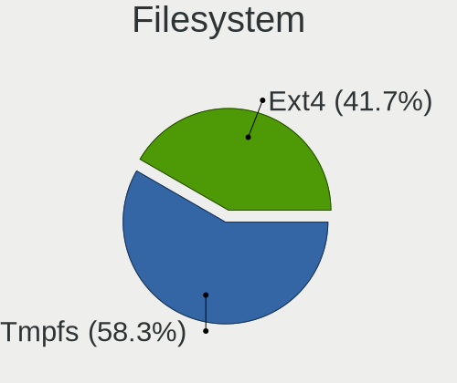
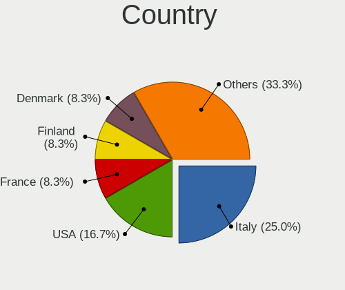
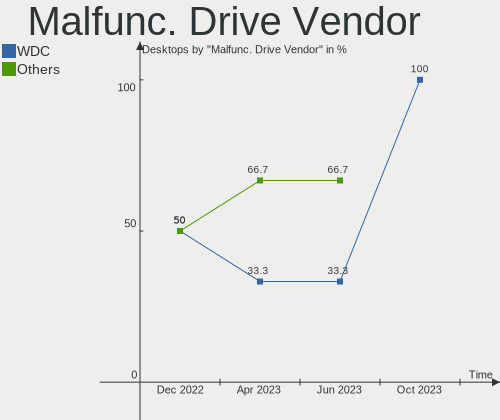
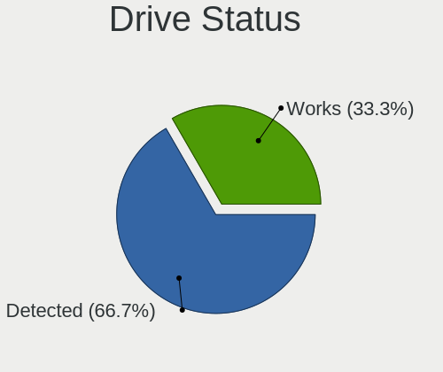
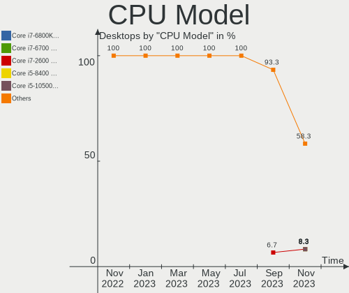
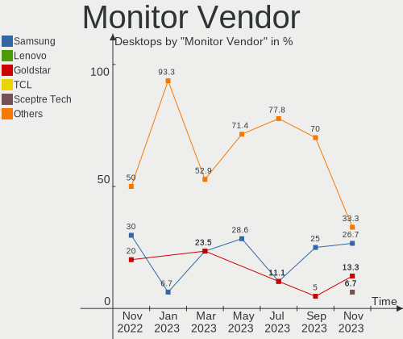
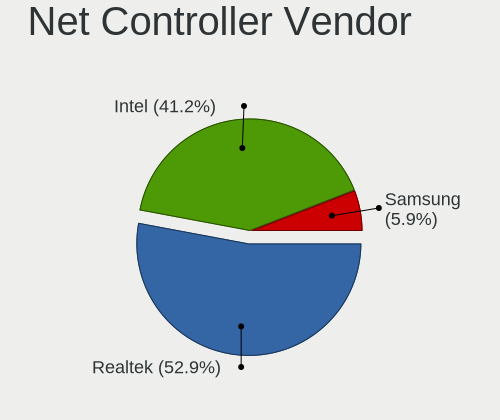

Ubuntu MATE - Hardware Trends (Desktops)
----------------------------------------

A project to identify most popular hardware characteristics and track their change
over time based on data collected by Linux users at https://Linux-Hardware.org.

Anyone can contribute to this report by the [hw-probe](https://github.com/linuxhw/hw-probe) tool:

    sudo -E hw-probe -all -upload

This report is for one last month. Overall report since the beginning of time: [TestDays](https://github.com/linuxhw/TestDays)

Period: Jul, 2023.

Contents
--------

* [ System ](#system)
  - [ OS                       ](#os)
  - [ OS Family                ](#os-family)
  - [ Kernel                   ](#kernel)
  - [ Kernel Family            ](#kernel-family)
  - [ Kernel Major Ver.        ](#kernel-major-ver)
  - [ Arch                     ](#arch)
  - [ DE                       ](#de)
  - [ Display Server           ](#display-server)
  - [ Display Manager          ](#display-manager)
  - [ OS Lang                  ](#os-lang)
  - [ Boot Mode                ](#boot-mode)
  - [ Filesystem               ](#filesystem)
  - [ Part. scheme             ](#part-scheme)
  - [ Dual Boot with Linux/BSD ](#dual-boot-with-linuxbsd)
  - [ Dual Boot (Win)          ](#dual-boot-win)

* [ Board ](#board)
  - [ Vendor                   ](#vendor)
  - [ Model                    ](#model)
  - [ Model Family             ](#model-family)
  - [ MFG Year                 ](#mfg-year)
  - [ Form Factor              ](#form-factor)
  - [ Secure Boot              ](#secure-boot)
  - [ Coreboot                 ](#coreboot)
  - [ RAM Size                 ](#ram-size)
  - [ RAM Used                 ](#ram-used)
  - [ Total Drives             ](#total-drives)
  - [ Has CD-ROM               ](#has-cd-rom)
  - [ Has Ethernet             ](#has-ethernet)
  - [ Has WiFi                 ](#has-wifi)
  - [ Has Bluetooth            ](#has-bluetooth)

* [ Location ](#location)
  - [ Country                  ](#country)
  - [ City                     ](#city)

* [ Drives ](#drives)
  - [ Drive Vendor             ](#drive-vendor)
  - [ Drive Model              ](#drive-model)
  - [ HDD Vendor               ](#hdd-vendor)
  - [ SSD Vendor               ](#ssd-vendor)
  - [ Drive Kind               ](#drive-kind)
  - [ Drive Connector          ](#drive-connector)
  - [ Drive Size               ](#drive-size)
  - [ Space Total              ](#space-total)
  - [ Space Used               ](#space-used)
  - [ Malfunc. Drives          ](#malfunc-drives)
  - [ Malfunc. Drive Vendor    ](#malfunc-drive-vendor)
  - [ Malfunc. HDD Vendor      ](#malfunc-hdd-vendor)
  - [ Malfunc. Drive Kind      ](#malfunc-drive-kind)
  - [ Failed Drives            ](#failed-drives)
  - [ Failed Drive Vendor      ](#failed-drive-vendor)
  - [ Drive Status             ](#drive-status)

* [ Storage controller ](#storage-controller)
  - [ Storage Vendor           ](#storage-vendor)
  - [ Storage Model            ](#storage-model)
  - [ Storage Kind             ](#storage-kind)

* [ Processor ](#processor)
  - [ CPU Vendor               ](#cpu-vendor)
  - [ CPU Model                ](#cpu-model)
  - [ CPU Model Family         ](#cpu-model-family)
  - [ CPU Cores                ](#cpu-cores)
  - [ CPU Sockets              ](#cpu-sockets)
  - [ CPU Threads              ](#cpu-threads)
  - [ CPU Op-Modes             ](#cpu-op-modes)
  - [ CPU Microcode            ](#cpu-microcode)
  - [ CPU Microarch            ](#cpu-microarch)

* [ Graphics ](#graphics)
  - [ GPU Vendor               ](#gpu-vendor)
  - [ GPU Model                ](#gpu-model)
  - [ GPU Combo                ](#gpu-combo)
  - [ GPU Driver               ](#gpu-driver)
  - [ GPU Memory               ](#gpu-memory)

* [ Monitor ](#monitor)
  - [ Monitor Vendor           ](#monitor-vendor)
  - [ Monitor Model            ](#monitor-model)
  - [ Monitor Resolution       ](#monitor-resolution)
  - [ Monitor Diagonal         ](#monitor-diagonal)
  - [ Monitor Width            ](#monitor-width)
  - [ Aspect Ratio             ](#aspect-ratio)
  - [ Monitor Area             ](#monitor-area)
  - [ Pixel Density            ](#pixel-density)
  - [ Multiple Monitors        ](#multiple-monitors)

* [ Network ](#network)
  - [ Net Controller Vendor    ](#net-controller-vendor)
  - [ Net Controller Model     ](#net-controller-model)
  - [ Wireless Vendor          ](#wireless-vendor)
  - [ Wireless Model           ](#wireless-model)
  - [ Ethernet Vendor          ](#ethernet-vendor)
  - [ Ethernet Model           ](#ethernet-model)
  - [ Net Controller Kind      ](#net-controller-kind)
  - [ Used Controller          ](#used-controller)
  - [ NICs                     ](#nics)
  - [ IPv6                     ](#ipv6)

* [ Bluetooth ](#bluetooth)
  - [ Bluetooth Vendor         ](#bluetooth-vendor)
  - [ Bluetooth Model          ](#bluetooth-model)

* [ Sound ](#sound)
  - [ Sound Vendor             ](#sound-vendor)
  - [ Sound Model              ](#sound-model)

* [ Memory ](#memory)
  - [ Memory Vendor            ](#memory-vendor)
  - [ Memory Model             ](#memory-model)
  - [ Memory Kind              ](#memory-kind)
  - [ Memory Form Factor       ](#memory-form-factor)
  - [ Memory Size              ](#memory-size)
  - [ Memory Speed             ](#memory-speed)

* [ Printers & scanners ](#printers--scanners)
  - [ Printer Vendor           ](#printer-vendor)
  - [ Printer Model            ](#printer-model)
  - [ Scanner Vendor           ](#scanner-vendor)
  - [ Scanner Model            ](#scanner-model)

* [ Camera ](#camera)
  - [ Camera Vendor            ](#camera-vendor)
  - [ Camera Model             ](#camera-model)

* [ Security ](#security)
  - [ Fingerprint Vendor       ](#fingerprint-vendor)
  - [ Fingerprint Model        ](#fingerprint-model)
  - [ Chipcard Vendor          ](#chipcard-vendor)
  - [ Chipcard Model           ](#chipcard-model)

* [ Unsupported ](#unsupported)
  - [ Unsupported Devices      ](#unsupported-devices)
  - [ Unsupported Device Types ](#unsupported-device-types)

System
------

OS
--

Installed operating systems

| Name              | Desktops | Percent |
|-------------------|----------|---------|
| Ubuntu MATE 22.04 | 7        | 87.5%   |
| Ubuntu MATE 20.04 | 1        | 12.5%   |

OS Family
---------

OS without a version

| Name        | Desktops | Percent |
|-------------|----------|---------|
| Ubuntu MATE | 8        | 100%    |

Kernel
------

Version of the Linux kernel

| Version              | Desktops | Percent |
|----------------------|----------|---------|
| 5.15.0-76-generic    | 4        | 50%     |
| 6.4.0-060400-generic | 1        | 12.5%   |
| 5.4.0-146-generic    | 1        | 12.5%   |
| 5.19.0-50-generic    | 1        | 12.5%   |
| 5.15.0-60-generic    | 1        | 12.5%   |

Kernel Family
-------------

Linux kernel without a distro release

| Version | Desktops | Percent |
|---------|----------|---------|
| 5.15.0  | 5        | 62.5%   |
| 6.4.0   | 1        | 12.5%   |
| 5.4.0   | 1        | 12.5%   |
| 5.19.0  | 1        | 12.5%   |

Kernel Major Ver.
-----------------

Linux kernel major version

| Version | Desktops | Percent |
|---------|----------|---------|
| 5.15    | 5        | 62.5%   |
| 6.4     | 1        | 12.5%   |
| 5.4     | 1        | 12.5%   |
| 5.19    | 1        | 12.5%   |

Arch
----

OS architecture (x86_64, i586, etc.)

| Name   | Desktops | Percent |
|--------|----------|---------|
| x86_64 | 8        | 100%    |

DE
--

Desktop Environment

| Name | Desktops | Percent |
|------|----------|---------|
| MATE | 8        | 100%    |

Display Server
--------------

X11 or Wayland

| Name    | Desktops | Percent |
|---------|----------|---------|
| X11     | 7        | 87.5%   |
| Wayland | 1        | 12.5%   |

Display Manager
---------------

SDDM, LightDM, etc.

| Name    | Desktops | Percent |
|---------|----------|---------|
| LightDM | 7        | 87.5%   |
| Unknown | 1        | 12.5%   |

OS Lang
-------

Language

| Lang  | Desktops | Percent |
|-------|----------|---------|
| en_US | 2        | 25%     |
| ru_RU | 1        | 12.5%   |
| pl_PL | 1        | 12.5%   |
| it_IT | 1        | 12.5%   |
| da_DK | 1        | 12.5%   |
| C     | 1        | 12.5%   |
| ar_KW | 1        | 12.5%   |

Boot Mode
---------

EFI or BIOS

| Mode | Desktops | Percent |
|------|----------|---------|
| BIOS | 5        | 62.5%   |
| EFI  | 3        | 37.5%   |

Filesystem
----------

Type of filesystem

| Type  | Desktops | Percent |
|-------|----------|---------|
| Ext4  | 5        | 62.5%   |
| Tmpfs | 3        | 37.5%   |

Part. scheme
------------

Scheme of partitioning

| Type    | Desktops | Percent |
|---------|----------|---------|
| GPT     | 6        | 75%     |
| MBR     | 1        | 12.5%   |
| Unknown | 1        | 12.5%   |

Dual Boot with Linux/BSD
------------------------

Hosting more than one Linux/BSD

| Dual boot | Desktops | Percent |
|-----------|----------|---------|
| No        | 8        | 100%    |

Dual Boot (Win)
---------------

Hosting Linux and Windows

| Dual boot | Desktops | Percent |
|-----------|----------|---------|
| No        | 6        | 75%     |
| Yes       | 2        | 25%     |

Board
-----

Vendor
------

Motherboard manufacturer

| Name                | Desktops | Percent |
|---------------------|----------|---------|
| Gigabyte Technology | 3        | 37.5%   |
| Lenovo              | 1        | 12.5%   |
| Hewlett-Packard     | 1        | 12.5%   |
| ASUSTek Computer    | 1        | 12.5%   |
| ASRock              | 1        | 12.5%   |
| Unknown             | 1        | 12.5%   |

Model
-----

Motherboard model

| Name                                  | Desktops | Percent |
|---------------------------------------|----------|---------|
| Lenovo ThinkCentre neo 50t Gen 3 11SE | 1        | 12.5%   |
| HP Compaq Pro 6300 MT                 | 1        | 12.5%   |
| Gigabyte G41MT-S2                     | 1        | 12.5%   |
| Gigabyte B85M-D3H                     | 1        | 12.5%   |
| Gigabyte B550 GAMING X V2             | 1        | 12.5%   |
| ASUS PRIME Z590-P                     | 1        | 12.5%   |
| ASRock Z370 Killer SLI                | 1        | 12.5%   |
| Unknown                               | 1        | 12.5%   |

Model Family
------------

Motherboard model prefix

| Name               | Desktops | Percent |
|--------------------|----------|---------|
| Lenovo ThinkCentre | 1        | 12.5%   |
| HP Compaq          | 1        | 12.5%   |
| Gigabyte G41MT-S2  | 1        | 12.5%   |
| Gigabyte B85M-D3H  | 1        | 12.5%   |
| Gigabyte B550      | 1        | 12.5%   |
| ASUS PRIME         | 1        | 12.5%   |
| ASRock Z370        | 1        | 12.5%   |
| Unknown            | 1        | 12.5%   |

MFG Year
--------

Motherboard manufacture year

| Year | Desktops | Percent |
|------|----------|---------|
| 2023 | 1        | 12.5%   |
| 2022 | 1        | 12.5%   |
| 2021 | 1        | 12.5%   |
| 2020 | 1        | 12.5%   |
| 2017 | 1        | 12.5%   |
| 2013 | 1        | 12.5%   |
| 2012 | 1        | 12.5%   |
| 2010 | 1        | 12.5%   |

Form Factor
-----------

Physical design of the computer

| Name    | Desktops | Percent |
|---------|----------|---------|
| Desktop | 8        | 100%    |

Secure Boot
-----------

Enabled or disabled

| State    | Desktops | Percent |
|----------|----------|---------|
| Disabled | 8        | 100%    |

Coreboot
--------

Have coreboot on board

| Used | Desktops | Percent |
|------|----------|---------|
| No   | 8        | 100%    |

RAM Size
--------

Total RAM memory

| Size in GB | Desktops | Percent |
|------------|----------|---------|
| 32.01-64.0 | 3        | 37.5%   |
| 16.01-24.0 | 2        | 25%     |
| 4.01-8.0   | 1        | 12.5%   |
| 3.01-4.0   | 1        | 12.5%   |
| 8.01-16.0  | 1        | 12.5%   |

RAM Used
--------

Used RAM memory

| Used GB  | Desktops | Percent |
|----------|----------|---------|
| 4.01-8.0 | 3        | 37.5%   |
| 1.01-2.0 | 3        | 37.5%   |
| 2.01-3.0 | 2        | 25%     |

Total Drives
------------

Number of drives on board

| Drives | Desktops | Percent |
|--------|----------|---------|
| 2      | 3        | 37.5%   |
| 1      | 3        | 37.5%   |
| 4      | 2        | 25%     |

Has CD-ROM
----------

Has CD-ROM on board

| Presented | Desktops | Percent |
|-----------|----------|---------|
| Yes       | 4        | 50%     |
| No        | 4        | 50%     |

Has Ethernet
------------

Has Ethernet on board

| Presented | Desktops | Percent |
|-----------|----------|---------|
| Yes       | 8        | 100%    |

Has WiFi
--------

Has WiFi module

| Presented | Desktops | Percent |
|-----------|----------|---------|
| No        | 7        | 87.5%   |
| Yes       | 1        | 12.5%   |

Has Bluetooth
-------------

Has Bluetooth module

| Presented | Desktops | Percent |
|-----------|----------|---------|
| No        | 8        | 100%    |

Location
--------

Country
-------

Geographic location (country)

| Country      | Desktops | Percent |
|--------------|----------|---------|
| Poland       | 2        | 25%     |
| Saudi Arabia | 1        | 12.5%   |
| Russia       | 1        | 12.5%   |
| Moldova      | 1        | 12.5%   |
| Italy        | 1        | 12.5%   |
| Germany      | 1        | 12.5%   |
| Denmark      | 1        | 12.5%   |

City
----

Geographic location (city)

| City              | Desktops | Percent |
|-------------------|----------|---------|
| Warsaw            | 1        | 12.5%   |
| Torring           | 1        | 12.5%   |
| Tighina           | 1        | 12.5%   |
| Samara            | 1        | 12.5%   |
| Padova            | 1        | 12.5%   |
| Ozarow Mazowiecki | 1        | 12.5%   |
| Medina            | 1        | 12.5%   |
| Delligsen         | 1        | 12.5%   |

Drives
------

Drive Vendor
------------

Hard drive vendors

| Vendor              | Desktops | Drives | Percent |
|---------------------|----------|--------|---------|
| Samsung Electronics | 4        | 4      | 28.57%  |
| WDC                 | 3        | 3      | 21.43%  |
| Toshiba             | 2        | 4      | 14.29%  |
| Transcend           | 1        | 1      | 7.14%   |
| SK hynix            | 1        | 1      | 7.14%   |
| Seagate             | 1        | 2      | 7.14%   |
| Sandisk             | 1        | 1      | 7.14%   |
| Kingston            | 1        | 1      | 7.14%   |

Drive Model
-----------

Hard drive models

| Model                                  | Desktops | Percent |
|----------------------------------------|----------|---------|
| WDC WDS100T2B0A-00SM50 1TB SSD         | 1        | 7.14%   |
| WDC WD5000AAKX-00ERMA0 500GB           | 1        | 7.14%   |
| WDC PC SN530 SDBPNPZ-256G              | 1        | 7.14%   |
| Transcend TS1TSSD220Q 1TB              | 1        | 7.14%   |
| Toshiba MG06ACA800E 8TB                | 1        | 7.14%   |
| Toshiba DT01ACA050 500GB               | 1        | 7.14%   |
| SK hynix SKHynix_HFS256GDE9X081N 256GB | 1        | 7.14%   |
| Seagate ST2000DM006-2DM164 2TB         | 1        | 7.14%   |
| Sandisk WD Black SN850 1TB             | 1        | 7.14%   |
| Samsung SSD 870 QVO 1TB                | 1        | 7.14%   |
| Samsung SSD 850 EVO 500GB              | 1        | 7.14%   |
| Samsung SSD 840 Series 250GB           | 1        | 7.14%   |
| Samsung SSD 840 Series 120GB           | 1        | 7.14%   |
| Kingston SKC600MS256G 256GB SSD        | 1        | 7.14%   |

HDD Vendor
----------

Hard disk drive vendors

| Vendor  | Desktops | Drives | Percent |
|---------|----------|--------|---------|
| Toshiba | 2        | 4      | 50%     |
| WDC     | 1        | 1      | 25%     |
| Seagate | 1        | 2      | 25%     |

SSD Vendor
----------

Solid state drive vendors

| Vendor              | Desktops | Drives | Percent |
|---------------------|----------|--------|---------|
| Samsung Electronics | 4        | 4      | 57.14%  |
| WDC                 | 1        | 1      | 14.29%  |
| Transcend           | 1        | 1      | 14.29%  |
| Kingston            | 1        | 1      | 14.29%  |

Drive Kind
----------

HDD or SSD

| Kind | Desktops | Drives | Percent |
|------|----------|--------|---------|
| SSD  | 7        | 7      | 50%     |
| HDD  | 4        | 7      | 28.57%  |
| NVMe | 3        | 3      | 21.43%  |

Drive Connector
---------------

SATA, SAS, NVMe, etc.

| Type | Desktops | Drives | Percent |
|------|----------|--------|---------|
| SATA | 8        | 14     | 72.73%  |
| NVMe | 3        | 3      | 27.27%  |

Drive Size
----------

Size of hard drive

| Size in TB | Desktops | Drives | Percent |
|------------|----------|--------|---------|
| 0.01-0.5   | 5        | 6      | 50%     |
| 0.51-1.0   | 3        | 3      | 30%     |
| 1.01-2.0   | 1        | 2      | 10%     |
| 4.01-10.0  | 1        | 3      | 10%     |

Space Total
-----------

Amount of disk space available on the file system

| Size in GB     | Desktops | Percent |
|----------------|----------|---------|
| 251-500        | 3        | 37.5%   |
| 101-250        | 2        | 25%     |
| 501-1000       | 2        | 25%     |
| More than 3000 | 1        | 12.5%   |

Space Used
----------

Amount of used disk space

| Used GB        | Desktops | Percent |
|----------------|----------|---------|
| 251-500        | 2        | 25%     |
| 21-50          | 2        | 25%     |
| 101-250        | 2        | 25%     |
| More than 3000 | 1        | 12.5%   |
| 1-20           | 1        | 12.5%   |

Malfunc. Drives
---------------

Drive models with a malfunction

| Model                    | Desktops | Drives | Percent |
|--------------------------|----------|--------|---------|
| Toshiba DT01ACA050 500GB | 1        | 1      | 100%    |

Malfunc. Drive Vendor
---------------------

Vendors of faulty drives

| Vendor  | Desktops | Drives | Percent |
|---------|----------|--------|---------|
| Toshiba | 1        | 1      | 100%    |

Malfunc. HDD Vendor
-------------------

Vendors of faulty HDD drives

| Vendor  | Desktops | Drives | Percent |
|---------|----------|--------|---------|
| Toshiba | 1        | 1      | 100%    |

Malfunc. Drive Kind
-------------------

Kinds of faulty drives

| Kind | Desktops | Drives | Percent |
|------|----------|--------|---------|
| HDD  | 1        | 1      | 100%    |

Failed Drives
-------------

Failed drive models

Zero info for selected period =(

Failed Drive Vendor
-------------------

Failed drive vendors

Zero info for selected period =(

Drive Status
------------

Number of failed and malfunc. drives

| Status   | Desktops | Drives | Percent |
|----------|----------|--------|---------|
| Detected | 4        | 6      | 44.44%  |
| Works    | 4        | 10     | 44.44%  |
| Malfunc  | 1        | 1      | 11.11%  |

Storage controller
------------------

Storage Vendor
--------------

Storage controller vendors

| Vendor   | Desktops | Percent |
|----------|----------|---------|
| Intel    | 7        | 63.64%  |
| SanDisk  | 2        | 18.18%  |
| SK hynix | 1        | 9.09%   |
| AMD      | 1        | 9.09%   |

Storage Model
-------------

Storage controller models

| Model                                                                          | Desktops | Percent |
|--------------------------------------------------------------------------------|----------|---------|
| SK hynix Gold P31/BC711/PC711 NVMe Solid State Drive                           | 1        | 9.09%   |
| SanDisk WD PC SN810 / Black SN850 NVMe SSD                                     | 1        | 9.09%   |
| SanDisk WD Blue SN550 NVMe SSD                                                 | 1        | 9.09%   |
| Intel SATA Controller [RAID mode]                                              | 1        | 9.09%   |
| Intel NM10/ICH7 Family SATA Controller [IDE mode]                              | 1        | 9.09%   |
| Intel Elkhart Lake SATA AHCI                                                   | 1        | 9.09%   |
| Intel Alder Lake-S PCH SATA Controller [AHCI Mode]                             | 1        | 9.09%   |
| Intel 8 Series/C220 Series Chipset Family 6-port SATA Controller 1 [AHCI mode] | 1        | 9.09%   |
| Intel 7 Series/C210 Series Chipset Family 6-port SATA Controller [AHCI mode]   | 1        | 9.09%   |
| Intel 500 Series Chipset Family SATA AHCI Controller                           | 1        | 9.09%   |
| AMD 500 Series Chipset SATA Controller                                         | 1        | 9.09%   |

Storage Kind
------------

Kind of storage controller (IDE, SATA, NVMe, SAS, ...)

| Kind | Desktops | Percent |
|------|----------|---------|
| SATA | 6        | 54.55%  |
| NVMe | 3        | 27.27%  |
| RAID | 1        | 9.09%   |
| IDE  | 1        | 9.09%   |

Processor
---------

CPU Vendor
----------

Processor vendors

| Vendor | Desktops | Percent |
|--------|----------|---------|
| Intel  | 7        | 87.5%   |
| AMD    | 1        | 12.5%   |

CPU Model
---------

Processor models

| Model                                       | Desktops | Percent |
|---------------------------------------------|----------|---------|
| Intel Xeon CPU E3-1245 v3 @ 3.40GHz         | 1        | 12.5%   |
| Intel Pentium Dual-Core CPU E6700 @ 3.20GHz | 1        | 12.5%   |
| Intel Core i7-8700K CPU @ 3.70GHz           | 1        | 12.5%   |
| Intel Core i5-3470 CPU @ 3.20GHz            | 1        | 12.5%   |
| Intel Celeron J6412 @ 2.00GHz               | 1        | 12.5%   |
| Intel 12th Gen Core i3-12100                | 1        | 12.5%   |
| Intel 11th Gen Core i7-11700F @ 2.50GHz     | 1        | 12.5%   |
| AMD Ryzen 5 5500                            | 1        | 12.5%   |

CPU Model Family
----------------

Processor model prefix

| Model                   | Desktops | Percent |
|-------------------------|----------|---------|
| Other                   | 2        | 25%     |
| Intel Xeon              | 1        | 12.5%   |
| Intel Pentium Dual-Core | 1        | 12.5%   |
| Intel Core i7           | 1        | 12.5%   |
| Intel Core i5           | 1        | 12.5%   |
| Intel Celeron           | 1        | 12.5%   |
| AMD Ryzen 5             | 1        | 12.5%   |

CPU Cores
---------

Number of processor cores

| Number | Desktops | Percent |
|--------|----------|---------|
| 4      | 4        | 50%     |
| 6      | 2        | 25%     |
| 8      | 1        | 12.5%   |
| 2      | 1        | 12.5%   |

CPU Sockets
-----------

Number of sockets

| Number | Desktops | Percent |
|--------|----------|---------|
| 1      | 8        | 100%    |

CPU Threads
-----------

Threads per core (Hyper-Threading)

| Number | Desktops | Percent |
|--------|----------|---------|
| 2      | 5        | 62.5%   |
| 1      | 3        | 37.5%   |

CPU Op-Modes
------------

CPU Operation Modes (32-bit, 64-bit)

| Op mode        | Desktops | Percent |
|----------------|----------|---------|
| 32-bit, 64-bit | 8        | 100%    |

CPU Microcode
-------------

Microcode number

| Number  | Desktops | Percent |
|---------|----------|---------|
| Unknown | 6        | 75%     |
| 0xa0671 | 1        | 12.5%   |
| 0x306c3 | 1        | 12.5%   |

CPU Microarch
-------------

Microarchitecture

| Name      | Desktops | Percent |
|-----------|----------|---------|
| Unknown   | 2        | 25%     |
| Zen 3     | 1        | 12.5%   |
| Tremont   | 1        | 12.5%   |
| Penryn    | 1        | 12.5%   |
| KabyLake  | 1        | 12.5%   |
| IvyBridge | 1        | 12.5%   |
| Haswell   | 1        | 12.5%   |

Graphics
--------

GPU Vendor
----------

Vendors of graphics cards

| Vendor | Desktops | Percent |
|--------|----------|---------|
| Intel  | 6        | 66.67%  |
| Nvidia | 2        | 22.22%  |
| AMD    | 1        | 11.11%  |

GPU Model
---------

Graphics card models

| Model                                                            | Desktops | Percent |
|------------------------------------------------------------------|----------|---------|
| Nvidia GP107GL [Quadro P620]                                     | 1        | 11.11%  |
| Nvidia GP107 [GeForce GTX 1050 Ti]                               | 1        | 11.11%  |
| Intel Xeon E3-1200 v3 Processor Integrated Graphics Controller   | 1        | 11.11%  |
| Intel Xeon E3-1200 v2/3rd Gen Core processor Graphics Controller | 1        | 11.11%  |
| Intel Elkhart Lake [UHD Graphics Gen11 16EU]                     | 1        | 11.11%  |
| Intel CoffeeLake-S GT2 [UHD Graphics 630]                        | 1        | 11.11%  |
| Intel Alder Lake-S GT1 [UHD Graphics 730]                        | 1        | 11.11%  |
| Intel 4 Series Chipset Integrated Graphics Controller            | 1        | 11.11%  |
| AMD Navi 24 [Radeon RX 6400/6500 XT/6500M]                       | 1        | 11.11%  |

GPU Combo
---------

Combinations of graphics cards

| Name           | Desktops | Percent |
|----------------|----------|---------|
| 1 x Intel      | 5        | 62.5%   |
| 1 x Nvidia     | 1        | 12.5%   |
| Intel + Nvidia | 1        | 12.5%   |
| 1 x AMD        | 1        | 12.5%   |

GPU Driver
----------

Free vs proprietary

| Driver      | Desktops | Percent |
|-------------|----------|---------|
| Free        | 7        | 87.5%   |
| Proprietary | 1        | 12.5%   |

GPU Memory
----------

Total video memory

| Size in GB | Desktops | Percent |
|------------|----------|---------|
| Unknown    | 7        | 87.5%   |
| 3.01-4.0   | 1        | 12.5%   |

Monitor
-------

Monitor Vendor
--------------

Monitor vendors

| Vendor              | Desktops | Percent |
|---------------------|----------|---------|
| Sony                | 1        | 11.11%  |
| Samsung Electronics | 1        | 11.11%  |
| Philips             | 1        | 11.11%  |
| Iiyama              | 1        | 11.11%  |
| Goldstar            | 1        | 11.11%  |
| Dell                | 1        | 11.11%  |
| D&T                 | 1        | 11.11%  |
| CHR                 | 1        | 11.11%  |
| BenQ                | 1        | 11.11%  |

Monitor Model
-------------

Monitor models

| Model                                                                | Desktops | Percent |
|----------------------------------------------------------------------|----------|---------|
| Sony TV SNY3002 1920x1080 531x299mm 24.0-inch                        | 1        | 11.11%  |
| Samsung Electronics SyncMaster SAM01E1 1280x1024 376x301mm 19.0-inch | 1        | 11.11%  |
| Philips PHL 276E9Q PHLC17B 1920x1080 598x336mm 27.0-inch             | 1        | 11.11%  |
| Iiyama PL2773H IVM660A 1920x1080 598x336mm 27.0-inch                 | 1        | 11.11%  |
| Goldstar IPS FULLHD GSM5AB7 1920x1080 480x270mm 21.7-inch            | 1        | 11.11%  |
| Dell U2412M DELA07A 1920x1200 518x324mm 24.1-inch                    | 1        | 11.11%  |
| D&T FS-P2604D FSN0041 1920x1080 576x324mm 26.0-inch                  | 1        | 11.11%  |
| CHR CH7511B CHR7511 1024x768 430x290mm 20.4-inch                     | 1        | 11.11%  |
| BenQ EW2420 BNQ7923 1920x1080 531x299mm 24.0-inch                    | 1        | 11.11%  |

Monitor Resolution
------------------

Monitor screen resolution

| Resolution        | Desktops | Percent |
|-------------------|----------|---------|
| 1920x1080 (FHD)   | 5        | 71.43%  |
| 1920x1200 (WUXGA) | 1        | 14.29%  |
| 1280x1024 (SXGA)  | 1        | 14.29%  |

Monitor Diagonal
----------------

Diagonal size in inches

| Inches | Desktops | Percent |
|--------|----------|---------|
| 24     | 3        | 33.33%  |
| 27     | 2        | 22.22%  |
| 46     | 1        | 11.11%  |
| 26     | 1        | 11.11%  |
| 21     | 1        | 11.11%  |
| 19     | 1        | 11.11%  |

Monitor Width
-------------

Physical width

| Width in mm | Desktops | Percent |
|-------------|----------|---------|
| 501-600     | 5        | 62.5%   |
| 401-500     | 1        | 12.5%   |
| 351-400     | 1        | 12.5%   |
| 1001-1500   | 1        | 12.5%   |

Aspect Ratio
------------

Proportional relationship between the width and the height

| Ratio | Desktops | Percent |
|-------|----------|---------|
| 16/9  | 5        | 62.5%   |
| 16/10 | 2        | 25%     |
| 5/4   | 1        | 12.5%   |

Monitor Area
------------

Area in inch²

| Area in inch² | Desktops | Percent |
|----------------|----------|---------|
| 301-350        | 2        | 28.57%  |
| 251-300        | 2        | 28.57%  |
| 201-250        | 1        | 14.29%  |
| 151-200        | 1        | 14.29%  |
| 501-1000       | 1        | 14.29%  |

Pixel Density
-------------

Pixels per inch

| Density | Desktops | Percent |
|---------|----------|---------|
| 51-100  | 6        | 75%     |
| 1-50    | 1        | 12.5%   |
| 101-120 | 1        | 12.5%   |

Multiple Monitors
-----------------

Total monitors connected

| Total | Desktops | Percent |
|-------|----------|---------|
| 1     | 5        | 62.5%   |
| 2     | 2        | 25%     |
| 0     | 1        | 12.5%   |

Network
-------

Net Controller Vendor
---------------------

Controller vendors

| Vendor                | Desktops | Percent |
|-----------------------|----------|---------|
| Intel                 | 4        | 36.36%  |
| Realtek Semiconductor | 3        | 27.27%  |
| TP-Link               | 1        | 9.09%   |
| STMicroelectronics    | 1        | 9.09%   |
| Qualcomm Atheros      | 1        | 9.09%   |
| NetXen Incorporated   | 1        | 9.09%   |

Net Controller Model
--------------------

Controller models

| Model                                                                | Desktops | Percent |
|----------------------------------------------------------------------|----------|---------|
| Realtek RTL8111/8168/8411 PCI Express Gigabit Ethernet Controller    | 2        | 16.67%  |
| TP-Link TL-WN823N v2/v3 [Realtek RTL8192EU]                          | 1        | 8.33%   |
| STMicroelectronics Virtual COM Port                                  | 1        | 8.33%   |
| Realtek RTL8125 2.5GbE Controller                                    | 1        | 8.33%   |
| Qualcomm Atheros AR8151 v1.0 Gigabit Ethernet                        | 1        | 8.33%   |
| NetXen Incorporated NX3031 Multifunction 1/10-Gigabit Server Adapter | 1        | 8.33%   |
| Intel Ethernet Controller X550                                       | 1        | 8.33%   |
| Intel Ethernet Controller I225-V                                     | 1        | 8.33%   |
| Intel Ethernet Connection (2) I219-V                                 | 1        | 8.33%   |
| Intel Ethernet Connection (17) I219-V                                | 1        | 8.33%   |
| Intel 82579LM Gigabit Network Connection (Lewisville)                | 1        | 8.33%   |

Wireless Vendor
---------------

Wireless vendors

| Vendor  | Desktops | Percent |
|---------|----------|---------|
| TP-Link | 1        | 100%    |

Wireless Model
--------------

Wireless models

| Model                                       | Desktops | Percent |
|---------------------------------------------|----------|---------|
| TP-Link TL-WN823N v2/v3 [Realtek RTL8192EU] | 1        | 100%    |

Ethernet Vendor
---------------

Ethernet vendors

| Vendor                | Desktops | Percent |
|-----------------------|----------|---------|
| Intel                 | 4        | 44.44%  |
| Realtek Semiconductor | 3        | 33.33%  |
| Qualcomm Atheros      | 1        | 11.11%  |
| NetXen Incorporated   | 1        | 11.11%  |

Ethernet Model
--------------

Ethernet models

| Model                                                                | Desktops | Percent |
|----------------------------------------------------------------------|----------|---------|
| Realtek RTL8111/8168/8411 PCI Express Gigabit Ethernet Controller    | 2        | 20%     |
| Realtek RTL8125 2.5GbE Controller                                    | 1        | 10%     |
| Qualcomm Atheros AR8151 v1.0 Gigabit Ethernet                        | 1        | 10%     |
| NetXen Incorporated NX3031 Multifunction 1/10-Gigabit Server Adapter | 1        | 10%     |
| Intel Ethernet Controller X550                                       | 1        | 10%     |
| Intel Ethernet Controller I225-V                                     | 1        | 10%     |
| Intel Ethernet Connection (2) I219-V                                 | 1        | 10%     |
| Intel Ethernet Connection (17) I219-V                                | 1        | 10%     |
| Intel 82579LM Gigabit Network Connection (Lewisville)                | 1        | 10%     |

Net Controller Kind
-------------------

Ethernet, WiFi or modem

| Kind     | Desktops | Percent |
|----------|----------|---------|
| Ethernet | 8        | 80%     |
| Modem    | 1        | 10%     |
| WiFi     | 1        | 10%     |

Used Controller
---------------

Currently used network controller

| Kind     | Desktops | Percent |
|----------|----------|---------|
| Ethernet | 6        | 85.71%  |
| WiFi     | 1        | 14.29%  |

NICs
----

Total network controllers on board

| Total | Desktops | Percent |
|-------|----------|---------|
| 1     | 5        | 62.5%   |
| 5     | 1        | 12.5%   |
| 3     | 1        | 12.5%   |
| 2     | 1        | 12.5%   |

IPv6
----

IPv6 vs IPv4

| Used | Desktops | Percent |
|------|----------|---------|
| No   | 7        | 87.5%   |
| Yes  | 1        | 12.5%   |

Bluetooth
---------

Bluetooth Vendor
----------------

Controller vendors

Zero info for selected period =(

Bluetooth Model
---------------

Controller models

Zero info for selected period =(

Sound
-----

Sound Vendor
------------

Sound card vendors

| Vendor              | Desktops | Percent |
|---------------------|----------|---------|
| Intel               | 6        | 60%     |
| Nvidia              | 2        | 20%     |
| C-Media Electronics | 1        | 10%     |
| AMD                 | 1        | 10%     |

Sound Model
-----------

Sound card models

| Model                                                               | Desktops | Percent |
|---------------------------------------------------------------------|----------|---------|
| Nvidia GP107GL High Definition Audio Controller                     | 2        | 15.38%  |
| Intel Xeon E3-1200 v3/4th Gen Core Processor HD Audio Controller    | 1        | 7.69%   |
| Intel Tiger Lake-H HD Audio Controller                              | 1        | 7.69%   |
| Intel NM10/ICH7 Family High Definition Audio Controller             | 1        | 7.69%   |
| Intel Elkhart Lake High Density Audio bus interface                 | 1        | 7.69%   |
| Intel Alder Lake-S HD Audio Controller                              | 1        | 7.69%   |
| Intel 8 Series/C220 Series Chipset High Definition Audio Controller | 1        | 7.69%   |
| Intel 7 Series/C216 Chipset Family High Definition Audio Controller | 1        | 7.69%   |
| C-Media Electronics CMI8788 [Oxygen HD Audio]                       | 1        | 7.69%   |
| AMD Renoir Radeon High Definition Audio Controller                  | 1        | 7.69%   |
| AMD Navi 21/23 HDMI/DP Audio Controller                             | 1        | 7.69%   |
| AMD Family 17h/19h HD Audio Controller                              | 1        | 7.69%   |

Memory
------

Memory Vendor
-------------

Memory module vendors

| Vendor              | Desktops | Percent |
|---------------------|----------|---------|
| Kingston            | 3        | 50%     |
| Samsung Electronics | 1        | 16.67%  |
| GOODRAM             | 1        | 16.67%  |
| Crucial             | 1        | 16.67%  |

Memory Model
------------

Memory module models

| Model                                                    | Desktops | Percent |
|----------------------------------------------------------|----------|---------|
| Samsung RAM M378B5173QH0-CK0 4GB DIMM DDR3 1600MT/s      | 1        | 14.29%  |
| Kingston RAM KF3600C18D4/32GX 32GB DIMM DDR4 3600MT/s    | 1        | 14.29%  |
| Kingston RAM KF3600C18D4/16GX 16GB DIMM DDR4 3600MT/s    | 1        | 14.29%  |
| Kingston RAM ASU16D3LFS1KBG/2G 2GB SODIMM DDR3 1600MT/s  | 1        | 14.29%  |
| Kingston RAM 9905584-015.A00LF 4096MB DIMM DDR3 1600MT/s | 1        | 14.29%  |
| GOODRAM RAM IRX3000D464L16S/8G 8GB DIMM DDR4 3333MT/s    | 1        | 14.29%  |
| Crucial RAM BLS8G3D1609DS1S00. 8GB DIMM DDR3 1800MT/s    | 1        | 14.29%  |

Memory Kind
-----------

Memory module kinds

| Kind | Desktops | Percent |
|------|----------|---------|
| DDR3 | 3        | 60%     |
| DDR4 | 2        | 40%     |

Memory Form Factor
------------------

Physical design of the memory module

| Name   | Desktops | Percent |
|--------|----------|---------|
| DIMM   | 4        | 80%     |
| SODIMM | 1        | 20%     |

Memory Size
-----------

Memory module size

| Size  | Desktops | Percent |
|-------|----------|---------|
| 8192  | 2        | 33.33%  |
| 32768 | 1        | 16.67%  |
| 16384 | 1        | 16.67%  |
| 4096  | 1        | 16.67%  |
| 2048  | 1        | 16.67%  |

Memory Speed
------------

Memory module speed

| Speed | Desktops | Percent |
|-------|----------|---------|
| 1600  | 2        | 33.33%  |
| 3600  | 1        | 16.67%  |
| 3333  | 1        | 16.67%  |
| 1866  | 1        | 16.67%  |
| 1800  | 1        | 16.67%  |

Printers & scanners
-------------------

Printer Vendor
--------------

Printer device vendors

Zero info for selected period =(

Printer Model
-------------

Printer device models

Zero info for selected period =(

Scanner Vendor
--------------

Scanner device vendors

Zero info for selected period =(

Scanner Model
-------------

Scanner device models

Zero info for selected period =(

Camera
------

Camera Vendor
-------------

Camera device vendors

| Vendor                        | Desktops | Percent |
|-------------------------------|----------|---------|
| Sunplus Innovation Technology | 1        | 100%    |

Camera Model
------------

Camera device models

| Model                        | Desktops | Percent |
|------------------------------|----------|---------|
| Sunplus Integrated_Webcam_HD | 1        | 100%    |

Security
--------

Fingerprint Vendor
------------------

Fingerprint sensor vendors

Zero info for selected period =(

Fingerprint Model
-----------------

Fingerprint sensor models

Zero info for selected period =(

Chipcard Vendor
---------------

Chipcard module vendors

| Vendor           | Desktops | Percent |
|------------------|----------|---------|
| SCM Microsystems | 1        | 100%    |

Chipcard Model
--------------

Chipcard module models

| Model                                   | Desktops | Percent |
|-----------------------------------------|----------|---------|
| SCM Microsystems Identiv SmartOS Reader | 1        | 100%    |

Unsupported
-----------

Unsupported Devices
-------------------

Total unsupported devices on board

| Total | Desktops | Percent |
|-------|----------|---------|
| 0     | 7        | 87.5%   |
| 1     | 1        | 12.5%   |

Unsupported Device Types
------------------------

Types of unsupported devices

| Type     | Desktops | Percent |
|----------|----------|---------|
| Chipcard | 1        | 100%    |

