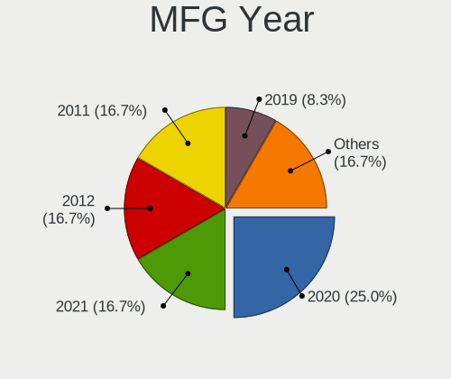
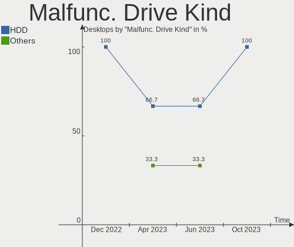
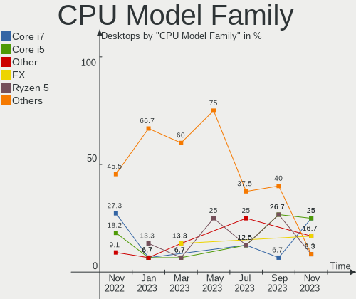
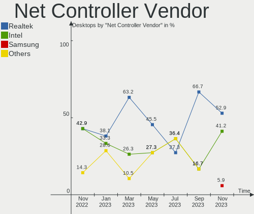
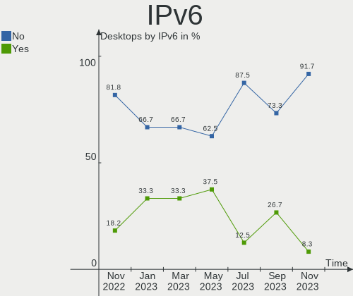
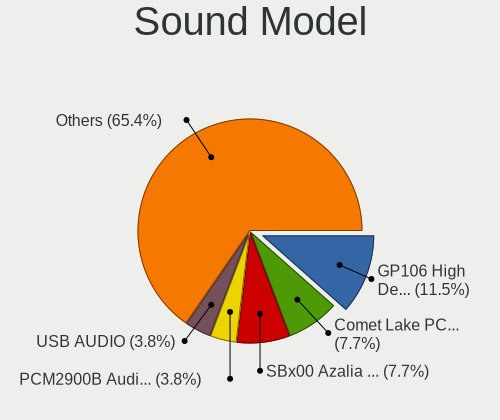
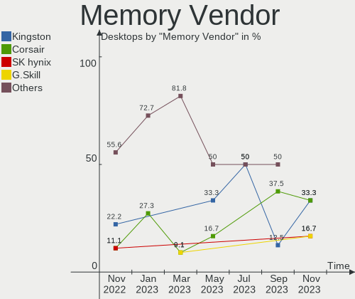

Ubuntu MATE - Hardware Trends (Desktops)
----------------------------------------

A project to identify most popular hardware characteristics and track their change
over time based on data collected by Linux users at https://Linux-Hardware.org.

Anyone can contribute to this report by the [hw-probe](https://github.com/linuxhw/hw-probe) tool:

    sudo -E hw-probe -all -upload

This report is for one last month. Overall report since the beginning of time: [TestDays](https://github.com/linuxhw/TestDays)

Period: Sep, 2023.

Contents
--------

* [ System ](#system)
  - [ OS                       ](#os)
  - [ OS Family                ](#os-family)
  - [ Kernel                   ](#kernel)
  - [ Kernel Family            ](#kernel-family)
  - [ Kernel Major Ver.        ](#kernel-major-ver)
  - [ Arch                     ](#arch)
  - [ DE                       ](#de)
  - [ Display Server           ](#display-server)
  - [ Display Manager          ](#display-manager)
  - [ OS Lang                  ](#os-lang)
  - [ Boot Mode                ](#boot-mode)
  - [ Filesystem               ](#filesystem)
  - [ Part. scheme             ](#part-scheme)
  - [ Dual Boot with Linux/BSD ](#dual-boot-with-linuxbsd)
  - [ Dual Boot (Win)          ](#dual-boot-win)

* [ Board ](#board)
  - [ Vendor                   ](#vendor)
  - [ Model                    ](#model)
  - [ Model Family             ](#model-family)
  - [ MFG Year                 ](#mfg-year)
  - [ Form Factor              ](#form-factor)
  - [ Secure Boot              ](#secure-boot)
  - [ Coreboot                 ](#coreboot)
  - [ RAM Size                 ](#ram-size)
  - [ RAM Used                 ](#ram-used)
  - [ Total Drives             ](#total-drives)
  - [ Has CD-ROM               ](#has-cd-rom)
  - [ Has Ethernet             ](#has-ethernet)
  - [ Has WiFi                 ](#has-wifi)
  - [ Has Bluetooth            ](#has-bluetooth)

* [ Location ](#location)
  - [ Country                  ](#country)
  - [ City                     ](#city)

* [ Drives ](#drives)
  - [ Drive Vendor             ](#drive-vendor)
  - [ Drive Model              ](#drive-model)
  - [ HDD Vendor               ](#hdd-vendor)
  - [ SSD Vendor               ](#ssd-vendor)
  - [ Drive Kind               ](#drive-kind)
  - [ Drive Connector          ](#drive-connector)
  - [ Drive Size               ](#drive-size)
  - [ Space Total              ](#space-total)
  - [ Space Used               ](#space-used)
  - [ Malfunc. Drives          ](#malfunc-drives)
  - [ Malfunc. Drive Vendor    ](#malfunc-drive-vendor)
  - [ Malfunc. HDD Vendor      ](#malfunc-hdd-vendor)
  - [ Malfunc. Drive Kind      ](#malfunc-drive-kind)
  - [ Failed Drives            ](#failed-drives)
  - [ Failed Drive Vendor      ](#failed-drive-vendor)
  - [ Drive Status             ](#drive-status)

* [ Storage controller ](#storage-controller)
  - [ Storage Vendor           ](#storage-vendor)
  - [ Storage Model            ](#storage-model)
  - [ Storage Kind             ](#storage-kind)

* [ Processor ](#processor)
  - [ CPU Vendor               ](#cpu-vendor)
  - [ CPU Model                ](#cpu-model)
  - [ CPU Model Family         ](#cpu-model-family)
  - [ CPU Cores                ](#cpu-cores)
  - [ CPU Sockets              ](#cpu-sockets)
  - [ CPU Threads              ](#cpu-threads)
  - [ CPU Op-Modes             ](#cpu-op-modes)
  - [ CPU Microcode            ](#cpu-microcode)
  - [ CPU Microarch            ](#cpu-microarch)

* [ Graphics ](#graphics)
  - [ GPU Vendor               ](#gpu-vendor)
  - [ GPU Model                ](#gpu-model)
  - [ GPU Combo                ](#gpu-combo)
  - [ GPU Driver               ](#gpu-driver)
  - [ GPU Memory               ](#gpu-memory)

* [ Monitor ](#monitor)
  - [ Monitor Vendor           ](#monitor-vendor)
  - [ Monitor Model            ](#monitor-model)
  - [ Monitor Resolution       ](#monitor-resolution)
  - [ Monitor Diagonal         ](#monitor-diagonal)
  - [ Monitor Width            ](#monitor-width)
  - [ Aspect Ratio             ](#aspect-ratio)
  - [ Monitor Area             ](#monitor-area)
  - [ Pixel Density            ](#pixel-density)
  - [ Multiple Monitors        ](#multiple-monitors)

* [ Network ](#network)
  - [ Net Controller Vendor    ](#net-controller-vendor)
  - [ Net Controller Model     ](#net-controller-model)
  - [ Wireless Vendor          ](#wireless-vendor)
  - [ Wireless Model           ](#wireless-model)
  - [ Ethernet Vendor          ](#ethernet-vendor)
  - [ Ethernet Model           ](#ethernet-model)
  - [ Net Controller Kind      ](#net-controller-kind)
  - [ Used Controller          ](#used-controller)
  - [ NICs                     ](#nics)
  - [ IPv6                     ](#ipv6)

* [ Bluetooth ](#bluetooth)
  - [ Bluetooth Vendor         ](#bluetooth-vendor)
  - [ Bluetooth Model          ](#bluetooth-model)

* [ Sound ](#sound)
  - [ Sound Vendor             ](#sound-vendor)
  - [ Sound Model              ](#sound-model)

* [ Memory ](#memory)
  - [ Memory Vendor            ](#memory-vendor)
  - [ Memory Model             ](#memory-model)
  - [ Memory Kind              ](#memory-kind)
  - [ Memory Form Factor       ](#memory-form-factor)
  - [ Memory Size              ](#memory-size)
  - [ Memory Speed             ](#memory-speed)

* [ Printers & scanners ](#printers--scanners)
  - [ Printer Vendor           ](#printer-vendor)
  - [ Printer Model            ](#printer-model)
  - [ Scanner Vendor           ](#scanner-vendor)
  - [ Scanner Model            ](#scanner-model)

* [ Camera ](#camera)
  - [ Camera Vendor            ](#camera-vendor)
  - [ Camera Model             ](#camera-model)

* [ Security ](#security)
  - [ Fingerprint Vendor       ](#fingerprint-vendor)
  - [ Fingerprint Model        ](#fingerprint-model)
  - [ Chipcard Vendor          ](#chipcard-vendor)
  - [ Chipcard Model           ](#chipcard-model)

* [ Unsupported ](#unsupported)
  - [ Unsupported Devices      ](#unsupported-devices)
  - [ Unsupported Device Types ](#unsupported-device-types)

System
------

OS
--

Installed operating systems

| Name              | Desktops | Percent |
|-------------------|----------|---------|
| Ubuntu MATE 22.04 | 11       | 73.33%  |
| Ubuntu MATE 18.04 | 2        | 13.33%  |
| Ubuntu MATE 22.10 | 1        | 6.67%   |
| Ubuntu MATE 20.04 | 1        | 6.67%   |

OS Family
---------

OS without a version

| Name        | Desktops | Percent |
|-------------|----------|---------|
| Ubuntu MATE | 15       | 100%    |

Kernel
------

Version of the Linux kernel

| Version           | Desktops | Percent |
|-------------------|----------|---------|
| 6.2.0-32-generic  | 5        | 33.33%  |
| 5.15.0-84-generic | 2        | 13.33%  |
| 5.15.0-82-generic | 2        | 13.33%  |
| 6.2.0-33-generic  | 1        | 6.67%   |
| 5.4.0-159-generic | 1        | 6.67%   |
| 5.4.0-150-generic | 1        | 6.67%   |
| 5.19.0-46-generic | 1        | 6.67%   |
| 5.15.0-83-generic | 1        | 6.67%   |
| 5.15.0-25-generic | 1        | 6.67%   |

Kernel Family
-------------

Linux kernel without a distro release

| Version | Desktops | Percent |
|---------|----------|---------|
| 6.2.0   | 6        | 40%     |
| 5.15.0  | 6        | 40%     |
| 5.4.0   | 2        | 13.33%  |
| 5.19.0  | 1        | 6.67%   |

Kernel Major Ver.
-----------------

Linux kernel major version

| Version | Desktops | Percent |
|---------|----------|---------|
| 6.2     | 6        | 40%     |
| 5.15    | 6        | 40%     |
| 5.4     | 2        | 13.33%  |
| 5.19    | 1        | 6.67%   |

Arch
----

OS architecture (x86_64, i586, etc.)

| Name   | Desktops | Percent |
|--------|----------|---------|
| x86_64 | 14       | 93.33%  |
| i686   | 1        | 6.67%   |

DE
--

Desktop Environment

| Name | Desktops | Percent |
|------|----------|---------|
| MATE | 15       | 100%    |

Display Server
--------------

X11 or Wayland

| Name    | Desktops | Percent |
|---------|----------|---------|
| X11     | 14       | 93.33%  |
| Wayland | 1        | 6.67%   |

Display Manager
---------------

SDDM, LightDM, etc.

| Name    | Desktops | Percent |
|---------|----------|---------|
| LightDM | 10       | 66.67%  |
| GDM3    | 3        | 20%     |
| Unknown | 2        | 13.33%  |

OS Lang
-------

Language

| Lang  | Desktops | Percent |
|-------|----------|---------|
| it_IT | 5        | 33.33%  |
| en_US | 4        | 26.67%  |
| fr_FR | 2        | 13.33%  |
| pt_BR | 1        | 6.67%   |
| es_VE | 1        | 6.67%   |
| es_AR | 1        | 6.67%   |
| de_DE | 1        | 6.67%   |

Boot Mode
---------

EFI or BIOS

| Mode | Desktops | Percent |
|------|----------|---------|
| BIOS | 12       | 80%     |
| EFI  | 3        | 20%     |

Filesystem
----------

Type of filesystem

| Type    | Desktops | Percent |
|---------|----------|---------|
| Ext4    | 8        | 53.33%  |
| Tmpfs   | 6        | 40%     |
| Overlay | 1        | 6.67%   |

Part. scheme
------------

Scheme of partitioning

| Type    | Desktops | Percent |
|---------|----------|---------|
| GPT     | 7        | 46.67%  |
| MBR     | 6        | 40%     |
| Unknown | 2        | 13.33%  |

Dual Boot with Linux/BSD
------------------------

Hosting more than one Linux/BSD

| Dual boot | Desktops | Percent |
|-----------|----------|---------|
| No        | 9        | 60%     |
| Yes       | 6        | 40%     |

Dual Boot (Win)
---------------

Hosting Linux and Windows

| Dual boot | Desktops | Percent |
|-----------|----------|---------|
| No        | 9        | 60%     |
| Yes       | 6        | 40%     |

Board
-----

Vendor
------

Motherboard manufacturer

| Name                | Desktops | Percent |
|---------------------|----------|---------|
| ASUSTek Computer    | 6        | 40%     |
| MSI                 | 2        | 13.33%  |
| Intel               | 1        | 6.67%   |
| Hewlett-Packard     | 1        | 6.67%   |
| Gigabyte Technology | 1        | 6.67%   |
| Foxconn             | 1        | 6.67%   |
| ASRock              | 1        | 6.67%   |
| 3Logic Group        | 1        | 6.67%   |
| Unknown             | 1        | 6.67%   |

Model
-----

Motherboard model

| Name                      | Desktops | Percent |
|---------------------------|----------|---------|
| MSI MS-7C95               | 1        | 6.67%   |
| MSI MS-7B87               | 1        | 6.67%   |
| Intel DH67CL AAG10212-210 | 1        | 6.67%   |
| HP Desktop M01-F0xxx      | 1        | 6.67%   |
| Gigabyte GA-MA770T-UD3    | 1        | 6.67%   |
| Foxconn p6-2012itm        | 1        | 6.67%   |
| ASUS PRIME B450M-A II     | 1        | 6.67%   |
| ASUS P8Z77-V LX           | 1        | 6.67%   |
| ASUS P8P67-M PRO          | 1        | 6.67%   |
| ASUS P5GC-MX              | 1        | 6.67%   |
| ASUS M5A78L-M LX          | 1        | 6.67%   |
| ASUS H61M-K               | 1        | 6.67%   |
| ASRock A320M-HD           | 1        | 6.67%   |
| 3Logic Group Graviton     | 1        | 6.67%   |
| Unknown                   | 1        | 6.67%   |

Model Family
------------

Motherboard model prefix

| Name                   | Desktops | Percent |
|------------------------|----------|---------|
| MSI MS-7C95            | 1        | 6.67%   |
| MSI MS-7B87            | 1        | 6.67%   |
| Intel DH67CL           | 1        | 6.67%   |
| HP Desktop             | 1        | 6.67%   |
| Gigabyte GA-MA770T-UD3 | 1        | 6.67%   |
| Foxconn p6-2012itm     | 1        | 6.67%   |
| ASUS PRIME             | 1        | 6.67%   |
| ASUS P8Z77-V           | 1        | 6.67%   |
| ASUS P8P67-M           | 1        | 6.67%   |
| ASUS P5GC-MX           | 1        | 6.67%   |
| ASUS M5A78L-M          | 1        | 6.67%   |
| ASUS H61M-K            | 1        | 6.67%   |
| ASRock A320M-HD        | 1        | 6.67%   |
| 3Logic Group Graviton  | 1        | 6.67%   |
| Unknown                | 1        | 6.67%   |

MFG Year
--------

Motherboard manufacture year

| Year | Desktops | Percent |
|------|----------|---------|
| 2011 | 4        | 26.67%  |
| 2020 | 2        | 13.33%  |
| 2019 | 2        | 13.33%  |
| 2018 | 2        | 13.33%  |
| 2022 | 1        | 6.67%   |
| 2013 | 1        | 6.67%   |
| 2012 | 1        | 6.67%   |
| 2009 | 1        | 6.67%   |
| 2007 | 1        | 6.67%   |

Form Factor
-----------

Physical design of the computer

| Name    | Desktops | Percent |
|---------|----------|---------|
| Desktop | 15       | 100%    |

Secure Boot
-----------

Enabled or disabled

| State    | Desktops | Percent |
|----------|----------|---------|
| Disabled | 14       | 93.33%  |
| Enabled  | 1        | 6.67%   |

Coreboot
--------

Have coreboot on board

| Used | Desktops | Percent |
|------|----------|---------|
| No   | 15       | 100%    |

RAM Size
--------

Total RAM memory

| Size in GB | Desktops | Percent |
|------------|----------|---------|
| 8.01-16.0  | 5        | 33.33%  |
| 32.01-64.0 | 3        | 20%     |
| 3.01-4.0   | 3        | 20%     |
| 4.01-8.0   | 2        | 13.33%  |
| 16.01-24.0 | 2        | 13.33%  |

RAM Used
--------

Used RAM memory

| Used GB  | Desktops | Percent |
|----------|----------|---------|
| 4.01-8.0 | 5        | 33.33%  |
| 1.01-2.0 | 5        | 33.33%  |
| 3.01-4.0 | 3        | 20%     |
| 2.01-3.0 | 1        | 6.67%   |
| 0.51-1.0 | 1        | 6.67%   |

Total Drives
------------

Number of drives on board

| Drives | Desktops | Percent |
|--------|----------|---------|
| 2      | 5        | 33.33%  |
| 3      | 4        | 26.67%  |
| 1      | 3        | 20%     |
| 4      | 2        | 13.33%  |
| 9      | 1        | 6.67%   |

Has CD-ROM
----------

Has CD-ROM on board

| Presented | Desktops | Percent |
|-----------|----------|---------|
| Yes       | 10       | 66.67%  |
| No        | 5        | 33.33%  |

Has Ethernet
------------

Has Ethernet on board

| Presented | Desktops | Percent |
|-----------|----------|---------|
| Yes       | 15       | 100%    |

Has WiFi
--------

Has WiFi module

| Presented | Desktops | Percent |
|-----------|----------|---------|
| No        | 11       | 73.33%  |
| Yes       | 4        | 26.67%  |

Has Bluetooth
-------------

Has Bluetooth module

| Presented | Desktops | Percent |
|-----------|----------|---------|
| No        | 11       | 73.33%  |
| Yes       | 4        | 26.67%  |

Location
--------

Country
-------

Geographic location (country)

| Country   | Desktops | Percent |
|-----------|----------|---------|
| Italy     | 5        | 33.33%  |
| France    | 2        | 13.33%  |
| Argentina | 2        | 13.33%  |
| Venezuela | 1        | 6.67%   |
| Russia    | 1        | 6.67%   |
| Germany   | 1        | 6.67%   |
| Denmark   | 1        | 6.67%   |
| Brazil    | 1        | 6.67%   |
| Belgium   | 1        | 6.67%   |

City
----

Geographic location (city)

| City              | Desktops | Percent |
|-------------------|----------|---------|
| Forlì            | 2        | 13.33%  |
| Vienne-le-Chateau | 1        | 6.67%   |
| Silkeborg         | 1        | 6.67%   |
| Santo André      | 1        | 6.67%   |
| Naples            | 1        | 6.67%   |
| Moscow            | 1        | 6.67%   |
| Henin-Beaumont    | 1        | 6.67%   |
| Gentbrugge        | 1        | 6.67%   |
| Este              | 1        | 6.67%   |
| Córdoba          | 1        | 6.67%   |
| Caracas           | 1        | 6.67%   |
| Buenos Aires      | 1        | 6.67%   |
| Bonn              | 1        | 6.67%   |
| Bologna           | 1        | 6.67%   |

Drives
------

Drive Vendor
------------

Hard drive vendors

| Vendor              | Desktops | Drives | Percent |
|---------------------|----------|--------|---------|
| WDC                 | 9        | 12     | 30%     |
| Seagate             | 6        | 7      | 20%     |
| Samsung Electronics | 4        | 6      | 13.33%  |
| Kingston            | 3        | 4      | 10%     |
| Unknown             | 1        | 3      | 3.33%   |
| Toshiba             | 1        | 1      | 3.33%   |
| SPCC                | 1        | 1      | 3.33%   |
| Sandisk             | 1        | 2      | 3.33%   |
| Intel               | 1        | 1      | 3.33%   |
| Hitachi             | 1        | 1      | 3.33%   |
| ASMT                | 1        | 1      | 3.33%   |
| Apacer              | 1        | 1      | 3.33%   |

Drive Model
-----------

Hard drive models

| Model                                           | Desktops | Percent |
|-------------------------------------------------|----------|---------|
| WDC WD5003AZEX-00K3CA0 500GB                    | 3        | 7.89%   |
| Seagate ST1000DM003-1ER162 1TB                  | 2        | 5.26%   |
| Kingston SA400S37480G 480GB SSD                 | 2        | 5.26%   |
| WDC WD5003AZEX-00K1GA0 500GB                    | 1        | 2.63%   |
| WDC WD5000AAKX-22ERMA0 500GB                    | 1        | 2.63%   |
| WDC WD4005FZBX-00K5WB0 4TB                      | 1        | 2.63%   |
| WDC WD4004FZWX-00GBGB0 4TB                      | 1        | 2.63%   |
| WDC WD20EFAX-68B2RN1 2TB                        | 1        | 2.63%   |
| WDC WD10EZEX-60WN4A1 1TB                        | 1        | 2.63%   |
| WDC WD10EZEX-08WN4A0 1TB                        | 1        | 2.63%   |
| WDC WD1002FBYS-02A6B0 1TB                       | 1        | 2.63%   |
| WDC WD Blue SA510 2.5 500GB                     | 1        | 2.63%   |
| Unknown SD/MMC 2GB                              | 1        | 2.63%   |
| Unknown M.S./M.S.Pro/HG 16GB                    | 1        | 2.63%   |
| Toshiba HDWD120 2TB                             | 1        | 2.63%   |
| SPCC Solid State Disk 120GB                     | 1        | 2.63%   |
| Seagate ST500LM012 HN-M500MBB 500GB             | 1        | 2.63%   |
| Seagate ST500DM002-1BD142 500GB                 | 1        | 2.63%   |
| Seagate ST3360320AS 360GB                       | 1        | 2.63%   |
| Seagate ST31000524AS 1TB                        | 1        | 2.63%   |
| Seagate ST1000DM003-1SB10C 1TB                  | 1        | 2.63%   |
| Sandisk WD Blue SN500 / PC SN520 NVMe SSD 256GB | 1        | 2.63%   |
| SanDisk SDSSDP128G 128GB                        | 1        | 2.63%   |
| Samsung SSD 860 EVO 500GB                       | 1        | 2.63%   |
| Samsung SSD 850 EVO 250GB                       | 1        | 2.63%   |
| Samsung HD322GJ 320GB                           | 1        | 2.63%   |
| Samsung HD120IJ 120GB                           | 1        | 2.63%   |
| Samsung HD103SI 1TB                             | 1        | 2.63%   |
| Kingston SNVS500G 500GB                         | 1        | 2.63%   |
| Kingston SA400S37120G 120GB SSD                 | 1        | 2.63%   |
| Intel SSDPEKNW512G8H 512GB                      | 1        | 2.63%   |
| Hitachi HUA722020ALA330 59Y5483 42C0416IBMV 2TB | 1        | 2.63%   |
| ASMT 2115 250GB                                 | 1        | 2.63%   |
| Apacer AS340 480GB SSD                          | 1        | 2.63%   |

HDD Vendor
----------

Hard disk drive vendors

| Vendor              | Desktops | Drives | Percent |
|---------------------|----------|--------|---------|
| WDC                 | 8        | 11     | 44.44%  |
| Seagate             | 6        | 7      | 33.33%  |
| Samsung Electronics | 2        | 3      | 11.11%  |
| Toshiba             | 1        | 1      | 5.56%   |
| Hitachi             | 1        | 1      | 5.56%   |

SSD Vendor
----------

Solid state drive vendors

| Vendor              | Desktops | Drives | Percent |
|---------------------|----------|--------|---------|
| Samsung Electronics | 2        | 3      | 22.22%  |
| Kingston            | 2        | 3      | 22.22%  |
| WDC                 | 1        | 1      | 11.11%  |
| SPCC                | 1        | 1      | 11.11%  |
| SanDisk             | 1        | 1      | 11.11%  |
| ASMT                | 1        | 1      | 11.11%  |
| Apacer              | 1        | 1      | 11.11%  |

Drive Kind
----------

HDD or SSD

| Kind    | Desktops | Drives | Percent |
|---------|----------|--------|---------|
| HDD     | 14       | 23     | 56%     |
| SSD     | 7        | 11     | 28%     |
| NVMe    | 3        | 3      | 12%     |
| Unknown | 1        | 3      | 4%      |

Drive Connector
---------------

SATA, SAS, NVMe, etc.

| Type | Desktops | Drives | Percent |
|------|----------|--------|---------|
| SATA | 15       | 33     | 78.95%  |
| NVMe | 3        | 3      | 15.79%  |
| SAS  | 1        | 4      | 5.26%   |

Drive Size
----------

Size of hard drive

| Size in TB | Desktops | Drives | Percent |
|------------|----------|--------|---------|
| 0.01-0.5   | 13       | 21     | 54.17%  |
| 0.51-1.0   | 7        | 8      | 29.17%  |
| 3.01-4.0   | 2        | 2      | 8.33%   |
| 1.01-2.0   | 2        | 3      | 8.33%   |

Space Total
-----------

Amount of disk space available on the file system

| Size in GB     | Desktops | Percent |
|----------------|----------|---------|
| More than 3000 | 5        | 33.33%  |
| 251-500        | 2        | 13.33%  |
| 101-250        | 2        | 13.33%  |
| 1001-2000      | 2        | 13.33%  |
| 501-1000       | 2        | 13.33%  |
| 1-20           | 1        | 6.67%   |
| 51-100         | 1        | 6.67%   |

Space Used
----------

Amount of used disk space

| Used GB        | Desktops | Percent |
|----------------|----------|---------|
| More than 3000 | 2        | 13.33%  |
| 251-500        | 2        | 13.33%  |
| 101-250        | 2        | 13.33%  |
| 1-20           | 2        | 13.33%  |
| 501-1000       | 2        | 13.33%  |
| 51-100         | 2        | 13.33%  |
| 21-50          | 1        | 6.67%   |
| 2001-3000      | 1        | 6.67%   |
| 1001-2000      | 1        | 6.67%   |

Malfunc. Drives
---------------

Drive models with a malfunction

| Model                        | Desktops | Drives | Percent |
|------------------------------|----------|--------|---------|
| WDC WD5000AAKX-22ERMA0 500GB | 1        | 1      | 50%     |
| WDC WD Blue SA510 2.5 500GB  | 1        | 1      | 50%     |

Malfunc. Drive Vendor
---------------------

Vendors of faulty drives

| Vendor | Desktops | Drives | Percent |
|--------|----------|--------|---------|
| WDC    | 2        | 2      | 100%    |

Malfunc. HDD Vendor
-------------------

Vendors of faulty HDD drives

| Vendor | Desktops | Drives | Percent |
|--------|----------|--------|---------|
| WDC    | 1        | 1      | 100%    |

Malfunc. Drive Kind
-------------------

Kinds of faulty drives

| Kind | Desktops | Drives | Percent |
|------|----------|--------|---------|
| SSD  | 1        | 1      | 50%     |
| HDD  | 1        | 1      | 50%     |

Failed Drives
-------------

Failed drive models

Zero info for selected period =(

Failed Drive Vendor
-------------------

Failed drive vendors

Zero info for selected period =(

Drive Status
------------

Number of failed and malfunc. drives

| Status   | Desktops | Drives | Percent |
|----------|----------|--------|---------|
| Detected | 8        | 23     | 47.06%  |
| Works    | 7        | 15     | 41.18%  |
| Malfunc  | 2        | 2      | 11.76%  |

Storage controller
------------------

Storage Vendor
--------------

Storage controller vendors

| Vendor                      | Desktops | Percent |
|-----------------------------|----------|---------|
| Intel                       | 9        | 47.37%  |
| AMD                         | 7        | 36.84%  |
| SanDisk                     | 1        | 5.26%   |
| Marvell Technology Group    | 1        | 5.26%   |
| Kingston Technology Company | 1        | 5.26%   |

Storage Model
-------------

Storage controller models

| Model                                                                         | Desktops | Percent |
|-------------------------------------------------------------------------------|----------|---------|
| Intel 6 Series/C200 Series Chipset Family 6 port Desktop SATA AHCI Controller | 4        | 15.38%  |
| AMD FCH SATA Controller [AHCI mode]                                           | 4        | 15.38%  |
| AMD 400 Series Chipset SATA Controller                                        | 3        | 11.54%  |
| AMD SB7x0/SB8x0/SB9x0 SATA Controller [IDE mode]                              | 2        | 7.69%   |
| AMD SB7x0/SB8x0/SB9x0 IDE Controller                                          | 2        | 7.69%   |
| SanDisk WD Blue SN500 / PC SN520 NVMe SSD                                     | 1        | 3.85%   |
| Marvell Group 88SE9172 SATA III 6Gb/s RAID Controller                         | 1        | 3.85%   |
| Kingston Company NVMe Controller                                              | 1        | 3.85%   |
| Intel SSD 660P Series                                                         | 1        | 3.85%   |
| Intel NM10/ICH7 Family SATA Controller [IDE mode]                             | 1        | 3.85%   |
| Intel 82801G (ICH7 Family) IDE Controller                                     | 1        | 3.85%   |
| Intel 7 Series/C210 Series Chipset Family 6-port SATA Controller [AHCI mode]  | 1        | 3.85%   |
| Intel 6 Series/C200 Series Chipset Family 6 port Mobile SATA AHCI Controller  | 1        | 3.85%   |
| Intel 500 Series Chipset Family SATA AHCI Controller                          | 1        | 3.85%   |
| AMD FCH SATA Controller D                                                     | 1        | 3.85%   |
| AMD 500 Series Chipset SATA Controller                                        | 1        | 3.85%   |

Storage Kind
------------

Kind of storage controller (IDE, SATA, NVMe, SAS, ...)

| Kind | Desktops | Percent |
|------|----------|---------|
| SATA | 14       | 66.67%  |
| IDE  | 4        | 19.05%  |
| NVMe | 3        | 14.29%  |

Processor
---------

CPU Vendor
----------

Processor vendors

| Vendor | Desktops | Percent |
|--------|----------|---------|
| Intel  | 8        | 53.33%  |
| AMD    | 7        | 46.67%  |

CPU Model
---------

Processor models

| Model                                       | Desktops | Percent |
|---------------------------------------------|----------|---------|
| AMD Ryzen 5 3400G with Radeon Vega Graphics | 2        | 13.33%  |
| Intel Xeon CPU E5-2640 0 @ 2.50GHz          | 1        | 6.67%   |
| Intel Pentium CPU G2020 @ 2.90GHz           | 1        | 6.67%   |
| Intel Core i7-2600 CPU @ 3.40GHz            | 1        | 6.67%   |
| Intel Core i5-3570K CPU @ 3.40GHz           | 1        | 6.67%   |
| Intel Core i5-3470 CPU @ 3.20GHz            | 1        | 6.67%   |
| Intel Core i5-2320 CPU @ 3.00GHz            | 1        | 6.67%   |
| Intel Core i5-10400 CPU @ 2.90GHz           | 1        | 6.67%   |
| Intel Core 2 Duo CPU E4600 @ 2.40GHz        | 1        | 6.67%   |
| AMD Ryzen 5 5600G with Radeon Graphics      | 1        | 6.67%   |
| AMD Ryzen 5 5500                            | 1        | 6.67%   |
| AMD Ryzen 3 2200G with Radeon Vega Graphics | 1        | 6.67%   |
| AMD Athlon II X4 650 Processor              | 1        | 6.67%   |
| AMD Athlon II X2 245 Processor              | 1        | 6.67%   |

CPU Model Family
----------------

Processor model prefix

| Model            | Desktops | Percent |
|------------------|----------|---------|
| Intel Core i5    | 4        | 26.67%  |
| AMD Ryzen 5      | 4        | 26.67%  |
| Intel Xeon       | 1        | 6.67%   |
| Intel Pentium    | 1        | 6.67%   |
| Intel Core i7    | 1        | 6.67%   |
| Intel Core 2 Duo | 1        | 6.67%   |
| AMD Ryzen 3      | 1        | 6.67%   |
| AMD Athlon II X4 | 1        | 6.67%   |
| AMD Athlon II X2 | 1        | 6.67%   |

CPU Cores
---------

Number of processor cores

| Number | Desktops | Percent |
|--------|----------|---------|
| 4      | 8        | 53.33%  |
| 6      | 4        | 26.67%  |
| 2      | 3        | 20%     |

CPU Sockets
-----------

Number of sockets

| Number | Desktops | Percent |
|--------|----------|---------|
| 1      | 15       | 100%    |

CPU Threads
-----------

Threads per core (Hyper-Threading)

| Number | Desktops | Percent |
|--------|----------|---------|
| 1      | 8        | 53.33%  |
| 2      | 7        | 46.67%  |

CPU Op-Modes
------------

CPU Operation Modes (32-bit, 64-bit)

| Op mode        | Desktops | Percent |
|----------------|----------|---------|
| 32-bit, 64-bit | 15       | 100%    |

CPU Microcode
-------------

Microcode number

| Number     | Desktops | Percent |
|------------|----------|---------|
| Unknown    | 9        | 60%     |
| 0x0a50000d | 2        | 13.33%  |
| 0xa0653    | 1        | 6.67%   |
| 0x6fd      | 1        | 6.67%   |
| 0x08108109 | 1        | 6.67%   |
| 0x010000c8 | 1        | 6.67%   |

CPU Microarch
-------------

Microarchitecture

| Name        | Desktops | Percent |
|-------------|----------|---------|
| SandyBridge | 3        | 20%     |
| IvyBridge   | 3        | 20%     |
| Zen+        | 2        | 13.33%  |
| Zen 3       | 2        | 13.33%  |
| K10         | 2        | 13.33%  |
| Zen         | 1        | 6.67%   |
| Core        | 1        | 6.67%   |
| CometLake   | 1        | 6.67%   |

Graphics
--------

GPU Vendor
----------

Vendors of graphics cards

| Vendor | Desktops | Percent |
|--------|----------|---------|
| AMD    | 8        | 53.33%  |
| Intel  | 4        | 26.67%  |
| Nvidia | 3        | 20%     |

GPU Model
---------

Graphics card models

| Model                                                                | Desktops | Percent |
|----------------------------------------------------------------------|----------|---------|
| Nvidia GK208B [GeForce GT 710]                                       | 2        | 13.33%  |
| Intel Xeon E3-1200 v2/3rd Gen Core processor Graphics Controller     | 2        | 13.33%  |
| AMD Picasso/Raven 2 [Radeon Vega Series / Radeon Vega Mobile Series] | 2        | 13.33%  |
| Nvidia GT218 [GeForce 210]                                           | 1        | 6.67%   |
| Intel CometLake-S GT2 [UHD Graphics 630]                             | 1        | 6.67%   |
| Intel 82945G/GZ Integrated Graphics Controller                       | 1        | 6.67%   |
| AMD Turks PRO [Radeon HD 6570/7570/8550 / R5 230]                    | 1        | 6.67%   |
| AMD RS780L [Radeon 3000]                                             | 1        | 6.67%   |
| AMD Raven Ridge [Radeon Vega Series / Radeon Vega Mobile Series]     | 1        | 6.67%   |
| AMD Cezanne [Radeon Vega Series / Radeon Vega Mobile Series]         | 1        | 6.67%   |
| AMD Caicos [Radeon HD 6450/7450/8450 / R5 230 OEM]                   | 1        | 6.67%   |
| AMD Baffin [Radeon RX 460/560D / Pro 450/455/460/555/555X/560/560X]  | 1        | 6.67%   |

GPU Combo
---------

Combinations of graphics cards

| Name       | Desktops | Percent |
|------------|----------|---------|
| 1 x AMD    | 8        | 53.33%  |
| 1 x Intel  | 4        | 26.67%  |
| 1 x Nvidia | 3        | 20%     |

GPU Driver
----------

Free vs proprietary

| Driver      | Desktops | Percent |
|-------------|----------|---------|
| Free        | 13       | 86.67%  |
| Proprietary | 2        | 13.33%  |

GPU Memory
----------

Total video memory

| Size in GB | Desktops | Percent |
|------------|----------|---------|
| Unknown    | 10       | 66.67%  |
| 1.01-2.0   | 3        | 20%     |
| 0.51-1.0   | 1        | 6.67%   |
| 0.01-0.5   | 1        | 6.67%   |

Monitor
-------

Monitor Vendor
--------------

Monitor vendors

| Vendor              | Desktops | Percent |
|---------------------|----------|---------|
| Samsung Electronics | 5        | 25%     |
| Hewlett-Packard     | 3        | 15%     |
| Philips             | 2        | 10%     |
| ViewSonic           | 1        | 5%      |
| SGX                 | 1        | 5%      |
| PXO                 | 1        | 5%      |
| Packard Bell        | 1        | 5%      |
| Iiyama              | 1        | 5%      |
| HPN                 | 1        | 5%      |
| Goldstar            | 1        | 5%      |
| EDI                 | 1        | 5%      |
| AOC                 | 1        | 5%      |
| Acer                | 1        | 5%      |

Monitor Model
-------------

Monitor models

| Model                                                                | Desktops | Percent |
|----------------------------------------------------------------------|----------|---------|
| ViewSonic VA2046 SERIES VSC6D2E 1600x900 430x240mm 19.4-inch         | 1        | 4.35%   |
| SGX LCD Monitor SGX1000 1280x1024                                    | 1        | 4.35%   |
| Samsung Electronics SyncMaster SAM01E1 1280x1024 380x300mm 19.1-inch | 1        | 4.35%   |
| Samsung Electronics SyncMaster SAM01D3 1440x900 410x260mm 19.1-inch  | 1        | 4.35%   |
| Samsung Electronics SyncMaster SAM006A 1280x1024 338x270mm 17.0-inch | 1        | 4.35%   |
| Samsung Electronics SMBX2440 SAM068A 1920x1080 531x299mm 24.0-inch   | 1        | 4.35%   |
| Samsung Electronics S22E450 SAM0C79 1920x1080 480x270mm 21.7-inch    | 1        | 4.35%   |
| Samsung Electronics LF27T35 SAM707F 1920x1080 598x337mm 27.0-inch    | 1        | 4.35%   |
| Samsung Electronics LCD Monitor SMBX2440                             | 1        | 4.35%   |
| PXO Pixio PXC277 PXO2712 2560x1440 597x336mm 27.0-inch               | 1        | 4.35%   |
| Philips PHL 273V7 PHLC156 1920x1080 600x340mm 27.2-inch              | 1        | 4.35%   |
| Philips PHL 242V8 PHLC219 1920x1080 527x296mm 23.8-inch              | 1        | 4.35%   |
| Packard Bell Viseo203DX PKB03B1 1600x900 432x240mm 19.5-inch         | 1        | 4.35%   |
| Iiyama PL1906 IVM483C 1280x1024 376x301mm 19.0-inch                  | 1        | 4.35%   |
| HPN LCD Monitor HP 27q 4480x1440                                     | 1        | 4.35%   |
| Hewlett-Packard LA2405x HWP301F 1920x1200 518x324mm 24.1-inch        | 1        | 4.35%   |
| Hewlett-Packard L1720 HWP13C8 1280x1024 359x287mm 18.1-inch          | 1        | 4.35%   |
| Hewlett-Packard E240 HWP3265 1920x1080 527x296mm 23.8-inch           | 1        | 4.35%   |
| Hewlett-Packard 27q HPN3565 2560x1440 597x336mm 27.0-inch            | 1        | 4.35%   |
| Goldstar IPS FULLHD GSM5AB8 1920x1080 480x270mm 21.7-inch            | 1        | 4.35%   |
| EDI VGA TO HDMI EDI1209 1920x1080 480x270mm 21.7-inch                | 1        | 4.35%   |
| AOC 2243W AOC2243 1920x1080 477x268mm 21.5-inch                      | 1        | 4.35%   |
| Acer K242HQL ACR0446 1920x1080 521x293mm 23.5-inch                   | 1        | 4.35%   |

Monitor Resolution
------------------

Monitor screen resolution

| Resolution        | Desktops | Percent |
|-------------------|----------|---------|
| 1920x1080 (FHD)   | 9        | 40.91%  |
| 1280x1024 (SXGA)  | 5        | 22.73%  |
| 2560x1440 (QHD)   | 2        | 9.09%   |
| 1600x900 (HD+)    | 2        | 9.09%   |
| 4480x1440         | 1        | 4.55%   |
| 1920x1200 (WUXGA) | 1        | 4.55%   |
| 1440x900 (WXGA+)  | 1        | 4.55%   |
| Unknown           | 1        | 4.55%   |

Monitor Diagonal
----------------

Diagonal size in inches

| Inches  | Desktops | Percent |
|---------|----------|---------|
| 27      | 4        | 20%     |
| 19      | 4        | 20%     |
| 24      | 3        | 15%     |
| 21      | 3        | 15%     |
| 23      | 2        | 10%     |
| Unknown | 2        | 10%     |
| 18      | 1        | 5%      |
| 17      | 1        | 5%      |

Monitor Width
-------------

Physical width

| Width in mm | Desktops | Percent |
|-------------|----------|---------|
| 501-600     | 8        | 40%     |
| 401-500     | 6        | 30%     |
| 351-400     | 3        | 15%     |
| Unknown     | 2        | 10%     |
| 301-350     | 1        | 5%      |

Aspect Ratio
------------

Proportional relationship between the width and the height

| Ratio   | Desktops | Percent |
|---------|----------|---------|
| 16/9    | 12       | 60%     |
| 5/4     | 5        | 25%     |
| 16/10   | 2        | 10%     |
| Unknown | 1        | 5%      |

Monitor Area
------------

Area in inch²

| Area in inch² | Desktops | Percent |
|----------------|----------|---------|
| 201-250        | 7        | 33.33%  |
| 151-200        | 6        | 28.57%  |
| 301-350        | 4        | 19.05%  |
| Unknown        | 2        | 9.52%   |
| 251-300        | 1        | 4.76%   |
| 141-150        | 1        | 4.76%   |

Pixel Density
-------------

Pixels per inch

| Density | Desktops | Percent |
|---------|----------|---------|
| 51-100  | 12       | 63.16%  |
| 101-120 | 5        | 26.32%  |
| Unknown | 2        | 10.53%  |

Multiple Monitors
-----------------

Total monitors connected

| Total | Desktops | Percent |
|-------|----------|---------|
| 1     | 9        | 60%     |
| 2     | 6        | 40%     |

Network
-------

Net Controller Vendor
---------------------

Controller vendors

| Vendor                | Desktops | Percent |
|-----------------------|----------|---------|
| Realtek Semiconductor | 12       | 66.67%  |
| Intel                 | 3        | 16.67%  |
| Qualcomm Atheros      | 1        | 5.56%   |
| Motorola PCS          | 1        | 5.56%   |
| MediaTek              | 1        | 5.56%   |

Net Controller Model
--------------------

Controller models

| Model                                                             | Desktops | Percent |
|-------------------------------------------------------------------|----------|---------|
| Realtek RTL8111/8168/8411 PCI Express Gigabit Ethernet Controller | 12       | 57.14%  |
| Realtek RTL8821CE 802.11ac PCIe Wireless Network Adapter          | 1        | 4.76%   |
| Realtek RTL8812AU 802.11a/b/g/n/ac 2T2R DB WLAN Adapter           | 1        | 4.76%   |
| Realtek RTL8188EUS 802.11n Wireless Network Adapter               | 1        | 4.76%   |
| Qualcomm Atheros Attansic L2 Fast Ethernet                        | 1        | 4.76%   |
| Motorola PCS moto g51 5G                                          | 1        | 4.76%   |
| MediaTek MT7921K (RZ608) Wi-Fi 6E 80MHz                           | 1        | 4.76%   |
| Intel Wi-Fi 6 AX200                                               | 1        | 4.76%   |
| Intel Ethernet Connection (14) I219-V                             | 1        | 4.76%   |
| Intel 82579V Gigabit Network Connection                           | 1        | 4.76%   |

Wireless Vendor
---------------

Wireless vendors

| Vendor                | Desktops | Percent |
|-----------------------|----------|---------|
| Realtek Semiconductor | 3        | 60%     |
| MediaTek              | 1        | 20%     |
| Intel                 | 1        | 20%     |

Wireless Model
--------------

Wireless models

| Model                                                    | Desktops | Percent |
|----------------------------------------------------------|----------|---------|
| Realtek RTL8821CE 802.11ac PCIe Wireless Network Adapter | 1        | 20%     |
| Realtek RTL8812AU 802.11a/b/g/n/ac 2T2R DB WLAN Adapter  | 1        | 20%     |
| Realtek RTL8188EUS 802.11n Wireless Network Adapter      | 1        | 20%     |
| MediaTek MT7921K (RZ608) Wi-Fi 6E 80MHz                  | 1        | 20%     |
| Intel Wi-Fi 6 AX200                                      | 1        | 20%     |

Ethernet Vendor
---------------

Ethernet vendors

| Vendor                | Desktops | Percent |
|-----------------------|----------|---------|
| Realtek Semiconductor | 12       | 75%     |
| Intel                 | 2        | 12.5%   |
| Qualcomm Atheros      | 1        | 6.25%   |
| Motorola PCS          | 1        | 6.25%   |

Ethernet Model
--------------

Ethernet models

| Model                                                             | Desktops | Percent |
|-------------------------------------------------------------------|----------|---------|
| Realtek RTL8111/8168/8411 PCI Express Gigabit Ethernet Controller | 12       | 75%     |
| Qualcomm Atheros Attansic L2 Fast Ethernet                        | 1        | 6.25%   |
| Motorola PCS moto g51 5G                                          | 1        | 6.25%   |
| Intel Ethernet Connection (14) I219-V                             | 1        | 6.25%   |
| Intel 82579V Gigabit Network Connection                           | 1        | 6.25%   |

Net Controller Kind
-------------------

Ethernet, WiFi or modem

| Kind     | Desktops | Percent |
|----------|----------|---------|
| Ethernet | 15       | 78.95%  |
| WiFi     | 4        | 21.05%  |

Used Controller
---------------

Currently used network controller

| Kind     | Desktops | Percent |
|----------|----------|---------|
| Ethernet | 13       | 81.25%  |
| WiFi     | 3        | 18.75%  |

NICs
----

Total network controllers on board

| Total | Desktops | Percent |
|-------|----------|---------|
| 1     | 11       | 73.33%  |
| 2     | 4        | 26.67%  |

IPv6
----

IPv6 vs IPv4

| Used | Desktops | Percent |
|------|----------|---------|
| No   | 11       | 73.33%  |
| Yes  | 4        | 26.67%  |

Bluetooth
---------

Bluetooth Vendor
----------------

Controller vendors

| Vendor                  | Desktops | Percent |
|-------------------------|----------|---------|
| Realtek Semiconductor   | 1        | 25%     |
| MediaTek                | 1        | 25%     |
| Intel                   | 1        | 25%     |
| Cambridge Silicon Radio | 1        | 25%     |

Bluetooth Model
---------------

Controller models

| Model                                               | Desktops | Percent |
|-----------------------------------------------------|----------|---------|
| Realtek  Bluetooth 4.2 Adapter                      | 1        | 25%     |
| MediaTek Wireless_Device                            | 1        | 25%     |
| Intel AX200 Bluetooth                               | 1        | 25%     |
| Cambridge Silicon Radio Bluetooth Dongle (HCI mode) | 1        | 25%     |

Sound
-----

Sound Vendor
------------

Sound card vendors

| Vendor                 | Desktops | Percent |
|------------------------|----------|---------|
| AMD                    | 9        | 39.13%  |
| Intel                  | 8        | 34.78%  |
| Nvidia                 | 3        | 13.04%  |
| Generalplus Technology | 1        | 4.35%   |
| Ensoniq                | 1        | 4.35%   |
| C-Media Electronics    | 1        | 4.35%   |

Sound Model
-----------

Sound card models

| Model                                                                             | Desktops | Percent |
|-----------------------------------------------------------------------------------|----------|---------|
| Intel 6 Series/C200 Series Chipset Family High Definition Audio Controller        | 5        | 17.24%  |
| AMD Family 17h/19h HD Audio Controller                                            | 5        | 17.24%  |
| AMD Raven/Raven2/Fenghuang HDMI/DP Audio Controller                               | 3        | 10.34%  |
| Nvidia GK208 HDMI/DP Audio Controller                                             | 2        | 6.9%    |
| AMD SBx00 Azalia (Intel HDA)                                                      | 2        | 6.9%    |
| AMD Renoir Radeon High Definition Audio Controller                                | 2        | 6.9%    |
| Nvidia High Definition Audio Controller                                           | 1        | 3.45%   |
| Intel Smart Sound Technology (SST) Audio Controller                               | 1        | 3.45%   |
| Intel NM10/ICH7 Family High Definition Audio Controller                           | 1        | 3.45%   |
| Intel 7 Series/C216 Chipset Family High Definition Audio Controller               | 1        | 3.45%   |
| Generalplus Technology USB Audio Device                                           | 1        | 3.45%   |
| Ensoniq ES1371/ES1373 / Creative Labs CT2518                                      | 1        | 3.45%   |
| C-Media Electronics USB Audio Device                                              | 1        | 3.45%   |
| AMD Turks HDMI Audio [Radeon HD 6500/6600 / 6700M Series]                         | 1        | 3.45%   |
| AMD Caicos HDMI Audio [Radeon HD 6450 / 7450/8450/8490 OEM / R5 230/235/235X OEM] | 1        | 3.45%   |
| AMD Baffin HDMI/DP Audio [Radeon RX 550 640SP / RX 560/560X]                      | 1        | 3.45%   |

Memory
------

Memory Vendor
-------------

Memory module vendors

| Vendor              | Desktops | Percent |
|---------------------|----------|---------|
| Corsair             | 3        | 37.5%   |
| Unknown (0x7FFF)    | 1        | 12.5%   |
| Unknown             | 1        | 12.5%   |
| Samsung Electronics | 1        | 12.5%   |
| Kingston            | 1        | 12.5%   |
| A-DATA Technology   | 1        | 12.5%   |

Memory Model
------------

Memory module models

| Model                                                           | Desktops | Percent |
|-----------------------------------------------------------------|----------|---------|
| Corsair RAM CMK16GX4M2B3200C16 8GB DIMM DDR4 3600MT/s           | 2        | 25%     |
| Unknown RAM Module 2048MB DIMM DDR2 333MT/s                     | 1        | 12.5%   |
| Unknown (0x7FFF) RAM GRAVITON 8GB-288P01 8GB DIMM DDR4 2667MT/s | 1        | 12.5%   |
| Samsung RAM M378A5244CB0-CTD 4GB DIMM DDR4 3334MT/s             | 1        | 12.5%   |
| Kingston RAM KF1600C10D3/8G 8GB DIMM DDR3 1600MT/s              | 1        | 12.5%   |
| Corsair RAM CMK16GX4M2B3000C15 8GB DIMM DDR4 3533MT/s           | 1        | 12.5%   |
| A-DATA RAM Module 8GB DIMM DDR4 2133MT/s                        | 1        | 12.5%   |

Memory Kind
-----------

Memory module kinds

| Kind | Desktops | Percent |
|------|----------|---------|
| DDR4 | 5        | 71.43%  |
| DDR3 | 1        | 14.29%  |
| DDR2 | 1        | 14.29%  |

Memory Form Factor
------------------

Physical design of the memory module

| Name | Desktops | Percent |
|------|----------|---------|
| DIMM | 7        | 100%    |

Memory Size
-----------

Memory module size

| Size | Desktops | Percent |
|------|----------|---------|
| 8192 | 5        | 71.43%  |
| 4096 | 1        | 14.29%  |
| 2048 | 1        | 14.29%  |

Memory Speed
------------

Memory module speed

| Speed | Desktops | Percent |
|-------|----------|---------|
| 3600  | 2        | 25%     |
| 3533  | 1        | 12.5%   |
| 3334  | 1        | 12.5%   |
| 2667  | 1        | 12.5%   |
| 2133  | 1        | 12.5%   |
| 1600  | 1        | 12.5%   |
| 333   | 1        | 12.5%   |

Printers & scanners
-------------------

Printer Vendor
--------------

Printer device vendors

| Vendor          | Desktops | Percent |
|-----------------|----------|---------|
| Seiko Epson     | 1        | 50%     |
| Hewlett-Packard | 1        | 50%     |

Printer Model
-------------

Printer device models

| Model                           | Desktops | Percent |
|---------------------------------|----------|---------|
| Seiko Epson Printer             | 1        | 50%     |
| HP LaserJet Professional P1102w | 1        | 50%     |

Scanner Vendor
--------------

Scanner device vendors

| Vendor          | Desktops | Percent |
|-----------------|----------|---------|
| Hewlett-Packard | 1        | 100%    |

Scanner Model
-------------

Scanner device models

| Model            | Desktops | Percent |
|------------------|----------|---------|
| HP ScanJet G4010 | 1        | 100%    |

Camera
------

Camera Vendor
-------------

Camera device vendors

| Vendor                  | Desktops | Percent |
|-------------------------|----------|---------|
| Z-Star Microelectronics | 1        | 50%     |
| LeCroy                  | 1        | 50%     |

Camera Model
------------

Camera device models

| Model                      | Desktops | Percent |
|----------------------------|----------|---------|
| Z-Star Venus USB2.0 Camera | 1        | 50%     |
| LeCroy USB 2.0 PC Camera   | 1        | 50%     |

Security
--------

Fingerprint Vendor
------------------

Fingerprint sensor vendors

Zero info for selected period =(

Fingerprint Model
-----------------

Fingerprint sensor models

Zero info for selected period =(

Chipcard Vendor
---------------

Chipcard module vendors

Zero info for selected period =(

Chipcard Model
--------------

Chipcard module models

Zero info for selected period =(

Unsupported
-----------

Unsupported Devices
-------------------

Total unsupported devices on board

| Total | Desktops | Percent |
|-------|----------|---------|
| 0     | 14       | 93.33%  |
| 1     | 1        | 6.67%   |

Unsupported Device Types
------------------------

Types of unsupported devices

| Type         | Desktops | Percent |
|--------------|----------|---------|
| Net/wireless | 1        | 100%    |

