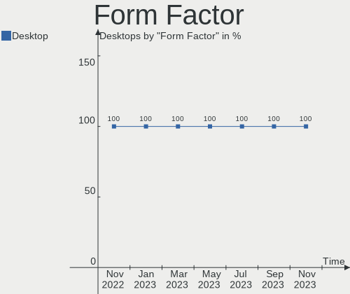
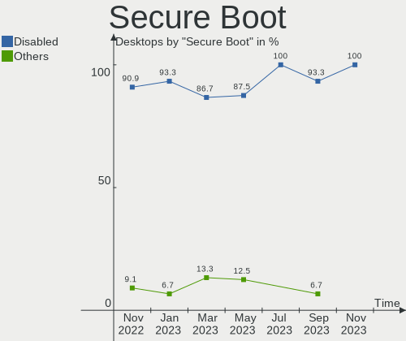
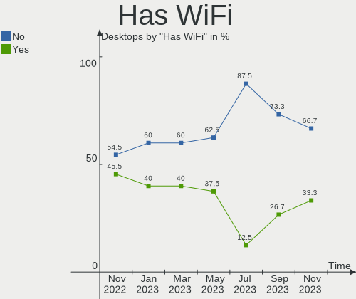
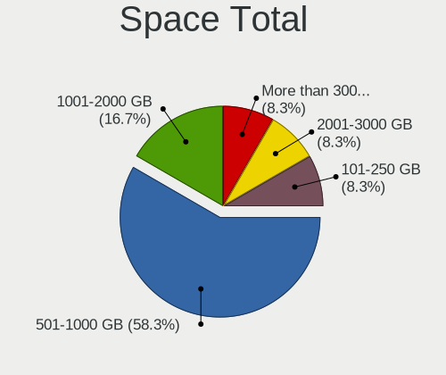
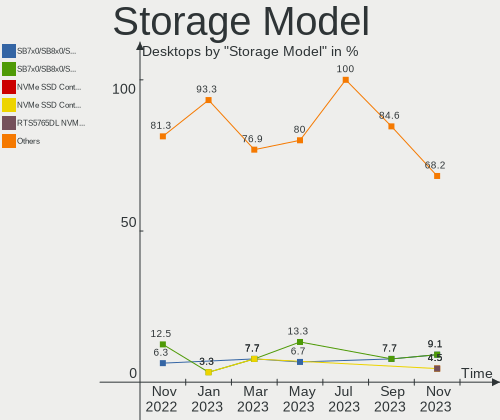
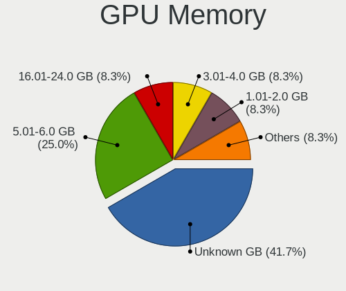
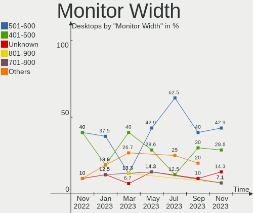
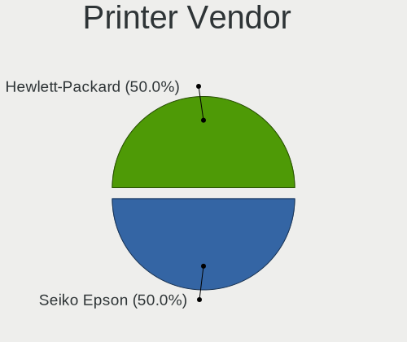
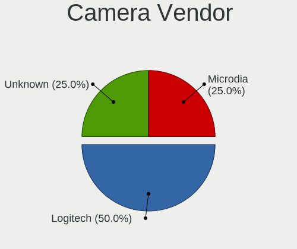

Ubuntu MATE - Hardware Trends (Desktops)
----------------------------------------

A project to identify most popular hardware characteristics and track their change
over time based on data collected by Linux users at https://Linux-Hardware.org.

Anyone can contribute to this report by the [hw-probe](https://github.com/linuxhw/hw-probe) tool:

    sudo -E hw-probe -all -upload

This report is for one last month. Overall report since the beginning of time: [TestCoverage](https://github.com/linuxhw/TestCoverage)

Period: Jan, 2023.

Contents
--------

* [ System ](#system)
  - [ OS                       ](#os)
  - [ OS Family                ](#os-family)
  - [ Kernel                   ](#kernel)
  - [ Kernel Family            ](#kernel-family)
  - [ Kernel Major Ver.        ](#kernel-major-ver)
  - [ Arch                     ](#arch)
  - [ DE                       ](#de)
  - [ Display Server           ](#display-server)
  - [ Display Manager          ](#display-manager)
  - [ OS Lang                  ](#os-lang)
  - [ Boot Mode                ](#boot-mode)
  - [ Filesystem               ](#filesystem)
  - [ Part. scheme             ](#part-scheme)
  - [ Dual Boot with Linux/BSD ](#dual-boot-with-linuxbsd)
  - [ Dual Boot (Win)          ](#dual-boot-win)

* [ Board ](#board)
  - [ Vendor                   ](#vendor)
  - [ Model                    ](#model)
  - [ Model Family             ](#model-family)
  - [ MFG Year                 ](#mfg-year)
  - [ Form Factor              ](#form-factor)
  - [ Secure Boot              ](#secure-boot)
  - [ Coreboot                 ](#coreboot)
  - [ RAM Size                 ](#ram-size)
  - [ RAM Used                 ](#ram-used)
  - [ Total Drives             ](#total-drives)
  - [ Has CD-ROM               ](#has-cd-rom)
  - [ Has Ethernet             ](#has-ethernet)
  - [ Has WiFi                 ](#has-wifi)
  - [ Has Bluetooth            ](#has-bluetooth)

* [ Location ](#location)
  - [ Country                  ](#country)
  - [ City                     ](#city)

* [ Drives ](#drives)
  - [ Drive Vendor             ](#drive-vendor)
  - [ Drive Model              ](#drive-model)
  - [ HDD Vendor               ](#hdd-vendor)
  - [ SSD Vendor               ](#ssd-vendor)
  - [ Drive Kind               ](#drive-kind)
  - [ Drive Connector          ](#drive-connector)
  - [ Drive Size               ](#drive-size)
  - [ Space Total              ](#space-total)
  - [ Space Used               ](#space-used)
  - [ Malfunc. Drives          ](#malfunc-drives)
  - [ Malfunc. Drive Vendor    ](#malfunc-drive-vendor)
  - [ Malfunc. HDD Vendor      ](#malfunc-hdd-vendor)
  - [ Malfunc. Drive Kind      ](#malfunc-drive-kind)
  - [ Failed Drives            ](#failed-drives)
  - [ Failed Drive Vendor      ](#failed-drive-vendor)
  - [ Drive Status             ](#drive-status)

* [ Storage controller ](#storage-controller)
  - [ Storage Vendor           ](#storage-vendor)
  - [ Storage Model            ](#storage-model)
  - [ Storage Kind             ](#storage-kind)

* [ Processor ](#processor)
  - [ CPU Vendor               ](#cpu-vendor)
  - [ CPU Model                ](#cpu-model)
  - [ CPU Model Family         ](#cpu-model-family)
  - [ CPU Cores                ](#cpu-cores)
  - [ CPU Sockets              ](#cpu-sockets)
  - [ CPU Threads              ](#cpu-threads)
  - [ CPU Op-Modes             ](#cpu-op-modes)
  - [ CPU Microcode            ](#cpu-microcode)
  - [ CPU Microarch            ](#cpu-microarch)

* [ Graphics ](#graphics)
  - [ GPU Vendor               ](#gpu-vendor)
  - [ GPU Model                ](#gpu-model)
  - [ GPU Combo                ](#gpu-combo)
  - [ GPU Driver               ](#gpu-driver)
  - [ GPU Memory               ](#gpu-memory)

* [ Monitor ](#monitor)
  - [ Monitor Vendor           ](#monitor-vendor)
  - [ Monitor Model            ](#monitor-model)
  - [ Monitor Resolution       ](#monitor-resolution)
  - [ Monitor Diagonal         ](#monitor-diagonal)
  - [ Monitor Width            ](#monitor-width)
  - [ Aspect Ratio             ](#aspect-ratio)
  - [ Monitor Area             ](#monitor-area)
  - [ Pixel Density            ](#pixel-density)
  - [ Multiple Monitors        ](#multiple-monitors)

* [ Network ](#network)
  - [ Net Controller Vendor    ](#net-controller-vendor)
  - [ Net Controller Model     ](#net-controller-model)
  - [ Wireless Vendor          ](#wireless-vendor)
  - [ Wireless Model           ](#wireless-model)
  - [ Ethernet Vendor          ](#ethernet-vendor)
  - [ Ethernet Model           ](#ethernet-model)
  - [ Net Controller Kind      ](#net-controller-kind)
  - [ Used Controller          ](#used-controller)
  - [ NICs                     ](#nics)
  - [ IPv6                     ](#ipv6)

* [ Bluetooth ](#bluetooth)
  - [ Bluetooth Vendor         ](#bluetooth-vendor)
  - [ Bluetooth Model          ](#bluetooth-model)

* [ Sound ](#sound)
  - [ Sound Vendor             ](#sound-vendor)
  - [ Sound Model              ](#sound-model)

* [ Memory ](#memory)
  - [ Memory Vendor            ](#memory-vendor)
  - [ Memory Model             ](#memory-model)
  - [ Memory Kind              ](#memory-kind)
  - [ Memory Form Factor       ](#memory-form-factor)
  - [ Memory Size              ](#memory-size)
  - [ Memory Speed             ](#memory-speed)

* [ Printers & scanners ](#printers--scanners)
  - [ Printer Vendor           ](#printer-vendor)
  - [ Printer Model            ](#printer-model)
  - [ Scanner Vendor           ](#scanner-vendor)
  - [ Scanner Model            ](#scanner-model)

* [ Camera ](#camera)
  - [ Camera Vendor            ](#camera-vendor)
  - [ Camera Model             ](#camera-model)

* [ Security ](#security)
  - [ Fingerprint Vendor       ](#fingerprint-vendor)
  - [ Fingerprint Model        ](#fingerprint-model)
  - [ Chipcard Vendor          ](#chipcard-vendor)
  - [ Chipcard Model           ](#chipcard-model)

* [ Unsupported ](#unsupported)
  - [ Unsupported Devices      ](#unsupported-devices)
  - [ Unsupported Device Types ](#unsupported-device-types)

System
------

OS
--

Installed operating systems

| Name              | Desktops | Percent |
|-------------------|----------|---------|
| Ubuntu MATE 22.04 | 7        | 46.67%  |
| Ubuntu MATE 20.04 | 4        | 26.67%  |
| Ubuntu MATE 22.10 | 2        | 13.33%  |
| Ubuntu MATE 18.04 | 1        | 6.67%   |
| Ubuntu MATE 16.04 | 1        | 6.67%   |

OS Family
---------

OS without a version

| Name        | Desktops | Percent |
|-------------|----------|---------|
| Ubuntu MATE | 15       | 100%    |

Kernel
------

Version of the Linux kernel

| Version              | Desktops | Percent |
|----------------------|----------|---------|
| 5.4.0-135-generic    | 2        | 13.33%  |
| 5.4.0-126-generic    | 2        | 13.33%  |
| 5.15.0-58-generic    | 2        | 13.33%  |
| 5.15.0-57-generic    | 2        | 13.33%  |
| 5.15.0-56-generic    | 2        | 13.33%  |
| 5.4.0-136-generic    | 1        | 6.67%   |
| 5.19.0-29-generic    | 1        | 6.67%   |
| 5.19.0-28-generic    | 1        | 6.67%   |
| 5.15.0-58-lowlatency | 1        | 6.67%   |
| 4.4.0-210-generic    | 1        | 6.67%   |

Kernel Family
-------------

Linux kernel without a distro release

| Version | Desktops | Percent |
|---------|----------|---------|
| 5.15.0  | 7        | 46.67%  |
| 5.4.0   | 5        | 33.33%  |
| 5.19.0  | 2        | 13.33%  |
| 4.4.0   | 1        | 6.67%   |

Kernel Major Ver.
-----------------

Linux kernel major version

| Version | Desktops | Percent |
|---------|----------|---------|
| 5.15    | 7        | 46.67%  |
| 5.4     | 5        | 33.33%  |
| 5.19    | 2        | 13.33%  |
| 4.4     | 1        | 6.67%   |

Arch
----

OS architecture (x86_64, i586, etc.)

| Name   | Desktops | Percent |
|--------|----------|---------|
| x86_64 | 15       | 100%    |

DE
--

Desktop Environment

| Name | Desktops | Percent |
|------|----------|---------|
| MATE | 15       | 100%    |

Display Server
--------------

X11 or Wayland

| Name    | Desktops | Percent |
|---------|----------|---------|
| X11     | 13       | 86.67%  |
| Wayland | 1        | 6.67%   |
| Tty     | 1        | 6.67%   |

Display Manager
---------------

SDDM, LightDM, etc.

| Name    | Desktops | Percent |
|---------|----------|---------|
| LightDM | 13       | 86.67%  |
| GDM3    | 2        | 13.33%  |

OS Lang
-------

Language

| Lang  | Desktops | Percent |
|-------|----------|---------|
| en_US | 5        | 33.33%  |
| fr_FR | 4        | 26.67%  |
| it_IT | 2        | 13.33%  |
| en_GB | 2        | 13.33%  |
| da_DK | 1        | 6.67%   |
| C     | 1        | 6.67%   |

Boot Mode
---------

EFI or BIOS

| Mode | Desktops | Percent |
|------|----------|---------|
| BIOS | 9        | 60%     |
| EFI  | 6        | 40%     |

Filesystem
----------

Type of filesystem

| Type  | Desktops | Percent |
|-------|----------|---------|
| Ext4  | 14       | 93.33%  |
| Btrfs | 1        | 6.67%   |

Part. scheme
------------

Scheme of partitioning

| Type | Desktops | Percent |
|------|----------|---------|
| GPT  | 12       | 80%     |
| MBR  | 3        | 20%     |

Dual Boot with Linux/BSD
------------------------

Hosting more than one Linux/BSD

| Dual boot | Desktops | Percent |
|-----------|----------|---------|
| No        | 9        | 60%     |
| Yes       | 6        | 40%     |

Dual Boot (Win)
---------------

Hosting Linux and Windows

| Dual boot | Desktops | Percent |
|-----------|----------|---------|
| No        | 12       | 80%     |
| Yes       | 3        | 20%     |

Board
-----

Vendor
------

Motherboard manufacturer

| Name                | Desktops | Percent |
|---------------------|----------|---------|
| Gigabyte Technology | 6        | 40%     |
| Hewlett-Packard     | 4        | 26.67%  |
| ASUSTek Computer    | 3        | 20%     |
| MSI                 | 1        | 6.67%   |
| Dell                | 1        | 6.67%   |

Model
-----

Motherboard model

| Name                         | Desktops | Percent |
|------------------------------|----------|---------|
| MSI MS-7C95                  | 1        | 6.67%   |
| HP ProLiant ML350p Gen8      | 1        | 6.67%   |
| HP ProLiant MicroServer      | 1        | 6.67%   |
| HP EliteDesk 705 G2 SFF      | 1        | 6.67%   |
| HP Compaq 8200 Elite SFF PC  | 1        | 6.67%   |
| Gigabyte Z590 UD AC          | 1        | 6.67%   |
| Gigabyte X570S AERO G        | 1        | 6.67%   |
| Gigabyte H510M H             | 1        | 6.67%   |
| Gigabyte EP45-UD3P           | 1        | 6.67%   |
| Gigabyte B85M-D3H            | 1        | 6.67%   |
| Gigabyte B550 GAMING X V2    | 1        | 6.67%   |
| Dell Precision Tower 7810    | 1        | 6.67%   |
| ASUS ROG STRIX Z370-G GAMING | 1        | 6.67%   |
| ASUS PRIME B450-PLUS         | 1        | 6.67%   |
| ASUS CROSSHAIR VI HERO       | 1        | 6.67%   |

Model Family
------------

Motherboard model prefix

| Name               | Desktops | Percent |
|--------------------|----------|---------|
| HP ProLiant        | 2        | 13.33%  |
| MSI MS-7C95        | 1        | 6.67%   |
| HP EliteDesk       | 1        | 6.67%   |
| HP Compaq          | 1        | 6.67%   |
| Gigabyte Z590      | 1        | 6.67%   |
| Gigabyte X570S     | 1        | 6.67%   |
| Gigabyte H510M     | 1        | 6.67%   |
| Gigabyte EP45-UD3P | 1        | 6.67%   |
| Gigabyte B85M-D3H  | 1        | 6.67%   |
| Gigabyte B550      | 1        | 6.67%   |
| Dell Precision     | 1        | 6.67%   |
| ASUS ROG           | 1        | 6.67%   |
| ASUS PRIME         | 1        | 6.67%   |
| ASUS CROSSHAIR     | 1        | 6.67%   |

MFG Year
--------

Motherboard manufacture year

| Year | Desktops | Percent |
|------|----------|---------|
| 2021 | 3        | 20%     |
| 2020 | 2        | 13.33%  |
| 2018 | 2        | 13.33%  |
| 2016 | 2        | 13.33%  |
| 2011 | 2        | 13.33%  |
| 2017 | 1        | 6.67%   |
| 2013 | 1        | 6.67%   |
| 2012 | 1        | 6.67%   |
| 2008 | 1        | 6.67%   |

Form Factor
-----------

Physical design of the computer

| Name    | Desktops | Percent |
|---------|----------|---------|
| Desktop | 15       | 100%    |

Secure Boot
-----------

Enabled or disabled

| State    | Desktops | Percent |
|----------|----------|---------|
| Disabled | 14       | 93.33%  |
| Enabled  | 1        | 6.67%   |

Coreboot
--------

Have coreboot on board

| Used | Desktops | Percent |
|------|----------|---------|
| No   | 15       | 100%    |

RAM Size
--------

Total RAM memory

| Size in GB  | Desktops | Percent |
|-------------|----------|---------|
| 32.01-64.0  | 5        | 33.33%  |
| 16.01-24.0  | 4        | 26.67%  |
| 64.01-256.0 | 2        | 13.33%  |
| 8.01-16.0   | 2        | 13.33%  |
| 4.01-8.0    | 1        | 6.67%   |
| 3.01-4.0    | 1        | 6.67%   |

RAM Used
--------

Used RAM memory

| Used GB   | Desktops | Percent |
|-----------|----------|---------|
| 2.01-3.0  | 7        | 46.67%  |
| 1.01-2.0  | 3        | 20%     |
| 4.01-8.0  | 2        | 13.33%  |
| 8.01-16.0 | 2        | 13.33%  |
| 3.01-4.0  | 1        | 6.67%   |

Total Drives
------------

Number of drives on board

| Drives | Desktops | Percent |
|--------|----------|---------|
| 2      | 5        | 33.33%  |
| 3      | 3        | 20%     |
| 1      | 3        | 20%     |
| 4      | 2        | 13.33%  |
| 20     | 1        | 6.67%   |
| 5      | 1        | 6.67%   |

Has CD-ROM
----------

Has CD-ROM on board

| Presented | Desktops | Percent |
|-----------|----------|---------|
| Yes       | 11       | 73.33%  |
| No        | 4        | 26.67%  |

Has Ethernet
------------

Has Ethernet on board

| Presented | Desktops | Percent |
|-----------|----------|---------|
| Yes       | 15       | 100%    |

Has WiFi
--------

Has WiFi module

| Presented | Desktops | Percent |
|-----------|----------|---------|
| No        | 9        | 60%     |
| Yes       | 6        | 40%     |

Has Bluetooth
-------------

Has Bluetooth module

| Presented | Desktops | Percent |
|-----------|----------|---------|
| No        | 10       | 66.67%  |
| Yes       | 5        | 33.33%  |

Location
--------

Country
-------

Geographic location (country)

| Country     | Desktops | Percent |
|-------------|----------|---------|
| France      | 4        | 26.67%  |
| USA         | 3        | 20%     |
| UK          | 2        | 13.33%  |
| Italy       | 2        | 13.33%  |
| New Zealand | 1        | 6.67%   |
| Isle of Man | 1        | 6.67%   |
| Germany     | 1        | 6.67%   |
| Denmark     | 1        | 6.67%   |

City
----

Geographic location (city)

| City              | Desktops | Percent |
|-------------------|----------|---------|
| Montpellier       | 2        | 13.33%  |
| Whanganui         | 1        | 6.67%   |
| Torring           | 1        | 6.67%   |
| Tehachapi         | 1        | 6.67%   |
| Sunderland        | 1        | 6.67%   |
| Saint Paul        | 1        | 6.67%   |
| Presteigne        | 1        | 6.67%   |
| New York          | 1        | 6.67%   |
| Isle of Man       | 1        | 6.67%   |
| Hauville          | 1        | 6.67%   |
| Gruenenplan       | 1        | 6.67%   |
| Chalon-sur-Saône | 1        | 6.67%   |
| Argenta           | 1        | 6.67%   |
| Alassio           | 1        | 6.67%   |

Drives
------

Drive Vendor
------------

Hard drive vendors

| Vendor                      | Desktops | Drives | Percent |
|-----------------------------|----------|--------|---------|
| Seagate                     | 7        | 23     | 22.58%  |
| WDC                         | 5        | 7      | 16.13%  |
| Samsung Electronics         | 5        | 6      | 16.13%  |
| Toshiba                     | 2        | 4      | 6.45%   |
| Kingston Technology Company | 2        | 2      | 6.45%   |
| Kingston                    | 2        | 2      | 6.45%   |
| SanDisk                     | 1        | 1      | 3.23%   |
| PNY                         | 1        | 1      | 3.23%   |
| Phison Electronics          | 1        | 1      | 3.23%   |
| Intel                       | 1        | 1      | 3.23%   |
| Hitachi                     | 1        | 1      | 3.23%   |
| HGST                        | 1        | 1      | 3.23%   |
| Hewlett-Packard             | 1        | 2      | 3.23%   |
| Corsair                     | 1        | 1      | 3.23%   |

Drive Model
-----------

Hard drive models

| Model                                   | Desktops | Percent |
|-----------------------------------------|----------|---------|
| Kingston Company A2000 NVMe SSD 1TB     | 2        | 6.06%   |
| WDC WDS480G2G0A-00JH30 480GB SSD        | 1        | 3.03%   |
| WDC WD5000AZRX-00A8LB0 500GB            | 1        | 3.03%   |
| WDC WD4003FFBX-68MU3N0 4TB              | 1        | 3.03%   |
| WDC WD2003FZEX-00Z4SA0 2TB              | 1        | 3.03%   |
| WDC WD10EZRZ-00HTKB0 1TB                | 1        | 3.03%   |
| WDC WD1001FALS-00J7B1 1TB               | 1        | 3.03%   |
| Toshiba MG06ACA800E 8TB                 | 1        | 3.03%   |
| Toshiba HDWD110 1TB                     | 1        | 3.03%   |
| Seagate ST9500325AS 500GB               | 1        | 3.03%   |
| Seagate ST91000640NS 1TB                | 1        | 3.03%   |
| Seagate ST6000NM0024-1HT17Z 6TB         | 1        | 3.03%   |
| Seagate ST3250310AS 250GB               | 1        | 3.03%   |
| Seagate ST2000NE001-2M5101 2TB          | 1        | 3.03%   |
| Seagate ST2000DM006-2DM164 2TB          | 1        | 3.03%   |
| Seagate ST2000DM001-1ER164 2TB          | 1        | 3.03%   |
| Seagate ST2000DM001-1CH164 2TB          | 1        | 3.03%   |
| SanDisk SSD PLUS 120GB                  | 1        | 3.03%   |
| Samsung SSD SM871 2.5 7mm 256GB         | 1        | 3.03%   |
| Samsung SSD 980 500GB                   | 1        | 3.03%   |
| Samsung SSD 870 QVO 1TB                 | 1        | 3.03%   |
| Samsung SSD 860 QVO 1TB                 | 1        | 3.03%   |
| Samsung SSD 850 EVO 4TB                 | 1        | 3.03%   |
| PNY CS2211 240GB SSD                    | 1        | 3.03%   |
| Phison PS5013 E13 NVMe Controller 256GB | 1        | 3.03%   |
| Kingston SA400S37120G 120GB SSD         | 1        | 3.03%   |
| Kingston SA2000M8250G 250GB             | 1        | 3.03%   |
| Intel SSDPEKNU512GZ 512GB               | 1        | 3.03%   |
| Hitachi HDS721032CLA362 320GB           | 1        | 3.03%   |
| HGST HUS726T6TALE6L4 6TB                | 1        | 3.03%   |
| HP VB0250EAVER 250GB                    | 1        | 3.03%   |
| Corsair Force MP500 960GB               | 1        | 3.03%   |

HDD Vendor
----------

Hard disk drive vendors

| Vendor          | Desktops | Drives | Percent |
|-----------------|----------|--------|---------|
| Seagate         | 7        | 23     | 43.75%  |
| WDC             | 4        | 6      | 25%     |
| Toshiba         | 2        | 4      | 12.5%   |
| Hitachi         | 1        | 1      | 6.25%   |
| HGST            | 1        | 1      | 6.25%   |
| Hewlett-Packard | 1        | 2      | 6.25%   |

SSD Vendor
----------

Solid state drive vendors

| Vendor              | Desktops | Drives | Percent |
|---------------------|----------|--------|---------|
| Samsung Electronics | 4        | 4      | 50%     |
| WDC                 | 1        | 1      | 12.5%   |
| SanDisk             | 1        | 1      | 12.5%   |
| PNY                 | 1        | 1      | 12.5%   |
| Kingston            | 1        | 1      | 12.5%   |

Drive Kind
----------

HDD or SSD

| Kind | Desktops | Drives | Percent |
|------|----------|--------|---------|
| HDD  | 12       | 37     | 48%     |
| SSD  | 8        | 8      | 32%     |
| NVMe | 5        | 8      | 20%     |

Drive Connector
---------------

SATA, SAS, NVMe, etc.

| Type | Desktops | Drives | Percent |
|------|----------|--------|---------|
| SATA | 15       | 45     | 75%     |
| NVMe | 5        | 8      | 25%     |

Drive Size
----------

Size of hard drive

| Size in TB | Desktops | Drives | Percent |
|------------|----------|--------|---------|
| 0.01-0.5   | 9        | 11     | 40.91%  |
| 0.51-1.0   | 5        | 21     | 22.73%  |
| 1.01-2.0   | 4        | 5      | 18.18%  |
| 3.01-4.0   | 2        | 3      | 9.09%   |
| 4.01-10.0  | 2        | 5      | 9.09%   |

Space Total
-----------

Amount of disk space available on the file system

| Size in GB     | Desktops | Percent |
|----------------|----------|---------|
| More than 3000 | 4        | 26.67%  |
| 501-1000       | 4        | 26.67%  |
| 101-250        | 2        | 13.33%  |
| 1001-2000      | 2        | 13.33%  |
| 251-500        | 1        | 6.67%   |
| 2001-3000      | 1        | 6.67%   |
| Unknown        | 1        | 6.67%   |

Space Used
----------

Amount of used disk space

| Used GB        | Desktops | Percent |
|----------------|----------|---------|
| 51-100         | 4        | 26.67%  |
| More than 3000 | 2        | 13.33%  |
| 2001-3000      | 2        | 13.33%  |
| 501-1000       | 2        | 13.33%  |
| 251-500        | 1        | 6.67%   |
| 21-50          | 1        | 6.67%   |
| 101-250        | 1        | 6.67%   |
| 1-20           | 1        | 6.67%   |
| Unknown        | 1        | 6.67%   |

Malfunc. Drives
---------------

Drive models with a malfunction

Zero info for selected period =(

Malfunc. Drive Vendor
---------------------

Vendors of faulty drives

Zero info for selected period =(

Malfunc. HDD Vendor
-------------------

Vendors of faulty HDD drives

Zero info for selected period =(

Malfunc. Drive Kind
-------------------

Kinds of faulty drives

Zero info for selected period =(

Failed Drives
-------------

Failed drive models

Zero info for selected period =(

Failed Drive Vendor
-------------------

Failed drive vendors

Zero info for selected period =(

Drive Status
------------

Number of failed and malfunc. drives

| Status   | Desktops | Drives | Percent |
|----------|----------|--------|---------|
| Works    | 9        | 38     | 56.25%  |
| Detected | 7        | 15     | 43.75%  |

Storage controller
------------------

Storage Vendor
--------------

Storage controller vendors

| Vendor                      | Desktops | Percent |
|-----------------------------|----------|---------|
| Intel                       | 8        | 36.36%  |
| AMD                         | 7        | 31.82%  |
| Phison Electronics          | 2        | 9.09%   |
| Kingston Technology Company | 2        | 9.09%   |
| Samsung Electronics         | 1        | 4.55%   |
| JMicron Technology          | 1        | 4.55%   |
| Hewlett-Packard             | 1        | 4.55%   |

Storage Model
-------------

Storage controller models

| Model                                                                          | Desktops | Percent |
|--------------------------------------------------------------------------------|----------|---------|
| AMD FCH SATA Controller [AHCI mode]                                            | 4        | 13.33%  |
| Kingston Company A2000 NVMe SSD                                                | 2        | 6.67%   |
| Intel 500 Series Chipset Family SATA AHCI Controller                           | 2        | 6.67%   |
| AMD 500 Series Chipset SATA Controller                                         | 2        | 6.67%   |
| Samsung NVMe SSD Controller 980                                                | 1        | 3.33%   |
| Phison PS5013 E13 NVMe Controller                                              | 1        | 3.33%   |
| Phison E7 NVMe Controller                                                      | 1        | 3.33%   |
| JMicron JMB363 SATA/IDE Controller                                             | 1        | 3.33%   |
| Intel Non-Volatile memory controller                                           | 1        | 3.33%   |
| Intel C610/X99 series chipset sSATA Controller [AHCI mode]                     | 1        | 3.33%   |
| Intel C610/X99 series chipset IDE-r Controller                                 | 1        | 3.33%   |
| Intel C600/X79 series chipset SATA RAID Controller                             | 1        | 3.33%   |
| Intel C600/X79 series chipset 4-Port SATA IDE Controller                       | 1        | 3.33%   |
| Intel C600/X79 series chipset 2-Port SATA IDE Controller                       | 1        | 3.33%   |
| Intel 82801JI (ICH10 Family) 4 port SATA IDE Controller #1                     | 1        | 3.33%   |
| Intel 82801JI (ICH10 Family) 2 port SATA IDE Controller #2                     | 1        | 3.33%   |
| Intel 8 Series/C220 Series Chipset Family 6-port SATA Controller 1 [AHCI mode] | 1        | 3.33%   |
| Intel 6 Series/C200 Series Chipset Family 6 port Desktop SATA AHCI Controller  | 1        | 3.33%   |
| Intel 200 Series PCH SATA controller [AHCI mode]                               | 1        | 3.33%   |
| HP Smart Array Gen8 Controllers                                                | 1        | 3.33%   |
| AMD X370 Series Chipset SATA Controller                                        | 1        | 3.33%   |
| AMD SB7x0/SB8x0/SB9x0 SATA Controller [Non-RAID5 mode]                         | 1        | 3.33%   |
| AMD SB7x0/SB8x0/SB9x0 IDE Controller                                           | 1        | 3.33%   |
| AMD 400 Series Chipset SATA Controller                                         | 1        | 3.33%   |

Storage Kind
------------

Kind of storage controller (IDE, SATA, NVMe, SAS, ...)

| Kind | Desktops | Percent |
|------|----------|---------|
| SATA | 13       | 52%     |
| NVMe | 5        | 20%     |
| IDE  | 4        | 16%     |
| RAID | 3        | 12%     |

Processor
---------

CPU Vendor
----------

Processor vendors

| Vendor | Desktops | Percent |
|--------|----------|---------|
| Intel  | 8        | 53.33%  |
| AMD    | 7        | 46.67%  |

CPU Model
---------

Processor models

| Model                                       | Desktops | Percent |
|---------------------------------------------|----------|---------|
| Intel Xeon CPU E5-2630 v3 @ 2.40GHz         | 1        | 6.67%   |
| Intel Xeon CPU E5-2620 0 @ 2.00GHz          | 1        | 6.67%   |
| Intel Xeon CPU E3-1245 v3 @ 3.40GHz         | 1        | 6.67%   |
| Intel Core i7-8700K CPU @ 3.70GHz           | 1        | 6.67%   |
| Intel Core i5-2400 CPU @ 3.10GHz            | 1        | 6.67%   |
| Intel Core i3-10100 CPU @ 3.60GHz           | 1        | 6.67%   |
| Intel Core 2 Duo CPU E8500 @ 3.16GHz        | 1        | 6.67%   |
| Intel 11th Gen Core i9-11900K @ 3.50GHz     | 1        | 6.67%   |
| AMD Turion II Neo N40L Dual-Core Processor  | 1        | 6.67%   |
| AMD Ryzen 7 5800X 8-Core Processor          | 1        | 6.67%   |
| AMD Ryzen 7 3700X 8-Core Processor          | 1        | 6.67%   |
| AMD Ryzen 7 1800X Eight-Core Processor      | 1        | 6.67%   |
| AMD Ryzen 5 5500                            | 1        | 6.67%   |
| AMD Ryzen 5 1600 Six-Core Processor         | 1        | 6.67%   |
| AMD PRO A8-8650B R7, 10 Compute Cores 4C+6G | 1        | 6.67%   |

CPU Model Family
----------------

Processor model prefix

| Model             | Desktops | Percent |
|-------------------|----------|---------|
| Intel Xeon        | 3        | 20%     |
| AMD Ryzen 7       | 3        | 20%     |
| AMD Ryzen 5       | 2        | 13.33%  |
| Other             | 1        | 6.67%   |
| Intel Core i7     | 1        | 6.67%   |
| Intel Core i5     | 1        | 6.67%   |
| Intel Core i3     | 1        | 6.67%   |
| Intel Core 2 Duo  | 1        | 6.67%   |
| AMD Turion II Neo | 1        | 6.67%   |
| AMD PRO A8        | 1        | 6.67%   |

CPU Cores
---------

Number of processor cores

| Number | Desktops | Percent |
|--------|----------|---------|
| 8      | 4        | 26.67%  |
| 6      | 3        | 20%     |
| 4      | 3        | 20%     |
| 2      | 3        | 20%     |
| 16     | 1        | 6.67%   |
| 12     | 1        | 6.67%   |

CPU Sockets
-----------

Number of sockets

| Number | Desktops | Percent |
|--------|----------|---------|
| 1      | 13       | 86.67%  |
| 2      | 2        | 13.33%  |

CPU Threads
-----------

Threads per core (Hyper-Threading)

| Number | Desktops | Percent |
|--------|----------|---------|
| 2      | 12       | 80%     |
| 1      | 3        | 20%     |

CPU Op-Modes
------------

CPU Operation Modes (32-bit, 64-bit)

| Op mode        | Desktops | Percent |
|----------------|----------|---------|
| 32-bit, 64-bit | 15       | 100%    |

CPU Microcode
-------------

Microcode number

| Number     | Desktops | Percent |
|------------|----------|---------|
| Unknown    | 7        | 46.67%  |
| 0xa0671    | 1        | 6.67%   |
| 0x906ea    | 1        | 6.67%   |
| 0x306f2    | 1        | 6.67%   |
| 0x306c3    | 1        | 6.67%   |
| 0x206d7    | 1        | 6.67%   |
| 0x1067a    | 1        | 6.67%   |
| 0x08701021 | 1        | 6.67%   |
| 0x06003106 | 1        | 6.67%   |

CPU Microarch
-------------

Microarchitecture

| Name        | Desktops | Percent |
|-------------|----------|---------|
| Zen 3       | 2        | 13.33%  |
| SandyBridge | 2        | 13.33%  |
| Haswell     | 2        | 13.33%  |
| Zen+        | 1        | 6.67%   |
| Zen 2       | 1        | 6.67%   |
| Zen         | 1        | 6.67%   |
| Steamroller | 1        | 6.67%   |
| Penryn      | 1        | 6.67%   |
| KabyLake    | 1        | 6.67%   |
| K10         | 1        | 6.67%   |
| CometLake   | 1        | 6.67%   |
| Unknown     | 1        | 6.67%   |

Graphics
--------

GPU Vendor
----------

Vendors of graphics cards

| Vendor                     | Desktops | Percent |
|----------------------------|----------|---------|
| Nvidia                     | 8        | 50%     |
| Intel                      | 4        | 25%     |
| AMD                        | 3        | 18.75%  |
| Matrox Electronics Systems | 1        | 6.25%   |

GPU Model
---------

Graphics card models

| Model                                                                     | Desktops | Percent |
|---------------------------------------------------------------------------|----------|---------|
| Nvidia GT218 [GeForce 210]                                                | 1        | 6.25%   |
| Nvidia GP107GL [Quadro P620]                                              | 1        | 6.25%   |
| Nvidia GP106 [GeForce GTX 1060 6GB]                                       | 1        | 6.25%   |
| Nvidia GK208B [GeForce GT 710]                                            | 1        | 6.25%   |
| Nvidia GF110GL [Tesla C2050 / C2075]                                      | 1        | 6.25%   |
| Nvidia GA104 [GeForce RTX 3060 Ti Lite Hash Rate]                         | 1        | 6.25%   |
| Nvidia GA102 [GeForce RTX 3090]                                           | 1        | 6.25%   |
| Nvidia G96C [GeForce 9500 GT]                                             | 1        | 6.25%   |
| Matrox Electronics Systems MGA G200EH                                     | 1        | 6.25%   |
| Intel Xeon E3-1200 v3 Processor Integrated Graphics Controller            | 1        | 6.25%   |
| Intel CometLake-S GT2 [UHD Graphics 630]                                  | 1        | 6.25%   |
| Intel CoffeeLake-S GT2 [UHD Graphics 630]                                 | 1        | 6.25%   |
| Intel 2nd Generation Core Processor Family Integrated Graphics Controller | 1        | 6.25%   |
| AMD Navi 24 [Radeon RX 6400/6500 XT/6500M]                                | 1        | 6.25%   |
| AMD Navi 23 [Radeon RX 6600/6600 XT/6600M]                                | 1        | 6.25%   |
| AMD Kaveri [Radeon R7 Graphics]                                           | 1        | 6.25%   |

GPU Combo
---------

Combinations of graphics cards

| Name           | Desktops | Percent |
|----------------|----------|---------|
| 1 x Nvidia     | 7        | 46.67%  |
| 1 x Intel      | 3        | 20%     |
| 1 x AMD        | 3        | 20%     |
| 1 x Matrox     | 1        | 6.67%   |
| Intel + Nvidia | 1        | 6.67%   |

GPU Driver
----------

Free vs proprietary

| Driver      | Desktops | Percent |
|-------------|----------|---------|
| Free        | 11       | 73.33%  |
| Proprietary | 4        | 26.67%  |

GPU Memory
----------

Total video memory

| Size in GB | Desktops | Percent |
|------------|----------|---------|
| Unknown    | 9        | 60%     |
| 5.01-6.0   | 2        | 13.33%  |
| 7.01-8.0   | 1        | 6.67%   |
| 16.01-24.0 | 1        | 6.67%   |
| 0.51-1.0   | 1        | 6.67%   |
| 0.01-0.5   | 1        | 6.67%   |

Monitor
-------

Monitor Vendor
--------------

Monitor vendors

| Vendor              | Desktops | Percent |
|---------------------|----------|---------|
| Philips             | 4        | 26.67%  |
| Hewlett-Packard     | 3        | 20%     |
| Dell                | 3        | 20%     |
| Iiyama              | 2        | 13.33%  |
| Vita                | 1        | 6.67%   |
| Sony                | 1        | 6.67%   |
| Samsung Electronics | 1        | 6.67%   |

Monitor Model
-------------

Monitor models

| Model                                                             | Desktops | Percent |
|-------------------------------------------------------------------|----------|---------|
| Vita LCD Monitor VIT0780 1920x1080                                | 1        | 5.88%   |
| Sony LCD Monitor TV 3840x1080                                     | 1        | 5.88%   |
| Sony LCD Monitor TV                                               | 1        | 5.88%   |
| Samsung Electronics S32F351 SAM0D24 1920x1080 698x393mm 31.5-inch | 1        | 5.88%   |
| Philips PHL BDL3220QL PHLD230 1920x1080 698x393mm 31.5-inch       | 1        | 5.88%   |
| Philips PHL 243V7 PHLC155 1920x1080 527x296mm 23.8-inch           | 1        | 5.88%   |
| Philips PHL 227E6 PHLC0E5 1920x1080 477x268mm 21.5-inch           | 1        | 5.88%   |
| Philips 246EL2SBH PHLC074 1920x1080 521x293mm 23.5-inch           | 1        | 5.88%   |
| Iiyama PL2770H IVM665D 1920x1080 598x336mm 27.0-inch              | 1        | 5.88%   |
| Iiyama PL2740HS IVM6662 1920x1080 600x340mm 27.2-inch             | 1        | 5.88%   |
| Hewlett-Packard Pavilion32 HWP3337 2560x1440 708x399mm 32.0-inch  | 1        | 5.88%   |
| Hewlett-Packard LP2475w HWP26F8 1920x1200 546x352mm 25.6-inch     | 1        | 5.88%   |
| Hewlett-Packard LA1905 HWP2845 1440x900 408x255mm 18.9-inch       | 1        | 5.88%   |
| Hewlett-Packard L1710 HWP26EB 1280x1024 340x270mm 17.1-inch       | 1        | 5.88%   |
| Dell U3415W DELA0A6 3440x1440 798x335mm 34.1-inch                 | 1        | 5.88%   |
| Dell P2414H DELA09B 1920x1080 530x300mm 24.0-inch                 | 1        | 5.88%   |
| Dell IN2030M DELF03C 1600x900 443x249mm 20.0-inch                 | 1        | 5.88%   |

Monitor Resolution
------------------

Monitor screen resolution

| Resolution        | Desktops | Percent |
|-------------------|----------|---------|
| 1920x1080 (FHD)   | 7        | 46.67%  |
| 3840x1080         | 1        | 6.67%   |
| 3440x1440         | 1        | 6.67%   |
| 2560x1440 (QHD)   | 1        | 6.67%   |
| 1920x1200 (WUXGA) | 1        | 6.67%   |
| 1600x900 (HD+)    | 1        | 6.67%   |
| 1440x900 (WXGA+)  | 1        | 6.67%   |
| 1280x1024 (SXGA)  | 1        | 6.67%   |
| Unknown           | 1        | 6.67%   |

Monitor Diagonal
----------------

Diagonal size in inches

| Inches  | Desktops | Percent |
|---------|----------|---------|
| 31      | 2        | 12.5%   |
| 27      | 2        | 12.5%   |
| 24      | 2        | 12.5%   |
| Unknown | 2        | 12.5%   |
| 34      | 1        | 6.25%   |
| 32      | 1        | 6.25%   |
| 25      | 1        | 6.25%   |
| 23      | 1        | 6.25%   |
| 21      | 1        | 6.25%   |
| 20      | 1        | 6.25%   |
| 19      | 1        | 6.25%   |
| 17      | 1        | 6.25%   |

Monitor Width
-------------

Physical width

| Width in mm | Desktops | Percent |
|-------------|----------|---------|
| 501-600     | 6        | 37.5%   |
| 401-500     | 3        | 18.75%  |
| 701-800     | 2        | 12.5%   |
| 601-700     | 2        | 12.5%   |
| Unknown     | 2        | 12.5%   |
| 301-350     | 1        | 6.25%   |

Aspect Ratio
------------

Proportional relationship between the width and the height

| Ratio   | Desktops | Percent |
|---------|----------|---------|
| 16/9    | 9        | 64.29%  |
| 16/10   | 2        | 14.29%  |
| 5/4     | 1        | 7.14%   |
| 21/9    | 1        | 7.14%   |
| Unknown | 1        | 7.14%   |

Monitor Area
------------

Area in inch²

| Area in inch² | Desktops | Percent |
|----------------|----------|---------|
| 351-500        | 4        | 25%     |
| 201-250        | 3        | 18.75%  |
| 151-200        | 3        | 18.75%  |
| 301-350        | 2        | 12.5%   |
| Unknown        | 2        | 12.5%   |
| 251-300        | 1        | 6.25%   |
| 141-150        | 1        | 6.25%   |

Pixel Density
-------------

Pixels per inch

| Density | Desktops | Percent |
|---------|----------|---------|
| 51-100  | 10       | 71.43%  |
| 101-120 | 2        | 14.29%  |
| Unknown | 2        | 14.29%  |

Multiple Monitors
-----------------

Total monitors connected

| Total | Desktops | Percent |
|-------|----------|---------|
| 1     | 10       | 66.67%  |
| 2     | 4        | 26.67%  |
| 0     | 1        | 6.67%   |

Network
-------

Net Controller Vendor
---------------------

Controller vendors

| Vendor                | Desktops | Percent |
|-----------------------|----------|---------|
| Realtek Semiconductor | 8        | 38.1%   |
| Intel                 | 7        | 33.33%  |
| Broadcom              | 3        | 14.29%  |
| Ralink Technology     | 1        | 4.76%   |
| Motorola              | 1        | 4.76%   |
| ASUSTek Computer      | 1        | 4.76%   |

Net Controller Model
--------------------

Controller models

| Model                                                             | Desktops | Percent |
|-------------------------------------------------------------------|----------|---------|
| Realtek RTL8111/8168/8411 PCI Express Gigabit Ethernet Controller | 6        | 27.27%  |
| Realtek RTL8822BE 802.11a/b/g/n/ac WiFi adapter                   | 1        | 4.55%   |
| Realtek RTL8125 2.5GbE Controller                                 | 1        | 4.55%   |
| Ralink MT7601U Wireless Adapter                                   | 1        | 4.55%   |
| Motorola SM56 Data Fax Modem                                      | 1        | 4.55%   |
| Intel Wi-Fi 6 AX200                                               | 1        | 4.55%   |
| Intel Tiger Lake PCH CNVi WiFi                                    | 1        | 4.55%   |
| Intel I211 Gigabit Network Connection                             | 1        | 4.55%   |
| Intel Ethernet Controller I225-V                                  | 1        | 4.55%   |
| Intel Ethernet Connection I217-LM                                 | 1        | 4.55%   |
| Intel Ethernet Connection (2) I219-V                              | 1        | 4.55%   |
| Intel Dual Band Wireless-AC 3168NGW [Stone Peak]                  | 1        | 4.55%   |
| Intel 82579LM Gigabit Network Connection (Lewisville)             | 1        | 4.55%   |
| Broadcom NetXtreme BCM5762 Gigabit Ethernet PCIe                  | 1        | 4.55%   |
| Broadcom NetXtreme BCM5723 Gigabit Ethernet PCIe                  | 1        | 4.55%   |
| Broadcom NetXtreme BCM5719 Gigabit Ethernet PCIe                  | 1        | 4.55%   |
| ASUS 802.11ac NIC                                                 | 1        | 4.55%   |

Wireless Vendor
---------------

Wireless vendors

| Vendor                | Desktops | Percent |
|-----------------------|----------|---------|
| Intel                 | 3        | 50%     |
| Realtek Semiconductor | 1        | 16.67%  |
| Ralink Technology     | 1        | 16.67%  |
| ASUSTek Computer      | 1        | 16.67%  |

Wireless Model
--------------

Wireless models

| Model                                            | Desktops | Percent |
|--------------------------------------------------|----------|---------|
| Realtek RTL8822BE 802.11a/b/g/n/ac WiFi adapter  | 1        | 16.67%  |
| Ralink MT7601U Wireless Adapter                  | 1        | 16.67%  |
| Intel Wi-Fi 6 AX200                              | 1        | 16.67%  |
| Intel Tiger Lake PCH CNVi WiFi                   | 1        | 16.67%  |
| Intel Dual Band Wireless-AC 3168NGW [Stone Peak] | 1        | 16.67%  |
| ASUS 802.11ac NIC                                | 1        | 16.67%  |

Ethernet Vendor
---------------

Ethernet vendors

| Vendor                | Desktops | Percent |
|-----------------------|----------|---------|
| Realtek Semiconductor | 7        | 46.67%  |
| Intel                 | 5        | 33.33%  |
| Broadcom              | 3        | 20%     |

Ethernet Model
--------------

Ethernet models

| Model                                                             | Desktops | Percent |
|-------------------------------------------------------------------|----------|---------|
| Realtek RTL8111/8168/8411 PCI Express Gigabit Ethernet Controller | 6        | 40%     |
| Realtek RTL8125 2.5GbE Controller                                 | 1        | 6.67%   |
| Intel I211 Gigabit Network Connection                             | 1        | 6.67%   |
| Intel Ethernet Controller I225-V                                  | 1        | 6.67%   |
| Intel Ethernet Connection I217-LM                                 | 1        | 6.67%   |
| Intel Ethernet Connection (2) I219-V                              | 1        | 6.67%   |
| Intel 82579LM Gigabit Network Connection (Lewisville)             | 1        | 6.67%   |
| Broadcom NetXtreme BCM5762 Gigabit Ethernet PCIe                  | 1        | 6.67%   |
| Broadcom NetXtreme BCM5723 Gigabit Ethernet PCIe                  | 1        | 6.67%   |
| Broadcom NetXtreme BCM5719 Gigabit Ethernet PCIe                  | 1        | 6.67%   |

Net Controller Kind
-------------------

Ethernet, WiFi or modem

| Kind     | Desktops | Percent |
|----------|----------|---------|
| Ethernet | 15       | 68.18%  |
| WiFi     | 6        | 27.27%  |
| Modem    | 1        | 4.55%   |

Used Controller
---------------

Currently used network controller

| Kind     | Desktops | Percent |
|----------|----------|---------|
| Ethernet | 11       | 78.57%  |
| WiFi     | 3        | 21.43%  |

NICs
----

Total network controllers on board

| Total | Desktops | Percent |
|-------|----------|---------|
| 1     | 9        | 60%     |
| 2     | 5        | 33.33%  |
| 4     | 1        | 6.67%   |

IPv6
----

IPv6 vs IPv4

| Used | Desktops | Percent |
|------|----------|---------|
| No   | 10       | 66.67%  |
| Yes  | 5        | 33.33%  |

Bluetooth
---------

Bluetooth Vendor
----------------

Controller vendors

| Vendor           | Desktops | Percent |
|------------------|----------|---------|
| Intel            | 3        | 60%     |
| Broadcom         | 1        | 20%     |
| ASUSTek Computer | 1        | 20%     |

Bluetooth Model
---------------

Controller models

| Model                                            | Desktops | Percent |
|--------------------------------------------------|----------|---------|
| Intel Wireless-AC 3168 Bluetooth                 | 1        | 20%     |
| Intel Bluetooth 9460/9560 Jefferson Peak (JfP)   | 1        | 20%     |
| Intel AX200 Bluetooth                            | 1        | 20%     |
| Broadcom BCM92046DG-CL1ROM Bluetooth 2.1 Adapter | 1        | 20%     |
| ASUS Bluetooth Radio                             | 1        | 20%     |

Sound
-----

Sound Vendor
------------

Sound card vendors

| Vendor              | Desktops | Percent |
|---------------------|----------|---------|
| Nvidia              | 7        | 30.43%  |
| Intel               | 7        | 30.43%  |
| AMD                 | 6        | 26.09%  |
| TerraTec Electronic | 1        | 4.35%   |
| Logitech            | 1        | 4.35%   |
| C-Media Electronics | 1        | 4.35%   |

Sound Model
-----------

Sound card models

| Model                                                                      | Desktops | Percent |
|----------------------------------------------------------------------------|----------|---------|
| AMD Starship/Matisse HD Audio Controller                                   | 2        | 7.14%   |
| AMD Navi 21/23 HDMI/DP Audio Controller                                    | 2        | 7.14%   |
| AMD Family 17h (Models 00h-0fh) HD Audio Controller                        | 2        | 7.14%   |
| TerraTec Electronic Aureon Dual USB                                        | 1        | 3.57%   |
| Nvidia High Definition Audio Controller                                    | 1        | 3.57%   |
| Nvidia GP107GL High Definition Audio Controller                            | 1        | 3.57%   |
| Nvidia GP106 High Definition Audio Controller                              | 1        | 3.57%   |
| Nvidia GK208 HDMI/DP Audio Controller                                      | 1        | 3.57%   |
| Nvidia GF110 High Definition Audio Controller                              | 1        | 3.57%   |
| Nvidia GA104 High Definition Audio Controller                              | 1        | 3.57%   |
| Nvidia GA102 High Definition Audio Controller                              | 1        | 3.57%   |
| Logitech PRO X                                                             | 1        | 3.57%   |
| Intel Xeon E3-1200 v3/4th Gen Core Processor HD Audio Controller           | 1        | 3.57%   |
| Intel Tiger Lake-H HD Audio Controller                                     | 1        | 3.57%   |
| Intel C610/X99 series chipset HD Audio Controller                          | 1        | 3.57%   |
| Intel Audio device                                                         | 1        | 3.57%   |
| Intel 82801JI (ICH10 Family) HD Audio Controller                           | 1        | 3.57%   |
| Intel 8 Series/C220 Series Chipset High Definition Audio Controller        | 1        | 3.57%   |
| Intel 6 Series/C200 Series Chipset Family High Definition Audio Controller | 1        | 3.57%   |
| Intel 200 Series PCH HD Audio                                              | 1        | 3.57%   |
| C-Media Electronics Audio Adapter (Unitek Y-247A)                          | 1        | 3.57%   |
| AMD Renoir Radeon High Definition Audio Controller                         | 1        | 3.57%   |
| AMD Kaveri HDMI/DP Audio Controller                                        | 1        | 3.57%   |
| AMD FCH Azalia Controller                                                  | 1        | 3.57%   |
| AMD Family 17h/19h HD Audio Controller                                     | 1        | 3.57%   |

Memory
------

Memory Vendor
-------------

Memory module vendors

| Vendor            | Desktops | Percent |
|-------------------|----------|---------|
| Corsair           | 3        | 27.27%  |
| Unknown           | 2        | 18.18%  |
| Micron Technology | 2        | 18.18%  |
| Crucial           | 2        | 18.18%  |
| Unknown (9B0D)    | 1        | 9.09%   |
| Hewlett-Packard   | 1        | 9.09%   |

Memory Model
------------

Memory module models

| Model                                                     | Desktops | Percent |
|-----------------------------------------------------------|----------|---------|
| Unknown RAM Module 8GB DIMM DDR3 1333MT/s                 | 1        | 9.09%   |
| Unknown RAM Module 2048MB DIMM 800MT/s                    | 1        | 9.09%   |
| Unknown (9B0D) RAM Module 4096MB DIMM DDR3 1600MT/s       | 1        | 9.09%   |
| Micron RAM 36ASF2G72PZ-2G1A2 16384MB RIMM 2133MT/s        | 1        | 9.09%   |
| Micron RAM 16JTF1G64AZ-1G6E1 8192MB DIMM DDR3 1600MT/s    | 1        | 9.09%   |
| HP RAM 712383-081 16GB DIMM DDR3 1866MT/s                 | 1        | 9.09%   |
| Crucial RAM CT102464BD160B.M16 8GB DIMM DDR3 1600MT/s     | 1        | 9.09%   |
| Crucial RAM BLS8G3D1609DS1S00. 8GB DIMM DDR3 1600MT/s     | 1        | 9.09%   |
| Corsair RAM CMK8GX4M2A2666C16 4GB DIMM DDR4 2747MT/s      | 1        | 9.09%   |
| Corsair RAM CMK32GX4M2D3000C16 16GB DIMM DDR4 3200MT/s    | 1        | 9.09%   |
| Corsair RAM CM4X16GD3000C16K4D 16384MB DIMM DDR4 3000MT/s | 1        | 9.09%   |

Memory Kind
-----------

Memory module kinds

| Kind    | Desktops | Percent |
|---------|----------|---------|
| DDR4    | 4        | 40%     |
| DDR3    | 4        | 40%     |
| SDRAM   | 1        | 10%     |
| Unknown | 1        | 10%     |

Memory Form Factor
------------------

Physical design of the memory module

| Name | Desktops | Percent |
|------|----------|---------|
| DIMM | 8        | 88.89%  |
| RIMM | 1        | 11.11%  |

Memory Size
-----------

Memory module size

| Size  | Desktops | Percent |
|-------|----------|---------|
| 16384 | 4        | 36.36%  |
| 8192  | 4        | 36.36%  |
| 4096  | 2        | 18.18%  |
| 2048  | 1        | 9.09%   |

Memory Speed
------------

Memory module speed

| Speed | Desktops | Percent |
|-------|----------|---------|
| 1600  | 3        | 30%     |
| 3200  | 1        | 10%     |
| 3000  | 1        | 10%     |
| 2747  | 1        | 10%     |
| 2133  | 1        | 10%     |
| 1866  | 1        | 10%     |
| 1333  | 1        | 10%     |
| 800   | 1        | 10%     |

Printers & scanners
-------------------

Printer Vendor
--------------

Printer device vendors

| Vendor             | Desktops | Percent |
|--------------------|----------|---------|
| STMicroelectronics | 1        | 33.33%  |
| Hewlett-Packard    | 1        | 33.33%  |
| Brother Industries | 1        | 33.33%  |

Printer Model
-------------

Printer device models

| Model                                                     | Desktops | Percent |
|-----------------------------------------------------------|----------|---------|
| STMicroelectronics LED badge -- mini LED display -- 11x44 | 1        | 33.33%  |
| HP DeskJet 2700 series                                    | 1        | 33.33%  |
| Brother DCP-L5500DN series                                | 1        | 33.33%  |

Scanner Vendor
--------------

Scanner device vendors

Zero info for selected period =(

Scanner Model
-------------

Scanner device models

Zero info for selected period =(

Camera
------

Camera Vendor
-------------

Camera device vendors

| Vendor    | Desktops | Percent |
|-----------|----------|---------|
| SunplusIT | 1        | 100%    |

Camera Model
------------

Camera device models

| Model                    | Desktops | Percent |
|--------------------------|----------|---------|
| SunplusIT USB 2.0 Camera | 1        | 100%    |

Security
--------

Fingerprint Vendor
------------------

Fingerprint sensor vendors

Zero info for selected period =(

Fingerprint Model
-----------------

Fingerprint sensor models

Zero info for selected period =(

Chipcard Vendor
---------------

Chipcard module vendors

Zero info for selected period =(

Chipcard Model
--------------

Chipcard module models

Zero info for selected period =(

Unsupported
-----------

Unsupported Devices
-------------------

Total unsupported devices on board

| Total | Desktops | Percent |
|-------|----------|---------|
| 0     | 12       | 80%     |
| 1     | 3        | 20%     |

Unsupported Device Types
------------------------

Types of unsupported devices

| Type                     | Desktops | Percent |
|--------------------------|----------|---------|
| Unassigned class         | 1        | 33.33%  |
| Modem                    | 1        | 33.33%  |
| Communication controller | 1        | 33.33%  |

