Ubuntu MATE Hardware Trends (Desktops)
--------------------------------------

A project to identify most popular hardware characteristics and track their change
over time based on data collected by Ubuntu MATE users at https://Linux-Hardware.org.

Anyone can contribute to this report by the [hw-probe](https://github.com/linuxhw/hw-probe) tool:

    sudo -E hw-probe -all -upload

Full-feature report is available here: https://linux-hardware.org/?view=trends

Period: Jan, 2022.

Contents
--------

* [ System ](#system)
  - [ OS                       ](#os)
  - [ OS Family                ](#os-family)
  - [ Kernel                   ](#kernel)
  - [ Kernel Family            ](#kernel-family)
  - [ Kernel Major Ver.        ](#kernel-major-ver)
  - [ Arch                     ](#arch)
  - [ DE                       ](#de)
  - [ Display Server           ](#display-server)
  - [ Display Manager          ](#display-manager)
  - [ OS Lang                  ](#os-lang)
  - [ Boot Mode                ](#boot-mode)
  - [ Filesystem               ](#filesystem)
  - [ Part. scheme             ](#part-scheme)
  - [ Dual Boot with Linux/BSD ](#dual-boot-with-linuxbsd)
  - [ Dual Boot (Win)          ](#dual-boot-win)

* [ Board ](#board)
  - [ Vendor                   ](#vendor)
  - [ Model                    ](#model)
  - [ Model Family             ](#model-family)
  - [ MFG Year                 ](#mfg-year)
  - [ Form Factor              ](#form-factor)
  - [ Secure Boot              ](#secure-boot)
  - [ Coreboot                 ](#coreboot)
  - [ RAM Size                 ](#ram-size)
  - [ RAM Used                 ](#ram-used)
  - [ Total Drives             ](#total-drives)
  - [ Has CD-ROM               ](#has-cd-rom)
  - [ Has Ethernet             ](#has-ethernet)
  - [ Has WiFi                 ](#has-wifi)
  - [ Has Bluetooth            ](#has-bluetooth)

* [ Location ](#location)
  - [ Country                  ](#country)
  - [ City                     ](#city)

* [ Drives ](#drives)
  - [ Drive Vendor             ](#drive-vendor)
  - [ Drive Model              ](#drive-model)
  - [ HDD Vendor               ](#hdd-vendor)
  - [ SSD Vendor               ](#ssd-vendor)
  - [ Drive Kind               ](#drive-kind)
  - [ Drive Connector          ](#drive-connector)
  - [ Drive Size               ](#drive-size)
  - [ Space Total              ](#space-total)
  - [ Space Used               ](#space-used)
  - [ Malfunc. Drives          ](#malfunc-drives)
  - [ Malfunc. Drive Vendor    ](#malfunc-drive-vendor)
  - [ Malfunc. HDD Vendor      ](#malfunc-hdd-vendor)
  - [ Malfunc. Drive Kind      ](#malfunc-drive-kind)
  - [ Failed Drives            ](#failed-drives)
  - [ Failed Drive Vendor      ](#failed-drive-vendor)
  - [ Drive Status             ](#drive-status)

* [ Storage controller ](#storage-controller)
  - [ Storage Vendor           ](#storage-vendor)
  - [ Storage Model            ](#storage-model)
  - [ Storage Kind             ](#storage-kind)

* [ Processor ](#processor)
  - [ CPU Vendor               ](#cpu-vendor)
  - [ CPU Model                ](#cpu-model)
  - [ CPU Model Family         ](#cpu-model-family)
  - [ CPU Cores                ](#cpu-cores)
  - [ CPU Sockets              ](#cpu-sockets)
  - [ CPU Threads              ](#cpu-threads)
  - [ CPU Op-Modes             ](#cpu-op-modes)
  - [ CPU Microcode            ](#cpu-microcode)
  - [ CPU Microarch            ](#cpu-microarch)

* [ Graphics ](#graphics)
  - [ GPU Vendor               ](#gpu-vendor)
  - [ GPU Model                ](#gpu-model)
  - [ GPU Combo                ](#gpu-combo)
  - [ GPU Driver               ](#gpu-driver)
  - [ GPU Memory               ](#gpu-memory)

* [ Monitor ](#monitor)
  - [ Monitor Vendor           ](#monitor-vendor)
  - [ Monitor Model            ](#monitor-model)
  - [ Monitor Resolution       ](#monitor-resolution)
  - [ Monitor Diagonal         ](#monitor-diagonal)
  - [ Monitor Width            ](#monitor-width)
  - [ Aspect Ratio             ](#aspect-ratio)
  - [ Monitor Area             ](#monitor-area)
  - [ Pixel Density            ](#pixel-density)
  - [ Multiple Monitors        ](#multiple-monitors)

* [ Network ](#network)
  - [ Net Controller Vendor    ](#net-controller-vendor)
  - [ Net Controller Model     ](#net-controller-model)
  - [ Wireless Vendor          ](#wireless-vendor)
  - [ Wireless Model           ](#wireless-model)
  - [ Ethernet Vendor          ](#ethernet-vendor)
  - [ Ethernet Model           ](#ethernet-model)
  - [ Net Controller Kind      ](#net-controller-kind)
  - [ Used Controller          ](#used-controller)
  - [ NICs                     ](#nics)
  - [ IPv6                     ](#ipv6)

* [ Bluetooth ](#bluetooth)
  - [ Bluetooth Vendor         ](#bluetooth-vendor)
  - [ Bluetooth Model          ](#bluetooth-model)

* [ Sound ](#sound)
  - [ Sound Vendor             ](#sound-vendor)
  - [ Sound Model              ](#sound-model)

* [ Memory ](#memory)
  - [ Memory Vendor            ](#memory-vendor)
  - [ Memory Model             ](#memory-model)
  - [ Memory Kind              ](#memory-kind)
  - [ Memory Form Factor       ](#memory-form-factor)
  - [ Memory Size              ](#memory-size)
  - [ Memory Speed             ](#memory-speed)

* [ Printers & scanners ](#printers--scanners)
  - [ Printer Vendor           ](#printer-vendor)
  - [ Printer Model            ](#printer-model)
  - [ Scanner Vendor           ](#scanner-vendor)
  - [ Scanner Model            ](#scanner-model)

* [ Camera ](#camera)
  - [ Camera Vendor            ](#camera-vendor)
  - [ Camera Model             ](#camera-model)

* [ Security ](#security)
  - [ Fingerprint Vendor       ](#fingerprint-vendor)
  - [ Fingerprint Model        ](#fingerprint-model)
  - [ Chipcard Vendor          ](#chipcard-vendor)
  - [ Chipcard Model           ](#chipcard-model)

* [ Unsupported ](#unsupported)
  - [ Unsupported Devices      ](#unsupported-devices)
  - [ Unsupported Device Types ](#unsupported-device-types)

System
------

OS
--

Installed operating systems

| Name              | Desktops | Percent |
|-------------------|----------|---------|
| Ubuntu MATE 20.04 | 17       | 44.74%  |
| Ubuntu MATE 18.04 | 16       | 42.11%  |
| Ubuntu MATE 21.10 | 4        | 10.53%  |
| Ubuntu MATE 21.04 | 1        | 2.63%   |

OS Family
---------

OS without a version

| Name        | Desktops | Percent |
|-------------|----------|---------|
| Ubuntu MATE | 38       | 100%    |

Kernel
------

Version of the Linux kernel

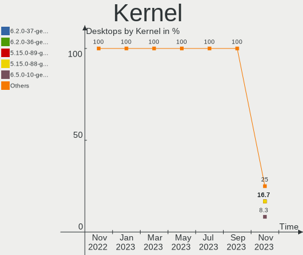

| Version            | Desktops | Percent |
|--------------------|----------|---------|
| 4.15.0-163-generic | 15       | 39.47%  |
| 5.4.0-94-generic   | 12       | 31.58%  |
| 5.13.0-25-generic  | 3        | 7.89%   |
| 5.13.0-27-generic  | 2        | 5.26%   |
| 5.4.0-96-generic   | 1        | 2.63%   |
| 5.4.0-65-generic   | 1        | 2.63%   |
| 5.13.0-24-generic  | 1        | 2.63%   |
| 5.11.0-49-generic  | 1        | 2.63%   |
| 5.11.0-46-generic  | 1        | 2.63%   |
| 5.11.0-40-generic  | 1        | 2.63%   |

Kernel Family
-------------

Linux kernel without a distro release

| Version | Desktops | Percent |
|---------|----------|---------|
| 4.15.0  | 15       | 39.47%  |
| 5.4.0   | 14       | 36.84%  |
| 5.13.0  | 6        | 15.79%  |
| 5.11.0  | 3        | 7.89%   |

Kernel Major Ver.
-----------------

Linux kernel major version

| Version | Desktops | Percent |
|---------|----------|---------|
| 4.15    | 15       | 39.47%  |
| 5.4     | 14       | 36.84%  |
| 5.13    | 6        | 15.79%  |
| 5.11    | 3        | 7.89%   |

Arch
----

OS architecture (x86_64, i586, etc.)

| Name   | Desktops | Percent |
|--------|----------|---------|
| x86_64 | 38       | 100%    |

DE
--

Desktop Environment

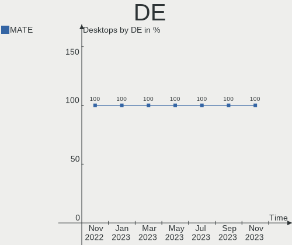

| Name | Desktops | Percent |
|------|----------|---------|
| MATE | 38       | 100%    |

Display Server
--------------

X11 or Wayland

| Name | Desktops | Percent |
|------|----------|---------|
| X11  | 38       | 100%    |

Display Manager
---------------

SDDM, LightDM, etc.

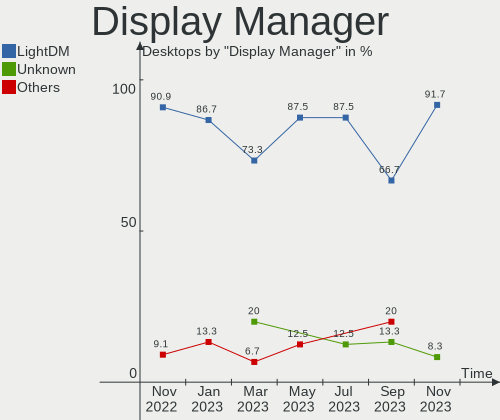

| Name    | Desktops | Percent |
|---------|----------|---------|
| LightDM | 35       | 92.11%  |
| Unknown | 3        | 7.89%   |

OS Lang
-------

Language

| Lang  | Desktops | Percent |
|-------|----------|---------|
| el_GR | 29       | 76.32%  |
| en_US | 3        | 7.89%   |
| it_IT | 2        | 5.26%   |
| de_DE | 2        | 5.26%   |
| fr_FR | 1        | 2.63%   |
| en_CA | 1        | 2.63%   |

Boot Mode
---------

EFI or BIOS

| Mode | Desktops | Percent |
|------|----------|---------|
| BIOS | 33       | 86.84%  |
| EFI  | 5        | 13.16%  |

Filesystem
----------

Type of filesystem

| Type    | Desktops | Percent |
|---------|----------|---------|
| Overlay | 23       | 60.53%  |
| Ext4    | 14       | 36.84%  |
| Zfs     | 1        | 2.63%   |

Part. scheme
------------

Scheme of partitioning

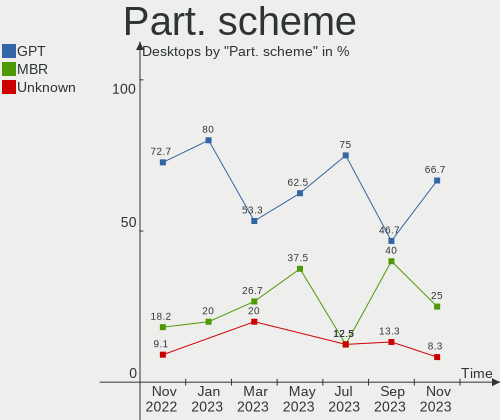

| Type    | Desktops | Percent |
|---------|----------|---------|
| Unknown | 23       | 60.53%  |
| MBR     | 12       | 31.58%  |
| GPT     | 3        | 7.89%   |

Dual Boot with Linux/BSD
------------------------

Hosting more than one Linux/BSD

| Dual boot | Desktops | Percent |
|-----------|----------|---------|
| No        | 35       | 92.11%  |
| Yes       | 3        | 7.89%   |

Dual Boot (Win)
---------------

Hosting Linux and Windows

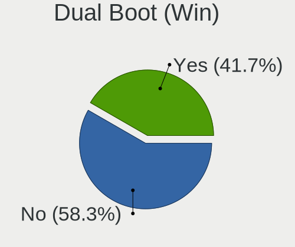

| Dual boot | Desktops | Percent |
|-----------|----------|---------|
| Yes       | 28       | 73.68%  |
| No        | 10       | 26.32%  |

Board
-----

Vendor
------

Motherboard manufacturer

| Name                | Desktops | Percent |
|---------------------|----------|---------|
| Hewlett-Packard     | 9        | 23.68%  |
| Dell                | 8        | 21.05%  |
| ASUSTek Computer    | 7        | 18.42%  |
| Lenovo              | 6        | 15.79%  |
| Gigabyte Technology | 3        | 7.89%   |
| ASRock              | 3        | 7.89%   |
| ZOTAC               | 1        | 2.63%   |
| Albatron            | 1        | 2.63%   |

Model
-----

Motherboard model

| Name                                | Desktops | Percent |
|-------------------------------------|----------|---------|
| HP ProDesk 600 G1 SFF               | 6        | 15.79%  |
| Dell OptiPlex GX520                 | 4        | 10.53%  |
| Lenovo ThinkCentre E73 10AW008MMX   | 2        | 5.26%   |
| Dell OptiPlex GX620                 | 2        | 5.26%   |
| ASUS All Series                     | 2        | 5.26%   |
| ZOTAC NM10                          | 1        | 2.63%   |
| Lenovo ThinkStation P350 30E5000BRU | 1        | 2.63%   |
| Lenovo ThinkCentre M58 7373W43      | 1        | 2.63%   |
| Lenovo ThinkCentre E73 10DR0012GE   | 1        | 2.63%   |
| Lenovo ThinkCentre E73 10DR000TUK   | 1        | 2.63%   |
| HP Z2 Tower G4 Workstation          | 1        | 2.63%   |
| HP Compaq Elite 8300 SFF            | 1        | 2.63%   |
| HP 285 G3 MT Business PC            | 1        | 2.63%   |
| Gigabyte H81M-S2PV                  | 1        | 2.63%   |
| Gigabyte H410M H V3                 | 1        | 2.63%   |
| Gigabyte B450M S2H                  | 1        | 2.63%   |
| Dell OptiPlex 790                   | 1        | 2.63%   |
| Dell OptiPlex 330                   | 1        | 2.63%   |
| ASUS ROG STRIX B550-I GAMING        | 1        | 2.63%   |
| ASUS PRIME H310M-D R2.0             | 1        | 2.63%   |
| ASUS P5LD2                          | 1        | 2.63%   |
| ASUS P5KPL-AM SE                    | 1        | 2.63%   |
| ASUS M5A99X EVO R2.0                | 1        | 2.63%   |
| ASRock Z77 Pro4                     | 1        | 2.63%   |
| ASRock G41C-VS                      | 1        | 2.63%   |
| ASRock B450M Pro4                   | 1        | 2.63%   |
| Albatron PM73V                      | 1        | 2.63%   |

Model Family
------------

Motherboard model prefix

| Name                | Desktops | Percent |
|---------------------|----------|---------|
| Dell OptiPlex       | 8        | 21.05%  |
| HP ProDesk          | 6        | 15.79%  |
| Lenovo ThinkCentre  | 5        | 13.16%  |
| ASUS All            | 2        | 5.26%   |
| ZOTAC NM10          | 1        | 2.63%   |
| Lenovo ThinkStation | 1        | 2.63%   |
| HP Z2               | 1        | 2.63%   |
| HP Compaq           | 1        | 2.63%   |
| HP 285              | 1        | 2.63%   |
| Gigabyte H81M-S2PV  | 1        | 2.63%   |
| Gigabyte H410M      | 1        | 2.63%   |
| Gigabyte B450M      | 1        | 2.63%   |
| ASUS ROG            | 1        | 2.63%   |
| ASUS PRIME          | 1        | 2.63%   |
| ASUS P5LD2          | 1        | 2.63%   |
| ASUS P5KPL-AM       | 1        | 2.63%   |
| ASUS M5A99X         | 1        | 2.63%   |
| ASRock Z77          | 1        | 2.63%   |
| ASRock G41C-VS      | 1        | 2.63%   |
| ASRock B450M        | 1        | 2.63%   |
| Albatron PM73V      | 1        | 2.63%   |

MFG Year
--------

Motherboard manufacture year

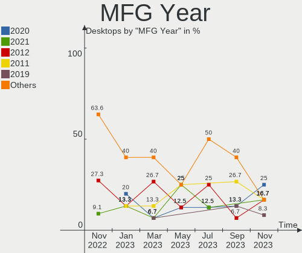

| Year | Desktops | Percent |
|------|----------|---------|
| 2013 | 9        | 23.68%  |
| 2005 | 5        | 13.16%  |
| 2014 | 4        | 10.53%  |
| 2012 | 4        | 10.53%  |
| 2018 | 3        | 7.89%   |
| 2021 | 2        | 5.26%   |
| 2019 | 2        | 5.26%   |
| 2008 | 2        | 5.26%   |
| 2006 | 2        | 5.26%   |
| 2020 | 1        | 2.63%   |
| 2011 | 1        | 2.63%   |
| 2010 | 1        | 2.63%   |
| 2009 | 1        | 2.63%   |
| 2007 | 1        | 2.63%   |

Form Factor
-----------

Physical design of the computer

| Name    | Desktops | Percent |
|---------|----------|---------|
| Desktop | 38       | 100%    |

Secure Boot
-----------

Enabled or disabled

| State    | Desktops | Percent |
|----------|----------|---------|
| Disabled | 36       | 94.74%  |
| Enabled  | 2        | 5.26%   |

Coreboot
--------

Have coreboot on board

| Used | Desktops | Percent |
|------|----------|---------|
| No   | 38       | 100%    |

RAM Size
--------

Total RAM memory

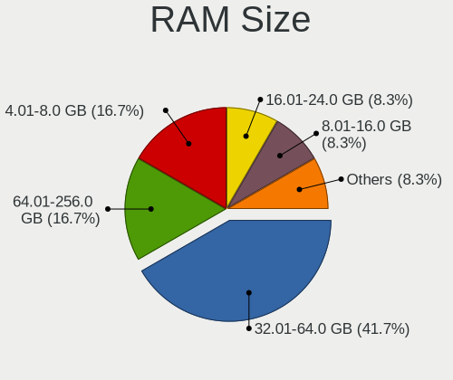

| Size in GB | Desktops | Percent |
|------------|----------|---------|
| 3.01-4.0   | 14       | 36.84%  |
| 1.01-2.0   | 6        | 15.79%  |
| 8.01-16.0  | 6        | 15.79%  |
| 2.01-3.0   | 5        | 13.16%  |
| 4.01-8.0   | 4        | 10.53%  |
| 16.01-24.0 | 2        | 5.26%   |
| 32.01-64.0 | 1        | 2.63%   |

RAM Used
--------

Used RAM memory

| Used GB   | Desktops | Percent |
|-----------|----------|---------|
| 0.51-1.0  | 15       | 39.47%  |
| 1.01-2.0  | 8        | 21.05%  |
| 0.01-0.5  | 7        | 18.42%  |
| 3.01-4.0  | 3        | 7.89%   |
| 2.01-3.0  | 3        | 7.89%   |
| 4.01-8.0  | 1        | 2.63%   |
| 8.01-16.0 | 1        | 2.63%   |

Total Drives
------------

Number of drives on board

| Drives | Desktops | Percent |
|--------|----------|---------|
| 1      | 30       | 78.95%  |
| 2      | 5        | 13.16%  |
| 4      | 2        | 5.26%   |
| 3      | 1        | 2.63%   |

Has CD-ROM
----------

Has CD-ROM on board

| Presented | Desktops | Percent |
|-----------|----------|---------|
| Yes       | 32       | 84.21%  |
| No        | 6        | 15.79%  |

Has Ethernet
------------

Has Ethernet on board

| Presented | Desktops | Percent |
|-----------|----------|---------|
| Yes       | 38       | 100%    |

Has WiFi
--------

Has WiFi module

| Presented | Desktops | Percent |
|-----------|----------|---------|
| No        | 35       | 92.11%  |
| Yes       | 3        | 7.89%   |

Has Bluetooth
-------------

Has Bluetooth module

| Presented | Desktops | Percent |
|-----------|----------|---------|
| No        | 36       | 94.74%  |
| Yes       | 2        | 5.26%   |

Location
--------

Country
-------

Geographic location (country)

| Country | Desktops | Percent |
|---------|----------|---------|
| Greece  | 29       | 76.32%  |
| Russia  | 2        | 5.26%   |
| Italy   | 2        | 5.26%   |
| USA     | 1        | 2.63%   |
| Germany | 1        | 2.63%   |
| France  | 1        | 2.63%   |
| Canada  | 1        | 2.63%   |
| Austria | 1        | 2.63%   |

City
----

Geographic location (city)

| City              | Desktops | Percent |
|-------------------|----------|---------|
| Thessaloniki      | 17       | 44.74%  |
| Old Faliron       | 11       | 28.95%  |
| Vienna            | 1        | 2.63%   |
| Toronto           | 1        | 2.63%   |
| St Petersburg     | 1        | 2.63%   |
| Sehnde            | 1        | 2.63%   |
| Rome              | 1        | 2.63%   |
| Portland          | 1        | 2.63%   |
| Piovene Rocchette | 1        | 2.63%   |
| Moscow            | 1        | 2.63%   |
| Karditsa          | 1        | 2.63%   |
| Antony            | 1        | 2.63%   |

Drives
------

Drive Vendor
------------

Hard drive vendors

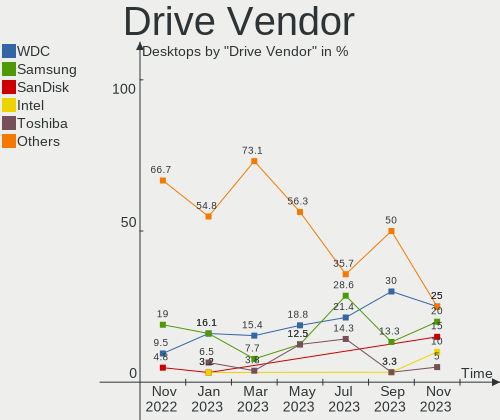

| Vendor              | Desktops | Drives | Percent |
|---------------------|----------|--------|---------|
| Seagate             | 14       | 14     | 28.57%  |
| WDC                 | 8        | 9      | 16.33%  |
| Samsung Electronics | 6        | 6      | 12.24%  |
| Toshiba             | 5        | 6      | 10.2%   |
| Intel               | 5        | 5      | 10.2%   |
| PNY                 | 2        | 3      | 4.08%   |
| Crucial             | 2        | 2      | 4.08%   |
| China               | 2        | 2      | 4.08%   |
| SanDisk             | 1        | 1      | 2.04%   |
| Phison              | 1        | 1      | 2.04%   |
| Patriot             | 1        | 1      | 2.04%   |
| Leven               | 1        | 1      | 2.04%   |
| Kingston            | 1        | 1      | 2.04%   |

Drive Model
-----------

Hard drive models

| Model                                | Desktops | Percent |
|--------------------------------------|----------|---------|
| Intel SSDSA2BW120G3H 120GB           | 5        | 9.8%    |
| Seagate ST500DM002-1BD142 500GB      | 3        | 5.88%   |
| Toshiba DT01ACA200 2TB               | 2        | 3.92%   |
| Toshiba DT01ACA050 500GB             | 2        | 3.92%   |
| Seagate ST340212AS 40GB              | 2        | 3.92%   |
| WDC WDS100T2B0A-00SM50 1TB SSD       | 1        | 1.96%   |
| WDC WD5000LPVX-60V0TT0 500GB         | 1        | 1.96%   |
| WDC WD5000AAKX-08ERMA0 500GB         | 1        | 1.96%   |
| WDC WD2500BPVT-16JJ5T0 250GB         | 1        | 1.96%   |
| WDC WD2500AAKX-753CA1 250GB          | 1        | 1.96%   |
| WDC WD2500AAKX-08ERMA0 250GB         | 1        | 1.96%   |
| WDC WD1600JS-00NCB1 160GB            | 1        | 1.96%   |
| WDC WD10EZEX-07M2NA0 1TB             | 1        | 1.96%   |
| Toshiba MQ01ACF032 320GB             | 1        | 1.96%   |
| Toshiba HDWG180 8TB                  | 1        | 1.96%   |
| Seagate STM3250318AS 250GB           | 1        | 1.96%   |
| Seagate ST500DM005 HD502HJ 500GB     | 1        | 1.96%   |
| Seagate ST3500320AS 500GB            | 1        | 1.96%   |
| Seagate ST3402111AS 40GB             | 1        | 1.96%   |
| Seagate ST3160815AS 160GB            | 1        | 1.96%   |
| Seagate ST3160813AS 160GB            | 1        | 1.96%   |
| Seagate ST250DM000-1BD141 250GB      | 1        | 1.96%   |
| Seagate ST1000LM049-2GH172 1TB       | 1        | 1.96%   |
| Seagate ST1000DM003-9YN162 1TB       | 1        | 1.96%   |
| SanDisk SSD PLUS 120 GB              | 1        | 1.96%   |
| Samsung SSD 980 PRO 1TB              | 1        | 1.96%   |
| Samsung SSD 870 EVO 500GB            | 1        | 1.96%   |
| Samsung SSD 860 EVO 2TB              | 1        | 1.96%   |
| Samsung MZVL2512HCJQ-00BL7 512GB     | 1        | 1.96%   |
| Samsung MZ7LN256HAJQ-000H1 256GB SSD | 1        | 1.96%   |
| Samsung HD161GJ 160GB                | 1        | 1.96%   |
| PNY SSD2SC240G1SA754D117-820 240GB   | 1        | 1.96%   |
| PNY CS900 240GB SSD                  | 1        | 1.96%   |
| PNY CS900 1TB SSD                    | 1        | 1.96%   |
| Phison NVMe SSD Drive 1TB            | 1        | 1.96%   |
| Patriot P300 256GB                   | 1        | 1.96%   |
| Leven JAJS300M120C 120GB SSD         | 1        | 1.96%   |
| Kingston NVMe SSD Drive 500GB        | 1        | 1.96%   |
| Crucial CT480BX500SSD1 480GB         | 1        | 1.96%   |
| Crucial CT1000BX500SSD1 1TB          | 1        | 1.96%   |
| China SATA SSD 64GB                  | 1        | 1.96%   |
| China SATA SSD 240GB                 | 1        | 1.96%   |

HDD Vendor
----------

Hard disk drive vendors

| Vendor              | Desktops | Drives | Percent |
|---------------------|----------|--------|---------|
| Seagate             | 14       | 14     | 51.85%  |
| WDC                 | 7        | 8      | 25.93%  |
| Toshiba             | 5        | 6      | 18.52%  |
| Samsung Electronics | 1        | 1      | 3.7%    |

SSD Vendor
----------

Solid state drive vendors

| Vendor              | Desktops | Drives | Percent |
|---------------------|----------|--------|---------|
| Intel               | 5        | 5      | 29.41%  |
| Samsung Electronics | 3        | 3      | 17.65%  |
| PNY                 | 2        | 3      | 11.76%  |
| Crucial             | 2        | 2      | 11.76%  |
| China               | 2        | 2      | 11.76%  |
| WDC                 | 1        | 1      | 5.88%   |
| SanDisk             | 1        | 1      | 5.88%   |
| Leven               | 1        | 1      | 5.88%   |

Drive Kind
----------

HDD or SSD

| Kind | Desktops | Drives | Percent |
|------|----------|--------|---------|
| HDD  | 27       | 29     | 57.45%  |
| SSD  | 15       | 18     | 31.91%  |
| NVMe | 5        | 5      | 10.64%  |

Drive Connector
---------------

SATA, SAS, NVMe, etc.

| Type | Desktops | Drives | Percent |
|------|----------|--------|---------|
| SATA | 37       | 47     | 88.1%   |
| NVMe | 5        | 5      | 11.9%   |

Drive Size
----------

Size of hard drive

| Size in TB | Desktops | Drives | Percent |
|------------|----------|--------|---------|
| 0.01-0.5   | 33       | 37     | 80.49%  |
| 0.51-1.0   | 4        | 6      | 9.76%   |
| 1.01-2.0   | 3        | 3      | 7.32%   |
| 4.01-10.0  | 1        | 1      | 2.44%   |

Space Total
-----------

Amount of disk space available on the file system

| Size in GB | Desktops | Percent |
|------------|----------|---------|
| Unknown    | 24       | 63.16%  |
| 101-250    | 7        | 18.42%  |
| 251-500    | 2        | 5.26%   |
| 2001-3000  | 2        | 5.26%   |
| 1001-2000  | 2        | 5.26%   |
| 501-1000   | 1        | 2.63%   |

Space Used
----------

Amount of used disk space

| Used GB   | Desktops | Percent |
|-----------|----------|---------|
| Unknown   | 24       | 63.16%  |
| 251-500   | 4        | 10.53%  |
| 21-50     | 4        | 10.53%  |
| 1001-2000 | 2        | 5.26%   |
| 51-100    | 2        | 5.26%   |
| 101-250   | 1        | 2.63%   |
| 1-20      | 1        | 2.63%   |

Malfunc. Drives
---------------

Drive models with a malfunction

| Model                     | Desktops | Drives | Percent |
|---------------------------|----------|--------|---------|
| Seagate ST3500320AS 500GB | 1        | 1      | 50%     |
| Seagate ST3402111AS 40GB  | 1        | 1      | 50%     |

Malfunc. Drive Vendor
---------------------

Vendors of faulty drives

| Vendor  | Desktops | Drives | Percent |
|---------|----------|--------|---------|
| Seagate | 2        | 2      | 100%    |

Malfunc. HDD Vendor
-------------------

Vendors of faulty HDD drives

| Vendor  | Desktops | Drives | Percent |
|---------|----------|--------|---------|
| Seagate | 2        | 2      | 100%    |

Malfunc. Drive Kind
-------------------

Kinds of faulty drives

| Kind | Desktops | Drives | Percent |
|------|----------|--------|---------|
| HDD  | 2        | 2      | 100%    |

Failed Drives
-------------

Failed drive models

Zero info for selected period =(

Failed Drive Vendor
-------------------

Failed drive vendors

Zero info for selected period =(

Drive Status
------------

Number of failed and malfunc. drives

| Status   | Desktops | Drives | Percent |
|----------|----------|--------|---------|
| Detected | 23       | 31     | 58.97%  |
| Works    | 14       | 19     | 35.9%   |
| Malfunc  | 2        | 2      | 5.13%   |

Storage controller
------------------

Storage Vendor
--------------

Storage controller vendors

| Vendor                      | Desktops | Percent |
|-----------------------------|----------|---------|
| Intel                       | 32       | 71.11%  |
| AMD                         | 5        | 11.11%  |
| Samsung Electronics         | 2        | 4.44%   |
| ASMedia Technology          | 2        | 4.44%   |
| Silicon Motion              | 1        | 2.22%   |
| Phison Electronics          | 1        | 2.22%   |
| Nvidia                      | 1        | 2.22%   |
| Kingston Technology Company | 1        | 2.22%   |

Storage Model
-------------

Storage controller models

| Model                                                                          | Desktops | Percent |
|--------------------------------------------------------------------------------|----------|---------|
| Intel 8 Series/C220 Series Chipset Family 6-port SATA Controller 1 [AHCI mode] | 13       | 21.67%  |
| Intel NM10/ICH7 Family SATA Controller [IDE mode]                              | 11       | 18.33%  |
| Intel 82801G (ICH7 Family) IDE Controller                                      | 10       | 16.67%  |
| Samsung NVMe SSD Controller PM9A1/PM9A3/980PRO                                 | 2        | 3.33%   |
| Intel 7 Series/C210 Series Chipset Family 6-port SATA Controller [AHCI mode]   | 2        | 3.33%   |
| ASMedia ASM1062 Serial ATA Controller                                          | 2        | 3.33%   |
| AMD FCH SATA Controller [AHCI mode]                                            | 2        | 3.33%   |
| AMD 400 Series Chipset SATA Controller                                         | 2        | 3.33%   |
| Silicon Motion SM2263EN/SM2263XT SSD Controller                                | 1        | 1.67%   |
| Phison E12 NVMe Controller                                                     | 1        | 1.67%   |
| Nvidia MCP73 SATA Controller (IDE mode)                                        | 1        | 1.67%   |
| Nvidia MCP73 IDE Controller                                                    | 1        | 1.67%   |
| Kingston Company KC2000 NVMe SSD                                               | 1        | 1.67%   |
| Intel SATA Controller [RAID mode]                                              | 1        | 1.67%   |
| Intel 82801JD/DO (ICH10 Family) 4-port SATA IDE Controller                     | 1        | 1.67%   |
| Intel 82801JD/DO (ICH10 Family) 2-port SATA IDE Controller                     | 1        | 1.67%   |
| Intel 6 Series/C200 Series Chipset Family 6 port Desktop SATA AHCI Controller  | 1        | 1.67%   |
| Intel 500 Series Chipset Family SATA RAID Controller                           | 1        | 1.67%   |
| Intel 500 Series Chipset Family SATA AHCI Controller                           | 1        | 1.67%   |
| Intel 4 Series Chipset PT IDER Controller                                      | 1        | 1.67%   |
| Intel 200 Series PCH SATA controller [AHCI mode]                               | 1        | 1.67%   |
| AMD Starship/Matisse Chipset SATA Controller [AHCI mode]                       | 1        | 1.67%   |
| AMD SB7x0/SB8x0/SB9x0 SATA Controller [AHCI mode]                              | 1        | 1.67%   |
| AMD 300 Series Chipset SATA Controller                                         | 1        | 1.67%   |

Storage Kind
------------

Kind of storage controller (IDE, SATA, NVMe, SAS, ...)

| Kind | Desktops | Percent |
|------|----------|---------|
| SATA | 23       | 53.49%  |
| IDE  | 13       | 30.23%  |
| NVMe | 5        | 11.63%  |
| RAID | 2        | 4.65%   |

Processor
---------

CPU Vendor
----------

Processor vendors

| Vendor | Desktops | Percent |
|--------|----------|---------|
| Intel  | 33       | 86.84%  |
| AMD    | 5        | 13.16%  |

CPU Model
---------

Processor models

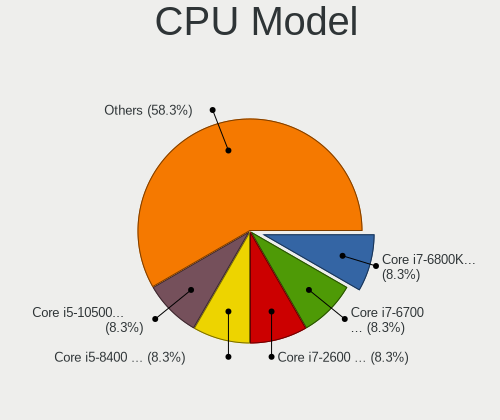

| Model                                       | Desktops | Percent |
|---------------------------------------------|----------|---------|
| Intel Celeron CPU G1840 @ 2.80GHz           | 6        | 15.79%  |
| Intel Pentium 4 CPU 3.00GHz                 | 4        | 10.53%  |
| Intel Pentium CPU G3240 @ 3.10GHz           | 3        | 7.89%   |
| Intel Pentium D CPU 2.80GHz                 | 2        | 5.26%   |
| Intel Pentium Dual-Core CPU E6300 @ 2.80GHz | 1        | 2.63%   |
| Intel Pentium Dual-Core CPU E5700 @ 3.00GHz | 1        | 2.63%   |
| Intel Pentium Dual CPU E2140 @ 1.60GHz      | 1        | 2.63%   |
| Intel Pentium CPU G3220 @ 3.00GHz           | 1        | 2.63%   |
| Intel Core i5-9500 CPU @ 3.00GHz            | 1        | 2.63%   |
| Intel Core i5-9400 CPU @ 2.90GHz            | 1        | 2.63%   |
| Intel Core i5-4460 CPU @ 3.20GHz            | 1        | 2.63%   |
| Intel Core i5-3570 CPU @ 3.40GHz            | 1        | 2.63%   |
| Intel Core i5-10400 CPU @ 2.90GHz           | 1        | 2.63%   |
| Intel Core i3-4150 CPU @ 3.50GHz            | 1        | 2.63%   |
| Intel Core i3-4130 CPU @ 3.40GHz            | 1        | 2.63%   |
| Intel Core i3-3220 CPU @ 3.30GHz            | 1        | 2.63%   |
| Intel Core i3-2120 CPU @ 3.30GHz            | 1        | 2.63%   |
| Intel Core 2 Duo CPU E7300 @ 2.66GHz        | 1        | 2.63%   |
| Intel Core 2 CPU 6300 @ 1.86GHz             | 1        | 2.63%   |
| Intel Celeron CPU E1400 @ 2.00GHz           | 1        | 2.63%   |
| Intel Atom CPU D525 @ 1.80GHz               | 1        | 2.63%   |
| Intel 11th Gen Core i7-11700 @ 2.50GHz      | 1        | 2.63%   |
| AMD Ryzen 7 5700G with Radeon Graphics      | 1        | 2.63%   |
| AMD Ryzen 5 3600X 6-Core Processor          | 1        | 2.63%   |
| AMD Ryzen 3 2200G with Radeon Vega Graphics | 1        | 2.63%   |
| AMD Ryzen 3 1200 Quad-Core Processor        | 1        | 2.63%   |
| AMD FX-6100 Six-Core Processor              | 1        | 2.63%   |

CPU Model Family
----------------

Processor model prefix

| Model                   | Desktops | Percent |
|-------------------------|----------|---------|
| Intel Celeron           | 7        | 18.42%  |
| Intel Core i5           | 5        | 13.16%  |
| Intel Pentium 4         | 4        | 10.53%  |
| Intel Pentium           | 4        | 10.53%  |
| Intel Core i3           | 4        | 10.53%  |
| Intel Pentium Dual-Core | 2        | 5.26%   |
| Intel Pentium D         | 2        | 5.26%   |
| AMD Ryzen 3             | 2        | 5.26%   |
| Other                   | 1        | 2.63%   |
| Intel Pentium Dual      | 1        | 2.63%   |
| Intel Core 2 Duo        | 1        | 2.63%   |
| Intel Core 2            | 1        | 2.63%   |
| Intel Atom              | 1        | 2.63%   |
| AMD Ryzen 7             | 1        | 2.63%   |
| AMD Ryzen 5             | 1        | 2.63%   |
| AMD FX                  | 1        | 2.63%   |

CPU Cores
---------

Number of processor cores

| Number | Desktops | Percent |
|--------|----------|---------|
| 2      | 23       | 60.53%  |
| 6      | 4        | 10.53%  |
| 4      | 4        | 10.53%  |
| 1      | 4        | 10.53%  |
| 8      | 2        | 5.26%   |
| 3      | 1        | 2.63%   |

CPU Sockets
-----------

Number of sockets

| Number | Desktops | Percent |
|--------|----------|---------|
| 1      | 38       | 100%    |

CPU Threads
-----------

Threads per core (Hyper-Threading)

| Number | Desktops | Percent |
|--------|----------|---------|
| 1      | 24       | 63.16%  |
| 2      | 14       | 36.84%  |

CPU Op-Modes
------------

CPU Operation Modes (32-bit, 64-bit)

| Op mode        | Desktops | Percent |
|----------------|----------|---------|
| 32-bit, 64-bit | 38       | 100%    |

CPU Microcode
-------------

Microcode number

| Number     | Desktops | Percent |
|------------|----------|---------|
| 0x306c3    | 13       | 34.21%  |
| 0xf41      | 4        | 10.53%  |
| Unknown    | 4        | 10.53%  |
| 0xf47      | 2        | 5.26%   |
| 0x6fd      | 2        | 5.26%   |
| 0x1067a    | 2        | 5.26%   |
| 0xa0671    | 1        | 2.63%   |
| 0xa0653    | 1        | 2.63%   |
| 0x906ed    | 1        | 2.63%   |
| 0x906ea    | 1        | 2.63%   |
| 0x6f6      | 1        | 2.63%   |
| 0x306a9    | 1        | 2.63%   |
| 0x206a7    | 1        | 2.63%   |
| 0x10676    | 1        | 2.63%   |
| 0x0a50000b | 1        | 2.63%   |
| 0x0810100b | 1        | 2.63%   |
| 0x0600063e | 1        | 2.63%   |

CPU Microarch
-------------

Microarchitecture

| Name        | Desktops | Percent |
|-------------|----------|---------|
| Haswell     | 13       | 34.21%  |
| NetBurst    | 6        | 15.79%  |
| Penryn      | 3        | 7.89%   |
| Core        | 3        | 7.89%   |
| Zen         | 2        | 5.26%   |
| KabyLake    | 2        | 5.26%   |
| IvyBridge   | 2        | 5.26%   |
| Zen 3       | 1        | 2.63%   |
| Zen 2       | 1        | 2.63%   |
| SandyBridge | 1        | 2.63%   |
| CometLake   | 1        | 2.63%   |
| Bulldozer   | 1        | 2.63%   |
| Bonnell     | 1        | 2.63%   |
| Unknown     | 1        | 2.63%   |

Graphics
--------

GPU Vendor
----------

Vendors of graphics cards

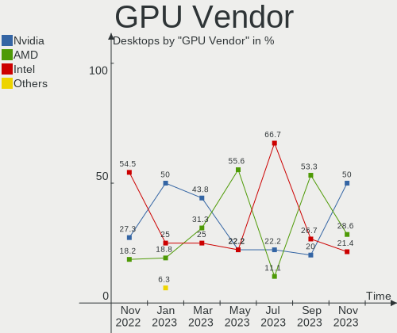

| Vendor | Desktops | Percent |
|--------|----------|---------|
| Intel  | 28       | 70%     |
| Nvidia | 7        | 17.5%   |
| AMD    | 5        | 12.5%   |

GPU Model
---------

Graphics card models

| Model                                                                       | Desktops | Percent |
|-----------------------------------------------------------------------------|----------|---------|
| Intel Xeon E3-1200 v3/4th Gen Core Processor Integrated Graphics Controller | 11       | 26.83%  |
| Intel 82945G/GZ Integrated Graphics Controller                              | 6        | 14.63%  |
| Nvidia GT218 [GeForce 210]                                                  | 2        | 4.88%   |
| Nvidia GK208B [GeForce GT 710]                                              | 2        | 4.88%   |
| Intel Xeon E3-1200 v2/3rd Gen Core processor Graphics Controller            | 2        | 4.88%   |
| Intel CoffeeLake-S GT2 [UHD Graphics 630]                                   | 2        | 4.88%   |
| Intel 82G33/G31 Express Integrated Graphics Controller                      | 2        | 4.88%   |
| Intel 4 Series Chipset Integrated Graphics Controller                       | 2        | 4.88%   |
| Nvidia TU117GLM [Quadro T1000 Mobile]                                       | 1        | 2.44%   |
| Nvidia GP108 [GeForce GT 1030]                                              | 1        | 2.44%   |
| Nvidia GK104 [GeForce GTX 680]                                              | 1        | 2.44%   |
| Intel RocketLake-S GT1 [UHD Graphics 750]                                   | 1        | 2.44%   |
| Intel CometLake-S GT2 [UHD Graphics 630]                                    | 1        | 2.44%   |
| Intel Atom Processor D4xx/D5xx/N4xx/N5xx Integrated Graphics Controller     | 1        | 2.44%   |
| AMD RV620 LE [Radeon HD 3450]                                               | 1        | 2.44%   |
| AMD RV370 [Radeon X300/X550/X1050 Series] (Secondary)                       | 1        | 2.44%   |
| AMD RV370 [Radeon X300/X550/X1050 Series]                                   | 1        | 2.44%   |
| AMD Raven Ridge [Radeon Vega Series / Radeon Vega Mobile Series]            | 1        | 2.44%   |
| AMD Oland PRO [Radeon R7 240/340 / Radeon 520]                              | 1        | 2.44%   |
| AMD Cezanne                                                                 | 1        | 2.44%   |

GPU Combo
---------

Combinations of graphics cards

| Name           | Desktops | Percent |
|----------------|----------|---------|
| 1 x Intel      | 26       | 68.42%  |
| 1 x Nvidia     | 5        | 13.16%  |
| 1 x AMD        | 4        | 10.53%  |
| Intel + Nvidia | 2        | 5.26%   |
| 2 x AMD        | 1        | 2.63%   |

GPU Driver
----------

Free vs proprietary

| Driver      | Desktops | Percent |
|-------------|----------|---------|
| Free        | 34       | 89.47%  |
| Proprietary | 3        | 7.89%   |
| Unknown     | 1        | 2.63%   |

GPU Memory
----------

Total video memory

| Size in GB | Desktops | Percent |
|------------|----------|---------|
| Unknown    | 15       | 39.47%  |
| 1.01-2.0   | 14       | 36.84%  |
| 0.01-0.5   | 5        | 13.16%  |
| 3.01-4.0   | 2        | 5.26%   |
| 0.51-1.0   | 2        | 5.26%   |

Monitor
-------

Monitor Vendor
--------------

Monitor vendors

| Vendor               | Desktops | Percent |
|----------------------|----------|---------|
| Hewlett-Packard      | 9        | 23.08%  |
| ViewSonic            | 5        | 12.82%  |
| Samsung Electronics  | 3        | 7.69%   |
| Goldstar             | 3        | 7.69%   |
| Philips              | 2        | 5.13%   |
| Lenovo               | 2        | 5.13%   |
| Hitachi              | 2        | 5.13%   |
| Eizo                 | 2        | 5.13%   |
| Belinea              | 2        | 5.13%   |
| Vestel Elektronik    | 1        | 2.56%   |
| RTK                  | 1        | 2.56%   |
| NEC Computers        | 1        | 2.56%   |
| Iiyama               | 1        | 2.56%   |
| Fujitsu Siemens      | 1        | 2.56%   |
| Dell                 | 1        | 2.56%   |
| AOC                  | 1        | 2.56%   |
| Ancor Communications | 1        | 2.56%   |
| Acer                 | 1        | 2.56%   |

Monitor Model
-------------

Monitor models

| Model                                                                 | Desktops | Percent |
|-----------------------------------------------------------------------|----------|---------|
| ViewSonic VA703-4Series VSC6A1E 1280x1024 341x274mm 17.2-inch         | 4        | 10%     |
| Hewlett-Packard L2035 HWP2612 1600x1200 408x306mm 20.1-inch           | 2        | 5%      |
| Hewlett-Packard L1740 HWP2648 1280x1024 337x270mm 17.0-inch           | 2        | 5%      |
| ViewSonic VE710s VSCF518 1280x1024 338x270mm 17.0-inch                | 1        | 2.5%    |
| Vestel Elektronik LCD Monitor VES3700 1920x540                        | 1        | 2.5%    |
| Samsung Electronics SyncMaster SAM03CF 1280x1024 338x270mm 17.0-inch  | 1        | 2.5%    |
| Samsung Electronics LCD Monitor C32F391 1920x1080                     | 1        | 2.5%    |
| Samsung Electronics EPSON PJ SECA60D 1920x1080                        | 1        | 2.5%    |
| RTK LCD Monitor RTK1D1A 1920x1080 1020x570mm 46.0-inch                | 1        | 2.5%    |
| Philips PHL 223V7 PHLC154 1920x1080 476x268mm 21.5-inch               | 1        | 2.5%    |
| Philips PhilipsTV (5) PHL14CA 1360x768 708x398mm 32.0-inch            | 1        | 2.5%    |
| Philips 206VL PHLC08C 1600x900 443x249mm 20.0-inch                    | 1        | 2.5%    |
| NEC Computers EA244WMi NEC68D6 1920x1200 520x320mm 24.0-inch          | 1        | 2.5%    |
| Lenovo LEN S22e-19 LEN61C9 1920x1080 476x268mm 21.5-inch              | 1        | 2.5%    |
| Lenovo C27-35 LEN66BA 1920x1080 597x336mm 27.0-inch                   | 1        | 2.5%    |
| Iiyama PL4372UH IVM000B 3840x2160 941x529mm 42.5-inch                 | 1        | 2.5%    |
| Hitachi N220W D-sub HIT60FF 1680x1050 474x296mm 22.0-inch             | 1        | 2.5%    |
| Hitachi CM615 HTCB3B3 1280x1024 300x225mm 14.8-inch                   | 1        | 2.5%    |
| Hewlett-Packard P224 HPN361E 1920x1080 527x296mm 23.8-inch            | 1        | 2.5%    |
| Hewlett-Packard L1950 HWP26E7 1280x1024 380x300mm 19.1-inch           | 1        | 2.5%    |
| Hewlett-Packard L1940T HWP2682 1280x1024 376x301mm 19.0-inch          | 1        | 2.5%    |
| Hewlett-Packard L1706 HWP265C 1280x1024 340x270mm 17.1-inch           | 1        | 2.5%    |
| Hewlett-Packard 24f HPN3546 1920x1080 527x296mm 23.8-inch             | 1        | 2.5%    |
| Goldstar W1943 GSM4BAD 1360x768 406x229mm 18.4-inch                   | 1        | 2.5%    |
| Goldstar L1730S GSM438D 1280x1024 338x270mm 17.0-inch                 | 1        | 2.5%    |
| Goldstar E1910 GSM4BEA 1280x1024 376x301mm 19.0-inch                  | 1        | 2.5%    |
| Fujitsu Siemens P19-2 FUS0552 1280x1024 376x301mm 19.0-inch           | 1        | 2.5%    |
| Eizo S1921 ENC1832 1280x1024 376x301mm 19.0-inch                      | 1        | 2.5%    |
| Eizo L768 ENC1730 1280x1024 376x301mm 19.0-inch                       | 1        | 2.5%    |
| Dell IN2010N DELA049 1600x900 443x249mm 20.0-inch                     | 1        | 2.5%    |
| Belinea B101925 MAX0784 1280x1024 376x301mm 19.0-inch                 | 1        | 2.5%    |
| Belinea B101715 MAX06D2 1280x1024 337x270mm 17.0-inch                 | 1        | 2.5%    |
| AOC 1950W AOC1950 1366x768 410x230mm 18.5-inch                        | 1        | 2.5%    |
| Ancor Communications ASUS VW193S ACI19D4 1440x900 408x255mm 18.9-inch | 1        | 2.5%    |
| Acer V193L ACR0320 1280x1024 376x301mm 19.0-inch                      | 1        | 2.5%    |

Monitor Resolution
------------------

Monitor screen resolution

| Resolution         | Desktops | Percent |
|--------------------|----------|---------|
| 1280x1024 (SXGA)   | 20       | 52.63%  |
| 1920x1080 (FHD)    | 6        | 15.79%  |
| 3840x2160 (4K)     | 2        | 5.26%   |
| 1600x900 (HD+)     | 2        | 5.26%   |
| 1600x1200          | 2        | 5.26%   |
| 1360x768           | 2        | 5.26%   |
| 1920x1200 (WUXGA)  | 1        | 2.63%   |
| 1680x1050 (WSXGA+) | 1        | 2.63%   |
| 1440x900 (WXGA+)   | 1        | 2.63%   |
| 1366x768 (WXGA)    | 1        | 2.63%   |

Monitor Diagonal
----------------

Diagonal size in inches

| Inches  | Desktops | Percent |
|---------|----------|---------|
| 17      | 11       | 27.5%   |
| 19      | 9        | 22.5%   |
| 20      | 4        | 10%     |
| 23      | 2        | 5%      |
| 21      | 2        | 5%      |
| 18      | 2        | 5%      |
| 84      | 1        | 2.5%    |
| 72      | 1        | 2.5%    |
| 46      | 1        | 2.5%    |
| 42      | 1        | 2.5%    |
| 32      | 1        | 2.5%    |
| 27      | 1        | 2.5%    |
| 24      | 1        | 2.5%    |
| 22      | 1        | 2.5%    |
| 14      | 1        | 2.5%    |
| Unknown | 1        | 2.5%    |

Monitor Width
-------------

Physical width

| Width in mm | Desktops | Percent |
|-------------|----------|---------|
| 301-350     | 11       | 28.21%  |
| 401-500     | 10       | 25.64%  |
| 351-400     | 8        | 20.51%  |
| 501-600     | 3        | 7.69%   |
| 1501-2000   | 2        | 5.13%   |
| 701-800     | 1        | 2.56%   |
| 201-300     | 1        | 2.56%   |
| 1001-1500   | 1        | 2.56%   |
| 901-1000    | 1        | 2.56%   |
| Unknown     | 1        | 2.56%   |

Aspect Ratio
------------

Proportional relationship between the width and the height

| Ratio   | Desktops | Percent |
|---------|----------|---------|
| 5/4     | 15       | 41.67%  |
| 16/9    | 10       | 27.78%  |
| 6/5     | 4        | 11.11%  |
| 4/3     | 3        | 8.33%   |
| 16/10   | 3        | 8.33%   |
| Unknown | 1        | 2.78%   |

Monitor Area
------------

Area in inch

| Area in inch | Desktops | Percent |
|----------------|----------|---------|
| 151-200        | 15       | 37.5%   |
| 141-150        | 13       | 32.5%   |
| 201-250        | 3        | 7.5%    |
| More than 1000 | 2        | 5%      |
| 501-1000       | 2        | 5%      |
| 351-500        | 1        | 2.5%    |
| 301-350        | 1        | 2.5%    |
| 251-300        | 1        | 2.5%    |
| 101-110        | 1        | 2.5%    |
| Unknown        | 1        | 2.5%    |

Pixel Density
-------------

Pixels per inch

| Density | Desktops | Percent |
|---------|----------|---------|
| 51-100  | 31       | 79.49%  |
| 101-120 | 4        | 10.26%  |
| 1-50    | 3        | 7.69%   |
| Unknown | 1        | 2.56%   |

Multiple Monitors
-----------------

Total monitors connected

| Total | Desktops | Percent |
|-------|----------|---------|
| 1     | 33       | 86.84%  |
| 2     | 4        | 10.53%  |
| 0     | 1        | 2.63%   |

Network
-------

Net Controller Vendor
---------------------

Controller vendors

| Vendor                   | Desktops | Percent |
|--------------------------|----------|---------|
| Realtek Semiconductor    | 16       | 37.21%  |
| Intel                    | 13       | 30.23%  |
| Broadcom                 | 6        | 13.95%  |
| Qualcomm Atheros         | 3        | 6.98%   |
| Nvidia                   | 1        | 2.33%   |
| Marvell Technology Group | 1        | 2.33%   |
| Edimax Technology        | 1        | 2.33%   |
| D-Link System            | 1        | 2.33%   |
| Broadcom Limited         | 1        | 2.33%   |

Net Controller Model
--------------------

Controller models

| Model                                                             | Desktops | Percent |
|-------------------------------------------------------------------|----------|---------|
| Realtek RTL8111/8168/8411 PCI Express Gigabit Ethernet Controller | 15       | 34.09%  |
| Intel Ethernet Connection I217-LM                                 | 6        | 13.64%  |
| Broadcom NetXtreme BCM5751 Gigabit Ethernet PCI Express           | 6        | 13.64%  |
| Intel 82579LM Gigabit Network Connection (Lewisville)             | 2        | 4.55%   |
| Realtek RTL810xE PCI Express Fast Ethernet controller             | 1        | 2.27%   |
| Qualcomm Atheros AR9485 Wireless Network Adapter                  | 1        | 2.27%   |
| Qualcomm Atheros AR9287 Wireless Network Adapter (PCI-Express)    | 1        | 2.27%   |
| Qualcomm Atheros AR8132 Fast Ethernet                             | 1        | 2.27%   |
| Nvidia MCP73 Ethernet                                             | 1        | 2.27%   |
| Marvell Group 88E8053 PCI-E Gigabit Ethernet Controller           | 1        | 2.27%   |
| Intel I350 Gigabit Network Connection                             | 1        | 2.27%   |
| Intel Ethernet Controller I225-V                                  | 1        | 2.27%   |
| Intel Ethernet Connection (7) I219-LM                             | 1        | 2.27%   |
| Intel Ethernet Connection (14) I219-LM                            | 1        | 2.27%   |
| Intel 82574L Gigabit Network Connection                           | 1        | 2.27%   |
| Intel 82567LM-3 Gigabit Network Connection                        | 1        | 2.27%   |
| Edimax 802.11n WLAN Adapter                                       | 1        | 2.27%   |
| D-Link System DGE-528T Gigabit Ethernet Adapter                   | 1        | 2.27%   |
| Broadcom Limited NetLink BCM5787 Gigabit Ethernet PCI Express     | 1        | 2.27%   |

Wireless Vendor
---------------

Wireless vendors

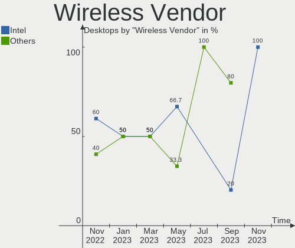

| Vendor            | Desktops | Percent |
|-------------------|----------|---------|
| Qualcomm Atheros  | 2        | 66.67%  |
| Edimax Technology | 1        | 33.33%  |

Wireless Model
--------------

Wireless models

| Model                                                          | Desktops | Percent |
|----------------------------------------------------------------|----------|---------|
| Qualcomm Atheros AR9485 Wireless Network Adapter               | 1        | 33.33%  |
| Qualcomm Atheros AR9287 Wireless Network Adapter (PCI-Express) | 1        | 33.33%  |
| Edimax 802.11n WLAN Adapter                                    | 1        | 33.33%  |

Ethernet Vendor
---------------

Ethernet vendors

| Vendor                   | Desktops | Percent |
|--------------------------|----------|---------|
| Realtek Semiconductor    | 16       | 40%     |
| Intel                    | 13       | 32.5%   |
| Broadcom                 | 6        | 15%     |
| Qualcomm Atheros         | 1        | 2.5%    |
| Nvidia                   | 1        | 2.5%    |
| Marvell Technology Group | 1        | 2.5%    |
| D-Link System            | 1        | 2.5%    |
| Broadcom Limited         | 1        | 2.5%    |

Ethernet Model
--------------

Ethernet models

| Model                                                             | Desktops | Percent |
|-------------------------------------------------------------------|----------|---------|
| Realtek RTL8111/8168/8411 PCI Express Gigabit Ethernet Controller | 15       | 36.59%  |
| Intel Ethernet Connection I217-LM                                 | 6        | 14.63%  |
| Broadcom NetXtreme BCM5751 Gigabit Ethernet PCI Express           | 6        | 14.63%  |
| Intel 82579LM Gigabit Network Connection (Lewisville)             | 2        | 4.88%   |
| Realtek RTL810xE PCI Express Fast Ethernet controller             | 1        | 2.44%   |
| Qualcomm Atheros AR8132 Fast Ethernet                             | 1        | 2.44%   |
| Nvidia MCP73 Ethernet                                             | 1        | 2.44%   |
| Marvell Group 88E8053 PCI-E Gigabit Ethernet Controller           | 1        | 2.44%   |
| Intel I350 Gigabit Network Connection                             | 1        | 2.44%   |
| Intel Ethernet Controller I225-V                                  | 1        | 2.44%   |
| Intel Ethernet Connection (7) I219-LM                             | 1        | 2.44%   |
| Intel Ethernet Connection (14) I219-LM                            | 1        | 2.44%   |
| Intel 82574L Gigabit Network Connection                           | 1        | 2.44%   |
| Intel 82567LM-3 Gigabit Network Connection                        | 1        | 2.44%   |
| D-Link System DGE-528T Gigabit Ethernet Adapter                   | 1        | 2.44%   |
| Broadcom Limited NetLink BCM5787 Gigabit Ethernet PCI Express     | 1        | 2.44%   |

Net Controller Kind
-------------------

Ethernet, WiFi or modem

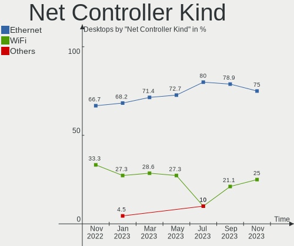

| Kind     | Desktops | Percent |
|----------|----------|---------|
| Ethernet | 38       | 92.68%  |
| WiFi     | 3        | 7.32%   |

Used Controller
---------------

Currently used network controller

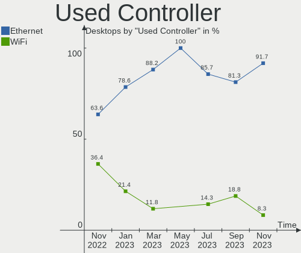

| Kind     | Desktops | Percent |
|----------|----------|---------|
| Ethernet | 37       | 92.5%   |
| WiFi     | 3        | 7.5%    |

NICs
----

Total network controllers on board

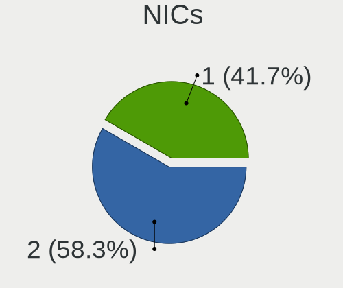

| Total | Desktops | Percent |
|-------|----------|---------|
| 1     | 33       | 86.84%  |
| 2     | 4        | 10.53%  |
| 3     | 1        | 2.63%   |

IPv6
----

IPv6 vs IPv4

| Used | Desktops | Percent |
|------|----------|---------|
| No   | 36       | 94.74%  |
| Yes  | 2        | 5.26%   |

Bluetooth
---------

Bluetooth Vendor
----------------

Controller vendors

| Vendor                  | Desktops | Percent |
|-------------------------|----------|---------|
| Intel                   | 1        | 50%     |
| Cambridge Silicon Radio | 1        | 50%     |

Bluetooth Model
---------------

Controller models

| Model                                               | Desktops | Percent |
|-----------------------------------------------------|----------|---------|
| Intel Bluetooth Device                              | 1        | 50%     |
| Cambridge Silicon Radio Bluetooth Dongle (HCI mode) | 1        | 50%     |

Sound
-----

Sound Vendor
------------

Sound card vendors

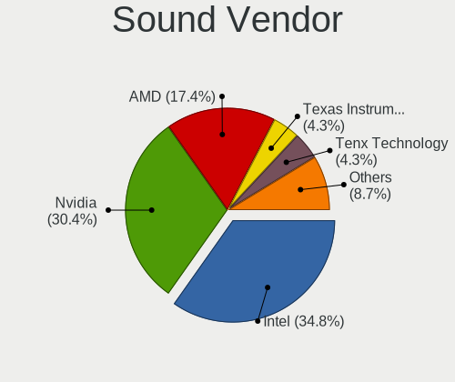

| Vendor              | Desktops | Percent |
|---------------------|----------|---------|
| Intel               | 32       | 61.54%  |
| Nvidia              | 8        | 15.38%  |
| AMD                 | 7        | 13.46%  |
| C-Media Electronics | 2        | 3.85%   |
| Sony                | 1        | 1.92%   |
| JMTek               | 1        | 1.92%   |
| Hewlett-Packard     | 1        | 1.92%   |

Sound Model
-----------

Sound card models

| Model                                                                      | Desktops | Percent |
|----------------------------------------------------------------------------|----------|---------|
| Intel 8 Series/C220 Series Chipset High Definition Audio Controller        | 13       | 20%     |
| Intel Xeon E3-1200 v3/4th Gen Core Processor HD Audio Controller           | 11       | 16.92%  |
| Intel 82801G (ICH7 Family) AC'97 Audio Controller                          | 6        | 9.23%   |
| Intel NM10/ICH7 Family High Definition Audio Controller                    | 5        | 7.69%   |
| Nvidia High Definition Audio Controller                                    | 2        | 3.08%   |
| Nvidia GK208 HDMI/DP Audio Controller                                      | 2        | 3.08%   |
| Intel 7 Series/C216 Chipset Family High Definition Audio Controller        | 2        | 3.08%   |
| AMD Family 17h (Models 10h-1fh) HD Audio Controller                        | 2        | 3.08%   |
| Sony DualShock 4 [CUH-ZCT2x]                                               | 1        | 1.54%   |
| Nvidia TU107 GeForce GTX 1650 High Definition Audio Controller             | 1        | 1.54%   |
| Nvidia MCP73 High Definition Audio                                         | 1        | 1.54%   |
| Nvidia GP108 High Definition Audio Controller                              | 1        | 1.54%   |
| Nvidia GK104 HDMI Audio Controller                                         | 1        | 1.54%   |
| JMTek USB PnP Audio Device                                                 | 1        | 1.54%   |
| Intel Tiger Lake-H HD Audio Controller                                     | 1        | 1.54%   |
| Intel Cannon Lake PCH cAVS                                                 | 1        | 1.54%   |
| Intel Audio device                                                         | 1        | 1.54%   |
| Intel 82801JD/DO (ICH10 Family) HD Audio Controller                        | 1        | 1.54%   |
| Intel 6 Series/C200 Series Chipset Family High Definition Audio Controller | 1        | 1.54%   |
| Intel 200 Series PCH HD Audio                                              | 1        | 1.54%   |
| Hewlett-Packard S101 Speaker Bar                                           | 1        | 1.54%   |
| C-Media Electronics TONOR TC-777 Audio Device                              | 1        | 1.54%   |
| C-Media Electronics CM8888 [Oxygen Express]                                | 1        | 1.54%   |
| AMD Starship/Matisse HD Audio Controller                                   | 1        | 1.54%   |
| AMD SBx00 Azalia (Intel HDA)                                               | 1        | 1.54%   |
| AMD RV620 HDMI Audio [Radeon HD 3450/3470/3550/3570]                       | 1        | 1.54%   |
| AMD Renoir Radeon High Definition Audio Controller                         | 1        | 1.54%   |
| AMD Raven/Raven2/Fenghuang HDMI/DP Audio Controller                        | 1        | 1.54%   |
| AMD Oland/Hainan/Cape Verde/Pitcairn HDMI Audio [Radeon HD 7000 Series]    | 1        | 1.54%   |
| AMD Family 17h (Models 00h-0fh) HD Audio Controller                        | 1        | 1.54%   |

Memory
------

Memory Vendor
-------------

Memory module vendors

| Vendor              | Desktops | Percent |
|---------------------|----------|---------|
| Unknown             | 9        | 45%     |
| SK Hynix            | 2        | 10%     |
| Kingston            | 2        | 10%     |
| Corsair             | 2        | 10%     |
| Samsung Electronics | 1        | 5%      |
| Qimonda             | 1        | 5%      |
| Patriot             | 1        | 5%      |
| G.Skill             | 1        | 5%      |
| Unknown             | 1        | 5%      |

Memory Model
------------

Memory module models

| Model                                                  | Desktops | Percent |
|--------------------------------------------------------|----------|---------|
| Unknown RAM Module 2048MB DIMM DDR 533MT/s             | 4        | 19.05%  |
| Unknown RAM Module 2048MB DIMM SDRAM                   | 2        | 9.52%   |
| Unknown RAM Module 1024MB DIMM DDR 533MT/s             | 2        | 9.52%   |
| Unknown RAM Module 2GB DIMM DDR2 800MT/s               | 1        | 4.76%   |
| Unknown RAM Module 1024MB DIMM SDRAM                   | 1        | 4.76%   |
| SK Hynix RAM HYMP112U64CP8-S6 1024MB DIMM DDR2 800MT/s | 1        | 4.76%   |
| SK Hynix RAM HMA81GU6DJR8N-XN 8GB DIMM DDR4 3200MT/s   | 1        | 4.76%   |
| Samsung RAM M3 78T6553CZ3-CD5 512MB DIMM DDR 533MT/s   | 1        | 4.76%   |
| Qimonda RAM 64T128020EU2.5B2 1024MB DIMM DDR 800MT/s   | 1        | 4.76%   |
| Patriot RAM PSD38G13332 8192MB DIMM DDR3 1333MT/s      | 1        | 4.76%   |
| Kingston RAM Module 2048MB DIMM DDR2 667MT/s           | 1        | 4.76%   |
| Kingston RAM 1G-UDIMM 1024MB DIMM DDR2 667MT/s         | 1        | 4.76%   |
| G.Skill RAM F4-2800C17-8GIS 8192MB DIMM DDR4 2800MT/s  | 1        | 4.76%   |
| Corsair RAM CMV4GX3M1A1333C9 4096MB DIMM DDR3 1600MT/s | 1        | 4.76%   |
| Corsair RAM CMK32GX4M2E3200C16 16GB DIMM DDR4 3200MT/s | 1        | 4.76%   |
| Unknown                                                | 1        | 4.76%   |

Memory Kind
-----------

Memory module kinds

| Kind  | Desktops | Percent |
|-------|----------|---------|
| DDR   | 6        | 31.58%  |
| DDR2  | 5        | 26.32%  |
| DDR4  | 3        | 15.79%  |
| SDRAM | 2        | 10.53%  |
| DDR3  | 2        | 10.53%  |
| DRAM  | 1        | 5.26%   |

Memory Form Factor
------------------

Physical design of the memory module

| Name | Desktops | Percent |
|------|----------|---------|
| DIMM | 16       | 100%    |

Memory Size
-----------

Memory module size

| Size  | Desktops | Percent |
|-------|----------|---------|
| 2048  | 9        | 45%     |
| 1024  | 5        | 25%     |
| 8192  | 4        | 20%     |
| 16384 | 1        | 5%      |
| 512   | 1        | 5%      |

Memory Speed
------------

Memory module speed

| Speed   | Desktops | Percent |
|---------|----------|---------|
| 533     | 6        | 31.58%  |
| 800     | 3        | 15.79%  |
| 667     | 3        | 15.79%  |
| 3200    | 2        | 10.53%  |
| Unknown | 2        | 10.53%  |
| 2800    | 1        | 5.26%   |
| 1600    | 1        | 5.26%   |
| 1333    | 1        | 5.26%   |

Printers & scanners
-------------------

Printer Vendor
--------------

Printer device vendors

| Vendor              | Desktops | Percent |
|---------------------|----------|---------|
| Seiko Epson         | 1        | 33.33%  |
| QinHeng Electronics | 1        | 33.33%  |
| Hewlett-Packard     | 1        | 33.33%  |

Printer Model
-------------

Printer device models

| Model                   | Desktops | Percent |
|-------------------------|----------|---------|
| Seiko Epson L310 Series | 1        | 33.33%  |
| QinHeng CH340S          | 1        | 33.33%  |
| HP LaserJet 1020        | 1        | 33.33%  |

Scanner Vendor
--------------

Scanner device vendors

| Vendor | Desktops | Percent |
|--------|----------|---------|
| Canon  | 1        | 100%    |

Scanner Model
-------------

Scanner device models

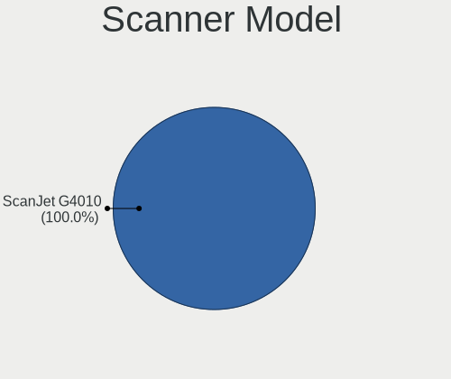

| Model                   | Desktops | Percent |
|-------------------------|----------|---------|
| Canon CanoScan LiDE 110 | 1        | 100%    |

Camera
------

Camera Vendor
-------------

Camera device vendors

| Vendor           | Desktops | Percent |
|------------------|----------|---------|
| Jieli Technology | 1        | 100%    |

Camera Model
------------

Camera device models

| Model             | Desktops | Percent |
|-------------------|----------|---------|
| Jieli USB PHY 2.0 | 1        | 100%    |

Security
--------

Fingerprint Vendor
------------------

Fingerprint sensor vendors

Zero info for selected period =(

Fingerprint Model
-----------------

Fingerprint sensor models

Zero info for selected period =(

Chipcard Vendor
---------------

Chipcard module vendors

Zero info for selected period =(

Chipcard Model
--------------

Chipcard module models

Zero info for selected period =(

Unsupported
-----------

Unsupported Devices
-------------------

Total unsupported devices on board

| Total | Desktops | Percent |
|-------|----------|---------|
| 0     | 34       | 89.47%  |
| 1     | 3        | 7.89%   |
| 2     | 1        | 2.63%   |

Unsupported Device Types
------------------------

Types of unsupported devices

| Type                     | Desktops | Percent |
|--------------------------|----------|---------|
| Graphics card            | 3        | 50%     |
| Multimedia controller    | 1        | 16.67%  |
| Communication controller | 1        | 16.67%  |
| Card reader              | 1        | 16.67%  |

