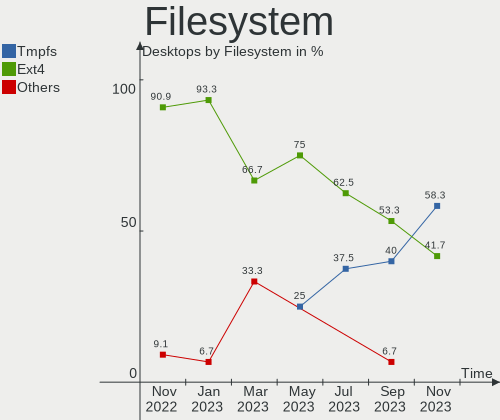
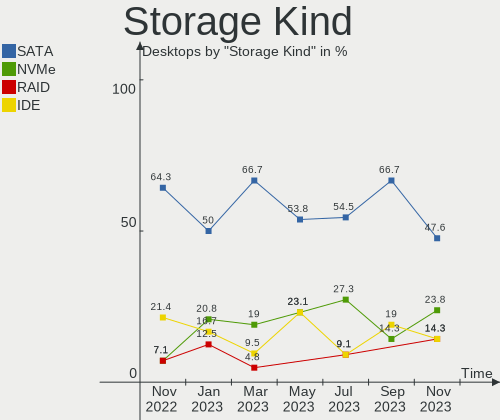
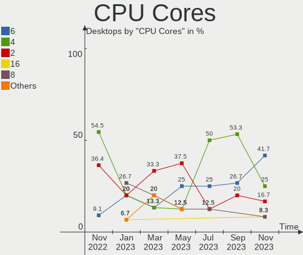
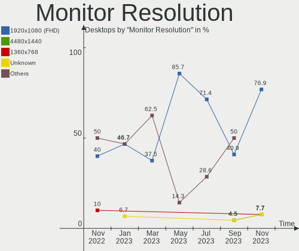
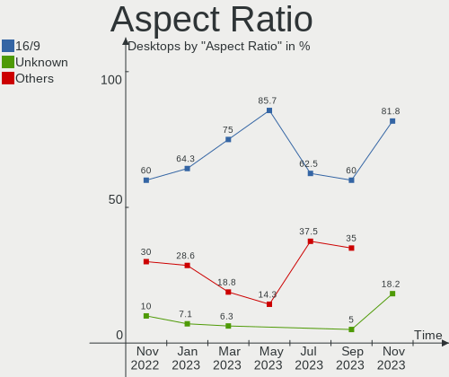

Ubuntu MATE - Hardware Trends (Desktops)
----------------------------------------

A project to identify most popular hardware characteristics and track their change
over time based on data collected by Linux users at https://Linux-Hardware.org.

Anyone can contribute to this report by the [hw-probe](https://github.com/linuxhw/hw-probe) tool:

    sudo -E hw-probe -all -upload

This report is for one last month. Overall report since the beginning of time: [TestDays](https://github.com/linuxhw/TestDays)

Period: Nov, 2023.

Contents
--------

* [ System ](#system)
  - [ OS                       ](#os)
  - [ OS Family                ](#os-family)
  - [ Kernel                   ](#kernel)
  - [ Kernel Family            ](#kernel-family)
  - [ Kernel Major Ver.        ](#kernel-major-ver)
  - [ Arch                     ](#arch)
  - [ DE                       ](#de)
  - [ Display Server           ](#display-server)
  - [ Display Manager          ](#display-manager)
  - [ OS Lang                  ](#os-lang)
  - [ Boot Mode                ](#boot-mode)
  - [ Filesystem               ](#filesystem)
  - [ Part. scheme             ](#part-scheme)
  - [ Dual Boot with Linux/BSD ](#dual-boot-with-linuxbsd)
  - [ Dual Boot (Win)          ](#dual-boot-win)

* [ Board ](#board)
  - [ Vendor                   ](#vendor)
  - [ Model                    ](#model)
  - [ Model Family             ](#model-family)
  - [ MFG Year                 ](#mfg-year)
  - [ Form Factor              ](#form-factor)
  - [ Secure Boot              ](#secure-boot)
  - [ Coreboot                 ](#coreboot)
  - [ RAM Size                 ](#ram-size)
  - [ RAM Used                 ](#ram-used)
  - [ Total Drives             ](#total-drives)
  - [ Has CD-ROM               ](#has-cd-rom)
  - [ Has Ethernet             ](#has-ethernet)
  - [ Has WiFi                 ](#has-wifi)
  - [ Has Bluetooth            ](#has-bluetooth)

* [ Location ](#location)
  - [ Country                  ](#country)
  - [ City                     ](#city)

* [ Drives ](#drives)
  - [ Drive Vendor             ](#drive-vendor)
  - [ Drive Model              ](#drive-model)
  - [ HDD Vendor               ](#hdd-vendor)
  - [ SSD Vendor               ](#ssd-vendor)
  - [ Drive Kind               ](#drive-kind)
  - [ Drive Connector          ](#drive-connector)
  - [ Drive Size               ](#drive-size)
  - [ Space Total              ](#space-total)
  - [ Space Used               ](#space-used)
  - [ Malfunc. Drives          ](#malfunc-drives)
  - [ Malfunc. Drive Vendor    ](#malfunc-drive-vendor)
  - [ Malfunc. HDD Vendor      ](#malfunc-hdd-vendor)
  - [ Malfunc. Drive Kind      ](#malfunc-drive-kind)
  - [ Failed Drives            ](#failed-drives)
  - [ Failed Drive Vendor      ](#failed-drive-vendor)
  - [ Drive Status             ](#drive-status)

* [ Storage controller ](#storage-controller)
  - [ Storage Vendor           ](#storage-vendor)
  - [ Storage Model            ](#storage-model)
  - [ Storage Kind             ](#storage-kind)

* [ Processor ](#processor)
  - [ CPU Vendor               ](#cpu-vendor)
  - [ CPU Model                ](#cpu-model)
  - [ CPU Model Family         ](#cpu-model-family)
  - [ CPU Cores                ](#cpu-cores)
  - [ CPU Sockets              ](#cpu-sockets)
  - [ CPU Threads              ](#cpu-threads)
  - [ CPU Op-Modes             ](#cpu-op-modes)
  - [ CPU Microcode            ](#cpu-microcode)
  - [ CPU Microarch            ](#cpu-microarch)

* [ Graphics ](#graphics)
  - [ GPU Vendor               ](#gpu-vendor)
  - [ GPU Model                ](#gpu-model)
  - [ GPU Combo                ](#gpu-combo)
  - [ GPU Driver               ](#gpu-driver)
  - [ GPU Memory               ](#gpu-memory)

* [ Monitor ](#monitor)
  - [ Monitor Vendor           ](#monitor-vendor)
  - [ Monitor Model            ](#monitor-model)
  - [ Monitor Resolution       ](#monitor-resolution)
  - [ Monitor Diagonal         ](#monitor-diagonal)
  - [ Monitor Width            ](#monitor-width)
  - [ Aspect Ratio             ](#aspect-ratio)
  - [ Monitor Area             ](#monitor-area)
  - [ Pixel Density            ](#pixel-density)
  - [ Multiple Monitors        ](#multiple-monitors)

* [ Network ](#network)
  - [ Net Controller Vendor    ](#net-controller-vendor)
  - [ Net Controller Model     ](#net-controller-model)
  - [ Wireless Vendor          ](#wireless-vendor)
  - [ Wireless Model           ](#wireless-model)
  - [ Ethernet Vendor          ](#ethernet-vendor)
  - [ Ethernet Model           ](#ethernet-model)
  - [ Net Controller Kind      ](#net-controller-kind)
  - [ Used Controller          ](#used-controller)
  - [ NICs                     ](#nics)
  - [ IPv6                     ](#ipv6)

* [ Bluetooth ](#bluetooth)
  - [ Bluetooth Vendor         ](#bluetooth-vendor)
  - [ Bluetooth Model          ](#bluetooth-model)

* [ Sound ](#sound)
  - [ Sound Vendor             ](#sound-vendor)
  - [ Sound Model              ](#sound-model)

* [ Memory ](#memory)
  - [ Memory Vendor            ](#memory-vendor)
  - [ Memory Model             ](#memory-model)
  - [ Memory Kind              ](#memory-kind)
  - [ Memory Form Factor       ](#memory-form-factor)
  - [ Memory Size              ](#memory-size)
  - [ Memory Speed             ](#memory-speed)

* [ Printers & scanners ](#printers--scanners)
  - [ Printer Vendor           ](#printer-vendor)
  - [ Printer Model            ](#printer-model)
  - [ Scanner Vendor           ](#scanner-vendor)
  - [ Scanner Model            ](#scanner-model)

* [ Camera ](#camera)
  - [ Camera Vendor            ](#camera-vendor)
  - [ Camera Model             ](#camera-model)

* [ Security ](#security)
  - [ Fingerprint Vendor       ](#fingerprint-vendor)
  - [ Fingerprint Model        ](#fingerprint-model)
  - [ Chipcard Vendor          ](#chipcard-vendor)
  - [ Chipcard Model           ](#chipcard-model)

* [ Unsupported ](#unsupported)
  - [ Unsupported Devices      ](#unsupported-devices)
  - [ Unsupported Device Types ](#unsupported-device-types)

System
------

OS
--

Installed operating systems

| Name              | Desktops | Percent |
|-------------------|----------|---------|
| Ubuntu MATE 22.04 | 8        | 66.67%  |
| Ubuntu MATE 20.04 | 2        | 16.67%  |
| Ubuntu MATE 23.10 | 1        | 8.33%   |
| Ubuntu MATE 23.04 | 1        | 8.33%   |

OS Family
---------

OS without a version

| Name        | Desktops | Percent |
|-------------|----------|---------|
| Ubuntu MATE | 12       | 100%    |

Kernel
------

Version of the Linux kernel

| Version              | Desktops | Percent |
|----------------------|----------|---------|
| 6.2.0-37-generic     | 2        | 16.67%  |
| 6.2.0-36-generic     | 2        | 16.67%  |
| 5.15.0-89-generic    | 2        | 16.67%  |
| 5.15.0-88-generic    | 2        | 16.67%  |
| 6.5.0-10-generic     | 1        | 8.33%   |
| 6.2.0-35-generic     | 1        | 8.33%   |
| 5.4.0-166-generic    | 1        | 8.33%   |
| 5.15.0-88-lowlatency | 1        | 8.33%   |

Kernel Family
-------------

Linux kernel without a distro release

| Version | Desktops | Percent |
|---------|----------|---------|
| 6.2.0   | 5        | 41.67%  |
| 5.15.0  | 5        | 41.67%  |
| 6.5.0   | 1        | 8.33%   |
| 5.4.0   | 1        | 8.33%   |

Kernel Major Ver.
-----------------

Linux kernel major version

| Version | Desktops | Percent |
|---------|----------|---------|
| 6.2     | 5        | 41.67%  |
| 5.15    | 5        | 41.67%  |
| 6.5     | 1        | 8.33%   |
| 5.4     | 1        | 8.33%   |

Arch
----

OS architecture (x86_64, i586, etc.)

| Name   | Desktops | Percent |
|--------|----------|---------|
| x86_64 | 12       | 100%    |

DE
--

Desktop Environment

| Name | Desktops | Percent |
|------|----------|---------|
| MATE | 12       | 100%    |

Display Server
--------------

X11 or Wayland

| Name | Desktops | Percent |
|------|----------|---------|
| X11  | 12       | 100%    |

Display Manager
---------------

SDDM, LightDM, etc.

| Name    | Desktops | Percent |
|---------|----------|---------|
| LightDM | 11       | 91.67%  |
| Unknown | 1        | 8.33%   |

OS Lang
-------

Language

| Lang  | Desktops | Percent |
|-------|----------|---------|
| en_US | 5        | 41.67%  |
| it_IT | 3        | 25%     |
| fr_FR | 1        | 8.33%   |
| fr_CA | 1        | 8.33%   |
| fi_FI | 1        | 8.33%   |
| da_DK | 1        | 8.33%   |

Boot Mode
---------

EFI or BIOS

| Mode | Desktops | Percent |
|------|----------|---------|
| BIOS | 8        | 66.67%  |
| EFI  | 4        | 33.33%  |

Filesystem
----------

Type of filesystem

| Type  | Desktops | Percent |
|-------|----------|---------|
| Tmpfs | 7        | 58.33%  |
| Ext4  | 5        | 41.67%  |

Part. scheme
------------

Scheme of partitioning

| Type    | Desktops | Percent |
|---------|----------|---------|
| GPT     | 8        | 66.67%  |
| MBR     | 3        | 25%     |
| Unknown | 1        | 8.33%   |

Dual Boot with Linux/BSD
------------------------

Hosting more than one Linux/BSD

| Dual boot | Desktops | Percent |
|-----------|----------|---------|
| No        | 8        | 66.67%  |
| Yes       | 4        | 33.33%  |

Dual Boot (Win)
---------------

Hosting Linux and Windows

| Dual boot | Desktops | Percent |
|-----------|----------|---------|
| No        | 7        | 58.33%  |
| Yes       | 5        | 41.67%  |

Board
-----

Vendor
------

Motherboard manufacturer

| Name                | Desktops | Percent |
|---------------------|----------|---------|
| ASUSTek Computer    | 5        | 41.67%  |
| Gigabyte Technology | 2        | 16.67%  |
| Dell                | 2        | 16.67%  |
| ASRock              | 2        | 16.67%  |
| Lenovo              | 1        | 8.33%   |

Model
-----

Motherboard model

| Name                              | Desktops | Percent |
|-----------------------------------|----------|---------|
| Lenovo T530-28ICB                 | 1        | 8.33%   |
| Gigabyte Z590 UD AC               | 1        | 8.33%   |
| Gigabyte B550 GAMING X V2         | 1        | 8.33%   |
| Dell Precision Tower 3620         | 1        | 8.33%   |
| Dell OptiPlex 5080                | 1        | 8.33%   |
| ASUS ROG STRIX Z690-E GAMING WIFI | 1        | 8.33%   |
| ASUS PRIME Z490-P                 | 1        | 8.33%   |
| ASUS P8P67-M PRO                  | 1        | 8.33%   |
| ASUS M5A97 LE R2.0                | 1        | 8.33%   |
| ASUS M5A78L-M LX                  | 1        | 8.33%   |
| ASRock X99 Extreme4               | 1        | 8.33%   |
| ASRock 970 Extreme3 R2.0          | 1        | 8.33%   |

Model Family
------------

Motherboard model prefix

| Name              | Desktops | Percent |
|-------------------|----------|---------|
| Lenovo T530-28ICB | 1        | 8.33%   |
| Gigabyte Z590     | 1        | 8.33%   |
| Gigabyte B550     | 1        | 8.33%   |
| Dell Precision    | 1        | 8.33%   |
| Dell OptiPlex     | 1        | 8.33%   |
| ASUS ROG          | 1        | 8.33%   |
| ASUS PRIME        | 1        | 8.33%   |
| ASUS P8P67-M      | 1        | 8.33%   |
| ASUS M5A97        | 1        | 8.33%   |
| ASUS M5A78L-M     | 1        | 8.33%   |
| ASRock X99        | 1        | 8.33%   |
| ASRock 970        | 1        | 8.33%   |

MFG Year
--------

Motherboard manufacture year

| Year | Desktops | Percent |
|------|----------|---------|
| 2020 | 3        | 25%     |
| 2021 | 2        | 16.67%  |
| 2012 | 2        | 16.67%  |
| 2011 | 2        | 16.67%  |
| 2019 | 1        | 8.33%   |
| 2018 | 1        | 8.33%   |
| 2014 | 1        | 8.33%   |

Form Factor
-----------

Physical design of the computer

| Name    | Desktops | Percent |
|---------|----------|---------|
| Desktop | 12       | 100%    |

Secure Boot
-----------

Enabled or disabled

| State    | Desktops | Percent |
|----------|----------|---------|
| Disabled | 12       | 100%    |

Coreboot
--------

Have coreboot on board

| Used | Desktops | Percent |
|------|----------|---------|
| No   | 12       | 100%    |

RAM Size
--------

Total RAM memory

| Size in GB  | Desktops | Percent |
|-------------|----------|---------|
| 32.01-64.0  | 5        | 41.67%  |
| 4.01-8.0    | 2        | 16.67%  |
| 64.01-256.0 | 2        | 16.67%  |
| 3.01-4.0    | 1        | 8.33%   |
| 16.01-24.0  | 1        | 8.33%   |
| 8.01-16.0   | 1        | 8.33%   |

RAM Used
--------

Used RAM memory

| Used GB    | Desktops | Percent |
|------------|----------|---------|
| 3.01-4.0   | 4        | 33.33%  |
| 2.01-3.0   | 3        | 25%     |
| 8.01-16.0  | 3        | 25%     |
| 32.01-64.0 | 1        | 8.33%   |
| 1.01-2.0   | 1        | 8.33%   |

Total Drives
------------

Number of drives on board

| Drives | Desktops | Percent |
|--------|----------|---------|
| 2      | 8        | 66.67%  |
| 1      | 3        | 25%     |
| 5      | 1        | 8.33%   |

Has CD-ROM
----------

Has CD-ROM on board

| Presented | Desktops | Percent |
|-----------|----------|---------|
| Yes       | 6        | 50%     |
| No        | 6        | 50%     |

Has Ethernet
------------

Has Ethernet on board

| Presented | Desktops | Percent |
|-----------|----------|---------|
| Yes       | 12       | 100%    |

Has WiFi
--------

Has WiFi module

| Presented | Desktops | Percent |
|-----------|----------|---------|
| No        | 8        | 66.67%  |
| Yes       | 4        | 33.33%  |

Has Bluetooth
-------------

Has Bluetooth module

| Presented | Desktops | Percent |
|-----------|----------|---------|
| No        | 7        | 58.33%  |
| Yes       | 5        | 41.67%  |

Location
--------

Country
-------

Geographic location (country)

| Country   | Desktops | Percent |
|-----------|----------|---------|
| Italy     | 3        | 25%     |
| USA       | 2        | 16.67%  |
| France    | 1        | 8.33%   |
| Finland   | 1        | 8.33%   |
| Denmark   | 1        | 8.33%   |
| Canada    | 1        | 8.33%   |
| Belgium   | 1        | 8.33%   |
| Argentina | 1        | 8.33%   |
| Algeria   | 1        | 8.33%   |

City
----

Geographic location (city)

| City                 | Desktops | Percent |
|----------------------|----------|---------|
| Torring              | 1        | 8.33%   |
| Toronto              | 1        | 8.33%   |
| Tampere              | 1        | 8.33%   |
| Rome                 | 1        | 8.33%   |
| Rombiolo             | 1        | 8.33%   |
| Remedios de Escalada | 1        | 8.33%   |
| Ravenna              | 1        | 8.33%   |
| Montpellier          | 1        | 8.33%   |
| Minneapolis          | 1        | 8.33%   |
| Gordon               | 1        | 8.33%   |
| Gentbrugge           | 1        | 8.33%   |
| Algiers              | 1        | 8.33%   |

Drives
------

Drive Vendor
------------

Hard drive vendors

| Vendor                | Desktops | Drives | Percent |
|-----------------------|----------|--------|---------|
| WDC                   | 5        | 8      | 25%     |
| Samsung Electronics   | 4        | 4      | 20%     |
| SanDisk               | 3        | 3      | 15%     |
| Intel                 | 2        | 3      | 10%     |
| Toshiba               | 1        | 1      | 5%      |
| Seagate               | 1        | 1      | 5%      |
| Realtek Semiconductor | 1        | 1      | 5%      |
| Maxtor                | 1        | 1      | 5%      |
| HGST                  | 1        | 1      | 5%      |
| A-DATA Technology     | 1        | 2      | 5%      |

Drive Model
-----------

Hard drive models

| Model                                               | Desktops | Percent |
|-----------------------------------------------------|----------|---------|
| WDC WD10EZEX-08WN4A0 1TB                            | 2        | 8%      |
| WDC WD5003AZEX-00K1GA0 500GB                        | 1        | 4%      |
| WDC WD4004FZWX-00GBGB0 4TB                          | 1        | 4%      |
| WDC WD20EURX-57T0FY1 2TB                            | 1        | 4%      |
| WDC WD10PURX-64E5EY0 1TB                            | 1        | 4%      |
| WDC WD10EZRX-00D8PB0 1TB                            | 1        | 4%      |
| WDC WD1003FBYZ-010FB0 1TB                           | 1        | 4%      |
| Toshiba DT01ACA100 1TB                              | 1        | 4%      |
| Seagate ST2000NE001-2M5101 2TB                      | 1        | 4%      |
| SanDisk Ultra II 960GB SSD                          | 1        | 4%      |
| SanDisk SDSSDHII960G 960GB                          | 1        | 4%      |
| SanDisk SDSSDH3 500G                                | 1        | 4%      |
| Samsung SSD 980 1TB                                 | 1        | 4%      |
| Samsung SSD 870 QVO 1TB                             | 1        | 4%      |
| Samsung SSD 860 EVO 500GB                           | 1        | 4%      |
| Samsung NVMe SSD Controller SM961/PM961/SM963 256GB | 1        | 4%      |
| Realtek JAJP600M4TB                                 | 1        | 4%      |
| Maxtor Z1 SSD 240GB                                 | 1        | 4%      |
| Intel SSDSA2M080G2GC 80GB                           | 1        | 4%      |
| Intel SSDPEKNU512GZ BTKA20542H45512A 512GB          | 1        | 4%      |
| Intel SSDPEKNU512GZ 512GB                           | 1        | 4%      |
| HGST HTS721010A9E630 1TB                            | 1        | 4%      |
| A-DATA LEGEND 710 512GB                             | 1        | 4%      |
| A-DATA LEGEND 710 1TB                               | 1        | 4%      |

HDD Vendor
----------

Hard disk drive vendors

| Vendor  | Desktops | Drives | Percent |
|---------|----------|--------|---------|
| WDC     | 5        | 8      | 62.5%   |
| Toshiba | 1        | 1      | 12.5%   |
| Seagate | 1        | 1      | 12.5%   |
| HGST    | 1        | 1      | 12.5%   |

SSD Vendor
----------

Solid state drive vendors

| Vendor              | Desktops | Drives | Percent |
|---------------------|----------|--------|---------|
| SanDisk             | 3        | 3      | 42.86%  |
| Samsung Electronics | 2        | 2      | 28.57%  |
| Maxtor              | 1        | 1      | 14.29%  |
| Intel               | 1        | 1      | 14.29%  |

Drive Kind
----------

HDD or SSD

| Kind | Desktops | Drives | Percent |
|------|----------|--------|---------|
| HDD  | 7        | 11     | 41.18%  |
| NVMe | 5        | 7      | 29.41%  |
| SSD  | 5        | 7      | 29.41%  |

Drive Connector
---------------

SATA, SAS, NVMe, etc.

| Type | Desktops | Drives | Percent |
|------|----------|--------|---------|
| SATA | 9        | 18     | 64.29%  |
| NVMe | 5        | 7      | 35.71%  |

Drive Size
----------

Size of hard drive

| Size in TB | Desktops | Drives | Percent |
|------------|----------|--------|---------|
| 0.51-1.0   | 7        | 10     | 50%     |
| 0.01-0.5   | 4        | 5      | 28.57%  |
| 1.01-2.0   | 2        | 2      | 14.29%  |
| 3.01-4.0   | 1        | 1      | 7.14%   |

Space Total
-----------

Amount of disk space available on the file system

| Size in GB     | Desktops | Percent |
|----------------|----------|---------|
| 501-1000       | 7        | 58.33%  |
| 1001-2000      | 2        | 16.67%  |
| More than 3000 | 1        | 8.33%   |
| 2001-3000      | 1        | 8.33%   |
| 101-250        | 1        | 8.33%   |

Space Used
----------

Amount of used disk space

| Used GB        | Desktops | Percent |
|----------------|----------|---------|
| 501-1000       | 3        | 25%     |
| 251-500        | 2        | 16.67%  |
| 21-50          | 2        | 16.67%  |
| 101-250        | 2        | 16.67%  |
| 51-100         | 2        | 16.67%  |
| More than 3000 | 1        | 8.33%   |

Malfunc. Drives
---------------

Drive models with a malfunction

Zero info for selected period =(

Malfunc. Drive Vendor
---------------------

Vendors of faulty drives

Zero info for selected period =(

Malfunc. HDD Vendor
-------------------

Vendors of faulty HDD drives

Zero info for selected period =(

Malfunc. Drive Kind
-------------------

Kinds of faulty drives

Zero info for selected period =(

Failed Drives
-------------

Failed drive models

Zero info for selected period =(

Failed Drive Vendor
-------------------

Failed drive vendors

Zero info for selected period =(

Drive Status
------------

Number of failed and malfunc. drives

| Status   | Desktops | Drives | Percent |
|----------|----------|--------|---------|
| Detected | 8        | 13     | 66.67%  |
| Works    | 4        | 12     | 33.33%  |

Storage controller
------------------

Storage Vendor
--------------

Storage controller vendors

| Vendor                   | Desktops | Percent |
|--------------------------|----------|---------|
| Intel                    | 8        | 44.44%  |
| AMD                      | 4        | 22.22%  |
| Samsung Electronics      | 2        | 11.11%  |
| Realtek Semiconductor    | 1        | 5.56%   |
| Marvell Technology Group | 1        | 5.56%   |
| ASMedia Technology       | 1        | 5.56%   |
| ADATA Technology         | 1        | 5.56%   |

Storage Model
-------------

Storage controller models

| Model                                                                         | Desktops | Percent |
|-------------------------------------------------------------------------------|----------|---------|
| AMD SB7x0/SB8x0/SB9x0 SATA Controller [IDE mode]                              | 2        | 9.09%   |
| AMD SB7x0/SB8x0/SB9x0 IDE Controller                                          | 2        | 9.09%   |
| Samsung NVMe SSD Controller SM961/PM961/SM963                                 | 1        | 4.55%   |
| Samsung NVMe SSD Controller 980 (DRAM-less)                                   | 1        | 4.55%   |
| Realtek RTS5765DL NVMe SSD Controller (DRAM-less)                             | 1        | 4.55%   |
| Marvell Group 88SE9172 SATA III 6Gb/s RAID Controller                         | 1        | 4.55%   |
| Intel Volume Management Device NVMe RAID Controller Intel Corporation         | 1        | 4.55%   |
| Intel SSD 670p Series [Keystone Harbor]                                       | 1        | 4.55%   |
| Intel SATA Controller [RAID mode]                                             | 1        | 4.55%   |
| Intel Comet Lake SATA AHCI Controller                                         | 1        | 4.55%   |
| Intel Comet Lake PCH-H RAID                                                   | 1        | 4.55%   |
| Intel Cannon Lake PCH SATA AHCI Controller                                    | 1        | 4.55%   |
| Intel C610/X99 series chipset sSATA Controller [AHCI mode]                    | 1        | 4.55%   |
| Intel Alder Lake-S PCH SATA Controller [AHCI Mode]                            | 1        | 4.55%   |
| Intel 6 Series/C200 Series Chipset Family 6 port Desktop SATA AHCI Controller | 1        | 4.55%   |
| Intel 500 Series Chipset Family SATA AHCI Controller                          | 1        | 4.55%   |
| ASMedia ASM1062 Serial ATA Controller                                         | 1        | 4.55%   |
| AMD SB7x0/SB8x0/SB9x0 SATA Controller [AHCI mode]                             | 1        | 4.55%   |
| AMD 500 Series Chipset SATA Controller                                        | 1        | 4.55%   |
| ADATA ADATA XPG GAMMIXS1 1L Media (256 GB SSD)                                | 1        | 4.55%   |

Storage Kind
------------

Kind of storage controller (IDE, SATA, NVMe, SAS, ...)

| Kind | Desktops | Percent |
|------|----------|---------|
| SATA | 10       | 47.62%  |
| NVMe | 5        | 23.81%  |
| RAID | 3        | 14.29%  |
| IDE  | 3        | 14.29%  |

Processor
---------

CPU Vendor
----------

Processor vendors

| Vendor | Desktops | Percent |
|--------|----------|---------|
| Intel  | 8        | 66.67%  |
| AMD    | 4        | 33.33%  |

CPU Model
---------

Processor models

| Model                                   | Desktops | Percent |
|-----------------------------------------|----------|---------|
| Intel Core i7-6800K CPU @ 3.40GHz       | 1        | 8.33%   |
| Intel Core i7-6700 CPU @ 3.40GHz        | 1        | 8.33%   |
| Intel Core i7-2600 CPU @ 3.40GHz        | 1        | 8.33%   |
| Intel Core i5-8400 CPU @ 2.80GHz        | 1        | 8.33%   |
| Intel Core i5-10500 CPU @ 3.10GHz       | 1        | 8.33%   |
| Intel Core i5-10400 CPU @ 2.90GHz       | 1        | 8.33%   |
| Intel 13th Gen Core i7-13700K           | 1        | 8.33%   |
| Intel 11th Gen Core i9-11900K @ 3.50GHz | 1        | 8.33%   |
| AMD Ryzen 5 5500                        | 1        | 8.33%   |
| AMD FX-8370 Eight-Core Processor        | 1        | 8.33%   |
| AMD FX-4300 Quad-Core Processor         | 1        | 8.33%   |
| AMD Athlon II X2 245 Processor          | 1        | 8.33%   |

CPU Model Family
----------------

Processor model prefix

| Model            | Desktops | Percent |
|------------------|----------|---------|
| Intel Core i7    | 3        | 25%     |
| Intel Core i5    | 3        | 25%     |
| Other            | 2        | 16.67%  |
| AMD FX           | 2        | 16.67%  |
| AMD Ryzen 5      | 1        | 8.33%   |
| AMD Athlon II X2 | 1        | 8.33%   |

CPU Cores
---------

Number of processor cores

| Number | Desktops | Percent |
|--------|----------|---------|
| 6      | 5        | 41.67%  |
| 4      | 3        | 25%     |
| 2      | 2        | 16.67%  |
| 16     | 1        | 8.33%   |
| 8      | 1        | 8.33%   |

CPU Sockets
-----------

Number of sockets

| Number | Desktops | Percent |
|--------|----------|---------|
| 1      | 12       | 100%    |

CPU Threads
-----------

Threads per core (Hyper-Threading)

| Number | Desktops | Percent |
|--------|----------|---------|
| 2      | 10       | 83.33%  |
| 1      | 2        | 16.67%  |

CPU Op-Modes
------------

CPU Operation Modes (32-bit, 64-bit)

| Op mode        | Desktops | Percent |
|----------------|----------|---------|
| 32-bit, 64-bit | 12       | 100%    |

CPU Microcode
-------------

Microcode number

| Number     | Desktops | Percent |
|------------|----------|---------|
| Unknown    | 8        | 66.67%  |
| 0x06000852 | 2        | 16.67%  |
| 0xa0671    | 1        | 8.33%   |
| 0x206a7    | 1        | 8.33%   |

CPU Microarch
-------------

Microarchitecture

| Name        | Desktops | Percent |
|-------------|----------|---------|
| Piledriver  | 2        | 16.67%  |
| CometLake   | 2        | 16.67%  |
| Zen 3       | 1        | 8.33%   |
| Skylake     | 1        | 8.33%   |
| SandyBridge | 1        | 8.33%   |
| KabyLake    | 1        | 8.33%   |
| K10         | 1        | 8.33%   |
| Icelake     | 1        | 8.33%   |
| Broadwell   | 1        | 8.33%   |
| Unknown     | 1        | 8.33%   |

Graphics
--------

GPU Vendor
----------

Vendors of graphics cards

| Vendor | Desktops | Percent |
|--------|----------|---------|
| Nvidia | 7        | 50%     |
| AMD    | 4        | 28.57%  |
| Intel  | 3        | 21.43%  |

GPU Model
---------

Graphics card models

| Model                                                   | Desktops | Percent |
|---------------------------------------------------------|----------|---------|
| Nvidia GP106 [GeForce GTX 1060 6GB]                     | 3        | 21.43%  |
| Nvidia GT218 [GeForce 210]                              | 1        | 7.14%   |
| Nvidia GM107 [GeForce GTX 750 Ti]                       | 1        | 7.14%   |
| Nvidia GK208B [GeForce GT 710]                          | 1        | 7.14%   |
| Nvidia GA102 [GeForce RTX 3090]                         | 1        | 7.14%   |
| Intel HD Graphics 530                                   | 1        | 7.14%   |
| Intel CometLake-S GT2 [UHD Graphics 630]                | 1        | 7.14%   |
| Intel CoffeeLake-S GT2 [UHD Graphics 630]               | 1        | 7.14%   |
| AMD RS780L [Radeon 3000]                                | 1        | 7.14%   |
| AMD Navi 24 [Radeon RX 6400/6500 XT/6500M]              | 1        | 7.14%   |
| AMD Ellesmere [Radeon RX 470/480/570/570X/580/580X/590] | 1        | 7.14%   |
| AMD Curacao PRO [Radeon R7 370 / R9 270/370 OEM]        | 1        | 7.14%   |

GPU Combo
---------

Combinations of graphics cards

| Name       | Desktops | Percent |
|------------|----------|---------|
| 1 x Nvidia | 7        | 58.33%  |
| 1 x AMD    | 4        | 33.33%  |
| 1 x Intel  | 1        | 8.33%   |

GPU Driver
----------

Free vs proprietary

| Driver      | Desktops | Percent |
|-------------|----------|---------|
| Proprietary | 6        | 50%     |
| Free        | 6        | 50%     |

GPU Memory
----------

Total video memory

| Size in GB | Desktops | Percent |
|------------|----------|---------|
| Unknown    | 5        | 41.67%  |
| 5.01-6.0   | 3        | 25%     |
| 3.01-4.0   | 1        | 8.33%   |
| 16.01-24.0 | 1        | 8.33%   |
| 1.01-2.0   | 1        | 8.33%   |
| 0.51-1.0   | 1        | 8.33%   |

Monitor
-------

Monitor Vendor
--------------

Monitor vendors

| Vendor              | Desktops | Percent |
|---------------------|----------|---------|
| Samsung Electronics | 4        | 26.67%  |
| Lenovo              | 2        | 13.33%  |
| Goldstar            | 2        | 13.33%  |
| TCL                 | 1        | 6.67%   |
| Sceptre Tech        | 1        | 6.67%   |
| Philips             | 1        | 6.67%   |
| LG Electronics      | 1        | 6.67%   |
| Iiyama              | 1        | 6.67%   |
| HPN                 | 1        | 6.67%   |
| Acer                | 1        | 6.67%   |

Monitor Model
-------------

Monitor models

| Model                                                             | Desktops | Percent |
|-------------------------------------------------------------------|----------|---------|
| TCL TCL TCL0030 1600x1200 708x398mm 32.0-inch                     | 1        | 6.67%   |
| Sceptre Tech Sceptre H40 SPT0FF1 1920x1080 575x323mm 26.0-inch    | 1        | 6.67%   |
| Samsung Electronics S24B300 SAM08CC 1920x1080 521x293mm 23.5-inch | 1        | 6.67%   |
| Samsung Electronics S22E450 SAM0C79 1920x1080 477x268mm 21.5-inch | 1        | 6.67%   |
| Samsung Electronics LCD Monitor SMBX2440                          | 1        | 6.67%   |
| Samsung Electronics C27F390 SAM0D32 1920x1080 598x336mm 27.0-inch | 1        | 6.67%   |
| Philips PHL 241V8 PHLC212 1920x1080 527x296mm 23.8-inch           | 1        | 6.67%   |
| LG Electronics LCD Monitor LG TV 1920x1080                        | 1        | 6.67%   |
| Lenovo LEN G25-10 LEN65FE 1920x1080 544x303mm 24.5-inch           | 1        | 6.67%   |
| Lenovo C27-30 LEN62AA 1920x1080 597x336mm 27.0-inch               | 1        | 6.67%   |
| Iiyama PL2740HS IVM6663 1920x1080 598x336mm 27.0-inch             | 1        | 6.67%   |
| HPN LCD Monitor HP 27q 4480x1440                                  | 1        | 6.67%   |
| Goldstar FULL HD GSM5ABB 1920x1080 480x270mm 21.7-inch            | 1        | 6.67%   |
| Goldstar E1940 GSM4BD7 1360x768 406x229mm 18.4-inch               | 1        | 6.67%   |
| Acer R221Q ACR0503 1920x1080 480x270mm 21.7-inch                  | 1        | 6.67%   |

Monitor Resolution
------------------

Monitor screen resolution

| Resolution      | Desktops | Percent |
|-----------------|----------|---------|
| 1920x1080 (FHD) | 10       | 76.92%  |
| 4480x1440       | 1        | 7.69%   |
| 1360x768        | 1        | 7.69%   |
| Unknown         | 1        | 7.69%   |

Monitor Diagonal
----------------

Diagonal size in inches

| Inches  | Desktops | Percent |
|---------|----------|---------|
| 21      | 3        | 21.43%  |
| 27      | 2        | 14.29%  |
| 24      | 2        | 14.29%  |
| Unknown | 2        | 14.29%  |
| 40      | 1        | 7.14%   |
| 32      | 1        | 7.14%   |
| 26      | 1        | 7.14%   |
| 23      | 1        | 7.14%   |
| 18      | 1        | 7.14%   |

Monitor Width
-------------

Physical width

| Width in mm | Desktops | Percent |
|-------------|----------|---------|
| 501-600     | 6        | 42.86%  |
| 401-500     | 4        | 28.57%  |
| Unknown     | 2        | 14.29%  |
| 801-900     | 1        | 7.14%   |
| 701-800     | 1        | 7.14%   |

Aspect Ratio
------------

Proportional relationship between the width and the height

| Ratio   | Desktops | Percent |
|---------|----------|---------|
| 16/9    | 9        | 81.82%  |
| Unknown | 2        | 18.18%  |

Monitor Area
------------

Area in inch²

| Area in inch² | Desktops | Percent |
|----------------|----------|---------|
| 201-250        | 4        | 30.77%  |
| 301-350        | 2        | 15.38%  |
| 251-300        | 2        | 15.38%  |
| Unknown        | 2        | 15.38%  |
| 351-500        | 1        | 7.69%   |
| 141-150        | 1        | 7.69%   |
| 501-1000       | 1        | 7.69%   |

Pixel Density
-------------

Pixels per inch

| Density | Desktops | Percent |
|---------|----------|---------|
| 51-100  | 7        | 58.33%  |
| 101-120 | 3        | 25%     |
| Unknown | 2        | 16.67%  |

Multiple Monitors
-----------------

Total monitors connected

| Total | Desktops | Percent |
|-------|----------|---------|
| 1     | 8        | 66.67%  |
| 2     | 4        | 33.33%  |

Network
-------

Net Controller Vendor
---------------------

Controller vendors

| Vendor                | Desktops | Percent |
|-----------------------|----------|---------|
| Realtek Semiconductor | 9        | 52.94%  |
| Intel                 | 7        | 41.18%  |
| Samsung Electronics   | 1        | 5.88%   |

Net Controller Model
--------------------

Controller models

| Model                                                             | Desktops | Percent |
|-------------------------------------------------------------------|----------|---------|
| Realtek RTL8111/8168/8411 PCI Express Gigabit Ethernet Controller | 7        | 36.84%  |
| Realtek RTL8125 2.5GbE Controller                                 | 2        | 10.53%  |
| Samsung Galaxy series, misc. (tethering mode)                     | 1        | 5.26%   |
| Realtek RTL8169 PCI Gigabit Ethernet Controller                   | 1        | 5.26%   |
| Intel Wi-Fi 6 AX210/AX211/AX411 160MHz                            | 1        | 5.26%   |
| Intel Tiger Lake PCH CNVi WiFi                                    | 1        | 5.26%   |
| Intel Ethernet Controller I225-V                                  | 1        | 5.26%   |
| Intel Ethernet Connection (2) I219-LM                             | 1        | 5.26%   |
| Intel Ethernet Connection (2) I218-V                              | 1        | 5.26%   |
| Intel Ethernet Connection (11) I219-LM                            | 1        | 5.26%   |
| Intel Dual Band Wireless-AC 3165 Plus Bluetooth                   | 1        | 5.26%   |
| Intel Comet Lake PCH CNVi WiFi                                    | 1        | 5.26%   |

Wireless Vendor
---------------

Wireless vendors

| Vendor | Desktops | Percent |
|--------|----------|---------|
| Intel  | 4        | 100%    |

Wireless Model
--------------

Wireless models

| Model                                           | Desktops | Percent |
|-------------------------------------------------|----------|---------|
| Intel Wi-Fi 6 AX210/AX211/AX411 160MHz          | 1        | 25%     |
| Intel Tiger Lake PCH CNVi WiFi                  | 1        | 25%     |
| Intel Dual Band Wireless-AC 3165 Plus Bluetooth | 1        | 25%     |
| Intel Comet Lake PCH CNVi WiFi                  | 1        | 25%     |

Ethernet Vendor
---------------

Ethernet vendors

| Vendor                | Desktops | Percent |
|-----------------------|----------|---------|
| Realtek Semiconductor | 9        | 64.29%  |
| Intel                 | 4        | 28.57%  |
| Samsung Electronics   | 1        | 7.14%   |

Ethernet Model
--------------

Ethernet models

| Model                                                             | Desktops | Percent |
|-------------------------------------------------------------------|----------|---------|
| Realtek RTL8111/8168/8411 PCI Express Gigabit Ethernet Controller | 7        | 46.67%  |
| Realtek RTL8125 2.5GbE Controller                                 | 2        | 13.33%  |
| Samsung Galaxy series, misc. (tethering mode)                     | 1        | 6.67%   |
| Realtek RTL8169 PCI Gigabit Ethernet Controller                   | 1        | 6.67%   |
| Intel Ethernet Controller I225-V                                  | 1        | 6.67%   |
| Intel Ethernet Connection (2) I219-LM                             | 1        | 6.67%   |
| Intel Ethernet Connection (2) I218-V                              | 1        | 6.67%   |
| Intel Ethernet Connection (11) I219-LM                            | 1        | 6.67%   |

Net Controller Kind
-------------------

Ethernet, WiFi or modem

| Kind     | Desktops | Percent |
|----------|----------|---------|
| Ethernet | 12       | 75%     |
| WiFi     | 4        | 25%     |

Used Controller
---------------

Currently used network controller

| Kind     | Desktops | Percent |
|----------|----------|---------|
| Ethernet | 11       | 91.67%  |
| WiFi     | 1        | 8.33%   |

NICs
----

Total network controllers on board

| Total | Desktops | Percent |
|-------|----------|---------|
| 2     | 7        | 58.33%  |
| 1     | 5        | 41.67%  |

IPv6
----

IPv6 vs IPv4

| Used | Desktops | Percent |
|------|----------|---------|
| No   | 11       | 91.67%  |
| Yes  | 1        | 8.33%   |

Bluetooth
---------

Bluetooth Vendor
----------------

Controller vendors

| Vendor                  | Desktops | Percent |
|-------------------------|----------|---------|
| Intel                   | 4        | 80%     |
| Cambridge Silicon Radio | 1        | 20%     |

Bluetooth Model
---------------

Controller models

| Model                                               | Desktops | Percent |
|-----------------------------------------------------|----------|---------|
| Intel Bluetooth 9460/9560 Jefferson Peak (JfP)      | 2        | 40%     |
| Intel Bluetooth wireless interface                  | 1        | 20%     |
| Intel AX210 Bluetooth                               | 1        | 20%     |
| Cambridge Silicon Radio Bluetooth Dongle (HCI mode) | 1        | 20%     |

Sound
-----

Sound Vendor
------------

Sound card vendors

| Vendor            | Desktops | Percent |
|-------------------|----------|---------|
| Intel             | 8        | 34.78%  |
| Nvidia            | 7        | 30.43%  |
| AMD               | 4        | 17.39%  |
| Texas Instruments | 1        | 4.35%   |
| Tenx Technology   | 1        | 4.35%   |
| GN Netcom         | 1        | 4.35%   |
| ASUSTek Computer  | 1        | 4.35%   |

Sound Model
-----------

Sound card models

| Model                                                                      | Desktops | Percent |
|----------------------------------------------------------------------------|----------|---------|
| Nvidia GP106 High Definition Audio Controller                              | 3        | 11.54%  |
| Intel Comet Lake PCH cAVS                                                  | 2        | 7.69%   |
| AMD SBx00 Azalia (Intel HDA)                                               | 2        | 7.69%   |
| Texas Instruments PCM2900B Audio CODEC                                     | 1        | 3.85%   |
| Tenx Technology USB AUDIO                                                  | 1        | 3.85%   |
| Nvidia High Definition Audio Controller                                    | 1        | 3.85%   |
| Nvidia GM107 High Definition Audio Controller [GeForce 940MX]              | 1        | 3.85%   |
| Nvidia GK208 HDMI/DP Audio Controller                                      | 1        | 3.85%   |
| Nvidia GA102 High Definition Audio Controller                              | 1        | 3.85%   |
| Intel Tiger Lake-H HD Audio Controller                                     | 1        | 3.85%   |
| Intel Cannon Lake PCH cAVS                                                 | 1        | 3.85%   |
| Intel C610/X99 series chipset HD Audio Controller                          | 1        | 3.85%   |
| Intel Alder Lake-S HD Audio Controller                                     | 1        | 3.85%   |
| Intel 6 Series/C200 Series Chipset Family High Definition Audio Controller | 1        | 3.85%   |
| Intel 100 Series/C230 Series Chipset Family HD Audio Controller            | 1        | 3.85%   |
| GN Netcom Jabra SPEAK 410 USB                                              | 1        | 3.85%   |
| ASUSTek Computer USB Audio                                                 | 1        | 3.85%   |
| AMD Renoir Radeon High Definition Audio Controller                         | 1        | 3.85%   |
| AMD Oland/Hainan/Cape Verde/Pitcairn HDMI Audio [Radeon HD 7000 Series]    | 1        | 3.85%   |
| AMD Navi 21/23 HDMI/DP Audio Controller                                    | 1        | 3.85%   |
| AMD Family 17h/19h HD Audio Controller                                     | 1        | 3.85%   |
| AMD Ellesmere HDMI Audio [Radeon RX 470/480 / 570/580/590]                 | 1        | 3.85%   |

Memory
------

Memory Vendor
-------------

Memory module vendors

| Vendor   | Desktops | Percent |
|----------|----------|---------|
| Kingston | 2        | 33.33%  |
| Corsair  | 2        | 33.33%  |
| SK hynix | 1        | 16.67%  |
| G.Skill  | 1        | 16.67%  |

Memory Model
------------

Memory module models

| Model                                                  | Desktops | Percent |
|--------------------------------------------------------|----------|---------|
| SK hynix RAM HMA82GU6AFR8N-UH 16GB DIMM DDR4 2400MT/s  | 1        | 16.67%  |
| Kingston RAM KHX1600C10D3/8G 4GB DIMM DDR3 1648MT/s    | 1        | 16.67%  |
| Kingston RAM KF1600C10D3/8G 8GB DIMM DDR3 1600MT/s     | 1        | 16.67%  |
| G.Skill RAM F5-6000J3636F16G 16GB DIMM DDR5 6400MT/s   | 1        | 16.67%  |
| Corsair RAM CMK32GX4M2A2666C16 16GB DIMM DDR4 3100MT/s | 1        | 16.67%  |
| Corsair RAM CM4X16GD3000C16K4D 16GB DIMM DDR4 3000MT/s | 1        | 16.67%  |

Memory Kind
-----------

Memory module kinds

| Kind | Desktops | Percent |
|------|----------|---------|
| DDR4 | 3        | 50%     |
| DDR3 | 2        | 33.33%  |
| DDR5 | 1        | 16.67%  |

Memory Form Factor
------------------

Physical design of the memory module

| Name | Desktops | Percent |
|------|----------|---------|
| DIMM | 6        | 100%    |

Memory Size
-----------

Memory module size

| Size  | Desktops | Percent |
|-------|----------|---------|
| 16384 | 4        | 66.67%  |
| 8192  | 2        | 33.33%  |

Memory Speed
------------

Memory module speed

| Speed | Desktops | Percent |
|-------|----------|---------|
| 6400  | 1        | 16.67%  |
| 3100  | 1        | 16.67%  |
| 3000  | 1        | 16.67%  |
| 2400  | 1        | 16.67%  |
| 1867  | 1        | 16.67%  |
| 1600  | 1        | 16.67%  |

Printers & scanners
-------------------

Printer Vendor
--------------

Printer device vendors

Zero info for selected period =(

Printer Model
-------------

Printer device models

Zero info for selected period =(

Scanner Vendor
--------------

Scanner device vendors

| Vendor          | Desktops | Percent |
|-----------------|----------|---------|
| Hewlett-Packard | 1        | 100%    |

Scanner Model
-------------

Scanner device models

| Model            | Desktops | Percent |
|------------------|----------|---------|
| HP ScanJet G4010 | 1        | 100%    |

Camera
------

Camera Vendor
-------------

Camera device vendors

| Vendor   | Desktops | Percent |
|----------|----------|---------|
| Logitech | 2        | 50%     |
| Unknown  | 1        | 25%     |
| Microdia | 1        | 25%     |

Camera Model
------------

Camera device models

| Model                       | Desktops | Percent |
|-----------------------------|----------|---------|
| Unknown HD camera           | 1        | 25%     |
| Microdia USB Camera         | 1        | 25%     |
| Logitech Webcam C270        | 1        | 25%     |
| Logitech HD Pro Webcam C920 | 1        | 25%     |

Security
--------

Fingerprint Vendor
------------------

Fingerprint sensor vendors

Zero info for selected period =(

Fingerprint Model
-----------------

Fingerprint sensor models

Zero info for selected period =(

Chipcard Vendor
---------------

Chipcard module vendors

Zero info for selected period =(

Chipcard Model
--------------

Chipcard module models

Zero info for selected period =(

Unsupported
-----------

Unsupported Devices
-------------------

Total unsupported devices on board

| Total | Desktops | Percent |
|-------|----------|---------|
| 0     | 10       | 83.33%  |
| 1     | 2        | 16.67%  |

Unsupported Device Types
------------------------

Types of unsupported devices

| Type                     | Desktops | Percent |
|--------------------------|----------|---------|
| Unassigned class         | 1        | 50%     |
| Communication controller | 1        | 50%     |

