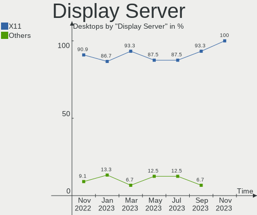
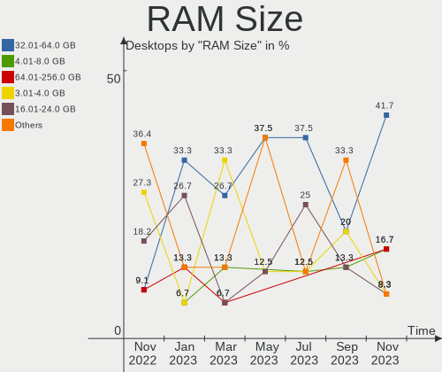
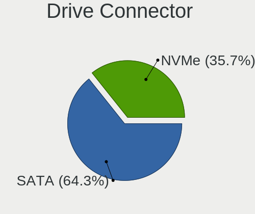
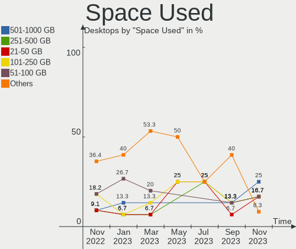
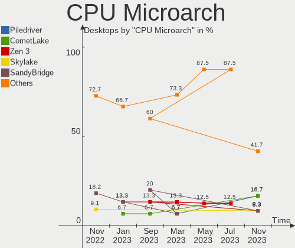
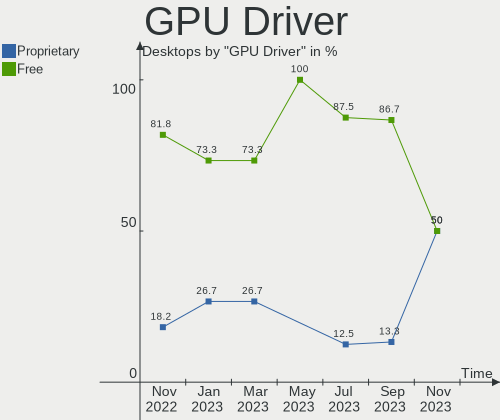
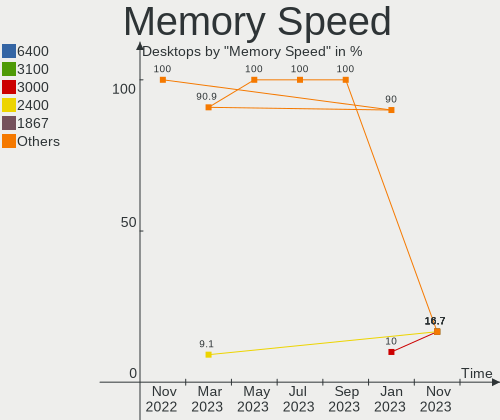

Ubuntu MATE - Hardware Trends (Desktops)
----------------------------------------

A project to identify most popular hardware characteristics and track their change
over time based on data collected by Linux users at https://Linux-Hardware.org.

Anyone can contribute to this report by the [hw-probe](https://github.com/linuxhw/hw-probe) tool:

    sudo -E hw-probe -all -upload

This report is for one last month. Overall report since the beginning of time: [TestDays](https://github.com/linuxhw/TestDays)

Period: Aug, 2023.

Contents
--------

* [ System ](#system)
  - [ OS                       ](#os)
  - [ OS Family                ](#os-family)
  - [ Kernel                   ](#kernel)
  - [ Kernel Family            ](#kernel-family)
  - [ Kernel Major Ver.        ](#kernel-major-ver)
  - [ Arch                     ](#arch)
  - [ DE                       ](#de)
  - [ Display Server           ](#display-server)
  - [ Display Manager          ](#display-manager)
  - [ OS Lang                  ](#os-lang)
  - [ Boot Mode                ](#boot-mode)
  - [ Filesystem               ](#filesystem)
  - [ Part. scheme             ](#part-scheme)
  - [ Dual Boot with Linux/BSD ](#dual-boot-with-linuxbsd)
  - [ Dual Boot (Win)          ](#dual-boot-win)

* [ Board ](#board)
  - [ Vendor                   ](#vendor)
  - [ Model                    ](#model)
  - [ Model Family             ](#model-family)
  - [ MFG Year                 ](#mfg-year)
  - [ Form Factor              ](#form-factor)
  - [ Secure Boot              ](#secure-boot)
  - [ Coreboot                 ](#coreboot)
  - [ RAM Size                 ](#ram-size)
  - [ RAM Used                 ](#ram-used)
  - [ Total Drives             ](#total-drives)
  - [ Has CD-ROM               ](#has-cd-rom)
  - [ Has Ethernet             ](#has-ethernet)
  - [ Has WiFi                 ](#has-wifi)
  - [ Has Bluetooth            ](#has-bluetooth)

* [ Location ](#location)
  - [ Country                  ](#country)
  - [ City                     ](#city)

* [ Drives ](#drives)
  - [ Drive Vendor             ](#drive-vendor)
  - [ Drive Model              ](#drive-model)
  - [ HDD Vendor               ](#hdd-vendor)
  - [ SSD Vendor               ](#ssd-vendor)
  - [ Drive Kind               ](#drive-kind)
  - [ Drive Connector          ](#drive-connector)
  - [ Drive Size               ](#drive-size)
  - [ Space Total              ](#space-total)
  - [ Space Used               ](#space-used)
  - [ Malfunc. Drives          ](#malfunc-drives)
  - [ Malfunc. Drive Vendor    ](#malfunc-drive-vendor)
  - [ Malfunc. HDD Vendor      ](#malfunc-hdd-vendor)
  - [ Malfunc. Drive Kind      ](#malfunc-drive-kind)
  - [ Failed Drives            ](#failed-drives)
  - [ Failed Drive Vendor      ](#failed-drive-vendor)
  - [ Drive Status             ](#drive-status)

* [ Storage controller ](#storage-controller)
  - [ Storage Vendor           ](#storage-vendor)
  - [ Storage Model            ](#storage-model)
  - [ Storage Kind             ](#storage-kind)

* [ Processor ](#processor)
  - [ CPU Vendor               ](#cpu-vendor)
  - [ CPU Model                ](#cpu-model)
  - [ CPU Model Family         ](#cpu-model-family)
  - [ CPU Cores                ](#cpu-cores)
  - [ CPU Sockets              ](#cpu-sockets)
  - [ CPU Threads              ](#cpu-threads)
  - [ CPU Op-Modes             ](#cpu-op-modes)
  - [ CPU Microcode            ](#cpu-microcode)
  - [ CPU Microarch            ](#cpu-microarch)

* [ Graphics ](#graphics)
  - [ GPU Vendor               ](#gpu-vendor)
  - [ GPU Model                ](#gpu-model)
  - [ GPU Combo                ](#gpu-combo)
  - [ GPU Driver               ](#gpu-driver)
  - [ GPU Memory               ](#gpu-memory)

* [ Monitor ](#monitor)
  - [ Monitor Vendor           ](#monitor-vendor)
  - [ Monitor Model            ](#monitor-model)
  - [ Monitor Resolution       ](#monitor-resolution)
  - [ Monitor Diagonal         ](#monitor-diagonal)
  - [ Monitor Width            ](#monitor-width)
  - [ Aspect Ratio             ](#aspect-ratio)
  - [ Monitor Area             ](#monitor-area)
  - [ Pixel Density            ](#pixel-density)
  - [ Multiple Monitors        ](#multiple-monitors)

* [ Network ](#network)
  - [ Net Controller Vendor    ](#net-controller-vendor)
  - [ Net Controller Model     ](#net-controller-model)
  - [ Wireless Vendor          ](#wireless-vendor)
  - [ Wireless Model           ](#wireless-model)
  - [ Ethernet Vendor          ](#ethernet-vendor)
  - [ Ethernet Model           ](#ethernet-model)
  - [ Net Controller Kind      ](#net-controller-kind)
  - [ Used Controller          ](#used-controller)
  - [ NICs                     ](#nics)
  - [ IPv6                     ](#ipv6)

* [ Bluetooth ](#bluetooth)
  - [ Bluetooth Vendor         ](#bluetooth-vendor)
  - [ Bluetooth Model          ](#bluetooth-model)

* [ Sound ](#sound)
  - [ Sound Vendor             ](#sound-vendor)
  - [ Sound Model              ](#sound-model)

* [ Memory ](#memory)
  - [ Memory Vendor            ](#memory-vendor)
  - [ Memory Model             ](#memory-model)
  - [ Memory Kind              ](#memory-kind)
  - [ Memory Form Factor       ](#memory-form-factor)
  - [ Memory Size              ](#memory-size)
  - [ Memory Speed             ](#memory-speed)

* [ Printers & scanners ](#printers--scanners)
  - [ Printer Vendor           ](#printer-vendor)
  - [ Printer Model            ](#printer-model)
  - [ Scanner Vendor           ](#scanner-vendor)
  - [ Scanner Model            ](#scanner-model)

* [ Camera ](#camera)
  - [ Camera Vendor            ](#camera-vendor)
  - [ Camera Model             ](#camera-model)

* [ Security ](#security)
  - [ Fingerprint Vendor       ](#fingerprint-vendor)
  - [ Fingerprint Model        ](#fingerprint-model)
  - [ Chipcard Vendor          ](#chipcard-vendor)
  - [ Chipcard Model           ](#chipcard-model)

* [ Unsupported ](#unsupported)
  - [ Unsupported Devices      ](#unsupported-devices)
  - [ Unsupported Device Types ](#unsupported-device-types)

System
------

OS
--

Installed operating systems

| Name              | Desktops | Percent |
|-------------------|----------|---------|
| Ubuntu MATE 22.04 | 10       | 90.91%  |
| Ubuntu MATE 20.04 | 1        | 9.09%   |

OS Family
---------

OS without a version

| Name        | Desktops | Percent |
|-------------|----------|---------|
| Ubuntu MATE | 11       | 100%    |

Kernel
------

Version of the Linux kernel

| Version           | Desktops | Percent |
|-------------------|----------|---------|
| 6.2.0-26-generic  | 6        | 54.55%  |
| 5.4.0-1104-gke    | 1        | 9.09%   |
| 5.19.0-32-generic | 1        | 9.09%   |
| 5.15.0-82-generic | 1        | 9.09%   |
| 5.15.0-79-generic | 1        | 9.09%   |
| 5.15.0-78-generic | 1        | 9.09%   |

Kernel Family
-------------

Linux kernel without a distro release

| Version | Desktops | Percent |
|---------|----------|---------|
| 6.2.0   | 6        | 54.55%  |
| 5.15.0  | 3        | 27.27%  |
| 5.4.0   | 1        | 9.09%   |
| 5.19.0  | 1        | 9.09%   |

Kernel Major Ver.
-----------------

Linux kernel major version

| Version | Desktops | Percent |
|---------|----------|---------|
| 6.2     | 6        | 54.55%  |
| 5.15    | 3        | 27.27%  |
| 5.4     | 1        | 9.09%   |
| 5.19    | 1        | 9.09%   |

Arch
----

OS architecture (x86_64, i586, etc.)

| Name   | Desktops | Percent |
|--------|----------|---------|
| x86_64 | 11       | 100%    |

DE
--

Desktop Environment

| Name | Desktops | Percent |
|------|----------|---------|
| MATE | 11       | 100%    |

Display Server
--------------

X11 or Wayland

| Name    | Desktops | Percent |
|---------|----------|---------|
| X11     | 8        | 72.73%  |
| Wayland | 2        | 18.18%  |
| Tty     | 1        | 9.09%   |

Display Manager
---------------

SDDM, LightDM, etc.

| Name    | Desktops | Percent |
|---------|----------|---------|
| LightDM | 9        | 81.82%  |
| GDM3    | 2        | 18.18%  |

OS Lang
-------

Language

| Lang  | Desktops | Percent |
|-------|----------|---------|
| en_US | 6        | 54.55%  |
| pt_BR | 1        | 9.09%   |
| es_MX | 1        | 9.09%   |
| en_CA | 1        | 9.09%   |
| en_AU | 1        | 9.09%   |
| de_DE | 1        | 9.09%   |

Boot Mode
---------

EFI or BIOS

| Mode | Desktops | Percent |
|------|----------|---------|
| BIOS | 6        | 54.55%  |
| EFI  | 5        | 45.45%  |

Filesystem
----------

Type of filesystem

| Type    | Desktops | Percent |
|---------|----------|---------|
| Ext4    | 7        | 63.64%  |
| Tmpfs   | 3        | 27.27%  |
| Overlay | 1        | 9.09%   |

Part. scheme
------------

Scheme of partitioning

| Type | Desktops | Percent |
|------|----------|---------|
| GPT  | 10       | 90.91%  |
| MBR  | 1        | 9.09%   |

Dual Boot with Linux/BSD
------------------------

Hosting more than one Linux/BSD

| Dual boot | Desktops | Percent |
|-----------|----------|---------|
| No        | 9        | 81.82%  |
| Yes       | 2        | 18.18%  |

Dual Boot (Win)
---------------

Hosting Linux and Windows

| Dual boot | Desktops | Percent |
|-----------|----------|---------|
| No        | 7        | 63.64%  |
| Yes       | 4        | 36.36%  |

Board
-----

Vendor
------

Motherboard manufacturer

| Name                | Desktops | Percent |
|---------------------|----------|---------|
| ASUSTek Computer    | 2        | 18.18%  |
| ASRock              | 2        | 18.18%  |
| MSI                 | 1        | 9.09%   |
| MACHINIST           | 1        | 9.09%   |
| Hewlett-Packard     | 1        | 9.09%   |
| Gigabyte Technology | 1        | 9.09%   |
| Dell                | 1        | 9.09%   |
| Biostar             | 1        | 9.09%   |
| Unknown             | 1        | 9.09%   |

Model
-----

Motherboard model

| Name                            | Desktops | Percent |
|---------------------------------|----------|---------|
| MSI MS-7816                     | 1        | 9.09%   |
| MACHINIST E5 MR9A PRO MAX V1.1  | 1        | 9.09%   |
| HP ProDesk 600 G3 MT            | 1        | 9.09%   |
| Gigabyte B85M-D3H               | 1        | 9.09%   |
| Dell OptiPlex 5050              | 1        | 9.09%   |
| Biostar A10N-8800E              | 1        | 9.09%   |
| ASUS TUF Gaming B650M-PLUS WIFI | 1        | 9.09%   |
| ASUS P6X58D-E                   | 1        | 9.09%   |
| ASRock B450M Pro4               | 1        | 9.09%   |
| ASRock A320M-HD                 | 1        | 9.09%   |
| Unknown                         | 1        | 9.09%   |

Model Family
------------

Motherboard model prefix

| Name               | Desktops | Percent |
|--------------------|----------|---------|
| MSI MS-7816        | 1        | 9.09%   |
| MACHINIST E5       | 1        | 9.09%   |
| HP ProDesk         | 1        | 9.09%   |
| Gigabyte B85M-D3H  | 1        | 9.09%   |
| Dell OptiPlex      | 1        | 9.09%   |
| Biostar A10N-8800E | 1        | 9.09%   |
| ASUS TUF           | 1        | 9.09%   |
| ASUS P6X58D-E      | 1        | 9.09%   |
| ASRock B450M       | 1        | 9.09%   |
| ASRock A320M-HD    | 1        | 9.09%   |
| Unknown            | 1        | 9.09%   |

MFG Year
--------

Motherboard manufacture year

| Year | Desktops | Percent |
|------|----------|---------|
| 2022 | 3        | 27.27%  |
| 2018 | 3        | 27.27%  |
| 2023 | 1        | 9.09%   |
| 2019 | 1        | 9.09%   |
| 2014 | 1        | 9.09%   |
| 2013 | 1        | 9.09%   |
| 2010 | 1        | 9.09%   |

Form Factor
-----------

Physical design of the computer

| Name    | Desktops | Percent |
|---------|----------|---------|
| Desktop | 11       | 100%    |

Secure Boot
-----------

Enabled or disabled

| State    | Desktops | Percent |
|----------|----------|---------|
| Disabled | 11       | 100%    |

Coreboot
--------

Have coreboot on board

| Used | Desktops | Percent |
|------|----------|---------|
| No   | 11       | 100%    |

RAM Size
--------

Total RAM memory

| Size in GB  | Desktops | Percent |
|-------------|----------|---------|
| 32.01-64.0  | 3        | 27.27%  |
| 16.01-24.0  | 3        | 27.27%  |
| 64.01-256.0 | 2        | 18.18%  |
| 4.01-8.0    | 1        | 9.09%   |
| 2.01-3.0    | 1        | 9.09%   |
| 8.01-16.0   | 1        | 9.09%   |

RAM Used
--------

Used RAM memory

| Used GB    | Desktops | Percent |
|------------|----------|---------|
| 4.01-8.0   | 4        | 36.36%  |
| 1.01-2.0   | 3        | 27.27%  |
| 2.01-3.0   | 2        | 18.18%  |
| 16.01-24.0 | 1        | 9.09%   |
| 8.01-16.0  | 1        | 9.09%   |

Total Drives
------------

Number of drives on board

| Drives | Desktops | Percent |
|--------|----------|---------|
| 1      | 4        | 36.36%  |
| 4      | 2        | 18.18%  |
| 2      | 2        | 18.18%  |
| 5      | 1        | 9.09%   |
| 3      | 1        | 9.09%   |
| 0      | 1        | 9.09%   |

Has CD-ROM
----------

Has CD-ROM on board

| Presented | Desktops | Percent |
|-----------|----------|---------|
| No        | 8        | 72.73%  |
| Yes       | 3        | 27.27%  |

Has Ethernet
------------

Has Ethernet on board

| Presented | Desktops | Percent |
|-----------|----------|---------|
| Yes       | 11       | 100%    |

Has WiFi
--------

Has WiFi module

| Presented | Desktops | Percent |
|-----------|----------|---------|
| No        | 9        | 81.82%  |
| Yes       | 2        | 18.18%  |

Has Bluetooth
-------------

Has Bluetooth module

| Presented | Desktops | Percent |
|-----------|----------|---------|
| No        | 10       | 90.91%  |
| Yes       | 1        | 9.09%   |

Location
--------

Country
-------

Geographic location (country)

| Country     | Desktops | Percent |
|-------------|----------|---------|
| USA         | 2        | 18.18%  |
| Germany     | 2        | 18.18%  |
| Brazil      | 2        | 18.18%  |
| Switzerland | 1        | 9.09%   |
| Poland      | 1        | 9.09%   |
| Mexico      | 1        | 9.09%   |
| Canada      | 1        | 9.09%   |
| Australia   | 1        | 9.09%   |

City
----

Geographic location (city)

| City              | Desktops | Percent |
|-------------------|----------|---------|
| Yonkers           | 1        | 9.09%   |
| Untersiggenthal   | 1        | 9.09%   |
| Stuttgart         | 1        | 9.09%   |
| Singen            | 1        | 9.09%   |
| Santo André      | 1        | 9.09%   |
| Ozarow Mazowiecki | 1        | 9.09%   |
| Montreal          | 1        | 9.09%   |
| Denver            | 1        | 9.09%   |
| Curitiba          | 1        | 9.09%   |
| Brisbane          | 1        | 9.09%   |
| Apodaca           | 1        | 9.09%   |

Drives
------

Drive Vendor
------------

Hard drive vendors

| Vendor              | Desktops | Drives | Percent |
|---------------------|----------|--------|---------|
| WDC                 | 5        | 8      | 29.41%  |
| Seagate             | 2        | 3      | 11.76%  |
| Samsung Electronics | 2        | 3      | 11.76%  |
| Kingston            | 2        | 2      | 11.76%  |
| Crucial             | 2        | 3      | 11.76%  |
| KingFast            | 1        | 1      | 5.88%   |
| Intel               | 1        | 1      | 5.88%   |
| Hitachi             | 1        | 1      | 5.88%   |
| ASMT                | 1        | 2      | 5.88%   |

Drive Model
-----------

Hard drive models

| Model                                           | Desktops | Percent |
|-------------------------------------------------|----------|---------|
| WDC WD5000AAKX-00ERMA0 500GB                    | 1        | 4.55%   |
| WDC WD30PURZ-85GU6Y0 3TB                        | 1        | 4.55%   |
| WDC WD30EFRX-68EUZN0 3TB                        | 1        | 4.55%   |
| WDC WD20PURZ-85AKKY0 2TB                        | 1        | 4.55%   |
| WDC WD20EZRZ-22Z5HB0 2TB                        | 1        | 4.55%   |
| WDC WD20EARX-32PASB0 2TB                        | 1        | 4.55%   |
| WDC WD10EZEX-08WN4A0 1TB                        | 1        | 4.55%   |
| WDC WD1002FBYS-02A6B0 1TB                       | 1        | 4.55%   |
| Seagate ST3250318AS 250GB                       | 1        | 4.55%   |
| Seagate ST32000542AS 2TB                        | 1        | 4.55%   |
| Seagate ST1000DM003-1ER162 1TB                  | 1        | 4.55%   |
| Samsung SSD 990 PRO with Heatsink 2TB           | 1        | 4.55%   |
| Samsung SSD 980 PRO 2TB                         | 1        | 4.55%   |
| Kingston SA400S37480G 480GB SSD                 | 1        | 4.55%   |
| Kingston SA400S37 480G SSD                      | 1        | 4.55%   |
| KingFast SSD 1TB                                | 1        | 4.55%   |
| Intel SSDPEKKR128G7 128GB                       | 1        | 4.55%   |
| Hitachi HUA722020ALA330 59Y5483 42C0416IBMV 2TB | 1        | 4.55%   |
| Crucial M4-CT064M4SSD2 64GB                     | 1        | 4.55%   |
| Crucial CT500MX500SSD4 500GB                    | 1        | 4.55%   |
| Crucial CT500MX500SSD1 500GB                    | 1        | 4.55%   |
| ASMT ASM115x 752GB                              | 1        | 4.55%   |

HDD Vendor
----------

Hard disk drive vendors

| Vendor  | Desktops | Drives | Percent |
|---------|----------|--------|---------|
| WDC     | 5        | 8      | 55.56%  |
| Seagate | 2        | 3      | 22.22%  |
| Hitachi | 1        | 1      | 11.11%  |
| ASMT    | 1        | 2      | 11.11%  |

SSD Vendor
----------

Solid state drive vendors

| Vendor   | Desktops | Drives | Percent |
|----------|----------|--------|---------|
| Kingston | 2        | 2      | 40%     |
| Crucial  | 2        | 3      | 40%     |
| KingFast | 1        | 1      | 20%     |

Drive Kind
----------

HDD or SSD

| Kind | Desktops | Drives | Percent |
|------|----------|--------|---------|
| HDD  | 6        | 14     | 42.86%  |
| SSD  | 5        | 6      | 35.71%  |
| NVMe | 3        | 4      | 21.43%  |

Drive Connector
---------------

SATA, SAS, NVMe, etc.

| Type | Desktops | Drives | Percent |
|------|----------|--------|---------|
| SATA | 8        | 18     | 66.67%  |
| NVMe | 3        | 4      | 25%     |
| SAS  | 1        | 2      | 8.33%   |

Drive Size
----------

Size of hard drive

| Size in TB | Desktops | Drives | Percent |
|------------|----------|--------|---------|
| 0.01-0.5   | 5        | 7      | 33.33%  |
| 1.01-2.0   | 4        | 5      | 26.67%  |
| 0.51-1.0   | 4        | 6      | 26.67%  |
| 2.01-3.0   | 2        | 2      | 13.33%  |

Space Total
-----------

Amount of disk space available on the file system

| Size in GB     | Desktops | Percent |
|----------------|----------|---------|
| More than 3000 | 4        | 36.36%  |
| 251-500        | 2        | 18.18%  |
| 2001-3000      | 2        | 18.18%  |
| 1001-2000      | 1        | 9.09%   |
| 1-20           | 1        | 9.09%   |
| 501-1000       | 1        | 9.09%   |

Space Used
----------

Amount of used disk space

| Used GB        | Desktops | Percent |
|----------------|----------|---------|
| 1-20           | 4        | 36.36%  |
| 1001-2000      | 3        | 27.27%  |
| More than 3000 | 2        | 18.18%  |
| 21-50          | 1        | 9.09%   |
| 501-1000       | 1        | 9.09%   |

Malfunc. Drives
---------------

Drive models with a malfunction

Zero info for selected period =(

Malfunc. Drive Vendor
---------------------

Vendors of faulty drives

Zero info for selected period =(

Malfunc. HDD Vendor
-------------------

Vendors of faulty HDD drives

Zero info for selected period =(

Malfunc. Drive Kind
-------------------

Kinds of faulty drives

Zero info for selected period =(

Failed Drives
-------------

Failed drive models

Zero info for selected period =(

Failed Drive Vendor
-------------------

Failed drive vendors

Zero info for selected period =(

Drive Status
------------

Number of failed and malfunc. drives

| Status   | Desktops | Drives | Percent |
|----------|----------|--------|---------|
| Works    | 6        | 12     | 60%     |
| Detected | 4        | 12     | 40%     |

Storage controller
------------------

Storage Vendor
--------------

Storage controller vendors

| Vendor                   | Desktops | Percent |
|--------------------------|----------|---------|
| Intel                    | 8        | 53.33%  |
| AMD                      | 4        | 26.67%  |
| Samsung Electronics      | 2        | 13.33%  |
| Marvell Technology Group | 1        | 6.67%   |

Storage Model
-------------

Storage controller models

| Model                                                                          | Desktops | Percent |
|--------------------------------------------------------------------------------|----------|---------|
| AMD FCH SATA Controller [AHCI mode]                                            | 4        | 23.53%  |
| Intel 8 Series/C220 Series Chipset Family 6-port SATA Controller 1 [AHCI mode] | 2        | 11.76%  |
| Intel 200 Series PCH SATA controller [AHCI mode]                               | 2        | 11.76%  |
| Samsung NVMe SSD Controller S4LV008[Pascal]                                    | 1        | 5.88%   |
| Samsung NVMe SSD Controller PM9A1/PM9A3/980PRO                                 | 1        | 5.88%   |
| Marvell Group 88SE9123 PCIe SATA 6.0 Gb/s controller                           | 1        | 5.88%   |
| Intel SSD 600P Series                                                          | 1        | 5.88%   |
| Intel SATA controller                                                          | 1        | 5.88%   |
| Intel 9 Series Chipset Family SATA Controller [AHCI Mode]                      | 1        | 5.88%   |
| Intel 82801JI (ICH10 Family) SATA AHCI Controller                              | 1        | 5.88%   |
| AMD FCH SATA Controller D                                                      | 1        | 5.88%   |
| AMD 400 Series Chipset SATA Controller                                         | 1        | 5.88%   |

Storage Kind
------------

Kind of storage controller (IDE, SATA, NVMe, SAS, ...)

| Kind | Desktops | Percent |
|------|----------|---------|
| SATA | 11       | 78.57%  |
| NVMe | 3        | 21.43%  |

Processor
---------

CPU Vendor
----------

Processor vendors

| Vendor | Desktops | Percent |
|--------|----------|---------|
| Intel  | 7        | 63.64%  |
| AMD    | 4        | 36.36%  |

CPU Model
---------

Processor models

| Model                                          | Desktops | Percent |
|------------------------------------------------|----------|---------|
| Intel Xeon D-2796TE CPU @ 2.00GHz              | 1        | 9.09%   |
| Intel Xeon CPU E5-2680 v4 @ 2.40GHz            | 1        | 9.09%   |
| Intel Core i7-6700 CPU @ 3.40GHz               | 1        | 9.09%   |
| Intel Core i7 CPU X 980 @ 3.33GHz              | 1        | 9.09%   |
| Intel Core i5-6600 CPU @ 3.30GHz               | 1        | 9.09%   |
| Intel Core i5-4670K CPU @ 3.40GHz              | 1        | 9.09%   |
| Intel Core i5-4430 CPU @ 3.00GHz               | 1        | 9.09%   |
| AMD Ryzen 7 7700 8-Core Processor              | 1        | 9.09%   |
| AMD Ryzen 5 5600G with Radeon Graphics         | 1        | 9.09%   |
| AMD Ryzen 3 2200G with Radeon Vega Graphics    | 1        | 9.09%   |
| AMD FX-8800P Radeon R7, 12 Compute Cores 4C+8G | 1        | 9.09%   |

CPU Model Family
----------------

Processor model prefix

| Model         | Desktops | Percent |
|---------------|----------|---------|
| Intel Core i5 | 3        | 27.27%  |
| Intel Xeon    | 2        | 18.18%  |
| Intel Core i7 | 2        | 18.18%  |
| AMD Ryzen 7   | 1        | 9.09%   |
| AMD Ryzen 5   | 1        | 9.09%   |
| AMD Ryzen 3   | 1        | 9.09%   |
| AMD FX        | 1        | 9.09%   |

CPU Cores
---------

Number of processor cores

| Number | Desktops | Percent |
|--------|----------|---------|
| 4      | 5        | 45.45%  |
| 6      | 2        | 18.18%  |
| 20     | 1        | 9.09%   |
| 14     | 1        | 9.09%   |
| 8      | 1        | 9.09%   |
| 2      | 1        | 9.09%   |

CPU Sockets
-----------

Number of sockets

| Number | Desktops | Percent |
|--------|----------|---------|
| 1      | 11       | 100%    |

CPU Threads
-----------

Threads per core (Hyper-Threading)

| Number | Desktops | Percent |
|--------|----------|---------|
| 2      | 7        | 63.64%  |
| 1      | 4        | 36.36%  |

CPU Op-Modes
------------

CPU Operation Modes (32-bit, 64-bit)

| Op mode        | Desktops | Percent |
|----------------|----------|---------|
| 32-bit, 64-bit | 11       | 100%    |

CPU Microcode
-------------

Microcode number

| Number     | Desktops | Percent |
|------------|----------|---------|
| Unknown    | 6        | 54.55%  |
| 0x606c1    | 1        | 9.09%   |
| 0x506e3    | 1        | 9.09%   |
| 0x206c2    | 1        | 9.09%   |
| 0x0a50000c | 1        | 9.09%   |
| 0x0600611a | 1        | 9.09%   |

CPU Microarch
-------------

Microarchitecture

| Name      | Desktops | Percent |
|-----------|----------|---------|
| Skylake   | 2        | 18.18%  |
| Haswell   | 2        | 18.18%  |
| Zen 3     | 1        | 9.09%   |
| Zen       | 1        | 9.09%   |
| Westmere  | 1        | 9.09%   |
| Icelake   | 1        | 9.09%   |
| Excavator | 1        | 9.09%   |
| Broadwell | 1        | 9.09%   |
| Unknown   | 1        | 9.09%   |

Graphics
--------

GPU Vendor
----------

Vendors of graphics cards

| Vendor            | Desktops | Percent |
|-------------------|----------|---------|
| Nvidia            | 5        | 38.46%  |
| AMD               | 4        | 30.77%  |
| Intel             | 3        | 23.08%  |
| ASPEED Technology | 1        | 7.69%   |

GPU Model
---------

Graphics card models

| Model                                                                       | Desktops | Percent |
|-----------------------------------------------------------------------------|----------|---------|
| Intel Xeon E3-1200 v3/4th Gen Core Processor Integrated Graphics Controller | 2        | 15.38%  |
| Nvidia TU117GL [T400 4GB]                                                   | 1        | 7.69%   |
| Nvidia TU116 [GeForce GTX 1660 SUPER]                                       | 1        | 7.69%   |
| Nvidia GP106 [GeForce GTX 1060 6GB]                                         | 1        | 7.69%   |
| Nvidia GK208B [GeForce GT 710]                                              | 1        | 7.69%   |
| Nvidia GF110 [GeForce GTX 580]                                              | 1        | 7.69%   |
| Intel HD Graphics 530                                                       | 1        | 7.69%   |
| ASPEED Technology ASPEED Graphics Family                                    | 1        | 7.69%   |
| AMD Wani [Radeon R5/R6/R7 Graphics]                                         | 1        | 7.69%   |
| AMD Raven Ridge [Radeon Vega Series / Radeon Vega Mobile Series]            | 1        | 7.69%   |
| AMD Raphael                                                                 | 1        | 7.69%   |
| AMD Cezanne [Radeon Vega Series / Radeon Vega Mobile Series]                | 1        | 7.69%   |

GPU Combo
---------

Combinations of graphics cards

| Name           | Desktops | Percent |
|----------------|----------|---------|
| 1 x Nvidia     | 4        | 36.36%  |
| 1 x AMD        | 4        | 36.36%  |
| Intel + Nvidia | 1        | 9.09%   |
| 1 x Intel      | 1        | 9.09%   |
| 1 x ASPEED     | 1        | 9.09%   |

GPU Driver
----------

Free vs proprietary

| Driver      | Desktops | Percent |
|-------------|----------|---------|
| Free        | 7        | 63.64%  |
| Proprietary | 4        | 36.36%  |

GPU Memory
----------

Total video memory

| Size in GB | Desktops | Percent |
|------------|----------|---------|
| Unknown    | 5        | 45.45%  |
| 1.01-2.0   | 2        | 18.18%  |
| 5.01-6.0   | 1        | 9.09%   |
| 3.01-4.0   | 1        | 9.09%   |
| 0.51-1.0   | 1        | 9.09%   |
| 0.01-0.5   | 1        | 9.09%   |

Monitor
-------

Monitor Vendor
--------------

Monitor vendors

| Vendor               | Desktops | Percent |
|----------------------|----------|---------|
| Dell                 | 4        | 30.77%  |
| Samsung Electronics  | 3        | 23.08%  |
| Philips              | 2        | 15.38%  |
| Iiyama               | 1        | 7.69%   |
| Goldstar             | 1        | 7.69%   |
| AOC                  | 1        | 7.69%   |
| Ancor Communications | 1        | 7.69%   |

Monitor Model
-------------

Monitor models

| Model                                                             | Desktops | Percent |
|-------------------------------------------------------------------|----------|---------|
| Samsung Electronics S23B550 SAM0919 1920x1080 510x287mm 23.0-inch | 1        | 6.67%   |
| Samsung Electronics LCD Monitor SAM08FE 1920x1080                 | 1        | 6.67%   |
| Samsung Electronics LCD Monitor S34J55x                           | 1        | 6.67%   |
| Philips PHL 272B8Q PHL0918 2560x1440 597x336mm 27.0-inch          | 1        | 6.67%   |
| Philips PHL 242V8 PHLC219 1920x1080 527x296mm 23.8-inch           | 1        | 6.67%   |
| Philips PHL 240B4Q PHL08E3 1920x1200 518x324mm 24.1-inch          | 1        | 6.67%   |
| Iiyama PL2773H IVM660A 1920x1080 600x340mm 27.2-inch              | 1        | 6.67%   |
| Goldstar HDR WQHD GSM772E 3440x1440 800x335mm 34.1-inch           | 1        | 6.67%   |
| Dell U2715H DELD067 2560x1440 597x336mm 27.0-inch                 | 1        | 6.67%   |
| Dell U2715H DELD066 2560x1440 597x336mm 27.0-inch                 | 1        | 6.67%   |
| Dell U2713HM DEL407E 2560x1440 597x336mm 27.0-inch                | 1        | 6.67%   |
| Dell LCD Monitor P2414H 1920x1080                                 | 1        | 6.67%   |
| Dell 1704FPT DEL4004 1280x1024 338x270mm 17.0-inch                | 1        | 6.67%   |
| AOC 2243W AOC2243 1920x1080 477x268mm 21.5-inch                   | 1        | 6.67%   |
| Ancor Communications LCD Monitor ASUS VE278 5360x1440             | 1        | 6.67%   |

Monitor Resolution
------------------

Monitor screen resolution

| Resolution        | Desktops | Percent |
|-------------------|----------|---------|
| 1920x1080 (FHD)   | 5        | 38.46%  |
| 2560x1440 (QHD)   | 3        | 23.08%  |
| 5360x1440         | 1        | 7.69%   |
| 3840x2160 (4K)    | 1        | 7.69%   |
| 1920x1200 (WUXGA) | 1        | 7.69%   |
| 1280x1024 (SXGA)  | 1        | 7.69%   |
| Unknown           | 1        | 7.69%   |

Monitor Diagonal
----------------

Diagonal size in inches

| Inches  | Desktops | Percent |
|---------|----------|---------|
| 27      | 4        | 30.77%  |
| Unknown | 3        | 23.08%  |
| 24      | 2        | 15.38%  |
| 34      | 1        | 7.69%   |
| 23      | 1        | 7.69%   |
| 21      | 1        | 7.69%   |
| 17      | 1        | 7.69%   |

Monitor Width
-------------

Physical width

| Width in mm | Desktops | Percent |
|-------------|----------|---------|
| 501-600     | 6        | 50%     |
| Unknown     | 3        | 25%     |
| 701-800     | 1        | 8.33%   |
| 401-500     | 1        | 8.33%   |
| 301-350     | 1        | 8.33%   |

Aspect Ratio
------------

Proportional relationship between the width and the height

| Ratio   | Desktops | Percent |
|---------|----------|---------|
| 16/9    | 7        | 58.33%  |
| Unknown | 2        | 16.67%  |
| 5/4     | 1        | 8.33%   |
| 21/9    | 1        | 8.33%   |
| 16/10   | 1        | 8.33%   |

Monitor Area
------------

Area in inch²

| Area in inch² | Desktops | Percent |
|----------------|----------|---------|
| 301-350        | 4        | 30.77%  |
| Unknown        | 3        | 23.08%  |
| 201-250        | 2        | 15.38%  |
| 351-500        | 1        | 7.69%   |
| 251-300        | 1        | 7.69%   |
| 151-200        | 1        | 7.69%   |
| 141-150        | 1        | 7.69%   |

Pixel Density
-------------

Pixels per inch

| Density | Desktops | Percent |
|---------|----------|---------|
| 101-120 | 5        | 38.46%  |
| 51-100  | 5        | 38.46%  |
| Unknown | 3        | 23.08%  |

Multiple Monitors
-----------------

Total monitors connected

| Total | Desktops | Percent |
|-------|----------|---------|
| 1     | 7        | 63.64%  |
| 2     | 4        | 36.36%  |

Network
-------

Net Controller Vendor
---------------------

Controller vendors

| Vendor                   | Desktops | Percent |
|--------------------------|----------|---------|
| Realtek Semiconductor    | 7        | 50%     |
| Intel                    | 5        | 35.71%  |
| MediaTek                 | 1        | 7.14%   |
| Marvell Technology Group | 1        | 7.14%   |

Net Controller Model
--------------------

Controller models

| Model                                                             | Desktops | Percent |
|-------------------------------------------------------------------|----------|---------|
| Realtek RTL8111/8168/8411 PCI Express Gigabit Ethernet Controller | 6        | 35.29%  |
| Realtek RTL8125 2.5GbE Controller                                 | 1        | 5.88%   |
| Realtek 802.11ac NIC                                              | 1        | 5.88%   |
| MediaTek MT7921 802.11ax PCI Express Wireless Network Adapter     | 1        | 5.88%   |
| Marvell Group 88E8056 PCI-E Gigabit Ethernet Controller           | 1        | 5.88%   |
| Intel I210 Gigabit Network Connection                             | 1        | 5.88%   |
| Intel Ethernet Controller I225-IT                                 | 1        | 5.88%   |
| Intel Ethernet Connection E823-C for SFP                          | 1        | 5.88%   |
| Intel Ethernet Connection (5) I219-V                              | 1        | 5.88%   |
| Intel Ethernet Connection (5) I219-LM                             | 1        | 5.88%   |
| Intel 82576 Gigabit Network Connection                            | 1        | 5.88%   |
| Intel 82574L Gigabit Network Connection                           | 1        | 5.88%   |

Wireless Vendor
---------------

Wireless vendors

| Vendor                | Desktops | Percent |
|-----------------------|----------|---------|
| Realtek Semiconductor | 1        | 50%     |
| MediaTek              | 1        | 50%     |

Wireless Model
--------------

Wireless models

| Model                                                         | Desktops | Percent |
|---------------------------------------------------------------|----------|---------|
| Realtek 802.11ac NIC                                          | 1        | 50%     |
| MediaTek MT7921 802.11ax PCI Express Wireless Network Adapter | 1        | 50%     |

Ethernet Vendor
---------------

Ethernet vendors

| Vendor                   | Desktops | Percent |
|--------------------------|----------|---------|
| Realtek Semiconductor    | 7        | 53.85%  |
| Intel                    | 5        | 38.46%  |
| Marvell Technology Group | 1        | 7.69%   |

Ethernet Model
--------------

Ethernet models

| Model                                                             | Desktops | Percent |
|-------------------------------------------------------------------|----------|---------|
| Realtek RTL8111/8168/8411 PCI Express Gigabit Ethernet Controller | 6        | 40%     |
| Realtek RTL8125 2.5GbE Controller                                 | 1        | 6.67%   |
| Marvell Group 88E8056 PCI-E Gigabit Ethernet Controller           | 1        | 6.67%   |
| Intel I210 Gigabit Network Connection                             | 1        | 6.67%   |
| Intel Ethernet Controller I225-IT                                 | 1        | 6.67%   |
| Intel Ethernet Connection E823-C for SFP                          | 1        | 6.67%   |
| Intel Ethernet Connection (5) I219-V                              | 1        | 6.67%   |
| Intel Ethernet Connection (5) I219-LM                             | 1        | 6.67%   |
| Intel 82576 Gigabit Network Connection                            | 1        | 6.67%   |
| Intel 82574L Gigabit Network Connection                           | 1        | 6.67%   |

Net Controller Kind
-------------------

Ethernet, WiFi or modem

| Kind     | Desktops | Percent |
|----------|----------|---------|
| Ethernet | 11       | 84.62%  |
| WiFi     | 2        | 15.38%  |

Used Controller
---------------

Currently used network controller

| Kind     | Desktops | Percent |
|----------|----------|---------|
| Ethernet | 11       | 100%    |

NICs
----

Total network controllers on board

| Total | Desktops | Percent |
|-------|----------|---------|
| 1     | 8        | 72.73%  |
| 6     | 1        | 9.09%   |
| 4     | 1        | 9.09%   |
| 2     | 1        | 9.09%   |

IPv6
----

IPv6 vs IPv4

| Used | Desktops | Percent |
|------|----------|---------|
| No   | 8        | 72.73%  |
| Yes  | 3        | 27.27%  |

Bluetooth
---------

Bluetooth Vendor
----------------

Controller vendors

| Vendor       | Desktops | Percent |
|--------------|----------|---------|
| IMC Networks | 1        | 100%    |

Bluetooth Model
---------------

Controller models

| Model                        | Desktops | Percent |
|------------------------------|----------|---------|
| IMC Networks Wireless_Device | 1        | 100%    |

Sound
-----

Sound Vendor
------------

Sound card vendors

| Vendor                 | Desktops | Percent |
|------------------------|----------|---------|
| Intel                  | 6        | 37.5%   |
| Nvidia                 | 5        | 31.25%  |
| AMD                    | 4        | 25%     |
| Generalplus Technology | 1        | 6.25%   |

Sound Model
-----------

Sound card models

| Model                                                               | Desktops | Percent |
|---------------------------------------------------------------------|----------|---------|
| AMD Family 17h/19h HD Audio Controller                              | 3        | 13.64%  |
| Intel Xeon E3-1200 v3/4th Gen Core Processor HD Audio Controller    | 2        | 9.09%   |
| Intel 8 Series/C220 Series Chipset High Definition Audio Controller | 2        | 9.09%   |
| Intel 200 Series PCH HD Audio                                       | 2        | 9.09%   |
| Nvidia TU116 High Definition Audio Controller                       | 1        | 4.55%   |
| Nvidia TU107 GeForce GTX 1650 High Definition Audio Controller      | 1        | 4.55%   |
| Nvidia GP106 High Definition Audio Controller                       | 1        | 4.55%   |
| Nvidia GK208 HDMI/DP Audio Controller                               | 1        | 4.55%   |
| Nvidia GF110 High Definition Audio Controller                       | 1        | 4.55%   |
| Intel 9 Series Chipset Family HD Audio Controller                   | 1        | 4.55%   |
| Intel 82801JI (ICH10 Family) HD Audio Controller                    | 1        | 4.55%   |
| Generalplus Technology USB Audio Device                             | 1        | 4.55%   |
| AMD Renoir Radeon High Definition Audio Controller                  | 1        | 4.55%   |
| AMD Rembrandt Radeon High Definition Audio Controller               | 1        | 4.55%   |
| AMD Raven/Raven2/Fenghuang HDMI/DP Audio Controller                 | 1        | 4.55%   |
| AMD Kabini HDMI/DP Audio                                            | 1        | 4.55%   |
| AMD Family 15h (Models 60h-6fh) Audio Controller                    | 1        | 4.55%   |

Memory
------

Memory Vendor
-------------

Memory module vendors

| Vendor   | Desktops | Percent |
|----------|----------|---------|
| SK hynix | 2        | 22.22%  |
| Kingston | 2        | 22.22%  |
| Corsair  | 2        | 22.22%  |
| Unknown  | 1        | 11.11%  |
| Team     | 1        | 11.11%  |
| G.Skill  | 1        | 11.11%  |

Memory Model
------------

Memory module models

| Model                                                  | Desktops | Percent |
|--------------------------------------------------------|----------|---------|
| Unknown RAM Module 4096MB DIMM 1333MT/s                | 1        | 11.11%  |
| Team RAM Elite-1333 4GB DIMM DDR3 1333MT/s             | 1        | 11.11%  |
| SK hynix RAM Module 8GB DIMM DDR4 2133MT/s             | 1        | 11.11%  |
| SK hynix RAM HMABAGL7ABR4N-XN 128GB DIMM DDR4 3200MT/s | 1        | 11.11%  |
| Kingston RAM KF556C40-32 32GB DIMM DDR5 5808MT/s       | 1        | 11.11%  |
| Kingston RAM KF3600C18D4/16GX 16GB DIMM DDR4 3600MT/s  | 1        | 11.11%  |
| G.Skill RAM F4-2400C15-8GFX 8GB DIMM DDR4 3000MT/s     | 1        | 11.11%  |
| Corsair RAM CMV8GX3M2A1600C11 4GB DIMM DDR3 1600MT/s   | 1        | 11.11%  |
| Corsair RAM CMK16GX4M2A2666C16 8GB DIMM DDR4 3400MT/s  | 1        | 11.11%  |

Memory Kind
-----------

Memory module kinds

| Kind    | Desktops | Percent |
|---------|----------|---------|
| DDR4    | 4        | 57.14%  |
| DDR5    | 1        | 14.29%  |
| DDR3    | 1        | 14.29%  |
| Unknown | 1        | 14.29%  |

Memory Form Factor
------------------

Physical design of the memory module

| Name | Desktops | Percent |
|------|----------|---------|
| DIMM | 7        | 100%    |

Memory Size
-----------

Memory module size

| Size   | Desktops | Percent |
|--------|----------|---------|
| 8192   | 3        | 37.5%   |
| 4096   | 2        | 25%     |
| 131072 | 1        | 12.5%   |
| 32768  | 1        | 12.5%   |
| 16384  | 1        | 12.5%   |

Memory Speed
------------

Memory module speed

| Speed | Desktops | Percent |
|-------|----------|---------|
| 1333  | 2        | 22.22%  |
| 5808  | 1        | 11.11%  |
| 3600  | 1        | 11.11%  |
| 3400  | 1        | 11.11%  |
| 3200  | 1        | 11.11%  |
| 3000  | 1        | 11.11%  |
| 2133  | 1        | 11.11%  |
| 1600  | 1        | 11.11%  |

Printers & scanners
-------------------

Printer Vendor
--------------

Printer device vendors

Zero info for selected period =(

Printer Model
-------------

Printer device models

Zero info for selected period =(

Scanner Vendor
--------------

Scanner device vendors

Zero info for selected period =(

Scanner Model
-------------

Scanner device models

Zero info for selected period =(

Camera
------

Camera Vendor
-------------

Camera device vendors

| Vendor                      | Desktops | Percent |
|-----------------------------|----------|---------|
| Microdia                    | 1        | 25%     |
| Logitech                    | 1        | 25%     |
| LeCroy                      | 1        | 25%     |
| KYE Systems (Mouse Systems) | 1        | 25%     |

Camera Model
------------

Camera device models

| Model                                     | Desktops | Percent |
|-------------------------------------------|----------|---------|
| Microdia GC02M2                           | 1        | 25%     |
| Logitech Quickcam 3000 For Business       | 1        | 25%     |
| LeCroy USB 2.0 PC Camera                  | 1        | 25%     |
| KYE Systems (Mouse Systems) Genius Webcam | 1        | 25%     |

Security
--------

Fingerprint Vendor
------------------

Fingerprint sensor vendors

Zero info for selected period =(

Fingerprint Model
-----------------

Fingerprint sensor models

Zero info for selected period =(

Chipcard Vendor
---------------

Chipcard module vendors

Zero info for selected period =(

Chipcard Model
--------------

Chipcard module models

Zero info for selected period =(

Unsupported
-----------

Unsupported Devices
-------------------

Total unsupported devices on board

| Total | Desktops | Percent |
|-------|----------|---------|
| 0     | 9        | 81.82%  |
| 4     | 1        | 9.09%   |
| 2     | 1        | 9.09%   |

Unsupported Device Types
------------------------

Types of unsupported devices

| Type                     | Desktops | Percent |
|--------------------------|----------|---------|
| Unassigned class         | 1        | 20%     |
| Sound                    | 1        | 20%     |
| Net/ethernet             | 1        | 20%     |
| Firewire controller      | 1        | 20%     |
| Communication controller | 1        | 20%     |

