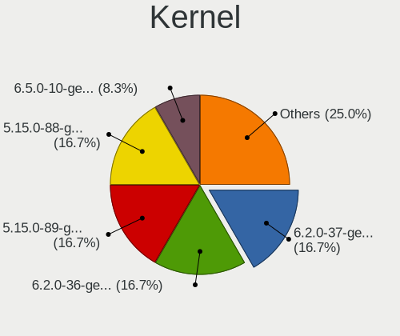
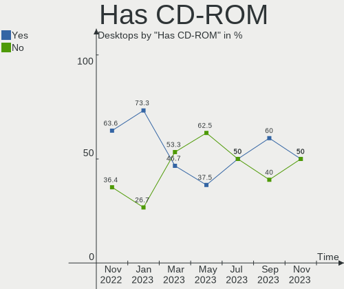
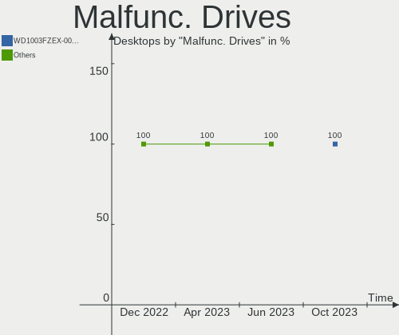
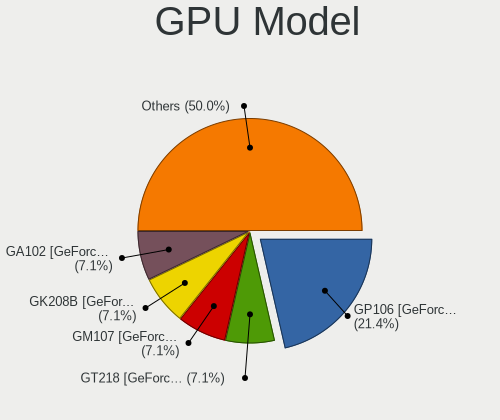
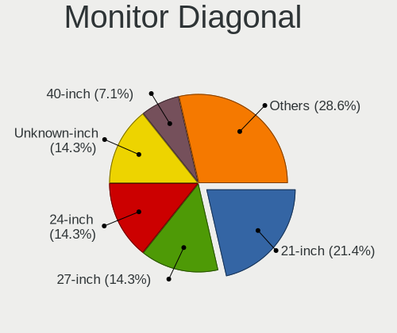
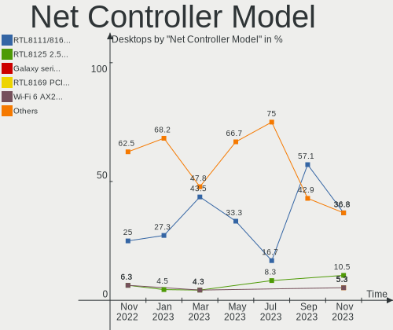

Ubuntu MATE - Hardware Trends (Desktops)
----------------------------------------

A project to identify most popular hardware characteristics and track their change
over time based on data collected by Linux users at https://Linux-Hardware.org.

Anyone can contribute to this report by the [hw-probe](https://github.com/linuxhw/hw-probe) tool:

    sudo -E hw-probe -all -upload

This report is for one last month. Overall report since the beginning of time: [TestCoverage](https://github.com/linuxhw/TestCoverage)

Period: Aug, 2022.

Contents
--------

* [ System ](#system)
  - [ OS                       ](#os)
  - [ OS Family                ](#os-family)
  - [ Kernel                   ](#kernel)
  - [ Kernel Family            ](#kernel-family)
  - [ Kernel Major Ver.        ](#kernel-major-ver)
  - [ Arch                     ](#arch)
  - [ DE                       ](#de)
  - [ Display Server           ](#display-server)
  - [ Display Manager          ](#display-manager)
  - [ OS Lang                  ](#os-lang)
  - [ Boot Mode                ](#boot-mode)
  - [ Filesystem               ](#filesystem)
  - [ Part. scheme             ](#part-scheme)
  - [ Dual Boot with Linux/BSD ](#dual-boot-with-linuxbsd)
  - [ Dual Boot (Win)          ](#dual-boot-win)

* [ Board ](#board)
  - [ Vendor                   ](#vendor)
  - [ Model                    ](#model)
  - [ Model Family             ](#model-family)
  - [ MFG Year                 ](#mfg-year)
  - [ Form Factor              ](#form-factor)
  - [ Secure Boot              ](#secure-boot)
  - [ Coreboot                 ](#coreboot)
  - [ RAM Size                 ](#ram-size)
  - [ RAM Used                 ](#ram-used)
  - [ Total Drives             ](#total-drives)
  - [ Has CD-ROM               ](#has-cd-rom)
  - [ Has Ethernet             ](#has-ethernet)
  - [ Has WiFi                 ](#has-wifi)
  - [ Has Bluetooth            ](#has-bluetooth)

* [ Location ](#location)
  - [ Country                  ](#country)
  - [ City                     ](#city)

* [ Drives ](#drives)
  - [ Drive Vendor             ](#drive-vendor)
  - [ Drive Model              ](#drive-model)
  - [ HDD Vendor               ](#hdd-vendor)
  - [ SSD Vendor               ](#ssd-vendor)
  - [ Drive Kind               ](#drive-kind)
  - [ Drive Connector          ](#drive-connector)
  - [ Drive Size               ](#drive-size)
  - [ Space Total              ](#space-total)
  - [ Space Used               ](#space-used)
  - [ Malfunc. Drives          ](#malfunc-drives)
  - [ Malfunc. Drive Vendor    ](#malfunc-drive-vendor)
  - [ Malfunc. HDD Vendor      ](#malfunc-hdd-vendor)
  - [ Malfunc. Drive Kind      ](#malfunc-drive-kind)
  - [ Failed Drives            ](#failed-drives)
  - [ Failed Drive Vendor      ](#failed-drive-vendor)
  - [ Drive Status             ](#drive-status)

* [ Storage controller ](#storage-controller)
  - [ Storage Vendor           ](#storage-vendor)
  - [ Storage Model            ](#storage-model)
  - [ Storage Kind             ](#storage-kind)

* [ Processor ](#processor)
  - [ CPU Vendor               ](#cpu-vendor)
  - [ CPU Model                ](#cpu-model)
  - [ CPU Model Family         ](#cpu-model-family)
  - [ CPU Cores                ](#cpu-cores)
  - [ CPU Sockets              ](#cpu-sockets)
  - [ CPU Threads              ](#cpu-threads)
  - [ CPU Op-Modes             ](#cpu-op-modes)
  - [ CPU Microcode            ](#cpu-microcode)
  - [ CPU Microarch            ](#cpu-microarch)

* [ Graphics ](#graphics)
  - [ GPU Vendor               ](#gpu-vendor)
  - [ GPU Model                ](#gpu-model)
  - [ GPU Combo                ](#gpu-combo)
  - [ GPU Driver               ](#gpu-driver)
  - [ GPU Memory               ](#gpu-memory)

* [ Monitor ](#monitor)
  - [ Monitor Vendor           ](#monitor-vendor)
  - [ Monitor Model            ](#monitor-model)
  - [ Monitor Resolution       ](#monitor-resolution)
  - [ Monitor Diagonal         ](#monitor-diagonal)
  - [ Monitor Width            ](#monitor-width)
  - [ Aspect Ratio             ](#aspect-ratio)
  - [ Monitor Area             ](#monitor-area)
  - [ Pixel Density            ](#pixel-density)
  - [ Multiple Monitors        ](#multiple-monitors)

* [ Network ](#network)
  - [ Net Controller Vendor    ](#net-controller-vendor)
  - [ Net Controller Model     ](#net-controller-model)
  - [ Wireless Vendor          ](#wireless-vendor)
  - [ Wireless Model           ](#wireless-model)
  - [ Ethernet Vendor          ](#ethernet-vendor)
  - [ Ethernet Model           ](#ethernet-model)
  - [ Net Controller Kind      ](#net-controller-kind)
  - [ Used Controller          ](#used-controller)
  - [ NICs                     ](#nics)
  - [ IPv6                     ](#ipv6)

* [ Bluetooth ](#bluetooth)
  - [ Bluetooth Vendor         ](#bluetooth-vendor)
  - [ Bluetooth Model          ](#bluetooth-model)

* [ Sound ](#sound)
  - [ Sound Vendor             ](#sound-vendor)
  - [ Sound Model              ](#sound-model)

* [ Memory ](#memory)
  - [ Memory Vendor            ](#memory-vendor)
  - [ Memory Model             ](#memory-model)
  - [ Memory Kind              ](#memory-kind)
  - [ Memory Form Factor       ](#memory-form-factor)
  - [ Memory Size              ](#memory-size)
  - [ Memory Speed             ](#memory-speed)

* [ Printers & scanners ](#printers--scanners)
  - [ Printer Vendor           ](#printer-vendor)
  - [ Printer Model            ](#printer-model)
  - [ Scanner Vendor           ](#scanner-vendor)
  - [ Scanner Model            ](#scanner-model)

* [ Camera ](#camera)
  - [ Camera Vendor            ](#camera-vendor)
  - [ Camera Model             ](#camera-model)

* [ Security ](#security)
  - [ Fingerprint Vendor       ](#fingerprint-vendor)
  - [ Fingerprint Model        ](#fingerprint-model)
  - [ Chipcard Vendor          ](#chipcard-vendor)
  - [ Chipcard Model           ](#chipcard-model)

* [ Unsupported ](#unsupported)
  - [ Unsupported Devices      ](#unsupported-devices)
  - [ Unsupported Device Types ](#unsupported-device-types)

System
------

OS
--

Installed operating systems

| Name              | Desktops | Percent |
|-------------------|----------|---------|
| Ubuntu MATE 22.04 | 6        | 60%     |
| Ubuntu MATE 20.04 | 4        | 40%     |

OS Family
---------

OS without a version

| Name        | Desktops | Percent |
|-------------|----------|---------|
| Ubuntu MATE | 10       | 100%    |

Kernel
------

Version of the Linux kernel

| Version           | Desktops | Percent |
|-------------------|----------|---------|
| 5.15.0-46-generic | 3        | 30%     |
| 5.4.0-124-generic | 1        | 10%     |
| 5.4.0-123-generic | 1        | 10%     |
| 5.4.0-122-generic | 1        | 10%     |
| 5.18.0-1-generic  | 1        | 10%     |
| 5.15.0-43-generic | 1        | 10%     |
| 5.15.0-39-generic | 1        | 10%     |
| 5.15.0-27-generic | 1        | 10%     |

Kernel Family
-------------

Linux kernel without a distro release

| Version | Desktops | Percent |
|---------|----------|---------|
| 5.15.0  | 6        | 60%     |
| 5.4.0   | 3        | 30%     |
| 5.18.0  | 1        | 10%     |

Kernel Major Ver.
-----------------

Linux kernel major version

| Version | Desktops | Percent |
|---------|----------|---------|
| 5.15    | 6        | 60%     |
| 5.4     | 3        | 30%     |
| 5.18    | 1        | 10%     |

Arch
----

OS architecture (x86_64, i586, etc.)

| Name   | Desktops | Percent |
|--------|----------|---------|
| x86_64 | 10       | 100%    |

DE
--

Desktop Environment

| Name | Desktops | Percent |
|------|----------|---------|
| MATE | 10       | 100%    |

Display Server
--------------

X11 or Wayland

| Name | Desktops | Percent |
|------|----------|---------|
| X11  | 10       | 100%    |

Display Manager
---------------

SDDM, LightDM, etc.

| Name    | Desktops | Percent |
|---------|----------|---------|
| LightDM | 8        | 80%     |
| Unknown | 2        | 20%     |

OS Lang
-------

Language

| Lang  | Desktops | Percent |
|-------|----------|---------|
| en_US | 3        | 30%     |
| fr_FR | 2        | 20%     |
| en_CA | 2        | 20%     |
| ru_RU | 1        | 10%     |
| es_PE | 1        | 10%     |
| en_GB | 1        | 10%     |

Boot Mode
---------

EFI or BIOS

| Mode | Desktops | Percent |
|------|----------|---------|
| BIOS | 8        | 80%     |
| EFI  | 2        | 20%     |

Filesystem
----------

Type of filesystem

| Type  | Desktops | Percent |
|-------|----------|---------|
| Ext4  | 9        | 90%     |
| Btrfs | 1        | 10%     |

Part. scheme
------------

Scheme of partitioning

| Type    | Desktops | Percent |
|---------|----------|---------|
| GPT     | 4        | 40%     |
| Unknown | 4        | 40%     |
| MBR     | 2        | 20%     |

Dual Boot with Linux/BSD
------------------------

Hosting more than one Linux/BSD

| Dual boot | Desktops | Percent |
|-----------|----------|---------|
| No        | 8        | 80%     |
| Yes       | 2        | 20%     |

Dual Boot (Win)
---------------

Hosting Linux and Windows

| Dual boot | Desktops | Percent |
|-----------|----------|---------|
| No        | 8        | 80%     |
| Yes       | 2        | 20%     |

Board
-----

Vendor
------

Motherboard manufacturer

| Name                | Desktops | Percent |
|---------------------|----------|---------|
| MSI                 | 2        | 20%     |
| Dell                | 2        | 20%     |
| ASUSTek Computer    | 2        | 20%     |
| Lenovo              | 1        | 10%     |
| Hewlett-Packard     | 1        | 10%     |
| Gigabyte Technology | 1        | 10%     |
| AZW                 | 1        | 10%     |

Model
-----

Motherboard model

| Name                                | Desktops | Percent |
|-------------------------------------|----------|---------|
| MSI MS-7982                         | 1        | 10%     |
| MSI B02311                          | 1        | 10%     |
| Lenovo ThinkCentre M710q 10MQSC0N00 | 1        | 10%     |
| HP Pavilion 590-p0049 3LC38AA       | 1        | 10%     |
| Gigabyte B85M-D3PH                  | 1        | 10%     |
| Dell OptiPlex 780                   | 1        | 10%     |
| Dell OptiPlex 3050                  | 1        | 10%     |
| AZW GK55                            | 1        | 10%     |
| ASUS M5A88-V EVO                    | 1        | 10%     |
| ASUS M4A78-E                        | 1        | 10%     |

Model Family
------------

Motherboard model prefix

| Name               | Desktops | Percent |
|--------------------|----------|---------|
| Dell OptiPlex      | 2        | 20%     |
| MSI MS-7982        | 1        | 10%     |
| MSI B02311         | 1        | 10%     |
| Lenovo ThinkCentre | 1        | 10%     |
| HP Pavilion        | 1        | 10%     |
| Gigabyte B85M-D3PH | 1        | 10%     |
| AZW GK55           | 1        | 10%     |
| ASUS M5A88-V       | 1        | 10%     |
| ASUS M4A78-E       | 1        | 10%     |

MFG Year
--------

Motherboard manufacture year

| Year | Desktops | Percent |
|------|----------|---------|
| 2018 | 2        | 20%     |
| 2011 | 2        | 20%     |
| 2009 | 2        | 20%     |
| 2020 | 1        | 10%     |
| 2017 | 1        | 10%     |
| 2015 | 1        | 10%     |
| 2013 | 1        | 10%     |

Form Factor
-----------

Physical design of the computer

| Name    | Desktops | Percent |
|---------|----------|---------|
| Desktop | 10       | 100%    |

Secure Boot
-----------

Enabled or disabled

| State    | Desktops | Percent |
|----------|----------|---------|
| Disabled | 10       | 100%    |

Coreboot
--------

Have coreboot on board

| Used | Desktops | Percent |
|------|----------|---------|
| No   | 10       | 100%    |

RAM Size
--------

Total RAM memory

| Size in GB | Desktops | Percent |
|------------|----------|---------|
| 4.01-8.0   | 4        | 40%     |
| 3.01-4.0   | 3        | 30%     |
| 16.01-24.0 | 2        | 20%     |
| 32.01-64.0 | 1        | 10%     |

RAM Used
--------

Used RAM memory

| Used GB  | Desktops | Percent |
|----------|----------|---------|
| 1.01-2.0 | 5        | 50%     |
| 4.01-8.0 | 3        | 30%     |
| 2.01-3.0 | 2        | 20%     |

Total Drives
------------

Number of drives on board

| Drives | Desktops | Percent |
|--------|----------|---------|
| 1      | 5        | 50%     |
| 4      | 2        | 20%     |
| 5      | 1        | 10%     |
| 3      | 1        | 10%     |
| 2      | 1        | 10%     |

Has CD-ROM
----------

Has CD-ROM on board

| Presented | Desktops | Percent |
|-----------|----------|---------|
| Yes       | 5        | 50%     |
| No        | 5        | 50%     |

Has Ethernet
------------

Has Ethernet on board

| Presented | Desktops | Percent |
|-----------|----------|---------|
| Yes       | 10       | 100%    |

Has WiFi
--------

Has WiFi module

| Presented | Desktops | Percent |
|-----------|----------|---------|
| Yes       | 6        | 60%     |
| No        | 4        | 40%     |

Has Bluetooth
-------------

Has Bluetooth module

| Presented | Desktops | Percent |
|-----------|----------|---------|
| No        | 6        | 60%     |
| Yes       | 4        | 40%     |

Location
--------

Country
-------

Geographic location (country)

| Country | Desktops | Percent |
|---------|----------|---------|
| USA     | 2        | 20%     |
| France  | 2        | 20%     |
| Canada  | 2        | 20%     |
| UK      | 1        | 10%     |
| Russia  | 1        | 10%     |
| Peru    | 1        | 10%     |
| Austria | 1        | 10%     |

City
----

Geographic location (city)

| City                | Desktops | Percent |
|---------------------|----------|---------|
| Terrace             | 1        | 10%     |
| Tambov              | 1        | 10%     |
| Talence             | 1        | 10%     |
| Rezé               | 1        | 10%     |
| Ottawa              | 1        | 10%     |
| Miami               | 1        | 10%     |
| Marysville          | 1        | 10%     |
| Manchester          | 1        | 10%     |
| Lima                | 1        | 10%     |
| Kematen an der Ybbs | 1        | 10%     |

Drives
------

Drive Vendor
------------

Hard drive vendors

| Vendor              | Desktops | Drives | Percent |
|---------------------|----------|--------|---------|
| WDC                 | 4        | 5      | 22.22%  |
| Seagate             | 4        | 6      | 22.22%  |
| Kingston            | 2        | 2      | 11.11%  |
| Hitachi             | 2        | 2      | 11.11%  |
| Transcend           | 1        | 1      | 5.56%   |
| Samsung Electronics | 1        | 1      | 5.56%   |
| NGFF                | 1        | 1      | 5.56%   |
| DAS                 | 1        | 3      | 5.56%   |
| Crucial             | 1        | 1      | 5.56%   |
| A-DATA Technology   | 1        | 1      | 5.56%   |

Drive Model
-----------

Hard drive models

| Model                            | Desktops | Percent |
|----------------------------------|----------|---------|
| Seagate ST500DM002-1BD142 500GB  | 2        | 9.52%   |
| Seagate ST2000DM001-1ER164 2TB   | 2        | 9.52%   |
| WDC WD5000AZLX-75K2TA0 500GB     | 1        | 4.76%   |
| WDC WD5000AAKS-00V1A0 500GB      | 1        | 4.76%   |
| WDC WD40EZAZ-00SF3B0 4TB         | 1        | 4.76%   |
| WDC WD20EZRX-00DC0B0 2TB         | 1        | 4.76%   |
| WDC WD20EFZX-68AWUN0 2TB         | 1        | 4.76%   |
| Transcend TS256GSSD230S 256GB    | 1        | 4.76%   |
| Seagate ST3320418AS 320GB        | 1        | 4.76%   |
| Seagate ST1000DM003-1CH162 1TB   | 1        | 4.76%   |
| Samsung HD120IJ 120GB            | 1        | 4.76%   |
| NGFF 2280 256GB SSD              | 1        | 4.76%   |
| Kingston SV300S37A120G 120GB SSD | 1        | 4.76%   |
| Kingston NVMe SSD Drive 500GB    | 1        | 4.76%   |
| Hitachi HTS721080G9SA00 80GB     | 1        | 4.76%   |
| Hitachi HDP725050GLA360 500GB    | 1        | 4.76%   |
| DAS TerraMaster 500GB            | 1        | 4.76%   |
| Crucial CT1000BX500SSD1 1TB      | 1        | 4.76%   |
| A-DATA SP550 240GB SSD           | 1        | 4.76%   |

HDD Vendor
----------

Hard disk drive vendors

| Vendor              | Desktops | Drives | Percent |
|---------------------|----------|--------|---------|
| WDC                 | 4        | 5      | 33.33%  |
| Seagate             | 4        | 6      | 33.33%  |
| Hitachi             | 2        | 2      | 16.67%  |
| Samsung Electronics | 1        | 1      | 8.33%   |
| DAS                 | 1        | 3      | 8.33%   |

SSD Vendor
----------

Solid state drive vendors

| Vendor            | Desktops | Drives | Percent |
|-------------------|----------|--------|---------|
| Transcend         | 1        | 1      | 20%     |
| NGFF              | 1        | 1      | 20%     |
| Kingston          | 1        | 1      | 20%     |
| Crucial           | 1        | 1      | 20%     |
| A-DATA Technology | 1        | 1      | 20%     |

Drive Kind
----------

HDD or SSD

| Kind | Desktops | Drives | Percent |
|------|----------|--------|---------|
| HDD  | 8        | 17     | 61.54%  |
| SSD  | 4        | 5      | 30.77%  |
| NVMe | 1        | 1      | 7.69%   |

Drive Connector
---------------

SATA, SAS, NVMe, etc.

| Type | Desktops | Drives | Percent |
|------|----------|--------|---------|
| SATA | 9        | 19     | 81.82%  |
| SAS  | 1        | 3      | 9.09%   |
| NVMe | 1        | 1      | 9.09%   |

Drive Size
----------

Size of hard drive

| Size in TB | Desktops | Drives | Percent |
|------------|----------|--------|---------|
| 0.01-0.5   | 9        | 15     | 56.25%  |
| 1.01-2.0   | 4        | 4      | 25%     |
| 0.51-1.0   | 2        | 2      | 12.5%   |
| 3.01-4.0   | 1        | 1      | 6.25%   |

Space Total
-----------

Amount of disk space available on the file system

| Size in GB     | Desktops | Percent |
|----------------|----------|---------|
| 251-500        | 3        | 30%     |
| More than 3000 | 2        | 20%     |
| 501-1000       | 2        | 20%     |
| 101-250        | 1        | 10%     |
| 1001-2000      | 1        | 10%     |
| 51-100         | 1        | 10%     |

Space Used
----------

Amount of used disk space

| Used GB        | Desktops | Percent |
|----------------|----------|---------|
| 1-20           | 3        | 30%     |
| 251-500        | 2        | 20%     |
| More than 3000 | 1        | 10%     |
| 21-50          | 1        | 10%     |
| 2001-3000      | 1        | 10%     |
| 101-250        | 1        | 10%     |
| 501-1000       | 1        | 10%     |

Malfunc. Drives
---------------

Drive models with a malfunction

| Model                          | Desktops | Drives | Percent |
|--------------------------------|----------|--------|---------|
| WDC WD5000AAKS-00V1A0 500GB    | 1        | 1      | 25%     |
| Seagate ST2000DM001-1ER164 2TB | 1        | 1      | 25%     |
| NGFF 2280 256GB SSD            | 1        | 1      | 25%     |
| Hitachi HTS721080G9SA00 80GB   | 1        | 1      | 25%     |

Malfunc. Drive Vendor
---------------------

Vendors of faulty drives

| Vendor  | Desktops | Drives | Percent |
|---------|----------|--------|---------|
| WDC     | 1        | 1      | 25%     |
| Seagate | 1        | 1      | 25%     |
| NGFF    | 1        | 1      | 25%     |
| Hitachi | 1        | 1      | 25%     |

Malfunc. HDD Vendor
-------------------

Vendors of faulty HDD drives

| Vendor  | Desktops | Drives | Percent |
|---------|----------|--------|---------|
| WDC     | 1        | 1      | 33.33%  |
| Seagate | 1        | 1      | 33.33%  |
| Hitachi | 1        | 1      | 33.33%  |

Malfunc. Drive Kind
-------------------

Kinds of faulty drives

| Kind | Desktops | Drives | Percent |
|------|----------|--------|---------|
| HDD  | 3        | 3      | 75%     |
| SSD  | 1        | 1      | 25%     |

Failed Drives
-------------

Failed drive models

Zero info for selected period =(

Failed Drive Vendor
-------------------

Failed drive vendors

Zero info for selected period =(

Drive Status
------------

Number of failed and malfunc. drives

| Status   | Desktops | Drives | Percent |
|----------|----------|--------|---------|
| Detected | 4        | 8      | 33.33%  |
| Malfunc  | 4        | 4      | 33.33%  |
| Works    | 4        | 11     | 33.33%  |

Storage controller
------------------

Storage Vendor
--------------

Storage controller vendors

| Vendor                      | Desktops | Percent |
|-----------------------------|----------|---------|
| Intel                       | 6        | 50%     |
| AMD                         | 4        | 33.33%  |
| VIA Technologies            | 1        | 8.33%   |
| Kingston Technology Company | 1        | 8.33%   |

Storage Model
-------------

Storage controller models

| Model                                                                          | Desktops | Percent |
|--------------------------------------------------------------------------------|----------|---------|
| Intel SATA Controller [RAID mode]                                              | 2        | 12.5%   |
| AMD SB7x0/SB8x0/SB9x0 SATA Controller [AHCI mode]                              | 2        | 12.5%   |
| AMD SB7x0/SB8x0/SB9x0 IDE Controller                                           | 2        | 12.5%   |
| VIA VT6415 PATA IDE Host Controller                                            | 1        | 6.25%   |
| Kingston Company Company Non-Volatile memory controller                        | 1        | 6.25%   |
| Intel Q170/Q150/B150/H170/H110/Z170/CM236 Chipset SATA Controller [AHCI Mode]  | 1        | 6.25%   |
| Intel Celeron/Pentium Silver Processor SATA Controller                         | 1        | 6.25%   |
| Intel 8 Series/C220 Series Chipset Family 6-port SATA Controller 1 [AHCI mode] | 1        | 6.25%   |
| Intel 4 Series Chipset PT IDER Controller                                      | 1        | 6.25%   |
| Intel 200 Series PCH SATA controller [AHCI mode]                               | 1        | 6.25%   |
| AMD SB7x0/SB8x0/SB9x0 SATA Controller [IDE mode]                               | 1        | 6.25%   |
| AMD FCH SATA Controller [AHCI mode]                                            | 1        | 6.25%   |
| AMD 300 Series Chipset SATA Controller                                         | 1        | 6.25%   |

Storage Kind
------------

Kind of storage controller (IDE, SATA, NVMe, SAS, ...)

| Kind | Desktops | Percent |
|------|----------|---------|
| SATA | 8        | 53.33%  |
| IDE  | 4        | 26.67%  |
| RAID | 2        | 13.33%  |
| NVMe | 1        | 6.67%   |

Processor
---------

CPU Vendor
----------

Processor vendors

| Vendor | Desktops | Percent |
|--------|----------|---------|
| Intel  | 6        | 60%     |
| AMD    | 4        | 40%     |

CPU Model
---------

Processor models

| Model                                       | Desktops | Percent |
|---------------------------------------------|----------|---------|
| Intel Core i7-4790 CPU @ 3.60GHz            | 1        | 10%     |
| Intel Core i5-7400T CPU @ 2.40GHz           | 1        | 10%     |
| Intel Core i5-6500 CPU @ 3.20GHz            | 1        | 10%     |
| Intel Core i5-6400 CPU @ 2.70GHz            | 1        | 10%     |
| Intel Core 2 Quad CPU Q8400 @ 2.66GHz       | 1        | 10%     |
| Intel Celeron J4125 CPU @ 2.00GHz           | 1        | 10%     |
| AMD Ryzen 5 2400G with Radeon Vega Graphics | 1        | 10%     |
| AMD Phenom II X4 810 Processor              | 1        | 10%     |
| AMD FX-8300 Eight-Core Processor            | 1        | 10%     |
| AMD E-450 APU with Radeon HD Graphics       | 1        | 10%     |

CPU Model Family
----------------

Processor model prefix

| Model             | Desktops | Percent |
|-------------------|----------|---------|
| Intel Core i5     | 3        | 30%     |
| Intel Core i7     | 1        | 10%     |
| Intel Core 2 Quad | 1        | 10%     |
| Intel Celeron     | 1        | 10%     |
| AMD Ryzen 5       | 1        | 10%     |
| AMD Phenom II X4  | 1        | 10%     |
| AMD FX            | 1        | 10%     |
| AMD E             | 1        | 10%     |

CPU Cores
---------

Number of processor cores

| Number | Desktops | Percent |
|--------|----------|---------|
| 4      | 9        | 90%     |
| 2      | 1        | 10%     |

CPU Sockets
-----------

Number of sockets

| Number | Desktops | Percent |
|--------|----------|---------|
| 1      | 10       | 100%    |

CPU Threads
-----------

Threads per core (Hyper-Threading)

| Number | Desktops | Percent |
|--------|----------|---------|
| 1      | 7        | 70%     |
| 2      | 3        | 30%     |

CPU Op-Modes
------------

CPU Operation Modes (32-bit, 64-bit)

| Op mode        | Desktops | Percent |
|----------------|----------|---------|
| 32-bit, 64-bit | 10       | 100%    |

CPU Microcode
-------------

Microcode number

| Number     | Desktops | Percent |
|------------|----------|---------|
| Unknown    | 4        | 40%     |
| 0x506e3    | 1        | 10%     |
| 0x306c3    | 1        | 10%     |
| 0x1067a    | 1        | 10%     |
| 0x06000852 | 1        | 10%     |
| 0x05000119 | 1        | 10%     |
| 0x010000db | 1        | 10%     |

CPU Microarch
-------------

Microarchitecture

| Name          | Desktops | Percent |
|---------------|----------|---------|
| Skylake       | 2        | 20%     |
| Zen           | 1        | 10%     |
| Piledriver    | 1        | 10%     |
| Penryn        | 1        | 10%     |
| KabyLake      | 1        | 10%     |
| K10           | 1        | 10%     |
| Haswell       | 1        | 10%     |
| Goldmont plus | 1        | 10%     |
| Bobcat        | 1        | 10%     |

Graphics
--------

GPU Vendor
----------

Vendors of graphics cards

| Vendor | Desktops | Percent |
|--------|----------|---------|
| Intel  | 5        | 45.45%  |
| AMD    | 5        | 45.45%  |
| Nvidia | 1        | 9.09%   |

GPU Model
---------

Graphics card models

| Model                                                                       | Desktops | Percent |
|-----------------------------------------------------------------------------|----------|---------|
| Intel HD Graphics 530                                                       | 2        | 18.18%  |
| Nvidia GK104 [GeForce GTX 760]                                              | 1        | 9.09%   |
| Intel Xeon E3-1200 v3/4th Gen Core Processor Integrated Graphics Controller | 1        | 9.09%   |
| Intel HD Graphics 630                                                       | 1        | 9.09%   |
| Intel GeminiLake [UHD Graphics 600]                                         | 1        | 9.09%   |
| AMD Wrestler [Radeon HD 6320]                                               | 1        | 9.09%   |
| AMD RS880 [Radeon HD 4250]                                                  | 1        | 9.09%   |
| AMD RS780D [Radeon HD 3300]                                                 | 1        | 9.09%   |
| AMD Raven Ridge [Radeon Vega Series / Radeon Vega Mobile Series]            | 1        | 9.09%   |
| AMD Cedar [Radeon HD 5000/6000/7350/8350 Series]                            | 1        | 9.09%   |

GPU Combo
---------

Combinations of graphics cards

| Name           | Desktops | Percent |
|----------------|----------|---------|
| 1 x AMD        | 5        | 50%     |
| 1 x Intel      | 4        | 40%     |
| Intel + Nvidia | 1        | 10%     |

GPU Driver
----------

Free vs proprietary

| Driver      | Desktops | Percent |
|-------------|----------|---------|
| Free        | 9        | 90%     |
| Proprietary | 1        | 10%     |

GPU Memory
----------

Total video memory

| Size in GB | Desktops | Percent |
|------------|----------|---------|
| Unknown    | 5        | 50%     |
| 0.01-0.5   | 3        | 30%     |
| 1.01-2.0   | 1        | 10%     |
| 0.51-1.0   | 1        | 10%     |

Monitor
-------

Monitor Vendor
--------------

Monitor vendors

| Vendor               | Desktops | Percent |
|----------------------|----------|---------|
| Samsung Electronics  | 4        | 44.44%  |
| Dell                 | 2        | 22.22%  |
| Hewlett-Packard      | 1        | 11.11%  |
| Goldstar             | 1        | 11.11%  |
| Ancor Communications | 1        | 11.11%  |

Monitor Model
-------------

Monitor models

| Model                                                                 | Desktops | Percent |
|-----------------------------------------------------------------------|----------|---------|
| Samsung Electronics U32R59x SAM0F94 3840x2160 697x392mm 31.5-inch     | 1        | 11.11%  |
| Samsung Electronics S23B550 SAM0919 1920x1080 510x287mm 23.0-inch     | 1        | 11.11%  |
| Samsung Electronics S22B300 SAM08AC 1920x1080 480x270mm 21.7-inch     | 1        | 11.11%  |
| Samsung Electronics C24F390 SAM0D2D 1920x1080 520x290mm 23.4-inch     | 1        | 11.11%  |
| Hewlett-Packard w1707 HWP2800 1440x900 370x230mm 17.2-inch            | 1        | 11.11%  |
| Goldstar IPS FULLHD GSM5AB6 1920x1080 480x270mm 21.7-inch             | 1        | 11.11%  |
| Dell U3421WE DELA192 3440x1440 800x335mm 34.1-inch                    | 1        | 11.11%  |
| Dell E2220H DELF118 1920x1080 476x268mm 21.5-inch                     | 1        | 11.11%  |
| Ancor Communications ASUS VE278 ACI27F6 1920x1080 598x336mm 27.0-inch | 1        | 11.11%  |

Monitor Resolution
------------------

Monitor screen resolution

| Resolution       | Desktops | Percent |
|------------------|----------|---------|
| 1920x1080 (FHD)  | 6        | 66.67%  |
| 3840x2160 (4K)   | 1        | 11.11%  |
| 3440x1440        | 1        | 11.11%  |
| 1440x900 (WXGA+) | 1        | 11.11%  |

Monitor Diagonal
----------------

Diagonal size in inches

| Inches | Desktops | Percent |
|--------|----------|---------|
| 21     | 3        | 33.33%  |
| 23     | 2        | 22.22%  |
| 34     | 1        | 11.11%  |
| 31     | 1        | 11.11%  |
| 27     | 1        | 11.11%  |
| 17     | 1        | 11.11%  |

Monitor Width
-------------

Physical width

| Width in mm | Desktops | Percent |
|-------------|----------|---------|
| 501-600     | 3        | 33.33%  |
| 401-500     | 3        | 33.33%  |
| 701-800     | 1        | 11.11%  |
| 601-700     | 1        | 11.11%  |
| 351-400     | 1        | 11.11%  |

Aspect Ratio
------------

Proportional relationship between the width and the height

| Ratio | Desktops | Percent |
|-------|----------|---------|
| 16/9  | 7        | 77.78%  |
| 21/9  | 1        | 11.11%  |
| 16/10 | 1        | 11.11%  |

Monitor Area
------------

Area in inch²

| Area in inch² | Desktops | Percent |
|----------------|----------|---------|
| 201-250        | 4        | 44.44%  |
| 351-500        | 2        | 22.22%  |
| 301-350        | 1        | 11.11%  |
| 151-200        | 1        | 11.11%  |
| 131-140        | 1        | 11.11%  |

Pixel Density
-------------

Pixels per inch

| Density | Desktops | Percent |
|---------|----------|---------|
| 101-120 | 4        | 44.44%  |
| 51-100  | 4        | 44.44%  |
| 121-160 | 1        | 11.11%  |

Multiple Monitors
-----------------

Total monitors connected

| Total | Desktops | Percent |
|-------|----------|---------|
| 1     | 10       | 100%    |

Network
-------

Net Controller Vendor
---------------------

Controller vendors

| Vendor                | Desktops | Percent |
|-----------------------|----------|---------|
| Realtek Semiconductor | 8        | 61.54%  |
| Intel                 | 3        | 23.08%  |
| TP-Link               | 1        | 7.69%   |
| Qualcomm Atheros      | 1        | 7.69%   |

Net Controller Model
--------------------

Controller models

| Model                                                             | Desktops | Percent |
|-------------------------------------------------------------------|----------|---------|
| Realtek RTL8111/8168/8411 PCI Express Gigabit Ethernet Controller | 7        | 41.18%  |
| TP-Link 802.11ac WLAN Adapter                                     | 1        | 5.88%   |
| Realtek RTL8822BE 802.11a/b/g/n/ac WiFi adapter                   | 1        | 5.88%   |
| Realtek RTL8812AE 802.11ac PCIe Wireless Network Adapter          | 1        | 5.88%   |
| Realtek RTL8723BE PCIe Wireless Network Adapter                   | 1        | 5.88%   |
| Realtek RTL8191SU 802.11n WLAN Adapter                            | 1        | 5.88%   |
| Realtek RTL8153 Gigabit Ethernet Adapter                          | 1        | 5.88%   |
| Qualcomm Atheros AR8121/AR8113/AR8114 Gigabit or Fast Ethernet    | 1        | 5.88%   |
| Intel Wireless 3165                                               | 1        | 5.88%   |
| Intel Ethernet Connection (2) I219-V                              | 1        | 5.88%   |
| Intel 82567LM-3 Gigabit Network Connection                        | 1        | 5.88%   |

Wireless Vendor
---------------

Wireless vendors

| Vendor                | Desktops | Percent |
|-----------------------|----------|---------|
| Realtek Semiconductor | 4        | 66.67%  |
| TP-Link               | 1        | 16.67%  |
| Intel                 | 1        | 16.67%  |

Wireless Model
--------------

Wireless models

| Model                                                    | Desktops | Percent |
|----------------------------------------------------------|----------|---------|
| TP-Link 802.11ac WLAN Adapter                            | 1        | 16.67%  |
| Realtek RTL8822BE 802.11a/b/g/n/ac WiFi adapter          | 1        | 16.67%  |
| Realtek RTL8812AE 802.11ac PCIe Wireless Network Adapter | 1        | 16.67%  |
| Realtek RTL8723BE PCIe Wireless Network Adapter          | 1        | 16.67%  |
| Realtek RTL8191SU 802.11n WLAN Adapter                   | 1        | 16.67%  |
| Intel Wireless 3165                                      | 1        | 16.67%  |

Ethernet Vendor
---------------

Ethernet vendors

| Vendor                | Desktops | Percent |
|-----------------------|----------|---------|
| Realtek Semiconductor | 7        | 70%     |
| Intel                 | 2        | 20%     |
| Qualcomm Atheros      | 1        | 10%     |

Ethernet Model
--------------

Ethernet models

| Model                                                             | Desktops | Percent |
|-------------------------------------------------------------------|----------|---------|
| Realtek RTL8111/8168/8411 PCI Express Gigabit Ethernet Controller | 7        | 63.64%  |
| Realtek RTL8153 Gigabit Ethernet Adapter                          | 1        | 9.09%   |
| Qualcomm Atheros AR8121/AR8113/AR8114 Gigabit or Fast Ethernet    | 1        | 9.09%   |
| Intel Ethernet Connection (2) I219-V                              | 1        | 9.09%   |
| Intel 82567LM-3 Gigabit Network Connection                        | 1        | 9.09%   |

Net Controller Kind
-------------------

Ethernet, WiFi or modem

| Kind     | Desktops | Percent |
|----------|----------|---------|
| Ethernet | 10       | 62.5%   |
| WiFi     | 6        | 37.5%   |

Used Controller
---------------

Currently used network controller

| Kind     | Desktops | Percent |
|----------|----------|---------|
| Ethernet | 8        | 72.73%  |
| WiFi     | 3        | 27.27%  |

NICs
----

Total network controllers on board

| Total | Desktops | Percent |
|-------|----------|---------|
| 1     | 6        | 60%     |
| 2     | 3        | 30%     |
| 3     | 1        | 10%     |

IPv6
----

IPv6 vs IPv4

| Used | Desktops | Percent |
|------|----------|---------|
| No   | 9        | 90%     |
| Yes  | 1        | 10%     |

Bluetooth
---------

Bluetooth Vendor
----------------

Controller vendors

| Vendor                | Desktops | Percent |
|-----------------------|----------|---------|
| Realtek Semiconductor | 2        | 50%     |
| Intel                 | 1        | 25%     |
| Broadcom              | 1        | 25%     |

Bluetooth Model
---------------

Controller models

| Model                              | Desktops | Percent |
|------------------------------------|----------|---------|
| Realtek RTL8723B Bluetooth         | 1        | 25%     |
| Realtek  Bluetooth 4.2 Adapter     | 1        | 25%     |
| Intel Bluetooth wireless interface | 1        | 25%     |
| Broadcom BCM20702A0 Bluetooth 4.0  | 1        | 25%     |

Sound
-----

Sound Vendor
------------

Sound card vendors

| Vendor    | Desktops | Percent |
|-----------|----------|---------|
| Intel     | 6        | 46.15%  |
| AMD       | 5        | 38.46%  |
| Nvidia    | 1        | 7.69%   |
| GN Netcom | 1        | 7.69%   |

Sound Model
-----------

Sound card models

| Model                                                               | Desktops | Percent |
|---------------------------------------------------------------------|----------|---------|
| AMD SBx00 Azalia (Intel HDA)                                        | 3        | 16.67%  |
| Intel 200 Series PCH HD Audio                                       | 2        | 11.11%  |
| Nvidia GK104 HDMI Audio Controller                                  | 1        | 5.56%   |
| Intel Xeon E3-1200 v3/4th Gen Core Processor HD Audio Controller    | 1        | 5.56%   |
| Intel Celeron/Pentium Silver Processor High Definition Audio        | 1        | 5.56%   |
| Intel 82801JD/DO (ICH10 Family) HD Audio Controller                 | 1        | 5.56%   |
| Intel 8 Series/C220 Series Chipset High Definition Audio Controller | 1        | 5.56%   |
| Intel 100 Series/C230 Series Chipset Family HD Audio Controller     | 1        | 5.56%   |
| GN Netcom Jabra Link 370                                            | 1        | 5.56%   |
| AMD Wrestler HDMI Audio                                             | 1        | 5.56%   |
| AMD RS880 HDMI Audio [Radeon HD 4200 Series]                        | 1        | 5.56%   |
| AMD RS780 HDMI Audio [Radeon 3000/3100 / HD 3200/3300]              | 1        | 5.56%   |
| AMD Raven/Raven2/Fenghuang HDMI/DP Audio Controller                 | 1        | 5.56%   |
| AMD Family 17h/19h HD Audio Controller                              | 1        | 5.56%   |
| AMD Cedar HDMI Audio [Radeon HD 5400/6300/7300 Series]              | 1        | 5.56%   |

Memory
------

Memory Vendor
-------------

Memory module vendors

| Vendor   | Desktops | Percent |
|----------|----------|---------|
| Unknown  | 3        | 42.86%  |
| SK hynix | 1        | 14.29%  |
| Kingston | 1        | 14.29%  |
| Crucial  | 1        | 14.29%  |
| Corsair  | 1        | 14.29%  |

Memory Model
------------

Memory module models

| Model                                                   | Desktops | Percent |
|---------------------------------------------------------|----------|---------|
| Unknown RAM Module 4096MB DIMM 1600MT/s                 | 1        | 14.29%  |
| Unknown RAM Module 2048MB DIMM DDR 800MT/s              | 1        | 14.29%  |
| Unknown RAM DDR4 NB 8G 2400 8192MB SODIMM DDR4 2667MT/s | 1        | 14.29%  |
| SK hynix RAM HMT351S6BFR8C-H9 4GB DIMM DDR3 1333MT/s    | 1        | 14.29%  |
| Kingston RAM KHX1600C10D3/8G 8GB DIMM DDR3 1600MT/s     | 1        | 14.29%  |
| Crucial RAM CT8G4DFD8213.C16FAR2 8GB DIMM DDR4 2133MT/s | 1        | 14.29%  |
| Corsair RAM CMK16GX4M1A2666C16 16GB DIMM DDR4 2667MT/s  | 1        | 14.29%  |

Memory Kind
-----------

Memory module kinds

| Kind    | Desktops | Percent |
|---------|----------|---------|
| DDR4    | 2        | 33.33%  |
| DDR3    | 2        | 33.33%  |
| DDR     | 1        | 16.67%  |
| Unknown | 1        | 16.67%  |

Memory Form Factor
------------------

Physical design of the memory module

| Name   | Desktops | Percent |
|--------|----------|---------|
| DIMM   | 5        | 83.33%  |
| SODIMM | 1        | 16.67%  |

Memory Size
-----------

Memory module size

| Size  | Desktops | Percent |
|-------|----------|---------|
| 8192  | 3        | 42.86%  |
| 4096  | 2        | 28.57%  |
| 16384 | 1        | 14.29%  |
| 2048  | 1        | 14.29%  |

Memory Speed
------------

Memory module speed

| Speed | Desktops | Percent |
|-------|----------|---------|
| 2667  | 2        | 28.57%  |
| 2133  | 1        | 14.29%  |
| 1867  | 1        | 14.29%  |
| 1600  | 1        | 14.29%  |
| 1333  | 1        | 14.29%  |
| 800   | 1        | 14.29%  |

Printers & scanners
-------------------

Printer Vendor
--------------

Printer device vendors

Zero info for selected period =(

Printer Model
-------------

Printer device models

Zero info for selected period =(

Scanner Vendor
--------------

Scanner device vendors

Zero info for selected period =(

Scanner Model
-------------

Scanner device models

Zero info for selected period =(

Camera
------

Camera Vendor
-------------

Camera device vendors

| Vendor   | Desktops | Percent |
|----------|----------|---------|
| Logitech | 1        | 100%    |

Camera Model
------------

Camera device models

| Model                | Desktops | Percent |
|----------------------|----------|---------|
| Logitech Webcam C270 | 1        | 100%    |

Security
--------

Fingerprint Vendor
------------------

Fingerprint sensor vendors

Zero info for selected period =(

Fingerprint Model
-----------------

Fingerprint sensor models

Zero info for selected period =(

Chipcard Vendor
---------------

Chipcard module vendors

Zero info for selected period =(

Chipcard Model
--------------

Chipcard module models

Zero info for selected period =(

Unsupported
-----------

Unsupported Devices
-------------------

Total unsupported devices on board

| Total | Desktops | Percent |
|-------|----------|---------|
| 0     | 10       | 100%    |

Unsupported Device Types
------------------------

Types of unsupported devices

Zero info for selected period =(

