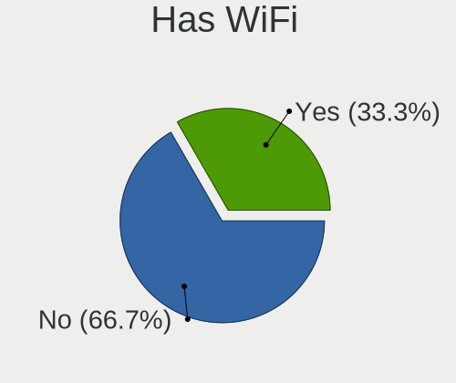
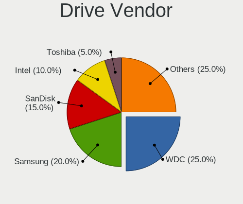
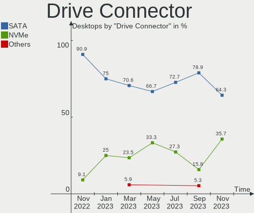
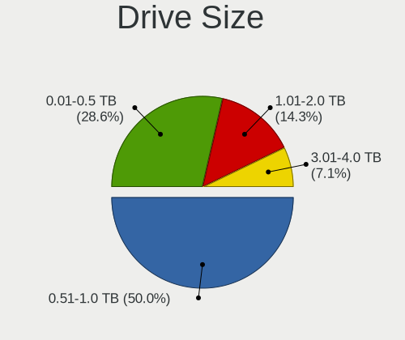
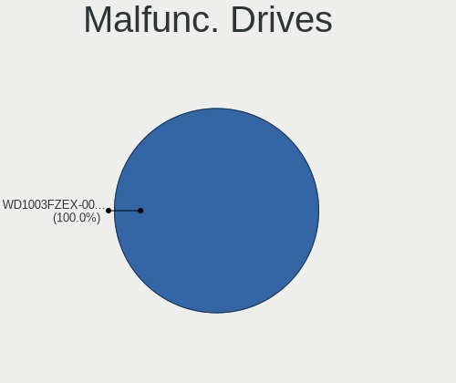
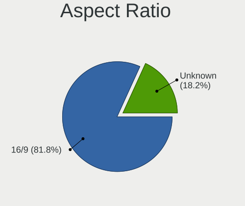
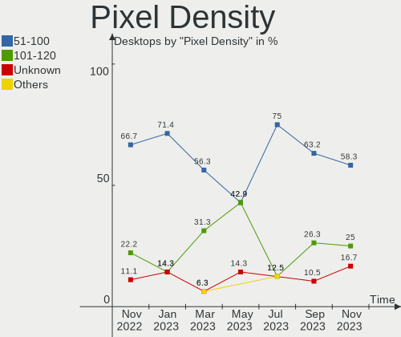
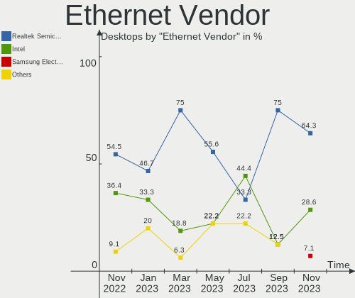
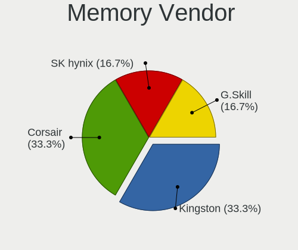

Ubuntu MATE - Hardware Trends (Desktops)
----------------------------------------

A project to identify most popular hardware characteristics and track their change
over time based on data collected by Linux users at https://Linux-Hardware.org.

Anyone can contribute to this report by the [hw-probe](https://github.com/linuxhw/hw-probe) tool:

    sudo -E hw-probe -all -upload

This report is for one last month. Overall report since the beginning of time: [TestCoverage](https://github.com/linuxhw/TestCoverage)

Period: Dec, 2022.

Contents
--------

* [ System ](#system)
  - [ OS                       ](#os)
  - [ OS Family                ](#os-family)
  - [ Kernel                   ](#kernel)
  - [ Kernel Family            ](#kernel-family)
  - [ Kernel Major Ver.        ](#kernel-major-ver)
  - [ Arch                     ](#arch)
  - [ DE                       ](#de)
  - [ Display Server           ](#display-server)
  - [ Display Manager          ](#display-manager)
  - [ OS Lang                  ](#os-lang)
  - [ Boot Mode                ](#boot-mode)
  - [ Filesystem               ](#filesystem)
  - [ Part. scheme             ](#part-scheme)
  - [ Dual Boot with Linux/BSD ](#dual-boot-with-linuxbsd)
  - [ Dual Boot (Win)          ](#dual-boot-win)

* [ Board ](#board)
  - [ Vendor                   ](#vendor)
  - [ Model                    ](#model)
  - [ Model Family             ](#model-family)
  - [ MFG Year                 ](#mfg-year)
  - [ Form Factor              ](#form-factor)
  - [ Secure Boot              ](#secure-boot)
  - [ Coreboot                 ](#coreboot)
  - [ RAM Size                 ](#ram-size)
  - [ RAM Used                 ](#ram-used)
  - [ Total Drives             ](#total-drives)
  - [ Has CD-ROM               ](#has-cd-rom)
  - [ Has Ethernet             ](#has-ethernet)
  - [ Has WiFi                 ](#has-wifi)
  - [ Has Bluetooth            ](#has-bluetooth)

* [ Location ](#location)
  - [ Country                  ](#country)
  - [ City                     ](#city)

* [ Drives ](#drives)
  - [ Drive Vendor             ](#drive-vendor)
  - [ Drive Model              ](#drive-model)
  - [ HDD Vendor               ](#hdd-vendor)
  - [ SSD Vendor               ](#ssd-vendor)
  - [ Drive Kind               ](#drive-kind)
  - [ Drive Connector          ](#drive-connector)
  - [ Drive Size               ](#drive-size)
  - [ Space Total              ](#space-total)
  - [ Space Used               ](#space-used)
  - [ Malfunc. Drives          ](#malfunc-drives)
  - [ Malfunc. Drive Vendor    ](#malfunc-drive-vendor)
  - [ Malfunc. HDD Vendor      ](#malfunc-hdd-vendor)
  - [ Malfunc. Drive Kind      ](#malfunc-drive-kind)
  - [ Failed Drives            ](#failed-drives)
  - [ Failed Drive Vendor      ](#failed-drive-vendor)
  - [ Drive Status             ](#drive-status)

* [ Storage controller ](#storage-controller)
  - [ Storage Vendor           ](#storage-vendor)
  - [ Storage Model            ](#storage-model)
  - [ Storage Kind             ](#storage-kind)

* [ Processor ](#processor)
  - [ CPU Vendor               ](#cpu-vendor)
  - [ CPU Model                ](#cpu-model)
  - [ CPU Model Family         ](#cpu-model-family)
  - [ CPU Cores                ](#cpu-cores)
  - [ CPU Sockets              ](#cpu-sockets)
  - [ CPU Threads              ](#cpu-threads)
  - [ CPU Op-Modes             ](#cpu-op-modes)
  - [ CPU Microcode            ](#cpu-microcode)
  - [ CPU Microarch            ](#cpu-microarch)

* [ Graphics ](#graphics)
  - [ GPU Vendor               ](#gpu-vendor)
  - [ GPU Model                ](#gpu-model)
  - [ GPU Combo                ](#gpu-combo)
  - [ GPU Driver               ](#gpu-driver)
  - [ GPU Memory               ](#gpu-memory)

* [ Monitor ](#monitor)
  - [ Monitor Vendor           ](#monitor-vendor)
  - [ Monitor Model            ](#monitor-model)
  - [ Monitor Resolution       ](#monitor-resolution)
  - [ Monitor Diagonal         ](#monitor-diagonal)
  - [ Monitor Width            ](#monitor-width)
  - [ Aspect Ratio             ](#aspect-ratio)
  - [ Monitor Area             ](#monitor-area)
  - [ Pixel Density            ](#pixel-density)
  - [ Multiple Monitors        ](#multiple-monitors)

* [ Network ](#network)
  - [ Net Controller Vendor    ](#net-controller-vendor)
  - [ Net Controller Model     ](#net-controller-model)
  - [ Wireless Vendor          ](#wireless-vendor)
  - [ Wireless Model           ](#wireless-model)
  - [ Ethernet Vendor          ](#ethernet-vendor)
  - [ Ethernet Model           ](#ethernet-model)
  - [ Net Controller Kind      ](#net-controller-kind)
  - [ Used Controller          ](#used-controller)
  - [ NICs                     ](#nics)
  - [ IPv6                     ](#ipv6)

* [ Bluetooth ](#bluetooth)
  - [ Bluetooth Vendor         ](#bluetooth-vendor)
  - [ Bluetooth Model          ](#bluetooth-model)

* [ Sound ](#sound)
  - [ Sound Vendor             ](#sound-vendor)
  - [ Sound Model              ](#sound-model)

* [ Memory ](#memory)
  - [ Memory Vendor            ](#memory-vendor)
  - [ Memory Model             ](#memory-model)
  - [ Memory Kind              ](#memory-kind)
  - [ Memory Form Factor       ](#memory-form-factor)
  - [ Memory Size              ](#memory-size)
  - [ Memory Speed             ](#memory-speed)

* [ Printers & scanners ](#printers--scanners)
  - [ Printer Vendor           ](#printer-vendor)
  - [ Printer Model            ](#printer-model)
  - [ Scanner Vendor           ](#scanner-vendor)
  - [ Scanner Model            ](#scanner-model)

* [ Camera ](#camera)
  - [ Camera Vendor            ](#camera-vendor)
  - [ Camera Model             ](#camera-model)

* [ Security ](#security)
  - [ Fingerprint Vendor       ](#fingerprint-vendor)
  - [ Fingerprint Model        ](#fingerprint-model)
  - [ Chipcard Vendor          ](#chipcard-vendor)
  - [ Chipcard Model           ](#chipcard-model)

* [ Unsupported ](#unsupported)
  - [ Unsupported Devices      ](#unsupported-devices)
  - [ Unsupported Device Types ](#unsupported-device-types)

System
------

OS
--

Installed operating systems

| Name              | Desktops | Percent |
|-------------------|----------|---------|
| Ubuntu MATE 22.04 | 12       | 63.16%  |
| Ubuntu MATE 22.10 | 3        | 15.79%  |
| Ubuntu MATE 20.04 | 3        | 15.79%  |
| Ubuntu MATE 18.04 | 1        | 5.26%   |

OS Family
---------

OS without a version

| Name        | Desktops | Percent |
|-------------|----------|---------|
| Ubuntu MATE | 19       | 100%    |

Kernel
------

Version of the Linux kernel

| Version              | Desktops | Percent |
|----------------------|----------|---------|
| 5.15.0-56-generic    | 11       | 57.89%  |
| 5.19.0-26-generic    | 3        | 15.79%  |
| 5.4.0-131-generic    | 1        | 5.26%   |
| 5.4.0-113-generic    | 1        | 5.26%   |
| 5.15.0-56-lowlatency | 1        | 5.26%   |
| 5.14.0-1054-oem      | 1        | 5.26%   |
| 5.11.0-43-generic    | 1        | 5.26%   |

Kernel Family
-------------

Linux kernel without a distro release

| Version | Desktops | Percent |
|---------|----------|---------|
| 5.15.0  | 12       | 63.16%  |
| 5.19.0  | 3        | 15.79%  |
| 5.4.0   | 2        | 10.53%  |
| 5.14.0  | 1        | 5.26%   |
| 5.11.0  | 1        | 5.26%   |

Kernel Major Ver.
-----------------

Linux kernel major version

| Version | Desktops | Percent |
|---------|----------|---------|
| 5.15    | 12       | 63.16%  |
| 5.19    | 3        | 15.79%  |
| 5.4     | 2        | 10.53%  |
| 5.14    | 1        | 5.26%   |
| 5.11    | 1        | 5.26%   |

Arch
----

OS architecture (x86_64, i586, etc.)

| Name   | Desktops | Percent |
|--------|----------|---------|
| x86_64 | 18       | 94.74%  |
| i686   | 1        | 5.26%   |

DE
--

Desktop Environment

| Name   | Desktops | Percent |
|--------|----------|---------|
| MATE   | 18       | 94.74%  |
| Budgie | 1        | 5.26%   |

Display Server
--------------

X11 or Wayland

| Name    | Desktops | Percent |
|---------|----------|---------|
| X11     | 17       | 89.47%  |
| Wayland | 1        | 5.26%   |
| Tty     | 1        | 5.26%   |

Display Manager
---------------

SDDM, LightDM, etc.

| Name    | Desktops | Percent |
|---------|----------|---------|
| LightDM | 15       | 78.95%  |
| GDM3    | 3        | 15.79%  |
| Unknown | 1        | 5.26%   |

OS Lang
-------

Language

| Lang  | Desktops | Percent |
|-------|----------|---------|
| en_US | 5        | 26.32%  |
| de_DE | 3        | 15.79%  |
| it_IT | 2        | 10.53%  |
| hu_HU | 2        | 10.53%  |
| C     | 2        | 10.53%  |
| pt_BR | 1        | 5.26%   |
| fr_FR | 1        | 5.26%   |
| es_ES | 1        | 5.26%   |
| de_AT | 1        | 5.26%   |
| ca_ES | 1        | 5.26%   |

Boot Mode
---------

EFI or BIOS

| Mode | Desktops | Percent |
|------|----------|---------|
| BIOS | 12       | 63.16%  |
| EFI  | 7        | 36.84%  |

Filesystem
----------

Type of filesystem

| Type | Desktops | Percent |
|------|----------|---------|
| Ext4 | 19       | 100%    |

Part. scheme
------------

Scheme of partitioning

| Type    | Desktops | Percent |
|---------|----------|---------|
| GPT     | 13       | 68.42%  |
| MBR     | 4        | 21.05%  |
| Unknown | 2        | 10.53%  |

Dual Boot with Linux/BSD
------------------------

Hosting more than one Linux/BSD

| Dual boot | Desktops | Percent |
|-----------|----------|---------|
| No        | 10       | 52.63%  |
| Yes       | 9        | 47.37%  |

Dual Boot (Win)
---------------

Hosting Linux and Windows

| Dual boot | Desktops | Percent |
|-----------|----------|---------|
| No        | 11       | 57.89%  |
| Yes       | 8        | 42.11%  |

Board
-----

Vendor
------

Motherboard manufacturer

| Name                | Desktops | Percent |
|---------------------|----------|---------|
| ASUSTek Computer    | 6        | 31.58%  |
| Gigabyte Technology | 4        | 21.05%  |
| MSI                 | 3        | 15.79%  |
| Dell                | 2        | 10.53%  |
| Intel               | 1        | 5.26%   |
| Hewlett-Packard     | 1        | 5.26%   |
| Biostar             | 1        | 5.26%   |
| ASRock              | 1        | 5.26%   |

Model
-----

Motherboard model

| Name                                 | Desktops | Percent |
|--------------------------------------|----------|---------|
| MSI MS-7C51                          | 1        | 5.26%   |
| MSI MS-7C37                          | 1        | 5.26%   |
| MSI MS-7817                          | 1        | 5.26%   |
| Intel H61                            | 1        | 5.26%   |
| HP EliteDesk 705 G1 SFF              | 1        | 5.26%   |
| Gigabyte X570S AERO G                | 1        | 5.26%   |
| Gigabyte F2A68HM-DS2                 | 1        | 5.26%   |
| Gigabyte B85M-D3H                    | 1        | 5.26%   |
| Gigabyte AB350M-Gaming 3             | 1        | 5.26%   |
| Dell Precision T1500                 | 1        | 5.26%   |
| Dell Precision 3660                  | 1        | 5.26%   |
| Biostar A320MH                       | 1        | 5.26%   |
| ASUS ROG STRIX Z690-A GAMING WIFI D4 | 1        | 5.26%   |
| ASUS PRIME Z590-P WIFI               | 1        | 5.26%   |
| ASUS P8Z77-V PRO                     | 1        | 5.26%   |
| ASUS P7P55 LX                        | 1        | 5.26%   |
| ASUS M5A78L-M LX                     | 1        | 5.26%   |
| ASUS H110M-K                         | 1        | 5.26%   |
| ASRock 5600G                         | 1        | 5.26%   |

Model Family
------------

Motherboard model prefix

| Name                   | Desktops | Percent |
|------------------------|----------|---------|
| Dell Precision         | 2        | 10.53%  |
| MSI MS-7C51            | 1        | 5.26%   |
| MSI MS-7C37            | 1        | 5.26%   |
| MSI MS-7817            | 1        | 5.26%   |
| Intel H61              | 1        | 5.26%   |
| HP EliteDesk           | 1        | 5.26%   |
| Gigabyte X570S         | 1        | 5.26%   |
| Gigabyte F2A68HM-DS2   | 1        | 5.26%   |
| Gigabyte B85M-D3H      | 1        | 5.26%   |
| Gigabyte AB350M-Gaming | 1        | 5.26%   |
| Biostar A320MH         | 1        | 5.26%   |
| ASUS ROG               | 1        | 5.26%   |
| ASUS PRIME             | 1        | 5.26%   |
| ASUS P8Z77-V           | 1        | 5.26%   |
| ASUS P7P55             | 1        | 5.26%   |
| ASUS M5A78L-M          | 1        | 5.26%   |
| ASUS H110M-K           | 1        | 5.26%   |
| ASRock 5600G           | 1        | 5.26%   |

MFG Year
--------

Motherboard manufacture year

| Year | Desktops | Percent |
|------|----------|---------|
| 2021 | 4        | 21.05%  |
| 2014 | 3        | 15.79%  |
| 2019 | 2        | 10.53%  |
| 2017 | 2        | 10.53%  |
| 2009 | 2        | 10.53%  |
| 2020 | 1        | 5.26%   |
| 2018 | 1        | 5.26%   |
| 2016 | 1        | 5.26%   |
| 2013 | 1        | 5.26%   |
| 2012 | 1        | 5.26%   |
| 2011 | 1        | 5.26%   |

Form Factor
-----------

Physical design of the computer

| Name    | Desktops | Percent |
|---------|----------|---------|
| Desktop | 19       | 100%    |

Secure Boot
-----------

Enabled or disabled

| State    | Desktops | Percent |
|----------|----------|---------|
| Disabled | 19       | 100%    |

Coreboot
--------

Have coreboot on board

| Used | Desktops | Percent |
|------|----------|---------|
| No   | 19       | 100%    |

RAM Size
--------

Total RAM memory

| Size in GB  | Desktops | Percent |
|-------------|----------|---------|
| 32.01-64.0  | 6        | 31.58%  |
| 8.01-16.0   | 5        | 26.32%  |
| 3.01-4.0    | 3        | 15.79%  |
| 16.01-24.0  | 2        | 10.53%  |
| 4.01-8.0    | 1        | 5.26%   |
| 24.01-32.0  | 1        | 5.26%   |
| 64.01-256.0 | 1        | 5.26%   |

RAM Used
--------

Used RAM memory

| Used GB    | Desktops | Percent |
|------------|----------|---------|
| 1.01-2.0   | 9        | 47.37%  |
| 8.01-16.0  | 3        | 15.79%  |
| 4.01-8.0   | 2        | 10.53%  |
| 2.01-3.0   | 2        | 10.53%  |
| 3.01-4.0   | 1        | 5.26%   |
| 24.01-32.0 | 1        | 5.26%   |
| 0.51-1.0   | 1        | 5.26%   |

Total Drives
------------

Number of drives on board

| Drives | Desktops | Percent |
|--------|----------|---------|
| 2      | 6        | 31.58%  |
| 3      | 5        | 26.32%  |
| 4      | 4        | 21.05%  |
| 1      | 2        | 10.53%  |
| 6      | 1        | 5.26%   |
| 5      | 1        | 5.26%   |

Has CD-ROM
----------

Has CD-ROM on board

| Presented | Desktops | Percent |
|-----------|----------|---------|
| Yes       | 10       | 52.63%  |
| No        | 9        | 47.37%  |

Has Ethernet
------------

Has Ethernet on board

| Presented | Desktops | Percent |
|-----------|----------|---------|
| Yes       | 19       | 100%    |

Has WiFi
--------

Has WiFi module

| Presented | Desktops | Percent |
|-----------|----------|---------|
| No        | 11       | 57.89%  |
| Yes       | 8        | 42.11%  |

Has Bluetooth
-------------

Has Bluetooth module

| Presented | Desktops | Percent |
|-----------|----------|---------|
| No        | 14       | 73.68%  |
| Yes       | 5        | 26.32%  |

Location
--------

Country
-------

Geographic location (country)

| Country | Desktops | Percent |
|---------|----------|---------|
| Germany | 4        | 21.05%  |
| USA     | 3        | 15.79%  |
| Hungary | 3        | 15.79%  |
| Spain   | 2        | 10.53%  |
| Italy   | 2        | 10.53%  |
| Greece  | 1        | 5.26%   |
| France  | 1        | 5.26%   |
| Brazil  | 1        | 5.26%   |
| Belgium | 1        | 5.26%   |
| Austria | 1        | 5.26%   |

City
----

Geographic location (city)

| City                    | Desktops | Percent |
|-------------------------|----------|---------|
| Zottegem                | 1        | 5.26%   |
| Valls                   | 1        | 5.26%   |
| Tovo San Giacomo        | 1        | 5.26%   |
| Schmelz                 | 1        | 5.26%   |
| Saint-Etienne-de-Valoux | 1        | 5.26%   |
| Rome                    | 1        | 5.26%   |
| Picos                   | 1        | 5.26%   |
| Olathe                  | 1        | 5.26%   |
| Madrid                  | 1        | 5.26%   |
| Humble                  | 1        | 5.26%   |
| Heraklion               | 1        | 5.26%   |
| Hatvan                  | 1        | 5.26%   |
| Gruenenplan             | 1        | 5.26%   |
| Goslar                  | 1        | 5.26%   |
| Fort Lee                | 1        | 5.26%   |
| Esztergom               | 1        | 5.26%   |
| Deutschlandsberg        | 1        | 5.26%   |
| Budapest                | 1        | 5.26%   |
| Berlin                  | 1        | 5.26%   |

Drives
------

Drive Vendor
------------

Hard drive vendors

| Vendor                      | Desktops | Drives | Percent |
|-----------------------------|----------|--------|---------|
| Seagate                     | 9        | 10     | 22.5%   |
| Samsung Electronics         | 8        | 14     | 20%     |
| WDC                         | 4        | 7      | 10%     |
| Kingston                    | 4        | 5      | 10%     |
| Toshiba                     | 3        | 6      | 7.5%    |
| SPCC                        | 2        | 2      | 5%      |
| SanDisk                     | 2        | 2      | 5%      |
| HGST                        | 2        | 2      | 5%      |
| Crucial                     | 2        | 4      | 5%      |
| Phison Electronics          | 1        | 1      | 2.5%    |
| Kingston Technology Company | 1        | 1      | 2.5%    |
| Emtec                       | 1        | 1      | 2.5%    |
| Unknown                     | 1        | 1      | 2.5%    |

Drive Model
-----------

Hard drive models

| Model                                               | Desktops | Percent |
|-----------------------------------------------------|----------|---------|
| SPCC Solid State Disk 256GB                         | 2        | 4.08%   |
| Seagate ST2000DM008-2FR102 2TB                      | 2        | 4.08%   |
| Kingston SA400S37120G 120GB SSD                     | 2        | 4.08%   |
| WDC WD5003AZEX-00K1GA0 500GB                        | 1        | 2.04%   |
| WDC WD5000AAKS-65TMA0 500GB                         | 1        | 2.04%   |
| WDC WD5000AADS-00S9B0 500GB                         | 1        | 2.04%   |
| WDC WD30EFRX-68N32N0 3TB                            | 1        | 2.04%   |
| WDC WD30EFRX-68EUZN0 3TB                            | 1        | 2.04%   |
| WDC WD2000FYYZ-01UL1B1 2TB                          | 1        | 2.04%   |
| WDC WD10EZEX-08WN4A0 1TB                            | 1        | 2.04%   |
| Toshiba MG06ACA800E 8TB                             | 1        | 2.04%   |
| Toshiba DT01ACA100 1TB                              | 1        | 2.04%   |
| Toshiba DT01ACA050 500GB                            | 1        | 2.04%   |
| Seagate ST6000NM0024-1HT17Z 6TB                     | 1        | 2.04%   |
| Seagate ST500DM002-1BD142 500GB                     | 1        | 2.04%   |
| Seagate ST4000DX005-3GH101 4TB                      | 1        | 2.04%   |
| Seagate ST2000LM003 HN-M201RAD 2TB                  | 1        | 2.04%   |
| Seagate ST2000DM001-9YN164 2TB                      | 1        | 2.04%   |
| Seagate ST1000VM002-1ET162 1TB                      | 1        | 2.04%   |
| Seagate ST1000LM048-2E7172 1TB                      | 1        | 2.04%   |
| Seagate ST1000DM010-2EP102 1TB                      | 1        | 2.04%   |
| SanDisk SSD PLUS 480GB                              | 1        | 2.04%   |
| SanDisk SD5SB2-128G-1006E 128GB SSD                 | 1        | 2.04%   |
| Samsung SSD 980 PRO 1TB                             | 1        | 2.04%   |
| Samsung SSD 980 500GB                               | 1        | 2.04%   |
| Samsung SSD 870 QVO 2TB                             | 1        | 2.04%   |
| Samsung SSD 860 EVO M.2 500GB                       | 1        | 2.04%   |
| Samsung SSD 860 EVO 500GB                           | 1        | 2.04%   |
| Samsung SSD 840 Series 120GB                        | 1        | 2.04%   |
| Samsung SSD 840 EVO 500GB                           | 1        | 2.04%   |
| Samsung NVMe SSD Drive 1TB                          | 1        | 2.04%   |
| Samsung NVMe SSD Controller SM981/PM981/PM983 500GB | 1        | 2.04%   |
| Samsung NVMe SSD Controller SM961/PM961/SM963 256GB | 1        | 2.04%   |
| Samsung HD502HJ 500GB                               | 1        | 2.04%   |
| Samsung HD322HJ 320GB                               | 1        | 2.04%   |
| Samsung HD103SI 1TB                                 | 1        | 2.04%   |
| Phison PCIe SSD 1TB                                 | 1        | 2.04%   |
| Kingston Company A2000 NVMe SSD 1TB                 | 1        | 2.04%   |
| Kingston SNVS500G 500GB                             | 1        | 2.04%   |
| Kingston SA400S37240G 240GB SSD                     | 1        | 2.04%   |

HDD Vendor
----------

Hard disk drive vendors

| Vendor              | Desktops | Drives | Percent |
|---------------------|----------|--------|---------|
| Seagate             | 9        | 10     | 45%     |
| WDC                 | 4        | 7      | 20%     |
| Toshiba             | 3        | 6      | 15%     |
| Samsung Electronics | 2        | 3      | 10%     |
| HGST                | 2        | 2      | 10%     |

SSD Vendor
----------

Solid state drive vendors

| Vendor              | Desktops | Drives | Percent |
|---------------------|----------|--------|---------|
| Samsung Electronics | 3        | 5      | 23.08%  |
| Kingston            | 3        | 4      | 23.08%  |
| SPCC                | 2        | 2      | 15.38%  |
| SanDisk             | 2        | 2      | 15.38%  |
| Crucial             | 2        | 4      | 15.38%  |
| Emtec               | 1        | 1      | 7.69%   |

Drive Kind
----------

HDD or SSD

| Kind    | Desktops | Drives | Percent |
|---------|----------|--------|---------|
| HDD     | 16       | 28     | 47.06%  |
| SSD     | 11       | 18     | 32.35%  |
| NVMe    | 6        | 9      | 17.65%  |
| Unknown | 1        | 1      | 2.94%   |

Drive Connector
---------------

SATA, SAS, NVMe, etc.

| Type | Desktops | Drives | Percent |
|------|----------|--------|---------|
| SATA | 18       | 47     | 75%     |
| NVMe | 6        | 9      | 25%     |

Drive Size
----------

Size of hard drive

| Size in TB | Desktops | Drives | Percent |
|------------|----------|--------|---------|
| 0.01-0.5   | 14       | 25     | 46.67%  |
| 1.01-2.0   | 6        | 6      | 20%     |
| 0.51-1.0   | 6        | 7      | 20%     |
| 4.01-10.0  | 2        | 5      | 6.67%   |
| 3.01-4.0   | 1        | 1      | 3.33%   |
| 2.01-3.0   | 1        | 2      | 3.33%   |

Space Total
-----------

Amount of disk space available on the file system

| Size in GB     | Desktops | Percent |
|----------------|----------|---------|
| 501-1000       | 4        | 21.05%  |
| More than 3000 | 3        | 15.79%  |
| 251-500        | 3        | 15.79%  |
| 2001-3000      | 3        | 15.79%  |
| 101-250        | 3        | 15.79%  |
| 1001-2000      | 2        | 10.53%  |
| 21-50          | 1        | 5.26%   |

Space Used
----------

Amount of used disk space

| Used GB        | Desktops | Percent |
|----------------|----------|---------|
| 21-50          | 5        | 26.32%  |
| 101-250        | 4        | 21.05%  |
| 2001-3000      | 3        | 15.79%  |
| 1001-2000      | 2        | 10.53%  |
| 501-1000       | 2        | 10.53%  |
| More than 3000 | 1        | 5.26%   |
| 251-500        | 1        | 5.26%   |
| 1-20           | 1        | 5.26%   |

Malfunc. Drives
---------------

Drive models with a malfunction

| Model                           | Desktops | Drives | Percent |
|---------------------------------|----------|--------|---------|
| WDC WD5000AADS-00S9B0 500GB     | 1        | 1      | 50%     |
| Seagate ST500DM002-1BD142 500GB | 1        | 1      | 50%     |

Malfunc. Drive Vendor
---------------------

Vendors of faulty drives

| Vendor  | Desktops | Drives | Percent |
|---------|----------|--------|---------|
| WDC     | 1        | 1      | 50%     |
| Seagate | 1        | 1      | 50%     |

Malfunc. HDD Vendor
-------------------

Vendors of faulty HDD drives

| Vendor  | Desktops | Drives | Percent |
|---------|----------|--------|---------|
| WDC     | 1        | 1      | 50%     |
| Seagate | 1        | 1      | 50%     |

Malfunc. Drive Kind
-------------------

Kinds of faulty drives

| Kind | Desktops | Drives | Percent |
|------|----------|--------|---------|
| HDD  | 2        | 2      | 100%    |

Failed Drives
-------------

Failed drive models

Zero info for selected period =(

Failed Drive Vendor
-------------------

Failed drive vendors

Zero info for selected period =(

Drive Status
------------

Number of failed and malfunc. drives

| Status   | Desktops | Drives | Percent |
|----------|----------|--------|---------|
| Works    | 13       | 35     | 61.9%   |
| Detected | 6        | 19     | 28.57%  |
| Malfunc  | 2        | 2      | 9.52%   |

Storage controller
------------------

Storage Vendor
--------------

Storage controller vendors

| Vendor                      | Desktops | Percent |
|-----------------------------|----------|---------|
| Intel                       | 10       | 34.48%  |
| AMD                         | 9        | 31.03%  |
| Samsung Electronics         | 4        | 13.79%  |
| ASMedia Technology          | 3        | 10.34%  |
| Kingston Technology Company | 2        | 6.9%    |
| Phison Electronics          | 1        | 3.45%   |

Storage Model
-------------

Storage controller models

| Model                                                                          | Desktops | Percent |
|--------------------------------------------------------------------------------|----------|---------|
| AMD FCH SATA Controller [AHCI mode]                                            | 7        | 19.44%  |
| ASMedia ASM1062 Serial ATA Controller                                          | 3        | 8.33%   |
| Samsung NVMe SSD Controller PM9A1/PM9A3/980PRO                                 | 2        | 5.56%   |
| Intel Volume Management Device NVMe RAID Controller                            | 2        | 5.56%   |
| Intel Alder Lake-S PCH SATA Controller [AHCI Mode]                             | 2        | 5.56%   |
| Intel 8 Series/C220 Series Chipset Family 6-port SATA Controller 1 [AHCI mode] | 2        | 5.56%   |
| Intel 5 Series/3400 Series Chipset 6 port SATA AHCI Controller                 | 2        | 5.56%   |
| AMD FCH SATA Controller D                                                      | 2        | 5.56%   |
| Samsung NVMe SSD Controller SM981/PM981/PM983                                  | 1        | 2.78%   |
| Samsung NVMe SSD Controller SM961/PM961/SM963                                  | 1        | 2.78%   |
| Samsung NVMe SSD Controller 980                                                | 1        | 2.78%   |
| Phison E16 PCIe4 NVMe Controller                                               | 1        | 2.78%   |
| Kingston Company Company Non-Volatile memory controller                        | 1        | 2.78%   |
| Kingston Company A2000 NVMe SSD                                                | 1        | 2.78%   |
| Intel Q170/Q150/B150/H170/H110/Z170/CM236 Chipset SATA Controller [AHCI Mode]  | 1        | 2.78%   |
| Intel 7 Series/C210 Series Chipset Family 6-port SATA Controller [AHCI mode]   | 1        | 2.78%   |
| Intel 6 Series/C200 Series Chipset Family 6 port Desktop SATA AHCI Controller  | 1        | 2.78%   |
| Intel 500 Series Chipset Family SATA AHCI Controller                           | 1        | 2.78%   |
| AMD SB7x0/SB8x0/SB9x0 SATA Controller [IDE mode]                               | 1        | 2.78%   |
| AMD SB7x0/SB8x0/SB9x0 IDE Controller                                           | 1        | 2.78%   |
| AMD 500 Series Chipset SATA Controller                                         | 1        | 2.78%   |
| AMD 300 Series Chipset SATA Controller                                         | 1        | 2.78%   |

Storage Kind
------------

Kind of storage controller (IDE, SATA, NVMe, SAS, ...)

| Kind | Desktops | Percent |
|------|----------|---------|
| SATA | 19       | 67.86%  |
| NVMe | 6        | 21.43%  |
| RAID | 2        | 7.14%   |
| IDE  | 1        | 3.57%   |

Processor
---------

CPU Vendor
----------

Processor vendors

| Vendor | Desktops | Percent |
|--------|----------|---------|
| Intel  | 10       | 52.63%  |
| AMD    | 9        | 47.37%  |

CPU Model
---------

Processor models

| Model                                           | Desktops | Percent |
|-------------------------------------------------|----------|---------|
| AMD Ryzen 7 5800X 8-Core Processor              | 2        | 10.53%  |
| Intel Xeon CPU E3-1245 v3 @ 3.40GHz             | 1        | 5.26%   |
| Intel Pentium CPU G4400 @ 3.30GHz               | 1        | 5.26%   |
| Intel Core i5 CPU 750 @ 2.67GHz                 | 1        | 5.26%   |
| Intel Core i3-4170 CPU @ 3.70GHz                | 1        | 5.26%   |
| Intel Core i3-3220 CPU @ 3.30GHz                | 1        | 5.26%   |
| Intel Core i3-2105 CPU @ 3.10GHz                | 1        | 5.26%   |
| Intel Core i3 CPU 550 @ 3.20GHz                 | 1        | 5.26%   |
| Intel 12th Gen Core i9-12900K                   | 1        | 5.26%   |
| Intel 12th Gen Core i7-12700F                   | 1        | 5.26%   |
| Intel 11th Gen Core i7-11700K @ 3.60GHz         | 1        | 5.26%   |
| AMD Ryzen 5 PRO 3400G with Radeon Vega Graphics | 1        | 5.26%   |
| AMD Ryzen 5 5600G with Radeon Graphics          | 1        | 5.26%   |
| AMD Ryzen 5 2600 Six-Core Processor             | 1        | 5.26%   |
| AMD Ryzen 3 2200G with Radeon Vega Graphics     | 1        | 5.26%   |
| AMD Athlon II X2 245 Processor                  | 1        | 5.26%   |
| AMD A8-6500B APU with Radeon HD Graphics        | 1        | 5.26%   |
| AMD A4-5300 APU with Radeon HD Graphics         | 1        | 5.26%   |

CPU Model Family
----------------

Processor model prefix

| Model            | Desktops | Percent |
|------------------|----------|---------|
| Intel Core i3    | 4        | 21.05%  |
| Other            | 3        | 15.79%  |
| AMD Ryzen 7      | 2        | 10.53%  |
| AMD Ryzen 5      | 2        | 10.53%  |
| Intel Xeon       | 1        | 5.26%   |
| Intel Pentium    | 1        | 5.26%   |
| Intel Core i5    | 1        | 5.26%   |
| AMD Ryzen 5 PRO  | 1        | 5.26%   |
| AMD Ryzen 3      | 1        | 5.26%   |
| AMD Athlon II X2 | 1        | 5.26%   |
| AMD A8           | 1        | 5.26%   |
| AMD A4           | 1        | 5.26%   |

CPU Cores
---------

Number of processor cores

| Number | Desktops | Percent |
|--------|----------|---------|
| 2      | 7        | 36.84%  |
| 4      | 4        | 21.05%  |
| 8      | 3        | 15.79%  |
| 6      | 2        | 10.53%  |
| 16     | 1        | 5.26%   |
| 12     | 1        | 5.26%   |
| 1      | 1        | 5.26%   |

CPU Sockets
-----------

Number of sockets

| Number | Desktops | Percent |
|--------|----------|---------|
| 1      | 19       | 100%    |

CPU Threads
-----------

Threads per core (Hyper-Threading)

| Number | Desktops | Percent |
|--------|----------|---------|
| 2      | 14       | 73.68%  |
| 1      | 5        | 26.32%  |

CPU Op-Modes
------------

CPU Operation Modes (32-bit, 64-bit)

| Op mode        | Desktops | Percent |
|----------------|----------|---------|
| 32-bit, 64-bit | 19       | 100%    |

CPU Microcode
-------------

Microcode number

| Number     | Desktops | Percent |
|------------|----------|---------|
| Unknown    | 5        | 26.32%  |
| 0x306c3    | 2        | 10.53%  |
| 0xa0671    | 1        | 5.26%   |
| 0x506e3    | 1        | 5.26%   |
| 0x306a9    | 1        | 5.26%   |
| 0x206a7    | 1        | 5.26%   |
| 0x20655    | 1        | 5.26%   |
| 0x106e5    | 1        | 5.26%   |
| 0x0a50000c | 1        | 5.26%   |
| 0x0a201205 | 1        | 5.26%   |
| 0x08108109 | 1        | 5.26%   |
| 0x0810100b | 1        | 5.26%   |
| 0x0800820d | 1        | 5.26%   |
| 0x06001119 | 1        | 5.26%   |

CPU Microarch
-------------

Microarchitecture

| Name        | Desktops | Percent |
|-------------|----------|---------|
| Zen 3       | 3        | 15.79%  |
| Zen+        | 2        | 10.53%  |
| Piledriver  | 2        | 10.53%  |
| Haswell     | 2        | 10.53%  |
| Unknown     | 2        | 10.53%  |
| Zen         | 1        | 5.26%   |
| Westmere    | 1        | 5.26%   |
| Skylake     | 1        | 5.26%   |
| SandyBridge | 1        | 5.26%   |
| Nehalem     | 1        | 5.26%   |
| K10         | 1        | 5.26%   |
| IvyBridge   | 1        | 5.26%   |
| Icelake     | 1        | 5.26%   |

Graphics
--------

GPU Vendor
----------

Vendors of graphics cards

| Vendor | Desktops | Percent |
|--------|----------|---------|
| Nvidia | 9        | 42.86%  |
| AMD    | 7        | 33.33%  |
| Intel  | 5        | 23.81%  |

GPU Model
---------

Graphics card models

| Model                                                                     | Desktops | Percent |
|---------------------------------------------------------------------------|----------|---------|
| Nvidia GP108 [GeForce GT 1030]                                            | 1        | 4.76%   |
| Nvidia GP107GL [Quadro P620]                                              | 1        | 4.76%   |
| Nvidia GP107 [GeForce GTX 1050 Ti]                                        | 1        | 4.76%   |
| Nvidia GM107GL [Quadro K620]                                              | 1        | 4.76%   |
| Nvidia GM107 [GeForce GTX 750 Ti]                                         | 1        | 4.76%   |
| Nvidia GK208B [GeForce GT 730]                                            | 1        | 4.76%   |
| Nvidia GK208B [GeForce GT 710]                                            | 1        | 4.76%   |
| Nvidia GA104 [GeForce RTX 3070 Lite Hash Rate]                            | 1        | 4.76%   |
| Nvidia GA102 [GeForce RTX 3080 Lite Hash Rate]                            | 1        | 4.76%   |
| Intel Xeon E3-1200 v3 Processor Integrated Graphics Controller            | 1        | 4.76%   |
| Intel Xeon E3-1200 v2/3rd Gen Core processor Graphics Controller          | 1        | 4.76%   |
| Intel RocketLake-S GT1 [UHD Graphics 750]                                 | 1        | 4.76%   |
| Intel AlderLake-S GT1                                                     | 1        | 4.76%   |
| Intel 4th Generation Core Processor Family Integrated Graphics Controller | 1        | 4.76%   |
| AMD Trinity 2 [Radeon HD 7480D]                                           | 1        | 4.76%   |
| AMD RV730 PRO [Radeon HD 4650]                                            | 1        | 4.76%   |
| AMD RS780L [Radeon 3000]                                                  | 1        | 4.76%   |
| AMD Richland [Radeon HD 8570D]                                            | 1        | 4.76%   |
| AMD Picasso/Raven 2 [Radeon Vega Series / Radeon Vega Mobile Series]      | 1        | 4.76%   |
| AMD Navi 23 [Radeon RX 6600/6600 XT/6600M]                                | 1        | 4.76%   |
| AMD Cezanne [Radeon Vega Series / Radeon Vega Mobile Series]              | 1        | 4.76%   |

GPU Combo
---------

Combinations of graphics cards

| Name           | Desktops | Percent |
|----------------|----------|---------|
| 1 x Nvidia     | 8        | 42.11%  |
| 1 x AMD        | 7        | 36.84%  |
| 1 x Intel      | 3        | 15.79%  |
| Intel + Nvidia | 1        | 5.26%   |

GPU Driver
----------

Free vs proprietary

| Driver      | Desktops | Percent |
|-------------|----------|---------|
| Free        | 12       | 63.16%  |
| Proprietary | 7        | 36.84%  |

GPU Memory
----------

Total video memory

| Size in GB | Desktops | Percent |
|------------|----------|---------|
| Unknown    | 7        | 36.84%  |
| 1.01-2.0   | 5        | 26.32%  |
| 0.01-0.5   | 3        | 15.79%  |
| 7.01-8.0   | 1        | 5.26%   |
| 3.01-4.0   | 1        | 5.26%   |
| 8.01-16.0  | 1        | 5.26%   |
| 0.51-1.0   | 1        | 5.26%   |

Monitor
-------

Monitor Vendor
--------------

Monitor vendors

| Vendor               | Desktops | Percent |
|----------------------|----------|---------|
| Goldstar             | 3        | 15%     |
| ViewSonic            | 2        | 10%     |
| Samsung Electronics  | 2        | 10%     |
| Philips              | 2        | 10%     |
| Hewlett-Packard      | 2        | 10%     |
| Ancor Communications | 2        | 10%     |
| Acer                 | 2        | 10%     |
| NEC Computers        | 1        | 5%      |
| Medion               | 1        | 5%      |
| Iiyama               | 1        | 5%      |
| Dell                 | 1        | 5%      |
| ASUSTek Computer     | 1        | 5%      |

Monitor Model
-------------

Monitor models

| Model                                                                  | Desktops | Percent |
|------------------------------------------------------------------------|----------|---------|
| ViewSonic VX2370 SERIES VSC342C 1920x1080 509x286mm 23.0-inch          | 1        | 5%      |
| ViewSonic VA2431 Series VSCD824 1920x1080 521x293mm 23.5-inch          | 1        | 5%      |
| Samsung Electronics U28E590 SAM0C4D 3840x2160 607x345mm 27.5-inch      | 1        | 5%      |
| Samsung Electronics S22E450 SAM0C79 1920x1080 477x268mm 21.5-inch      | 1        | 5%      |
| Philips PHL 276E8V PHLC18F 3840x2160 600x340mm 27.2-inch               | 1        | 5%      |
| Philips PHL 243V7 PHLC155 1920x1080 527x296mm 23.8-inch                | 1        | 5%      |
| NEC Computers AS221WM NEC67C2 1680x1050 473x296mm 22.0-inch            | 1        | 5%      |
| Medion MD 20431 MED36A5 1920x1080 520x290mm 23.4-inch                  | 1        | 5%      |
| Iiyama PL2730H IVM663A 1920x1080 598x336mm 27.0-inch                   | 1        | 5%      |
| Hewlett-Packard Z22i HWP308C 1920x1080 477x268mm 21.5-inch             | 1        | 5%      |
| Hewlett-Packard 32 Display HPN351A 1920x1080 698x393mm 31.5-inch       | 1        | 5%      |
| Goldstar HDR 4K GSM774F 3840x2160 697x392mm 31.5-inch                  | 1        | 5%      |
| Goldstar HD GSM5ACB 1366x768 410x230mm 18.5-inch                       | 1        | 5%      |
| Goldstar E2240 GSM57A3 1920x1080 480x270mm 21.7-inch                   | 1        | 5%      |
| Dell SE2717H/HX DELD0A1 1920x1080 600x340mm 27.2-inch                  | 1        | 5%      |
| ASUSTek Computer VA24E AUS24D1 1920x1080 530x300mm 24.0-inch           | 1        | 5%      |
| Ancor Communications ASUS VS239 ACI23D2 1920x1080 509x286mm 23.0-inch  | 1        | 5%      |
| Ancor Communications ASUS PB287Q ACI28A3 3840x2160 621x341mm 27.9-inch | 1        | 5%      |
| Acer SA240Y ACR057F 1920x1080 527x296mm 23.8-inch                      | 1        | 5%      |
| Acer K272HL H ACR087E 1920x1080 600x330mm 27.0-inch                    | 1        | 5%      |

Monitor Resolution
------------------

Monitor screen resolution

| Resolution         | Desktops | Percent |
|--------------------|----------|---------|
| 1920x1080 (FHD)    | 11       | 64.71%  |
| 3840x2160 (4K)     | 4        | 23.53%  |
| 1680x1050 (WSXGA+) | 1        | 5.88%   |
| 1366x768 (WXGA)    | 1        | 5.88%   |

Monitor Diagonal
----------------

Diagonal size in inches

| Inches | Desktops | Percent |
|--------|----------|---------|
| 27     | 5        | 26.32%  |
| 23     | 4        | 21.05%  |
| 24     | 3        | 15.79%  |
| 21     | 3        | 15.79%  |
| 31     | 2        | 10.53%  |
| 22     | 1        | 5.26%   |
| 18     | 1        | 5.26%   |

Monitor Width
-------------

Physical width

| Width in mm | Desktops | Percent |
|-------------|----------|---------|
| 501-600     | 10       | 52.63%  |
| 401-500     | 5        | 26.32%  |
| 601-700     | 4        | 21.05%  |

Aspect Ratio
------------

Proportional relationship between the width and the height

| Ratio | Desktops | Percent |
|-------|----------|---------|
| 16/9  | 16       | 94.12%  |
| 16/10 | 1        | 5.88%   |

Monitor Area
------------

Area in inch²

| Area in inch² | Desktops | Percent |
|----------------|----------|---------|
| 201-250        | 8        | 44.44%  |
| 301-350        | 5        | 27.78%  |
| 351-500        | 2        | 11.11%  |
| 151-200        | 2        | 11.11%  |
| 141-150        | 1        | 5.56%   |

Pixel Density
-------------

Pixels per inch

| Density | Desktops | Percent |
|---------|----------|---------|
| 51-100  | 11       | 61.11%  |
| 121-160 | 3        | 16.67%  |
| 101-120 | 3        | 16.67%  |
| 161-240 | 1        | 5.56%   |

Multiple Monitors
-----------------

Total monitors connected

| Total | Desktops | Percent |
|-------|----------|---------|
| 1     | 15       | 78.95%  |
| 2     | 3        | 15.79%  |
| 0     | 1        | 5.26%   |

Network
-------

Net Controller Vendor
---------------------

Controller vendors

| Vendor                          | Desktops | Percent |
|---------------------------------|----------|---------|
| Realtek Semiconductor           | 14       | 53.85%  |
| Intel                           | 6        | 23.08%  |
| Broadcom                        | 2        | 7.69%   |
| Samsung Electronics             | 1        | 3.85%   |
| Qualcomm Atheros Communications | 1        | 3.85%   |
| Qualcomm Atheros                | 1        | 3.85%   |
| Belkin Components               | 1        | 3.85%   |

Net Controller Model
--------------------

Controller models

| Model                                                                                     | Desktops | Percent |
|-------------------------------------------------------------------------------------------|----------|---------|
| Realtek RTL8111/8168/8411 PCI Express Gigabit Ethernet Controller                         | 11       | 36.67%  |
| Intel Ethernet Controller I225-V                                                          | 3        | 10%     |
| Samsung GT-I9070 (network tethering, USB debugging enabled)                               | 1        | 3.33%   |
| Realtek RTL8188FTV 802.11b/g/n 1T1R 2.4G WLAN Adapter                                     | 1        | 3.33%   |
| Realtek RTL8152 Fast Ethernet Adapter                                                     | 1        | 3.33%   |
| Realtek RTL8125 2.5GbE Controller                                                         | 1        | 3.33%   |
| Realtek RTL810xE PCI Express Fast Ethernet controller                                     | 1        | 3.33%   |
| Qualcomm Atheros AR9271 802.11n                                                           | 1        | 3.33%   |
| Qualcomm Atheros AR9485 Wireless Network Adapter                                          | 1        | 3.33%   |
| Intel Wi-Fi 6 AX200                                                                       | 1        | 3.33%   |
| Intel Tiger Lake PCH CNVi WiFi                                                            | 1        | 3.33%   |
| Intel Ethernet Connection (17) I219-LM                                                    | 1        | 3.33%   |
| Intel Dual Band Wireless-AC 3168NGW [Stone Peak]                                          | 1        | 3.33%   |
| Intel Alder Lake-S PCH CNVi WiFi                                                          | 1        | 3.33%   |
| Intel 82579V Gigabit Network Connection                                                   | 1        | 3.33%   |
| Broadcom NetXtreme BCM5762 Gigabit Ethernet PCIe                                          | 1        | 3.33%   |
| Broadcom NetLink BCM57780 Gigabit Ethernet PCIe                                           | 1        | 3.33%   |
| Belkin Components F7D2101 802.11n Surf & Share Wireless Adapter v1000 [Realtek RTL8192SU] | 1        | 3.33%   |

Wireless Vendor
---------------

Wireless vendors

| Vendor                          | Desktops | Percent |
|---------------------------------|----------|---------|
| Intel                           | 4        | 50%     |
| Realtek Semiconductor           | 1        | 12.5%   |
| Qualcomm Atheros Communications | 1        | 12.5%   |
| Qualcomm Atheros                | 1        | 12.5%   |
| Belkin Components               | 1        | 12.5%   |

Wireless Model
--------------

Wireless models

| Model                                                                                     | Desktops | Percent |
|-------------------------------------------------------------------------------------------|----------|---------|
| Realtek RTL8188FTV 802.11b/g/n 1T1R 2.4G WLAN Adapter                                     | 1        | 12.5%   |
| Qualcomm Atheros AR9271 802.11n                                                           | 1        | 12.5%   |
| Qualcomm Atheros AR9485 Wireless Network Adapter                                          | 1        | 12.5%   |
| Intel Wi-Fi 6 AX200                                                                       | 1        | 12.5%   |
| Intel Tiger Lake PCH CNVi WiFi                                                            | 1        | 12.5%   |
| Intel Dual Band Wireless-AC 3168NGW [Stone Peak]                                          | 1        | 12.5%   |
| Intel Alder Lake-S PCH CNVi WiFi                                                          | 1        | 12.5%   |
| Belkin Components F7D2101 802.11n Surf & Share Wireless Adapter v1000 [Realtek RTL8192SU] | 1        | 12.5%   |

Ethernet Vendor
---------------

Ethernet vendors

| Vendor                | Desktops | Percent |
|-----------------------|----------|---------|
| Realtek Semiconductor | 14       | 66.67%  |
| Intel                 | 4        | 19.05%  |
| Broadcom              | 2        | 9.52%   |
| Samsung Electronics   | 1        | 4.76%   |

Ethernet Model
--------------

Ethernet models

| Model                                                             | Desktops | Percent |
|-------------------------------------------------------------------|----------|---------|
| Realtek RTL8111/8168/8411 PCI Express Gigabit Ethernet Controller | 11       | 50%     |
| Intel Ethernet Controller I225-V                                  | 3        | 13.64%  |
| Samsung GT-I9070 (network tethering, USB debugging enabled)       | 1        | 4.55%   |
| Realtek RTL8152 Fast Ethernet Adapter                             | 1        | 4.55%   |
| Realtek RTL8125 2.5GbE Controller                                 | 1        | 4.55%   |
| Realtek RTL810xE PCI Express Fast Ethernet controller             | 1        | 4.55%   |
| Intel Ethernet Connection (17) I219-LM                            | 1        | 4.55%   |
| Intel 82579V Gigabit Network Connection                           | 1        | 4.55%   |
| Broadcom NetXtreme BCM5762 Gigabit Ethernet PCIe                  | 1        | 4.55%   |
| Broadcom NetLink BCM57780 Gigabit Ethernet PCIe                   | 1        | 4.55%   |

Net Controller Kind
-------------------

Ethernet, WiFi or modem

| Kind     | Desktops | Percent |
|----------|----------|---------|
| Ethernet | 19       | 70.37%  |
| WiFi     | 8        | 29.63%  |

Used Controller
---------------

Currently used network controller

| Kind     | Desktops | Percent |
|----------|----------|---------|
| Ethernet | 17       | 89.47%  |
| WiFi     | 2        | 10.53%  |

NICs
----

Total network controllers on board

| Total | Desktops | Percent |
|-------|----------|---------|
| 1     | 13       | 68.42%  |
| 2     | 6        | 31.58%  |

IPv6
----

IPv6 vs IPv4

| Used | Desktops | Percent |
|------|----------|---------|
| No   | 14       | 73.68%  |
| Yes  | 5        | 26.32%  |

Bluetooth
---------

Bluetooth Vendor
----------------

Controller vendors

| Vendor   | Desktops | Percent |
|----------|----------|---------|
| Intel    | 4        | 80%     |
| Broadcom | 1        | 20%     |

Bluetooth Model
---------------

Controller models

| Model                             | Desktops | Percent |
|-----------------------------------|----------|---------|
| Intel AX201 Bluetooth             | 2        | 40%     |
| Intel Wireless-AC 3168 Bluetooth  | 1        | 20%     |
| Intel AX200 Bluetooth             | 1        | 20%     |
| Broadcom BCM20702A0 Bluetooth 4.0 | 1        | 20%     |

Sound
-----

Sound Vendor
------------

Sound card vendors

| Vendor                 | Desktops | Percent |
|------------------------|----------|---------|
| Intel                  | 10       | 25.64%  |
| AMD                    | 10       | 25.64%  |
| Nvidia                 | 9        | 23.08%  |
| C-Media Electronics    | 2        | 5.13%   |
| ONN                    | 1        | 2.56%   |
| Medeli Electronics     | 1        | 2.56%   |
| JMTek                  | 1        | 2.56%   |
| GN Netcom              | 1        | 2.56%   |
| Generalplus Technology | 1        | 2.56%   |
| Corsair                | 1        | 2.56%   |
| ASUSTek Computer       | 1        | 2.56%   |
| Alesis                 | 1        | 2.56%   |

Sound Model
-----------

Sound card models

| Model                                                                      | Desktops | Percent |
|----------------------------------------------------------------------------|----------|---------|
| AMD Family 17h/19h HD Audio Controller                                     | 3        | 6.52%   |
| Nvidia GP107GL High Definition Audio Controller                            | 2        | 4.35%   |
| Nvidia GM107 High Definition Audio Controller [GeForce 940MX]              | 2        | 4.35%   |
| Nvidia GK208 HDMI/DP Audio Controller                                      | 2        | 4.35%   |
| Intel Xeon E3-1200 v3/4th Gen Core Processor HD Audio Controller           | 2        | 4.35%   |
| Intel Alder Lake-S HD Audio Controller                                     | 2        | 4.35%   |
| Intel 8 Series/C220 Series Chipset High Definition Audio Controller        | 2        | 4.35%   |
| Intel 5 Series/3400 Series Chipset High Definition Audio                   | 2        | 4.35%   |
| AMD Trinity HDMI Audio Controller                                          | 2        | 4.35%   |
| AMD Starship/Matisse HD Audio Controller                                   | 2        | 4.35%   |
| AMD FCH Azalia Controller                                                  | 2        | 4.35%   |
| ONN 100009002                                                              | 1        | 2.17%   |
| Nvidia GP108 High Definition Audio Controller                              | 1        | 2.17%   |
| Nvidia GA104 High Definition Audio Controller                              | 1        | 2.17%   |
| Nvidia GA102 High Definition Audio Controller                              | 1        | 2.17%   |
| Medeli Electronics USB LCS Audio                                           | 1        | 2.17%   |
| JMTek USB Speaker                                                          | 1        | 2.17%   |
| Intel Tiger Lake-H HD Audio Controller                                     | 1        | 2.17%   |
| Intel 7 Series/C216 Chipset Family High Definition Audio Controller        | 1        | 2.17%   |
| Intel 6 Series/C200 Series Chipset Family High Definition Audio Controller | 1        | 2.17%   |
| Intel 100 Series/C230 Series Chipset Family HD Audio Controller            | 1        | 2.17%   |
| GN Netcom Jabra SPEAK 510                                                  | 1        | 2.17%   |
| Generalplus Technology USB Audio Device                                    | 1        | 2.17%   |
| Corsair VOID ELITE Wireless Gaming Dongle                                  | 1        | 2.17%   |
| C-Media Electronics CM108 Audio Controller                                 | 1        | 2.17%   |
| C-Media Electronics Audio Adapter (Unitek Y-247A)                          | 1        | 2.17%   |
| ASUSTek Computer USB Audio                                                 | 1        | 2.17%   |
| AMD SBx00 Azalia (Intel HDA)                                               | 1        | 2.17%   |
| AMD RV710/730 HDMI Audio [Radeon HD 4000 series]                           | 1        | 2.17%   |
| AMD Renoir Radeon High Definition Audio Controller                         | 1        | 2.17%   |
| AMD Raven/Raven2/Fenghuang HDMI/DP Audio Controller                        | 1        | 2.17%   |
| AMD Navi 21/23 HDMI/DP Audio Controller                                    | 1        | 2.17%   |
| AMD Family 17h (Models 00h-0fh) HD Audio Controller                        | 1        | 2.17%   |
| Alesis V49                                                                 | 1        | 2.17%   |

Memory
------

Memory Vendor
-------------

Memory module vendors

| Vendor              | Desktops | Percent |
|---------------------|----------|---------|
| Kingston            | 6        | 37.5%   |
| Crucial             | 3        | 18.75%  |
| Samsung Electronics | 2        | 12.5%   |
| G.Skill             | 2        | 12.5%   |
| Unknown             | 1        | 6.25%   |
| SK hynix            | 1        | 6.25%   |
| Ramaxel Technology  | 1        | 6.25%   |

Memory Model
------------

Memory module models

| Model                                                    | Desktops | Percent |
|----------------------------------------------------------|----------|---------|
| Unknown RAM Module 4GB DIMM DDR 1333MT/s                 | 1        | 5.56%   |
| Unknown RAM Module 2GB DIMM DDR 1333MT/s                 | 1        | 5.56%   |
| SK hynix RAM HMT351U6BFR8C-H9 4096MB DIMM 1450MT/s       | 1        | 5.56%   |
| Samsung RAM M378B1G73EB0-YK0 8GB DIMM DDR3 1600MT/s      | 1        | 5.56%   |
| Samsung RAM M323R2GA3BB0-CQKOL 16GB DIMM DDR5 4800MT/s   | 1        | 5.56%   |
| Ramaxel RAM RMR1870EC58E9 4GB DIMM DDR3 1333MT/s         | 1        | 5.56%   |
| Kingston RAM KHX1600C9D3LK2/8GX 4GB DIMM DDR3 1600MT/s   | 1        | 5.56%   |
| Kingston RAM KF3200C16D4/32GX 32GB DIMM DDR4 3200MT/s    | 1        | 5.56%   |
| Kingston RAM CL16-16-16 D4-2400 8GB DIMM DDR4 2400MT/s   | 1        | 5.56%   |
| Kingston RAM CL15-15-15 D4-2133 8GB DIMM DDR4 2400MT/s   | 1        | 5.56%   |
| Kingston RAM 99U5702-094.A00G 8GB DIMM DDR4 2400MT/s     | 1        | 5.56%   |
| Kingston RAM 9905471-014.A 4GB DIMM DDR3 1333MT/s        | 1        | 5.56%   |
| Kingston RAM 9905402-666.A00LF 4096MB DIMM DDR3 1333MT/s | 1        | 5.56%   |
| G.Skill RAM F4-3600C18-32GVK 32GB DIMM DDR4 3600MT/s     | 1        | 5.56%   |
| G.Skill RAM F4-3200C16-16GVK 16GB DIMM DDR4 3600MT/s     | 1        | 5.56%   |
| Crucial RAM CT8G4DFS824A.C8FDD1 8GB DIMM DDR4 3200MT/s   | 1        | 5.56%   |
| Crucial RAM CT16G4DFD824A.C16FE 16GB DIMM DDR4 2400MT/s  | 1        | 5.56%   |
| Crucial RAM BLS8G3D1609DS1S00. 8GB DIMM DDR3 1600MT/s    | 1        | 5.56%   |

Memory Kind
-----------

Memory module kinds

| Kind | Desktops | Percent |
|------|----------|---------|
| DDR4 | 7        | 50%     |
| DDR3 | 5        | 35.71%  |
| DDR5 | 1        | 7.14%   |
| DDR  | 1        | 7.14%   |

Memory Form Factor
------------------

Physical design of the memory module

| Name | Desktops | Percent |
|------|----------|---------|
| DIMM | 14       | 100%    |

Memory Size
-----------

Memory module size

| Size  | Desktops | Percent |
|-------|----------|---------|
| 8192  | 5        | 29.41%  |
| 4096  | 5        | 29.41%  |
| 16384 | 4        | 23.53%  |
| 32768 | 2        | 11.76%  |
| 2048  | 1        | 5.88%   |

Memory Speed
------------

Memory module speed

| Speed | Desktops | Percent |
|-------|----------|---------|
| 2400  | 3        | 20%     |
| 1600  | 3        | 20%     |
| 1333  | 3        | 20%     |
| 3600  | 2        | 13.33%  |
| 3200  | 2        | 13.33%  |
| 4800  | 1        | 6.67%   |
| 1450  | 1        | 6.67%   |

Printers & scanners
-------------------

Printer Vendor
--------------

Printer device vendors

Zero info for selected period =(

Printer Model
-------------

Printer device models

Zero info for selected period =(

Scanner Vendor
--------------

Scanner device vendors

| Vendor          | Desktops | Percent |
|-----------------|----------|---------|
| Canon           | 2        | 50%     |
| Seiko Epson     | 1        | 25%     |
| Hewlett-Packard | 1        | 25%     |

Scanner Model
-------------

Scanner device models

| Model                                                | Desktops | Percent |
|------------------------------------------------------|----------|---------|
| Seiko Epson GT-7600UF [Perfection 1200U/1200U Photo] | 1        | 25%     |
| HP ScanJet G4010                                     | 1        | 25%     |
| Canon CanoScan LiDE 120                              | 1        | 25%     |
| Canon CanoScan LiDE 110                              | 1        | 25%     |

Camera
------

Camera Vendor
-------------

Camera device vendors

| Vendor    | Desktops | Percent |
|-----------|----------|---------|
| Razer USA | 1        | 50%     |
| Logitech  | 1        | 50%     |

Camera Model
------------

Camera device models

| Model                          | Desktops | Percent |
|--------------------------------|----------|---------|
| Razer USA Gaming Webcam [Kiyo] | 1        | 50%     |
| Logitech Webcam C310           | 1        | 50%     |

Security
--------

Fingerprint Vendor
------------------

Fingerprint sensor vendors

Zero info for selected period =(

Fingerprint Model
-----------------

Fingerprint sensor models

Zero info for selected period =(

Chipcard Vendor
---------------

Chipcard module vendors

Zero info for selected period =(

Chipcard Model
--------------

Chipcard module models

Zero info for selected period =(

Unsupported
-----------

Unsupported Devices
-------------------

Total unsupported devices on board

| Total | Desktops | Percent |
|-------|----------|---------|
| 0     | 17       | 89.47%  |
| 1     | 2        | 10.53%  |

Unsupported Device Types
------------------------

Types of unsupported devices

| Type         | Desktops | Percent |
|--------------|----------|---------|
| Net/wireless | 1        | 50%     |
| Card reader  | 1        | 50%     |

