Ubuntu MATE - Hardware Trends (Notebooks)
-----------------------------------------

A project to identify most popular hardware characteristics and track their change
over time based on data collected by Linux users at https://Linux-Hardware.org.

Anyone can contribute to this report by the [hw-probe](https://github.com/linuxhw/hw-probe) tool:

    sudo -E hw-probe -all -upload

This report is for one last month. Overall report since the beginning of time: [TestDays](https://github.com/linuxhw/TestDays)

Period: Aug, 2023.

Contents
--------

* [ System ](#system)
  - [ OS                       ](#os)
  - [ OS Family                ](#os-family)
  - [ Kernel                   ](#kernel)
  - [ Kernel Family            ](#kernel-family)
  - [ Kernel Major Ver.        ](#kernel-major-ver)
  - [ Arch                     ](#arch)
  - [ DE                       ](#de)
  - [ Display Server           ](#display-server)
  - [ Display Manager          ](#display-manager)
  - [ OS Lang                  ](#os-lang)
  - [ Boot Mode                ](#boot-mode)
  - [ Filesystem               ](#filesystem)
  - [ Part. scheme             ](#part-scheme)
  - [ Dual Boot with Linux/BSD ](#dual-boot-with-linuxbsd)
  - [ Dual Boot (Win)          ](#dual-boot-win)

* [ Board ](#board)
  - [ Vendor                   ](#vendor)
  - [ Model                    ](#model)
  - [ Model Family             ](#model-family)
  - [ MFG Year                 ](#mfg-year)
  - [ Form Factor              ](#form-factor)
  - [ Secure Boot              ](#secure-boot)
  - [ Coreboot                 ](#coreboot)
  - [ RAM Size                 ](#ram-size)
  - [ RAM Used                 ](#ram-used)
  - [ Total Drives             ](#total-drives)
  - [ Has CD-ROM               ](#has-cd-rom)
  - [ Has Ethernet             ](#has-ethernet)
  - [ Has WiFi                 ](#has-wifi)
  - [ Has Bluetooth            ](#has-bluetooth)

* [ Location ](#location)
  - [ Country                  ](#country)
  - [ City                     ](#city)

* [ Drives ](#drives)
  - [ Drive Vendor             ](#drive-vendor)
  - [ Drive Model              ](#drive-model)
  - [ HDD Vendor               ](#hdd-vendor)
  - [ SSD Vendor               ](#ssd-vendor)
  - [ Drive Kind               ](#drive-kind)
  - [ Drive Connector          ](#drive-connector)
  - [ Drive Size               ](#drive-size)
  - [ Space Total              ](#space-total)
  - [ Space Used               ](#space-used)
  - [ Malfunc. Drives          ](#malfunc-drives)
  - [ Malfunc. Drive Vendor    ](#malfunc-drive-vendor)
  - [ Malfunc. HDD Vendor      ](#malfunc-hdd-vendor)
  - [ Malfunc. Drive Kind      ](#malfunc-drive-kind)
  - [ Failed Drives            ](#failed-drives)
  - [ Failed Drive Vendor      ](#failed-drive-vendor)
  - [ Drive Status             ](#drive-status)

* [ Storage controller ](#storage-controller)
  - [ Storage Vendor           ](#storage-vendor)
  - [ Storage Model            ](#storage-model)
  - [ Storage Kind             ](#storage-kind)

* [ Processor ](#processor)
  - [ CPU Vendor               ](#cpu-vendor)
  - [ CPU Model                ](#cpu-model)
  - [ CPU Model Family         ](#cpu-model-family)
  - [ CPU Cores                ](#cpu-cores)
  - [ CPU Sockets              ](#cpu-sockets)
  - [ CPU Threads              ](#cpu-threads)
  - [ CPU Op-Modes             ](#cpu-op-modes)
  - [ CPU Microcode            ](#cpu-microcode)
  - [ CPU Microarch            ](#cpu-microarch)

* [ Graphics ](#graphics)
  - [ GPU Vendor               ](#gpu-vendor)
  - [ GPU Model                ](#gpu-model)
  - [ GPU Combo                ](#gpu-combo)
  - [ GPU Driver               ](#gpu-driver)
  - [ GPU Memory               ](#gpu-memory)

* [ Monitor ](#monitor)
  - [ Monitor Vendor           ](#monitor-vendor)
  - [ Monitor Model            ](#monitor-model)
  - [ Monitor Resolution       ](#monitor-resolution)
  - [ Monitor Diagonal         ](#monitor-diagonal)
  - [ Monitor Width            ](#monitor-width)
  - [ Aspect Ratio             ](#aspect-ratio)
  - [ Monitor Area             ](#monitor-area)
  - [ Pixel Density            ](#pixel-density)
  - [ Multiple Monitors        ](#multiple-monitors)

* [ Network ](#network)
  - [ Net Controller Vendor    ](#net-controller-vendor)
  - [ Net Controller Model     ](#net-controller-model)
  - [ Wireless Vendor          ](#wireless-vendor)
  - [ Wireless Model           ](#wireless-model)
  - [ Ethernet Vendor          ](#ethernet-vendor)
  - [ Ethernet Model           ](#ethernet-model)
  - [ Net Controller Kind      ](#net-controller-kind)
  - [ Used Controller          ](#used-controller)
  - [ NICs                     ](#nics)
  - [ IPv6                     ](#ipv6)

* [ Bluetooth ](#bluetooth)
  - [ Bluetooth Vendor         ](#bluetooth-vendor)
  - [ Bluetooth Model          ](#bluetooth-model)

* [ Sound ](#sound)
  - [ Sound Vendor             ](#sound-vendor)
  - [ Sound Model              ](#sound-model)

* [ Memory ](#memory)
  - [ Memory Vendor            ](#memory-vendor)
  - [ Memory Model             ](#memory-model)
  - [ Memory Kind              ](#memory-kind)
  - [ Memory Form Factor       ](#memory-form-factor)
  - [ Memory Size              ](#memory-size)
  - [ Memory Speed             ](#memory-speed)

* [ Printers & scanners ](#printers--scanners)
  - [ Printer Vendor           ](#printer-vendor)
  - [ Printer Model            ](#printer-model)
  - [ Scanner Vendor           ](#scanner-vendor)
  - [ Scanner Model            ](#scanner-model)

* [ Camera ](#camera)
  - [ Camera Vendor            ](#camera-vendor)
  - [ Camera Model             ](#camera-model)

* [ Security ](#security)
  - [ Fingerprint Vendor       ](#fingerprint-vendor)
  - [ Fingerprint Model        ](#fingerprint-model)
  - [ Chipcard Vendor          ](#chipcard-vendor)
  - [ Chipcard Model           ](#chipcard-model)

* [ Unsupported ](#unsupported)
  - [ Unsupported Devices      ](#unsupported-devices)
  - [ Unsupported Device Types ](#unsupported-device-types)

System
------

OS
--

Installed operating systems

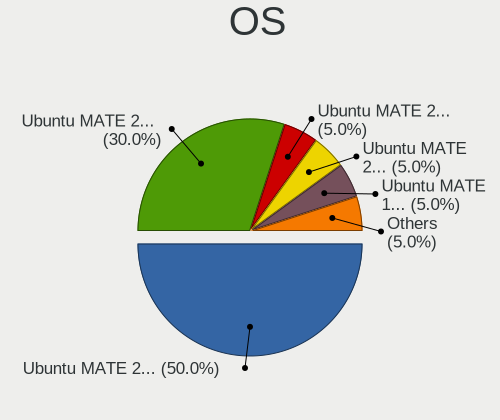

| Name              | Notebooks | Percent |
|-------------------|-----------|---------|
| Ubuntu MATE 22.04 | 10        | 66.67%  |
| Ubuntu MATE 23.10 | 2         | 13.33%  |
| Ubuntu MATE 23.04 | 2         | 13.33%  |
| Ubuntu MATE 20.04 | 1         | 6.67%   |

OS Family
---------

OS without a version

| Name        | Notebooks | Percent |
|-------------|-----------|---------|
| Ubuntu MATE | 15        | 100%    |

Kernel
------

Version of the Linux kernel

| Version               | Notebooks | Percent |
|-----------------------|-----------|---------|
| 6.2.0-26-generic      | 4         | 26.67%  |
| 5.19.0-50-generic     | 2         | 13.33%  |
| 5.15.0-79-generic     | 2         | 13.33%  |
| 6.4.6-060406-generic  | 1         | 6.67%   |
| 6.4.12-060412-generic | 1         | 6.67%   |
| 6.2.0-1009-lowlatency | 1         | 6.67%   |
| 6.0.0-060000-generic  | 1         | 6.67%   |
| 5.19.0-32-generic     | 1         | 6.67%   |
| 5.15.0-83-generic     | 1         | 6.67%   |
| 5.15.0-78-generic     | 1         | 6.67%   |

Kernel Family
-------------

Linux kernel without a distro release

| Version | Notebooks | Percent |
|---------|-----------|---------|
| 6.2.0   | 5         | 33.33%  |
| 5.15.0  | 4         | 26.67%  |
| 5.19.0  | 3         | 20%     |
| 6.4.6   | 1         | 6.67%   |
| 6.4.12  | 1         | 6.67%   |
| 6.0.0   | 1         | 6.67%   |

Kernel Major Ver.
-----------------

Linux kernel major version

| Version | Notebooks | Percent |
|---------|-----------|---------|
| 6.2     | 5         | 33.33%  |
| 5.15    | 4         | 26.67%  |
| 5.19    | 3         | 20%     |
| 6.4     | 2         | 13.33%  |
| 6.0     | 1         | 6.67%   |

Arch
----

OS architecture (x86_64, i586, etc.)

| Name   | Notebooks | Percent |
|--------|-----------|---------|
| x86_64 | 15        | 100%    |

DE
--

Desktop Environment

| Name | Notebooks | Percent |
|------|-----------|---------|
| MATE | 15        | 100%    |

Display Server
--------------

X11 or Wayland

| Name | Notebooks | Percent |
|------|-----------|---------|
| X11  | 15        | 100%    |

Display Manager
---------------

SDDM, LightDM, etc.

| Name    | Notebooks | Percent |
|---------|-----------|---------|
| LightDM | 10        | 66.67%  |
| LXDM    | 2         | 13.33%  |
| GDM3    | 2         | 13.33%  |
| Unknown | 1         | 6.67%   |

OS Lang
-------

Language

| Lang  | Notebooks | Percent |
|-------|-----------|---------|
| en_US | 3         | 20%     |
| de_DE | 3         | 20%     |
| sv_SE | 2         | 13.33%  |
| pl_PL | 2         | 13.33%  |
| ru_RU | 1         | 6.67%   |
| hu_HU | 1         | 6.67%   |
| fr_FR | 1         | 6.67%   |
| en_IL | 1         | 6.67%   |
| en_CA | 1         | 6.67%   |

Boot Mode
---------

EFI or BIOS

| Mode | Notebooks | Percent |
|------|-----------|---------|
| BIOS | 8         | 53.33%  |
| EFI  | 7         | 46.67%  |

Filesystem
----------

Type of filesystem

| Type    | Notebooks | Percent |
|---------|-----------|---------|
| Tmpfs   | 6         | 40%     |
| Ext4    | 6         | 40%     |
| Btrfs   | 2         | 13.33%  |
| Overlay | 1         | 6.67%   |

Part. scheme
------------

Scheme of partitioning

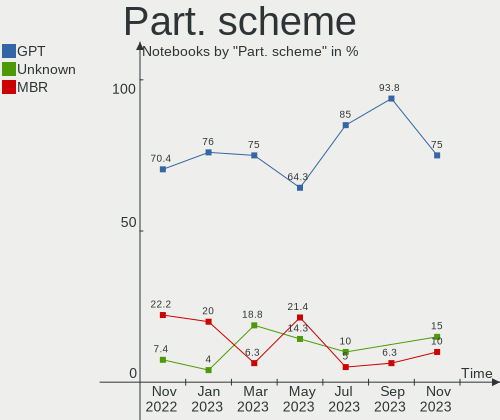

| Type    | Notebooks | Percent |
|---------|-----------|---------|
| GPT     | 14        | 93.33%  |
| Unknown | 1         | 6.67%   |

Dual Boot with Linux/BSD
------------------------

Hosting more than one Linux/BSD

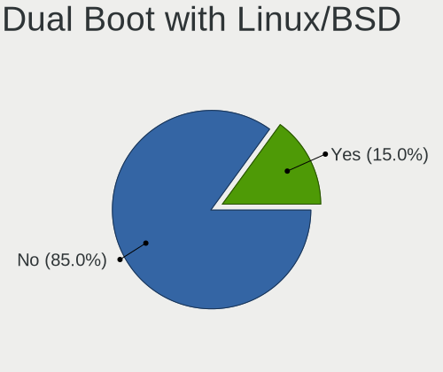

| Dual boot | Notebooks | Percent |
|-----------|-----------|---------|
| No        | 15        | 100%    |

Dual Boot (Win)
---------------

Hosting Linux and Windows

| Dual boot | Notebooks | Percent |
|-----------|-----------|---------|
| No        | 9         | 60%     |
| Yes       | 6         | 40%     |

Board
-----

Vendor
------

Motherboard manufacturer

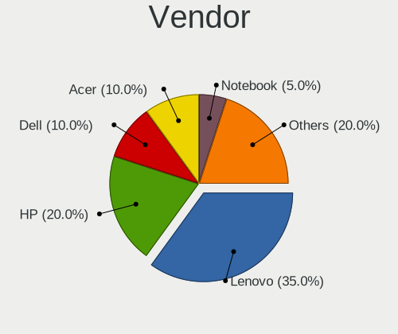

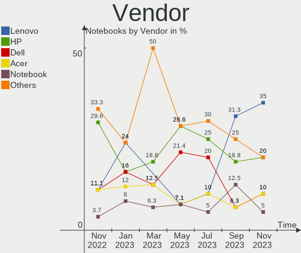

| Name              | Notebooks | Percent |
|-------------------|-----------|---------|
| Lenovo            | 3         | 20%     |
| Dell              | 3         | 20%     |
| Acer              | 3         | 20%     |
| ASUSTek Computer  | 2         | 13.33%  |
| Notebook          | 1         | 6.67%   |
| Kiano             | 1         | 6.67%   |
| HONOR             | 1         | 6.67%   |
| Bluechip Computer | 1         | 6.67%   |

Model
-----

Motherboard model

| Name                                  | Notebooks | Percent |
|---------------------------------------|-----------|---------|
| Notebook NJx0MU                       | 1         | 6.67%   |
| Lenovo V145-15AST 81MT                | 1         | 6.67%   |
| Lenovo ThinkPad T420 4236MBG          | 1         | 6.67%   |
| Lenovo IdeaPad L340-15IRH Gaming 81LK | 1         | 6.67%   |
| Kiano Elegance 14.2                   | 1         | 6.67%   |
| HONOR BOHK-WAX9X                      | 1         | 6.67%   |
| Dell Precision 7520                   | 1         | 6.67%   |
| Dell Latitude E7250                   | 1         | 6.67%   |
| Dell Inspiron 3593                    | 1         | 6.67%   |
| Bluechip TRAVELline TL14W4            | 1         | 6.67%   |
| ASUS X550LN                           | 1         | 6.67%   |
| ASUS G75VW                            | 1         | 6.67%   |
| Acer Swift SF514-52T                  | 1         | 6.67%   |
| Acer Extensa 5630                     | 1         | 6.67%   |
| Acer Aspire ES1-311                   | 1         | 6.67%   |

Model Family
------------

Motherboard model prefix

| Name                | Notebooks | Percent |
|---------------------|-----------|---------|
| Notebook NJx0MU     | 1         | 6.67%   |
| Lenovo V145-15AST   | 1         | 6.67%   |
| Lenovo ThinkPad     | 1         | 6.67%   |
| Lenovo IdeaPad      | 1         | 6.67%   |
| Kiano Elegance      | 1         | 6.67%   |
| HONOR BOHK-WAX9X    | 1         | 6.67%   |
| Dell Precision      | 1         | 6.67%   |
| Dell Latitude       | 1         | 6.67%   |
| Dell Inspiron       | 1         | 6.67%   |
| Bluechip TRAVELline | 1         | 6.67%   |
| ASUS X550LN         | 1         | 6.67%   |
| ASUS G75VW          | 1         | 6.67%   |
| Acer Swift          | 1         | 6.67%   |
| Acer Extensa        | 1         | 6.67%   |
| Acer Aspire         | 1         | 6.67%   |

MFG Year
--------

Motherboard manufacture year

| Year | Notebooks | Percent |
|------|-----------|---------|
| 2021 | 3         | 20%     |
| 2014 | 3         | 20%     |
| 2019 | 2         | 13.33%  |
| 2018 | 2         | 13.33%  |
| 2017 | 2         | 13.33%  |
| 2012 | 1         | 6.67%   |
| 2011 | 1         | 6.67%   |
| 2008 | 1         | 6.67%   |

Form Factor
-----------

Physical design of the computer

| Name     | Notebooks | Percent |
|----------|-----------|---------|
| Notebook | 15        | 100%    |

Secure Boot
-----------

Enabled or disabled

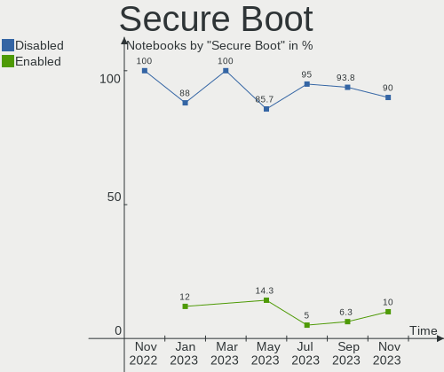

| State    | Notebooks | Percent |
|----------|-----------|---------|
| Disabled | 12        | 80%     |
| Enabled  | 3         | 20%     |

Coreboot
--------

Have coreboot on board

| Used | Notebooks | Percent |
|------|-----------|---------|
| No   | 15        | 100%    |

RAM Size
--------

Total RAM memory

| Size in GB | Notebooks | Percent |
|------------|-----------|---------|
| 4.01-8.0   | 7         | 46.67%  |
| 16.01-24.0 | 3         | 20%     |
| 32.01-64.0 | 1         | 6.67%   |
| 3.01-4.0   | 1         | 6.67%   |
| 24.01-32.0 | 1         | 6.67%   |
| 1.01-2.0   | 1         | 6.67%   |
| 8.01-16.0  | 1         | 6.67%   |

RAM Used
--------

Used RAM memory

| Used GB   | Notebooks | Percent |
|-----------|-----------|---------|
| 1.01-2.0  | 11        | 73.33%  |
| 4.01-8.0  | 1         | 6.67%   |
| 3.01-4.0  | 1         | 6.67%   |
| 2.01-3.0  | 1         | 6.67%   |
| 8.01-16.0 | 1         | 6.67%   |

Total Drives
------------

Number of drives on board

| Drives | Notebooks | Percent |
|--------|-----------|---------|
| 1      | 9         | 60%     |
| 2      | 6         | 40%     |

Has CD-ROM
----------

Has CD-ROM on board

| Presented | Notebooks | Percent |
|-----------|-----------|---------|
| No        | 9         | 60%     |
| Yes       | 6         | 40%     |

Has Ethernet
------------

Has Ethernet on board

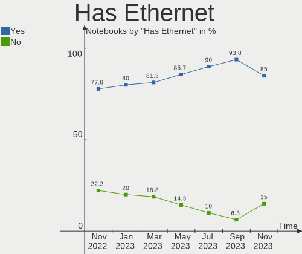

| Presented | Notebooks | Percent |
|-----------|-----------|---------|
| Yes       | 11        | 73.33%  |
| No        | 4         | 26.67%  |

Has WiFi
--------

Has WiFi module

| Presented | Notebooks | Percent |
|-----------|-----------|---------|
| Yes       | 14        | 93.33%  |
| No        | 1         | 6.67%   |

Has Bluetooth
-------------

Has Bluetooth module

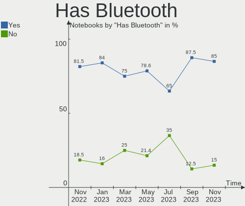

| Presented | Notebooks | Percent |
|-----------|-----------|---------|
| Yes       | 11        | 73.33%  |
| No        | 4         | 26.67%  |

Location
--------

Country
-------

Geographic location (country)

| Country            | Notebooks | Percent |
|--------------------|-----------|---------|
| Germany            | 6         | 40%     |
| Sweden             | 2         | 13.33%  |
| Poland             | 1         | 6.67%   |
| Netherlands        | 1         | 6.67%   |
| Israel             | 1         | 6.67%   |
| Hungary            | 1         | 6.67%   |
| France             | 1         | 6.67%   |
| Dominican Republic | 1         | 6.67%   |
| Brazil             | 1         | 6.67%   |

City
----

Geographic location (city)

| City                   | Notebooks | Percent |
|------------------------|-----------|---------|
| Sundbyberg             | 2         | 13.33%  |
| Warsaw                 | 1         | 6.67%   |
| Sao Paulo              | 1         | 6.67%   |
| Ramat Gan              | 1         | 6.67%   |
| Paris                  | 1         | 6.67%   |
| Norderney              | 1         | 6.67%   |
| Nordenham              | 1         | 6.67%   |
| Naaldwijk              | 1         | 6.67%   |
| Minden                 | 1         | 6.67%   |
| Győr                  | 1         | 6.67%   |
| Garmisch-Partenkirchen | 1         | 6.67%   |
| Concepción de la Vega | 1         | 6.67%   |
| Berlin                 | 1         | 6.67%   |
| Baesweiler             | 1         | 6.67%   |

Drives
------

Drive Vendor
------------

Hard drive vendors

| Vendor              | Notebooks | Drives | Percent |
|---------------------|-----------|--------|---------|
| Samsung Electronics | 8         | 9      | 40%     |
| Unknown             | 2         | 2      | 10%     |
| China               | 2         | 2      | 10%     |
| WDC                 | 1         | 1      | 5%      |
| Verbatim            | 1         | 1      | 5%      |
| UMIS                | 1         | 1      | 5%      |
| Mass                | 1         | 1      | 5%      |
| Kingston            | 1         | 1      | 5%      |
| Intel               | 1         | 1      | 5%      |
| Hitachi             | 1         | 1      | 5%      |
| A-DATA Technology   | 1         | 1      | 5%      |

Drive Model
-----------

Hard drive models

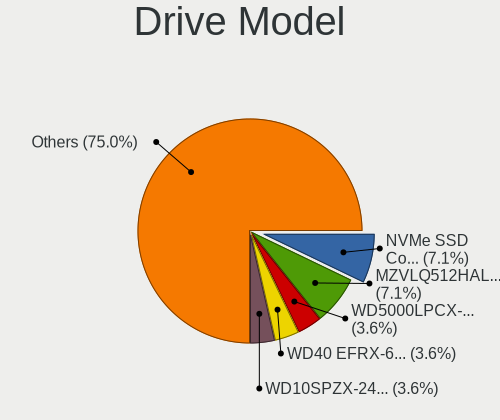

| Model                                               | Notebooks | Percent |
|-----------------------------------------------------|-----------|---------|
| WDC WD10SPZX-24Z10 1TB                              | 1         | 4.76%   |
| Verbatim Vi550 S3 512GB                             | 1         | 4.76%   |
| Unknown SLD32G  32GB                                | 1         | 4.76%   |
| Unknown MMC Card  64GB                              | 1         | 4.76%   |
| UMIS RPFTJ128PDD2EWX 128GB                          | 1         | 4.76%   |
| Samsung SSD PM851 mSATA 256GB                       | 1         | 4.76%   |
| Samsung SSD 970 EVO Plus 1TB                        | 1         | 4.76%   |
| Samsung SSD 870 QVO 2TB                             | 1         | 4.76%   |
| Samsung SSD 870 EVO 500GB                           | 1         | 4.76%   |
| Samsung SSD 750 EVO 250GB                           | 1         | 4.76%   |
| Samsung SSD 750 EVO 120GB                           | 1         | 4.76%   |
| Samsung NVMe SSD Controller SM981/PM981/PM983 500GB | 1         | 4.76%   |
| Samsung MZVL2512HCJQ-00B00 512GB                    | 1         | 4.76%   |
| Samsung MZNLH256HAJD-00000 256GB SSD                | 1         | 4.76%   |
| Mass Mass Storage 8MB                               | 1         | 4.76%   |
| Kingston SA400S37240G 240GB SSD                     | 1         | 4.76%   |
| Intel SSDPEKKW256G7 256GB                           | 1         | 4.76%   |
| Hitachi HTS543216L9A300 160GB                       | 1         | 4.76%   |
| China SSD 120GB                                     | 1         | 4.76%   |
| China SATA SSD 240GB                                | 1         | 4.76%   |
| A-DATA IM2P33F3 NVMe 256GB                          | 1         | 4.76%   |

HDD Vendor
----------

Hard disk drive vendors

| Vendor  | Notebooks | Drives | Percent |
|---------|-----------|--------|---------|
| WDC     | 1         | 1      | 50%     |
| Hitachi | 1         | 1      | 50%     |

SSD Vendor
----------

Solid state drive vendors

| Vendor              | Notebooks | Drives | Percent |
|---------------------|-----------|--------|---------|
| Samsung Electronics | 6         | 6      | 60%     |
| China               | 2         | 2      | 20%     |
| Verbatim            | 1         | 1      | 10%     |
| Kingston            | 1         | 1      | 10%     |

Drive Kind
----------

HDD or SSD

| Kind    | Notebooks | Drives | Percent |
|---------|-----------|--------|---------|
| SSD     | 9         | 10     | 45%     |
| NVMe    | 6         | 6      | 30%     |
| MMC     | 2         | 2      | 10%     |
| HDD     | 2         | 2      | 10%     |
| Unknown | 1         | 1      | 5%      |

Drive Connector
---------------

SATA, SAS, NVMe, etc.

| Type | Notebooks | Drives | Percent |
|------|-----------|--------|---------|
| SATA | 11        | 12     | 55%     |
| NVMe | 6         | 6      | 30%     |
| MMC  | 2         | 2      | 10%     |
| SAS  | 1         | 1      | 5%      |

Drive Size
----------

Size of hard drive

| Size in TB | Notebooks | Drives | Percent |
|------------|-----------|--------|---------|
| 0.01-0.5   | 8         | 9      | 72.73%  |
| 0.51-1.0   | 2         | 2      | 18.18%  |
| 1.01-2.0   | 1         | 1      | 9.09%   |

Space Total
-----------

Amount of disk space available on the file system

| Size in GB | Notebooks | Percent |
|------------|-----------|---------|
| 101-250    | 6         | 40%     |
| 1001-2000  | 3         | 20%     |
| 251-500    | 2         | 13.33%  |
| 501-1000   | 2         | 13.33%  |
| 1-20       | 1         | 6.67%   |
| 51-100     | 1         | 6.67%   |

Space Used
----------

Amount of used disk space

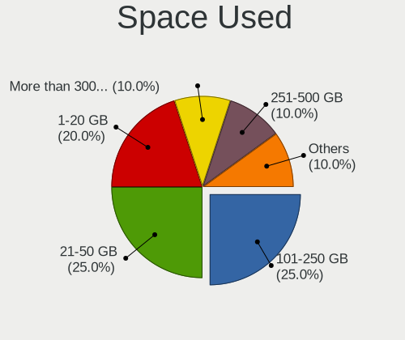

| Used GB   | Notebooks | Percent |
|-----------|-----------|---------|
| 101-250   | 5         | 33.33%  |
| 21-50     | 4         | 26.67%  |
| 1-20      | 3         | 20%     |
| 251-500   | 1         | 6.67%   |
| 1001-2000 | 1         | 6.67%   |
| 51-100    | 1         | 6.67%   |

Malfunc. Drives
---------------

Drive models with a malfunction

Zero info for selected period =(

Malfunc. Drive Vendor
---------------------

Vendors of faulty drives

Zero info for selected period =(

Malfunc. HDD Vendor
-------------------

Vendors of faulty HDD drives

Zero info for selected period =(

Malfunc. Drive Kind
-------------------

Kinds of faulty drives

Zero info for selected period =(

Failed Drives
-------------

Failed drive models

Zero info for selected period =(

Failed Drive Vendor
-------------------

Failed drive vendors

Zero info for selected period =(

Drive Status
------------

Number of failed and malfunc. drives

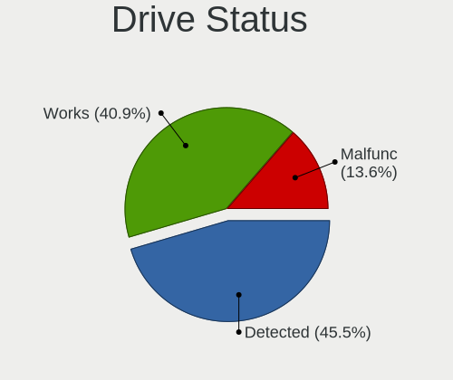

| Status   | Notebooks | Drives | Percent |
|----------|-----------|--------|---------|
| Detected | 10        | 13     | 58.82%  |
| Works    | 7         | 8      | 41.18%  |

Storage controller
------------------

Storage Vendor
--------------

Storage controller vendors

| Vendor                  | Notebooks | Percent |
|-------------------------|-----------|---------|
| Intel                   | 13        | 68.42%  |
| Samsung Electronics     | 3         | 15.79%  |
| Union Memory (Shenzhen) | 1         | 5.26%   |
| AMD                     | 1         | 5.26%   |
| ADATA Technology        | 1         | 5.26%   |

Storage Model
-------------

Storage controller models

| Model                                                                         | Notebooks | Percent |
|-------------------------------------------------------------------------------|-----------|---------|
| Samsung NVMe SSD Controller SM981/PM981/PM983                                 | 2         | 10.53%  |
| Union Memory (Shenzhen) AM610 PCIe 3.0 NVMe SSD 128GB                         | 1         | 5.26%   |
| Samsung NVMe SSD Controller PM9A1/PM9A3/980PRO                                | 1         | 5.26%   |
| Intel Tiger Lake-LP SATA Controller                                           | 1         | 5.26%   |
| Intel SSD 600P Series                                                         | 1         | 5.26%   |
| Intel Q170/Q150/B150/H170/H110/Z170/CM236 Chipset SATA Controller [AHCI Mode] | 1         | 5.26%   |
| Intel Ice Lake-LP SATA Controller [AHCI mode]                                 | 1         | 5.26%   |
| Intel Celeron/Pentium Silver Processor SATA Controller                        | 1         | 5.26%   |
| Intel Celeron N3350/Pentium N4200/Atom E3900 Series SATA AHCI Controller      | 1         | 5.26%   |
| Intel Cannon Lake Mobile PCH SATA AHCI Controller                             | 1         | 5.26%   |
| Intel Atom Processor E3800 Series SATA AHCI Controller                        | 1         | 5.26%   |
| Intel 82801IBM/IEM (ICH9M/ICH9M-E) 4 port SATA Controller [AHCI mode]         | 1         | 5.26%   |
| Intel 82801 Mobile SATA Controller [RAID mode]                                | 1         | 5.26%   |
| Intel 8 Series SATA Controller 1 [AHCI mode]                                  | 1         | 5.26%   |
| Intel 7 Series Chipset Family 6-port SATA Controller [AHCI mode]              | 1         | 5.26%   |
| Intel 6 Series/C200 Series Chipset Family 6 port Mobile SATA AHCI Controller  | 1         | 5.26%   |
| AMD FCH SATA Controller [AHCI mode]                                           | 1         | 5.26%   |
| ADATA IM2P33F3 NVMe SSD (DRAM-less)                                           | 1         | 5.26%   |

Storage Kind
------------

Kind of storage controller (IDE, SATA, NVMe, SAS, ...)

| Kind | Notebooks | Percent |
|------|-----------|---------|
| SATA | 12        | 63.16%  |
| NVMe | 6         | 31.58%  |
| RAID | 1         | 5.26%   |

Processor
---------

CPU Vendor
----------

Processor vendors

| Vendor | Notebooks | Percent |
|--------|-----------|---------|
| Intel  | 13        | 86.67%  |
| AMD    | 2         | 13.33%  |

CPU Model
---------

Processor models

| Model                                         | Notebooks | Percent |
|-----------------------------------------------|-----------|---------|
| Intel Pentium Silver N5030 CPU @ 1.10GHz      | 1         | 6.67%   |
| Intel Pentium Dual-Core CPU T4200 @ 2.00GHz   | 1         | 6.67%   |
| Intel Core i7-9750H CPU @ 2.60GHz             | 1         | 6.67%   |
| Intel Core i7-6920HQ CPU @ 2.90GHz            | 1         | 6.67%   |
| Intel Core i7-5600U CPU @ 2.60GHz             | 1         | 6.67%   |
| Intel Core i7-3630QM CPU @ 2.40GHz            | 1         | 6.67%   |
| Intel Core i5-8250U CPU @ 1.60GHz             | 1         | 6.67%   |
| Intel Core i5-2540M CPU @ 2.60GHz             | 1         | 6.67%   |
| Intel Core i5-1035G1 CPU @ 1.00GHz            | 1         | 6.67%   |
| Intel Core i3-4010U CPU @ 1.70GHz             | 1         | 6.67%   |
| Intel Celeron CPU N3350 @ 1.10GHz             | 1         | 6.67%   |
| Intel Celeron CPU N2840 @ 2.16GHz             | 1         | 6.67%   |
| Intel 11th Gen Core i7-1165G7 @ 2.80GHz       | 1         | 6.67%   |
| AMD Ryzen 7 3700U with Radeon Vega Mobile Gfx | 1         | 6.67%   |
| AMD A6-9225 RADEON R4, 5 COMPUTE CORES 2C+3G  | 1         | 6.67%   |

CPU Model Family
----------------

Processor model prefix

| Model                   | Notebooks | Percent |
|-------------------------|-----------|---------|
| Intel Core i7           | 4         | 26.67%  |
| Intel Core i5           | 3         | 20%     |
| Intel Celeron           | 2         | 13.33%  |
| Other                   | 1         | 6.67%   |
| Intel Pentium Silver    | 1         | 6.67%   |
| Intel Pentium Dual-Core | 1         | 6.67%   |
| Intel Core i3           | 1         | 6.67%   |
| AMD Ryzen 7             | 1         | 6.67%   |
| AMD A6                  | 1         | 6.67%   |

CPU Cores
---------

Number of processor cores

| Number | Notebooks | Percent |
|--------|-----------|---------|
| 4      | 7         | 46.67%  |
| 2      | 7         | 46.67%  |
| 6      | 1         | 6.67%   |

CPU Sockets
-----------

Number of sockets

| Number | Notebooks | Percent |
|--------|-----------|---------|
| 1      | 15        | 100%    |

CPU Threads
-----------

Threads per core (Hyper-Threading)

| Number | Notebooks | Percent |
|--------|-----------|---------|
| 2      | 10        | 66.67%  |
| 1      | 5         | 33.33%  |

CPU Op-Modes
------------

CPU Operation Modes (32-bit, 64-bit)

| Op mode        | Notebooks | Percent |
|----------------|-----------|---------|
| 32-bit, 64-bit | 15        | 100%    |

CPU Microcode
-------------

Microcode number

| Number  | Notebooks | Percent |
|---------|-----------|---------|
| Unknown | 12        | 80%     |
| 0x706e5 | 1         | 6.67%   |
| 0x706a8 | 1         | 6.67%   |
| 0x506c9 | 1         | 6.67%   |

CPU Microarch
-------------

Microarchitecture

| Name          | Notebooks | Percent |
|---------------|-----------|---------|
| KabyLake      | 2         | 13.33%  |
| Zen+          | 1         | 6.67%   |
| TigerLake     | 1         | 6.67%   |
| Skylake       | 1         | 6.67%   |
| Silvermont    | 1         | 6.67%   |
| SandyBridge   | 1         | 6.67%   |
| Penryn        | 1         | 6.67%   |
| IvyBridge     | 1         | 6.67%   |
| IceLake       | 1         | 6.67%   |
| Haswell       | 1         | 6.67%   |
| Goldmont plus | 1         | 6.67%   |
| Goldmont      | 1         | 6.67%   |
| Excavator     | 1         | 6.67%   |
| Broadwell     | 1         | 6.67%   |

Graphics
--------

GPU Vendor
----------

Vendors of graphics cards

| Vendor | Notebooks | Percent |
|--------|-----------|---------|
| Intel  | 12        | 66.67%  |
| Nvidia | 4         | 22.22%  |
| AMD    | 2         | 11.11%  |

GPU Model
---------

Graphics card models

| Model                                                                     | Notebooks | Percent |
|---------------------------------------------------------------------------|-----------|---------|
| Nvidia TU117M [GeForce GTX 1650 Mobile / Max-Q]                           | 1         | 5.56%   |
| Nvidia GM206GLM [Quadro M2200 Mobile]                                     | 1         | 5.56%   |
| Nvidia GM108M [GeForce 840M]                                              | 1         | 5.56%   |
| Nvidia GF114M [GeForce GTX 670M]                                          | 1         | 5.56%   |
| Intel UHD Graphics 620                                                    | 1         | 5.56%   |
| Intel TigerLake-LP GT2 [Iris Xe Graphics]                                 | 1         | 5.56%   |
| Intel Mobile 4 Series Chipset Integrated Graphics Controller              | 1         | 5.56%   |
| Intel Iris Plus Graphics G1 (Ice Lake)                                    | 1         | 5.56%   |
| Intel HD Graphics 5500                                                    | 1         | 5.56%   |
| Intel HD Graphics 530                                                     | 1         | 5.56%   |
| Intel HD Graphics 500                                                     | 1         | 5.56%   |
| Intel Haswell-ULT Integrated Graphics Controller                          | 1         | 5.56%   |
| Intel GeminiLake [UHD Graphics 605]                                       | 1         | 5.56%   |
| Intel CoffeeLake-H GT2 [UHD Graphics 630]                                 | 1         | 5.56%   |
| Intel Atom Processor Z36xxx/Z37xxx Series Graphics & Display              | 1         | 5.56%   |
| Intel 2nd Generation Core Processor Family Integrated Graphics Controller | 1         | 5.56%   |
| AMD Stoney [Radeon R2/R3/R4/R5 Graphics]                                  | 1         | 5.56%   |
| AMD Picasso/Raven 2 [Radeon Vega Series / Radeon Vega Mobile Series]      | 1         | 5.56%   |

GPU Combo
---------

Combinations of graphics cards

| Name           | Notebooks | Percent |
|----------------|-----------|---------|
| 1 x Intel      | 9         | 60%     |
| Intel + Nvidia | 3         | 20%     |
| 1 x AMD        | 2         | 13.33%  |
| 1 x Nvidia     | 1         | 6.67%   |

GPU Driver
----------

Free vs proprietary

| Driver      | Notebooks | Percent |
|-------------|-----------|---------|
| Free        | 12        | 80%     |
| Proprietary | 3         | 20%     |

GPU Memory
----------

Total video memory

| Size in GB | Notebooks | Percent |
|------------|-----------|---------|
| Unknown    | 14        | 93.33%  |
| 3.01-4.0   | 1         | 6.67%   |

Monitor
-------

Monitor Vendor
--------------

Monitor vendors

| Vendor                  | Notebooks | Percent |
|-------------------------|-----------|---------|
| BOE                     | 5         | 33.33%  |
| AU Optronics            | 4         | 26.67%  |
| LG Display              | 3         | 20%     |
| Chimei Innolux          | 2         | 13.33%  |
| Chi Mei Optoelectronics | 1         | 6.67%   |

Monitor Model
-------------

Monitor models

| Model                                                                     | Notebooks | Percent |
|---------------------------------------------------------------------------|-----------|---------|
| LG Display LCD Monitor LGD05E5 1920x1080 344x194mm 15.5-inch              | 1         | 6.67%   |
| LG Display LCD Monitor LGD03DB 1366x768 345x194mm 15.6-inch               | 1         | 6.67%   |
| LG Display LCD Monitor LGD02E2 1600x900 310x174mm 14.0-inch               | 1         | 6.67%   |
| Chimei Innolux LCD Monitor CMN15D5 1920x1080 344x193mm 15.5-inch          | 1         | 6.67%   |
| Chimei Innolux LCD Monitor CMN14D2 1920x1080 309x173mm 13.9-inch          | 1         | 6.67%   |
| Chi Mei Optoelectronics LCD Monitor CMO1720 1920x1080 382x215mm 17.3-inch | 1         | 6.67%   |
| BOE LCD Monitor BOE08E7 1920x1080 344x193mm 15.5-inch                     | 1         | 6.67%   |
| BOE LCD Monitor BOE0872 1920x1080 344x194mm 15.5-inch                     | 1         | 6.67%   |
| BOE LCD Monitor BOE07DB 1920x1080 309x174mm 14.0-inch                     | 1         | 6.67%   |
| BOE LCD Monitor BOE0713 1920x1080 344x193mm 15.5-inch                     | 1         | 6.67%   |
| BOE LCD Monitor BOE05F4 1366x768 277x156mm 12.5-inch                      | 1         | 6.67%   |
| AU Optronics LCD Monitor AUO8174 1280x800 331x207mm 15.4-inch             | 1         | 6.67%   |
| AU Optronics LCD Monitor AUO429D 1920x1080 382x215mm 17.3-inch            | 1         | 6.67%   |
| AU Optronics LCD Monitor AUO203D 1920x1080 309x174mm 14.0-inch            | 1         | 6.67%   |
| AU Optronics LCD Monitor AUO132C 1366x768 293x164mm 13.2-inch             | 1         | 6.67%   |

Monitor Resolution
------------------

Monitor screen resolution

| Resolution      | Notebooks | Percent |
|-----------------|-----------|---------|
| 1920x1080 (FHD) | 10        | 66.67%  |
| 1366x768 (WXGA) | 3         | 20%     |
| 1600x900 (HD+)  | 1         | 6.67%   |
| 1280x800 (WXGA) | 1         | 6.67%   |

Monitor Diagonal
----------------

Diagonal size in inches

| Inches | Notebooks | Percent |
|--------|-----------|---------|
| 15     | 7         | 46.67%  |
| 14     | 3         | 20%     |
| 17     | 2         | 13.33%  |
| 13     | 2         | 13.33%  |
| 12     | 1         | 6.67%   |

Monitor Width
-------------

Physical width

| Width in mm | Notebooks | Percent |
|-------------|-----------|---------|
| 301-350     | 11        | 73.33%  |
| 351-400     | 2         | 13.33%  |
| 201-300     | 2         | 13.33%  |

Aspect Ratio
------------

Proportional relationship between the width and the height

| Ratio | Notebooks | Percent |
|-------|-----------|---------|
| 16/9  | 14        | 93.33%  |
| 16/10 | 1         | 6.67%   |

Monitor Area
------------

Area in inch²

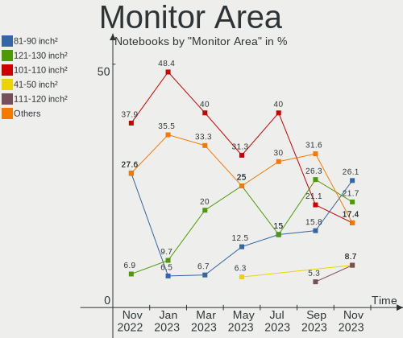

| Area in inch² | Notebooks | Percent |
|----------------|-----------|---------|
| 101-110        | 7         | 46.67%  |
| 81-90          | 4         | 26.67%  |
| 121-130        | 2         | 13.33%  |
| 71-80          | 1         | 6.67%   |
| 61-70          | 1         | 6.67%   |

Pixel Density
-------------

Pixels per inch

| Density | Notebooks | Percent |
|---------|-----------|---------|
| 121-160 | 12        | 80%     |
| 51-100  | 2         | 13.33%  |
| 101-120 | 1         | 6.67%   |

Multiple Monitors
-----------------

Total monitors connected

| Total | Notebooks | Percent |
|-------|-----------|---------|
| 1     | 15        | 100%    |

Network
-------

Net Controller Vendor
---------------------

Controller vendors

| Vendor                | Notebooks | Percent |
|-----------------------|-----------|---------|
| Intel                 | 7         | 33.33%  |
| Realtek Semiconductor | 6         | 28.57%  |
| Qualcomm Atheros      | 4         | 19.05%  |
| Ralink Technology     | 1         | 4.76%   |
| Ralink                | 1         | 4.76%   |
| Dell                  | 1         | 4.76%   |
| Broadcom              | 1         | 4.76%   |

Net Controller Model
--------------------

Controller models

| Model                                                             | Notebooks | Percent |
|-------------------------------------------------------------------|-----------|---------|
| Realtek RTL8111/8168/8411 PCI Express Gigabit Ethernet Controller | 4         | 14.81%  |
| Qualcomm Atheros QCA9377 802.11ac Wireless Network Adapter        | 2         | 7.41%   |
| Intel Wireless 7265                                               | 2         | 7.41%   |
| Realtek RTL8821CE 802.11ac PCIe Wireless Network Adapter          | 1         | 3.7%    |
| Realtek RTL8723BU 802.11b/g/n WLAN Adapter                        | 1         | 3.7%    |
| Realtek RTL8188EUS 802.11n Wireless Network Adapter               | 1         | 3.7%    |
| Realtek RTL810xE PCI Express Fast Ethernet controller             | 1         | 3.7%    |
| Ralink MT7610U ("Archer T2U" 2.4G+5G WLAN Adapter                 | 1         | 3.7%    |
| Ralink RT3290 Wireless 802.11n 1T/1R PCIe                         | 1         | 3.7%    |
| Qualcomm Atheros AR928X Wireless Network Adapter (PCI-Express)    | 1         | 3.7%    |
| Qualcomm Atheros AR8151 v2.0 Gigabit Ethernet                     | 1         | 3.7%    |
| Intel Wireless 8265 / 8275                                        | 1         | 3.7%    |
| Intel Wireless 3165                                               | 1         | 3.7%    |
| Intel Wi-Fi 6 AX210/AX211/AX411 160MHz                            | 1         | 3.7%    |
| Intel Wi-Fi 6 AX200                                               | 1         | 3.7%    |
| Intel Ethernet Connection (5) I219-LM                             | 1         | 3.7%    |
| Intel Ethernet Connection (3) I218-LM                             | 1         | 3.7%    |
| Intel Ethernet Connection (13) I219-V                             | 1         | 3.7%    |
| Intel Centrino Advanced-N 6205 [Taylor Peak]                      | 1         | 3.7%    |
| Intel 82579LM Gigabit Network Connection (Lewisville)             | 1         | 3.7%    |
| Dell DW5811e Snapdragon™ X7 LTE                              | 1         | 3.7%    |
| Broadcom NetXtreme BCM5764M Gigabit Ethernet PCIe                 | 1         | 3.7%    |

Wireless Vendor
---------------

Wireless vendors

| Vendor                | Notebooks | Percent |
|-----------------------|-----------|---------|
| Intel                 | 7         | 43.75%  |
| Realtek Semiconductor | 3         | 18.75%  |
| Qualcomm Atheros      | 3         | 18.75%  |
| Ralink Technology     | 1         | 6.25%   |
| Ralink                | 1         | 6.25%   |
| Dell                  | 1         | 6.25%   |

Wireless Model
--------------

Wireless models

| Model                                                          | Notebooks | Percent |
|----------------------------------------------------------------|-----------|---------|
| Qualcomm Atheros QCA9377 802.11ac Wireless Network Adapter     | 2         | 12.5%   |
| Intel Wireless 7265                                            | 2         | 12.5%   |
| Realtek RTL8821CE 802.11ac PCIe Wireless Network Adapter       | 1         | 6.25%   |
| Realtek RTL8723BU 802.11b/g/n WLAN Adapter                     | 1         | 6.25%   |
| Realtek RTL8188EUS 802.11n Wireless Network Adapter            | 1         | 6.25%   |
| Ralink MT7610U ("Archer T2U" 2.4G+5G WLAN Adapter              | 1         | 6.25%   |
| Ralink RT3290 Wireless 802.11n 1T/1R PCIe                      | 1         | 6.25%   |
| Qualcomm Atheros AR928X Wireless Network Adapter (PCI-Express) | 1         | 6.25%   |
| Intel Wireless 8265 / 8275                                     | 1         | 6.25%   |
| Intel Wireless 3165                                            | 1         | 6.25%   |
| Intel Wi-Fi 6 AX210/AX211/AX411 160MHz                         | 1         | 6.25%   |
| Intel Wi-Fi 6 AX200                                            | 1         | 6.25%   |
| Intel Centrino Advanced-N 6205 [Taylor Peak]                   | 1         | 6.25%   |
| Dell DW5811e Snapdragon™ X7 LTE                           | 1         | 6.25%   |

Ethernet Vendor
---------------

Ethernet vendors

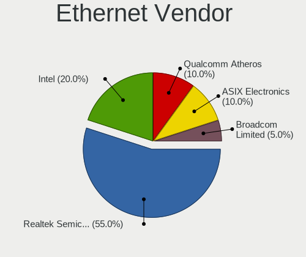

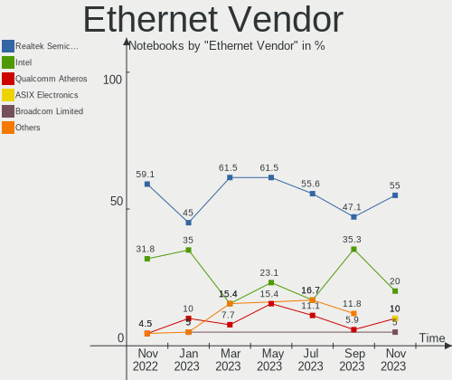

| Vendor                | Notebooks | Percent |
|-----------------------|-----------|---------|
| Realtek Semiconductor | 5         | 45.45%  |
| Intel                 | 4         | 36.36%  |
| Qualcomm Atheros      | 1         | 9.09%   |
| Broadcom              | 1         | 9.09%   |

Ethernet Model
--------------

Ethernet models

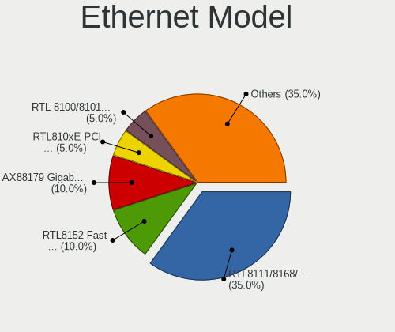

| Model                                                             | Notebooks | Percent |
|-------------------------------------------------------------------|-----------|---------|
| Realtek RTL8111/8168/8411 PCI Express Gigabit Ethernet Controller | 4         | 36.36%  |
| Realtek RTL810xE PCI Express Fast Ethernet controller             | 1         | 9.09%   |
| Qualcomm Atheros AR8151 v2.0 Gigabit Ethernet                     | 1         | 9.09%   |
| Intel Ethernet Connection (5) I219-LM                             | 1         | 9.09%   |
| Intel Ethernet Connection (3) I218-LM                             | 1         | 9.09%   |
| Intel Ethernet Connection (13) I219-V                             | 1         | 9.09%   |
| Intel 82579LM Gigabit Network Connection (Lewisville)             | 1         | 9.09%   |
| Broadcom NetXtreme BCM5764M Gigabit Ethernet PCIe                 | 1         | 9.09%   |

Net Controller Kind
-------------------

Ethernet, WiFi or modem

| Kind     | Notebooks | Percent |
|----------|-----------|---------|
| WiFi     | 14        | 56%     |
| Ethernet | 11        | 44%     |

Used Controller
---------------

Currently used network controller

| Kind     | Notebooks | Percent |
|----------|-----------|---------|
| WiFi     | 13        | 86.67%  |
| Ethernet | 2         | 13.33%  |

NICs
----

Total network controllers on board

| Total | Notebooks | Percent |
|-------|-----------|---------|
| 2     | 9         | 60%     |
| 1     | 5         | 33.33%  |
| 0     | 1         | 6.67%   |

IPv6
----

IPv6 vs IPv4

| Used | Notebooks | Percent |
|------|-----------|---------|
| No   | 11        | 73.33%  |
| Yes  | 4         | 26.67%  |

Bluetooth
---------

Bluetooth Vendor
----------------

Controller vendors

| Vendor                          | Notebooks | Percent |
|---------------------------------|-----------|---------|
| Intel                           | 6         | 54.55%  |
| Qualcomm Atheros Communications | 2         | 18.18%  |
| Realtek Semiconductor           | 1         | 9.09%   |
| Ralink                          | 1         | 9.09%   |
| Broadcom                        | 1         | 9.09%   |

Bluetooth Model
---------------

Controller models

| Model                              | Notebooks | Percent |
|------------------------------------|-----------|---------|
| Intel Bluetooth wireless interface | 4         | 36.36%  |
| Qualcomm Atheros  Bluetooth Device | 2         | 18.18%  |
| Realtek Bluetooth Radio            | 1         | 9.09%   |
| Ralink RT3290 Bluetooth            | 1         | 9.09%   |
| Intel AX210 Bluetooth              | 1         | 9.09%   |
| Intel AX200 Bluetooth              | 1         | 9.09%   |
| Broadcom BCM2045B (BDC-2.1)        | 1         | 9.09%   |

Sound
-----

Sound Vendor
------------

Sound card vendors

| Vendor              | Notebooks | Percent |
|---------------------|-----------|---------|
| Intel               | 13        | 65%     |
| Nvidia              | 3         | 15%     |
| AMD                 | 2         | 10%     |
| Meizu               | 1         | 5%      |
| C-Media Electronics | 1         | 5%      |

Sound Model
-----------

Sound card models

| Model                                                                      | Notebooks | Percent |
|----------------------------------------------------------------------------|-----------|---------|
| Nvidia TU107 GeForce GTX 1650 High Definition Audio Controller             | 1         | 4.17%   |
| Nvidia GM206 High Definition Audio Controller                              | 1         | 4.17%   |
| Nvidia GF114 HDMI Audio Controller                                         | 1         | 4.17%   |
| Meizu HiFi DAC Headphone Amplifier                                         | 1         | 4.17%   |
| Intel Wildcat Point-LP High Definition Audio Controller                    | 1         | 4.17%   |
| Intel Tiger Lake-LP Smart Sound Technology Audio Controller                | 1         | 4.17%   |
| Intel Sunrise Point-LP HD Audio                                            | 1         | 4.17%   |
| Intel Ice Lake-LP Smart Sound Technology Audio Controller                  | 1         | 4.17%   |
| Intel Haswell-ULT HD Audio Controller                                      | 1         | 4.17%   |
| Intel CM238 HD Audio Controller                                            | 1         | 4.17%   |
| Intel Celeron/Pentium Silver Processor High Definition Audio               | 1         | 4.17%   |
| Intel Celeron N3350/Pentium N4200/Atom E3900 Series Audio Cluster          | 1         | 4.17%   |
| Intel Cannon Lake PCH cAVS                                                 | 1         | 4.17%   |
| Intel Broadwell-U Audio Controller                                         | 1         | 4.17%   |
| Intel Atom Processor Z36xxx/Z37xxx Series High Definition Audio Controller | 1         | 4.17%   |
| Intel 82801I (ICH9 Family) HD Audio Controller                             | 1         | 4.17%   |
| Intel 8 Series HD Audio Controller                                         | 1         | 4.17%   |
| Intel 7 Series/C216 Chipset Family High Definition Audio Controller        | 1         | 4.17%   |
| Intel 6 Series/C200 Series Chipset Family High Definition Audio Controller | 1         | 4.17%   |
| C-Media Electronics USB Advanced Audio Device                              | 1         | 4.17%   |
| AMD Raven/Raven2/Fenghuang HDMI/DP Audio Controller                        | 1         | 4.17%   |
| AMD High Definition Audio Controller                                       | 1         | 4.17%   |
| AMD Family 17h/19h HD Audio Controller                                     | 1         | 4.17%   |
| AMD Family 15h (Models 60h-6fh) Audio Controller                           | 1         | 4.17%   |

Memory
------

Memory Vendor
-------------

Memory module vendors

| Vendor              | Notebooks | Percent |
|---------------------|-----------|---------|
| Unknown (ABCD)      | 2         | 22.22%  |
| SK hynix            | 2         | 22.22%  |
| Unknown             | 1         | 11.11%  |
| Samsung Electronics | 1         | 11.11%  |
| Micron Technology   | 1         | 11.11%  |
| Kingston            | 1         | 11.11%  |
| Crucial             | 1         | 11.11%  |

Memory Model
------------

Memory module models

| Model                                                            | Notebooks | Percent |
|------------------------------------------------------------------|-----------|---------|
| Unknown RAM Module 1GB DIMM DDR3 1600MT/s                        | 1         | 11.11%  |
| Unknown (ABCD) RAM 123456789012345678 4GB SODIMM LPDDR4 2400MT/s | 1         | 11.11%  |
| Unknown (ABCD) RAM 123456789012345678 2GB DIMM LPDDR4 2400MT/s   | 1         | 11.11%  |
| SK hynix RAM HMAA1GS6CMR6N-VK 8GB Row Of Chips DDR4 2667MT/s     | 1         | 11.11%  |
| SK hynix RAM HMA81GS6DJR8N-VK 8GB SODIMM DDR4 2667MT/s           | 1         | 11.11%  |
| Samsung RAM M471A1K43DB1-CTD 8GB SODIMM DDR4 2667MT/s            | 1         | 11.11%  |
| Micron RAM MT52L512M32D2PF-10 4GB Row Of Chips LPDDR3 1867MT/s   | 1         | 11.11%  |
| Kingston RAM 9905700-104.A00G 8GB SODIMM DDR4 3200MT/s           | 1         | 11.11%  |
| Crucial RAM CT8G4SFS8266.M8FD 8192MB SODIMM DDR4 2667MT/s        | 1         | 11.11%  |

Memory Kind
-----------

Memory module kinds

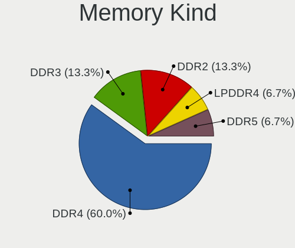

| Kind   | Notebooks | Percent |
|--------|-----------|---------|
| DDR4   | 4         | 50%     |
| LPDDR4 | 2         | 25%     |
| LPDDR3 | 1         | 12.5%   |
| DDR3   | 1         | 12.5%   |

Memory Form Factor
------------------

Physical design of the memory module

| Name         | Notebooks | Percent |
|--------------|-----------|---------|
| SODIMM       | 4         | 57.14%  |
| Row Of Chips | 2         | 28.57%  |
| DIMM         | 1         | 14.29%  |

Memory Size
-----------

Memory module size

| Size  | Notebooks | Percent |
|-------|-----------|---------|
| 8192  | 5         | 62.5%   |
| 16384 | 1         | 12.5%   |
| 4096  | 1         | 12.5%   |
| 1024  | 1         | 12.5%   |

Memory Speed
------------

Memory module speed

| Speed | Notebooks | Percent |
|-------|-----------|---------|
| 2667  | 3         | 37.5%   |
| 2400  | 2         | 25%     |
| 3200  | 1         | 12.5%   |
| 1867  | 1         | 12.5%   |
| 1600  | 1         | 12.5%   |

Printers & scanners
-------------------

Printer Vendor
--------------

Printer device vendors

Zero info for selected period =(

Printer Model
-------------

Printer device models

Zero info for selected period =(

Scanner Vendor
--------------

Scanner device vendors

Zero info for selected period =(

Scanner Model
-------------

Scanner device models

Zero info for selected period =(

Camera
------

Camera Vendor
-------------

Camera device vendors

| Vendor                        | Notebooks | Percent |
|-------------------------------|-----------|---------|
| Chicony Electronics           | 4         | 26.67%  |
| Sunplus Innovation Technology | 3         | 20%     |
| Realtek Semiconductor         | 2         | 13.33%  |
| Quanta                        | 1         | 6.67%   |
| Microdia                      | 1         | 6.67%   |
| Lite-On Technology            | 1         | 6.67%   |
| Denron                        | 1         | 6.67%   |
| Alcor Micro                   | 1         | 6.67%   |
| Unknown                       | 1         | 6.67%   |

Camera Model
------------

Camera device models

| Model                          | Notebooks | Percent |
|--------------------------------|-----------|---------|
| Sunplus Integrated_Webcam_HD   | 2         | 13.33%  |
| Sunplus ASUS Webcam            | 1         | 6.67%   |
| Realtek USB Camera             | 1         | 6.67%   |
| Realtek HD WebCam              | 1         | 6.67%   |
| Quanta ov9734_techfront_camera | 1         | 6.67%   |
| Microdia Integrated_Webcam_HD  | 1         | 6.67%   |
| Lite-On Integrated Camera      | 1         | 6.67%   |
| Denron 2M Front Camera         | 1         | 6.67%   |
| Chicony USB2.0 Camera          | 1         | 6.67%   |
| Chicony integrated camera      | 1         | 6.67%   |
| Chicony HD WebCam              | 1         | 6.67%   |
| Chicony EasyCamera             | 1         | 6.67%   |
| Alcor Micro USB 2.0 PC Camera  | 1         | 6.67%   |
| Unknown                        | 1         | 6.67%   |

Security
--------

Fingerprint Vendor
------------------

Fingerprint sensor vendors

| Vendor                     | Notebooks | Percent |
|----------------------------|-----------|---------|
| Upek                       | 1         | 33.33%  |
| Shenzhen Goodix Technology | 1         | 33.33%  |
| LighTuning Technology      | 1         | 33.33%  |

Fingerprint Model
-----------------

Fingerprint sensor models

| Model                                                  | Notebooks | Percent |
|--------------------------------------------------------|-----------|---------|
| Upek Biometric Touchchip/Touchstrip Fingerprint Sensor | 1         | 33.33%  |
| Shenzhen Goodix  Fingerprint Device                    | 1         | 33.33%  |
| LighTuning EgisTec Touch Fingerprint Sensor            | 1         | 33.33%  |

Chipcard Vendor
---------------

Chipcard module vendors

| Vendor   | Notebooks | Percent |
|----------|-----------|---------|
| Broadcom | 2         | 100%    |

Chipcard Model
--------------

Chipcard module models

| Model                                                                        | Notebooks | Percent |
|------------------------------------------------------------------------------|-----------|---------|
| Broadcom BCM5880 Secure Applications Processor with fingerprint swipe sensor | 1         | 50%     |
| Broadcom 5880                                                                | 1         | 50%     |

Unsupported
-----------

Unsupported Devices
-------------------

Total unsupported devices on board

| Total | Notebooks | Percent |
|-------|-----------|---------|
| 0     | 8         | 53.33%  |
| 1     | 6         | 40%     |
| 2     | 1         | 6.67%   |

Unsupported Device Types
------------------------

Types of unsupported devices

| Type               | Notebooks | Percent |
|--------------------|-----------|---------|
| Fingerprint reader | 3         | 37.5%   |
| Chipcard           | 2         | 25%     |
| Storage            | 1         | 12.5%   |
| Graphics card      | 1         | 12.5%   |
| Bluetooth          | 1         | 12.5%   |

