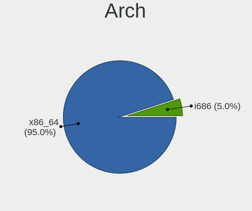
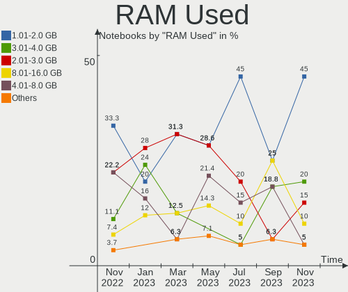
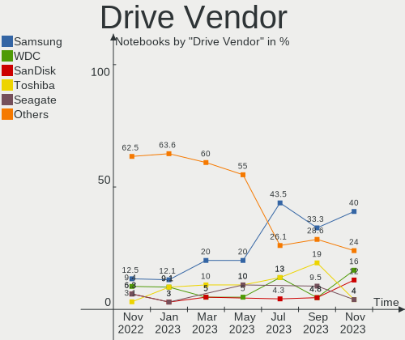
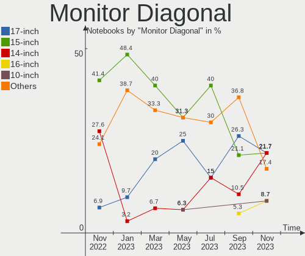
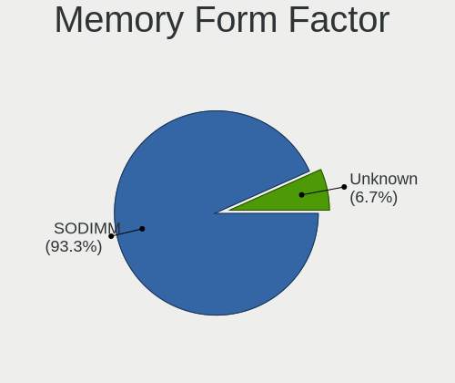

Ubuntu MATE - Hardware Trends (Notebooks)
-----------------------------------------

A project to identify most popular hardware characteristics and track their change
over time based on data collected by Linux users at https://Linux-Hardware.org.

Anyone can contribute to this report by the [hw-probe](https://github.com/linuxhw/hw-probe) tool:

    sudo -E hw-probe -all -upload

This report is for one last month. Overall report since the beginning of time: [TestCoverage](https://github.com/linuxhw/TestCoverage)

Period: Aug, 2022.

Contents
--------

* [ System ](#system)
  - [ OS                       ](#os)
  - [ OS Family                ](#os-family)
  - [ Kernel                   ](#kernel)
  - [ Kernel Family            ](#kernel-family)
  - [ Kernel Major Ver.        ](#kernel-major-ver)
  - [ Arch                     ](#arch)
  - [ DE                       ](#de)
  - [ Display Server           ](#display-server)
  - [ Display Manager          ](#display-manager)
  - [ OS Lang                  ](#os-lang)
  - [ Boot Mode                ](#boot-mode)
  - [ Filesystem               ](#filesystem)
  - [ Part. scheme             ](#part-scheme)
  - [ Dual Boot with Linux/BSD ](#dual-boot-with-linuxbsd)
  - [ Dual Boot (Win)          ](#dual-boot-win)

* [ Board ](#board)
  - [ Vendor                   ](#vendor)
  - [ Model                    ](#model)
  - [ Model Family             ](#model-family)
  - [ MFG Year                 ](#mfg-year)
  - [ Form Factor              ](#form-factor)
  - [ Secure Boot              ](#secure-boot)
  - [ Coreboot                 ](#coreboot)
  - [ RAM Size                 ](#ram-size)
  - [ RAM Used                 ](#ram-used)
  - [ Total Drives             ](#total-drives)
  - [ Has CD-ROM               ](#has-cd-rom)
  - [ Has Ethernet             ](#has-ethernet)
  - [ Has WiFi                 ](#has-wifi)
  - [ Has Bluetooth            ](#has-bluetooth)

* [ Location ](#location)
  - [ Country                  ](#country)
  - [ City                     ](#city)

* [ Drives ](#drives)
  - [ Drive Vendor             ](#drive-vendor)
  - [ Drive Model              ](#drive-model)
  - [ HDD Vendor               ](#hdd-vendor)
  - [ SSD Vendor               ](#ssd-vendor)
  - [ Drive Kind               ](#drive-kind)
  - [ Drive Connector          ](#drive-connector)
  - [ Drive Size               ](#drive-size)
  - [ Space Total              ](#space-total)
  - [ Space Used               ](#space-used)
  - [ Malfunc. Drives          ](#malfunc-drives)
  - [ Malfunc. Drive Vendor    ](#malfunc-drive-vendor)
  - [ Malfunc. HDD Vendor      ](#malfunc-hdd-vendor)
  - [ Malfunc. Drive Kind      ](#malfunc-drive-kind)
  - [ Failed Drives            ](#failed-drives)
  - [ Failed Drive Vendor      ](#failed-drive-vendor)
  - [ Drive Status             ](#drive-status)

* [ Storage controller ](#storage-controller)
  - [ Storage Vendor           ](#storage-vendor)
  - [ Storage Model            ](#storage-model)
  - [ Storage Kind             ](#storage-kind)

* [ Processor ](#processor)
  - [ CPU Vendor               ](#cpu-vendor)
  - [ CPU Model                ](#cpu-model)
  - [ CPU Model Family         ](#cpu-model-family)
  - [ CPU Cores                ](#cpu-cores)
  - [ CPU Sockets              ](#cpu-sockets)
  - [ CPU Threads              ](#cpu-threads)
  - [ CPU Op-Modes             ](#cpu-op-modes)
  - [ CPU Microcode            ](#cpu-microcode)
  - [ CPU Microarch            ](#cpu-microarch)

* [ Graphics ](#graphics)
  - [ GPU Vendor               ](#gpu-vendor)
  - [ GPU Model                ](#gpu-model)
  - [ GPU Combo                ](#gpu-combo)
  - [ GPU Driver               ](#gpu-driver)
  - [ GPU Memory               ](#gpu-memory)

* [ Monitor ](#monitor)
  - [ Monitor Vendor           ](#monitor-vendor)
  - [ Monitor Model            ](#monitor-model)
  - [ Monitor Resolution       ](#monitor-resolution)
  - [ Monitor Diagonal         ](#monitor-diagonal)
  - [ Monitor Width            ](#monitor-width)
  - [ Aspect Ratio             ](#aspect-ratio)
  - [ Monitor Area             ](#monitor-area)
  - [ Pixel Density            ](#pixel-density)
  - [ Multiple Monitors        ](#multiple-monitors)

* [ Network ](#network)
  - [ Net Controller Vendor    ](#net-controller-vendor)
  - [ Net Controller Model     ](#net-controller-model)
  - [ Wireless Vendor          ](#wireless-vendor)
  - [ Wireless Model           ](#wireless-model)
  - [ Ethernet Vendor          ](#ethernet-vendor)
  - [ Ethernet Model           ](#ethernet-model)
  - [ Net Controller Kind      ](#net-controller-kind)
  - [ Used Controller          ](#used-controller)
  - [ NICs                     ](#nics)
  - [ IPv6                     ](#ipv6)

* [ Bluetooth ](#bluetooth)
  - [ Bluetooth Vendor         ](#bluetooth-vendor)
  - [ Bluetooth Model          ](#bluetooth-model)

* [ Sound ](#sound)
  - [ Sound Vendor             ](#sound-vendor)
  - [ Sound Model              ](#sound-model)

* [ Memory ](#memory)
  - [ Memory Vendor            ](#memory-vendor)
  - [ Memory Model             ](#memory-model)
  - [ Memory Kind              ](#memory-kind)
  - [ Memory Form Factor       ](#memory-form-factor)
  - [ Memory Size              ](#memory-size)
  - [ Memory Speed             ](#memory-speed)

* [ Printers & scanners ](#printers--scanners)
  - [ Printer Vendor           ](#printer-vendor)
  - [ Printer Model            ](#printer-model)
  - [ Scanner Vendor           ](#scanner-vendor)
  - [ Scanner Model            ](#scanner-model)

* [ Camera ](#camera)
  - [ Camera Vendor            ](#camera-vendor)
  - [ Camera Model             ](#camera-model)

* [ Security ](#security)
  - [ Fingerprint Vendor       ](#fingerprint-vendor)
  - [ Fingerprint Model        ](#fingerprint-model)
  - [ Chipcard Vendor          ](#chipcard-vendor)
  - [ Chipcard Model           ](#chipcard-model)

* [ Unsupported ](#unsupported)
  - [ Unsupported Devices      ](#unsupported-devices)
  - [ Unsupported Device Types ](#unsupported-device-types)

System
------

OS
--

Installed operating systems

| Name              | Notebooks | Percent |
|-------------------|-----------|---------|
| Ubuntu MATE 22.04 | 10        | 66.67%  |
| Ubuntu MATE 20.04 | 4         | 26.67%  |
| Ubuntu MATE 18.04 | 1         | 6.67%   |

OS Family
---------

OS without a version

| Name        | Notebooks | Percent |
|-------------|-----------|---------|
| Ubuntu MATE | 15        | 100%    |

Kernel
------

Version of the Linux kernel

| Version               | Notebooks | Percent |
|-----------------------|-----------|---------|
| 5.15.0-46-generic     | 6         | 40%     |
| 5.15.0-43-generic     | 4         | 26.67%  |
| 5.18.0-051800-generic | 1         | 6.67%   |
| 5.15.0-47-generic     | 1         | 6.67%   |
| 5.15.0-46-lowlatency  | 1         | 6.67%   |
| 5.15.0-41-generic     | 1         | 6.67%   |
| 4.15.0-20-generic     | 1         | 6.67%   |

Kernel Family
-------------

Linux kernel without a distro release

| Version | Notebooks | Percent |
|---------|-----------|---------|
| 5.15.0  | 13        | 86.67%  |
| 5.18.0  | 1         | 6.67%   |
| 4.15.0  | 1         | 6.67%   |

Kernel Major Ver.
-----------------

Linux kernel major version

| Version | Notebooks | Percent |
|---------|-----------|---------|
| 5.15    | 13        | 86.67%  |
| 5.18    | 1         | 6.67%   |
| 4.15    | 1         | 6.67%   |

Arch
----

OS architecture (x86_64, i586, etc.)

| Name   | Notebooks | Percent |
|--------|-----------|---------|
| x86_64 | 15        | 100%    |

DE
--

Desktop Environment

| Name | Notebooks | Percent |
|------|-----------|---------|
| MATE | 15        | 100%    |

Display Server
--------------

X11 or Wayland

| Name | Notebooks | Percent |
|------|-----------|---------|
| X11  | 15        | 100%    |

Display Manager
---------------

SDDM, LightDM, etc.

| Name    | Notebooks | Percent |
|---------|-----------|---------|
| LightDM | 13        | 86.67%  |
| Unknown | 2         | 13.33%  |

OS Lang
-------

Language

| Lang    | Notebooks | Percent |
|---------|-----------|---------|
| en_US   | 7         | 46.67%  |
| fr_FR   | 2         | 13.33%  |
| de_DE   | 2         | 13.33%  |
| ru_RU   | 1         | 6.67%   |
| nl_NL   | 1         | 6.67%   |
| en_IN   | 1         | 6.67%   |
| Unknown | 1         | 6.67%   |

Boot Mode
---------

EFI or BIOS

| Mode | Notebooks | Percent |
|------|-----------|---------|
| EFI  | 10        | 66.67%  |
| BIOS | 5         | 33.33%  |

Filesystem
----------

Type of filesystem

| Type  | Notebooks | Percent |
|-------|-----------|---------|
| Ext4  | 14        | 93.33%  |
| Btrfs | 1         | 6.67%   |

Part. scheme
------------

Scheme of partitioning

| Type    | Notebooks | Percent |
|---------|-----------|---------|
| GPT     | 10        | 66.67%  |
| Unknown | 5         | 33.33%  |

Dual Boot with Linux/BSD
------------------------

Hosting more than one Linux/BSD

| Dual boot | Notebooks | Percent |
|-----------|-----------|---------|
| No        | 12        | 80%     |
| Yes       | 3         | 20%     |

Dual Boot (Win)
---------------

Hosting Linux and Windows

| Dual boot | Notebooks | Percent |
|-----------|-----------|---------|
| No        | 9         | 60%     |
| Yes       | 6         | 40%     |

Board
-----

Vendor
------

Motherboard manufacturer

| Name             | Notebooks | Percent |
|------------------|-----------|---------|
| Hewlett-Packard  | 6         | 40%     |
| Lenovo           | 3         | 20%     |
| Notebook         | 1         | 6.67%   |
| LincPlus         | 1         | 6.67%   |
| HONOR            | 1         | 6.67%   |
| Google           | 1         | 6.67%   |
| Dell             | 1         | 6.67%   |
| ASUSTek Computer | 1         | 6.67%   |

Model
-----

Motherboard model

| Name                                 | Notebooks | Percent |
|--------------------------------------|-----------|---------|
| Notebook NJx0MU                      | 1         | 6.67%   |
| LincPlus LINNCPLUS P1                | 1         | 6.67%   |
| Lenovo ThinkBook 14 G2 ITL 20VD      | 1         | 6.67%   |
| Lenovo IdeaPad Gaming 3 15ARH05 82EY | 1         | 6.67%   |
| Lenovo IdeaPad 3 15IIL05 81WE        | 1         | 6.67%   |
| HONOR BOHK-WAX9X                     | 1         | 6.67%   |
| HP ProBook 455 G7                    | 1         | 6.67%   |
| HP Pavilion g6                       | 1         | 6.67%   |
| HP Pavilion dv5                      | 1         | 6.67%   |
| HP Notebook                          | 1         | 6.67%   |
| HP EliteBook 745 G5                  | 1         | 6.67%   |
| HP 15 Notebook PC                    | 1         | 6.67%   |
| Google Swanky                        | 1         | 6.67%   |
| Dell Latitude 7420                   | 1         | 6.67%   |
| ASUS UX32A                           | 1         | 6.67%   |

Model Family
------------

Motherboard model prefix

| Name               | Notebooks | Percent |
|--------------------|-----------|---------|
| Lenovo IdeaPad     | 2         | 13.33%  |
| HP Pavilion        | 2         | 13.33%  |
| Notebook NJx0MU    | 1         | 6.67%   |
| LincPlus LINNCPLUS | 1         | 6.67%   |
| Lenovo ThinkBook   | 1         | 6.67%   |
| HONOR BOHK-WAX9X   | 1         | 6.67%   |
| HP ProBook         | 1         | 6.67%   |
| HP Notebook        | 1         | 6.67%   |
| HP EliteBook       | 1         | 6.67%   |
| HP 15              | 1         | 6.67%   |
| Google Swanky      | 1         | 6.67%   |
| Dell Latitude      | 1         | 6.67%   |
| ASUS UX32A         | 1         | 6.67%   |

MFG Year
--------

Motherboard manufacture year

| Year | Notebooks | Percent |
|------|-----------|---------|
| 2020 | 5         | 33.33%  |
| 2021 | 3         | 20%     |
| 2019 | 1         | 6.67%   |
| 2017 | 1         | 6.67%   |
| 2015 | 1         | 6.67%   |
| 2014 | 1         | 6.67%   |
| 2012 | 1         | 6.67%   |
| 2011 | 1         | 6.67%   |
| 2008 | 1         | 6.67%   |

Form Factor
-----------

Physical design of the computer

| Name     | Notebooks | Percent |
|----------|-----------|---------|
| Notebook | 15        | 100%    |

Secure Boot
-----------

Enabled or disabled

| State    | Notebooks | Percent |
|----------|-----------|---------|
| Disabled | 13        | 86.67%  |
| Enabled  | 2         | 13.33%  |

Coreboot
--------

Have coreboot on board

| Used | Notebooks | Percent |
|------|-----------|---------|
| No   | 14        | 93.33%  |
| Yes  | 1         | 6.67%   |

RAM Size
--------

Total RAM memory

| Size in GB | Notebooks | Percent |
|------------|-----------|---------|
| 3.01-4.0   | 5         | 33.33%  |
| 8.01-16.0  | 5         | 33.33%  |
| 4.01-8.0   | 2         | 13.33%  |
| 16.01-24.0 | 2         | 13.33%  |
| 32.01-64.0 | 1         | 6.67%   |

RAM Used
--------

Used RAM memory

| Used GB   | Notebooks | Percent |
|-----------|-----------|---------|
| 1.01-2.0  | 6         | 40%     |
| 4.01-8.0  | 3         | 20%     |
| 2.01-3.0  | 3         | 20%     |
| 8.01-16.0 | 2         | 13.33%  |
| 3.01-4.0  | 1         | 6.67%   |

Total Drives
------------

Number of drives on board

| Drives | Notebooks | Percent |
|--------|-----------|---------|
| 1      | 12        | 80%     |
| 2      | 3         | 20%     |

Has CD-ROM
----------

Has CD-ROM on board

| Presented | Notebooks | Percent |
|-----------|-----------|---------|
| No        | 11        | 73.33%  |
| Yes       | 4         | 26.67%  |

Has Ethernet
------------

Has Ethernet on board

| Presented | Notebooks | Percent |
|-----------|-----------|---------|
| Yes       | 9         | 60%     |
| No        | 6         | 40%     |

Has WiFi
--------

Has WiFi module

| Presented | Notebooks | Percent |
|-----------|-----------|---------|
| Yes       | 15        | 100%    |

Has Bluetooth
-------------

Has Bluetooth module

| Presented | Notebooks | Percent |
|-----------|-----------|---------|
| Yes       | 11        | 73.33%  |
| No        | 4         | 26.67%  |

Location
--------

Country
-------

Geographic location (country)

| Country     | Notebooks | Percent |
|-------------|-----------|---------|
| USA         | 3         | 20%     |
| Netherlands | 2         | 13.33%  |
| Germany     | 2         | 13.33%  |
| France      | 2         | 13.33%  |
| Russia      | 1         | 6.67%   |
| Romania     | 1         | 6.67%   |
| Paraguay    | 1         | 6.67%   |
| India       | 1         | 6.67%   |
| Colombia    | 1         | 6.67%   |
| Brazil      | 1         | 6.67%   |

City
----

Geographic location (city)

| City             | Notebooks | Percent |
|------------------|-----------|---------|
| The Hague        | 1         | 6.67%   |
| Sao Paulo        | 1         | 6.67%   |
| Paris            | 1         | 6.67%   |
| North Wilkesboro | 1         | 6.67%   |
| Naaldwijk        | 1         | 6.67%   |
| Moscow           | 1         | 6.67%   |
| Medellín        | 1         | 6.67%   |
| Marseille        | 1         | 6.67%   |
| Laubach          | 1         | 6.67%   |
| Hamburg          | 1         | 6.67%   |
| Garland          | 1         | 6.67%   |
| Fort McCoy       | 1         | 6.67%   |
| Bucharest        | 1         | 6.67%   |
| Bengaluru        | 1         | 6.67%   |
| Asunción        | 1         | 6.67%   |

Drives
------

Drive Vendor
------------

Hard drive vendors

| Vendor              | Notebooks | Drives | Percent |
|---------------------|-----------|--------|---------|
| Samsung Electronics | 5         | 5      | 27.78%  |
| Unknown             | 2         | 2      | 11.11%  |
| Toshiba             | 2         | 2      | 11.11%  |
| SanDisk             | 2         | 2      | 11.11%  |
| Crucial             | 2         | 2      | 11.11%  |
| Seagate             | 1         | 1      | 5.56%   |
| KIOXIA              | 1         | 1      | 5.56%   |
| Intenso             | 1         | 1      | 5.56%   |
| Intel               | 1         | 1      | 5.56%   |
| Hjwdz               | 1         | 1      | 5.56%   |

Drive Model
-----------

Hard drive models

| Model                             | Notebooks | Percent |
|-----------------------------------|-----------|---------|
| Crucial CT240BX500SSD1 240GB      | 2         | 11.11%  |
| Unknown Biwin  64GB               | 1         | 5.56%   |
| Unknown 016GE2  16GB              | 1         | 5.56%   |
| Toshiba MQ01ABF050 500GB          | 1         | 5.56%   |
| Toshiba KBG40ZNT256G MEMORY 256GB | 1         | 5.56%   |
| Seagate ST9500420AS 500GB         | 1         | 5.56%   |
| SanDisk SSD i100 24GB             | 1         | 5.56%   |
| SanDisk NVMe SSD Drive 512GB      | 1         | 5.56%   |
| Samsung SSD 860 PRO 1TB           | 1         | 5.56%   |
| Samsung PM9A1 NVMe 512GB          | 1         | 5.56%   |
| Samsung MZVL2512HCJQ-00B00 512GB  | 1         | 5.56%   |
| Samsung MZALQ512HBLU-00BL2 512GB  | 1         | 5.56%   |
| Samsung MZALQ512HALU-000L2 512GB  | 1         | 5.56%   |
| KIOXIA KBG40ZNV256G 256GB         | 1         | 5.56%   |
| Intenso SSD Sata III 120GB        | 1         | 5.56%   |
| Intel SSDPEKNW020T8 2TB           | 1         | 5.56%   |
| Hjwdz MS2160 8MB                  | 1         | 5.56%   |

HDD Vendor
----------

Hard disk drive vendors

| Vendor  | Notebooks | Drives | Percent |
|---------|-----------|--------|---------|
| Toshiba | 1         | 1      | 50%     |
| Seagate | 1         | 1      | 50%     |

SSD Vendor
----------

Solid state drive vendors

| Vendor              | Notebooks | Drives | Percent |
|---------------------|-----------|--------|---------|
| Crucial             | 2         | 2      | 40%     |
| SanDisk             | 1         | 1      | 20%     |
| Samsung Electronics | 1         | 1      | 20%     |
| Intenso             | 1         | 1      | 20%     |

Drive Kind
----------

HDD or SSD

| Kind    | Notebooks | Drives | Percent |
|---------|-----------|--------|---------|
| NVMe    | 8         | 8      | 47.06%  |
| SSD     | 4         | 5      | 23.53%  |
| MMC     | 2         | 2      | 11.76%  |
| HDD     | 2         | 2      | 11.76%  |
| Unknown | 1         | 1      | 5.88%   |

Drive Connector
---------------

SATA, SAS, NVMe, etc.

| Type | Notebooks | Drives | Percent |
|------|-----------|--------|---------|
| NVMe | 8         | 8      | 47.06%  |
| SATA | 6         | 7      | 35.29%  |
| MMC  | 2         | 2      | 11.76%  |
| SAS  | 1         | 1      | 5.88%   |

Drive Size
----------

Size of hard drive

| Size in TB | Notebooks | Drives | Percent |
|------------|-----------|--------|---------|
| 0.01-0.5   | 6         | 6      | 85.71%  |
| 0.51-1.0   | 1         | 1      | 14.29%  |

Space Total
-----------

Amount of disk space available on the file system

| Size in GB | Notebooks | Percent |
|------------|-----------|---------|
| 251-500    | 4         | 26.67%  |
| 101-250    | 4         | 26.67%  |
| 1001-2000  | 2         | 13.33%  |
| 51-100     | 2         | 13.33%  |
| 21-50      | 1         | 6.67%   |
| 1-20       | 1         | 6.67%   |
| 501-1000   | 1         | 6.67%   |

Space Used
----------

Amount of used disk space

| Used GB  | Notebooks | Percent |
|----------|-----------|---------|
| 21-50    | 4         | 26.67%  |
| 1-20     | 4         | 26.67%  |
| 501-1000 | 3         | 20%     |
| 51-100   | 2         | 13.33%  |
| 251-500  | 1         | 6.67%   |
| 101-250  | 1         | 6.67%   |

Malfunc. Drives
---------------

Drive models with a malfunction

Zero info for selected period =(

Malfunc. Drive Vendor
---------------------

Vendors of faulty drives

Zero info for selected period =(

Malfunc. HDD Vendor
-------------------

Vendors of faulty HDD drives

Zero info for selected period =(

Malfunc. Drive Kind
-------------------

Kinds of faulty drives

Zero info for selected period =(

Failed Drives
-------------

Failed drive models

Zero info for selected period =(

Failed Drive Vendor
-------------------

Failed drive vendors

Zero info for selected period =(

Drive Status
------------

Number of failed and malfunc. drives

| Status   | Notebooks | Drives | Percent |
|----------|-----------|--------|---------|
| Works    | 10        | 11     | 58.82%  |
| Detected | 7         | 7      | 41.18%  |

Storage controller
------------------

Storage Vendor
--------------

Storage controller vendors

| Vendor              | Notebooks | Percent |
|---------------------|-----------|---------|
| Intel               | 9         | 45%     |
| Samsung Electronics | 4         | 20%     |
| AMD                 | 4         | 20%     |
| KIOXIA              | 2         | 10%     |
| SanDisk             | 1         | 5%      |

Storage Model
-------------

Storage controller models

| Model                                                            | Notebooks | Percent |
|------------------------------------------------------------------|-----------|---------|
| AMD FCH SATA Controller [AHCI mode]                              | 4         | 19.05%  |
| Samsung NVMe SSD Controller PM9A1/PM9A3/980PRO                   | 2         | 9.52%   |
| Samsung NVMe SSD Controller 980                                  | 2         | 9.52%   |
| KIOXIA NVMe SSD Controller BG4                                   | 2         | 9.52%   |
| Intel Tiger Lake-LP SATA Controller                              | 2         | 9.52%   |
| Intel 7 Series Chipset Family 6-port SATA Controller [AHCI mode] | 2         | 9.52%   |
| SanDisk WD Black SN750 / PC SN730 NVMe SSD                       | 1         | 4.76%   |
| Intel Volume Management Device NVMe RAID Controller              | 1         | 4.76%   |
| Intel SSD 660P Series                                            | 1         | 4.76%   |
| Intel Ice Lake-LP SATA Controller [AHCI mode]                    | 1         | 4.76%   |
| Intel Celeron/Pentium Silver Processor SATA Controller           | 1         | 4.76%   |
| Intel Atom Processor E3800 Series SATA AHCI Controller           | 1         | 4.76%   |
| Intel 5 Series/3400 Series Chipset 4 port SATA AHCI Controller   | 1         | 4.76%   |

Storage Kind
------------

Kind of storage controller (IDE, SATA, NVMe, SAS, ...)

| Kind | Notebooks | Percent |
|------|-----------|---------|
| SATA | 12        | 57.14%  |
| NVMe | 8         | 38.1%   |
| RAID | 1         | 4.76%   |

Processor
---------

CPU Vendor
----------

Processor vendors

| Vendor | Notebooks | Percent |
|--------|-----------|---------|
| Intel  | 10        | 66.67%  |
| AMD    | 5         | 33.33%  |

CPU Model
---------

Processor models

| Model                                           | Notebooks | Percent |
|-------------------------------------------------|-----------|---------|
| Intel 11th Gen Core i7-1165G7 @ 2.80GHz         | 2         | 13.33%  |
| Intel Pentium CPU N3540 @ 2.16GHz               | 1         | 6.67%   |
| Intel Core i7-3537U CPU @ 2.00GHz               | 1         | 6.67%   |
| Intel Core i3-2370M CPU @ 2.40GHz               | 1         | 6.67%   |
| Intel Core i3-1005G1 CPU @ 1.20GHz              | 1         | 6.67%   |
| Intel Core i3 CPU M 370 @ 2.40GHz               | 1         | 6.67%   |
| Intel Celeron N4020 CPU @ 1.10GHz               | 1         | 6.67%   |
| Intel Celeron CPU N2840 @ 2.16GHz               | 1         | 6.67%   |
| Intel 11th Gen Core i7-1185G7 @ 3.00GHz         | 1         | 6.67%   |
| AMD Ryzen 7 PRO 2700U w/ Radeon Vega Mobile Gfx | 1         | 6.67%   |
| AMD Ryzen 7 3700U with Radeon Vega Mobile Gfx   | 1         | 6.67%   |
| AMD Ryzen 5 4600H with Radeon Graphics          | 1         | 6.67%   |
| AMD Ryzen 3 4300U with Radeon Graphics          | 1         | 6.67%   |
| AMD A8-7410 APU with AMD Radeon R5 Graphics     | 1         | 6.67%   |

CPU Model Family
----------------

Processor model prefix

| Model           | Notebooks | Percent |
|-----------------|-----------|---------|
| Other           | 3         | 20%     |
| Intel Core i3   | 3         | 20%     |
| Intel Celeron   | 2         | 13.33%  |
| Intel Pentium   | 1         | 6.67%   |
| Intel Core i7   | 1         | 6.67%   |
| AMD Ryzen 7 PRO | 1         | 6.67%   |
| AMD Ryzen 7     | 1         | 6.67%   |
| AMD Ryzen 5     | 1         | 6.67%   |
| AMD Ryzen 3     | 1         | 6.67%   |
| AMD A8          | 1         | 6.67%   |

CPU Cores
---------

Number of processor cores

| Number | Notebooks | Percent |
|--------|-----------|---------|
| 4      | 8         | 53.33%  |
| 2      | 6         | 40%     |
| 6      | 1         | 6.67%   |

CPU Sockets
-----------

Number of sockets

| Number | Notebooks | Percent |
|--------|-----------|---------|
| 1      | 15        | 100%    |

CPU Threads
-----------

Threads per core (Hyper-Threading)

| Number | Notebooks | Percent |
|--------|-----------|---------|
| 2      | 10        | 66.67%  |
| 1      | 5         | 33.33%  |

CPU Op-Modes
------------

CPU Operation Modes (32-bit, 64-bit)

| Op mode        | Notebooks | Percent |
|----------------|-----------|---------|
| 32-bit, 64-bit | 15        | 100%    |

CPU Microcode
-------------

Microcode number

| Number     | Notebooks | Percent |
|------------|-----------|---------|
| Unknown    | 4         | 26.67%  |
| 0x806c1    | 3         | 20%     |
| 0x706e5    | 1         | 6.67%   |
| 0x706a8    | 1         | 6.67%   |
| 0x30678    | 1         | 6.67%   |
| 0x206a7    | 1         | 6.67%   |
| 0x20655    | 1         | 6.67%   |
| 0x08600106 | 1         | 6.67%   |
| 0x08101016 | 1         | 6.67%   |
| 0x07030105 | 1         | 6.67%   |

CPU Microarch
-------------

Microarchitecture

| Name          | Notebooks | Percent |
|---------------|-----------|---------|
| TigerLake     | 3         | 20%     |
| Zen 2         | 2         | 13.33%  |
| Silvermont    | 2         | 13.33%  |
| Zen+          | 1         | 6.67%   |
| Zen           | 1         | 6.67%   |
| Westmere      | 1         | 6.67%   |
| SandyBridge   | 1         | 6.67%   |
| Puma          | 1         | 6.67%   |
| IvyBridge     | 1         | 6.67%   |
| IceLake       | 1         | 6.67%   |
| Goldmont plus | 1         | 6.67%   |

Graphics
--------

GPU Vendor
----------

Vendors of graphics cards

| Vendor | Notebooks | Percent |
|--------|-----------|---------|
| Intel  | 10        | 58.82%  |
| AMD    | 6         | 35.29%  |
| Nvidia | 1         | 5.88%   |

GPU Model
---------

Graphics card models

| Model                                                                     | Notebooks | Percent |
|---------------------------------------------------------------------------|-----------|---------|
| Intel TigerLake-LP GT2 [Iris Xe Graphics]                                 | 3         | 17.65%  |
| Intel Atom Processor Z36xxx/Z37xxx Series Graphics & Display              | 2         | 11.76%  |
| AMD Renoir                                                                | 2         | 11.76%  |
| Nvidia TU117M [GeForce GTX 1650 Ti Mobile]                                | 1         | 5.88%   |
| Intel Iris Plus Graphics G1 (Ice Lake)                                    | 1         | 5.88%   |
| Intel GeminiLake [UHD Graphics 600]                                       | 1         | 5.88%   |
| Intel Core Processor Integrated Graphics Controller                       | 1         | 5.88%   |
| Intel 3rd Gen Core processor Graphics Controller                          | 1         | 5.88%   |
| Intel 2nd Generation Core Processor Family Integrated Graphics Controller | 1         | 5.88%   |
| AMD Thames [Radeon HD 7500M/7600M Series]                                 | 1         | 5.88%   |
| AMD Raven Ridge [Radeon Vega Series / Radeon Vega Mobile Series]          | 1         | 5.88%   |
| AMD Picasso/Raven 2 [Radeon Vega Series / Radeon Vega Mobile Series]      | 1         | 5.88%   |
| AMD Mullins [Radeon R4/R5 Graphics]                                       | 1         | 5.88%   |

GPU Combo
---------

Combinations of graphics cards

| Name         | Notebooks | Percent |
|--------------|-----------|---------|
| 1 x Intel    | 9         | 60%     |
| 1 x AMD      | 4         | 26.67%  |
| Intel + AMD  | 1         | 6.67%   |
| AMD + Nvidia | 1         | 6.67%   |

GPU Driver
----------

Free vs proprietary

| Driver      | Notebooks | Percent |
|-------------|-----------|---------|
| Free        | 14        | 93.33%  |
| Proprietary | 1         | 6.67%   |

GPU Memory
----------

Total video memory

| Size in GB | Notebooks | Percent |
|------------|-----------|---------|
| Unknown    | 11        | 73.33%  |
| 0.01-0.5   | 3         | 20%     |
| 1.01-2.0   | 1         | 6.67%   |

Monitor
-------

Monitor Vendor
--------------

Monitor vendors

| Vendor          | Notebooks | Percent |
|-----------------|-----------|---------|
| LG Display      | 5         | 29.41%  |
| Chimei Innolux  | 4         | 23.53%  |
| AU Optronics    | 3         | 17.65%  |
| Sceptre Tech    | 1         | 5.88%   |
| PANDA           | 1         | 5.88%   |
| InfoVision      | 1         | 5.88%   |
| Hewlett-Packard | 1         | 5.88%   |
| BOE             | 1         | 5.88%   |

Monitor Model
-------------

Monitor models

| Model                                                            | Notebooks | Percent |
|------------------------------------------------------------------|-----------|---------|
| Sceptre Tech E24 SPT099D 1920x1080 521x293mm 23.5-inch           | 1         | 5.88%   |
| PANDA LC133LF2L03 NCP0015 1920x1080 294x165mm 13.3-inch          | 1         | 5.88%   |
| LG Display LCD Monitor LGD062E 1920x1080 344x194mm 15.5-inch     | 1         | 5.88%   |
| LG Display LCD Monitor LGD0493 1366x768 344x194mm 15.5-inch      | 1         | 5.88%   |
| LG Display LCD Monitor LGD042D 1920x1080 290x170mm 13.2-inch     | 1         | 5.88%   |
| LG Display LCD Monitor LGD033B 1366x768 344x194mm 15.5-inch      | 1         | 5.88%   |
| LG Display LCD Monitor LGD0293 1366x768 321x181mm 14.5-inch      | 1         | 5.88%   |
| InfoVision LCD Monitor IVO0533 1366x768 293x164mm 13.2-inch      | 1         | 5.88%   |
| Hewlett-Packard w1907 HWP26A3 1440x900 408x255mm 18.9-inch       | 1         | 5.88%   |
| Chimei Innolux LCD Monitor CMN15E6 1366x768 344x193mm 15.5-inch  | 1         | 5.88%   |
| Chimei Innolux LCD Monitor CMN15C6 1366x768 344x193mm 15.5-inch  | 1         | 5.88%   |
| Chimei Innolux LCD Monitor CMN14E8 1920x1080 309x173mm 13.9-inch | 1         | 5.88%   |
| Chimei Innolux LCD Monitor CMN14D4 1920x1080 309x173mm 13.9-inch | 1         | 5.88%   |
| BOE LCD Monitor BOE0872 1920x1080 344x194mm 15.5-inch            | 1         | 5.88%   |
| AU Optronics LCD Monitor AUOD1ED 1920x1080 344x193mm 15.5-inch   | 1         | 5.88%   |
| AU Optronics LCD Monitor AUO429D 1920x1080 382x215mm 17.3-inch   | 1         | 5.88%   |
| AU Optronics LCD Monitor AUO3B3D 1920x1080 309x174mm 14.0-inch   | 1         | 5.88%   |

Monitor Resolution
------------------

Monitor screen resolution

| Resolution       | Notebooks | Percent |
|------------------|-----------|---------|
| 1920x1080 (FHD)  | 9         | 56.25%  |
| 1366x768 (WXGA)  | 6         | 37.5%   |
| 1440x900 (WXGA+) | 1         | 6.25%   |

Monitor Diagonal
----------------

Diagonal size in inches

| Inches | Notebooks | Percent |
|--------|-----------|---------|
| 15     | 7         | 41.18%  |
| 13     | 5         | 29.41%  |
| 14     | 2         | 11.76%  |
| 24     | 1         | 5.88%   |
| 19     | 1         | 5.88%   |
| 17     | 1         | 5.88%   |

Monitor Width
-------------

Physical width

| Width in mm | Notebooks | Percent |
|-------------|-----------|---------|
| 301-350     | 11        | 64.71%  |
| 201-300     | 3         | 17.65%  |
| 501-600     | 1         | 5.88%   |
| 401-500     | 1         | 5.88%   |
| 351-400     | 1         | 5.88%   |

Aspect Ratio
------------

Proportional relationship between the width and the height

| Ratio | Notebooks | Percent |
|-------|-----------|---------|
| 16/9  | 15        | 93.75%  |
| 16/10 | 1         | 6.25%   |

Monitor Area
------------

Area in inch²

| Area in inch² | Notebooks | Percent |
|----------------|-----------|---------|
| 101-110        | 7         | 41.18%  |
| 81-90          | 4         | 23.53%  |
| 71-80          | 3         | 17.65%  |
| 201-250        | 1         | 5.88%   |
| 151-200        | 1         | 5.88%   |
| 121-130        | 1         | 5.88%   |

Pixel Density
-------------

Pixels per inch

| Density | Notebooks | Percent |
|---------|-----------|---------|
| 121-160 | 7         | 41.18%  |
| 101-120 | 6         | 35.29%  |
| 161-240 | 2         | 11.76%  |
| 51-100  | 2         | 11.76%  |

Multiple Monitors
-----------------

Total monitors connected

| Total | Notebooks | Percent |
|-------|-----------|---------|
| 1     | 12        | 80%     |
| 2     | 3         | 20%     |

Network
-------

Net Controller Vendor
---------------------

Controller vendors

| Vendor                          | Notebooks | Percent |
|---------------------------------|-----------|---------|
| Realtek Semiconductor           | 8         | 38.1%   |
| Intel                           | 8         | 38.1%   |
| Xiaomi                          | 1         | 4.76%   |
| Ralink                          | 1         | 4.76%   |
| Qualcomm Atheros Communications | 1         | 4.76%   |
| Qualcomm Atheros                | 1         | 4.76%   |
| D-Link                          | 1         | 4.76%   |

Net Controller Model
--------------------

Controller models

| Model                                                             | Notebooks | Percent |
|-------------------------------------------------------------------|-----------|---------|
| Realtek RTL8111/8168/8411 PCI Express Gigabit Ethernet Controller | 4         | 14.81%  |
| Realtek RTL810xE PCI Express Fast Ethernet controller             | 3         | 11.11%  |
| Realtek RTL8822CE 802.11ac PCIe Wireless Network Adapter          | 2         | 7.41%   |
| Intel Wi-Fi 6 AX201                                               | 2         | 7.41%   |
| Xiaomi Mi/Redmi series (RNDIS + ADB)                              | 1         | 3.7%    |
| Realtek RTL8821CE 802.11ac PCIe Wireless Network Adapter          | 1         | 3.7%    |
| Realtek RTL8723BE PCIe Wireless Network Adapter                   | 1         | 3.7%    |
| Realtek RTL8188EE Wireless Network Adapter                        | 1         | 3.7%    |
| Realtek RTL8152 Fast Ethernet Adapter                             | 1         | 3.7%    |
| Ralink RT3290 Wireless 802.11n 1T/1R PCIe                         | 1         | 3.7%    |
| Qualcomm Atheros AR9271 802.11n                                   | 1         | 3.7%    |
| Qualcomm Atheros AR9285 Wireless Network Adapter (PCI-Express)    | 1         | 3.7%    |
| Intel Wireless 8265 / 8275                                        | 1         | 3.7%    |
| Intel Wireless 7260                                               | 1         | 3.7%    |
| Intel Wi-Fi 6 AX210/AX211/AX411 160MHz                            | 1         | 3.7%    |
| Intel Wi-Fi 6 AX200                                               | 1         | 3.7%    |
| Intel Ice Lake-LP PCH CNVi WiFi                                   | 1         | 3.7%    |
| Intel Ethernet Connection (13) I219-V                             | 1         | 3.7%    |
| Intel Centrino Advanced-N 6235                                    | 1         | 3.7%    |
| D-Link DUB-1312                                                   | 1         | 3.7%    |

Wireless Vendor
---------------

Wireless vendors

| Vendor                          | Notebooks | Percent |
|---------------------------------|-----------|---------|
| Intel                           | 8         | 50%     |
| Realtek Semiconductor           | 5         | 31.25%  |
| Ralink                          | 1         | 6.25%   |
| Qualcomm Atheros Communications | 1         | 6.25%   |
| Qualcomm Atheros                | 1         | 6.25%   |

Wireless Model
--------------

Wireless models

| Model                                                          | Notebooks | Percent |
|----------------------------------------------------------------|-----------|---------|
| Realtek RTL8822CE 802.11ac PCIe Wireless Network Adapter       | 2         | 12.5%   |
| Intel Wi-Fi 6 AX201                                            | 2         | 12.5%   |
| Realtek RTL8821CE 802.11ac PCIe Wireless Network Adapter       | 1         | 6.25%   |
| Realtek RTL8723BE PCIe Wireless Network Adapter                | 1         | 6.25%   |
| Realtek RTL8188EE Wireless Network Adapter                     | 1         | 6.25%   |
| Ralink RT3290 Wireless 802.11n 1T/1R PCIe                      | 1         | 6.25%   |
| Qualcomm Atheros AR9271 802.11n                                | 1         | 6.25%   |
| Qualcomm Atheros AR9285 Wireless Network Adapter (PCI-Express) | 1         | 6.25%   |
| Intel Wireless 8265 / 8275                                     | 1         | 6.25%   |
| Intel Wireless 7260                                            | 1         | 6.25%   |
| Intel Wi-Fi 6 AX210/AX211/AX411 160MHz                         | 1         | 6.25%   |
| Intel Wi-Fi 6 AX200                                            | 1         | 6.25%   |
| Intel Ice Lake-LP PCH CNVi WiFi                                | 1         | 6.25%   |
| Intel Centrino Advanced-N 6235                                 | 1         | 6.25%   |

Ethernet Vendor
---------------

Ethernet vendors

| Vendor                | Notebooks | Percent |
|-----------------------|-----------|---------|
| Realtek Semiconductor | 7         | 70%     |
| Xiaomi                | 1         | 10%     |
| Intel                 | 1         | 10%     |
| D-Link                | 1         | 10%     |

Ethernet Model
--------------

Ethernet models

| Model                                                             | Notebooks | Percent |
|-------------------------------------------------------------------|-----------|---------|
| Realtek RTL8111/8168/8411 PCI Express Gigabit Ethernet Controller | 4         | 36.36%  |
| Realtek RTL810xE PCI Express Fast Ethernet controller             | 3         | 27.27%  |
| Xiaomi Mi/Redmi series (RNDIS + ADB)                              | 1         | 9.09%   |
| Realtek RTL8152 Fast Ethernet Adapter                             | 1         | 9.09%   |
| Intel Ethernet Connection (13) I219-V                             | 1         | 9.09%   |
| D-Link DUB-1312                                                   | 1         | 9.09%   |

Net Controller Kind
-------------------

Ethernet, WiFi or modem

| Kind     | Notebooks | Percent |
|----------|-----------|---------|
| WiFi     | 15        | 62.5%   |
| Ethernet | 9         | 37.5%   |

Used Controller
---------------

Currently used network controller

| Kind     | Notebooks | Percent |
|----------|-----------|---------|
| WiFi     | 11        | 68.75%  |
| Ethernet | 5         | 31.25%  |

NICs
----

Total network controllers on board

| Total | Notebooks | Percent |
|-------|-----------|---------|
| 2     | 8         | 53.33%  |
| 1     | 7         | 46.67%  |

IPv6
----

IPv6 vs IPv4

| Used | Notebooks | Percent |
|------|-----------|---------|
| No   | 9         | 60%     |
| Yes  | 6         | 40%     |

Bluetooth
---------

Bluetooth Vendor
----------------

Controller vendors

| Vendor                | Notebooks | Percent |
|-----------------------|-----------|---------|
| Intel                 | 7         | 63.64%  |
| Realtek Semiconductor | 3         | 27.27%  |
| Ralink                | 1         | 9.09%   |

Bluetooth Model
---------------

Controller models

| Model                                          | Notebooks | Percent |
|------------------------------------------------|-----------|---------|
| Realtek Bluetooth Radio                        | 3         | 27.27%  |
| Intel AX201 Bluetooth                          | 2         | 18.18%  |
| Ralink RT3290 Bluetooth                        | 1         | 9.09%   |
| Intel Centrino Bluetooth Wireless Transceiver  | 1         | 9.09%   |
| Intel Bluetooth wireless interface             | 1         | 9.09%   |
| Intel Bluetooth 9460/9560 Jefferson Peak (JfP) | 1         | 9.09%   |
| Intel AX210 Bluetooth                          | 1         | 9.09%   |
| Intel AX200 Bluetooth                          | 1         | 9.09%   |

Sound
-----

Sound Vendor
------------

Sound card vendors

| Vendor              | Notebooks | Percent |
|---------------------|-----------|---------|
| Intel               | 10        | 55.56%  |
| AMD                 | 5         | 27.78%  |
| Nvidia              | 1         | 5.56%   |
| Meizu               | 1         | 5.56%   |
| C-Media Electronics | 1         | 5.56%   |

Sound Model
-----------

Sound card models

| Model                                                                      | Notebooks | Percent |
|----------------------------------------------------------------------------|-----------|---------|
| AMD Family 17h/19h HD Audio Controller                                     | 4         | 18.18%  |
| Intel Tiger Lake-LP Smart Sound Technology Audio Controller                | 3         | 13.64%  |
| Intel Atom Processor Z36xxx/Z37xxx Series High Definition Audio Controller | 2         | 9.09%   |
| Intel 7 Series/C216 Chipset Family High Definition Audio Controller        | 2         | 9.09%   |
| AMD Raven/Raven2/Fenghuang HDMI/DP Audio Controller                        | 2         | 9.09%   |
| Nvidia TU107 GeForce GTX 1650 High Definition Audio Controller             | 1         | 4.55%   |
| Meizu HiFi DAC Headphone Amplifier                                         | 1         | 4.55%   |
| Intel Ice Lake-LP Smart Sound Technology Audio Controller                  | 1         | 4.55%   |
| Intel Celeron/Pentium Silver Processor High Definition Audio               | 1         | 4.55%   |
| Intel 5 Series/3400 Series Chipset High Definition Audio                   | 1         | 4.55%   |
| C-Media Electronics USB Advanced Audio Device                              | 1         | 4.55%   |
| AMD Renoir Radeon High Definition Audio Controller                         | 1         | 4.55%   |
| AMD Kabini HDMI/DP Audio                                                   | 1         | 4.55%   |
| AMD FCH Azalia Controller                                                  | 1         | 4.55%   |

Memory
------

Memory Vendor
-------------

Memory module vendors

| Vendor              | Notebooks | Percent |
|---------------------|-----------|---------|
| SK hynix            | 5         | 35.71%  |
| Kingston            | 4         | 28.57%  |
| Crucial             | 2         | 14.29%  |
| Unknown (ABCD)      | 1         | 7.14%   |
| Samsung Electronics | 1         | 7.14%   |
| Micron Technology   | 1         | 7.14%   |

Memory Model
------------

Memory module models

| Model                                                               | Notebooks | Percent |
|---------------------------------------------------------------------|-----------|---------|
| Unknown (ABCD) RAM 123456789012345678 2048MB SODIMM LPDDR4 2400MT/s | 1         | 5.88%   |
| SK hynix RAM Module 8GB SODIMM DDR4 2400MT/s                        | 1         | 5.88%   |
| SK hynix RAM HMT451S6DFR8A-PB 4GB SODIMM DDR3 1600MT/s              | 1         | 5.88%   |
| SK hynix RAM HMT451S6BFR8A-PB 4GB SODIMM DDR3 1600MT/s              | 1         | 5.88%   |
| SK hynix RAM HMT351S6CFR8C-PB 4GB SODIMM DDR3 1600MT/s              | 1         | 5.88%   |
| SK hynix RAM HMT325S6CFR8C-PB 2GB SODIMM DDR3 1600MT/s              | 1         | 5.88%   |
| SK hynix RAM HMAA1GS6CJR6N-XN 8192MB Row Of Chips DDR4 3200MT/s     | 1         | 5.88%   |
| SK hynix RAM HMA81GS6DJR8N-XN 8GB SODIMM DDR4 3200MT/s              | 1         | 5.88%   |
| Samsung RAM M471A5244CB0-CWE 4GB SODIMM DDR4 3200MT/s               | 1         | 5.88%   |
| Samsung RAM M471A5244CB0-CTD 4096MB Row Of Chips DDR4 2667MT/s      | 1         | 5.88%   |
| Micron RAM 53E2G32D4NQ-046 4GB Row Of Chips LPDDR4 4267MT/s         | 1         | 5.88%   |
| Kingston RAM Module 8192MB SODIMM DDR4 3200MT/s                     | 1         | 5.88%   |
| Kingston RAM LV32D4S2S8HD-8 8GB SODIMM DDR4 3200MT/s                | 1         | 5.88%   |
| Kingston RAM 99U5428-063.A00LF 8GB SODIMM DDR3 1600MT/s             | 1         | 5.88%   |
| Kingston RAM 9905700-104.A00G 8GB SODIMM DDR4 3200MT/s              | 1         | 5.88%   |
| Crucial RAM CT8G4SFS824A.C8FBD1 8GB SODIMM DDR4 2667MT/s            | 1         | 5.88%   |
| Crucial RAM CT8G4SFRA32A.M8FR 8192MB SODIMM DDR4 3200MT/s           | 1         | 5.88%   |

Memory Kind
-----------

Memory module kinds

| Kind   | Notebooks | Percent |
|--------|-----------|---------|
| DDR4   | 6         | 54.55%  |
| DDR3   | 3         | 27.27%  |
| LPDDR4 | 2         | 18.18%  |

Memory Form Factor
------------------

Physical design of the memory module

| Name         | Notebooks | Percent |
|--------------|-----------|---------|
| SODIMM       | 10        | 76.92%  |
| Row Of Chips | 3         | 23.08%  |

Memory Size
-----------

Memory module size

| Size | Notebooks | Percent |
|------|-----------|---------|
| 8192 | 6         | 50%     |
| 4096 | 5         | 41.67%  |
| 2048 | 1         | 8.33%   |

Memory Speed
------------

Memory module speed

| Speed | Notebooks | Percent |
|-------|-----------|---------|
| 3200  | 5         | 38.46%  |
| 1600  | 3         | 23.08%  |
| 2667  | 2         | 15.38%  |
| 2400  | 2         | 15.38%  |
| 4267  | 1         | 7.69%   |

Printers & scanners
-------------------

Printer Vendor
--------------

Printer device vendors

Zero info for selected period =(

Printer Model
-------------

Printer device models

Zero info for selected period =(

Scanner Vendor
--------------

Scanner device vendors

Zero info for selected period =(

Scanner Model
-------------

Scanner device models

Zero info for selected period =(

Camera
------

Camera Vendor
-------------

Camera device vendors

| Vendor                                 | Notebooks | Percent |
|----------------------------------------|-----------|---------|
| Chicony Electronics                    | 4         | 33.33%  |
| Syntek                                 | 2         | 16.67%  |
| Sunplus Innovation Technology          | 1         | 8.33%   |
| Realtek Semiconductor                  | 1         | 8.33%   |
| Quanta                                 | 1         | 8.33%   |
| Importek                               | 1         | 8.33%   |
| IMC Networks                           | 1         | 8.33%   |
| Cheng Uei Precision Industry (Foxlink) | 1         | 8.33%   |

Camera Model
------------

Camera device models

| Model                                                   | Notebooks | Percent |
|---------------------------------------------------------|-----------|---------|
| Syntek Integrated Camera                                | 2         | 16.67%  |
| Sunplus Integrated_Webcam_FHD                           | 1         | 8.33%   |
| Realtek USB2.0 camera                                   | 1         | 8.33%   |
| Quanta ov9734_techfront_camera                          | 1         | 8.33%   |
| Importek HP Webcam                                      | 1         | 8.33%   |
| IMC Networks Integrated Camera                          | 1         | 8.33%   |
| Chicony USB2.0 Camera                                   | 1         | 8.33%   |
| Chicony TOSHIBA Web Camera - HD                         | 1         | 8.33%   |
| Chicony HP Webcam                                       | 1         | 8.33%   |
| Chicony Asus 720p CMOS webcam                           | 1         | 8.33%   |
| Cheng Uei Precision Industry (Foxlink) HP TrueVision HD | 1         | 8.33%   |

Security
--------

Fingerprint Vendor
------------------

Fingerprint sensor vendors

| Vendor                     | Notebooks | Percent |
|----------------------------|-----------|---------|
| Shenzhen Goodix Technology | 2         | 100%    |

Fingerprint Model
-----------------

Fingerprint sensor models

| Model                               | Notebooks | Percent |
|-------------------------------------|-----------|---------|
| Shenzhen Goodix  FingerPrint Device | 2         | 100%    |

Chipcard Vendor
---------------

Chipcard module vendors

| Vendor   | Notebooks | Percent |
|----------|-----------|---------|
| Broadcom | 1         | 100%    |

Chipcard Model
--------------

Chipcard module models

| Model          | Notebooks | Percent |
|----------------|-----------|---------|
| Broadcom 58200 | 1         | 100%    |

Unsupported
-----------

Unsupported Devices
-------------------

Total unsupported devices on board

| Total | Notebooks | Percent |
|-------|-----------|---------|
| 0     | 9         | 60%     |
| 1     | 6         | 40%     |

Unsupported Device Types
------------------------

Types of unsupported devices

| Type               | Notebooks | Percent |
|--------------------|-----------|---------|
| Fingerprint reader | 2         | 33.33%  |
| Net/wireless       | 1         | 16.67%  |
| Chipcard           | 1         | 16.67%  |
| Camera             | 1         | 16.67%  |
| Bluetooth          | 1         | 16.67%  |

