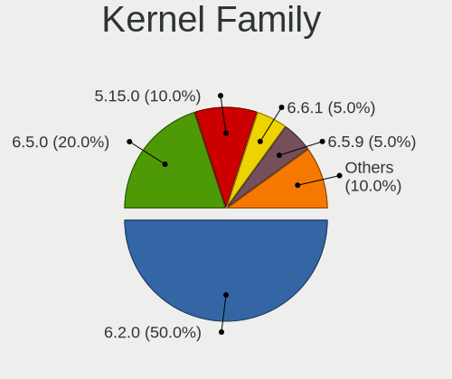
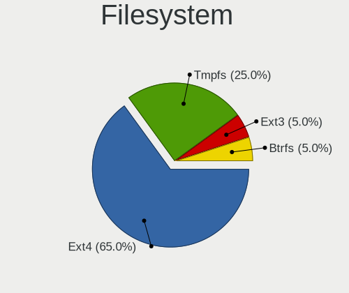
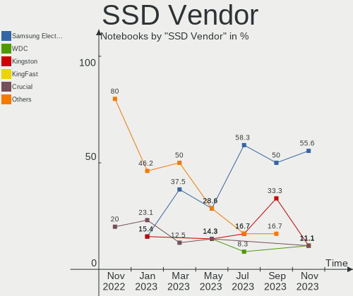
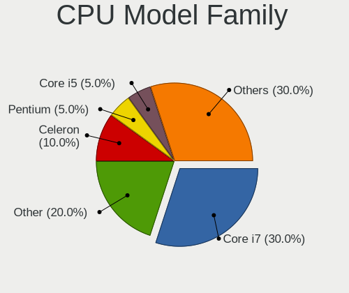
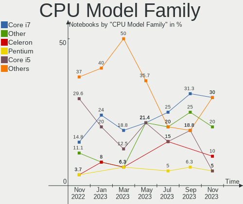
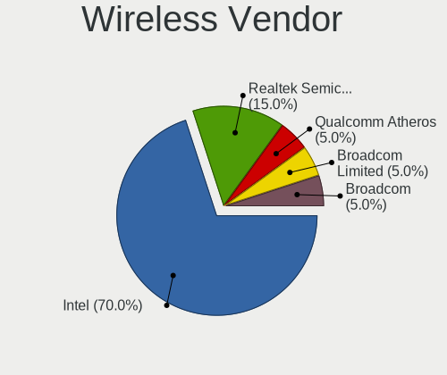
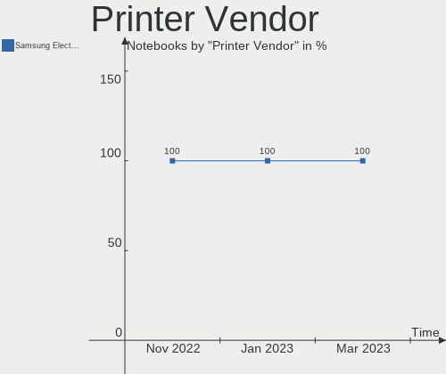
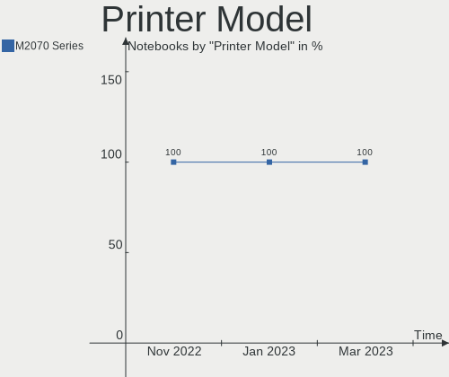
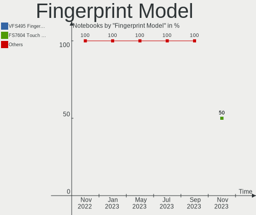

Ubuntu MATE - Hardware Trends (Notebooks)
-----------------------------------------

A project to identify most popular hardware characteristics and track their change
over time based on data collected by Linux users at https://Linux-Hardware.org.

Anyone can contribute to this report by the [hw-probe](https://github.com/linuxhw/hw-probe) tool:

    sudo -E hw-probe -all -upload

This report is for one last month. Overall report since the beginning of time: [TestCoverage](https://github.com/linuxhw/TestCoverage)

Period: Jan, 2023.

Contents
--------

* [ System ](#system)
  - [ OS                       ](#os)
  - [ OS Family                ](#os-family)
  - [ Kernel                   ](#kernel)
  - [ Kernel Family            ](#kernel-family)
  - [ Kernel Major Ver.        ](#kernel-major-ver)
  - [ Arch                     ](#arch)
  - [ DE                       ](#de)
  - [ Display Server           ](#display-server)
  - [ Display Manager          ](#display-manager)
  - [ OS Lang                  ](#os-lang)
  - [ Boot Mode                ](#boot-mode)
  - [ Filesystem               ](#filesystem)
  - [ Part. scheme             ](#part-scheme)
  - [ Dual Boot with Linux/BSD ](#dual-boot-with-linuxbsd)
  - [ Dual Boot (Win)          ](#dual-boot-win)

* [ Board ](#board)
  - [ Vendor                   ](#vendor)
  - [ Model                    ](#model)
  - [ Model Family             ](#model-family)
  - [ MFG Year                 ](#mfg-year)
  - [ Form Factor              ](#form-factor)
  - [ Secure Boot              ](#secure-boot)
  - [ Coreboot                 ](#coreboot)
  - [ RAM Size                 ](#ram-size)
  - [ RAM Used                 ](#ram-used)
  - [ Total Drives             ](#total-drives)
  - [ Has CD-ROM               ](#has-cd-rom)
  - [ Has Ethernet             ](#has-ethernet)
  - [ Has WiFi                 ](#has-wifi)
  - [ Has Bluetooth            ](#has-bluetooth)

* [ Location ](#location)
  - [ Country                  ](#country)
  - [ City                     ](#city)

* [ Drives ](#drives)
  - [ Drive Vendor             ](#drive-vendor)
  - [ Drive Model              ](#drive-model)
  - [ HDD Vendor               ](#hdd-vendor)
  - [ SSD Vendor               ](#ssd-vendor)
  - [ Drive Kind               ](#drive-kind)
  - [ Drive Connector          ](#drive-connector)
  - [ Drive Size               ](#drive-size)
  - [ Space Total              ](#space-total)
  - [ Space Used               ](#space-used)
  - [ Malfunc. Drives          ](#malfunc-drives)
  - [ Malfunc. Drive Vendor    ](#malfunc-drive-vendor)
  - [ Malfunc. HDD Vendor      ](#malfunc-hdd-vendor)
  - [ Malfunc. Drive Kind      ](#malfunc-drive-kind)
  - [ Failed Drives            ](#failed-drives)
  - [ Failed Drive Vendor      ](#failed-drive-vendor)
  - [ Drive Status             ](#drive-status)

* [ Storage controller ](#storage-controller)
  - [ Storage Vendor           ](#storage-vendor)
  - [ Storage Model            ](#storage-model)
  - [ Storage Kind             ](#storage-kind)

* [ Processor ](#processor)
  - [ CPU Vendor               ](#cpu-vendor)
  - [ CPU Model                ](#cpu-model)
  - [ CPU Model Family         ](#cpu-model-family)
  - [ CPU Cores                ](#cpu-cores)
  - [ CPU Sockets              ](#cpu-sockets)
  - [ CPU Threads              ](#cpu-threads)
  - [ CPU Op-Modes             ](#cpu-op-modes)
  - [ CPU Microcode            ](#cpu-microcode)
  - [ CPU Microarch            ](#cpu-microarch)

* [ Graphics ](#graphics)
  - [ GPU Vendor               ](#gpu-vendor)
  - [ GPU Model                ](#gpu-model)
  - [ GPU Combo                ](#gpu-combo)
  - [ GPU Driver               ](#gpu-driver)
  - [ GPU Memory               ](#gpu-memory)

* [ Monitor ](#monitor)
  - [ Monitor Vendor           ](#monitor-vendor)
  - [ Monitor Model            ](#monitor-model)
  - [ Monitor Resolution       ](#monitor-resolution)
  - [ Monitor Diagonal         ](#monitor-diagonal)
  - [ Monitor Width            ](#monitor-width)
  - [ Aspect Ratio             ](#aspect-ratio)
  - [ Monitor Area             ](#monitor-area)
  - [ Pixel Density            ](#pixel-density)
  - [ Multiple Monitors        ](#multiple-monitors)

* [ Network ](#network)
  - [ Net Controller Vendor    ](#net-controller-vendor)
  - [ Net Controller Model     ](#net-controller-model)
  - [ Wireless Vendor          ](#wireless-vendor)
  - [ Wireless Model           ](#wireless-model)
  - [ Ethernet Vendor          ](#ethernet-vendor)
  - [ Ethernet Model           ](#ethernet-model)
  - [ Net Controller Kind      ](#net-controller-kind)
  - [ Used Controller          ](#used-controller)
  - [ NICs                     ](#nics)
  - [ IPv6                     ](#ipv6)

* [ Bluetooth ](#bluetooth)
  - [ Bluetooth Vendor         ](#bluetooth-vendor)
  - [ Bluetooth Model          ](#bluetooth-model)

* [ Sound ](#sound)
  - [ Sound Vendor             ](#sound-vendor)
  - [ Sound Model              ](#sound-model)

* [ Memory ](#memory)
  - [ Memory Vendor            ](#memory-vendor)
  - [ Memory Model             ](#memory-model)
  - [ Memory Kind              ](#memory-kind)
  - [ Memory Form Factor       ](#memory-form-factor)
  - [ Memory Size              ](#memory-size)
  - [ Memory Speed             ](#memory-speed)

* [ Printers & scanners ](#printers--scanners)
  - [ Printer Vendor           ](#printer-vendor)
  - [ Printer Model            ](#printer-model)
  - [ Scanner Vendor           ](#scanner-vendor)
  - [ Scanner Model            ](#scanner-model)

* [ Camera ](#camera)
  - [ Camera Vendor            ](#camera-vendor)
  - [ Camera Model             ](#camera-model)

* [ Security ](#security)
  - [ Fingerprint Vendor       ](#fingerprint-vendor)
  - [ Fingerprint Model        ](#fingerprint-model)
  - [ Chipcard Vendor          ](#chipcard-vendor)
  - [ Chipcard Model           ](#chipcard-model)

* [ Unsupported ](#unsupported)
  - [ Unsupported Devices      ](#unsupported-devices)
  - [ Unsupported Device Types ](#unsupported-device-types)

System
------

OS
--

Installed operating systems

| Name              | Notebooks | Percent |
|-------------------|-----------|---------|
| Ubuntu MATE 22.04 | 16        | 64%     |
| Ubuntu MATE 22.10 | 6         | 24%     |
| Ubuntu MATE 20.04 | 3         | 12%     |

OS Family
---------

OS without a version

| Name        | Notebooks | Percent |
|-------------|-----------|---------|
| Ubuntu MATE | 25        | 100%    |

Kernel
------

Version of the Linux kernel

| Version                | Notebooks | Percent |
|------------------------|-----------|---------|
| 5.15.0-58-generic      | 5         | 20%     |
| 5.15.0-56-generic      | 5         | 20%     |
| 5.15.0-57-generic      | 4         | 16%     |
| 5.19.0-29-generic      | 2         | 8%      |
| 5.19.0-28-generic      | 2         | 8%      |
| 6.1.8-x64v1-xanmod1    | 1         | 4%      |
| 5.19.0-31-generic      | 1         | 4%      |
| 5.19.0-1012-lowlatency | 1         | 4%      |
| 5.15.0-56-lowlatency   | 1         | 4%      |
| 5.15.0-50-generic      | 1         | 4%      |
| 5.15.0-43-generic      | 1         | 4%      |
| 5.13.0-30-generic      | 1         | 4%      |

Kernel Family
-------------

Linux kernel without a distro release

| Version | Notebooks | Percent |
|---------|-----------|---------|
| 5.15.0  | 17        | 68%     |
| 5.19.0  | 6         | 24%     |
| 6.1.8   | 1         | 4%      |
| 5.13.0  | 1         | 4%      |

Kernel Major Ver.
-----------------

Linux kernel major version

| Version | Notebooks | Percent |
|---------|-----------|---------|
| 5.15    | 17        | 68%     |
| 5.19    | 6         | 24%     |
| 6.1     | 1         | 4%      |
| 5.13    | 1         | 4%      |

Arch
----

OS architecture (x86_64, i586, etc.)

| Name   | Notebooks | Percent |
|--------|-----------|---------|
| x86_64 | 25        | 100%    |

DE
--

Desktop Environment

| Name | Notebooks | Percent |
|------|-----------|---------|
| MATE | 24        | 96%     |
| KDE5 | 1         | 4%      |

Display Server
--------------

X11 or Wayland

| Name    | Notebooks | Percent |
|---------|-----------|---------|
| X11     | 24        | 96%     |
| Wayland | 1         | 4%      |

Display Manager
---------------

SDDM, LightDM, etc.

| Name    | Notebooks | Percent |
|---------|-----------|---------|
| LightDM | 21        | 84%     |
| GDM3    | 2         | 8%      |
| SDDM    | 1         | 4%      |
| Unknown | 1         | 4%      |

OS Lang
-------

Language

| Lang  | Notebooks | Percent |
|-------|-----------|---------|
| en_US | 10        | 40%     |
| de_DE | 5         | 20%     |
| fr_FR | 4         | 16%     |
| ru_RU | 1         | 4%      |
| pl_PL | 1         | 4%      |
| it_IT | 1         | 4%      |
| hu_HU | 1         | 4%      |
| fi_FI | 1         | 4%      |
| en_GB | 1         | 4%      |

Boot Mode
---------

EFI or BIOS

| Mode | Notebooks | Percent |
|------|-----------|---------|
| EFI  | 15        | 60%     |
| BIOS | 10        | 40%     |

Filesystem
----------

Type of filesystem

| Type    | Notebooks | Percent |
|---------|-----------|---------|
| Ext4    | 22        | 88%     |
| Btrfs   | 2         | 8%      |
| Overlay | 1         | 4%      |

Part. scheme
------------

Scheme of partitioning

| Type    | Notebooks | Percent |
|---------|-----------|---------|
| GPT     | 19        | 76%     |
| MBR     | 5         | 20%     |
| Unknown | 1         | 4%      |

Dual Boot with Linux/BSD
------------------------

Hosting more than one Linux/BSD

| Dual boot | Notebooks | Percent |
|-----------|-----------|---------|
| No        | 22        | 88%     |
| Yes       | 3         | 12%     |

Dual Boot (Win)
---------------

Hosting Linux and Windows

| Dual boot | Notebooks | Percent |
|-----------|-----------|---------|
| No        | 16        | 64%     |
| Yes       | 9         | 36%     |

Board
-----

Vendor
------

Motherboard manufacturer

| Name             | Notebooks | Percent |
|------------------|-----------|---------|
| Lenovo           | 6         | 24%     |
| ASUSTek Computer | 5         | 20%     |
| Hewlett-Packard  | 4         | 16%     |
| Dell             | 4         | 16%     |
| Acer             | 3         | 12%     |
| Notebook         | 2         | 8%      |
| Google           | 1         | 4%      |

Model
-----

Motherboard model

| Name                                     | Notebooks | Percent |
|------------------------------------------|-----------|---------|
| Lenovo G500 20236                        | 2         | 8%      |
| Notebook P17SM-A                         | 1         | 4%      |
| Notebook NJx0MU                          | 1         | 4%      |
| Lenovo ThinkPad X270 W10DG 20K5S02K00    | 1         | 4%      |
| Lenovo ThinkPad T15 Gen 1 20S6S1HN00     | 1         | 4%      |
| Lenovo ThinkPad R61 8918DEG              | 1         | 4%      |
| Lenovo IdeaPad 3 15ALC6 82KU             | 1         | 4%      |
| HP Pavilion Laptop 15-cs0xxx             | 1         | 4%      |
| HP Pavilion Gaming Laptop 17-cd1xxx      | 1         | 4%      |
| HP EliteBook 855 G7 Notebook PC          | 1         | 4%      |
| HP 15                                    | 1         | 4%      |
| Google Relm                              | 1         | 4%      |
| Dell Precision 7520                      | 1         | 4%      |
| Dell Latitude 5410                       | 1         | 4%      |
| Dell Inspiron 5520                       | 1         | 4%      |
| Dell G5 5590                             | 1         | 4%      |
| ASUS X550LN                              | 1         | 4%      |
| ASUS VivoBook_ASUSLaptop M1503QA_M1503QA | 1         | 4%      |
| ASUS TUF Gaming FX505DT_FX505DT          | 1         | 4%      |
| ASUS K93SV                               | 1         | 4%      |
| ASUS ASUS TUF Gaming F15 FX507ZM_FX507ZM | 1         | 4%      |
| Acer Swift SF514-52T                     | 1         | 4%      |
| Acer Aspire 5530                         | 1         | 4%      |
| Acer AO756                               | 1         | 4%      |

Model Family
------------

Motherboard model prefix

| Name             | Notebooks | Percent |
|------------------|-----------|---------|
| Lenovo ThinkPad  | 3         | 12%     |
| Lenovo G500      | 2         | 8%      |
| HP Pavilion      | 2         | 8%      |
| Notebook P17SM-A | 1         | 4%      |
| Notebook NJx0MU  | 1         | 4%      |
| Lenovo IdeaPad   | 1         | 4%      |
| HP EliteBook     | 1         | 4%      |
| HP 15            | 1         | 4%      |
| Google Relm      | 1         | 4%      |
| Dell Precision   | 1         | 4%      |
| Dell Latitude    | 1         | 4%      |
| Dell Inspiron    | 1         | 4%      |
| Dell G5          | 1         | 4%      |
| ASUS X550LN      | 1         | 4%      |
| ASUS VivoBook    | 1         | 4%      |
| ASUS TUF         | 1         | 4%      |
| ASUS K93SV       | 1         | 4%      |
| ASUS ASUS        | 1         | 4%      |
| Acer Swift       | 1         | 4%      |
| Acer Aspire      | 1         | 4%      |
| Acer AO756       | 1         | 4%      |

MFG Year
--------

Motherboard manufacture year

| Year | Notebooks | Percent |
|------|-----------|---------|
| 2020 | 4         | 16%     |
| 2022 | 3         | 12%     |
| 2017 | 3         | 12%     |
| 2013 | 3         | 12%     |
| 2021 | 2         | 8%      |
| 2019 | 2         | 8%      |
| 2014 | 2         | 8%      |
| 2012 | 2         | 8%      |
| 2018 | 1         | 4%      |
| 2011 | 1         | 4%      |
| 2008 | 1         | 4%      |
| 2007 | 1         | 4%      |

Form Factor
-----------

Physical design of the computer

| Name     | Notebooks | Percent |
|----------|-----------|---------|
| Notebook | 25        | 100%    |

Secure Boot
-----------

Enabled or disabled

| State    | Notebooks | Percent |
|----------|-----------|---------|
| Disabled | 22        | 88%     |
| Enabled  | 3         | 12%     |

Coreboot
--------

Have coreboot on board

| Used | Notebooks | Percent |
|------|-----------|---------|
| No   | 24        | 96%     |
| Yes  | 1         | 4%      |

RAM Size
--------

Total RAM memory

| Size in GB  | Notebooks | Percent |
|-------------|-----------|---------|
| 4.01-8.0    | 7         | 28%     |
| 3.01-4.0    | 5         | 20%     |
| 16.01-24.0  | 4         | 16%     |
| 8.01-16.0   | 3         | 12%     |
| 32.01-64.0  | 2         | 8%      |
| 24.01-32.0  | 2         | 8%      |
| 64.01-256.0 | 2         | 8%      |

RAM Used
--------

Used RAM memory

| Used GB   | Notebooks | Percent |
|-----------|-----------|---------|
| 2.01-3.0  | 7         | 28%     |
| 3.01-4.0  | 6         | 24%     |
| 1.01-2.0  | 5         | 20%     |
| 4.01-8.0  | 4         | 16%     |
| 8.01-16.0 | 3         | 12%     |

Total Drives
------------

Number of drives on board

| Drives | Notebooks | Percent |
|--------|-----------|---------|
| 1      | 16        | 64%     |
| 2      | 8         | 32%     |
| 3      | 1         | 4%      |

Has CD-ROM
----------

Has CD-ROM on board

| Presented | Notebooks | Percent |
|-----------|-----------|---------|
| No        | 17        | 68%     |
| Yes       | 8         | 32%     |

Has Ethernet
------------

Has Ethernet on board

| Presented | Notebooks | Percent |
|-----------|-----------|---------|
| Yes       | 20        | 80%     |
| No        | 5         | 20%     |

Has WiFi
--------

Has WiFi module

| Presented | Notebooks | Percent |
|-----------|-----------|---------|
| Yes       | 25        | 100%    |

Has Bluetooth
-------------

Has Bluetooth module

| Presented | Notebooks | Percent |
|-----------|-----------|---------|
| Yes       | 21        | 84%     |
| No        | 4         | 16%     |

Location
--------

Country
-------

Geographic location (country)

| Country   | Notebooks | Percent |
|-----------|-----------|---------|
| USA       | 4         | 16%     |
| Germany   | 4         | 16%     |
| France    | 4         | 16%     |
| UK        | 1         | 4%      |
| Turkey    | 1         | 4%      |
| Slovenia  | 1         | 4%      |
| Serbia    | 1         | 4%      |
| Russia    | 1         | 4%      |
| Poland    | 1         | 4%      |
| Norway    | 1         | 4%      |
| Lithuania | 1         | 4%      |
| Italy     | 1         | 4%      |
| Indonesia | 1         | 4%      |
| Hungary   | 1         | 4%      |
| Finland   | 1         | 4%      |
| Brazil    | 1         | 4%      |

City
----

Geographic location (city)

| City                   | Notebooks | Percent |
|------------------------|-----------|---------|
| Yogyakarta             | 1         | 4%      |
| Vilnius                | 1         | 4%      |
| Vaudoy-en-Brie         | 1         | 4%      |
| Turku                  | 1         | 4%      |
| Toulouse               | 1         | 4%      |
| Soham                  | 1         | 4%      |
| Sao Paulo              | 1         | 4%      |
| Saint Paul             | 1         | 4%      |
| Rome                   | 1         | 4%      |
| Olympia                | 1         | 4%      |
| Nova Gorica            | 1         | 4%      |
| Nordenham              | 1         | 4%      |
| Moscow                 | 1         | 4%      |
| Montpellier            | 1         | 4%      |
| Montigny-le-Bretonneux | 1         | 4%      |
| Laurel                 | 1         | 4%      |
| Langenselbold          | 1         | 4%      |
| Landau                 | 1         | 4%      |
| Krakow                 | 1         | 4%      |
| Istanbul               | 1         | 4%      |
| Hamar                  | 1         | 4%      |
| Győr                  | 1         | 4%      |
| Cambridge              | 1         | 4%      |
| Burghaun               | 1         | 4%      |
| Belgrade               | 1         | 4%      |

Drives
------

Drive Vendor
------------

Hard drive vendors

| Vendor                | Notebooks | Drives | Percent |
|-----------------------|-----------|--------|---------|
| Samsung Electronics   | 4         | 4      | 12.12%  |
| WDC                   | 3         | 3      | 9.09%   |
| Toshiba               | 3         | 3      | 9.09%   |
| Kingston              | 3         | 3      | 9.09%   |
| Crucial               | 3         | 4      | 9.09%   |
| SPCC                  | 2         | 2      | 6.06%   |
| SK hynix              | 2         | 2      | 6.06%   |
| Intel                 | 2         | 2      | 6.06%   |
| Verbatim              | 1         | 1      | 3.03%   |
| Unknown               | 1         | 2      | 3.03%   |
| UMIS                  | 1         | 1      | 3.03%   |
| Seagate               | 1         | 1      | 3.03%   |
| SanDisk               | 1         | 1      | 3.03%   |
| Realtek Semiconductor | 1         | 1      | 3.03%   |
| Phison Electronics    | 1         | 1      | 3.03%   |
| HS-SSD-E100           | 1         | 1      | 3.03%   |
| HGST                  | 1         | 1      | 3.03%   |
| Corsair               | 1         | 1      | 3.03%   |
| A-DATA Technology     | 1         | 1      | 3.03%   |

Drive Model
-----------

Hard drive models

| Model                                 | Notebooks | Percent |
|---------------------------------------|-----------|---------|
| WDC WD5000LPVT-24G33T1 500GB          | 1         | 2.94%   |
| WDC WD3200BEVT-22ZCT0 320GB           | 1         | 2.94%   |
| WDC WD10SPZX-22Z10T0 1TB              | 1         | 2.94%   |
| Verbatim Vi550 S3 256GB SSD           | 1         | 2.94%   |
| Unknown MMC Card  32GB                | 1         | 2.94%   |
| Unknown MMC Card  16GB                | 1         | 2.94%   |
| UMIS RPJTJ256MEE1OWX 256GB            | 1         | 2.94%   |
| Toshiba XG6 NVMe SSD Controller 512GB | 1         | 2.94%   |
| Toshiba THNSF5256GPUK 256GB           | 1         | 2.94%   |
| Toshiba KBG30ZMS128G NVMe 128GB       | 1         | 2.94%   |
| SPCC Solid State Disk 1024GB          | 1         | 2.94%   |
| SPCC M.2 PCIe SSD 1TB                 | 1         | 2.94%   |
| SK hynix PC401 NVMe 1TB               | 1         | 2.94%   |
| SK hynix BC511 NVMe 256GB             | 1         | 2.94%   |
| Seagate BUP BK 4TB                    | 1         | 2.94%   |
| SanDisk SSD PLUS 1000GB               | 1         | 2.94%   |
| Samsung SSD PM851 mSATA 512GB         | 1         | 2.94%   |
| Samsung SSD 870 QVO 8TB               | 1         | 2.94%   |
| Samsung MZVLQ1T0HBLB-00B00 1024GB     | 1         | 2.94%   |
| Samsung MZVL2512HCJQ-00B00 512GB      | 1         | 2.94%   |
| Realtek ADATA SWORDFISH 1TB           | 1         | 2.94%   |
| Phison PCIe SSD 1TB                   | 1         | 2.94%   |
| Kingston SV300S37A120G 120GB SSD      | 1         | 2.94%   |
| Kingston SA2000M81000G 1TB            | 1         | 2.94%   |
| Kingston 120GBV500 SSD                | 1         | 2.94%   |
| Intel SSDPEKNU512GZ 512GB             | 1         | 2.94%   |
| Intel SSDPEKKW256G7 256GB             | 1         | 2.94%   |
| HS-SSD-E100 SSD 256G                  | 1         | 2.94%   |
| HGST HTS541010A9E680 1TB              | 1         | 2.94%   |
| Crucial CT750MX300SSD1 752GB          | 1         | 2.94%   |
| Crucial CT2000MX500SSD1 2TB           | 1         | 2.94%   |
| Crucial CT2000BX500SSD1 2TB           | 1         | 2.94%   |
| Corsair Force 3 SSD 240GB             | 1         | 2.94%   |
| A-DATA SU650 240GB SSD                | 1         | 2.94%   |

HDD Vendor
----------

Hard disk drive vendors

| Vendor  | Notebooks | Drives | Percent |
|---------|-----------|--------|---------|
| WDC     | 3         | 3      | 60%     |
| Seagate | 1         | 1      | 20%     |
| HGST    | 1         | 1      | 20%     |

SSD Vendor
----------

Solid state drive vendors

| Vendor              | Notebooks | Drives | Percent |
|---------------------|-----------|--------|---------|
| Crucial             | 3         | 4      | 23.08%  |
| Samsung Electronics | 2         | 2      | 15.38%  |
| Kingston            | 2         | 2      | 15.38%  |
| Verbatim            | 1         | 1      | 7.69%   |
| SPCC                | 1         | 1      | 7.69%   |
| SanDisk             | 1         | 1      | 7.69%   |
| HS-SSD-E100         | 1         | 1      | 7.69%   |
| Corsair             | 1         | 1      | 7.69%   |
| A-DATA Technology   | 1         | 1      | 7.69%   |

Drive Kind
----------

HDD or SSD

| Kind | Notebooks | Drives | Percent |
|------|-----------|--------|---------|
| NVMe | 14        | 14     | 45.16%  |
| SSD  | 11        | 14     | 35.48%  |
| HDD  | 5         | 5      | 16.13%  |
| MMC  | 1         | 2      | 3.23%   |

Drive Connector
---------------

SATA, SAS, NVMe, etc.

| Type | Notebooks | Drives | Percent |
|------|-----------|--------|---------|
| NVMe | 14        | 14     | 48.28%  |
| SATA | 13        | 18     | 44.83%  |
| SAS  | 1         | 1      | 3.45%   |
| MMC  | 1         | 2      | 3.45%   |

Drive Size
----------

Size of hard drive

| Size in TB | Notebooks | Drives | Percent |
|------------|-----------|--------|---------|
| 0.01-0.5   | 7         | 8      | 46.67%  |
| 0.51-1.0   | 4         | 6      | 26.67%  |
| 1.01-2.0   | 2         | 3      | 13.33%  |
| 3.01-4.0   | 1         | 1      | 6.67%   |
| 4.01-10.0  | 1         | 1      | 6.67%   |

Space Total
-----------

Amount of disk space available on the file system

| Size in GB     | Notebooks | Percent |
|----------------|-----------|---------|
| 101-250        | 9         | 36%     |
| 251-500        | 4         | 16%     |
| 501-1000       | 4         | 16%     |
| 1001-2000      | 3         | 12%     |
| More than 3000 | 2         | 8%      |
| 21-50          | 1         | 4%      |
| 1-20           | 1         | 4%      |
| 51-100         | 1         | 4%      |

Space Used
----------

Amount of used disk space

| Used GB        | Notebooks | Percent |
|----------------|-----------|---------|
| 1-20           | 7         | 28%     |
| 101-250        | 4         | 16%     |
| 51-100         | 4         | 16%     |
| 251-500        | 3         | 12%     |
| More than 3000 | 2         | 8%      |
| 21-50          | 2         | 8%      |
| 1001-2000      | 2         | 8%      |
| 501-1000       | 1         | 4%      |

Malfunc. Drives
---------------

Drive models with a malfunction

| Model                      | Notebooks | Drives | Percent |
|----------------------------|-----------|--------|---------|
| Kingston SA2000M81000G 1TB | 1         | 1      | 100%    |

Malfunc. Drive Vendor
---------------------

Vendors of faulty drives

| Vendor   | Notebooks | Drives | Percent |
|----------|-----------|--------|---------|
| Kingston | 1         | 1      | 100%    |

Malfunc. HDD Vendor
-------------------

Vendors of faulty HDD drives

Zero info for selected period =(

Malfunc. Drive Kind
-------------------

Kinds of faulty drives

| Kind | Notebooks | Drives | Percent |
|------|-----------|--------|---------|
| NVMe | 1         | 1      | 100%    |

Failed Drives
-------------

Failed drive models

Zero info for selected period =(

Failed Drive Vendor
-------------------

Failed drive vendors

Zero info for selected period =(

Drive Status
------------

Number of failed and malfunc. drives

| Status   | Notebooks | Drives | Percent |
|----------|-----------|--------|---------|
| Works    | 18        | 22     | 72%     |
| Detected | 6         | 12     | 24%     |
| Malfunc  | 1         | 1      | 4%      |

Storage controller
------------------

Storage Vendor
--------------

Storage controller vendors

| Vendor                       | Notebooks | Percent |
|------------------------------|-----------|---------|
| Intel                        | 16        | 51.61%  |
| Toshiba America Info Systems | 3         | 9.68%   |
| AMD                          | 3         | 9.68%   |
| SK hynix                     | 2         | 6.45%   |
| Samsung Electronics          | 2         | 6.45%   |
| Union Memory (Shenzhen)      | 1         | 3.23%   |
| Realtek Semiconductor        | 1         | 3.23%   |
| Phison Electronics           | 1         | 3.23%   |
| MAXIO Technology (Hangzhou)  | 1         | 3.23%   |
| Kingston Technology Company  | 1         | 3.23%   |

Storage Model
-------------

Storage controller models

| Model                                                                          | Notebooks | Percent |
|--------------------------------------------------------------------------------|-----------|---------|
| Intel 7 Series Chipset Family 6-port SATA Controller [AHCI mode]               | 4         | 12.5%   |
| AMD FCH SATA Controller [AHCI mode]                                            | 2         | 6.25%   |
| Union Memory (Shenzhen) Non-Volatile memory controller                         | 1         | 3.13%   |
| Toshiba America Info Systems XG6 NVMe SSD Controller                           | 1         | 3.13%   |
| Toshiba America Info Systems XG4 NVMe SSD Controller                           | 1         | 3.13%   |
| Toshiba America Info Systems BG3 NVMe SSD Controller                           | 1         | 3.13%   |
| SK hynix PC401 NVMe Solid State Drive 256GB                                    | 1         | 3.13%   |
| SK hynix BC511                                                                 | 1         | 3.13%   |
| Samsung NVMe SSD Controller PM9A1/PM9A3/980PRO                                 | 1         | 3.13%   |
| Samsung NVMe SSD Controller 980                                                | 1         | 3.13%   |
| Realtek Realtek Non-Volatile memory controller                                 | 1         | 3.13%   |
| Phison E12 NVMe Controller                                                     | 1         | 3.13%   |
| MAXIO (Hangzhou) NVMe SSD Controller MAP1202                                   | 1         | 3.13%   |
| Kingston Company A2000 NVMe SSD                                                | 1         | 3.13%   |
| Intel Volume Management Device NVMe RAID Controller                            | 1         | 3.13%   |
| Intel Tiger Lake-LP SATA Controller                                            | 1         | 3.13%   |
| Intel Sunrise Point-LP SATA Controller [AHCI mode]                             | 1         | 3.13%   |
| Intel SSD 600P Series                                                          | 1         | 3.13%   |
| Intel Q170/Q150/B150/H170/H110/Z170/CM236 Chipset SATA Controller [AHCI Mode]  | 1         | 3.13%   |
| Intel Non-Volatile memory controller                                           | 1         | 3.13%   |
| Intel Cannon Lake Mobile PCH SATA AHCI Controller                              | 1         | 3.13%   |
| Intel 82801HM/HEM (ICH8M/ICH8M-E) SATA Controller [AHCI mode]                  | 1         | 3.13%   |
| Intel 82801HM/HEM (ICH8M/ICH8M-E) IDE Controller                               | 1         | 3.13%   |
| Intel 82801 Mobile SATA Controller [RAID mode]                                 | 1         | 3.13%   |
| Intel 8 Series/C220 Series Chipset Family 6-port SATA Controller 1 [AHCI mode] | 1         | 3.13%   |
| Intel 8 Series SATA Controller 1 [AHCI mode]                                   | 1         | 3.13%   |
| Intel 6 Series/C200 Series Chipset Family 6 port Mobile SATA AHCI Controller   | 1         | 3.13%   |
| AMD SB7x0/SB8x0/SB9x0 SATA Controller [AHCI mode]                              | 1         | 3.13%   |

Storage Kind
------------

Kind of storage controller (IDE, SATA, NVMe, SAS, ...)

| Kind | Notebooks | Percent |
|------|-----------|---------|
| SATA | 15        | 46.88%  |
| NVMe | 14        | 43.75%  |
| RAID | 2         | 6.25%   |
| IDE  | 1         | 3.13%   |

Processor
---------

CPU Vendor
----------

Processor vendors

| Vendor | Notebooks | Percent |
|--------|-----------|---------|
| Intel  | 19        | 76%     |
| AMD    | 6         | 24%     |

CPU Model
---------

Processor models

| Model                                         | Notebooks | Percent |
|-----------------------------------------------|-----------|---------|
| Intel Core i5-10210U CPU @ 1.60GHz            | 2         | 8%      |
| Intel Xeon CPU E3-1505M v6 @ 3.00GHz          | 1         | 4%      |
| Intel Core i7-8750H CPU @ 2.20GHz             | 1         | 4%      |
| Intel Core i7-8550U CPU @ 1.80GHz             | 1         | 4%      |
| Intel Core i7-4710MQ CPU @ 2.50GHz            | 1         | 4%      |
| Intel Core i7-3610QM CPU @ 2.30GHz            | 1         | 4%      |
| Intel Core i7-2670QM CPU @ 2.20GHz            | 1         | 4%      |
| Intel Core i7-10750H CPU @ 2.60GHz            | 1         | 4%      |
| Intel Core i5-8250U CPU @ 1.60GHz             | 1         | 4%      |
| Intel Core i5-6300U CPU @ 2.40GHz             | 1         | 4%      |
| Intel Core i5-3210M CPU @ 2.50GHz             | 1         | 4%      |
| Intel Core i3-4010U CPU @ 1.70GHz             | 1         | 4%      |
| Intel Core i3-3120M CPU @ 2.50GHz             | 1         | 4%      |
| Intel Core 2 Duo CPU T8100 @ 2.10GHz          | 1         | 4%      |
| Intel Celeron CPU N3060 @ 1.60GHz             | 1         | 4%      |
| Intel Celeron CPU 847 @ 1.10GHz               | 1         | 4%      |
| Intel 12th Gen Core i7-12700H                 | 1         | 4%      |
| Intel 11th Gen Core i7-1165G7 @ 2.80GHz       | 1         | 4%      |
| AMD Ryzen 7 5800H with Radeon Graphics        | 1         | 4%      |
| AMD Ryzen 7 3750H with Radeon Vega Mobile Gfx | 1         | 4%      |
| AMD Ryzen 3 PRO 4450U with Radeon Graphics    | 1         | 4%      |
| AMD Ryzen 3 5300U with Radeon Graphics        | 1         | 4%      |
| AMD Athlon X2 Dual-Core QL-60                 | 1         | 4%      |
| AMD A6-5200 APU with Radeon HD Graphics       | 1         | 4%      |

CPU Model Family
----------------

Processor model prefix

| Model            | Notebooks | Percent |
|------------------|-----------|---------|
| Intel Core i7    | 6         | 24%     |
| Intel Core i5    | 5         | 20%     |
| Other            | 2         | 8%      |
| Intel Core i3    | 2         | 8%      |
| Intel Celeron    | 2         | 8%      |
| AMD Ryzen 7      | 2         | 8%      |
| Intel Xeon       | 1         | 4%      |
| Intel Core 2 Duo | 1         | 4%      |
| AMD Ryzen 3 PRO  | 1         | 4%      |
| AMD Ryzen 3      | 1         | 4%      |
| AMD Athlon X2    | 1         | 4%      |
| AMD A6           | 1         | 4%      |

CPU Cores
---------

Number of processor cores

| Number | Notebooks | Percent |
|--------|-----------|---------|
| 4      | 13        | 52%     |
| 2      | 8         | 32%     |
| 6      | 2         | 8%      |
| 14     | 1         | 4%      |
| 8      | 1         | 4%      |

CPU Sockets
-----------

Number of sockets

| Number | Notebooks | Percent |
|--------|-----------|---------|
| 1      | 25        | 100%    |

CPU Threads
-----------

Threads per core (Hyper-Threading)

| Number | Notebooks | Percent |
|--------|-----------|---------|
| 2      | 20        | 80%     |
| 1      | 5         | 20%     |

CPU Op-Modes
------------

CPU Operation Modes (32-bit, 64-bit)

| Op mode        | Notebooks | Percent |
|----------------|-----------|---------|
| 32-bit, 64-bit | 25        | 100%    |

CPU Microcode
-------------

Microcode number

| Number     | Notebooks | Percent |
|------------|-----------|---------|
| Unknown    | 5         | 20%     |
| 0x806ec    | 2         | 8%      |
| 0x806ea    | 2         | 8%      |
| 0x906ea    | 1         | 4%      |
| 0x906e9    | 1         | 4%      |
| 0x906a3    | 1         | 4%      |
| 0x806c1    | 1         | 4%      |
| 0x406e3    | 1         | 4%      |
| 0x406c4    | 1         | 4%      |
| 0x40651    | 1         | 4%      |
| 0x306c3    | 1         | 4%      |
| 0x306a9    | 1         | 4%      |
| 0x206a7    | 1         | 4%      |
| 0x10676    | 1         | 4%      |
| 0x0a50000c | 1         | 4%      |
| 0x08608103 | 1         | 4%      |
| 0x08600109 | 1         | 4%      |
| 0x0700010f | 1         | 4%      |
| 0x02000032 | 1         | 4%      |

CPU Microarch
-------------

Microarchitecture

| Name             | Notebooks | Percent |
|------------------|-----------|---------|
| KabyLake         | 6         | 24%     |
| IvyBridge        | 3         | 12%     |
| SandyBridge      | 2         | 8%      |
| Haswell          | 2         | 8%      |
| Zen+             | 1         | 4%      |
| Zen 3            | 1         | 4%      |
| Zen 2            | 1         | 4%      |
| TigerLake        | 1         | 4%      |
| Skylake          | 1         | 4%      |
| Silvermont       | 1         | 4%      |
| Penryn           | 1         | 4%      |
| K8 & K10 hybrid  | 1         | 4%      |
| Jaguar           | 1         | 4%      |
| CometLake        | 1         | 4%      |
| Alderlake Hybrid | 1         | 4%      |
| Unknown          | 1         | 4%      |

Graphics
--------

GPU Vendor
----------

Vendors of graphics cards

| Vendor | Notebooks | Percent |
|--------|-----------|---------|
| Intel  | 18        | 50%     |
| Nvidia | 9         | 25%     |
| AMD    | 9         | 25%     |

GPU Model
---------

Graphics card models

| Model                                                                                    | Notebooks | Percent |
|------------------------------------------------------------------------------------------|-----------|---------|
| Intel 3rd Gen Core processor Graphics Controller                                         | 3         | 8.11%   |
| Intel UHD Graphics 620                                                                   | 2         | 5.41%   |
| Intel CometLake-U GT2 [UHD Graphics]                                                     | 2         | 5.41%   |
| Intel 2nd Generation Core Processor Family Integrated Graphics Controller                | 2         | 5.41%   |
| Nvidia TU117M [GeForce GTX 1650 Mobile / Max-Q]                                          | 1         | 2.7%    |
| Nvidia TU116M [GeForce GTX 1660 Ti Mobile]                                               | 1         | 2.7%    |
| Nvidia TU106M [GeForce RTX 2060 Mobile]                                                  | 1         | 2.7%    |
| Nvidia GM206GLM [Quadro M2200 Mobile]                                                    | 1         | 2.7%    |
| Nvidia GM204M [GeForce GTX 970M]                                                         | 1         | 2.7%    |
| Nvidia GM108M [GeForce 840M]                                                             | 1         | 2.7%    |
| Nvidia GF108M [GeForce GT 540M]                                                          | 1         | 2.7%    |
| Nvidia GA106M [GeForce RTX 3060 Mobile / Max-Q]                                          | 1         | 2.7%    |
| Nvidia G86M [Quadro NVS 140M]                                                            | 1         | 2.7%    |
| Intel TigerLake-LP GT2 [Iris Xe Graphics]                                                | 1         | 2.7%    |
| Intel Skylake GT2 [HD Graphics 520]                                                      | 1         | 2.7%    |
| Intel HD Graphics P630                                                                   | 1         | 2.7%    |
| Intel Haswell-ULT Integrated Graphics Controller                                         | 1         | 2.7%    |
| Intel CometLake-H GT2 [UHD Graphics]                                                     | 1         | 2.7%    |
| Intel CoffeeLake-H GT2 [UHD Graphics 630]                                                | 1         | 2.7%    |
| Intel Atom/Celeron/Pentium Processor x5-E8000/J3xxx/N3xxx Integrated Graphics Controller | 1         | 2.7%    |
| Intel Alder Lake-P Integrated Graphics Controller                                        | 1         | 2.7%    |
| Intel 4th Gen Core Processor Integrated Graphics Controller                              | 1         | 2.7%    |
| AMD Thames [Radeon HD 7500M/7600M Series]                                                | 1         | 2.7%    |
| AMD Sun PRO [Radeon HD 8570A/8570M]                                                      | 1         | 2.7%    |
| AMD RV620/M82 [Mobility Radeon HD 3450/3470]                                             | 1         | 2.7%    |
| AMD RS780M [Mobility Radeon HD 3200]                                                     | 1         | 2.7%    |
| AMD Renoir                                                                               | 1         | 2.7%    |
| AMD Picasso/Raven 2 [Radeon Vega Series / Radeon Vega Mobile Series]                     | 1         | 2.7%    |
| AMD Lucienne                                                                             | 1         | 2.7%    |
| AMD Lexa [Radeon 540X/550X/630 / RX 640 / E9171 MCM]                                     | 1         | 2.7%    |
| AMD Kabini [Radeon HD 8400 / R3 Series]                                                  | 1         | 2.7%    |
| AMD Cezanne [Radeon Vega Series / Radeon Vega Mobile Series]                             | 1         | 2.7%    |

GPU Combo
---------

Combinations of graphics cards

| Name           | Notebooks | Percent |
|----------------|-----------|---------|
| 1 x Intel      | 8         | 32%     |
| Intel + Nvidia | 7         | 28%     |
| 1 x AMD        | 4         | 16%     |
| Intel + AMD    | 3         | 12%     |
| 2 x AMD        | 1         | 4%      |
| 1 x Nvidia     | 1         | 4%      |
| AMD + Nvidia   | 1         | 4%      |

GPU Driver
----------

Free vs proprietary

| Driver      | Notebooks | Percent |
|-------------|-----------|---------|
| Free        | 18        | 72%     |
| Proprietary | 7         | 28%     |

GPU Memory
----------

Total video memory

| Size in GB | Notebooks | Percent |
|------------|-----------|---------|
| Unknown    | 15        | 60%     |
| 0.01-0.5   | 5         | 20%     |
| 1.01-2.0   | 2         | 8%      |
| 5.01-6.0   | 1         | 4%      |
| 3.01-4.0   | 1         | 4%      |
| 0.51-1.0   | 1         | 4%      |

Monitor
-------

Monitor Vendor
--------------

Monitor vendors

| Vendor                  | Notebooks | Percent |
|-------------------------|-----------|---------|
| AU Optronics            | 7         | 21.88%  |
| LG Display              | 5         | 15.63%  |
| Samsung Electronics     | 4         | 12.5%   |
| BOE                     | 4         | 12.5%   |
| Chi Mei Optoelectronics | 3         | 9.38%   |
| Dell                    | 2         | 6.25%   |
| ViewSonic               | 1         | 3.13%   |
| PANDA                   | 1         | 3.13%   |
| Lenovo                  | 1         | 3.13%   |
| IBM                     | 1         | 3.13%   |
| HannStar                | 1         | 3.13%   |
| Chimei Innolux          | 1         | 3.13%   |
| Ancor Communications    | 1         | 3.13%   |

Monitor Model
-------------

Monitor models

| Model                                                                     | Notebooks | Percent |
|---------------------------------------------------------------------------|-----------|---------|
| ViewSonic VX2758 Series VSCDD35 1920x1080 597x336mm 27.0-inch             | 1         | 3.13%   |
| Samsung Electronics S27F350 SAM0D22 1920x1080 600x340mm 27.2-inch         | 1         | 3.13%   |
| Samsung Electronics LCD Monitor SDC416E 2880x1620 344x194mm 15.5-inch     | 1         | 3.13%   |
| Samsung Electronics LCD Monitor SAM0BB2 3840x2160 1872x1053mm 84.6-inch   | 1         | 3.13%   |
| Samsung Electronics LCD Monitor SAM094E 1920x1080 700x390mm 31.5-inch     | 1         | 3.13%   |
| PANDA LCD Monitor NCP002D 1920x1080 344x194mm 15.5-inch                   | 1         | 3.13%   |
| LG Display LCD Monitor LGD069A 1920x1080 344x194mm 15.5-inch              | 1         | 3.13%   |
| LG Display LCD Monitor LGD063F 1920x1080 382x215mm 17.3-inch              | 1         | 3.13%   |
| LG Display LCD Monitor LGD03DB 1366x768 345x194mm 15.6-inch               | 1         | 3.13%   |
| LG Display LCD Monitor LGD033A 1366x768 344x194mm 15.5-inch               | 1         | 3.13%   |
| LG Display LCD Monitor LGD02F2 1366x768 344x194mm 15.5-inch               | 1         | 3.13%   |
| Lenovo LCD Monitor LEN40BA 1920x1080 344x194mm 15.5-inch                  | 1         | 3.13%   |
| IBM LCD Monitor IBM2887 1680x1050 331x207mm 15.4-inch                     | 1         | 3.13%   |
| HannStar HT231 HSD5173 1920x1080 509x286mm 23.0-inch                      | 1         | 3.13%   |
| Dell U3415W DELA0A6 3440x1440 798x335mm 34.1-inch                         | 1         | 3.13%   |
| Dell U2715H DELD069 2560x1440 597x336mm 27.0-inch                         | 1         | 3.13%   |
| Chimei Innolux LCD Monitor CMN1540 2560x1440 344x193mm 15.5-inch          | 1         | 3.13%   |
| Chi Mei Optoelectronics LCD Monitor CMO1808 1920x1080 408x230mm 18.4-inch | 1         | 3.13%   |
| Chi Mei Optoelectronics LCD Monitor CMO15A7 1366x768 344x193mm 15.5-inch  | 1         | 3.13%   |
| Chi Mei Optoelectronics LCD Monitor CMO1113 1366x768 256x144mm 11.6-inch  | 1         | 3.13%   |
| BOE LCD Monitor BOE08A8 1920x1080 344x194mm 15.5-inch                     | 1         | 3.13%   |
| BOE LCD Monitor BOE07BB 1920x1080 309x173mm 13.9-inch                     | 1         | 3.13%   |
| BOE LCD Monitor BOE07A5 1366x768 344x194mm 15.5-inch                      | 1         | 3.13%   |
| BOE LCD Monitor BOE0713 1920x1080 344x193mm 15.5-inch                     | 1         | 3.13%   |
| AU Optronics LCD Monitor AUO42EC 1366x768 344x193mm 15.5-inch             | 1         | 3.13%   |
| AU Optronics LCD Monitor AUO429D 1920x1080 382x215mm 17.3-inch            | 1         | 3.13%   |
| AU Optronics LCD Monitor AUO405C 1366x768 256x144mm 11.6-inch             | 1         | 3.13%   |
| AU Optronics LCD Monitor AUO23ED 1920x1080 344x194mm 15.5-inch            | 1         | 3.13%   |
| AU Optronics LCD Monitor AUO226D 1920x1080 276x155mm 12.5-inch            | 1         | 3.13%   |
| AU Optronics LCD Monitor AUO219D 1920x1080 381x214mm 17.2-inch            | 1         | 3.13%   |
| AU Optronics LCD Monitor AUO203D 1920x1080 309x174mm 14.0-inch            | 1         | 3.13%   |
| Ancor Communications ASUS VC239 ACI23C4 1920x1080 509x286mm 23.0-inch     | 1         | 3.13%   |

Monitor Resolution
------------------

Monitor screen resolution

| Resolution         | Notebooks | Percent |
|--------------------|-----------|---------|
| 1920x1080 (FHD)    | 14        | 50%     |
| 1366x768 (WXGA)    | 8         | 28.57%  |
| 2560x1440 (QHD)    | 2         | 7.14%   |
| 3840x2160 (4K)     | 1         | 3.57%   |
| 3440x1440          | 1         | 3.57%   |
| 2880x1620          | 1         | 3.57%   |
| 1680x1050 (WSXGA+) | 1         | 3.57%   |

Monitor Diagonal
----------------

Diagonal size in inches

| Inches | Notebooks | Percent |
|--------|-----------|---------|
| 15     | 15        | 46.88%  |
| 27     | 3         | 9.38%   |
| 17     | 3         | 9.38%   |
| 23     | 2         | 6.25%   |
| 11     | 2         | 6.25%   |
| 84     | 1         | 3.13%   |
| 54     | 1         | 3.13%   |
| 34     | 1         | 3.13%   |
| 18     | 1         | 3.13%   |
| 14     | 1         | 3.13%   |
| 13     | 1         | 3.13%   |
| 12     | 1         | 3.13%   |

Monitor Width
-------------

Physical width

| Width in mm | Notebooks | Percent |
|-------------|-----------|---------|
| 301-350     | 17        | 53.13%  |
| 501-600     | 5         | 15.63%  |
| 351-400     | 3         | 9.38%   |
| 201-300     | 3         | 9.38%   |
| 701-800     | 1         | 3.13%   |
| 401-500     | 1         | 3.13%   |
| 1501-2000   | 1         | 3.13%   |
| 1001-1500   | 1         | 3.13%   |

Aspect Ratio
------------

Proportional relationship between the width and the height

| Ratio | Notebooks | Percent |
|-------|-----------|---------|
| 16/9  | 23        | 92%     |
| 21/9  | 1         | 4%      |
| 16/10 | 1         | 4%      |

Monitor Area
------------

Area in inch²

| Area in inch² | Notebooks | Percent |
|----------------|-----------|---------|
| 101-110        | 15        | 46.88%  |
| 301-350        | 3         | 9.38%   |
| 121-130        | 3         | 9.38%   |
| More than 1000 | 2         | 6.25%   |
| 81-90          | 2         | 6.25%   |
| 51-60          | 2         | 6.25%   |
| 201-250        | 2         | 6.25%   |
| 61-70          | 1         | 3.13%   |
| 351-500        | 1         | 3.13%   |
| 141-150        | 1         | 3.13%   |

Pixel Density
-------------

Pixels per inch

| Density | Notebooks | Percent |
|---------|-----------|---------|
| 121-160 | 14        | 43.75%  |
| 101-120 | 7         | 21.88%  |
| 51-100  | 7         | 21.88%  |
| 161-240 | 3         | 9.38%   |
| 1-50    | 1         | 3.13%   |

Multiple Monitors
-----------------

Total monitors connected

| Total | Notebooks | Percent |
|-------|-----------|---------|
| 1     | 18        | 72%     |
| 2     | 6         | 24%     |
| 3     | 1         | 4%      |

Network
-------

Net Controller Vendor
---------------------

Controller vendors

| Vendor                | Notebooks | Percent |
|-----------------------|-----------|---------|
| Intel                 | 16        | 42.11%  |
| Realtek Semiconductor | 9         | 23.68%  |
| Qualcomm Atheros      | 5         | 13.16%  |
| Broadcom              | 3         | 7.89%   |
| Sierra Wireless       | 1         | 2.63%   |
| Ralink                | 1         | 2.63%   |
| MediaTek              | 1         | 2.63%   |
| Broadcom Limited      | 1         | 2.63%   |
| ASUSTek Computer      | 1         | 2.63%   |

Net Controller Model
--------------------

Controller models

| Model                                                                   | Notebooks | Percent |
|-------------------------------------------------------------------------|-----------|---------|
| Realtek RTL8111/8168/8411 PCI Express Gigabit Ethernet Controller       | 6         | 12.24%  |
| Realtek RTL810xE PCI Express Fast Ethernet controller                   | 2         | 4.08%   |
| Qualcomm Atheros QCA8172 Fast Ethernet                                  | 2         | 4.08%   |
| Qualcomm Atheros AR9485 Wireless Network Adapter                        | 2         | 4.08%   |
| Intel Wireless 7265                                                     | 2         | 4.08%   |
| Intel Wi-Fi 6 AX200                                                     | 2         | 4.08%   |
| Intel Ethernet Connection (10) I219-V                                   | 2         | 4.08%   |
| Intel Comet Lake PCH-LP CNVi WiFi                                       | 2         | 4.08%   |
| Broadcom BCM43142 802.11b/g/n                                           | 2         | 4.08%   |
| Sierra Wireless EM7430 Qualcomm Snapdragon X7 LTE-A                     | 1         | 2.04%   |
| Realtek RTL8822CE 802.11ac PCIe Wireless Network Adapter                | 1         | 2.04%   |
| Realtek RTL8811AU 802.11a/b/g/n/ac WLAN Adapter                         | 1         | 2.04%   |
| Realtek RTL8153 Gigabit Ethernet Adapter                                | 1         | 2.04%   |
| Realtek Killer E2500 Gigabit Ethernet Controller                        | 1         | 2.04%   |
| Ralink RT3290 Wireless 802.11n 1T/1R PCIe                               | 1         | 2.04%   |
| Qualcomm Atheros QCA6174 802.11ac Wireless Network Adapter              | 1         | 2.04%   |
| Qualcomm Atheros AR242x / AR542x Wireless Network Adapter (PCI-Express) | 1         | 2.04%   |
| MediaTek MT7921 802.11ax PCI Express Wireless Network Adapter           | 1         | 2.04%   |
| Intel Wireless 8265 / 8275                                              | 1         | 2.04%   |
| Intel Wireless 8260                                                     | 1         | 2.04%   |
| Intel Wireless 7260                                                     | 1         | 2.04%   |
| Intel Wireless 3160                                                     | 1         | 2.04%   |
| Intel PRO/Wireless 4965 AG or AGN [Kedron] Network Connection           | 1         | 2.04%   |
| Intel Ethernet Connection I219-LM                                       | 1         | 2.04%   |
| Intel Ethernet Connection (5) I219-LM                                   | 1         | 2.04%   |
| Intel Ethernet Connection (16) I219-LM                                  | 1         | 2.04%   |
| Intel Ethernet Connection (13) I219-V                                   | 1         | 2.04%   |
| Intel Dual Band Wireless-AC 3168NGW [Stone Peak]                        | 1         | 2.04%   |
| Intel Comet Lake PCH CNVi WiFi                                          | 1         | 2.04%   |
| Intel Centrino Wireless-N 2230                                          | 1         | 2.04%   |
| Intel Cannon Lake PCH CNVi WiFi                                         | 1         | 2.04%   |
| Intel Alder Lake-P PCH CNVi WiFi                                        | 1         | 2.04%   |
| Intel 82566MC Gigabit Network Connection                                | 1         | 2.04%   |
| Broadcom NetLink BCM57785 Gigabit Ethernet PCIe                         | 1         | 2.04%   |
| Broadcom Limited NetXtreme BCM5764M Gigabit Ethernet PCIe               | 1         | 2.04%   |
| ASUS 802.11ac NIC                                                       | 1         | 2.04%   |

Wireless Vendor
---------------

Wireless vendors

| Vendor                | Notebooks | Percent |
|-----------------------|-----------|---------|
| Intel                 | 16        | 57.14%  |
| Qualcomm Atheros      | 4         | 14.29%  |
| Realtek Semiconductor | 2         | 7.14%   |
| Broadcom              | 2         | 7.14%   |
| Sierra Wireless       | 1         | 3.57%   |
| Ralink                | 1         | 3.57%   |
| MediaTek              | 1         | 3.57%   |
| ASUSTek Computer      | 1         | 3.57%   |

Wireless Model
--------------

Wireless models

| Model                                                                   | Notebooks | Percent |
|-------------------------------------------------------------------------|-----------|---------|
| Qualcomm Atheros AR9485 Wireless Network Adapter                        | 2         | 7.14%   |
| Intel Wireless 7265                                                     | 2         | 7.14%   |
| Intel Wi-Fi 6 AX200                                                     | 2         | 7.14%   |
| Intel Comet Lake PCH-LP CNVi WiFi                                       | 2         | 7.14%   |
| Broadcom BCM43142 802.11b/g/n                                           | 2         | 7.14%   |
| Sierra Wireless EM7430 Qualcomm Snapdragon X7 LTE-A                     | 1         | 3.57%   |
| Realtek RTL8822CE 802.11ac PCIe Wireless Network Adapter                | 1         | 3.57%   |
| Realtek RTL8811AU 802.11a/b/g/n/ac WLAN Adapter                         | 1         | 3.57%   |
| Ralink RT3290 Wireless 802.11n 1T/1R PCIe                               | 1         | 3.57%   |
| Qualcomm Atheros QCA6174 802.11ac Wireless Network Adapter              | 1         | 3.57%   |
| Qualcomm Atheros AR242x / AR542x Wireless Network Adapter (PCI-Express) | 1         | 3.57%   |
| MediaTek MT7921 802.11ax PCI Express Wireless Network Adapter           | 1         | 3.57%   |
| Intel Wireless 8265 / 8275                                              | 1         | 3.57%   |
| Intel Wireless 8260                                                     | 1         | 3.57%   |
| Intel Wireless 7260                                                     | 1         | 3.57%   |
| Intel Wireless 3160                                                     | 1         | 3.57%   |
| Intel PRO/Wireless 4965 AG or AGN [Kedron] Network Connection           | 1         | 3.57%   |
| Intel Dual Band Wireless-AC 3168NGW [Stone Peak]                        | 1         | 3.57%   |
| Intel Comet Lake PCH CNVi WiFi                                          | 1         | 3.57%   |
| Intel Centrino Wireless-N 2230                                          | 1         | 3.57%   |
| Intel Cannon Lake PCH CNVi WiFi                                         | 1         | 3.57%   |
| Intel Alder Lake-P PCH CNVi WiFi                                        | 1         | 3.57%   |
| ASUS 802.11ac NIC                                                       | 1         | 3.57%   |

Ethernet Vendor
---------------

Ethernet vendors

| Vendor                | Notebooks | Percent |
|-----------------------|-----------|---------|
| Realtek Semiconductor | 9         | 45%     |
| Intel                 | 7         | 35%     |
| Qualcomm Atheros      | 2         | 10%     |
| Broadcom Limited      | 1         | 5%      |
| Broadcom              | 1         | 5%      |

Ethernet Model
--------------

Ethernet models

| Model                                                             | Notebooks | Percent |
|-------------------------------------------------------------------|-----------|---------|
| Realtek RTL8111/8168/8411 PCI Express Gigabit Ethernet Controller | 6         | 28.57%  |
| Realtek RTL810xE PCI Express Fast Ethernet controller             | 2         | 9.52%   |
| Qualcomm Atheros QCA8172 Fast Ethernet                            | 2         | 9.52%   |
| Intel Ethernet Connection (10) I219-V                             | 2         | 9.52%   |
| Realtek RTL8153 Gigabit Ethernet Adapter                          | 1         | 4.76%   |
| Realtek Killer E2500 Gigabit Ethernet Controller                  | 1         | 4.76%   |
| Intel Ethernet Connection I219-LM                                 | 1         | 4.76%   |
| Intel Ethernet Connection (5) I219-LM                             | 1         | 4.76%   |
| Intel Ethernet Connection (16) I219-LM                            | 1         | 4.76%   |
| Intel Ethernet Connection (13) I219-V                             | 1         | 4.76%   |
| Intel 82566MC Gigabit Network Connection                          | 1         | 4.76%   |
| Broadcom NetLink BCM57785 Gigabit Ethernet PCIe                   | 1         | 4.76%   |
| Broadcom Limited NetXtreme BCM5764M Gigabit Ethernet PCIe         | 1         | 4.76%   |

Net Controller Kind
-------------------

Ethernet, WiFi or modem

| Kind     | Notebooks | Percent |
|----------|-----------|---------|
| WiFi     | 25        | 55.56%  |
| Ethernet | 20        | 44.44%  |

Used Controller
---------------

Currently used network controller

| Kind     | Notebooks | Percent |
|----------|-----------|---------|
| WiFi     | 22        | 84.62%  |
| Ethernet | 4         | 15.38%  |

NICs
----

Total network controllers on board

| Total | Notebooks | Percent |
|-------|-----------|---------|
| 2     | 20        | 80%     |
| 1     | 5         | 20%     |

IPv6
----

IPv6 vs IPv4

| Used | Notebooks | Percent |
|------|-----------|---------|
| No   | 17        | 68%     |
| Yes  | 8         | 32%     |

Bluetooth
---------

Bluetooth Vendor
----------------

Controller vendors

| Vendor                          | Notebooks | Percent |
|---------------------------------|-----------|---------|
| Intel                           | 14        | 66.67%  |
| IMC Networks                    | 2         | 9.52%   |
| Broadcom                        | 2         | 9.52%   |
| Ralink                          | 1         | 4.76%   |
| Qualcomm Atheros Communications | 1         | 4.76%   |
| Foxconn International           | 1         | 4.76%   |

Bluetooth Model
---------------

Controller models

| Model                                             | Notebooks | Percent |
|---------------------------------------------------|-----------|---------|
| Intel Bluetooth wireless interface                | 5         | 23.81%  |
| Intel Bluetooth Device                            | 4         | 19.05%  |
| Intel AX200 Bluetooth                             | 2         | 9.52%   |
| Ralink RT3290 Bluetooth                           | 1         | 4.76%   |
| Qualcomm Atheros QCA61x4 Bluetooth 4.0            | 1         | 4.76%   |
| Intel Wireless-AC 3168 Bluetooth                  | 1         | 4.76%   |
| Intel Centrino Bluetooth Wireless Transceiver     | 1         | 4.76%   |
| Intel Bluetooth 9460/9560 Jefferson Peak (JfP)    | 1         | 4.76%   |
| IMC Networks Wireless_Device                      | 1         | 4.76%   |
| IMC Networks Bluetooth Radio                      | 1         | 4.76%   |
| Foxconn International BCM43142A0 Bluetooth module | 1         | 4.76%   |
| Broadcom BCM43142A0 Bluetooth Device              | 1         | 4.76%   |
| Broadcom BCM2045B (BDC-2) [Bluetooth Controller]  | 1         | 4.76%   |

Sound
-----

Sound Vendor
------------

Sound card vendors

| Vendor              | Notebooks | Percent |
|---------------------|-----------|---------|
| Intel               | 19        | 52.78%  |
| Nvidia              | 7         | 19.44%  |
| AMD                 | 6         | 16.67%  |
| Meizu               | 1         | 2.78%   |
| Hewlett-Packard     | 1         | 2.78%   |
| C-Media Electronics | 1         | 2.78%   |
| ASUSTek Computer    | 1         | 2.78%   |

Sound Model
-----------

Sound card models

| Model                                                                                             | Notebooks | Percent |
|---------------------------------------------------------------------------------------------------|-----------|---------|
| Intel 7 Series/C216 Chipset Family High Definition Audio Controller                               | 4         | 9.3%    |
| AMD Family 17h/19h HD Audio Controller                                                            | 4         | 9.3%    |
| Intel Sunrise Point-LP HD Audio                                                                   | 3         | 6.98%   |
| AMD Renoir Radeon High Definition Audio Controller                                                | 3         | 6.98%   |
| Intel Comet Lake PCH-LP cAVS                                                                      | 2         | 4.65%   |
| Nvidia TU116 High Definition Audio Controller                                                     | 1         | 2.33%   |
| Nvidia TU107 GeForce GTX 1650 High Definition Audio Controller                                    | 1         | 2.33%   |
| Nvidia TU106 High Definition Audio Controller                                                     | 1         | 2.33%   |
| Nvidia GM206 High Definition Audio Controller                                                     | 1         | 2.33%   |
| Nvidia GM204 High Definition Audio Controller                                                     | 1         | 2.33%   |
| Nvidia GF108 High Definition Audio Controller                                                     | 1         | 2.33%   |
| Nvidia GA106 High Definition Audio Controller                                                     | 1         | 2.33%   |
| Meizu HiFi DAC Headphone Amplifier                                                                | 1         | 2.33%   |
| Intel Xeon E3-1200 v3/4th Gen Core Processor HD Audio Controller                                  | 1         | 2.33%   |
| Intel Tiger Lake-LP Smart Sound Technology Audio Controller                                       | 1         | 2.33%   |
| Intel Haswell-ULT HD Audio Controller                                                             | 1         | 2.33%   |
| Intel Comet Lake PCH cAVS                                                                         | 1         | 2.33%   |
| Intel CM238 HD Audio Controller                                                                   | 1         | 2.33%   |
| Intel Cannon Lake PCH cAVS                                                                        | 1         | 2.33%   |
| Intel Atom/Celeron/Pentium Processor x5-E8000/J3xxx/N3xxx Series High Definition Audio Controller | 1         | 2.33%   |
| Intel Alder Lake PCH-P High Definition Audio Controller                                           | 1         | 2.33%   |
| Intel 82801H (ICH8 Family) HD Audio Controller                                                    | 1         | 2.33%   |
| Intel 8 Series/C220 Series Chipset High Definition Audio Controller                               | 1         | 2.33%   |
| Intel 8 Series HD Audio Controller                                                                | 1         | 2.33%   |
| Intel 6 Series/C200 Series Chipset Family High Definition Audio Controller                        | 1         | 2.33%   |
| Hewlett-Packard USB Audio                                                                         | 1         | 2.33%   |
| C-Media Electronics USB Advanced Audio Device                                                     | 1         | 2.33%   |
| ASUSTek Computer C-Media Audio                                                                    | 1         | 2.33%   |
| AMD SBx00 Azalia (Intel HDA)                                                                      | 1         | 2.33%   |
| AMD RV620 HDMI Audio [Radeon HD 3450/3470/3550/3570]                                              | 1         | 2.33%   |
| AMD Kabini HDMI/DP Audio                                                                          | 1         | 2.33%   |
| AMD FCH Azalia Controller                                                                         | 1         | 2.33%   |

Memory
------

Memory Vendor
-------------

Memory module vendors

| Vendor              | Notebooks | Percent |
|---------------------|-----------|---------|
| SK hynix            | 8         | 26.67%  |
| Samsung Electronics | 6         | 20%     |
| Micron Technology   | 6         | 20%     |
| Nanya Technology    | 3         | 10%     |
| Unknown             | 2         | 6.67%   |
| Ramaxel Technology  | 2         | 6.67%   |
| Kingston            | 2         | 6.67%   |
| A-DATA Technology   | 1         | 3.33%   |

Memory Model
------------

Memory module models

| Model                                                          | Notebooks | Percent |
|----------------------------------------------------------------|-----------|---------|
| Unknown RAM Module 2GB SODIMM DDR2 667MT/s                     | 1         | 3.13%   |
| Unknown RAM Module 2GB SODIMM DDR2                             | 1         | 3.13%   |
| SK hynix RAM Module 4GB SODIMM DDR3 1600MT/s                   | 1         | 3.13%   |
| SK hynix RAM Module 16GB SODIMM DDR4 2667MT/s                  | 1         | 3.13%   |
| SK hynix RAM HMT41GS6AFR8A-PB 8GB SODIMM DDR3 1600MT/s         | 1         | 3.13%   |
| SK hynix RAM HMT351S6EFR8A-PB 4GB SODIMM DDR3 1600MT/s         | 1         | 3.13%   |
| SK hynix RAM HMT351S6CFR8C-H9 4GB SODIMM DDR3 1334MT/s         | 1         | 3.13%   |
| SK hynix RAM HMT325S6BFR8C-H9 2GB SODIMM DDR3 1600MT/s         | 1         | 3.13%   |
| SK hynix RAM HMA851S6DJR6N-XN 4GB Row Of Chips DDR4 3200MT/s   | 1         | 3.13%   |
| SK hynix RAM HMA81GS6AFR8N-UH 8192MB SODIMM DDR4 2667MT/s      | 1         | 3.13%   |
| SK hynix RAM H9CCNNN8GTMLAR-NUD 2GB LPDDR3 1600MT/s            | 1         | 3.13%   |
| Samsung RAM Module 8GB SODIMM DDR4 3200MT/s                    | 1         | 3.13%   |
| Samsung RAM M471B5173QH0-YK0 4GB SODIMM DDR3 1600MT/s          | 1         | 3.13%   |
| Samsung RAM M471A5244CB0-CWE 4GB SODIMM DDR4 3200MT/s          | 1         | 3.13%   |
| Samsung RAM M471A2K43BB1-CRC 16GB SODIMM DDR4 2400MT/s         | 1         | 3.13%   |
| Samsung RAM M471A1K43DB1-CWE 8GB SODIMM DDR4 3200MT/s          | 1         | 3.13%   |
| Samsung RAM M471A1G44BB0-CWE 8GB SODIMM DDR4 3200MT/s          | 1         | 3.13%   |
| Ramaxel RAM RMT3170EF68F9W1600 4GB SODIMM DDR3 1600MT/s        | 1         | 3.13%   |
| Ramaxel RAM RMT3170EB68F9W1600 4GB SODIMM DDR3 1600MT/s        | 1         | 3.13%   |
| Nanya RAM NT4GC64B8HG0NS-DI 4GB SODIMM DDR3 1600MT/s           | 1         | 3.13%   |
| Nanya RAM NT4GC64B88B0NS-DI 4GB SODIMM DDR3 1600MT/s           | 1         | 3.13%   |
| Nanya RAM NT2GC64B88G0NS-CG 2GB SODIMM DDR3 1600MT/s           | 1         | 3.13%   |
| Nanya RAM NT2GC64B88B0NS-CG 2GB SODIMM DDR3 1334MT/s           | 1         | 3.13%   |
| Micron RAM MTC4C10163S1SC48BA1 8GB SODIMM DDR5 4800MT/s        | 1         | 3.13%   |
| Micron RAM MT52L512M32D2PF-10 4GB Row Of Chips LPDDR3 1867MT/s | 1         | 3.13%   |
| Micron RAM 8ATF1G64HZ-3G2R1 8192MB SODIMM DDR4 3200MT/s        | 1         | 3.13%   |
| Micron RAM 8ATF1G64HZ-2G6H1 8GB SODIMM DDR4 2667MT/s           | 1         | 3.13%   |
| Micron RAM 4ATF1G64HZ-3G2E1 8GB SODIMM DDR4 3200MT/s           | 1         | 3.13%   |
| Micron RAM 16KTF1G64HZ-1G6N1 8GB SODIMM DDR3 1600MT/s          | 1         | 3.13%   |
| Kingston RAM 9905700-104.A00G 8GB SODIMM DDR4 3200MT/s         | 1         | 3.13%   |
| Kingston RAM 9905700-047.A00G 16GB SODIMM DDR4 2667MT/s        | 1         | 3.13%   |
| A-DATA RAM Module 32GB SODIMM DDR4 2667MT/s                    | 1         | 3.13%   |

Memory Kind
-----------

Memory module kinds

| Kind   | Notebooks | Percent |
|--------|-----------|---------|
| DDR4   | 10        | 45.45%  |
| DDR3   | 7         | 31.82%  |
| LPDDR3 | 2         | 9.09%   |
| DDR2   | 2         | 9.09%   |
| DDR5   | 1         | 4.55%   |

Memory Form Factor
------------------

Physical design of the memory module

| Name         | Notebooks | Percent |
|--------------|-----------|---------|
| SODIMM       | 20        | 86.96%  |
| Row Of Chips | 2         | 8.7%    |
| Unknown      | 1         | 4.35%   |

Memory Size
-----------

Memory module size

| Size  | Notebooks | Percent |
|-------|-----------|---------|
| 8192  | 9         | 36%     |
| 4096  | 7         | 28%     |
| 2048  | 5         | 20%     |
| 16384 | 3         | 12%     |
| 32768 | 1         | 4%      |

Memory Speed
------------

Memory module speed

| Speed   | Notebooks | Percent |
|---------|-----------|---------|
| 1600    | 8         | 30.77%  |
| 3200    | 6         | 23.08%  |
| 2667    | 5         | 19.23%  |
| 1334    | 2         | 7.69%   |
| 4800    | 1         | 3.85%   |
| 2400    | 1         | 3.85%   |
| 1867    | 1         | 3.85%   |
| 667     | 1         | 3.85%   |
| Unknown | 1         | 3.85%   |

Printers & scanners
-------------------

Printer Vendor
--------------

Printer device vendors

| Vendor              | Notebooks | Percent |
|---------------------|-----------|---------|
| Samsung Electronics | 1         | 100%    |

Printer Model
-------------

Printer device models

| Model                | Notebooks | Percent |
|----------------------|-----------|---------|
| Samsung M2070 Series | 1         | 100%    |

Scanner Vendor
--------------

Scanner device vendors

Zero info for selected period =(

Scanner Model
-------------

Scanner device models

Zero info for selected period =(

Camera
------

Camera Vendor
-------------

Camera device vendors

| Vendor                                 | Notebooks | Percent |
|----------------------------------------|-----------|---------|
| Chicony Electronics                    | 5         | 19.23%  |
| Realtek Semiconductor                  | 4         | 15.38%  |
| Quanta                                 | 3         | 11.54%  |
| IMC Networks                           | 3         | 11.54%  |
| Syntek                                 | 2         | 7.69%   |
| Suyin                                  | 2         | 7.69%   |
| Acer                                   | 2         | 7.69%   |
| Sonix Technology                       | 1         | 3.85%   |
| Microdia                               | 1         | 3.85%   |
| Logitech                               | 1         | 3.85%   |
| LG Electronics                         | 1         | 3.85%   |
| Cheng Uei Precision Industry (Foxlink) | 1         | 3.85%   |

Camera Model
------------

Camera device models

| Model                                                                      | Notebooks | Percent |
|----------------------------------------------------------------------------|-----------|---------|
| IMC Networks USB2.0 HD UVC WebCam                                          | 2         | 7.69%   |
| Chicony HD WebCam                                                          | 2         | 7.69%   |
| Syntek Lenovo EasyCamera                                                   | 1         | 3.85%   |
| Syntek Integrated Camera                                                   | 1         | 3.85%   |
| Suyin Laptop_Integrated_Webcam_HD                                          | 1         | 3.85%   |
| Suyin Acer/HP Integrated Webcam [CN0314]                                   | 1         | 3.85%   |
| Sonix USB2.0 HD UVC WebCam                                                 | 1         | 3.85%   |
| Realtek USB Camera                                                         | 1         | 3.85%   |
| Realtek NexiGo N660P FHD Webcam                                            | 1         | 3.85%   |
| Realtek Integrated_Webcam_HD                                               | 1         | 3.85%   |
| Realtek Integrated Webcam HD                                               | 1         | 3.85%   |
| Quanta HP Wide Vision HD Camera                                            | 1         | 3.85%   |
| Quanta HP HD Camera                                                        | 1         | 3.85%   |
| Quanta Chromebook HD Camera                                                | 1         | 3.85%   |
| Microdia Lenovo EasyCamera                                                 | 1         | 3.85%   |
| Logitech Webcam C925e                                                      | 1         | 3.85%   |
| LG LM-X420xxx/G2/G3 Android Phone (MTP/download mode)                      | 1         | 3.85%   |
| IMC Networks Integrated Camera                                             | 1         | 3.85%   |
| Chicony USB2.0 Camera                                                      | 1         | 3.85%   |
| Chicony HP Truevision HD camera                                            | 1         | 3.85%   |
| Chicony CNFA078                                                            | 1         | 3.85%   |
| Cheng Uei Precision Industry (Foxlink) HP Wide Vision HD Integrated Webcam | 1         | 3.85%   |
| Acer Integrated Camera                                                     | 1         | 3.85%   |
| Acer BisonCam, NB Pro                                                      | 1         | 3.85%   |

Security
--------

Fingerprint Vendor
------------------

Fingerprint sensor vendors

| Vendor                     | Notebooks | Percent |
|----------------------------|-----------|---------|
| LighTuning Technology      | 2         | 40%     |
| Upek                       | 1         | 20%     |
| Synaptics                  | 1         | 20%     |
| Shenzhen Goodix Technology | 1         | 20%     |

Fingerprint Model
-----------------

Fingerprint sensor models

| Model                                                  | Notebooks | Percent |
|--------------------------------------------------------|-----------|---------|
| Upek Biometric Touchchip/Touchstrip Fingerprint Sensor | 1         | 20%     |
| Synaptics Prometheus MIS Touch Fingerprint Reader      | 1         | 20%     |
| Shenzhen Goodix Fingerprint Reader                     | 1         | 20%     |
| LighTuning ES603 Swipe Fingerprint Sensor              | 1         | 20%     |
| LighTuning EgisTec Touch Fingerprint Sensor            | 1         | 20%     |

Chipcard Vendor
---------------

Chipcard module vendors

| Vendor      | Notebooks | Percent |
|-------------|-----------|---------|
| Broadcom    | 2         | 50%     |
| Alcor Micro | 2         | 50%     |

Chipcard Model
--------------

Chipcard module models

| Model                               | Notebooks | Percent |
|-------------------------------------|-----------|---------|
| Alcor Micro AU9540 Smartcard Reader | 2         | 50%     |
| Broadcom 5880                       | 1         | 25%     |
| Broadcom 58200                      | 1         | 25%     |

Unsupported
-----------

Unsupported Devices
-------------------

Total unsupported devices on board

| Total | Notebooks | Percent |
|-------|-----------|---------|
| 0     | 14        | 56%     |
| 1     | 8         | 32%     |
| 2     | 2         | 8%      |
| 3     | 1         | 4%      |

Unsupported Device Types
------------------------

Types of unsupported devices

| Type               | Notebooks | Percent |
|--------------------|-----------|---------|
| Fingerprint reader | 5         | 33.33%  |
| Chipcard           | 4         | 26.67%  |
| Bluetooth          | 3         | 20%     |
| Camera             | 2         | 13.33%  |
| Net/wireless       | 1         | 6.67%   |

