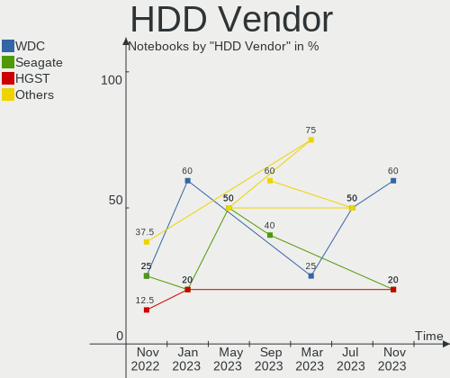
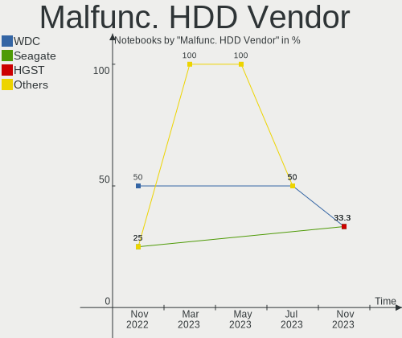
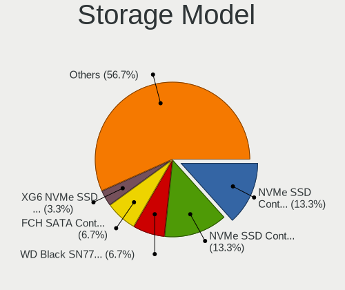
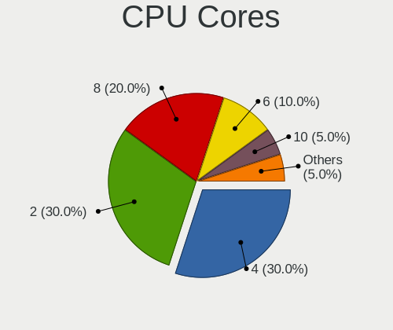
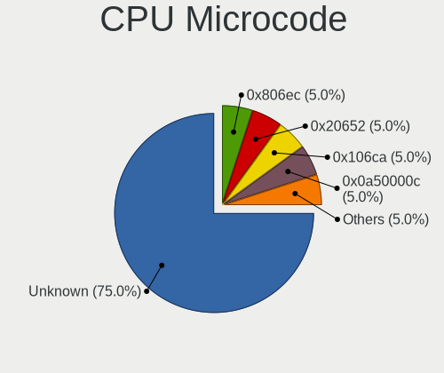
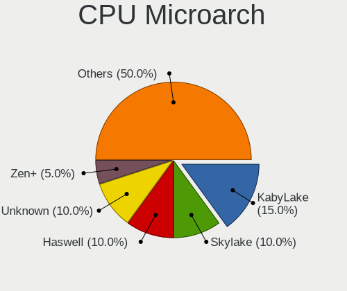
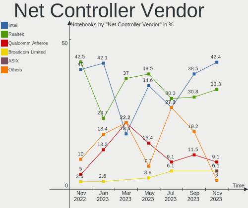
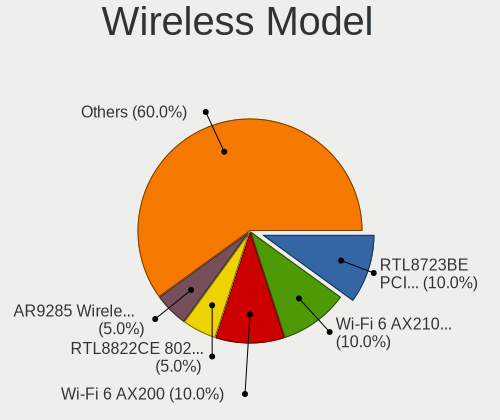
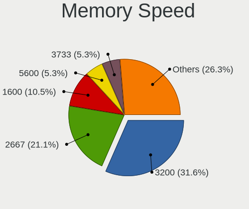
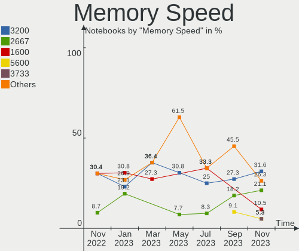

Ubuntu MATE - Hardware Trends (Notebooks)
-----------------------------------------

A project to identify most popular hardware characteristics and track their change
over time based on data collected by Linux users at https://Linux-Hardware.org.

Anyone can contribute to this report by the [hw-probe](https://github.com/linuxhw/hw-probe) tool:

    sudo -E hw-probe -all -upload

This report is for one last month. Overall report since the beginning of time: [TestCoverage](https://github.com/linuxhw/TestCoverage)

Period: Dec, 2022.

Contents
--------

* [ System ](#system)
  - [ OS                       ](#os)
  - [ OS Family                ](#os-family)
  - [ Kernel                   ](#kernel)
  - [ Kernel Family            ](#kernel-family)
  - [ Kernel Major Ver.        ](#kernel-major-ver)
  - [ Arch                     ](#arch)
  - [ DE                       ](#de)
  - [ Display Server           ](#display-server)
  - [ Display Manager          ](#display-manager)
  - [ OS Lang                  ](#os-lang)
  - [ Boot Mode                ](#boot-mode)
  - [ Filesystem               ](#filesystem)
  - [ Part. scheme             ](#part-scheme)
  - [ Dual Boot with Linux/BSD ](#dual-boot-with-linuxbsd)
  - [ Dual Boot (Win)          ](#dual-boot-win)

* [ Board ](#board)
  - [ Vendor                   ](#vendor)
  - [ Model                    ](#model)
  - [ Model Family             ](#model-family)
  - [ MFG Year                 ](#mfg-year)
  - [ Form Factor              ](#form-factor)
  - [ Secure Boot              ](#secure-boot)
  - [ Coreboot                 ](#coreboot)
  - [ RAM Size                 ](#ram-size)
  - [ RAM Used                 ](#ram-used)
  - [ Total Drives             ](#total-drives)
  - [ Has CD-ROM               ](#has-cd-rom)
  - [ Has Ethernet             ](#has-ethernet)
  - [ Has WiFi                 ](#has-wifi)
  - [ Has Bluetooth            ](#has-bluetooth)

* [ Location ](#location)
  - [ Country                  ](#country)
  - [ City                     ](#city)

* [ Drives ](#drives)
  - [ Drive Vendor             ](#drive-vendor)
  - [ Drive Model              ](#drive-model)
  - [ HDD Vendor               ](#hdd-vendor)
  - [ SSD Vendor               ](#ssd-vendor)
  - [ Drive Kind               ](#drive-kind)
  - [ Drive Connector          ](#drive-connector)
  - [ Drive Size               ](#drive-size)
  - [ Space Total              ](#space-total)
  - [ Space Used               ](#space-used)
  - [ Malfunc. Drives          ](#malfunc-drives)
  - [ Malfunc. Drive Vendor    ](#malfunc-drive-vendor)
  - [ Malfunc. HDD Vendor      ](#malfunc-hdd-vendor)
  - [ Malfunc. Drive Kind      ](#malfunc-drive-kind)
  - [ Failed Drives            ](#failed-drives)
  - [ Failed Drive Vendor      ](#failed-drive-vendor)
  - [ Drive Status             ](#drive-status)

* [ Storage controller ](#storage-controller)
  - [ Storage Vendor           ](#storage-vendor)
  - [ Storage Model            ](#storage-model)
  - [ Storage Kind             ](#storage-kind)

* [ Processor ](#processor)
  - [ CPU Vendor               ](#cpu-vendor)
  - [ CPU Model                ](#cpu-model)
  - [ CPU Model Family         ](#cpu-model-family)
  - [ CPU Cores                ](#cpu-cores)
  - [ CPU Sockets              ](#cpu-sockets)
  - [ CPU Threads              ](#cpu-threads)
  - [ CPU Op-Modes             ](#cpu-op-modes)
  - [ CPU Microcode            ](#cpu-microcode)
  - [ CPU Microarch            ](#cpu-microarch)

* [ Graphics ](#graphics)
  - [ GPU Vendor               ](#gpu-vendor)
  - [ GPU Model                ](#gpu-model)
  - [ GPU Combo                ](#gpu-combo)
  - [ GPU Driver               ](#gpu-driver)
  - [ GPU Memory               ](#gpu-memory)

* [ Monitor ](#monitor)
  - [ Monitor Vendor           ](#monitor-vendor)
  - [ Monitor Model            ](#monitor-model)
  - [ Monitor Resolution       ](#monitor-resolution)
  - [ Monitor Diagonal         ](#monitor-diagonal)
  - [ Monitor Width            ](#monitor-width)
  - [ Aspect Ratio             ](#aspect-ratio)
  - [ Monitor Area             ](#monitor-area)
  - [ Pixel Density            ](#pixel-density)
  - [ Multiple Monitors        ](#multiple-monitors)

* [ Network ](#network)
  - [ Net Controller Vendor    ](#net-controller-vendor)
  - [ Net Controller Model     ](#net-controller-model)
  - [ Wireless Vendor          ](#wireless-vendor)
  - [ Wireless Model           ](#wireless-model)
  - [ Ethernet Vendor          ](#ethernet-vendor)
  - [ Ethernet Model           ](#ethernet-model)
  - [ Net Controller Kind      ](#net-controller-kind)
  - [ Used Controller          ](#used-controller)
  - [ NICs                     ](#nics)
  - [ IPv6                     ](#ipv6)

* [ Bluetooth ](#bluetooth)
  - [ Bluetooth Vendor         ](#bluetooth-vendor)
  - [ Bluetooth Model          ](#bluetooth-model)

* [ Sound ](#sound)
  - [ Sound Vendor             ](#sound-vendor)
  - [ Sound Model              ](#sound-model)

* [ Memory ](#memory)
  - [ Memory Vendor            ](#memory-vendor)
  - [ Memory Model             ](#memory-model)
  - [ Memory Kind              ](#memory-kind)
  - [ Memory Form Factor       ](#memory-form-factor)
  - [ Memory Size              ](#memory-size)
  - [ Memory Speed             ](#memory-speed)

* [ Printers & scanners ](#printers--scanners)
  - [ Printer Vendor           ](#printer-vendor)
  - [ Printer Model            ](#printer-model)
  - [ Scanner Vendor           ](#scanner-vendor)
  - [ Scanner Model            ](#scanner-model)

* [ Camera ](#camera)
  - [ Camera Vendor            ](#camera-vendor)
  - [ Camera Model             ](#camera-model)

* [ Security ](#security)
  - [ Fingerprint Vendor       ](#fingerprint-vendor)
  - [ Fingerprint Model        ](#fingerprint-model)
  - [ Chipcard Vendor          ](#chipcard-vendor)
  - [ Chipcard Model           ](#chipcard-model)

* [ Unsupported ](#unsupported)
  - [ Unsupported Devices      ](#unsupported-devices)
  - [ Unsupported Device Types ](#unsupported-device-types)

System
------

OS
--

Installed operating systems

| Name              | Notebooks | Percent |
|-------------------|-----------|---------|
| Ubuntu MATE 22.04 | 12        | 50%     |
| Ubuntu MATE 22.10 | 9         | 37.5%   |
| Ubuntu MATE 20.04 | 3         | 12.5%   |

OS Family
---------

OS without a version

| Name        | Notebooks | Percent |
|-------------|-----------|---------|
| Ubuntu MATE | 24        | 100%    |

Kernel
------

Version of the Linux kernel

| Version                | Notebooks | Percent |
|------------------------|-----------|---------|
| 5.15.0-56-generic      | 11        | 45.83%  |
| 5.19.0-26-generic      | 5         | 20.83%  |
| 5.19.0-27-generic      | 1         | 4.17%   |
| 5.19.0-24-generic      | 1         | 4.17%   |
| 5.19.0-21-generic      | 1         | 4.17%   |
| 5.19.0-1012-lowlatency | 1         | 4.17%   |
| 5.15.0-56-lowlatency   | 1         | 4.17%   |
| 5.15.0-53-generic      | 1         | 4.17%   |
| 5.15.0-43-generic      | 1         | 4.17%   |
| 5.11.0-27-generic      | 1         | 4.17%   |

Kernel Family
-------------

Linux kernel without a distro release

| Version | Notebooks | Percent |
|---------|-----------|---------|
| 5.15.0  | 14        | 58.33%  |
| 5.19.0  | 9         | 37.5%   |
| 5.11.0  | 1         | 4.17%   |

Kernel Major Ver.
-----------------

Linux kernel major version

| Version | Notebooks | Percent |
|---------|-----------|---------|
| 5.15    | 14        | 58.33%  |
| 5.19    | 9         | 37.5%   |
| 5.11    | 1         | 4.17%   |

Arch
----

OS architecture (x86_64, i586, etc.)

| Name   | Notebooks | Percent |
|--------|-----------|---------|
| x86_64 | 24        | 100%    |

DE
--

Desktop Environment

| Name | Notebooks | Percent |
|------|-----------|---------|
| MATE | 23        | 95.83%  |
| XFCE | 1         | 4.17%   |

Display Server
--------------

X11 or Wayland

| Name | Notebooks | Percent |
|------|-----------|---------|
| X11  | 23        | 95.83%  |
| Tty  | 1         | 4.17%   |

Display Manager
---------------

SDDM, LightDM, etc.

| Name    | Notebooks | Percent |
|---------|-----------|---------|
| LightDM | 20        | 83.33%  |
| GDM3    | 3         | 12.5%   |
| Unknown | 1         | 4.17%   |

OS Lang
-------

Language

| Lang  | Notebooks | Percent |
|-------|-----------|---------|
| en_US | 11        | 45.83%  |
| hu_HU | 2         | 8.33%   |
| en_GB | 2         | 8.33%   |
| en_AU | 2         | 8.33%   |
| de_DE | 2         | 8.33%   |
| ru_RU | 1         | 4.17%   |
| pl_PL | 1         | 4.17%   |
| fr_FR | 1         | 4.17%   |
| en_CA | 1         | 4.17%   |
| el_GR | 1         | 4.17%   |

Boot Mode
---------

EFI or BIOS

| Mode | Notebooks | Percent |
|------|-----------|---------|
| BIOS | 13        | 54.17%  |
| EFI  | 11        | 45.83%  |

Filesystem
----------

Type of filesystem

| Type    | Notebooks | Percent |
|---------|-----------|---------|
| Ext4    | 19        | 79.17%  |
| Btrfs   | 2         | 8.33%   |
| Zfs     | 1         | 4.17%   |
| Xfs     | 1         | 4.17%   |
| Overlay | 1         | 4.17%   |

Part. scheme
------------

Scheme of partitioning

| Type    | Notebooks | Percent |
|---------|-----------|---------|
| GPT     | 18        | 75%     |
| MBR     | 5         | 20.83%  |
| Unknown | 1         | 4.17%   |

Dual Boot with Linux/BSD
------------------------

Hosting more than one Linux/BSD

| Dual boot | Notebooks | Percent |
|-----------|-----------|---------|
| No        | 22        | 91.67%  |
| Yes       | 2         | 8.33%   |

Dual Boot (Win)
---------------

Hosting Linux and Windows

| Dual boot | Notebooks | Percent |
|-----------|-----------|---------|
| No        | 19        | 79.17%  |
| Yes       | 5         | 20.83%  |

Board
-----

Vendor
------

Motherboard manufacturer

| Name             | Notebooks | Percent |
|------------------|-----------|---------|
| Hewlett-Packard  | 7         | 29.17%  |
| Lenovo           | 6         | 25%     |
| ASUSTek Computer | 4         | 16.67%  |
| Acer             | 2         | 8.33%   |
| Toshiba          | 1         | 4.17%   |
| Notebook         | 1         | 4.17%   |
| MSI              | 1         | 4.17%   |
| HUAWEI           | 1         | 4.17%   |
| Dell             | 1         | 4.17%   |

Model
-----

Motherboard model

| Name                                | Notebooks | Percent |
|-------------------------------------|-----------|---------|
| Toshiba Satellite C50D-C            | 1         | 4.17%   |
| Notebook NJx0MU                     | 1         | 4.17%   |
| MSI Summit E16Flip A12UCT           | 1         | 4.17%   |
| Lenovo ThinkPad T430 2347G5U        | 1         | 4.17%   |
| Lenovo ThinkPad T430 2344BZU        | 1         | 4.17%   |
| Lenovo ThinkPad R61 8918DEG         | 1         | 4.17%   |
| Lenovo IdeaPad S145-14IIL 81W6      | 1         | 4.17%   |
| Lenovo IdeaPad 330-15AST 81D6       | 1         | 4.17%   |
| Lenovo IdeaPad 3 15IIL05 81WE       | 1         | 4.17%   |
| HUAWEI KPL-W0X                      | 1         | 4.17%   |
| HP ZBook 17 G5                      | 1         | 4.17%   |
| HP Stream Laptop 14-cb1xxx          | 1         | 4.17%   |
| HP Pavilion Gaming Laptop 17-cd1xxx | 1         | 4.17%   |
| HP EliteBook 840 G5                 | 1         | 4.17%   |
| HP Compaq Presario CQ61             | 1         | 4.17%   |
| HP 255 G7 Notebook PC               | 1         | 4.17%   |
| HP 14                               | 1         | 4.17%   |
| Dell Latitude E5430 non-vPro        | 1         | 4.17%   |
| ASUS X550LN                         | 1         | 4.17%   |
| ASUS TUF Gaming FX705GM_FX705GM     | 1         | 4.17%   |
| ASUS TUF Gaming FX505DT_FX505DT     | 1         | 4.17%   |
| ASUS T100TA                         | 1         | 4.17%   |
| Acer TravelMate 7730                | 1         | 4.17%   |
| Acer Aspire E1-572                  | 1         | 4.17%   |

Model Family
------------

Motherboard model prefix

| Name              | Notebooks | Percent |
|-------------------|-----------|---------|
| Lenovo ThinkPad   | 3         | 12.5%   |
| Lenovo IdeaPad    | 3         | 12.5%   |
| ASUS TUF          | 2         | 8.33%   |
| Toshiba Satellite | 1         | 4.17%   |
| Notebook NJx0MU   | 1         | 4.17%   |
| MSI Summit        | 1         | 4.17%   |
| HUAWEI KPL-W0X    | 1         | 4.17%   |
| HP ZBook          | 1         | 4.17%   |
| HP Stream         | 1         | 4.17%   |
| HP Pavilion       | 1         | 4.17%   |
| HP EliteBook      | 1         | 4.17%   |
| HP Compaq         | 1         | 4.17%   |
| HP 255            | 1         | 4.17%   |
| HP 14             | 1         | 4.17%   |
| Dell Latitude     | 1         | 4.17%   |
| ASUS X550LN       | 1         | 4.17%   |
| ASUS T100TA       | 1         | 4.17%   |
| Acer TravelMate   | 1         | 4.17%   |
| Acer Aspire       | 1         | 4.17%   |

MFG Year
--------

Motherboard manufacture year

| Year | Notebooks | Percent |
|------|-----------|---------|
| 2018 | 5         | 20.83%  |
| 2019 | 4         | 16.67%  |
| 2013 | 3         | 12.5%   |
| 2012 | 3         | 12.5%   |
| 2020 | 2         | 8.33%   |
| 2022 | 1         | 4.17%   |
| 2021 | 1         | 4.17%   |
| 2015 | 1         | 4.17%   |
| 2014 | 1         | 4.17%   |
| 2009 | 1         | 4.17%   |
| 2008 | 1         | 4.17%   |
| 2007 | 1         | 4.17%   |

Form Factor
-----------

Physical design of the computer

| Name     | Notebooks | Percent |
|----------|-----------|---------|
| Notebook | 24        | 100%    |

Secure Boot
-----------

Enabled or disabled

| State    | Notebooks | Percent |
|----------|-----------|---------|
| Disabled | 24        | 100%    |

Coreboot
--------

Have coreboot on board

| Used | Notebooks | Percent |
|------|-----------|---------|
| No   | 24        | 100%    |

RAM Size
--------

Total RAM memory

| Size in GB  | Notebooks | Percent |
|-------------|-----------|---------|
| 4.01-8.0    | 8         | 33.33%  |
| 3.01-4.0    | 7         | 29.17%  |
| 16.01-24.0  | 3         | 12.5%   |
| 64.01-256.0 | 2         | 8.33%   |
| 24.01-32.0  | 1         | 4.17%   |
| 2.01-3.0    | 1         | 4.17%   |
| 1.01-2.0    | 1         | 4.17%   |
| 8.01-16.0   | 1         | 4.17%   |

RAM Used
--------

Used RAM memory

| Used GB   | Notebooks | Percent |
|-----------|-----------|---------|
| 1.01-2.0  | 7         | 29.17%  |
| 3.01-4.0  | 4         | 16.67%  |
| 2.01-3.0  | 4         | 16.67%  |
| 0.51-1.0  | 4         | 16.67%  |
| 4.01-8.0  | 3         | 12.5%   |
| 8.01-16.0 | 2         | 8.33%   |

Total Drives
------------

Number of drives on board

| Drives | Notebooks | Percent |
|--------|-----------|---------|
| 1      | 18        | 75%     |
| 2      | 4         | 16.67%  |
| 3      | 2         | 8.33%   |

Has CD-ROM
----------

Has CD-ROM on board

| Presented | Notebooks | Percent |
|-----------|-----------|---------|
| No        | 15        | 62.5%   |
| Yes       | 9         | 37.5%   |

Has Ethernet
------------

Has Ethernet on board

| Presented | Notebooks | Percent |
|-----------|-----------|---------|
| Yes       | 18        | 75%     |
| No        | 6         | 25%     |

Has WiFi
--------

Has WiFi module

| Presented | Notebooks | Percent |
|-----------|-----------|---------|
| Yes       | 23        | 95.83%  |
| No        | 1         | 4.17%   |

Has Bluetooth
-------------

Has Bluetooth module

| Presented | Notebooks | Percent |
|-----------|-----------|---------|
| Yes       | 20        | 83.33%  |
| No        | 4         | 16.67%  |

Location
--------

Country
-------

Geographic location (country)

| Country   | Notebooks | Percent |
|-----------|-----------|---------|
| USA       | 6         | 25%     |
| Hungary   | 3         | 12.5%   |
| UK        | 2         | 8.33%   |
| Norway    | 2         | 8.33%   |
| Germany   | 2         | 8.33%   |
| Australia | 2         | 8.33%   |
| Russia    | 1         | 4.17%   |
| Poland    | 1         | 4.17%   |
| Indonesia | 1         | 4.17%   |
| Greece    | 1         | 4.17%   |
| France    | 1         | 4.17%   |
| Chile     | 1         | 4.17%   |
| Brazil    | 1         | 4.17%   |

City
----

Geographic location (city)

| City          | Notebooks | Percent |
|---------------|-----------|---------|
| Brisbane      | 2         | 8.33%   |
| Warsaw        | 1         | 4.17%   |
| Viroflay      | 1         | 4.17%   |
| Talcahuano    | 1         | 4.17%   |
| Stange        | 1         | 4.17%   |
| Sevenoaks     | 1         | 4.17%   |
| Sao Paulo     | 1         | 4.17%   |
| Saint Paul    | 1         | 4.17%   |
| Olympia       | 1         | 4.17%   |
| Olathe        | 1         | 4.17%   |
| Moscow        | 1         | 4.17%   |
| Mannheim      | 1         | 4.17%   |
| Lindlar       | 1         | 4.17%   |
| Kalamata      | 1         | 4.17%   |
| Hull          | 1         | 4.17%   |
| Houston       | 1         | 4.17%   |
| Hohenwald     | 1         | 4.17%   |
| Hamar         | 1         | 4.17%   |
| Győr         | 1         | 4.17%   |
| Charlotte     | 1         | 4.17%   |
| Budapest      | 1         | 4.17%   |
| Balikpapan    | 1         | 4.17%   |
| Balatonalmadi | 1         | 4.17%   |

Drives
------

Drive Vendor
------------

Hard drive vendors

| Vendor                | Notebooks | Drives | Percent |
|-----------------------|-----------|--------|---------|
| Samsung Electronics   | 6         | 7      | 18.75%  |
| WDC                   | 4         | 4      | 12.5%   |
| Seagate               | 4         | 4      | 12.5%   |
| Toshiba               | 3         | 3      | 9.38%   |
| Sandisk               | 2         | 2      | 6.25%   |
| Kingston              | 2         | 2      | 6.25%   |
| WDC WDS2              | 1         | 1      | 3.13%   |
| Verbatim              | 1         | 1      | 3.13%   |
| Unknown               | 1         | 1      | 3.13%   |
| SK hynix              | 1         | 1      | 3.13%   |
| Realtek Semiconductor | 1         | 1      | 3.13%   |
| Patriot               | 1         | 1      | 3.13%   |
| Micron Technology     | 1         | 1      | 3.13%   |
| KIOXIA                | 1         | 1      | 3.13%   |
| Intel                 | 1         | 1      | 3.13%   |
| GLOWAY                | 1         | 1      | 3.13%   |
| addlink               | 1         | 1      | 3.13%   |

Drive Model
-----------

Hard drive models

| Model                                               | Notebooks | Percent |
|-----------------------------------------------------|-----------|---------|
| WDC WDS2 50G2B0B-00YS 250GB SSD                     | 1         | 3.13%   |
| WDC WD7500BPVX-22JC3T0 752GB                        | 1         | 3.13%   |
| WDC WD5000LPVX-60V0TT0 500GB                        | 1         | 3.13%   |
| WDC WD5000LPCX-24VHAT0 500GB                        | 1         | 3.13%   |
| WDC WD10SPZX-21Z10T0 1TB                            | 1         | 3.13%   |
| Verbatim Vi550 S3 256GB                             | 1         | 3.13%   |
| Unknown MMC Card  64GB                              | 1         | 3.13%   |
| Toshiba XG6 NVMe SSD Controller 256GB               | 1         | 3.13%   |
| Toshiba MQ01ACF050 500GB                            | 1         | 3.13%   |
| Toshiba MQ01ABF050 500GB                            | 1         | 3.13%   |
| SK hynix HCG8e  64GB                                | 1         | 3.13%   |
| Seagate ST9250827AS 250GB                           | 1         | 3.13%   |
| Seagate ST2000LM015-2E8174 2TB                      | 1         | 3.13%   |
| Seagate One Touch HDD 5TB                           | 1         | 3.13%   |
| Seagate BUP BK 4TB                                  | 1         | 3.13%   |
| Sandisk WD Blue SN500 / PC SN520 NVMe SSD 256GB     | 1         | 3.13%   |
| Sandisk PC SN520 NVMe SSD 128GB                     | 1         | 3.13%   |
| Samsung SSD 980 1TB                                 | 1         | 3.13%   |
| Samsung SSD 870 QVO 8TB                             | 1         | 3.13%   |
| Samsung SSD 850 EVO 1TB                             | 1         | 3.13%   |
| Samsung NVMe SSD Controller SM981/PM981/PM983 500GB | 1         | 3.13%   |
| Samsung MZVL2512HCJQ-00B00 512GB                    | 1         | 3.13%   |
| Samsung MZ7LN128HCHP-000L1 128GB SSD                | 1         | 3.13%   |
| Realtek ADATA SWORDFISH 1TB                         | 1         | 3.13%   |
| Patriot Burst 120GB SSD                             | 1         | 3.13%   |
| Micron 3400_MTFDKBA512TFH 512GB                     | 1         | 3.13%   |
| KIOXIA KBG40ZNV256G 256GB                           | 1         | 3.13%   |
| Kingston SV300S37A120G 120GB SSD                    | 1         | 3.13%   |
| Kingston SA400M8240G 240GB SSD                      | 1         | 3.13%   |
| Intel SSDPEKNW512G8H 512GB                          | 1         | 3.13%   |
| GLOWAY WAR PRO T300 240G SSD                        | 1         | 3.13%   |
| addlink SATA SSD 1024GB                             | 1         | 3.13%   |

HDD Vendor
----------

Hard disk drive vendors

| Vendor  | Notebooks | Drives | Percent |
|---------|-----------|--------|---------|
| WDC     | 4         | 4      | 40%     |
| Seagate | 4         | 4      | 40%     |
| Toshiba | 2         | 2      | 20%     |

SSD Vendor
----------

Solid state drive vendors

| Vendor              | Notebooks | Drives | Percent |
|---------------------|-----------|--------|---------|
| Samsung Electronics | 3         | 3      | 30%     |
| Kingston            | 2         | 2      | 20%     |
| WDC WDS2            | 1         | 1      | 10%     |
| Verbatim            | 1         | 1      | 10%     |
| Patriot             | 1         | 1      | 10%     |
| GLOWAY              | 1         | 1      | 10%     |
| addlink             | 1         | 1      | 10%     |

Drive Kind
----------

HDD or SSD

| Kind | Notebooks | Drives | Percent |
|------|-----------|--------|---------|
| NVMe | 10        | 11     | 32.26%  |
| HDD  | 10        | 10     | 32.26%  |
| SSD  | 9         | 10     | 29.03%  |
| MMC  | 2         | 2      | 6.45%   |

Drive Connector
---------------

SATA, SAS, NVMe, etc.

| Type | Notebooks | Drives | Percent |
|------|-----------|--------|---------|
| SATA | 16        | 17     | 51.61%  |
| NVMe | 10        | 11     | 32.26%  |
| SAS  | 3         | 3      | 9.68%   |
| MMC  | 2         | 2      | 6.45%   |

Drive Size
----------

Size of hard drive

| Size in TB | Notebooks | Drives | Percent |
|------------|-----------|--------|---------|
| 0.01-0.5   | 11        | 12     | 57.89%  |
| 0.51-1.0   | 3         | 3      | 15.79%  |
| 1.01-2.0   | 2         | 2      | 10.53%  |
| 4.01-10.0  | 2         | 2      | 10.53%  |
| 3.01-4.0   | 1         | 1      | 5.26%   |

Space Total
-----------

Amount of disk space available on the file system

| Size in GB     | Notebooks | Percent |
|----------------|-----------|---------|
| 251-500        | 6         | 25%     |
| 101-250        | 6         | 25%     |
| 1001-2000      | 3         | 12.5%   |
| More than 3000 | 2         | 8.33%   |
| 1-20           | 2         | 8.33%   |
| 51-100         | 2         | 8.33%   |
| 21-50          | 1         | 4.17%   |
| 2001-3000      | 1         | 4.17%   |
| 501-1000       | 1         | 4.17%   |

Space Used
----------

Amount of used disk space

| Used GB        | Notebooks | Percent |
|----------------|-----------|---------|
| 1-20           | 10        | 41.67%  |
| 21-50          | 3         | 12.5%   |
| 101-250        | 3         | 12.5%   |
| 51-100         | 3         | 12.5%   |
| More than 3000 | 2         | 8.33%   |
| 251-500        | 2         | 8.33%   |
| 1001-2000      | 1         | 4.17%   |

Malfunc. Drives
---------------

Drive models with a malfunction

| Model                        | Notebooks | Drives | Percent |
|------------------------------|-----------|--------|---------|
| WDC WD7500BPVX-22JC3T0 752GB | 1         | 1      | 50%     |
| Intel SSDPEKNW512G8H 512GB   | 1         | 1      | 50%     |

Malfunc. Drive Vendor
---------------------

Vendors of faulty drives

| Vendor | Notebooks | Drives | Percent |
|--------|-----------|--------|---------|
| WDC    | 1         | 1      | 50%     |
| Intel  | 1         | 1      | 50%     |

Malfunc. HDD Vendor
-------------------

Vendors of faulty HDD drives

| Vendor | Notebooks | Drives | Percent |
|--------|-----------|--------|---------|
| WDC    | 1         | 1      | 100%    |

Malfunc. Drive Kind
-------------------

Kinds of faulty drives

| Kind | Notebooks | Drives | Percent |
|------|-----------|--------|---------|
| NVMe | 1         | 1      | 50%     |
| HDD  | 1         | 1      | 50%     |

Failed Drives
-------------

Failed drive models

Zero info for selected period =(

Failed Drive Vendor
-------------------

Failed drive vendors

Zero info for selected period =(

Drive Status
------------

Number of failed and malfunc. drives

| Status   | Notebooks | Drives | Percent |
|----------|-----------|--------|---------|
| Works    | 13        | 14     | 52%     |
| Detected | 10        | 17     | 40%     |
| Malfunc  | 2         | 2      | 8%      |

Storage controller
------------------

Storage Vendor
--------------

Storage controller vendors

| Vendor                       | Notebooks | Percent |
|------------------------------|-----------|---------|
| Intel                        | 16        | 57.14%  |
| Samsung Electronics          | 3         | 10.71%  |
| AMD                          | 3         | 10.71%  |
| SanDisk                      | 2         | 7.14%   |
| Toshiba America Info Systems | 1         | 3.57%   |
| Realtek Semiconductor        | 1         | 3.57%   |
| Micron Technology            | 1         | 3.57%   |
| KIOXIA                       | 1         | 3.57%   |

Storage Model
-------------

Storage controller models

| Model                                                                 | Notebooks | Percent |
|-----------------------------------------------------------------------|-----------|---------|
| AMD FCH SATA Controller [AHCI mode]                                   | 3         | 10%     |
| Intel Ice Lake-LP SATA Controller [AHCI mode]                         | 2         | 6.67%   |
| Intel Cannon Lake Mobile PCH SATA AHCI Controller                     | 2         | 6.67%   |
| Intel 8 Series SATA Controller 1 [AHCI mode]                          | 2         | 6.67%   |
| Intel 7 Series Chipset Family 6-port SATA Controller [AHCI mode]      | 2         | 6.67%   |
| Toshiba America Info Systems XG6 NVMe SSD Controller                  | 1         | 3.33%   |
| SanDisk WD Blue SN500 / PC SN520 NVMe SSD                             | 1         | 3.33%   |
| SanDisk PC SN520 NVMe SSD                                             | 1         | 3.33%   |
| Samsung NVMe SSD Controller SM981/PM981/PM983                         | 1         | 3.33%   |
| Samsung NVMe SSD Controller PM9A1/PM9A3/980PRO                        | 1         | 3.33%   |
| Samsung NVMe SSD Controller 980                                       | 1         | 3.33%   |
| Realtek Realtek Non-Volatile memory controller                        | 1         | 3.33%   |
| Micron Non-Volatile memory controller                                 | 1         | 3.33%   |
| KIOXIA NVMe SSD Controller BG4                                        | 1         | 3.33%   |
| Intel Tiger Lake-LP SATA Controller                                   | 1         | 3.33%   |
| Intel SSD 660P Series                                                 | 1         | 3.33%   |
| Intel Atom Processor E3800 Series SATA AHCI Controller                | 1         | 3.33%   |
| Intel 82801IBM/IEM (ICH9M/ICH9M-E) 4 port SATA Controller [AHCI mode] | 1         | 3.33%   |
| Intel 82801IBM/IEM (ICH9M/ICH9M-E) 2 port SATA Controller [IDE mode]  | 1         | 3.33%   |
| Intel 82801HM/HEM (ICH8M/ICH8M-E) SATA Controller [AHCI mode]         | 1         | 3.33%   |
| Intel 82801HM/HEM (ICH8M/ICH8M-E) IDE Controller                      | 1         | 3.33%   |
| Intel 82801 Mobile SATA Controller [RAID mode]                        | 1         | 3.33%   |
| Intel 7 Series Chipset Family 4-port SATA Controller [IDE mode]       | 1         | 3.33%   |
| Intel 7 Series Chipset Family 2-port SATA Controller [IDE mode]       | 1         | 3.33%   |

Storage Kind
------------

Kind of storage controller (IDE, SATA, NVMe, SAS, ...)

| Kind | Notebooks | Percent |
|------|-----------|---------|
| SATA | 15        | 51.72%  |
| NVMe | 10        | 34.48%  |
| IDE  | 3         | 10.34%  |
| RAID | 1         | 3.45%   |

Processor
---------

CPU Vendor
----------

Processor vendors

| Vendor | Notebooks | Percent |
|--------|-----------|---------|
| Intel  | 19        | 79.17%  |
| AMD    | 5         | 20.83%  |

CPU Model
---------

Processor models

| Model                                         | Notebooks | Percent |
|-----------------------------------------------|-----------|---------|
| Intel Core i5-3320M CPU @ 2.60GHz             | 2         | 8.33%   |
| Intel Pentium Dual-Core CPU T4400 @ 2.20GHz   | 1         | 4.17%   |
| Intel Pentium CPU N3540 @ 2.16GHz             | 1         | 4.17%   |
| Intel Core i7-8850H CPU @ 2.60GHz             | 1         | 4.17%   |
| Intel Core i7-8750H CPU @ 2.20GHz             | 1         | 4.17%   |
| Intel Core i7-10750H CPU @ 2.60GHz            | 1         | 4.17%   |
| Intel Core i5-8250U CPU @ 1.60GHz             | 1         | 4.17%   |
| Intel Core i5-4200U CPU @ 1.60GHz             | 1         | 4.17%   |
| Intel Core i5-3340M CPU @ 2.70GHz             | 1         | 4.17%   |
| Intel Core i5-1035G1 CPU @ 1.00GHz            | 1         | 4.17%   |
| Intel Core i3-4010U CPU @ 1.70GHz             | 1         | 4.17%   |
| Intel Core i3-1005G1 CPU @ 1.20GHz            | 1         | 4.17%   |
| Intel Core 2 Duo CPU T8100 @ 2.10GHz          | 1         | 4.17%   |
| Intel Core 2 Duo CPU T5670 @ 1.80GHz          | 1         | 4.17%   |
| Intel Celeron N4020 CPU @ 1.10GHz             | 1         | 4.17%   |
| Intel Atom CPU Z3740 @ 1.33GHz                | 1         | 4.17%   |
| Intel 12th Gen Core i7-1260P                  | 1         | 4.17%   |
| Intel 11th Gen Core i7-1165G7 @ 2.80GHz       | 1         | 4.17%   |
| AMD Ryzen 7 3750H with Radeon Vega Mobile Gfx | 1         | 4.17%   |
| AMD Ryzen 5 2500U with Radeon Vega Mobile Gfx | 1         | 4.17%   |
| AMD Ryzen 3 3200U with Radeon Vega Mobile Gfx | 1         | 4.17%   |
| AMD E2-9000 RADEON R2, 4 COMPUTE CORES 2C+2G  | 1         | 4.17%   |
| AMD E1-7010 APU with AMD Radeon R2 Graphics   | 1         | 4.17%   |

CPU Model Family
----------------

Processor model prefix

| Model                   | Notebooks | Percent |
|-------------------------|-----------|---------|
| Intel Core i5           | 6         | 25%     |
| Intel Core i7           | 3         | 12.5%   |
| Other                   | 2         | 8.33%   |
| Intel Core i3           | 2         | 8.33%   |
| Intel Core 2 Duo        | 2         | 8.33%   |
| Intel Pentium Dual-Core | 1         | 4.17%   |
| Intel Pentium           | 1         | 4.17%   |
| Intel Celeron           | 1         | 4.17%   |
| Intel Atom              | 1         | 4.17%   |
| AMD Ryzen 7             | 1         | 4.17%   |
| AMD Ryzen 5             | 1         | 4.17%   |
| AMD Ryzen 3             | 1         | 4.17%   |
| AMD E2                  | 1         | 4.17%   |
| AMD E1                  | 1         | 4.17%   |

CPU Cores
---------

Number of processor cores

| Number | Notebooks | Percent |
|--------|-----------|---------|
| 2      | 13        | 54.17%  |
| 4      | 7         | 29.17%  |
| 6      | 3         | 12.5%   |
| 12     | 1         | 4.17%   |

CPU Sockets
-----------

Number of sockets

| Number | Notebooks | Percent |
|--------|-----------|---------|
| 1      | 24        | 100%    |

CPU Threads
-----------

Threads per core (Hyper-Threading)

| Number | Notebooks | Percent |
|--------|-----------|---------|
| 2      | 16        | 66.67%  |
| 1      | 8         | 33.33%  |

CPU Op-Modes
------------

CPU Operation Modes (32-bit, 64-bit)

| Op mode        | Notebooks | Percent |
|----------------|-----------|---------|
| 32-bit, 64-bit | 24        | 100%    |

CPU Microcode
-------------

Microcode number

| Number     | Notebooks | Percent |
|------------|-----------|---------|
| Unknown    | 8         | 33.33%  |
| 0x306a9    | 3         | 12.5%   |
| 0x906a3    | 1         | 4.17%   |
| 0x806ea    | 1         | 4.17%   |
| 0x806c1    | 1         | 4.17%   |
| 0x706e5    | 1         | 4.17%   |
| 0x6fd      | 1         | 4.17%   |
| 0x40651    | 1         | 4.17%   |
| 0x30678    | 1         | 4.17%   |
| 0x30673    | 1         | 4.17%   |
| 0x1067a    | 1         | 4.17%   |
| 0x10676    | 1         | 4.17%   |
| 0x08108109 | 1         | 4.17%   |
| 0x07030105 | 1         | 4.17%   |
| 0x06006704 | 1         | 4.17%   |

CPU Microarch
-------------

Microarchitecture

| Name             | Notebooks | Percent |
|------------------|-----------|---------|
| KabyLake         | 3         | 12.5%   |
| IvyBridge        | 3         | 12.5%   |
| Zen+             | 2         | 8.33%   |
| Silvermont       | 2         | 8.33%   |
| Penryn           | 2         | 8.33%   |
| IceLake          | 2         | 8.33%   |
| Haswell          | 2         | 8.33%   |
| Zen              | 1         | 4.17%   |
| TigerLake        | 1         | 4.17%   |
| Puma             | 1         | 4.17%   |
| Goldmont plus    | 1         | 4.17%   |
| Excavator        | 1         | 4.17%   |
| Core             | 1         | 4.17%   |
| CometLake        | 1         | 4.17%   |
| Alderlake Hybrid | 1         | 4.17%   |

Graphics
--------

GPU Vendor
----------

Vendors of graphics cards

| Vendor | Notebooks | Percent |
|--------|-----------|---------|
| Intel  | 17        | 58.62%  |
| Nvidia | 7         | 24.14%  |
| AMD    | 5         | 17.24%  |

GPU Model
---------

Graphics card models

| Model                                                                | Notebooks | Percent |
|----------------------------------------------------------------------|-----------|---------|
| Intel 3rd Gen Core processor Graphics Controller                     | 3         | 10.34%  |
| Intel Iris Plus Graphics G1 (Ice Lake)                               | 2         | 6.9%    |
| Intel Haswell-ULT Integrated Graphics Controller                     | 2         | 6.9%    |
| Intel CoffeeLake-H GT2 [UHD Graphics 630]                            | 2         | 6.9%    |
| Intel Atom Processor Z36xxx/Z37xxx Series Graphics & Display         | 2         | 6.9%    |
| AMD Picasso/Raven 2 [Radeon Vega Series / Radeon Vega Mobile Series] | 2         | 6.9%    |
| Nvidia TU117M [GeForce GTX 1650 Mobile / Max-Q]                      | 1         | 3.45%   |
| Nvidia TU116M [GeForce GTX 1660 Ti Mobile]                           | 1         | 3.45%   |
| Nvidia GP106M [GeForce GTX 1060 Mobile]                              | 1         | 3.45%   |
| Nvidia GM108M [GeForce 840M]                                         | 1         | 3.45%   |
| Nvidia GA107M [GeForce RTX 3050 Mobile]                              | 1         | 3.45%   |
| Nvidia G98M [GeForce G 103M]                                         | 1         | 3.45%   |
| Nvidia G86M [Quadro NVS 140M]                                        | 1         | 3.45%   |
| Intel UHD Graphics 620                                               | 1         | 3.45%   |
| Intel TigerLake-LP GT2 [Iris Xe Graphics]                            | 1         | 3.45%   |
| Intel Mobile 4 Series Chipset Integrated Graphics Controller         | 1         | 3.45%   |
| Intel GeminiLake [UHD Graphics 600]                                  | 1         | 3.45%   |
| Intel CometLake-H GT2 [UHD Graphics]                                 | 1         | 3.45%   |
| Intel Alder Lake-P Integrated Graphics Controller                    | 1         | 3.45%   |
| AMD Stoney [Radeon R2/R3/R4/R5 Graphics]                             | 1         | 3.45%   |
| AMD Raven Ridge [Radeon Vega Series / Radeon Vega Mobile Series]     | 1         | 3.45%   |
| AMD Mullins [Radeon R2 Graphics]                                     | 1         | 3.45%   |

GPU Combo
---------

Combinations of graphics cards

| Name           | Notebooks | Percent |
|----------------|-----------|---------|
| 1 x Intel      | 13        | 54.17%  |
| Intel + Nvidia | 4         | 16.67%  |
| 1 x AMD        | 4         | 16.67%  |
| 1 x Nvidia     | 2         | 8.33%   |
| AMD + Nvidia   | 1         | 4.17%   |

GPU Driver
----------

Free vs proprietary

| Driver      | Notebooks | Percent |
|-------------|-----------|---------|
| Free        | 20        | 83.33%  |
| Proprietary | 4         | 16.67%  |

GPU Memory
----------

Total video memory

| Size in GB | Notebooks | Percent |
|------------|-----------|---------|
| Unknown    | 17        | 70.83%  |
| 0.01-0.5   | 4         | 16.67%  |
| 3.01-4.0   | 2         | 8.33%   |
| 1.01-2.0   | 1         | 4.17%   |

Monitor
-------

Monitor Vendor
--------------

Monitor vendors

| Vendor               | Notebooks | Percent |
|----------------------|-----------|---------|
| LG Display           | 5         | 16.67%  |
| Chimei Innolux       | 5         | 16.67%  |
| AU Optronics         | 5         | 16.67%  |
| BOE                  | 4         | 13.33%  |
| Samsung Electronics  | 2         | 6.67%   |
| PANDA                | 1         | 3.33%   |
| LG Philips           | 1         | 3.33%   |
| IBM                  | 1         | 3.33%   |
| Hewlett-Packard      | 1         | 3.33%   |
| Goldstar             | 1         | 3.33%   |
| Dell                 | 1         | 3.33%   |
| BenQ                 | 1         | 3.33%   |
| Ancor Communications | 1         | 3.33%   |
| Acer                 | 1         | 3.33%   |

Monitor Model
-------------

Monitor models

| Model                                                                 | Notebooks | Percent |
|-----------------------------------------------------------------------|-----------|---------|
| Samsung Electronics LCD Monitor SEC3451 1366x768 344x194mm 15.5-inch  | 1         | 3.33%   |
| Samsung Electronics LCD Monitor SAM094E 1920x1080 700x390mm 31.5-inch | 1         | 3.33%   |
| PANDA LCD Monitor NCP002D 1920x1080 344x194mm 15.5-inch               | 1         | 3.33%   |
| LG Philips LCD Monitor LPLA106 1440x900 367x230mm 17.1-inch           | 1         | 3.33%   |
| LG Display LCD Monitor LGD063F 1920x1080 382x215mm 17.3-inch          | 1         | 3.33%   |
| LG Display LCD Monitor LGD05F1 1920x1080 309x174mm 14.0-inch          | 1         | 3.33%   |
| LG Display LCD Monitor LGD0456 1366x768 344x194mm 15.5-inch           | 1         | 3.33%   |
| LG Display LCD Monitor LGD03DB 1366x768 345x194mm 15.6-inch           | 1         | 3.33%   |
| LG Display LCD Monitor LGD033E 1366x768 309x174mm 14.0-inch           | 1         | 3.33%   |
| IBM LCD Monitor IBM2887 1680x1050 331x207mm 15.4-inch                 | 1         | 3.33%   |
| Hewlett-Packard w2408 HWP26CE 1920x1200 518x324mm 24.1-inch           | 1         | 3.33%   |
| Goldstar IPS FULLHD GSM5AB8 1920x1080 480x270mm 21.7-inch             | 1         | 3.33%   |
| Dell SE2717H/HX DELD0A1 1920x1080 600x340mm 27.2-inch                 | 1         | 3.33%   |
| Chimei Innolux LCD Monitor CMN1775 1920x1080 381x214mm 17.2-inch      | 1         | 3.33%   |
| Chimei Innolux LCD Monitor CMN175E 1920x1080 381x214mm 17.2-inch      | 1         | 3.33%   |
| Chimei Innolux LCD Monitor CMN15D5 1920x1080 344x193mm 15.5-inch      | 1         | 3.33%   |
| Chimei Innolux LCD Monitor CMN14D6 1366x768 309x173mm 13.9-inch       | 1         | 3.33%   |
| Chimei Innolux LCD Monitor CMN1481 1600x900 309x174mm 14.0-inch       | 1         | 3.33%   |
| BOE LCD Monitor BOE083C 1920x1080 309x173mm 13.9-inch                 | 1         | 3.33%   |
| BOE LCD Monitor BOE0812 1920x1080 344x194mm 15.5-inch                 | 1         | 3.33%   |
| BOE LCD Monitor BOE0687 1920x1080 344x193mm 15.5-inch                 | 1         | 3.33%   |
| BOE LCD Monitor BOE0602 1366x768 309x173mm 13.9-inch                  | 1         | 3.33%   |
| BenQ PJ BNQ4102 1920x1080                                             | 1         | 3.33%   |
| AU Optronics LCD Monitor AUOD298 2560x1600 344x215mm 16.0-inch        | 1         | 3.33%   |
| AU Optronics LCD Monitor AUO429D 1920x1080 382x215mm 17.3-inch        | 1         | 3.33%   |
| AU Optronics LCD Monitor AUO31ED 1920x1080 344x193mm 15.5-inch        | 1         | 3.33%   |
| AU Optronics LCD Monitor AUO2D3C 1366x768 309x173mm 13.9-inch         | 1         | 3.33%   |
| AU Optronics LCD Monitor AUO213E 1600x900 309x174mm 14.0-inch         | 1         | 3.33%   |
| Ancor Communications ASUS PB277 ACI27B5 2560x1440 597x336mm 27.0-inch | 1         | 3.33%   |
| Acer K272HL H ACR087E 1920x1080 600x330mm 27.0-inch                   | 1         | 3.33%   |

Monitor Resolution
------------------

Monitor screen resolution

| Resolution         | Notebooks | Percent |
|--------------------|-----------|---------|
| 1920x1080 (FHD)    | 13        | 48.15%  |
| 1366x768 (WXGA)    | 7         | 25.93%  |
| 1600x900 (HD+)     | 2         | 7.41%   |
| 2560x1600          | 1         | 3.7%    |
| 2560x1440 (QHD)    | 1         | 3.7%    |
| 1920x1200 (WUXGA)  | 1         | 3.7%    |
| 1680x1050 (WSXGA+) | 1         | 3.7%    |
| 1440x900 (WXGA+)   | 1         | 3.7%    |

Monitor Diagonal
----------------

Diagonal size in inches

| Inches  | Notebooks | Percent |
|---------|-----------|---------|
| 15      | 10        | 34.48%  |
| 17      | 5         | 17.24%  |
| 14      | 4         | 13.79%  |
| 13      | 3         | 10.34%  |
| 27      | 2         | 6.9%    |
| 54      | 1         | 3.45%   |
| 24      | 1         | 3.45%   |
| 21      | 1         | 3.45%   |
| 16      | 1         | 3.45%   |
| Unknown | 1         | 3.45%   |

Monitor Width
-------------

Physical width

| Width in mm | Notebooks | Percent |
|-------------|-----------|---------|
| 301-350     | 18        | 64.29%  |
| 351-400     | 5         | 17.86%  |
| 501-600     | 2         | 7.14%   |
| 401-500     | 1         | 3.57%   |
| 1001-1500   | 1         | 3.57%   |
| Unknown     | 1         | 3.57%   |

Aspect Ratio
------------

Proportional relationship between the width and the height

| Ratio | Notebooks | Percent |
|-------|-----------|---------|
| 16/9  | 20        | 83.33%  |
| 16/10 | 4         | 16.67%  |

Monitor Area
------------

Area in inch²

| Area in inch² | Notebooks | Percent |
|----------------|-----------|---------|
| 101-110        | 10        | 34.48%  |
| 81-90          | 7         | 24.14%  |
| 121-130        | 4         | 13.79%  |
| 301-350        | 2         | 6.9%    |
| More than 1000 | 1         | 3.45%   |
| 251-300        | 1         | 3.45%   |
| 201-250        | 1         | 3.45%   |
| 131-140        | 1         | 3.45%   |
| 111-120        | 1         | 3.45%   |
| Unknown        | 1         | 3.45%   |

Pixel Density
-------------

Pixels per inch

| Density | Notebooks | Percent |
|---------|-----------|---------|
| 121-160 | 14        | 51.85%  |
| 101-120 | 6         | 22.22%  |
| 51-100  | 4         | 14.81%  |
| 1-50    | 1         | 3.7%    |
| 161-240 | 1         | 3.7%    |
| Unknown | 1         | 3.7%    |

Multiple Monitors
-----------------

Total monitors connected

| Total | Notebooks | Percent |
|-------|-----------|---------|
| 1     | 19        | 79.17%  |
| 2     | 3         | 12.5%   |
| 4     | 1         | 4.17%   |
| 3     | 1         | 4.17%   |

Network
-------

Net Controller Vendor
---------------------

Controller vendors

| Vendor                | Notebooks | Percent |
|-----------------------|-----------|---------|
| Intel                 | 13        | 41.94%  |
| Realtek Semiconductor | 12        | 38.71%  |
| Broadcom              | 3         | 9.68%   |
| Qualcomm Atheros      | 2         | 6.45%   |
| Ralink                | 1         | 3.23%   |

Net Controller Model
--------------------

Controller models

| Model                                                                                         | Notebooks | Percent |
|-----------------------------------------------------------------------------------------------|-----------|---------|
| Realtek RTL8111/8168/8411 PCI Express Gigabit Ethernet Controller                             | 5         | 11.63%  |
| Realtek RTL810xE PCI Express Fast Ethernet controller                                         | 4         | 9.3%    |
| Realtek RTL8822CE 802.11ac PCIe Wireless Network Adapter                                      | 3         | 6.98%   |
| Realtek RTL8821CE 802.11ac PCIe Wireless Network Adapter                                      | 2         | 4.65%   |
| Intel Wireless 8265 / 8275                                                                    | 2         | 4.65%   |
| Intel Centrino Advanced-N 6205 [Taylor Peak]                                                  | 2         | 4.65%   |
| Intel Cannon Lake PCH CNVi WiFi                                                               | 2         | 4.65%   |
| Intel 82579LM Gigabit Network Connection (Lewisville)                                         | 2         | 4.65%   |
| Realtek RTL8723BE PCIe Wireless Network Adapter                                               | 1         | 2.33%   |
| Realtek Realtek 8812AU/8821AU 802.11ac WLAN Adapter [USB Wireless Dual-Band Adapter 2.4/5Ghz] | 1         | 2.33%   |
| Realtek 802.11ac NIC                                                                          | 1         | 2.33%   |
| Ralink RT3290 Wireless 802.11n 1T/1R PCIe                                                     | 1         | 2.33%   |
| Qualcomm Atheros QCA9565 / AR9565 Wireless Network Adapter                                    | 1         | 2.33%   |
| Qualcomm Atheros AR9485 Wireless Network Adapter                                              | 1         | 2.33%   |
| Intel WiFi Link 5100                                                                          | 1         | 2.33%   |
| Intel Wi-Fi 6 AX200                                                                           | 1         | 2.33%   |
| Intel PRO/Wireless 4965 AG or AGN [Kedron] Network Connection                                 | 1         | 2.33%   |
| Intel Ice Lake-LP PCH CNVi WiFi                                                               | 1         | 2.33%   |
| Intel Ethernet Connection (7) I219-LM                                                         | 1         | 2.33%   |
| Intel Ethernet Connection (4) I219-V                                                          | 1         | 2.33%   |
| Intel Ethernet Connection (13) I219-V                                                         | 1         | 2.33%   |
| Intel Comet Lake PCH CNVi WiFi                                                                | 1         | 2.33%   |
| Intel Centrino Wireless-N 1000 [Condor Peak]                                                  | 1         | 2.33%   |
| Intel Alder Lake-P PCH CNVi WiFi                                                              | 1         | 2.33%   |
| Intel 82566MC Gigabit Network Connection                                                      | 1         | 2.33%   |
| Broadcom NetXtreme BCM57786 Gigabit Ethernet PCIe                                             | 1         | 2.33%   |
| Broadcom NetXtreme BCM5764M Gigabit Ethernet PCIe                                             | 1         | 2.33%   |
| Broadcom NetXtreme BCM5761 Gigabit Ethernet PCIe                                              | 1         | 2.33%   |
| Broadcom BCM4313 802.11bgn Wireless Network Adapter                                           | 1         | 2.33%   |

Wireless Vendor
---------------

Wireless vendors

| Vendor                | Notebooks | Percent |
|-----------------------|-----------|---------|
| Intel                 | 13        | 54.17%  |
| Realtek Semiconductor | 7         | 29.17%  |
| Qualcomm Atheros      | 2         | 8.33%   |
| Ralink                | 1         | 4.17%   |
| Broadcom              | 1         | 4.17%   |

Wireless Model
--------------

Wireless models

| Model                                                                                         | Notebooks | Percent |
|-----------------------------------------------------------------------------------------------|-----------|---------|
| Realtek RTL8822CE 802.11ac PCIe Wireless Network Adapter                                      | 3         | 12%     |
| Realtek RTL8821CE 802.11ac PCIe Wireless Network Adapter                                      | 2         | 8%      |
| Intel Wireless 8265 / 8275                                                                    | 2         | 8%      |
| Intel Centrino Advanced-N 6205 [Taylor Peak]                                                  | 2         | 8%      |
| Intel Cannon Lake PCH CNVi WiFi                                                               | 2         | 8%      |
| Realtek RTL8723BE PCIe Wireless Network Adapter                                               | 1         | 4%      |
| Realtek Realtek 8812AU/8821AU 802.11ac WLAN Adapter [USB Wireless Dual-Band Adapter 2.4/5Ghz] | 1         | 4%      |
| Realtek 802.11ac NIC                                                                          | 1         | 4%      |
| Ralink RT3290 Wireless 802.11n 1T/1R PCIe                                                     | 1         | 4%      |
| Qualcomm Atheros QCA9565 / AR9565 Wireless Network Adapter                                    | 1         | 4%      |
| Qualcomm Atheros AR9485 Wireless Network Adapter                                              | 1         | 4%      |
| Intel WiFi Link 5100                                                                          | 1         | 4%      |
| Intel Wi-Fi 6 AX200                                                                           | 1         | 4%      |
| Intel PRO/Wireless 4965 AG or AGN [Kedron] Network Connection                                 | 1         | 4%      |
| Intel Ice Lake-LP PCH CNVi WiFi                                                               | 1         | 4%      |
| Intel Comet Lake PCH CNVi WiFi                                                                | 1         | 4%      |
| Intel Centrino Wireless-N 1000 [Condor Peak]                                                  | 1         | 4%      |
| Intel Alder Lake-P PCH CNVi WiFi                                                              | 1         | 4%      |
| Broadcom BCM4313 802.11bgn Wireless Network Adapter                                           | 1         | 4%      |

Ethernet Vendor
---------------

Ethernet vendors

| Vendor                | Notebooks | Percent |
|-----------------------|-----------|---------|
| Realtek Semiconductor | 9         | 50%     |
| Intel                 | 6         | 33.33%  |
| Broadcom              | 3         | 16.67%  |

Ethernet Model
--------------

Ethernet models

| Model                                                             | Notebooks | Percent |
|-------------------------------------------------------------------|-----------|---------|
| Realtek RTL8111/8168/8411 PCI Express Gigabit Ethernet Controller | 5         | 27.78%  |
| Realtek RTL810xE PCI Express Fast Ethernet controller             | 4         | 22.22%  |
| Intel 82579LM Gigabit Network Connection (Lewisville)             | 2         | 11.11%  |
| Intel Ethernet Connection (7) I219-LM                             | 1         | 5.56%   |
| Intel Ethernet Connection (4) I219-V                              | 1         | 5.56%   |
| Intel Ethernet Connection (13) I219-V                             | 1         | 5.56%   |
| Intel 82566MC Gigabit Network Connection                          | 1         | 5.56%   |
| Broadcom NetXtreme BCM57786 Gigabit Ethernet PCIe                 | 1         | 5.56%   |
| Broadcom NetXtreme BCM5764M Gigabit Ethernet PCIe                 | 1         | 5.56%   |
| Broadcom NetXtreme BCM5761 Gigabit Ethernet PCIe                  | 1         | 5.56%   |

Net Controller Kind
-------------------

Ethernet, WiFi or modem

| Kind     | Notebooks | Percent |
|----------|-----------|---------|
| WiFi     | 23        | 56.1%   |
| Ethernet | 18        | 43.9%   |

Used Controller
---------------

Currently used network controller

| Kind     | Notebooks | Percent |
|----------|-----------|---------|
| WiFi     | 20        | 80%     |
| Ethernet | 5         | 20%     |

NICs
----

Total network controllers on board

| Total | Notebooks | Percent |
|-------|-----------|---------|
| 2     | 18        | 75%     |
| 1     | 5         | 20.83%  |
| 0     | 1         | 4.17%   |

IPv6
----

IPv6 vs IPv4

| Used | Notebooks | Percent |
|------|-----------|---------|
| No   | 14        | 58.33%  |
| Yes  | 10        | 41.67%  |

Bluetooth
---------

Bluetooth Vendor
----------------

Controller vendors

| Vendor                  | Notebooks | Percent |
|-------------------------|-----------|---------|
| Intel                   | 7         | 33.33%  |
| Broadcom                | 5         | 23.81%  |
| Realtek Semiconductor   | 4         | 19.05%  |
| Toshiba                 | 1         | 4.76%   |
| Ralink                  | 1         | 4.76%   |
| Lite-On Technology      | 1         | 4.76%   |
| IMC Networks            | 1         | 4.76%   |
| Cambridge Silicon Radio | 1         | 4.76%   |

Bluetooth Model
---------------

Controller models

| Model                                               | Notebooks | Percent |
|-----------------------------------------------------|-----------|---------|
| Realtek Bluetooth Radio                             | 3         | 14.29%  |
| Intel Bluetooth 9460/9560 Jefferson Peak (JfP)      | 3         | 14.29%  |
| Broadcom BCM20702 Bluetooth 4.0 [ThinkPad]          | 2         | 9.52%   |
| Toshiba Bluetooth Radio                             | 1         | 4.76%   |
| Realtek  Bluetooth 4.2 Adapter                      | 1         | 4.76%   |
| Ralink RT3290 Bluetooth                             | 1         | 4.76%   |
| Lite-On Atheros AR3012 Bluetooth                    | 1         | 4.76%   |
| Intel Bluetooth wireless interface                  | 1         | 4.76%   |
| Intel Bluetooth Device                              | 1         | 4.76%   |
| Intel AX201 Bluetooth                               | 1         | 4.76%   |
| Intel AX200 Bluetooth                               | 1         | 4.76%   |
| IMC Networks Bluetooth Radio                        | 1         | 4.76%   |
| Cambridge Silicon Radio Bluetooth Dongle (HCI mode) | 1         | 4.76%   |
| Broadcom Bluetooth 3.0 Dongle                       | 1         | 4.76%   |
| Broadcom BCM2045B (BDC-2) [Bluetooth Controller]    | 1         | 4.76%   |
| Broadcom BCM2045 Bluetooth                          | 1         | 4.76%   |

Sound
-----

Sound Vendor
------------

Sound card vendors

| Vendor              | Notebooks | Percent |
|---------------------|-----------|---------|
| Intel               | 18        | 64.29%  |
| AMD                 | 5         | 17.86%  |
| Nvidia              | 3         | 10.71%  |
| Meizu               | 1         | 3.57%   |
| C-Media Electronics | 1         | 3.57%   |

Sound Model
-----------

Sound card models

| Model                                                                      | Notebooks | Percent |
|----------------------------------------------------------------------------|-----------|---------|
| Intel 7 Series/C216 Chipset Family High Definition Audio Controller        | 3         | 8.82%   |
| AMD Family 17h/19h HD Audio Controller                                     | 3         | 8.82%   |
| Intel Ice Lake-LP Smart Sound Technology Audio Controller                  | 2         | 5.88%   |
| Intel Haswell-ULT HD Audio Controller                                      | 2         | 5.88%   |
| Intel Cannon Lake PCH cAVS                                                 | 2         | 5.88%   |
| Intel 82801I (ICH9 Family) HD Audio Controller                             | 2         | 5.88%   |
| Intel 8 Series HD Audio Controller                                         | 2         | 5.88%   |
| AMD Raven/Raven2/Fenghuang HDMI/DP Audio Controller                        | 2         | 5.88%   |
| Nvidia TU116 High Definition Audio Controller                              | 1         | 2.94%   |
| Nvidia TU107 GeForce GTX 1650 High Definition Audio Controller             | 1         | 2.94%   |
| Nvidia GP106 High Definition Audio Controller                              | 1         | 2.94%   |
| Meizu HiFi DAC Headphone Amplifier                                         | 1         | 2.94%   |
| Intel Tiger Lake-LP Smart Sound Technology Audio Controller                | 1         | 2.94%   |
| Intel Sunrise Point-LP HD Audio                                            | 1         | 2.94%   |
| Intel Comet Lake PCH cAVS                                                  | 1         | 2.94%   |
| Intel Celeron/Pentium Silver Processor High Definition Audio               | 1         | 2.94%   |
| Intel Atom Processor Z36xxx/Z37xxx Series High Definition Audio Controller | 1         | 2.94%   |
| Intel Alder Lake PCH-P High Definition Audio Controller                    | 1         | 2.94%   |
| Intel 82801H (ICH8 Family) HD Audio Controller                             | 1         | 2.94%   |
| C-Media Electronics USB Advanced Audio Device                              | 1         | 2.94%   |
| AMD Kabini HDMI/DP Audio                                                   | 1         | 2.94%   |
| AMD High Definition Audio Controller                                       | 1         | 2.94%   |
| AMD FCH Azalia Controller                                                  | 1         | 2.94%   |
| AMD Family 15h (Models 60h-6fh) Audio Controller                           | 1         | 2.94%   |

Memory
------

Memory Vendor
-------------

Memory module vendors

| Vendor              | Notebooks | Percent |
|---------------------|-----------|---------|
| SK hynix            | 5         | 26.32%  |
| Unknown             | 3         | 15.79%  |
| Samsung Electronics | 3         | 15.79%  |
| Kingston            | 3         | 15.79%  |
| Ramaxel Technology  | 2         | 10.53%  |
| Micron Technology   | 2         | 10.53%  |
| A-DATA Technology   | 1         | 5.26%   |

Memory Model
------------

Memory module models

| Model                                                        | Notebooks | Percent |
|--------------------------------------------------------------|-----------|---------|
| Unknown RAM Module 2GB SODIMM DDR2 667MT/s                   | 2         | 9.52%   |
| Unknown RAM Module 1GB SODIMM DDR2 667MT/s                   | 1         | 4.76%   |
| Unknown RAM Module 1024MB SODIMM DDR3 1066MT/s               | 1         | 4.76%   |
| SK hynix RAM Module 8GB SODIMM DDR4 2400MT/s                 | 1         | 4.76%   |
| SK hynix RAM HMT41GS6BFR8A-PB 8GB SODIMM DDR3 1600MT/s       | 1         | 4.76%   |
| SK hynix RAM HMT351S6CFR8A-PB 4096MB SODIMM DDR3 1600MT/s    | 1         | 4.76%   |
| SK hynix RAM HMA81GS6DJR8N-XN 8GB SODIMM DDR4 3200MT/s       | 1         | 4.76%   |
| SK hynix RAM H9JCNNNCP3MLYR-N6E 2GB Row Of Chips 6400MT/s    | 1         | 4.76%   |
| Samsung RAM M471B5173QH0-YK0 4GB SODIMM DDR3 1600MT/s        | 1         | 4.76%   |
| Samsung RAM M471B5173EB0-YK0 4GB SODIMM DDR3 1600MT/s        | 1         | 4.76%   |
| Samsung RAM M471B5173DB0-YK0 4GB SODIMM DDR3 1600MT/s        | 1         | 4.76%   |
| Samsung RAM M4 70T5663QZ3-CF7 2GB SODIMM DDR2 2048MT/s       | 1         | 4.76%   |
| Ramaxel RAM RMT3170MN68F9F1600 4096MB SODIMM DDR3 1600MT/s   | 1         | 4.76%   |
| Ramaxel RAM RMSA3270ME86H9F-2666 4096MB SODIMM DDR4 2667MT/s | 1         | 4.76%   |
| Micron RAM Module 8GB SODIMM DDR4 2400MT/s                   | 1         | 4.76%   |
| Micron RAM 4ATF51264HZ-3G2J1 4GB Row Of Chips DDR4 3200MT/s  | 1         | 4.76%   |
| Kingston RAM TSB16D3LS1MNG/4G 4096MB SODIMM DDR3 1600MT/s    | 1         | 4.76%   |
| Kingston RAM HP16D3LS1KBG/8G 8GB SODIMM DDR3 1600MT/s        | 1         | 4.76%   |
| Kingston RAM 9905700-104.A00G 8GB SODIMM DDR4 3200MT/s       | 1         | 4.76%   |
| A-DATA RAM AM1L16BC4R1-B1GS 4GB SODIMM DDR3 1600MT/s         | 1         | 4.76%   |

Memory Kind
-----------

Memory module kinds

| Kind   | Notebooks | Percent |
|--------|-----------|---------|
| DDR3   | 7         | 43.75%  |
| DDR4   | 5         | 31.25%  |
| DDR2   | 2         | 12.5%   |
| SDRAM  | 1         | 6.25%   |
| LPDDR5 | 1         | 6.25%   |

Memory Form Factor
------------------

Physical design of the memory module

| Name         | Notebooks | Percent |
|--------------|-----------|---------|
| SODIMM       | 14        | 87.5%   |
| Row Of Chips | 2         | 12.5%   |

Memory Size
-----------

Memory module size

| Size | Notebooks | Percent |
|------|-----------|---------|
| 4096 | 6         | 35.29%  |
| 8192 | 5         | 29.41%  |
| 2048 | 4         | 23.53%  |
| 1024 | 2         | 11.76%  |

Memory Speed
------------

Memory module speed

| Speed | Notebooks | Percent |
|-------|-----------|---------|
| 1600  | 6         | 37.5%   |
| 3200  | 3         | 18.75%  |
| 667   | 2         | 12.5%   |
| 6400  | 1         | 6.25%   |
| 2667  | 1         | 6.25%   |
| 2400  | 1         | 6.25%   |
| 2048  | 1         | 6.25%   |
| 1066  | 1         | 6.25%   |

Printers & scanners
-------------------

Printer Vendor
--------------

Printer device vendors

Zero info for selected period =(

Printer Model
-------------

Printer device models

Zero info for selected period =(

Scanner Vendor
--------------

Scanner device vendors

Zero info for selected period =(

Scanner Model
-------------

Scanner device models

Zero info for selected period =(

Camera
------

Camera Vendor
-------------

Camera device vendors

| Vendor                                 | Notebooks | Percent |
|----------------------------------------|-----------|---------|
| Chicony Electronics                    | 5         | 22.73%  |
| IMC Networks                           | 4         | 18.18%  |
| Suyin                                  | 2         | 9.09%   |
| Realtek Semiconductor                  | 2         | 9.09%   |
| Quanta                                 | 2         | 9.09%   |
| Cheng Uei Precision Industry (Foxlink) | 2         | 9.09%   |
| Acer                                   | 2         | 9.09%   |
| Syntek                                 | 1         | 4.55%   |
| Sunplus Innovation Technology          | 1         | 4.55%   |
| Logitech                               | 1         | 4.55%   |

Camera Model
------------

Camera device models

| Model                                            | Notebooks | Percent |
|--------------------------------------------------|-----------|---------|
| IMC Networks USB2.0 HD UVC WebCam                | 2         | 9.09%   |
| Chicony HP HD Camera                             | 2         | 9.09%   |
| Acer Integrated Camera                           | 2         | 9.09%   |
| Syntek Integrated Camera                         | 1         | 4.55%   |
| Suyin HD WebCam                                  | 1         | 4.55%   |
| Suyin Acer/HP Integrated Webcam [CN0314]         | 1         | 4.55%   |
| Sunplus Integrated Webcam                        | 1         | 4.55%   |
| Realtek USB Camera                               | 1         | 4.55%   |
| Realtek NexiGo N660P FHD Webcam                  | 1         | 4.55%   |
| Quanta HP Wide Vision HD Camera                  | 1         | 4.55%   |
| Quanta HP Webcam-101                             | 1         | 4.55%   |
| Logitech HD Webcam C615                          | 1         | 4.55%   |
| IMC Networks Integrated Camera                   | 1         | 4.55%   |
| IMC Networks EasyCamera                          | 1         | 4.55%   |
| Chicony USB2.0 Camera                            | 1         | 4.55%   |
| Chicony TOSHIBA Web Camera - HD                  | 1         | 4.55%   |
| Chicony HP Webcam                                | 1         | 4.55%   |
| Cheng Uei Precision Industry (Foxlink) Webcam    | 1         | 4.55%   |
| Cheng Uei Precision Industry (Foxlink) HP Webcam | 1         | 4.55%   |

Security
--------

Fingerprint Vendor
------------------

Fingerprint sensor vendors

| Vendor           | Notebooks | Percent |
|------------------|-----------|---------|
| Validity Sensors | 2         | 50%     |
| Upek             | 1         | 25%     |
| AuthenTec        | 1         | 25%     |

Fingerprint Model
-----------------

Fingerprint sensor models

| Model                                                                      | Notebooks | Percent |
|----------------------------------------------------------------------------|-----------|---------|
| Validity Sensors Synaptics VFS7552 Touch Fingerprint Sensor with PurePrint | 2         | 50%     |
| Upek Biometric Touchchip/Touchstrip Fingerprint Sensor                     | 1         | 25%     |
| AuthenTec AES1600                                                          | 1         | 25%     |

Chipcard Vendor
---------------

Chipcard module vendors

| Vendor      | Notebooks | Percent |
|-------------|-----------|---------|
| Upek        | 1         | 50%     |
| Alcor Micro | 1         | 50%     |

Chipcard Model
--------------

Chipcard module models

| Model                                                      | Notebooks | Percent |
|------------------------------------------------------------|-----------|---------|
| Upek TouchChip Fingerprint Coprocessor (WBF advanced mode) | 1         | 50%     |
| Alcor Micro AU9540 Smartcard Reader                        | 1         | 50%     |

Unsupported
-----------

Unsupported Devices
-------------------

Total unsupported devices on board

| Total | Notebooks | Percent |
|-------|-----------|---------|
| 0     | 16        | 66.67%  |
| 1     | 7         | 29.17%  |
| 2     | 1         | 4.17%   |

Unsupported Device Types
------------------------

Types of unsupported devices

| Type               | Notebooks | Percent |
|--------------------|-----------|---------|
| Fingerprint reader | 4         | 44.44%  |
| Net/wireless       | 2         | 22.22%  |
| Chipcard           | 2         | 22.22%  |
| Bluetooth          | 1         | 11.11%  |

