Ubuntu MATE - Hardware Trends (Notebooks)
-----------------------------------------

A project to identify most popular hardware characteristics and track their change
over time based on data collected by Linux users at https://Linux-Hardware.org.

Anyone can contribute to this report by the [hw-probe](https://github.com/linuxhw/hw-probe) tool:

    sudo -E hw-probe -all -upload

This report is for one last month. Overall report since the beginning of time: [TestCoverage](https://github.com/linuxhw/TestCoverage)

Period: Jul, 2022.

Contents
--------

* [ System ](#system)
  - [ OS                       ](#os)
  - [ OS Family                ](#os-family)
  - [ Kernel                   ](#kernel)
  - [ Kernel Family            ](#kernel-family)
  - [ Kernel Major Ver.        ](#kernel-major-ver)
  - [ Arch                     ](#arch)
  - [ DE                       ](#de)
  - [ Display Server           ](#display-server)
  - [ Display Manager          ](#display-manager)
  - [ OS Lang                  ](#os-lang)
  - [ Boot Mode                ](#boot-mode)
  - [ Filesystem               ](#filesystem)
  - [ Part. scheme             ](#part-scheme)
  - [ Dual Boot with Linux/BSD ](#dual-boot-with-linuxbsd)
  - [ Dual Boot (Win)          ](#dual-boot-win)

* [ Board ](#board)
  - [ Vendor                   ](#vendor)
  - [ Model                    ](#model)
  - [ Model Family             ](#model-family)
  - [ MFG Year                 ](#mfg-year)
  - [ Form Factor              ](#form-factor)
  - [ Secure Boot              ](#secure-boot)
  - [ Coreboot                 ](#coreboot)
  - [ RAM Size                 ](#ram-size)
  - [ RAM Used                 ](#ram-used)
  - [ Total Drives             ](#total-drives)
  - [ Has CD-ROM               ](#has-cd-rom)
  - [ Has Ethernet             ](#has-ethernet)
  - [ Has WiFi                 ](#has-wifi)
  - [ Has Bluetooth            ](#has-bluetooth)

* [ Location ](#location)
  - [ Country                  ](#country)
  - [ City                     ](#city)

* [ Drives ](#drives)
  - [ Drive Vendor             ](#drive-vendor)
  - [ Drive Model              ](#drive-model)
  - [ HDD Vendor               ](#hdd-vendor)
  - [ SSD Vendor               ](#ssd-vendor)
  - [ Drive Kind               ](#drive-kind)
  - [ Drive Connector          ](#drive-connector)
  - [ Drive Size               ](#drive-size)
  - [ Space Total              ](#space-total)
  - [ Space Used               ](#space-used)
  - [ Malfunc. Drives          ](#malfunc-drives)
  - [ Malfunc. Drive Vendor    ](#malfunc-drive-vendor)
  - [ Malfunc. HDD Vendor      ](#malfunc-hdd-vendor)
  - [ Malfunc. Drive Kind      ](#malfunc-drive-kind)
  - [ Failed Drives            ](#failed-drives)
  - [ Failed Drive Vendor      ](#failed-drive-vendor)
  - [ Drive Status             ](#drive-status)

* [ Storage controller ](#storage-controller)
  - [ Storage Vendor           ](#storage-vendor)
  - [ Storage Model            ](#storage-model)
  - [ Storage Kind             ](#storage-kind)

* [ Processor ](#processor)
  - [ CPU Vendor               ](#cpu-vendor)
  - [ CPU Model                ](#cpu-model)
  - [ CPU Model Family         ](#cpu-model-family)
  - [ CPU Cores                ](#cpu-cores)
  - [ CPU Sockets              ](#cpu-sockets)
  - [ CPU Threads              ](#cpu-threads)
  - [ CPU Op-Modes             ](#cpu-op-modes)
  - [ CPU Microcode            ](#cpu-microcode)
  - [ CPU Microarch            ](#cpu-microarch)

* [ Graphics ](#graphics)
  - [ GPU Vendor               ](#gpu-vendor)
  - [ GPU Model                ](#gpu-model)
  - [ GPU Combo                ](#gpu-combo)
  - [ GPU Driver               ](#gpu-driver)
  - [ GPU Memory               ](#gpu-memory)

* [ Monitor ](#monitor)
  - [ Monitor Vendor           ](#monitor-vendor)
  - [ Monitor Model            ](#monitor-model)
  - [ Monitor Resolution       ](#monitor-resolution)
  - [ Monitor Diagonal         ](#monitor-diagonal)
  - [ Monitor Width            ](#monitor-width)
  - [ Aspect Ratio             ](#aspect-ratio)
  - [ Monitor Area             ](#monitor-area)
  - [ Pixel Density            ](#pixel-density)
  - [ Multiple Monitors        ](#multiple-monitors)

* [ Network ](#network)
  - [ Net Controller Vendor    ](#net-controller-vendor)
  - [ Net Controller Model     ](#net-controller-model)
  - [ Wireless Vendor          ](#wireless-vendor)
  - [ Wireless Model           ](#wireless-model)
  - [ Ethernet Vendor          ](#ethernet-vendor)
  - [ Ethernet Model           ](#ethernet-model)
  - [ Net Controller Kind      ](#net-controller-kind)
  - [ Used Controller          ](#used-controller)
  - [ NICs                     ](#nics)
  - [ IPv6                     ](#ipv6)

* [ Bluetooth ](#bluetooth)
  - [ Bluetooth Vendor         ](#bluetooth-vendor)
  - [ Bluetooth Model          ](#bluetooth-model)

* [ Sound ](#sound)
  - [ Sound Vendor             ](#sound-vendor)
  - [ Sound Model              ](#sound-model)

* [ Memory ](#memory)
  - [ Memory Vendor            ](#memory-vendor)
  - [ Memory Model             ](#memory-model)
  - [ Memory Kind              ](#memory-kind)
  - [ Memory Form Factor       ](#memory-form-factor)
  - [ Memory Size              ](#memory-size)
  - [ Memory Speed             ](#memory-speed)

* [ Printers & scanners ](#printers--scanners)
  - [ Printer Vendor           ](#printer-vendor)
  - [ Printer Model            ](#printer-model)
  - [ Scanner Vendor           ](#scanner-vendor)
  - [ Scanner Model            ](#scanner-model)

* [ Camera ](#camera)
  - [ Camera Vendor            ](#camera-vendor)
  - [ Camera Model             ](#camera-model)

* [ Security ](#security)
  - [ Fingerprint Vendor       ](#fingerprint-vendor)
  - [ Fingerprint Model        ](#fingerprint-model)
  - [ Chipcard Vendor          ](#chipcard-vendor)
  - [ Chipcard Model           ](#chipcard-model)

* [ Unsupported ](#unsupported)
  - [ Unsupported Devices      ](#unsupported-devices)
  - [ Unsupported Device Types ](#unsupported-device-types)

System
------

OS
--

Installed operating systems

| Name              | Notebooks | Percent |
|-------------------|-----------|---------|
| Ubuntu MATE 20.04 | 4         | 44.44%  |
| Ubuntu MATE 22.04 | 3         | 33.33%  |
| Ubuntu MATE 20.10 | 1         | 11.11%  |
| Ubuntu MATE 18.04 | 1         | 11.11%  |

OS Family
---------

OS without a version

| Name        | Notebooks | Percent |
|-------------|-----------|---------|
| Ubuntu MATE | 9         | 100%    |

Kernel
------

Version of the Linux kernel

| Version           | Notebooks | Percent |
|-------------------|-----------|---------|
| 5.15.0-41-generic | 4         | 44.44%  |
| 5.13.0-52-generic | 2         | 22.22%  |
| 5.8.0-44-generic  | 1         | 11.11%  |
| 5.4.0-122-generic | 1         | 11.11%  |
| 5.15.0-40-generic | 1         | 11.11%  |

Kernel Family
-------------

Linux kernel without a distro release

| Version | Notebooks | Percent |
|---------|-----------|---------|
| 5.15.0  | 5         | 55.56%  |
| 5.13.0  | 2         | 22.22%  |
| 5.8.0   | 1         | 11.11%  |
| 5.4.0   | 1         | 11.11%  |

Kernel Major Ver.
-----------------

Linux kernel major version

| Version | Notebooks | Percent |
|---------|-----------|---------|
| 5.15    | 5         | 55.56%  |
| 5.13    | 2         | 22.22%  |
| 5.8     | 1         | 11.11%  |
| 5.4     | 1         | 11.11%  |

Arch
----

OS architecture (x86_64, i586, etc.)

| Name   | Notebooks | Percent |
|--------|-----------|---------|
| x86_64 | 8         | 88.89%  |
| i686   | 1         | 11.11%  |

DE
--

Desktop Environment

| Name | Notebooks | Percent |
|------|-----------|---------|
| MATE | 9         | 100%    |

Display Server
--------------

X11 or Wayland

| Name | Notebooks | Percent |
|------|-----------|---------|
| X11  | 9         | 100%    |

Display Manager
---------------

SDDM, LightDM, etc.

| Name    | Notebooks | Percent |
|---------|-----------|---------|
| LightDM | 7         | 77.78%  |
| Unknown | 2         | 22.22%  |

OS Lang
-------

Language

| Lang  | Notebooks | Percent |
|-------|-----------|---------|
| pt_BR | 2         | 22.22%  |
| de_DE | 2         | 22.22%  |
| ru_RU | 1         | 11.11%  |
| nl_BE | 1         | 11.11%  |
| it_IT | 1         | 11.11%  |
| en_US | 1         | 11.11%  |
| en_AU | 1         | 11.11%  |

Boot Mode
---------

EFI or BIOS

| Mode | Notebooks | Percent |
|------|-----------|---------|
| BIOS | 8         | 88.89%  |
| EFI  | 1         | 11.11%  |

Filesystem
----------

Type of filesystem

| Type | Notebooks | Percent |
|------|-----------|---------|
| Ext4 | 8         | 88.89%  |
| Zfs  | 1         | 11.11%  |

Part. scheme
------------

Scheme of partitioning

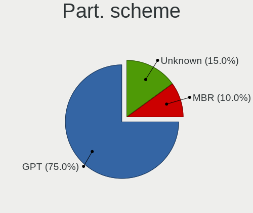

| Type    | Notebooks | Percent |
|---------|-----------|---------|
| Unknown | 6         | 66.67%  |
| GPT     | 2         | 22.22%  |
| MBR     | 1         | 11.11%  |

Dual Boot with Linux/BSD
------------------------

Hosting more than one Linux/BSD

| Dual boot | Notebooks | Percent |
|-----------|-----------|---------|
| No        | 9         | 100%    |

Dual Boot (Win)
---------------

Hosting Linux and Windows

| Dual boot | Notebooks | Percent |
|-----------|-----------|---------|
| No        | 8         | 88.89%  |
| Yes       | 1         | 11.11%  |

Board
-----

Vendor
------

Motherboard manufacturer

| Name            | Notebooks | Percent |
|-----------------|-----------|---------|
| Dell            | 3         | 33.33%  |
| Sony            | 1         | 11.11%  |
| MicroByte       | 1         | 11.11%  |
| HONOR           | 1         | 11.11%  |
| Hewlett-Packard | 1         | 11.11%  |
| Compaq          | 1         | 11.11%  |
| Acer            | 1         | 11.11%  |

Model
-----

Motherboard model

| Name                  | Notebooks | Percent |
|-----------------------|-----------|---------|
| Sony VPCEB1S1E        | 1         | 11.11%  |
| MicroByte ezbook      | 1         | 11.11%  |
| HONOR BOHK-WAX9X      | 1         | 11.11%  |
| HP EliteBook 8570p    | 1         | 11.11%  |
| Dell Latitude XT      | 1         | 11.11%  |
| Dell Latitude E4200   | 1         | 11.11%  |
| Dell Inspiron MM061   | 1         | 11.11%  |
| Compaq Presario CQ-23 | 1         | 11.11%  |
| Acer Aspire 5050      | 1         | 11.11%  |

Model Family
------------

Motherboard model prefix

| Name             | Notebooks | Percent |
|------------------|-----------|---------|
| Dell Latitude    | 2         | 22.22%  |
| Sony VPCEB1S1E   | 1         | 11.11%  |
| MicroByte ezbook | 1         | 11.11%  |
| HONOR BOHK-WAX9X | 1         | 11.11%  |
| HP EliteBook     | 1         | 11.11%  |
| Dell Inspiron    | 1         | 11.11%  |
| Compaq Presario  | 1         | 11.11%  |
| Acer Aspire      | 1         | 11.11%  |

MFG Year
--------

Motherboard manufacture year

| Year | Notebooks | Percent |
|------|-----------|---------|
| 2021 | 2         | 22.22%  |
| 2010 | 2         | 22.22%  |
| 2006 | 2         | 22.22%  |
| 2016 | 1         | 11.11%  |
| 2012 | 1         | 11.11%  |
| 2009 | 1         | 11.11%  |

Form Factor
-----------

Physical design of the computer

| Name     | Notebooks | Percent |
|----------|-----------|---------|
| Notebook | 9         | 100%    |

Secure Boot
-----------

Enabled or disabled

| State    | Notebooks | Percent |
|----------|-----------|---------|
| Disabled | 9         | 100%    |

Coreboot
--------

Have coreboot on board

| Used | Notebooks | Percent |
|------|-----------|---------|
| No   | 9         | 100%    |

RAM Size
--------

Total RAM memory

| Size in GB | Notebooks | Percent |
|------------|-----------|---------|
| 3.01-4.0   | 5         | 55.56%  |
| 4.01-8.0   | 2         | 22.22%  |
| 2.01-3.0   | 1         | 11.11%  |
| 8.01-16.0  | 1         | 11.11%  |

RAM Used
--------

Used RAM memory

| Used GB  | Notebooks | Percent |
|----------|-----------|---------|
| 1.01-2.0 | 4         | 44.44%  |
| 2.01-3.0 | 2         | 22.22%  |
| 0.51-1.0 | 2         | 22.22%  |
| 3.01-4.0 | 1         | 11.11%  |

Total Drives
------------

Number of drives on board

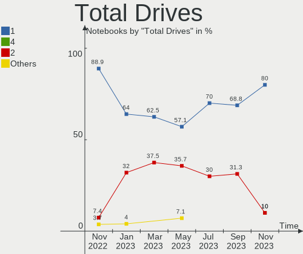

| Drives | Notebooks | Percent |
|--------|-----------|---------|
| 1      | 8         | 88.89%  |
| 2      | 1         | 11.11%  |

Has CD-ROM
----------

Has CD-ROM on board

| Presented | Notebooks | Percent |
|-----------|-----------|---------|
| Yes       | 5         | 55.56%  |
| No        | 4         | 44.44%  |

Has Ethernet
------------

Has Ethernet on board

| Presented | Notebooks | Percent |
|-----------|-----------|---------|
| Yes       | 7         | 77.78%  |
| No        | 2         | 22.22%  |

Has WiFi
--------

Has WiFi module

| Presented | Notebooks | Percent |
|-----------|-----------|---------|
| Yes       | 9         | 100%    |

Has Bluetooth
-------------

Has Bluetooth module

| Presented | Notebooks | Percent |
|-----------|-----------|---------|
| Yes       | 5         | 55.56%  |
| No        | 4         | 44.44%  |

Location
--------

Country
-------

Geographic location (country)

| Country     | Notebooks | Percent |
|-------------|-----------|---------|
| Italy       | 2         | 22.22%  |
| Germany     | 2         | 22.22%  |
| Brazil      | 2         | 22.22%  |
| Netherlands | 1         | 11.11%  |
| Belgium     | 1         | 11.11%  |
| Australia   | 1         | 11.11%  |

City
----

Geographic location (city)

| City             | Notebooks | Percent |
|------------------|-----------|---------|
| Wolfhagen        | 1         | 11.11%  |
| Sint-Truiden     | 1         | 11.11%  |
| Settimo Torinese | 1         | 11.11%  |
| Rho              | 1         | 11.11%  |
| Porto Alegre     | 1         | 11.11%  |
| Perth            | 1         | 11.11%  |
| Neubrandenburg   | 1         | 11.11%  |
| Naaldwijk        | 1         | 11.11%  |
| Guarulhos        | 1         | 11.11%  |

Drives
------

Drive Vendor
------------

Hard drive vendors

| Vendor              | Notebooks | Drives | Percent |
|---------------------|-----------|--------|---------|
| SanDisk             | 2         | 2      | 20%     |
| Unknown             | 1         | 1      | 10%     |
| Toshiba             | 1         | 1      | 10%     |
| Samsung Electronics | 1         | 1      | 10%     |
| KingSpec            | 1         | 1      | 10%     |
| Hitachi             | 1         | 1      | 10%     |
| Fujitsu             | 1         | 1      | 10%     |
| faspeed             | 1         | 1      | 10%     |
| Dogfish             | 1         | 1      | 10%     |

Drive Model
-----------

Hard drive models

| Model                               | Notebooks | Percent |
|-------------------------------------|-----------|---------|
| Unknown 58K722  128GB               | 1         | 10%     |
| Toshiba MK8009GAH 80GB              | 1         | 10%     |
| SanDisk SD5SB2-128G-1006E 128GB SSD | 1         | 10%     |
| SanDisk NVMe SSD Drive 512GB        | 1         | 10%     |
| Samsung SSD PM800 TM 128GB          | 1         | 10%     |
| KingSpec P3-256 256GB               | 1         | 10%     |
| Hitachi HTS545050B9SA00 500GB       | 1         | 10%     |
| Fujitsu MHV2080BH 80GB              | 1         | 10%     |
| faspeed K7-256G-CD 256GB            | 1         | 10%     |
| Dogfish SSD 128GB                   | 1         | 10%     |

HDD Vendor
----------

Hard disk drive vendors

| Vendor  | Notebooks | Drives | Percent |
|---------|-----------|--------|---------|
| Toshiba | 1         | 1      | 33.33%  |
| Hitachi | 1         | 1      | 33.33%  |
| Fujitsu | 1         | 1      | 33.33%  |

SSD Vendor
----------

Solid state drive vendors

| Vendor              | Notebooks | Drives | Percent |
|---------------------|-----------|--------|---------|
| SanDisk             | 1         | 1      | 25%     |
| Samsung Electronics | 1         | 1      | 25%     |
| KingSpec            | 1         | 1      | 25%     |
| Dogfish             | 1         | 1      | 25%     |

Drive Kind
----------

HDD or SSD

| Kind    | Notebooks | Drives | Percent |
|---------|-----------|--------|---------|
| SSD     | 4         | 4      | 40%     |
| HDD     | 3         | 3      | 30%     |
| MMC     | 1         | 1      | 10%     |
| NVMe    | 1         | 1      | 10%     |
| Unknown | 1         | 1      | 10%     |

Drive Connector
---------------

SATA, SAS, NVMe, etc.

| Type | Notebooks | Drives | Percent |
|------|-----------|--------|---------|
| SATA | 8         | 8      | 80%     |
| NVMe | 1         | 1      | 10%     |
| MMC  | 1         | 1      | 10%     |

Drive Size
----------

Size of hard drive

| Size in TB | Notebooks | Drives | Percent |
|------------|-----------|--------|---------|
| 0.01-0.5   | 7         | 7      | 100%    |

Space Total
-----------

Amount of disk space available on the file system

| Size in GB | Notebooks | Percent |
|------------|-----------|---------|
| 101-250    | 4         | 44.44%  |
| 251-500    | 2         | 22.22%  |
| 51-100     | 2         | 22.22%  |
| 1-20       | 1         | 11.11%  |

Space Used
----------

Amount of used disk space

| Used GB | Notebooks | Percent |
|---------|-----------|---------|
| 1-20    | 4         | 44.44%  |
| 101-250 | 2         | 22.22%  |
| 51-100  | 2         | 22.22%  |
| 21-50   | 1         | 11.11%  |

Malfunc. Drives
---------------

Drive models with a malfunction

Zero info for selected period =(

Malfunc. Drive Vendor
---------------------

Vendors of faulty drives

Zero info for selected period =(

Malfunc. HDD Vendor
-------------------

Vendors of faulty HDD drives

Zero info for selected period =(

Malfunc. Drive Kind
-------------------

Kinds of faulty drives

Zero info for selected period =(

Failed Drives
-------------

Failed drive models

Zero info for selected period =(

Failed Drive Vendor
-------------------

Failed drive vendors

Zero info for selected period =(

Drive Status
------------

Number of failed and malfunc. drives

| Status   | Notebooks | Drives | Percent |
|----------|-----------|--------|---------|
| Detected | 7         | 7      | 70%     |
| Works    | 3         | 3      | 30%     |

Storage controller
------------------

Storage Vendor
--------------

Storage controller vendors

| Vendor  | Notebooks | Percent |
|---------|-----------|---------|
| Intel   | 6         | 66.67%  |
| AMD     | 2         | 22.22%  |
| SanDisk | 1         | 11.11%  |

Storage Model
-------------

Storage controller models

| Model                                                                    | Notebooks | Percent |
|--------------------------------------------------------------------------|-----------|---------|
| SanDisk WD Black SN750 / PC SN730 NVMe SSD                               | 1         | 10%     |
| Intel Celeron N3350/Pentium N4200/Atom E3900 Series SATA AHCI Controller | 1         | 10%     |
| Intel Atom Processor E3800 Series SATA AHCI Controller                   | 1         | 10%     |
| Intel 82801GBM/GHM (ICH7-M Family) SATA Controller [IDE mode]            | 1         | 10%     |
| Intel 82801 Mobile SATA Controller [RAID mode]                           | 1         | 10%     |
| Intel 7 Series Chipset Family 6-port SATA Controller [AHCI mode]         | 1         | 10%     |
| Intel 5 Series/3400 Series Chipset 4 port SATA AHCI Controller           | 1         | 10%     |
| AMD SB600 IDE                                                            | 1         | 10%     |
| AMD IXP SB4x0 Serial ATA Controller                                      | 1         | 10%     |
| AMD IXP SB4x0 IDE Controller                                             | 1         | 10%     |

Storage Kind
------------

Kind of storage controller (IDE, SATA, NVMe, SAS, ...)

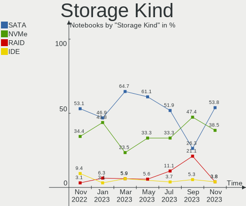

| Kind | Notebooks | Percent |
|------|-----------|---------|
| SATA | 4         | 44.44%  |
| IDE  | 3         | 33.33%  |
| RAID | 1         | 11.11%  |
| NVMe | 1         | 11.11%  |

Processor
---------

CPU Vendor
----------

Processor vendors

| Vendor | Notebooks | Percent |
|--------|-----------|---------|
| Intel  | 7         | 77.78%  |
| AMD    | 2         | 22.22%  |

CPU Model
---------

Processor models

| Model                                         | Notebooks | Percent |
|-----------------------------------------------|-----------|---------|
| Intel Genuine CPU T2400 @ 1.83GHz             | 1         | 11.11%  |
| Intel Core i5-3210M CPU @ 2.50GHz             | 1         | 11.11%  |
| Intel Core i5 CPU M 430 @ 2.27GHz             | 1         | 11.11%  |
| Intel Core 2 Duo CPU U9600 @ 1.60GHz          | 1         | 11.11%  |
| Intel Core 2 Duo CPU U7700 @ 1.33GHz          | 1         | 11.11%  |
| Intel Celeron CPU N3350 @ 1.10GHz             | 1         | 11.11%  |
| Intel Celeron CPU N2830 @ 2.16GHz             | 1         | 11.11%  |
| AMD Turion 64 Mobile Technology MK-38         | 1         | 11.11%  |
| AMD Ryzen 7 3700U with Radeon Vega Mobile Gfx | 1         | 11.11%  |

CPU Model Family
----------------

Processor model prefix

| Model                | Notebooks | Percent |
|----------------------|-----------|---------|
| Intel Core i5        | 2         | 22.22%  |
| Intel Core 2 Duo     | 2         | 22.22%  |
| Intel Celeron        | 2         | 22.22%  |
| Intel Genuine        | 1         | 11.11%  |
| AMD Turion 64 Mobile | 1         | 11.11%  |
| AMD Ryzen 7          | 1         | 11.11%  |

CPU Cores
---------

Number of processor cores

| Number | Notebooks | Percent |
|--------|-----------|---------|
| 2      | 7         | 77.78%  |
| 4      | 1         | 11.11%  |
| 1      | 1         | 11.11%  |

CPU Sockets
-----------

Number of sockets

| Number | Notebooks | Percent |
|--------|-----------|---------|
| 1      | 9         | 100%    |

CPU Threads
-----------

Threads per core (Hyper-Threading)

| Number | Notebooks | Percent |
|--------|-----------|---------|
| 1      | 6         | 66.67%  |
| 2      | 3         | 33.33%  |

CPU Op-Modes
------------

CPU Operation Modes (32-bit, 64-bit)

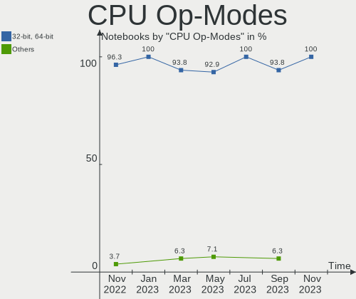

| Op mode        | Notebooks | Percent |
|----------------|-----------|---------|
| 32-bit, 64-bit | 8         | 88.89%  |
| 32-bit         | 1         | 11.11%  |

CPU Microcode
-------------

Microcode number

| Number  | Notebooks | Percent |
|---------|-----------|---------|
| Unknown | 4         | 44.44%  |
| 0x6fd   | 1         | 11.11%  |
| 0x6e8   | 1         | 11.11%  |
| 0x506ca | 1         | 11.11%  |
| 0x306a9 | 1         | 11.11%  |
| 0x1067a | 1         | 11.11%  |

CPU Microarch
-------------

Microarchitecture

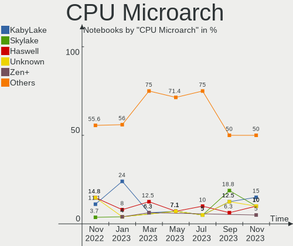

| Name       | Notebooks | Percent |
|------------|-----------|---------|
| Zen+       | 1         | 11.11%  |
| Westmere   | 1         | 11.11%  |
| Silvermont | 1         | 11.11%  |
| Penryn     | 1         | 11.11%  |
| P6         | 1         | 11.11%  |
| K8 Hammer  | 1         | 11.11%  |
| IvyBridge  | 1         | 11.11%  |
| Goldmont   | 1         | 11.11%  |
| Core       | 1         | 11.11%  |

Graphics
--------

GPU Vendor
----------

Vendors of graphics cards

| Vendor | Notebooks | Percent |
|--------|-----------|---------|
| AMD    | 5         | 55.56%  |
| Intel  | 4         | 44.44%  |

GPU Model
---------

Graphics card models

| Model                                                                | Notebooks | Percent |
|----------------------------------------------------------------------|-----------|---------|
| Intel Mobile 4 Series Chipset Integrated Graphics Controller         | 1         | 11.11%  |
| Intel HD Graphics 500                                                | 1         | 11.11%  |
| Intel Atom Processor Z36xxx/Z37xxx Series Graphics & Display         | 1         | 11.11%  |
| Intel 3rd Gen Core processor Graphics Controller                     | 1         | 11.11%  |
| AMD RV515/M54 [Mobility Radeon X1400]                                | 1         | 11.11%  |
| AMD RS600M [Radeon Xpress 1250]                                      | 1         | 11.11%  |
| AMD RS482M [Mobility Radeon Xpress 200]                              | 1         | 11.11%  |
| AMD Picasso/Raven 2 [Radeon Vega Series / Radeon Vega Mobile Series] | 1         | 11.11%  |
| AMD Madison [Mobility Radeon HD 5650/5750 / 6530M/6550M]             | 1         | 11.11%  |

GPU Combo
---------

Combinations of graphics cards

| Name      | Notebooks | Percent |
|-----------|-----------|---------|
| 1 x AMD   | 5         | 55.56%  |
| 1 x Intel | 4         | 44.44%  |

GPU Driver
----------

Free vs proprietary

| Driver | Notebooks | Percent |
|--------|-----------|---------|
| Free   | 9         | 100%    |

GPU Memory
----------

Total video memory

| Size in GB | Notebooks | Percent |
|------------|-----------|---------|
| Unknown    | 6         | 66.67%  |
| 0.01-0.5   | 3         | 33.33%  |

Monitor
-------

Monitor Vendor
--------------

Monitor vendors

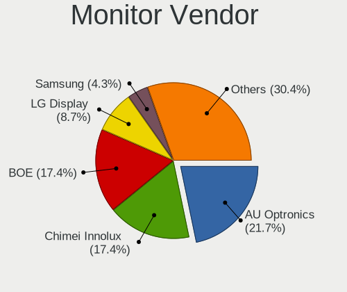

| Vendor                  | Notebooks | Percent |
|-------------------------|-----------|---------|
| BOE                     | 3         | 33.33%  |
| Toshiba                 | 1         | 11.11%  |
| Sony                    | 1         | 11.11%  |
| Samsung Electronics     | 1         | 11.11%  |
| LG Display              | 1         | 11.11%  |
| Chi Mei Optoelectronics | 1         | 11.11%  |
| AU Optronics            | 1         | 11.11%  |

Monitor Model
-------------

Monitor models

| Model                                                                    | Notebooks | Percent |
|--------------------------------------------------------------------------|-----------|---------|
| Toshiba LCD Monitor LCD2109 1280x800 261x163mm 12.1-inch                 | 1         | 11.11%  |
| Sony LCD Monitor SNY05FA 1366x768 310x170mm 13.9-inch                    | 1         | 11.11%  |
| Samsung Electronics LCD Monitor SEC3250 1680x1050 331x207mm 15.4-inch    | 1         | 11.11%  |
| LG Display LCD Monitor LGD0259 1920x1080 345x194mm 15.6-inch             | 1         | 11.11%  |
| Chi Mei Optoelectronics LCD Monitor CMO1409 1280x800 303x190mm 14.1-inch | 1         | 11.11%  |
| BOE LCD Monitor BOE0872 1920x1080 344x194mm 15.5-inch                    | 1         | 11.11%  |
| BOE LCD Monitor BOE05F0 1366x768 309x173mm 13.9-inch                     | 1         | 11.11%  |
| BOE LCD Monitor BOE05D7 1920x1080 294x165mm 13.3-inch                    | 1         | 11.11%  |
| AU Optronics LCD Monitor AUO8114 1280x800 261x163mm 12.1-inch            | 1         | 11.11%  |

Monitor Resolution
------------------

Monitor screen resolution

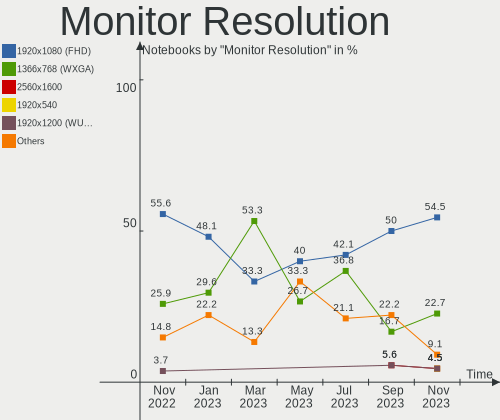

| Resolution         | Notebooks | Percent |
|--------------------|-----------|---------|
| 1920x1080 (FHD)    | 3         | 33.33%  |
| 1280x800 (WXGA)    | 3         | 33.33%  |
| 1366x768 (WXGA)    | 2         | 22.22%  |
| 1680x1050 (WSXGA+) | 1         | 11.11%  |

Monitor Diagonal
----------------

Diagonal size in inches

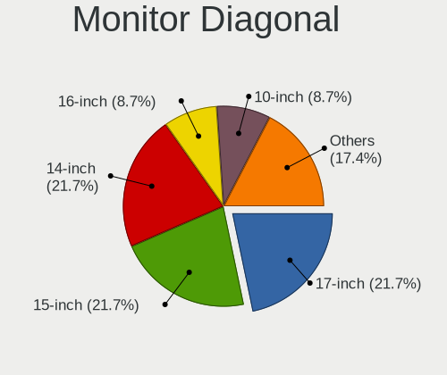

| Inches | Notebooks | Percent |
|--------|-----------|---------|
| 15     | 4         | 44.44%  |
| 13     | 2         | 22.22%  |
| 12     | 2         | 22.22%  |
| 14     | 1         | 11.11%  |

Monitor Width
-------------

Physical width

| Width in mm | Notebooks | Percent |
|-------------|-----------|---------|
| 301-350     | 6         | 66.67%  |
| 201-300     | 3         | 33.33%  |

Aspect Ratio
------------

Proportional relationship between the width and the height

| Ratio | Notebooks | Percent |
|-------|-----------|---------|
| 16/9  | 6         | 66.67%  |
| 16/10 | 3         | 33.33%  |

Monitor Area
------------

Area in inch²

| Area in inch² | Notebooks | Percent |
|----------------|-----------|---------|
| 101-110        | 3         | 33.33%  |
| 81-90          | 2         | 22.22%  |
| 61-70          | 2         | 22.22%  |
| 71-80          | 1         | 11.11%  |
| 91-100         | 1         | 11.11%  |

Pixel Density
-------------

Pixels per inch

| Density | Notebooks | Percent |
|---------|-----------|---------|
| 121-160 | 4         | 44.44%  |
| 101-120 | 4         | 44.44%  |
| 161-240 | 1         | 11.11%  |

Multiple Monitors
-----------------

Total monitors connected

| Total | Notebooks | Percent |
|-------|-----------|---------|
| 1     | 9         | 100%    |

Network
-------

Net Controller Vendor
---------------------

Controller vendors

| Vendor                   | Notebooks | Percent |
|--------------------------|-----------|---------|
| Intel                    | 4         | 30.77%  |
| Realtek Semiconductor    | 3         | 23.08%  |
| Qualcomm Atheros         | 2         | 15.38%  |
| Broadcom                 | 2         | 15.38%  |
| Marvell Technology Group | 1         | 7.69%   |
| Broadcom Limited         | 1         | 7.69%   |

Net Controller Model
--------------------

Controller models

| Model                                                                          | Notebooks | Percent |
|--------------------------------------------------------------------------------|-----------|---------|
| Realtek RTL8821CE 802.11ac PCIe Wireless Network Adapter                       | 1         | 6.25%   |
| Realtek RTL8188EE Wireless Network Adapter                                     | 1         | 6.25%   |
| Realtek RTL8111/8168/8411 PCI Express Gigabit Ethernet Controller              | 1         | 6.25%   |
| Realtek RTL-8100/8101L/8139 PCI Fast Ethernet Adapter                          | 1         | 6.25%   |
| Qualcomm Atheros AR9285 Wireless Network Adapter (PCI-Express)                 | 1         | 6.25%   |
| Qualcomm Atheros AR242x / AR542x Wireless Network Adapter (PCI-Express)        | 1         | 6.25%   |
| Marvell Group Yukon Optima 88E8059 [PCIe Gigabit Ethernet Controller with AVB] | 1         | 6.25%   |
| Intel WiFi Link 5100                                                           | 1         | 6.25%   |
| Intel Wi-Fi 6 AX210/AX211/AX411 160MHz                                         | 1         | 6.25%   |
| Intel PRO/Wireless 3945ABG [Golan] Network Connection                          | 1         | 6.25%   |
| Intel Centrino Advanced-N 6205 [Taylor Peak]                                   | 1         | 6.25%   |
| Intel 82579LM Gigabit Network Connection (Lewisville)                          | 1         | 6.25%   |
| Intel 82567LM Gigabit Network Connection                                       | 1         | 6.25%   |
| Broadcom NetXtreme BCM5756ME Gigabit Ethernet PCI Express                      | 1         | 6.25%   |
| Broadcom Limited BCM4311 802.11a/b/g                                           | 1         | 6.25%   |
| Broadcom BCM4401-B0 100Base-TX                                                 | 1         | 6.25%   |

Wireless Vendor
---------------

Wireless vendors

| Vendor                | Notebooks | Percent |
|-----------------------|-----------|---------|
| Intel                 | 4         | 44.44%  |
| Realtek Semiconductor | 2         | 22.22%  |
| Qualcomm Atheros      | 2         | 22.22%  |
| Broadcom Limited      | 1         | 11.11%  |

Wireless Model
--------------

Wireless models

| Model                                                                   | Notebooks | Percent |
|-------------------------------------------------------------------------|-----------|---------|
| Realtek RTL8821CE 802.11ac PCIe Wireless Network Adapter                | 1         | 11.11%  |
| Realtek RTL8188EE Wireless Network Adapter                              | 1         | 11.11%  |
| Qualcomm Atheros AR9285 Wireless Network Adapter (PCI-Express)          | 1         | 11.11%  |
| Qualcomm Atheros AR242x / AR542x Wireless Network Adapter (PCI-Express) | 1         | 11.11%  |
| Intel WiFi Link 5100                                                    | 1         | 11.11%  |
| Intel Wi-Fi 6 AX210/AX211/AX411 160MHz                                  | 1         | 11.11%  |
| Intel PRO/Wireless 3945ABG [Golan] Network Connection                   | 1         | 11.11%  |
| Intel Centrino Advanced-N 6205 [Taylor Peak]                            | 1         | 11.11%  |
| Broadcom Limited BCM4311 802.11a/b/g                                    | 1         | 11.11%  |

Ethernet Vendor
---------------

Ethernet vendors

| Vendor                   | Notebooks | Percent |
|--------------------------|-----------|---------|
| Realtek Semiconductor    | 2         | 28.57%  |
| Intel                    | 2         | 28.57%  |
| Broadcom                 | 2         | 28.57%  |
| Marvell Technology Group | 1         | 14.29%  |

Ethernet Model
--------------

Ethernet models

| Model                                                                          | Notebooks | Percent |
|--------------------------------------------------------------------------------|-----------|---------|
| Realtek RTL8111/8168/8411 PCI Express Gigabit Ethernet Controller              | 1         | 14.29%  |
| Realtek RTL-8100/8101L/8139 PCI Fast Ethernet Adapter                          | 1         | 14.29%  |
| Marvell Group Yukon Optima 88E8059 [PCIe Gigabit Ethernet Controller with AVB] | 1         | 14.29%  |
| Intel 82579LM Gigabit Network Connection (Lewisville)                          | 1         | 14.29%  |
| Intel 82567LM Gigabit Network Connection                                       | 1         | 14.29%  |
| Broadcom NetXtreme BCM5756ME Gigabit Ethernet PCI Express                      | 1         | 14.29%  |
| Broadcom BCM4401-B0 100Base-TX                                                 | 1         | 14.29%  |

Net Controller Kind
-------------------

Ethernet, WiFi or modem

| Kind     | Notebooks | Percent |
|----------|-----------|---------|
| WiFi     | 9         | 56.25%  |
| Ethernet | 7         | 43.75%  |

Used Controller
---------------

Currently used network controller

| Kind     | Notebooks | Percent |
|----------|-----------|---------|
| WiFi     | 8         | 80%     |
| Ethernet | 2         | 20%     |

NICs
----

Total network controllers on board

| Total | Notebooks | Percent |
|-------|-----------|---------|
| 2     | 7         | 77.78%  |
| 1     | 2         | 22.22%  |

IPv6
----

IPv6 vs IPv4

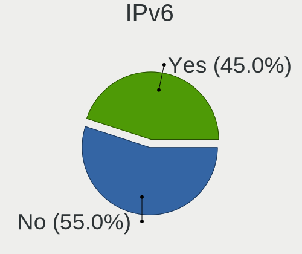

| Used | Notebooks | Percent |
|------|-----------|---------|
| No   | 5         | 55.56%  |
| Yes  | 4         | 44.44%  |

Bluetooth
---------

Bluetooth Vendor
----------------

Controller vendors

| Vendor                  | Notebooks | Percent |
|-------------------------|-----------|---------|
| Realtek Semiconductor   | 1         | 20%     |
| Intel                   | 1         | 20%     |
| Dell                    | 1         | 20%     |
| Cambridge Silicon Radio | 1         | 20%     |
| Broadcom                | 1         | 20%     |

Bluetooth Model
---------------

Controller models

| Model                                               | Notebooks | Percent |
|-----------------------------------------------------|-----------|---------|
| Realtek Bluetooth Radio                             | 1         | 20%     |
| Intel AX210 Bluetooth                               | 1         | 20%     |
| Dell Wireless 360 Bluetooth                         | 1         | 20%     |
| Cambridge Silicon Radio Bluetooth Dongle (HCI mode) | 1         | 20%     |
| Broadcom HP Portable SoftSailing                    | 1         | 20%     |

Sound
-----

Sound Vendor
------------

Sound card vendors

| Vendor | Notebooks | Percent |
|--------|-----------|---------|
| Intel  | 6         | 60%     |
| AMD    | 4         | 40%     |

Sound Model
-----------

Sound card models

| Model                                                                      | Notebooks | Percent |
|----------------------------------------------------------------------------|-----------|---------|
| Intel NM10/ICH7 Family High Definition Audio Controller                    | 1         | 9.09%   |
| Intel Celeron N3350/Pentium N4200/Atom E3900 Series Audio Cluster          | 1         | 9.09%   |
| Intel Atom Processor Z36xxx/Z37xxx Series High Definition Audio Controller | 1         | 9.09%   |
| Intel 82801I (ICH9 Family) HD Audio Controller                             | 1         | 9.09%   |
| Intel 7 Series/C216 Chipset Family High Definition Audio Controller        | 1         | 9.09%   |
| Intel 5 Series/3400 Series Chipset High Definition Audio                   | 1         | 9.09%   |
| AMD SBx00 Azalia (Intel HDA)                                               | 1         | 9.09%   |
| AMD Redwood HDMI Audio [Radeon HD 5000 Series]                             | 1         | 9.09%   |
| AMD Raven/Raven2/Fenghuang HDMI/DP Audio Controller                        | 1         | 9.09%   |
| AMD IXP SB4x0 High Definition Audio Controller                             | 1         | 9.09%   |
| AMD Family 17h/19h HD Audio Controller                                     | 1         | 9.09%   |

Memory
------

Memory Vendor
-------------

Memory module vendors

| Vendor              | Notebooks | Percent |
|---------------------|-----------|---------|
| Unknown             | 2         | 28.57%  |
| Unknown (ABCD)      | 1         | 14.29%  |
| SK hynix            | 1         | 14.29%  |
| Samsung Electronics | 1         | 14.29%  |
| Netlist             | 1         | 14.29%  |
| Micron Technology   | 1         | 14.29%  |

Memory Model
------------

Memory module models

| Model                                                            | Notebooks | Percent |
|------------------------------------------------------------------|-----------|---------|
| Unknown RAM Module 2GB SODIMM DDR2                               | 1         | 14.29%  |
| Unknown RAM Module 1GB SODIMM DDR2 667MT/s                       | 1         | 14.29%  |
| Unknown (ABCD) RAM 123456789012345678 4GB SODIMM LPDDR4 2400MT/s | 1         | 14.29%  |
| SK hynix RAM HMT351S6BFR8C-G7 4GB SODIMM DDR3 1067MT/s           | 1         | 14.29%  |
| Samsung RAM Module 1GB SODIMM DDR3 1066MT/s                      | 1         | 14.29%  |
| Netlist RAM NL825642120HF-D53M 2GB SODIMM DDR2 667MT/s           | 1         | 14.29%  |
| Micron RAM 16KTF51264HZ-1G6M1 4GB SODIMM DDR3 1600MT/s           | 1         | 14.29%  |

Memory Kind
-----------

Memory module kinds

| Kind   | Notebooks | Percent |
|--------|-----------|---------|
| DDR3   | 2         | 40%     |
| DDR2   | 2         | 40%     |
| LPDDR4 | 1         | 20%     |

Memory Form Factor
------------------

Physical design of the memory module

| Name   | Notebooks | Percent |
|--------|-----------|---------|
| SODIMM | 5         | 100%    |

Memory Size
-----------

Memory module size

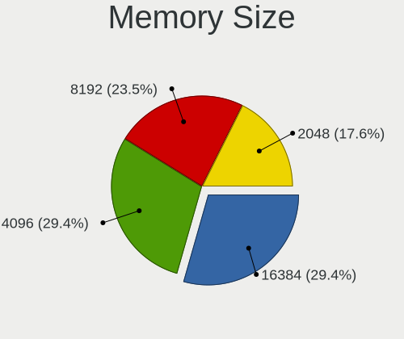

| Size | Notebooks | Percent |
|------|-----------|---------|
| 4096 | 3         | 42.86%  |
| 2048 | 2         | 28.57%  |
| 1024 | 2         | 28.57%  |

Memory Speed
------------

Memory module speed

| Speed   | Notebooks | Percent |
|---------|-----------|---------|
| 2400    | 1         | 16.67%  |
| 1600    | 1         | 16.67%  |
| 1067    | 1         | 16.67%  |
| 1066    | 1         | 16.67%  |
| 667     | 1         | 16.67%  |
| Unknown | 1         | 16.67%  |

Printers & scanners
-------------------

Printer Vendor
--------------

Printer device vendors

Zero info for selected period =(

Printer Model
-------------

Printer device models

Zero info for selected period =(

Scanner Vendor
--------------

Scanner device vendors

Zero info for selected period =(

Scanner Model
-------------

Scanner device models

Zero info for selected period =(

Camera
------

Camera Vendor
-------------

Camera device vendors

| Vendor                | Notebooks | Percent |
|-----------------------|-----------|---------|
| Microdia              | 2         | 28.57%  |
| Chicony Electronics   | 2         | 28.57%  |
| Realtek Semiconductor | 1         | 14.29%  |
| Quanta                | 1         | 14.29%  |
| Acer                  | 1         | 14.29%  |

Camera Model
------------

Camera device models

| Model                           | Notebooks | Percent |
|---------------------------------|-----------|---------|
| Realtek MTD camera              | 1         | 14.29%  |
| Quanta ov9734_techfront_camera  | 1         | 14.29%  |
| Microdia Webcam                 | 1         | 14.29%  |
| Microdia Integrated_Webcam_2M   | 1         | 14.29%  |
| Chicony USB 2.0 Camera          | 1         | 14.29%  |
| Chicony Integrated HP HD Webcam | 1         | 14.29%  |
| Acer Orbicam                    | 1         | 14.29%  |

Security
--------

Fingerprint Vendor
------------------

Fingerprint sensor vendors

| Vendor                     | Notebooks | Percent |
|----------------------------|-----------|---------|
| STMicroelectronics         | 1         | 50%     |
| Shenzhen Goodix Technology | 1         | 50%     |

Fingerprint Model
-----------------

Fingerprint sensor models

| Model                                 | Notebooks | Percent |
|---------------------------------------|-----------|---------|
| STMicroelectronics Fingerprint Reader | 1         | 50%     |
| Shenzhen Goodix  Fingerprint Device   | 1         | 50%     |

Chipcard Vendor
---------------

Chipcard module vendors

| Vendor   | Notebooks | Percent |
|----------|-----------|---------|
| Broadcom | 1         | 100%    |

Chipcard Model
--------------

Chipcard module models

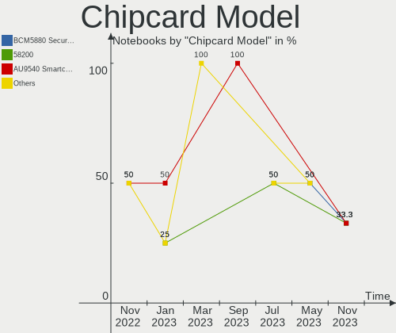

| Model                                                                        | Notebooks | Percent |
|------------------------------------------------------------------------------|-----------|---------|
| Broadcom BCM5880 Secure Applications Processor with fingerprint swipe sensor | 1         | 100%    |

Unsupported
-----------

Unsupported Devices
-------------------

Total unsupported devices on board

| Total | Notebooks | Percent |
|-------|-----------|---------|
| 0     | 5         | 55.56%  |
| 1     | 3         | 33.33%  |
| 2     | 1         | 11.11%  |

Unsupported Device Types
------------------------

Types of unsupported devices

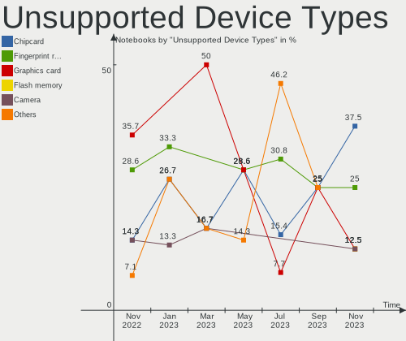

| Type               | Notebooks | Percent |
|--------------------|-----------|---------|
| Fingerprint reader | 2         | 50%     |
| Flash memory       | 1         | 25%     |
| Chipcard           | 1         | 25%     |

