Ubuntu MATE - Hardware Trends (Notebooks)
-----------------------------------------

A project to identify most popular hardware characteristics and track their change
over time based on data collected by Linux users at https://Linux-Hardware.org.

Anyone can contribute to this report by the [hw-probe](https://github.com/linuxhw/hw-probe) tool:

    sudo -E hw-probe -all -upload

This report is for one last month. Overall report since the beginning of time: [TestDays](https://github.com/linuxhw/TestDays)

Period: Feb, 2023.

Contents
--------

* [ System ](#system)
  - [ OS                       ](#os)
  - [ OS Family                ](#os-family)
  - [ Kernel                   ](#kernel)
  - [ Kernel Family            ](#kernel-family)
  - [ Kernel Major Ver.        ](#kernel-major-ver)
  - [ Arch                     ](#arch)
  - [ DE                       ](#de)
  - [ Display Server           ](#display-server)
  - [ Display Manager          ](#display-manager)
  - [ OS Lang                  ](#os-lang)
  - [ Boot Mode                ](#boot-mode)
  - [ Filesystem               ](#filesystem)
  - [ Part. scheme             ](#part-scheme)
  - [ Dual Boot with Linux/BSD ](#dual-boot-with-linuxbsd)
  - [ Dual Boot (Win)          ](#dual-boot-win)

* [ Board ](#board)
  - [ Vendor                   ](#vendor)
  - [ Model                    ](#model)
  - [ Model Family             ](#model-family)
  - [ MFG Year                 ](#mfg-year)
  - [ Form Factor              ](#form-factor)
  - [ Secure Boot              ](#secure-boot)
  - [ Coreboot                 ](#coreboot)
  - [ RAM Size                 ](#ram-size)
  - [ RAM Used                 ](#ram-used)
  - [ Total Drives             ](#total-drives)
  - [ Has CD-ROM               ](#has-cd-rom)
  - [ Has Ethernet             ](#has-ethernet)
  - [ Has WiFi                 ](#has-wifi)
  - [ Has Bluetooth            ](#has-bluetooth)

* [ Location ](#location)
  - [ Country                  ](#country)
  - [ City                     ](#city)

* [ Drives ](#drives)
  - [ Drive Vendor             ](#drive-vendor)
  - [ Drive Model              ](#drive-model)
  - [ HDD Vendor               ](#hdd-vendor)
  - [ SSD Vendor               ](#ssd-vendor)
  - [ Drive Kind               ](#drive-kind)
  - [ Drive Connector          ](#drive-connector)
  - [ Drive Size               ](#drive-size)
  - [ Space Total              ](#space-total)
  - [ Space Used               ](#space-used)
  - [ Malfunc. Drives          ](#malfunc-drives)
  - [ Malfunc. Drive Vendor    ](#malfunc-drive-vendor)
  - [ Malfunc. HDD Vendor      ](#malfunc-hdd-vendor)
  - [ Malfunc. Drive Kind      ](#malfunc-drive-kind)
  - [ Failed Drives            ](#failed-drives)
  - [ Failed Drive Vendor      ](#failed-drive-vendor)
  - [ Drive Status             ](#drive-status)

* [ Storage controller ](#storage-controller)
  - [ Storage Vendor           ](#storage-vendor)
  - [ Storage Model            ](#storage-model)
  - [ Storage Kind             ](#storage-kind)

* [ Processor ](#processor)
  - [ CPU Vendor               ](#cpu-vendor)
  - [ CPU Model                ](#cpu-model)
  - [ CPU Model Family         ](#cpu-model-family)
  - [ CPU Cores                ](#cpu-cores)
  - [ CPU Sockets              ](#cpu-sockets)
  - [ CPU Threads              ](#cpu-threads)
  - [ CPU Op-Modes             ](#cpu-op-modes)
  - [ CPU Microcode            ](#cpu-microcode)
  - [ CPU Microarch            ](#cpu-microarch)

* [ Graphics ](#graphics)
  - [ GPU Vendor               ](#gpu-vendor)
  - [ GPU Model                ](#gpu-model)
  - [ GPU Combo                ](#gpu-combo)
  - [ GPU Driver               ](#gpu-driver)
  - [ GPU Memory               ](#gpu-memory)

* [ Monitor ](#monitor)
  - [ Monitor Vendor           ](#monitor-vendor)
  - [ Monitor Model            ](#monitor-model)
  - [ Monitor Resolution       ](#monitor-resolution)
  - [ Monitor Diagonal         ](#monitor-diagonal)
  - [ Monitor Width            ](#monitor-width)
  - [ Aspect Ratio             ](#aspect-ratio)
  - [ Monitor Area             ](#monitor-area)
  - [ Pixel Density            ](#pixel-density)
  - [ Multiple Monitors        ](#multiple-monitors)

* [ Network ](#network)
  - [ Net Controller Vendor    ](#net-controller-vendor)
  - [ Net Controller Model     ](#net-controller-model)
  - [ Wireless Vendor          ](#wireless-vendor)
  - [ Wireless Model           ](#wireless-model)
  - [ Ethernet Vendor          ](#ethernet-vendor)
  - [ Ethernet Model           ](#ethernet-model)
  - [ Net Controller Kind      ](#net-controller-kind)
  - [ Used Controller          ](#used-controller)
  - [ NICs                     ](#nics)
  - [ IPv6                     ](#ipv6)

* [ Bluetooth ](#bluetooth)
  - [ Bluetooth Vendor         ](#bluetooth-vendor)
  - [ Bluetooth Model          ](#bluetooth-model)

* [ Sound ](#sound)
  - [ Sound Vendor             ](#sound-vendor)
  - [ Sound Model              ](#sound-model)

* [ Memory ](#memory)
  - [ Memory Vendor            ](#memory-vendor)
  - [ Memory Model             ](#memory-model)
  - [ Memory Kind              ](#memory-kind)
  - [ Memory Form Factor       ](#memory-form-factor)
  - [ Memory Size              ](#memory-size)
  - [ Memory Speed             ](#memory-speed)

* [ Printers & scanners ](#printers--scanners)
  - [ Printer Vendor           ](#printer-vendor)
  - [ Printer Model            ](#printer-model)
  - [ Scanner Vendor           ](#scanner-vendor)
  - [ Scanner Model            ](#scanner-model)

* [ Camera ](#camera)
  - [ Camera Vendor            ](#camera-vendor)
  - [ Camera Model             ](#camera-model)

* [ Security ](#security)
  - [ Fingerprint Vendor       ](#fingerprint-vendor)
  - [ Fingerprint Model        ](#fingerprint-model)
  - [ Chipcard Vendor          ](#chipcard-vendor)
  - [ Chipcard Model           ](#chipcard-model)

* [ Unsupported ](#unsupported)
  - [ Unsupported Devices      ](#unsupported-devices)
  - [ Unsupported Device Types ](#unsupported-device-types)

System
------

OS
--

Installed operating systems

| Name              | Notebooks | Percent |
|-------------------|-----------|---------|
| Ubuntu MATE 22.04 | 14        | 73.68%  |
| Ubuntu MATE 20.04 | 2         | 10.53%  |
| Ubuntu MATE 23.04 | 1         | 5.26%   |
| Ubuntu MATE 22.10 | 1         | 5.26%   |
| Ubuntu MATE 18.04 | 1         | 5.26%   |

OS Family
---------

OS without a version

| Name        | Notebooks | Percent |
|-------------|-----------|---------|
| Ubuntu MATE | 19        | 100%    |

Kernel
------

Version of the Linux kernel

| Version              | Notebooks | Percent |
|----------------------|-----------|---------|
| 5.15.0-60-generic    | 6         | 31.58%  |
| 5.15.0-58-generic    | 5         | 26.32%  |
| 5.19.0-32-generic    | 3         | 15.79%  |
| 6.2.0-060200-generic | 1         | 5.26%   |
| 5.4.0-139-generic    | 1         | 5.26%   |
| 5.17.0-1027-oem      | 1         | 5.26%   |
| 5.15.0-58-lowlatency | 1         | 5.26%   |
| 4.15.0-202-generic   | 1         | 5.26%   |

Kernel Family
-------------

Linux kernel without a distro release

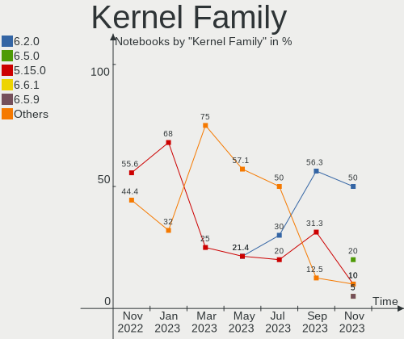

| Version | Notebooks | Percent |
|---------|-----------|---------|
| 5.15.0  | 12        | 63.16%  |
| 5.19.0  | 3         | 15.79%  |
| 6.2.0   | 1         | 5.26%   |
| 5.4.0   | 1         | 5.26%   |
| 5.17.0  | 1         | 5.26%   |
| 4.15.0  | 1         | 5.26%   |

Kernel Major Ver.
-----------------

Linux kernel major version

| Version | Notebooks | Percent |
|---------|-----------|---------|
| 5.15    | 12        | 63.16%  |
| 5.19    | 3         | 15.79%  |
| 6.2     | 1         | 5.26%   |
| 5.4     | 1         | 5.26%   |
| 5.17    | 1         | 5.26%   |
| 4.15    | 1         | 5.26%   |

Arch
----

OS architecture (x86_64, i586, etc.)

| Name   | Notebooks | Percent |
|--------|-----------|---------|
| x86_64 | 18        | 94.74%  |
| i686   | 1         | 5.26%   |

DE
--

Desktop Environment

| Name  | Notebooks | Percent |
|-------|-----------|---------|
| MATE  | 18        | 94.74%  |
| GNOME | 1         | 5.26%   |

Display Server
--------------

X11 or Wayland

| Name | Notebooks | Percent |
|------|-----------|---------|
| X11  | 19        | 100%    |

Display Manager
---------------

SDDM, LightDM, etc.

| Name    | Notebooks | Percent |
|---------|-----------|---------|
| LightDM | 16        | 84.21%  |
| GDM3    | 2         | 10.53%  |
| LXDM    | 1         | 5.26%   |

OS Lang
-------

Language

| Lang  | Notebooks | Percent |
|-------|-----------|---------|
| en_US | 6         | 31.58%  |
| fr_FR | 3         | 15.79%  |
| de_DE | 3         | 15.79%  |
| sv_SE | 1         | 5.26%   |
| ru_RU | 1         | 5.26%   |
| it_IT | 1         | 5.26%   |
| hu_HU | 1         | 5.26%   |
| es_MX | 1         | 5.26%   |
| en_CA | 1         | 5.26%   |
| C     | 1         | 5.26%   |

Boot Mode
---------

EFI or BIOS

| Mode | Notebooks | Percent |
|------|-----------|---------|
| BIOS | 12        | 63.16%  |
| EFI  | 7         | 36.84%  |

Filesystem
----------

Type of filesystem

| Type  | Notebooks | Percent |
|-------|-----------|---------|
| Ext4  | 18        | 94.74%  |
| Btrfs | 1         | 5.26%   |

Part. scheme
------------

Scheme of partitioning

| Type    | Notebooks | Percent |
|---------|-----------|---------|
| GPT     | 16        | 84.21%  |
| MBR     | 2         | 10.53%  |
| Unknown | 1         | 5.26%   |

Dual Boot with Linux/BSD
------------------------

Hosting more than one Linux/BSD

| Dual boot | Notebooks | Percent |
|-----------|-----------|---------|
| No        | 19        | 100%    |

Dual Boot (Win)
---------------

Hosting Linux and Windows

| Dual boot | Notebooks | Percent |
|-----------|-----------|---------|
| No        | 12        | 63.16%  |
| Yes       | 7         | 36.84%  |

Board
-----

Vendor
------

Motherboard manufacturer

| Name             | Notebooks | Percent |
|------------------|-----------|---------|
| Hewlett-Packard  | 4         | 21.05%  |
| Sony             | 3         | 15.79%  |
| Lenovo           | 3         | 15.79%  |
| ASUSTek Computer | 3         | 15.79%  |
| Dell             | 2         | 10.53%  |
| SLIMBOOK         | 1         | 5.26%   |
| Packard Bell     | 1         | 5.26%   |
| Notebook         | 1         | 5.26%   |
| Acer             | 1         | 5.26%   |

Model
-----

Motherboard model

| Name                                     | Notebooks | Percent |
|------------------------------------------|-----------|---------|
| Sony VPCEH1E1E                           | 1         | 5.26%   |
| Sony VPCEB2Z1E                           | 1         | 5.26%   |
| Sony VGN-Z21WRN_B                        | 1         | 5.26%   |
| SLIMBOOK TITAN                           | 1         | 5.26%   |
| Packard Bell EasyNote TE11HC             | 1         | 5.26%   |
| Notebook NJx0MU                          | 1         | 5.26%   |
| Lenovo ThinkPad X1 Carbon 7th 20QD00LMMX | 1         | 5.26%   |
| Lenovo ThinkPad T470 20HES13701          | 1         | 5.26%   |
| Lenovo ThinkPad SL 2746AHG               | 1         | 5.26%   |
| HP Presario CQ56                         | 1         | 5.26%   |
| HP Pavilion dv6000 (GF657EA#UUW)         | 1         | 5.26%   |
| HP Laptop 15s-fq5xxx                     | 1         | 5.26%   |
| HP 240 G3                                | 1         | 5.26%   |
| Dell Precision 7550                      | 1         | 5.26%   |
| Dell Inspiron 14-3452                    | 1         | 5.26%   |
| ASUS X550LN                              | 1         | 5.26%   |
| ASUS X541UAK                             | 1         | 5.26%   |
| ASUS G75VW                               | 1         | 5.26%   |
| Acer Aspire ES1-523                      | 1         | 5.26%   |

Model Family
------------

Motherboard model prefix

| Name                  | Notebooks | Percent |
|-----------------------|-----------|---------|
| Lenovo ThinkPad       | 3         | 15.79%  |
| Sony VPCEH1E1E        | 1         | 5.26%   |
| Sony VPCEB2Z1E        | 1         | 5.26%   |
| Sony VGN-Z21WRN       | 1         | 5.26%   |
| SLIMBOOK TITAN        | 1         | 5.26%   |
| Packard Bell EasyNote | 1         | 5.26%   |
| Notebook NJx0MU       | 1         | 5.26%   |
| HP Presario           | 1         | 5.26%   |
| HP Pavilion           | 1         | 5.26%   |
| HP Laptop             | 1         | 5.26%   |
| HP 240                | 1         | 5.26%   |
| Dell Precision        | 1         | 5.26%   |
| Dell Inspiron         | 1         | 5.26%   |
| ASUS X550LN           | 1         | 5.26%   |
| ASUS X541UAK          | 1         | 5.26%   |
| ASUS G75VW            | 1         | 5.26%   |
| Acer Aspire           | 1         | 5.26%   |

MFG Year
--------

Motherboard manufacture year

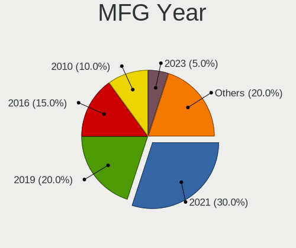

| Year | Notebooks | Percent |
|------|-----------|---------|
| 2010 | 3         | 15.79%  |
| 2021 | 2         | 10.53%  |
| 2016 | 2         | 10.53%  |
| 2014 | 2         | 10.53%  |
| 2012 | 2         | 10.53%  |
| 2008 | 2         | 10.53%  |
| 2022 | 1         | 5.26%   |
| 2020 | 1         | 5.26%   |
| 2019 | 1         | 5.26%   |
| 2017 | 1         | 5.26%   |
| 2015 | 1         | 5.26%   |
| 2011 | 1         | 5.26%   |

Form Factor
-----------

Physical design of the computer

| Name     | Notebooks | Percent |
|----------|-----------|---------|
| Notebook | 19        | 100%    |

Secure Boot
-----------

Enabled or disabled

| State    | Notebooks | Percent |
|----------|-----------|---------|
| Disabled | 18        | 94.74%  |
| Enabled  | 1         | 5.26%   |

Coreboot
--------

Have coreboot on board

| Used | Notebooks | Percent |
|------|-----------|---------|
| No   | 19        | 100%    |

RAM Size
--------

Total RAM memory

| Size in GB | Notebooks | Percent |
|------------|-----------|---------|
| 3.01-4.0   | 8         | 42.11%  |
| 4.01-8.0   | 3         | 15.79%  |
| 16.01-24.0 | 3         | 15.79%  |
| 32.01-64.0 | 2         | 10.53%  |
| 24.01-32.0 | 1         | 5.26%   |
| 2.01-3.0   | 1         | 5.26%   |
| 8.01-16.0  | 1         | 5.26%   |

RAM Used
--------

Used RAM memory

| Used GB    | Notebooks | Percent |
|------------|-----------|---------|
| 1.01-2.0   | 8         | 42.11%  |
| 2.01-3.0   | 4         | 21.05%  |
| 3.01-4.0   | 2         | 10.53%  |
| 8.01-16.0  | 2         | 10.53%  |
| 0.51-1.0   | 2         | 10.53%  |
| 24.01-32.0 | 1         | 5.26%   |

Total Drives
------------

Number of drives on board

| Drives | Notebooks | Percent |
|--------|-----------|---------|
| 1      | 15        | 78.95%  |
| 2      | 3         | 15.79%  |
| 3      | 1         | 5.26%   |

Has CD-ROM
----------

Has CD-ROM on board

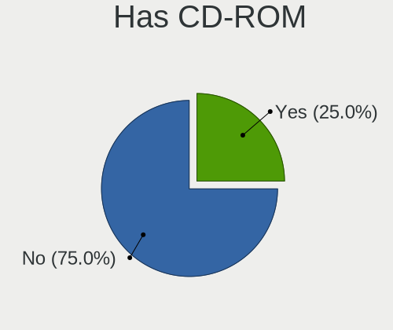

| Presented | Notebooks | Percent |
|-----------|-----------|---------|
| Yes       | 13        | 68.42%  |
| No        | 6         | 31.58%  |

Has Ethernet
------------

Has Ethernet on board

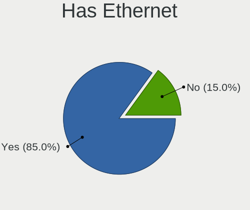

| Presented | Notebooks | Percent |
|-----------|-----------|---------|
| Yes       | 17        | 89.47%  |
| No        | 2         | 10.53%  |

Has WiFi
--------

Has WiFi module

| Presented | Notebooks | Percent |
|-----------|-----------|---------|
| Yes       | 18        | 94.74%  |
| No        | 1         | 5.26%   |

Has Bluetooth
-------------

Has Bluetooth module

| Presented | Notebooks | Percent |
|-----------|-----------|---------|
| Yes       | 15        | 78.95%  |
| No        | 4         | 21.05%  |

Location
--------

Country
-------

Geographic location (country)

| Country  | Notebooks | Percent |
|----------|-----------|---------|
| Germany  | 3         | 15.79%  |
| France   | 3         | 15.79%  |
| USA      | 2         | 10.53%  |
| Sweden   | 2         | 10.53%  |
| Ukraine  | 1         | 5.26%   |
| Thailand | 1         | 5.26%   |
| Spain    | 1         | 5.26%   |
| Mexico   | 1         | 5.26%   |
| Libya    | 1         | 5.26%   |
| Italy    | 1         | 5.26%   |
| Hungary  | 1         | 5.26%   |
| Brazil   | 1         | 5.26%   |
| Belgium  | 1         | 5.26%   |

City
----

Geographic location (city)

| City          | Notebooks | Percent |
|---------------|-----------|---------|
| Woodbridge    | 1         | 5.26%   |
| Tripoli       | 1         | 5.26%   |
| Solna         | 1         | 5.26%   |
| Sao Paulo     | 1         | 5.26%   |
| Saint-Nicolas | 1         | 5.26%   |
| Piedmont      | 1         | 5.26%   |
| Perreuil      | 1         | 5.26%   |
| Paris         | 1         | 5.26%   |
| Odesa         | 1         | 5.26%   |
| Novara        | 1         | 5.26%   |
| Mannheim      | 1         | 5.26%   |
| Madrid        | 1         | 5.26%   |
| Leipzig       | 1         | 5.26%   |
| Győr         | 1         | 5.26%   |
| Gothenburg    | 1         | 5.26%   |
| Cologne       | 1         | 5.26%   |
| Charvonnex    | 1         | 5.26%   |
| Celaya        | 1         | 5.26%   |
| Bangkok       | 1         | 5.26%   |

Drives
------

Drive Vendor
------------

Hard drive vendors

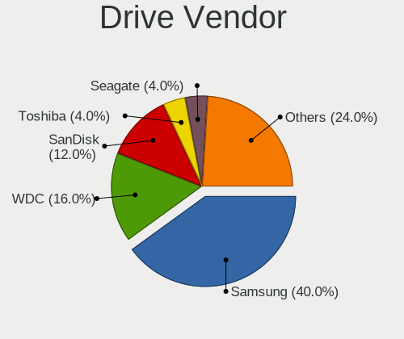

| Vendor                      | Notebooks | Drives | Percent |
|-----------------------------|-----------|--------|---------|
| Samsung Electronics         | 4         | 6      | 17.39%  |
| Unknown                     | 3         | 3      | 13.04%  |
| Seagate                     | 3         | 3      | 13.04%  |
| Kingston                    | 2         | 2      | 8.7%    |
| WDC                         | 1         | 1      | 4.35%   |
| Verbatim                    | 1         | 1      | 4.35%   |
| Toshiba                     | 1         | 1      | 4.35%   |
| SK hynix                    | 1         | 1      | 4.35%   |
| SanDisk                     | 1         | 1      | 4.35%   |
| OCZ                         | 1         | 1      | 4.35%   |
| MAXIO Technology (Hangzhou) | 1         | 1      | 4.35%   |
| KIOXIA                      | 1         | 1      | 4.35%   |
| KingSpec                    | 1         | 1      | 4.35%   |
| Fujitsu                     | 1         | 1      | 4.35%   |
| Crucial                     | 1         | 1      | 4.35%   |

Drive Model
-----------

Hard drive models

| Model                                              | Notebooks | Percent |
|----------------------------------------------------|-----------|---------|
| Unknown MMC Card  32GB                             | 2         | 8.33%   |
| WDC PC SN730 SDBQNTY-1T00-1001 1TB                 | 1         | 4.17%   |
| Verbatim Vi550 S3 256GB                            | 1         | 4.17%   |
| Unknown SD64G  64GB                                | 1         | 4.17%   |
| Toshiba MQ01ABF050 500GB                           | 1         | 4.17%   |
| SK hynix PC611 NVMe 1TB                            | 1         | 4.17%   |
| Seagate ST500LT012-1DG142 500GB                    | 1         | 4.17%   |
| Seagate ST1000LM035-1RK172 1TB                     | 1         | 4.17%   |
| Seagate Expansion 1TB                              | 1         | 4.17%   |
| SanDisk SDSSDH3 500G                               | 1         | 4.17%   |
| Samsung SSD 970 EVO Plus 2TB                       | 1         | 4.17%   |
| Samsung SSD 860 EVO 250GB                          | 1         | 4.17%   |
| Samsung SSD 840 EVO 120GB                          | 1         | 4.17%   |
| Samsung SSD 750 EVO 250GB                          | 1         | 4.17%   |
| Samsung MZVL2512HCJQ-00B00 512GB                   | 1         | 4.17%   |
| OCZ VERTEX3 240GB SSD                              | 1         | 4.17%   |
| MAXIO (Hangzhou) NVMe SSD Controller MAP1202 256GB | 1         | 4.17%   |
| KIOXIA KBG50ZNV512G 512GB                          | 1         | 4.17%   |
| Kingston SA400S37480G 480GB SSD                    | 1         | 4.17%   |
| Kingston SA400S37240G 240GB SSD                    | 1         | 4.17%   |
| KingSpec NT-1TB                                    | 1         | 4.17%   |
| Fujitsu MJA2160BH FFS G1 160GB                     | 1         | 4.17%   |
| Crucial CT480BX500SSD1 480GB                       | 1         | 4.17%   |

HDD Vendor
----------

Hard disk drive vendors

| Vendor  | Notebooks | Drives | Percent |
|---------|-----------|--------|---------|
| Seagate | 3         | 3      | 60%     |
| Toshiba | 1         | 1      | 20%     |
| Fujitsu | 1         | 1      | 20%     |

SSD Vendor
----------

Solid state drive vendors

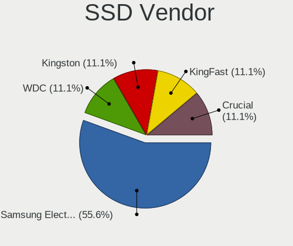

| Vendor              | Notebooks | Drives | Percent |
|---------------------|-----------|--------|---------|
| Samsung Electronics | 2         | 3      | 22.22%  |
| Kingston            | 2         | 2      | 22.22%  |
| Verbatim            | 1         | 1      | 11.11%  |
| SanDisk             | 1         | 1      | 11.11%  |
| OCZ                 | 1         | 1      | 11.11%  |
| KingSpec            | 1         | 1      | 11.11%  |
| Crucial             | 1         | 1      | 11.11%  |

Drive Kind
----------

HDD or SSD

| Kind | Notebooks | Drives | Percent |
|------|-----------|--------|---------|
| SSD  | 9         | 10     | 39.13%  |
| NVMe | 6         | 7      | 26.09%  |
| HDD  | 5         | 5      | 21.74%  |
| MMC  | 3         | 3      | 13.04%  |

Drive Connector
---------------

SATA, SAS, NVMe, etc.

| Type | Notebooks | Drives | Percent |
|------|-----------|--------|---------|
| SATA | 13        | 14     | 56.52%  |
| NVMe | 6         | 7      | 26.09%  |
| MMC  | 3         | 3      | 13.04%  |
| SAS  | 1         | 1      | 4.35%   |

Drive Size
----------

Size of hard drive

| Size in TB | Notebooks | Drives | Percent |
|------------|-----------|--------|---------|
| 0.01-0.5   | 11        | 12     | 78.57%  |
| 0.51-1.0   | 2         | 2      | 14.29%  |
| 1.01-2.0   | 1         | 1      | 7.14%   |

Space Total
-----------

Amount of disk space available on the file system

| Size in GB     | Notebooks | Percent |
|----------------|-----------|---------|
| 251-500        | 5         | 26.32%  |
| 101-250        | 5         | 26.32%  |
| 501-1000       | 4         | 21.05%  |
| 21-50          | 2         | 10.53%  |
| More than 3000 | 1         | 5.26%   |
| 1001-2000      | 1         | 5.26%   |
| 51-100         | 1         | 5.26%   |

Space Used
----------

Amount of used disk space

| Used GB   | Notebooks | Percent |
|-----------|-----------|---------|
| 1-20      | 8         | 42.11%  |
| 101-250   | 3         | 15.79%  |
| 251-500   | 2         | 10.53%  |
| 21-50     | 2         | 10.53%  |
| 2001-3000 | 1         | 5.26%   |
| 1001-2000 | 1         | 5.26%   |
| 501-1000  | 1         | 5.26%   |
| 51-100    | 1         | 5.26%   |

Malfunc. Drives
---------------

Drive models with a malfunction

| Model                           | Notebooks | Drives | Percent |
|---------------------------------|-----------|--------|---------|
| Seagate ST500LT012-1DG142 500GB | 1         | 1      | 25%     |
| Seagate ST1000LM035-1RK172 1TB  | 1         | 1      | 25%     |
| OCZ VERTEX3 240GB SSD           | 1         | 1      | 25%     |
| Kingston SA400S37240G 240GB SSD | 1         | 1      | 25%     |

Malfunc. Drive Vendor
---------------------

Vendors of faulty drives

| Vendor   | Notebooks | Drives | Percent |
|----------|-----------|--------|---------|
| Seagate  | 2         | 2      | 50%     |
| OCZ      | 1         | 1      | 25%     |
| Kingston | 1         | 1      | 25%     |

Malfunc. HDD Vendor
-------------------

Vendors of faulty HDD drives

| Vendor  | Notebooks | Drives | Percent |
|---------|-----------|--------|---------|
| Seagate | 2         | 2      | 100%    |

Malfunc. Drive Kind
-------------------

Kinds of faulty drives

| Kind | Notebooks | Drives | Percent |
|------|-----------|--------|---------|
| SSD  | 2         | 2      | 50%     |
| HDD  | 2         | 2      | 50%     |

Failed Drives
-------------

Failed drive models

Zero info for selected period =(

Failed Drive Vendor
-------------------

Failed drive vendors

Zero info for selected period =(

Drive Status
------------

Number of failed and malfunc. drives

| Status   | Notebooks | Drives | Percent |
|----------|-----------|--------|---------|
| Detected | 11        | 13     | 50%     |
| Works    | 7         | 8      | 31.82%  |
| Malfunc  | 4         | 4      | 18.18%  |

Storage controller
------------------

Storage Vendor
--------------

Storage controller vendors

| Vendor                      | Notebooks | Percent |
|-----------------------------|-----------|---------|
| Intel                       | 12        | 60%     |
| Samsung Electronics         | 2         | 10%     |
| SK hynix                    | 1         | 5%      |
| SanDisk                     | 1         | 5%      |
| Nvidia                      | 1         | 5%      |
| MAXIO Technology (Hangzhou) | 1         | 5%      |
| KIOXIA                      | 1         | 5%      |
| AMD                         | 1         | 5%      |

Storage Model
-------------

Storage controller models

| Model                                                                        | Notebooks | Percent |
|------------------------------------------------------------------------------|-----------|---------|
| Intel 82801IBM/IEM (ICH9M/ICH9M-E) 4 port SATA Controller [AHCI mode]        | 3         | 14.29%  |
| Intel Sunrise Point-LP SATA Controller [AHCI mode]                           | 2         | 9.52%   |
| Intel 7 Series Chipset Family 6-port SATA Controller [AHCI mode]             | 2         | 9.52%   |
| SK hynix Non-Volatile memory controller                                      | 1         | 4.76%   |
| SanDisk WD Black SN750 / PC SN730 NVMe SSD                                   | 1         | 4.76%   |
| Samsung NVMe SSD Controller SM981/PM981/PM983                                | 1         | 4.76%   |
| Samsung NVMe SSD Controller PM9A1/PM9A3/980PRO                               | 1         | 4.76%   |
| Nvidia MCP51 Serial ATA Controller                                           | 1         | 4.76%   |
| Nvidia MCP51 IDE                                                             | 1         | 4.76%   |
| MAXIO (Hangzhou) NVMe SSD Controller MAP1202                                 | 1         | 4.76%   |
| KIOXIA Non-Volatile memory controller                                        | 1         | 4.76%   |
| Intel Tiger Lake-LP SATA Controller                                          | 1         | 4.76%   |
| Intel Atom Processor E3800 Series SATA AHCI Controller                       | 1         | 4.76%   |
| Intel 8 Series SATA Controller 1 [AHCI mode]                                 | 1         | 4.76%   |
| Intel 6 Series/C200 Series Chipset Family 6 port Mobile SATA AHCI Controller | 1         | 4.76%   |
| Intel 5 Series/3400 Series Chipset 4 port SATA AHCI Controller               | 1         | 4.76%   |
| AMD FCH SATA Controller [AHCI mode]                                          | 1         | 4.76%   |

Storage Kind
------------

Kind of storage controller (IDE, SATA, NVMe, SAS, ...)

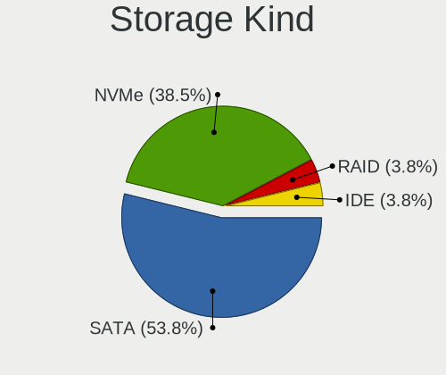

| Kind | Notebooks | Percent |
|------|-----------|---------|
| SATA | 13        | 65%     |
| NVMe | 6         | 30%     |
| IDE  | 1         | 5%      |

Processor
---------

CPU Vendor
----------

Processor vendors

| Vendor | Notebooks | Percent |
|--------|-----------|---------|
| Intel  | 16        | 84.21%  |
| AMD    | 3         | 15.79%  |

CPU Model
---------

Processor models

| Model                                       | Notebooks | Percent |
|---------------------------------------------|-----------|---------|
| Intel Pentium CPU B960 @ 2.20GHz            | 1         | 5.26%   |
| Intel Pentium CPU B940 @ 2.00GHz            | 1         | 5.26%   |
| Intel Core i7-8565U CPU @ 1.80GHz           | 1         | 5.26%   |
| Intel Core i7-3630QM CPU @ 2.40GHz          | 1         | 5.26%   |
| Intel Core i7-10850H CPU @ 2.70GHz          | 1         | 5.26%   |
| Intel Core i5-7200U CPU @ 2.50GHz           | 1         | 5.26%   |
| Intel Core i5 CPU M 430 @ 2.27GHz           | 1         | 5.26%   |
| Intel Core i3-6006U CPU @ 2.00GHz           | 1         | 5.26%   |
| Intel Core i3-4010U CPU @ 1.70GHz           | 1         | 5.26%   |
| Intel Core 2 Duo CPU T5870 @ 2.00GHz        | 1         | 5.26%   |
| Intel Core 2 Duo CPU P8400 @ 2.26GHz        | 1         | 5.26%   |
| Intel Celeron CPU N3050 @ 1.60GHz           | 1         | 5.26%   |
| Intel Celeron CPU N2830 @ 2.16GHz           | 1         | 5.26%   |
| Intel Celeron CPU 900 @ 2.20GHz             | 1         | 5.26%   |
| Intel 12th Gen Core i5-1235U                | 1         | 5.26%   |
| Intel 11th Gen Core i7-1165G7 @ 2.80GHz     | 1         | 5.26%   |
| AMD Turion 64 X2 Mobile Technology TL-50    | 1         | 5.26%   |
| AMD Ryzen 9 5900HX with Radeon Graphics     | 1         | 5.26%   |
| AMD A4-7210 APU with AMD Radeon R3 Graphics | 1         | 5.26%   |

CPU Model Family
----------------

Processor model prefix

| Model                   | Notebooks | Percent |
|-------------------------|-----------|---------|
| Intel Core i7           | 3         | 15.79%  |
| Intel Celeron           | 3         | 15.79%  |
| Other                   | 2         | 10.53%  |
| Intel Pentium           | 2         | 10.53%  |
| Intel Core i5           | 2         | 10.53%  |
| Intel Core i3           | 2         | 10.53%  |
| Intel Core 2 Duo        | 2         | 10.53%  |
| AMD Turion 64 X2 Mobile | 1         | 5.26%   |
| AMD Ryzen 9             | 1         | 5.26%   |
| AMD A4                  | 1         | 5.26%   |

CPU Cores
---------

Number of processor cores

| Number | Notebooks | Percent |
|--------|-----------|---------|
| 2      | 11        | 57.89%  |
| 4      | 4         | 21.05%  |
| 10     | 1         | 5.26%   |
| 8      | 1         | 5.26%   |
| 6      | 1         | 5.26%   |
| 1      | 1         | 5.26%   |

CPU Sockets
-----------

Number of sockets

| Number | Notebooks | Percent |
|--------|-----------|---------|
| 1      | 19        | 100%    |

CPU Threads
-----------

Threads per core (Hyper-Threading)

| Number | Notebooks | Percent |
|--------|-----------|---------|
| 2      | 10        | 52.63%  |
| 1      | 9         | 47.37%  |

CPU Op-Modes
------------

CPU Operation Modes (32-bit, 64-bit)

| Op mode        | Notebooks | Percent |
|----------------|-----------|---------|
| 32-bit, 64-bit | 19        | 100%    |

CPU Microcode
-------------

Microcode number

| Number     | Notebooks | Percent |
|------------|-----------|---------|
| Unknown    | 9         | 47.37%  |
| 0x206a7    | 2         | 10.53%  |
| 0x906a4    | 1         | 5.26%   |
| 0x806ec    | 1         | 5.26%   |
| 0x806c1    | 1         | 5.26%   |
| 0x406e3    | 1         | 5.26%   |
| 0x30678    | 1         | 5.26%   |
| 0x1067a    | 1         | 5.26%   |
| 0x10676    | 1         | 5.26%   |
| 0x0a50000c | 1         | 5.26%   |

CPU Microarch
-------------

Microarchitecture

| Name             | Notebooks | Percent |
|------------------|-----------|---------|
| Silvermont       | 2         | 10.53%  |
| SandyBridge      | 2         | 10.53%  |
| Penryn           | 2         | 10.53%  |
| KabyLake         | 2         | 10.53%  |
| Zen 3            | 1         | 5.26%   |
| Westmere         | 1         | 5.26%   |
| TigerLake        | 1         | 5.26%   |
| Skylake          | 1         | 5.26%   |
| Puma             | 1         | 5.26%   |
| K8 Hammer        | 1         | 5.26%   |
| IvyBridge        | 1         | 5.26%   |
| Haswell          | 1         | 5.26%   |
| Core             | 1         | 5.26%   |
| CometLake        | 1         | 5.26%   |
| Alderlake Hybrid | 1         | 5.26%   |

Graphics
--------

GPU Vendor
----------

Vendors of graphics cards

| Vendor | Notebooks | Percent |
|--------|-----------|---------|
| Intel  | 12        | 57.14%  |
| Nvidia | 7         | 33.33%  |
| AMD    | 2         | 9.52%   |

GPU Model
---------

Graphics card models

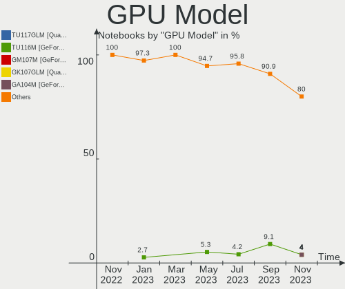

| Model                                                                                    | Notebooks | Percent |
|------------------------------------------------------------------------------------------|-----------|---------|
| Intel Mobile 4 Series Chipset Integrated Graphics Controller                             | 3         | 14.29%  |
| Nvidia TU117GLM [Quadro T1000 Mobile]                                                    | 1         | 4.76%   |
| Nvidia GM108M [GeForce 840M]                                                             | 1         | 4.76%   |
| Nvidia GF119M [GeForce 410M]                                                             | 1         | 4.76%   |
| Nvidia GF114M [GeForce GTX 670M]                                                         | 1         | 4.76%   |
| Nvidia GA104M [GeForce RTX 3070 Mobile / Max-Q]                                          | 1         | 4.76%   |
| Nvidia G98M [GeForce 9300M GS]                                                           | 1         | 4.76%   |
| Nvidia C51 [GeForce Go 6150]                                                             | 1         | 4.76%   |
| Intel WhiskeyLake-U GT2 [UHD Graphics 620]                                               | 1         | 4.76%   |
| Intel TigerLake-LP GT2 [Iris Xe Graphics]                                                | 1         | 4.76%   |
| Intel Skylake GT2 [HD Graphics 520]                                                      | 1         | 4.76%   |
| Intel HD Graphics 620                                                                    | 1         | 4.76%   |
| Intel Haswell-ULT Integrated Graphics Controller                                         | 1         | 4.76%   |
| Intel Atom/Celeron/Pentium Processor x5-E8000/J3xxx/N3xxx Integrated Graphics Controller | 1         | 4.76%   |
| Intel Atom Processor Z36xxx/Z37xxx Series Graphics & Display                             | 1         | 4.76%   |
| Intel Alder Lake-UP3 GT2 [Iris Xe Graphics]                                              | 1         | 4.76%   |
| Intel 2nd Generation Core Processor Family Integrated Graphics Controller                | 1         | 4.76%   |
| AMD Mullins [Radeon R3 Graphics]                                                         | 1         | 4.76%   |
| AMD Madison [Mobility Radeon HD 5650/5750 / 6530M/6550M]                                 | 1         | 4.76%   |

GPU Combo
---------

Combinations of graphics cards

| Name           | Notebooks | Percent |
|----------------|-----------|---------|
| 1 x Intel      | 10        | 52.63%  |
| 1 x Nvidia     | 5         | 26.32%  |
| Intel + Nvidia | 2         | 10.53%  |
| 1 x AMD        | 2         | 10.53%  |

GPU Driver
----------

Free vs proprietary

| Driver      | Notebooks | Percent |
|-------------|-----------|---------|
| Free        | 13        | 68.42%  |
| Proprietary | 4         | 21.05%  |
| Unknown     | 2         | 10.53%  |

GPU Memory
----------

Total video memory

| Size in GB | Notebooks | Percent |
|------------|-----------|---------|
| Unknown    | 15        | 78.95%  |
| 7.01-8.0   | 1         | 5.26%   |
| 1.01-2.0   | 1         | 5.26%   |
| 0.51-1.0   | 1         | 5.26%   |
| 0.01-0.5   | 1         | 5.26%   |

Monitor
-------

Monitor Vendor
--------------

Monitor vendors

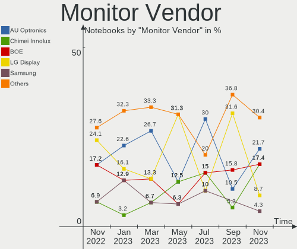

| Vendor                  | Notebooks | Percent |
|-------------------------|-----------|---------|
| AU Optronics            | 5         | 25%     |
| BOE                     | 3         | 15%     |
| LG Display              | 2         | 10%     |
| Chimei Innolux          | 2         | 10%     |
| Sony                    | 1         | 5%      |
| Samsung Electronics     | 1         | 5%      |
| Quanta Display          | 1         | 5%      |
| LGD                     | 1         | 5%      |
| Iiyama                  | 1         | 5%      |
| Hewlett-Packard         | 1         | 5%      |
| Chi Mei Optoelectronics | 1         | 5%      |
| BenQ                    | 1         | 5%      |

Monitor Model
-------------

Monitor models

| Model                                                                     | Notebooks | Percent |
|---------------------------------------------------------------------------|-----------|---------|
| AU Optronics LCD Monitor AUO22EC 1366x768 344x193mm 15.5-inch             | 2         | 10%     |
| Sony LCD Monitor SNY05FA 1366x768 310x170mm 13.9-inch                     | 1         | 5%      |
| Samsung Electronics S24C750 SAM0A5D 1920x1080 531x299mm 24.0-inch         | 1         | 5%      |
| Quanta Display LCD Monitor QDS0027 1280x800 331x207mm 15.4-inch           | 1         | 5%      |
| LGD LCD Monitor 1366x768                                                  | 1         | 5%      |
| LG Display LCD Monitor LGD05EE 2560x1440 309x174mm 14.0-inch              | 1         | 5%      |
| LG Display LCD Monitor LGD03DB 1366x768 345x194mm 15.6-inch               | 1         | 5%      |
| Iiyama PL2792UH IVM664D 3840x2160 596x335mm 26.9-inch                     | 1         | 5%      |
| Hewlett-Packard 27fh HPN354B 1920x1080 598x336mm 27.0-inch                | 1         | 5%      |
| Chimei Innolux LCD Monitor CMN15DC 1366x768 344x193mm 15.5-inch           | 1         | 5%      |
| Chimei Innolux LCD Monitor CMN1499 1366x768 309x174mm 14.0-inch           | 1         | 5%      |
| Chi Mei Optoelectronics LCD Monitor CMO1720 1920x1080 382x215mm 17.3-inch | 1         | 5%      |
| BOE LCD Monitor BOE0974 2560x1440 344x194mm 15.5-inch                     | 1         | 5%      |
| BOE LCD Monitor BOE0819 1920x1080 344x194mm 15.5-inch                     | 1         | 5%      |
| BOE LCD Monitor BOE0672 1366x768 344x194mm 15.5-inch                      | 1         | 5%      |
| BenQ EX3210R BNQ7FA5 2560x1440 697x392mm 31.5-inch                        | 1         | 5%      |
| AU Optronics LCD Monitor AUO499F 1920x1080 344x194mm 15.5-inch            | 1         | 5%      |
| AU Optronics LCD Monitor AUO429D 1920x1080 382x215mm 17.3-inch            | 1         | 5%      |
| AU Optronics LCD Monitor AUO103D 1920x1080 309x173mm 13.9-inch            | 1         | 5%      |

Monitor Resolution
------------------

Monitor screen resolution

| Resolution      | Notebooks | Percent |
|-----------------|-----------|---------|
| 1366x768 (WXGA) | 8         | 44.44%  |
| 1920x1080 (FHD) | 6         | 33.33%  |
| 2560x1440 (QHD) | 2         | 11.11%  |
| 3840x2160 (4K)  | 1         | 5.56%   |
| 1280x800 (WXGA) | 1         | 5.56%   |

Monitor Diagonal
----------------

Diagonal size in inches

| Inches  | Notebooks | Percent |
|---------|-----------|---------|
| 15      | 10        | 50%     |
| 27      | 2         | 10%     |
| 17      | 2         | 10%     |
| 14      | 2         | 10%     |
| 31      | 1         | 5%      |
| 24      | 1         | 5%      |
| 13      | 1         | 5%      |
| Unknown | 1         | 5%      |

Monitor Width
-------------

Physical width

| Width in mm | Notebooks | Percent |
|-------------|-----------|---------|
| 301-350     | 13        | 65%     |
| 501-600     | 3         | 15%     |
| 351-400     | 2         | 10%     |
| 601-700     | 1         | 5%      |
| Unknown     | 1         | 5%      |

Aspect Ratio
------------

Proportional relationship between the width and the height

| Ratio   | Notebooks | Percent |
|---------|-----------|---------|
| 16/9    | 14        | 87.5%   |
| 16/10   | 1         | 6.25%   |
| Unknown | 1         | 6.25%   |

Monitor Area
------------

Area in inch²

| Area in inch² | Notebooks | Percent |
|----------------|-----------|---------|
| 101-110        | 9         | 45%     |
| 81-90          | 3         | 15%     |
| 301-350        | 2         | 10%     |
| 121-130        | 2         | 10%     |
| 351-500        | 1         | 5%      |
| 201-250        | 1         | 5%      |
| 91-100         | 1         | 5%      |
| Unknown        | 1         | 5%      |

Pixel Density
-------------

Pixels per inch

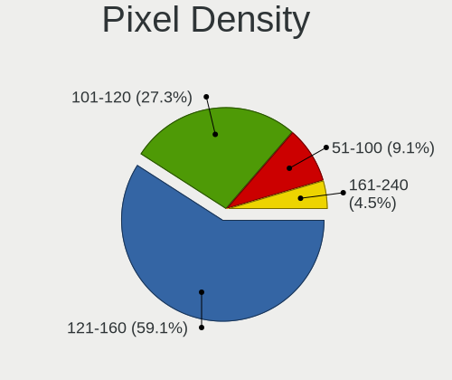

| Density | Notebooks | Percent |
|---------|-----------|---------|
| 101-120 | 6         | 30%     |
| 121-160 | 5         | 25%     |
| 51-100  | 5         | 25%     |
| 161-240 | 3         | 15%     |
| Unknown | 1         | 5%      |

Multiple Monitors
-----------------

Total monitors connected

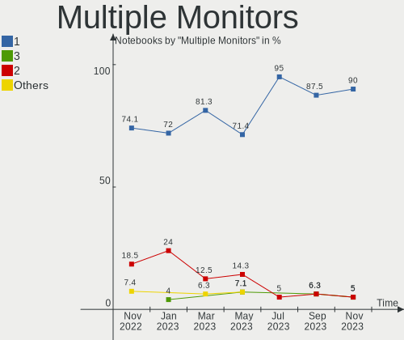

| Total | Notebooks | Percent |
|-------|-----------|---------|
| 1     | 13        | 68.42%  |
| 2     | 4         | 21.05%  |
| 0     | 2         | 10.53%  |

Network
-------

Net Controller Vendor
---------------------

Controller vendors

| Vendor                   | Notebooks | Percent |
|--------------------------|-----------|---------|
| Realtek Semiconductor    | 10        | 31.25%  |
| Intel                    | 7         | 21.88%  |
| Qualcomm Atheros         | 5         | 15.63%  |
| Ralink                   | 3         | 9.38%   |
| Broadcom                 | 2         | 6.25%   |
| Nvidia                   | 1         | 3.13%   |
| Marvell Technology Group | 1         | 3.13%   |
| FIBOCOM                  | 1         | 3.13%   |
| DisplayLink              | 1         | 3.13%   |
| D-Link System            | 1         | 3.13%   |

Net Controller Model
--------------------

Controller models

| Model                                                                          | Notebooks | Percent |
|--------------------------------------------------------------------------------|-----------|---------|
| Realtek RTL8111/8168/8411 PCI Express Gigabit Ethernet Controller              | 4         | 10.26%  |
| Realtek RTL810xE PCI Express Fast Ethernet controller                          | 3         | 7.69%   |
| Realtek RTL8723BE PCIe Wireless Network Adapter                                | 2         | 5.13%   |
| Ralink RT3290 Wireless 802.11n 1T/1R PCIe                                      | 2         | 5.13%   |
| Qualcomm Atheros AR9285 Wireless Network Adapter (PCI-Express)                 | 2         | 5.13%   |
| Intel Wi-Fi 6 AX200                                                            | 2         | 5.13%   |
| Realtek RTL8822CE 802.11ac PCIe Wireless Network Adapter                       | 1         | 2.56%   |
| Realtek RTL8192EU 802.11b/g/n WLAN Adapter                                     | 1         | 2.56%   |
| Realtek RTL8125 2.5GbE Controller                                              | 1         | 2.56%   |
| Ralink RT5390 Wireless 802.11n 1T/1R PCIe                                      | 1         | 2.56%   |
| Qualcomm Atheros QCA9377 802.11ac Wireless Network Adapter                     | 1         | 2.56%   |
| Qualcomm Atheros AR9485 Wireless Network Adapter                               | 1         | 2.56%   |
| Qualcomm Atheros AR8151 v2.0 Gigabit Ethernet                                  | 1         | 2.56%   |
| Nvidia MCP51 Ethernet Controller                                               | 1         | 2.56%   |
| Marvell Group Yukon Optima 88E8059 [PCIe Gigabit Ethernet Controller with AVB] | 1         | 2.56%   |
| Intel Wireless 8265 / 8275                                                     | 1         | 2.56%   |
| Intel WiFi Link 5100                                                           | 1         | 2.56%   |
| Intel PRO/Wireless 5100 AGN [Shiloh] Network Connection                        | 1         | 2.56%   |
| Intel Ethernet Connection (6) I219-V                                           | 1         | 2.56%   |
| Intel Ethernet Connection (4) I219-V                                           | 1         | 2.56%   |
| Intel Ethernet Connection (13) I219-V                                          | 1         | 2.56%   |
| Intel Ethernet Connection (11) I219-LM                                         | 1         | 2.56%   |
| Intel Comet Lake PCH CNVi WiFi                                                 | 1         | 2.56%   |
| Intel Cannon Point-LP CNVi [Wireless-AC]                                       | 1         | 2.56%   |
| Intel 82567LM Gigabit Network Connection                                       | 1         | 2.56%   |
| FIBOCOM L831-EAU                                                               | 1         | 2.56%   |
| DisplayLink Kensington SD3600 Dual Video Dock                                  | 1         | 2.56%   |
| D-Link System DWA-140 RangeBooster N Adapter(rev.B2) [Ralink RT3072]           | 1         | 2.56%   |
| Broadcom NetLink BCM57785 Gigabit Ethernet PCIe                                | 1         | 2.56%   |
| Broadcom BCM4311 802.11b/g WLAN                                                | 1         | 2.56%   |

Wireless Vendor
---------------

Wireless vendors

| Vendor                | Notebooks | Percent |
|-----------------------|-----------|---------|
| Intel                 | 7         | 33.33%  |
| Realtek Semiconductor | 4         | 19.05%  |
| Qualcomm Atheros      | 4         | 19.05%  |
| Ralink                | 3         | 14.29%  |
| FIBOCOM               | 1         | 4.76%   |
| D-Link System         | 1         | 4.76%   |
| Broadcom              | 1         | 4.76%   |

Wireless Model
--------------

Wireless models

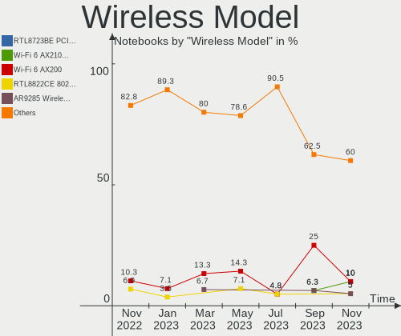

| Model                                                                | Notebooks | Percent |
|----------------------------------------------------------------------|-----------|---------|
| Realtek RTL8723BE PCIe Wireless Network Adapter                      | 2         | 9.52%   |
| Ralink RT3290 Wireless 802.11n 1T/1R PCIe                            | 2         | 9.52%   |
| Qualcomm Atheros AR9285 Wireless Network Adapter (PCI-Express)       | 2         | 9.52%   |
| Intel Wi-Fi 6 AX200                                                  | 2         | 9.52%   |
| Realtek RTL8822CE 802.11ac PCIe Wireless Network Adapter             | 1         | 4.76%   |
| Realtek RTL8192EU 802.11b/g/n WLAN Adapter                           | 1         | 4.76%   |
| Ralink RT5390 Wireless 802.11n 1T/1R PCIe                            | 1         | 4.76%   |
| Qualcomm Atheros QCA9377 802.11ac Wireless Network Adapter           | 1         | 4.76%   |
| Qualcomm Atheros AR9485 Wireless Network Adapter                     | 1         | 4.76%   |
| Intel Wireless 8265 / 8275                                           | 1         | 4.76%   |
| Intel WiFi Link 5100                                                 | 1         | 4.76%   |
| Intel PRO/Wireless 5100 AGN [Shiloh] Network Connection              | 1         | 4.76%   |
| Intel Comet Lake PCH CNVi WiFi                                       | 1         | 4.76%   |
| Intel Cannon Point-LP CNVi [Wireless-AC]                             | 1         | 4.76%   |
| FIBOCOM L831-EAU                                                     | 1         | 4.76%   |
| D-Link System DWA-140 RangeBooster N Adapter(rev.B2) [Ralink RT3072] | 1         | 4.76%   |
| Broadcom BCM4311 802.11b/g WLAN                                      | 1         | 4.76%   |

Ethernet Vendor
---------------

Ethernet vendors

| Vendor                   | Notebooks | Percent |
|--------------------------|-----------|---------|
| Realtek Semiconductor    | 8         | 44.44%  |
| Intel                    | 5         | 27.78%  |
| Qualcomm Atheros         | 1         | 5.56%   |
| Nvidia                   | 1         | 5.56%   |
| Marvell Technology Group | 1         | 5.56%   |
| DisplayLink              | 1         | 5.56%   |
| Broadcom                 | 1         | 5.56%   |

Ethernet Model
--------------

Ethernet models

| Model                                                                          | Notebooks | Percent |
|--------------------------------------------------------------------------------|-----------|---------|
| Realtek RTL8111/8168/8411 PCI Express Gigabit Ethernet Controller              | 4         | 22.22%  |
| Realtek RTL810xE PCI Express Fast Ethernet controller                          | 3         | 16.67%  |
| Realtek RTL8125 2.5GbE Controller                                              | 1         | 5.56%   |
| Qualcomm Atheros AR8151 v2.0 Gigabit Ethernet                                  | 1         | 5.56%   |
| Nvidia MCP51 Ethernet Controller                                               | 1         | 5.56%   |
| Marvell Group Yukon Optima 88E8059 [PCIe Gigabit Ethernet Controller with AVB] | 1         | 5.56%   |
| Intel Ethernet Connection (6) I219-V                                           | 1         | 5.56%   |
| Intel Ethernet Connection (4) I219-V                                           | 1         | 5.56%   |
| Intel Ethernet Connection (13) I219-V                                          | 1         | 5.56%   |
| Intel Ethernet Connection (11) I219-LM                                         | 1         | 5.56%   |
| Intel 82567LM Gigabit Network Connection                                       | 1         | 5.56%   |
| DisplayLink Kensington SD3600 Dual Video Dock                                  | 1         | 5.56%   |
| Broadcom NetLink BCM57785 Gigabit Ethernet PCIe                                | 1         | 5.56%   |

Net Controller Kind
-------------------

Ethernet, WiFi or modem

| Kind     | Notebooks | Percent |
|----------|-----------|---------|
| WiFi     | 18        | 51.43%  |
| Ethernet | 17        | 48.57%  |

Used Controller
---------------

Currently used network controller

| Kind     | Notebooks | Percent |
|----------|-----------|---------|
| WiFi     | 16        | 80%     |
| Ethernet | 4         | 20%     |

NICs
----

Total network controllers on board

| Total | Notebooks | Percent |
|-------|-----------|---------|
| 2     | 16        | 84.21%  |
| 1     | 3         | 15.79%  |

IPv6
----

IPv6 vs IPv4

| Used | Notebooks | Percent |
|------|-----------|---------|
| No   | 13        | 68.42%  |
| Yes  | 6         | 31.58%  |

Bluetooth
---------

Bluetooth Vendor
----------------

Controller vendors

| Vendor                          | Notebooks | Percent |
|---------------------------------|-----------|---------|
| Intel                           | 5         | 33.33%  |
| Realtek Semiconductor           | 3         | 20%     |
| Ralink                          | 2         | 13.33%  |
| Qualcomm Atheros Communications | 1         | 6.67%   |
| Lite-On Technology              | 1         | 6.67%   |
| Foxconn / Hon Hai               | 1         | 6.67%   |
| Broadcom                        | 1         | 6.67%   |
| ASUSTek Computer                | 1         | 6.67%   |

Bluetooth Model
---------------

Controller models

| Model                                                                               | Notebooks | Percent |
|-------------------------------------------------------------------------------------|-----------|---------|
| Realtek Bluetooth Radio                                                             | 3         | 20%     |
| Ralink RT3290 Bluetooth                                                             | 2         | 13.33%  |
| Intel AX200 Bluetooth                                                               | 2         | 13.33%  |
| Qualcomm Atheros AR3011 Bluetooth                                                   | 1         | 6.67%   |
| Lite-On Qualcomm Atheros QCA9377 Bluetooth                                          | 1         | 6.67%   |
| Intel Bluetooth wireless interface                                                  | 1         | 6.67%   |
| Intel Bluetooth 9460/9560 Jefferson Peak (JfP)                                      | 1         | 6.67%   |
| Intel AX201 Bluetooth                                                               | 1         | 6.67%   |
| Foxconn / Hon Hai Foxconn T77H114 BCM2070 [Single-Chip Bluetooth 2.1 + EDR Adapter] | 1         | 6.67%   |
| Broadcom BCM2045B (BDC-2.1) [Bluetooth Controller]                                  | 1         | 6.67%   |
| ASUS Broadcom BCM20702A0 Bluetooth                                                  | 1         | 6.67%   |

Sound
-----

Sound Vendor
------------

Sound card vendors

| Vendor              | Notebooks | Percent |
|---------------------|-----------|---------|
| Intel               | 16        | 59.26%  |
| Nvidia              | 5         | 18.52%  |
| AMD                 | 3         | 11.11%  |
| Meizu               | 1         | 3.7%    |
| Lenovo              | 1         | 3.7%    |
| C-Media Electronics | 1         | 3.7%    |

Sound Model
-----------

Sound card models

| Model                                                                                             | Notebooks | Percent |
|---------------------------------------------------------------------------------------------------|-----------|---------|
| Intel 82801I (ICH9 Family) HD Audio Controller                                                    | 3         | 10.34%  |
| Intel Sunrise Point-LP HD Audio                                                                   | 2         | 6.9%    |
| Intel 7 Series/C216 Chipset Family High Definition Audio Controller                               | 2         | 6.9%    |
| Nvidia TU107 GeForce GTX 1650 High Definition Audio Controller                                    | 1         | 3.45%   |
| Nvidia MCP51 High Definition Audio                                                                | 1         | 3.45%   |
| Nvidia GF119 HDMI Audio Controller                                                                | 1         | 3.45%   |
| Nvidia GF114 HDMI Audio Controller                                                                | 1         | 3.45%   |
| Nvidia GA104 High Definition Audio Controller                                                     | 1         | 3.45%   |
| Meizu HiFi DAC Headphone Amplifier                                                                | 1         | 3.45%   |
| Lenovo ThinkPad Dock USB Audio                                                                    | 1         | 3.45%   |
| Intel Tiger Lake-LP Smart Sound Technology Audio Controller                                       | 1         | 3.45%   |
| Intel Haswell-ULT HD Audio Controller                                                             | 1         | 3.45%   |
| Intel Comet Lake PCH cAVS                                                                         | 1         | 3.45%   |
| Intel Cannon Point-LP High Definition Audio Controller                                            | 1         | 3.45%   |
| Intel Atom/Celeron/Pentium Processor x5-E8000/J3xxx/N3xxx Series High Definition Audio Controller | 1         | 3.45%   |
| Intel Atom Processor Z36xxx/Z37xxx Series High Definition Audio Controller                        | 1         | 3.45%   |
| Intel Alder Lake PCH-P High Definition Audio Controller                                           | 1         | 3.45%   |
| Intel 8 Series HD Audio Controller                                                                | 1         | 3.45%   |
| Intel 6 Series/C200 Series Chipset Family High Definition Audio Controller                        | 1         | 3.45%   |
| Intel 5 Series/3400 Series Chipset High Definition Audio                                          | 1         | 3.45%   |
| C-Media Electronics USB Advanced Audio Device                                                     | 1         | 3.45%   |
| AMD Redwood HDMI Audio [Radeon HD 5000 Series]                                                    | 1         | 3.45%   |
| AMD Kabini HDMI/DP Audio                                                                          | 1         | 3.45%   |
| AMD FCH Azalia Controller                                                                         | 1         | 3.45%   |
| AMD Family 17h/19h HD Audio Controller                                                            | 1         | 3.45%   |

Memory
------

Memory Vendor
-------------

Memory module vendors

| Vendor              | Notebooks | Percent |
|---------------------|-----------|---------|
| Samsung Electronics | 4         | 30.77%  |
| Unknown             | 3         | 23.08%  |
| Kingston            | 3         | 23.08%  |
| SK hynix            | 2         | 15.38%  |
| Crucial             | 1         | 7.69%   |

Memory Model
------------

Memory module models

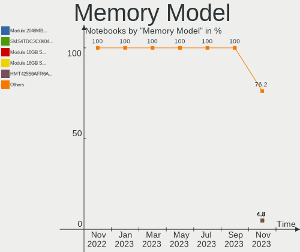

| Model                                                     | Notebooks | Percent |
|-----------------------------------------------------------|-----------|---------|
| Unknown RAM Module 4GB SODIMM DDR3                        | 1         | 7.14%   |
| Unknown RAM Module 2GB SODIMM DDR2 667MT/s                | 1         | 7.14%   |
| Unknown RAM Module 2GB SODIMM 1067MT/s                    | 1         | 7.14%   |
| Unknown RAM Module 1GB SODIMM DDR2 667MT/s                | 1         | 7.14%   |
| SK hynix RAM HYMP125S64CP8-S6 2GB SODIMM DDR2 800MT/s     | 1         | 7.14%   |
| SK hynix RAM HMT41GS6BFR8A-PB 8GB SODIMM DDR3 1333MT/s    | 1         | 7.14%   |
| Samsung RAM Module 8192MB Row Of Chips LPDDR3 2133MT/s    | 1         | 7.14%   |
| Samsung RAM M471B5273DH0-CH9 4GB SODIMM DDR3 1334MT/s     | 1         | 7.14%   |
| Samsung RAM M471A5244CB0-CRC 4GB SODIMM DDR4 2667MT/s     | 1         | 7.14%   |
| Samsung RAM M471A2K43DB1-CWE 16GB SODIMM DDR4 3200MT/s    | 1         | 7.14%   |
| Kingston RAM HP32D4S2S8MR-8 8GB SODIMM DDR4 3200MT/s      | 1         | 7.14%   |
| Kingston RAM ACR16D3LS1NGG/4G 4GB SODIMM DDR3 1600MT/s    | 1         | 7.14%   |
| Kingston RAM 9905700-104.A00G 8GB SODIMM DDR4 3200MT/s    | 1         | 7.14%   |
| Crucial RAM CT16G4SFD832A.C16FJ 16GB SODIMM DDR4 3200MT/s | 1         | 7.14%   |

Memory Kind
-----------

Memory module kinds

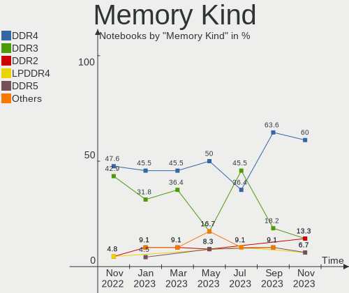

| Kind    | Notebooks | Percent |
|---------|-----------|---------|
| DDR4    | 5         | 38.46%  |
| DDR3    | 4         | 30.77%  |
| DDR2    | 2         | 15.38%  |
| LPDDR3  | 1         | 7.69%   |
| Unknown | 1         | 7.69%   |

Memory Form Factor
------------------

Physical design of the memory module

| Name         | Notebooks | Percent |
|--------------|-----------|---------|
| SODIMM       | 12        | 92.31%  |
| Row Of Chips | 1         | 7.69%   |

Memory Size
-----------

Memory module size

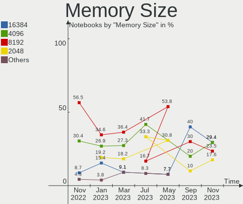

| Size  | Notebooks | Percent |
|-------|-----------|---------|
| 8192  | 4         | 28.57%  |
| 4096  | 4         | 28.57%  |
| 2048  | 3         | 21.43%  |
| 16384 | 2         | 14.29%  |
| 1024  | 1         | 7.14%   |

Memory Speed
------------

Memory module speed

| Speed   | Notebooks | Percent |
|---------|-----------|---------|
| 3200    | 4         | 30.77%  |
| 2667    | 1         | 7.69%   |
| 2133    | 1         | 7.69%   |
| 1600    | 1         | 7.69%   |
| 1334    | 1         | 7.69%   |
| 1333    | 1         | 7.69%   |
| 1067    | 1         | 7.69%   |
| 975     | 1         | 7.69%   |
| 667     | 1         | 7.69%   |
| Unknown | 1         | 7.69%   |

Printers & scanners
-------------------

Printer Vendor
--------------

Printer device vendors

Zero info for selected period =(

Printer Model
-------------

Printer device models

Zero info for selected period =(

Scanner Vendor
--------------

Scanner device vendors

| Vendor                                         | Notebooks | Percent |
|------------------------------------------------|-----------|---------|
| Siemens Information and Communication Products | 1         | 100%    |

Scanner Model
-------------

Scanner device models

| Model                                                                           | Notebooks | Percent |
|---------------------------------------------------------------------------------|-----------|---------|
| Siemens Information and Communication Products ID-Mouse with Fingerprint Reader | 1         | 100%    |

Camera
------

Camera Vendor
-------------

Camera device vendors

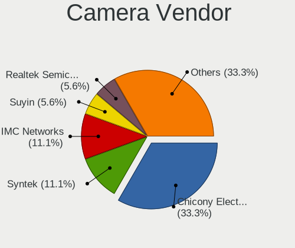

| Vendor                                 | Notebooks | Percent |
|----------------------------------------|-----------|---------|
| Chicony Electronics                    | 7         | 36.84%  |
| Microdia                               | 3         | 15.79%  |
| Realtek Semiconductor                  | 2         | 10.53%  |
| Sunplus Innovation Technology          | 1         | 5.26%   |
| Ricoh                                  | 1         | 5.26%   |
| Razer USA                              | 1         | 5.26%   |
| Lenovo                                 | 1         | 5.26%   |
| IMC Networks                           | 1         | 5.26%   |
| Cheng Uei Precision Industry (Foxlink) | 1         | 5.26%   |
| Acer                                   | 1         | 5.26%   |

Camera Model
------------

Camera device models

| Model                                                           | Notebooks | Percent |
|-----------------------------------------------------------------|-----------|---------|
| Chicony Integrated Camera                                       | 2         | 10.53%  |
| Chicony HD WebCam                                               | 2         | 10.53%  |
| Sunplus ASUS Webcam                                             | 1         | 5.26%   |
| Ricoh Sony Vaio Integrated Webcam                               | 1         | 5.26%   |
| Realtek USB Camera                                              | 1         | 5.26%   |
| Realtek Integrated_Webcam_HD                                    | 1         | 5.26%   |
| Razer USA Razer Kiyo                                            | 1         | 5.26%   |
| Microdia Webcam                                                 | 1         | 5.26%   |
| Microdia Sonix USB 2.0 Camera                                   | 1         | 5.26%   |
| Microdia Integrated Webcam                                      | 1         | 5.26%   |
| Lenovo CNF7237&CNF7238                                          | 1         | 5.26%   |
| IMC Networks USB2.0 VGA UVC WebCam                              | 1         | 5.26%   |
| Chicony VGA Webcam                                              | 1         | 5.26%   |
| Chicony USB2.0 Camera                                           | 1         | 5.26%   |
| Chicony HP Truevision HD camera                                 | 1         | 5.26%   |
| Cheng Uei Precision Industry (Foxlink) HP True Vision HD Camera | 1         | 5.26%   |
| Acer Sony Visual Communication Camera                           | 1         | 5.26%   |

Security
--------

Fingerprint Vendor
------------------

Fingerprint sensor vendors

| Vendor                | Notebooks | Percent |
|-----------------------|-----------|---------|
| Upek                  | 2         | 50%     |
| Synaptics             | 1         | 25%     |
| Elan Microelectronics | 1         | 25%     |

Fingerprint Model
-----------------

Fingerprint sensor models

| Model                                                  | Notebooks | Percent |
|--------------------------------------------------------|-----------|---------|
| Upek Biometric Touchchip/Touchstrip Fingerprint Sensor | 2         | 50%     |
| Synaptics Prometheus MIS Touch Fingerprint Reader      | 1         | 25%     |
| Elan ELAN:ARM-M4                                       | 1         | 25%     |

Chipcard Vendor
---------------

Chipcard module vendors

| Vendor   | Notebooks | Percent |
|----------|-----------|---------|
| Broadcom | 1         | 100%    |

Chipcard Model
--------------

Chipcard module models

| Model          | Notebooks | Percent |
|----------------|-----------|---------|
| Broadcom 58200 | 1         | 100%    |

Unsupported
-----------

Unsupported Devices
-------------------

Total unsupported devices on board

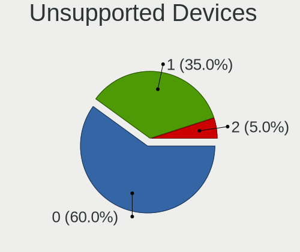

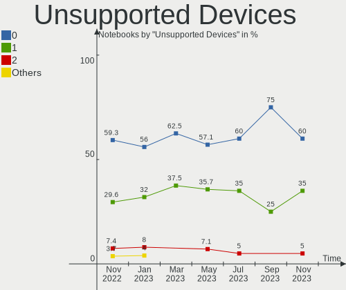

| Total | Notebooks | Percent |
|-------|-----------|---------|
| 0     | 11        | 57.89%  |
| 1     | 5         | 26.32%  |
| 3     | 2         | 10.53%  |
| 2     | 1         | 5.26%   |

Unsupported Device Types
------------------------

Types of unsupported devices

| Type               | Notebooks | Percent |
|--------------------|-----------|---------|
| Fingerprint reader | 4         | 33.33%  |
| Graphics card      | 3         | 25%     |
| Net/wireless       | 1         | 8.33%   |
| Dvb card           | 1         | 8.33%   |
| Chipcard           | 1         | 8.33%   |
| Card reader        | 1         | 8.33%   |
| Bluetooth          | 1         | 8.33%   |

