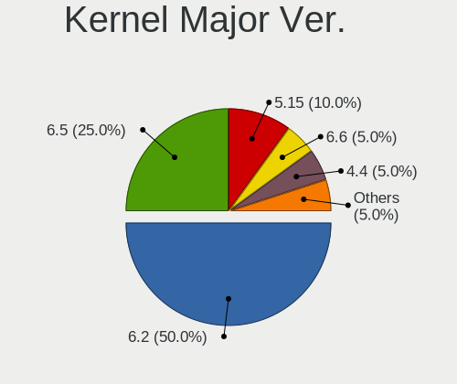
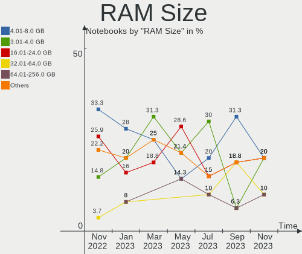
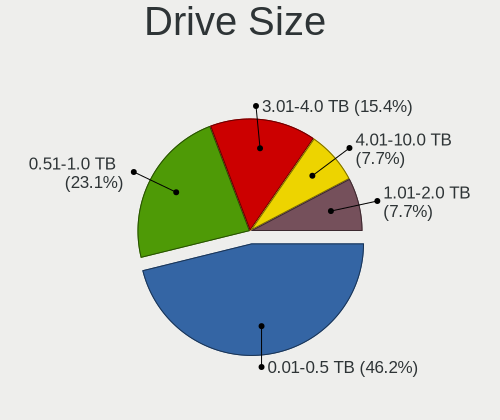
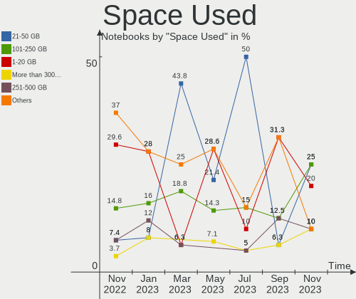
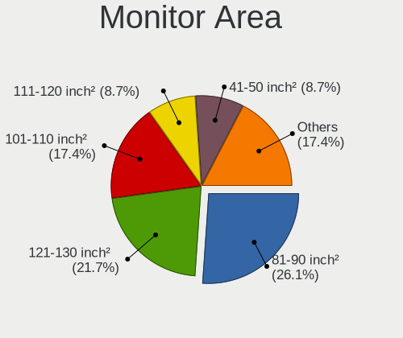
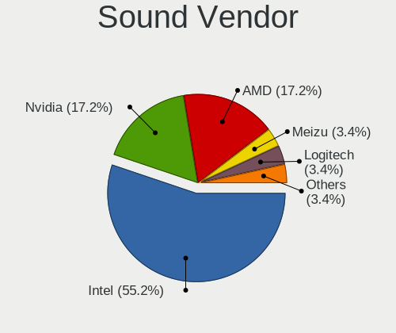
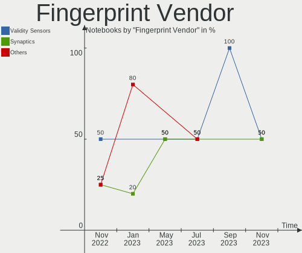

Ubuntu MATE Hardware Trends (Notebooks)
---------------------------------------

A project to identify most popular hardware characteristics and track their change
over time based on data collected by Ubuntu MATE users at https://Linux-Hardware.org.

Anyone can contribute to this report by the [hw-probe](https://github.com/linuxhw/hw-probe) tool:

    sudo -E hw-probe -all -upload

Full-feature report is available here: https://linux-hardware.org/?view=trends

Period: Jan, 2022.

Contents
--------

* [ System ](#system)
  - [ OS                       ](#os)
  - [ OS Family                ](#os-family)
  - [ Kernel                   ](#kernel)
  - [ Kernel Family            ](#kernel-family)
  - [ Kernel Major Ver.        ](#kernel-major-ver)
  - [ Arch                     ](#arch)
  - [ DE                       ](#de)
  - [ Display Server           ](#display-server)
  - [ Display Manager          ](#display-manager)
  - [ OS Lang                  ](#os-lang)
  - [ Boot Mode                ](#boot-mode)
  - [ Filesystem               ](#filesystem)
  - [ Part. scheme             ](#part-scheme)
  - [ Dual Boot with Linux/BSD ](#dual-boot-with-linuxbsd)
  - [ Dual Boot (Win)          ](#dual-boot-win)

* [ Board ](#board)
  - [ Vendor                   ](#vendor)
  - [ Model                    ](#model)
  - [ Model Family             ](#model-family)
  - [ MFG Year                 ](#mfg-year)
  - [ Form Factor              ](#form-factor)
  - [ Secure Boot              ](#secure-boot)
  - [ Coreboot                 ](#coreboot)
  - [ RAM Size                 ](#ram-size)
  - [ RAM Used                 ](#ram-used)
  - [ Total Drives             ](#total-drives)
  - [ Has CD-ROM               ](#has-cd-rom)
  - [ Has Ethernet             ](#has-ethernet)
  - [ Has WiFi                 ](#has-wifi)
  - [ Has Bluetooth            ](#has-bluetooth)

* [ Location ](#location)
  - [ Country                  ](#country)
  - [ City                     ](#city)

* [ Drives ](#drives)
  - [ Drive Vendor             ](#drive-vendor)
  - [ Drive Model              ](#drive-model)
  - [ HDD Vendor               ](#hdd-vendor)
  - [ SSD Vendor               ](#ssd-vendor)
  - [ Drive Kind               ](#drive-kind)
  - [ Drive Connector          ](#drive-connector)
  - [ Drive Size               ](#drive-size)
  - [ Space Total              ](#space-total)
  - [ Space Used               ](#space-used)
  - [ Malfunc. Drives          ](#malfunc-drives)
  - [ Malfunc. Drive Vendor    ](#malfunc-drive-vendor)
  - [ Malfunc. HDD Vendor      ](#malfunc-hdd-vendor)
  - [ Malfunc. Drive Kind      ](#malfunc-drive-kind)
  - [ Failed Drives            ](#failed-drives)
  - [ Failed Drive Vendor      ](#failed-drive-vendor)
  - [ Drive Status             ](#drive-status)

* [ Storage controller ](#storage-controller)
  - [ Storage Vendor           ](#storage-vendor)
  - [ Storage Model            ](#storage-model)
  - [ Storage Kind             ](#storage-kind)

* [ Processor ](#processor)
  - [ CPU Vendor               ](#cpu-vendor)
  - [ CPU Model                ](#cpu-model)
  - [ CPU Model Family         ](#cpu-model-family)
  - [ CPU Cores                ](#cpu-cores)
  - [ CPU Sockets              ](#cpu-sockets)
  - [ CPU Threads              ](#cpu-threads)
  - [ CPU Op-Modes             ](#cpu-op-modes)
  - [ CPU Microcode            ](#cpu-microcode)
  - [ CPU Microarch            ](#cpu-microarch)

* [ Graphics ](#graphics)
  - [ GPU Vendor               ](#gpu-vendor)
  - [ GPU Model                ](#gpu-model)
  - [ GPU Combo                ](#gpu-combo)
  - [ GPU Driver               ](#gpu-driver)
  - [ GPU Memory               ](#gpu-memory)

* [ Monitor ](#monitor)
  - [ Monitor Vendor           ](#monitor-vendor)
  - [ Monitor Model            ](#monitor-model)
  - [ Monitor Resolution       ](#monitor-resolution)
  - [ Monitor Diagonal         ](#monitor-diagonal)
  - [ Monitor Width            ](#monitor-width)
  - [ Aspect Ratio             ](#aspect-ratio)
  - [ Monitor Area             ](#monitor-area)
  - [ Pixel Density            ](#pixel-density)
  - [ Multiple Monitors        ](#multiple-monitors)

* [ Network ](#network)
  - [ Net Controller Vendor    ](#net-controller-vendor)
  - [ Net Controller Model     ](#net-controller-model)
  - [ Wireless Vendor          ](#wireless-vendor)
  - [ Wireless Model           ](#wireless-model)
  - [ Ethernet Vendor          ](#ethernet-vendor)
  - [ Ethernet Model           ](#ethernet-model)
  - [ Net Controller Kind      ](#net-controller-kind)
  - [ Used Controller          ](#used-controller)
  - [ NICs                     ](#nics)
  - [ IPv6                     ](#ipv6)

* [ Bluetooth ](#bluetooth)
  - [ Bluetooth Vendor         ](#bluetooth-vendor)
  - [ Bluetooth Model          ](#bluetooth-model)

* [ Sound ](#sound)
  - [ Sound Vendor             ](#sound-vendor)
  - [ Sound Model              ](#sound-model)

* [ Memory ](#memory)
  - [ Memory Vendor            ](#memory-vendor)
  - [ Memory Model             ](#memory-model)
  - [ Memory Kind              ](#memory-kind)
  - [ Memory Form Factor       ](#memory-form-factor)
  - [ Memory Size              ](#memory-size)
  - [ Memory Speed             ](#memory-speed)

* [ Printers & scanners ](#printers--scanners)
  - [ Printer Vendor           ](#printer-vendor)
  - [ Printer Model            ](#printer-model)
  - [ Scanner Vendor           ](#scanner-vendor)
  - [ Scanner Model            ](#scanner-model)

* [ Camera ](#camera)
  - [ Camera Vendor            ](#camera-vendor)
  - [ Camera Model             ](#camera-model)

* [ Security ](#security)
  - [ Fingerprint Vendor       ](#fingerprint-vendor)
  - [ Fingerprint Model        ](#fingerprint-model)
  - [ Chipcard Vendor          ](#chipcard-vendor)
  - [ Chipcard Model           ](#chipcard-model)

* [ Unsupported ](#unsupported)
  - [ Unsupported Devices      ](#unsupported-devices)
  - [ Unsupported Device Types ](#unsupported-device-types)

System
------

OS
--

Installed operating systems

| Name              | Notebooks | Percent |
|-------------------|-----------|---------|
| Ubuntu MATE 20.04 | 6         | 46.15%  |
| Ubuntu MATE 21.10 | 3         | 23.08%  |
| Ubuntu MATE 22.04 | 1         | 7.69%   |
| Ubuntu MATE 21.04 | 1         | 7.69%   |
| Ubuntu MATE 18.04 | 1         | 7.69%   |
| Ubuntu MATE 16.04 | 1         | 7.69%   |

OS Family
---------

OS without a version

| Name        | Notebooks | Percent |
|-------------|-----------|---------|
| Ubuntu MATE | 13        | 100%    |

Kernel
------

Version of the Linux kernel

| Version              | Notebooks | Percent |
|----------------------|-----------|---------|
| 5.4.0-91-generic     | 2         | 15.38%  |
| 5.11.0-46-generic    | 2         | 15.38%  |
| 5.15.0-18-generic    | 1         | 7.69%   |
| 5.13.0-27-generic    | 1         | 7.69%   |
| 5.13.0-25-lowlatency | 1         | 7.69%   |
| 5.13.0-23-generic    | 1         | 7.69%   |
| 5.11.0-44-generic    | 1         | 7.69%   |
| 5.11.0-43-generic    | 1         | 7.69%   |
| 5.11.0-41-generic    | 1         | 7.69%   |
| 4.4.0-210-generic    | 1         | 7.69%   |
| 4.15.0-166-generic   | 1         | 7.69%   |

Kernel Family
-------------

Linux kernel without a distro release

| Version | Notebooks | Percent |
|---------|-----------|---------|
| 5.11.0  | 5         | 38.46%  |
| 5.13.0  | 3         | 23.08%  |
| 5.4.0   | 2         | 15.38%  |
| 5.15.0  | 1         | 7.69%   |
| 4.4.0   | 1         | 7.69%   |
| 4.15.0  | 1         | 7.69%   |

Kernel Major Ver.
-----------------

Linux kernel major version

| Version | Notebooks | Percent |
|---------|-----------|---------|
| 5.11    | 5         | 38.46%  |
| 5.13    | 3         | 23.08%  |
| 5.4     | 2         | 15.38%  |
| 5.15    | 1         | 7.69%   |
| 4.4     | 1         | 7.69%   |
| 4.15    | 1         | 7.69%   |

Arch
----

OS architecture (x86_64, i586, etc.)

| Name   | Notebooks | Percent |
|--------|-----------|---------|
| x86_64 | 13        | 100%    |

DE
--

Desktop Environment

| Name | Notebooks | Percent |
|------|-----------|---------|
| MATE | 13        | 100%    |

Display Server
--------------

X11 or Wayland

| Name | Notebooks | Percent |
|------|-----------|---------|
| X11  | 13        | 100%    |

Display Manager
---------------

SDDM, LightDM, etc.

| Name    | Notebooks | Percent |
|---------|-----------|---------|
| LightDM | 10        | 76.92%  |
| GDM3    | 2         | 15.38%  |
| Unknown | 1         | 7.69%   |

OS Lang
-------

Language

| Lang  | Notebooks | Percent |
|-------|-----------|---------|
| en_US | 8         | 61.54%  |
| ru_UA | 2         | 15.38%  |
| ru_RU | 1         | 7.69%   |
| en_GB | 1         | 7.69%   |
| de_LU | 1         | 7.69%   |

Boot Mode
---------

EFI or BIOS

| Mode | Notebooks | Percent |
|------|-----------|---------|
| BIOS | 8         | 61.54%  |
| EFI  | 5         | 38.46%  |

Filesystem
----------

Type of filesystem

| Type  | Notebooks | Percent |
|-------|-----------|---------|
| Ext4  | 12        | 92.31%  |
| Btrfs | 1         | 7.69%   |

Part. scheme
------------

Scheme of partitioning

| Type    | Notebooks | Percent |
|---------|-----------|---------|
| Unknown | 6         | 46.15%  |
| GPT     | 5         | 38.46%  |
| MBR     | 2         | 15.38%  |

Dual Boot with Linux/BSD
------------------------

Hosting more than one Linux/BSD

| Dual boot | Notebooks | Percent |
|-----------|-----------|---------|
| No        | 10        | 76.92%  |
| Yes       | 3         | 23.08%  |

Dual Boot (Win)
---------------

Hosting Linux and Windows

| Dual boot | Notebooks | Percent |
|-----------|-----------|---------|
| Yes       | 8         | 61.54%  |
| No        | 5         | 38.46%  |

Board
-----

Vendor
------

Motherboard manufacturer

| Name             | Notebooks | Percent |
|------------------|-----------|---------|
| ASUSTek Computer | 4         | 30.77%  |
| Lenovo           | 2         | 15.38%  |
| Fujitsu          | 2         | 15.38%  |
| Dell             | 2         | 15.38%  |
| Sony             | 1         | 7.69%   |
| Quanta           | 1         | 7.69%   |
| Hewlett-Packard  | 1         | 7.69%   |

Model
-----

Motherboard model

| Name                                  | Notebooks | Percent |
|---------------------------------------|-----------|---------|
| ASUS X553MA                           | 2         | 15.38%  |
| Sony VPCF13Z1R                        | 1         | 7.69%   |
| Quanta Q1580P                         | 1         | 7.69%   |
| Lenovo ThinkPad SL500 27463ZG         | 1         | 7.69%   |
| Lenovo Flex 2-14 20404                | 1         | 7.69%   |
| HP Pavilion Gaming Laptop 17-cd1xxx   | 1         | 7.69%   |
| Fujitsu LIFEBOOK U748                 | 1         | 7.69%   |
| Fujitsu LIFEBOOK E746                 | 1         | 7.69%   |
| Dell XPS 12 9Q23                      | 1         | 7.69%   |
| Dell Latitude E5400                   | 1         | 7.69%   |
| ASUS X541SA                           | 1         | 7.69%   |
| ASUS ROG Zephyrus G14 GA401QM_GA401QM | 1         | 7.69%   |

Model Family
------------

Motherboard model prefix

| Name             | Notebooks | Percent |
|------------------|-----------|---------|
| Fujitsu LIFEBOOK | 2         | 15.38%  |
| ASUS X553MA      | 2         | 15.38%  |
| Sony VPCF13Z1R   | 1         | 7.69%   |
| Quanta Q1580P    | 1         | 7.69%   |
| Lenovo ThinkPad  | 1         | 7.69%   |
| Lenovo Flex      | 1         | 7.69%   |
| HP Pavilion      | 1         | 7.69%   |
| Dell XPS         | 1         | 7.69%   |
| Dell Latitude    | 1         | 7.69%   |
| ASUS X541SA      | 1         | 7.69%   |
| ASUS ROG         | 1         | 7.69%   |

MFG Year
--------

Motherboard manufacture year

| Year | Notebooks | Percent |
|------|-----------|---------|
| 2014 | 3         | 23.08%  |
| 2010 | 2         | 15.38%  |
| 2008 | 2         | 15.38%  |
| 2021 | 1         | 7.69%   |
| 2020 | 1         | 7.69%   |
| 2018 | 1         | 7.69%   |
| 2016 | 1         | 7.69%   |
| 2015 | 1         | 7.69%   |
| 2012 | 1         | 7.69%   |

Form Factor
-----------

Physical design of the computer

| Name     | Notebooks | Percent |
|----------|-----------|---------|
| Notebook | 13        | 100%    |

Secure Boot
-----------

Enabled or disabled

| State    | Notebooks | Percent |
|----------|-----------|---------|
| Disabled | 10        | 76.92%  |
| Enabled  | 3         | 23.08%  |

Coreboot
--------

Have coreboot on board

| Used | Notebooks | Percent |
|------|-----------|---------|
| No   | 13        | 100%    |

RAM Size
--------

Total RAM memory

| Size in GB  | Notebooks | Percent |
|-------------|-----------|---------|
| 3.01-4.0    | 6         | 46.15%  |
| 4.01-8.0    | 3         | 23.08%  |
| 8.01-16.0   | 2         | 15.38%  |
| 64.01-256.0 | 1         | 7.69%   |
| 16.01-24.0  | 1         | 7.69%   |

RAM Used
--------

Used RAM memory

| Used GB  | Notebooks | Percent |
|----------|-----------|---------|
| 2.01-3.0 | 7         | 53.85%  |
| 1.01-2.0 | 5         | 38.46%  |
| 4.01-8.0 | 1         | 7.69%   |

Total Drives
------------

Number of drives on board

| Drives | Notebooks | Percent |
|--------|-----------|---------|
| 1      | 11        | 84.62%  |
| 2      | 2         | 15.38%  |

Has CD-ROM
----------

Has CD-ROM on board

| Presented | Notebooks | Percent |
|-----------|-----------|---------|
| No        | 8         | 61.54%  |
| Yes       | 5         | 38.46%  |

Has Ethernet
------------

Has Ethernet on board

| Presented | Notebooks | Percent |
|-----------|-----------|---------|
| Yes       | 12        | 92.31%  |
| No        | 1         | 7.69%   |

Has WiFi
--------

Has WiFi module

| Presented | Notebooks | Percent |
|-----------|-----------|---------|
| Yes       | 13        | 100%    |

Has Bluetooth
-------------

Has Bluetooth module

| Presented | Notebooks | Percent |
|-----------|-----------|---------|
| Yes       | 12        | 92.31%  |
| No        | 1         | 7.69%   |

Location
--------

Country
-------

Geographic location (country)

| Country     | Notebooks | Percent |
|-------------|-----------|---------|
| USA         | 2         | 15.38%  |
| Ukraine     | 2         | 15.38%  |
| Spain       | 2         | 15.38%  |
| Russia      | 2         | 15.38%  |
| Luxembourg  | 1         | 7.69%   |
| Ivory Coast | 1         | 7.69%   |
| Germany     | 1         | 7.69%   |
| Brazil      | 1         | 7.69%   |
| Belarus     | 1         | 7.69%   |

City
----

Geographic location (city)

| City       | Notebooks | Percent |
|------------|-----------|---------|
| Moscow     | 2         | 15.38%  |
| Kyiv       | 2         | 15.38%  |
| Saint Paul | 1         | 7.69%   |
| Sabadell   | 1         | 7.69%   |
| Niter??i   | 1         | 7.69%   |
| Luxembourg | 1         | 7.69%   |
| Kerpen     | 1         | 7.69%   |
| Gomel      | 1         | 7.69%   |
| Barcelona  | 1         | 7.69%   |
| Ann Arbor  | 1         | 7.69%   |
| Abidjan    | 1         | 7.69%   |

Drives
------

Drive Vendor
------------

Hard drive vendors

| Vendor              | Notebooks | Drives | Percent |
|---------------------|-----------|--------|---------|
| Samsung Electronics | 5         | 5      | 33.33%  |
| Seagate             | 3         | 3      | 20%     |
| WDC                 | 1         | 1      | 6.67%   |
| Toshiba             | 1         | 1      | 6.67%   |
| SK Hynix            | 1         | 1      | 6.67%   |
| Kingston            | 1         | 1      | 6.67%   |
| Hitachi             | 1         | 1      | 6.67%   |
| Fujitsu             | 1         | 1      | 6.67%   |
| Apacer              | 1         | 1      | 6.67%   |

Drive Model
-----------

Hard drive models

| Model                                | Notebooks | Percent |
|--------------------------------------|-----------|---------|
| WDC WD5000BEVT-22ZAT0 500GB          | 1         | 6.67%   |
| Toshiba KBG30ZMS128G 128GB NVMe SSD  | 1         | 6.67%   |
| SK Hynix HFM001TD3JX013N 1TB         | 1         | 6.67%   |
| Seagate ST500LT012-9WS142 500GB      | 1         | 6.67%   |
| Seagate ST500LT012-1DG142 500GB      | 1         | 6.67%   |
| Seagate ST500LM000-SSHD-8GB          | 1         | 6.67%   |
| Samsung SSD PM830 mSATA 128GB        | 1         | 6.67%   |
| Samsung SSD 870 QVO 8TB              | 1         | 6.67%   |
| Samsung SSD 840 PRO Series 256GB     | 1         | 6.67%   |
| Samsung MZNLN512HAJQ-00007 512GB SSD | 1         | 6.67%   |
| Samsung MZ7LN256HCHP-00000 256GB SSD | 1         | 6.67%   |
| Kingston SV300S37A60G 64GB SSD       | 1         | 6.67%   |
| Hitachi HTS723232A7A364 320GB        | 1         | 6.67%   |
| Fujitsu MHZ2320BH G2 320GB           | 1         | 6.67%   |
| Apacer AS350 512GB SSD               | 1         | 6.67%   |

HDD Vendor
----------

Hard disk drive vendors

| Vendor  | Notebooks | Drives | Percent |
|---------|-----------|--------|---------|
| Seagate | 3         | 3      | 50%     |
| WDC     | 1         | 1      | 16.67%  |
| Hitachi | 1         | 1      | 16.67%  |
| Fujitsu | 1         | 1      | 16.67%  |

SSD Vendor
----------

Solid state drive vendors

| Vendor              | Notebooks | Drives | Percent |
|---------------------|-----------|--------|---------|
| Samsung Electronics | 5         | 5      | 71.43%  |
| Kingston            | 1         | 1      | 14.29%  |
| Apacer              | 1         | 1      | 14.29%  |

Drive Kind
----------

HDD or SSD

| Kind | Notebooks | Drives | Percent |
|------|-----------|--------|---------|
| SSD  | 7         | 7      | 46.67%  |
| HDD  | 6         | 6      | 40%     |
| NVMe | 2         | 2      | 13.33%  |

Drive Connector
---------------

SATA, SAS, NVMe, etc.

| Type | Notebooks | Drives | Percent |
|------|-----------|--------|---------|
| SATA | 13        | 13     | 86.67%  |
| NVMe | 2         | 2      | 13.33%  |

Drive Size
----------

Size of hard drive

| Size in TB | Notebooks | Drives | Percent |
|------------|-----------|--------|---------|
| 0.01-0.5   | 10        | 10     | 76.92%  |
| 0.51-1.0   | 2         | 2      | 15.38%  |
| 4.01-10.0  | 1         | 1      | 7.69%   |

Space Total
-----------

Amount of disk space available on the file system

| Size in GB     | Notebooks | Percent |
|----------------|-----------|---------|
| 251-500        | 5         | 38.46%  |
| 101-250        | 3         | 23.08%  |
| 51-100         | 2         | 15.38%  |
| More than 3000 | 1         | 7.69%   |
| 21-50          | 1         | 7.69%   |
| 501-1000       | 1         | 7.69%   |

Space Used
----------

Amount of used disk space

| Used GB        | Notebooks | Percent |
|----------------|-----------|---------|
| 21-50          | 4         | 30.77%  |
| 101-250        | 4         | 30.77%  |
| 1-20           | 3         | 23.08%  |
| More than 3000 | 1         | 7.69%   |
| 51-100         | 1         | 7.69%   |

Malfunc. Drives
---------------

Drive models with a malfunction

| Model                           | Notebooks | Drives | Percent |
|---------------------------------|-----------|--------|---------|
| Seagate ST500LT012-9WS142 500GB | 1         | 1      | 100%    |

Malfunc. Drive Vendor
---------------------

Vendors of faulty drives

| Vendor  | Notebooks | Drives | Percent |
|---------|-----------|--------|---------|
| Seagate | 1         | 1      | 100%    |

Malfunc. HDD Vendor
-------------------

Vendors of faulty HDD drives

| Vendor  | Notebooks | Drives | Percent |
|---------|-----------|--------|---------|
| Seagate | 1         | 1      | 100%    |

Malfunc. Drive Kind
-------------------

Kinds of faulty drives

| Kind | Notebooks | Drives | Percent |
|------|-----------|--------|---------|
| HDD  | 1         | 1      | 100%    |

Failed Drives
-------------

Failed drive models

Zero info for selected period =(

Failed Drive Vendor
-------------------

Failed drive vendors

Zero info for selected period =(

Drive Status
------------

Number of failed and malfunc. drives

| Status   | Notebooks | Drives | Percent |
|----------|-----------|--------|---------|
| Works    | 7         | 7      | 50%     |
| Detected | 6         | 7      | 42.86%  |
| Malfunc  | 1         | 1      | 7.14%   |

Storage controller
------------------

Storage Vendor
--------------

Storage controller vendors

| Vendor                       | Notebooks | Percent |
|------------------------------|-----------|---------|
| Intel                        | 12        | 85.71%  |
| Toshiba America Info Systems | 1         | 7.14%   |
| SK Hynix                     | 1         | 7.14%   |

Storage Model
-------------

Storage controller models

| Model                                                                            | Notebooks | Percent |
|----------------------------------------------------------------------------------|-----------|---------|
| Intel 82801IBM/IEM (ICH9M/ICH9M-E) 4 port SATA Controller [AHCI mode]            | 3         | 21.43%  |
| Intel Sunrise Point-LP SATA Controller [AHCI mode]                               | 2         | 14.29%  |
| Intel Atom Processor E3800 Series SATA AHCI Controller                           | 2         | 14.29%  |
| Toshiba America Info Systems XG6 NVMe SSD Controller                             | 1         | 7.14%   |
| SK Hynix Gold P31 SSD                                                            | 1         | 7.14%   |
| Intel Atom/Celeron/Pentium Processor x5-E8000/J3xxx/N3xxx Series SATA Controller | 1         | 7.14%   |
| Intel 82801 Mobile SATA Controller [RAID mode]                                   | 1         | 7.14%   |
| Intel 8 Series SATA Controller 1 [AHCI mode]                                     | 1         | 7.14%   |
| Intel 7 Series Chipset Family 6-port SATA Controller [AHCI mode]                 | 1         | 7.14%   |
| Intel 5 Series/3400 Series Chipset 6 port SATA AHCI Controller                   | 1         | 7.14%   |

Storage Kind
------------

Kind of storage controller (IDE, SATA, NVMe, SAS, ...)

| Kind | Notebooks | Percent |
|------|-----------|---------|
| SATA | 11        | 78.57%  |
| NVMe | 2         | 14.29%  |
| RAID | 1         | 7.14%   |

Processor
---------

CPU Vendor
----------

Processor vendors

| Vendor | Notebooks | Percent |
|--------|-----------|---------|
| Intel  | 12        | 92.31%  |
| AMD    | 1         | 7.69%   |

CPU Model
---------

Processor models

| Model                                   | Notebooks | Percent |
|-----------------------------------------|-----------|---------|
| Intel Pentium CPU N3540 @ 2.16GHz       | 2         | 15.38%  |
| Intel Core i7-8550U CPU @ 1.80GHz       | 1         | 7.69%   |
| Intel Core i7-6500U CPU @ 2.50GHz       | 1         | 7.69%   |
| Intel Core i7-10750H CPU @ 2.60GHz      | 1         | 7.69%   |
| Intel Core i7 CPU Q 740 @ 1.73GHz       | 1         | 7.69%   |
| Intel Core i5-4210U CPU @ 1.70GHz       | 1         | 7.69%   |
| Intel Core i5-3437U CPU @ 1.90GHz       | 1         | 7.69%   |
| Intel Core 2 Duo CPU T9800 @ 2.93GHz    | 1         | 7.69%   |
| Intel Core 2 Duo CPU T9550 @ 2.66GHz    | 1         | 7.69%   |
| Intel Core 2 Duo CPU T7250 @ 2.00GHz    | 1         | 7.69%   |
| Intel Celeron CPU N3060 @ 1.60GHz       | 1         | 7.69%   |
| AMD Ryzen 7 5800HS with Radeon Graphics | 1         | 7.69%   |

CPU Model Family
----------------

Processor model prefix

| Model            | Notebooks | Percent |
|------------------|-----------|---------|
| Intel Core i7    | 4         | 30.77%  |
| Intel Core 2 Duo | 3         | 23.08%  |
| Intel Pentium    | 2         | 15.38%  |
| Intel Core i5    | 2         | 15.38%  |
| Intel Celeron    | 1         | 7.69%   |
| AMD Ryzen 7      | 1         | 7.69%   |

CPU Cores
---------

Number of processor cores

| Number | Notebooks | Percent |
|--------|-----------|---------|
| 2      | 7         | 53.85%  |
| 4      | 4         | 30.77%  |
| 8      | 1         | 7.69%   |
| 6      | 1         | 7.69%   |

CPU Sockets
-----------

Number of sockets

| Number | Notebooks | Percent |
|--------|-----------|---------|
| 1      | 13        | 100%    |

CPU Threads
-----------

Threads per core (Hyper-Threading)

| Number | Notebooks | Percent |
|--------|-----------|---------|
| 2      | 7         | 53.85%  |
| 1      | 6         | 46.15%  |

CPU Op-Modes
------------

CPU Operation Modes (32-bit, 64-bit)

| Op mode        | Notebooks | Percent |
|----------------|-----------|---------|
| 32-bit, 64-bit | 13        | 100%    |

CPU Microcode
-------------

Microcode number

| Number     | Notebooks | Percent |
|------------|-----------|---------|
| 0x30678    | 2         | 15.38%  |
| 0x1067a    | 2         | 15.38%  |
| Unknown    | 2         | 15.38%  |
| 0x806ea    | 1         | 7.69%   |
| 0x6fd      | 1         | 7.69%   |
| 0x406c4    | 1         | 7.69%   |
| 0x40651    | 1         | 7.69%   |
| 0x306a9    | 1         | 7.69%   |
| 0x106e5    | 1         | 7.69%   |
| 0x0a50000c | 1         | 7.69%   |

CPU Microarch
-------------

Microarchitecture

| Name       | Notebooks | Percent |
|------------|-----------|---------|
| Silvermont | 3         | 23.08%  |
| Penryn     | 2         | 15.38%  |
| Zen 3      | 1         | 7.69%   |
| Skylake    | 1         | 7.69%   |
| Nehalem    | 1         | 7.69%   |
| KabyLake   | 1         | 7.69%   |
| IvyBridge  | 1         | 7.69%   |
| Haswell    | 1         | 7.69%   |
| Core       | 1         | 7.69%   |
| CometLake  | 1         | 7.69%   |

Graphics
--------

GPU Vendor
----------

Vendors of graphics cards

| Vendor | Notebooks | Percent |
|--------|-----------|---------|
| Intel  | 10        | 66.67%  |
| Nvidia | 4         | 26.67%  |
| AMD    | 1         | 6.67%   |

GPU Model
---------

Graphics card models

| Model                                                                                    | Notebooks | Percent |
|------------------------------------------------------------------------------------------|-----------|---------|
| Intel Mobile 4 Series Chipset Integrated Graphics Controller                             | 2         | 13.33%  |
| Intel Atom Processor Z36xxx/Z37xxx Series Graphics & Display                             | 2         | 13.33%  |
| Nvidia TU116M [GeForce GTX 1660 Ti Mobile]                                               | 1         | 6.67%   |
| Nvidia GF108M [GeForce GT 425M]                                                          | 1         | 6.67%   |
| Nvidia GA106M [GeForce RTX 3060 Mobile / Max-Q]                                          | 1         | 6.67%   |
| Nvidia G96CM [GeForce GT 130M]                                                           | 1         | 6.67%   |
| Intel UHD Graphics 620                                                                   | 1         | 6.67%   |
| Intel Skylake GT2 [HD Graphics 520]                                                      | 1         | 6.67%   |
| Intel Haswell-ULT Integrated Graphics Controller                                         | 1         | 6.67%   |
| Intel CometLake-H GT2 [UHD Graphics]                                                     | 1         | 6.67%   |
| Intel Atom/Celeron/Pentium Processor x5-E8000/J3xxx/N3xxx Integrated Graphics Controller | 1         | 6.67%   |
| Intel 3rd Gen Core processor Graphics Controller                                         | 1         | 6.67%   |
| AMD Cezanne                                                                              | 1         | 6.67%   |

GPU Combo
---------

Combinations of graphics cards

| Name           | Notebooks | Percent |
|----------------|-----------|---------|
| 1 x Intel      | 9         | 69.23%  |
| 1 x Nvidia     | 2         | 15.38%  |
| Intel + Nvidia | 1         | 7.69%   |
| AMD + Nvidia   | 1         | 7.69%   |

GPU Driver
----------

Free vs proprietary

| Driver      | Notebooks | Percent |
|-------------|-----------|---------|
| Free        | 10        | 76.92%  |
| Proprietary | 3         | 23.08%  |

GPU Memory
----------

Total video memory

| Size in GB | Notebooks | Percent |
|------------|-----------|---------|
| Unknown    | 9         | 69.23%  |
| 0.01-0.5   | 2         | 15.38%  |
| 5.01-6.0   | 1         | 7.69%   |
| 0.51-1.0   | 1         | 7.69%   |

Monitor
-------

Monitor Vendor
--------------

Monitor vendors

| Vendor                  | Notebooks | Percent |
|-------------------------|-----------|---------|
| LG Display              | 5         | 27.78%  |
| Sony                    | 2         | 11.11%  |
| Samsung Electronics     | 2         | 11.11%  |
| Chi Mei Optoelectronics | 2         | 11.11%  |
| PANDA                   | 1         | 5.56%   |
| Lenovo                  | 1         | 5.56%   |
| Goldstar                | 1         | 5.56%   |
| Dell                    | 1         | 5.56%   |
| BOE                     | 1         | 5.56%   |
| AOC                     | 1         | 5.56%   |
| Acer                    | 1         | 5.56%   |

Monitor Model
-------------

Monitor models

| Model                                                                    | Notebooks | Percent |
|--------------------------------------------------------------------------|-----------|---------|
| LG Display LCD Monitor LGD046D 1920x1080 309x174mm 14.0-inch             | 2         | 11.11%  |
| Chi Mei Optoelectronics LCD Monitor CMO15A7 1366x768 344x193mm 15.5-inch | 2         | 11.11%  |
| Sony TV SNYE903 1920x1080                                                | 1         | 5.56%   |
| Sony LCD Monitor MS_0025 1920x1080 360x200mm 16.2-inch                   | 1         | 5.56%   |
| Samsung Electronics LCD Monitor SEC5441 1366x768 344x194mm 15.5-inch     | 1         | 5.56%   |
| Samsung Electronics LCD Monitor SEC3358 1280x800 331x207mm 15.4-inch     | 1         | 5.56%   |
| PANDA LCD Monitor NCP005E 1920x1080 309x174mm 14.0-inch                  | 1         | 5.56%   |
| LG Display LCD Monitor LGD063F 1920x1080 382x215mm 17.3-inch             | 1         | 5.56%   |
| LG Display LCD Monitor LGD0446 1920x1080 309x174mm 14.0-inch             | 1         | 5.56%   |
| LG Display LCD Monitor LGD0402 1920x1080 276x156mm 12.5-inch             | 1         | 5.56%   |
| Lenovo LCD Monitor LEN4050 1280x800 331x207mm 15.4-inch                  | 1         | 5.56%   |
| Goldstar W2243 GSM56FE 1920x1080 477x268mm 21.5-inch                     | 1         | 5.56%   |
| Dell U2415 DELA0BC 1920x1200 518x324mm 24.1-inch                         | 1         | 5.56%   |
| BOE LCD Monitor BOE066E 1366x768 344x194mm 15.5-inch                     | 1         | 5.56%   |
| AOC M19W531 AOC1953 1440x900 408x255mm 18.9-inch                         | 1         | 5.56%   |
| Acer VG280K ACR0747 3840x2160 621x341mm 27.9-inch                        | 1         | 5.56%   |

Monitor Resolution
------------------

Monitor screen resolution

| Resolution       | Notebooks | Percent |
|------------------|-----------|---------|
| 1920x1080 (FHD)  | 8         | 50%     |
| 1366x768 (WXGA)  | 4         | 25%     |
| 1280x800 (WXGA)  | 2         | 12.5%   |
| 3840x2160 (4K)   | 1         | 6.25%   |
| 1440x900 (WXGA+) | 1         | 6.25%   |

Monitor Diagonal
----------------

Diagonal size in inches

| Inches | Notebooks | Percent |
|--------|-----------|---------|
| 15     | 6         | 33.33%  |
| 14     | 4         | 22.22%  |
| 72     | 1         | 5.56%   |
| 40     | 1         | 5.56%   |
| 27     | 1         | 5.56%   |
| 24     | 1         | 5.56%   |
| 21     | 1         | 5.56%   |
| 18     | 1         | 5.56%   |
| 17     | 1         | 5.56%   |
| 12     | 1         | 5.56%   |

Monitor Width
-------------

Physical width

| Width in mm | Notebooks | Percent |
|-------------|-----------|---------|
| 301-350     | 9         | 50%     |
| 401-500     | 2         | 11.11%  |
| 351-400     | 2         | 11.11%  |
| 801-900     | 1         | 5.56%   |
| 601-700     | 1         | 5.56%   |
| 501-600     | 1         | 5.56%   |
| 201-300     | 1         | 5.56%   |
| 1501-2000   | 1         | 5.56%   |

Aspect Ratio
------------

Proportional relationship between the width and the height

| Ratio | Notebooks | Percent |
|-------|-----------|---------|
| 16/9  | 12        | 80%     |
| 16/10 | 3         | 20%     |

Monitor Area
------------

Area in inch²

| Area in inch² | Notebooks | Percent |
|----------------|-----------|---------|
| 101-110        | 6         | 33.33%  |
| 81-90          | 4         | 22.22%  |
| 201-250        | 2         | 11.11%  |
| More than 1000 | 1         | 5.56%   |
| 61-70          | 1         | 5.56%   |
| 301-350        | 1         | 5.56%   |
| 151-200        | 1         | 5.56%   |
| 121-130        | 1         | 5.56%   |
| 501-1000       | 1         | 5.56%   |

Pixel Density
-------------

Pixels per inch

| Density | Notebooks | Percent |
|---------|-----------|---------|
| 51-100  | 7         | 43.75%  |
| 121-160 | 5         | 31.25%  |
| 101-120 | 2         | 12.5%   |
| 1-50    | 1         | 6.25%   |
| 161-240 | 1         | 6.25%   |

Multiple Monitors
-----------------

Total monitors connected

| Total | Notebooks | Percent |
|-------|-----------|---------|
| 1     | 8         | 61.54%  |
| 2     | 4         | 30.77%  |
| 3     | 1         | 7.69%   |

Network
-------

Net Controller Vendor
---------------------

Controller vendors

| Vendor                            | Notebooks | Percent |
|-----------------------------------|-----------|---------|
| Realtek Semiconductor             | 7         | 30.43%  |
| Intel                             | 5         | 21.74%  |
| Qualcomm Atheros                  | 3         | 13.04%  |
| Sierra Wireless                   | 2         | 8.7%    |
| Broadcom Limited                  | 2         | 8.7%    |
| Ralink                            | 1         | 4.35%   |
| MEDIATEK                          | 1         | 4.35%   |
| Marvell Technology Group          | 1         | 4.35%   |
| Ericsson Business Mobile Networks | 1         | 4.35%   |

Net Controller Model
--------------------

Controller models

| Model                                                             | Notebooks | Percent |
|-------------------------------------------------------------------|-----------|---------|
| Realtek RTL8111/8168/8411 PCI Express Gigabit Ethernet Controller | 4         | 14.81%  |
| Realtek RTL810xE PCI Express Fast Ethernet controller             | 3         | 11.11%  |
| Sierra Wireless EM7305 Modem                                      | 2         | 7.41%   |
| Qualcomm Atheros QCA9565 / AR9565 Wireless Network Adapter        | 2         | 7.41%   |
| Realtek RTL8187B Wireless 802.11g 54Mbps Network Adapter          | 1         | 3.7%    |
| Ralink RT3090 Wireless 802.11n 1T/1R PCIe                         | 1         | 3.7%    |
| Qualcomm Atheros AR9287 Wireless Network Adapter (PCI-Express)    | 1         | 3.7%    |
| MEDIATEK MT7921 802.11ax PCI Express Wireless Network Adapter     | 1         | 3.7%    |
| Marvell Group 88E8057 PCI-E Gigabit Ethernet Controller           | 1         | 3.7%    |
| Intel Wireless 8265 / 8275                                        | 1         | 3.7%    |
| Intel Wireless 8260                                               | 1         | 3.7%    |
| Intel PRO/Wireless 5100 AGN [Shiloh] Network Connection           | 1         | 3.7%    |
| Intel Ethernet Connection I219-V                                  | 1         | 3.7%    |
| Intel Ethernet Connection (4) I219-LM                             | 1         | 3.7%    |
| Intel Comet Lake PCH CNVi WiFi                                    | 1         | 3.7%    |
| Intel Centrino Advanced-N 6235                                    | 1         | 3.7%    |
| Ericsson Business Mobile Networks F3507g Mobile Broadband Module  | 1         | 3.7%    |
| Broadcom Limited NetXtreme BCM5761e Gigabit Ethernet PCIe         | 1         | 3.7%    |
| Broadcom Limited BCM43142 802.11b/g/n                             | 1         | 3.7%    |
| Broadcom Limited BCM4312 802.11b/g LP-PHY                         | 1         | 3.7%    |

Wireless Vendor
---------------

Wireless vendors

| Vendor                | Notebooks | Percent |
|-----------------------|-----------|---------|
| Intel                 | 5         | 33.33%  |
| Qualcomm Atheros      | 3         | 20%     |
| Sierra Wireless       | 2         | 13.33%  |
| Broadcom Limited      | 2         | 13.33%  |
| Realtek Semiconductor | 1         | 6.67%   |
| Ralink                | 1         | 6.67%   |
| MEDIATEK              | 1         | 6.67%   |

Wireless Model
--------------

Wireless models

| Model                                                          | Notebooks | Percent |
|----------------------------------------------------------------|-----------|---------|
| Sierra Wireless EM7305 Modem                                   | 2         | 13.33%  |
| Qualcomm Atheros QCA9565 / AR9565 Wireless Network Adapter     | 2         | 13.33%  |
| Realtek RTL8187B Wireless 802.11g 54Mbps Network Adapter       | 1         | 6.67%   |
| Ralink RT3090 Wireless 802.11n 1T/1R PCIe                      | 1         | 6.67%   |
| Qualcomm Atheros AR9287 Wireless Network Adapter (PCI-Express) | 1         | 6.67%   |
| MEDIATEK MT7921 802.11ax PCI Express Wireless Network Adapter  | 1         | 6.67%   |
| Intel Wireless 8265 / 8275                                     | 1         | 6.67%   |
| Intel Wireless 8260                                            | 1         | 6.67%   |
| Intel PRO/Wireless 5100 AGN [Shiloh] Network Connection        | 1         | 6.67%   |
| Intel Comet Lake PCH CNVi WiFi                                 | 1         | 6.67%   |
| Intel Centrino Advanced-N 6235                                 | 1         | 6.67%   |
| Broadcom Limited BCM43142 802.11b/g/n                          | 1         | 6.67%   |
| Broadcom Limited BCM4312 802.11b/g LP-PHY                      | 1         | 6.67%   |

Ethernet Vendor
---------------

Ethernet vendors

| Vendor                   | Notebooks | Percent |
|--------------------------|-----------|---------|
| Realtek Semiconductor    | 7         | 63.64%  |
| Intel                    | 2         | 18.18%  |
| Marvell Technology Group | 1         | 9.09%   |
| Broadcom Limited         | 1         | 9.09%   |

Ethernet Model
--------------

Ethernet models

| Model                                                             | Notebooks | Percent |
|-------------------------------------------------------------------|-----------|---------|
| Realtek RTL8111/8168/8411 PCI Express Gigabit Ethernet Controller | 4         | 36.36%  |
| Realtek RTL810xE PCI Express Fast Ethernet controller             | 3         | 27.27%  |
| Marvell Group 88E8057 PCI-E Gigabit Ethernet Controller           | 1         | 9.09%   |
| Intel Ethernet Connection I219-V                                  | 1         | 9.09%   |
| Intel Ethernet Connection (4) I219-LM                             | 1         | 9.09%   |
| Broadcom Limited NetXtreme BCM5761e Gigabit Ethernet PCIe         | 1         | 9.09%   |

Net Controller Kind
-------------------

Ethernet, WiFi or modem

| Kind     | Notebooks | Percent |
|----------|-----------|---------|
| WiFi     | 13        | 52%     |
| Ethernet | 11        | 44%     |
| Modem    | 1         | 4%      |

Used Controller
---------------

Currently used network controller

| Kind     | Notebooks | Percent |
|----------|-----------|---------|
| WiFi     | 12        | 52.17%  |
| Ethernet | 10        | 43.48%  |
| Modem    | 1         | 4.35%   |

NICs
----

Total network controllers on board

| Total | Notebooks | Percent |
|-------|-----------|---------|
| 2     | 10        | 76.92%  |
| 1     | 3         | 23.08%  |

IPv6
----

IPv6 vs IPv4

| Used | Notebooks | Percent |
|------|-----------|---------|
| No   | 12        | 92.31%  |
| Yes  | 1         | 7.69%   |

Bluetooth
---------

Bluetooth Vendor
----------------

Controller vendors

| Vendor                          | Notebooks | Percent |
|---------------------------------|-----------|---------|
| Intel                           | 5         | 38.46%  |
| IMC Networks                    | 2         | 15.38%  |
| Ralink Technology               | 1         | 7.69%   |
| Qualcomm Atheros Communications | 1         | 7.69%   |
| Qcom                            | 1         | 7.69%   |
| Lite-On Technology              | 1         | 7.69%   |
| Foxconn / Hon Hai               | 1         | 7.69%   |
| Broadcom                        | 1         | 7.69%   |

Bluetooth Model
---------------

Controller models

| Model                                                                               | Notebooks | Percent |
|-------------------------------------------------------------------------------------|-----------|---------|
| Intel Bluetooth wireless interface                                                  | 2         | 15.38%  |
| Intel Bluetooth Device                                                              | 2         | 15.38%  |
| Ralink Motorola BC4 Bluetooth 3.0+HS Adapter                                        | 1         | 7.69%   |
| Qualcomm Atheros AR3012 Bluetooth 4.0                                               | 1         | 7.69%   |
| Qcom Broadcom Bluetooth USB                                                         | 1         | 7.69%   |
| Lite-On Broadcom BCM43142A0 Bluetooth Device                                        | 1         | 7.69%   |
| Intel Centrino Bluetooth Wireless Transceiver                                       | 1         | 7.69%   |
| IMC Networks Wireless_Device                                                        | 1         | 7.69%   |
| IMC Networks Bluetooth Device                                                       | 1         | 7.69%   |
| Foxconn / Hon Hai Foxconn T77H114 BCM2070 [Single-Chip Bluetooth 2.1 + EDR Adapter] | 1         | 7.69%   |
| Broadcom BCM2045B (BDC-2.1) [Bluetooth Controller]                                  | 1         | 7.69%   |

Sound
-----

Sound Vendor
------------

Sound card vendors

| Vendor | Notebooks | Percent |
|--------|-----------|---------|
| Intel  | 12        | 75%     |
| Nvidia | 3         | 18.75%  |
| AMD    | 1         | 6.25%   |

Sound Model
-----------

Sound card models

| Model                                                                                             | Notebooks | Percent |
|---------------------------------------------------------------------------------------------------|-----------|---------|
| Intel 82801I (ICH9 Family) HD Audio Controller                                                    | 3         | 16.67%  |
| Intel Sunrise Point-LP HD Audio                                                                   | 2         | 11.11%  |
| Intel Atom Processor Z36xxx/Z37xxx Series High Definition Audio Controller                        | 2         | 11.11%  |
| Nvidia TU116 High Definition Audio Controller                                                     | 1         | 5.56%   |
| Nvidia GF108 High Definition Audio Controller                                                     | 1         | 5.56%   |
| Nvidia Audio device                                                                               | 1         | 5.56%   |
| Intel Haswell-ULT HD Audio Controller                                                             | 1         | 5.56%   |
| Intel Comet Lake PCH cAVS                                                                         | 1         | 5.56%   |
| Intel Atom/Celeron/Pentium Processor x5-E8000/J3xxx/N3xxx Series High Definition Audio Controller | 1         | 5.56%   |
| Intel 8 Series HD Audio Controller                                                                | 1         | 5.56%   |
| Intel 7 Series/C216 Chipset Family High Definition Audio Controller                               | 1         | 5.56%   |
| Intel 5 Series/3400 Series Chipset High Definition Audio                                          | 1         | 5.56%   |
| AMD Renoir Radeon High Definition Audio Controller                                                | 1         | 5.56%   |
| AMD Family 17h (Models 10h-1fh) HD Audio Controller                                               | 1         | 5.56%   |

Memory
------

Memory Vendor
-------------

Memory module vendors

| Vendor              | Notebooks | Percent |
|---------------------|-----------|---------|
| Unknown             | 4         | 44.44%  |
| Samsung Electronics | 2         | 22.22%  |
| Micron Technology   | 2         | 22.22%  |
| SK Hynix            | 1         | 11.11%  |

Memory Model
------------

Memory module models

| Model                                                     | Notebooks | Percent |
|-----------------------------------------------------------|-----------|---------|
| Unknown RAM Module 4096MB SODIMM DDR3 1333MT/s            | 2         | 22.22%  |
| Unknown RAM Module 8192MB SODIMM DDR3                     | 1         | 11.11%  |
| Unknown RAM Module 4096MB SODIMM DDR2                     | 1         | 11.11%  |
| SK Hynix RAM HMT325S6CFR8A-PB 2048MB SODIMM DDR3 1600MT/s | 1         | 11.11%  |
| Samsung RAM M471A1K43BB1-CRC 8192MB SODIMM DDR4 2667MT/s  | 1         | 11.11%  |
| Samsung RAM M471A1G44AB0-CWE 8192MB SODIMM DDR4 3200MT/s  | 1         | 11.11%  |
| Micron RAM 8KTF51264HZ-1G6P1 4096MB SODIMM DDR3 1600MT/s  | 1         | 11.11%  |
| Micron RAM 4ATF1G64HZ-3G2E1 8GB SODIMM DDR4 3200MT/s      | 1         | 11.11%  |

Memory Kind
-----------

Memory module kinds

| Kind | Notebooks | Percent |
|------|-----------|---------|
| DDR3 | 5         | 62.5%   |
| DDR4 | 2         | 25%     |
| DDR2 | 1         | 12.5%   |

Memory Form Factor
------------------

Physical design of the memory module

| Name   | Notebooks | Percent |
|--------|-----------|---------|
| SODIMM | 8         | 100%    |

Memory Size
-----------

Memory module size

| Size | Notebooks | Percent |
|------|-----------|---------|
| 4096 | 4         | 50%     |
| 8192 | 3         | 37.5%   |
| 2048 | 1         | 12.5%   |

Memory Speed
------------

Memory module speed

| Speed   | Notebooks | Percent |
|---------|-----------|---------|
| 1600    | 2         | 25%     |
| 1333    | 2         | 25%     |
| Unknown | 2         | 25%     |
| 3200    | 1         | 12.5%   |
| 2667    | 1         | 12.5%   |

Printers & scanners
-------------------

Printer Vendor
--------------

Printer device vendors

Zero info for selected period =(

Printer Model
-------------

Printer device models

Zero info for selected period =(

Scanner Vendor
--------------

Scanner device vendors

Zero info for selected period =(

Scanner Model
-------------

Scanner device models

Zero info for selected period =(

Camera
------

Camera Vendor
-------------

Camera device vendors

| Vendor                        | Notebooks | Percent |
|-------------------------------|-----------|---------|
| Chicony Electronics           | 5         | 38.46%  |
| Quanta                        | 2         | 15.38%  |
| Suyin                         | 1         | 7.69%   |
| Sunplus Innovation Technology | 1         | 7.69%   |
| Realtek Semiconductor         | 1         | 7.69%   |
| Microdia                      | 1         | 7.69%   |
| Lenovo                        | 1         | 7.69%   |
| Apple                         | 1         | 7.69%   |

Camera Model
------------

Camera device models

| Model                                  | Notebooks | Percent |
|----------------------------------------|-----------|---------|
| Chicony USB2.0 VGA UVC WebCam          | 3         | 23.08%  |
| Suyin Sony Visual Communication Camera | 1         | 7.69%   |
| Sunplus Laptop_Integrated_Webcam_1.3M  | 1         | 7.69%   |
| Realtek Lenovo EasyCamera              | 1         | 7.69%   |
| Quanta USB Webcam                      | 1         | 7.69%   |
| Quanta HP Wide Vision HD Camera        | 1         | 7.69%   |
| Microdia Rapoo Camera                  | 1         | 7.69%   |
| Lenovo CNF7237&CNF7238                 | 1         | 7.69%   |
| Chicony Integrated Camera              | 1         | 7.69%   |
| Chicony FJ Camera                      | 1         | 7.69%   |
| Apple iPhone 5/5C/5S/6/SE              | 1         | 7.69%   |

Security
--------

Fingerprint Vendor
------------------

Fingerprint sensor vendors

| Vendor           | Notebooks | Percent |
|------------------|-----------|---------|
| Validity Sensors | 1         | 50%     |
| Upek             | 1         | 50%     |

Fingerprint Model
-----------------

Fingerprint sensor models

| Model                                                  | Notebooks | Percent |
|--------------------------------------------------------|-----------|---------|
| Validity Sensors Swipe Fingerprint Sensor              | 1         | 50%     |
| Upek Biometric Touchchip/Touchstrip Fingerprint Sensor | 1         | 50%     |

Chipcard Vendor
---------------

Chipcard module vendors

| Vendor      | Notebooks | Percent |
|-------------|-----------|---------|
| Alcor Micro | 1         | 100%    |

Chipcard Model
--------------

Chipcard module models

| Model                               | Notebooks | Percent |
|-------------------------------------|-----------|---------|
| Alcor Micro AU9540 Smartcard Reader | 1         | 100%    |

Unsupported
-----------

Unsupported Devices
-------------------

Total unsupported devices on board

| Total | Notebooks | Percent |
|-------|-----------|---------|
| 0     | 11        | 84.62%  |
| 2     | 1         | 7.69%   |
| 1     | 1         | 7.69%   |

Unsupported Device Types
------------------------

Types of unsupported devices

| Type               | Notebooks | Percent |
|--------------------|-----------|---------|
| Fingerprint reader | 2         | 66.67%  |
| Chipcard           | 1         | 33.33%  |

