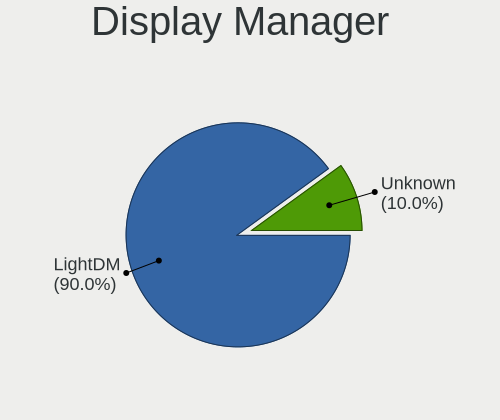
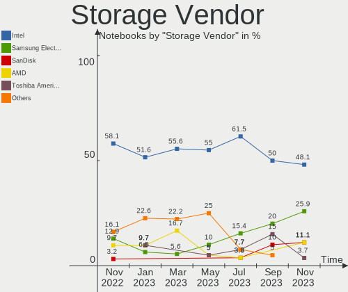
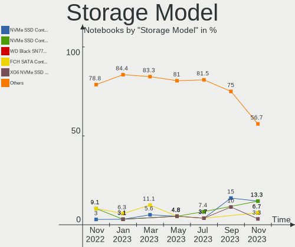
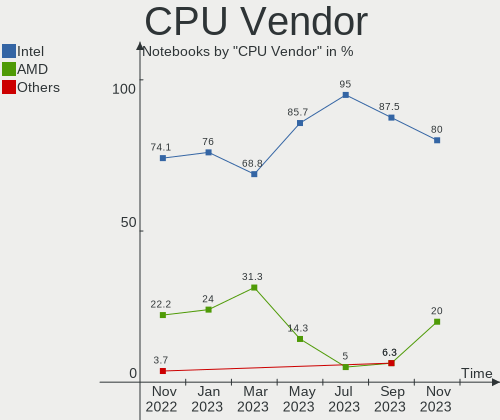
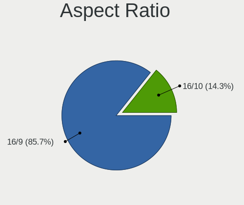
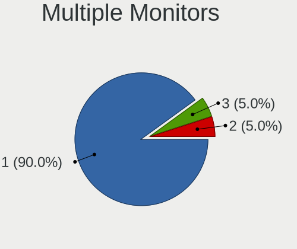
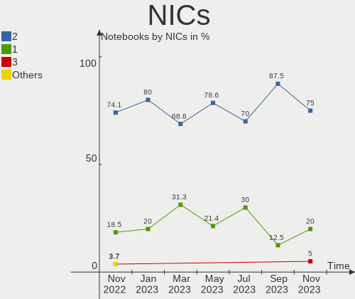
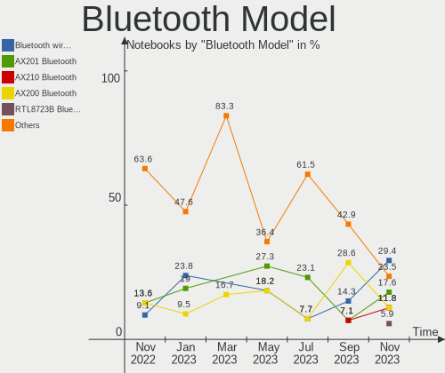

Ubuntu MATE - Hardware Trends (Notebooks)
-----------------------------------------

A project to identify most popular hardware characteristics and track their change
over time based on data collected by Linux users at https://Linux-Hardware.org.

Anyone can contribute to this report by the [hw-probe](https://github.com/linuxhw/hw-probe) tool:

    sudo -E hw-probe -all -upload

This report is for one last month. Overall report since the beginning of time: [TestDays](https://github.com/linuxhw/TestDays)

Period: Jun, 2023.

Contents
--------

* [ System ](#system)
  - [ OS                       ](#os)
  - [ OS Family                ](#os-family)
  - [ Kernel                   ](#kernel)
  - [ Kernel Family            ](#kernel-family)
  - [ Kernel Major Ver.        ](#kernel-major-ver)
  - [ Arch                     ](#arch)
  - [ DE                       ](#de)
  - [ Display Server           ](#display-server)
  - [ Display Manager          ](#display-manager)
  - [ OS Lang                  ](#os-lang)
  - [ Boot Mode                ](#boot-mode)
  - [ Filesystem               ](#filesystem)
  - [ Part. scheme             ](#part-scheme)
  - [ Dual Boot with Linux/BSD ](#dual-boot-with-linuxbsd)
  - [ Dual Boot (Win)          ](#dual-boot-win)

* [ Board ](#board)
  - [ Vendor                   ](#vendor)
  - [ Model                    ](#model)
  - [ Model Family             ](#model-family)
  - [ MFG Year                 ](#mfg-year)
  - [ Form Factor              ](#form-factor)
  - [ Secure Boot              ](#secure-boot)
  - [ Coreboot                 ](#coreboot)
  - [ RAM Size                 ](#ram-size)
  - [ RAM Used                 ](#ram-used)
  - [ Total Drives             ](#total-drives)
  - [ Has CD-ROM               ](#has-cd-rom)
  - [ Has Ethernet             ](#has-ethernet)
  - [ Has WiFi                 ](#has-wifi)
  - [ Has Bluetooth            ](#has-bluetooth)

* [ Location ](#location)
  - [ Country                  ](#country)
  - [ City                     ](#city)

* [ Drives ](#drives)
  - [ Drive Vendor             ](#drive-vendor)
  - [ Drive Model              ](#drive-model)
  - [ HDD Vendor               ](#hdd-vendor)
  - [ SSD Vendor               ](#ssd-vendor)
  - [ Drive Kind               ](#drive-kind)
  - [ Drive Connector          ](#drive-connector)
  - [ Drive Size               ](#drive-size)
  - [ Space Total              ](#space-total)
  - [ Space Used               ](#space-used)
  - [ Malfunc. Drives          ](#malfunc-drives)
  - [ Malfunc. Drive Vendor    ](#malfunc-drive-vendor)
  - [ Malfunc. HDD Vendor      ](#malfunc-hdd-vendor)
  - [ Malfunc. Drive Kind      ](#malfunc-drive-kind)
  - [ Failed Drives            ](#failed-drives)
  - [ Failed Drive Vendor      ](#failed-drive-vendor)
  - [ Drive Status             ](#drive-status)

* [ Storage controller ](#storage-controller)
  - [ Storage Vendor           ](#storage-vendor)
  - [ Storage Model            ](#storage-model)
  - [ Storage Kind             ](#storage-kind)

* [ Processor ](#processor)
  - [ CPU Vendor               ](#cpu-vendor)
  - [ CPU Model                ](#cpu-model)
  - [ CPU Model Family         ](#cpu-model-family)
  - [ CPU Cores                ](#cpu-cores)
  - [ CPU Sockets              ](#cpu-sockets)
  - [ CPU Threads              ](#cpu-threads)
  - [ CPU Op-Modes             ](#cpu-op-modes)
  - [ CPU Microcode            ](#cpu-microcode)
  - [ CPU Microarch            ](#cpu-microarch)

* [ Graphics ](#graphics)
  - [ GPU Vendor               ](#gpu-vendor)
  - [ GPU Model                ](#gpu-model)
  - [ GPU Combo                ](#gpu-combo)
  - [ GPU Driver               ](#gpu-driver)
  - [ GPU Memory               ](#gpu-memory)

* [ Monitor ](#monitor)
  - [ Monitor Vendor           ](#monitor-vendor)
  - [ Monitor Model            ](#monitor-model)
  - [ Monitor Resolution       ](#monitor-resolution)
  - [ Monitor Diagonal         ](#monitor-diagonal)
  - [ Monitor Width            ](#monitor-width)
  - [ Aspect Ratio             ](#aspect-ratio)
  - [ Monitor Area             ](#monitor-area)
  - [ Pixel Density            ](#pixel-density)
  - [ Multiple Monitors        ](#multiple-monitors)

* [ Network ](#network)
  - [ Net Controller Vendor    ](#net-controller-vendor)
  - [ Net Controller Model     ](#net-controller-model)
  - [ Wireless Vendor          ](#wireless-vendor)
  - [ Wireless Model           ](#wireless-model)
  - [ Ethernet Vendor          ](#ethernet-vendor)
  - [ Ethernet Model           ](#ethernet-model)
  - [ Net Controller Kind      ](#net-controller-kind)
  - [ Used Controller          ](#used-controller)
  - [ NICs                     ](#nics)
  - [ IPv6                     ](#ipv6)

* [ Bluetooth ](#bluetooth)
  - [ Bluetooth Vendor         ](#bluetooth-vendor)
  - [ Bluetooth Model          ](#bluetooth-model)

* [ Sound ](#sound)
  - [ Sound Vendor             ](#sound-vendor)
  - [ Sound Model              ](#sound-model)

* [ Memory ](#memory)
  - [ Memory Vendor            ](#memory-vendor)
  - [ Memory Model             ](#memory-model)
  - [ Memory Kind              ](#memory-kind)
  - [ Memory Form Factor       ](#memory-form-factor)
  - [ Memory Size              ](#memory-size)
  - [ Memory Speed             ](#memory-speed)

* [ Printers & scanners ](#printers--scanners)
  - [ Printer Vendor           ](#printer-vendor)
  - [ Printer Model            ](#printer-model)
  - [ Scanner Vendor           ](#scanner-vendor)
  - [ Scanner Model            ](#scanner-model)

* [ Camera ](#camera)
  - [ Camera Vendor            ](#camera-vendor)
  - [ Camera Model             ](#camera-model)

* [ Security ](#security)
  - [ Fingerprint Vendor       ](#fingerprint-vendor)
  - [ Fingerprint Model        ](#fingerprint-model)
  - [ Chipcard Vendor          ](#chipcard-vendor)
  - [ Chipcard Model           ](#chipcard-model)

* [ Unsupported ](#unsupported)
  - [ Unsupported Devices      ](#unsupported-devices)
  - [ Unsupported Device Types ](#unsupported-device-types)

System
------

OS
--

Installed operating systems

| Name              | Notebooks | Percent |
|-------------------|-----------|---------|
| Ubuntu MATE 22.04 | 8         | 50%     |
| Ubuntu MATE 23.04 | 4         | 25%     |
| Ubuntu MATE 20.04 | 4         | 25%     |

OS Family
---------

OS without a version

| Name        | Notebooks | Percent |
|-------------|-----------|---------|
| Ubuntu MATE | 16        | 100%    |

Kernel
------

Version of the Linux kernel

| Version                | Notebooks | Percent |
|------------------------|-----------|---------|
| 6.2.0-20-generic       | 2         | 12.5%   |
| 5.19.0-43-generic      | 2         | 12.5%   |
| 6.3.7-060307-generic   | 1         | 6.25%   |
| 6.2.0-1003-lowlatency  | 1         | 6.25%   |
| 5.4.0-90-generic       | 1         | 6.25%   |
| 5.19.0-46-generic      | 1         | 6.25%   |
| 5.19.0-32-generic      | 1         | 6.25%   |
| 5.19.0-1025-lowlatency | 1         | 6.25%   |
| 5.15.27-xanmod1        | 1         | 6.25%   |
| 5.15.0-77-generic      | 1         | 6.25%   |
| 5.15.0-75-generic      | 1         | 6.25%   |
| 5.15.0-73-generic      | 1         | 6.25%   |
| 5.15.0-69-generic      | 1         | 6.25%   |
| 5.11.0-27-generic      | 1         | 6.25%   |

Kernel Family
-------------

Linux kernel without a distro release

| Version | Notebooks | Percent |
|---------|-----------|---------|
| 5.19.0  | 5         | 31.25%  |
| 5.15.0  | 4         | 25%     |
| 6.2.0   | 3         | 18.75%  |
| 6.3.7   | 1         | 6.25%   |
| 5.4.0   | 1         | 6.25%   |
| 5.15.27 | 1         | 6.25%   |
| 5.11.0  | 1         | 6.25%   |

Kernel Major Ver.
-----------------

Linux kernel major version

| Version | Notebooks | Percent |
|---------|-----------|---------|
| 5.19    | 5         | 31.25%  |
| 5.15    | 5         | 31.25%  |
| 6.2     | 3         | 18.75%  |
| 6.3     | 1         | 6.25%   |
| 5.4     | 1         | 6.25%   |
| 5.11    | 1         | 6.25%   |

Arch
----

OS architecture (x86_64, i586, etc.)

| Name   | Notebooks | Percent |
|--------|-----------|---------|
| x86_64 | 16        | 100%    |

DE
--

Desktop Environment

| Name | Notebooks | Percent |
|------|-----------|---------|
| MATE | 16        | 100%    |

Display Server
--------------

X11 or Wayland

| Name | Notebooks | Percent |
|------|-----------|---------|
| X11  | 16        | 100%    |

Display Manager
---------------

SDDM, LightDM, etc.

| Name    | Notebooks | Percent |
|---------|-----------|---------|
| LightDM | 12        | 75%     |
| Unknown | 3         | 18.75%  |
| LXDM    | 1         | 6.25%   |

OS Lang
-------

Language

| Lang  | Notebooks | Percent |
|-------|-----------|---------|
| en_US | 4         | 25%     |
| de_DE | 3         | 18.75%  |
| ru_RU | 2         | 12.5%   |
| es_ES | 2         | 12.5%   |
| en_CA | 2         | 12.5%   |
| sv_SE | 1         | 6.25%   |
| pt_BR | 1         | 6.25%   |
| fr_FR | 1         | 6.25%   |

Boot Mode
---------

EFI or BIOS

| Mode | Notebooks | Percent |
|------|-----------|---------|
| BIOS | 11        | 68.75%  |
| EFI  | 5         | 31.25%  |

Filesystem
----------

Type of filesystem

| Type  | Notebooks | Percent |
|-------|-----------|---------|
| Ext4  | 8         | 50%     |
| Tmpfs | 6         | 37.5%   |
| Btrfs | 2         | 12.5%   |

Part. scheme
------------

Scheme of partitioning

| Type    | Notebooks | Percent |
|---------|-----------|---------|
| GPT     | 10        | 62.5%   |
| MBR     | 3         | 18.75%  |
| Unknown | 3         | 18.75%  |

Dual Boot with Linux/BSD
------------------------

Hosting more than one Linux/BSD

| Dual boot | Notebooks | Percent |
|-----------|-----------|---------|
| No        | 14        | 87.5%   |
| Yes       | 2         | 12.5%   |

Dual Boot (Win)
---------------

Hosting Linux and Windows

| Dual boot | Notebooks | Percent |
|-----------|-----------|---------|
| No        | 13        | 81.25%  |
| Yes       | 3         | 18.75%  |

Board
-----

Vendor
------

Motherboard manufacturer

| Name             | Notebooks | Percent |
|------------------|-----------|---------|
| Lenovo           | 4         | 25%     |
| Hewlett-Packard  | 4         | 25%     |
| Dell             | 3         | 18.75%  |
| Acer             | 3         | 18.75%  |
| Notebook         | 1         | 6.25%   |
| ASUSTek Computer | 1         | 6.25%   |

Model
-----

Motherboard model

| Name                                  | Notebooks | Percent |
|---------------------------------------|-----------|---------|
| Notebook NJx0MU                       | 1         | 6.25%   |
| Lenovo V145-15AST 81MT                | 1         | 6.25%   |
| Lenovo ThinkPad X270 W10DG 20K5S3F200 | 1         | 6.25%   |
| Lenovo ThinkPad T580 20LAS0DL00       | 1         | 6.25%   |
| Lenovo IdeaPad S410p 20296            | 1         | 6.25%   |
| HP Pavilion Gaming Laptop 17-cd1xxx   | 1         | 6.25%   |
| HP Pavilion 17                        | 1         | 6.25%   |
| HP EliteBook 840 G6                   | 1         | 6.25%   |
| HP 625 (WT144EA#ABD)                  | 1         | 6.25%   |
| Dell Vostro 3460                      | 1         | 6.25%   |
| Dell Studio 1558                      | 1         | 6.25%   |
| Dell Latitude E5540                   | 1         | 6.25%   |
| ASUS K53SD                            | 1         | 6.25%   |
| Acer TravelMate P648-G2-M             | 1         | 6.25%   |
| Acer Extensa 2519                     | 1         | 6.25%   |
| Acer Aspire ES1-311                   | 1         | 6.25%   |

Model Family
------------

Motherboard model prefix

| Name              | Notebooks | Percent |
|-------------------|-----------|---------|
| Lenovo ThinkPad   | 2         | 12.5%   |
| HP Pavilion       | 2         | 12.5%   |
| Notebook NJx0MU   | 1         | 6.25%   |
| Lenovo V145-15AST | 1         | 6.25%   |
| Lenovo IdeaPad    | 1         | 6.25%   |
| HP EliteBook      | 1         | 6.25%   |
| HP 625            | 1         | 6.25%   |
| Dell Vostro       | 1         | 6.25%   |
| Dell Studio       | 1         | 6.25%   |
| Dell Latitude     | 1         | 6.25%   |
| ASUS K53SD        | 1         | 6.25%   |
| Acer TravelMate   | 1         | 6.25%   |
| Acer Extensa      | 1         | 6.25%   |
| Acer Aspire       | 1         | 6.25%   |

MFG Year
--------

Motherboard manufacture year

| Year | Notebooks | Percent |
|------|-----------|---------|
| 2018 | 2         | 12.5%   |
| 2017 | 2         | 12.5%   |
| 2015 | 2         | 12.5%   |
| 2014 | 2         | 12.5%   |
| 2013 | 2         | 12.5%   |
| 2021 | 1         | 6.25%   |
| 2020 | 1         | 6.25%   |
| 2019 | 1         | 6.25%   |
| 2012 | 1         | 6.25%   |
| 2011 | 1         | 6.25%   |
| 2010 | 1         | 6.25%   |

Form Factor
-----------

Physical design of the computer

| Name     | Notebooks | Percent |
|----------|-----------|---------|
| Notebook | 16        | 100%    |

Secure Boot
-----------

Enabled or disabled

| State    | Notebooks | Percent |
|----------|-----------|---------|
| Disabled | 16        | 100%    |

Coreboot
--------

Have coreboot on board

| Used | Notebooks | Percent |
|------|-----------|---------|
| No   | 16        | 100%    |

RAM Size
--------

Total RAM memory

| Size in GB  | Notebooks | Percent |
|-------------|-----------|---------|
| 4.01-8.0    | 7         | 43.75%  |
| 16.01-24.0  | 4         | 25%     |
| 3.01-4.0    | 2         | 12.5%   |
| 24.01-32.0  | 1         | 6.25%   |
| 64.01-256.0 | 1         | 6.25%   |
| 8.01-16.0   | 1         | 6.25%   |

RAM Used
--------

Used RAM memory

| Used GB   | Notebooks | Percent |
|-----------|-----------|---------|
| 1.01-2.0  | 9         | 56.25%  |
| 2.01-3.0  | 3         | 18.75%  |
| 4.01-8.0  | 2         | 12.5%   |
| 3.01-4.0  | 1         | 6.25%   |
| 8.01-16.0 | 1         | 6.25%   |

Total Drives
------------

Number of drives on board

| Drives | Notebooks | Percent |
|--------|-----------|---------|
| 1      | 11        | 68.75%  |
| 2      | 4         | 25%     |
| 3      | 1         | 6.25%   |

Has CD-ROM
----------

Has CD-ROM on board

| Presented | Notebooks | Percent |
|-----------|-----------|---------|
| Yes       | 9         | 56.25%  |
| No        | 7         | 43.75%  |

Has Ethernet
------------

Has Ethernet on board

| Presented | Notebooks | Percent |
|-----------|-----------|---------|
| Yes       | 16        | 100%    |

Has WiFi
--------

Has WiFi module

| Presented | Notebooks | Percent |
|-----------|-----------|---------|
| Yes       | 15        | 93.75%  |
| No        | 1         | 6.25%   |

Has Bluetooth
-------------

Has Bluetooth module

| Presented | Notebooks | Percent |
|-----------|-----------|---------|
| Yes       | 14        | 87.5%   |
| No        | 2         | 12.5%   |

Location
--------

Country
-------

Geographic location (country)

| Country   | Notebooks | Percent |
|-----------|-----------|---------|
| USA       | 3         | 18.75%  |
| Germany   | 3         | 18.75%  |
| Spain     | 2         | 12.5%   |
| Russia    | 2         | 12.5%   |
| Brazil    | 2         | 12.5%   |
| Sweden    | 1         | 6.25%   |
| Indonesia | 1         | 6.25%   |
| France    | 1         | 6.25%   |
| Canada    | 1         | 6.25%   |

City
----

Geographic location (city)

| City         | Notebooks | Percent |
|--------------|-----------|---------|
| Wittingen    | 2         | 12.5%   |
| Barcelona    | 2         | 12.5%   |
| Voronezh     | 1         | 6.25%   |
| Varginha     | 1         | 6.25%   |
| Sundbyberg   | 1         | 6.25%   |
| Sarzeau      | 1         | 6.25%   |
| Sao Paulo    | 1         | 6.25%   |
| Norden       | 1         | 6.25%   |
| New Brighton | 1         | 6.25%   |
| Moscow       | 1         | 6.25%   |
| Mississauga  | 1         | 6.25%   |
| Macon        | 1         | 6.25%   |
| Balikpapan   | 1         | 6.25%   |
| Arlington    | 1         | 6.25%   |

Drives
------

Drive Vendor
------------

Hard drive vendors

| Vendor              | Notebooks | Drives | Percent |
|---------------------|-----------|--------|---------|
| Samsung Electronics | 8         | 8      | 38.1%   |
| Toshiba             | 2         | 3      | 9.52%   |
| Seagate             | 2         | 2      | 9.52%   |
| WDC                 | 1         | 1      | 4.76%   |
| Unknown             | 1         | 1      | 4.76%   |
| SK hynix            | 1         | 1      | 4.76%   |
| Sandisk             | 1         | 1      | 4.76%   |
| Ramos Technology    | 1         | 1      | 4.76%   |
| Kingston            | 1         | 1      | 4.76%   |
| Intel               | 1         | 1      | 4.76%   |
| China               | 1         | 1      | 4.76%   |
| A-DATA Technology   | 1         | 1      | 4.76%   |

Drive Model
-----------

Hard drive models

| Model                                               | Notebooks | Percent |
|-----------------------------------------------------|-----------|---------|
| WDC WD5000LPCX-21VHAT0 500GB                        | 1         | 4.55%   |
| Unknown EB1QT  32GB                                 | 1         | 4.55%   |
| Toshiba XG6 NVMe SSD Controller 2TB                 | 1         | 4.55%   |
| Toshiba MQ01ABD075 752GB                            | 1         | 4.55%   |
| Toshiba MQ01ABD050V 500GB                           | 1         | 4.55%   |
| SK hynix HFS256G39TND-N210A 256GB SSD               | 1         | 4.55%   |
| Seagate ST1000LM014-1EJ164 1TB                      | 1         | 4.55%   |
| Seagate BUP Portable 4TB                            | 1         | 4.55%   |
| Sandisk WD Blue SN550 NVMe SSD 1TB                  | 1         | 4.55%   |
| Samsung SSD PM851 2.5 7mm 256GB                     | 1         | 4.55%   |
| Samsung SSD 870 QVO 8TB                             | 1         | 4.55%   |
| Samsung SSD 860 EVO 500GB                           | 1         | 4.55%   |
| Samsung SSD 750 EVO 250GB                           | 1         | 4.55%   |
| Samsung PSSD T7 1TB                                 | 1         | 4.55%   |
| Samsung NVMe SSD Controller SM981/PM981/PM983 250GB | 1         | 4.55%   |
| Samsung NVMe SSD Controller SM961/PM961/SM963 256GB | 1         | 4.55%   |
| Samsung MZVL2512HCJQ-00B00 512GB                    | 1         | 4.55%   |
| Ramos SSD 1TB                                       | 1         | 4.55%   |
| Kingston SA400S37240G 240GB SSD                     | 1         | 4.55%   |
| Intel SSDSA2CW080G3 80GB                            | 1         | 4.55%   |
| China SATA SSD 240GB                                | 1         | 4.55%   |
| A-DATA SU650 120GB SSD                              | 1         | 4.55%   |

HDD Vendor
----------

Hard disk drive vendors

| Vendor  | Notebooks | Drives | Percent |
|---------|-----------|--------|---------|
| Seagate | 2         | 2      | 50%     |
| WDC     | 1         | 1      | 25%     |
| Toshiba | 1         | 2      | 25%     |

SSD Vendor
----------

Solid state drive vendors

| Vendor              | Notebooks | Drives | Percent |
|---------------------|-----------|--------|---------|
| Samsung Electronics | 5         | 5      | 45.45%  |
| SK hynix            | 1         | 1      | 9.09%   |
| Ramos Technology    | 1         | 1      | 9.09%   |
| Kingston            | 1         | 1      | 9.09%   |
| Intel               | 1         | 1      | 9.09%   |
| China               | 1         | 1      | 9.09%   |
| A-DATA Technology   | 1         | 1      | 9.09%   |

Drive Kind
----------

HDD or SSD

| Kind | Notebooks | Drives | Percent |
|------|-----------|--------|---------|
| SSD  | 10        | 11     | 50%     |
| NVMe | 5         | 5      | 25%     |
| HDD  | 4         | 5      | 20%     |
| MMC  | 1         | 1      | 5%      |

Drive Connector
---------------

SATA, SAS, NVMe, etc.

| Type | Notebooks | Drives | Percent |
|------|-----------|--------|---------|
| SATA | 12        | 13     | 60%     |
| NVMe | 5         | 5      | 25%     |
| SAS  | 2         | 3      | 10%     |
| MMC  | 1         | 1      | 5%      |

Drive Size
----------

Size of hard drive

| Size in TB | Notebooks | Drives | Percent |
|------------|-----------|--------|---------|
| 0.01-0.5   | 10        | 10     | 62.5%   |
| 0.51-1.0   | 4         | 4      | 25%     |
| 3.01-4.0   | 1         | 1      | 6.25%   |
| 4.01-10.0  | 1         | 1      | 6.25%   |

Space Total
-----------

Amount of disk space available on the file system

| Size in GB     | Notebooks | Percent |
|----------------|-----------|---------|
| 101-250        | 9         | 56.25%  |
| 501-1000       | 3         | 18.75%  |
| 251-500        | 2         | 12.5%   |
| More than 3000 | 1         | 6.25%   |
| 2001-3000      | 1         | 6.25%   |

Space Used
----------

Amount of used disk space

| Used GB        | Notebooks | Percent |
|----------------|-----------|---------|
| 51-100         | 4         | 25%     |
| 21-50          | 3         | 18.75%  |
| 101-250        | 3         | 18.75%  |
| 1-20           | 2         | 12.5%   |
| 501-1000       | 2         | 12.5%   |
| More than 3000 | 1         | 6.25%   |
| 251-500        | 1         | 6.25%   |

Malfunc. Drives
---------------

Drive models with a malfunction

| Model                             | Notebooks | Drives | Percent |
|-----------------------------------|-----------|--------|---------|
| A-DATA Technology SU650 120GB SSD | 1         | 1      | 100%    |

Malfunc. Drive Vendor
---------------------

Vendors of faulty drives

| Vendor            | Notebooks | Drives | Percent |
|-------------------|-----------|--------|---------|
| A-DATA Technology | 1         | 1      | 100%    |

Malfunc. HDD Vendor
-------------------

Vendors of faulty HDD drives

Zero info for selected period =(

Malfunc. Drive Kind
-------------------

Kinds of faulty drives

| Kind | Notebooks | Drives | Percent |
|------|-----------|--------|---------|
| SSD  | 1         | 1      | 100%    |

Failed Drives
-------------

Failed drive models

Zero info for selected period =(

Failed Drive Vendor
-------------------

Failed drive vendors

Zero info for selected period =(

Drive Status
------------

Number of failed and malfunc. drives

| Status   | Notebooks | Drives | Percent |
|----------|-----------|--------|---------|
| Detected | 12        | 15     | 63.16%  |
| Works    | 6         | 6      | 31.58%  |
| Malfunc  | 1         | 1      | 5.26%   |

Storage controller
------------------

Storage Vendor
--------------

Storage controller vendors

| Vendor                       | Notebooks | Percent |
|------------------------------|-----------|---------|
| Intel                        | 11        | 61.11%  |
| Samsung Electronics          | 3         | 16.67%  |
| AMD                          | 2         | 11.11%  |
| Toshiba America Info Systems | 1         | 5.56%   |
| SanDisk                      | 1         | 5.56%   |

Storage Model
-------------

Storage controller models

| Model                                                                            | Notebooks | Percent |
|----------------------------------------------------------------------------------|-----------|---------|
| Intel 8 Series SATA Controller 1 [AHCI mode]                                     | 3         | 16.67%  |
| Toshiba America Info Systems XG6 NVMe SSD Controller                             | 1         | 5.56%   |
| SanDisk WD Blue SN550 NVMe SSD                                                   | 1         | 5.56%   |
| Samsung NVMe SSD Controller SM981/PM981/PM983                                    | 1         | 5.56%   |
| Samsung NVMe SSD Controller SM961/PM961/SM963                                    | 1         | 5.56%   |
| Samsung NVMe SSD Controller PM9A1/PM9A3/980PRO                                   | 1         | 5.56%   |
| Intel Tiger Lake-LP SATA Controller                                              | 1         | 5.56%   |
| Intel Sunrise Point-LP SATA Controller [AHCI mode]                               | 1         | 5.56%   |
| Intel Atom/Celeron/Pentium Processor x5-E8000/J3xxx/N3xxx Series SATA Controller | 1         | 5.56%   |
| Intel Atom Processor E3800 Series SATA AHCI Controller                           | 1         | 5.56%   |
| Intel 82801 Mobile SATA Controller [RAID mode]                                   | 1         | 5.56%   |
| Intel 7 Series Chipset Family 6-port SATA Controller [AHCI mode]                 | 1         | 5.56%   |
| Intel 6 Series/C200 Series Chipset Family 6 port Mobile SATA AHCI Controller     | 1         | 5.56%   |
| Intel 5 Series/3400 Series Chipset 4 port SATA AHCI Controller                   | 1         | 5.56%   |
| AMD SB7x0/SB8x0/SB9x0 SATA Controller [AHCI mode]                                | 1         | 5.56%   |
| AMD FCH SATA Controller [AHCI mode]                                              | 1         | 5.56%   |

Storage Kind
------------

Kind of storage controller (IDE, SATA, NVMe, SAS, ...)

| Kind | Notebooks | Percent |
|------|-----------|---------|
| SATA | 12        | 66.67%  |
| NVMe | 5         | 27.78%  |
| RAID | 1         | 5.56%   |

Processor
---------

CPU Vendor
----------

Processor vendors

| Vendor | Notebooks | Percent |
|--------|-----------|---------|
| Intel  | 14        | 87.5%   |
| AMD    | 2         | 12.5%   |

CPU Model
---------

Processor models

| Model                                        | Notebooks | Percent |
|----------------------------------------------|-----------|---------|
| Intel Core i5-4210U CPU @ 1.70GHz            | 2         | 12.5%   |
| Intel Core i7-8665U CPU @ 1.90GHz            | 1         | 6.25%   |
| Intel Core i7-2670QM CPU @ 2.20GHz           | 1         | 6.25%   |
| Intel Core i7-10750H CPU @ 2.60GHz           | 1         | 6.25%   |
| Intel Core i5-8350U CPU @ 1.70GHz            | 1         | 6.25%   |
| Intel Core i5-7200U CPU @ 2.50GHz            | 1         | 6.25%   |
| Intel Core i5-6300U CPU @ 2.40GHz            | 1         | 6.25%   |
| Intel Core i5-4200U CPU @ 1.60GHz            | 1         | 6.25%   |
| Intel Core i5-3230M CPU @ 2.60GHz            | 1         | 6.25%   |
| Intel Core i5 CPU M 430 @ 2.27GHz            | 1         | 6.25%   |
| Intel Celeron CPU N3060 @ 1.60GHz            | 1         | 6.25%   |
| Intel Celeron CPU N2840 @ 2.16GHz            | 1         | 6.25%   |
| Intel 11th Gen Core i7-1165G7 @ 2.80GHz      | 1         | 6.25%   |
| AMD Athlon II P320 Dual-Core Processor       | 1         | 6.25%   |
| AMD A6-9225 RADEON R4, 5 COMPUTE CORES 2C+3G | 1         | 6.25%   |

CPU Model Family
----------------

Processor model prefix

| Model         | Notebooks | Percent |
|---------------|-----------|---------|
| Intel Core i5 | 8         | 50%     |
| Intel Core i7 | 3         | 18.75%  |
| Intel Celeron | 2         | 12.5%   |
| Other         | 1         | 6.25%   |
| AMD Athlon II | 1         | 6.25%   |
| AMD A6        | 1         | 6.25%   |

CPU Cores
---------

Number of processor cores

| Number | Notebooks | Percent |
|--------|-----------|---------|
| 2      | 11        | 68.75%  |
| 4      | 4         | 25%     |
| 6      | 1         | 6.25%   |

CPU Sockets
-----------

Number of sockets

| Number | Notebooks | Percent |
|--------|-----------|---------|
| 1      | 16        | 100%    |

CPU Threads
-----------

Threads per core (Hyper-Threading)

| Number | Notebooks | Percent |
|--------|-----------|---------|
| 2      | 12        | 75%     |
| 1      | 4         | 25%     |

CPU Op-Modes
------------

CPU Operation Modes (32-bit, 64-bit)

| Op mode        | Notebooks | Percent |
|----------------|-----------|---------|
| 32-bit, 64-bit | 16        | 100%    |

CPU Microcode
-------------

Microcode number

| Number     | Notebooks | Percent |
|------------|-----------|---------|
| Unknown    | 8         | 50%     |
| 0x40651    | 3         | 18.75%  |
| 0x806e9    | 1         | 6.25%   |
| 0x806c1    | 1         | 6.25%   |
| 0x406e3    | 1         | 6.25%   |
| 0x406c4    | 1         | 6.25%   |
| 0x010000c8 | 1         | 6.25%   |

CPU Microarch
-------------

Microarchitecture

| Name        | Notebooks | Percent |
|-------------|-----------|---------|
| KabyLake    | 3         | 18.75%  |
| Haswell     | 3         | 18.75%  |
| Silvermont  | 2         | 12.5%   |
| Westmere    | 1         | 6.25%   |
| TigerLake   | 1         | 6.25%   |
| Skylake     | 1         | 6.25%   |
| SandyBridge | 1         | 6.25%   |
| K10         | 1         | 6.25%   |
| IvyBridge   | 1         | 6.25%   |
| Excavator   | 1         | 6.25%   |
| CometLake   | 1         | 6.25%   |

Graphics
--------

GPU Vendor
----------

Vendors of graphics cards

| Vendor | Notebooks | Percent |
|--------|-----------|---------|
| Intel  | 13        | 65%     |
| Nvidia | 4         | 20%     |
| AMD    | 3         | 15%     |

GPU Model
---------

Graphics card models

| Model                                                                                    | Notebooks | Percent |
|------------------------------------------------------------------------------------------|-----------|---------|
| Intel Haswell-ULT Integrated Graphics Controller                                         | 3         | 15%     |
| Nvidia TU116M [GeForce GTX 1660 Ti Mobile]                                               | 1         | 5%      |
| Nvidia GM108M [GeForce 840M]                                                             | 1         | 5%      |
| Nvidia GF119M [GeForce 610M]                                                             | 1         | 5%      |
| Nvidia GF117M [GeForce 610M/710M/810M/820M / GT 620M/625M/630M/720M]                     | 1         | 5%      |
| Intel WhiskeyLake-U GT2 [UHD Graphics 620]                                               | 1         | 5%      |
| Intel UHD Graphics 620                                                                   | 1         | 5%      |
| Intel TigerLake-LP GT2 [Iris Xe Graphics]                                                | 1         | 5%      |
| Intel Skylake GT2 [HD Graphics 520]                                                      | 1         | 5%      |
| Intel HD Graphics 620                                                                    | 1         | 5%      |
| Intel CometLake-H GT2 [UHD Graphics]                                                     | 1         | 5%      |
| Intel Atom/Celeron/Pentium Processor x5-E8000/J3xxx/N3xxx Integrated Graphics Controller | 1         | 5%      |
| Intel Atom Processor Z36xxx/Z37xxx Series Graphics & Display                             | 1         | 5%      |
| Intel 3rd Gen Core processor Graphics Controller                                         | 1         | 5%      |
| Intel 2nd Generation Core Processor Family Integrated Graphics Controller                | 1         | 5%      |
| AMD Stoney [Radeon R2/R3/R4/R5 Graphics]                                                 | 1         | 5%      |
| AMD RS880M [Mobility Radeon HD 4225/4250]                                                | 1         | 5%      |
| AMD Park [Mobility Radeon HD 5430]                                                       | 1         | 5%      |

GPU Combo
---------

Combinations of graphics cards

| Name           | Notebooks | Percent |
|----------------|-----------|---------|
| 1 x Intel      | 9         | 56.25%  |
| Intel + Nvidia | 4         | 25%     |
| 1 x AMD        | 3         | 18.75%  |

GPU Driver
----------

Free vs proprietary

| Driver      | Notebooks | Percent |
|-------------|-----------|---------|
| Free        | 13        | 81.25%  |
| Proprietary | 3         | 18.75%  |

GPU Memory
----------

Total video memory

| Size in GB | Notebooks | Percent |
|------------|-----------|---------|
| Unknown    | 14        | 87.5%   |
| 1.01-2.0   | 1         | 6.25%   |
| 0.01-0.5   | 1         | 6.25%   |

Monitor
-------

Monitor Vendor
--------------

Monitor vendors

| Vendor          | Notebooks | Percent |
|-----------------|-----------|---------|
| LG Display      | 5         | 27.78%  |
| AU Optronics    | 5         | 27.78%  |
| Chimei Innolux  | 3         | 16.67%  |
| NEC Computers   | 1         | 5.56%   |
| InnoLux Display | 1         | 5.56%   |
| InfoVision      | 1         | 5.56%   |
| Goldstar        | 1         | 5.56%   |
| BOE             | 1         | 5.56%   |

Monitor Model
-------------

Monitor models

| Model                                                            | Notebooks | Percent |
|------------------------------------------------------------------|-----------|---------|
| NEC Computers EA241WM NEC674E 1920x1200 518x324mm 24.1-inch      | 1         | 5.26%   |
| LG Display LCD Monitor LGD063F 1920x1080 382x215mm 17.3-inch     | 1         | 5.26%   |
| LG Display LCD Monitor LGD047B 1366x768 344x194mm 15.5-inch      | 1         | 5.26%   |
| LG Display LCD Monitor LGD035C 1366x768 309x174mm 14.0-inch      | 1         | 5.26%   |
| LG Display LCD Monitor LGD02DC 1366x768 344x194mm 15.5-inch      | 1         | 5.26%   |
| LG Display LCD Monitor LGD02AD 1366x768 344x194mm 15.5-inch      | 1         | 5.26%   |
| InnoLux Display LCD Monitor INL000A 1366x768 344x194mm 15.5-inch | 1         | 5.26%   |
| InfoVision LCD Monitor IVO8C65 1920x1080 309x174mm 14.0-inch     | 1         | 5.26%   |
| Goldstar HDR 4K GSM7706 3840x2160 600x340mm 27.2-inch            | 1         | 5.26%   |
| Chimei Innolux LCD Monitor CMN1740 1600x900 382x214mm 17.2-inch  | 1         | 5.26%   |
| Chimei Innolux LCD Monitor CMN15D5 1920x1080 344x193mm 15.5-inch | 1         | 5.26%   |
| Chimei Innolux LCD Monitor CMN1476 1366x768 309x174mm 14.0-inch  | 1         | 5.26%   |
| BOE LCD Monitor BOE0672 1366x768 344x194mm 15.5-inch             | 1         | 5.26%   |
| AU Optronics LCD Monitor AUO429D 1920x1080 382x215mm 17.3-inch   | 1         | 5.26%   |
| AU Optronics LCD Monitor AUO408D 1920x1080 310x170mm 13.9-inch   | 1         | 5.26%   |
| AU Optronics LCD Monitor AUO2E3C 1366x768 309x173mm 13.9-inch    | 1         | 5.26%   |
| AU Optronics LCD Monitor AUO20ED 1920x1080 344x193mm 15.5-inch   | 1         | 5.26%   |
| AU Optronics LCD Monitor AUO132C 1366x768 293x164mm 13.2-inch    | 1         | 5.26%   |
| AU Optronics LCD Monitor AUO106C 1366x768 277x156mm 12.5-inch    | 1         | 5.26%   |

Monitor Resolution
------------------

Monitor screen resolution

| Resolution        | Notebooks | Percent |
|-------------------|-----------|---------|
| 1366x768 (WXGA)   | 10        | 55.56%  |
| 1920x1080 (FHD)   | 5         | 27.78%  |
| 3840x2160 (4K)    | 1         | 5.56%   |
| 1920x1200 (WUXGA) | 1         | 5.56%   |
| 1600x900 (HD+)    | 1         | 5.56%   |

Monitor Diagonal
----------------

Diagonal size in inches

| Inches | Notebooks | Percent |
|--------|-----------|---------|
| 15     | 7         | 36.84%  |
| 14     | 4         | 21.05%  |
| 17     | 3         | 15.79%  |
| 13     | 2         | 10.53%  |
| 27     | 1         | 5.26%   |
| 24     | 1         | 5.26%   |
| 12     | 1         | 5.26%   |

Monitor Width
-------------

Physical width

| Width in mm | Notebooks | Percent |
|-------------|-----------|---------|
| 301-350     | 11        | 61.11%  |
| 351-400     | 3         | 16.67%  |
| 501-600     | 2         | 11.11%  |
| 201-300     | 2         | 11.11%  |

Aspect Ratio
------------

Proportional relationship between the width and the height

| Ratio | Notebooks | Percent |
|-------|-----------|---------|
| 16/9  | 16        | 94.12%  |
| 16/10 | 1         | 5.88%   |

Monitor Area
------------

Area in inch²

| Area in inch² | Notebooks | Percent |
|----------------|-----------|---------|
| 101-110        | 7         | 36.84%  |
| 81-90          | 5         | 26.32%  |
| 121-130        | 3         | 15.79%  |
| 71-80          | 1         | 5.26%   |
| 61-70          | 1         | 5.26%   |
| 301-350        | 1         | 5.26%   |
| 251-300        | 1         | 5.26%   |

Pixel Density
-------------

Pixels per inch

| Density | Notebooks | Percent |
|---------|-----------|---------|
| 101-120 | 10        | 55.56%  |
| 121-160 | 6         | 33.33%  |
| 161-240 | 1         | 5.56%   |
| 51-100  | 1         | 5.56%   |

Multiple Monitors
-----------------

Total monitors connected

| Total | Notebooks | Percent |
|-------|-----------|---------|
| 1     | 14        | 87.5%   |
| 3     | 1         | 6.25%   |
| 2     | 1         | 6.25%   |

Network
-------

Net Controller Vendor
---------------------

Controller vendors

| Vendor                | Notebooks | Percent |
|-----------------------|-----------|---------|
| Realtek Semiconductor | 7         | 31.82%  |
| Intel                 | 7         | 31.82%  |
| Qualcomm Atheros      | 5         | 22.73%  |
| Broadcom              | 2         | 9.09%   |
| Broadcom Limited      | 1         | 4.55%   |

Net Controller Model
--------------------

Controller models

| Model                                                             | Notebooks | Percent |
|-------------------------------------------------------------------|-----------|---------|
| Realtek RTL8111/8168/8411 PCI Express Gigabit Ethernet Controller | 5         | 16.13%  |
| Realtek RTL810xE PCI Express Fast Ethernet controller             | 2         | 6.45%   |
| Qualcomm Atheros QCA9565 / AR9565 Wireless Network Adapter        | 2         | 6.45%   |
| Qualcomm Atheros AR9485 Wireless Network Adapter                  | 2         | 6.45%   |
| Intel Wi-Fi 6 AX200                                               | 2         | 6.45%   |
| Intel Ethernet Connection (4) I219-LM                             | 2         | 6.45%   |
| Realtek RTL8821CE 802.11ac PCIe Wireless Network Adapter          | 1         | 3.23%   |
| Qualcomm Atheros QCA8172 Fast Ethernet                            | 1         | 3.23%   |
| Qualcomm Atheros AR8161 Gigabit Ethernet                          | 1         | 3.23%   |
| Qualcomm Atheros AR8151 v2.0 Gigabit Ethernet                     | 1         | 3.23%   |
| Intel Wireless 8265 / 8275                                        | 1         | 3.23%   |
| Intel Wireless 8260                                               | 1         | 3.23%   |
| Intel Wireless 7265                                               | 1         | 3.23%   |
| Intel Wireless 7260                                               | 1         | 3.23%   |
| Intel Ethernet Connection I219-LM                                 | 1         | 3.23%   |
| Intel Ethernet Connection I218-LM                                 | 1         | 3.23%   |
| Intel Ethernet Connection (6) I219-LM                             | 1         | 3.23%   |
| Intel Ethernet Connection (13) I219-V                             | 1         | 3.23%   |
| Intel Comet Lake PCH CNVi WiFi                                    | 1         | 3.23%   |
| Broadcom Limited BCM4312 802.11b/g LP-PHY                         | 1         | 3.23%   |
| Broadcom BCM43142 802.11b/g/n                                     | 1         | 3.23%   |
| Broadcom BCM4313 802.11bgn Wireless Network Adapter               | 1         | 3.23%   |

Wireless Vendor
---------------

Wireless vendors

| Vendor                | Notebooks | Percent |
|-----------------------|-----------|---------|
| Intel                 | 7         | 46.67%  |
| Qualcomm Atheros      | 4         | 26.67%  |
| Broadcom              | 2         | 13.33%  |
| Realtek Semiconductor | 1         | 6.67%   |
| Broadcom Limited      | 1         | 6.67%   |

Wireless Model
--------------

Wireless models

| Model                                                      | Notebooks | Percent |
|------------------------------------------------------------|-----------|---------|
| Qualcomm Atheros QCA9565 / AR9565 Wireless Network Adapter | 2         | 13.33%  |
| Qualcomm Atheros AR9485 Wireless Network Adapter           | 2         | 13.33%  |
| Intel Wi-Fi 6 AX200                                        | 2         | 13.33%  |
| Realtek RTL8821CE 802.11ac PCIe Wireless Network Adapter   | 1         | 6.67%   |
| Intel Wireless 8265 / 8275                                 | 1         | 6.67%   |
| Intel Wireless 8260                                        | 1         | 6.67%   |
| Intel Wireless 7265                                        | 1         | 6.67%   |
| Intel Wireless 7260                                        | 1         | 6.67%   |
| Intel Comet Lake PCH CNVi WiFi                             | 1         | 6.67%   |
| Broadcom Limited BCM4312 802.11b/g LP-PHY                  | 1         | 6.67%   |
| Broadcom BCM43142 802.11b/g/n                              | 1         | 6.67%   |
| Broadcom BCM4313 802.11bgn Wireless Network Adapter        | 1         | 6.67%   |

Ethernet Vendor
---------------

Ethernet vendors

| Vendor                | Notebooks | Percent |
|-----------------------|-----------|---------|
| Realtek Semiconductor | 7         | 43.75%  |
| Intel                 | 6         | 37.5%   |
| Qualcomm Atheros      | 3         | 18.75%  |

Ethernet Model
--------------

Ethernet models

| Model                                                             | Notebooks | Percent |
|-------------------------------------------------------------------|-----------|---------|
| Realtek RTL8111/8168/8411 PCI Express Gigabit Ethernet Controller | 5         | 31.25%  |
| Realtek RTL810xE PCI Express Fast Ethernet controller             | 2         | 12.5%   |
| Intel Ethernet Connection (4) I219-LM                             | 2         | 12.5%   |
| Qualcomm Atheros QCA8172 Fast Ethernet                            | 1         | 6.25%   |
| Qualcomm Atheros AR8161 Gigabit Ethernet                          | 1         | 6.25%   |
| Qualcomm Atheros AR8151 v2.0 Gigabit Ethernet                     | 1         | 6.25%   |
| Intel Ethernet Connection I219-LM                                 | 1         | 6.25%   |
| Intel Ethernet Connection I218-LM                                 | 1         | 6.25%   |
| Intel Ethernet Connection (6) I219-LM                             | 1         | 6.25%   |
| Intel Ethernet Connection (13) I219-V                             | 1         | 6.25%   |

Net Controller Kind
-------------------

Ethernet, WiFi or modem

| Kind     | Notebooks | Percent |
|----------|-----------|---------|
| Ethernet | 16        | 51.61%  |
| WiFi     | 15        | 48.39%  |

Used Controller
---------------

Currently used network controller

| Kind     | Notebooks | Percent |
|----------|-----------|---------|
| WiFi     | 11        | 68.75%  |
| Ethernet | 5         | 31.25%  |

NICs
----

Total network controllers on board

| Total | Notebooks | Percent |
|-------|-----------|---------|
| 2     | 15        | 93.75%  |
| 1     | 1         | 6.25%   |

IPv6
----

IPv6 vs IPv4

| Used | Notebooks | Percent |
|------|-----------|---------|
| Yes  | 8         | 50%     |
| No   | 8         | 50%     |

Bluetooth
---------

Bluetooth Vendor
----------------

Controller vendors

| Vendor                          | Notebooks | Percent |
|---------------------------------|-----------|---------|
| Intel                           | 7         | 50%     |
| Qualcomm Atheros Communications | 2         | 14.29%  |
| Lite-On Technology              | 2         | 14.29%  |
| Broadcom                        | 2         | 14.29%  |
| Realtek Semiconductor           | 1         | 7.14%   |

Bluetooth Model
---------------

Controller models

| Model                                          | Notebooks | Percent |
|------------------------------------------------|-----------|---------|
| Intel Bluetooth wireless interface             | 4         | 28.57%  |
| Lite-On Atheros AR3012 Bluetooth               | 2         | 14.29%  |
| Intel AX200 Bluetooth                          | 2         | 14.29%  |
| Realtek Bluetooth Radio                        | 1         | 7.14%   |
| Qualcomm Atheros Bluetooth USB Host Controller | 1         | 7.14%   |
| Qualcomm Atheros AR3012 Bluetooth 4.0          | 1         | 7.14%   |
| Intel AX201 Bluetooth                          | 1         | 7.14%   |
| Broadcom BCM43142A0 Bluetooth Device           | 1         | 7.14%   |
| Broadcom BCM2070 Bluetooth 2.1 + EDR           | 1         | 7.14%   |

Sound
-----

Sound Vendor
------------

Sound card vendors

| Vendor              | Notebooks | Percent |
|---------------------|-----------|---------|
| Intel               | 14        | 63.64%  |
| AMD                 | 3         | 13.64%  |
| Nvidia              | 1         | 4.55%   |
| Meizu               | 1         | 4.55%   |
| Lenovo              | 1         | 4.55%   |
| GN Netcom           | 1         | 4.55%   |
| C-Media Electronics | 1         | 4.55%   |

Sound Model
-----------

Sound card models

| Model                                                                                             | Notebooks | Percent |
|---------------------------------------------------------------------------------------------------|-----------|---------|
| Intel Sunrise Point-LP HD Audio                                                                   | 3         | 11.11%  |
| Intel Haswell-ULT HD Audio Controller                                                             | 3         | 11.11%  |
| Intel 8 Series HD Audio Controller                                                                | 3         | 11.11%  |
| Nvidia TU116 High Definition Audio Controller                                                     | 1         | 3.7%    |
| Meizu HiFi DAC Headphone Amplifier                                                                | 1         | 3.7%    |
| Lenovo ThinkPad Dock USB Audio                                                                    | 1         | 3.7%    |
| Intel Tiger Lake-LP Smart Sound Technology Audio Controller                                       | 1         | 3.7%    |
| Intel Comet Lake PCH cAVS                                                                         | 1         | 3.7%    |
| Intel Cannon Point-LP High Definition Audio Controller                                            | 1         | 3.7%    |
| Intel Atom/Celeron/Pentium Processor x5-E8000/J3xxx/N3xxx Series High Definition Audio Controller | 1         | 3.7%    |
| Intel Atom Processor Z36xxx/Z37xxx Series High Definition Audio Controller                        | 1         | 3.7%    |
| Intel 7 Series/C216 Chipset Family High Definition Audio Controller                               | 1         | 3.7%    |
| Intel 6 Series/C200 Series Chipset Family High Definition Audio Controller                        | 1         | 3.7%    |
| Intel 5 Series/3400 Series Chipset High Definition Audio                                          | 1         | 3.7%    |
| GN Netcom Jabra Speak 710                                                                         | 1         | 3.7%    |
| C-Media Electronics USB Advanced Audio Device                                                     | 1         | 3.7%    |
| AMD SBx00 Azalia (Intel HDA)                                                                      | 1         | 3.7%    |
| AMD RS880 HDMI Audio [Radeon HD 4200 Series]                                                      | 1         | 3.7%    |
| AMD High Definition Audio Controller                                                              | 1         | 3.7%    |
| AMD Family 15h (Models 60h-6fh) Audio Controller                                                  | 1         | 3.7%    |
| AMD Cedar HDMI Audio [Radeon HD 5400/6300/7300 Series]                                            | 1         | 3.7%    |

Memory
------

Memory Vendor
-------------

Memory module vendors

| Vendor              | Notebooks | Percent |
|---------------------|-----------|---------|
| Samsung Electronics | 3         | 37.5%   |
| Kingston            | 3         | 37.5%   |
| SK hynix            | 2         | 25%     |

Memory Model
------------

Memory module models

| Model                                                     | Notebooks | Percent |
|-----------------------------------------------------------|-----------|---------|
| SK hynix RAM HMT41GS6BFR8A-PB 8GB SODIMM DDR3 1600MT/s    | 1         | 10%     |
| SK hynix RAM HMT351S6CFR8C-PB 4GB SODIMM DDR3 1600MT/s    | 1         | 10%     |
| Samsung RAM M471B5273DH0-CH9 4GB SODIMM DDR3 1334MT/s     | 1         | 10%     |
| Samsung RAM M471B5273CH0-CH9 4GB SODIMM DDR3 1334MT/s     | 1         | 10%     |
| Samsung RAM M471B5173DB0-YK0 4GB SODIMM DDR3 1600MT/s     | 1         | 10%     |
| Samsung RAM M471B2873FHS-CH9 1GB SODIMM DDR3 1334MT/s     | 1         | 10%     |
| Samsung RAM M471B1G73DB0-YK0 8GB SODIMM DDR3 1600MT/s     | 1         | 10%     |
| Kingston RAM KN2M64-ETB 8GB SODIMM DDR3 1600MT/s          | 1         | 10%     |
| Kingston RAM 9905700-104.A00G 8GB SODIMM DDR4 3200MT/s    | 1         | 10%     |
| Kingston RAM 9905403-559A00LF 4096MB SODIMM DDR3 1600MT/s | 1         | 10%     |

Memory Kind
-----------

Memory module kinds

| Kind | Notebooks | Percent |
|------|-----------|---------|
| DDR3 | 6         | 85.71%  |
| DDR4 | 1         | 14.29%  |

Memory Form Factor
------------------

Physical design of the memory module

| Name   | Notebooks | Percent |
|--------|-----------|---------|
| SODIMM | 7         | 100%    |

Memory Size
-----------

Memory module size

| Size | Notebooks | Percent |
|------|-----------|---------|
| 4096 | 4         | 57.14%  |
| 8192 | 3         | 42.86%  |

Memory Speed
------------

Memory module speed

| Speed | Notebooks | Percent |
|-------|-----------|---------|
| 1600  | 5         | 62.5%   |
| 1334  | 2         | 25%     |
| 3200  | 1         | 12.5%   |

Printers & scanners
-------------------

Printer Vendor
--------------

Printer device vendors

Zero info for selected period =(

Printer Model
-------------

Printer device models

Zero info for selected period =(

Scanner Vendor
--------------

Scanner device vendors

Zero info for selected period =(

Scanner Model
-------------

Scanner device models

Zero info for selected period =(

Camera
------

Camera Vendor
-------------

Camera device vendors

| Vendor                                 | Notebooks | Percent |
|----------------------------------------|-----------|---------|
| Chicony Electronics                    | 4         | 23.53%  |
| Realtek Semiconductor                  | 3         | 17.65%  |
| Microdia                               | 3         | 17.65%  |
| IMC Networks                           | 2         | 11.76%  |
| Syntek                                 | 1         | 5.88%   |
| Quanta                                 | 1         | 5.88%   |
| LG Electronics                         | 1         | 5.88%   |
| Cheng Uei Precision Industry (Foxlink) | 1         | 5.88%   |
| Acer                                   | 1         | 5.88%   |

Camera Model
------------

Camera device models

| Model                                          | Notebooks | Percent |
|------------------------------------------------|-----------|---------|
| Realtek HD WebCam                              | 2         | 11.76%  |
| Syntek Lenovo EasyCamera                       | 1         | 5.88%   |
| Realtek Acer 640 x 480 laptop camera           | 1         | 5.88%   |
| Quanta HP Wide Vision HD Camera                | 1         | 5.88%   |
| Microdia Laptop_Integrated_Webcam_2M           | 1         | 5.88%   |
| Microdia Integrated Webcam                     | 1         | 5.88%   |
| Microdia Dell Integrated HD Webcam             | 1         | 5.88%   |
| LG G2/G3 Android Phone [MTP/PTP/Download mode] | 1         | 5.88%   |
| IMC Networks UVC VGA Webcam                    | 1         | 5.88%   |
| IMC Networks Integrated Camera                 | 1         | 5.88%   |
| Chicony USB2.0 Camera                          | 1         | 5.88%   |
| Chicony HP Truevision HD camera                | 1         | 5.88%   |
| Chicony HP HD Camera                           | 1         | 5.88%   |
| Chicony EasyCamera                             | 1         | 5.88%   |
| Cheng Uei Precision Industry (Foxlink) Webcam  | 1         | 5.88%   |
| Acer Integrated Camera                         | 1         | 5.88%   |

Security
--------

Fingerprint Vendor
------------------

Fingerprint sensor vendors

| Vendor                | Notebooks | Percent |
|-----------------------|-----------|---------|
| Validity Sensors      | 2         | 50%     |
| Synaptics             | 1         | 25%     |
| LighTuning Technology | 1         | 25%     |

Fingerprint Model
-----------------

Fingerprint sensor models

| Model                                            | Notebooks | Percent |
|--------------------------------------------------|-----------|---------|
| Validity Sensors VFS5011 Fingerprint Reader      | 1         | 25%     |
| Validity Sensors Synaptics WBDI                  | 1         | 25%     |
| Synaptics Metallica MIS Touch Fingerprint Reader | 1         | 25%     |
| LighTuning ES603 Swipe Fingerprint Sensor        | 1         | 25%     |

Chipcard Vendor
---------------

Chipcard module vendors

Zero info for selected period =(

Chipcard Model
--------------

Chipcard module models

Zero info for selected period =(

Unsupported
-----------

Unsupported Devices
-------------------

Total unsupported devices on board

| Total | Notebooks | Percent |
|-------|-----------|---------|
| 0     | 10        | 62.5%   |
| 1     | 5         | 31.25%  |
| 2     | 1         | 6.25%   |

Unsupported Device Types
------------------------

Types of unsupported devices

| Type               | Notebooks | Percent |
|--------------------|-----------|---------|
| Fingerprint reader | 4         | 57.14%  |
| Graphics card      | 1         | 14.29%  |
| Card reader        | 1         | 14.29%  |
| Bluetooth          | 1         | 14.29%  |

