Ubuntu MATE - Hardware Trends (Notebooks)
-----------------------------------------

A project to identify most popular hardware characteristics and track their change
over time based on data collected by Linux users at https://Linux-Hardware.org.

Anyone can contribute to this report by the [hw-probe](https://github.com/linuxhw/hw-probe) tool:

    sudo -E hw-probe -all -upload

This report is for one last month. Overall report since the beginning of time: [TestCoverage](https://github.com/linuxhw/TestCoverage)

Period: Jun, 2022.

Contents
--------

* [ System ](#system)
  - [ OS                       ](#os)
  - [ OS Family                ](#os-family)
  - [ Kernel                   ](#kernel)
  - [ Kernel Family            ](#kernel-family)
  - [ Kernel Major Ver.        ](#kernel-major-ver)
  - [ Arch                     ](#arch)
  - [ DE                       ](#de)
  - [ Display Server           ](#display-server)
  - [ Display Manager          ](#display-manager)
  - [ OS Lang                  ](#os-lang)
  - [ Boot Mode                ](#boot-mode)
  - [ Filesystem               ](#filesystem)
  - [ Part. scheme             ](#part-scheme)
  - [ Dual Boot with Linux/BSD ](#dual-boot-with-linuxbsd)
  - [ Dual Boot (Win)          ](#dual-boot-win)

* [ Board ](#board)
  - [ Vendor                   ](#vendor)
  - [ Model                    ](#model)
  - [ Model Family             ](#model-family)
  - [ MFG Year                 ](#mfg-year)
  - [ Form Factor              ](#form-factor)
  - [ Secure Boot              ](#secure-boot)
  - [ Coreboot                 ](#coreboot)
  - [ RAM Size                 ](#ram-size)
  - [ RAM Used                 ](#ram-used)
  - [ Total Drives             ](#total-drives)
  - [ Has CD-ROM               ](#has-cd-rom)
  - [ Has Ethernet             ](#has-ethernet)
  - [ Has WiFi                 ](#has-wifi)
  - [ Has Bluetooth            ](#has-bluetooth)

* [ Location ](#location)
  - [ Country                  ](#country)
  - [ City                     ](#city)

* [ Drives ](#drives)
  - [ Drive Vendor             ](#drive-vendor)
  - [ Drive Model              ](#drive-model)
  - [ HDD Vendor               ](#hdd-vendor)
  - [ SSD Vendor               ](#ssd-vendor)
  - [ Drive Kind               ](#drive-kind)
  - [ Drive Connector          ](#drive-connector)
  - [ Drive Size               ](#drive-size)
  - [ Space Total              ](#space-total)
  - [ Space Used               ](#space-used)
  - [ Malfunc. Drives          ](#malfunc-drives)
  - [ Malfunc. Drive Vendor    ](#malfunc-drive-vendor)
  - [ Malfunc. HDD Vendor      ](#malfunc-hdd-vendor)
  - [ Malfunc. Drive Kind      ](#malfunc-drive-kind)
  - [ Failed Drives            ](#failed-drives)
  - [ Failed Drive Vendor      ](#failed-drive-vendor)
  - [ Drive Status             ](#drive-status)

* [ Storage controller ](#storage-controller)
  - [ Storage Vendor           ](#storage-vendor)
  - [ Storage Model            ](#storage-model)
  - [ Storage Kind             ](#storage-kind)

* [ Processor ](#processor)
  - [ CPU Vendor               ](#cpu-vendor)
  - [ CPU Model                ](#cpu-model)
  - [ CPU Model Family         ](#cpu-model-family)
  - [ CPU Cores                ](#cpu-cores)
  - [ CPU Sockets              ](#cpu-sockets)
  - [ CPU Threads              ](#cpu-threads)
  - [ CPU Op-Modes             ](#cpu-op-modes)
  - [ CPU Microcode            ](#cpu-microcode)
  - [ CPU Microarch            ](#cpu-microarch)

* [ Graphics ](#graphics)
  - [ GPU Vendor               ](#gpu-vendor)
  - [ GPU Model                ](#gpu-model)
  - [ GPU Combo                ](#gpu-combo)
  - [ GPU Driver               ](#gpu-driver)
  - [ GPU Memory               ](#gpu-memory)

* [ Monitor ](#monitor)
  - [ Monitor Vendor           ](#monitor-vendor)
  - [ Monitor Model            ](#monitor-model)
  - [ Monitor Resolution       ](#monitor-resolution)
  - [ Monitor Diagonal         ](#monitor-diagonal)
  - [ Monitor Width            ](#monitor-width)
  - [ Aspect Ratio             ](#aspect-ratio)
  - [ Monitor Area             ](#monitor-area)
  - [ Pixel Density            ](#pixel-density)
  - [ Multiple Monitors        ](#multiple-monitors)

* [ Network ](#network)
  - [ Net Controller Vendor    ](#net-controller-vendor)
  - [ Net Controller Model     ](#net-controller-model)
  - [ Wireless Vendor          ](#wireless-vendor)
  - [ Wireless Model           ](#wireless-model)
  - [ Ethernet Vendor          ](#ethernet-vendor)
  - [ Ethernet Model           ](#ethernet-model)
  - [ Net Controller Kind      ](#net-controller-kind)
  - [ Used Controller          ](#used-controller)
  - [ NICs                     ](#nics)
  - [ IPv6                     ](#ipv6)

* [ Bluetooth ](#bluetooth)
  - [ Bluetooth Vendor         ](#bluetooth-vendor)
  - [ Bluetooth Model          ](#bluetooth-model)

* [ Sound ](#sound)
  - [ Sound Vendor             ](#sound-vendor)
  - [ Sound Model              ](#sound-model)

* [ Memory ](#memory)
  - [ Memory Vendor            ](#memory-vendor)
  - [ Memory Model             ](#memory-model)
  - [ Memory Kind              ](#memory-kind)
  - [ Memory Form Factor       ](#memory-form-factor)
  - [ Memory Size              ](#memory-size)
  - [ Memory Speed             ](#memory-speed)

* [ Printers & scanners ](#printers--scanners)
  - [ Printer Vendor           ](#printer-vendor)
  - [ Printer Model            ](#printer-model)
  - [ Scanner Vendor           ](#scanner-vendor)
  - [ Scanner Model            ](#scanner-model)

* [ Camera ](#camera)
  - [ Camera Vendor            ](#camera-vendor)
  - [ Camera Model             ](#camera-model)

* [ Security ](#security)
  - [ Fingerprint Vendor       ](#fingerprint-vendor)
  - [ Fingerprint Model        ](#fingerprint-model)
  - [ Chipcard Vendor          ](#chipcard-vendor)
  - [ Chipcard Model           ](#chipcard-model)

* [ Unsupported ](#unsupported)
  - [ Unsupported Devices      ](#unsupported-devices)
  - [ Unsupported Device Types ](#unsupported-device-types)

System
------

OS
--

Installed operating systems

| Name              | Notebooks | Percent |
|-------------------|-----------|---------|
| Ubuntu MATE 22.04 | 12        | 85.71%  |
| Ubuntu MATE 22.10 | 1         | 7.14%   |
| Ubuntu MATE 20.04 | 1         | 7.14%   |

OS Family
---------

OS without a version

| Name        | Notebooks | Percent |
|-------------|-----------|---------|
| Ubuntu MATE | 14        | 100%    |

Kernel
------

Version of the Linux kernel

| Version           | Notebooks | Percent |
|-------------------|-----------|---------|
| 5.15.0-40-generic | 5         | 35.71%  |
| 5.15.0-37-generic | 2         | 14.29%  |
| 5.15.0-25-generic | 2         | 14.29%  |
| 5.4.0-113-generic | 1         | 7.14%   |
| 5.15.0-39-generic | 1         | 7.14%   |
| 5.15.0-35-generic | 1         | 7.14%   |
| 5.15.0-33-generic | 1         | 7.14%   |
| 5.15.0-27-generic | 1         | 7.14%   |

Kernel Family
-------------

Linux kernel without a distro release

| Version | Notebooks | Percent |
|---------|-----------|---------|
| 5.15.0  | 13        | 92.86%  |
| 5.4.0   | 1         | 7.14%   |

Kernel Major Ver.
-----------------

Linux kernel major version

| Version | Notebooks | Percent |
|---------|-----------|---------|
| 5.15    | 13        | 92.86%  |
| 5.4     | 1         | 7.14%   |

Arch
----

OS architecture (x86_64, i586, etc.)

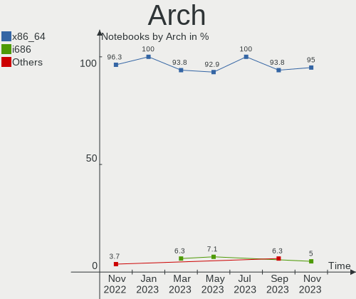

| Name   | Notebooks | Percent |
|--------|-----------|---------|
| x86_64 | 14        | 100%    |

DE
--

Desktop Environment

| Name | Notebooks | Percent |
|------|-----------|---------|
| MATE | 14        | 100%    |

Display Server
--------------

X11 or Wayland

| Name | Notebooks | Percent |
|------|-----------|---------|
| X11  | 14        | 100%    |

Display Manager
---------------

SDDM, LightDM, etc.

| Name    | Notebooks | Percent |
|---------|-----------|---------|
| LightDM | 12        | 85.71%  |
| GDM3    | 1         | 7.14%   |
| Unknown | 1         | 7.14%   |

OS Lang
-------

Language

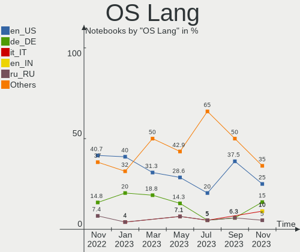

| Lang  | Notebooks | Percent |
|-------|-----------|---------|
| en_US | 5         | 35.71%  |
| ru_RU | 2         | 14.29%  |
| it_IT | 2         | 14.29%  |
| fr_FR | 2         | 14.29%  |
| es_ES | 1         | 7.14%   |
| en_AU | 1         | 7.14%   |
| de_DE | 1         | 7.14%   |

Boot Mode
---------

EFI or BIOS

| Mode | Notebooks | Percent |
|------|-----------|---------|
| EFI  | 9         | 64.29%  |
| BIOS | 5         | 35.71%  |

Filesystem
----------

Type of filesystem

| Type | Notebooks | Percent |
|------|-----------|---------|
| Ext4 | 13        | 92.86%  |
| Zfs  | 1         | 7.14%   |

Part. scheme
------------

Scheme of partitioning

| Type    | Notebooks | Percent |
|---------|-----------|---------|
| GPT     | 8         | 57.14%  |
| Unknown | 5         | 35.71%  |
| MBR     | 1         | 7.14%   |

Dual Boot with Linux/BSD
------------------------

Hosting more than one Linux/BSD

| Dual boot | Notebooks | Percent |
|-----------|-----------|---------|
| No        | 13        | 92.86%  |
| Yes       | 1         | 7.14%   |

Dual Boot (Win)
---------------

Hosting Linux and Windows

| Dual boot | Notebooks | Percent |
|-----------|-----------|---------|
| No        | 11        | 78.57%  |
| Yes       | 3         | 21.43%  |

Board
-----

Vendor
------

Motherboard manufacturer

| Name             | Notebooks | Percent |
|------------------|-----------|---------|
| Lenovo           | 3         | 21.43%  |
| Dell             | 3         | 21.43%  |
| TrekStor         | 1         | 7.14%   |
| MicroByte        | 1         | 7.14%   |
| Intel            | 1         | 7.14%   |
| HUAWEI           | 1         | 7.14%   |
| HONOR            | 1         | 7.14%   |
| Hewlett-Packard  | 1         | 7.14%   |
| Google           | 1         | 7.14%   |
| ASUSTek Computer | 1         | 7.14%   |

Model
-----

Motherboard model

| Name                                 | Notebooks | Percent |
|--------------------------------------|-----------|---------|
| TrekStor Surfbook A13B               | 1         | 7.14%   |
| MicroByte ezbook                     | 1         | 7.14%   |
| Lenovo V15 G2 ITL 82KB               | 1         | 7.14%   |
| Lenovo ThinkPad E15 Gen 2 20TDS0T500 | 1         | 7.14%   |
| Lenovo ThinkPad E15 Gen 2 20TDCTO1WW | 1         | 7.14%   |
| Intel Kabylake Platform              | 1         | 7.14%   |
| HUAWEI KLVD-WXX9                     | 1         | 7.14%   |
| HONOR BOHK-WAX9X                     | 1         | 7.14%   |
| HP EliteBook 8560p                   | 1         | 7.14%   |
| Google Kled                          | 1         | 7.14%   |
| Dell XPS 17 9710                     | 1         | 7.14%   |
| Dell XPS 13 9360                     | 1         | 7.14%   |
| Dell Precision M6500                 | 1         | 7.14%   |
| ASUS S550CM                          | 1         | 7.14%   |

Model Family
------------

Motherboard model prefix

| Name              | Notebooks | Percent |
|-------------------|-----------|---------|
| Lenovo ThinkPad   | 2         | 14.29%  |
| Dell XPS          | 2         | 14.29%  |
| TrekStor Surfbook | 1         | 7.14%   |
| MicroByte ezbook  | 1         | 7.14%   |
| Lenovo V15        | 1         | 7.14%   |
| Intel Kabylake    | 1         | 7.14%   |
| HUAWEI KLVD-WXX9  | 1         | 7.14%   |
| HONOR BOHK-WAX9X  | 1         | 7.14%   |
| HP EliteBook      | 1         | 7.14%   |
| Google Kled       | 1         | 7.14%   |
| Dell Precision    | 1         | 7.14%   |
| ASUS S550CM       | 1         | 7.14%   |

MFG Year
--------

Motherboard manufacture year

| Year | Notebooks | Percent |
|------|-----------|---------|
| 2021 | 5         | 35.71%  |
| 2020 | 2         | 14.29%  |
| 2018 | 2         | 14.29%  |
| 2022 | 1         | 7.14%   |
| 2016 | 1         | 7.14%   |
| 2012 | 1         | 7.14%   |
| 2011 | 1         | 7.14%   |
| 2010 | 1         | 7.14%   |

Form Factor
-----------

Physical design of the computer

| Name     | Notebooks | Percent |
|----------|-----------|---------|
| Notebook | 14        | 100%    |

Secure Boot
-----------

Enabled or disabled

| State    | Notebooks | Percent |
|----------|-----------|---------|
| Disabled | 11        | 78.57%  |
| Enabled  | 3         | 21.43%  |

Coreboot
--------

Have coreboot on board

| Used | Notebooks | Percent |
|------|-----------|---------|
| No   | 13        | 92.86%  |
| Yes  | 1         | 7.14%   |

RAM Size
--------

Total RAM memory

| Size in GB  | Notebooks | Percent |
|-------------|-----------|---------|
| 4.01-8.0    | 4         | 28.57%  |
| 16.01-24.0  | 4         | 28.57%  |
| 3.01-4.0    | 2         | 14.29%  |
| 8.01-16.0   | 2         | 14.29%  |
| 32.01-64.0  | 1         | 7.14%   |
| 64.01-256.0 | 1         | 7.14%   |

RAM Used
--------

Used RAM memory

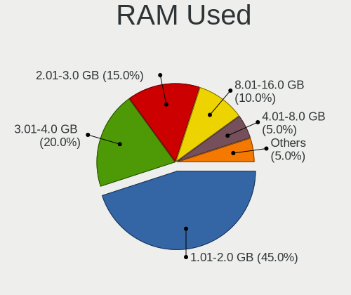

| Used GB  | Notebooks | Percent |
|----------|-----------|---------|
| 3.01-4.0 | 6         | 42.86%  |
| 2.01-3.0 | 3         | 21.43%  |
| 1.01-2.0 | 3         | 21.43%  |
| 4.01-8.0 | 2         | 14.29%  |

Total Drives
------------

Number of drives on board

| Drives | Notebooks | Percent |
|--------|-----------|---------|
| 1      | 12        | 85.71%  |
| 2      | 2         | 14.29%  |

Has CD-ROM
----------

Has CD-ROM on board

| Presented | Notebooks | Percent |
|-----------|-----------|---------|
| No        | 11        | 78.57%  |
| Yes       | 3         | 21.43%  |

Has Ethernet
------------

Has Ethernet on board

| Presented | Notebooks | Percent |
|-----------|-----------|---------|
| Yes       | 8         | 57.14%  |
| No        | 6         | 42.86%  |

Has WiFi
--------

Has WiFi module

| Presented | Notebooks | Percent |
|-----------|-----------|---------|
| Yes       | 14        | 100%    |

Has Bluetooth
-------------

Has Bluetooth module

| Presented | Notebooks | Percent |
|-----------|-----------|---------|
| Yes       | 13        | 92.86%  |
| No        | 1         | 7.14%   |

Location
--------

Country
-------

Geographic location (country)

| Country     | Notebooks | Percent |
|-------------|-----------|---------|
| Italy       | 3         | 21.43%  |
| USA         | 2         | 14.29%  |
| Russia      | 2         | 14.29%  |
| Germany     | 2         | 14.29%  |
| UK          | 1         | 7.14%   |
| Turkey      | 1         | 7.14%   |
| Spain       | 1         | 7.14%   |
| Netherlands | 1         | 7.14%   |
| France      | 1         | 7.14%   |

City
----

Geographic location (city)

| City          | Notebooks | Percent |
|---------------|-----------|---------|
| Seville       | 1         | 7.14%   |
| Rostov-on-Don | 1         | 7.14%   |
| Paris         | 1         | 7.14%   |
| Naaldwijk     | 1         | 7.14%   |
| Milan         | 1         | 7.14%   |
| Magdeburg     | 1         | 7.14%   |
| Limbiate      | 1         | 7.14%   |
| Lake Forest   | 1         | 7.14%   |
| Iesi          | 1         | 7.14%   |
| Edinburgh     | 1         | 7.14%   |
| Berlin        | 1         | 7.14%   |
| Barnaul       | 1         | 7.14%   |
| Bakersfield   | 1         | 7.14%   |
| Artvin        | 1         | 7.14%   |

Drives
------

Drive Vendor
------------

Hard drive vendors

| Vendor              | Notebooks | Drives | Percent |
|---------------------|-----------|--------|---------|
| Samsung Electronics | 3         | 3      | 18.75%  |
| SK hynix            | 2         | 2      | 12.5%   |
| SanDisk             | 2         | 2      | 12.5%   |
| Phison              | 2         | 2      | 12.5%   |
| Unknown             | 1         | 1      | 6.25%   |
| Toshiba             | 1         | 1      | 6.25%   |
| LITEON              | 1         | 1      | 6.25%   |
| KIOXIA              | 1         | 1      | 6.25%   |
| Kingston            | 1         | 1      | 6.25%   |
| Crucial             | 1         | 1      | 6.25%   |
| China               | 1         | 1      | 6.25%   |

Drive Model
-----------

Hard drive models

| Model                             | Notebooks | Percent |
|-----------------------------------|-----------|---------|
| Unknown SLD64G  64GB              | 1         | 6.25%   |
| Toshiba THNSNK256GVN8 256GB SSD   | 1         | 6.25%   |
| SK hynix SHGP31-1000GM 1TB        | 1         | 6.25%   |
| SK hynix HFM128GDJTNG-8310A 128GB | 1         | 6.25%   |
| SanDisk SSD U100 24GB             | 1         | 6.25%   |
| SanDisk NVMe SSD Drive 512GB      | 1         | 6.25%   |
| Samsung SSD 860 EVO 250GB         | 1         | 6.25%   |
| Samsung NVMe SSD Drive 256GB      | 1         | 6.25%   |
| Samsung MZALQ256HBJD-00BL1 256GB  | 1         | 6.25%   |
| Phison Sabrent Rocket nano 512GB  | 1         | 6.25%   |
| Phison 311CD0512GB                | 1         | 6.25%   |
| LITEON CX2-8B512-Q11 NVMe 512GB   | 1         | 6.25%   |
| KIOXIA KXG70PNV2T04 NVMe 2048GB   | 1         | 6.25%   |
| Kingston SA400S37480G 480GB SSD   | 1         | 6.25%   |
| Crucial CT240BX500SSD1 240GB      | 1         | 6.25%   |
| China SSD 512GB                   | 1         | 6.25%   |

HDD Vendor
----------

Hard disk drive vendors

Zero info for selected period =(

SSD Vendor
----------

Solid state drive vendors

| Vendor              | Notebooks | Drives | Percent |
|---------------------|-----------|--------|---------|
| Toshiba             | 1         | 1      | 16.67%  |
| SanDisk             | 1         | 1      | 16.67%  |
| Samsung Electronics | 1         | 1      | 16.67%  |
| Kingston            | 1         | 1      | 16.67%  |
| Crucial             | 1         | 1      | 16.67%  |
| China               | 1         | 1      | 16.67%  |

Drive Kind
----------

HDD or SSD

| Kind | Notebooks | Drives | Percent |
|------|-----------|--------|---------|
| NVMe | 8         | 9      | 57.14%  |
| SSD  | 5         | 6      | 35.71%  |
| MMC  | 1         | 1      | 7.14%   |

Drive Connector
---------------

SATA, SAS, NVMe, etc.

| Type | Notebooks | Drives | Percent |
|------|-----------|--------|---------|
| NVMe | 8         | 9      | 57.14%  |
| SATA | 5         | 6      | 35.71%  |
| MMC  | 1         | 1      | 7.14%   |

Drive Size
----------

Size of hard drive

| Size in TB | Notebooks | Drives | Percent |
|------------|-----------|--------|---------|
| 0.01-0.5   | 4         | 5      | 80%     |
| 0.51-1.0   | 1         | 1      | 20%     |

Space Total
-----------

Amount of disk space available on the file system

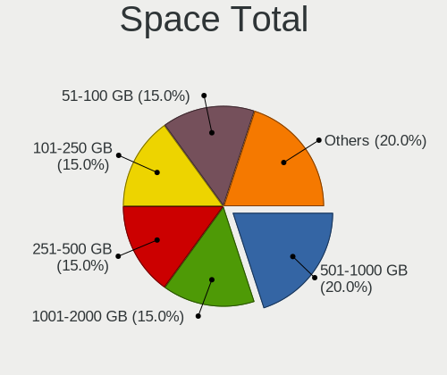

| Size in GB | Notebooks | Percent |
|------------|-----------|---------|
| 101-250    | 7         | 50%     |
| 251-500    | 4         | 28.57%  |
| 1-20       | 2         | 14.29%  |
| 1001-2000  | 1         | 7.14%   |

Space Used
----------

Amount of used disk space

| Used GB   | Notebooks | Percent |
|-----------|-----------|---------|
| 1-20      | 5         | 35.71%  |
| 51-100    | 5         | 35.71%  |
| 101-250   | 3         | 21.43%  |
| 1001-2000 | 1         | 7.14%   |

Malfunc. Drives
---------------

Drive models with a malfunction

Zero info for selected period =(

Malfunc. Drive Vendor
---------------------

Vendors of faulty drives

Zero info for selected period =(

Malfunc. HDD Vendor
-------------------

Vendors of faulty HDD drives

Zero info for selected period =(

Malfunc. Drive Kind
-------------------

Kinds of faulty drives

Zero info for selected period =(

Failed Drives
-------------

Failed drive models

Zero info for selected period =(

Failed Drive Vendor
-------------------

Failed drive vendors

Zero info for selected period =(

Drive Status
------------

Number of failed and malfunc. drives

| Status   | Notebooks | Drives | Percent |
|----------|-----------|--------|---------|
| Works    | 8         | 9      | 57.14%  |
| Detected | 6         | 7      | 42.86%  |

Storage controller
------------------

Storage Vendor
--------------

Storage controller vendors

| Vendor              | Notebooks | Percent |
|---------------------|-----------|---------|
| Intel               | 9         | 50%     |
| SK hynix            | 2         | 11.11%  |
| Samsung Electronics | 2         | 11.11%  |
| Phison Electronics  | 2         | 11.11%  |
| SanDisk             | 1         | 5.56%   |
| Lite-On Technology  | 1         | 5.56%   |
| KIOXIA              | 1         | 5.56%   |

Storage Model
-------------

Storage controller models

| Model                                                                                  | Notebooks | Percent |
|----------------------------------------------------------------------------------------|-----------|---------|
| Samsung NVMe SSD Controller 980                                                        | 2         | 10%     |
| Phison PS5013 E13 NVMe Controller                                                      | 2         | 10%     |
| Intel Volume Management Device NVMe RAID Controller                                    | 2         | 10%     |
| Intel Celeron N3350/Pentium N4200/Atom E3900 Series SATA AHCI Controller               | 2         | 10%     |
| Intel 82801 Mobile SATA Controller [RAID mode]                                         | 2         | 10%     |
| SK hynix Gold P31 SSD                                                                  | 1         | 5%      |
| SK hynix BC501 NVMe Solid State Drive                                                  | 1         | 5%      |
| SanDisk WD Black SN750 / PC SN730 NVMe SSD                                             | 1         | 5%      |
| Lite-On Lite-On Non-Volatile memory controller                                         | 1         | 5%      |
| KIOXIA Non-Volatile memory controller                                                  | 1         | 5%      |
| Intel Tiger Lake-LP SATA Controller [AHCI mode]                                        | 1         | 5%      |
| Intel Comet Lake SATA AHCI Controller                                                  | 1         | 5%      |
| Intel 7 Series Chipset Family 6-port SATA Controller [AHCI mode]                       | 1         | 5%      |
| Intel 6 Series/C200 Series Chipset Family Mobile SATA Controller (IDE mode, ports 4-5) | 1         | 5%      |
| Intel 6 Series/C200 Series Chipset Family Mobile SATA Controller (IDE mode, ports 0-3) | 1         | 5%      |

Storage Kind
------------

Kind of storage controller (IDE, SATA, NVMe, SAS, ...)

| Kind | Notebooks | Percent |
|------|-----------|---------|
| NVMe | 8         | 44.44%  |
| SATA | 5         | 27.78%  |
| RAID | 4         | 22.22%  |
| IDE  | 1         | 5.56%   |

Processor
---------

CPU Vendor
----------

Processor vendors

| Vendor | Notebooks | Percent |
|--------|-----------|---------|
| Intel  | 13        | 92.86%  |
| AMD    | 1         | 7.14%   |

CPU Model
---------

Processor models

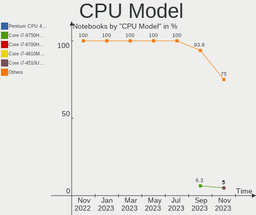

| Model                                         | Notebooks | Percent |
|-----------------------------------------------|-----------|---------|
| Intel 11th Gen Core i7-1165G7 @ 2.80GHz       | 2         | 14.29%  |
| Intel Pentium CPU N4200 @ 1.10GHz             | 1         | 7.14%   |
| Intel Core i7-7560U CPU @ 2.40GHz             | 1         | 7.14%   |
| Intel Core i7-7500U CPU @ 2.70GHz             | 1         | 7.14%   |
| Intel Core i7-3517U CPU @ 1.90GHz             | 1         | 7.14%   |
| Intel Core i7 CPU X 920 @ 2.00GHz             | 1         | 7.14%   |
| Intel Core i5-2540M CPU @ 2.60GHz             | 1         | 7.14%   |
| Intel Core i3-10110U CPU @ 2.10GHz            | 1         | 7.14%   |
| Intel Celeron CPU N3450 @ 1.10GHz             | 1         | 7.14%   |
| Intel 11th Gen Core i9-11980HK @ 2.60GHz      | 1         | 7.14%   |
| Intel 11th Gen Core i5-1135G7 @ 2.40GHz       | 1         | 7.14%   |
| Intel 11th Gen Core i3-1115G4 @ 3.00GHz       | 1         | 7.14%   |
| AMD Ryzen 7 3700U with Radeon Vega Mobile Gfx | 1         | 7.14%   |

CPU Model Family
----------------

Processor model prefix

| Model         | Notebooks | Percent |
|---------------|-----------|---------|
| Other         | 5         | 35.71%  |
| Intel Core i7 | 4         | 28.57%  |
| Intel Pentium | 1         | 7.14%   |
| Intel Core i5 | 1         | 7.14%   |
| Intel Core i3 | 1         | 7.14%   |
| Intel Celeron | 1         | 7.14%   |
| AMD Ryzen 7   | 1         | 7.14%   |

CPU Cores
---------

Number of processor cores

| Number | Notebooks | Percent |
|--------|-----------|---------|
| 4      | 7         | 50%     |
| 2      | 6         | 42.86%  |
| 8      | 1         | 7.14%   |

CPU Sockets
-----------

Number of sockets

| Number | Notebooks | Percent |
|--------|-----------|---------|
| 1      | 14        | 100%    |

CPU Threads
-----------

Threads per core (Hyper-Threading)

| Number | Notebooks | Percent |
|--------|-----------|---------|
| 2      | 12        | 85.71%  |
| 1      | 2         | 14.29%  |

CPU Op-Modes
------------

CPU Operation Modes (32-bit, 64-bit)

| Op mode        | Notebooks | Percent |
|----------------|-----------|---------|
| 32-bit, 64-bit | 14        | 100%    |

CPU Microcode
-------------

Microcode number

| Number  | Notebooks | Percent |
|---------|-----------|---------|
| Unknown | 4         | 28.57%  |
| 0x806c1 | 3         | 21.43%  |
| 0x806e9 | 2         | 14.29%  |
| 0x506c9 | 2         | 14.29%  |
| 0x806ec | 1         | 7.14%   |
| 0x806d1 | 1         | 7.14%   |
| 0x206a7 | 1         | 7.14%   |

CPU Microarch
-------------

Microarchitecture

| Name        | Notebooks | Percent |
|-------------|-----------|---------|
| TigerLake   | 4         | 28.57%  |
| KabyLake    | 3         | 21.43%  |
| Goldmont    | 2         | 14.29%  |
| Zen+        | 1         | 7.14%   |
| SandyBridge | 1         | 7.14%   |
| Nehalem     | 1         | 7.14%   |
| IvyBridge   | 1         | 7.14%   |
| Icelake     | 1         | 7.14%   |

Graphics
--------

GPU Vendor
----------

Vendors of graphics cards

| Vendor | Notebooks | Percent |
|--------|-----------|---------|
| Intel  | 12        | 75%     |
| Nvidia | 3         | 18.75%  |
| AMD    | 1         | 6.25%   |

GPU Model
---------

Graphics card models

| Model                                                                              | Notebooks | Percent |
|------------------------------------------------------------------------------------|-----------|---------|
| Intel TigerLake-LP GT2 [Iris Xe Graphics]                                          | 3         | 18.75%  |
| Nvidia GF108M [GeForce GT 635M]                                                    | 1         | 6.25%   |
| Nvidia GA106M [GeForce RTX 3060 Mobile / Max-Q]                                    | 1         | 6.25%   |
| Nvidia G92GLM [Quadro FX 2800M]                                                    | 1         | 6.25%   |
| Intel TigerLake-H GT1 [UHD Graphics]                                               | 1         | 6.25%   |
| Intel Tiger Lake UHD Graphics                                                      | 1         | 6.25%   |
| Intel Iris Plus Graphics 640                                                       | 1         | 6.25%   |
| Intel HD Graphics 620                                                              | 1         | 6.25%   |
| Intel HD Graphics 500                                                              | 1         | 6.25%   |
| Intel CometLake-U GT2 [UHD Graphics]                                               | 1         | 6.25%   |
| Intel Celeron N3350/Pentium N4200/Atom E3900 Series Integrated Graphics Controller | 1         | 6.25%   |
| Intel 3rd Gen Core processor Graphics Controller                                   | 1         | 6.25%   |
| Intel 2nd Generation Core Processor Family Integrated Graphics Controller          | 1         | 6.25%   |
| AMD Picasso/Raven 2 [Radeon Vega Series / Radeon Vega Mobile Series]               | 1         | 6.25%   |

GPU Combo
---------

Combinations of graphics cards

| Name           | Notebooks | Percent |
|----------------|-----------|---------|
| 1 x Intel      | 10        | 71.43%  |
| Intel + Nvidia | 2         | 14.29%  |
| 1 x Nvidia     | 1         | 7.14%   |
| 1 x AMD        | 1         | 7.14%   |

GPU Driver
----------

Free vs proprietary

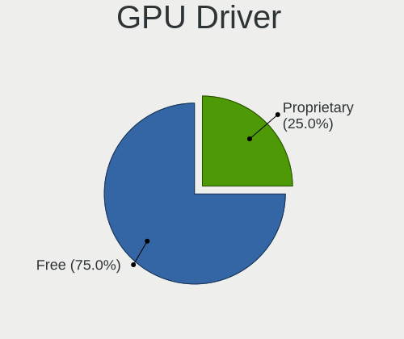

| Driver      | Notebooks | Percent |
|-------------|-----------|---------|
| Free        | 13        | 92.86%  |
| Proprietary | 1         | 7.14%   |

GPU Memory
----------

Total video memory

| Size in GB | Notebooks | Percent |
|------------|-----------|---------|
| Unknown    | 12        | 85.71%  |
| 5.01-6.0   | 1         | 7.14%   |
| 1.01-2.0   | 1         | 7.14%   |

Monitor
-------

Monitor Vendor
--------------

Monitor vendors

| Vendor                  | Notebooks | Percent |
|-------------------------|-----------|---------|
| BOE                     | 5         | 33.33%  |
| Samsung Electronics     | 3         | 20%     |
| Sharp                   | 2         | 13.33%  |
| AOC                     | 2         | 13.33%  |
| Iiyama                  | 1         | 6.67%   |
| CS_                     | 1         | 6.67%   |
| Chi Mei Optoelectronics | 1         | 6.67%   |

Monitor Model
-------------

Monitor models

| Model                                                                    | Notebooks | Percent |
|--------------------------------------------------------------------------|-----------|---------|
| Sharp LCD Monitor SHP1517 3840x2400 366x229mm 17.0-inch                  | 1         | 6.67%   |
| Sharp LCD Monitor SHP1449 1920x1080 294x165mm 13.3-inch                  | 1         | 6.67%   |
| Samsung Electronics SMB2220N SAM06A2 1920x1080 480x270mm 21.7-inch       | 1         | 6.67%   |
| Samsung Electronics LCD Monitor SEC5442 1440x900 303x190mm 14.1-inch     | 1         | 6.67%   |
| Samsung Electronics LCD Monitor SEC334A 1366x768 344x194mm 15.5-inch     | 1         | 6.67%   |
| Iiyama PL2773H IVM660A 1920x1080 598x336mm 27.0-inch                     | 1         | 6.67%   |
| CS_ LCD Monitor CS_5211 1920x1080 519x324mm 24.1-inch                    | 1         | 6.67%   |
| Chi Mei Optoelectronics LCD Monitor CMO15A1 1366x768 344x193mm 15.5-inch | 1         | 6.67%   |
| BOE LCD Monitor BOE08D5 1920x1080 344x194mm 15.5-inch                    | 1         | 6.67%   |
| BOE LCD Monitor BOE08C2 1920x1080 344x194mm 15.5-inch                    | 1         | 6.67%   |
| BOE LCD Monitor BOE0893 2160x1440 296x197mm 14.0-inch                    | 1         | 6.67%   |
| BOE LCD Monitor BOE0872 1920x1080 344x194mm 15.5-inch                    | 1         | 6.67%   |
| BOE LCD Monitor BOE085E 1920x1080 344x194mm 15.5-inch                    | 1         | 6.67%   |
| AOC Q27P1B AOC2701 2560x1440 597x336mm 27.0-inch                         | 1         | 6.67%   |
| AOC 2475W AOC2475 1920x1080 521x293mm 23.5-inch                          | 1         | 6.67%   |

Monitor Resolution
------------------

Monitor screen resolution

| Resolution       | Notebooks | Percent |
|------------------|-----------|---------|
| 1920x1080 (FHD)  | 9         | 60%     |
| 1366x768 (WXGA)  | 2         | 13.33%  |
| 3840x2400        | 1         | 6.67%   |
| 2560x1440 (QHD)  | 1         | 6.67%   |
| 2160x1440        | 1         | 6.67%   |
| 1440x900 (WXGA+) | 1         | 6.67%   |

Monitor Diagonal
----------------

Diagonal size in inches

| Inches | Notebooks | Percent |
|--------|-----------|---------|
| 15     | 6         | 40%     |
| 27     | 2         | 13.33%  |
| 17     | 2         | 13.33%  |
| 24     | 1         | 6.67%   |
| 23     | 1         | 6.67%   |
| 21     | 1         | 6.67%   |
| 14     | 1         | 6.67%   |
| 13     | 1         | 6.67%   |

Monitor Width
-------------

Physical width

| Width in mm | Notebooks | Percent |
|-------------|-----------|---------|
| 301-350     | 6         | 40%     |
| 501-600     | 4         | 26.67%  |
| 351-400     | 2         | 13.33%  |
| 201-300     | 2         | 13.33%  |
| 401-500     | 1         | 6.67%   |

Aspect Ratio
------------

Proportional relationship between the width and the height

| Ratio | Notebooks | Percent |
|-------|-----------|---------|
| 16/9  | 9         | 69.23%  |
| 16/10 | 3         | 23.08%  |
| 3/2   | 1         | 7.69%   |

Monitor Area
------------

Area in inch²

| Area in inch² | Notebooks | Percent |
|----------------|-----------|---------|
| 101-110        | 6         | 40%     |
| 301-350        | 2         | 13.33%  |
| 201-250        | 2         | 13.33%  |
| 81-90          | 1         | 6.67%   |
| 71-80          | 1         | 6.67%   |
| 251-300        | 1         | 6.67%   |
| 131-140        | 1         | 6.67%   |
| 121-130        | 1         | 6.67%   |

Pixel Density
-------------

Pixels per inch

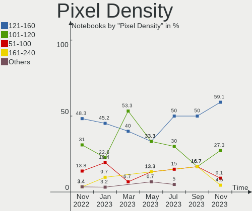

| Density       | Notebooks | Percent |
|---------------|-----------|---------|
| 51-100        | 5         | 35.71%  |
| 121-160       | 4         | 28.57%  |
| 161-240       | 2         | 14.29%  |
| 101-120       | 2         | 14.29%  |
| More than 240 | 1         | 7.14%   |

Multiple Monitors
-----------------

Total monitors connected

| Total | Notebooks | Percent |
|-------|-----------|---------|
| 1     | 12        | 85.71%  |
| 2     | 2         | 14.29%  |

Network
-------

Net Controller Vendor
---------------------

Controller vendors

| Vendor                | Notebooks | Percent |
|-----------------------|-----------|---------|
| Intel                 | 10        | 47.62%  |
| Realtek Semiconductor | 8         | 38.1%   |
| Qualcomm Atheros      | 1         | 4.76%   |
| Broadcom Limited      | 1         | 4.76%   |
| Broadcom              | 1         | 4.76%   |

Net Controller Model
--------------------

Controller models

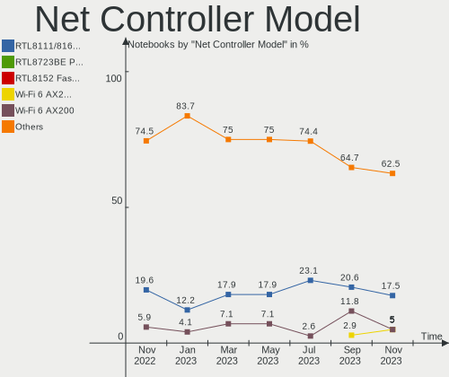

| Model                                                             | Notebooks | Percent |
|-------------------------------------------------------------------|-----------|---------|
| Realtek RTL8111/8168/8411 PCI Express Gigabit Ethernet Controller | 5         | 21.74%  |
| Intel Wi-Fi 6 AX201                                               | 3         | 13.04%  |
| Intel Wireless 3165                                               | 2         | 8.7%    |
| Realtek RTL8822CE 802.11ac PCIe Wireless Network Adapter          | 1         | 4.35%   |
| Realtek RTL8821CE 802.11ac PCIe Wireless Network Adapter          | 1         | 4.35%   |
| Realtek RTL8812AU 802.11a/b/g/n/ac 2T2R DB WLAN Adapter           | 1         | 4.35%   |
| Realtek RTL8153 Gigabit Ethernet Adapter                          | 1         | 4.35%   |
| Qualcomm Atheros QCA6174 802.11ac Wireless Network Adapter        | 1         | 4.35%   |
| Intel Wireless 7260                                               | 1         | 4.35%   |
| Intel Wi-Fi 6 AX210/AX211/AX411 160MHz                            | 1         | 4.35%   |
| Intel Tiger Lake PCH CNVi WiFi                                    | 1         | 4.35%   |
| Intel Comet Lake PCH-LP CNVi WiFi                                 | 1         | 4.35%   |
| Intel Centrino Advanced-N 6205 [Taylor Peak]                      | 1         | 4.35%   |
| Intel 82579LM Gigabit Network Connection (Lewisville)             | 1         | 4.35%   |
| Broadcom NetXtreme BCM5761e Gigabit Ethernet PCIe                 | 1         | 4.35%   |
| Broadcom Limited BCM4312 802.11b/g LP-PHY                         | 1         | 4.35%   |

Wireless Vendor
---------------

Wireless vendors

| Vendor                | Notebooks | Percent |
|-----------------------|-----------|---------|
| Intel                 | 10        | 66.67%  |
| Realtek Semiconductor | 3         | 20%     |
| Qualcomm Atheros      | 1         | 6.67%   |
| Broadcom Limited      | 1         | 6.67%   |

Wireless Model
--------------

Wireless models

| Model                                                      | Notebooks | Percent |
|------------------------------------------------------------|-----------|---------|
| Intel Wi-Fi 6 AX201                                        | 3         | 20%     |
| Intel Wireless 3165                                        | 2         | 13.33%  |
| Realtek RTL8822CE 802.11ac PCIe Wireless Network Adapter   | 1         | 6.67%   |
| Realtek RTL8821CE 802.11ac PCIe Wireless Network Adapter   | 1         | 6.67%   |
| Realtek RTL8812AU 802.11a/b/g/n/ac 2T2R DB WLAN Adapter    | 1         | 6.67%   |
| Qualcomm Atheros QCA6174 802.11ac Wireless Network Adapter | 1         | 6.67%   |
| Intel Wireless 7260                                        | 1         | 6.67%   |
| Intel Wi-Fi 6 AX210/AX211/AX411 160MHz                     | 1         | 6.67%   |
| Intel Tiger Lake PCH CNVi WiFi                             | 1         | 6.67%   |
| Intel Comet Lake PCH-LP CNVi WiFi                          | 1         | 6.67%   |
| Intel Centrino Advanced-N 6205 [Taylor Peak]               | 1         | 6.67%   |
| Broadcom Limited BCM4312 802.11b/g LP-PHY                  | 1         | 6.67%   |

Ethernet Vendor
---------------

Ethernet vendors

| Vendor                | Notebooks | Percent |
|-----------------------|-----------|---------|
| Realtek Semiconductor | 6         | 75%     |
| Intel                 | 1         | 12.5%   |
| Broadcom              | 1         | 12.5%   |

Ethernet Model
--------------

Ethernet models

| Model                                                             | Notebooks | Percent |
|-------------------------------------------------------------------|-----------|---------|
| Realtek RTL8111/8168/8411 PCI Express Gigabit Ethernet Controller | 5         | 62.5%   |
| Realtek RTL8153 Gigabit Ethernet Adapter                          | 1         | 12.5%   |
| Intel 82579LM Gigabit Network Connection (Lewisville)             | 1         | 12.5%   |
| Broadcom NetXtreme BCM5761e Gigabit Ethernet PCIe                 | 1         | 12.5%   |

Net Controller Kind
-------------------

Ethernet, WiFi or modem

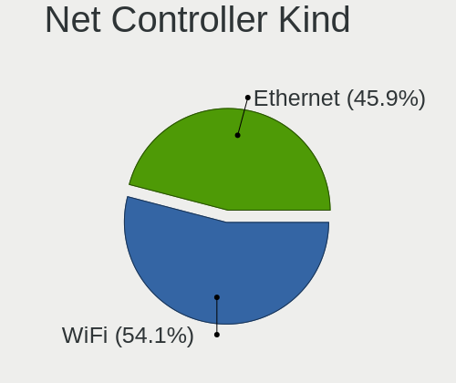

| Kind     | Notebooks | Percent |
|----------|-----------|---------|
| WiFi     | 14        | 63.64%  |
| Ethernet | 8         | 36.36%  |

Used Controller
---------------

Currently used network controller

| Kind     | Notebooks | Percent |
|----------|-----------|---------|
| WiFi     | 12        | 80%     |
| Ethernet | 3         | 20%     |

NICs
----

Total network controllers on board

| Total | Notebooks | Percent |
|-------|-----------|---------|
| 2     | 7         | 50%     |
| 1     | 7         | 50%     |

IPv6
----

IPv6 vs IPv4

| Used | Notebooks | Percent |
|------|-----------|---------|
| No   | 12        | 85.71%  |
| Yes  | 2         | 14.29%  |

Bluetooth
---------

Bluetooth Vendor
----------------

Controller vendors

| Vendor                          | Notebooks | Percent |
|---------------------------------|-----------|---------|
| Intel                           | 9         | 64.29%  |
| Realtek Semiconductor           | 3         | 21.43%  |
| Qualcomm Atheros Communications | 1         | 7.14%   |
| Hewlett-Packard                 | 1         | 7.14%   |

Bluetooth Model
---------------

Controller models

| Model                                  | Notebooks | Percent |
|----------------------------------------|-----------|---------|
| Intel Bluetooth Device                 | 5         | 35.71%  |
| Realtek Bluetooth Radio                | 3         | 21.43%  |
| Intel Bluetooth wireless interface     | 3         | 21.43%  |
| Qualcomm Atheros QCA61x4 Bluetooth 4.0 | 1         | 7.14%   |
| Intel AX210 Bluetooth                  | 1         | 7.14%   |
| HP Broadcom 2070 Bluetooth Combo       | 1         | 7.14%   |

Sound
-----

Sound Vendor
------------

Sound card vendors

| Vendor                 | Notebooks | Percent |
|------------------------|-----------|---------|
| Intel                  | 13        | 72.22%  |
| Nvidia                 | 2         | 11.11%  |
| Generalplus Technology | 1         | 5.56%   |
| C-Media Electronics    | 1         | 5.56%   |
| AMD                    | 1         | 5.56%   |

Sound Model
-----------

Sound card models

| Model                                                                      | Notebooks | Percent |
|----------------------------------------------------------------------------|-----------|---------|
| Intel Tiger Lake-LP Smart Sound Technology Audio Controller                | 4         | 21.05%  |
| Intel Sunrise Point-LP HD Audio                                            | 2         | 10.53%  |
| Intel Celeron N3350/Pentium N4200/Atom E3900 Series Audio Cluster          | 2         | 10.53%  |
| Nvidia GF108 High Definition Audio Controller                              | 1         | 5.26%   |
| Nvidia Audio device                                                        | 1         | 5.26%   |
| Intel Tiger Lake-H HD Audio Controller                                     | 1         | 5.26%   |
| Intel Comet Lake PCH-LP cAVS                                               | 1         | 5.26%   |
| Intel 7 Series/C216 Chipset Family High Definition Audio Controller        | 1         | 5.26%   |
| Intel 6 Series/C200 Series Chipset Family High Definition Audio Controller | 1         | 5.26%   |
| Intel 5 Series/3400 Series Chipset High Definition Audio                   | 1         | 5.26%   |
| Generalplus Technology IMYB 7.1 Channel                                    | 1         | 5.26%   |
| C-Media Electronics Audio Adapter                                          | 1         | 5.26%   |
| AMD Raven/Raven2/Fenghuang HDMI/DP Audio Controller                        | 1         | 5.26%   |
| AMD Family 17h/19h HD Audio Controller                                     | 1         | 5.26%   |

Memory
------

Memory Vendor
-------------

Memory module vendors

| Vendor            | Notebooks | Percent |
|-------------------|-----------|---------|
| Micron Technology | 3         | 30%     |
| Unknown (ABCD)    | 2         | 20%     |
| Kingston          | 2         | 20%     |
| Unknown (0x0C26)  | 1         | 10%     |
| Unknown           | 1         | 10%     |
| Nanya Technology  | 1         | 10%     |

Memory Model
------------

Memory module models

| Model                                                               | Notebooks | Percent |
|---------------------------------------------------------------------|-----------|---------|
| Unknown (ABCD) RAM 123456789012345678 2048MB SODIMM LPDDR4 2400MT/s | 2         | 20%     |
| Unknown RAM Module 4GB SODIMM DDR4 2667MT/s                         | 1         | 10%     |
| Unknown (0x0C26) RAM TIMETEC-SD4-3200 32GB SODIMM DDR4 3200MT/s     | 1         | 10%     |
| Nanya RAM NT4GC64B8HB0NS-CG 4096MB SODIMM DDR3 1334MT/s             | 1         | 10%     |
| Micron RAM MT52L1G32D4PG-093 8GB Row Of Chips LPDDR3 2133MT/s       | 1         | 10%     |
| Micron RAM 8ATF2G64HZ-3G2E1 8GB Row Of Chips DDR4 3200MT/s          | 1         | 10%     |
| Micron RAM 8ATF1G64HZ-2G3B1 8GB SODIMM DDR4 2400MT/s                | 1         | 10%     |
| Kingston RAM KP6FH5-MIE 32GB SODIMM DDR4 3200MT/s                   | 1         | 10%     |
| Kingston RAM 9905744-035.A00G 16GB SODIMM DDR4 3200MT/s             | 1         | 10%     |

Memory Kind
-----------

Memory module kinds

| Kind   | Notebooks | Percent |
|--------|-----------|---------|
| DDR4   | 6         | 60%     |
| LPDDR4 | 2         | 20%     |
| LPDDR3 | 1         | 10%     |
| DDR3   | 1         | 10%     |

Memory Form Factor
------------------

Physical design of the memory module

| Name         | Notebooks | Percent |
|--------------|-----------|---------|
| SODIMM       | 8         | 80%     |
| Row Of Chips | 2         | 20%     |

Memory Size
-----------

Memory module size

| Size  | Notebooks | Percent |
|-------|-----------|---------|
| 4096  | 4         | 40%     |
| 8192  | 3         | 30%     |
| 32768 | 2         | 20%     |
| 16384 | 1         | 10%     |

Memory Speed
------------

Memory module speed

| Speed | Notebooks | Percent |
|-------|-----------|---------|
| 3200  | 4         | 40%     |
| 2400  | 3         | 30%     |
| 2667  | 1         | 10%     |
| 2133  | 1         | 10%     |
| 1334  | 1         | 10%     |

Printers & scanners
-------------------

Printer Vendor
--------------

Printer device vendors

Zero info for selected period =(

Printer Model
-------------

Printer device models

Zero info for selected period =(

Scanner Vendor
--------------

Scanner device vendors

Zero info for selected period =(

Scanner Model
-------------

Scanner device models

Zero info for selected period =(

Camera
------

Camera Vendor
-------------

Camera device vendors

| Vendor                  | Notebooks | Percent |
|-------------------------|-----------|---------|
| Chicony Electronics     | 3         | 23.08%  |
| Realtek Semiconductor   | 2         | 15.38%  |
| Quanta                  | 2         | 15.38%  |
| Microdia                | 2         | 15.38%  |
| Ricoh                   | 1         | 7.69%   |
| ARC International       | 1         | 7.69%   |
| Alcor Micro             | 1         | 7.69%   |
| 8SSC20F27145V1SR1BX02P8 | 1         | 7.69%   |

Camera Model
------------

Camera device models

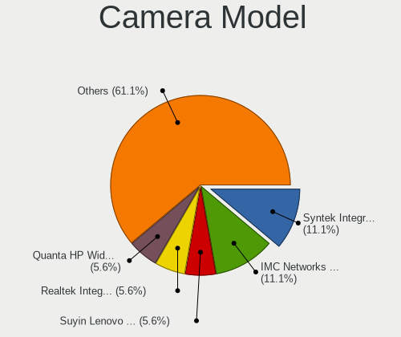

| Model                                     | Notebooks | Percent |
|-------------------------------------------|-----------|---------|
| Chicony Integrated Camera                 | 2         | 15.38%  |
| Ricoh Dell Laptop Integrated Webcam       | 1         | 7.69%   |
| Realtek USB2.0 camera                     | 1         | 7.69%   |
| Realtek USB Camera                        | 1         | 7.69%   |
| Quanta ov9734_techfront_camera            | 1         | 7.69%   |
| Quanta HD User Facing                     | 1         | 7.69%   |
| Microdia Webcam Vitade AF                 | 1         | 7.69%   |
| Microdia Integrated Webcam HD             | 1         | 7.69%   |
| Chicony Integrated HP HD Webcam           | 1         | 7.69%   |
| ARC International Camera                  | 1         | 7.69%   |
| Alcor Micro USB 2.0 Camera                | 1         | 7.69%   |
| 8SSC20F27145V1SR1BX02P8 Integrated Camera | 1         | 7.69%   |

Security
--------

Fingerprint Vendor
------------------

Fingerprint sensor vendors

| Vendor                     | Notebooks | Percent |
|----------------------------|-----------|---------|
| Shenzhen Goodix Technology | 4         | 80%     |
| Validity Sensors           | 1         | 20%     |

Fingerprint Model
-----------------

Fingerprint sensor models

| Model                                      | Notebooks | Percent |
|--------------------------------------------|-----------|---------|
| Shenzhen Goodix  FingerPrint Device        | 4         | 80%     |
| Validity Sensors VFS471 Fingerprint Reader | 1         | 20%     |

Chipcard Vendor
---------------

Chipcard module vendors

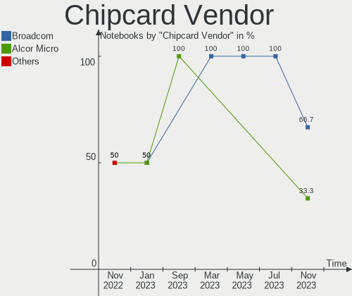

| Vendor                | Notebooks | Percent |
|-----------------------|-----------|---------|
| Broadcom              | 1         | 50%     |
| Advanced Card Systems | 1         | 50%     |

Chipcard Model
--------------

Chipcard module models

| Model                                                                        | Notebooks | Percent |
|------------------------------------------------------------------------------|-----------|---------|
| Broadcom BCM5880 Secure Applications Processor with fingerprint swipe sensor | 1         | 50%     |
| Advanced Card Systems ACR38 SmartCard Reader                                 | 1         | 50%     |

Unsupported
-----------

Unsupported Devices
-------------------

Total unsupported devices on board

| Total | Notebooks | Percent |
|-------|-----------|---------|
| 0     | 7         | 50%     |
| 1     | 4         | 28.57%  |
| 2     | 2         | 14.29%  |
| 3     | 1         | 7.14%   |

Unsupported Device Types
------------------------

Types of unsupported devices

| Type               | Notebooks | Percent |
|--------------------|-----------|---------|
| Fingerprint reader | 5         | 45.45%  |
| Chipcard           | 2         | 18.18%  |
| Camera             | 2         | 18.18%  |
| Graphics card      | 1         | 9.09%   |
| Bluetooth          | 1         | 9.09%   |

