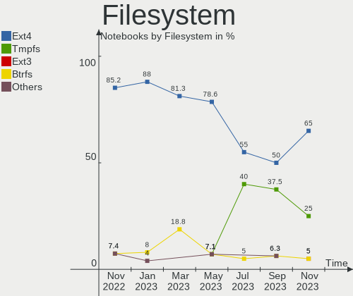
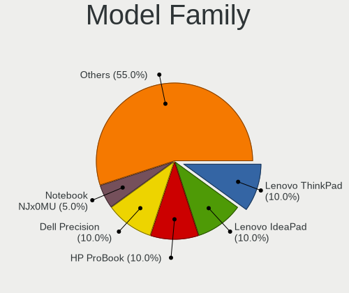
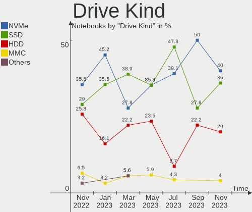
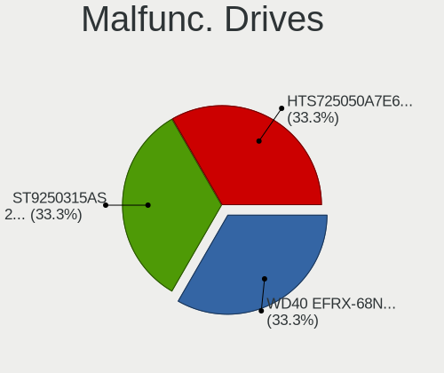
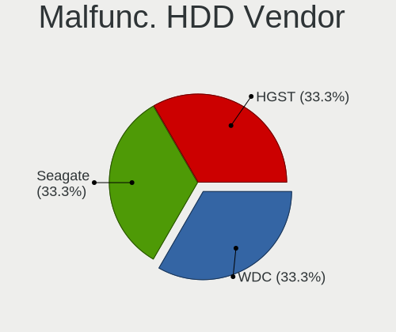
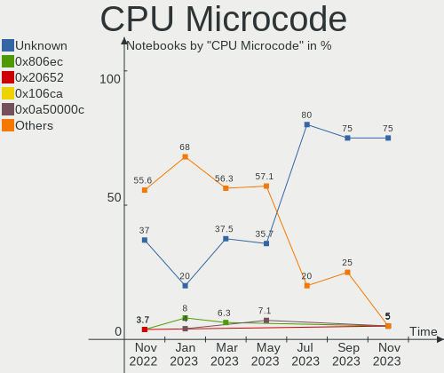
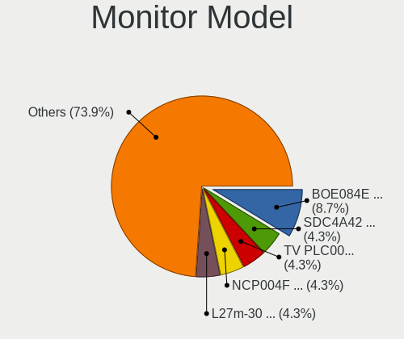
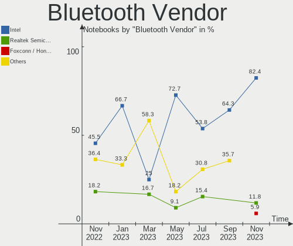
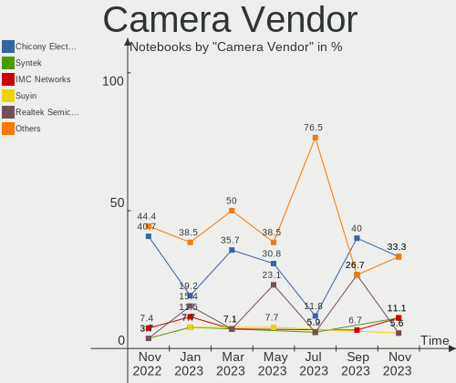
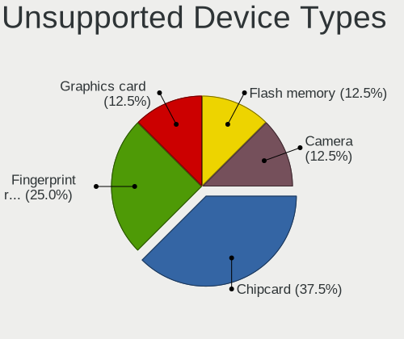

Ubuntu MATE - Hardware Trends (Notebooks)
-----------------------------------------

A project to identify most popular hardware characteristics and track their change
over time based on data collected by Linux users at https://Linux-Hardware.org.

Anyone can contribute to this report by the [hw-probe](https://github.com/linuxhw/hw-probe) tool:

    sudo -E hw-probe -all -upload

This report is for one last month. Overall report since the beginning of time: [TestDays](https://github.com/linuxhw/TestDays)

Period: Nov, 2023.

Contents
--------

* [ System ](#system)
  - [ OS                       ](#os)
  - [ OS Family                ](#os-family)
  - [ Kernel                   ](#kernel)
  - [ Kernel Family            ](#kernel-family)
  - [ Kernel Major Ver.        ](#kernel-major-ver)
  - [ Arch                     ](#arch)
  - [ DE                       ](#de)
  - [ Display Server           ](#display-server)
  - [ Display Manager          ](#display-manager)
  - [ OS Lang                  ](#os-lang)
  - [ Boot Mode                ](#boot-mode)
  - [ Filesystem               ](#filesystem)
  - [ Part. scheme             ](#part-scheme)
  - [ Dual Boot with Linux/BSD ](#dual-boot-with-linuxbsd)
  - [ Dual Boot (Win)          ](#dual-boot-win)

* [ Board ](#board)
  - [ Vendor                   ](#vendor)
  - [ Model                    ](#model)
  - [ Model Family             ](#model-family)
  - [ MFG Year                 ](#mfg-year)
  - [ Form Factor              ](#form-factor)
  - [ Secure Boot              ](#secure-boot)
  - [ Coreboot                 ](#coreboot)
  - [ RAM Size                 ](#ram-size)
  - [ RAM Used                 ](#ram-used)
  - [ Total Drives             ](#total-drives)
  - [ Has CD-ROM               ](#has-cd-rom)
  - [ Has Ethernet             ](#has-ethernet)
  - [ Has WiFi                 ](#has-wifi)
  - [ Has Bluetooth            ](#has-bluetooth)

* [ Location ](#location)
  - [ Country                  ](#country)
  - [ City                     ](#city)

* [ Drives ](#drives)
  - [ Drive Vendor             ](#drive-vendor)
  - [ Drive Model              ](#drive-model)
  - [ HDD Vendor               ](#hdd-vendor)
  - [ SSD Vendor               ](#ssd-vendor)
  - [ Drive Kind               ](#drive-kind)
  - [ Drive Connector          ](#drive-connector)
  - [ Drive Size               ](#drive-size)
  - [ Space Total              ](#space-total)
  - [ Space Used               ](#space-used)
  - [ Malfunc. Drives          ](#malfunc-drives)
  - [ Malfunc. Drive Vendor    ](#malfunc-drive-vendor)
  - [ Malfunc. HDD Vendor      ](#malfunc-hdd-vendor)
  - [ Malfunc. Drive Kind      ](#malfunc-drive-kind)
  - [ Failed Drives            ](#failed-drives)
  - [ Failed Drive Vendor      ](#failed-drive-vendor)
  - [ Drive Status             ](#drive-status)

* [ Storage controller ](#storage-controller)
  - [ Storage Vendor           ](#storage-vendor)
  - [ Storage Model            ](#storage-model)
  - [ Storage Kind             ](#storage-kind)

* [ Processor ](#processor)
  - [ CPU Vendor               ](#cpu-vendor)
  - [ CPU Model                ](#cpu-model)
  - [ CPU Model Family         ](#cpu-model-family)
  - [ CPU Cores                ](#cpu-cores)
  - [ CPU Sockets              ](#cpu-sockets)
  - [ CPU Threads              ](#cpu-threads)
  - [ CPU Op-Modes             ](#cpu-op-modes)
  - [ CPU Microcode            ](#cpu-microcode)
  - [ CPU Microarch            ](#cpu-microarch)

* [ Graphics ](#graphics)
  - [ GPU Vendor               ](#gpu-vendor)
  - [ GPU Model                ](#gpu-model)
  - [ GPU Combo                ](#gpu-combo)
  - [ GPU Driver               ](#gpu-driver)
  - [ GPU Memory               ](#gpu-memory)

* [ Monitor ](#monitor)
  - [ Monitor Vendor           ](#monitor-vendor)
  - [ Monitor Model            ](#monitor-model)
  - [ Monitor Resolution       ](#monitor-resolution)
  - [ Monitor Diagonal         ](#monitor-diagonal)
  - [ Monitor Width            ](#monitor-width)
  - [ Aspect Ratio             ](#aspect-ratio)
  - [ Monitor Area             ](#monitor-area)
  - [ Pixel Density            ](#pixel-density)
  - [ Multiple Monitors        ](#multiple-monitors)

* [ Network ](#network)
  - [ Net Controller Vendor    ](#net-controller-vendor)
  - [ Net Controller Model     ](#net-controller-model)
  - [ Wireless Vendor          ](#wireless-vendor)
  - [ Wireless Model           ](#wireless-model)
  - [ Ethernet Vendor          ](#ethernet-vendor)
  - [ Ethernet Model           ](#ethernet-model)
  - [ Net Controller Kind      ](#net-controller-kind)
  - [ Used Controller          ](#used-controller)
  - [ NICs                     ](#nics)
  - [ IPv6                     ](#ipv6)

* [ Bluetooth ](#bluetooth)
  - [ Bluetooth Vendor         ](#bluetooth-vendor)
  - [ Bluetooth Model          ](#bluetooth-model)

* [ Sound ](#sound)
  - [ Sound Vendor             ](#sound-vendor)
  - [ Sound Model              ](#sound-model)

* [ Memory ](#memory)
  - [ Memory Vendor            ](#memory-vendor)
  - [ Memory Model             ](#memory-model)
  - [ Memory Kind              ](#memory-kind)
  - [ Memory Form Factor       ](#memory-form-factor)
  - [ Memory Size              ](#memory-size)
  - [ Memory Speed             ](#memory-speed)

* [ Printers & scanners ](#printers--scanners)
  - [ Printer Vendor           ](#printer-vendor)
  - [ Printer Model            ](#printer-model)
  - [ Scanner Vendor           ](#scanner-vendor)
  - [ Scanner Model            ](#scanner-model)

* [ Camera ](#camera)
  - [ Camera Vendor            ](#camera-vendor)
  - [ Camera Model             ](#camera-model)

* [ Security ](#security)
  - [ Fingerprint Vendor       ](#fingerprint-vendor)
  - [ Fingerprint Model        ](#fingerprint-model)
  - [ Chipcard Vendor          ](#chipcard-vendor)
  - [ Chipcard Model           ](#chipcard-model)

* [ Unsupported ](#unsupported)
  - [ Unsupported Devices      ](#unsupported-devices)
  - [ Unsupported Device Types ](#unsupported-device-types)

System
------

OS
--

Installed operating systems

| Name              | Notebooks | Percent |
|-------------------|-----------|---------|
| Ubuntu MATE 22.04 | 10        | 50%     |
| Ubuntu MATE 23.10 | 6         | 30%     |
| Ubuntu MATE 23.04 | 1         | 5%      |
| Ubuntu MATE 20.04 | 1         | 5%      |
| Ubuntu MATE 18.04 | 1         | 5%      |
| Ubuntu MATE 16.04 | 1         | 5%      |

OS Family
---------

OS without a version

| Name        | Notebooks | Percent |
|-------------|-----------|---------|
| Ubuntu MATE | 20        | 100%    |

Kernel
------

Version of the Linux kernel

| Version                | Notebooks | Percent |
|------------------------|-----------|---------|
| 6.2.0-36-generic       | 7         | 35%     |
| 6.5.0-10-generic       | 2         | 10%     |
| 6.6.1-060601-generic   | 1         | 5%      |
| 6.5.9-2-liquorix-amd64 | 1         | 5%      |
| 6.5.0-13-generic       | 1         | 5%      |
| 6.5.0-10-lowlatency    | 1         | 5%      |
| 6.2.0-37-generic       | 1         | 5%      |
| 6.2.0-26-generic       | 1         | 5%      |
| 6.2.0-1016-lowlatency  | 1         | 5%      |
| 5.15.0-88-generic      | 1         | 5%      |
| 5.15.0-84-generic      | 1         | 5%      |
| 4.4.0-210-generic      | 1         | 5%      |
| 4.15.0-213-generic     | 1         | 5%      |

Kernel Family
-------------

Linux kernel without a distro release

| Version | Notebooks | Percent |
|---------|-----------|---------|
| 6.2.0   | 10        | 50%     |
| 6.5.0   | 4         | 20%     |
| 5.15.0  | 2         | 10%     |
| 6.6.1   | 1         | 5%      |
| 6.5.9   | 1         | 5%      |
| 4.4.0   | 1         | 5%      |
| 4.15.0  | 1         | 5%      |

Kernel Major Ver.
-----------------

Linux kernel major version

| Version | Notebooks | Percent |
|---------|-----------|---------|
| 6.2     | 10        | 50%     |
| 6.5     | 5         | 25%     |
| 5.15    | 2         | 10%     |
| 6.6     | 1         | 5%      |
| 4.4     | 1         | 5%      |
| 4.15    | 1         | 5%      |

Arch
----

OS architecture (x86_64, i586, etc.)

| Name   | Notebooks | Percent |
|--------|-----------|---------|
| x86_64 | 19        | 95%     |
| i686   | 1         | 5%      |

DE
--

Desktop Environment

| Name | Notebooks | Percent |
|------|-----------|---------|
| MATE | 20        | 100%    |

Display Server
--------------

X11 or Wayland

| Name | Notebooks | Percent |
|------|-----------|---------|
| X11  | 20        | 100%    |

Display Manager
---------------

SDDM, LightDM, etc.

| Name    | Notebooks | Percent |
|---------|-----------|---------|
| LightDM | 18        | 90%     |
| Unknown | 2         | 10%     |

OS Lang
-------

Language

| Lang  | Notebooks | Percent |
|-------|-----------|---------|
| en_US | 5         | 25%     |
| de_DE | 3         | 15%     |
| it_IT | 2         | 10%     |
| en_IN | 2         | 10%     |
| ru_RU | 1         | 5%      |
| pt_BR | 1         | 5%      |
| nl_NL | 1         | 5%      |
| ja_JP | 1         | 5%      |
| fr_FR | 1         | 5%      |
| es_AR | 1         | 5%      |
| en_GB | 1         | 5%      |
| en_CA | 1         | 5%      |

Boot Mode
---------

EFI or BIOS

| Mode | Notebooks | Percent |
|------|-----------|---------|
| EFI  | 12        | 60%     |
| BIOS | 8         | 40%     |

Filesystem
----------

Type of filesystem

| Type  | Notebooks | Percent |
|-------|-----------|---------|
| Ext4  | 13        | 65%     |
| Tmpfs | 5         | 25%     |
| Ext3  | 1         | 5%      |
| Btrfs | 1         | 5%      |

Part. scheme
------------

Scheme of partitioning

| Type    | Notebooks | Percent |
|---------|-----------|---------|
| GPT     | 15        | 75%     |
| Unknown | 3         | 15%     |
| MBR     | 2         | 10%     |

Dual Boot with Linux/BSD
------------------------

Hosting more than one Linux/BSD

| Dual boot | Notebooks | Percent |
|-----------|-----------|---------|
| No        | 17        | 85%     |
| Yes       | 3         | 15%     |

Dual Boot (Win)
---------------

Hosting Linux and Windows

| Dual boot | Notebooks | Percent |
|-----------|-----------|---------|
| No        | 12        | 60%     |
| Yes       | 8         | 40%     |

Board
-----

Vendor
------

Motherboard manufacturer

| Name             | Notebooks | Percent |
|------------------|-----------|---------|
| Lenovo           | 7         | 35%     |
| Hewlett-Packard  | 4         | 20%     |
| Dell             | 2         | 10%     |
| Acer             | 2         | 10%     |
| Notebook         | 1         | 5%      |
| MSI              | 1         | 5%      |
| Google           | 1         | 5%      |
| BANGHO           | 1         | 5%      |
| ASUSTek Computer | 1         | 5%      |

Model
-----

Motherboard model

| Name                                     | Notebooks | Percent |
|------------------------------------------|-----------|---------|
| Notebook NJx0MU                          | 1         | 5%      |
| MSI GL62 6QF                             | 1         | 5%      |
| Lenovo V15 G2 ALC 82KD                   | 1         | 5%      |
| Lenovo ThinkPad T14 Gen 2a 20XKCTO1WW    | 1         | 5%      |
| Lenovo ThinkPad P53 20QN000FIX           | 1         | 5%      |
| Lenovo Legion 7 16ITHg6 82K6             | 1         | 5%      |
| Lenovo IdeaPadFlex 4-1470 80SA           | 1         | 5%      |
| Lenovo IdeaPad Y460                      | 1         | 5%      |
| Lenovo IdeaPad S145-15IWL 81S9           | 1         | 5%      |
| HP ProBook 440 G7                        | 1         | 5%      |
| HP ProBook 440 G2                        | 1         | 5%      |
| HP Pavilion Gaming Laptop 17-cd1xxx      | 1         | 5%      |
| HP EliteBook 860 16 inch G10 Notebook PC | 1         | 5%      |
| Google Galtic                            | 1         | 5%      |
| Dell Precision M4800                     | 1         | 5%      |
| Dell Precision 7760                      | 1         | 5%      |
| BANGHO 1025                              | 1         | 5%      |
| ASUS VivoBook_ASUSLaptop X712DA_D712DA   | 1         | 5%      |
| Acer Aspire 5050                         | 1         | 5%      |
| Acer AOD260                              | 1         | 5%      |

Model Family
------------

Motherboard model prefix

| Name               | Notebooks | Percent |
|--------------------|-----------|---------|
| Lenovo ThinkPad    | 2         | 10%     |
| Lenovo IdeaPad     | 2         | 10%     |
| HP ProBook         | 2         | 10%     |
| Dell Precision     | 2         | 10%     |
| Notebook NJx0MU    | 1         | 5%      |
| MSI GL62           | 1         | 5%      |
| Lenovo V15         | 1         | 5%      |
| Lenovo Legion      | 1         | 5%      |
| Lenovo IdeaPadFlex | 1         | 5%      |
| HP Pavilion        | 1         | 5%      |
| HP EliteBook       | 1         | 5%      |
| Google Galtic      | 1         | 5%      |
| BANGHO 1025        | 1         | 5%      |
| ASUS VivoBook      | 1         | 5%      |
| Acer Aspire        | 1         | 5%      |
| Acer AOD260        | 1         | 5%      |

MFG Year
--------

Motherboard manufacture year

| Year | Notebooks | Percent |
|------|-----------|---------|
| 2021 | 6         | 30%     |
| 2019 | 4         | 20%     |
| 2016 | 3         | 15%     |
| 2010 | 2         | 10%     |
| 2023 | 1         | 5%      |
| 2020 | 1         | 5%      |
| 2014 | 1         | 5%      |
| 2013 | 1         | 5%      |
| 2006 | 1         | 5%      |

Form Factor
-----------

Physical design of the computer

| Name     | Notebooks | Percent |
|----------|-----------|---------|
| Notebook | 20        | 100%    |

Secure Boot
-----------

Enabled or disabled

| State    | Notebooks | Percent |
|----------|-----------|---------|
| Disabled | 18        | 90%     |
| Enabled  | 2         | 10%     |

Coreboot
--------

Have coreboot on board

| Used | Notebooks | Percent |
|------|-----------|---------|
| No   | 19        | 95%     |
| Yes  | 1         | 5%      |

RAM Size
--------

Total RAM memory

| Size in GB  | Notebooks | Percent |
|-------------|-----------|---------|
| 4.01-8.0    | 4         | 20%     |
| 3.01-4.0    | 4         | 20%     |
| 16.01-24.0  | 4         | 20%     |
| 32.01-64.0  | 2         | 10%     |
| 64.01-256.0 | 2         | 10%     |
| 8.01-16.0   | 2         | 10%     |
| 24.01-32.0  | 1         | 5%      |
| 1.01-2.0    | 1         | 5%      |

RAM Used
--------

Used RAM memory

| Used GB   | Notebooks | Percent |
|-----------|-----------|---------|
| 1.01-2.0  | 9         | 45%     |
| 3.01-4.0  | 4         | 20%     |
| 2.01-3.0  | 3         | 15%     |
| 8.01-16.0 | 2         | 10%     |
| 4.01-8.0  | 1         | 5%      |
| 0.51-1.0  | 1         | 5%      |

Total Drives
------------

Number of drives on board

| Drives | Notebooks | Percent |
|--------|-----------|---------|
| 1      | 16        | 80%     |
| 4      | 2         | 10%     |
| 2      | 2         | 10%     |

Has CD-ROM
----------

Has CD-ROM on board

| Presented | Notebooks | Percent |
|-----------|-----------|---------|
| No        | 15        | 75%     |
| Yes       | 5         | 25%     |

Has Ethernet
------------

Has Ethernet on board

| Presented | Notebooks | Percent |
|-----------|-----------|---------|
| Yes       | 17        | 85%     |
| No        | 3         | 15%     |

Has WiFi
--------

Has WiFi module

| Presented | Notebooks | Percent |
|-----------|-----------|---------|
| Yes       | 20        | 100%    |

Has Bluetooth
-------------

Has Bluetooth module

| Presented | Notebooks | Percent |
|-----------|-----------|---------|
| Yes       | 17        | 85%     |
| No        | 3         | 15%     |

Location
--------

Country
-------

Geographic location (country)

| Country         | Notebooks | Percent |
|-----------------|-----------|---------|
| Germany         | 4         | 20%     |
| USA             | 2         | 10%     |
| Panama          | 2         | 10%     |
| Italy           | 2         | 10%     |
| India           | 2         | 10%     |
| Brazil          | 2         | 10%     |
| UK              | 1         | 5%      |
| The Netherlands | 1         | 5%      |
| Japan           | 1         | 5%      |
| France          | 1         | 5%      |
| Azerbaijan      | 1         | 5%      |
| Argentina       | 1         | 5%      |

City
----

Geographic location (city)

| City                 | Notebooks | Percent |
|----------------------|-----------|---------|
| Panama City          | 2         | 10%     |
| Wittingen            | 1         | 5%      |
| Sao Paulo            | 1         | 5%      |
| Sao José dos Campos | 1         | 5%      |
| New Brighton         | 1         | 5%      |
| Moosburg             | 1         | 5%      |
| Monteviale           | 1         | 5%      |
| Mannheim             | 1         | 5%      |
| Manchester           | 1         | 5%      |
| Kofu                 | 1         | 5%      |
| Knoxville            | 1         | 5%      |
| Isidro Casanova      | 1         | 5%      |
| Hyderabad            | 1         | 5%      |
| Houten               | 1         | 5%      |
| Faremoutiers         | 1         | 5%      |
| Delhi                | 1         | 5%      |
| Berlin               | 1         | 5%      |
| Bari                 | 1         | 5%      |
| Baku                 | 1         | 5%      |

Drives
------

Drive Vendor
------------

Hard drive vendors

| Vendor              | Notebooks | Drives | Percent |
|---------------------|-----------|--------|---------|
| Samsung Electronics | 10        | 14     | 40%     |
| WDC                 | 4         | 4      | 16%     |
| SanDisk             | 3         | 3      | 12%     |
| Toshiba             | 1         | 1      | 4%      |
| Seagate             | 1         | 1      | 4%      |
| Kingston            | 1         | 1      | 4%      |
| KingFast            | 1         | 1      | 4%      |
| Intel               | 1         | 1      | 4%      |
| HGST                | 1         | 1      | 4%      |
| Crucial             | 1         | 1      | 4%      |
| Unknown             | 1         | 1      | 4%      |

Drive Model
-----------

Hard drive models

| Model                                              | Notebooks | Percent |
|----------------------------------------------------|-----------|---------|
| Samsung NVMe SSD Controller PM9A1/PM9A3/980PRO 2TB | 2         | 7.14%   |
| Samsung MZVLQ512HALU-000H1 512GB                   | 2         | 7.14%   |
| WDC WD5000LPCX-22VHAT0 500GB                       | 1         | 3.57%   |
| WDC WD40 EFRX-68N32N0 4TB                          | 1         | 3.57%   |
| WDC WD10SPZX-24Z10 1TB                             | 1         | 3.57%   |
| WDC WD Blue SA510 2.5 500GB                        | 1         | 3.57%   |
| Toshiba XG6 NVMe SSD Controller 512GB              | 1         | 3.57%   |
| Seagate ST9250315AS 250GB                          | 1         | 3.57%   |
| Sandisk WD_BLACK SN770 1TB                         | 1         | 3.57%   |
| SanDisk NVMe SSD Drive 512GB                       | 1         | 3.57%   |
| SanDisk NVMe SSD Drive 1TB                         | 1         | 3.57%   |
| Samsung SSD 980 PRO 1TB                            | 1         | 3.57%   |
| Samsung SSD 980 1TB                                | 1         | 3.57%   |
| Samsung SSD 870 QVO 8TB                            | 1         | 3.57%   |
| Samsung SSD 860 QVO 2TB                            | 1         | 3.57%   |
| Samsung SSD 860 PRO 1TB                            | 1         | 3.57%   |
| Samsung SSD 850 EVO 250GB                          | 1         | 3.57%   |
| Samsung PSSD T7 Shield 4TB                         | 1         | 3.57%   |
| Samsung MZVL2512HCJQ-00B00 512GB                   | 1         | 3.57%   |
| Samsung MZALQ512HBLU-00BL2 512GB                   | 1         | 3.57%   |
| Kingston SKC600MS256G 256GB SSD                    | 1         | 3.57%   |
| KingFast SSD 256GB                                 | 1         | 3.57%   |
| Intel SSDPEKKF512G8L 512GB                         | 1         | 3.57%   |
| HGST HTS725050A7E630 500GB                         | 1         | 3.57%   |
| Crucial CT1000BX500SSD1 1TB                        | 1         | 3.57%   |
| Unknown                                            | 1         | 3.57%   |

HDD Vendor
----------

Hard disk drive vendors

| Vendor  | Notebooks | Drives | Percent |
|---------|-----------|--------|---------|
| WDC     | 3         | 3      | 60%     |
| Seagate | 1         | 1      | 20%     |
| HGST    | 1         | 1      | 20%     |

SSD Vendor
----------

Solid state drive vendors

| Vendor              | Notebooks | Drives | Percent |
|---------------------|-----------|--------|---------|
| Samsung Electronics | 5         | 5      | 55.56%  |
| WDC                 | 1         | 1      | 11.11%  |
| Kingston            | 1         | 1      | 11.11%  |
| KingFast            | 1         | 1      | 11.11%  |
| Crucial             | 1         | 1      | 11.11%  |

Drive Kind
----------

HDD or SSD

| Kind | Notebooks | Drives | Percent |
|------|-----------|--------|---------|
| NVMe | 10        | 14     | 40%     |
| SSD  | 9         | 9      | 36%     |
| HDD  | 5         | 5      | 20%     |
| MMC  | 1         | 1      | 4%      |

Drive Connector
---------------

SATA, SAS, NVMe, etc.

| Type | Notebooks | Drives | Percent |
|------|-----------|--------|---------|
| SATA | 11        | 12     | 45.83%  |
| NVMe | 10        | 14     | 41.67%  |
| SAS  | 2         | 2      | 8.33%   |
| MMC  | 1         | 1      | 4.17%   |

Drive Size
----------

Size of hard drive

| Size in TB | Notebooks | Drives | Percent |
|------------|-----------|--------|---------|
| 0.01-0.5   | 6         | 7      | 46.15%  |
| 0.51-1.0   | 3         | 3      | 23.08%  |
| 3.01-4.0   | 2         | 2      | 15.38%  |
| 1.01-2.0   | 1         | 1      | 7.69%   |
| 4.01-10.0  | 1         | 1      | 7.69%   |

Space Total
-----------

Amount of disk space available on the file system

| Size in GB     | Notebooks | Percent |
|----------------|-----------|---------|
| 501-1000       | 4         | 20%     |
| 251-500        | 3         | 15%     |
| 101-250        | 3         | 15%     |
| 1001-2000      | 3         | 15%     |
| 51-100         | 3         | 15%     |
| More than 3000 | 2         | 10%     |
| 21-50          | 2         | 10%     |

Space Used
----------

Amount of used disk space

| Used GB        | Notebooks | Percent |
|----------------|-----------|---------|
| 21-50          | 5         | 25%     |
| 101-250        | 5         | 25%     |
| 1-20           | 4         | 20%     |
| More than 3000 | 2         | 10%     |
| 251-500        | 2         | 10%     |
| 1001-2000      | 1         | 5%      |
| 51-100         | 1         | 5%      |

Malfunc. Drives
---------------

Drive models with a malfunction

| Model                      | Notebooks | Drives | Percent |
|----------------------------|-----------|--------|---------|
| WDC WD40 EFRX-68N32N0 4TB  | 1         | 1      | 33.33%  |
| Seagate ST9250315AS 250GB  | 1         | 1      | 33.33%  |
| HGST HTS725050A7E630 500GB | 1         | 1      | 33.33%  |

Malfunc. Drive Vendor
---------------------

Vendors of faulty drives

| Vendor  | Notebooks | Drives | Percent |
|---------|-----------|--------|---------|
| WDC     | 1         | 1      | 33.33%  |
| Seagate | 1         | 1      | 33.33%  |
| HGST    | 1         | 1      | 33.33%  |

Malfunc. HDD Vendor
-------------------

Vendors of faulty HDD drives

| Vendor  | Notebooks | Drives | Percent |
|---------|-----------|--------|---------|
| WDC     | 1         | 1      | 33.33%  |
| Seagate | 1         | 1      | 33.33%  |
| HGST    | 1         | 1      | 33.33%  |

Malfunc. Drive Kind
-------------------

Kinds of faulty drives

| Kind | Notebooks | Drives | Percent |
|------|-----------|--------|---------|
| HDD  | 3         | 3      | 100%    |

Failed Drives
-------------

Failed drive models

Zero info for selected period =(

Failed Drive Vendor
-------------------

Failed drive vendors

Zero info for selected period =(

Drive Status
------------

Number of failed and malfunc. drives

| Status   | Notebooks | Drives | Percent |
|----------|-----------|--------|---------|
| Detected | 10        | 15     | 45.45%  |
| Works    | 9         | 11     | 40.91%  |
| Malfunc  | 3         | 3      | 13.64%  |

Storage controller
------------------

Storage Vendor
--------------

Storage controller vendors

| Vendor                       | Notebooks | Percent |
|------------------------------|-----------|---------|
| Intel                        | 13        | 48.15%  |
| Samsung Electronics          | 7         | 25.93%  |
| SanDisk                      | 3         | 11.11%  |
| AMD                          | 3         | 11.11%  |
| Toshiba America Info Systems | 1         | 3.7%    |

Storage Model
-------------

Storage controller models

| Model                                                                          | Notebooks | Percent |
|--------------------------------------------------------------------------------|-----------|---------|
| Samsung NVMe SSD Controller PM9A1/PM9A3/980PRO                                 | 4         | 13.33%  |
| Samsung NVMe SSD Controller 980 (DRAM-less)                                    | 4         | 13.33%  |
| SanDisk WD Black SN770 / PC SN740 256GB / PC SN560 (DRAM-less) NVMe SSD        | 2         | 6.67%   |
| AMD FCH SATA Controller [AHCI mode]                                            | 2         | 6.67%   |
| Toshiba America Info Systems XG6 NVMe SSD Controller                           | 1         | 3.33%   |
| SanDisk Ultra 3D / WD Blue SN570 NVMe SSD (DRAM-less)                          | 1         | 3.33%   |
| Intel Tiger Lake-LP SATA Controller                                            | 1         | 3.33%   |
| Intel Tiger Lake SATA AHCI Controller                                          | 1         | 3.33%   |
| Intel Sunrise Point-LP SATA Controller [AHCI mode]                             | 1         | 3.33%   |
| Intel SSD DC P4101/Pro 7600p/760p/E 6100p Series                               | 1         | 3.33%   |
| Intel NM10/ICH7 Family SATA Controller [AHCI mode]                             | 1         | 3.33%   |
| Intel HM170/QM170 Chipset SATA Controller [AHCI Mode]                          | 1         | 3.33%   |
| Intel Comet Lake SATA AHCI Controller                                          | 1         | 3.33%   |
| Intel Cannon Point-LP SATA Controller [AHCI Mode]                              | 1         | 3.33%   |
| Intel Cannon Lake Mobile PCH SATA AHCI Controller                              | 1         | 3.33%   |
| Intel Atom Processor E3800 Series SATA AHCI Controller                         | 1         | 3.33%   |
| Intel 82801 Mobile SATA Controller [RAID mode]                                 | 1         | 3.33%   |
| Intel 8 Series/C220 Series Chipset Family 6-port SATA Controller 1 [AHCI mode] | 1         | 3.33%   |
| Intel 8 Series SATA Controller 1 [AHCI mode]                                   | 1         | 3.33%   |
| Intel 5 Series/3400 Series Chipset 4 port SATA AHCI Controller                 | 1         | 3.33%   |
| AMD IXP SB4x0 Serial ATA Controller                                            | 1         | 3.33%   |
| AMD IXP SB4x0 IDE Controller                                                   | 1         | 3.33%   |

Storage Kind
------------

Kind of storage controller (IDE, SATA, NVMe, SAS, ...)

| Kind | Notebooks | Percent |
|------|-----------|---------|
| SATA | 14        | 53.85%  |
| NVMe | 10        | 38.46%  |
| RAID | 1         | 3.85%   |
| IDE  | 1         | 3.85%   |

Processor
---------

CPU Vendor
----------

Processor vendors

| Vendor | Notebooks | Percent |
|--------|-----------|---------|
| Intel  | 16        | 80%     |
| AMD    | 4         | 20%     |

CPU Model
---------

Processor models

| Model                                         | Notebooks | Percent |
|-----------------------------------------------|-----------|---------|
| Intel Pentium CPU 4405U @ 2.10GHz             | 1         | 5%      |
| Intel Core i7-9750H CPU @ 2.60GHz             | 1         | 5%      |
| Intel Core i7-6700HQ CPU @ 2.60GHz            | 1         | 5%      |
| Intel Core i7-4810MQ CPU @ 2.80GHz            | 1         | 5%      |
| Intel Core i7-4510U CPU @ 2.00GHz             | 1         | 5%      |
| Intel Core i7-10750H CPU @ 2.60GHz            | 1         | 5%      |
| Intel Core i7-10510U CPU @ 1.80GHz            | 1         | 5%      |
| Intel Core i5-8265U CPU @ 1.60GHz             | 1         | 5%      |
| Intel Core i3 CPU M 330 @ 2.13GHz             | 1         | 5%      |
| Intel Celeron N4500 @ 1.10GHz                 | 1         | 5%      |
| Intel Celeron CPU N2808 @ 1.58GHz             | 1         | 5%      |
| Intel Atom CPU N450 @ 1.66GHz                 | 1         | 5%      |
| Intel 13th Gen Core i5-1345U                  | 1         | 5%      |
| Intel 11th Gen Core i9-11980HK @ 2.60GHz      | 1         | 5%      |
| Intel 11th Gen Core i7-11850H @ 2.50GHz       | 1         | 5%      |
| Intel 11th Gen Core i7-1165G7 @ 2.80GHz       | 1         | 5%      |
| AMD Turion 64 X2 Mobile Technology TL-56      | 1         | 5%      |
| AMD Ryzen 7 PRO 5850U with Radeon Graphics    | 1         | 5%      |
| AMD Ryzen 7 5700U with Radeon Graphics        | 1         | 5%      |
| AMD Ryzen 5 3500U with Radeon Vega Mobile Gfx | 1         | 5%      |

CPU Model Family
----------------

Processor model prefix

| Model                   | Notebooks | Percent |
|-------------------------|-----------|---------|
| Intel Core i7           | 6         | 30%     |
| Other                   | 4         | 20%     |
| Intel Celeron           | 2         | 10%     |
| Intel Pentium           | 1         | 5%      |
| Intel Core i5           | 1         | 5%      |
| Intel Core i3           | 1         | 5%      |
| Intel Atom              | 1         | 5%      |
| AMD Turion 64 X2 Mobile | 1         | 5%      |
| AMD Ryzen 7 PRO         | 1         | 5%      |
| AMD Ryzen 7             | 1         | 5%      |
| AMD Ryzen 5             | 1         | 5%      |

CPU Cores
---------

Number of processor cores

| Number | Notebooks | Percent |
|--------|-----------|---------|
| 4      | 6         | 30%     |
| 2      | 6         | 30%     |
| 8      | 4         | 20%     |
| 6      | 2         | 10%     |
| 10     | 1         | 5%      |
| 1      | 1         | 5%      |

CPU Sockets
-----------

Number of sockets

| Number | Notebooks | Percent |
|--------|-----------|---------|
| 1      | 20        | 100%    |

CPU Threads
-----------

Threads per core (Hyper-Threading)

| Number | Notebooks | Percent |
|--------|-----------|---------|
| 2      | 17        | 85%     |
| 1      | 3         | 15%     |

CPU Op-Modes
------------

CPU Operation Modes (32-bit, 64-bit)

| Op mode        | Notebooks | Percent |
|----------------|-----------|---------|
| 32-bit, 64-bit | 20        | 100%    |

CPU Microcode
-------------

Microcode number

| Number     | Notebooks | Percent |
|------------|-----------|---------|
| Unknown    | 15        | 75%     |
| 0x806ec    | 1         | 5%      |
| 0x20652    | 1         | 5%      |
| 0x106ca    | 1         | 5%      |
| 0x0a50000c | 1         | 5%      |
| 0x08108109 | 1         | 5%      |

CPU Microarch
-------------

Microarchitecture

| Name             | Notebooks | Percent |
|------------------|-----------|---------|
| KabyLake         | 3         | 15%     |
| Skylake          | 2         | 10%     |
| Haswell          | 2         | 10%     |
| Unknown          | 2         | 10%     |
| Zen+             | 1         | 5%      |
| Zen 3            | 1         | 5%      |
| Westmere         | 1         | 5%      |
| Tremont          | 1         | 5%      |
| TigerLake        | 1         | 5%      |
| Silvermont       | 1         | 5%      |
| K8 Hammer        | 1         | 5%      |
| Icelake          | 1         | 5%      |
| CometLake        | 1         | 5%      |
| Bonnell          | 1         | 5%      |
| Alderlake Hybrid | 1         | 5%      |

Graphics
--------

GPU Vendor
----------

Vendors of graphics cards

| Vendor | Notebooks | Percent |
|--------|-----------|---------|
| Intel  | 14        | 56%     |
| Nvidia | 6         | 24%     |
| AMD    | 5         | 20%     |

GPU Model
---------

Graphics card models

| Model                                                                   | Notebooks | Percent |
|-------------------------------------------------------------------------|-----------|---------|
| Nvidia TU117GLM [Quadro T1000 Mobile]                                   | 1         | 4%      |
| Nvidia TU116M [GeForce GTX 1660 Ti Mobile]                              | 1         | 4%      |
| Nvidia GM107M [GeForce GTX 960M]                                        | 1         | 4%      |
| Nvidia GK107GLM [Quadro K1100M]                                         | 1         | 4%      |
| Nvidia GA104M [GeForce RTX 3080 Mobile / Max-Q 8GB/16GB]                | 1         | 4%      |
| Nvidia GA104GLM [RTX A3000 Mobile]                                      | 1         | 4%      |
| Intel WhiskeyLake-U GT2 [UHD Graphics 620]                              | 1         | 4%      |
| Intel TigerLake-LP GT2 [Iris Xe Graphics]                               | 1         | 4%      |
| Intel TigerLake-H GT1 [UHD Graphics]                                    | 1         | 4%      |
| Intel Raptor Lake-P [UHD Graphics]                                      | 1         | 4%      |
| Intel JasperLake [UHD Graphics]                                         | 1         | 4%      |
| Intel HD Graphics 530                                                   | 1         | 4%      |
| Intel HD Graphics 510                                                   | 1         | 4%      |
| Intel Haswell-ULT Integrated Graphics Controller                        | 1         | 4%      |
| Intel Core Processor Integrated Graphics Controller                     | 1         | 4%      |
| Intel CometLake-U GT2 [UHD Graphics]                                    | 1         | 4%      |
| Intel CometLake-H GT2 [UHD Graphics]                                    | 1         | 4%      |
| Intel Atom Processor Z36xxx/Z37xxx Series Graphics & Display            | 1         | 4%      |
| Intel Atom Processor D4xx/D5xx/N4xx/N5xx Integrated Graphics Controller | 1         | 4%      |
| Intel 4th Gen Core Processor Integrated Graphics Controller             | 1         | 4%      |
| AMD RS482M [Mobility Radeon Xpress 200]                                 | 1         | 4%      |
| AMD Picasso/Raven 2 [Radeon Vega Series / Radeon Vega Mobile Series]    | 1         | 4%      |
| AMD Madison [Mobility Radeon HD 5650/5750 / 6530M/6550M]                | 1         | 4%      |
| AMD Lucienne                                                            | 1         | 4%      |
| AMD Cezanne [Radeon Vega Series / Radeon Vega Mobile Series]            | 1         | 4%      |

GPU Combo
---------

Combinations of graphics cards

| Name           | Notebooks | Percent |
|----------------|-----------|---------|
| 1 x Intel      | 9         | 45%     |
| Intel + Nvidia | 4         | 20%     |
| 1 x AMD        | 4         | 20%     |
| 1 x Nvidia     | 2         | 10%     |
| Intel + AMD    | 1         | 5%      |

GPU Driver
----------

Free vs proprietary

| Driver      | Notebooks | Percent |
|-------------|-----------|---------|
| Free        | 15        | 75%     |
| Proprietary | 5         | 25%     |

GPU Memory
----------

Total video memory

| Size in GB | Notebooks | Percent |
|------------|-----------|---------|
| Unknown    | 12        | 60%     |
| 1.01-2.0   | 3         | 15%     |
| 0.01-0.5   | 2         | 10%     |
| 3.01-4.0   | 1         | 5%      |
| 8.01-16.0  | 1         | 5%      |
| 0.51-1.0   | 1         | 5%      |

Monitor
-------

Monitor Vendor
--------------

Monitor vendors

| Vendor                  | Notebooks | Percent |
|-------------------------|-----------|---------|
| AU Optronics            | 5         | 21.74%  |
| Chimei Innolux          | 4         | 17.39%  |
| BOE                     | 4         | 17.39%  |
| LG Display              | 2         | 8.7%    |
| Samsung Electronics     | 1         | 4.35%   |
| Philco                  | 1         | 4.35%   |
| PANDA                   | 1         | 4.35%   |
| LG Philips              | 1         | 4.35%   |
| Lenovo                  | 1         | 4.35%   |
| CSO                     | 1         | 4.35%   |
| Chi Mei Optoelectronics | 1         | 4.35%   |
| ASUSTek Computer        | 1         | 4.35%   |

Monitor Model
-------------

Monitor models

| Model                                                                    | Notebooks | Percent |
|--------------------------------------------------------------------------|-----------|---------|
| BOE LCD Monitor BOE084E 1920x1080 382x215mm 17.3-inch                    | 2         | 8.7%    |
| Samsung Electronics LCD Monitor SDC4A42 1366x768 309x174mm 14.0-inch     | 1         | 4.35%   |
| Philco TV PLC0003 1440x900 708x398mm 32.0-inch                           | 1         | 4.35%   |
| PANDA LCD Monitor NCP004F 1920x1080 309x174mm 14.0-inch                  | 1         | 4.35%   |
| LG Philips LCD Monitor LPL8D00 1280x800 304x190mm 14.1-inch              | 1         | 4.35%   |
| LG Display LCD Monitor LGD063F 1920x1080 382x215mm 17.3-inch             | 1         | 4.35%   |
| LG Display LCD Monitor LGD046F 1920x1080 344x194mm 15.5-inch             | 1         | 4.35%   |
| Lenovo L27m-30 LEN66D0 1920x1080 597x336mm 27.0-inch                     | 1         | 4.35%   |
| CSO LCD Monitor CSO1606 2560x1600 345x215mm 16.0-inch                    | 1         | 4.35%   |
| Chimei Innolux LCD Monitor CMN174A 1920x1080 381x214mm 17.2-inch         | 1         | 4.35%   |
| Chimei Innolux LCD Monitor CMN1626 1920x1200 344x215mm 16.0-inch         | 1         | 4.35%   |
| Chimei Innolux LCD Monitor CMN15F5 1920x1080 344x193mm 15.5-inch         | 1         | 4.35%   |
| Chimei Innolux LCD Monitor CMN15D2 1920x1080 344x193mm 15.5-inch         | 1         | 4.35%   |
| Chi Mei Optoelectronics LCD Monitor CMO1457 1366x768 309x174mm 14.0-inch | 1         | 4.35%   |
| BOE LCD Monitor BOE086E 1920x1080 340x190mm 15.3-inch                    | 1         | 4.35%   |
| BOE LCD Monitor BOE0757 1366x768 344x194mm 15.5-inch                     | 1         | 4.35%   |
| AU Optronics LCD Monitor AUO61D2 1024x600 222x125mm 10.0-inch            | 1         | 4.35%   |
| AU Optronics LCD Monitor AUO429D 1920x1080 382x215mm 17.3-inch           | 1         | 4.35%   |
| AU Optronics LCD Monitor AUO323D 1920x1080 309x174mm 14.0-inch           | 1         | 4.35%   |
| AU Optronics LCD Monitor AUO2E3C 1366x768 309x173mm 13.9-inch            | 1         | 4.35%   |
| AU Optronics LCD Monitor AUO10DC 1366x768 222x125mm 10.0-inch            | 1         | 4.35%   |
| ASUSTek Computer VY249 AUS24DB 1920x1080 530x300mm 24.0-inch             | 1         | 4.35%   |

Monitor Resolution
------------------

Monitor screen resolution

| Resolution        | Notebooks | Percent |
|-------------------|-----------|---------|
| 1920x1080 (FHD)   | 12        | 54.55%  |
| 1366x768 (WXGA)   | 5         | 22.73%  |
| 2560x1600         | 1         | 4.55%   |
| 1920x540          | 1         | 4.55%   |
| 1920x1200 (WUXGA) | 1         | 4.55%   |
| 1280x800 (WXGA)   | 1         | 4.55%   |
| 1024x600          | 1         | 4.55%   |

Monitor Diagonal
----------------

Diagonal size in inches

| Inches | Notebooks | Percent |
|--------|-----------|---------|
| 17     | 5         | 21.74%  |
| 15     | 5         | 21.74%  |
| 14     | 5         | 21.74%  |
| 16     | 2         | 8.7%    |
| 10     | 2         | 8.7%    |
| 32     | 1         | 4.35%   |
| 27     | 1         | 4.35%   |
| 24     | 1         | 4.35%   |
| 13     | 1         | 4.35%   |

Monitor Width
-------------

Physical width

| Width in mm | Notebooks | Percent |
|-------------|-----------|---------|
| 301-350     | 13        | 59.09%  |
| 351-400     | 5         | 22.73%  |
| 201-300     | 2         | 9.09%   |
| 701-800     | 1         | 4.55%   |
| 501-600     | 1         | 4.55%   |

Aspect Ratio
------------

Proportional relationship between the width and the height

| Ratio | Notebooks | Percent |
|-------|-----------|---------|
| 16/9  | 18        | 85.71%  |
| 16/10 | 3         | 14.29%  |

Monitor Area
------------

Area in inch²

| Area in inch² | Notebooks | Percent |
|----------------|-----------|---------|
| 81-90          | 6         | 26.09%  |
| 121-130        | 5         | 21.74%  |
| 101-110        | 4         | 17.39%  |
| 41-50          | 2         | 8.7%    |
| 111-120        | 2         | 8.7%    |
| 351-500        | 1         | 4.35%   |
| 301-350        | 1         | 4.35%   |
| 201-250        | 1         | 4.35%   |
| 91-100         | 1         | 4.35%   |

Pixel Density
-------------

Pixels per inch

| Density | Notebooks | Percent |
|---------|-----------|---------|
| 121-160 | 13        | 59.09%  |
| 101-120 | 6         | 27.27%  |
| 51-100  | 2         | 9.09%   |
| 161-240 | 1         | 4.55%   |

Multiple Monitors
-----------------

Total monitors connected

| Total | Notebooks | Percent |
|-------|-----------|---------|
| 1     | 18        | 90%     |
| 3     | 1         | 5%      |
| 2     | 1         | 5%      |

Network
-------

Net Controller Vendor
---------------------

Controller vendors

| Vendor                | Notebooks | Percent |
|-----------------------|-----------|---------|
| Intel                 | 14        | 42.42%  |
| Realtek Semiconductor | 11        | 33.33%  |
| Qualcomm Atheros      | 3         | 9.09%   |
| Broadcom Limited      | 2         | 6.06%   |
| ASIX Electronics      | 2         | 6.06%   |
| Broadcom              | 1         | 3.03%   |

Net Controller Model
--------------------

Controller models

| Model                                                                       | Notebooks | Percent |
|-----------------------------------------------------------------------------|-----------|---------|
| Realtek RTL8111/8168/8411 PCI Express Gigabit Ethernet Controller           | 7         | 17.5%   |
| Realtek RTL8723BE PCIe Wireless Network Adapter                             | 2         | 5%      |
| Realtek RTL8152 Fast Ethernet Adapter                                       | 2         | 5%      |
| Intel Wi-Fi 6 AX210/AX211/AX411 160MHz                                      | 2         | 5%      |
| Intel Wi-Fi 6 AX200                                                         | 2         | 5%      |
| ASIX AX88179 Gigabit Ethernet                                               | 2         | 5%      |
| Realtek RTL8822CE 802.11ac PCIe Wireless Network Adapter                    | 1         | 2.5%    |
| Realtek RTL810xE PCI Express Fast Ethernet controller                       | 1         | 2.5%    |
| Realtek RTL-8100/8101L/8139 PCI Fast Ethernet Adapter                       | 1         | 2.5%    |
| Qualcomm Atheros QCA8171 Gigabit Ethernet                                   | 1         | 2.5%    |
| Qualcomm Atheros AR9285 Wireless Network Adapter (PCI-Express)              | 1         | 2.5%    |
| Qualcomm Atheros AR8132 Fast Ethernet                                       | 1         | 2.5%    |
| Intel Wireless 8265 / 8275                                                  | 1         | 2.5%    |
| Intel Wireless 8260                                                         | 1         | 2.5%    |
| Intel Wireless 7260                                                         | 1         | 2.5%    |
| Intel Wireless 3165                                                         | 1         | 2.5%    |
| Intel Wi-Fi 6 AX201 160MHz                                                  | 1         | 2.5%    |
| Intel Tiger Lake PCH CNVi WiFi                                              | 1         | 2.5%    |
| Intel Raptor Lake PCH CNVi WiFi                                             | 1         | 2.5%    |
| Intel Ethernet Connection I217-LM                                           | 1         | 2.5%    |
| Intel Ethernet Connection (7) I219-V                                        | 1         | 2.5%    |
| Intel Ethernet Connection (14) I219-LM                                      | 1         | 2.5%    |
| Intel Ethernet Connection (13) I219-V                                       | 1         | 2.5%    |
| Intel Dual Band Wireless-AC 3165 Plus Bluetooth                             | 1         | 2.5%    |
| Intel Comet Lake PCH-LP CNVi WiFi                                           | 1         | 2.5%    |
| Intel Comet Lake PCH CNVi WiFi                                              | 1         | 2.5%    |
| Broadcom Limited NetLink BCM57780 Gigabit Ethernet PCIe                     | 1         | 2.5%    |
| Broadcom Limited BCM4318 [AirForce One 54g] 802.11g Wireless LAN Controller | 1         | 2.5%    |
| Broadcom BCM4313 802.11bgn Wireless Network Adapter                         | 1         | 2.5%    |

Wireless Vendor
---------------

Wireless vendors

| Vendor                | Notebooks | Percent |
|-----------------------|-----------|---------|
| Intel                 | 14        | 70%     |
| Realtek Semiconductor | 3         | 15%     |
| Qualcomm Atheros      | 1         | 5%      |
| Broadcom Limited      | 1         | 5%      |
| Broadcom              | 1         | 5%      |

Wireless Model
--------------

Wireless models

| Model                                                                       | Notebooks | Percent |
|-----------------------------------------------------------------------------|-----------|---------|
| Realtek RTL8723BE PCIe Wireless Network Adapter                             | 2         | 10%     |
| Intel Wi-Fi 6 AX210/AX211/AX411 160MHz                                      | 2         | 10%     |
| Intel Wi-Fi 6 AX200                                                         | 2         | 10%     |
| Realtek RTL8822CE 802.11ac PCIe Wireless Network Adapter                    | 1         | 5%      |
| Qualcomm Atheros AR9285 Wireless Network Adapter (PCI-Express)              | 1         | 5%      |
| Intel Wireless 8265 / 8275                                                  | 1         | 5%      |
| Intel Wireless 8260                                                         | 1         | 5%      |
| Intel Wireless 7260                                                         | 1         | 5%      |
| Intel Wireless 3165                                                         | 1         | 5%      |
| Intel Wi-Fi 6 AX201 160MHz                                                  | 1         | 5%      |
| Intel Tiger Lake PCH CNVi WiFi                                              | 1         | 5%      |
| Intel Raptor Lake PCH CNVi WiFi                                             | 1         | 5%      |
| Intel Dual Band Wireless-AC 3165 Plus Bluetooth                             | 1         | 5%      |
| Intel Comet Lake PCH-LP CNVi WiFi                                           | 1         | 5%      |
| Intel Comet Lake PCH CNVi WiFi                                              | 1         | 5%      |
| Broadcom Limited BCM4318 [AirForce One 54g] 802.11g Wireless LAN Controller | 1         | 5%      |
| Broadcom BCM4313 802.11bgn Wireless Network Adapter                         | 1         | 5%      |

Ethernet Vendor
---------------

Ethernet vendors

| Vendor                | Notebooks | Percent |
|-----------------------|-----------|---------|
| Realtek Semiconductor | 11        | 55%     |
| Intel                 | 4         | 20%     |
| Qualcomm Atheros      | 2         | 10%     |
| ASIX Electronics      | 2         | 10%     |
| Broadcom Limited      | 1         | 5%      |

Ethernet Model
--------------

Ethernet models

| Model                                                             | Notebooks | Percent |
|-------------------------------------------------------------------|-----------|---------|
| Realtek RTL8111/8168/8411 PCI Express Gigabit Ethernet Controller | 7         | 35%     |
| Realtek RTL8152 Fast Ethernet Adapter                             | 2         | 10%     |
| ASIX AX88179 Gigabit Ethernet                                     | 2         | 10%     |
| Realtek RTL810xE PCI Express Fast Ethernet controller             | 1         | 5%      |
| Realtek RTL-8100/8101L/8139 PCI Fast Ethernet Adapter             | 1         | 5%      |
| Qualcomm Atheros QCA8171 Gigabit Ethernet                         | 1         | 5%      |
| Qualcomm Atheros AR8132 Fast Ethernet                             | 1         | 5%      |
| Intel Ethernet Connection I217-LM                                 | 1         | 5%      |
| Intel Ethernet Connection (7) I219-V                              | 1         | 5%      |
| Intel Ethernet Connection (14) I219-LM                            | 1         | 5%      |
| Intel Ethernet Connection (13) I219-V                             | 1         | 5%      |
| Broadcom Limited NetLink BCM57780 Gigabit Ethernet PCIe           | 1         | 5%      |

Net Controller Kind
-------------------

Ethernet, WiFi or modem

| Kind     | Notebooks | Percent |
|----------|-----------|---------|
| WiFi     | 20        | 54.05%  |
| Ethernet | 17        | 45.95%  |

Used Controller
---------------

Currently used network controller

| Kind     | Notebooks | Percent |
|----------|-----------|---------|
| WiFi     | 14        | 63.64%  |
| Ethernet | 8         | 36.36%  |

NICs
----

Total network controllers on board

| Total | Notebooks | Percent |
|-------|-----------|---------|
| 2     | 15        | 75%     |
| 1     | 4         | 20%     |
| 3     | 1         | 5%      |

IPv6
----

IPv6 vs IPv4

| Used | Notebooks | Percent |
|------|-----------|---------|
| No   | 11        | 55%     |
| Yes  | 9         | 45%     |

Bluetooth
---------

Bluetooth Vendor
----------------

Controller vendors

| Vendor                | Notebooks | Percent |
|-----------------------|-----------|---------|
| Intel                 | 14        | 82.35%  |
| Realtek Semiconductor | 2         | 11.76%  |
| Foxconn / Hon Hai     | 1         | 5.88%   |

Bluetooth Model
---------------

Controller models

| Model                                          | Notebooks | Percent |
|------------------------------------------------|-----------|---------|
| Intel Bluetooth wireless interface             | 5         | 29.41%  |
| Intel AX201 Bluetooth                          | 3         | 17.65%  |
| Intel AX210 Bluetooth                          | 2         | 11.76%  |
| Intel AX200 Bluetooth                          | 2         | 11.76%  |
| Realtek RTL8723B Bluetooth                     | 1         | 5.88%   |
| Realtek Bluetooth Radio                        | 1         | 5.88%   |
| Intel Bluetooth Device                         | 1         | 5.88%   |
| Intel Bluetooth 9460/9560 Jefferson Peak (JfP) | 1         | 5.88%   |
| Foxconn / Hon Hai Acer Bluetooth module        | 1         | 5.88%   |

Sound
-----

Sound Vendor
------------

Sound card vendors

| Vendor              | Notebooks | Percent |
|---------------------|-----------|---------|
| Intel               | 16        | 55.17%  |
| Nvidia              | 5         | 17.24%  |
| AMD                 | 5         | 17.24%  |
| Meizu               | 1         | 3.45%   |
| Logitech            | 1         | 3.45%   |
| C-Media Electronics | 1         | 3.45%   |

Sound Model
-----------

Sound card models

| Model                                                                      | Notebooks | Percent |
|----------------------------------------------------------------------------|-----------|---------|
| AMD Family 17h/19h HD Audio Controller                                     | 3         | 8.82%   |
| Nvidia GA104 High Definition Audio Controller                              | 2         | 5.88%   |
| Intel Tiger Lake-H HD Audio Controller                                     | 2         | 5.88%   |
| AMD Renoir Radeon High Definition Audio Controller                         | 2         | 5.88%   |
| Nvidia TU116 High Definition Audio Controller                              | 1         | 2.94%   |
| Nvidia TU107 GeForce GTX 1650 High Definition Audio Controller             | 1         | 2.94%   |
| Nvidia GK107 HDMI Audio Controller                                         | 1         | 2.94%   |
| Meizu HiFi DAC Headphone Amplifier                                         | 1         | 2.94%   |
| Logitech H390 headset with microphone                                      | 1         | 2.94%   |
| Intel Xeon E3-1200 v3/4th Gen Core Processor HD Audio Controller           | 1         | 2.94%   |
| Intel Tiger Lake-LP Smart Sound Technology Audio Controller                | 1         | 2.94%   |
| Intel Sunrise Point-LP HD Audio                                            | 1         | 2.94%   |
| Intel Raptor Lake-P/U/H cAVS                                               | 1         | 2.94%   |
| Intel NM10/ICH7 Family High Definition Audio Controller                    | 1         | 2.94%   |
| Intel Jasper Lake HD Audio                                                 | 1         | 2.94%   |
| Intel Haswell-ULT HD Audio Controller                                      | 1         | 2.94%   |
| Intel Comet Lake PCH-LP cAVS                                               | 1         | 2.94%   |
| Intel Comet Lake PCH cAVS                                                  | 1         | 2.94%   |
| Intel Cannon Point-LP High Definition Audio Controller                     | 1         | 2.94%   |
| Intel Cannon Lake PCH cAVS                                                 | 1         | 2.94%   |
| Intel Atom Processor Z36xxx/Z37xxx Series High Definition Audio Controller | 1         | 2.94%   |
| Intel 8 Series/C220 Series Chipset High Definition Audio Controller        | 1         | 2.94%   |
| Intel 8 Series HD Audio Controller                                         | 1         | 2.94%   |
| Intel 5 Series/3400 Series Chipset High Definition Audio                   | 1         | 2.94%   |
| Intel 100 Series/C230 Series Chipset Family HD Audio Controller            | 1         | 2.94%   |
| C-Media Electronics USB Advanced Audio Device                              | 1         | 2.94%   |
| AMD Redwood HDMI Audio [Radeon HD 5000 Series]                             | 1         | 2.94%   |
| AMD Raven/Raven2/Fenghuang HDMI/DP Audio Controller                        | 1         | 2.94%   |
| AMD IXP SB4x0 High Definition Audio Controller                             | 1         | 2.94%   |

Memory
------

Memory Vendor
-------------

Memory module vendors

| Vendor              | Notebooks | Percent |
|---------------------|-----------|---------|
| SK hynix            | 7         | 35%     |
| Samsung Electronics | 5         | 25%     |
| Micron Technology   | 2         | 10%     |
| Crucial             | 2         | 10%     |
| Unknown             | 1         | 5%      |
| Smart Brazil        | 1         | 5%      |
| Kingston            | 1         | 5%      |
| Corsair             | 1         | 5%      |

Memory Model
------------

Memory module models

| Model                                                                    | Notebooks | Percent |
|--------------------------------------------------------------------------|-----------|---------|
| Unknown RAM Module 2048MB SODIMM DDR2                                    | 1         | 4.76%   |
| Smart Brazil RAM SMS4TDC3C0K0446SCG 4GB SODIMM DDR4 2667MT/s             | 1         | 4.76%   |
| SK hynix RAM Module 16GB SODIMM DDR5 5600MT/s                            | 1         | 4.76%   |
| SK hynix RAM Module 16GB SODIMM DDR4 3200MT/s                            | 1         | 4.76%   |
| SK hynix RAM HMT425S6AFR6A-PB 2GB SODIMM DDR3 1600MT/s                   | 1         | 4.76%   |
| SK hynix RAM HMA851S6JJR6N-VK 4GB SODIMM DDR4 2667MT/s                   | 1         | 4.76%   |
| SK hynix RAM HMA81GS6DJR8N-XN 8GB SODIMM DDR4 3200MT/s                   | 1         | 4.76%   |
| SK hynix RAM HMA451S6AFR8N-TF 4GB SODIMM DDR4 2133MT/s                   | 1         | 4.76%   |
| SK hynix RAM HMA41GS6AFR8N-TF 8GB SODIMM DDR4 2667MT/s                   | 1         | 4.76%   |
| SK hynix RAM H9HCNNNBKMMLXR-NEE 4GB LPDDR4 3733MT/s                      | 1         | 4.76%   |
| Samsung RAM M471B5273DH0-CH9 4GB SODIMM DDR3 1334MT/s                    | 1         | 4.76%   |
| Samsung RAM M471B5173QH0-YK0 4GB SODIMM DDR3 1600MT/s                    | 1         | 4.76%   |
| Samsung RAM M471A5244CB0-CTD 4GB SODIMM DDR4 3266MT/s                    | 1         | 4.76%   |
| Samsung RAM M471A2G44AM0-CWE 16GB SODIMM DDR4 3200MT/s                   | 1         | 4.76%   |
| Samsung RAM M471A1K43DB1-CTD 8GB SODIMM DDR4 2667MT/s                    | 1         | 4.76%   |
| Micron RAM 8ATF2G64HZ-3G2E2 16GB SODIMM DDR4 3200MT/s                    | 1         | 4.76%   |
| Micron RAM 4ATF51264HZ-2G3E1 4GB SODIMM DDR4 2667MT/s                    | 1         | 4.76%   |
| Kingston RAM 9905700-104.A00G 8GB SODIMM DDR4 3200MT/s                   | 1         | 4.76%   |
| Crucial RAM CT16G4SFS832A.C8FE 16GB SODIMM DDR4 3200MT/s                 | 1         | 4.76%   |
| Crucial RAM CT16G4SFRA32A.C16FP 16GB SODIMM DDR4 3200MT/s                | 1         | 4.76%   |
| Corsair RAM 565332475344533830304432202020202020 2GB SODIMM DDR2 667MT/s | 1         | 4.76%   |

Memory Kind
-----------

Memory module kinds

| Kind   | Notebooks | Percent |
|--------|-----------|---------|
| DDR4   | 9         | 60%     |
| DDR3   | 2         | 13.33%  |
| DDR2   | 2         | 13.33%  |
| LPDDR4 | 1         | 6.67%   |
| DDR5   | 1         | 6.67%   |

Memory Form Factor
------------------

Physical design of the memory module

| Name    | Notebooks | Percent |
|---------|-----------|---------|
| SODIMM  | 14        | 93.33%  |
| Unknown | 1         | 6.67%   |

Memory Size
-----------

Memory module size

| Size  | Notebooks | Percent |
|-------|-----------|---------|
| 16384 | 5         | 29.41%  |
| 4096  | 5         | 29.41%  |
| 8192  | 4         | 23.53%  |
| 2048  | 3         | 17.65%  |

Memory Speed
------------

Memory module speed

| Speed   | Notebooks | Percent |
|---------|-----------|---------|
| 3200    | 6         | 31.58%  |
| 2667    | 4         | 21.05%  |
| 1600    | 2         | 10.53%  |
| 5600    | 1         | 5.26%   |
| 3733    | 1         | 5.26%   |
| 3266    | 1         | 5.26%   |
| 2133    | 1         | 5.26%   |
| 1334    | 1         | 5.26%   |
| 667     | 1         | 5.26%   |
| Unknown | 1         | 5.26%   |

Printers & scanners
-------------------

Printer Vendor
--------------

Printer device vendors

Zero info for selected period =(

Printer Model
-------------

Printer device models

Zero info for selected period =(

Scanner Vendor
--------------

Scanner device vendors

Zero info for selected period =(

Scanner Model
-------------

Scanner device models

Zero info for selected period =(

Camera
------

Camera Vendor
-------------

Camera device vendors

| Vendor                                 | Notebooks | Percent |
|----------------------------------------|-----------|---------|
| Chicony Electronics                    | 6         | 33.33%  |
| Syntek                                 | 2         | 11.11%  |
| IMC Networks                           | 2         | 11.11%  |
| Suyin                                  | 1         | 5.56%   |
| Realtek Semiconductor                  | 1         | 5.56%   |
| Quanta                                 | 1         | 5.56%   |
| Microdia                               | 1         | 5.56%   |
| Luxvisions Innotech Limited            | 1         | 5.56%   |
| Logitech                               | 1         | 5.56%   |
| Cheng Uei Precision Industry (Foxlink) | 1         | 5.56%   |
| Bison Electronics                      | 1         | 5.56%   |

Camera Model
------------

Camera device models

| Model                                                | Notebooks | Percent |
|------------------------------------------------------|-----------|---------|
| Syntek Integrated Camera                             | 2         | 11.11%  |
| IMC Networks USB2.0 HD UVC WebCam                    | 2         | 11.11%  |
| Suyin Lenovo EasyCamera Integrated Webcam            | 1         | 5.56%   |
| Realtek Integrated_Webcam_HD                         | 1         | 5.56%   |
| Quanta HP Wide Vision HD Camera                      | 1         | 5.56%   |
| Microdia Integrated Webcam                           | 1         | 5.56%   |
| Luxvisions Innotech Limited Integrated Camera        | 1         | 5.56%   |
| Logitech Webcam C270                                 | 1         | 5.56%   |
| Chicony USB2.0 Camera                                | 1         | 5.56%   |
| Chicony USB 2.0 Camera                               | 1         | 5.56%   |
| Chicony Integrated Camera                            | 1         | 5.56%   |
| Chicony HP HD Webcam                                 | 1         | 5.56%   |
| Chicony HP HD Camera                                 | 1         | 5.56%   |
| Chicony 1.3M Webcam                                  | 1         | 5.56%   |
| Cheng Uei Precision Industry (Foxlink) HP 5MP Camera | 1         | 5.56%   |
| Bison Integrated Camera                              | 1         | 5.56%   |

Security
--------

Fingerprint Vendor
------------------

Fingerprint sensor vendors

| Vendor           | Notebooks | Percent |
|------------------|-----------|---------|
| Validity Sensors | 1         | 50%     |
| Synaptics        | 1         | 50%     |

Fingerprint Model
-----------------

Fingerprint sensor models

| Model                                                    | Notebooks | Percent |
|----------------------------------------------------------|-----------|---------|
| Validity Sensors VFS495 Fingerprint Reader               | 1         | 50%     |
| Synaptics FS7604 Touch Fingerprint Sensor with PurePrint | 1         | 50%     |

Chipcard Vendor
---------------

Chipcard module vendors

| Vendor      | Notebooks | Percent |
|-------------|-----------|---------|
| Broadcom    | 2         | 66.67%  |
| Alcor Micro | 1         | 33.33%  |

Chipcard Model
--------------

Chipcard module models

| Model                                          | Notebooks | Percent |
|------------------------------------------------|-----------|---------|
| Broadcom BCM5880 Secure Applications Processor | 1         | 33.33%  |
| Broadcom 58200                                 | 1         | 33.33%  |
| Alcor Micro AU9540 Smartcard Reader            | 1         | 33.33%  |

Unsupported
-----------

Unsupported Devices
-------------------

Total unsupported devices on board

| Total | Notebooks | Percent |
|-------|-----------|---------|
| 0     | 12        | 60%     |
| 1     | 7         | 35%     |
| 2     | 1         | 5%      |

Unsupported Device Types
------------------------

Types of unsupported devices

| Type               | Notebooks | Percent |
|--------------------|-----------|---------|
| Chipcard           | 3         | 37.5%   |
| Fingerprint reader | 2         | 25%     |
| Graphics card      | 1         | 12.5%   |
| Flash memory       | 1         | 12.5%   |
| Camera             | 1         | 12.5%   |

