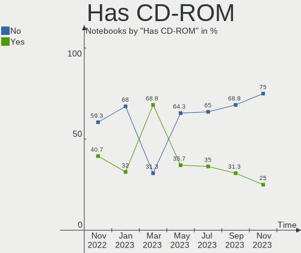
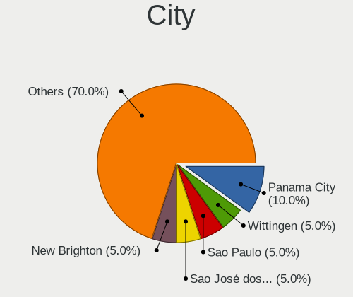
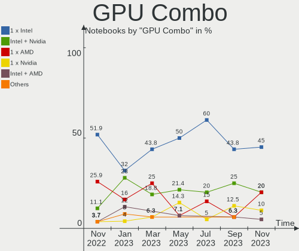
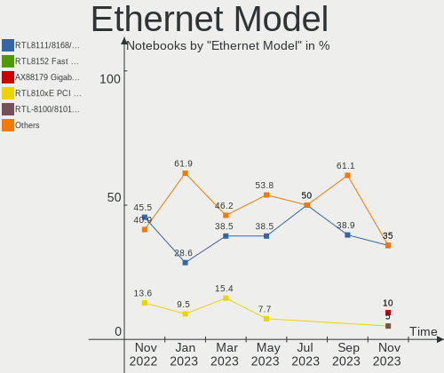
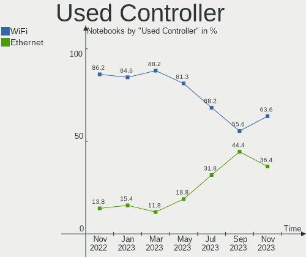
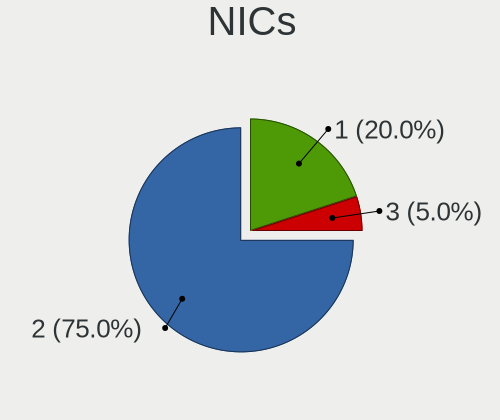

Ubuntu MATE - Hardware Trends (Notebooks)
-----------------------------------------

A project to identify most popular hardware characteristics and track their change
over time based on data collected by Linux users at https://Linux-Hardware.org.

Anyone can contribute to this report by the [hw-probe](https://github.com/linuxhw/hw-probe) tool:

    sudo -E hw-probe -all -upload

This report is for one last month. Overall report since the beginning of time: [TestDays](https://github.com/linuxhw/TestDays)

Period: Sep, 2023.

Contents
--------

* [ System ](#system)
  - [ OS                       ](#os)
  - [ OS Family                ](#os-family)
  - [ Kernel                   ](#kernel)
  - [ Kernel Family            ](#kernel-family)
  - [ Kernel Major Ver.        ](#kernel-major-ver)
  - [ Arch                     ](#arch)
  - [ DE                       ](#de)
  - [ Display Server           ](#display-server)
  - [ Display Manager          ](#display-manager)
  - [ OS Lang                  ](#os-lang)
  - [ Boot Mode                ](#boot-mode)
  - [ Filesystem               ](#filesystem)
  - [ Part. scheme             ](#part-scheme)
  - [ Dual Boot with Linux/BSD ](#dual-boot-with-linuxbsd)
  - [ Dual Boot (Win)          ](#dual-boot-win)

* [ Board ](#board)
  - [ Vendor                   ](#vendor)
  - [ Model                    ](#model)
  - [ Model Family             ](#model-family)
  - [ MFG Year                 ](#mfg-year)
  - [ Form Factor              ](#form-factor)
  - [ Secure Boot              ](#secure-boot)
  - [ Coreboot                 ](#coreboot)
  - [ RAM Size                 ](#ram-size)
  - [ RAM Used                 ](#ram-used)
  - [ Total Drives             ](#total-drives)
  - [ Has CD-ROM               ](#has-cd-rom)
  - [ Has Ethernet             ](#has-ethernet)
  - [ Has WiFi                 ](#has-wifi)
  - [ Has Bluetooth            ](#has-bluetooth)

* [ Location ](#location)
  - [ Country                  ](#country)
  - [ City                     ](#city)

* [ Drives ](#drives)
  - [ Drive Vendor             ](#drive-vendor)
  - [ Drive Model              ](#drive-model)
  - [ HDD Vendor               ](#hdd-vendor)
  - [ SSD Vendor               ](#ssd-vendor)
  - [ Drive Kind               ](#drive-kind)
  - [ Drive Connector          ](#drive-connector)
  - [ Drive Size               ](#drive-size)
  - [ Space Total              ](#space-total)
  - [ Space Used               ](#space-used)
  - [ Malfunc. Drives          ](#malfunc-drives)
  - [ Malfunc. Drive Vendor    ](#malfunc-drive-vendor)
  - [ Malfunc. HDD Vendor      ](#malfunc-hdd-vendor)
  - [ Malfunc. Drive Kind      ](#malfunc-drive-kind)
  - [ Failed Drives            ](#failed-drives)
  - [ Failed Drive Vendor      ](#failed-drive-vendor)
  - [ Drive Status             ](#drive-status)

* [ Storage controller ](#storage-controller)
  - [ Storage Vendor           ](#storage-vendor)
  - [ Storage Model            ](#storage-model)
  - [ Storage Kind             ](#storage-kind)

* [ Processor ](#processor)
  - [ CPU Vendor               ](#cpu-vendor)
  - [ CPU Model                ](#cpu-model)
  - [ CPU Model Family         ](#cpu-model-family)
  - [ CPU Cores                ](#cpu-cores)
  - [ CPU Sockets              ](#cpu-sockets)
  - [ CPU Threads              ](#cpu-threads)
  - [ CPU Op-Modes             ](#cpu-op-modes)
  - [ CPU Microcode            ](#cpu-microcode)
  - [ CPU Microarch            ](#cpu-microarch)

* [ Graphics ](#graphics)
  - [ GPU Vendor               ](#gpu-vendor)
  - [ GPU Model                ](#gpu-model)
  - [ GPU Combo                ](#gpu-combo)
  - [ GPU Driver               ](#gpu-driver)
  - [ GPU Memory               ](#gpu-memory)

* [ Monitor ](#monitor)
  - [ Monitor Vendor           ](#monitor-vendor)
  - [ Monitor Model            ](#monitor-model)
  - [ Monitor Resolution       ](#monitor-resolution)
  - [ Monitor Diagonal         ](#monitor-diagonal)
  - [ Monitor Width            ](#monitor-width)
  - [ Aspect Ratio             ](#aspect-ratio)
  - [ Monitor Area             ](#monitor-area)
  - [ Pixel Density            ](#pixel-density)
  - [ Multiple Monitors        ](#multiple-monitors)

* [ Network ](#network)
  - [ Net Controller Vendor    ](#net-controller-vendor)
  - [ Net Controller Model     ](#net-controller-model)
  - [ Wireless Vendor          ](#wireless-vendor)
  - [ Wireless Model           ](#wireless-model)
  - [ Ethernet Vendor          ](#ethernet-vendor)
  - [ Ethernet Model           ](#ethernet-model)
  - [ Net Controller Kind      ](#net-controller-kind)
  - [ Used Controller          ](#used-controller)
  - [ NICs                     ](#nics)
  - [ IPv6                     ](#ipv6)

* [ Bluetooth ](#bluetooth)
  - [ Bluetooth Vendor         ](#bluetooth-vendor)
  - [ Bluetooth Model          ](#bluetooth-model)

* [ Sound ](#sound)
  - [ Sound Vendor             ](#sound-vendor)
  - [ Sound Model              ](#sound-model)

* [ Memory ](#memory)
  - [ Memory Vendor            ](#memory-vendor)
  - [ Memory Model             ](#memory-model)
  - [ Memory Kind              ](#memory-kind)
  - [ Memory Form Factor       ](#memory-form-factor)
  - [ Memory Size              ](#memory-size)
  - [ Memory Speed             ](#memory-speed)

* [ Printers & scanners ](#printers--scanners)
  - [ Printer Vendor           ](#printer-vendor)
  - [ Printer Model            ](#printer-model)
  - [ Scanner Vendor           ](#scanner-vendor)
  - [ Scanner Model            ](#scanner-model)

* [ Camera ](#camera)
  - [ Camera Vendor            ](#camera-vendor)
  - [ Camera Model             ](#camera-model)

* [ Security ](#security)
  - [ Fingerprint Vendor       ](#fingerprint-vendor)
  - [ Fingerprint Model        ](#fingerprint-model)
  - [ Chipcard Vendor          ](#chipcard-vendor)
  - [ Chipcard Model           ](#chipcard-model)

* [ Unsupported ](#unsupported)
  - [ Unsupported Devices      ](#unsupported-devices)
  - [ Unsupported Device Types ](#unsupported-device-types)

System
------

OS
--

Installed operating systems

| Name              | Notebooks | Percent |
|-------------------|-----------|---------|
| Ubuntu MATE 22.04 | 11        | 68.75%  |
| Ubuntu MATE 23.04 | 2         | 12.5%   |
| Ubuntu MATE 23.10 | 1         | 6.25%   |
| Ubuntu MATE 20.04 | 1         | 6.25%   |
| Ubuntu MATE 16.04 | 1         | 6.25%   |

OS Family
---------

OS without a version

| Name        | Notebooks | Percent |
|-------------|-----------|---------|
| Ubuntu MATE | 16        | 100%    |

Kernel
------

Version of the Linux kernel

| Version               | Notebooks | Percent |
|-----------------------|-----------|---------|
| 6.2.0-32-generic      | 4         | 25%     |
| 6.2.0-1011-lowlatency | 2         | 12.5%   |
| 5.15.0-83-generic     | 2         | 12.5%   |
| 6.3.0-7-generic       | 1         | 6.25%   |
| 6.2.0-33-generic      | 1         | 6.25%   |
| 6.2.0-26-generic      | 1         | 6.25%   |
| 6.2.0-1009-nvidia     | 1         | 6.25%   |
| 5.15.0-85-generic     | 1         | 6.25%   |
| 5.15.0-84-generic     | 1         | 6.25%   |
| 5.15.0-75-generic     | 1         | 6.25%   |
| 4.4.0-208-powerpc-smp | 1         | 6.25%   |

Kernel Family
-------------

Linux kernel without a distro release

| Version | Notebooks | Percent |
|---------|-----------|---------|
| 6.2.0   | 9         | 56.25%  |
| 5.15.0  | 5         | 31.25%  |
| 6.3.0   | 1         | 6.25%   |
| 4.4.0   | 1         | 6.25%   |

Kernel Major Ver.
-----------------

Linux kernel major version

| Version | Notebooks | Percent |
|---------|-----------|---------|
| 6.2     | 9         | 56.25%  |
| 5.15    | 5         | 31.25%  |
| 6.3     | 1         | 6.25%   |
| 4.4     | 1         | 6.25%   |

Arch
----

OS architecture (x86_64, i586, etc.)

| Name   | Notebooks | Percent |
|--------|-----------|---------|
| x86_64 | 15        | 93.75%  |
| ppc    | 1         | 6.25%   |

DE
--

Desktop Environment

| Name | Notebooks | Percent |
|------|-----------|---------|
| MATE | 16        | 100%    |

Display Server
--------------

X11 or Wayland

| Name    | Notebooks | Percent |
|---------|-----------|---------|
| X11     | 15        | 93.75%  |
| Wayland | 1         | 6.25%   |

Display Manager
---------------

SDDM, LightDM, etc.

| Name    | Notebooks | Percent |
|---------|-----------|---------|
| LightDM | 13        | 81.25%  |
| GDM3    | 2         | 12.5%   |
| LXDM    | 1         | 6.25%   |

OS Lang
-------

Language

| Lang  | Notebooks | Percent |
|-------|-----------|---------|
| en_US | 6         | 37.5%   |
| sv_SE | 1         | 6.25%   |
| ru_RU | 1         | 6.25%   |
| hu_HU | 1         | 6.25%   |
| fr_FR | 1         | 6.25%   |
| es_ES | 1         | 6.25%   |
| es_CL | 1         | 6.25%   |
| en_NZ | 1         | 6.25%   |
| en_CA | 1         | 6.25%   |
| de_DE | 1         | 6.25%   |
| C     | 1         | 6.25%   |

Boot Mode
---------

EFI or BIOS

| Mode | Notebooks | Percent |
|------|-----------|---------|
| BIOS | 8         | 50%     |
| EFI  | 8         | 50%     |

Filesystem
----------

Type of filesystem

| Type    | Notebooks | Percent |
|---------|-----------|---------|
| Ext4    | 8         | 50%     |
| Tmpfs   | 6         | 37.5%   |
| Overlay | 1         | 6.25%   |
| Btrfs   | 1         | 6.25%   |

Part. scheme
------------

Scheme of partitioning

| Type | Notebooks | Percent |
|------|-----------|---------|
| GPT  | 15        | 93.75%  |
| MBR  | 1         | 6.25%   |

Dual Boot with Linux/BSD
------------------------

Hosting more than one Linux/BSD

| Dual boot | Notebooks | Percent |
|-----------|-----------|---------|
| No        | 15        | 93.75%  |
| Yes       | 1         | 6.25%   |

Dual Boot (Win)
---------------

Hosting Linux and Windows

| Dual boot | Notebooks | Percent |
|-----------|-----------|---------|
| No        | 9         | 56.25%  |
| Yes       | 7         | 43.75%  |

Board
-----

Vendor
------

Motherboard manufacturer

| Name             | Notebooks | Percent |
|------------------|-----------|---------|
| Lenovo           | 5         | 31.25%  |
| Hewlett-Packard  | 3         | 18.75%  |
| ASUSTek Computer | 3         | 18.75%  |
| Notebook         | 2         | 12.5%   |
| Dell             | 1         | 6.25%   |
| Acer             | 1         | 6.25%   |
| Unknown          | 1         | 6.25%   |

Model
-----

Motherboard model

| Name                                  | Notebooks | Percent |
|---------------------------------------|-----------|---------|
| Notebook NV4XMB,ME,MZ                 | 1         | 6.25%   |
| Notebook NJx0MU                       | 1         | 6.25%   |
| Lenovo ThinkPad X270 W10DG 20K5S3F000 | 1         | 6.25%   |
| Lenovo ThinkPad X270 W10DG 20K5S02K00 | 1         | 6.25%   |
| Lenovo ThinkPad X200 74595FG          | 1         | 6.25%   |
| Lenovo ThinkPad T490s 20NYS58200      | 1         | 6.25%   |
| Lenovo Legion Pro 5 16ARX8 82WM       | 1         | 6.25%   |
| HP Pavilion Gaming Laptop 17-cd1xxx   | 1         | 6.25%   |
| HP OMEN by Laptop 17-ck0xxx           | 1         | 6.25%   |
| HP OMEN by Laptop 15-dc1xxx           | 1         | 6.25%   |
| Dell Latitude E5470                   | 1         | 6.25%   |
| ASUS X550LN                           | 1         | 6.25%   |
| ASUS N73SM                            | 1         | 6.25%   |
| ASUS G75VW                            | 1         | 6.25%   |
| Acer Aspire ES1-531                   | 1         | 6.25%   |
| Unknown                               | 1         | 6.25%   |

Model Family
------------

Motherboard model prefix

| Name            | Notebooks | Percent |
|-----------------|-----------|---------|
| Lenovo ThinkPad | 4         | 25%     |
| HP OMEN         | 2         | 12.5%   |
| Notebook NV4XMB | 1         | 6.25%   |
| Notebook NJx0MU | 1         | 6.25%   |
| Lenovo Legion   | 1         | 6.25%   |
| HP Pavilion     | 1         | 6.25%   |
| Dell Latitude   | 1         | 6.25%   |
| ASUS X550LN     | 1         | 6.25%   |
| ASUS N73SM      | 1         | 6.25%   |
| ASUS G75VW      | 1         | 6.25%   |
| Acer Aspire     | 1         | 6.25%   |
| Unknown         | 1         | 6.25%   |

MFG Year
--------

Motherboard manufacture year

| Year    | Notebooks | Percent |
|---------|-----------|---------|
| 2021    | 2         | 12.5%   |
| 2020    | 2         | 12.5%   |
| 2019    | 2         | 12.5%   |
| 2017    | 2         | 12.5%   |
| 2023    | 1         | 6.25%   |
| 2016    | 1         | 6.25%   |
| 2015    | 1         | 6.25%   |
| 2014    | 1         | 6.25%   |
| 2012    | 1         | 6.25%   |
| 2011    | 1         | 6.25%   |
| 2008    | 1         | 6.25%   |
| Unknown | 1         | 6.25%   |

Form Factor
-----------

Physical design of the computer

| Name     | Notebooks | Percent |
|----------|-----------|---------|
| Notebook | 16        | 100%    |

Secure Boot
-----------

Enabled or disabled

| State    | Notebooks | Percent |
|----------|-----------|---------|
| Disabled | 15        | 93.75%  |
| Enabled  | 1         | 6.25%   |

Coreboot
--------

Have coreboot on board

| Used | Notebooks | Percent |
|------|-----------|---------|
| No   | 16        | 100%    |

RAM Size
--------

Total RAM memory

| Size in GB  | Notebooks | Percent |
|-------------|-----------|---------|
| 4.01-8.0    | 5         | 31.25%  |
| 32.01-64.0  | 3         | 18.75%  |
| 16.01-24.0  | 3         | 18.75%  |
| 24.01-32.0  | 2         | 12.5%   |
| 3.01-4.0    | 1         | 6.25%   |
| 64.01-256.0 | 1         | 6.25%   |
| 1.01-2.0    | 1         | 6.25%   |

RAM Used
--------

Used RAM memory

| Used GB   | Notebooks | Percent |
|-----------|-----------|---------|
| 1.01-2.0  | 4         | 25%     |
| 8.01-16.0 | 4         | 25%     |
| 4.01-8.0  | 3         | 18.75%  |
| 3.01-4.0  | 3         | 18.75%  |
| 2.01-3.0  | 1         | 6.25%   |
| 0.01-0.5  | 1         | 6.25%   |

Total Drives
------------

Number of drives on board

| Drives | Notebooks | Percent |
|--------|-----------|---------|
| 1      | 11        | 68.75%  |
| 2      | 5         | 31.25%  |

Has CD-ROM
----------

Has CD-ROM on board

| Presented | Notebooks | Percent |
|-----------|-----------|---------|
| No        | 11        | 68.75%  |
| Yes       | 5         | 31.25%  |

Has Ethernet
------------

Has Ethernet on board

| Presented | Notebooks | Percent |
|-----------|-----------|---------|
| Yes       | 15        | 93.75%  |
| No        | 1         | 6.25%   |

Has WiFi
--------

Has WiFi module

| Presented | Notebooks | Percent |
|-----------|-----------|---------|
| Yes       | 15        | 93.75%  |
| No        | 1         | 6.25%   |

Has Bluetooth
-------------

Has Bluetooth module

| Presented | Notebooks | Percent |
|-----------|-----------|---------|
| Yes       | 14        | 87.5%   |
| No        | 2         | 12.5%   |

Location
--------

Country
-------

Geographic location (country)

| Country     | Notebooks | Percent |
|-------------|-----------|---------|
| USA         | 3         | 18.75%  |
| France      | 2         | 12.5%   |
| Taiwan      | 1         | 6.25%   |
| Sweden      | 1         | 6.25%   |
| Spain       | 1         | 6.25%   |
| Russia      | 1         | 6.25%   |
| Peru        | 1         | 6.25%   |
| New Zealand | 1         | 6.25%   |
| Lithuania   | 1         | 6.25%   |
| Hungary     | 1         | 6.25%   |
| Finland     | 1         | 6.25%   |
| Chile       | 1         | 6.25%   |
| Brazil      | 1         | 6.25%   |

City
----

Geographic location (city)

| City             | Notebooks | Percent |
|------------------|-----------|---------|
| Tours            | 1         | 6.25%   |
| Taoyuan District | 1         | 6.25%   |
| Sundbyberg       | 1         | 6.25%   |
| Sao Paulo        | 1         | 6.25%   |
| San Fernando     | 1         | 6.25%   |
| Rotorua          | 1         | 6.25%   |
| Reading          | 1         | 6.25%   |
| New Brighton     | 1         | 6.25%   |
| Moscow           | 1         | 6.25%   |
| Montbéliard     | 1         | 6.25%   |
| Lima             | 1         | 6.25%   |
| Klaipėda        | 1         | 6.25%   |
| Jyväskylä      | 1         | 6.25%   |
| Győr            | 1         | 6.25%   |
| Getxo            | 1         | 6.25%   |
| Carrollton       | 1         | 6.25%   |

Drives
------

Drive Vendor
------------

Hard drive vendors

| Vendor              | Notebooks | Drives | Percent |
|---------------------|-----------|--------|---------|
| Samsung Electronics | 7         | 7      | 33.33%  |
| Toshiba             | 4         | 4      | 19.05%  |
| Seagate             | 2         | 2      | 9.52%   |
| Kingston            | 2         | 2      | 9.52%   |
| WDC                 | 1         | 1      | 4.76%   |
| Verbatim            | 1         | 1      | 4.76%   |
| SK hynix            | 1         | 1      | 4.76%   |
| SanDisk             | 1         | 1      | 4.76%   |
| Hitachi             | 1         | 1      | 4.76%   |
| Fujitsu             | 1         | 1      | 4.76%   |

Drive Model
-----------

Hard drive models

| Model                                               | Notebooks | Percent |
|-----------------------------------------------------|-----------|---------|
| Toshiba XG6 NVMe SSD Controller 512GB               | 2         | 9.52%   |
| Kingston SA400S37240G 240GB SSD                     | 2         | 9.52%   |
| WDC PC SN730 SDBQNTY-512G-1001 512GB                | 1         | 4.76%   |
| Verbatim Vi550 S3 512GB                             | 1         | 4.76%   |
| Toshiba THNSF5256GPUK 256GB                         | 1         | 4.76%   |
| Toshiba MQ01ABD100 1TB                              | 1         | 4.76%   |
| SK hynix SKHynix_HFS001TEJ9X115N 1TB                | 1         | 4.76%   |
| Seagate ST9500420AS 500GB                           | 1         | 4.76%   |
| Seagate FreeAgent XTreme 500GB                      | 1         | 4.76%   |
| SanDisk NVMe SSD Drive 1TB                          | 1         | 4.76%   |
| Samsung SSD 980 PRO 500GB S5GYNF0R322406T           | 1         | 4.76%   |
| Samsung SSD 870 QVO 8TB                             | 1         | 4.76%   |
| Samsung SSD 860 EVO M.2 500GB                       | 1         | 4.76%   |
| Samsung SSD 750 EVO 120GB                           | 1         | 4.76%   |
| Samsung NVMe SSD Controller SM961/PM961/SM963 500GB | 1         | 4.76%   |
| Samsung MZVL2512HCJQ-00B00 512GB                    | 1         | 4.76%   |
| Samsung MZVL21T0HCLR-00BH1 1TB                      | 1         | 4.76%   |
| Hitachi HTS547550A9E384 500GB                       | 1         | 4.76%   |
| Fujitsu MHT2080AH 80GB                              | 1         | 4.76%   |

HDD Vendor
----------

Hard disk drive vendors

| Vendor  | Notebooks | Drives | Percent |
|---------|-----------|--------|---------|
| Seagate | 2         | 2      | 40%     |
| Toshiba | 1         | 1      | 20%     |
| Hitachi | 1         | 1      | 20%     |
| Fujitsu | 1         | 1      | 20%     |

SSD Vendor
----------

Solid state drive vendors

| Vendor              | Notebooks | Drives | Percent |
|---------------------|-----------|--------|---------|
| Samsung Electronics | 3         | 3      | 50%     |
| Kingston            | 2         | 2      | 33.33%  |
| Verbatim            | 1         | 1      | 16.67%  |

Drive Kind
----------

HDD or SSD

| Kind | Notebooks | Drives | Percent |
|------|-----------|--------|---------|
| NVMe | 9         | 10     | 50%     |
| SSD  | 5         | 6      | 27.78%  |
| HDD  | 4         | 5      | 22.22%  |

Drive Connector
---------------

SATA, SAS, NVMe, etc.

| Type | Notebooks | Drives | Percent |
|------|-----------|--------|---------|
| NVMe | 9         | 10     | 47.37%  |
| SATA | 9         | 10     | 47.37%  |
| SAS  | 1         | 1      | 5.26%   |

Drive Size
----------

Size of hard drive

| Size in TB | Notebooks | Drives | Percent |
|------------|-----------|--------|---------|
| 0.01-0.5   | 6         | 8      | 66.67%  |
| 0.51-1.0   | 2         | 2      | 22.22%  |
| 4.01-10.0  | 1         | 1      | 11.11%  |

Space Total
-----------

Amount of disk space available on the file system

| Size in GB     | Notebooks | Percent |
|----------------|-----------|---------|
| 101-250        | 5         | 31.25%  |
| 251-500        | 4         | 25%     |
| 501-1000       | 4         | 25%     |
| More than 3000 | 1         | 6.25%   |
| 1001-2000      | 1         | 6.25%   |
| 1-20           | 1         | 6.25%   |

Space Used
----------

Amount of used disk space

| Used GB        | Notebooks | Percent |
|----------------|-----------|---------|
| 1-20           | 5         | 31.25%  |
| 251-500        | 2         | 12.5%   |
| 101-250        | 2         | 12.5%   |
| 501-1000       | 2         | 12.5%   |
| 51-100         | 2         | 12.5%   |
| More than 3000 | 1         | 6.25%   |
| 21-50          | 1         | 6.25%   |
| 1001-2000      | 1         | 6.25%   |

Malfunc. Drives
---------------

Drive models with a malfunction

Zero info for selected period =(

Malfunc. Drive Vendor
---------------------

Vendors of faulty drives

Zero info for selected period =(

Malfunc. HDD Vendor
-------------------

Vendors of faulty HDD drives

Zero info for selected period =(

Malfunc. Drive Kind
-------------------

Kinds of faulty drives

Zero info for selected period =(

Failed Drives
-------------

Failed drive models

Zero info for selected period =(

Failed Drive Vendor
-------------------

Failed drive vendors

Zero info for selected period =(

Drive Status
------------

Number of failed and malfunc. drives

| Status   | Notebooks | Drives | Percent |
|----------|-----------|--------|---------|
| Works    | 10        | 10     | 55.56%  |
| Detected | 8         | 11     | 44.44%  |

Storage controller
------------------

Storage Vendor
--------------

Storage controller vendors

| Vendor                       | Notebooks | Percent |
|------------------------------|-----------|---------|
| Intel                        | 10        | 50%     |
| Samsung Electronics          | 4         | 20%     |
| Toshiba America Info Systems | 3         | 15%     |
| SanDisk                      | 2         | 10%     |
| SK hynix                     | 1         | 5%      |

Storage Model
-------------

Storage controller models

| Model                                                                            | Notebooks | Percent |
|----------------------------------------------------------------------------------|-----------|---------|
| Samsung NVMe SSD Controller PM9A1/PM9A3/980PRO                                   | 3         | 15%     |
| Toshiba America Info Systems XG6 NVMe SSD Controller                             | 2         | 10%     |
| Intel 82801 Mobile SATA Controller [RAID mode]                                   | 2         | 10%     |
| Toshiba America Info Systems XG4 NVMe SSD Controller                             | 1         | 5%      |
| SK hynix Platinum P41/PC801 NVMe Solid State Drive                               | 1         | 5%      |
| SanDisk WD Blue SN570 NVMe SSD 1TB                                               | 1         | 5%      |
| SanDisk WD Black SN750 / PC SN730 NVMe SSD                                       | 1         | 5%      |
| Samsung NVMe SSD Controller SM961/PM961/SM963                                    | 1         | 5%      |
| Intel Volume Management Device NVMe RAID Controller                              | 1         | 5%      |
| Intel Tiger Lake-LP SATA Controller                                              | 1         | 5%      |
| Intel SATA Controller [RAID mode]                                                | 1         | 5%      |
| Intel Atom/Celeron/Pentium Processor x5-E8000/J3xxx/N3xxx Series SATA Controller | 1         | 5%      |
| Intel 82801IBM/IEM (ICH9M/ICH9M-E) 2 port SATA Controller [IDE mode]             | 1         | 5%      |
| Intel 8 Series SATA Controller 1 [AHCI mode]                                     | 1         | 5%      |
| Intel 7 Series Chipset Family 6-port SATA Controller [AHCI mode]                 | 1         | 5%      |
| Intel 6 Series/C200 Series Chipset Family 6 port Mobile SATA AHCI Controller     | 1         | 5%      |

Storage Kind
------------

Kind of storage controller (IDE, SATA, NVMe, SAS, ...)

| Kind | Notebooks | Percent |
|------|-----------|---------|
| NVMe | 9         | 47.37%  |
| SATA | 5         | 26.32%  |
| RAID | 4         | 21.05%  |
| IDE  | 1         | 5.26%   |

Processor
---------

CPU Vendor
----------

Processor vendors

| Vendor       | Notebooks | Percent |
|--------------|-----------|---------|
| Intel        | 14        | 87.5%   |
| PowerBook5,6 | 1         | 6.25%   |
| AMD          | 1         | 6.25%   |

CPU Model
---------

Processor models

| Model                                   | Notebooks | Percent |
|-----------------------------------------|-----------|---------|
| Intel Core i5-6300U CPU @ 2.40GHz       | 2         | 12.5%   |
| Intel 11th Gen Core i7-1165G7 @ 2.80GHz | 2         | 12.5%   |
| PowerBook5,6 7447A, altivec supported   | 1         | 6.25%   |
| Intel Pentium CPU N3700 @ 1.60GHz       | 1         | 6.25%   |
| Intel Core i7-9750H CPU @ 2.60GHz       | 1         | 6.25%   |
| Intel Core i7-8665U CPU @ 1.90GHz       | 1         | 6.25%   |
| Intel Core i7-3630QM CPU @ 2.40GHz      | 1         | 6.25%   |
| Intel Core i7-2670QM CPU @ 2.20GHz      | 1         | 6.25%   |
| Intel Core i7-10750H CPU @ 2.60GHz      | 1         | 6.25%   |
| Intel Core i5-6440HQ CPU @ 2.60GHz      | 1         | 6.25%   |
| Intel Core i3-4010U CPU @ 1.70GHz       | 1         | 6.25%   |
| Intel Core 2 Duo CPU P8600 @ 2.40GHz    | 1         | 6.25%   |
| Intel 11th Gen Core i7-11800H @ 2.30GHz | 1         | 6.25%   |
| AMD Ryzen 7 7745HX with Radeon Graphics | 1         | 6.25%   |

CPU Model Family
----------------

Processor model prefix

| Model            | Notebooks | Percent |
|------------------|-----------|---------|
| Intel Core i7    | 5         | 31.25%  |
| Other            | 4         | 25%     |
| Intel Core i5    | 3         | 18.75%  |
| Intel Pentium    | 1         | 6.25%   |
| Intel Core i3    | 1         | 6.25%   |
| Intel Core 2 Duo | 1         | 6.25%   |
| AMD Ryzen 7      | 1         | 6.25%   |

CPU Cores
---------

Number of processor cores

| Number | Notebooks | Percent |
|--------|-----------|---------|
| 4      | 7         | 43.75%  |
| 2      | 4         | 25%     |
| 8      | 2         | 12.5%   |
| 6      | 2         | 12.5%   |
| 1      | 1         | 6.25%   |

CPU Sockets
-----------

Number of sockets

| Number | Notebooks | Percent |
|--------|-----------|---------|
| 1      | 16        | 100%    |

CPU Threads
-----------

Threads per core (Hyper-Threading)

| Number | Notebooks | Percent |
|--------|-----------|---------|
| 2      | 12        | 75%     |
| 1      | 4         | 25%     |

CPU Op-Modes
------------

CPU Operation Modes (32-bit, 64-bit)

| Op mode        | Notebooks | Percent |
|----------------|-----------|---------|
| 32-bit, 64-bit | 15        | 93.75%  |
| 32-bit         | 1         | 6.25%   |

CPU Microcode
-------------

Microcode number

| Number     | Notebooks | Percent |
|------------|-----------|---------|
| Unknown    | 12        | 75%     |
| 0x806d1    | 1         | 6.25%   |
| 0x806c1    | 1         | 6.25%   |
| 0x406e3    | 1         | 6.25%   |
| 0x0a601203 | 1         | 6.25%   |

CPU Microarch
-------------

Microarchitecture

| Name        | Notebooks | Percent |
|-------------|-----------|---------|
| Skylake     | 3         | 18.75%  |
| TigerLake   | 2         | 12.5%   |
| KabyLake    | 2         | 12.5%   |
| Unknown     | 2         | 12.5%   |
| Silvermont  | 1         | 6.25%   |
| SandyBridge | 1         | 6.25%   |
| Penryn      | 1         | 6.25%   |
| IvyBridge   | 1         | 6.25%   |
| Icelake     | 1         | 6.25%   |
| Haswell     | 1         | 6.25%   |
| CometLake   | 1         | 6.25%   |

Graphics
--------

GPU Vendor
----------

Vendors of graphics cards

| Vendor | Notebooks | Percent |
|--------|-----------|---------|
| Intel  | 12        | 54.55%  |
| Nvidia | 7         | 31.82%  |
| AMD    | 3         | 13.64%  |

GPU Model
---------

Graphics card models

| Model                                                                                    | Notebooks | Percent |
|------------------------------------------------------------------------------------------|-----------|---------|
| Nvidia TU116M [GeForce GTX 1660 Ti Mobile]                                               | 2         | 9.09%   |
| Intel TigerLake-LP GT2 [Iris Xe Graphics]                                                | 2         | 9.09%   |
| Intel Skylake GT2 [HD Graphics 520]                                                      | 2         | 9.09%   |
| Nvidia GM108M [GeForce 840M]                                                             | 1         | 4.55%   |
| Nvidia GF114M [GeForce GTX 670M]                                                         | 1         | 4.55%   |
| Nvidia GF108M [GeForce GT 620M/630M/635M/640M LE]                                        | 1         | 4.55%   |
| Nvidia GA104M [GeForce RTX 3070 Mobile / Max-Q]                                          | 1         | 4.55%   |
| Nvidia AD107M [GeForce RTX 4060 Max-Q / Mobile]                                          | 1         | 4.55%   |
| Intel WhiskeyLake-U GT2 [UHD Graphics 620]                                               | 1         | 4.55%   |
| Intel TigerLake-H GT1 [UHD Graphics]                                                     | 1         | 4.55%   |
| Intel Mobile 4 Series Chipset Integrated Graphics Controller                             | 1         | 4.55%   |
| Intel HD Graphics 530                                                                    | 1         | 4.55%   |
| Intel Haswell-ULT Integrated Graphics Controller                                         | 1         | 4.55%   |
| Intel CometLake-H GT2 [UHD Graphics]                                                     | 1         | 4.55%   |
| Intel Atom/Celeron/Pentium Processor x5-E8000/J3xxx/N3xxx Integrated Graphics Controller | 1         | 4.55%   |
| Intel 2nd Generation Core Processor Family Integrated Graphics Controller                | 1         | 4.55%   |
| AMD Topaz XT [Radeon R7 M260/M265 / M340/M360 / M440/M445 / 530/535 / 620/625 Mobile]    | 1         | 4.55%   |
| AMD RV350/M10 / RV360/M11 [Mobility Radeon 9600 (PRO) / 9700]                            | 1         | 4.55%   |
| AMD Raphael                                                                              | 1         | 4.55%   |

GPU Combo
---------

Combinations of graphics cards

| Name           | Notebooks | Percent |
|----------------|-----------|---------|
| 1 x Intel      | 7         | 43.75%  |
| Intel + Nvidia | 4         | 25%     |
| 1 x Nvidia     | 2         | 12.5%   |
| Intel + AMD    | 1         | 6.25%   |
| AMD + Nvidia   | 1         | 6.25%   |
| 1 x AMD        | 1         | 6.25%   |

GPU Driver
----------

Free vs proprietary

| Driver      | Notebooks | Percent |
|-------------|-----------|---------|
| Free        | 10        | 62.5%   |
| Proprietary | 6         | 37.5%   |

GPU Memory
----------

Total video memory

| Size in GB | Notebooks | Percent |
|------------|-----------|---------|
| Unknown    | 12        | 75%     |
| 0.01-0.5   | 2         | 12.5%   |
| 5.01-6.0   | 1         | 6.25%   |
| 1.01-2.0   | 1         | 6.25%   |

Monitor
-------

Monitor Vendor
--------------

Monitor vendors

| Vendor                  | Notebooks | Percent |
|-------------------------|-----------|---------|
| LG Display              | 6         | 31.58%  |
| BOE                     | 3         | 15.79%  |
| AU Optronics            | 2         | 10.53%  |
| Lenovo                  | 1         | 5.26%   |
| Hewlett-Packard         | 1         | 5.26%   |
| Eizo                    | 1         | 5.26%   |
| Dell                    | 1         | 5.26%   |
| CSO                     | 1         | 5.26%   |
| Chimei Innolux          | 1         | 5.26%   |
| Chi Mei Optoelectronics | 1         | 5.26%   |
| Apple                   | 1         | 5.26%   |

Monitor Model
-------------

Monitor models

| Model                                                                     | Notebooks | Percent |
|---------------------------------------------------------------------------|-----------|---------|
| LG Display LCD Monitor LGD063F 1920x1080 382x215mm 17.3-inch              | 1         | 5.26%   |
| LG Display LCD Monitor LGD062C 1920x1080 309x174mm 14.0-inch              | 1         | 5.26%   |
| LG Display LCD Monitor LGD0490 1920x1080 309x174mm 14.0-inch              | 1         | 5.26%   |
| LG Display LCD Monitor LGD0456 1366x768 344x194mm 15.5-inch               | 1         | 5.26%   |
| LG Display LCD Monitor LGD03DB 1366x768 345x194mm 15.6-inch               | 1         | 5.26%   |
| LG Display LCD Monitor LGD02D1 1600x900 382x215mm 17.3-inch               | 1         | 5.26%   |
| Lenovo LCD Monitor LEN4010 1280x800 261x163mm 12.1-inch                   | 1         | 5.26%   |
| Hewlett-Packard 27y HPN351C 1920x1080 598x336mm 27.0-inch                 | 1         | 5.26%   |
| Eizo EV2495 ENC3157 1920x1200 519x324mm 24.1-inch                         | 1         | 5.26%   |
| Dell U2415 DELA0BC 1920x1200 518x324mm 24.1-inch                          | 1         | 5.26%   |
| CSO LCD Monitor CSO161D 2560x1600 345x215mm 16.0-inch                     | 1         | 5.26%   |
| Chimei Innolux LCD Monitor CMN14F2 1920x1080 309x173mm 13.9-inch          | 1         | 5.26%   |
| Chi Mei Optoelectronics LCD Monitor CMO1720 1920x1080 380x210mm 17.1-inch | 1         | 5.26%   |
| BOE LCD Monitor BOE09BF 2560x1440 382x215mm 17.3-inch                     | 1         | 5.26%   |
| BOE LCD Monitor BOE0852 1920x1080 344x194mm 15.5-inch                     | 1         | 5.26%   |
| BOE LCD Monitor BOE06CE 1366x768 277x156mm 12.5-inch                      | 1         | 5.26%   |
| AU Optronics LCD Monitor AUO429D 1920x1080 382x215mm 17.3-inch            | 1         | 5.26%   |
| AU Optronics LCD Monitor AUO226D 1920x1080 276x155mm 12.5-inch            | 1         | 5.26%   |
| Apple Color LCD APP9C20 1280x854 321x214mm 15.2-inch                      | 1         | 5.26%   |

Monitor Resolution
------------------

Monitor screen resolution

| Resolution        | Notebooks | Percent |
|-------------------|-----------|---------|
| 1920x1080 (FHD)   | 9         | 50%     |
| 1366x768 (WXGA)   | 3         | 16.67%  |
| 2560x1600         | 1         | 5.56%   |
| 2560x1440 (QHD)   | 1         | 5.56%   |
| 1920x1200 (WUXGA) | 1         | 5.56%   |
| 1600x900 (HD+)    | 1         | 5.56%   |
| 1280x854          | 1         | 5.56%   |
| 1280x800 (WXGA)   | 1         | 5.56%   |

Monitor Diagonal
----------------

Diagonal size in inches

| Inches | Notebooks | Percent |
|--------|-----------|---------|
| 17     | 5         | 26.32%  |
| 15     | 4         | 21.05%  |
| 12     | 3         | 15.79%  |
| 14     | 2         | 10.53%  |
| 40     | 1         | 5.26%   |
| 27     | 1         | 5.26%   |
| 24     | 1         | 5.26%   |
| 16     | 1         | 5.26%   |
| 13     | 1         | 5.26%   |

Monitor Width
-------------

Physical width

| Width in mm | Notebooks | Percent |
|-------------|-----------|---------|
| 301-350     | 8         | 42.11%  |
| 351-400     | 5         | 26.32%  |
| 201-300     | 3         | 15.79%  |
| 501-600     | 2         | 10.53%  |
| 801-900     | 1         | 5.26%   |

Aspect Ratio
------------

Proportional relationship between the width and the height

| Ratio | Notebooks | Percent |
|-------|-----------|---------|
| 16/9  | 14        | 82.35%  |
| 16/10 | 2         | 11.76%  |
| 3/2   | 1         | 5.88%   |

Monitor Area
------------

Area in inch²

| Area in inch² | Notebooks | Percent |
|----------------|-----------|---------|
| 121-130        | 5         | 26.32%  |
| 101-110        | 4         | 21.05%  |
| 81-90          | 3         | 15.79%  |
| 61-70          | 3         | 15.79%  |
| 301-350        | 1         | 5.26%   |
| 251-300        | 1         | 5.26%   |
| 111-120        | 1         | 5.26%   |
| 501-1000       | 1         | 5.26%   |

Pixel Density
-------------

Pixels per inch

| Density | Notebooks | Percent |
|---------|-----------|---------|
| 121-160 | 9         | 50%     |
| 161-240 | 3         | 16.67%  |
| 101-120 | 3         | 16.67%  |
| 51-100  | 3         | 16.67%  |

Multiple Monitors
-----------------

Total monitors connected

| Total | Notebooks | Percent |
|-------|-----------|---------|
| 1     | 14        | 87.5%   |
| 3     | 1         | 6.25%   |
| 2     | 1         | 6.25%   |

Network
-------

Net Controller Vendor
---------------------

Controller vendors

| Vendor                | Notebooks | Percent |
|-----------------------|-----------|---------|
| Intel                 | 10        | 38.46%  |
| Realtek Semiconductor | 8         | 30.77%  |
| Qualcomm Atheros      | 3         | 11.54%  |
| Sierra Wireless       | 1         | 3.85%   |
| Ralink                | 1         | 3.85%   |
| DisplayLink           | 1         | 3.85%   |
| Broadcom              | 1         | 3.85%   |
| Apple                 | 1         | 3.85%   |

Net Controller Model
--------------------

Controller models

| Model                                                             | Notebooks | Percent |
|-------------------------------------------------------------------|-----------|---------|
| Realtek RTL8111/8168/8411 PCI Express Gigabit Ethernet Controller | 7         | 20.59%  |
| Intel Wi-Fi 6 AX200                                               | 4         | 11.76%  |
| Realtek RTL8153 Gigabit Ethernet Adapter                          | 2         | 5.88%   |
| Intel Wireless 8260                                               | 2         | 5.88%   |
| Intel Ethernet Connection I219-LM                                 | 2         | 5.88%   |
| Sierra Wireless EM7430 Qualcomm Snapdragon X7 LTE-A               | 1         | 2.94%   |
| Realtek Realtek WLAN controller                                   | 1         | 2.94%   |
| Ralink RT3290 Wireless 802.11n 1T/1R PCIe                         | 1         | 2.94%   |
| Qualcomm Atheros QCA9565 / AR9565 Wireless Network Adapter        | 1         | 2.94%   |
| Qualcomm Atheros AR9285 Wireless Network Adapter (PCI-Express)    | 1         | 2.94%   |
| Qualcomm Atheros AR8151 v2.0 Gigabit Ethernet                     | 1         | 2.94%   |
| Intel Wi-Fi 6 AX210/AX211/AX411 160MHz                            | 1         | 2.94%   |
| Intel PRO/Wireless 5100 AGN [Shiloh] Network Connection           | 1         | 2.94%   |
| Intel Ethernet Connection (6) I219-LM                             | 1         | 2.94%   |
| Intel Ethernet Connection (2) I219-LM                             | 1         | 2.94%   |
| Intel Ethernet Connection (13) I219-V                             | 1         | 2.94%   |
| Intel Comet Lake PCH CNVi WiFi                                    | 1         | 2.94%   |
| Intel Cannon Point-LP CNVi [Wireless-AC]                          | 1         | 2.94%   |
| Intel 82567LM Gigabit Network Connection                          | 1         | 2.94%   |
| DisplayLink USB3.0 dock                                           | 1         | 2.94%   |
| Broadcom BCM4306 802.11b/g Wireless LAN Controller                | 1         | 2.94%   |
| Apple UniNorth 2 GMAC (Sun GEM)                                   | 1         | 2.94%   |

Wireless Vendor
---------------

Wireless vendors

| Vendor                | Notebooks | Percent |
|-----------------------|-----------|---------|
| Intel                 | 10        | 62.5%   |
| Qualcomm Atheros      | 2         | 12.5%   |
| Sierra Wireless       | 1         | 6.25%   |
| Realtek Semiconductor | 1         | 6.25%   |
| Ralink                | 1         | 6.25%   |
| Broadcom              | 1         | 6.25%   |

Wireless Model
--------------

Wireless models

| Model                                                          | Notebooks | Percent |
|----------------------------------------------------------------|-----------|---------|
| Intel Wi-Fi 6 AX200                                            | 4         | 25%     |
| Intel Wireless 8260                                            | 2         | 12.5%   |
| Sierra Wireless EM7430 Qualcomm Snapdragon X7 LTE-A            | 1         | 6.25%   |
| Realtek Realtek WLAN controller                                | 1         | 6.25%   |
| Ralink RT3290 Wireless 802.11n 1T/1R PCIe                      | 1         | 6.25%   |
| Qualcomm Atheros QCA9565 / AR9565 Wireless Network Adapter     | 1         | 6.25%   |
| Qualcomm Atheros AR9285 Wireless Network Adapter (PCI-Express) | 1         | 6.25%   |
| Intel Wi-Fi 6 AX210/AX211/AX411 160MHz                         | 1         | 6.25%   |
| Intel PRO/Wireless 5100 AGN [Shiloh] Network Connection        | 1         | 6.25%   |
| Intel Comet Lake PCH CNVi WiFi                                 | 1         | 6.25%   |
| Intel Cannon Point-LP CNVi [Wireless-AC]                       | 1         | 6.25%   |
| Broadcom BCM4306 802.11b/g Wireless LAN Controller             | 1         | 6.25%   |

Ethernet Vendor
---------------

Ethernet vendors

| Vendor                | Notebooks | Percent |
|-----------------------|-----------|---------|
| Realtek Semiconductor | 8         | 47.06%  |
| Intel                 | 6         | 35.29%  |
| Qualcomm Atheros      | 1         | 5.88%   |
| DisplayLink           | 1         | 5.88%   |
| Apple                 | 1         | 5.88%   |

Ethernet Model
--------------

Ethernet models

| Model                                                             | Notebooks | Percent |
|-------------------------------------------------------------------|-----------|---------|
| Realtek RTL8111/8168/8411 PCI Express Gigabit Ethernet Controller | 7         | 38.89%  |
| Realtek RTL8153 Gigabit Ethernet Adapter                          | 2         | 11.11%  |
| Intel Ethernet Connection I219-LM                                 | 2         | 11.11%  |
| Qualcomm Atheros AR8151 v2.0 Gigabit Ethernet                     | 1         | 5.56%   |
| Intel Ethernet Connection (6) I219-LM                             | 1         | 5.56%   |
| Intel Ethernet Connection (2) I219-LM                             | 1         | 5.56%   |
| Intel Ethernet Connection (13) I219-V                             | 1         | 5.56%   |
| Intel 82567LM Gigabit Network Connection                          | 1         | 5.56%   |
| DisplayLink USB3.0 dock                                           | 1         | 5.56%   |
| Apple UniNorth 2 GMAC (Sun GEM)                                   | 1         | 5.56%   |

Net Controller Kind
-------------------

Ethernet, WiFi or modem

| Kind     | Notebooks | Percent |
|----------|-----------|---------|
| WiFi     | 15        | 50%     |
| Ethernet | 15        | 50%     |

Used Controller
---------------

Currently used network controller

| Kind     | Notebooks | Percent |
|----------|-----------|---------|
| WiFi     | 10        | 55.56%  |
| Ethernet | 8         | 44.44%  |

NICs
----

Total network controllers on board

| Total | Notebooks | Percent |
|-------|-----------|---------|
| 2     | 14        | 87.5%   |
| 1     | 2         | 12.5%   |

IPv6
----

IPv6 vs IPv4

| Used | Notebooks | Percent |
|------|-----------|---------|
| No   | 12        | 75%     |
| Yes  | 4         | 25%     |

Bluetooth
---------

Bluetooth Vendor
----------------

Controller vendors

| Vendor                          | Notebooks | Percent |
|---------------------------------|-----------|---------|
| Intel                           | 9         | 64.29%  |
| Ralink                          | 1         | 7.14%   |
| Qualcomm Atheros Communications | 1         | 7.14%   |
| Lite-On Technology              | 1         | 7.14%   |
| Broadcom                        | 1         | 7.14%   |
| Apple                           | 1         | 7.14%   |

Bluetooth Model
---------------

Controller models

| Model                                              | Notebooks | Percent |
|----------------------------------------------------|-----------|---------|
| Intel AX200 Bluetooth                              | 4         | 28.57%  |
| Intel Bluetooth wireless interface                 | 2         | 14.29%  |
| Ralink RT3290 Bluetooth                            | 1         | 7.14%   |
| Qualcomm Atheros AR3011 Bluetooth                  | 1         | 7.14%   |
| Lite-On Atheros AR3012 Bluetooth                   | 1         | 7.14%   |
| Intel Bluetooth 9460/9560 Jefferson Peak (JfP)     | 1         | 7.14%   |
| Intel AX210 Bluetooth                              | 1         | 7.14%   |
| Intel AX201 Bluetooth                              | 1         | 7.14%   |
| Broadcom BCM2045B (BDC-2.1) [Bluetooth Controller] | 1         | 7.14%   |
| Apple Bluetooth HCI                                | 1         | 7.14%   |

Sound
-----

Sound Vendor
------------

Sound card vendors

| Vendor              | Notebooks | Percent |
|---------------------|-----------|---------|
| Intel               | 14        | 58.33%  |
| Nvidia              | 6         | 25%     |
| Meizu               | 1         | 4.17%   |
| JMTek               | 1         | 4.17%   |
| C-Media Electronics | 1         | 4.17%   |
| AMD                 | 1         | 4.17%   |

Sound Model
-----------

Sound card models

| Model                                                                                             | Notebooks | Percent |
|---------------------------------------------------------------------------------------------------|-----------|---------|
| Nvidia TU116 High Definition Audio Controller                                                     | 2         | 8%      |
| Intel Tiger Lake-LP Smart Sound Technology Audio Controller                                       | 2         | 8%      |
| Intel Sunrise Point-LP HD Audio                                                                   | 2         | 8%      |
| Nvidia GF114 HDMI Audio Controller                                                                | 1         | 4%      |
| Nvidia GF108 High Definition Audio Controller                                                     | 1         | 4%      |
| Nvidia GA104 High Definition Audio Controller                                                     | 1         | 4%      |
| Nvidia Audio device                                                                               | 1         | 4%      |
| Meizu HiFi DAC Headphone Amplifier                                                                | 1         | 4%      |
| JMTek USB PnP Audio Device                                                                        | 1         | 4%      |
| Intel Tiger Lake-H HD Audio Controller                                                            | 1         | 4%      |
| Intel Haswell-ULT HD Audio Controller                                                             | 1         | 4%      |
| Intel Comet Lake PCH cAVS                                                                         | 1         | 4%      |
| Intel Cannon Point-LP High Definition Audio Controller                                            | 1         | 4%      |
| Intel Cannon Lake PCH cAVS                                                                        | 1         | 4%      |
| Intel Atom/Celeron/Pentium Processor x5-E8000/J3xxx/N3xxx Series High Definition Audio Controller | 1         | 4%      |
| Intel 82801I (ICH9 Family) HD Audio Controller                                                    | 1         | 4%      |
| Intel 8 Series HD Audio Controller                                                                | 1         | 4%      |
| Intel 7 Series/C216 Chipset Family High Definition Audio Controller                               | 1         | 4%      |
| Intel 6 Series/C200 Series Chipset Family High Definition Audio Controller                        | 1         | 4%      |
| Intel 100 Series/C230 Series Chipset Family HD Audio Controller                                   | 1         | 4%      |
| C-Media Electronics USB Advanced Audio Device                                                     | 1         | 4%      |
| AMD Family 17h/19h HD Audio Controller                                                            | 1         | 4%      |

Memory
------

Memory Vendor
-------------

Memory module vendors

| Vendor              | Notebooks | Percent |
|---------------------|-----------|---------|
| Samsung Electronics | 3         | 30%     |
| SK hynix            | 2         | 20%     |
| Micron Technology   | 2         | 20%     |
| Kingston            | 1         | 10%     |
| Crucial             | 1         | 10%     |
| Corsair             | 1         | 10%     |

Memory Model
------------

Memory module models

| Model                                                   | Notebooks | Percent |
|---------------------------------------------------------|-----------|---------|
| SK hynix RAM HMT351S6CFR8C-H9 4GB SODIMM DDR3 1333MT/s  | 1         | 9.09%   |
| SK hynix RAM HMCG78AGBSA095N 16GB SODIMM DDR5 5600MT/s  | 1         | 9.09%   |
| Samsung RAM M471B5773CHS-CH9 2GB SODIMM DDR3 4199MT/s   | 1         | 9.09%   |
| Samsung RAM M471B5673FH0-CF8 2GB SODIMM DDR3 1067MT/s   | 1         | 9.09%   |
| Samsung RAM M471A2K43EB1-CWE 16GB SODIMM DDR4 3200MT/s  | 1         | 9.09%   |
| Samsung RAM M471A2G44AM0-CTD 16GB SODIMM DDR4 2667MT/s  | 1         | 9.09%   |
| Micron RAM Module 4GB Row Of Chips DDR4 2400MT/s        | 1         | 9.09%   |
| Micron RAM 8ATF1G64HZ-2G6H1 8GB SODIMM DDR4 2667MT/s    | 1         | 9.09%   |
| Kingston RAM 9905700-104.A00G 8GB SODIMM DDR4 3200MT/s  | 1         | 9.09%   |
| Crucial RAM CT8G4SFRA32A.C4FE 8GB SODIMM DDR4 3200MT/s  | 1         | 9.09%   |
| Corsair RAM CM4X16GE2933C19S2 16GB SODIMM DDR4 2933MT/s | 1         | 9.09%   |

Memory Kind
-----------

Memory module kinds

| Kind  | Notebooks | Percent |
|-------|-----------|---------|
| DDR4  | 7         | 63.64%  |
| DDR3  | 2         | 18.18%  |
| SDRAM | 1         | 9.09%   |
| DDR5  | 1         | 9.09%   |

Memory Form Factor
------------------

Physical design of the memory module

| Name         | Notebooks | Percent |
|--------------|-----------|---------|
| SODIMM       | 9         | 90%     |
| Row Of Chips | 1         | 10%     |

Memory Size
-----------

Memory module size

| Size  | Notebooks | Percent |
|-------|-----------|---------|
| 16384 | 4         | 40%     |
| 8192  | 3         | 30%     |
| 4096  | 2         | 20%     |
| 2048  | 1         | 10%     |

Memory Speed
------------

Memory module speed

| Speed | Notebooks | Percent |
|-------|-----------|---------|
| 3200  | 3         | 27.27%  |
| 2667  | 2         | 18.18%  |
| 5600  | 1         | 9.09%   |
| 4199  | 1         | 9.09%   |
| 2933  | 1         | 9.09%   |
| 2400  | 1         | 9.09%   |
| 1333  | 1         | 9.09%   |
| 1067  | 1         | 9.09%   |

Printers & scanners
-------------------

Printer Vendor
--------------

Printer device vendors

Zero info for selected period =(

Printer Model
-------------

Printer device models

Zero info for selected period =(

Scanner Vendor
--------------

Scanner device vendors

Zero info for selected period =(

Scanner Model
-------------

Scanner device models

Zero info for selected period =(

Camera
------

Camera Vendor
-------------

Camera device vendors

| Vendor                                 | Notebooks | Percent |
|----------------------------------------|-----------|---------|
| Chicony Electronics                    | 6         | 40%     |
| Realtek Semiconductor                  | 4         | 26.67%  |
| Sunplus Innovation Technology          | 1         | 6.67%   |
| Quanta                                 | 1         | 6.67%   |
| IMC Networks                           | 1         | 6.67%   |
| Cheng Uei Precision Industry (Foxlink) | 1         | 6.67%   |
| Bison Electronics                      | 1         | 6.67%   |

Camera Model
------------

Camera device models

| Model                                                                      | Notebooks | Percent |
|----------------------------------------------------------------------------|-----------|---------|
| Chicony USB2.0 Camera                                                      | 2         | 13.33%  |
| Chicony Integrated Camera                                                  | 2         | 13.33%  |
| Sunplus ASUS Webcam                                                        | 1         | 6.67%   |
| Realtek USB Camera                                                         | 1         | 6.67%   |
| Realtek Integrated_Webcam_HD                                               | 1         | 6.67%   |
| Realtek Bluetooth Radio                                                    | 1         | 6.67%   |
| Realtek Acer 640 x 480 laptop camera                                       | 1         | 6.67%   |
| Quanta HP Wide Vision HD Camera                                            | 1         | 6.67%   |
| IMC Networks Integrated Camera                                             | 1         | 6.67%   |
| Chicony HP Wide Vision HD Camera                                           | 1         | 6.67%   |
| Chicony 2.0M UVC WebCam                                                    | 1         | 6.67%   |
| Cheng Uei Precision Industry (Foxlink) HP Wide Vision HD Integrated Webcam | 1         | 6.67%   |
| Bison Integrated Camera                                                    | 1         | 6.67%   |

Security
--------

Fingerprint Vendor
------------------

Fingerprint sensor vendors

| Vendor           | Notebooks | Percent |
|------------------|-----------|---------|
| Validity Sensors | 1         | 100%    |

Fingerprint Model
-----------------

Fingerprint sensor models

| Model                           | Notebooks | Percent |
|---------------------------------|-----------|---------|
| Validity Sensors Synaptics WBDI | 1         | 100%    |

Chipcard Vendor
---------------

Chipcard module vendors

| Vendor      | Notebooks | Percent |
|-------------|-----------|---------|
| Alcor Micro | 1         | 100%    |

Chipcard Model
--------------

Chipcard module models

| Model                               | Notebooks | Percent |
|-------------------------------------|-----------|---------|
| Alcor Micro AU9540 Smartcard Reader | 1         | 100%    |

Unsupported
-----------

Unsupported Devices
-------------------

Total unsupported devices on board

| Total | Notebooks | Percent |
|-------|-----------|---------|
| 0     | 12        | 75%     |
| 1     | 4         | 25%     |

Unsupported Device Types
------------------------

Types of unsupported devices

| Type               | Notebooks | Percent |
|--------------------|-----------|---------|
| Graphics card      | 1         | 25%     |
| Fingerprint reader | 1         | 25%     |
| Chipcard           | 1         | 25%     |
| Bluetooth          | 1         | 25%     |

