Ubuntu MATE - Hardware Trends (Notebooks)
-----------------------------------------

A project to identify most popular hardware characteristics and track their change
over time based on data collected by Linux users at https://Linux-Hardware.org.

Anyone can contribute to this report by the [hw-probe](https://github.com/linuxhw/hw-probe) tool:

    sudo -E hw-probe -all -upload

This report is for one last month. Overall report since the beginning of time: [TestCoverage](https://github.com/linuxhw/TestCoverage)

Period: Oct, 2022.

Contents
--------

* [ System ](#system)
  - [ OS                       ](#os)
  - [ OS Family                ](#os-family)
  - [ Kernel                   ](#kernel)
  - [ Kernel Family            ](#kernel-family)
  - [ Kernel Major Ver.        ](#kernel-major-ver)
  - [ Arch                     ](#arch)
  - [ DE                       ](#de)
  - [ Display Server           ](#display-server)
  - [ Display Manager          ](#display-manager)
  - [ OS Lang                  ](#os-lang)
  - [ Boot Mode                ](#boot-mode)
  - [ Filesystem               ](#filesystem)
  - [ Part. scheme             ](#part-scheme)
  - [ Dual Boot with Linux/BSD ](#dual-boot-with-linuxbsd)
  - [ Dual Boot (Win)          ](#dual-boot-win)

* [ Board ](#board)
  - [ Vendor                   ](#vendor)
  - [ Model                    ](#model)
  - [ Model Family             ](#model-family)
  - [ MFG Year                 ](#mfg-year)
  - [ Form Factor              ](#form-factor)
  - [ Secure Boot              ](#secure-boot)
  - [ Coreboot                 ](#coreboot)
  - [ RAM Size                 ](#ram-size)
  - [ RAM Used                 ](#ram-used)
  - [ Total Drives             ](#total-drives)
  - [ Has CD-ROM               ](#has-cd-rom)
  - [ Has Ethernet             ](#has-ethernet)
  - [ Has WiFi                 ](#has-wifi)
  - [ Has Bluetooth            ](#has-bluetooth)

* [ Location ](#location)
  - [ Country                  ](#country)
  - [ City                     ](#city)

* [ Drives ](#drives)
  - [ Drive Vendor             ](#drive-vendor)
  - [ Drive Model              ](#drive-model)
  - [ HDD Vendor               ](#hdd-vendor)
  - [ SSD Vendor               ](#ssd-vendor)
  - [ Drive Kind               ](#drive-kind)
  - [ Drive Connector          ](#drive-connector)
  - [ Drive Size               ](#drive-size)
  - [ Space Total              ](#space-total)
  - [ Space Used               ](#space-used)
  - [ Malfunc. Drives          ](#malfunc-drives)
  - [ Malfunc. Drive Vendor    ](#malfunc-drive-vendor)
  - [ Malfunc. HDD Vendor      ](#malfunc-hdd-vendor)
  - [ Malfunc. Drive Kind      ](#malfunc-drive-kind)
  - [ Failed Drives            ](#failed-drives)
  - [ Failed Drive Vendor      ](#failed-drive-vendor)
  - [ Drive Status             ](#drive-status)

* [ Storage controller ](#storage-controller)
  - [ Storage Vendor           ](#storage-vendor)
  - [ Storage Model            ](#storage-model)
  - [ Storage Kind             ](#storage-kind)

* [ Processor ](#processor)
  - [ CPU Vendor               ](#cpu-vendor)
  - [ CPU Model                ](#cpu-model)
  - [ CPU Model Family         ](#cpu-model-family)
  - [ CPU Cores                ](#cpu-cores)
  - [ CPU Sockets              ](#cpu-sockets)
  - [ CPU Threads              ](#cpu-threads)
  - [ CPU Op-Modes             ](#cpu-op-modes)
  - [ CPU Microcode            ](#cpu-microcode)
  - [ CPU Microarch            ](#cpu-microarch)

* [ Graphics ](#graphics)
  - [ GPU Vendor               ](#gpu-vendor)
  - [ GPU Model                ](#gpu-model)
  - [ GPU Combo                ](#gpu-combo)
  - [ GPU Driver               ](#gpu-driver)
  - [ GPU Memory               ](#gpu-memory)

* [ Monitor ](#monitor)
  - [ Monitor Vendor           ](#monitor-vendor)
  - [ Monitor Model            ](#monitor-model)
  - [ Monitor Resolution       ](#monitor-resolution)
  - [ Monitor Diagonal         ](#monitor-diagonal)
  - [ Monitor Width            ](#monitor-width)
  - [ Aspect Ratio             ](#aspect-ratio)
  - [ Monitor Area             ](#monitor-area)
  - [ Pixel Density            ](#pixel-density)
  - [ Multiple Monitors        ](#multiple-monitors)

* [ Network ](#network)
  - [ Net Controller Vendor    ](#net-controller-vendor)
  - [ Net Controller Model     ](#net-controller-model)
  - [ Wireless Vendor          ](#wireless-vendor)
  - [ Wireless Model           ](#wireless-model)
  - [ Ethernet Vendor          ](#ethernet-vendor)
  - [ Ethernet Model           ](#ethernet-model)
  - [ Net Controller Kind      ](#net-controller-kind)
  - [ Used Controller          ](#used-controller)
  - [ NICs                     ](#nics)
  - [ IPv6                     ](#ipv6)

* [ Bluetooth ](#bluetooth)
  - [ Bluetooth Vendor         ](#bluetooth-vendor)
  - [ Bluetooth Model          ](#bluetooth-model)

* [ Sound ](#sound)
  - [ Sound Vendor             ](#sound-vendor)
  - [ Sound Model              ](#sound-model)

* [ Memory ](#memory)
  - [ Memory Vendor            ](#memory-vendor)
  - [ Memory Model             ](#memory-model)
  - [ Memory Kind              ](#memory-kind)
  - [ Memory Form Factor       ](#memory-form-factor)
  - [ Memory Size              ](#memory-size)
  - [ Memory Speed             ](#memory-speed)

* [ Printers & scanners ](#printers--scanners)
  - [ Printer Vendor           ](#printer-vendor)
  - [ Printer Model            ](#printer-model)
  - [ Scanner Vendor           ](#scanner-vendor)
  - [ Scanner Model            ](#scanner-model)

* [ Camera ](#camera)
  - [ Camera Vendor            ](#camera-vendor)
  - [ Camera Model             ](#camera-model)

* [ Security ](#security)
  - [ Fingerprint Vendor       ](#fingerprint-vendor)
  - [ Fingerprint Model        ](#fingerprint-model)
  - [ Chipcard Vendor          ](#chipcard-vendor)
  - [ Chipcard Model           ](#chipcard-model)

* [ Unsupported ](#unsupported)
  - [ Unsupported Devices      ](#unsupported-devices)
  - [ Unsupported Device Types ](#unsupported-device-types)

System
------

OS
--

Installed operating systems

| Name              | Notebooks | Percent |
|-------------------|-----------|---------|
| Ubuntu MATE 22.04 | 11        | 61.11%  |
| Ubuntu MATE 20.04 | 6         | 33.33%  |
| Ubuntu MATE 18.04 | 1         | 5.56%   |

OS Family
---------

OS without a version

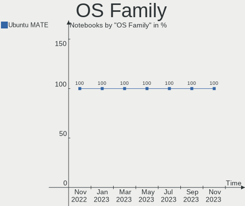

| Name        | Notebooks | Percent |
|-------------|-----------|---------|
| Ubuntu MATE | 18        | 100%    |

Kernel
------

Version of the Linux kernel

| Version              | Notebooks | Percent |
|----------------------|-----------|---------|
| 5.15.0-48-generic    | 6         | 33.33%  |
| 5.15.0-52-generic    | 3         | 16.67%  |
| 5.4.0-131-generic    | 2         | 11.11%  |
| 5.4.0-84-generic     | 1         | 5.56%   |
| 5.4.0-128-generic    | 1         | 5.56%   |
| 5.15.0-52-lowlatency | 1         | 5.56%   |
| 5.15.0-50-generic    | 1         | 5.56%   |
| 5.15.0-43-generic    | 1         | 5.56%   |
| 5.15.0-25-generic    | 1         | 5.56%   |
| 5.11.0-27-generic    | 1         | 5.56%   |

Kernel Family
-------------

Linux kernel without a distro release

| Version | Notebooks | Percent |
|---------|-----------|---------|
| 5.15.0  | 13        | 72.22%  |
| 5.4.0   | 4         | 22.22%  |
| 5.11.0  | 1         | 5.56%   |

Kernel Major Ver.
-----------------

Linux kernel major version

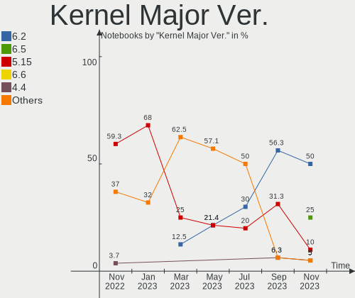

| Version | Notebooks | Percent |
|---------|-----------|---------|
| 5.15    | 13        | 72.22%  |
| 5.4     | 4         | 22.22%  |
| 5.11    | 1         | 5.56%   |

Arch
----

OS architecture (x86_64, i586, etc.)

| Name   | Notebooks | Percent |
|--------|-----------|---------|
| x86_64 | 17        | 94.44%  |
| i686   | 1         | 5.56%   |

DE
--

Desktop Environment

| Name     | Notebooks | Percent |
|----------|-----------|---------|
| MATE     | 17        | 94.44%  |
| Cinnamon | 1         | 5.56%   |

Display Server
--------------

X11 or Wayland

| Name    | Notebooks | Percent |
|---------|-----------|---------|
| X11     | 17        | 94.44%  |
| Wayland | 1         | 5.56%   |

Display Manager
---------------

SDDM, LightDM, etc.

| Name    | Notebooks | Percent |
|---------|-----------|---------|
| LightDM | 15        | 83.33%  |
| Unknown | 2         | 11.11%  |
| GDM3    | 1         | 5.56%   |

OS Lang
-------

Language

| Lang  | Notebooks | Percent |
|-------|-----------|---------|
| en_US | 6         | 33.33%  |
| fr_FR | 5         | 27.78%  |
| de_DE | 2         | 11.11%  |
| ru_RU | 1         | 5.56%   |
| pl_PL | 1         | 5.56%   |
| it_IT | 1         | 5.56%   |
| fi_FI | 1         | 5.56%   |
| en_GB | 1         | 5.56%   |

Boot Mode
---------

EFI or BIOS

| Mode | Notebooks | Percent |
|------|-----------|---------|
| BIOS | 9         | 50%     |
| EFI  | 9         | 50%     |

Filesystem
----------

Type of filesystem

| Type    | Notebooks | Percent |
|---------|-----------|---------|
| Ext4    | 16        | 88.89%  |
| Overlay | 1         | 5.56%   |
| Btrfs   | 1         | 5.56%   |

Part. scheme
------------

Scheme of partitioning

| Type    | Notebooks | Percent |
|---------|-----------|---------|
| GPT     | 11        | 61.11%  |
| MBR     | 4         | 22.22%  |
| Unknown | 3         | 16.67%  |

Dual Boot with Linux/BSD
------------------------

Hosting more than one Linux/BSD

| Dual boot | Notebooks | Percent |
|-----------|-----------|---------|
| No        | 15        | 83.33%  |
| Yes       | 3         | 16.67%  |

Dual Boot (Win)
---------------

Hosting Linux and Windows

| Dual boot | Notebooks | Percent |
|-----------|-----------|---------|
| Yes       | 9         | 50%     |
| No        | 9         | 50%     |

Board
-----

Vendor
------

Motherboard manufacturer

| Name                | Notebooks | Percent |
|---------------------|-----------|---------|
| Lenovo              | 5         | 27.78%  |
| Hewlett-Packard     | 4         | 22.22%  |
| Dell                | 2         | 11.11%  |
| ASUSTek Computer    | 2         | 11.11%  |
| Toshiba             | 1         | 5.56%   |
| Samsung Electronics | 1         | 5.56%   |
| Notebook            | 1         | 5.56%   |
| Chuwi               | 1         | 5.56%   |
| Apple               | 1         | 5.56%   |

Model
-----

Motherboard model

| Name                                       | Notebooks | Percent |
|--------------------------------------------|-----------|---------|
| Toshiba Satellite C50D-A-133               | 1         | 5.56%   |
| Samsung 760XBE                             | 1         | 5.56%   |
| Notebook NJx0MU                            | 1         | 5.56%   |
| Lenovo ThinkPad X230 2325Y5L               | 1         | 5.56%   |
| Lenovo ThinkPad X1 Carbon Gen 8 20UAS2TJ00 | 1         | 5.56%   |
| Lenovo ThinkPad T460p 20FW002CPB           | 1         | 5.56%   |
| Lenovo IdeaPad 3 15ALC6 82KU               | 1         | 5.56%   |
| Lenovo B51-30 80LK                         | 1         | 5.56%   |
| HP ZBook 14 G2                             | 1         | 5.56%   |
| HP ENVY Sleekbook 6                        | 1         | 5.56%   |
| HP EliteBook 840 G3                        | 1         | 5.56%   |
| HP Compaq Presario CQ71                    | 1         | 5.56%   |
| Dell Precision 7760                        | 1         | 5.56%   |
| Dell Inspiron MM061                        | 1         | 5.56%   |
| Chuwi GemiBook Pro                         | 1         | 5.56%   |
| ASUS UX32VD                                | 1         | 5.56%   |
| ASUS T100TA                                | 1         | 5.56%   |
| Apple MacBookAir6,1                        | 1         | 5.56%   |

Model Family
------------

Motherboard model prefix

| Name              | Notebooks | Percent |
|-------------------|-----------|---------|
| Lenovo ThinkPad   | 3         | 16.67%  |
| Toshiba Satellite | 1         | 5.56%   |
| Samsung 760XBE    | 1         | 5.56%   |
| Notebook NJx0MU   | 1         | 5.56%   |
| Lenovo IdeaPad    | 1         | 5.56%   |
| Lenovo B51-30     | 1         | 5.56%   |
| HP ZBook          | 1         | 5.56%   |
| HP ENVY           | 1         | 5.56%   |
| HP EliteBook      | 1         | 5.56%   |
| HP Compaq         | 1         | 5.56%   |
| Dell Precision    | 1         | 5.56%   |
| Dell Inspiron     | 1         | 5.56%   |
| Chuwi GemiBook    | 1         | 5.56%   |
| ASUS UX32VD       | 1         | 5.56%   |
| ASUS T100TA       | 1         | 5.56%   |
| Apple MacBookAir6 | 1         | 5.56%   |

MFG Year
--------

Motherboard manufacture year

| Year | Notebooks | Percent |
|------|-----------|---------|
| 2021 | 3         | 16.67%  |
| 2012 | 3         | 16.67%  |
| 2016 | 2         | 11.11%  |
| 2015 | 2         | 11.11%  |
| 2013 | 2         | 11.11%  |
| 2022 | 1         | 5.56%   |
| 2020 | 1         | 5.56%   |
| 2019 | 1         | 5.56%   |
| 2014 | 1         | 5.56%   |
| 2009 | 1         | 5.56%   |
| 2006 | 1         | 5.56%   |

Form Factor
-----------

Physical design of the computer

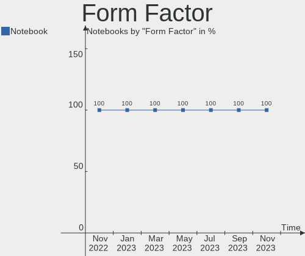

| Name     | Notebooks | Percent |
|----------|-----------|---------|
| Notebook | 18        | 100%    |

Secure Boot
-----------

Enabled or disabled

| State    | Notebooks | Percent |
|----------|-----------|---------|
| Disabled | 17        | 94.44%  |
| Enabled  | 1         | 5.56%   |

Coreboot
--------

Have coreboot on board

| Used | Notebooks | Percent |
|------|-----------|---------|
| No   | 18        | 100%    |

RAM Size
--------

Total RAM memory

| Size in GB  | Notebooks | Percent |
|-------------|-----------|---------|
| 4.01-8.0    | 7         | 38.89%  |
| 3.01-4.0    | 4         | 22.22%  |
| 8.01-16.0   | 3         | 16.67%  |
| 16.01-24.0  | 2         | 11.11%  |
| 64.01-256.0 | 1         | 5.56%   |
| 1.01-2.0    | 1         | 5.56%   |

RAM Used
--------

Used RAM memory

| Used GB   | Notebooks | Percent |
|-----------|-----------|---------|
| 2.01-3.0  | 6         | 33.33%  |
| 4.01-8.0  | 4         | 22.22%  |
| 1.01-2.0  | 4         | 22.22%  |
| 0.51-1.0  | 2         | 11.11%  |
| 3.01-4.0  | 1         | 5.56%   |
| 8.01-16.0 | 1         | 5.56%   |

Total Drives
------------

Number of drives on board

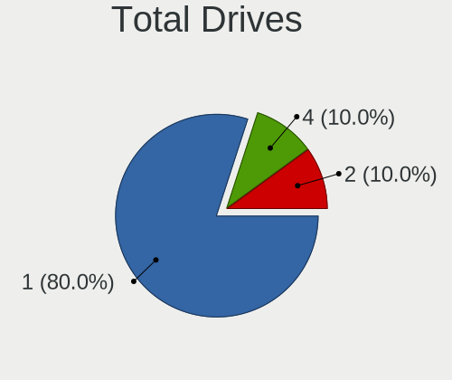

| Drives | Notebooks | Percent |
|--------|-----------|---------|
| 1      | 13        | 72.22%  |
| 2      | 5         | 27.78%  |

Has CD-ROM
----------

Has CD-ROM on board

| Presented | Notebooks | Percent |
|-----------|-----------|---------|
| No        | 13        | 72.22%  |
| Yes       | 5         | 27.78%  |

Has Ethernet
------------

Has Ethernet on board

| Presented | Notebooks | Percent |
|-----------|-----------|---------|
| Yes       | 14        | 77.78%  |
| No        | 4         | 22.22%  |

Has WiFi
--------

Has WiFi module

| Presented | Notebooks | Percent |
|-----------|-----------|---------|
| Yes       | 17        | 94.44%  |
| No        | 1         | 5.56%   |

Has Bluetooth
-------------

Has Bluetooth module

| Presented | Notebooks | Percent |
|-----------|-----------|---------|
| Yes       | 16        | 88.89%  |
| No        | 2         | 11.11%  |

Location
--------

Country
-------

Geographic location (country)

| Country     | Notebooks | Percent |
|-------------|-----------|---------|
| France      | 5         | 27.78%  |
| Germany     | 2         | 11.11%  |
| Brazil      | 2         | 11.11%  |
| UK          | 1         | 5.56%   |
| Switzerland | 1         | 5.56%   |
| Russia      | 1         | 5.56%   |
| Poland      | 1         | 5.56%   |
| Italy       | 1         | 5.56%   |
| Indonesia   | 1         | 5.56%   |
| Hungary     | 1         | 5.56%   |
| Finland     | 1         | 5.56%   |
| Argentina   | 1         | 5.56%   |

City
----

Geographic location (city)

| City         | Notebooks | Percent |
|--------------|-----------|---------|
| Valenciennes | 2         | 11.11%  |
| Sao Paulo    | 2         | 11.11%  |
| Zurich       | 1         | 5.56%   |
| Warsaw       | 1         | 5.56%   |
| Villeurbanne | 1         | 5.56%   |
| Turku        | 1         | 5.56%   |
| Tula         | 1         | 5.56%   |
| Sarospatak   | 1         | 5.56%   |
| Norwich      | 1         | 5.56%   |
| Mérignac    | 1         | 5.56%   |
| Mannheim     | 1         | 5.56%   |
| La Rochelle  | 1         | 5.56%   |
| Jena         | 1         | 5.56%   |
| Jakarta      | 1         | 5.56%   |
| Genoa        | 1         | 5.56%   |
| Córdoba     | 1         | 5.56%   |

Drives
------

Drive Vendor
------------

Hard drive vendors

| Vendor              | Notebooks | Drives | Percent |
|---------------------|-----------|--------|---------|
| Samsung Electronics | 4         | 5      | 17.39%  |
| WDC                 | 3         | 3      | 13.04%  |
| SanDisk             | 3         | 4      | 13.04%  |
| UMIS                | 1         | 1      | 4.35%   |
| Toshiba             | 1         | 1      | 4.35%   |
| SK hynix            | 1         | 1      | 4.35%   |
| Seagate             | 1         | 1      | 4.35%   |
| SAGE                | 1         | 1      | 4.35%   |
| Netac               | 1         | 1      | 4.35%   |
| LITEONIT            | 1         | 1      | 4.35%   |
| LITEON              | 1         | 1      | 4.35%   |
| Hitachi             | 1         | 1      | 4.35%   |
| HGST                | 1         | 1      | 4.35%   |
| China               | 1         | 1      | 4.35%   |
| Apple               | 1         | 1      | 4.35%   |
| A-DATA Technology   | 1         | 1      | 4.35%   |

Drive Model
-----------

Hard drive models

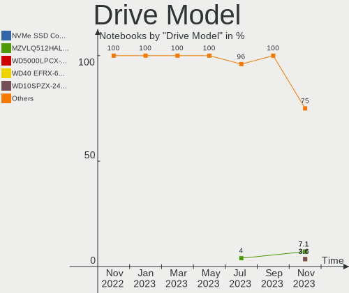

| Model                                                | Notebooks | Percent |
|------------------------------------------------------|-----------|---------|
| WDC WD5000LPLX-60ZNTT1 500GB                         | 1         | 4.17%   |
| WDC WD3200BEVT-60ZCT1 320GB                          | 1         | 4.17%   |
| WDC PC SN730 SDBQNTY-1T00-1001 1TB                   | 1         | 4.17%   |
| UMIS RPJTJ256MEE1OWX 256GB                           | 1         | 4.17%   |
| Toshiba MQ01ABF050 500GB                             | 1         | 4.17%   |
| SK hynix HCG8e  64GB                                 | 1         | 4.17%   |
| Seagate ST500LT012-1DG142 500GB                      | 1         | 4.17%   |
| SanDisk SSD i100 24GB                                | 1         | 4.17%   |
| SanDisk SD7TB3Q-256G-1006 256GB SSD                  | 1         | 4.17%   |
| SanDisk SD6PP4M-256G-1006 256GB SSD                  | 1         | 4.17%   |
| SanDisk Extreme 55AE 2TB SSD                         | 1         | 4.17%   |
| Samsung SSD 830 Series 512GB                         | 1         | 4.17%   |
| Samsung NVMe SSD Controller PM9A1/PM9A3/980PRO 250GB | 1         | 4.17%   |
| Samsung MZVL2512HCJQ-00B00 512GB                     | 1         | 4.17%   |
| Samsung MZ7LF192HCGS-000L1 192GB SSD                 | 1         | 4.17%   |
| SAGE 3639S 960GB                                     | 1         | 4.17%   |
| Netac SSD 256GB                                      | 1         | 4.17%   |
| LITEONIT LMT-32L3M-HP 32GB SSD                       | 1         | 4.17%   |
| LITEON CV8-8E256 256GB SSD                           | 1         | 4.17%   |
| Hitachi HTS541680J9SA00 80GB                         | 1         | 4.17%   |
| HGST HTS545050A7E380 500GB                           | 1         | 4.17%   |
| China 512GB SSD                                      | 1         | 4.17%   |
| Apple SSD TS0128F 121GB                              | 1         | 4.17%   |
| A-DATA SU800 128GB SSD                               | 1         | 4.17%   |

HDD Vendor
----------

Hard disk drive vendors

| Vendor  | Notebooks | Drives | Percent |
|---------|-----------|--------|---------|
| WDC     | 2         | 2      | 28.57%  |
| Toshiba | 1         | 1      | 14.29%  |
| Seagate | 1         | 1      | 14.29%  |
| SAGE    | 1         | 1      | 14.29%  |
| Hitachi | 1         | 1      | 14.29%  |
| HGST    | 1         | 1      | 14.29%  |

SSD Vendor
----------

Solid state drive vendors

| Vendor              | Notebooks | Drives | Percent |
|---------------------|-----------|--------|---------|
| SanDisk             | 3         | 4      | 27.27%  |
| Samsung Electronics | 2         | 2      | 18.18%  |
| Netac               | 1         | 1      | 9.09%   |
| LITEONIT            | 1         | 1      | 9.09%   |
| LITEON              | 1         | 1      | 9.09%   |
| China               | 1         | 1      | 9.09%   |
| Apple               | 1         | 1      | 9.09%   |
| A-DATA Technology   | 1         | 1      | 9.09%   |

Drive Kind
----------

HDD or SSD

| Kind | Notebooks | Drives | Percent |
|------|-----------|--------|---------|
| SSD  | 8         | 12     | 40%     |
| HDD  | 7         | 7      | 35%     |
| NVMe | 4         | 5      | 20%     |
| MMC  | 1         | 1      | 5%      |

Drive Connector
---------------

SATA, SAS, NVMe, etc.

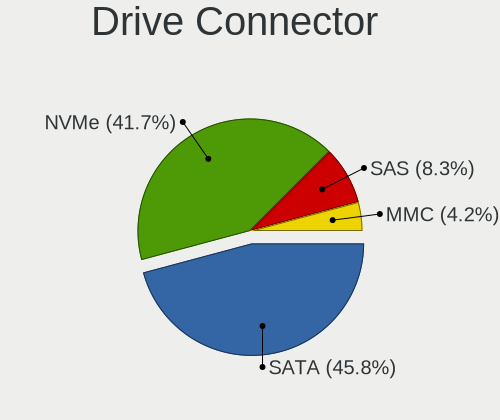

| Type | Notebooks | Drives | Percent |
|------|-----------|--------|---------|
| SATA | 13        | 17     | 65%     |
| NVMe | 4         | 5      | 20%     |
| SAS  | 2         | 2      | 10%     |
| MMC  | 1         | 1      | 5%      |

Drive Size
----------

Size of hard drive

| Size in TB | Notebooks | Drives | Percent |
|------------|-----------|--------|---------|
| 0.01-0.5   | 13        | 15     | 76.47%  |
| 0.51-1.0   | 3         | 3      | 17.65%  |
| 1.01-2.0   | 1         | 1      | 5.88%   |

Space Total
-----------

Amount of disk space available on the file system

| Size in GB | Notebooks | Percent |
|------------|-----------|---------|
| 101-250    | 6         | 33.33%  |
| 251-500    | 4         | 22.22%  |
| 21-50      | 2         | 11.11%  |
| 1001-2000  | 2         | 11.11%  |
| 2001-3000  | 1         | 5.56%   |
| 1-20       | 1         | 5.56%   |
| 501-1000   | 1         | 5.56%   |
| 51-100     | 1         | 5.56%   |

Space Used
----------

Amount of used disk space

| Used GB   | Notebooks | Percent |
|-----------|-----------|---------|
| 1-20      | 6         | 33.33%  |
| 51-100    | 4         | 22.22%  |
| 21-50     | 2         | 11.11%  |
| 101-250   | 2         | 11.11%  |
| 501-1000  | 2         | 11.11%  |
| 251-500   | 1         | 5.56%   |
| 1001-2000 | 1         | 5.56%   |

Malfunc. Drives
---------------

Drive models with a malfunction

| Model                           | Notebooks | Drives | Percent |
|---------------------------------|-----------|--------|---------|
| WDC WD3200BEVT-60ZCT1 320GB     | 1         | 1      | 33.33%  |
| Seagate ST500LT012-1DG142 500GB | 1         | 1      | 33.33%  |
| Netac SSD 256GB                 | 1         | 1      | 33.33%  |

Malfunc. Drive Vendor
---------------------

Vendors of faulty drives

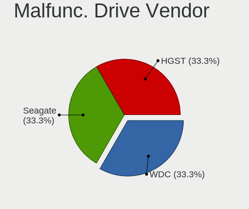

| Vendor  | Notebooks | Drives | Percent |
|---------|-----------|--------|---------|
| WDC     | 1         | 1      | 33.33%  |
| Seagate | 1         | 1      | 33.33%  |
| Netac   | 1         | 1      | 33.33%  |

Malfunc. HDD Vendor
-------------------

Vendors of faulty HDD drives

| Vendor  | Notebooks | Drives | Percent |
|---------|-----------|--------|---------|
| WDC     | 1         | 1      | 50%     |
| Seagate | 1         | 1      | 50%     |

Malfunc. Drive Kind
-------------------

Kinds of faulty drives

| Kind | Notebooks | Drives | Percent |
|------|-----------|--------|---------|
| HDD  | 2         | 2      | 66.67%  |
| SSD  | 1         | 1      | 33.33%  |

Failed Drives
-------------

Failed drive models

Zero info for selected period =(

Failed Drive Vendor
-------------------

Failed drive vendors

Zero info for selected period =(

Drive Status
------------

Number of failed and malfunc. drives

| Status   | Notebooks | Drives | Percent |
|----------|-----------|--------|---------|
| Works    | 10        | 12     | 50%     |
| Detected | 7         | 10     | 35%     |
| Malfunc  | 3         | 3      | 15%     |

Storage controller
------------------

Storage Vendor
--------------

Storage controller vendors

| Vendor                       | Notebooks | Percent |
|------------------------------|-----------|---------|
| Intel                        | 12        | 60%     |
| Samsung Electronics          | 2         | 10%     |
| AMD                          | 2         | 10%     |
| Union Memory (Shenzhen)      | 1         | 5%      |
| Toshiba America Info Systems | 1         | 5%      |
| SanDisk                      | 1         | 5%      |
| Marvell Technology Group     | 1         | 5%      |

Storage Model
-------------

Storage controller models

| Model                                                                            | Notebooks | Percent |
|----------------------------------------------------------------------------------|-----------|---------|
| Samsung NVMe SSD Controller PM9A1/PM9A3/980PRO                                   | 2         | 10%     |
| Intel 7 Series Chipset Family 6-port SATA Controller [AHCI mode]                 | 2         | 10%     |
| AMD FCH SATA Controller [AHCI mode]                                              | 2         | 10%     |
| Union Memory (Shenzhen) Non-Volatile memory controller                           | 1         | 5%      |
| Toshiba America Info Systems Toshiba America Info SATA controller                | 1         | 5%      |
| SanDisk WD Black SN750 / PC SN730 NVMe SSD                                       | 1         | 5%      |
| Marvell Group 88SS9183 PCIe SSD Controller                                       | 1         | 5%      |
| Intel Wildcat Point-LP SATA Controller [AHCI Mode]                               | 1         | 5%      |
| Intel Tiger Lake-LP SATA Controller                                              | 1         | 5%      |
| Intel Sunrise Point-LP SATA Controller [AHCI mode]                               | 1         | 5%      |
| Intel Jasper Lake SATA AHCI Controller                                           | 1         | 5%      |
| Intel HM170/QM170 Chipset SATA Controller [AHCI Mode]                            | 1         | 5%      |
| Intel Cannon Point-LP SATA Controller [AHCI Mode]                                | 1         | 5%      |
| Intel Atom/Celeron/Pentium Processor x5-E8000/J3xxx/N3xxx Series SATA Controller | 1         | 5%      |
| Intel 82801IBM/IEM (ICH9M/ICH9M-E) 4 port SATA Controller [AHCI mode]            | 1         | 5%      |
| Intel 82801GBM/GHM (ICH7-M Family) SATA Controller [IDE mode]                    | 1         | 5%      |
| Intel 82801 Mobile SATA Controller [RAID mode]                                   | 1         | 5%      |

Storage Kind
------------

Kind of storage controller (IDE, SATA, NVMe, SAS, ...)

| Kind | Notebooks | Percent |
|------|-----------|---------|
| SATA | 13        | 68.42%  |
| NVMe | 4         | 21.05%  |
| RAID | 1         | 5.26%   |
| IDE  | 1         | 5.26%   |

Processor
---------

CPU Vendor
----------

Processor vendors

| Vendor | Notebooks | Percent |
|--------|-----------|---------|
| Intel  | 16        | 88.89%  |
| AMD    | 2         | 11.11%  |

CPU Model
---------

Processor models

| Model                                       | Notebooks | Percent |
|---------------------------------------------|-----------|---------|
| Intel Core i7-3517U CPU @ 1.90GHz           | 2         | 11.11%  |
| Intel Pentium Dual-Core CPU T4300 @ 2.10GHz | 1         | 5.56%   |
| Intel Pentium CPU N3700 @ 1.60GHz           | 1         | 5.56%   |
| Intel Genuine CPU T2300 @ 1.66GHz           | 1         | 5.56%   |
| Intel Core i7-8565U CPU @ 1.80GHz           | 1         | 5.56%   |
| Intel Core i7-5500U CPU @ 2.40GHz           | 1         | 5.56%   |
| Intel Core i7-10510U CPU @ 1.80GHz          | 1         | 5.56%   |
| Intel Core i5-6300HQ CPU @ 2.30GHz          | 1         | 5.56%   |
| Intel Core i5-6200U CPU @ 2.30GHz           | 1         | 5.56%   |
| Intel Core i5-4250U CPU @ 1.30GHz           | 1         | 5.56%   |
| Intel Core i5-3380M CPU @ 2.90GHz           | 1         | 5.56%   |
| Intel Celeron N5100 @ 1.10GHz               | 1         | 5.56%   |
| Intel Atom CPU Z3740 @ 1.33GHz              | 1         | 5.56%   |
| Intel 11th Gen Core i7-11850H @ 2.50GHz     | 1         | 5.56%   |
| Intel 11th Gen Core i7-1165G7 @ 2.80GHz     | 1         | 5.56%   |
| AMD Ryzen 3 5300U with Radeon Graphics      | 1         | 5.56%   |
| AMD E1-2100 APU with Radeon HD Graphics     | 1         | 5.56%   |

CPU Model Family
----------------

Processor model prefix

| Model                   | Notebooks | Percent |
|-------------------------|-----------|---------|
| Intel Core i7           | 5         | 27.78%  |
| Intel Core i5           | 4         | 22.22%  |
| Other                   | 2         | 11.11%  |
| Intel Pentium Dual-Core | 1         | 5.56%   |
| Intel Pentium           | 1         | 5.56%   |
| Intel Genuine           | 1         | 5.56%   |
| Intel Celeron           | 1         | 5.56%   |
| Intel Atom              | 1         | 5.56%   |
| AMD Ryzen 3             | 1         | 5.56%   |
| AMD E1                  | 1         | 5.56%   |

CPU Cores
---------

Number of processor cores

| Number | Notebooks | Percent |
|--------|-----------|---------|
| 2      | 9         | 50%     |
| 4      | 8         | 44.44%  |
| 8      | 1         | 5.56%   |

CPU Sockets
-----------

Number of sockets

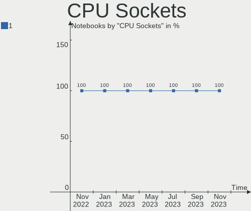

| Number | Notebooks | Percent |
|--------|-----------|---------|
| 1      | 18        | 100%    |

CPU Threads
-----------

Threads per core (Hyper-Threading)

| Number | Notebooks | Percent |
|--------|-----------|---------|
| 2      | 11        | 61.11%  |
| 1      | 7         | 38.89%  |

CPU Op-Modes
------------

CPU Operation Modes (32-bit, 64-bit)

| Op mode        | Notebooks | Percent |
|----------------|-----------|---------|
| 32-bit, 64-bit | 17        | 94.44%  |
| 32-bit         | 1         | 5.56%   |

CPU Microcode
-------------

Microcode number

| Number     | Notebooks | Percent |
|------------|-----------|---------|
| Unknown    | 6         | 33.33%  |
| 0x306a9    | 2         | 11.11%  |
| 0x906c0    | 1         | 5.56%   |
| 0x806eb    | 1         | 5.56%   |
| 0x6e8      | 1         | 5.56%   |
| 0x506e3    | 1         | 5.56%   |
| 0x406e3    | 1         | 5.56%   |
| 0x406c3    | 1         | 5.56%   |
| 0x30673    | 1         | 5.56%   |
| 0x1067a    | 1         | 5.56%   |
| 0x08608103 | 1         | 5.56%   |
| 0x0700010f | 1         | 5.56%   |

CPU Microarch
-------------

Microarchitecture

| Name       | Notebooks | Percent |
|------------|-----------|---------|
| IvyBridge  | 3         | 16.67%  |
| Unknown    | 3         | 16.67%  |
| Skylake    | 2         | 11.11%  |
| Silvermont | 2         | 11.11%  |
| KabyLake   | 2         | 11.11%  |
| TigerLake  | 1         | 5.56%   |
| Penryn     | 1         | 5.56%   |
| P6         | 1         | 5.56%   |
| Jaguar     | 1         | 5.56%   |
| Haswell    | 1         | 5.56%   |
| Broadwell  | 1         | 5.56%   |

Graphics
--------

GPU Vendor
----------

Vendors of graphics cards

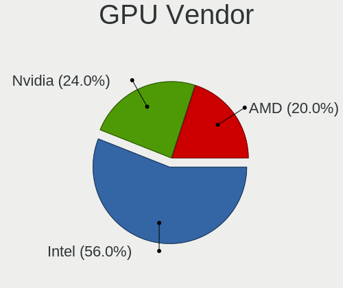

| Vendor | Notebooks | Percent |
|--------|-----------|---------|
| Intel  | 15        | 68.18%  |
| AMD    | 4         | 18.18%  |
| Nvidia | 3         | 13.64%  |

GPU Model
---------

Graphics card models

| Model                                                                                    | Notebooks | Percent |
|------------------------------------------------------------------------------------------|-----------|---------|
| Intel 3rd Gen Core processor Graphics Controller                                         | 3         | 13.64%  |
| Nvidia TU117M [GeForce GTX 1650 Mobile / Max-Q]                                          | 1         | 4.55%   |
| Nvidia GF117M [GeForce 610M/710M/810M/820M / GT 620M/625M/630M/720M]                     | 1         | 4.55%   |
| Nvidia GA104GLM [RTX A3000 Mobile]                                                       | 1         | 4.55%   |
| Intel WhiskeyLake-U GT2 [UHD Graphics 620]                                               | 1         | 4.55%   |
| Intel TigerLake-LP GT2 [Iris Xe Graphics]                                                | 1         | 4.55%   |
| Intel TigerLake-H GT1 [UHD Graphics]                                                     | 1         | 4.55%   |
| Intel Skylake GT2 [HD Graphics 520]                                                      | 1         | 4.55%   |
| Intel Mobile 4 Series Chipset Integrated Graphics Controller                             | 1         | 4.55%   |
| Intel JasperLake [UHD Graphics]                                                          | 1         | 4.55%   |
| Intel HD Graphics 5500                                                                   | 1         | 4.55%   |
| Intel HD Graphics 530                                                                    | 1         | 4.55%   |
| Intel Haswell-ULT Integrated Graphics Controller                                         | 1         | 4.55%   |
| Intel CometLake-U GT2 [UHD Graphics]                                                     | 1         | 4.55%   |
| Intel Atom/Celeron/Pentium Processor x5-E8000/J3xxx/N3xxx Integrated Graphics Controller | 1         | 4.55%   |
| Intel Atom Processor Z36xxx/Z37xxx Series Graphics & Display                             | 1         | 4.55%   |
| AMD RV515/M52 [Mobility Radeon X1300]                                                    | 1         | 4.55%   |
| AMD Mars [Radeon HD 8670A/8670M/8750M / R7 M370]                                         | 1         | 4.55%   |
| AMD Lucienne                                                                             | 1         | 4.55%   |
| AMD Kabini [Radeon HD 8210]                                                              | 1         | 4.55%   |

GPU Combo
---------

Combinations of graphics cards

| Name           | Notebooks | Percent |
|----------------|-----------|---------|
| 1 x Intel      | 11        | 61.11%  |
| Intel + Nvidia | 3         | 16.67%  |
| 1 x AMD        | 3         | 16.67%  |
| Intel + AMD    | 1         | 5.56%   |

GPU Driver
----------

Free vs proprietary

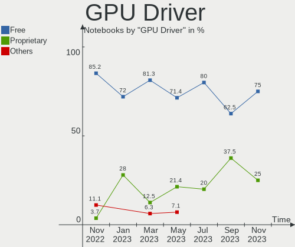

| Driver      | Notebooks | Percent |
|-------------|-----------|---------|
| Free        | 17        | 94.44%  |
| Proprietary | 1         | 5.56%   |

GPU Memory
----------

Total video memory

| Size in GB | Notebooks | Percent |
|------------|-----------|---------|
| Unknown    | 14        | 77.78%  |
| 0.01-0.5   | 2         | 11.11%  |
| 1.01-2.0   | 1         | 5.56%   |
| 0.51-1.0   | 1         | 5.56%   |

Monitor
-------

Monitor Vendor
--------------

Monitor vendors

| Vendor              | Notebooks | Percent |
|---------------------|-----------|---------|
| Chimei Innolux      | 5         | 26.32%  |
| AU Optronics        | 4         | 21.05%  |
| Samsung Electronics | 2         | 10.53%  |
| LG Display          | 2         | 10.53%  |
| BOE                 | 2         | 10.53%  |
| ViewSonic           | 1         | 5.26%   |
| Philips             | 1         | 5.26%   |
| PANDA               | 1         | 5.26%   |
| Apple               | 1         | 5.26%   |

Monitor Model
-------------

Monitor models

| Model                                                                | Notebooks | Percent |
|----------------------------------------------------------------------|-----------|---------|
| ViewSonic VP2765 SERIES VSC9F28 1920x1080 598x336mm 27.0-inch        | 1         | 5.26%   |
| Samsung Electronics LCD Monitor SDC4347 1366x768 344x193mm 15.5-inch | 1         | 5.26%   |
| Samsung Electronics LCD Monitor SDC3652 1366x768 344x194mm 15.5-inch | 1         | 5.26%   |
| Philips FTV PHL04C3 3840x2160 1440x810mm 65.0-inch                   | 1         | 5.26%   |
| PANDA LCD Monitor NCP0064 1920x1080 344x194mm 15.5-inch              | 1         | 5.26%   |
| LG Display LCD Monitor LGD069A 1920x1080 344x194mm 15.5-inch         | 1         | 5.26%   |
| LG Display LCD Monitor LGD03A3 1366x768 277x156mm 12.5-inch          | 1         | 5.26%   |
| Chimei Innolux LCD Monitor CMN174A 1920x1080 381x214mm 17.2-inch     | 1         | 5.26%   |
| Chimei Innolux LCD Monitor CMN15B6 1366x768 344x193mm 15.5-inch      | 1         | 5.26%   |
| Chimei Innolux LCD Monitor CMN14B1 1920x1080 308x173mm 13.9-inch     | 1         | 5.26%   |
| Chimei Innolux LCD Monitor CMN1490 1366x768 309x173mm 13.9-inch      | 1         | 5.26%   |
| Chimei Innolux LCD Monitor CMN1343 1920x1080 282x165mm 12.9-inch     | 1         | 5.26%   |
| BOE LCD Monitor BOE0893 2160x1440 296x197mm 14.0-inch                | 1         | 5.26%   |
| BOE LCD Monitor BOE07DB 1920x1080 309x174mm 14.0-inch                | 1         | 5.26%   |
| AU Optronics LCD Monitor AUO429D 1920x1080 382x215mm 17.3-inch       | 1         | 5.26%   |
| AU Optronics LCD Monitor AUO1C74 1280x800 331x207mm 15.4-inch        | 1         | 5.26%   |
| AU Optronics LCD Monitor AUO133D 1920x1080 309x173mm 13.9-inch       | 1         | 5.26%   |
| AU Optronics LCD Monitor AUO109E 1600x900 382x214mm 17.2-inch        | 1         | 5.26%   |
| Apple Color LCD APP9CF2 1366x768 256x144mm 11.6-inch                 | 1         | 5.26%   |

Monitor Resolution
------------------

Monitor screen resolution

| Resolution      | Notebooks | Percent |
|-----------------|-----------|---------|
| 1920x1080 (FHD) | 8         | 44.44%  |
| 1366x768 (WXGA) | 6         | 33.33%  |
| 3840x2160 (4K)  | 1         | 5.56%   |
| 2160x1440       | 1         | 5.56%   |
| 1600x900 (HD+)  | 1         | 5.56%   |
| 1280x800 (WXGA) | 1         | 5.56%   |

Monitor Diagonal
----------------

Diagonal size in inches

| Inches | Notebooks | Percent |
|--------|-----------|---------|
| 15     | 6         | 31.58%  |
| 17     | 3         | 15.79%  |
| 14     | 3         | 15.79%  |
| 13     | 3         | 15.79%  |
| 65     | 1         | 5.26%   |
| 27     | 1         | 5.26%   |
| 12     | 1         | 5.26%   |
| 11     | 1         | 5.26%   |

Monitor Width
-------------

Physical width

| Width in mm | Notebooks | Percent |
|-------------|-----------|---------|
| 301-350     | 10        | 52.63%  |
| 201-300     | 4         | 21.05%  |
| 351-400     | 3         | 15.79%  |
| 501-600     | 1         | 5.26%   |
| 1001-1500   | 1         | 5.26%   |

Aspect Ratio
------------

Proportional relationship between the width and the height

| Ratio | Notebooks | Percent |
|-------|-----------|---------|
| 16/9  | 15        | 88.24%  |
| 3/2   | 1         | 5.88%   |
| 16/10 | 1         | 5.88%   |

Monitor Area
------------

Area in inch²

| Area in inch² | Notebooks | Percent |
|----------------|-----------|---------|
| 101-110        | 6         | 31.58%  |
| 81-90          | 5         | 26.32%  |
| 121-130        | 3         | 15.79%  |
| More than 1000 | 1         | 5.26%   |
| 71-80          | 1         | 5.26%   |
| 61-70          | 1         | 5.26%   |
| 51-60          | 1         | 5.26%   |
| 301-350        | 1         | 5.26%   |

Pixel Density
-------------

Pixels per inch

| Density | Notebooks | Percent |
|---------|-----------|---------|
| 121-160 | 9         | 47.37%  |
| 101-120 | 5         | 26.32%  |
| 161-240 | 2         | 10.53%  |
| 51-100  | 2         | 10.53%  |
| 1-50    | 1         | 5.26%   |

Multiple Monitors
-----------------

Total monitors connected

| Total | Notebooks | Percent |
|-------|-----------|---------|
| 1     | 16        | 88.89%  |
| 2     | 2         | 11.11%  |

Network
-------

Net Controller Vendor
---------------------

Controller vendors

| Vendor                            | Notebooks | Percent |
|-----------------------------------|-----------|---------|
| Intel                             | 13        | 54.17%  |
| Realtek Semiconductor             | 3         | 12.5%   |
| Qualcomm Atheros                  | 3         | 12.5%   |
| Microchip Technology              | 1         | 4.17%   |
| Ericsson Business Mobile Networks | 1         | 4.17%   |
| Broadcom Limited                  | 1         | 4.17%   |
| Broadcom                          | 1         | 4.17%   |
| ASIX Electronics                  | 1         | 4.17%   |

Net Controller Model
--------------------

Controller models

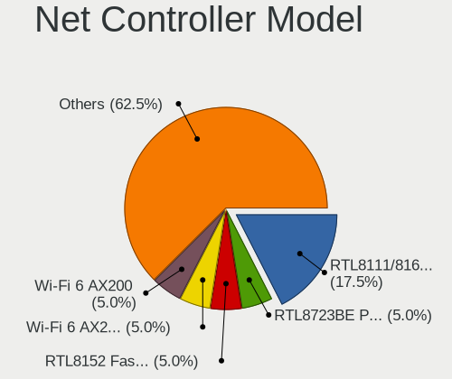

| Model                                                              | Notebooks | Percent |
|--------------------------------------------------------------------|-----------|---------|
| Realtek RTL8111/8168/8411 PCI Express Gigabit Ethernet Controller  | 2         | 6.25%   |
| Intel Wireless 8260                                                | 2         | 6.25%   |
| Realtek RTL810xE PCI Express Fast Ethernet controller              | 1         | 3.13%   |
| Qualcomm Atheros QCA9565 / AR9565 Wireless Network Adapter         | 1         | 3.13%   |
| Qualcomm Atheros QCA8172 Fast Ethernet                             | 1         | 3.13%   |
| Qualcomm Atheros QCA6174 802.11ac Wireless Network Adapter         | 1         | 3.13%   |
| Qualcomm Atheros AR9285 Wireless Network Adapter (PCI-Express)     | 1         | 3.13%   |
| Microchip LAN7500 Ethernet 10/100/1000 Adapter                     | 1         | 3.13%   |
| Intel Wireless 7265                                                | 1         | 3.13%   |
| Intel Wireless 7260                                                | 1         | 3.13%   |
| Intel Wireless 3160                                                | 1         | 3.13%   |
| Intel Wi-Fi 6 AX210/AX211/AX411 160MHz                             | 1         | 3.13%   |
| Intel Wi-Fi 6 AX201 160MHz                                         | 1         | 3.13%   |
| Intel Wi-Fi 6 AX200                                                | 1         | 3.13%   |
| Intel Ethernet Connection I219-V                                   | 1         | 3.13%   |
| Intel Ethernet Connection (3) I218-LM                              | 1         | 3.13%   |
| Intel Ethernet Connection (2) I219-LM                              | 1         | 3.13%   |
| Intel Ethernet Connection (14) I219-LM                             | 1         | 3.13%   |
| Intel Ethernet Connection (13) I219-V                              | 1         | 3.13%   |
| Intel Ethernet Connection (10) I219-V                              | 1         | 3.13%   |
| Intel Comet Lake PCH-LP CNVi WiFi                                  | 1         | 3.13%   |
| Intel Centrino Wireless-N 2230                                     | 1         | 3.13%   |
| Intel Centrino Wireless-N 2200                                     | 1         | 3.13%   |
| Intel Centrino Advanced-N 6235                                     | 1         | 3.13%   |
| Intel Cannon Point-LP CNVi [Wireless-AC]                           | 1         | 3.13%   |
| Intel 82579LM Gigabit Network Connection (Lewisville)              | 1         | 3.13%   |
| Ericsson Business Mobile Networks H5321 gw Mobile Broadband Driver | 1         | 3.13%   |
| Broadcom Limited BCM4360 802.11ac Wireless Network Adapter         | 1         | 3.13%   |
| Broadcom BCM4401-B0 100Base-TX                                     | 1         | 3.13%   |
| ASIX AX88179 Gigabit Ethernet                                      | 1         | 3.13%   |

Wireless Vendor
---------------

Wireless vendors

| Vendor           | Notebooks | Percent |
|------------------|-----------|---------|
| Intel            | 13        | 76.47%  |
| Qualcomm Atheros | 3         | 17.65%  |
| Broadcom Limited | 1         | 5.88%   |

Wireless Model
--------------

Wireless models

| Model                                                          | Notebooks | Percent |
|----------------------------------------------------------------|-----------|---------|
| Intel Wireless 8260                                            | 2         | 11.76%  |
| Qualcomm Atheros QCA9565 / AR9565 Wireless Network Adapter     | 1         | 5.88%   |
| Qualcomm Atheros QCA6174 802.11ac Wireless Network Adapter     | 1         | 5.88%   |
| Qualcomm Atheros AR9285 Wireless Network Adapter (PCI-Express) | 1         | 5.88%   |
| Intel Wireless 7265                                            | 1         | 5.88%   |
| Intel Wireless 7260                                            | 1         | 5.88%   |
| Intel Wireless 3160                                            | 1         | 5.88%   |
| Intel Wi-Fi 6 AX210/AX211/AX411 160MHz                         | 1         | 5.88%   |
| Intel Wi-Fi 6 AX201 160MHz                                     | 1         | 5.88%   |
| Intel Wi-Fi 6 AX200                                            | 1         | 5.88%   |
| Intel Comet Lake PCH-LP CNVi WiFi                              | 1         | 5.88%   |
| Intel Centrino Wireless-N 2230                                 | 1         | 5.88%   |
| Intel Centrino Wireless-N 2200                                 | 1         | 5.88%   |
| Intel Centrino Advanced-N 6235                                 | 1         | 5.88%   |
| Intel Cannon Point-LP CNVi [Wireless-AC]                       | 1         | 5.88%   |
| Broadcom Limited BCM4360 802.11ac Wireless Network Adapter     | 1         | 5.88%   |

Ethernet Vendor
---------------

Ethernet vendors

| Vendor                | Notebooks | Percent |
|-----------------------|-----------|---------|
| Intel                 | 7         | 50%     |
| Realtek Semiconductor | 3         | 21.43%  |
| Qualcomm Atheros      | 1         | 7.14%   |
| Microchip Technology  | 1         | 7.14%   |
| Broadcom              | 1         | 7.14%   |
| ASIX Electronics      | 1         | 7.14%   |

Ethernet Model
--------------

Ethernet models

| Model                                                             | Notebooks | Percent |
|-------------------------------------------------------------------|-----------|---------|
| Realtek RTL8111/8168/8411 PCI Express Gigabit Ethernet Controller | 2         | 14.29%  |
| Realtek RTL810xE PCI Express Fast Ethernet controller             | 1         | 7.14%   |
| Qualcomm Atheros QCA8172 Fast Ethernet                            | 1         | 7.14%   |
| Microchip LAN7500 Ethernet 10/100/1000 Adapter                    | 1         | 7.14%   |
| Intel Ethernet Connection I219-V                                  | 1         | 7.14%   |
| Intel Ethernet Connection (3) I218-LM                             | 1         | 7.14%   |
| Intel Ethernet Connection (2) I219-LM                             | 1         | 7.14%   |
| Intel Ethernet Connection (14) I219-LM                            | 1         | 7.14%   |
| Intel Ethernet Connection (13) I219-V                             | 1         | 7.14%   |
| Intel Ethernet Connection (10) I219-V                             | 1         | 7.14%   |
| Intel 82579LM Gigabit Network Connection (Lewisville)             | 1         | 7.14%   |
| Broadcom BCM4401-B0 100Base-TX                                    | 1         | 7.14%   |
| ASIX AX88179 Gigabit Ethernet                                     | 1         | 7.14%   |

Net Controller Kind
-------------------

Ethernet, WiFi or modem

| Kind     | Notebooks | Percent |
|----------|-----------|---------|
| WiFi     | 17        | 53.13%  |
| Ethernet | 14        | 43.75%  |
| Modem    | 1         | 3.13%   |

Used Controller
---------------

Currently used network controller

| Kind     | Notebooks | Percent |
|----------|-----------|---------|
| WiFi     | 13        | 72.22%  |
| Ethernet | 5         | 27.78%  |

NICs
----

Total network controllers on board

| Total | Notebooks | Percent |
|-------|-----------|---------|
| 2     | 12        | 66.67%  |
| 1     | 5         | 27.78%  |
| 0     | 1         | 5.56%   |

IPv6
----

IPv6 vs IPv4

| Used | Notebooks | Percent |
|------|-----------|---------|
| Yes  | 10        | 55.56%  |
| No   | 8         | 44.44%  |

Bluetooth
---------

Bluetooth Vendor
----------------

Controller vendors

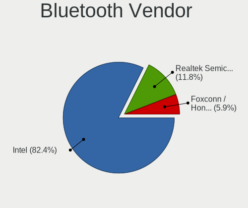

| Vendor                          | Notebooks | Percent |
|---------------------------------|-----------|---------|
| Intel                           | 12        | 70.59%  |
| Toshiba                         | 1         | 5.88%   |
| Qualcomm Atheros Communications | 1         | 5.88%   |
| Dell                            | 1         | 5.88%   |
| Broadcom                        | 1         | 5.88%   |
| Apple                           | 1         | 5.88%   |

Bluetooth Model
---------------

Controller models

| Model                                          | Notebooks | Percent |
|------------------------------------------------|-----------|---------|
| Intel Bluetooth wireless interface             | 5         | 29.41%  |
| Intel Centrino Bluetooth Wireless Transceiver  | 2         | 11.76%  |
| Intel AX201 Bluetooth                          | 2         | 11.76%  |
| Toshiba Bluetooth Device                       | 1         | 5.88%   |
| Qualcomm Atheros QCA61x4 Bluetooth 4.0         | 1         | 5.88%   |
| Intel Bluetooth 9460/9560 Jefferson Peak (JfP) | 1         | 5.88%   |
| Intel AX210 Bluetooth                          | 1         | 5.88%   |
| Intel AX200 Bluetooth                          | 1         | 5.88%   |
| Dell Wireless 350 Bluetooth                    | 1         | 5.88%   |
| Broadcom BCM20702 Bluetooth 4.0 [ThinkPad]     | 1         | 5.88%   |
| Apple Bluetooth USB Host Controller            | 1         | 5.88%   |

Sound
-----

Sound Vendor
------------

Sound card vendors

| Vendor              | Notebooks | Percent |
|---------------------|-----------|---------|
| Intel               | 15        | 71.43%  |
| Nvidia              | 2         | 9.52%   |
| AMD                 | 2         | 9.52%   |
| Meizu               | 1         | 4.76%   |
| C-Media Electronics | 1         | 4.76%   |

Sound Model
-----------

Sound card models

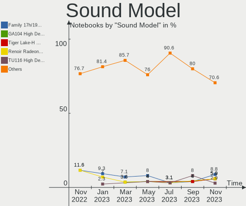

| Model                                                                                             | Notebooks | Percent |
|---------------------------------------------------------------------------------------------------|-----------|---------|
| Intel 7 Series/C216 Chipset Family High Definition Audio Controller                               | 3         | 12%     |
| Nvidia TU107 GeForce GTX 1650 High Definition Audio Controller                                    | 1         | 4%      |
| Nvidia GA104 High Definition Audio Controller                                                     | 1         | 4%      |
| Meizu HiFi DAC Headphone Amplifier                                                                | 1         | 4%      |
| Intel Wildcat Point-LP High Definition Audio Controller                                           | 1         | 4%      |
| Intel Tiger Lake-LP Smart Sound Technology Audio Controller                                       | 1         | 4%      |
| Intel Tiger Lake-H HD Audio Controller                                                            | 1         | 4%      |
| Intel Sunrise Point-LP HD Audio                                                                   | 1         | 4%      |
| Intel NM10/ICH7 Family High Definition Audio Controller                                           | 1         | 4%      |
| Intel Jasper Lake HD Audio                                                                        | 1         | 4%      |
| Intel Haswell-ULT HD Audio Controller                                                             | 1         | 4%      |
| Intel Comet Lake PCH-LP cAVS                                                                      | 1         | 4%      |
| Intel Cannon Point-LP High Definition Audio Controller                                            | 1         | 4%      |
| Intel Broadwell-U Audio Controller                                                                | 1         | 4%      |
| Intel Atom/Celeron/Pentium Processor x5-E8000/J3xxx/N3xxx Series High Definition Audio Controller | 1         | 4%      |
| Intel 82801I (ICH9 Family) HD Audio Controller                                                    | 1         | 4%      |
| Intel 8 Series HD Audio Controller                                                                | 1         | 4%      |
| Intel 100 Series/C230 Series Chipset Family HD Audio Controller                                   | 1         | 4%      |
| C-Media Electronics USB Advanced Audio Device                                                     | 1         | 4%      |
| AMD Renoir Radeon High Definition Audio Controller                                                | 1         | 4%      |
| AMD Kabini HDMI/DP Audio                                                                          | 1         | 4%      |
| AMD FCH Azalia Controller                                                                         | 1         | 4%      |
| AMD Family 17h/19h HD Audio Controller                                                            | 1         | 4%      |

Memory
------

Memory Vendor
-------------

Memory module vendors

| Vendor              | Notebooks | Percent |
|---------------------|-----------|---------|
| Samsung Electronics | 7         | 43.75%  |
| SK hynix            | 4         | 25%     |
| Micron Technology   | 2         | 12.5%   |
| Unknown             | 1         | 6.25%   |
| Kingston            | 1         | 6.25%   |
| Crucial             | 1         | 6.25%   |

Memory Model
------------

Memory module models

| Model                                                          | Notebooks | Percent |
|----------------------------------------------------------------|-----------|---------|
| Unknown RAM Module 1024MB SODIMM DDR3 1066MT/s                 | 1         | 6.25%   |
| SK hynix RAM HYMP125S64CP8-S6 2GB SODIMM DDR2 800MT/s          | 1         | 6.25%   |
| SK hynix RAM HMT451S6BFR8A-PB 4GB SODIMM DDR3 1600MT/s         | 1         | 6.25%   |
| SK hynix RAM HMT325S6CFR8C-PB 2GB SODIMM DDR3 1600MT/s         | 1         | 6.25%   |
| SK hynix RAM HMA851S6DJR6N-XN 4GB Row Of Chips DDR4 3200MT/s   | 1         | 6.25%   |
| Samsung RAM Module 8192MB SODIMM DDR4 2133MT/s                 | 1         | 6.25%   |
| Samsung RAM Module 8192MB Row Of Chips LPDDR3 2133MT/s         | 1         | 6.25%   |
| Samsung RAM M471B5173QH0-YK0 4GB SODIMM DDR3 1600MT/s          | 1         | 6.25%   |
| Samsung RAM M471B5173EB0-YK0 4GB SODIMM DDR3 1600MT/s          | 1         | 6.25%   |
| Samsung RAM M471B5173BH0-YK0 4GB SODIMM DDR3 1600MT/s          | 1         | 6.25%   |
| Samsung RAM M471B1G73EB0-YK0 8GB SODIMM DDR3 1600MT/s          | 1         | 6.25%   |
| Samsung RAM M471A5244CB0-CWE 4GB SODIMM DDR4 3200MT/s          | 1         | 6.25%   |
| Micron RAM 53E1G32D4NQ-046WTE 4GB Row Of Chips LPDDR4 3200MT/s | 1         | 6.25%   |
| Micron RAM 16ATF1G64HZ-2G1A2 8GB Chip DDR4 2133MT/s            | 1         | 6.25%   |
| Kingston RAM 9905700-104.A00G 8GB SODIMM DDR4 3200MT/s         | 1         | 6.25%   |
| Crucial RAM CT102464BF160B.M16 8GB SODIMM DDR3 1600MT/s        | 1         | 6.25%   |

Memory Kind
-----------

Memory module kinds

| Kind   | Notebooks | Percent |
|--------|-----------|---------|
| DDR3   | 6         | 46.15%  |
| DDR4   | 4         | 30.77%  |
| LPDDR4 | 1         | 7.69%   |
| LPDDR3 | 1         | 7.69%   |
| DDR2   | 1         | 7.69%   |

Memory Form Factor
------------------

Physical design of the memory module

| Name         | Notebooks | Percent |
|--------------|-----------|---------|
| SODIMM       | 10        | 71.43%  |
| Row Of Chips | 3         | 21.43%  |
| Chip         | 1         | 7.14%   |

Memory Size
-----------

Memory module size

| Size | Notebooks | Percent |
|------|-----------|---------|
| 8192 | 6         | 42.86%  |
| 4096 | 5         | 35.71%  |
| 2048 | 2         | 14.29%  |
| 1024 | 1         | 7.14%   |

Memory Speed
------------

Memory module speed

| Speed | Notebooks | Percent |
|-------|-----------|---------|
| 1600  | 5         | 38.46%  |
| 3200  | 3         | 23.08%  |
| 2133  | 3         | 23.08%  |
| 1066  | 1         | 7.69%   |
| 975   | 1         | 7.69%   |

Printers & scanners
-------------------

Printer Vendor
--------------

Printer device vendors

Zero info for selected period =(

Printer Model
-------------

Printer device models

Zero info for selected period =(

Scanner Vendor
--------------

Scanner device vendors

Zero info for selected period =(

Scanner Model
-------------

Scanner device models

Zero info for selected period =(

Camera
------

Camera Vendor
-------------

Camera device vendors

| Vendor                        | Notebooks | Percent |
|-------------------------------|-----------|---------|
| Chicony Electronics           | 5         | 35.71%  |
| Syntek                        | 2         | 14.29%  |
| Microdia                      | 2         | 14.29%  |
| Unknown                       | 1         | 7.14%   |
| Sunplus Innovation Technology | 1         | 7.14%   |
| Realtek Semiconductor         | 1         | 7.14%   |
| Lite-On Technology            | 1         | 7.14%   |
| Acer                          | 1         | 7.14%   |

Camera Model
------------

Camera device models

| Model                                | Notebooks | Percent |
|--------------------------------------|-----------|---------|
| Unknown 720p HD Camera               | 1         | 7.14%   |
| Syntek Lenovo EasyCamera             | 1         | 7.14%   |
| Syntek Integrated Camera             | 1         | 7.14%   |
| Sunplus HP Truevision HD             | 1         | 7.14%   |
| Realtek Integrated_Webcam_HD         | 1         | 7.14%   |
| Microdia Webcam Vitade AF            | 1         | 7.14%   |
| Microdia USB 2.0 Camera              | 1         | 7.14%   |
| Lite-On HP HD Webcam                 | 1         | 7.14%   |
| Chicony USB2.0 Camera                | 1         | 7.14%   |
| Chicony TOSHIBA Web Camera - HD      | 1         | 7.14%   |
| Chicony Integrated Camera [ThinkPad] | 1         | 7.14%   |
| Chicony Integrated Camera            | 1         | 7.14%   |
| Chicony HP HD Camera                 | 1         | 7.14%   |
| Acer Integrated Camera               | 1         | 7.14%   |

Security
--------

Fingerprint Vendor
------------------

Fingerprint sensor vendors

| Vendor              | Notebooks | Percent |
|---------------------|-----------|---------|
| Validity Sensors    | 3         | 60%     |
| Synaptics           | 1         | 20%     |
| Samsung Electronics | 1         | 20%     |

Fingerprint Model
-----------------

Fingerprint sensor models

| Model                                             | Notebooks | Percent |
|---------------------------------------------------|-----------|---------|
| Validity Sensors VFS7500 Touch Fingerprint Sensor | 1         | 20%     |
| Validity Sensors VFS5011 Fingerprint Reader       | 1         | 20%     |
| Validity Sensors VFS495 Fingerprint Reader        | 1         | 20%     |
| Synaptics Prometheus MIS Touch Fingerprint Reader | 1         | 20%     |
| Samsung Fingerprint Device                        | 1         | 20%     |

Chipcard Vendor
---------------

Chipcard module vendors

| Vendor      | Notebooks | Percent |
|-------------|-----------|---------|
| Alcor Micro | 2         | 66.67%  |
| Broadcom    | 1         | 33.33%  |

Chipcard Model
--------------

Chipcard module models

| Model                               | Notebooks | Percent |
|-------------------------------------|-----------|---------|
| Alcor Micro AU9540 Smartcard Reader | 2         | 66.67%  |
| Broadcom 58200                      | 1         | 33.33%  |

Unsupported
-----------

Unsupported Devices
-------------------

Total unsupported devices on board

| Total | Notebooks | Percent |
|-------|-----------|---------|
| 0     | 10        | 55.56%  |
| 1     | 6         | 33.33%  |
| 2     | 2         | 11.11%  |

Unsupported Device Types
------------------------

Types of unsupported devices

| Type                  | Notebooks | Percent |
|-----------------------|-----------|---------|
| Fingerprint reader    | 5         | 50%     |
| Chipcard              | 3         | 30%     |
| Multimedia controller | 1         | 10%     |
| Graphics card         | 1         | 10%     |

