Ubuntu MATE - Hardware Trends (Notebooks)
-----------------------------------------

A project to identify most popular hardware characteristics and track their change
over time based on data collected by Linux users at https://Linux-Hardware.org.

Anyone can contribute to this report by the [hw-probe](https://github.com/linuxhw/hw-probe) tool:

    sudo -E hw-probe -all -upload

This report is for one last month. Overall report since the beginning of time: [TestDays](https://github.com/linuxhw/TestDays)

Period: Mar, 2023.

Contents
--------

* [ System ](#system)
  - [ OS                       ](#os)
  - [ OS Family                ](#os-family)
  - [ Kernel                   ](#kernel)
  - [ Kernel Family            ](#kernel-family)
  - [ Kernel Major Ver.        ](#kernel-major-ver)
  - [ Arch                     ](#arch)
  - [ DE                       ](#de)
  - [ Display Server           ](#display-server)
  - [ Display Manager          ](#display-manager)
  - [ OS Lang                  ](#os-lang)
  - [ Boot Mode                ](#boot-mode)
  - [ Filesystem               ](#filesystem)
  - [ Part. scheme             ](#part-scheme)
  - [ Dual Boot with Linux/BSD ](#dual-boot-with-linuxbsd)
  - [ Dual Boot (Win)          ](#dual-boot-win)

* [ Board ](#board)
  - [ Vendor                   ](#vendor)
  - [ Model                    ](#model)
  - [ Model Family             ](#model-family)
  - [ MFG Year                 ](#mfg-year)
  - [ Form Factor              ](#form-factor)
  - [ Secure Boot              ](#secure-boot)
  - [ Coreboot                 ](#coreboot)
  - [ RAM Size                 ](#ram-size)
  - [ RAM Used                 ](#ram-used)
  - [ Total Drives             ](#total-drives)
  - [ Has CD-ROM               ](#has-cd-rom)
  - [ Has Ethernet             ](#has-ethernet)
  - [ Has WiFi                 ](#has-wifi)
  - [ Has Bluetooth            ](#has-bluetooth)

* [ Location ](#location)
  - [ Country                  ](#country)
  - [ City                     ](#city)

* [ Drives ](#drives)
  - [ Drive Vendor             ](#drive-vendor)
  - [ Drive Model              ](#drive-model)
  - [ HDD Vendor               ](#hdd-vendor)
  - [ SSD Vendor               ](#ssd-vendor)
  - [ Drive Kind               ](#drive-kind)
  - [ Drive Connector          ](#drive-connector)
  - [ Drive Size               ](#drive-size)
  - [ Space Total              ](#space-total)
  - [ Space Used               ](#space-used)
  - [ Malfunc. Drives          ](#malfunc-drives)
  - [ Malfunc. Drive Vendor    ](#malfunc-drive-vendor)
  - [ Malfunc. HDD Vendor      ](#malfunc-hdd-vendor)
  - [ Malfunc. Drive Kind      ](#malfunc-drive-kind)
  - [ Failed Drives            ](#failed-drives)
  - [ Failed Drive Vendor      ](#failed-drive-vendor)
  - [ Drive Status             ](#drive-status)

* [ Storage controller ](#storage-controller)
  - [ Storage Vendor           ](#storage-vendor)
  - [ Storage Model            ](#storage-model)
  - [ Storage Kind             ](#storage-kind)

* [ Processor ](#processor)
  - [ CPU Vendor               ](#cpu-vendor)
  - [ CPU Model                ](#cpu-model)
  - [ CPU Model Family         ](#cpu-model-family)
  - [ CPU Cores                ](#cpu-cores)
  - [ CPU Sockets              ](#cpu-sockets)
  - [ CPU Threads              ](#cpu-threads)
  - [ CPU Op-Modes             ](#cpu-op-modes)
  - [ CPU Microcode            ](#cpu-microcode)
  - [ CPU Microarch            ](#cpu-microarch)

* [ Graphics ](#graphics)
  - [ GPU Vendor               ](#gpu-vendor)
  - [ GPU Model                ](#gpu-model)
  - [ GPU Combo                ](#gpu-combo)
  - [ GPU Driver               ](#gpu-driver)
  - [ GPU Memory               ](#gpu-memory)

* [ Monitor ](#monitor)
  - [ Monitor Vendor           ](#monitor-vendor)
  - [ Monitor Model            ](#monitor-model)
  - [ Monitor Resolution       ](#monitor-resolution)
  - [ Monitor Diagonal         ](#monitor-diagonal)
  - [ Monitor Width            ](#monitor-width)
  - [ Aspect Ratio             ](#aspect-ratio)
  - [ Monitor Area             ](#monitor-area)
  - [ Pixel Density            ](#pixel-density)
  - [ Multiple Monitors        ](#multiple-monitors)

* [ Network ](#network)
  - [ Net Controller Vendor    ](#net-controller-vendor)
  - [ Net Controller Model     ](#net-controller-model)
  - [ Wireless Vendor          ](#wireless-vendor)
  - [ Wireless Model           ](#wireless-model)
  - [ Ethernet Vendor          ](#ethernet-vendor)
  - [ Ethernet Model           ](#ethernet-model)
  - [ Net Controller Kind      ](#net-controller-kind)
  - [ Used Controller          ](#used-controller)
  - [ NICs                     ](#nics)
  - [ IPv6                     ](#ipv6)

* [ Bluetooth ](#bluetooth)
  - [ Bluetooth Vendor         ](#bluetooth-vendor)
  - [ Bluetooth Model          ](#bluetooth-model)

* [ Sound ](#sound)
  - [ Sound Vendor             ](#sound-vendor)
  - [ Sound Model              ](#sound-model)

* [ Memory ](#memory)
  - [ Memory Vendor            ](#memory-vendor)
  - [ Memory Model             ](#memory-model)
  - [ Memory Kind              ](#memory-kind)
  - [ Memory Form Factor       ](#memory-form-factor)
  - [ Memory Size              ](#memory-size)
  - [ Memory Speed             ](#memory-speed)

* [ Printers & scanners ](#printers--scanners)
  - [ Printer Vendor           ](#printer-vendor)
  - [ Printer Model            ](#printer-model)
  - [ Scanner Vendor           ](#scanner-vendor)
  - [ Scanner Model            ](#scanner-model)

* [ Camera ](#camera)
  - [ Camera Vendor            ](#camera-vendor)
  - [ Camera Model             ](#camera-model)

* [ Security ](#security)
  - [ Fingerprint Vendor       ](#fingerprint-vendor)
  - [ Fingerprint Model        ](#fingerprint-model)
  - [ Chipcard Vendor          ](#chipcard-vendor)
  - [ Chipcard Model           ](#chipcard-model)

* [ Unsupported ](#unsupported)
  - [ Unsupported Devices      ](#unsupported-devices)
  - [ Unsupported Device Types ](#unsupported-device-types)

System
------

OS
--

Installed operating systems

| Name              | Notebooks | Percent |
|-------------------|-----------|---------|
| Ubuntu MATE 22.04 | 10        | 62.5%   |
| Ubuntu MATE 22.10 | 3         | 18.75%  |
| Ubuntu MATE 20.04 | 2         | 12.5%   |
| Ubuntu MATE 18.04 | 1         | 6.25%   |

OS Family
---------

OS without a version

| Name        | Notebooks | Percent |
|-------------|-----------|---------|
| Ubuntu MATE | 16        | 100%    |

Kernel
------

Version of the Linux kernel

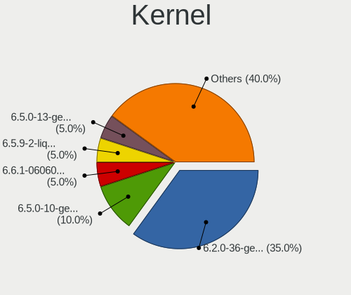

| Version                | Notebooks | Percent |
|------------------------|-----------|---------|
| 5.19.0-35-generic      | 5         | 31.25%  |
| 5.15.0-67-generic      | 3         | 18.75%  |
| 5.4.0-144-generic      | 2         | 12.5%   |
| 6.2.8-060208-generic   | 1         | 6.25%   |
| 6.2.3-x64v1-xanmod1    | 1         | 6.25%   |
| 5.4.0-146-generic      | 1         | 6.25%   |
| 5.19.0-38-generic      | 1         | 6.25%   |
| 5.19.0-1018-lowlatency | 1         | 6.25%   |
| 5.15.0-56-generic      | 1         | 6.25%   |

Kernel Family
-------------

Linux kernel without a distro release

| Version | Notebooks | Percent |
|---------|-----------|---------|
| 5.19.0  | 7         | 43.75%  |
| 5.15.0  | 4         | 25%     |
| 5.4.0   | 3         | 18.75%  |
| 6.2.8   | 1         | 6.25%   |
| 6.2.3   | 1         | 6.25%   |

Kernel Major Ver.
-----------------

Linux kernel major version

| Version | Notebooks | Percent |
|---------|-----------|---------|
| 5.19    | 7         | 43.75%  |
| 5.15    | 4         | 25%     |
| 5.4     | 3         | 18.75%  |
| 6.2     | 2         | 12.5%   |

Arch
----

OS architecture (x86_64, i586, etc.)

| Name   | Notebooks | Percent |
|--------|-----------|---------|
| x86_64 | 15        | 93.75%  |
| i686   | 1         | 6.25%   |

DE
--

Desktop Environment

| Name | Notebooks | Percent |
|------|-----------|---------|
| MATE | 16        | 100%    |

Display Server
--------------

X11 or Wayland

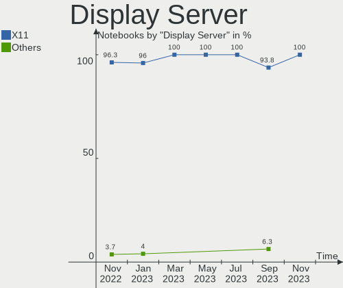

| Name | Notebooks | Percent |
|------|-----------|---------|
| X11  | 16        | 100%    |

Display Manager
---------------

SDDM, LightDM, etc.

| Name    | Notebooks | Percent |
|---------|-----------|---------|
| LightDM | 11        | 68.75%  |
| GDM3    | 2         | 12.5%   |
| Unknown | 2         | 12.5%   |
| LXDM    | 1         | 6.25%   |

OS Lang
-------

Language

| Lang  | Notebooks | Percent |
|-------|-----------|---------|
| en_US | 5         | 31.25%  |
| de_DE | 3         | 18.75%  |
| fr_FR | 2         | 12.5%   |
| zh_TW | 1         | 6.25%   |
| sv_SE | 1         | 6.25%   |
| hu_HU | 1         | 6.25%   |
| es_MX | 1         | 6.25%   |
| en_CA | 1         | 6.25%   |
| en_AU | 1         | 6.25%   |

Boot Mode
---------

EFI or BIOS

| Mode | Notebooks | Percent |
|------|-----------|---------|
| BIOS | 9         | 56.25%  |
| EFI  | 7         | 43.75%  |

Filesystem
----------

Type of filesystem

| Type  | Notebooks | Percent |
|-------|-----------|---------|
| Ext4  | 13        | 81.25%  |
| Btrfs | 3         | 18.75%  |

Part. scheme
------------

Scheme of partitioning

| Type    | Notebooks | Percent |
|---------|-----------|---------|
| GPT     | 12        | 75%     |
| Unknown | 3         | 18.75%  |
| MBR     | 1         | 6.25%   |

Dual Boot with Linux/BSD
------------------------

Hosting more than one Linux/BSD

| Dual boot | Notebooks | Percent |
|-----------|-----------|---------|
| No        | 16        | 100%    |

Dual Boot (Win)
---------------

Hosting Linux and Windows

| Dual boot | Notebooks | Percent |
|-----------|-----------|---------|
| No        | 12        | 75%     |
| Yes       | 4         | 25%     |

Board
-----

Vendor
------

Motherboard manufacturer

| Name                | Notebooks | Percent |
|---------------------|-----------|---------|
| ASUSTek Computer    | 4         | 25%     |
| Hewlett-Packard     | 3         | 18.75%  |
| Dell                | 2         | 12.5%   |
| Acer                | 2         | 12.5%   |
| Samsung Electronics | 1         | 6.25%   |
| Packard Bell        | 1         | 6.25%   |
| Notebook            | 1         | 6.25%   |
| HUAWEI              | 1         | 6.25%   |
| Apple               | 1         | 6.25%   |

Model
-----

Motherboard model

| Name                                      | Notebooks | Percent |
|-------------------------------------------|-----------|---------|
| Samsung 905S3G/906S3G/915S3G/9305SG       | 1         | 6.25%   |
| Packard Bell EasyNote TE11HC              | 1         | 6.25%   |
| Notebook NJx0MU                           | 1         | 6.25%   |
| HUAWEI BOHB-WAX9                          | 1         | 6.25%   |
| HP Stream Laptop 11-ah1XX                 | 1         | 6.25%   |
| HP Presario CQ61                          | 1         | 6.25%   |
| HP Laptop 15s-eq0xxx                      | 1         | 6.25%   |
| Dell Latitude E6320                       | 1         | 6.25%   |
| Dell Inspiron 5748                        | 1         | 6.25%   |
| ASUS X550LN                               | 1         | 6.25%   |
| ASUS K93SV                                | 1         | 6.25%   |
| ASUS G75VW                                | 1         | 6.25%   |
| ASUS ASUS TUF Gaming A15 FA506QR_TUF566QR | 1         | 6.25%   |
| Apple MacBookAir4,1                       | 1         | 6.25%   |
| Acer Aspire ES1-523                       | 1         | 6.25%   |
| Acer Aspire 5570Z                         | 1         | 6.25%   |

Model Family
------------

Motherboard model prefix

| Name                  | Notebooks | Percent |
|-----------------------|-----------|---------|
| Acer Aspire           | 2         | 12.5%   |
| Samsung 905S3G        | 1         | 6.25%   |
| Packard Bell EasyNote | 1         | 6.25%   |
| Notebook NJx0MU       | 1         | 6.25%   |
| HUAWEI BOHB-WAX9      | 1         | 6.25%   |
| HP Stream             | 1         | 6.25%   |
| HP Presario           | 1         | 6.25%   |
| HP Laptop             | 1         | 6.25%   |
| Dell Latitude         | 1         | 6.25%   |
| Dell Inspiron         | 1         | 6.25%   |
| ASUS X550LN           | 1         | 6.25%   |
| ASUS K93SV            | 1         | 6.25%   |
| ASUS G75VW            | 1         | 6.25%   |
| ASUS ASUS             | 1         | 6.25%   |
| Apple MacBookAir4     | 1         | 6.25%   |

MFG Year
--------

Motherboard manufacture year

| Year | Notebooks | Percent |
|------|-----------|---------|
| 2021 | 3         | 18.75%  |
| 2014 | 3         | 18.75%  |
| 2012 | 3         | 18.75%  |
| 2011 | 2         | 12.5%   |
| 2019 | 1         | 6.25%   |
| 2018 | 1         | 6.25%   |
| 2016 | 1         | 6.25%   |
| 2009 | 1         | 6.25%   |
| 2007 | 1         | 6.25%   |

Form Factor
-----------

Physical design of the computer

| Name     | Notebooks | Percent |
|----------|-----------|---------|
| Notebook | 16        | 100%    |

Secure Boot
-----------

Enabled or disabled

| State    | Notebooks | Percent |
|----------|-----------|---------|
| Disabled | 16        | 100%    |

Coreboot
--------

Have coreboot on board

| Used | Notebooks | Percent |
|------|-----------|---------|
| No   | 16        | 100%    |

RAM Size
--------

Total RAM memory

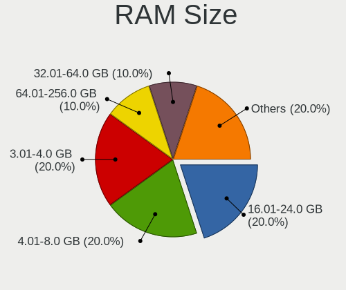

| Size in GB | Notebooks | Percent |
|------------|-----------|---------|
| 3.01-4.0   | 5         | 31.25%  |
| 4.01-8.0   | 4         | 25%     |
| 16.01-24.0 | 3         | 18.75%  |
| 8.01-16.0  | 2         | 12.5%   |
| 2.01-3.0   | 1         | 6.25%   |
| 0.51-1.0   | 1         | 6.25%   |

RAM Used
--------

Used RAM memory

| Used GB   | Notebooks | Percent |
|-----------|-----------|---------|
| 2.01-3.0  | 5         | 31.25%  |
| 1.01-2.0  | 5         | 31.25%  |
| 3.01-4.0  | 2         | 12.5%   |
| 8.01-16.0 | 2         | 12.5%   |
| 4.01-8.0  | 1         | 6.25%   |
| 0.01-0.5  | 1         | 6.25%   |

Total Drives
------------

Number of drives on board

| Drives | Notebooks | Percent |
|--------|-----------|---------|
| 1      | 10        | 62.5%   |
| 2      | 6         | 37.5%   |

Has CD-ROM
----------

Has CD-ROM on board

| Presented | Notebooks | Percent |
|-----------|-----------|---------|
| Yes       | 11        | 68.75%  |
| No        | 5         | 31.25%  |

Has Ethernet
------------

Has Ethernet on board

| Presented | Notebooks | Percent |
|-----------|-----------|---------|
| Yes       | 13        | 81.25%  |
| No        | 3         | 18.75%  |

Has WiFi
--------

Has WiFi module

| Presented | Notebooks | Percent |
|-----------|-----------|---------|
| Yes       | 15        | 93.75%  |
| No        | 1         | 6.25%   |

Has Bluetooth
-------------

Has Bluetooth module

| Presented | Notebooks | Percent |
|-----------|-----------|---------|
| Yes       | 12        | 75%     |
| No        | 4         | 25%     |

Location
--------

Country
-------

Geographic location (country)

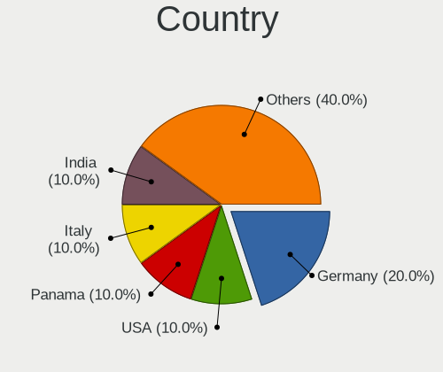

| Country   | Notebooks | Percent |
|-----------|-----------|---------|
| USA       | 3         | 18.75%  |
| France    | 2         | 12.5%   |
| Thailand  | 1         | 6.25%   |
| Sweden    | 1         | 6.25%   |
| Serbia    | 1         | 6.25%   |
| Poland    | 1         | 6.25%   |
| Mexico    | 1         | 6.25%   |
| Hungary   | 1         | 6.25%   |
| Hong Kong | 1         | 6.25%   |
| Germany   | 1         | 6.25%   |
| Czechia   | 1         | 6.25%   |
| Brazil    | 1         | 6.25%   |
| Australia | 1         | 6.25%   |

City
----

Geographic location (city)

| City        | Notebooks | Percent |
|-------------|-----------|---------|
| Turnov      | 1         | 6.25%   |
| Sunnyvale   | 1         | 6.25%   |
| St Louis    | 1         | 6.25%   |
| Solna       | 1         | 6.25%   |
| Sao Paulo   | 1         | 6.25%   |
| Pau         | 1         | 6.25%   |
| Paris       | 1         | 6.25%   |
| Nogales     | 1         | 6.25%   |
| Leipzig     | 1         | 6.25%   |
| Győr       | 1         | 6.25%   |
| Gdansk      | 1         | 6.25%   |
| Chanthaburi | 1         | 6.25%   |
| Central     | 1         | 6.25%   |
| Canberra    | 1         | 6.25%   |
| Belgrade    | 1         | 6.25%   |
| Albuquerque | 1         | 6.25%   |

Drives
------

Drive Vendor
------------

Hard drive vendors

| Vendor              | Notebooks | Drives | Percent |
|---------------------|-----------|--------|---------|
| Samsung Electronics | 4         | 5      | 20%     |
| Unknown             | 2         | 3      | 10%     |
| Toshiba             | 2         | 2      | 10%     |
| WDC                 | 1         | 1      | 5%      |
| Verbatim            | 1         | 1      | 5%      |
| SPCC                | 1         | 1      | 5%      |
| SK hynix            | 1         | 1      | 5%      |
| Silicon Motion      | 1         | 1      | 5%      |
| SanDisk             | 1         | 1      | 5%      |
| SABRENT             | 1         | 1      | 5%      |
| Micron Technology   | 1         | 1      | 5%      |
| KIOXIA              | 1         | 1      | 5%      |
| Hitachi             | 1         | 1      | 5%      |
| Crucial             | 1         | 1      | 5%      |
| Apple               | 1         | 1      | 5%      |

Drive Model
-----------

Hard drive models

| Model                              | Notebooks | Percent |
|------------------------------------|-----------|---------|
| WDC WD3200BEKX-75B7WT0 320GB       | 1         | 4.55%   |
| Verbatim Vi550 S3 512GB SSD        | 1         | 4.55%   |
| Unknown xD/SD/M.S.                 | 1         | 4.55%   |
| Unknown SC64G  64GB                | 1         | 4.55%   |
| Unknown CJTD4R  64GB               | 1         | 4.55%   |
| Toshiba MQ01ABF050 500GB           | 1         | 4.55%   |
| Toshiba MK2555GSX 250GB            | 1         | 4.55%   |
| SPCC Solid State Disk 1024GB       | 1         | 4.55%   |
| SK hynix HFM512GD3JX013N 512GB     | 1         | 4.55%   |
| Silicon Motion PCIe-8 SSD 256GB    | 1         | 4.55%   |
| SanDisk SDSSDH3 500G               | 1         | 4.55%   |
| Samsung SSD 870 EVO 1TB            | 1         | 4.55%   |
| Samsung SSD 840 EVO 120GB          | 1         | 4.55%   |
| Samsung SSD 750 EVO 250GB          | 1         | 4.55%   |
| Samsung MZVL2512HCJQ-00B00 512GB   | 1         | 4.55%   |
| Samsung MZMTE128HMGR-000 128GB SSD | 1         | 4.55%   |
| SABRENT Disk 160GB                 | 1         | 4.55%   |
| Micron CT1000P5SSD8 1TB            | 1         | 4.55%   |
| KIOXIA KBG40ZNV256G 256GB          | 1         | 4.55%   |
| Hitachi HTS725032A9A364 320GB      | 1         | 4.55%   |
| Crucial CT2000MX500SSD1 2TB        | 1         | 4.55%   |
| Apple SSD TS128C 121GB             | 1         | 4.55%   |

HDD Vendor
----------

Hard disk drive vendors

| Vendor  | Notebooks | Drives | Percent |
|---------|-----------|--------|---------|
| Toshiba | 2         | 2      | 40%     |
| WDC     | 1         | 1      | 20%     |
| SABRENT | 1         | 1      | 20%     |
| Hitachi | 1         | 1      | 20%     |

SSD Vendor
----------

Solid state drive vendors

| Vendor              | Notebooks | Drives | Percent |
|---------------------|-----------|--------|---------|
| Samsung Electronics | 3         | 4      | 37.5%   |
| Verbatim            | 1         | 1      | 12.5%   |
| SPCC                | 1         | 1      | 12.5%   |
| SanDisk             | 1         | 1      | 12.5%   |
| Crucial             | 1         | 1      | 12.5%   |
| Apple               | 1         | 1      | 12.5%   |

Drive Kind
----------

HDD or SSD

| Kind    | Notebooks | Drives | Percent |
|---------|-----------|--------|---------|
| SSD     | 7         | 9      | 41.18%  |
| NVMe    | 4         | 5      | 23.53%  |
| HDD     | 4         | 5      | 23.53%  |
| MMC     | 1         | 2      | 5.88%   |
| Unknown | 1         | 1      | 5.88%   |

Drive Connector
---------------

SATA, SAS, NVMe, etc.

| Type | Notebooks | Drives | Percent |
|------|-----------|--------|---------|
| SATA | 11        | 13     | 61.11%  |
| NVMe | 4         | 5      | 22.22%  |
| SAS  | 2         | 2      | 11.11%  |
| MMC  | 1         | 2      | 5.56%   |

Drive Size
----------

Size of hard drive

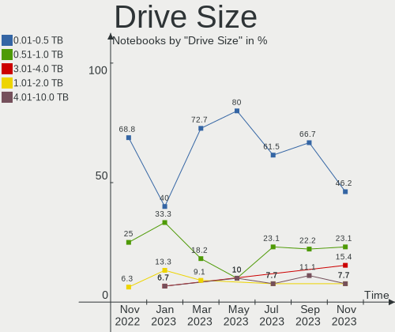

| Size in TB | Notebooks | Drives | Percent |
|------------|-----------|--------|---------|
| 0.01-0.5   | 8         | 10     | 72.73%  |
| 0.51-1.0   | 2         | 2      | 18.18%  |
| 1.01-2.0   | 1         | 2      | 9.09%   |

Space Total
-----------

Amount of disk space available on the file system

| Size in GB | Notebooks | Percent |
|------------|-----------|---------|
| 251-500    | 5         | 31.25%  |
| 101-250    | 4         | 25%     |
| 1001-2000  | 3         | 18.75%  |
| 21-50      | 1         | 6.25%   |
| 2001-3000  | 1         | 6.25%   |
| 501-1000   | 1         | 6.25%   |
| 51-100     | 1         | 6.25%   |

Space Used
----------

Amount of used disk space

| Used GB   | Notebooks | Percent |
|-----------|-----------|---------|
| 21-50     | 7         | 43.75%  |
| 101-250   | 3         | 18.75%  |
| 1001-2000 | 2         | 12.5%   |
| 251-500   | 1         | 6.25%   |
| 2001-3000 | 1         | 6.25%   |
| 1-20      | 1         | 6.25%   |
| 51-100    | 1         | 6.25%   |

Malfunc. Drives
---------------

Drive models with a malfunction

| Model                               | Notebooks | Drives | Percent |
|-------------------------------------|-----------|--------|---------|
| Samsung Electronics SSD 870 EVO 1TB | 1         | 1      | 50%     |
| Hitachi HTS725032A9A364 320GB       | 1         | 1      | 50%     |

Malfunc. Drive Vendor
---------------------

Vendors of faulty drives

| Vendor              | Notebooks | Drives | Percent |
|---------------------|-----------|--------|---------|
| Samsung Electronics | 1         | 1      | 50%     |
| Hitachi             | 1         | 1      | 50%     |

Malfunc. HDD Vendor
-------------------

Vendors of faulty HDD drives

| Vendor  | Notebooks | Drives | Percent |
|---------|-----------|--------|---------|
| Hitachi | 1         | 1      | 100%    |

Malfunc. Drive Kind
-------------------

Kinds of faulty drives

| Kind | Notebooks | Drives | Percent |
|------|-----------|--------|---------|
| SSD  | 1         | 1      | 50%     |
| HDD  | 1         | 1      | 50%     |

Failed Drives
-------------

Failed drive models

Zero info for selected period =(

Failed Drive Vendor
-------------------

Failed drive vendors

Zero info for selected period =(

Drive Status
------------

Number of failed and malfunc. drives

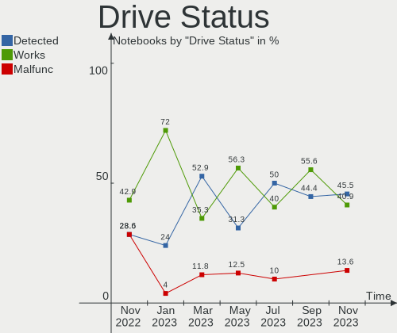

| Status   | Notebooks | Drives | Percent |
|----------|-----------|--------|---------|
| Detected | 9         | 13     | 52.94%  |
| Works    | 6         | 7      | 35.29%  |
| Malfunc  | 2         | 2      | 11.76%  |

Storage controller
------------------

Storage Vendor
--------------

Storage controller vendors

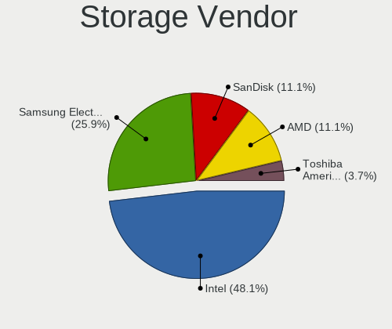

| Vendor              | Notebooks | Percent |
|---------------------|-----------|---------|
| Intel               | 10        | 55.56%  |
| AMD                 | 3         | 16.67%  |
| SK hynix            | 1         | 5.56%   |
| Silicon Motion      | 1         | 5.56%   |
| Samsung Electronics | 1         | 5.56%   |
| Micron Technology   | 1         | 5.56%   |
| KIOXIA              | 1         | 5.56%   |

Storage Model
-------------

Storage controller models

| Model                                                                        | Notebooks | Percent |
|------------------------------------------------------------------------------|-----------|---------|
| Intel 8 Series SATA Controller 1 [AHCI mode]                                 | 2         | 11.11%  |
| Intel 7 Series Chipset Family 6-port SATA Controller [AHCI mode]             | 2         | 11.11%  |
| Intel 6 Series/C200 Series Chipset Family 6 port Mobile SATA AHCI Controller | 2         | 11.11%  |
| AMD FCH SATA Controller [AHCI mode]                                          | 2         | 11.11%  |
| SK hynix Gold P31/PC711 NVMe Solid State Drive                               | 1         | 5.56%   |
| Silicon Motion Non-Volatile memory controller                                | 1         | 5.56%   |
| Samsung NVMe SSD Controller PM9A1/PM9A3/980PRO                               | 1         | 5.56%   |
| Micron NVMe Storage Controller                                               | 1         | 5.56%   |
| KIOXIA NVMe SSD Controller BG4                                               | 1         | 5.56%   |
| Intel Tiger Lake-LP SATA Controller                                          | 1         | 5.56%   |
| Intel Comet Lake SATA AHCI Controller                                        | 1         | 5.56%   |
| Intel 82801GBM/GHM (ICH7-M Family) SATA Controller [IDE mode]                | 1         | 5.56%   |
| Intel 82801 Mobile SATA Controller [RAID mode]                               | 1         | 5.56%   |
| AMD SB7x0/SB8x0/SB9x0 SATA Controller [AHCI mode]                            | 1         | 5.56%   |

Storage Kind
------------

Kind of storage controller (IDE, SATA, NVMe, SAS, ...)

| Kind | Notebooks | Percent |
|------|-----------|---------|
| SATA | 11        | 64.71%  |
| NVMe | 4         | 23.53%  |
| RAID | 1         | 5.88%   |
| IDE  | 1         | 5.88%   |

Processor
---------

CPU Vendor
----------

Processor vendors

| Vendor | Notebooks | Percent |
|--------|-----------|---------|
| Intel  | 11        | 68.75%  |
| AMD    | 5         | 31.25%  |

CPU Model
---------

Processor models

| Model                                         | Notebooks | Percent |
|-----------------------------------------------|-----------|---------|
| Intel Pentium CPU B960 @ 2.20GHz              | 1         | 6.25%   |
| Intel Genuine CPU T2080 @ 1.73GHz             | 1         | 6.25%   |
| Intel Core i7-3630QM CPU @ 2.40GHz            | 1         | 6.25%   |
| Intel Core i7-2677M CPU @ 1.80GHz             | 1         | 6.25%   |
| Intel Core i7-2670QM CPU @ 2.20GHz            | 1         | 6.25%   |
| Intel Core i5-4210U CPU @ 1.70GHz             | 1         | 6.25%   |
| Intel Core i5-2520M CPU @ 2.50GHz             | 1         | 6.25%   |
| Intel Core i3-4010U CPU @ 1.70GHz             | 1         | 6.25%   |
| Intel Core i3-10110U CPU @ 2.10GHz            | 1         | 6.25%   |
| Intel Celeron N4000 CPU @ 1.10GHz             | 1         | 6.25%   |
| Intel 11th Gen Core i7-1165G7 @ 2.80GHz       | 1         | 6.25%   |
| AMD Sempron M120                              | 1         | 6.25%   |
| AMD Ryzen 7 5800H with Radeon Graphics        | 1         | 6.25%   |
| AMD Ryzen 5 3500U with Radeon Vega Mobile Gfx | 1         | 6.25%   |
| AMD Quad-Core Processor (up to 1.4GHz)        | 1         | 6.25%   |
| AMD A4-7210 APU with AMD Radeon R3 Graphics   | 1         | 6.25%   |

CPU Model Family
----------------

Processor model prefix

| Model         | Notebooks | Percent |
|---------------|-----------|---------|
| Intel Core i7 | 3         | 18.75%  |
| Intel Core i5 | 2         | 12.5%   |
| Intel Core i3 | 2         | 12.5%   |
| Other         | 1         | 6.25%   |
| Intel Pentium | 1         | 6.25%   |
| Intel Genuine | 1         | 6.25%   |
| Intel Celeron | 1         | 6.25%   |
| AMD Sempron   | 1         | 6.25%   |
| AMD Ryzen 7   | 1         | 6.25%   |
| AMD Ryzen 5   | 1         | 6.25%   |
| AMD Quad-Core | 1         | 6.25%   |
| AMD A4        | 1         | 6.25%   |

CPU Cores
---------

Number of processor cores

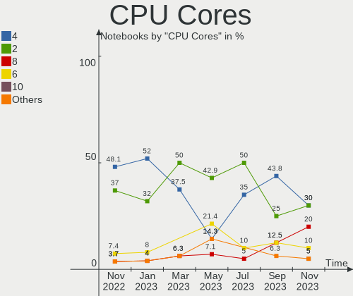

| Number | Notebooks | Percent |
|--------|-----------|---------|
| 2      | 8         | 50%     |
| 4      | 6         | 37.5%   |
| 8      | 1         | 6.25%   |
| 1      | 1         | 6.25%   |

CPU Sockets
-----------

Number of sockets

| Number | Notebooks | Percent |
|--------|-----------|---------|
| 1      | 16        | 100%    |

CPU Threads
-----------

Threads per core (Hyper-Threading)

| Number | Notebooks | Percent |
|--------|-----------|---------|
| 2      | 10        | 62.5%   |
| 1      | 6         | 37.5%   |

CPU Op-Modes
------------

CPU Operation Modes (32-bit, 64-bit)

| Op mode        | Notebooks | Percent |
|----------------|-----------|---------|
| 32-bit, 64-bit | 15        | 93.75%  |
| 32-bit         | 1         | 6.25%   |

CPU Microcode
-------------

Microcode number

| Number     | Notebooks | Percent |
|------------|-----------|---------|
| Unknown    | 6         | 37.5%   |
| 0x40651    | 2         | 12.5%   |
| 0x206a7    | 2         | 12.5%   |
| 0x806ec    | 1         | 6.25%   |
| 0x806c1    | 1         | 6.25%   |
| 0x706a1    | 1         | 6.25%   |
| 0x6ec      | 1         | 6.25%   |
| 0x08108109 | 1         | 6.25%   |
| 0x0700010f | 1         | 6.25%   |

CPU Microarch
-------------

Microarchitecture

| Name          | Notebooks | Percent |
|---------------|-----------|---------|
| SandyBridge   | 4         | 25%     |
| Haswell       | 2         | 12.5%   |
| Zen+          | 1         | 6.25%   |
| Zen 3         | 1         | 6.25%   |
| TigerLake     | 1         | 6.25%   |
| Puma          | 1         | 6.25%   |
| P6            | 1         | 6.25%   |
| KabyLake      | 1         | 6.25%   |
| K10           | 1         | 6.25%   |
| Jaguar        | 1         | 6.25%   |
| IvyBridge     | 1         | 6.25%   |
| Goldmont plus | 1         | 6.25%   |

Graphics
--------

GPU Vendor
----------

Vendors of graphics cards

| Vendor | Notebooks | Percent |
|--------|-----------|---------|
| Intel  | 10        | 50%     |
| Nvidia | 5         | 25%     |
| AMD    | 5         | 25%     |

GPU Model
---------

Graphics card models

| Model                                                                         | Notebooks | Percent |
|-------------------------------------------------------------------------------|-----------|---------|
| Intel 2nd Generation Core Processor Family Integrated Graphics Controller     | 4         | 19.05%  |
| Nvidia GM108M [GeForce 840M]                                                  | 2         | 9.52%   |
| Intel Haswell-ULT Integrated Graphics Controller                              | 2         | 9.52%   |
| Nvidia GF114M [GeForce GTX 670M]                                              | 1         | 4.76%   |
| Nvidia GF108M [GeForce GT 540M]                                               | 1         | 4.76%   |
| Nvidia GA104M [GeForce RTX 3070 Mobile / Max-Q]                               | 1         | 4.76%   |
| Intel TigerLake-LP GT2 [Iris Xe Graphics]                                     | 1         | 4.76%   |
| Intel Mobile 945GM/GMS/GME, 943/940GML Express Integrated Graphics Controller | 1         | 4.76%   |
| Intel Mobile 945GM/GMS, 943/940GML Express Integrated Graphics Controller     | 1         | 4.76%   |
| Intel GeminiLake [UHD Graphics 600]                                           | 1         | 4.76%   |
| Intel CometLake-U GT2 [UHD Graphics]                                          | 1         | 4.76%   |
| AMD Temash [Radeon HD 8250/8280G]                                             | 1         | 4.76%   |
| AMD RS880M [Mobility Radeon HD 4225/4250]                                     | 1         | 4.76%   |
| AMD Picasso/Raven 2 [Radeon Vega Series / Radeon Vega Mobile Series]          | 1         | 4.76%   |
| AMD Mullins [Radeon R3 Graphics]                                              | 1         | 4.76%   |
| AMD Cezanne [Radeon Vega Series / Radeon Vega Mobile Series]                  | 1         | 4.76%   |

GPU Combo
---------

Combinations of graphics cards

| Name           | Notebooks | Percent |
|----------------|-----------|---------|
| 1 x Intel      | 7         | 43.75%  |
| 1 x AMD        | 4         | 25%     |
| Intel + Nvidia | 3         | 18.75%  |
| 1 x Nvidia     | 1         | 6.25%   |
| AMD + Nvidia   | 1         | 6.25%   |

GPU Driver
----------

Free vs proprietary

| Driver      | Notebooks | Percent |
|-------------|-----------|---------|
| Free        | 13        | 81.25%  |
| Proprietary | 2         | 12.5%   |
| Unknown     | 1         | 6.25%   |

GPU Memory
----------

Total video memory

| Size in GB | Notebooks | Percent |
|------------|-----------|---------|
| Unknown    | 14        | 87.5%   |
| 0.01-0.5   | 2         | 12.5%   |

Monitor
-------

Monitor Vendor
--------------

Monitor vendors

| Vendor                  | Notebooks | Percent |
|-------------------------|-----------|---------|
| AU Optronics            | 4         | 26.67%  |
| LG Display              | 2         | 13.33%  |
| Chi Mei Optoelectronics | 2         | 13.33%  |
| BOE                     | 2         | 13.33%  |
| Sharp                   | 1         | 6.67%   |
| Samsung Electronics     | 1         | 6.67%   |
| LG Philips              | 1         | 6.67%   |
| Chimei Innolux          | 1         | 6.67%   |
| Apple                   | 1         | 6.67%   |

Monitor Model
-------------

Monitor models

| Model                                                                     | Notebooks | Percent |
|---------------------------------------------------------------------------|-----------|---------|
| Sharp LQ156M1JW26 SHP1532 1920x1080 344x194mm 15.5-inch                   | 1         | 6.67%   |
| Samsung Electronics LCD Monitor SEC3451 1366x768 344x194mm 15.5-inch      | 1         | 6.67%   |
| LG Philips LCD Monitor LPLA500 1280x800 304x190mm 14.1-inch               | 1         | 6.67%   |
| LG Display LCD Monitor LGD03DB 1366x768 345x194mm 15.6-inch               | 1         | 6.67%   |
| LG Display LCD Monitor LGD02EC 1366x768 293x165mm 13.2-inch               | 1         | 6.67%   |
| Chimei Innolux LCD Monitor CMN1734 1600x900 382x214mm 17.2-inch           | 1         | 6.67%   |
| Chi Mei Optoelectronics LCD Monitor CMO1808 1920x1080 408x230mm 18.4-inch | 1         | 6.67%   |
| Chi Mei Optoelectronics LCD Monitor CMO1720 1920x1080 382x215mm 17.3-inch | 1         | 6.67%   |
| BOE LCD Monitor BOE0872 1920x1080 344x194mm 15.5-inch                     | 1         | 6.67%   |
| BOE LCD Monitor BOE0672 1366x768 344x194mm 15.5-inch                      | 1         | 6.67%   |
| AU Optronics LCD Monitor AUO429D 1920x1080 382x215mm 17.3-inch            | 1         | 6.67%   |
| AU Optronics LCD Monitor AUO235C 1366x768 256x144mm 11.6-inch             | 1         | 6.67%   |
| AU Optronics LCD Monitor AUO22EC 1366x768 344x193mm 15.5-inch             | 1         | 6.67%   |
| AU Optronics LCD Monitor AUO152C 1366x768 293x164mm 13.2-inch             | 1         | 6.67%   |
| Apple Color LCD APPA010 1366x768 256x144mm 11.6-inch                      | 1         | 6.67%   |

Monitor Resolution
------------------

Monitor screen resolution

| Resolution      | Notebooks | Percent |
|-----------------|-----------|---------|
| 1366x768 (WXGA) | 8         | 53.33%  |
| 1920x1080 (FHD) | 5         | 33.33%  |
| 1600x900 (HD+)  | 1         | 6.67%   |
| 1280x800 (WXGA) | 1         | 6.67%   |

Monitor Diagonal
----------------

Diagonal size in inches

| Inches | Notebooks | Percent |
|--------|-----------|---------|
| 15     | 6         | 40%     |
| 17     | 3         | 20%     |
| 13     | 2         | 13.33%  |
| 11     | 2         | 13.33%  |
| 18     | 1         | 6.67%   |
| 14     | 1         | 6.67%   |

Monitor Width
-------------

Physical width

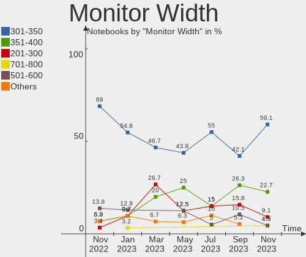

| Width in mm | Notebooks | Percent |
|-------------|-----------|---------|
| 301-350     | 7         | 46.67%  |
| 201-300     | 4         | 26.67%  |
| 351-400     | 3         | 20%     |
| 401-500     | 1         | 6.67%   |

Aspect Ratio
------------

Proportional relationship between the width and the height

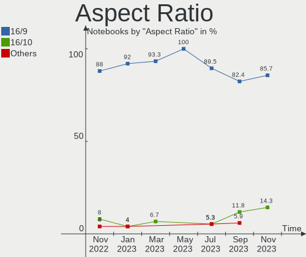

| Ratio | Notebooks | Percent |
|-------|-----------|---------|
| 16/9  | 14        | 93.33%  |
| 16/10 | 1         | 6.67%   |

Monitor Area
------------

Area in inch²

| Area in inch² | Notebooks | Percent |
|----------------|-----------|---------|
| 101-110        | 6         | 40%     |
| 121-130        | 3         | 20%     |
| 71-80          | 2         | 13.33%  |
| 51-60          | 2         | 13.33%  |
| 81-90          | 1         | 6.67%   |
| 141-150        | 1         | 6.67%   |

Pixel Density
-------------

Pixels per inch

| Density | Notebooks | Percent |
|---------|-----------|---------|
| 101-120 | 8         | 53.33%  |
| 121-160 | 6         | 40%     |
| 51-100  | 1         | 6.67%   |

Multiple Monitors
-----------------

Total monitors connected

| Total | Notebooks | Percent |
|-------|-----------|---------|
| 1     | 14        | 87.5%   |
| 2     | 1         | 6.25%   |
| 0     | 1         | 6.25%   |

Network
-------

Net Controller Vendor
---------------------

Controller vendors

| Vendor                   | Notebooks | Percent |
|--------------------------|-----------|---------|
| Realtek Semiconductor    | 10        | 37.04%  |
| Qualcomm Atheros         | 6         | 22.22%  |
| Intel                    | 5         | 18.52%  |
| Broadcom                 | 4         | 14.81%  |
| Ralink                   | 1         | 3.7%    |
| Marvell Technology Group | 1         | 3.7%    |

Net Controller Model
--------------------

Controller models

| Model                                                                   | Notebooks | Percent |
|-------------------------------------------------------------------------|-----------|---------|
| Realtek RTL8111/8168/8411 PCI Express Gigabit Ethernet Controller       | 5         | 17.86%  |
| Realtek RTL810xE PCI Express Fast Ethernet controller                   | 2         | 7.14%   |
| Intel Wi-Fi 6 AX200                                                     | 2         | 7.14%   |
| Realtek RTL8822BE 802.11a/b/g/n/ac WiFi adapter                         | 1         | 3.57%   |
| Realtek RTL8821CE 802.11ac PCIe Wireless Network Adapter                | 1         | 3.57%   |
| Realtek RTL8153 Gigabit Ethernet Adapter                                | 1         | 3.57%   |
| Ralink RT3290 Wireless 802.11n 1T/1R PCIe                               | 1         | 3.57%   |
| Qualcomm Atheros QCA9565 / AR9565 Wireless Network Adapter              | 1         | 3.57%   |
| Qualcomm Atheros QCA9377 802.11ac Wireless Network Adapter              | 1         | 3.57%   |
| Qualcomm Atheros AR9485 Wireless Network Adapter                        | 1         | 3.57%   |
| Qualcomm Atheros AR9285 Wireless Network Adapter (PCI-Express)          | 1         | 3.57%   |
| Qualcomm Atheros AR8151 v2.0 Gigabit Ethernet                           | 1         | 3.57%   |
| Qualcomm Atheros AR242x / AR542x Wireless Network Adapter (PCI-Express) | 1         | 3.57%   |
| Marvell Group 88E8038 PCI-E Fast Ethernet Controller                    | 1         | 3.57%   |
| Intel Wireless 7260                                                     | 1         | 3.57%   |
| Intel Ethernet Connection (13) I219-V                                   | 1         | 3.57%   |
| Intel Comet Lake PCH-LP CNVi WiFi                                       | 1         | 3.57%   |
| Intel 82579LM Gigabit Network Connection (Lewisville)                   | 1         | 3.57%   |
| Broadcom NetLink BCM57785 Gigabit Ethernet PCIe                         | 1         | 3.57%   |
| Broadcom BCM43224 802.11a/b/g/n                                         | 1         | 3.57%   |
| Broadcom BCM43142 802.11b/g/n                                           | 1         | 3.57%   |
| Broadcom BCM4313 802.11bgn Wireless Network Adapter                     | 1         | 3.57%   |

Wireless Vendor
---------------

Wireless vendors

| Vendor                | Notebooks | Percent |
|-----------------------|-----------|---------|
| Qualcomm Atheros      | 5         | 33.33%  |
| Intel                 | 4         | 26.67%  |
| Broadcom              | 3         | 20%     |
| Realtek Semiconductor | 2         | 13.33%  |
| Ralink                | 1         | 6.67%   |

Wireless Model
--------------

Wireless models

| Model                                                                   | Notebooks | Percent |
|-------------------------------------------------------------------------|-----------|---------|
| Intel Wi-Fi 6 AX200                                                     | 2         | 13.33%  |
| Realtek RTL8822BE 802.11a/b/g/n/ac WiFi adapter                         | 1         | 6.67%   |
| Realtek RTL8821CE 802.11ac PCIe Wireless Network Adapter                | 1         | 6.67%   |
| Ralink RT3290 Wireless 802.11n 1T/1R PCIe                               | 1         | 6.67%   |
| Qualcomm Atheros QCA9565 / AR9565 Wireless Network Adapter              | 1         | 6.67%   |
| Qualcomm Atheros QCA9377 802.11ac Wireless Network Adapter              | 1         | 6.67%   |
| Qualcomm Atheros AR9485 Wireless Network Adapter                        | 1         | 6.67%   |
| Qualcomm Atheros AR9285 Wireless Network Adapter (PCI-Express)          | 1         | 6.67%   |
| Qualcomm Atheros AR242x / AR542x Wireless Network Adapter (PCI-Express) | 1         | 6.67%   |
| Intel Wireless 7260                                                     | 1         | 6.67%   |
| Intel Comet Lake PCH-LP CNVi WiFi                                       | 1         | 6.67%   |
| Broadcom BCM43224 802.11a/b/g/n                                         | 1         | 6.67%   |
| Broadcom BCM43142 802.11b/g/n                                           | 1         | 6.67%   |
| Broadcom BCM4313 802.11bgn Wireless Network Adapter                     | 1         | 6.67%   |

Ethernet Vendor
---------------

Ethernet vendors

| Vendor                   | Notebooks | Percent |
|--------------------------|-----------|---------|
| Realtek Semiconductor    | 8         | 61.54%  |
| Intel                    | 2         | 15.38%  |
| Qualcomm Atheros         | 1         | 7.69%   |
| Marvell Technology Group | 1         | 7.69%   |
| Broadcom                 | 1         | 7.69%   |

Ethernet Model
--------------

Ethernet models

| Model                                                             | Notebooks | Percent |
|-------------------------------------------------------------------|-----------|---------|
| Realtek RTL8111/8168/8411 PCI Express Gigabit Ethernet Controller | 5         | 38.46%  |
| Realtek RTL810xE PCI Express Fast Ethernet controller             | 2         | 15.38%  |
| Realtek RTL8153 Gigabit Ethernet Adapter                          | 1         | 7.69%   |
| Qualcomm Atheros AR8151 v2.0 Gigabit Ethernet                     | 1         | 7.69%   |
| Marvell Group 88E8038 PCI-E Fast Ethernet Controller              | 1         | 7.69%   |
| Intel Ethernet Connection (13) I219-V                             | 1         | 7.69%   |
| Intel 82579LM Gigabit Network Connection (Lewisville)             | 1         | 7.69%   |
| Broadcom NetLink BCM57785 Gigabit Ethernet PCIe                   | 1         | 7.69%   |

Net Controller Kind
-------------------

Ethernet, WiFi or modem

| Kind     | Notebooks | Percent |
|----------|-----------|---------|
| WiFi     | 15        | 53.57%  |
| Ethernet | 13        | 46.43%  |

Used Controller
---------------

Currently used network controller

| Kind     | Notebooks | Percent |
|----------|-----------|---------|
| WiFi     | 15        | 88.24%  |
| Ethernet | 2         | 11.76%  |

NICs
----

Total network controllers on board

| Total | Notebooks | Percent |
|-------|-----------|---------|
| 2     | 11        | 68.75%  |
| 1     | 5         | 31.25%  |

IPv6
----

IPv6 vs IPv4

| Used | Notebooks | Percent |
|------|-----------|---------|
| No   | 11        | 68.75%  |
| Yes  | 5         | 31.25%  |

Bluetooth
---------

Bluetooth Vendor
----------------

Controller vendors

| Vendor                          | Notebooks | Percent |
|---------------------------------|-----------|---------|
| Intel                           | 3         | 25%     |
| Realtek Semiconductor           | 2         | 16.67%  |
| Ralink                          | 1         | 8.33%   |
| Qualcomm Atheros Communications | 1         | 8.33%   |
| Lite-On Technology              | 1         | 8.33%   |
| Dell                            | 1         | 8.33%   |
| Broadcom                        | 1         | 8.33%   |
| ASUSTek Computer                | 1         | 8.33%   |
| Apple                           | 1         | 8.33%   |

Bluetooth Model
---------------

Controller models

| Model                                          | Notebooks | Percent |
|------------------------------------------------|-----------|---------|
| Realtek  Bluetooth 4.2 Adapter                 | 2         | 16.67%  |
| Intel AX200 Bluetooth                          | 2         | 16.67%  |
| Ralink RT3290 Bluetooth                        | 1         | 8.33%   |
| Qualcomm Atheros AR3012 Bluetooth 4.0          | 1         | 8.33%   |
| Lite-On Qualcomm Atheros QCA9377 Bluetooth     | 1         | 8.33%   |
| Intel Bluetooth 9460/9560 Jefferson Peak (JfP) | 1         | 8.33%   |
| Dell DW375 Bluetooth Module                    | 1         | 8.33%   |
| Broadcom BCM43142 Bluetooth 4.0                | 1         | 8.33%   |
| ASUS Broadcom BCM20702A0 Bluetooth             | 1         | 8.33%   |
| Apple Built-in Bluetooth 2.0+EDR HCI           | 1         | 8.33%   |

Sound
-----

Sound Vendor
------------

Sound card vendors

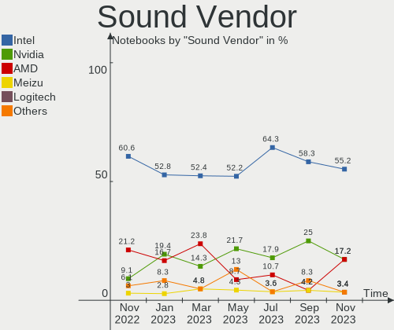

| Vendor              | Notebooks | Percent |
|---------------------|-----------|---------|
| Intel               | 11        | 52.38%  |
| AMD                 | 5         | 23.81%  |
| Nvidia              | 3         | 14.29%  |
| Meizu               | 1         | 4.76%   |
| C-Media Electronics | 1         | 4.76%   |

Sound Model
-----------

Sound card models

| Model                                                                      | Notebooks | Percent |
|----------------------------------------------------------------------------|-----------|---------|
| Intel 6 Series/C200 Series Chipset Family High Definition Audio Controller | 3         | 10.71%  |
| Intel Haswell-ULT HD Audio Controller                                      | 2         | 7.14%   |
| Intel 8 Series HD Audio Controller                                         | 2         | 7.14%   |
| Intel 7 Series/C216 Chipset Family High Definition Audio Controller        | 2         | 7.14%   |
| AMD Kabini HDMI/DP Audio                                                   | 2         | 7.14%   |
| AMD FCH Azalia Controller                                                  | 2         | 7.14%   |
| AMD Family 17h/19h HD Audio Controller                                     | 2         | 7.14%   |
| Nvidia GF114 HDMI Audio Controller                                         | 1         | 3.57%   |
| Nvidia GF108 High Definition Audio Controller                              | 1         | 3.57%   |
| Nvidia GA104 High Definition Audio Controller                              | 1         | 3.57%   |
| Meizu HiFi DAC Headphone Amplifier                                         | 1         | 3.57%   |
| Intel Tiger Lake-LP Smart Sound Technology Audio Controller                | 1         | 3.57%   |
| Intel NM10/ICH7 Family High Definition Audio Controller                    | 1         | 3.57%   |
| Intel Comet Lake PCH-LP cAVS                                               | 1         | 3.57%   |
| Intel Celeron/Pentium Silver Processor High Definition Audio               | 1         | 3.57%   |
| C-Media Electronics USB Advanced Audio Device                              | 1         | 3.57%   |
| AMD SBx00 Azalia (Intel HDA)                                               | 1         | 3.57%   |
| AMD RS880 HDMI Audio [Radeon HD 4200 Series]                               | 1         | 3.57%   |
| AMD Renoir Radeon High Definition Audio Controller                         | 1         | 3.57%   |
| AMD Raven/Raven2/Fenghuang HDMI/DP Audio Controller                        | 1         | 3.57%   |

Memory
------

Memory Vendor
-------------

Memory module vendors

| Vendor              | Notebooks | Percent |
|---------------------|-----------|---------|
| Samsung Electronics | 4         | 36.36%  |
| Micron Technology   | 4         | 36.36%  |
| SK hynix            | 2         | 18.18%  |
| Kingston            | 1         | 9.09%   |

Memory Model
------------

Memory module models

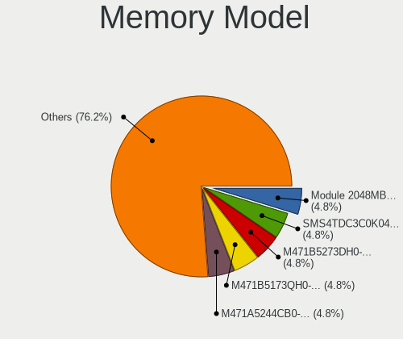

| Model                                                      | Notebooks | Percent |
|------------------------------------------------------------|-----------|---------|
| SK hynix RAM Module 4GB SODIMM DDR3 1600MT/s               | 1         | 8.33%   |
| SK hynix RAM HYMP112S64CP6-S6 1GB SODIMM DDR2 800MT/s      | 1         | 8.33%   |
| SK hynix RAM HMT351S6EFR8A-PB 4GB SODIMM DDR3 1600MT/s     | 1         | 8.33%   |
| Samsung RAM M471B5273DH0-CH9 4GB SODIMM DDR3 1334MT/s      | 1         | 8.33%   |
| Samsung RAM M471B5173QH0-YK0 4GB SODIMM DDR3 1600MT/s      | 1         | 8.33%   |
| Samsung RAM M471B1G73DB0-YK0 8GB SODIMM DDR3 1600MT/s      | 1         | 8.33%   |
| Samsung RAM K4A4G165WE-BCRC 2GB Row Of Chips DDR4 2400MT/s | 1         | 8.33%   |
| Micron RAM MT40A512M16LY-075:E 4GB SODIMM DDR4 3200MT/s    | 1         | 8.33%   |
| Micron RAM 8ATF2G64HZ-3G2E2 16GB SODIMM DDR4 3200MT/s      | 1         | 8.33%   |
| Micron RAM 4ATF1G64HZ-3G2E2 8GB SODIMM DDR4 3200MT/s       | 1         | 8.33%   |
| Micron RAM 16HTF25664HY-800J1 2GB SODIMM DDR2 800MT/s      | 1         | 8.33%   |
| Kingston RAM 9905700-104.A00G 8GB SODIMM DDR4 3200MT/s     | 1         | 8.33%   |

Memory Kind
-----------

Memory module kinds

| Kind  | Notebooks | Percent |
|-------|-----------|---------|
| DDR4  | 5         | 45.45%  |
| DDR3  | 4         | 36.36%  |
| SDRAM | 1         | 9.09%   |
| DDR2  | 1         | 9.09%   |

Memory Form Factor
------------------

Physical design of the memory module

| Name         | Notebooks | Percent |
|--------------|-----------|---------|
| SODIMM       | 9         | 90%     |
| Row Of Chips | 1         | 10%     |

Memory Size
-----------

Memory module size

| Size  | Notebooks | Percent |
|-------|-----------|---------|
| 4096  | 4         | 36.36%  |
| 8192  | 3         | 27.27%  |
| 2048  | 2         | 18.18%  |
| 16384 | 1         | 9.09%   |
| 1024  | 1         | 9.09%   |

Memory Speed
------------

Memory module speed

| Speed | Notebooks | Percent |
|-------|-----------|---------|
| 3200  | 4         | 36.36%  |
| 1600  | 3         | 27.27%  |
| 2400  | 1         | 9.09%   |
| 2048  | 1         | 9.09%   |
| 1334  | 1         | 9.09%   |
| 800   | 1         | 9.09%   |

Printers & scanners
-------------------

Printer Vendor
--------------

Printer device vendors

| Vendor              | Notebooks | Percent |
|---------------------|-----------|---------|
| Samsung Electronics | 1         | 100%    |

Printer Model
-------------

Printer device models

| Model                | Notebooks | Percent |
|----------------------|-----------|---------|
| Samsung M2070 Series | 1         | 100%    |

Scanner Vendor
--------------

Scanner device vendors

Zero info for selected period =(

Scanner Model
-------------

Scanner device models

Zero info for selected period =(

Camera
------

Camera Vendor
-------------

Camera device vendors

| Vendor                        | Notebooks | Percent |
|-------------------------------|-----------|---------|
| Chicony Electronics           | 5         | 35.71%  |
| Silicon Motion                | 2         | 14.29%  |
| Quanta                        | 2         | 14.29%  |
| Sunplus Innovation Technology | 1         | 7.14%   |
| Realtek Semiconductor         | 1         | 7.14%   |
| Microdia                      | 1         | 7.14%   |
| IMC Networks                  | 1         | 7.14%   |
| Apple                         | 1         | 7.14%   |

Camera Model
------------

Camera device models

| Model                                | Notebooks | Percent |
|--------------------------------------|-----------|---------|
| Sunplus ASUS Webcam                  | 1         | 7.14%   |
| Silicon Motion WebCam SC-10HDD13335N | 1         | 7.14%   |
| Silicon Motion HP Webcam-101         | 1         | 7.14%   |
| Realtek USB Camera                   | 1         | 7.14%   |
| Quanta HP TrueVision HD Camera       | 1         | 7.14%   |
| Quanta HD Camera                     | 1         | 7.14%   |
| Microdia Integrated_Webcam_HD        | 1         | 7.14%   |
| IMC Networks USB2.0 HD UVC WebCam    | 1         | 7.14%   |
| Chicony VGA Webcam                   | 1         | 7.14%   |
| Chicony USB2.0 Camera                | 1         | 7.14%   |
| Chicony HP Webcam                    | 1         | 7.14%   |
| Chicony HD WebCam                    | 1         | 7.14%   |
| Chicony CNFA078                      | 1         | 7.14%   |
| Apple FaceTime Camera                | 1         | 7.14%   |

Security
--------

Fingerprint Vendor
------------------

Fingerprint sensor vendors

Zero info for selected period =(

Fingerprint Model
-----------------

Fingerprint sensor models

Zero info for selected period =(

Chipcard Vendor
---------------

Chipcard module vendors

| Vendor   | Notebooks | Percent |
|----------|-----------|---------|
| Broadcom | 1         | 100%    |

Chipcard Model
--------------

Chipcard module models

| Model                                                                        | Notebooks | Percent |
|------------------------------------------------------------------------------|-----------|---------|
| Broadcom BCM5880 Secure Applications Processor with fingerprint swipe sensor | 1         | 100%    |

Unsupported
-----------

Unsupported Devices
-------------------

Total unsupported devices on board

| Total | Notebooks | Percent |
|-------|-----------|---------|
| 0     | 11        | 68.75%  |
| 1     | 5         | 31.25%  |

Unsupported Device Types
------------------------

Types of unsupported devices

| Type          | Notebooks | Percent |
|---------------|-----------|---------|
| Graphics card | 2         | 40%     |
| Chipcard      | 1         | 20%     |
| Camera        | 1         | 20%     |
| Bluetooth     | 1         | 20%     |

