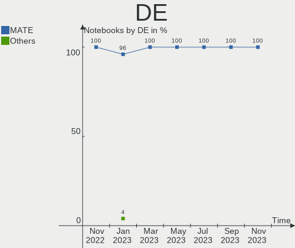
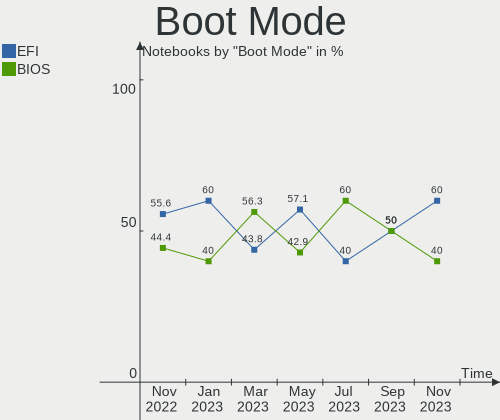
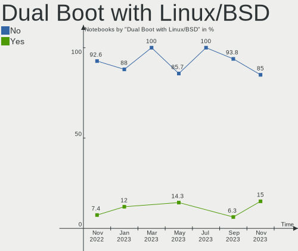
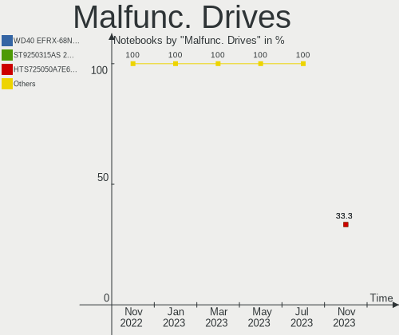
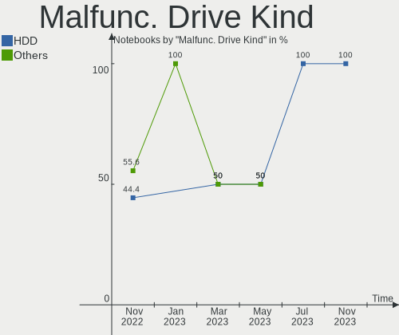
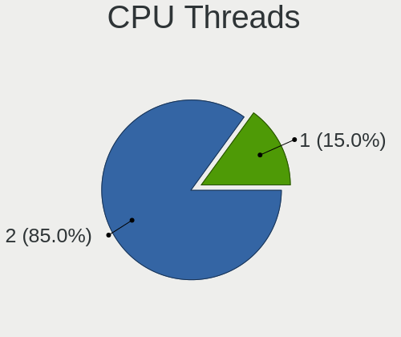
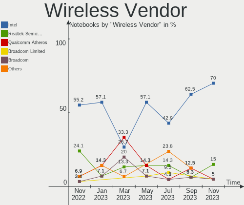
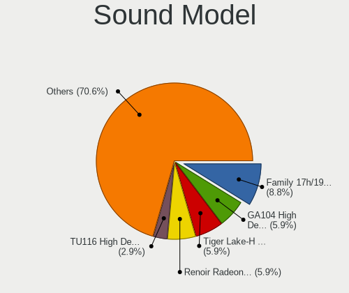
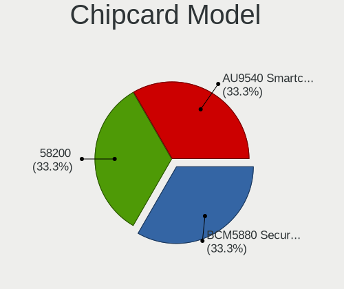

Ubuntu MATE - Hardware Trends (Notebooks)
-----------------------------------------

A project to identify most popular hardware characteristics and track their change
over time based on data collected by Linux users at https://Linux-Hardware.org.

Anyone can contribute to this report by the [hw-probe](https://github.com/linuxhw/hw-probe) tool:

    sudo -E hw-probe -all -upload

This report is for one last month. Overall report since the beginning of time: [TestCoverage](https://github.com/linuxhw/TestCoverage)

Period: Sep, 2022.

Contents
--------

* [ System ](#system)
  - [ OS                       ](#os)
  - [ OS Family                ](#os-family)
  - [ Kernel                   ](#kernel)
  - [ Kernel Family            ](#kernel-family)
  - [ Kernel Major Ver.        ](#kernel-major-ver)
  - [ Arch                     ](#arch)
  - [ DE                       ](#de)
  - [ Display Server           ](#display-server)
  - [ Display Manager          ](#display-manager)
  - [ OS Lang                  ](#os-lang)
  - [ Boot Mode                ](#boot-mode)
  - [ Filesystem               ](#filesystem)
  - [ Part. scheme             ](#part-scheme)
  - [ Dual Boot with Linux/BSD ](#dual-boot-with-linuxbsd)
  - [ Dual Boot (Win)          ](#dual-boot-win)

* [ Board ](#board)
  - [ Vendor                   ](#vendor)
  - [ Model                    ](#model)
  - [ Model Family             ](#model-family)
  - [ MFG Year                 ](#mfg-year)
  - [ Form Factor              ](#form-factor)
  - [ Secure Boot              ](#secure-boot)
  - [ Coreboot                 ](#coreboot)
  - [ RAM Size                 ](#ram-size)
  - [ RAM Used                 ](#ram-used)
  - [ Total Drives             ](#total-drives)
  - [ Has CD-ROM               ](#has-cd-rom)
  - [ Has Ethernet             ](#has-ethernet)
  - [ Has WiFi                 ](#has-wifi)
  - [ Has Bluetooth            ](#has-bluetooth)

* [ Location ](#location)
  - [ Country                  ](#country)
  - [ City                     ](#city)

* [ Drives ](#drives)
  - [ Drive Vendor             ](#drive-vendor)
  - [ Drive Model              ](#drive-model)
  - [ HDD Vendor               ](#hdd-vendor)
  - [ SSD Vendor               ](#ssd-vendor)
  - [ Drive Kind               ](#drive-kind)
  - [ Drive Connector          ](#drive-connector)
  - [ Drive Size               ](#drive-size)
  - [ Space Total              ](#space-total)
  - [ Space Used               ](#space-used)
  - [ Malfunc. Drives          ](#malfunc-drives)
  - [ Malfunc. Drive Vendor    ](#malfunc-drive-vendor)
  - [ Malfunc. HDD Vendor      ](#malfunc-hdd-vendor)
  - [ Malfunc. Drive Kind      ](#malfunc-drive-kind)
  - [ Failed Drives            ](#failed-drives)
  - [ Failed Drive Vendor      ](#failed-drive-vendor)
  - [ Drive Status             ](#drive-status)

* [ Storage controller ](#storage-controller)
  - [ Storage Vendor           ](#storage-vendor)
  - [ Storage Model            ](#storage-model)
  - [ Storage Kind             ](#storage-kind)

* [ Processor ](#processor)
  - [ CPU Vendor               ](#cpu-vendor)
  - [ CPU Model                ](#cpu-model)
  - [ CPU Model Family         ](#cpu-model-family)
  - [ CPU Cores                ](#cpu-cores)
  - [ CPU Sockets              ](#cpu-sockets)
  - [ CPU Threads              ](#cpu-threads)
  - [ CPU Op-Modes             ](#cpu-op-modes)
  - [ CPU Microcode            ](#cpu-microcode)
  - [ CPU Microarch            ](#cpu-microarch)

* [ Graphics ](#graphics)
  - [ GPU Vendor               ](#gpu-vendor)
  - [ GPU Model                ](#gpu-model)
  - [ GPU Combo                ](#gpu-combo)
  - [ GPU Driver               ](#gpu-driver)
  - [ GPU Memory               ](#gpu-memory)

* [ Monitor ](#monitor)
  - [ Monitor Vendor           ](#monitor-vendor)
  - [ Monitor Model            ](#monitor-model)
  - [ Monitor Resolution       ](#monitor-resolution)
  - [ Monitor Diagonal         ](#monitor-diagonal)
  - [ Monitor Width            ](#monitor-width)
  - [ Aspect Ratio             ](#aspect-ratio)
  - [ Monitor Area             ](#monitor-area)
  - [ Pixel Density            ](#pixel-density)
  - [ Multiple Monitors        ](#multiple-monitors)

* [ Network ](#network)
  - [ Net Controller Vendor    ](#net-controller-vendor)
  - [ Net Controller Model     ](#net-controller-model)
  - [ Wireless Vendor          ](#wireless-vendor)
  - [ Wireless Model           ](#wireless-model)
  - [ Ethernet Vendor          ](#ethernet-vendor)
  - [ Ethernet Model           ](#ethernet-model)
  - [ Net Controller Kind      ](#net-controller-kind)
  - [ Used Controller          ](#used-controller)
  - [ NICs                     ](#nics)
  - [ IPv6                     ](#ipv6)

* [ Bluetooth ](#bluetooth)
  - [ Bluetooth Vendor         ](#bluetooth-vendor)
  - [ Bluetooth Model          ](#bluetooth-model)

* [ Sound ](#sound)
  - [ Sound Vendor             ](#sound-vendor)
  - [ Sound Model              ](#sound-model)

* [ Memory ](#memory)
  - [ Memory Vendor            ](#memory-vendor)
  - [ Memory Model             ](#memory-model)
  - [ Memory Kind              ](#memory-kind)
  - [ Memory Form Factor       ](#memory-form-factor)
  - [ Memory Size              ](#memory-size)
  - [ Memory Speed             ](#memory-speed)

* [ Printers & scanners ](#printers--scanners)
  - [ Printer Vendor           ](#printer-vendor)
  - [ Printer Model            ](#printer-model)
  - [ Scanner Vendor           ](#scanner-vendor)
  - [ Scanner Model            ](#scanner-model)

* [ Camera ](#camera)
  - [ Camera Vendor            ](#camera-vendor)
  - [ Camera Model             ](#camera-model)

* [ Security ](#security)
  - [ Fingerprint Vendor       ](#fingerprint-vendor)
  - [ Fingerprint Model        ](#fingerprint-model)
  - [ Chipcard Vendor          ](#chipcard-vendor)
  - [ Chipcard Model           ](#chipcard-model)

* [ Unsupported ](#unsupported)
  - [ Unsupported Devices      ](#unsupported-devices)
  - [ Unsupported Device Types ](#unsupported-device-types)

System
------

OS
--

Installed operating systems

| Name              | Notebooks | Percent |
|-------------------|-----------|---------|
| Ubuntu MATE 22.04 | 9         | 69.23%  |
| Ubuntu MATE 20.04 | 4         | 30.77%  |

OS Family
---------

OS without a version

| Name        | Notebooks | Percent |
|-------------|-----------|---------|
| Ubuntu MATE | 13        | 100%    |

Kernel
------

Version of the Linux kernel

| Version              | Notebooks | Percent |
|----------------------|-----------|---------|
| 5.15.0-47-generic    | 5         | 38.46%  |
| 5.15.0-46-generic    | 2         | 15.38%  |
| 5.4.0-125-generic    | 1         | 7.69%   |
| 5.15.27-xanmod1      | 1         | 7.69%   |
| 5.15.0-48-generic    | 1         | 7.69%   |
| 5.15.0-46-lowlatency | 1         | 7.69%   |
| 5.15.0-43-generic    | 1         | 7.69%   |
| 5.11.0-38-generic    | 1         | 7.69%   |

Kernel Family
-------------

Linux kernel without a distro release

| Version | Notebooks | Percent |
|---------|-----------|---------|
| 5.15.0  | 10        | 76.92%  |
| 5.4.0   | 1         | 7.69%   |
| 5.15.27 | 1         | 7.69%   |
| 5.11.0  | 1         | 7.69%   |

Kernel Major Ver.
-----------------

Linux kernel major version

| Version | Notebooks | Percent |
|---------|-----------|---------|
| 5.15    | 11        | 84.62%  |
| 5.4     | 1         | 7.69%   |
| 5.11    | 1         | 7.69%   |

Arch
----

OS architecture (x86_64, i586, etc.)

| Name   | Notebooks | Percent |
|--------|-----------|---------|
| x86_64 | 13        | 100%    |

DE
--

Desktop Environment

| Name | Notebooks | Percent |
|------|-----------|---------|
| MATE | 13        | 100%    |

Display Server
--------------

X11 or Wayland

| Name | Notebooks | Percent |
|------|-----------|---------|
| X11  | 13        | 100%    |

Display Manager
---------------

SDDM, LightDM, etc.

| Name    | Notebooks | Percent |
|---------|-----------|---------|
| LightDM | 13        | 100%    |

OS Lang
-------

Language

| Lang  | Notebooks | Percent |
|-------|-----------|---------|
| en_US | 6         | 46.15%  |
| it_IT | 3         | 23.08%  |
| pt_BR | 1         | 7.69%   |
| fr_FR | 1         | 7.69%   |
| es_ES | 1         | 7.69%   |
| de_DE | 1         | 7.69%   |

Boot Mode
---------

EFI or BIOS

| Mode | Notebooks | Percent |
|------|-----------|---------|
| EFI  | 9         | 69.23%  |
| BIOS | 4         | 30.77%  |

Filesystem
----------

Type of filesystem

| Type    | Notebooks | Percent |
|---------|-----------|---------|
| Ext4    | 10        | 76.92%  |
| Overlay | 1         | 7.69%   |
| Jfs     | 1         | 7.69%   |
| Btrfs   | 1         | 7.69%   |

Part. scheme
------------

Scheme of partitioning

| Type    | Notebooks | Percent |
|---------|-----------|---------|
| GPT     | 9         | 69.23%  |
| MBR     | 2         | 15.38%  |
| Unknown | 2         | 15.38%  |

Dual Boot with Linux/BSD
------------------------

Hosting more than one Linux/BSD

| Dual boot | Notebooks | Percent |
|-----------|-----------|---------|
| No        | 9         | 69.23%  |
| Yes       | 4         | 30.77%  |

Dual Boot (Win)
---------------

Hosting Linux and Windows

| Dual boot | Notebooks | Percent |
|-----------|-----------|---------|
| No        | 8         | 61.54%  |
| Yes       | 5         | 38.46%  |

Board
-----

Vendor
------

Motherboard manufacturer

| Name             | Notebooks | Percent |
|------------------|-----------|---------|
| Dell             | 3         | 23.08%  |
| Intel            | 2         | 15.38%  |
| Hewlett-Packard  | 2         | 15.38%  |
| ASUSTek Computer | 2         | 15.38%  |
| Notebook         | 1         | 7.69%   |
| LG Electronics   | 1         | 7.69%   |
| Lenovo           | 1         | 7.69%   |
| Acer             | 1         | 7.69%   |

Model
-----

Motherboard model

| Name                                   | Notebooks | Percent |
|----------------------------------------|-----------|---------|
| Notebook NJx0MU                        | 1         | 7.69%   |
| LG 17Z990-R.AAS8U1                     | 1         | 7.69%   |
| Lenovo IdeaPad S410p 20296             | 1         | 7.69%   |
| Intel Kabylake Platform                | 1         | 7.69%   |
| Intel H81U                             | 1         | 7.69%   |
| HP Pavilion 15                         | 1         | 7.69%   |
| HP 15                                  | 1         | 7.69%   |
| Dell Precision 7760                    | 1         | 7.69%   |
| Dell Precision 7520                    | 1         | 7.69%   |
| Dell Inspiron 7720                     | 1         | 7.69%   |
| ASUS VivoBook_ASUSLaptop X712JA_X712JA | 1         | 7.69%   |
| ASUS T100TA                            | 1         | 7.69%   |
| Acer Aspire 5050                       | 1         | 7.69%   |

Model Family
------------

Motherboard model prefix

| Name               | Notebooks | Percent |
|--------------------|-----------|---------|
| Dell Precision     | 2         | 15.38%  |
| Notebook NJx0MU    | 1         | 7.69%   |
| LG 17Z990-R.AAS8U1 | 1         | 7.69%   |
| Lenovo IdeaPad     | 1         | 7.69%   |
| Intel Kabylake     | 1         | 7.69%   |
| Intel H81U         | 1         | 7.69%   |
| HP Pavilion        | 1         | 7.69%   |
| HP 15              | 1         | 7.69%   |
| Dell Inspiron      | 1         | 7.69%   |
| ASUS VivoBook      | 1         | 7.69%   |
| ASUS T100TA        | 1         | 7.69%   |
| Acer Aspire        | 1         | 7.69%   |

MFG Year
--------

Motherboard manufacture year

| Year | Notebooks | Percent |
|------|-----------|---------|
| 2013 | 4         | 30.77%  |
| 2021 | 3         | 23.08%  |
| 2019 | 2         | 15.38%  |
| 2018 | 1         | 7.69%   |
| 2017 | 1         | 7.69%   |
| 2012 | 1         | 7.69%   |
| 2006 | 1         | 7.69%   |

Form Factor
-----------

Physical design of the computer

| Name     | Notebooks | Percent |
|----------|-----------|---------|
| Notebook | 13        | 100%    |

Secure Boot
-----------

Enabled or disabled

| State    | Notebooks | Percent |
|----------|-----------|---------|
| Disabled | 12        | 92.31%  |
| Enabled  | 1         | 7.69%   |

Coreboot
--------

Have coreboot on board

| Used | Notebooks | Percent |
|------|-----------|---------|
| No   | 13        | 100%    |

RAM Size
--------

Total RAM memory

| Size in GB  | Notebooks | Percent |
|-------------|-----------|---------|
| 8.01-16.0   | 5         | 38.46%  |
| 4.01-8.0    | 2         | 15.38%  |
| 16.01-24.0  | 2         | 15.38%  |
| 32.01-64.0  | 1         | 7.69%   |
| 3.01-4.0    | 1         | 7.69%   |
| 64.01-256.0 | 1         | 7.69%   |
| 1.01-2.0    | 1         | 7.69%   |

RAM Used
--------

Used RAM memory

| Used GB  | Notebooks | Percent |
|----------|-----------|---------|
| 3.01-4.0 | 4         | 30.77%  |
| 2.01-3.0 | 4         | 30.77%  |
| 1.01-2.0 | 3         | 23.08%  |
| 4.01-8.0 | 2         | 15.38%  |

Total Drives
------------

Number of drives on board

| Drives | Notebooks | Percent |
|--------|-----------|---------|
| 2      | 6         | 46.15%  |
| 1      | 5         | 38.46%  |
| 3      | 2         | 15.38%  |

Has CD-ROM
----------

Has CD-ROM on board

| Presented | Notebooks | Percent |
|-----------|-----------|---------|
| No        | 9         | 69.23%  |
| Yes       | 4         | 30.77%  |

Has Ethernet
------------

Has Ethernet on board

| Presented | Notebooks | Percent |
|-----------|-----------|---------|
| Yes       | 11        | 84.62%  |
| No        | 2         | 15.38%  |

Has WiFi
--------

Has WiFi module

| Presented | Notebooks | Percent |
|-----------|-----------|---------|
| Yes       | 12        | 92.31%  |
| No        | 1         | 7.69%   |

Has Bluetooth
-------------

Has Bluetooth module

| Presented | Notebooks | Percent |
|-----------|-----------|---------|
| Yes       | 12        | 92.31%  |
| No        | 1         | 7.69%   |

Location
--------

Country
-------

Geographic location (country)

| Country   | Notebooks | Percent |
|-----------|-----------|---------|
| Italy     | 3         | 23.08%  |
| Spain     | 2         | 15.38%  |
| Indonesia | 2         | 15.38%  |
| Brazil    | 2         | 15.38%  |
| USA       | 1         | 7.69%   |
| Serbia    | 1         | 7.69%   |
| Germany   | 1         | 7.69%   |
| France    | 1         | 7.69%   |

City
----

Geographic location (city)

| City         | Notebooks | Percent |
|--------------|-----------|---------|
| Jakarta      | 2         | 15.38%  |
| Sao Paulo    | 1         | 7.69%   |
| Porto Alegre | 1         | 7.69%   |
| Ortuella     | 1         | 7.69%   |
| Newport News | 1         | 7.69%   |
| Montpellier  | 1         | 7.69%   |
| Mannheim     | 1         | 7.69%   |
| León        | 1         | 7.69%   |
| Casale Litta | 1         | 7.69%   |
| Caltagirone  | 1         | 7.69%   |
| Belgrade     | 1         | 7.69%   |
| Avigliano    | 1         | 7.69%   |

Drives
------

Drive Vendor
------------

Hard drive vendors

| Vendor              | Notebooks | Drives | Percent |
|---------------------|-----------|--------|---------|
| Samsung Electronics | 4         | 6      | 19.05%  |
| Toshiba             | 3         | 3      | 14.29%  |
| SK hynix            | 2         | 2      | 9.52%   |
| Seagate             | 2         | 2      | 9.52%   |
| KingSpec            | 2         | 2      | 9.52%   |
| Unknown             | 1         | 1      | 4.76%   |
| LaCie               | 1         | 1      | 4.76%   |
| Kston               | 1         | 1      | 4.76%   |
| Kingston            | 1         | 1      | 4.76%   |
| JMicron Technology  | 1         | 1      | 4.76%   |
| Gigabyte Technology | 1         | 1      | 4.76%   |
| Crucial             | 1         | 1      | 4.76%   |
| A-DATA Technology   | 1         | 1      | 4.76%   |

Drive Model
-----------

Hard drive models

| Model                                | Notebooks | Percent |
|--------------------------------------|-----------|---------|
| Unknown SC64G  64GB                  | 1         | 4.55%   |
| Toshiba THNSNK256GVN8 256GB SSD      | 1         | 4.55%   |
| Toshiba MQ04ABF100 1TB               | 1         | 4.55%   |
| Toshiba MK3259GSXP 320GB             | 1         | 4.55%   |
| SK hynix PC401 NVMe 1TB              | 1         | 4.55%   |
| SK hynix HCG8e  64GB                 | 1         | 4.55%   |
| Seagate ST500VT000-1DK142 500GB      | 1         | 4.55%   |
| Seagate ST2000LM015-2E8174 2TB       | 1         | 4.55%   |
| Samsung SSD PM830 mSATA 32GB         | 1         | 4.55%   |
| Samsung SSD 980 PRO 1TB              | 1         | 4.55%   |
| Samsung SSD 850 EVO 250GB            | 1         | 4.55%   |
| Samsung MZVL2512HCJQ-00B00 512GB     | 1         | 4.55%   |
| Samsung MZNLN512HAJQ-00000 512GB SSD | 1         | 4.55%   |
| LaCie Rugged Mini USB3 2TB           | 1         | 4.55%   |
| Kston SSD 64GB                       | 1         | 4.55%   |
| Kingston SUV500240G 240GB SSD        | 1         | 4.55%   |
| KingSpec P3-256 256GB                | 1         | 4.55%   |
| KingSpec MT-128 128GB SSD            | 1         | 4.55%   |
| JMicron Generic 120GB                | 1         | 4.55%   |
| Gigabyte GP-AG41TB                   | 1         | 4.55%   |
| Crucial CT1000BX500SSD1 1TB          | 1         | 4.55%   |
| A-DATA SU650 120GB SSD               | 1         | 4.55%   |

HDD Vendor
----------

Hard disk drive vendors

| Vendor  | Notebooks | Drives | Percent |
|---------|-----------|--------|---------|
| Toshiba | 2         | 2      | 40%     |
| Seagate | 2         | 2      | 40%     |
| LaCie   | 1         | 1      | 20%     |

SSD Vendor
----------

Solid state drive vendors

| Vendor              | Notebooks | Drives | Percent |
|---------------------|-----------|--------|---------|
| Samsung Electronics | 2         | 3      | 22.22%  |
| KingSpec            | 2         | 2      | 22.22%  |
| Toshiba             | 1         | 1      | 11.11%  |
| Kston               | 1         | 1      | 11.11%  |
| Kingston            | 1         | 1      | 11.11%  |
| Crucial             | 1         | 1      | 11.11%  |
| A-DATA Technology   | 1         | 1      | 11.11%  |

Drive Kind
----------

HDD or SSD

| Kind | Notebooks | Drives | Percent |
|------|-----------|--------|---------|
| SSD  | 7         | 10     | 41.18%  |
| NVMe | 5         | 6      | 29.41%  |
| HDD  | 4         | 5      | 23.53%  |
| MMC  | 1         | 2      | 5.88%   |

Drive Connector
---------------

SATA, SAS, NVMe, etc.

| Type | Notebooks | Drives | Percent |
|------|-----------|--------|---------|
| SATA | 9         | 14     | 56.25%  |
| NVMe | 4         | 5      | 25%     |
| SAS  | 2         | 2      | 12.5%   |
| MMC  | 1         | 2      | 6.25%   |

Drive Size
----------

Size of hard drive

| Size in TB | Notebooks | Drives | Percent |
|------------|-----------|--------|---------|
| 0.01-0.5   | 7         | 10     | 58.33%  |
| 0.51-1.0   | 3         | 3      | 25%     |
| 1.01-2.0   | 2         | 2      | 16.67%  |

Space Total
-----------

Amount of disk space available on the file system

| Size in GB     | Notebooks | Percent |
|----------------|-----------|---------|
| 101-250        | 7         | 53.85%  |
| More than 3000 | 2         | 15.38%  |
| 251-500        | 1         | 7.69%   |
| 1001-2000      | 1         | 7.69%   |
| 1-20           | 1         | 7.69%   |
| 501-1000       | 1         | 7.69%   |

Space Used
----------

Amount of used disk space

| Used GB   | Notebooks | Percent |
|-----------|-----------|---------|
| 101-250   | 4         | 30.77%  |
| 51-100    | 3         | 23.08%  |
| 21-50     | 2         | 15.38%  |
| 1001-2000 | 2         | 15.38%  |
| 2001-3000 | 1         | 7.69%   |
| 1-20      | 1         | 7.69%   |

Malfunc. Drives
---------------

Drive models with a malfunction

| Model                             | Notebooks | Drives | Percent |
|-----------------------------------|-----------|--------|---------|
| A-DATA Technology SU650 120GB SSD | 1         | 1      | 100%    |

Malfunc. Drive Vendor
---------------------

Vendors of faulty drives

| Vendor            | Notebooks | Drives | Percent |
|-------------------|-----------|--------|---------|
| A-DATA Technology | 1         | 1      | 100%    |

Malfunc. HDD Vendor
-------------------

Vendors of faulty HDD drives

Zero info for selected period =(

Malfunc. Drive Kind
-------------------

Kinds of faulty drives

| Kind | Notebooks | Drives | Percent |
|------|-----------|--------|---------|
| SSD  | 1         | 1      | 100%    |

Failed Drives
-------------

Failed drive models

Zero info for selected period =(

Failed Drive Vendor
-------------------

Failed drive vendors

Zero info for selected period =(

Drive Status
------------

Number of failed and malfunc. drives

| Status   | Notebooks | Drives | Percent |
|----------|-----------|--------|---------|
| Works    | 10        | 17     | 66.67%  |
| Detected | 4         | 5      | 26.67%  |
| Malfunc  | 1         | 1      | 6.67%   |

Storage controller
------------------

Storage Vendor
--------------

Storage controller vendors

| Vendor              | Notebooks | Percent |
|---------------------|-----------|---------|
| Intel               | 10        | 66.67%  |
| Samsung Electronics | 2         | 13.33%  |
| SK hynix            | 1         | 6.67%   |
| Phison Electronics  | 1         | 6.67%   |
| AMD                 | 1         | 6.67%   |

Storage Model
-------------

Storage controller models

| Model                                                                         | Notebooks | Percent |
|-------------------------------------------------------------------------------|-----------|---------|
| Intel 8 Series SATA Controller 1 [AHCI mode]                                  | 3         | 18.75%  |
| Samsung NVMe SSD Controller PM9A1/PM9A3/980PRO                                | 2         | 12.5%   |
| Intel 7 Series Chipset Family 6-port SATA Controller [AHCI mode]              | 2         | 12.5%   |
| SK hynix PC401 NVMe Solid State Drive 256GB                                   | 1         | 6.25%   |
| Phison E16 PCIe4 NVMe Controller                                              | 1         | 6.25%   |
| Intel Tiger Lake-LP SATA Controller                                           | 1         | 6.25%   |
| Intel Sunrise Point-LP SATA Controller [AHCI mode]                            | 1         | 6.25%   |
| Intel Q170/Q150/B150/H170/H110/Z170/CM236 Chipset SATA Controller [AHCI Mode] | 1         | 6.25%   |
| Intel Cannon Point-LP SATA Controller [AHCI Mode]                             | 1         | 6.25%   |
| Intel 82801 Mobile SATA Controller [RAID mode]                                | 1         | 6.25%   |
| AMD IXP SB4x0 Serial ATA Controller                                           | 1         | 6.25%   |
| AMD IXP SB4x0 IDE Controller                                                  | 1         | 6.25%   |

Storage Kind
------------

Kind of storage controller (IDE, SATA, NVMe, SAS, ...)

| Kind | Notebooks | Percent |
|------|-----------|---------|
| SATA | 9         | 60%     |
| NVMe | 4         | 26.67%  |
| RAID | 1         | 6.67%   |
| IDE  | 1         | 6.67%   |

Processor
---------

CPU Vendor
----------

Processor vendors

| Vendor | Notebooks | Percent |
|--------|-----------|---------|
| Intel  | 12        | 92.31%  |
| AMD    | 1         | 7.69%   |

CPU Model
---------

Processor models

| Model                                   | Notebooks | Percent |
|-----------------------------------------|-----------|---------|
| Intel Xeon CPU E3-1505M v6 @ 3.00GHz    | 1         | 7.69%   |
| Intel Core i7-8565U CPU @ 1.80GHz       | 1         | 7.69%   |
| Intel Core i7-7500U CPU @ 2.70GHz       | 1         | 7.69%   |
| Intel Core i7-3630QM CPU @ 2.40GHz      | 1         | 7.69%   |
| Intel Core i5-4300Y CPU @ 1.60GHz       | 1         | 7.69%   |
| Intel Core i5-4210U CPU @ 1.70GHz       | 1         | 7.69%   |
| Intel Core i5-4200U CPU @ 1.60GHz       | 1         | 7.69%   |
| Intel Core i5-1035G1 CPU @ 1.00GHz      | 1         | 7.69%   |
| Intel Core i3-3110M CPU @ 2.40GHz       | 1         | 7.69%   |
| Intel Atom CPU Z3740 @ 1.33GHz          | 1         | 7.69%   |
| Intel 11th Gen Core i7-11850H @ 2.50GHz | 1         | 7.69%   |
| Intel 11th Gen Core i7-1165G7 @ 2.80GHz | 1         | 7.69%   |
| AMD Turion 64 Mobile Technology MK-38   | 1         | 7.69%   |

CPU Model Family
----------------

Processor model prefix

| Model                | Notebooks | Percent |
|----------------------|-----------|---------|
| Intel Core i5        | 4         | 30.77%  |
| Intel Core i7        | 3         | 23.08%  |
| Other                | 2         | 15.38%  |
| Intel Xeon           | 1         | 7.69%   |
| Intel Core i3        | 1         | 7.69%   |
| Intel Atom           | 1         | 7.69%   |
| AMD Turion 64 Mobile | 1         | 7.69%   |

CPU Cores
---------

Number of processor cores

| Number | Notebooks | Percent |
|--------|-----------|---------|
| 4      | 6         | 46.15%  |
| 2      | 5         | 38.46%  |
| 8      | 1         | 7.69%   |
| 1      | 1         | 7.69%   |

CPU Sockets
-----------

Number of sockets

| Number | Notebooks | Percent |
|--------|-----------|---------|
| 1      | 13        | 100%    |

CPU Threads
-----------

Threads per core (Hyper-Threading)

| Number | Notebooks | Percent |
|--------|-----------|---------|
| 2      | 11        | 84.62%  |
| 1      | 2         | 15.38%  |

CPU Op-Modes
------------

CPU Operation Modes (32-bit, 64-bit)

| Op mode        | Notebooks | Percent |
|----------------|-----------|---------|
| 32-bit, 64-bit | 13        | 100%    |

CPU Microcode
-------------

Microcode number

| Number  | Notebooks | Percent |
|---------|-----------|---------|
| Unknown | 4         | 30.77%  |
| 0x40651 | 2         | 15.38%  |
| 0x906e9 | 1         | 7.69%   |
| 0x806eb | 1         | 7.69%   |
| 0x806d1 | 1         | 7.69%   |
| 0x806c1 | 1         | 7.69%   |
| 0x706e5 | 1         | 7.69%   |
| 0x306a9 | 1         | 7.69%   |
| 0x30673 | 1         | 7.69%   |

CPU Microarch
-------------

Microarchitecture

| Name       | Notebooks | Percent |
|------------|-----------|---------|
| KabyLake   | 3         | 23.08%  |
| Haswell    | 3         | 23.08%  |
| IvyBridge  | 2         | 15.38%  |
| IceLake    | 2         | 15.38%  |
| TigerLake  | 1         | 7.69%   |
| Silvermont | 1         | 7.69%   |
| K8 Hammer  | 1         | 7.69%   |

Graphics
--------

GPU Vendor
----------

Vendors of graphics cards

| Vendor | Notebooks | Percent |
|--------|-----------|---------|
| Intel  | 11        | 64.71%  |
| Nvidia | 4         | 23.53%  |
| AMD    | 2         | 11.76%  |

GPU Model
---------

Graphics card models

| Model                                                                         | Notebooks | Percent |
|-------------------------------------------------------------------------------|-----------|---------|
| Intel Haswell-ULT Integrated Graphics Controller                              | 2         | 11.76%  |
| Nvidia GM206GLM [Quadro M2200 Mobile]                                         | 1         | 5.88%   |
| Nvidia GK107M [GeForce GT 650M]                                               | 1         | 5.88%   |
| Nvidia GF117M [GeForce 610M/710M/810M/820M / GT 620M/625M/630M/720M]          | 1         | 5.88%   |
| Nvidia GA104GLM [RTX A3000 Mobile]                                            | 1         | 5.88%   |
| Intel WhiskeyLake-U GT2 [UHD Graphics 620]                                    | 1         | 5.88%   |
| Intel TigerLake-LP GT2 [Iris Xe Graphics]                                     | 1         | 5.88%   |
| Intel TigerLake-H GT1 [UHD Graphics]                                          | 1         | 5.88%   |
| Intel Iris Plus Graphics G1 (Ice Lake)                                        | 1         | 5.88%   |
| Intel HD Graphics P630                                                        | 1         | 5.88%   |
| Intel HD Graphics 620                                                         | 1         | 5.88%   |
| Intel Haswell-ULT High Definition Audio Controller [HD Graphics]              | 1         | 5.88%   |
| Intel Atom Processor Z36xxx/Z37xxx Series Graphics & Display                  | 1         | 5.88%   |
| Intel 3rd Gen Core processor Graphics Controller                              | 1         | 5.88%   |
| AMD Sun XT [Radeon HD 8670A/8670M/8690M / R5 M330 / M430 / Radeon 520 Mobile] | 1         | 5.88%   |
| AMD RS482M [Mobility Radeon Xpress 200]                                       | 1         | 5.88%   |

GPU Combo
---------

Combinations of graphics cards

| Name           | Notebooks | Percent |
|----------------|-----------|---------|
| 1 x Intel      | 7         | 53.85%  |
| Intel + Nvidia | 3         | 23.08%  |
| 1 x Nvidia     | 1         | 7.69%   |
| Intel + AMD    | 1         | 7.69%   |
| 1 x AMD        | 1         | 7.69%   |

GPU Driver
----------

Free vs proprietary

| Driver      | Notebooks | Percent |
|-------------|-----------|---------|
| Free        | 11        | 84.62%  |
| Proprietary | 2         | 15.38%  |

GPU Memory
----------

Total video memory

| Size in GB | Notebooks | Percent |
|------------|-----------|---------|
| Unknown    | 11        | 84.62%  |
| 3.01-4.0   | 1         | 7.69%   |
| 1.01-2.0   | 1         | 7.69%   |

Monitor
-------

Monitor Vendor
--------------

Monitor vendors

| Vendor                  | Notebooks | Percent |
|-------------------------|-----------|---------|
| LG Display              | 3         | 18.75%  |
| Chimei Innolux          | 3         | 18.75%  |
| Samsung Electronics     | 2         | 12.5%   |
| Philips                 | 1         | 6.25%   |
| Iiyama                  | 1         | 6.25%   |
| Hitachi                 | 1         | 6.25%   |
| HannStar                | 1         | 6.25%   |
| Chi Mei Optoelectronics | 1         | 6.25%   |
| BOE                     | 1         | 6.25%   |
| AU Optronics            | 1         | 6.25%   |
| AOC                     | 1         | 6.25%   |

Monitor Model
-------------

Monitor models

| Model                                                                    | Notebooks | Percent |
|--------------------------------------------------------------------------|-----------|---------|
| Samsung Electronics S22D300 SAM0B3F 1920x1080 477x268mm 21.5-inch        | 1         | 6.25%   |
| Samsung Electronics LCD Monitor SEC5044 1920x1080 382x215mm 17.3-inch    | 1         | 6.25%   |
| Philips 247EL PHLC084 1920x1080 521x293mm 23.5-inch                      | 1         | 6.25%   |
| LG Display LCD Monitor LGD05F8 2560x1600 366x229mm 17.0-inch             | 1         | 6.25%   |
| LG Display LCD Monitor LGD039F 1366x768 345x194mm 15.6-inch              | 1         | 6.25%   |
| LG Display LCD Monitor LGD034D 1366x768 344x194mm 15.5-inch              | 1         | 6.25%   |
| Iiyama PLE2483H IVM6113 1920x1080 531x299mm 24.0-inch                    | 1         | 6.25%   |
| Hitachi HISENSE HEC0030 3840x2160 1872x1053mm 84.6-inch                  | 1         | 6.25%   |
| HannStar Hanns.G Hi221 HSD2469 1680x1050 474x297mm 22.0-inch             | 1         | 6.25%   |
| Chimei Innolux LCD Monitor CMN174A 1920x1080 381x214mm 17.2-inch         | 1         | 6.25%   |
| Chimei Innolux LCD Monitor CMN1745 1600x900 382x214mm 17.2-inch          | 1         | 6.25%   |
| Chimei Innolux LCD Monitor CMN1476 1366x768 309x174mm 14.0-inch          | 1         | 6.25%   |
| Chi Mei Optoelectronics LCD Monitor CMO1409 1280x800 303x190mm 14.1-inch | 1         | 6.25%   |
| BOE LCD Monitor BOE0713 1920x1080 344x193mm 15.5-inch                    | 1         | 6.25%   |
| AU Optronics LCD Monitor AUO429D 1920x1080 382x215mm 17.3-inch           | 1         | 6.25%   |
| AOC 27B1 AOC2701 1920x1080 598x336mm 27.0-inch                           | 1         | 6.25%   |

Monitor Resolution
------------------

Monitor screen resolution

| Resolution         | Notebooks | Percent |
|--------------------|-----------|---------|
| 1920x1080 (FHD)    | 6         | 40%     |
| 1366x768 (WXGA)    | 3         | 20%     |
| 3840x2160 (4K)     | 2         | 13.33%  |
| 2560x1600          | 1         | 6.67%   |
| 1680x1050 (WSXGA+) | 1         | 6.67%   |
| 1600x900 (HD+)     | 1         | 6.67%   |
| 1280x800 (WXGA)    | 1         | 6.67%   |

Monitor Diagonal
----------------

Diagonal size in inches

| Inches | Notebooks | Percent |
|--------|-----------|---------|
| 17     | 5         | 31.25%  |
| 15     | 3         | 18.75%  |
| 14     | 2         | 12.5%   |
| 84     | 1         | 6.25%   |
| 27     | 1         | 6.25%   |
| 24     | 1         | 6.25%   |
| 23     | 1         | 6.25%   |
| 22     | 1         | 6.25%   |
| 21     | 1         | 6.25%   |

Monitor Width
-------------

Physical width

| Width in mm | Notebooks | Percent |
|-------------|-----------|---------|
| 351-400     | 5         | 31.25%  |
| 301-350     | 5         | 31.25%  |
| 501-600     | 3         | 18.75%  |
| 401-500     | 2         | 12.5%   |
| 1501-2000   | 1         | 6.25%   |

Aspect Ratio
------------

Proportional relationship between the width and the height

| Ratio | Notebooks | Percent |
|-------|-----------|---------|
| 16/9  | 11        | 78.57%  |
| 16/10 | 3         | 21.43%  |

Monitor Area
------------

Area in inch²

| Area in inch² | Notebooks | Percent |
|----------------|-----------|---------|
| 121-130        | 5         | 33.33%  |
| 201-250        | 3         | 20%     |
| 101-110        | 3         | 20%     |
| 81-90          | 2         | 13.33%  |
| More than 1000 | 1         | 6.67%   |
| 301-350        | 1         | 6.67%   |

Pixel Density
-------------

Pixels per inch

| Density | Notebooks | Percent |
|---------|-----------|---------|
| 101-120 | 5         | 33.33%  |
| 51-100  | 5         | 33.33%  |
| 121-160 | 4         | 26.67%  |
| 161-240 | 1         | 6.67%   |

Multiple Monitors
-----------------

Total monitors connected

| Total | Notebooks | Percent |
|-------|-----------|---------|
| 1     | 10        | 76.92%  |
| 2     | 2         | 15.38%  |
| 3     | 1         | 7.69%   |

Network
-------

Net Controller Vendor
---------------------

Controller vendors

| Vendor                | Notebooks | Percent |
|-----------------------|-----------|---------|
| Realtek Semiconductor | 8         | 44.44%  |
| Intel                 | 7         | 38.89%  |
| Qualcomm Atheros      | 2         | 11.11%  |
| Ralink                | 1         | 5.56%   |

Net Controller Model
--------------------

Controller models

| Model                                                                   | Notebooks | Percent |
|-------------------------------------------------------------------------|-----------|---------|
| Realtek RTL810xE PCI Express Fast Ethernet controller                   | 3         | 11.54%  |
| Realtek RTL8153 Gigabit Ethernet Adapter                                | 2         | 7.69%   |
| Realtek RTL8111/8168/8411 PCI Express Gigabit Ethernet Controller       | 2         | 7.69%   |
| Realtek RTL8821CE 802.11ac PCIe Wireless Network Adapter                | 1         | 3.85%   |
| Realtek RTL8188EE Wireless Network Adapter                              | 1         | 3.85%   |
| Realtek RTL-8100/8101L/8139 PCI Fast Ethernet Adapter                   | 1         | 3.85%   |
| Realtek 802.11ac NIC                                                    | 1         | 3.85%   |
| Ralink RT3290 Wireless 802.11n 1T/1R PCIe                               | 1         | 3.85%   |
| Qualcomm Atheros QCA8172 Fast Ethernet                                  | 1         | 3.85%   |
| Qualcomm Atheros AR9485 Wireless Network Adapter                        | 1         | 3.85%   |
| Qualcomm Atheros AR242x / AR542x Wireless Network Adapter (PCI-Express) | 1         | 3.85%   |
| Intel Wireless 8265 / 8275                                              | 1         | 3.85%   |
| Intel Wireless 3165                                                     | 1         | 3.85%   |
| Intel Wireless 3160                                                     | 1         | 3.85%   |
| Intel Wi-Fi 6 AX210/AX211/AX411 160MHz                                  | 1         | 3.85%   |
| Intel Wi-Fi 6 AX200                                                     | 1         | 3.85%   |
| Intel I210 Gigabit Network Connection                                   | 1         | 3.85%   |
| Intel Ethernet Connection (5) I219-LM                                   | 1         | 3.85%   |
| Intel Ethernet Connection (14) I219-LM                                  | 1         | 3.85%   |
| Intel Ethernet Connection (13) I219-V                                   | 1         | 3.85%   |
| Intel Centrino Wireless-N 2230                                          | 1         | 3.85%   |
| Intel Cannon Point-LP CNVi [Wireless-AC]                                | 1         | 3.85%   |

Wireless Vendor
---------------

Wireless vendors

| Vendor                | Notebooks | Percent |
|-----------------------|-----------|---------|
| Intel                 | 7         | 53.85%  |
| Realtek Semiconductor | 3         | 23.08%  |
| Qualcomm Atheros      | 2         | 15.38%  |
| Ralink                | 1         | 7.69%   |

Wireless Model
--------------

Wireless models

| Model                                                                   | Notebooks | Percent |
|-------------------------------------------------------------------------|-----------|---------|
| Realtek RTL8821CE 802.11ac PCIe Wireless Network Adapter                | 1         | 7.69%   |
| Realtek RTL8188EE Wireless Network Adapter                              | 1         | 7.69%   |
| Realtek 802.11ac NIC                                                    | 1         | 7.69%   |
| Ralink RT3290 Wireless 802.11n 1T/1R PCIe                               | 1         | 7.69%   |
| Qualcomm Atheros AR9485 Wireless Network Adapter                        | 1         | 7.69%   |
| Qualcomm Atheros AR242x / AR542x Wireless Network Adapter (PCI-Express) | 1         | 7.69%   |
| Intel Wireless 8265 / 8275                                              | 1         | 7.69%   |
| Intel Wireless 3165                                                     | 1         | 7.69%   |
| Intel Wireless 3160                                                     | 1         | 7.69%   |
| Intel Wi-Fi 6 AX210/AX211/AX411 160MHz                                  | 1         | 7.69%   |
| Intel Wi-Fi 6 AX200                                                     | 1         | 7.69%   |
| Intel Centrino Wireless-N 2230                                          | 1         | 7.69%   |
| Intel Cannon Point-LP CNVi [Wireless-AC]                                | 1         | 7.69%   |

Ethernet Vendor
---------------

Ethernet vendors

| Vendor                | Notebooks | Percent |
|-----------------------|-----------|---------|
| Realtek Semiconductor | 7         | 58.33%  |
| Intel                 | 4         | 33.33%  |
| Qualcomm Atheros      | 1         | 8.33%   |

Ethernet Model
--------------

Ethernet models

| Model                                                             | Notebooks | Percent |
|-------------------------------------------------------------------|-----------|---------|
| Realtek RTL810xE PCI Express Fast Ethernet controller             | 3         | 23.08%  |
| Realtek RTL8153 Gigabit Ethernet Adapter                          | 2         | 15.38%  |
| Realtek RTL8111/8168/8411 PCI Express Gigabit Ethernet Controller | 2         | 15.38%  |
| Realtek RTL-8100/8101L/8139 PCI Fast Ethernet Adapter             | 1         | 7.69%   |
| Qualcomm Atheros QCA8172 Fast Ethernet                            | 1         | 7.69%   |
| Intel I210 Gigabit Network Connection                             | 1         | 7.69%   |
| Intel Ethernet Connection (5) I219-LM                             | 1         | 7.69%   |
| Intel Ethernet Connection (14) I219-LM                            | 1         | 7.69%   |
| Intel Ethernet Connection (13) I219-V                             | 1         | 7.69%   |

Net Controller Kind
-------------------

Ethernet, WiFi or modem

| Kind     | Notebooks | Percent |
|----------|-----------|---------|
| WiFi     | 12        | 52.17%  |
| Ethernet | 11        | 47.83%  |

Used Controller
---------------

Currently used network controller

| Kind     | Notebooks | Percent |
|----------|-----------|---------|
| WiFi     | 9         | 64.29%  |
| Ethernet | 5         | 35.71%  |

NICs
----

Total network controllers on board

| Total | Notebooks | Percent |
|-------|-----------|---------|
| 2     | 11        | 84.62%  |
| 1     | 1         | 7.69%   |
| 0     | 1         | 7.69%   |

IPv6
----

IPv6 vs IPv4

| Used | Notebooks | Percent |
|------|-----------|---------|
| Yes  | 8         | 61.54%  |
| No   | 5         | 38.46%  |

Bluetooth
---------

Bluetooth Vendor
----------------

Controller vendors

| Vendor                          | Notebooks | Percent |
|---------------------------------|-----------|---------|
| Intel                           | 7         | 58.33%  |
| Ralink                          | 1         | 8.33%   |
| Qualcomm Atheros Communications | 1         | 8.33%   |
| IMC Networks                    | 1         | 8.33%   |
| Cambridge Silicon Radio         | 1         | 8.33%   |
| Broadcom                        | 1         | 8.33%   |

Bluetooth Model
---------------

Controller models

| Model                                               | Notebooks | Percent |
|-----------------------------------------------------|-----------|---------|
| Intel Bluetooth wireless interface                  | 3         | 25%     |
| Ralink RT3290 Bluetooth                             | 1         | 8.33%   |
| Qualcomm Atheros AR3012 Bluetooth 4.0               | 1         | 8.33%   |
| Intel Centrino Bluetooth Wireless Transceiver       | 1         | 8.33%   |
| Intel Bluetooth 9460/9560 Jefferson Peak (JfP)      | 1         | 8.33%   |
| Intel AX210 Bluetooth                               | 1         | 8.33%   |
| Intel AX200 Bluetooth                               | 1         | 8.33%   |
| IMC Networks Bluetooth Radio                        | 1         | 8.33%   |
| Cambridge Silicon Radio Bluetooth Dongle (HCI mode) | 1         | 8.33%   |
| Broadcom BCM92046DG-CL1ROM Bluetooth 2.1 Adapter    | 1         | 8.33%   |

Sound
-----

Sound Vendor
------------

Sound card vendors

| Vendor                | Notebooks | Percent |
|-----------------------|-----------|---------|
| Intel                 | 11        | 61.11%  |
| Nvidia                | 3         | 16.67%  |
| Realtek Semiconductor | 1         | 5.56%   |
| Meizu                 | 1         | 5.56%   |
| C-Media Electronics   | 1         | 5.56%   |
| AMD                   | 1         | 5.56%   |

Sound Model
-----------

Sound card models

| Model                                                               | Notebooks | Percent |
|---------------------------------------------------------------------|-----------|---------|
| Intel Haswell-ULT HD Audio Controller                               | 3         | 13.64%  |
| Intel 8 Series HD Audio Controller                                  | 3         | 13.64%  |
| Intel 7 Series/C216 Chipset Family High Definition Audio Controller | 2         | 9.09%   |
| Realtek Semiconductor USB Audio                                     | 1         | 4.55%   |
| Nvidia stereo controller                                            | 1         | 4.55%   |
| Nvidia GM206 High Definition Audio Controller                       | 1         | 4.55%   |
| Nvidia GK107 HDMI Audio Controller                                  | 1         | 4.55%   |
| Nvidia GA104 High Definition Audio Controller                       | 1         | 4.55%   |
| Meizu HiFi DAC Headphone Amplifier                                  | 1         | 4.55%   |
| Intel Tiger Lake-LP Smart Sound Technology Audio Controller         | 1         | 4.55%   |
| Intel Tiger Lake-H HD Audio Controller                              | 1         | 4.55%   |
| Intel Sunrise Point-LP HD Audio                                     | 1         | 4.55%   |
| Intel Ice Lake-LP Smart Sound Technology Audio Controller           | 1         | 4.55%   |
| Intel CM238 HD Audio Controller                                     | 1         | 4.55%   |
| Intel Cannon Point-LP High Definition Audio Controller              | 1         | 4.55%   |
| C-Media Electronics USB Advanced Audio Device                       | 1         | 4.55%   |
| AMD IXP SB4x0 High Definition Audio Controller                      | 1         | 4.55%   |

Memory
------

Memory Vendor
-------------

Memory module vendors

| Vendor              | Notebooks | Percent |
|---------------------|-----------|---------|
| SK hynix            | 5         | 33.33%  |
| Samsung Electronics | 4         | 26.67%  |
| Unknown             | 2         | 13.33%  |
| Kingston            | 2         | 13.33%  |
| Ramaxel Technology  | 1         | 6.67%   |
| G.Skill             | 1         | 6.67%   |

Memory Model
------------

Memory module models

| Model                                                     | Notebooks | Percent |
|-----------------------------------------------------------|-----------|---------|
| Unknown RAM Module 1024MB SODIMM DDR3 1066MT/s            | 1         | 6.67%   |
| Unknown RAM MEM-DOWN 8192MB SODIMM DDR4 2400MT/s          | 1         | 6.67%   |
| SK hynix RAM V-GeN D3H4GS16B8 4096MB SODIMM DDR3 1600MT/s | 1         | 6.67%   |
| SK hynix RAM HMT451S6BFR8A-PB 4GB SODIMM DDR3 1600MT/s    | 1         | 6.67%   |
| SK hynix RAM HMT451S6AFR8A-PB 4GB SODIMM DDR3 1600MT/s    | 1         | 6.67%   |
| SK hynix RAM HMT451S6AFR8A-PB 4096MB SODIMM DDR3 1600MT/s | 1         | 6.67%   |
| SK hynix RAM HMA81GS6DJR8N-XN 8GB SODIMM DDR4 3200MT/s    | 1         | 6.67%   |
| Samsung RAM M471A5244CB0-CWE 4GB SODIMM DDR4 3200MT/s     | 1         | 6.67%   |
| Samsung RAM M471A2K43BB1-CRC 16GB SODIMM DDR4 2400MT/s    | 1         | 6.67%   |
| Samsung RAM M471A1K43CB1-CRC 8GB SODIMM DDR4 2667MT/s     | 1         | 6.67%   |
| Samsung RAM M471A1G44BB0-CWE 8GB SODIMM DDR4 3200MT/s     | 1         | 6.67%   |
| Ramaxel RAM RMT3170ME68F9F1600 4GB SODIMM DDR3 1600MT/s   | 1         | 6.67%   |
| Kingston RAM HP16D3LS1KFG/4G 4096MB SODIMM DDR3 1600MT/s  | 1         | 6.67%   |
| Kingston RAM 9905700-104.A00G 8GB SODIMM DDR4 3200MT/s    | 1         | 6.67%   |
| G.Skill RAM F4-3200C22-32GRS 32GB SODIMM DDR4 3200MT/s    | 1         | 6.67%   |

Memory Kind
-----------

Memory module kinds

| Kind | Notebooks | Percent |
|------|-----------|---------|
| DDR4 | 5         | 50%     |
| DDR3 | 5         | 50%     |

Memory Form Factor
------------------

Physical design of the memory module

| Name   | Notebooks | Percent |
|--------|-----------|---------|
| SODIMM | 10        | 100%    |

Memory Size
-----------

Memory module size

| Size  | Notebooks | Percent |
|-------|-----------|---------|
| 4096  | 5         | 41.67%  |
| 8192  | 4         | 33.33%  |
| 32768 | 1         | 8.33%   |
| 16384 | 1         | 8.33%   |
| 1024  | 1         | 8.33%   |

Memory Speed
------------

Memory module speed

| Speed | Notebooks | Percent |
|-------|-----------|---------|
| 1600  | 4         | 36.36%  |
| 3200  | 3         | 27.27%  |
| 2400  | 2         | 18.18%  |
| 2667  | 1         | 9.09%   |
| 1066  | 1         | 9.09%   |

Printers & scanners
-------------------

Printer Vendor
--------------

Printer device vendors

Zero info for selected period =(

Printer Model
-------------

Printer device models

Zero info for selected period =(

Scanner Vendor
--------------

Scanner device vendors

Zero info for selected period =(

Scanner Model
-------------

Scanner device models

Zero info for selected period =(

Camera
------

Camera Vendor
-------------

Camera device vendors

| Vendor                                 | Notebooks | Percent |
|----------------------------------------|-----------|---------|
| Realtek Semiconductor                  | 3         | 27.27%  |
| Chicony Electronics                    | 3         | 27.27%  |
| Syntek                                 | 1         | 9.09%   |
| IMC Networks                           | 1         | 9.09%   |
| Cheng Uei Precision Industry (Foxlink) | 1         | 9.09%   |
| ARC International                      | 1         | 9.09%   |
| Acer                                   | 1         | 9.09%   |

Camera Model
------------

Camera device models

| Model                                            | Notebooks | Percent |
|--------------------------------------------------|-----------|---------|
| Syntek Lenovo EasyCamera                         | 1         | 9.09%   |
| Realtek Laptop_Integrated_Webcam_HD              | 1         | 9.09%   |
| Realtek Integrated_Webcam_HD                     | 1         | 9.09%   |
| Realtek Integrated Webcam HD                     | 1         | 9.09%   |
| IMC Networks USB2.0 HD UVC WebCam                | 1         | 9.09%   |
| Chicony USB2.0 Camera                            | 1         | 9.09%   |
| Chicony LG Camera                                | 1         | 9.09%   |
| Chicony HP Truevision HD                         | 1         | 9.09%   |
| Cheng Uei Precision Industry (Foxlink) HP Webcam | 1         | 9.09%   |
| ARC International Camera                         | 1         | 9.09%   |
| Acer Orbicam                                     | 1         | 9.09%   |

Security
--------

Fingerprint Vendor
------------------

Fingerprint sensor vendors

Zero info for selected period =(

Fingerprint Model
-----------------

Fingerprint sensor models

Zero info for selected period =(

Chipcard Vendor
---------------

Chipcard module vendors

| Vendor   | Notebooks | Percent |
|----------|-----------|---------|
| Broadcom | 2         | 100%    |

Chipcard Model
--------------

Chipcard module models

| Model          | Notebooks | Percent |
|----------------|-----------|---------|
| Broadcom 5880  | 1         | 50%     |
| Broadcom 58200 | 1         | 50%     |

Unsupported
-----------

Unsupported Devices
-------------------

Total unsupported devices on board

| Total | Notebooks | Percent |
|-------|-----------|---------|
| 0     | 7         | 53.85%  |
| 1     | 4         | 30.77%  |
| 2     | 2         | 15.38%  |

Unsupported Device Types
------------------------

Types of unsupported devices

| Type          | Notebooks | Percent |
|---------------|-----------|---------|
| Graphics card | 2         | 28.57%  |
| Chipcard      | 2         | 28.57%  |
| Net/wireless  | 1         | 14.29%  |
| Flash memory  | 1         | 14.29%  |
| Bluetooth     | 1         | 14.29%  |

