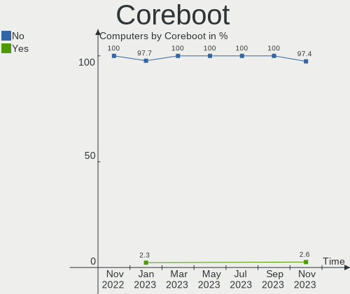
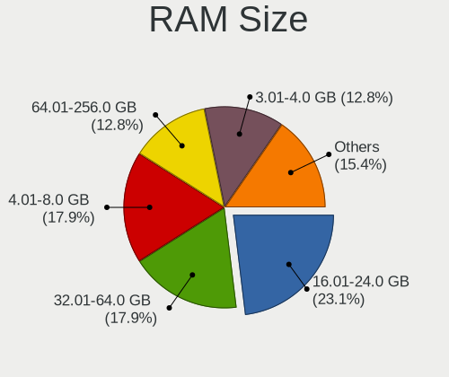
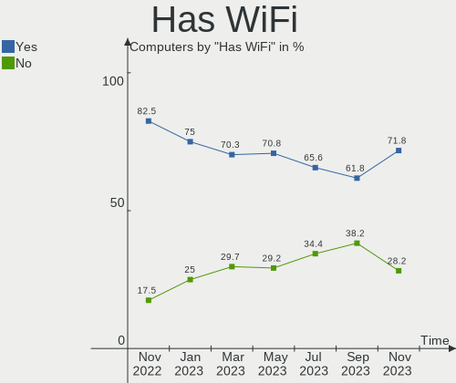
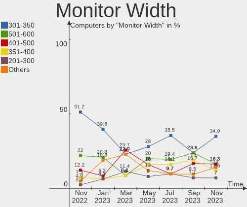
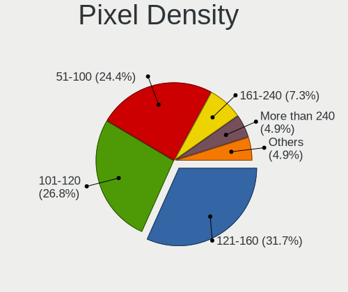
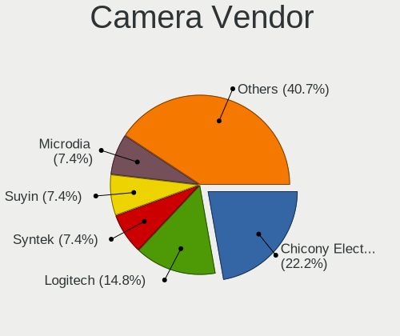
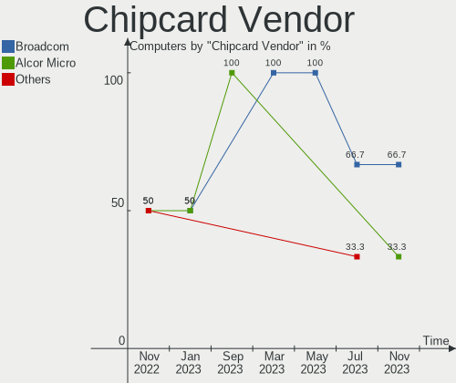
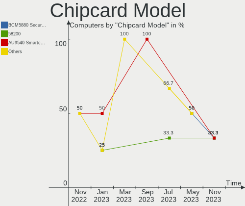

Ubuntu MATE - Hardware Trends
-----------------------------

A project to identify most popular hardware characteristics and track their change
over time based on data collected by Linux users at https://Linux-Hardware.org.

Anyone can contribute to this report by the [hw-probe](https://github.com/linuxhw/hw-probe) tool:

    sudo -E hw-probe -all -upload

This is a report for all computer types. See also reports for [desktops](/Dist/Ubuntu_MATE/Desktop/README.md) and [notebooks](/Dist/Ubuntu_MATE/Notebook/README.md).

This report is for one last month. Overall report since the beginning of time: [TestDays](https://github.com/linuxhw/TestDays)

Period: Sep, 2023.

Contents
--------

* [ System ](#system)
  - [ OS                       ](#os)
  - [ OS Family                ](#os-family)
  - [ Kernel                   ](#kernel)
  - [ Kernel Family            ](#kernel-family)
  - [ Kernel Major Ver.        ](#kernel-major-ver)
  - [ Arch                     ](#arch)
  - [ DE                       ](#de)
  - [ Display Server           ](#display-server)
  - [ Display Manager          ](#display-manager)
  - [ OS Lang                  ](#os-lang)
  - [ Boot Mode                ](#boot-mode)
  - [ Filesystem               ](#filesystem)
  - [ Part. scheme             ](#part-scheme)
  - [ Dual Boot with Linux/BSD ](#dual-boot-with-linuxbsd)
  - [ Dual Boot (Win)          ](#dual-boot-win)

* [ Board ](#board)
  - [ Vendor                   ](#vendor)
  - [ Model                    ](#model)
  - [ Model Family             ](#model-family)
  - [ MFG Year                 ](#mfg-year)
  - [ Form Factor              ](#form-factor)
  - [ Secure Boot              ](#secure-boot)
  - [ Coreboot                 ](#coreboot)
  - [ RAM Size                 ](#ram-size)
  - [ RAM Used                 ](#ram-used)
  - [ Total Drives             ](#total-drives)
  - [ Has CD-ROM               ](#has-cd-rom)
  - [ Has Ethernet             ](#has-ethernet)
  - [ Has WiFi                 ](#has-wifi)
  - [ Has Bluetooth            ](#has-bluetooth)

* [ Location ](#location)
  - [ Country                  ](#country)
  - [ City                     ](#city)

* [ Drives ](#drives)
  - [ Drive Vendor             ](#drive-vendor)
  - [ Drive Model              ](#drive-model)
  - [ HDD Vendor               ](#hdd-vendor)
  - [ SSD Vendor               ](#ssd-vendor)
  - [ Drive Kind               ](#drive-kind)
  - [ Drive Connector          ](#drive-connector)
  - [ Drive Size               ](#drive-size)
  - [ Space Total              ](#space-total)
  - [ Space Used               ](#space-used)
  - [ Malfunc. Drives          ](#malfunc-drives)
  - [ Malfunc. Drive Vendor    ](#malfunc-drive-vendor)
  - [ Malfunc. HDD Vendor      ](#malfunc-hdd-vendor)
  - [ Malfunc. Drive Kind      ](#malfunc-drive-kind)
  - [ Failed Drives            ](#failed-drives)
  - [ Failed Drive Vendor      ](#failed-drive-vendor)
  - [ Drive Status             ](#drive-status)

* [ Storage controller ](#storage-controller)
  - [ Storage Vendor           ](#storage-vendor)
  - [ Storage Model            ](#storage-model)
  - [ Storage Kind             ](#storage-kind)

* [ Processor ](#processor)
  - [ CPU Vendor               ](#cpu-vendor)
  - [ CPU Model                ](#cpu-model)
  - [ CPU Model Family         ](#cpu-model-family)
  - [ CPU Cores                ](#cpu-cores)
  - [ CPU Sockets              ](#cpu-sockets)
  - [ CPU Threads              ](#cpu-threads)
  - [ CPU Op-Modes             ](#cpu-op-modes)
  - [ CPU Microcode            ](#cpu-microcode)
  - [ CPU Microarch            ](#cpu-microarch)

* [ Graphics ](#graphics)
  - [ GPU Vendor               ](#gpu-vendor)
  - [ GPU Model                ](#gpu-model)
  - [ GPU Combo                ](#gpu-combo)
  - [ GPU Driver               ](#gpu-driver)
  - [ GPU Memory               ](#gpu-memory)

* [ Monitor ](#monitor)
  - [ Monitor Vendor           ](#monitor-vendor)
  - [ Monitor Model            ](#monitor-model)
  - [ Monitor Resolution       ](#monitor-resolution)
  - [ Monitor Diagonal         ](#monitor-diagonal)
  - [ Monitor Width            ](#monitor-width)
  - [ Aspect Ratio             ](#aspect-ratio)
  - [ Monitor Area             ](#monitor-area)
  - [ Pixel Density            ](#pixel-density)
  - [ Multiple Monitors        ](#multiple-monitors)

* [ Network ](#network)
  - [ Net Controller Vendor    ](#net-controller-vendor)
  - [ Net Controller Model     ](#net-controller-model)
  - [ Wireless Vendor          ](#wireless-vendor)
  - [ Wireless Model           ](#wireless-model)
  - [ Ethernet Vendor          ](#ethernet-vendor)
  - [ Ethernet Model           ](#ethernet-model)
  - [ Net Controller Kind      ](#net-controller-kind)
  - [ Used Controller          ](#used-controller)
  - [ NICs                     ](#nics)
  - [ IPv6                     ](#ipv6)

* [ Bluetooth ](#bluetooth)
  - [ Bluetooth Vendor         ](#bluetooth-vendor)
  - [ Bluetooth Model          ](#bluetooth-model)

* [ Sound ](#sound)
  - [ Sound Vendor             ](#sound-vendor)
  - [ Sound Model              ](#sound-model)

* [ Memory ](#memory)
  - [ Memory Vendor            ](#memory-vendor)
  - [ Memory Model             ](#memory-model)
  - [ Memory Kind              ](#memory-kind)
  - [ Memory Form Factor       ](#memory-form-factor)
  - [ Memory Size              ](#memory-size)
  - [ Memory Speed             ](#memory-speed)

* [ Printers & scanners ](#printers--scanners)
  - [ Printer Vendor           ](#printer-vendor)
  - [ Printer Model            ](#printer-model)
  - [ Scanner Vendor           ](#scanner-vendor)
  - [ Scanner Model            ](#scanner-model)

* [ Camera ](#camera)
  - [ Camera Vendor            ](#camera-vendor)
  - [ Camera Model             ](#camera-model)

* [ Security ](#security)
  - [ Fingerprint Vendor       ](#fingerprint-vendor)
  - [ Fingerprint Model        ](#fingerprint-model)
  - [ Chipcard Vendor          ](#chipcard-vendor)
  - [ Chipcard Model           ](#chipcard-model)

* [ Unsupported ](#unsupported)
  - [ Unsupported Devices      ](#unsupported-devices)
  - [ Unsupported Device Types ](#unsupported-device-types)

System
------

OS
--

Installed operating systems

| Name              | Computers | Percent |
|-------------------|-----------|---------|
| Ubuntu MATE 22.04 | 24        | 70.59%  |
| Ubuntu MATE 23.10 | 2         | 5.88%   |
| Ubuntu MATE 23.04 | 2         | 5.88%   |
| Ubuntu MATE 20.04 | 2         | 5.88%   |
| Ubuntu MATE 18.04 | 2         | 5.88%   |
| Ubuntu MATE 22.10 | 1         | 2.94%   |
| Ubuntu MATE 16.04 | 1         | 2.94%   |

OS Family
---------

OS without a version

| Name        | Computers | Percent |
|-------------|-----------|---------|
| Ubuntu MATE | 34        | 100%    |

Kernel
------

Version of the Linux kernel

| Version               | Computers | Percent |
|-----------------------|-----------|---------|
| 6.2.0-32-generic      | 9         | 26.47%  |
| 6.2.0-33-generic      | 3         | 8.82%   |
| 5.15.0-84-generic     | 3         | 8.82%   |
| 5.15.0-83-generic     | 3         | 8.82%   |
| 6.2.0-1011-lowlatency | 2         | 5.88%   |
| 5.15.0-82-generic     | 2         | 5.88%   |
| 6.5.1-060501-generic  | 1         | 2.94%   |
| 6.3.0-7-generic       | 1         | 2.94%   |
| 6.2.0-26-generic      | 1         | 2.94%   |
| 6.2.0-1009-nvidia     | 1         | 2.94%   |
| 6.1.0-odroid-arm64    | 1         | 2.94%   |
| 5.4.0-159-generic     | 1         | 2.94%   |
| 5.4.0-150-generic     | 1         | 2.94%   |
| 5.19.0-46-generic     | 1         | 2.94%   |
| 5.15.0-85-generic     | 1         | 2.94%   |
| 5.15.0-75-generic     | 1         | 2.94%   |
| 5.15.0-25-generic     | 1         | 2.94%   |
| 4.4.0-208-powerpc-smp | 1         | 2.94%   |

Kernel Family
-------------

Linux kernel without a distro release

| Version | Computers | Percent |
|---------|-----------|---------|
| 6.2.0   | 16        | 47.06%  |
| 5.15.0  | 11        | 32.35%  |
| 5.4.0   | 2         | 5.88%   |
| 6.5.1   | 1         | 2.94%   |
| 6.3.0   | 1         | 2.94%   |
| 6.1.0   | 1         | 2.94%   |
| 5.19.0  | 1         | 2.94%   |
| 4.4.0   | 1         | 2.94%   |

Kernel Major Ver.
-----------------

Linux kernel major version

| Version | Computers | Percent |
|---------|-----------|---------|
| 6.2     | 16        | 47.06%  |
| 5.15    | 11        | 32.35%  |
| 5.4     | 2         | 5.88%   |
| 6.5     | 1         | 2.94%   |
| 6.3     | 1         | 2.94%   |
| 6.1     | 1         | 2.94%   |
| 5.19    | 1         | 2.94%   |
| 4.4     | 1         | 2.94%   |

Arch
----

OS architecture (x86_64, i586, etc.)

| Name    | Computers | Percent |
|---------|-----------|---------|
| x86_64  | 31        | 91.18%  |
| ppc     | 1         | 2.94%   |
| i686    | 1         | 2.94%   |
| aarch64 | 1         | 2.94%   |

DE
--

Desktop Environment

| Name | Computers | Percent |
|------|-----------|---------|
| MATE | 34        | 100%    |

Display Server
--------------

X11 or Wayland

| Name    | Computers | Percent |
|---------|-----------|---------|
| X11     | 31        | 91.18%  |
| Wayland | 2         | 5.88%   |
| Tty     | 1         | 2.94%   |

Display Manager
---------------

SDDM, LightDM, etc.

| Name    | Computers | Percent |
|---------|-----------|---------|
| LightDM | 25        | 73.53%  |
| GDM3    | 5         | 14.71%  |
| LXDM    | 2         | 5.88%   |
| Unknown | 2         | 5.88%   |

OS Lang
-------

Language

| Lang  | Computers | Percent |
|-------|-----------|---------|
| en_US | 12        | 35.29%  |
| it_IT | 5         | 14.71%  |
| fr_FR | 3         | 8.82%   |
| sv_SE | 2         | 5.88%   |
| de_DE | 2         | 5.88%   |
| ru_RU | 1         | 2.94%   |
| pt_BR | 1         | 2.94%   |
| hu_HU | 1         | 2.94%   |
| es_VE | 1         | 2.94%   |
| es_ES | 1         | 2.94%   |
| es_CL | 1         | 2.94%   |
| es_AR | 1         | 2.94%   |
| en_NZ | 1         | 2.94%   |
| en_CA | 1         | 2.94%   |
| C     | 1         | 2.94%   |

Boot Mode
---------

EFI or BIOS

| Mode | Computers | Percent |
|------|-----------|---------|
| BIOS | 23        | 67.65%  |
| EFI  | 11        | 32.35%  |

Filesystem
----------

Type of filesystem

| Type    | Computers | Percent |
|---------|-----------|---------|
| Ext4    | 18        | 52.94%  |
| Tmpfs   | 13        | 38.24%  |
| Overlay | 2         | 5.88%   |
| Btrfs   | 1         | 2.94%   |

Part. scheme
------------

Scheme of partitioning

| Type    | Computers | Percent |
|---------|-----------|---------|
| GPT     | 24        | 70.59%  |
| MBR     | 8         | 23.53%  |
| Unknown | 2         | 5.88%   |

Dual Boot with Linux/BSD
------------------------

Hosting more than one Linux/BSD

| Dual boot | Computers | Percent |
|-----------|-----------|---------|
| No        | 27        | 79.41%  |
| Yes       | 7         | 20.59%  |

Dual Boot (Win)
---------------

Hosting Linux and Windows

| Dual boot | Computers | Percent |
|-----------|-----------|---------|
| No        | 20        | 58.82%  |
| Yes       | 14        | 41.18%  |

Board
-----

Vendor
------

Motherboard manufacturer

| Name                | Computers | Percent |
|---------------------|-----------|---------|
| ASUSTek Computer    | 9         | 26.47%  |
| Lenovo              | 6         | 17.65%  |
| Hewlett-Packard     | 4         | 11.76%  |
| Notebook            | 2         | 5.88%   |
| MSI                 | 2         | 5.88%   |
| Intel               | 2         | 5.88%   |
| Unknown             | 2         | 5.88%   |
| Hardkernel          | 1         | 2.94%   |
| Gigabyte Technology | 1         | 2.94%   |
| Foxconn             | 1         | 2.94%   |
| Dell                | 1         | 2.94%   |
| ASRock              | 1         | 2.94%   |
| Acer                | 1         | 2.94%   |
| 3Logic Group        | 1         | 2.94%   |

Model
-----

Motherboard model

| Name                                  | Computers | Percent |
|---------------------------------------|-----------|---------|
| Unknown                               | 2         | 5.88%   |
| Notebook NV4XMB,ME,MZ                 | 1         | 2.94%   |
| Notebook NJx0MU                       | 1         | 2.94%   |
| MSI MS-7C95                           | 1         | 2.94%   |
| MSI MS-7B87                           | 1         | 2.94%   |
| Lenovo ThinkPad X270 W10DG 20K5S3F000 | 1         | 2.94%   |
| Lenovo ThinkPad X270 W10DG 20K5S02K00 | 1         | 2.94%   |
| Lenovo ThinkPad X200 74595FG          | 1         | 2.94%   |
| Lenovo ThinkPad T490s 20NYS58200      | 1         | 2.94%   |
| Lenovo Legion Pro 5 16ARX8 82WM       | 1         | 2.94%   |
| Lenovo IdeaPadFlex 5 14ABR8 82XX      | 1         | 2.94%   |
| Intel NUC7CJYHN                       | 1         | 2.94%   |
| Intel DH67CL AAG10212-210             | 1         | 2.94%   |
| HP Pavilion Gaming Laptop 17-cd1xxx   | 1         | 2.94%   |
| HP OMEN by Laptop 17-ck0xxx           | 1         | 2.94%   |
| HP OMEN by Laptop 15-dc1xxx           | 1         | 2.94%   |
| HP Desktop M01-F0xxx                  | 1         | 2.94%   |
| Hardkernel ODROID-M1                  | 1         | 2.94%   |
| Gigabyte GA-MA770T-UD3                | 1         | 2.94%   |
| Foxconn p6-2012itm                    | 1         | 2.94%   |
| Dell Latitude E5470                   | 1         | 2.94%   |
| ASUS X550LN                           | 1         | 2.94%   |
| ASUS PRIME B450M-A II                 | 1         | 2.94%   |
| ASUS P8Z77-V LX                       | 1         | 2.94%   |
| ASUS P8P67-M PRO                      | 1         | 2.94%   |
| ASUS P5GC-MX                          | 1         | 2.94%   |
| ASUS N73SM                            | 1         | 2.94%   |
| ASUS M5A78L-M LX                      | 1         | 2.94%   |
| ASUS H61M-K                           | 1         | 2.94%   |
| ASUS G75VW                            | 1         | 2.94%   |
| ASRock A320M-HD                       | 1         | 2.94%   |
| Acer Aspire ES1-531                   | 1         | 2.94%   |
| 3Logic Group Graviton                 | 1         | 2.94%   |

Model Family
------------

Motherboard model prefix

| Name                   | Computers | Percent |
|------------------------|-----------|---------|
| Lenovo ThinkPad        | 4         | 11.76%  |
| HP OMEN                | 2         | 5.88%   |
| Unknown                | 2         | 5.88%   |
| Notebook NV4XMB        | 1         | 2.94%   |
| Notebook NJx0MU        | 1         | 2.94%   |
| MSI MS-7C95            | 1         | 2.94%   |
| MSI MS-7B87            | 1         | 2.94%   |
| Lenovo Legion          | 1         | 2.94%   |
| Lenovo IdeaPadFlex     | 1         | 2.94%   |
| Intel NUC7CJYHN        | 1         | 2.94%   |
| Intel DH67CL           | 1         | 2.94%   |
| HP Pavilion            | 1         | 2.94%   |
| HP Desktop             | 1         | 2.94%   |
| Hardkernel ODROID-M1   | 1         | 2.94%   |
| Gigabyte GA-MA770T-UD3 | 1         | 2.94%   |
| Foxconn p6-2012itm     | 1         | 2.94%   |
| Dell Latitude          | 1         | 2.94%   |
| ASUS X550LN            | 1         | 2.94%   |
| ASUS PRIME             | 1         | 2.94%   |
| ASUS P8Z77-V           | 1         | 2.94%   |
| ASUS P8P67-M           | 1         | 2.94%   |
| ASUS P5GC-MX           | 1         | 2.94%   |
| ASUS N73SM             | 1         | 2.94%   |
| ASUS M5A78L-M          | 1         | 2.94%   |
| ASUS H61M-K            | 1         | 2.94%   |
| ASUS G75VW             | 1         | 2.94%   |
| ASRock A320M-HD        | 1         | 2.94%   |
| Acer Aspire            | 1         | 2.94%   |
| 3Logic Group Graviton  | 1         | 2.94%   |

MFG Year
--------

Motherboard manufacture year

| Year    | Computers | Percent |
|---------|-----------|---------|
| 2011    | 5         | 14.71%  |
| 2020    | 4         | 11.76%  |
| 2019    | 4         | 11.76%  |
| 2022    | 3         | 8.82%   |
| 2021    | 2         | 5.88%   |
| 2018    | 2         | 5.88%   |
| 2017    | 2         | 5.88%   |
| 2012    | 2         | 5.88%   |
| Unknown | 2         | 5.88%   |
| 2023    | 1         | 2.94%   |
| 2016    | 1         | 2.94%   |
| 2015    | 1         | 2.94%   |
| 2014    | 1         | 2.94%   |
| 2013    | 1         | 2.94%   |
| 2009    | 1         | 2.94%   |
| 2008    | 1         | 2.94%   |
| 2007    | 1         | 2.94%   |

Form Factor
-----------

Physical design of the computer

| Name           | Computers | Percent |
|----------------|-----------|---------|
| Notebook       | 16        | 47.06%  |
| Desktop        | 15        | 44.12%  |
| System on chip | 1         | 2.94%   |
| Convertible    | 1         | 2.94%   |
| Mini pc        | 1         | 2.94%   |

Secure Boot
-----------

Enabled or disabled

| State    | Computers | Percent |
|----------|-----------|---------|
| Disabled | 32        | 94.12%  |
| Enabled  | 2         | 5.88%   |

Coreboot
--------

Have coreboot on board

| Used | Computers | Percent |
|------|-----------|---------|
| No   | 34        | 100%    |

RAM Size
--------

Total RAM memory

| Size in GB  | Computers | Percent |
|-------------|-----------|---------|
| 4.01-8.0    | 8         | 23.53%  |
| 8.01-16.0   | 7         | 20.59%  |
| 32.01-64.0  | 6         | 17.65%  |
| 16.01-24.0  | 5         | 14.71%  |
| 3.01-4.0    | 4         | 11.76%  |
| 24.01-32.0  | 2         | 5.88%   |
| 64.01-256.0 | 1         | 2.94%   |
| 1.01-2.0    | 1         | 2.94%   |

RAM Used
--------

Used RAM memory

| Used GB   | Computers | Percent |
|-----------|-----------|---------|
| 1.01-2.0  | 12        | 35.29%  |
| 4.01-8.0  | 8         | 23.53%  |
| 3.01-4.0  | 6         | 17.65%  |
| 8.01-16.0 | 4         | 11.76%  |
| 2.01-3.0  | 2         | 5.88%   |
| 0.51-1.0  | 1         | 2.94%   |
| 0.01-0.5  | 1         | 2.94%   |

Total Drives
------------

Number of drives on board

| Drives | Computers | Percent |
|--------|-----------|---------|
| 1      | 17        | 50%     |
| 2      | 10        | 29.41%  |
| 3      | 4         | 11.76%  |
| 4      | 2         | 5.88%   |
| 9      | 1         | 2.94%   |

Has CD-ROM
----------

Has CD-ROM on board

| Presented | Computers | Percent |
|-----------|-----------|---------|
| No        | 19        | 55.88%  |
| Yes       | 15        | 44.12%  |

Has Ethernet
------------

Has Ethernet on board

| Presented | Computers | Percent |
|-----------|-----------|---------|
| Yes       | 31        | 91.18%  |
| No        | 3         | 8.82%   |

Has WiFi
--------

Has WiFi module

| Presented | Computers | Percent |
|-----------|-----------|---------|
| Yes       | 21        | 61.76%  |
| No        | 13        | 38.24%  |

Has Bluetooth
-------------

Has Bluetooth module

| Presented | Computers | Percent |
|-----------|-----------|---------|
| Yes       | 19        | 55.88%  |
| No        | 15        | 44.12%  |

Location
--------

Country
-------

Geographic location (country)

| Country     | Computers | Percent |
|-------------|-----------|---------|
| USA         | 5         | 14.71%  |
| Italy       | 5         | 14.71%  |
| France      | 4         | 11.76%  |
| Sweden      | 2         | 5.88%   |
| Russia      | 2         | 5.88%   |
| Brazil      | 2         | 5.88%   |
| Argentina   | 2         | 5.88%   |
| Venezuela   | 1         | 2.94%   |
| Taiwan      | 1         | 2.94%   |
| Spain       | 1         | 2.94%   |
| Peru        | 1         | 2.94%   |
| New Zealand | 1         | 2.94%   |
| Lithuania   | 1         | 2.94%   |
| Hungary     | 1         | 2.94%   |
| Germany     | 1         | 2.94%   |
| Finland     | 1         | 2.94%   |
| Denmark     | 1         | 2.94%   |
| Chile       | 1         | 2.94%   |
| Belgium     | 1         | 2.94%   |

City
----

Geographic location (city)

| City              | Computers | Percent |
|-------------------|-----------|---------|
| Sundbyberg        | 2         | 5.88%   |
| Moscow            | 2         | 5.88%   |
| Forlì            | 2         | 5.88%   |
| Vienne-le-Chateau | 1         | 2.94%   |
| Tours             | 1         | 2.94%   |
| Taoyuan District  | 1         | 2.94%   |
| Silkeborg         | 1         | 2.94%   |
| Sao Paulo         | 1         | 2.94%   |
| Santo André      | 1         | 2.94%   |
| San Fernando      | 1         | 2.94%   |
| Rotorua           | 1         | 2.94%   |
| Reading           | 1         | 2.94%   |
| Phoenix           | 1         | 2.94%   |
| New Brighton      | 1         | 2.94%   |
| Naples            | 1         | 2.94%   |
| Montbéliard      | 1         | 2.94%   |
| Los Gatos         | 1         | 2.94%   |
| Lima              | 1         | 2.94%   |
| Klaipėda         | 1         | 2.94%   |
| Jyväskylä       | 1         | 2.94%   |
| Henin-Beaumont    | 1         | 2.94%   |
| Győr             | 1         | 2.94%   |
| Getxo             | 1         | 2.94%   |
| Gentbrugge        | 1         | 2.94%   |
| Este              | 1         | 2.94%   |
| Córdoba          | 1         | 2.94%   |
| Carrollton        | 1         | 2.94%   |
| Caracas           | 1         | 2.94%   |
| Buenos Aires      | 1         | 2.94%   |
| Bonn              | 1         | 2.94%   |
| Bologna           | 1         | 2.94%   |

Drives
------

Drive Vendor
------------

Hard drive vendors

| Vendor              | Computers | Drives | Percent |
|---------------------|-----------|--------|---------|
| Samsung Electronics | 12        | 14     | 21.82%  |
| WDC                 | 10        | 13     | 18.18%  |
| Seagate             | 8         | 9      | 14.55%  |
| Kingston            | 6         | 7      | 10.91%  |
| Toshiba             | 5         | 5      | 9.09%   |
| Verbatim            | 2         | 2      | 3.64%   |
| SPCC                | 2         | 2      | 3.64%   |
| SanDisk             | 2         | 3      | 3.64%   |
| Hitachi             | 2         | 2      | 3.64%   |
| Unknown             | 1         | 3      | 1.82%   |
| SK hynix            | 1         | 1      | 1.82%   |
| Intel               | 1         | 1      | 1.82%   |
| Fujitsu             | 1         | 1      | 1.82%   |
| ASMT                | 1         | 1      | 1.82%   |
| Apacer              | 1         | 1      | 1.82%   |

Drive Model
-----------

Hard drive models

| Model                                           | Computers | Percent |
|-------------------------------------------------|-----------|---------|
| WDC WD5003AZEX-00K3CA0 500GB                    | 3         | 4.76%   |
| Kingston SA400S37240G 240GB SSD                 | 3         | 4.76%   |
| Verbatim Vi550 S3 512GB                         | 2         | 3.17%   |
| Toshiba XG6 NVMe SSD Controller 512GB           | 2         | 3.17%   |
| Seagate ST1000DM003-1ER162 1TB                  | 2         | 3.17%   |
| Kingston SA400S37480G 480GB SSD                 | 2         | 3.17%   |
| WDC WD5003AZEX-00K1GA0 500GB                    | 1         | 1.59%   |
| WDC WD5000AAKX-22ERMA0 500GB                    | 1         | 1.59%   |
| WDC WD4005FZBX-00K5WB0 4TB                      | 1         | 1.59%   |
| WDC WD4004FZWX-00GBGB0 4TB                      | 1         | 1.59%   |
| WDC WD20EFAX-68B2RN1 2TB                        | 1         | 1.59%   |
| WDC WD10EZEX-60WN4A1 1TB                        | 1         | 1.59%   |
| WDC WD10EZEX-08WN4A0 1TB                        | 1         | 1.59%   |
| WDC WD1002FBYS-02A6B0 1TB                       | 1         | 1.59%   |
| WDC WD Blue SA510 2.5 500GB                     | 1         | 1.59%   |
| WDC PC SN730 SDBQNTY-512G-1001 512GB            | 1         | 1.59%   |
| Unknown SD/MMC 2GB                              | 1         | 1.59%   |
| Unknown M.S./M.S.Pro/HG 16GB                    | 1         | 1.59%   |
| Toshiba THNSF5256GPUK 256GB                     | 1         | 1.59%   |
| Toshiba MQ01ABD100 1TB                          | 1         | 1.59%   |
| Toshiba HDWD120 2TB                             | 1         | 1.59%   |
| SPCC Solid State Disk 120GB                     | 1         | 1.59%   |
| SPCC M.2 PCIe SSD 1TB                           | 1         | 1.59%   |
| SK hynix SKHynix_HFS001TEJ9X115N 1TB            | 1         | 1.59%   |
| Seagate ST9500420AS 500GB                       | 1         | 1.59%   |
| Seagate ST500LM012 HN-M500MBB 500GB             | 1         | 1.59%   |
| Seagate ST500DM002-1BD142 500GB                 | 1         | 1.59%   |
| Seagate ST3360320AS 360GB                       | 1         | 1.59%   |
| Seagate ST31000524AS 1TB                        | 1         | 1.59%   |
| Seagate ST1000DM003-1SB10C 1TB                  | 1         | 1.59%   |
| Seagate FreeAgent XTreme 500GB                  | 1         | 1.59%   |
| Sandisk WD Blue SN500 / PC SN520 NVMe SSD 256GB | 1         | 1.59%   |
| SanDisk SDSSDP128G 128GB                        | 1         | 1.59%   |
| SanDisk NVMe SSD Drive 1TB                      | 1         | 1.59%   |
| Samsung SSD 980 PRO 500GB S5GYNF0R322406T       | 1         | 1.59%   |
| Samsung SSD 870 QVO 8TB                         | 1         | 1.59%   |
| Samsung SSD 860 EVO M.2 500GB                   | 1         | 1.59%   |
| Samsung SSD 860 EVO 500GB                       | 1         | 1.59%   |
| Samsung SSD 850 EVO 250GB                       | 1         | 1.59%   |
| Samsung SSD 750 EVO 120GB                       | 1         | 1.59%   |

HDD Vendor
----------

Hard disk drive vendors

| Vendor              | Computers | Drives | Percent |
|---------------------|-----------|--------|---------|
| WDC                 | 8         | 11     | 34.78%  |
| Seagate             | 8         | 9      | 34.78%  |
| Toshiba             | 2         | 2      | 8.7%    |
| Samsung Electronics | 2         | 3      | 8.7%    |
| Hitachi             | 2         | 2      | 8.7%    |
| Fujitsu             | 1         | 1      | 4.35%   |

SSD Vendor
----------

Solid state drive vendors

| Vendor              | Computers | Drives | Percent |
|---------------------|-----------|--------|---------|
| Samsung Electronics | 5         | 6      | 29.41%  |
| Kingston            | 5         | 6      | 29.41%  |
| Verbatim            | 2         | 2      | 11.76%  |
| WDC                 | 1         | 1      | 5.88%   |
| SPCC                | 1         | 1      | 5.88%   |
| SanDisk             | 1         | 1      | 5.88%   |
| ASMT                | 1         | 1      | 5.88%   |
| Apacer              | 1         | 1      | 5.88%   |

Drive Kind
----------

HDD or SSD

| Kind    | Computers | Drives | Percent |
|---------|-----------|--------|---------|
| HDD     | 18        | 28     | 39.13%  |
| NVMe    | 14        | 15     | 30.43%  |
| SSD     | 13        | 19     | 28.26%  |
| Unknown | 1         | 3      | 2.17%   |

Drive Connector
---------------

SATA, SAS, NVMe, etc.

| Type | Computers | Drives | Percent |
|------|-----------|--------|---------|
| SATA | 25        | 45     | 60.98%  |
| NVMe | 14        | 15     | 34.15%  |
| SAS  | 2         | 5      | 4.88%   |

Drive Size
----------

Size of hard drive

| Size in TB | Computers | Drives | Percent |
|------------|-----------|--------|---------|
| 0.01-0.5   | 20        | 30     | 57.14%  |
| 0.51-1.0   | 10        | 11     | 28.57%  |
| 3.01-4.0   | 2         | 2      | 5.71%   |
| 1.01-2.0   | 2         | 3      | 5.71%   |
| 4.01-10.0  | 1         | 1      | 2.86%   |

Space Total
-----------

Amount of disk space available on the file system

| Size in GB     | Computers | Percent |
|----------------|-----------|---------|
| 101-250        | 8         | 23.53%  |
| 251-500        | 7         | 20.59%  |
| 501-1000       | 7         | 20.59%  |
| More than 3000 | 6         | 17.65%  |
| 1001-2000      | 3         | 8.82%   |
| 1-20           | 2         | 5.88%   |
| 51-100         | 1         | 2.94%   |

Space Used
----------

Amount of used disk space

| Used GB        | Computers | Percent |
|----------------|-----------|---------|
| 1-20           | 9         | 26.47%  |
| 251-500        | 4         | 11.76%  |
| 101-250        | 4         | 11.76%  |
| 501-1000       | 4         | 11.76%  |
| 51-100         | 4         | 11.76%  |
| More than 3000 | 3         | 8.82%   |
| 21-50          | 3         | 8.82%   |
| 1001-2000      | 2         | 5.88%   |
| 2001-3000      | 1         | 2.94%   |

Malfunc. Drives
---------------

Drive models with a malfunction

| Model                        | Computers | Drives | Percent |
|------------------------------|-----------|--------|---------|
| WDC WD5000AAKX-22ERMA0 500GB | 1         | 1      | 50%     |
| WDC WD Blue SA510 2.5 500GB  | 1         | 1      | 50%     |

Malfunc. Drive Vendor
---------------------

Vendors of faulty drives

| Vendor | Computers | Drives | Percent |
|--------|-----------|--------|---------|
| WDC    | 2         | 2      | 100%    |

Malfunc. HDD Vendor
-------------------

Vendors of faulty HDD drives

| Vendor | Computers | Drives | Percent |
|--------|-----------|--------|---------|
| WDC    | 1         | 1      | 100%    |

Malfunc. Drive Kind
-------------------

Kinds of faulty drives

| Kind | Computers | Drives | Percent |
|------|-----------|--------|---------|
| SSD  | 1         | 1      | 50%     |
| HDD  | 1         | 1      | 50%     |

Failed Drives
-------------

Failed drive models

Zero info for selected period =(

Failed Drive Vendor
-------------------

Failed drive vendors

Zero info for selected period =(

Drive Status
------------

Number of failed and malfunc. drives

| Status   | Computers | Drives | Percent |
|----------|-----------|--------|---------|
| Detected | 18        | 37     | 47.37%  |
| Works    | 18        | 26     | 47.37%  |
| Malfunc  | 2         | 2      | 5.26%   |

Storage controller
------------------

Storage Vendor
--------------

Storage controller vendors

| Vendor                       | Computers | Percent |
|------------------------------|-----------|---------|
| Intel                        | 20        | 47.62%  |
| AMD                          | 7         | 16.67%  |
| Samsung Electronics          | 5         | 11.9%   |
| Toshiba America Info Systems | 3         | 7.14%   |
| SanDisk                      | 3         | 7.14%   |
| SK hynix                     | 1         | 2.38%   |
| Realtek Semiconductor        | 1         | 2.38%   |
| Marvell Technology Group     | 1         | 2.38%   |
| Kingston Technology Company  | 1         | 2.38%   |

Storage Model
-------------

Storage controller models

| Model                                                                            | Computers | Percent |
|----------------------------------------------------------------------------------|-----------|---------|
| Intel 6 Series/C200 Series Chipset Family 6 port Desktop SATA AHCI Controller    | 4         | 8.16%   |
| AMD FCH SATA Controller [AHCI mode]                                              | 4         | 8.16%   |
| Samsung NVMe SSD Controller PM9A1/PM9A3/980PRO                                   | 3         | 6.12%   |
| AMD 400 Series Chipset SATA Controller                                           | 3         | 6.12%   |
| Toshiba America Info Systems XG6 NVMe SSD Controller                             | 2         | 4.08%   |
| Intel 82801 Mobile SATA Controller [RAID mode]                                   | 2         | 4.08%   |
| Intel 6 Series/C200 Series Chipset Family 6 port Mobile SATA AHCI Controller     | 2         | 4.08%   |
| AMD SB7x0/SB8x0/SB9x0 SATA Controller [IDE mode]                                 | 2         | 4.08%   |
| AMD SB7x0/SB8x0/SB9x0 IDE Controller                                             | 2         | 4.08%   |
| Toshiba America Info Systems XG4 NVMe SSD Controller                             | 1         | 2.04%   |
| SK hynix Platinum P41/PC801 NVMe Solid State Drive                               | 1         | 2.04%   |
| SanDisk WD Blue SN570 NVMe SSD 1TB                                               | 1         | 2.04%   |
| SanDisk WD Blue SN500 / PC SN520 NVMe SSD                                        | 1         | 2.04%   |
| SanDisk WD Black SN750 / PC SN730 NVMe SSD                                       | 1         | 2.04%   |
| Samsung NVMe SSD Controller SM961/PM961/SM963                                    | 1         | 2.04%   |
| Samsung NVMe SSD Controller PM9B1                                                | 1         | 2.04%   |
| Realtek RTS5765DL NVMe SSD Controller (DRAM-less)                                | 1         | 2.04%   |
| Marvell Group 88SE9172 SATA III 6Gb/s RAID Controller                            | 1         | 2.04%   |
| Kingston Company NVMe Controller                                                 | 1         | 2.04%   |
| Intel Volume Management Device NVMe RAID Controller                              | 1         | 2.04%   |
| Intel Tiger Lake-LP SATA Controller                                              | 1         | 2.04%   |
| Intel SSD 660P Series                                                            | 1         | 2.04%   |
| Intel SATA Controller [RAID mode]                                                | 1         | 2.04%   |
| Intel NM10/ICH7 Family SATA Controller [IDE mode]                                | 1         | 2.04%   |
| Intel Celeron/Pentium Silver Processor SATA Controller                           | 1         | 2.04%   |
| Intel Atom/Celeron/Pentium Processor x5-E8000/J3xxx/N3xxx Series SATA Controller | 1         | 2.04%   |
| Intel 82801IBM/IEM (ICH9M/ICH9M-E) 2 port SATA Controller [IDE mode]             | 1         | 2.04%   |
| Intel 82801G (ICH7 Family) IDE Controller                                        | 1         | 2.04%   |
| Intel 8 Series SATA Controller 1 [AHCI mode]                                     | 1         | 2.04%   |
| Intel 7 Series/C210 Series Chipset Family 6-port SATA Controller [AHCI mode]     | 1         | 2.04%   |
| Intel 7 Series Chipset Family 6-port SATA Controller [AHCI mode]                 | 1         | 2.04%   |
| Intel 500 Series Chipset Family SATA AHCI Controller                             | 1         | 2.04%   |
| AMD FCH SATA Controller D                                                        | 1         | 2.04%   |
| AMD 500 Series Chipset SATA Controller                                           | 1         | 2.04%   |

Storage Kind
------------

Kind of storage controller (IDE, SATA, NVMe, SAS, ...)

| Kind | Computers | Percent |
|------|-----------|---------|
| SATA | 20        | 46.51%  |
| NVMe | 14        | 32.56%  |
| IDE  | 5         | 11.63%  |
| RAID | 4         | 9.3%    |

Processor
---------

CPU Vendor
----------

Processor vendors

| Vendor       | Computers | Percent |
|--------------|-----------|---------|
| Intel        | 23        | 67.65%  |
| AMD          | 9         | 26.47%  |
| PowerBook5,6 | 1         | 2.94%   |
| ARM          | 1         | 2.94%   |

CPU Model
---------

Processor models

| Model                                       | Computers | Percent |
|---------------------------------------------|-----------|---------|
| Intel Core i5-6300U CPU @ 2.40GHz           | 2         | 5.88%   |
| Intel 11th Gen Core i7-1165G7 @ 2.80GHz     | 2         | 5.88%   |
| AMD Ryzen 5 3400G with Radeon Vega Graphics | 2         | 5.88%   |
| PowerBook5,6 7447A, altivec supported       | 1         | 2.94%   |
| Intel Xeon CPU E5-2640 0 @ 2.50GHz          | 1         | 2.94%   |
| Intel Pentium CPU N3700 @ 1.60GHz           | 1         | 2.94%   |
| Intel Pentium CPU G2020 @ 2.90GHz           | 1         | 2.94%   |
| Intel Core i7-9750H CPU @ 2.60GHz           | 1         | 2.94%   |
| Intel Core i7-8665U CPU @ 1.90GHz           | 1         | 2.94%   |
| Intel Core i7-3630QM CPU @ 2.40GHz          | 1         | 2.94%   |
| Intel Core i7-2670QM CPU @ 2.20GHz          | 1         | 2.94%   |
| Intel Core i7-2600 CPU @ 3.40GHz            | 1         | 2.94%   |
| Intel Core i7-10750H CPU @ 2.60GHz          | 1         | 2.94%   |
| Intel Core i5-6440HQ CPU @ 2.60GHz          | 1         | 2.94%   |
| Intel Core i5-3570K CPU @ 3.40GHz           | 1         | 2.94%   |
| Intel Core i5-3470 CPU @ 3.20GHz            | 1         | 2.94%   |
| Intel Core i5-2320 CPU @ 3.00GHz            | 1         | 2.94%   |
| Intel Core i5-10400 CPU @ 2.90GHz           | 1         | 2.94%   |
| Intel Core i3-4010U CPU @ 1.70GHz           | 1         | 2.94%   |
| Intel Core 2 Duo CPU P8600 @ 2.40GHz        | 1         | 2.94%   |
| Intel Core 2 Duo CPU E4600 @ 2.40GHz        | 1         | 2.94%   |
| Intel Celeron J4025 CPU @ 2.00GHz           | 1         | 2.94%   |
| Intel 11th Gen Core i7-11800H @ 2.30GHz     | 1         | 2.94%   |
| ARM Processor                               | 1         | 2.94%   |
| AMD Ryzen 7 7745HX with Radeon Graphics     | 1         | 2.94%   |
| AMD Ryzen 7 7730U with Radeon Graphics      | 1         | 2.94%   |
| AMD Ryzen 5 5600G with Radeon Graphics      | 1         | 2.94%   |
| AMD Ryzen 5 5500                            | 1         | 2.94%   |
| AMD Ryzen 3 2200G with Radeon Vega Graphics | 1         | 2.94%   |
| AMD Athlon II X4 650 Processor              | 1         | 2.94%   |
| AMD Athlon II X2 245 Processor              | 1         | 2.94%   |

CPU Model Family
----------------

Processor model prefix

| Model            | Computers | Percent |
|------------------|-----------|---------|
| Intel Core i5    | 7         | 20.59%  |
| Intel Core i7    | 6         | 17.65%  |
| Other            | 5         | 14.71%  |
| AMD Ryzen 5      | 4         | 11.76%  |
| Intel Pentium    | 2         | 5.88%   |
| Intel Core 2 Duo | 2         | 5.88%   |
| AMD Ryzen 7      | 2         | 5.88%   |
| Intel Xeon       | 1         | 2.94%   |
| Intel Core i3    | 1         | 2.94%   |
| Intel Celeron    | 1         | 2.94%   |
| AMD Ryzen 3      | 1         | 2.94%   |
| AMD Athlon II X4 | 1         | 2.94%   |
| AMD Athlon II X2 | 1         | 2.94%   |

CPU Cores
---------

Number of processor cores

| Number  | Computers | Percent |
|---------|-----------|---------|
| 4       | 15        | 44.12%  |
| 2       | 8         | 23.53%  |
| 6       | 6         | 17.65%  |
| 8       | 3         | 8.82%   |
| 1       | 1         | 2.94%   |
| Unknown | 1         | 2.94%   |

CPU Sockets
-----------

Number of sockets

| Number  | Computers | Percent |
|---------|-----------|---------|
| 1       | 33        | 97.06%  |
| Unknown | 1         | 2.94%   |

CPU Threads
-----------

Threads per core (Hyper-Threading)

| Number  | Computers | Percent |
|---------|-----------|---------|
| 2       | 20        | 58.82%  |
| 1       | 13        | 38.24%  |
| Unknown | 1         | 2.94%   |

CPU Op-Modes
------------

CPU Operation Modes (32-bit, 64-bit)

| Op mode        | Computers | Percent |
|----------------|-----------|---------|
| 32-bit, 64-bit | 33        | 97.06%  |
| 32-bit         | 1         | 2.94%   |

CPU Microcode
-------------

Microcode number

| Number     | Computers | Percent |
|------------|-----------|---------|
| Unknown    | 24        | 70.59%  |
| 0x0a50000d | 2         | 5.88%   |
| 0xa0653    | 1         | 2.94%   |
| 0x806d1    | 1         | 2.94%   |
| 0x806c1    | 1         | 2.94%   |
| 0x6fd      | 1         | 2.94%   |
| 0x406e3    | 1         | 2.94%   |
| 0x0a601203 | 1         | 2.94%   |
| 0x08108109 | 1         | 2.94%   |
| 0x010000c8 | 1         | 2.94%   |

CPU Microarch
-------------

Microarchitecture

| Name          | Computers | Percent |
|---------------|-----------|---------|
| SandyBridge   | 4         | 11.76%  |
| IvyBridge     | 4         | 11.76%  |
| Zen 3         | 3         | 8.82%   |
| Skylake       | 3         | 8.82%   |
| Unknown       | 3         | 8.82%   |
| Zen+          | 2         | 5.88%   |
| TigerLake     | 2         | 5.88%   |
| KabyLake      | 2         | 5.88%   |
| K10           | 2         | 5.88%   |
| CometLake     | 2         | 5.88%   |
| Zen           | 1         | 2.94%   |
| Silvermont    | 1         | 2.94%   |
| Penryn        | 1         | 2.94%   |
| Icelake       | 1         | 2.94%   |
| Haswell       | 1         | 2.94%   |
| Goldmont plus | 1         | 2.94%   |
| Core          | 1         | 2.94%   |

Graphics
--------

GPU Vendor
----------

Vendors of graphics cards

| Vendor | Computers | Percent |
|--------|-----------|---------|
| Intel  | 17        | 43.59%  |
| AMD    | 12        | 30.77%  |
| Nvidia | 10        | 25.64%  |

GPU Model
---------

Graphics card models

| Model                                                                                    | Computers | Percent |
|------------------------------------------------------------------------------------------|-----------|---------|
| Nvidia TU116M [GeForce GTX 1660 Ti Mobile]                                               | 2         | 5.13%   |
| Nvidia GK208B [GeForce GT 710]                                                           | 2         | 5.13%   |
| Intel Xeon E3-1200 v2/3rd Gen Core processor Graphics Controller                         | 2         | 5.13%   |
| Intel TigerLake-LP GT2 [Iris Xe Graphics]                                                | 2         | 5.13%   |
| Intel Skylake GT2 [HD Graphics 520]                                                      | 2         | 5.13%   |
| AMD Picasso/Raven 2 [Radeon Vega Series / Radeon Vega Mobile Series]                     | 2         | 5.13%   |
| Nvidia GT218 [GeForce 210]                                                               | 1         | 2.56%   |
| Nvidia GM108M [GeForce 840M]                                                             | 1         | 2.56%   |
| Nvidia GF114M [GeForce GTX 670M]                                                         | 1         | 2.56%   |
| Nvidia GF108M [GeForce GT 620M/630M/635M/640M LE]                                        | 1         | 2.56%   |
| Nvidia GA104M [GeForce RTX 3070 Mobile / Max-Q]                                          | 1         | 2.56%   |
| Nvidia AD107M [GeForce RTX 4060 Max-Q / Mobile]                                          | 1         | 2.56%   |
| Intel WhiskeyLake-U GT2 [UHD Graphics 620]                                               | 1         | 2.56%   |
| Intel TigerLake-H GT1 [UHD Graphics]                                                     | 1         | 2.56%   |
| Intel Mobile 4 Series Chipset Integrated Graphics Controller                             | 1         | 2.56%   |
| Intel HD Graphics 530                                                                    | 1         | 2.56%   |
| Intel Haswell-ULT Integrated Graphics Controller                                         | 1         | 2.56%   |
| Intel GeminiLake [UHD Graphics 600]                                                      | 1         | 2.56%   |
| Intel CometLake-S GT2 [UHD Graphics 630]                                                 | 1         | 2.56%   |
| Intel CometLake-H GT2 [UHD Graphics]                                                     | 1         | 2.56%   |
| Intel Atom/Celeron/Pentium Processor x5-E8000/J3xxx/N3xxx Integrated Graphics Controller | 1         | 2.56%   |
| Intel 82945G/GZ Integrated Graphics Controller                                           | 1         | 2.56%   |
| Intel 2nd Generation Core Processor Family Integrated Graphics Controller                | 1         | 2.56%   |
| AMD Turks PRO [Radeon HD 6570/7570/8550 / R5 230]                                        | 1         | 2.56%   |
| AMD Topaz XT [Radeon R7 M260/M265 / M340/M360 / M440/M445 / 530/535 / 620/625 Mobile]    | 1         | 2.56%   |
| AMD RV350/M10 / RV360/M11 [Mobility Radeon 9600 (PRO) / 9700]                            | 1         | 2.56%   |
| AMD RS780L [Radeon 3000]                                                                 | 1         | 2.56%   |
| AMD Raven Ridge [Radeon Vega Series / Radeon Vega Mobile Series]                         | 1         | 2.56%   |
| AMD Raphael                                                                              | 1         | 2.56%   |
| AMD Cezanne [Radeon Vega Series / Radeon Vega Mobile Series]                             | 1         | 2.56%   |
| AMD Caicos [Radeon HD 6450/7450/8450 / R5 230 OEM]                                       | 1         | 2.56%   |
| AMD Barcelo                                                                              | 1         | 2.56%   |
| AMD Baffin [Radeon RX 460/560D / Pro 450/455/460/555/555X/560/560X]                      | 1         | 2.56%   |

GPU Combo
---------

Combinations of graphics cards

| Name           | Computers | Percent |
|----------------|-----------|---------|
| 1 x Intel      | 12        | 35.29%  |
| 1 x AMD        | 10        | 29.41%  |
| 1 x Nvidia     | 5         | 14.71%  |
| Intel + Nvidia | 4         | 11.76%  |
| Other          | 1         | 2.94%   |
| Intel + AMD    | 1         | 2.94%   |
| AMD + Nvidia   | 1         | 2.94%   |

GPU Driver
----------

Free vs proprietary

| Driver      | Computers | Percent |
|-------------|-----------|---------|
| Free        | 25        | 73.53%  |
| Proprietary | 8         | 23.53%  |
| Unknown     | 1         | 2.94%   |

GPU Memory
----------

Total video memory

| Size in GB | Computers | Percent |
|------------|-----------|---------|
| Unknown    | 25        | 73.53%  |
| 1.01-2.0   | 4         | 11.76%  |
| 0.01-0.5   | 3         | 8.82%   |
| 5.01-6.0   | 1         | 2.94%   |
| 0.51-1.0   | 1         | 2.94%   |

Monitor
-------

Monitor Vendor
--------------

Monitor vendors

| Vendor                  | Computers | Percent |
|-------------------------|-----------|---------|
| LG Display              | 6         | 14.29%  |
| Samsung Electronics     | 5         | 11.9%   |
| Hewlett-Packard         | 4         | 9.52%   |
| BOE                     | 4         | 9.52%   |
| Philips                 | 3         | 7.14%   |
| AU Optronics            | 2         | 4.76%   |
| ViewSonic               | 1         | 2.38%   |
| SGX                     | 1         | 2.38%   |
| PXO                     | 1         | 2.38%   |
| Packard Bell            | 1         | 2.38%   |
| Lenovo                  | 1         | 2.38%   |
| Iiyama                  | 1         | 2.38%   |
| HPN                     | 1         | 2.38%   |
| Goldstar                | 1         | 2.38%   |
| Eizo                    | 1         | 2.38%   |
| EDI                     | 1         | 2.38%   |
| Dell                    | 1         | 2.38%   |
| CSO                     | 1         | 2.38%   |
| Chimei Innolux          | 1         | 2.38%   |
| Chi Mei Optoelectronics | 1         | 2.38%   |
| Apple                   | 1         | 2.38%   |
| AOC                     | 1         | 2.38%   |
| Ancor Communications    | 1         | 2.38%   |
| Acer                    | 1         | 2.38%   |

Monitor Model
-------------

Monitor models

| Model                                                                     | Computers | Percent |
|---------------------------------------------------------------------------|-----------|---------|
| ViewSonic VA2046 SERIES VSC6D2E 1600x900 430x240mm 19.4-inch              | 1         | 2.22%   |
| SGX LCD Monitor SGX1000 1280x1024                                         | 1         | 2.22%   |
| Samsung Electronics SyncMaster SAM01E1 1280x1024 380x300mm 19.1-inch      | 1         | 2.22%   |
| Samsung Electronics SyncMaster SAM01D3 1440x900 410x260mm 19.1-inch       | 1         | 2.22%   |
| Samsung Electronics SyncMaster SAM006A 1280x1024 338x270mm 17.0-inch      | 1         | 2.22%   |
| Samsung Electronics SMBX2440 SAM068A 1920x1080 531x299mm 24.0-inch        | 1         | 2.22%   |
| Samsung Electronics S22E450 SAM0C79 1920x1080 480x270mm 21.7-inch         | 1         | 2.22%   |
| Samsung Electronics LF27T35 SAM707F 1920x1080 598x337mm 27.0-inch         | 1         | 2.22%   |
| Samsung Electronics LCD Monitor SMBX2440                                  | 1         | 2.22%   |
| PXO Pixio PXC277 PXO2712 2560x1440 597x336mm 27.0-inch                    | 1         | 2.22%   |
| Philips PHL 273V7 PHLC156 1920x1080 600x340mm 27.2-inch                   | 1         | 2.22%   |
| Philips PHL 242V8 PHLC219 1920x1080 527x296mm 23.8-inch                   | 1         | 2.22%   |
| Philips PHL 223V5 PHLC0CF 1920x1080 477x268mm 21.5-inch                   | 1         | 2.22%   |
| Packard Bell Viseo203DX PKB03B1 1600x900 432x240mm 19.5-inch              | 1         | 2.22%   |
| LG Display LCD Monitor LGD063F 1920x1080 382x215mm 17.3-inch              | 1         | 2.22%   |
| LG Display LCD Monitor LGD062C 1920x1080 309x174mm 14.0-inch              | 1         | 2.22%   |
| LG Display LCD Monitor LGD0490 1920x1080 309x174mm 14.0-inch              | 1         | 2.22%   |
| LG Display LCD Monitor LGD0456 1366x768 344x194mm 15.5-inch               | 1         | 2.22%   |
| LG Display LCD Monitor LGD03DB 1366x768 345x194mm 15.6-inch               | 1         | 2.22%   |
| LG Display LCD Monitor LGD02D1 1600x900 382x215mm 17.3-inch               | 1         | 2.22%   |
| Lenovo LCD Monitor LEN4010 1280x800 261x163mm 12.1-inch                   | 1         | 2.22%   |
| Iiyama PL1906 IVM483C 1280x1024 376x301mm 19.0-inch                       | 1         | 2.22%   |
| HPN LCD Monitor HP 27q 4480x1440                                          | 1         | 2.22%   |
| Hewlett-Packard LA2405x HWP301F 1920x1200 518x324mm 24.1-inch             | 1         | 2.22%   |
| Hewlett-Packard L1720 HWP13C8 1280x1024 359x287mm 18.1-inch               | 1         | 2.22%   |
| Hewlett-Packard E240 HWP3265 1920x1080 527x296mm 23.8-inch                | 1         | 2.22%   |
| Hewlett-Packard 27y HPN351C 1920x1080 598x336mm 27.0-inch                 | 1         | 2.22%   |
| Hewlett-Packard 27q HPN3565 2560x1440 597x336mm 27.0-inch                 | 1         | 2.22%   |
| Goldstar IPS FULLHD GSM5AB8 1920x1080 480x270mm 21.7-inch                 | 1         | 2.22%   |
| Eizo EV2495 ENC3157 1920x1200 519x324mm 24.1-inch                         | 1         | 2.22%   |
| EDI VGA TO HDMI EDI1209 1920x1080 480x270mm 21.7-inch                     | 1         | 2.22%   |
| Dell U2415 DELA0BC 1920x1200 518x324mm 24.1-inch                          | 1         | 2.22%   |
| CSO LCD Monitor CSO161D 2560x1600 345x215mm 16.0-inch                     | 1         | 2.22%   |
| Chimei Innolux LCD Monitor CMN14F2 1920x1080 309x173mm 13.9-inch          | 1         | 2.22%   |
| Chi Mei Optoelectronics LCD Monitor CMO1720 1920x1080 380x210mm 17.1-inch | 1         | 2.22%   |
| BOE LCD Monitor BOE0A35 1920x1200 302x189mm 14.0-inch                     | 1         | 2.22%   |
| BOE LCD Monitor BOE09BF 2560x1440 382x215mm 17.3-inch                     | 1         | 2.22%   |
| BOE LCD Monitor BOE0852 1920x1080 344x194mm 15.5-inch                     | 1         | 2.22%   |
| BOE LCD Monitor BOE06CE 1366x768 277x156mm 12.5-inch                      | 1         | 2.22%   |
| AU Optronics LCD Monitor AUO429D 1920x1080 382x215mm 17.3-inch            | 1         | 2.22%   |

Monitor Resolution
------------------

Monitor screen resolution

| Resolution        | Computers | Percent |
|-------------------|-----------|---------|
| 1920x1080 (FHD)   | 19        | 44.19%  |
| 1280x1024 (SXGA)  | 5         | 11.63%  |
| 2560x1440 (QHD)   | 3         | 6.98%   |
| 1920x1200 (WUXGA) | 3         | 6.98%   |
| 1600x900 (HD+)    | 3         | 6.98%   |
| 1366x768 (WXGA)   | 3         | 6.98%   |
| 4480x1440         | 1         | 2.33%   |
| 3840x2160 (4K)    | 1         | 2.33%   |
| 2560x1600         | 1         | 2.33%   |
| 1440x900 (WXGA+)  | 1         | 2.33%   |
| 1280x854          | 1         | 2.33%   |
| 1280x800 (WXGA)   | 1         | 2.33%   |
| Unknown           | 1         | 2.33%   |

Monitor Diagonal
----------------

Diagonal size in inches

| Inches  | Computers | Percent |
|---------|-----------|---------|
| 27      | 6         | 14.29%  |
| 17      | 6         | 14.29%  |
| 24      | 4         | 9.52%   |
| 21      | 4         | 9.52%   |
| 19      | 4         | 9.52%   |
| 15      | 4         | 9.52%   |
| 14      | 3         | 7.14%   |
| 12      | 3         | 7.14%   |
| 23      | 2         | 4.76%   |
| Unknown | 2         | 4.76%   |
| 40      | 1         | 2.38%   |
| 18      | 1         | 2.38%   |
| 16      | 1         | 2.38%   |
| 13      | 1         | 2.38%   |

Monitor Width
-------------

Physical width

| Width in mm | Computers | Percent |
|-------------|-----------|---------|
| 501-600     | 10        | 23.81%  |
| 301-350     | 10        | 23.81%  |
| 351-400     | 8         | 19.05%  |
| 401-500     | 7         | 16.67%  |
| 201-300     | 3         | 7.14%   |
| Unknown     | 2         | 4.76%   |
| 801-900     | 1         | 2.38%   |
| 601-700     | 1         | 2.38%   |

Aspect Ratio
------------

Proportional relationship between the width and the height

| Ratio   | Computers | Percent |
|---------|-----------|---------|
| 16/9    | 28        | 70%     |
| 5/4     | 5         | 12.5%   |
| 16/10   | 5         | 12.5%   |
| 3/2     | 1         | 2.5%    |
| Unknown | 1         | 2.5%    |

Monitor Area
------------

Area in inch²

| Area in inch² | Computers | Percent |
|----------------|-----------|---------|
| 201-250        | 8         | 18.6%   |
| 301-350        | 6         | 13.95%  |
| 151-200        | 6         | 13.95%  |
| 121-130        | 5         | 11.63%  |
| 81-90          | 4         | 9.3%    |
| 101-110        | 4         | 9.3%    |
| 61-70          | 3         | 6.98%   |
| 251-300        | 2         | 4.65%   |
| Unknown        | 2         | 4.65%   |
| 141-150        | 1         | 2.33%   |
| 111-120        | 1         | 2.33%   |
| 501-1000       | 1         | 2.33%   |

Pixel Density
-------------

Pixels per inch

| Density | Computers | Percent |
|---------|-----------|---------|
| 51-100  | 15        | 37.5%   |
| 121-160 | 10        | 25%     |
| 101-120 | 9         | 22.5%   |
| 161-240 | 4         | 10%     |
| Unknown | 2         | 5%      |

Multiple Monitors
-----------------

Total monitors connected

| Total | Computers | Percent |
|-------|-----------|---------|
| 1     | 26        | 76.47%  |
| 2     | 7         | 20.59%  |
| 3     | 1         | 2.94%   |

Network
-------

Net Controller Vendor
---------------------

Controller vendors

| Vendor                | Computers | Percent |
|-----------------------|-----------|---------|
| Realtek Semiconductor | 22        | 46.81%  |
| Intel                 | 14        | 29.79%  |
| Qualcomm Atheros      | 4         | 8.51%   |
| Sierra Wireless       | 1         | 2.13%   |
| Ralink                | 1         | 2.13%   |
| Motorola PCS          | 1         | 2.13%   |
| MediaTek              | 1         | 2.13%   |
| DisplayLink           | 1         | 2.13%   |
| Broadcom              | 1         | 2.13%   |
| Apple                 | 1         | 2.13%   |

Net Controller Model
--------------------

Controller models

| Model                                                             | Computers | Percent |
|-------------------------------------------------------------------|-----------|---------|
| Realtek RTL8111/8168/8411 PCI Express Gigabit Ethernet Controller | 20        | 34.48%  |
| Intel Wi-Fi 6 AX200                                               | 5         | 8.62%   |
| Realtek RTL8153 Gigabit Ethernet Adapter                          | 2         | 3.45%   |
| Intel Wireless 8260                                               | 2         | 3.45%   |
| Intel Ethernet Connection I219-LM                                 | 2         | 3.45%   |
| Sierra Wireless EM7430 Qualcomm Snapdragon X7 LTE-A               | 1         | 1.72%   |
| Realtek RTL8852BE PCIe 802.11ax Wireless Network Controller       | 1         | 1.72%   |
| Realtek RTL8821CE 802.11ac PCIe Wireless Network Adapter          | 1         | 1.72%   |
| Realtek RTL8812AU 802.11a/b/g/n/ac 2T2R DB WLAN Adapter           | 1         | 1.72%   |
| Realtek RTL8188EUS 802.11n Wireless Network Adapter               | 1         | 1.72%   |
| Realtek Realtek WLAN controller                                   | 1         | 1.72%   |
| Ralink RT3290 Wireless 802.11n 1T/1R PCIe                         | 1         | 1.72%   |
| Qualcomm Atheros QCA9565 / AR9565 Wireless Network Adapter        | 1         | 1.72%   |
| Qualcomm Atheros Attansic L2 Fast Ethernet                        | 1         | 1.72%   |
| Qualcomm Atheros AR9285 Wireless Network Adapter (PCI-Express)    | 1         | 1.72%   |
| Qualcomm Atheros AR8151 v2.0 Gigabit Ethernet                     | 1         | 1.72%   |
| Motorola PCS moto g51 5G                                          | 1         | 1.72%   |
| MediaTek MT7921K (RZ608) Wi-Fi 6E 80MHz                           | 1         | 1.72%   |
| Intel Wi-Fi 6 AX210/AX211/AX411 160MHz                            | 1         | 1.72%   |
| Intel PRO/Wireless 5100 AGN [Shiloh] Network Connection           | 1         | 1.72%   |
| Intel Gemini Lake PCH CNVi WiFi                                   | 1         | 1.72%   |
| Intel Ethernet Connection (6) I219-LM                             | 1         | 1.72%   |
| Intel Ethernet Connection (2) I219-LM                             | 1         | 1.72%   |
| Intel Ethernet Connection (14) I219-V                             | 1         | 1.72%   |
| Intel Ethernet Connection (13) I219-V                             | 1         | 1.72%   |
| Intel Comet Lake PCH CNVi WiFi                                    | 1         | 1.72%   |
| Intel Cannon Point-LP CNVi [Wireless-AC]                          | 1         | 1.72%   |
| Intel 82579V Gigabit Network Connection                           | 1         | 1.72%   |
| Intel 82567LM Gigabit Network Connection                          | 1         | 1.72%   |
| DisplayLink USB3.0 dock                                           | 1         | 1.72%   |
| Broadcom BCM4306 802.11b/g Wireless LAN Controller                | 1         | 1.72%   |
| Apple UniNorth 2 GMAC (Sun GEM)                                   | 1         | 1.72%   |

Wireless Vendor
---------------

Wireless vendors

| Vendor                | Computers | Percent |
|-----------------------|-----------|---------|
| Intel                 | 12        | 52.17%  |
| Realtek Semiconductor | 5         | 21.74%  |
| Qualcomm Atheros      | 2         | 8.7%    |
| Sierra Wireless       | 1         | 4.35%   |
| Ralink                | 1         | 4.35%   |
| MediaTek              | 1         | 4.35%   |
| Broadcom              | 1         | 4.35%   |

Wireless Model
--------------

Wireless models

| Model                                                          | Computers | Percent |
|----------------------------------------------------------------|-----------|---------|
| Intel Wi-Fi 6 AX200                                            | 5         | 21.74%  |
| Intel Wireless 8260                                            | 2         | 8.7%    |
| Sierra Wireless EM7430 Qualcomm Snapdragon X7 LTE-A            | 1         | 4.35%   |
| Realtek RTL8852BE PCIe 802.11ax Wireless Network Controller    | 1         | 4.35%   |
| Realtek RTL8821CE 802.11ac PCIe Wireless Network Adapter       | 1         | 4.35%   |
| Realtek RTL8812AU 802.11a/b/g/n/ac 2T2R DB WLAN Adapter        | 1         | 4.35%   |
| Realtek RTL8188EUS 802.11n Wireless Network Adapter            | 1         | 4.35%   |
| Realtek Realtek WLAN controller                                | 1         | 4.35%   |
| Ralink RT3290 Wireless 802.11n 1T/1R PCIe                      | 1         | 4.35%   |
| Qualcomm Atheros QCA9565 / AR9565 Wireless Network Adapter     | 1         | 4.35%   |
| Qualcomm Atheros AR9285 Wireless Network Adapter (PCI-Express) | 1         | 4.35%   |
| MediaTek MT7921K (RZ608) Wi-Fi 6E 80MHz                        | 1         | 4.35%   |
| Intel Wi-Fi 6 AX210/AX211/AX411 160MHz                         | 1         | 4.35%   |
| Intel PRO/Wireless 5100 AGN [Shiloh] Network Connection        | 1         | 4.35%   |
| Intel Gemini Lake PCH CNVi WiFi                                | 1         | 4.35%   |
| Intel Comet Lake PCH CNVi WiFi                                 | 1         | 4.35%   |
| Intel Cannon Point-LP CNVi [Wireless-AC]                       | 1         | 4.35%   |
| Broadcom BCM4306 802.11b/g Wireless LAN Controller             | 1         | 4.35%   |

Ethernet Vendor
---------------

Ethernet vendors

| Vendor                | Computers | Percent |
|-----------------------|-----------|---------|
| Realtek Semiconductor | 21        | 61.76%  |
| Intel                 | 8         | 23.53%  |
| Qualcomm Atheros      | 2         | 5.88%   |
| Motorola PCS          | 1         | 2.94%   |
| DisplayLink           | 1         | 2.94%   |
| Apple                 | 1         | 2.94%   |

Ethernet Model
--------------

Ethernet models

| Model                                                             | Computers | Percent |
|-------------------------------------------------------------------|-----------|---------|
| Realtek RTL8111/8168/8411 PCI Express Gigabit Ethernet Controller | 20        | 57.14%  |
| Realtek RTL8153 Gigabit Ethernet Adapter                          | 2         | 5.71%   |
| Intel Ethernet Connection I219-LM                                 | 2         | 5.71%   |
| Qualcomm Atheros Attansic L2 Fast Ethernet                        | 1         | 2.86%   |
| Qualcomm Atheros AR8151 v2.0 Gigabit Ethernet                     | 1         | 2.86%   |
| Motorola PCS moto g51 5G                                          | 1         | 2.86%   |
| Intel Ethernet Connection (6) I219-LM                             | 1         | 2.86%   |
| Intel Ethernet Connection (2) I219-LM                             | 1         | 2.86%   |
| Intel Ethernet Connection (14) I219-V                             | 1         | 2.86%   |
| Intel Ethernet Connection (13) I219-V                             | 1         | 2.86%   |
| Intel 82579V Gigabit Network Connection                           | 1         | 2.86%   |
| Intel 82567LM Gigabit Network Connection                          | 1         | 2.86%   |
| DisplayLink USB3.0 dock                                           | 1         | 2.86%   |
| Apple UniNorth 2 GMAC (Sun GEM)                                   | 1         | 2.86%   |

Net Controller Kind
-------------------

Ethernet, WiFi or modem

| Kind     | Computers | Percent |
|----------|-----------|---------|
| Ethernet | 31        | 59.62%  |
| WiFi     | 21        | 40.38%  |

Used Controller
---------------

Currently used network controller

| Kind     | Computers | Percent |
|----------|-----------|---------|
| Ethernet | 22        | 61.11%  |
| WiFi     | 14        | 38.89%  |

NICs
----

Total network controllers on board

| Total | Computers | Percent |
|-------|-----------|---------|
| 2     | 19        | 55.88%  |
| 1     | 14        | 41.18%  |
| 0     | 1         | 2.94%   |

IPv6
----

IPv6 vs IPv4

| Used | Computers | Percent |
|------|-----------|---------|
| No   | 26        | 76.47%  |
| Yes  | 8         | 23.53%  |

Bluetooth
---------

Bluetooth Vendor
----------------

Controller vendors

| Vendor                          | Computers | Percent |
|---------------------------------|-----------|---------|
| Intel                           | 10        | 52.63%  |
| Realtek Semiconductor           | 2         | 10.53%  |
| Ralink                          | 1         | 5.26%   |
| Qualcomm Atheros Communications | 1         | 5.26%   |
| MediaTek                        | 1         | 5.26%   |
| Lite-On Technology              | 1         | 5.26%   |
| Cambridge Silicon Radio         | 1         | 5.26%   |
| Broadcom                        | 1         | 5.26%   |
| Apple                           | 1         | 5.26%   |

Bluetooth Model
---------------

Controller models

| Model                                               | Computers | Percent |
|-----------------------------------------------------|-----------|---------|
| Intel AX200 Bluetooth                               | 5         | 26.32%  |
| Intel Bluetooth wireless interface                  | 2         | 10.53%  |
| Realtek  Bluetooth 4.2 Adapter                      | 1         | 5.26%   |
| Realtek Bluetooth Radio                             | 1         | 5.26%   |
| Ralink RT3290 Bluetooth                             | 1         | 5.26%   |
| Qualcomm Atheros AR3011 Bluetooth                   | 1         | 5.26%   |
| MediaTek Wireless_Device                            | 1         | 5.26%   |
| Lite-On Atheros AR3012 Bluetooth                    | 1         | 5.26%   |
| Intel Bluetooth 9460/9560 Jefferson Peak (JfP)      | 1         | 5.26%   |
| Intel AX210 Bluetooth                               | 1         | 5.26%   |
| Intel AX201 Bluetooth                               | 1         | 5.26%   |
| Cambridge Silicon Radio Bluetooth Dongle (HCI mode) | 1         | 5.26%   |
| Broadcom BCM2045B (BDC-2.1) [Bluetooth Controller]  | 1         | 5.26%   |
| Apple Bluetooth HCI                                 | 1         | 5.26%   |

Sound
-----

Sound Vendor
------------

Sound card vendors

| Vendor                 | Computers | Percent |
|------------------------|-----------|---------|
| Intel                  | 23        | 46.94%  |
| AMD                    | 11        | 22.45%  |
| Nvidia                 | 9         | 18.37%  |
| C-Media Electronics    | 2         | 4.08%   |
| Meizu                  | 1         | 2.04%   |
| JMTek                  | 1         | 2.04%   |
| Generalplus Technology | 1         | 2.04%   |
| Ensoniq                | 1         | 2.04%   |

Sound Model
-----------

Sound card models

| Model                                                                                             | Computers | Percent |
|---------------------------------------------------------------------------------------------------|-----------|---------|
| AMD Family 17h/19h HD Audio Controller                                                            | 7         | 12.28%  |
| Intel 6 Series/C200 Series Chipset Family High Definition Audio Controller                        | 6         | 10.53%  |
| AMD Renoir Radeon High Definition Audio Controller                                                | 3         | 5.26%   |
| AMD Raven/Raven2/Fenghuang HDMI/DP Audio Controller                                               | 3         | 5.26%   |
| Nvidia TU116 High Definition Audio Controller                                                     | 2         | 3.51%   |
| Nvidia GK208 HDMI/DP Audio Controller                                                             | 2         | 3.51%   |
| Intel Tiger Lake-LP Smart Sound Technology Audio Controller                                       | 2         | 3.51%   |
| Intel Sunrise Point-LP HD Audio                                                                   | 2         | 3.51%   |
| Intel 7 Series/C216 Chipset Family High Definition Audio Controller                               | 2         | 3.51%   |
| AMD SBx00 Azalia (Intel HDA)                                                                      | 2         | 3.51%   |
| Nvidia High Definition Audio Controller                                                           | 1         | 1.75%   |
| Nvidia GF114 HDMI Audio Controller                                                                | 1         | 1.75%   |
| Nvidia GF108 High Definition Audio Controller                                                     | 1         | 1.75%   |
| Nvidia GA104 High Definition Audio Controller                                                     | 1         | 1.75%   |
| Nvidia Audio device                                                                               | 1         | 1.75%   |
| Meizu HiFi DAC Headphone Amplifier                                                                | 1         | 1.75%   |
| JMTek USB PnP Audio Device                                                                        | 1         | 1.75%   |
| Intel Tiger Lake-H HD Audio Controller                                                            | 1         | 1.75%   |
| Intel Smart Sound Technology (SST) Audio Controller                                               | 1         | 1.75%   |
| Intel NM10/ICH7 Family High Definition Audio Controller                                           | 1         | 1.75%   |
| Intel Haswell-ULT HD Audio Controller                                                             | 1         | 1.75%   |
| Intel Comet Lake PCH cAVS                                                                         | 1         | 1.75%   |
| Intel Celeron/Pentium Silver Processor High Definition Audio                                      | 1         | 1.75%   |
| Intel Cannon Point-LP High Definition Audio Controller                                            | 1         | 1.75%   |
| Intel Cannon Lake PCH cAVS                                                                        | 1         | 1.75%   |
| Intel Atom/Celeron/Pentium Processor x5-E8000/J3xxx/N3xxx Series High Definition Audio Controller | 1         | 1.75%   |
| Intel 82801I (ICH9 Family) HD Audio Controller                                                    | 1         | 1.75%   |
| Intel 8 Series HD Audio Controller                                                                | 1         | 1.75%   |
| Intel 100 Series/C230 Series Chipset Family HD Audio Controller                                   | 1         | 1.75%   |
| Generalplus Technology USB Audio Device                                                           | 1         | 1.75%   |
| Ensoniq ES1371/ES1373 / Creative Labs CT2518                                                      | 1         | 1.75%   |
| C-Media Electronics USB Audio Device                                                              | 1         | 1.75%   |
| C-Media Electronics USB Advanced Audio Device                                                     | 1         | 1.75%   |
| AMD Turks HDMI Audio [Radeon HD 6500/6600 / 6700M Series]                                         | 1         | 1.75%   |
| AMD Caicos HDMI Audio [Radeon HD 6450 / 7450/8450/8490 OEM / R5 230/235/235X OEM]                 | 1         | 1.75%   |
| AMD Baffin HDMI/DP Audio [Radeon RX 550 640SP / RX 560/560X]                                      | 1         | 1.75%   |

Memory
------

Memory Vendor
-------------

Memory module vendors

| Vendor              | Computers | Percent |
|---------------------|-----------|---------|
| Samsung Electronics | 4         | 22.22%  |
| Corsair             | 4         | 22.22%  |
| SK hynix            | 2         | 11.11%  |
| Micron Technology   | 2         | 11.11%  |
| Kingston            | 2         | 11.11%  |
| Unknown (0x7FFF)    | 1         | 5.56%   |
| Unknown             | 1         | 5.56%   |
| Crucial             | 1         | 5.56%   |
| A-DATA Technology   | 1         | 5.56%   |

Memory Model
------------

Memory module models

| Model                                                           | Computers | Percent |
|-----------------------------------------------------------------|-----------|---------|
| Corsair RAM CMK16GX4M2B3200C16 8GB DIMM DDR4 3600MT/s           | 2         | 10.53%  |
| Unknown RAM Module 2048MB DIMM DDR2 333MT/s                     | 1         | 5.26%   |
| Unknown (0x7FFF) RAM GRAVITON 8GB-288P01 8GB DIMM DDR4 2667MT/s | 1         | 5.26%   |
| SK hynix RAM HMT351S6CFR8C-H9 4GB SODIMM DDR3 1333MT/s          | 1         | 5.26%   |
| SK hynix RAM HMCG78AGBSA095N 16GB SODIMM DDR5 5600MT/s          | 1         | 5.26%   |
| Samsung RAM M471B5773CHS-CH9 2GB SODIMM DDR3 4199MT/s           | 1         | 5.26%   |
| Samsung RAM M471B5673FH0-CF8 2GB SODIMM DDR3 1067MT/s           | 1         | 5.26%   |
| Samsung RAM M471A2K43EB1-CWE 16GB SODIMM DDR4 3200MT/s          | 1         | 5.26%   |
| Samsung RAM M471A2G44AM0-CTD 16GB SODIMM DDR4 2667MT/s          | 1         | 5.26%   |
| Samsung RAM M378A5244CB0-CTD 4GB DIMM DDR4 3334MT/s             | 1         | 5.26%   |
| Micron RAM Module 4GB Row Of Chips DDR4 2400MT/s                | 1         | 5.26%   |
| Micron RAM 8ATF1G64HZ-2G6H1 8GB SODIMM DDR4 2667MT/s            | 1         | 5.26%   |
| Kingston RAM KF1600C10D3/8G 8GB DIMM DDR3 1600MT/s              | 1         | 5.26%   |
| Kingston RAM 9905700-104.A00G 8GB SODIMM DDR4 3200MT/s          | 1         | 5.26%   |
| Crucial RAM CT8G4SFRA32A.C4FE 8GB SODIMM DDR4 3200MT/s          | 1         | 5.26%   |
| Corsair RAM CMK16GX4M2B3000C15 8GB DIMM DDR4 3533MT/s           | 1         | 5.26%   |
| Corsair RAM CM4X16GE2933C19S2 16GB SODIMM DDR4 2933MT/s         | 1         | 5.26%   |
| A-DATA RAM Module 8GB DIMM DDR4 2133MT/s                        | 1         | 5.26%   |

Memory Kind
-----------

Memory module kinds

| Kind  | Computers | Percent |
|-------|-----------|---------|
| DDR4  | 12        | 66.67%  |
| DDR3  | 3         | 16.67%  |
| SDRAM | 1         | 5.56%   |
| DDR5  | 1         | 5.56%   |
| DDR2  | 1         | 5.56%   |

Memory Form Factor
------------------

Physical design of the memory module

| Name         | Computers | Percent |
|--------------|-----------|---------|
| SODIMM       | 9         | 52.94%  |
| DIMM         | 7         | 41.18%  |
| Row Of Chips | 1         | 5.88%   |

Memory Size
-----------

Memory module size

| Size  | Computers | Percent |
|-------|-----------|---------|
| 8192  | 8         | 47.06%  |
| 16384 | 4         | 23.53%  |
| 4096  | 3         | 17.65%  |
| 2048  | 2         | 11.76%  |

Memory Speed
------------

Memory module speed

| Speed | Computers | Percent |
|-------|-----------|---------|
| 3200  | 3         | 15.79%  |
| 2667  | 3         | 15.79%  |
| 3600  | 2         | 10.53%  |
| 5600  | 1         | 5.26%   |
| 4199  | 1         | 5.26%   |
| 3533  | 1         | 5.26%   |
| 3334  | 1         | 5.26%   |
| 2933  | 1         | 5.26%   |
| 2400  | 1         | 5.26%   |
| 2133  | 1         | 5.26%   |
| 1600  | 1         | 5.26%   |
| 1333  | 1         | 5.26%   |
| 1067  | 1         | 5.26%   |
| 333   | 1         | 5.26%   |

Printers & scanners
-------------------

Printer Vendor
--------------

Printer device vendors

| Vendor          | Computers | Percent |
|-----------------|-----------|---------|
| Seiko Epson     | 1         | 50%     |
| Hewlett-Packard | 1         | 50%     |

Printer Model
-------------

Printer device models

| Model                           | Computers | Percent |
|---------------------------------|-----------|---------|
| Seiko Epson Printer             | 1         | 50%     |
| HP LaserJet Professional P1102w | 1         | 50%     |

Scanner Vendor
--------------

Scanner device vendors

| Vendor          | Computers | Percent |
|-----------------|-----------|---------|
| Hewlett-Packard | 1         | 100%    |

Scanner Model
-------------

Scanner device models

| Model            | Computers | Percent |
|------------------|-----------|---------|
| HP ScanJet G4010 | 1         | 100%    |

Camera
------

Camera Vendor
-------------

Camera device vendors

| Vendor                                 | Computers | Percent |
|----------------------------------------|-----------|---------|
| Chicony Electronics                    | 6         | 33.33%  |
| Realtek Semiconductor                  | 4         | 22.22%  |
| Z-Star Microelectronics                | 1         | 5.56%   |
| Sunplus Innovation Technology          | 1         | 5.56%   |
| Quanta                                 | 1         | 5.56%   |
| LeCroy                                 | 1         | 5.56%   |
| IMC Networks                           | 1         | 5.56%   |
| Cheng Uei Precision Industry (Foxlink) | 1         | 5.56%   |
| Bison Electronics                      | 1         | 5.56%   |
| Acer                                   | 1         | 5.56%   |

Camera Model
------------

Camera device models

| Model                                                                      | Computers | Percent |
|----------------------------------------------------------------------------|-----------|---------|
| Chicony USB2.0 Camera                                                      | 2         | 11.11%  |
| Chicony Integrated Camera                                                  | 2         | 11.11%  |
| Z-Star Venus USB2.0 Camera                                                 | 1         | 5.56%   |
| Sunplus ASUS Webcam                                                        | 1         | 5.56%   |
| Realtek USB Camera                                                         | 1         | 5.56%   |
| Realtek Integrated_Webcam_HD                                               | 1         | 5.56%   |
| Realtek Bluetooth Radio                                                    | 1         | 5.56%   |
| Realtek Acer 640 x 480 laptop camera                                       | 1         | 5.56%   |
| Quanta HP Wide Vision HD Camera                                            | 1         | 5.56%   |
| LeCroy USB 2.0 PC Camera                                                   | 1         | 5.56%   |
| IMC Networks Integrated Camera                                             | 1         | 5.56%   |
| Chicony HP Wide Vision HD Camera                                           | 1         | 5.56%   |
| Chicony 2.0M UVC WebCam                                                    | 1         | 5.56%   |
| Cheng Uei Precision Industry (Foxlink) HP Wide Vision HD Integrated Webcam | 1         | 5.56%   |
| Bison Integrated Camera                                                    | 1         | 5.56%   |
| Acer Integrated Camera                                                     | 1         | 5.56%   |

Security
--------

Fingerprint Vendor
------------------

Fingerprint sensor vendors

| Vendor           | Computers | Percent |
|------------------|-----------|---------|
| Validity Sensors | 1         | 100%    |

Fingerprint Model
-----------------

Fingerprint sensor models

| Model                           | Computers | Percent |
|---------------------------------|-----------|---------|
| Validity Sensors Synaptics WBDI | 1         | 100%    |

Chipcard Vendor
---------------

Chipcard module vendors

| Vendor      | Computers | Percent |
|-------------|-----------|---------|
| Alcor Micro | 1         | 100%    |

Chipcard Model
--------------

Chipcard module models

| Model                               | Computers | Percent |
|-------------------------------------|-----------|---------|
| Alcor Micro AU9540 Smartcard Reader | 1         | 100%    |

Unsupported
-----------

Unsupported Devices
-------------------

Total unsupported devices on board

| Total | Computers | Percent |
|-------|-----------|---------|
| 0     | 29        | 85.29%  |
| 1     | 5         | 14.71%  |

Unsupported Device Types
------------------------

Types of unsupported devices

| Type               | Computers | Percent |
|--------------------|-----------|---------|
| Net/wireless       | 1         | 20%     |
| Graphics card      | 1         | 20%     |
| Fingerprint reader | 1         | 20%     |
| Chipcard           | 1         | 20%     |
| Bluetooth          | 1         | 20%     |

