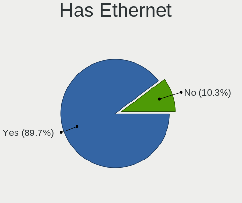
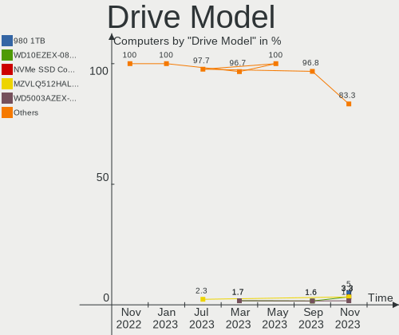
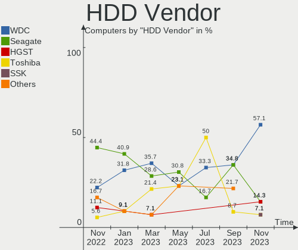
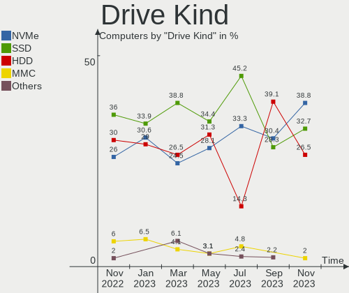
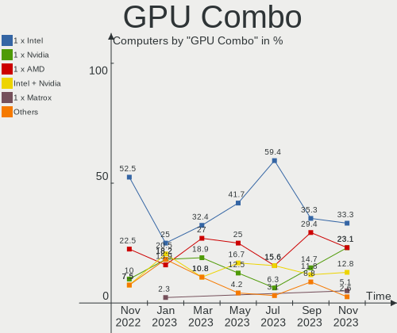
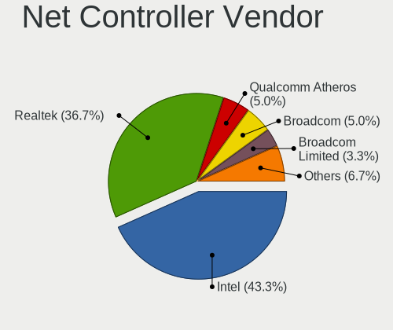
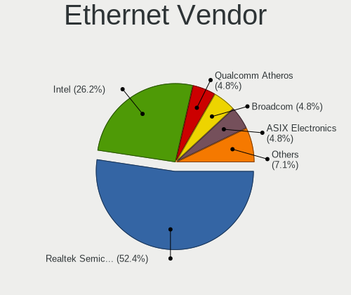
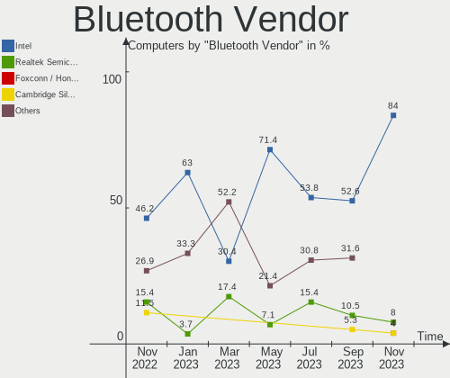
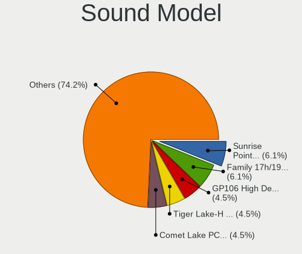

Ubuntu MATE - Hardware Trends
-----------------------------

A project to identify most popular hardware characteristics and track their change
over time based on data collected by Linux users at https://Linux-Hardware.org.

Anyone can contribute to this report by the [hw-probe](https://github.com/linuxhw/hw-probe) tool:

    sudo -E hw-probe -all -upload

This is a report for all computer types. See also reports for [desktops](/Dist/Ubuntu_MATE/Desktop/README.md) and [notebooks](/Dist/Ubuntu_MATE/Notebook/README.md).

This report is for one last month. Overall report since the beginning of time: [TestCoverage](https://github.com/linuxhw/TestCoverage)

Period: Jan, 2023.

Contents
--------

* [ System ](#system)
  - [ OS                       ](#os)
  - [ OS Family                ](#os-family)
  - [ Kernel                   ](#kernel)
  - [ Kernel Family            ](#kernel-family)
  - [ Kernel Major Ver.        ](#kernel-major-ver)
  - [ Arch                     ](#arch)
  - [ DE                       ](#de)
  - [ Display Server           ](#display-server)
  - [ Display Manager          ](#display-manager)
  - [ OS Lang                  ](#os-lang)
  - [ Boot Mode                ](#boot-mode)
  - [ Filesystem               ](#filesystem)
  - [ Part. scheme             ](#part-scheme)
  - [ Dual Boot with Linux/BSD ](#dual-boot-with-linuxbsd)
  - [ Dual Boot (Win)          ](#dual-boot-win)

* [ Board ](#board)
  - [ Vendor                   ](#vendor)
  - [ Model                    ](#model)
  - [ Model Family             ](#model-family)
  - [ MFG Year                 ](#mfg-year)
  - [ Form Factor              ](#form-factor)
  - [ Secure Boot              ](#secure-boot)
  - [ Coreboot                 ](#coreboot)
  - [ RAM Size                 ](#ram-size)
  - [ RAM Used                 ](#ram-used)
  - [ Total Drives             ](#total-drives)
  - [ Has CD-ROM               ](#has-cd-rom)
  - [ Has Ethernet             ](#has-ethernet)
  - [ Has WiFi                 ](#has-wifi)
  - [ Has Bluetooth            ](#has-bluetooth)

* [ Location ](#location)
  - [ Country                  ](#country)
  - [ City                     ](#city)

* [ Drives ](#drives)
  - [ Drive Vendor             ](#drive-vendor)
  - [ Drive Model              ](#drive-model)
  - [ HDD Vendor               ](#hdd-vendor)
  - [ SSD Vendor               ](#ssd-vendor)
  - [ Drive Kind               ](#drive-kind)
  - [ Drive Connector          ](#drive-connector)
  - [ Drive Size               ](#drive-size)
  - [ Space Total              ](#space-total)
  - [ Space Used               ](#space-used)
  - [ Malfunc. Drives          ](#malfunc-drives)
  - [ Malfunc. Drive Vendor    ](#malfunc-drive-vendor)
  - [ Malfunc. HDD Vendor      ](#malfunc-hdd-vendor)
  - [ Malfunc. Drive Kind      ](#malfunc-drive-kind)
  - [ Failed Drives            ](#failed-drives)
  - [ Failed Drive Vendor      ](#failed-drive-vendor)
  - [ Drive Status             ](#drive-status)

* [ Storage controller ](#storage-controller)
  - [ Storage Vendor           ](#storage-vendor)
  - [ Storage Model            ](#storage-model)
  - [ Storage Kind             ](#storage-kind)

* [ Processor ](#processor)
  - [ CPU Vendor               ](#cpu-vendor)
  - [ CPU Model                ](#cpu-model)
  - [ CPU Model Family         ](#cpu-model-family)
  - [ CPU Cores                ](#cpu-cores)
  - [ CPU Sockets              ](#cpu-sockets)
  - [ CPU Threads              ](#cpu-threads)
  - [ CPU Op-Modes             ](#cpu-op-modes)
  - [ CPU Microcode            ](#cpu-microcode)
  - [ CPU Microarch            ](#cpu-microarch)

* [ Graphics ](#graphics)
  - [ GPU Vendor               ](#gpu-vendor)
  - [ GPU Model                ](#gpu-model)
  - [ GPU Combo                ](#gpu-combo)
  - [ GPU Driver               ](#gpu-driver)
  - [ GPU Memory               ](#gpu-memory)

* [ Monitor ](#monitor)
  - [ Monitor Vendor           ](#monitor-vendor)
  - [ Monitor Model            ](#monitor-model)
  - [ Monitor Resolution       ](#monitor-resolution)
  - [ Monitor Diagonal         ](#monitor-diagonal)
  - [ Monitor Width            ](#monitor-width)
  - [ Aspect Ratio             ](#aspect-ratio)
  - [ Monitor Area             ](#monitor-area)
  - [ Pixel Density            ](#pixel-density)
  - [ Multiple Monitors        ](#multiple-monitors)

* [ Network ](#network)
  - [ Net Controller Vendor    ](#net-controller-vendor)
  - [ Net Controller Model     ](#net-controller-model)
  - [ Wireless Vendor          ](#wireless-vendor)
  - [ Wireless Model           ](#wireless-model)
  - [ Ethernet Vendor          ](#ethernet-vendor)
  - [ Ethernet Model           ](#ethernet-model)
  - [ Net Controller Kind      ](#net-controller-kind)
  - [ Used Controller          ](#used-controller)
  - [ NICs                     ](#nics)
  - [ IPv6                     ](#ipv6)

* [ Bluetooth ](#bluetooth)
  - [ Bluetooth Vendor         ](#bluetooth-vendor)
  - [ Bluetooth Model          ](#bluetooth-model)

* [ Sound ](#sound)
  - [ Sound Vendor             ](#sound-vendor)
  - [ Sound Model              ](#sound-model)

* [ Memory ](#memory)
  - [ Memory Vendor            ](#memory-vendor)
  - [ Memory Model             ](#memory-model)
  - [ Memory Kind              ](#memory-kind)
  - [ Memory Form Factor       ](#memory-form-factor)
  - [ Memory Size              ](#memory-size)
  - [ Memory Speed             ](#memory-speed)

* [ Printers & scanners ](#printers--scanners)
  - [ Printer Vendor           ](#printer-vendor)
  - [ Printer Model            ](#printer-model)
  - [ Scanner Vendor           ](#scanner-vendor)
  - [ Scanner Model            ](#scanner-model)

* [ Camera ](#camera)
  - [ Camera Vendor            ](#camera-vendor)
  - [ Camera Model             ](#camera-model)

* [ Security ](#security)
  - [ Fingerprint Vendor       ](#fingerprint-vendor)
  - [ Fingerprint Model        ](#fingerprint-model)
  - [ Chipcard Vendor          ](#chipcard-vendor)
  - [ Chipcard Model           ](#chipcard-model)

* [ Unsupported ](#unsupported)
  - [ Unsupported Devices      ](#unsupported-devices)
  - [ Unsupported Device Types ](#unsupported-device-types)

System
------

OS
--

Installed operating systems

| Name              | Computers | Percent |
|-------------------|-----------|---------|
| Ubuntu MATE 22.04 | 27        | 61.36%  |
| Ubuntu MATE 22.10 | 8         | 18.18%  |
| Ubuntu MATE 20.04 | 7         | 15.91%  |
| Ubuntu MATE 18.04 | 1         | 2.27%   |
| Ubuntu MATE 16.04 | 1         | 2.27%   |

OS Family
---------

OS without a version

| Name        | Computers | Percent |
|-------------|-----------|---------|
| Ubuntu MATE | 44        | 100%    |

Kernel
------

Version of the Linux kernel

| Version                | Computers | Percent |
|------------------------|-----------|---------|
| 5.15.0-58-generic      | 7         | 15.91%  |
| 5.15.0-56-generic      | 7         | 15.91%  |
| 5.15.0-57-generic      | 6         | 13.64%  |
| 5.19.0-29-generic      | 3         | 6.82%   |
| 5.19.0-28-generic      | 3         | 6.82%   |
| 5.4.0-135-generic      | 2         | 4.55%   |
| 5.4.0-126-generic      | 2         | 4.55%   |
| 6.1.8-x64v1-xanmod1    | 1         | 2.27%   |
| 5.4.0-136-generic      | 1         | 2.27%   |
| 5.19.0-31-generic      | 1         | 2.27%   |
| 5.19.0-1012-lowlatency | 1         | 2.27%   |
| 5.15.0-59-generic      | 1         | 2.27%   |
| 5.15.0-58-lowlatency   | 1         | 2.27%   |
| 5.15.0-56-lowlatency   | 1         | 2.27%   |
| 5.15.0-50-generic      | 1         | 2.27%   |
| 5.15.0-43-generic      | 1         | 2.27%   |
| 5.15.0-1023-raspi      | 1         | 2.27%   |
| 5.15.0-1022-raspi      | 1         | 2.27%   |
| 5.13.0-30-generic      | 1         | 2.27%   |
| 4.9.337-31             | 1         | 2.27%   |
| 4.4.0-210-generic      | 1         | 2.27%   |

Kernel Family
-------------

Linux kernel without a distro release

| Version | Computers | Percent |
|---------|-----------|---------|
| 5.15.0  | 27        | 61.36%  |
| 5.19.0  | 8         | 18.18%  |
| 5.4.0   | 5         | 11.36%  |
| 6.1.8   | 1         | 2.27%   |
| 5.13.0  | 1         | 2.27%   |
| 4.9.337 | 1         | 2.27%   |
| 4.4.0   | 1         | 2.27%   |

Kernel Major Ver.
-----------------

Linux kernel major version

| Version | Computers | Percent |
|---------|-----------|---------|
| 5.15    | 27        | 61.36%  |
| 5.19    | 8         | 18.18%  |
| 5.4     | 5         | 11.36%  |
| 6.1     | 1         | 2.27%   |
| 5.13    | 1         | 2.27%   |
| 4.9     | 1         | 2.27%   |
| 4.4     | 1         | 2.27%   |

Arch
----

OS architecture (x86_64, i586, etc.)

| Name    | Computers | Percent |
|---------|-----------|---------|
| x86_64  | 41        | 93.18%  |
| aarch64 | 3         | 6.82%   |

DE
--

Desktop Environment

| Name | Computers | Percent |
|------|-----------|---------|
| MATE | 43        | 97.73%  |
| KDE5 | 1         | 2.27%   |

Display Server
--------------

X11 or Wayland

| Name    | Computers | Percent |
|---------|-----------|---------|
| X11     | 40        | 90.91%  |
| Wayland | 2         | 4.55%   |
| Tty     | 2         | 4.55%   |

Display Manager
---------------

SDDM, LightDM, etc.

| Name    | Computers | Percent |
|---------|-----------|---------|
| LightDM | 38        | 86.36%  |
| GDM3    | 4         | 9.09%   |
| SDDM    | 1         | 2.27%   |
| Unknown | 1         | 2.27%   |

OS Lang
-------

Language

| Lang  | Computers | Percent |
|-------|-----------|---------|
| en_US | 17        | 38.64%  |
| fr_FR | 8         | 18.18%  |
| de_DE | 5         | 11.36%  |
| it_IT | 3         | 6.82%   |
| en_GB | 3         | 6.82%   |
| C     | 2         | 4.55%   |
| ru_RU | 1         | 2.27%   |
| pt_PT | 1         | 2.27%   |
| pl_PL | 1         | 2.27%   |
| hu_HU | 1         | 2.27%   |
| fi_FI | 1         | 2.27%   |
| da_DK | 1         | 2.27%   |

Boot Mode
---------

EFI or BIOS

| Mode | Computers | Percent |
|------|-----------|---------|
| EFI  | 24        | 54.55%  |
| BIOS | 20        | 45.45%  |

Filesystem
----------

Type of filesystem

| Type    | Computers | Percent |
|---------|-----------|---------|
| Ext4    | 40        | 90.91%  |
| Btrfs   | 3         | 6.82%   |
| Overlay | 1         | 2.27%   |

Part. scheme
------------

Scheme of partitioning

| Type    | Computers | Percent |
|---------|-----------|---------|
| GPT     | 32        | 72.73%  |
| MBR     | 11        | 25%     |
| Unknown | 1         | 2.27%   |

Dual Boot with Linux/BSD
------------------------

Hosting more than one Linux/BSD

| Dual boot | Computers | Percent |
|-----------|-----------|---------|
| No        | 35        | 79.55%  |
| Yes       | 9         | 20.45%  |

Dual Boot (Win)
---------------

Hosting Linux and Windows

| Dual boot | Computers | Percent |
|-----------|-----------|---------|
| No        | 31        | 70.45%  |
| Yes       | 13        | 29.55%  |

Board
-----

Vendor
------

Motherboard manufacturer

| Name                    | Computers | Percent |
|-------------------------|-----------|---------|
| Hewlett-Packard         | 9         | 20.45%  |
| ASUSTek Computer        | 8         | 18.18%  |
| Lenovo                  | 6         | 13.64%  |
| Gigabyte Technology     | 6         | 13.64%  |
| Dell                    | 5         | 11.36%  |
| Acer                    | 3         | 6.82%   |
| Raspberry Pi Foundation | 2         | 4.55%   |
| Notebook                | 2         | 4.55%   |
| MSI                     | 1         | 2.27%   |
| Hardkernel              | 1         | 2.27%   |
| Google                  | 1         | 2.27%   |

Model
-----

Motherboard model

| Name                                     | Computers | Percent |
|------------------------------------------|-----------|---------|
| Lenovo G500 20236                        | 2         | 4.55%   |
| RPi Raspberry Pi 400 Rev 1.1             | 1         | 2.27%   |
| RPi Raspberry Pi                         | 1         | 2.27%   |
| Notebook P17SM-A                         | 1         | 2.27%   |
| Notebook NJx0MU                          | 1         | 2.27%   |
| MSI MS-7C95                              | 1         | 2.27%   |
| Lenovo ThinkPad X270 W10DG 20K5S02K00    | 1         | 2.27%   |
| Lenovo ThinkPad T15 Gen 1 20S6S1HN00     | 1         | 2.27%   |
| Lenovo ThinkPad R61 8918DEG              | 1         | 2.27%   |
| Lenovo IdeaPad 3 15ALC6 82KU             | 1         | 2.27%   |
| HP ProLiant ML350p Gen8                  | 1         | 2.27%   |
| HP ProLiant MicroServer                  | 1         | 2.27%   |
| HP Pavilion x360 Convertible 14-cd0xxx   | 1         | 2.27%   |
| HP Pavilion Laptop 15-cs0xxx             | 1         | 2.27%   |
| HP Pavilion Gaming Laptop 17-cd1xxx      | 1         | 2.27%   |
| HP EliteDesk 705 G2 SFF                  | 1         | 2.27%   |
| HP EliteBook 855 G7 Notebook PC          | 1         | 2.27%   |
| HP Compaq 8200 Elite SFF PC              | 1         | 2.27%   |
| HP 15                                    | 1         | 2.27%   |
| Hardkernel ODROID-N2Plus                 | 1         | 2.27%   |
| Google Relm                              | 1         | 2.27%   |
| Gigabyte Z590 UD AC                      | 1         | 2.27%   |
| Gigabyte X570S AERO G                    | 1         | 2.27%   |
| Gigabyte H510M H                         | 1         | 2.27%   |
| Gigabyte EP45-UD3P                       | 1         | 2.27%   |
| Gigabyte B85M-D3H                        | 1         | 2.27%   |
| Gigabyte B550 GAMING X V2                | 1         | 2.27%   |
| Dell Precision Tower 7810                | 1         | 2.27%   |
| Dell Precision 7520                      | 1         | 2.27%   |
| Dell Latitude 5410                       | 1         | 2.27%   |
| Dell Inspiron 5520                       | 1         | 2.27%   |
| Dell G5 5590                             | 1         | 2.27%   |
| ASUS X550LN                              | 1         | 2.27%   |
| ASUS VivoBook_ASUSLaptop M1503QA_M1503QA | 1         | 2.27%   |
| ASUS TUF Gaming FX505DT_FX505DT          | 1         | 2.27%   |
| ASUS ROG STRIX Z370-G GAMING             | 1         | 2.27%   |
| ASUS PRIME B450-PLUS                     | 1         | 2.27%   |
| ASUS K93SV                               | 1         | 2.27%   |
| ASUS CROSSHAIR VI HERO                   | 1         | 2.27%   |
| ASUS ASUS TUF Gaming F15 FX507ZM_FX507ZM | 1         | 2.27%   |

Model Family
------------

Motherboard model prefix

| Name                     | Computers | Percent |
|--------------------------|-----------|---------|
| Lenovo ThinkPad          | 3         | 6.82%   |
| HP Pavilion              | 3         | 6.82%   |
| RPi Raspberry            | 2         | 4.55%   |
| Lenovo G500              | 2         | 4.55%   |
| HP ProLiant              | 2         | 4.55%   |
| Dell Precision           | 2         | 4.55%   |
| Notebook P17SM-A         | 1         | 2.27%   |
| Notebook NJx0MU          | 1         | 2.27%   |
| MSI MS-7C95              | 1         | 2.27%   |
| Lenovo IdeaPad           | 1         | 2.27%   |
| HP EliteDesk             | 1         | 2.27%   |
| HP EliteBook             | 1         | 2.27%   |
| HP Compaq                | 1         | 2.27%   |
| HP 15                    | 1         | 2.27%   |
| Hardkernel ODROID-N2Plus | 1         | 2.27%   |
| Google Relm              | 1         | 2.27%   |
| Gigabyte Z590            | 1         | 2.27%   |
| Gigabyte X570S           | 1         | 2.27%   |
| Gigabyte H510M           | 1         | 2.27%   |
| Gigabyte EP45-UD3P       | 1         | 2.27%   |
| Gigabyte B85M-D3H        | 1         | 2.27%   |
| Gigabyte B550            | 1         | 2.27%   |
| Dell Latitude            | 1         | 2.27%   |
| Dell Inspiron            | 1         | 2.27%   |
| Dell G5                  | 1         | 2.27%   |
| ASUS X550LN              | 1         | 2.27%   |
| ASUS VivoBook            | 1         | 2.27%   |
| ASUS TUF                 | 1         | 2.27%   |
| ASUS ROG                 | 1         | 2.27%   |
| ASUS PRIME               | 1         | 2.27%   |
| ASUS K93SV               | 1         | 2.27%   |
| ASUS CROSSHAIR           | 1         | 2.27%   |
| ASUS ASUS                | 1         | 2.27%   |
| Acer Swift               | 1         | 2.27%   |
| Acer Aspire              | 1         | 2.27%   |
| Acer AO756               | 1         | 2.27%   |

MFG Year
--------

Motherboard manufacture year

| Year    | Computers | Percent |
|---------|-----------|---------|
| 2020    | 6         | 13.64%  |
| 2021    | 5         | 11.36%  |
| 2018    | 4         | 9.09%   |
| 2017    | 4         | 9.09%   |
| 2013    | 4         | 9.09%   |
| 2022    | 3         | 6.82%   |
| 2012    | 3         | 6.82%   |
| 2011    | 3         | 6.82%   |
| Unknown | 3         | 6.82%   |
| 2019    | 2         | 4.55%   |
| 2016    | 2         | 4.55%   |
| 2014    | 2         | 4.55%   |
| 2008    | 2         | 4.55%   |
| 2007    | 1         | 2.27%   |

Form Factor
-----------

Physical design of the computer

| Name           | Computers | Percent |
|----------------|-----------|---------|
| Notebook       | 25        | 56.82%  |
| Desktop        | 15        | 34.09%  |
| System on chip | 3         | 6.82%   |
| Convertible    | 1         | 2.27%   |

Secure Boot
-----------

Enabled or disabled

| State    | Computers | Percent |
|----------|-----------|---------|
| Disabled | 40        | 90.91%  |
| Enabled  | 4         | 9.09%   |

Coreboot
--------

Have coreboot on board

| Used | Computers | Percent |
|------|-----------|---------|
| No   | 43        | 97.73%  |
| Yes  | 1         | 2.27%   |

RAM Size
--------

Total RAM memory

| Size in GB  | Computers | Percent |
|-------------|-----------|---------|
| 4.01-8.0    | 10        | 22.73%  |
| 16.01-24.0  | 8         | 18.18%  |
| 32.01-64.0  | 7         | 15.91%  |
| 3.01-4.0    | 7         | 15.91%  |
| 8.01-16.0   | 5         | 11.36%  |
| 64.01-256.0 | 4         | 9.09%   |
| 24.01-32.0  | 2         | 4.55%   |
| 1.01-2.0    | 1         | 2.27%   |

RAM Used
--------

Used RAM memory

| Used GB   | Computers | Percent |
|-----------|-----------|---------|
| 2.01-3.0  | 15        | 34.09%  |
| 1.01-2.0  | 11        | 25%     |
| 3.01-4.0  | 7         | 15.91%  |
| 4.01-8.0  | 6         | 13.64%  |
| 8.01-16.0 | 5         | 11.36%  |

Total Drives
------------

Number of drives on board

| Drives | Computers | Percent |
|--------|-----------|---------|
| 1      | 22        | 50%     |
| 2      | 14        | 31.82%  |
| 3      | 4         | 9.09%   |
| 4      | 2         | 4.55%   |
| 20     | 1         | 2.27%   |
| 5      | 1         | 2.27%   |

Has CD-ROM
----------

Has CD-ROM on board

| Presented | Computers | Percent |
|-----------|-----------|---------|
| No        | 25        | 56.82%  |
| Yes       | 19        | 43.18%  |

Has Ethernet
------------

Has Ethernet on board

| Presented | Computers | Percent |
|-----------|-----------|---------|
| Yes       | 35        | 79.55%  |
| No        | 9         | 20.45%  |

Has WiFi
--------

Has WiFi module

| Presented | Computers | Percent |
|-----------|-----------|---------|
| Yes       | 33        | 75%     |
| No        | 11        | 25%     |

Has Bluetooth
-------------

Has Bluetooth module

| Presented | Computers | Percent |
|-----------|-----------|---------|
| Yes       | 27        | 61.36%  |
| No        | 17        | 38.64%  |

Location
--------

Country
-------

Geographic location (country)

| Country     | Computers | Percent |
|-------------|-----------|---------|
| USA         | 10        | 22.73%  |
| France      | 8         | 18.18%  |
| Germany     | 5         | 11.36%  |
| UK          | 3         | 6.82%   |
| Italy       | 3         | 6.82%   |
| Turkey      | 1         | 2.27%   |
| Slovenia    | 1         | 2.27%   |
| Serbia      | 1         | 2.27%   |
| Russia      | 1         | 2.27%   |
| Portugal    | 1         | 2.27%   |
| Poland      | 1         | 2.27%   |
| Norway      | 1         | 2.27%   |
| New Zealand | 1         | 2.27%   |
| Lithuania   | 1         | 2.27%   |
| Isle of Man | 1         | 2.27%   |
| Indonesia   | 1         | 2.27%   |
| Hungary     | 1         | 2.27%   |
| Finland     | 1         | 2.27%   |
| Denmark     | 1         | 2.27%   |
| Brazil      | 1         | 2.27%   |

City
----

Geographic location (city)

| City                         | Computers | Percent |
|------------------------------|-----------|---------|
| Montpellier                  | 3         | 6.82%   |
| West Stockbridge             | 2         | 4.55%   |
| Saint Paul                   | 2         | 4.55%   |
| Yogyakarta                   | 1         | 2.27%   |
| Whanganui                    | 1         | 2.27%   |
| Vilnius                      | 1         | 2.27%   |
| Vaudoy-en-Brie               | 1         | 2.27%   |
| Turku                        | 1         | 2.27%   |
| Toulouse                     | 1         | 2.27%   |
| Torring                      | 1         | 2.27%   |
| Tehachapi                    | 1         | 2.27%   |
| Sunderland                   | 1         | 2.27%   |
| Soham                        | 1         | 2.27%   |
| Sao Paulo                    | 1         | 2.27%   |
| Rome                         | 1         | 2.27%   |
| Presteigne                   | 1         | 2.27%   |
| Olympia                      | 1         | 2.27%   |
| Nova Gorica                  | 1         | 2.27%   |
| Nordenham                    | 1         | 2.27%   |
| New York                     | 1         | 2.27%   |
| Moscow                       | 1         | 2.27%   |
| Montigny-le-Bretonneux       | 1         | 2.27%   |
| Laurel                       | 1         | 2.27%   |
| Langenselbold                | 1         | 2.27%   |
| Landau                       | 1         | 2.27%   |
| Krakow                       | 1         | 2.27%   |
| Istanbul                     | 1         | 2.27%   |
| Isle of Man                  | 1         | 2.27%   |
| Hauville                     | 1         | 2.27%   |
| Hamar                        | 1         | 2.27%   |
| Győr                        | 1         | 2.27%   |
| Gruenenplan                  | 1         | 2.27%   |
| Figueira da Foz Municipality | 1         | 2.27%   |
| Corvallis                    | 1         | 2.27%   |
| Chalon-sur-Saône            | 1         | 2.27%   |
| Cambridge                    | 1         | 2.27%   |
| Burghaun                     | 1         | 2.27%   |
| Belgrade                     | 1         | 2.27%   |
| Argenta                      | 1         | 2.27%   |
| Alassio                      | 1         | 2.27%   |

Drives
------

Drive Vendor
------------

Hard drive vendors

| Vendor                      | Computers | Drives | Percent |
|-----------------------------|-----------|--------|---------|
| Samsung Electronics         | 10        | 11     | 14.29%  |
| Seagate                     | 9         | 25     | 12.86%  |
| WDC                         | 8         | 10     | 11.43%  |
| Toshiba                     | 5         | 7      | 7.14%   |
| Kingston                    | 5         | 5      | 7.14%   |
| Unknown                     | 3         | 4      | 4.29%   |
| Intel                       | 3         | 3      | 4.29%   |
| Crucial                     | 3         | 4      | 4.29%   |
| SPCC                        | 2         | 2      | 2.86%   |
| SK hynix                    | 2         | 2      | 2.86%   |
| SanDisk                     | 2         | 2      | 2.86%   |
| Phison Electronics          | 2         | 2      | 2.86%   |
| Kingston Technology Company | 2         | 2      | 2.86%   |
| HGST                        | 2         | 2      | 2.86%   |
| Corsair                     | 2         | 2      | 2.86%   |
| Verbatim                    | 1         | 1      | 1.43%   |
| UMIS                        | 1         | 1      | 1.43%   |
| Realtek Semiconductor       | 1         | 1      | 1.43%   |
| PNY                         | 1         | 1      | 1.43%   |
| HS-SSD-E100                 | 1         | 1      | 1.43%   |
| Hitachi                     | 1         | 1      | 1.43%   |
| Hewlett-Packard             | 1         | 2      | 1.43%   |
| ASMedia                     | 1         | 1      | 1.43%   |
| A-DATA Technology           | 1         | 1      | 1.43%   |
| Unknown                     | 1         | 1      | 1.43%   |

Drive Model
-----------

Hard drive models

| Model                                 | Computers | Percent |
|---------------------------------------|-----------|---------|
| Seagate ST9500325AS 500GB             | 2         | 2.74%   |
| Kingston Company A2000 NVMe SSD 1TB   | 2         | 2.74%   |
| Intel SSDPEKNU512GZ 512GB             | 2         | 2.74%   |
| WDC WDS480G2G0A-00JH30 480GB SSD      | 1         | 1.37%   |
| WDC WD5000LPVT-24G33T1 500GB          | 1         | 1.37%   |
| WDC WD5000AZRX-00A8LB0 500GB          | 1         | 1.37%   |
| WDC WD4003FFBX-68MU3N0 4TB            | 1         | 1.37%   |
| WDC WD3200BEVT-22ZCT0 320GB           | 1         | 1.37%   |
| WDC WD2003FZEX-00Z4SA0 2TB            | 1         | 1.37%   |
| WDC WD10SPZX-22Z10T0 1TB              | 1         | 1.37%   |
| WDC WD10EZRZ-00HTKB0 1TB              | 1         | 1.37%   |
| WDC WD1001FALS-00J7B1 1TB             | 1         | 1.37%   |
| Verbatim Vi550 S3 256GB SSD           | 1         | 1.37%   |
| Unknown SC32G  32GB                   | 1         | 1.37%   |
| Unknown MMC Card  32GB                | 1         | 1.37%   |
| Unknown MMC Card  16GB                | 1         | 1.37%   |
| Unknown DG4016  16GB                  | 1         | 1.37%   |
| UMIS RPJTJ256MEE1OWX 256GB            | 1         | 1.37%   |
| Toshiba XG6 NVMe SSD Controller 512GB | 1         | 1.37%   |
| Toshiba THNSF5256GPUK 256GB           | 1         | 1.37%   |
| Toshiba MG06ACA800E 8TB               | 1         | 1.37%   |
| Toshiba KBG30ZMS128G NVMe 128GB       | 1         | 1.37%   |
| Toshiba HDWD110 1TB                   | 1         | 1.37%   |
| SPCC Solid State Disk 1024GB          | 1         | 1.37%   |
| SPCC M.2 PCIe SSD 1TB                 | 1         | 1.37%   |
| SK hynix PC401 NVMe 1TB               | 1         | 1.37%   |
| SK hynix BC511 NVMe 256GB             | 1         | 1.37%   |
| Seagate ST91000640NS 1TB              | 1         | 1.37%   |
| Seagate ST6000NM0024-1HT17Z 6TB       | 1         | 1.37%   |
| Seagate ST3250310AS 250GB             | 1         | 1.37%   |
| Seagate ST2000NE001-2M5101 2TB        | 1         | 1.37%   |
| Seagate ST2000DM006-2DM164 2TB        | 1         | 1.37%   |
| Seagate ST2000DM001-1ER164 2TB        | 1         | 1.37%   |
| Seagate ST2000DM001-1CH164 2TB        | 1         | 1.37%   |
| Seagate BUP BK 4TB                    | 1         | 1.37%   |
| SanDisk SSD PLUS 120GB                | 1         | 1.37%   |
| SanDisk SSD PLUS 1000GB               | 1         | 1.37%   |
| Samsung SSD SM871 2.5 7mm 256GB       | 1         | 1.37%   |
| Samsung SSD PM851 mSATA 512GB         | 1         | 1.37%   |
| Samsung SSD 980 500GB                 | 1         | 1.37%   |

HDD Vendor
----------

Hard disk drive vendors

| Vendor          | Computers | Drives | Percent |
|-----------------|-----------|--------|---------|
| Seagate         | 9         | 25     | 39.13%  |
| WDC             | 7         | 9      | 30.43%  |
| Toshiba         | 2         | 4      | 8.7%    |
| HGST            | 2         | 2      | 8.7%    |
| Hitachi         | 1         | 1      | 4.35%   |
| Hewlett-Packard | 1         | 2      | 4.35%   |
| ASMedia         | 1         | 1      | 4.35%   |

SSD Vendor
----------

Solid state drive vendors

| Vendor              | Computers | Drives | Percent |
|---------------------|-----------|--------|---------|
| Samsung Electronics | 7         | 7      | 31.82%  |
| Kingston            | 3         | 3      | 13.64%  |
| Crucial             | 3         | 4      | 13.64%  |
| SanDisk             | 2         | 2      | 9.09%   |
| WDC                 | 1         | 1      | 4.55%   |
| Verbatim            | 1         | 1      | 4.55%   |
| SPCC                | 1         | 1      | 4.55%   |
| PNY                 | 1         | 1      | 4.55%   |
| HS-SSD-E100         | 1         | 1      | 4.55%   |
| Corsair             | 1         | 1      | 4.55%   |
| A-DATA Technology   | 1         | 1      | 4.55%   |

Drive Kind
----------

HDD or SSD

| Kind | Computers | Drives | Percent |
|------|-----------|--------|---------|
| SSD  | 20        | 23     | 32.26%  |
| NVMe | 19        | 22     | 30.65%  |
| HDD  | 19        | 44     | 30.65%  |
| MMC  | 4         | 5      | 6.45%   |

Drive Connector
---------------

SATA, SAS, NVMe, etc.

| Type | Computers | Drives | Percent |
|------|-----------|--------|---------|
| SATA | 29        | 65     | 53.7%   |
| NVMe | 19        | 22     | 35.19%  |
| MMC  | 4         | 5      | 7.41%   |
| SAS  | 2         | 2      | 3.7%    |

Drive Size
----------

Size of hard drive

| Size in TB | Computers | Drives | Percent |
|------------|-----------|--------|---------|
| 0.01-0.5   | 17        | 21     | 43.59%  |
| 0.51-1.0   | 10        | 28     | 25.64%  |
| 1.01-2.0   | 6         | 8      | 15.38%  |
| 3.01-4.0   | 3         | 4      | 7.69%   |
| 4.01-10.0  | 3         | 6      | 7.69%   |

Space Total
-----------

Amount of disk space available on the file system

| Size in GB     | Computers | Percent |
|----------------|-----------|---------|
| 101-250        | 11        | 25%     |
| 501-1000       | 9         | 20.45%  |
| More than 3000 | 6         | 13.64%  |
| 251-500        | 5         | 11.36%  |
| 1001-2000      | 5         | 11.36%  |
| 21-50          | 2         | 4.55%   |
| 1-20           | 2         | 4.55%   |
| 51-100         | 2         | 4.55%   |
| 2001-3000      | 1         | 2.27%   |
| Unknown        | 1         | 2.27%   |

Space Used
----------

Amount of used disk space

| Used GB        | Computers | Percent |
|----------------|-----------|---------|
| 1-20           | 10        | 22.73%  |
| 51-100         | 8         | 18.18%  |
| 251-500        | 5         | 11.36%  |
| 101-250        | 5         | 11.36%  |
| More than 3000 | 4         | 9.09%   |
| 21-50          | 4         | 9.09%   |
| 501-1000       | 3         | 6.82%   |
| 2001-3000      | 2         | 4.55%   |
| 1001-2000      | 2         | 4.55%   |
| Unknown        | 1         | 2.27%   |

Malfunc. Drives
---------------

Drive models with a malfunction

| Model                      | Computers | Drives | Percent |
|----------------------------|-----------|--------|---------|
| Seagate ST9500325AS 500GB  | 1         | 1      | 50%     |
| Kingston SA2000M81000G 1TB | 1         | 1      | 50%     |

Malfunc. Drive Vendor
---------------------

Vendors of faulty drives

| Vendor   | Computers | Drives | Percent |
|----------|-----------|--------|---------|
| Seagate  | 1         | 1      | 50%     |
| Kingston | 1         | 1      | 50%     |

Malfunc. HDD Vendor
-------------------

Vendors of faulty HDD drives

| Vendor  | Computers | Drives | Percent |
|---------|-----------|--------|---------|
| Seagate | 1         | 1      | 100%    |

Malfunc. Drive Kind
-------------------

Kinds of faulty drives

| Kind | Computers | Drives | Percent |
|------|-----------|--------|---------|
| NVMe | 1         | 1      | 50%     |
| HDD  | 1         | 1      | 50%     |

Failed Drives
-------------

Failed drive models

Zero info for selected period =(

Failed Drive Vendor
-------------------

Failed drive vendors

Zero info for selected period =(

Drive Status
------------

Number of failed and malfunc. drives

| Status   | Computers | Drives | Percent |
|----------|-----------|--------|---------|
| Works    | 28        | 61     | 60.87%  |
| Detected | 16        | 31     | 34.78%  |
| Malfunc  | 2         | 2      | 4.35%   |

Storage controller
------------------

Storage Vendor
--------------

Storage controller vendors

| Vendor                       | Computers | Percent |
|------------------------------|-----------|---------|
| Intel                        | 25        | 46.3%   |
| AMD                          | 10        | 18.52%  |
| Toshiba America Info Systems | 3         | 5.56%   |
| Samsung Electronics          | 3         | 5.56%   |
| Phison Electronics           | 3         | 5.56%   |
| Kingston Technology Company  | 3         | 5.56%   |
| SK hynix                     | 2         | 3.7%    |
| Union Memory (Shenzhen)      | 1         | 1.85%   |
| Realtek Semiconductor        | 1         | 1.85%   |
| MAXIO Technology (Hangzhou)  | 1         | 1.85%   |
| JMicron Technology           | 1         | 1.85%   |
| Hewlett-Packard              | 1         | 1.85%   |

Storage Model
-------------

Storage controller models

| Model                                                                          | Computers | Percent |
|--------------------------------------------------------------------------------|-----------|---------|
| AMD FCH SATA Controller [AHCI mode]                                            | 6         | 9.52%   |
| Intel 7 Series Chipset Family 6-port SATA Controller [AHCI mode]               | 4         | 6.35%   |
| Kingston Company A2000 NVMe SSD                                                | 3         | 4.76%   |
| Samsung NVMe SSD Controller 980                                                | 2         | 3.17%   |
| Intel Sunrise Point-LP SATA Controller [AHCI mode]                             | 2         | 3.17%   |
| Intel Non-Volatile memory controller                                           | 2         | 3.17%   |
| Intel 8 Series/C220 Series Chipset Family 6-port SATA Controller 1 [AHCI mode] | 2         | 3.17%   |
| Intel 500 Series Chipset Family SATA AHCI Controller                           | 2         | 3.17%   |
| AMD 500 Series Chipset SATA Controller                                         | 2         | 3.17%   |
| Union Memory (Shenzhen) Non-Volatile memory controller                         | 1         | 1.59%   |
| Toshiba America Info Systems XG6 NVMe SSD Controller                           | 1         | 1.59%   |
| Toshiba America Info Systems XG4 NVMe SSD Controller                           | 1         | 1.59%   |
| Toshiba America Info Systems BG3 NVMe SSD Controller                           | 1         | 1.59%   |
| SK hynix PC401 NVMe Solid State Drive 256GB                                    | 1         | 1.59%   |
| SK hynix BC511                                                                 | 1         | 1.59%   |
| Samsung NVMe SSD Controller PM9A1/PM9A3/980PRO                                 | 1         | 1.59%   |
| Realtek Realtek Non-Volatile memory controller                                 | 1         | 1.59%   |
| Phison PS5013 E13 NVMe Controller                                              | 1         | 1.59%   |
| Phison E7 NVMe Controller                                                      | 1         | 1.59%   |
| Phison E12 NVMe Controller                                                     | 1         | 1.59%   |
| MAXIO (Hangzhou) NVMe SSD Controller MAP1202                                   | 1         | 1.59%   |
| JMicron JMB363 SATA/IDE Controller                                             | 1         | 1.59%   |
| Intel Volume Management Device NVMe RAID Controller                            | 1         | 1.59%   |
| Intel Tiger Lake-LP SATA Controller                                            | 1         | 1.59%   |
| Intel SSD 600P Series                                                          | 1         | 1.59%   |
| Intel Q170/Q150/B150/H170/H110/Z170/CM236 Chipset SATA Controller [AHCI Mode]  | 1         | 1.59%   |
| Intel Cannon Lake Mobile PCH SATA AHCI Controller                              | 1         | 1.59%   |
| Intel C610/X99 series chipset sSATA Controller [AHCI mode]                     | 1         | 1.59%   |
| Intel C610/X99 series chipset IDE-r Controller                                 | 1         | 1.59%   |
| Intel C600/X79 series chipset SATA RAID Controller                             | 1         | 1.59%   |
| Intel C600/X79 series chipset 4-Port SATA IDE Controller                       | 1         | 1.59%   |
| Intel C600/X79 series chipset 2-Port SATA IDE Controller                       | 1         | 1.59%   |
| Intel 82801JI (ICH10 Family) 4 port SATA IDE Controller #1                     | 1         | 1.59%   |
| Intel 82801JI (ICH10 Family) 2 port SATA IDE Controller #2                     | 1         | 1.59%   |
| Intel 82801HM/HEM (ICH8M/ICH8M-E) SATA Controller [AHCI mode]                  | 1         | 1.59%   |
| Intel 82801HM/HEM (ICH8M/ICH8M-E) IDE Controller                               | 1         | 1.59%   |
| Intel 82801 Mobile SATA Controller [RAID mode]                                 | 1         | 1.59%   |
| Intel 8 Series SATA Controller 1 [AHCI mode]                                   | 1         | 1.59%   |
| Intel 6 Series/C200 Series Chipset Family 6 port Mobile SATA AHCI Controller   | 1         | 1.59%   |
| Intel 6 Series/C200 Series Chipset Family 6 port Desktop SATA AHCI Controller  | 1         | 1.59%   |

Storage Kind
------------

Kind of storage controller (IDE, SATA, NVMe, SAS, ...)

| Kind | Computers | Percent |
|------|-----------|---------|
| SATA | 29        | 50%     |
| NVMe | 19        | 32.76%  |
| RAID | 5         | 8.62%   |
| IDE  | 5         | 8.62%   |

Processor
---------

CPU Vendor
----------

Processor vendors

| Vendor | Computers | Percent |
|--------|-----------|---------|
| Intel  | 28        | 63.64%  |
| AMD    | 13        | 29.55%  |
| ARM    | 3         | 6.82%   |

CPU Model
---------

Processor models

| Model                                         | Computers | Percent |
|-----------------------------------------------|-----------|---------|
| ARM Processor                                 | 3         | 6.82%   |
| Intel Core i5-10210U CPU @ 1.60GHz            | 2         | 4.55%   |
| Intel Xeon CPU E5-2630 v3 @ 2.40GHz           | 1         | 2.27%   |
| Intel Xeon CPU E5-2620 0 @ 2.00GHz            | 1         | 2.27%   |
| Intel Xeon CPU E3-1505M v6 @ 3.00GHz          | 1         | 2.27%   |
| Intel Xeon CPU E3-1245 v3 @ 3.40GHz           | 1         | 2.27%   |
| Intel Core i7-8750H CPU @ 2.20GHz             | 1         | 2.27%   |
| Intel Core i7-8700K CPU @ 3.70GHz             | 1         | 2.27%   |
| Intel Core i7-8550U CPU @ 1.80GHz             | 1         | 2.27%   |
| Intel Core i7-4710MQ CPU @ 2.50GHz            | 1         | 2.27%   |
| Intel Core i7-3610QM CPU @ 2.30GHz            | 1         | 2.27%   |
| Intel Core i7-2670QM CPU @ 2.20GHz            | 1         | 2.27%   |
| Intel Core i7-10750H CPU @ 2.60GHz            | 1         | 2.27%   |
| Intel Core i5-8250U CPU @ 1.60GHz             | 1         | 2.27%   |
| Intel Core i5-6300U CPU @ 2.40GHz             | 1         | 2.27%   |
| Intel Core i5-3210M CPU @ 2.50GHz             | 1         | 2.27%   |
| Intel Core i5-2400 CPU @ 3.10GHz              | 1         | 2.27%   |
| Intel Core i3-8130U CPU @ 2.20GHz             | 1         | 2.27%   |
| Intel Core i3-4010U CPU @ 1.70GHz             | 1         | 2.27%   |
| Intel Core i3-3120M CPU @ 2.50GHz             | 1         | 2.27%   |
| Intel Core i3-10100 CPU @ 3.60GHz             | 1         | 2.27%   |
| Intel Core 2 Duo CPU T8100 @ 2.10GHz          | 1         | 2.27%   |
| Intel Core 2 Duo CPU E8500 @ 3.16GHz          | 1         | 2.27%   |
| Intel Celeron CPU N3060 @ 1.60GHz             | 1         | 2.27%   |
| Intel Celeron CPU 847 @ 1.10GHz               | 1         | 2.27%   |
| Intel 12th Gen Core i7-12700H                 | 1         | 2.27%   |
| Intel 11th Gen Core i9-11900K @ 3.50GHz       | 1         | 2.27%   |
| Intel 11th Gen Core i7-1165G7 @ 2.80GHz       | 1         | 2.27%   |
| AMD Turion II Neo N40L Dual-Core Processor    | 1         | 2.27%   |
| AMD Ryzen 7 5800X 8-Core Processor            | 1         | 2.27%   |
| AMD Ryzen 7 5800H with Radeon Graphics        | 1         | 2.27%   |
| AMD Ryzen 7 3750H with Radeon Vega Mobile Gfx | 1         | 2.27%   |
| AMD Ryzen 7 3700X 8-Core Processor            | 1         | 2.27%   |
| AMD Ryzen 7 1800X Eight-Core Processor        | 1         | 2.27%   |
| AMD Ryzen 5 5500                              | 1         | 2.27%   |
| AMD Ryzen 5 1600 Six-Core Processor           | 1         | 2.27%   |
| AMD Ryzen 3 PRO 4450U with Radeon Graphics    | 1         | 2.27%   |
| AMD Ryzen 3 5300U with Radeon Graphics        | 1         | 2.27%   |
| AMD PRO A8-8650B R7, 10 Compute Cores 4C+6G   | 1         | 2.27%   |
| AMD Athlon X2 Dual-Core QL-60                 | 1         | 2.27%   |

CPU Model Family
----------------

Processor model prefix

| Model             | Computers | Percent |
|-------------------|-----------|---------|
| Intel Core i7     | 7         | 15.91%  |
| Other             | 6         | 13.64%  |
| Intel Core i5     | 6         | 13.64%  |
| AMD Ryzen 7       | 5         | 11.36%  |
| Intel Xeon        | 4         | 9.09%   |
| Intel Core i3     | 4         | 9.09%   |
| Intel Core 2 Duo  | 2         | 4.55%   |
| Intel Celeron     | 2         | 4.55%   |
| AMD Ryzen 5       | 2         | 4.55%   |
| AMD Turion II Neo | 1         | 2.27%   |
| AMD Ryzen 3 PRO   | 1         | 2.27%   |
| AMD Ryzen 3       | 1         | 2.27%   |
| AMD PRO A8        | 1         | 2.27%   |
| AMD Athlon X2     | 1         | 2.27%   |
| AMD A6            | 1         | 2.27%   |

CPU Cores
---------

Number of processor cores

| Number  | Computers | Percent |
|---------|-----------|---------|
| 4       | 17        | 38.64%  |
| 2       | 12        | 27.27%  |
| 8       | 5         | 11.36%  |
| 6       | 5         | 11.36%  |
| Unknown | 2         | 4.55%   |
| 16      | 1         | 2.27%   |
| 14      | 1         | 2.27%   |
| 12      | 1         | 2.27%   |

CPU Sockets
-----------

Number of sockets

| Number  | Computers | Percent |
|---------|-----------|---------|
| 1       | 40        | 90.91%  |
| 2       | 2         | 4.55%   |
| Unknown | 2         | 4.55%   |

CPU Threads
-----------

Threads per core (Hyper-Threading)

| Number  | Computers | Percent |
|---------|-----------|---------|
| 2       | 33        | 75%     |
| 1       | 9         | 20.45%  |
| Unknown | 2         | 4.55%   |

CPU Op-Modes
------------

CPU Operation Modes (32-bit, 64-bit)

| Op mode        | Computers | Percent |
|----------------|-----------|---------|
| 32-bit, 64-bit | 44        | 100%    |

CPU Microcode
-------------

Microcode number

| Number     | Computers | Percent |
|------------|-----------|---------|
| Unknown    | 15        | 34.09%  |
| 0x806ea    | 3         | 6.82%   |
| 0x906ea    | 2         | 4.55%   |
| 0x806ec    | 2         | 4.55%   |
| 0x306c3    | 2         | 4.55%   |
| 0xa0671    | 1         | 2.27%   |
| 0x906e9    | 1         | 2.27%   |
| 0x906a3    | 1         | 2.27%   |
| 0x806c1    | 1         | 2.27%   |
| 0x406e3    | 1         | 2.27%   |
| 0x406c4    | 1         | 2.27%   |
| 0x40651    | 1         | 2.27%   |
| 0x306f2    | 1         | 2.27%   |
| 0x306a9    | 1         | 2.27%   |
| 0x206d7    | 1         | 2.27%   |
| 0x206a7    | 1         | 2.27%   |
| 0x1067a    | 1         | 2.27%   |
| 0x10676    | 1         | 2.27%   |
| 0x0a50000c | 1         | 2.27%   |
| 0x08701021 | 1         | 2.27%   |
| 0x08608103 | 1         | 2.27%   |
| 0x08600109 | 1         | 2.27%   |
| 0x0700010f | 1         | 2.27%   |
| 0x06003106 | 1         | 2.27%   |
| 0x02000032 | 1         | 2.27%   |

CPU Microarch
-------------

Microarchitecture

| Name             | Computers | Percent |
|------------------|-----------|---------|
| KabyLake         | 8         | 18.18%  |
| Unknown          | 5         | 11.36%  |
| SandyBridge      | 4         | 9.09%   |
| Haswell          | 4         | 9.09%   |
| Zen 3            | 3         | 6.82%   |
| IvyBridge        | 3         | 6.82%   |
| Zen+             | 2         | 4.55%   |
| Zen 2            | 2         | 4.55%   |
| Penryn           | 2         | 4.55%   |
| CometLake        | 2         | 4.55%   |
| Zen              | 1         | 2.27%   |
| TigerLake        | 1         | 2.27%   |
| Steamroller      | 1         | 2.27%   |
| Skylake          | 1         | 2.27%   |
| Silvermont       | 1         | 2.27%   |
| K8 & K10 hybrid  | 1         | 2.27%   |
| K10              | 1         | 2.27%   |
| Jaguar           | 1         | 2.27%   |
| Alderlake Hybrid | 1         | 2.27%   |

Graphics
--------

GPU Vendor
----------

Vendors of graphics cards

| Vendor                     | Computers | Percent |
|----------------------------|-----------|---------|
| Intel                      | 23        | 42.59%  |
| Nvidia                     | 18        | 33.33%  |
| AMD                        | 12        | 22.22%  |
| Matrox Electronics Systems | 1         | 1.85%   |

GPU Model
---------

Graphics card models

| Model                                                                                    | Computers | Percent |
|------------------------------------------------------------------------------------------|-----------|---------|
| Intel UHD Graphics 620                                                                   | 3         | 5.45%   |
| Intel 3rd Gen Core processor Graphics Controller                                         | 3         | 5.45%   |
| Intel 2nd Generation Core Processor Family Integrated Graphics Controller                | 3         | 5.45%   |
| Intel CometLake-U GT2 [UHD Graphics]                                                     | 2         | 3.64%   |
| Nvidia TU117M [GeForce GTX 1650 Mobile / Max-Q]                                          | 1         | 1.82%   |
| Nvidia TU116M [GeForce GTX 1660 Ti Mobile]                                               | 1         | 1.82%   |
| Nvidia TU106M [GeForce RTX 2060 Mobile]                                                  | 1         | 1.82%   |
| Nvidia GT218 [GeForce 210]                                                               | 1         | 1.82%   |
| Nvidia GP107GL [Quadro P620]                                                             | 1         | 1.82%   |
| Nvidia GP106 [GeForce GTX 1060 6GB]                                                      | 1         | 1.82%   |
| Nvidia GM206GLM [Quadro M2200 Mobile]                                                    | 1         | 1.82%   |
| Nvidia GM204M [GeForce GTX 970M]                                                         | 1         | 1.82%   |
| Nvidia GM108M [GeForce MX130]                                                            | 1         | 1.82%   |
| Nvidia GM108M [GeForce 840M]                                                             | 1         | 1.82%   |
| Nvidia GK208B [GeForce GT 710]                                                           | 1         | 1.82%   |
| Nvidia GF110GL [Tesla C2050 / C2075]                                                     | 1         | 1.82%   |
| Nvidia GF108M [GeForce GT 540M]                                                          | 1         | 1.82%   |
| Nvidia GA106M [GeForce RTX 3060 Mobile / Max-Q]                                          | 1         | 1.82%   |
| Nvidia GA104 [GeForce RTX 3060 Ti Lite Hash Rate]                                        | 1         | 1.82%   |
| Nvidia GA102 [GeForce RTX 3090]                                                          | 1         | 1.82%   |
| Nvidia G96C [GeForce 9500 GT]                                                            | 1         | 1.82%   |
| Nvidia G86M [Quadro NVS 140M]                                                            | 1         | 1.82%   |
| Matrox Electronics Systems MGA G200EH                                                    | 1         | 1.82%   |
| Intel Xeon E3-1200 v3 Processor Integrated Graphics Controller                           | 1         | 1.82%   |
| Intel TigerLake-LP GT2 [Iris Xe Graphics]                                                | 1         | 1.82%   |
| Intel Skylake GT2 [HD Graphics 520]                                                      | 1         | 1.82%   |
| Intel HD Graphics P630                                                                   | 1         | 1.82%   |
| Intel Haswell-ULT Integrated Graphics Controller                                         | 1         | 1.82%   |
| Intel CometLake-S GT2 [UHD Graphics 630]                                                 | 1         | 1.82%   |
| Intel CometLake-H GT2 [UHD Graphics]                                                     | 1         | 1.82%   |
| Intel CoffeeLake-S GT2 [UHD Graphics 630]                                                | 1         | 1.82%   |
| Intel CoffeeLake-H GT2 [UHD Graphics 630]                                                | 1         | 1.82%   |
| Intel Atom/Celeron/Pentium Processor x5-E8000/J3xxx/N3xxx Integrated Graphics Controller | 1         | 1.82%   |
| Intel Alder Lake-P Integrated Graphics Controller                                        | 1         | 1.82%   |
| Intel 4th Gen Core Processor Integrated Graphics Controller                              | 1         | 1.82%   |
| AMD Thames [Radeon HD 7500M/7600M Series]                                                | 1         | 1.82%   |
| AMD Sun PRO [Radeon HD 8570A/8570M]                                                      | 1         | 1.82%   |
| AMD RV620/M82 [Mobility Radeon HD 3450/3470]                                             | 1         | 1.82%   |
| AMD RS780M [Mobility Radeon HD 3200]                                                     | 1         | 1.82%   |
| AMD Renoir                                                                               | 1         | 1.82%   |

GPU Combo
---------

Combinations of graphics cards

| Name           | Computers | Percent |
|----------------|-----------|---------|
| 1 x Intel      | 11        | 25%     |
| Intel + Nvidia | 9         | 20.45%  |
| 1 x Nvidia     | 8         | 18.18%  |
| 1 x AMD        | 7         | 15.91%  |
| Other          | 3         | 6.82%   |
| Intel + AMD    | 3         | 6.82%   |
| 2 x AMD        | 1         | 2.27%   |
| 1 x Matrox     | 1         | 2.27%   |
| AMD + Nvidia   | 1         | 2.27%   |

GPU Driver
----------

Free vs proprietary

| Driver      | Computers | Percent |
|-------------|-----------|---------|
| Free        | 29        | 65.91%  |
| Proprietary | 12        | 27.27%  |
| Unknown     | 3         | 6.82%   |

GPU Memory
----------

Total video memory

| Size in GB | Computers | Percent |
|------------|-----------|---------|
| Unknown    | 28        | 63.64%  |
| 0.01-0.5   | 6         | 13.64%  |
| 5.01-6.0   | 3         | 6.82%   |
| 1.01-2.0   | 2         | 4.55%   |
| 0.51-1.0   | 2         | 4.55%   |
| 7.01-8.0   | 1         | 2.27%   |
| 3.01-4.0   | 1         | 2.27%   |
| 16.01-24.0 | 1         | 2.27%   |

Monitor
-------

Monitor Vendor
--------------

Monitor vendors

| Vendor                  | Computers | Percent |
|-------------------------|-----------|---------|
| AU Optronics            | 7         | 14.58%  |
| Samsung Electronics     | 5         | 10.42%  |
| LG Display              | 5         | 10.42%  |
| Dell                    | 5         | 10.42%  |
| Philips                 | 4         | 8.33%   |
| BOE                     | 4         | 8.33%   |
| Hewlett-Packard         | 3         | 6.25%   |
| Chi Mei Optoelectronics | 3         | 6.25%   |
| Iiyama                  | 2         | 4.17%   |
| Chimei Innolux          | 2         | 4.17%   |
| Vita                    | 1         | 2.08%   |
| ViewSonic               | 1         | 2.08%   |
| Sony                    | 1         | 2.08%   |
| PANDA                   | 1         | 2.08%   |
| Lenovo                  | 1         | 2.08%   |
| IBM                     | 1         | 2.08%   |
| HannStar                | 1         | 2.08%   |
| Ancor Communications    | 1         | 2.08%   |

Monitor Model
-------------

Monitor models

| Model                                                                     | Computers | Percent |
|---------------------------------------------------------------------------|-----------|---------|
| Dell U3415W DELA0A6 3440x1440 798x335mm 34.1-inch                         | 2         | 4%      |
| Vita LCD Monitor VIT0780 1920x1080                                        | 1         | 2%      |
| ViewSonic VX2758 Series VSCDD35 1920x1080 597x336mm 27.0-inch             | 1         | 2%      |
| Sony LCD Monitor TV 3840x1080                                             | 1         | 2%      |
| Sony LCD Monitor TV                                                       | 1         | 2%      |
| Samsung Electronics S32F351 SAM0D24 1920x1080 698x393mm 31.5-inch         | 1         | 2%      |
| Samsung Electronics S27F350 SAM0D22 1920x1080 600x340mm 27.2-inch         | 1         | 2%      |
| Samsung Electronics LCD Monitor SDC416E 2880x1620 344x194mm 15.5-inch     | 1         | 2%      |
| Samsung Electronics LCD Monitor SAM0BB2 3840x2160 1872x1053mm 84.6-inch   | 1         | 2%      |
| Samsung Electronics LCD Monitor SAM094E 1920x1080 700x390mm 31.5-inch     | 1         | 2%      |
| Philips PHL BDL3220QL PHLD230 1920x1080 698x393mm 31.5-inch               | 1         | 2%      |
| Philips PHL 243V7 PHLC155 1920x1080 527x296mm 23.8-inch                   | 1         | 2%      |
| Philips PHL 227E6 PHLC0E5 1920x1080 477x268mm 21.5-inch                   | 1         | 2%      |
| Philips 246EL2SBH PHLC074 1920x1080 521x293mm 23.5-inch                   | 1         | 2%      |
| PANDA LCD Monitor NCP002D 1920x1080 344x194mm 15.5-inch                   | 1         | 2%      |
| LG Display LCD Monitor LGD069A 1920x1080 344x194mm 15.5-inch              | 1         | 2%      |
| LG Display LCD Monitor LGD063F 1920x1080 382x215mm 17.3-inch              | 1         | 2%      |
| LG Display LCD Monitor LGD03DB 1366x768 345x194mm 15.6-inch               | 1         | 2%      |
| LG Display LCD Monitor LGD033A 1366x768 344x194mm 15.5-inch               | 1         | 2%      |
| LG Display LCD Monitor LGD02F2 1366x768 344x194mm 15.5-inch               | 1         | 2%      |
| Lenovo LCD Monitor LEN40BA 1920x1080 344x194mm 15.5-inch                  | 1         | 2%      |
| Iiyama PL2770H IVM665D 1920x1080 598x336mm 27.0-inch                      | 1         | 2%      |
| Iiyama PL2740HS IVM6662 1920x1080 600x340mm 27.2-inch                     | 1         | 2%      |
| IBM LCD Monitor IBM2887 1680x1050 331x207mm 15.4-inch                     | 1         | 2%      |
| Hewlett-Packard Pavilion32 HWP3337 2560x1440 708x399mm 32.0-inch          | 1         | 2%      |
| Hewlett-Packard LP2475w HWP26F8 1920x1200 546x352mm 25.6-inch             | 1         | 2%      |
| Hewlett-Packard LA1905 HWP2845 1440x900 408x255mm 18.9-inch               | 1         | 2%      |
| Hewlett-Packard L1710 HWP26EB 1280x1024 340x270mm 17.1-inch               | 1         | 2%      |
| HannStar HT231 HSD5173 1920x1080 509x286mm 23.0-inch                      | 1         | 2%      |
| Dell U2715H DELD069 2560x1440 597x336mm 27.0-inch                         | 1         | 2%      |
| Dell P2414H DELA09B 1920x1080 530x300mm 24.0-inch                         | 1         | 2%      |
| Dell IN2030M DELF03C 1600x900 443x249mm 20.0-inch                         | 1         | 2%      |
| Chimei Innolux LCD Monitor CMN1540 2560x1440 344x193mm 15.5-inch          | 1         | 2%      |
| Chimei Innolux LCD Monitor CMN14D9 1920x1080 309x173mm 13.9-inch          | 1         | 2%      |
| Chi Mei Optoelectronics LCD Monitor CMO1808 1920x1080 408x230mm 18.4-inch | 1         | 2%      |
| Chi Mei Optoelectronics LCD Monitor CMO15A7 1366x768 344x193mm 15.5-inch  | 1         | 2%      |
| Chi Mei Optoelectronics LCD Monitor CMO1113 1366x768 256x144mm 11.6-inch  | 1         | 2%      |
| BOE LCD Monitor BOE08A8 1920x1080 344x194mm 15.5-inch                     | 1         | 2%      |
| BOE LCD Monitor BOE07BB 1920x1080 309x173mm 13.9-inch                     | 1         | 2%      |
| BOE LCD Monitor BOE07A5 1366x768 344x194mm 15.5-inch                      | 1         | 2%      |

Monitor Resolution
------------------

Monitor screen resolution

| Resolution         | Computers | Percent |
|--------------------|-----------|---------|
| 1920x1080 (FHD)    | 22        | 50%     |
| 1366x768 (WXGA)    | 8         | 18.18%  |
| 2560x1440 (QHD)    | 3         | 6.82%   |
| 3440x1440          | 2         | 4.55%   |
| 3840x2160 (4K)     | 1         | 2.27%   |
| 3840x1080          | 1         | 2.27%   |
| 2880x1620          | 1         | 2.27%   |
| 1920x1200 (WUXGA)  | 1         | 2.27%   |
| 1680x1050 (WSXGA+) | 1         | 2.27%   |
| 1600x900 (HD+)     | 1         | 2.27%   |
| 1440x900 (WXGA+)   | 1         | 2.27%   |
| 1280x1024 (SXGA)   | 1         | 2.27%   |
| Unknown            | 1         | 2.27%   |

Monitor Diagonal
----------------

Diagonal size in inches

| Inches  | Computers | Percent |
|---------|-----------|---------|
| 15      | 15        | 30.61%  |
| 27      | 5         | 10.2%   |
| 17      | 4         | 8.16%   |
| 23      | 3         | 6.12%   |
| 34      | 2         | 4.08%   |
| 31      | 2         | 4.08%   |
| 24      | 2         | 4.08%   |
| 13      | 2         | 4.08%   |
| 11      | 2         | 4.08%   |
| Unknown | 2         | 4.08%   |
| 84      | 1         | 2.04%   |
| 54      | 1         | 2.04%   |
| 32      | 1         | 2.04%   |
| 25      | 1         | 2.04%   |
| 21      | 1         | 2.04%   |
| 20      | 1         | 2.04%   |
| 19      | 1         | 2.04%   |
| 18      | 1         | 2.04%   |
| 14      | 1         | 2.04%   |
| 12      | 1         | 2.04%   |

Monitor Width
-------------

Physical width

| Width in mm | Computers | Percent |
|-------------|-----------|---------|
| 301-350     | 19        | 38.78%  |
| 501-600     | 11        | 22.45%  |
| 401-500     | 4         | 8.16%   |
| 701-800     | 3         | 6.12%   |
| 351-400     | 3         | 6.12%   |
| 201-300     | 3         | 6.12%   |
| 601-700     | 2         | 4.08%   |
| Unknown     | 2         | 4.08%   |
| 1501-2000   | 1         | 2.04%   |
| 1001-1500   | 1         | 2.04%   |

Aspect Ratio
------------

Proportional relationship between the width and the height

| Ratio   | Computers | Percent |
|---------|-----------|---------|
| 16/9    | 33        | 82.5%   |
| 16/10   | 3         | 7.5%    |
| 21/9    | 2         | 5%      |
| 5/4     | 1         | 2.5%    |
| Unknown | 1         | 2.5%    |

Monitor Area
------------

Area in inch²

| Area in inch² | Computers | Percent |
|----------------|-----------|---------|
| 101-110        | 15        | 30.61%  |
| 351-500        | 5         | 10.2%   |
| 301-350        | 5         | 10.2%   |
| 201-250        | 5         | 10.2%   |
| 81-90          | 3         | 6.12%   |
| 151-200        | 3         | 6.12%   |
| 121-130        | 3         | 6.12%   |
| More than 1000 | 2         | 4.08%   |
| 51-60          | 2         | 4.08%   |
| 141-150        | 2         | 4.08%   |
| Unknown        | 2         | 4.08%   |
| 61-70          | 1         | 2.04%   |
| 251-300        | 1         | 2.04%   |

Pixel Density
-------------

Pixels per inch

| Density | Computers | Percent |
|---------|-----------|---------|
| 51-100  | 17        | 36.17%  |
| 121-160 | 15        | 31.91%  |
| 101-120 | 9         | 19.15%  |
| 161-240 | 3         | 6.38%   |
| Unknown | 2         | 4.26%   |
| 1-50    | 1         | 2.13%   |

Multiple Monitors
-----------------

Total monitors connected

| Total | Computers | Percent |
|-------|-----------|---------|
| 1     | 31        | 70.45%  |
| 2     | 10        | 22.73%  |
| 0     | 2         | 4.55%   |
| 3     | 1         | 2.27%   |

Network
-------

Net Controller Vendor
---------------------

Controller vendors

| Vendor                | Computers | Percent |
|-----------------------|-----------|---------|
| Intel                 | 23        | 37.7%   |
| Realtek Semiconductor | 19        | 31.15%  |
| Broadcom              | 6         | 9.84%   |
| Qualcomm Atheros      | 5         | 8.2%    |
| ASUSTek Computer      | 2         | 3.28%   |
| Sierra Wireless       | 1         | 1.64%   |
| Ralink Technology     | 1         | 1.64%   |
| Ralink                | 1         | 1.64%   |
| Motorola              | 1         | 1.64%   |
| MediaTek              | 1         | 1.64%   |
| Broadcom Limited      | 1         | 1.64%   |

Net Controller Model
--------------------

Controller models

| Model                                                                   | Computers | Percent |
|-------------------------------------------------------------------------|-----------|---------|
| Realtek RTL8111/8168/8411 PCI Express Gigabit Ethernet Controller       | 12        | 16.44%  |
| Intel Wi-Fi 6 AX200                                                     | 3         | 4.11%   |
| Realtek RTL810xE PCI Express Fast Ethernet controller                   | 2         | 2.74%   |
| Qualcomm Atheros QCA8172 Fast Ethernet                                  | 2         | 2.74%   |
| Qualcomm Atheros AR9485 Wireless Network Adapter                        | 2         | 2.74%   |
| Intel Wireless 7265                                                     | 2         | 2.74%   |
| Intel Ethernet Connection (10) I219-V                                   | 2         | 2.74%   |
| Intel Dual Band Wireless-AC 3168NGW [Stone Peak]                        | 2         | 2.74%   |
| Intel Comet Lake PCH-LP CNVi WiFi                                       | 2         | 2.74%   |
| Broadcom BCM43142 802.11b/g/n                                           | 2         | 2.74%   |
| ASUS 802.11ac NIC                                                       | 2         | 2.74%   |
| Sierra Wireless EM7430 Qualcomm Snapdragon X7 LTE-A                     | 1         | 1.37%   |
| Realtek RTL8822CE 802.11ac PCIe Wireless Network Adapter                | 1         | 1.37%   |
| Realtek RTL8822BE 802.11a/b/g/n/ac WiFi adapter                         | 1         | 1.37%   |
| Realtek RTL8821CE 802.11ac PCIe Wireless Network Adapter                | 1         | 1.37%   |
| Realtek RTL8811AU 802.11a/b/g/n/ac WLAN Adapter                         | 1         | 1.37%   |
| Realtek RTL8153 Gigabit Ethernet Adapter                                | 1         | 1.37%   |
| Realtek RTL8125 2.5GbE Controller                                       | 1         | 1.37%   |
| Realtek Killer E2500 Gigabit Ethernet Controller                        | 1         | 1.37%   |
| Realtek 802.11ac NIC                                                    | 1         | 1.37%   |
| Ralink MT7601U Wireless Adapter                                         | 1         | 1.37%   |
| Ralink RT3290 Wireless 802.11n 1T/1R PCIe                               | 1         | 1.37%   |
| Qualcomm Atheros QCA6174 802.11ac Wireless Network Adapter              | 1         | 1.37%   |
| Qualcomm Atheros AR242x / AR542x Wireless Network Adapter (PCI-Express) | 1         | 1.37%   |
| Motorola SM56 Data Fax Modem                                            | 1         | 1.37%   |
| MediaTek MT7921 802.11ax PCI Express Wireless Network Adapter           | 1         | 1.37%   |
| Intel Wireless 8265 / 8275                                              | 1         | 1.37%   |
| Intel Wireless 8260                                                     | 1         | 1.37%   |
| Intel Wireless 7260                                                     | 1         | 1.37%   |
| Intel Wireless 3160                                                     | 1         | 1.37%   |
| Intel Tiger Lake PCH CNVi WiFi                                          | 1         | 1.37%   |
| Intel PRO/Wireless 4965 AG or AGN [Kedron] Network Connection           | 1         | 1.37%   |
| Intel I211 Gigabit Network Connection                                   | 1         | 1.37%   |
| Intel Ethernet Controller I225-V                                        | 1         | 1.37%   |
| Intel Ethernet Connection I219-LM                                       | 1         | 1.37%   |
| Intel Ethernet Connection I217-LM                                       | 1         | 1.37%   |
| Intel Ethernet Connection (5) I219-LM                                   | 1         | 1.37%   |
| Intel Ethernet Connection (2) I219-V                                    | 1         | 1.37%   |
| Intel Ethernet Connection (16) I219-LM                                  | 1         | 1.37%   |
| Intel Ethernet Connection (13) I219-V                                   | 1         | 1.37%   |

Wireless Vendor
---------------

Wireless vendors

| Vendor                | Computers | Percent |
|-----------------------|-----------|---------|
| Intel                 | 19        | 52.78%  |
| Realtek Semiconductor | 5         | 13.89%  |
| Qualcomm Atheros      | 4         | 11.11%  |
| Broadcom              | 2         | 5.56%   |
| ASUSTek Computer      | 2         | 5.56%   |
| Sierra Wireless       | 1         | 2.78%   |
| Ralink Technology     | 1         | 2.78%   |
| Ralink                | 1         | 2.78%   |
| MediaTek              | 1         | 2.78%   |

Wireless Model
--------------

Wireless models

| Model                                                                   | Computers | Percent |
|-------------------------------------------------------------------------|-----------|---------|
| Intel Wi-Fi 6 AX200                                                     | 3         | 8.33%   |
| Qualcomm Atheros AR9485 Wireless Network Adapter                        | 2         | 5.56%   |
| Intel Wireless 7265                                                     | 2         | 5.56%   |
| Intel Dual Band Wireless-AC 3168NGW [Stone Peak]                        | 2         | 5.56%   |
| Intel Comet Lake PCH-LP CNVi WiFi                                       | 2         | 5.56%   |
| Broadcom BCM43142 802.11b/g/n                                           | 2         | 5.56%   |
| ASUS 802.11ac NIC                                                       | 2         | 5.56%   |
| Sierra Wireless EM7430 Qualcomm Snapdragon X7 LTE-A                     | 1         | 2.78%   |
| Realtek RTL8822CE 802.11ac PCIe Wireless Network Adapter                | 1         | 2.78%   |
| Realtek RTL8822BE 802.11a/b/g/n/ac WiFi adapter                         | 1         | 2.78%   |
| Realtek RTL8821CE 802.11ac PCIe Wireless Network Adapter                | 1         | 2.78%   |
| Realtek RTL8811AU 802.11a/b/g/n/ac WLAN Adapter                         | 1         | 2.78%   |
| Realtek 802.11ac NIC                                                    | 1         | 2.78%   |
| Ralink MT7601U Wireless Adapter                                         | 1         | 2.78%   |
| Ralink RT3290 Wireless 802.11n 1T/1R PCIe                               | 1         | 2.78%   |
| Qualcomm Atheros QCA6174 802.11ac Wireless Network Adapter              | 1         | 2.78%   |
| Qualcomm Atheros AR242x / AR542x Wireless Network Adapter (PCI-Express) | 1         | 2.78%   |
| MediaTek MT7921 802.11ax PCI Express Wireless Network Adapter           | 1         | 2.78%   |
| Intel Wireless 8265 / 8275                                              | 1         | 2.78%   |
| Intel Wireless 8260                                                     | 1         | 2.78%   |
| Intel Wireless 7260                                                     | 1         | 2.78%   |
| Intel Wireless 3160                                                     | 1         | 2.78%   |
| Intel Tiger Lake PCH CNVi WiFi                                          | 1         | 2.78%   |
| Intel PRO/Wireless 4965 AG or AGN [Kedron] Network Connection           | 1         | 2.78%   |
| Intel Comet Lake PCH CNVi WiFi                                          | 1         | 2.78%   |
| Intel Centrino Wireless-N 2230                                          | 1         | 2.78%   |
| Intel Cannon Lake PCH CNVi WiFi                                         | 1         | 2.78%   |
| Intel Alder Lake-P PCH CNVi WiFi                                        | 1         | 2.78%   |

Ethernet Vendor
---------------

Ethernet vendors

| Vendor                | Computers | Percent |
|-----------------------|-----------|---------|
| Realtek Semiconductor | 16        | 45.71%  |
| Intel                 | 12        | 34.29%  |
| Broadcom              | 4         | 11.43%  |
| Qualcomm Atheros      | 2         | 5.71%   |
| Broadcom Limited      | 1         | 2.86%   |

Ethernet Model
--------------

Ethernet models

| Model                                                             | Computers | Percent |
|-------------------------------------------------------------------|-----------|---------|
| Realtek RTL8111/8168/8411 PCI Express Gigabit Ethernet Controller | 12        | 33.33%  |
| Realtek RTL810xE PCI Express Fast Ethernet controller             | 2         | 5.56%   |
| Qualcomm Atheros QCA8172 Fast Ethernet                            | 2         | 5.56%   |
| Intel Ethernet Connection (10) I219-V                             | 2         | 5.56%   |
| Realtek RTL8153 Gigabit Ethernet Adapter                          | 1         | 2.78%   |
| Realtek RTL8125 2.5GbE Controller                                 | 1         | 2.78%   |
| Realtek Killer E2500 Gigabit Ethernet Controller                  | 1         | 2.78%   |
| Intel I211 Gigabit Network Connection                             | 1         | 2.78%   |
| Intel Ethernet Controller I225-V                                  | 1         | 2.78%   |
| Intel Ethernet Connection I219-LM                                 | 1         | 2.78%   |
| Intel Ethernet Connection I217-LM                                 | 1         | 2.78%   |
| Intel Ethernet Connection (5) I219-LM                             | 1         | 2.78%   |
| Intel Ethernet Connection (2) I219-V                              | 1         | 2.78%   |
| Intel Ethernet Connection (16) I219-LM                            | 1         | 2.78%   |
| Intel Ethernet Connection (13) I219-V                             | 1         | 2.78%   |
| Intel 82579LM Gigabit Network Connection (Lewisville)             | 1         | 2.78%   |
| Intel 82566MC Gigabit Network Connection                          | 1         | 2.78%   |
| Broadcom NetXtreme BCM5762 Gigabit Ethernet PCIe                  | 1         | 2.78%   |
| Broadcom NetXtreme BCM5723 Gigabit Ethernet PCIe                  | 1         | 2.78%   |
| Broadcom NetXtreme BCM5719 Gigabit Ethernet PCIe                  | 1         | 2.78%   |
| Broadcom NetLink BCM57785 Gigabit Ethernet PCIe                   | 1         | 2.78%   |
| Broadcom Limited NetXtreme BCM5764M Gigabit Ethernet PCIe         | 1         | 2.78%   |

Net Controller Kind
-------------------

Ethernet, WiFi or modem

| Kind     | Computers | Percent |
|----------|-----------|---------|
| Ethernet | 35        | 50.72%  |
| WiFi     | 33        | 47.83%  |
| Modem    | 1         | 1.45%   |

Used Controller
---------------

Currently used network controller

| Kind     | Computers | Percent |
|----------|-----------|---------|
| WiFi     | 26        | 63.41%  |
| Ethernet | 15        | 36.59%  |

NICs
----

Total network controllers on board

| Total | Computers | Percent |
|-------|-----------|---------|
| 2     | 25        | 56.82%  |
| 1     | 15        | 34.09%  |
| 0     | 3         | 6.82%   |
| 4     | 1         | 2.27%   |

IPv6
----

IPv6 vs IPv4

| Used | Computers | Percent |
|------|-----------|---------|
| No   | 29        | 65.91%  |
| Yes  | 15        | 34.09%  |

Bluetooth
---------

Bluetooth Vendor
----------------

Controller vendors

| Vendor                          | Computers | Percent |
|---------------------------------|-----------|---------|
| Intel                           | 17        | 62.96%  |
| Broadcom                        | 3         | 11.11%  |
| IMC Networks                    | 2         | 7.41%   |
| Realtek Semiconductor           | 1         | 3.7%    |
| Ralink                          | 1         | 3.7%    |
| Qualcomm Atheros Communications | 1         | 3.7%    |
| Foxconn International           | 1         | 3.7%    |
| ASUSTek Computer                | 1         | 3.7%    |

Bluetooth Model
---------------

Controller models

| Model                                             | Computers | Percent |
|---------------------------------------------------|-----------|---------|
| Intel Bluetooth wireless interface                | 5         | 18.52%  |
| Intel Bluetooth Device                            | 4         | 14.81%  |
| Intel AX200 Bluetooth                             | 3         | 11.11%  |
| Intel Wireless-AC 3168 Bluetooth                  | 2         | 7.41%   |
| Intel Bluetooth 9460/9560 Jefferson Peak (JfP)    | 2         | 7.41%   |
| Realtek  Bluetooth 4.2 Adapter                    | 1         | 3.7%    |
| Ralink RT3290 Bluetooth                           | 1         | 3.7%    |
| Qualcomm Atheros QCA61x4 Bluetooth 4.0            | 1         | 3.7%    |
| Intel Centrino Bluetooth Wireless Transceiver     | 1         | 3.7%    |
| IMC Networks Wireless_Device                      | 1         | 3.7%    |
| IMC Networks Bluetooth Radio                      | 1         | 3.7%    |
| Foxconn International BCM43142A0 Bluetooth module | 1         | 3.7%    |
| Broadcom BCM92046DG-CL1ROM Bluetooth 2.1 Adapter  | 1         | 3.7%    |
| Broadcom BCM43142A0 Bluetooth Device              | 1         | 3.7%    |
| Broadcom BCM2045B (BDC-2) [Bluetooth Controller]  | 1         | 3.7%    |
| ASUS Bluetooth Radio                              | 1         | 3.7%    |

Sound
-----

Sound Vendor
------------

Sound card vendors

| Vendor              | Computers | Percent |
|---------------------|-----------|---------|
| Intel               | 27        | 45%     |
| Nvidia              | 14        | 23.33%  |
| AMD                 | 12        | 20%     |
| C-Media Electronics | 2         | 3.33%   |
| TerraTec Electronic | 1         | 1.67%   |
| Meizu               | 1         | 1.67%   |
| Logitech            | 1         | 1.67%   |
| Hewlett-Packard     | 1         | 1.67%   |
| ASUSTek Computer    | 1         | 1.67%   |

Sound Model
-----------

Sound card models

| Model                                                                                             | Computers | Percent |
|---------------------------------------------------------------------------------------------------|-----------|---------|
| AMD Family 17h/19h HD Audio Controller                                                            | 5         | 6.94%   |
| Intel Sunrise Point-LP HD Audio                                                                   | 4         | 5.56%   |
| Intel 7 Series/C216 Chipset Family High Definition Audio Controller                               | 4         | 5.56%   |
| AMD Renoir Radeon High Definition Audio Controller                                                | 4         | 5.56%   |
| Intel Xeon E3-1200 v3/4th Gen Core Processor HD Audio Controller                                  | 2         | 2.78%   |
| Intel Comet Lake PCH-LP cAVS                                                                      | 2         | 2.78%   |
| Intel 8 Series/C220 Series Chipset High Definition Audio Controller                               | 2         | 2.78%   |
| Intel 6 Series/C200 Series Chipset Family High Definition Audio Controller                        | 2         | 2.78%   |
| AMD Starship/Matisse HD Audio Controller                                                          | 2         | 2.78%   |
| AMD Navi 21/23 HDMI/DP Audio Controller                                                           | 2         | 2.78%   |
| AMD FCH Azalia Controller                                                                         | 2         | 2.78%   |
| AMD Family 17h (Models 00h-0fh) HD Audio Controller                                               | 2         | 2.78%   |
| TerraTec Electronic Aureon Dual USB                                                               | 1         | 1.39%   |
| Nvidia TU116 High Definition Audio Controller                                                     | 1         | 1.39%   |
| Nvidia TU107 GeForce GTX 1650 High Definition Audio Controller                                    | 1         | 1.39%   |
| Nvidia TU106 High Definition Audio Controller                                                     | 1         | 1.39%   |
| Nvidia High Definition Audio Controller                                                           | 1         | 1.39%   |
| Nvidia GP107GL High Definition Audio Controller                                                   | 1         | 1.39%   |
| Nvidia GP106 High Definition Audio Controller                                                     | 1         | 1.39%   |
| Nvidia GM206 High Definition Audio Controller                                                     | 1         | 1.39%   |
| Nvidia GM204 High Definition Audio Controller                                                     | 1         | 1.39%   |
| Nvidia GK208 HDMI/DP Audio Controller                                                             | 1         | 1.39%   |
| Nvidia GF110 High Definition Audio Controller                                                     | 1         | 1.39%   |
| Nvidia GF108 High Definition Audio Controller                                                     | 1         | 1.39%   |
| Nvidia GA106 High Definition Audio Controller                                                     | 1         | 1.39%   |
| Nvidia GA104 High Definition Audio Controller                                                     | 1         | 1.39%   |
| Nvidia GA102 High Definition Audio Controller                                                     | 1         | 1.39%   |
| Meizu HiFi DAC Headphone Amplifier                                                                | 1         | 1.39%   |
| Logitech PRO X                                                                                    | 1         | 1.39%   |
| Intel Tiger Lake-LP Smart Sound Technology Audio Controller                                       | 1         | 1.39%   |
| Intel Tiger Lake-H HD Audio Controller                                                            | 1         | 1.39%   |
| Intel Haswell-ULT HD Audio Controller                                                             | 1         | 1.39%   |
| Intel Comet Lake PCH cAVS                                                                         | 1         | 1.39%   |
| Intel CM238 HD Audio Controller                                                                   | 1         | 1.39%   |
| Intel Cannon Lake PCH cAVS                                                                        | 1         | 1.39%   |
| Intel C610/X99 series chipset HD Audio Controller                                                 | 1         | 1.39%   |
| Intel Audio device                                                                                | 1         | 1.39%   |
| Intel Atom/Celeron/Pentium Processor x5-E8000/J3xxx/N3xxx Series High Definition Audio Controller | 1         | 1.39%   |
| Intel Alder Lake PCH-P High Definition Audio Controller                                           | 1         | 1.39%   |
| Intel 82801JI (ICH10 Family) HD Audio Controller                                                  | 1         | 1.39%   |

Memory
------

Memory Vendor
-------------

Memory module vendors

| Vendor              | Computers | Percent |
|---------------------|-----------|---------|
| SK hynix            | 8         | 19.05%  |
| Micron Technology   | 8         | 19.05%  |
| Samsung Electronics | 6         | 14.29%  |
| Unknown             | 4         | 9.52%   |
| Nanya Technology    | 3         | 7.14%   |
| Kingston            | 3         | 7.14%   |
| Corsair             | 3         | 7.14%   |
| Ramaxel Technology  | 2         | 4.76%   |
| Crucial             | 2         | 4.76%   |
| Unknown (9B0D)      | 1         | 2.38%   |
| Hewlett-Packard     | 1         | 2.38%   |
| A-DATA Technology   | 1         | 2.38%   |

Memory Model
------------

Memory module models

| Model                                                          | Computers | Percent |
|----------------------------------------------------------------|-----------|---------|
| Unknown RAM Module 8GB DIMM DDR3 1333MT/s                      | 1         | 2.27%   |
| Unknown RAM Module 2GB SODIMM DDR2 667MT/s                     | 1         | 2.27%   |
| Unknown RAM Module 2GB SODIMM DDR2                             | 1         | 2.27%   |
| Unknown RAM Module 2048MB DIMM 800MT/s                         | 1         | 2.27%   |
| Unknown (9B0D) RAM Module 4096MB DIMM DDR3 1600MT/s            | 1         | 2.27%   |
| SK hynix RAM Module 4GB SODIMM DDR3 1600MT/s                   | 1         | 2.27%   |
| SK hynix RAM Module 16GB SODIMM DDR4 2667MT/s                  | 1         | 2.27%   |
| SK hynix RAM HMT41GS6AFR8A-PB 8GB SODIMM DDR3 1600MT/s         | 1         | 2.27%   |
| SK hynix RAM HMT351S6EFR8A-PB 4GB SODIMM DDR3 1600MT/s         | 1         | 2.27%   |
| SK hynix RAM HMT351S6CFR8C-H9 4GB SODIMM DDR3 1334MT/s         | 1         | 2.27%   |
| SK hynix RAM HMT325S6BFR8C-H9 2GB SODIMM DDR3 1600MT/s         | 1         | 2.27%   |
| SK hynix RAM HMA851S6DJR6N-XN 4GB Row Of Chips DDR4 3200MT/s   | 1         | 2.27%   |
| SK hynix RAM HMA81GS6AFR8N-UH 8192MB SODIMM DDR4 2667MT/s      | 1         | 2.27%   |
| SK hynix RAM H9CCNNN8GTMLAR-NUD 2GB LPDDR3 1600MT/s            | 1         | 2.27%   |
| Samsung RAM Module 8GB SODIMM DDR4 3200MT/s                    | 1         | 2.27%   |
| Samsung RAM M471B5173QH0-YK0 4GB SODIMM DDR3 1600MT/s          | 1         | 2.27%   |
| Samsung RAM M471A5244CB0-CWE 4GB SODIMM DDR4 3200MT/s          | 1         | 2.27%   |
| Samsung RAM M471A2K43BB1-CRC 16GB SODIMM DDR4 2400MT/s         | 1         | 2.27%   |
| Samsung RAM M471A1K43DB1-CWE 8GB SODIMM DDR4 3200MT/s          | 1         | 2.27%   |
| Samsung RAM M471A1G44BB0-CWE 8GB SODIMM DDR4 3200MT/s          | 1         | 2.27%   |
| Ramaxel RAM RMT3170EF68F9W1600 4GB SODIMM DDR3 1600MT/s        | 1         | 2.27%   |
| Ramaxel RAM RMT3170EB68F9W1600 4GB SODIMM DDR3 1600MT/s        | 1         | 2.27%   |
| Nanya RAM NT4GC64B8HG0NS-DI 4GB SODIMM DDR3 1600MT/s           | 1         | 2.27%   |
| Nanya RAM NT4GC64B88B0NS-DI 4GB SODIMM DDR3 1600MT/s           | 1         | 2.27%   |
| Nanya RAM NT2GC64B88G0NS-CG 2GB SODIMM DDR3 1600MT/s           | 1         | 2.27%   |
| Nanya RAM NT2GC64B88B0NS-CG 2GB SODIMM DDR3 1334MT/s           | 1         | 2.27%   |
| Micron RAM MTC4C10163S1SC48BA1 8GB SODIMM DDR5 4800MT/s        | 1         | 2.27%   |
| Micron RAM MT52L512M32D2PF-10 4GB Row Of Chips LPDDR3 1867MT/s | 1         | 2.27%   |
| Micron RAM 8ATF1G64HZ-3G2R1 8192MB SODIMM DDR4 3200MT/s        | 1         | 2.27%   |
| Micron RAM 8ATF1G64HZ-2G6H1 8GB SODIMM DDR4 2667MT/s           | 1         | 2.27%   |
| Micron RAM 4ATF1G64HZ-3G2E1 8GB SODIMM DDR4 3200MT/s           | 1         | 2.27%   |
| Micron RAM 36ASF2G72PZ-2G1A2 16384MB RIMM 2133MT/s             | 1         | 2.27%   |
| Micron RAM 16KTF1G64HZ-1G6N1 8GB SODIMM DDR3 1600MT/s          | 1         | 2.27%   |
| Micron RAM 16JTF1G64AZ-1G6E1 8192MB DIMM DDR3 1600MT/s         | 1         | 2.27%   |
| Kingston RAM HP26D4S9S8ME-8 8GB SODIMM DDR4 2667MT/s           | 1         | 2.27%   |
| Kingston RAM 9905700-104.A00G 8GB SODIMM DDR4 3200MT/s         | 1         | 2.27%   |
| Kingston RAM 9905700-047.A00G 16GB SODIMM DDR4 2667MT/s        | 1         | 2.27%   |
| HP RAM 712383-081 16GB DIMM DDR3 1866MT/s                      | 1         | 2.27%   |
| Crucial RAM CT102464BD160B.M16 8GB DIMM DDR3 1600MT/s          | 1         | 2.27%   |
| Crucial RAM BLS8G3D1609DS1S00. 8GB DIMM DDR3 1600MT/s          | 1         | 2.27%   |

Memory Kind
-----------

Memory module kinds

| Kind    | Computers | Percent |
|---------|-----------|---------|
| DDR4    | 15        | 45.45%  |
| DDR3    | 11        | 33.33%  |
| LPDDR3  | 2         | 6.06%   |
| DDR2    | 2         | 6.06%   |
| SDRAM   | 1         | 3.03%   |
| DDR5    | 1         | 3.03%   |
| Unknown | 1         | 3.03%   |

Memory Form Factor
------------------

Physical design of the memory module

| Name         | Computers | Percent |
|--------------|-----------|---------|
| SODIMM       | 21        | 63.64%  |
| DIMM         | 8         | 24.24%  |
| Row Of Chips | 2         | 6.06%   |
| RIMM         | 1         | 3.03%   |
| Unknown      | 1         | 3.03%   |

Memory Size
-----------

Memory module size

| Size  | Computers | Percent |
|-------|-----------|---------|
| 8192  | 14        | 37.84%  |
| 4096  | 9         | 24.32%  |
| 16384 | 7         | 18.92%  |
| 2048  | 6         | 16.22%  |
| 32768 | 1         | 2.7%    |

Memory Speed
------------

Memory module speed

| Speed   | Computers | Percent |
|---------|-----------|---------|
| 1600    | 11        | 29.73%  |
| 3200    | 7         | 18.92%  |
| 2667    | 6         | 16.22%  |
| 1334    | 2         | 5.41%   |
| 4800    | 1         | 2.7%    |
| 3000    | 1         | 2.7%    |
| 2747    | 1         | 2.7%    |
| 2400    | 1         | 2.7%    |
| 2133    | 1         | 2.7%    |
| 1867    | 1         | 2.7%    |
| 1866    | 1         | 2.7%    |
| 1333    | 1         | 2.7%    |
| 800     | 1         | 2.7%    |
| 667     | 1         | 2.7%    |
| Unknown | 1         | 2.7%    |

Printers & scanners
-------------------

Printer Vendor
--------------

Printer device vendors

| Vendor              | Computers | Percent |
|---------------------|-----------|---------|
| STMicroelectronics  | 1         | 25%     |
| Samsung Electronics | 1         | 25%     |
| Hewlett-Packard     | 1         | 25%     |
| Brother Industries  | 1         | 25%     |

Printer Model
-------------

Printer device models

| Model                                                     | Computers | Percent |
|-----------------------------------------------------------|-----------|---------|
| STMicroelectronics LED badge -- mini LED display -- 11x44 | 1         | 25%     |
| Samsung M2070 Series                                      | 1         | 25%     |
| HP DeskJet 2700 series                                    | 1         | 25%     |
| Brother DCP-L5500DN series                                | 1         | 25%     |

Scanner Vendor
--------------

Scanner device vendors

Zero info for selected period =(

Scanner Model
-------------

Scanner device models

Zero info for selected period =(

Camera
------

Camera Vendor
-------------

Camera device vendors

| Vendor                                 | Computers | Percent |
|----------------------------------------|-----------|---------|
| Chicony Electronics                    | 5         | 17.86%  |
| Realtek Semiconductor                  | 4         | 14.29%  |
| Quanta                                 | 3         | 10.71%  |
| IMC Networks                           | 3         | 10.71%  |
| Syntek                                 | 2         | 7.14%   |
| Suyin                                  | 2         | 7.14%   |
| Acer                                   | 2         | 7.14%   |
| SunplusIT                              | 1         | 3.57%   |
| Sonix Technology                       | 1         | 3.57%   |
| Microdia                               | 1         | 3.57%   |
| Logitech                               | 1         | 3.57%   |
| Lite-On Technology                     | 1         | 3.57%   |
| LG Electronics                         | 1         | 3.57%   |
| Cheng Uei Precision Industry (Foxlink) | 1         | 3.57%   |

Camera Model
------------

Camera device models

| Model                                                                      | Computers | Percent |
|----------------------------------------------------------------------------|-----------|---------|
| IMC Networks USB2.0 HD UVC WebCam                                          | 2         | 7.14%   |
| Chicony HD WebCam                                                          | 2         | 7.14%   |
| Syntek Lenovo EasyCamera                                                   | 1         | 3.57%   |
| Syntek Integrated Camera                                                   | 1         | 3.57%   |
| Suyin Laptop_Integrated_Webcam_HD                                          | 1         | 3.57%   |
| Suyin Acer/HP Integrated Webcam [CN0314]                                   | 1         | 3.57%   |
| SunplusIT USB 2.0 Camera                                                   | 1         | 3.57%   |
| Sonix USB2.0 HD UVC WebCam                                                 | 1         | 3.57%   |
| Realtek USB Camera                                                         | 1         | 3.57%   |
| Realtek NexiGo N660P FHD Webcam                                            | 1         | 3.57%   |
| Realtek Integrated_Webcam_HD                                               | 1         | 3.57%   |
| Realtek Integrated Webcam HD                                               | 1         | 3.57%   |
| Quanta HP Wide Vision HD Camera                                            | 1         | 3.57%   |
| Quanta HP HD Camera                                                        | 1         | 3.57%   |
| Quanta Chromebook HD Camera                                                | 1         | 3.57%   |
| Microdia Lenovo EasyCamera                                                 | 1         | 3.57%   |
| Logitech Webcam C925e                                                      | 1         | 3.57%   |
| Lite-On HP Wide Vision HD Camera                                           | 1         | 3.57%   |
| LG LM-X420xxx/G2/G3 Android Phone (MTP/download mode)                      | 1         | 3.57%   |
| IMC Networks Integrated Camera                                             | 1         | 3.57%   |
| Chicony USB2.0 Camera                                                      | 1         | 3.57%   |
| Chicony HP Truevision HD camera                                            | 1         | 3.57%   |
| Chicony CNFA078                                                            | 1         | 3.57%   |
| Cheng Uei Precision Industry (Foxlink) HP Wide Vision HD Integrated Webcam | 1         | 3.57%   |
| Acer Integrated Camera                                                     | 1         | 3.57%   |
| Acer BisonCam, NB Pro                                                      | 1         | 3.57%   |

Security
--------

Fingerprint Vendor
------------------

Fingerprint sensor vendors

| Vendor                     | Computers | Percent |
|----------------------------|-----------|---------|
| LighTuning Technology      | 2         | 40%     |
| Upek                       | 1         | 20%     |
| Synaptics                  | 1         | 20%     |
| Shenzhen Goodix Technology | 1         | 20%     |

Fingerprint Model
-----------------

Fingerprint sensor models

| Model                                                  | Computers | Percent |
|--------------------------------------------------------|-----------|---------|
| Upek Biometric Touchchip/Touchstrip Fingerprint Sensor | 1         | 20%     |
| Synaptics Prometheus MIS Touch Fingerprint Reader      | 1         | 20%     |
| Shenzhen Goodix Fingerprint Reader                     | 1         | 20%     |
| LighTuning ES603 Swipe Fingerprint Sensor              | 1         | 20%     |
| LighTuning EgisTec Touch Fingerprint Sensor            | 1         | 20%     |

Chipcard Vendor
---------------

Chipcard module vendors

| Vendor      | Computers | Percent |
|-------------|-----------|---------|
| Broadcom    | 2         | 50%     |
| Alcor Micro | 2         | 50%     |

Chipcard Model
--------------

Chipcard module models

| Model                               | Computers | Percent |
|-------------------------------------|-----------|---------|
| Alcor Micro AU9540 Smartcard Reader | 2         | 50%     |
| Broadcom 5880                       | 1         | 25%     |
| Broadcom 58200                      | 1         | 25%     |

Unsupported
-----------

Unsupported Devices
-------------------

Total unsupported devices on board

| Total | Computers | Percent |
|-------|-----------|---------|
| 0     | 30        | 68.18%  |
| 1     | 11        | 25%     |
| 2     | 2         | 4.55%   |
| 3     | 1         | 2.27%   |

Unsupported Device Types
------------------------

Types of unsupported devices

| Type                     | Computers | Percent |
|--------------------------|-----------|---------|
| Fingerprint reader       | 5         | 27.78%  |
| Chipcard                 | 4         | 22.22%  |
| Bluetooth                | 3         | 16.67%  |
| Camera                   | 2         | 11.11%  |
| Unassigned class         | 1         | 5.56%   |
| Net/wireless             | 1         | 5.56%   |
| Modem                    | 1         | 5.56%   |
| Communication controller | 1         | 5.56%   |

