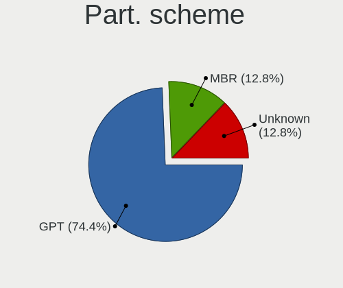
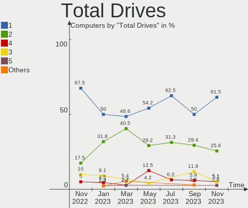
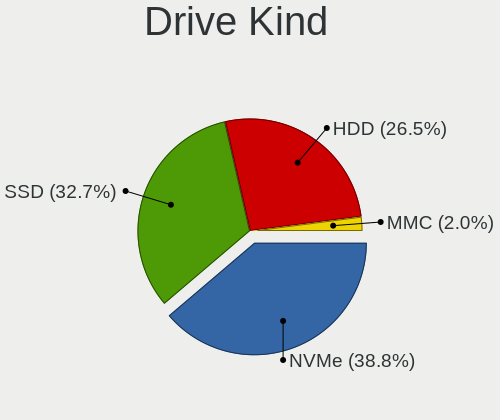
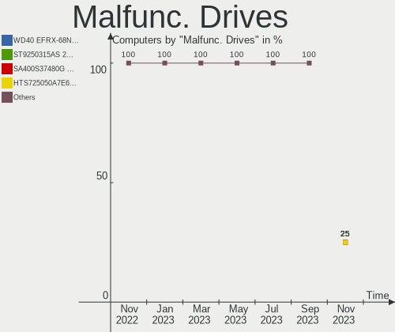
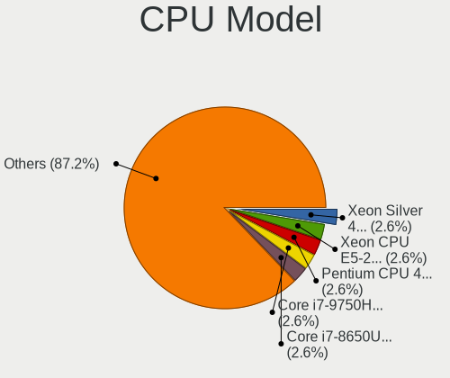
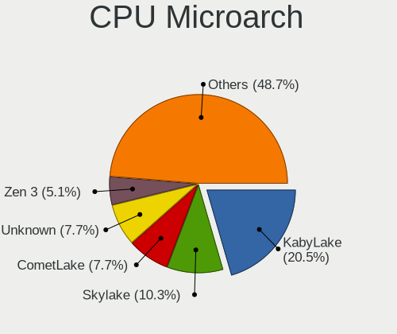
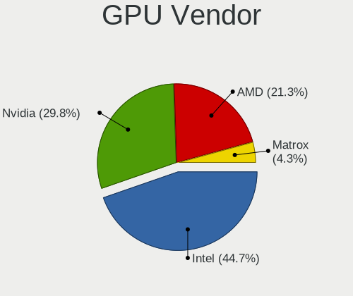
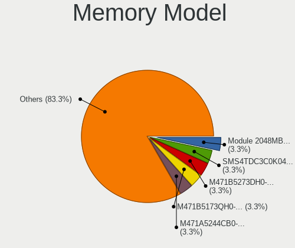

Ubuntu MATE - Hardware Trends
-----------------------------

A project to identify most popular hardware characteristics and track their change
over time based on data collected by Linux users at https://Linux-Hardware.org.

Anyone can contribute to this report by the [hw-probe](https://github.com/linuxhw/hw-probe) tool:

    sudo -E hw-probe -all -upload

This is a report for all computer types. See also reports for [desktops](/Dist/Ubuntu_MATE/Desktop/README.md) and [notebooks](/Dist/Ubuntu_MATE/Notebook/README.md).

This report is for one last month. Overall report since the beginning of time: [TestDays](https://github.com/linuxhw/TestDays)

Period: Nov, 2023.

Contents
--------

* [ System ](#system)
  - [ OS                       ](#os)
  - [ OS Family                ](#os-family)
  - [ Kernel                   ](#kernel)
  - [ Kernel Family            ](#kernel-family)
  - [ Kernel Major Ver.        ](#kernel-major-ver)
  - [ Arch                     ](#arch)
  - [ DE                       ](#de)
  - [ Display Server           ](#display-server)
  - [ Display Manager          ](#display-manager)
  - [ OS Lang                  ](#os-lang)
  - [ Boot Mode                ](#boot-mode)
  - [ Filesystem               ](#filesystem)
  - [ Part. scheme             ](#part-scheme)
  - [ Dual Boot with Linux/BSD ](#dual-boot-with-linuxbsd)
  - [ Dual Boot (Win)          ](#dual-boot-win)

* [ Board ](#board)
  - [ Vendor                   ](#vendor)
  - [ Model                    ](#model)
  - [ Model Family             ](#model-family)
  - [ MFG Year                 ](#mfg-year)
  - [ Form Factor              ](#form-factor)
  - [ Secure Boot              ](#secure-boot)
  - [ Coreboot                 ](#coreboot)
  - [ RAM Size                 ](#ram-size)
  - [ RAM Used                 ](#ram-used)
  - [ Total Drives             ](#total-drives)
  - [ Has CD-ROM               ](#has-cd-rom)
  - [ Has Ethernet             ](#has-ethernet)
  - [ Has WiFi                 ](#has-wifi)
  - [ Has Bluetooth            ](#has-bluetooth)

* [ Location ](#location)
  - [ Country                  ](#country)
  - [ City                     ](#city)

* [ Drives ](#drives)
  - [ Drive Vendor             ](#drive-vendor)
  - [ Drive Model              ](#drive-model)
  - [ HDD Vendor               ](#hdd-vendor)
  - [ SSD Vendor               ](#ssd-vendor)
  - [ Drive Kind               ](#drive-kind)
  - [ Drive Connector          ](#drive-connector)
  - [ Drive Size               ](#drive-size)
  - [ Space Total              ](#space-total)
  - [ Space Used               ](#space-used)
  - [ Malfunc. Drives          ](#malfunc-drives)
  - [ Malfunc. Drive Vendor    ](#malfunc-drive-vendor)
  - [ Malfunc. HDD Vendor      ](#malfunc-hdd-vendor)
  - [ Malfunc. Drive Kind      ](#malfunc-drive-kind)
  - [ Failed Drives            ](#failed-drives)
  - [ Failed Drive Vendor      ](#failed-drive-vendor)
  - [ Drive Status             ](#drive-status)

* [ Storage controller ](#storage-controller)
  - [ Storage Vendor           ](#storage-vendor)
  - [ Storage Model            ](#storage-model)
  - [ Storage Kind             ](#storage-kind)

* [ Processor ](#processor)
  - [ CPU Vendor               ](#cpu-vendor)
  - [ CPU Model                ](#cpu-model)
  - [ CPU Model Family         ](#cpu-model-family)
  - [ CPU Cores                ](#cpu-cores)
  - [ CPU Sockets              ](#cpu-sockets)
  - [ CPU Threads              ](#cpu-threads)
  - [ CPU Op-Modes             ](#cpu-op-modes)
  - [ CPU Microcode            ](#cpu-microcode)
  - [ CPU Microarch            ](#cpu-microarch)

* [ Graphics ](#graphics)
  - [ GPU Vendor               ](#gpu-vendor)
  - [ GPU Model                ](#gpu-model)
  - [ GPU Combo                ](#gpu-combo)
  - [ GPU Driver               ](#gpu-driver)
  - [ GPU Memory               ](#gpu-memory)

* [ Monitor ](#monitor)
  - [ Monitor Vendor           ](#monitor-vendor)
  - [ Monitor Model            ](#monitor-model)
  - [ Monitor Resolution       ](#monitor-resolution)
  - [ Monitor Diagonal         ](#monitor-diagonal)
  - [ Monitor Width            ](#monitor-width)
  - [ Aspect Ratio             ](#aspect-ratio)
  - [ Monitor Area             ](#monitor-area)
  - [ Pixel Density            ](#pixel-density)
  - [ Multiple Monitors        ](#multiple-monitors)

* [ Network ](#network)
  - [ Net Controller Vendor    ](#net-controller-vendor)
  - [ Net Controller Model     ](#net-controller-model)
  - [ Wireless Vendor          ](#wireless-vendor)
  - [ Wireless Model           ](#wireless-model)
  - [ Ethernet Vendor          ](#ethernet-vendor)
  - [ Ethernet Model           ](#ethernet-model)
  - [ Net Controller Kind      ](#net-controller-kind)
  - [ Used Controller          ](#used-controller)
  - [ NICs                     ](#nics)
  - [ IPv6                     ](#ipv6)

* [ Bluetooth ](#bluetooth)
  - [ Bluetooth Vendor         ](#bluetooth-vendor)
  - [ Bluetooth Model          ](#bluetooth-model)

* [ Sound ](#sound)
  - [ Sound Vendor             ](#sound-vendor)
  - [ Sound Model              ](#sound-model)

* [ Memory ](#memory)
  - [ Memory Vendor            ](#memory-vendor)
  - [ Memory Model             ](#memory-model)
  - [ Memory Kind              ](#memory-kind)
  - [ Memory Form Factor       ](#memory-form-factor)
  - [ Memory Size              ](#memory-size)
  - [ Memory Speed             ](#memory-speed)

* [ Printers & scanners ](#printers--scanners)
  - [ Printer Vendor           ](#printer-vendor)
  - [ Printer Model            ](#printer-model)
  - [ Scanner Vendor           ](#scanner-vendor)
  - [ Scanner Model            ](#scanner-model)

* [ Camera ](#camera)
  - [ Camera Vendor            ](#camera-vendor)
  - [ Camera Model             ](#camera-model)

* [ Security ](#security)
  - [ Fingerprint Vendor       ](#fingerprint-vendor)
  - [ Fingerprint Model        ](#fingerprint-model)
  - [ Chipcard Vendor          ](#chipcard-vendor)
  - [ Chipcard Model           ](#chipcard-model)

* [ Unsupported ](#unsupported)
  - [ Unsupported Devices      ](#unsupported-devices)
  - [ Unsupported Device Types ](#unsupported-device-types)

System
------

OS
--

Installed operating systems

| Name              | Computers | Percent |
|-------------------|-----------|---------|
| Ubuntu MATE 22.04 | 19        | 48.72%  |
| Ubuntu MATE 23.10 | 10        | 25.64%  |
| Ubuntu MATE 20.04 | 4         | 10.26%  |
| Ubuntu MATE 23.04 | 3         | 7.69%   |
| Ubuntu MATE 16.04 | 2         | 5.13%   |
| Ubuntu MATE 18.04 | 1         | 2.56%   |

OS Family
---------

OS without a version

| Name        | Computers | Percent |
|-------------|-----------|---------|
| Ubuntu MATE | 39        | 100%    |

Kernel
------

Version of the Linux kernel

| Version                | Computers | Percent |
|------------------------|-----------|---------|
| 6.2.0-36-generic       | 10        | 25.64%  |
| 6.2.0-37-generic       | 4         | 10.26%  |
| 6.5.0-10-generic       | 3         | 7.69%   |
| 5.15.0-88-generic      | 3         | 7.69%   |
| 6.6.1-060601-generic   | 2         | 5.13%   |
| 6.5.0-13-generic       | 2         | 5.13%   |
| 5.4.0-166-generic      | 2         | 5.13%   |
| 5.15.0-89-generic      | 2         | 5.13%   |
| 6.5.9-2-liquorix-amd64 | 1         | 2.56%   |
| 6.5.7-060507-generic   | 1         | 2.56%   |
| 6.5.0-10-lowlatency    | 1         | 2.56%   |
| 6.2.0-35-generic       | 1         | 2.56%   |
| 6.2.0-26-generic       | 1         | 2.56%   |
| 6.2.0-1016-lowlatency  | 1         | 2.56%   |
| 5.15.0-88-lowlatency   | 1         | 2.56%   |
| 5.15.0-84-generic      | 1         | 2.56%   |
| 4.4.0-210-generic      | 1         | 2.56%   |
| 4.15.0-213-generic     | 1         | 2.56%   |
| 4.15.0-142-generic     | 1         | 2.56%   |

Kernel Family
-------------

Linux kernel without a distro release

| Version | Computers | Percent |
|---------|-----------|---------|
| 6.2.0   | 17        | 43.59%  |
| 5.15.0  | 7         | 17.95%  |
| 6.5.0   | 6         | 15.38%  |
| 6.6.1   | 2         | 5.13%   |
| 5.4.0   | 2         | 5.13%   |
| 4.15.0  | 2         | 5.13%   |
| 6.5.9   | 1         | 2.56%   |
| 6.5.7   | 1         | 2.56%   |
| 4.4.0   | 1         | 2.56%   |

Kernel Major Ver.
-----------------

Linux kernel major version

| Version | Computers | Percent |
|---------|-----------|---------|
| 6.2     | 17        | 43.59%  |
| 6.5     | 8         | 20.51%  |
| 5.15    | 7         | 17.95%  |
| 6.6     | 2         | 5.13%   |
| 5.4     | 2         | 5.13%   |
| 4.15    | 2         | 5.13%   |
| 4.4     | 1         | 2.56%   |

Arch
----

OS architecture (x86_64, i586, etc.)

| Name   | Computers | Percent |
|--------|-----------|---------|
| x86_64 | 38        | 97.44%  |
| i686   | 1         | 2.56%   |

DE
--

Desktop Environment

| Name | Computers | Percent |
|------|-----------|---------|
| MATE | 39        | 100%    |

Display Server
--------------

X11 or Wayland

| Name | Computers | Percent |
|------|-----------|---------|
| X11  | 39        | 100%    |

Display Manager
---------------

SDDM, LightDM, etc.

| Name    | Computers | Percent |
|---------|-----------|---------|
| LightDM | 34        | 87.18%  |
| Unknown | 4         | 10.26%  |
| LXDM    | 1         | 2.56%   |

OS Lang
-------

Language

| Lang  | Computers | Percent |
|-------|-----------|---------|
| en_US | 12        | 30.77%  |
| it_IT | 6         | 15.38%  |
| de_DE | 4         | 10.26%  |
| fr_FR | 2         | 5.13%   |
| en_IN | 2         | 5.13%   |
| sv_SE | 1         | 2.56%   |
| ru_RU | 1         | 2.56%   |
| pt_BR | 1         | 2.56%   |
| nl_NL | 1         | 2.56%   |
| ja_JP | 1         | 2.56%   |
| fr_CA | 1         | 2.56%   |
| fi_FI | 1         | 2.56%   |
| es_GT | 1         | 2.56%   |
| es_ES | 1         | 2.56%   |
| es_AR | 1         | 2.56%   |
| en_GB | 1         | 2.56%   |
| en_CA | 1         | 2.56%   |
| da_DK | 1         | 2.56%   |

Boot Mode
---------

EFI or BIOS

| Mode | Computers | Percent |
|------|-----------|---------|
| EFI  | 21        | 53.85%  |
| BIOS | 18        | 46.15%  |

Filesystem
----------

Type of filesystem

| Type  | Computers | Percent |
|-------|-----------|---------|
| Ext4  | 21        | 53.85%  |
| Tmpfs | 15        | 38.46%  |
| Zfs   | 1         | 2.56%   |
| Ext3  | 1         | 2.56%   |
| Btrfs | 1         | 2.56%   |

Part. scheme
------------

Scheme of partitioning

| Type    | Computers | Percent |
|---------|-----------|---------|
| GPT     | 29        | 74.36%  |
| MBR     | 5         | 12.82%  |
| Unknown | 5         | 12.82%  |

Dual Boot with Linux/BSD
------------------------

Hosting more than one Linux/BSD

| Dual boot | Computers | Percent |
|-----------|-----------|---------|
| No        | 32        | 82.05%  |
| Yes       | 7         | 17.95%  |

Dual Boot (Win)
---------------

Hosting Linux and Windows

| Dual boot | Computers | Percent |
|-----------|-----------|---------|
| No        | 25        | 64.1%   |
| Yes       | 14        | 35.9%   |

Board
-----

Vendor
------

Motherboard manufacturer

| Name                | Computers | Percent |
|---------------------|-----------|---------|
| Lenovo              | 9         | 23.08%  |
| Hewlett-Packard     | 6         | 15.38%  |
| Dell                | 6         | 15.38%  |
| ASUSTek Computer    | 6         | 15.38%  |
| Gigabyte Technology | 2         | 5.13%   |
| ASRock              | 2         | 5.13%   |
| Acer                | 2         | 5.13%   |
| Notebook            | 1         | 2.56%   |
| MSI                 | 1         | 2.56%   |
| Intel               | 1         | 2.56%   |
| Google              | 1         | 2.56%   |
| BANGHO              | 1         | 2.56%   |
| Apple               | 1         | 2.56%   |

Model
-----

Motherboard model

| Name                                     | Computers | Percent |
|------------------------------------------|-----------|---------|
| Notebook NJx0MU                          | 1         | 2.56%   |
| MSI GL62 6QF                             | 1         | 2.56%   |
| Lenovo V15 G2 ALC 82KD                   | 1         | 2.56%   |
| Lenovo ThinkPad X1 Yoga 3rd 20LES0CA00   | 1         | 2.56%   |
| Lenovo ThinkPad T14 Gen 2a 20XKCTO1WW    | 1         | 2.56%   |
| Lenovo ThinkPad P53 20QN000FIX           | 1         | 2.56%   |
| Lenovo T530-28ICB                        | 1         | 2.56%   |
| Lenovo Legion 7 16ITHg6 82K6             | 1         | 2.56%   |
| Lenovo IdeaPadFlex 4-1470 80SA           | 1         | 2.56%   |
| Lenovo IdeaPad Y460                      | 1         | 2.56%   |
| Lenovo IdeaPad S145-15IWL 81S9           | 1         | 2.56%   |
| Intel NUC7CJYHN                          | 1         | 2.56%   |
| HP Spectre x360 Convertible 15-bl0XX     | 1         | 2.56%   |
| HP ProBook 440 G7                        | 1         | 2.56%   |
| HP ProBook 440 G2                        | 1         | 2.56%   |
| HP Pavilion Gaming Laptop 17-cd1xxx      | 1         | 2.56%   |
| HP EliteBook 860 16 inch G10 Notebook PC | 1         | 2.56%   |
| HP Elite x2 1012 G2                      | 1         | 2.56%   |
| Google Galtic                            | 1         | 2.56%   |
| Gigabyte Z590 UD AC                      | 1         | 2.56%   |
| Gigabyte B550 GAMING X V2                | 1         | 2.56%   |
| Dell Precision Tower 3620                | 1         | 2.56%   |
| Dell Precision M4800                     | 1         | 2.56%   |
| Dell Precision 7760                      | 1         | 2.56%   |
| Dell PowerEdge R440                      | 1         | 2.56%   |
| Dell OptiPlex 5080                       | 1         | 2.56%   |
| Dell OEM-R 720xd                         | 1         | 2.56%   |
| BANGHO 1025                              | 1         | 2.56%   |
| ASUS VivoBook_ASUSLaptop X712DA_D712DA   | 1         | 2.56%   |
| ASUS ROG STRIX Z690-E GAMING WIFI        | 1         | 2.56%   |
| ASUS PRIME Z490-P                        | 1         | 2.56%   |
| ASUS P8P67-M PRO                         | 1         | 2.56%   |
| ASUS M5A97 LE R2.0                       | 1         | 2.56%   |
| ASUS M5A78L-M LX                         | 1         | 2.56%   |
| ASRock X99 Extreme4                      | 1         | 2.56%   |
| ASRock 970 Extreme3 R2.0                 | 1         | 2.56%   |
| Apple iMac19,2                           | 1         | 2.56%   |
| Acer Aspire 5050                         | 1         | 2.56%   |
| Acer AOD260                              | 1         | 2.56%   |

Model Family
------------

Motherboard model prefix

| Name               | Computers | Percent |
|--------------------|-----------|---------|
| Lenovo ThinkPad    | 3         | 7.69%   |
| Dell Precision     | 3         | 7.69%   |
| Lenovo IdeaPad     | 2         | 5.13%   |
| HP ProBook         | 2         | 5.13%   |
| Notebook NJx0MU    | 1         | 2.56%   |
| MSI GL62           | 1         | 2.56%   |
| Lenovo V15         | 1         | 2.56%   |
| Lenovo T530-28ICB  | 1         | 2.56%   |
| Lenovo Legion      | 1         | 2.56%   |
| Lenovo IdeaPadFlex | 1         | 2.56%   |
| Intel NUC7CJYHN    | 1         | 2.56%   |
| HP Spectre         | 1         | 2.56%   |
| HP Pavilion        | 1         | 2.56%   |
| HP EliteBook       | 1         | 2.56%   |
| HP Elite           | 1         | 2.56%   |
| Google Galtic      | 1         | 2.56%   |
| Gigabyte Z590      | 1         | 2.56%   |
| Gigabyte B550      | 1         | 2.56%   |
| Dell PowerEdge     | 1         | 2.56%   |
| Dell OptiPlex      | 1         | 2.56%   |
| Dell OEM-R         | 1         | 2.56%   |
| BANGHO 1025        | 1         | 2.56%   |
| ASUS VivoBook      | 1         | 2.56%   |
| ASUS ROG           | 1         | 2.56%   |
| ASUS PRIME         | 1         | 2.56%   |
| ASUS P8P67-M       | 1         | 2.56%   |
| ASUS M5A97         | 1         | 2.56%   |
| ASUS M5A78L-M      | 1         | 2.56%   |
| ASRock X99         | 1         | 2.56%   |
| ASRock 970         | 1         | 2.56%   |
| Apple iMac19       | 1         | 2.56%   |
| Acer Aspire        | 1         | 2.56%   |
| Acer AOD260        | 1         | 2.56%   |

MFG Year
--------

Motherboard manufacture year

| Year | Computers | Percent |
|------|-----------|---------|
| 2021 | 9         | 23.08%  |
| 2019 | 7         | 17.95%  |
| 2020 | 5         | 12.82%  |
| 2016 | 3         | 7.69%   |
| 2023 | 2         | 5.13%   |
| 2018 | 2         | 5.13%   |
| 2014 | 2         | 5.13%   |
| 2012 | 2         | 5.13%   |
| 2011 | 2         | 5.13%   |
| 2010 | 2         | 5.13%   |
| 2017 | 1         | 2.56%   |
| 2013 | 1         | 2.56%   |
| 2006 | 1         | 2.56%   |

Form Factor
-----------

Physical design of the computer

| Name        | Computers | Percent |
|-------------|-----------|---------|
| Notebook    | 20        | 51.28%  |
| Desktop     | 12        | 30.77%  |
| Convertible | 2         | 5.13%   |
| Server      | 2         | 5.13%   |
| Tablet      | 1         | 2.56%   |
| Mini pc     | 1         | 2.56%   |
| All in one  | 1         | 2.56%   |

Secure Boot
-----------

Enabled or disabled

| State    | Computers | Percent |
|----------|-----------|---------|
| Disabled | 36        | 92.31%  |
| Enabled  | 3         | 7.69%   |

Coreboot
--------

Have coreboot on board

| Used | Computers | Percent |
|------|-----------|---------|
| No   | 38        | 97.44%  |
| Yes  | 1         | 2.56%   |

RAM Size
--------

Total RAM memory

| Size in GB  | Computers | Percent |
|-------------|-----------|---------|
| 16.01-24.0  | 9         | 23.08%  |
| 4.01-8.0    | 7         | 17.95%  |
| 32.01-64.0  | 7         | 17.95%  |
| 3.01-4.0    | 5         | 12.82%  |
| 64.01-256.0 | 5         | 12.82%  |
| 8.01-16.0   | 4         | 10.26%  |
| 24.01-32.0  | 1         | 2.56%   |
| 1.01-2.0    | 1         | 2.56%   |

RAM Used
--------

Used RAM memory

| Used GB    | Computers | Percent |
|------------|-----------|---------|
| 1.01-2.0   | 13        | 33.33%  |
| 3.01-4.0   | 9         | 23.08%  |
| 2.01-3.0   | 7         | 17.95%  |
| 8.01-16.0  | 6         | 15.38%  |
| 4.01-8.0   | 2         | 5.13%   |
| 32.01-64.0 | 1         | 2.56%   |
| 0.51-1.0   | 1         | 2.56%   |

Total Drives
------------

Number of drives on board

| Drives | Computers | Percent |
|--------|-----------|---------|
| 1      | 24        | 61.54%  |
| 2      | 10        | 25.64%  |
| 4      | 2         | 5.13%   |
| 3      | 2         | 5.13%   |
| 5      | 1         | 2.56%   |

Has CD-ROM
----------

Has CD-ROM on board

| Presented | Computers | Percent |
|-----------|-----------|---------|
| No        | 27        | 69.23%  |
| Yes       | 12        | 30.77%  |

Has Ethernet
------------

Has Ethernet on board

| Presented | Computers | Percent |
|-----------|-----------|---------|
| Yes       | 35        | 89.74%  |
| No        | 4         | 10.26%  |

Has WiFi
--------

Has WiFi module

| Presented | Computers | Percent |
|-----------|-----------|---------|
| Yes       | 28        | 71.79%  |
| No        | 11        | 28.21%  |

Has Bluetooth
-------------

Has Bluetooth module

| Presented | Computers | Percent |
|-----------|-----------|---------|
| Yes       | 25        | 64.1%   |
| No        | 14        | 35.9%   |

Location
--------

Country
-------

Geographic location (country)

| Country         | Computers | Percent |
|-----------------|-----------|---------|
| Italy           | 6         | 15.38%  |
| USA             | 5         | 12.82%  |
| Germany         | 5         | 12.82%  |
| Argentina       | 3         | 7.69%   |
| Panama          | 2         | 5.13%   |
| Mexico          | 2         | 5.13%   |
| India           | 2         | 5.13%   |
| France          | 2         | 5.13%   |
| Brazil          | 2         | 5.13%   |
| UK              | 1         | 2.56%   |
| The Netherlands | 1         | 2.56%   |
| Sweden          | 1         | 2.56%   |
| Japan           | 1         | 2.56%   |
| Finland         | 1         | 2.56%   |
| Denmark         | 1         | 2.56%   |
| Canada          | 1         | 2.56%   |
| Belgium         | 1         | 2.56%   |
| Azerbaijan      | 1         | 2.56%   |
| Algeria         | 1         | 2.56%   |

City
----

Geographic location (city)

| City                 | Computers | Percent |
|----------------------|-----------|---------|
| Panama City          | 2         | 5.13%   |
| Mannheim             | 2         | 5.13%   |
| Ciudad Hidalgo       | 2         | 5.13%   |
| Wittingen            | 1         | 2.56%   |
| Vancouver            | 1         | 2.56%   |
| Torring              | 1         | 2.56%   |
| Toronto              | 1         | 2.56%   |
| Tampere              | 1         | 2.56%   |
| Sundbyberg           | 1         | 2.56%   |
| Sao Paulo            | 1         | 2.56%   |
| Sao José dos Campos | 1         | 2.56%   |
| Rosario              | 1         | 2.56%   |
| Rome                 | 1         | 2.56%   |
| Rombiolo             | 1         | 2.56%   |
| Remedios de Escalada | 1         | 2.56%   |
| Ravenna              | 1         | 2.56%   |
| New Brighton         | 1         | 2.56%   |
| Moosburg             | 1         | 2.56%   |
| Montpellier          | 1         | 2.56%   |
| Monteviale           | 1         | 2.56%   |
| Minneapolis          | 1         | 2.56%   |
| Manchester           | 1         | 2.56%   |
| Kofu                 | 1         | 2.56%   |
| Knoxville            | 1         | 2.56%   |
| Isidro Casanova      | 1         | 2.56%   |
| Hyderabad            | 1         | 2.56%   |
| Houten               | 1         | 2.56%   |
| Gordon               | 1         | 2.56%   |
| Gentbrugge           | 1         | 2.56%   |
| Faremoutiers         | 1         | 2.56%   |
| Delhi                | 1         | 2.56%   |
| Berlin               | 1         | 2.56%   |
| Barlassina           | 1         | 2.56%   |
| Bari                 | 1         | 2.56%   |
| Baku                 | 1         | 2.56%   |
| Algiers              | 1         | 2.56%   |

Drives
------

Drive Vendor
------------

Hard drive vendors

| Vendor                | Computers | Drives | Percent |
|-----------------------|-----------|--------|---------|
| Samsung Electronics   | 18        | 22     | 34.62%  |
| WDC                   | 9         | 12     | 17.31%  |
| SanDisk               | 6         | 6      | 11.54%  |
| Intel                 | 3         | 4      | 5.77%   |
| Toshiba               | 2         | 2      | 3.85%   |
| Seagate               | 2         | 2      | 3.85%   |
| Kingston              | 2         | 2      | 3.85%   |
| HGST                  | 2         | 2      | 3.85%   |
| SSK                   | 1         | 1      | 1.92%   |
| Realtek Semiconductor | 1         | 1      | 1.92%   |
| Maxtor                | 1         | 1      | 1.92%   |
| KingFast              | 1         | 1      | 1.92%   |
| Crucial               | 1         | 1      | 1.92%   |
| Apple                 | 1         | 1      | 1.92%   |
| A-DATA Technology     | 1         | 2      | 1.92%   |
| Unknown               | 1         | 1      | 1.92%   |

Drive Model
-----------

Hard drive models

| Model                                               | Computers | Percent |
|-----------------------------------------------------|-----------|---------|
| Samsung SSD 980 1TB                                 | 3         | 5%      |
| WDC WD10EZEX-08WN4A0 1TB                            | 2         | 3.33%   |
| Samsung NVMe SSD Controller PM9A1/PM9A3/980PRO 2TB  | 2         | 3.33%   |
| Samsung MZVLQ512HALU-000H1 512GB                    | 2         | 3.33%   |
| WDC WD5003AZEX-00K1GA0 500GB                        | 1         | 1.67%   |
| WDC WD5000LPCX-22VHAT0 500GB                        | 1         | 1.67%   |
| WDC WD4004FZWX-00GBGB0 4TB                          | 1         | 1.67%   |
| WDC WD40 EFRX-68N32N0 4TB                           | 1         | 1.67%   |
| WDC WD20EURX-57T0FY1 2TB                            | 1         | 1.67%   |
| WDC WD10SPZX-24Z10 1TB                              | 1         | 1.67%   |
| WDC WD10PURX-64E5EY0 1TB                            | 1         | 1.67%   |
| WDC WD10EZRX-00D8PB0 1TB                            | 1         | 1.67%   |
| WDC WD1003FBYZ-010FB0 1TB                           | 1         | 1.67%   |
| WDC WD Blue SA510 2.5 500GB                         | 1         | 1.67%   |
| Toshiba XG6 NVMe SSD Controller 512GB               | 1         | 1.67%   |
| Toshiba DT01ACA100 1TB                              | 1         | 1.67%   |
| SSK Disk 240GB                                      | 1         | 1.67%   |
| Seagate ST9250315AS 250GB                           | 1         | 1.67%   |
| Seagate ST2000NE001-2M5101 2TB                      | 1         | 1.67%   |
| Sandisk WD_BLACK SN770 1TB                          | 1         | 1.67%   |
| SanDisk Ultra II 960GB SSD                          | 1         | 1.67%   |
| SanDisk SDSSDHII960G 960GB                          | 1         | 1.67%   |
| SanDisk SDSSDH3 500G                                | 1         | 1.67%   |
| SanDisk NVMe SSD Drive 512GB                        | 1         | 1.67%   |
| SanDisk NVMe SSD Drive 1TB                          | 1         | 1.67%   |
| Samsung SSD 980 PRO 1TB                             | 1         | 1.67%   |
| Samsung SSD 870 QVO 8TB                             | 1         | 1.67%   |
| Samsung SSD 870 QVO 1TB                             | 1         | 1.67%   |
| Samsung SSD 860 QVO 2TB                             | 1         | 1.67%   |
| Samsung SSD 860 PRO 1TB                             | 1         | 1.67%   |
| Samsung SSD 860 EVO 500GB                           | 1         | 1.67%   |
| Samsung SSD 850 EVO mSATA 250GB                     | 1         | 1.67%   |
| Samsung SSD 850 EVO 250GB                           | 1         | 1.67%   |
| Samsung PSSD T7 Shield 4TB                          | 1         | 1.67%   |
| Samsung NVMe SSD Controller SM981/PM981/PM983 250GB | 1         | 1.67%   |
| Samsung NVMe SSD Controller SM961/PM961/SM963 256GB | 1         | 1.67%   |
| Samsung MZVLW1T0HMLH-000H1 1TB                      | 1         | 1.67%   |
| Samsung MZVL2512HCJQ-00B00 512GB                    | 1         | 1.67%   |
| Samsung MZALQ512HBLU-00BL2 512GB                    | 1         | 1.67%   |
| Realtek JAJP600M4TB                                 | 1         | 1.67%   |

HDD Vendor
----------

Hard disk drive vendors

| Vendor  | Computers | Drives | Percent |
|---------|-----------|--------|---------|
| WDC     | 8         | 11     | 57.14%  |
| Seagate | 2         | 2      | 14.29%  |
| HGST    | 2         | 2      | 14.29%  |
| Toshiba | 1         | 1      | 7.14%   |
| SSK     | 1         | 1      | 7.14%   |

SSD Vendor
----------

Solid state drive vendors

| Vendor              | Computers | Drives | Percent |
|---------------------|-----------|--------|---------|
| Samsung Electronics | 8         | 8      | 44.44%  |
| SanDisk             | 3         | 3      | 16.67%  |
| Kingston            | 2         | 2      | 11.11%  |
| WDC                 | 1         | 1      | 5.56%   |
| Maxtor              | 1         | 1      | 5.56%   |
| KingFast            | 1         | 1      | 5.56%   |
| Intel               | 1         | 1      | 5.56%   |
| Crucial             | 1         | 1      | 5.56%   |

Drive Kind
----------

HDD or SSD

| Kind | Computers | Drives | Percent |
|------|-----------|--------|---------|
| NVMe | 19        | 25     | 38.78%  |
| SSD  | 16        | 18     | 32.65%  |
| HDD  | 13        | 17     | 26.53%  |
| MMC  | 1         | 1      | 2.04%   |

Drive Connector
---------------

SATA, SAS, NVMe, etc.

| Type | Computers | Drives | Percent |
|------|-----------|--------|---------|
| SATA | 22        | 32     | 48.89%  |
| NVMe | 19        | 25     | 42.22%  |
| SAS  | 3         | 3      | 6.67%   |
| MMC  | 1         | 1      | 2.22%   |

Drive Size
----------

Size of hard drive

| Size in TB | Computers | Drives | Percent |
|------------|-----------|--------|---------|
| 0.01-0.5   | 12        | 15     | 41.38%  |
| 0.51-1.0   | 10        | 13     | 34.48%  |
| 3.01-4.0   | 3         | 3      | 10.34%  |
| 1.01-2.0   | 3         | 3      | 10.34%  |
| 4.01-10.0  | 1         | 1      | 3.45%   |

Space Total
-----------

Amount of disk space available on the file system

| Size in GB     | Computers | Percent |
|----------------|-----------|---------|
| 501-1000       | 13        | 33.33%  |
| 101-250        | 7         | 17.95%  |
| 1001-2000      | 5         | 12.82%  |
| More than 3000 | 4         | 10.26%  |
| 251-500        | 4         | 10.26%  |
| 51-100         | 3         | 7.69%   |
| 21-50          | 2         | 5.13%   |
| 2001-3000      | 1         | 2.56%   |

Space Used
----------

Amount of used disk space

| Used GB        | Computers | Percent |
|----------------|-----------|---------|
| 101-250        | 9         | 23.08%  |
| 21-50          | 8         | 20.51%  |
| 1-20           | 6         | 15.38%  |
| 501-1000       | 5         | 12.82%  |
| 251-500        | 4         | 10.26%  |
| More than 3000 | 3         | 7.69%   |
| 51-100         | 3         | 7.69%   |
| 1001-2000      | 1         | 2.56%   |

Malfunc. Drives
---------------

Drive models with a malfunction

| Model                           | Computers | Drives | Percent |
|---------------------------------|-----------|--------|---------|
| WDC WD40 EFRX-68N32N0 4TB       | 1         | 1      | 25%     |
| Seagate ST9250315AS 250GB       | 1         | 1      | 25%     |
| Kingston SA400S37480G 480GB SSD | 1         | 1      | 25%     |
| HGST HTS725050A7E630 500GB      | 1         | 1      | 25%     |

Malfunc. Drive Vendor
---------------------

Vendors of faulty drives

| Vendor   | Computers | Drives | Percent |
|----------|-----------|--------|---------|
| WDC      | 1         | 1      | 25%     |
| Seagate  | 1         | 1      | 25%     |
| Kingston | 1         | 1      | 25%     |
| HGST     | 1         | 1      | 25%     |

Malfunc. HDD Vendor
-------------------

Vendors of faulty HDD drives

| Vendor  | Computers | Drives | Percent |
|---------|-----------|--------|---------|
| WDC     | 1         | 1      | 33.33%  |
| Seagate | 1         | 1      | 33.33%  |
| HGST    | 1         | 1      | 33.33%  |

Malfunc. Drive Kind
-------------------

Kinds of faulty drives

| Kind | Computers | Drives | Percent |
|------|-----------|--------|---------|
| HDD  | 3         | 3      | 75%     |
| SSD  | 1         | 1      | 25%     |

Failed Drives
-------------

Failed drive models

Zero info for selected period =(

Failed Drive Vendor
-------------------

Failed drive vendors

Zero info for selected period =(

Drive Status
------------

Number of failed and malfunc. drives

| Status   | Computers | Drives | Percent |
|----------|-----------|--------|---------|
| Detected | 21        | 31     | 51.22%  |
| Works    | 16        | 26     | 39.02%  |
| Malfunc  | 4         | 4      | 9.76%   |

Storage controller
------------------

Storage Vendor
--------------

Storage controller vendors

| Vendor                       | Computers | Percent |
|------------------------------|-----------|---------|
| Intel                        | 25        | 45.45%  |
| Samsung Electronics          | 13        | 23.64%  |
| AMD                          | 7         | 12.73%  |
| SanDisk                      | 3         | 5.45%   |
| Toshiba America Info Systems | 1         | 1.82%   |
| Realtek Semiconductor        | 1         | 1.82%   |
| Marvell Technology Group     | 1         | 1.82%   |
| LSI Logic / Symbios Logic    | 1         | 1.82%   |
| Broadcom / LSI               | 1         | 1.82%   |
| ASMedia Technology           | 1         | 1.82%   |
| ADATA Technology             | 1         | 1.82%   |

Storage Model
-------------

Storage controller models

| Model                                                                          | Computers | Percent |
|--------------------------------------------------------------------------------|-----------|---------|
| Samsung NVMe SSD Controller 980 (DRAM-less)                                    | 6         | 9.52%   |
| Samsung NVMe SSD Controller PM9A1/PM9A3/980PRO                                 | 4         | 6.35%   |
| SanDisk WD Black SN770 / PC SN740 256GB / PC SN560 (DRAM-less) NVMe SSD        | 2         | 3.17%   |
| Samsung NVMe SSD Controller SM961/PM961/SM963                                  | 2         | 3.17%   |
| Intel Comet Lake SATA AHCI Controller                                          | 2         | 3.17%   |
| Intel Cannon Lake PCH SATA AHCI Controller                                     | 2         | 3.17%   |
| AMD SB7x0/SB8x0/SB9x0 SATA Controller [IDE mode]                               | 2         | 3.17%   |
| AMD SB7x0/SB8x0/SB9x0 IDE Controller                                           | 2         | 3.17%   |
| AMD FCH SATA Controller [AHCI mode]                                            | 2         | 3.17%   |
| Toshiba America Info Systems XG6 NVMe SSD Controller                           | 1         | 1.59%   |
| SanDisk Ultra 3D / WD Blue SN570 NVMe SSD (DRAM-less)                          | 1         | 1.59%   |
| Samsung NVMe SSD SM0032L                                                       | 1         | 1.59%   |
| Samsung NVMe SSD Controller SM981/PM981/PM983                                  | 1         | 1.59%   |
| Realtek RTS5765DL NVMe SSD Controller (DRAM-less)                              | 1         | 1.59%   |
| Marvell Group 88SE9172 SATA III 6Gb/s RAID Controller                          | 1         | 1.59%   |
| LSI Logic / Symbios Logic MegaRAID SAS 2008 [Falcon]                           | 1         | 1.59%   |
| Intel Volume Management Device NVMe RAID Controller Intel Corporation          | 1         | 1.59%   |
| Intel Tiger Lake-LP SATA Controller                                            | 1         | 1.59%   |
| Intel Tiger Lake SATA AHCI Controller                                          | 1         | 1.59%   |
| Intel Sunrise Point-LP SATA Controller [AHCI mode]                             | 1         | 1.59%   |
| Intel SSD DC P4101/Pro 7600p/760p/E 6100p Series                               | 1         | 1.59%   |
| Intel SSD 670p Series [Keystone Harbor]                                        | 1         | 1.59%   |
| Intel SATA Controller [RAID mode]                                              | 1         | 1.59%   |
| Intel NM10/ICH7 Family SATA Controller [AHCI mode]                             | 1         | 1.59%   |
| Intel HM170/QM170 Chipset SATA Controller [AHCI Mode]                          | 1         | 1.59%   |
| Intel Comet Lake PCH-H RAID                                                    | 1         | 1.59%   |
| Intel Celeron/Pentium Silver Processor SATA Controller                         | 1         | 1.59%   |
| Intel Cannon Point-LP SATA Controller [AHCI Mode]                              | 1         | 1.59%   |
| Intel Cannon Lake Mobile PCH SATA AHCI Controller                              | 1         | 1.59%   |
| Intel C620 Series Chipset Family SSATA Controller [AHCI mode]                  | 1         | 1.59%   |
| Intel C620 Series Chipset Family SATA Controller [AHCI mode]                   | 1         | 1.59%   |
| Intel C610/X99 series chipset sSATA Controller [AHCI mode]                     | 1         | 1.59%   |
| Intel C600/X79 series chipset 6-Port SATA AHCI Controller                      | 1         | 1.59%   |
| Intel Atom Processor E3800 Series SATA AHCI Controller                         | 1         | 1.59%   |
| Intel Alder Lake-S PCH SATA Controller [AHCI Mode]                             | 1         | 1.59%   |
| Intel 82801 Mobile SATA Controller [RAID mode]                                 | 1         | 1.59%   |
| Intel 8 Series/C220 Series Chipset Family 6-port SATA Controller 1 [AHCI mode] | 1         | 1.59%   |
| Intel 8 Series SATA Controller 1 [AHCI mode]                                   | 1         | 1.59%   |
| Intel 6 Series/C200 Series Chipset Family 6 port Desktop SATA AHCI Controller  | 1         | 1.59%   |
| Intel 500 Series Chipset Family SATA AHCI Controller                           | 1         | 1.59%   |

Storage Kind
------------

Kind of storage controller (IDE, SATA, NVMe, SAS, ...)

| Kind | Computers | Percent |
|------|-----------|---------|
| SATA | 28        | 49.12%  |
| NVMe | 19        | 33.33%  |
| RAID | 6         | 10.53%  |
| IDE  | 4         | 7.02%   |

Processor
---------

CPU Vendor
----------

Processor vendors

| Vendor | Computers | Percent |
|--------|-----------|---------|
| Intel  | 31        | 79.49%  |
| AMD    | 8         | 20.51%  |

CPU Model
---------

Processor models

| Model                                         | Computers | Percent |
|-----------------------------------------------|-----------|---------|
| Intel Xeon Silver 4116 CPU @ 2.10GHz          | 1         | 2.56%   |
| Intel Xeon CPU E5-2620 0 @ 2.00GHz            | 1         | 2.56%   |
| Intel Pentium CPU 4405U @ 2.10GHz             | 1         | 2.56%   |
| Intel Core i7-9750H CPU @ 2.60GHz             | 1         | 2.56%   |
| Intel Core i7-8650U CPU @ 1.90GHz             | 1         | 2.56%   |
| Intel Core i7-7500U CPU @ 2.70GHz             | 1         | 2.56%   |
| Intel Core i7-6800K CPU @ 3.40GHz             | 1         | 2.56%   |
| Intel Core i7-6700HQ CPU @ 2.60GHz            | 1         | 2.56%   |
| Intel Core i7-6700 CPU @ 3.40GHz              | 1         | 2.56%   |
| Intel Core i7-4810MQ CPU @ 2.80GHz            | 1         | 2.56%   |
| Intel Core i7-4510U CPU @ 2.00GHz             | 1         | 2.56%   |
| Intel Core i7-2600 CPU @ 3.40GHz              | 1         | 2.56%   |
| Intel Core i7-10750H CPU @ 2.60GHz            | 1         | 2.56%   |
| Intel Core i7-10510U CPU @ 1.80GHz            | 1         | 2.56%   |
| Intel Core i5-8500 CPU @ 3.00GHz              | 1         | 2.56%   |
| Intel Core i5-8400 CPU @ 2.80GHz              | 1         | 2.56%   |
| Intel Core i5-8265U CPU @ 1.60GHz             | 1         | 2.56%   |
| Intel Core i5-7300U CPU @ 2.60GHz             | 1         | 2.56%   |
| Intel Core i5-10500 CPU @ 3.10GHz             | 1         | 2.56%   |
| Intel Core i5-10400 CPU @ 2.90GHz             | 1         | 2.56%   |
| Intel Core i3 CPU M 330 @ 2.13GHz             | 1         | 2.56%   |
| Intel Celeron N4500 @ 1.10GHz                 | 1         | 2.56%   |
| Intel Celeron J4025 CPU @ 2.00GHz             | 1         | 2.56%   |
| Intel Celeron CPU N2808 @ 1.58GHz             | 1         | 2.56%   |
| Intel Atom CPU N450 @ 1.66GHz                 | 1         | 2.56%   |
| Intel 13th Gen Core i7-13700K                 | 1         | 2.56%   |
| Intel 13th Gen Core i5-1345U                  | 1         | 2.56%   |
| Intel 11th Gen Core i9-11980HK @ 2.60GHz      | 1         | 2.56%   |
| Intel 11th Gen Core i9-11900K @ 3.50GHz       | 1         | 2.56%   |
| Intel 11th Gen Core i7-11850H @ 2.50GHz       | 1         | 2.56%   |
| Intel 11th Gen Core i7-1165G7 @ 2.80GHz       | 1         | 2.56%   |
| AMD Turion 64 X2 Mobile Technology TL-56      | 1         | 2.56%   |
| AMD Ryzen 7 PRO 5850U with Radeon Graphics    | 1         | 2.56%   |
| AMD Ryzen 7 5700U with Radeon Graphics        | 1         | 2.56%   |
| AMD Ryzen 5 5500                              | 1         | 2.56%   |
| AMD Ryzen 5 3500U with Radeon Vega Mobile Gfx | 1         | 2.56%   |
| AMD FX-8370 Eight-Core Processor              | 1         | 2.56%   |
| AMD FX-4300 Quad-Core Processor               | 1         | 2.56%   |
| AMD Athlon II X2 245 Processor                | 1         | 2.56%   |

CPU Model Family
----------------

Processor model prefix

| Model                   | Computers | Percent |
|-------------------------|-----------|---------|
| Intel Core i7           | 11        | 28.21%  |
| Other                   | 6         | 15.38%  |
| Intel Core i5           | 6         | 15.38%  |
| Intel Celeron           | 3         | 7.69%   |
| AMD Ryzen 5             | 2         | 5.13%   |
| AMD FX                  | 2         | 5.13%   |
| Intel Xeon Silver       | 1         | 2.56%   |
| Intel Xeon              | 1         | 2.56%   |
| Intel Pentium           | 1         | 2.56%   |
| Intel Core i3           | 1         | 2.56%   |
| Intel Atom              | 1         | 2.56%   |
| AMD Turion 64 X2 Mobile | 1         | 2.56%   |
| AMD Ryzen 7 PRO         | 1         | 2.56%   |
| AMD Ryzen 7             | 1         | 2.56%   |
| AMD Athlon II X2        | 1         | 2.56%   |

CPU Cores
---------

Number of processor cores

| Number | Computers | Percent |
|--------|-----------|---------|
| 2      | 11        | 28.21%  |
| 4      | 10        | 25.64%  |
| 6      | 8         | 20.51%  |
| 8      | 5         | 12.82%  |
| 24     | 1         | 2.56%   |
| 16     | 1         | 2.56%   |
| 12     | 1         | 2.56%   |
| 10     | 1         | 2.56%   |
| 1      | 1         | 2.56%   |

CPU Sockets
-----------

Number of sockets

| Number | Computers | Percent |
|--------|-----------|---------|
| 1      | 37        | 94.87%  |
| 2      | 2         | 5.13%   |

CPU Threads
-----------

Threads per core (Hyper-Threading)

| Number | Computers | Percent |
|--------|-----------|---------|
| 2      | 32        | 82.05%  |
| 1      | 7         | 17.95%  |

CPU Op-Modes
------------

CPU Operation Modes (32-bit, 64-bit)

| Op mode        | Computers | Percent |
|----------------|-----------|---------|
| 32-bit, 64-bit | 39        | 100%    |

CPU Microcode
-------------

Microcode number

| Number     | Computers | Percent |
|------------|-----------|---------|
| Unknown    | 28        | 71.79%  |
| 0x06000852 | 2         | 5.13%   |
| 0xa0671    | 1         | 2.56%   |
| 0x806ec    | 1         | 2.56%   |
| 0x50654    | 1         | 2.56%   |
| 0x206d7    | 1         | 2.56%   |
| 0x206a7    | 1         | 2.56%   |
| 0x20652    | 1         | 2.56%   |
| 0x106ca    | 1         | 2.56%   |
| 0x0a50000c | 1         | 2.56%   |
| 0x08108109 | 1         | 2.56%   |

CPU Microarch
-------------

Microarchitecture

| Name             | Computers | Percent |
|------------------|-----------|---------|
| KabyLake         | 8         | 20.51%  |
| Skylake          | 4         | 10.26%  |
| CometLake        | 3         | 7.69%   |
| Unknown          | 3         | 7.69%   |
| Zen 3            | 2         | 5.13%   |
| SandyBridge      | 2         | 5.13%   |
| Piledriver       | 2         | 5.13%   |
| Icelake          | 2         | 5.13%   |
| Haswell          | 2         | 5.13%   |
| Zen+             | 1         | 2.56%   |
| Westmere         | 1         | 2.56%   |
| Tremont          | 1         | 2.56%   |
| TigerLake        | 1         | 2.56%   |
| Silvermont       | 1         | 2.56%   |
| K8 Hammer        | 1         | 2.56%   |
| K10              | 1         | 2.56%   |
| Goldmont plus    | 1         | 2.56%   |
| Broadwell        | 1         | 2.56%   |
| Bonnell          | 1         | 2.56%   |
| Alderlake Hybrid | 1         | 2.56%   |

Graphics
--------

GPU Vendor
----------

Vendors of graphics cards

| Vendor                     | Computers | Percent |
|----------------------------|-----------|---------|
| Intel                      | 21        | 44.68%  |
| Nvidia                     | 14        | 29.79%  |
| AMD                        | 10        | 21.28%  |
| Matrox Electronics Systems | 2         | 4.26%   |

GPU Model
---------

Graphics card models

| Model                                                                    | Computers | Percent |
|--------------------------------------------------------------------------|-----------|---------|
| Nvidia GP106 [GeForce GTX 1060 6GB]                                      | 3         | 6.38%   |
| Intel HD Graphics 620                                                    | 2         | 4.26%   |
| Intel HD Graphics 530                                                    | 2         | 4.26%   |
| Nvidia TU117GLM [Quadro T1000 Mobile]                                    | 1         | 2.13%   |
| Nvidia TU116M [GeForce GTX 1660 Ti Mobile]                               | 1         | 2.13%   |
| Nvidia GT218 [GeForce 210]                                               | 1         | 2.13%   |
| Nvidia GM108M [GeForce 940MX]                                            | 1         | 2.13%   |
| Nvidia GM107M [GeForce GTX 960M]                                         | 1         | 2.13%   |
| Nvidia GM107 [GeForce GTX 750 Ti]                                        | 1         | 2.13%   |
| Nvidia GK208B [GeForce GT 710]                                           | 1         | 2.13%   |
| Nvidia GK107GLM [Quadro K1100M]                                          | 1         | 2.13%   |
| Nvidia GA104M [GeForce RTX 3080 Mobile / Max-Q 8GB/16GB]                 | 1         | 2.13%   |
| Nvidia GA104GLM [RTX A3000 Mobile]                                       | 1         | 2.13%   |
| Nvidia GA102 [GeForce RTX 3090]                                          | 1         | 2.13%   |
| Matrox Electronics Systems Integrated Matrox G200eW3 Graphics Controller | 1         | 2.13%   |
| Matrox Electronics Systems G200eR2                                       | 1         | 2.13%   |
| Intel WhiskeyLake-U GT2 [UHD Graphics 620]                               | 1         | 2.13%   |
| Intel UHD Graphics 620                                                   | 1         | 2.13%   |
| Intel TigerLake-LP GT2 [Iris Xe Graphics]                                | 1         | 2.13%   |
| Intel TigerLake-H GT1 [UHD Graphics]                                     | 1         | 2.13%   |
| Intel Raptor Lake-P [UHD Graphics]                                       | 1         | 2.13%   |
| Intel JasperLake [UHD Graphics]                                          | 1         | 2.13%   |
| Intel HD Graphics 510                                                    | 1         | 2.13%   |
| Intel Haswell-ULT Integrated Graphics Controller                         | 1         | 2.13%   |
| Intel GeminiLake [UHD Graphics 600]                                      | 1         | 2.13%   |
| Intel Core Processor Integrated Graphics Controller                      | 1         | 2.13%   |
| Intel CometLake-U GT2 [UHD Graphics]                                     | 1         | 2.13%   |
| Intel CometLake-S GT2 [UHD Graphics 630]                                 | 1         | 2.13%   |
| Intel CometLake-H GT2 [UHD Graphics]                                     | 1         | 2.13%   |
| Intel CoffeeLake-S GT2 [UHD Graphics 630]                                | 1         | 2.13%   |
| Intel Atom Processor Z36xxx/Z37xxx Series Graphics & Display             | 1         | 2.13%   |
| Intel Atom Processor D4xx/D5xx/N4xx/N5xx Integrated Graphics Controller  | 1         | 2.13%   |
| Intel 4th Gen Core Processor Integrated Graphics Controller              | 1         | 2.13%   |
| AMD RS780L [Radeon 3000]                                                 | 1         | 2.13%   |
| AMD RS482M [Mobility Radeon Xpress 200]                                  | 1         | 2.13%   |
| AMD Picasso/Raven 2 [Radeon Vega Series / Radeon Vega Mobile Series]     | 1         | 2.13%   |
| AMD Navi 24 [Radeon RX 6400/6500 XT/6500M]                               | 1         | 2.13%   |
| AMD Madison [Mobility Radeon HD 5650/5750 / 6530M/6550M]                 | 1         | 2.13%   |
| AMD Lucienne                                                             | 1         | 2.13%   |
| AMD Ellesmere [Radeon RX 470/480/570/570X/580/580X/590]                  | 1         | 2.13%   |

GPU Combo
---------

Combinations of graphics cards

| Name           | Computers | Percent |
|----------------|-----------|---------|
| 1 x Intel      | 13        | 33.33%  |
| 1 x Nvidia     | 9         | 23.08%  |
| 1 x AMD        | 9         | 23.08%  |
| Intel + Nvidia | 5         | 12.82%  |
| 1 x Matrox     | 2         | 5.13%   |
| Intel + AMD    | 1         | 2.56%   |

GPU Driver
----------

Free vs proprietary

| Driver      | Computers | Percent |
|-------------|-----------|---------|
| Free        | 28        | 71.79%  |
| Proprietary | 11        | 28.21%  |

GPU Memory
----------

Total video memory

| Size in GB | Computers | Percent |
|------------|-----------|---------|
| Unknown    | 22        | 56.41%  |
| 1.01-2.0   | 5         | 12.82%  |
| 5.01-6.0   | 3         | 7.69%   |
| 3.01-4.0   | 3         | 7.69%   |
| 0.51-1.0   | 2         | 5.13%   |
| 0.01-0.5   | 2         | 5.13%   |
| 16.01-24.0 | 1         | 2.56%   |
| 8.01-16.0  | 1         | 2.56%   |

Monitor
-------

Monitor Vendor
--------------

Monitor vendors

| Vendor                  | Computers | Percent |
|-------------------------|-----------|---------|
| Samsung Electronics     | 5         | 11.11%  |
| BOE                     | 5         | 11.11%  |
| AU Optronics            | 5         | 11.11%  |
| LG Display              | 4         | 8.89%   |
| Goldstar                | 4         | 8.89%   |
| Chimei Innolux          | 4         | 8.89%   |
| Lenovo                  | 3         | 6.67%   |
| Philips                 | 2         | 4.44%   |
| TCL                     | 1         | 2.22%   |
| Sceptre Tech            | 1         | 2.22%   |
| Philco                  | 1         | 2.22%   |
| PANDA                   | 1         | 2.22%   |
| LG Philips              | 1         | 2.22%   |
| LG Electronics          | 1         | 2.22%   |
| Iiyama                  | 1         | 2.22%   |
| HPN                     | 1         | 2.22%   |
| CSO                     | 1         | 2.22%   |
| Chi Mei Optoelectronics | 1         | 2.22%   |
| ASUSTek Computer        | 1         | 2.22%   |
| Apple                   | 1         | 2.22%   |
| Acer                    | 1         | 2.22%   |

Monitor Model
-------------

Monitor models

| Model                                                                    | Computers | Percent |
|--------------------------------------------------------------------------|-----------|---------|
| BOE LCD Monitor BOE084E 1920x1080 382x215mm 17.3-inch                    | 2         | 4.44%   |
| TCL TCL TCL0030 1600x1200 708x398mm 32.0-inch                            | 1         | 2.22%   |
| Sceptre Tech Sceptre H40 SPT0FF1 1920x1080 575x323mm 26.0-inch           | 1         | 2.22%   |
| Samsung Electronics S24B300 SAM08CC 1920x1080 521x293mm 23.5-inch        | 1         | 2.22%   |
| Samsung Electronics S22E450 SAM0C79 1920x1080 477x268mm 21.5-inch        | 1         | 2.22%   |
| Samsung Electronics LCD Monitor SMBX2440                                 | 1         | 2.22%   |
| Samsung Electronics LCD Monitor SDC4A42 1366x768 309x174mm 14.0-inch     | 1         | 2.22%   |
| Samsung Electronics C27F390 SAM0D32 1920x1080 598x336mm 27.0-inch        | 1         | 2.22%   |
| Philips PHL 241V8 PHLC212 1920x1080 527x296mm 23.8-inch                  | 1         | 2.22%   |
| Philips PHL 223V5 PHLC0CF 1920x1080 477x268mm 21.5-inch                  | 1         | 2.22%   |
| Philco TV PLC0003 1440x900 708x398mm 32.0-inch                           | 1         | 2.22%   |
| PANDA LCD Monitor NCP004F 1920x1080 309x174mm 14.0-inch                  | 1         | 2.22%   |
| LG Philips LCD Monitor LPL8D00 1280x800 304x190mm 14.1-inch              | 1         | 2.22%   |
| LG Electronics LCD Monitor LG TV 1920x1080                               | 1         | 2.22%   |
| LG Display LCD Monitor LGD063F 1920x1080 382x215mm 17.3-inch             | 1         | 2.22%   |
| LG Display LCD Monitor LGD05A7 2560x1440 309x174mm 14.0-inch             | 1         | 2.22%   |
| LG Display LCD Monitor LGD056F 2736x1824 260x173mm 12.3-inch             | 1         | 2.22%   |
| LG Display LCD Monitor LGD046F 1920x1080 344x194mm 15.5-inch             | 1         | 2.22%   |
| Lenovo LEN G25-10 LEN65FE 1920x1080 544x303mm 24.5-inch                  | 1         | 2.22%   |
| Lenovo L27m-30 LEN66D0 1920x1080 597x336mm 27.0-inch                     | 1         | 2.22%   |
| Lenovo C27-30 LEN62AA 1920x1080 597x336mm 27.0-inch                      | 1         | 2.22%   |
| Iiyama PL2740HS IVM6663 1920x1080 598x336mm 27.0-inch                    | 1         | 2.22%   |
| HPN LCD Monitor HP 27q 4480x1440                                         | 1         | 2.22%   |
| Goldstar QHD GSM7729 2560x1440 697x392mm 31.5-inch                       | 1         | 2.22%   |
| Goldstar FULL HD GSM5B54 1920x1080 480x270mm 21.7-inch                   | 1         | 2.22%   |
| Goldstar FULL HD GSM5ABB 1920x1080 480x270mm 21.7-inch                   | 1         | 2.22%   |
| Goldstar E1940 GSM4BD7 1360x768 406x229mm 18.4-inch                      | 1         | 2.22%   |
| CSO LCD Monitor CSO1606 2560x1600 345x215mm 16.0-inch                    | 1         | 2.22%   |
| Chimei Innolux LCD Monitor CMN174A 1920x1080 381x214mm 17.2-inch         | 1         | 2.22%   |
| Chimei Innolux LCD Monitor CMN1626 1920x1200 344x215mm 16.0-inch         | 1         | 2.22%   |
| Chimei Innolux LCD Monitor CMN15F5 1920x1080 344x193mm 15.5-inch         | 1         | 2.22%   |
| Chimei Innolux LCD Monitor CMN15D2 1920x1080 344x193mm 15.5-inch         | 1         | 2.22%   |
| Chi Mei Optoelectronics LCD Monitor CMO1457 1366x768 309x174mm 14.0-inch | 1         | 2.22%   |
| BOE LCD Monitor BOE086E 1920x1080 340x190mm 15.3-inch                    | 1         | 2.22%   |
| BOE LCD Monitor BOE0757 1366x768 344x194mm 15.5-inch                     | 1         | 2.22%   |
| BOE LCD Monitor BOE06C3 3840x2160 345x194mm 15.6-inch                    | 1         | 2.22%   |
| AU Optronics LCD Monitor AUO61D2 1024x600 222x125mm 10.0-inch            | 1         | 2.22%   |
| AU Optronics LCD Monitor AUO429D 1920x1080 382x215mm 17.3-inch           | 1         | 2.22%   |
| AU Optronics LCD Monitor AUO323D 1920x1080 309x174mm 14.0-inch           | 1         | 2.22%   |
| AU Optronics LCD Monitor AUO2E3C 1366x768 309x173mm 13.9-inch            | 1         | 2.22%   |

Monitor Resolution
------------------

Monitor screen resolution

| Resolution        | Computers | Percent |
|-------------------|-----------|---------|
| 1920x1080 (FHD)   | 24        | 57.14%  |
| 1366x768 (WXGA)   | 5         | 11.9%   |
| 3840x2160 (4K)    | 2         | 4.76%   |
| 2560x1440 (QHD)   | 2         | 4.76%   |
| 4480x1440         | 1         | 2.38%   |
| 2736x1824         | 1         | 2.38%   |
| 2560x1600         | 1         | 2.38%   |
| 1920x540          | 1         | 2.38%   |
| 1920x1200 (WUXGA) | 1         | 2.38%   |
| 1360x768          | 1         | 2.38%   |
| 1280x800 (WXGA)   | 1         | 2.38%   |
| 1024x600          | 1         | 2.38%   |
| Unknown           | 1         | 2.38%   |

Monitor Diagonal
----------------

Diagonal size in inches

| Inches  | Computers | Percent |
|---------|-----------|---------|
| 21      | 6         | 13.64%  |
| 15      | 6         | 13.64%  |
| 14      | 6         | 13.64%  |
| 17      | 5         | 11.36%  |
| 27      | 3         | 6.82%   |
| 24      | 3         | 6.82%   |
| 32      | 2         | 4.55%   |
| 16      | 2         | 4.55%   |
| 10      | 2         | 4.55%   |
| Unknown | 2         | 4.55%   |
| 40      | 1         | 2.27%   |
| 31      | 1         | 2.27%   |
| 26      | 1         | 2.27%   |
| 23      | 1         | 2.27%   |
| 18      | 1         | 2.27%   |
| 13      | 1         | 2.27%   |
| 12      | 1         | 2.27%   |

Monitor Width
-------------

Physical width

| Width in mm | Computers | Percent |
|-------------|-----------|---------|
| 301-350     | 15        | 34.88%  |
| 501-600     | 7         | 16.28%  |
| 401-500     | 7         | 16.28%  |
| 351-400     | 5         | 11.63%  |
| 201-300     | 3         | 6.98%   |
| 701-800     | 2         | 4.65%   |
| Unknown     | 2         | 4.65%   |
| 801-900     | 1         | 2.33%   |
| 601-700     | 1         | 2.33%   |

Aspect Ratio
------------

Proportional relationship between the width and the height

| Ratio   | Computers | Percent |
|---------|-----------|---------|
| 16/9    | 32        | 84.21%  |
| 16/10   | 3         | 7.89%   |
| Unknown | 2         | 5.26%   |
| 3/2     | 1         | 2.63%   |

Monitor Area
------------

Area in inch²

| Area in inch² | Computers | Percent |
|----------------|-----------|---------|
| 81-90          | 7         | 16.28%  |
| 201-250        | 7         | 16.28%  |
| 121-130        | 5         | 11.63%  |
| 101-110        | 5         | 11.63%  |
| 351-500        | 3         | 6.98%   |
| 301-350        | 3         | 6.98%   |
| 41-50          | 2         | 4.65%   |
| 251-300        | 2         | 4.65%   |
| 111-120        | 2         | 4.65%   |
| Unknown        | 2         | 4.65%   |
| 61-70          | 1         | 2.33%   |
| 151-200        | 1         | 2.33%   |
| 141-150        | 1         | 2.33%   |
| 501-1000       | 1         | 2.33%   |
| 91-100         | 1         | 2.33%   |

Pixel Density
-------------

Pixels per inch

| Density       | Computers | Percent |
|---------------|-----------|---------|
| 121-160       | 13        | 31.71%  |
| 101-120       | 11        | 26.83%  |
| 51-100        | 10        | 24.39%  |
| 161-240       | 3         | 7.32%   |
| More than 240 | 2         | 4.88%   |
| Unknown       | 2         | 4.88%   |

Multiple Monitors
-----------------

Total monitors connected

| Total | Computers | Percent |
|-------|-----------|---------|
| 1     | 32        | 82.05%  |
| 2     | 6         | 15.38%  |
| 3     | 1         | 2.56%   |

Network
-------

Net Controller Vendor
---------------------

Controller vendors

| Vendor                | Computers | Percent |
|-----------------------|-----------|---------|
| Intel                 | 26        | 43.33%  |
| Realtek Semiconductor | 22        | 36.67%  |
| Qualcomm Atheros      | 3         | 5%      |
| Broadcom              | 3         | 5%      |
| Broadcom Limited      | 2         | 3.33%   |
| ASIX Electronics      | 2         | 3.33%   |
| Samsung Electronics   | 1         | 1.67%   |
| Emulex                | 1         | 1.67%   |

Net Controller Model
--------------------

Controller models

| Model                                                             | Computers | Percent |
|-------------------------------------------------------------------|-----------|---------|
| Realtek RTL8111/8168/8411 PCI Express Gigabit Ethernet Controller | 15        | 21.13%  |
| Intel Wireless 8265 / 8275                                        | 4         | 5.63%   |
| Realtek RTL8152 Fast Ethernet Adapter                             | 3         | 4.23%   |
| Intel Wi-Fi 6 AX210/AX211/AX411 160MHz                            | 3         | 4.23%   |
| Realtek RTL8723BE PCIe Wireless Network Adapter                   | 2         | 2.82%   |
| Realtek RTL8125 2.5GbE Controller                                 | 2         | 2.82%   |
| Intel Wi-Fi 6 AX200                                               | 2         | 2.82%   |
| Intel Tiger Lake PCH CNVi WiFi                                    | 2         | 2.82%   |
| Intel Dual Band Wireless-AC 3165 Plus Bluetooth                   | 2         | 2.82%   |
| Intel Comet Lake PCH CNVi WiFi                                    | 2         | 2.82%   |
| ASIX AX88179 Gigabit Ethernet                                     | 2         | 2.82%   |
| Samsung Galaxy series, misc. (tethering mode)                     | 1         | 1.41%   |
| Realtek RTL8822CE 802.11ac PCIe Wireless Network Adapter          | 1         | 1.41%   |
| Realtek RTL8169 PCI Gigabit Ethernet Controller                   | 1         | 1.41%   |
| Realtek RTL810xE PCI Express Fast Ethernet controller             | 1         | 1.41%   |
| Realtek RTL-8100/8101L/8139 PCI Fast Ethernet Adapter             | 1         | 1.41%   |
| Qualcomm Atheros QCA8171 Gigabit Ethernet                         | 1         | 1.41%   |
| Qualcomm Atheros AR9285 Wireless Network Adapter (PCI-Express)    | 1         | 1.41%   |
| Qualcomm Atheros AR8132 Fast Ethernet                             | 1         | 1.41%   |
| Intel Wireless 8260                                               | 1         | 1.41%   |
| Intel Wireless 7260                                               | 1         | 1.41%   |
| Intel Wireless 3165                                               | 1         | 1.41%   |
| Intel Wi-Fi 6 AX201 160MHz                                        | 1         | 1.41%   |
| Intel Raptor Lake PCH CNVi WiFi                                   | 1         | 1.41%   |
| Intel I350 Gigabit Network Connection                             | 1         | 1.41%   |
| Intel I350 Gigabit Fiber Network Connection                       | 1         | 1.41%   |
| Intel Ethernet Controller I225-V                                  | 1         | 1.41%   |
| Intel Ethernet Connection I217-LM                                 | 1         | 1.41%   |
| Intel Ethernet Connection (7) I219-V                              | 1         | 1.41%   |
| Intel Ethernet Connection (4) I219-LM                             | 1         | 1.41%   |
| Intel Ethernet Connection (2) I219-LM                             | 1         | 1.41%   |
| Intel Ethernet Connection (2) I218-V                              | 1         | 1.41%   |
| Intel Ethernet Connection (14) I219-LM                            | 1         | 1.41%   |
| Intel Ethernet Connection (13) I219-V                             | 1         | 1.41%   |
| Intel Ethernet Connection (11) I219-LM                            | 1         | 1.41%   |
| Intel Comet Lake PCH-LP CNVi WiFi                                 | 1         | 1.41%   |
| Emulex OneConnect NIC (Skyhawk)                                   | 1         | 1.41%   |
| Broadcom NetXtreme BCM57766 Gigabit Ethernet PCIe                 | 1         | 1.41%   |
| Broadcom NetXtreme BCM5720 Gigabit Ethernet PCIe                  | 1         | 1.41%   |
| Broadcom Limited NetLink BCM57780 Gigabit Ethernet PCIe           | 1         | 1.41%   |

Wireless Vendor
---------------

Wireless vendors

| Vendor                | Computers | Percent |
|-----------------------|-----------|---------|
| Intel                 | 21        | 75%     |
| Realtek Semiconductor | 3         | 10.71%  |
| Broadcom              | 2         | 7.14%   |
| Qualcomm Atheros      | 1         | 3.57%   |
| Broadcom Limited      | 1         | 3.57%   |

Wireless Model
--------------

Wireless models

| Model                                                                       | Computers | Percent |
|-----------------------------------------------------------------------------|-----------|---------|
| Intel Wireless 8265 / 8275                                                  | 4         | 14.29%  |
| Intel Wi-Fi 6 AX210/AX211/AX411 160MHz                                      | 3         | 10.71%  |
| Realtek RTL8723BE PCIe Wireless Network Adapter                             | 2         | 7.14%   |
| Intel Wi-Fi 6 AX200                                                         | 2         | 7.14%   |
| Intel Tiger Lake PCH CNVi WiFi                                              | 2         | 7.14%   |
| Intel Dual Band Wireless-AC 3165 Plus Bluetooth                             | 2         | 7.14%   |
| Intel Comet Lake PCH CNVi WiFi                                              | 2         | 7.14%   |
| Realtek RTL8822CE 802.11ac PCIe Wireless Network Adapter                    | 1         | 3.57%   |
| Qualcomm Atheros AR9285 Wireless Network Adapter (PCI-Express)              | 1         | 3.57%   |
| Intel Wireless 8260                                                         | 1         | 3.57%   |
| Intel Wireless 7260                                                         | 1         | 3.57%   |
| Intel Wireless 3165                                                         | 1         | 3.57%   |
| Intel Wi-Fi 6 AX201 160MHz                                                  | 1         | 3.57%   |
| Intel Raptor Lake PCH CNVi WiFi                                             | 1         | 3.57%   |
| Intel Comet Lake PCH-LP CNVi WiFi                                           | 1         | 3.57%   |
| Broadcom Limited BCM4318 [AirForce One 54g] 802.11g Wireless LAN Controller | 1         | 3.57%   |
| Broadcom BCM4364 802.11ac Wireless Network Adapter                          | 1         | 3.57%   |
| Broadcom BCM4313 802.11bgn Wireless Network Adapter                         | 1         | 3.57%   |

Ethernet Vendor
---------------

Ethernet vendors

| Vendor                | Computers | Percent |
|-----------------------|-----------|---------|
| Realtek Semiconductor | 22        | 52.38%  |
| Intel                 | 11        | 26.19%  |
| Qualcomm Atheros      | 2         | 4.76%   |
| Broadcom              | 2         | 4.76%   |
| ASIX Electronics      | 2         | 4.76%   |
| Samsung Electronics   | 1         | 2.38%   |
| Emulex                | 1         | 2.38%   |
| Broadcom Limited      | 1         | 2.38%   |

Ethernet Model
--------------

Ethernet models

| Model                                                             | Computers | Percent |
|-------------------------------------------------------------------|-----------|---------|
| Realtek RTL8111/8168/8411 PCI Express Gigabit Ethernet Controller | 15        | 34.88%  |
| Realtek RTL8152 Fast Ethernet Adapter                             | 3         | 6.98%   |
| Realtek RTL8125 2.5GbE Controller                                 | 2         | 4.65%   |
| ASIX AX88179 Gigabit Ethernet                                     | 2         | 4.65%   |
| Samsung Galaxy series, misc. (tethering mode)                     | 1         | 2.33%   |
| Realtek RTL8169 PCI Gigabit Ethernet Controller                   | 1         | 2.33%   |
| Realtek RTL810xE PCI Express Fast Ethernet controller             | 1         | 2.33%   |
| Realtek RTL-8100/8101L/8139 PCI Fast Ethernet Adapter             | 1         | 2.33%   |
| Qualcomm Atheros QCA8171 Gigabit Ethernet                         | 1         | 2.33%   |
| Qualcomm Atheros AR8132 Fast Ethernet                             | 1         | 2.33%   |
| Intel I350 Gigabit Network Connection                             | 1         | 2.33%   |
| Intel I350 Gigabit Fiber Network Connection                       | 1         | 2.33%   |
| Intel Ethernet Controller I225-V                                  | 1         | 2.33%   |
| Intel Ethernet Connection I217-LM                                 | 1         | 2.33%   |
| Intel Ethernet Connection (7) I219-V                              | 1         | 2.33%   |
| Intel Ethernet Connection (4) I219-LM                             | 1         | 2.33%   |
| Intel Ethernet Connection (2) I219-LM                             | 1         | 2.33%   |
| Intel Ethernet Connection (2) I218-V                              | 1         | 2.33%   |
| Intel Ethernet Connection (14) I219-LM                            | 1         | 2.33%   |
| Intel Ethernet Connection (13) I219-V                             | 1         | 2.33%   |
| Intel Ethernet Connection (11) I219-LM                            | 1         | 2.33%   |
| Emulex OneConnect NIC (Skyhawk)                                   | 1         | 2.33%   |
| Broadcom NetXtreme BCM57766 Gigabit Ethernet PCIe                 | 1         | 2.33%   |
| Broadcom NetXtreme BCM5720 Gigabit Ethernet PCIe                  | 1         | 2.33%   |
| Broadcom Limited NetLink BCM57780 Gigabit Ethernet PCIe           | 1         | 2.33%   |

Net Controller Kind
-------------------

Ethernet, WiFi or modem

| Kind     | Computers | Percent |
|----------|-----------|---------|
| Ethernet | 35        | 55.56%  |
| WiFi     | 28        | 44.44%  |

Used Controller
---------------

Currently used network controller

| Kind     | Computers | Percent |
|----------|-----------|---------|
| Ethernet | 22        | 55%     |
| WiFi     | 18        | 45%     |

NICs
----

Total network controllers on board

| Total | Computers | Percent |
|-------|-----------|---------|
| 2     | 24        | 61.54%  |
| 1     | 12        | 30.77%  |
| 6     | 2         | 5.13%   |
| 3     | 1         | 2.56%   |

IPv6
----

IPv6 vs IPv4

| Used | Computers | Percent |
|------|-----------|---------|
| No   | 27        | 69.23%  |
| Yes  | 12        | 30.77%  |

Bluetooth
---------

Bluetooth Vendor
----------------

Controller vendors

| Vendor                  | Computers | Percent |
|-------------------------|-----------|---------|
| Intel                   | 21        | 84%     |
| Realtek Semiconductor   | 2         | 8%      |
| Foxconn / Hon Hai       | 1         | 4%      |
| Cambridge Silicon Radio | 1         | 4%      |

Bluetooth Model
---------------

Controller models

| Model                                               | Computers | Percent |
|-----------------------------------------------------|-----------|---------|
| Intel Bluetooth wireless interface                  | 9         | 36%     |
| Intel Bluetooth 9460/9560 Jefferson Peak (JfP)      | 3         | 12%     |
| Intel AX210 Bluetooth                               | 3         | 12%     |
| Intel AX201 Bluetooth                               | 3         | 12%     |
| Intel AX200 Bluetooth                               | 2         | 8%      |
| Realtek RTL8723B Bluetooth                          | 1         | 4%      |
| Realtek Bluetooth Radio                             | 1         | 4%      |
| Intel Bluetooth Device                              | 1         | 4%      |
| Foxconn / Hon Hai Acer Bluetooth module             | 1         | 4%      |
| Cambridge Silicon Radio Bluetooth Dongle (HCI mode) | 1         | 4%      |

Sound
-----

Sound Vendor
------------

Sound card vendors

| Vendor              | Computers | Percent |
|---------------------|-----------|---------|
| Intel               | 29        | 50%     |
| Nvidia              | 12        | 20.69%  |
| AMD                 | 10        | 17.24%  |
| Texas Instruments   | 1         | 1.72%   |
| Tenx Technology     | 1         | 1.72%   |
| Meizu               | 1         | 1.72%   |
| Logitech            | 1         | 1.72%   |
| GN Netcom           | 1         | 1.72%   |
| C-Media Electronics | 1         | 1.72%   |
| ASUSTek Computer    | 1         | 1.72%   |

Sound Model
-----------

Sound card models

| Model                                                                      | Computers | Percent |
|----------------------------------------------------------------------------|-----------|---------|
| Intel Sunrise Point-LP HD Audio                                            | 4         | 6.06%   |
| AMD Family 17h/19h HD Audio Controller                                     | 4         | 6.06%   |
| Nvidia GP106 High Definition Audio Controller                              | 3         | 4.55%   |
| Intel Tiger Lake-H HD Audio Controller                                     | 3         | 4.55%   |
| Intel Comet Lake PCH cAVS                                                  | 3         | 4.55%   |
| Intel Cannon Lake PCH cAVS                                                 | 3         | 4.55%   |
| AMD Renoir Radeon High Definition Audio Controller                         | 3         | 4.55%   |
| Nvidia GA104 High Definition Audio Controller                              | 2         | 3.03%   |
| Intel 100 Series/C230 Series Chipset Family HD Audio Controller            | 2         | 3.03%   |
| AMD SBx00 Azalia (Intel HDA)                                               | 2         | 3.03%   |
| Texas Instruments PCM2900B Audio CODEC                                     | 1         | 1.52%   |
| Tenx Technology USB AUDIO                                                  | 1         | 1.52%   |
| Nvidia TU116 High Definition Audio Controller                              | 1         | 1.52%   |
| Nvidia TU107 GeForce GTX 1650 High Definition Audio Controller             | 1         | 1.52%   |
| Nvidia High Definition Audio Controller                                    | 1         | 1.52%   |
| Nvidia GM107 High Definition Audio Controller [GeForce 940MX]              | 1         | 1.52%   |
| Nvidia GK208 HDMI/DP Audio Controller                                      | 1         | 1.52%   |
| Nvidia GK107 HDMI Audio Controller                                         | 1         | 1.52%   |
| Nvidia GA102 High Definition Audio Controller                              | 1         | 1.52%   |
| Meizu HiFi DAC Headphone Amplifier                                         | 1         | 1.52%   |
| Logitech H390 headset with microphone                                      | 1         | 1.52%   |
| Intel Xeon E3-1200 v3/4th Gen Core Processor HD Audio Controller           | 1         | 1.52%   |
| Intel Tiger Lake-LP Smart Sound Technology Audio Controller                | 1         | 1.52%   |
| Intel Raptor Lake-P/U/H cAVS                                               | 1         | 1.52%   |
| Intel NM10/ICH7 Family High Definition Audio Controller                    | 1         | 1.52%   |
| Intel Jasper Lake HD Audio                                                 | 1         | 1.52%   |
| Intel Haswell-ULT HD Audio Controller                                      | 1         | 1.52%   |
| Intel Comet Lake PCH-LP cAVS                                               | 1         | 1.52%   |
| Intel Celeron/Pentium Silver Processor High Definition Audio               | 1         | 1.52%   |
| Intel Cannon Point-LP High Definition Audio Controller                     | 1         | 1.52%   |
| Intel C610/X99 series chipset HD Audio Controller                          | 1         | 1.52%   |
| Intel Atom Processor Z36xxx/Z37xxx Series High Definition Audio Controller | 1         | 1.52%   |
| Intel Alder Lake-S HD Audio Controller                                     | 1         | 1.52%   |
| Intel 8 Series/C220 Series Chipset High Definition Audio Controller        | 1         | 1.52%   |
| Intel 8 Series HD Audio Controller                                         | 1         | 1.52%   |
| Intel 6 Series/C200 Series Chipset Family High Definition Audio Controller | 1         | 1.52%   |
| Intel 5 Series/3400 Series Chipset High Definition Audio                   | 1         | 1.52%   |
| GN Netcom Jabra SPEAK 410 USB                                              | 1         | 1.52%   |
| C-Media Electronics USB Advanced Audio Device                              | 1         | 1.52%   |
| ASUSTek Computer USB Audio                                                 | 1         | 1.52%   |

Memory
------

Memory Vendor
-------------

Memory module vendors

| Vendor              | Computers | Percent |
|---------------------|-----------|---------|
| SK hynix            | 9         | 31.03%  |
| Samsung Electronics | 6         | 20.69%  |
| Kingston            | 3         | 10.34%  |
| Corsair             | 3         | 10.34%  |
| Micron Technology   | 2         | 6.9%    |
| Crucial             | 2         | 6.9%    |
| Unknown             | 1         | 3.45%   |
| Smart Brazil        | 1         | 3.45%   |
| G.Skill             | 1         | 3.45%   |
| A-DATA Technology   | 1         | 3.45%   |

Memory Model
------------

Memory module models

| Model                                                                    | Computers | Percent |
|--------------------------------------------------------------------------|-----------|---------|
| Unknown RAM Module 2048MB SODIMM DDR2                                    | 1         | 3.33%   |
| Smart Brazil RAM SMS4TDC3C0K0446SCG 4GB SODIMM DDR4 2667MT/s             | 1         | 3.33%   |
| SK hynix RAM Module 16GB SODIMM DDR5 5600MT/s                            | 1         | 3.33%   |
| SK hynix RAM Module 16GB SODIMM DDR4 3200MT/s                            | 1         | 3.33%   |
| SK hynix RAM HMT425S6AFR6A-PB 2GB SODIMM DDR3 1600MT/s                   | 1         | 3.33%   |
| SK hynix RAM HMA851S6JJR6N-VK 4GB SODIMM DDR4 2667MT/s                   | 1         | 3.33%   |
| SK hynix RAM HMA82GU6AFR8N-UH 16GB DIMM DDR4 2400MT/s                    | 1         | 3.33%   |
| SK hynix RAM HMA81GS6DJR8N-XN 8GB SODIMM DDR4 3200MT/s                   | 1         | 3.33%   |
| SK hynix RAM HMA81GS6CJR8N-VK 8GB SODIMM DDR4 2667MT/s                   | 1         | 3.33%   |
| SK hynix RAM HMA451S6AFR8N-TF 4GB SODIMM DDR4 2133MT/s                   | 1         | 3.33%   |
| SK hynix RAM HMA41GS6AFR8N-TF 8GB SODIMM DDR4 2667MT/s                   | 1         | 3.33%   |
| SK hynix RAM H9HCNNNBKMMLXR-NEE 4GB LPDDR4 3733MT/s                      | 1         | 3.33%   |
| Samsung RAM M471B5273DH0-CH9 4GB SODIMM DDR3 1334MT/s                    | 1         | 3.33%   |
| Samsung RAM M471B5173QH0-YK0 4GB SODIMM DDR3 1600MT/s                    | 1         | 3.33%   |
| Samsung RAM M471A5244CB0-CTD 4GB SODIMM DDR4 3266MT/s                    | 1         | 3.33%   |
| Samsung RAM M471A2G44AM0-CWE 16GB SODIMM DDR4 3200MT/s                   | 1         | 3.33%   |
| Samsung RAM M471A1K43DB1-CTD 8GB SODIMM DDR4 2667MT/s                    | 1         | 3.33%   |
| Samsung RAM K4EBE304EB-EGCG 8GB Row Of Chips LPDDR3 2133MT/s             | 1         | 3.33%   |
| Micron RAM 8ATF2G64HZ-3G2E2 16GB SODIMM DDR4 3200MT/s                    | 1         | 3.33%   |
| Micron RAM 4ATF51264HZ-2G3E1 4GB SODIMM DDR4 2667MT/s                    | 1         | 3.33%   |
| Kingston RAM KHX1600C10D3/8G 4GB DIMM DDR3 1648MT/s                      | 1         | 3.33%   |
| Kingston RAM KF1600C10D3/8G 8GB DIMM DDR3 1600MT/s                       | 1         | 3.33%   |
| Kingston RAM 9905700-104.A00G 8GB SODIMM DDR4 3200MT/s                   | 1         | 3.33%   |
| G.Skill RAM F5-6000J3636F16G 16GB DIMM DDR5 6400MT/s                     | 1         | 3.33%   |
| Crucial RAM CT16G4SFS832A.C8FE 16GB SODIMM DDR4 3200MT/s                 | 1         | 3.33%   |
| Crucial RAM CT16G4SFRA32A.C16FP 16GB SODIMM DDR4 3200MT/s                | 1         | 3.33%   |
| Corsair RAM CMK32GX4M2A2666C16 16GB DIMM DDR4 3100MT/s                   | 1         | 3.33%   |
| Corsair RAM CM4X16GD3000C16K4D 16GB DIMM DDR4 3000MT/s                   | 1         | 3.33%   |
| Corsair RAM 565332475344533830304432202020202020 2GB SODIMM DDR2 667MT/s | 1         | 3.33%   |
| A-DATA RAM AO1P24HC8T1-BQXS 8GB SODIMM DDR4 2400MT/s                     | 1         | 3.33%   |

Memory Kind
-----------

Memory module kinds

| Kind   | Computers | Percent |
|--------|-----------|---------|
| DDR4   | 14        | 58.33%  |
| DDR3   | 4         | 16.67%  |
| DDR5   | 2         | 8.33%   |
| DDR2   | 2         | 8.33%   |
| LPDDR4 | 1         | 4.17%   |
| LPDDR3 | 1         | 4.17%   |

Memory Form Factor
------------------

Physical design of the memory module

| Name         | Computers | Percent |
|--------------|-----------|---------|
| SODIMM       | 16        | 66.67%  |
| DIMM         | 6         | 25%     |
| Row Of Chips | 1         | 4.17%   |
| Unknown      | 1         | 4.17%   |

Memory Size
-----------

Memory module size

| Size  | Computers | Percent |
|-------|-----------|---------|
| 16384 | 9         | 34.62%  |
| 8192  | 9         | 34.62%  |
| 4096  | 5         | 19.23%  |
| 2048  | 3         | 11.54%  |

Memory Speed
------------

Memory module speed

| Speed   | Computers | Percent |
|---------|-----------|---------|
| 3200    | 6         | 21.43%  |
| 2667    | 5         | 17.86%  |
| 1600    | 3         | 10.71%  |
| 2400    | 2         | 7.14%   |
| 2133    | 2         | 7.14%   |
| 6400    | 1         | 3.57%   |
| 5600    | 1         | 3.57%   |
| 3733    | 1         | 3.57%   |
| 3266    | 1         | 3.57%   |
| 3100    | 1         | 3.57%   |
| 3000    | 1         | 3.57%   |
| 1867    | 1         | 3.57%   |
| 1334    | 1         | 3.57%   |
| 667     | 1         | 3.57%   |
| Unknown | 1         | 3.57%   |

Printers & scanners
-------------------

Printer Vendor
--------------

Printer device vendors

Zero info for selected period =(

Printer Model
-------------

Printer device models

Zero info for selected period =(

Scanner Vendor
--------------

Scanner device vendors

| Vendor          | Computers | Percent |
|-----------------|-----------|---------|
| Hewlett-Packard | 1         | 100%    |

Scanner Model
-------------

Scanner device models

| Model            | Computers | Percent |
|------------------|-----------|---------|
| HP ScanJet G4010 | 1         | 100%    |

Camera
------

Camera Vendor
-------------

Camera device vendors

| Vendor                                 | Computers | Percent |
|----------------------------------------|-----------|---------|
| Chicony Electronics                    | 6         | 22.22%  |
| Logitech                               | 4         | 14.81%  |
| Syntek                                 | 2         | 7.41%   |
| Suyin                                  | 2         | 7.41%   |
| Microdia                               | 2         | 7.41%   |
| IMC Networks                           | 2         | 7.41%   |
| Bison Electronics                      | 2         | 7.41%   |
| Unknown                                | 1         | 3.7%    |
| Realtek Semiconductor                  | 1         | 3.7%    |
| Quanta                                 | 1         | 3.7%    |
| Luxvisions Innotech Limited            | 1         | 3.7%    |
| Cheng Uei Precision Industry (Foxlink) | 1         | 3.7%    |
| Apple                                  | 1         | 3.7%    |
| Acer                                   | 1         | 3.7%    |

Camera Model
------------

Camera device models

| Model                                                | Computers | Percent |
|------------------------------------------------------|-----------|---------|
| Syntek Integrated Camera                             | 2         | 7.41%   |
| Logitech Webcam C270                                 | 2         | 7.41%   |
| IMC Networks USB2.0 HD UVC WebCam                    | 2         | 7.41%   |
| Unknown HD camera                                    | 1         | 3.7%    |
| Suyin Lenovo EasyCamera Integrated Webcam            | 1         | 3.7%    |
| Suyin HP TrueVision FHD RGB-IR                       | 1         | 3.7%    |
| Realtek Integrated_Webcam_HD                         | 1         | 3.7%    |
| Quanta HP Wide Vision HD Camera                      | 1         | 3.7%    |
| Microdia USB Camera                                  | 1         | 3.7%    |
| Microdia Integrated Webcam                           | 1         | 3.7%    |
| Luxvisions Innotech Limited Integrated Camera        | 1         | 3.7%    |
| Logitech HD Pro Webcam C920                          | 1         | 3.7%    |
| Logitech C920 PRO HD Webcam                          | 1         | 3.7%    |
| Chicony USB2.0 Camera                                | 1         | 3.7%    |
| Chicony USB 2.0 Camera                               | 1         | 3.7%    |
| Chicony Integrated Camera                            | 1         | 3.7%    |
| Chicony HP HD Webcam                                 | 1         | 3.7%    |
| Chicony HP HD Camera                                 | 1         | 3.7%    |
| Chicony 1.3M Webcam                                  | 1         | 3.7%    |
| Cheng Uei Precision Industry (Foxlink) HP 5MP Camera | 1         | 3.7%    |
| Bison SunplusIT Integrated Camera                    | 1         | 3.7%    |
| Bison Integrated Camera                              | 1         | 3.7%    |
| Apple FaceTime HD Camera (Built-in)                  | 1         | 3.7%    |
| Acer Integrated IR Camera                            | 1         | 3.7%    |

Security
--------

Fingerprint Vendor
------------------

Fingerprint sensor vendors

| Vendor           | Computers | Percent |
|------------------|-----------|---------|
| Validity Sensors | 2         | 66.67%  |
| Synaptics        | 1         | 33.33%  |

Fingerprint Model
-----------------

Fingerprint sensor models

| Model                                                       | Computers | Percent |
|-------------------------------------------------------------|-----------|---------|
| Validity Sensors VFS495 Fingerprint Reader                  | 1         | 33.33%  |
| Validity Sensors Synaptics VFS7552 Touch Fingerprint Sensor | 1         | 33.33%  |
| Synaptics FS7604 Touch Fingerprint Sensor with PurePrint    | 1         | 33.33%  |

Chipcard Vendor
---------------

Chipcard module vendors

| Vendor      | Computers | Percent |
|-------------|-----------|---------|
| Broadcom    | 2         | 66.67%  |
| Alcor Micro | 1         | 33.33%  |

Chipcard Model
--------------

Chipcard module models

| Model                                          | Computers | Percent |
|------------------------------------------------|-----------|---------|
| Broadcom BCM5880 Secure Applications Processor | 1         | 33.33%  |
| Broadcom 58200                                 | 1         | 33.33%  |
| Alcor Micro AU9540 Smartcard Reader            | 1         | 33.33%  |

Unsupported
-----------

Unsupported Devices
-------------------

Total unsupported devices on board

| Total | Computers | Percent |
|-------|-----------|---------|
| 0     | 25        | 64.1%   |
| 1     | 11        | 28.21%  |
| 2     | 2         | 5.13%   |
| 3     | 1         | 2.56%   |

Unsupported Device Types
------------------------

Types of unsupported devices

| Type                     | Computers | Percent |
|--------------------------|-----------|---------|
| Fingerprint reader       | 3         | 21.43%  |
| Communication controller | 3         | 21.43%  |
| Chipcard                 | 3         | 21.43%  |
| Unassigned class         | 2         | 14.29%  |
| Graphics card            | 1         | 7.14%   |
| Flash memory             | 1         | 7.14%   |
| Camera                   | 1         | 7.14%   |

