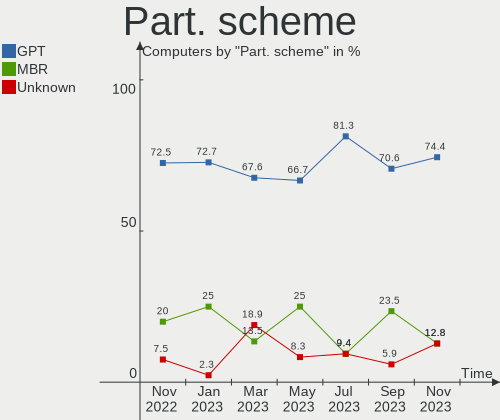
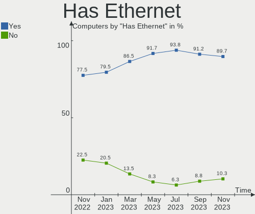
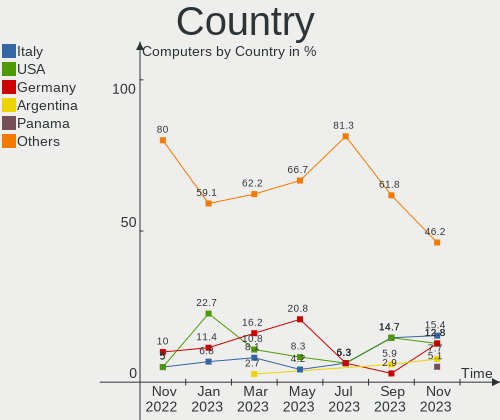
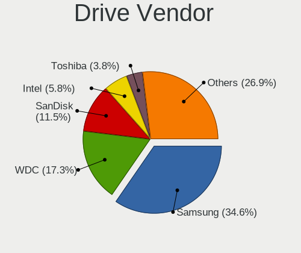
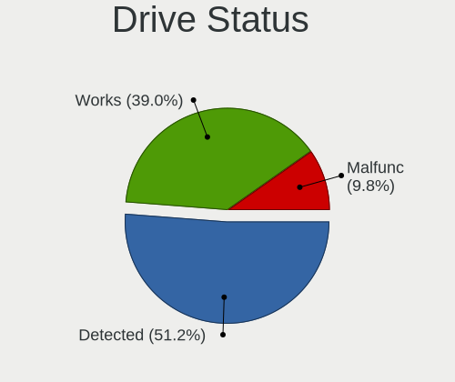
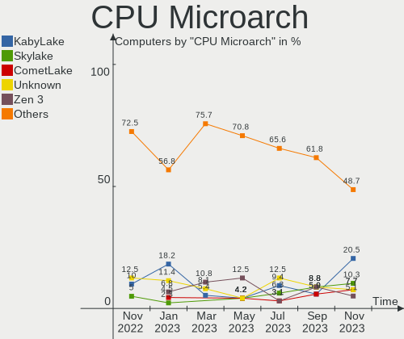
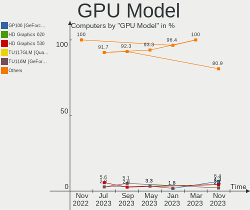
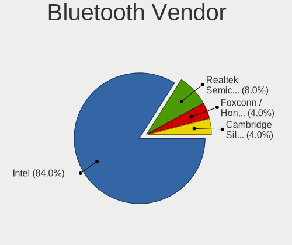

Ubuntu MATE - Hardware Trends
-----------------------------

A project to identify most popular hardware characteristics and track their change
over time based on data collected by Linux users at https://Linux-Hardware.org.

Anyone can contribute to this report by the [hw-probe](https://github.com/linuxhw/hw-probe) tool:

    sudo -E hw-probe -all -upload

This is a report for all computer types. See also reports for [desktops](/Dist/Ubuntu_MATE/Desktop/README.md) and [notebooks](/Dist/Ubuntu_MATE/Notebook/README.md).

This report is for one last month. Overall report since the beginning of time: [TestDays](https://github.com/linuxhw/TestDays)

Period: Mar, 2023.

Contents
--------

* [ System ](#system)
  - [ OS                       ](#os)
  - [ OS Family                ](#os-family)
  - [ Kernel                   ](#kernel)
  - [ Kernel Family            ](#kernel-family)
  - [ Kernel Major Ver.        ](#kernel-major-ver)
  - [ Arch                     ](#arch)
  - [ DE                       ](#de)
  - [ Display Server           ](#display-server)
  - [ Display Manager          ](#display-manager)
  - [ OS Lang                  ](#os-lang)
  - [ Boot Mode                ](#boot-mode)
  - [ Filesystem               ](#filesystem)
  - [ Part. scheme             ](#part-scheme)
  - [ Dual Boot with Linux/BSD ](#dual-boot-with-linuxbsd)
  - [ Dual Boot (Win)          ](#dual-boot-win)

* [ Board ](#board)
  - [ Vendor                   ](#vendor)
  - [ Model                    ](#model)
  - [ Model Family             ](#model-family)
  - [ MFG Year                 ](#mfg-year)
  - [ Form Factor              ](#form-factor)
  - [ Secure Boot              ](#secure-boot)
  - [ Coreboot                 ](#coreboot)
  - [ RAM Size                 ](#ram-size)
  - [ RAM Used                 ](#ram-used)
  - [ Total Drives             ](#total-drives)
  - [ Has CD-ROM               ](#has-cd-rom)
  - [ Has Ethernet             ](#has-ethernet)
  - [ Has WiFi                 ](#has-wifi)
  - [ Has Bluetooth            ](#has-bluetooth)

* [ Location ](#location)
  - [ Country                  ](#country)
  - [ City                     ](#city)

* [ Drives ](#drives)
  - [ Drive Vendor             ](#drive-vendor)
  - [ Drive Model              ](#drive-model)
  - [ HDD Vendor               ](#hdd-vendor)
  - [ SSD Vendor               ](#ssd-vendor)
  - [ Drive Kind               ](#drive-kind)
  - [ Drive Connector          ](#drive-connector)
  - [ Drive Size               ](#drive-size)
  - [ Space Total              ](#space-total)
  - [ Space Used               ](#space-used)
  - [ Malfunc. Drives          ](#malfunc-drives)
  - [ Malfunc. Drive Vendor    ](#malfunc-drive-vendor)
  - [ Malfunc. HDD Vendor      ](#malfunc-hdd-vendor)
  - [ Malfunc. Drive Kind      ](#malfunc-drive-kind)
  - [ Failed Drives            ](#failed-drives)
  - [ Failed Drive Vendor      ](#failed-drive-vendor)
  - [ Drive Status             ](#drive-status)

* [ Storage controller ](#storage-controller)
  - [ Storage Vendor           ](#storage-vendor)
  - [ Storage Model            ](#storage-model)
  - [ Storage Kind             ](#storage-kind)

* [ Processor ](#processor)
  - [ CPU Vendor               ](#cpu-vendor)
  - [ CPU Model                ](#cpu-model)
  - [ CPU Model Family         ](#cpu-model-family)
  - [ CPU Cores                ](#cpu-cores)
  - [ CPU Sockets              ](#cpu-sockets)
  - [ CPU Threads              ](#cpu-threads)
  - [ CPU Op-Modes             ](#cpu-op-modes)
  - [ CPU Microcode            ](#cpu-microcode)
  - [ CPU Microarch            ](#cpu-microarch)

* [ Graphics ](#graphics)
  - [ GPU Vendor               ](#gpu-vendor)
  - [ GPU Model                ](#gpu-model)
  - [ GPU Combo                ](#gpu-combo)
  - [ GPU Driver               ](#gpu-driver)
  - [ GPU Memory               ](#gpu-memory)

* [ Monitor ](#monitor)
  - [ Monitor Vendor           ](#monitor-vendor)
  - [ Monitor Model            ](#monitor-model)
  - [ Monitor Resolution       ](#monitor-resolution)
  - [ Monitor Diagonal         ](#monitor-diagonal)
  - [ Monitor Width            ](#monitor-width)
  - [ Aspect Ratio             ](#aspect-ratio)
  - [ Monitor Area             ](#monitor-area)
  - [ Pixel Density            ](#pixel-density)
  - [ Multiple Monitors        ](#multiple-monitors)

* [ Network ](#network)
  - [ Net Controller Vendor    ](#net-controller-vendor)
  - [ Net Controller Model     ](#net-controller-model)
  - [ Wireless Vendor          ](#wireless-vendor)
  - [ Wireless Model           ](#wireless-model)
  - [ Ethernet Vendor          ](#ethernet-vendor)
  - [ Ethernet Model           ](#ethernet-model)
  - [ Net Controller Kind      ](#net-controller-kind)
  - [ Used Controller          ](#used-controller)
  - [ NICs                     ](#nics)
  - [ IPv6                     ](#ipv6)

* [ Bluetooth ](#bluetooth)
  - [ Bluetooth Vendor         ](#bluetooth-vendor)
  - [ Bluetooth Model          ](#bluetooth-model)

* [ Sound ](#sound)
  - [ Sound Vendor             ](#sound-vendor)
  - [ Sound Model              ](#sound-model)

* [ Memory ](#memory)
  - [ Memory Vendor            ](#memory-vendor)
  - [ Memory Model             ](#memory-model)
  - [ Memory Kind              ](#memory-kind)
  - [ Memory Form Factor       ](#memory-form-factor)
  - [ Memory Size              ](#memory-size)
  - [ Memory Speed             ](#memory-speed)

* [ Printers & scanners ](#printers--scanners)
  - [ Printer Vendor           ](#printer-vendor)
  - [ Printer Model            ](#printer-model)
  - [ Scanner Vendor           ](#scanner-vendor)
  - [ Scanner Model            ](#scanner-model)

* [ Camera ](#camera)
  - [ Camera Vendor            ](#camera-vendor)
  - [ Camera Model             ](#camera-model)

* [ Security ](#security)
  - [ Fingerprint Vendor       ](#fingerprint-vendor)
  - [ Fingerprint Model        ](#fingerprint-model)
  - [ Chipcard Vendor          ](#chipcard-vendor)
  - [ Chipcard Model           ](#chipcard-model)

* [ Unsupported ](#unsupported)
  - [ Unsupported Devices      ](#unsupported-devices)
  - [ Unsupported Device Types ](#unsupported-device-types)

System
------

OS
--

Installed operating systems

| Name              | Computers | Percent |
|-------------------|-----------|---------|
| Ubuntu MATE 22.04 | 28        | 75.68%  |
| Ubuntu MATE 22.10 | 5         | 13.51%  |
| Ubuntu MATE 20.04 | 2         | 5.41%   |
| Ubuntu MATE 23.04 | 1         | 2.7%    |
| Ubuntu MATE 18.04 | 1         | 2.7%    |

OS Family
---------

OS without a version

| Name        | Computers | Percent |
|-------------|-----------|---------|
| Ubuntu MATE | 37        | 100%    |

Kernel
------

Version of the Linux kernel

| Version                | Computers | Percent |
|------------------------|-----------|---------|
| 5.15.0-67-generic      | 9         | 24.32%  |
| 5.19.0-35-generic      | 8         | 21.62%  |
| 5.19.0-38-generic      | 3         | 8.11%   |
| 5.15.0-60-generic      | 3         | 8.11%   |
| 5.4.0-144-generic      | 2         | 5.41%   |
| 5.19.0-32-generic      | 2         | 5.41%   |
| 6.2.8-060208-generic   | 1         | 2.7%    |
| 6.2.3-x64v1-xanmod1    | 1         | 2.7%    |
| 6.1.0-16-generic       | 1         | 2.7%    |
| 5.4.0-146-generic      | 1         | 2.7%    |
| 5.19.0-37-generic      | 1         | 2.7%    |
| 5.19.0-1018-lowlatency | 1         | 2.7%    |
| 5.15.0-69-generic      | 1         | 2.7%    |
| 5.15.0-56-generic      | 1         | 2.7%    |
| 5.15.0-25-generic      | 1         | 2.7%    |
| 5.15.0-1024-raspi      | 1         | 2.7%    |

Kernel Family
-------------

Linux kernel without a distro release

| Version | Computers | Percent |
|---------|-----------|---------|
| 5.15.0  | 16        | 43.24%  |
| 5.19.0  | 15        | 40.54%  |
| 5.4.0   | 3         | 8.11%   |
| 6.2.8   | 1         | 2.7%    |
| 6.2.3   | 1         | 2.7%    |
| 6.1.0   | 1         | 2.7%    |

Kernel Major Ver.
-----------------

Linux kernel major version

| Version | Computers | Percent |
|---------|-----------|---------|
| 5.15    | 16        | 43.24%  |
| 5.19    | 15        | 40.54%  |
| 5.4     | 3         | 8.11%   |
| 6.2     | 2         | 5.41%   |
| 6.1     | 1         | 2.7%    |

Arch
----

OS architecture (x86_64, i586, etc.)

| Name   | Computers | Percent |
|--------|-----------|---------|
| x86_64 | 35        | 94.59%  |
| i686   | 1         | 2.7%    |
| armv7l | 1         | 2.7%    |

DE
--

Desktop Environment

| Name | Computers | Percent |
|------|-----------|---------|
| MATE | 37        | 100%    |

Display Server
--------------

X11 or Wayland

| Name    | Computers | Percent |
|---------|-----------|---------|
| X11     | 36        | 97.3%   |
| Wayland | 1         | 2.7%    |

Display Manager
---------------

SDDM, LightDM, etc.

| Name    | Computers | Percent |
|---------|-----------|---------|
| LightDM | 28        | 75.68%  |
| Unknown | 5         | 13.51%  |
| GDM3    | 3         | 8.11%   |
| LXDM    | 1         | 2.7%    |

OS Lang
-------

Language

| Lang  | Computers | Percent |
|-------|-----------|---------|
| en_US | 11        | 29.73%  |
| fr_FR | 6         | 16.22%  |
| de_DE | 6         | 16.22%  |
| en_AU | 3         | 8.11%   |
| it_IT | 2         | 5.41%   |
| zh_TW | 1         | 2.7%    |
| sv_SE | 1         | 2.7%    |
| pt_BR | 1         | 2.7%    |
| hu_HU | 1         | 2.7%    |
| es_MX | 1         | 2.7%    |
| es_AR | 1         | 2.7%    |
| en_CA | 1         | 2.7%    |
| el_GR | 1         | 2.7%    |
| C     | 1         | 2.7%    |

Boot Mode
---------

EFI or BIOS

| Mode | Computers | Percent |
|------|-----------|---------|
| EFI  | 19        | 51.35%  |
| BIOS | 18        | 48.65%  |

Filesystem
----------

Type of filesystem

| Type    | Computers | Percent |
|---------|-----------|---------|
| Ext4    | 29        | 78.38%  |
| Btrfs   | 4         | 10.81%  |
| Overlay | 2         | 5.41%   |
| Xfs     | 1         | 2.7%    |
| Ext2    | 1         | 2.7%    |

Part. scheme
------------

Scheme of partitioning

| Type    | Computers | Percent |
|---------|-----------|---------|
| GPT     | 25        | 67.57%  |
| Unknown | 7         | 18.92%  |
| MBR     | 5         | 13.51%  |

Dual Boot with Linux/BSD
------------------------

Hosting more than one Linux/BSD

| Dual boot | Computers | Percent |
|-----------|-----------|---------|
| No        | 34        | 91.89%  |
| Yes       | 3         | 8.11%   |

Dual Boot (Win)
---------------

Hosting Linux and Windows

| Dual boot | Computers | Percent |
|-----------|-----------|---------|
| No        | 28        | 75.68%  |
| Yes       | 9         | 24.32%  |

Board
-----

Vendor
------

Motherboard manufacturer

| Name                                 | Computers | Percent |
|--------------------------------------|-----------|---------|
| ASUSTek Computer                     | 8         | 21.62%  |
| Hewlett-Packard                      | 5         | 13.51%  |
| MSI                                  | 4         | 10.81%  |
| Acer                                 | 3         | 8.11%   |
| Gigabyte Technology                  | 2         | 5.41%   |
| Dell                                 | 2         | 5.41%   |
| Apple                                | 2         | 5.41%   |
| Shenzhen Meigao Electronic Equipment | 1         | 2.7%    |
| Samsung Electronics                  | 1         | 2.7%    |
| Raspberry Pi Foundation              | 1         | 2.7%    |
| Packard Bell                         | 1         | 2.7%    |
| Notebook                             | 1         | 2.7%    |
| Lenovo                               | 1         | 2.7%    |
| Intel                                | 1         | 2.7%    |
| HUAWEI                               | 1         | 2.7%    |
| CCE                                  | 1         | 2.7%    |
| AZW                                  | 1         | 2.7%    |
| ASRock                               | 1         | 2.7%    |

Model
-----

Motherboard model

| Name                                       | Computers | Percent |
|--------------------------------------------|-----------|---------|
| Shenzhen Meigao Electronic Equipment HX90G | 1         | 2.7%    |
| Samsung 905S3G/906S3G/915S3G/9305SG        | 1         | 2.7%    |
| RPi Raspberry Pi                           | 1         | 2.7%    |
| Packard Bell EasyNote TE11HC               | 1         | 2.7%    |
| Notebook NJx0MU                            | 1         | 2.7%    |
| MSI MS-AA5E                                | 1         | 2.7%    |
| MSI MS-7D43                                | 1         | 2.7%    |
| MSI MS-7C37                                | 1         | 2.7%    |
| MSI MS-7A33                                | 1         | 2.7%    |
| Lenovo H50-55 90BG000TFR                   | 1         | 2.7%    |
| Intel NUC12DCMi7                           | 1         | 2.7%    |
| HUAWEI BOHB-WAX9                           | 1         | 2.7%    |
| HP Stream Laptop 11-ah1XX                  | 1         | 2.7%    |
| HP Presario CQ61                           | 1         | 2.7%    |
| HP Pavilion x360 Convertible 15-dq0xxx     | 1         | 2.7%    |
| HP Laptop 15s-eq0xxx                       | 1         | 2.7%    |
| HP Compaq Pro 6300 MT                      | 1         | 2.7%    |
| Gigabyte X570S AERO G                      | 1         | 2.7%    |
| Gigabyte B85M-D3H                          | 1         | 2.7%    |
| Dell Latitude E6320                        | 1         | 2.7%    |
| Dell Inspiron 5748                         | 1         | 2.7%    |
| CCE NM70-I                                 | 1         | 2.7%    |
| AZW SER                                    | 1         | 2.7%    |
| ASUS X550LN                                | 1         | 2.7%    |
| ASUS M5A97 R2.0                            | 1         | 2.7%    |
| ASUS M5A78L-M LX                           | 1         | 2.7%    |
| ASUS M5A78L LE                             | 1         | 2.7%    |
| ASUS K93SV                                 | 1         | 2.7%    |
| ASUS H61M-K                                | 1         | 2.7%    |
| ASUS G75VW                                 | 1         | 2.7%    |
| ASUS ASUS TUF Gaming A15 FA506QR_TUF566QR  | 1         | 2.7%    |
| ASRock A320M-HDV R4.0                      | 1         | 2.7%    |
| Apple MacBookAir4,1                        | 1         | 2.7%    |
| Apple iMac12,1                             | 1         | 2.7%    |
| Acer Aspire XC-1760                        | 1         | 2.7%    |
| Acer Aspire ES1-523                        | 1         | 2.7%    |
| Acer Aspire 5570Z                          | 1         | 2.7%    |

Model Family
------------

Motherboard model prefix

| Name                                       | Computers | Percent |
|--------------------------------------------|-----------|---------|
| Acer Aspire                                | 3         | 8.11%   |
| Shenzhen Meigao Electronic Equipment HX90G | 1         | 2.7%    |
| Samsung 905S3G                             | 1         | 2.7%    |
| RPi Raspberry                              | 1         | 2.7%    |
| Packard Bell EasyNote                      | 1         | 2.7%    |
| Notebook NJx0MU                            | 1         | 2.7%    |
| MSI MS-AA5E                                | 1         | 2.7%    |
| MSI MS-7D43                                | 1         | 2.7%    |
| MSI MS-7C37                                | 1         | 2.7%    |
| MSI MS-7A33                                | 1         | 2.7%    |
| Lenovo H50-55                              | 1         | 2.7%    |
| Intel NUC12DCMi7                           | 1         | 2.7%    |
| HUAWEI BOHB-WAX9                           | 1         | 2.7%    |
| HP Stream                                  | 1         | 2.7%    |
| HP Presario                                | 1         | 2.7%    |
| HP Pavilion                                | 1         | 2.7%    |
| HP Laptop                                  | 1         | 2.7%    |
| HP Compaq                                  | 1         | 2.7%    |
| Gigabyte X570S                             | 1         | 2.7%    |
| Gigabyte B85M-D3H                          | 1         | 2.7%    |
| Dell Latitude                              | 1         | 2.7%    |
| Dell Inspiron                              | 1         | 2.7%    |
| CCE NM70-I                                 | 1         | 2.7%    |
| AZW SER                                    | 1         | 2.7%    |
| ASUS X550LN                                | 1         | 2.7%    |
| ASUS M5A97                                 | 1         | 2.7%    |
| ASUS M5A78L-M                              | 1         | 2.7%    |
| ASUS M5A78L                                | 1         | 2.7%    |
| ASUS K93SV                                 | 1         | 2.7%    |
| ASUS H61M-K                                | 1         | 2.7%    |
| ASUS G75VW                                 | 1         | 2.7%    |
| ASUS ASUS                                  | 1         | 2.7%    |
| ASRock A320M-HDV                           | 1         | 2.7%    |
| Apple MacBookAir4                          | 1         | 2.7%    |
| Apple iMac12                               | 1         | 2.7%    |

MFG Year
--------

Motherboard manufacture year

| Year    | Computers | Percent |
|---------|-----------|---------|
| 2012    | 8         | 21.62%  |
| 2021    | 6         | 16.22%  |
| 2011    | 5         | 13.51%  |
| 2019    | 3         | 8.11%   |
| 2014    | 3         | 8.11%   |
| 2022    | 2         | 5.41%   |
| 2018    | 2         | 5.41%   |
| 2013    | 2         | 5.41%   |
| 2017    | 1         | 2.7%    |
| 2016    | 1         | 2.7%    |
| 2015    | 1         | 2.7%    |
| 2009    | 1         | 2.7%    |
| 2007    | 1         | 2.7%    |
| Unknown | 1         | 2.7%    |

Form Factor
-----------

Physical design of the computer

| Name           | Computers | Percent |
|----------------|-----------|---------|
| Notebook       | 16        | 43.24%  |
| Desktop        | 15        | 40.54%  |
| Mini pc        | 2         | 5.41%   |
| All in one     | 2         | 5.41%   |
| System on chip | 1         | 2.7%    |
| Convertible    | 1         | 2.7%    |

Secure Boot
-----------

Enabled or disabled

| State    | Computers | Percent |
|----------|-----------|---------|
| Disabled | 35        | 94.59%  |
| Enabled  | 2         | 5.41%   |

Coreboot
--------

Have coreboot on board

| Used | Computers | Percent |
|------|-----------|---------|
| No   | 37        | 100%    |

RAM Size
--------

Total RAM memory

| Size in GB  | Computers | Percent |
|-------------|-----------|---------|
| 3.01-4.0    | 10        | 27.03%  |
| 4.01-8.0    | 7         | 18.92%  |
| 8.01-16.0   | 6         | 16.22%  |
| 32.01-64.0  | 4         | 10.81%  |
| 16.01-24.0  | 4         | 10.81%  |
| 64.01-256.0 | 3         | 8.11%   |
| 2.01-3.0    | 1         | 2.7%    |
| 1.01-2.0    | 1         | 2.7%    |
| 0.51-1.0    | 1         | 2.7%    |

RAM Used
--------

Used RAM memory

| Used GB    | Computers | Percent |
|------------|-----------|---------|
| 1.01-2.0   | 14        | 37.84%  |
| 2.01-3.0   | 9         | 24.32%  |
| 3.01-4.0   | 5         | 13.51%  |
| 8.01-16.0  | 4         | 10.81%  |
| 4.01-8.0   | 3         | 8.11%   |
| 32.01-64.0 | 1         | 2.7%    |
| 0.01-0.5   | 1         | 2.7%    |

Total Drives
------------

Number of drives on board

| Drives | Computers | Percent |
|--------|-----------|---------|
| 1      | 18        | 48.65%  |
| 2      | 15        | 40.54%  |
| 8      | 1         | 2.7%    |
| 5      | 1         | 2.7%    |
| 4      | 1         | 2.7%    |
| 0      | 1         | 2.7%    |

Has CD-ROM
----------

Has CD-ROM on board

| Presented | Computers | Percent |
|-----------|-----------|---------|
| Yes       | 21        | 56.76%  |
| No        | 16        | 43.24%  |

Has Ethernet
------------

Has Ethernet on board

| Presented | Computers | Percent |
|-----------|-----------|---------|
| Yes       | 32        | 86.49%  |
| No        | 5         | 13.51%  |

Has WiFi
--------

Has WiFi module

| Presented | Computers | Percent |
|-----------|-----------|---------|
| Yes       | 26        | 70.27%  |
| No        | 11        | 29.73%  |

Has Bluetooth
-------------

Has Bluetooth module

| Presented | Computers | Percent |
|-----------|-----------|---------|
| Yes       | 23        | 62.16%  |
| No        | 14        | 37.84%  |

Location
--------

Country
-------

Geographic location (country)

| Country   | Computers | Percent |
|-----------|-----------|---------|
| Germany   | 6         | 16.22%  |
| France    | 6         | 16.22%  |
| USA       | 4         | 10.81%  |
| Italy     | 3         | 8.11%   |
| Brazil    | 3         | 8.11%   |
| Australia | 3         | 8.11%   |
| Thailand  | 1         | 2.7%    |
| Sweden    | 1         | 2.7%    |
| Serbia    | 1         | 2.7%    |
| Portugal  | 1         | 2.7%    |
| Poland    | 1         | 2.7%    |
| Mexico    | 1         | 2.7%    |
| Hungary   | 1         | 2.7%    |
| Hong Kong | 1         | 2.7%    |
| Greece    | 1         | 2.7%    |
| Czechia   | 1         | 2.7%    |
| Belgium   | 1         | 2.7%    |
| Argentina | 1         | 2.7%    |

City
----

Geographic location (city)

| City                | Computers | Percent |
|---------------------|-----------|---------|
| Albuquerque         | 2         | 5.41%   |
| Uberaba             | 1         | 2.7%    |
| Turnov              | 1         | 2.7%    |
| Sydney              | 1         | 2.7%    |
| Sunnyvale           | 1         | 2.7%    |
| St Louis            | 1         | 2.7%    |
| Solna               | 1         | 2.7%    |
| Savona              | 1         | 2.7%    |
| Savigny-en-Sancerre | 1         | 2.7%    |
| Sao Paulo           | 1         | 2.7%    |
| Rome                | 1         | 2.7%    |
| Rio Bonito          | 1         | 2.7%    |
| Ratingen            | 1         | 2.7%    |
| Perth               | 1         | 2.7%    |
| Pau                 | 1         | 2.7%    |
| Paris               | 1         | 2.7%    |
| Olivos              | 1         | 2.7%    |
| Nogales             | 1         | 2.7%    |
| Nantes              | 1         | 2.7%    |
| Milano              | 1         | 2.7%    |
| Mannheim            | 1         | 2.7%    |
| Mâcon              | 1         | 2.7%    |
| Lisbon              | 1         | 2.7%    |
| Leipzig             | 1         | 2.7%    |
| Lede                | 1         | 2.7%    |
| Győr               | 1         | 2.7%    |
| Gdansk              | 1         | 2.7%    |
| Delligsen           | 1         | 2.7%    |
| Chanthaburi         | 1         | 2.7%    |
| Central             | 1         | 2.7%    |
| Canberra            | 1         | 2.7%    |
| Burgwedel           | 1         | 2.7%    |
| Bordeaux            | 1         | 2.7%    |
| Berlin              | 1         | 2.7%    |
| Belgrade            | 1         | 2.7%    |
| Athens              | 1         | 2.7%    |

Drives
------

Drive Vendor
------------

Hard drive vendors

| Vendor              | Computers | Drives | Percent |
|---------------------|-----------|--------|---------|
| Samsung Electronics | 7         | 10     | 12.73%  |
| WDC                 | 5         | 6      | 9.09%   |
| Kingston            | 5         | 5      | 9.09%   |
| Crucial             | 5         | 5      | 9.09%   |
| Unknown             | 4         | 7      | 7.27%   |
| Toshiba             | 4         | 6      | 7.27%   |
| Seagate             | 4         | 4      | 7.27%   |
| Intenso             | 2         | 2      | 3.64%   |
| ZXIC MMC            | 1         | 1      | 1.82%   |
| Verbatim            | 1         | 1      | 1.82%   |
| Transcend           | 1         | 1      | 1.82%   |
| Team                | 1         | 1      | 1.82%   |
| SPCC                | 1         | 1      | 1.82%   |
| SK hynix            | 1         | 1      | 1.82%   |
| Silicon Motion      | 1         | 1      | 1.82%   |
| SanDisk             | 1         | 1      | 1.82%   |
| SABRENT             | 1         | 1      | 1.82%   |
| Pichau              | 1         | 1      | 1.82%   |
| Phison Electronics  | 1         | 1      | 1.82%   |
| Phison              | 1         | 1      | 1.82%   |
| Micron Technology   | 1         | 1      | 1.82%   |
| LDLC                | 1         | 1      | 1.82%   |
| KIOXIA              | 1         | 1      | 1.82%   |
| Hitachi             | 1         | 1      | 1.82%   |
| HGST                | 1         | 1      | 1.82%   |
| Fanxiang            | 1         | 1      | 1.82%   |
| Apple               | 1         | 1      | 1.82%   |

Drive Model
-----------

Hard drive models

| Model                              | Computers | Percent |
|------------------------------------|-----------|---------|
| Crucial CT2000MX500SSD1 2TB        | 2         | 3.33%   |
| ZXIC MMC Storage 2.31 128GB        | 1         | 1.67%   |
| WDC WD5003AZEX-00K1GA0 500GB       | 1         | 1.67%   |
| WDC WD5001AALS-00J7B1 500GB        | 1         | 1.67%   |
| WDC WD40EZRZ-00GXCB0 4TB           | 1         | 1.67%   |
| WDC WD3200BEKX-75B7WT0 320GB       | 1         | 1.67%   |
| WDC WD10EZEX-08WN4A0 1TB           | 1         | 1.67%   |
| WDC WD10EARX-00N0YB0 1TB           | 1         | 1.67%   |
| Verbatim Vi550 S3 512GB SSD        | 1         | 1.67%   |
| Unknown xD/SD/M.S.                 | 1         | 1.67%   |
| Unknown SD/MMC 2GB                 | 1         | 1.67%   |
| Unknown SC64G  64GB                | 1         | 1.67%   |
| Unknown MMC Card  32GB             | 1         | 1.67%   |
| Unknown M.S./M.S.Pro/HG 16GB       | 1         | 1.67%   |
| Unknown CJTD4R  64GB               | 1         | 1.67%   |
| Transcend TS1TSSD220Q 1TB          | 1         | 1.67%   |
| Toshiba Q300. 120GB SSD            | 1         | 1.67%   |
| Toshiba MQ01ABF050 500GB           | 1         | 1.67%   |
| Toshiba MK2555GSX 250GB            | 1         | 1.67%   |
| Toshiba MG06ACA800E 8TB            | 1         | 1.67%   |
| Team T2535T240G 240GB SSD          | 1         | 1.67%   |
| SPCC Solid State Disk 1024GB       | 1         | 1.67%   |
| SK hynix HFM512GD3JX013N 512GB     | 1         | 1.67%   |
| Silicon Motion PCIe-8 SSD 256GB    | 1         | 1.67%   |
| Seagate ST6000NM0024-1HT17Z 6TB    | 1         | 1.67%   |
| Seagate ST500DM002-1BD142 500GB    | 1         | 1.67%   |
| Seagate ST500DM002-1BC142 500GB    | 1         | 1.67%   |
| Seagate ST1000DM003-1ER162 1TB     | 1         | 1.67%   |
| SanDisk SDSSDH3 500G               | 1         | 1.67%   |
| Samsung SSD 980 PRO 500GB          | 1         | 1.67%   |
| Samsung SSD 980 500GB              | 1         | 1.67%   |
| Samsung SSD 870 EVO 1TB            | 1         | 1.67%   |
| Samsung SSD 860 PRO 256GB          | 1         | 1.67%   |
| Samsung SSD 840 EVO 120GB          | 1         | 1.67%   |
| Samsung SSD 750 EVO 250GB          | 1         | 1.67%   |
| Samsung MZVLQ512HBLU-00B00 512GB   | 1         | 1.67%   |
| Samsung MZVL2512HCJQ-00B00 512GB   | 1         | 1.67%   |
| Samsung MZMTE128HMGR-000 128GB SSD | 1         | 1.67%   |
| SABRENT Disk 160GB                 | 1         | 1.67%   |
| Pichau Gaming PG256X 256GB SSD     | 1         | 1.67%   |

HDD Vendor
----------

Hard disk drive vendors

| Vendor  | Computers | Drives | Percent |
|---------|-----------|--------|---------|
| WDC     | 5         | 6      | 33.33%  |
| Seagate | 4         | 4      | 26.67%  |
| Toshiba | 3         | 5      | 20%     |
| SABRENT | 1         | 1      | 6.67%   |
| Hitachi | 1         | 1      | 6.67%   |
| HGST    | 1         | 1      | 6.67%   |

SSD Vendor
----------

Solid state drive vendors

| Vendor              | Computers | Drives | Percent |
|---------------------|-----------|--------|---------|
| Samsung Electronics | 4         | 5      | 19.05%  |
| Crucial             | 4         | 4      | 19.05%  |
| Kingston            | 2         | 2      | 9.52%   |
| Verbatim            | 1         | 1      | 4.76%   |
| Transcend           | 1         | 1      | 4.76%   |
| Toshiba             | 1         | 1      | 4.76%   |
| Team                | 1         | 1      | 4.76%   |
| SPCC                | 1         | 1      | 4.76%   |
| SanDisk             | 1         | 1      | 4.76%   |
| Pichau              | 1         | 1      | 4.76%   |
| LDLC                | 1         | 1      | 4.76%   |
| Intenso             | 1         | 1      | 4.76%   |
| Fanxiang            | 1         | 1      | 4.76%   |
| Apple               | 1         | 1      | 4.76%   |

Drive Kind
----------

HDD or SSD

| Kind    | Computers | Drives | Percent |
|---------|-----------|--------|---------|
| SSD     | 19        | 22     | 39.58%  |
| HDD     | 13        | 18     | 27.08%  |
| NVMe    | 11        | 15     | 22.92%  |
| Unknown | 3         | 6      | 6.25%   |
| MMC     | 2         | 3      | 4.17%   |

Drive Connector
---------------

SATA, SAS, NVMe, etc.

| Type | Computers | Drives | Percent |
|------|-----------|--------|---------|
| SATA | 27        | 39     | 61.36%  |
| NVMe | 11        | 15     | 25%     |
| SAS  | 4         | 7      | 9.09%   |
| MMC  | 2         | 3      | 4.55%   |

Drive Size
----------

Size of hard drive

| Size in TB | Computers | Drives | Percent |
|------------|-----------|--------|---------|
| 0.01-0.5   | 18        | 22     | 56.25%  |
| 0.51-1.0   | 8         | 8      | 25%     |
| 1.01-2.0   | 3         | 4      | 9.38%   |
| 4.01-10.0  | 2         | 5      | 6.25%   |
| 3.01-4.0   | 1         | 1      | 3.13%   |

Space Total
-----------

Amount of disk space available on the file system

| Size in GB     | Computers | Percent |
|----------------|-----------|---------|
| 101-250        | 9         | 24.32%  |
| 251-500        | 8         | 21.62%  |
| More than 3000 | 4         | 10.81%  |
| 21-50          | 4         | 10.81%  |
| 1001-2000      | 4         | 10.81%  |
| 2001-3000      | 3         | 8.11%   |
| 501-1000       | 3         | 8.11%   |
| 1-20           | 1         | 2.7%    |
| 51-100         | 1         | 2.7%    |

Space Used
----------

Amount of used disk space

| Used GB        | Computers | Percent |
|----------------|-----------|---------|
| 21-50          | 9         | 24.32%  |
| 1-20           | 8         | 21.62%  |
| 101-250        | 5         | 13.51%  |
| 1001-2000      | 4         | 10.81%  |
| 51-100         | 4         | 10.81%  |
| 2001-3000      | 3         | 8.11%   |
| 251-500        | 2         | 5.41%   |
| More than 3000 | 1         | 2.7%    |
| 501-1000       | 1         | 2.7%    |

Malfunc. Drives
---------------

Drive models with a malfunction

| Model                               | Computers | Drives | Percent |
|-------------------------------------|-----------|--------|---------|
| Seagate ST1000DM003-1ER162 1TB      | 1         | 1      | 33.33%  |
| Samsung Electronics SSD 870 EVO 1TB | 1         | 1      | 33.33%  |
| Hitachi HTS725032A9A364 320GB       | 1         | 1      | 33.33%  |

Malfunc. Drive Vendor
---------------------

Vendors of faulty drives

| Vendor              | Computers | Drives | Percent |
|---------------------|-----------|--------|---------|
| Seagate             | 1         | 1      | 33.33%  |
| Samsung Electronics | 1         | 1      | 33.33%  |
| Hitachi             | 1         | 1      | 33.33%  |

Malfunc. HDD Vendor
-------------------

Vendors of faulty HDD drives

| Vendor  | Computers | Drives | Percent |
|---------|-----------|--------|---------|
| Seagate | 1         | 1      | 50%     |
| Hitachi | 1         | 1      | 50%     |

Malfunc. Drive Kind
-------------------

Kinds of faulty drives

| Kind | Computers | Drives | Percent |
|------|-----------|--------|---------|
| HDD  | 2         | 2      | 66.67%  |
| SSD  | 1         | 1      | 33.33%  |

Failed Drives
-------------

Failed drive models

Zero info for selected period =(

Failed Drive Vendor
-------------------

Failed drive vendors

Zero info for selected period =(

Drive Status
------------

Number of failed and malfunc. drives

| Status   | Computers | Drives | Percent |
|----------|-----------|--------|---------|
| Works    | 20        | 36     | 51.28%  |
| Detected | 16        | 25     | 41.03%  |
| Malfunc  | 3         | 3      | 7.69%   |

Storage controller
------------------

Storage Vendor
--------------

Storage controller vendors

| Vendor                      | Computers | Percent |
|-----------------------------|-----------|---------|
| Intel                       | 18        | 38.3%   |
| AMD                         | 14        | 29.79%  |
| Samsung Electronics         | 4         | 8.51%   |
| Kingston Technology Company | 3         | 6.38%   |
| Phison Electronics          | 2         | 4.26%   |
| SK hynix                    | 1         | 2.13%   |
| Silicon Motion              | 1         | 2.13%   |
| Micron/Crucial Technology   | 1         | 2.13%   |
| Micron Technology           | 1         | 2.13%   |
| KIOXIA                      | 1         | 2.13%   |
| ASMedia Technology          | 1         | 2.13%   |

Storage Model
-------------

Storage controller models

| Model                                                                          | Computers | Percent |
|--------------------------------------------------------------------------------|-----------|---------|
| AMD FCH SATA Controller [AHCI mode]                                            | 10        | 19.23%  |
| Intel Alder Lake-S PCH SATA Controller [AHCI Mode]                             | 3         | 5.77%   |
| Samsung NVMe SSD Controller PM9A1/PM9A3/980PRO                                 | 2         | 3.85%   |
| Samsung NVMe SSD Controller 980                                                | 2         | 3.85%   |
| Kingston Company A2000 NVMe SSD                                                | 2         | 3.85%   |
| Intel 82801 Mobile SATA Controller [RAID mode]                                 | 2         | 3.85%   |
| Intel 8 Series SATA Controller 1 [AHCI mode]                                   | 2         | 3.85%   |
| Intel 7 Series Chipset Family 6-port SATA Controller [AHCI mode]               | 2         | 3.85%   |
| Intel 6 Series/C200 Series Chipset Family 6 port Mobile SATA AHCI Controller   | 2         | 3.85%   |
| Intel 6 Series/C200 Series Chipset Family 6 port Desktop SATA AHCI Controller  | 2         | 3.85%   |
| AMD SB7x0/SB8x0/SB9x0 SATA Controller [IDE mode]                               | 2         | 3.85%   |
| AMD SB7x0/SB8x0/SB9x0 SATA Controller [AHCI mode]                              | 2         | 3.85%   |
| AMD SB7x0/SB8x0/SB9x0 IDE Controller                                           | 2         | 3.85%   |
| SK hynix Gold P31/PC711 NVMe Solid State Drive                                 | 1         | 1.92%   |
| Silicon Motion Non-Volatile memory controller                                  | 1         | 1.92%   |
| Phison PS5013 E13 NVMe Controller                                              | 1         | 1.92%   |
| Phison E16 PCIe4 NVMe Controller                                               | 1         | 1.92%   |
| Micron/Crucial P2 NVMe PCIe SSD                                                | 1         | 1.92%   |
| Micron NVMe Storage Controller                                                 | 1         | 1.92%   |
| KIOXIA NVMe SSD Controller BG4                                                 | 1         | 1.92%   |
| Kingston Company NVMe Controller                                               | 1         | 1.92%   |
| Intel Volume Management Device NVMe RAID Controller                            | 1         | 1.92%   |
| Intel Tiger Lake-LP SATA Controller                                            | 1         | 1.92%   |
| Intel Comet Lake SATA AHCI Controller                                          | 1         | 1.92%   |
| Intel 82801GBM/GHM (ICH7-M Family) SATA Controller [IDE mode]                  | 1         | 1.92%   |
| Intel 8 Series/C220 Series Chipset Family 6-port SATA Controller 1 [AHCI mode] | 1         | 1.92%   |
| Intel 7 Series/C210 Series Chipset Family 6-port SATA Controller [AHCI mode]   | 1         | 1.92%   |
| ASMedia ASM1062 Serial ATA Controller                                          | 1         | 1.92%   |
| AMD X370 Series Chipset SATA Controller                                        | 1         | 1.92%   |
| AMD FCH SATA Controller D                                                      | 1         | 1.92%   |

Storage Kind
------------

Kind of storage controller (IDE, SATA, NVMe, SAS, ...)

| Kind | Computers | Percent |
|------|-----------|---------|
| SATA | 29        | 63.04%  |
| NVMe | 11        | 23.91%  |
| RAID | 3         | 6.52%   |
| IDE  | 3         | 6.52%   |

Processor
---------

CPU Vendor
----------

Processor vendors

| Vendor | Computers | Percent |
|--------|-----------|---------|
| Intel  | 20        | 54.05%  |
| AMD    | 16        | 43.24%  |
| ARM    | 1         | 2.7%    |

CPU Model
---------

Processor models

| Model                                          | Computers | Percent |
|------------------------------------------------|-----------|---------|
| Intel Xeon CPU E3-1245 v3 @ 3.40GHz            | 1         | 2.7%    |
| Intel Pentium CPU G2020 @ 2.90GHz              | 1         | 2.7%    |
| Intel Pentium CPU B960 @ 2.20GHz               | 1         | 2.7%    |
| Intel Genuine CPU T2080 @ 1.73GHz              | 1         | 2.7%    |
| Intel Core i7-3630QM CPU @ 2.40GHz             | 1         | 2.7%    |
| Intel Core i7-2677M CPU @ 1.80GHz              | 1         | 2.7%    |
| Intel Core i7-2670QM CPU @ 2.20GHz             | 1         | 2.7%    |
| Intel Core i5-8265U CPU @ 1.60GHz              | 1         | 2.7%    |
| Intel Core i5-4210U CPU @ 1.70GHz              | 1         | 2.7%    |
| Intel Core i5-3470 CPU @ 3.20GHz               | 1         | 2.7%    |
| Intel Core i5-2520M CPU @ 2.50GHz              | 1         | 2.7%    |
| Intel Core i5-2400S CPU @ 2.50GHz              | 1         | 2.7%    |
| Intel Core i3-4010U CPU @ 1.70GHz              | 1         | 2.7%    |
| Intel Core i3-10110U CPU @ 2.10GHz             | 1         | 2.7%    |
| Intel Celeron N4000 CPU @ 1.10GHz              | 1         | 2.7%    |
| Intel Celeron CPU 847 @ 1.10GHz                | 1         | 2.7%    |
| Intel 12th Gen Core i7-12700                   | 1         | 2.7%    |
| Intel 12th Gen Core i5-12600K                  | 1         | 2.7%    |
| Intel 12th Gen Core i5-12400                   | 1         | 2.7%    |
| Intel 11th Gen Core i7-1165G7 @ 2.80GHz        | 1         | 2.7%    |
| ARM BCM2711 Processor                          | 1         | 2.7%    |
| AMD Sempron M120                               | 1         | 2.7%    |
| AMD Ryzen 9 5900HX with Radeon Graphics        | 1         | 2.7%    |
| AMD Ryzen 7 5800X 8-Core Processor             | 1         | 2.7%    |
| AMD Ryzen 7 5800H with Radeon Graphics         | 1         | 2.7%    |
| AMD Ryzen 7 1700 Eight-Core Processor          | 1         | 2.7%    |
| AMD Ryzen 5 5600H with Radeon Graphics         | 1         | 2.7%    |
| AMD Ryzen 5 3600 6-Core Processor              | 1         | 2.7%    |
| AMD Ryzen 5 3500U with Radeon Vega Mobile Gfx  | 1         | 2.7%    |
| AMD Quad-Core Processor (up to 1.4GHz)         | 1         | 2.7%    |
| AMD FX-6300 Six-Core Processor                 | 1         | 2.7%    |
| AMD FX-6100 Six-Core Processor                 | 1         | 2.7%    |
| AMD E2-1800 APU with Radeon HD Graphics        | 1         | 2.7%    |
| AMD Athlon II X2 245 Processor                 | 1         | 2.7%    |
| AMD A8-9600 RADEON R7, 10 COMPUTE CORES 4C+6G  | 1         | 2.7%    |
| AMD A4-7210 APU with AMD Radeon R3 Graphics    | 1         | 2.7%    |
| AMD A10-7800 Radeon R7, 12 Compute Cores 4C+8G | 1         | 2.7%    |

CPU Model Family
----------------

Processor model prefix

| Model            | Computers | Percent |
|------------------|-----------|---------|
| Intel Core i5    | 5         | 13.51%  |
| Other            | 4         | 10.81%  |
| Intel Core i7    | 3         | 8.11%   |
| AMD Ryzen 7      | 3         | 8.11%   |
| AMD Ryzen 5      | 3         | 8.11%   |
| Intel Pentium    | 2         | 5.41%   |
| Intel Core i3    | 2         | 5.41%   |
| Intel Celeron    | 2         | 5.41%   |
| AMD FX           | 2         | 5.41%   |
| Intel Xeon       | 1         | 2.7%    |
| Intel Genuine    | 1         | 2.7%    |
| ARM BCM          | 1         | 2.7%    |
| AMD Sempron      | 1         | 2.7%    |
| AMD Ryzen 9      | 1         | 2.7%    |
| AMD Quad-Core    | 1         | 2.7%    |
| AMD E2           | 1         | 2.7%    |
| AMD Athlon II X2 | 1         | 2.7%    |
| AMD A8           | 1         | 2.7%    |
| AMD A4           | 1         | 2.7%    |
| AMD A10          | 1         | 2.7%    |

CPU Cores
---------

Number of processor cores

| Number | Computers | Percent |
|--------|-----------|---------|
| 2      | 14        | 37.84%  |
| 4      | 11        | 29.73%  |
| 8      | 4         | 10.81%  |
| 6      | 3         | 8.11%   |
| 3      | 2         | 5.41%   |
| 12     | 1         | 2.7%    |
| 10     | 1         | 2.7%    |
| 1      | 1         | 2.7%    |

CPU Sockets
-----------

Number of sockets

| Number | Computers | Percent |
|--------|-----------|---------|
| 1      | 37        | 100%    |

CPU Threads
-----------

Threads per core (Hyper-Threading)

| Number | Computers | Percent |
|--------|-----------|---------|
| 2      | 24        | 64.86%  |
| 1      | 13        | 35.14%  |

CPU Op-Modes
------------

CPU Operation Modes (32-bit, 64-bit)

| Op mode        | Computers | Percent |
|----------------|-----------|---------|
| 32-bit, 64-bit | 35        | 94.59%  |
| 32-bit         | 1         | 2.7%    |
| Unknown        | 1         | 2.7%    |

CPU Microcode
-------------

Microcode number

| Number     | Computers | Percent |
|------------|-----------|---------|
| Unknown    | 14        | 37.84%  |
| 0x206a7    | 4         | 10.81%  |
| 0x40651    | 2         | 5.41%   |
| 0x90672    | 1         | 2.7%    |
| 0x806ec    | 1         | 2.7%    |
| 0x806eb    | 1         | 2.7%    |
| 0x806c1    | 1         | 2.7%    |
| 0x706a1    | 1         | 2.7%    |
| 0x6ec      | 1         | 2.7%    |
| 0x306c3    | 1         | 2.7%    |
| 0x306a9    | 1         | 2.7%    |
| 0x0a50000d | 1         | 2.7%    |
| 0x0a50000c | 1         | 2.7%    |
| 0x08108109 | 1         | 2.7%    |
| 0x0700010f | 1         | 2.7%    |
| 0x0600611a | 1         | 2.7%    |
| 0x06003106 | 1         | 2.7%    |
| 0x06000852 | 1         | 2.7%    |
| 0x0600063e | 1         | 2.7%    |
| 0x05000119 | 1         | 2.7%    |

CPU Microarch
-------------

Microarchitecture

| Name             | Computers | Percent |
|------------------|-----------|---------|
| SandyBridge      | 6         | 16.22%  |
| Zen 3            | 4         | 10.81%  |
| IvyBridge        | 3         | 8.11%   |
| Haswell          | 3         | 8.11%   |
| Unknown          | 3         | 8.11%   |
| KabyLake         | 2         | 5.41%   |
| K10              | 2         | 5.41%   |
| Zen+             | 1         | 2.7%    |
| Zen 2            | 1         | 2.7%    |
| Zen              | 1         | 2.7%    |
| TigerLake        | 1         | 2.7%    |
| Steamroller      | 1         | 2.7%    |
| Puma             | 1         | 2.7%    |
| Piledriver       | 1         | 2.7%    |
| P6               | 1         | 2.7%    |
| Jaguar           | 1         | 2.7%    |
| Goldmont plus    | 1         | 2.7%    |
| Excavator        | 1         | 2.7%    |
| Bulldozer        | 1         | 2.7%    |
| Bobcat           | 1         | 2.7%    |
| Alderlake Hybrid | 1         | 2.7%    |

Graphics
--------

GPU Vendor
----------

Vendors of graphics cards

| Vendor | Computers | Percent |
|--------|-----------|---------|
| Intel  | 17        | 40.48%  |
| AMD    | 13        | 30.95%  |
| Nvidia | 12        | 28.57%  |

GPU Model
---------

Graphics card models

| Model                                                                         | Computers | Percent |
|-------------------------------------------------------------------------------|-----------|---------|
| Intel 2nd Generation Core Processor Family Integrated Graphics Controller     | 6         | 13.33%  |
| AMD Cezanne [Radeon Vega Series / Radeon Vega Mobile Series]                  | 3         | 6.67%   |
| Nvidia GM108M [GeForce 840M]                                                  | 2         | 4.44%   |
| Intel Haswell-ULT Integrated Graphics Controller                              | 2         | 4.44%   |
| AMD Navi 23 [Radeon RX 6600/6600 XT/6600M]                                    | 2         | 4.44%   |
| Nvidia TU116 [GeForce GTX 1650 SUPER]                                         | 1         | 2.22%   |
| Nvidia TU106 [GeForce RTX 2060 Rev. A]                                        | 1         | 2.22%   |
| Nvidia GP108 [GeForce GT 1030]                                                | 1         | 2.22%   |
| Nvidia GP107GL [Quadro P620]                                                  | 1         | 2.22%   |
| Nvidia GK208B [GeForce GT 730]                                                | 1         | 2.22%   |
| Nvidia GK208B [GeForce GT 710]                                                | 1         | 2.22%   |
| Nvidia GF119 [GeForce GT 520]                                                 | 1         | 2.22%   |
| Nvidia GF114M [GeForce GTX 670M]                                              | 1         | 2.22%   |
| Nvidia GF108M [GeForce GT 540M]                                               | 1         | 2.22%   |
| Nvidia GA104M [GeForce RTX 3070 Mobile / Max-Q]                               | 1         | 2.22%   |
| Intel Xeon E3-1200 v3 Processor Integrated Graphics Controller                | 1         | 2.22%   |
| Intel Xeon E3-1200 v2/3rd Gen Core processor Graphics Controller              | 1         | 2.22%   |
| Intel WhiskeyLake-U GT2 [UHD Graphics 620]                                    | 1         | 2.22%   |
| Intel TigerLake-LP GT2 [Iris Xe Graphics]                                     | 1         | 2.22%   |
| Intel Mobile 945GM/GMS/GME, 943/940GML Express Integrated Graphics Controller | 1         | 2.22%   |
| Intel Mobile 945GM/GMS, 943/940GML Express Integrated Graphics Controller     | 1         | 2.22%   |
| Intel GeminiLake [UHD Graphics 600]                                           | 1         | 2.22%   |
| Intel CometLake-U GT2 [UHD Graphics]                                          | 1         | 2.22%   |
| Intel AlderLake-S GT1                                                         | 1         | 2.22%   |
| Intel Alder Lake-S GT1 [UHD Graphics 730]                                     | 1         | 2.22%   |
| AMD Wrestler [Radeon HD 7340]                                                 | 1         | 2.22%   |
| AMD Whistler [Radeon HD 6630M/6650M/6750M/7670M/7690M]                        | 1         | 2.22%   |
| AMD Wani [Radeon R5/R6/R7 Graphics]                                           | 1         | 2.22%   |
| AMD Temash [Radeon HD 8250/8280G]                                             | 1         | 2.22%   |
| AMD RS880M [Mobility Radeon HD 4225/4250]                                     | 1         | 2.22%   |
| AMD RS780L [Radeon 3000]                                                      | 1         | 2.22%   |
| AMD Picasso/Raven 2 [Radeon Vega Series / Radeon Vega Mobile Series]          | 1         | 2.22%   |
| AMD Oland [Radeon HD 8570 / R5 430 OEM / R7 240/340 / Radeon 520 OEM]         | 1         | 2.22%   |
| AMD Mullins [Radeon R3 Graphics]                                              | 1         | 2.22%   |
| AMD Kaveri [Radeon R7 Graphics]                                               | 1         | 2.22%   |

GPU Combo
---------

Combinations of graphics cards

| Name           | Computers | Percent |
|----------------|-----------|---------|
| 1 x Intel      | 12        | 32.43%  |
| 1 x AMD        | 10        | 27.03%  |
| 1 x Nvidia     | 7         | 18.92%  |
| Intel + Nvidia | 4         | 10.81%  |
| 2 x AMD        | 2         | 5.41%   |
| Other          | 1         | 2.7%    |
| AMD + Nvidia   | 1         | 2.7%    |

GPU Driver
----------

Free vs proprietary

| Driver      | Computers | Percent |
|-------------|-----------|---------|
| Free        | 29        | 78.38%  |
| Proprietary | 6         | 16.22%  |
| Unknown     | 2         | 5.41%   |

GPU Memory
----------

Total video memory

| Size in GB | Computers | Percent |
|------------|-----------|---------|
| Unknown    | 24        | 64.86%  |
| 0.01-0.5   | 7         | 18.92%  |
| 1.01-2.0   | 2         | 5.41%   |
| 0.51-1.0   | 2         | 5.41%   |
| 7.01-8.0   | 1         | 2.7%    |
| 3.01-4.0   | 1         | 2.7%    |

Monitor
-------

Monitor Vendor
--------------

Monitor vendors

| Vendor                  | Computers | Percent |
|-------------------------|-----------|---------|
| Samsung Electronics     | 5         | 13.16%  |
| AU Optronics            | 5         | 13.16%  |
| Goldstar                | 4         | 10.53%  |
| Philips                 | 3         | 7.89%   |
| LG Display              | 2         | 5.26%   |
| Dell                    | 2         | 5.26%   |
| Chi Mei Optoelectronics | 2         | 5.26%   |
| BOE                     | 2         | 5.26%   |
| Apple                   | 2         | 5.26%   |
| ViewSonic               | 1         | 2.63%   |
| SNC                     | 1         | 2.63%   |
| Sharp                   | 1         | 2.63%   |
| Sceptre Tech            | 1         | 2.63%   |
| MSI                     | 1         | 2.63%   |
| LG Philips              | 1         | 2.63%   |
| Lenovo Group Limited    | 1         | 2.63%   |
| Kogan                   | 1         | 2.63%   |
| Gigabyte Technology     | 1         | 2.63%   |
| Fujitsu Siemens         | 1         | 2.63%   |
| Chimei Innolux          | 1         | 2.63%   |

Monitor Model
-------------

Monitor models

| Model                                                                     | Computers | Percent |
|---------------------------------------------------------------------------|-----------|---------|
| ViewSonic VA2046 SERIES VSC6D2E 1600x900 432x240mm 19.5-inch              | 1         | 2.63%   |
| SNC SKP_E20-32 SNC3200 1920x1080 477x268mm 21.5-inch                      | 1         | 2.63%   |
| Sharp LQ156M1JW26 SHP1532 1920x1080 344x194mm 15.5-inch                   | 1         | 2.63%   |
| Sceptre Tech Sceptre F24 SPT09AB 1920x1080 520x320mm 24.0-inch            | 1         | 2.63%   |
| Samsung Electronics SA300/SA350 SAM0788 1366x768 410x230mm 18.5-inch      | 1         | 2.63%   |
| Samsung Electronics S22F350 SAM0D1A 1920x1080 477x268mm 21.5-inch         | 1         | 2.63%   |
| Samsung Electronics S22E450 SAM0C79 1920x1080 477x268mm 21.5-inch         | 1         | 2.63%   |
| Samsung Electronics S19C301 SAM0B07 1366x768 410x230mm 18.5-inch          | 1         | 2.63%   |
| Samsung Electronics LCD Monitor SEC3451 1366x768 344x194mm 15.5-inch      | 1         | 2.63%   |
| Philips PHL 439P1 PHL0973 3840x2160 941x529mm 42.5-inch                   | 1         | 2.63%   |
| Philips PHL 243V7 PHLC155 1920x1080 527x296mm 23.8-inch                   | 1         | 2.63%   |
| Philips 220S4L PHL08BE 1680x1050 474x296mm 22.0-inch                      | 1         | 2.63%   |
| MSI AIO PC MSI2382 1600x900 462x272mm 21.1-inch                           | 1         | 2.63%   |
| LG Philips LCD Monitor LPLA500 1280x800 304x190mm 14.1-inch               | 1         | 2.63%   |
| LG Display LCD Monitor LGD03DB 1366x768 345x194mm 15.6-inch               | 1         | 2.63%   |
| LG Display LCD Monitor LGD02EC 1366x768 293x165mm 13.2-inch               | 1         | 2.63%   |
| Lenovo Group Limited LCD Monitor LEN T24i-10 1920x1080                    | 1         | 2.63%   |
| Kogan DP KGN0AF0 3840x2160 620x341mm 27.9-inch                            | 1         | 2.63%   |
| Goldstar ULTRAWIDE GSM777D 3840x1600 880x367mm 37.5-inch                  | 1         | 2.63%   |
| Goldstar ULTRAGEAR GSM5BD2 2560x1440 697x392mm 31.5-inch                  | 1         | 2.63%   |
| Goldstar TV SSCR2 GSMC0C8 3840x2160                                       | 1         | 2.63%   |
| Goldstar E2240 GSM57A3 1920x1080 477x268mm 21.5-inch                      | 1         | 2.63%   |
| Gigabyte Technology G27FC GBT270A 1920x1080 598x336mm 27.0-inch           | 1         | 2.63%   |
| Fujitsu Siemens SL3260W FUS07CC 1920x1080 550x344mm 25.5-inch             | 1         | 2.63%   |
| Dell U2715H DELD066 2560x1440 597x336mm 27.0-inch                         | 1         | 2.63%   |
| Dell S2721QS DELA196 3840x2160 597x336mm 27.0-inch                        | 1         | 2.63%   |
| Chimei Innolux LCD Monitor CMN1734 1600x900 382x214mm 17.2-inch           | 1         | 2.63%   |
| Chi Mei Optoelectronics LCD Monitor CMO1808 1920x1080 408x230mm 18.4-inch | 1         | 2.63%   |
| Chi Mei Optoelectronics LCD Monitor CMO1720 1920x1080 382x215mm 17.3-inch | 1         | 2.63%   |
| BOE LCD Monitor BOE0872 1920x1080 344x194mm 15.5-inch                     | 1         | 2.63%   |
| BOE LCD Monitor BOE0672 1366x768 344x194mm 15.5-inch                      | 1         | 2.63%   |
| AU Optronics LCD Monitor AUO429D 1920x1080 382x215mm 17.3-inch            | 1         | 2.63%   |
| AU Optronics LCD Monitor AUO23ED 1920x1080 344x194mm 15.5-inch            | 1         | 2.63%   |
| AU Optronics LCD Monitor AUO235C 1366x768 256x144mm 11.6-inch             | 1         | 2.63%   |
| AU Optronics LCD Monitor AUO22EC 1366x768 344x193mm 15.5-inch             | 1         | 2.63%   |
| AU Optronics LCD Monitor AUO152C 1366x768 293x164mm 13.2-inch             | 1         | 2.63%   |
| Apple iMac APPA00C 1920x1080 475x267mm 21.5-inch                          | 1         | 2.63%   |
| Apple Color LCD APPA010 1366x768 256x144mm 11.6-inch                      | 1         | 2.63%   |

Monitor Resolution
------------------

Monitor screen resolution

| Resolution         | Computers | Percent |
|--------------------|-----------|---------|
| 1920x1080 (FHD)    | 15        | 40.54%  |
| 1366x768 (WXGA)    | 10        | 27.03%  |
| 3840x2160 (4K)     | 4         | 10.81%  |
| 1600x900 (HD+)     | 3         | 8.11%   |
| 2560x1440 (QHD)    | 2         | 5.41%   |
| 3840x1600          | 1         | 2.7%    |
| 1680x1050 (WSXGA+) | 1         | 2.7%    |
| 1280x800 (WXGA)    | 1         | 2.7%    |

Monitor Diagonal
----------------

Diagonal size in inches

| Inches  | Computers | Percent |
|---------|-----------|---------|
| 15      | 7         | 19.44%  |
| 21      | 4         | 11.11%  |
| 27      | 3         | 8.33%   |
| 18      | 3         | 8.33%   |
| 17      | 3         | 8.33%   |
| 38      | 2         | 5.56%   |
| 13      | 2         | 5.56%   |
| 11      | 2         | 5.56%   |
| 72      | 1         | 2.78%   |
| 42      | 1         | 2.78%   |
| 32      | 1         | 2.78%   |
| 31      | 1         | 2.78%   |
| 25      | 1         | 2.78%   |
| 24      | 1         | 2.78%   |
| 22      | 1         | 2.78%   |
| 19      | 1         | 2.78%   |
| 14      | 1         | 2.78%   |
| Unknown | 1         | 2.78%   |

Monitor Width
-------------

Physical width

| Width in mm | Computers | Percent |
|-------------|-----------|---------|
| 401-500     | 9         | 25.71%  |
| 301-350     | 8         | 22.86%  |
| 201-300     | 4         | 11.43%  |
| 501-600     | 3         | 8.57%   |
| 351-400     | 3         | 8.57%   |
| 801-900     | 2         | 5.71%   |
| 601-700     | 2         | 5.71%   |
| 701-800     | 1         | 2.86%   |
| 1501-2000   | 1         | 2.86%   |
| 901-1000    | 1         | 2.86%   |
| Unknown     | 1         | 2.86%   |

Aspect Ratio
------------

Proportional relationship between the width and the height

| Ratio   | Computers | Percent |
|---------|-----------|---------|
| 16/9    | 31        | 86.11%  |
| 16/10   | 3         | 8.33%   |
| 21/9    | 1         | 2.78%   |
| Unknown | 1         | 2.78%   |

Monitor Area
------------

Area in inch²

| Area in inch² | Computers | Percent |
|----------------|-----------|---------|
| 101-110        | 7         | 19.44%  |
| 201-250        | 4         | 11.11%  |
| 301-350        | 3         | 8.33%   |
| 151-200        | 3         | 8.33%   |
| 141-150        | 3         | 8.33%   |
| 121-130        | 3         | 8.33%   |
| 501-1000       | 3         | 8.33%   |
| 71-80          | 2         | 5.56%   |
| 51-60          | 2         | 5.56%   |
| 351-500        | 2         | 5.56%   |
| More than 1000 | 1         | 2.78%   |
| 81-90          | 1         | 2.78%   |
| 251-300        | 1         | 2.78%   |
| Unknown        | 1         | 2.78%   |

Pixel Density
-------------

Pixels per inch

| Density | Computers | Percent |
|---------|-----------|---------|
| 101-120 | 14        | 38.89%  |
| 51-100  | 13        | 36.11%  |
| 121-160 | 8         | 22.22%  |
| Unknown | 1         | 2.78%   |

Multiple Monitors
-----------------

Total monitors connected

| Total | Computers | Percent |
|-------|-----------|---------|
| 1     | 32        | 86.49%  |
| 2     | 4         | 10.81%  |
| 0     | 1         | 2.7%    |

Network
-------

Net Controller Vendor
---------------------

Controller vendors

| Vendor                   | Computers | Percent |
|--------------------------|-----------|---------|
| Realtek Semiconductor    | 25        | 45.45%  |
| Intel                    | 11        | 20%     |
| Qualcomm Atheros         | 7         | 12.73%  |
| Broadcom                 | 5         | 9.09%   |
| MediaTek                 | 2         | 3.64%   |
| Ralink                   | 1         | 1.82%   |
| Prolific Technology      | 1         | 1.82%   |
| Motorola PCS             | 1         | 1.82%   |
| Marvell Technology Group | 1         | 1.82%   |
| Aquantia                 | 1         | 1.82%   |

Net Controller Model
--------------------

Controller models

| Model                                                                   | Computers | Percent |
|-------------------------------------------------------------------------|-----------|---------|
| Realtek RTL8111/8168/8411 PCI Express Gigabit Ethernet Controller       | 17        | 27.87%  |
| Realtek RTL810xE PCI Express Fast Ethernet controller                   | 3         | 4.92%   |
| Intel Wi-Fi 6 AX200                                                     | 3         | 4.92%   |
| Realtek RTL8821CE 802.11ac PCIe Wireless Network Adapter                | 2         | 3.28%   |
| Realtek RTL8153 Gigabit Ethernet Adapter                                | 2         | 3.28%   |
| MediaTek MT7921K (RZ608) Wi-Fi 6E 80MHz                                 | 2         | 3.28%   |
| Intel Ethernet Controller I225-V                                        | 2         | 3.28%   |
| Intel Alder Lake-S PCH CNVi WiFi                                        | 2         | 3.28%   |
| Intel 82579LM Gigabit Network Connection (Lewisville)                   | 2         | 3.28%   |
| Realtek RTL8822BE 802.11a/b/g/n/ac WiFi adapter                         | 1         | 1.64%   |
| Realtek RTL8723BE PCIe Wireless Network Adapter                         | 1         | 1.64%   |
| Realtek RTL8188EUS 802.11n Wireless Network Adapter                     | 1         | 1.64%   |
| Realtek RTL8188CE 802.11b/g/n WiFi Adapter                              | 1         | 1.64%   |
| Realtek RTL8125 2.5GbE Controller                                       | 1         | 1.64%   |
| Ralink RT3290 Wireless 802.11n 1T/1R PCIe                               | 1         | 1.64%   |
| Qualcomm Atheros QCA9565 / AR9565 Wireless Network Adapter              | 1         | 1.64%   |
| Qualcomm Atheros QCA9377 802.11ac Wireless Network Adapter              | 1         | 1.64%   |
| Qualcomm Atheros AR9485 Wireless Network Adapter                        | 1         | 1.64%   |
| Qualcomm Atheros AR93xx Wireless Network Adapter                        | 1         | 1.64%   |
| Qualcomm Atheros AR9285 Wireless Network Adapter (PCI-Express)          | 1         | 1.64%   |
| Qualcomm Atheros AR8151 v2.0 Gigabit Ethernet                           | 1         | 1.64%   |
| Qualcomm Atheros AR242x / AR542x Wireless Network Adapter (PCI-Express) | 1         | 1.64%   |
| Prolific USB-Serial Controller                                          | 1         | 1.64%   |
| Motorola PCS moto g pure                                                | 1         | 1.64%   |
| Marvell Group 88E8038 PCI-E Fast Ethernet Controller                    | 1         | 1.64%   |
| Intel Wireless 7260                                                     | 1         | 1.64%   |
| Intel Wi-Fi 6 AX210/AX211/AX411 160MHz                                  | 1         | 1.64%   |
| Intel Ethernet Connection (13) I219-V                                   | 1         | 1.64%   |
| Intel Comet Lake PCH-LP CNVi WiFi                                       | 1         | 1.64%   |
| Broadcom NetXtreme BCM57765 Gigabit Ethernet PCIe                       | 1         | 1.64%   |
| Broadcom NetLink BCM57785 Gigabit Ethernet PCIe                         | 1         | 1.64%   |
| Broadcom BCM43224 802.11a/b/g/n                                         | 1         | 1.64%   |
| Broadcom BCM43142 802.11b/g/n                                           | 1         | 1.64%   |
| Broadcom BCM4313 802.11bgn Wireless Network Adapter                     | 1         | 1.64%   |
| Aquantia FastLinQ Edge 10Gbit Network Adapter                           | 1         | 1.64%   |

Wireless Vendor
---------------

Wireless vendors

| Vendor                | Computers | Percent |
|-----------------------|-----------|---------|
| Intel                 | 8         | 30.77%  |
| Realtek Semiconductor | 6         | 23.08%  |
| Qualcomm Atheros      | 6         | 23.08%  |
| Broadcom              | 3         | 11.54%  |
| MediaTek              | 2         | 7.69%   |
| Ralink                | 1         | 3.85%   |

Wireless Model
--------------

Wireless models

| Model                                                                   | Computers | Percent |
|-------------------------------------------------------------------------|-----------|---------|
| Intel Wi-Fi 6 AX200                                                     | 3         | 11.54%  |
| Realtek RTL8821CE 802.11ac PCIe Wireless Network Adapter                | 2         | 7.69%   |
| MediaTek MT7921K (RZ608) Wi-Fi 6E 80MHz                                 | 2         | 7.69%   |
| Intel Alder Lake-S PCH CNVi WiFi                                        | 2         | 7.69%   |
| Realtek RTL8822BE 802.11a/b/g/n/ac WiFi adapter                         | 1         | 3.85%   |
| Realtek RTL8723BE PCIe Wireless Network Adapter                         | 1         | 3.85%   |
| Realtek RTL8188EUS 802.11n Wireless Network Adapter                     | 1         | 3.85%   |
| Realtek RTL8188CE 802.11b/g/n WiFi Adapter                              | 1         | 3.85%   |
| Ralink RT3290 Wireless 802.11n 1T/1R PCIe                               | 1         | 3.85%   |
| Qualcomm Atheros QCA9565 / AR9565 Wireless Network Adapter              | 1         | 3.85%   |
| Qualcomm Atheros QCA9377 802.11ac Wireless Network Adapter              | 1         | 3.85%   |
| Qualcomm Atheros AR9485 Wireless Network Adapter                        | 1         | 3.85%   |
| Qualcomm Atheros AR93xx Wireless Network Adapter                        | 1         | 3.85%   |
| Qualcomm Atheros AR9285 Wireless Network Adapter (PCI-Express)          | 1         | 3.85%   |
| Qualcomm Atheros AR242x / AR542x Wireless Network Adapter (PCI-Express) | 1         | 3.85%   |
| Intel Wireless 7260                                                     | 1         | 3.85%   |
| Intel Wi-Fi 6 AX210/AX211/AX411 160MHz                                  | 1         | 3.85%   |
| Intel Comet Lake PCH-LP CNVi WiFi                                       | 1         | 3.85%   |
| Broadcom BCM43224 802.11a/b/g/n                                         | 1         | 3.85%   |
| Broadcom BCM43142 802.11b/g/n                                           | 1         | 3.85%   |
| Broadcom BCM4313 802.11bgn Wireless Network Adapter                     | 1         | 3.85%   |

Ethernet Vendor
---------------

Ethernet vendors

| Vendor                   | Computers | Percent |
|--------------------------|-----------|---------|
| Realtek Semiconductor    | 22        | 66.67%  |
| Intel                    | 5         | 15.15%  |
| Broadcom                 | 2         | 6.06%   |
| Qualcomm Atheros         | 1         | 3.03%   |
| Motorola PCS             | 1         | 3.03%   |
| Marvell Technology Group | 1         | 3.03%   |
| Aquantia                 | 1         | 3.03%   |

Ethernet Model
--------------

Ethernet models

| Model                                                             | Computers | Percent |
|-------------------------------------------------------------------|-----------|---------|
| Realtek RTL8111/8168/8411 PCI Express Gigabit Ethernet Controller | 17        | 50%     |
| Realtek RTL810xE PCI Express Fast Ethernet controller             | 3         | 8.82%   |
| Realtek RTL8153 Gigabit Ethernet Adapter                          | 2         | 5.88%   |
| Intel Ethernet Controller I225-V                                  | 2         | 5.88%   |
| Intel 82579LM Gigabit Network Connection (Lewisville)             | 2         | 5.88%   |
| Realtek RTL8125 2.5GbE Controller                                 | 1         | 2.94%   |
| Qualcomm Atheros AR8151 v2.0 Gigabit Ethernet                     | 1         | 2.94%   |
| Motorola PCS moto g pure                                          | 1         | 2.94%   |
| Marvell Group 88E8038 PCI-E Fast Ethernet Controller              | 1         | 2.94%   |
| Intel Ethernet Connection (13) I219-V                             | 1         | 2.94%   |
| Broadcom NetXtreme BCM57765 Gigabit Ethernet PCIe                 | 1         | 2.94%   |
| Broadcom NetLink BCM57785 Gigabit Ethernet PCIe                   | 1         | 2.94%   |
| Aquantia FastLinQ Edge 10Gbit Network Adapter                     | 1         | 2.94%   |

Net Controller Kind
-------------------

Ethernet, WiFi or modem

| Kind     | Computers | Percent |
|----------|-----------|---------|
| Ethernet | 32        | 54.24%  |
| WiFi     | 26        | 44.07%  |
| Modem    | 1         | 1.69%   |

Used Controller
---------------

Currently used network controller

| Kind     | Computers | Percent |
|----------|-----------|---------|
| WiFi     | 21        | 53.85%  |
| Ethernet | 18        | 46.15%  |

NICs
----

Total network controllers on board

| Total | Computers | Percent |
|-------|-----------|---------|
| 2     | 21        | 56.76%  |
| 1     | 15        | 40.54%  |
| 0     | 1         | 2.7%    |

IPv6
----

IPv6 vs IPv4

| Used | Computers | Percent |
|------|-----------|---------|
| No   | 26        | 70.27%  |
| Yes  | 11        | 29.73%  |

Bluetooth
---------

Bluetooth Vendor
----------------

Controller vendors

| Vendor                          | Computers | Percent |
|---------------------------------|-----------|---------|
| Intel                           | 7         | 30.43%  |
| Realtek Semiconductor           | 4         | 17.39%  |
| TP-Link                         | 2         | 8.7%    |
| MediaTek                        | 2         | 8.7%    |
| Apple                           | 2         | 8.7%    |
| Ralink                          | 1         | 4.35%   |
| Qualcomm Atheros Communications | 1         | 4.35%   |
| Lite-On Technology              | 1         | 4.35%   |
| Dell                            | 1         | 4.35%   |
| Broadcom                        | 1         | 4.35%   |
| ASUSTek Computer                | 1         | 4.35%   |

Bluetooth Model
---------------

Controller models

| Model                                          | Computers | Percent |
|------------------------------------------------|-----------|---------|
| Realtek  Bluetooth 4.2 Adapter                 | 3         | 13.04%  |
| Intel AX200 Bluetooth                          | 3         | 13.04%  |
| TP-Link UB500 Adapter                          | 2         | 8.7%    |
| MediaTek Wireless_Device                       | 2         | 8.7%    |
| Apple Built-in Bluetooth 2.0+EDR HCI           | 2         | 8.7%    |
| Realtek RTL8723B Bluetooth                     | 1         | 4.35%   |
| Ralink RT3290 Bluetooth                        | 1         | 4.35%   |
| Qualcomm Atheros AR3012 Bluetooth 4.0          | 1         | 4.35%   |
| Lite-On Qualcomm Atheros QCA9377 Bluetooth     | 1         | 4.35%   |
| Intel Bluetooth Device                         | 1         | 4.35%   |
| Intel Bluetooth 9460/9560 Jefferson Peak (JfP) | 1         | 4.35%   |
| Intel AX210 Bluetooth                          | 1         | 4.35%   |
| Intel AX201 Bluetooth                          | 1         | 4.35%   |
| Dell DW375 Bluetooth Module                    | 1         | 4.35%   |
| Broadcom BCM43142 Bluetooth 4.0                | 1         | 4.35%   |
| ASUS Broadcom BCM20702A0 Bluetooth             | 1         | 4.35%   |

Sound
-----

Sound Vendor
------------

Sound card vendors

| Vendor                    | Computers | Percent |
|---------------------------|-----------|---------|
| Intel                     | 20        | 35.71%  |
| AMD                       | 17        | 30.36%  |
| Nvidia                    | 10        | 17.86%  |
| C-Media Electronics       | 4         | 7.14%   |
| Sennheiser Communications | 1         | 1.79%   |
| Realtek Semiconductor     | 1         | 1.79%   |
| Meizu                     | 1         | 1.79%   |
| Focusrite-Novation        | 1         | 1.79%   |
| Cambridge Silicon Radio   | 1         | 1.79%   |

Sound Model
-----------

Sound card models

| Model                                                                      | Computers | Percent |
|----------------------------------------------------------------------------|-----------|---------|
| Intel 6 Series/C200 Series Chipset Family High Definition Audio Controller | 5         | 6.94%   |
| Intel 7 Series/C216 Chipset Family High Definition Audio Controller        | 4         | 5.56%   |
| AMD SBx00 Azalia (Intel HDA)                                               | 4         | 5.56%   |
| AMD FCH Azalia Controller                                                  | 4         | 5.56%   |
| AMD Family 17h/19h HD Audio Controller                                     | 4         | 5.56%   |
| Intel Alder Lake-S HD Audio Controller                                     | 3         | 4.17%   |
| AMD Renoir Radeon High Definition Audio Controller                         | 3         | 4.17%   |
| AMD Kabini HDMI/DP Audio                                                   | 3         | 4.17%   |
| Nvidia GK208 HDMI/DP Audio Controller                                      | 2         | 2.78%   |
| Intel Haswell-ULT HD Audio Controller                                      | 2         | 2.78%   |
| Intel 8 Series HD Audio Controller                                         | 2         | 2.78%   |
| C-Media Electronics USB Advanced Audio Device                              | 2         | 2.78%   |
| C-Media Electronics Audio Adapter (Unitek Y-247A)                          | 2         | 2.78%   |
| AMD Starship/Matisse HD Audio Controller                                   | 2         | 2.78%   |
| AMD Navi 21/23 HDMI/DP Audio Controller                                    | 2         | 2.78%   |
| Sennheiser Communications Headset [PC 8]                                   | 1         | 1.39%   |
| Realtek Semiconductor USB Condenser Microphone                             | 1         | 1.39%   |
| Nvidia TU116 High Definition Audio Controller                              | 1         | 1.39%   |
| Nvidia TU106 High Definition Audio Controller                              | 1         | 1.39%   |
| Nvidia GP108 High Definition Audio Controller                              | 1         | 1.39%   |
| Nvidia GP107GL High Definition Audio Controller                            | 1         | 1.39%   |
| Nvidia GF119 HDMI Audio Controller                                         | 1         | 1.39%   |
| Nvidia GF114 HDMI Audio Controller                                         | 1         | 1.39%   |
| Nvidia GF108 High Definition Audio Controller                              | 1         | 1.39%   |
| Nvidia GA104 High Definition Audio Controller                              | 1         | 1.39%   |
| Meizu HiFi DAC Headphone Amplifier                                         | 1         | 1.39%   |
| Intel Xeon E3-1200 v3/4th Gen Core Processor HD Audio Controller           | 1         | 1.39%   |
| Intel Tiger Lake-LP Smart Sound Technology Audio Controller                | 1         | 1.39%   |
| Intel NM10/ICH7 Family High Definition Audio Controller                    | 1         | 1.39%   |
| Intel Comet Lake PCH-LP cAVS                                               | 1         | 1.39%   |
| Intel Celeron/Pentium Silver Processor High Definition Audio               | 1         | 1.39%   |
| Intel Cannon Point-LP High Definition Audio Controller                     | 1         | 1.39%   |
| Intel 8 Series/C220 Series Chipset High Definition Audio Controller        | 1         | 1.39%   |
| Focusrite-Novation Scarlett Solo USB                                       | 1         | 1.39%   |
| Cambridge Silicon Radio B10PRO                                             | 1         | 1.39%   |
| AMD Wrestler HDMI Audio                                                    | 1         | 1.39%   |
| AMD Turks HDMI Audio [Radeon HD 6500/6600 / 6700M Series]                  | 1         | 1.39%   |
| AMD RS880 HDMI Audio [Radeon HD 4200 Series]                               | 1         | 1.39%   |
| AMD Raven/Raven2/Fenghuang HDMI/DP Audio Controller                        | 1         | 1.39%   |
| AMD Oland/Hainan/Cape Verde/Pitcairn HDMI Audio [Radeon HD 7000 Series]    | 1         | 1.39%   |

Memory
------

Memory Vendor
-------------

Memory module vendors

| Vendor              | Computers | Percent |
|---------------------|-----------|---------|
| Samsung Electronics | 5         | 17.86%  |
| Micron Technology   | 4         | 14.29%  |
| Crucial             | 4         | 14.29%  |
| SK hynix            | 3         | 10.71%  |
| Unknown             | 2         | 7.14%   |
| Team                | 2         | 7.14%   |
| Kingston            | 2         | 7.14%   |
| G.Skill             | 2         | 7.14%   |
| Corsair             | 2         | 7.14%   |
| Atermiter           | 1         | 3.57%   |
| A-DATA Technology   | 1         | 3.57%   |

Memory Model
------------

Memory module models

| Model                                                      | Computers | Percent |
|------------------------------------------------------------|-----------|---------|
| Unknown RAM Module 8GB DIMM DDR3 1600MT/s                  | 1         | 3.45%   |
| Unknown RAM Module 2GB DIMM 667MT/s                        | 1         | 3.45%   |
| Team RAM TEAMGROUP-UD4-3200 8GB DIMM DDR4 3800MT/s         | 1         | 3.45%   |
| Team RAM TEAMGROUP-SD4-3200 32GB SODIMM DDR4 3200MT/s      | 1         | 3.45%   |
| SK hynix RAM Module 4GB SODIMM DDR3 1600MT/s               | 1         | 3.45%   |
| SK hynix RAM HYMP112S64CP6-S6 1GB SODIMM DDR2 800MT/s      | 1         | 3.45%   |
| SK hynix RAM HMT451S6BFR8A-PB 4GB SODIMM DDR3 1600MT/s     | 1         | 3.45%   |
| SK hynix RAM HMT351S6EFR8A-PB 4GB SODIMM DDR3 1600MT/s     | 1         | 3.45%   |
| Samsung RAM M471B5273DH0-CH9 4GB SODIMM DDR3 1334MT/s      | 1         | 3.45%   |
| Samsung RAM M471B5173QH0-YK0 4GB SODIMM DDR3 1600MT/s      | 1         | 3.45%   |
| Samsung RAM M471B1G73DB0-YK0 8GB SODIMM DDR3 1600MT/s      | 1         | 3.45%   |
| Samsung RAM M378B5173EB0-CK0 4GB DIMM DDR3 1600MT/s        | 1         | 3.45%   |
| Samsung RAM K4A4G165WE-BCRC 2GB Row Of Chips DDR4 2400MT/s | 1         | 3.45%   |
| Micron RAM MT40A512M16LY-075:E 4GB SODIMM DDR4 3200MT/s    | 1         | 3.45%   |
| Micron RAM 8ATF2G64HZ-3G2E2 16GB SODIMM DDR4 3200MT/s      | 1         | 3.45%   |
| Micron RAM 4ATF1G64HZ-3G2E2 8GB SODIMM DDR4 3200MT/s       | 1         | 3.45%   |
| Micron RAM 16HTF25664HY-800J1 2GB SODIMM DDR2 800MT/s      | 1         | 3.45%   |
| Kingston RAM ACR16D3LS1KNG/4G 4GB SODIMM DDR3 1600MT/s     | 1         | 3.45%   |
| Kingston RAM 9905700-104.A00G 8GB SODIMM DDR4 3200MT/s     | 1         | 3.45%   |
| G.Skill RAM Module 4GB SODIMM DDR3 1333MT/s                | 1         | 3.45%   |
| G.Skill RAM F3-1866C9-4GAB 4GB DIMM DDR3 1600MT/s          | 1         | 3.45%   |
| Crucial RAM CT8G4SFS832A.C8FN 8GB SODIMM DDR4 3200MT/s     | 1         | 3.45%   |
| Crucial RAM CT16G4DFRA32A.C16FP 16GB DIMM DDR4 3200MT/s    | 1         | 3.45%   |
| Crucial RAM CT16G4DFD824A.M16FB 16GB DIMM DDR4 2400MT/s    | 1         | 3.45%   |
| Crucial RAM BLS8G3D1609DS1S00. 8GB DIMM DDR3 1600MT/s      | 1         | 3.45%   |
| Corsair RAM CMSX64GX4M2A2400C16 32GB SODIMM DDR4 2400MT/s  | 1         | 3.45%   |
| Corsair RAM CMK32GX4M2D3000C16 16GB DIMM DDR4 3200MT/s     | 1         | 3.45%   |
| Atermiter RAM Module 8GB SODIMM DDR3 1333MT/s              | 1         | 3.45%   |
| A-DATA RAM Module 8GB SODIMM DDR4 3200MT/s                 | 1         | 3.45%   |

Memory Kind
-----------

Memory module kinds

| Kind    | Computers | Percent |
|---------|-----------|---------|
| DDR4    | 13        | 48.15%  |
| DDR3    | 11        | 40.74%  |
| SDRAM   | 1         | 3.7%    |
| DDR2    | 1         | 3.7%    |
| Unknown | 1         | 3.7%    |

Memory Form Factor
------------------

Physical design of the memory module

| Name         | Computers | Percent |
|--------------|-----------|---------|
| SODIMM       | 16        | 61.54%  |
| DIMM         | 9         | 34.62%  |
| Row Of Chips | 1         | 3.85%   |

Memory Size
-----------

Memory module size

| Size  | Computers | Percent |
|-------|-----------|---------|
| 8192  | 8         | 29.63%  |
| 4096  | 8         | 29.63%  |
| 16384 | 4         | 14.81%  |
| 32768 | 3         | 11.11%  |
| 2048  | 3         | 11.11%  |
| 1024  | 1         | 3.7%    |

Memory Speed
------------

Memory module speed

| Speed | Computers | Percent |
|-------|-----------|---------|
| 3200  | 9         | 33.33%  |
| 1600  | 8         | 29.63%  |
| 2400  | 3         | 11.11%  |
| 1333  | 2         | 7.41%   |
| 3800  | 1         | 3.7%    |
| 2048  | 1         | 3.7%    |
| 1334  | 1         | 3.7%    |
| 800   | 1         | 3.7%    |
| 667   | 1         | 3.7%    |

Printers & scanners
-------------------

Printer Vendor
--------------

Printer device vendors

| Vendor              | Computers | Percent |
|---------------------|-----------|---------|
| Samsung Electronics | 1         | 50%     |
| Hewlett-Packard     | 1         | 50%     |

Printer Model
-------------

Printer device models

| Model                           | Computers | Percent |
|---------------------------------|-----------|---------|
| Samsung M2070 Series            | 1         | 50%     |
| HP LaserJet Professional P1102w | 1         | 50%     |

Scanner Vendor
--------------

Scanner device vendors

| Vendor          | Computers | Percent |
|-----------------|-----------|---------|
| Hewlett-Packard | 1         | 100%    |

Scanner Model
-------------

Scanner device models

| Model            | Computers | Percent |
|------------------|-----------|---------|
| HP ScanJet G4010 | 1         | 100%    |

Camera
------

Camera Vendor
-------------

Camera device vendors

| Vendor                        | Computers | Percent |
|-------------------------------|-----------|---------|
| Chicony Electronics           | 6         | 28.57%  |
| Quanta                        | 3         | 14.29%  |
| Silicon Motion                | 2         | 9.52%   |
| Microdia                      | 2         | 9.52%   |
| Apple                         | 2         | 9.52%   |
| Sunplus Innovation Technology | 1         | 4.76%   |
| Samsung Electronics           | 1         | 4.76%   |
| Realtek Semiconductor         | 1         | 4.76%   |
| IMC Networks                  | 1         | 4.76%   |
| Generalplus Technology        | 1         | 4.76%   |
| Alcorlink                     | 1         | 4.76%   |

Camera Model
------------

Camera device models

| Model                                    | Computers | Percent |
|------------------------------------------|-----------|---------|
| Chicony USB2.0 Camera                    | 2         | 9.52%   |
| Sunplus ASUS Webcam                      | 1         | 4.76%   |
| Silicon Motion WebCam SC-10HDD13335N     | 1         | 4.76%   |
| Silicon Motion HP Webcam-101             | 1         | 4.76%   |
| Samsung Galaxy A5 (MTP)                  | 1         | 4.76%   |
| Realtek USB Camera                       | 1         | 4.76%   |
| Quanta HP Wide Vision HD Camera          | 1         | 4.76%   |
| Quanta HP TrueVision HD Camera           | 1         | 4.76%   |
| Quanta HD Camera                         | 1         | 4.76%   |
| Microdia Webcam Vitade AF                | 1         | 4.76%   |
| Microdia Integrated_Webcam_HD            | 1         | 4.76%   |
| IMC Networks USB2.0 HD UVC WebCam        | 1         | 4.76%   |
| Generalplus 808 Camera #9 (web-cam mode) | 1         | 4.76%   |
| Chicony VGA Webcam                       | 1         | 4.76%   |
| Chicony HP Webcam                        | 1         | 4.76%   |
| Chicony HD WebCam                        | 1         | 4.76%   |
| Chicony CNFA078                          | 1         | 4.76%   |
| Apple FaceTime HD Camera (Built-in)      | 1         | 4.76%   |
| Apple FaceTime Camera                    | 1         | 4.76%   |
| Alcorlink USB 2.0 Camera                 | 1         | 4.76%   |

Security
--------

Fingerprint Vendor
------------------

Fingerprint sensor vendors

Zero info for selected period =(

Fingerprint Model
-----------------

Fingerprint sensor models

Zero info for selected period =(

Chipcard Vendor
---------------

Chipcard module vendors

| Vendor   | Computers | Percent |
|----------|-----------|---------|
| Broadcom | 1         | 100%    |

Chipcard Model
--------------

Chipcard module models

| Model                                                                        | Computers | Percent |
|------------------------------------------------------------------------------|-----------|---------|
| Broadcom BCM5880 Secure Applications Processor with fingerprint swipe sensor | 1         | 100%    |

Unsupported
-----------

Unsupported Devices
-------------------

Total unsupported devices on board

| Total | Computers | Percent |
|-------|-----------|---------|
| 0     | 32        | 86.49%  |
| 1     | 5         | 13.51%  |

Unsupported Device Types
------------------------

Types of unsupported devices

| Type          | Computers | Percent |
|---------------|-----------|---------|
| Graphics card | 2         | 40%     |
| Chipcard      | 1         | 20%     |
| Camera        | 1         | 20%     |
| Bluetooth     | 1         | 20%     |

