Ubuntu MATE - Hardware Trends
-----------------------------

A project to identify most popular hardware characteristics and track their change
over time based on data collected by Linux users at https://Linux-Hardware.org.

Anyone can contribute to this report by the [hw-probe](https://github.com/linuxhw/hw-probe) tool:

    sudo -E hw-probe -all -upload

This is a report for all computer types. See also reports for [desktops](/Dist/Ubuntu_MATE/Desktop/README.md) and [notebooks](/Dist/Ubuntu_MATE/Notebook/README.md).

This report is for one last month. Overall report since the beginning of time: [TestCoverage](https://github.com/linuxhw/TestCoverage)

Period: Oct, 2022.

Contents
--------

* [ System ](#system)
  - [ OS                       ](#os)
  - [ OS Family                ](#os-family)
  - [ Kernel                   ](#kernel)
  - [ Kernel Family            ](#kernel-family)
  - [ Kernel Major Ver.        ](#kernel-major-ver)
  - [ Arch                     ](#arch)
  - [ DE                       ](#de)
  - [ Display Server           ](#display-server)
  - [ Display Manager          ](#display-manager)
  - [ OS Lang                  ](#os-lang)
  - [ Boot Mode                ](#boot-mode)
  - [ Filesystem               ](#filesystem)
  - [ Part. scheme             ](#part-scheme)
  - [ Dual Boot with Linux/BSD ](#dual-boot-with-linuxbsd)
  - [ Dual Boot (Win)          ](#dual-boot-win)

* [ Board ](#board)
  - [ Vendor                   ](#vendor)
  - [ Model                    ](#model)
  - [ Model Family             ](#model-family)
  - [ MFG Year                 ](#mfg-year)
  - [ Form Factor              ](#form-factor)
  - [ Secure Boot              ](#secure-boot)
  - [ Coreboot                 ](#coreboot)
  - [ RAM Size                 ](#ram-size)
  - [ RAM Used                 ](#ram-used)
  - [ Total Drives             ](#total-drives)
  - [ Has CD-ROM               ](#has-cd-rom)
  - [ Has Ethernet             ](#has-ethernet)
  - [ Has WiFi                 ](#has-wifi)
  - [ Has Bluetooth            ](#has-bluetooth)

* [ Location ](#location)
  - [ Country                  ](#country)
  - [ City                     ](#city)

* [ Drives ](#drives)
  - [ Drive Vendor             ](#drive-vendor)
  - [ Drive Model              ](#drive-model)
  - [ HDD Vendor               ](#hdd-vendor)
  - [ SSD Vendor               ](#ssd-vendor)
  - [ Drive Kind               ](#drive-kind)
  - [ Drive Connector          ](#drive-connector)
  - [ Drive Size               ](#drive-size)
  - [ Space Total              ](#space-total)
  - [ Space Used               ](#space-used)
  - [ Malfunc. Drives          ](#malfunc-drives)
  - [ Malfunc. Drive Vendor    ](#malfunc-drive-vendor)
  - [ Malfunc. HDD Vendor      ](#malfunc-hdd-vendor)
  - [ Malfunc. Drive Kind      ](#malfunc-drive-kind)
  - [ Failed Drives            ](#failed-drives)
  - [ Failed Drive Vendor      ](#failed-drive-vendor)
  - [ Drive Status             ](#drive-status)

* [ Storage controller ](#storage-controller)
  - [ Storage Vendor           ](#storage-vendor)
  - [ Storage Model            ](#storage-model)
  - [ Storage Kind             ](#storage-kind)

* [ Processor ](#processor)
  - [ CPU Vendor               ](#cpu-vendor)
  - [ CPU Model                ](#cpu-model)
  - [ CPU Model Family         ](#cpu-model-family)
  - [ CPU Cores                ](#cpu-cores)
  - [ CPU Sockets              ](#cpu-sockets)
  - [ CPU Threads              ](#cpu-threads)
  - [ CPU Op-Modes             ](#cpu-op-modes)
  - [ CPU Microcode            ](#cpu-microcode)
  - [ CPU Microarch            ](#cpu-microarch)

* [ Graphics ](#graphics)
  - [ GPU Vendor               ](#gpu-vendor)
  - [ GPU Model                ](#gpu-model)
  - [ GPU Combo                ](#gpu-combo)
  - [ GPU Driver               ](#gpu-driver)
  - [ GPU Memory               ](#gpu-memory)

* [ Monitor ](#monitor)
  - [ Monitor Vendor           ](#monitor-vendor)
  - [ Monitor Model            ](#monitor-model)
  - [ Monitor Resolution       ](#monitor-resolution)
  - [ Monitor Diagonal         ](#monitor-diagonal)
  - [ Monitor Width            ](#monitor-width)
  - [ Aspect Ratio             ](#aspect-ratio)
  - [ Monitor Area             ](#monitor-area)
  - [ Pixel Density            ](#pixel-density)
  - [ Multiple Monitors        ](#multiple-monitors)

* [ Network ](#network)
  - [ Net Controller Vendor    ](#net-controller-vendor)
  - [ Net Controller Model     ](#net-controller-model)
  - [ Wireless Vendor          ](#wireless-vendor)
  - [ Wireless Model           ](#wireless-model)
  - [ Ethernet Vendor          ](#ethernet-vendor)
  - [ Ethernet Model           ](#ethernet-model)
  - [ Net Controller Kind      ](#net-controller-kind)
  - [ Used Controller          ](#used-controller)
  - [ NICs                     ](#nics)
  - [ IPv6                     ](#ipv6)

* [ Bluetooth ](#bluetooth)
  - [ Bluetooth Vendor         ](#bluetooth-vendor)
  - [ Bluetooth Model          ](#bluetooth-model)

* [ Sound ](#sound)
  - [ Sound Vendor             ](#sound-vendor)
  - [ Sound Model              ](#sound-model)

* [ Memory ](#memory)
  - [ Memory Vendor            ](#memory-vendor)
  - [ Memory Model             ](#memory-model)
  - [ Memory Kind              ](#memory-kind)
  - [ Memory Form Factor       ](#memory-form-factor)
  - [ Memory Size              ](#memory-size)
  - [ Memory Speed             ](#memory-speed)

* [ Printers & scanners ](#printers--scanners)
  - [ Printer Vendor           ](#printer-vendor)
  - [ Printer Model            ](#printer-model)
  - [ Scanner Vendor           ](#scanner-vendor)
  - [ Scanner Model            ](#scanner-model)

* [ Camera ](#camera)
  - [ Camera Vendor            ](#camera-vendor)
  - [ Camera Model             ](#camera-model)

* [ Security ](#security)
  - [ Fingerprint Vendor       ](#fingerprint-vendor)
  - [ Fingerprint Model        ](#fingerprint-model)
  - [ Chipcard Vendor          ](#chipcard-vendor)
  - [ Chipcard Model           ](#chipcard-model)

* [ Unsupported ](#unsupported)
  - [ Unsupported Devices      ](#unsupported-devices)
  - [ Unsupported Device Types ](#unsupported-device-types)

System
------

OS
--

Installed operating systems

| Name              | Computers | Percent |
|-------------------|-----------|---------|
| Ubuntu MATE 22.04 | 23        | 67.65%  |
| Ubuntu MATE 20.04 | 8         | 23.53%  |
| Ubuntu MATE 22.10 | 2         | 5.88%   |
| Ubuntu MATE 18.04 | 1         | 2.94%   |

OS Family
---------

OS without a version

| Name        | Computers | Percent |
|-------------|-----------|---------|
| Ubuntu MATE | 34        | 100%    |

Kernel
------

Version of the Linux kernel

| Version              | Computers | Percent |
|----------------------|-----------|---------|
| 5.15.0-48-generic    | 12        | 35.29%  |
| 5.15.0-50-generic    | 6         | 17.65%  |
| 5.15.0-52-generic    | 4         | 11.76%  |
| 5.4.0-131-generic    | 2         | 5.88%   |
| 5.4.0-128-generic    | 2         | 5.88%   |
| 5.4.0-84-generic     | 1         | 2.94%   |
| 5.19.0-23-generic    | 1         | 2.94%   |
| 5.19.0-15-generic    | 1         | 2.94%   |
| 5.15.0-52-lowlatency | 1         | 2.94%   |
| 5.15.0-43-generic    | 1         | 2.94%   |
| 5.15.0-25-generic    | 1         | 2.94%   |
| 5.14.0-1052-oem      | 1         | 2.94%   |
| 5.11.0-27-generic    | 1         | 2.94%   |

Kernel Family
-------------

Linux kernel without a distro release

| Version | Computers | Percent |
|---------|-----------|---------|
| 5.15.0  | 25        | 73.53%  |
| 5.4.0   | 5         | 14.71%  |
| 5.19.0  | 2         | 5.88%   |
| 5.14.0  | 1         | 2.94%   |
| 5.11.0  | 1         | 2.94%   |

Kernel Major Ver.
-----------------

Linux kernel major version

| Version | Computers | Percent |
|---------|-----------|---------|
| 5.15    | 25        | 73.53%  |
| 5.4     | 5         | 14.71%  |
| 5.19    | 2         | 5.88%   |
| 5.14    | 1         | 2.94%   |
| 5.11    | 1         | 2.94%   |

Arch
----

OS architecture (x86_64, i586, etc.)

| Name   | Computers | Percent |
|--------|-----------|---------|
| x86_64 | 33        | 97.06%  |
| i686   | 1         | 2.94%   |

DE
--

Desktop Environment

| Name     | Computers | Percent |
|----------|-----------|---------|
| MATE     | 33        | 97.06%  |
| Cinnamon | 1         | 2.94%   |

Display Server
--------------

X11 or Wayland

| Name    | Computers | Percent |
|---------|-----------|---------|
| X11     | 33        | 97.06%  |
| Wayland | 1         | 2.94%   |

Display Manager
---------------

SDDM, LightDM, etc.

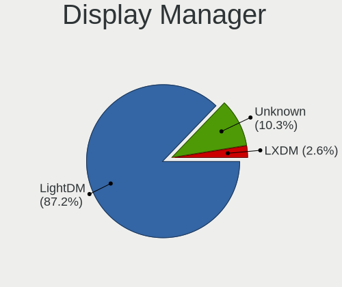

| Name    | Computers | Percent |
|---------|-----------|---------|
| LightDM | 28        | 82.35%  |
| GDM3    | 3         | 8.82%   |
| Unknown | 3         | 8.82%   |

OS Lang
-------

Language

| Lang  | Computers | Percent |
|-------|-----------|---------|
| en_US | 13        | 38.24%  |
| fr_FR | 7         | 20.59%  |
| it_IT | 4         | 11.76%  |
| ru_RU | 2         | 5.88%   |
| fi_FI | 2         | 5.88%   |
| de_DE | 2         | 5.88%   |
| pl_PL | 1         | 2.94%   |
| hr_HR | 1         | 2.94%   |
| en_IL | 1         | 2.94%   |
| en_GB | 1         | 2.94%   |

Boot Mode
---------

EFI or BIOS

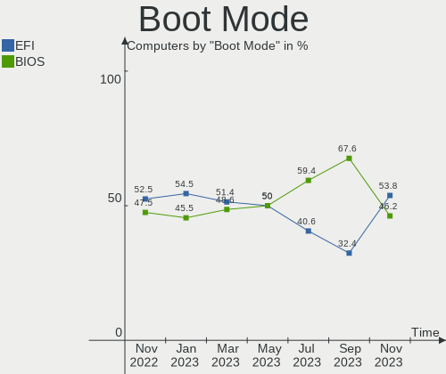

| Mode | Computers | Percent |
|------|-----------|---------|
| EFI  | 18        | 52.94%  |
| BIOS | 16        | 47.06%  |

Filesystem
----------

Type of filesystem

| Type    | Computers | Percent |
|---------|-----------|---------|
| Ext4    | 31        | 91.18%  |
| Xfs     | 1         | 2.94%   |
| Overlay | 1         | 2.94%   |
| Btrfs   | 1         | 2.94%   |

Part. scheme
------------

Scheme of partitioning

| Type    | Computers | Percent |
|---------|-----------|---------|
| GPT     | 24        | 70.59%  |
| MBR     | 6         | 17.65%  |
| Unknown | 4         | 11.76%  |

Dual Boot with Linux/BSD
------------------------

Hosting more than one Linux/BSD

| Dual boot | Computers | Percent |
|-----------|-----------|---------|
| No        | 26        | 76.47%  |
| Yes       | 8         | 23.53%  |

Dual Boot (Win)
---------------

Hosting Linux and Windows

| Dual boot | Computers | Percent |
|-----------|-----------|---------|
| No        | 18        | 52.94%  |
| Yes       | 16        | 47.06%  |

Board
-----

Vendor
------

Motherboard manufacturer

| Name                | Computers | Percent |
|---------------------|-----------|---------|
| ASUSTek Computer    | 9         | 26.47%  |
| Lenovo              | 6         | 17.65%  |
| Hewlett-Packard     | 5         | 14.71%  |
| Dell                | 3         | 8.82%   |
| MSI                 | 2         | 5.88%   |
| Gigabyte Technology | 2         | 5.88%   |
| Toshiba             | 1         | 2.94%   |
| Samsung Electronics | 1         | 2.94%   |
| Notebook            | 1         | 2.94%   |
| Intel               | 1         | 2.94%   |
| Chuwi               | 1         | 2.94%   |
| ASRock              | 1         | 2.94%   |
| Apple               | 1         | 2.94%   |

Model
-----

Motherboard model

| Name                                       | Computers | Percent |
|--------------------------------------------|-----------|---------|
| Toshiba Satellite C50D-A-133               | 1         | 2.94%   |
| Samsung 760XBE                             | 1         | 2.94%   |
| Notebook NJx0MU                            | 1         | 2.94%   |
| MSI MS-7C56                                | 1         | 2.94%   |
| MSI MS-7C09                                | 1         | 2.94%   |
| Lenovo ThinkPad X230 2325Y5L               | 1         | 2.94%   |
| Lenovo ThinkPad X1 Carbon Gen 8 20UAS2TJ00 | 1         | 2.94%   |
| Lenovo ThinkPad T460p 20FW002CPB           | 1         | 2.94%   |
| Lenovo T530-28ICB                          | 1         | 2.94%   |
| Lenovo IdeaPad 3 15ALC6 82KU               | 1         | 2.94%   |
| Lenovo B51-30 80LK                         | 1         | 2.94%   |
| Intel NUC11PAHi7                           | 1         | 2.94%   |
| HP ZBook 14 G2                             | 1         | 2.94%   |
| HP ENVY x360                               | 1         | 2.94%   |
| HP ENVY Sleekbook 6                        | 1         | 2.94%   |
| HP EliteBook 840 G3                        | 1         | 2.94%   |
| HP Compaq Presario CQ71                    | 1         | 2.94%   |
| Gigabyte X570S AERO G                      | 1         | 2.94%   |
| Gigabyte B450M DS3H                        | 1         | 2.94%   |
| Dell Precision 7760                        | 1         | 2.94%   |
| Dell Inspiron One 2305                     | 1         | 2.94%   |
| Dell Inspiron MM061                        | 1         | 2.94%   |
| Chuwi GemiBook Pro                         | 1         | 2.94%   |
| ASUS Z170 PRO GAMING/AURA                  | 1         | 2.94%   |
| ASUS UX32VD                                | 1         | 2.94%   |
| ASUS TUF Gaming B560M-PLUS                 | 1         | 2.94%   |
| ASUS T100TA                                | 1         | 2.94%   |
| ASUS ROG STRIX Z590-E GAMING WIFI          | 1         | 2.94%   |
| ASUS ProArt X670E-CREATOR WIFI             | 1         | 2.94%   |
| ASUS PRIME B450-PLUS                       | 1         | 2.94%   |
| ASUS M5A78L LE                             | 1         | 2.94%   |
| ASUS GL342AA-ABZ a6165.it                  | 1         | 2.94%   |
| ASRock Z77 Extreme4                        | 1         | 2.94%   |
| Apple MacBookAir6,1                        | 1         | 2.94%   |

Model Family
------------

Motherboard model prefix

| Name              | Computers | Percent |
|-------------------|-----------|---------|
| Lenovo ThinkPad   | 3         | 8.82%   |
| HP ENVY           | 2         | 5.88%   |
| Dell Inspiron     | 2         | 5.88%   |
| Toshiba Satellite | 1         | 2.94%   |
| Samsung 760XBE    | 1         | 2.94%   |
| Notebook NJx0MU   | 1         | 2.94%   |
| MSI MS-7C56       | 1         | 2.94%   |
| MSI MS-7C09       | 1         | 2.94%   |
| Lenovo T530-28ICB | 1         | 2.94%   |
| Lenovo IdeaPad    | 1         | 2.94%   |
| Lenovo B51-30     | 1         | 2.94%   |
| Intel NUC11PAHi7  | 1         | 2.94%   |
| HP ZBook          | 1         | 2.94%   |
| HP EliteBook      | 1         | 2.94%   |
| HP Compaq         | 1         | 2.94%   |
| Gigabyte X570S    | 1         | 2.94%   |
| Gigabyte B450M    | 1         | 2.94%   |
| Dell Precision    | 1         | 2.94%   |
| Chuwi GemiBook    | 1         | 2.94%   |
| ASUS Z170         | 1         | 2.94%   |
| ASUS UX32VD       | 1         | 2.94%   |
| ASUS TUF          | 1         | 2.94%   |
| ASUS T100TA       | 1         | 2.94%   |
| ASUS ROG          | 1         | 2.94%   |
| ASUS ProArt       | 1         | 2.94%   |
| ASUS PRIME        | 1         | 2.94%   |
| ASUS M5A78L       | 1         | 2.94%   |
| ASUS GL342AA-ABZ  | 1         | 2.94%   |
| ASRock Z77        | 1         | 2.94%   |
| Apple MacBookAir6 | 1         | 2.94%   |

MFG Year
--------

Motherboard manufacture year

| Year | Computers | Percent |
|------|-----------|---------|
| 2021 | 7         | 20.59%  |
| 2012 | 4         | 11.76%  |
| 2022 | 3         | 8.82%   |
| 2018 | 3         | 8.82%   |
| 2016 | 3         | 8.82%   |
| 2020 | 2         | 5.88%   |
| 2019 | 2         | 5.88%   |
| 2015 | 2         | 5.88%   |
| 2013 | 2         | 5.88%   |
| 2014 | 1         | 2.94%   |
| 2011 | 1         | 2.94%   |
| 2010 | 1         | 2.94%   |
| 2009 | 1         | 2.94%   |
| 2007 | 1         | 2.94%   |
| 2006 | 1         | 2.94%   |

Form Factor
-----------

Physical design of the computer

| Name        | Computers | Percent |
|-------------|-----------|---------|
| Notebook    | 18        | 52.94%  |
| Desktop     | 13        | 38.24%  |
| Convertible | 1         | 2.94%   |
| Mini pc     | 1         | 2.94%   |
| All in one  | 1         | 2.94%   |

Secure Boot
-----------

Enabled or disabled

| State    | Computers | Percent |
|----------|-----------|---------|
| Disabled | 31        | 91.18%  |
| Enabled  | 3         | 8.82%   |

Coreboot
--------

Have coreboot on board

| Used | Computers | Percent |
|------|-----------|---------|
| No   | 34        | 100%    |

RAM Size
--------

Total RAM memory

| Size in GB  | Computers | Percent |
|-------------|-----------|---------|
| 4.01-8.0    | 7         | 20.59%  |
| 3.01-4.0    | 6         | 17.65%  |
| 8.01-16.0   | 6         | 17.65%  |
| 32.01-64.0  | 5         | 14.71%  |
| 16.01-24.0  | 5         | 14.71%  |
| 24.01-32.0  | 2         | 5.88%   |
| 64.01-256.0 | 2         | 5.88%   |
| 1.01-2.0    | 1         | 2.94%   |

RAM Used
--------

Used RAM memory

| Used GB    | Computers | Percent |
|------------|-----------|---------|
| 2.01-3.0   | 10        | 29.41%  |
| 4.01-8.0   | 8         | 23.53%  |
| 1.01-2.0   | 7         | 20.59%  |
| 8.01-16.0  | 3         | 8.82%   |
| 0.51-1.0   | 3         | 8.82%   |
| 3.01-4.0   | 2         | 5.88%   |
| 24.01-32.0 | 1         | 2.94%   |

Total Drives
------------

Number of drives on board

| Drives | Computers | Percent |
|--------|-----------|---------|
| 1      | 19        | 55.88%  |
| 2      | 10        | 29.41%  |
| 3      | 2         | 5.88%   |
| 7      | 1         | 2.94%   |
| 6      | 1         | 2.94%   |
| 5      | 1         | 2.94%   |

Has CD-ROM
----------

Has CD-ROM on board

| Presented | Computers | Percent |
|-----------|-----------|---------|
| No        | 22        | 64.71%  |
| Yes       | 12        | 35.29%  |

Has Ethernet
------------

Has Ethernet on board

| Presented | Computers | Percent |
|-----------|-----------|---------|
| Yes       | 29        | 85.29%  |
| No        | 5         | 14.71%  |

Has WiFi
--------

Has WiFi module

| Presented | Computers | Percent |
|-----------|-----------|---------|
| Yes       | 29        | 85.29%  |
| No        | 5         | 14.71%  |

Has Bluetooth
-------------

Has Bluetooth module

| Presented | Computers | Percent |
|-----------|-----------|---------|
| Yes       | 25        | 73.53%  |
| No        | 9         | 26.47%  |

Location
--------

Country
-------

Geographic location (country)

| Country     | Computers | Percent |
|-------------|-----------|---------|
| France      | 7         | 20.59%  |
| USA         | 5         | 14.71%  |
| Italy       | 4         | 11.76%  |
| Russia      | 2         | 5.88%   |
| Germany     | 2         | 5.88%   |
| Finland     | 2         | 5.88%   |
| Brazil      | 2         | 5.88%   |
| UK          | 1         | 2.94%   |
| Turkey      | 1         | 2.94%   |
| Switzerland | 1         | 2.94%   |
| Portugal    | 1         | 2.94%   |
| Poland      | 1         | 2.94%   |
| Israel      | 1         | 2.94%   |
| Indonesia   | 1         | 2.94%   |
| Hungary     | 1         | 2.94%   |
| Croatia     | 1         | 2.94%   |
| Argentina   | 1         | 2.94%   |

City
----

Geographic location (city)

| City          | Computers | Percent |
|---------------|-----------|---------|
| Valenciennes  | 2         | 5.88%   |
| Turku         | 2         | 5.88%   |
| Sao Paulo     | 2         | 5.88%   |
| Zurich        | 1         | 2.94%   |
| Zagreb        | 1         | 2.94%   |
| Washington    | 1         | 2.94%   |
| Warsaw        | 1         | 2.94%   |
| Villeurbanne  | 1         | 2.94%   |
| Tula          | 1         | 2.94%   |
| Tel Aviv      | 1         | 2.94%   |
| Taranto       | 1         | 2.94%   |
| St Petersburg | 1         | 2.94%   |
| Seia          | 1         | 2.94%   |
| Sarospatak    | 1         | 2.94%   |
| Sanremo       | 1         | 2.94%   |
| Saint-Etienne | 1         | 2.94%   |
| Rockville     | 1         | 2.94%   |
| Norwich       | 1         | 2.94%   |
| Mérignac     | 1         | 2.94%   |
| Marion        | 1         | 2.94%   |
| Mannheim      | 1         | 2.94%   |
| Lansdale      | 1         | 2.94%   |
| La Rochelle   | 1         | 2.94%   |
| Joigny        | 1         | 2.94%   |
| Jena          | 1         | 2.94%   |
| Jakarta       | 1         | 2.94%   |
| Genoa         | 1         | 2.94%   |
| Córdoba      | 1         | 2.94%   |
| Collegno      | 1         | 2.94%   |
| Cleveland     | 1         | 2.94%   |
| Antakya       | 1         | 2.94%   |

Drives
------

Drive Vendor
------------

Hard drive vendors

| Vendor                      | Computers | Drives | Percent |
|-----------------------------|-----------|--------|---------|
| Samsung Electronics         | 12        | 17     | 22.22%  |
| WDC                         | 10        | 15     | 18.52%  |
| Sandisk                     | 6         | 8      | 11.11%  |
| Seagate                     | 4         | 4      | 7.41%   |
| Toshiba                     | 2         | 2      | 3.7%    |
| Hitachi                     | 2         | 2      | 3.7%    |
| HGST                        | 2         | 2      | 3.7%    |
| Unknown                     | 1         | 1      | 1.85%   |
| UMIS                        | 1         | 1      | 1.85%   |
| SPCC                        | 1         | 1      | 1.85%   |
| SK hynix                    | 1         | 1      | 1.85%   |
| SAGE                        | 1         | 1      | 1.85%   |
| Phison                      | 1         | 1      | 1.85%   |
| Netac                       | 1         | 1      | 1.85%   |
| LITEONIT                    | 1         | 1      | 1.85%   |
| LITEON                      | 1         | 1      | 1.85%   |
| KIOXIA                      | 1         | 1      | 1.85%   |
| Kingston Technology Company | 1         | 1      | 1.85%   |
| Kingston                    | 1         | 1      | 1.85%   |
| Crucial                     | 1         | 1      | 1.85%   |
| China                       | 1         | 1      | 1.85%   |
| Apple                       | 1         | 1      | 1.85%   |
| A-DATA Technology           | 1         | 1      | 1.85%   |

Drive Model
-----------

Hard drive models

| Model                               | Computers | Percent |
|-------------------------------------|-----------|---------|
| Samsung SSD 980 1TB                 | 2         | 3.23%   |
| WDC WDS240G2G0A-00JH30 240GB SSD    | 1         | 1.61%   |
| WDC WD800JD-22JNC0 69GB             | 1         | 1.61%   |
| WDC WD8001FZBX-00ASYA0 8TB          | 1         | 1.61%   |
| WDC WD5000LPLX-60ZNTT1 500GB        | 1         | 1.61%   |
| WDC WD5000AAKX-003CA0 500GB         | 1         | 1.61%   |
| WDC WD5000AAKS-00A7B0 500GB         | 1         | 1.61%   |
| WDC WD40EFZX-68AWUN0 4TB            | 1         | 1.61%   |
| WDC WD3200BEVT-60ZCT1 320GB         | 1         | 1.61%   |
| WDC WD30EFRX-68EUZN0 3TB            | 1         | 1.61%   |
| WDC WD20EADS-00R6B0 2TB             | 1         | 1.61%   |
| WDC WD10EZRZ-00HTKB0 1TB            | 1         | 1.61%   |
| WDC WD10EZEX-08WN4A0 1TB            | 1         | 1.61%   |
| WDC WD1002FAEX-00Z3A0 1TB           | 1         | 1.61%   |
| WDC PC SN730 SDBQNTY-1T00-1001 1TB  | 1         | 1.61%   |
| Unknown CBADS  32GB                 | 1         | 1.61%   |
| UMIS RPJTJ256MEE1OWX 256GB          | 1         | 1.61%   |
| Toshiba MQ01ABF050 500GB            | 1         | 1.61%   |
| Toshiba HDWD130 3TB                 | 1         | 1.61%   |
| SPCC Solid State Disk 480GB         | 1         | 1.61%   |
| SK hynix HCG8e  64GB                | 1         | 1.61%   |
| Seagate ST6000NM0024-1HT17Z 6TB     | 1         | 1.61%   |
| Seagate ST500LT012-1DG142 500GB     | 1         | 1.61%   |
| Seagate ST3250820AS 250GB           | 1         | 1.61%   |
| Seagate ST2000DM008-2FR102 2TB      | 1         | 1.61%   |
| Sandisk WD_BLACK SN750 SE NVMe 1TB  | 1         | 1.61%   |
| Sandisk WD_BLACK SN750 SE 1TB       | 1         | 1.61%   |
| SanDisk SSD PLUS 480GB              | 1         | 1.61%   |
| SanDisk SSD i100 24GB               | 1         | 1.61%   |
| SanDisk SD7TB3Q-256G-1006 256GB SSD | 1         | 1.61%   |
| SanDisk SD6PP4M-256G-1006 256GB SSD | 1         | 1.61%   |
| SanDisk NVMe SSD Drive 1TB          | 1         | 1.61%   |
| SanDisk Extreme 55AE 2TB SSD        | 1         | 1.61%   |
| Samsung SSD 980 PRO 500GB           | 1         | 1.61%   |
| Samsung SSD 980 500GB               | 1         | 1.61%   |
| Samsung SSD 870 QVO 2TB             | 1         | 1.61%   |
| Samsung SSD 860 QVO 1TB             | 1         | 1.61%   |
| Samsung SSD 850 EVO M.2 500GB       | 1         | 1.61%   |
| Samsung SSD 840 PRO Series 256GB    | 1         | 1.61%   |
| Samsung SSD 830 Series 512GB        | 1         | 1.61%   |

HDD Vendor
----------

Hard disk drive vendors

| Vendor  | Computers | Drives | Percent |
|---------|-----------|--------|---------|
| WDC     | 9         | 13     | 45%     |
| Seagate | 4         | 4      | 20%     |
| Toshiba | 2         | 2      | 10%     |
| Hitachi | 2         | 2      | 10%     |
| HGST    | 2         | 2      | 10%     |
| SAGE    | 1         | 1      | 5%      |

SSD Vendor
----------

Solid state drive vendors

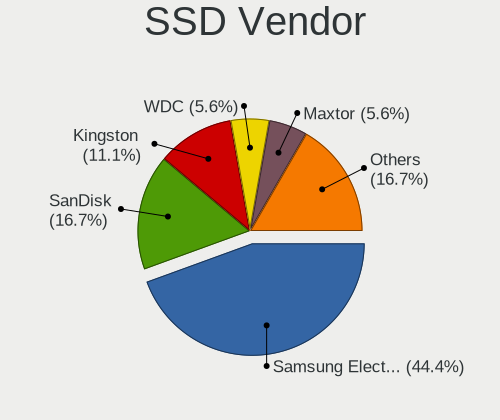

| Vendor              | Computers | Drives | Percent |
|---------------------|-----------|--------|---------|
| Samsung Electronics | 6         | 7      | 30%     |
| SanDisk             | 4         | 5      | 20%     |
| WDC                 | 1         | 1      | 5%      |
| SPCC                | 1         | 1      | 5%      |
| Netac               | 1         | 1      | 5%      |
| LITEONIT            | 1         | 1      | 5%      |
| LITEON              | 1         | 1      | 5%      |
| Kingston            | 1         | 1      | 5%      |
| Crucial             | 1         | 1      | 5%      |
| China               | 1         | 1      | 5%      |
| Apple               | 1         | 1      | 5%      |
| A-DATA Technology   | 1         | 1      | 5%      |

Drive Kind
----------

HDD or SSD

| Kind | Computers | Drives | Percent |
|------|-----------|--------|---------|
| HDD  | 17        | 24     | 36.96%  |
| SSD  | 15        | 22     | 32.61%  |
| NVMe | 12        | 18     | 26.09%  |
| MMC  | 2         | 2      | 4.35%   |

Drive Connector
---------------

SATA, SAS, NVMe, etc.

| Type | Computers | Drives | Percent |
|------|-----------|--------|---------|
| SATA | 25        | 43     | 59.52%  |
| NVMe | 12        | 18     | 28.57%  |
| SAS  | 3         | 3      | 7.14%   |
| MMC  | 2         | 2      | 4.76%   |

Drive Size
----------

Size of hard drive

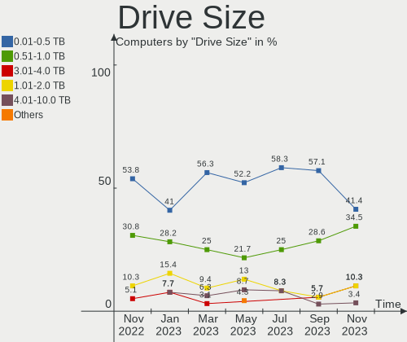

| Size in TB | Computers | Drives | Percent |
|------------|-----------|--------|---------|
| 0.01-0.5   | 22        | 26     | 57.89%  |
| 0.51-1.0   | 7         | 8      | 18.42%  |
| 1.01-2.0   | 5         | 5      | 13.16%  |
| 4.01-10.0  | 2         | 3      | 5.26%   |
| 3.01-4.0   | 1         | 2      | 2.63%   |
| 2.01-3.0   | 1         | 2      | 2.63%   |

Space Total
-----------

Amount of disk space available on the file system

| Size in GB     | Computers | Percent |
|----------------|-----------|---------|
| 101-250        | 11        | 32.35%  |
| 251-500        | 7         | 20.59%  |
| 1001-2000      | 4         | 11.76%  |
| More than 3000 | 3         | 8.82%   |
| 501-1000       | 3         | 8.82%   |
| 21-50          | 2         | 5.88%   |
| 51-100         | 2         | 5.88%   |
| 2001-3000      | 1         | 2.94%   |
| 1-20           | 1         | 2.94%   |

Space Used
----------

Amount of used disk space

| Used GB        | Computers | Percent |
|----------------|-----------|---------|
| 1-20           | 9         | 26.47%  |
| 51-100         | 7         | 20.59%  |
| 21-50          | 4         | 11.76%  |
| 101-250        | 4         | 11.76%  |
| 251-500        | 3         | 8.82%   |
| More than 3000 | 2         | 5.88%   |
| 1001-2000      | 2         | 5.88%   |
| 501-1000       | 2         | 5.88%   |
| 2001-3000      | 1         | 2.94%   |

Malfunc. Drives
---------------

Drive models with a malfunction

| Model                           | Computers | Drives | Percent |
|---------------------------------|-----------|--------|---------|
| WDC WD3200BEVT-60ZCT1 320GB     | 1         | 1      | 33.33%  |
| Seagate ST500LT012-1DG142 500GB | 1         | 1      | 33.33%  |
| Netac SSD 256GB                 | 1         | 1      | 33.33%  |

Malfunc. Drive Vendor
---------------------

Vendors of faulty drives

| Vendor  | Computers | Drives | Percent |
|---------|-----------|--------|---------|
| WDC     | 1         | 1      | 33.33%  |
| Seagate | 1         | 1      | 33.33%  |
| Netac   | 1         | 1      | 33.33%  |

Malfunc. HDD Vendor
-------------------

Vendors of faulty HDD drives

| Vendor  | Computers | Drives | Percent |
|---------|-----------|--------|---------|
| WDC     | 1         | 1      | 50%     |
| Seagate | 1         | 1      | 50%     |

Malfunc. Drive Kind
-------------------

Kinds of faulty drives

| Kind | Computers | Drives | Percent |
|------|-----------|--------|---------|
| HDD  | 2         | 2      | 66.67%  |
| SSD  | 1         | 1      | 33.33%  |

Failed Drives
-------------

Failed drive models

Zero info for selected period =(

Failed Drive Vendor
-------------------

Failed drive vendors

Zero info for selected period =(

Drive Status
------------

Number of failed and malfunc. drives

| Status   | Computers | Drives | Percent |
|----------|-----------|--------|---------|
| Works    | 23        | 39     | 58.97%  |
| Detected | 13        | 24     | 33.33%  |
| Malfunc  | 3         | 3      | 7.69%   |

Storage controller
------------------

Storage Vendor
--------------

Storage controller vendors

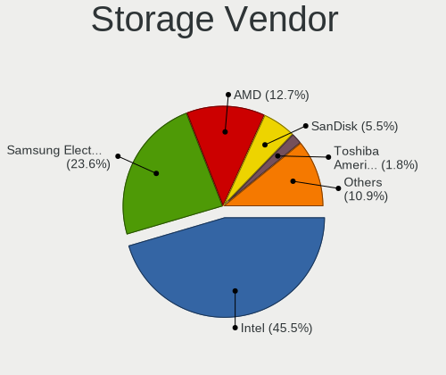

| Vendor                       | Computers | Percent |
|------------------------------|-----------|---------|
| Intel                        | 20        | 43.48%  |
| AMD                          | 9         | 19.57%  |
| Samsung Electronics          | 7         | 15.22%  |
| SanDisk                      | 3         | 6.52%   |
| Toshiba America Info Systems | 2         | 4.35%   |
| Union Memory (Shenzhen)      | 1         | 2.17%   |
| Phison Electronics           | 1         | 2.17%   |
| Marvell Technology Group     | 1         | 2.17%   |
| Kingston Technology Company  | 1         | 2.17%   |
| ASMedia Technology           | 1         | 2.17%   |

Storage Model
-------------

Storage controller models

| Model                                                                            | Computers | Percent |
|----------------------------------------------------------------------------------|-----------|---------|
| AMD FCH SATA Controller [AHCI mode]                                              | 4         | 8.16%   |
| Samsung NVMe SSD Controller PM9A1/PM9A3/980PRO                                   | 3         | 6.12%   |
| Samsung NVMe SSD Controller 980                                                  | 3         | 6.12%   |
| Intel Tiger Lake-LP SATA Controller                                              | 2         | 4.08%   |
| Intel 7 Series Chipset Family 6-port SATA Controller [AHCI mode]                 | 2         | 4.08%   |
| Intel 500 Series Chipset Family SATA AHCI Controller                             | 2         | 4.08%   |
| AMD 400 Series Chipset SATA Controller                                           | 2         | 4.08%   |
| Union Memory (Shenzhen) Non-Volatile memory controller                           | 1         | 2.04%   |
| Toshiba America Info Systems XG6 NVMe SSD Controller                             | 1         | 2.04%   |
| Toshiba America Info Systems Toshiba America Info SATA controller                | 1         | 2.04%   |
| SanDisk WD Blue SN570 NVMe SSD                                                   | 1         | 2.04%   |
| SanDisk WD Black SN750 / PC SN730 NVMe SSD                                       | 1         | 2.04%   |
| SanDisk Non-Volatile memory controller                                           | 1         | 2.04%   |
| Samsung NVMe SSD Controller SM981/PM981/PM983                                    | 1         | 2.04%   |
| Phison NVMe Storage Controller                                                   | 1         | 2.04%   |
| Marvell Group 88SS9183 PCIe SSD Controller                                       | 1         | 2.04%   |
| Kingston Company A2000 NVMe SSD                                                  | 1         | 2.04%   |
| Intel Wildcat Point-LP SATA Controller [AHCI Mode]                               | 1         | 2.04%   |
| Intel Sunrise Point-LP SATA Controller [AHCI mode]                               | 1         | 2.04%   |
| Intel Q170/Q150/B150/H170/H110/Z170/CM236 Chipset SATA Controller [AHCI Mode]    | 1         | 2.04%   |
| Intel Jasper Lake SATA AHCI Controller                                           | 1         | 2.04%   |
| Intel HM170/QM170 Chipset SATA Controller [AHCI Mode]                            | 1         | 2.04%   |
| Intel Cannon Point-LP SATA Controller [AHCI Mode]                                | 1         | 2.04%   |
| Intel Cannon Lake PCH SATA AHCI Controller                                       | 1         | 2.04%   |
| Intel Atom/Celeron/Pentium Processor x5-E8000/J3xxx/N3xxx Series SATA Controller | 1         | 2.04%   |
| Intel 82801IBM/IEM (ICH9M/ICH9M-E) 4 port SATA Controller [AHCI mode]            | 1         | 2.04%   |
| Intel 82801GR/GDH (ICH7R/ICH7DH) SATA Controller [RAID mode]                     | 1         | 2.04%   |
| Intel 82801GBM/GHM (ICH7-M Family) SATA Controller [IDE mode]                    | 1         | 2.04%   |
| Intel 82801G (ICH7 Family) IDE Controller                                        | 1         | 2.04%   |
| Intel 82801 Mobile SATA Controller [RAID mode]                                   | 1         | 2.04%   |
| Intel 7 Series/C210 Series Chipset Family 6-port SATA Controller [AHCI mode]     | 1         | 2.04%   |
| Intel 200 Series PCH SATA controller [AHCI mode]                                 | 1         | 2.04%   |
| ASMedia ASM1062 Serial ATA Controller                                            | 1         | 2.04%   |
| AMD SB7x0/SB8x0/SB9x0 SATA Controller [IDE mode]                                 | 1         | 2.04%   |
| AMD SB7x0/SB8x0/SB9x0 SATA Controller [AHCI mode]                                | 1         | 2.04%   |
| AMD SB7x0/SB8x0/SB9x0 IDE Controller                                             | 1         | 2.04%   |
| AMD SATA controller                                                              | 1         | 2.04%   |
| AMD 500 Series Chipset SATA Controller                                           | 1         | 2.04%   |

Storage Kind
------------

Kind of storage controller (IDE, SATA, NVMe, SAS, ...)

| Kind | Computers | Percent |
|------|-----------|---------|
| SATA | 27        | 61.36%  |
| NVMe | 12        | 27.27%  |
| IDE  | 3         | 6.82%   |
| RAID | 2         | 4.55%   |

Processor
---------

CPU Vendor
----------

Processor vendors

| Vendor | Computers | Percent |
|--------|-----------|---------|
| Intel  | 24        | 70.59%  |
| AMD    | 10        | 29.41%  |

CPU Model
---------

Processor models

| Model                                         | Computers | Percent |
|-----------------------------------------------|-----------|---------|
| Intel Core i7-3517U CPU @ 1.90GHz             | 2         | 5.88%   |
| Intel 11th Gen Core i7-1165G7 @ 2.80GHz       | 2         | 5.88%   |
| Intel 11th Gen Core i5-11600K @ 3.90GHz       | 2         | 5.88%   |
| Intel Pentium Dual-Core CPU T4300 @ 2.10GHz   | 1         | 2.94%   |
| Intel Pentium CPU N3700 @ 1.60GHz             | 1         | 2.94%   |
| Intel Genuine CPU T2300 @ 1.66GHz             | 1         | 2.94%   |
| Intel Core i7-8565U CPU @ 1.80GHz             | 1         | 2.94%   |
| Intel Core i7-6700K CPU @ 4.00GHz             | 1         | 2.94%   |
| Intel Core i7-5500U CPU @ 2.40GHz             | 1         | 2.94%   |
| Intel Core i7-3770K CPU @ 3.50GHz             | 1         | 2.94%   |
| Intel Core i7-10510U CPU @ 1.80GHz            | 1         | 2.94%   |
| Intel Core i5-9400F CPU @ 2.90GHz             | 1         | 2.94%   |
| Intel Core i5-8400 CPU @ 2.80GHz              | 1         | 2.94%   |
| Intel Core i5-6300HQ CPU @ 2.30GHz            | 1         | 2.94%   |
| Intel Core i5-6200U CPU @ 2.30GHz             | 1         | 2.94%   |
| Intel Core i5-4250U CPU @ 1.30GHz             | 1         | 2.94%   |
| Intel Core i5-3380M CPU @ 2.90GHz             | 1         | 2.94%   |
| Intel Core 2 Duo CPU E4400 @ 2.00GHz          | 1         | 2.94%   |
| Intel Celeron N5100 @ 1.10GHz                 | 1         | 2.94%   |
| Intel Atom CPU Z3740 @ 1.33GHz                | 1         | 2.94%   |
| Intel 11th Gen Core i7-11850H @ 2.50GHz       | 1         | 2.94%   |
| AMD Ryzen 9 7950X 16-Core Processor           | 1         | 2.94%   |
| AMD Ryzen 7 5800X 8-Core Processor            | 1         | 2.94%   |
| AMD Ryzen 7 5700G with Radeon Graphics        | 1         | 2.94%   |
| AMD Ryzen 5 3500U with Radeon Vega Mobile Gfx | 1         | 2.94%   |
| AMD Ryzen 5 1600 Six-Core Processor           | 1         | 2.94%   |
| AMD Ryzen 3 5300U with Radeon Graphics        | 1         | 2.94%   |
| AMD Ryzen 3 3200G with Radeon Vega Graphics   | 1         | 2.94%   |
| AMD FX-4100 Quad-Core Processor               | 1         | 2.94%   |
| AMD E1-2100 APU with Radeon HD Graphics       | 1         | 2.94%   |
| AMD Athlon II X2 250u Processor               | 1         | 2.94%   |

CPU Model Family
----------------

Processor model prefix

| Model                   | Computers | Percent |
|-------------------------|-----------|---------|
| Intel Core i7           | 7         | 20.59%  |
| Intel Core i5           | 6         | 17.65%  |
| Other                   | 5         | 14.71%  |
| AMD Ryzen 7             | 2         | 5.88%   |
| AMD Ryzen 5             | 2         | 5.88%   |
| AMD Ryzen 3             | 2         | 5.88%   |
| Intel Pentium Dual-Core | 1         | 2.94%   |
| Intel Pentium           | 1         | 2.94%   |
| Intel Genuine           | 1         | 2.94%   |
| Intel Core 2 Duo        | 1         | 2.94%   |
| Intel Celeron           | 1         | 2.94%   |
| Intel Atom              | 1         | 2.94%   |
| AMD Ryzen 9             | 1         | 2.94%   |
| AMD FX                  | 1         | 2.94%   |
| AMD E1                  | 1         | 2.94%   |
| AMD Athlon II X2        | 1         | 2.94%   |

CPU Cores
---------

Number of processor cores

| Number | Computers | Percent |
|--------|-----------|---------|
| 4      | 13        | 38.24%  |
| 2      | 12        | 35.29%  |
| 6      | 5         | 14.71%  |
| 8      | 3         | 8.82%   |
| 16     | 1         | 2.94%   |

CPU Sockets
-----------

Number of sockets

| Number | Computers | Percent |
|--------|-----------|---------|
| 1      | 34        | 100%    |

CPU Threads
-----------

Threads per core (Hyper-Threading)

| Number | Computers | Percent |
|--------|-----------|---------|
| 2      | 22        | 64.71%  |
| 1      | 12        | 35.29%  |

CPU Op-Modes
------------

CPU Operation Modes (32-bit, 64-bit)

| Op mode        | Computers | Percent |
|----------------|-----------|---------|
| 32-bit, 64-bit | 33        | 97.06%  |
| 32-bit         | 1         | 2.94%   |

CPU Microcode
-------------

Microcode number

| Number     | Computers | Percent |
|------------|-----------|---------|
| Unknown    | 12        | 35.29%  |
| 0x306a9    | 3         | 8.82%   |
| 0x906ea    | 2         | 5.88%   |
| 0x506e3    | 2         | 5.88%   |
| 0x08108109 | 2         | 5.88%   |
| 0xa0671    | 1         | 2.94%   |
| 0x906c0    | 1         | 2.94%   |
| 0x806eb    | 1         | 2.94%   |
| 0x806c1    | 1         | 2.94%   |
| 0x6e8      | 1         | 2.94%   |
| 0x406e3    | 1         | 2.94%   |
| 0x406c3    | 1         | 2.94%   |
| 0x30673    | 1         | 2.94%   |
| 0x1067a    | 1         | 2.94%   |
| 0x0a601203 | 1         | 2.94%   |
| 0x08608103 | 1         | 2.94%   |
| 0x0700010f | 1         | 2.94%   |
| 0x010000c7 | 1         | 2.94%   |

CPU Microarch
-------------

Microarchitecture

| Name       | Computers | Percent |
|------------|-----------|---------|
| Unknown    | 5         | 14.71%  |
| KabyLake   | 4         | 11.76%  |
| IvyBridge  | 4         | 11.76%  |
| Zen+       | 3         | 8.82%   |
| Skylake    | 3         | 8.82%   |
| Zen 3      | 2         | 5.88%   |
| TigerLake  | 2         | 5.88%   |
| Silvermont | 2         | 5.88%   |
| Penryn     | 1         | 2.94%   |
| P6         | 1         | 2.94%   |
| K10        | 1         | 2.94%   |
| Jaguar     | 1         | 2.94%   |
| Icelake    | 1         | 2.94%   |
| Haswell    | 1         | 2.94%   |
| Core       | 1         | 2.94%   |
| Bulldozer  | 1         | 2.94%   |
| Broadwell  | 1         | 2.94%   |

Graphics
--------

GPU Vendor
----------

Vendors of graphics cards

| Vendor | Computers | Percent |
|--------|-----------|---------|
| Intel  | 20        | 47.62%  |
| AMD    | 14        | 33.33%  |
| Nvidia | 8         | 19.05%  |

GPU Model
---------

Graphics card models

| Model                                                                                    | Computers | Percent |
|------------------------------------------------------------------------------------------|-----------|---------|
| Intel 3rd Gen Core processor Graphics Controller                                         | 3         | 7.14%   |
| Intel TigerLake-LP GT2 [Iris Xe Graphics]                                                | 2         | 4.76%   |
| AMD Picasso/Raven 2 [Radeon Vega Series / Radeon Vega Mobile Series]                     | 2         | 4.76%   |
| Nvidia TU117M [GeForce GTX 1650 Mobile / Max-Q]                                          | 1         | 2.38%   |
| Nvidia TU117 [GeForce GTX 1650]                                                          | 1         | 2.38%   |
| Nvidia GP106 [GeForce GTX 1060 6GB]                                                      | 1         | 2.38%   |
| Nvidia GM206GL [Quadro M2000]                                                            | 1         | 2.38%   |
| Nvidia GK208B [GeForce GT 710]                                                           | 1         | 2.38%   |
| Nvidia GF117M [GeForce 610M/710M/810M/820M / GT 620M/625M/630M/720M]                     | 1         | 2.38%   |
| Nvidia GA106 [Geforce RTX 3050]                                                          | 1         | 2.38%   |
| Nvidia GA104GLM [RTX A3000 Mobile]                                                       | 1         | 2.38%   |
| Intel WhiskeyLake-U GT2 [UHD Graphics 620]                                               | 1         | 2.38%   |
| Intel TigerLake-H GT1 [UHD Graphics]                                                     | 1         | 2.38%   |
| Intel Skylake GT2 [HD Graphics 520]                                                      | 1         | 2.38%   |
| Intel RocketLake-S GT1 [UHD Graphics 750]                                                | 1         | 2.38%   |
| Intel Mobile 4 Series Chipset Integrated Graphics Controller                             | 1         | 2.38%   |
| Intel JasperLake [UHD Graphics]                                                          | 1         | 2.38%   |
| Intel IvyBridge GT2 [HD Graphics 4000]                                                   | 1         | 2.38%   |
| Intel HD Graphics 5500                                                                   | 1         | 2.38%   |
| Intel HD Graphics 530                                                                    | 1         | 2.38%   |
| Intel Haswell-ULT Integrated Graphics Controller                                         | 1         | 2.38%   |
| Intel CometLake-U GT2 [UHD Graphics]                                                     | 1         | 2.38%   |
| Intel CoffeeLake-S GT2 [UHD Graphics 630]                                                | 1         | 2.38%   |
| Intel Atom/Celeron/Pentium Processor x5-E8000/J3xxx/N3xxx Integrated Graphics Controller | 1         | 2.38%   |
| Intel Atom Processor Z36xxx/Z37xxx Series Graphics & Display                             | 1         | 2.38%   |
| Intel 82945G/GZ Integrated Graphics Controller                                           | 1         | 2.38%   |
| AMD Tahiti PRO [Radeon HD 7950/8950 OEM / R9 280]                                        | 1         | 2.38%   |
| AMD RV515/M52 [Mobility Radeon X1300]                                                    | 1         | 2.38%   |
| AMD RS880M [Mobility Radeon HD 4225/4250]                                                | 1         | 2.38%   |
| AMD Raphael                                                                              | 1         | 2.38%   |
| AMD Navi 23 [Radeon RX 6600/6600 XT/6600M]                                               | 1         | 2.38%   |
| AMD Navi 22 [Radeon RX 6700/6700 XT/6750 XT / 6800M]                                     | 1         | 2.38%   |
| AMD Mars [Radeon HD 8670A/8670M/8750M / R7 M370]                                         | 1         | 2.38%   |
| AMD Lucienne                                                                             | 1         | 2.38%   |
| AMD Kabini [Radeon HD 8210]                                                              | 1         | 2.38%   |
| AMD Ellesmere [Radeon RX 470/480/570/570X/580/580X/590]                                  | 1         | 2.38%   |
| AMD Cezanne                                                                              | 1         | 2.38%   |
| AMD Cape Verde XT [Radeon HD 7770/8760 / R7 250X]                                        | 1         | 2.38%   |

GPU Combo
---------

Combinations of graphics cards

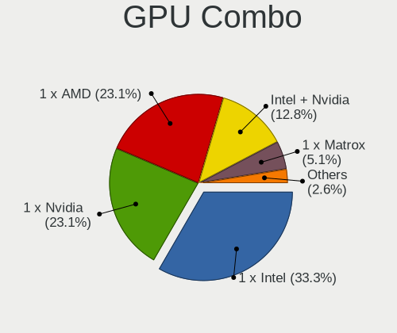

| Name           | Computers | Percent |
|----------------|-----------|---------|
| 1 x Intel      | 14        | 41.18%  |
| 1 x AMD        | 11        | 32.35%  |
| 1 x Nvidia     | 3         | 8.82%   |
| Intel + Nvidia | 3         | 8.82%   |
| AMD + Nvidia   | 2         | 5.88%   |
| Intel + AMD    | 1         | 2.94%   |

GPU Driver
----------

Free vs proprietary

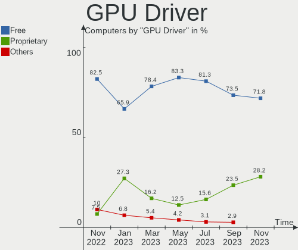

| Driver      | Computers | Percent |
|-------------|-----------|---------|
| Free        | 27        | 79.41%  |
| Proprietary | 5         | 14.71%  |
| Unknown     | 2         | 5.88%   |

GPU Memory
----------

Total video memory

| Size in GB | Computers | Percent |
|------------|-----------|---------|
| Unknown    | 22        | 64.71%  |
| 3.01-4.0   | 3         | 8.82%   |
| 1.01-2.0   | 3         | 8.82%   |
| 0.01-0.5   | 3         | 8.82%   |
| 5.01-6.0   | 1         | 2.94%   |
| 2.01-3.0   | 1         | 2.94%   |
| 0.51-1.0   | 1         | 2.94%   |

Monitor
-------

Monitor Vendor
--------------

Monitor vendors

| Vendor              | Computers | Percent |
|---------------------|-----------|---------|
| Philips             | 5         | 12.5%   |
| Chimei Innolux      | 5         | 12.5%   |
| AU Optronics        | 5         | 12.5%   |
| Samsung Electronics | 4         | 10%     |
| Dell                | 4         | 10%     |
| Acer                | 3         | 7.5%    |
| ViewSonic           | 2         | 5%      |
| LG Display          | 2         | 5%      |
| Goldstar            | 2         | 5%      |
| BOE                 | 2         | 5%      |
| Apple               | 2         | 5%      |
| VMO                 | 1         | 2.5%    |
| PANDA               | 1         | 2.5%    |
| Lenovo              | 1         | 2.5%    |
| BenQ                | 1         | 2.5%    |

Monitor Model
-------------

Monitor models

| Model                                                                | Computers | Percent |
|----------------------------------------------------------------------|-----------|---------|
| VMO LCD WQXGA HDM VMO1506 2560x1600 1600x1000mm 74.3-inch            | 1         | 2.5%    |
| ViewSonic VX2778 Series VSC8432 2560x1440 597x336mm 27.0-inch        | 1         | 2.5%    |
| ViewSonic VP2765 SERIES VSC9F28 1920x1080 598x336mm 27.0-inch        | 1         | 2.5%    |
| Samsung Electronics S32F351 SAM0D24 1920x1080 698x393mm 31.5-inch    | 1         | 2.5%    |
| Samsung Electronics LCD Monitor SDC4347 1366x768 344x193mm 15.5-inch | 1         | 2.5%    |
| Samsung Electronics LCD Monitor SDC3652 1366x768 344x194mm 15.5-inch | 1         | 2.5%    |
| Samsung Electronics EPSON PJ SECA605 1600x1200                       | 1         | 2.5%    |
| Philips PHL 243V7 PHLC155 1920x1080 530x300mm 24.0-inch              | 1         | 2.5%    |
| Philips PHL 242E2F PHLC238 1920x1080 527x296mm 23.8-inch             | 1         | 2.5%    |
| Philips FTV PHL04C3 3840x2160 1440x810mm 65.0-inch                   | 1         | 2.5%    |
| Philips 246EL2SBH PHLC074 1920x1080 521x293mm 23.5-inch              | 1         | 2.5%    |
| Philips 190B PHL081A 1280x1024 376x301mm 19.0-inch                   | 1         | 2.5%    |
| PANDA LCD Monitor NCP0064 1920x1080 344x194mm 15.5-inch              | 1         | 2.5%    |
| LG Display LCD Monitor LGD069A 1920x1080 344x194mm 15.5-inch         | 1         | 2.5%    |
| LG Display LCD Monitor LGD03A3 1366x768 277x156mm 12.5-inch          | 1         | 2.5%    |
| Lenovo LEN G25-10 LEN65FE 1920x1080 544x303mm 24.5-inch              | 1         | 2.5%    |
| Goldstar W2353 GSM56F0 1920x1080 510x290mm 23.1-inch                 | 1         | 2.5%    |
| Goldstar ULTRAWIDE GSM59F2 2560x1080 798x334mm 34.1-inch             | 1         | 2.5%    |
| Dell SE2417HGX DELD0F6 1920x1080 521x293mm 23.5-inch                 | 1         | 2.5%    |
| Dell S3222DGM DELD111 2560x1440 697x392mm 31.5-inch                  | 1         | 2.5%    |
| Dell P2417H DELA0DB 1920x1080 527x296mm 23.8-inch                    | 1         | 2.5%    |
| Dell INSPIRON ONE DELB123 1920x1080 510x287mm 23.0-inch              | 1         | 2.5%    |
| Chimei Innolux LCD Monitor CMN174A 1920x1080 381x214mm 17.2-inch     | 1         | 2.5%    |
| Chimei Innolux LCD Monitor CMN15B6 1366x768 344x193mm 15.5-inch      | 1         | 2.5%    |
| Chimei Innolux LCD Monitor CMN14B1 1920x1080 308x173mm 13.9-inch     | 1         | 2.5%    |
| Chimei Innolux LCD Monitor CMN1490 1366x768 309x173mm 13.9-inch      | 1         | 2.5%    |
| Chimei Innolux LCD Monitor CMN1343 1920x1080 282x165mm 12.9-inch     | 1         | 2.5%    |
| BOE LCD Monitor BOE0893 2160x1440 296x197mm 14.0-inch                | 1         | 2.5%    |
| BOE LCD Monitor BOE07DB 1920x1080 309x174mm 14.0-inch                | 1         | 2.5%    |
| BenQ GL2250H BNQ78A1 1920x1080 477x268mm 21.5-inch                   | 1         | 2.5%    |
| AU Optronics LCD Monitor AUO429D 1920x1080 382x215mm 17.3-inch       | 1         | 2.5%    |
| AU Optronics LCD Monitor AUO23ED 1920x1080 344x194mm 15.5-inch       | 1         | 2.5%    |
| AU Optronics LCD Monitor AUO1C74 1280x800 331x207mm 15.4-inch        | 1         | 2.5%    |
| AU Optronics LCD Monitor AUO133D 1920x1080 309x173mm 13.9-inch       | 1         | 2.5%    |
| AU Optronics LCD Monitor AUO109E 1600x900 382x214mm 17.2-inch        | 1         | 2.5%    |
| Apple ProDisplayXDR APPAE22 3840x2160 699x393mm 31.6-inch            | 1         | 2.5%    |
| Apple Color LCD APP9CF2 1366x768 256x144mm 11.6-inch                 | 1         | 2.5%    |
| Acer XF243Y ACR0934 1920x1080 527x296mm 23.8-inch                    | 1         | 2.5%    |
| Acer P241W ACRADB4 1920x1200 518x324mm 24.1-inch                     | 1         | 2.5%    |
| Acer ET322QU ACR0687 2560x1440 698x393mm 31.5-inch                   | 1         | 2.5%    |

Monitor Resolution
------------------

Monitor screen resolution

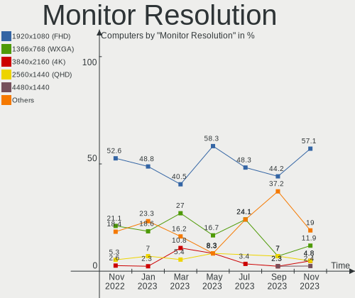

| Resolution         | Computers | Percent |
|--------------------|-----------|---------|
| 1920x1080 (FHD)    | 18        | 50%     |
| 1366x768 (WXGA)    | 6         | 16.67%  |
| 3840x2160 (4K)     | 2         | 5.56%   |
| 2560x1440 (QHD)    | 2         | 5.56%   |
| 2560x1600          | 1         | 2.78%   |
| 2560x1080          | 1         | 2.78%   |
| 2160x1440          | 1         | 2.78%   |
| 1920x1200 (WUXGA)  | 1         | 2.78%   |
| 1680x1050 (WSXGA+) | 1         | 2.78%   |
| 1600x900 (HD+)     | 1         | 2.78%   |
| 1280x800 (WXGA)    | 1         | 2.78%   |
| 1280x1024 (SXGA)   | 1         | 2.78%   |

Monitor Diagonal
----------------

Diagonal size in inches

| Inches  | Computers | Percent |
|---------|-----------|---------|
| 15      | 7         | 18.42%  |
| 24      | 6         | 15.79%  |
| 31      | 3         | 7.89%   |
| 23      | 3         | 7.89%   |
| 17      | 3         | 7.89%   |
| 14      | 3         | 7.89%   |
| 13      | 3         | 7.89%   |
| 27      | 2         | 5.26%   |
| 74      | 1         | 2.63%   |
| 65      | 1         | 2.63%   |
| 34      | 1         | 2.63%   |
| 21      | 1         | 2.63%   |
| 19      | 1         | 2.63%   |
| 12      | 1         | 2.63%   |
| 11      | 1         | 2.63%   |
| Unknown | 1         | 2.63%   |

Monitor Width
-------------

Physical width

| Width in mm | Computers | Percent |
|-------------|-----------|---------|
| 501-600     | 11        | 28.95%  |
| 301-350     | 11        | 28.95%  |
| 351-400     | 4         | 10.53%  |
| 201-300     | 4         | 10.53%  |
| 601-700     | 3         | 7.89%   |
| 701-800     | 1         | 2.63%   |
| 401-500     | 1         | 2.63%   |
| 1501-2000   | 1         | 2.63%   |
| 1001-1500   | 1         | 2.63%   |
| Unknown     | 1         | 2.63%   |

Aspect Ratio
------------

Proportional relationship between the width and the height

| Ratio | Computers | Percent |
|-------|-----------|---------|
| 16/9  | 27        | 81.82%  |
| 16/10 | 3         | 9.09%   |
| 5/4   | 1         | 3.03%   |
| 3/2   | 1         | 3.03%   |
| 21/9  | 1         | 3.03%   |

Monitor Area
------------

Area in inch²

| Area in inch² | Computers | Percent |
|----------------|-----------|---------|
| 201-250        | 8         | 21.05%  |
| 101-110        | 7         | 18.42%  |
| 81-90          | 5         | 13.16%  |
| 351-500        | 4         | 10.53%  |
| 121-130        | 3         | 7.89%   |
| More than 1000 | 2         | 5.26%   |
| 301-350        | 2         | 5.26%   |
| 251-300        | 2         | 5.26%   |
| 71-80          | 1         | 2.63%   |
| 61-70          | 1         | 2.63%   |
| 51-60          | 1         | 2.63%   |
| 151-200        | 1         | 2.63%   |
| Unknown        | 1         | 2.63%   |

Pixel Density
-------------

Pixels per inch

| Density | Computers | Percent |
|---------|-----------|---------|
| 51-100  | 14        | 37.84%  |
| 121-160 | 11        | 29.73%  |
| 101-120 | 7         | 18.92%  |
| 1-50    | 2         | 5.41%   |
| 161-240 | 2         | 5.41%   |
| Unknown | 1         | 2.7%    |

Multiple Monitors
-----------------

Total monitors connected

| Total | Computers | Percent |
|-------|-----------|---------|
| 1     | 26        | 76.47%  |
| 2     | 7         | 20.59%  |
| 0     | 1         | 2.94%   |

Network
-------

Net Controller Vendor
---------------------

Controller vendors

| Vendor                            | Computers | Percent |
|-----------------------------------|-----------|---------|
| Intel                             | 20        | 40%     |
| Realtek Semiconductor             | 14        | 28%     |
| Qualcomm Atheros                  | 3         | 6%      |
| Broadcom                          | 3         | 6%      |
| TP-Link                           | 1         | 2%      |
| Ralink Technology                 | 1         | 2%      |
| Ralink                            | 1         | 2%      |
| Microchip Technology              | 1         | 2%      |
| MediaTek                          | 1         | 2%      |
| Ericsson Business Mobile Networks | 1         | 2%      |
| Broadcom Limited                  | 1         | 2%      |
| ASUSTek Computer                  | 1         | 2%      |
| ASIX Electronics                  | 1         | 2%      |
| Aquantia                          | 1         | 2%      |

Net Controller Model
--------------------

Controller models

| Model                                                             | Computers | Percent |
|-------------------------------------------------------------------|-----------|---------|
| Realtek RTL8111/8168/8411 PCI Express Gigabit Ethernet Controller | 9         | 14.52%  |
| Intel Ethernet Controller I225-V                                  | 4         | 6.45%   |
| Intel Wireless 8260                                               | 2         | 3.23%   |
| Intel Wi-Fi 6 AX210/AX211/AX411 160MHz                            | 2         | 3.23%   |
| Intel Wi-Fi 6 AX200                                               | 2         | 3.23%   |
| TP-Link AC600 wireless Realtek RTL8811AU [Archer T2U Nano]        | 1         | 1.61%   |
| Realtek RTL8822BE 802.11a/b/g/n/ac WiFi adapter                   | 1         | 1.61%   |
| Realtek RTL8812AE 802.11ac PCIe Wireless Network Adapter          | 1         | 1.61%   |
| Realtek RTL8188EUS 802.11n Wireless Network Adapter               | 1         | 1.61%   |
| Realtek RTL8125 2.5GbE Controller                                 | 1         | 1.61%   |
| Realtek RTL810xE PCI Express Fast Ethernet controller             | 1         | 1.61%   |
| Ralink MT7601U Wireless Adapter                                   | 1         | 1.61%   |
| Ralink RT2561/RT61 802.11g PCI                                    | 1         | 1.61%   |
| Qualcomm Atheros QCA9565 / AR9565 Wireless Network Adapter        | 1         | 1.61%   |
| Qualcomm Atheros QCA8172 Fast Ethernet                            | 1         | 1.61%   |
| Qualcomm Atheros QCA6174 802.11ac Wireless Network Adapter        | 1         | 1.61%   |
| Qualcomm Atheros AR9285 Wireless Network Adapter (PCI-Express)    | 1         | 1.61%   |
| Microchip LAN7500 Ethernet 10/100/1000 Adapter                    | 1         | 1.61%   |
| MediaTek MT7922 802.11ax PCI Express Wireless Network Adapter     | 1         | 1.61%   |
| Intel Wireless 7265                                               | 1         | 1.61%   |
| Intel Wireless 7260                                               | 1         | 1.61%   |
| Intel Wireless 3160                                               | 1         | 1.61%   |
| Intel Wi-Fi 6 AX201 160MHz                                        | 1         | 1.61%   |
| Intel Wi-Fi 6 AX201                                               | 1         | 1.61%   |
| Intel NM10/ICH7 Family LAN Controller                             | 1         | 1.61%   |
| Intel Ethernet Controller (2) I225-LMvP                           | 1         | 1.61%   |
| Intel Ethernet Connection I219-V                                  | 1         | 1.61%   |
| Intel Ethernet Connection (3) I218-LM                             | 1         | 1.61%   |
| Intel Ethernet Connection (2) I219-V                              | 1         | 1.61%   |
| Intel Ethernet Connection (2) I219-LM                             | 1         | 1.61%   |
| Intel Ethernet Connection (14) I219-LM                            | 1         | 1.61%   |
| Intel Ethernet Connection (13) I219-V                             | 1         | 1.61%   |
| Intel Ethernet Connection (10) I219-V                             | 1         | 1.61%   |
| Intel Dual Band Wireless-AC 3165 Plus Bluetooth                   | 1         | 1.61%   |
| Intel Comet Lake PCH-LP CNVi WiFi                                 | 1         | 1.61%   |
| Intel Centrino Wireless-N 2230                                    | 1         | 1.61%   |
| Intel Centrino Wireless-N 2200                                    | 1         | 1.61%   |
| Intel Centrino Advanced-N 6235                                    | 1         | 1.61%   |
| Intel Cannon Point-LP CNVi [Wireless-AC]                          | 1         | 1.61%   |
| Intel 82579LM Gigabit Network Connection (Lewisville)             | 1         | 1.61%   |

Wireless Vendor
---------------

Wireless vendors

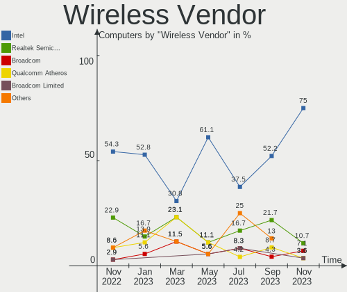

| Vendor                | Computers | Percent |
|-----------------------|-----------|---------|
| Intel                 | 17        | 56.67%  |
| Realtek Semiconductor | 3         | 10%     |
| Qualcomm Atheros      | 3         | 10%     |
| TP-Link               | 1         | 3.33%   |
| Ralink Technology     | 1         | 3.33%   |
| Ralink                | 1         | 3.33%   |
| MediaTek              | 1         | 3.33%   |
| Broadcom Limited      | 1         | 3.33%   |
| Broadcom              | 1         | 3.33%   |
| ASUSTek Computer      | 1         | 3.33%   |

Wireless Model
--------------

Wireless models

| Model                                                          | Computers | Percent |
|----------------------------------------------------------------|-----------|---------|
| Intel Wireless 8260                                            | 2         | 6.67%   |
| Intel Wi-Fi 6 AX210/AX211/AX411 160MHz                         | 2         | 6.67%   |
| Intel Wi-Fi 6 AX200                                            | 2         | 6.67%   |
| TP-Link AC600 wireless Realtek RTL8811AU [Archer T2U Nano]     | 1         | 3.33%   |
| Realtek RTL8822BE 802.11a/b/g/n/ac WiFi adapter                | 1         | 3.33%   |
| Realtek RTL8812AE 802.11ac PCIe Wireless Network Adapter       | 1         | 3.33%   |
| Realtek RTL8188EUS 802.11n Wireless Network Adapter            | 1         | 3.33%   |
| Ralink MT7601U Wireless Adapter                                | 1         | 3.33%   |
| Ralink RT2561/RT61 802.11g PCI                                 | 1         | 3.33%   |
| Qualcomm Atheros QCA9565 / AR9565 Wireless Network Adapter     | 1         | 3.33%   |
| Qualcomm Atheros QCA6174 802.11ac Wireless Network Adapter     | 1         | 3.33%   |
| Qualcomm Atheros AR9285 Wireless Network Adapter (PCI-Express) | 1         | 3.33%   |
| MediaTek MT7922 802.11ax PCI Express Wireless Network Adapter  | 1         | 3.33%   |
| Intel Wireless 7265                                            | 1         | 3.33%   |
| Intel Wireless 7260                                            | 1         | 3.33%   |
| Intel Wireless 3160                                            | 1         | 3.33%   |
| Intel Wi-Fi 6 AX201 160MHz                                     | 1         | 3.33%   |
| Intel Wi-Fi 6 AX201                                            | 1         | 3.33%   |
| Intel Dual Band Wireless-AC 3165 Plus Bluetooth                | 1         | 3.33%   |
| Intel Comet Lake PCH-LP CNVi WiFi                              | 1         | 3.33%   |
| Intel Centrino Wireless-N 2230                                 | 1         | 3.33%   |
| Intel Centrino Wireless-N 2200                                 | 1         | 3.33%   |
| Intel Centrino Advanced-N 6235                                 | 1         | 3.33%   |
| Intel Cannon Point-LP CNVi [Wireless-AC]                       | 1         | 3.33%   |
| Broadcom Limited BCM4360 802.11ac Wireless Network Adapter     | 1         | 3.33%   |
| Broadcom BCM4313 802.11bgn Wireless Network Adapter            | 1         | 3.33%   |
| ASUS 802.11ac NIC                                              | 1         | 3.33%   |

Ethernet Vendor
---------------

Ethernet vendors

| Vendor                | Computers | Percent |
|-----------------------|-----------|---------|
| Intel                 | 13        | 43.33%  |
| Realtek Semiconductor | 11        | 36.67%  |
| Broadcom              | 2         | 6.67%   |
| Qualcomm Atheros      | 1         | 3.33%   |
| Microchip Technology  | 1         | 3.33%   |
| ASIX Electronics      | 1         | 3.33%   |
| Aquantia              | 1         | 3.33%   |

Ethernet Model
--------------

Ethernet models

| Model                                                               | Computers | Percent |
|---------------------------------------------------------------------|-----------|---------|
| Realtek RTL8111/8168/8411 PCI Express Gigabit Ethernet Controller   | 9         | 29.03%  |
| Intel Ethernet Controller I225-V                                    | 4         | 12.9%   |
| Realtek RTL8125 2.5GbE Controller                                   | 1         | 3.23%   |
| Realtek RTL810xE PCI Express Fast Ethernet controller               | 1         | 3.23%   |
| Qualcomm Atheros QCA8172 Fast Ethernet                              | 1         | 3.23%   |
| Microchip LAN7500 Ethernet 10/100/1000 Adapter                      | 1         | 3.23%   |
| Intel NM10/ICH7 Family LAN Controller                               | 1         | 3.23%   |
| Intel Ethernet Controller (2) I225-LMvP                             | 1         | 3.23%   |
| Intel Ethernet Connection I219-V                                    | 1         | 3.23%   |
| Intel Ethernet Connection (3) I218-LM                               | 1         | 3.23%   |
| Intel Ethernet Connection (2) I219-V                                | 1         | 3.23%   |
| Intel Ethernet Connection (2) I219-LM                               | 1         | 3.23%   |
| Intel Ethernet Connection (14) I219-LM                              | 1         | 3.23%   |
| Intel Ethernet Connection (13) I219-V                               | 1         | 3.23%   |
| Intel Ethernet Connection (10) I219-V                               | 1         | 3.23%   |
| Intel 82579LM Gigabit Network Connection (Lewisville)               | 1         | 3.23%   |
| Broadcom NetLink BCM57781 Gigabit Ethernet PCIe                     | 1         | 3.23%   |
| Broadcom BCM4401-B0 100Base-TX                                      | 1         | 3.23%   |
| ASIX AX88179 Gigabit Ethernet                                       | 1         | 3.23%   |
| Aquantia AQC113CS NBase-T/IEEE 802.3bz Ethernet Controller [AQtion] | 1         | 3.23%   |

Net Controller Kind
-------------------

Ethernet, WiFi or modem

| Kind     | Computers | Percent |
|----------|-----------|---------|
| WiFi     | 29        | 49.15%  |
| Ethernet | 29        | 49.15%  |
| Modem    | 1         | 1.69%   |

Used Controller
---------------

Currently used network controller

| Kind     | Computers | Percent |
|----------|-----------|---------|
| WiFi     | 19        | 57.58%  |
| Ethernet | 14        | 42.42%  |

NICs
----

Total network controllers on board

| Total | Computers | Percent |
|-------|-----------|---------|
| 2     | 19        | 55.88%  |
| 1     | 12        | 35.29%  |
| 4     | 1         | 2.94%   |
| 3     | 1         | 2.94%   |
| 0     | 1         | 2.94%   |

IPv6
----

IPv6 vs IPv4

| Used | Computers | Percent |
|------|-----------|---------|
| No   | 21        | 61.76%  |
| Yes  | 13        | 38.24%  |

Bluetooth
---------

Bluetooth Vendor
----------------

Controller vendors

| Vendor                          | Computers | Percent |
|---------------------------------|-----------|---------|
| Intel                           | 16        | 59.26%  |
| Realtek Semiconductor           | 2         | 7.41%   |
| Broadcom                        | 2         | 7.41%   |
| Toshiba                         | 1         | 3.7%    |
| Qualcomm Atheros Communications | 1         | 3.7%    |
| Foxconn / Hon Hai               | 1         | 3.7%    |
| Dell                            | 1         | 3.7%    |
| Cambridge Silicon Radio         | 1         | 3.7%    |
| ASUSTek Computer                | 1         | 3.7%    |
| Apple                           | 1         | 3.7%    |

Bluetooth Model
---------------

Controller models

| Model                                               | Computers | Percent |
|-----------------------------------------------------|-----------|---------|
| Intel Bluetooth wireless interface                  | 6         | 22.22%  |
| Intel AX201 Bluetooth                               | 3         | 11.11%  |
| Intel Centrino Bluetooth Wireless Transceiver       | 2         | 7.41%   |
| Intel AX210 Bluetooth                               | 2         | 7.41%   |
| Intel AX200 Bluetooth                               | 2         | 7.41%   |
| Toshiba Bluetooth Device                            | 1         | 3.7%    |
| Realtek  Bluetooth 4.2 Adapter                      | 1         | 3.7%    |
| Realtek Bluetooth Radio                             | 1         | 3.7%    |
| Qualcomm Atheros QCA61x4 Bluetooth 4.0              | 1         | 3.7%    |
| Intel Bluetooth 9460/9560 Jefferson Peak (JfP)      | 1         | 3.7%    |
| Foxconn / Hon Hai Wireless_Device                   | 1         | 3.7%    |
| Dell Wireless 350 Bluetooth                         | 1         | 3.7%    |
| Cambridge Silicon Radio Bluetooth Dongle (HCI mode) | 1         | 3.7%    |
| Broadcom BCM92046DG-CL1ROM Bluetooth 2.1 Adapter    | 1         | 3.7%    |
| Broadcom BCM20702 Bluetooth 4.0 [ThinkPad]          | 1         | 3.7%    |
| ASUS ASUS USB-BT500                                 | 1         | 3.7%    |
| Apple Bluetooth USB Host Controller                 | 1         | 3.7%    |

Sound
-----

Sound Vendor
------------

Sound card vendors

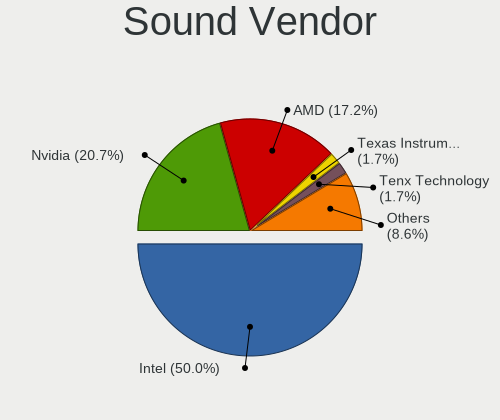

| Vendor                  | Computers | Percent |
|-------------------------|-----------|---------|
| Intel                   | 23        | 44.23%  |
| AMD                     | 13        | 25%     |
| Nvidia                  | 7         | 13.46%  |
| C-Media Electronics     | 2         | 3.85%   |
| Meizu                   | 1         | 1.92%   |
| Kingston Technology     | 1         | 1.92%   |
| Focusrite-Novation      | 1         | 1.92%   |
| Creative Technology     | 1         | 1.92%   |
| Cambridge Silicon Radio | 1         | 1.92%   |
| ASUSTek Computer        | 1         | 1.92%   |
| Unknown                 | 1         | 1.92%   |

Sound Model
-----------

Sound card models

| Model                                                                                             | Computers | Percent |
|---------------------------------------------------------------------------------------------------|-----------|---------|
| AMD Family 17h/19h HD Audio Controller                                                            | 5         | 8.06%   |
| Intel 7 Series/C216 Chipset Family High Definition Audio Controller                               | 4         | 6.45%   |
| Intel Tiger Lake-H HD Audio Controller                                                            | 3         | 4.84%   |
| Nvidia TU107 GeForce GTX 1650 High Definition Audio Controller                                    | 2         | 3.23%   |
| Intel Tiger Lake-LP Smart Sound Technology Audio Controller                                       | 2         | 3.23%   |
| Intel NM10/ICH7 Family High Definition Audio Controller                                           | 2         | 3.23%   |
| Intel 100 Series/C230 Series Chipset Family HD Audio Controller                                   | 2         | 3.23%   |
| AMD SBx00 Azalia (Intel HDA)                                                                      | 2         | 3.23%   |
| AMD Renoir Radeon High Definition Audio Controller                                                | 2         | 3.23%   |
| AMD Raven/Raven2/Fenghuang HDMI/DP Audio Controller                                               | 2         | 3.23%   |
| AMD Navi 21/23 HDMI/DP Audio Controller                                                           | 2         | 3.23%   |
| Nvidia GP106 High Definition Audio Controller                                                     | 1         | 1.61%   |
| Nvidia GM206 High Definition Audio Controller                                                     | 1         | 1.61%   |
| Nvidia GK208 HDMI/DP Audio Controller                                                             | 1         | 1.61%   |
| Nvidia GA106 High Definition Audio Controller                                                     | 1         | 1.61%   |
| Nvidia GA104 High Definition Audio Controller                                                     | 1         | 1.61%   |
| Meizu HiFi DAC Headphone Amplifier                                                                | 1         | 1.61%   |
| Kingston Technology HyperX 7.1 Audio                                                              | 1         | 1.61%   |
| Intel Wildcat Point-LP High Definition Audio Controller                                           | 1         | 1.61%   |
| Intel Sunrise Point-LP HD Audio                                                                   | 1         | 1.61%   |
| Intel Jasper Lake HD Audio                                                                        | 1         | 1.61%   |
| Intel Haswell-ULT HD Audio Controller                                                             | 1         | 1.61%   |
| Intel Comet Lake PCH-LP cAVS                                                                      | 1         | 1.61%   |
| Intel Cannon Point-LP High Definition Audio Controller                                            | 1         | 1.61%   |
| Intel Cannon Lake PCH cAVS                                                                        | 1         | 1.61%   |
| Intel Broadwell-U Audio Controller                                                                | 1         | 1.61%   |
| Intel Atom/Celeron/Pentium Processor x5-E8000/J3xxx/N3xxx Series High Definition Audio Controller | 1         | 1.61%   |
| Intel 82801I (ICH9 Family) HD Audio Controller                                                    | 1         | 1.61%   |
| Intel 8 Series HD Audio Controller                                                                | 1         | 1.61%   |
| Intel 200 Series PCH HD Audio                                                                     | 1         | 1.61%   |
| Focusrite-Novation Scarlett Solo (3rd Gen.)                                                       | 1         | 1.61%   |
| Creative Technology Sound Blaster Play!                                                           | 1         | 1.61%   |
| Cambridge Silicon Radio Avantree DG60                                                             | 1         | 1.61%   |
| C-Media Electronics USB Advanced Audio Device                                                     | 1         | 1.61%   |
| C-Media Electronics Audio Adapter (Unitek Y-247A)                                                 | 1         | 1.61%   |
| ASUSTek Computer USB Audio                                                                        | 1         | 1.61%   |
| AMD Tahiti HDMI Audio [Radeon HD 7870 XT / 7950/7970]                                             | 1         | 1.61%   |
| AMD Starship/Matisse HD Audio Controller                                                          | 1         | 1.61%   |
| AMD Rembrandt Radeon High Definition Audio Controller                                             | 1         | 1.61%   |
| AMD Oland/Hainan/Cape Verde/Pitcairn HDMI Audio [Radeon HD 7000 Series]                           | 1         | 1.61%   |

Memory
------

Memory Vendor
-------------

Memory module vendors

| Vendor              | Computers | Percent |
|---------------------|-----------|---------|
| Samsung Electronics | 7         | 21.88%  |
| Corsair             | 6         | 18.75%  |
| SK hynix            | 5         | 15.63%  |
| Crucial             | 4         | 12.5%   |
| Micron Technology   | 3         | 9.38%   |
| Unknown             | 2         | 6.25%   |
| Unknown             | 1         | 3.13%   |
| Nanya Technology    | 1         | 3.13%   |
| Kingston            | 1         | 3.13%   |
| G.Skill             | 1         | 3.13%   |
| A-DATA Technology   | 1         | 3.13%   |

Memory Model
------------

Memory module models

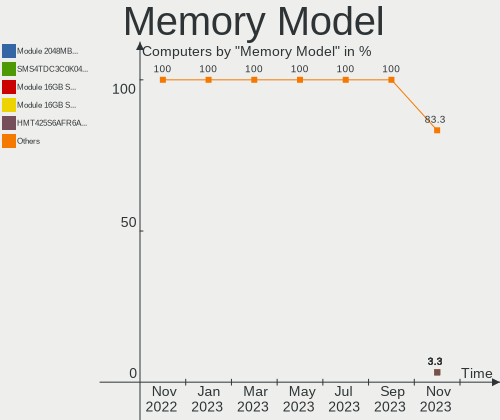

| Model                                                          | Computers | Percent |
|----------------------------------------------------------------|-----------|---------|
| Unknown                                                        | 2         | 6.25%   |
| Unknown RAM Module 1024MB SODIMM DDR3 1066MT/s                 | 1         | 3.13%   |
| SK hynix RAM HYMP125S64CP8-S6 2GB SODIMM DDR2 800MT/s          | 1         | 3.13%   |
| SK hynix RAM HMT451S6BFR8A-PB 4GB SODIMM DDR3 1600MT/s         | 1         | 3.13%   |
| SK hynix RAM HMT325S6CFR8C-PB 2GB SODIMM DDR3 1600MT/s         | 1         | 3.13%   |
| SK hynix RAM HMA851S6DJR6N-XN 4GB Row Of Chips DDR4 3200MT/s   | 1         | 3.13%   |
| SK hynix RAM HMA82GU6JJR8N-VK 16GB DIMM DDR4 2667MT/s          | 1         | 3.13%   |
| Samsung RAM Module 8192MB SODIMM DDR4 2133MT/s                 | 1         | 3.13%   |
| Samsung RAM Module 8192MB Row Of Chips LPDDR3 2133MT/s         | 1         | 3.13%   |
| Samsung RAM M471B5173QH0-YK0 4GB SODIMM DDR3 1600MT/s          | 1         | 3.13%   |
| Samsung RAM M471B5173EB0-YK0 4GB SODIMM DDR3 1600MT/s          | 1         | 3.13%   |
| Samsung RAM M471B5173BH0-YK0 4GB SODIMM DDR3 1600MT/s          | 1         | 3.13%   |
| Samsung RAM M471B1G73EB0-YK0 8GB SODIMM DDR3 1600MT/s          | 1         | 3.13%   |
| Samsung RAM M471A5244CB0-CWE 4GB SODIMM DDR4 3200MT/s          | 1         | 3.13%   |
| Nanya RAM NT2GC64B8HA0NF-CG 2GB DIMM DDR3 1333MT/s             | 1         | 3.13%   |
| Micron RAM 8HTF12864AY-667E1 1GB DIMM DDR2 667MT/s             | 1         | 3.13%   |
| Micron RAM 53E1G32D4NQ-046WTE 4GB Row Of Chips LPDDR4 3200MT/s | 1         | 3.13%   |
| Micron RAM 16ATF1G64HZ-2G1A2 8GB Chip DDR4 2133MT/s            | 1         | 3.13%   |
| Kingston RAM 9905700-104.A00G 8GB SODIMM DDR4 3200MT/s         | 1         | 3.13%   |
| G.Skill RAM F4-3200C22-32GRS 32GB SODIMM DDR4 3200MT/s         | 1         | 3.13%   |
| Crucial RAM CT16G4DFRA266.M8FB 16GB DIMM DDR4 2667MT/s         | 1         | 3.13%   |
| Crucial RAM CT102464BF160B.M16 8GB SODIMM DDR3 1600MT/s        | 1         | 3.13%   |
| Crucial RAM BLT8G3D1608DT1TX0. 8GB DIMM DDR3 1600MT/s          | 1         | 3.13%   |
| Crucial RAM BLM16G40C18U4B.M8FB1 16GB DIMM DDR4 4000MT/s       | 1         | 3.13%   |
| Corsair RAM VS2GB800D2 2048MB DIMM DDR2 800MT/s                | 1         | 3.13%   |
| Corsair RAM CMK32GX4M2D3000C16 16GB DIMM DDR4 3200MT/s         | 1         | 3.13%   |
| Corsair RAM CMK32GX4M2A2666C16 16GB DIMM DDR4 3100MT/s         | 1         | 3.13%   |
| Corsair RAM CMK16GX4M2B3200C16 8192MB DIMM DDR4 3600MT/s       | 1         | 3.13%   |
| Corsair RAM CMK16GX4M2B3000C15 8GB DIMM DDR4 3200MT/s          | 1         | 3.13%   |
| Corsair RAM CMK16GX4M2A2666C16 8GB DIMM DDR4 3400MT/s          | 1         | 3.13%   |
| A-DATA RAM AO1P26KC8T1-BXPS 8GB SODIMM DDR4 2667MT/s           | 1         | 3.13%   |

Memory Kind
-----------

Memory module kinds

| Kind   | Computers | Percent |
|--------|-----------|---------|
| DDR4   | 13        | 48.15%  |
| DDR3   | 8         | 29.63%  |
| DDR2   | 2         | 7.41%   |
| SDRAM  | 1         | 3.7%    |
| LPDDR4 | 1         | 3.7%    |
| LPDDR3 | 1         | 3.7%    |
| DDR5   | 1         | 3.7%    |

Memory Form Factor
------------------

Physical design of the memory module

| Name         | Computers | Percent |
|--------------|-----------|---------|
| SODIMM       | 12        | 44.44%  |
| DIMM         | 11        | 40.74%  |
| Row Of Chips | 3         | 11.11%  |
| Chip         | 1         | 3.7%    |

Memory Size
-----------

Memory module size

| Size  | Computers | Percent |
|-------|-----------|---------|
| 8192  | 11        | 39.29%  |
| 16384 | 5         | 17.86%  |
| 4096  | 5         | 17.86%  |
| 2048  | 4         | 14.29%  |
| 1024  | 2         | 7.14%   |
| 32768 | 1         | 3.57%   |

Memory Speed
------------

Memory module speed

| Speed | Computers | Percent |
|-------|-----------|---------|
| 1600  | 6         | 22.22%  |
| 3200  | 5         | 18.52%  |
| 2133  | 3         | 11.11%  |
| 2667  | 2         | 7.41%   |
| 4800  | 1         | 3.7%    |
| 4000  | 1         | 3.7%    |
| 3600  | 1         | 3.7%    |
| 3466  | 1         | 3.7%    |
| 3400  | 1         | 3.7%    |
| 3100  | 1         | 3.7%    |
| 1333  | 1         | 3.7%    |
| 1066  | 1         | 3.7%    |
| 975   | 1         | 3.7%    |
| 800   | 1         | 3.7%    |
| 667   | 1         | 3.7%    |

Printers & scanners
-------------------

Printer Vendor
--------------

Printer device vendors

Zero info for selected period =(

Printer Model
-------------

Printer device models

Zero info for selected period =(

Scanner Vendor
--------------

Scanner device vendors

Zero info for selected period =(

Scanner Model
-------------

Scanner device models

Zero info for selected period =(

Camera
------

Camera Vendor
-------------

Camera device vendors

| Vendor                        | Computers | Percent |
|-------------------------------|-----------|---------|
| Chicony Electronics           | 6         | 31.58%  |
| Logitech                      | 3         | 15.79%  |
| Syntek                        | 2         | 10.53%  |
| Microdia                      | 2         | 10.53%  |
| Z-Star Microelectronics       | 1         | 5.26%   |
| Unknown                       | 1         | 5.26%   |
| Sunplus Innovation Technology | 1         | 5.26%   |
| Realtek Semiconductor         | 1         | 5.26%   |
| Lite-On Technology            | 1         | 5.26%   |
| Acer                          | 1         | 5.26%   |

Camera Model
------------

Camera device models

| Model                                | Computers | Percent |
|--------------------------------------|-----------|---------|
| Z-Star HP 3-MegaPixel Webcam GX607AA | 1         | 5.26%   |
| Unknown 720p HD Camera               | 1         | 5.26%   |
| Syntek Lenovo EasyCamera             | 1         | 5.26%   |
| Syntek Integrated Camera             | 1         | 5.26%   |
| Sunplus HP Truevision HD             | 1         | 5.26%   |
| Realtek Integrated_Webcam_HD         | 1         | 5.26%   |
| Microdia Webcam Vitade AF            | 1         | 5.26%   |
| Microdia USB 2.0 Camera              | 1         | 5.26%   |
| Logitech Webcam C270                 | 1         | 5.26%   |
| Logitech Logi 4K Pro                 | 1         | 5.26%   |
| Logitech HD Pro Webcam C920          | 1         | 5.26%   |
| Lite-On HP HD Webcam                 | 1         | 5.26%   |
| Chicony USB2.0 Camera                | 1         | 5.26%   |
| Chicony TOSHIBA Web Camera - HD      | 1         | 5.26%   |
| Chicony Laptop_Integrated_Webcam_2M  | 1         | 5.26%   |
| Chicony Integrated Camera [ThinkPad] | 1         | 5.26%   |
| Chicony Integrated Camera            | 1         | 5.26%   |
| Chicony HP HD Camera                 | 1         | 5.26%   |
| Acer Integrated Camera               | 1         | 5.26%   |

Security
--------

Fingerprint Vendor
------------------

Fingerprint sensor vendors

| Vendor              | Computers | Percent |
|---------------------|-----------|---------|
| Validity Sensors    | 3         | 50%     |
| Synaptics           | 2         | 33.33%  |
| Samsung Electronics | 1         | 16.67%  |

Fingerprint Model
-----------------

Fingerprint sensor models

| Model                                             | Computers | Percent |
|---------------------------------------------------|-----------|---------|
| Validity Sensors VFS7500 Touch Fingerprint Sensor | 1         | 16.67%  |
| Validity Sensors VFS5011 Fingerprint Reader       | 1         | 16.67%  |
| Validity Sensors VFS495 Fingerprint Reader        | 1         | 16.67%  |
| Synaptics Prometheus MIS Touch Fingerprint Reader | 1         | 16.67%  |
| Samsung Fingerprint Device                        | 1         | 16.67%  |
| Unknown                                           | 1         | 16.67%  |

Chipcard Vendor
---------------

Chipcard module vendors

| Vendor      | Computers | Percent |
|-------------|-----------|---------|
| Alcor Micro | 2         | 66.67%  |
| Broadcom    | 1         | 33.33%  |

Chipcard Model
--------------

Chipcard module models

| Model                               | Computers | Percent |
|-------------------------------------|-----------|---------|
| Alcor Micro AU9540 Smartcard Reader | 2         | 66.67%  |
| Broadcom 58200                      | 1         | 33.33%  |

Unsupported
-----------

Unsupported Devices
-------------------

Total unsupported devices on board

| Total | Computers | Percent |
|-------|-----------|---------|
| 0     | 23        | 67.65%  |
| 1     | 8         | 23.53%  |
| 2     | 2         | 5.88%   |
| 3     | 1         | 2.94%   |

Unsupported Device Types
------------------------

Types of unsupported devices

| Type                  | Computers | Percent |
|-----------------------|-----------|---------|
| Fingerprint reader    | 6         | 42.86%  |
| Graphics card         | 3         | 21.43%  |
| Chipcard              | 3         | 21.43%  |
| Net/wireless          | 1         | 7.14%   |
| Multimedia controller | 1         | 7.14%   |

