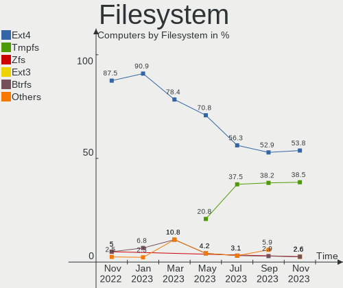
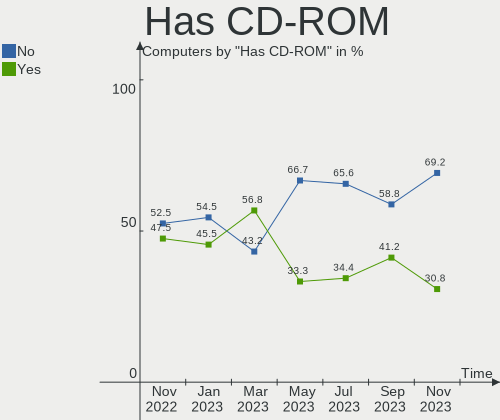
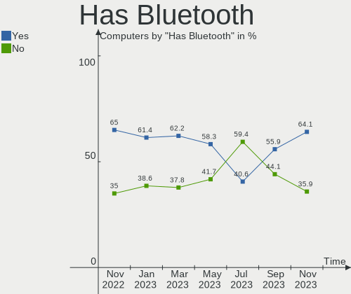
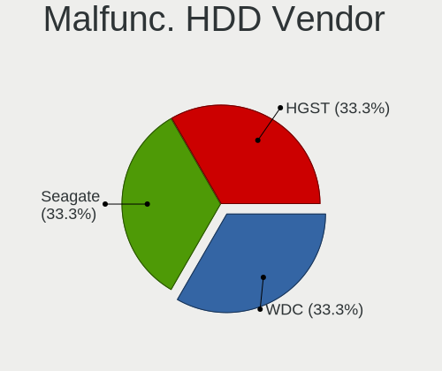
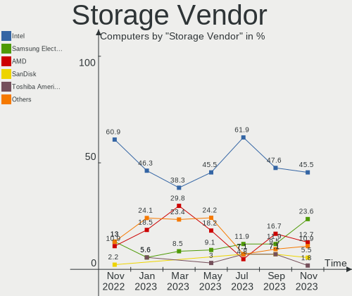
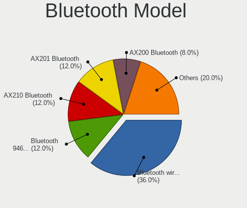
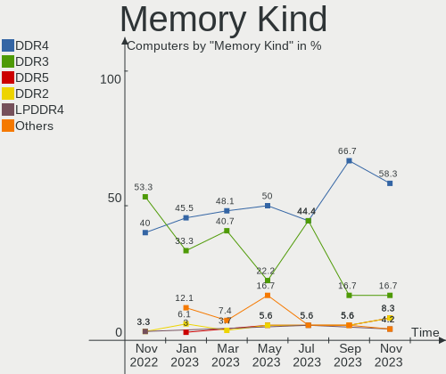
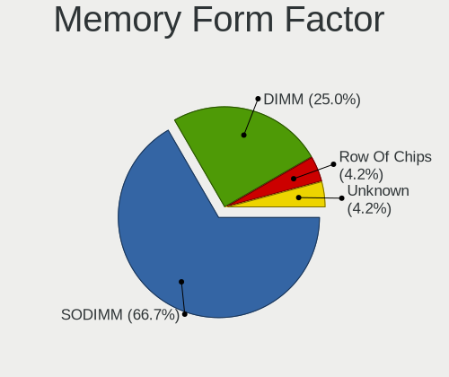

Ubuntu MATE - Hardware Trends
-----------------------------

A project to identify most popular hardware characteristics and track their change
over time based on data collected by Linux users at https://Linux-Hardware.org.

Anyone can contribute to this report by the [hw-probe](https://github.com/linuxhw/hw-probe) tool:

    sudo -E hw-probe -all -upload

This is a report for all computer types. See also reports for [desktops](/Dist/Ubuntu_MATE/Desktop/README.md) and [notebooks](/Dist/Ubuntu_MATE/Notebook/README.md).

This report is for one last month. Overall report since the beginning of time: [TestDays](https://github.com/linuxhw/TestDays)

Period: Jul, 2023.

Contents
--------

* [ System ](#system)
  - [ OS                       ](#os)
  - [ OS Family                ](#os-family)
  - [ Kernel                   ](#kernel)
  - [ Kernel Family            ](#kernel-family)
  - [ Kernel Major Ver.        ](#kernel-major-ver)
  - [ Arch                     ](#arch)
  - [ DE                       ](#de)
  - [ Display Server           ](#display-server)
  - [ Display Manager          ](#display-manager)
  - [ OS Lang                  ](#os-lang)
  - [ Boot Mode                ](#boot-mode)
  - [ Filesystem               ](#filesystem)
  - [ Part. scheme             ](#part-scheme)
  - [ Dual Boot with Linux/BSD ](#dual-boot-with-linuxbsd)
  - [ Dual Boot (Win)          ](#dual-boot-win)

* [ Board ](#board)
  - [ Vendor                   ](#vendor)
  - [ Model                    ](#model)
  - [ Model Family             ](#model-family)
  - [ MFG Year                 ](#mfg-year)
  - [ Form Factor              ](#form-factor)
  - [ Secure Boot              ](#secure-boot)
  - [ Coreboot                 ](#coreboot)
  - [ RAM Size                 ](#ram-size)
  - [ RAM Used                 ](#ram-used)
  - [ Total Drives             ](#total-drives)
  - [ Has CD-ROM               ](#has-cd-rom)
  - [ Has Ethernet             ](#has-ethernet)
  - [ Has WiFi                 ](#has-wifi)
  - [ Has Bluetooth            ](#has-bluetooth)

* [ Location ](#location)
  - [ Country                  ](#country)
  - [ City                     ](#city)

* [ Drives ](#drives)
  - [ Drive Vendor             ](#drive-vendor)
  - [ Drive Model              ](#drive-model)
  - [ HDD Vendor               ](#hdd-vendor)
  - [ SSD Vendor               ](#ssd-vendor)
  - [ Drive Kind               ](#drive-kind)
  - [ Drive Connector          ](#drive-connector)
  - [ Drive Size               ](#drive-size)
  - [ Space Total              ](#space-total)
  - [ Space Used               ](#space-used)
  - [ Malfunc. Drives          ](#malfunc-drives)
  - [ Malfunc. Drive Vendor    ](#malfunc-drive-vendor)
  - [ Malfunc. HDD Vendor      ](#malfunc-hdd-vendor)
  - [ Malfunc. Drive Kind      ](#malfunc-drive-kind)
  - [ Failed Drives            ](#failed-drives)
  - [ Failed Drive Vendor      ](#failed-drive-vendor)
  - [ Drive Status             ](#drive-status)

* [ Storage controller ](#storage-controller)
  - [ Storage Vendor           ](#storage-vendor)
  - [ Storage Model            ](#storage-model)
  - [ Storage Kind             ](#storage-kind)

* [ Processor ](#processor)
  - [ CPU Vendor               ](#cpu-vendor)
  - [ CPU Model                ](#cpu-model)
  - [ CPU Model Family         ](#cpu-model-family)
  - [ CPU Cores                ](#cpu-cores)
  - [ CPU Sockets              ](#cpu-sockets)
  - [ CPU Threads              ](#cpu-threads)
  - [ CPU Op-Modes             ](#cpu-op-modes)
  - [ CPU Microcode            ](#cpu-microcode)
  - [ CPU Microarch            ](#cpu-microarch)

* [ Graphics ](#graphics)
  - [ GPU Vendor               ](#gpu-vendor)
  - [ GPU Model                ](#gpu-model)
  - [ GPU Combo                ](#gpu-combo)
  - [ GPU Driver               ](#gpu-driver)
  - [ GPU Memory               ](#gpu-memory)

* [ Monitor ](#monitor)
  - [ Monitor Vendor           ](#monitor-vendor)
  - [ Monitor Model            ](#monitor-model)
  - [ Monitor Resolution       ](#monitor-resolution)
  - [ Monitor Diagonal         ](#monitor-diagonal)
  - [ Monitor Width            ](#monitor-width)
  - [ Aspect Ratio             ](#aspect-ratio)
  - [ Monitor Area             ](#monitor-area)
  - [ Pixel Density            ](#pixel-density)
  - [ Multiple Monitors        ](#multiple-monitors)

* [ Network ](#network)
  - [ Net Controller Vendor    ](#net-controller-vendor)
  - [ Net Controller Model     ](#net-controller-model)
  - [ Wireless Vendor          ](#wireless-vendor)
  - [ Wireless Model           ](#wireless-model)
  - [ Ethernet Vendor          ](#ethernet-vendor)
  - [ Ethernet Model           ](#ethernet-model)
  - [ Net Controller Kind      ](#net-controller-kind)
  - [ Used Controller          ](#used-controller)
  - [ NICs                     ](#nics)
  - [ IPv6                     ](#ipv6)

* [ Bluetooth ](#bluetooth)
  - [ Bluetooth Vendor         ](#bluetooth-vendor)
  - [ Bluetooth Model          ](#bluetooth-model)

* [ Sound ](#sound)
  - [ Sound Vendor             ](#sound-vendor)
  - [ Sound Model              ](#sound-model)

* [ Memory ](#memory)
  - [ Memory Vendor            ](#memory-vendor)
  - [ Memory Model             ](#memory-model)
  - [ Memory Kind              ](#memory-kind)
  - [ Memory Form Factor       ](#memory-form-factor)
  - [ Memory Size              ](#memory-size)
  - [ Memory Speed             ](#memory-speed)

* [ Printers & scanners ](#printers--scanners)
  - [ Printer Vendor           ](#printer-vendor)
  - [ Printer Model            ](#printer-model)
  - [ Scanner Vendor           ](#scanner-vendor)
  - [ Scanner Model            ](#scanner-model)

* [ Camera ](#camera)
  - [ Camera Vendor            ](#camera-vendor)
  - [ Camera Model             ](#camera-model)

* [ Security ](#security)
  - [ Fingerprint Vendor       ](#fingerprint-vendor)
  - [ Fingerprint Model        ](#fingerprint-model)
  - [ Chipcard Vendor          ](#chipcard-vendor)
  - [ Chipcard Model           ](#chipcard-model)

* [ Unsupported ](#unsupported)
  - [ Unsupported Devices      ](#unsupported-devices)
  - [ Unsupported Device Types ](#unsupported-device-types)

System
------

OS
--

Installed operating systems

| Name              | Computers | Percent |
|-------------------|-----------|---------|
| Ubuntu MATE 22.04 | 16        | 50%     |
| Ubuntu MATE 23.04 | 8         | 25%     |
| Ubuntu MATE 20.04 | 4         | 12.5%   |
| Ubuntu MATE 23.10 | 3         | 9.38%   |
| Ubuntu MATE 22.10 | 1         | 3.13%   |

OS Family
---------

OS without a version

| Name        | Computers | Percent |
|-------------|-----------|---------|
| Ubuntu MATE | 32        | 100%    |

Kernel
------

Version of the Linux kernel

| Version                | Computers | Percent |
|------------------------|-----------|---------|
| 5.15.0-76-generic      | 7         | 21.88%  |
| 5.19.0-46-generic      | 5         | 15.63%  |
| 6.2.0-25-generic       | 3         | 9.38%   |
| 6.4.3-060403-generic   | 2         | 6.25%   |
| 6.4.0-060400-generic   | 2         | 6.25%   |
| 6.3.0-7-generic        | 1         | 3.13%   |
| 6.2.0-26-generic       | 1         | 3.13%   |
| 6.2.0-24-generic       | 1         | 3.13%   |
| 6.2.0-20-generic       | 1         | 3.13%   |
| 6.2.0-1007-lowlatency  | 1         | 3.13%   |
| 5.4.236-249            | 1         | 3.13%   |
| 5.4.0-146-generic      | 1         | 3.13%   |
| 5.19.0-50-generic      | 1         | 3.13%   |
| 5.19.0-43-generic      | 1         | 3.13%   |
| 5.19.0-1025-lowlatency | 1         | 3.13%   |
| 5.15.0-70-generic      | 1         | 3.13%   |
| 5.15.0-67-generic      | 1         | 3.13%   |
| 5.15.0-60-generic      | 1         | 3.13%   |

Kernel Family
-------------

Linux kernel without a distro release

| Version | Computers | Percent |
|---------|-----------|---------|
| 5.15.0  | 10        | 31.25%  |
| 5.19.0  | 8         | 25%     |
| 6.2.0   | 7         | 21.88%  |
| 6.4.3   | 2         | 6.25%   |
| 6.4.0   | 2         | 6.25%   |
| 6.3.0   | 1         | 3.13%   |
| 5.4.236 | 1         | 3.13%   |
| 5.4.0   | 1         | 3.13%   |

Kernel Major Ver.
-----------------

Linux kernel major version

| Version | Computers | Percent |
|---------|-----------|---------|
| 5.15    | 10        | 31.25%  |
| 5.19    | 8         | 25%     |
| 6.2     | 7         | 21.88%  |
| 6.4     | 4         | 12.5%   |
| 5.4     | 2         | 6.25%   |
| 6.3     | 1         | 3.13%   |

Arch
----

OS architecture (x86_64, i586, etc.)

| Name   | Computers | Percent |
|--------|-----------|---------|
| x86_64 | 31        | 96.88%  |
| armv7l | 1         | 3.13%   |

DE
--

Desktop Environment

| Name | Computers | Percent |
|------|-----------|---------|
| MATE | 32        | 100%    |

Display Server
--------------

X11 or Wayland

| Name    | Computers | Percent |
|---------|-----------|---------|
| X11     | 30        | 93.75%  |
| Wayland | 1         | 3.13%   |
| Tty     | 1         | 3.13%   |

Display Manager
---------------

SDDM, LightDM, etc.

| Name    | Computers | Percent |
|---------|-----------|---------|
| LightDM | 23        | 71.88%  |
| LXDM    | 4         | 12.5%   |
| Unknown | 3         | 9.38%   |
| GDM3    | 1         | 3.13%   |
| GDM     | 1         | 3.13%   |

OS Lang
-------

Language

| Lang  | Computers | Percent |
|-------|-----------|---------|
| en_US | 8         | 25%     |
| sv_SE | 4         | 12.5%   |
| en_GB | 4         | 12.5%   |
| ru_RU | 2         | 6.25%   |
| it_IT | 2         | 6.25%   |
| fr_FR | 2         | 6.25%   |
| C     | 2         | 6.25%   |
| pt_PT | 1         | 3.13%   |
| pl_PL | 1         | 3.13%   |
| fi_FI | 1         | 3.13%   |
| en_IE | 1         | 3.13%   |
| en_CA | 1         | 3.13%   |
| de_DE | 1         | 3.13%   |
| da_DK | 1         | 3.13%   |
| ar_KW | 1         | 3.13%   |

Boot Mode
---------

EFI or BIOS

| Mode | Computers | Percent |
|------|-----------|---------|
| BIOS | 19        | 59.38%  |
| EFI  | 13        | 40.63%  |

Filesystem
----------

Type of filesystem

| Type    | Computers | Percent |
|---------|-----------|---------|
| Ext4    | 18        | 56.25%  |
| Tmpfs   | 12        | 37.5%   |
| Overlay | 1         | 3.13%   |
| Btrfs   | 1         | 3.13%   |

Part. scheme
------------

Scheme of partitioning

| Type    | Computers | Percent |
|---------|-----------|---------|
| GPT     | 26        | 81.25%  |
| MBR     | 3         | 9.38%   |
| Unknown | 3         | 9.38%   |

Dual Boot with Linux/BSD
------------------------

Hosting more than one Linux/BSD

| Dual boot | Computers | Percent |
|-----------|-----------|---------|
| No        | 32        | 100%    |

Dual Boot (Win)
---------------

Hosting Linux and Windows

| Dual boot | Computers | Percent |
|-----------|-----------|---------|
| No        | 24        | 75%     |
| Yes       | 8         | 25%     |

Board
-----

Vendor
------

Motherboard manufacturer

| Name                | Computers | Percent |
|---------------------|-----------|---------|
| Hewlett-Packard     | 7         | 21.88%  |
| Dell                | 4         | 12.5%   |
| Lenovo              | 3         | 9.38%   |
| Gigabyte Technology | 3         | 9.38%   |
| Apple               | 3         | 9.38%   |
| ASUSTek Computer    | 2         | 6.25%   |
| Acer                | 2         | 6.25%   |
| Toshiba             | 1         | 3.13%   |
| Notebook            | 1         | 3.13%   |
| Intel               | 1         | 3.13%   |
| Hardkernel          | 1         | 3.13%   |
| Fujitsu             | 1         | 3.13%   |
| AZW                 | 1         | 3.13%   |
| ASRock              | 1         | 3.13%   |
| Unknown             | 1         | 3.13%   |

Model
-----

Motherboard model

| Name                                     | Computers | Percent |
|------------------------------------------|-----------|---------|
| Acer Aspire ES1-311                      | 2         | 6.25%   |
| Toshiba Satellite Pro L650               | 1         | 3.13%   |
| Notebook NJx0MU                          | 1         | 3.13%   |
| Lenovo V15 G2 ALC 82KD                   | 1         | 3.13%   |
| Lenovo ThinkPad X1 Carbon 2nd 20A8S10400 | 1         | 3.13%   |
| Lenovo ThinkCentre neo 50t Gen 3 11SE    | 1         | 3.13%   |
| Intel NUC7CJYHN                          | 1         | 3.13%   |
| HP Pavilion Laptop 14-dv0xxx             | 1         | 3.13%   |
| HP Pavilion Gaming Laptop 17-cd1xxx      | 1         | 3.13%   |
| HP EliteDesk 800 G3 DM 35W               | 1         | 3.13%   |
| HP Compaq Pro 6300 MT                    | 1         | 3.13%   |
| HP 350 G1                                | 1         | 3.13%   |
| HP 250 G8 Notebook PC                    | 1         | 3.13%   |
| HP 250 G7 Notebook PC                    | 1         | 3.13%   |
| Hardkernel Odroid XU4                    | 1         | 3.13%   |
| Gigabyte G41MT-S2                        | 1         | 3.13%   |
| Gigabyte B85M-D3H                        | 1         | 3.13%   |
| Gigabyte B550 GAMING X V2                | 1         | 3.13%   |
| Fujitsu LIFEBOOK A512                    | 1         | 3.13%   |
| Dell Studio 1537                         | 1         | 3.13%   |
| Dell Precision 7520                      | 1         | 3.13%   |
| Dell Latitude 7420                       | 1         | 3.13%   |
| Dell G5 5590                             | 1         | 3.13%   |
| AZW Z85                                  | 1         | 3.13%   |
| ASUS PRIME Z590-P                        | 1         | 3.13%   |
| ASUS G75VW                               | 1         | 3.13%   |
| ASRock Z370 Killer SLI                   | 1         | 3.13%   |
| Apple MacBookPro10,1                     | 1         | 3.13%   |
| Apple MacBookAir7,1                      | 1         | 3.13%   |
| Apple iMac19,2                           | 1         | 3.13%   |
| Unknown                                  | 1         | 3.13%   |

Model Family
------------

Motherboard model prefix

| Name               | Computers | Percent |
|--------------------|-----------|---------|
| HP Pavilion        | 2         | 6.25%   |
| HP 250             | 2         | 6.25%   |
| Acer Aspire        | 2         | 6.25%   |
| Toshiba Satellite  | 1         | 3.13%   |
| Notebook NJx0MU    | 1         | 3.13%   |
| Lenovo V15         | 1         | 3.13%   |
| Lenovo ThinkPad    | 1         | 3.13%   |
| Lenovo ThinkCentre | 1         | 3.13%   |
| Intel NUC7CJYHN    | 1         | 3.13%   |
| HP EliteDesk       | 1         | 3.13%   |
| HP Compaq          | 1         | 3.13%   |
| HP 350             | 1         | 3.13%   |
| Hardkernel Odroid  | 1         | 3.13%   |
| Gigabyte G41MT-S2  | 1         | 3.13%   |
| Gigabyte B85M-D3H  | 1         | 3.13%   |
| Gigabyte B550      | 1         | 3.13%   |
| Fujitsu LIFEBOOK   | 1         | 3.13%   |
| Dell Studio        | 1         | 3.13%   |
| Dell Precision     | 1         | 3.13%   |
| Dell Latitude      | 1         | 3.13%   |
| Dell G5            | 1         | 3.13%   |
| AZW Z85            | 1         | 3.13%   |
| ASUS PRIME         | 1         | 3.13%   |
| ASUS G75VW         | 1         | 3.13%   |
| ASRock Z370        | 1         | 3.13%   |
| Apple MacBookPro10 | 1         | 3.13%   |
| Apple MacBookAir7  | 1         | 3.13%   |
| Apple iMac19       | 1         | 3.13%   |
| Unknown            | 1         | 3.13%   |

MFG Year
--------

Motherboard manufacture year

| Year    | Computers | Percent |
|---------|-----------|---------|
| 2020    | 5         | 15.63%  |
| 2021    | 4         | 12.5%   |
| 2014    | 4         | 12.5%   |
| 2017    | 3         | 9.38%   |
| 2012    | 3         | 9.38%   |
| 2022    | 2         | 6.25%   |
| 2019    | 2         | 6.25%   |
| 2013    | 2         | 6.25%   |
| 2010    | 2         | 6.25%   |
| 2023    | 1         | 3.13%   |
| 2018    | 1         | 3.13%   |
| 2016    | 1         | 3.13%   |
| 2008    | 1         | 3.13%   |
| Unknown | 1         | 3.13%   |

Form Factor
-----------

Physical design of the computer

| Name           | Computers | Percent |
|----------------|-----------|---------|
| Notebook       | 20        | 62.5%   |
| Desktop        | 8         | 25%     |
| Mini pc        | 2         | 6.25%   |
| System on chip | 1         | 3.13%   |
| All in one     | 1         | 3.13%   |

Secure Boot
-----------

Enabled or disabled

| State    | Computers | Percent |
|----------|-----------|---------|
| Disabled | 31        | 96.88%  |
| Enabled  | 1         | 3.13%   |

Coreboot
--------

Have coreboot on board

| Used | Computers | Percent |
|------|-----------|---------|
| No   | 32        | 100%    |

RAM Size
--------

Total RAM memory

| Size in GB  | Computers | Percent |
|-------------|-----------|---------|
| 3.01-4.0    | 8         | 25%     |
| 32.01-64.0  | 6         | 18.75%  |
| 4.01-8.0    | 5         | 15.63%  |
| 16.01-24.0  | 5         | 15.63%  |
| 8.01-16.0   | 3         | 9.38%   |
| 64.01-256.0 | 2         | 6.25%   |
| 1.01-2.0    | 2         | 6.25%   |
| 24.01-32.0  | 1         | 3.13%   |

RAM Used
--------

Used RAM memory

| Used GB    | Computers | Percent |
|------------|-----------|---------|
| 1.01-2.0   | 13        | 40.63%  |
| 2.01-3.0   | 7         | 21.88%  |
| 4.01-8.0   | 6         | 18.75%  |
| 8.01-16.0  | 2         | 6.25%   |
| 0.51-1.0   | 2         | 6.25%   |
| 3.01-4.0   | 1         | 3.13%   |
| 24.01-32.0 | 1         | 3.13%   |

Total Drives
------------

Number of drives on board

| Drives | Computers | Percent |
|--------|-----------|---------|
| 1      | 20        | 62.5%   |
| 2      | 10        | 31.25%  |
| 4      | 2         | 6.25%   |

Has CD-ROM
----------

Has CD-ROM on board

| Presented | Computers | Percent |
|-----------|-----------|---------|
| No        | 21        | 65.63%  |
| Yes       | 11        | 34.38%  |

Has Ethernet
------------

Has Ethernet on board

| Presented | Computers | Percent |
|-----------|-----------|---------|
| Yes       | 30        | 93.75%  |
| No        | 2         | 6.25%   |

Has WiFi
--------

Has WiFi module

| Presented | Computers | Percent |
|-----------|-----------|---------|
| Yes       | 21        | 65.63%  |
| No        | 11        | 34.38%  |

Has Bluetooth
-------------

Has Bluetooth module

| Presented | Computers | Percent |
|-----------|-----------|---------|
| No        | 19        | 59.38%  |
| Yes       | 13        | 40.63%  |

Location
--------

Country
-------

Geographic location (country)

| Country      | Computers | Percent |
|--------------|-----------|---------|
| UK           | 4         | 12.5%   |
| Sweden       | 4         | 12.5%   |
| Poland       | 3         | 9.38%   |
| USA          | 2         | 6.25%   |
| Russia       | 2         | 6.25%   |
| Italy        | 2         | 6.25%   |
| Ireland      | 2         | 6.25%   |
| Germany      | 2         | 6.25%   |
| France       | 2         | 6.25%   |
| Spain        | 1         | 3.13%   |
| Saudi Arabia | 1         | 3.13%   |
| Portugal     | 1         | 3.13%   |
| Moldova      | 1         | 3.13%   |
| Indonesia    | 1         | 3.13%   |
| India        | 1         | 3.13%   |
| Finland      | 1         | 3.13%   |
| Denmark      | 1         | 3.13%   |
| Brazil       | 1         | 3.13%   |

City
----

Geographic location (city)

| City                 | Computers | Percent |
|----------------------|-----------|---------|
| Sundbyberg           | 4         | 12.5%   |
| Warsaw               | 2         | 6.25%   |
| Manchester           | 2         | 6.25%   |
| Dublin               | 2         | 6.25%   |
| Vantaa               | 1         | 3.13%   |
| Valence              | 1         | 3.13%   |
| Tulungagung          | 1         | 3.13%   |
| Torring              | 1         | 3.13%   |
| Tighina              | 1         | 3.13%   |
| Sao Paulo            | 1         | 3.13%   |
| Samara               | 1         | 3.13%   |
| Paris                | 1         | 3.13%   |
| Padova               | 1         | 3.13%   |
| Ozarow Mazowiecki    | 1         | 3.13%   |
| Nizhniy Novgorod     | 1         | 3.13%   |
| New York             | 1         | 3.13%   |
| New Brighton         | 1         | 3.13%   |
| Milano               | 1         | 3.13%   |
| Medina               | 1         | 3.13%   |
| Lisbon               | 1         | 3.13%   |
| Hyderabad            | 1         | 3.13%   |
| Freiburg im Breisgau | 1         | 3.13%   |
| Delligsen            | 1         | 3.13%   |
| Croydon              | 1         | 3.13%   |
| Arona                | 1         | 3.13%   |
| Alton                | 1         | 3.13%   |

Drives
------

Drive Vendor
------------

Hard drive vendors

| Vendor              | Computers | Drives | Percent |
|---------------------|-----------|--------|---------|
| Samsung Electronics | 15        | 16     | 35.71%  |
| WDC                 | 6         | 6      | 14.29%  |
| Toshiba             | 6         | 8      | 14.29%  |
| Kingston            | 3         | 3      | 7.14%   |
| Apple               | 3         | 3      | 7.14%   |
| Unknown             | 2         | 3      | 4.76%   |
| SK hynix            | 2         | 2      | 4.76%   |
| SanDisk             | 2         | 2      | 4.76%   |
| Transcend           | 1         | 1      | 2.38%   |
| Seagate             | 1         | 2      | 2.38%   |
| Hjwdz               | 1         | 1      | 2.38%   |

Drive Model
-----------

Hard drive models

| Model                                               | Computers | Percent |
|-----------------------------------------------------|-----------|---------|
| Samsung SSD 750 EVO 250GB                           | 2         | 4.55%   |
| Kingston SA400S37240G 240GB SSD                     | 2         | 4.55%   |
| WDC WDS100T2B0B-00YS70 1TB SSD                      | 1         | 2.27%   |
| WDC WDS100T2B0A-00SM50 1TB SSD                      | 1         | 2.27%   |
| WDC WD7500BPVX-60JC3T0 752GB                        | 1         | 2.27%   |
| WDC WD5000AAKX-00ERMA0 500GB                        | 1         | 2.27%   |
| WDC PC SN530 SDBPNPZ-256G                           | 1         | 2.27%   |
| WDC PC SN530 NVMe 256GB                             | 1         | 2.27%   |
| Unknown SLD64G  64GB                                | 1         | 2.27%   |
| Unknown MMC Card  128GB                             | 1         | 2.27%   |
| Unknown 00000  4GB                                  | 1         | 2.27%   |
| Transcend TS1TSSD220Q 1TB                           | 1         | 2.27%   |
| Toshiba XG6 NVMe SSD Controller 512GB               | 1         | 2.27%   |
| Toshiba MK3261GSYN 320GB                            | 1         | 2.27%   |
| Toshiba MG06ACA800E 8TB                             | 1         | 2.27%   |
| Toshiba KXG5AZNV256G 256GB                          | 1         | 2.27%   |
| Toshiba KBG30ZMS128G NVMe 128GB                     | 1         | 2.27%   |
| Toshiba DT01ACA050 500GB                            | 1         | 2.27%   |
| SK hynix SKHynix_HFS256GDE9X081N 256GB              | 1         | 2.27%   |
| SK hynix BC511 HFM256GDJTNI-82A0A 256GB             | 1         | 2.27%   |
| Seagate ST2000DM006-2DM164 2TB                      | 1         | 2.27%   |
| Sandisk WD Black SN850 1TB                          | 1         | 2.27%   |
| SanDisk SSD PLUS 1000GB                             | 1         | 2.27%   |
| Samsung SSD 870 QVO 8TB                             | 1         | 2.27%   |
| Samsung SSD 870 QVO 2TB                             | 1         | 2.27%   |
| Samsung SSD 870 QVO 1TB                             | 1         | 2.27%   |
| Samsung SSD 860 EVO 500GB                           | 1         | 2.27%   |
| Samsung SSD 850 EVO mSATA 250GB                     | 1         | 2.27%   |
| Samsung SSD 850 EVO 500GB                           | 1         | 2.27%   |
| Samsung SSD 840 Series 250GB                        | 1         | 2.27%   |
| Samsung SSD 840 Series 120GB                        | 1         | 2.27%   |
| Samsung SSD 840 EVO 120GB                           | 1         | 2.27%   |
| Samsung NVMe SSD Controller SM981/PM981/PM983 500GB | 1         | 2.27%   |
| Samsung MZVLQ512HALU-000H1 512GB                    | 1         | 2.27%   |
| Samsung MZVL2512HCJQ-00B00 512GB                    | 1         | 2.27%   |
| Samsung MZNLN128HAHQ-000H1 128GB SSD                | 1         | 2.27%   |
| Samsung MZALQ512HBLU-00BL2 512GB                    | 1         | 2.27%   |
| Kingston SKC600MS256G 256GB SSD                     | 1         | 2.27%   |
| Hjwdz MS2160 8MB                                    | 1         | 2.27%   |
| Apple SSD SM512E 500GB                              | 1         | 2.27%   |

HDD Vendor
----------

Hard disk drive vendors

| Vendor  | Computers | Drives | Percent |
|---------|-----------|--------|---------|
| Toshiba | 3         | 5      | 50%     |
| WDC     | 2         | 2      | 33.33%  |
| Seagate | 1         | 2      | 16.67%  |

SSD Vendor
----------

Solid state drive vendors

| Vendor              | Computers | Drives | Percent |
|---------------------|-----------|--------|---------|
| Samsung Electronics | 12        | 12     | 60%     |
| Kingston            | 3         | 3      | 15%     |
| WDC                 | 2         | 2      | 10%     |
| Transcend           | 1         | 1      | 5%      |
| SanDisk             | 1         | 1      | 5%      |
| Apple               | 1         | 1      | 5%      |

Drive Kind
----------

HDD or SSD

| Kind    | Computers | Drives | Percent |
|---------|-----------|--------|---------|
| SSD     | 19        | 20     | 45.24%  |
| NVMe    | 14        | 14     | 33.33%  |
| HDD     | 6         | 9      | 14.29%  |
| MMC     | 2         | 3      | 4.76%   |
| Unknown | 1         | 1      | 2.38%   |

Drive Connector
---------------

SATA, SAS, NVMe, etc.

| Type | Computers | Drives | Percent |
|------|-----------|--------|---------|
| SATA | 22        | 29     | 56.41%  |
| NVMe | 14        | 14     | 35.9%   |
| MMC  | 2         | 3      | 5.13%   |
| SAS  | 1         | 1      | 2.56%   |

Drive Size
----------

Size of hard drive

| Size in TB | Computers | Drives | Percent |
|------------|-----------|--------|---------|
| 0.01-0.5   | 14        | 16     | 58.33%  |
| 0.51-1.0   | 6         | 6      | 25%     |
| 1.01-2.0   | 2         | 3      | 8.33%   |
| 4.01-10.0  | 2         | 4      | 8.33%   |

Space Total
-----------

Amount of disk space available on the file system

| Size in GB     | Computers | Percent |
|----------------|-----------|---------|
| 101-250        | 11        | 34.38%  |
| 251-500        | 7         | 21.88%  |
| 501-1000       | 6         | 18.75%  |
| 51-100         | 3         | 9.38%   |
| More than 3000 | 2         | 6.25%   |
| 1001-2000      | 2         | 6.25%   |
| 1-20           | 1         | 3.13%   |

Space Used
----------

Amount of used disk space

| Used GB        | Computers | Percent |
|----------------|-----------|---------|
| 21-50          | 14        | 43.75%  |
| 101-250        | 5         | 15.63%  |
| 251-500        | 4         | 12.5%   |
| 1-20           | 4         | 12.5%   |
| More than 3000 | 2         | 6.25%   |
| 1001-2000      | 1         | 3.13%   |
| 501-1000       | 1         | 3.13%   |
| 51-100         | 1         | 3.13%   |

Malfunc. Drives
---------------

Drive models with a malfunction

| Model                        | Computers | Drives | Percent |
|------------------------------|-----------|--------|---------|
| WDC WD7500BPVX-60JC3T0 752GB | 1         | 1      | 33.33%  |
| Toshiba MK3261GSYN 320GB     | 1         | 1      | 33.33%  |
| Toshiba DT01ACA050 500GB     | 1         | 1      | 33.33%  |

Malfunc. Drive Vendor
---------------------

Vendors of faulty drives

| Vendor  | Computers | Drives | Percent |
|---------|-----------|--------|---------|
| Toshiba | 2         | 2      | 66.67%  |
| WDC     | 1         | 1      | 33.33%  |

Malfunc. HDD Vendor
-------------------

Vendors of faulty HDD drives

| Vendor  | Computers | Drives | Percent |
|---------|-----------|--------|---------|
| Toshiba | 2         | 2      | 66.67%  |
| WDC     | 1         | 1      | 33.33%  |

Malfunc. Drive Kind
-------------------

Kinds of faulty drives

| Kind | Computers | Drives | Percent |
|------|-----------|--------|---------|
| HDD  | 3         | 3      | 100%    |

Failed Drives
-------------

Failed drive models

Zero info for selected period =(

Failed Drive Vendor
-------------------

Failed drive vendors

Zero info for selected period =(

Drive Status
------------

Number of failed and malfunc. drives

| Status   | Computers | Drives | Percent |
|----------|-----------|--------|---------|
| Detected | 17        | 23     | 50%     |
| Works    | 14        | 21     | 41.18%  |
| Malfunc  | 3         | 3      | 8.82%   |

Storage controller
------------------

Storage Vendor
--------------

Storage controller vendors

| Vendor                       | Computers | Percent |
|------------------------------|-----------|---------|
| Intel                        | 26        | 61.9%   |
| Samsung Electronics          | 5         | 11.9%   |
| Toshiba America Info Systems | 3         | 7.14%   |
| SanDisk                      | 3         | 7.14%   |
| SK hynix                     | 2         | 4.76%   |
| AMD                          | 2         | 4.76%   |
| Apple                        | 1         | 2.38%   |

Storage Model
-------------

Storage controller models

| Model                                                                          | Computers | Percent |
|--------------------------------------------------------------------------------|-----------|---------|
| Intel 7 Series Chipset Family 6-port SATA Controller [AHCI mode]               | 3         | 6.98%   |
| Samsung NVMe SSD Controller 980                                                | 2         | 4.65%   |
| Intel Volume Management Device NVMe RAID Controller                            | 2         | 4.65%   |
| Intel Tiger Lake-LP SATA Controller                                            | 2         | 4.65%   |
| Intel Celeron/Pentium Silver Processor SATA Controller                         | 2         | 4.65%   |
| Intel Atom Processor E3800 Series SATA AHCI Controller                         | 2         | 4.65%   |
| Intel 8 Series SATA Controller 1 [AHCI mode]                                   | 2         | 4.65%   |
| Toshiba America Info Systems XG6 NVMe SSD Controller                           | 1         | 2.33%   |
| Toshiba America Info Systems XG5 NVMe SSD Controller                           | 1         | 2.33%   |
| Toshiba America Info Systems BG3 NVMe SSD Controller                           | 1         | 2.33%   |
| SK hynix Gold P31/BC711/PC711 NVMe Solid State Drive                           | 1         | 2.33%   |
| SK hynix BC511 NVMe SSD                                                        | 1         | 2.33%   |
| SanDisk WD PC SN810 / Black SN850 NVMe SSD                                     | 1         | 2.33%   |
| SanDisk WD Blue SN550 NVMe SSD                                                 | 1         | 2.33%   |
| SanDisk IX SN530 NVMe SSD (DRAM-less)                                          | 1         | 2.33%   |
| Samsung NVMe SSD Controller SM981/PM981/PM983                                  | 1         | 2.33%   |
| Samsung NVMe SSD Controller SM961/PM961/SM963                                  | 1         | 2.33%   |
| Samsung NVMe SSD Controller PM9A1/PM9A3/980PRO                                 | 1         | 2.33%   |
| Intel SATA Controller [RAID mode]                                              | 1         | 2.33%   |
| Intel Q170/Q150/B150/H170/H110/Z170/CM236 Chipset SATA Controller [AHCI Mode]  | 1         | 2.33%   |
| Intel NM10/ICH7 Family SATA Controller [IDE mode]                              | 1         | 2.33%   |
| Intel Elkhart Lake SATA AHCI                                                   | 1         | 2.33%   |
| Intel Cannon Lake PCH SATA AHCI Controller                                     | 1         | 2.33%   |
| Intel Cannon Lake Mobile PCH SATA AHCI Controller                              | 1         | 2.33%   |
| Intel Alder Lake-S PCH SATA Controller [AHCI Mode]                             | 1         | 2.33%   |
| Intel 82801IBM/IEM (ICH9M/ICH9M-E) 2 port SATA Controller [IDE mode]           | 1         | 2.33%   |
| Intel 82801 Mobile SATA Controller [RAID mode]                                 | 1         | 2.33%   |
| Intel 8 Series/C220 Series Chipset Family 6-port SATA Controller 1 [AHCI mode] | 1         | 2.33%   |
| Intel 7 Series/C210 Series Chipset Family 6-port SATA Controller [AHCI mode]   | 1         | 2.33%   |
| Intel 500 Series Chipset Family SATA AHCI Controller                           | 1         | 2.33%   |
| Intel 5 Series/3400 Series Chipset 4 port SATA AHCI Controller                 | 1         | 2.33%   |
| Intel 200 Series PCH SATA controller [AHCI mode]                               | 1         | 2.33%   |
| Apple S1X NVMe Controller                                                      | 1         | 2.33%   |
| AMD FCH SATA Controller [AHCI mode]                                            | 1         | 2.33%   |
| AMD 500 Series Chipset SATA Controller                                         | 1         | 2.33%   |

Storage Kind
------------

Kind of storage controller (IDE, SATA, NVMe, SAS, ...)

| Kind | Computers | Percent |
|------|-----------|---------|
| SATA | 23        | 53.49%  |
| NVMe | 14        | 32.56%  |
| RAID | 4         | 9.3%    |
| IDE  | 2         | 4.65%   |

Processor
---------

CPU Vendor
----------

Processor vendors

| Vendor | Computers | Percent |
|--------|-----------|---------|
| Intel  | 29        | 90.63%  |
| AMD    | 2         | 6.25%   |
| ARM    | 1         | 3.13%   |

CPU Model
---------

Processor models

| Model                                       | Computers | Percent |
|---------------------------------------------|-----------|---------|
| Intel Celeron CPU N2840 @ 2.16GHz           | 2         | 6.25%   |
| Intel Xeon CPU E3-1245 v3 @ 3.40GHz         | 1         | 3.13%   |
| Intel Pentium Dual-Core CPU E6700 @ 3.20GHz | 1         | 3.13%   |
| Intel Pentium CPU 2020M @ 2.40GHz           | 1         | 3.13%   |
| Intel Core i7-8750H CPU @ 2.20GHz           | 1         | 3.13%   |
| Intel Core i7-8700K CPU @ 3.70GHz           | 1         | 3.13%   |
| Intel Core i7-8700 CPU @ 3.20GHz            | 1         | 3.13%   |
| Intel Core i7-6920HQ CPU @ 2.90GHz          | 1         | 3.13%   |
| Intel Core i7-3720QM CPU @ 2.60GHz          | 1         | 3.13%   |
| Intel Core i7-3630QM CPU @ 2.40GHz          | 1         | 3.13%   |
| Intel Core i7-10750H CPU @ 2.60GHz          | 1         | 3.13%   |
| Intel Core i5-6500T CPU @ 2.50GHz           | 1         | 3.13%   |
| Intel Core i5-5250U CPU @ 1.60GHz           | 1         | 3.13%   |
| Intel Core i5-4300U CPU @ 1.90GHz           | 1         | 3.13%   |
| Intel Core i5-3470 CPU @ 3.20GHz            | 1         | 3.13%   |
| Intel Core i5 CPU M 480 @ 2.67GHz           | 1         | 3.13%   |
| Intel Core i3-4030U CPU @ 1.90GHz           | 1         | 3.13%   |
| Intel Core 2 Duo CPU T6400 @ 2.00GHz        | 1         | 3.13%   |
| Intel Celeron N4000 CPU @ 1.10GHz           | 1         | 3.13%   |
| Intel Celeron J6412 @ 2.00GHz               | 1         | 3.13%   |
| Intel Celeron J4025 CPU @ 2.00GHz           | 1         | 3.13%   |
| Intel Atom x5-Z8350 CPU @ 1.44GHz           | 1         | 3.13%   |
| Intel 12th Gen Core i3-12100                | 1         | 3.13%   |
| Intel 11th Gen Core i7-1185G7 @ 3.00GHz     | 1         | 3.13%   |
| Intel 11th Gen Core i7-11700F @ 2.50GHz     | 1         | 3.13%   |
| Intel 11th Gen Core i7-1165G7 @ 2.80GHz     | 1         | 3.13%   |
| Intel 11th Gen Core i5-1135G7 @ 2.40GHz     | 1         | 3.13%   |
| Intel 11th Gen Core i3-1115G4 @ 3.00GHz     | 1         | 3.13%   |
| ARM Hardkernel ODROID-XU4 Processor         | 1         | 3.13%   |
| AMD Ryzen 7 5700U with Radeon Graphics      | 1         | 3.13%   |
| AMD Ryzen 5 5500                            | 1         | 3.13%   |

CPU Model Family
----------------

Processor model prefix

| Model                   | Computers | Percent |
|-------------------------|-----------|---------|
| Other                   | 7         | 21.88%  |
| Intel Core i7           | 7         | 21.88%  |
| Intel Core i5           | 5         | 15.63%  |
| Intel Celeron           | 5         | 15.63%  |
| Intel Xeon              | 1         | 3.13%   |
| Intel Pentium Dual-Core | 1         | 3.13%   |
| Intel Pentium           | 1         | 3.13%   |
| Intel Core i3           | 1         | 3.13%   |
| Intel Core 2 Duo        | 1         | 3.13%   |
| Intel Atom              | 1         | 3.13%   |
| AMD Ryzen 7             | 1         | 3.13%   |
| AMD Ryzen 5             | 1         | 3.13%   |

CPU Cores
---------

Number of processor cores

| Number | Computers | Percent |
|--------|-----------|---------|
| 4      | 12        | 37.5%   |
| 2      | 12        | 37.5%   |
| 6      | 5         | 15.63%  |
| 8      | 3         | 9.38%   |

CPU Sockets
-----------

Number of sockets

| Number | Computers | Percent |
|--------|-----------|---------|
| 1      | 31        | 96.88%  |
| 2      | 1         | 3.13%   |

CPU Threads
-----------

Threads per core (Hyper-Threading)

| Number | Computers | Percent |
|--------|-----------|---------|
| 2      | 20        | 62.5%   |
| 1      | 12        | 37.5%   |

CPU Op-Modes
------------

CPU Operation Modes (32-bit, 64-bit)

| Op mode        | Computers | Percent |
|----------------|-----------|---------|
| 32-bit, 64-bit | 31        | 96.88%  |
| Unknown        | 1         | 3.13%   |

CPU Microcode
-------------

Microcode number

| Number  | Computers | Percent |
|---------|-----------|---------|
| Unknown | 26        | 81.25%  |
| 0xa0671 | 1         | 3.13%   |
| 0x906ea | 1         | 3.13%   |
| 0x806c1 | 1         | 3.13%   |
| 0x406c4 | 1         | 3.13%   |
| 0x306c3 | 1         | 3.13%   |
| 0x1067a | 1         | 3.13%   |

CPU Microarch
-------------

Microarchitecture

| Name          | Computers | Percent |
|---------------|-----------|---------|
| TigerLake     | 4         | 12.5%   |
| IvyBridge     | 4         | 12.5%   |
| Unknown       | 4         | 12.5%   |
| Silvermont    | 3         | 9.38%   |
| KabyLake      | 3         | 9.38%   |
| Haswell       | 3         | 9.38%   |
| Skylake       | 2         | 6.25%   |
| Penryn        | 2         | 6.25%   |
| Goldmont plus | 2         | 6.25%   |
| Zen 3         | 1         | 3.13%   |
| Westmere      | 1         | 3.13%   |
| Tremont       | 1         | 3.13%   |
| CometLake     | 1         | 3.13%   |
| Broadwell     | 1         | 3.13%   |

Graphics
--------

GPU Vendor
----------

Vendors of graphics cards

| Vendor | Computers | Percent |
|--------|-----------|---------|
| Intel  | 24        | 66.67%  |
| Nvidia | 7         | 19.44%  |
| AMD    | 5         | 13.89%  |

GPU Model
---------

Graphics card models

| Model                                                                                    | Computers | Percent |
|------------------------------------------------------------------------------------------|-----------|---------|
| Intel TigerLake-LP GT2 [Iris Xe Graphics]                                                | 3         | 8.33%   |
| Intel HD Graphics 530                                                                    | 2         | 5.56%   |
| Intel Haswell-ULT Integrated Graphics Controller                                         | 2         | 5.56%   |
| Intel GeminiLake [UHD Graphics 600]                                                      | 2         | 5.56%   |
| Intel Atom Processor Z36xxx/Z37xxx Series Graphics & Display                             | 2         | 5.56%   |
| Intel 3rd Gen Core processor Graphics Controller                                         | 2         | 5.56%   |
| Nvidia TU116M [GeForce GTX 1660 Ti Mobile]                                               | 1         | 2.78%   |
| Nvidia TU106M [GeForce RTX 2060 Mobile]                                                  | 1         | 2.78%   |
| Nvidia GP107GL [Quadro P620]                                                             | 1         | 2.78%   |
| Nvidia GP107 [GeForce GTX 1050 Ti]                                                       | 1         | 2.78%   |
| Nvidia GM206GLM [Quadro M2200 Mobile]                                                    | 1         | 2.78%   |
| Nvidia GK107M [GeForce GT 650M Mac Edition]                                              | 1         | 2.78%   |
| Nvidia GF114M [GeForce GTX 670M]                                                         | 1         | 2.78%   |
| Intel Xeon E3-1200 v3 Processor Integrated Graphics Controller                           | 1         | 2.78%   |
| Intel Xeon E3-1200 v2/3rd Gen Core processor Graphics Controller                         | 1         | 2.78%   |
| Intel Tiger Lake-LP GT2 [UHD Graphics G4]                                                | 1         | 2.78%   |
| Intel HD Graphics 6000                                                                   | 1         | 2.78%   |
| Intel Elkhart Lake [UHD Graphics Gen11 16EU]                                             | 1         | 2.78%   |
| Intel CometLake-H GT2 [UHD Graphics]                                                     | 1         | 2.78%   |
| Intel CoffeeLake-S GT2 [UHD Graphics 630]                                                | 1         | 2.78%   |
| Intel CoffeeLake-H GT2 [UHD Graphics 630]                                                | 1         | 2.78%   |
| Intel Atom/Celeron/Pentium Processor x5-E8000/J3xxx/N3xxx Integrated Graphics Controller | 1         | 2.78%   |
| Intel Alder Lake-S GT1 [UHD Graphics 730]                                                | 1         | 2.78%   |
| Intel 4 Series Chipset Integrated Graphics Controller                                    | 1         | 2.78%   |
| AMD RV620/M82 [Mobility Radeon HD 3450/3470]                                             | 1         | 2.78%   |
| AMD Navi 24 [Radeon RX 6400/6500 XT/6500M]                                               | 1         | 2.78%   |
| AMD Madison [Mobility Radeon HD 5650/5750 / 6530M/6550M]                                 | 1         | 2.78%   |
| AMD Lucienne                                                                             | 1         | 2.78%   |
| AMD Baffin [Radeon RX 460/560D / Pro 450/455/460/555/555X/560/560X]                      | 1         | 2.78%   |

GPU Combo
---------

Combinations of graphics cards

| Name           | Computers | Percent |
|----------------|-----------|---------|
| 1 x Intel      | 19        | 59.38%  |
| Intel + Nvidia | 5         | 15.63%  |
| 1 x AMD        | 5         | 15.63%  |
| 1 x Nvidia     | 2         | 6.25%   |
| Other          | 1         | 3.13%   |

GPU Driver
----------

Free vs proprietary

| Driver      | Computers | Percent |
|-------------|-----------|---------|
| Free        | 26        | 81.25%  |
| Proprietary | 5         | 15.63%  |
| Unknown     | 1         | 3.13%   |

GPU Memory
----------

Total video memory

| Size in GB | Computers | Percent |
|------------|-----------|---------|
| Unknown    | 28        | 87.5%   |
| 5.01-6.0   | 1         | 3.13%   |
| 3.01-4.0   | 1         | 3.13%   |
| 0.51-1.0   | 1         | 3.13%   |
| 0.01-0.5   | 1         | 3.13%   |

Monitor
-------

Monitor Vendor
--------------

Monitor vendors

| Vendor                  | Computers | Percent |
|-------------------------|-----------|---------|
| AU Optronics            | 6         | 18.75%  |
| Samsung Electronics     | 3         | 9.38%   |
| Chimei Innolux          | 3         | 9.38%   |
| BOE                     | 3         | 9.38%   |
| Apple                   | 3         | 9.38%   |
| Philips                 | 2         | 6.25%   |
| LG Display              | 2         | 6.25%   |
| Dell                    | 2         | 6.25%   |
| Sony                    | 1         | 3.13%   |
| Sharp                   | 1         | 3.13%   |
| Iiyama                  | 1         | 3.13%   |
| Goldstar                | 1         | 3.13%   |
| D&T                     | 1         | 3.13%   |
| CHR                     | 1         | 3.13%   |
| Chi Mei Optoelectronics | 1         | 3.13%   |
| BenQ                    | 1         | 3.13%   |

Monitor Model
-------------

Monitor models

| Model                                                                     | Computers | Percent |
|---------------------------------------------------------------------------|-----------|---------|
| AU Optronics LCD Monitor AUO132C 1366x768 293x164mm 13.2-inch             | 2         | 6.25%   |
| Sony TV SNY3002 1920x1080 531x299mm 24.0-inch                             | 1         | 3.13%   |
| Sharp HDMI SHP10E8 1360x768 521x293mm 23.5-inch                           | 1         | 3.13%   |
| Samsung Electronics SyncMaster SAM01E1 1280x1024 376x301mm 19.0-inch      | 1         | 3.13%   |
| Samsung Electronics LCD Monitor SDC4A51 1366x768 344x194mm 15.5-inch      | 1         | 3.13%   |
| Samsung Electronics C32F391 SAM0D34 1920x1080 700x390mm 31.5-inch         | 1         | 3.13%   |
| Philips PHL 276E9Q PHLC17B 1920x1080 598x336mm 27.0-inch                  | 1         | 3.13%   |
| Philips PHL 223V5 PHLC0CF 1920x1080 477x268mm 21.5-inch                   | 1         | 3.13%   |
| LG Display LCD Monitor LGD063F 1920x1080 382x215mm 17.3-inch              | 1         | 3.13%   |
| LG Display LCD Monitor LGD060F 1920x1080 309x174mm 14.0-inch              | 1         | 3.13%   |
| Iiyama PL2773H IVM660A 1920x1080 598x336mm 27.0-inch                      | 1         | 3.13%   |
| Goldstar IPS FULLHD GSM5AB7 1920x1080 480x270mm 21.7-inch                 | 1         | 3.13%   |
| Dell U2412M DELA07A 1920x1200 518x324mm 24.1-inch                         | 1         | 3.13%   |
| Dell E196FP DELA015 1280x1024 338x270mm 17.0-inch                         | 1         | 3.13%   |
| D&T FS-P2604D FSN0041 1920x1080 576x324mm 26.0-inch                       | 1         | 3.13%   |
| CHR CH7511B CHR7511 1024x768 430x290mm 20.4-inch                          | 1         | 3.13%   |
| Chimei Innolux LCD Monitor CMN15F5 1920x1080 344x193mm 15.5-inch          | 1         | 3.13%   |
| Chimei Innolux LCD Monitor CMN15A9 1366x768 344x193mm 15.5-inch           | 1         | 3.13%   |
| Chimei Innolux LCD Monitor CMN1535 1366x768 344x193mm 15.5-inch           | 1         | 3.13%   |
| Chi Mei Optoelectronics LCD Monitor CMO1720 1920x1080 382x215mm 17.3-inch | 1         | 3.13%   |
| BOE LCD Monitor BOE091D 1920x1080 309x174mm 14.0-inch                     | 1         | 3.13%   |
| BOE LCD Monitor BOE0713 1920x1080 344x193mm 15.5-inch                     | 1         | 3.13%   |
| BOE LCD Monitor BOE06A5 1366x768 344x194mm 15.5-inch                      | 1         | 3.13%   |
| BenQ EW2420 BNQ7923 1920x1080 531x299mm 24.0-inch                         | 1         | 3.13%   |
| AU Optronics LCD Monitor AUO9274 1280x800 331x207mm 15.4-inch             | 1         | 3.13%   |
| AU Optronics LCD Monitor AUO429D 1920x1080 382x215mm 17.3-inch            | 1         | 3.13%   |
| AU Optronics LCD Monitor AUO303E 1600x900 309x174mm 14.0-inch             | 1         | 3.13%   |
| AU Optronics LCD Monitor AUO23ED 1920x1080 344x194mm 15.5-inch            | 1         | 3.13%   |
| Apple LCD Monitor Color LCD 2880x1800                                     | 1         | 3.13%   |
| Apple iMac APPAE19 3840x2160 475x267mm 21.5-inch                          | 1         | 3.13%   |
| Apple Color LCD APP9CF3 1366x768 260x140mm 11.6-inch                      | 1         | 3.13%   |

Monitor Resolution
------------------

Monitor screen resolution

| Resolution        | Computers | Percent |
|-------------------|-----------|---------|
| 1920x1080 (FHD)   | 14        | 48.28%  |
| 1366x768 (WXGA)   | 7         | 24.14%  |
| 1280x1024 (SXGA)  | 2         | 6.9%    |
| 3840x2160 (4K)    | 1         | 3.45%   |
| 2880x1800         | 1         | 3.45%   |
| 1920x1200 (WUXGA) | 1         | 3.45%   |
| 1600x900 (HD+)    | 1         | 3.45%   |
| 1360x768          | 1         | 3.45%   |
| 1280x800 (WXGA)   | 1         | 3.45%   |

Monitor Diagonal
----------------

Diagonal size in inches

| Inches  | Computers | Percent |
|---------|-----------|---------|
| 15      | 8         | 25%     |
| 24      | 3         | 9.38%   |
| 21      | 3         | 9.38%   |
| 17      | 3         | 9.38%   |
| 14      | 3         | 9.38%   |
| 27      | 2         | 6.25%   |
| 19      | 2         | 6.25%   |
| 13      | 2         | 6.25%   |
| 46      | 1         | 3.13%   |
| 31      | 1         | 3.13%   |
| 26      | 1         | 3.13%   |
| 23      | 1         | 3.13%   |
| 11      | 1         | 3.13%   |
| Unknown | 1         | 3.13%   |

Monitor Width
-------------

Physical width

| Width in mm | Computers | Percent |
|-------------|-----------|---------|
| 301-350     | 11        | 35.48%  |
| 501-600     | 6         | 19.35%  |
| 351-400     | 5         | 16.13%  |
| 401-500     | 3         | 9.68%   |
| 201-300     | 3         | 9.68%   |
| 601-700     | 1         | 3.23%   |
| 1001-1500   | 1         | 3.23%   |
| Unknown     | 1         | 3.23%   |

Aspect Ratio
------------

Proportional relationship between the width and the height

| Ratio   | Computers | Percent |
|---------|-----------|---------|
| 16/9    | 24        | 80%     |
| 16/10   | 3         | 10%     |
| 5/4     | 2         | 6.67%   |
| Unknown | 1         | 3.33%   |

Monitor Area
------------

Area in inch

| Area in inch | Computers | Percent |
|----------------|-----------|---------|
| 101-110        | 8         | 26.67%  |
| 81-90          | 3         | 10%     |
| 201-250        | 3         | 10%     |
| 151-200        | 3         | 10%     |
| 121-130        | 3         | 10%     |
| 71-80          | 2         | 6.67%   |
| 301-350        | 2         | 6.67%   |
| 251-300        | 2         | 6.67%   |
| 51-60          | 1         | 3.33%   |
| 351-500        | 1         | 3.33%   |
| 501-1000       | 1         | 3.33%   |
| Unknown        | 1         | 3.33%   |

Pixel Density
-------------

Pixels per inch

| Density | Computers | Percent |
|---------|-----------|---------|
| 121-160 | 10        | 32.26%  |
| 51-100  | 10        | 32.26%  |
| 101-120 | 8         | 25.81%  |
| 1-50    | 1         | 3.23%   |
| 161-240 | 1         | 3.23%   |
| Unknown | 1         | 3.23%   |

Multiple Monitors
-----------------

Total monitors connected

| Total | Computers | Percent |
|-------|-----------|---------|
| 1     | 27        | 84.38%  |
| 2     | 3         | 9.38%   |
| 0     | 2         | 6.25%   |

Network
-------

Net Controller Vendor
---------------------

Controller vendors

| Vendor                | Computers | Percent |
|-----------------------|-----------|---------|
| Realtek Semiconductor | 15        | 31.25%  |
| Intel                 | 14        | 29.17%  |
| Qualcomm Atheros      | 4         | 8.33%   |
| Broadcom              | 4         | 8.33%   |
| Ralink Technology     | 2         | 4.17%   |
| Broadcom Limited      | 2         | 4.17%   |
| TP-Link               | 1         | 2.08%   |
| STMicroelectronics    | 1         | 2.08%   |
| Sierra Wireless       | 1         | 2.08%   |
| Samsung Electronics   | 1         | 2.08%   |
| Ralink                | 1         | 2.08%   |
| NetXen Incorporated   | 1         | 2.08%   |
| Dell                  | 1         | 2.08%   |

Net Controller Model
--------------------

Controller models

| Model                                                                | Computers | Percent |
|----------------------------------------------------------------------|-----------|---------|
| Realtek RTL8111/8168/8411 PCI Express Gigabit Ethernet Controller    | 12        | 21.05%  |
| Realtek RTL8821CE 802.11ac PCIe Wireless Network Adapter             | 2         | 3.51%   |
| Ralink MT7610U ("Archer T2U" 2.4G+5G WLAN Adapter                    | 2         | 3.51%   |
| Intel Wi-Fi 6 AX201                                                  | 2         | 3.51%   |
| Intel Ethernet Connection (5) I219-LM                                | 2         | 3.51%   |
| TP-Link TL-WN823N v2/v3 [Realtek RTL8192EU]                          | 1         | 1.75%   |
| STMicroelectronics Virtual COM Port                                  | 1         | 1.75%   |
| Sierra Wireless EM7345 4G LTE                                        | 1         | 1.75%   |
| Samsung Galaxy series, misc. (tethering mode)                        | 1         | 1.75%   |
| Realtek RTL8822CE 802.11ac PCIe Wireless Network Adapter             | 1         | 1.75%   |
| Realtek RTL8153 Gigabit Ethernet Adapter                             | 1         | 1.75%   |
| Realtek RTL8125 2.5GbE Controller                                    | 1         | 1.75%   |
| Realtek Killer E2500 Gigabit Ethernet Controller                     | 1         | 1.75%   |
| Realtek 802.11ac NIC                                                 | 1         | 1.75%   |
| Ralink RT3290 Wireless 802.11n 1T/1R PCIe                            | 1         | 1.75%   |
| Qualcomm Atheros QCA9565 / AR9565 Wireless Network Adapter           | 1         | 1.75%   |
| Qualcomm Atheros AR8152 v1.1 Fast Ethernet                           | 1         | 1.75%   |
| Qualcomm Atheros AR8151 v2.0 Gigabit Ethernet                        | 1         | 1.75%   |
| Qualcomm Atheros AR8151 v1.0 Gigabit Ethernet                        | 1         | 1.75%   |
| NetXen Incorporated NX3031 Multifunction 1/10-Gigabit Server Adapter | 1         | 1.75%   |
| Intel Wireless 8265 / 8275                                           | 1         | 1.75%   |
| Intel Wireless 7260                                                  | 1         | 1.75%   |
| Intel WiFi Link 5100                                                 | 1         | 1.75%   |
| Intel Wi-Fi 6 AX200                                                  | 1         | 1.75%   |
| Intel Ethernet Controller X550                                       | 1         | 1.75%   |
| Intel Ethernet Controller I225-V                                     | 1         | 1.75%   |
| Intel Ethernet Connection I218-LM                                    | 1         | 1.75%   |
| Intel Ethernet Connection (2) I219-V                                 | 1         | 1.75%   |
| Intel Ethernet Connection (17) I219-V                                | 1         | 1.75%   |
| Intel Ethernet Connection (13) I219-V                                | 1         | 1.75%   |
| Intel Comet Lake PCH CNVi WiFi                                       | 1         | 1.75%   |
| Intel Centrino Wireless-N 2230                                       | 1         | 1.75%   |
| Intel Cannon Lake PCH CNVi WiFi                                      | 1         | 1.75%   |
| Intel 82579LM Gigabit Network Connection (Lewisville)                | 1         | 1.75%   |
| Dell DW5811e Snapdragon X7 LTE                                 | 1         | 1.75%   |
| Broadcom NetXtreme BCM57786 Gigabit Ethernet PCIe                    | 1         | 1.75%   |
| Broadcom NetXtreme BCM57766 Gigabit Ethernet PCIe                    | 1         | 1.75%   |
| Broadcom NetLink BCM5784M Gigabit Ethernet PCIe                      | 1         | 1.75%   |
| Broadcom Limited BCM4360 802.11ac Wireless Network Adapter           | 1         | 1.75%   |
| Broadcom Limited BCM4331 802.11a/b/g/n                               | 1         | 1.75%   |

Wireless Vendor
---------------

Wireless vendors

| Vendor                | Computers | Percent |
|-----------------------|-----------|---------|
| Intel                 | 9         | 37.5%   |
| Realtek Semiconductor | 4         | 16.67%  |
| Ralink Technology     | 2         | 8.33%   |
| Broadcom Limited      | 2         | 8.33%   |
| Broadcom              | 2         | 8.33%   |
| TP-Link               | 1         | 4.17%   |
| Sierra Wireless       | 1         | 4.17%   |
| Ralink                | 1         | 4.17%   |
| Qualcomm Atheros      | 1         | 4.17%   |
| Dell                  | 1         | 4.17%   |

Wireless Model
--------------

Wireless models

| Model                                                      | Computers | Percent |
|------------------------------------------------------------|-----------|---------|
| Realtek RTL8821CE 802.11ac PCIe Wireless Network Adapter   | 2         | 8.33%   |
| Ralink MT7610U ("Archer T2U" 2.4G+5G WLAN Adapter          | 2         | 8.33%   |
| Intel Wi-Fi 6 AX201                                        | 2         | 8.33%   |
| TP-Link TL-WN823N v2/v3 [Realtek RTL8192EU]                | 1         | 4.17%   |
| Sierra Wireless EM7345 4G LTE                              | 1         | 4.17%   |
| Realtek RTL8822CE 802.11ac PCIe Wireless Network Adapter   | 1         | 4.17%   |
| Realtek 802.11ac NIC                                       | 1         | 4.17%   |
| Ralink RT3290 Wireless 802.11n 1T/1R PCIe                  | 1         | 4.17%   |
| Qualcomm Atheros QCA9565 / AR9565 Wireless Network Adapter | 1         | 4.17%   |
| Intel Wireless 8265 / 8275                                 | 1         | 4.17%   |
| Intel Wireless 7260                                        | 1         | 4.17%   |
| Intel WiFi Link 5100                                       | 1         | 4.17%   |
| Intel Wi-Fi 6 AX200                                        | 1         | 4.17%   |
| Intel Comet Lake PCH CNVi WiFi                             | 1         | 4.17%   |
| Intel Centrino Wireless-N 2230                             | 1         | 4.17%   |
| Intel Cannon Lake PCH CNVi WiFi                            | 1         | 4.17%   |
| Dell DW5811e Snapdragon X7 LTE                       | 1         | 4.17%   |
| Broadcom Limited BCM4360 802.11ac Wireless Network Adapter | 1         | 4.17%   |
| Broadcom Limited BCM4331 802.11a/b/g/n                     | 1         | 4.17%   |
| Broadcom BCM4364 802.11ac Wireless Network Adapter         | 1         | 4.17%   |
| Broadcom BCM4313 802.11bgn Wireless Network Adapter        | 1         | 4.17%   |

Ethernet Vendor
---------------

Ethernet vendors

| Vendor                | Computers | Percent |
|-----------------------|-----------|---------|
| Realtek Semiconductor | 15        | 48.39%  |
| Intel                 | 8         | 25.81%  |
| Qualcomm Atheros      | 3         | 9.68%   |
| Broadcom              | 3         | 9.68%   |
| Samsung Electronics   | 1         | 3.23%   |
| NetXen Incorporated   | 1         | 3.23%   |

Ethernet Model
--------------

Ethernet models

| Model                                                                | Computers | Percent |
|----------------------------------------------------------------------|-----------|---------|
| Realtek RTL8111/8168/8411 PCI Express Gigabit Ethernet Controller    | 12        | 37.5%   |
| Intel Ethernet Connection (5) I219-LM                                | 2         | 6.25%   |
| Samsung Galaxy series, misc. (tethering mode)                        | 1         | 3.13%   |
| Realtek RTL8153 Gigabit Ethernet Adapter                             | 1         | 3.13%   |
| Realtek RTL8125 2.5GbE Controller                                    | 1         | 3.13%   |
| Realtek Killer E2500 Gigabit Ethernet Controller                     | 1         | 3.13%   |
| Qualcomm Atheros AR8152 v1.1 Fast Ethernet                           | 1         | 3.13%   |
| Qualcomm Atheros AR8151 v2.0 Gigabit Ethernet                        | 1         | 3.13%   |
| Qualcomm Atheros AR8151 v1.0 Gigabit Ethernet                        | 1         | 3.13%   |
| NetXen Incorporated NX3031 Multifunction 1/10-Gigabit Server Adapter | 1         | 3.13%   |
| Intel Ethernet Controller X550                                       | 1         | 3.13%   |
| Intel Ethernet Controller I225-V                                     | 1         | 3.13%   |
| Intel Ethernet Connection I218-LM                                    | 1         | 3.13%   |
| Intel Ethernet Connection (2) I219-V                                 | 1         | 3.13%   |
| Intel Ethernet Connection (17) I219-V                                | 1         | 3.13%   |
| Intel Ethernet Connection (13) I219-V                                | 1         | 3.13%   |
| Intel 82579LM Gigabit Network Connection (Lewisville)                | 1         | 3.13%   |
| Broadcom NetXtreme BCM57786 Gigabit Ethernet PCIe                    | 1         | 3.13%   |
| Broadcom NetXtreme BCM57766 Gigabit Ethernet PCIe                    | 1         | 3.13%   |
| Broadcom NetLink BCM5784M Gigabit Ethernet PCIe                      | 1         | 3.13%   |

Net Controller Kind
-------------------

Ethernet, WiFi or modem

| Kind     | Computers | Percent |
|----------|-----------|---------|
| Ethernet | 30        | 57.69%  |
| WiFi     | 21        | 40.38%  |
| Modem    | 1         | 1.92%   |

Used Controller
---------------

Currently used network controller

| Kind     | Computers | Percent |
|----------|-----------|---------|
| Ethernet | 17        | 51.52%  |
| WiFi     | 16        | 48.48%  |

NICs
----

Total network controllers on board

| Total | Computers | Percent |
|-------|-----------|---------|
| 2     | 16        | 50%     |
| 1     | 13        | 40.63%  |
| 5     | 1         | 3.13%   |
| 3     | 1         | 3.13%   |
| 0     | 1         | 3.13%   |

IPv6
----

IPv6 vs IPv4

| Used | Computers | Percent |
|------|-----------|---------|
| No   | 24        | 75%     |
| Yes  | 8         | 25%     |

Bluetooth
---------

Bluetooth Vendor
----------------

Controller vendors

| Vendor                | Computers | Percent |
|-----------------------|-----------|---------|
| Intel                 | 7         | 53.85%  |
| Realtek Semiconductor | 2         | 15.38%  |
| Apple                 | 2         | 15.38%  |
| Ralink                | 1         | 7.69%   |
| Lite-On Technology    | 1         | 7.69%   |

Bluetooth Model
---------------

Controller models

| Model                                          | Computers | Percent |
|------------------------------------------------|-----------|---------|
| Intel AX201 Bluetooth                          | 3         | 23.08%  |
| Realtek  Bluetooth 4.2 Adapter                 | 1         | 7.69%   |
| Realtek Bluetooth Radio                        | 1         | 7.69%   |
| Ralink RT3290 Bluetooth                        | 1         | 7.69%   |
| Lite-On Atheros AR3012 Bluetooth               | 1         | 7.69%   |
| Intel Centrino Bluetooth Wireless Transceiver  | 1         | 7.69%   |
| Intel Bluetooth wireless interface             | 1         | 7.69%   |
| Intel Bluetooth 9460/9560 Jefferson Peak (JfP) | 1         | 7.69%   |
| Intel AX200 Bluetooth                          | 1         | 7.69%   |
| Apple Bluetooth USB Host Controller            | 1         | 7.69%   |
| Apple Bluetooth Host Controller                | 1         | 7.69%   |

Sound
-----

Sound Vendor
------------

Sound card vendors

| Vendor              | Computers | Percent |
|---------------------|-----------|---------|
| Intel               | 27        | 64.29%  |
| Nvidia              | 7         | 16.67%  |
| AMD                 | 5         | 11.9%   |
| C-Media Electronics | 2         | 4.76%   |
| Meizu               | 1         | 2.38%   |

Sound Model
-----------

Sound card models

| Model                                                                      | Computers | Percent |
|----------------------------------------------------------------------------|-----------|---------|
| Intel Tiger Lake-LP Smart Sound Technology Audio Controller                | 4         | 8.16%   |
| Intel 7 Series/C216 Chipset Family High Definition Audio Controller        | 4         | 8.16%   |
| Nvidia GP107GL High Definition Audio Controller                            | 2         | 4.08%   |
| Intel Haswell-ULT HD Audio Controller                                      | 2         | 4.08%   |
| Intel Celeron/Pentium Silver Processor High Definition Audio               | 2         | 4.08%   |
| Intel Cannon Lake PCH cAVS                                                 | 2         | 4.08%   |
| Intel Atom Processor Z36xxx/Z37xxx Series High Definition Audio Controller | 2         | 4.08%   |
| Intel 8 Series HD Audio Controller                                         | 2         | 4.08%   |
| AMD Renoir Radeon High Definition Audio Controller                         | 2         | 4.08%   |
| AMD Family 17h/19h HD Audio Controller                                     | 2         | 4.08%   |
| Nvidia TU116 High Definition Audio Controller                              | 1         | 2.04%   |
| Nvidia TU106 High Definition Audio Controller                              | 1         | 2.04%   |
| Nvidia GM206 High Definition Audio Controller                              | 1         | 2.04%   |
| Nvidia GK107 HDMI Audio Controller                                         | 1         | 2.04%   |
| Nvidia GF114 HDMI Audio Controller                                         | 1         | 2.04%   |
| Meizu HiFi DAC Headphone Amplifier                                         | 1         | 2.04%   |
| Intel Xeon E3-1200 v3/4th Gen Core Processor HD Audio Controller           | 1         | 2.04%   |
| Intel Wildcat Point-LP High Definition Audio Controller                    | 1         | 2.04%   |
| Intel Tiger Lake-H HD Audio Controller                                     | 1         | 2.04%   |
| Intel NM10/ICH7 Family High Definition Audio Controller                    | 1         | 2.04%   |
| Intel Elkhart Lake High Density Audio bus interface                        | 1         | 2.04%   |
| Intel Comet Lake PCH cAVS                                                  | 1         | 2.04%   |
| Intel CM238 HD Audio Controller                                            | 1         | 2.04%   |
| Intel Broadwell-U Audio Controller                                         | 1         | 2.04%   |
| Intel Alder Lake-S HD Audio Controller                                     | 1         | 2.04%   |
| Intel 82801I (ICH9 Family) HD Audio Controller                             | 1         | 2.04%   |
| Intel 8 Series/C220 Series Chipset High Definition Audio Controller        | 1         | 2.04%   |
| Intel 5 Series/3400 Series Chipset High Definition Audio                   | 1         | 2.04%   |
| Intel 200 Series PCH HD Audio                                              | 1         | 2.04%   |
| C-Media Electronics USB Advanced Audio Device                              | 1         | 2.04%   |
| C-Media Electronics CMI8788 [Oxygen HD Audio]                              | 1         | 2.04%   |
| AMD RV620 HDMI Audio [Radeon HD 3450/3470/3550/3570]                       | 1         | 2.04%   |
| AMD Redwood HDMI Audio [Radeon HD 5000 Series]                             | 1         | 2.04%   |
| AMD Navi 21/23 HDMI/DP Audio Controller                                    | 1         | 2.04%   |
| AMD Baffin HDMI/DP Audio [Radeon RX 550 640SP / RX 560/560X]               | 1         | 2.04%   |

Memory
------

Memory Vendor
-------------

Memory module vendors

| Vendor              | Computers | Percent |
|---------------------|-----------|---------|
| SK hynix            | 5         | 25%     |
| Kingston            | 5         | 25%     |
| Samsung Electronics | 4         | 20%     |
| Micron Technology   | 2         | 10%     |
| GOODRAM             | 1         | 5%      |
| Elpida              | 1         | 5%      |
| Crucial             | 1         | 5%      |
| A-DATA Technology   | 1         | 5%      |

Memory Model
------------

Memory module models

| Model                                                       | Computers | Percent |
|-------------------------------------------------------------|-----------|---------|
| SK hynix RAM Module 4GB SODIMM DDR4 2133MT/s                | 1         | 4.76%   |
| SK hynix RAM Module 2GB SODIMM DDR3 1066MT/s                | 1         | 4.76%   |
| SK hynix RAM HMT451S6AFR8A-PB 4GB SODIMM DDR3 1600MT/s      | 1         | 4.76%   |
| SK hynix RAM HMA851S6CJR6N-XN 4GB SODIMM DDR4 3200MT/s      | 1         | 4.76%   |
| SK hynix RAM HMA82GS6CJR8N-VK 16GB SODIMM DDR4 2667MT/s     | 1         | 4.76%   |
| Samsung RAM M471B5674-H0-YK0--- 4GB Chip DDR3 1600MT/s      | 1         | 4.76%   |
| Samsung RAM M471B5173DB0-YK0 4GB SODIMM DDR3 1600MT/s       | 1         | 4.76%   |
| Samsung RAM M4 70T5663EH3-CF7 2GB SODIMM DDR2 975MT/s       | 1         | 4.76%   |
| Samsung RAM M378B5173QH0-CK0 4GB DIMM DDR3 1600MT/s         | 1         | 4.76%   |
| Micron RAM 53E2G32D4NQ-046 4GB Row Of Chips LPDDR4 4267MT/s | 1         | 4.76%   |
| Micron RAM 4ATF51264HZ-3G2J1 4GB SODIMM DDR4 3200MT/s       | 1         | 4.76%   |
| Kingston RAM KF3600C18D4/32GX 32GB DIMM DDR4 3600MT/s       | 1         | 4.76%   |
| Kingston RAM KF3600C18D4/16GX 16GB DIMM DDR4 3600MT/s       | 1         | 4.76%   |
| Kingston RAM KF073F-ELD 2GB SODIMM DDR3 1333MT/s            | 1         | 4.76%   |
| Kingston RAM ASU16D3LFS1KBG/2G 2GB SODIMM DDR3 1600MT/s     | 1         | 4.76%   |
| Kingston RAM 9905700-104.A00G 8GB SODIMM DDR4 3200MT/s      | 1         | 4.76%   |
| Kingston RAM 9905584-015.A00LF 4096MB DIMM DDR3 1600MT/s    | 1         | 4.76%   |
| GOODRAM RAM IRX3000D464L16S/8G 8GB DIMM DDR4 3333MT/s       | 1         | 4.76%   |
| Elpida RAM Module 2GB SODIMM DDR3 1600MT/s                  | 1         | 4.76%   |
| Crucial RAM BLS8G3D1609DS1S00. 8GB DIMM DDR3 1800MT/s       | 1         | 4.76%   |
| A-DATA RAM Module 32GB SODIMM DDR4 2667MT/s                 | 1         | 4.76%   |

Memory Kind
-----------

Memory module kinds

| Kind   | Computers | Percent |
|--------|-----------|---------|
| DDR4   | 8         | 44.44%  |
| DDR3   | 8         | 44.44%  |
| SDRAM  | 1         | 5.56%   |
| LPDDR4 | 1         | 5.56%   |

Memory Form Factor
------------------

Physical design of the memory module

| Name         | Computers | Percent |
|--------------|-----------|---------|
| SODIMM       | 12        | 66.67%  |
| DIMM         | 4         | 22.22%  |
| Row Of Chips | 1         | 5.56%   |
| Chip         | 1         | 5.56%   |

Memory Size
-----------

Memory module size

| Size  | Computers | Percent |
|-------|-----------|---------|
| 4096  | 7         | 35%     |
| 2048  | 5         | 25%     |
| 8192  | 4         | 20%     |
| 32768 | 2         | 10%     |
| 16384 | 2         | 10%     |

Memory Speed
------------

Memory module speed

| Speed | Computers | Percent |
|-------|-----------|---------|
| 1600  | 6         | 30%     |
| 3200  | 3         | 15%     |
| 2667  | 2         | 10%     |
| 4267  | 1         | 5%      |
| 3600  | 1         | 5%      |
| 3333  | 1         | 5%      |
| 2133  | 1         | 5%      |
| 2048  | 1         | 5%      |
| 1866  | 1         | 5%      |
| 1800  | 1         | 5%      |
| 1333  | 1         | 5%      |
| 1066  | 1         | 5%      |

Printers & scanners
-------------------

Printer Vendor
--------------

Printer device vendors

Zero info for selected period =(

Printer Model
-------------

Printer device models

Zero info for selected period =(

Scanner Vendor
--------------

Scanner device vendors

| Vendor | Computers | Percent |
|--------|-----------|---------|
| Canon  | 1         | 100%    |

Scanner Model
-------------

Scanner device models

| Model                  | Computers | Percent |
|------------------------|-----------|---------|
| Canon CanoScan LiDE 90 | 1         | 100%    |

Camera
------

Camera Vendor
-------------

Camera device vendors

| Vendor                                 | Computers | Percent |
|----------------------------------------|-----------|---------|
| Sunplus Innovation Technology          | 5         | 26.32%  |
| Quanta                                 | 2         | 10.53%  |
| Luxvisions Innotech Limited            | 2         | 10.53%  |
| Chicony Electronics                    | 2         | 10.53%  |
| Apple                                  | 2         | 10.53%  |
| Syntek                                 | 1         | 5.26%   |
| Realtek Semiconductor                  | 1         | 5.26%   |
| Microdia                               | 1         | 5.26%   |
| Lite-On Technology                     | 1         | 5.26%   |
| Importek                               | 1         | 5.26%   |
| Cheng Uei Precision Industry (Foxlink) | 1         | 5.26%   |

Camera Model
------------

Camera device models

| Model                                                | Computers | Percent |
|------------------------------------------------------|-----------|---------|
| Sunplus Integrated_Webcam_HD                         | 2         | 10.53%  |
| Apple FaceTime HD Camera (Built-in)                  | 2         | 10.53%  |
| Syntek Integrated Camera                             | 1         | 5.26%   |
| Sunplus Integrated_Webcam_FHD                        | 1         | 5.26%   |
| Sunplus HD WebCam                                    | 1         | 5.26%   |
| Sunplus ASUS Webcam                                  | 1         | 5.26%   |
| Realtek HD WebCam                                    | 1         | 5.26%   |
| Quanta HP Wide Vision HD Camera                      | 1         | 5.26%   |
| Quanta HP Webcam                                     | 1         | 5.26%   |
| Microdia Laptop_Integrated_Webcam_2M                 | 1         | 5.26%   |
| Luxvisions Innotech Limited HP Wide Vision HD Camera | 1         | 5.26%   |
| Luxvisions Innotech Limited HP TrueVision HD Camera  | 1         | 5.26%   |
| Lite-On Integrated Camera                            | 1         | 5.26%   |
| Importek Laptop Integrated Webcam                    | 1         | 5.26%   |
| Chicony USB2.0 Camera                                | 1         | 5.26%   |
| Chicony FJ Camera                                    | 1         | 5.26%   |
| Cheng Uei Precision Industry (Foxlink) Webcam        | 1         | 5.26%   |

Security
--------

Fingerprint Vendor
------------------

Fingerprint sensor vendors

| Vendor                     | Computers | Percent |
|----------------------------|-----------|---------|
| Validity Sensors           | 2         | 50%     |
| Shenzhen Goodix Technology | 1         | 25%     |
| Elan Microelectronics      | 1         | 25%     |

Fingerprint Model
-----------------

Fingerprint sensor models

| Model                                        | Computers | Percent |
|----------------------------------------------|-----------|---------|
| Validity Sensors VFS 5011 fingerprint sensor | 1         | 25%     |
| Validity Sensors Swipe Fingerprint Sensor    | 1         | 25%     |
| Shenzhen Goodix Fingerprint Reader           | 1         | 25%     |
| Elan ELAN:ARM-M4                             | 1         | 25%     |

Chipcard Vendor
---------------

Chipcard module vendors

| Vendor           | Computers | Percent |
|------------------|-----------|---------|
| Broadcom         | 2         | 66.67%  |
| SCM Microsystems | 1         | 33.33%  |

Chipcard Model
--------------

Chipcard module models

| Model                                   | Computers | Percent |
|-----------------------------------------|-----------|---------|
| SCM Microsystems Identiv SmartOS Reader | 1         | 33.33%  |
| Broadcom 5880                           | 1         | 33.33%  |
| Broadcom 58200                          | 1         | 33.33%  |

Unsupported
-----------

Unsupported Devices
-------------------

Total unsupported devices on board

| Total | Computers | Percent |
|-------|-----------|---------|
| 0     | 23        | 71.88%  |
| 1     | 8         | 25%     |
| 2     | 1         | 3.13%   |

Unsupported Device Types
------------------------

Types of unsupported devices

| Type                     | Computers | Percent |
|--------------------------|-----------|---------|
| Fingerprint reader       | 4         | 28.57%  |
| Chipcard                 | 3         | 21.43%  |
| Sound                    | 1         | 7.14%   |
| Net/wireless             | 1         | 7.14%   |
| Net/ethernet             | 1         | 7.14%   |
| Multimedia controller    | 1         | 7.14%   |
| Graphics card            | 1         | 7.14%   |
| Communication controller | 1         | 7.14%   |
| Bluetooth                | 1         | 7.14%   |

