Ubuntu MATE - Hardware Trends
-----------------------------

A project to identify most popular hardware characteristics and track their change
over time based on data collected by Linux users at https://Linux-Hardware.org.

Anyone can contribute to this report by the [hw-probe](https://github.com/linuxhw/hw-probe) tool:

    sudo -E hw-probe -all -upload

This is a report for all computer types. See also reports for [desktops](/Dist/Ubuntu_MATE/Desktop/README.md) and [notebooks](/Dist/Ubuntu_MATE/Notebook/README.md).

This report is for one last month. Overall report since the beginning of time: [TestCoverage](https://github.com/linuxhw/TestCoverage)

Period: Aug, 2022.

Contents
--------

* [ System ](#system)
  - [ OS                       ](#os)
  - [ OS Family                ](#os-family)
  - [ Kernel                   ](#kernel)
  - [ Kernel Family            ](#kernel-family)
  - [ Kernel Major Ver.        ](#kernel-major-ver)
  - [ Arch                     ](#arch)
  - [ DE                       ](#de)
  - [ Display Server           ](#display-server)
  - [ Display Manager          ](#display-manager)
  - [ OS Lang                  ](#os-lang)
  - [ Boot Mode                ](#boot-mode)
  - [ Filesystem               ](#filesystem)
  - [ Part. scheme             ](#part-scheme)
  - [ Dual Boot with Linux/BSD ](#dual-boot-with-linuxbsd)
  - [ Dual Boot (Win)          ](#dual-boot-win)

* [ Board ](#board)
  - [ Vendor                   ](#vendor)
  - [ Model                    ](#model)
  - [ Model Family             ](#model-family)
  - [ MFG Year                 ](#mfg-year)
  - [ Form Factor              ](#form-factor)
  - [ Secure Boot              ](#secure-boot)
  - [ Coreboot                 ](#coreboot)
  - [ RAM Size                 ](#ram-size)
  - [ RAM Used                 ](#ram-used)
  - [ Total Drives             ](#total-drives)
  - [ Has CD-ROM               ](#has-cd-rom)
  - [ Has Ethernet             ](#has-ethernet)
  - [ Has WiFi                 ](#has-wifi)
  - [ Has Bluetooth            ](#has-bluetooth)

* [ Location ](#location)
  - [ Country                  ](#country)
  - [ City                     ](#city)

* [ Drives ](#drives)
  - [ Drive Vendor             ](#drive-vendor)
  - [ Drive Model              ](#drive-model)
  - [ HDD Vendor               ](#hdd-vendor)
  - [ SSD Vendor               ](#ssd-vendor)
  - [ Drive Kind               ](#drive-kind)
  - [ Drive Connector          ](#drive-connector)
  - [ Drive Size               ](#drive-size)
  - [ Space Total              ](#space-total)
  - [ Space Used               ](#space-used)
  - [ Malfunc. Drives          ](#malfunc-drives)
  - [ Malfunc. Drive Vendor    ](#malfunc-drive-vendor)
  - [ Malfunc. HDD Vendor      ](#malfunc-hdd-vendor)
  - [ Malfunc. Drive Kind      ](#malfunc-drive-kind)
  - [ Failed Drives            ](#failed-drives)
  - [ Failed Drive Vendor      ](#failed-drive-vendor)
  - [ Drive Status             ](#drive-status)

* [ Storage controller ](#storage-controller)
  - [ Storage Vendor           ](#storage-vendor)
  - [ Storage Model            ](#storage-model)
  - [ Storage Kind             ](#storage-kind)

* [ Processor ](#processor)
  - [ CPU Vendor               ](#cpu-vendor)
  - [ CPU Model                ](#cpu-model)
  - [ CPU Model Family         ](#cpu-model-family)
  - [ CPU Cores                ](#cpu-cores)
  - [ CPU Sockets              ](#cpu-sockets)
  - [ CPU Threads              ](#cpu-threads)
  - [ CPU Op-Modes             ](#cpu-op-modes)
  - [ CPU Microcode            ](#cpu-microcode)
  - [ CPU Microarch            ](#cpu-microarch)

* [ Graphics ](#graphics)
  - [ GPU Vendor               ](#gpu-vendor)
  - [ GPU Model                ](#gpu-model)
  - [ GPU Combo                ](#gpu-combo)
  - [ GPU Driver               ](#gpu-driver)
  - [ GPU Memory               ](#gpu-memory)

* [ Monitor ](#monitor)
  - [ Monitor Vendor           ](#monitor-vendor)
  - [ Monitor Model            ](#monitor-model)
  - [ Monitor Resolution       ](#monitor-resolution)
  - [ Monitor Diagonal         ](#monitor-diagonal)
  - [ Monitor Width            ](#monitor-width)
  - [ Aspect Ratio             ](#aspect-ratio)
  - [ Monitor Area             ](#monitor-area)
  - [ Pixel Density            ](#pixel-density)
  - [ Multiple Monitors        ](#multiple-monitors)

* [ Network ](#network)
  - [ Net Controller Vendor    ](#net-controller-vendor)
  - [ Net Controller Model     ](#net-controller-model)
  - [ Wireless Vendor          ](#wireless-vendor)
  - [ Wireless Model           ](#wireless-model)
  - [ Ethernet Vendor          ](#ethernet-vendor)
  - [ Ethernet Model           ](#ethernet-model)
  - [ Net Controller Kind      ](#net-controller-kind)
  - [ Used Controller          ](#used-controller)
  - [ NICs                     ](#nics)
  - [ IPv6                     ](#ipv6)

* [ Bluetooth ](#bluetooth)
  - [ Bluetooth Vendor         ](#bluetooth-vendor)
  - [ Bluetooth Model          ](#bluetooth-model)

* [ Sound ](#sound)
  - [ Sound Vendor             ](#sound-vendor)
  - [ Sound Model              ](#sound-model)

* [ Memory ](#memory)
  - [ Memory Vendor            ](#memory-vendor)
  - [ Memory Model             ](#memory-model)
  - [ Memory Kind              ](#memory-kind)
  - [ Memory Form Factor       ](#memory-form-factor)
  - [ Memory Size              ](#memory-size)
  - [ Memory Speed             ](#memory-speed)

* [ Printers & scanners ](#printers--scanners)
  - [ Printer Vendor           ](#printer-vendor)
  - [ Printer Model            ](#printer-model)
  - [ Scanner Vendor           ](#scanner-vendor)
  - [ Scanner Model            ](#scanner-model)

* [ Camera ](#camera)
  - [ Camera Vendor            ](#camera-vendor)
  - [ Camera Model             ](#camera-model)

* [ Security ](#security)
  - [ Fingerprint Vendor       ](#fingerprint-vendor)
  - [ Fingerprint Model        ](#fingerprint-model)
  - [ Chipcard Vendor          ](#chipcard-vendor)
  - [ Chipcard Model           ](#chipcard-model)

* [ Unsupported ](#unsupported)
  - [ Unsupported Devices      ](#unsupported-devices)
  - [ Unsupported Device Types ](#unsupported-device-types)

System
------

OS
--

Installed operating systems

| Name              | Computers | Percent |
|-------------------|-----------|---------|
| Ubuntu MATE 22.04 | 19        | 67.86%  |
| Ubuntu MATE 20.04 | 8         | 28.57%  |
| Ubuntu MATE 18.04 | 1         | 3.57%   |

OS Family
---------

OS without a version

| Name        | Computers | Percent |
|-------------|-----------|---------|
| Ubuntu MATE | 28        | 100%    |

Kernel
------

Version of the Linux kernel

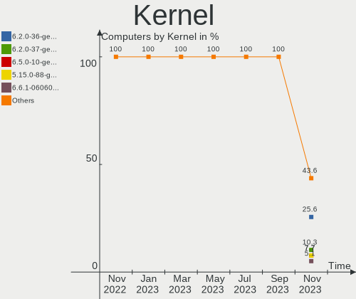

| Version               | Computers | Percent |
|-----------------------|-----------|---------|
| 5.15.0-46-generic     | 10        | 35.71%  |
| 5.15.0-43-generic     | 5         | 17.86%  |
| 5.4.0-124-generic     | 1         | 3.57%   |
| 5.4.0-123-generic     | 1         | 3.57%   |
| 5.4.0-122-generic     | 1         | 3.57%   |
| 5.18.0-odroid-arm64   | 1         | 3.57%   |
| 5.18.0-1-generic      | 1         | 3.57%   |
| 5.18.0-051800-generic | 1         | 3.57%   |
| 5.15.0-47-generic     | 1         | 3.57%   |
| 5.15.0-46-lowlatency  | 1         | 3.57%   |
| 5.15.0-41-generic     | 1         | 3.57%   |
| 5.15.0-39-generic     | 1         | 3.57%   |
| 5.15.0-27-generic     | 1         | 3.57%   |
| 5.15.0-1012-raspi     | 1         | 3.57%   |
| 4.15.0-20-generic     | 1         | 3.57%   |

Kernel Family
-------------

Linux kernel without a distro release

| Version | Computers | Percent |
|---------|-----------|---------|
| 5.15.0  | 21        | 75%     |
| 5.4.0   | 3         | 10.71%  |
| 5.18.0  | 3         | 10.71%  |
| 4.15.0  | 1         | 3.57%   |

Kernel Major Ver.
-----------------

Linux kernel major version

| Version | Computers | Percent |
|---------|-----------|---------|
| 5.15    | 21        | 75%     |
| 5.4     | 3         | 10.71%  |
| 5.18    | 3         | 10.71%  |
| 4.15    | 1         | 3.57%   |

Arch
----

OS architecture (x86_64, i586, etc.)

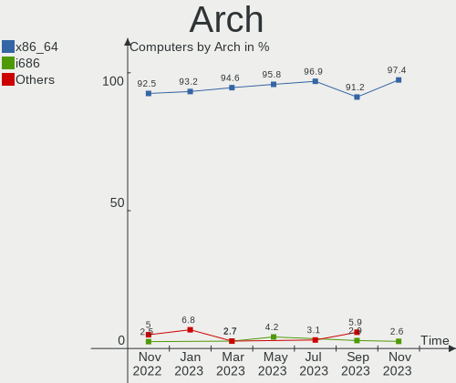

| Name    | Computers | Percent |
|---------|-----------|---------|
| x86_64  | 26        | 92.86%  |
| aarch64 | 2         | 7.14%   |

DE
--

Desktop Environment

| Name | Computers | Percent |
|------|-----------|---------|
| MATE | 28        | 100%    |

Display Server
--------------

X11 or Wayland

| Name | Computers | Percent |
|------|-----------|---------|
| X11  | 28        | 100%    |

Display Manager
---------------

SDDM, LightDM, etc.

| Name    | Computers | Percent |
|---------|-----------|---------|
| LightDM | 23        | 82.14%  |
| Unknown | 4         | 14.29%  |
| SDDM    | 1         | 3.57%   |

OS Lang
-------

Language

| Lang    | Computers | Percent |
|---------|-----------|---------|
| en_US   | 12        | 42.86%  |
| fr_FR   | 4         | 14.29%  |
| ru_RU   | 2         | 7.14%   |
| en_GB   | 2         | 7.14%   |
| en_CA   | 2         | 7.14%   |
| de_DE   | 2         | 7.14%   |
| nl_NL   | 1         | 3.57%   |
| es_PE   | 1         | 3.57%   |
| en_IN   | 1         | 3.57%   |
| Unknown | 1         | 3.57%   |

Boot Mode
---------

EFI or BIOS

| Mode | Computers | Percent |
|------|-----------|---------|
| BIOS | 14        | 50%     |
| EFI  | 14        | 50%     |

Filesystem
----------

Type of filesystem

| Type  | Computers | Percent |
|-------|-----------|---------|
| Ext4  | 26        | 92.86%  |
| Btrfs | 2         | 7.14%   |

Part. scheme
------------

Scheme of partitioning

| Type    | Computers | Percent |
|---------|-----------|---------|
| GPT     | 17        | 60.71%  |
| Unknown | 9         | 32.14%  |
| MBR     | 2         | 7.14%   |

Dual Boot with Linux/BSD
------------------------

Hosting more than one Linux/BSD

| Dual boot | Computers | Percent |
|-----------|-----------|---------|
| No        | 23        | 82.14%  |
| Yes       | 5         | 17.86%  |

Dual Boot (Win)
---------------

Hosting Linux and Windows

| Dual boot | Computers | Percent |
|-----------|-----------|---------|
| No        | 20        | 71.43%  |
| Yes       | 8         | 28.57%  |

Board
-----

Vendor
------

Motherboard manufacturer

| Name                    | Computers | Percent |
|-------------------------|-----------|---------|
| Hewlett-Packard         | 7         | 25%     |
| Lenovo                  | 4         | 14.29%  |
| Dell                    | 3         | 10.71%  |
| ASUSTek Computer        | 3         | 10.71%  |
| MSI                     | 2         | 7.14%   |
| Raspberry Pi Foundation | 1         | 3.57%   |
| Notebook                | 1         | 3.57%   |
| LincPlus                | 1         | 3.57%   |
| Intel                   | 1         | 3.57%   |
| HONOR                   | 1         | 3.57%   |
| Hardkernel              | 1         | 3.57%   |
| Google                  | 1         | 3.57%   |
| Gigabyte Technology     | 1         | 3.57%   |
| AZW                     | 1         | 3.57%   |

Model
-----

Motherboard model

| Name                                 | Computers | Percent |
|--------------------------------------|-----------|---------|
| RPi Raspberry Pi                     | 1         | 3.57%   |
| Notebook NJx0MU                      | 1         | 3.57%   |
| MSI MS-7982                          | 1         | 3.57%   |
| MSI B02311                           | 1         | 3.57%   |
| LincPlus LINNCPLUS P1                | 1         | 3.57%   |
| Lenovo ThinkCentre M710q 10MQSC0N00  | 1         | 3.57%   |
| Lenovo ThinkBook 14 G2 ITL 20VD      | 1         | 3.57%   |
| Lenovo IdeaPad Gaming 3 15ARH05 82EY | 1         | 3.57%   |
| Lenovo IdeaPad 3 15IIL05 81WE        | 1         | 3.57%   |
| Intel NUC7i5BNK                      | 1         | 3.57%   |
| HONOR BOHK-WAX9X                     | 1         | 3.57%   |
| HP ProBook 455 G7                    | 1         | 3.57%   |
| HP Pavilion g6                       | 1         | 3.57%   |
| HP Pavilion dv5                      | 1         | 3.57%   |
| HP Pavilion 590-p0049 3LC38AA        | 1         | 3.57%   |
| HP Notebook                          | 1         | 3.57%   |
| HP EliteBook 745 G5                  | 1         | 3.57%   |
| HP 15 Notebook PC                    | 1         | 3.57%   |
| Hardkernel ODROID-N2Plus             | 1         | 3.57%   |
| Google Swanky                        | 1         | 3.57%   |
| Gigabyte B85M-D3PH                   | 1         | 3.57%   |
| Dell OptiPlex 780                    | 1         | 3.57%   |
| Dell OptiPlex 3050                   | 1         | 3.57%   |
| Dell Latitude 7420                   | 1         | 3.57%   |
| AZW GK55                             | 1         | 3.57%   |
| ASUS UX32A                           | 1         | 3.57%   |
| ASUS M5A88-V EVO                     | 1         | 3.57%   |
| ASUS M4A78-E                         | 1         | 3.57%   |

Model Family
------------

Motherboard model prefix

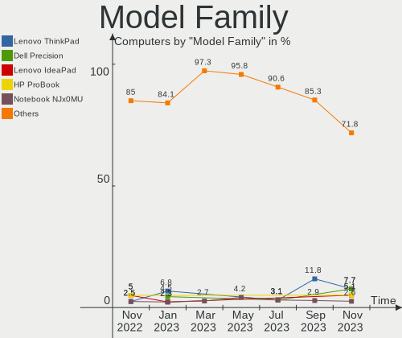

| Name                     | Computers | Percent |
|--------------------------|-----------|---------|
| HP Pavilion              | 3         | 10.71%  |
| Lenovo IdeaPad           | 2         | 7.14%   |
| Dell OptiPlex            | 2         | 7.14%   |
| RPi Raspberry            | 1         | 3.57%   |
| Notebook NJx0MU          | 1         | 3.57%   |
| MSI MS-7982              | 1         | 3.57%   |
| MSI B02311               | 1         | 3.57%   |
| LincPlus LINNCPLUS       | 1         | 3.57%   |
| Lenovo ThinkCentre       | 1         | 3.57%   |
| Lenovo ThinkBook         | 1         | 3.57%   |
| Intel NUC7i5BNK          | 1         | 3.57%   |
| HONOR BOHK-WAX9X         | 1         | 3.57%   |
| HP ProBook               | 1         | 3.57%   |
| HP Notebook              | 1         | 3.57%   |
| HP EliteBook             | 1         | 3.57%   |
| HP 15                    | 1         | 3.57%   |
| Hardkernel ODROID-N2Plus | 1         | 3.57%   |
| Google Swanky            | 1         | 3.57%   |
| Gigabyte B85M-D3PH       | 1         | 3.57%   |
| Dell Latitude            | 1         | 3.57%   |
| AZW GK55                 | 1         | 3.57%   |
| ASUS UX32A               | 1         | 3.57%   |
| ASUS M5A88-V             | 1         | 3.57%   |
| ASUS M4A78-E             | 1         | 3.57%   |

MFG Year
--------

Motherboard manufacture year

| Year    | Computers | Percent |
|---------|-----------|---------|
| 2020    | 6         | 21.43%  |
| 2021    | 3         | 10.71%  |
| 2011    | 3         | 10.71%  |
| 2018    | 2         | 7.14%   |
| 2017    | 2         | 7.14%   |
| 2015    | 2         | 7.14%   |
| 2009    | 2         | 7.14%   |
| Unknown | 2         | 7.14%   |
| 2022    | 1         | 3.57%   |
| 2019    | 1         | 3.57%   |
| 2014    | 1         | 3.57%   |
| 2013    | 1         | 3.57%   |
| 2012    | 1         | 3.57%   |
| 2008    | 1         | 3.57%   |

Form Factor
-----------

Physical design of the computer

| Name           | Computers | Percent |
|----------------|-----------|---------|
| Notebook       | 15        | 53.57%  |
| Desktop        | 10        | 35.71%  |
| System on chip | 2         | 7.14%   |
| Mini pc        | 1         | 3.57%   |

Secure Boot
-----------

Enabled or disabled

| State    | Computers | Percent |
|----------|-----------|---------|
| Disabled | 26        | 92.86%  |
| Enabled  | 2         | 7.14%   |

Coreboot
--------

Have coreboot on board

| Used | Computers | Percent |
|------|-----------|---------|
| No   | 27        | 96.43%  |
| Yes  | 1         | 3.57%   |

RAM Size
--------

Total RAM memory

| Size in GB | Computers | Percent |
|------------|-----------|---------|
| 3.01-4.0   | 9         | 32.14%  |
| 4.01-8.0   | 8         | 28.57%  |
| 8.01-16.0  | 5         | 17.86%  |
| 16.01-24.0 | 4         | 14.29%  |
| 32.01-64.0 | 2         | 7.14%   |

RAM Used
--------

Used RAM memory

| Used GB   | Computers | Percent |
|-----------|-----------|---------|
| 1.01-2.0  | 12        | 42.86%  |
| 4.01-8.0  | 7         | 25%     |
| 2.01-3.0  | 5         | 17.86%  |
| 8.01-16.0 | 2         | 7.14%   |
| 3.01-4.0  | 1         | 3.57%   |
| 0.51-1.0  | 1         | 3.57%   |

Total Drives
------------

Number of drives on board

| Drives | Computers | Percent |
|--------|-----------|---------|
| 1      | 19        | 67.86%  |
| 2      | 5         | 17.86%  |
| 4      | 2         | 7.14%   |
| 5      | 1         | 3.57%   |
| 3      | 1         | 3.57%   |

Has CD-ROM
----------

Has CD-ROM on board

| Presented | Computers | Percent |
|-----------|-----------|---------|
| No        | 18        | 64.29%  |
| Yes       | 10        | 35.71%  |

Has Ethernet
------------

Has Ethernet on board

| Presented | Computers | Percent |
|-----------|-----------|---------|
| Yes       | 20        | 71.43%  |
| No        | 8         | 28.57%  |

Has WiFi
--------

Has WiFi module

| Presented | Computers | Percent |
|-----------|-----------|---------|
| Yes       | 23        | 82.14%  |
| No        | 5         | 17.86%  |

Has Bluetooth
-------------

Has Bluetooth module

| Presented | Computers | Percent |
|-----------|-----------|---------|
| Yes       | 16        | 57.14%  |
| No        | 12        | 42.86%  |

Location
--------

Country
-------

Geographic location (country)

| Country     | Computers | Percent |
|-------------|-----------|---------|
| USA         | 7         | 25%     |
| France      | 4         | 14.29%  |
| UK          | 2         | 7.14%   |
| Russia      | 2         | 7.14%   |
| Netherlands | 2         | 7.14%   |
| Germany     | 2         | 7.14%   |
| Canada      | 2         | 7.14%   |
| Romania     | 1         | 3.57%   |
| Peru        | 1         | 3.57%   |
| Paraguay    | 1         | 3.57%   |
| India       | 1         | 3.57%   |
| Colombia    | 1         | 3.57%   |
| Brazil      | 1         | 3.57%   |
| Austria     | 1         | 3.57%   |

City
----

Geographic location (city)

| City                | Computers | Percent |
|---------------------|-----------|---------|
| The Hague           | 1         | 3.57%   |
| Terrace             | 1         | 3.57%   |
| Tambov              | 1         | 3.57%   |
| Talence             | 1         | 3.57%   |
| Southampton         | 1         | 3.57%   |
| Sao Paulo           | 1         | 3.57%   |
| Rezé               | 1         | 3.57%   |
| Paris               | 1         | 3.57%   |
| Ottawa              | 1         | 3.57%   |
| North Wilkesboro    | 1         | 3.57%   |
| Naaldwijk           | 1         | 3.57%   |
| Mountain Home       | 1         | 3.57%   |
| Moscow              | 1         | 3.57%   |
| Miami               | 1         | 3.57%   |
| Medellín           | 1         | 3.57%   |
| Marysville          | 1         | 3.57%   |
| Marseille           | 1         | 3.57%   |
| Manchester          | 1         | 3.57%   |
| Lima                | 1         | 3.57%   |
| Laubach             | 1         | 3.57%   |
| Kematen an der Ybbs | 1         | 3.57%   |
| Hamburg             | 1         | 3.57%   |
| Garland             | 1         | 3.57%   |
| Fort McCoy          | 1         | 3.57%   |
| Enfield             | 1         | 3.57%   |
| Bucharest           | 1         | 3.57%   |
| Bengaluru           | 1         | 3.57%   |
| Asunción           | 1         | 3.57%   |

Drives
------

Drive Vendor
------------

Hard drive vendors

| Vendor              | Computers | Drives | Percent |
|---------------------|-----------|--------|---------|
| Samsung Electronics | 7         | 7      | 17.5%   |
| Seagate             | 5         | 7      | 12.5%   |
| WDC                 | 4         | 5      | 10%     |
| Unknown             | 4         | 4      | 10%     |
| Crucial             | 3         | 3      | 7.5%    |
| Toshiba             | 2         | 2      | 5%      |
| SanDisk             | 2         | 2      | 5%      |
| Kingston            | 2         | 2      | 5%      |
| Hitachi             | 2         | 2      | 5%      |
| Transcend           | 1         | 1      | 2.5%    |
| NGFF                | 1         | 1      | 2.5%    |
| KIOXIA              | 1         | 1      | 2.5%    |
| Intenso             | 1         | 1      | 2.5%    |
| Intel               | 1         | 1      | 2.5%    |
| Hjwdz               | 1         | 1      | 2.5%    |
| DAS                 | 1         | 3      | 2.5%    |
| ASMT                | 1         | 1      | 2.5%    |
| A-DATA Technology   | 1         | 1      | 2.5%    |

Drive Model
-----------

Hard drive models

| Model                             | Computers | Percent |
|-----------------------------------|-----------|---------|
| Seagate ST500DM002-1BD142 500GB   | 2         | 4.65%   |
| Seagate ST2000DM001-1ER164 2TB    | 2         | 4.65%   |
| Crucial CT240BX500SSD1 240GB      | 2         | 4.65%   |
| WDC WD5000AZLX-75K2TA0 500GB      | 1         | 2.33%   |
| WDC WD5000AAKS-00V1A0 500GB       | 1         | 2.33%   |
| WDC WD40EZAZ-00SF3B0 4TB          | 1         | 2.33%   |
| WDC WD20EZRX-00DC0B0 2TB          | 1         | 2.33%   |
| WDC WD20EFZX-68AWUN0 2TB          | 1         | 2.33%   |
| Unknown SC32G  32GB               | 1         | 2.33%   |
| Unknown BJTD4R  32GB              | 1         | 2.33%   |
| Unknown Biwin  64GB               | 1         | 2.33%   |
| Unknown 016GE2  16GB              | 1         | 2.33%   |
| Transcend TS256GSSD230S 256GB     | 1         | 2.33%   |
| Toshiba MQ01ABF050 500GB          | 1         | 2.33%   |
| Toshiba KBG40ZNT256G MEMORY 256GB | 1         | 2.33%   |
| Seagate ST9500420AS 500GB         | 1         | 2.33%   |
| Seagate ST3320418AS 320GB         | 1         | 2.33%   |
| Seagate ST1000DM003-1CH162 1TB    | 1         | 2.33%   |
| SanDisk SSD i100 24GB             | 1         | 2.33%   |
| SanDisk NVMe SSD Drive 512GB      | 1         | 2.33%   |
| Samsung SSD 970 EVO Plus 250GB    | 1         | 2.33%   |
| Samsung SSD 860 PRO 1TB           | 1         | 2.33%   |
| Samsung PM9A1 NVMe 512GB          | 1         | 2.33%   |
| Samsung MZVL2512HCJQ-00B00 512GB  | 1         | 2.33%   |
| Samsung MZALQ512HBLU-00BL2 512GB  | 1         | 2.33%   |
| Samsung MZALQ512HALU-000L2 512GB  | 1         | 2.33%   |
| Samsung HD120IJ 120GB             | 1         | 2.33%   |
| NGFF 2280 256GB SSD               | 1         | 2.33%   |
| KIOXIA KBG40ZNV256G 256GB         | 1         | 2.33%   |
| Kingston SV300S37A120G 120GB SSD  | 1         | 2.33%   |
| Kingston NVMe SSD Drive 500GB     | 1         | 2.33%   |
| Intenso SSD Sata III 120GB        | 1         | 2.33%   |
| Intel SSDPEKNW020T8 2TB           | 1         | 2.33%   |
| Hjwdz MS2160 8MB                  | 1         | 2.33%   |
| Hitachi HTS721080G9SA00 80GB      | 1         | 2.33%   |
| Hitachi HDP725050GLA360 500GB     | 1         | 2.33%   |
| DAS TerraMaster 500GB             | 1         | 2.33%   |
| Crucial CT1000BX500SSD1 1TB       | 1         | 2.33%   |
| ASMT ASM105x 499GB                | 1         | 2.33%   |
| A-DATA SP550 240GB SSD            | 1         | 2.33%   |

HDD Vendor
----------

Hard disk drive vendors

| Vendor              | Computers | Drives | Percent |
|---------------------|-----------|--------|---------|
| Seagate             | 5         | 7      | 35.71%  |
| WDC                 | 4         | 5      | 28.57%  |
| Hitachi             | 2         | 2      | 14.29%  |
| Toshiba             | 1         | 1      | 7.14%   |
| Samsung Electronics | 1         | 1      | 7.14%   |
| DAS                 | 1         | 3      | 7.14%   |

SSD Vendor
----------

Solid state drive vendors

| Vendor              | Computers | Drives | Percent |
|---------------------|-----------|--------|---------|
| Crucial             | 3         | 3      | 27.27%  |
| Transcend           | 1         | 1      | 9.09%   |
| SanDisk             | 1         | 1      | 9.09%   |
| Samsung Electronics | 1         | 1      | 9.09%   |
| NGFF                | 1         | 1      | 9.09%   |
| Kingston            | 1         | 1      | 9.09%   |
| Intenso             | 1         | 1      | 9.09%   |
| ASMT                | 1         | 1      | 9.09%   |
| A-DATA Technology   | 1         | 1      | 9.09%   |

Drive Kind
----------

HDD or SSD

| Kind    | Computers | Drives | Percent |
|---------|-----------|--------|---------|
| NVMe    | 10        | 10     | 29.41%  |
| HDD     | 10        | 19     | 29.41%  |
| SSD     | 9         | 11     | 26.47%  |
| MMC     | 4         | 4      | 11.76%  |
| Unknown | 1         | 1      | 2.94%   |

Drive Connector
---------------

SATA, SAS, NVMe, etc.

| Type | Computers | Drives | Percent |
|------|-----------|--------|---------|
| SATA | 15        | 26     | 46.88%  |
| NVMe | 10        | 10     | 31.25%  |
| MMC  | 4         | 4      | 12.5%   |
| SAS  | 3         | 5      | 9.38%   |

Drive Size
----------

Size of hard drive

| Size in TB | Computers | Drives | Percent |
|------------|-----------|--------|---------|
| 0.01-0.5   | 16        | 22     | 66.67%  |
| 1.01-2.0   | 4         | 4      | 16.67%  |
| 0.51-1.0   | 3         | 3      | 12.5%   |
| 3.01-4.0   | 1         | 1      | 4.17%   |

Space Total
-----------

Amount of disk space available on the file system

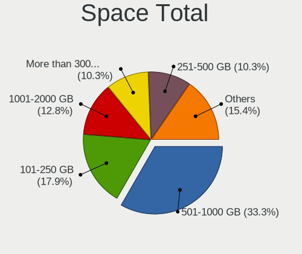

| Size in GB     | Computers | Percent |
|----------------|-----------|---------|
| 251-500        | 8         | 28.57%  |
| 101-250        | 6         | 21.43%  |
| 1001-2000      | 3         | 10.71%  |
| 501-1000       | 3         | 10.71%  |
| 51-100         | 3         | 10.71%  |
| More than 3000 | 2         | 7.14%   |
| 21-50          | 2         | 7.14%   |
| 1-20           | 1         | 3.57%   |

Space Used
----------

Amount of used disk space

| Used GB        | Computers | Percent |
|----------------|-----------|---------|
| 1-20           | 8         | 28.57%  |
| 21-50          | 5         | 17.86%  |
| 501-1000       | 4         | 14.29%  |
| 51-100         | 4         | 14.29%  |
| 251-500        | 3         | 10.71%  |
| 101-250        | 2         | 7.14%   |
| More than 3000 | 1         | 3.57%   |
| 2001-3000      | 1         | 3.57%   |

Malfunc. Drives
---------------

Drive models with a malfunction

| Model                          | Computers | Drives | Percent |
|--------------------------------|-----------|--------|---------|
| WDC WD5000AAKS-00V1A0 500GB    | 1         | 1      | 25%     |
| Seagate ST2000DM001-1ER164 2TB | 1         | 1      | 25%     |
| NGFF 2280 256GB SSD            | 1         | 1      | 25%     |
| Hitachi HTS721080G9SA00 80GB   | 1         | 1      | 25%     |

Malfunc. Drive Vendor
---------------------

Vendors of faulty drives

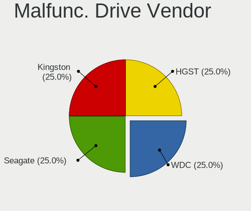

| Vendor  | Computers | Drives | Percent |
|---------|-----------|--------|---------|
| WDC     | 1         | 1      | 25%     |
| Seagate | 1         | 1      | 25%     |
| NGFF    | 1         | 1      | 25%     |
| Hitachi | 1         | 1      | 25%     |

Malfunc. HDD Vendor
-------------------

Vendors of faulty HDD drives

| Vendor  | Computers | Drives | Percent |
|---------|-----------|--------|---------|
| WDC     | 1         | 1      | 33.33%  |
| Seagate | 1         | 1      | 33.33%  |
| Hitachi | 1         | 1      | 33.33%  |

Malfunc. Drive Kind
-------------------

Kinds of faulty drives

| Kind | Computers | Drives | Percent |
|------|-----------|--------|---------|
| HDD  | 3         | 3      | 75%     |
| SSD  | 1         | 1      | 25%     |

Failed Drives
-------------

Failed drive models

Zero info for selected period =(

Failed Drive Vendor
-------------------

Failed drive vendors

Zero info for selected period =(

Drive Status
------------

Number of failed and malfunc. drives

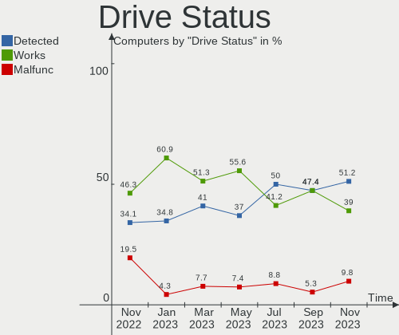

| Status   | Computers | Drives | Percent |
|----------|-----------|--------|---------|
| Works    | 15        | 23     | 46.88%  |
| Detected | 13        | 18     | 40.63%  |
| Malfunc  | 4         | 4      | 12.5%   |

Storage controller
------------------

Storage Vendor
--------------

Storage controller vendors

| Vendor                      | Computers | Percent |
|-----------------------------|-----------|---------|
| Intel                       | 16        | 47.06%  |
| AMD                         | 8         | 23.53%  |
| Samsung Electronics         | 5         | 14.71%  |
| KIOXIA                      | 2         | 5.88%   |
| VIA Technologies            | 1         | 2.94%   |
| SanDisk                     | 1         | 2.94%   |
| Kingston Technology Company | 1         | 2.94%   |

Storage Model
-------------

Storage controller models

| Model                                                                          | Computers | Percent |
|--------------------------------------------------------------------------------|-----------|---------|
| AMD FCH SATA Controller [AHCI mode]                                            | 5         | 12.82%  |
| Samsung NVMe SSD Controller PM9A1/PM9A3/980PRO                                 | 2         | 5.13%   |
| Samsung NVMe SSD Controller 980                                                | 2         | 5.13%   |
| KIOXIA NVMe SSD Controller BG4                                                 | 2         | 5.13%   |
| Intel Tiger Lake-LP SATA Controller                                            | 2         | 5.13%   |
| Intel SATA Controller [RAID mode]                                              | 2         | 5.13%   |
| Intel Celeron/Pentium Silver Processor SATA Controller                         | 2         | 5.13%   |
| Intel 7 Series Chipset Family 6-port SATA Controller [AHCI mode]               | 2         | 5.13%   |
| AMD SB7x0/SB8x0/SB9x0 SATA Controller [AHCI mode]                              | 2         | 5.13%   |
| AMD SB7x0/SB8x0/SB9x0 IDE Controller                                           | 2         | 5.13%   |
| VIA VT6415 PATA IDE Host Controller                                            | 1         | 2.56%   |
| SanDisk WD Black SN750 / PC SN730 NVMe SSD                                     | 1         | 2.56%   |
| Samsung NVMe SSD Controller SM981/PM981/PM983                                  | 1         | 2.56%   |
| Kingston Company Company Non-Volatile memory controller                        | 1         | 2.56%   |
| Intel Volume Management Device NVMe RAID Controller                            | 1         | 2.56%   |
| Intel Sunrise Point-LP SATA Controller [AHCI mode]                             | 1         | 2.56%   |
| Intel SSD 660P Series                                                          | 1         | 2.56%   |
| Intel Q170/Q150/B150/H170/H110/Z170/CM236 Chipset SATA Controller [AHCI Mode]  | 1         | 2.56%   |
| Intel Ice Lake-LP SATA Controller [AHCI mode]                                  | 1         | 2.56%   |
| Intel Atom Processor E3800 Series SATA AHCI Controller                         | 1         | 2.56%   |
| Intel 8 Series/C220 Series Chipset Family 6-port SATA Controller 1 [AHCI mode] | 1         | 2.56%   |
| Intel 5 Series/3400 Series Chipset 4 port SATA AHCI Controller                 | 1         | 2.56%   |
| Intel 4 Series Chipset PT IDER Controller                                      | 1         | 2.56%   |
| Intel 200 Series PCH SATA controller [AHCI mode]                               | 1         | 2.56%   |
| AMD SB7x0/SB8x0/SB9x0 SATA Controller [IDE mode]                               | 1         | 2.56%   |
| AMD 300 Series Chipset SATA Controller                                         | 1         | 2.56%   |

Storage Kind
------------

Kind of storage controller (IDE, SATA, NVMe, SAS, ...)

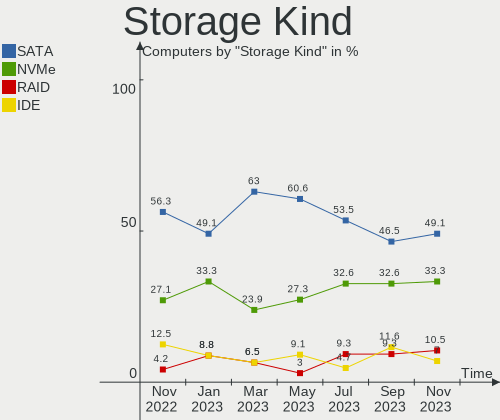

| Kind | Computers | Percent |
|------|-----------|---------|
| SATA | 21        | 55.26%  |
| NVMe | 10        | 26.32%  |
| IDE  | 4         | 10.53%  |
| RAID | 3         | 7.89%   |

Processor
---------

CPU Vendor
----------

Processor vendors

| Vendor | Computers | Percent |
|--------|-----------|---------|
| Intel  | 17        | 60.71%  |
| AMD    | 9         | 32.14%  |
| ARM    | 2         | 7.14%   |

CPU Model
---------

Processor models

| Model                                           | Computers | Percent |
|-------------------------------------------------|-----------|---------|
| Intel 11th Gen Core i7-1165G7 @ 2.80GHz         | 2         | 7.14%   |
| ARM Processor                                   | 2         | 7.14%   |
| Intel Pentium CPU N3540 @ 2.16GHz               | 1         | 3.57%   |
| Intel Core i7-4790 CPU @ 3.60GHz                | 1         | 3.57%   |
| Intel Core i7-3537U CPU @ 2.00GHz               | 1         | 3.57%   |
| Intel Core i5-7400T CPU @ 2.40GHz               | 1         | 3.57%   |
| Intel Core i5-7260U CPU @ 2.20GHz               | 1         | 3.57%   |
| Intel Core i5-6500 CPU @ 3.20GHz                | 1         | 3.57%   |
| Intel Core i5-6400 CPU @ 2.70GHz                | 1         | 3.57%   |
| Intel Core i3-2370M CPU @ 2.40GHz               | 1         | 3.57%   |
| Intel Core i3-1005G1 CPU @ 1.20GHz              | 1         | 3.57%   |
| Intel Core i3 CPU M 370 @ 2.40GHz               | 1         | 3.57%   |
| Intel Core 2 Quad CPU Q8400 @ 2.66GHz           | 1         | 3.57%   |
| Intel Celeron N4020 CPU @ 1.10GHz               | 1         | 3.57%   |
| Intel Celeron J4125 CPU @ 2.00GHz               | 1         | 3.57%   |
| Intel Celeron CPU N2840 @ 2.16GHz               | 1         | 3.57%   |
| Intel 11th Gen Core i7-1185G7 @ 3.00GHz         | 1         | 3.57%   |
| AMD Ryzen 7 PRO 2700U w/ Radeon Vega Mobile Gfx | 1         | 3.57%   |
| AMD Ryzen 7 3700U with Radeon Vega Mobile Gfx   | 1         | 3.57%   |
| AMD Ryzen 5 4600H with Radeon Graphics          | 1         | 3.57%   |
| AMD Ryzen 5 2400G with Radeon Vega Graphics     | 1         | 3.57%   |
| AMD Ryzen 3 4300U with Radeon Graphics          | 1         | 3.57%   |
| AMD Phenom II X4 810 Processor                  | 1         | 3.57%   |
| AMD FX-8300 Eight-Core Processor                | 1         | 3.57%   |
| AMD E-450 APU with Radeon HD Graphics           | 1         | 3.57%   |
| AMD A8-7410 APU with AMD Radeon R5 Graphics     | 1         | 3.57%   |

CPU Model Family
----------------

Processor model prefix

| Model             | Computers | Percent |
|-------------------|-----------|---------|
| Other             | 5         | 17.86%  |
| Intel Core i5     | 4         | 14.29%  |
| Intel Core i3     | 3         | 10.71%  |
| Intel Celeron     | 3         | 10.71%  |
| Intel Core i7     | 2         | 7.14%   |
| AMD Ryzen 5       | 2         | 7.14%   |
| Intel Pentium     | 1         | 3.57%   |
| Intel Core 2 Quad | 1         | 3.57%   |
| AMD Ryzen 7 PRO   | 1         | 3.57%   |
| AMD Ryzen 7       | 1         | 3.57%   |
| AMD Ryzen 3       | 1         | 3.57%   |
| AMD Phenom II X4  | 1         | 3.57%   |
| AMD FX            | 1         | 3.57%   |
| AMD E             | 1         | 3.57%   |
| AMD A8            | 1         | 3.57%   |

CPU Cores
---------

Number of processor cores

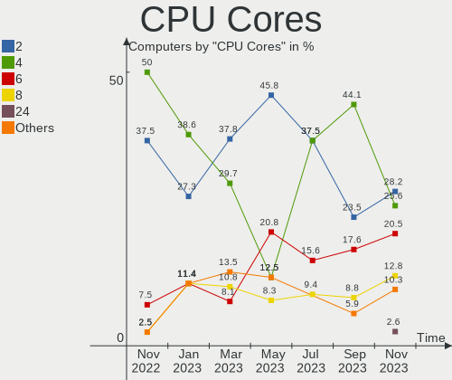

| Number  | Computers | Percent |
|---------|-----------|---------|
| 4       | 18        | 64.29%  |
| 2       | 8         | 28.57%  |
| 6       | 1         | 3.57%   |
| Unknown | 1         | 3.57%   |

CPU Sockets
-----------

Number of sockets

| Number  | Computers | Percent |
|---------|-----------|---------|
| 1       | 27        | 96.43%  |
| Unknown | 1         | 3.57%   |

CPU Threads
-----------

Threads per core (Hyper-Threading)

| Number  | Computers | Percent |
|---------|-----------|---------|
| 2       | 14        | 50%     |
| 1       | 13        | 46.43%  |
| Unknown | 1         | 3.57%   |

CPU Op-Modes
------------

CPU Operation Modes (32-bit, 64-bit)

| Op mode        | Computers | Percent |
|----------------|-----------|---------|
| 32-bit, 64-bit | 28        | 100%    |

CPU Microcode
-------------

Microcode number

| Number     | Computers | Percent |
|------------|-----------|---------|
| Unknown    | 11        | 39.29%  |
| 0x806c1    | 3         | 10.71%  |
| 0x706e5    | 1         | 3.57%   |
| 0x706a8    | 1         | 3.57%   |
| 0x506e3    | 1         | 3.57%   |
| 0x306c3    | 1         | 3.57%   |
| 0x30678    | 1         | 3.57%   |
| 0x206a7    | 1         | 3.57%   |
| 0x20655    | 1         | 3.57%   |
| 0x1067a    | 1         | 3.57%   |
| 0x08600106 | 1         | 3.57%   |
| 0x08101016 | 1         | 3.57%   |
| 0x07030105 | 1         | 3.57%   |
| 0x06000852 | 1         | 3.57%   |
| 0x05000119 | 1         | 3.57%   |
| 0x010000db | 1         | 3.57%   |

CPU Microarch
-------------

Microarchitecture

| Name          | Computers | Percent |
|---------------|-----------|---------|
| TigerLake     | 3         | 10.71%  |
| Zen 2         | 2         | 7.14%   |
| Zen           | 2         | 7.14%   |
| Skylake       | 2         | 7.14%   |
| Silvermont    | 2         | 7.14%   |
| KabyLake      | 2         | 7.14%   |
| Goldmont plus | 2         | 7.14%   |
| Unknown       | 2         | 7.14%   |
| Zen+          | 1         | 3.57%   |
| Westmere      | 1         | 3.57%   |
| SandyBridge   | 1         | 3.57%   |
| Puma          | 1         | 3.57%   |
| Piledriver    | 1         | 3.57%   |
| Penryn        | 1         | 3.57%   |
| K10           | 1         | 3.57%   |
| IvyBridge     | 1         | 3.57%   |
| IceLake       | 1         | 3.57%   |
| Haswell       | 1         | 3.57%   |
| Bobcat        | 1         | 3.57%   |

Graphics
--------

GPU Vendor
----------

Vendors of graphics cards

| Vendor | Computers | Percent |
|--------|-----------|---------|
| Intel  | 16        | 55.17%  |
| AMD    | 11        | 37.93%  |
| Nvidia | 2         | 6.9%    |

GPU Model
---------

Graphics card models

| Model                                                                       | Computers | Percent |
|-----------------------------------------------------------------------------|-----------|---------|
| Intel TigerLake-LP GT2 [Iris Xe Graphics]                                   | 3         | 10.34%  |
| Intel HD Graphics 530                                                       | 2         | 6.9%    |
| Intel GeminiLake [UHD Graphics 600]                                         | 2         | 6.9%    |
| Intel Atom Processor Z36xxx/Z37xxx Series Graphics & Display                | 2         | 6.9%    |
| AMD Renoir                                                                  | 2         | 6.9%    |
| AMD Raven Ridge [Radeon Vega Series / Radeon Vega Mobile Series]            | 2         | 6.9%    |
| Nvidia TU117M [GeForce GTX 1650 Ti Mobile]                                  | 1         | 3.45%   |
| Nvidia GK104 [GeForce GTX 760]                                              | 1         | 3.45%   |
| Intel Xeon E3-1200 v3/4th Gen Core Processor Integrated Graphics Controller | 1         | 3.45%   |
| Intel Iris Plus Graphics G1 (Ice Lake)                                      | 1         | 3.45%   |
| Intel Iris Plus Graphics 640                                                | 1         | 3.45%   |
| Intel HD Graphics 630                                                       | 1         | 3.45%   |
| Intel Core Processor Integrated Graphics Controller                         | 1         | 3.45%   |
| Intel 3rd Gen Core processor Graphics Controller                            | 1         | 3.45%   |
| Intel 2nd Generation Core Processor Family Integrated Graphics Controller   | 1         | 3.45%   |
| AMD Wrestler [Radeon HD 6320]                                               | 1         | 3.45%   |
| AMD Thames [Radeon HD 7500M/7600M Series]                                   | 1         | 3.45%   |
| AMD RS880 [Radeon HD 4250]                                                  | 1         | 3.45%   |
| AMD RS780D [Radeon HD 3300]                                                 | 1         | 3.45%   |
| AMD Picasso/Raven 2 [Radeon Vega Series / Radeon Vega Mobile Series]        | 1         | 3.45%   |
| AMD Mullins [Radeon R4/R5 Graphics]                                         | 1         | 3.45%   |
| AMD Cedar [Radeon HD 5000/6000/7350/8350 Series]                            | 1         | 3.45%   |

GPU Combo
---------

Combinations of graphics cards

| Name           | Computers | Percent |
|----------------|-----------|---------|
| 1 x Intel      | 14        | 50%     |
| 1 x AMD        | 9         | 32.14%  |
| Other          | 2         | 7.14%   |
| Intel + Nvidia | 1         | 3.57%   |
| Intel + AMD    | 1         | 3.57%   |
| AMD + Nvidia   | 1         | 3.57%   |

GPU Driver
----------

Free vs proprietary

| Driver      | Computers | Percent |
|-------------|-----------|---------|
| Free        | 24        | 85.71%  |
| Proprietary | 2         | 7.14%   |
| Unknown     | 2         | 7.14%   |

GPU Memory
----------

Total video memory

| Size in GB | Computers | Percent |
|------------|-----------|---------|
| Unknown    | 19        | 67.86%  |
| 0.01-0.5   | 6         | 21.43%  |
| 1.01-2.0   | 2         | 7.14%   |
| 0.51-1.0   | 1         | 3.57%   |

Monitor
-------

Monitor Vendor
--------------

Monitor vendors

| Vendor               | Computers | Percent |
|----------------------|-----------|---------|
| Samsung Electronics  | 5         | 17.24%  |
| LG Display           | 5         | 17.24%  |
| Chimei Innolux       | 4         | 13.79%  |
| AU Optronics         | 3         | 10.34%  |
| Hewlett-Packard      | 2         | 6.9%    |
| Dell                 | 2         | 6.9%    |
| Vizio                | 1         | 3.45%   |
| Sceptre Tech         | 1         | 3.45%   |
| PANDA                | 1         | 3.45%   |
| InfoVision           | 1         | 3.45%   |
| Goldstar             | 1         | 3.45%   |
| BOE                  | 1         | 3.45%   |
| Ancor Communications | 1         | 3.45%   |
| Acer                 | 1         | 3.45%   |

Monitor Model
-------------

Monitor models

| Model                                                                 | Computers | Percent |
|-----------------------------------------------------------------------|-----------|---------|
| Vizio D32x-D1 VIZ1005 1920x1080 700x390mm 31.5-inch                   | 1         | 3.45%   |
| Sceptre Tech E24 SPT099D 1920x1080 521x293mm 23.5-inch                | 1         | 3.45%   |
| Samsung Electronics U32R59x SAM0F94 3840x2160 697x392mm 31.5-inch     | 1         | 3.45%   |
| Samsung Electronics S23B550 SAM0919 1920x1080 510x287mm 23.0-inch     | 1         | 3.45%   |
| Samsung Electronics S22B300 SAM08AC 1920x1080 480x270mm 21.7-inch     | 1         | 3.45%   |
| Samsung Electronics LU28R55 SAM1018 3840x2160 632x360mm 28.6-inch     | 1         | 3.45%   |
| Samsung Electronics C24F390 SAM0D2D 1920x1080 520x290mm 23.4-inch     | 1         | 3.45%   |
| PANDA LC133LF2L03 NCP0015 1920x1080 294x165mm 13.3-inch               | 1         | 3.45%   |
| LG Display LCD Monitor LGD062E 1920x1080 344x194mm 15.5-inch          | 1         | 3.45%   |
| LG Display LCD Monitor LGD0493 1366x768 344x194mm 15.5-inch           | 1         | 3.45%   |
| LG Display LCD Monitor LGD042D 1920x1080 290x170mm 13.2-inch          | 1         | 3.45%   |
| LG Display LCD Monitor LGD033B 1366x768 344x194mm 15.5-inch           | 1         | 3.45%   |
| LG Display LCD Monitor LGD0293 1366x768 321x181mm 14.5-inch           | 1         | 3.45%   |
| InfoVision LCD Monitor IVO0533 1366x768 293x164mm 13.2-inch           | 1         | 3.45%   |
| Hewlett-Packard w1907 HWP26A3 1440x900 408x255mm 18.9-inch            | 1         | 3.45%   |
| Hewlett-Packard w1707 HWP2800 1440x900 370x230mm 17.2-inch            | 1         | 3.45%   |
| Goldstar IPS FULLHD GSM5AB6 1920x1080 480x270mm 21.7-inch             | 1         | 3.45%   |
| Dell U3421WE DELA192 3440x1440 800x335mm 34.1-inch                    | 1         | 3.45%   |
| Dell E2220H DELF118 1920x1080 476x268mm 21.5-inch                     | 1         | 3.45%   |
| Chimei Innolux LCD Monitor CMN15E6 1366x768 344x193mm 15.5-inch       | 1         | 3.45%   |
| Chimei Innolux LCD Monitor CMN15C6 1366x768 344x193mm 15.5-inch       | 1         | 3.45%   |
| Chimei Innolux LCD Monitor CMN14E8 1920x1080 309x173mm 13.9-inch      | 1         | 3.45%   |
| Chimei Innolux LCD Monitor CMN14D4 1920x1080 309x173mm 13.9-inch      | 1         | 3.45%   |
| BOE LCD Monitor BOE0872 1920x1080 344x194mm 15.5-inch                 | 1         | 3.45%   |
| AU Optronics LCD Monitor AUOD1ED 1920x1080 344x193mm 15.5-inch        | 1         | 3.45%   |
| AU Optronics LCD Monitor AUO429D 1920x1080 382x215mm 17.3-inch        | 1         | 3.45%   |
| AU Optronics LCD Monitor AUO3B3D 1920x1080 309x174mm 14.0-inch        | 1         | 3.45%   |
| Ancor Communications ASUS VE278 ACI27F6 1920x1080 598x336mm 27.0-inch | 1         | 3.45%   |
| Acer S241HL ACR0312 1920x1080 530x300mm 24.0-inch                     | 1         | 3.45%   |

Monitor Resolution
------------------

Monitor screen resolution

| Resolution       | Computers | Percent |
|------------------|-----------|---------|
| 1920x1080 (FHD)  | 17        | 60.71%  |
| 1366x768 (WXGA)  | 6         | 21.43%  |
| 3840x2160 (4K)   | 2         | 7.14%   |
| 1440x900 (WXGA+) | 2         | 7.14%   |
| 3440x1440        | 1         | 3.57%   |

Monitor Diagonal
----------------

Diagonal size in inches

| Inches | Computers | Percent |
|--------|-----------|---------|
| 15     | 7         | 24.14%  |
| 13     | 5         | 17.24%  |
| 21     | 3         | 10.34%  |
| 31     | 2         | 6.9%    |
| 24     | 2         | 6.9%    |
| 23     | 2         | 6.9%    |
| 17     | 2         | 6.9%    |
| 14     | 2         | 6.9%    |
| 34     | 1         | 3.45%   |
| 28     | 1         | 3.45%   |
| 27     | 1         | 3.45%   |
| 19     | 1         | 3.45%   |

Monitor Width
-------------

Physical width

| Width in mm | Computers | Percent |
|-------------|-----------|---------|
| 301-350     | 11        | 37.93%  |
| 501-600     | 5         | 17.24%  |
| 401-500     | 4         | 13.79%  |
| 601-700     | 3         | 10.34%  |
| 201-300     | 3         | 10.34%  |
| 351-400     | 2         | 6.9%    |
| 701-800     | 1         | 3.45%   |

Aspect Ratio
------------

Proportional relationship between the width and the height

| Ratio | Computers | Percent |
|-------|-----------|---------|
| 16/9  | 25        | 89.29%  |
| 16/10 | 2         | 7.14%   |
| 21/9  | 1         | 3.57%   |

Monitor Area
------------

Area in inch²

| Area in inch² | Computers | Percent |
|----------------|-----------|---------|
| 101-110        | 7         | 24.14%  |
| 201-250        | 6         | 20.69%  |
| 81-90          | 4         | 13.79%  |
| 351-500        | 4         | 13.79%  |
| 71-80          | 3         | 10.34%  |
| 151-200        | 2         | 6.9%    |
| 301-350        | 1         | 3.45%   |
| 131-140        | 1         | 3.45%   |
| 121-130        | 1         | 3.45%   |

Pixel Density
-------------

Pixels per inch

| Density | Computers | Percent |
|---------|-----------|---------|
| 101-120 | 10        | 34.48%  |
| 121-160 | 9         | 31.03%  |
| 51-100  | 8         | 27.59%  |
| 161-240 | 2         | 6.9%    |

Multiple Monitors
-----------------

Total monitors connected

| Total | Computers | Percent |
|-------|-----------|---------|
| 1     | 25        | 89.29%  |
| 2     | 3         | 10.71%  |

Network
-------

Net Controller Vendor
---------------------

Controller vendors

| Vendor                          | Computers | Percent |
|---------------------------------|-----------|---------|
| Realtek Semiconductor           | 17        | 47.22%  |
| Intel                           | 12        | 33.33%  |
| Qualcomm Atheros                | 2         | 5.56%   |
| Xiaomi                          | 1         | 2.78%   |
| TP-Link                         | 1         | 2.78%   |
| Ralink                          | 1         | 2.78%   |
| Qualcomm Atheros Communications | 1         | 2.78%   |
| D-Link                          | 1         | 2.78%   |

Net Controller Model
--------------------

Controller models

| Model                                                             | Computers | Percent |
|-------------------------------------------------------------------|-----------|---------|
| Realtek RTL8111/8168/8411 PCI Express Gigabit Ethernet Controller | 11        | 23.4%   |
| Realtek RTL810xE PCI Express Fast Ethernet controller             | 3         | 6.38%   |
| Realtek RTL8822CE 802.11ac PCIe Wireless Network Adapter          | 2         | 4.26%   |
| Realtek RTL8723BE PCIe Wireless Network Adapter                   | 2         | 4.26%   |
| Intel Wireless 8265 / 8275                                        | 2         | 4.26%   |
| Intel Wi-Fi 6 AX201                                               | 2         | 4.26%   |
| Xiaomi Mi/Redmi series (RNDIS + ADB)                              | 1         | 2.13%   |
| TP-Link 802.11ac WLAN Adapter                                     | 1         | 2.13%   |
| Realtek RTL8822BE 802.11a/b/g/n/ac WiFi adapter                   | 1         | 2.13%   |
| Realtek RTL8821CE 802.11ac PCIe Wireless Network Adapter          | 1         | 2.13%   |
| Realtek RTL8812AE 802.11ac PCIe Wireless Network Adapter          | 1         | 2.13%   |
| Realtek RTL8191SU 802.11n WLAN Adapter                            | 1         | 2.13%   |
| Realtek RTL8188EE Wireless Network Adapter                        | 1         | 2.13%   |
| Realtek RTL8153 Gigabit Ethernet Adapter                          | 1         | 2.13%   |
| Realtek RTL8152 Fast Ethernet Adapter                             | 1         | 2.13%   |
| Realtek 802.11ac NIC                                              | 1         | 2.13%   |
| Ralink RT3290 Wireless 802.11n 1T/1R PCIe                         | 1         | 2.13%   |
| Qualcomm Atheros AR9271 802.11n                                   | 1         | 2.13%   |
| Qualcomm Atheros AR9285 Wireless Network Adapter (PCI-Express)    | 1         | 2.13%   |
| Qualcomm Atheros AR8121/AR8113/AR8114 Gigabit or Fast Ethernet    | 1         | 2.13%   |
| Intel Wireless 7260                                               | 1         | 2.13%   |
| Intel Wireless 3165                                               | 1         | 2.13%   |
| Intel Wi-Fi 6 AX210/AX211/AX411 160MHz                            | 1         | 2.13%   |
| Intel Wi-Fi 6 AX200                                               | 1         | 2.13%   |
| Intel Ice Lake-LP PCH CNVi WiFi                                   | 1         | 2.13%   |
| Intel Ethernet Connection (4) I219-V                              | 1         | 2.13%   |
| Intel Ethernet Connection (2) I219-V                              | 1         | 2.13%   |
| Intel Ethernet Connection (13) I219-V                             | 1         | 2.13%   |
| Intel Centrino Advanced-N 6235                                    | 1         | 2.13%   |
| Intel 82567LM-3 Gigabit Network Connection                        | 1         | 2.13%   |
| D-Link DUB-1312                                                   | 1         | 2.13%   |

Wireless Vendor
---------------

Wireless vendors

| Vendor                          | Computers | Percent |
|---------------------------------|-----------|---------|
| Realtek Semiconductor           | 10        | 41.67%  |
| Intel                           | 10        | 41.67%  |
| TP-Link                         | 1         | 4.17%   |
| Ralink                          | 1         | 4.17%   |
| Qualcomm Atheros Communications | 1         | 4.17%   |
| Qualcomm Atheros                | 1         | 4.17%   |

Wireless Model
--------------

Wireless models

| Model                                                          | Computers | Percent |
|----------------------------------------------------------------|-----------|---------|
| Realtek RTL8822CE 802.11ac PCIe Wireless Network Adapter       | 2         | 8.33%   |
| Realtek RTL8723BE PCIe Wireless Network Adapter                | 2         | 8.33%   |
| Intel Wireless 8265 / 8275                                     | 2         | 8.33%   |
| Intel Wi-Fi 6 AX201                                            | 2         | 8.33%   |
| TP-Link 802.11ac WLAN Adapter                                  | 1         | 4.17%   |
| Realtek RTL8822BE 802.11a/b/g/n/ac WiFi adapter                | 1         | 4.17%   |
| Realtek RTL8821CE 802.11ac PCIe Wireless Network Adapter       | 1         | 4.17%   |
| Realtek RTL8812AE 802.11ac PCIe Wireless Network Adapter       | 1         | 4.17%   |
| Realtek RTL8191SU 802.11n WLAN Adapter                         | 1         | 4.17%   |
| Realtek RTL8188EE Wireless Network Adapter                     | 1         | 4.17%   |
| Realtek 802.11ac NIC                                           | 1         | 4.17%   |
| Ralink RT3290 Wireless 802.11n 1T/1R PCIe                      | 1         | 4.17%   |
| Qualcomm Atheros AR9271 802.11n                                | 1         | 4.17%   |
| Qualcomm Atheros AR9285 Wireless Network Adapter (PCI-Express) | 1         | 4.17%   |
| Intel Wireless 7260                                            | 1         | 4.17%   |
| Intel Wireless 3165                                            | 1         | 4.17%   |
| Intel Wi-Fi 6 AX210/AX211/AX411 160MHz                         | 1         | 4.17%   |
| Intel Wi-Fi 6 AX200                                            | 1         | 4.17%   |
| Intel Ice Lake-LP PCH CNVi WiFi                                | 1         | 4.17%   |
| Intel Centrino Advanced-N 6235                                 | 1         | 4.17%   |

Ethernet Vendor
---------------

Ethernet vendors

| Vendor                | Computers | Percent |
|-----------------------|-----------|---------|
| Realtek Semiconductor | 14        | 66.67%  |
| Intel                 | 4         | 19.05%  |
| Xiaomi                | 1         | 4.76%   |
| Qualcomm Atheros      | 1         | 4.76%   |
| D-Link                | 1         | 4.76%   |

Ethernet Model
--------------

Ethernet models

| Model                                                             | Computers | Percent |
|-------------------------------------------------------------------|-----------|---------|
| Realtek RTL8111/8168/8411 PCI Express Gigabit Ethernet Controller | 11        | 47.83%  |
| Realtek RTL810xE PCI Express Fast Ethernet controller             | 3         | 13.04%  |
| Xiaomi Mi/Redmi series (RNDIS + ADB)                              | 1         | 4.35%   |
| Realtek RTL8153 Gigabit Ethernet Adapter                          | 1         | 4.35%   |
| Realtek RTL8152 Fast Ethernet Adapter                             | 1         | 4.35%   |
| Qualcomm Atheros AR8121/AR8113/AR8114 Gigabit or Fast Ethernet    | 1         | 4.35%   |
| Intel Ethernet Connection (4) I219-V                              | 1         | 4.35%   |
| Intel Ethernet Connection (2) I219-V                              | 1         | 4.35%   |
| Intel Ethernet Connection (13) I219-V                             | 1         | 4.35%   |
| Intel 82567LM-3 Gigabit Network Connection                        | 1         | 4.35%   |
| D-Link DUB-1312                                                   | 1         | 4.35%   |

Net Controller Kind
-------------------

Ethernet, WiFi or modem

| Kind     | Computers | Percent |
|----------|-----------|---------|
| WiFi     | 23        | 53.49%  |
| Ethernet | 20        | 46.51%  |

Used Controller
---------------

Currently used network controller

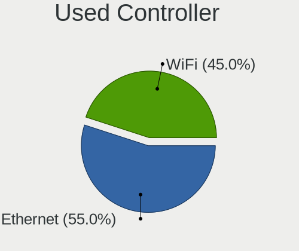

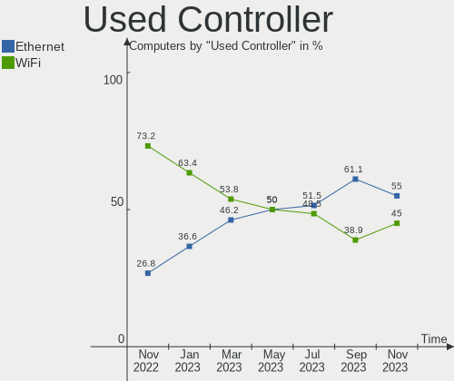

| Kind     | Computers | Percent |
|----------|-----------|---------|
| WiFi     | 15        | 51.72%  |
| Ethernet | 14        | 48.28%  |

NICs
----

Total network controllers on board

| Total | Computers | Percent |
|-------|-----------|---------|
| 1     | 13        | 46.43%  |
| 2     | 12        | 42.86%  |
| 0     | 2         | 7.14%   |
| 3     | 1         | 3.57%   |

IPv6
----

IPv6 vs IPv4

| Used | Computers | Percent |
|------|-----------|---------|
| No   | 20        | 71.43%  |
| Yes  | 8         | 28.57%  |

Bluetooth
---------

Bluetooth Vendor
----------------

Controller vendors

| Vendor                | Computers | Percent |
|-----------------------|-----------|---------|
| Intel                 | 9         | 56.25%  |
| Realtek Semiconductor | 5         | 31.25%  |
| Ralink                | 1         | 6.25%   |
| Broadcom              | 1         | 6.25%   |

Bluetooth Model
---------------

Controller models

| Model                                          | Computers | Percent |
|------------------------------------------------|-----------|---------|
| Realtek Bluetooth Radio                        | 3         | 18.75%  |
| Intel Bluetooth wireless interface             | 3         | 18.75%  |
| Intel AX201 Bluetooth                          | 2         | 12.5%   |
| Realtek RTL8723B Bluetooth                     | 1         | 6.25%   |
| Realtek  Bluetooth 4.2 Adapter                 | 1         | 6.25%   |
| Ralink RT3290 Bluetooth                        | 1         | 6.25%   |
| Intel Centrino Bluetooth Wireless Transceiver  | 1         | 6.25%   |
| Intel Bluetooth 9460/9560 Jefferson Peak (JfP) | 1         | 6.25%   |
| Intel AX210 Bluetooth                          | 1         | 6.25%   |
| Intel AX200 Bluetooth                          | 1         | 6.25%   |
| Broadcom BCM20702A0 Bluetooth 4.0              | 1         | 6.25%   |

Sound
-----

Sound Vendor
------------

Sound card vendors

| Vendor              | Computers | Percent |
|---------------------|-----------|---------|
| Intel               | 17        | 51.52%  |
| AMD                 | 10        | 30.3%   |
| Nvidia              | 2         | 6.06%   |
| Meizu               | 1         | 3.03%   |
| Logitech            | 1         | 3.03%   |
| GN Netcom           | 1         | 3.03%   |
| C-Media Electronics | 1         | 3.03%   |

Sound Model
-----------

Sound card models

| Model                                                                      | Computers | Percent |
|----------------------------------------------------------------------------|-----------|---------|
| AMD Family 17h/19h HD Audio Controller                                     | 5         | 11.9%   |
| Intel Tiger Lake-LP Smart Sound Technology Audio Controller                | 3         | 7.14%   |
| AMD SBx00 Azalia (Intel HDA)                                               | 3         | 7.14%   |
| AMD Raven/Raven2/Fenghuang HDMI/DP Audio Controller                        | 3         | 7.14%   |
| Intel Celeron/Pentium Silver Processor High Definition Audio               | 2         | 4.76%   |
| Intel Atom Processor Z36xxx/Z37xxx Series High Definition Audio Controller | 2         | 4.76%   |
| Intel 7 Series/C216 Chipset Family High Definition Audio Controller        | 2         | 4.76%   |
| Intel 200 Series PCH HD Audio                                              | 2         | 4.76%   |
| Nvidia TU107 GeForce GTX 1650 High Definition Audio Controller             | 1         | 2.38%   |
| Nvidia GK104 HDMI Audio Controller                                         | 1         | 2.38%   |
| Meizu HiFi DAC Headphone Amplifier                                         | 1         | 2.38%   |
| Logitech Blue Microphones                                                  | 1         | 2.38%   |
| Intel Xeon E3-1200 v3/4th Gen Core Processor HD Audio Controller           | 1         | 2.38%   |
| Intel Sunrise Point-LP HD Audio                                            | 1         | 2.38%   |
| Intel Ice Lake-LP Smart Sound Technology Audio Controller                  | 1         | 2.38%   |
| Intel 82801JD/DO (ICH10 Family) HD Audio Controller                        | 1         | 2.38%   |
| Intel 8 Series/C220 Series Chipset High Definition Audio Controller        | 1         | 2.38%   |
| Intel 5 Series/3400 Series Chipset High Definition Audio                   | 1         | 2.38%   |
| Intel 100 Series/C230 Series Chipset Family HD Audio Controller            | 1         | 2.38%   |
| GN Netcom Jabra Link 370                                                   | 1         | 2.38%   |
| C-Media Electronics USB Advanced Audio Device                              | 1         | 2.38%   |
| AMD Wrestler HDMI Audio                                                    | 1         | 2.38%   |
| AMD RS880 HDMI Audio [Radeon HD 4200 Series]                               | 1         | 2.38%   |
| AMD RS780 HDMI Audio [Radeon 3000/3100 / HD 3200/3300]                     | 1         | 2.38%   |
| AMD Renoir Radeon High Definition Audio Controller                         | 1         | 2.38%   |
| AMD Kabini HDMI/DP Audio                                                   | 1         | 2.38%   |
| AMD FCH Azalia Controller                                                  | 1         | 2.38%   |
| AMD Cedar HDMI Audio [Radeon HD 5400/6300/7300 Series]                     | 1         | 2.38%   |

Memory
------

Memory Vendor
-------------

Memory module vendors

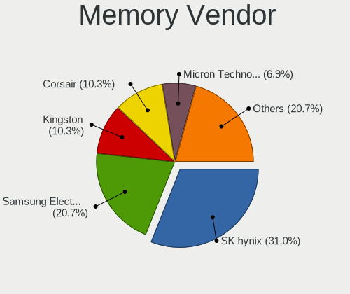

| Vendor              | Computers | Percent |
|---------------------|-----------|---------|
| SK hynix            | 6         | 27.27%  |
| Kingston            | 5         | 22.73%  |
| Crucial             | 4         | 18.18%  |
| Unknown             | 3         | 13.64%  |
| Unknown (ABCD)      | 1         | 4.55%   |
| Samsung Electronics | 1         | 4.55%   |
| Micron Technology   | 1         | 4.55%   |
| Corsair             | 1         | 4.55%   |

Memory Model
------------

Memory module models

| Model                                                               | Computers | Percent |
|---------------------------------------------------------------------|-----------|---------|
| Unknown RAM Module 4096MB DIMM 1600MT/s                             | 1         | 4%      |
| Unknown RAM Module 2048MB DIMM DDR 800MT/s                          | 1         | 4%      |
| Unknown RAM DDR4 NB 8G 2400 8192MB SODIMM DDR4 2667MT/s             | 1         | 4%      |
| Unknown (ABCD) RAM 123456789012345678 2048MB SODIMM LPDDR4 2400MT/s | 1         | 4%      |
| SK hynix RAM Module 8GB SODIMM DDR4 2400MT/s                        | 1         | 4%      |
| SK hynix RAM HMT451S6DFR8A-PB 4GB SODIMM DDR3 1600MT/s              | 1         | 4%      |
| SK hynix RAM HMT451S6BFR8A-PB 4GB SODIMM DDR3 1600MT/s              | 1         | 4%      |
| SK hynix RAM HMT351S6CFR8C-PB 4GB SODIMM DDR3 1600MT/s              | 1         | 4%      |
| SK hynix RAM HMT351S6BFR8C-H9 4GB DIMM DDR3 1333MT/s                | 1         | 4%      |
| SK hynix RAM HMT325S6CFR8C-PB 2GB SODIMM DDR3 1600MT/s              | 1         | 4%      |
| SK hynix RAM HMAA1GS6CJR6N-XN 8192MB Row Of Chips DDR4 3200MT/s     | 1         | 4%      |
| SK hynix RAM HMA81GS6DJR8N-XN 8GB SODIMM DDR4 3200MT/s              | 1         | 4%      |
| Samsung RAM M471A5244CB0-CWE 4GB SODIMM DDR4 3200MT/s               | 1         | 4%      |
| Samsung RAM M471A5244CB0-CTD 4096MB Row Of Chips DDR4 2667MT/s      | 1         | 4%      |
| Micron RAM 53E2G32D4NQ-046 4GB Row Of Chips LPDDR4 4267MT/s         | 1         | 4%      |
| Kingston RAM Module 8192MB SODIMM DDR4 3200MT/s                     | 1         | 4%      |
| Kingston RAM LV32D4S2S8HD-8 8GB SODIMM DDR4 3200MT/s                | 1         | 4%      |
| Kingston RAM KHX1600C10D3/8G 8GB DIMM DDR3 1600MT/s                 | 1         | 4%      |
| Kingston RAM 99U5428-063.A00LF 8GB SODIMM DDR3 1600MT/s             | 1         | 4%      |
| Kingston RAM 9905700-104.A00G 8GB SODIMM DDR4 3200MT/s              | 1         | 4%      |
| Crucial RAM CT8G4SFS824A.C8FE 8GB SODIMM DDR4 2667MT/s              | 1         | 4%      |
| Crucial RAM CT8G4SFS824A.C8FBD1 8GB SODIMM DDR4 2667MT/s            | 1         | 4%      |
| Crucial RAM CT8G4SFRA32A.M8FR 8192MB SODIMM DDR4 3200MT/s           | 1         | 4%      |
| Crucial RAM CT8G4DFD8213.C16FAR2 8GB DIMM DDR4 2133MT/s             | 1         | 4%      |
| Corsair RAM CMK16GX4M1A2666C16 16GB DIMM DDR4 2667MT/s              | 1         | 4%      |

Memory Kind
-----------

Memory module kinds

| Kind    | Computers | Percent |
|---------|-----------|---------|
| DDR4    | 9         | 50%     |
| DDR3    | 5         | 27.78%  |
| LPDDR4  | 2         | 11.11%  |
| DDR     | 1         | 5.56%   |
| Unknown | 1         | 5.56%   |

Memory Form Factor
------------------

Physical design of the memory module

| Name         | Computers | Percent |
|--------------|-----------|---------|
| SODIMM       | 12        | 60%     |
| DIMM         | 5         | 25%     |
| Row Of Chips | 3         | 15%     |

Memory Size
-----------

Memory module size

| Size  | Computers | Percent |
|-------|-----------|---------|
| 8192  | 10        | 50%     |
| 4096  | 7         | 35%     |
| 2048  | 2         | 10%     |
| 16384 | 1         | 5%      |

Memory Speed
------------

Memory module speed

| Speed | Computers | Percent |
|-------|-----------|---------|
| 3200  | 5         | 23.81%  |
| 2667  | 5         | 23.81%  |
| 1600  | 4         | 19.05%  |
| 2400  | 2         | 9.52%   |
| 4267  | 1         | 4.76%   |
| 2133  | 1         | 4.76%   |
| 1867  | 1         | 4.76%   |
| 1333  | 1         | 4.76%   |
| 800   | 1         | 4.76%   |

Printers & scanners
-------------------

Printer Vendor
--------------

Printer device vendors

Zero info for selected period =(

Printer Model
-------------

Printer device models

Zero info for selected period =(

Scanner Vendor
--------------

Scanner device vendors

Zero info for selected period =(

Scanner Model
-------------

Scanner device models

Zero info for selected period =(

Camera
------

Camera Vendor
-------------

Camera device vendors

| Vendor                                 | Computers | Percent |
|----------------------------------------|-----------|---------|
| Chicony Electronics                    | 4         | 30.77%  |
| Syntek                                 | 2         | 15.38%  |
| Sunplus Innovation Technology          | 1         | 7.69%   |
| Realtek Semiconductor                  | 1         | 7.69%   |
| Quanta                                 | 1         | 7.69%   |
| Logitech                               | 1         | 7.69%   |
| Importek                               | 1         | 7.69%   |
| IMC Networks                           | 1         | 7.69%   |
| Cheng Uei Precision Industry (Foxlink) | 1         | 7.69%   |

Camera Model
------------

Camera device models

| Model                                                   | Computers | Percent |
|---------------------------------------------------------|-----------|---------|
| Syntek Integrated Camera                                | 2         | 15.38%  |
| Sunplus Integrated_Webcam_FHD                           | 1         | 7.69%   |
| Realtek USB2.0 camera                                   | 1         | 7.69%   |
| Quanta ov9734_techfront_camera                          | 1         | 7.69%   |
| Logitech Webcam C270                                    | 1         | 7.69%   |
| Importek HP Webcam                                      | 1         | 7.69%   |
| IMC Networks Integrated Camera                          | 1         | 7.69%   |
| Chicony USB2.0 Camera                                   | 1         | 7.69%   |
| Chicony TOSHIBA Web Camera - HD                         | 1         | 7.69%   |
| Chicony HP Webcam                                       | 1         | 7.69%   |
| Chicony Asus 720p CMOS webcam                           | 1         | 7.69%   |
| Cheng Uei Precision Industry (Foxlink) HP TrueVision HD | 1         | 7.69%   |

Security
--------

Fingerprint Vendor
------------------

Fingerprint sensor vendors

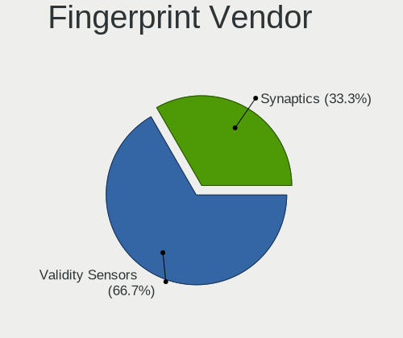

| Vendor                     | Computers | Percent |
|----------------------------|-----------|---------|
| Shenzhen Goodix Technology | 2         | 100%    |

Fingerprint Model
-----------------

Fingerprint sensor models

| Model                               | Computers | Percent |
|-------------------------------------|-----------|---------|
| Shenzhen Goodix  FingerPrint Device | 2         | 100%    |

Chipcard Vendor
---------------

Chipcard module vendors

| Vendor   | Computers | Percent |
|----------|-----------|---------|
| Broadcom | 1         | 100%    |

Chipcard Model
--------------

Chipcard module models

| Model          | Computers | Percent |
|----------------|-----------|---------|
| Broadcom 58200 | 1         | 100%    |

Unsupported
-----------

Unsupported Devices
-------------------

Total unsupported devices on board

| Total | Computers | Percent |
|-------|-----------|---------|
| 0     | 21        | 75%     |
| 1     | 7         | 25%     |

Unsupported Device Types
------------------------

Types of unsupported devices

| Type               | Computers | Percent |
|--------------------|-----------|---------|
| Fingerprint reader | 2         | 28.57%  |
| Network            | 1         | 14.29%  |
| Net/wireless       | 1         | 14.29%  |
| Chipcard           | 1         | 14.29%  |
| Camera             | 1         | 14.29%  |
| Bluetooth          | 1         | 14.29%  |

