Ubuntu MATE Hardware Trends
---------------------------

A project to identify most popular hardware characteristics and track their change
over time based on data collected by Ubuntu MATE users at https://Linux-Hardware.org.

Anyone can contribute to this report by the [hw-probe](https://github.com/linuxhw/hw-probe) tool:

    sudo -E hw-probe -all -upload

This is a report for all computer types. See also reports for [desktops](/Dist/Ubuntu_MATE/Desktop/README.md) and [notebooks](/Dist/Ubuntu_MATE/Notebook/README.md).

Full-feature report is available here: https://linux-hardware.org/?view=trends

Period: Jan, 2022.

Contents
--------

* [ System ](#system)
  - [ OS                       ](#os)
  - [ OS Family                ](#os-family)
  - [ Kernel                   ](#kernel)
  - [ Kernel Family            ](#kernel-family)
  - [ Kernel Major Ver.        ](#kernel-major-ver)
  - [ Arch                     ](#arch)
  - [ DE                       ](#de)
  - [ Display Server           ](#display-server)
  - [ Display Manager          ](#display-manager)
  - [ OS Lang                  ](#os-lang)
  - [ Boot Mode                ](#boot-mode)
  - [ Filesystem               ](#filesystem)
  - [ Part. scheme             ](#part-scheme)
  - [ Dual Boot with Linux/BSD ](#dual-boot-with-linuxbsd)
  - [ Dual Boot (Win)          ](#dual-boot-win)

* [ Board ](#board)
  - [ Vendor                   ](#vendor)
  - [ Model                    ](#model)
  - [ Model Family             ](#model-family)
  - [ MFG Year                 ](#mfg-year)
  - [ Form Factor              ](#form-factor)
  - [ Secure Boot              ](#secure-boot)
  - [ Coreboot                 ](#coreboot)
  - [ RAM Size                 ](#ram-size)
  - [ RAM Used                 ](#ram-used)
  - [ Total Drives             ](#total-drives)
  - [ Has CD-ROM               ](#has-cd-rom)
  - [ Has Ethernet             ](#has-ethernet)
  - [ Has WiFi                 ](#has-wifi)
  - [ Has Bluetooth            ](#has-bluetooth)

* [ Location ](#location)
  - [ Country                  ](#country)
  - [ City                     ](#city)

* [ Drives ](#drives)
  - [ Drive Vendor             ](#drive-vendor)
  - [ Drive Model              ](#drive-model)
  - [ HDD Vendor               ](#hdd-vendor)
  - [ SSD Vendor               ](#ssd-vendor)
  - [ Drive Kind               ](#drive-kind)
  - [ Drive Connector          ](#drive-connector)
  - [ Drive Size               ](#drive-size)
  - [ Space Total              ](#space-total)
  - [ Space Used               ](#space-used)
  - [ Malfunc. Drives          ](#malfunc-drives)
  - [ Malfunc. Drive Vendor    ](#malfunc-drive-vendor)
  - [ Malfunc. HDD Vendor      ](#malfunc-hdd-vendor)
  - [ Malfunc. Drive Kind      ](#malfunc-drive-kind)
  - [ Failed Drives            ](#failed-drives)
  - [ Failed Drive Vendor      ](#failed-drive-vendor)
  - [ Drive Status             ](#drive-status)

* [ Storage controller ](#storage-controller)
  - [ Storage Vendor           ](#storage-vendor)
  - [ Storage Model            ](#storage-model)
  - [ Storage Kind             ](#storage-kind)

* [ Processor ](#processor)
  - [ CPU Vendor               ](#cpu-vendor)
  - [ CPU Model                ](#cpu-model)
  - [ CPU Model Family         ](#cpu-model-family)
  - [ CPU Cores                ](#cpu-cores)
  - [ CPU Sockets              ](#cpu-sockets)
  - [ CPU Threads              ](#cpu-threads)
  - [ CPU Op-Modes             ](#cpu-op-modes)
  - [ CPU Microcode            ](#cpu-microcode)
  - [ CPU Microarch            ](#cpu-microarch)

* [ Graphics ](#graphics)
  - [ GPU Vendor               ](#gpu-vendor)
  - [ GPU Model                ](#gpu-model)
  - [ GPU Combo                ](#gpu-combo)
  - [ GPU Driver               ](#gpu-driver)
  - [ GPU Memory               ](#gpu-memory)

* [ Monitor ](#monitor)
  - [ Monitor Vendor           ](#monitor-vendor)
  - [ Monitor Model            ](#monitor-model)
  - [ Monitor Resolution       ](#monitor-resolution)
  - [ Monitor Diagonal         ](#monitor-diagonal)
  - [ Monitor Width            ](#monitor-width)
  - [ Aspect Ratio             ](#aspect-ratio)
  - [ Monitor Area             ](#monitor-area)
  - [ Pixel Density            ](#pixel-density)
  - [ Multiple Monitors        ](#multiple-monitors)

* [ Network ](#network)
  - [ Net Controller Vendor    ](#net-controller-vendor)
  - [ Net Controller Model     ](#net-controller-model)
  - [ Wireless Vendor          ](#wireless-vendor)
  - [ Wireless Model           ](#wireless-model)
  - [ Ethernet Vendor          ](#ethernet-vendor)
  - [ Ethernet Model           ](#ethernet-model)
  - [ Net Controller Kind      ](#net-controller-kind)
  - [ Used Controller          ](#used-controller)
  - [ NICs                     ](#nics)
  - [ IPv6                     ](#ipv6)

* [ Bluetooth ](#bluetooth)
  - [ Bluetooth Vendor         ](#bluetooth-vendor)
  - [ Bluetooth Model          ](#bluetooth-model)

* [ Sound ](#sound)
  - [ Sound Vendor             ](#sound-vendor)
  - [ Sound Model              ](#sound-model)

* [ Memory ](#memory)
  - [ Memory Vendor            ](#memory-vendor)
  - [ Memory Model             ](#memory-model)
  - [ Memory Kind              ](#memory-kind)
  - [ Memory Form Factor       ](#memory-form-factor)
  - [ Memory Size              ](#memory-size)
  - [ Memory Speed             ](#memory-speed)

* [ Printers & scanners ](#printers--scanners)
  - [ Printer Vendor           ](#printer-vendor)
  - [ Printer Model            ](#printer-model)
  - [ Scanner Vendor           ](#scanner-vendor)
  - [ Scanner Model            ](#scanner-model)

* [ Camera ](#camera)
  - [ Camera Vendor            ](#camera-vendor)
  - [ Camera Model             ](#camera-model)

* [ Security ](#security)
  - [ Fingerprint Vendor       ](#fingerprint-vendor)
  - [ Fingerprint Model        ](#fingerprint-model)
  - [ Chipcard Vendor          ](#chipcard-vendor)
  - [ Chipcard Model           ](#chipcard-model)

* [ Unsupported ](#unsupported)
  - [ Unsupported Devices      ](#unsupported-devices)
  - [ Unsupported Device Types ](#unsupported-device-types)

System
------

OS
--

Installed operating systems

| Name              | Computers | Percent |
|-------------------|-----------|---------|
| Ubuntu MATE 20.04 | 29        | 48.33%  |
| Ubuntu MATE 18.04 | 17        | 28.33%  |
| Ubuntu MATE 21.10 | 10        | 16.67%  |
| Ubuntu MATE 21.04 | 2         | 3.33%   |
| Ubuntu MATE 22.04 | 1         | 1.67%   |
| Ubuntu MATE 16.04 | 1         | 1.67%   |

OS Family
---------

OS without a version

| Name        | Computers | Percent |
|-------------|-----------|---------|
| Ubuntu MATE | 60        | 100%    |

Kernel
------

Version of the Linux kernel

| Version              | Computers | Percent |
|----------------------|-----------|---------|
| 4.15.0-163-generic   | 15        | 25%     |
| 5.4.0-94-generic     | 13        | 21.67%  |
| 5.13.0-25-generic    | 4         | 6.67%   |
| 5.13.0-27-generic    | 3         | 5%      |
| 5.11.0-46-generic    | 3         | 5%      |
| 5.10.27-v7+          | 3         | 5%      |
| 5.4.0-91-generic     | 2         | 3.33%   |
| 5.13.0-23-generic    | 2         | 3.33%   |
| 5.4.0-96-generic     | 1         | 1.67%   |
| 5.4.0-65-generic     | 1         | 1.67%   |
| 5.15.12-tkg-cacule   | 1         | 1.67%   |
| 5.15.0-18-generic    | 1         | 1.67%   |
| 5.13.0-25-lowlatency | 1         | 1.67%   |
| 5.13.0-24-generic    | 1         | 1.67%   |
| 5.13.0-19-generic    | 1         | 1.67%   |
| 5.11.0-49-generic    | 1         | 1.67%   |
| 5.11.0-44-generic    | 1         | 1.67%   |
| 5.11.0-43-generic    | 1         | 1.67%   |
| 5.11.0-41-generic    | 1         | 1.67%   |
| 5.11.0-40-generic    | 1         | 1.67%   |
| 4.9.277-119          | 1         | 1.67%   |
| 4.4.0-210-generic    | 1         | 1.67%   |
| 4.15.0-166-generic   | 1         | 1.67%   |

Kernel Family
-------------

Linux kernel without a distro release

| Version | Computers | Percent |
|---------|-----------|---------|
| 5.4.0   | 17        | 28.33%  |
| 4.15.0  | 16        | 26.67%  |
| 5.13.0  | 12        | 20%     |
| 5.11.0  | 8         | 13.33%  |
| 5.10.27 | 3         | 5%      |
| 5.15.12 | 1         | 1.67%   |
| 5.15.0  | 1         | 1.67%   |
| 4.9.277 | 1         | 1.67%   |
| 4.4.0   | 1         | 1.67%   |

Kernel Major Ver.
-----------------

Linux kernel major version

| Version | Computers | Percent |
|---------|-----------|---------|
| 5.4     | 17        | 28.33%  |
| 4.15    | 16        | 26.67%  |
| 5.13    | 12        | 20%     |
| 5.11    | 8         | 13.33%  |
| 5.10    | 3         | 5%      |
| 5.15    | 2         | 3.33%   |
| 4.9     | 1         | 1.67%   |
| 4.4     | 1         | 1.67%   |

Arch
----

OS architecture (x86_64, i586, etc.)

| Name    | Computers | Percent |
|---------|-----------|---------|
| x86_64  | 56        | 93.33%  |
| armv7l  | 3         | 5%      |
| aarch64 | 1         | 1.67%   |

DE
--

Desktop Environment

| Name | Computers | Percent |
|------|-----------|---------|
| MATE | 60        | 100%    |

Display Server
--------------

X11 or Wayland

| Name | Computers | Percent |
|------|-----------|---------|
| X11  | 60        | 100%    |

Display Manager
---------------

SDDM, LightDM, etc.

| Name    | Computers | Percent |
|---------|-----------|---------|
| LightDM | 53        | 88.33%  |
| Unknown | 4         | 6.67%   |
| GDM3    | 3         | 5%      |

OS Lang
-------

Language

| Lang  | Computers | Percent |
|-------|-----------|---------|
| el_GR | 29        | 48.33%  |
| en_US | 19        | 31.67%  |
| ru_UA | 2         | 3.33%   |
| it_IT | 2         | 3.33%   |
| fr_FR | 2         | 3.33%   |
| de_DE | 2         | 3.33%   |
| ru_RU | 1         | 1.67%   |
| en_GB | 1         | 1.67%   |
| en_CA | 1         | 1.67%   |
| de_LU | 1         | 1.67%   |

Boot Mode
---------

EFI or BIOS

| Mode | Computers | Percent |
|------|-----------|---------|
| BIOS | 45        | 75%     |
| EFI  | 15        | 25%     |

Filesystem
----------

Type of filesystem

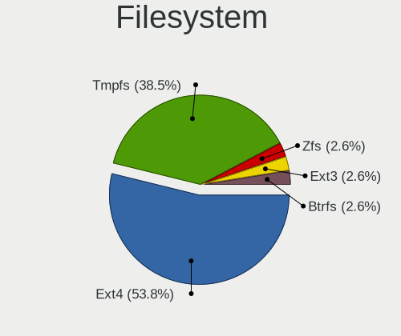

| Type    | Computers | Percent |
|---------|-----------|---------|
| Ext4    | 34        | 56.67%  |
| Overlay | 23        | 38.33%  |
| Btrfs   | 2         | 3.33%   |
| Zfs     | 1         | 1.67%   |

Part. scheme
------------

Scheme of partitioning

| Type    | Computers | Percent |
|---------|-----------|---------|
| Unknown | 33        | 55%     |
| MBR     | 15        | 25%     |
| GPT     | 12        | 20%     |

Dual Boot with Linux/BSD
------------------------

Hosting more than one Linux/BSD

| Dual boot | Computers | Percent |
|-----------|-----------|---------|
| No        | 54        | 90%     |
| Yes       | 6         | 10%     |

Dual Boot (Win)
---------------

Hosting Linux and Windows

| Dual boot | Computers | Percent |
|-----------|-----------|---------|
| Yes       | 36        | 60%     |
| No        | 24        | 40%     |

Board
-----

Vendor
------

Motherboard manufacturer

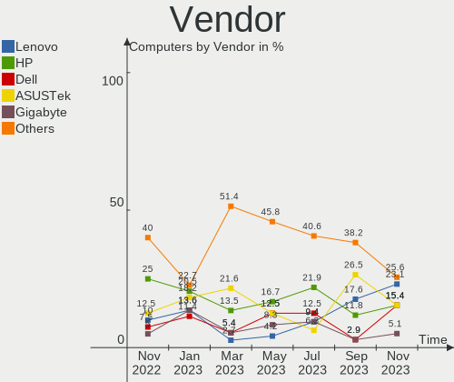

| Name                    | Computers | Percent |
|-------------------------|-----------|---------|
| Hewlett-Packard         | 11        | 18.33%  |
| ASUSTek Computer        | 11        | 18.33%  |
| Dell                    | 10        | 16.67%  |
| Lenovo                  | 8         | 13.33%  |
| Raspberry Pi Foundation | 3         | 5%      |
| Gigabyte Technology     | 3         | 5%      |
| ASRock                  | 3         | 5%      |
| Fujitsu                 | 2         | 3.33%   |
| Apple                   | 2         | 3.33%   |
| ZOTAC                   | 1         | 1.67%   |
| Sony                    | 1         | 1.67%   |
| Quanta                  | 1         | 1.67%   |
| IP3 Tech                | 1         | 1.67%   |
| HPE                     | 1         | 1.67%   |
| Hardkernel              | 1         | 1.67%   |
| Albatron                | 1         | 1.67%   |

Model
-----

Motherboard model

| Name                                  | Computers | Percent |
|---------------------------------------|-----------|---------|
| HP ProDesk 600 G1 SFF                 | 6         | 10%     |
| Dell OptiPlex GX520                   | 4         | 6.67%   |
| RPi Raspberry Pi                      | 3         | 5%      |
| Lenovo ThinkCentre E73 10AW008MMX     | 2         | 3.33%   |
| Dell OptiPlex GX620                   | 2         | 3.33%   |
| ASUS X553MA                           | 2         | 3.33%   |
| ASUS All Series                       | 2         | 3.33%   |
| Apple Macmini3,1                      | 2         | 3.33%   |
| ZOTAC NM10                            | 1         | 1.67%   |
| Sony VPCF13Z1R                        | 1         | 1.67%   |
| Quanta Q1580P                         | 1         | 1.67%   |
| Lenovo ThinkStation P350 30E5000BRU   | 1         | 1.67%   |
| Lenovo ThinkPad SL500 27463ZG         | 1         | 1.67%   |
| Lenovo ThinkCentre M58 7373W43        | 1         | 1.67%   |
| Lenovo ThinkCentre E73 10DR0012GE     | 1         | 1.67%   |
| Lenovo ThinkCentre E73 10DR000TUK     | 1         | 1.67%   |
| Lenovo Flex 2-14 20404                | 1         | 1.67%   |
| IP3 Tech HeroBox                      | 1         | 1.67%   |
| HPE ML10Gen9                          | 1         | 1.67%   |
| HP Z2 Tower G4 Workstation            | 1         | 1.67%   |
| HP ProLiant DL120 G7                  | 1         | 1.67%   |
| HP Pavilion Gaming Laptop 17-cd1xxx   | 1         | 1.67%   |
| HP Compaq Elite 8300 SFF              | 1         | 1.67%   |
| HP 285 G3 MT Business PC              | 1         | 1.67%   |
| Hardkernel ODROID-N2Plus              | 1         | 1.67%   |
| Gigabyte H81M-S2PV                    | 1         | 1.67%   |
| Gigabyte H410M H V3                   | 1         | 1.67%   |
| Gigabyte B450M S2H                    | 1         | 1.67%   |
| Fujitsu LIFEBOOK U748                 | 1         | 1.67%   |
| Fujitsu LIFEBOOK E746                 | 1         | 1.67%   |
| Dell XPS 12 9Q23                      | 1         | 1.67%   |
| Dell OptiPlex 790                     | 1         | 1.67%   |
| Dell OptiPlex 330                     | 1         | 1.67%   |
| Dell Latitude E5400                   | 1         | 1.67%   |
| ASUS X541SA                           | 1         | 1.67%   |
| ASUS ROG Zephyrus G14 GA401QM_GA401QM | 1         | 1.67%   |
| ASUS ROG STRIX B550-I GAMING          | 1         | 1.67%   |
| ASUS PRIME H310M-D R2.0               | 1         | 1.67%   |
| ASUS P5LD2                            | 1         | 1.67%   |
| ASUS P5KPL-AM SE                      | 1         | 1.67%   |
| ASUS M5A99X EVO R2.0                  | 1         | 1.67%   |
| ASRock Z77 Pro4                       | 1         | 1.67%   |
| ASRock G41C-VS                        | 1         | 1.67%   |
| ASRock B450M Pro4                     | 1         | 1.67%   |
| Albatron PM73V                        | 1         | 1.67%   |

Model Family
------------

Motherboard model prefix

| Name                     | Computers | Percent |
|--------------------------|-----------|---------|
| Dell OptiPlex            | 8         | 13.33%  |
| HP ProDesk               | 6         | 10%     |
| Lenovo ThinkCentre       | 5         | 8.33%   |
| RPi Raspberry            | 3         | 5%      |
| Fujitsu LIFEBOOK         | 2         | 3.33%   |
| ASUS X553MA              | 2         | 3.33%   |
| ASUS ROG                 | 2         | 3.33%   |
| ASUS All                 | 2         | 3.33%   |
| Apple Macmini3           | 2         | 3.33%   |
| ZOTAC NM10               | 1         | 1.67%   |
| Sony VPCF13Z1R           | 1         | 1.67%   |
| Quanta Q1580P            | 1         | 1.67%   |
| Lenovo ThinkStation      | 1         | 1.67%   |
| Lenovo ThinkPad          | 1         | 1.67%   |
| Lenovo Flex              | 1         | 1.67%   |
| IP3 Tech HeroBox         | 1         | 1.67%   |
| HPE ML10Gen9             | 1         | 1.67%   |
| HP Z2                    | 1         | 1.67%   |
| HP ProLiant              | 1         | 1.67%   |
| HP Pavilion              | 1         | 1.67%   |
| HP Compaq                | 1         | 1.67%   |
| HP 285                   | 1         | 1.67%   |
| Hardkernel ODROID-N2Plus | 1         | 1.67%   |
| Gigabyte H81M-S2PV       | 1         | 1.67%   |
| Gigabyte H410M           | 1         | 1.67%   |
| Gigabyte B450M           | 1         | 1.67%   |
| Dell XPS                 | 1         | 1.67%   |
| Dell Latitude            | 1         | 1.67%   |
| ASUS X541SA              | 1         | 1.67%   |
| ASUS PRIME               | 1         | 1.67%   |
| ASUS P5LD2               | 1         | 1.67%   |
| ASUS P5KPL-AM            | 1         | 1.67%   |
| ASUS M5A99X              | 1         | 1.67%   |
| ASRock Z77               | 1         | 1.67%   |
| ASRock G41C-VS           | 1         | 1.67%   |
| ASRock B450M             | 1         | 1.67%   |
| Albatron PM73V           | 1         | 1.67%   |

MFG Year
--------

Motherboard manufacture year

| Year    | Computers | Percent |
|---------|-----------|---------|
| 2013    | 9         | 15%     |
| 2014    | 7         | 11.67%  |
| 2008    | 6         | 10%     |
| 2012    | 5         | 8.33%   |
| 2005    | 5         | 8.33%   |
| 2021    | 4         | 6.67%   |
| 2018    | 4         | 6.67%   |
| Unknown | 4         | 6.67%   |
| 2019    | 3         | 5%      |
| 2010    | 3         | 5%      |
| 2020    | 2         | 3.33%   |
| 2016    | 2         | 3.33%   |
| 2006    | 2         | 3.33%   |
| 2015    | 1         | 1.67%   |
| 2011    | 1         | 1.67%   |
| 2009    | 1         | 1.67%   |
| 2007    | 1         | 1.67%   |

Form Factor
-----------

Physical design of the computer

| Name           | Computers | Percent |
|----------------|-----------|---------|
| Desktop        | 38        | 63.33%  |
| Notebook       | 13        | 21.67%  |
| System on chip | 4         | 6.67%   |
| Mini pc        | 3         | 5%      |
| Server         | 2         | 3.33%   |

Secure Boot
-----------

Enabled or disabled

| State    | Computers | Percent |
|----------|-----------|---------|
| Disabled | 55        | 91.67%  |
| Enabled  | 5         | 8.33%   |

Coreboot
--------

Have coreboot on board

| Used | Computers | Percent |
|------|-----------|---------|
| No   | 60        | 100%    |

RAM Size
--------

Total RAM memory

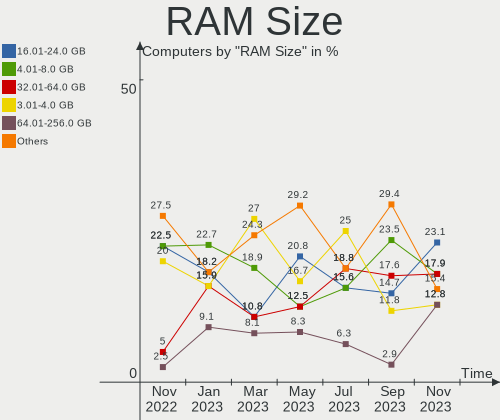

| Size in GB  | Computers | Percent |
|-------------|-----------|---------|
| 3.01-4.0    | 22        | 36.67%  |
| 8.01-16.0   | 9         | 15%     |
| 4.01-8.0    | 8         | 13.33%  |
| 1.01-2.0    | 7         | 11.67%  |
| 2.01-3.0    | 5         | 8.33%   |
| 16.01-24.0  | 3         | 5%      |
| 0.51-1.0    | 3         | 5%      |
| 32.01-64.0  | 2         | 3.33%   |
| 64.01-256.0 | 1         | 1.67%   |

RAM Used
--------

Used RAM memory

| Used GB   | Computers | Percent |
|-----------|-----------|---------|
| 0.51-1.0  | 15        | 25%     |
| 1.01-2.0  | 14        | 23.33%  |
| 2.01-3.0  | 13        | 21.67%  |
| 0.01-0.5  | 10        | 16.67%  |
| 3.01-4.0  | 4         | 6.67%   |
| 4.01-8.0  | 3         | 5%      |
| 8.01-16.0 | 1         | 1.67%   |

Total Drives
------------

Number of drives on board

| Drives | Computers | Percent |
|--------|-----------|---------|
| 1      | 48        | 80%     |
| 2      | 8         | 13.33%  |
| 4      | 3         | 5%      |
| 3      | 1         | 1.67%   |

Has CD-ROM
----------

Has CD-ROM on board

| Presented | Computers | Percent |
|-----------|-----------|---------|
| Yes       | 40        | 66.67%  |
| No        | 20        | 33.33%  |

Has Ethernet
------------

Has Ethernet on board

| Presented | Computers | Percent |
|-----------|-----------|---------|
| Yes       | 58        | 96.67%  |
| No        | 2         | 3.33%   |

Has WiFi
--------

Has WiFi module

| Presented | Computers | Percent |
|-----------|-----------|---------|
| No        | 41        | 68.33%  |
| Yes       | 19        | 31.67%  |

Has Bluetooth
-------------

Has Bluetooth module

| Presented | Computers | Percent |
|-----------|-----------|---------|
| No        | 42        | 70%     |
| Yes       | 18        | 30%     |

Location
--------

Country
-------

Geographic location (country)

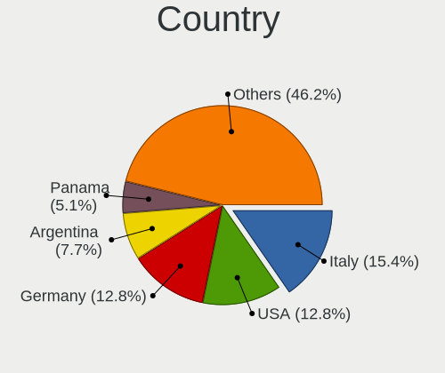

| Country     | Computers | Percent |
|-------------|-----------|---------|
| Greece      | 29        | 48.33%  |
| USA         | 8         | 13.33%  |
| Russia      | 4         | 6.67%   |
| Ukraine     | 2         | 3.33%   |
| Spain       | 2         | 3.33%   |
| Italy       | 2         | 3.33%   |
| Germany     | 2         | 3.33%   |
| France      | 2         | 3.33%   |
| UK          | 1         | 1.67%   |
| Mexico      | 1         | 1.67%   |
| Luxembourg  | 1         | 1.67%   |
| Ivory Coast | 1         | 1.67%   |
| Hungary     | 1         | 1.67%   |
| Canada      | 1         | 1.67%   |
| Brazil      | 1         | 1.67%   |
| Belarus     | 1         | 1.67%   |
| Austria     | 1         | 1.67%   |

City
----

Geographic location (city)

| City              | Computers | Percent |
|-------------------|-----------|---------|
| Thessaloniki      | 17        | 28.33%  |
| Old Faliron       | 11        | 18.33%  |
| Moscow            | 3         | 5%      |
| East Longmeadow   | 3         | 5%      |
| Kyiv              | 2         | 3.33%   |
| Vienna            | 1         | 1.67%   |
| Toronto           | 1         | 1.67%   |
| St Petersburg     | 1         | 1.67%   |
| Sehnde            | 1         | 1.67%   |
| Scottsdale        | 1         | 1.67%   |
| Saint Paul        | 1         | 1.67%   |
| Sabadell          | 1         | 1.67%   |
| Rome              | 1         | 1.67%   |
| Portland          | 1         | 1.67%   |
| Piovene Rocchette | 1         | 1.67%   |
| Niter??i          | 1         | 1.67%   |
| Luxembourg        | 1         | 1.67%   |
| London            | 1         | 1.67%   |
| Kerpen            | 1         | 1.67%   |
| Karditsa          | 1         | 1.67%   |
| Guadalajara       | 1         | 1.67%   |
| Gomel             | 1         | 1.67%   |
| Davenport         | 1         | 1.67%   |
| Budapest          | 1         | 1.67%   |
| Barcelona         | 1         | 1.67%   |
| Ares              | 1         | 1.67%   |
| Antony            | 1         | 1.67%   |
| Ann Arbor         | 1         | 1.67%   |
| Abidjan           | 1         | 1.67%   |

Drives
------

Drive Vendor
------------

Hard drive vendors

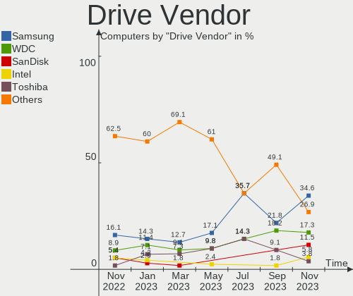

| Vendor              | Computers | Drives | Percent |
|---------------------|-----------|--------|---------|
| Seagate             | 18        | 18     | 23.38%  |
| Samsung Electronics | 12        | 12     | 15.58%  |
| WDC                 | 11        | 12     | 14.29%  |
| Toshiba             | 6         | 7      | 7.79%   |
| Intel               | 5         | 5      | 6.49%   |
| Unknown             | 4         | 4      | 5.19%   |
| PNY                 | 2         | 3      | 2.6%    |
| Kingston            | 2         | 2      | 2.6%    |
| Hitachi             | 2         | 2      | 2.6%    |
| Fujitsu             | 2         | 2      | 2.6%    |
| Crucial             | 2         | 2      | 2.6%    |
| China               | 2         | 2      | 2.6%    |
| SK Hynix            | 1         | 1      | 1.3%    |
| SanDisk             | 1         | 1      | 1.3%    |
| Phison              | 1         | 1      | 1.3%    |
| Patriot             | 1         | 1      | 1.3%    |
| Netac               | 1         | 1      | 1.3%    |
| LITEON              | 1         | 1      | 1.3%    |
| Leven               | 1         | 1      | 1.3%    |
| Hewlett-Packard     | 1         | 1      | 1.3%    |
| Apacer              | 1         | 1      | 1.3%    |

Drive Model
-----------

Hard drive models

| Model                                | Computers | Percent |
|--------------------------------------|-----------|---------|
| Intel SSDSA2BW120G3H 120GB           | 5         | 6.33%   |
| Unknown MMC Card  32GB               | 3         | 3.8%    |
| Seagate ST500DM002-1BD142 500GB      | 3         | 3.8%    |
| Toshiba DT01ACA200 2TB               | 2         | 2.53%   |
| Toshiba DT01ACA050 500GB             | 2         | 2.53%   |
| Seagate ST340212AS 40GB              | 2         | 2.53%   |
| WDC WDS100T2B0A-00SM50 1TB SSD       | 1         | 1.27%   |
| WDC WD5000LPVX-60V0TT0 500GB         | 1         | 1.27%   |
| WDC WD5000BEVT-22ZAT0 500GB          | 1         | 1.27%   |
| WDC WD5000AAKX-08ERMA0 500GB         | 1         | 1.27%   |
| WDC WD2500BPVT-16JJ5T0 250GB         | 1         | 1.27%   |
| WDC WD2500AAKX-753CA1 250GB          | 1         | 1.27%   |
| WDC WD2500AAKX-08ERMA0 250GB         | 1         | 1.27%   |
| WDC WD1600JS-00NCB1 160GB            | 1         | 1.27%   |
| WDC WD10EZEX-07M2NA0 1TB             | 1         | 1.27%   |
| WDC WD10EADS-00L5B1 1TB              | 1         | 1.27%   |
| WDC WD1003FBYX-01Y7B1 1TB            | 1         | 1.27%   |
| Unknown MMC Card  128GB              | 1         | 1.27%   |
| Toshiba MQ01ACF032 320GB             | 1         | 1.27%   |
| Toshiba KBG30ZMS128G 128GB NVMe SSD  | 1         | 1.27%   |
| Toshiba HDWG180 8TB                  | 1         | 1.27%   |
| SK Hynix HFM001TD3JX013N 1TB         | 1         | 1.27%   |
| Seagate STM3250318AS 250GB           | 1         | 1.27%   |
| Seagate ST500LT012-9WS142 500GB      | 1         | 1.27%   |
| Seagate ST500LT012-1DG142 500GB      | 1         | 1.27%   |
| Seagate ST500LM000-SSHD-8GB          | 1         | 1.27%   |
| Seagate ST500DM005 HD502HJ 500GB     | 1         | 1.27%   |
| Seagate ST3500320AS 500GB            | 1         | 1.27%   |
| Seagate ST3402111AS 40GB             | 1         | 1.27%   |
| Seagate ST3160815AS 160GB            | 1         | 1.27%   |
| Seagate ST3160813AS 160GB            | 1         | 1.27%   |
| Seagate ST250DM000-1BD141 250GB      | 1         | 1.27%   |
| Seagate ST1000LM049-2GH172 1TB       | 1         | 1.27%   |
| Seagate ST1000DM010-2EP102 1TB       | 1         | 1.27%   |
| Seagate ST1000DM003-9YN162 1TB       | 1         | 1.27%   |
| SanDisk SSD PLUS 120 GB              | 1         | 1.27%   |
| Samsung SSD PM830 mSATA 128GB        | 1         | 1.27%   |
| Samsung SSD 980 PRO 1TB              | 1         | 1.27%   |
| Samsung SSD 970 EVO Plus 1TB         | 1         | 1.27%   |
| Samsung SSD 870 QVO 8TB              | 1         | 1.27%   |
| Samsung SSD 870 EVO 500GB            | 1         | 1.27%   |
| Samsung SSD 860 EVO 2TB              | 1         | 1.27%   |
| Samsung SSD 840 PRO Series 256GB     | 1         | 1.27%   |
| Samsung MZVL2512HCJQ-00BL7 512GB     | 1         | 1.27%   |
| Samsung MZNLN512HAJQ-00007 512GB SSD | 1         | 1.27%   |
| Samsung MZ7LN256HCHP-00000 256GB SSD | 1         | 1.27%   |
| Samsung MZ7LN256HAJQ-000H1 256GB SSD | 1         | 1.27%   |
| Samsung HD161GJ 160GB                | 1         | 1.27%   |
| PNY SSD2SC240G1SA754D117-820 240GB   | 1         | 1.27%   |
| PNY CS900 240GB SSD                  | 1         | 1.27%   |
| PNY CS900 1TB SSD                    | 1         | 1.27%   |
| Phison NVMe SSD Drive 1TB            | 1         | 1.27%   |
| Patriot P300 256GB                   | 1         | 1.27%   |
| Netac S535N8/256 256GB SSD           | 1         | 1.27%   |
| LITEON CV1-8B128 128GB SSD           | 1         | 1.27%   |
| Leven JAJS300M120C 120GB SSD         | 1         | 1.27%   |
| Kingston SV300S37A60G 64GB SSD       | 1         | 1.27%   |
| Kingston NVMe SSD Drive 500GB        | 1         | 1.27%   |
| Hitachi HTS723232A7A364 320GB        | 1         | 1.27%   |
| Hitachi HTS543232L9SA02 320GB        | 1         | 1.27%   |

HDD Vendor
----------

Hard disk drive vendors

| Vendor              | Computers | Drives | Percent |
|---------------------|-----------|--------|---------|
| Seagate             | 18        | 18     | 46.15%  |
| WDC                 | 10        | 11     | 25.64%  |
| Toshiba             | 5         | 6      | 12.82%  |
| Hitachi             | 2         | 2      | 5.13%   |
| Fujitsu             | 2         | 2      | 5.13%   |
| Samsung Electronics | 1         | 1      | 2.56%   |
| Hewlett-Packard     | 1         | 1      | 2.56%   |

SSD Vendor
----------

Solid state drive vendors

| Vendor              | Computers | Drives | Percent |
|---------------------|-----------|--------|---------|
| Samsung Electronics | 8         | 8      | 30.77%  |
| Intel               | 5         | 5      | 19.23%  |
| PNY                 | 2         | 3      | 7.69%   |
| Crucial             | 2         | 2      | 7.69%   |
| China               | 2         | 2      | 7.69%   |
| WDC                 | 1         | 1      | 3.85%   |
| SanDisk             | 1         | 1      | 3.85%   |
| Netac               | 1         | 1      | 3.85%   |
| LITEON              | 1         | 1      | 3.85%   |
| Leven               | 1         | 1      | 3.85%   |
| Kingston            | 1         | 1      | 3.85%   |
| Apacer              | 1         | 1      | 3.85%   |

Drive Kind
----------

HDD or SSD

| Kind | Computers | Drives | Percent |
|------|-----------|--------|---------|
| HDD  | 37        | 41     | 50.68%  |
| SSD  | 24        | 27     | 32.88%  |
| NVMe | 8         | 8      | 10.96%  |
| MMC  | 4         | 4      | 5.48%   |

Drive Connector
---------------

SATA, SAS, NVMe, etc.

| Type | Computers | Drives | Percent |
|------|-----------|--------|---------|
| SATA | 55        | 68     | 82.09%  |
| NVMe | 8         | 8      | 11.94%  |
| MMC  | 4         | 4      | 5.97%   |

Drive Size
----------

Size of hard drive

| Size in TB | Computers | Drives | Percent |
|------------|-----------|--------|---------|
| 0.01-0.5   | 47        | 51     | 78.33%  |
| 0.51-1.0   | 8         | 12     | 13.33%  |
| 1.01-2.0   | 3         | 3      | 5%      |
| 4.01-10.0  | 2         | 2      | 3.33%   |

Space Total
-----------

Amount of disk space available on the file system

| Size in GB     | Computers | Percent |
|----------------|-----------|---------|
| Unknown        | 25        | 41.67%  |
| 101-250        | 13        | 21.67%  |
| 251-500        | 8         | 13.33%  |
| 21-50          | 3         | 5%      |
| 2001-3000      | 3         | 5%      |
| 501-1000       | 3         | 5%      |
| 1001-2000      | 2         | 3.33%   |
| 51-100         | 2         | 3.33%   |
| More than 3000 | 1         | 1.67%   |

Space Used
----------

Amount of used disk space

| Used GB        | Computers | Percent |
|----------------|-----------|---------|
| Unknown        | 25        | 41.67%  |
| 21-50          | 9         | 15%     |
| 1-20           | 9         | 15%     |
| 101-250        | 5         | 8.33%   |
| 251-500        | 4         | 6.67%   |
| 51-100         | 4         | 6.67%   |
| 1001-2000      | 3         | 5%      |
| More than 3000 | 1         | 1.67%   |

Malfunc. Drives
---------------

Drive models with a malfunction

| Model                           | Computers | Drives | Percent |
|---------------------------------|-----------|--------|---------|
| WDC WD10EADS-00L5B1 1TB         | 1         | 1      | 20%     |
| Seagate ST500LT012-9WS142 500GB | 1         | 1      | 20%     |
| Seagate ST3500320AS 500GB       | 1         | 1      | 20%     |
| Seagate ST3402111AS 40GB        | 1         | 1      | 20%     |
| Fujitsu MHZ2160BH G1 160GB      | 1         | 1      | 20%     |

Malfunc. Drive Vendor
---------------------

Vendors of faulty drives

| Vendor  | Computers | Drives | Percent |
|---------|-----------|--------|---------|
| Seagate | 3         | 3      | 60%     |
| WDC     | 1         | 1      | 20%     |
| Fujitsu | 1         | 1      | 20%     |

Malfunc. HDD Vendor
-------------------

Vendors of faulty HDD drives

| Vendor  | Computers | Drives | Percent |
|---------|-----------|--------|---------|
| Seagate | 3         | 3      | 60%     |
| WDC     | 1         | 1      | 20%     |
| Fujitsu | 1         | 1      | 20%     |

Malfunc. Drive Kind
-------------------

Kinds of faulty drives

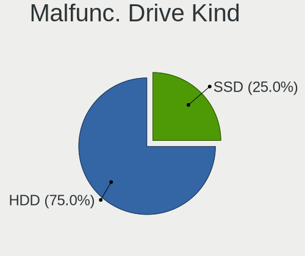

| Kind | Computers | Drives | Percent |
|------|-----------|--------|---------|
| HDD  | 5         | 5      | 100%    |

Failed Drives
-------------

Failed drive models

Zero info for selected period =(

Failed Drive Vendor
-------------------

Failed drive vendors

Zero info for selected period =(

Drive Status
------------

Number of failed and malfunc. drives

| Status   | Computers | Drives | Percent |
|----------|-----------|--------|---------|
| Detected | 34        | 43     | 53.97%  |
| Works    | 24        | 32     | 38.1%   |
| Malfunc  | 5         | 5      | 7.94%   |

Storage controller
------------------

Storage Vendor
--------------

Storage controller vendors

| Vendor                       | Computers | Percent |
|------------------------------|-----------|---------|
| Intel                        | 47        | 72.31%  |
| AMD                          | 5         | 7.69%   |
| Samsung Electronics          | 3         | 4.62%   |
| Nvidia                       | 3         | 4.62%   |
| ASMedia Technology           | 2         | 3.08%   |
| Toshiba America Info Systems | 1         | 1.54%   |
| SK Hynix                     | 1         | 1.54%   |
| Silicon Motion               | 1         | 1.54%   |
| Phison Electronics           | 1         | 1.54%   |
| Kingston Technology Company  | 1         | 1.54%   |

Storage Model
-------------

Storage controller models

| Model                                                                            | Computers | Percent |
|----------------------------------------------------------------------------------|-----------|---------|
| Intel 8 Series/C220 Series Chipset Family 6-port SATA Controller 1 [AHCI mode]   | 13        | 16.25%  |
| Intel NM10/ICH7 Family SATA Controller [IDE mode]                                | 11        | 13.75%  |
| Intel 82801G (ICH7 Family) IDE Controller                                        | 10        | 12.5%   |
| Intel 82801IBM/IEM (ICH9M/ICH9M-E) 4 port SATA Controller [AHCI mode]            | 3         | 3.75%   |
| Samsung NVMe SSD Controller PM9A1/PM9A3/980PRO                                   | 2         | 2.5%    |
| Nvidia MCP79 AHCI Controller                                                     | 2         | 2.5%    |
| Intel Sunrise Point-LP SATA Controller [AHCI mode]                               | 2         | 2.5%    |
| Intel Atom Processor E3800 Series SATA AHCI Controller                           | 2         | 2.5%    |
| Intel 7 Series/C210 Series Chipset Family 6-port SATA Controller [AHCI mode]     | 2         | 2.5%    |
| Intel 6 Series/C200 Series Chipset Family 6 port Desktop SATA AHCI Controller    | 2         | 2.5%    |
| ASMedia ASM1062 Serial ATA Controller                                            | 2         | 2.5%    |
| AMD FCH SATA Controller [AHCI mode]                                              | 2         | 2.5%    |
| AMD 400 Series Chipset SATA Controller                                           | 2         | 2.5%    |
| Toshiba America Info Systems XG6 NVMe SSD Controller                             | 1         | 1.25%   |
| SK Hynix Gold P31 SSD                                                            | 1         | 1.25%   |
| Silicon Motion SM2263EN/SM2263XT SSD Controller                                  | 1         | 1.25%   |
| Samsung NVMe SSD Controller SM981/PM981/PM983                                    | 1         | 1.25%   |
| Phison E12 NVMe Controller                                                       | 1         | 1.25%   |
| Nvidia MCP73 SATA Controller (IDE mode)                                          | 1         | 1.25%   |
| Nvidia MCP73 IDE Controller                                                      | 1         | 1.25%   |
| Kingston Company KC2000 NVMe SSD                                                 | 1         | 1.25%   |
| Intel SATA Controller [RAID mode]                                                | 1         | 1.25%   |
| Intel Q170/Q150/B150/H170/H110/Z170/CM236 Chipset SATA Controller [AHCI Mode]    | 1         | 1.25%   |
| Intel Celeron/Pentium Silver Processor SATA Controller                           | 1         | 1.25%   |
| Intel Atom/Celeron/Pentium Processor x5-E8000/J3xxx/N3xxx Series SATA Controller | 1         | 1.25%   |
| Intel 82801JD/DO (ICH10 Family) 4-port SATA IDE Controller                       | 1         | 1.25%   |
| Intel 82801JD/DO (ICH10 Family) 2-port SATA IDE Controller                       | 1         | 1.25%   |
| Intel 82801 Mobile SATA Controller [RAID mode]                                   | 1         | 1.25%   |
| Intel 8 Series SATA Controller 1 [AHCI mode]                                     | 1         | 1.25%   |
| Intel 7 Series Chipset Family 6-port SATA Controller [AHCI mode]                 | 1         | 1.25%   |
| Intel 500 Series Chipset Family SATA RAID Controller                             | 1         | 1.25%   |
| Intel 500 Series Chipset Family SATA AHCI Controller                             | 1         | 1.25%   |
| Intel 5 Series/3400 Series Chipset 6 port SATA AHCI Controller                   | 1         | 1.25%   |
| Intel 4 Series Chipset PT IDER Controller                                        | 1         | 1.25%   |
| Intel 200 Series PCH SATA controller [AHCI mode]                                 | 1         | 1.25%   |
| AMD Starship/Matisse Chipset SATA Controller [AHCI mode]                         | 1         | 1.25%   |
| AMD SB7x0/SB8x0/SB9x0 SATA Controller [AHCI mode]                                | 1         | 1.25%   |
| AMD 300 Series Chipset SATA Controller                                           | 1         | 1.25%   |

Storage Kind
------------

Kind of storage controller (IDE, SATA, NVMe, SAS, ...)

| Kind | Computers | Percent |
|------|-----------|---------|
| SATA | 39        | 61.9%   |
| IDE  | 13        | 20.63%  |
| NVMe | 8         | 12.7%   |
| RAID | 3         | 4.76%   |

Processor
---------

CPU Vendor
----------

Processor vendors

| Vendor | Computers | Percent |
|--------|-----------|---------|
| Intel  | 50        | 83.33%  |
| AMD    | 6         | 10%     |
| ARM    | 4         | 6.67%   |

CPU Model
---------

Processor models

| Model                                       | Computers | Percent |
|---------------------------------------------|-----------|---------|
| Intel Celeron CPU G1840 @ 2.80GHz           | 6         | 10%     |
| Intel Pentium 4 CPU 3.00GHz                 | 4         | 6.67%   |
| Intel Pentium CPU G3240 @ 3.10GHz           | 3         | 5%      |
| ARM BCM2835 Processor                       | 3         | 5%      |
| Intel Pentium D CPU 2.80GHz                 | 2         | 3.33%   |
| Intel Pentium CPU N3540 @ 2.16GHz           | 2         | 3.33%   |
| Intel Xeon CPU E31230 @ 3.20GHz             | 1         | 1.67%   |
| Intel Xeon CPU E3-1225 v5 @ 3.30GHz         | 1         | 1.67%   |
| Intel Pentium Dual-Core CPU E6300 @ 2.80GHz | 1         | 1.67%   |
| Intel Pentium Dual-Core CPU E5700 @ 3.00GHz | 1         | 1.67%   |
| Intel Pentium Dual CPU E2140 @ 1.60GHz      | 1         | 1.67%   |
| Intel Pentium CPU G3220 @ 3.00GHz           | 1         | 1.67%   |
| Intel Core i7-8550U CPU @ 1.80GHz           | 1         | 1.67%   |
| Intel Core i7-6500U CPU @ 2.50GHz           | 1         | 1.67%   |
| Intel Core i7-10750H CPU @ 2.60GHz          | 1         | 1.67%   |
| Intel Core i7 CPU Q 740 @ 1.73GHz           | 1         | 1.67%   |
| Intel Core i5-9500 CPU @ 3.00GHz            | 1         | 1.67%   |
| Intel Core i5-9400 CPU @ 2.90GHz            | 1         | 1.67%   |
| Intel Core i5-4460 CPU @ 3.20GHz            | 1         | 1.67%   |
| Intel Core i5-4210U CPU @ 1.70GHz           | 1         | 1.67%   |
| Intel Core i5-3570 CPU @ 3.40GHz            | 1         | 1.67%   |
| Intel Core i5-3437U CPU @ 1.90GHz           | 1         | 1.67%   |
| Intel Core i5-10400 CPU @ 2.90GHz           | 1         | 1.67%   |
| Intel Core i3-4150 CPU @ 3.50GHz            | 1         | 1.67%   |
| Intel Core i3-4130 CPU @ 3.40GHz            | 1         | 1.67%   |
| Intel Core i3-3220 CPU @ 3.30GHz            | 1         | 1.67%   |
| Intel Core i3-2120 CPU @ 3.30GHz            | 1         | 1.67%   |
| Intel Core 2 Duo CPU T9800 @ 2.93GHz        | 1         | 1.67%   |
| Intel Core 2 Duo CPU T9550 @ 2.66GHz        | 1         | 1.67%   |
| Intel Core 2 Duo CPU T7250 @ 2.00GHz        | 1         | 1.67%   |
| Intel Core 2 Duo CPU P8700 @ 2.53GHz        | 1         | 1.67%   |
| Intel Core 2 Duo CPU P7550 @ 2.26GHz        | 1         | 1.67%   |
| Intel Core 2 Duo CPU E7300 @ 2.66GHz        | 1         | 1.67%   |
| Intel Core 2 CPU 6300 @ 1.86GHz             | 1         | 1.67%   |
| Intel Celeron J4125 CPU @ 2.00GHz           | 1         | 1.67%   |
| Intel Celeron CPU N3060 @ 1.60GHz           | 1         | 1.67%   |
| Intel Celeron CPU E1400 @ 2.00GHz           | 1         | 1.67%   |
| Intel Atom CPU D525 @ 1.80GHz               | 1         | 1.67%   |
| Intel 11th Gen Core i7-11700 @ 2.50GHz      | 1         | 1.67%   |
| ARM Processor                               | 1         | 1.67%   |
| AMD Ryzen 7 5800HS with Radeon Graphics     | 1         | 1.67%   |
| AMD Ryzen 7 5700G with Radeon Graphics      | 1         | 1.67%   |
| AMD Ryzen 5 3600X 6-Core Processor          | 1         | 1.67%   |
| AMD Ryzen 3 2200G with Radeon Vega Graphics | 1         | 1.67%   |
| AMD Ryzen 3 1200 Quad-Core Processor        | 1         | 1.67%   |
| AMD FX-6100 Six-Core Processor              | 1         | 1.67%   |

CPU Model Family
----------------

Processor model prefix

| Model                   | Computers | Percent |
|-------------------------|-----------|---------|
| Intel Celeron           | 9         | 15%     |
| Intel Core i5           | 7         | 11.67%  |
| Intel Pentium           | 6         | 10%     |
| Intel Core 2 Duo        | 6         | 10%     |
| Intel Pentium 4         | 4         | 6.67%   |
| Intel Core i7           | 4         | 6.67%   |
| Intel Core i3           | 4         | 6.67%   |
| ARM BCM                 | 3         | 5%      |
| Other                   | 2         | 3.33%   |
| Intel Xeon              | 2         | 3.33%   |
| Intel Pentium Dual-Core | 2         | 3.33%   |
| Intel Pentium D         | 2         | 3.33%   |
| AMD Ryzen 7             | 2         | 3.33%   |
| AMD Ryzen 3             | 2         | 3.33%   |
| Intel Pentium Dual      | 1         | 1.67%   |
| Intel Core 2            | 1         | 1.67%   |
| Intel Atom              | 1         | 1.67%   |
| AMD Ryzen 5             | 1         | 1.67%   |
| AMD FX                  | 1         | 1.67%   |

CPU Cores
---------

Number of processor cores

| Number | Computers | Percent |
|--------|-----------|---------|
| 2      | 32        | 53.33%  |
| 4      | 14        | 23.33%  |
| 6      | 6         | 10%     |
| 1      | 4         | 6.67%   |
| 8      | 3         | 5%      |
| 3      | 1         | 1.67%   |

CPU Sockets
-----------

Number of sockets

| Number | Computers | Percent |
|--------|-----------|---------|
| 1      | 59        | 98.33%  |
| 2      | 1         | 1.67%   |

CPU Threads
-----------

Threads per core (Hyper-Threading)

| Number | Computers | Percent |
|--------|-----------|---------|
| 1      | 38        | 63.33%  |
| 2      | 22        | 36.67%  |

CPU Op-Modes
------------

CPU Operation Modes (32-bit, 64-bit)

| Op mode        | Computers | Percent |
|----------------|-----------|---------|
| 32-bit, 64-bit | 57        | 95%     |
| Unknown        | 3         | 5%      |

CPU Microcode
-------------

Microcode number

| Number     | Computers | Percent |
|------------|-----------|---------|
| 0x306c3    | 13        | 21.67%  |
| Unknown    | 11        | 18.33%  |
| 0x1067a    | 6         | 10%     |
| 0xf41      | 4         | 6.67%   |
| 0x6fd      | 3         | 5%      |
| 0xf47      | 2         | 3.33%   |
| 0x306a9    | 2         | 3.33%   |
| 0x30678    | 2         | 3.33%   |
| 0xa0671    | 1         | 1.67%   |
| 0xa0653    | 1         | 1.67%   |
| 0x906ed    | 1         | 1.67%   |
| 0x906ea    | 1         | 1.67%   |
| 0x806ea    | 1         | 1.67%   |
| 0x706a8    | 1         | 1.67%   |
| 0x6f6      | 1         | 1.67%   |
| 0x506e3    | 1         | 1.67%   |
| 0x406c4    | 1         | 1.67%   |
| 0x40651    | 1         | 1.67%   |
| 0x206a7    | 1         | 1.67%   |
| 0x106e5    | 1         | 1.67%   |
| 0x10676    | 1         | 1.67%   |
| 0x0a50000c | 1         | 1.67%   |
| 0x0a50000b | 1         | 1.67%   |
| 0x0810100b | 1         | 1.67%   |
| 0x0600063e | 1         | 1.67%   |

CPU Microarch
-------------

Microarchitecture

| Name          | Computers | Percent |
|---------------|-----------|---------|
| Haswell       | 14        | 23.33%  |
| Penryn        | 7         | 11.67%  |
| NetBurst      | 6         | 10%     |
| Unknown       | 5         | 8.33%   |
| Core          | 4         | 6.67%   |
| Silvermont    | 3         | 5%      |
| KabyLake      | 3         | 5%      |
| IvyBridge     | 3         | 5%      |
| Zen 3         | 2         | 3.33%   |
| Zen           | 2         | 3.33%   |
| Skylake       | 2         | 3.33%   |
| SandyBridge   | 2         | 3.33%   |
| CometLake     | 2         | 3.33%   |
| Zen 2         | 1         | 1.67%   |
| Nehalem       | 1         | 1.67%   |
| Goldmont plus | 1         | 1.67%   |
| Bulldozer     | 1         | 1.67%   |
| Bonnell       | 1         | 1.67%   |

Graphics
--------

GPU Vendor
----------

Vendors of graphics cards

| Vendor                     | Computers | Percent |
|----------------------------|-----------|---------|
| Intel                      | 39        | 65%     |
| Nvidia                     | 14        | 23.33%  |
| AMD                        | 6         | 10%     |
| Matrox Electronics Systems | 1         | 1.67%   |

GPU Model
---------

Graphics card models

| Model                                                                                    | Computers | Percent |
|------------------------------------------------------------------------------------------|-----------|---------|
| Intel Xeon E3-1200 v3/4th Gen Core Processor Integrated Graphics Controller              | 11        | 18.03%  |
| Intel 82945G/GZ Integrated Graphics Controller                                           | 6         | 9.84%   |
| Nvidia GT218 [GeForce 210]                                                               | 2         | 3.28%   |
| Nvidia GK208B [GeForce GT 710]                                                           | 2         | 3.28%   |
| Nvidia C79 [GeForce 9400]                                                                | 2         | 3.28%   |
| Intel Xeon E3-1200 v2/3rd Gen Core processor Graphics Controller                         | 2         | 3.28%   |
| Intel Mobile 4 Series Chipset Integrated Graphics Controller                             | 2         | 3.28%   |
| Intel CoffeeLake-S GT2 [UHD Graphics 630]                                                | 2         | 3.28%   |
| Intel Atom Processor Z36xxx/Z37xxx Series Graphics & Display                             | 2         | 3.28%   |
| Intel 82G33/G31 Express Integrated Graphics Controller                                   | 2         | 3.28%   |
| Intel 4 Series Chipset Integrated Graphics Controller                                    | 2         | 3.28%   |
| AMD Cezanne                                                                              | 2         | 3.28%   |
| Nvidia TU117GLM [Quadro T1000 Mobile]                                                    | 1         | 1.64%   |
| Nvidia TU116M [GeForce GTX 1660 Ti Mobile]                                               | 1         | 1.64%   |
| Nvidia GP108 [GeForce GT 1030]                                                           | 1         | 1.64%   |
| Nvidia GP107 [GeForce GTX 1050 Ti]                                                       | 1         | 1.64%   |
| Nvidia GK104 [GeForce GTX 680]                                                           | 1         | 1.64%   |
| Nvidia GF108M [GeForce GT 425M]                                                          | 1         | 1.64%   |
| Nvidia GA106M [GeForce RTX 3060 Mobile / Max-Q]                                          | 1         | 1.64%   |
| Nvidia G96CM [GeForce GT 130M]                                                           | 1         | 1.64%   |
| Matrox Electronics Systems MGA G200EH                                                    | 1         | 1.64%   |
| Intel UHD Graphics 620                                                                   | 1         | 1.64%   |
| Intel Skylake GT2 [HD Graphics 520]                                                      | 1         | 1.64%   |
| Intel RocketLake-S GT1 [UHD Graphics 750]                                                | 1         | 1.64%   |
| Intel Haswell-ULT Integrated Graphics Controller                                         | 1         | 1.64%   |
| Intel GeminiLake [UHD Graphics 600]                                                      | 1         | 1.64%   |
| Intel CometLake-S GT2 [UHD Graphics 630]                                                 | 1         | 1.64%   |
| Intel CometLake-H GT2 [UHD Graphics]                                                     | 1         | 1.64%   |
| Intel Atom/Celeron/Pentium Processor x5-E8000/J3xxx/N3xxx Integrated Graphics Controller | 1         | 1.64%   |
| Intel Atom Processor D4xx/D5xx/N4xx/N5xx Integrated Graphics Controller                  | 1         | 1.64%   |
| Intel 3rd Gen Core processor Graphics Controller                                         | 1         | 1.64%   |
| AMD RV620 LE [Radeon HD 3450]                                                            | 1         | 1.64%   |
| AMD RV370 [Radeon X300/X550/X1050 Series] (Secondary)                                    | 1         | 1.64%   |
| AMD RV370 [Radeon X300/X550/X1050 Series]                                                | 1         | 1.64%   |
| AMD Raven Ridge [Radeon Vega Series / Radeon Vega Mobile Series]                         | 1         | 1.64%   |
| AMD Oland PRO [Radeon R7 240/340 / Radeon 520]                                           | 1         | 1.64%   |

GPU Combo
---------

Combinations of graphics cards

| Name           | Computers | Percent |
|----------------|-----------|---------|
| 1 x Intel      | 36        | 60%     |
| 1 x Nvidia     | 10        | 16.67%  |
| Other          | 4         | 6.67%   |
| 1 x AMD        | 4         | 6.67%   |
| Intel + Nvidia | 3         | 5%      |
| 2 x AMD        | 1         | 1.67%   |
| 1 x Matrox     | 1         | 1.67%   |
| AMD + Nvidia   | 1         | 1.67%   |

GPU Driver
----------

Free vs proprietary

| Driver      | Computers | Percent |
|-------------|-----------|---------|
| Free        | 48        | 80%     |
| Proprietary | 7         | 11.67%  |
| Unknown     | 5         | 8.33%   |

GPU Memory
----------

Total video memory

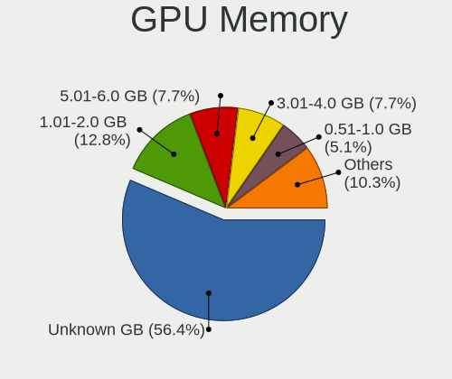

| Size in GB | Computers | Percent |
|------------|-----------|---------|
| Unknown    | 30        | 50%     |
| 1.01-2.0   | 14        | 23.33%  |
| 0.01-0.5   | 9         | 15%     |
| 3.01-4.0   | 3         | 5%      |
| 0.51-1.0   | 3         | 5%      |
| 5.01-6.0   | 1         | 1.67%   |

Monitor
-------

Monitor Vendor
--------------

Monitor vendors

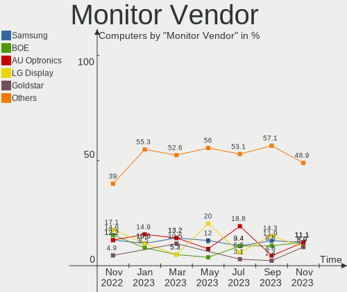

| Vendor                  | Computers | Percent |
|-------------------------|-----------|---------|
| Hewlett-Packard         | 9         | 14.75%  |
| Samsung Electronics     | 7         | 11.48%  |
| ViewSonic               | 5         | 8.2%    |
| LG Display              | 5         | 8.2%    |
| Goldstar                | 5         | 8.2%    |
| Lenovo                  | 3         | 4.92%   |
| Sony                    | 2         | 3.28%   |
| Philips                 | 2         | 3.28%   |
| Hitachi                 | 2         | 3.28%   |
| Eizo                    | 2         | 3.28%   |
| Dell                    | 2         | 3.28%   |
| Chi Mei Optoelectronics | 2         | 3.28%   |
| Belinea                 | 2         | 3.28%   |
| AOC                     | 2         | 3.28%   |
| Acer                    | 2         | 3.28%   |
| Vizio                   | 1         | 1.64%   |
| Vestel Elektronik       | 1         | 1.64%   |
| RTK                     | 1         | 1.64%   |
| PANDA                   | 1         | 1.64%   |
| NEC Computers           | 1         | 1.64%   |
| Iiyama                  | 1         | 1.64%   |
| Fujitsu Siemens         | 1         | 1.64%   |
| BOE                     | 1         | 1.64%   |
| Ancor Communications    | 1         | 1.64%   |

Monitor Model
-------------

Monitor models

| Model                                                                    | Computers | Percent |
|--------------------------------------------------------------------------|-----------|---------|
| ViewSonic VA703-4Series VSC6A1E 1280x1024 341x274mm 17.2-inch            | 4         | 6.35%   |
| LG Display LCD Monitor LGD046D 1920x1080 309x174mm 14.0-inch             | 2         | 3.17%   |
| Hewlett-Packard L2035 HWP2612 1600x1200 408x306mm 20.1-inch              | 2         | 3.17%   |
| Hewlett-Packard L1740 HWP2648 1280x1024 337x270mm 17.0-inch              | 2         | 3.17%   |
| Chi Mei Optoelectronics LCD Monitor CMO15A7 1366x768 344x193mm 15.5-inch | 2         | 3.17%   |
| Vizio VA22LFHDTV10T VIZ0022 1920x1080 477x268mm 21.5-inch                | 1         | 1.59%   |
| ViewSonic VE710s VSCF518 1280x1024 338x270mm 17.0-inch                   | 1         | 1.59%   |
| Vestel Elektronik LCD Monitor VES3700 1920x540                           | 1         | 1.59%   |
| Sony TV SNYE903 1920x1080                                                | 1         | 1.59%   |
| Sony LCD Monitor MS_0025 1920x1080 360x200mm 16.2-inch                   | 1         | 1.59%   |
| Samsung Electronics SyncMaster SAM03CF 1280x1024 338x270mm 17.0-inch     | 1         | 1.59%   |
| Samsung Electronics SA300/SA350 SAM078B 1600x900 443x249mm 20.0-inch     | 1         | 1.59%   |
| Samsung Electronics S34J55x SAM0F71 3440x1440 797x333mm 34.0-inch        | 1         | 1.59%   |
| Samsung Electronics LCD Monitor SEC5441 1366x768 344x194mm 15.5-inch     | 1         | 1.59%   |
| Samsung Electronics LCD Monitor SEC3358 1280x800 331x207mm 15.4-inch     | 1         | 1.59%   |
| Samsung Electronics LCD Monitor C32F391 1920x1080                        | 1         | 1.59%   |
| Samsung Electronics EPSON PJ SECA60D 1920x1080                           | 1         | 1.59%   |
| RTK LCD Monitor RTK1D1A 1920x1080 1020x570mm 46.0-inch                   | 1         | 1.59%   |
| Philips PHL 223V7 PHLC154 1920x1080 476x268mm 21.5-inch                  | 1         | 1.59%   |
| Philips PhilipsTV (5) PHL14CA 1360x768 708x398mm 32.0-inch               | 1         | 1.59%   |
| Philips 206VL PHLC08C 1600x900 443x249mm 20.0-inch                       | 1         | 1.59%   |
| PANDA LCD Monitor NCP005E 1920x1080 309x174mm 14.0-inch                  | 1         | 1.59%   |
| NEC Computers EA244WMi NEC68D6 1920x1200 520x320mm 24.0-inch             | 1         | 1.59%   |
| LG Display LCD Monitor LGD063F 1920x1080 382x215mm 17.3-inch             | 1         | 1.59%   |
| LG Display LCD Monitor LGD0446 1920x1080 309x174mm 14.0-inch             | 1         | 1.59%   |
| LG Display LCD Monitor LGD0402 1920x1080 276x156mm 12.5-inch             | 1         | 1.59%   |
| Lenovo LEN S22e-19 LEN61C9 1920x1080 476x268mm 21.5-inch                 | 1         | 1.59%   |
| Lenovo LCD Monitor LEN4050 1280x800 331x207mm 15.4-inch                  | 1         | 1.59%   |
| Lenovo C27-35 LEN66BA 1920x1080 597x336mm 27.0-inch                      | 1         | 1.59%   |
| Iiyama PL4372UH IVM000B 3840x2160 941x529mm 42.5-inch                    | 1         | 1.59%   |
| Hitachi N220W D-sub HIT60FF 1680x1050 474x296mm 22.0-inch                | 1         | 1.59%   |
| Hitachi CM615 HTCB3B3 1280x1024 300x225mm 14.8-inch                      | 1         | 1.59%   |
| Hewlett-Packard P224 HPN361E 1920x1080 527x296mm 23.8-inch               | 1         | 1.59%   |
| Hewlett-Packard L1950 HWP26E7 1280x1024 380x300mm 19.1-inch              | 1         | 1.59%   |
| Hewlett-Packard L1940T HWP2682 1280x1024 376x301mm 19.0-inch             | 1         | 1.59%   |
| Hewlett-Packard L1706 HWP265C 1280x1024 340x270mm 17.1-inch              | 1         | 1.59%   |
| Hewlett-Packard 24f HPN3546 1920x1080 527x296mm 23.8-inch                | 1         | 1.59%   |
| Goldstar W2243 GSM56FE 1920x1080 477x268mm 21.5-inch                     | 1         | 1.59%   |
| Goldstar W1943 GSM4BAD 1360x768 406x229mm 18.4-inch                      | 1         | 1.59%   |
| Goldstar ULTRAWIDE GSM59F2 2560x1080 798x334mm 34.1-inch                 | 1         | 1.59%   |
| Goldstar ULTRAWIDE GSM59F1 2560x1080 677x290mm 29.0-inch                 | 1         | 1.59%   |
| Goldstar L1730S GSM438D 1280x1024 338x270mm 17.0-inch                    | 1         | 1.59%   |
| Goldstar E1910 GSM4BEA 1280x1024 376x301mm 19.0-inch                     | 1         | 1.59%   |
| Fujitsu Siemens P19-2 FUS0552 1280x1024 376x301mm 19.0-inch              | 1         | 1.59%   |
| Eizo S1921 ENC1832 1280x1024 376x301mm 19.0-inch                         | 1         | 1.59%   |
| Eizo L768 ENC1730 1280x1024 376x301mm 19.0-inch                          | 1         | 1.59%   |
| Dell U2415 DELA0BC 1920x1200 518x324mm 24.1-inch                         | 1         | 1.59%   |
| Dell IN2010N DELA049 1600x900 443x249mm 20.0-inch                        | 1         | 1.59%   |
| BOE LCD Monitor BOE066E 1366x768 344x194mm 15.5-inch                     | 1         | 1.59%   |
| Belinea B101925 MAX0784 1280x1024 376x301mm 19.0-inch                    | 1         | 1.59%   |
| Belinea B101715 MAX06D2 1280x1024 337x270mm 17.0-inch                    | 1         | 1.59%   |
| AOC M19W531 AOC1953 1440x900 408x255mm 18.9-inch                         | 1         | 1.59%   |
| AOC 1950W AOC1950 1366x768 410x230mm 18.5-inch                           | 1         | 1.59%   |
| Ancor Communications ASUS VW193S ACI19D4 1440x900 408x255mm 18.9-inch    | 1         | 1.59%   |
| Acer VG280K ACR0747 3840x2160 621x341mm 27.9-inch                        | 1         | 1.59%   |
| Acer V193L ACR0320 1280x1024 376x301mm 19.0-inch                         | 1         | 1.59%   |

Monitor Resolution
------------------

Monitor screen resolution

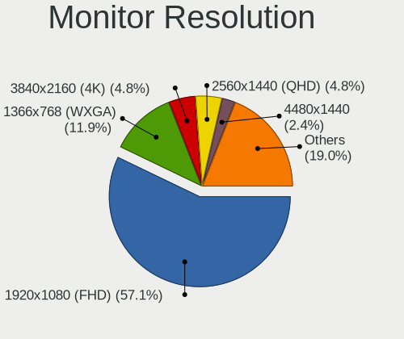

| Resolution         | Computers | Percent |
|--------------------|-----------|---------|
| 1280x1024 (SXGA)   | 20        | 34.48%  |
| 1920x1080 (FHD)    | 15        | 25.86%  |
| 1366x768 (WXGA)    | 5         | 8.62%   |
| 3840x2160 (4K)     | 3         | 5.17%   |
| 1600x900 (HD+)     | 3         | 5.17%   |
| 1600x1200          | 2         | 3.45%   |
| 1440x900 (WXGA+)   | 2         | 3.45%   |
| 1360x768           | 2         | 3.45%   |
| 1280x800 (WXGA)    | 2         | 3.45%   |
| 3440x1440          | 1         | 1.72%   |
| 2560x1080          | 1         | 1.72%   |
| 1920x1200 (WUXGA)  | 1         | 1.72%   |
| 1680x1050 (WSXGA+) | 1         | 1.72%   |

Monitor Diagonal
----------------

Diagonal size in inches

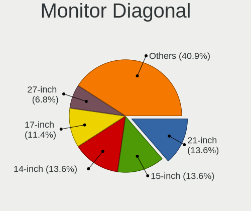

| Inches  | Computers | Percent |
|---------|-----------|---------|
| 17      | 12        | 19.35%  |
| 19      | 9         | 14.52%  |
| 15      | 6         | 9.68%   |
| 20      | 5         | 8.06%   |
| 14      | 5         | 8.06%   |
| 21      | 3         | 4.84%   |
| 18      | 3         | 4.84%   |
| 72      | 2         | 3.23%   |
| 34      | 2         | 3.23%   |
| 27      | 2         | 3.23%   |
| 24      | 2         | 3.23%   |
| 23      | 2         | 3.23%   |
| 84      | 1         | 1.61%   |
| 46      | 1         | 1.61%   |
| 42      | 1         | 1.61%   |
| 40      | 1         | 1.61%   |
| 37      | 1         | 1.61%   |
| 32      | 1         | 1.61%   |
| 22      | 1         | 1.61%   |
| 12      | 1         | 1.61%   |
| Unknown | 1         | 1.61%   |

Monitor Width
-------------

Physical width

| Width in mm | Computers | Percent |
|-------------|-----------|---------|
| 301-350     | 20        | 32.79%  |
| 401-500     | 13        | 21.31%  |
| 351-400     | 10        | 16.39%  |
| 501-600     | 4         | 6.56%   |
| 701-800     | 3         | 4.92%   |
| 1501-2000   | 3         | 4.92%   |
| 801-900     | 2         | 3.28%   |
| 201-300     | 2         | 3.28%   |
| 601-700     | 1         | 1.64%   |
| 1001-1500   | 1         | 1.64%   |
| 901-1000    | 1         | 1.64%   |
| Unknown     | 1         | 1.64%   |

Aspect Ratio
------------

Proportional relationship between the width and the height

| Ratio   | Computers | Percent |
|---------|-----------|---------|
| 16/9    | 24        | 43.64%  |
| 5/4     | 15        | 27.27%  |
| 16/10   | 6         | 10.91%  |
| 6/5     | 4         | 7.27%   |
| 4/3     | 3         | 5.45%   |
| 21/9    | 2         | 3.64%   |
| Unknown | 1         | 1.82%   |

Monitor Area
------------

Area in inch

| Area in inch | Computers | Percent |
|----------------|-----------|---------|
| 151-200        | 17        | 27.42%  |
| 141-150        | 13        | 20.97%  |
| 101-110        | 7         | 11.29%  |
| 201-250        | 5         | 8.06%   |
| 81-90          | 4         | 6.45%   |
| 501-1000       | 4         | 6.45%   |
| More than 1000 | 3         | 4.84%   |
| 351-500        | 3         | 4.84%   |
| 301-350        | 2         | 3.23%   |
| 61-70          | 1         | 1.61%   |
| 251-300        | 1         | 1.61%   |
| 121-130        | 1         | 1.61%   |
| Unknown        | 1         | 1.61%   |

Pixel Density
-------------

Pixels per inch

| Density | Computers | Percent |
|---------|-----------|---------|
| 51-100  | 40        | 67.8%   |
| 101-120 | 7         | 11.86%  |
| 1-50    | 5         | 8.47%   |
| 121-160 | 5         | 8.47%   |
| 161-240 | 1         | 1.69%   |
| Unknown | 1         | 1.69%   |

Multiple Monitors
-----------------

Total monitors connected

| Total | Computers | Percent |
|-------|-----------|---------|
| 1     | 45        | 75%     |
| 2     | 9         | 15%     |
| 0     | 5         | 8.33%   |
| 3     | 1         | 1.67%   |

Network
-------

Net Controller Vendor
---------------------

Controller vendors

| Vendor                            | Computers | Percent |
|-----------------------------------|-----------|---------|
| Realtek Semiconductor             | 23        | 29.87%  |
| Intel                             | 21        | 27.27%  |
| Qualcomm Atheros                  | 7         | 9.09%   |
| Broadcom                          | 6         | 7.79%   |
| Broadcom Limited                  | 5         | 6.49%   |
| Nvidia                            | 3         | 3.9%    |
| Microchip Technology              | 3         | 3.9%    |
| Sierra Wireless                   | 2         | 2.6%    |
| Marvell Technology Group          | 2         | 2.6%    |
| Ralink                            | 1         | 1.3%    |
| MEDIATEK                          | 1         | 1.3%    |
| Ericsson Business Mobile Networks | 1         | 1.3%    |
| Edimax Technology                 | 1         | 1.3%    |
| D-Link System                     | 1         | 1.3%    |

Net Controller Model
--------------------

Controller models

| Model                                                             | Computers | Percent |
|-------------------------------------------------------------------|-----------|---------|
| Realtek RTL8111/8168/8411 PCI Express Gigabit Ethernet Controller | 19        | 23.17%  |
| Intel Ethernet Connection I217-LM                                 | 6         | 7.32%   |
| Broadcom NetXtreme BCM5751 Gigabit Ethernet PCI Express           | 6         | 7.32%   |
| Realtek RTL810xE PCI Express Fast Ethernet controller             | 4         | 4.88%   |
| Microchip SMSC9512/9514 Fast Ethernet Adapter                     | 3         | 3.66%   |
| Sierra Wireless EM7305 Modem                                      | 2         | 2.44%   |
| Qualcomm Atheros QCA9565 / AR9565 Wireless Network Adapter        | 2         | 2.44%   |
| Qualcomm Atheros AR9287 Wireless Network Adapter (PCI-Express)    | 2         | 2.44%   |
| Nvidia MCP79 Ethernet                                             | 2         | 2.44%   |
| Intel Ethernet Controller I225-V                                  | 2         | 2.44%   |
| Intel 82579LM Gigabit Network Connection (Lewisville)             | 2         | 2.44%   |
| Intel 82574L Gigabit Network Connection                           | 2         | 2.44%   |
| Broadcom Limited BCM4321 802.11a/b/g/n                            | 2         | 2.44%   |
| Realtek RTL8187B Wireless 802.11g 54Mbps Network Adapter          | 1         | 1.22%   |
| Ralink RT3090 Wireless 802.11n 1T/1R PCIe                         | 1         | 1.22%   |
| Qualcomm Atheros QCA9377 802.11ac Wireless Network Adapter        | 1         | 1.22%   |
| Qualcomm Atheros AR9485 Wireless Network Adapter                  | 1         | 1.22%   |
| Qualcomm Atheros AR8132 Fast Ethernet                             | 1         | 1.22%   |
| Nvidia MCP73 Ethernet                                             | 1         | 1.22%   |
| MEDIATEK MT7921 802.11ax PCI Express Wireless Network Adapter     | 1         | 1.22%   |
| Marvell Group 88E8057 PCI-E Gigabit Ethernet Controller           | 1         | 1.22%   |
| Marvell Group 88E8053 PCI-E Gigabit Ethernet Controller           | 1         | 1.22%   |
| Intel Wireless 8265 / 8275                                        | 1         | 1.22%   |
| Intel Wireless 8260                                               | 1         | 1.22%   |
| Intel PRO/Wireless 5100 AGN [Shiloh] Network Connection           | 1         | 1.22%   |
| Intel I350 Gigabit Network Connection                             | 1         | 1.22%   |
| Intel Ethernet Connection I219-V                                  | 1         | 1.22%   |
| Intel Ethernet Connection (7) I219-LM                             | 1         | 1.22%   |
| Intel Ethernet Connection (4) I219-LM                             | 1         | 1.22%   |
| Intel Ethernet Connection (2) I219-LM                             | 1         | 1.22%   |
| Intel Ethernet Connection (14) I219-LM                            | 1         | 1.22%   |
| Intel Comet Lake PCH CNVi WiFi                                    | 1         | 1.22%   |
| Intel Centrino Advanced-N 6235                                    | 1         | 1.22%   |
| Intel 82567LM-3 Gigabit Network Connection                        | 1         | 1.22%   |
| Ericsson Business Mobile Networks F3507g Mobile Broadband Module  | 1         | 1.22%   |
| Edimax 802.11n WLAN Adapter                                       | 1         | 1.22%   |
| D-Link System DGE-528T Gigabit Ethernet Adapter                   | 1         | 1.22%   |
| Broadcom Limited NetXtreme BCM5761e Gigabit Ethernet PCIe         | 1         | 1.22%   |
| Broadcom Limited NetLink BCM5787 Gigabit Ethernet PCI Express     | 1         | 1.22%   |
| Broadcom Limited BCM43142 802.11b/g/n                             | 1         | 1.22%   |
| Broadcom Limited BCM4312 802.11b/g LP-PHY                         | 1         | 1.22%   |

Wireless Vendor
---------------

Wireless vendors

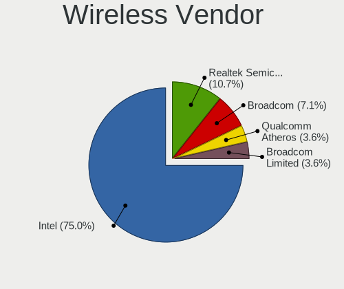

| Vendor                | Computers | Percent |
|-----------------------|-----------|---------|
| Qualcomm Atheros      | 6         | 28.57%  |
| Intel                 | 5         | 23.81%  |
| Broadcom Limited      | 4         | 19.05%  |
| Sierra Wireless       | 2         | 9.52%   |
| Realtek Semiconductor | 1         | 4.76%   |
| Ralink                | 1         | 4.76%   |
| MEDIATEK              | 1         | 4.76%   |
| Edimax Technology     | 1         | 4.76%   |

Wireless Model
--------------

Wireless models

| Model                                                          | Computers | Percent |
|----------------------------------------------------------------|-----------|---------|
| Sierra Wireless EM7305 Modem                                   | 2         | 9.52%   |
| Qualcomm Atheros QCA9565 / AR9565 Wireless Network Adapter     | 2         | 9.52%   |
| Qualcomm Atheros AR9287 Wireless Network Adapter (PCI-Express) | 2         | 9.52%   |
| Broadcom Limited BCM4321 802.11a/b/g/n                         | 2         | 9.52%   |
| Realtek RTL8187B Wireless 802.11g 54Mbps Network Adapter       | 1         | 4.76%   |
| Ralink RT3090 Wireless 802.11n 1T/1R PCIe                      | 1         | 4.76%   |
| Qualcomm Atheros QCA9377 802.11ac Wireless Network Adapter     | 1         | 4.76%   |
| Qualcomm Atheros AR9485 Wireless Network Adapter               | 1         | 4.76%   |
| MEDIATEK MT7921 802.11ax PCI Express Wireless Network Adapter  | 1         | 4.76%   |
| Intel Wireless 8265 / 8275                                     | 1         | 4.76%   |
| Intel Wireless 8260                                            | 1         | 4.76%   |
| Intel PRO/Wireless 5100 AGN [Shiloh] Network Connection        | 1         | 4.76%   |
| Intel Comet Lake PCH CNVi WiFi                                 | 1         | 4.76%   |
| Intel Centrino Advanced-N 6235                                 | 1         | 4.76%   |
| Edimax 802.11n WLAN Adapter                                    | 1         | 4.76%   |
| Broadcom Limited BCM43142 802.11b/g/n                          | 1         | 4.76%   |
| Broadcom Limited BCM4312 802.11b/g LP-PHY                      | 1         | 4.76%   |

Ethernet Vendor
---------------

Ethernet vendors

| Vendor                   | Computers | Percent |
|--------------------------|-----------|---------|
| Realtek Semiconductor    | 23        | 38.98%  |
| Intel                    | 18        | 30.51%  |
| Broadcom                 | 6         | 10.17%  |
| Nvidia                   | 3         | 5.08%   |
| Microchip Technology     | 3         | 5.08%   |
| Marvell Technology Group | 2         | 3.39%   |
| Broadcom Limited         | 2         | 3.39%   |
| Qualcomm Atheros         | 1         | 1.69%   |
| D-Link System            | 1         | 1.69%   |

Ethernet Model
--------------

Ethernet models

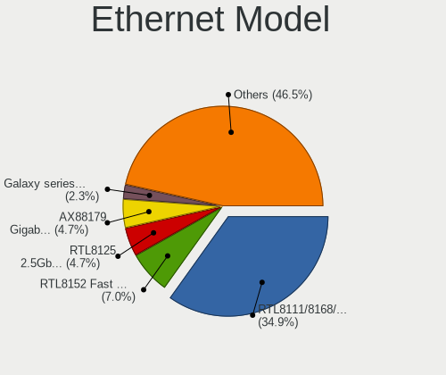

| Model                                                             | Computers | Percent |
|-------------------------------------------------------------------|-----------|---------|
| Realtek RTL8111/8168/8411 PCI Express Gigabit Ethernet Controller | 19        | 31.67%  |
| Intel Ethernet Connection I217-LM                                 | 6         | 10%     |
| Broadcom NetXtreme BCM5751 Gigabit Ethernet PCI Express           | 6         | 10%     |
| Realtek RTL810xE PCI Express Fast Ethernet controller             | 4         | 6.67%   |
| Microchip SMSC9512/9514 Fast Ethernet Adapter                     | 3         | 5%      |
| Nvidia MCP79 Ethernet                                             | 2         | 3.33%   |
| Intel Ethernet Controller I225-V                                  | 2         | 3.33%   |
| Intel 82579LM Gigabit Network Connection (Lewisville)             | 2         | 3.33%   |
| Intel 82574L Gigabit Network Connection                           | 2         | 3.33%   |
| Qualcomm Atheros AR8132 Fast Ethernet                             | 1         | 1.67%   |
| Nvidia MCP73 Ethernet                                             | 1         | 1.67%   |
| Marvell Group 88E8057 PCI-E Gigabit Ethernet Controller           | 1         | 1.67%   |
| Marvell Group 88E8053 PCI-E Gigabit Ethernet Controller           | 1         | 1.67%   |
| Intel I350 Gigabit Network Connection                             | 1         | 1.67%   |
| Intel Ethernet Connection I219-V                                  | 1         | 1.67%   |
| Intel Ethernet Connection (7) I219-LM                             | 1         | 1.67%   |
| Intel Ethernet Connection (4) I219-LM                             | 1         | 1.67%   |
| Intel Ethernet Connection (2) I219-LM                             | 1         | 1.67%   |
| Intel Ethernet Connection (14) I219-LM                            | 1         | 1.67%   |
| Intel 82567LM-3 Gigabit Network Connection                        | 1         | 1.67%   |
| D-Link System DGE-528T Gigabit Ethernet Adapter                   | 1         | 1.67%   |
| Broadcom Limited NetXtreme BCM5761e Gigabit Ethernet PCIe         | 1         | 1.67%   |
| Broadcom Limited NetLink BCM5787 Gigabit Ethernet PCI Express     | 1         | 1.67%   |

Net Controller Kind
-------------------

Ethernet, WiFi or modem

| Kind     | Computers | Percent |
|----------|-----------|---------|
| Ethernet | 57        | 74.03%  |
| WiFi     | 19        | 24.68%  |
| Modem    | 1         | 1.3%    |

Used Controller
---------------

Currently used network controller

| Kind     | Computers | Percent |
|----------|-----------|---------|
| Ethernet | 52        | 73.24%  |
| WiFi     | 18        | 25.35%  |
| Modem    | 1         | 1.41%   |

NICs
----

Total network controllers on board

| Total | Computers | Percent |
|-------|-----------|---------|
| 1     | 37        | 61.67%  |
| 2     | 18        | 30%     |
| 0     | 4         | 6.67%   |
| 3     | 1         | 1.67%   |

IPv6
----

IPv6 vs IPv4

| Used | Computers | Percent |
|------|-----------|---------|
| No   | 55        | 91.67%  |
| Yes  | 5         | 8.33%   |

Bluetooth
---------

Bluetooth Vendor
----------------

Controller vendors

| Vendor                          | Computers | Percent |
|---------------------------------|-----------|---------|
| Intel                           | 6         | 31.58%  |
| IMC Networks                    | 3         | 15.79%  |
| Apple                           | 2         | 10.53%  |
| Ralink Technology               | 1         | 5.26%   |
| Qualcomm Atheros Communications | 1         | 5.26%   |
| Qcom                            | 1         | 5.26%   |
| Lite-On Technology              | 1         | 5.26%   |
| Foxconn / Hon Hai               | 1         | 5.26%   |
| Conwise Technology              | 1         | 5.26%   |
| Cambridge Silicon Radio         | 1         | 5.26%   |
| Broadcom                        | 1         | 5.26%   |

Bluetooth Model
---------------

Controller models

| Model                                                                               | Computers | Percent |
|-------------------------------------------------------------------------------------|-----------|---------|
| Intel Bluetooth Device                                                              | 3         | 15.79%  |
| Intel Bluetooth wireless interface                                                  | 2         | 10.53%  |
| IMC Networks Bluetooth Device                                                       | 2         | 10.53%  |
| Apple Bluetooth USB Host Controller                                                 | 2         | 10.53%  |
| Ralink Motorola BC4 Bluetooth 3.0+HS Adapter                                        | 1         | 5.26%   |
| Qualcomm Atheros AR3012 Bluetooth 4.0                                               | 1         | 5.26%   |
| Qcom Broadcom Bluetooth USB                                                         | 1         | 5.26%   |
| Lite-On Broadcom BCM43142A0 Bluetooth Device                                        | 1         | 5.26%   |
| Intel Centrino Bluetooth Wireless Transceiver                                       | 1         | 5.26%   |
| IMC Networks Wireless_Device                                                        | 1         | 5.26%   |
| Foxconn / Hon Hai Foxconn T77H114 BCM2070 [Single-Chip Bluetooth 2.1 + EDR Adapter] | 1         | 5.26%   |
| Conwise CW6622                                                                      | 1         | 5.26%   |
| Cambridge Silicon Radio Bluetooth Dongle (HCI mode)                                 | 1         | 5.26%   |
| Broadcom BCM2045B (BDC-2.1) [Bluetooth Controller]                                  | 1         | 5.26%   |

Sound
-----

Sound Vendor
------------

Sound card vendors

| Vendor                       | Computers | Percent |
|------------------------------|-----------|---------|
| Intel                        | 45        | 61.64%  |
| Nvidia                       | 14        | 19.18%  |
| AMD                          | 8         | 10.96%  |
| C-Media Electronics          | 2         | 2.74%   |
| Sony                         | 1         | 1.37%   |
| JMTek                        | 1         | 1.37%   |
| Hewlett-Packard              | 1         | 1.37%   |
| D&M Holdings (Denon/Marantz) | 1         | 1.37%   |

Sound Model
-----------

Sound card models

| Model                                                                                             | Computers | Percent |
|---------------------------------------------------------------------------------------------------|-----------|---------|
| Intel 8 Series/C220 Series Chipset High Definition Audio Controller                               | 13        | 14.77%  |
| Intel Xeon E3-1200 v3/4th Gen Core Processor HD Audio Controller                                  | 11        | 12.5%   |
| Intel 82801G (ICH7 Family) AC'97 Audio Controller                                                 | 6         | 6.82%   |
| Intel NM10/ICH7 Family High Definition Audio Controller                                           | 5         | 5.68%   |
| Intel 82801I (ICH9 Family) HD Audio Controller                                                    | 3         | 3.41%   |
| Intel 7 Series/C216 Chipset Family High Definition Audio Controller                               | 3         | 3.41%   |
| AMD Family 17h (Models 10h-1fh) HD Audio Controller                                               | 3         | 3.41%   |
| Nvidia MCP79 High Definition Audio                                                                | 2         | 2.27%   |
| Nvidia High Definition Audio Controller                                                           | 2         | 2.27%   |
| Nvidia GK208 HDMI/DP Audio Controller                                                             | 2         | 2.27%   |
| Intel Sunrise Point-LP HD Audio                                                                   | 2         | 2.27%   |
| Intel Atom Processor Z36xxx/Z37xxx Series High Definition Audio Controller                        | 2         | 2.27%   |
| AMD Renoir Radeon High Definition Audio Controller                                                | 2         | 2.27%   |
| Sony DualShock 4 [CUH-ZCT2x]                                                                      | 1         | 1.14%   |
| Nvidia TU116 High Definition Audio Controller                                                     | 1         | 1.14%   |
| Nvidia TU107 GeForce GTX 1650 High Definition Audio Controller                                    | 1         | 1.14%   |
| Nvidia MCP73 High Definition Audio                                                                | 1         | 1.14%   |
| Nvidia GP108 High Definition Audio Controller                                                     | 1         | 1.14%   |
| Nvidia GP107GL High Definition Audio Controller                                                   | 1         | 1.14%   |
| Nvidia GK104 HDMI Audio Controller                                                                | 1         | 1.14%   |
| Nvidia GF108 High Definition Audio Controller                                                     | 1         | 1.14%   |
| Nvidia Audio device                                                                               | 1         | 1.14%   |
| JMTek USB PnP Audio Device                                                                        | 1         | 1.14%   |
| Intel Tiger Lake-H HD Audio Controller                                                            | 1         | 1.14%   |
| Intel Haswell-ULT HD Audio Controller                                                             | 1         | 1.14%   |
| Intel Comet Lake PCH cAVS                                                                         | 1         | 1.14%   |
| Intel Celeron/Pentium Silver Processor High Definition Audio                                      | 1         | 1.14%   |
| Intel Cannon Lake PCH cAVS                                                                        | 1         | 1.14%   |
| Intel Audio device                                                                                | 1         | 1.14%   |
| Intel Atom/Celeron/Pentium Processor x5-E8000/J3xxx/N3xxx Series High Definition Audio Controller | 1         | 1.14%   |
| Intel 82801JD/DO (ICH10 Family) HD Audio Controller                                               | 1         | 1.14%   |
| Intel 8 Series HD Audio Controller                                                                | 1         | 1.14%   |
| Intel 6 Series/C200 Series Chipset Family High Definition Audio Controller                        | 1         | 1.14%   |
| Intel 5 Series/3400 Series Chipset High Definition Audio                                          | 1         | 1.14%   |
| Intel 200 Series PCH HD Audio                                                                     | 1         | 1.14%   |
| Hewlett-Packard S101 Speaker Bar                                                                  | 1         | 1.14%   |
| D&M Holdings (Denon/Marantz) HD-DAC1                                                              | 1         | 1.14%   |
| C-Media Electronics TONOR TC-777 Audio Device                                                     | 1         | 1.14%   |
| C-Media Electronics CM8888 [Oxygen Express]                                                       | 1         | 1.14%   |
| AMD Starship/Matisse HD Audio Controller                                                          | 1         | 1.14%   |
| AMD SBx00 Azalia (Intel HDA)                                                                      | 1         | 1.14%   |
| AMD RV620 HDMI Audio [Radeon HD 3450/3470/3550/3570]                                              | 1         | 1.14%   |
| AMD Raven/Raven2/Fenghuang HDMI/DP Audio Controller                                               | 1         | 1.14%   |
| AMD Oland/Hainan/Cape Verde/Pitcairn HDMI Audio [Radeon HD 7000 Series]                           | 1         | 1.14%   |
| AMD Family 17h (Models 00h-0fh) HD Audio Controller                                               | 1         | 1.14%   |

Memory
------

Memory Vendor
-------------

Memory module vendors

| Vendor              | Computers | Percent |
|---------------------|-----------|---------|
| Unknown             | 14        | 41.18%  |
| SK Hynix            | 5         | 14.71%  |
| Samsung Electronics | 4         | 11.76%  |
| Micron Technology   | 2         | 5.88%   |
| Kingston            | 2         | 5.88%   |
| Corsair             | 2         | 5.88%   |
| Unknown (ABCD)      | 1         | 2.94%   |
| Qimonda             | 1         | 2.94%   |
| Patriot             | 1         | 2.94%   |
| G.Skill             | 1         | 2.94%   |
| Unknown             | 1         | 2.94%   |

Memory Model
------------

Memory module models

| Model                                                          | Computers | Percent |
|----------------------------------------------------------------|-----------|---------|
| Unknown RAM Module 2048MB DIMM DDR 533MT/s                     | 4         | 11.11%  |
| Unknown RAM Module 4096MB SODIMM DDR3 1333MT/s                 | 2         | 5.56%   |
| Unknown RAM Module 2048MB DIMM SDRAM                           | 2         | 5.56%   |
| Unknown RAM Module 1024MB DIMM DDR 533MT/s                     | 2         | 5.56%   |
| Unknown RAM Module 8192MB SODIMM DDR3                          | 1         | 2.78%   |
| Unknown RAM Module 8192MB DIMM DDR3 1333MT/s                   | 1         | 2.78%   |
| Unknown RAM Module 4096MB SODIMM DDR2                          | 1         | 2.78%   |
| Unknown RAM Module 2GB DIMM DDR2 800MT/s                       | 1         | 2.78%   |
| Unknown RAM Module 1024MB DIMM SDRAM                           | 1         | 2.78%   |
| Unknown (ABCD) RAM 123456789012345678 4GB DIMM LPDDR4 2400MT/s | 1         | 2.78%   |
| SK Hynix RAM Module 1GB SODIMM DDR3 1067MT/s                   | 1         | 2.78%   |
| SK Hynix RAM HYMP112U64CP8-S6 1024MB DIMM DDR2 800MT/s         | 1         | 2.78%   |
| SK Hynix RAM HMT325S6CFR8A-PB 2048MB SODIMM DDR3 1600MT/s      | 1         | 2.78%   |
| SK Hynix RAM HMA81GU7MFR8N-TF 8GB DIMM DDR4 2133MT/s           | 1         | 2.78%   |
| SK Hynix RAM HMA81GU7CJR8N-VK 8GB DIMM DDR4 2667MT/s           | 1         | 2.78%   |
| SK Hynix RAM HMA81GU6DJR8N-XN 8GB DIMM DDR4 3200MT/s           | 1         | 2.78%   |
| Samsung RAM Module 2GB SODIMM DDR3 1067MT/s                    | 1         | 2.78%   |
| Samsung RAM M471A1K43BB1-CRC 8192MB SODIMM DDR4 2667MT/s       | 1         | 2.78%   |
| Samsung RAM M471A1G44AB0-CWE 8192MB SODIMM DDR4 3200MT/s       | 1         | 2.78%   |
| Samsung RAM M3 78T6553CZ3-CD5 512MB DIMM DDR 533MT/s           | 1         | 2.78%   |
| Qimonda RAM 64T128020EU2.5B2 1024MB DIMM DDR 800MT/s           | 1         | 2.78%   |
| Patriot RAM PSD38G13332 8192MB DIMM DDR3 1333MT/s              | 1         | 2.78%   |
| Micron RAM 8KTF51264HZ-1G6P1 4096MB SODIMM DDR3 1600MT/s       | 1         | 2.78%   |
| Micron RAM 4ATF1G64HZ-3G2E1 8GB SODIMM DDR4 3200MT/s           | 1         | 2.78%   |
| Kingston RAM Module 2048MB DIMM DDR2 667MT/s                   | 1         | 2.78%   |
| Kingston RAM 1G-UDIMM 1024MB DIMM DDR2 667MT/s                 | 1         | 2.78%   |
| G.Skill RAM F4-2800C17-8GIS 8192MB DIMM DDR4 2800MT/s          | 1         | 2.78%   |
| Corsair RAM CMV4GX3M1A1333C9 4096MB DIMM DDR3 1600MT/s         | 1         | 2.78%   |
| Corsair RAM CMK32GX4M2E3200C16 16GB DIMM DDR4 3200MT/s         | 1         | 2.78%   |
| Unknown                                                        | 1         | 2.78%   |

Memory Kind
-----------

Memory module kinds

| Kind   | Computers | Percent |
|--------|-----------|---------|
| DDR3   | 10        | 31.25%  |
| DDR4   | 6         | 18.75%  |
| DDR2   | 6         | 18.75%  |
| DDR    | 6         | 18.75%  |
| SDRAM  | 2         | 6.25%   |
| LPDDR4 | 1         | 3.13%   |
| DRAM   | 1         | 3.13%   |

Memory Form Factor
------------------

Physical design of the memory module

| Name   | Computers | Percent |
|--------|-----------|---------|
| DIMM   | 19        | 65.52%  |
| SODIMM | 10        | 34.48%  |

Memory Size
-----------

Memory module size

| Size  | Computers | Percent |
|-------|-----------|---------|
| 2048  | 11        | 33.33%  |
| 8192  | 9         | 27.27%  |
| 1024  | 6         | 18.18%  |
| 4096  | 4         | 12.12%  |
| 16384 | 2         | 6.06%   |
| 512   | 1         | 3.03%   |

Memory Speed
------------

Memory module speed

| Speed   | Computers | Percent |
|---------|-----------|---------|
| 533     | 6         | 18.18%  |
| 1333    | 4         | 12.12%  |
| Unknown | 4         | 12.12%  |
| 3200    | 3         | 9.09%   |
| 1600    | 3         | 9.09%   |
| 800     | 3         | 9.09%   |
| 667     | 3         | 9.09%   |
| 2667    | 2         | 6.06%   |
| 1067    | 2         | 6.06%   |
| 2800    | 1         | 3.03%   |
| 2400    | 1         | 3.03%   |
| 2133    | 1         | 3.03%   |

Printers & scanners
-------------------

Printer Vendor
--------------

Printer device vendors

| Vendor              | Computers | Percent |
|---------------------|-----------|---------|
| Seiko Epson         | 1         | 33.33%  |
| QinHeng Electronics | 1         | 33.33%  |
| Hewlett-Packard     | 1         | 33.33%  |

Printer Model
-------------

Printer device models

| Model                   | Computers | Percent |
|-------------------------|-----------|---------|
| Seiko Epson L310 Series | 1         | 33.33%  |
| QinHeng CH340S          | 1         | 33.33%  |
| HP LaserJet 1020        | 1         | 33.33%  |

Scanner Vendor
--------------

Scanner device vendors

| Vendor      | Computers | Percent |
|-------------|-----------|---------|
| Seiko Epson | 1         | 50%     |
| Canon       | 1         | 50%     |

Scanner Model
-------------

Scanner device models

| Model                                             | Computers | Percent |
|---------------------------------------------------|-----------|---------|
| Seiko Epson GT-F650 [GT-S600/Perfection V10/V100] | 1         | 50%     |
| Canon CanoScan LiDE 110                           | 1         | 50%     |

Camera
------

Camera Vendor
-------------

Camera device vendors

| Vendor                        | Computers | Percent |
|-------------------------------|-----------|---------|
| Chicony Electronics           | 5         | 33.33%  |
| Quanta                        | 2         | 13.33%  |
| Suyin                         | 1         | 6.67%   |
| Sunplus Innovation Technology | 1         | 6.67%   |
| Realtek Semiconductor         | 1         | 6.67%   |
| Microdia                      | 1         | 6.67%   |
| Logitech                      | 1         | 6.67%   |
| Lenovo                        | 1         | 6.67%   |
| Jieli Technology              | 1         | 6.67%   |
| Apple                         | 1         | 6.67%   |

Camera Model
------------

Camera device models

| Model                                  | Computers | Percent |
|----------------------------------------|-----------|---------|
| Chicony USB2.0 VGA UVC WebCam          | 3         | 20%     |
| Suyin Sony Visual Communication Camera | 1         | 6.67%   |
| Sunplus Laptop_Integrated_Webcam_1.3M  | 1         | 6.67%   |
| Realtek Lenovo EasyCamera              | 1         | 6.67%   |
| Quanta USB Webcam                      | 1         | 6.67%   |
| Quanta HP Wide Vision HD Camera        | 1         | 6.67%   |
| Microdia Rapoo Camera                  | 1         | 6.67%   |
| Logitech HD Pro Webcam C920            | 1         | 6.67%   |
| Lenovo CNF7237&CNF7238                 | 1         | 6.67%   |
| Jieli USB PHY 2.0                      | 1         | 6.67%   |
| Chicony Integrated Camera              | 1         | 6.67%   |
| Chicony FJ Camera                      | 1         | 6.67%   |
| Apple iPhone 5/5C/5S/6/SE              | 1         | 6.67%   |

Security
--------

Fingerprint Vendor
------------------

Fingerprint sensor vendors

| Vendor           | Computers | Percent |
|------------------|-----------|---------|
| Validity Sensors | 1         | 50%     |
| Upek             | 1         | 50%     |

Fingerprint Model
-----------------

Fingerprint sensor models

| Model                                                  | Computers | Percent |
|--------------------------------------------------------|-----------|---------|
| Validity Sensors Swipe Fingerprint Sensor              | 1         | 50%     |
| Upek Biometric Touchchip/Touchstrip Fingerprint Sensor | 1         | 50%     |

Chipcard Vendor
---------------

Chipcard module vendors

| Vendor      | Computers | Percent |
|-------------|-----------|---------|
| Alcor Micro | 1         | 100%    |

Chipcard Model
--------------

Chipcard module models

| Model                               | Computers | Percent |
|-------------------------------------|-----------|---------|
| Alcor Micro AU9540 Smartcard Reader | 1         | 100%    |

Unsupported
-----------

Unsupported Devices
-------------------

Total unsupported devices on board

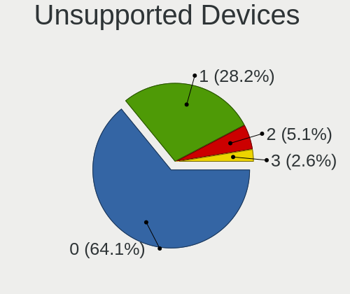

| Total | Computers | Percent |
|-------|-----------|---------|
| 0     | 54        | 90%     |
| 1     | 4         | 6.67%   |
| 2     | 2         | 3.33%   |

Unsupported Device Types
------------------------

Types of unsupported devices

| Type                     | Computers | Percent |
|--------------------------|-----------|---------|
| Graphics card            | 3         | 33.33%  |
| Fingerprint reader       | 2         | 22.22%  |
| Multimedia controller    | 1         | 11.11%  |
| Communication controller | 1         | 11.11%  |
| Chipcard                 | 1         | 11.11%  |
| Card reader              | 1         | 11.11%  |

