Ubuntu MATE - Hardware Trends
-----------------------------

A project to identify most popular hardware characteristics and track their change
over time based on data collected by Linux users at https://Linux-Hardware.org.

Anyone can contribute to this report by the [hw-probe](https://github.com/linuxhw/hw-probe) tool:

    sudo -E hw-probe -all -upload

This is a report for all computer types. See also reports for [desktops](/Dist/Ubuntu_MATE/Desktop/README.md) and [notebooks](/Dist/Ubuntu_MATE/Notebook/README.md).

This report is for one last month. Overall report since the beginning of time: [TestCoverage](https://github.com/linuxhw/TestCoverage)

Period: Sep, 2022.

Contents
--------

* [ System ](#system)
  - [ OS                       ](#os)
  - [ OS Family                ](#os-family)
  - [ Kernel                   ](#kernel)
  - [ Kernel Family            ](#kernel-family)
  - [ Kernel Major Ver.        ](#kernel-major-ver)
  - [ Arch                     ](#arch)
  - [ DE                       ](#de)
  - [ Display Server           ](#display-server)
  - [ Display Manager          ](#display-manager)
  - [ OS Lang                  ](#os-lang)
  - [ Boot Mode                ](#boot-mode)
  - [ Filesystem               ](#filesystem)
  - [ Part. scheme             ](#part-scheme)
  - [ Dual Boot with Linux/BSD ](#dual-boot-with-linuxbsd)
  - [ Dual Boot (Win)          ](#dual-boot-win)

* [ Board ](#board)
  - [ Vendor                   ](#vendor)
  - [ Model                    ](#model)
  - [ Model Family             ](#model-family)
  - [ MFG Year                 ](#mfg-year)
  - [ Form Factor              ](#form-factor)
  - [ Secure Boot              ](#secure-boot)
  - [ Coreboot                 ](#coreboot)
  - [ RAM Size                 ](#ram-size)
  - [ RAM Used                 ](#ram-used)
  - [ Total Drives             ](#total-drives)
  - [ Has CD-ROM               ](#has-cd-rom)
  - [ Has Ethernet             ](#has-ethernet)
  - [ Has WiFi                 ](#has-wifi)
  - [ Has Bluetooth            ](#has-bluetooth)

* [ Location ](#location)
  - [ Country                  ](#country)
  - [ City                     ](#city)

* [ Drives ](#drives)
  - [ Drive Vendor             ](#drive-vendor)
  - [ Drive Model              ](#drive-model)
  - [ HDD Vendor               ](#hdd-vendor)
  - [ SSD Vendor               ](#ssd-vendor)
  - [ Drive Kind               ](#drive-kind)
  - [ Drive Connector          ](#drive-connector)
  - [ Drive Size               ](#drive-size)
  - [ Space Total              ](#space-total)
  - [ Space Used               ](#space-used)
  - [ Malfunc. Drives          ](#malfunc-drives)
  - [ Malfunc. Drive Vendor    ](#malfunc-drive-vendor)
  - [ Malfunc. HDD Vendor      ](#malfunc-hdd-vendor)
  - [ Malfunc. Drive Kind      ](#malfunc-drive-kind)
  - [ Failed Drives            ](#failed-drives)
  - [ Failed Drive Vendor      ](#failed-drive-vendor)
  - [ Drive Status             ](#drive-status)

* [ Storage controller ](#storage-controller)
  - [ Storage Vendor           ](#storage-vendor)
  - [ Storage Model            ](#storage-model)
  - [ Storage Kind             ](#storage-kind)

* [ Processor ](#processor)
  - [ CPU Vendor               ](#cpu-vendor)
  - [ CPU Model                ](#cpu-model)
  - [ CPU Model Family         ](#cpu-model-family)
  - [ CPU Cores                ](#cpu-cores)
  - [ CPU Sockets              ](#cpu-sockets)
  - [ CPU Threads              ](#cpu-threads)
  - [ CPU Op-Modes             ](#cpu-op-modes)
  - [ CPU Microcode            ](#cpu-microcode)
  - [ CPU Microarch            ](#cpu-microarch)

* [ Graphics ](#graphics)
  - [ GPU Vendor               ](#gpu-vendor)
  - [ GPU Model                ](#gpu-model)
  - [ GPU Combo                ](#gpu-combo)
  - [ GPU Driver               ](#gpu-driver)
  - [ GPU Memory               ](#gpu-memory)

* [ Monitor ](#monitor)
  - [ Monitor Vendor           ](#monitor-vendor)
  - [ Monitor Model            ](#monitor-model)
  - [ Monitor Resolution       ](#monitor-resolution)
  - [ Monitor Diagonal         ](#monitor-diagonal)
  - [ Monitor Width            ](#monitor-width)
  - [ Aspect Ratio             ](#aspect-ratio)
  - [ Monitor Area             ](#monitor-area)
  - [ Pixel Density            ](#pixel-density)
  - [ Multiple Monitors        ](#multiple-monitors)

* [ Network ](#network)
  - [ Net Controller Vendor    ](#net-controller-vendor)
  - [ Net Controller Model     ](#net-controller-model)
  - [ Wireless Vendor          ](#wireless-vendor)
  - [ Wireless Model           ](#wireless-model)
  - [ Ethernet Vendor          ](#ethernet-vendor)
  - [ Ethernet Model           ](#ethernet-model)
  - [ Net Controller Kind      ](#net-controller-kind)
  - [ Used Controller          ](#used-controller)
  - [ NICs                     ](#nics)
  - [ IPv6                     ](#ipv6)

* [ Bluetooth ](#bluetooth)
  - [ Bluetooth Vendor         ](#bluetooth-vendor)
  - [ Bluetooth Model          ](#bluetooth-model)

* [ Sound ](#sound)
  - [ Sound Vendor             ](#sound-vendor)
  - [ Sound Model              ](#sound-model)

* [ Memory ](#memory)
  - [ Memory Vendor            ](#memory-vendor)
  - [ Memory Model             ](#memory-model)
  - [ Memory Kind              ](#memory-kind)
  - [ Memory Form Factor       ](#memory-form-factor)
  - [ Memory Size              ](#memory-size)
  - [ Memory Speed             ](#memory-speed)

* [ Printers & scanners ](#printers--scanners)
  - [ Printer Vendor           ](#printer-vendor)
  - [ Printer Model            ](#printer-model)
  - [ Scanner Vendor           ](#scanner-vendor)
  - [ Scanner Model            ](#scanner-model)

* [ Camera ](#camera)
  - [ Camera Vendor            ](#camera-vendor)
  - [ Camera Model             ](#camera-model)

* [ Security ](#security)
  - [ Fingerprint Vendor       ](#fingerprint-vendor)
  - [ Fingerprint Model        ](#fingerprint-model)
  - [ Chipcard Vendor          ](#chipcard-vendor)
  - [ Chipcard Model           ](#chipcard-model)

* [ Unsupported ](#unsupported)
  - [ Unsupported Devices      ](#unsupported-devices)
  - [ Unsupported Device Types ](#unsupported-device-types)

System
------

OS
--

Installed operating systems

| Name              | Computers | Percent |
|-------------------|-----------|---------|
| Ubuntu MATE 22.04 | 25        | 75.76%  |
| Ubuntu MATE 20.04 | 7         | 21.21%  |
| Ubuntu MATE 18.04 | 1         | 3.03%   |

OS Family
---------

OS without a version

| Name        | Computers | Percent |
|-------------|-----------|---------|
| Ubuntu MATE | 33        | 100%    |

Kernel
------

Version of the Linux kernel

| Version                            | Computers | Percent |
|------------------------------------|-----------|---------|
| 5.15.0-47-generic                  | 17        | 51.52%  |
| 5.15.0-46-generic                  | 4         | 12.12%  |
| 5.15.0-48-generic                  | 3         | 9.09%   |
| 5.4.0-125-generic                  | 2         | 6.06%   |
| 5.15.27-xanmod1                    | 1         | 3.03%   |
| 5.15.0-46-lowlatency               | 1         | 3.03%   |
| 5.15.0-43-generic                  | 1         | 3.03%   |
| 5.15.0-1014-raspi                  | 1         | 3.03%   |
| 5.11.0-38-generic                  | 1         | 3.03%   |
| 5.0.0-63-generic                   | 1         | 3.03%   |
| 4.4.154-116-rockchip-g86a614bc15b3 | 1         | 3.03%   |

Kernel Family
-------------

Linux kernel without a distro release

| Version | Computers | Percent |
|---------|-----------|---------|
| 5.15.0  | 27        | 81.82%  |
| 5.4.0   | 2         | 6.06%   |
| 5.15.27 | 1         | 3.03%   |
| 5.11.0  | 1         | 3.03%   |
| 5.0.0   | 1         | 3.03%   |
| 4.4.154 | 1         | 3.03%   |

Kernel Major Ver.
-----------------

Linux kernel major version

| Version | Computers | Percent |
|---------|-----------|---------|
| 5.15    | 28        | 84.85%  |
| 5.4     | 2         | 6.06%   |
| 5.11    | 1         | 3.03%   |
| 5.0     | 1         | 3.03%   |
| 4.4     | 1         | 3.03%   |

Arch
----

OS architecture (x86_64, i586, etc.)

| Name    | Computers | Percent |
|---------|-----------|---------|
| x86_64  | 31        | 93.94%  |
| aarch64 | 2         | 6.06%   |

DE
--

Desktop Environment

| Name | Computers | Percent |
|------|-----------|---------|
| MATE | 33        | 100%    |

Display Server
--------------

X11 or Wayland

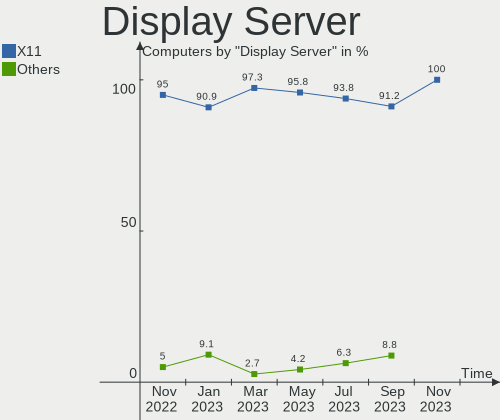

| Name | Computers | Percent |
|------|-----------|---------|
| X11  | 33        | 100%    |

Display Manager
---------------

SDDM, LightDM, etc.

| Name    | Computers | Percent |
|---------|-----------|---------|
| LightDM | 30        | 90.91%  |
| Unknown | 2         | 6.06%   |
| GDM3    | 1         | 3.03%   |

OS Lang
-------

Language

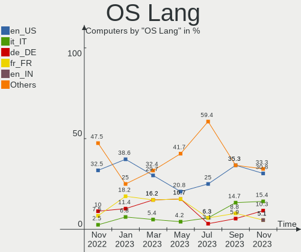

| Lang  | Computers | Percent |
|-------|-----------|---------|
| en_US | 11        | 33.33%  |
| it_IT | 5         | 15.15%  |
| fr_FR | 4         | 12.12%  |
| de_DE | 3         | 9.09%   |
| pt_BR | 2         | 6.06%   |
| en_AU | 2         | 6.06%   |
| de_CH | 2         | 6.06%   |
| ru_RU | 1         | 3.03%   |
| es_ES | 1         | 3.03%   |
| en_CA | 1         | 3.03%   |
| C     | 1         | 3.03%   |

Boot Mode
---------

EFI or BIOS

| Mode | Computers | Percent |
|------|-----------|---------|
| BIOS | 17        | 51.52%  |
| EFI  | 16        | 48.48%  |

Filesystem
----------

Type of filesystem

| Type    | Computers | Percent |
|---------|-----------|---------|
| Ext4    | 29        | 87.88%  |
| Zfs     | 1         | 3.03%   |
| Overlay | 1         | 3.03%   |
| Jfs     | 1         | 3.03%   |
| Btrfs   | 1         | 3.03%   |

Part. scheme
------------

Scheme of partitioning

| Type    | Computers | Percent |
|---------|-----------|---------|
| GPT     | 15        | 45.45%  |
| Unknown | 11        | 33.33%  |
| MBR     | 7         | 21.21%  |

Dual Boot with Linux/BSD
------------------------

Hosting more than one Linux/BSD

| Dual boot | Computers | Percent |
|-----------|-----------|---------|
| No        | 27        | 81.82%  |
| Yes       | 6         | 18.18%  |

Dual Boot (Win)
---------------

Hosting Linux and Windows

| Dual boot | Computers | Percent |
|-----------|-----------|---------|
| No        | 20        | 60.61%  |
| Yes       | 13        | 39.39%  |

Board
-----

Vendor
------

Motherboard manufacturer

| Name                    | Computers | Percent |
|-------------------------|-----------|---------|
| ASUSTek Computer        | 8         | 24.24%  |
| Hewlett-Packard         | 5         | 15.15%  |
| Dell                    | 4         | 12.12%  |
| Intel                   | 3         | 9.09%   |
| ASRock                  | 3         | 9.09%   |
| MSI                     | 2         | 6.06%   |
| Acer                    | 2         | 6.06%   |
| Rockchip                | 1         | 3.03%   |
| Raspberry Pi Foundation | 1         | 3.03%   |
| Notebook                | 1         | 3.03%   |
| LG Electronics          | 1         | 3.03%   |
| Lenovo                  | 1         | 3.03%   |
| Gigabyte Technology     | 1         | 3.03%   |

Model
-----

Motherboard model

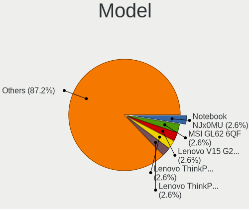

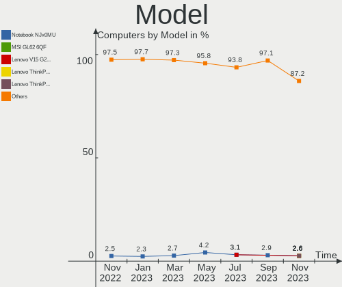

| Name                                   | Computers | Percent |
|----------------------------------------|-----------|---------|
| RPi Raspberry Pi 4 Model B Rev 1.4     | 1         | 3.03%   |
| Notebook NJx0MU                        | 1         | 3.03%   |
| MSI MS-7817                            | 1         | 3.03%   |
| MSI MS-7599                            | 1         | 3.03%   |
| LG 17Z990-R.AAS8U1                     | 1         | 3.03%   |
| Lenovo IdeaPad S410p 20296             | 1         | 3.03%   |
| Intel NUC8i7HNK                        | 1         | 3.03%   |
| Intel Kabylake Platform                | 1         | 3.03%   |
| Intel H81U                             | 1         | 3.03%   |
| HP Pavilion 15                         | 1         | 3.03%   |
| HP EliteDesk 800 G1 TWR                | 1         | 3.03%   |
| HP Compaq Elite 8300 SFF               | 1         | 3.03%   |
| HP 23-d027c                            | 1         | 3.03%   |
| HP 15                                  | 1         | 3.03%   |
| Gigabyte Z590 UD AC                    | 1         | 3.03%   |
| Dell Precision 7760                    | 1         | 3.03%   |
| Dell Precision 7520                    | 1         | 3.03%   |
| Dell Latitude 5285                     | 1         | 3.03%   |
| Dell Inspiron 7720                     | 1         | 3.03%   |
| ASUS VivoBook_ASUSLaptop X712JA_X712JA | 1         | 3.03%   |
| ASUS T100TA                            | 1         | 3.03%   |
| ASUS ROG STRIX Z690-A GAMING WIFI D4   | 1         | 3.03%   |
| ASUS P7P55 LX                          | 1         | 3.03%   |
| ASUS P5GZ-MX                           | 1         | 3.03%   |
| ASUS M2A74-AM                          | 1         | 3.03%   |
| ASUS K30AD_M31AD_M51AD                 | 1         | 3.03%   |
| ASUS H61M-K                            | 1         | 3.03%   |
| ASRock J5040-ITX                       | 1         | 3.03%   |
| ASRock HM55-HT                         | 1         | 3.03%   |
| ASRock B450 Gaming-ITX/ac              | 1         | 3.03%   |
| Acer Aspire X3950                      | 1         | 3.03%   |
| Acer Aspire 5050                       | 1         | 3.03%   |
| Unknown                                | 1         | 3.03%   |

Model Family
------------

Motherboard model prefix

| Name               | Computers | Percent |
|--------------------|-----------|---------|
| Dell Precision     | 2         | 6.06%   |
| Acer Aspire        | 2         | 6.06%   |
| RPi Raspberry      | 1         | 3.03%   |
| Notebook NJx0MU    | 1         | 3.03%   |
| MSI MS-7817        | 1         | 3.03%   |
| MSI MS-7599        | 1         | 3.03%   |
| LG 17Z990-R.AAS8U1 | 1         | 3.03%   |
| Lenovo IdeaPad     | 1         | 3.03%   |
| Intel NUC8i7HNK    | 1         | 3.03%   |
| Intel Kabylake     | 1         | 3.03%   |
| Intel H81U         | 1         | 3.03%   |
| HP Pavilion        | 1         | 3.03%   |
| HP EliteDesk       | 1         | 3.03%   |
| HP Compaq          | 1         | 3.03%   |
| HP 23-d027c        | 1         | 3.03%   |
| HP 15              | 1         | 3.03%   |
| Gigabyte Z590      | 1         | 3.03%   |
| Dell Latitude      | 1         | 3.03%   |
| Dell Inspiron      | 1         | 3.03%   |
| ASUS VivoBook      | 1         | 3.03%   |
| ASUS T100TA        | 1         | 3.03%   |
| ASUS ROG           | 1         | 3.03%   |
| ASUS P7P55         | 1         | 3.03%   |
| ASUS P5GZ-MX       | 1         | 3.03%   |
| ASUS M2A74-AM      | 1         | 3.03%   |
| ASUS K30AD         | 1         | 3.03%   |
| ASUS H61M-K        | 1         | 3.03%   |
| ASRock J5040-ITX   | 1         | 3.03%   |
| ASRock HM55-HT     | 1         | 3.03%   |
| ASRock B450        | 1         | 3.03%   |
| Unknown            | 1         | 3.03%   |

MFG Year
--------

Motherboard manufacture year

| Year    | Computers | Percent |
|---------|-----------|---------|
| 2013    | 8         | 24.24%  |
| 2021    | 5         | 15.15%  |
| 2019    | 3         | 9.09%   |
| 2010    | 3         | 9.09%   |
| 2018    | 2         | 6.06%   |
| 2017    | 2         | 6.06%   |
| 2012    | 2         | 6.06%   |
| 2009    | 2         | 6.06%   |
| 2006    | 2         | 6.06%   |
| Unknown | 2         | 6.06%   |
| 2020    | 1         | 3.03%   |
| 2014    | 1         | 3.03%   |

Form Factor
-----------

Physical design of the computer

| Name           | Computers | Percent |
|----------------|-----------|---------|
| Desktop        | 16        | 48.48%  |
| Notebook       | 13        | 39.39%  |
| System on chip | 2         | 6.06%   |
| Tablet         | 1         | 3.03%   |
| Mini pc        | 1         | 3.03%   |

Secure Boot
-----------

Enabled or disabled

| State    | Computers | Percent |
|----------|-----------|---------|
| Disabled | 32        | 96.97%  |
| Enabled  | 1         | 3.03%   |

Coreboot
--------

Have coreboot on board

| Used | Computers | Percent |
|------|-----------|---------|
| No   | 33        | 100%    |

RAM Size
--------

Total RAM memory

| Size in GB  | Computers | Percent |
|-------------|-----------|---------|
| 8.01-16.0   | 13        | 39.39%  |
| 3.01-4.0    | 5         | 15.15%  |
| 16.01-24.0  | 5         | 15.15%  |
| 32.01-64.0  | 4         | 12.12%  |
| 4.01-8.0    | 3         | 9.09%   |
| 1.01-2.0    | 2         | 6.06%   |
| 64.01-256.0 | 1         | 3.03%   |

RAM Used
--------

Used RAM memory

| Used GB  | Computers | Percent |
|----------|-----------|---------|
| 1.01-2.0 | 10        | 30.3%   |
| 2.01-3.0 | 9         | 27.27%  |
| 4.01-8.0 | 6         | 18.18%  |
| 3.01-4.0 | 6         | 18.18%  |
| 0.51-1.0 | 2         | 6.06%   |

Total Drives
------------

Number of drives on board

| Drives | Computers | Percent |
|--------|-----------|---------|
| 2      | 12        | 36.36%  |
| 1      | 12        | 36.36%  |
| 3      | 5         | 15.15%  |
| 6      | 2         | 6.06%   |
| 4      | 2         | 6.06%   |

Has CD-ROM
----------

Has CD-ROM on board

| Presented | Computers | Percent |
|-----------|-----------|---------|
| No        | 20        | 60.61%  |
| Yes       | 13        | 39.39%  |

Has Ethernet
------------

Has Ethernet on board

| Presented | Computers | Percent |
|-----------|-----------|---------|
| Yes       | 28        | 84.85%  |
| No        | 5         | 15.15%  |

Has WiFi
--------

Has WiFi module

| Presented | Computers | Percent |
|-----------|-----------|---------|
| Yes       | 23        | 69.7%   |
| No        | 10        | 30.3%   |

Has Bluetooth
-------------

Has Bluetooth module

| Presented | Computers | Percent |
|-----------|-----------|---------|
| Yes       | 19        | 57.58%  |
| No        | 14        | 42.42%  |

Location
--------

Country
-------

Geographic location (country)

| Country     | Computers | Percent |
|-------------|-----------|---------|
| Italy       | 5         | 15.15%  |
| Germany     | 4         | 12.12%  |
| France      | 4         | 12.12%  |
| USA         | 3         | 9.09%   |
| Brazil      | 3         | 9.09%   |
| Switzerland | 2         | 6.06%   |
| Spain       | 2         | 6.06%   |
| Indonesia   | 2         | 6.06%   |
| Canada      | 2         | 6.06%   |
| Australia   | 2         | 6.06%   |
| Ukraine     | 1         | 3.03%   |
| Sweden      | 1         | 3.03%   |
| Serbia      | 1         | 3.03%   |
| Russia      | 1         | 3.03%   |

City
----

Geographic location (city)

| City                 | Computers | Percent |
|----------------------|-----------|---------|
| Montpellier          | 2         | 6.06%   |
| Melbourne            | 2         | 6.06%   |
| Jakarta              | 2         | 6.06%   |
| Velyki Mosty         | 1         | 3.03%   |
| Vancouver            | 1         | 3.03%   |
| Stuttgart            | 1         | 3.03%   |
| Southampton          | 1         | 3.03%   |
| Sao Paulo            | 1         | 3.03%   |
| Porto Alegre         | 1         | 3.03%   |
| Pindamonhangaba      | 1         | 3.03%   |
| Paris                | 1         | 3.03%   |
| Ortuella             | 1         | 3.03%   |
| Noventa Vicentina    | 1         | 3.03%   |
| Nievole              | 1         | 3.03%   |
| Newport News         | 1         | 3.03%   |
| Mannheim             | 1         | 3.03%   |
| Limoges              | 1         | 3.03%   |
| León                | 1         | 3.03%   |
| Lansdale             | 1         | 3.03%   |
| Lanigan              | 1         | 3.03%   |
| Kuznetsk             | 1         | 3.03%   |
| Kista                | 1         | 3.03%   |
| Heerbrugg            | 1         | 3.03%   |
| Goslar               | 1         | 3.03%   |
| Casale Litta         | 1         | 3.03%   |
| Caltagirone          | 1         | 3.03%   |
| Buchs / Buchs (Dorf) | 1         | 3.03%   |
| Belgrade             | 1         | 3.03%   |
| Bad Iburg            | 1         | 3.03%   |
| Avigliano            | 1         | 3.03%   |

Drives
------

Drive Vendor
------------

Hard drive vendors

| Vendor              | Computers | Drives | Percent |
|---------------------|-----------|--------|---------|
| Samsung Electronics | 10        | 15     | 17.86%  |
| Seagate             | 8         | 9      | 14.29%  |
| WDC                 | 7         | 16     | 12.5%   |
| Toshiba             | 5         | 5      | 8.93%   |
| Unknown             | 4         | 4      | 7.14%   |
| Crucial             | 4         | 4      | 7.14%   |
| SK hynix            | 2         | 2      | 3.57%   |
| Phison              | 2         | 2      | 3.57%   |
| KingSpec            | 2         | 2      | 3.57%   |
| X872                | 1         | 1      | 1.79%   |
| SPCC                | 1         | 1      | 1.79%   |
| SanDisk             | 1         | 1      | 1.79%   |
| Maxtor              | 1         | 1      | 1.79%   |
| LITEON              | 1         | 1      | 1.79%   |
| LaCie               | 1         | 1      | 1.79%   |
| Kston               | 1         | 1      | 1.79%   |
| Kingston            | 1         | 1      | 1.79%   |
| JMicron Technology  | 1         | 1      | 1.79%   |
| Intel               | 1         | 1      | 1.79%   |
| Gigabyte Technology | 1         | 1      | 1.79%   |
| A-DATA Technology   | 1         | 1      | 1.79%   |

Drive Model
-----------

Hard drive models

| Model                            | Computers | Percent |
|----------------------------------|-----------|---------|
| WDC WD40EZAZ-00SF3B0 4TB         | 2         | 2.9%    |
| Crucial CT1000BX500SSD1 1TB      | 2         | 2.9%    |
| X872 NVME 250GB                  | 1         | 1.45%   |
| WDC WDS250G2B0A-00SM50 250GB SSD | 1         | 1.45%   |
| WDC WDS100T2B0C 1TB              | 1         | 1.45%   |
| WDC WDBNCE0010PNC 1TB SSD        | 1         | 1.45%   |
| WDC WD6400AAKS-00E4A0 640GB      | 1         | 1.45%   |
| WDC WD60 EFAX-68JH4N1 6TB        | 1         | 1.45%   |
| WDC WD5000AAKX-08ERMA0 500GB     | 1         | 1.45%   |
| WDC WD5000AACS-00G8B1 500GB      | 1         | 1.45%   |
| WDC WD40 PURZ-85TTDY0 4TB        | 1         | 1.45%   |
| WDC WD30EFRX-68N32N0 3TB         | 1         | 1.45%   |
| WDC WD30EFRX-68EUZN0 3TB         | 1         | 1.45%   |
| WDC WD3000HLFS-01G6U0 304GB      | 1         | 1.45%   |
| WDC WD2500AAKX-753CA1 250GB      | 1         | 1.45%   |
| WDC WD10 01FALS-00J7B1 1TB       | 1         | 1.45%   |
| Unknown SC64G  64GB              | 1         | 1.45%   |
| Unknown SC32G  32GB              | 1         | 1.45%   |
| Unknown MMC Card  128GB          | 1         | 1.45%   |
| Unknown EFAQK  512GB             | 1         | 1.45%   |
| Toshiba THNSNK256GVN8 256GB SSD  | 1         | 1.45%   |
| Toshiba MQ04ABF100 1TB           | 1         | 1.45%   |
| Toshiba MK3259GSXP 320GB         | 1         | 1.45%   |
| Toshiba HDWG180 8TB              | 1         | 1.45%   |
| Toshiba DT01ACA200 2TB           | 1         | 1.45%   |
| SPCC Solid State Disk 256GB      | 1         | 1.45%   |
| SK hynix PC401 NVMe 1TB          | 1         | 1.45%   |
| SK hynix HCG8e  64GB             | 1         | 1.45%   |
| Seagate ST500VT000-1DK142 500GB  | 1         | 1.45%   |
| Seagate ST4000DM004-2CV104 4TB   | 1         | 1.45%   |
| Seagate ST3500418AS 500GB        | 1         | 1.45%   |
| Seagate ST3500312CS 500GB        | 1         | 1.45%   |
| Seagate ST325082 0AS 250GB       | 1         | 1.45%   |
| Seagate ST2000NE001-2M5101 2TB   | 1         | 1.45%   |
| Seagate ST2000LM015-2E8174 2TB   | 1         | 1.45%   |
| Seagate ST2000DM006-2DM164 2TB   | 1         | 1.45%   |
| Seagate ST1000DM003-1SB102 1TB   | 1         | 1.45%   |
| SanDisk Extreme SSD 500GB        | 1         | 1.45%   |
| Samsung SSD PM830 mSATA 32GB     | 1         | 1.45%   |
| Samsung SSD 980 PRO 1TB          | 1         | 1.45%   |

HDD Vendor
----------

Hard disk drive vendors

| Vendor              | Computers | Drives | Percent |
|---------------------|-----------|--------|---------|
| Seagate             | 8         | 9      | 36.36%  |
| WDC                 | 6         | 13     | 27.27%  |
| Toshiba             | 4         | 4      | 18.18%  |
| Samsung Electronics | 2         | 3      | 9.09%   |
| Maxtor              | 1         | 1      | 4.55%   |
| LaCie               | 1         | 1      | 4.55%   |

SSD Vendor
----------

Solid state drive vendors

| Vendor              | Computers | Drives | Percent |
|---------------------|-----------|--------|---------|
| Samsung Electronics | 6         | 7      | 28.57%  |
| Crucial             | 4         | 4      | 19.05%  |
| WDC                 | 2         | 2      | 9.52%   |
| KingSpec            | 2         | 2      | 9.52%   |
| Toshiba             | 1         | 1      | 4.76%   |
| SPCC                | 1         | 1      | 4.76%   |
| SanDisk             | 1         | 1      | 4.76%   |
| LITEON              | 1         | 1      | 4.76%   |
| Kston               | 1         | 1      | 4.76%   |
| Kingston            | 1         | 1      | 4.76%   |
| A-DATA Technology   | 1         | 1      | 4.76%   |

Drive Kind
----------

HDD or SSD

| Kind    | Computers | Drives | Percent |
|---------|-----------|--------|---------|
| HDD     | 17        | 31     | 36.17%  |
| SSD     | 16        | 22     | 34.04%  |
| NVMe    | 9         | 12     | 19.15%  |
| MMC     | 4         | 5      | 8.51%   |
| Unknown | 1         | 1      | 2.13%   |

Drive Connector
---------------

SATA, SAS, NVMe, etc.

| Type | Computers | Drives | Percent |
|------|-----------|--------|---------|
| SATA | 25        | 47     | 58.14%  |
| NVMe | 8         | 11     | 18.6%   |
| SAS  | 6         | 8      | 13.95%  |
| MMC  | 4         | 5      | 9.3%    |

Drive Size
----------

Size of hard drive

| Size in TB | Computers | Drives | Percent |
|------------|-----------|--------|---------|
| 0.01-0.5   | 20        | 26     | 46.51%  |
| 0.51-1.0   | 9         | 11     | 20.93%  |
| 1.01-2.0   | 7         | 7      | 16.28%  |
| 3.01-4.0   | 4         | 5      | 9.3%    |
| 4.01-10.0  | 2         | 2      | 4.65%   |
| 2.01-3.0   | 1         | 2      | 2.33%   |

Space Total
-----------

Amount of disk space available on the file system

| Size in GB     | Computers | Percent |
|----------------|-----------|---------|
| 101-250        | 8         | 24.24%  |
| More than 3000 | 7         | 21.21%  |
| 251-500        | 6         | 18.18%  |
| 1001-2000      | 3         | 9.09%   |
| 501-1000       | 3         | 9.09%   |
| 2001-3000      | 2         | 6.06%   |
| 51-100         | 2         | 6.06%   |
| 21-50          | 1         | 3.03%   |
| 1-20           | 1         | 3.03%   |

Space Used
----------

Amount of used disk space

| Used GB        | Computers | Percent |
|----------------|-----------|---------|
| 101-250        | 8         | 24.24%  |
| 21-50          | 5         | 15.15%  |
| 51-100         | 5         | 15.15%  |
| 1001-2000      | 4         | 12.12%  |
| More than 3000 | 3         | 9.09%   |
| 1-20           | 3         | 9.09%   |
| 251-500        | 2         | 6.06%   |
| 501-1000       | 2         | 6.06%   |
| 2001-3000      | 1         | 3.03%   |

Malfunc. Drives
---------------

Drive models with a malfunction

| Model                             | Computers | Drives | Percent |
|-----------------------------------|-----------|--------|---------|
| A-DATA Technology SU650 120GB SSD | 1         | 1      | 100%    |

Malfunc. Drive Vendor
---------------------

Vendors of faulty drives

| Vendor            | Computers | Drives | Percent |
|-------------------|-----------|--------|---------|
| A-DATA Technology | 1         | 1      | 100%    |

Malfunc. HDD Vendor
-------------------

Vendors of faulty HDD drives

Zero info for selected period =(

Malfunc. Drive Kind
-------------------

Kinds of faulty drives

| Kind | Computers | Drives | Percent |
|------|-----------|--------|---------|
| SSD  | 1         | 1      | 100%    |

Failed Drives
-------------

Failed drive models

Zero info for selected period =(

Failed Drive Vendor
-------------------

Failed drive vendors

Zero info for selected period =(

Drive Status
------------

Number of failed and malfunc. drives

| Status   | Computers | Drives | Percent |
|----------|-----------|--------|---------|
| Works    | 20        | 37     | 54.05%  |
| Detected | 16        | 33     | 43.24%  |
| Malfunc  | 1         | 1      | 2.7%    |

Storage controller
------------------

Storage Vendor
--------------

Storage controller vendors

| Vendor              | Computers | Percent |
|---------------------|-----------|---------|
| Intel               | 24        | 61.54%  |
| AMD                 | 4         | 10.26%  |
| Samsung Electronics | 3         | 7.69%   |
| Phison Electronics  | 3         | 7.69%   |
| ASMedia Technology  | 3         | 7.69%   |
| SK hynix            | 1         | 2.56%   |
| SanDisk             | 1         | 2.56%   |

Storage Model
-------------

Storage controller models

| Model                                                                          | Computers | Percent |
|--------------------------------------------------------------------------------|-----------|---------|
| Intel 8 Series SATA Controller 1 [AHCI mode]                                   | 3         | 6.12%   |
| ASMedia ASM1062 Serial ATA Controller                                          | 3         | 6.12%   |
| Samsung NVMe SSD Controller PM9A1/PM9A3/980PRO                                 | 2         | 4.08%   |
| Intel Sunrise Point-LP SATA Controller [AHCI mode]                             | 2         | 4.08%   |
| Intel 8 Series/C220 Series Chipset Family 6-port SATA Controller 1 [AHCI mode] | 2         | 4.08%   |
| Intel 7 Series Chipset Family 6-port SATA Controller [AHCI mode]               | 2         | 4.08%   |
| Intel 6 Series/C200 Series Chipset Family 6 port Desktop SATA AHCI Controller  | 2         | 4.08%   |
| AMD SB7x0/SB8x0/SB9x0 SATA Controller [IDE mode]                               | 2         | 4.08%   |
| AMD SB7x0/SB8x0/SB9x0 IDE Controller                                           | 2         | 4.08%   |
| SK hynix PC401 NVMe Solid State Drive 256GB                                    | 1         | 2.04%   |
| SanDisk WD Blue SN550 NVMe SSD                                                 | 1         | 2.04%   |
| Samsung NVMe SSD Controller SM981/PM981/PM983                                  | 1         | 2.04%   |
| Samsung NVMe SSD Controller SM961/PM961/SM963                                  | 1         | 2.04%   |
| Phison NVMe Storage Controller                                                 | 1         | 2.04%   |
| Phison E16 PCIe4 NVMe Controller                                               | 1         | 2.04%   |
| Phison E12 NVMe Controller                                                     | 1         | 2.04%   |
| Intel Volume Management Device NVMe RAID Controller                            | 1         | 2.04%   |
| Intel Tiger Lake-LP SATA Controller                                            | 1         | 2.04%   |
| Intel Q170/Q150/B150/H170/H110/Z170/CM236 Chipset SATA Controller [AHCI Mode]  | 1         | 2.04%   |
| Intel Non-Volatile memory controller                                           | 1         | 2.04%   |
| Intel NM10/ICH7 Family SATA Controller [IDE mode]                              | 1         | 2.04%   |
| Intel Celeron/Pentium Silver Processor SATA Controller                         | 1         | 2.04%   |
| Intel Cannon Point-LP SATA Controller [AHCI Mode]                              | 1         | 2.04%   |
| Intel Alder Lake-S PCH SATA Controller [AHCI Mode]                             | 1         | 2.04%   |
| Intel 82801G (ICH7 Family) IDE Controller                                      | 1         | 2.04%   |
| Intel 82801 Mobile SATA Controller [RAID mode]                                 | 1         | 2.04%   |
| Intel 8 Series/C220 Series Chipset Family 4-port SATA Controller 1 [IDE mode]  | 1         | 2.04%   |
| Intel 8 Series/C220 Series Chipset Family 2-port SATA Controller 2 [IDE mode]  | 1         | 2.04%   |
| Intel 7 Series/C210 Series Chipset Family 6-port SATA Controller [AHCI mode]   | 1         | 2.04%   |
| Intel 500 Series Chipset Family SATA AHCI Controller                           | 1         | 2.04%   |
| Intel 5 Series/3400 Series Chipset 6 port SATA AHCI Controller                 | 1         | 2.04%   |
| Intel 5 Series/3400 Series Chipset 4 port SATA IDE Controller                  | 1         | 2.04%   |
| Intel 5 Series/3400 Series Chipset 4 port SATA AHCI Controller                 | 1         | 2.04%   |
| Intel 5 Series/3400 Series Chipset 2 port SATA IDE Controller                  | 1         | 2.04%   |
| AMD IXP SB4x0 Serial ATA Controller                                            | 1         | 2.04%   |
| AMD IXP SB4x0 IDE Controller                                                   | 1         | 2.04%   |
| AMD FCH SATA Controller [AHCI mode]                                            | 1         | 2.04%   |
| AMD 400 Series Chipset SATA Controller                                         | 1         | 2.04%   |

Storage Kind
------------

Kind of storage controller (IDE, SATA, NVMe, SAS, ...)

| Kind | Computers | Percent |
|------|-----------|---------|
| SATA | 24        | 60%     |
| NVMe | 8         | 20%     |
| IDE  | 6         | 15%     |
| RAID | 2         | 5%      |

Processor
---------

CPU Vendor
----------

Processor vendors

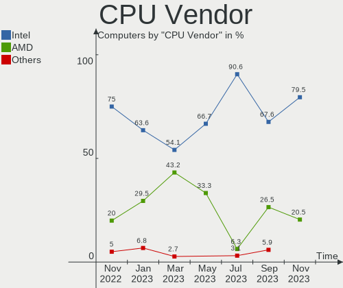

| Vendor | Computers | Percent |
|--------|-----------|---------|
| Intel  | 27        | 81.82%  |
| AMD    | 4         | 12.12%  |
| ARM    | 2         | 6.06%   |

CPU Model
---------

Processor models

| Model                                       | Computers | Percent |
|---------------------------------------------|-----------|---------|
| ARM Processor                               | 2         | 6.06%   |
| Intel Xeon CPU E3-1505M v6 @ 3.00GHz        | 1         | 3.03%   |
| Intel Pentium Silver J5040 CPU @ 2.00GHz    | 1         | 3.03%   |
| Intel Pentium CPU G840 @ 2.80GHz            | 1         | 3.03%   |
| Intel Pentium CPU G3240 @ 3.10GHz           | 1         | 3.03%   |
| Intel Pentium CPU G3220 @ 3.00GHz           | 1         | 3.03%   |
| Intel Pentium 4 CPU 3.06GHz                 | 1         | 3.03%   |
| Intel Core i7-8705G CPU @ 3.10GHz           | 1         | 3.03%   |
| Intel Core i7-8565U CPU @ 1.80GHz           | 1         | 3.03%   |
| Intel Core i7-7600U CPU @ 2.80GHz           | 1         | 3.03%   |
| Intel Core i7-7500U CPU @ 2.70GHz           | 1         | 3.03%   |
| Intel Core i7-4790 CPU @ 3.60GHz            | 1         | 3.03%   |
| Intel Core i7-3630QM CPU @ 2.40GHz          | 1         | 3.03%   |
| Intel Core i5-4300Y CPU @ 1.60GHz           | 1         | 3.03%   |
| Intel Core i5-4210U CPU @ 1.70GHz           | 1         | 3.03%   |
| Intel Core i5-4200U CPU @ 1.60GHz           | 1         | 3.03%   |
| Intel Core i5-3570 CPU @ 3.40GHz            | 1         | 3.03%   |
| Intel Core i5-3330S CPU @ 2.70GHz           | 1         | 3.03%   |
| Intel Core i5-1035G1 CPU @ 1.00GHz          | 1         | 3.03%   |
| Intel Core i5 CPU 650 @ 3.20GHz             | 1         | 3.03%   |
| Intel Core i3-3110M CPU @ 2.40GHz           | 1         | 3.03%   |
| Intel Core i3 CPU M 330 @ 2.13GHz           | 1         | 3.03%   |
| Intel Core i3 CPU 550 @ 3.20GHz             | 1         | 3.03%   |
| Intel Atom CPU Z3740 @ 1.33GHz              | 1         | 3.03%   |
| Intel 12th Gen Core i7-12700F               | 1         | 3.03%   |
| Intel 11th Gen Core i9-11900K @ 3.50GHz     | 1         | 3.03%   |
| Intel 11th Gen Core i7-11850H @ 2.50GHz     | 1         | 3.03%   |
| Intel 11th Gen Core i7-1165G7 @ 2.80GHz     | 1         | 3.03%   |
| AMD Turion 64 Mobile Technology MK-38       | 1         | 3.03%   |
| AMD Ryzen 5 2400G with Radeon Vega Graphics | 1         | 3.03%   |
| AMD Phenom II X6 1090T Processor            | 1         | 3.03%   |
| AMD Athlon II X4 635 Processor              | 1         | 3.03%   |

CPU Model Family
----------------

Processor model prefix

| Model                | Computers | Percent |
|----------------------|-----------|---------|
| Intel Core i5        | 7         | 21.21%  |
| Other                | 6         | 18.18%  |
| Intel Core i7        | 6         | 18.18%  |
| Intel Pentium        | 3         | 9.09%   |
| Intel Core i3        | 3         | 9.09%   |
| Intel Xeon           | 1         | 3.03%   |
| Intel Pentium Silver | 1         | 3.03%   |
| Intel Pentium 4      | 1         | 3.03%   |
| Intel Atom           | 1         | 3.03%   |
| AMD Turion 64 Mobile | 1         | 3.03%   |
| AMD Ryzen 5          | 1         | 3.03%   |
| AMD Phenom II X6     | 1         | 3.03%   |
| AMD Athlon II X4     | 1         | 3.03%   |

CPU Cores
---------

Number of processor cores

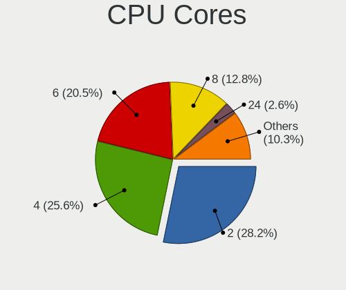

| Number  | Computers | Percent |
|---------|-----------|---------|
| 4       | 13        | 39.39%  |
| 2       | 12        | 36.36%  |
| 8       | 2         | 6.06%   |
| 6       | 2         | 6.06%   |
| 1       | 2         | 6.06%   |
| 12      | 1         | 3.03%   |
| Unknown | 1         | 3.03%   |

CPU Sockets
-----------

Number of sockets

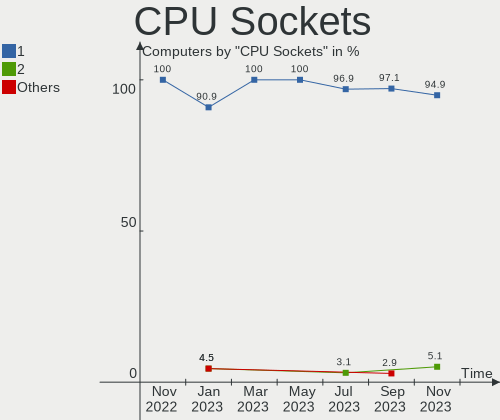

| Number  | Computers | Percent |
|---------|-----------|---------|
| 1       | 31        | 93.94%  |
| 2       | 1         | 3.03%   |
| Unknown | 1         | 3.03%   |

CPU Threads
-----------

Threads per core (Hyper-Threading)

| Number  | Computers | Percent |
|---------|-----------|---------|
| 2       | 20        | 60.61%  |
| 1       | 12        | 36.36%  |
| Unknown | 1         | 3.03%   |

CPU Op-Modes
------------

CPU Operation Modes (32-bit, 64-bit)

| Op mode        | Computers | Percent |
|----------------|-----------|---------|
| 32-bit, 64-bit | 32        | 96.97%  |
| Unknown        | 1         | 3.03%   |

CPU Microcode
-------------

Microcode number

| Number     | Computers | Percent |
|------------|-----------|---------|
| Unknown    | 15        | 45.45%  |
| 0x906e9    | 2         | 6.06%   |
| 0x40651    | 2         | 6.06%   |
| 0x306c3    | 2         | 6.06%   |
| 0x20655    | 2         | 6.06%   |
| 0xa0671    | 1         | 3.03%   |
| 0x90672    | 1         | 3.03%   |
| 0x806eb    | 1         | 3.03%   |
| 0x806d1    | 1         | 3.03%   |
| 0x806c1    | 1         | 3.03%   |
| 0x706e5    | 1         | 3.03%   |
| 0x306a9    | 1         | 3.03%   |
| 0x30673    | 1         | 3.03%   |
| 0x206a7    | 1         | 3.03%   |
| 0x010000dc | 1         | 3.03%   |

CPU Microarch
-------------

Microarchitecture

| Name             | Computers | Percent |
|------------------|-----------|---------|
| Haswell          | 6         | 18.18%  |
| KabyLake         | 5         | 15.15%  |
| IvyBridge        | 4         | 12.12%  |
| Westmere         | 3         | 9.09%   |
| Unknown          | 3         | 9.09%   |
| K10              | 2         | 6.06%   |
| IceLake          | 2         | 6.06%   |
| Zen              | 1         | 3.03%   |
| TigerLake        | 1         | 3.03%   |
| Silvermont       | 1         | 3.03%   |
| SandyBridge      | 1         | 3.03%   |
| NetBurst         | 1         | 3.03%   |
| K8 Hammer        | 1         | 3.03%   |
| Goldmont plus    | 1         | 3.03%   |
| Alderlake Hybrid | 1         | 3.03%   |

Graphics
--------

GPU Vendor
----------

Vendors of graphics cards

| Vendor | Computers | Percent |
|--------|-----------|---------|
| Intel  | 19        | 54.29%  |
| Nvidia | 9         | 25.71%  |
| AMD    | 7         | 20%     |

GPU Model
---------

Graphics card models

| Model                                                                         | Computers | Percent |
|-------------------------------------------------------------------------------|-----------|---------|
| Intel Xeon E3-1200 v3/4th Gen Core Processor Integrated Graphics Controller   | 2         | 5.71%   |
| Intel Xeon E3-1200 v2/3rd Gen Core processor Graphics Controller              | 2         | 5.71%   |
| Intel HD Graphics 620                                                         | 2         | 5.71%   |
| Intel Haswell-ULT Integrated Graphics Controller                              | 2         | 5.71%   |
| Nvidia TU116 [GeForce GTX 1660]                                               | 1         | 2.86%   |
| Nvidia GP107 [GeForce GTX 1050 Ti]                                            | 1         | 2.86%   |
| Nvidia GM206GLM [Quadro M2200 Mobile]                                         | 1         | 2.86%   |
| Nvidia GK208B [GeForce GT 730]                                                | 1         | 2.86%   |
| Nvidia GK107M [GeForce GT 650M]                                               | 1         | 2.86%   |
| Nvidia GF117M [GeForce 610M/710M/810M/820M / GT 620M/625M/630M/720M]          | 1         | 2.86%   |
| Nvidia GA104GLM [RTX A3000 Mobile]                                            | 1         | 2.86%   |
| Nvidia GA102 [GeForce RTX 3090]                                               | 1         | 2.86%   |
| Nvidia GA102 [GeForce RTX 3080 Lite Hash Rate]                                | 1         | 2.86%   |
| Intel WhiskeyLake-U GT2 [UHD Graphics 620]                                    | 1         | 2.86%   |
| Intel TigerLake-LP GT2 [Iris Xe Graphics]                                     | 1         | 2.86%   |
| Intel TigerLake-H GT1 [UHD Graphics]                                          | 1         | 2.86%   |
| Intel Iris Plus Graphics G1 (Ice Lake)                                        | 1         | 2.86%   |
| Intel HD Graphics P630                                                        | 1         | 2.86%   |
| Intel Haswell-ULT High Definition Audio Controller [HD Graphics]              | 1         | 2.86%   |
| Intel GeminiLake [UHD Graphics 605]                                           | 1         | 2.86%   |
| Intel Core Processor Integrated Graphics Controller                           | 1         | 2.86%   |
| Intel Atom Processor Z36xxx/Z37xxx Series Graphics & Display                  | 1         | 2.86%   |
| Intel 82945G/GZ Integrated Graphics Controller                                | 1         | 2.86%   |
| Intel 3rd Gen Core processor Graphics Controller                              | 1         | 2.86%   |
| AMD Sun XT [Radeon HD 8670A/8670M/8690M / R5 M330 / M430 / Radeon 520 Mobile] | 1         | 2.86%   |
| AMD RS482M [Mobility Radeon Xpress 200]                                       | 1         | 2.86%   |
| AMD Redwood XT [Radeon HD 5670/5690/5730]                                     | 1         | 2.86%   |
| AMD Redwood PRO [Radeon HD 5550/5570/5630/6510/6610/7570]                     | 1         | 2.86%   |
| AMD Raven Ridge [Radeon Vega Series / Radeon Vega Mobile Series]              | 1         | 2.86%   |
| AMD Polaris 22 XL [Radeon RX Vega M GL]                                       | 1         | 2.86%   |
| AMD Navi 10 [Radeon RX 5600 OEM/5600 XT / 5700/5700 XT]                       | 1         | 2.86%   |

GPU Combo
---------

Combinations of graphics cards

| Name           | Computers | Percent |
|----------------|-----------|---------|
| 1 x Intel      | 15        | 45.45%  |
| 1 x Nvidia     | 6         | 18.18%  |
| 1 x AMD        | 6         | 18.18%  |
| Intel + Nvidia | 3         | 9.09%   |
| Other          | 2         | 6.06%   |
| Intel + AMD    | 1         | 3.03%   |

GPU Driver
----------

Free vs proprietary

| Driver      | Computers | Percent |
|-------------|-----------|---------|
| Free        | 24        | 72.73%  |
| Proprietary | 7         | 21.21%  |
| Unknown     | 2         | 6.06%   |

GPU Memory
----------

Total video memory

| Size in GB | Computers | Percent |
|------------|-----------|---------|
| Unknown    | 23        | 69.7%   |
| 3.01-4.0   | 3         | 9.09%   |
| 1.01-2.0   | 2         | 6.06%   |
| 0.51-1.0   | 2         | 6.06%   |
| 5.01-6.0   | 1         | 3.03%   |
| 16.01-24.0 | 1         | 3.03%   |
| 8.01-16.0  | 1         | 3.03%   |

Monitor
-------

Monitor Vendor
--------------

Monitor vendors

| Vendor                  | Computers | Percent |
|-------------------------|-----------|---------|
| Samsung Electronics     | 6         | 15.79%  |
| Philips                 | 3         | 7.89%   |
| LG Display              | 3         | 7.89%   |
| Iiyama                  | 3         | 7.89%   |
| Hewlett-Packard         | 3         | 7.89%   |
| Chimei Innolux          | 3         | 7.89%   |
| Acer                    | 3         | 7.89%   |
| Goldstar                | 2         | 5.26%   |
| BOE                     | 2         | 5.26%   |
| AOC                     | 2         | 5.26%   |
| Vizio                   | 1         | 2.63%   |
| Lenovo                  | 1         | 2.63%   |
| Hitachi                 | 1         | 2.63%   |
| HannStar                | 1         | 2.63%   |
| Dell                    | 1         | 2.63%   |
| Chi Mei Optoelectronics | 1         | 2.63%   |
| AU Optronics            | 1         | 2.63%   |
| Ancor Communications    | 1         | 2.63%   |

Monitor Model
-------------

Monitor models

| Model                                                                    | Computers | Percent |
|--------------------------------------------------------------------------|-----------|---------|
| Vizio M322i-B1 VIZ1005 1920x1080 698x392mm 31.5-inch                     | 1         | 2.63%   |
| Samsung Electronics SyncMaster SAM027F 1680x1050 474x296mm 22.0-inch     | 1         | 2.63%   |
| Samsung Electronics SyncMaster SAM0225 1440x900 410x257mm 19.1-inch      | 1         | 2.63%   |
| Samsung Electronics SMB2340 SAM0691 1920x1080 510x290mm 23.1-inch        | 1         | 2.63%   |
| Samsung Electronics S24E650 SAM0CB9 1920x1080 521x293mm 23.5-inch        | 1         | 2.63%   |
| Samsung Electronics S22D300 SAM0B3F 1920x1080 477x268mm 21.5-inch        | 1         | 2.63%   |
| Samsung Electronics LCD Monitor SEC5044 1920x1080 382x215mm 17.3-inch    | 1         | 2.63%   |
| Philips PHL 345B1C PHL093D 3440x1440 797x334mm 34.0-inch                 | 1         | 2.63%   |
| Philips PHL 272B8Q PHL0918 2560x1440 597x336mm 27.0-inch                 | 1         | 2.63%   |
| Philips 247EL PHLC084 1920x1080 521x293mm 23.5-inch                      | 1         | 2.63%   |
| LG Display LCD Monitor LGD05F8 2560x1600 366x229mm 17.0-inch             | 1         | 2.63%   |
| LG Display LCD Monitor LGD039F 1366x768 345x194mm 15.6-inch              | 1         | 2.63%   |
| LG Display LCD Monitor LGD034D 1366x768 344x194mm 15.5-inch              | 1         | 2.63%   |
| Lenovo C27-35 LEN66BA 1920x1080 597x336mm 27.0-inch                      | 1         | 2.63%   |
| Iiyama PLE2483H IVM6113 1920x1080 531x299mm 24.0-inch                    | 1         | 2.63%   |
| Iiyama PL2740HS IVM6662 1920x1080 600x340mm 27.2-inch                    | 1         | 2.63%   |
| Iiyama PL2730H IVM663A 1920x1080 598x336mm 27.0-inch                     | 1         | 2.63%   |
| Hitachi HISENSE HEC0030 3840x2160 1872x1053mm 84.6-inch                  | 1         | 2.63%   |
| Hewlett-Packard w2216 HWP280C 1680x1050 465x291mm 21.6-inch              | 1         | 2.63%   |
| Hewlett-Packard LCD Monitor HWP1001 1920x1080 477x268mm 21.5-inch        | 1         | 2.63%   |
| Hewlett-Packard 24fh HPN3546 1920x1080 527x296mm 23.8-inch               | 1         | 2.63%   |
| HannStar Hanns.G Hi221 HSD2469 1680x1050 474x297mm 22.0-inch             | 1         | 2.63%   |
| Goldstar W2452 GSM5694 1920x1200 432x324mm 21.3-inch                     | 1         | 2.63%   |
| Goldstar L1717S GSM43FF 1280x1024 338x270mm 17.0-inch                    | 1         | 2.63%   |
| Dell E248WFP DELA02E 1920x1200 518x324mm 24.1-inch                       | 1         | 2.63%   |
| Chimei Innolux LCD Monitor CMN174A 1920x1080 381x214mm 17.2-inch         | 1         | 2.63%   |
| Chimei Innolux LCD Monitor CMN1745 1600x900 382x214mm 17.2-inch          | 1         | 2.63%   |
| Chimei Innolux LCD Monitor CMN1476 1366x768 309x174mm 14.0-inch          | 1         | 2.63%   |
| Chi Mei Optoelectronics LCD Monitor CMO1409 1280x800 303x190mm 14.1-inch | 1         | 2.63%   |
| BOE LCD Monitor BOE0713 1920x1080 344x193mm 15.5-inch                    | 1         | 2.63%   |
| BOE LCD Monitor BOE06DC 1920x1280 259x173mm 12.3-inch                    | 1         | 2.63%   |
| AU Optronics LCD Monitor AUO429D 1920x1080 382x215mm 17.3-inch           | 1         | 2.63%   |
| AOC 731W AOC1731 1280x720 340x270mm 17.1-inch                            | 1         | 2.63%   |
| AOC 27B1 AOC2701 1920x1080 598x336mm 27.0-inch                           | 1         | 2.63%   |
| Ancor Communications ASUS PB287Q ACI28A3 3840x2160 620x340mm 27.8-inch   | 1         | 2.63%   |
| Acer R240HY ACR046F 1920x1080 527x296mm 23.8-inch                        | 1         | 2.63%   |
| Acer H236HL ACR0318 1920x1080 509x286mm 23.0-inch                        | 1         | 2.63%   |
| Acer ET322QU ACR0687 2560x1440 698x393mm 31.5-inch                       | 1         | 2.63%   |

Monitor Resolution
------------------

Monitor screen resolution

| Resolution         | Computers | Percent |
|--------------------|-----------|---------|
| 1920x1080 (FHD)    | 15        | 42.86%  |
| 3840x2160 (4K)     | 3         | 8.57%   |
| 1680x1050 (WSXGA+) | 3         | 8.57%   |
| 1366x768 (WXGA)    | 3         | 8.57%   |
| 2560x1440 (QHD)    | 2         | 5.71%   |
| 3440x1440          | 1         | 2.86%   |
| 2560x1600          | 1         | 2.86%   |
| 1920x1280          | 1         | 2.86%   |
| 1920x1200 (WUXGA)  | 1         | 2.86%   |
| 1600x900 (HD+)     | 1         | 2.86%   |
| 1440x900 (WXGA+)   | 1         | 2.86%   |
| 1280x800 (WXGA)    | 1         | 2.86%   |
| 1280x720 (HD)      | 1         | 2.86%   |
| 1280x1024 (SXGA)   | 1         | 2.86%   |

Monitor Diagonal
----------------

Diagonal size in inches

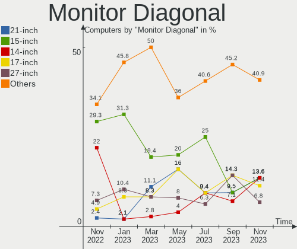

| Inches | Computers | Percent |
|--------|-----------|---------|
| 17     | 7         | 18.92%  |
| 27     | 6         | 16.22%  |
| 23     | 6         | 16.22%  |
| 24     | 3         | 8.11%   |
| 15     | 3         | 8.11%   |
| 31     | 2         | 5.41%   |
| 22     | 2         | 5.41%   |
| 21     | 2         | 5.41%   |
| 14     | 2         | 5.41%   |
| 84     | 1         | 2.7%    |
| 34     | 1         | 2.7%    |
| 19     | 1         | 2.7%    |
| 12     | 1         | 2.7%    |

Monitor Width
-------------

Physical width

| Width in mm | Computers | Percent |
|-------------|-----------|---------|
| 501-600     | 13        | 36.11%  |
| 301-350     | 7         | 19.44%  |
| 401-500     | 5         | 13.89%  |
| 351-400     | 5         | 13.89%  |
| 601-700     | 3         | 8.33%   |
| 701-800     | 1         | 2.78%   |
| 201-300     | 1         | 2.78%   |
| 1501-2000   | 1         | 2.78%   |

Aspect Ratio
------------

Proportional relationship between the width and the height

| Ratio | Computers | Percent |
|-------|-----------|---------|
| 16/9  | 23        | 67.65%  |
| 16/10 | 7         | 20.59%  |
| 5/4   | 2         | 5.88%   |
| 3/2   | 1         | 2.94%   |
| 21/9  | 1         | 2.94%   |

Monitor Area
------------

Area in inch²

| Area in inch² | Computers | Percent |
|----------------|-----------|---------|
| 201-250        | 10        | 28.57%  |
| 301-350        | 6         | 17.14%  |
| 121-130        | 5         | 14.29%  |
| 351-500        | 3         | 8.57%   |
| 101-110        | 3         | 8.57%   |
| 81-90          | 2         | 5.71%   |
| 141-150        | 2         | 5.71%   |
| More than 1000 | 1         | 2.86%   |
| 61-70          | 1         | 2.86%   |
| 251-300        | 1         | 2.86%   |
| 151-200        | 1         | 2.86%   |

Pixel Density
-------------

Pixels per inch

| Density | Computers | Percent |
|---------|-----------|---------|
| 51-100  | 20        | 58.82%  |
| 101-120 | 7         | 20.59%  |
| 121-160 | 5         | 14.71%  |
| 161-240 | 2         | 5.88%   |

Multiple Monitors
-----------------

Total monitors connected

| Total | Computers | Percent |
|-------|-----------|---------|
| 1     | 25        | 75.76%  |
| 2     | 6         | 18.18%  |
| 3     | 1         | 3.03%   |
| 0     | 1         | 3.03%   |

Network
-------

Net Controller Vendor
---------------------

Controller vendors

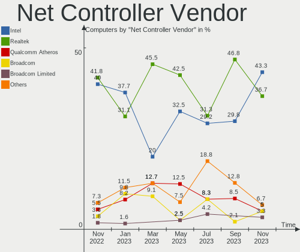

| Vendor                   | Computers | Percent |
|--------------------------|-----------|---------|
| Realtek Semiconductor    | 19        | 44.19%  |
| Intel                    | 15        | 34.88%  |
| Qualcomm Atheros         | 4         | 9.3%    |
| Ralink                   | 2         | 4.65%   |
| NetGear                  | 1         | 2.33%   |
| Marvell Technology Group | 1         | 2.33%   |
| ASIX Electronics         | 1         | 2.33%   |

Net Controller Model
--------------------

Controller models

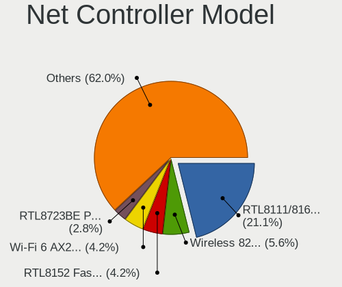

| Model                                                                   | Computers | Percent |
|-------------------------------------------------------------------------|-----------|---------|
| Realtek RTL8111/8168/8411 PCI Express Gigabit Ethernet Controller       | 10        | 17.54%  |
| Realtek RTL810xE PCI Express Fast Ethernet controller                   | 3         | 5.26%   |
| Intel Wireless 8265 / 8275                                              | 3         | 5.26%   |
| Realtek RTL8188CE 802.11b/g/n WiFi Adapter                              | 2         | 3.51%   |
| Realtek RTL8153 Gigabit Ethernet Adapter                                | 2         | 3.51%   |
| Realtek RTL-8100/8101L/8139 PCI Fast Ethernet Adapter                   | 2         | 3.51%   |
| Ralink RT3290 Wireless 802.11n 1T/1R PCIe                               | 2         | 3.51%   |
| Intel I210 Gigabit Network Connection                                   | 2         | 3.51%   |
| Realtek RTL8821CE 802.11ac PCIe Wireless Network Adapter                | 1         | 1.75%   |
| Realtek RTL8821AE 802.11ac PCIe Wireless Network Adapter                | 1         | 1.75%   |
| Realtek RTL8188EE Wireless Network Adapter                              | 1         | 1.75%   |
| Realtek RTL8125 2.5GbE Controller                                       | 1         | 1.75%   |
| Realtek 802.11ac NIC                                                    | 1         | 1.75%   |
| Qualcomm Atheros QCA8172 Fast Ethernet                                  | 1         | 1.75%   |
| Qualcomm Atheros AR9485 Wireless Network Adapter                        | 1         | 1.75%   |
| Qualcomm Atheros AR9287 Wireless Network Adapter (PCI-Express)          | 1         | 1.75%   |
| Qualcomm Atheros AR8131 Gigabit Ethernet                                | 1         | 1.75%   |
| Qualcomm Atheros AR242x / AR542x Wireless Network Adapter (PCI-Express) | 1         | 1.75%   |
| NetGear A6150                                                           | 1         | 1.75%   |
| Marvell Group 88E8001 Gigabit Ethernet Controller                       | 1         | 1.75%   |
| Intel Wireless 3165                                                     | 1         | 1.75%   |
| Intel Wireless 3160                                                     | 1         | 1.75%   |
| Intel Wi-Fi 6 AX210/AX211/AX411 160MHz                                  | 1         | 1.75%   |
| Intel Wi-Fi 6 AX200                                                     | 1         | 1.75%   |
| Intel Tiger Lake PCH CNVi WiFi                                          | 1         | 1.75%   |
| Intel I211 Gigabit Network Connection                                   | 1         | 1.75%   |
| Intel Ethernet Controller I225-V                                        | 1         | 1.75%   |
| Intel Ethernet Connection I217-V                                        | 1         | 1.75%   |
| Intel Ethernet Connection I217-LM                                       | 1         | 1.75%   |
| Intel Ethernet Connection (5) I219-LM                                   | 1         | 1.75%   |
| Intel Ethernet Connection (2) I219-LM                                   | 1         | 1.75%   |
| Intel Ethernet Connection (14) I219-LM                                  | 1         | 1.75%   |
| Intel Ethernet Connection (13) I219-V                                   | 1         | 1.75%   |
| Intel Dual Band Wireless-AC 3168NGW [Stone Peak]                        | 1         | 1.75%   |
| Intel Centrino Wireless-N 2230                                          | 1         | 1.75%   |
| Intel Cannon Point-LP CNVi [Wireless-AC]                                | 1         | 1.75%   |
| Intel Alder Lake-S PCH CNVi WiFi                                        | 1         | 1.75%   |
| Intel 82579LM Gigabit Network Connection (Lewisville)                   | 1         | 1.75%   |
| ASIX AX88179 Gigabit Ethernet                                           | 1         | 1.75%   |

Wireless Vendor
---------------

Wireless vendors

| Vendor                | Computers | Percent |
|-----------------------|-----------|---------|
| Intel                 | 12        | 50%     |
| Realtek Semiconductor | 6         | 25%     |
| Qualcomm Atheros      | 3         | 12.5%   |
| Ralink                | 2         | 8.33%   |
| NetGear               | 1         | 4.17%   |

Wireless Model
--------------

Wireless models

| Model                                                                   | Computers | Percent |
|-------------------------------------------------------------------------|-----------|---------|
| Intel Wireless 8265 / 8275                                              | 3         | 12.5%   |
| Realtek RTL8188CE 802.11b/g/n WiFi Adapter                              | 2         | 8.33%   |
| Ralink RT3290 Wireless 802.11n 1T/1R PCIe                               | 2         | 8.33%   |
| Realtek RTL8821CE 802.11ac PCIe Wireless Network Adapter                | 1         | 4.17%   |
| Realtek RTL8821AE 802.11ac PCIe Wireless Network Adapter                | 1         | 4.17%   |
| Realtek RTL8188EE Wireless Network Adapter                              | 1         | 4.17%   |
| Realtek 802.11ac NIC                                                    | 1         | 4.17%   |
| Qualcomm Atheros AR9485 Wireless Network Adapter                        | 1         | 4.17%   |
| Qualcomm Atheros AR9287 Wireless Network Adapter (PCI-Express)          | 1         | 4.17%   |
| Qualcomm Atheros AR242x / AR542x Wireless Network Adapter (PCI-Express) | 1         | 4.17%   |
| NetGear A6150                                                           | 1         | 4.17%   |
| Intel Wireless 3165                                                     | 1         | 4.17%   |
| Intel Wireless 3160                                                     | 1         | 4.17%   |
| Intel Wi-Fi 6 AX210/AX211/AX411 160MHz                                  | 1         | 4.17%   |
| Intel Wi-Fi 6 AX200                                                     | 1         | 4.17%   |
| Intel Tiger Lake PCH CNVi WiFi                                          | 1         | 4.17%   |
| Intel Dual Band Wireless-AC 3168NGW [Stone Peak]                        | 1         | 4.17%   |
| Intel Centrino Wireless-N 2230                                          | 1         | 4.17%   |
| Intel Cannon Point-LP CNVi [Wireless-AC]                                | 1         | 4.17%   |
| Intel Alder Lake-S PCH CNVi WiFi                                        | 1         | 4.17%   |

Ethernet Vendor
---------------

Ethernet vendors

| Vendor                   | Computers | Percent |
|--------------------------|-----------|---------|
| Realtek Semiconductor    | 17        | 54.84%  |
| Intel                    | 10        | 32.26%  |
| Qualcomm Atheros         | 2         | 6.45%   |
| Marvell Technology Group | 1         | 3.23%   |
| ASIX Electronics         | 1         | 3.23%   |

Ethernet Model
--------------

Ethernet models

| Model                                                             | Computers | Percent |
|-------------------------------------------------------------------|-----------|---------|
| Realtek RTL8111/8168/8411 PCI Express Gigabit Ethernet Controller | 10        | 30.3%   |
| Realtek RTL810xE PCI Express Fast Ethernet controller             | 3         | 9.09%   |
| Realtek RTL8153 Gigabit Ethernet Adapter                          | 2         | 6.06%   |
| Realtek RTL-8100/8101L/8139 PCI Fast Ethernet Adapter             | 2         | 6.06%   |
| Intel I210 Gigabit Network Connection                             | 2         | 6.06%   |
| Realtek RTL8125 2.5GbE Controller                                 | 1         | 3.03%   |
| Qualcomm Atheros QCA8172 Fast Ethernet                            | 1         | 3.03%   |
| Qualcomm Atheros AR8131 Gigabit Ethernet                          | 1         | 3.03%   |
| Marvell Group 88E8001 Gigabit Ethernet Controller                 | 1         | 3.03%   |
| Intel I211 Gigabit Network Connection                             | 1         | 3.03%   |
| Intel Ethernet Controller I225-V                                  | 1         | 3.03%   |
| Intel Ethernet Connection I217-V                                  | 1         | 3.03%   |
| Intel Ethernet Connection I217-LM                                 | 1         | 3.03%   |
| Intel Ethernet Connection (5) I219-LM                             | 1         | 3.03%   |
| Intel Ethernet Connection (2) I219-LM                             | 1         | 3.03%   |
| Intel Ethernet Connection (14) I219-LM                            | 1         | 3.03%   |
| Intel Ethernet Connection (13) I219-V                             | 1         | 3.03%   |
| Intel 82579LM Gigabit Network Connection (Lewisville)             | 1         | 3.03%   |
| ASIX AX88179 Gigabit Ethernet                                     | 1         | 3.03%   |

Net Controller Kind
-------------------

Ethernet, WiFi or modem

| Kind     | Computers | Percent |
|----------|-----------|---------|
| Ethernet | 28        | 54.9%   |
| WiFi     | 23        | 45.1%   |

Used Controller
---------------

Currently used network controller

| Kind     | Computers | Percent |
|----------|-----------|---------|
| Ethernet | 17        | 51.52%  |
| WiFi     | 16        | 48.48%  |

NICs
----

Total network controllers on board

| Total | Computers | Percent |
|-------|-----------|---------|
| 2     | 20        | 60.61%  |
| 1     | 9         | 27.27%  |
| 0     | 3         | 9.09%   |
| 3     | 1         | 3.03%   |

IPv6
----

IPv6 vs IPv4

| Used | Computers | Percent |
|------|-----------|---------|
| No   | 22        | 66.67%  |
| Yes  | 11        | 33.33%  |

Bluetooth
---------

Bluetooth Vendor
----------------

Controller vendors

| Vendor                          | Computers | Percent |
|---------------------------------|-----------|---------|
| Intel                           | 12        | 63.16%  |
| Ralink                          | 2         | 10.53%  |
| IMC Networks                    | 2         | 10.53%  |
| Qualcomm Atheros Communications | 1         | 5.26%   |
| Cambridge Silicon Radio         | 1         | 5.26%   |
| Broadcom                        | 1         | 5.26%   |

Bluetooth Model
---------------

Controller models

| Model                                               | Computers | Percent |
|-----------------------------------------------------|-----------|---------|
| Intel Bluetooth wireless interface                  | 5         | 26.32%  |
| Ralink RT3290 Bluetooth                             | 2         | 10.53%  |
| Intel Bluetooth 9460/9560 Jefferson Peak (JfP)      | 2         | 10.53%  |
| IMC Networks Bluetooth Radio                        | 2         | 10.53%  |
| Qualcomm Atheros AR3012 Bluetooth 4.0               | 1         | 5.26%   |
| Intel Wireless-AC 3168 Bluetooth                    | 1         | 5.26%   |
| Intel Centrino Bluetooth Wireless Transceiver       | 1         | 5.26%   |
| Intel AX210 Bluetooth                               | 1         | 5.26%   |
| Intel AX201 Bluetooth                               | 1         | 5.26%   |
| Intel AX200 Bluetooth                               | 1         | 5.26%   |
| Cambridge Silicon Radio Bluetooth Dongle (HCI mode) | 1         | 5.26%   |
| Broadcom BCM92046DG-CL1ROM Bluetooth 2.1 Adapter    | 1         | 5.26%   |

Sound
-----

Sound Vendor
------------

Sound card vendors

| Vendor                | Computers | Percent |
|-----------------------|-----------|---------|
| Intel                 | 26        | 54.17%  |
| Nvidia                | 8         | 16.67%  |
| AMD                   | 7         | 14.58%  |
| C-Media Electronics   | 2         | 4.17%   |
| Realtek Semiconductor | 1         | 2.08%   |
| Meizu                 | 1         | 2.08%   |
| Corsair               | 1         | 2.08%   |
| BR25                  | 1         | 2.08%   |
| ASUSTek Computer      | 1         | 2.08%   |

Sound Model
-----------

Sound card models

| Model                                                                      | Computers | Percent |
|----------------------------------------------------------------------------|-----------|---------|
| Intel Haswell-ULT HD Audio Controller                                      | 3         | 5.45%   |
| Intel 8 Series/C220 Series Chipset High Definition Audio Controller        | 3         | 5.45%   |
| Intel 8 Series HD Audio Controller                                         | 3         | 5.45%   |
| Intel 7 Series/C216 Chipset Family High Definition Audio Controller        | 3         | 5.45%   |
| Intel 5 Series/3400 Series Chipset High Definition Audio                   | 3         | 5.45%   |
| Nvidia GA102 High Definition Audio Controller                              | 2         | 3.64%   |
| Intel Tiger Lake-H HD Audio Controller                                     | 2         | 3.64%   |
| Intel Sunrise Point-LP HD Audio                                            | 2         | 3.64%   |
| Intel CM238 HD Audio Controller                                            | 2         | 3.64%   |
| Intel 6 Series/C200 Series Chipset Family High Definition Audio Controller | 2         | 3.64%   |
| AMD SBx00 Azalia (Intel HDA)                                               | 2         | 3.64%   |
| AMD Redwood HDMI Audio [Radeon HD 5000 Series]                             | 2         | 3.64%   |
| Realtek Semiconductor USB Audio                                            | 1         | 1.82%   |
| Nvidia TU116 High Definition Audio Controller                              | 1         | 1.82%   |
| Nvidia stereo controller                                                   | 1         | 1.82%   |
| Nvidia GP107GL High Definition Audio Controller                            | 1         | 1.82%   |
| Nvidia GM206 High Definition Audio Controller                              | 1         | 1.82%   |
| Nvidia GK208 HDMI/DP Audio Controller                                      | 1         | 1.82%   |
| Nvidia GK107 HDMI Audio Controller                                         | 1         | 1.82%   |
| Nvidia GA104 High Definition Audio Controller                              | 1         | 1.82%   |
| Meizu HiFi DAC Headphone Amplifier                                         | 1         | 1.82%   |
| Intel Xeon E3-1200 v3/4th Gen Core Processor HD Audio Controller           | 1         | 1.82%   |
| Intel Tiger Lake-LP Smart Sound Technology Audio Controller                | 1         | 1.82%   |
| Intel NM10/ICH7 Family High Definition Audio Controller                    | 1         | 1.82%   |
| Intel Ice Lake-LP Smart Sound Technology Audio Controller                  | 1         | 1.82%   |
| Intel Celeron/Pentium Silver Processor High Definition Audio               | 1         | 1.82%   |
| Intel Cannon Point-LP High Definition Audio Controller                     | 1         | 1.82%   |
| Intel Alder Lake-S HD Audio Controller                                     | 1         | 1.82%   |
| Corsair VOID ELITE Wireless Gaming Dongle                                  | 1         | 1.82%   |
| C-Media Electronics USB MICROPHONE                                         | 1         | 1.82%   |
| C-Media Electronics USB Advanced Audio Device                              | 1         | 1.82%   |
| BR25 UACDemoV1.0                                                           | 1         | 1.82%   |
| ASUSTek Computer USB Audio                                                 | 1         | 1.82%   |
| AMD Raven/Raven2/Fenghuang HDMI/DP Audio Controller                        | 1         | 1.82%   |
| AMD Polaris 22 HDMI Audio                                                  | 1         | 1.82%   |
| AMD Navi 10 HDMI Audio                                                     | 1         | 1.82%   |
| AMD IXP SB4x0 High Definition Audio Controller                             | 1         | 1.82%   |
| AMD Family 17h/19h HD Audio Controller                                     | 1         | 1.82%   |

Memory
------

Memory Vendor
-------------

Memory module vendors

| Vendor              | Computers | Percent |
|---------------------|-----------|---------|
| SK hynix            | 6         | 23.08%  |
| Unknown             | 4         | 15.38%  |
| Samsung Electronics | 4         | 15.38%  |
| Kingston            | 3         | 11.54%  |
| Corsair             | 3         | 11.54%  |
| Crucial             | 2         | 7.69%   |
| Unifosa             | 1         | 3.85%   |
| Ramaxel Technology  | 1         | 3.85%   |
| HBS                 | 1         | 3.85%   |
| G.Skill             | 1         | 3.85%   |

Memory Model
------------

Memory module models

| Model                                                     | Computers | Percent |
|-----------------------------------------------------------|-----------|---------|
| Unknown RAM Module 4GB DIMM DDR2 800MT/s                  | 1         | 3.7%    |
| Unknown RAM Module 4GB DIMM DDR 1333MT/s                  | 1         | 3.7%    |
| Unknown RAM Module 2GB DIMM DDR 1333MT/s                  | 1         | 3.7%    |
| Unknown RAM Module 1024MB SODIMM DDR3 1066MT/s            | 1         | 3.7%    |
| Unknown RAM MEM-DOWN 8192MB SODIMM DDR4 2400MT/s          | 1         | 3.7%    |
| Unifosa RAM GU512303EP0202 2GB DIMM DDR3 1333MT/s         | 1         | 3.7%    |
| SK hynix RAM V-GeN D3H4GS16B8 4096MB SODIMM DDR3 1600MT/s | 1         | 3.7%    |
| SK hynix RAM HMT451U6BFR8A-PB 4GB DIMM DDR3 1600MT/s      | 1         | 3.7%    |
| SK hynix RAM HMT451S6BFR8A-PB 4GB SODIMM DDR3 1600MT/s    | 1         | 3.7%    |
| SK hynix RAM HMT451S6AFR8A-PB 4GB SODIMM DDR3 1600MT/s    | 1         | 3.7%    |
| SK hynix RAM HMT451S6AFR8A-PB 4096MB SODIMM DDR3 1600MT/s | 1         | 3.7%    |
| SK hynix RAM HMA81GS6DJR8N-XN 8GB SODIMM DDR4 3200MT/s    | 1         | 3.7%    |
| Samsung RAM M471A5244CB0-CWE 4GB SODIMM DDR4 3200MT/s     | 1         | 3.7%    |
| Samsung RAM M471A2K43BB1-CRC 16GB SODIMM DDR4 2400MT/s    | 1         | 3.7%    |
| Samsung RAM M471A1K43CB1-CRC 8GB SODIMM DDR4 2667MT/s     | 1         | 3.7%    |
| Samsung RAM M471A1G44BB0-CWE 8GB SODIMM DDR4 3200MT/s     | 1         | 3.7%    |
| Ramaxel RAM RMT3170ME68F9F1600 4GB SODIMM DDR3 1600MT/s   | 1         | 3.7%    |
| Kingston RAM HP16D3LS1KFG/4G 4096MB SODIMM DDR3 1600MT/s  | 1         | 3.7%    |
| Kingston RAM 9905700-104.A00G 8GB SODIMM DDR4 3200MT/s    | 1         | 3.7%    |
| Kingston RAM 9905471-017.A00LF 4096MB DIMM DDR3 1333MT/s  | 1         | 3.7%    |
| HBS RAM SO8G1600CL11L 8GB SODIMM DDR3 1600MT/s            | 1         | 3.7%    |
| G.Skill RAM F4-3200C22-32GRS 32GB SODIMM DDR4 3200MT/s    | 1         | 3.7%    |
| Crucial RAM CT8G4SFS824A.C8FJ 8192MB SODIMM DDR4 2400MT/s | 1         | 3.7%    |
| Crucial RAM CT16G4SFD824A.C16FE 16GB SODIMM DDR4 2400MT/s | 1         | 3.7%    |
| Corsair RAM CMZ8GX3M2A1600C9 4096MB DIMM DDR3 1600MT/s    | 1         | 3.7%    |
| Corsair RAM CMH32GX4M2E3200C16 16GB DIMM DDR4 2133MT/s    | 1         | 3.7%    |
| Corsair RAM CM4X16GD3000C16K4D 16384MB DIMM DDR4 3000MT/s | 1         | 3.7%    |

Memory Kind
-----------

Memory module kinds

| Kind | Computers | Percent |
|------|-----------|---------|
| DDR3 | 10        | 47.62%  |
| DDR4 | 9         | 42.86%  |
| DDR2 | 1         | 4.76%   |
| DDR  | 1         | 4.76%   |

Memory Form Factor
------------------

Physical design of the memory module

| Name   | Computers | Percent |
|--------|-----------|---------|
| SODIMM | 13        | 61.9%   |
| DIMM   | 8         | 38.1%   |

Memory Size
-----------

Memory module size

| Size  | Computers | Percent |
|-------|-----------|---------|
| 4096  | 10        | 41.67%  |
| 8192  | 6         | 25%     |
| 16384 | 4         | 16.67%  |
| 2048  | 2         | 8.33%   |
| 32768 | 1         | 4.17%   |
| 1024  | 1         | 4.17%   |

Memory Speed
------------

Memory module speed

| Speed | Computers | Percent |
|-------|-----------|---------|
| 1600  | 7         | 31.82%  |
| 2400  | 4         | 18.18%  |
| 3200  | 3         | 13.64%  |
| 1333  | 3         | 13.64%  |
| 3000  | 1         | 4.55%   |
| 2667  | 1         | 4.55%   |
| 2133  | 1         | 4.55%   |
| 1066  | 1         | 4.55%   |
| 800   | 1         | 4.55%   |

Printers & scanners
-------------------

Printer Vendor
--------------

Printer device vendors

| Vendor      | Computers | Percent |
|-------------|-----------|---------|
| Seiko Epson | 1         | 33.33%  |
| Dymo-CoStar | 1         | 33.33%  |
| Canon       | 1         | 33.33%  |

Printer Model
-------------

Printer device models

| Model                            | Computers | Percent |
|----------------------------------|-----------|---------|
| Seiko Epson XP-4100 Series       | 1         | 33.33%  |
| Dymo-CoStar LabelWriter 450      | 1         | 33.33%  |
| Canon LaserShot LBP-1120 Printer | 1         | 33.33%  |

Scanner Vendor
--------------

Scanner device vendors

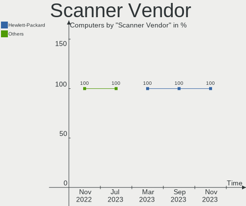

| Vendor                      | Computers | Percent |
|-----------------------------|-----------|---------|
| Acer Peripherals (now BenQ) | 1         | 100%    |

Scanner Model
-------------

Scanner device models

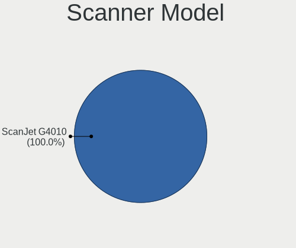

| Model                                       | Computers | Percent |
|---------------------------------------------|-----------|---------|
| Acer Peripherals (now BenQ) S2W 3300U/4300U | 1         | 100%    |

Camera
------

Camera Vendor
-------------

Camera device vendors

| Vendor                                 | Computers | Percent |
|----------------------------------------|-----------|---------|
| Realtek Semiconductor                  | 5         | 31.25%  |
| Chicony Electronics                    | 3         | 18.75%  |
| Logitech                               | 2         | 12.5%   |
| ARC International                      | 2         | 12.5%   |
| Syntek                                 | 1         | 6.25%   |
| IMC Networks                           | 1         | 6.25%   |
| Cheng Uei Precision Industry (Foxlink) | 1         | 6.25%   |
| Acer                                   | 1         | 6.25%   |

Camera Model
------------

Camera device models

| Model                                            | Computers | Percent |
|--------------------------------------------------|-----------|---------|
| Realtek Integrated Webcam HD                     | 2         | 12.5%   |
| ARC International Camera                         | 2         | 12.5%   |
| Syntek Lenovo EasyCamera                         | 1         | 6.25%   |
| Realtek Laptop_Integrated_Webcam_HD              | 1         | 6.25%   |
| Realtek Integrated_Webcam_HD                     | 1         | 6.25%   |
| Realtek HP 1.0MP High Definition Webcam          | 1         | 6.25%   |
| Logitech Webcam C925e                            | 1         | 6.25%   |
| Logitech StreamCam                               | 1         | 6.25%   |
| IMC Networks USB2.0 HD UVC WebCam                | 1         | 6.25%   |
| Chicony USB2.0 Camera                            | 1         | 6.25%   |
| Chicony LG Camera                                | 1         | 6.25%   |
| Chicony HP Truevision HD                         | 1         | 6.25%   |
| Cheng Uei Precision Industry (Foxlink) HP Webcam | 1         | 6.25%   |
| Acer Orbicam                                     | 1         | 6.25%   |

Security
--------

Fingerprint Vendor
------------------

Fingerprint sensor vendors

Zero info for selected period =(

Fingerprint Model
-----------------

Fingerprint sensor models

Zero info for selected period =(

Chipcard Vendor
---------------

Chipcard module vendors

| Vendor   | Computers | Percent |
|----------|-----------|---------|
| Broadcom | 2         | 100%    |

Chipcard Model
--------------

Chipcard module models

| Model          | Computers | Percent |
|----------------|-----------|---------|
| Broadcom 5880  | 1         | 50%     |
| Broadcom 58200 | 1         | 50%     |

Unsupported
-----------

Unsupported Devices
-------------------

Total unsupported devices on board

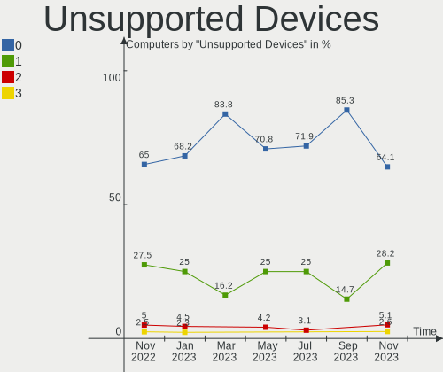

| Total | Computers | Percent |
|-------|-----------|---------|
| 0     | 24        | 72.73%  |
| 1     | 6         | 18.18%  |
| 2     | 3         | 9.09%   |

Unsupported Device Types
------------------------

Types of unsupported devices

| Type                     | Computers | Percent |
|--------------------------|-----------|---------|
| Graphics card            | 2         | 18.18%  |
| Chipcard                 | 2         | 18.18%  |
| Bluetooth                | 2         | 18.18%  |
| Network                  | 1         | 9.09%   |
| Net/wireless             | 1         | 9.09%   |
| Flash memory             | 1         | 9.09%   |
| Communication controller | 1         | 9.09%   |
| Card reader              | 1         | 9.09%   |

