Xero - Hardware Trends
----------------------

A project to identify most popular hardware characteristics and track their change
over time based on data collected by Linux users at https://Linux-Hardware.org.

Anyone can contribute to this report by the [hw-probe](https://github.com/linuxhw/hw-probe) tool:

    sudo -E hw-probe -all -upload

This is a report for all computer types. See also reports for [desktops](/Dist/Xero/Desktop/README.md) and [notebooks](/Dist/Xero/Notebook/README.md).

This report is for one last month. Overall report since the beginning of time: [TestDays](https://github.com/linuxhw/TestDays)

Period: Jan, 2024.

Contents
--------

* [ System ](#system)
  - [ OS                       ](#os)
  - [ OS Family                ](#os-family)
  - [ Kernel                   ](#kernel)
  - [ Kernel Family            ](#kernel-family)
  - [ Kernel Major Ver.        ](#kernel-major-ver)
  - [ Arch                     ](#arch)
  - [ DE                       ](#de)
  - [ Display Server           ](#display-server)
  - [ Display Manager          ](#display-manager)
  - [ OS Lang                  ](#os-lang)
  - [ Boot Mode                ](#boot-mode)
  - [ Filesystem               ](#filesystem)
  - [ Part. scheme             ](#part-scheme)
  - [ Dual Boot with Linux/BSD ](#dual-boot-with-linuxbsd)
  - [ Dual Boot (Win)          ](#dual-boot-win)

* [ Board ](#board)
  - [ Vendor                   ](#vendor)
  - [ Model                    ](#model)
  - [ Model Family             ](#model-family)
  - [ MFG Year                 ](#mfg-year)
  - [ Form Factor              ](#form-factor)
  - [ Secure Boot              ](#secure-boot)
  - [ Coreboot                 ](#coreboot)
  - [ RAM Size                 ](#ram-size)
  - [ RAM Used                 ](#ram-used)
  - [ Total Drives             ](#total-drives)
  - [ Has CD-ROM               ](#has-cd-rom)
  - [ Has Ethernet             ](#has-ethernet)
  - [ Has WiFi                 ](#has-wifi)
  - [ Has Bluetooth            ](#has-bluetooth)

* [ Location ](#location)
  - [ Country                  ](#country)
  - [ City                     ](#city)

* [ Drives ](#drives)
  - [ Drive Vendor             ](#drive-vendor)
  - [ Drive Model              ](#drive-model)
  - [ HDD Vendor               ](#hdd-vendor)
  - [ SSD Vendor               ](#ssd-vendor)
  - [ Drive Kind               ](#drive-kind)
  - [ Drive Connector          ](#drive-connector)
  - [ Drive Size               ](#drive-size)
  - [ Space Total              ](#space-total)
  - [ Space Used               ](#space-used)
  - [ Malfunc. Drives          ](#malfunc-drives)
  - [ Malfunc. Drive Vendor    ](#malfunc-drive-vendor)
  - [ Malfunc. HDD Vendor      ](#malfunc-hdd-vendor)
  - [ Malfunc. Drive Kind      ](#malfunc-drive-kind)
  - [ Failed Drives            ](#failed-drives)
  - [ Failed Drive Vendor      ](#failed-drive-vendor)
  - [ Drive Status             ](#drive-status)

* [ Storage controller ](#storage-controller)
  - [ Storage Vendor           ](#storage-vendor)
  - [ Storage Model            ](#storage-model)
  - [ Storage Kind             ](#storage-kind)

* [ Processor ](#processor)
  - [ CPU Vendor               ](#cpu-vendor)
  - [ CPU Model                ](#cpu-model)
  - [ CPU Model Family         ](#cpu-model-family)
  - [ CPU Cores                ](#cpu-cores)
  - [ CPU Sockets              ](#cpu-sockets)
  - [ CPU Threads              ](#cpu-threads)
  - [ CPU Op-Modes             ](#cpu-op-modes)
  - [ CPU Microcode            ](#cpu-microcode)
  - [ CPU Microarch            ](#cpu-microarch)

* [ Graphics ](#graphics)
  - [ GPU Vendor               ](#gpu-vendor)
  - [ GPU Model                ](#gpu-model)
  - [ GPU Combo                ](#gpu-combo)
  - [ GPU Driver               ](#gpu-driver)
  - [ GPU Memory               ](#gpu-memory)

* [ Monitor ](#monitor)
  - [ Monitor Vendor           ](#monitor-vendor)
  - [ Monitor Model            ](#monitor-model)
  - [ Monitor Resolution       ](#monitor-resolution)
  - [ Monitor Diagonal         ](#monitor-diagonal)
  - [ Monitor Width            ](#monitor-width)
  - [ Aspect Ratio             ](#aspect-ratio)
  - [ Monitor Area             ](#monitor-area)
  - [ Pixel Density            ](#pixel-density)
  - [ Multiple Monitors        ](#multiple-monitors)

* [ Network ](#network)
  - [ Net Controller Vendor    ](#net-controller-vendor)
  - [ Net Controller Model     ](#net-controller-model)
  - [ Wireless Vendor          ](#wireless-vendor)
  - [ Wireless Model           ](#wireless-model)
  - [ Ethernet Vendor          ](#ethernet-vendor)
  - [ Ethernet Model           ](#ethernet-model)
  - [ Net Controller Kind      ](#net-controller-kind)
  - [ Used Controller          ](#used-controller)
  - [ NICs                     ](#nics)
  - [ IPv6                     ](#ipv6)

* [ Bluetooth ](#bluetooth)
  - [ Bluetooth Vendor         ](#bluetooth-vendor)
  - [ Bluetooth Model          ](#bluetooth-model)

* [ Sound ](#sound)
  - [ Sound Vendor             ](#sound-vendor)
  - [ Sound Model              ](#sound-model)

* [ Memory ](#memory)
  - [ Memory Vendor            ](#memory-vendor)
  - [ Memory Model             ](#memory-model)
  - [ Memory Kind              ](#memory-kind)
  - [ Memory Form Factor       ](#memory-form-factor)
  - [ Memory Size              ](#memory-size)
  - [ Memory Speed             ](#memory-speed)

* [ Printers & scanners ](#printers--scanners)
  - [ Printer Vendor           ](#printer-vendor)
  - [ Printer Model            ](#printer-model)
  - [ Scanner Vendor           ](#scanner-vendor)
  - [ Scanner Model            ](#scanner-model)

* [ Camera ](#camera)
  - [ Camera Vendor            ](#camera-vendor)
  - [ Camera Model             ](#camera-model)

* [ Security ](#security)
  - [ Fingerprint Vendor       ](#fingerprint-vendor)
  - [ Fingerprint Model        ](#fingerprint-model)
  - [ Chipcard Vendor          ](#chipcard-vendor)
  - [ Chipcard Model           ](#chipcard-model)

* [ Unsupported ](#unsupported)
  - [ Unsupported Devices      ](#unsupported-devices)
  - [ Unsupported Device Types ](#unsupported-device-types)

System
------

OS
--

Installed operating systems

| Name         | Computers | Percent |
|--------------|-----------|---------|
| Xero Rolling | 32        | 100%    |

OS Family
---------

OS without a version

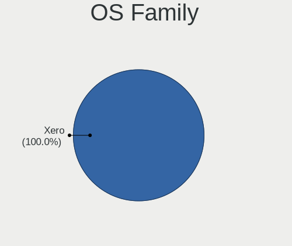

| Name | Computers | Percent |
|------|-----------|---------|
| Xero | 32        | 100%    |

Kernel
------

Version of the Linux kernel

| Version               | Computers | Percent |
|-----------------------|-----------|---------|
| 6.6.4-arch1-1         | 16        | 50%     |
| 6.6.8-arch1-1         | 4         | 12.5%   |
| 6.5.9-arch2-1         | 3         | 9.38%   |
| 6.7.0-arch3-1         | 2         | 6.25%   |
| 6.6.9-arch1-1         | 2         | 6.25%   |
| 6.7.1-arch1-1         | 1         | 3.13%   |
| 6.7.0-zen3-1-zen      | 1         | 3.13%   |
| 6.6.6-arch1-1-surface | 1         | 3.13%   |
| 6.6.10-arch1-1        | 1         | 3.13%   |
| 6.5.5-arch1-1         | 1         | 3.13%   |

Kernel Family
-------------

Linux kernel without a distro release

| Version | Computers | Percent |
|---------|-----------|---------|
| 6.6.4   | 16        | 50%     |
| 6.6.8   | 4         | 12.5%   |
| 6.7.0   | 3         | 9.38%   |
| 6.5.9   | 3         | 9.38%   |
| 6.6.9   | 2         | 6.25%   |
| 6.7.1   | 1         | 3.13%   |
| 6.6.6   | 1         | 3.13%   |
| 6.6.10  | 1         | 3.13%   |
| 6.5.5   | 1         | 3.13%   |

Kernel Major Ver.
-----------------

Linux kernel major version

| Version | Computers | Percent |
|---------|-----------|---------|
| 6.6     | 24        | 75%     |
| 6.7     | 4         | 12.5%   |
| 6.5     | 4         | 12.5%   |

Arch
----

OS architecture (x86_64, i586, etc.)

| Name   | Computers | Percent |
|--------|-----------|---------|
| x86_64 | 32        | 100%    |

DE
--

Desktop Environment

| Name     | Computers | Percent |
|----------|-----------|---------|
| KDE5     | 31        | 96.88%  |
| Hyprland | 1         | 3.13%   |

Display Server
--------------

X11 or Wayland

| Name    | Computers | Percent |
|---------|-----------|---------|
| X11     | 16        | 50%     |
| Wayland | 16        | 50%     |

Display Manager
---------------

SDDM, LightDM, etc.

| Name | Computers | Percent |
|------|-----------|---------|
| SDDM | 32        | 100%    |

OS Lang
-------

Language

| Lang  | Computers | Percent |
|-------|-----------|---------|
| en_US | 14        | 43.75%  |
| fr_FR | 3         | 9.38%   |
| zh_CN | 2         | 6.25%   |
| ru_RU | 2         | 6.25%   |
| en_IN | 2         | 6.25%   |
| de_DE | 2         | 6.25%   |
| zh_HK | 1         | 3.13%   |
| uk_UA | 1         | 3.13%   |
| tr_TR | 1         | 3.13%   |
| pt_BR | 1         | 3.13%   |
| it_IT | 1         | 3.13%   |
| fr_BE | 1         | 3.13%   |
| en_PH | 1         | 3.13%   |

Boot Mode
---------

EFI or BIOS

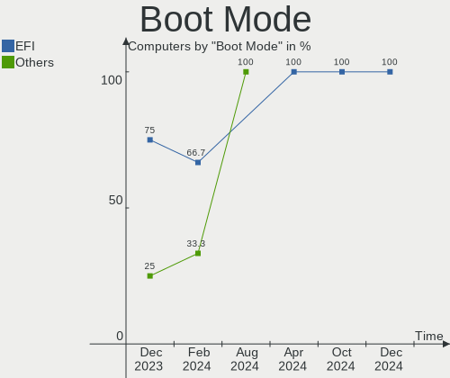

| Mode | Computers | Percent |
|------|-----------|---------|
| EFI  | 26        | 81.25%  |
| BIOS | 6         | 18.75%  |

Filesystem
----------

Type of filesystem

| Type  | Computers | Percent |
|-------|-----------|---------|
| Ext4  | 28        | 87.5%   |
| Btrfs | 4         | 12.5%   |

Part. scheme
------------

Scheme of partitioning

| Type | Computers | Percent |
|------|-----------|---------|
| GPT  | 27        | 84.38%  |
| MBR  | 5         | 15.63%  |

Dual Boot with Linux/BSD
------------------------

Hosting more than one Linux/BSD

| Dual boot | Computers | Percent |
|-----------|-----------|---------|
| No        | 22        | 68.75%  |
| Yes       | 10        | 31.25%  |

Dual Boot (Win)
---------------

Hosting Linux and Windows

| Dual boot | Computers | Percent |
|-----------|-----------|---------|
| No        | 18        | 56.25%  |
| Yes       | 14        | 43.75%  |

Board
-----

Vendor
------

Motherboard manufacturer

| Name                | Computers | Percent |
|---------------------|-----------|---------|
| Hewlett-Packard     | 5         | 15.63%  |
| Dell                | 5         | 15.63%  |
| Acer                | 5         | 15.63%  |
| ASUSTek Computer    | 4         | 12.5%   |
| MSI                 | 3         | 9.38%   |
| Lenovo              | 2         | 6.25%   |
| Win Element         | 1         | 3.13%   |
| Samsung Electronics | 1         | 3.13%   |
| Microsoft           | 1         | 3.13%   |
| MECHREVO            | 1         | 3.13%   |
| Google              | 1         | 3.13%   |
| Fujitsu             | 1         | 3.13%   |
| ASRock              | 1         | 3.13%   |
| Apple               | 1         | 3.13%   |

Model
-----

Motherboard model

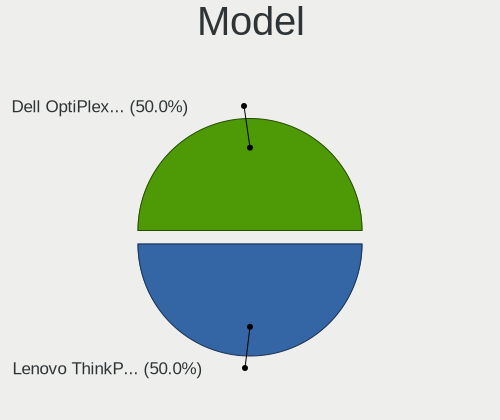

| Name                                     | Computers | Percent |
|------------------------------------------|-----------|---------|
| Win Element M9                           | 1         | 3.13%   |
| Samsung 750XDA                           | 1         | 3.13%   |
| MSI MS-7823                              | 1         | 3.13%   |
| MSI MS-7817                              | 1         | 3.13%   |
| MSI MS-7592                              | 1         | 3.13%   |
| Microsoft Surface Laptop 3               | 1         | 3.13%   |
| MECHREVO S2 Air Series PF4NU1F           | 1         | 3.13%   |
| Lenovo V14-ADA 82C6                      | 1         | 3.13%   |
| Lenovo ThinkPad T495 20NJ0008US          | 1         | 3.13%   |
| HP Pavilion Gaming Laptop 15-ec2xxx      | 1         | 3.13%   |
| HP Pavilion All-in-One Desktop 27-ca1xxx | 1         | 3.13%   |
| HP Laptop 15-da0xxx                      | 1         | 3.13%   |
| HP EliteDesk 800 G6 Desktop Mini PC      | 1         | 3.13%   |
| HP Elite x2 1012 G1                      | 1         | 3.13%   |
| Google Garg                              | 1         | 3.13%   |
| Fujitsu E8420                            | 1         | 3.13%   |
| Dell Latitude E5520                      | 1         | 3.13%   |
| Dell Latitude E5470                      | 1         | 3.13%   |
| Dell Inspiron 5737                       | 1         | 3.13%   |
| Dell Inspiron 5493                       | 1         | 3.13%   |
| Dell Inspiron 3793                       | 1         | 3.13%   |
| ASUS VivoBook_ASUSLaptop X712EA_K712EA   | 1         | 3.13%   |
| ASUS ROG STRIX B450-F GAMING II          | 1         | 3.13%   |
| ASUS ROG CROSSHAIR VIII DARK HERO        | 1         | 3.13%   |
| ASUS PRIME B450M-A II                    | 1         | 3.13%   |
| ASRock B450 Steel Legend                 | 1         | 3.13%   |
| Apple MacBookAir6,1                      | 1         | 3.13%   |
| Acer TravelMate B115-M                   | 1         | 3.13%   |
| Acer Nitro AN515-57                      | 1         | 3.13%   |
| Acer Extensa 215-54G                     | 1         | 3.13%   |
| Acer Aspire V3-471G                      | 1         | 3.13%   |
| Acer Aspire 5732Z                        | 1         | 3.13%   |

Model Family
------------

Motherboard model prefix

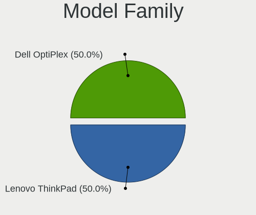

| Name              | Computers | Percent |
|-------------------|-----------|---------|
| Dell Inspiron     | 3         | 9.38%   |
| HP Pavilion       | 2         | 6.25%   |
| Dell Latitude     | 2         | 6.25%   |
| ASUS ROG          | 2         | 6.25%   |
| Acer Aspire       | 2         | 6.25%   |
| Win Element M9    | 1         | 3.13%   |
| Samsung 750XDA    | 1         | 3.13%   |
| MSI MS-7823       | 1         | 3.13%   |
| MSI MS-7817       | 1         | 3.13%   |
| MSI MS-7592       | 1         | 3.13%   |
| Microsoft Surface | 1         | 3.13%   |
| MECHREVO S2       | 1         | 3.13%   |
| Lenovo V14-ADA    | 1         | 3.13%   |
| Lenovo ThinkPad   | 1         | 3.13%   |
| HP Laptop         | 1         | 3.13%   |
| HP EliteDesk      | 1         | 3.13%   |
| HP Elite          | 1         | 3.13%   |
| Google Garg       | 1         | 3.13%   |
| Fujitsu E8420     | 1         | 3.13%   |
| ASUS VivoBook     | 1         | 3.13%   |
| ASUS PRIME        | 1         | 3.13%   |
| ASRock B450       | 1         | 3.13%   |
| Apple MacBookAir6 | 1         | 3.13%   |
| Acer TravelMate   | 1         | 3.13%   |
| Acer Nitro        | 1         | 3.13%   |
| Acer Extensa      | 1         | 3.13%   |

MFG Year
--------

Motherboard manufacture year

| Year | Computers | Percent |
|------|-----------|---------|
| 2020 | 6         | 18.75%  |
| 2021 | 5         | 15.63%  |
| 2019 | 4         | 12.5%   |
| 2013 | 3         | 9.38%   |
| 2023 | 2         | 6.25%   |
| 2022 | 2         | 6.25%   |
| 2016 | 2         | 6.25%   |
| 2014 | 2         | 6.25%   |
| 2011 | 2         | 6.25%   |
| 2009 | 2         | 6.25%   |
| 2018 | 1         | 3.13%   |
| 2012 | 1         | 3.13%   |

Form Factor
-----------

Physical design of the computer

| Name       | Computers | Percent |
|------------|-----------|---------|
| Notebook   | 21        | 65.63%  |
| Desktop    | 8         | 25%     |
| Tablet     | 1         | 3.13%   |
| Mini pc    | 1         | 3.13%   |
| All in one | 1         | 3.13%   |

Secure Boot
-----------

Enabled or disabled

| State    | Computers | Percent |
|----------|-----------|---------|
| Disabled | 32        | 100%    |

Coreboot
--------

Have coreboot on board

| Used | Computers | Percent |
|------|-----------|---------|
| No   | 31        | 96.88%  |
| Yes  | 1         | 3.13%   |

RAM Size
--------

Total RAM memory

| Size in GB  | Computers | Percent |
|-------------|-----------|---------|
| 16.01-24.0  | 9         | 28.13%  |
| 4.01-8.0    | 8         | 25%     |
| 3.01-4.0    | 6         | 18.75%  |
| 32.01-64.0  | 4         | 12.5%   |
| 8.01-16.0   | 4         | 12.5%   |
| 64.01-256.0 | 1         | 3.13%   |

RAM Used
--------

Used RAM memory

| Used GB    | Computers | Percent |
|------------|-----------|---------|
| 1.01-2.0   | 11        | 34.38%  |
| 3.01-4.0   | 7         | 21.88%  |
| 4.01-8.0   | 6         | 18.75%  |
| 2.01-3.0   | 6         | 18.75%  |
| 16.01-24.0 | 1         | 3.13%   |
| 8.01-16.0  | 1         | 3.13%   |

Total Drives
------------

Number of drives on board

| Drives | Computers | Percent |
|--------|-----------|---------|
| 1      | 17        | 53.13%  |
| 2      | 11        | 34.38%  |
| 4      | 2         | 6.25%   |
| 3      | 2         | 6.25%   |

Has CD-ROM
----------

Has CD-ROM on board

| Presented | Computers | Percent |
|-----------|-----------|---------|
| No        | 24        | 75%     |
| Yes       | 8         | 25%     |

Has Ethernet
------------

Has Ethernet on board

| Presented | Computers | Percent |
|-----------|-----------|---------|
| Yes       | 26        | 81.25%  |
| No        | 6         | 18.75%  |

Has WiFi
--------

Has WiFi module

| Presented | Computers | Percent |
|-----------|-----------|---------|
| Yes       | 28        | 87.5%   |
| No        | 4         | 12.5%   |

Has Bluetooth
-------------

Has Bluetooth module

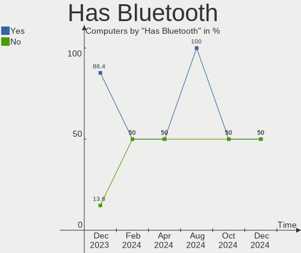

| Presented | Computers | Percent |
|-----------|-----------|---------|
| Yes       | 25        | 78.13%  |
| No        | 7         | 21.88%  |

Location
--------

Country
-------

Geographic location (country)

| Country     | Computers | Percent |
|-------------|-----------|---------|
| USA         | 8         | 25%     |
| France      | 3         | 9.38%   |
| China       | 3         | 9.38%   |
| Russia      | 2         | 6.25%   |
| India       | 2         | 6.25%   |
| Germany     | 2         | 6.25%   |
| Brazil      | 2         | 6.25%   |
| Turkey      | 1         | 3.13%   |
| Sri Lanka   | 1         | 3.13%   |
| Spain       | 1         | 3.13%   |
| Puerto Rico | 1         | 3.13%   |
| Philippines | 1         | 3.13%   |
| Netherlands | 1         | 3.13%   |
| Italy       | 1         | 3.13%   |
| Iran        | 1         | 3.13%   |
| Belgium     | 1         | 3.13%   |
| Argentina   | 1         | 3.13%   |

City
----

Geographic location (city)

| City             | Computers | Percent |
|------------------|-----------|---------|
| Xi'an            | 1         | 3.13%   |
| Wuhu             | 1         | 3.13%   |
| Voronezh         | 1         | 3.13%   |
| Virginia Beach   | 1         | 3.13%   |
| Thrissur         | 1         | 3.13%   |
| Tehran           | 1         | 3.13%   |
| Stuttgart        | 1         | 3.13%   |
| Siloam Springs   | 1         | 3.13%   |
| Silly            | 1         | 3.13%   |
| Shanghai         | 1         | 3.13%   |
| Sacramento       | 1         | 3.13%   |
| Portland         | 1         | 3.13%   |
| Pontarlier       | 1         | 3.13%   |
| Paris            | 1         | 3.13%   |
| Mumbai           | 1         | 3.13%   |
| Modesto          | 1         | 3.13%   |
| Manati           | 1         | 3.13%   |
| Madrid           | 1         | 3.13%   |
| Lipetsk          | 1         | 3.13%   |
| La Crosse        | 1         | 3.13%   |
| Juiz de Fora     | 1         | 3.13%   |
| Istanbul         | 1         | 3.13%   |
| Guipavas         | 1         | 3.13%   |
| Guarulhos        | 1         | 3.13%   |
| General Santos   | 1         | 3.13%   |
| Fonzaso          | 1         | 3.13%   |
| Exeter           | 1         | 3.13%   |
| Colorado Springs | 1         | 3.13%   |
| Colombo          | 1         | 3.13%   |
| Buenos Aires     | 1         | 3.13%   |
| Barsinghausen    | 1         | 3.13%   |
| Amsterdam        | 1         | 3.13%   |

Drives
------

Drive Vendor
------------

Hard drive vendors

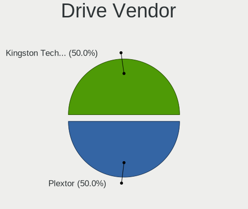

| Vendor                    | Computers | Drives | Percent |
|---------------------------|-----------|--------|---------|
| Samsung Electronics       | 8         | 8      | 15.69%  |
| Sandisk                   | 6         | 6      | 11.76%  |
| Seagate                   | 5         | 5      | 9.8%    |
| WDC                       | 4         | 4      | 7.84%   |
| SK hynix                  | 3         | 3      | 5.88%   |
| Unknown                   | 2         | 2      | 3.92%   |
| Toshiba                   | 2         | 2      | 3.92%   |
| Phison Electronics        | 2         | 2      | 3.92%   |
| Micron/Crucial Technology | 2         | 3      | 3.92%   |
| Kingston                  | 2         | 2      | 3.92%   |
| Apacer                    | 2         | 2      | 3.92%   |
| SPCC                      | 1         | 2      | 1.96%   |
| Silicon Motion            | 1         | 1      | 1.96%   |
| Realtek Semiconductor     | 1         | 1      | 1.96%   |
| OCZ                       | 1         | 1      | 1.96%   |
| Mushkin                   | 1         | 1      | 1.96%   |
| KIOXIA                    | 1         | 1      | 1.96%   |
| KimMiDi                   | 1         | 1      | 1.96%   |
| Intel                     | 1         | 1      | 1.96%   |
| HS-SSD-C100               | 1         | 1      | 1.96%   |
| Hitachi                   | 1         | 1      | 1.96%   |
| Crucial                   | 1         | 1      | 1.96%   |
| China                     | 1         | 1      | 1.96%   |
| Apple                     | 1         | 1      | 1.96%   |

Drive Model
-----------

Hard drive models

| Model                                               | Computers | Percent |
|-----------------------------------------------------|-----------|---------|
| Samsung SSD 870 EVO 1TB                             | 2         | 3.85%   |
| WDC WDS500G2B0A 500GB SSD                           | 1         | 1.92%   |
| WDC WD5000LPVX-22V0TT0 500GB                        | 1         | 1.92%   |
| WDC WD40EZRZ-22GXCB0 4TB                            | 1         | 1.92%   |
| WDC WD Green 2.5 480GB SSD                          | 1         | 1.92%   |
| Unknown MMC Card  32GB                              | 1         | 1.92%   |
| Unknown MMC Card  256GB                             | 1         | 1.92%   |
| Toshiba MQ04ABF100 1TB                              | 1         | 1.92%   |
| Toshiba MK3261GSYN 320GB                            | 1         | 1.92%   |
| SPCC Solid State Disk 512GB                         | 1         | 1.92%   |
| SPCC Solid State Disk 256GB                         | 1         | 1.92%   |
| SK hynix SC308 SATA 256GB SSD                       | 1         | 1.92%   |
| SK hynix HFM512GD3JX016N 512GB                      | 1         | 1.92%   |
| SK hynix BC501 NVMe Solid State Drive 512GB         | 1         | 1.92%   |
| Silicon Motion SM2262/SM2262EN SSD Controller 480GB | 1         | 1.92%   |
| Seagate ST9250315AS 250GB                           | 1         | 1.92%   |
| Seagate ST3500312CS 500GB                           | 1         | 1.92%   |
| Seagate ST2000DM006-2DM164 2TB                      | 1         | 1.92%   |
| Seagate ST1000DM003-1ER162 1TB                      | 1         | 1.92%   |
| Seagate Expansion HDD 4TB                           | 1         | 1.92%   |
| Sandisk WD_BLACK SN770 500GB                        | 1         | 1.92%   |
| Sandisk WD_BLACK SN770 1TB                          | 1         | 1.92%   |
| Sandisk WD Blue SN550 NVMe SSD 512GB                | 1         | 1.92%   |
| Sandisk WD Black SN750 / PC SN730 NVMe SSD 512GB    | 1         | 1.92%   |
| Sandisk WD Black NVMe SSD 256GB                     | 1         | 1.92%   |
| Sandisk PC SN520 NVMe SSD 256GB                     | 1         | 1.92%   |
| Samsung SSD 870 QVO 1TB                             | 1         | 1.92%   |
| Samsung SSD 860 QVO 1TB                             | 1         | 1.92%   |
| Samsung SSD 860 EVO 500GB                           | 1         | 1.92%   |
| Samsung NVMe SSD Controller SM981/PM981/PM983 1TB   | 1         | 1.92%   |
| Samsung MZVLQ256HBJD-00B 256GB                      | 1         | 1.92%   |
| Samsung MZNTY128HDHP-000 128GB SSD                  | 1         | 1.92%   |
| Realtek RTS5763DL NVMe SSD Controller 2TB           | 1         | 1.92%   |
| Phison PS5013 E13 NVMe Controller 256GB             | 1         | 1.92%   |
| Phison E12 NVMe Controller 1TB                      | 1         | 1.92%   |
| OCZ VERTEX3 120GB SSD                               | 1         | 1.92%   |
| Mushkin MKNSSDCR120GB                               | 1         | 1.92%   |
| Micron/Crucial P1 NVMe PCIe SSD 1TB                 | 1         | 1.92%   |
| Micron/Crucial CT1000P5PSSD8 1TB                    | 1         | 1.92%   |
| KIOXIA KBG40ZNS512G NVMe 512GB                      | 1         | 1.92%   |

HDD Vendor
----------

Hard disk drive vendors

| Vendor  | Computers | Drives | Percent |
|---------|-----------|--------|---------|
| Seagate | 5         | 5      | 50%     |
| WDC     | 2         | 2      | 20%     |
| Toshiba | 2         | 2      | 20%     |
| Hitachi | 1         | 1      | 10%     |

SSD Vendor
----------

Solid state drive vendors

| Vendor              | Computers | Drives | Percent |
|---------------------|-----------|--------|---------|
| Samsung Electronics | 6         | 6      | 30%     |
| WDC                 | 2         | 2      | 10%     |
| Apacer              | 2         | 2      | 10%     |
| SPCC                | 1         | 2      | 5%      |
| SK hynix            | 1         | 1      | 5%      |
| OCZ                 | 1         | 1      | 5%      |
| Mushkin             | 1         | 1      | 5%      |
| Kingston            | 1         | 1      | 5%      |
| KimMiDi             | 1         | 1      | 5%      |
| HS-SSD-C100         | 1         | 1      | 5%      |
| Crucial             | 1         | 1      | 5%      |
| China               | 1         | 1      | 5%      |
| Apple               | 1         | 1      | 5%      |

Drive Kind
----------

HDD or SSD

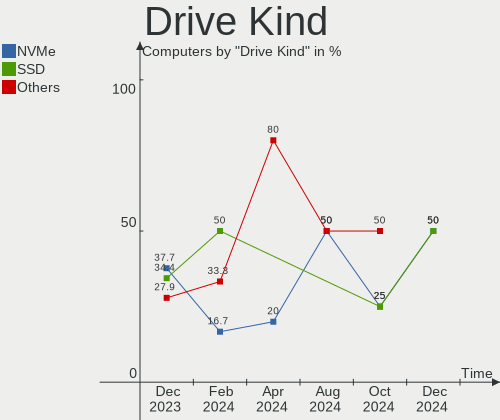

| Kind | Computers | Drives | Percent |
|------|-----------|--------|---------|
| NVMe | 17        | 20     | 36.96%  |
| SSD  | 17        | 21     | 36.96%  |
| HDD  | 10        | 10     | 21.74%  |
| MMC  | 2         | 2      | 4.35%   |

Drive Connector
---------------

SATA, SAS, NVMe, etc.

| Type | Computers | Drives | Percent |
|------|-----------|--------|---------|
| SATA | 21        | 30     | 51.22%  |
| NVMe | 17        | 20     | 41.46%  |
| MMC  | 2         | 2      | 4.88%   |
| SAS  | 1         | 1      | 2.44%   |

Drive Size
----------

Size of hard drive

| Size in TB | Computers | Drives | Percent |
|------------|-----------|--------|---------|
| 0.01-0.5   | 17        | 20     | 62.96%  |
| 0.51-1.0   | 6         | 7      | 22.22%  |
| 3.01-4.0   | 2         | 2      | 7.41%   |
| 1.01-2.0   | 2         | 2      | 7.41%   |

Space Total
-----------

Amount of disk space available on the file system

| Size in GB     | Computers | Percent |
|----------------|-----------|---------|
| 101-250        | 13        | 40.63%  |
| 251-500        | 7         | 21.88%  |
| 501-1000       | 4         | 12.5%   |
| 51-100         | 4         | 12.5%   |
| More than 3000 | 2         | 6.25%   |
| 21-50          | 1         | 3.13%   |
| 1001-2000      | 1         | 3.13%   |

Space Used
----------

Amount of used disk space

| Used GB        | Computers | Percent |
|----------------|-----------|---------|
| 1-20           | 14        | 43.75%  |
| 21-50          | 8         | 25%     |
| 51-100         | 4         | 12.5%   |
| 251-500        | 3         | 9.38%   |
| More than 3000 | 1         | 3.13%   |
| 101-250        | 1         | 3.13%   |
| 501-1000       | 1         | 3.13%   |

Malfunc. Drives
---------------

Drive models with a malfunction

| Model                                          | Computers | Drives | Percent |
|------------------------------------------------|-----------|--------|---------|
| WDC WD5000LPVX-22V0TT0 500GB                   | 1         | 1      | 11.11%  |
| WDC WD Green 2.5 480GB SSD                     | 1         | 1      | 11.11%  |
| Toshiba MK3261GSYN 320GB                       | 1         | 1      | 11.11%  |
| SK hynix SC308 SATA 256GB SSD                  | 1         | 1      | 11.11%  |
| Seagate ST9250315AS 250GB                      | 1         | 1      | 11.11%  |
| Seagate ST3500312CS 500GB                      | 1         | 1      | 11.11%  |
| Seagate ST1000DM003-1ER162 1TB                 | 1         | 1      | 11.11%  |
| Samsung Electronics MZNTY128HDHP-000 128GB SSD | 1         | 1      | 11.11%  |
| Hitachi HTS725025A9A364 250GB                  | 1         | 1      | 11.11%  |

Malfunc. Drive Vendor
---------------------

Vendors of faulty drives

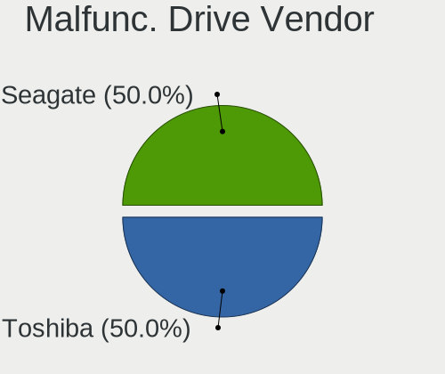

| Vendor              | Computers | Drives | Percent |
|---------------------|-----------|--------|---------|
| Seagate             | 3         | 3      | 33.33%  |
| WDC                 | 2         | 2      | 22.22%  |
| Toshiba             | 1         | 1      | 11.11%  |
| SK hynix            | 1         | 1      | 11.11%  |
| Samsung Electronics | 1         | 1      | 11.11%  |
| Hitachi             | 1         | 1      | 11.11%  |

Malfunc. HDD Vendor
-------------------

Vendors of faulty HDD drives

| Vendor  | Computers | Drives | Percent |
|---------|-----------|--------|---------|
| Seagate | 3         | 3      | 50%     |
| WDC     | 1         | 1      | 16.67%  |
| Toshiba | 1         | 1      | 16.67%  |
| Hitachi | 1         | 1      | 16.67%  |

Malfunc. Drive Kind
-------------------

Kinds of faulty drives

| Kind | Computers | Drives | Percent |
|------|-----------|--------|---------|
| HDD  | 6         | 6      | 66.67%  |
| SSD  | 3         | 3      | 33.33%  |

Failed Drives
-------------

Failed drive models

| Model                  | Computers | Drives | Percent |
|------------------------|-----------|--------|---------|
| Toshiba MQ04ABF100 1TB | 1         | 1      | 100%    |

Failed Drive Vendor
-------------------

Failed drive vendors

| Vendor  | Computers | Drives | Percent |
|---------|-----------|--------|---------|
| Toshiba | 1         | 1      | 100%    |

Drive Status
------------

Number of failed and malfunc. drives

| Status   | Computers | Drives | Percent |
|----------|-----------|--------|---------|
| Works    | 25        | 40     | 67.57%  |
| Malfunc  | 8         | 9      | 21.62%  |
| Detected | 3         | 3      | 8.11%   |
| Failed   | 1         | 1      | 2.7%    |

Storage controller
------------------

Storage Vendor
--------------

Storage controller vendors

| Vendor                       | Computers | Percent |
|------------------------------|-----------|---------|
| Intel                        | 19        | 41.3%   |
| AMD                          | 7         | 15.22%  |
| SanDisk                      | 6         | 13.04%  |
| SK hynix                     | 2         | 4.35%   |
| Samsung Electronics          | 2         | 4.35%   |
| Phison Electronics           | 2         | 4.35%   |
| Micron/Crucial Technology    | 2         | 4.35%   |
| Toshiba America Info Systems | 1         | 2.17%   |
| Silicon Motion               | 1         | 2.17%   |
| Realtek Semiconductor        | 1         | 2.17%   |
| KIOXIA                       | 1         | 2.17%   |
| Kingston Technology Company  | 1         | 2.17%   |
| ASMedia Technology           | 1         | 2.17%   |

Storage Model
-------------

Storage controller models

| Model                                                                          | Computers | Percent |
|--------------------------------------------------------------------------------|-----------|---------|
| AMD FCH SATA Controller [AHCI mode]                                            | 7         | 12.73%  |
| Intel Volume Management Device NVMe RAID Controller                            | 4         | 7.27%   |
| AMD 400 Series Chipset SATA Controller                                         | 3         | 5.45%   |
| SanDisk WD Black SN770 / PC SN740 256GB / PC SN560 (DRAM-less) NVMe SSD        | 2         | 3.64%   |
| Intel Tiger Lake-LP SATA Controller                                            | 2         | 3.64%   |
| Intel Ice Lake-LP SATA Controller [AHCI mode]                                  | 2         | 3.64%   |
| Intel 82801IBM/IEM (ICH9M/ICH9M-E) 4 port SATA Controller [AHCI mode]          | 2         | 3.64%   |
| Intel 8 Series/C220 Series Chipset Family 6-port SATA Controller 1 [AHCI mode] | 2         | 3.64%   |
| Toshiba America Info Systems Toshiba America Info SATA controller              | 1         | 1.82%   |
| SK hynix Gold P31/BC711/PC711 NVMe Solid State Drive                           | 1         | 1.82%   |
| SK hynix BC501 NVMe Solid State Drive                                          | 1         | 1.82%   |
| Silicon Motion SM2262/SM2262EN SSD Controller                                  | 1         | 1.82%   |
| SanDisk WD Black NVMe SSD                                                      | 1         | 1.82%   |
| SanDisk Ultra 3D / WD Blue SN550 NVMe SSD                                      | 1         | 1.82%   |
| SanDisk PC SN520 x2 M.2 2230 NVMe SSD                                          | 1         | 1.82%   |
| SanDisk Extreme Pro / WD Black SN750 / PC SN730 / Red SN700 NVMe SSD           | 1         | 1.82%   |
| Samsung NVMe SSD Controller SM981/PM981/PM983                                  | 1         | 1.82%   |
| Samsung NVMe SSD Controller 980 (DRAM-less)                                    | 1         | 1.82%   |
| Realtek RTS5762 NVMe SSD Controller                                            | 1         | 1.82%   |
| Phison PS5013-E13 PCIe3 NVMe Controller (DRAM-less)                            | 1         | 1.82%   |
| Phison E12 NVMe Controller                                                     | 1         | 1.82%   |
| Micron/Crucial P5 Plus NVMe PCIe SSD                                           | 1         | 1.82%   |
| Micron/Crucial P1 NVMe PCIe SSD[Frampton]                                      | 1         | 1.82%   |
| KIOXIA NVMe SSD Controller BG4 (DRAM-less)                                     | 1         | 1.82%   |
| Kingston Company NV1 NVMe SSD E13T (DRAM-less)                                 | 1         | 1.82%   |
| Intel Tiger Lake SATA AHCI Controller                                          | 1         | 1.82%   |
| Intel Sunrise Point-LP SATA Controller [AHCI mode]                             | 1         | 1.82%   |
| Intel SSD 670p Series [Keystone Harbor]                                        | 1         | 1.82%   |
| Intel SATA controller                                                          | 1         | 1.82%   |
| Intel NM10/ICH7 Family SATA Controller [IDE mode]                              | 1         | 1.82%   |
| Intel Comet Lake SATA AHCI Controller                                          | 1         | 1.82%   |
| Intel Atom Processor E3800 Series SATA AHCI Controller                         | 1         | 1.82%   |
| Intel Alder Lake-S PCH SATA Controller [AHCI Mode]                             | 1         | 1.82%   |
| Intel 82801G (ICH7 Family) IDE Controller                                      | 1         | 1.82%   |
| Intel 82801 Mobile SATA Controller [RAID mode]                                 | 1         | 1.82%   |
| Intel 8 Series SATA Controller 1 [AHCI mode]                                   | 1         | 1.82%   |
| Intel 7 Series Chipset Family 6-port SATA Controller [AHCI mode]               | 1         | 1.82%   |
| Intel 6 Series/C200 Series Chipset Family 6 port Mobile SATA AHCI Controller   | 1         | 1.82%   |
| ASMedia ASM1061/ASM1062 Serial ATA Controller                                  | 1         | 1.82%   |

Storage Kind
------------

Kind of storage controller (IDE, SATA, NVMe, SAS, ...)

| Kind | Computers | Percent |
|------|-----------|---------|
| SATA | 25        | 52.08%  |
| NVMe | 17        | 35.42%  |
| RAID | 5         | 10.42%  |
| IDE  | 1         | 2.08%   |

Processor
---------

CPU Vendor
----------

Processor vendors

| Vendor | Computers | Percent |
|--------|-----------|---------|
| Intel  | 24        | 75%     |
| AMD    | 8         | 25%     |

CPU Model
---------

Processor models

| Model                                           | Computers | Percent |
|-------------------------------------------------|-----------|---------|
| Intel Pentium Dual-Core CPU T4400 @ 2.20GHz     | 1         | 3.13%   |
| Intel N100                                      | 1         | 3.13%   |
| Intel Core m5-6Y57 CPU @ 1.10GHz                | 1         | 3.13%   |
| Intel Core i7-4790 CPU @ 3.60GHz                | 1         | 3.13%   |
| Intel Core i7-4500U CPU @ 1.80GHz               | 1         | 3.13%   |
| Intel Core i7-10700 CPU @ 2.90GHz               | 1         | 3.13%   |
| Intel Core i7-1065G7 CPU @ 1.30GHz              | 1         | 3.13%   |
| Intel Core i5-6200U CPU @ 2.30GHz               | 1         | 3.13%   |
| Intel Core i5-4460 CPU @ 3.20GHz                | 1         | 3.13%   |
| Intel Core i5-4250U CPU @ 1.30GHz               | 1         | 3.13%   |
| Intel Core i5-3210M CPU @ 2.50GHz               | 1         | 3.13%   |
| Intel Core i5-2410M CPU @ 2.30GHz               | 1         | 3.13%   |
| Intel Core i5-1035G7 CPU @ 1.20GHz              | 1         | 3.13%   |
| Intel Core i5-1035G1 CPU @ 1.00GHz              | 1         | 3.13%   |
| Intel Core i3-7020U CPU @ 2.30GHz               | 1         | 3.13%   |
| Intel Core 2 Quad CPU Q6600 @ 2.40GHz           | 1         | 3.13%   |
| Intel Core 2 Duo CPU P8700 @ 2.53GHz            | 1         | 3.13%   |
| Intel Celeron N4020 CPU @ 1.10GHz               | 1         | 3.13%   |
| Intel Celeron CPU N2930 @ 1.83GHz               | 1         | 3.13%   |
| Intel 12th Gen Core i7-12700T                   | 1         | 3.13%   |
| Intel 11th Gen Core i7-1165G7 @ 2.80GHz         | 1         | 3.13%   |
| Intel 11th Gen Core i5-11400H @ 2.70GHz         | 1         | 3.13%   |
| Intel 11th Gen Core i5-1135G7 @ 2.40GHz         | 1         | 3.13%   |
| Intel 11th Gen Core i3-1115G4 @ 3.00GHz         | 1         | 3.13%   |
| AMD Ryzen 7 PRO 3700U w/ Radeon Vega Mobile Gfx | 1         | 3.13%   |
| AMD Ryzen 7 5800X3D 8-Core Processor            | 1         | 3.13%   |
| AMD Ryzen 7 4800H with Radeon Graphics          | 1         | 3.13%   |
| AMD Ryzen 5 5600H with Radeon Graphics          | 1         | 3.13%   |
| AMD Ryzen 5 5500                                | 1         | 3.13%   |
| AMD Ryzen 5 2600 Six-Core Processor             | 1         | 3.13%   |
| AMD Ryzen 5 1600 Six-Core Processor             | 1         | 3.13%   |
| AMD Athlon Silver 3050U with Radeon Graphics    | 1         | 3.13%   |

CPU Model Family
----------------

Processor model prefix

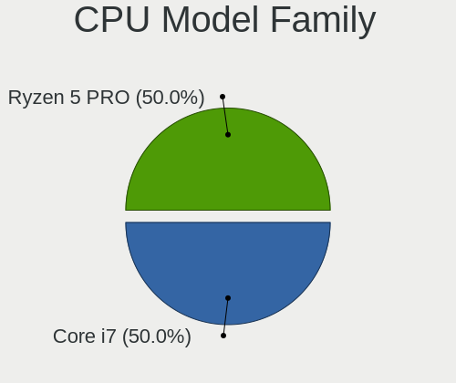

| Model                   | Computers | Percent |
|-------------------------|-----------|---------|
| Intel Core i5           | 7         | 21.88%  |
| Other                   | 6         | 18.75%  |
| Intel Core i7           | 4         | 12.5%   |
| AMD Ryzen 5             | 4         | 12.5%   |
| Intel Celeron           | 2         | 6.25%   |
| AMD Ryzen 7             | 2         | 6.25%   |
| Intel Pentium Dual-Core | 1         | 3.13%   |
| Intel Core m5           | 1         | 3.13%   |
| Intel Core i3           | 1         | 3.13%   |
| Intel Core 2 Quad       | 1         | 3.13%   |
| Intel Core 2 Duo        | 1         | 3.13%   |
| AMD Ryzen 7 PRO         | 1         | 3.13%   |
| AMD Athlon              | 1         | 3.13%   |

CPU Cores
---------

Number of processor cores

| Number | Computers | Percent |
|--------|-----------|---------|
| 2      | 12        | 37.5%   |
| 4      | 11        | 34.38%  |
| 6      | 5         | 15.63%  |
| 8      | 3         | 9.38%   |
| 12     | 1         | 3.13%   |

CPU Sockets
-----------

Number of sockets

| Number | Computers | Percent |
|--------|-----------|---------|
| 1      | 32        | 100%    |

CPU Threads
-----------

Threads per core (Hyper-Threading)

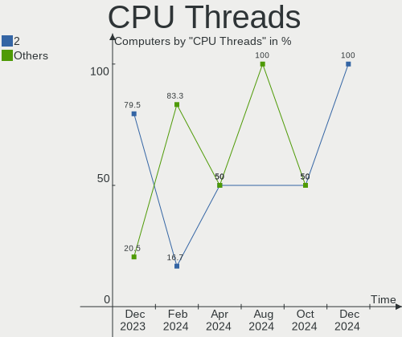

| Number | Computers | Percent |
|--------|-----------|---------|
| 2      | 24        | 75%     |
| 1      | 8         | 25%     |

CPU Op-Modes
------------

CPU Operation Modes (32-bit, 64-bit)

| Op mode        | Computers | Percent |
|----------------|-----------|---------|
| 32-bit, 64-bit | 32        | 100%    |

CPU Microcode
-------------

Microcode number

| Number     | Computers | Percent |
|------------|-----------|---------|
| Unknown    | 25        | 78.13%  |
| 0x0a50000d | 2         | 6.25%   |
| 0x08600103 | 1         | 3.13%   |
| 0x08108109 | 1         | 3.13%   |
| 0x08108102 | 1         | 3.13%   |
| 0x0800820d | 1         | 3.13%   |
| 0x08001138 | 1         | 3.13%   |

CPU Microarch
-------------

Microarchitecture

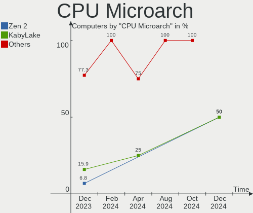

| Name             | Computers | Percent |
|------------------|-----------|---------|
| Icelake          | 4         | 12.5%   |
| Haswell          | 4         | 12.5%   |
| Zen+             | 3         | 9.38%   |
| Zen 3            | 3         | 9.38%   |
| TigerLake        | 3         | 9.38%   |
| Skylake          | 2         | 6.25%   |
| Penryn           | 2         | 6.25%   |
| Zen 2            | 1         | 3.13%   |
| Zen              | 1         | 3.13%   |
| Silvermont       | 1         | 3.13%   |
| SandyBridge      | 1         | 3.13%   |
| KabyLake         | 1         | 3.13%   |
| IvyBridge        | 1         | 3.13%   |
| Gracemont        | 1         | 3.13%   |
| Goldmont plus    | 1         | 3.13%   |
| Core             | 1         | 3.13%   |
| CometLake        | 1         | 3.13%   |
| Alderlake Hybrid | 1         | 3.13%   |

Graphics
--------

GPU Vendor
----------

Vendors of graphics cards

| Vendor | Computers | Percent |
|--------|-----------|---------|
| Intel  | 21        | 55.26%  |
| AMD    | 10        | 26.32%  |
| Nvidia | 7         | 18.42%  |

GPU Model
---------

Graphics card models

| Model                                                                     | Computers | Percent |
|---------------------------------------------------------------------------|-----------|---------|
| Nvidia TU117M [GeForce GTX 1650 Mobile / Max-Q]                           | 2         | 5.26%   |
| Nvidia GP108M [GeForce MX230]                                             | 2         | 5.26%   |
| Intel TigerLake-LP GT2 [Iris Xe Graphics]                                 | 2         | 5.26%   |
| Intel Iris Plus Graphics G7                                               | 2         | 5.26%   |
| Intel Haswell-ULT Integrated Graphics Controller                          | 2         | 5.26%   |
| AMD Picasso/Raven 2 [Radeon Vega Series / Radeon Vega Mobile Series]      | 2         | 5.26%   |
| Nvidia GP107M [GeForce MX350]                                             | 1         | 2.63%   |
| Nvidia GP106 [GeForce GTX 1060 6GB]                                       | 1         | 2.63%   |
| Nvidia GM204 [GeForce GTX 970]                                            | 1         | 2.63%   |
| Intel TigerLake-H GT1 [UHD Graphics]                                      | 1         | 2.63%   |
| Intel Tiger Lake-LP GT2 [UHD Graphics G4]                                 | 1         | 2.63%   |
| Intel Skylake GT2 [HD Graphics 520]                                       | 1         | 2.63%   |
| Intel Mobile 4 Series Chipset Integrated Graphics Controller              | 1         | 2.63%   |
| Intel Iris Plus Graphics G1 (Ice Lake)                                    | 1         | 2.63%   |
| Intel HD Graphics 620                                                     | 1         | 2.63%   |
| Intel HD Graphics 515                                                     | 1         | 2.63%   |
| Intel GeminiLake [UHD Graphics 600]                                       | 1         | 2.63%   |
| Intel CometLake-S GT2 [UHD Graphics 630]                                  | 1         | 2.63%   |
| Intel Atom Processor Z36xxx/Z37xxx Series Graphics & Display              | 1         | 2.63%   |
| Intel AlderLake-S GT1                                                     | 1         | 2.63%   |
| Intel Alder Lake-N [UHD Graphics]                                         | 1         | 2.63%   |
| Intel 4 Series Chipset Integrated Graphics Controller                     | 1         | 2.63%   |
| Intel 3rd Gen Core processor Graphics Controller                          | 1         | 2.63%   |
| Intel 2nd Generation Core Processor Family Integrated Graphics Controller | 1         | 2.63%   |
| AMD Venus XT [Radeon HD 8870M / R9 M270X/M370X]                           | 1         | 2.63%   |
| AMD RV710/M92 [Mobility Radeon HD 4530/4570/5145/530v/540v/545v]          | 1         | 2.63%   |
| AMD Renoir [Radeon RX Vega 6 (Ryzen 4000/5000 Mobile Series)]             | 1         | 2.63%   |
| AMD Navi 22 [Radeon RX 6700/6700 XT/6750 XT / 6800M/6850M XT]             | 1         | 2.63%   |
| AMD Navi 21 [Radeon RX 6800/6800 XT / 6900 XT]                            | 1         | 2.63%   |
| AMD Ellesmere [Radeon RX 470/480/570/570X/580/580X/590]                   | 1         | 2.63%   |
| AMD Curacao PRO [Radeon R7 370 / R9 270/370 OEM]                          | 1         | 2.63%   |
| AMD Cezanne [Radeon Vega Series / Radeon Vega Mobile Series]              | 1         | 2.63%   |

GPU Combo
---------

Combinations of graphics cards

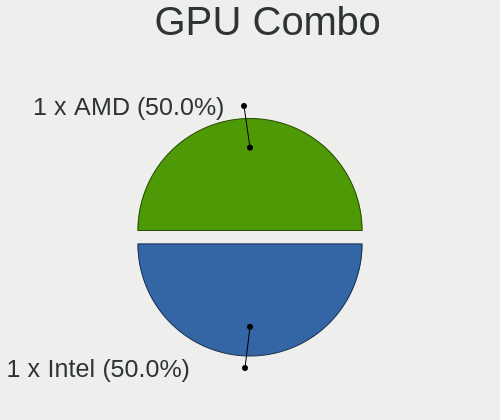

| Name           | Computers | Percent |
|----------------|-----------|---------|
| 1 x Intel      | 15        | 46.88%  |
| 1 x AMD        | 8         | 25%     |
| Intel + Nvidia | 4         | 12.5%   |
| 1 x Nvidia     | 2         | 6.25%   |
| 2 x Intel      | 1         | 3.13%   |
| Intel + AMD    | 1         | 3.13%   |
| AMD + Nvidia   | 1         | 3.13%   |

GPU Driver
----------

Free vs proprietary

| Driver      | Computers | Percent |
|-------------|-----------|---------|
| Free        | 29        | 90.63%  |
| Proprietary | 3         | 9.38%   |

GPU Memory
----------

Total video memory

| Size in GB | Computers | Percent |
|------------|-----------|---------|
| Unknown    | 16        | 50%     |
| 1.01-2.0   | 7         | 21.88%  |
| 3.01-4.0   | 3         | 9.38%   |
| 0.01-0.5   | 3         | 9.38%   |
| 8.01-16.0  | 2         | 6.25%   |
| 5.01-6.0   | 1         | 3.13%   |

Monitor
-------

Monitor Vendor
--------------

Monitor vendors

| Vendor               | Computers | Percent |
|----------------------|-----------|---------|
| AU Optronics         | 6         | 16.22%  |
| Chimei Innolux       | 5         | 13.51%  |
| LG Display           | 4         | 10.81%  |
| BOE                  | 3         | 8.11%   |
| Samsung Electronics  | 2         | 5.41%   |
| Hewlett-Packard      | 2         | 5.41%   |
| Goldstar             | 2         | 5.41%   |
| Ancor Communications | 2         | 5.41%   |
| Unknown              | 1         | 2.7%    |
| SKG                  | 1         | 2.7%    |
| Sharp                | 1         | 2.7%    |
| Panasonic            | 1         | 2.7%    |
| Lenovo               | 1         | 2.7%    |
| JRY                  | 1         | 2.7%    |
| Iiyama               | 1         | 2.7%    |
| Dell                 | 1         | 2.7%    |
| BenQ                 | 1         | 2.7%    |
| Apple                | 1         | 2.7%    |
| AOC                  | 1         | 2.7%    |

Monitor Model
-------------

Monitor models

| Model                                                                 | Computers | Percent |
|-----------------------------------------------------------------------|-----------|---------|
| Unknown LCD Monitor FFFF 2288x1287 2550x2550mm 142.0-inch             | 1         | 2.7%    |
| SKG H27T13 SKG2720 2560x1440 531x298mm 24.0-inch                      | 1         | 2.7%    |
| Sharp LQ135P1JX51 SHP14B3 2256x1504 285x190mm 13.5-inch               | 1         | 2.7%    |
| Samsung Electronics Odyssey G8 SAM72F2 3440x1440 809x354mm 34.8-inch  | 1         | 2.7%    |
| Samsung Electronics LCD Monitor SEC3046 1366x768 344x193mm 15.5-inch  | 1         | 2.7%    |
| Panasonic TV MEIA0AE 1920x540                                         | 1         | 2.7%    |
| LG Display LCD Monitor LGD05FA 1920x1080 309x174mm 14.0-inch          | 1         | 2.7%    |
| LG Display LCD Monitor LGD04A5 1920x1280 253x169mm 12.0-inch          | 1         | 2.7%    |
| LG Display LCD Monitor LGD038F 1366x768 344x194mm 15.5-inch           | 1         | 2.7%    |
| LG Display LCD Monitor LGD02E3 1366x768 344x194mm 15.5-inch           | 1         | 2.7%    |
| Lenovo LEN LI2364 LEN65C7 1920x1080 509x286mm 23.0-inch               | 1         | 2.7%    |
| JRY DP JRY2700 2560x1440 597x336mm 27.0-inch                          | 1         | 2.7%    |
| Iiyama PL2530H IVM6132 1920x1080 544x303mm 24.5-inch                  | 1         | 2.7%    |
| Hewlett-Packard Contino HPN404C 1920x1080 597x366mm 27.6-inch         | 1         | 2.7%    |
| Hewlett-Packard 2310 HWP288E 1920x1080 510x287mm 23.0-inch            | 1         | 2.7%    |
| Goldstar LG ULTRAWIDE GSM5BF7 2560x1080 670x280mm 28.6-inch           | 1         | 2.7%    |
| Goldstar HDR 4K GSM7750 3840x2160 697x392mm 31.5-inch                 | 1         | 2.7%    |
| Dell P2317H DEL40F4 1920x1080 509x286mm 23.0-inch                     | 1         | 2.7%    |
| Chimei Innolux LCD Monitor CMN15DB 1366x768 344x193mm 15.5-inch       | 1         | 2.7%    |
| Chimei Innolux LCD Monitor CMN1521 1920x1080 344x193mm 15.5-inch      | 1         | 2.7%    |
| Chimei Innolux LCD Monitor CMN14D6 1366x768 309x173mm 13.9-inch       | 1         | 2.7%    |
| Chimei Innolux LCD Monitor CMN14D5 1920x1080 309x173mm 13.9-inch      | 1         | 2.7%    |
| Chimei Innolux LCD Monitor CMN14C0 1920x1080 308x173mm 13.9-inch      | 1         | 2.7%    |
| BOE LCD Monitor BOE0A06 1920x1080 344x194mm 15.5-inch                 | 1         | 2.7%    |
| BOE LCD Monitor BOE084E 1920x1080 382x215mm 17.3-inch                 | 1         | 2.7%    |
| BOE HDMI BOE2438 2560x1600 597x336mm 27.0-inch                        | 1         | 2.7%    |
| BenQ GL2450H BNQ78A7 1920x1080 531x298mm 24.0-inch                    | 1         | 2.7%    |
| AU Optronics LCD Monitor AUO4999 1920x1080 344x193mm 15.5-inch        | 1         | 2.7%    |
| AU Optronics LCD Monitor AUO453D 1920x1080 309x174mm 14.0-inch        | 1         | 2.7%    |
| AU Optronics LCD Monitor AUO2992 1920x1080 344x193mm 15.5-inch        | 1         | 2.7%    |
| AU Optronics LCD Monitor AUO215C 1366x768 256x144mm 11.6-inch         | 1         | 2.7%    |
| AU Optronics LCD Monitor AUO159E 1600x900 382x214mm 17.2-inch         | 1         | 2.7%    |
| AU Optronics LCD Monitor AUO139D 1920x1080 381x214mm 17.2-inch        | 1         | 2.7%    |
| Apple Color LCD APP9CF2 1366x768 256x144mm 11.6-inch                  | 1         | 2.7%    |
| AOC 912Vwa AOC1912 1440x900 408x255mm 18.9-inch                       | 1         | 2.7%    |
| Ancor Communications VW225 ACI22A0 1680x1050 473x296mm 22.0-inch      | 1         | 2.7%    |
| Ancor Communications ASUS VP278 ACI27C8 1920x1080 598x336mm 27.0-inch | 1         | 2.7%    |

Monitor Resolution
------------------

Monitor screen resolution

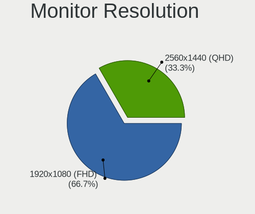

| Resolution         | Computers | Percent |
|--------------------|-----------|---------|
| 1920x1080 (FHD)    | 15        | 42.86%  |
| 1366x768 (WXGA)    | 7         | 20%     |
| 3840x2160 (4K)     | 2         | 5.71%   |
| 3440x1440          | 1         | 2.86%   |
| 2560x1600          | 1         | 2.86%   |
| 2560x1440 (QHD)    | 1         | 2.86%   |
| 2560x1080          | 1         | 2.86%   |
| 2288x1287          | 1         | 2.86%   |
| 2256x1504          | 1         | 2.86%   |
| 1920x540           | 1         | 2.86%   |
| 1920x1280          | 1         | 2.86%   |
| 1680x1050 (WSXGA+) | 1         | 2.86%   |
| 1600x900 (HD+)     | 1         | 2.86%   |
| 1440x900 (WXGA+)   | 1         | 2.86%   |

Monitor Diagonal
----------------

Diagonal size in inches

| Inches | Computers | Percent |
|--------|-----------|---------|
| 15     | 8         | 21.62%  |
| 27     | 4         | 10.81%  |
| 13     | 4         | 10.81%  |
| 24     | 3         | 8.11%   |
| 23     | 3         | 8.11%   |
| 17     | 3         | 8.11%   |
| 31     | 2         | 5.41%   |
| 14     | 2         | 5.41%   |
| 11     | 2         | 5.41%   |
| 142    | 1         | 2.7%    |
| 34     | 1         | 2.7%    |
| 28     | 1         | 2.7%    |
| 22     | 1         | 2.7%    |
| 18     | 1         | 2.7%    |
| 12     | 1         | 2.7%    |

Monitor Width
-------------

Physical width

| Width in mm    | Computers | Percent |
|----------------|-----------|---------|
| 301-350        | 13        | 36.11%  |
| 501-600        | 9         | 25%     |
| 201-300        | 4         | 11.11%  |
| 601-700        | 3         | 8.33%   |
| 351-400        | 3         | 8.33%   |
| 401-500        | 2         | 5.56%   |
| More than 2000 | 1         | 2.78%   |
| 801-900        | 1         | 2.78%   |

Aspect Ratio
------------

Proportional relationship between the width and the height

| Ratio | Computers | Percent |
|-------|-----------|---------|
| 16/9  | 26        | 76.47%  |
| 16/10 | 3         | 8.82%   |
| 3/2   | 2         | 5.88%   |
| 21/9  | 2         | 5.88%   |
| 1.00  | 1         | 2.94%   |

Monitor Area
------------

Area in inch

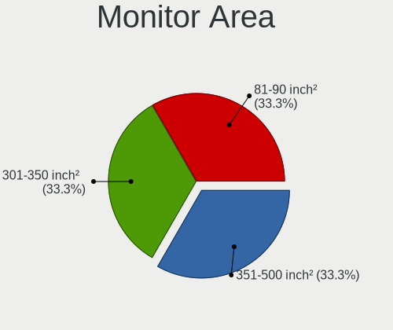

| Area in inch | Computers | Percent |
|----------------|-----------|---------|
| 101-110        | 8         | 22.22%  |
| 81-90          | 6         | 16.67%  |
| 201-250        | 5         | 13.89%  |
| 301-350        | 4         | 11.11%  |
| 351-500        | 3         | 8.33%   |
| 121-130        | 3         | 8.33%   |
| 51-60          | 2         | 5.56%   |
| 251-300        | 2         | 5.56%   |
| More than 1000 | 1         | 2.78%   |
| 61-70          | 1         | 2.78%   |
| 151-200        | 1         | 2.78%   |

Pixel Density
-------------

Pixels per inch

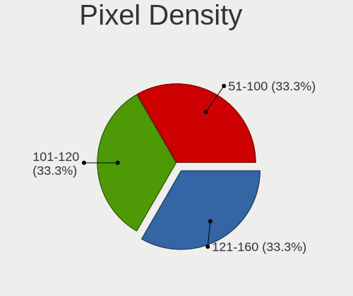

| Density | Computers | Percent |
|---------|-----------|---------|
| 121-160 | 13        | 39.39%  |
| 51-100  | 9         | 27.27%  |
| 101-120 | 8         | 24.24%  |
| 161-240 | 2         | 6.06%   |
| 1-50    | 1         | 3.03%   |

Multiple Monitors
-----------------

Total monitors connected

| Total | Computers | Percent |
|-------|-----------|---------|
| 1     | 26        | 81.25%  |
| 2     | 6         | 18.75%  |

Network
-------

Net Controller Vendor
---------------------

Controller vendors

| Vendor                | Computers | Percent |
|-----------------------|-----------|---------|
| Realtek Semiconductor | 20        | 40%     |
| Intel                 | 17        | 34%     |
| Qualcomm Atheros      | 7         | 14%     |
| Broadcom Limited      | 2         | 4%      |
| OPPO Electronics      | 1         | 2%      |
| Motorola PCS          | 1         | 2%      |
| Hewlett-Packard       | 1         | 2%      |
| Broadcom              | 1         | 2%      |

Net Controller Model
--------------------

Controller models

| Model                                                                  | Computers | Percent |
|------------------------------------------------------------------------|-----------|---------|
| Realtek RTL8111/8168/8211/8411 PCI Express Gigabit Ethernet Controller | 12        | 20.34%  |
| Realtek RTL810xE PCI Express Fast Ethernet controller                  | 3         | 5.08%   |
| Intel Wi-Fi 6 AX201                                                    | 3         | 5.08%   |
| Realtek RTL8822CE 802.11ac PCIe Wireless Network Adapter               | 2         | 3.39%   |
| Qualcomm Atheros QCA9377 802.11ac Wireless Network Adapter             | 2         | 3.39%   |
| Qualcomm Atheros AR9462 Wireless Network Adapter                       | 2         | 3.39%   |
| Qualcomm Atheros AR8132 Fast Ethernet                                  | 2         | 3.39%   |
| Intel Wireless 8260                                                    | 2         | 3.39%   |
| Intel Wi-Fi 6 AX200                                                    | 2         | 3.39%   |
| Intel I211 Gigabit Network Connection                                  | 2         | 3.39%   |
| Realtek RTL88x2bu [AC1200 Techkey]                                     | 1         | 1.69%   |
| Realtek RTL8852AE 802.11ax PCIe Wireless Network Adapter               | 1         | 1.69%   |
| Realtek RTL8821CE 802.11ac PCIe Wireless Network Adapter               | 1         | 1.69%   |
| Realtek RTL8723BU 802.11b/g/n WLAN Adapter                             | 1         | 1.69%   |
| Realtek RTL8125 2.5GbE Controller                                      | 1         | 1.69%   |
| Realtek Killer E2600 GbE Controller                                    | 1         | 1.69%   |
| Qualcomm Atheros QCA9565 / AR9565 Wireless Network Adapter             | 1         | 1.69%   |
| OPPO SM8350-IDP _SN:361A1B3C                                           | 1         | 1.69%   |
| Motorola PCS moto g 5G - 2023                                          | 1         | 1.69%   |
| Intel Wireless Gigabit 17265                                           | 1         | 1.69%   |
| Intel Wi-Fi 5(802.11ac) Wireless-AC 9x6x [Thunder Peak]                | 1         | 1.69%   |
| Intel Ultimate N WiFi Link 5300                                        | 1         | 1.69%   |
| Intel Tiger Lake PCH CNVi WiFi                                         | 1         | 1.69%   |
| Intel Ice Lake-LP PCH CNVi WiFi                                        | 1         | 1.69%   |
| Intel Gemini Lake PCH CNVi WiFi                                        | 1         | 1.69%   |
| Intel Ethernet Controller I225-V                                       | 1         | 1.69%   |
| Intel Ethernet Connection I219-LM                                      | 1         | 1.69%   |
| Intel Ethernet Connection (11) I219-LM                                 | 1         | 1.69%   |
| Intel Dual Band Wireless-AC 3168NGW [Stone Peak]                       | 1         | 1.69%   |
| Intel Comet Lake PCH CNVi WiFi                                         | 1         | 1.69%   |
| Intel CNVi: Wi-Fi                                                      | 1         | 1.69%   |
| Intel Centrino Advanced-N 6205 [Taylor Peak]                           | 1         | 1.69%   |
| Intel 82567LM Gigabit Network Connection                               | 1         | 1.69%   |
| HP lt4120 Snapdragon X5 LTE                                            | 1         | 1.69%   |
| Broadcom NetXtreme BCM5761 Gigabit Ethernet PCIe                       | 1         | 1.69%   |
| Broadcom Limited BCM4360 802.11ac Dual Band Wireless Network Adapter   | 1         | 1.69%   |
| Broadcom Limited BCM4312 802.11b/g LP-PHY                              | 1         | 1.69%   |

Wireless Vendor
---------------

Wireless vendors

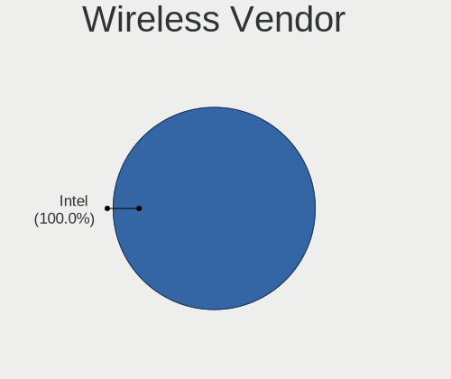

| Vendor                | Computers | Percent |
|-----------------------|-----------|---------|
| Intel                 | 16        | 55.17%  |
| Realtek Semiconductor | 6         | 20.69%  |
| Qualcomm Atheros      | 5         | 17.24%  |
| Broadcom Limited      | 2         | 6.9%    |

Wireless Model
--------------

Wireless models

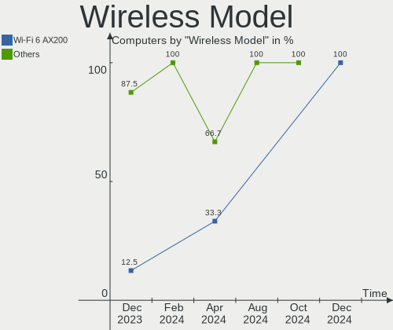

| Model                                                                | Computers | Percent |
|----------------------------------------------------------------------|-----------|---------|
| Intel Wi-Fi 6 AX201                                                  | 3         | 10%     |
| Realtek RTL8822CE 802.11ac PCIe Wireless Network Adapter             | 2         | 6.67%   |
| Qualcomm Atheros QCA9377 802.11ac Wireless Network Adapter           | 2         | 6.67%   |
| Qualcomm Atheros AR9462 Wireless Network Adapter                     | 2         | 6.67%   |
| Intel Wireless 8260                                                  | 2         | 6.67%   |
| Intel Wi-Fi 6 AX200                                                  | 2         | 6.67%   |
| Realtek RTL88x2bu [AC1200 Techkey]                                   | 1         | 3.33%   |
| Realtek RTL8852AE 802.11ax PCIe Wireless Network Adapter             | 1         | 3.33%   |
| Realtek RTL8821CE 802.11ac PCIe Wireless Network Adapter             | 1         | 3.33%   |
| Realtek RTL8723BU 802.11b/g/n WLAN Adapter                           | 1         | 3.33%   |
| Qualcomm Atheros QCA9565 / AR9565 Wireless Network Adapter           | 1         | 3.33%   |
| Intel Wireless Gigabit 17265                                         | 1         | 3.33%   |
| Intel Wi-Fi 5(802.11ac) Wireless-AC 9x6x [Thunder Peak]              | 1         | 3.33%   |
| Intel Ultimate N WiFi Link 5300                                      | 1         | 3.33%   |
| Intel Tiger Lake PCH CNVi WiFi                                       | 1         | 3.33%   |
| Intel Ice Lake-LP PCH CNVi WiFi                                      | 1         | 3.33%   |
| Intel Gemini Lake PCH CNVi WiFi                                      | 1         | 3.33%   |
| Intel Dual Band Wireless-AC 3168NGW [Stone Peak]                     | 1         | 3.33%   |
| Intel Comet Lake PCH CNVi WiFi                                       | 1         | 3.33%   |
| Intel CNVi: Wi-Fi                                                    | 1         | 3.33%   |
| Intel Centrino Advanced-N 6205 [Taylor Peak]                         | 1         | 3.33%   |
| Broadcom Limited BCM4360 802.11ac Dual Band Wireless Network Adapter | 1         | 3.33%   |
| Broadcom Limited BCM4312 802.11b/g LP-PHY                            | 1         | 3.33%   |

Ethernet Vendor
---------------

Ethernet vendors

| Vendor                | Computers | Percent |
|-----------------------|-----------|---------|
| Realtek Semiconductor | 17        | 60.71%  |
| Intel                 | 6         | 21.43%  |
| Qualcomm Atheros      | 2         | 7.14%   |
| OPPO Electronics      | 1         | 3.57%   |
| Hewlett-Packard       | 1         | 3.57%   |
| Broadcom              | 1         | 3.57%   |

Ethernet Model
--------------

Ethernet models

| Model                                                                  | Computers | Percent |
|------------------------------------------------------------------------|-----------|---------|
| Realtek RTL8111/8168/8211/8411 PCI Express Gigabit Ethernet Controller | 12        | 42.86%  |
| Realtek RTL810xE PCI Express Fast Ethernet controller                  | 3         | 10.71%  |
| Qualcomm Atheros AR8132 Fast Ethernet                                  | 2         | 7.14%   |
| Intel I211 Gigabit Network Connection                                  | 2         | 7.14%   |
| Realtek RTL8125 2.5GbE Controller                                      | 1         | 3.57%   |
| Realtek Killer E2600 GbE Controller                                    | 1         | 3.57%   |
| OPPO SM8350-IDP _SN:361A1B3C                                           | 1         | 3.57%   |
| Intel Ethernet Controller I225-V                                       | 1         | 3.57%   |
| Intel Ethernet Connection I219-LM                                      | 1         | 3.57%   |
| Intel Ethernet Connection (11) I219-LM                                 | 1         | 3.57%   |
| Intel 82567LM Gigabit Network Connection                               | 1         | 3.57%   |
| HP lt4120 Snapdragon X5 LTE                                            | 1         | 3.57%   |
| Broadcom NetXtreme BCM5761 Gigabit Ethernet PCIe                       | 1         | 3.57%   |

Net Controller Kind
-------------------

Ethernet, WiFi or modem

| Kind     | Computers | Percent |
|----------|-----------|---------|
| WiFi     | 28        | 50.91%  |
| Ethernet | 26        | 47.27%  |
| Unknown  | 1         | 1.82%   |

Used Controller
---------------

Currently used network controller

| Kind     | Computers | Percent |
|----------|-----------|---------|
| WiFi     | 17        | 58.62%  |
| Ethernet | 12        | 41.38%  |

NICs
----

Total network controllers on board

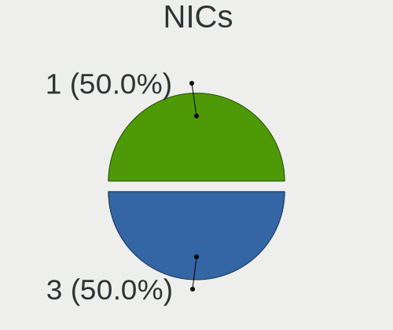

| Total | Computers | Percent |
|-------|-----------|---------|
| 2     | 19        | 59.38%  |
| 1     | 11        | 34.38%  |
| 3     | 2         | 6.25%   |

IPv6
----

IPv6 vs IPv4

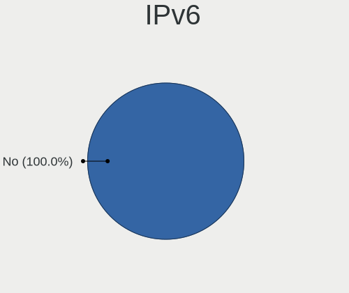

| Used | Computers | Percent |
|------|-----------|---------|
| No   | 21        | 65.63%  |
| Yes  | 11        | 34.38%  |

Bluetooth
---------

Bluetooth Vendor
----------------

Controller vendors

| Vendor                          | Computers | Percent |
|---------------------------------|-----------|---------|
| Intel                           | 14        | 56%     |
| Realtek Semiconductor           | 4         | 16%     |
| Qualcomm Atheros Communications | 3         | 12%     |
| Taiyo Yuden                     | 1         | 4%      |
| Foxconn / Hon Hai               | 1         | 4%      |
| Cambridge Silicon Radio         | 1         | 4%      |
| Apple                           | 1         | 4%      |

Bluetooth Model
---------------

Controller models

| Model                                               | Computers | Percent |
|-----------------------------------------------------|-----------|---------|
| Intel AX201 Bluetooth                               | 5         | 20%     |
| Realtek Bluetooth Radio                             | 3         | 12%     |
| Intel Bluetooth 9460/9560 Jefferson Peak (JfP)      | 3         | 12%     |
| Qualcomm Atheros  Bluetooth Device                  | 2         | 8%      |
| Intel Bluetooth wireless interface                  | 2         | 8%      |
| Intel AX200 Bluetooth                               | 2         | 8%      |
| Taiyo Yuden Bluetooth Device (V2.1+EDR)             | 1         | 4%      |
| Realtek  Bluetooth 4.2 Adapter                      | 1         | 4%      |
| Qualcomm Atheros AR9462 Bluetooth                   | 1         | 4%      |
| Intel Wireless-AC 9260 Bluetooth Adapter            | 1         | 4%      |
| Intel Wireless-AC 3168 Bluetooth                    | 1         | 4%      |
| Foxconn / Hon Hai Bluetooth Device                  | 1         | 4%      |
| Cambridge Silicon Radio Bluetooth Dongle (HCI mode) | 1         | 4%      |
| Apple Bluetooth USB Host Controller                 | 1         | 4%      |

Sound
-----

Sound Vendor
------------

Sound card vendors

| Vendor                                       | Computers | Percent |
|----------------------------------------------|-----------|---------|
| Intel                                        | 24        | 58.54%  |
| AMD                                          | 9         | 21.95%  |
| Nvidia                                       | 4         | 9.76%   |
| Zoran Co. Personal Media Division (Nogatech) | 1         | 2.44%   |
| SteelSeries ApS                              | 1         | 2.44%   |
| Logitech                                     | 1         | 2.44%   |
| Astro Gaming                                 | 1         | 2.44%   |

Sound Model
-----------

Sound card models

| Model                                                                      | Computers | Percent |
|----------------------------------------------------------------------------|-----------|---------|
| AMD Family 17h/19h HD Audio Controller                                     | 5         | 10%     |
| Intel Tiger Lake-LP Smart Sound Technology Audio Controller                | 3         | 6%      |
| Intel Sunrise Point-LP HD Audio                                            | 3         | 6%      |
| Intel Ice Lake-LP Smart Sound Technology Audio Controller                  | 3         | 6%      |
| Nvidia TU107 GeForce GTX 1650 High Definition Audio Controller             | 2         | 4%      |
| Intel Haswell-ULT HD Audio Controller                                      | 2         | 4%      |
| Intel 82801I (ICH9 Family) HD Audio Controller                             | 2         | 4%      |
| Intel 8 Series/C220 Series Chipset High Definition Audio Controller        | 2         | 4%      |
| Intel 8 Series HD Audio Controller                                         | 2         | 4%      |
| AMD Renoir Radeon High Definition Audio Controller                         | 2         | 4%      |
| AMD Raven/Raven2/Fenghuang HDMI/DP Audio Controller                        | 2         | 4%      |
| AMD Navi 21/23 HDMI/DP Audio Controller                                    | 2         | 4%      |
| AMD Family 17h (Models 00h-0fh) HD Audio Controller                        | 2         | 4%      |
| Zoran Co. Personal Media Division (Nogatech) USB Audio and HID             | 1         | 2%      |
| SteelSeries ApS SteelSeries Arctis 5                                       | 1         | 2%      |
| Nvidia GP106 High Definition Audio Controller                              | 1         | 2%      |
| Nvidia GM204 High Definition Audio Controller                              | 1         | 2%      |
| Logitech G430 Surround Sound Gaming Headset                                | 1         | 2%      |
| Intel Tiger Lake-H HD Audio Controller                                     | 1         | 2%      |
| Intel NM10/ICH7 Family High Definition Audio Controller                    | 1         | 2%      |
| Intel Comet Lake PCH cAVS                                                  | 1         | 2%      |
| Intel Celeron/Pentium Silver Processor High Definition Audio               | 1         | 2%      |
| Intel Atom Processor Z36xxx/Z37xxx Series High Definition Audio Controller | 1         | 2%      |
| Intel Alder Lake-S HD Audio Controller                                     | 1         | 2%      |
| Intel Alder Lake-N PCH High Definition Audio Controller                    | 1         | 2%      |
| Intel 7 Series/C216 Chipset Family High Definition Audio Controller        | 1         | 2%      |
| Intel 6 Series/C200 Series Chipset Family High Definition Audio Controller | 1         | 2%      |
| Astro Gaming Astro A50                                                     | 1         | 2%      |
| AMD Starship/Matisse HD Audio Controller                                   | 1         | 2%      |
| AMD Oland/Hainan/Cape Verde/Pitcairn HDMI Audio [Radeon HD 7000 Series]    | 1         | 2%      |
| AMD Ellesmere HDMI Audio [Radeon RX 470/480 / 570/580/590]                 | 1         | 2%      |

Memory
------

Memory Vendor
-------------

Memory module vendors

| Vendor               | Computers | Percent |
|----------------------|-----------|---------|
| Samsung Electronics  | 11        | 27.5%   |
| SK hynix             | 9         | 22.5%   |
| Micron Technology    | 5         | 12.5%   |
| Crucial              | 4         | 10%     |
| Corsair              | 4         | 10%     |
| Unknown              | 2         | 5%      |
| G.Skill              | 2         | 5%      |
| Team                 | 1         | 2.5%    |
| Kingston             | 1         | 2.5%    |
| Guangzhou MiaoYuanJi | 1         | 2.5%    |

Memory Model
------------

Memory module models

| Model                                                            | Computers | Percent |
|------------------------------------------------------------------|-----------|---------|
| Unknown RAM Module 4GB DIMM SDRAM 1066MT/s                       | 1         | 2.38%   |
| Unknown RAM Module 2GB SODIMM 800MT/s                            | 1         | 2.38%   |
| Team RAM TEAMGROUP-UD4-3200 16GB DIMM DDR4 3733MT/s              | 1         | 2.38%   |
| SK hynix RAM Module 4GB SODIMM LPDDR3 1867MT/s                   | 1         | 2.38%   |
| SK hynix RAM Module 2GB SODIMM DDR3 1600MT/s                     | 1         | 2.38%   |
| SK hynix RAM Module 16GB SODIMM DDR4 3200MT/s                    | 1         | 2.38%   |
| SK hynix RAM HMT351S6EFR8A-PB 4096MB SODIMM DDR3 1600MT/s        | 1         | 2.38%   |
| SK hynix RAM HMT125S6BFR8C-G7 2048MB SODIMM DDR3 1067MT/s        | 1         | 2.38%   |
| SK hynix RAM HMA851S6AFR6N-UH 4GB SODIMM DDR4 2667MT/s           | 1         | 2.38%   |
| SK hynix RAM HMA81GS6DJR8N-VK 8GB SODIMM DDR4 2667MT/s           | 1         | 2.38%   |
| SK hynix RAM HMA41GS6AFR8N-TF 8GB SODIMM DDR4 2667MT/s           | 1         | 2.38%   |
| SK hynix RAM H9HCNNNBKNALHR-NEE 2GB Row Of Chips LPDDR4 3733MT/s | 1         | 2.38%   |
| Samsung RAM U6E3S4AA-MGCR 1GB Row Of Chips LPDDR4 4267MT/s       | 1         | 2.38%   |
| Samsung RAM M471B5273DH0-CH9 4GB SODIMM DDR3 1334MT/s            | 1         | 2.38%   |
| Samsung RAM M471B5173DB0-YK0 4GB SODIMM DDR3 1600MT/s            | 1         | 2.38%   |
| Samsung RAM M471A5244CB0-CWE 4GB SODIMM DDR4 3200MT/s            | 1         | 2.38%   |
| Samsung RAM M471A5244CB0-CWE 4GB Row Of Chips DDR4 3200MT/s      | 1         | 2.38%   |
| Samsung RAM M471A2K43DB1-CWE 16GB SODIMM DDR4 3200MT/s           | 1         | 2.38%   |
| Samsung RAM M471A1K43EB1-CWE 8GB SODIMM DDR4 3200MT/s            | 1         | 2.38%   |
| Samsung RAM M471A1K43DB1-CTD 8GB SODIMM DDR4 2667MT/s            | 1         | 2.38%   |
| Samsung RAM M471A1K43CB1-CTD 8GB SODIMM DDR4 2667MT/s            | 1         | 2.38%   |
| Samsung RAM M471A1G44BB0-CWE 8GB SODIMM DDR4 3200MT/s            | 1         | 2.38%   |
| Samsung RAM M471A1G44AB0-CWE 8GB SODIMM DDR4 3200MT/s            | 1         | 2.38%   |
| Samsung RAM K4F8E304HB-MGCJ 1GB LPDDR4 2400MT/s                  | 1         | 2.38%   |
| Micron RAM 4ATS1G64HZ-2G6E1 8GB SODIMM DDR4 2667MT/s             | 1         | 2.38%   |
| Micron RAM 4ATF51264HZ-2G6E1 4GB Row Of Chips DDR4 2667MT/s      | 1         | 2.38%   |
| Micron RAM 16JTF1G64AZ-1G6E1 8GB DIMM DDR3 1600MT/s              | 1         | 2.38%   |
| Micron RAM 16JSF25664HZ-1G1F1 2GB SODIMM 1067MT/s                | 1         | 2.38%   |
| Micron RAM 16ATF2G64HZ-2G3B1 16GB SODIMM DDR4 2400MT/s           | 1         | 2.38%   |
| Kingston RAM 9905428-401.A00LF 8GB SODIMM DDR3 1600MT/s          | 1         | 2.38%   |
| Guangzhou MiaoYuanJi RAM Module 16GB SODIMM DDR4 2667MT/s        | 1         | 2.38%   |
| G.Skill RAM F3-1600C11-8GIS 8GB DIMM DDR3 1600MT/s               | 1         | 2.38%   |
| G.Skill RAM F3-10666CL9-4GBSQ 4GB SODIMM DDR3 1334MT/s           | 1         | 2.38%   |
| Crucial RAM CT32G4SFD832A.C16FF 32GB SODIMM DDR4 3200MT/s        | 1         | 2.38%   |
| Crucial RAM CT102464BA160B.C16 8GB DIMM DDR3 1600MT/s            | 1         | 2.38%   |
| Crucial RAM CB8GS2666.C8JT 8GB SODIMM DDR4 2667MT/s              | 1         | 2.38%   |
| Crucial RAM BLS4G3D1609ES2LX0. 4GB DIMM DDR3 1600MT/s            | 1         | 2.38%   |
| Crucial RAM BLS4G3D1609DS1S00. 4GB DIMM DDR3 1600MT/s            | 1         | 2.38%   |
| Corsair RAM CMW32GX4M2C3200C16 16GB DIMM DDR4 3400MT/s           | 1         | 2.38%   |
| Corsair RAM CMW16GX4M2C3200C16 8GB DIMM DDR4 3733MT/s            | 1         | 2.38%   |

Memory Kind
-----------

Memory module kinds

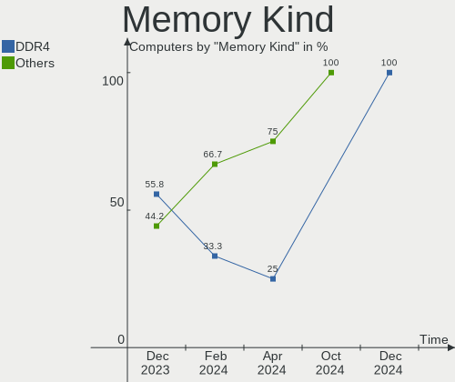

| Kind    | Computers | Percent |
|---------|-----------|---------|
| DDR4    | 17        | 51.52%  |
| DDR3    | 8         | 24.24%  |
| LPDDR4  | 4         | 12.12%  |
| SDRAM   | 2         | 6.06%   |
| LPDDR3  | 1         | 3.03%   |
| Unknown | 1         | 3.03%   |

Memory Form Factor
------------------

Physical design of the memory module

| Name         | Computers | Percent |
|--------------|-----------|---------|
| SODIMM       | 21        | 65.63%  |
| DIMM         | 7         | 21.88%  |
| Row Of Chips | 3         | 9.38%   |
| Unknown      | 1         | 3.13%   |

Memory Size
-----------

Memory module size

| Size  | Computers | Percent |
|-------|-----------|---------|
| 8192  | 13        | 38.24%  |
| 4096  | 9         | 26.47%  |
| 16384 | 6         | 17.65%  |
| 2048  | 3         | 8.82%   |
| 32768 | 2         | 5.88%   |
| 1024  | 1         | 2.94%   |

Memory Speed
------------

Memory module speed

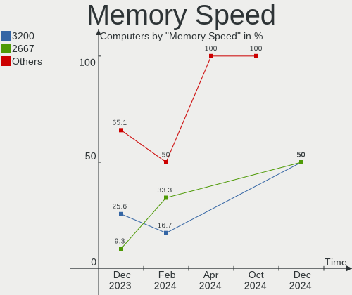

| Speed | Computers | Percent |
|-------|-----------|---------|
| 3200  | 8         | 23.53%  |
| 2667  | 7         | 20.59%  |
| 1600  | 6         | 17.65%  |
| 3733  | 3         | 8.82%   |
| 2400  | 2         | 5.88%   |
| 1334  | 2         | 5.88%   |
| 4267  | 1         | 2.94%   |
| 3400  | 1         | 2.94%   |
| 1867  | 1         | 2.94%   |
| 1067  | 1         | 2.94%   |
| 1066  | 1         | 2.94%   |
| 800   | 1         | 2.94%   |

Printers & scanners
-------------------

Printer Vendor
--------------

Printer device vendors

| Vendor      | Computers | Percent |
|-------------|-----------|---------|
| Seiko Epson | 1         | 100%    |

Printer Model
-------------

Printer device models

| Model                                                  | Computers | Percent |
|--------------------------------------------------------|-----------|---------|
| Seiko Epson ME Office 600F/Stylus Office BX300F/TX300F | 1         | 100%    |

Scanner Vendor
--------------

Scanner device vendors

Zero info for selected period =(

Scanner Model
-------------

Scanner device models

Zero info for selected period =(

Camera
------

Camera Vendor
-------------

Camera device vendors

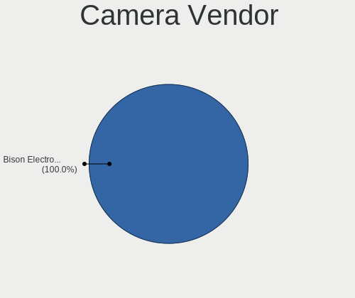

| Vendor                                 | Computers | Percent |
|----------------------------------------|-----------|---------|
| Quanta                                 | 3         | 13.64%  |
| Chicony Electronics                    | 3         | 13.64%  |
| Realtek Semiconductor                  | 2         | 9.09%   |
| Microsoft                              | 2         | 9.09%   |
| Microdia                               | 2         | 9.09%   |
| Bison Electronics                      | 2         | 9.09%   |
| SunplusIT                              | 1         | 4.55%   |
| Sunplus Innovation Technology          | 1         | 4.55%   |
| Logitech                               | 1         | 4.55%   |
| Lite-On Technology                     | 1         | 4.55%   |
| IMC Networks                           | 1         | 4.55%   |
| Cheng Uei Precision Industry (Foxlink) | 1         | 4.55%   |
| Apple                                  | 1         | 4.55%   |
| Unknown                                | 1         | 4.55%   |

Camera Model
------------

Camera device models

| Model                                                    | Computers | Percent |
|----------------------------------------------------------|-----------|---------|
| Realtek Integrated_Webcam_HD                             | 2         | 9.09%   |
| Chicony HD WebCam                                        | 2         | 9.09%   |
| Bison Integrated Camera                                  | 2         | 9.09%   |
| SunplusIT 720p HD Camera                                 | 1         | 4.55%   |
| Sunplus HD WebCam                                        | 1         | 4.55%   |
| Quanta HP TrueVision HD Camera                           | 1         | 4.55%   |
| Quanta HP 5MP Camera                                     | 1         | 4.55%   |
| Quanta HD User Facing                                    | 1         | 4.55%   |
| Microsoft Surface Camera Front                           | 1         | 4.55%   |
| Microsoft LifeCam Cinema                                 | 1         | 4.55%   |
| Microdia Laptop_Integrated_Webcam_HD                     | 1         | 4.55%   |
| Microdia Integrated_Webcam_HD                            | 1         | 4.55%   |
| Logitech Fujitsu Webcam                                  | 1         | 4.55%   |
| Lite-On HP TrueVision HD Camera                          | 1         | 4.55%   |
| IMC Networks USB2.0 HD UVC WebCam                        | 1         | 4.55%   |
| Chicony HD User Facing                                   | 1         | 4.55%   |
| Cheng Uei Precision Industry (Foxlink) HP Full HD Camera | 1         | 4.55%   |
| Apple iPhone 5/5C/5S/6/SE/7/8/X/XR                       | 1         | 4.55%   |
| Unknown                                                  | 1         | 4.55%   |

Security
--------

Fingerprint Vendor
------------------

Fingerprint sensor vendors

| Vendor           | Computers | Percent |
|------------------|-----------|---------|
| Validity Sensors | 1         | 33.33%  |
| Synaptics        | 1         | 33.33%  |
| HOLTEK           | 1         | 33.33%  |

Fingerprint Model
-----------------

Fingerprint sensor models

| Model                                             | Computers | Percent |
|---------------------------------------------------|-----------|---------|
| Validity Sensors VFS495 Fingerprint Reader        | 1         | 33.33%  |
| Synaptics Prometheus MIS Touch Fingerprint Reader | 1         | 33.33%  |
| HOLTEK FocalTech Fingerprint Device               | 1         | 33.33%  |

Chipcard Vendor
---------------

Chipcard module vendors

| Vendor   | Computers | Percent |
|----------|-----------|---------|
| O2 Micro | 1         | 100%    |

Chipcard Model
--------------

Chipcard module models

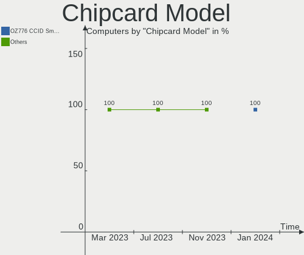

| Model                                | Computers | Percent |
|--------------------------------------|-----------|---------|
| O2 Micro OZ776 CCID Smartcard Reader | 1         | 100%    |

Unsupported
-----------

Unsupported Devices
-------------------

Total unsupported devices on board

| Total | Computers | Percent |
|-------|-----------|---------|
| 0     | 25        | 78.13%  |
| 1     | 4         | 12.5%   |
| 2     | 3         | 9.38%   |

Unsupported Device Types
------------------------

Types of unsupported devices

| Type                  | Computers | Percent |
|-----------------------|-----------|---------|
| Fingerprint reader    | 3         | 30%     |
| Storage               | 2         | 20%     |
| Multimedia controller | 2         | 20%     |
| Net/wireless          | 1         | 10%     |
| Graphics card         | 1         | 10%     |
| Chipcard              | 1         | 10%     |

