Xero - Hardware Trends (Desktops)
---------------------------------

A project to identify most popular hardware characteristics and track their change
over time based on data collected by Linux users at https://Linux-Hardware.org.

Anyone can contribute to this report by the [hw-probe](https://github.com/linuxhw/hw-probe) tool:

    sudo -E hw-probe -all -upload

This report is for one last month. Overall report since the beginning of time: [TestDays](https://github.com/linuxhw/TestDays)

Period: Sep, 2023.

Contents
--------

* [ System ](#system)
  - [ OS                       ](#os)
  - [ OS Family                ](#os-family)
  - [ Kernel                   ](#kernel)
  - [ Kernel Family            ](#kernel-family)
  - [ Kernel Major Ver.        ](#kernel-major-ver)
  - [ Arch                     ](#arch)
  - [ DE                       ](#de)
  - [ Display Server           ](#display-server)
  - [ Display Manager          ](#display-manager)
  - [ OS Lang                  ](#os-lang)
  - [ Boot Mode                ](#boot-mode)
  - [ Filesystem               ](#filesystem)
  - [ Part. scheme             ](#part-scheme)
  - [ Dual Boot with Linux/BSD ](#dual-boot-with-linuxbsd)
  - [ Dual Boot (Win)          ](#dual-boot-win)

* [ Board ](#board)
  - [ Vendor                   ](#vendor)
  - [ Model                    ](#model)
  - [ Model Family             ](#model-family)
  - [ MFG Year                 ](#mfg-year)
  - [ Form Factor              ](#form-factor)
  - [ Secure Boot              ](#secure-boot)
  - [ Coreboot                 ](#coreboot)
  - [ RAM Size                 ](#ram-size)
  - [ RAM Used                 ](#ram-used)
  - [ Total Drives             ](#total-drives)
  - [ Has CD-ROM               ](#has-cd-rom)
  - [ Has Ethernet             ](#has-ethernet)
  - [ Has WiFi                 ](#has-wifi)
  - [ Has Bluetooth            ](#has-bluetooth)

* [ Location ](#location)
  - [ Country                  ](#country)
  - [ City                     ](#city)

* [ Drives ](#drives)
  - [ Drive Vendor             ](#drive-vendor)
  - [ Drive Model              ](#drive-model)
  - [ HDD Vendor               ](#hdd-vendor)
  - [ SSD Vendor               ](#ssd-vendor)
  - [ Drive Kind               ](#drive-kind)
  - [ Drive Connector          ](#drive-connector)
  - [ Drive Size               ](#drive-size)
  - [ Space Total              ](#space-total)
  - [ Space Used               ](#space-used)
  - [ Malfunc. Drives          ](#malfunc-drives)
  - [ Malfunc. Drive Vendor    ](#malfunc-drive-vendor)
  - [ Malfunc. HDD Vendor      ](#malfunc-hdd-vendor)
  - [ Malfunc. Drive Kind      ](#malfunc-drive-kind)
  - [ Failed Drives            ](#failed-drives)
  - [ Failed Drive Vendor      ](#failed-drive-vendor)
  - [ Drive Status             ](#drive-status)

* [ Storage controller ](#storage-controller)
  - [ Storage Vendor           ](#storage-vendor)
  - [ Storage Model            ](#storage-model)
  - [ Storage Kind             ](#storage-kind)

* [ Processor ](#processor)
  - [ CPU Vendor               ](#cpu-vendor)
  - [ CPU Model                ](#cpu-model)
  - [ CPU Model Family         ](#cpu-model-family)
  - [ CPU Cores                ](#cpu-cores)
  - [ CPU Sockets              ](#cpu-sockets)
  - [ CPU Threads              ](#cpu-threads)
  - [ CPU Op-Modes             ](#cpu-op-modes)
  - [ CPU Microcode            ](#cpu-microcode)
  - [ CPU Microarch            ](#cpu-microarch)

* [ Graphics ](#graphics)
  - [ GPU Vendor               ](#gpu-vendor)
  - [ GPU Model                ](#gpu-model)
  - [ GPU Combo                ](#gpu-combo)
  - [ GPU Driver               ](#gpu-driver)
  - [ GPU Memory               ](#gpu-memory)

* [ Monitor ](#monitor)
  - [ Monitor Vendor           ](#monitor-vendor)
  - [ Monitor Model            ](#monitor-model)
  - [ Monitor Resolution       ](#monitor-resolution)
  - [ Monitor Diagonal         ](#monitor-diagonal)
  - [ Monitor Width            ](#monitor-width)
  - [ Aspect Ratio             ](#aspect-ratio)
  - [ Monitor Area             ](#monitor-area)
  - [ Pixel Density            ](#pixel-density)
  - [ Multiple Monitors        ](#multiple-monitors)

* [ Network ](#network)
  - [ Net Controller Vendor    ](#net-controller-vendor)
  - [ Net Controller Model     ](#net-controller-model)
  - [ Wireless Vendor          ](#wireless-vendor)
  - [ Wireless Model           ](#wireless-model)
  - [ Ethernet Vendor          ](#ethernet-vendor)
  - [ Ethernet Model           ](#ethernet-model)
  - [ Net Controller Kind      ](#net-controller-kind)
  - [ Used Controller          ](#used-controller)
  - [ NICs                     ](#nics)
  - [ IPv6                     ](#ipv6)

* [ Bluetooth ](#bluetooth)
  - [ Bluetooth Vendor         ](#bluetooth-vendor)
  - [ Bluetooth Model          ](#bluetooth-model)

* [ Sound ](#sound)
  - [ Sound Vendor             ](#sound-vendor)
  - [ Sound Model              ](#sound-model)

* [ Memory ](#memory)
  - [ Memory Vendor            ](#memory-vendor)
  - [ Memory Model             ](#memory-model)
  - [ Memory Kind              ](#memory-kind)
  - [ Memory Form Factor       ](#memory-form-factor)
  - [ Memory Size              ](#memory-size)
  - [ Memory Speed             ](#memory-speed)

* [ Printers & scanners ](#printers--scanners)
  - [ Printer Vendor           ](#printer-vendor)
  - [ Printer Model            ](#printer-model)
  - [ Scanner Vendor           ](#scanner-vendor)
  - [ Scanner Model            ](#scanner-model)

* [ Camera ](#camera)
  - [ Camera Vendor            ](#camera-vendor)
  - [ Camera Model             ](#camera-model)

* [ Security ](#security)
  - [ Fingerprint Vendor       ](#fingerprint-vendor)
  - [ Fingerprint Model        ](#fingerprint-model)
  - [ Chipcard Vendor          ](#chipcard-vendor)
  - [ Chipcard Model           ](#chipcard-model)

* [ Unsupported ](#unsupported)
  - [ Unsupported Devices      ](#unsupported-devices)
  - [ Unsupported Device Types ](#unsupported-device-types)

System
------

OS
--

Installed operating systems

| Name         | Desktops | Percent |
|--------------|----------|---------|
| Xero Rolling | 22       | 100%    |

OS Family
---------

OS without a version

| Name | Desktops | Percent |
|------|----------|---------|
| Xero | 22       | 100%    |

Kernel
------

Version of the Linux kernel

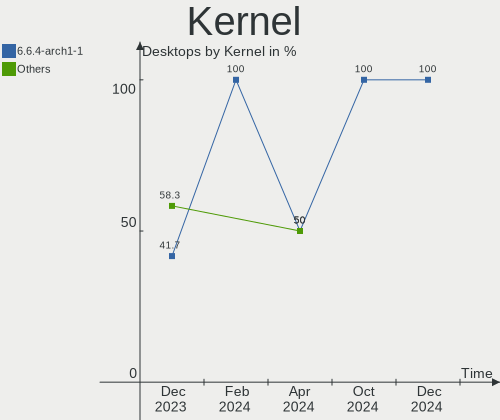

| Version                  | Desktops | Percent |
|--------------------------|----------|---------|
| 6.4.12-arch1-1           | 14       | 63.64%  |
| 6.5.3-arch1-1            | 2        | 9.09%   |
| 6.5.4-arch2-1            | 1        | 4.55%   |
| 6.5.2-arch1-1            | 1        | 4.55%   |
| 6.5.2-273-tkg-bore-eevdf | 1        | 4.55%   |
| 6.4.9-arch1-1            | 1        | 4.55%   |
| 6.4.8-arch1-1            | 1        | 4.55%   |
| 6.4.12-zen1-1-zen        | 1        | 4.55%   |

Kernel Family
-------------

Linux kernel without a distro release

| Version | Desktops | Percent |
|---------|----------|---------|
| 6.4.12  | 15       | 68.18%  |
| 6.5.3   | 2        | 9.09%   |
| 6.5.2   | 2        | 9.09%   |
| 6.5.4   | 1        | 4.55%   |
| 6.4.9   | 1        | 4.55%   |
| 6.4.8   | 1        | 4.55%   |

Kernel Major Ver.
-----------------

Linux kernel major version

| Version | Desktops | Percent |
|---------|----------|---------|
| 6.4     | 17       | 77.27%  |
| 6.5     | 5        | 22.73%  |

Arch
----

OS architecture (x86_64, i586, etc.)

| Name   | Desktops | Percent |
|--------|----------|---------|
| x86_64 | 22       | 100%    |

DE
--

Desktop Environment

| Name | Desktops | Percent |
|------|----------|---------|
| KDE5 | 22       | 100%    |

Display Server
--------------

X11 or Wayland

| Name | Desktops | Percent |
|------|----------|---------|
| X11  | 22       | 100%    |

Display Manager
---------------

SDDM, LightDM, etc.

| Name    | Desktops | Percent |
|---------|----------|---------|
| SDDM    | 20       | 90.91%  |
| LightDM | 2        | 9.09%   |

OS Lang
-------

Language

| Lang  | Desktops | Percent |
|-------|----------|---------|
| en_US | 9        | 40.91%  |
| de_DE | 4        | 18.18%  |
| pt_BR | 1        | 4.55%   |
| pl_PL | 1        | 4.55%   |
| fr_FR | 1        | 4.55%   |
| es_AR | 1        | 4.55%   |
| en_GB | 1        | 4.55%   |
| en_CA | 1        | 4.55%   |
| en_AU | 1        | 4.55%   |
| el_GR | 1        | 4.55%   |
| cs_CZ | 1        | 4.55%   |

Boot Mode
---------

EFI or BIOS

| Mode | Desktops | Percent |
|------|----------|---------|
| EFI  | 18       | 81.82%  |
| BIOS | 4        | 18.18%  |

Filesystem
----------

Type of filesystem

| Type   | Desktops | Percent |
|--------|----------|---------|
| Ext4   | 15       | 68.18%  |
| Btrfs  | 4        | 18.18%  |
| Xfs    | 2        | 9.09%   |
| Nilfs2 | 1        | 4.55%   |

Part. scheme
------------

Scheme of partitioning

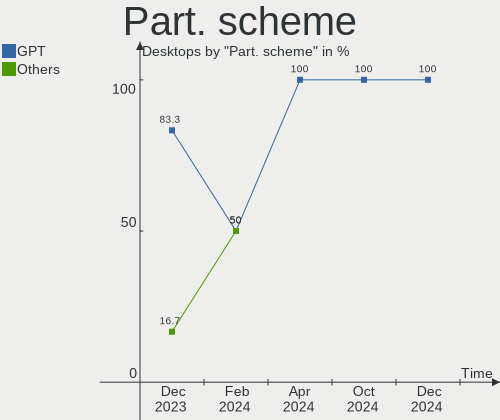

| Type | Desktops | Percent |
|------|----------|---------|
| GPT  | 19       | 86.36%  |
| MBR  | 3        | 13.64%  |

Dual Boot with Linux/BSD
------------------------

Hosting more than one Linux/BSD

| Dual boot | Desktops | Percent |
|-----------|----------|---------|
| No        | 15       | 68.18%  |
| Yes       | 7        | 31.82%  |

Dual Boot (Win)
---------------

Hosting Linux and Windows

| Dual boot | Desktops | Percent |
|-----------|----------|---------|
| No        | 12       | 54.55%  |
| Yes       | 10       | 45.45%  |

Board
-----

Vendor
------

Motherboard manufacturer

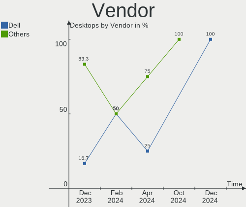

| Name                | Desktops | Percent |
|---------------------|----------|---------|
| ASUSTek Computer    | 9        | 40.91%  |
| Hewlett-Packard     | 4        | 18.18%  |
| Gigabyte Technology | 2        | 9.09%   |
| Dell                | 2        | 9.09%   |
| Pegatron            | 1        | 4.55%   |
| MSI                 | 1        | 4.55%   |
| Huanan              | 1        | 4.55%   |
| ECS                 | 1        | 4.55%   |
| ASRock              | 1        | 4.55%   |

Model
-----

Motherboard model

| Name                              | Desktops | Percent |
|-----------------------------------|----------|---------|
| Pegatron p7-1010a                 | 1        | 4.55%   |
| MSI Gaming                        | 1        | 4.55%   |
| Huanan X99-TF                     | 1        | 4.55%   |
| HP ProDesk 400 G1 SFF             | 1        | 4.55%   |
| HP 750-009nf                      | 1        | 4.55%   |
| HP 22-3100nz                      | 1        | 4.55%   |
| HP 110-210                        | 1        | 4.55%   |
| Gigabyte Z790 UD                  | 1        | 4.55%   |
| Gigabyte B550 AORUS ELITE AX V2   | 1        | 4.55%   |
| ECS H61H2-M2                      | 1        | 4.55%   |
| Dell Studio XPS 8100              | 1        | 4.55%   |
| Dell OptiPlex 7010                | 1        | 4.55%   |
| ASUS TUF Gaming B550-PLUS         | 1        | 4.55%   |
| ASUS TUF Gaming B450M-PLUS II     | 1        | 4.55%   |
| ASUS ROG STRIX Z690-E GAMING WIFI | 1        | 4.55%   |
| ASUS ROG STRIX X470-I GAMING      | 1        | 4.55%   |
| ASUS PRIME X299-A II              | 1        | 4.55%   |
| ASUS PRIME A320M-K/BR             | 1        | 4.55%   |
| ASUS PRIME A320M-K                | 1        | 4.55%   |
| ASUS M5A99X EVO R2.0              | 1        | 4.55%   |
| ASUS M5A99X EVO                   | 1        | 4.55%   |
| ASRock A300M-STX                  | 1        | 4.55%   |

Model Family
------------

Motherboard model prefix

| Name              | Desktops | Percent |
|-------------------|----------|---------|
| ASUS PRIME        | 3        | 13.64%  |
| ASUS TUF          | 2        | 9.09%   |
| ASUS ROG          | 2        | 9.09%   |
| ASUS M5A99X       | 2        | 9.09%   |
| Pegatron p7-1010a | 1        | 4.55%   |
| MSI Gaming        | 1        | 4.55%   |
| Huanan X99-TF     | 1        | 4.55%   |
| HP ProDesk        | 1        | 4.55%   |
| HP 750-009nf      | 1        | 4.55%   |
| HP 22-3100nz      | 1        | 4.55%   |
| HP 110-210        | 1        | 4.55%   |
| Gigabyte Z790     | 1        | 4.55%   |
| Gigabyte B550     | 1        | 4.55%   |
| ECS H61H2-M2      | 1        | 4.55%   |
| Dell Studio       | 1        | 4.55%   |
| Dell OptiPlex     | 1        | 4.55%   |
| ASRock A300M-STX  | 1        | 4.55%   |

MFG Year
--------

Motherboard manufacture year

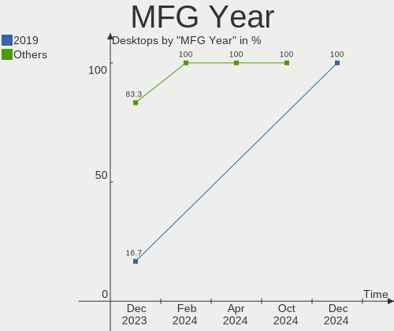

| Year | Desktops | Percent |
|------|----------|---------|
| 2020 | 4        | 18.18%  |
| 2021 | 3        | 13.64%  |
| 2018 | 3        | 13.64%  |
| 2011 | 3        | 13.64%  |
| 2023 | 2        | 9.09%   |
| 2017 | 2        | 9.09%   |
| 2014 | 2        | 9.09%   |
| 2013 | 1        | 4.55%   |
| 2012 | 1        | 4.55%   |
| 2009 | 1        | 4.55%   |

Form Factor
-----------

Physical design of the computer

| Name    | Desktops | Percent |
|---------|----------|---------|
| Desktop | 22       | 100%    |

Secure Boot
-----------

Enabled or disabled

| State    | Desktops | Percent |
|----------|----------|---------|
| Disabled | 21       | 95.45%  |
| Enabled  | 1        | 4.55%   |

Coreboot
--------

Have coreboot on board

| Used | Desktops | Percent |
|------|----------|---------|
| No   | 22       | 100%    |

RAM Size
--------

Total RAM memory

| Size in GB | Desktops | Percent |
|------------|----------|---------|
| 8.01-16.0  | 8        | 36.36%  |
| 16.01-24.0 | 6        | 27.27%  |
| 32.01-64.0 | 5        | 22.73%  |
| 3.01-4.0   | 2        | 9.09%   |
| 4.01-8.0   | 1        | 4.55%   |

RAM Used
--------

Used RAM memory

| Used GB  | Desktops | Percent |
|----------|----------|---------|
| 2.01-3.0 | 8        | 36.36%  |
| 1.01-2.0 | 8        | 36.36%  |
| 4.01-8.0 | 5        | 22.73%  |
| 3.01-4.0 | 1        | 4.55%   |

Total Drives
------------

Number of drives on board

| Drives | Desktops | Percent |
|--------|----------|---------|
| 1      | 9        | 40.91%  |
| 2      | 7        | 31.82%  |
| 3      | 4        | 18.18%  |
| 8      | 1        | 4.55%   |
| 5      | 1        | 4.55%   |

Has CD-ROM
----------

Has CD-ROM on board

| Presented | Desktops | Percent |
|-----------|----------|---------|
| No        | 14       | 63.64%  |
| Yes       | 8        | 36.36%  |

Has Ethernet
------------

Has Ethernet on board

| Presented | Desktops | Percent |
|-----------|----------|---------|
| Yes       | 22       | 100%    |

Has WiFi
--------

Has WiFi module

| Presented | Desktops | Percent |
|-----------|----------|---------|
| No        | 14       | 63.64%  |
| Yes       | 8        | 36.36%  |

Has Bluetooth
-------------

Has Bluetooth module

| Presented | Desktops | Percent |
|-----------|----------|---------|
| No        | 13       | 59.09%  |
| Yes       | 9        | 40.91%  |

Location
--------

Country
-------

Geographic location (country)

| Country     | Desktops | Percent |
|-------------|----------|---------|
| USA         | 4        | 18.18%  |
| Germany     | 3        | 13.64%  |
| Canada      | 2        | 9.09%   |
| Switzerland | 1        | 4.55%   |
| Romania     | 1        | 4.55%   |
| Poland      | 1        | 4.55%   |
| Netherlands | 1        | 4.55%   |
| Iran        | 1        | 4.55%   |
| Greece      | 1        | 4.55%   |
| France      | 1        | 4.55%   |
| Czechia     | 1        | 4.55%   |
| Bulgaria    | 1        | 4.55%   |
| Brazil      | 1        | 4.55%   |
| Australia   | 1        | 4.55%   |
| Argentina   | 1        | 4.55%   |
| Algeria     | 1        | 4.55%   |

City
----

Geographic location (city)

| City                | Desktops | Percent |
|---------------------|----------|---------|
| Warsaw              | 1        | 4.55%   |
| Termas de Rio Hondo | 1        | 4.55%   |
| Tehran              | 1        | 4.55%   |
| Sofia               | 1        | 4.55%   |
| Sarcelles           | 1        | 4.55%   |
| Santa Rosa          | 1        | 4.55%   |
| Red Lake            | 1        | 4.55%   |
| Pegnitz             | 1        | 4.55%   |
| Paiania             | 1        | 4.55%   |
| Ouargla             | 1        | 4.55%   |
| Niterói            | 1        | 4.55%   |
| Montreal            | 1        | 4.55%   |
| Middletown          | 1        | 4.55%   |
| Iasi                | 1        | 4.55%   |
| Devonport           | 1        | 4.55%   |
| Cumming             | 1        | 4.55%   |
| Cheb                | 1        | 4.55%   |
| Burke               | 1        | 4.55%   |
| Bern                | 1        | 4.55%   |
| Berlin              | 1        | 4.55%   |
| Beilngries          | 1        | 4.55%   |
| Amsterdam           | 1        | 4.55%   |

Drives
------

Drive Vendor
------------

Hard drive vendors

| Vendor                      | Desktops | Drives | Percent |
|-----------------------------|----------|--------|---------|
| Samsung Electronics         | 8        | 12     | 20%     |
| WDC                         | 7        | 9      | 17.5%   |
| Seagate                     | 6        | 7      | 15%     |
| Kingston                    | 5        | 5      | 12.5%   |
| SK hynix                    | 2        | 2      | 5%      |
| Unknown                     | 1        | 1      | 2.5%    |
| SSK                         | 1        | 1      | 2.5%    |
| Sandisk                     | 1        | 1      | 2.5%    |
| Phison Electronics          | 1        | 1      | 2.5%    |
| Micron/Crucial Technology   | 1        | 1      | 2.5%    |
| Maxtor                      | 1        | 1      | 2.5%    |
| Maxone                      | 1        | 1      | 2.5%    |
| MAXIO Technology (Hangzhou) | 1        | 1      | 2.5%    |
| Kingston Technology Company | 1        | 2      | 2.5%    |
| JMicron Technology          | 1        | 1      | 2.5%    |
| Intenso                     | 1        | 1      | 2.5%    |
| Crucial                     | 1        | 1      | 2.5%    |

Drive Model
-----------

Hard drive models

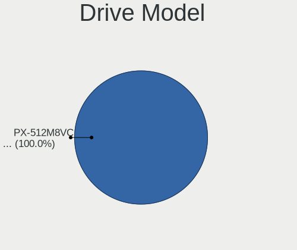

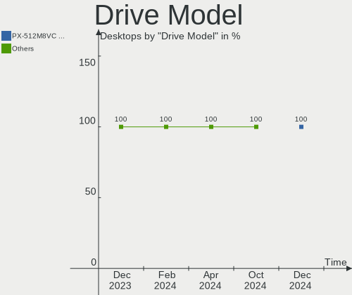

| Model                                               | Desktops | Percent |
|-----------------------------------------------------|----------|---------|
| WDC WD20EZBX-00AYRA0 2TB                            | 2        | 4.55%   |
| Seagate ST1000DM003-1SB102 1TB                      | 2        | 4.55%   |
| Samsung SSD 860 EVO 500GB                           | 2        | 4.55%   |
| WDC WDS120G2G0B-00EPW0 120GB SSD                    | 1        | 2.27%   |
| WDC WD6401AALS-00E3A0 640GB                         | 1        | 2.27%   |
| WDC WD5000AAKX-75U6AA0 500GB                        | 1        | 2.27%   |
| WDC WD3200AAKS-00L9A0 320GB                         | 1        | 2.27%   |
| WDC WD10EZEX-60M2NA0 1TB                            | 1        | 2.27%   |
| WDC WD1003FZEX-00K3CA0 1TB                          | 1        | 2.27%   |
| Unknown SD/MMC/MS PRO 128GB                         | 1        | 2.27%   |
| SSK Disk 256GB                                      | 1        | 2.27%   |
| SK hynix SKHynix_HFM256GD3HX015N 256GB              | 1        | 2.27%   |
| SK hynix SHPP41-2000GM 2TB                          | 1        | 2.27%   |
| Seagate ST320LT012-9WS14C 320GB                     | 1        | 2.27%   |
| Seagate ST2000DM008-2FR102 2TB                      | 1        | 2.27%   |
| Seagate ST1000LM024 HN-M101MBB 1TB                  | 1        | 2.27%   |
| Seagate ST1000DM003-1ER162 1TB                      | 1        | 2.27%   |
| Seagate ST1000DM003-1CH162 1TB                      | 1        | 2.27%   |
| Sandisk WDC WDS100T2B0C-00PXH0 1TB                  | 1        | 2.27%   |
| Samsung SSD 980 500GB                               | 1        | 2.27%   |
| Samsung SSD 980 250GB                               | 1        | 2.27%   |
| Samsung SSD 870 QVO 2TB                             | 1        | 2.27%   |
| Samsung SSD 850 PRO 512GB                           | 1        | 2.27%   |
| Samsung SSD 850 EVO 250GB                           | 1        | 2.27%   |
| Samsung NVMe SSD Controller SM981/PM981/PM983 256GB | 1        | 2.27%   |
| Samsung NVMe SSD Controller PM9A1/PM9A3/980PRO 1TB  | 1        | 2.27%   |
| Samsung MZYTY256HDHP-000L2 256GB SSD                | 1        | 2.27%   |
| Phison E12 NVMe Controller 2TB                      | 1        | 2.27%   |
| Micron/Crucial CT2000P5PSSD8 2TB                    | 1        | 2.27%   |
| Maxtor STM3160215AS 160GB                           | 1        | 2.27%   |
| Maxone USB 3.0 500GB                                | 1        | 2.27%   |
| MAXIO (Hangzhou) NVMe SSD Controller MAP1202 512GB  | 1        | 2.27%   |
| Kingston Company A2000 NVMe SSD 1TB                 | 1        | 2.27%   |
| Kingston SUV400S37120G 120GB SSD                    | 1        | 2.27%   |
| Kingston SNVS500G 500GB                             | 1        | 2.27%   |
| Kingston SA400S37960G 960GB SSD                     | 1        | 2.27%   |
| Kingston SA400S37480G 480GB SSD                     | 1        | 2.27%   |
| Kingston SA400S37120G 120GB SSD                     | 1        | 2.27%   |
| JMicron Generic 240GB                               | 1        | 2.27%   |
| Intenso USB 3.0 device 1TB                          | 1        | 2.27%   |

HDD Vendor
----------

Hard disk drive vendors

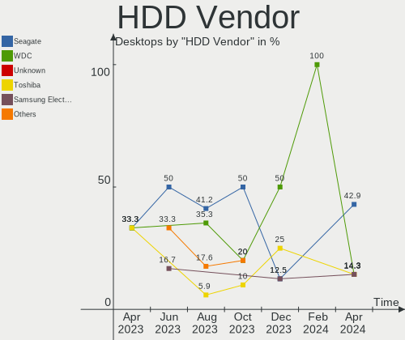

| Vendor  | Desktops | Drives | Percent |
|---------|----------|--------|---------|
| WDC     | 6        | 8      | 35.29%  |
| Seagate | 6        | 7      | 35.29%  |
| Unknown | 1        | 1      | 5.88%   |
| SSK     | 1        | 1      | 5.88%   |
| Maxtor  | 1        | 1      | 5.88%   |
| Maxone  | 1        | 1      | 5.88%   |
| Intenso | 1        | 1      | 5.88%   |

SSD Vendor
----------

Solid state drive vendors

| Vendor              | Desktops | Drives | Percent |
|---------------------|----------|--------|---------|
| Samsung Electronics | 5        | 6      | 41.67%  |
| Kingston            | 4        | 4      | 33.33%  |
| WDC                 | 1        | 1      | 8.33%   |
| JMicron Technology  | 1        | 1      | 8.33%   |
| Crucial             | 1        | 1      | 8.33%   |

Drive Kind
----------

HDD or SSD

| Kind | Desktops | Drives | Percent |
|------|----------|--------|---------|
| HDD  | 11       | 20     | 39.29%  |
| NVMe | 9        | 15     | 32.14%  |
| SSD  | 8        | 13     | 28.57%  |

Drive Connector
---------------

SATA, SAS, NVMe, etc.

| Type | Desktops | Drives | Percent |
|------|----------|--------|---------|
| SATA | 16       | 28     | 53.33%  |
| NVMe | 9        | 15     | 30%     |
| SAS  | 5        | 5      | 16.67%  |

Drive Size
----------

Size of hard drive

| Size in TB | Desktops | Drives | Percent |
|------------|----------|--------|---------|
| 0.01-0.5   | 13       | 17     | 54.17%  |
| 0.51-1.0   | 8        | 12     | 33.33%  |
| 1.01-2.0   | 3        | 4      | 12.5%   |

Space Total
-----------

Amount of disk space available on the file system

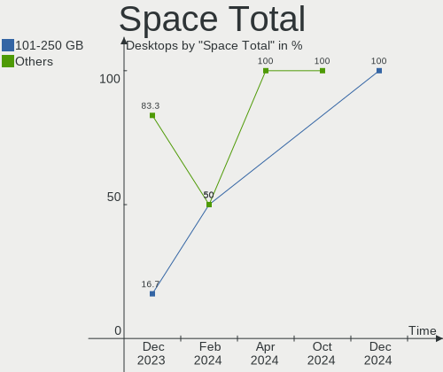

| Size in GB     | Desktops | Percent |
|----------------|----------|---------|
| 101-250        | 7        | 31.82%  |
| 251-500        | 6        | 27.27%  |
| 501-1000       | 4        | 18.18%  |
| More than 3000 | 2        | 9.09%   |
| 21-50          | 1        | 4.55%   |
| 2001-3000      | 1        | 4.55%   |
| 51-100         | 1        | 4.55%   |

Space Used
----------

Amount of used disk space

| Used GB   | Desktops | Percent |
|-----------|----------|---------|
| 1-20      | 10       | 45.45%  |
| 21-50     | 6        | 27.27%  |
| 51-100    | 3        | 13.64%  |
| 101-250   | 2        | 9.09%   |
| 1001-2000 | 1        | 4.55%   |

Malfunc. Drives
---------------

Drive models with a malfunction

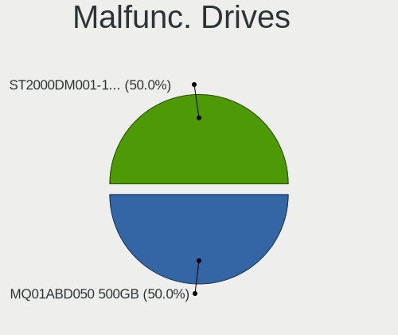

| Model                           | Desktops | Drives | Percent |
|---------------------------------|----------|--------|---------|
| WDC WD10EZEX-60M2NA0 1TB        | 1        | 1      | 25%     |
| Seagate ST320LT012-9WS14C 320GB | 1        | 1      | 25%     |
| Seagate ST1000DM003-1ER162 1TB  | 1        | 1      | 25%     |
| Maxtor STM3160215AS 160GB       | 1        | 1      | 25%     |

Malfunc. Drive Vendor
---------------------

Vendors of faulty drives

| Vendor  | Desktops | Drives | Percent |
|---------|----------|--------|---------|
| Seagate | 2        | 2      | 50%     |
| WDC     | 1        | 1      | 25%     |
| Maxtor  | 1        | 1      | 25%     |

Malfunc. HDD Vendor
-------------------

Vendors of faulty HDD drives

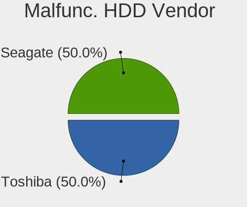

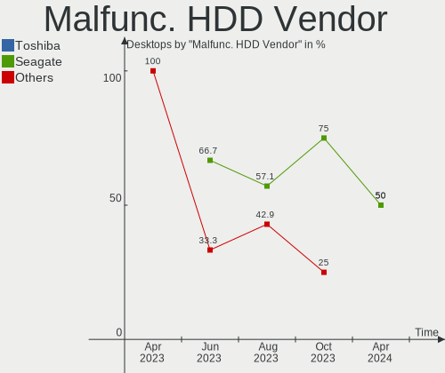

| Vendor  | Desktops | Drives | Percent |
|---------|----------|--------|---------|
| Seagate | 2        | 2      | 50%     |
| WDC     | 1        | 1      | 25%     |
| Maxtor  | 1        | 1      | 25%     |

Malfunc. Drive Kind
-------------------

Kinds of faulty drives

| Kind | Desktops | Drives | Percent |
|------|----------|--------|---------|
| HDD  | 4        | 4      | 100%    |

Failed Drives
-------------

Failed drive models

Zero info for selected period =(

Failed Drive Vendor
-------------------

Failed drive vendors

Zero info for selected period =(

Drive Status
------------

Number of failed and malfunc. drives

| Status   | Desktops | Drives | Percent |
|----------|----------|--------|---------|
| Works    | 19       | 40     | 70.37%  |
| Detected | 4        | 4      | 14.81%  |
| Malfunc  | 4        | 4      | 14.81%  |

Storage controller
------------------

Storage Vendor
--------------

Storage controller vendors

| Vendor                      | Desktops | Percent |
|-----------------------------|----------|---------|
| Intel                       | 11       | 31.43%  |
| AMD                         | 10       | 28.57%  |
| Samsung Electronics         | 3        | 8.57%   |
| SK hynix                    | 2        | 5.71%   |
| Kingston Technology Company | 2        | 5.71%   |
| ASMedia Technology          | 2        | 5.71%   |
| SanDisk                     | 1        | 2.86%   |
| Phison Electronics          | 1        | 2.86%   |
| Micron/Crucial Technology   | 1        | 2.86%   |
| MAXIO Technology (Hangzhou) | 1        | 2.86%   |
| JMicron Technology          | 1        | 2.86%   |

Storage Model
-------------

Storage controller models

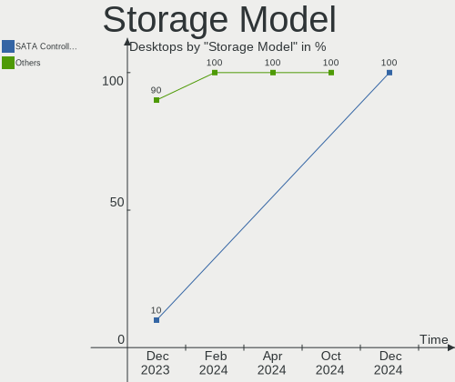

| Model                                                                                   | Desktops | Percent |
|-----------------------------------------------------------------------------------------|----------|---------|
| AMD FCH SATA Controller [AHCI mode]                                                     | 5        | 12.2%   |
| Intel 8 Series/C220 Series Chipset Family 6-port SATA Controller 1 [AHCI mode]          | 3        | 7.32%   |
| Intel Alder Lake-S PCH SATA Controller [AHCI Mode]                                      | 2        | 4.88%   |
| ASMedia ASM1062 Serial ATA Controller                                                   | 2        | 4.88%   |
| AMD SB7x0/SB8x0/SB9x0 SATA Controller [AHCI mode]                                       | 2        | 4.88%   |
| AMD FCH SATA Controller D                                                               | 2        | 4.88%   |
| AMD 500 Series Chipset SATA Controller                                                  | 2        | 4.88%   |
| AMD 400 Series Chipset SATA Controller                                                  | 2        | 4.88%   |
| SK hynix Platinum P41/PC801 NVMe Solid State Drive                                      | 1        | 2.44%   |
| SK hynix Gold P31/BC711/PC711 NVMe Solid State Drive                                    | 1        | 2.44%   |
| SanDisk WD Green SN350 NVMe SSD 240GB (DRAM-less)                                       | 1        | 2.44%   |
| Samsung NVMe SSD Controller SM981/PM981/PM983                                           | 1        | 2.44%   |
| Samsung NVMe SSD Controller PM9A1/PM9A3/980PRO                                          | 1        | 2.44%   |
| Samsung NVMe SSD Controller 980                                                         | 1        | 2.44%   |
| Phison E12 NVMe Controller                                                              | 1        | 2.44%   |
| Micron/Crucial P5 Plus NVMe PCIe SSD                                                    | 1        | 2.44%   |
| MAXIO (Hangzhou) NVMe SSD Controller MAP1202                                            | 1        | 2.44%   |
| Kingston Company NVMe Controller                                                        | 1        | 2.44%   |
| Kingston Company A2000 NVMe SSD                                                         | 1        | 2.44%   |
| JMicron JMB362 SATA Controller                                                          | 1        | 2.44%   |
| Intel Volume Management Device NVMe RAID Controller                                     | 1        | 2.44%   |
| Intel SATA Controller [RAID mode]                                                       | 1        | 2.44%   |
| Intel 700 Series Chipset Family SATA AHCI Controller                                    | 1        | 2.44%   |
| Intel 7 Series/C210 Series Chipset Family 6-port SATA Controller [AHCI mode]            | 1        | 2.44%   |
| Intel 6 Series/C200 Series Chipset Family Desktop SATA Controller (IDE mode, ports 4-5) | 1        | 2.44%   |
| Intel 6 Series/C200 Series Chipset Family Desktop SATA Controller (IDE mode, ports 0-3) | 1        | 2.44%   |
| Intel 6 Series/C200 Series Chipset Family 6 port Desktop SATA AHCI Controller           | 1        | 2.44%   |
| Intel 5 Series/3400 Series Chipset 4 port SATA IDE Controller                           | 1        | 2.44%   |
| Intel 5 Series/3400 Series Chipset 2 port SATA IDE Controller                           | 1        | 2.44%   |

Storage Kind
------------

Kind of storage controller (IDE, SATA, NVMe, SAS, ...)

| Kind | Desktops | Percent |
|------|----------|---------|
| SATA | 18       | 58.06%  |
| NVMe | 9        | 29.03%  |
| RAID | 2        | 6.45%   |
| IDE  | 2        | 6.45%   |

Processor
---------

CPU Vendor
----------

Processor vendors

| Vendor | Desktops | Percent |
|--------|----------|---------|
| Intel  | 12       | 54.55%  |
| AMD    | 10       | 45.45%  |

CPU Model
---------

Processor models

| Model                                       | Desktops | Percent |
|---------------------------------------------|----------|---------|
| Intel 12th Gen Core i9-12900K               | 2        | 9.09%   |
| Intel Xeon CPU E5-2678 v3 @ 2.50GHz         | 1        | 4.55%   |
| Intel Pentium CPU G620 @ 2.60GHz            | 1        | 4.55%   |
| Intel Pentium CPU G3260T @ 2.90GHz          | 1        | 4.55%   |
| Intel Core i9-10900X CPU @ 3.70GHz          | 1        | 4.55%   |
| Intel Core i7-2600 CPU @ 3.40GHz            | 1        | 4.55%   |
| Intel Core i7 CPU 860 @ 2.80GHz             | 1        | 4.55%   |
| Intel Core i5-4590 CPU @ 3.30GHz            | 1        | 4.55%   |
| Intel Core i5-4460 CPU @ 3.20GHz            | 1        | 4.55%   |
| Intel Core i5-3470 CPU @ 3.20GHz            | 1        | 4.55%   |
| Intel 12th Gen Core i3-12100F               | 1        | 4.55%   |
| AMD Ryzen 7 3700X 8-Core Processor          | 1        | 4.55%   |
| AMD Ryzen 5 5600G with Radeon Graphics      | 1        | 4.55%   |
| AMD Ryzen 5 5600 6-Core Processor           | 1        | 4.55%   |
| AMD Ryzen 5 3600 6-Core Processor           | 1        | 4.55%   |
| AMD Ryzen 5 2400G with Radeon Vega Graphics | 1        | 4.55%   |
| AMD Ryzen 3 3200G with Radeon Vega Graphics | 1        | 4.55%   |
| AMD Ryzen 3 2200G with Radeon Vega Graphics | 1        | 4.55%   |
| AMD FX-8370 Eight-Core Processor            | 1        | 4.55%   |
| AMD FX-6350 Six-Core Processor              | 1        | 4.55%   |
| AMD A4-5000 APU with Radeon HD Graphics     | 1        | 4.55%   |

CPU Model Family
----------------

Processor model prefix

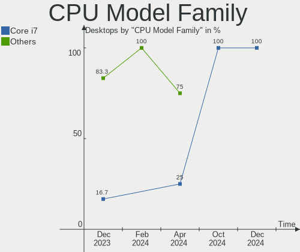

| Model         | Desktops | Percent |
|---------------|----------|---------|
| AMD Ryzen 5   | 4        | 18.18%  |
| Other         | 3        | 13.64%  |
| Intel Core i5 | 3        | 13.64%  |
| Intel Pentium | 2        | 9.09%   |
| Intel Core i7 | 2        | 9.09%   |
| AMD Ryzen 3   | 2        | 9.09%   |
| AMD FX        | 2        | 9.09%   |
| Intel Xeon    | 1        | 4.55%   |
| Intel Core i9 | 1        | 4.55%   |
| AMD Ryzen 7   | 1        | 4.55%   |
| AMD A4        | 1        | 4.55%   |

CPU Cores
---------

Number of processor cores

| Number | Desktops | Percent |
|--------|----------|---------|
| 4      | 11       | 50%     |
| 6      | 3        | 13.64%  |
| 16     | 2        | 9.09%   |
| 2      | 2        | 9.09%   |
| 12     | 1        | 4.55%   |
| 10     | 1        | 4.55%   |
| 8      | 1        | 4.55%   |
| 3      | 1        | 4.55%   |

CPU Sockets
-----------

Number of sockets

| Number | Desktops | Percent |
|--------|----------|---------|
| 1      | 22       | 100%    |

CPU Threads
-----------

Threads per core (Hyper-Threading)

| Number | Desktops | Percent |
|--------|----------|---------|
| 2      | 14       | 63.64%  |
| 1      | 8        | 36.36%  |

CPU Op-Modes
------------

CPU Operation Modes (32-bit, 64-bit)

| Op mode        | Desktops | Percent |
|----------------|----------|---------|
| 32-bit, 64-bit | 22       | 100%    |

CPU Microcode
-------------

Microcode number

| Number     | Desktops | Percent |
|------------|----------|---------|
| Unknown    | 12       | 54.55%  |
| 0x0a50000d | 1        | 4.55%   |
| 0x0a201204 | 1        | 4.55%   |
| 0x08701030 | 1        | 4.55%   |
| 0x08701021 | 1        | 4.55%   |
| 0x08108109 | 1        | 4.55%   |
| 0x08101013 | 1        | 4.55%   |
| 0x0810100b | 1        | 4.55%   |
| 0x0700010f | 1        | 4.55%   |
| 0x06000822 | 1        | 4.55%   |
| 0x0600081c | 1        | 4.55%   |

CPU Microarch
-------------

Microarchitecture

| Name             | Desktops | Percent |
|------------------|----------|---------|
| Haswell          | 4        | 18.18%  |
| Alderlake Hybrid | 3        | 13.64%  |
| Zen 3            | 2        | 9.09%   |
| Zen 2            | 2        | 9.09%   |
| Zen              | 2        | 9.09%   |
| SandyBridge      | 2        | 9.09%   |
| Piledriver       | 2        | 9.09%   |
| Zen+             | 1        | 4.55%   |
| Skylake          | 1        | 4.55%   |
| Nehalem          | 1        | 4.55%   |
| Jaguar           | 1        | 4.55%   |
| IvyBridge        | 1        | 4.55%   |

Graphics
--------

GPU Vendor
----------

Vendors of graphics cards

| Vendor | Desktops | Percent |
|--------|----------|---------|
| Nvidia | 11       | 47.83%  |
| AMD    | 7        | 30.43%  |
| Intel  | 5        | 21.74%  |

GPU Model
---------

Graphics card models

| Model                                                                       | Desktops | Percent |
|-----------------------------------------------------------------------------|----------|---------|
| Nvidia GP107 [GeForce GTX 1050 Ti]                                          | 2        | 8.7%    |
| Intel Xeon E3-1200 v3/4th Gen Core Processor Integrated Graphics Controller | 2        | 8.7%    |
| Nvidia TU117 [GeForce GTX 1650]                                             | 1        | 4.35%   |
| Nvidia TU106 [GeForce RTX 2060 SUPER]                                       | 1        | 4.35%   |
| Nvidia TU104 [GeForce RTX 2080 Rev. A]                                      | 1        | 4.35%   |
| Nvidia TU104 [GeForce RTX 2070 SUPER]                                       | 1        | 4.35%   |
| Nvidia GP106 [GeForce GTX 1060 6GB]                                         | 1        | 4.35%   |
| Nvidia GP104 [GeForce GTX 1070]                                             | 1        | 4.35%   |
| Nvidia GM206 [GeForce GTX 960]                                              | 1        | 4.35%   |
| Nvidia GF116 [GeForce GT 545]                                               | 1        | 4.35%   |
| Nvidia AD102 [GeForce RTX 4090]                                             | 1        | 4.35%   |
| Intel Xeon E3-1200 v2/3rd Gen Core processor Graphics Controller            | 1        | 4.35%   |
| Intel AlderLake-S GT1                                                       | 1        | 4.35%   |
| Intel 2nd Generation Core Processor Family Integrated Graphics Controller   | 1        | 4.35%   |
| AMD Raven Ridge [Radeon Vega Series / Radeon Vega Mobile Series]            | 1        | 4.35%   |
| AMD Picasso/Raven 2 [Radeon Vega Series / Radeon Vega Mobile Series]        | 1        | 4.35%   |
| AMD Navi 23 [Radeon RX 6600/6600 XT/6600M]                                  | 1        | 4.35%   |
| AMD Navi 10 [Radeon RX 5600 OEM/5600 XT / 5700/5700 XT]                     | 1        | 4.35%   |
| AMD Kabini [Radeon HD 8330]                                                 | 1        | 4.35%   |
| AMD Curacao PRO [Radeon R7 370 / R9 270/370 OEM]                            | 1        | 4.35%   |
| AMD Cezanne [Radeon Vega Series / Radeon Vega Mobile Series]                | 1        | 4.35%   |

GPU Combo
---------

Combinations of graphics cards

| Name           | Desktops | Percent |
|----------------|----------|---------|
| 1 x Nvidia     | 10       | 45.45%  |
| 1 x AMD        | 7        | 31.82%  |
| 1 x Intel      | 4        | 18.18%  |
| Intel + Nvidia | 1        | 4.55%   |

GPU Driver
----------

Free vs proprietary

| Driver      | Desktops | Percent |
|-------------|----------|---------|
| Free        | 17       | 77.27%  |
| Proprietary | 5        | 22.73%  |

GPU Memory
----------

Total video memory

| Size in GB | Desktops | Percent |
|------------|----------|---------|
| 7.01-8.0   | 5        | 22.73%  |
| Unknown    | 5        | 22.73%  |
| 1.01-2.0   | 4        | 18.18%  |
| 3.01-4.0   | 3        | 13.64%  |
| 0.01-0.5   | 2        | 9.09%   |
| 5.01-6.0   | 1        | 4.55%   |
| 2.01-3.0   | 1        | 4.55%   |
| 16.01-24.0 | 1        | 4.55%   |

Monitor
-------

Monitor Vendor
--------------

Monitor vendors

| Vendor               | Desktops | Percent |
|----------------------|----------|---------|
| Hewlett-Packard      | 5        | 20%     |
| Samsung Electronics  | 4        | 16%     |
| ASUSTek Computer     | 3        | 12%     |
| Goldstar             | 2        | 8%      |
| Dell                 | 2        | 8%      |
| Vizio                | 1        | 4%      |
| UTV                  | 1        | 4%      |
| Lenovo               | 1        | 4%      |
| Iiyama               | 1        | 4%      |
| HKC                  | 1        | 4%      |
| Eizo                 | 1        | 4%      |
| AOC                  | 1        | 4%      |
| Ancor Communications | 1        | 4%      |
| Acer                 | 1        | 4%      |

Monitor Model
-------------

Monitor models

| Model                                                                 | Desktops | Percent |
|-----------------------------------------------------------------------|----------|---------|
| Vizio E320-A0 VIZ0095 1366x768 697x392mm 31.5-inch                    | 1        | 3.85%   |
| UTV Monitor UTV002F 3840x2160 1872x1053mm 84.6-inch                   | 1        | 3.85%   |
| Samsung Electronics SyncMaster SAM0484 1920x1080 520x320mm 24.0-inch  | 1        | 3.85%   |
| Samsung Electronics SMB1930N SAM0632 1366x768 410x230mm 18.5-inch     | 1        | 3.85%   |
| Samsung Electronics S24F350 SAM0D20 1920x1080 521x293mm 23.5-inch     | 1        | 3.85%   |
| Samsung Electronics C32F391 SAM0D35 1920x1080 698x393mm 31.5-inch     | 1        | 3.85%   |
| Lenovo LEN P24q-20 LEN61F5 2560x1440 527x296mm 23.8-inch              | 1        | 3.85%   |
| Iiyama PL3461WQ IVM7615 3440x1440 800x330mm 34.1-inch                 | 1        | 3.85%   |
| HKC 24N5C HKC2451 1920x1080 523x293mm 23.6-inch                       | 1        | 3.85%   |
| Hewlett-Packard vs19b HWP264C 1280x1024 376x301mm 19.0-inch           | 1        | 3.85%   |
| Hewlett-Packard All-in-One HWP424E 1920x1080 477x268mm 21.5-inch      | 1        | 3.85%   |
| Hewlett-Packard 27fw HPN3607 1920x1080 598x336mm 27.0-inch            | 1        | 3.85%   |
| Hewlett-Packard 24f HPN3545 1920x1080 527x296mm 23.8-inch             | 1        | 3.85%   |
| Hewlett-Packard 2310e HWP288E 1920x1080 510x287mm 23.0-inch           | 1        | 3.85%   |
| Goldstar HDR 4K GSM7706 3840x2160 600x340mm 27.2-inch                 | 1        | 3.85%   |
| Goldstar FULL HD GSM5BDE 1920x1080 480x270mm 21.7-inch                | 1        | 3.85%   |
| Eizo S2202W ENC1975 1680x1050 480x300mm 22.3-inch                     | 1        | 3.85%   |
| Dell SE2419HR DELF113 1920x1080 527x296mm 23.8-inch                   | 1        | 3.85%   |
| Dell S3221QS DELD106 3840x2160 697x392mm 31.5-inch                    | 1        | 3.85%   |
| ASUSTek Computer VG27A AUS2722 2560x1440 597x336mm 27.0-inch          | 1        | 3.85%   |
| ASUSTek Computer VG278 AUS27AD 1920x1080 598x336mm 27.0-inch          | 1        | 3.85%   |
| ASUSTek Computer VA24E AUS24D1 1920x1080 527x296mm 23.8-inch          | 1        | 3.85%   |
| AOC 2460G4 AOC2460 1920x1080 531x299mm 24.0-inch                      | 1        | 3.85%   |
| Ancor Communications ASUS VE278 ACI27F6 1920x1080 598x336mm 27.0-inch | 1        | 3.85%   |
| Ancor Communications ASUS 22T1E ACI22F4 1920x1080 477x268mm 21.5-inch | 1        | 3.85%   |
| Acer EB275K ACR06A2 3840x2160 598x336mm 27.0-inch                     | 1        | 3.85%   |

Monitor Resolution
------------------

Monitor screen resolution

| Resolution         | Desktops | Percent |
|--------------------|----------|---------|
| 1920x1080 (FHD)    | 13       | 54.17%  |
| 3840x2160 (4K)     | 4        | 16.67%  |
| 2560x1440 (QHD)    | 2        | 8.33%   |
| 1366x768 (WXGA)    | 2        | 8.33%   |
| 3440x1440          | 1        | 4.17%   |
| 1680x1050 (WSXGA+) | 1        | 4.17%   |
| 1280x1024 (SXGA)   | 1        | 4.17%   |

Monitor Diagonal
----------------

Diagonal size in inches

| Inches | Desktops | Percent |
|--------|----------|---------|
| 27     | 6        | 23.08%  |
| 24     | 6        | 23.08%  |
| 23     | 4        | 15.38%  |
| 31     | 3        | 11.54%  |
| 21     | 2        | 7.69%   |
| 84     | 1        | 3.85%   |
| 34     | 1        | 3.85%   |
| 22     | 1        | 3.85%   |
| 19     | 1        | 3.85%   |
| 18     | 1        | 3.85%   |

Monitor Width
-------------

Physical width

| Width in mm | Desktops | Percent |
|-------------|----------|---------|
| 501-600     | 14       | 58.33%  |
| 401-500     | 4        | 16.67%  |
| 601-700     | 3        | 12.5%   |
| 701-800     | 1        | 4.17%   |
| 351-400     | 1        | 4.17%   |
| 1501-2000   | 1        | 4.17%   |

Aspect Ratio
------------

Proportional relationship between the width and the height

| Ratio | Desktops | Percent |
|-------|----------|---------|
| 16/9  | 19       | 79.17%  |
| 16/10 | 3        | 12.5%   |
| 5/4   | 1        | 4.17%   |
| 21/9  | 1        | 4.17%   |

Monitor Area
------------

Area in inch²

| Area in inch² | Desktops | Percent |
|----------------|----------|---------|
| 201-250        | 10       | 38.46%  |
| 301-350        | 6        | 23.08%  |
| 351-500        | 4        | 15.38%  |
| 251-300        | 2        | 7.69%   |
| 151-200        | 2        | 7.69%   |
| More than 1000 | 1        | 3.85%   |
| 141-150        | 1        | 3.85%   |

Pixel Density
-------------

Pixels per inch

| Density | Desktops | Percent |
|---------|----------|---------|
| 51-100  | 15       | 62.5%   |
| 101-120 | 4        | 16.67%  |
| 161-240 | 2        | 8.33%   |
| 121-160 | 2        | 8.33%   |
| 1-50    | 1        | 4.17%   |

Multiple Monitors
-----------------

Total monitors connected

| Total | Desktops | Percent |
|-------|----------|---------|
| 1     | 19       | 86.36%  |
| 2     | 2        | 9.09%   |
| 3     | 1        | 4.55%   |

Network
-------

Net Controller Vendor
---------------------

Controller vendors

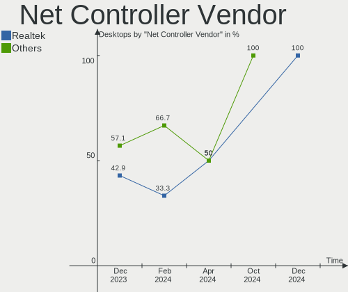

| Vendor                | Desktops | Percent |
|-----------------------|----------|---------|
| Realtek Semiconductor | 17       | 58.62%  |
| Intel                 | 7        | 24.14%  |
| Ralink                | 1        | 3.45%   |
| Qualcomm Atheros      | 1        | 3.45%   |
| QinHeng Electronics   | 1        | 3.45%   |
| MediaTek              | 1        | 3.45%   |
| Broadcom              | 1        | 3.45%   |

Net Controller Model
--------------------

Controller models

| Model                                                             | Desktops | Percent |
|-------------------------------------------------------------------|----------|---------|
| Realtek RTL8111/8168/8411 PCI Express Gigabit Ethernet Controller | 11       | 33.33%  |
| Realtek RTL8125 2.5GbE Controller                                 | 3        | 9.09%   |
| Intel Wi-Fi 6 AX210/AX211/AX411 160MHz                            | 3        | 9.09%   |
| Realtek RTL8822BE 802.11a/b/g/n/ac WiFi adapter                   | 1        | 3.03%   |
| Realtek RTL8188EUS 802.11n Wireless Network Adapter               | 1        | 3.03%   |
| Realtek RTL8188EE Wireless Network Adapter                        | 1        | 3.03%   |
| Realtek RTL8153 Gigabit Ethernet Adapter                          | 1        | 3.03%   |
| Realtek RTL810xE PCI Express Fast Ethernet controller             | 1        | 3.03%   |
| Ralink RT5392 PCIe Wireless Network Adapter                       | 1        | 3.03%   |
| Qualcomm Atheros AR8151 v2.0 Gigabit Ethernet                     | 1        | 3.03%   |
| QinHeng UsbMonitor                                                | 1        | 3.03%   |
| MediaTek MT7921 802.11ax PCI Express Wireless Network Adapter     | 1        | 3.03%   |
| Intel Wireless 7260                                               | 1        | 3.03%   |
| Intel I211 Gigabit Network Connection                             | 1        | 3.03%   |
| Intel Ethernet Controller I225-V                                  | 1        | 3.03%   |
| Intel Ethernet Connection (2) I219-V                              | 1        | 3.03%   |
| Intel Ethernet Connection (17) I219-V                             | 1        | 3.03%   |
| Intel 82579LM Gigabit Network Connection (Lewisville)             | 1        | 3.03%   |
| Broadcom NetLink BCM57780 Gigabit Ethernet PCIe                   | 1        | 3.03%   |

Wireless Vendor
---------------

Wireless vendors

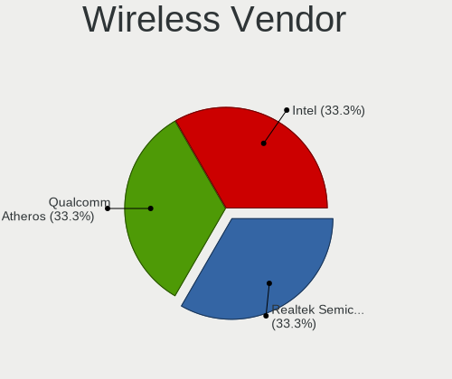

| Vendor                | Desktops | Percent |
|-----------------------|----------|---------|
| Intel                 | 4        | 44.44%  |
| Realtek Semiconductor | 3        | 33.33%  |
| Ralink                | 1        | 11.11%  |
| MediaTek              | 1        | 11.11%  |

Wireless Model
--------------

Wireless models

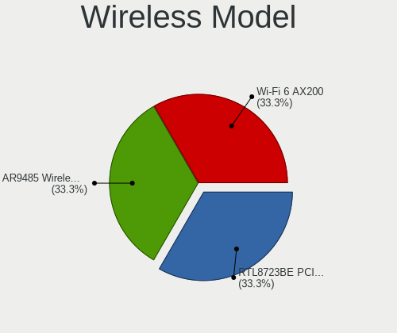

| Model                                                         | Desktops | Percent |
|---------------------------------------------------------------|----------|---------|
| Intel Wi-Fi 6 AX210/AX211/AX411 160MHz                        | 3        | 33.33%  |
| Realtek RTL8822BE 802.11a/b/g/n/ac WiFi adapter               | 1        | 11.11%  |
| Realtek RTL8188EUS 802.11n Wireless Network Adapter           | 1        | 11.11%  |
| Realtek RTL8188EE Wireless Network Adapter                    | 1        | 11.11%  |
| Ralink RT5392 PCIe Wireless Network Adapter                   | 1        | 11.11%  |
| MediaTek MT7921 802.11ax PCI Express Wireless Network Adapter | 1        | 11.11%  |
| Intel Wireless 7260                                           | 1        | 11.11%  |

Ethernet Vendor
---------------

Ethernet vendors

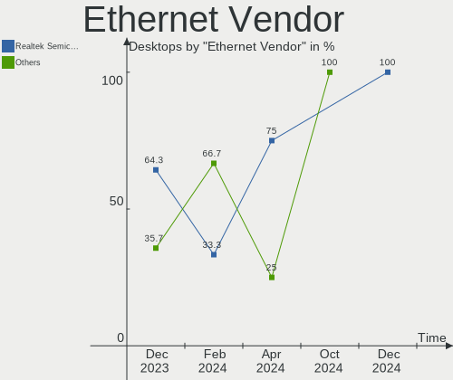

| Vendor                | Desktops | Percent |
|-----------------------|----------|---------|
| Realtek Semiconductor | 16       | 69.57%  |
| Intel                 | 5        | 21.74%  |
| Qualcomm Atheros      | 1        | 4.35%   |
| Broadcom              | 1        | 4.35%   |

Ethernet Model
--------------

Ethernet models

| Model                                                             | Desktops | Percent |
|-------------------------------------------------------------------|----------|---------|
| Realtek RTL8111/8168/8411 PCI Express Gigabit Ethernet Controller | 11       | 47.83%  |
| Realtek RTL8125 2.5GbE Controller                                 | 3        | 13.04%  |
| Realtek RTL8153 Gigabit Ethernet Adapter                          | 1        | 4.35%   |
| Realtek RTL810xE PCI Express Fast Ethernet controller             | 1        | 4.35%   |
| Qualcomm Atheros AR8151 v2.0 Gigabit Ethernet                     | 1        | 4.35%   |
| Intel I211 Gigabit Network Connection                             | 1        | 4.35%   |
| Intel Ethernet Controller I225-V                                  | 1        | 4.35%   |
| Intel Ethernet Connection (2) I219-V                              | 1        | 4.35%   |
| Intel Ethernet Connection (17) I219-V                             | 1        | 4.35%   |
| Intel 82579LM Gigabit Network Connection (Lewisville)             | 1        | 4.35%   |
| Broadcom NetLink BCM57780 Gigabit Ethernet PCIe                   | 1        | 4.35%   |

Net Controller Kind
-------------------

Ethernet, WiFi or modem

| Kind     | Desktops | Percent |
|----------|----------|---------|
| Ethernet | 22       | 70.97%  |
| WiFi     | 8        | 25.81%  |
| Modem    | 1        | 3.23%   |

Used Controller
---------------

Currently used network controller

| Kind     | Desktops | Percent |
|----------|----------|---------|
| Ethernet | 20       | 90.91%  |
| WiFi     | 2        | 9.09%   |

NICs
----

Total network controllers on board

| Total | Desktops | Percent |
|-------|----------|---------|
| 1     | 15       | 68.18%  |
| 2     | 6        | 27.27%  |
| 3     | 1        | 4.55%   |

IPv6
----

IPv6 vs IPv4

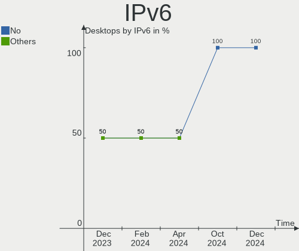

| Used | Desktops | Percent |
|------|----------|---------|
| No   | 13       | 59.09%  |
| Yes  | 9        | 40.91%  |

Bluetooth
---------

Bluetooth Vendor
----------------

Controller vendors

| Vendor                  | Desktops | Percent |
|-------------------------|----------|---------|
| Intel                   | 4        | 40%     |
| Cambridge Silicon Radio | 3        | 30%     |
| TP-Link                 | 1        | 10%     |
| IMC Networks            | 1        | 10%     |
| ASUSTek Computer        | 1        | 10%     |

Bluetooth Model
---------------

Controller models

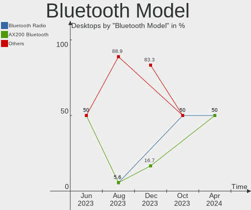

| Model                                               | Desktops | Percent |
|-----------------------------------------------------|----------|---------|
| Intel AX210 Bluetooth                               | 3        | 30%     |
| Cambridge Silicon Radio Bluetooth Dongle (HCI mode) | 3        | 30%     |
| TP-Link UB5A Adapter                                | 1        | 10%     |
| Intel Bluetooth wireless interface                  | 1        | 10%     |
| IMC Networks Wireless_Device                        | 1        | 10%     |
| ASUS Bluetooth Radio                                | 1        | 10%     |

Sound
-----

Sound Vendor
------------

Sound card vendors

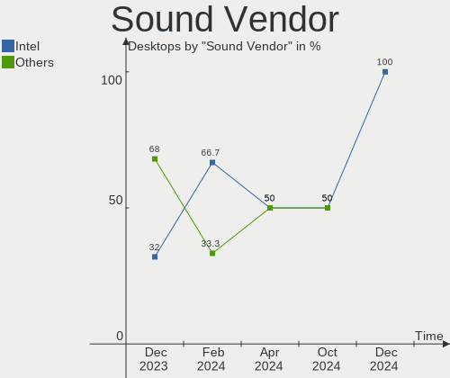

| Vendor                | Desktops | Percent |
|-----------------------|----------|---------|
| Intel                 | 12       | 29.27%  |
| Nvidia                | 11       | 26.83%  |
| AMD                   | 11       | 26.83%  |
| TC Electronic         | 1        | 2.44%   |
| Logitech              | 1        | 2.44%   |
| Kingston Technology   | 1        | 2.44%   |
| Corsair               | 1        | 2.44%   |
| C-Media Electronics   | 1        | 2.44%   |
| Barco Display Systems | 1        | 2.44%   |
| ASUSTek Computer      | 1        | 2.44%   |

Sound Model
-----------

Sound card models

| Model                                                                      | Desktops | Percent |
|----------------------------------------------------------------------------|----------|---------|
| AMD Family 17h/19h HD Audio Controller                                     | 4        | 8.33%   |
| Intel 8 Series/C220 Series Chipset High Definition Audio Controller        | 3        | 6.25%   |
| AMD Starship/Matisse HD Audio Controller                                   | 3        | 6.25%   |
| Nvidia TU104 HD Audio Controller                                           | 2        | 4.17%   |
| Nvidia GP107GL High Definition Audio Controller                            | 2        | 4.17%   |
| Intel Alder Lake-S HD Audio Controller                                     | 2        | 4.17%   |
| Intel 6 Series/C200 Series Chipset Family High Definition Audio Controller | 2        | 4.17%   |
| AMD SBx00 Azalia (Intel HDA)                                               | 2        | 4.17%   |
| AMD Raven/Raven2/Fenghuang HDMI/DP Audio Controller                        | 2        | 4.17%   |
| TC Electronic GoXLR                                                        | 1        | 2.08%   |
| Nvidia TU107 GeForce GTX 1650 High Definition Audio Controller             | 1        | 2.08%   |
| Nvidia TU106 High Definition Audio Controller                              | 1        | 2.08%   |
| Nvidia GP106 High Definition Audio Controller                              | 1        | 2.08%   |
| Nvidia GP104 High Definition Audio Controller                              | 1        | 2.08%   |
| Nvidia GM206 High Definition Audio Controller                              | 1        | 2.08%   |
| Nvidia GF116 High Definition Audio Controller                              | 1        | 2.08%   |
| Nvidia AD102 High Definition Audio Controller                              | 1        | 2.08%   |
| Logitech PRO X Wireless Gaming Headset                                     | 1        | 2.08%   |
| Kingston Technology HyperX Cloud Stinger Core (Wireless) – PS         | 1        | 2.08%   |
| Intel Xeon E3-1200 v3/4th Gen Core Processor HD Audio Controller           | 1        | 2.08%   |
| Intel C610/X99 series chipset HD Audio Controller                          | 1        | 2.08%   |
| Intel 700 Series Chipset Family Precise Touch and Stylus Port #1           | 1        | 2.08%   |
| Intel 7 Series/C216 Chipset Family High Definition Audio Controller        | 1        | 2.08%   |
| Intel 5 Series/3400 Series Chipset High Definition Audio                   | 1        | 2.08%   |
| Intel 200 Series PCH HD Audio                                              | 1        | 2.08%   |
| Corsair Slipstream Multi-Device Receiver                                   | 1        | 2.08%   |
| C-Media Electronics Blue Snowball                                          | 1        | 2.08%   |
| Barco Display Systems USBFC1-A                                             | 1        | 2.08%   |
| ASUSTek Computer USB Audio                                                 | 1        | 2.08%   |
| AMD Renoir Radeon High Definition Audio Controller                         | 1        | 2.08%   |
| AMD Oland/Hainan/Cape Verde/Pitcairn HDMI Audio [Radeon HD 7000 Series]    | 1        | 2.08%   |
| AMD Navi 21/23 HDMI/DP Audio Controller                                    | 1        | 2.08%   |
| AMD Navi 10 HDMI Audio                                                     | 1        | 2.08%   |
| AMD Kabini HDMI/DP Audio                                                   | 1        | 2.08%   |
| AMD FCH Azalia Controller                                                  | 1        | 2.08%   |

Memory
------

Memory Vendor
-------------

Memory module vendors

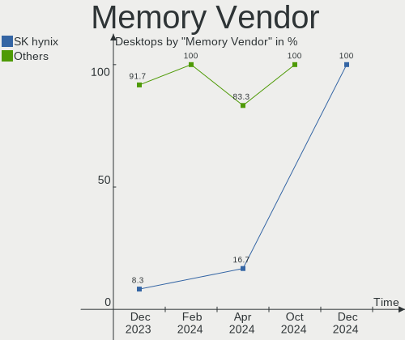

| Vendor                       | Desktops | Percent |
|------------------------------|----------|---------|
| G.Skill                      | 6        | 24%     |
| Samsung Electronics          | 4        | 16%     |
| SK hynix                     | 3        | 12%     |
| Micron Technology            | 3        | 12%     |
| Crucial                      | 2        | 8%      |
| Corsair                      | 2        | 8%      |
| Unknown                      | 1        | 4%      |
| Patriot Memory (PDP Systems) | 1        | 4%      |
| KingFast                     | 1        | 4%      |
| Goldkey                      | 1        | 4%      |
| A-DATA Technology            | 1        | 4%      |

Memory Model
------------

Memory module models

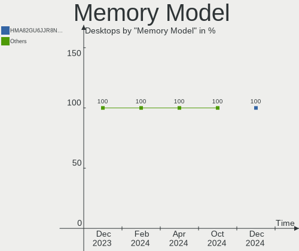

| Model                                                                    | Desktops | Percent |
|--------------------------------------------------------------------------|----------|---------|
| Samsung RAM M378B5173QH0-CK0 4GB DIMM DDR3 1600MT/s                      | 2        | 7.69%   |
| Micron RAM 8JTF51264AZ-1G6E1 4GB DIMM DDR3 1600MT/s                      | 2        | 7.69%   |
| Unknown RAM Module 4GB DIMM DDR3 1333MT/s                                | 1        | 3.85%   |
| Unknown RAM Module 4GB DIMM DDR3 1066MT/s                                | 1        | 3.85%   |
| SK hynix RAM HMT451U6BFR8A-PB 4GB DIMM DDR3 1600MT/s                     | 1        | 3.85%   |
| SK hynix RAM HMT41GS6BFR8A-PB 8GB SODIMM DDR3 1600MT/s                   | 1        | 3.85%   |
| SK hynix RAM HMT125U6BFR8C-G7 2GB DIMM 1066MT/s                          | 1        | 3.85%   |
| Samsung RAM M378B5273DH0-CH9 4GB DIMM DDR3 2133MT/s                      | 1        | 3.85%   |
| Samsung RAM M378B5173DB0-CK0 4GB DIMM DDR3 1600MT/s                      | 1        | 3.85%   |
| Patriot Memory (PDP Systems) RAM 7600 C36 Series 16GB DIMM DDR5 5600MT/s | 1        | 3.85%   |
| Micron RAM DDR4 16GB 3200MHz 16GB DIMM DDR4 2400MT/s                     | 1        | 3.85%   |
| KingFast RAM KF3000C15D4/8GX 8GB DIMM DDR4 2400MT/s                      | 1        | 3.85%   |
| Goldkey RAM BKH200UD25608-1333 2GB DIMM DDR3 1400MT/s                    | 1        | 3.85%   |
| G.Skill RAM Module 8GB DIMM DDR4 3600MT/s                                | 1        | 3.85%   |
| G.Skill RAM F5-6000J3636F16G 16GB DIMM DDR5 6400MT/s                     | 1        | 3.85%   |
| G.Skill RAM F4-3600C18-8GTZRX 8GB DIMM DDR4 3600MT/s                     | 1        | 3.85%   |
| G.Skill RAM F4-3200C16-8GIS 8GB DIMM DDR4 3200MT/s                       | 1        | 3.85%   |
| G.Skill RAM F4-3200C16-16GTZR 16GB DIMM DDR4 3600MT/s                    | 1        | 3.85%   |
| G.Skill RAM F4-3000C15-8GVRB 8GB DIMM DDR4 2933MT/s                      | 1        | 3.85%   |
| Crucial RAM CT8G4SFS8266.M8FE 8GB SODIMM DDR4 2667MT/s                   | 1        | 3.85%   |
| Crucial RAM BL8G24C16U4B.8FB 8GB DIMM DDR4 2400MT/s                      | 1        | 3.85%   |
| Corsair RAM CMX8GX3M2A1333C9 4GB DIMM DDR3 1333MT/s                      | 1        | 3.85%   |
| Corsair RAM CMK16GX4M2Z3600C18 8GB DIMM DDR4 3600MT/s                    | 1        | 3.85%   |
| A-DATA RAM Module 8GB DIMM DDR4 2400MT/s                                 | 1        | 3.85%   |

Memory Kind
-----------

Memory module kinds

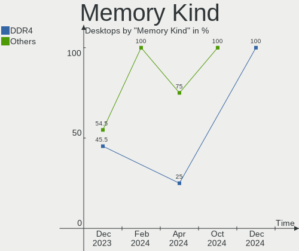

| Kind | Desktops | Percent |
|------|----------|---------|
| DDR4 | 10       | 45.45%  |
| DDR3 | 10       | 45.45%  |
| DDR5 | 2        | 9.09%   |

Memory Form Factor
------------------

Physical design of the memory module

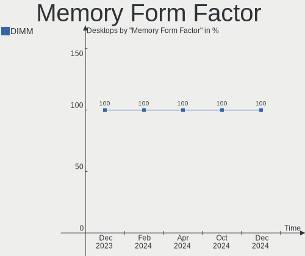

| Name   | Desktops | Percent |
|--------|----------|---------|
| DIMM   | 20       | 90.91%  |
| SODIMM | 2        | 9.09%   |

Memory Size
-----------

Memory module size

| Size  | Desktops | Percent |
|-------|----------|---------|
| 8192  | 10       | 43.48%  |
| 4096  | 7        | 30.43%  |
| 16384 | 4        | 17.39%  |
| 2048  | 2        | 8.7%    |

Memory Speed
------------

Memory module speed

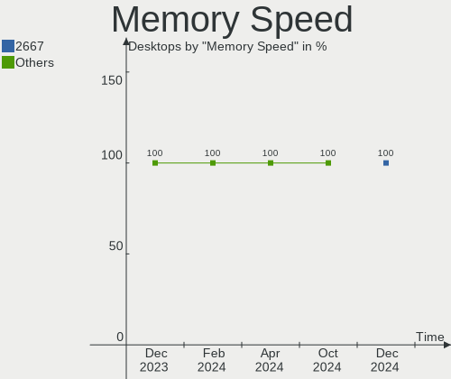

| Speed | Desktops | Percent |
|-------|----------|---------|
| 3600  | 4        | 16.67%  |
| 2400  | 3        | 12.5%   |
| 1600  | 3        | 12.5%   |
| 1866  | 2        | 8.33%   |
| 1333  | 2        | 8.33%   |
| 1066  | 2        | 8.33%   |
| 6400  | 1        | 4.17%   |
| 5600  | 1        | 4.17%   |
| 3200  | 1        | 4.17%   |
| 2933  | 1        | 4.17%   |
| 2667  | 1        | 4.17%   |
| 2133  | 1        | 4.17%   |
| 1648  | 1        | 4.17%   |
| 1400  | 1        | 4.17%   |

Printers & scanners
-------------------

Printer Vendor
--------------

Printer device vendors

| Vendor              | Desktops | Percent |
|---------------------|----------|---------|
| Samsung Electronics | 1        | 33.33%  |
| Hewlett-Packard     | 1        | 33.33%  |
| Brother Industries  | 1        | 33.33%  |

Printer Model
-------------

Printer device models

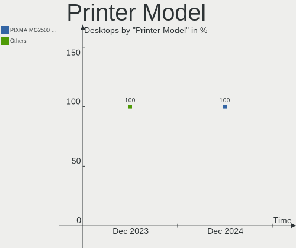

| Model                                | Desktops | Percent |
|--------------------------------------|----------|---------|
| Samsung ML-1640 Series Laser Printer | 1        | 33.33%  |
| HP Deskjet 2050 J510                 | 1        | 33.33%  |
| Brother HL-5250DN Printer            | 1        | 33.33%  |

Scanner Vendor
--------------

Scanner device vendors

Zero info for selected period =(

Scanner Model
-------------

Scanner device models

Zero info for selected period =(

Camera
------

Camera Vendor
-------------

Camera device vendors

| Vendor              | Desktops | Percent |
|---------------------|----------|---------|
| Microdia            | 3        | 50%     |
| Logitech            | 1        | 16.67%  |
| Creative Technology | 1        | 16.67%  |
| Chicony Electronics | 1        | 16.67%  |

Camera Model
------------

Camera device models

| Model                            | Desktops | Percent |
|----------------------------------|----------|---------|
| Microdia Webcam Vitade AF        | 1        | 16.67%  |
| Microdia Rapoo camera            | 1        | 16.67%  |
| Microdia ACR010 USB Webcam       | 1        | 16.67%  |
| Logitech Webcam Pro 9000         | 1        | 16.67%  |
| Creative Live! Cam Sync 1080p V2 | 1        | 16.67%  |
| Chicony HP Integrated Webcam     | 1        | 16.67%  |

Security
--------

Fingerprint Vendor
------------------

Fingerprint sensor vendors

Zero info for selected period =(

Fingerprint Model
-----------------

Fingerprint sensor models

Zero info for selected period =(

Chipcard Vendor
---------------

Chipcard module vendors

Zero info for selected period =(

Chipcard Model
--------------

Chipcard module models

Zero info for selected period =(

Unsupported
-----------

Unsupported Devices
-------------------

Total unsupported devices on board

| Total | Desktops | Percent |
|-------|----------|---------|
| 0     | 21       | 95.45%  |
| 1     | 1        | 4.55%   |

Unsupported Device Types
------------------------

Types of unsupported devices

| Type             | Desktops | Percent |
|------------------|----------|---------|
| Unassigned class | 1        | 100%    |

