Xero - Hardware Trends (Desktops)
---------------------------------

A project to identify most popular hardware characteristics and track their change
over time based on data collected by Linux users at https://Linux-Hardware.org.

Anyone can contribute to this report by the [hw-probe](https://github.com/linuxhw/hw-probe) tool:

    sudo -E hw-probe -all -upload

This report is for one last month. Overall report since the beginning of time: [TestDays](https://github.com/linuxhw/TestDays)

Period: Dec, 2023.

Contents
--------

* [ System ](#system)
  - [ OS                       ](#os)
  - [ OS Family                ](#os-family)
  - [ Kernel                   ](#kernel)
  - [ Kernel Family            ](#kernel-family)
  - [ Kernel Major Ver.        ](#kernel-major-ver)
  - [ Arch                     ](#arch)
  - [ DE                       ](#de)
  - [ Display Server           ](#display-server)
  - [ Display Manager          ](#display-manager)
  - [ OS Lang                  ](#os-lang)
  - [ Boot Mode                ](#boot-mode)
  - [ Filesystem               ](#filesystem)
  - [ Part. scheme             ](#part-scheme)
  - [ Dual Boot with Linux/BSD ](#dual-boot-with-linuxbsd)
  - [ Dual Boot (Win)          ](#dual-boot-win)

* [ Board ](#board)
  - [ Vendor                   ](#vendor)
  - [ Model                    ](#model)
  - [ Model Family             ](#model-family)
  - [ MFG Year                 ](#mfg-year)
  - [ Form Factor              ](#form-factor)
  - [ Secure Boot              ](#secure-boot)
  - [ Coreboot                 ](#coreboot)
  - [ RAM Size                 ](#ram-size)
  - [ RAM Used                 ](#ram-used)
  - [ Total Drives             ](#total-drives)
  - [ Has CD-ROM               ](#has-cd-rom)
  - [ Has Ethernet             ](#has-ethernet)
  - [ Has WiFi                 ](#has-wifi)
  - [ Has Bluetooth            ](#has-bluetooth)

* [ Location ](#location)
  - [ Country                  ](#country)
  - [ City                     ](#city)

* [ Drives ](#drives)
  - [ Drive Vendor             ](#drive-vendor)
  - [ Drive Model              ](#drive-model)
  - [ HDD Vendor               ](#hdd-vendor)
  - [ SSD Vendor               ](#ssd-vendor)
  - [ Drive Kind               ](#drive-kind)
  - [ Drive Connector          ](#drive-connector)
  - [ Drive Size               ](#drive-size)
  - [ Space Total              ](#space-total)
  - [ Space Used               ](#space-used)
  - [ Malfunc. Drives          ](#malfunc-drives)
  - [ Malfunc. Drive Vendor    ](#malfunc-drive-vendor)
  - [ Malfunc. HDD Vendor      ](#malfunc-hdd-vendor)
  - [ Malfunc. Drive Kind      ](#malfunc-drive-kind)
  - [ Failed Drives            ](#failed-drives)
  - [ Failed Drive Vendor      ](#failed-drive-vendor)
  - [ Drive Status             ](#drive-status)

* [ Storage controller ](#storage-controller)
  - [ Storage Vendor           ](#storage-vendor)
  - [ Storage Model            ](#storage-model)
  - [ Storage Kind             ](#storage-kind)

* [ Processor ](#processor)
  - [ CPU Vendor               ](#cpu-vendor)
  - [ CPU Model                ](#cpu-model)
  - [ CPU Model Family         ](#cpu-model-family)
  - [ CPU Cores                ](#cpu-cores)
  - [ CPU Sockets              ](#cpu-sockets)
  - [ CPU Threads              ](#cpu-threads)
  - [ CPU Op-Modes             ](#cpu-op-modes)
  - [ CPU Microcode            ](#cpu-microcode)
  - [ CPU Microarch            ](#cpu-microarch)

* [ Graphics ](#graphics)
  - [ GPU Vendor               ](#gpu-vendor)
  - [ GPU Model                ](#gpu-model)
  - [ GPU Combo                ](#gpu-combo)
  - [ GPU Driver               ](#gpu-driver)
  - [ GPU Memory               ](#gpu-memory)

* [ Monitor ](#monitor)
  - [ Monitor Vendor           ](#monitor-vendor)
  - [ Monitor Model            ](#monitor-model)
  - [ Monitor Resolution       ](#monitor-resolution)
  - [ Monitor Diagonal         ](#monitor-diagonal)
  - [ Monitor Width            ](#monitor-width)
  - [ Aspect Ratio             ](#aspect-ratio)
  - [ Monitor Area             ](#monitor-area)
  - [ Pixel Density            ](#pixel-density)
  - [ Multiple Monitors        ](#multiple-monitors)

* [ Network ](#network)
  - [ Net Controller Vendor    ](#net-controller-vendor)
  - [ Net Controller Model     ](#net-controller-model)
  - [ Wireless Vendor          ](#wireless-vendor)
  - [ Wireless Model           ](#wireless-model)
  - [ Ethernet Vendor          ](#ethernet-vendor)
  - [ Ethernet Model           ](#ethernet-model)
  - [ Net Controller Kind      ](#net-controller-kind)
  - [ Used Controller          ](#used-controller)
  - [ NICs                     ](#nics)
  - [ IPv6                     ](#ipv6)

* [ Bluetooth ](#bluetooth)
  - [ Bluetooth Vendor         ](#bluetooth-vendor)
  - [ Bluetooth Model          ](#bluetooth-model)

* [ Sound ](#sound)
  - [ Sound Vendor             ](#sound-vendor)
  - [ Sound Model              ](#sound-model)

* [ Memory ](#memory)
  - [ Memory Vendor            ](#memory-vendor)
  - [ Memory Model             ](#memory-model)
  - [ Memory Kind              ](#memory-kind)
  - [ Memory Form Factor       ](#memory-form-factor)
  - [ Memory Size              ](#memory-size)
  - [ Memory Speed             ](#memory-speed)

* [ Printers & scanners ](#printers--scanners)
  - [ Printer Vendor           ](#printer-vendor)
  - [ Printer Model            ](#printer-model)
  - [ Scanner Vendor           ](#scanner-vendor)
  - [ Scanner Model            ](#scanner-model)

* [ Camera ](#camera)
  - [ Camera Vendor            ](#camera-vendor)
  - [ Camera Model             ](#camera-model)

* [ Security ](#security)
  - [ Fingerprint Vendor       ](#fingerprint-vendor)
  - [ Fingerprint Model        ](#fingerprint-model)
  - [ Chipcard Vendor          ](#chipcard-vendor)
  - [ Chipcard Model           ](#chipcard-model)

* [ Unsupported ](#unsupported)
  - [ Unsupported Devices      ](#unsupported-devices)
  - [ Unsupported Device Types ](#unsupported-device-types)

System
------

OS
--

Installed operating systems

| Name         | Desktops | Percent |
|--------------|----------|---------|
| Xero Rolling | 12       | 100%    |

OS Family
---------

OS without a version

| Name | Desktops | Percent |
|------|----------|---------|
| Xero | 12       | 100%    |

Kernel
------

Version of the Linux kernel

| Version            | Desktops | Percent |
|--------------------|----------|---------|
| 6.6.4-arch1-1      | 5        | 41.67%  |
| 6.6.8-arch1-1      | 2        | 16.67%  |
| 6.6.3-arch1-1      | 2        | 16.67%  |
| 6.6.7-arch1-1      | 1        | 8.33%   |
| 6.6.4-273-tkg-bore | 1        | 8.33%   |
| 6.6.2-arch1-1      | 1        | 8.33%   |

Kernel Family
-------------

Linux kernel without a distro release

| Version | Desktops | Percent |
|---------|----------|---------|
| 6.6.4   | 6        | 50%     |
| 6.6.8   | 2        | 16.67%  |
| 6.6.3   | 2        | 16.67%  |
| 6.6.7   | 1        | 8.33%   |
| 6.6.2   | 1        | 8.33%   |

Kernel Major Ver.
-----------------

Linux kernel major version

| Version | Desktops | Percent |
|---------|----------|---------|
| 6.6     | 12       | 100%    |

Arch
----

OS architecture (x86_64, i586, etc.)

| Name   | Desktops | Percent |
|--------|----------|---------|
| x86_64 | 12       | 100%    |

DE
--

Desktop Environment

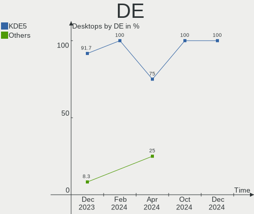

| Name  | Desktops | Percent |
|-------|----------|---------|
| KDE5  | 11       | 91.67%  |
| GNOME | 1        | 8.33%   |

Display Server
--------------

X11 or Wayland

| Name    | Desktops | Percent |
|---------|----------|---------|
| X11     | 6        | 50%     |
| Wayland | 6        | 50%     |

Display Manager
---------------

SDDM, LightDM, etc.

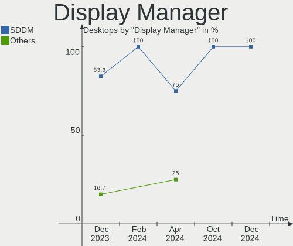

| Name    | Desktops | Percent |
|---------|----------|---------|
| SDDM    | 10       | 83.33%  |
| GDM     | 1        | 8.33%   |
| Unknown | 1        | 8.33%   |

OS Lang
-------

Language

| Lang       | Desktops | Percent |
|------------|----------|---------|
| en_US      | 4        | 33.33%  |
| de_DE      | 2        | 16.67%  |
| ru_RU      | 1        | 8.33%   |
| pt_BR      | 1        | 8.33%   |
| fr_FR      | 1        | 8.33%   |
| es_PE      | 1        | 8.33%   |
| el_GR@euro | 1        | 8.33%   |
| de_AT      | 1        | 8.33%   |

Boot Mode
---------

EFI or BIOS

| Mode | Desktops | Percent |
|------|----------|---------|
| EFI  | 9        | 75%     |
| BIOS | 3        | 25%     |

Filesystem
----------

Type of filesystem

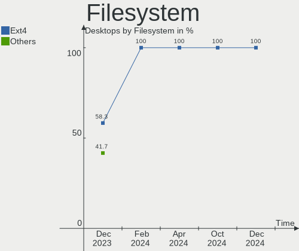

| Type  | Desktops | Percent |
|-------|----------|---------|
| Ext4  | 7        | 58.33%  |
| Btrfs | 4        | 33.33%  |
| Xfs   | 1        | 8.33%   |

Part. scheme
------------

Scheme of partitioning

| Type    | Desktops | Percent |
|---------|----------|---------|
| GPT     | 10       | 83.33%  |
| MBR     | 1        | 8.33%   |
| Unknown | 1        | 8.33%   |

Dual Boot with Linux/BSD
------------------------

Hosting more than one Linux/BSD

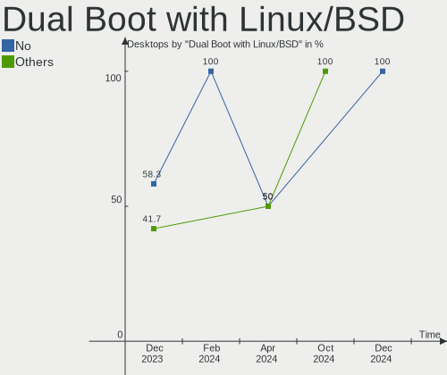

| Dual boot | Desktops | Percent |
|-----------|----------|---------|
| No        | 7        | 58.33%  |
| Yes       | 5        | 41.67%  |

Dual Boot (Win)
---------------

Hosting Linux and Windows

| Dual boot | Desktops | Percent |
|-----------|----------|---------|
| Yes       | 6        | 50%     |
| No        | 6        | 50%     |

Board
-----

Vendor
------

Motherboard manufacturer

| Name                | Desktops | Percent |
|---------------------|----------|---------|
| MSI                 | 2        | 16.67%  |
| Gigabyte Technology | 2        | 16.67%  |
| Dell                | 2        | 16.67%  |
| ASUSTek Computer    | 2        | 16.67%  |
| ASRock              | 2        | 16.67%  |
| Huanan              | 1        | 8.33%   |
| Acer                | 1        | 8.33%   |

Model
-----

Motherboard model

| Name                            | Desktops | Percent |
|---------------------------------|----------|---------|
| Dell OptiPlex 9020              | 2        | 16.67%  |
| MSI MS-7C37                     | 1        | 8.33%   |
| MSI MS-7823                     | 1        | 8.33%   |
| Huanan X99-F8                   | 1        | 8.33%   |
| Gigabyte B550 AORUS ELITE AX V2 | 1        | 8.33%   |
| Gigabyte B450M S2H              | 1        | 8.33%   |
| ASUS ROG STRIX X470-F GAMING    | 1        | 8.33%   |
| ASUS P8Z77-V PRO                | 1        | 8.33%   |
| ASRock Q1900M                   | 1        | 8.33%   |
| ASRock A620M Pro RS WiFi        | 1        | 8.33%   |
| Acer Aspire TC-885              | 1        | 8.33%   |

Model Family
------------

Motherboard model prefix

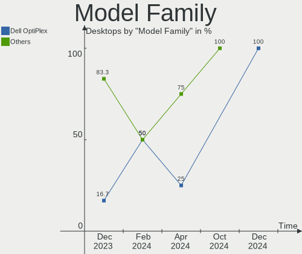

| Name           | Desktops | Percent |
|----------------|----------|---------|
| Dell OptiPlex  | 2        | 16.67%  |
| MSI MS-7C37    | 1        | 8.33%   |
| MSI MS-7823    | 1        | 8.33%   |
| Huanan X99-F8  | 1        | 8.33%   |
| Gigabyte B550  | 1        | 8.33%   |
| Gigabyte B450M | 1        | 8.33%   |
| ASUS ROG       | 1        | 8.33%   |
| ASUS P8Z77-V   | 1        | 8.33%   |
| ASRock Q1900M  | 1        | 8.33%   |
| ASRock A620M   | 1        | 8.33%   |
| Acer Aspire    | 1        | 8.33%   |

MFG Year
--------

Motherboard manufacture year

| Year | Desktops | Percent |
|------|----------|---------|
| 2014 | 4        | 33.33%  |
| 2018 | 3        | 25%     |
| 2019 | 2        | 16.67%  |
| 2023 | 1        | 8.33%   |
| 2020 | 1        | 8.33%   |
| 2012 | 1        | 8.33%   |

Form Factor
-----------

Physical design of the computer

| Name    | Desktops | Percent |
|---------|----------|---------|
| Desktop | 12       | 100%    |

Secure Boot
-----------

Enabled or disabled

| State    | Desktops | Percent |
|----------|----------|---------|
| Disabled | 12       | 100%    |

Coreboot
--------

Have coreboot on board

| Used | Desktops | Percent |
|------|----------|---------|
| No   | 12       | 100%    |

RAM Size
--------

Total RAM memory

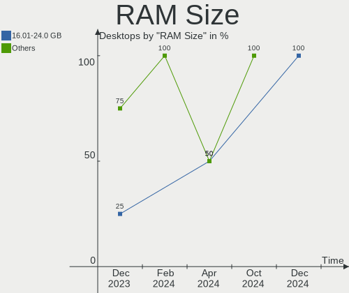

| Size in GB | Desktops | Percent |
|------------|----------|---------|
| 32.01-64.0 | 4        | 33.33%  |
| 16.01-24.0 | 3        | 25%     |
| 8.01-16.0  | 3        | 25%     |
| 4.01-8.0   | 2        | 16.67%  |

RAM Used
--------

Used RAM memory

| Used GB  | Desktops | Percent |
|----------|----------|---------|
| 1.01-2.0 | 6        | 50%     |
| 2.01-3.0 | 4        | 33.33%  |
| 4.01-8.0 | 1        | 8.33%   |
| 3.01-4.0 | 1        | 8.33%   |

Total Drives
------------

Number of drives on board

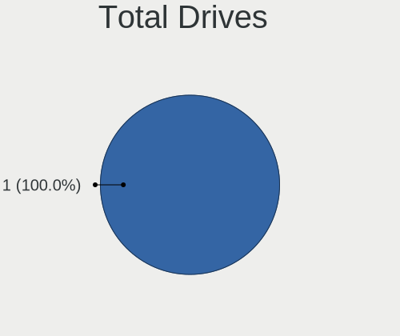

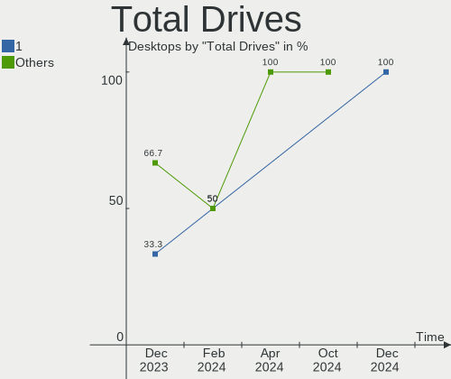

| Drives | Desktops | Percent |
|--------|----------|---------|
| 2      | 4        | 33.33%  |
| 1      | 4        | 33.33%  |
| 3      | 3        | 25%     |
| 4      | 1        | 8.33%   |

Has CD-ROM
----------

Has CD-ROM on board

| Presented | Desktops | Percent |
|-----------|----------|---------|
| No        | 7        | 58.33%  |
| Yes       | 5        | 41.67%  |

Has Ethernet
------------

Has Ethernet on board

| Presented | Desktops | Percent |
|-----------|----------|---------|
| Yes       | 12       | 100%    |

Has WiFi
--------

Has WiFi module

| Presented | Desktops | Percent |
|-----------|----------|---------|
| Yes       | 7        | 58.33%  |
| No        | 5        | 41.67%  |

Has Bluetooth
-------------

Has Bluetooth module

| Presented | Desktops | Percent |
|-----------|----------|---------|
| Yes       | 7        | 58.33%  |
| No        | 5        | 41.67%  |

Location
--------

Country
-------

Geographic location (country)

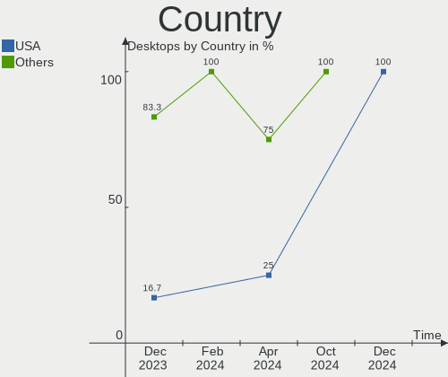

| Country  | Desktops | Percent |
|----------|----------|---------|
| USA      | 2        | 16.67%  |
| Thailand | 1        | 8.33%   |
| Russia   | 1        | 8.33%   |
| Peru     | 1        | 8.33%   |
| Pakistan | 1        | 8.33%   |
| Greece   | 1        | 8.33%   |
| Germany  | 1        | 8.33%   |
| France   | 1        | 8.33%   |
| Brazil   | 1        | 8.33%   |
| Belgium  | 1        | 8.33%   |
| Austria  | 1        | 8.33%   |

City
----

Geographic location (city)

| City                 | Desktops | Percent |
|----------------------|----------|---------|
| Wesel                | 1        | 8.33%   |
| Voronezh             | 1        | 8.33%   |
| Sankt Florian am Inn | 1        | 8.33%   |
| Rennes               | 1        | 8.33%   |
| Newton               | 1        | 8.33%   |
| Karachi              | 1        | 8.33%   |
| Gerakas              | 1        | 8.33%   |
| Foz do Iguaçu       | 1        | 8.33%   |
| Ekeren               | 1        | 8.33%   |
| Dallas               | 1        | 8.33%   |
| Cusco                | 1        | 8.33%   |
| Chon Buri            | 1        | 8.33%   |

Drives
------

Drive Vendor
------------

Hard drive vendors

| Vendor                       | Desktops | Drives | Percent |
|------------------------------|----------|--------|---------|
| Samsung Electronics          | 6        | 8      | 26.09%  |
| WDC                          | 4        | 5      | 17.39%  |
| Toshiba                      | 2        | 2      | 8.7%    |
| SanDisk                      | 2        | 2      | 8.7%    |
| Crucial                      | 2        | 2      | 8.7%    |
| XrayDisk                     | 1        | 1      | 4.35%   |
| Silicon Motion               | 1        | 1      | 4.35%   |
| Shenzhen Longsys Electronics | 1        | 1      | 4.35%   |
| Seagate                      | 1        | 2      | 4.35%   |
| LITEON                       | 1        | 1      | 4.35%   |
| KingSpec                     | 1        | 1      | 4.35%   |
| Corsair                      | 1        | 1      | 4.35%   |

Drive Model
-----------

Hard drive models

| Model                                                 | Desktops | Percent |
|-------------------------------------------------------|----------|---------|
| Samsung SSD 860 EVO 500GB                             | 2        | 7.69%   |
| Samsung NVMe SSD Controller PM9A1/PM9A3/980PRO 2TB    | 2        | 7.69%   |
| XrayDisk 256GB SSD                                    | 1        | 3.85%   |
| WDC WDS240G2G0B-00EPW0 240GB SSD                      | 1        | 3.85%   |
| WDC WD20EZBX-00AYRA0 2TB                              | 1        | 3.85%   |
| WDC WD10JPVX-22JC3T0 1TB                              | 1        | 3.85%   |
| WDC WD10EZEX-21WN4A0 1TB                              | 1        | 3.85%   |
| WDC WD10EZEX-08WN4A0 1TB                              | 1        | 3.85%   |
| Toshiba MQ01ABD100 1TB                                | 1        | 3.85%   |
| Toshiba DT01ACA300 3TB                                | 1        | 3.85%   |
| Silicon Motion SM2263EN/SM2263XT SSD Controller 500GB | 1        | 3.85%   |
| Shenzhen Longsys Lexar SSD NM790 1TB                  | 1        | 3.85%   |
| Seagate ST6000DM003-2CY186 6TB                        | 1        | 3.85%   |
| Seagate ST2000DX002-2DV164 2TB                        | 1        | 3.85%   |
| SanDisk SDSSDHII120G 120GB                            | 1        | 3.85%   |
| SanDisk SDSSDA120G 120GB                              | 1        | 3.85%   |
| Samsung SSD 860 EVO 250GB                             | 1        | 3.85%   |
| Samsung NVMe SSD Controller SM981/PM981/PM983 512GB   | 1        | 3.85%   |
| Samsung HM251JI 250GB                                 | 1        | 3.85%   |
| LITEON IT LCS-128L9S-11 2.5 7mm 128GB SSD             | 1        | 3.85%   |
| KingSpec P3-2TB SSD                                   | 1        | 3.85%   |
| Crucial CT500MX500SSD1 500GB                          | 1        | 3.85%   |
| Crucial CT480BX500SSD1 480GB                          | 1        | 3.85%   |
| Corsair Force GT 240GB SSD                            | 1        | 3.85%   |

HDD Vendor
----------

Hard disk drive vendors

| Vendor              | Desktops | Drives | Percent |
|---------------------|----------|--------|---------|
| WDC                 | 4        | 4      | 50%     |
| Toshiba             | 2        | 2      | 25%     |
| Seagate             | 1        | 2      | 12.5%   |
| Samsung Electronics | 1        | 1      | 12.5%   |

SSD Vendor
----------

Solid state drive vendors

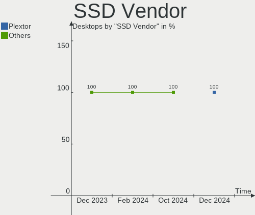

| Vendor              | Desktops | Drives | Percent |
|---------------------|----------|--------|---------|
| Samsung Electronics | 3        | 3      | 25%     |
| SanDisk             | 2        | 2      | 16.67%  |
| Crucial             | 2        | 2      | 16.67%  |
| XrayDisk            | 1        | 1      | 8.33%   |
| WDC                 | 1        | 1      | 8.33%   |
| LITEON              | 1        | 1      | 8.33%   |
| KingSpec            | 1        | 1      | 8.33%   |
| Corsair             | 1        | 1      | 8.33%   |

Drive Kind
----------

HDD or SSD

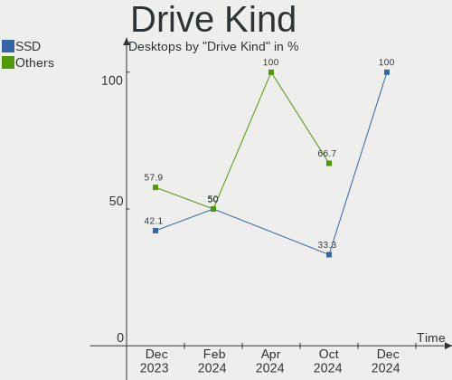

| Kind | Desktops | Drives | Percent |
|------|----------|--------|---------|
| SSD  | 8        | 12     | 42.11%  |
| HDD  | 7        | 9      | 36.84%  |
| NVMe | 4        | 6      | 21.05%  |

Drive Connector
---------------

SATA, SAS, NVMe, etc.

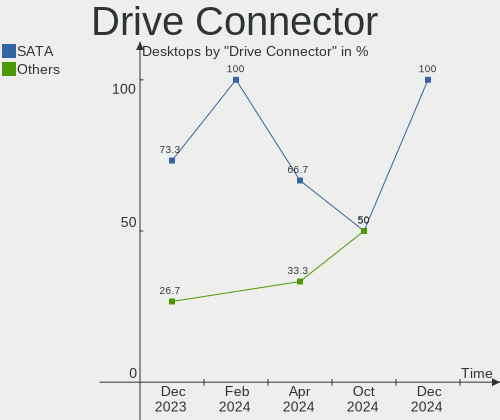

| Type | Desktops | Drives | Percent |
|------|----------|--------|---------|
| SATA | 11       | 21     | 73.33%  |
| NVMe | 4        | 6      | 26.67%  |

Drive Size
----------

Size of hard drive

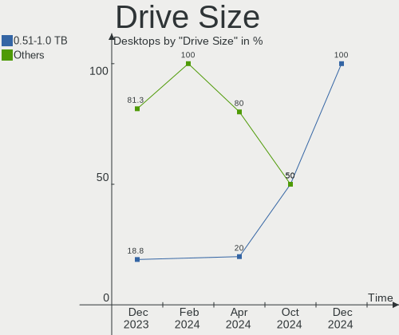

| Size in TB | Desktops | Drives | Percent |
|------------|----------|--------|---------|
| 0.01-0.5   | 8        | 12     | 50%     |
| 1.01-2.0   | 3        | 3      | 18.75%  |
| 0.51-1.0   | 3        | 4      | 18.75%  |
| 2.01-3.0   | 1        | 1      | 6.25%   |
| 4.01-10.0  | 1        | 1      | 6.25%   |

Space Total
-----------

Amount of disk space available on the file system

| Size in GB | Desktops | Percent |
|------------|----------|---------|
| 501-1000   | 6        | 50%     |
| 101-250    | 2        | 16.67%  |
| 1001-2000  | 2        | 16.67%  |
| 51-100     | 1        | 8.33%   |
| Unknown    | 1        | 8.33%   |

Space Used
----------

Amount of used disk space

| Used GB   | Desktops | Percent |
|-----------|----------|---------|
| 21-50     | 3        | 25%     |
| 1-20      | 3        | 25%     |
| 101-250   | 2        | 16.67%  |
| 51-100    | 2        | 16.67%  |
| 1001-2000 | 1        | 8.33%   |
| Unknown   | 1        | 8.33%   |

Malfunc. Drives
---------------

Drive models with a malfunction

| Model                      | Desktops | Drives | Percent |
|----------------------------|----------|--------|---------|
| Corsair Force GT 240GB SSD | 1        | 1      | 100%    |

Malfunc. Drive Vendor
---------------------

Vendors of faulty drives

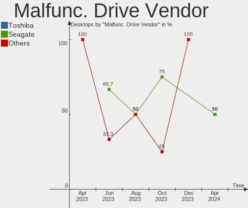

| Vendor  | Desktops | Drives | Percent |
|---------|----------|--------|---------|
| Corsair | 1        | 1      | 100%    |

Malfunc. HDD Vendor
-------------------

Vendors of faulty HDD drives

Zero info for selected period =(

Malfunc. Drive Kind
-------------------

Kinds of faulty drives

| Kind | Desktops | Drives | Percent |
|------|----------|--------|---------|
| SSD  | 1        | 1      | 100%    |

Failed Drives
-------------

Failed drive models

Zero info for selected period =(

Failed Drive Vendor
-------------------

Failed drive vendors

Zero info for selected period =(

Drive Status
------------

Number of failed and malfunc. drives

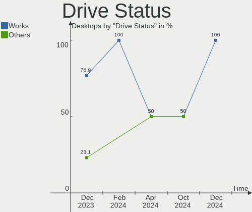

| Status   | Desktops | Drives | Percent |
|----------|----------|--------|---------|
| Works    | 10       | 23     | 76.92%  |
| Detected | 2        | 3      | 15.38%  |
| Malfunc  | 1        | 1      | 7.69%   |

Storage controller
------------------

Storage Vendor
--------------

Storage controller vendors

| Vendor                       | Desktops | Percent |
|------------------------------|----------|---------|
| Intel                        | 7        | 38.89%  |
| AMD                          | 5        | 27.78%  |
| Samsung Electronics          | 2        | 11.11%  |
| ASMedia Technology           | 2        | 11.11%  |
| Silicon Motion               | 1        | 5.56%   |
| Shenzhen Longsys Electronics | 1        | 5.56%   |

Storage Model
-------------

Storage controller models

| Model                                                                          | Desktops | Percent |
|--------------------------------------------------------------------------------|----------|---------|
| AMD FCH SATA Controller [AHCI mode]                                            | 3        | 15%     |
| Samsung NVMe SSD Controller PM9A1/PM9A3/980PRO                                 | 2        | 10%     |
| Intel SATA Controller [RAID mode]                                              | 2        | 10%     |
| ASMedia ASM1062 Serial ATA Controller                                          | 2        | 10%     |
| AMD 400 Series Chipset SATA Controller                                         | 2        | 10%     |
| Silicon Motion SM2263EN/SM2263XT (DRAM-less) NVMe SSD Controllers              | 1        | 5%      |
| Shenzhen Longsys Non-Volatile memory controller                                | 1        | 5%      |
| Samsung NVMe SSD Controller SM981/PM981/PM983                                  | 1        | 5%      |
| Intel C610/X99 series chipset 6-Port SATA Controller [AHCI mode]               | 1        | 5%      |
| Intel Atom Processor E3800 Series SATA AHCI Controller                         | 1        | 5%      |
| Intel 8 Series/C220 Series Chipset Family 6-port SATA Controller 1 [AHCI mode] | 1        | 5%      |
| Intel 8 Series/C220 Series Chipset Family 4-port SATA Controller 1 [IDE mode]  | 1        | 5%      |
| Intel 7 Series/C210 Series Chipset Family 6-port SATA Controller [AHCI mode]   | 1        | 5%      |
| AMD 500 Series Chipset SATA Controller                                         | 1        | 5%      |

Storage Kind
------------

Kind of storage controller (IDE, SATA, NVMe, SAS, ...)

| Kind | Desktops | Percent |
|------|----------|---------|
| SATA | 9        | 56.25%  |
| NVMe | 4        | 25%     |
| RAID | 2        | 12.5%   |
| IDE  | 1        | 6.25%   |

Processor
---------

CPU Vendor
----------

Processor vendors

| Vendor | Desktops | Percent |
|--------|----------|---------|
| Intel  | 7        | 58.33%  |
| AMD    | 5        | 41.67%  |

CPU Model
---------

Processor models

| Model                                  | Desktops | Percent |
|----------------------------------------|----------|---------|
| Intel Xeon CPU E5-2678 v3 @ 2.50GHz    | 1        | 8.33%   |
| Intel Core i7-4790 CPU @ 3.60GHz       | 1        | 8.33%   |
| Intel Core i7-3770K CPU @ 3.50GHz      | 1        | 8.33%   |
| Intel Core i5-9400 CPU @ 2.90GHz       | 1        | 8.33%   |
| Intel Core i5-4590 CPU @ 3.30GHz       | 1        | 8.33%   |
| Intel Core i5-4460 CPU @ 3.20GHz       | 1        | 8.33%   |
| Intel Celeron CPU J1900 @ 1.99GHz      | 1        | 8.33%   |
| AMD Ryzen 7 5800X3D 8-Core Processor   | 1        | 8.33%   |
| AMD Ryzen 7 3700X 8-Core Processor     | 1        | 8.33%   |
| AMD Ryzen 7 2700 Eight-Core Processor  | 1        | 8.33%   |
| AMD Ryzen 5 7600 6-Core Processor      | 1        | 8.33%   |
| AMD Ryzen 5 5600G with Radeon Graphics | 1        | 8.33%   |

CPU Model Family
----------------

Processor model prefix

| Model         | Desktops | Percent |
|---------------|----------|---------|
| Intel Core i5 | 3        | 25%     |
| AMD Ryzen 7   | 3        | 25%     |
| Intel Core i7 | 2        | 16.67%  |
| AMD Ryzen 5   | 2        | 16.67%  |
| Intel Xeon    | 1        | 8.33%   |
| Intel Celeron | 1        | 8.33%   |

CPU Cores
---------

Number of processor cores

| Number | Desktops | Percent |
|--------|----------|---------|
| 4      | 5        | 41.67%  |
| 8      | 3        | 25%     |
| 6      | 3        | 25%     |
| 12     | 1        | 8.33%   |

CPU Sockets
-----------

Number of sockets

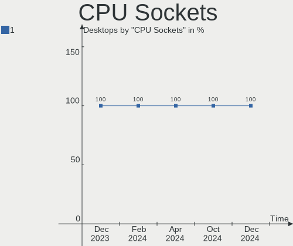

| Number | Desktops | Percent |
|--------|----------|---------|
| 1      | 12       | 100%    |

CPU Threads
-----------

Threads per core (Hyper-Threading)

| Number | Desktops | Percent |
|--------|----------|---------|
| 2      | 8        | 66.67%  |
| 1      | 4        | 33.33%  |

CPU Op-Modes
------------

CPU Operation Modes (32-bit, 64-bit)

| Op mode        | Desktops | Percent |
|----------------|----------|---------|
| 32-bit, 64-bit | 12       | 100%    |

CPU Microcode
-------------

Microcode number

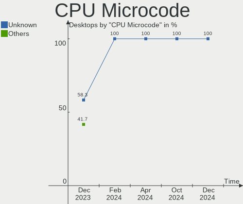

| Number     | Desktops | Percent |
|------------|----------|---------|
| Unknown    | 7        | 58.33%  |
| 0x0a601206 | 1        | 8.33%   |
| 0x0a50000f | 1        | 8.33%   |
| 0x0a201204 | 1        | 8.33%   |
| 0x08701030 | 1        | 8.33%   |
| 0x0800820d | 1        | 8.33%   |

CPU Microarch
-------------

Microarchitecture

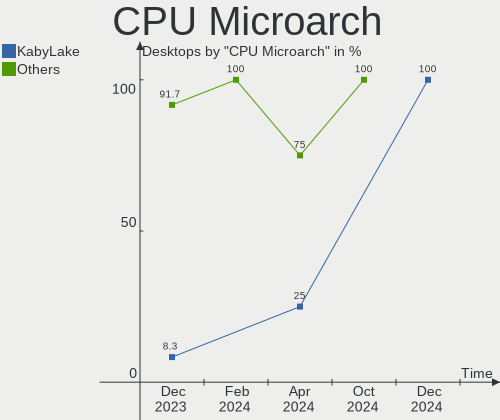

| Name       | Desktops | Percent |
|------------|----------|---------|
| Haswell    | 4        | 33.33%  |
| Zen 3      | 2        | 16.67%  |
| Zen+       | 1        | 8.33%   |
| Zen 2      | 1        | 8.33%   |
| Silvermont | 1        | 8.33%   |
| KabyLake   | 1        | 8.33%   |
| IvyBridge  | 1        | 8.33%   |
| Unknown    | 1        | 8.33%   |

Graphics
--------

GPU Vendor
----------

Vendors of graphics cards

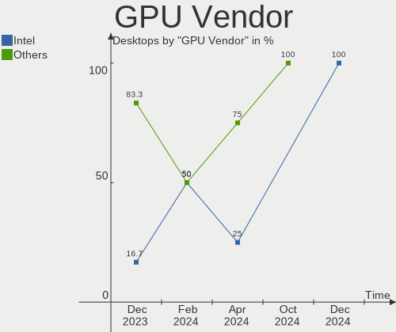

| Vendor | Desktops | Percent |
|--------|----------|---------|
| Nvidia | 5        | 41.67%  |
| AMD    | 5        | 41.67%  |
| Intel  | 2        | 16.67%  |

GPU Model
---------

Graphics card models

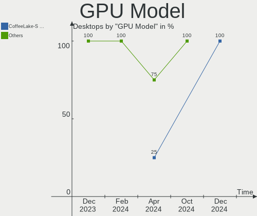

| Model                                                                       | Desktops | Percent |
|-----------------------------------------------------------------------------|----------|---------|
| Nvidia GP108 [GeForce GT 1030]                                              | 2        | 16.67%  |
| Nvidia GK104 [GeForce GTX 680]                                              | 1        | 8.33%   |
| Nvidia GA104 [GeForce RTX 3070]                                             | 1        | 8.33%   |
| Nvidia AD103 [GeForce RTX 4080]                                             | 1        | 8.33%   |
| Intel Xeon E3-1200 v3/4th Gen Core Processor Integrated Graphics Controller | 1        | 8.33%   |
| Intel DG2 [Arc A750]                                                        | 1        | 8.33%   |
| AMD Raphael                                                                 | 1        | 8.33%   |
| AMD Polaris 20 XL [Radeon RX 580 2048SP]                                    | 1        | 8.33%   |
| AMD Lexa PRO [Radeon 540/540X/550/550X / RX 540X/550/550X]                  | 1        | 8.33%   |
| AMD Curacao PRO [Radeon R7 370 / R9 270/370 OEM]                            | 1        | 8.33%   |
| AMD Cezanne [Radeon Vega Series / Radeon Vega Mobile Series]                | 1        | 8.33%   |

GPU Combo
---------

Combinations of graphics cards

| Name       | Desktops | Percent |
|------------|----------|---------|
| 1 x AMD    | 5        | 41.67%  |
| 1 x Nvidia | 4        | 33.33%  |
| 1 x Intel  | 2        | 16.67%  |
| 2 x Nvidia | 1        | 8.33%   |

GPU Driver
----------

Free vs proprietary

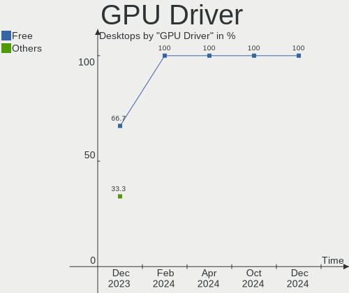

| Driver      | Desktops | Percent |
|-------------|----------|---------|
| Free        | 8        | 66.67%  |
| Proprietary | 4        | 33.33%  |

GPU Memory
----------

Total video memory

| Size in GB | Desktops | Percent |
|------------|----------|---------|
| 1.01-2.0   | 3        | 25%     |
| Unknown    | 3        | 25%     |
| 3.01-4.0   | 2        | 16.67%  |
| 0.01-0.5   | 2        | 16.67%  |
| 7.01-8.0   | 1        | 8.33%   |
| 8.01-16.0  | 1        | 8.33%   |

Monitor
-------

Monitor Vendor
--------------

Monitor vendors

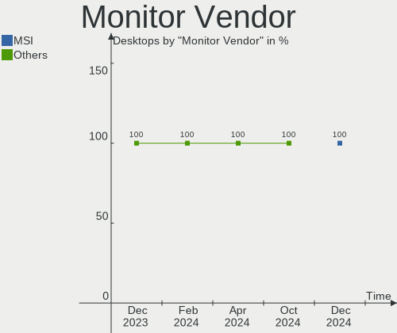

| Vendor               | Desktops | Percent |
|----------------------|----------|---------|
| Hewlett-Packard      | 4        | 25%     |
| Dell                 | 3        | 18.75%  |
| Ancor Communications | 3        | 18.75%  |
| ViewSonic            | 1        | 6.25%   |
| Unknown              | 1        | 6.25%   |
| Samsung Electronics  | 1        | 6.25%   |
| Goldstar             | 1        | 6.25%   |
| Fujitsu Siemens      | 1        | 6.25%   |
| BenQ                 | 1        | 6.25%   |

Monitor Model
-------------

Monitor models

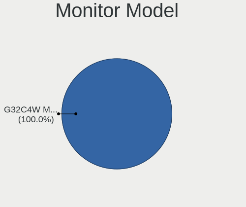

| Model                                                                 | Desktops | Percent |
|-----------------------------------------------------------------------|----------|---------|
| Hewlett-Packard 2310 HWP288E 1920x1080 510x287mm 23.0-inch            | 2        | 12.5%   |
| ViewSonic VX3211 SERIES VSCF534 1920x1080 698x392mm 31.5-inch         | 1        | 6.25%   |
| Unknown LCD Monitor FFFF 2288x1287 2550x2550mm 142.0-inch             | 1        | 6.25%   |
| Samsung Electronics U28E590 SAM0C4D 3840x2160 610x350mm 27.7-inch     | 1        | 6.25%   |
| Hewlett-Packard Z24nq HWP3239 2560x1440 530x300mm 24.0-inch           | 1        | 6.25%   |
| Hewlett-Packard E240 HWP3265 1920x1080 527x296mm 23.8-inch            | 1        | 6.25%   |
| Goldstar 2D FHD TV GSM59C6 1920x1080 509x286mm 23.0-inch              | 1        | 6.25%   |
| Fujitsu Siemens A19-3 DVI FUS078B 1280x1024 376x301mm 19.0-inch       | 1        | 6.25%   |
| Dell SE2417HG DELD08D 1920x1080 521x293mm 23.5-inch                   | 1        | 6.25%   |
| Dell LNKG H2VA001 LNKA001 1920x1080 880x500mm 39.8-inch               | 1        | 6.25%   |
| Dell E2213H DELA090 1920x1080 477x268mm 21.5-inch                     | 1        | 6.25%   |
| BenQ RL2455 BNQ7F1C 1920x1080 531x298mm 24.0-inch                     | 1        | 6.25%   |
| Ancor Communications VW225 ACI22A0 1680x1050 473x296mm 22.0-inch      | 1        | 6.25%   |
| Ancor Communications ROG PG348Q ACI3433 3440x1440 798x335mm 34.1-inch | 1        | 6.25%   |
| Ancor Communications ASUS VP228 ACI22C3 1920x1080 476x268mm 21.5-inch | 1        | 6.25%   |

Monitor Resolution
------------------

Monitor screen resolution

| Resolution         | Desktops | Percent |
|--------------------|----------|---------|
| 1920x1080 (FHD)    | 9        | 60%     |
| 3840x2160 (4K)     | 1        | 6.67%   |
| 3440x1440          | 1        | 6.67%   |
| 2560x1440 (QHD)    | 1        | 6.67%   |
| 2288x1287          | 1        | 6.67%   |
| 1680x1050 (WSXGA+) | 1        | 6.67%   |
| 1280x1024 (SXGA)   | 1        | 6.67%   |

Monitor Diagonal
----------------

Diagonal size in inches

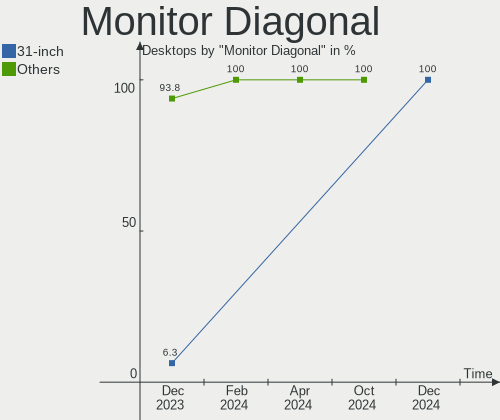

| Inches | Desktops | Percent |
|--------|----------|---------|
| 23     | 4        | 25%     |
| 24     | 3        | 18.75%  |
| 21     | 2        | 12.5%   |
| 142    | 1        | 6.25%   |
| 39     | 1        | 6.25%   |
| 34     | 1        | 6.25%   |
| 31     | 1        | 6.25%   |
| 27     | 1        | 6.25%   |
| 22     | 1        | 6.25%   |
| 19     | 1        | 6.25%   |

Monitor Width
-------------

Physical width

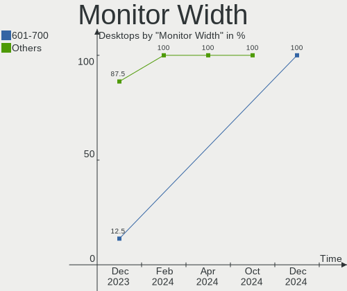

| Width in mm    | Desktops | Percent |
|----------------|----------|---------|
| 501-600        | 7        | 43.75%  |
| 401-500        | 3        | 18.75%  |
| 601-700        | 2        | 12.5%   |
| More than 2000 | 1        | 6.25%   |
| 801-900        | 1        | 6.25%   |
| 701-800        | 1        | 6.25%   |
| 351-400        | 1        | 6.25%   |

Aspect Ratio
------------

Proportional relationship between the width and the height

| Ratio | Desktops | Percent |
|-------|----------|---------|
| 16/9  | 11       | 73.33%  |
| 5/4   | 1        | 6.67%   |
| 21/9  | 1        | 6.67%   |
| 16/10 | 1        | 6.67%   |
| 1.00  | 1        | 6.67%   |

Monitor Area
------------

Area in inch²

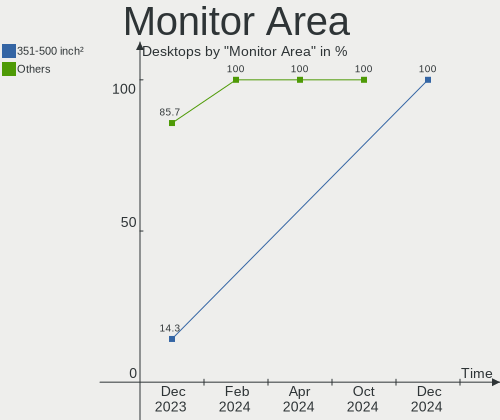

| Area in inch² | Desktops | Percent |
|----------------|----------|---------|
| 201-250        | 8        | 57.14%  |
| 351-500        | 2        | 14.29%  |
| More than 1000 | 1        | 7.14%   |
| 301-350        | 1        | 7.14%   |
| 151-200        | 1        | 7.14%   |
| 501-1000       | 1        | 7.14%   |

Pixel Density
-------------

Pixels per inch

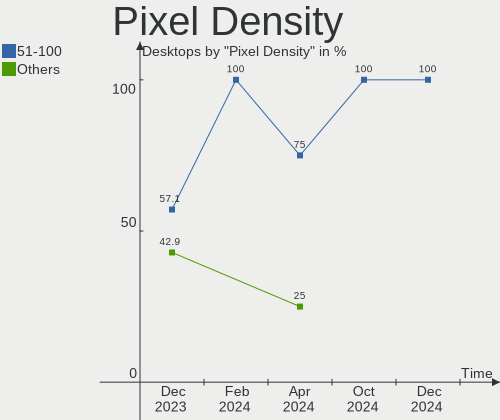

| Density | Desktops | Percent |
|---------|----------|---------|
| 51-100  | 8        | 57.14%  |
| 101-120 | 3        | 21.43%  |
| 121-160 | 2        | 14.29%  |
| 1-50    | 1        | 7.14%   |

Multiple Monitors
-----------------

Total monitors connected

| Total | Desktops | Percent |
|-------|----------|---------|
| 1     | 8        | 66.67%  |
| 2     | 4        | 33.33%  |

Network
-------

Net Controller Vendor
---------------------

Controller vendors

| Vendor                | Desktops | Percent |
|-----------------------|----------|---------|
| Realtek Semiconductor | 9        | 42.86%  |
| Intel                 | 8        | 38.1%   |
| Qualcomm Atheros      | 2        | 9.52%   |
| MediaTek              | 1        | 4.76%   |
| Aquantia              | 1        | 4.76%   |

Net Controller Model
--------------------

Controller models

| Model                                                               | Desktops | Percent |
|---------------------------------------------------------------------|----------|---------|
| Realtek RTL8111/8168/8411 PCI Express Gigabit Ethernet Controller   | 8        | 36.36%  |
| Intel Ethernet Connection I217-LM                                   | 2        | 9.09%   |
| Realtek RTL8125 2.5GbE Controller                                   | 1        | 4.55%   |
| Qualcomm Atheros AR9485 Wireless Network Adapter                    | 1        | 4.55%   |
| Qualcomm Atheros AR9462 Wireless Network Adapter                    | 1        | 4.55%   |
| Qualcomm Atheros AR93xx Wireless Network Adapter                    | 1        | 4.55%   |
| MediaTek MT7922 802.11ax PCI Express Wireless Network Adapter       | 1        | 4.55%   |
| Intel Wireless-AC 9260                                              | 1        | 4.55%   |
| Intel Wi-Fi 6 AX210/AX211/AX411 160MHz                              | 1        | 4.55%   |
| Intel Wi-Fi 6 AX200                                                 | 1        | 4.55%   |
| Intel I211 Gigabit Network Connection                               | 1        | 4.55%   |
| Intel Cannon Lake PCH CNVi WiFi                                     | 1        | 4.55%   |
| Intel 82579V Gigabit Network Connection                             | 1        | 4.55%   |
| Aquantia AQC113CS NBase-T/IEEE 802.3bz Ethernet Controller [AQtion] | 1        | 4.55%   |

Wireless Vendor
---------------

Wireless vendors

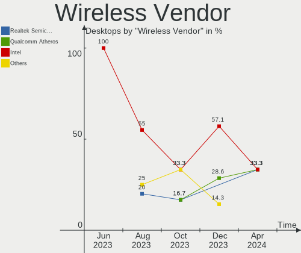

| Vendor           | Desktops | Percent |
|------------------|----------|---------|
| Intel            | 4        | 57.14%  |
| Qualcomm Atheros | 2        | 28.57%  |
| MediaTek         | 1        | 14.29%  |

Wireless Model
--------------

Wireless models

| Model                                                         | Desktops | Percent |
|---------------------------------------------------------------|----------|---------|
| Qualcomm Atheros AR9485 Wireless Network Adapter              | 1        | 12.5%   |
| Qualcomm Atheros AR9462 Wireless Network Adapter              | 1        | 12.5%   |
| Qualcomm Atheros AR93xx Wireless Network Adapter              | 1        | 12.5%   |
| MediaTek MT7922 802.11ax PCI Express Wireless Network Adapter | 1        | 12.5%   |
| Intel Wireless-AC 9260                                        | 1        | 12.5%   |
| Intel Wi-Fi 6 AX210/AX211/AX411 160MHz                        | 1        | 12.5%   |
| Intel Wi-Fi 6 AX200                                           | 1        | 12.5%   |
| Intel Cannon Lake PCH CNVi WiFi                               | 1        | 12.5%   |

Ethernet Vendor
---------------

Ethernet vendors

| Vendor                | Desktops | Percent |
|-----------------------|----------|---------|
| Realtek Semiconductor | 9        | 64.29%  |
| Intel                 | 4        | 28.57%  |
| Aquantia              | 1        | 7.14%   |

Ethernet Model
--------------

Ethernet models

| Model                                                               | Desktops | Percent |
|---------------------------------------------------------------------|----------|---------|
| Realtek RTL8111/8168/8411 PCI Express Gigabit Ethernet Controller   | 8        | 57.14%  |
| Intel Ethernet Connection I217-LM                                   | 2        | 14.29%  |
| Realtek RTL8125 2.5GbE Controller                                   | 1        | 7.14%   |
| Intel I211 Gigabit Network Connection                               | 1        | 7.14%   |
| Intel 82579V Gigabit Network Connection                             | 1        | 7.14%   |
| Aquantia AQC113CS NBase-T/IEEE 802.3bz Ethernet Controller [AQtion] | 1        | 7.14%   |

Net Controller Kind
-------------------

Ethernet, WiFi or modem

| Kind     | Desktops | Percent |
|----------|----------|---------|
| Ethernet | 12       | 63.16%  |
| WiFi     | 7        | 36.84%  |

Used Controller
---------------

Currently used network controller

| Kind     | Desktops | Percent |
|----------|----------|---------|
| Ethernet | 10       | 71.43%  |
| WiFi     | 4        | 28.57%  |

NICs
----

Total network controllers on board

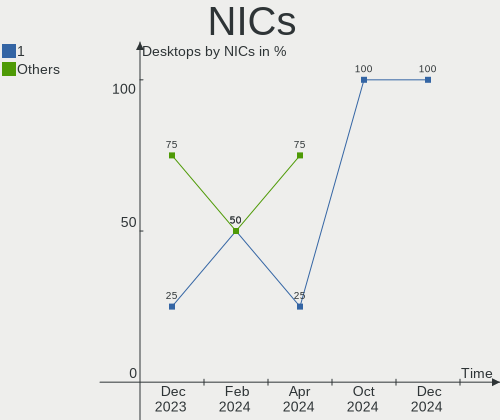

| Total | Desktops | Percent |
|-------|----------|---------|
| 2     | 8        | 66.67%  |
| 1     | 3        | 25%     |
| 3     | 1        | 8.33%   |

IPv6
----

IPv6 vs IPv4

| Used | Desktops | Percent |
|------|----------|---------|
| Yes  | 6        | 50%     |
| No   | 6        | 50%     |

Bluetooth
---------

Bluetooth Vendor
----------------

Controller vendors

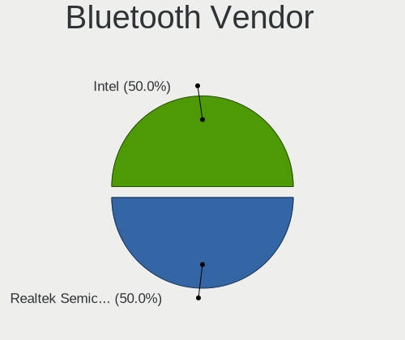

| Vendor            | Desktops | Percent |
|-------------------|----------|---------|
| Intel             | 3        | 50%     |
| ASUSTek Computer  | 2        | 33.33%  |
| Foxconn / Hon Hai | 1        | 16.67%  |

Bluetooth Model
---------------

Controller models

| Model                                          | Desktops | Percent |
|------------------------------------------------|----------|---------|
| Intel Bluetooth 9460/9560 Jefferson Peak (JfP) | 1        | 16.67%  |
| Intel AX210 Bluetooth                          | 1        | 16.67%  |
| Intel AX200 Bluetooth                          | 1        | 16.67%  |
| Foxconn / Hon Hai Bluetooth Device             | 1        | 16.67%  |
| ASUS Broadcom BCM20702A0 Bluetooth             | 1        | 16.67%  |
| ASUS Bluetooth Device                          | 1        | 16.67%  |

Sound
-----

Sound Vendor
------------

Sound card vendors

| Vendor                     | Desktops | Percent |
|----------------------------|----------|---------|
| Intel                      | 8        | 32%     |
| AMD                        | 8        | 32%     |
| Nvidia                     | 5        | 20%     |
| Shenzhen Riitek Technology | 1        | 4%      |
| Razer USA                  | 1        | 4%      |
| C-Media Electronics        | 1        | 4%      |
| Barco Display Systems      | 1        | 4%      |

Sound Model
-----------

Sound card models

| Model                                                                      | Desktops | Percent |
|----------------------------------------------------------------------------|----------|---------|
| Intel 8 Series/C220 Series Chipset High Definition Audio Controller        | 3        | 10.34%  |
| Nvidia GP108 High Definition Audio Controller                              | 2        | 6.9%    |
| AMD Starship/Matisse HD Audio Controller                                   | 2        | 6.9%    |
| AMD Family 17h/19h HD Audio Controller                                     | 2        | 6.9%    |
| Shenzhen Riitek Technology Multimedia Air Mouse Keyboard                   | 1        | 3.45%   |
| Razer USA Razer Leviathan V2 Pro                                           | 1        | 3.45%   |
| Razer USA Razer BlackShark V2 Pro                                          | 1        | 3.45%   |
| Nvidia GK104 HDMI Audio Controller                                         | 1        | 3.45%   |
| Nvidia GA104 High Definition Audio Controller                              | 1        | 3.45%   |
| Nvidia Audio device                                                        | 1        | 3.45%   |
| Intel Xeon E3-1200 v3/4th Gen Core Processor HD Audio Controller           | 1        | 3.45%   |
| Intel DG2 Audio Controller                                                 | 1        | 3.45%   |
| Intel Cannon Lake PCH cAVS                                                 | 1        | 3.45%   |
| Intel C610/X99 series chipset HD Audio Controller                          | 1        | 3.45%   |
| Intel Atom Processor Z36xxx/Z37xxx Series High Definition Audio Controller | 1        | 3.45%   |
| Intel 7 Series/C216 Chipset Family High Definition Audio Controller        | 1        | 3.45%   |
| C-Media Electronics USB Audio Device                                       | 1        | 3.45%   |
| Barco Display Systems USBFC1-A                                             | 1        | 3.45%   |
| AMD Renoir Radeon High Definition Audio Controller                         | 1        | 3.45%   |
| AMD Rembrandt Radeon High Definition Audio Controller                      | 1        | 3.45%   |
| AMD Oland/Hainan/Cape Verde/Pitcairn HDMI Audio [Radeon HD 7000 Series]    | 1        | 3.45%   |
| AMD Family 17h (Models 00h-0fh) HD Audio Controller                        | 1        | 3.45%   |
| AMD Ellesmere HDMI Audio [Radeon RX 470/480 / 570/580/590]                 | 1        | 3.45%   |
| AMD Baffin HDMI/DP Audio [Radeon RX 550 640SP / RX 560/560X]               | 1        | 3.45%   |

Memory
------

Memory Vendor
-------------

Memory module vendors

| Vendor              | Desktops | Percent |
|---------------------|----------|---------|
| Kingston            | 2        | 16.67%  |
| G.Skill             | 2        | 16.67%  |
| Crucial             | 2        | 16.67%  |
| Corsair             | 2        | 16.67%  |
| SK hynix            | 1        | 8.33%   |
| Samsung Electronics | 1        | 8.33%   |
| Nanya Technology    | 1        | 8.33%   |
| Unknown             | 1        | 8.33%   |

Memory Model
------------

Memory module models

| Model                                                    | Desktops | Percent |
|----------------------------------------------------------|----------|---------|
| SK hynix RAM HMT351U6CFR8C-H9 4GB DIMM DDR3 1600MT/s     | 1        | 7.69%   |
| Samsung RAM M378B5173DB0-CK0 4GB DIMM DDR3 1600MT/s      | 1        | 7.69%   |
| Nanya RAM NT4GC64B8HG0NF-DI 4GB DIMM DDR3 1600MT/s       | 1        | 7.69%   |
| Kingston RAM Module 8GB DIMM DDR4 2666MT/s               | 1        | 7.69%   |
| Kingston RAM KVR16N11/8 8GB DIMM DDR3 1600MT/s           | 1        | 7.69%   |
| G.Skill RAM F4-3600C18-8GTZRX 8GB DIMM DDR4 3600MT/s     | 1        | 7.69%   |
| G.Skill RAM F4-3200C16-8GIS 8GB DIMM DDR4 3200MT/s       | 1        | 7.69%   |
| Crucial RAM BLS8G4D240FSBK.8FD 8192MB DIMM DDR4 2666MT/s | 1        | 7.69%   |
| Crucial RAM BLS4G3D1609ES2LX0. 4GB DIMM DDR3 1600MT/s    | 1        | 7.69%   |
| Crucial RAM BLS4G3D1609DS1S00. 4GB DIMM DDR3 1600MT/s    | 1        | 7.69%   |
| Corsair RAM CMZ8GX3M2A1600C9 4GB DIMM DDR3 1800MT/s      | 1        | 7.69%   |
| Corsair RAM CMT32GX4M4C3200C14 8GB DIMM DDR4 3400MT/s    | 1        | 7.69%   |
| Unknown                                                  | 1        | 7.69%   |

Memory Kind
-----------

Memory module kinds

| Kind | Desktops | Percent |
|------|----------|---------|
| DDR4 | 5        | 45.45%  |
| DDR3 | 5        | 45.45%  |
| DDR5 | 1        | 9.09%   |

Memory Form Factor
------------------

Physical design of the memory module

| Name | Desktops | Percent |
|------|----------|---------|
| DIMM | 11       | 100%    |

Memory Size
-----------

Memory module size

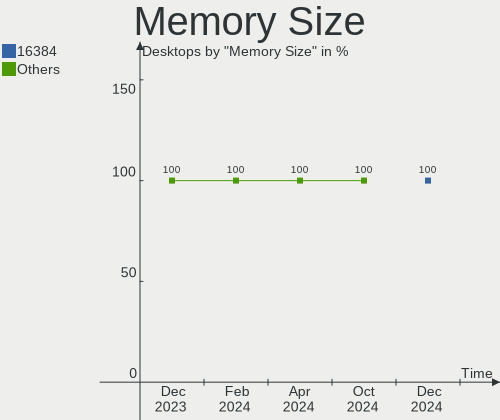

| Size | Desktops | Percent |
|------|----------|---------|
| 8192 | 7        | 63.64%  |
| 4096 | 4        | 36.36%  |

Memory Speed
------------

Memory module speed

| Speed | Desktops | Percent |
|-------|----------|---------|
| 1600  | 4        | 36.36%  |
| 2666  | 2        | 18.18%  |
| 4800  | 1        | 9.09%   |
| 3600  | 1        | 9.09%   |
| 3400  | 1        | 9.09%   |
| 3200  | 1        | 9.09%   |
| 1800  | 1        | 9.09%   |

Printers & scanners
-------------------

Printer Vendor
--------------

Printer device vendors

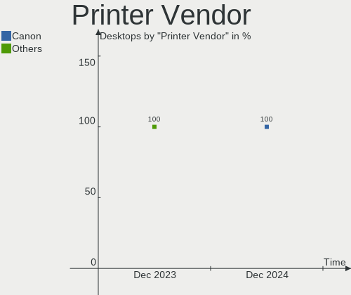

| Vendor          | Desktops | Percent |
|-----------------|----------|---------|
| Hewlett-Packard | 2        | 100%    |

Printer Model
-------------

Printer device models

| Model                  | Desktops | Percent |
|------------------------|----------|---------|
| HP LaserJet CP1525nw/x | 1        | 50%     |
| HP Deskjet 2050 J510   | 1        | 50%     |

Scanner Vendor
--------------

Scanner device vendors

| Vendor         | Desktops | Percent |
|----------------|----------|---------|
| Mustek Systems | 1        | 100%    |

Scanner Model
-------------

Scanner device models

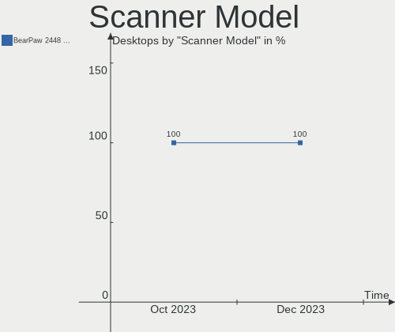

| Model                               | Desktops | Percent |
|-------------------------------------|----------|---------|
| Mustek Systems BearPaw 2448 TA Plus | 1        | 100%    |

Camera
------

Camera Vendor
-------------

Camera device vendors

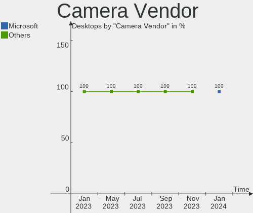

| Vendor                        | Desktops | Percent |
|-------------------------------|----------|---------|
| Z-Star Microelectronics       | 1        | 25%     |
| Sunplus Innovation Technology | 1        | 25%     |
| Generalplus Technology        | 1        | 25%     |
| Creative Technology           | 1        | 25%     |

Camera Model
------------

Camera device models

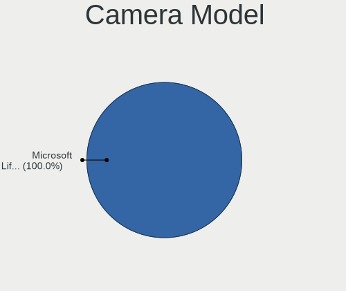

| Model                             | Desktops | Percent |
|-----------------------------------|----------|---------|
| Z-Star A4 TECH USB2.0 PC Camera E | 1        | 25%     |
| Sunplus Full HD webcam            | 1        | 25%     |
| Generalplus GENERAL WEBCAM        | 1        | 25%     |
| Creative Live! Cam Sync 1080p V2  | 1        | 25%     |

Security
--------

Fingerprint Vendor
------------------

Fingerprint sensor vendors

Zero info for selected period =(

Fingerprint Model
-----------------

Fingerprint sensor models

Zero info for selected period =(

Chipcard Vendor
---------------

Chipcard module vendors

Zero info for selected period =(

Chipcard Model
--------------

Chipcard module models

Zero info for selected period =(

Unsupported
-----------

Unsupported Devices
-------------------

Total unsupported devices on board

| Total | Desktops | Percent |
|-------|----------|---------|
| 0     | 11       | 91.67%  |
| 1     | 1        | 8.33%   |

Unsupported Device Types
------------------------

Types of unsupported devices

| Type             | Desktops | Percent |
|------------------|----------|---------|
| Unassigned class | 1        | 100%    |

