Xero - Hardware Trends (Desktops)
---------------------------------

A project to identify most popular hardware characteristics and track their change
over time based on data collected by Linux users at https://Linux-Hardware.org.

Anyone can contribute to this report by the [hw-probe](https://github.com/linuxhw/hw-probe) tool:

    sudo -E hw-probe -all -upload

This report is for one last month. Overall report since the beginning of time: [TestDays](https://github.com/linuxhw/TestDays)

Period: Jan, 2024.

Contents
--------

* [ System ](#system)
  - [ OS                       ](#os)
  - [ OS Family                ](#os-family)
  - [ Kernel                   ](#kernel)
  - [ Kernel Family            ](#kernel-family)
  - [ Kernel Major Ver.        ](#kernel-major-ver)
  - [ Arch                     ](#arch)
  - [ DE                       ](#de)
  - [ Display Server           ](#display-server)
  - [ Display Manager          ](#display-manager)
  - [ OS Lang                  ](#os-lang)
  - [ Boot Mode                ](#boot-mode)
  - [ Filesystem               ](#filesystem)
  - [ Part. scheme             ](#part-scheme)
  - [ Dual Boot with Linux/BSD ](#dual-boot-with-linuxbsd)
  - [ Dual Boot (Win)          ](#dual-boot-win)

* [ Board ](#board)
  - [ Vendor                   ](#vendor)
  - [ Model                    ](#model)
  - [ Model Family             ](#model-family)
  - [ MFG Year                 ](#mfg-year)
  - [ Form Factor              ](#form-factor)
  - [ Secure Boot              ](#secure-boot)
  - [ Coreboot                 ](#coreboot)
  - [ RAM Size                 ](#ram-size)
  - [ RAM Used                 ](#ram-used)
  - [ Total Drives             ](#total-drives)
  - [ Has CD-ROM               ](#has-cd-rom)
  - [ Has Ethernet             ](#has-ethernet)
  - [ Has WiFi                 ](#has-wifi)
  - [ Has Bluetooth            ](#has-bluetooth)

* [ Location ](#location)
  - [ Country                  ](#country)
  - [ City                     ](#city)

* [ Drives ](#drives)
  - [ Drive Vendor             ](#drive-vendor)
  - [ Drive Model              ](#drive-model)
  - [ HDD Vendor               ](#hdd-vendor)
  - [ SSD Vendor               ](#ssd-vendor)
  - [ Drive Kind               ](#drive-kind)
  - [ Drive Connector          ](#drive-connector)
  - [ Drive Size               ](#drive-size)
  - [ Space Total              ](#space-total)
  - [ Space Used               ](#space-used)
  - [ Malfunc. Drives          ](#malfunc-drives)
  - [ Malfunc. Drive Vendor    ](#malfunc-drive-vendor)
  - [ Malfunc. HDD Vendor      ](#malfunc-hdd-vendor)
  - [ Malfunc. Drive Kind      ](#malfunc-drive-kind)
  - [ Failed Drives            ](#failed-drives)
  - [ Failed Drive Vendor      ](#failed-drive-vendor)
  - [ Drive Status             ](#drive-status)

* [ Storage controller ](#storage-controller)
  - [ Storage Vendor           ](#storage-vendor)
  - [ Storage Model            ](#storage-model)
  - [ Storage Kind             ](#storage-kind)

* [ Processor ](#processor)
  - [ CPU Vendor               ](#cpu-vendor)
  - [ CPU Model                ](#cpu-model)
  - [ CPU Model Family         ](#cpu-model-family)
  - [ CPU Cores                ](#cpu-cores)
  - [ CPU Sockets              ](#cpu-sockets)
  - [ CPU Threads              ](#cpu-threads)
  - [ CPU Op-Modes             ](#cpu-op-modes)
  - [ CPU Microcode            ](#cpu-microcode)
  - [ CPU Microarch            ](#cpu-microarch)

* [ Graphics ](#graphics)
  - [ GPU Vendor               ](#gpu-vendor)
  - [ GPU Model                ](#gpu-model)
  - [ GPU Combo                ](#gpu-combo)
  - [ GPU Driver               ](#gpu-driver)
  - [ GPU Memory               ](#gpu-memory)

* [ Monitor ](#monitor)
  - [ Monitor Vendor           ](#monitor-vendor)
  - [ Monitor Model            ](#monitor-model)
  - [ Monitor Resolution       ](#monitor-resolution)
  - [ Monitor Diagonal         ](#monitor-diagonal)
  - [ Monitor Width            ](#monitor-width)
  - [ Aspect Ratio             ](#aspect-ratio)
  - [ Monitor Area             ](#monitor-area)
  - [ Pixel Density            ](#pixel-density)
  - [ Multiple Monitors        ](#multiple-monitors)

* [ Network ](#network)
  - [ Net Controller Vendor    ](#net-controller-vendor)
  - [ Net Controller Model     ](#net-controller-model)
  - [ Wireless Vendor          ](#wireless-vendor)
  - [ Wireless Model           ](#wireless-model)
  - [ Ethernet Vendor          ](#ethernet-vendor)
  - [ Ethernet Model           ](#ethernet-model)
  - [ Net Controller Kind      ](#net-controller-kind)
  - [ Used Controller          ](#used-controller)
  - [ NICs                     ](#nics)
  - [ IPv6                     ](#ipv6)

* [ Bluetooth ](#bluetooth)
  - [ Bluetooth Vendor         ](#bluetooth-vendor)
  - [ Bluetooth Model          ](#bluetooth-model)

* [ Sound ](#sound)
  - [ Sound Vendor             ](#sound-vendor)
  - [ Sound Model              ](#sound-model)

* [ Memory ](#memory)
  - [ Memory Vendor            ](#memory-vendor)
  - [ Memory Model             ](#memory-model)
  - [ Memory Kind              ](#memory-kind)
  - [ Memory Form Factor       ](#memory-form-factor)
  - [ Memory Size              ](#memory-size)
  - [ Memory Speed             ](#memory-speed)

* [ Printers & scanners ](#printers--scanners)
  - [ Printer Vendor           ](#printer-vendor)
  - [ Printer Model            ](#printer-model)
  - [ Scanner Vendor           ](#scanner-vendor)
  - [ Scanner Model            ](#scanner-model)

* [ Camera ](#camera)
  - [ Camera Vendor            ](#camera-vendor)
  - [ Camera Model             ](#camera-model)

* [ Security ](#security)
  - [ Fingerprint Vendor       ](#fingerprint-vendor)
  - [ Fingerprint Model        ](#fingerprint-model)
  - [ Chipcard Vendor          ](#chipcard-vendor)
  - [ Chipcard Model           ](#chipcard-model)

* [ Unsupported ](#unsupported)
  - [ Unsupported Devices      ](#unsupported-devices)
  - [ Unsupported Device Types ](#unsupported-device-types)

System
------

OS
--

Installed operating systems

| Name         | Desktops | Percent |
|--------------|----------|---------|
| Xero Rolling | 8        | 100%    |

OS Family
---------

OS without a version

| Name | Desktops | Percent |
|------|----------|---------|
| Xero | 8        | 100%    |

Kernel
------

Version of the Linux kernel

| Version        | Desktops | Percent |
|----------------|----------|---------|
| 6.6.4-arch1-1  | 3        | 37.5%   |
| 6.7.1-arch1-1  | 1        | 12.5%   |
| 6.7.0-arch3-1  | 1        | 12.5%   |
| 6.6.9-arch1-1  | 1        | 12.5%   |
| 6.6.10-arch1-1 | 1        | 12.5%   |
| 6.5.9-arch2-1  | 1        | 12.5%   |

Kernel Family
-------------

Linux kernel without a distro release

| Version | Desktops | Percent |
|---------|----------|---------|
| 6.6.4   | 3        | 37.5%   |
| 6.7.1   | 1        | 12.5%   |
| 6.7.0   | 1        | 12.5%   |
| 6.6.9   | 1        | 12.5%   |
| 6.6.10  | 1        | 12.5%   |
| 6.5.9   | 1        | 12.5%   |

Kernel Major Ver.
-----------------

Linux kernel major version

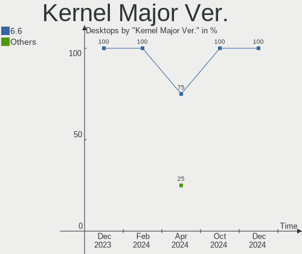

| Version | Desktops | Percent |
|---------|----------|---------|
| 6.6     | 5        | 62.5%   |
| 6.7     | 2        | 25%     |
| 6.5     | 1        | 12.5%   |

Arch
----

OS architecture (x86_64, i586, etc.)

| Name   | Desktops | Percent |
|--------|----------|---------|
| x86_64 | 8        | 100%    |

DE
--

Desktop Environment

| Name | Desktops | Percent |
|------|----------|---------|
| KDE5 | 8        | 100%    |

Display Server
--------------

X11 or Wayland

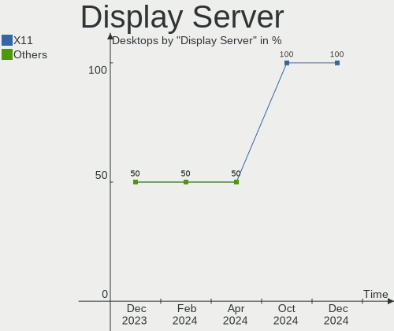

| Name    | Desktops | Percent |
|---------|----------|---------|
| X11     | 6        | 75%     |
| Wayland | 2        | 25%     |

Display Manager
---------------

SDDM, LightDM, etc.

| Name | Desktops | Percent |
|------|----------|---------|
| SDDM | 8        | 100%    |

OS Lang
-------

Language

| Lang  | Desktops | Percent |
|-------|----------|---------|
| en_US | 3        | 37.5%   |
| fr_FR | 2        | 25%     |
| zh_HK | 1        | 12.5%   |
| pt_BR | 1        | 12.5%   |
| de_DE | 1        | 12.5%   |

Boot Mode
---------

EFI or BIOS

| Mode | Desktops | Percent |
|------|----------|---------|
| EFI  | 6        | 75%     |
| BIOS | 2        | 25%     |

Filesystem
----------

Type of filesystem

| Type  | Desktops | Percent |
|-------|----------|---------|
| Ext4  | 7        | 87.5%   |
| Btrfs | 1        | 12.5%   |

Part. scheme
------------

Scheme of partitioning

| Type | Desktops | Percent |
|------|----------|---------|
| GPT  | 7        | 87.5%   |
| MBR  | 1        | 12.5%   |

Dual Boot with Linux/BSD
------------------------

Hosting more than one Linux/BSD

| Dual boot | Desktops | Percent |
|-----------|----------|---------|
| No        | 6        | 75%     |
| Yes       | 2        | 25%     |

Dual Boot (Win)
---------------

Hosting Linux and Windows

| Dual boot | Desktops | Percent |
|-----------|----------|---------|
| Yes       | 4        | 50%     |
| No        | 4        | 50%     |

Board
-----

Vendor
------

Motherboard manufacturer

| Name             | Desktops | Percent |
|------------------|----------|---------|
| MSI              | 3        | 37.5%   |
| ASUSTek Computer | 3        | 37.5%   |
| Win Element      | 1        | 12.5%   |
| ASRock           | 1        | 12.5%   |

Model
-----

Motherboard model

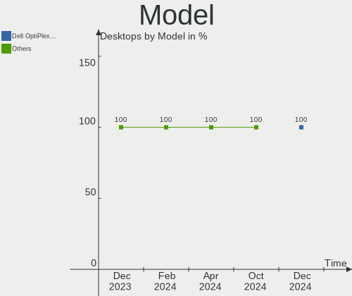

| Name                              | Desktops | Percent |
|-----------------------------------|----------|---------|
| Win Element M9                    | 1        | 12.5%   |
| MSI MS-7823                       | 1        | 12.5%   |
| MSI MS-7817                       | 1        | 12.5%   |
| MSI MS-7592                       | 1        | 12.5%   |
| ASUS ROG STRIX B450-F GAMING II   | 1        | 12.5%   |
| ASUS ROG CROSSHAIR VIII DARK HERO | 1        | 12.5%   |
| ASUS PRIME B450M-A II             | 1        | 12.5%   |
| ASRock B450 Steel Legend          | 1        | 12.5%   |

Model Family
------------

Motherboard model prefix

| Name           | Desktops | Percent |
|----------------|----------|---------|
| ASUS ROG       | 2        | 25%     |
| Win Element M9 | 1        | 12.5%   |
| MSI MS-7823    | 1        | 12.5%   |
| MSI MS-7817    | 1        | 12.5%   |
| MSI MS-7592    | 1        | 12.5%   |
| ASUS PRIME     | 1        | 12.5%   |
| ASRock B450    | 1        | 12.5%   |

MFG Year
--------

Motherboard manufacture year

| Year | Desktops | Percent |
|------|----------|---------|
| 2020 | 2        | 25%     |
| 2023 | 1        | 12.5%   |
| 2022 | 1        | 12.5%   |
| 2019 | 1        | 12.5%   |
| 2014 | 1        | 12.5%   |
| 2013 | 1        | 12.5%   |
| 2011 | 1        | 12.5%   |

Form Factor
-----------

Physical design of the computer

| Name    | Desktops | Percent |
|---------|----------|---------|
| Desktop | 8        | 100%    |

Secure Boot
-----------

Enabled or disabled

| State    | Desktops | Percent |
|----------|----------|---------|
| Disabled | 8        | 100%    |

Coreboot
--------

Have coreboot on board

| Used | Desktops | Percent |
|------|----------|---------|
| No   | 8        | 100%    |

RAM Size
--------

Total RAM memory

| Size in GB | Desktops | Percent |
|------------|----------|---------|
| 16.01-24.0 | 4        | 50%     |
| 32.01-64.0 | 3        | 37.5%   |
| 8.01-16.0  | 1        | 12.5%   |

RAM Used
--------

Used RAM memory

| Used GB    | Desktops | Percent |
|------------|----------|---------|
| 1.01-2.0   | 3        | 37.5%   |
| 2.01-3.0   | 2        | 25%     |
| 4.01-8.0   | 1        | 12.5%   |
| 16.01-24.0 | 1        | 12.5%   |
| 8.01-16.0  | 1        | 12.5%   |

Total Drives
------------

Number of drives on board

| Drives | Desktops | Percent |
|--------|----------|---------|
| 1      | 3        | 37.5%   |
| 4      | 2        | 25%     |
| 2      | 2        | 25%     |
| 3      | 1        | 12.5%   |

Has CD-ROM
----------

Has CD-ROM on board

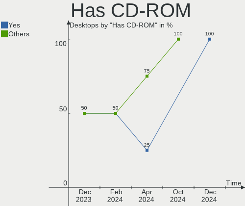

| Presented | Desktops | Percent |
|-----------|----------|---------|
| No        | 5        | 62.5%   |
| Yes       | 3        | 37.5%   |

Has Ethernet
------------

Has Ethernet on board

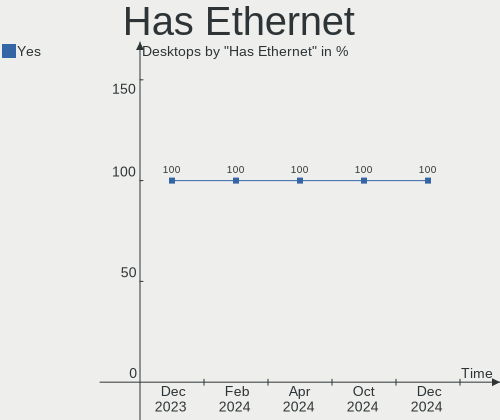

| Presented | Desktops | Percent |
|-----------|----------|---------|
| Yes       | 8        | 100%    |

Has WiFi
--------

Has WiFi module

| Presented | Desktops | Percent |
|-----------|----------|---------|
| Yes       | 4        | 50%     |
| No        | 4        | 50%     |

Has Bluetooth
-------------

Has Bluetooth module

| Presented | Desktops | Percent |
|-----------|----------|---------|
| Yes       | 4        | 50%     |
| No        | 4        | 50%     |

Location
--------

Country
-------

Geographic location (country)

| Country     | Desktops | Percent |
|-------------|----------|---------|
| France      | 2        | 25%     |
| USA         | 1        | 12.5%   |
| Puerto Rico | 1        | 12.5%   |
| Netherlands | 1        | 12.5%   |
| China       | 1        | 12.5%   |
| Brazil      | 1        | 12.5%   |
| Argentina   | 1        | 12.5%   |

City
----

Geographic location (city)

| City         | Desktops | Percent |
|--------------|----------|---------|
| Shanghai     | 1        | 12.5%   |
| Pontarlier   | 1        | 12.5%   |
| Modesto      | 1        | 12.5%   |
| Manati       | 1        | 12.5%   |
| Juiz de Fora | 1        | 12.5%   |
| Guipavas     | 1        | 12.5%   |
| Buenos Aires | 1        | 12.5%   |
| Amsterdam    | 1        | 12.5%   |

Drives
------

Drive Vendor
------------

Hard drive vendors

| Vendor                | Desktops | Drives | Percent |
|-----------------------|----------|--------|---------|
| Seagate               | 3        | 3      | 17.65%  |
| Sandisk               | 3        | 3      | 17.65%  |
| Samsung Electronics   | 3        | 3      | 17.65%  |
| WDC                   | 1        | 1      | 5.88%   |
| SPCC                  | 1        | 2      | 5.88%   |
| Silicon Motion        | 1        | 1      | 5.88%   |
| Realtek Semiconductor | 1        | 1      | 5.88%   |
| Phison Electronics    | 1        | 1      | 5.88%   |
| OCZ                   | 1        | 1      | 5.88%   |
| Mushkin               | 1        | 1      | 5.88%   |
| Crucial               | 1        | 1      | 5.88%   |

Drive Model
-----------

Hard drive models

| Model                                               | Desktops | Percent |
|-----------------------------------------------------|----------|---------|
| Samsung SSD 870 EVO 1TB                             | 2        | 11.11%  |
| WDC WD40EZRZ-22GXCB0 4TB                            | 1        | 5.56%   |
| SPCC Solid State Disk 512GB                         | 1        | 5.56%   |
| SPCC Solid State Disk 256GB                         | 1        | 5.56%   |
| Silicon Motion SM2262/SM2262EN SSD Controller 480GB | 1        | 5.56%   |
| Seagate ST3500312CS 500GB                           | 1        | 5.56%   |
| Seagate ST2000DM006-2DM164 2TB                      | 1        | 5.56%   |
| Seagate ST1000DM003-1ER162 1TB                      | 1        | 5.56%   |
| Sandisk WD_BLACK SN770 1TB                          | 1        | 5.56%   |
| Sandisk WD Black SN750 / PC SN730 NVMe SSD 512GB    | 1        | 5.56%   |
| Sandisk WD Black NVMe SSD 256GB                     | 1        | 5.56%   |
| Samsung SSD 860 EVO 500GB                           | 1        | 5.56%   |
| Realtek RTS5763DL NVMe SSD Controller 2TB           | 1        | 5.56%   |
| Phison PS5013 E13 NVMe Controller 256GB             | 1        | 5.56%   |
| OCZ VERTEX3 120GB SSD                               | 1        | 5.56%   |
| Mushkin MKNSSDCR120GB                               | 1        | 5.56%   |
| Crucial CT480BX500SSD1 480GB                        | 1        | 5.56%   |

HDD Vendor
----------

Hard disk drive vendors

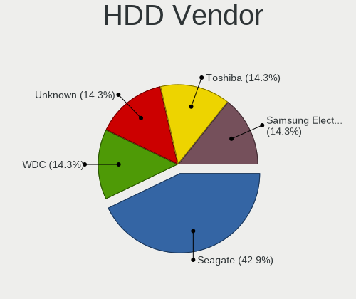

| Vendor  | Desktops | Drives | Percent |
|---------|----------|--------|---------|
| Seagate | 3        | 3      | 75%     |
| WDC     | 1        | 1      | 25%     |

SSD Vendor
----------

Solid state drive vendors

| Vendor              | Desktops | Drives | Percent |
|---------------------|----------|--------|---------|
| Samsung Electronics | 3        | 3      | 42.86%  |
| SPCC                | 1        | 2      | 14.29%  |
| OCZ                 | 1        | 1      | 14.29%  |
| Mushkin             | 1        | 1      | 14.29%  |
| Crucial             | 1        | 1      | 14.29%  |

Drive Kind
----------

HDD or SSD

| Kind | Desktops | Drives | Percent |
|------|----------|--------|---------|
| NVMe | 5        | 6      | 35.71%  |
| SSD  | 5        | 8      | 35.71%  |
| HDD  | 4        | 4      | 28.57%  |

Drive Connector
---------------

SATA, SAS, NVMe, etc.

| Type | Desktops | Drives | Percent |
|------|----------|--------|---------|
| SATA | 6        | 12     | 54.55%  |
| NVMe | 5        | 6      | 45.45%  |

Drive Size
----------

Size of hard drive

| Size in TB | Desktops | Drives | Percent |
|------------|----------|--------|---------|
| 0.01-0.5   | 4        | 6      | 44.44%  |
| 0.51-1.0   | 3        | 4      | 33.33%  |
| 3.01-4.0   | 1        | 1      | 11.11%  |
| 1.01-2.0   | 1        | 1      | 11.11%  |

Space Total
-----------

Amount of disk space available on the file system

| Size in GB     | Desktops | Percent |
|----------------|----------|---------|
| 101-250        | 3        | 37.5%   |
| More than 3000 | 2        | 25%     |
| 251-500        | 2        | 25%     |
| 1001-2000      | 1        | 12.5%   |

Space Used
----------

Amount of used disk space

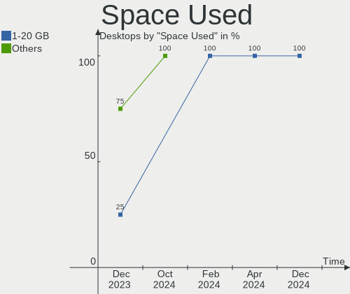

| Used GB        | Desktops | Percent |
|----------------|----------|---------|
| 1-20           | 4        | 50%     |
| More than 3000 | 1        | 12.5%   |
| 21-50          | 1        | 12.5%   |
| 501-1000       | 1        | 12.5%   |
| 51-100         | 1        | 12.5%   |

Malfunc. Drives
---------------

Drive models with a malfunction

| Model                          | Desktops | Drives | Percent |
|--------------------------------|----------|--------|---------|
| Seagate ST3500312CS 500GB      | 1        | 1      | 50%     |
| Seagate ST1000DM003-1ER162 1TB | 1        | 1      | 50%     |

Malfunc. Drive Vendor
---------------------

Vendors of faulty drives

| Vendor  | Desktops | Drives | Percent |
|---------|----------|--------|---------|
| Seagate | 2        | 2      | 100%    |

Malfunc. HDD Vendor
-------------------

Vendors of faulty HDD drives

| Vendor  | Desktops | Drives | Percent |
|---------|----------|--------|---------|
| Seagate | 2        | 2      | 100%    |

Malfunc. Drive Kind
-------------------

Kinds of faulty drives

| Kind | Desktops | Drives | Percent |
|------|----------|--------|---------|
| HDD  | 2        | 2      | 100%    |

Failed Drives
-------------

Failed drive models

Zero info for selected period =(

Failed Drive Vendor
-------------------

Failed drive vendors

Zero info for selected period =(

Drive Status
------------

Number of failed and malfunc. drives

| Status  | Desktops | Drives | Percent |
|---------|----------|--------|---------|
| Works   | 7        | 16     | 77.78%  |
| Malfunc | 2        | 2      | 22.22%  |

Storage controller
------------------

Storage Vendor
--------------

Storage controller vendors

| Vendor                | Desktops | Percent |
|-----------------------|----------|---------|
| Intel                 | 4        | 26.67%  |
| AMD                   | 4        | 26.67%  |
| SanDisk               | 3        | 20%     |
| Silicon Motion        | 1        | 6.67%   |
| Realtek Semiconductor | 1        | 6.67%   |
| Phison Electronics    | 1        | 6.67%   |
| ASMedia Technology    | 1        | 6.67%   |

Storage Model
-------------

Storage controller models

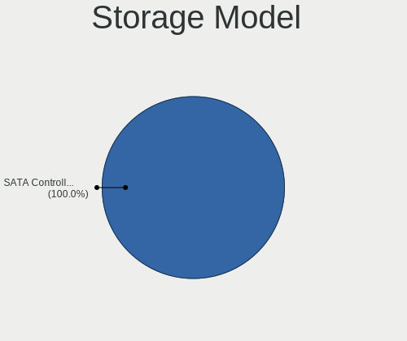

| Model                                                                          | Desktops | Percent |
|--------------------------------------------------------------------------------|----------|---------|
| AMD FCH SATA Controller [AHCI mode]                                            | 4        | 21.05%  |
| AMD 400 Series Chipset SATA Controller                                         | 3        | 15.79%  |
| Intel 8 Series/C220 Series Chipset Family 6-port SATA Controller 1 [AHCI mode] | 2        | 10.53%  |
| Silicon Motion SM2262/SM2262EN SSD Controller                                  | 1        | 5.26%   |
| SanDisk WD Black SN770 / PC SN740 256GB / PC SN560 (DRAM-less) NVMe SSD        | 1        | 5.26%   |
| SanDisk WD Black NVMe SSD                                                      | 1        | 5.26%   |
| SanDisk Extreme Pro / WD Black SN750 / PC SN730 / Red SN700 NVMe SSD           | 1        | 5.26%   |
| Realtek RTS5762 NVMe SSD Controller                                            | 1        | 5.26%   |
| Phison PS5013-E13 PCIe3 NVMe Controller (DRAM-less)                            | 1        | 5.26%   |
| Intel SATA controller                                                          | 1        | 5.26%   |
| Intel NM10/ICH7 Family SATA Controller [IDE mode]                              | 1        | 5.26%   |
| Intel 82801G (ICH7 Family) IDE Controller                                      | 1        | 5.26%   |
| ASMedia ASM1061/ASM1062 Serial ATA Controller                                  | 1        | 5.26%   |

Storage Kind
------------

Kind of storage controller (IDE, SATA, NVMe, SAS, ...)

| Kind | Desktops | Percent |
|------|----------|---------|
| SATA | 7        | 53.85%  |
| NVMe | 5        | 38.46%  |
| IDE  | 1        | 7.69%   |

Processor
---------

CPU Vendor
----------

Processor vendors

| Vendor | Desktops | Percent |
|--------|----------|---------|
| Intel  | 4        | 50%     |
| AMD    | 4        | 50%     |

CPU Model
---------

Processor models

| Model                                 | Desktops | Percent |
|---------------------------------------|----------|---------|
| Intel N100                            | 1        | 12.5%   |
| Intel Core i7-4790 CPU @ 3.60GHz      | 1        | 12.5%   |
| Intel Core i5-4460 CPU @ 3.20GHz      | 1        | 12.5%   |
| Intel Core 2 Quad CPU Q6600 @ 2.40GHz | 1        | 12.5%   |
| AMD Ryzen 7 5800X3D 8-Core Processor  | 1        | 12.5%   |
| AMD Ryzen 5 5500                      | 1        | 12.5%   |
| AMD Ryzen 5 2600 Six-Core Processor   | 1        | 12.5%   |
| AMD Ryzen 5 1600 Six-Core Processor   | 1        | 12.5%   |

CPU Model Family
----------------

Processor model prefix

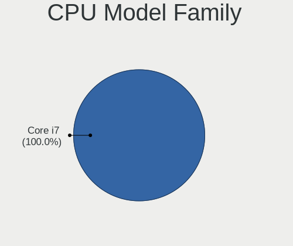

| Model             | Desktops | Percent |
|-------------------|----------|---------|
| AMD Ryzen 5       | 3        | 37.5%   |
| Other             | 1        | 12.5%   |
| Intel Core i7     | 1        | 12.5%   |
| Intel Core i5     | 1        | 12.5%   |
| Intel Core 2 Quad | 1        | 12.5%   |
| AMD Ryzen 7       | 1        | 12.5%   |

CPU Cores
---------

Number of processor cores

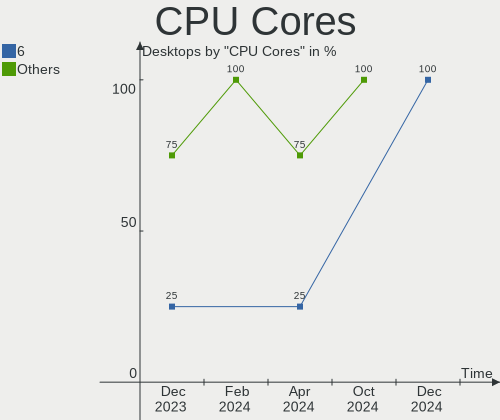

| Number | Desktops | Percent |
|--------|----------|---------|
| 4      | 4        | 50%     |
| 6      | 3        | 37.5%   |
| 8      | 1        | 12.5%   |

CPU Sockets
-----------

Number of sockets

| Number | Desktops | Percent |
|--------|----------|---------|
| 1      | 8        | 100%    |

CPU Threads
-----------

Threads per core (Hyper-Threading)

| Number | Desktops | Percent |
|--------|----------|---------|
| 2      | 5        | 62.5%   |
| 1      | 3        | 37.5%   |

CPU Op-Modes
------------

CPU Operation Modes (32-bit, 64-bit)

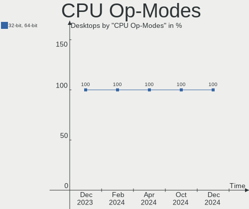

| Op mode        | Desktops | Percent |
|----------------|----------|---------|
| 32-bit, 64-bit | 8        | 100%    |

CPU Microcode
-------------

Microcode number

| Number     | Desktops | Percent |
|------------|----------|---------|
| Unknown    | 5        | 62.5%   |
| 0x0a50000d | 1        | 12.5%   |
| 0x0800820d | 1        | 12.5%   |
| 0x08001138 | 1        | 12.5%   |

CPU Microarch
-------------

Microarchitecture

| Name      | Desktops | Percent |
|-----------|----------|---------|
| Zen 3     | 2        | 25%     |
| Haswell   | 2        | 25%     |
| Zen+      | 1        | 12.5%   |
| Zen       | 1        | 12.5%   |
| Gracemont | 1        | 12.5%   |
| Core      | 1        | 12.5%   |

Graphics
--------

GPU Vendor
----------

Vendors of graphics cards

| Vendor | Desktops | Percent |
|--------|----------|---------|
| AMD    | 4        | 50%     |
| Nvidia | 2        | 25%     |
| Intel  | 2        | 25%     |

GPU Model
---------

Graphics card models

| Model                                                         | Desktops | Percent |
|---------------------------------------------------------------|----------|---------|
| Nvidia GP106 [GeForce GTX 1060 6GB]                           | 1        | 12.5%   |
| Nvidia GM204 [GeForce GTX 970]                                | 1        | 12.5%   |
| Intel Alder Lake-N [UHD Graphics]                             | 1        | 12.5%   |
| Intel 4 Series Chipset Integrated Graphics Controller         | 1        | 12.5%   |
| AMD Navi 22 [Radeon RX 6700/6700 XT/6750 XT / 6800M/6850M XT] | 1        | 12.5%   |
| AMD Navi 21 [Radeon RX 6800/6800 XT / 6900 XT]                | 1        | 12.5%   |
| AMD Ellesmere [Radeon RX 470/480/570/570X/580/580X/590]       | 1        | 12.5%   |
| AMD Curacao PRO [Radeon R7 370 / R9 270/370 OEM]              | 1        | 12.5%   |

GPU Combo
---------

Combinations of graphics cards

| Name       | Desktops | Percent |
|------------|----------|---------|
| 1 x AMD    | 4        | 50%     |
| 1 x Nvidia | 2        | 25%     |
| 1 x Intel  | 2        | 25%     |

GPU Driver
----------

Free vs proprietary

| Driver      | Desktops | Percent |
|-------------|----------|---------|
| Free        | 7        | 87.5%   |
| Proprietary | 1        | 12.5%   |

GPU Memory
----------

Total video memory

| Size in GB | Desktops | Percent |
|------------|----------|---------|
| 3.01-4.0   | 2        | 25%     |
| 8.01-16.0  | 2        | 25%     |
| Unknown    | 2        | 25%     |
| 5.01-6.0   | 1        | 12.5%   |
| 1.01-2.0   | 1        | 12.5%   |

Monitor
-------

Monitor Vendor
--------------

Monitor vendors

| Vendor               | Desktops | Percent |
|----------------------|----------|---------|
| Ancor Communications | 2        | 16.67%  |
| Unknown              | 1        | 8.33%   |
| Samsung Electronics  | 1        | 8.33%   |
| JRY                  | 1        | 8.33%   |
| Iiyama               | 1        | 8.33%   |
| Hewlett-Packard      | 1        | 8.33%   |
| Goldstar             | 1        | 8.33%   |
| Dell                 | 1        | 8.33%   |
| BOE                  | 1        | 8.33%   |
| BenQ                 | 1        | 8.33%   |
| AOC                  | 1        | 8.33%   |

Monitor Model
-------------

Monitor models

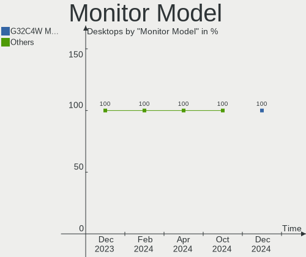

| Model                                                                 | Desktops | Percent |
|-----------------------------------------------------------------------|----------|---------|
| Unknown LCD Monitor FFFF 2288x1287 2550x2550mm 142.0-inch             | 1        | 8.33%   |
| Samsung Electronics Odyssey G8 SAM72F2 3440x1440 809x354mm 34.8-inch  | 1        | 8.33%   |
| JRY DP JRY2700 2560x1440 597x336mm 27.0-inch                          | 1        | 8.33%   |
| Iiyama PL2530H IVM6132 1920x1080 544x303mm 24.5-inch                  | 1        | 8.33%   |
| Hewlett-Packard 2310 HWP288E 1920x1080 510x287mm 23.0-inch            | 1        | 8.33%   |
| Goldstar LG ULTRAWIDE GSM5BF7 2560x1080 670x280mm 28.6-inch           | 1        | 8.33%   |
| Dell P2317H DEL40F4 1920x1080 509x286mm 23.0-inch                     | 1        | 8.33%   |
| BOE HDMI BOE2438 2560x1600 597x336mm 27.0-inch                        | 1        | 8.33%   |
| BenQ GL2450H BNQ78A7 1920x1080 531x298mm 24.0-inch                    | 1        | 8.33%   |
| AOC 912Vwa AOC1912 1440x900 408x255mm 18.9-inch                       | 1        | 8.33%   |
| Ancor Communications VW225 ACI22A0 1680x1050 473x296mm 22.0-inch      | 1        | 8.33%   |
| Ancor Communications ASUS VP278 ACI27C8 1920x1080 598x336mm 27.0-inch | 1        | 8.33%   |

Monitor Resolution
------------------

Monitor screen resolution

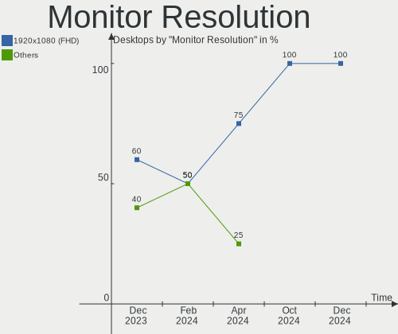

| Resolution         | Desktops | Percent |
|--------------------|----------|---------|
| 1920x1080 (FHD)    | 4        | 36.36%  |
| 3840x2160 (4K)     | 1        | 9.09%   |
| 3440x1440          | 1        | 9.09%   |
| 2560x1600          | 1        | 9.09%   |
| 2560x1080          | 1        | 9.09%   |
| 2288x1287          | 1        | 9.09%   |
| 1680x1050 (WSXGA+) | 1        | 9.09%   |
| 1440x900 (WXGA+)   | 1        | 9.09%   |

Monitor Diagonal
----------------

Diagonal size in inches

| Inches | Desktops | Percent |
|--------|----------|---------|
| 27     | 3        | 25%     |
| 24     | 2        | 16.67%  |
| 23     | 2        | 16.67%  |
| 142    | 1        | 8.33%   |
| 34     | 1        | 8.33%   |
| 28     | 1        | 8.33%   |
| 22     | 1        | 8.33%   |
| 18     | 1        | 8.33%   |

Monitor Width
-------------

Physical width

| Width in mm    | Desktops | Percent |
|----------------|----------|---------|
| 501-600        | 6        | 54.55%  |
| 401-500        | 2        | 18.18%  |
| More than 2000 | 1        | 9.09%   |
| 801-900        | 1        | 9.09%   |
| 601-700        | 1        | 9.09%   |

Aspect Ratio
------------

Proportional relationship between the width and the height

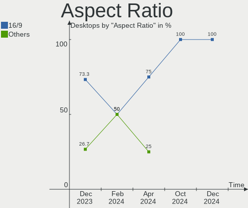

| Ratio | Desktops | Percent |
|-------|----------|---------|
| 16/9  | 6        | 54.55%  |
| 21/9  | 2        | 18.18%  |
| 16/10 | 2        | 18.18%  |
| 1.00  | 1        | 9.09%   |

Monitor Area
------------

Area in inch²

| Area in inch² | Desktops | Percent |
|----------------|----------|---------|
| 301-350        | 3        | 27.27%  |
| 201-250        | 3        | 27.27%  |
| 251-300        | 2        | 18.18%  |
| More than 1000 | 1        | 9.09%   |
| 351-500        | 1        | 9.09%   |
| 151-200        | 1        | 9.09%   |

Pixel Density
-------------

Pixels per inch

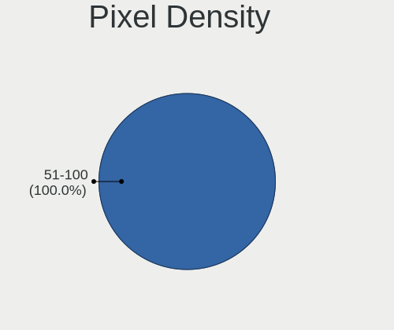

| Density | Desktops | Percent |
|---------|----------|---------|
| 51-100  | 6        | 66.67%  |
| 101-120 | 2        | 22.22%  |
| 1-50    | 1        | 11.11%  |

Multiple Monitors
-----------------

Total monitors connected

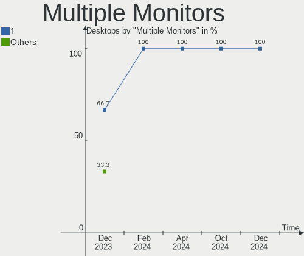

| Total | Desktops | Percent |
|-------|----------|---------|
| 2     | 4        | 50%     |
| 1     | 4        | 50%     |

Network
-------

Net Controller Vendor
---------------------

Controller vendors

| Vendor                | Desktops | Percent |
|-----------------------|----------|---------|
| Realtek Semiconductor | 6        | 54.55%  |
| Intel                 | 4        | 36.36%  |
| Qualcomm Atheros      | 1        | 9.09%   |

Net Controller Model
--------------------

Controller models

| Model                                                                  | Desktops | Percent |
|------------------------------------------------------------------------|----------|---------|
| Realtek RTL8111/8168/8211/8411 PCI Express Gigabit Ethernet Controller | 4        | 30.77%  |
| Intel Wi-Fi 6 AX200                                                    | 2        | 15.38%  |
| Intel I211 Gigabit Network Connection                                  | 2        | 15.38%  |
| Realtek RTL88x2bu [AC1200 Techkey]                                     | 1        | 7.69%   |
| Realtek RTL8125 2.5GbE Controller                                      | 1        | 7.69%   |
| Qualcomm Atheros AR8132 Fast Ethernet                                  | 1        | 7.69%   |
| Intel Ethernet Controller I225-V                                       | 1        | 7.69%   |
| Intel CNVi: Wi-Fi                                                      | 1        | 7.69%   |

Wireless Vendor
---------------

Wireless vendors

| Vendor                | Desktops | Percent |
|-----------------------|----------|---------|
| Intel                 | 3        | 75%     |
| Realtek Semiconductor | 1        | 25%     |

Wireless Model
--------------

Wireless models

| Model                              | Desktops | Percent |
|------------------------------------|----------|---------|
| Intel Wi-Fi 6 AX200                | 2        | 50%     |
| Realtek RTL88x2bu [AC1200 Techkey] | 1        | 25%     |
| Intel CNVi: Wi-Fi                  | 1        | 25%     |

Ethernet Vendor
---------------

Ethernet vendors

| Vendor                | Desktops | Percent |
|-----------------------|----------|---------|
| Realtek Semiconductor | 5        | 55.56%  |
| Intel                 | 3        | 33.33%  |
| Qualcomm Atheros      | 1        | 11.11%  |

Ethernet Model
--------------

Ethernet models

| Model                                                                  | Desktops | Percent |
|------------------------------------------------------------------------|----------|---------|
| Realtek RTL8111/8168/8211/8411 PCI Express Gigabit Ethernet Controller | 4        | 44.44%  |
| Intel I211 Gigabit Network Connection                                  | 2        | 22.22%  |
| Realtek RTL8125 2.5GbE Controller                                      | 1        | 11.11%  |
| Qualcomm Atheros AR8132 Fast Ethernet                                  | 1        | 11.11%  |
| Intel Ethernet Controller I225-V                                       | 1        | 11.11%  |

Net Controller Kind
-------------------

Ethernet, WiFi or modem

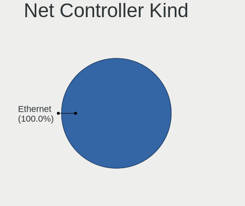

| Kind     | Desktops | Percent |
|----------|----------|---------|
| Ethernet | 8        | 66.67%  |
| WiFi     | 4        | 33.33%  |

Used Controller
---------------

Currently used network controller

| Kind     | Desktops | Percent |
|----------|----------|---------|
| Ethernet | 7        | 77.78%  |
| WiFi     | 2        | 22.22%  |

NICs
----

Total network controllers on board

| Total | Desktops | Percent |
|-------|----------|---------|
| 1     | 5        | 62.5%   |
| 2     | 2        | 25%     |
| 3     | 1        | 12.5%   |

IPv6
----

IPv6 vs IPv4

| Used | Desktops | Percent |
|------|----------|---------|
| Yes  | 5        | 62.5%   |
| No   | 3        | 37.5%   |

Bluetooth
---------

Bluetooth Vendor
----------------

Controller vendors

| Vendor                  | Desktops | Percent |
|-------------------------|----------|---------|
| Intel                   | 3        | 75%     |
| Cambridge Silicon Radio | 1        | 25%     |

Bluetooth Model
---------------

Controller models

| Model                                               | Desktops | Percent |
|-----------------------------------------------------|----------|---------|
| Intel AX200 Bluetooth                               | 2        | 50%     |
| Intel AX201 Bluetooth                               | 1        | 25%     |
| Cambridge Silicon Radio Bluetooth Dongle (HCI mode) | 1        | 25%     |

Sound
-----

Sound Vendor
------------

Sound card vendors

| Vendor                                       | Desktops | Percent |
|----------------------------------------------|----------|---------|
| AMD                                          | 5        | 33.33%  |
| Intel                                        | 4        | 26.67%  |
| Nvidia                                       | 2        | 13.33%  |
| Zoran Co. Personal Media Division (Nogatech) | 1        | 6.67%   |
| SteelSeries ApS                              | 1        | 6.67%   |
| Logitech                                     | 1        | 6.67%   |
| Astro Gaming                                 | 1        | 6.67%   |

Sound Model
-----------

Sound card models

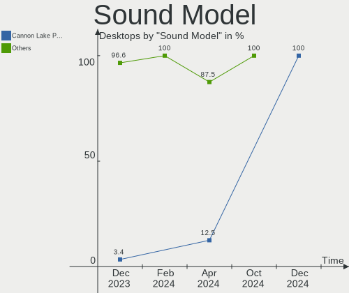

| Model                                                                   | Desktops | Percent |
|-------------------------------------------------------------------------|----------|---------|
| Intel 8 Series/C220 Series Chipset High Definition Audio Controller     | 2        | 10.53%  |
| AMD Navi 21/23 HDMI/DP Audio Controller                                 | 2        | 10.53%  |
| AMD Family 17h (Models 00h-0fh) HD Audio Controller                     | 2        | 10.53%  |
| Zoran Co. Personal Media Division (Nogatech) USB Audio and HID          | 1        | 5.26%   |
| SteelSeries ApS SteelSeries Arctis 5                                    | 1        | 5.26%   |
| Nvidia GP106 High Definition Audio Controller                           | 1        | 5.26%   |
| Nvidia GM204 High Definition Audio Controller                           | 1        | 5.26%   |
| Logitech G430 Surround Sound Gaming Headset                             | 1        | 5.26%   |
| Intel NM10/ICH7 Family High Definition Audio Controller                 | 1        | 5.26%   |
| Intel Alder Lake-N PCH High Definition Audio Controller                 | 1        | 5.26%   |
| Astro Gaming Astro A50                                                  | 1        | 5.26%   |
| AMD Starship/Matisse HD Audio Controller                                | 1        | 5.26%   |
| AMD Renoir Radeon High Definition Audio Controller                      | 1        | 5.26%   |
| AMD Oland/Hainan/Cape Verde/Pitcairn HDMI Audio [Radeon HD 7000 Series] | 1        | 5.26%   |
| AMD Family 17h/19h HD Audio Controller                                  | 1        | 5.26%   |
| AMD Ellesmere HDMI Audio [Radeon RX 470/480 / 570/580/590]              | 1        | 5.26%   |

Memory
------

Memory Vendor
-------------

Memory module vendors

| Vendor               | Desktops | Percent |
|----------------------|----------|---------|
| Corsair              | 3        | 30%     |
| Crucial              | 2        | 20%     |
| Unknown              | 1        | 10%     |
| Team                 | 1        | 10%     |
| Micron Technology    | 1        | 10%     |
| Guangzhou MiaoYuanJi | 1        | 10%     |
| G.Skill              | 1        | 10%     |

Memory Model
------------

Memory module models

| Model                                                     | Desktops | Percent |
|-----------------------------------------------------------|----------|---------|
| Unknown RAM Module 4GB DIMM SDRAM 1066MT/s                | 1        | 9.09%   |
| Team RAM TEAMGROUP-UD4-3200 16GB DIMM DDR4 3733MT/s       | 1        | 9.09%   |
| Micron RAM 16JTF1G64AZ-1G6E1 8GB DIMM DDR3 1600MT/s       | 1        | 9.09%   |
| Guangzhou MiaoYuanJi RAM Module 16GB SODIMM DDR4 2667MT/s | 1        | 9.09%   |
| G.Skill RAM F3-1600C11-8GIS 8GB DIMM DDR3 1600MT/s        | 1        | 9.09%   |
| Crucial RAM CT102464BA160B.C16 8GB DIMM DDR3 1600MT/s     | 1        | 9.09%   |
| Crucial RAM BLS4G3D1609ES2LX0. 4GB DIMM DDR3 1600MT/s     | 1        | 9.09%   |
| Crucial RAM BLS4G3D1609DS1S00. 4GB DIMM DDR3 1600MT/s     | 1        | 9.09%   |
| Corsair RAM CMW32GX4M2C3200C16 16GB DIMM DDR4 3400MT/s    | 1        | 9.09%   |
| Corsair RAM CMW16GX4M2C3200C16 8GB DIMM DDR4 3733MT/s     | 1        | 9.09%   |
| Corsair RAM CMK16GX4M2E3200C16 8GB DIMM DDR4 3200MT/s     | 1        | 9.09%   |

Memory Kind
-----------

Memory module kinds

| Kind  | Desktops | Percent |
|-------|----------|---------|
| DDR4  | 5        | 55.56%  |
| SDRAM | 2        | 22.22%  |
| DDR3  | 2        | 22.22%  |

Memory Form Factor
------------------

Physical design of the memory module

| Name   | Desktops | Percent |
|--------|----------|---------|
| DIMM   | 7        | 87.5%   |
| SODIMM | 1        | 12.5%   |

Memory Size
-----------

Memory module size

| Size  | Desktops | Percent |
|-------|----------|---------|
| 8192  | 3        | 37.5%   |
| 16384 | 2        | 25%     |
| 4096  | 2        | 25%     |
| 32768 | 1        | 12.5%   |

Memory Speed
------------

Memory module speed

| Speed | Desktops | Percent |
|-------|----------|---------|
| 3733  | 2        | 25%     |
| 1600  | 2        | 25%     |
| 3400  | 1        | 12.5%   |
| 3200  | 1        | 12.5%   |
| 2667  | 1        | 12.5%   |
| 1066  | 1        | 12.5%   |

Printers & scanners
-------------------

Printer Vendor
--------------

Printer device vendors

Zero info for selected period =(

Printer Model
-------------

Printer device models

Zero info for selected period =(

Scanner Vendor
--------------

Scanner device vendors

Zero info for selected period =(

Scanner Model
-------------

Scanner device models

Zero info for selected period =(

Camera
------

Camera Vendor
-------------

Camera device vendors

| Vendor    | Desktops | Percent |
|-----------|----------|---------|
| Microsoft | 1        | 100%    |

Camera Model
------------

Camera device models

| Model                    | Desktops | Percent |
|--------------------------|----------|---------|
| Microsoft LifeCam Cinema | 1        | 100%    |

Security
--------

Fingerprint Vendor
------------------

Fingerprint sensor vendors

Zero info for selected period =(

Fingerprint Model
-----------------

Fingerprint sensor models

Zero info for selected period =(

Chipcard Vendor
---------------

Chipcard module vendors

Zero info for selected period =(

Chipcard Model
--------------

Chipcard module models

Zero info for selected period =(

Unsupported
-----------

Unsupported Devices
-------------------

Total unsupported devices on board

| Total | Desktops | Percent |
|-------|----------|---------|
| 0     | 8        | 100%    |

Unsupported Device Types
------------------------

Types of unsupported devices

Zero info for selected period =(

