Xero - Hardware Trends (Notebooks)
----------------------------------

A project to identify most popular hardware characteristics and track their change
over time based on data collected by Linux users at https://Linux-Hardware.org.

Anyone can contribute to this report by the [hw-probe](https://github.com/linuxhw/hw-probe) tool:

    sudo -E hw-probe -all -upload

This report is for one last month. Overall report since the beginning of time: [TestDays](https://github.com/linuxhw/TestDays)

Period: Jan, 2024.

Contents
--------

* [ System ](#system)
  - [ OS                       ](#os)
  - [ OS Family                ](#os-family)
  - [ Kernel                   ](#kernel)
  - [ Kernel Family            ](#kernel-family)
  - [ Kernel Major Ver.        ](#kernel-major-ver)
  - [ Arch                     ](#arch)
  - [ DE                       ](#de)
  - [ Display Server           ](#display-server)
  - [ Display Manager          ](#display-manager)
  - [ OS Lang                  ](#os-lang)
  - [ Boot Mode                ](#boot-mode)
  - [ Filesystem               ](#filesystem)
  - [ Part. scheme             ](#part-scheme)
  - [ Dual Boot with Linux/BSD ](#dual-boot-with-linuxbsd)
  - [ Dual Boot (Win)          ](#dual-boot-win)

* [ Board ](#board)
  - [ Vendor                   ](#vendor)
  - [ Model                    ](#model)
  - [ Model Family             ](#model-family)
  - [ MFG Year                 ](#mfg-year)
  - [ Form Factor              ](#form-factor)
  - [ Secure Boot              ](#secure-boot)
  - [ Coreboot                 ](#coreboot)
  - [ RAM Size                 ](#ram-size)
  - [ RAM Used                 ](#ram-used)
  - [ Total Drives             ](#total-drives)
  - [ Has CD-ROM               ](#has-cd-rom)
  - [ Has Ethernet             ](#has-ethernet)
  - [ Has WiFi                 ](#has-wifi)
  - [ Has Bluetooth            ](#has-bluetooth)

* [ Location ](#location)
  - [ Country                  ](#country)
  - [ City                     ](#city)

* [ Drives ](#drives)
  - [ Drive Vendor             ](#drive-vendor)
  - [ Drive Model              ](#drive-model)
  - [ HDD Vendor               ](#hdd-vendor)
  - [ SSD Vendor               ](#ssd-vendor)
  - [ Drive Kind               ](#drive-kind)
  - [ Drive Connector          ](#drive-connector)
  - [ Drive Size               ](#drive-size)
  - [ Space Total              ](#space-total)
  - [ Space Used               ](#space-used)
  - [ Malfunc. Drives          ](#malfunc-drives)
  - [ Malfunc. Drive Vendor    ](#malfunc-drive-vendor)
  - [ Malfunc. HDD Vendor      ](#malfunc-hdd-vendor)
  - [ Malfunc. Drive Kind      ](#malfunc-drive-kind)
  - [ Failed Drives            ](#failed-drives)
  - [ Failed Drive Vendor      ](#failed-drive-vendor)
  - [ Drive Status             ](#drive-status)

* [ Storage controller ](#storage-controller)
  - [ Storage Vendor           ](#storage-vendor)
  - [ Storage Model            ](#storage-model)
  - [ Storage Kind             ](#storage-kind)

* [ Processor ](#processor)
  - [ CPU Vendor               ](#cpu-vendor)
  - [ CPU Model                ](#cpu-model)
  - [ CPU Model Family         ](#cpu-model-family)
  - [ CPU Cores                ](#cpu-cores)
  - [ CPU Sockets              ](#cpu-sockets)
  - [ CPU Threads              ](#cpu-threads)
  - [ CPU Op-Modes             ](#cpu-op-modes)
  - [ CPU Microcode            ](#cpu-microcode)
  - [ CPU Microarch            ](#cpu-microarch)

* [ Graphics ](#graphics)
  - [ GPU Vendor               ](#gpu-vendor)
  - [ GPU Model                ](#gpu-model)
  - [ GPU Combo                ](#gpu-combo)
  - [ GPU Driver               ](#gpu-driver)
  - [ GPU Memory               ](#gpu-memory)

* [ Monitor ](#monitor)
  - [ Monitor Vendor           ](#monitor-vendor)
  - [ Monitor Model            ](#monitor-model)
  - [ Monitor Resolution       ](#monitor-resolution)
  - [ Monitor Diagonal         ](#monitor-diagonal)
  - [ Monitor Width            ](#monitor-width)
  - [ Aspect Ratio             ](#aspect-ratio)
  - [ Monitor Area             ](#monitor-area)
  - [ Pixel Density            ](#pixel-density)
  - [ Multiple Monitors        ](#multiple-monitors)

* [ Network ](#network)
  - [ Net Controller Vendor    ](#net-controller-vendor)
  - [ Net Controller Model     ](#net-controller-model)
  - [ Wireless Vendor          ](#wireless-vendor)
  - [ Wireless Model           ](#wireless-model)
  - [ Ethernet Vendor          ](#ethernet-vendor)
  - [ Ethernet Model           ](#ethernet-model)
  - [ Net Controller Kind      ](#net-controller-kind)
  - [ Used Controller          ](#used-controller)
  - [ NICs                     ](#nics)
  - [ IPv6                     ](#ipv6)

* [ Bluetooth ](#bluetooth)
  - [ Bluetooth Vendor         ](#bluetooth-vendor)
  - [ Bluetooth Model          ](#bluetooth-model)

* [ Sound ](#sound)
  - [ Sound Vendor             ](#sound-vendor)
  - [ Sound Model              ](#sound-model)

* [ Memory ](#memory)
  - [ Memory Vendor            ](#memory-vendor)
  - [ Memory Model             ](#memory-model)
  - [ Memory Kind              ](#memory-kind)
  - [ Memory Form Factor       ](#memory-form-factor)
  - [ Memory Size              ](#memory-size)
  - [ Memory Speed             ](#memory-speed)

* [ Printers & scanners ](#printers--scanners)
  - [ Printer Vendor           ](#printer-vendor)
  - [ Printer Model            ](#printer-model)
  - [ Scanner Vendor           ](#scanner-vendor)
  - [ Scanner Model            ](#scanner-model)

* [ Camera ](#camera)
  - [ Camera Vendor            ](#camera-vendor)
  - [ Camera Model             ](#camera-model)

* [ Security ](#security)
  - [ Fingerprint Vendor       ](#fingerprint-vendor)
  - [ Fingerprint Model        ](#fingerprint-model)
  - [ Chipcard Vendor          ](#chipcard-vendor)
  - [ Chipcard Model           ](#chipcard-model)

* [ Unsupported ](#unsupported)
  - [ Unsupported Devices      ](#unsupported-devices)
  - [ Unsupported Device Types ](#unsupported-device-types)

System
------

OS
--

Installed operating systems

| Name         | Notebooks | Percent |
|--------------|-----------|---------|
| Xero Rolling | 21        | 100%    |

OS Family
---------

OS without a version

| Name | Notebooks | Percent |
|------|-----------|---------|
| Xero | 21        | 100%    |

Kernel
------

Version of the Linux kernel

| Version          | Notebooks | Percent |
|------------------|-----------|---------|
| 6.6.4-arch1-1    | 12        | 57.14%  |
| 6.6.8-arch1-1    | 3         | 14.29%  |
| 6.5.9-arch2-1    | 2         | 9.52%   |
| 6.7.0-zen3-1-zen | 1         | 4.76%   |
| 6.7.0-arch3-1    | 1         | 4.76%   |
| 6.6.9-arch1-1    | 1         | 4.76%   |
| 6.5.5-arch1-1    | 1         | 4.76%   |

Kernel Family
-------------

Linux kernel without a distro release

| Version | Notebooks | Percent |
|---------|-----------|---------|
| 6.6.4   | 12        | 57.14%  |
| 6.6.8   | 3         | 14.29%  |
| 6.7.0   | 2         | 9.52%   |
| 6.5.9   | 2         | 9.52%   |
| 6.6.9   | 1         | 4.76%   |
| 6.5.5   | 1         | 4.76%   |

Kernel Major Ver.
-----------------

Linux kernel major version

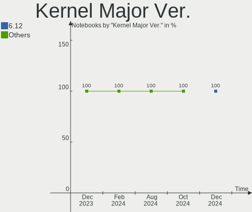

| Version | Notebooks | Percent |
|---------|-----------|---------|
| 6.6     | 16        | 76.19%  |
| 6.5     | 3         | 14.29%  |
| 6.7     | 2         | 9.52%   |

Arch
----

OS architecture (x86_64, i586, etc.)

| Name   | Notebooks | Percent |
|--------|-----------|---------|
| x86_64 | 21        | 100%    |

DE
--

Desktop Environment

| Name     | Notebooks | Percent |
|----------|-----------|---------|
| KDE5     | 20        | 95.24%  |
| Hyprland | 1         | 4.76%   |

Display Server
--------------

X11 or Wayland

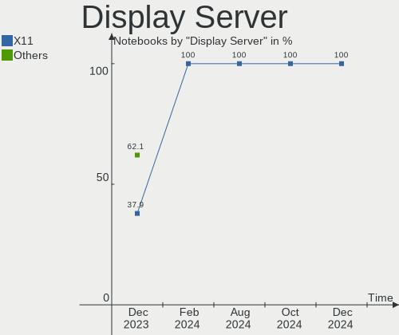

| Name    | Notebooks | Percent |
|---------|-----------|---------|
| Wayland | 13        | 61.9%   |
| X11     | 8         | 38.1%   |

Display Manager
---------------

SDDM, LightDM, etc.

| Name | Notebooks | Percent |
|------|-----------|---------|
| SDDM | 21        | 100%    |

OS Lang
-------

Language

| Lang  | Notebooks | Percent |
|-------|-----------|---------|
| en_US | 9         | 42.86%  |
| zh_CN | 2         | 9.52%   |
| ru_RU | 2         | 9.52%   |
| en_IN | 2         | 9.52%   |
| uk_UA | 1         | 4.76%   |
| tr_TR | 1         | 4.76%   |
| it_IT | 1         | 4.76%   |
| fr_FR | 1         | 4.76%   |
| en_PH | 1         | 4.76%   |
| de_DE | 1         | 4.76%   |

Boot Mode
---------

EFI or BIOS

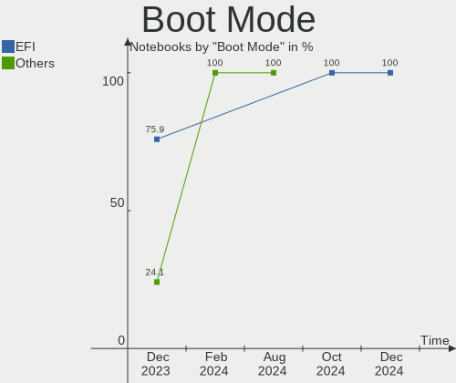

| Mode | Notebooks | Percent |
|------|-----------|---------|
| EFI  | 17        | 80.95%  |
| BIOS | 4         | 19.05%  |

Filesystem
----------

Type of filesystem

| Type  | Notebooks | Percent |
|-------|-----------|---------|
| Ext4  | 20        | 95.24%  |
| Btrfs | 1         | 4.76%   |

Part. scheme
------------

Scheme of partitioning

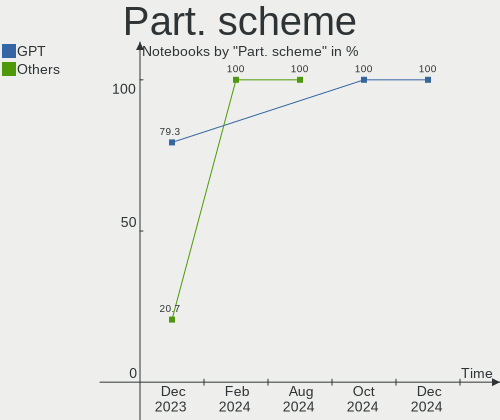

| Type | Notebooks | Percent |
|------|-----------|---------|
| GPT  | 17        | 80.95%  |
| MBR  | 4         | 19.05%  |

Dual Boot with Linux/BSD
------------------------

Hosting more than one Linux/BSD

| Dual boot | Notebooks | Percent |
|-----------|-----------|---------|
| No        | 15        | 71.43%  |
| Yes       | 6         | 28.57%  |

Dual Boot (Win)
---------------

Hosting Linux and Windows

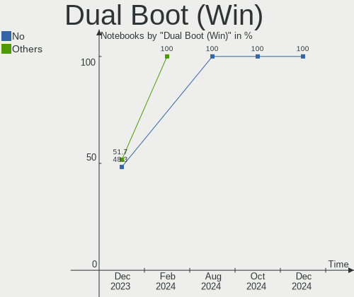

| Dual boot | Notebooks | Percent |
|-----------|-----------|---------|
| No        | 13        | 61.9%   |
| Yes       | 8         | 38.1%   |

Board
-----

Vendor
------

Motherboard manufacturer

| Name                | Notebooks | Percent |
|---------------------|-----------|---------|
| Dell                | 5         | 23.81%  |
| Acer                | 5         | 23.81%  |
| Hewlett-Packard     | 3         | 14.29%  |
| Lenovo              | 2         | 9.52%   |
| Samsung Electronics | 1         | 4.76%   |
| MECHREVO            | 1         | 4.76%   |
| Google              | 1         | 4.76%   |
| Fujitsu             | 1         | 4.76%   |
| ASUSTek Computer    | 1         | 4.76%   |
| Apple               | 1         | 4.76%   |

Model
-----

Motherboard model

| Name                                   | Notebooks | Percent |
|----------------------------------------|-----------|---------|
| Samsung 750XDA                         | 1         | 4.76%   |
| MECHREVO S2 Air Series PF4NU1F         | 1         | 4.76%   |
| Lenovo V14-ADA 82C6                    | 1         | 4.76%   |
| Lenovo ThinkPad T495 20NJ0008US        | 1         | 4.76%   |
| HP Pavilion Gaming Laptop 15-ec2xxx    | 1         | 4.76%   |
| HP Laptop 15-da0xxx                    | 1         | 4.76%   |
| HP Elite x2 1012 G1                    | 1         | 4.76%   |
| Google Garg                            | 1         | 4.76%   |
| Fujitsu E8420                          | 1         | 4.76%   |
| Dell Latitude E5520                    | 1         | 4.76%   |
| Dell Latitude E5470                    | 1         | 4.76%   |
| Dell Inspiron 5737                     | 1         | 4.76%   |
| Dell Inspiron 5493                     | 1         | 4.76%   |
| Dell Inspiron 3793                     | 1         | 4.76%   |
| ASUS VivoBook_ASUSLaptop X712EA_K712EA | 1         | 4.76%   |
| Apple MacBookAir6,1                    | 1         | 4.76%   |
| Acer TravelMate B115-M                 | 1         | 4.76%   |
| Acer Nitro AN515-57                    | 1         | 4.76%   |
| Acer Extensa 215-54G                   | 1         | 4.76%   |
| Acer Aspire V3-471G                    | 1         | 4.76%   |
| Acer Aspire 5732Z                      | 1         | 4.76%   |

Model Family
------------

Motherboard model prefix

| Name              | Notebooks | Percent |
|-------------------|-----------|---------|
| Dell Inspiron     | 3         | 14.29%  |
| Dell Latitude     | 2         | 9.52%   |
| Acer Aspire       | 2         | 9.52%   |
| Samsung 750XDA    | 1         | 4.76%   |
| MECHREVO S2       | 1         | 4.76%   |
| Lenovo V14-ADA    | 1         | 4.76%   |
| Lenovo ThinkPad   | 1         | 4.76%   |
| HP Pavilion       | 1         | 4.76%   |
| HP Laptop         | 1         | 4.76%   |
| HP Elite          | 1         | 4.76%   |
| Google Garg       | 1         | 4.76%   |
| Fujitsu E8420     | 1         | 4.76%   |
| ASUS VivoBook     | 1         | 4.76%   |
| Apple MacBookAir6 | 1         | 4.76%   |
| Acer TravelMate   | 1         | 4.76%   |
| Acer Nitro        | 1         | 4.76%   |
| Acer Extensa      | 1         | 4.76%   |

MFG Year
--------

Motherboard manufacture year

| Year | Notebooks | Percent |
|------|-----------|---------|
| 2021 | 5         | 23.81%  |
| 2020 | 3         | 14.29%  |
| 2019 | 2         | 9.52%   |
| 2016 | 2         | 9.52%   |
| 2013 | 2         | 9.52%   |
| 2009 | 2         | 9.52%   |
| 2023 | 1         | 4.76%   |
| 2018 | 1         | 4.76%   |
| 2014 | 1         | 4.76%   |
| 2012 | 1         | 4.76%   |
| 2011 | 1         | 4.76%   |

Form Factor
-----------

Physical design of the computer

| Name     | Notebooks | Percent |
|----------|-----------|---------|
| Notebook | 21        | 100%    |

Secure Boot
-----------

Enabled or disabled

| State    | Notebooks | Percent |
|----------|-----------|---------|
| Disabled | 21        | 100%    |

Coreboot
--------

Have coreboot on board

| Used | Notebooks | Percent |
|------|-----------|---------|
| No   | 20        | 95.24%  |
| Yes  | 1         | 4.76%   |

RAM Size
--------

Total RAM memory

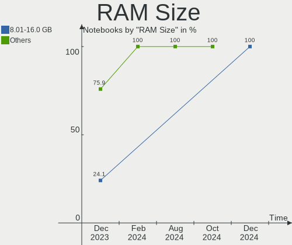

| Size in GB | Notebooks | Percent |
|------------|-----------|---------|
| 4.01-8.0   | 7         | 33.33%  |
| 3.01-4.0   | 6         | 28.57%  |
| 16.01-24.0 | 4         | 19.05%  |
| 8.01-16.0  | 3         | 14.29%  |
| 32.01-64.0 | 1         | 4.76%   |

RAM Used
--------

Used RAM memory

| Used GB  | Notebooks | Percent |
|----------|-----------|---------|
| 1.01-2.0 | 7         | 33.33%  |
| 3.01-4.0 | 6         | 28.57%  |
| 4.01-8.0 | 4         | 19.05%  |
| 2.01-3.0 | 4         | 19.05%  |

Total Drives
------------

Number of drives on board

| Drives | Notebooks | Percent |
|--------|-----------|---------|
| 1      | 12        | 57.14%  |
| 2      | 9         | 42.86%  |

Has CD-ROM
----------

Has CD-ROM on board

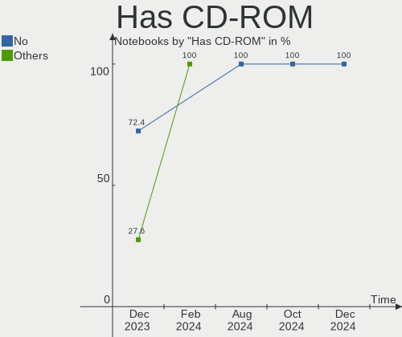

| Presented | Notebooks | Percent |
|-----------|-----------|---------|
| No        | 16        | 76.19%  |
| Yes       | 5         | 23.81%  |

Has Ethernet
------------

Has Ethernet on board

| Presented | Notebooks | Percent |
|-----------|-----------|---------|
| Yes       | 16        | 76.19%  |
| No        | 5         | 23.81%  |

Has WiFi
--------

Has WiFi module

| Presented | Notebooks | Percent |
|-----------|-----------|---------|
| Yes       | 21        | 100%    |

Has Bluetooth
-------------

Has Bluetooth module

| Presented | Notebooks | Percent |
|-----------|-----------|---------|
| Yes       | 18        | 85.71%  |
| No        | 3         | 14.29%  |

Location
--------

Country
-------

Geographic location (country)

| Country     | Notebooks | Percent |
|-------------|-----------|---------|
| USA         | 5         | 23.81%  |
| Russia      | 2         | 9.52%   |
| India       | 2         | 9.52%   |
| Germany     | 2         | 9.52%   |
| China       | 2         | 9.52%   |
| Turkey      | 1         | 4.76%   |
| Sri Lanka   | 1         | 4.76%   |
| Spain       | 1         | 4.76%   |
| Philippines | 1         | 4.76%   |
| Italy       | 1         | 4.76%   |
| Iran        | 1         | 4.76%   |
| France      | 1         | 4.76%   |
| Brazil      | 1         | 4.76%   |

City
----

Geographic location (city)

| City           | Notebooks | Percent |
|----------------|-----------|---------|
| Xi'an          | 1         | 4.76%   |
| Wuhu           | 1         | 4.76%   |
| Voronezh       | 1         | 4.76%   |
| Virginia Beach | 1         | 4.76%   |
| Thrissur       | 1         | 4.76%   |
| Tehran         | 1         | 4.76%   |
| Stuttgart      | 1         | 4.76%   |
| Siloam Springs | 1         | 4.76%   |
| Portland       | 1         | 4.76%   |
| Paris          | 1         | 4.76%   |
| Mumbai         | 1         | 4.76%   |
| Madrid         | 1         | 4.76%   |
| Lipetsk        | 1         | 4.76%   |
| La Crosse      | 1         | 4.76%   |
| Istanbul       | 1         | 4.76%   |
| Guarulhos      | 1         | 4.76%   |
| General Santos | 1         | 4.76%   |
| Fonzaso        | 1         | 4.76%   |
| Exeter         | 1         | 4.76%   |
| Colombo        | 1         | 4.76%   |
| Barsinghausen  | 1         | 4.76%   |

Drives
------

Drive Vendor
------------

Hard drive vendors

| Vendor                    | Notebooks | Drives | Percent |
|---------------------------|-----------|--------|---------|
| Samsung Electronics       | 5         | 5      | 16.67%  |
| Sandisk                   | 3         | 3      | 10%     |
| WDC                       | 2         | 2      | 6.67%   |
| Unknown                   | 2         | 2      | 6.67%   |
| Toshiba                   | 2         | 2      | 6.67%   |
| SK hynix                  | 2         | 2      | 6.67%   |
| Seagate                   | 2         | 2      | 6.67%   |
| Kingston                  | 2         | 2      | 6.67%   |
| Apacer                    | 2         | 2      | 6.67%   |
| Phison Electronics        | 1         | 1      | 3.33%   |
| Micron/Crucial Technology | 1         | 1      | 3.33%   |
| KIOXIA                    | 1         | 1      | 3.33%   |
| KimMiDi                   | 1         | 1      | 3.33%   |
| HS-SSD-C100               | 1         | 1      | 3.33%   |
| Hitachi                   | 1         | 1      | 3.33%   |
| China                     | 1         | 1      | 3.33%   |
| Apple                     | 1         | 1      | 3.33%   |

Drive Model
-----------

Hard drive models

| Model                                             | Notebooks | Percent |
|---------------------------------------------------|-----------|---------|
| WDC WD5000LPVX-22V0TT0 500GB                      | 1         | 3.33%   |
| WDC WD Green 2.5 480GB SSD                        | 1         | 3.33%   |
| Unknown MMC Card  32GB                            | 1         | 3.33%   |
| Unknown MMC Card  256GB                           | 1         | 3.33%   |
| Toshiba MQ04ABF100 1TB                            | 1         | 3.33%   |
| Toshiba MK3261GSYN 320GB                          | 1         | 3.33%   |
| SK hynix SC308 SATA 256GB SSD                     | 1         | 3.33%   |
| SK hynix HFM512GD3JX016N 512GB                    | 1         | 3.33%   |
| Seagate ST9250315AS 250GB                         | 1         | 3.33%   |
| Seagate Expansion HDD 4TB                         | 1         | 3.33%   |
| Sandisk WD_BLACK SN770 500GB                      | 1         | 3.33%   |
| Sandisk WD Blue SN550 NVMe SSD 512GB              | 1         | 3.33%   |
| Sandisk PC SN520 NVMe SSD 256GB                   | 1         | 3.33%   |
| Samsung SSD 870 QVO 1TB                           | 1         | 3.33%   |
| Samsung SSD 860 QVO 1TB                           | 1         | 3.33%   |
| Samsung NVMe SSD Controller SM981/PM981/PM983 1TB | 1         | 3.33%   |
| Samsung MZVLQ256HBJD-00B 256GB                    | 1         | 3.33%   |
| Samsung MZNTY128HDHP-000 128GB SSD                | 1         | 3.33%   |
| Phison E12 NVMe Controller 1TB                    | 1         | 3.33%   |
| Micron/Crucial P1 NVMe PCIe SSD 1TB               | 1         | 3.33%   |
| KIOXIA KBG40ZNS512G NVMe 512GB                    | 1         | 3.33%   |
| Kingston SNVS500G 500GB                           | 1         | 3.33%   |
| Kingston RBUSNS8180DS3256GJ 256GB SSD             | 1         | 3.33%   |
| KimMiDi SSD TB900 128GB                           | 1         | 3.33%   |
| HS-SSD-C100 SSD 240G                              | 1         | 3.33%   |
| Hitachi HTS725025A9A364 250GB                     | 1         | 3.33%   |
| China SATA3 2TB SSD                               | 1         | 3.33%   |
| Apple SSD TS0128F 121GB                           | 1         | 3.33%   |
| Apacer AS350 128GB SSD                            | 1         | 3.33%   |
| Apacer AS340 480GB SSD                            | 1         | 3.33%   |

HDD Vendor
----------

Hard disk drive vendors

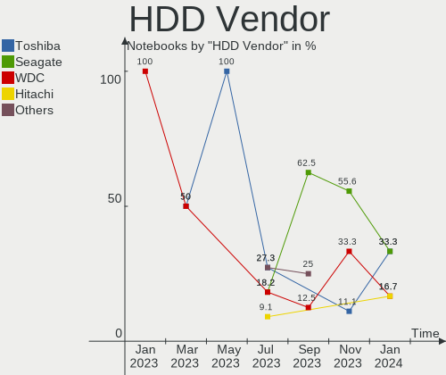

| Vendor  | Notebooks | Drives | Percent |
|---------|-----------|--------|---------|
| Toshiba | 2         | 2      | 33.33%  |
| Seagate | 2         | 2      | 33.33%  |
| WDC     | 1         | 1      | 16.67%  |
| Hitachi | 1         | 1      | 16.67%  |

SSD Vendor
----------

Solid state drive vendors

| Vendor              | Notebooks | Drives | Percent |
|---------------------|-----------|--------|---------|
| Samsung Electronics | 3         | 3      | 25%     |
| Apacer              | 2         | 2      | 16.67%  |
| WDC                 | 1         | 1      | 8.33%   |
| SK hynix            | 1         | 1      | 8.33%   |
| Kingston            | 1         | 1      | 8.33%   |
| KimMiDi             | 1         | 1      | 8.33%   |
| HS-SSD-C100         | 1         | 1      | 8.33%   |
| China               | 1         | 1      | 8.33%   |
| Apple               | 1         | 1      | 8.33%   |

Drive Kind
----------

HDD or SSD

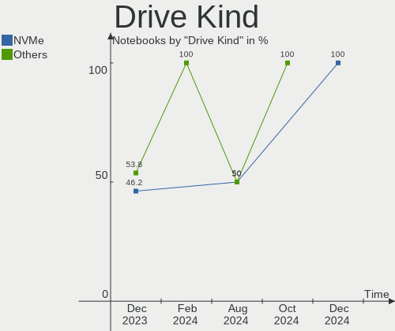

| Kind | Notebooks | Drives | Percent |
|------|-----------|--------|---------|
| SSD  | 11        | 12     | 39.29%  |
| NVMe | 9         | 10     | 32.14%  |
| HDD  | 6         | 6      | 21.43%  |
| MMC  | 2         | 2      | 7.14%   |

Drive Connector
---------------

SATA, SAS, NVMe, etc.

| Type | Notebooks | Drives | Percent |
|------|-----------|--------|---------|
| SATA | 14        | 17     | 53.85%  |
| NVMe | 9         | 10     | 34.62%  |
| MMC  | 2         | 2      | 7.69%   |
| SAS  | 1         | 1      | 3.85%   |

Drive Size
----------

Size of hard drive

| Size in TB | Notebooks | Drives | Percent |
|------------|-----------|--------|---------|
| 0.01-0.5   | 12        | 13     | 70.59%  |
| 0.51-1.0   | 3         | 3      | 17.65%  |
| 3.01-4.0   | 1         | 1      | 5.88%   |
| 1.01-2.0   | 1         | 1      | 5.88%   |

Space Total
-----------

Amount of disk space available on the file system

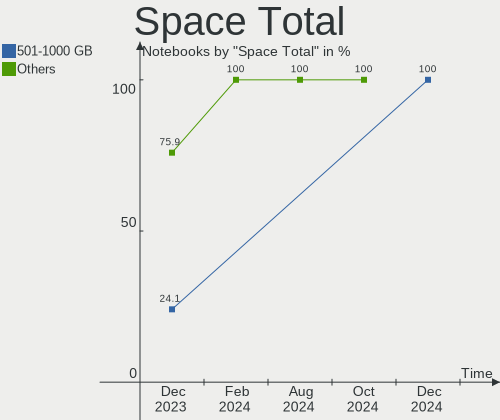

| Size in GB | Notebooks | Percent |
|------------|-----------|---------|
| 101-250    | 9         | 42.86%  |
| 501-1000   | 4         | 19.05%  |
| 51-100     | 4         | 19.05%  |
| 251-500    | 3         | 14.29%  |
| 21-50      | 1         | 4.76%   |

Space Used
----------

Amount of used disk space

| Used GB | Notebooks | Percent |
|---------|-----------|---------|
| 1-20    | 10        | 47.62%  |
| 21-50   | 5         | 23.81%  |
| 251-500 | 3         | 14.29%  |
| 51-100  | 2         | 9.52%   |
| 101-250 | 1         | 4.76%   |

Malfunc. Drives
---------------

Drive models with a malfunction

| Model                                          | Notebooks | Drives | Percent |
|------------------------------------------------|-----------|--------|---------|
| WDC WD5000LPVX-22V0TT0 500GB                   | 1         | 1      | 14.29%  |
| WDC WD Green 2.5 480GB SSD                     | 1         | 1      | 14.29%  |
| Toshiba MK3261GSYN 320GB                       | 1         | 1      | 14.29%  |
| SK hynix SC308 SATA 256GB SSD                  | 1         | 1      | 14.29%  |
| Seagate ST9250315AS 250GB                      | 1         | 1      | 14.29%  |
| Samsung Electronics MZNTY128HDHP-000 128GB SSD | 1         | 1      | 14.29%  |
| Hitachi HTS725025A9A364 250GB                  | 1         | 1      | 14.29%  |

Malfunc. Drive Vendor
---------------------

Vendors of faulty drives

| Vendor              | Notebooks | Drives | Percent |
|---------------------|-----------|--------|---------|
| WDC                 | 2         | 2      | 28.57%  |
| Toshiba             | 1         | 1      | 14.29%  |
| SK hynix            | 1         | 1      | 14.29%  |
| Seagate             | 1         | 1      | 14.29%  |
| Samsung Electronics | 1         | 1      | 14.29%  |
| Hitachi             | 1         | 1      | 14.29%  |

Malfunc. HDD Vendor
-------------------

Vendors of faulty HDD drives

| Vendor  | Notebooks | Drives | Percent |
|---------|-----------|--------|---------|
| WDC     | 1         | 1      | 25%     |
| Toshiba | 1         | 1      | 25%     |
| Seagate | 1         | 1      | 25%     |
| Hitachi | 1         | 1      | 25%     |

Malfunc. Drive Kind
-------------------

Kinds of faulty drives

| Kind | Notebooks | Drives | Percent |
|------|-----------|--------|---------|
| HDD  | 4         | 4      | 57.14%  |
| SSD  | 3         | 3      | 42.86%  |

Failed Drives
-------------

Failed drive models

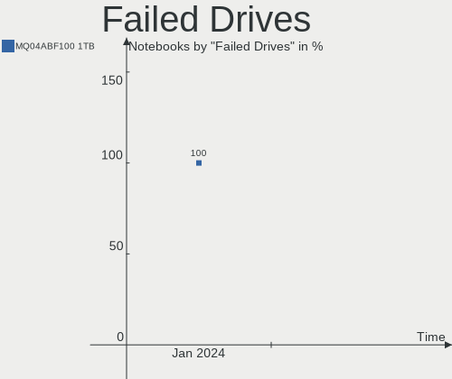

| Model                  | Notebooks | Drives | Percent |
|------------------------|-----------|--------|---------|
| Toshiba MQ04ABF100 1TB | 1         | 1      | 100%    |

Failed Drive Vendor
-------------------

Failed drive vendors

| Vendor  | Notebooks | Drives | Percent |
|---------|-----------|--------|---------|
| Toshiba | 1         | 1      | 100%    |

Drive Status
------------

Number of failed and malfunc. drives

| Status   | Notebooks | Drives | Percent |
|----------|-----------|--------|---------|
| Works    | 15        | 19     | 60%     |
| Malfunc  | 6         | 7      | 24%     |
| Detected | 3         | 3      | 12%     |
| Failed   | 1         | 1      | 4%      |

Storage controller
------------------

Storage Vendor
--------------

Storage controller vendors

| Vendor                       | Notebooks | Percent |
|------------------------------|-----------|---------|
| Intel                        | 13        | 48.15%  |
| SanDisk                      | 3         | 11.11%  |
| AMD                          | 3         | 11.11%  |
| Samsung Electronics          | 2         | 7.41%   |
| Toshiba America Info Systems | 1         | 3.7%    |
| SK hynix                     | 1         | 3.7%    |
| Phison Electronics           | 1         | 3.7%    |
| Micron/Crucial Technology    | 1         | 3.7%    |
| KIOXIA                       | 1         | 3.7%    |
| Kingston Technology Company  | 1         | 3.7%    |

Storage Model
-------------

Storage controller models

| Model                                                                        | Notebooks | Percent |
|------------------------------------------------------------------------------|-----------|---------|
| Intel Volume Management Device NVMe RAID Controller                          | 3         | 10%     |
| AMD FCH SATA Controller [AHCI mode]                                          | 3         | 10%     |
| Intel Tiger Lake-LP SATA Controller                                          | 2         | 6.67%   |
| Intel Ice Lake-LP SATA Controller [AHCI mode]                                | 2         | 6.67%   |
| Intel 82801IBM/IEM (ICH9M/ICH9M-E) 4 port SATA Controller [AHCI mode]        | 2         | 6.67%   |
| Toshiba America Info Systems Toshiba America Info SATA controller            | 1         | 3.33%   |
| SK hynix Gold P31/BC711/PC711 NVMe Solid State Drive                         | 1         | 3.33%   |
| SanDisk WD Black SN770 / PC SN740 256GB / PC SN560 (DRAM-less) NVMe SSD      | 1         | 3.33%   |
| SanDisk Ultra 3D / WD Blue SN550 NVMe SSD                                    | 1         | 3.33%   |
| SanDisk PC SN520 x2 M.2 2230 NVMe SSD                                        | 1         | 3.33%   |
| Samsung NVMe SSD Controller SM981/PM981/PM983                                | 1         | 3.33%   |
| Samsung NVMe SSD Controller 980 (DRAM-less)                                  | 1         | 3.33%   |
| Phison E12 NVMe Controller                                                   | 1         | 3.33%   |
| Micron/Crucial P1 NVMe PCIe SSD[Frampton]                                    | 1         | 3.33%   |
| KIOXIA NVMe SSD Controller BG4 (DRAM-less)                                   | 1         | 3.33%   |
| Kingston Company NV1 NVMe SSD E13T (DRAM-less)                               | 1         | 3.33%   |
| Intel Tiger Lake SATA AHCI Controller                                        | 1         | 3.33%   |
| Intel Sunrise Point-LP SATA Controller [AHCI mode]                           | 1         | 3.33%   |
| Intel Atom Processor E3800 Series SATA AHCI Controller                       | 1         | 3.33%   |
| Intel 82801 Mobile SATA Controller [RAID mode]                               | 1         | 3.33%   |
| Intel 8 Series SATA Controller 1 [AHCI mode]                                 | 1         | 3.33%   |
| Intel 7 Series Chipset Family 6-port SATA Controller [AHCI mode]             | 1         | 3.33%   |
| Intel 6 Series/C200 Series Chipset Family 6 port Mobile SATA AHCI Controller | 1         | 3.33%   |

Storage Kind
------------

Kind of storage controller (IDE, SATA, NVMe, SAS, ...)

| Kind | Notebooks | Percent |
|------|-----------|---------|
| SATA | 16        | 55.17%  |
| NVMe | 9         | 31.03%  |
| RAID | 4         | 13.79%  |

Processor
---------

CPU Vendor
----------

Processor vendors

| Vendor | Notebooks | Percent |
|--------|-----------|---------|
| Intel  | 17        | 80.95%  |
| AMD    | 4         | 19.05%  |

CPU Model
---------

Processor models

| Model                                           | Notebooks | Percent |
|-------------------------------------------------|-----------|---------|
| Intel Pentium Dual-Core CPU T4400 @ 2.20GHz     | 1         | 4.76%   |
| Intel Core m5-6Y57 CPU @ 1.10GHz                | 1         | 4.76%   |
| Intel Core i7-4500U CPU @ 1.80GHz               | 1         | 4.76%   |
| Intel Core i7-1065G7 CPU @ 1.30GHz              | 1         | 4.76%   |
| Intel Core i5-6200U CPU @ 2.30GHz               | 1         | 4.76%   |
| Intel Core i5-4250U CPU @ 1.30GHz               | 1         | 4.76%   |
| Intel Core i5-3210M CPU @ 2.50GHz               | 1         | 4.76%   |
| Intel Core i5-2410M CPU @ 2.30GHz               | 1         | 4.76%   |
| Intel Core i5-1035G1 CPU @ 1.00GHz              | 1         | 4.76%   |
| Intel Core i3-7020U CPU @ 2.30GHz               | 1         | 4.76%   |
| Intel Core 2 Duo CPU P8700 @ 2.53GHz            | 1         | 4.76%   |
| Intel Celeron N4020 CPU @ 1.10GHz               | 1         | 4.76%   |
| Intel Celeron CPU N2930 @ 1.83GHz               | 1         | 4.76%   |
| Intel 11th Gen Core i7-1165G7 @ 2.80GHz         | 1         | 4.76%   |
| Intel 11th Gen Core i5-11400H @ 2.70GHz         | 1         | 4.76%   |
| Intel 11th Gen Core i5-1135G7 @ 2.40GHz         | 1         | 4.76%   |
| Intel 11th Gen Core i3-1115G4 @ 3.00GHz         | 1         | 4.76%   |
| AMD Ryzen 7 PRO 3700U w/ Radeon Vega Mobile Gfx | 1         | 4.76%   |
| AMD Ryzen 7 4800H with Radeon Graphics          | 1         | 4.76%   |
| AMD Ryzen 5 5600H with Radeon Graphics          | 1         | 4.76%   |
| AMD Athlon Silver 3050U with Radeon Graphics    | 1         | 4.76%   |

CPU Model Family
----------------

Processor model prefix

| Model                   | Notebooks | Percent |
|-------------------------|-----------|---------|
| Intel Core i5           | 5         | 23.81%  |
| Other                   | 4         | 19.05%  |
| Intel Core i7           | 2         | 9.52%   |
| Intel Celeron           | 2         | 9.52%   |
| Intel Pentium Dual-Core | 1         | 4.76%   |
| Intel Core m5           | 1         | 4.76%   |
| Intel Core i3           | 1         | 4.76%   |
| Intel Core 2 Duo        | 1         | 4.76%   |
| AMD Ryzen 7 PRO         | 1         | 4.76%   |
| AMD Ryzen 7             | 1         | 4.76%   |
| AMD Ryzen 5             | 1         | 4.76%   |
| AMD Athlon              | 1         | 4.76%   |

CPU Cores
---------

Number of processor cores

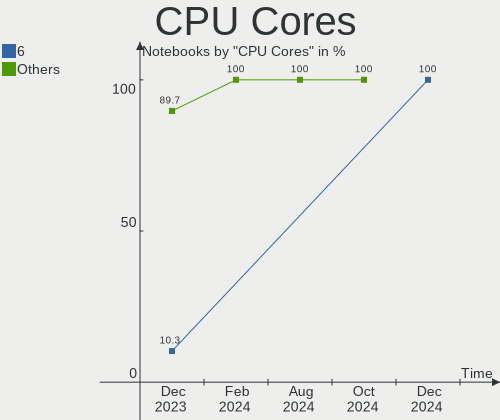

| Number | Notebooks | Percent |
|--------|-----------|---------|
| 2      | 12        | 57.14%  |
| 4      | 6         | 28.57%  |
| 6      | 2         | 9.52%   |
| 8      | 1         | 4.76%   |

CPU Sockets
-----------

Number of sockets

| Number | Notebooks | Percent |
|--------|-----------|---------|
| 1      | 21        | 100%    |

CPU Threads
-----------

Threads per core (Hyper-Threading)

| Number | Notebooks | Percent |
|--------|-----------|---------|
| 2      | 16        | 76.19%  |
| 1      | 5         | 23.81%  |

CPU Op-Modes
------------

CPU Operation Modes (32-bit, 64-bit)

| Op mode        | Notebooks | Percent |
|----------------|-----------|---------|
| 32-bit, 64-bit | 21        | 100%    |

CPU Microcode
-------------

Microcode number

| Number     | Notebooks | Percent |
|------------|-----------|---------|
| Unknown    | 17        | 80.95%  |
| 0x0a50000d | 1         | 4.76%   |
| 0x08600103 | 1         | 4.76%   |
| 0x08108109 | 1         | 4.76%   |
| 0x08108102 | 1         | 4.76%   |

CPU Microarch
-------------

Microarchitecture

| Name          | Notebooks | Percent |
|---------------|-----------|---------|
| TigerLake     | 3         | 14.29%  |
| Icelake       | 3         | 14.29%  |
| Zen+          | 2         | 9.52%   |
| Skylake       | 2         | 9.52%   |
| Penryn        | 2         | 9.52%   |
| Haswell       | 2         | 9.52%   |
| Zen 3         | 1         | 4.76%   |
| Zen 2         | 1         | 4.76%   |
| Silvermont    | 1         | 4.76%   |
| SandyBridge   | 1         | 4.76%   |
| KabyLake      | 1         | 4.76%   |
| IvyBridge     | 1         | 4.76%   |
| Goldmont plus | 1         | 4.76%   |

Graphics
--------

GPU Vendor
----------

Vendors of graphics cards

| Vendor | Notebooks | Percent |
|--------|-----------|---------|
| Intel  | 16        | 59.26%  |
| AMD    | 6         | 22.22%  |
| Nvidia | 5         | 18.52%  |

GPU Model
---------

Graphics card models

| Model                                                                     | Notebooks | Percent |
|---------------------------------------------------------------------------|-----------|---------|
| Nvidia TU117M [GeForce GTX 1650 Mobile / Max-Q]                           | 2         | 7.41%   |
| Nvidia GP108M [GeForce MX230]                                             | 2         | 7.41%   |
| Intel TigerLake-LP GT2 [Iris Xe Graphics]                                 | 2         | 7.41%   |
| Intel Haswell-ULT Integrated Graphics Controller                          | 2         | 7.41%   |
| AMD Picasso/Raven 2 [Radeon Vega Series / Radeon Vega Mobile Series]      | 2         | 7.41%   |
| Nvidia GP107M [GeForce MX350]                                             | 1         | 3.7%    |
| Intel TigerLake-H GT1 [UHD Graphics]                                      | 1         | 3.7%    |
| Intel Tiger Lake-LP GT2 [UHD Graphics G4]                                 | 1         | 3.7%    |
| Intel Skylake GT2 [HD Graphics 520]                                       | 1         | 3.7%    |
| Intel Mobile 4 Series Chipset Integrated Graphics Controller              | 1         | 3.7%    |
| Intel Iris Plus Graphics G7                                               | 1         | 3.7%    |
| Intel Iris Plus Graphics G1 (Ice Lake)                                    | 1         | 3.7%    |
| Intel HD Graphics 620                                                     | 1         | 3.7%    |
| Intel HD Graphics 515                                                     | 1         | 3.7%    |
| Intel GeminiLake [UHD Graphics 600]                                       | 1         | 3.7%    |
| Intel Atom Processor Z36xxx/Z37xxx Series Graphics & Display              | 1         | 3.7%    |
| Intel 3rd Gen Core processor Graphics Controller                          | 1         | 3.7%    |
| Intel 2nd Generation Core Processor Family Integrated Graphics Controller | 1         | 3.7%    |
| AMD Venus XT [Radeon HD 8870M / R9 M270X/M370X]                           | 1         | 3.7%    |
| AMD RV710/M92 [Mobility Radeon HD 4530/4570/5145/530v/540v/545v]          | 1         | 3.7%    |
| AMD Renoir [Radeon RX Vega 6 (Ryzen 4000/5000 Mobile Series)]             | 1         | 3.7%    |
| AMD Cezanne [Radeon Vega Series / Radeon Vega Mobile Series]              | 1         | 3.7%    |

GPU Combo
---------

Combinations of graphics cards

| Name           | Notebooks | Percent |
|----------------|-----------|---------|
| 1 x Intel      | 10        | 47.62%  |
| Intel + Nvidia | 4         | 19.05%  |
| 1 x AMD        | 4         | 19.05%  |
| 2 x Intel      | 1         | 4.76%   |
| Intel + AMD    | 1         | 4.76%   |
| AMD + Nvidia   | 1         | 4.76%   |

GPU Driver
----------

Free vs proprietary

| Driver      | Notebooks | Percent |
|-------------|-----------|---------|
| Free        | 19        | 90.48%  |
| Proprietary | 2         | 9.52%   |

GPU Memory
----------

Total video memory

| Size in GB | Notebooks | Percent |
|------------|-----------|---------|
| Unknown    | 11        | 52.38%  |
| 1.01-2.0   | 6         | 28.57%  |
| 0.01-0.5   | 3         | 14.29%  |
| 3.01-4.0   | 1         | 4.76%   |

Monitor
-------

Monitor Vendor
--------------

Monitor vendors

| Vendor              | Notebooks | Percent |
|---------------------|-----------|---------|
| AU Optronics        | 6         | 27.27%  |
| Chimei Innolux      | 5         | 22.73%  |
| LG Display          | 4         | 18.18%  |
| BOE                 | 2         | 9.09%   |
| SKG                 | 1         | 4.55%   |
| Samsung Electronics | 1         | 4.55%   |
| Panasonic           | 1         | 4.55%   |
| Lenovo              | 1         | 4.55%   |
| Apple               | 1         | 4.55%   |

Monitor Model
-------------

Monitor models

| Model                                                                | Notebooks | Percent |
|----------------------------------------------------------------------|-----------|---------|
| SKG H27T13 SKG2720 2560x1440 531x298mm 24.0-inch                     | 1         | 4.55%   |
| Samsung Electronics LCD Monitor SEC3046 1366x768 344x193mm 15.5-inch | 1         | 4.55%   |
| Panasonic TV MEIA0AE 1920x540                                        | 1         | 4.55%   |
| LG Display LCD Monitor LGD05FA 1920x1080 309x174mm 14.0-inch         | 1         | 4.55%   |
| LG Display LCD Monitor LGD04A5 1920x1280 253x169mm 12.0-inch         | 1         | 4.55%   |
| LG Display LCD Monitor LGD038F 1366x768 344x194mm 15.5-inch          | 1         | 4.55%   |
| LG Display LCD Monitor LGD02E3 1366x768 344x194mm 15.5-inch          | 1         | 4.55%   |
| Lenovo LEN LI2364 LEN65C7 1920x1080 509x286mm 23.0-inch              | 1         | 4.55%   |
| Chimei Innolux LCD Monitor CMN15DB 1366x768 344x193mm 15.5-inch      | 1         | 4.55%   |
| Chimei Innolux LCD Monitor CMN1521 1920x1080 344x193mm 15.5-inch     | 1         | 4.55%   |
| Chimei Innolux LCD Monitor CMN14D6 1366x768 309x173mm 13.9-inch      | 1         | 4.55%   |
| Chimei Innolux LCD Monitor CMN14D5 1920x1080 309x173mm 13.9-inch     | 1         | 4.55%   |
| Chimei Innolux LCD Monitor CMN14C0 1920x1080 308x173mm 13.9-inch     | 1         | 4.55%   |
| BOE LCD Monitor BOE0A06 1920x1080 344x194mm 15.5-inch                | 1         | 4.55%   |
| BOE LCD Monitor BOE084E 1920x1080 382x215mm 17.3-inch                | 1         | 4.55%   |
| AU Optronics LCD Monitor AUO4999 1920x1080 344x193mm 15.5-inch       | 1         | 4.55%   |
| AU Optronics LCD Monitor AUO453D 1920x1080 309x174mm 14.0-inch       | 1         | 4.55%   |
| AU Optronics LCD Monitor AUO2992 1920x1080 344x193mm 15.5-inch       | 1         | 4.55%   |
| AU Optronics LCD Monitor AUO215C 1366x768 256x144mm 11.6-inch        | 1         | 4.55%   |
| AU Optronics LCD Monitor AUO159E 1600x900 382x214mm 17.2-inch        | 1         | 4.55%   |
| AU Optronics LCD Monitor AUO139D 1920x1080 381x214mm 17.2-inch       | 1         | 4.55%   |
| Apple Color LCD APP9CF2 1366x768 256x144mm 11.6-inch                 | 1         | 4.55%   |

Monitor Resolution
------------------

Monitor screen resolution

| Resolution      | Notebooks | Percent |
|-----------------|-----------|---------|
| 1920x1080 (FHD) | 10        | 47.62%  |
| 1366x768 (WXGA) | 7         | 33.33%  |
| 2560x1440 (QHD) | 1         | 4.76%   |
| 1920x540        | 1         | 4.76%   |
| 1920x1280       | 1         | 4.76%   |
| 1600x900 (HD+)  | 1         | 4.76%   |

Monitor Diagonal
----------------

Diagonal size in inches

| Inches | Notebooks | Percent |
|--------|-----------|---------|
| 15     | 8         | 36.36%  |
| 17     | 3         | 13.64%  |
| 13     | 3         | 13.64%  |
| 14     | 2         | 9.09%   |
| 11     | 2         | 9.09%   |
| 31     | 1         | 4.55%   |
| 24     | 1         | 4.55%   |
| 23     | 1         | 4.55%   |
| 12     | 1         | 4.55%   |

Monitor Width
-------------

Physical width

| Width in mm | Notebooks | Percent |
|-------------|-----------|---------|
| 301-350     | 13        | 59.09%  |
| 351-400     | 3         | 13.64%  |
| 201-300     | 3         | 13.64%  |
| 501-600     | 2         | 9.09%   |
| 601-700     | 1         | 4.55%   |

Aspect Ratio
------------

Proportional relationship between the width and the height

| Ratio | Notebooks | Percent |
|-------|-----------|---------|
| 16/9  | 19        | 95%     |
| 3/2   | 1         | 5%      |

Monitor Area
------------

Area in inch²

| Area in inch² | Notebooks | Percent |
|----------------|-----------|---------|
| 101-110        | 8         | 36.36%  |
| 81-90          | 5         | 22.73%  |
| 121-130        | 3         | 13.64%  |
| 51-60          | 2         | 9.09%   |
| 201-250        | 2         | 9.09%   |
| 61-70          | 1         | 4.55%   |
| 351-500        | 1         | 4.55%   |

Pixel Density
-------------

Pixels per inch

| Density | Notebooks | Percent |
|---------|-----------|---------|
| 121-160 | 12        | 57.14%  |
| 101-120 | 6         | 28.57%  |
| 51-100  | 2         | 9.52%   |
| 161-240 | 1         | 4.76%   |

Multiple Monitors
-----------------

Total monitors connected

| Total | Notebooks | Percent |
|-------|-----------|---------|
| 1     | 19        | 90.48%  |
| 2     | 2         | 9.52%   |

Network
-------

Net Controller Vendor
---------------------

Controller vendors

| Vendor                | Notebooks | Percent |
|-----------------------|-----------|---------|
| Realtek Semiconductor | 13        | 36.11%  |
| Intel                 | 11        | 30.56%  |
| Qualcomm Atheros      | 6         | 16.67%  |
| Broadcom Limited      | 2         | 5.56%   |
| OPPO Electronics      | 1         | 2.78%   |
| Motorola PCS          | 1         | 2.78%   |
| Hewlett-Packard       | 1         | 2.78%   |
| Broadcom              | 1         | 2.78%   |

Net Controller Model
--------------------

Controller models

| Model                                                                  | Notebooks | Percent |
|------------------------------------------------------------------------|-----------|---------|
| Realtek RTL8111/8168/8211/8411 PCI Express Gigabit Ethernet Controller | 7         | 17.07%  |
| Realtek RTL810xE PCI Express Fast Ethernet controller                  | 3         | 7.32%   |
| Intel Wi-Fi 6 AX201                                                    | 3         | 7.32%   |
| Qualcomm Atheros QCA9377 802.11ac Wireless Network Adapter             | 2         | 4.88%   |
| Qualcomm Atheros AR9462 Wireless Network Adapter                       | 2         | 4.88%   |
| Intel Wireless 8260                                                    | 2         | 4.88%   |
| Realtek RTL8852AE 802.11ax PCIe Wireless Network Adapter               | 1         | 2.44%   |
| Realtek RTL8822CE 802.11ac PCIe Wireless Network Adapter               | 1         | 2.44%   |
| Realtek RTL8821CE 802.11ac PCIe Wireless Network Adapter               | 1         | 2.44%   |
| Realtek RTL8723BU 802.11b/g/n WLAN Adapter                             | 1         | 2.44%   |
| Realtek Killer E2600 GbE Controller                                    | 1         | 2.44%   |
| Qualcomm Atheros QCA9565 / AR9565 Wireless Network Adapter             | 1         | 2.44%   |
| Qualcomm Atheros AR8132 Fast Ethernet                                  | 1         | 2.44%   |
| OPPO SM8350-IDP _SN:361A1B3C                                           | 1         | 2.44%   |
| Motorola PCS moto g 5G - 2023                                          | 1         | 2.44%   |
| Intel Wireless Gigabit 17265                                           | 1         | 2.44%   |
| Intel Wi-Fi 5(802.11ac) Wireless-AC 9x6x [Thunder Peak]                | 1         | 2.44%   |
| Intel Ultimate N WiFi Link 5300                                        | 1         | 2.44%   |
| Intel Tiger Lake PCH CNVi WiFi                                         | 1         | 2.44%   |
| Intel Gemini Lake PCH CNVi WiFi                                        | 1         | 2.44%   |
| Intel Ethernet Connection I219-LM                                      | 1         | 2.44%   |
| Intel Dual Band Wireless-AC 3168NGW [Stone Peak]                       | 1         | 2.44%   |
| Intel Centrino Advanced-N 6205 [Taylor Peak]                           | 1         | 2.44%   |
| Intel 82567LM Gigabit Network Connection                               | 1         | 2.44%   |
| HP lt4120 Snapdragon X5 LTE                                            | 1         | 2.44%   |
| Broadcom NetXtreme BCM5761 Gigabit Ethernet PCIe                       | 1         | 2.44%   |
| Broadcom Limited BCM4360 802.11ac Dual Band Wireless Network Adapter   | 1         | 2.44%   |
| Broadcom Limited BCM4312 802.11b/g LP-PHY                              | 1         | 2.44%   |

Wireless Vendor
---------------

Wireless vendors

| Vendor                | Notebooks | Percent |
|-----------------------|-----------|---------|
| Intel                 | 11        | 50%     |
| Qualcomm Atheros      | 5         | 22.73%  |
| Realtek Semiconductor | 4         | 18.18%  |
| Broadcom Limited      | 2         | 9.09%   |

Wireless Model
--------------

Wireless models

| Model                                                                | Notebooks | Percent |
|----------------------------------------------------------------------|-----------|---------|
| Intel Wi-Fi 6 AX201                                                  | 3         | 13.04%  |
| Qualcomm Atheros QCA9377 802.11ac Wireless Network Adapter           | 2         | 8.7%    |
| Qualcomm Atheros AR9462 Wireless Network Adapter                     | 2         | 8.7%    |
| Intel Wireless 8260                                                  | 2         | 8.7%    |
| Realtek RTL8852AE 802.11ax PCIe Wireless Network Adapter             | 1         | 4.35%   |
| Realtek RTL8822CE 802.11ac PCIe Wireless Network Adapter             | 1         | 4.35%   |
| Realtek RTL8821CE 802.11ac PCIe Wireless Network Adapter             | 1         | 4.35%   |
| Realtek RTL8723BU 802.11b/g/n WLAN Adapter                           | 1         | 4.35%   |
| Qualcomm Atheros QCA9565 / AR9565 Wireless Network Adapter           | 1         | 4.35%   |
| Intel Wireless Gigabit 17265                                         | 1         | 4.35%   |
| Intel Wi-Fi 5(802.11ac) Wireless-AC 9x6x [Thunder Peak]              | 1         | 4.35%   |
| Intel Ultimate N WiFi Link 5300                                      | 1         | 4.35%   |
| Intel Tiger Lake PCH CNVi WiFi                                       | 1         | 4.35%   |
| Intel Gemini Lake PCH CNVi WiFi                                      | 1         | 4.35%   |
| Intel Dual Band Wireless-AC 3168NGW [Stone Peak]                     | 1         | 4.35%   |
| Intel Centrino Advanced-N 6205 [Taylor Peak]                         | 1         | 4.35%   |
| Broadcom Limited BCM4360 802.11ac Dual Band Wireless Network Adapter | 1         | 4.35%   |
| Broadcom Limited BCM4312 802.11b/g LP-PHY                            | 1         | 4.35%   |

Ethernet Vendor
---------------

Ethernet vendors

| Vendor                | Notebooks | Percent |
|-----------------------|-----------|---------|
| Realtek Semiconductor | 11        | 64.71%  |
| Intel                 | 2         | 11.76%  |
| Qualcomm Atheros      | 1         | 5.88%   |
| OPPO Electronics      | 1         | 5.88%   |
| Hewlett-Packard       | 1         | 5.88%   |
| Broadcom              | 1         | 5.88%   |

Ethernet Model
--------------

Ethernet models

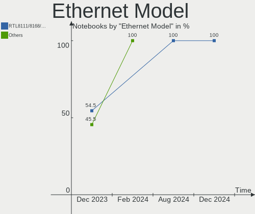

| Model                                                                  | Notebooks | Percent |
|------------------------------------------------------------------------|-----------|---------|
| Realtek RTL8111/8168/8211/8411 PCI Express Gigabit Ethernet Controller | 7         | 41.18%  |
| Realtek RTL810xE PCI Express Fast Ethernet controller                  | 3         | 17.65%  |
| Realtek Killer E2600 GbE Controller                                    | 1         | 5.88%   |
| Qualcomm Atheros AR8132 Fast Ethernet                                  | 1         | 5.88%   |
| OPPO SM8350-IDP _SN:361A1B3C                                           | 1         | 5.88%   |
| Intel Ethernet Connection I219-LM                                      | 1         | 5.88%   |
| Intel 82567LM Gigabit Network Connection                               | 1         | 5.88%   |
| HP lt4120 Snapdragon X5 LTE                                            | 1         | 5.88%   |
| Broadcom NetXtreme BCM5761 Gigabit Ethernet PCIe                       | 1         | 5.88%   |

Net Controller Kind
-------------------

Ethernet, WiFi or modem

| Kind     | Notebooks | Percent |
|----------|-----------|---------|
| WiFi     | 21        | 55.26%  |
| Ethernet | 16        | 42.11%  |
| Unknown  | 1         | 2.63%   |

Used Controller
---------------

Currently used network controller

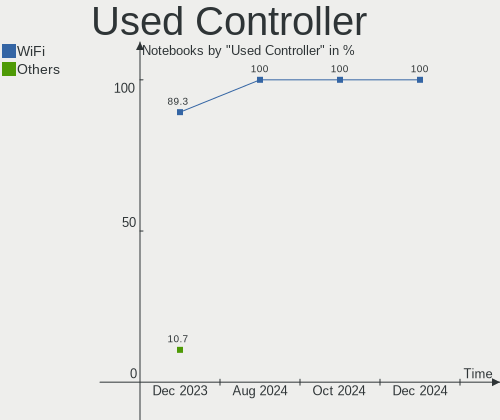

| Kind     | Notebooks | Percent |
|----------|-----------|---------|
| WiFi     | 14        | 82.35%  |
| Ethernet | 3         | 17.65%  |

NICs
----

Total network controllers on board

| Total | Notebooks | Percent |
|-------|-----------|---------|
| 2     | 15        | 71.43%  |
| 1     | 5         | 23.81%  |
| 3     | 1         | 4.76%   |

IPv6
----

IPv6 vs IPv4

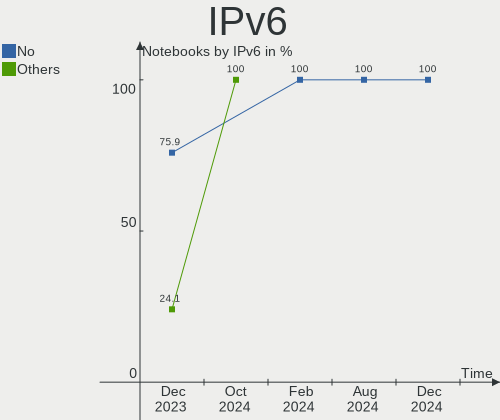

| Used | Notebooks | Percent |
|------|-----------|---------|
| No   | 17        | 80.95%  |
| Yes  | 4         | 19.05%  |

Bluetooth
---------

Bluetooth Vendor
----------------

Controller vendors

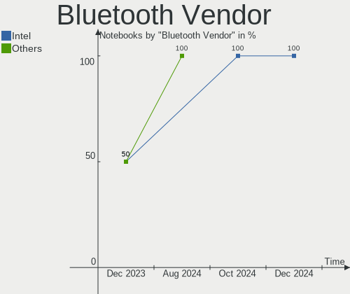

| Vendor                          | Notebooks | Percent |
|---------------------------------|-----------|---------|
| Intel                           | 9         | 50%     |
| Realtek Semiconductor           | 3         | 16.67%  |
| Qualcomm Atheros Communications | 3         | 16.67%  |
| Taiyo Yuden                     | 1         | 5.56%   |
| Foxconn / Hon Hai               | 1         | 5.56%   |
| Apple                           | 1         | 5.56%   |

Bluetooth Model
---------------

Controller models

| Model                                          | Notebooks | Percent |
|------------------------------------------------|-----------|---------|
| Intel Bluetooth 9460/9560 Jefferson Peak (JfP) | 3         | 16.67%  |
| Realtek Bluetooth Radio                        | 2         | 11.11%  |
| Qualcomm Atheros  Bluetooth Device             | 2         | 11.11%  |
| Intel Bluetooth wireless interface             | 2         | 11.11%  |
| Intel AX201 Bluetooth                          | 2         | 11.11%  |
| Taiyo Yuden Bluetooth Device (V2.1+EDR)        | 1         | 5.56%   |
| Realtek  Bluetooth 4.2 Adapter                 | 1         | 5.56%   |
| Qualcomm Atheros AR9462 Bluetooth              | 1         | 5.56%   |
| Intel Wireless-AC 9260 Bluetooth Adapter       | 1         | 5.56%   |
| Intel Wireless-AC 3168 Bluetooth               | 1         | 5.56%   |
| Foxconn / Hon Hai Bluetooth Device             | 1         | 5.56%   |
| Apple Bluetooth USB Host Controller            | 1         | 5.56%   |

Sound
-----

Sound Vendor
------------

Sound card vendors

| Vendor | Notebooks | Percent |
|--------|-----------|---------|
| Intel  | 17        | 73.91%  |
| AMD    | 4         | 17.39%  |
| Nvidia | 2         | 8.7%    |

Sound Model
-----------

Sound card models

| Model                                                                      | Notebooks | Percent |
|----------------------------------------------------------------------------|-----------|---------|
| AMD Family 17h/19h HD Audio Controller                                     | 4         | 14.29%  |
| Intel Tiger Lake-LP Smart Sound Technology Audio Controller                | 3         | 10.71%  |
| Intel Sunrise Point-LP HD Audio                                            | 3         | 10.71%  |
| Nvidia TU107 GeForce GTX 1650 High Definition Audio Controller             | 2         | 7.14%   |
| Intel Ice Lake-LP Smart Sound Technology Audio Controller                  | 2         | 7.14%   |
| Intel Haswell-ULT HD Audio Controller                                      | 2         | 7.14%   |
| Intel 82801I (ICH9 Family) HD Audio Controller                             | 2         | 7.14%   |
| Intel 8 Series HD Audio Controller                                         | 2         | 7.14%   |
| AMD Raven/Raven2/Fenghuang HDMI/DP Audio Controller                        | 2         | 7.14%   |
| Intel Tiger Lake-H HD Audio Controller                                     | 1         | 3.57%   |
| Intel Celeron/Pentium Silver Processor High Definition Audio               | 1         | 3.57%   |
| Intel Atom Processor Z36xxx/Z37xxx Series High Definition Audio Controller | 1         | 3.57%   |
| Intel 7 Series/C216 Chipset Family High Definition Audio Controller        | 1         | 3.57%   |
| Intel 6 Series/C200 Series Chipset Family High Definition Audio Controller | 1         | 3.57%   |
| AMD Renoir Radeon High Definition Audio Controller                         | 1         | 3.57%   |

Memory
------

Memory Vendor
-------------

Memory module vendors

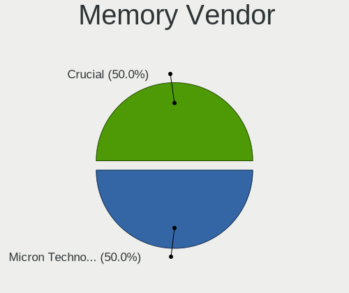

| Vendor              | Notebooks | Percent |
|---------------------|-----------|---------|
| Samsung Electronics | 11        | 40.74%  |
| SK hynix            | 7         | 25.93%  |
| Micron Technology   | 4         | 14.81%  |
| Unknown             | 1         | 3.7%    |
| Kingston            | 1         | 3.7%    |
| G.Skill             | 1         | 3.7%    |
| Crucial             | 1         | 3.7%    |
| Corsair             | 1         | 3.7%    |

Memory Model
------------

Memory module models

| Model                                                       | Notebooks | Percent |
|-------------------------------------------------------------|-----------|---------|
| Unknown RAM Module 2GB SODIMM 800MT/s                       | 1         | 3.57%   |
| SK hynix RAM Module 4GB SODIMM LPDDR3 1867MT/s              | 1         | 3.57%   |
| SK hynix RAM Module 2GB SODIMM DDR3 1600MT/s                | 1         | 3.57%   |
| SK hynix RAM HMT351S6EFR8A-PB 4096MB SODIMM DDR3 1600MT/s   | 1         | 3.57%   |
| SK hynix RAM HMT125S6BFR8C-G7 2048MB SODIMM DDR3 1067MT/s   | 1         | 3.57%   |
| SK hynix RAM HMA851S6AFR6N-UH 4GB SODIMM DDR4 2667MT/s      | 1         | 3.57%   |
| SK hynix RAM HMA81GS6DJR8N-VK 8GB SODIMM DDR4 2667MT/s      | 1         | 3.57%   |
| SK hynix RAM HMA41GS6AFR8N-TF 8GB SODIMM DDR4 2667MT/s      | 1         | 3.57%   |
| Samsung RAM U6E3S4AA-MGCR 1GB Row Of Chips LPDDR4 4267MT/s  | 1         | 3.57%   |
| Samsung RAM M471B5273DH0-CH9 4GB SODIMM DDR3 1334MT/s       | 1         | 3.57%   |
| Samsung RAM M471B5173DB0-YK0 4GB SODIMM DDR3 1600MT/s       | 1         | 3.57%   |
| Samsung RAM M471A5244CB0-CWE 4GB SODIMM DDR4 3200MT/s       | 1         | 3.57%   |
| Samsung RAM M471A5244CB0-CWE 4GB Row Of Chips DDR4 3200MT/s | 1         | 3.57%   |
| Samsung RAM M471A2K43DB1-CWE 16GB SODIMM DDR4 3200MT/s      | 1         | 3.57%   |
| Samsung RAM M471A1K43EB1-CWE 8GB SODIMM DDR4 3200MT/s       | 1         | 3.57%   |
| Samsung RAM M471A1K43DB1-CTD 8GB SODIMM DDR4 2667MT/s       | 1         | 3.57%   |
| Samsung RAM M471A1K43CB1-CTD 8GB SODIMM DDR4 2667MT/s       | 1         | 3.57%   |
| Samsung RAM M471A1G44BB0-CWE 8GB SODIMM DDR4 3200MT/s       | 1         | 3.57%   |
| Samsung RAM M471A1G44AB0-CWE 8GB SODIMM DDR4 3200MT/s       | 1         | 3.57%   |
| Samsung RAM K4F8E304HB-MGCJ 1GB LPDDR4 2400MT/s             | 1         | 3.57%   |
| Micron RAM 4ATS1G64HZ-2G6E1 8GB SODIMM DDR4 2667MT/s        | 1         | 3.57%   |
| Micron RAM 4ATF51264HZ-2G6E1 4GB Row Of Chips DDR4 2667MT/s | 1         | 3.57%   |
| Micron RAM 16JSF25664HZ-1G1F1 2GB SODIMM 1067MT/s           | 1         | 3.57%   |
| Micron RAM 16ATF2G64HZ-2G3B1 16GB SODIMM DDR4 2400MT/s      | 1         | 3.57%   |
| Kingston RAM 9905428-401.A00LF 8GB SODIMM DDR3 1600MT/s     | 1         | 3.57%   |
| G.Skill RAM F3-10666CL9-4GBSQ 4GB SODIMM DDR3 1334MT/s      | 1         | 3.57%   |
| Crucial RAM CB8GS2666.C8JT 8GB SODIMM DDR4 2667MT/s         | 1         | 3.57%   |
| Corsair RAM CMSX8GX4M1A3200C22 8GB SODIMM DDR4 3200MT/s     | 1         | 3.57%   |

Memory Kind
-----------

Memory module kinds

| Kind    | Notebooks | Percent |
|---------|-----------|---------|
| DDR4    | 10        | 47.62%  |
| DDR3    | 6         | 28.57%  |
| LPDDR4  | 3         | 14.29%  |
| LPDDR3  | 1         | 4.76%   |
| Unknown | 1         | 4.76%   |

Memory Form Factor
------------------

Physical design of the memory module

| Name         | Notebooks | Percent |
|--------------|-----------|---------|
| SODIMM       | 18        | 85.71%  |
| Row Of Chips | 2         | 9.52%   |
| Unknown      | 1         | 4.76%   |

Memory Size
-----------

Memory module size

| Size  | Notebooks | Percent |
|-------|-----------|---------|
| 8192  | 10        | 43.48%  |
| 4096  | 6         | 26.09%  |
| 16384 | 3         | 13.04%  |
| 2048  | 3         | 13.04%  |
| 1024  | 1         | 4.35%   |

Memory Speed
------------

Memory module speed

| Speed | Notebooks | Percent |
|-------|-----------|---------|
| 2667  | 6         | 26.09%  |
| 3200  | 5         | 21.74%  |
| 1600  | 4         | 17.39%  |
| 2400  | 2         | 8.7%    |
| 1334  | 2         | 8.7%    |
| 4267  | 1         | 4.35%   |
| 1867  | 1         | 4.35%   |
| 1067  | 1         | 4.35%   |
| 800   | 1         | 4.35%   |

Printers & scanners
-------------------

Printer Vendor
--------------

Printer device vendors

Zero info for selected period =(

Printer Model
-------------

Printer device models

Zero info for selected period =(

Scanner Vendor
--------------

Scanner device vendors

Zero info for selected period =(

Scanner Model
-------------

Scanner device models

Zero info for selected period =(

Camera
------

Camera Vendor
-------------

Camera device vendors

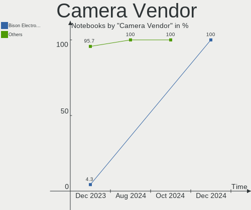

| Vendor                                 | Notebooks | Percent |
|----------------------------------------|-----------|---------|
| Chicony Electronics                    | 3         | 15.79%  |
| Realtek Semiconductor                  | 2         | 10.53%  |
| Quanta                                 | 2         | 10.53%  |
| Microdia                               | 2         | 10.53%  |
| Bison Electronics                      | 2         | 10.53%  |
| SunplusIT                              | 1         | 5.26%   |
| Sunplus Innovation Technology          | 1         | 5.26%   |
| Logitech                               | 1         | 5.26%   |
| Lite-On Technology                     | 1         | 5.26%   |
| IMC Networks                           | 1         | 5.26%   |
| Cheng Uei Precision Industry (Foxlink) | 1         | 5.26%   |
| Apple                                  | 1         | 5.26%   |
| Unknown                                | 1         | 5.26%   |

Camera Model
------------

Camera device models

| Model                                                    | Notebooks | Percent |
|----------------------------------------------------------|-----------|---------|
| Realtek Integrated_Webcam_HD                             | 2         | 10.53%  |
| Chicony HD WebCam                                        | 2         | 10.53%  |
| Bison Integrated Camera                                  | 2         | 10.53%  |
| SunplusIT 720p HD Camera                                 | 1         | 5.26%   |
| Sunplus HD WebCam                                        | 1         | 5.26%   |
| Quanta HP TrueVision HD Camera                           | 1         | 5.26%   |
| Quanta HD User Facing                                    | 1         | 5.26%   |
| Microdia Laptop_Integrated_Webcam_HD                     | 1         | 5.26%   |
| Microdia Integrated_Webcam_HD                            | 1         | 5.26%   |
| Logitech Fujitsu Webcam                                  | 1         | 5.26%   |
| Lite-On HP TrueVision HD Camera                          | 1         | 5.26%   |
| IMC Networks USB2.0 HD UVC WebCam                        | 1         | 5.26%   |
| Chicony HD User Facing                                   | 1         | 5.26%   |
| Cheng Uei Precision Industry (Foxlink) HP Full HD Camera | 1         | 5.26%   |
| Apple iPhone 5/5C/5S/6/SE/7/8/X/XR                       | 1         | 5.26%   |
| Unknown                                                  | 1         | 5.26%   |

Security
--------

Fingerprint Vendor
------------------

Fingerprint sensor vendors

| Vendor           | Notebooks | Percent |
|------------------|-----------|---------|
| Validity Sensors | 1         | 33.33%  |
| Synaptics        | 1         | 33.33%  |
| HOLTEK           | 1         | 33.33%  |

Fingerprint Model
-----------------

Fingerprint sensor models

| Model                                             | Notebooks | Percent |
|---------------------------------------------------|-----------|---------|
| Validity Sensors VFS495 Fingerprint Reader        | 1         | 33.33%  |
| Synaptics Prometheus MIS Touch Fingerprint Reader | 1         | 33.33%  |
| HOLTEK FocalTech Fingerprint Device               | 1         | 33.33%  |

Chipcard Vendor
---------------

Chipcard module vendors

| Vendor   | Notebooks | Percent |
|----------|-----------|---------|
| O2 Micro | 1         | 100%    |

Chipcard Model
--------------

Chipcard module models

| Model                                | Notebooks | Percent |
|--------------------------------------|-----------|---------|
| O2 Micro OZ776 CCID Smartcard Reader | 1         | 100%    |

Unsupported
-----------

Unsupported Devices
-------------------

Total unsupported devices on board

| Total | Notebooks | Percent |
|-------|-----------|---------|
| 0     | 14        | 66.67%  |
| 1     | 4         | 19.05%  |
| 2     | 3         | 14.29%  |

Unsupported Device Types
------------------------

Types of unsupported devices

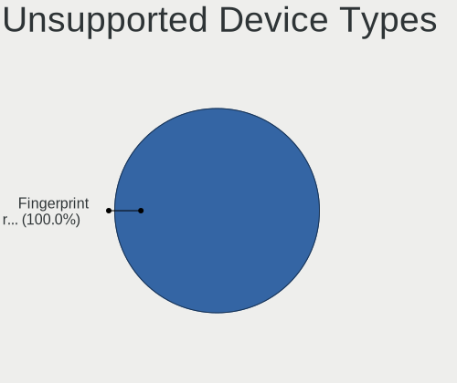

| Type                  | Notebooks | Percent |
|-----------------------|-----------|---------|
| Fingerprint reader    | 3         | 30%     |
| Storage               | 2         | 20%     |
| Multimedia controller | 2         | 20%     |
| Net/wireless          | 1         | 10%     |
| Graphics card         | 1         | 10%     |
| Chipcard              | 1         | 10%     |

