Xero - Hardware Trends (Notebooks)
----------------------------------

A project to identify most popular hardware characteristics and track their change
over time based on data collected by Linux users at https://Linux-Hardware.org.

Anyone can contribute to this report by the [hw-probe](https://github.com/linuxhw/hw-probe) tool:

    sudo -E hw-probe -all -upload

This report is for one last month. Overall report since the beginning of time: [TestDays](https://github.com/linuxhw/TestDays)

Period: Oct, 2023.

Contents
--------

* [ System ](#system)
  - [ OS                       ](#os)
  - [ OS Family                ](#os-family)
  - [ Kernel                   ](#kernel)
  - [ Kernel Family            ](#kernel-family)
  - [ Kernel Major Ver.        ](#kernel-major-ver)
  - [ Arch                     ](#arch)
  - [ DE                       ](#de)
  - [ Display Server           ](#display-server)
  - [ Display Manager          ](#display-manager)
  - [ OS Lang                  ](#os-lang)
  - [ Boot Mode                ](#boot-mode)
  - [ Filesystem               ](#filesystem)
  - [ Part. scheme             ](#part-scheme)
  - [ Dual Boot with Linux/BSD ](#dual-boot-with-linuxbsd)
  - [ Dual Boot (Win)          ](#dual-boot-win)

* [ Board ](#board)
  - [ Vendor                   ](#vendor)
  - [ Model                    ](#model)
  - [ Model Family             ](#model-family)
  - [ MFG Year                 ](#mfg-year)
  - [ Form Factor              ](#form-factor)
  - [ Secure Boot              ](#secure-boot)
  - [ Coreboot                 ](#coreboot)
  - [ RAM Size                 ](#ram-size)
  - [ RAM Used                 ](#ram-used)
  - [ Total Drives             ](#total-drives)
  - [ Has CD-ROM               ](#has-cd-rom)
  - [ Has Ethernet             ](#has-ethernet)
  - [ Has WiFi                 ](#has-wifi)
  - [ Has Bluetooth            ](#has-bluetooth)

* [ Location ](#location)
  - [ Country                  ](#country)
  - [ City                     ](#city)

* [ Drives ](#drives)
  - [ Drive Vendor             ](#drive-vendor)
  - [ Drive Model              ](#drive-model)
  - [ HDD Vendor               ](#hdd-vendor)
  - [ SSD Vendor               ](#ssd-vendor)
  - [ Drive Kind               ](#drive-kind)
  - [ Drive Connector          ](#drive-connector)
  - [ Drive Size               ](#drive-size)
  - [ Space Total              ](#space-total)
  - [ Space Used               ](#space-used)
  - [ Malfunc. Drives          ](#malfunc-drives)
  - [ Malfunc. Drive Vendor    ](#malfunc-drive-vendor)
  - [ Malfunc. HDD Vendor      ](#malfunc-hdd-vendor)
  - [ Malfunc. Drive Kind      ](#malfunc-drive-kind)
  - [ Failed Drives            ](#failed-drives)
  - [ Failed Drive Vendor      ](#failed-drive-vendor)
  - [ Drive Status             ](#drive-status)

* [ Storage controller ](#storage-controller)
  - [ Storage Vendor           ](#storage-vendor)
  - [ Storage Model            ](#storage-model)
  - [ Storage Kind             ](#storage-kind)

* [ Processor ](#processor)
  - [ CPU Vendor               ](#cpu-vendor)
  - [ CPU Model                ](#cpu-model)
  - [ CPU Model Family         ](#cpu-model-family)
  - [ CPU Cores                ](#cpu-cores)
  - [ CPU Sockets              ](#cpu-sockets)
  - [ CPU Threads              ](#cpu-threads)
  - [ CPU Op-Modes             ](#cpu-op-modes)
  - [ CPU Microcode            ](#cpu-microcode)
  - [ CPU Microarch            ](#cpu-microarch)

* [ Graphics ](#graphics)
  - [ GPU Vendor               ](#gpu-vendor)
  - [ GPU Model                ](#gpu-model)
  - [ GPU Combo                ](#gpu-combo)
  - [ GPU Driver               ](#gpu-driver)
  - [ GPU Memory               ](#gpu-memory)

* [ Monitor ](#monitor)
  - [ Monitor Vendor           ](#monitor-vendor)
  - [ Monitor Model            ](#monitor-model)
  - [ Monitor Resolution       ](#monitor-resolution)
  - [ Monitor Diagonal         ](#monitor-diagonal)
  - [ Monitor Width            ](#monitor-width)
  - [ Aspect Ratio             ](#aspect-ratio)
  - [ Monitor Area             ](#monitor-area)
  - [ Pixel Density            ](#pixel-density)
  - [ Multiple Monitors        ](#multiple-monitors)

* [ Network ](#network)
  - [ Net Controller Vendor    ](#net-controller-vendor)
  - [ Net Controller Model     ](#net-controller-model)
  - [ Wireless Vendor          ](#wireless-vendor)
  - [ Wireless Model           ](#wireless-model)
  - [ Ethernet Vendor          ](#ethernet-vendor)
  - [ Ethernet Model           ](#ethernet-model)
  - [ Net Controller Kind      ](#net-controller-kind)
  - [ Used Controller          ](#used-controller)
  - [ NICs                     ](#nics)
  - [ IPv6                     ](#ipv6)

* [ Bluetooth ](#bluetooth)
  - [ Bluetooth Vendor         ](#bluetooth-vendor)
  - [ Bluetooth Model          ](#bluetooth-model)

* [ Sound ](#sound)
  - [ Sound Vendor             ](#sound-vendor)
  - [ Sound Model              ](#sound-model)

* [ Memory ](#memory)
  - [ Memory Vendor            ](#memory-vendor)
  - [ Memory Model             ](#memory-model)
  - [ Memory Kind              ](#memory-kind)
  - [ Memory Form Factor       ](#memory-form-factor)
  - [ Memory Size              ](#memory-size)
  - [ Memory Speed             ](#memory-speed)

* [ Printers & scanners ](#printers--scanners)
  - [ Printer Vendor           ](#printer-vendor)
  - [ Printer Model            ](#printer-model)
  - [ Scanner Vendor           ](#scanner-vendor)
  - [ Scanner Model            ](#scanner-model)

* [ Camera ](#camera)
  - [ Camera Vendor            ](#camera-vendor)
  - [ Camera Model             ](#camera-model)

* [ Security ](#security)
  - [ Fingerprint Vendor       ](#fingerprint-vendor)
  - [ Fingerprint Model        ](#fingerprint-model)
  - [ Chipcard Vendor          ](#chipcard-vendor)
  - [ Chipcard Model           ](#chipcard-model)

* [ Unsupported ](#unsupported)
  - [ Unsupported Devices      ](#unsupported-devices)
  - [ Unsupported Device Types ](#unsupported-device-types)

System
------

OS
--

Installed operating systems

| Name         | Notebooks | Percent |
|--------------|-----------|---------|
| Xero Rolling | 28        | 100%    |

OS Family
---------

OS without a version

| Name | Notebooks | Percent |
|------|-----------|---------|
| Xero | 28        | 100%    |

Kernel
------

Version of the Linux kernel

| Version        | Notebooks | Percent |
|----------------|-----------|---------|
| 6.5.5-arch1-1  | 22        | 78.57%  |
| 6.5.9-arch2-1  | 2         | 7.14%   |
| 6.4.12-arch1-1 | 2         | 7.14%   |
| 6.5.8-arch1-1  | 1         | 3.57%   |
| 6.4.9-arch1-1  | 1         | 3.57%   |

Kernel Family
-------------

Linux kernel without a distro release

| Version | Notebooks | Percent |
|---------|-----------|---------|
| 6.5.5   | 22        | 78.57%  |
| 6.5.9   | 2         | 7.14%   |
| 6.4.12  | 2         | 7.14%   |
| 6.5.8   | 1         | 3.57%   |
| 6.4.9   | 1         | 3.57%   |

Kernel Major Ver.
-----------------

Linux kernel major version

| Version | Notebooks | Percent |
|---------|-----------|---------|
| 6.5     | 25        | 89.29%  |
| 6.4     | 3         | 10.71%  |

Arch
----

OS architecture (x86_64, i586, etc.)

| Name   | Notebooks | Percent |
|--------|-----------|---------|
| x86_64 | 28        | 100%    |

DE
--

Desktop Environment

| Name | Notebooks | Percent |
|------|-----------|---------|
| KDE5 | 28        | 100%    |

Display Server
--------------

X11 or Wayland

| Name    | Notebooks | Percent |
|---------|-----------|---------|
| X11     | 15        | 53.57%  |
| Wayland | 13        | 46.43%  |

Display Manager
---------------

SDDM, LightDM, etc.

| Name | Notebooks | Percent |
|------|-----------|---------|
| SDDM | 28        | 100%    |

OS Lang
-------

Language

| Lang  | Notebooks | Percent |
|-------|-----------|---------|
| en_US | 10        | 35.71%  |
| pl_PL | 2         | 7.14%   |
| hu_HU | 2         | 7.14%   |
| es_MX | 2         | 7.14%   |
| en_IN | 2         | 7.14%   |
| de_DE | 2         | 7.14%   |
| ru_RU | 1         | 3.57%   |
| pt_BR | 1         | 3.57%   |
| es_ES | 1         | 3.57%   |
| es_AR | 1         | 3.57%   |
| en_GB | 1         | 3.57%   |
| en_CA | 1         | 3.57%   |
| en_AU | 1         | 3.57%   |
| ar_EG | 1         | 3.57%   |

Boot Mode
---------

EFI or BIOS

| Mode | Notebooks | Percent |
|------|-----------|---------|
| EFI  | 18        | 64.29%  |
| BIOS | 10        | 35.71%  |

Filesystem
----------

Type of filesystem

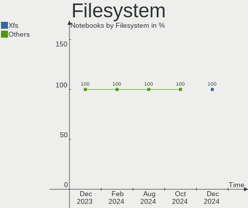

| Type  | Notebooks | Percent |
|-------|-----------|---------|
| Ext4  | 22        | 78.57%  |
| Btrfs | 5         | 17.86%  |
| Xfs   | 1         | 3.57%   |

Part. scheme
------------

Scheme of partitioning

| Type | Notebooks | Percent |
|------|-----------|---------|
| GPT  | 20        | 71.43%  |
| MBR  | 8         | 28.57%  |

Dual Boot with Linux/BSD
------------------------

Hosting more than one Linux/BSD

| Dual boot | Notebooks | Percent |
|-----------|-----------|---------|
| No        | 25        | 89.29%  |
| Yes       | 3         | 10.71%  |

Dual Boot (Win)
---------------

Hosting Linux and Windows

| Dual boot | Notebooks | Percent |
|-----------|-----------|---------|
| No        | 24        | 85.71%  |
| Yes       | 4         | 14.29%  |

Board
-----

Vendor
------

Motherboard manufacturer

| Name             | Notebooks | Percent |
|------------------|-----------|---------|
| Dell             | 6         | 21.43%  |
| Lenovo           | 5         | 17.86%  |
| Hewlett-Packard  | 4         | 14.29%  |
| MSI              | 3         | 10.71%  |
| ASUSTek Computer | 2         | 7.14%   |
| Apple            | 2         | 7.14%   |
| Medion           | 1         | 3.57%   |
| LG Electronics   | 1         | 3.57%   |
| HUAWEI           | 1         | 3.57%   |
| Google           | 1         | 3.57%   |
| Fujitsu          | 1         | 3.57%   |
| Compal           | 1         | 3.57%   |

Model
-----

Motherboard model

| Name                                     | Notebooks | Percent |
|------------------------------------------|-----------|---------|
| MSI Thin GF63 12VE                       | 1         | 3.57%   |
| MSI GE72 6QF                             | 1         | 3.57%   |
| MSI Bravo 15 B5DD                        | 1         | 3.57%   |
| Medion E15408                            | 1         | 3.57%   |
| LG R310-K.AP31B                          | 1         | 3.57%   |
| Lenovo ThinkPad T480s 20L7CTO1WW         | 1         | 3.57%   |
| Lenovo ThinkPad T460 20FN002JUS          | 1         | 3.57%   |
| Lenovo ThinkPad T430s 23539MU            | 1         | 3.57%   |
| Lenovo ThinkPad T420 4180DT9             | 1         | 3.57%   |
| Lenovo ThinkPad P50 20EQS0T52R           | 1         | 3.57%   |
| HUAWEI BOM-WXX9                          | 1         | 3.57%   |
| HP Presario CQ57                         | 1         | 3.57%   |
| HP Pavilion dv6                          | 1         | 3.57%   |
| HP Laptop 15s-fr2xxx                     | 1         | 3.57%   |
| HP ElitePad 1000 G2                      | 1         | 3.57%   |
| Google Pirika                            | 1         | 3.57%   |
| Fujitsu LIFEBOOK A3510                   | 1         | 3.57%   |
| Dell Vostro 2520                         | 1         | 3.57%   |
| Dell Latitude E6440                      | 1         | 3.57%   |
| Dell Latitude E6430                      | 1         | 3.57%   |
| Dell Latitude 3590                       | 1         | 3.57%   |
| Dell Inspiron 3421                       | 1         | 3.57%   |
| Dell Inspiron 13-5378                    | 1         | 3.57%   |
| Compal PCW20                             | 1         | 3.57%   |
| ASUS G551JM                              | 1         | 3.57%   |
| ASUS ASUS TUF Gaming F15 FX506LH_FX506LH | 1         | 3.57%   |
| Apple MacBookPro9,2                      | 1         | 3.57%   |
| Apple MacBookAir5,2                      | 1         | 3.57%   |

Model Family
------------

Motherboard model prefix

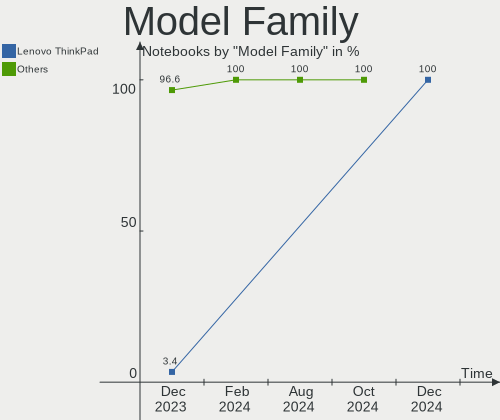

| Name              | Notebooks | Percent |
|-------------------|-----------|---------|
| Lenovo ThinkPad   | 5         | 17.86%  |
| Dell Latitude     | 3         | 10.71%  |
| Dell Inspiron     | 2         | 7.14%   |
| MSI Thin          | 1         | 3.57%   |
| MSI GE72          | 1         | 3.57%   |
| MSI Bravo         | 1         | 3.57%   |
| Medion E15408     | 1         | 3.57%   |
| LG R310-K.AP31B   | 1         | 3.57%   |
| HUAWEI BOM-WXX9   | 1         | 3.57%   |
| HP Presario       | 1         | 3.57%   |
| HP Pavilion       | 1         | 3.57%   |
| HP Laptop         | 1         | 3.57%   |
| HP ElitePad       | 1         | 3.57%   |
| Google Pirika     | 1         | 3.57%   |
| Fujitsu LIFEBOOK  | 1         | 3.57%   |
| Dell Vostro       | 1         | 3.57%   |
| Compal PCW20      | 1         | 3.57%   |
| ASUS G551JM       | 1         | 3.57%   |
| ASUS ASUS         | 1         | 3.57%   |
| Apple MacBookPro9 | 1         | 3.57%   |
| Apple MacBookAir5 | 1         | 3.57%   |

MFG Year
--------

Motherboard manufacture year

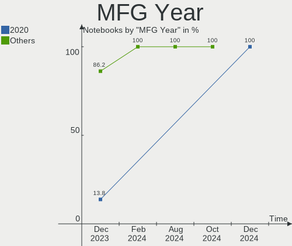

| Year | Notebooks | Percent |
|------|-----------|---------|
| 2012 | 6         | 21.43%  |
| 2021 | 3         | 10.71%  |
| 2020 | 3         | 10.71%  |
| 2011 | 3         | 10.71%  |
| 2023 | 2         | 7.14%   |
| 2018 | 2         | 7.14%   |
| 2016 | 2         | 7.14%   |
| 2015 | 2         | 7.14%   |
| 2014 | 2         | 7.14%   |
| 2008 | 2         | 7.14%   |
| 2013 | 1         | 3.57%   |

Form Factor
-----------

Physical design of the computer

| Name     | Notebooks | Percent |
|----------|-----------|---------|
| Notebook | 28        | 100%    |

Secure Boot
-----------

Enabled or disabled

| State    | Notebooks | Percent |
|----------|-----------|---------|
| Disabled | 28        | 100%    |

Coreboot
--------

Have coreboot on board

| Used | Notebooks | Percent |
|------|-----------|---------|
| No   | 27        | 96.43%  |
| Yes  | 1         | 3.57%   |

RAM Size
--------

Total RAM memory

| Size in GB | Notebooks | Percent |
|------------|-----------|---------|
| 4.01-8.0   | 11        | 39.29%  |
| 3.01-4.0   | 9         | 32.14%  |
| 16.01-24.0 | 6         | 21.43%  |
| 24.01-32.0 | 1         | 3.57%   |
| 8.01-16.0  | 1         | 3.57%   |

RAM Used
--------

Used RAM memory

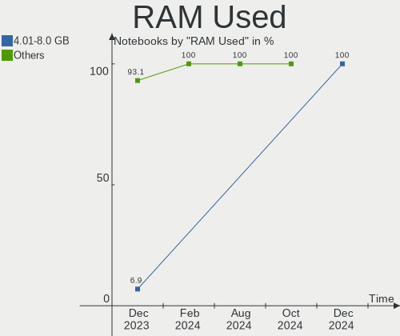

| Used GB   | Notebooks | Percent |
|-----------|-----------|---------|
| 2.01-3.0  | 14        | 50%     |
| 1.01-2.0  | 7         | 25%     |
| 3.01-4.0  | 4         | 14.29%  |
| 8.01-16.0 | 2         | 7.14%   |
| 4.01-8.0  | 1         | 3.57%   |

Total Drives
------------

Number of drives on board

| Drives | Notebooks | Percent |
|--------|-----------|---------|
| 1      | 21        | 75%     |
| 2      | 4         | 14.29%  |
| 3      | 3         | 10.71%  |

Has CD-ROM
----------

Has CD-ROM on board

| Presented | Notebooks | Percent |
|-----------|-----------|---------|
| No        | 16        | 57.14%  |
| Yes       | 12        | 42.86%  |

Has Ethernet
------------

Has Ethernet on board

| Presented | Notebooks | Percent |
|-----------|-----------|---------|
| Yes       | 22        | 78.57%  |
| No        | 6         | 21.43%  |

Has WiFi
--------

Has WiFi module

| Presented | Notebooks | Percent |
|-----------|-----------|---------|
| Yes       | 26        | 92.86%  |
| No        | 2         | 7.14%   |

Has Bluetooth
-------------

Has Bluetooth module

| Presented | Notebooks | Percent |
|-----------|-----------|---------|
| Yes       | 21        | 75%     |
| No        | 7         | 25%     |

Location
--------

Country
-------

Geographic location (country)

| Country   | Notebooks | Percent |
|-----------|-----------|---------|
| Germany   | 4         | 14.29%  |
| USA       | 3         | 10.71%  |
| Poland    | 2         | 7.14%   |
| Malaysia  | 2         | 7.14%   |
| India     | 2         | 7.14%   |
| Hungary   | 2         | 7.14%   |
| Thailand  | 1         | 3.57%   |
| Spain     | 1         | 3.57%   |
| Russia    | 1         | 3.57%   |
| Morocco   | 1         | 3.57%   |
| Mexico    | 1         | 3.57%   |
| Ireland   | 1         | 3.57%   |
| Iraq      | 1         | 3.57%   |
| Croatia   | 1         | 3.57%   |
| Chile     | 1         | 3.57%   |
| Canada    | 1         | 3.57%   |
| Brazil    | 1         | 3.57%   |
| Australia | 1         | 3.57%   |
| Argentina | 1         | 3.57%   |

City
----

Geographic location (city)

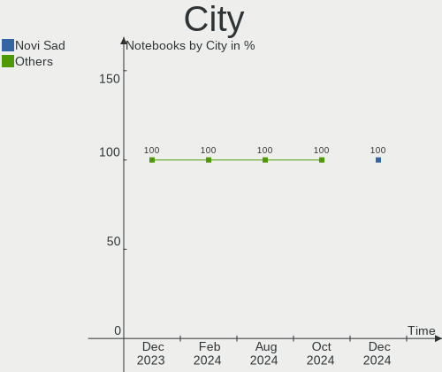

| City              | Notebooks | Percent |
|-------------------|-----------|---------|
| Zalaegerszeg      | 1         | 3.57%   |
| Vallenar          | 1         | 3.57%   |
| Ufa               | 1         | 3.57%   |
| Toluca            | 1         | 3.57%   |
| Seattle           | 1         | 3.57%   |
| Richmond          | 1         | 3.57%   |
| Puerto Eldorado   | 1         | 3.57%   |
| Pecos             | 1         | 3.57%   |
| Orford Lake       | 1         | 3.57%   |
| Munich            | 1         | 3.57%   |
| Marrakesh         | 1         | 3.57%   |
| Kuala Lumpur      | 1         | 3.57%   |
| Krynica-Zdroj     | 1         | 3.57%   |
| Koprivnica        | 1         | 3.57%   |
| Klang             | 1         | 3.57%   |
| Hohen Neuendorf   | 1         | 3.57%   |
| Gdansk            | 1         | 3.57%   |
| Fürstenfeldbruck | 1         | 3.57%   |
| Estrema           | 1         | 3.57%   |
| Eger              | 1         | 3.57%   |
| Dublin            | 1         | 3.57%   |
| Delhi             | 1         | 3.57%   |
| Bengaluru         | 1         | 3.57%   |
| Barssel           | 1         | 3.57%   |
| Barcelona         | 1         | 3.57%   |
| Bang Phli         | 1         | 3.57%   |
| Baghdad           | 1         | 3.57%   |
| Adelaide          | 1         | 3.57%   |

Drives
------

Drive Vendor
------------

Hard drive vendors

| Vendor              | Notebooks | Drives | Percent |
|---------------------|-----------|--------|---------|
| Samsung Electronics | 6         | 6      | 17.65%  |
| WDC                 | 5         | 5      | 14.71%  |
| Unknown             | 3         | 5      | 8.82%   |
| Kingston            | 3         | 3      | 8.82%   |
| Toshiba             | 2         | 2      | 5.88%   |
| SanDisk             | 2         | 2      | 5.88%   |
| Micron Technology   | 2         | 2      | 5.88%   |
| HGST                | 2         | 2      | 5.88%   |
| TO Exter            | 1         | 1      | 2.94%   |
| Seagate             | 1         | 1      | 2.94%   |
| Phison Electronics  | 1         | 1      | 2.94%   |
| Phison              | 1         | 1      | 2.94%   |
| OWC                 | 1         | 1      | 2.94%   |
| JMicron Technology  | 1         | 1      | 2.94%   |
| Intel               | 1         | 1      | 2.94%   |
| Hitachi             | 1         | 1      | 2.94%   |
| A-DATA Technology   | 1         | 1      | 2.94%   |

Drive Model
-----------

Hard drive models

| Model                                               | Notebooks | Percent |
|-----------------------------------------------------|-----------|---------|
| Unknown MMC Card  64GB                              | 2         | 5.71%   |
| Unknown MMC Card  128GB                             | 2         | 5.71%   |
| HGST HTS721010A9E630 1TB                            | 2         | 5.71%   |
| WDC WDS250G2B0A-00SM50 250GB SSD                    | 1         | 2.86%   |
| WDC WD5000LPCX-22VHAT0 500GB                        | 1         | 2.86%   |
| WDC WD3200BEVT-26ZCT0 320GB                         | 1         | 2.86%   |
| WDC WD10SPZX-75Z10T1 1TB                            | 1         | 2.86%   |
| WDC WD10SPCX-75KHST0 1TB                            | 1         | 2.86%   |
| Toshiba THNSNF128GCSS 128GB SSD                     | 1         | 2.86%   |
| Toshiba MK2555GSX 250GB                             | 1         | 2.86%   |
| TO Exter nal USB 3.0 2TB                            | 1         | 2.86%   |
| Seagate Expansion 1TB                               | 1         | 2.86%   |
| SanDisk SSD PLUS 120 GB                             | 1         | 2.86%   |
| SanDisk SD8TB8U256G1001 256GB SSD                   | 1         | 2.86%   |
| Samsung SSD PM830 2.5 7mm 128GB                     | 1         | 2.86%   |
| Samsung SSD 860 PRO 256GB                           | 1         | 2.86%   |
| Samsung NVMe SSD Controller SM961/PM961/SM963 121GB | 1         | 2.86%   |
| Samsung MZVLQ256HAJD-00007 256GB                    | 1         | 2.86%   |
| Samsung MZVL4512HBLU-00BTW 512GB                    | 1         | 2.86%   |
| Samsung MZNTY256HDHP-000L7 256GB SSD                | 1         | 2.86%   |
| Phison S11-256G-PHISON-SSD-B27 256GB                | 1         | 2.86%   |
| Phison E12 NVMe Controller 1TB                      | 1         | 2.86%   |
| OWC Aura 2012 240GB SSD                             | 1         | 2.86%   |
| Micron MTFDDAK128MAM-1J1 128GB SSD                  | 1         | 2.86%   |
| Micron 2210_MTFDHBA512QFD 512GB                     | 1         | 2.86%   |
| Kingston SA400S37480G 480GB SSD                     | 1         | 2.86%   |
| Kingston SA400S37120G 120GB SSD                     | 1         | 2.86%   |
| Kingston OM8PCP3512F-AB 512GB                       | 1         | 2.86%   |
| JMicron Generic 256GB                               | 1         | 2.86%   |
| Intel SSD 660P Series 1024GB                        | 1         | 2.86%   |
| Hitachi HTS541616J9SA00 160GB                       | 1         | 2.86%   |
| A-DATA SP900NS38 256GB SSD                          | 1         | 2.86%   |

HDD Vendor
----------

Hard disk drive vendors

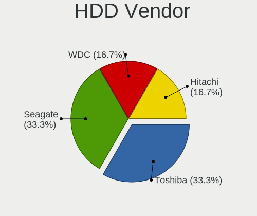

| Vendor  | Notebooks | Drives | Percent |
|---------|-----------|--------|---------|
| WDC     | 4         | 4      | 44.44%  |
| HGST    | 2         | 2      | 22.22%  |
| Toshiba | 1         | 1      | 11.11%  |
| Seagate | 1         | 1      | 11.11%  |
| Hitachi | 1         | 1      | 11.11%  |

SSD Vendor
----------

Solid state drive vendors

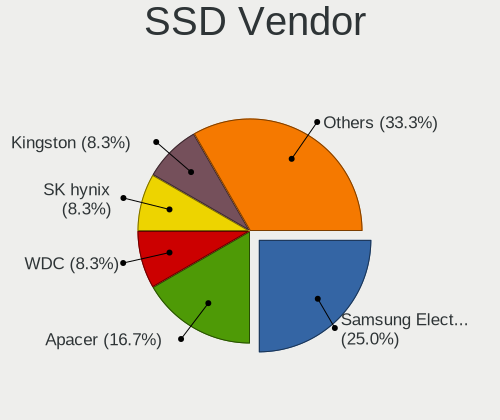

| Vendor              | Notebooks | Drives | Percent |
|---------------------|-----------|--------|---------|
| Samsung Electronics | 3         | 3      | 21.43%  |
| SanDisk             | 2         | 2      | 14.29%  |
| Kingston            | 2         | 2      | 14.29%  |
| WDC                 | 1         | 1      | 7.14%   |
| Toshiba             | 1         | 1      | 7.14%   |
| TO Exter            | 1         | 1      | 7.14%   |
| Phison              | 1         | 1      | 7.14%   |
| OWC                 | 1         | 1      | 7.14%   |
| Micron Technology   | 1         | 1      | 7.14%   |
| A-DATA Technology   | 1         | 1      | 7.14%   |

Drive Kind
----------

HDD or SSD

| Kind | Notebooks | Drives | Percent |
|------|-----------|--------|---------|
| SSD  | 13        | 14     | 39.39%  |
| HDD  | 9         | 9      | 27.27%  |
| NVMe | 8         | 8      | 24.24%  |
| MMC  | 3         | 5      | 9.09%   |

Drive Connector
---------------

SATA, SAS, NVMe, etc.

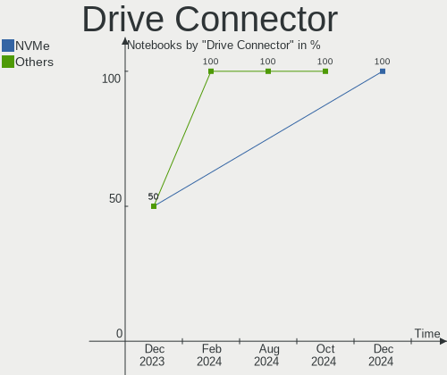

| Type | Notebooks | Drives | Percent |
|------|-----------|--------|---------|
| SATA | 20        | 21     | 62.5%   |
| NVMe | 7         | 7      | 21.88%  |
| MMC  | 3         | 5      | 9.38%   |
| SAS  | 2         | 3      | 6.25%   |

Drive Size
----------

Size of hard drive

| Size in TB | Notebooks | Drives | Percent |
|------------|-----------|--------|---------|
| 0.01-0.5   | 17        | 17     | 73.91%  |
| 0.51-1.0   | 5         | 5      | 21.74%  |
| 1.01-2.0   | 1         | 1      | 4.35%   |

Space Total
-----------

Amount of disk space available on the file system

| Size in GB     | Notebooks | Percent |
|----------------|-----------|---------|
| 101-250        | 15        | 53.57%  |
| 251-500        | 5         | 17.86%  |
| 501-1000       | 3         | 10.71%  |
| 2001-3000      | 2         | 7.14%   |
| 1001-2000      | 2         | 7.14%   |
| More than 3000 | 1         | 3.57%   |

Space Used
----------

Amount of used disk space

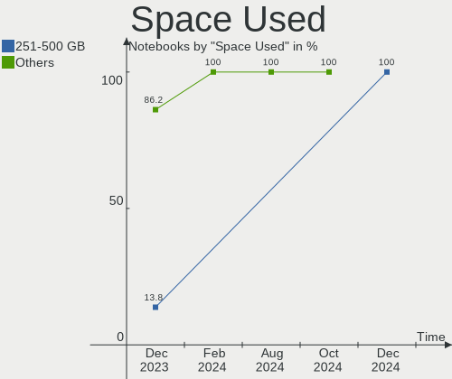

| Used GB  | Notebooks | Percent |
|----------|-----------|---------|
| 1-20     | 15        | 53.57%  |
| 21-50    | 9         | 32.14%  |
| 51-100   | 2         | 7.14%   |
| 101-250  | 1         | 3.57%   |
| 501-1000 | 1         | 3.57%   |

Malfunc. Drives
---------------

Drive models with a malfunction

| Model                                 | Notebooks | Drives | Percent |
|---------------------------------------|-----------|--------|---------|
| WDC WD5000LPCX-22VHAT0 500GB          | 1         | 1      | 25%     |
| Toshiba MK2555GSX 250GB               | 1         | 1      | 25%     |
| OWC Aura 2012 240GB SSD               | 1         | 1      | 25%     |
| A-DATA Technology SP900NS38 256GB SSD | 1         | 1      | 25%     |

Malfunc. Drive Vendor
---------------------

Vendors of faulty drives

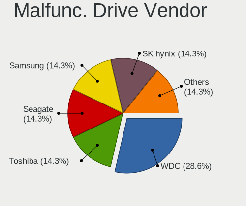

| Vendor            | Notebooks | Drives | Percent |
|-------------------|-----------|--------|---------|
| WDC               | 1         | 1      | 25%     |
| Toshiba           | 1         | 1      | 25%     |
| OWC               | 1         | 1      | 25%     |
| A-DATA Technology | 1         | 1      | 25%     |

Malfunc. HDD Vendor
-------------------

Vendors of faulty HDD drives

| Vendor  | Notebooks | Drives | Percent |
|---------|-----------|--------|---------|
| WDC     | 1         | 1      | 50%     |
| Toshiba | 1         | 1      | 50%     |

Malfunc. Drive Kind
-------------------

Kinds of faulty drives

| Kind | Notebooks | Drives | Percent |
|------|-----------|--------|---------|
| SSD  | 2         | 2      | 50%     |
| HDD  | 2         | 2      | 50%     |

Failed Drives
-------------

Failed drive models

Zero info for selected period =(

Failed Drive Vendor
-------------------

Failed drive vendors

Zero info for selected period =(

Drive Status
------------

Number of failed and malfunc. drives

| Status   | Notebooks | Drives | Percent |
|----------|-----------|--------|---------|
| Works    | 23        | 24     | 71.88%  |
| Detected | 4         | 7      | 12.5%   |
| Malfunc  | 4         | 4      | 12.5%   |
| Fixed    | 1         | 1      | 3.13%   |

Storage controller
------------------

Storage Vendor
--------------

Storage controller vendors

| Vendor                      | Notebooks | Percent |
|-----------------------------|-----------|---------|
| Intel                       | 21        | 72.41%  |
| Samsung Electronics         | 3         | 10.34%  |
| AMD                         | 2         | 6.9%    |
| Phison Electronics          | 1         | 3.45%   |
| Micron Technology           | 1         | 3.45%   |
| Kingston Technology Company | 1         | 3.45%   |

Storage Model
-------------

Storage controller models

| Model                                                                          | Notebooks | Percent |
|--------------------------------------------------------------------------------|-----------|---------|
| Intel 7 Series Chipset Family 6-port SATA Controller [AHCI mode]               | 5         | 16.67%  |
| Intel 82801 Mobile SATA Controller [RAID mode]                                 | 4         | 13.33%  |
| Intel Sunrise Point-LP SATA Controller [AHCI mode]                             | 2         | 6.67%   |
| Intel 82801IBM/IEM (ICH9M/ICH9M-E) 4 port SATA Controller [AHCI mode]          | 2         | 6.67%   |
| AMD SB7x0/SB8x0/SB9x0 SATA Controller [AHCI mode]                              | 2         | 6.67%   |
| Samsung NVMe SSD Controller SM961/PM961/SM963                                  | 1         | 3.33%   |
| Samsung NVMe SSD Controller PM9B1 (DRAM-less)                                  | 1         | 3.33%   |
| Samsung NVMe SSD Controller 980 (DRAM-less)                                    | 1         | 3.33%   |
| Phison E12 NVMe Controller                                                     | 1         | 3.33%   |
| Micron 2210 NVMe SSD [Cobain]                                                  | 1         | 3.33%   |
| Kingston Company OM8PCP Design-In PCIe 3 NVMe SSD (DRAM-less)                  | 1         | 3.33%   |
| Intel Volume Management Device NVMe RAID Controller                            | 1         | 3.33%   |
| Intel SSD 660P Series                                                          | 1         | 3.33%   |
| Intel Q170/Q150/B150/H170/H110/Z170/CM236 Chipset SATA Controller [AHCI Mode]  | 1         | 3.33%   |
| Intel Ice Lake-LP SATA Controller [AHCI mode]                                  | 1         | 3.33%   |
| Intel HM170/QM170 Chipset SATA Controller [AHCI Mode]                          | 1         | 3.33%   |
| Intel Alder Lake-P SATA AHCI Controller                                        | 1         | 3.33%   |
| Intel 8 Series/C220 Series Chipset Family 6-port SATA Controller 1 [AHCI mode] | 1         | 3.33%   |
| Intel 6 Series/C200 Series Chipset Family 6 port Mobile SATA AHCI Controller   | 1         | 3.33%   |
| Intel 400 Series Chipset Family SATA AHCI Controller                           | 1         | 3.33%   |

Storage Kind
------------

Kind of storage controller (IDE, SATA, NVMe, SAS, ...)

| Kind | Notebooks | Percent |
|------|-----------|---------|
| SATA | 18        | 60%     |
| NVMe | 7         | 23.33%  |
| RAID | 5         | 16.67%  |

Processor
---------

CPU Vendor
----------

Processor vendors

| Vendor | Notebooks | Percent |
|--------|-----------|---------|
| Intel  | 24        | 85.71%  |
| AMD    | 4         | 14.29%  |

CPU Model
---------

Processor models

| Model                                   | Notebooks | Percent |
|-----------------------------------------|-----------|---------|
| Intel Core i5-7200U CPU @ 2.50GHz       | 2         | 7.14%   |
| Intel Core i5-3320M CPU @ 2.60GHz       | 2         | 7.14%   |
| Intel Pentium Silver N6000 @ 1.10GHz    | 1         | 3.57%   |
| Intel Core i7-8550U CPU @ 1.80GHz       | 1         | 3.57%   |
| Intel Core i7-6820HQ CPU @ 2.70GHz      | 1         | 3.57%   |
| Intel Core i7-6700HQ CPU @ 2.60GHz      | 1         | 3.57%   |
| Intel Core i7-4710HQ CPU @ 2.50GHz      | 1         | 3.57%   |
| Intel Core i5-6300U CPU @ 2.40GHz       | 1         | 3.57%   |
| Intel Core i5-4300M CPU @ 2.60GHz       | 1         | 3.57%   |
| Intel Core i5-3427U CPU @ 1.80GHz       | 1         | 3.57%   |
| Intel Core i5-3337U CPU @ 1.80GHz       | 1         | 3.57%   |
| Intel Core i5-3210M CPU @ 2.50GHz       | 1         | 3.57%   |
| Intel Core i5-2520M CPU @ 2.50GHz       | 1         | 3.57%   |
| Intel Core i5-1035G4 CPU @ 1.10GHz      | 1         | 3.57%   |
| Intel Core i5-1035G1 CPU @ 1.00GHz      | 1         | 3.57%   |
| Intel Core i5-10300H CPU @ 2.50GHz      | 1         | 3.57%   |
| Intel Core i3-2328M CPU @ 2.20GHz       | 1         | 3.57%   |
| Intel Core 2 Duo CPU T6500 @ 2.10GHz    | 1         | 3.57%   |
| Intel Core 2 Duo CPU P7350 @ 2.00GHz    | 1         | 3.57%   |
| Intel Atom CPU Z3795 @ 1.60GHz          | 1         | 3.57%   |
| Intel 12th Gen Core i5-12450H           | 1         | 3.57%   |
| Intel 11th Gen Core i3-1115G4 @ 3.00GHz | 1         | 3.57%   |
| AMD Ryzen 5 5600H with Radeon Graphics  | 1         | 3.57%   |
| AMD Ryzen 5 5500U with Radeon Graphics  | 1         | 3.57%   |
| AMD E-300 APU with Radeon HD Graphics   | 1         | 3.57%   |
| AMD C-60 APU with Radeon HD Graphics    | 1         | 3.57%   |

CPU Model Family
----------------

Processor model prefix

| Model                | Notebooks | Percent |
|----------------------|-----------|---------|
| Intel Core i5        | 13        | 46.43%  |
| Intel Core i7        | 4         | 14.29%  |
| Other                | 2         | 7.14%   |
| Intel Core 2 Duo     | 2         | 7.14%   |
| AMD Ryzen 5          | 2         | 7.14%   |
| Intel Pentium Silver | 1         | 3.57%   |
| Intel Core i3        | 1         | 3.57%   |
| Intel Atom           | 1         | 3.57%   |
| AMD E                | 1         | 3.57%   |
| AMD C-60             | 1         | 3.57%   |

CPU Cores
---------

Number of processor cores

| Number | Notebooks | Percent |
|--------|-----------|---------|
| 2      | 16        | 57.14%  |
| 4      | 9         | 32.14%  |
| 6      | 2         | 7.14%   |
| 8      | 1         | 3.57%   |

CPU Sockets
-----------

Number of sockets

| Number | Notebooks | Percent |
|--------|-----------|---------|
| 1      | 28        | 100%    |

CPU Threads
-----------

Threads per core (Hyper-Threading)

| Number | Notebooks | Percent |
|--------|-----------|---------|
| 2      | 22        | 78.57%  |
| 1      | 6         | 21.43%  |

CPU Op-Modes
------------

CPU Operation Modes (32-bit, 64-bit)

| Op mode        | Notebooks | Percent |
|----------------|-----------|---------|
| 32-bit, 64-bit | 28        | 100%    |

CPU Microcode
-------------

Microcode number

| Number     | Notebooks | Percent |
|------------|-----------|---------|
| Unknown    | 24        | 85.71%  |
| 0x05000101 | 2         | 7.14%   |
| 0x0a50000c | 1         | 3.57%   |
| 0x08608103 | 1         | 3.57%   |

CPU Microarch
-------------

Microarchitecture

| Name             | Notebooks | Percent |
|------------------|-----------|---------|
| IvyBridge        | 5         | 17.86%  |
| Skylake          | 3         | 10.71%  |
| KabyLake         | 3         | 10.71%  |
| SandyBridge      | 2         | 7.14%   |
| Penryn           | 2         | 7.14%   |
| IceLake          | 2         | 7.14%   |
| Haswell          | 2         | 7.14%   |
| Bobcat           | 2         | 7.14%   |
| Zen 3            | 1         | 3.57%   |
| Tremont          | 1         | 3.57%   |
| TigerLake        | 1         | 3.57%   |
| Silvermont       | 1         | 3.57%   |
| CometLake        | 1         | 3.57%   |
| Alderlake Hybrid | 1         | 3.57%   |
| Unknown          | 1         | 3.57%   |

Graphics
--------

GPU Vendor
----------

Vendors of graphics cards

| Vendor | Notebooks | Percent |
|--------|-----------|---------|
| Intel  | 22        | 64.71%  |
| Nvidia | 6         | 17.65%  |
| AMD    | 6         | 17.65%  |

GPU Model
---------

Graphics card models

| Model                                                                     | Notebooks | Percent |
|---------------------------------------------------------------------------|-----------|---------|
| Intel 3rd Gen Core processor Graphics Controller                          | 5         | 14.29%  |
| Intel HD Graphics 620                                                     | 2         | 5.71%   |
| Intel HD Graphics 530                                                     | 2         | 5.71%   |
| Intel 4th Gen Core Processor Integrated Graphics Controller               | 2         | 5.71%   |
| Intel 2nd Generation Core Processor Family Integrated Graphics Controller | 2         | 5.71%   |
| Nvidia TU117M [GeForce GTX 1650 Mobile / Max-Q]                           | 1         | 2.86%   |
| Nvidia GM204M [GeForce GTX 960 OEM / 970M]                                | 1         | 2.86%   |
| Nvidia GM107M [GeForce GTX 860M]                                          | 1         | 2.86%   |
| Nvidia GM107GLM [Quadro M1000M]                                           | 1         | 2.86%   |
| Nvidia GF117M [GeForce 610M/710M/810M/820M / GT 620M/625M/630M/720M]      | 1         | 2.86%   |
| Nvidia AD107M [GeForce RTX 4050 Max-Q / Mobile]                           | 1         | 2.86%   |
| Intel UHD Graphics 620                                                    | 1         | 2.86%   |
| Intel Tiger Lake-LP GT2 [UHD Graphics G4]                                 | 1         | 2.86%   |
| Intel Skylake GT2 [HD Graphics 520]                                       | 1         | 2.86%   |
| Intel JasperLake [UHD Graphics]                                           | 1         | 2.86%   |
| Intel Iris Plus Graphics G4 (Ice Lake)                                    | 1         | 2.86%   |
| Intel Iris Plus Graphics G1 (Ice Lake)                                    | 1         | 2.86%   |
| Intel CometLake-H GT2 [UHD Graphics]                                      | 1         | 2.86%   |
| Intel Atom Processor Z36xxx/Z37xxx Series Graphics & Display              | 1         | 2.86%   |
| Intel Alder Lake-P GT1 [UHD Graphics]                                     | 1         | 2.86%   |
| AMD Wrestler [Radeon HD 6310]                                             | 1         | 2.86%   |
| AMD Wrestler [Radeon HD 6290]                                             | 1         | 2.86%   |
| AMD RV710/M92 [Mobility Radeon HD 4530/4570/5145/530v/540v/545v]          | 1         | 2.86%   |
| AMD RV620/M82 [Mobility Radeon HD 3450/3470]                              | 1         | 2.86%   |
| AMD Navi 14 [Radeon RX 5500/5500M / Pro 5500M]                            | 1         | 2.86%   |
| AMD Lucienne                                                              | 1         | 2.86%   |
| AMD Cezanne [Radeon Vega Series / Radeon Vega Mobile Series]              | 1         | 2.86%   |

GPU Combo
---------

Combinations of graphics cards

| Name           | Notebooks | Percent |
|----------------|-----------|---------|
| 1 x Intel      | 16        | 57.14%  |
| Intel + Nvidia | 6         | 21.43%  |
| 1 x AMD        | 5         | 17.86%  |
| 2 x AMD        | 1         | 3.57%   |

GPU Driver
----------

Free vs proprietary

| Driver      | Notebooks | Percent |
|-------------|-----------|---------|
| Free        | 27        | 96.43%  |
| Proprietary | 1         | 3.57%   |

GPU Memory
----------

Total video memory

| Size in GB | Notebooks | Percent |
|------------|-----------|---------|
| Unknown    | 18        | 64.29%  |
| 0.01-0.5   | 5         | 17.86%  |
| 3.01-4.0   | 2         | 7.14%   |
| 1.01-2.0   | 2         | 7.14%   |
| 0.51-1.0   | 1         | 3.57%   |

Monitor
-------

Monitor Vendor
--------------

Monitor vendors

| Vendor              | Notebooks | Percent |
|---------------------|-----------|---------|
| LG Display          | 9         | 29.03%  |
| BOE                 | 6         | 19.35%  |
| AU Optronics        | 4         | 12.9%   |
| PANDA               | 2         | 6.45%   |
| Chimei Innolux      | 2         | 6.45%   |
| Apple               | 2         | 6.45%   |
| Samsung Electronics | 1         | 3.23%   |
| RTK                 | 1         | 3.23%   |
| LG Philips          | 1         | 3.23%   |
| Hewlett-Packard     | 1         | 3.23%   |
| Goldstar            | 1         | 3.23%   |
| Eizo                | 1         | 3.23%   |

Monitor Model
-------------

Monitor models

| Model                                                                | Notebooks | Percent |
|----------------------------------------------------------------------|-----------|---------|
| Samsung Electronics LCD Monitor SDC544B 1600x900 309x174mm 14.0-inch | 1         | 3.23%   |
| RTK '' RTK1920 1920x1080 344x195mm 15.6-inch                         | 1         | 3.23%   |
| PANDA LCD Monitor NCP004D 1920x1080 344x194mm 15.5-inch              | 1         | 3.23%   |
| PANDA LCD Monitor NCP0046 1920x1080 344x194mm 15.5-inch              | 1         | 3.23%   |
| LG Philips LCD Monitor LPL2601 1280x800 286x179mm 13.3-inch          | 1         | 3.23%   |
| LG Display LCD Monitor LGD40A0 1366x768 310x174mm 14.0-inch          | 1         | 3.23%   |
| LG Display LCD Monitor LGD058B 2560x1440 309x174mm 14.0-inch         | 1         | 3.23%   |
| LG Display LCD Monitor LGD04A7 1920x1080 344x194mm 15.5-inch         | 1         | 3.23%   |
| LG Display LCD Monitor LGD0469 1920x1080 382x215mm 17.3-inch         | 1         | 3.23%   |
| LG Display LCD Monitor LGD03B7 1366x768 309x174mm 14.0-inch          | 1         | 3.23%   |
| LG Display LCD Monitor LGD0362 1600x900 309x174mm 14.0-inch          | 1         | 3.23%   |
| LG Display LCD Monitor LGD033B 1366x768 344x194mm 15.5-inch          | 1         | 3.23%   |
| LG Display LCD Monitor LGD02F2 1366x768 344x194mm 15.5-inch          | 1         | 3.23%   |
| LG Display LCD Monitor LGD02DF 1600x900 310x174mm 14.0-inch          | 1         | 3.23%   |
| Hewlett-Packard LE2002x HWP2964 1600x900 443x249mm 20.0-inch         | 1         | 3.23%   |
| Goldstar QHD GSM7729 2560x1440 697x392mm 31.5-inch                   | 1         | 3.23%   |
| Eizo FS2331 ENC2213 1920x1080 510x287mm 23.0-inch                    | 1         | 3.23%   |
| Chimei Innolux LCD Monitor CMN1521 1920x1080 344x193mm 15.5-inch     | 1         | 3.23%   |
| Chimei Innolux LCD Monitor CMN1515 1920x1080 344x193mm 15.5-inch     | 1         | 3.23%   |
| BOE LCD Monitor BOE0957 1920x1080 344x194mm 15.5-inch                | 1         | 3.23%   |
| BOE LCD Monitor BOE0872 1920x1080 344x194mm 15.5-inch                | 1         | 3.23%   |
| BOE LCD Monitor BOE07AA 1366x768 344x194mm 15.5-inch                 | 1         | 3.23%   |
| BOE LCD Monitor BOE0700 1920x1080 344x194mm 15.5-inch                | 1         | 3.23%   |
| BOE LCD Monitor BOE06A7 1920x1080 294x165mm 13.3-inch                | 1         | 3.23%   |
| BOE LCD Monitor BOE059F 1366x768 309x173mm 13.9-inch                 | 1         | 3.23%   |
| AU Optronics LCD Monitor AUO38ED 1920x1080 344x193mm 15.5-inch       | 1         | 3.23%   |
| AU Optronics LCD Monitor AUO36ED 1920x1080 344x193mm 15.5-inch       | 1         | 3.23%   |
| AU Optronics LCD Monitor AUO243D 1920x1080 309x173mm 13.9-inch       | 1         | 3.23%   |
| AU Optronics LCD Monitor AUO1AD8 1920x1200 216x136mm 10.0-inch       | 1         | 3.23%   |
| Apple LCD Monitor APP9CCB 1280x800 286x179mm 13.3-inch               | 1         | 3.23%   |
| Apple Color LCD APP9CF0 1440x900 290x180mm 13.4-inch                 | 1         | 3.23%   |

Monitor Resolution
------------------

Monitor screen resolution

| Resolution        | Notebooks | Percent |
|-------------------|-----------|---------|
| 1920x1080 (FHD)   | 15        | 48.39%  |
| 1366x768 (WXGA)   | 6         | 19.35%  |
| 1600x900 (HD+)    | 4         | 12.9%   |
| 2560x1440 (QHD)   | 2         | 6.45%   |
| 1280x800 (WXGA)   | 2         | 6.45%   |
| 1920x1200 (WUXGA) | 1         | 3.23%   |
| 1440x900 (WXGA+)  | 1         | 3.23%   |

Monitor Diagonal
----------------

Diagonal size in inches

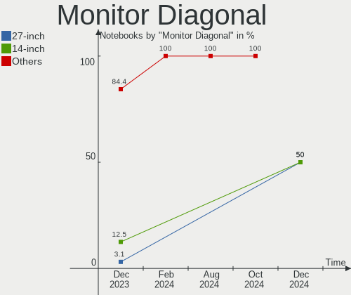

| Inches | Notebooks | Percent |
|--------|-----------|---------|
| 15     | 13        | 41.94%  |
| 14     | 7         | 22.58%  |
| 13     | 5         | 16.13%  |
| 31     | 2         | 6.45%   |
| 23     | 1         | 3.23%   |
| 20     | 1         | 3.23%   |
| 17     | 1         | 3.23%   |
| 10     | 1         | 3.23%   |

Monitor Width
-------------

Physical width

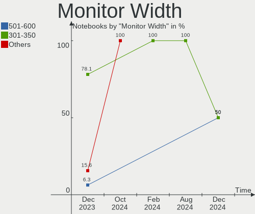

| Width in mm | Notebooks | Percent |
|-------------|-----------|---------|
| 301-350     | 21        | 67.74%  |
| 201-300     | 5         | 16.13%  |
| 601-700     | 2         | 6.45%   |
| 501-600     | 1         | 3.23%   |
| 401-500     | 1         | 3.23%   |
| 351-400     | 1         | 3.23%   |

Aspect Ratio
------------

Proportional relationship between the width and the height

| Ratio | Notebooks | Percent |
|-------|-----------|---------|
| 16/9  | 23        | 85.19%  |
| 16/10 | 4         | 14.81%  |

Monitor Area
------------

Area in inch²

| Area in inch² | Notebooks | Percent |
|----------------|-----------|---------|
| 101-110        | 13        | 41.94%  |
| 81-90          | 9         | 29.03%  |
| 71-80          | 3         | 9.68%   |
| 351-500        | 2         | 6.45%   |
| 41-50          | 1         | 3.23%   |
| 201-250        | 1         | 3.23%   |
| 151-200        | 1         | 3.23%   |
| 121-130        | 1         | 3.23%   |

Pixel Density
-------------

Pixels per inch

| Density | Notebooks | Percent |
|---------|-----------|---------|
| 121-160 | 16        | 53.33%  |
| 101-120 | 8         | 26.67%  |
| 161-240 | 3         | 10%     |
| 51-100  | 3         | 10%     |

Multiple Monitors
-----------------

Total monitors connected

| Total | Notebooks | Percent |
|-------|-----------|---------|
| 1     | 25        | 89.29%  |
| 2     | 2         | 7.14%   |
| 3     | 1         | 3.57%   |

Network
-------

Net Controller Vendor
---------------------

Controller vendors

| Vendor                | Notebooks | Percent |
|-----------------------|-----------|---------|
| Intel                 | 17        | 41.46%  |
| Realtek Semiconductor | 14        | 34.15%  |
| Broadcom              | 5         | 12.2%   |
| Qualcomm Atheros      | 2         | 4.88%   |
| Qualcomm              | 1         | 2.44%   |
| Microchip Technology  | 1         | 2.44%   |
| ASUSTek Computer      | 1         | 2.44%   |

Net Controller Model
--------------------

Controller models

| Model                                                              | Notebooks | Percent |
|--------------------------------------------------------------------|-----------|---------|
| Realtek RTL8111/8168/8411 PCI Express Gigabit Ethernet Controller  | 10        | 19.61%  |
| Intel Centrino Advanced-N 6205 [Taylor Peak]                       | 3         | 5.88%   |
| Intel 82579LM Gigabit Network Connection (Lewisville)              | 3         | 5.88%   |
| Realtek RTL8822CE 802.11ac PCIe Wireless Network Adapter           | 2         | 3.92%   |
| Realtek RTL810xE PCI Express Fast Ethernet controller              | 2         | 3.92%   |
| Intel Wireless 8260                                                | 2         | 3.92%   |
| Intel Wireless 3165                                                | 2         | 3.92%   |
| Intel Ice Lake-LP PCH CNVi WiFi                                    | 2         | 3.92%   |
| Realtek RTL8191SEvA Wireless LAN Controller                        | 1         | 1.96%   |
| Realtek RTL8188CUS 802.11n WLAN Adapter                            | 1         | 1.96%   |
| Qualcomm Redmi Note 8                                              | 1         | 1.96%   |
| Qualcomm Atheros QCA6174 802.11ac Wireless Network Adapter         | 1         | 1.96%   |
| Qualcomm Atheros Killer E2400 Gigabit Ethernet Controller          | 1         | 1.96%   |
| Microchip SMSC9512/9514 Fast Ethernet Adapter                      | 1         | 1.96%   |
| Intel Wireless 8265 / 8275                                         | 1         | 1.96%   |
| Intel Wireless 7260                                                | 1         | 1.96%   |
| Intel WiFi Link 5100                                               | 1         | 1.96%   |
| Intel Wi-Fi 6 AX201 160MHz                                         | 1         | 1.96%   |
| Intel Wi-Fi 6 AX200                                                | 1         | 1.96%   |
| Intel Ethernet Connection I219-LM                                  | 1         | 1.96%   |
| Intel Ethernet Connection I217-LM                                  | 1         | 1.96%   |
| Intel Ethernet Connection (4) I219-V                               | 1         | 1.96%   |
| Intel Ethernet Connection (2) I219-LM                              | 1         | 1.96%   |
| Intel Comet Lake PCH CNVi WiFi                                     | 1         | 1.96%   |
| Intel Centrino Advanced-N 6235                                     | 1         | 1.96%   |
| Intel Alder Lake-P PCH CNVi WiFi                                   | 1         | 1.96%   |
| Broadcom NetXtreme BCM57765 Gigabit Ethernet PCIe                  | 1         | 1.96%   |
| Broadcom BCM4331 802.11a/b/g/n                                     | 1         | 1.96%   |
| Broadcom BCM43224 802.11a/b/g/n                                    | 1         | 1.96%   |
| Broadcom BCM43142 802.11b/g/n                                      | 1         | 1.96%   |
| Broadcom BCM4313 802.11bgn Wireless Network Adapter                | 1         | 1.96%   |
| Broadcom BCM4312 802.11b/g LP-PHY                                  | 1         | 1.96%   |
| ASUS USB-N13 802.11n Network Adapter (rev. B1) [Realtek RTL8192CU] | 1         | 1.96%   |

Wireless Vendor
---------------

Wireless vendors

| Vendor                | Notebooks | Percent |
|-----------------------|-----------|---------|
| Intel                 | 17        | 60.71%  |
| Broadcom              | 5         | 17.86%  |
| Realtek Semiconductor | 4         | 14.29%  |
| Qualcomm Atheros      | 1         | 3.57%   |
| ASUSTek Computer      | 1         | 3.57%   |

Wireless Model
--------------

Wireless models

| Model                                                              | Notebooks | Percent |
|--------------------------------------------------------------------|-----------|---------|
| Intel Centrino Advanced-N 6205 [Taylor Peak]                       | 3         | 10.71%  |
| Realtek RTL8822CE 802.11ac PCIe Wireless Network Adapter           | 2         | 7.14%   |
| Intel Wireless 8260                                                | 2         | 7.14%   |
| Intel Wireless 3165                                                | 2         | 7.14%   |
| Intel Ice Lake-LP PCH CNVi WiFi                                    | 2         | 7.14%   |
| Realtek RTL8191SEvA Wireless LAN Controller                        | 1         | 3.57%   |
| Realtek RTL8188CUS 802.11n WLAN Adapter                            | 1         | 3.57%   |
| Qualcomm Atheros QCA6174 802.11ac Wireless Network Adapter         | 1         | 3.57%   |
| Intel Wireless 8265 / 8275                                         | 1         | 3.57%   |
| Intel Wireless 7260                                                | 1         | 3.57%   |
| Intel WiFi Link 5100                                               | 1         | 3.57%   |
| Intel Wi-Fi 6 AX201 160MHz                                         | 1         | 3.57%   |
| Intel Wi-Fi 6 AX200                                                | 1         | 3.57%   |
| Intel Comet Lake PCH CNVi WiFi                                     | 1         | 3.57%   |
| Intel Centrino Advanced-N 6235                                     | 1         | 3.57%   |
| Intel Alder Lake-P PCH CNVi WiFi                                   | 1         | 3.57%   |
| Broadcom BCM4331 802.11a/b/g/n                                     | 1         | 3.57%   |
| Broadcom BCM43224 802.11a/b/g/n                                    | 1         | 3.57%   |
| Broadcom BCM43142 802.11b/g/n                                      | 1         | 3.57%   |
| Broadcom BCM4313 802.11bgn Wireless Network Adapter                | 1         | 3.57%   |
| Broadcom BCM4312 802.11b/g LP-PHY                                  | 1         | 3.57%   |
| ASUS USB-N13 802.11n Network Adapter (rev. B1) [Realtek RTL8192CU] | 1         | 3.57%   |

Ethernet Vendor
---------------

Ethernet vendors

| Vendor                | Notebooks | Percent |
|-----------------------|-----------|---------|
| Realtek Semiconductor | 12        | 52.17%  |
| Intel                 | 7         | 30.43%  |
| Qualcomm Atheros      | 1         | 4.35%   |
| Qualcomm              | 1         | 4.35%   |
| Microchip Technology  | 1         | 4.35%   |
| Broadcom              | 1         | 4.35%   |

Ethernet Model
--------------

Ethernet models

| Model                                                             | Notebooks | Percent |
|-------------------------------------------------------------------|-----------|---------|
| Realtek RTL8111/8168/8411 PCI Express Gigabit Ethernet Controller | 10        | 43.48%  |
| Intel 82579LM Gigabit Network Connection (Lewisville)             | 3         | 13.04%  |
| Realtek RTL810xE PCI Express Fast Ethernet controller             | 2         | 8.7%    |
| Qualcomm Redmi Note 8                                             | 1         | 4.35%   |
| Qualcomm Atheros Killer E2400 Gigabit Ethernet Controller         | 1         | 4.35%   |
| Microchip SMSC9512/9514 Fast Ethernet Adapter                     | 1         | 4.35%   |
| Intel Ethernet Connection I219-LM                                 | 1         | 4.35%   |
| Intel Ethernet Connection I217-LM                                 | 1         | 4.35%   |
| Intel Ethernet Connection (4) I219-V                              | 1         | 4.35%   |
| Intel Ethernet Connection (2) I219-LM                             | 1         | 4.35%   |
| Broadcom NetXtreme BCM57765 Gigabit Ethernet PCIe                 | 1         | 4.35%   |

Net Controller Kind
-------------------

Ethernet, WiFi or modem

| Kind     | Notebooks | Percent |
|----------|-----------|---------|
| WiFi     | 26        | 54.17%  |
| Ethernet | 22        | 45.83%  |

Used Controller
---------------

Currently used network controller

| Kind     | Notebooks | Percent |
|----------|-----------|---------|
| WiFi     | 19        | 73.08%  |
| Ethernet | 7         | 26.92%  |

NICs
----

Total network controllers on board

| Total | Notebooks | Percent |
|-------|-----------|---------|
| 2     | 20        | 71.43%  |
| 1     | 7         | 25%     |
| 0     | 1         | 3.57%   |

IPv6
----

IPv6 vs IPv4

| Used | Notebooks | Percent |
|------|-----------|---------|
| No   | 19        | 67.86%  |
| Yes  | 9         | 32.14%  |

Bluetooth
---------

Bluetooth Vendor
----------------

Controller vendors

| Vendor                          | Notebooks | Percent |
|---------------------------------|-----------|---------|
| Intel                           | 13        | 61.9%   |
| Broadcom                        | 3         | 14.29%  |
| Apple                           | 2         | 9.52%   |
| Realtek Semiconductor           | 1         | 4.76%   |
| Realtek                         | 1         | 4.76%   |
| Qualcomm Atheros Communications | 1         | 4.76%   |

Bluetooth Model
---------------

Controller models

| Model                                          | Notebooks | Percent |
|------------------------------------------------|-----------|---------|
| Intel Bluetooth wireless interface             | 6         | 28.57%  |
| Intel AX201 Bluetooth                          | 3         | 14.29%  |
| Intel Bluetooth 9460/9560 Jefferson Peak (JfP) | 2         | 9.52%   |
| Realtek Bluetooth Radio                        | 1         | 4.76%   |
| Realtek Bluetooth Radio                        | 1         | 4.76%   |
| Qualcomm Atheros  Bluetooth Device             | 1         | 4.76%   |
| Intel Centrino Bluetooth Wireless Transceiver  | 1         | 4.76%   |
| Intel AX200 Bluetooth                          | 1         | 4.76%   |
| Broadcom HP Portable Valentine                 | 1         | 4.76%   |
| Broadcom BCM43142 Bluetooth 4.0                | 1         | 4.76%   |
| Broadcom BCM20702 Bluetooth 4.0 [ThinkPad]     | 1         | 4.76%   |
| Apple Built-in Bluetooth 2.0+EDR HCI           | 1         | 4.76%   |
| Apple Bluetooth USB Host Controller            | 1         | 4.76%   |

Sound
-----

Sound Vendor
------------

Sound card vendors

| Vendor | Notebooks | Percent |
|--------|-----------|---------|
| Intel  | 23        | 71.88%  |
| AMD    | 6         | 18.75%  |
| Nvidia | 3         | 9.38%   |

Sound Model
-----------

Sound card models

| Model                                                                      | Notebooks | Percent |
|----------------------------------------------------------------------------|-----------|---------|
| Intel 7 Series/C216 Chipset Family High Definition Audio Controller        | 6         | 16.22%  |
| Intel Sunrise Point-LP HD Audio                                            | 4         | 10.81%  |
| Intel Xeon E3-1200 v3/4th Gen Core Processor HD Audio Controller           | 2         | 5.41%   |
| Intel Ice Lake-LP Smart Sound Technology Audio Controller                  | 2         | 5.41%   |
| Intel 82801I (ICH9 Family) HD Audio Controller                             | 2         | 5.41%   |
| Intel 8 Series/C220 Series Chipset High Definition Audio Controller        | 2         | 5.41%   |
| Intel 100 Series/C230 Series Chipset Family HD Audio Controller            | 2         | 5.41%   |
| AMD SBx00 Azalia (Intel HDA)                                               | 2         | 5.41%   |
| AMD Renoir Radeon High Definition Audio Controller                         | 2         | 5.41%   |
| Nvidia TU107 GeForce GTX 1650 High Definition Audio Controller             | 1         | 2.7%    |
| Nvidia GM107 High Definition Audio Controller [GeForce 940MX]              | 1         | 2.7%    |
| Nvidia Audio device                                                        | 1         | 2.7%    |
| Intel Tiger Lake-LP Smart Sound Technology Audio Controller                | 1         | 2.7%    |
| Intel Jasper Lake HD Audio                                                 | 1         | 2.7%    |
| Intel Comet Lake PCH cAVS                                                  | 1         | 2.7%    |
| Intel Alder Lake PCH-P High Definition Audio Controller                    | 1         | 2.7%    |
| Intel 6 Series/C200 Series Chipset Family High Definition Audio Controller | 1         | 2.7%    |
| AMD Wrestler HDMI Audio                                                    | 1         | 2.7%    |
| AMD RV710/730 HDMI Audio [Radeon HD 4000 series]                           | 1         | 2.7%    |
| AMD RV620 HDMI Audio [Radeon HD 3450/3470/3550/3570]                       | 1         | 2.7%    |
| AMD Navi 10 HDMI Audio                                                     | 1         | 2.7%    |
| AMD Family 17h/19h HD Audio Controller                                     | 1         | 2.7%    |

Memory
------

Memory Vendor
-------------

Memory module vendors

| Vendor              | Notebooks | Percent |
|---------------------|-----------|---------|
| SK hynix            | 11        | 33.33%  |
| Samsung Electronics | 11        | 33.33%  |
| Micron Technology   | 5         | 15.15%  |
| Unknown             | 2         | 6.06%   |
| Smart               | 1         | 3.03%   |
| Magnum Tech         | 1         | 3.03%   |
| Kingston            | 1         | 3.03%   |
| Elpida              | 1         | 3.03%   |

Memory Model
------------

Memory module models

| Model                                                       | Notebooks | Percent |
|-------------------------------------------------------------|-----------|---------|
| Samsung RAM M471A1K43EB1-CWE 8GB SODIMM DDR4 3200MT/s       | 2         | 6.06%   |
| Micron RAM 4ATF1G64HZ-3G2E1 8GB SODIMM DDR4 3200MT/s        | 2         | 6.06%   |
| Unknown RAM Module 8GB SODIMM DDR3 1600MT/s                 | 1         | 3.03%   |
| Unknown RAM Module 2GB SODIMM DDR2                          | 1         | 3.03%   |
| Smart RAM SH5641G8FJ8NWRNSQG 8GB SODIMM DDR3 1600MT/s       | 1         | 3.03%   |
| SK hynix RAM Module 4GB SODIMM DDR3 1600MT/s                | 1         | 3.03%   |
| SK hynix RAM Module 2GB SODIMM DDR3 1333MT/s                | 1         | 3.03%   |
| SK hynix RAM Module 2GB SODIMM DDR3 1066MT/s                | 1         | 3.03%   |
| SK hynix RAM HMT451S6AFR8C-PB 4096MB SODIMM DDR3 1600MT/s   | 1         | 3.03%   |
| SK hynix RAM HMT351S6CFR8C-H9 4GB SODIMM DDR3 1333MT/s      | 1         | 3.03%   |
| SK hynix RAM HMT325S6CFR8C-PB 2048MB SODIMM DDR3 1600MT/s   | 1         | 3.03%   |
| SK hynix RAM HMT325S6CFR8C-H9 2GB SODIMM DDR3 1334MT/s      | 1         | 3.03%   |
| SK hynix RAM HMT125S6BFR8C-H9 2GB SODIMM DDR3 1066MT/s      | 1         | 3.03%   |
| SK hynix RAM HMAA51S6AMR6N-UH 8GB SODIMM DDR4 2400MT/s      | 1         | 3.03%   |
| SK hynix RAM HMA81GS6AFR8N-UH 8GB SODIMM DDR4 2667MT/s      | 1         | 3.03%   |
| SK hynix RAM HMA41GS6AFR8N-TF 8GB SODIMM DDR4 2667MT/s      | 1         | 3.03%   |
| Samsung RAM Module 4GB SODIMM DDR3 1333MT/s                 | 1         | 3.03%   |
| Samsung RAM Module 4GB Row Of Chips LPDDR4 2933MT/s         | 1         | 3.03%   |
| Samsung RAM M471B1G73EB0-YK0 8GB SODIMM DDR3 1600MT/s       | 1         | 3.03%   |
| Samsung RAM M471B1G73DB0-YK0 8GB SODIMM DDR3 1600MT/s       | 1         | 3.03%   |
| Samsung RAM M471A5244CB0-CWE 4GB Row Of Chips DDR4 3200MT/s | 1         | 3.03%   |
| Samsung RAM M471A1K43CB1-CRC 8GB SODIMM DDR4 2667MT/s       | 1         | 3.03%   |
| Samsung RAM M471A1K43BB1-CRC 8GB SODIMM DDR4 2667MT/s       | 1         | 3.03%   |
| Samsung RAM M471A1K43BB0-CPB 8GB SODIMM DDR4 2133MT/s       | 1         | 3.03%   |
| Samsung RAM K4A8G165WB-BCRC 4GB SODIMM DDR4 2400MT/s        | 1         | 3.03%   |
| Micron RAM 8KTF51264HZ-1G6E1 4096MB SODIMM DDR3 1600MT/s    | 1         | 3.03%   |
| Micron RAM 8ATF1G64HZ-3G2R1 8GB SODIMM DDR4 3200MT/s        | 1         | 3.03%   |
| Micron RAM 4ATF1G64HZ-3G2E2 8GB SODIMM DDR4 3200MT/s        | 1         | 3.03%   |
| Magnum Tech RAM MAGNUMTECH 8GB SODIMM DDR3 1600MT/s         | 1         | 3.03%   |
| Kingston RAM KF3200C20S4/16G 16GB SODIMM DDR4 3200MT/s      | 1         | 3.03%   |
| Elpida RAM EBE21UE8ACUA-8G-E 2GB SODIMM DDR2 975MT/s        | 1         | 3.03%   |

Memory Kind
-----------

Memory module kinds

| Kind   | Notebooks | Percent |
|--------|-----------|---------|
| DDR3   | 13        | 46.43%  |
| DDR4   | 12        | 42.86%  |
| DDR2   | 2         | 7.14%   |
| LPDDR4 | 1         | 3.57%   |

Memory Form Factor
------------------

Physical design of the memory module

| Name         | Notebooks | Percent |
|--------------|-----------|---------|
| SODIMM       | 26        | 92.86%  |
| Row Of Chips | 2         | 7.14%   |

Memory Size
-----------

Memory module size

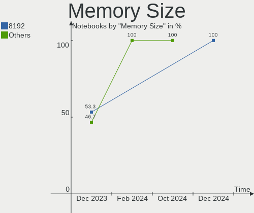

| Size  | Notebooks | Percent |
|-------|-----------|---------|
| 8192  | 14        | 45.16%  |
| 4096  | 8         | 25.81%  |
| 2048  | 7         | 22.58%  |
| 16384 | 2         | 6.45%   |

Memory Speed
------------

Memory module speed

| Speed   | Notebooks | Percent |
|---------|-----------|---------|
| 1600    | 9         | 30%     |
| 3200    | 6         | 20%     |
| 2667    | 4         | 13.33%  |
| 2400    | 2         | 6.67%   |
| 1333    | 2         | 6.67%   |
| 1066    | 2         | 6.67%   |
| 2933    | 1         | 3.33%   |
| 2133    | 1         | 3.33%   |
| 1334    | 1         | 3.33%   |
| 975     | 1         | 3.33%   |
| Unknown | 1         | 3.33%   |

Printers & scanners
-------------------

Printer Vendor
--------------

Printer device vendors

Zero info for selected period =(

Printer Model
-------------

Printer device models

Zero info for selected period =(

Scanner Vendor
--------------

Scanner device vendors

Zero info for selected period =(

Scanner Model
-------------

Scanner device models

Zero info for selected period =(

Camera
------

Camera Vendor
-------------

Camera device vendors

| Vendor                | Notebooks | Percent |
|-----------------------|-----------|---------|
| Chicony Electronics   | 5         | 19.23%  |
| Microdia              | 4         | 15.38%  |
| IMC Networks          | 3         | 11.54%  |
| Bison Electronics     | 3         | 11.54%  |
| Realtek Semiconductor | 2         | 7.69%   |
| Quanta                | 2         | 7.69%   |
| Apple                 | 2         | 7.69%   |
| Y Media               | 1         | 3.85%   |
| Suyin                 | 1         | 3.85%   |
| Silicon Motion        | 1         | 3.85%   |
| Lite-On Technology    | 1         | 3.85%   |
| LG Innotek            | 1         | 3.85%   |

Camera Model
------------

Camera device models

| Model                                     | Notebooks | Percent |
|-------------------------------------------|-----------|---------|
| Microdia Integrated Webcam                | 2         | 7.41%   |
| IMC Networks USB2.0 HD UVC WebCam         | 2         | 7.41%   |
| Chicony Integrated Camera                 | 2         | 7.41%   |
| Bison HD Webcam                           | 2         | 7.41%   |
| Y Media USB Camera                        | 1         | 3.7%    |
| Suyin USB 2.0 Camera                      | 1         | 3.7%    |
| Silicon Motion 300k Pixel Camera          | 1         | 3.7%    |
| Realtek Integrated_Webcam_HD              | 1         | 3.7%    |
| Realtek Integrated Webcam HD              | 1         | 3.7%    |
| Quanta ov9734_techfront_camera            | 1         | 3.7%    |
| Quanta HP TrueVision HD Camera            | 1         | 3.7%    |
| Microdia Laptop_Integrated_Webcam_HD      | 1         | 3.7%    |
| Microdia Dell Laptop Integrated Webcam HD | 1         | 3.7%    |
| Lite-On Integrated Camera                 | 1         | 3.7%    |
| LG Innotek LG Webcam                      | 1         | 3.7%    |
| IMC Networks USB2.0 UVC HD Webcam         | 1         | 3.7%    |
| Chicony Thinkpad T430 camera              | 1         | 3.7%    |
| Chicony Integrated IR Camera              | 1         | 3.7%    |
| Chicony HP Integrated Webcam              | 1         | 3.7%    |
| Chicony FJ Camera                         | 1         | 3.7%    |
| Bison HP Webcam                           | 1         | 3.7%    |
| Apple FaceTime HD Camera (Built-in)       | 1         | 3.7%    |
| Apple FaceTime HD Camera                  | 1         | 3.7%    |

Security
--------

Fingerprint Vendor
------------------

Fingerprint sensor vendors

| Vendor                     | Notebooks | Percent |
|----------------------------|-----------|---------|
| Validity Sensors           | 2         | 50%     |
| Synaptics                  | 1         | 25%     |
| Shenzhen Goodix Technology | 1         | 25%     |

Fingerprint Model
-----------------

Fingerprint sensor models

| Model                                             | Notebooks | Percent |
|---------------------------------------------------|-----------|---------|
| Validity Sensors VFS7500 Touch Fingerprint Sensor | 1         | 25%     |
| Validity Sensors VFS 5011 fingerprint sensor      | 1         | 25%     |
| Synaptics Metallica MIS Touch Fingerprint Reader  | 1         | 25%     |
| Shenzhen Goodix  Fingerprint Device               | 1         | 25%     |

Chipcard Vendor
---------------

Chipcard module vendors

| Vendor | Notebooks | Percent |
|--------|-----------|---------|
| Upek   | 1         | 100%    |

Chipcard Model
--------------

Chipcard module models

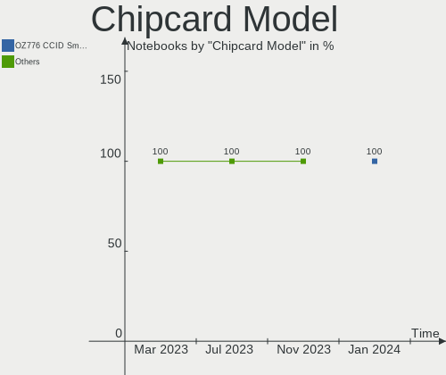

| Model                                                      | Notebooks | Percent |
|------------------------------------------------------------|-----------|---------|
| Upek TouchChip Fingerprint Coprocessor (WBF advanced mode) | 1         | 100%    |

Unsupported
-----------

Unsupported Devices
-------------------

Total unsupported devices on board

| Total | Notebooks | Percent |
|-------|-----------|---------|
| 0     | 21        | 75%     |
| 1     | 7         | 25%     |

Unsupported Device Types
------------------------

Types of unsupported devices

| Type               | Notebooks | Percent |
|--------------------|-----------|---------|
| Fingerprint reader | 4         | 57.14%  |
| Net/ethernet       | 1         | 14.29%  |
| Graphics card      | 1         | 14.29%  |
| Chipcard           | 1         | 14.29%  |

