Xero - Hardware Trends (Notebooks)
----------------------------------

A project to identify most popular hardware characteristics and track their change
over time based on data collected by Linux users at https://Linux-Hardware.org.

Anyone can contribute to this report by the [hw-probe](https://github.com/linuxhw/hw-probe) tool:

    sudo -E hw-probe -all -upload

This report is for one last month. Overall report since the beginning of time: [TestDays](https://github.com/linuxhw/TestDays)

Period: Nov, 2023.

Contents
--------

* [ System ](#system)
  - [ OS                       ](#os)
  - [ OS Family                ](#os-family)
  - [ Kernel                   ](#kernel)
  - [ Kernel Family            ](#kernel-family)
  - [ Kernel Major Ver.        ](#kernel-major-ver)
  - [ Arch                     ](#arch)
  - [ DE                       ](#de)
  - [ Display Server           ](#display-server)
  - [ Display Manager          ](#display-manager)
  - [ OS Lang                  ](#os-lang)
  - [ Boot Mode                ](#boot-mode)
  - [ Filesystem               ](#filesystem)
  - [ Part. scheme             ](#part-scheme)
  - [ Dual Boot with Linux/BSD ](#dual-boot-with-linuxbsd)
  - [ Dual Boot (Win)          ](#dual-boot-win)

* [ Board ](#board)
  - [ Vendor                   ](#vendor)
  - [ Model                    ](#model)
  - [ Model Family             ](#model-family)
  - [ MFG Year                 ](#mfg-year)
  - [ Form Factor              ](#form-factor)
  - [ Secure Boot              ](#secure-boot)
  - [ Coreboot                 ](#coreboot)
  - [ RAM Size                 ](#ram-size)
  - [ RAM Used                 ](#ram-used)
  - [ Total Drives             ](#total-drives)
  - [ Has CD-ROM               ](#has-cd-rom)
  - [ Has Ethernet             ](#has-ethernet)
  - [ Has WiFi                 ](#has-wifi)
  - [ Has Bluetooth            ](#has-bluetooth)

* [ Location ](#location)
  - [ Country                  ](#country)
  - [ City                     ](#city)

* [ Drives ](#drives)
  - [ Drive Vendor             ](#drive-vendor)
  - [ Drive Model              ](#drive-model)
  - [ HDD Vendor               ](#hdd-vendor)
  - [ SSD Vendor               ](#ssd-vendor)
  - [ Drive Kind               ](#drive-kind)
  - [ Drive Connector          ](#drive-connector)
  - [ Drive Size               ](#drive-size)
  - [ Space Total              ](#space-total)
  - [ Space Used               ](#space-used)
  - [ Malfunc. Drives          ](#malfunc-drives)
  - [ Malfunc. Drive Vendor    ](#malfunc-drive-vendor)
  - [ Malfunc. HDD Vendor      ](#malfunc-hdd-vendor)
  - [ Malfunc. Drive Kind      ](#malfunc-drive-kind)
  - [ Failed Drives            ](#failed-drives)
  - [ Failed Drive Vendor      ](#failed-drive-vendor)
  - [ Drive Status             ](#drive-status)

* [ Storage controller ](#storage-controller)
  - [ Storage Vendor           ](#storage-vendor)
  - [ Storage Model            ](#storage-model)
  - [ Storage Kind             ](#storage-kind)

* [ Processor ](#processor)
  - [ CPU Vendor               ](#cpu-vendor)
  - [ CPU Model                ](#cpu-model)
  - [ CPU Model Family         ](#cpu-model-family)
  - [ CPU Cores                ](#cpu-cores)
  - [ CPU Sockets              ](#cpu-sockets)
  - [ CPU Threads              ](#cpu-threads)
  - [ CPU Op-Modes             ](#cpu-op-modes)
  - [ CPU Microcode            ](#cpu-microcode)
  - [ CPU Microarch            ](#cpu-microarch)

* [ Graphics ](#graphics)
  - [ GPU Vendor               ](#gpu-vendor)
  - [ GPU Model                ](#gpu-model)
  - [ GPU Combo                ](#gpu-combo)
  - [ GPU Driver               ](#gpu-driver)
  - [ GPU Memory               ](#gpu-memory)

* [ Monitor ](#monitor)
  - [ Monitor Vendor           ](#monitor-vendor)
  - [ Monitor Model            ](#monitor-model)
  - [ Monitor Resolution       ](#monitor-resolution)
  - [ Monitor Diagonal         ](#monitor-diagonal)
  - [ Monitor Width            ](#monitor-width)
  - [ Aspect Ratio             ](#aspect-ratio)
  - [ Monitor Area             ](#monitor-area)
  - [ Pixel Density            ](#pixel-density)
  - [ Multiple Monitors        ](#multiple-monitors)

* [ Network ](#network)
  - [ Net Controller Vendor    ](#net-controller-vendor)
  - [ Net Controller Model     ](#net-controller-model)
  - [ Wireless Vendor          ](#wireless-vendor)
  - [ Wireless Model           ](#wireless-model)
  - [ Ethernet Vendor          ](#ethernet-vendor)
  - [ Ethernet Model           ](#ethernet-model)
  - [ Net Controller Kind      ](#net-controller-kind)
  - [ Used Controller          ](#used-controller)
  - [ NICs                     ](#nics)
  - [ IPv6                     ](#ipv6)

* [ Bluetooth ](#bluetooth)
  - [ Bluetooth Vendor         ](#bluetooth-vendor)
  - [ Bluetooth Model          ](#bluetooth-model)

* [ Sound ](#sound)
  - [ Sound Vendor             ](#sound-vendor)
  - [ Sound Model              ](#sound-model)

* [ Memory ](#memory)
  - [ Memory Vendor            ](#memory-vendor)
  - [ Memory Model             ](#memory-model)
  - [ Memory Kind              ](#memory-kind)
  - [ Memory Form Factor       ](#memory-form-factor)
  - [ Memory Size              ](#memory-size)
  - [ Memory Speed             ](#memory-speed)

* [ Printers & scanners ](#printers--scanners)
  - [ Printer Vendor           ](#printer-vendor)
  - [ Printer Model            ](#printer-model)
  - [ Scanner Vendor           ](#scanner-vendor)
  - [ Scanner Model            ](#scanner-model)

* [ Camera ](#camera)
  - [ Camera Vendor            ](#camera-vendor)
  - [ Camera Model             ](#camera-model)

* [ Security ](#security)
  - [ Fingerprint Vendor       ](#fingerprint-vendor)
  - [ Fingerprint Model        ](#fingerprint-model)
  - [ Chipcard Vendor          ](#chipcard-vendor)
  - [ Chipcard Model           ](#chipcard-model)

* [ Unsupported ](#unsupported)
  - [ Unsupported Devices      ](#unsupported-devices)
  - [ Unsupported Device Types ](#unsupported-device-types)

System
------

OS
--

Installed operating systems

| Name         | Notebooks | Percent |
|--------------|-----------|---------|
| Xero Rolling | 24        | 100%    |

OS Family
---------

OS without a version

| Name | Notebooks | Percent |
|------|-----------|---------|
| Xero | 24        | 100%    |

Kernel
------

Version of the Linux kernel

| Version        | Notebooks | Percent |
|----------------|-----------|---------|
| 6.5.9-arch2-1  | 17        | 70.83%  |
| 6.6.1-arch1-1  | 3         | 12.5%   |
| 6.4.12-arch1-1 | 2         | 8.33%   |
| 6.6.3-arch1-1  | 1         | 4.17%   |
| 6.5.5-arch1-1  | 1         | 4.17%   |

Kernel Family
-------------

Linux kernel without a distro release

| Version | Notebooks | Percent |
|---------|-----------|---------|
| 6.5.9   | 17        | 70.83%  |
| 6.6.1   | 3         | 12.5%   |
| 6.4.12  | 2         | 8.33%   |
| 6.6.3   | 1         | 4.17%   |
| 6.5.5   | 1         | 4.17%   |

Kernel Major Ver.
-----------------

Linux kernel major version

| Version | Notebooks | Percent |
|---------|-----------|---------|
| 6.5     | 18        | 75%     |
| 6.6     | 4         | 16.67%  |
| 6.4     | 2         | 8.33%   |

Arch
----

OS architecture (x86_64, i586, etc.)

| Name   | Notebooks | Percent |
|--------|-----------|---------|
| x86_64 | 24        | 100%    |

DE
--

Desktop Environment

| Name | Notebooks | Percent |
|------|-----------|---------|
| KDE5 | 24        | 100%    |

Display Server
--------------

X11 or Wayland

| Name    | Notebooks | Percent |
|---------|-----------|---------|
| Wayland | 14        | 58.33%  |
| X11     | 10        | 41.67%  |

Display Manager
---------------

SDDM, LightDM, etc.

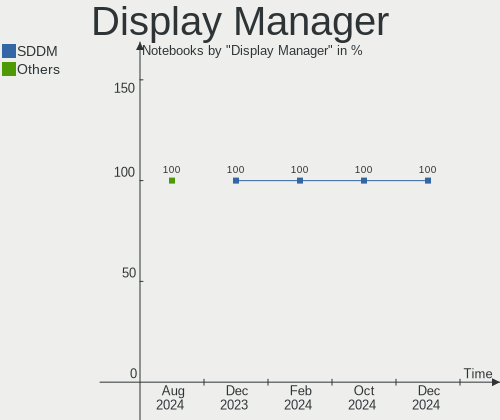

| Name    | Notebooks | Percent |
|---------|-----------|---------|
| SDDM    | 22        | 91.67%  |
| LightDM | 1         | 4.17%   |
| Unknown | 1         | 4.17%   |

OS Lang
-------

Language

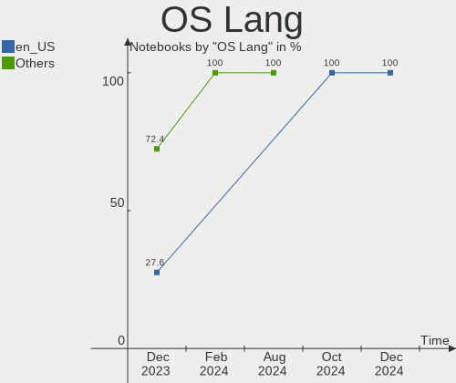

| Lang  | Notebooks | Percent |
|-------|-----------|---------|
| en_US | 10        | 41.67%  |
| pl_PL | 2         | 8.33%   |
| it_IT | 2         | 8.33%   |
| fr_FR | 2         | 8.33%   |
| es_MX | 2         | 8.33%   |
| en_IN | 2         | 8.33%   |
| zh_CN | 1         | 4.17%   |
| tr_TR | 1         | 4.17%   |
| es_ES | 1         | 4.17%   |
| da_DK | 1         | 4.17%   |

Boot Mode
---------

EFI or BIOS

| Mode | Notebooks | Percent |
|------|-----------|---------|
| EFI  | 19        | 79.17%  |
| BIOS | 5         | 20.83%  |

Filesystem
----------

Type of filesystem

| Type  | Notebooks | Percent |
|-------|-----------|---------|
| Ext4  | 15        | 62.5%   |
| Btrfs | 9         | 37.5%   |

Part. scheme
------------

Scheme of partitioning

| Type    | Notebooks | Percent |
|---------|-----------|---------|
| GPT     | 19        | 79.17%  |
| MBR     | 4         | 16.67%  |
| Unknown | 1         | 4.17%   |

Dual Boot with Linux/BSD
------------------------

Hosting more than one Linux/BSD

| Dual boot | Notebooks | Percent |
|-----------|-----------|---------|
| No        | 17        | 70.83%  |
| Yes       | 7         | 29.17%  |

Dual Boot (Win)
---------------

Hosting Linux and Windows

| Dual boot | Notebooks | Percent |
|-----------|-----------|---------|
| No        | 16        | 66.67%  |
| Yes       | 8         | 33.33%  |

Board
-----

Vendor
------

Motherboard manufacturer

| Name             | Notebooks | Percent |
|------------------|-----------|---------|
| Lenovo           | 9         | 37.5%   |
| ASUSTek Computer | 4         | 16.67%  |
| Toshiba          | 3         | 12.5%   |
| Hewlett-Packard  | 3         | 12.5%   |
| Acer             | 3         | 12.5%   |
| MSI              | 1         | 4.17%   |
| HUAWEI           | 1         | 4.17%   |

Model
-----

Motherboard model

| Name                                     | Notebooks | Percent |
|------------------------------------------|-----------|---------|
| Toshiba Satellite Pro L300               | 1         | 4.17%   |
| Toshiba Satellite P50-B-11V              | 1         | 4.17%   |
| Toshiba Satellite C55-C                  | 1         | 4.17%   |
| MSI Bravo 15 B5DD                        | 1         | 4.17%   |
| Lenovo Yoga 2 13 20344                   | 1         | 4.17%   |
| Lenovo XiaoXinPro 14 IRH8 83AL           | 1         | 4.17%   |
| Lenovo ThinkPad X395 20NLS0J400          | 1         | 4.17%   |
| Lenovo ThinkPad X1 Carbon 6th 20KGS5YN00 | 1         | 4.17%   |
| Lenovo ThinkPad T14s Gen 3 21CQ000FUS    | 1         | 4.17%   |
| Lenovo ThinkPad P43s 20RH0021MX          | 1         | 4.17%   |
| Lenovo IdeaPad Slim 3 14IAN8 82XA        | 1         | 4.17%   |
| Lenovo IdeaPad 5 Pro 16IHU6 82L9         | 1         | 4.17%   |
| Lenovo IdeaPad 320-15ABR 80XS            | 1         | 4.17%   |
| HUAWEI RLEF-XX                           | 1         | 4.17%   |
| HP Pavilion dv7                          | 1         | 4.17%   |
| HP Pavilion dv6                          | 1         | 4.17%   |
| HP Laptop 15s-fr2xxx                     | 1         | 4.17%   |
| ASUS X540LJ                              | 1         | 4.17%   |
| ASUS VivoBook_ASUSLaptop X712EA_K712EA   | 1         | 4.17%   |
| ASUS UX310UQK                            | 1         | 4.17%   |
| ASUS TUF Gaming FX505DT_FX95DT           | 1         | 4.17%   |
| Acer Nitro AN515-57                      | 1         | 4.17%   |
| Acer Nitro AN515-54                      | 1         | 4.17%   |
| Acer Aspire A315-58                      | 1         | 4.17%   |

Model Family
------------

Motherboard model prefix

| Name              | Notebooks | Percent |
|-------------------|-----------|---------|
| Lenovo ThinkPad   | 4         | 16.67%  |
| Toshiba Satellite | 3         | 12.5%   |
| Lenovo IdeaPad    | 3         | 12.5%   |
| HP Pavilion       | 2         | 8.33%   |
| Acer Nitro        | 2         | 8.33%   |
| MSI Bravo         | 1         | 4.17%   |
| Lenovo Yoga       | 1         | 4.17%   |
| Lenovo XiaoXinPro | 1         | 4.17%   |
| HUAWEI RLEF-XX    | 1         | 4.17%   |
| HP Laptop         | 1         | 4.17%   |
| ASUS X540LJ       | 1         | 4.17%   |
| ASUS VivoBook     | 1         | 4.17%   |
| ASUS UX310UQK     | 1         | 4.17%   |
| ASUS TUF          | 1         | 4.17%   |
| Acer Aspire       | 1         | 4.17%   |

MFG Year
--------

Motherboard manufacture year

| Year | Notebooks | Percent |
|------|-----------|---------|
| 2021 | 6         | 25%     |
| 2023 | 3         | 12.5%   |
| 2019 | 3         | 12.5%   |
| 2008 | 3         | 12.5%   |
| 2015 | 2         | 8.33%   |
| 2014 | 2         | 8.33%   |
| 2022 | 1         | 4.17%   |
| 2020 | 1         | 4.17%   |
| 2018 | 1         | 4.17%   |
| 2017 | 1         | 4.17%   |
| 2016 | 1         | 4.17%   |

Form Factor
-----------

Physical design of the computer

| Name     | Notebooks | Percent |
|----------|-----------|---------|
| Notebook | 24        | 100%    |

Secure Boot
-----------

Enabled or disabled

| State    | Notebooks | Percent |
|----------|-----------|---------|
| Disabled | 24        | 100%    |

Coreboot
--------

Have coreboot on board

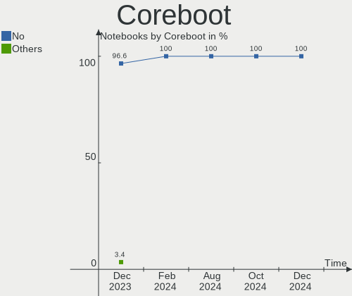

| Used | Notebooks | Percent |
|------|-----------|---------|
| No   | 24        | 100%    |

RAM Size
--------

Total RAM memory

| Size in GB | Notebooks | Percent |
|------------|-----------|---------|
| 4.01-8.0   | 9         | 37.5%   |
| 8.01-16.0  | 4         | 16.67%  |
| 3.01-4.0   | 3         | 12.5%   |
| 16.01-24.0 | 3         | 12.5%   |
| 32.01-64.0 | 2         | 8.33%   |
| 24.01-32.0 | 2         | 8.33%   |
| 2.01-3.0   | 1         | 4.17%   |

RAM Used
--------

Used RAM memory

| Used GB  | Notebooks | Percent |
|----------|-----------|---------|
| 2.01-3.0 | 11        | 45.83%  |
| 1.01-2.0 | 8         | 33.33%  |
| 3.01-4.0 | 4         | 16.67%  |
| 4.01-8.0 | 1         | 4.17%   |

Total Drives
------------

Number of drives on board

| Drives | Notebooks | Percent |
|--------|-----------|---------|
| 1      | 18        | 75%     |
| 2      | 5         | 20.83%  |
| 3      | 1         | 4.17%   |

Has CD-ROM
----------

Has CD-ROM on board

| Presented | Notebooks | Percent |
|-----------|-----------|---------|
| No        | 17        | 70.83%  |
| Yes       | 7         | 29.17%  |

Has Ethernet
------------

Has Ethernet on board

| Presented | Notebooks | Percent |
|-----------|-----------|---------|
| Yes       | 17        | 70.83%  |
| No        | 7         | 29.17%  |

Has WiFi
--------

Has WiFi module

| Presented | Notebooks | Percent |
|-----------|-----------|---------|
| Yes       | 24        | 100%    |

Has Bluetooth
-------------

Has Bluetooth module

| Presented | Notebooks | Percent |
|-----------|-----------|---------|
| Yes       | 21        | 87.5%   |
| No        | 3         | 12.5%   |

Location
--------

Country
-------

Geographic location (country)

| Country   | Notebooks | Percent |
|-----------|-----------|---------|
| USA       | 5         | 20.83%  |
| France    | 3         | 12.5%   |
| Poland    | 2         | 8.33%   |
| India     | 2         | 8.33%   |
| China     | 2         | 8.33%   |
| Turkey    | 1         | 4.17%   |
| Spain     | 1         | 4.17%   |
| Portugal  | 1         | 4.17%   |
| Morocco   | 1         | 4.17%   |
| Italy     | 1         | 4.17%   |
| Indonesia | 1         | 4.17%   |
| Germany   | 1         | 4.17%   |
| Ecuador   | 1         | 4.17%   |
| Denmark   | 1         | 4.17%   |
| Argentina | 1         | 4.17%   |

City
----

Geographic location (city)

| City           | Notebooks | Percent |
|----------------|-----------|---------|
| Wuhan          | 1         | 4.17%   |
| Virginia Beach | 1         | 4.17%   |
| Sanford        | 1         | 4.17%   |
| Reno           | 1         | 4.17%   |
| Potsdam        | 1         | 4.17%   |
| Olympia        | 1         | 4.17%   |
| Nanchong       | 1         | 4.17%   |
| Mersin         | 1         | 4.17%   |
| Loja           | 1         | 4.17%   |
| Lisbon         | 1         | 4.17%   |
| Lect           | 1         | 4.17%   |
| La Plata       | 1         | 4.17%   |
| La Ciotat      | 1         | 4.17%   |
| Jeumont        | 1         | 4.17%   |
| Jember         | 1         | 4.17%   |
| Gliwice        | 1         | 4.17%   |
| Fairfax        | 1         | 4.17%   |
| Delhi          | 1         | 4.17%   |
| Christiansfeld | 1         | 4.17%   |
| Chennai        | 1         | 4.17%   |
| Cesena         | 1         | 4.17%   |
| Casablanca     | 1         | 4.17%   |
| Będzin        | 1         | 4.17%   |
| Barcelona      | 1         | 4.17%   |

Drives
------

Drive Vendor
------------

Hard drive vendors

| Vendor                      | Notebooks | Drives | Percent |
|-----------------------------|-----------|--------|---------|
| Seagate                     | 5         | 5      | 16.13%  |
| Samsung Electronics         | 5         | 5      | 16.13%  |
| WDC                         | 3         | 3      | 9.68%   |
| SK hynix                    | 3         | 3      | 9.68%   |
| Silicon Motion              | 2         | 2      | 6.45%   |
| Kingston                    | 2         | 2      | 6.45%   |
| Yangtze Memory Technologies | 1         | 1      | 3.23%   |
| Unknown                     | 1         | 1      | 3.23%   |
| Union Memory (Shenzhen)     | 1         | 1      | 3.23%   |
| Toshiba                     | 1         | 1      | 3.23%   |
| Team                        | 1         | 1      | 3.23%   |
| Sandisk                     | 1         | 1      | 3.23%   |
| Phison Electronics          | 1         | 1      | 3.23%   |
| Micron Technology           | 1         | 1      | 3.23%   |
| Lenovo                      | 1         | 1      | 3.23%   |
| Intel                       | 1         | 1      | 3.23%   |
| Crucial                     | 1         | 1      | 3.23%   |

Drive Model
-----------

Hard drive models

| Model                                                 | Notebooks | Percent |
|-------------------------------------------------------|-----------|---------|
| Yangtze Memory ZHITAI TiPlus5000 1TB                  | 1         | 3.23%   |
| WDC WD3200BEVT-26ZCT0 320GB                           | 1         | 3.23%   |
| WDC WD2500BEVS-22UST0 250GB                           | 1         | 3.23%   |
| WDC WD10SPZX-22Z10T1 1TB                              | 1         | 3.23%   |
| Unknown MMC Card  32GB                                | 1         | 3.23%   |
| Union Memory (Shenzhen) UMIS RPEYJ1T24MKN2QWY 1TB     | 1         | 3.23%   |
| Toshiba MQ01ABD100 1TB                                | 1         | 3.23%   |
| Team T253512GB SSD                                    | 1         | 3.23%   |
| SK hynix SKHynix_HFS512GDE9X084N 512GB                | 1         | 3.23%   |
| SK hynix SKHynix_HFS512GD9TNI-L2B0B 512GB             | 1         | 3.23%   |
| SK hynix HFS512G39TND-N210A 512GB SSD                 | 1         | 3.23%   |
| Silicon Motion SM2263EN/SM2263XT SSD Controller 256GB | 1         | 3.23%   |
| Silicon Motion PCIe-8 SSD 512GB                       | 1         | 3.23%   |
| Seagate ST9500420AS 500GB                             | 1         | 3.23%   |
| Seagate ST500LX012-SSHD-8GB                           | 1         | 3.23%   |
| Seagate ST1000LM035-1RK172 1TB                        | 1         | 3.23%   |
| Seagate ST1000LM024 HN-M101MBB 1TB                    | 1         | 3.23%   |
| Seagate BUP Slim BK 1TB                               | 1         | 3.23%   |
| Sandisk WD Blue SN550 NVMe SSD 512GB                  | 1         | 3.23%   |
| Samsung SSD 860 EVO 1TB                               | 1         | 3.23%   |
| Samsung NVMe SSD Controller SM981/PM981/PM983 250GB   | 1         | 3.23%   |
| Samsung NVMe SSD Controller PM9A1/PM9A3/980PRO 2TB    | 1         | 3.23%   |
| Samsung MZVLQ512HBLU-00B00 512GB                      | 1         | 3.23%   |
| Samsung MZAL4256HBJD-00BL2 256GB                      | 1         | 3.23%   |
| Phison PS5013 E13 NVMe Controller 512GB               | 1         | 3.23%   |
| Micron 2200_MTFDHBA512TCK 512GB                       | 1         | 3.23%   |
| Lenovo PS9 PSSD 1TB                                   | 1         | 3.23%   |
| Kingston OM8SEP4512Q-AA 512GB                         | 1         | 3.23%   |
| Kingston OM8PCP3512F-AI1 512GB                        | 1         | 3.23%   |
| Intel SSD 660P Series 512GB                           | 1         | 3.23%   |
| Crucial CT500MX500SSD1 500GB                          | 1         | 3.23%   |

HDD Vendor
----------

Hard disk drive vendors

| Vendor  | Notebooks | Drives | Percent |
|---------|-----------|--------|---------|
| Seagate | 5         | 5      | 55.56%  |
| WDC     | 3         | 3      | 33.33%  |
| Toshiba | 1         | 1      | 11.11%  |

SSD Vendor
----------

Solid state drive vendors

| Vendor              | Notebooks | Drives | Percent |
|---------------------|-----------|--------|---------|
| Team                | 1         | 1      | 25%     |
| SK hynix            | 1         | 1      | 25%     |
| Samsung Electronics | 1         | 1      | 25%     |
| Crucial             | 1         | 1      | 25%     |

Drive Kind
----------

HDD or SSD

| Kind | Notebooks | Drives | Percent |
|------|-----------|--------|---------|
| NVMe | 15        | 17     | 51.72%  |
| HDD  | 9         | 9      | 31.03%  |
| SSD  | 4         | 4      | 13.79%  |
| MMC  | 1         | 1      | 3.45%   |

Drive Connector
---------------

SATA, SAS, NVMe, etc.

| Type | Notebooks | Drives | Percent |
|------|-----------|--------|---------|
| NVMe | 15        | 16     | 50%     |
| SATA | 12        | 12     | 40%     |
| SAS  | 2         | 2      | 6.67%   |
| MMC  | 1         | 1      | 3.33%   |

Drive Size
----------

Size of hard drive

| Size in TB | Notebooks | Drives | Percent |
|------------|-----------|--------|---------|
| 0.51-1.0   | 8         | 8      | 61.54%  |
| 0.01-0.5   | 5         | 5      | 38.46%  |

Space Total
-----------

Amount of disk space available on the file system

| Size in GB     | Notebooks | Percent |
|----------------|-----------|---------|
| 101-250        | 6         | 25%     |
| 251-500        | 5         | 20.83%  |
| More than 3000 | 4         | 16.67%  |
| 501-1000       | 3         | 12.5%   |
| 2001-3000      | 2         | 8.33%   |
| 51-100         | 2         | 8.33%   |
| 21-50          | 1         | 4.17%   |
| 1001-2000      | 1         | 4.17%   |

Space Used
----------

Amount of used disk space

| Used GB | Notebooks | Percent |
|---------|-----------|---------|
| 1-20    | 11        | 45.83%  |
| 21-50   | 9         | 37.5%   |
| 101-250 | 3         | 12.5%   |
| 51-100  | 1         | 4.17%   |

Malfunc. Drives
---------------

Drive models with a malfunction

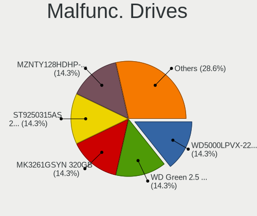

| Model                                 | Notebooks | Drives | Percent |
|---------------------------------------|-----------|--------|---------|
| WDC WD2500BEVS-22UST0 250GB           | 1         | 1      | 50%     |
| SK hynix HFS512G39TND-N210A 512GB SSD | 1         | 1      | 50%     |

Malfunc. Drive Vendor
---------------------

Vendors of faulty drives

| Vendor   | Notebooks | Drives | Percent |
|----------|-----------|--------|---------|
| WDC      | 1         | 1      | 50%     |
| SK hynix | 1         | 1      | 50%     |

Malfunc. HDD Vendor
-------------------

Vendors of faulty HDD drives

| Vendor | Notebooks | Drives | Percent |
|--------|-----------|--------|---------|
| WDC    | 1         | 1      | 100%    |

Malfunc. Drive Kind
-------------------

Kinds of faulty drives

| Kind | Notebooks | Drives | Percent |
|------|-----------|--------|---------|
| SSD  | 1         | 1      | 50%     |
| HDD  | 1         | 1      | 50%     |

Failed Drives
-------------

Failed drive models

Zero info for selected period =(

Failed Drive Vendor
-------------------

Failed drive vendors

Zero info for selected period =(

Drive Status
------------

Number of failed and malfunc. drives

| Status   | Notebooks | Drives | Percent |
|----------|-----------|--------|---------|
| Works    | 21        | 25     | 80.77%  |
| Detected | 3         | 4      | 11.54%  |
| Malfunc  | 2         | 2      | 7.69%   |

Storage controller
------------------

Storage Vendor
--------------

Storage controller vendors

| Vendor                                  | Notebooks | Percent |
|-----------------------------------------|-----------|---------|
| Intel                                   | 12        | 40%     |
| Samsung Electronics                     | 4         | 13.33%  |
| AMD                                     | 3         | 10%     |
| SK hynix                                | 2         | 6.67%   |
| Silicon Motion                          | 2         | 6.67%   |
| Kingston Technology Company             | 2         | 6.67%   |
| Yangtze Memory Technologies             | 1         | 3.33%   |
| Shenzhen Unionmemory Information System | 1         | 3.33%   |
| SanDisk                                 | 1         | 3.33%   |
| Phison Electronics                      | 1         | 3.33%   |
| Micron Technology                       | 1         | 3.33%   |

Storage Model
-------------

Storage controller models

| Model                                                                                         | Notebooks | Percent |
|-----------------------------------------------------------------------------------------------|-----------|---------|
| Intel Volume Management Device NVMe RAID Controller                                           | 4         | 11.43%  |
| Intel Wildcat Point-LP SATA Controller [AHCI Mode]                                            | 2         | 5.71%   |
| Intel Tiger Lake-LP SATA Controller                                                           | 2         | 5.71%   |
| AMD FCH SATA Controller [AHCI mode]                                                           | 2         | 5.71%   |
| Yangtze Memory ZHITAI TiPro5000 NVMe SSD                                                      | 1         | 2.86%   |
| SK hynix PC611 NVMe Solid State Drive                                                         | 1         | 2.86%   |
| SK hynix Gold P31/BC711/PC711 NVMe Solid State Drive                                          | 1         | 2.86%   |
| Silicon Motion SM2263EN/SM2263XT (DRAM-less) NVMe SSD Controllers                             | 1         | 2.86%   |
| Silicon Motion Non-Volatile memory controller                                                 | 1         | 2.86%   |
| Shenzhen Unionmemory Information System RPEYJ1T24MKN2QWY PCIe 4.0 NVMe SSD 1024GB (DRAM-less) | 1         | 2.86%   |
| SanDisk Ultra 3D / WD Blue SN550 NVMe SSD                                                     | 1         | 2.86%   |
| Samsung NVMe SSD Controller SM981/PM981/PM983                                                 | 1         | 2.86%   |
| Samsung NVMe SSD Controller PM9B1 (DRAM-less)                                                 | 1         | 2.86%   |
| Samsung NVMe SSD Controller PM9A1/PM9A3/980PRO                                                | 1         | 2.86%   |
| Samsung NVMe SSD Controller 980 (DRAM-less)                                                   | 1         | 2.86%   |
| Phison PS5013-E13 PCIe3 NVMe Controller (DRAM-less)                                           | 1         | 2.86%   |
| Micron 2200S NVMe SSD [Cassandra]                                                             | 1         | 2.86%   |
| Kingston Company OM8PCP Design-In PCIe 3 NVMe SSD (DRAM-less)                                 | 1         | 2.86%   |
| Kingston Company Design-In PCIe 4 NVMe SSD (TLC)                                              | 1         | 2.86%   |
| Intel Tiger Lake SATA AHCI Controller                                                         | 1         | 2.86%   |
| Intel Sunrise Point-LP SATA Controller [AHCI mode]                                            | 1         | 2.86%   |
| Intel SSD 660P Series                                                                         | 1         | 2.86%   |
| Intel Cannon Lake Mobile PCH SATA AHCI Controller                                             | 1         | 2.86%   |
| Intel 82801IBM/IEM (ICH9M/ICH9M-E) 4 port SATA Controller [AHCI mode]                         | 1         | 2.86%   |
| Intel 82801HM/HEM (ICH8M/ICH8M-E) SATA Controller [AHCI mode]                                 | 1         | 2.86%   |
| Intel 82801HM/HEM (ICH8M/ICH8M-E) IDE Controller                                              | 1         | 2.86%   |
| Intel 8 Series/C220 Series Chipset Family 6-port SATA Controller 1 [AHCI mode]                | 1         | 2.86%   |
| Intel 8 Series SATA Controller 1 [AHCI mode]                                                  | 1         | 2.86%   |
| AMD SB7x0/SB8x0/SB9x0 SATA Controller [AHCI mode]                                             | 1         | 2.86%   |

Storage Kind
------------

Kind of storage controller (IDE, SATA, NVMe, SAS, ...)

| Kind | Notebooks | Percent |
|------|-----------|---------|
| NVMe | 15        | 44.12%  |
| SATA | 14        | 41.18%  |
| RAID | 4         | 11.76%  |
| IDE  | 1         | 2.94%   |

Processor
---------

CPU Vendor
----------

Processor vendors

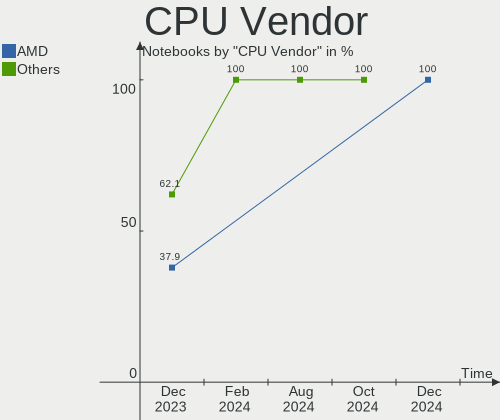

| Vendor | Notebooks | Percent |
|--------|-----------|---------|
| Intel  | 18        | 75%     |
| AMD    | 6         | 25%     |

CPU Model
---------

Processor models

| Model                                           | Notebooks | Percent |
|-------------------------------------------------|-----------|---------|
| Intel 11th Gen Core i3-1115G4 @ 3.00GHz         | 2         | 8.33%   |
| Intel Core i7-8650U CPU @ 1.90GHz               | 1         | 4.17%   |
| Intel Core i7-8565U CPU @ 1.80GHz               | 1         | 4.17%   |
| Intel Core i7-7500U CPU @ 2.70GHz               | 1         | 4.17%   |
| Intel Core i7-4720HQ CPU @ 2.60GHz              | 1         | 4.17%   |
| Intel Core i5-9300H CPU @ 2.40GHz               | 1         | 4.17%   |
| Intel Core i5-5200U CPU @ 2.20GHz               | 1         | 4.17%   |
| Intel Core i3-N305                              | 1         | 4.17%   |
| Intel Core i3-5005U CPU @ 2.00GHz               | 1         | 4.17%   |
| Intel Core i3-4030U CPU @ 1.90GHz               | 1         | 4.17%   |
| Intel Core 2 Duo CPU T6500 @ 2.10GHz            | 1         | 4.17%   |
| Intel Core 2 Duo CPU T5750 @ 2.00GHz            | 1         | 4.17%   |
| Intel 13th Gen Core i5-13500H                   | 1         | 4.17%   |
| Intel 12th Gen Core i5-12450H                   | 1         | 4.17%   |
| Intel 11th Gen Core i9-11900H @ 2.50GHz         | 1         | 4.17%   |
| Intel 11th Gen Core i5-1135G7 @ 2.40GHz         | 1         | 4.17%   |
| Intel 11th Gen Core i5-11300H @ 3.10GHz         | 1         | 4.17%   |
| AMD Turion II Dual-Core Mobile M500             | 1         | 4.17%   |
| AMD Ryzen 7 PRO 6850U with Radeon Graphics      | 1         | 4.17%   |
| AMD Ryzen 7 PRO 3700U w/ Radeon Vega Mobile Gfx | 1         | 4.17%   |
| AMD Ryzen 5 5600H with Radeon Graphics          | 1         | 4.17%   |
| AMD Ryzen 5 3550H with Radeon Vega Mobile Gfx   | 1         | 4.17%   |
| AMD A12-9720P RADEON R7, 12 COMPUTE CORES 4C+8G | 1         | 4.17%   |

CPU Model Family
----------------

Processor model prefix

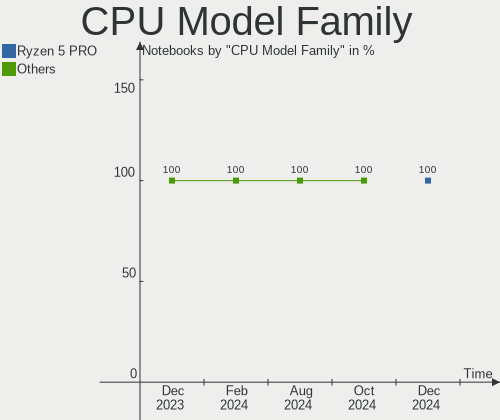

| Model                   | Notebooks | Percent |
|-------------------------|-----------|---------|
| Other                   | 7         | 29.17%  |
| Intel Core i7           | 4         | 16.67%  |
| Intel Core i3           | 3         | 12.5%   |
| Intel Core i5           | 2         | 8.33%   |
| Intel Core 2 Duo        | 2         | 8.33%   |
| AMD Ryzen 7 PRO         | 2         | 8.33%   |
| AMD Ryzen 5             | 2         | 8.33%   |
| AMD Turion II Dual-Core | 1         | 4.17%   |
| AMD A12                 | 1         | 4.17%   |

CPU Cores
---------

Number of processor cores

| Number | Notebooks | Percent |
|--------|-----------|---------|
| 2      | 10        | 41.67%  |
| 4      | 8         | 33.33%  |
| 8      | 4         | 16.67%  |
| 12     | 1         | 4.17%   |
| 6      | 1         | 4.17%   |

CPU Sockets
-----------

Number of sockets

| Number | Notebooks | Percent |
|--------|-----------|---------|
| 1      | 24        | 100%    |

CPU Threads
-----------

Threads per core (Hyper-Threading)

| Number | Notebooks | Percent |
|--------|-----------|---------|
| 2      | 20        | 83.33%  |
| 1      | 4         | 16.67%  |

CPU Op-Modes
------------

CPU Operation Modes (32-bit, 64-bit)

| Op mode        | Notebooks | Percent |
|----------------|-----------|---------|
| 32-bit, 64-bit | 24        | 100%    |

CPU Microcode
-------------

Microcode number

| Number     | Notebooks | Percent |
|------------|-----------|---------|
| Unknown    | 19        | 79.17%  |
| 0x0a50000c | 1         | 4.17%   |
| 0x0a404102 | 1         | 4.17%   |
| 0x08108109 | 1         | 4.17%   |
| 0x08108102 | 1         | 4.17%   |
| 0x0600611a | 1         | 4.17%   |

CPU Microarch
-------------

Microarchitecture

| Name             | Notebooks | Percent |
|------------------|-----------|---------|
| TigerLake        | 4         | 16.67%  |
| KabyLake         | 4         | 16.67%  |
| Zen+             | 2         | 8.33%   |
| Haswell          | 2         | 8.33%   |
| Broadwell        | 2         | 8.33%   |
| Alderlake Hybrid | 2         | 8.33%   |
| Zen 3            | 1         | 4.17%   |
| Penryn           | 1         | 4.17%   |
| K10              | 1         | 4.17%   |
| Icelake          | 1         | 4.17%   |
| Gracemont        | 1         | 4.17%   |
| Excavator        | 1         | 4.17%   |
| Core             | 1         | 4.17%   |
| Unknown          | 1         | 4.17%   |

Graphics
--------

GPU Vendor
----------

Vendors of graphics cards

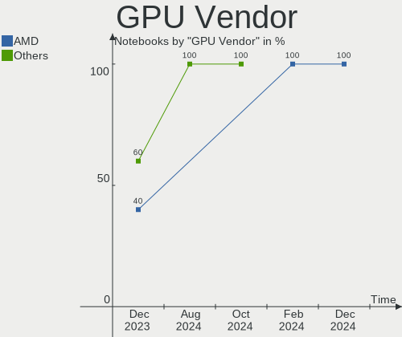

| Vendor | Notebooks | Percent |
|--------|-----------|---------|
| Intel  | 17        | 53.13%  |
| AMD    | 8         | 25%     |
| Nvidia | 7         | 21.88%  |

GPU Model
---------

Graphics card models

| Model                                                                | Notebooks | Percent |
|----------------------------------------------------------------------|-----------|---------|
| Nvidia TU117M [GeForce GTX 1650 Mobile / Max-Q]                      | 2         | 5.88%   |
| Intel TigerLake-LP GT2 [Iris Xe Graphics]                            | 2         | 5.88%   |
| Intel Tiger Lake-LP GT2 [UHD Graphics G4]                            | 2         | 5.88%   |
| Intel HD Graphics 5500                                               | 2         | 5.88%   |
| AMD Picasso/Raven 2 [Radeon Vega Series / Radeon Vega Mobile Series] | 2         | 5.88%   |
| Nvidia TU117M [GeForce MX450]                                        | 1         | 2.94%   |
| Nvidia GP108GLM [Quadro P520]                                        | 1         | 2.94%   |
| Nvidia GM108M [GeForce 940MX]                                        | 1         | 2.94%   |
| Nvidia GK208BM [GeForce 920M]                                        | 1         | 2.94%   |
| Nvidia GA106M [GeForce RTX 3060 Mobile / Max-Q]                      | 1         | 2.94%   |
| Intel WhiskeyLake-U GT2 [UHD Graphics 620]                           | 1         | 2.94%   |
| Intel UHD Graphics 620                                               | 1         | 2.94%   |
| Intel TigerLake-H GT1 [UHD Graphics]                                 | 1         | 2.94%   |
| Intel Raptor Lake-P [Iris Xe Graphics]                               | 1         | 2.94%   |
| Intel Mobile GM965/GL960 Integrated Graphics Controller (secondary)  | 1         | 2.94%   |
| Intel Mobile GM965/GL960 Integrated Graphics Controller (primary)    | 1         | 2.94%   |
| Intel HD Graphics 620                                                | 1         | 2.94%   |
| Intel Haswell-ULT Integrated Graphics Controller                     | 1         | 2.94%   |
| Intel CoffeeLake-H GT2 [UHD Graphics 630]                            | 1         | 2.94%   |
| Intel Alder Lake-P GT1 [UHD Graphics]                                | 1         | 2.94%   |
| Intel Alder Lake-N [UHD Graphics]                                    | 1         | 2.94%   |
| Intel 4th Gen Core Processor Integrated Graphics Controller          | 1         | 2.94%   |
| AMD Wani [Radeon R5/R6/R7 Graphics]                                  | 1         | 2.94%   |
| AMD Venus PRO [Radeon HD 8850M / R9 M265X]                           | 1         | 2.94%   |
| AMD RV730/M96 [Mobility Radeon HD 4650/5165]                         | 1         | 2.94%   |
| AMD RV710/M92 [Mobility Radeon HD 4530/4570/5145/530v/540v/545v]     | 1         | 2.94%   |
| AMD Rembrandt [Radeon 680M]                                          | 1         | 2.94%   |
| AMD Navi 14 [Radeon RX 5500/5500M / Pro 5500M]                       | 1         | 2.94%   |
| AMD Cezanne [Radeon Vega Series / Radeon Vega Mobile Series]         | 1         | 2.94%   |

GPU Combo
---------

Combinations of graphics cards

| Name           | Notebooks | Percent |
|----------------|-----------|---------|
| 1 x Intel      | 9         | 37.5%   |
| Intel + Nvidia | 6         | 25%     |
| 1 x AMD        | 5         | 20.83%  |
| 2 x Intel      | 1         | 4.17%   |
| 2 x AMD        | 1         | 4.17%   |
| Intel + AMD    | 1         | 4.17%   |
| AMD + Nvidia   | 1         | 4.17%   |

GPU Driver
----------

Free vs proprietary

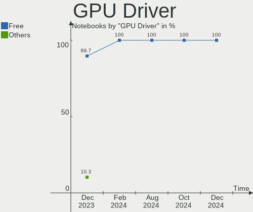

| Driver      | Notebooks | Percent |
|-------------|-----------|---------|
| Free        | 22        | 91.67%  |
| Proprietary | 2         | 8.33%   |

GPU Memory
----------

Total video memory

| Size in GB | Notebooks | Percent |
|------------|-----------|---------|
| Unknown    | 12        | 50%     |
| 1.01-2.0   | 5         | 20.83%  |
| 0.51-1.0   | 3         | 12.5%   |
| 3.01-4.0   | 2         | 8.33%   |
| 0.01-0.5   | 2         | 8.33%   |

Monitor
-------

Monitor Vendor
--------------

Monitor vendors

| Vendor              | Notebooks | Percent |
|---------------------|-----------|---------|
| AU Optronics        | 6         | 23.08%  |
| Chimei Innolux      | 5         | 19.23%  |
| BOE                 | 4         | 15.38%  |
| Samsung Electronics | 2         | 7.69%   |
| CSO                 | 2         | 7.69%   |
| Wacom               | 1         | 3.85%   |
| Sharp               | 1         | 3.85%   |
| RTK                 | 1         | 3.85%   |
| Philips             | 1         | 3.85%   |
| LG Display          | 1         | 3.85%   |
| HKC                 | 1         | 3.85%   |
| CTO                 | 1         | 3.85%   |

Monitor Model
-------------

Monitor models

| Model                                                                | Notebooks | Percent |
|----------------------------------------------------------------------|-----------|---------|
| Wacom Cintiq 16 WAC1071 1920x1080 344x193mm 15.5-inch                | 1         | 3.7%    |
| Sharp LQ156M1JW01 SHP14C3 1920x1080 344x194mm 15.5-inch              | 1         | 3.7%    |
| Samsung Electronics LF24T35 SAM707D 1920x1080 528x297mm 23.9-inch    | 1         | 3.7%    |
| Samsung Electronics LCD Monitor SEC3741 1280x800 331x207mm 15.4-inch | 1         | 3.7%    |
| Samsung Electronics LCD Monitor SDC4141 1366x768 344x194mm 15.5-inch | 1         | 3.7%    |
| RTK HDMI RTK1560 1920x1080 345x194mm 15.6-inch                       | 1         | 3.7%    |
| Philips PHL 273V7 PHLC156 1920x1080 598x336mm 27.0-inch              | 1         | 3.7%    |
| LG Display LCD Monitor LGD0470 1920x1080 345x194mm 15.6-inch         | 1         | 3.7%    |
| HKC LCD Monitor HKC3D00 1920x1080 344x194mm 15.5-inch                | 1         | 3.7%    |
| CTO LCD Monitor CTO1416 1920x1200 301x188mm 14.0-inch                | 1         | 3.7%    |
| CSO LCD Monitor CSO1602 2560x1600 344x215mm 16.0-inch                | 1         | 3.7%    |
| CSO LCD Monitor CSO1416 2880x1800 301x188mm 14.0-inch                | 1         | 3.7%    |
| Chimei Innolux LCD Monitor CMN15DB 1366x768 344x193mm 15.5-inch      | 1         | 3.7%    |
| Chimei Innolux LCD Monitor CMN1540 2560x1440 344x193mm 15.5-inch     | 1         | 3.7%    |
| Chimei Innolux LCD Monitor CMN1521 1920x1080 344x193mm 15.5-inch     | 1         | 3.7%    |
| Chimei Innolux LCD Monitor CMN1515 1920x1080 344x193mm 15.5-inch     | 1         | 3.7%    |
| Chimei Innolux LCD Monitor CMN14F2 1920x1080 309x173mm 13.9-inch     | 1         | 3.7%    |
| BOE LCD Monitor BOE0A74 1920x1200 345x215mm 16.0-inch                | 1         | 3.7%    |
| BOE LCD Monitor BOE09AE 1920x1080 309x174mm 14.0-inch                | 1         | 3.7%    |
| BOE LCD Monitor BOE084E 1920x1080 382x215mm 17.3-inch                | 1         | 3.7%    |
| BOE LCD Monitor BOE066E 1366x768 344x194mm 15.5-inch                 | 1         | 3.7%    |
| AU Optronics LCD Monitor AUOD0ED 1920x1080 344x193mm 15.5-inch       | 1         | 3.7%    |
| AU Optronics LCD Monitor AUO2336 2560x1440 309x174mm 14.0-inch       | 1         | 3.7%    |
| AU Optronics LCD Monitor AUO222D 1920x1080 293x165mm 13.2-inch       | 1         | 3.7%    |
| AU Optronics LCD Monitor AUO202D 1920x1080 293x165mm 13.2-inch       | 1         | 3.7%    |
| AU Optronics LCD Monitor AUO142D 1920x1080 293x165mm 13.2-inch       | 1         | 3.7%    |
| AU Optronics LCD Monitor AUO119E 1600x900 382x214mm 17.2-inch        | 1         | 3.7%    |

Monitor Resolution
------------------

Monitor screen resolution

| Resolution        | Notebooks | Percent |
|-------------------|-----------|---------|
| 1920x1080 (FHD)   | 14        | 56%     |
| 1366x768 (WXGA)   | 3         | 12%     |
| 2560x1440 (QHD)   | 2         | 8%      |
| 1920x1200 (WUXGA) | 2         | 8%      |
| 3840x2160 (4K)    | 1         | 4%      |
| 2880x1800         | 1         | 4%      |
| 2560x1600         | 1         | 4%      |
| 1600x900 (HD+)    | 1         | 4%      |

Monitor Diagonal
----------------

Diagonal size in inches

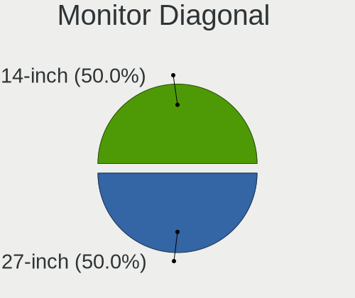

| Inches | Notebooks | Percent |
|--------|-----------|---------|
| 15     | 12        | 44.44%  |
| 14     | 4         | 14.81%  |
| 13     | 4         | 14.81%  |
| 16     | 3         | 11.11%  |
| 17     | 2         | 7.41%   |
| 27     | 1         | 3.7%    |
| 24     | 1         | 3.7%    |

Monitor Width
-------------

Physical width

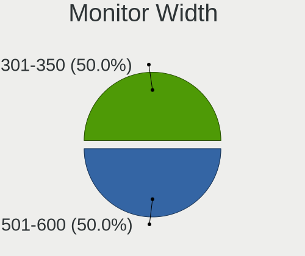

| Width in mm | Notebooks | Percent |
|-------------|-----------|---------|
| 301-350     | 18        | 69.23%  |
| 351-400     | 3         | 11.54%  |
| 201-300     | 3         | 11.54%  |
| 501-600     | 2         | 7.69%   |

Aspect Ratio
------------

Proportional relationship between the width and the height

| Ratio | Notebooks | Percent |
|-------|-----------|---------|
| 16/9  | 18        | 78.26%  |
| 16/10 | 5         | 21.74%  |

Monitor Area
------------

Area in inch²

| Area in inch² | Notebooks | Percent |
|----------------|-----------|---------|
| 101-110        | 12        | 46.15%  |
| 81-90          | 5         | 19.23%  |
| 71-80          | 3         | 11.54%  |
| 121-130        | 2         | 7.69%   |
| 111-120        | 2         | 7.69%   |
| 301-350        | 1         | 3.85%   |
| 201-250        | 1         | 3.85%   |

Pixel Density
-------------

Pixels per inch

| Density       | Notebooks | Percent |
|---------------|-----------|---------|
| 121-160       | 11        | 42.31%  |
| 161-240       | 7         | 26.92%  |
| 101-120       | 3         | 11.54%  |
| 51-100        | 3         | 11.54%  |
| More than 240 | 2         | 7.69%   |

Multiple Monitors
-----------------

Total monitors connected

| Total | Notebooks | Percent |
|-------|-----------|---------|
| 1     | 19        | 79.17%  |
| 2     | 5         | 20.83%  |

Network
-------

Net Controller Vendor
---------------------

Controller vendors

| Vendor                | Notebooks | Percent |
|-----------------------|-----------|---------|
| Realtek Semiconductor | 16        | 42.11%  |
| Intel                 | 13        | 34.21%  |
| Qualcomm Atheros      | 3         | 7.89%   |
| ASIX Electronics      | 3         | 7.89%   |
| Broadcom              | 2         | 5.26%   |
| Qualcomm              | 1         | 2.63%   |

Net Controller Model
--------------------

Controller models

| Model                                                             | Notebooks | Percent |
|-------------------------------------------------------------------|-----------|---------|
| Realtek RTL8111/8168/8411 PCI Express Gigabit Ethernet Controller | 9         | 21.43%  |
| Realtek RTL810xE PCI Express Fast Ethernet controller             | 3         | 7.14%   |
| Intel Wi-Fi 6 AX201                                               | 3         | 7.14%   |
| ASIX AX88179 Gigabit Ethernet                                     | 3         | 7.14%   |
| Realtek RTL8822CE 802.11ac PCIe Wireless Network Adapter          | 2         | 4.76%   |
| Intel Wi-Fi 6 AX200                                               | 2         | 4.76%   |
| Realtek RTL8821CE 802.11ac PCIe Wireless Network Adapter          | 1         | 2.38%   |
| Realtek RTL8723BE PCIe Wireless Network Adapter                   | 1         | 2.38%   |
| Realtek RTL8187B Wireless Adapter                                 | 1         | 2.38%   |
| Realtek Killer E2600 Gigabit Ethernet Controller                  | 1         | 2.38%   |
| Qualcomm QCNFA765 Wireless Network Adapter                        | 1         | 2.38%   |
| Qualcomm Atheros QCA9565 / AR9565 Wireless Network Adapter        | 1         | 2.38%   |
| Qualcomm Atheros QCA9377 802.11ac Wireless Network Adapter        | 1         | 2.38%   |
| Qualcomm Atheros AR9285 Wireless Network Adapter (PCI-Express)    | 1         | 2.38%   |
| Intel Wireless-AC 9260                                            | 1         | 2.38%   |
| Intel Wireless 8265 / 8275                                        | 1         | 2.38%   |
| Intel Wireless 8260                                               | 1         | 2.38%   |
| Intel Wireless 3160                                               | 1         | 2.38%   |
| Intel Tiger Lake PCH CNVi WiFi                                    | 1         | 2.38%   |
| Intel Raptor Lake PCH CNVi WiFi                                   | 1         | 2.38%   |
| Intel Ethernet Connection (6) I219-V                              | 1         | 2.38%   |
| Intel Ethernet Connection (4) I219-LM                             | 1         | 2.38%   |
| Intel Cannon Point-LP CNVi [Wireless-AC]                          | 1         | 2.38%   |
| Intel Alder Lake-P PCH CNVi WiFi                                  | 1         | 2.38%   |
| Broadcom BCM43142 802.11b/g/n                                     | 1         | 2.38%   |
| Broadcom BCM4312 802.11b/g LP-PHY                                 | 1         | 2.38%   |

Wireless Vendor
---------------

Wireless vendors

| Vendor                | Notebooks | Percent |
|-----------------------|-----------|---------|
| Intel                 | 13        | 54.17%  |
| Realtek Semiconductor | 5         | 20.83%  |
| Qualcomm Atheros      | 3         | 12.5%   |
| Broadcom              | 2         | 8.33%   |
| Qualcomm              | 1         | 4.17%   |

Wireless Model
--------------

Wireless models

| Model                                                          | Notebooks | Percent |
|----------------------------------------------------------------|-----------|---------|
| Intel Wi-Fi 6 AX201                                            | 3         | 12.5%   |
| Realtek RTL8822CE 802.11ac PCIe Wireless Network Adapter       | 2         | 8.33%   |
| Intel Wi-Fi 6 AX200                                            | 2         | 8.33%   |
| Realtek RTL8821CE 802.11ac PCIe Wireless Network Adapter       | 1         | 4.17%   |
| Realtek RTL8723BE PCIe Wireless Network Adapter                | 1         | 4.17%   |
| Realtek RTL8187B Wireless Adapter                              | 1         | 4.17%   |
| Qualcomm QCNFA765 Wireless Network Adapter                     | 1         | 4.17%   |
| Qualcomm Atheros QCA9565 / AR9565 Wireless Network Adapter     | 1         | 4.17%   |
| Qualcomm Atheros QCA9377 802.11ac Wireless Network Adapter     | 1         | 4.17%   |
| Qualcomm Atheros AR9285 Wireless Network Adapter (PCI-Express) | 1         | 4.17%   |
| Intel Wireless-AC 9260                                         | 1         | 4.17%   |
| Intel Wireless 8265 / 8275                                     | 1         | 4.17%   |
| Intel Wireless 8260                                            | 1         | 4.17%   |
| Intel Wireless 3160                                            | 1         | 4.17%   |
| Intel Tiger Lake PCH CNVi WiFi                                 | 1         | 4.17%   |
| Intel Raptor Lake PCH CNVi WiFi                                | 1         | 4.17%   |
| Intel Cannon Point-LP CNVi [Wireless-AC]                       | 1         | 4.17%   |
| Intel Alder Lake-P PCH CNVi WiFi                               | 1         | 4.17%   |
| Broadcom BCM43142 802.11b/g/n                                  | 1         | 4.17%   |
| Broadcom BCM4312 802.11b/g LP-PHY                              | 1         | 4.17%   |

Ethernet Vendor
---------------

Ethernet vendors

| Vendor                | Notebooks | Percent |
|-----------------------|-----------|---------|
| Realtek Semiconductor | 13        | 72.22%  |
| ASIX Electronics      | 3         | 16.67%  |
| Intel                 | 2         | 11.11%  |

Ethernet Model
--------------

Ethernet models

| Model                                                             | Notebooks | Percent |
|-------------------------------------------------------------------|-----------|---------|
| Realtek RTL8111/8168/8411 PCI Express Gigabit Ethernet Controller | 9         | 50%     |
| Realtek RTL810xE PCI Express Fast Ethernet controller             | 3         | 16.67%  |
| ASIX AX88179 Gigabit Ethernet                                     | 3         | 16.67%  |
| Realtek Killer E2600 Gigabit Ethernet Controller                  | 1         | 5.56%   |
| Intel Ethernet Connection (6) I219-V                              | 1         | 5.56%   |
| Intel Ethernet Connection (4) I219-LM                             | 1         | 5.56%   |

Net Controller Kind
-------------------

Ethernet, WiFi or modem

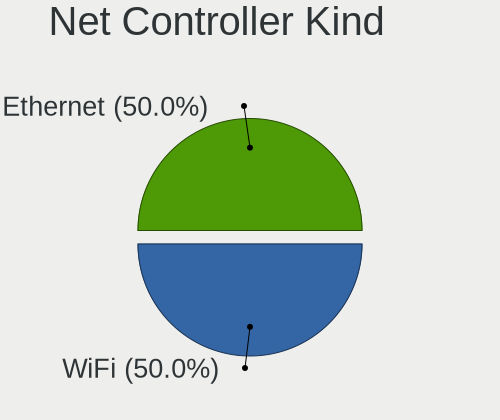

| Kind     | Notebooks | Percent |
|----------|-----------|---------|
| WiFi     | 24        | 58.54%  |
| Ethernet | 17        | 41.46%  |

Used Controller
---------------

Currently used network controller

| Kind     | Notebooks | Percent |
|----------|-----------|---------|
| WiFi     | 19        | 76%     |
| Ethernet | 6         | 24%     |

NICs
----

Total network controllers on board

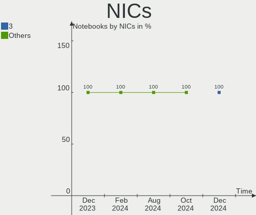

| Total | Notebooks | Percent |
|-------|-----------|---------|
| 2     | 14        | 58.33%  |
| 1     | 10        | 41.67%  |

IPv6
----

IPv6 vs IPv4

| Used | Notebooks | Percent |
|------|-----------|---------|
| No   | 19        | 79.17%  |
| Yes  | 5         | 20.83%  |

Bluetooth
---------

Bluetooth Vendor
----------------

Controller vendors

| Vendor                          | Notebooks | Percent |
|---------------------------------|-----------|---------|
| Intel                           | 13        | 61.9%   |
| Realtek Semiconductor           | 3         | 14.29%  |
| IMC Networks                    | 2         | 9.52%   |
| USI                             | 1         | 4.76%   |
| Toshiba                         | 1         | 4.76%   |
| Qualcomm Atheros Communications | 1         | 4.76%   |

Bluetooth Model
---------------

Controller models

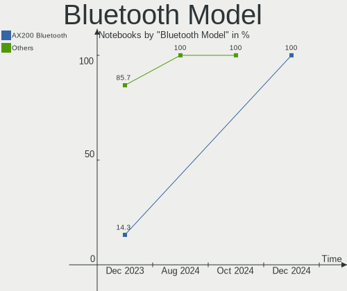

| Model                                          | Notebooks | Percent |
|------------------------------------------------|-----------|---------|
| Intel AX201 Bluetooth                          | 4         | 19.05%  |
| Intel Bluetooth wireless interface             | 3         | 14.29%  |
| Intel Bluetooth 9460/9560 Jefferson Peak (JfP) | 2         | 9.52%   |
| Intel AX200 Bluetooth                          | 2         | 9.52%   |
| USI Bluetooth Device                           | 1         | 4.76%   |
| Toshiba BCM43142A0                             | 1         | 4.76%   |
| Realtek RTL8723B Bluetooth                     | 1         | 4.76%   |
| Realtek Bluetooth Radio                        | 1         | 4.76%   |
| Realtek 802.11ac WLAN Adapter                  | 1         | 4.76%   |
| Qualcomm Atheros  Bluetooth Device             | 1         | 4.76%   |
| Intel Wireless-AC 9260 Bluetooth Adapter       | 1         | 4.76%   |
| Intel Bluetooth Device                         | 1         | 4.76%   |
| IMC Networks Bluetooth Radio                   | 1         | 4.76%   |
| IMC Networks Bluetooth Device                  | 1         | 4.76%   |

Sound
-----

Sound Vendor
------------

Sound card vendors

| Vendor                 | Notebooks | Percent |
|------------------------|-----------|---------|
| Intel                  | 18        | 60%     |
| AMD                    | 7         | 23.33%  |
| Nvidia                 | 4         | 13.33%  |
| Generalplus Technology | 1         | 3.33%   |

Sound Model
-----------

Sound card models

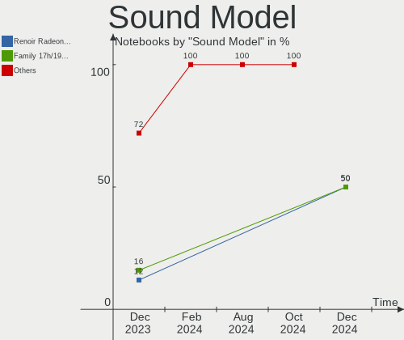

| Model                                                               | Notebooks | Percent |
|---------------------------------------------------------------------|-----------|---------|
| Intel Tiger Lake-LP Smart Sound Technology Audio Controller         | 4         | 10%     |
| AMD Family 17h/19h HD Audio Controller                              | 4         | 10%     |
| Nvidia TU107 GeForce GTX 1650 High Definition Audio Controller      | 2         | 5%      |
| Intel Wildcat Point-LP High Definition Audio Controller             | 2         | 5%      |
| Intel Sunrise Point-LP HD Audio                                     | 2         | 5%      |
| Intel Broadwell-U Audio Controller                                  | 2         | 5%      |
| AMD RV710/730 HDMI Audio [Radeon HD 4000 series]                    | 2         | 5%      |
| Nvidia GK208 HDMI/DP Audio Controller                               | 1         | 2.5%    |
| Nvidia GA106 High Definition Audio Controller                       | 1         | 2.5%    |
| Intel Xeon E3-1200 v3/4th Gen Core Processor HD Audio Controller    | 1         | 2.5%    |
| Intel Tiger Lake-H HD Audio Controller                              | 1         | 2.5%    |
| Intel Raptor Lake-P/U/H cAVS                                        | 1         | 2.5%    |
| Intel Haswell-ULT HD Audio Controller                               | 1         | 2.5%    |
| Intel Cannon Point-LP High Definition Audio Controller              | 1         | 2.5%    |
| Intel Cannon Lake PCH cAVS                                          | 1         | 2.5%    |
| Intel Alder Lake-N HD Graphics SGPC                                 | 1         | 2.5%    |
| Intel Alder Lake PCH-P High Definition Audio Controller             | 1         | 2.5%    |
| Intel 82801I (ICH9 Family) HD Audio Controller                      | 1         | 2.5%    |
| Intel 82801H (ICH8 Family) HD Audio Controller                      | 1         | 2.5%    |
| Intel 8 Series/C220 Series Chipset High Definition Audio Controller | 1         | 2.5%    |
| Intel 8 Series HD Audio Controller                                  | 1         | 2.5%    |
| Generalplus Technology USB Audio Device                             | 1         | 2.5%    |
| AMD SBx00 Azalia (Intel HDA)                                        | 1         | 2.5%    |
| AMD Renoir Radeon High Definition Audio Controller                  | 1         | 2.5%    |
| AMD Rembrandt Radeon High Definition Audio Controller               | 1         | 2.5%    |
| AMD Raven/Raven2/Fenghuang HDMI/DP Audio Controller                 | 1         | 2.5%    |
| AMD Navi 10 HDMI Audio                                              | 1         | 2.5%    |
| AMD Kabini HDMI/DP Audio                                            | 1         | 2.5%    |
| AMD Family 15h (Models 60h-6fh) Audio Controller                    | 1         | 2.5%    |

Memory
------

Memory Vendor
-------------

Memory module vendors

| Vendor              | Notebooks | Percent |
|---------------------|-----------|---------|
| Micron Technology   | 10        | 35.71%  |
| Samsung Electronics | 6         | 21.43%  |
| SK hynix            | 5         | 17.86%  |
| Unknown             | 1         | 3.57%   |
| Team                | 1         | 3.57%   |
| Ramaxel Technology  | 1         | 3.57%   |
| Qimonda             | 1         | 3.57%   |
| Kingston            | 1         | 3.57%   |
| Elpida              | 1         | 3.57%   |
| Crucial             | 1         | 3.57%   |

Memory Model
------------

Memory module models

| Model                                                            | Notebooks | Percent |
|------------------------------------------------------------------|-----------|---------|
| Micron RAM 4ATS1G64HZ-2G6E1 8GB SODIMM DDR4 2667MT/s             | 2         | 6.9%    |
| Unknown RAM Module 2GB Row Of Chips LPDDR4 4267MT/s              | 1         | 3.45%   |
| Team RAM TEAMGROUP-SD4-3200 32GB SODIMM DDR4 3200MT/s            | 1         | 3.45%   |
| SK hynix RAM Module 2GB SODIMM DDR2 667MT/s                      | 1         | 3.45%   |
| SK hynix RAM HMAA2GS6CJR8N-XN 16GB SODIMM DDR4 3200MT/s          | 1         | 3.45%   |
| SK hynix RAM HMA851S6DJR6N-XN 4GB SODIMM DDR4 3200MT/s           | 1         | 3.45%   |
| SK hynix RAM HMA81GS6MFR8N-TF 8GB SODIMM DDR4 2133MT/s           | 1         | 3.45%   |
| SK hynix RAM H9CCNNNCLGALAR-NVD 8GB Row Of Chips LPDDR3 2133MT/s | 1         | 3.45%   |
| Samsung RAM Module 4GB SODIMM DDR3 1600MT/s                      | 1         | 3.45%   |
| Samsung RAM M471B1G73QH0-YK0 8GB SODIMM DDR3 1867MT/s            | 1         | 3.45%   |
| Samsung RAM M471A5244CB0-CWE 4GB Row Of Chips DDR4 3200MT/s      | 1         | 3.45%   |
| Samsung RAM M471A5244CB0-CRC 4096MB SODIMM DDR4 2667MT/s         | 1         | 3.45%   |
| Samsung RAM M471A5143SB1-CRC 4GB SODIMM DDR4 2400MT/s            | 1         | 3.45%   |
| Samsung RAM M471A1K43EB1-CWE 8GB SODIMM DDR4 3200MT/s            | 1         | 3.45%   |
| Samsung RAM M471A1G44AB0-CWE 8GB SODIMM DDR4 3200MT/s            | 1         | 3.45%   |
| Ramaxel RAM RMSA3260ME78HAF-2666 8GB SODIMM DDR4 2667MT/s        | 1         | 3.45%   |
| Qimonda RAM Module 1GB SODIMM DDR2 667MT/s                       | 1         | 3.45%   |
| Micron RAM MT62F2G32D8DR-031 WT 8GB SODIMM LPDDR5 6400MT/s       | 1         | 3.45%   |
| Micron RAM MT62F2G32D8DR-031 4GB Row Of Chips LPDDR5 6400MT/s    | 1         | 3.45%   |
| Micron RAM MT62F1G32D4DR-031 2GB Row Of Chips LPDDR5 6400MT/s    | 1         | 3.45%   |
| Micron RAM 8KTF51264HZ-1G9P2 4GB SODIMM DDR3 1867MT/s            | 1         | 3.45%   |
| Micron RAM 8ATF1G64HZ-3G2J1 8GB SODIMM DDR4 3200MT/s             | 1         | 3.45%   |
| Micron RAM 4ATF51264HZ-3G2R1 4GB SODIMM DDR4 3200MT/s            | 1         | 3.45%   |
| Micron RAM 4ATF1G64HZ-3G2E2 8GB SODIMM DDR4 3200MT/s             | 1         | 3.45%   |
| Micron RAM 16HTF25664HZ-800H1 2GB SODIMM DDR2 800MT/s            | 1         | 3.45%   |
| Kingston RAM TSB16D3LS1MNG/4G 4GB SODIMM DDR3 1600MT/s           | 1         | 3.45%   |
| Elpida RAM EBE21UE8ACUA-8G-E 2048MB SODIMM DDR2 975MT/s          | 1         | 3.45%   |
| Crucial RAM CT8G4SFS832A.C8FP 8GB SODIMM DDR4 3200MT/s           | 1         | 3.45%   |

Memory Kind
-----------

Memory module kinds

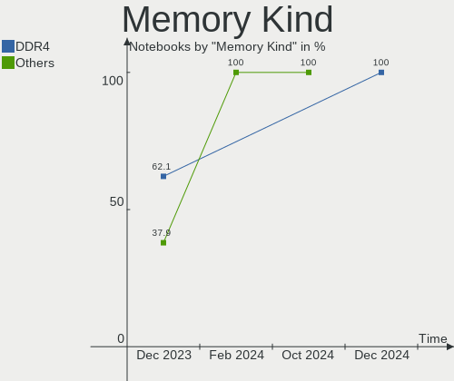

| Kind   | Notebooks | Percent |
|--------|-----------|---------|
| DDR4   | 11        | 47.83%  |
| DDR3   | 4         | 17.39%  |
| LPDDR5 | 3         | 13.04%  |
| DDR2   | 3         | 13.04%  |
| LPDDR4 | 1         | 4.35%   |
| LPDDR3 | 1         | 4.35%   |

Memory Form Factor
------------------

Physical design of the memory module

| Name         | Notebooks | Percent |
|--------------|-----------|---------|
| SODIMM       | 18        | 78.26%  |
| Row Of Chips | 5         | 21.74%  |

Memory Size
-----------

Memory module size

| Size  | Notebooks | Percent |
|-------|-----------|---------|
| 8192  | 11        | 44%     |
| 4096  | 6         | 24%     |
| 2048  | 4         | 16%     |
| 16384 | 2         | 8%      |
| 32768 | 1         | 4%      |
| 1024  | 1         | 4%      |

Memory Speed
------------

Memory module speed

| Speed | Notebooks | Percent |
|-------|-----------|---------|
| 3200  | 7         | 29.17%  |
| 2667  | 4         | 16.67%  |
| 6400  | 3         | 12.5%   |
| 2133  | 2         | 8.33%   |
| 1600  | 2         | 8.33%   |
| 4267  | 1         | 4.17%   |
| 2400  | 1         | 4.17%   |
| 1867  | 1         | 4.17%   |
| 975   | 1         | 4.17%   |
| 800   | 1         | 4.17%   |
| 667   | 1         | 4.17%   |

Printers & scanners
-------------------

Printer Vendor
--------------

Printer device vendors

Zero info for selected period =(

Printer Model
-------------

Printer device models

Zero info for selected period =(

Scanner Vendor
--------------

Scanner device vendors

Zero info for selected period =(

Scanner Model
-------------

Scanner device models

Zero info for selected period =(

Camera
------

Camera Vendor
-------------

Camera device vendors

| Vendor                | Notebooks | Percent |
|-----------------------|-----------|---------|
| Quanta                | 6         | 25%     |
| IMC Networks          | 5         | 20.83%  |
| Chicony Electronics   | 4         | 16.67%  |
| Bison Electronics     | 4         | 16.67%  |
| Acer                  | 2         | 8.33%   |
| Syntek                | 1         | 4.17%   |
| Realtek Semiconductor | 1         | 4.17%   |
| Lite-On Technology    | 1         | 4.17%   |

Camera Model
------------

Camera device models

| Model                                | Notebooks | Percent |
|--------------------------------------|-----------|---------|
| Quanta HD User Facing                | 3         | 12.5%   |
| IMC Networks USB2.0 HD UVC WebCam    | 2         | 8.33%   |
| IMC Networks Integrated Camera       | 2         | 8.33%   |
| Syntek Integrated Camera             | 1         | 4.17%   |
| Realtek USB2.0 HD UVC WebCam         | 1         | 4.17%   |
| Quanta HP Webcam                     | 1         | 4.17%   |
| Quanta HP TrueVision HD Camera       | 1         | 4.17%   |
| Quanta FHD Camera                    | 1         | 4.17%   |
| Lite-On Integrated Camera            | 1         | 4.17%   |
| IMC Networks TOSHIBA Web Camera - HD | 1         | 4.17%   |
| Chicony USB2.0 VGA UVC WebCam        | 1         | 4.17%   |
| Chicony USB 2.0 Camera               | 1         | 4.17%   |
| Chicony TOSHIBA Web Camera - HD      | 1         | 4.17%   |
| Chicony Integrated Camera            | 1         | 4.17%   |
| Bison Integrated RGB Camera          | 1         | 4.17%   |
| Bison HP Webcam                      | 1         | 4.17%   |
| Bison HD Webcam                      | 1         | 4.17%   |
| Bison EasyCamera                     | 1         | 4.17%   |
| Acer Lenovo EasyCamera               | 1         | 4.17%   |
| Acer Integrated RGB Camera           | 1         | 4.17%   |

Security
--------

Fingerprint Vendor
------------------

Fingerprint sensor vendors

| Vendor           | Notebooks | Percent |
|------------------|-----------|---------|
| Synaptics        | 3         | 75%     |
| Validity Sensors | 1         | 25%     |

Fingerprint Model
-----------------

Fingerprint sensor models

| Model                                             | Notebooks | Percent |
|---------------------------------------------------|-----------|---------|
| Synaptics Prometheus MIS Touch Fingerprint Reader | 2         | 50%     |
| Validity Sensors VFS301 Fingerprint Reader        | 1         | 25%     |
| Synaptics Metallica MIS Touch Fingerprint Reader  | 1         | 25%     |

Chipcard Vendor
---------------

Chipcard module vendors

| Vendor                            | Notebooks | Percent |
|-----------------------------------|-----------|---------|
| VASCO Data Security International | 1         | 50%     |
| Alcor Micro                       | 1         | 50%     |

Chipcard Model
--------------

Chipcard module models

| Model                                                           | Notebooks | Percent |
|-----------------------------------------------------------------|-----------|---------|
| VASCO Data Security International Digipass 905 SmartCard Reader | 1         | 50%     |
| Alcor Micro AU9540 Smartcard Reader                             | 1         | 50%     |

Unsupported
-----------

Unsupported Devices
-------------------

Total unsupported devices on board

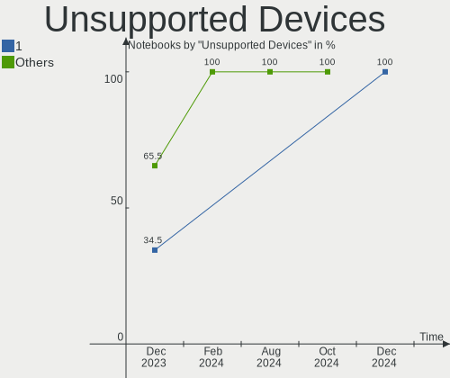

| Total | Notebooks | Percent |
|-------|-----------|---------|
| 0     | 17        | 70.83%  |
| 1     | 6         | 25%     |
| 2     | 1         | 4.17%   |

Unsupported Device Types
------------------------

Types of unsupported devices

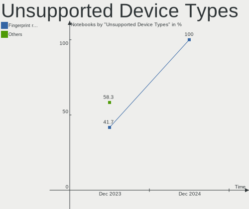

| Type               | Notebooks | Percent |
|--------------------|-----------|---------|
| Fingerprint reader | 4         | 50%     |
| Chipcard           | 2         | 25%     |
| Net/wireless       | 1         | 12.5%   |
| Graphics card      | 1         | 12.5%   |

