Xero - Hardware Trends (Notebooks)
----------------------------------

A project to identify most popular hardware characteristics and track their change
over time based on data collected by Linux users at https://Linux-Hardware.org.

Anyone can contribute to this report by the [hw-probe](https://github.com/linuxhw/hw-probe) tool:

    sudo -E hw-probe -all -upload

This report is for one last month. Overall report since the beginning of time: [TestDays](https://github.com/linuxhw/TestDays)

Period: Dec, 2023.

Contents
--------

* [ System ](#system)
  - [ OS                       ](#os)
  - [ OS Family                ](#os-family)
  - [ Kernel                   ](#kernel)
  - [ Kernel Family            ](#kernel-family)
  - [ Kernel Major Ver.        ](#kernel-major-ver)
  - [ Arch                     ](#arch)
  - [ DE                       ](#de)
  - [ Display Server           ](#display-server)
  - [ Display Manager          ](#display-manager)
  - [ OS Lang                  ](#os-lang)
  - [ Boot Mode                ](#boot-mode)
  - [ Filesystem               ](#filesystem)
  - [ Part. scheme             ](#part-scheme)
  - [ Dual Boot with Linux/BSD ](#dual-boot-with-linuxbsd)
  - [ Dual Boot (Win)          ](#dual-boot-win)

* [ Board ](#board)
  - [ Vendor                   ](#vendor)
  - [ Model                    ](#model)
  - [ Model Family             ](#model-family)
  - [ MFG Year                 ](#mfg-year)
  - [ Form Factor              ](#form-factor)
  - [ Secure Boot              ](#secure-boot)
  - [ Coreboot                 ](#coreboot)
  - [ RAM Size                 ](#ram-size)
  - [ RAM Used                 ](#ram-used)
  - [ Total Drives             ](#total-drives)
  - [ Has CD-ROM               ](#has-cd-rom)
  - [ Has Ethernet             ](#has-ethernet)
  - [ Has WiFi                 ](#has-wifi)
  - [ Has Bluetooth            ](#has-bluetooth)

* [ Location ](#location)
  - [ Country                  ](#country)
  - [ City                     ](#city)

* [ Drives ](#drives)
  - [ Drive Vendor             ](#drive-vendor)
  - [ Drive Model              ](#drive-model)
  - [ HDD Vendor               ](#hdd-vendor)
  - [ SSD Vendor               ](#ssd-vendor)
  - [ Drive Kind               ](#drive-kind)
  - [ Drive Connector          ](#drive-connector)
  - [ Drive Size               ](#drive-size)
  - [ Space Total              ](#space-total)
  - [ Space Used               ](#space-used)
  - [ Malfunc. Drives          ](#malfunc-drives)
  - [ Malfunc. Drive Vendor    ](#malfunc-drive-vendor)
  - [ Malfunc. HDD Vendor      ](#malfunc-hdd-vendor)
  - [ Malfunc. Drive Kind      ](#malfunc-drive-kind)
  - [ Failed Drives            ](#failed-drives)
  - [ Failed Drive Vendor      ](#failed-drive-vendor)
  - [ Drive Status             ](#drive-status)

* [ Storage controller ](#storage-controller)
  - [ Storage Vendor           ](#storage-vendor)
  - [ Storage Model            ](#storage-model)
  - [ Storage Kind             ](#storage-kind)

* [ Processor ](#processor)
  - [ CPU Vendor               ](#cpu-vendor)
  - [ CPU Model                ](#cpu-model)
  - [ CPU Model Family         ](#cpu-model-family)
  - [ CPU Cores                ](#cpu-cores)
  - [ CPU Sockets              ](#cpu-sockets)
  - [ CPU Threads              ](#cpu-threads)
  - [ CPU Op-Modes             ](#cpu-op-modes)
  - [ CPU Microcode            ](#cpu-microcode)
  - [ CPU Microarch            ](#cpu-microarch)

* [ Graphics ](#graphics)
  - [ GPU Vendor               ](#gpu-vendor)
  - [ GPU Model                ](#gpu-model)
  - [ GPU Combo                ](#gpu-combo)
  - [ GPU Driver               ](#gpu-driver)
  - [ GPU Memory               ](#gpu-memory)

* [ Monitor ](#monitor)
  - [ Monitor Vendor           ](#monitor-vendor)
  - [ Monitor Model            ](#monitor-model)
  - [ Monitor Resolution       ](#monitor-resolution)
  - [ Monitor Diagonal         ](#monitor-diagonal)
  - [ Monitor Width            ](#monitor-width)
  - [ Aspect Ratio             ](#aspect-ratio)
  - [ Monitor Area             ](#monitor-area)
  - [ Pixel Density            ](#pixel-density)
  - [ Multiple Monitors        ](#multiple-monitors)

* [ Network ](#network)
  - [ Net Controller Vendor    ](#net-controller-vendor)
  - [ Net Controller Model     ](#net-controller-model)
  - [ Wireless Vendor          ](#wireless-vendor)
  - [ Wireless Model           ](#wireless-model)
  - [ Ethernet Vendor          ](#ethernet-vendor)
  - [ Ethernet Model           ](#ethernet-model)
  - [ Net Controller Kind      ](#net-controller-kind)
  - [ Used Controller          ](#used-controller)
  - [ NICs                     ](#nics)
  - [ IPv6                     ](#ipv6)

* [ Bluetooth ](#bluetooth)
  - [ Bluetooth Vendor         ](#bluetooth-vendor)
  - [ Bluetooth Model          ](#bluetooth-model)

* [ Sound ](#sound)
  - [ Sound Vendor             ](#sound-vendor)
  - [ Sound Model              ](#sound-model)

* [ Memory ](#memory)
  - [ Memory Vendor            ](#memory-vendor)
  - [ Memory Model             ](#memory-model)
  - [ Memory Kind              ](#memory-kind)
  - [ Memory Form Factor       ](#memory-form-factor)
  - [ Memory Size              ](#memory-size)
  - [ Memory Speed             ](#memory-speed)

* [ Printers & scanners ](#printers--scanners)
  - [ Printer Vendor           ](#printer-vendor)
  - [ Printer Model            ](#printer-model)
  - [ Scanner Vendor           ](#scanner-vendor)
  - [ Scanner Model            ](#scanner-model)

* [ Camera ](#camera)
  - [ Camera Vendor            ](#camera-vendor)
  - [ Camera Model             ](#camera-model)

* [ Security ](#security)
  - [ Fingerprint Vendor       ](#fingerprint-vendor)
  - [ Fingerprint Model        ](#fingerprint-model)
  - [ Chipcard Vendor          ](#chipcard-vendor)
  - [ Chipcard Model           ](#chipcard-model)

* [ Unsupported ](#unsupported)
  - [ Unsupported Devices      ](#unsupported-devices)
  - [ Unsupported Device Types ](#unsupported-device-types)

System
------

OS
--

Installed operating systems

| Name         | Notebooks | Percent |
|--------------|-----------|---------|
| Xero Rolling | 29        | 100%    |

OS Family
---------

OS without a version

| Name | Notebooks | Percent |
|------|-----------|---------|
| Xero | 29        | 100%    |

Kernel
------

Version of the Linux kernel

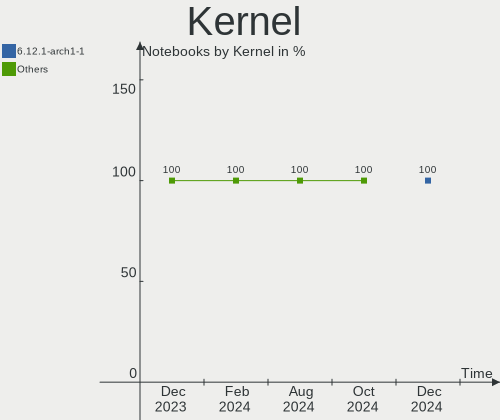

| Version          | Notebooks | Percent |
|------------------|-----------|---------|
| 6.6.4-arch1-1    | 9         | 31.03%  |
| 6.6.7-arch1-1    | 7         | 24.14%  |
| 6.6.3-arch1-1    | 3         | 10.34%  |
| 6.6.8-arch1-1    | 2         | 6.9%    |
| 6.6.5-arch1-1    | 2         | 6.9%    |
| 6.5.9-arch2-1    | 2         | 6.9%    |
| 6.6.8-zen1-1-zen | 1         | 3.45%   |
| 6.6.6-zen1-1-zen | 1         | 3.45%   |
| 6.6.6-arch1-1    | 1         | 3.45%   |
| 6.4.12-arch1-1   | 1         | 3.45%   |

Kernel Family
-------------

Linux kernel without a distro release

| Version | Notebooks | Percent |
|---------|-----------|---------|
| 6.6.4   | 9         | 31.03%  |
| 6.6.7   | 7         | 24.14%  |
| 6.6.8   | 3         | 10.34%  |
| 6.6.3   | 3         | 10.34%  |
| 6.6.6   | 2         | 6.9%    |
| 6.6.5   | 2         | 6.9%    |
| 6.5.9   | 2         | 6.9%    |
| 6.4.12  | 1         | 3.45%   |

Kernel Major Ver.
-----------------

Linux kernel major version

| Version | Notebooks | Percent |
|---------|-----------|---------|
| 6.6     | 26        | 89.66%  |
| 6.5     | 2         | 6.9%    |
| 6.4     | 1         | 3.45%   |

Arch
----

OS architecture (x86_64, i586, etc.)

| Name   | Notebooks | Percent |
|--------|-----------|---------|
| x86_64 | 29        | 100%    |

DE
--

Desktop Environment

| Name | Notebooks | Percent |
|------|-----------|---------|
| KDE5 | 29        | 100%    |

Display Server
--------------

X11 or Wayland

| Name    | Notebooks | Percent |
|---------|-----------|---------|
| Wayland | 18        | 62.07%  |
| X11     | 11        | 37.93%  |

Display Manager
---------------

SDDM, LightDM, etc.

| Name | Notebooks | Percent |
|------|-----------|---------|
| SDDM | 29        | 100%    |

OS Lang
-------

Language

| Lang  | Notebooks | Percent |
|-------|-----------|---------|
| en_US | 8         | 27.59%  |
| zh_CN | 3         | 10.34%  |
| es_ES | 3         | 10.34%  |
| en_IN | 3         | 10.34%  |
| pl_PL | 2         | 6.9%    |
| hu_HU | 2         | 6.9%    |
| en_GB | 2         | 6.9%    |
| ru_RU | 1         | 3.45%   |
| it_IT | 1         | 3.45%   |
| fr_FR | 1         | 3.45%   |
| es_BO | 1         | 3.45%   |
| en_ZA | 1         | 3.45%   |
| de_DE | 1         | 3.45%   |

Boot Mode
---------

EFI or BIOS

| Mode | Notebooks | Percent |
|------|-----------|---------|
| EFI  | 22        | 75.86%  |
| BIOS | 7         | 24.14%  |

Filesystem
----------

Type of filesystem

| Type  | Notebooks | Percent |
|-------|-----------|---------|
| Ext4  | 25        | 86.21%  |
| Btrfs | 4         | 13.79%  |

Part. scheme
------------

Scheme of partitioning

| Type | Notebooks | Percent |
|------|-----------|---------|
| GPT  | 23        | 79.31%  |
| MBR  | 6         | 20.69%  |

Dual Boot with Linux/BSD
------------------------

Hosting more than one Linux/BSD

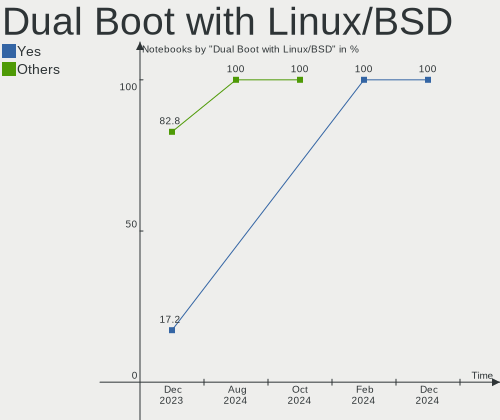

| Dual boot | Notebooks | Percent |
|-----------|-----------|---------|
| No        | 24        | 82.76%  |
| Yes       | 5         | 17.24%  |

Dual Boot (Win)
---------------

Hosting Linux and Windows

| Dual boot | Notebooks | Percent |
|-----------|-----------|---------|
| Yes       | 15        | 51.72%  |
| No        | 14        | 48.28%  |

Board
-----

Vendor
------

Motherboard manufacturer

| Name             | Notebooks | Percent |
|------------------|-----------|---------|
| Hewlett-Packard  | 7         | 24.14%  |
| Lenovo           | 5         | 17.24%  |
| Dell             | 5         | 17.24%  |
| HUAWEI           | 3         | 10.34%  |
| MECHREVO         | 2         | 6.9%    |
| Timi             | 1         | 3.45%   |
| Panasonic        | 1         | 3.45%   |
| MSI              | 1         | 3.45%   |
| Google           | 1         | 3.45%   |
| Dynabook         | 1         | 3.45%   |
| ASUSTek Computer | 1         | 3.45%   |
| Alienware        | 1         | 3.45%   |

Model
-----

Motherboard model

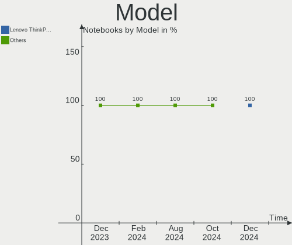

| Name                                   | Notebooks | Percent |
|----------------------------------------|-----------|---------|
| Timi RedmiBook 14-APCS                 | 1         | 3.45%   |
| Panasonic CF-52SL3DD1M                 | 1         | 3.45%   |
| MSI Bravo 15 B5DD                      | 1         | 3.45%   |
| MECHREVO S2 Air Series PF4NU1F         | 1         | 3.45%   |
| MECHREVO Kuangshi16Pro Series GM6PX0X  | 1         | 3.45%   |
| Lenovo V145-15AST 81MT                 | 1         | 3.45%   |
| Lenovo V14 G2 ALC 82KC                 | 1         | 3.45%   |
| Lenovo ThinkPad E15 Gen 2 20TES0RG00   | 1         | 3.45%   |
| Lenovo IdeaPad Slim 3 15IAH8 83ER      | 1         | 3.45%   |
| Lenovo IdeaPad Gaming 3 15ACH6 82K2    | 1         | 3.45%   |
| HUAWEI NBLK-WAX9X                      | 1         | 3.45%   |
| HUAWEI KLVL-WXX9                       | 1         | 3.45%   |
| HUAWEI BOD-WXX9                        | 1         | 3.45%   |
| HP ProBook 450 G1                      | 1         | 3.45%   |
| HP Pavilion Laptop 15-eg0xxx           | 1         | 3.45%   |
| HP Pavilion Gaming Laptop 15-dk2xxx    | 1         | 3.45%   |
| HP Pavilion Gaming Laptop 15-dk0xxx    | 1         | 3.45%   |
| HP Pavilion dv7                        | 1         | 3.45%   |
| HP Notebook                            | 1         | 3.45%   |
| HP Laptop 15-ef2xxx                    | 1         | 3.45%   |
| Google Nami                            | 1         | 3.45%   |
| Dynabook Satellite Pro L50-G-193       | 1         | 3.45%   |
| Dell Latitude E5540                    | 1         | 3.45%   |
| Dell Latitude D630                     | 1         | 3.45%   |
| Dell Latitude 5440                     | 1         | 3.45%   |
| Dell Latitude 5400                     | 1         | 3.45%   |
| Dell Inspiron 5570                     | 1         | 3.45%   |
| ASUS ASUS TUF Dash F15 FX516PM_FX516PM | 1         | 3.45%   |
| Alienware M17xR3                       | 1         | 3.45%   |

Model Family
------------

Motherboard model prefix

| Name                   | Notebooks | Percent |
|------------------------|-----------|---------|
| HP Pavilion            | 4         | 13.79%  |
| Dell Latitude          | 4         | 13.79%  |
| Lenovo IdeaPad         | 2         | 6.9%    |
| Timi RedmiBook         | 1         | 3.45%   |
| Panasonic CF-52SL3DD1M | 1         | 3.45%   |
| MSI Bravo              | 1         | 3.45%   |
| MECHREVO S2            | 1         | 3.45%   |
| MECHREVO Kuangshi16Pro | 1         | 3.45%   |
| Lenovo V145-15AST      | 1         | 3.45%   |
| Lenovo V14             | 1         | 3.45%   |
| Lenovo ThinkPad        | 1         | 3.45%   |
| HUAWEI NBLK-WAX9X      | 1         | 3.45%   |
| HUAWEI KLVL-WXX9       | 1         | 3.45%   |
| HUAWEI BOD-WXX9        | 1         | 3.45%   |
| HP ProBook             | 1         | 3.45%   |
| HP Notebook            | 1         | 3.45%   |
| HP Laptop              | 1         | 3.45%   |
| Google Nami            | 1         | 3.45%   |
| Dynabook Satellite     | 1         | 3.45%   |
| Dell Inspiron          | 1         | 3.45%   |
| ASUS ASUS              | 1         | 3.45%   |
| Alienware M17xR3       | 1         | 3.45%   |

MFG Year
--------

Motherboard manufacture year

| Year | Notebooks | Percent |
|------|-----------|---------|
| 2021 | 7         | 24.14%  |
| 2019 | 6         | 20.69%  |
| 2020 | 4         | 13.79%  |
| 2023 | 3         | 10.34%  |
| 2011 | 2         | 6.9%    |
| 2022 | 1         | 3.45%   |
| 2018 | 1         | 3.45%   |
| 2017 | 1         | 3.45%   |
| 2014 | 1         | 3.45%   |
| 2013 | 1         | 3.45%   |
| 2008 | 1         | 3.45%   |
| 2007 | 1         | 3.45%   |

Form Factor
-----------

Physical design of the computer

| Name     | Notebooks | Percent |
|----------|-----------|---------|
| Notebook | 29        | 100%    |

Secure Boot
-----------

Enabled or disabled

| State    | Notebooks | Percent |
|----------|-----------|---------|
| Disabled | 29        | 100%    |

Coreboot
--------

Have coreboot on board

| Used | Notebooks | Percent |
|------|-----------|---------|
| No   | 28        | 96.55%  |
| Yes  | 1         | 3.45%   |

RAM Size
--------

Total RAM memory

| Size in GB | Notebooks | Percent |
|------------|-----------|---------|
| 4.01-8.0   | 9         | 31.03%  |
| 8.01-16.0  | 7         | 24.14%  |
| 16.01-24.0 | 6         | 20.69%  |
| 3.01-4.0   | 5         | 17.24%  |
| 32.01-64.0 | 2         | 6.9%    |

RAM Used
--------

Used RAM memory

| Used GB  | Notebooks | Percent |
|----------|-----------|---------|
| 1.01-2.0 | 14        | 48.28%  |
| 2.01-3.0 | 8         | 27.59%  |
| 3.01-4.0 | 5         | 17.24%  |
| 4.01-8.0 | 2         | 6.9%    |

Total Drives
------------

Number of drives on board

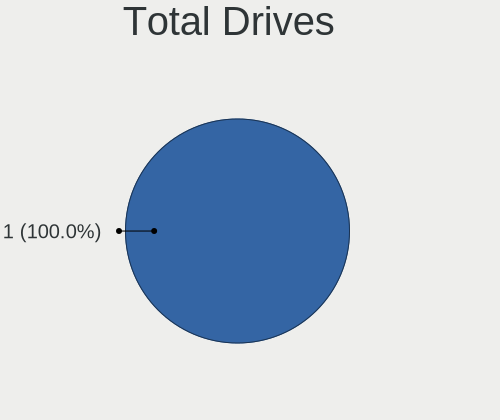

| Drives | Notebooks | Percent |
|--------|-----------|---------|
| 1      | 19        | 65.52%  |
| 2      | 9         | 31.03%  |
| 3      | 1         | 3.45%   |

Has CD-ROM
----------

Has CD-ROM on board

| Presented | Notebooks | Percent |
|-----------|-----------|---------|
| No        | 21        | 72.41%  |
| Yes       | 8         | 27.59%  |

Has Ethernet
------------

Has Ethernet on board

| Presented | Notebooks | Percent |
|-----------|-----------|---------|
| Yes       | 22        | 75.86%  |
| No        | 7         | 24.14%  |

Has WiFi
--------

Has WiFi module

| Presented | Notebooks | Percent |
|-----------|-----------|---------|
| Yes       | 29        | 100%    |

Has Bluetooth
-------------

Has Bluetooth module

| Presented | Notebooks | Percent |
|-----------|-----------|---------|
| Yes       | 28        | 96.55%  |
| No        | 1         | 3.45%   |

Location
--------

Country
-------

Geographic location (country)

| Country      | Notebooks | Percent |
|--------------|-----------|---------|
| China        | 4         | 13.79%  |
| USA          | 3         | 10.34%  |
| Poland       | 3         | 10.34%  |
| India        | 3         | 10.34%  |
| UK           | 2         | 6.9%    |
| Syria        | 2         | 6.9%    |
| Spain        | 2         | 6.9%    |
| Hungary      | 2         | 6.9%    |
| South Africa | 1         | 3.45%   |
| Russia       | 1         | 3.45%   |
| Malaysia     | 1         | 3.45%   |
| Italy        | 1         | 3.45%   |
| Greece       | 1         | 3.45%   |
| Germany      | 1         | 3.45%   |
| France       | 1         | 3.45%   |
| Bolivia      | 1         | 3.45%   |

City
----

Geographic location (city)

| City                   | Notebooks | Percent |
|------------------------|-----------|---------|
| Mariahalom             | 2         | 6.9%    |
| Damascus               | 2         | 6.9%    |
| Xi'an                  | 1         | 3.45%   |
| Wodzisław Śląski    | 1         | 3.45%   |
| Warsaw                 | 1         | 3.45%   |
| Vigo                   | 1         | 3.45%   |
| Sochi                  | 1         | 3.45%   |
| Pretoria               | 1         | 3.45%   |
| Pionki                 | 1         | 3.45%   |
| Patna                  | 1         | 3.45%   |
| Orem                   | 1         | 3.45%   |
| Milano                 | 1         | 3.45%   |
| La Paz                 | 1         | 3.45%   |
| Jinrongjie             | 1         | 3.45%   |
| Jianshelu              | 1         | 3.45%   |
| Jeumont                | 1         | 3.45%   |
| Ipoh                   | 1         | 3.45%   |
| Indore                 | 1         | 3.45%   |
| Ilioupoli              | 1         | 3.45%   |
| Houston                | 1         | 3.45%   |
| Handan                 | 1         | 3.45%   |
| Frankfurt am Main      | 1         | 3.45%   |
| Cornellà de Llobregat | 1         | 3.45%   |
| Bristol                | 1         | 3.45%   |
| Bridgend               | 1         | 3.45%   |
| Bengaluru              | 1         | 3.45%   |
| Baltimore              | 1         | 3.45%   |

Drives
------

Drive Vendor
------------

Hard drive vendors

| Vendor                      | Notebooks | Drives | Percent |
|-----------------------------|-----------|--------|---------|
| Samsung Electronics         | 6         | 6      | 15%     |
| Sandisk                     | 4         | 4      | 10%     |
| Toshiba                     | 3         | 3      | 7.5%    |
| SK hynix                    | 3         | 3      | 7.5%    |
| Kingston                    | 3         | 3      | 7.5%    |
| WDC                         | 2         | 2      | 5%      |
| Micron/Crucial Technology   | 2         | 2      | 5%      |
| JMicron Technology          | 2         | 2      | 5%      |
| Intel                       | 2         | 3      | 5%      |
| Zebronics                   | 1         | 1      | 2.5%    |
| Yangtze Memory Technologies | 1         | 1      | 2.5%    |
| Unknown                     | 1         | 1      | 2.5%    |
| Seagate                     | 1         | 1      | 2.5%    |
| Phison Electronics          | 1         | 1      | 2.5%    |
| Netac                       | 1         | 1      | 2.5%    |
| Micron Technology           | 1         | 1      | 2.5%    |
| MAXIO Technology (Hangzhou) | 1         | 1      | 2.5%    |
| Kingchuxing                 | 1         | 1      | 2.5%    |
| KESU                        | 1         | 1      | 2.5%    |
| Hitachi                     | 1         | 1      | 2.5%    |
| Crucial                     | 1         | 1      | 2.5%    |
| Biwin Storage Technology    | 1         | 1      | 2.5%    |

Drive Model
-----------

Hard drive models

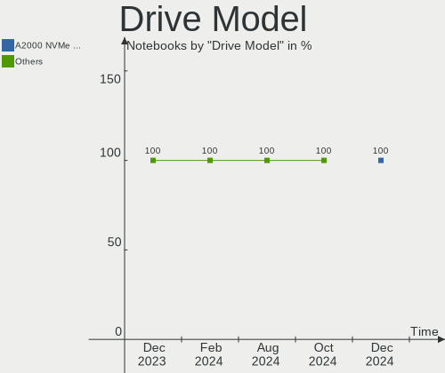

| Model                                               | Notebooks | Percent |
|-----------------------------------------------------|-----------|---------|
| Sandisk WD Black SN750 / PC SN730 NVMe SSD 2TB      | 2         | 4.88%   |
| Samsung SSD 870 EVO 500GB                           | 2         | 4.88%   |
| Micron/Crucial P2 NVMe PCIe SSD 4TB                 | 2         | 4.88%   |
| Zebronics 2.5SSD128GB                               | 1         | 2.44%   |
| Yangtze Memory YMTC PC300-1TB-B                     | 1         | 2.44%   |
| WDC WD7500BPKT-75PK4T0 752GB                        | 1         | 2.44%   |
| WDC WD10 EZEX-08WN4A0 1TB                           | 1         | 2.44%   |
| Unknown MMC Card  128GB                             | 1         | 2.44%   |
| Toshiba XG6 NVMe SSD Controller 512GB               | 1         | 2.44%   |
| Toshiba THNSNJ512GMCY 512GB SSD                     | 1         | 2.44%   |
| Toshiba MQ01ACF050 500GB                            | 1         | 2.44%   |
| SK hynix SC311 SATA 128GB SSD                       | 1         | 2.44%   |
| SK hynix SC308 SATA 256GB SSD                       | 1         | 2.44%   |
| SK hynix HFM512GD3JX013N 512GB                      | 1         | 2.44%   |
| Seagate Expansion HDD 2TB                           | 1         | 2.44%   |
| Sandisk WD Blue SN550 NVMe SSD 1TB                  | 1         | 2.44%   |
| Sandisk PC SN740 NVMe WD 256GB                      | 1         | 2.44%   |
| Samsung NVMe SSD Controller SM981/PM981/PM983 512GB | 1         | 2.44%   |
| Samsung MZALQ512HBLU-00BL2 512GB                    | 1         | 2.44%   |
| Samsung MZALQ256HBJD-00BL1 256GB                    | 1         | 2.44%   |
| Samsung MZ7TD256HAFV-000L7 256GB SSD                | 1         | 2.44%   |
| Phison E12 NVMe Controller 1TB                      | 1         | 2.44%   |
| Netac SSD 512GB                                     | 1         | 2.44%   |
| Micron MTFDKCD512QFM-1BD1AABLA 512GB                | 1         | 2.44%   |
| MAXIO (Hangzhou) NVMe SSD Controller MAP1202 256GB  | 1         | 2.44%   |
| Kingston SQ500S37960G 960GB SSD                     | 1         | 2.44%   |
| Kingston SA400S37240G 240GB SSD                     | 1         | 2.44%   |
| Kingston OM8PCP3512F-AI1 512GB                      | 1         | 2.44%   |
| Kingchuxing SSD 1TB                                 | 1         | 2.44%   |
| KESU USB 3.0 752GB                                  | 1         | 2.44%   |
| JMicron Tech 250GB                                  | 1         | 2.44%   |
| JMicron Generic 2TB                                 | 1         | 2.44%   |
| Intel SSDPEKNU512GZH 512GB                          | 1         | 2.44%   |
| Intel HBRPEKNX0202AHO 32GB                          | 1         | 2.44%   |
| Intel HBRPEKNX0202AH 512GB                          | 1         | 2.44%   |
| Hitachi HTS723232A7A364 320GB                       | 1         | 2.44%   |
| Crucial CT1000MX500SSD1 1TB                         | 1         | 2.44%   |
| Biwin Storage Great Wall GW3500 1TB                 | 1         | 2.44%   |

HDD Vendor
----------

Hard disk drive vendors

| Vendor  | Notebooks | Drives | Percent |
|---------|-----------|--------|---------|
| WDC     | 2         | 2      | 33.33%  |
| Toshiba | 1         | 1      | 16.67%  |
| Seagate | 1         | 1      | 16.67%  |
| KESU    | 1         | 1      | 16.67%  |
| Hitachi | 1         | 1      | 16.67%  |

SSD Vendor
----------

Solid state drive vendors

| Vendor              | Notebooks | Drives | Percent |
|---------------------|-----------|--------|---------|
| Samsung Electronics | 3         | 3      | 23.08%  |
| SK hynix            | 2         | 2      | 15.38%  |
| Kingston            | 2         | 2      | 15.38%  |
| Zebronics           | 1         | 1      | 7.69%   |
| Toshiba             | 1         | 1      | 7.69%   |
| Netac               | 1         | 1      | 7.69%   |
| Kingchuxing         | 1         | 1      | 7.69%   |
| JMicron Technology  | 1         | 1      | 7.69%   |
| Crucial             | 1         | 1      | 7.69%   |

Drive Kind
----------

HDD or SSD

| Kind    | Notebooks | Drives | Percent |
|---------|-----------|--------|---------|
| NVMe    | 18        | 20     | 47.37%  |
| SSD     | 12        | 13     | 31.58%  |
| HDD     | 6         | 6      | 15.79%  |
| MMC     | 1         | 1      | 2.63%   |
| Unknown | 1         | 1      | 2.63%   |

Drive Connector
---------------

SATA, SAS, NVMe, etc.

| Type | Notebooks | Drives | Percent |
|------|-----------|--------|---------|
| NVMe | 18        | 20     | 50%     |
| SATA | 11        | 13     | 30.56%  |
| SAS  | 6         | 7      | 16.67%  |
| MMC  | 1         | 1      | 2.78%   |

Drive Size
----------

Size of hard drive

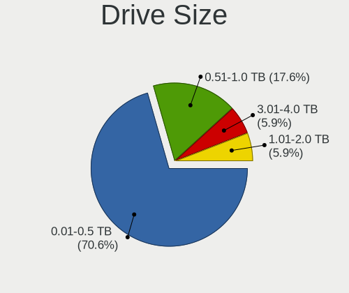

| Size in TB | Notebooks | Drives | Percent |
|------------|-----------|--------|---------|
| 0.01-0.5   | 8         | 9      | 47.06%  |
| 0.51-1.0   | 7         | 8      | 41.18%  |
| 1.01-2.0   | 2         | 2      | 11.76%  |

Space Total
-----------

Amount of disk space available on the file system

| Size in GB     | Notebooks | Percent |
|----------------|-----------|---------|
| 101-250        | 8         | 27.59%  |
| 251-500        | 7         | 24.14%  |
| 501-1000       | 7         | 24.14%  |
| 51-100         | 3         | 10.34%  |
| More than 3000 | 1         | 3.45%   |
| 21-50          | 1         | 3.45%   |
| 2001-3000      | 1         | 3.45%   |
| Unknown        | 1         | 3.45%   |

Space Used
----------

Amount of used disk space

| Used GB   | Notebooks | Percent |
|-----------|-----------|---------|
| 1-20      | 14        | 48.28%  |
| 21-50     | 6         | 20.69%  |
| 251-500   | 4         | 13.79%  |
| 51-100    | 3         | 10.34%  |
| 1001-2000 | 1         | 3.45%   |
| Unknown   | 1         | 3.45%   |

Malfunc. Drives
---------------

Drive models with a malfunction

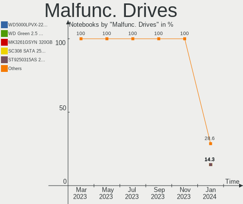

| Model                     | Notebooks | Drives | Percent |
|---------------------------|-----------|--------|---------|
| WDC WD10 EZEX-08WN4A0 1TB | 1         | 1      | 100%    |

Malfunc. Drive Vendor
---------------------

Vendors of faulty drives

| Vendor | Notebooks | Drives | Percent |
|--------|-----------|--------|---------|
| WDC    | 1         | 1      | 100%    |

Malfunc. HDD Vendor
-------------------

Vendors of faulty HDD drives

| Vendor | Notebooks | Drives | Percent |
|--------|-----------|--------|---------|
| WDC    | 1         | 1      | 100%    |

Malfunc. Drive Kind
-------------------

Kinds of faulty drives

| Kind | Notebooks | Drives | Percent |
|------|-----------|--------|---------|
| HDD  | 1         | 1      | 100%    |

Failed Drives
-------------

Failed drive models

Zero info for selected period =(

Failed Drive Vendor
-------------------

Failed drive vendors

Zero info for selected period =(

Drive Status
------------

Number of failed and malfunc. drives

| Status   | Notebooks | Drives | Percent |
|----------|-----------|--------|---------|
| Works    | 27        | 33     | 79.41%  |
| Detected | 6         | 7      | 17.65%  |
| Malfunc  | 1         | 1      | 2.94%   |

Storage controller
------------------

Storage Vendor
--------------

Storage controller vendors

| Vendor                       | Notebooks | Percent |
|------------------------------|-----------|---------|
| Intel                        | 12        | 35.29%  |
| AMD                          | 5         | 14.71%  |
| SanDisk                      | 4         | 11.76%  |
| Samsung Electronics          | 3         | 8.82%   |
| Micron/Crucial Technology    | 2         | 5.88%   |
| Yangtze Memory Technologies  | 1         | 2.94%   |
| Toshiba America Info Systems | 1         | 2.94%   |
| SK hynix                     | 1         | 2.94%   |
| Phison Electronics           | 1         | 2.94%   |
| Micron Technology            | 1         | 2.94%   |
| MAXIO Technology (Hangzhou)  | 1         | 2.94%   |
| Kingston Technology Company  | 1         | 2.94%   |
| Biwin Storage Technology     | 1         | 2.94%   |

Storage Model
-------------

Storage controller models

| Model                                                                          | Notebooks | Percent |
|--------------------------------------------------------------------------------|-----------|---------|
| AMD FCH SATA Controller [AHCI mode]                                            | 4         | 10.53%  |
| Intel Volume Management Device NVMe RAID Controller                            | 3         | 7.89%   |
| Intel 82801 Mobile SATA Controller [RAID mode]                                 | 3         | 7.89%   |
| SanDisk Extreme Pro / WD Black SN750 / PC SN730 / Red SN700 NVMe SSD           | 2         | 5.26%   |
| Samsung NVMe SSD Controller 980 (DRAM-less)                                    | 2         | 5.26%   |
| Micron/Crucial P2 [Nick P2] / P3 / P3 Plus NVMe PCIe SSD (DRAM-less)           | 2         | 5.26%   |
| Intel 6 Series/C200 Series Chipset Family 6 port Mobile SATA AHCI Controller   | 2         | 5.26%   |
| Yangtze Memory PC300 NVMe SSD (DRAM-less)                                      | 1         | 2.63%   |
| Toshiba America Info Systems XG6 NVMe SSD Controller                           | 1         | 2.63%   |
| SK hynix Gold P31/BC711/PC711 NVMe Solid State Drive                           | 1         | 2.63%   |
| SanDisk Ultra 3D / WD Blue SN550 NVMe SSD                                      | 1         | 2.63%   |
| Sandisk PC SN740 NVMe SSD (DRAM-less)                                          | 1         | 2.63%   |
| Samsung NVMe SSD Controller SM981/PM981/PM983                                  | 1         | 2.63%   |
| Phison E12 NVMe Controller                                                     | 1         | 2.63%   |
| Micron 2400 NVMe SSD (DRAM-less)                                               | 1         | 2.63%   |
| MAXIO (Hangzhou) NVMe SSD Controller MAP1202                                   | 1         | 2.63%   |
| Kingston Company OM8PCP Design-In PCIe 3 NVMe SSD (DRAM-less)                  | 1         | 2.63%   |
| Intel Tiger Lake-LP SATA Controller                                            | 1         | 2.63%   |
| Intel Sunrise Point-LP SATA Controller [AHCI mode]                             | 1         | 2.63%   |
| Intel SSD 670p Series [Keystone Harbor]                                        | 1         | 2.63%   |
| Intel Optane NVME SSD H10 with Solid State Storage [Teton Glacier]             | 1         | 2.63%   |
| Intel Cannon Point-LP SATA Controller [AHCI Mode]                              | 1         | 2.63%   |
| Intel 82801HM/HEM (ICH8M/ICH8M-E) SATA Controller [IDE mode]                   | 1         | 2.63%   |
| Intel 82801HM/HEM (ICH8M/ICH8M-E) IDE Controller                               | 1         | 2.63%   |
| Intel 8 Series/C220 Series Chipset Family 6-port SATA Controller 1 [AHCI mode] | 1         | 2.63%   |
| Biwin Storage Non-Volatile memory controller                                   | 1         | 2.63%   |
| AMD SB7x0/SB8x0/SB9x0 SATA Controller [AHCI mode]                              | 1         | 2.63%   |

Storage Kind
------------

Kind of storage controller (IDE, SATA, NVMe, SAS, ...)

| Kind | Notebooks | Percent |
|------|-----------|---------|
| NVMe | 18        | 50%     |
| SATA | 11        | 30.56%  |
| RAID | 6         | 16.67%  |
| IDE  | 1         | 2.78%   |

Processor
---------

CPU Vendor
----------

Processor vendors

| Vendor | Notebooks | Percent |
|--------|-----------|---------|
| Intel  | 18        | 62.07%  |
| AMD    | 11        | 37.93%  |

CPU Model
---------

Processor models

| Model                                         | Notebooks | Percent |
|-----------------------------------------------|-----------|---------|
| Intel 11th Gen Core i5-1135G7 @ 2.40GHz       | 2         | 6.9%    |
| AMD Ryzen 7 4800H with Radeon Graphics        | 2         | 6.9%    |
| AMD Ryzen 5 5600H with Radeon Graphics        | 2         | 6.9%    |
| Intel Pentium CPU 4417U @ 2.30GHz             | 1         | 3.45%   |
| Intel Core i7-8550U CPU @ 1.80GHz             | 1         | 3.45%   |
| Intel Core i7-2670QM CPU @ 2.20GHz            | 1         | 3.45%   |
| Intel Core i7-10510U CPU @ 1.80GHz            | 1         | 3.45%   |
| Intel Core i5-9300H CPU @ 2.40GHz             | 1         | 3.45%   |
| Intel Core i5-8265U CPU @ 1.60GHz             | 1         | 3.45%   |
| Intel Core i5-2540M CPU @ 2.60GHz             | 1         | 3.45%   |
| Intel Core i3-4030U CPU @ 1.90GHz             | 1         | 3.45%   |
| Intel Core i3-4000M CPU @ 2.40GHz             | 1         | 3.45%   |
| Intel Core 2 Duo CPU T7250 @ 2.00GHz          | 1         | 3.45%   |
| Intel 13th Gen Core i5-1350P                  | 1         | 3.45%   |
| Intel 12th Gen Core i9-12900HX                | 1         | 3.45%   |
| Intel 12th Gen Core i5-12450H                 | 1         | 3.45%   |
| Intel 11th Gen Core i7-11370H @ 3.30GHz       | 1         | 3.45%   |
| Intel 11th Gen Core i5-11300H @ 3.10GHz       | 1         | 3.45%   |
| Intel 11th Gen Core i3-1115G4 @ 3.00GHz       | 1         | 3.45%   |
| AMD Ryzen 7 3700U with Radeon Vega Mobile Gfx | 1         | 3.45%   |
| AMD Ryzen 5 5500U with Radeon Graphics        | 1         | 3.45%   |
| AMD Ryzen 5 3500U with Radeon Vega Mobile Gfx | 1         | 3.45%   |
| AMD Ryzen 3 5300U with Radeon Graphics        | 1         | 3.45%   |
| AMD Phenom II P960 Quad-Core Processor        | 1         | 3.45%   |
| AMD A6-9225 RADEON R4, 5 COMPUTE CORES 2C+3G  | 1         | 3.45%   |
| AMD A6-5200 APU with Radeon HD Graphics       | 1         | 3.45%   |

CPU Model Family
----------------

Processor model prefix

| Model            | Notebooks | Percent |
|------------------|-----------|---------|
| Other            | 8         | 27.59%  |
| AMD Ryzen 5      | 4         | 13.79%  |
| Intel Core i7    | 3         | 10.34%  |
| Intel Core i5    | 3         | 10.34%  |
| AMD Ryzen 7      | 3         | 10.34%  |
| Intel Core i3    | 2         | 6.9%    |
| AMD A6           | 2         | 6.9%    |
| Intel Pentium    | 1         | 3.45%   |
| Intel Core 2 Duo | 1         | 3.45%   |
| AMD Ryzen 3      | 1         | 3.45%   |
| AMD Phenom II    | 1         | 3.45%   |

CPU Cores
---------

Number of processor cores

| Number | Notebooks | Percent |
|--------|-----------|---------|
| 4      | 14        | 48.28%  |
| 2      | 7         | 24.14%  |
| 8      | 3         | 10.34%  |
| 6      | 3         | 10.34%  |
| 16     | 1         | 3.45%   |
| 12     | 1         | 3.45%   |

CPU Sockets
-----------

Number of sockets

| Number | Notebooks | Percent |
|--------|-----------|---------|
| 1      | 29        | 100%    |

CPU Threads
-----------

Threads per core (Hyper-Threading)

| Number | Notebooks | Percent |
|--------|-----------|---------|
| 2      | 25        | 86.21%  |
| 1      | 4         | 13.79%  |

CPU Op-Modes
------------

CPU Operation Modes (32-bit, 64-bit)

| Op mode        | Notebooks | Percent |
|----------------|-----------|---------|
| 32-bit, 64-bit | 29        | 100%    |

CPU Microcode
-------------

Microcode number

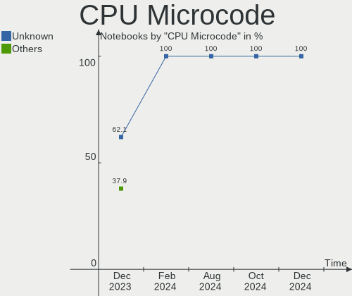

| Number     | Notebooks | Percent |
|------------|-----------|---------|
| Unknown    | 18        | 62.07%  |
| 0x0a50000c | 2         | 6.9%    |
| 0x08108109 | 2         | 6.9%    |
| 0x08608104 | 1         | 3.45%   |
| 0x08608102 | 1         | 3.45%   |
| 0x08600106 | 1         | 3.45%   |
| 0x08600103 | 1         | 3.45%   |
| 0x07000110 | 1         | 3.45%   |
| 0x06006705 | 1         | 3.45%   |
| 0x010000c8 | 1         | 3.45%   |

CPU Microarch
-------------

Microarchitecture

| Name             | Notebooks | Percent |
|------------------|-----------|---------|
| TigerLake        | 5         | 17.24%  |
| KabyLake         | 5         | 17.24%  |
| Alderlake Hybrid | 3         | 10.34%  |
| Zen+             | 2         | 6.9%    |
| Zen 3            | 2         | 6.9%    |
| Zen 2            | 2         | 6.9%    |
| SandyBridge      | 2         | 6.9%    |
| Haswell          | 2         | 6.9%    |
| Unknown          | 2         | 6.9%    |
| K10              | 1         | 3.45%   |
| Jaguar           | 1         | 3.45%   |
| Excavator        | 1         | 3.45%   |
| Core             | 1         | 3.45%   |

Graphics
--------

GPU Vendor
----------

Vendors of graphics cards

| Vendor | Notebooks | Percent |
|--------|-----------|---------|
| Intel  | 16        | 45.71%  |
| AMD    | 14        | 40%     |
| Nvidia | 5         | 14.29%  |

GPU Model
---------

Graphics card models

| Model                                                                                 | Notebooks | Percent |
|---------------------------------------------------------------------------------------|-----------|---------|
| Intel TigerLake-LP GT2 [Iris Xe Graphics]                                             | 4         | 10.53%  |
| Nvidia TU117M [GeForce GTX 1650 Mobile / Max-Q]                                       | 2         | 5.26%   |
| AMD Whistler [Radeon HD 6630M/6650M/6750M/7670M/7690M]                                | 2         | 5.26%   |
| AMD Renoir [Radeon RX Vega 6 (Ryzen 4000/5000 Mobile Series)]                         | 2         | 5.26%   |
| AMD Picasso/Raven 2 [Radeon Vega Series / Radeon Vega Mobile Series]                  | 2         | 5.26%   |
| AMD Lucienne                                                                          | 2         | 5.26%   |
| AMD Cezanne [Radeon Vega Series / Radeon Vega Mobile Series]                          | 2         | 5.26%   |
| Nvidia GA107M [GeForce RTX 3050 Mobile]                                               | 1         | 2.63%   |
| Nvidia GA106M [GeForce RTX 3060 Mobile / Max-Q]                                       | 1         | 2.63%   |
| Nvidia AD107M [GeForce RTX 4060 Max-Q / Mobile]                                       | 1         | 2.63%   |
| Intel WhiskeyLake-U GT2 [UHD Graphics 620]                                            | 1         | 2.63%   |
| Intel UHD Graphics 620                                                                | 1         | 2.63%   |
| Intel Tiger Lake-LP GT2 [UHD Graphics G4]                                             | 1         | 2.63%   |
| Intel Raptor Lake-P [UHD Graphics]                                                    | 1         | 2.63%   |
| Intel Mobile GM965/GL960 Integrated Graphics Controller (secondary)                   | 1         | 2.63%   |
| Intel Mobile GM965/GL960 Integrated Graphics Controller (primary)                     | 1         | 2.63%   |
| Intel HD Graphics 610                                                                 | 1         | 2.63%   |
| Intel Haswell-ULT Integrated Graphics Controller                                      | 1         | 2.63%   |
| Intel CometLake-U GT2 [UHD Graphics]                                                  | 1         | 2.63%   |
| Intel CoffeeLake-H GT2 [UHD Graphics 630]                                             | 1         | 2.63%   |
| Intel Alder Lake-P GT1 [UHD Graphics]                                                 | 1         | 2.63%   |
| Intel 4th Gen Core Processor Integrated Graphics Controller                           | 1         | 2.63%   |
| Intel 2nd Generation Core Processor Family Integrated Graphics Controller             | 1         | 2.63%   |
| AMD Topaz XT [Radeon R7 M260/M265 / M340/M360 / M440/M445 / 530/535 / 620/625 Mobile] | 1         | 2.63%   |
| AMD Stoney [Radeon R2/R3/R4/R5 Graphics]                                              | 1         | 2.63%   |
| AMD RS880M [Mobility Radeon HD 4225/4250]                                             | 1         | 2.63%   |
| AMD Navi 14 [Radeon RX 5500/5500M / Pro 5500M]                                        | 1         | 2.63%   |
| AMD Kabini [Radeon HD 8400 / R3 Series]                                               | 1         | 2.63%   |
| AMD Granville [Radeon HD 6850M/6870M]                                                 | 1         | 2.63%   |

GPU Combo
---------

Combinations of graphics cards

| Name           | Notebooks | Percent |
|----------------|-----------|---------|
| 1 x Intel      | 10        | 34.48%  |
| 1 x AMD        | 9         | 31.03%  |
| Intel + Nvidia | 3         | 10.34%  |
| 2 x AMD        | 2         | 6.9%    |
| Intel + AMD    | 2         | 6.9%    |
| 2 x Intel      | 1         | 3.45%   |
| 1 x Nvidia     | 1         | 3.45%   |
| AMD + Nvidia   | 1         | 3.45%   |

GPU Driver
----------

Free vs proprietary

| Driver      | Notebooks | Percent |
|-------------|-----------|---------|
| Free        | 26        | 89.66%  |
| Proprietary | 3         | 10.34%  |

GPU Memory
----------

Total video memory

| Size in GB | Notebooks | Percent |
|------------|-----------|---------|
| Unknown    | 13        | 44.83%  |
| 0.01-0.5   | 7         | 24.14%  |
| 3.01-4.0   | 4         | 13.79%  |
| 1.01-2.0   | 2         | 6.9%    |
| 0.51-1.0   | 2         | 6.9%    |
| 7.01-8.0   | 1         | 3.45%   |

Monitor
-------

Monitor Vendor
--------------

Monitor vendors

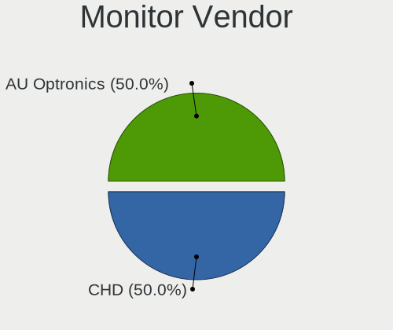

| Vendor              | Notebooks | Percent |
|---------------------|-----------|---------|
| BOE                 | 10        | 31.25%  |
| Chimei Innolux      | 8         | 25%     |
| AU Optronics        | 4         | 12.5%   |
| LG Display          | 3         | 9.38%   |
| Vizio               | 1         | 3.13%   |
| Unknown             | 1         | 3.13%   |
| Sony                | 1         | 3.13%   |
| Samsung Electronics | 1         | 3.13%   |
| Philips             | 1         | 3.13%   |
| PANDA               | 1         | 3.13%   |
| Lenovo              | 1         | 3.13%   |

Monitor Model
-------------

Monitor models

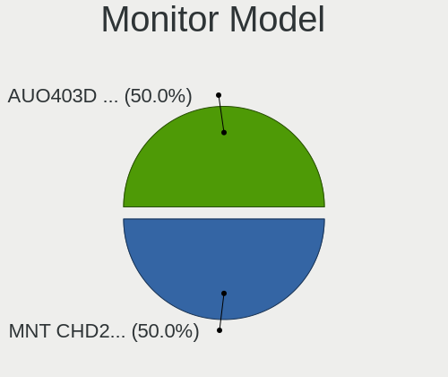

| Model                                                                | Notebooks | Percent |
|----------------------------------------------------------------------|-----------|---------|
| Chimei Innolux LCD Monitor CMN1521 1920x1080 344x193mm 15.5-inch     | 2         | 6.25%   |
| Vizio V505-H1 VIZ1039 3840x2160 941x529mm 42.5-inch                  | 1         | 3.13%   |
| Unknown LCD Monitor FFFF 2288x1287 2550x2550mm 142.0-inch            | 1         | 3.13%   |
| Sony LCD Monitor MS_9005 1920x1200 331x207mm 15.4-inch               | 1         | 3.13%   |
| Samsung Electronics LCD Monitor SEC3157 1280x800 303x190mm 14.1-inch | 1         | 3.13%   |
| Philips PHL 273V7 PHLC156 1920x1080 598x336mm 27.0-inch              | 1         | 3.13%   |
| PANDA LCD Monitor NCP004A 1920x1080 309x174mm 14.0-inch              | 1         | 3.13%   |
| LG Display LCD Monitor LGD05FE 1920x1080 344x194mm 15.5-inch         | 1         | 3.13%   |
| LG Display LCD Monitor LGD0563 1920x1080 344x194mm 15.5-inch         | 1         | 3.13%   |
| LG Display LCD Monitor LGD02DA 1920x1080 380x220mm 17.3-inch         | 1         | 3.13%   |
| Lenovo LEN LI2364 LEN65C7 1920x1080 509x286mm 23.0-inch              | 1         | 3.13%   |
| Chimei Innolux LCD Monitor CMN15CA 1366x768 344x193mm 15.5-inch      | 1         | 3.13%   |
| Chimei Innolux LCD Monitor CMN15BC 1366x768 344x194mm 15.5-inch      | 1         | 3.13%   |
| Chimei Innolux LCD Monitor CMN1550 1920x1080 344x193mm 15.5-inch     | 1         | 3.13%   |
| Chimei Innolux LCD Monitor CMN1515 1920x1080 344x193mm 15.5-inch     | 1         | 3.13%   |
| Chimei Innolux LCD Monitor CMN14E7 1920x1080 309x173mm 13.9-inch     | 1         | 3.13%   |
| Chimei Innolux LCD Monitor CMN14D5 1920x1080 309x173mm 13.9-inch     | 1         | 3.13%   |
| BOE LCD Monitor BOE0A3B 2560x1600 344x215mm 16.0-inch                | 1         | 3.13%   |
| BOE LCD Monitor BOE09AE 1920x1080 309x174mm 14.0-inch                | 1         | 3.13%   |
| BOE LCD Monitor BOE0893 2160x1440 296x197mm 14.0-inch                | 1         | 3.13%   |
| BOE LCD Monitor BOE0877 1920x1080 309x173mm 13.9-inch                | 1         | 3.13%   |
| BOE LCD Monitor BOE0872 1920x1080 344x194mm 15.5-inch                | 1         | 3.13%   |
| BOE LCD Monitor BOE085E 1920x1080 344x194mm 15.5-inch                | 1         | 3.13%   |
| BOE LCD Monitor BOE080D 1920x1080 344x194mm 15.5-inch                | 1         | 3.13%   |
| BOE LCD Monitor BOE07BB 1920x1080 309x173mm 13.9-inch                | 1         | 3.13%   |
| BOE LCD Monitor BOE06A9 1920x1080 344x193mm 15.5-inch                | 1         | 3.13%   |
| BOE LCD Monitor BOE0675 1366x768 340x190mm 15.3-inch                 | 1         | 3.13%   |
| AU Optronics LCD Monitor AUODF87 1920x1080 344x193mm 15.5-inch       | 1         | 3.13%   |
| AU Optronics LCD Monitor AUOD1ED 1920x1080 344x193mm 15.5-inch       | 1         | 3.13%   |
| AU Optronics LCD Monitor AUO46EC 1366x768 344x193mm 15.5-inch        | 1         | 3.13%   |
| AU Optronics LCD Monitor AUO139E 1600x900 382x214mm 17.2-inch        | 1         | 3.13%   |

Monitor Resolution
------------------

Monitor screen resolution

| Resolution        | Notebooks | Percent |
|-------------------|-----------|---------|
| 1920x1080 (FHD)   | 19        | 63.33%  |
| 1366x768 (WXGA)   | 4         | 13.33%  |
| 3840x2160 (4K)    | 1         | 3.33%   |
| 2560x1600         | 1         | 3.33%   |
| 2288x1287         | 1         | 3.33%   |
| 2160x1440         | 1         | 3.33%   |
| 1920x1200 (WUXGA) | 1         | 3.33%   |
| 1600x900 (HD+)    | 1         | 3.33%   |
| 1440x900 (WXGA+)  | 1         | 3.33%   |

Monitor Diagonal
----------------

Diagonal size in inches

| Inches | Notebooks | Percent |
|--------|-----------|---------|
| 15     | 17        | 53.13%  |
| 14     | 4         | 12.5%   |
| 13     | 4         | 12.5%   |
| 17     | 2         | 6.25%   |
| 142    | 1         | 3.13%   |
| 69     | 1         | 3.13%   |
| 27     | 1         | 3.13%   |
| 23     | 1         | 3.13%   |
| 16     | 1         | 3.13%   |

Monitor Width
-------------

Physical width

| Width in mm    | Notebooks | Percent |
|----------------|-----------|---------|
| 301-350        | 25        | 78.13%  |
| 501-600        | 2         | 6.25%   |
| 351-400        | 2         | 6.25%   |
| More than 2000 | 1         | 3.13%   |
| 201-300        | 1         | 3.13%   |
| 1501-2000      | 1         | 3.13%   |

Aspect Ratio
------------

Proportional relationship between the width and the height

| Ratio | Notebooks | Percent |
|-------|-----------|---------|
| 16/9  | 25        | 83.33%  |
| 16/10 | 3         | 10%     |
| 3/2   | 1         | 3.33%   |
| 1.00  | 1         | 3.33%   |

Monitor Area
------------

Area in inch²

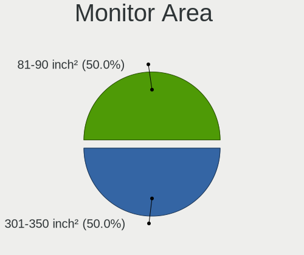

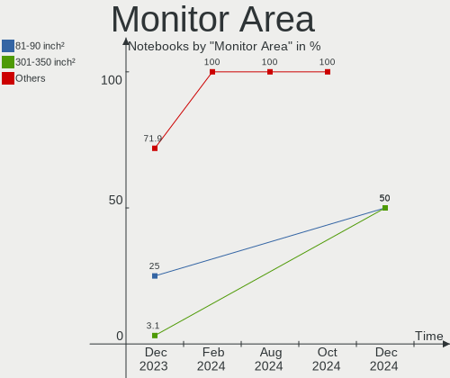

| Area in inch² | Notebooks | Percent |
|----------------|-----------|---------|
| 101-110        | 16        | 50%     |
| 81-90          | 8         | 25%     |
| More than 1000 | 2         | 6.25%   |
| 121-130        | 2         | 6.25%   |
| 301-350        | 1         | 3.13%   |
| 201-250        | 1         | 3.13%   |
| 111-120        | 1         | 3.13%   |
| 91-100         | 1         | 3.13%   |

Pixel Density
-------------

Pixels per inch

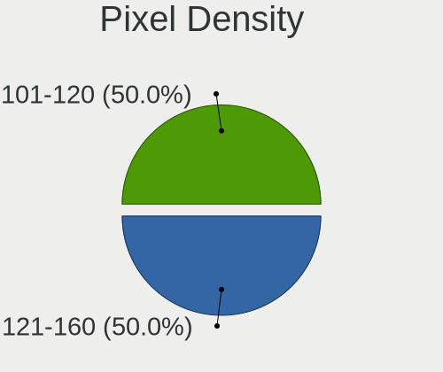

| Density | Notebooks | Percent |
|---------|-----------|---------|
| 121-160 | 20        | 62.5%   |
| 101-120 | 5         | 15.63%  |
| 51-100  | 4         | 12.5%   |
| 161-240 | 2         | 6.25%   |
| 1-50    | 1         | 3.13%   |

Multiple Monitors
-----------------

Total monitors connected

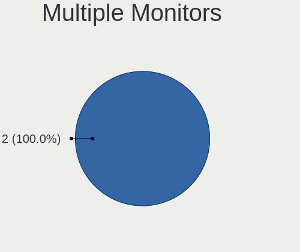

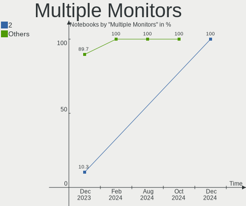

| Total | Notebooks | Percent |
|-------|-----------|---------|
| 1     | 26        | 89.66%  |
| 2     | 3         | 10.34%  |

Network
-------

Net Controller Vendor
---------------------

Controller vendors

| Vendor                | Notebooks | Percent |
|-----------------------|-----------|---------|
| Realtek Semiconductor | 19        | 43.18%  |
| Intel                 | 17        | 38.64%  |
| Qualcomm Atheros      | 4         | 9.09%   |
| Broadcom              | 3         | 6.82%   |
| OPPO Electronics      | 1         | 2.27%   |

Net Controller Model
--------------------

Controller models

| Model                                                             | Notebooks | Percent |
|-------------------------------------------------------------------|-----------|---------|
| Realtek RTL8111/8168/8411 PCI Express Gigabit Ethernet Controller | 12        | 23.53%  |
| Intel Wi-Fi 6 AX200                                               | 4         | 7.84%   |
| Realtek RTL8822CE 802.11ac PCIe Wireless Network Adapter          | 3         | 5.88%   |
| Intel Wi-Fi 6 AX201                                               | 3         | 5.88%   |
| Realtek RTL8821CE 802.11ac PCIe Wireless Network Adapter          | 2         | 3.92%   |
| Realtek RTL810xE PCI Express Fast Ethernet controller             | 2         | 3.92%   |
| Qualcomm Atheros QCA9565 / AR9565 Wireless Network Adapter        | 2         | 3.92%   |
| Broadcom BCM4313 802.11bgn Wireless Network Adapter               | 2         | 3.92%   |
| Realtek RTL8852AE WiFi 6 802.11ax PCIe Adapter                    | 1         | 1.96%   |
| Realtek RTL8852AE 802.11ax PCIe Wireless Network Adapter          | 1         | 1.96%   |
| Realtek RTL8125 2.5GbE Controller                                 | 1         | 1.96%   |
| Qualcomm Atheros QCA6174 802.11ac Wireless Network Adapter        | 1         | 1.96%   |
| Qualcomm Atheros AR8151 v2.0 Gigabit Ethernet                     | 1         | 1.96%   |
| OPPO RMX3710                                                      | 1         | 1.96%   |
| Intel Wireless 7265                                               | 1         | 1.96%   |
| Intel Wireless 7260                                               | 1         | 1.96%   |
| Intel Raptor Lake PCH CNVi WiFi                                   | 1         | 1.96%   |
| Intel PRO/Wireless 3945ABG [Golan] Network Connection             | 1         | 1.96%   |
| Intel Ethernet Connection I218-LM                                 | 1         | 1.96%   |
| Intel Ethernet Connection (6) I219-V                              | 1         | 1.96%   |
| Intel Ethernet Connection (23) I219-LM                            | 1         | 1.96%   |
| Intel Dual Band Wireless-AC 3168NGW [Stone Peak]                  | 1         | 1.96%   |
| Intel Centrino Advanced-N 6205 [Taylor Peak]                      | 1         | 1.96%   |
| Intel Cannon Point-LP CNVi [Wireless-AC]                          | 1         | 1.96%   |
| Intel Cannon Lake PCH CNVi WiFi                                   | 1         | 1.96%   |
| Intel Alder Lake-S PCH CNVi WiFi                                  | 1         | 1.96%   |
| Intel Alder Lake-P PCH CNVi WiFi                                  | 1         | 1.96%   |
| Intel 82579LM Gigabit Network Connection (Lewisville)             | 1         | 1.96%   |
| Broadcom NetXtreme BCM5755M Gigabit Ethernet PCI Express          | 1         | 1.96%   |

Wireless Vendor
---------------

Wireless vendors

| Vendor                | Notebooks | Percent |
|-----------------------|-----------|---------|
| Intel                 | 17        | 58.62%  |
| Realtek Semiconductor | 7         | 24.14%  |
| Qualcomm Atheros      | 3         | 10.34%  |
| Broadcom              | 2         | 6.9%    |

Wireless Model
--------------

Wireless models

| Model                                                      | Notebooks | Percent |
|------------------------------------------------------------|-----------|---------|
| Intel Wi-Fi 6 AX200                                        | 4         | 13.79%  |
| Realtek RTL8822CE 802.11ac PCIe Wireless Network Adapter   | 3         | 10.34%  |
| Intel Wi-Fi 6 AX201                                        | 3         | 10.34%  |
| Realtek RTL8821CE 802.11ac PCIe Wireless Network Adapter   | 2         | 6.9%    |
| Qualcomm Atheros QCA9565 / AR9565 Wireless Network Adapter | 2         | 6.9%    |
| Broadcom BCM4313 802.11bgn Wireless Network Adapter        | 2         | 6.9%    |
| Realtek RTL8852AE WiFi 6 802.11ax PCIe Adapter             | 1         | 3.45%   |
| Realtek RTL8852AE 802.11ax PCIe Wireless Network Adapter   | 1         | 3.45%   |
| Qualcomm Atheros QCA6174 802.11ac Wireless Network Adapter | 1         | 3.45%   |
| Intel Wireless 7265                                        | 1         | 3.45%   |
| Intel Wireless 7260                                        | 1         | 3.45%   |
| Intel Raptor Lake PCH CNVi WiFi                            | 1         | 3.45%   |
| Intel PRO/Wireless 3945ABG [Golan] Network Connection      | 1         | 3.45%   |
| Intel Dual Band Wireless-AC 3168NGW [Stone Peak]           | 1         | 3.45%   |
| Intel Centrino Advanced-N 6205 [Taylor Peak]               | 1         | 3.45%   |
| Intel Cannon Point-LP CNVi [Wireless-AC]                   | 1         | 3.45%   |
| Intel Cannon Lake PCH CNVi WiFi                            | 1         | 3.45%   |
| Intel Alder Lake-S PCH CNVi WiFi                           | 1         | 3.45%   |
| Intel Alder Lake-P PCH CNVi WiFi                           | 1         | 3.45%   |

Ethernet Vendor
---------------

Ethernet vendors

| Vendor                | Notebooks | Percent |
|-----------------------|-----------|---------|
| Realtek Semiconductor | 15        | 68.18%  |
| Intel                 | 4         | 18.18%  |
| Qualcomm Atheros      | 1         | 4.55%   |
| OPPO Electronics      | 1         | 4.55%   |
| Broadcom              | 1         | 4.55%   |

Ethernet Model
--------------

Ethernet models

| Model                                                             | Notebooks | Percent |
|-------------------------------------------------------------------|-----------|---------|
| Realtek RTL8111/8168/8411 PCI Express Gigabit Ethernet Controller | 12        | 54.55%  |
| Realtek RTL810xE PCI Express Fast Ethernet controller             | 2         | 9.09%   |
| Realtek RTL8125 2.5GbE Controller                                 | 1         | 4.55%   |
| Qualcomm Atheros AR8151 v2.0 Gigabit Ethernet                     | 1         | 4.55%   |
| OPPO RMX3710                                                      | 1         | 4.55%   |
| Intel Ethernet Connection I218-LM                                 | 1         | 4.55%   |
| Intel Ethernet Connection (6) I219-V                              | 1         | 4.55%   |
| Intel Ethernet Connection (23) I219-LM                            | 1         | 4.55%   |
| Intel 82579LM Gigabit Network Connection (Lewisville)             | 1         | 4.55%   |
| Broadcom NetXtreme BCM5755M Gigabit Ethernet PCI Express          | 1         | 4.55%   |

Net Controller Kind
-------------------

Ethernet, WiFi or modem

| Kind     | Notebooks | Percent |
|----------|-----------|---------|
| WiFi     | 29        | 56.86%  |
| Ethernet | 22        | 43.14%  |

Used Controller
---------------

Currently used network controller

| Kind     | Notebooks | Percent |
|----------|-----------|---------|
| WiFi     | 25        | 89.29%  |
| Ethernet | 3         | 10.71%  |

NICs
----

Total network controllers on board

| Total | Notebooks | Percent |
|-------|-----------|---------|
| 2     | 21        | 72.41%  |
| 1     | 8         | 27.59%  |

IPv6
----

IPv6 vs IPv4

| Used | Notebooks | Percent |
|------|-----------|---------|
| No   | 22        | 75.86%  |
| Yes  | 7         | 24.14%  |

Bluetooth
---------

Bluetooth Vendor
----------------

Controller vendors

| Vendor                          | Notebooks | Percent |
|---------------------------------|-----------|---------|
| Intel                           | 14        | 50%     |
| Realtek Semiconductor           | 5         | 17.86%  |
| Qualcomm Atheros Communications | 3         | 10.71%  |
| Realtek                         | 2         | 7.14%   |
| Dell                            | 2         | 7.14%   |
| Broadcom                        | 1         | 3.57%   |
| Alps Electric                   | 1         | 3.57%   |

Bluetooth Model
---------------

Controller models

| Model                                          | Notebooks | Percent |
|------------------------------------------------|-----------|---------|
| Realtek Bluetooth Radio                        | 5         | 17.86%  |
| Intel Bluetooth Device                         | 5         | 17.86%  |
| Intel AX200 Bluetooth                          | 4         | 14.29%  |
| Realtek Bluetooth Radio                        | 2         | 7.14%   |
| Intel Bluetooth wireless interface             | 2         | 7.14%   |
| Intel Bluetooth 9460/9560 Jefferson Peak (JfP) | 2         | 7.14%   |
| Qualcomm Atheros  Bluetooth Device             | 1         | 3.57%   |
| Qualcomm Atheros QCA61x4 Bluetooth 4.0         | 1         | 3.57%   |
| Qualcomm Atheros AR3012 Bluetooth              | 1         | 3.57%   |
| Intel Wireless-AC 3168 Bluetooth               | 1         | 3.57%   |
| Dell Wireless 360 Bluetooth                    | 1         | 3.57%   |
| Dell DW375 Bluetooth Module                    | 1         | 3.57%   |
| Broadcom BCM2070 Bluetooth 2.1 + EDR           | 1         | 3.57%   |
| Alps Electric UGTZ4 Bluetooth                  | 1         | 3.57%   |

Sound
-----

Sound Vendor
------------

Sound card vendors

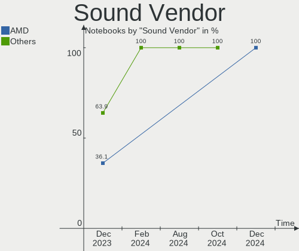

| Vendor                 | Notebooks | Percent |
|------------------------|-----------|---------|
| Intel                  | 18        | 50%     |
| AMD                    | 13        | 36.11%  |
| Nvidia                 | 3         | 8.33%   |
| Generalplus Technology | 1         | 2.78%   |
| C-Media Electronics    | 1         | 2.78%   |

Sound Model
-----------

Sound card models

| Model                                                                      | Notebooks | Percent |
|----------------------------------------------------------------------------|-----------|---------|
| AMD Family 17h/19h HD Audio Controller                                     | 8         | 16%     |
| AMD Renoir Radeon High Definition Audio Controller                         | 6         | 12%     |
| Intel Tiger Lake-LP Smart Sound Technology Audio Controller                | 5         | 10%     |
| Intel Sunrise Point-LP HD Audio                                            | 2         | 4%      |
| Intel 6 Series/C200 Series Chipset Family High Definition Audio Controller | 2         | 4%      |
| AMD Raven/Raven2/Fenghuang HDMI/DP Audio Controller                        | 2         | 4%      |
| Nvidia TU107 GeForce GTX 1650 High Definition Audio Controller             | 1         | 2%      |
| Nvidia GA106 High Definition Audio Controller                              | 1         | 2%      |
| Nvidia Audio device                                                        | 1         | 2%      |
| Intel Xeon E3-1200 v3/4th Gen Core Processor HD Audio Controller           | 1         | 2%      |
| Intel Raptor Lake-P/U/H cAVS                                               | 1         | 2%      |
| Intel Haswell-ULT HD Audio Controller                                      | 1         | 2%      |
| Intel Comet Lake PCH-LP cAVS                                               | 1         | 2%      |
| Intel Cannon Point-LP High Definition Audio Controller                     | 1         | 2%      |
| Intel Cannon Lake PCH cAVS                                                 | 1         | 2%      |
| Intel Alder Lake-S HD Audio Controller                                     | 1         | 2%      |
| Intel Alder Lake PCH-P High Definition Audio Controller                    | 1         | 2%      |
| Intel 82801H (ICH8 Family) HD Audio Controller                             | 1         | 2%      |
| Intel 8 Series/C220 Series Chipset High Definition Audio Controller        | 1         | 2%      |
| Intel 8 Series HD Audio Controller                                         | 1         | 2%      |
| Generalplus Technology USB Audio Device                                    | 1         | 2%      |
| C-Media Electronics Audio Adapter (Unitek Y-247A)                          | 1         | 2%      |
| AMD Turks HDMI Audio [Radeon HD 6500/6600 / 6700M Series]                  | 1         | 2%      |
| AMD SBx00 Azalia (Intel HDA)                                               | 1         | 2%      |
| AMD RS880 HDMI Audio [Radeon HD 4200 Series]                               | 1         | 2%      |
| AMD Navi 10 HDMI Audio                                                     | 1         | 2%      |
| AMD Kabini HDMI/DP Audio                                                   | 1         | 2%      |
| AMD Juniper HDMI Audio [Radeon HD 5700 Series]                             | 1         | 2%      |
| AMD High Definition Audio Controller                                       | 1         | 2%      |
| AMD FCH Azalia Controller                                                  | 1         | 2%      |
| AMD Family 15h (Models 60h-6fh) Audio Controller                           | 1         | 2%      |

Memory
------

Memory Vendor
-------------

Memory module vendors

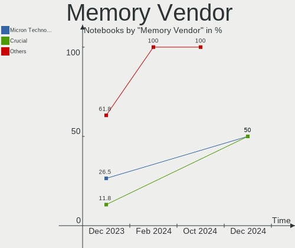

| Vendor              | Notebooks | Percent |
|---------------------|-----------|---------|
| Micron Technology   | 9         | 26.47%  |
| SK hynix            | 7         | 20.59%  |
| Samsung Electronics | 7         | 20.59%  |
| Crucial             | 4         | 11.76%  |
| A-DATA Technology   | 2         | 5.88%   |
| Unknown             | 1         | 2.94%   |
| Ramaxel Technology  | 1         | 2.94%   |
| G.Skill             | 1         | 2.94%   |
| Elpida              | 1         | 2.94%   |
| ChangXin Memory     | 1         | 2.94%   |

Memory Model
------------

Memory module models

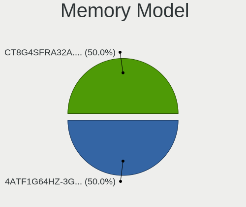

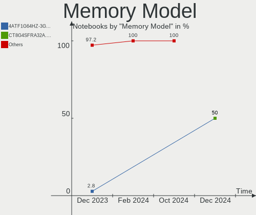

| Model                                                           | Notebooks | Percent |
|-----------------------------------------------------------------|-----------|---------|
| Samsung RAM M471A1K43DB1-CTD 8GB SODIMM DDR4 2667MT/s           | 2         | 5.56%   |
| Unknown RAM Module 4GB SODIMM DDR3 1333MT/s                     | 1         | 2.78%   |
| SK hynix RAM HYMP125S64CP8-Y5 2GB SODIMM DDR2 667MT/s           | 1         | 2.78%   |
| SK hynix RAM HMT451S6BFR8A-PB 4GB SODIMM DDR3 1600MT/s          | 1         | 2.78%   |
| SK hynix RAM HMT351S6AFR8C-PB 8GB SODIMM DDR3 1600MT/s          | 1         | 2.78%   |
| SK hynix RAM HMAA2GS6CJR8N-XN 16GB SODIMM DDR4 3200MT/s         | 1         | 2.78%   |
| SK hynix RAM HMAA1GS6CMR6N-VK 8GB Row Of Chips DDR4 2667MT/s    | 1         | 2.78%   |
| SK hynix RAM HMA81GS6DJR8N-VK 8GB SODIMM DDR4 2667MT/s          | 1         | 2.78%   |
| SK hynix RAM HMA81GS6AFR8N-UH 8GB SODIMM DDR4 2400MT/s          | 1         | 2.78%   |
| Samsung RAM M471A5244CB0-CWE 4GB SODIMM DDR4 3200MT/s           | 1         | 2.78%   |
| Samsung RAM M471A5244CB0-CWE 4GB Row Of Chips DDR4 3200MT/s     | 1         | 2.78%   |
| Samsung RAM M471A5244CB0-CTD 4GB SODIMM DDR4 3266MT/s           | 1         | 2.78%   |
| Samsung RAM M471A2K43DB1-CWE 16GB SODIMM DDR4 3200MT/s          | 1         | 2.78%   |
| Samsung RAM M471A1K43EB1-CWE 8GB SODIMM DDR4 3200MT/s           | 1         | 2.78%   |
| Samsung RAM M471A1G44AB0-CTD 8GB SODIMM DDR4 2667MT/s           | 1         | 2.78%   |
| Ramaxel RAM RMSA3310MB96HAF-3200 8GB SODIMM DDR4 3200MT/s       | 1         | 2.78%   |
| Micron RAM MTC8C1084S1SC48BA1 16GB SODIMM DDR5 4800MT/s         | 1         | 2.78%   |
| Micron RAM MT62F1G32D4DR-031 2GB Row Of Chips LPDDR5 6400MT/s   | 1         | 2.78%   |
| Micron RAM 8ATF1G64HZ-2G3H1R 8GB SODIMM DDR4 2400MT/s           | 1         | 2.78%   |
| Micron RAM 8ATF1G64HZ-2G3E1 8GB SODIMM DDR4 2400MT/s            | 1         | 2.78%   |
| Micron RAM 4ATF51264HZ-3G2R1 4GB SODIMM DDR4 3200MT/s           | 1         | 2.78%   |
| Micron RAM 4ATF25664AZ-2G3B1 2GB DDR4 2400MT/s                  | 1         | 2.78%   |
| Micron RAM 4ATF1G64HZ-3G2E2 8GB SODIMM DDR4 3200MT/s            | 1         | 2.78%   |
| Micron RAM 4ATF1G64HZ-3G2E1 8GB SODIMM DDR4 3200MT/s            | 1         | 2.78%   |
| Micron RAM 4ATF1G64HZ-3G2E1 8GB Row Of Chips DDR4 3200MT/s      | 1         | 2.78%   |
| Micron RAM 16KTF1G64HZ-1G6N1 8GB SODIMM DDR3 1600MT/s           | 1         | 2.78%   |
| G.Skill RAM F4-2400C16-8GRS 8GB SODIMM DDR4 2400MT/s            | 1         | 2.78%   |
| Elpida RAM EBJ41UF8BCS0-DJ-F 4GB SODIMM DDR3 1334MT/s           | 1         | 2.78%   |
| Crucial RAM CT8G4SFS8266.M8FE 8GB SODIMM DDR4 2667MT/s          | 1         | 2.78%   |
| Crucial RAM CT8G4SFS8266.C8FN 8GB SODIMM DDR4 2667MT/s          | 1         | 2.78%   |
| Crucial RAM CT8G48C40S5.M4A1 8GB SODIMM DDR5 4800MT/s           | 1         | 2.78%   |
| Crucial RAM CT102464BF160B.M16 8GB SODIMM DDR3 1600MT/s         | 1         | 2.78%   |
| ChangXin Memory RAM DB4ABAM-MK 1GB Row Of Chips LPDDR4 3733MT/s | 1         | 2.78%   |
| A-DATA RAM Module 8GB SODIMM DDR4 3200MT/s                      | 1         | 2.78%   |
| A-DATA RAM AM1L16BC4R1-B1GS 4096MB SODIMM DDR3 1600MT/s         | 1         | 2.78%   |

Memory Kind
-----------

Memory module kinds

| Kind   | Notebooks | Percent |
|--------|-----------|---------|
| DDR4   | 18        | 62.07%  |
| DDR3   | 6         | 20.69%  |
| DDR5   | 2         | 6.9%    |
| LPDDR5 | 1         | 3.45%   |
| LPDDR4 | 1         | 3.45%   |
| DDR2   | 1         | 3.45%   |

Memory Form Factor
------------------

Physical design of the memory module

| Name         | Notebooks | Percent |
|--------------|-----------|---------|
| SODIMM       | 24        | 80%     |
| Row Of Chips | 5         | 16.67%  |
| Unknown      | 1         | 3.33%   |

Memory Size
-----------

Memory module size

| Size  | Notebooks | Percent |
|-------|-----------|---------|
| 8192  | 16        | 53.33%  |
| 4096  | 7         | 23.33%  |
| 16384 | 4         | 13.33%  |
| 2048  | 2         | 6.67%   |
| 1024  | 1         | 3.33%   |

Memory Speed
------------

Memory module speed

| Speed | Notebooks | Percent |
|-------|-----------|---------|
| 3200  | 9         | 31.03%  |
| 2667  | 4         | 13.79%  |
| 2400  | 4         | 13.79%  |
| 1600  | 4         | 13.79%  |
| 4800  | 2         | 6.9%    |
| 6400  | 1         | 3.45%   |
| 3733  | 1         | 3.45%   |
| 3266  | 1         | 3.45%   |
| 1334  | 1         | 3.45%   |
| 1333  | 1         | 3.45%   |
| 667   | 1         | 3.45%   |

Printers & scanners
-------------------

Printer Vendor
--------------

Printer device vendors

Zero info for selected period =(

Printer Model
-------------

Printer device models

Zero info for selected period =(

Scanner Vendor
--------------

Scanner device vendors

Zero info for selected period =(

Scanner Model
-------------

Scanner device models

Zero info for selected period =(

Camera
------

Camera Vendor
-------------

Camera device vendors

| Vendor                                 | Notebooks | Percent |
|----------------------------------------|-----------|---------|
| Chicony Electronics                    | 6         | 26.09%  |
| Quanta                                 | 3         | 13.04%  |
| IMC Networks                           | 3         | 13.04%  |
| Microdia                               | 2         | 8.7%    |
| Bison Electronics                      | 2         | 8.7%    |
| Suyin                                  | 1         | 4.35%   |
| Sunplus Innovation Technology          | 1         | 4.35%   |
| Samsung Electronics                    | 1         | 4.35%   |
| Realtek Semiconductor                  | 1         | 4.35%   |
| Luxvisions Innotech Limited            | 1         | 4.35%   |
| Lite-On Technology                     | 1         | 4.35%   |
| Cheng Uei Precision Industry (Foxlink) | 1         | 4.35%   |

Camera Model
------------

Camera device models

| Model                                                   | Notebooks | Percent |
|---------------------------------------------------------|-----------|---------|
| Chicony Integrated Camera                               | 2         | 8.7%    |
| Chicony HD Webcam                                       | 2         | 8.7%    |
| Suyin Laptop_Integrated_Webcam_3M                       | 1         | 4.35%   |
| Sunplus Integrated_Webcam_FHD                           | 1         | 4.35%   |
| Samsung Galaxy series, misc. (MTP mode)                 | 1         | 4.35%   |
| Realtek EasyCamera                                      | 1         | 4.35%   |
| Quanta ov9734_techfront_camera                          | 1         | 4.35%   |
| Quanta HP Wide Vision HD Camera                         | 1         | 4.35%   |
| Quanta HD User Facing                                   | 1         | 4.35%   |
| Microdia Laptop_Integrated_Webcam_HD                    | 1         | 4.35%   |
| Microdia Integrated_Webcam_HD                           | 1         | 4.35%   |
| Luxvisions Innotech Limited HP Wide Vision HD Camera    | 1         | 4.35%   |
| Lite-On HP Wide Vision HD Camera                        | 1         | 4.35%   |
| IMC Networks ov9734_azurewave_camera                    | 1         | 4.35%   |
| IMC Networks Integrated Camera                          | 1         | 4.35%   |
| IMC Networks HD Camera                                  | 1         | 4.35%   |
| Chicony Web Camera - FHD                                | 1         | 4.35%   |
| Chicony HP HD Webcam                                    | 1         | 4.35%   |
| Cheng Uei Precision Industry (Foxlink) HP Truevision HD | 1         | 4.35%   |
| Bison Integrated Camera                                 | 1         | 4.35%   |
| Bison HD Webcam                                         | 1         | 4.35%   |

Security
--------

Fingerprint Vendor
------------------

Fingerprint sensor vendors

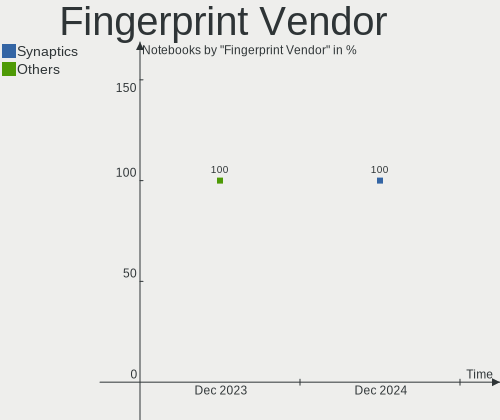

| Vendor                     | Notebooks | Percent |
|----------------------------|-----------|---------|
| Shenzhen Goodix Technology | 3         | 60%     |
| Validity Sensors           | 1         | 20%     |
| Elan Microelectronics      | 1         | 20%     |

Fingerprint Model
-----------------

Fingerprint sensor models

| Model                                | Notebooks | Percent |
|--------------------------------------|-----------|---------|
| Shenzhen Goodix  Fingerprint Device  | 3         | 60%     |
| Validity Sensors Fingerprint scanner | 1         | 20%     |
| Elan ELAN:ARM-M4                     | 1         | 20%     |

Chipcard Vendor
---------------

Chipcard module vendors

| Vendor                            | Notebooks | Percent |
|-----------------------------------|-----------|---------|
| VASCO Data Security International | 1         | 20%     |
| O2 Micro                          | 1         | 20%     |
| Gemalto (was Gemplus)             | 1         | 20%     |
| Broadcom                          | 1         | 20%     |
| Alcor Micro                       | 1         | 20%     |

Chipcard Model
--------------

Chipcard module models

| Model                                                           | Notebooks | Percent |
|-----------------------------------------------------------------|-----------|---------|
| VASCO Data Security International Digipass 905 SmartCard Reader | 1         | 20%     |
| O2 Micro OZ776 CCID Smartcard Reader                            | 1         | 20%     |
| Gemalto (was Gemplus) GemPC Twin SmartCard Reader               | 1         | 20%     |
| Broadcom 58200                                                  | 1         | 20%     |
| Alcor Micro AU9540 Smartcard Reader                             | 1         | 20%     |

Unsupported
-----------

Unsupported Devices
-------------------

Total unsupported devices on board

| Total | Notebooks | Percent |
|-------|-----------|---------|
| 0     | 18        | 62.07%  |
| 1     | 10        | 34.48%  |
| 2     | 1         | 3.45%   |

Unsupported Device Types
------------------------

Types of unsupported devices

| Type                  | Notebooks | Percent |
|-----------------------|-----------|---------|
| Fingerprint reader    | 5         | 41.67%  |
| Chipcard              | 4         | 33.33%  |
| Multimedia controller | 1         | 8.33%   |
| Graphics card         | 1         | 8.33%   |
| Camera                | 1         | 8.33%   |

