Xero - Hardware Trends (Notebooks)
----------------------------------

A project to identify most popular hardware characteristics and track their change
over time based on data collected by Linux users at https://Linux-Hardware.org.

Anyone can contribute to this report by the [hw-probe](https://github.com/linuxhw/hw-probe) tool:

    sudo -E hw-probe -all -upload

This report is for one last month. Overall report since the beginning of time: [TestDays](https://github.com/linuxhw/TestDays)

Period: Sep, 2023.

Contents
--------

* [ System ](#system)
  - [ OS                       ](#os)
  - [ OS Family                ](#os-family)
  - [ Kernel                   ](#kernel)
  - [ Kernel Family            ](#kernel-family)
  - [ Kernel Major Ver.        ](#kernel-major-ver)
  - [ Arch                     ](#arch)
  - [ DE                       ](#de)
  - [ Display Server           ](#display-server)
  - [ Display Manager          ](#display-manager)
  - [ OS Lang                  ](#os-lang)
  - [ Boot Mode                ](#boot-mode)
  - [ Filesystem               ](#filesystem)
  - [ Part. scheme             ](#part-scheme)
  - [ Dual Boot with Linux/BSD ](#dual-boot-with-linuxbsd)
  - [ Dual Boot (Win)          ](#dual-boot-win)

* [ Board ](#board)
  - [ Vendor                   ](#vendor)
  - [ Model                    ](#model)
  - [ Model Family             ](#model-family)
  - [ MFG Year                 ](#mfg-year)
  - [ Form Factor              ](#form-factor)
  - [ Secure Boot              ](#secure-boot)
  - [ Coreboot                 ](#coreboot)
  - [ RAM Size                 ](#ram-size)
  - [ RAM Used                 ](#ram-used)
  - [ Total Drives             ](#total-drives)
  - [ Has CD-ROM               ](#has-cd-rom)
  - [ Has Ethernet             ](#has-ethernet)
  - [ Has WiFi                 ](#has-wifi)
  - [ Has Bluetooth            ](#has-bluetooth)

* [ Location ](#location)
  - [ Country                  ](#country)
  - [ City                     ](#city)

* [ Drives ](#drives)
  - [ Drive Vendor             ](#drive-vendor)
  - [ Drive Model              ](#drive-model)
  - [ HDD Vendor               ](#hdd-vendor)
  - [ SSD Vendor               ](#ssd-vendor)
  - [ Drive Kind               ](#drive-kind)
  - [ Drive Connector          ](#drive-connector)
  - [ Drive Size               ](#drive-size)
  - [ Space Total              ](#space-total)
  - [ Space Used               ](#space-used)
  - [ Malfunc. Drives          ](#malfunc-drives)
  - [ Malfunc. Drive Vendor    ](#malfunc-drive-vendor)
  - [ Malfunc. HDD Vendor      ](#malfunc-hdd-vendor)
  - [ Malfunc. Drive Kind      ](#malfunc-drive-kind)
  - [ Failed Drives            ](#failed-drives)
  - [ Failed Drive Vendor      ](#failed-drive-vendor)
  - [ Drive Status             ](#drive-status)

* [ Storage controller ](#storage-controller)
  - [ Storage Vendor           ](#storage-vendor)
  - [ Storage Model            ](#storage-model)
  - [ Storage Kind             ](#storage-kind)

* [ Processor ](#processor)
  - [ CPU Vendor               ](#cpu-vendor)
  - [ CPU Model                ](#cpu-model)
  - [ CPU Model Family         ](#cpu-model-family)
  - [ CPU Cores                ](#cpu-cores)
  - [ CPU Sockets              ](#cpu-sockets)
  - [ CPU Threads              ](#cpu-threads)
  - [ CPU Op-Modes             ](#cpu-op-modes)
  - [ CPU Microcode            ](#cpu-microcode)
  - [ CPU Microarch            ](#cpu-microarch)

* [ Graphics ](#graphics)
  - [ GPU Vendor               ](#gpu-vendor)
  - [ GPU Model                ](#gpu-model)
  - [ GPU Combo                ](#gpu-combo)
  - [ GPU Driver               ](#gpu-driver)
  - [ GPU Memory               ](#gpu-memory)

* [ Monitor ](#monitor)
  - [ Monitor Vendor           ](#monitor-vendor)
  - [ Monitor Model            ](#monitor-model)
  - [ Monitor Resolution       ](#monitor-resolution)
  - [ Monitor Diagonal         ](#monitor-diagonal)
  - [ Monitor Width            ](#monitor-width)
  - [ Aspect Ratio             ](#aspect-ratio)
  - [ Monitor Area             ](#monitor-area)
  - [ Pixel Density            ](#pixel-density)
  - [ Multiple Monitors        ](#multiple-monitors)

* [ Network ](#network)
  - [ Net Controller Vendor    ](#net-controller-vendor)
  - [ Net Controller Model     ](#net-controller-model)
  - [ Wireless Vendor          ](#wireless-vendor)
  - [ Wireless Model           ](#wireless-model)
  - [ Ethernet Vendor          ](#ethernet-vendor)
  - [ Ethernet Model           ](#ethernet-model)
  - [ Net Controller Kind      ](#net-controller-kind)
  - [ Used Controller          ](#used-controller)
  - [ NICs                     ](#nics)
  - [ IPv6                     ](#ipv6)

* [ Bluetooth ](#bluetooth)
  - [ Bluetooth Vendor         ](#bluetooth-vendor)
  - [ Bluetooth Model          ](#bluetooth-model)

* [ Sound ](#sound)
  - [ Sound Vendor             ](#sound-vendor)
  - [ Sound Model              ](#sound-model)

* [ Memory ](#memory)
  - [ Memory Vendor            ](#memory-vendor)
  - [ Memory Model             ](#memory-model)
  - [ Memory Kind              ](#memory-kind)
  - [ Memory Form Factor       ](#memory-form-factor)
  - [ Memory Size              ](#memory-size)
  - [ Memory Speed             ](#memory-speed)

* [ Printers & scanners ](#printers--scanners)
  - [ Printer Vendor           ](#printer-vendor)
  - [ Printer Model            ](#printer-model)
  - [ Scanner Vendor           ](#scanner-vendor)
  - [ Scanner Model            ](#scanner-model)

* [ Camera ](#camera)
  - [ Camera Vendor            ](#camera-vendor)
  - [ Camera Model             ](#camera-model)

* [ Security ](#security)
  - [ Fingerprint Vendor       ](#fingerprint-vendor)
  - [ Fingerprint Model        ](#fingerprint-model)
  - [ Chipcard Vendor          ](#chipcard-vendor)
  - [ Chipcard Model           ](#chipcard-model)

* [ Unsupported ](#unsupported)
  - [ Unsupported Devices      ](#unsupported-devices)
  - [ Unsupported Device Types ](#unsupported-device-types)

System
------

OS
--

Installed operating systems

| Name         | Notebooks | Percent |
|--------------|-----------|---------|
| Xero Rolling | 36        | 100%    |

OS Family
---------

OS without a version

| Name | Notebooks | Percent |
|------|-----------|---------|
| Xero | 36        | 100%    |

Kernel
------

Version of the Linux kernel

| Version          | Notebooks | Percent |
|------------------|-----------|---------|
| 6.4.12-arch1-1   | 22        | 61.11%  |
| 6.4.9-arch1-1    | 4         | 11.11%  |
| 6.5.3-arch1-1    | 3         | 8.33%   |
| 6.5.5-arch1-1    | 1         | 2.78%   |
| 6.5.4-zen2-1-zen | 1         | 2.78%   |
| 6.5.4-arch2-1    | 1         | 2.78%   |
| 6.5.2-zen1-1-zen | 1         | 2.78%   |
| 6.5.2-arch1-1    | 1         | 2.78%   |
| 6.5.1-arch1-1    | 1         | 2.78%   |
| 6.4.3-arch1-2    | 1         | 2.78%   |

Kernel Family
-------------

Linux kernel without a distro release

| Version | Notebooks | Percent |
|---------|-----------|---------|
| 6.4.12  | 22        | 61.11%  |
| 6.4.9   | 4         | 11.11%  |
| 6.5.3   | 3         | 8.33%   |
| 6.5.4   | 2         | 5.56%   |
| 6.5.2   | 2         | 5.56%   |
| 6.5.5   | 1         | 2.78%   |
| 6.5.1   | 1         | 2.78%   |
| 6.4.3   | 1         | 2.78%   |

Kernel Major Ver.
-----------------

Linux kernel major version

| Version | Notebooks | Percent |
|---------|-----------|---------|
| 6.4     | 27        | 75%     |
| 6.5     | 9         | 25%     |

Arch
----

OS architecture (x86_64, i586, etc.)

| Name   | Notebooks | Percent |
|--------|-----------|---------|
| x86_64 | 36        | 100%    |

DE
--

Desktop Environment

| Name | Notebooks | Percent |
|------|-----------|---------|
| KDE5 | 36        | 100%    |

Display Server
--------------

X11 or Wayland

| Name | Notebooks | Percent |
|------|-----------|---------|
| X11  | 35        | 97.22%  |
| Tty  | 1         | 2.78%   |

Display Manager
---------------

SDDM, LightDM, etc.

| Name    | Notebooks | Percent |
|---------|-----------|---------|
| SDDM    | 34        | 94.44%  |
| LightDM | 2         | 5.56%   |

OS Lang
-------

Language

| Lang  | Notebooks | Percent |
|-------|-----------|---------|
| en_US | 15        | 41.67%  |
| es_MX | 5         | 13.89%  |
| pt_BR | 2         | 5.56%   |
| fr_FR | 2         | 5.56%   |
| en_CA | 2         | 5.56%   |
| ru_RU | 1         | 2.78%   |
| pl_PL | 1         | 2.78%   |
| nl_NL | 1         | 2.78%   |
| nb_NO | 1         | 2.78%   |
| ko_KR | 1         | 2.78%   |
| hu_HU | 1         | 2.78%   |
| es_ES | 1         | 2.78%   |
| es_AR | 1         | 2.78%   |
| en_GB | 1         | 2.78%   |
| de_DE | 1         | 2.78%   |

Boot Mode
---------

EFI or BIOS

| Mode | Notebooks | Percent |
|------|-----------|---------|
| EFI  | 31        | 86.11%  |
| BIOS | 5         | 13.89%  |

Filesystem
----------

Type of filesystem

| Type  | Notebooks | Percent |
|-------|-----------|---------|
| Ext4  | 27        | 75%     |
| Btrfs | 6         | 16.67%  |
| Xfs   | 3         | 8.33%   |

Part. scheme
------------

Scheme of partitioning

| Type | Notebooks | Percent |
|------|-----------|---------|
| GPT  | 32        | 88.89%  |
| MBR  | 4         | 11.11%  |

Dual Boot with Linux/BSD
------------------------

Hosting more than one Linux/BSD

| Dual boot | Notebooks | Percent |
|-----------|-----------|---------|
| No        | 30        | 83.33%  |
| Yes       | 6         | 16.67%  |

Dual Boot (Win)
---------------

Hosting Linux and Windows

| Dual boot | Notebooks | Percent |
|-----------|-----------|---------|
| No        | 23        | 63.89%  |
| Yes       | 13        | 36.11%  |

Board
-----

Vendor
------

Motherboard manufacturer

| Name             | Notebooks | Percent |
|------------------|-----------|---------|
| Lenovo           | 11        | 30.56%  |
| ASUSTek Computer | 9         | 25%     |
| Apple            | 4         | 11.11%  |
| Hewlett-Packard  | 3         | 8.33%   |
| Dell             | 3         | 8.33%   |
| Acer             | 2         | 5.56%   |
| MSI              | 1         | 2.78%   |
| Juana Manso      | 1         | 2.78%   |
| HUAWEI           | 1         | 2.78%   |
| Google           | 1         | 2.78%   |

Model
-----

Motherboard model

| Name                                    | Notebooks | Percent |
|-----------------------------------------|-----------|---------|
| MSI GE62 7RD                            | 1         | 2.78%   |
| Lenovo Z51-70 80K6                      | 1         | 2.78%   |
| Lenovo V330-15IKB 81AX                  | 1         | 2.78%   |
| Lenovo ThinkPad X200 745536T            | 1         | 2.78%   |
| Lenovo ThinkPad T440 20B6006DUS         | 1         | 2.78%   |
| Lenovo Legion Y540-17IRH 81Q4           | 1         | 2.78%   |
| Lenovo IdeaPad N585 20179               | 1         | 2.78%   |
| Lenovo IdeaPad 5 14IIL05 81YH           | 1         | 2.78%   |
| Lenovo IdeaPad 320-15ABR 80XS           | 1         | 2.78%   |
| Lenovo IdeaPad 3 15ITL05 81X8           | 1         | 2.78%   |
| Lenovo IdeaPad 3 14ALC6 82KT            | 1         | 2.78%   |
| Lenovo G570 20079                       | 1         | 2.78%   |
| Juana Manso SF20GM7                     | 1         | 2.78%   |
| HUAWEI HN-WX9X                          | 1         | 2.78%   |
| HP ProBook 455 15.6 inch G9 Notebook PC | 1         | 2.78%   |
| HP Laptop 15s-eq1xxx                    | 1         | 2.78%   |
| HP EliteBook 840 G8 Notebook PC         | 1         | 2.78%   |
| Google Pirika                           | 1         | 2.78%   |
| Dell Latitude 5420                      | 1         | 2.78%   |
| Dell Inspiron 7460                      | 1         | 2.78%   |
| Dell Inspiron 3583                      | 1         | 2.78%   |
| ASUS X555LN                             | 1         | 2.78%   |
| ASUS X542UN                             | 1         | 2.78%   |
| ASUS X541UAK                            | 1         | 2.78%   |
| ASUS X510UAR                            | 1         | 2.78%   |
| ASUS X505BA                             | 1         | 2.78%   |
| ASUS VivoBook_ASUSLaptop X415JA_R465JA  | 1         | 2.78%   |
| ASUS UX305FA                            | 1         | 2.78%   |
| ASUS GL503VMF                           | 1         | 2.78%   |
| ASUS G750JX                             | 1         | 2.78%   |
| Apple MacBookPro9,1                     | 1         | 2.78%   |
| Apple MacBookPro8,1                     | 1         | 2.78%   |
| Apple MacBookPro11,2                    | 1         | 2.78%   |
| Apple MacBookAir7,2                     | 1         | 2.78%   |
| Acer Nitro AN515-58                     | 1         | 2.78%   |
| Acer Aspire 5742                        | 1         | 2.78%   |

Model Family
------------

Motherboard model prefix

| Name                | Notebooks | Percent |
|---------------------|-----------|---------|
| Lenovo IdeaPad      | 5         | 13.89%  |
| Lenovo ThinkPad     | 2         | 5.56%   |
| Dell Inspiron       | 2         | 5.56%   |
| MSI GE62            | 1         | 2.78%   |
| Lenovo Z51-70       | 1         | 2.78%   |
| Lenovo V330-15IKB   | 1         | 2.78%   |
| Lenovo Legion       | 1         | 2.78%   |
| Lenovo G570         | 1         | 2.78%   |
| Juana Manso SF20GM7 | 1         | 2.78%   |
| HUAWEI HN-WX9X      | 1         | 2.78%   |
| HP ProBook          | 1         | 2.78%   |
| HP Laptop           | 1         | 2.78%   |
| HP EliteBook        | 1         | 2.78%   |
| Google Pirika       | 1         | 2.78%   |
| Dell Latitude       | 1         | 2.78%   |
| ASUS X555LN         | 1         | 2.78%   |
| ASUS X542UN         | 1         | 2.78%   |
| ASUS X541UAK        | 1         | 2.78%   |
| ASUS X510UAR        | 1         | 2.78%   |
| ASUS X505BA         | 1         | 2.78%   |
| ASUS VivoBook       | 1         | 2.78%   |
| ASUS UX305FA        | 1         | 2.78%   |
| ASUS GL503VMF       | 1         | 2.78%   |
| ASUS G750JX         | 1         | 2.78%   |
| Apple MacBookPro9   | 1         | 2.78%   |
| Apple MacBookPro8   | 1         | 2.78%   |
| Apple MacBookPro11  | 1         | 2.78%   |
| Apple MacBookAir7   | 1         | 2.78%   |
| Acer Nitro          | 1         | 2.78%   |
| Acer Aspire         | 1         | 2.78%   |

MFG Year
--------

Motherboard manufacture year

| Year | Notebooks | Percent |
|------|-----------|---------|
| 2017 | 6         | 16.67%  |
| 2021 | 5         | 13.89%  |
| 2020 | 4         | 11.11%  |
| 2019 | 3         | 8.33%   |
| 2013 | 3         | 8.33%   |
| 2022 | 2         | 5.56%   |
| 2016 | 2         | 5.56%   |
| 2015 | 2         | 5.56%   |
| 2014 | 2         | 5.56%   |
| 2012 | 2         | 5.56%   |
| 2011 | 2         | 5.56%   |
| 2023 | 1         | 2.78%   |
| 2010 | 1         | 2.78%   |
| 2008 | 1         | 2.78%   |

Form Factor
-----------

Physical design of the computer

| Name     | Notebooks | Percent |
|----------|-----------|---------|
| Notebook | 36        | 100%    |

Secure Boot
-----------

Enabled or disabled

| State    | Notebooks | Percent |
|----------|-----------|---------|
| Disabled | 35        | 97.22%  |
| Enabled  | 1         | 2.78%   |

Coreboot
--------

Have coreboot on board

| Used | Notebooks | Percent |
|------|-----------|---------|
| No   | 35        | 97.22%  |
| Yes  | 1         | 2.78%   |

RAM Size
--------

Total RAM memory

| Size in GB | Notebooks | Percent |
|------------|-----------|---------|
| 4.01-8.0   | 11        | 30.56%  |
| 16.01-24.0 | 10        | 27.78%  |
| 8.01-16.0  | 8         | 22.22%  |
| 3.01-4.0   | 7         | 19.44%  |

RAM Used
--------

Used RAM memory

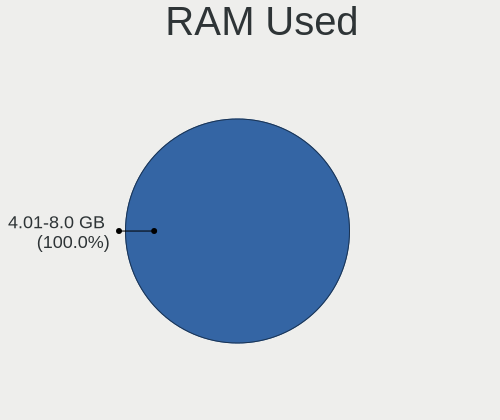

| Used GB  | Notebooks | Percent |
|----------|-----------|---------|
| 1.01-2.0 | 16        | 44.44%  |
| 2.01-3.0 | 13        | 36.11%  |
| 4.01-8.0 | 4         | 11.11%  |
| 3.01-4.0 | 3         | 8.33%   |

Total Drives
------------

Number of drives on board

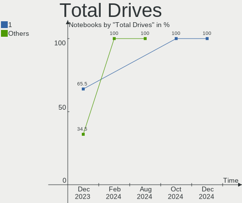

| Drives | Notebooks | Percent |
|--------|-----------|---------|
| 1      | 28        | 77.78%  |
| 2      | 7         | 19.44%  |
| 3      | 1         | 2.78%   |

Has CD-ROM
----------

Has CD-ROM on board

| Presented | Notebooks | Percent |
|-----------|-----------|---------|
| No        | 27        | 75%     |
| Yes       | 9         | 25%     |

Has Ethernet
------------

Has Ethernet on board

| Presented | Notebooks | Percent |
|-----------|-----------|---------|
| Yes       | 27        | 75%     |
| No        | 9         | 25%     |

Has WiFi
--------

Has WiFi module

| Presented | Notebooks | Percent |
|-----------|-----------|---------|
| Yes       | 36        | 100%    |

Has Bluetooth
-------------

Has Bluetooth module

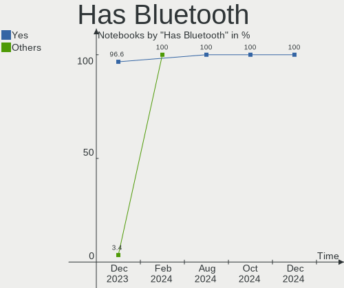

| Presented | Notebooks | Percent |
|-----------|-----------|---------|
| Yes       | 33        | 91.67%  |
| No        | 3         | 8.33%   |

Location
--------

Country
-------

Geographic location (country)

| Country     | Notebooks | Percent |
|-------------|-----------|---------|
| USA         | 4         | 11.11%  |
| Vietnam     | 3         | 8.33%   |
| Argentina   | 3         | 8.33%   |
| Turkey      | 2         | 5.56%   |
| Russia      | 2         | 5.56%   |
| Poland      | 2         | 5.56%   |
| Netherlands | 2         | 5.56%   |
| Mexico      | 2         | 5.56%   |
| India       | 2         | 5.56%   |
| Canada      | 2         | 5.56%   |
| Brazil      | 2         | 5.56%   |
| Thailand    | 1         | 2.78%   |
| Spain       | 1         | 2.78%   |
| South Korea | 1         | 2.78%   |
| Panama      | 1         | 2.78%   |
| Norway      | 1         | 2.78%   |
| Morocco     | 1         | 2.78%   |
| Madagascar  | 1         | 2.78%   |
| Hungary     | 1         | 2.78%   |
| Germany     | 1         | 2.78%   |
| France      | 1         | 2.78%   |

City
----

Geographic location (city)

| City              | Notebooks | Percent |
|-------------------|-----------|---------|
| Hanoi             | 2         | 5.56%   |
| Zeeland           | 1         | 2.78%   |
| Wasilla           | 1         | 2.78%   |
| Warsaw            | 1         | 2.78%   |
| Trondheim         | 1         | 2.78%   |
| Toluca            | 1         | 2.78%   |
| Thornhill         | 1         | 2.78%   |
| Tablada           | 1         | 2.78%   |
| Settat            | 1         | 2.78%   |
| Santa Rosa        | 1         | 2.78%   |
| Salt Lake City    | 1         | 2.78%   |
| Red Lake          | 1         | 2.78%   |
| Patna             | 1         | 2.78%   |
| Paragominas       | 1         | 2.78%   |
| Panama City       | 1         | 2.78%   |
| Orange            | 1         | 2.78%   |
| Noida             | 1         | 2.78%   |
| Nizhniy Novgorod  | 1         | 2.78%   |
| Naaldwijk         | 1         | 2.78%   |
| Mosonmagyaróvár | 1         | 2.78%   |
| Moscow            | 1         | 2.78%   |
| Mexico City       | 1         | 2.78%   |
| Mar del Plata     | 1         | 2.78%   |
| Madrid            | 1         | 2.78%   |
| Kosekoy           | 1         | 2.78%   |
| Istanbul          | 1         | 2.78%   |
| Ho Chi Minh City  | 1         | 2.78%   |
| Guderhandviertel  | 1         | 2.78%   |
| Gdansk            | 1         | 2.78%   |
| Fairfax           | 1         | 2.78%   |
| Daegu             | 1         | 2.78%   |
| Buenos Aires      | 1         | 2.78%   |
| Brasília         | 1         | 2.78%   |
| Bangkok           | 1         | 2.78%   |
| Antananarivo      | 1         | 2.78%   |

Drives
------

Drive Vendor
------------

Hard drive vendors

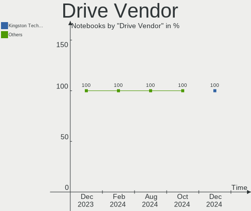

| Vendor              | Notebooks | Drives | Percent |
|---------------------|-----------|--------|---------|
| Samsung Electronics | 10        | 10     | 23.81%  |
| Seagate             | 5         | 5      | 11.9%   |
| Sandisk             | 4         | 4      | 9.52%   |
| Kingston            | 3         | 3      | 7.14%   |
| WDC                 | 2         | 3      | 4.76%   |
| Apple               | 2         | 2      | 4.76%   |
| Unknown             | 1         | 1      | 2.38%   |
| tecmiyo             | 1         | 1      | 2.38%   |
| TARGET              | 1         | 1      | 2.38%   |
| NT-1TB              | 1         | 1      | 2.38%   |
| LITEONIT            | 1         | 1      | 2.38%   |
| KIOXIA              | 1         | 1      | 2.38%   |
| Kingmax             | 1         | 1      | 2.38%   |
| JMicron Technology  | 1         | 1      | 2.38%   |
| Intel               | 1         | 2      | 2.38%   |
| Imation             | 1         | 1      | 2.38%   |
| HGST                | 1         | 1      | 2.38%   |
| Hewlett-Packard     | 1         | 1      | 2.38%   |
| GLOWAY              | 1         | 1      | 2.38%   |
| Crucial             | 1         | 1      | 2.38%   |
| China               | 1         | 1      | 2.38%   |
| Azerty              | 1         | 1      | 2.38%   |

Drive Model
-----------

Hard drive models

| Model                                               | Notebooks | Percent |
|-----------------------------------------------------|-----------|---------|
| Samsung NVMe SSD Controller SM981/PM981/PM983 256GB | 2         | 4.65%   |
| Samsung MZALQ256HBJD-00BL2 256GB                    | 2         | 4.65%   |
| WDC WD5000BPVT-22HXZT3 500GB                        | 1         | 2.33%   |
| WDC WD Blue SA510 2.5 500GB                         | 1         | 2.33%   |
| Unknown MMC Card  128GB                             | 1         | 2.33%   |
| tecmiyo SATA SSD 512GB                              | 1         | 2.33%   |
| TARGET SSD 128G                                     | 1         | 2.33%   |
| Seagate ST9320423AS 320GB                           | 1         | 2.33%   |
| Seagate ST320LT012-9WS14C 320GB                     | 1         | 2.33%   |
| Seagate ST1000LM035-1RK172 1TB                      | 1         | 2.33%   |
| Seagate ST1000LM024 HN-M101MBB 1TB                  | 1         | 2.33%   |
| Seagate ST1000LM014-SSHD-8GB                        | 1         | 2.33%   |
| Sandisk WD Black SN750 / PC SN730 NVMe SSD 512GB    | 1         | 2.33%   |
| SanDisk SDSSDA240G 240GB                            | 1         | 2.33%   |
| SanDisk SD7SN3Q128G1002 128GB SSD                   | 1         | 2.33%   |
| Sandisk PC SN530 NVMe WDC 256GB                     | 1         | 2.33%   |
| Samsung SSD 870 EVO 1TB                             | 1         | 2.33%   |
| Samsung NVMe SSD Controller PM9A1/PM9A3/980PRO 1TB  | 1         | 2.33%   |
| Samsung MZVLQ512HBLU-00BH1 512GB                    | 1         | 2.33%   |
| Samsung MZVLQ512HALU-000H1 512GB                    | 1         | 2.33%   |
| Samsung MZNLN256HMHQ-00000 256GB SSD                | 1         | 2.33%   |
| Samsung MZALQ256HAJD-000L2 256GB                    | 1         | 2.33%   |
| NT-1TB 2280 1TB SSD                                 | 1         | 2.33%   |
| LITEONIT LCS-256M6S 256GB SSD                       | 1         | 2.33%   |
| KIOXIA KBG40ZNV256G 256GB                           | 1         | 2.33%   |
| Kingston SNV2S500G 500GB                            | 1         | 2.33%   |
| Kingston SA400S37480G 480GB SSD                     | 1         | 2.33%   |
| Kingston SA400S37240G 240GB SSD                     | 1         | 2.33%   |
| Kingmax SSD 240GB                                   | 1         | 2.33%   |
| JMicron Generic 240GB                               | 1         | 2.33%   |
| Intel HBRPEKNX0202AO 32GB                           | 1         | 2.33%   |
| Intel HBRPEKNX0202A 512GB                           | 1         | 2.33%   |
| Imation 2.5" SAT 1TB SSD                            | 1         | 2.33%   |
| HGST HTS721010A9E630 1TB                            | 1         | 2.33%   |
| HP SSD M700 240GB                                   | 1         | 2.33%   |
| GLOWAY VAL256GS3-M.2 80 256GB                       | 1         | 2.33%   |
| Crucial CT480M500SSD1 480GB                         | 1         | 2.33%   |
| China SATA SSD 240GB                                | 1         | 2.33%   |
| Azerty SSD 512GB                                    | 1         | 2.33%   |
| Apple SSD SM0256G 256GB                             | 1         | 2.33%   |

HDD Vendor
----------

Hard disk drive vendors

| Vendor  | Notebooks | Drives | Percent |
|---------|-----------|--------|---------|
| Seagate | 5         | 5      | 71.43%  |
| WDC     | 1         | 1      | 14.29%  |
| HGST    | 1         | 1      | 14.29%  |

SSD Vendor
----------

Solid state drive vendors

| Vendor              | Notebooks | Drives | Percent |
|---------------------|-----------|--------|---------|
| SanDisk             | 2         | 2      | 9.52%   |
| Samsung Electronics | 2         | 2      | 9.52%   |
| Kingston            | 2         | 2      | 9.52%   |
| Apple               | 2         | 2      | 9.52%   |
| WDC                 | 1         | 2      | 4.76%   |
| tecmiyo             | 1         | 1      | 4.76%   |
| TARGET              | 1         | 1      | 4.76%   |
| NT-1TB              | 1         | 1      | 4.76%   |
| LITEONIT            | 1         | 1      | 4.76%   |
| Kingmax             | 1         | 1      | 4.76%   |
| JMicron Technology  | 1         | 1      | 4.76%   |
| Imation             | 1         | 1      | 4.76%   |
| Hewlett-Packard     | 1         | 1      | 4.76%   |
| GLOWAY              | 1         | 1      | 4.76%   |
| Crucial             | 1         | 1      | 4.76%   |
| China               | 1         | 1      | 4.76%   |
| Azerty              | 1         | 1      | 4.76%   |

Drive Kind
----------

HDD or SSD

| Kind | Notebooks | Drives | Percent |
|------|-----------|--------|---------|
| SSD  | 18        | 22     | 46.15%  |
| NVMe | 13        | 14     | 33.33%  |
| HDD  | 7         | 7      | 17.95%  |
| MMC  | 1         | 1      | 2.56%   |

Drive Connector
---------------

SATA, SAS, NVMe, etc.

| Type | Notebooks | Drives | Percent |
|------|-----------|--------|---------|
| SATA | 23        | 28     | 60.53%  |
| NVMe | 13        | 14     | 34.21%  |
| SAS  | 1         | 1      | 2.63%   |
| MMC  | 1         | 1      | 2.63%   |

Drive Size
----------

Size of hard drive

| Size in TB | Notebooks | Drives | Percent |
|------------|-----------|--------|---------|
| 0.01-0.5   | 19        | 20     | 70.37%  |
| 0.51-1.0   | 8         | 9      | 29.63%  |

Space Total
-----------

Amount of disk space available on the file system

| Size in GB     | Notebooks | Percent |
|----------------|-----------|---------|
| 101-250        | 15        | 41.67%  |
| 251-500        | 9         | 25%     |
| 501-1000       | 4         | 11.11%  |
| 21-50          | 2         | 5.56%   |
| 1001-2000      | 2         | 5.56%   |
| More than 3000 | 1         | 2.78%   |
| 2001-3000      | 1         | 2.78%   |
| 1-20           | 1         | 2.78%   |
| 51-100         | 1         | 2.78%   |

Space Used
----------

Amount of used disk space

| Used GB   | Notebooks | Percent |
|-----------|-----------|---------|
| 1-20      | 24        | 66.67%  |
| 21-50     | 5         | 13.89%  |
| 251-500   | 2         | 5.56%   |
| 101-250   | 2         | 5.56%   |
| 51-100    | 2         | 5.56%   |
| 1001-2000 | 1         | 2.78%   |

Malfunc. Drives
---------------

Drive models with a malfunction

| Model                           | Notebooks | Drives | Percent |
|---------------------------------|-----------|--------|---------|
| WDC WD Blue SA510 2.5 500GB     | 1         | 2      | 16.67%  |
| TARGET SSD 128G                 | 1         | 1      | 16.67%  |
| Seagate ST9320423AS 320GB       | 1         | 1      | 16.67%  |
| Seagate ST320LT012-9WS14C 320GB | 1         | 1      | 16.67%  |
| Seagate ST1000LM014-SSHD-8GB    | 1         | 1      | 16.67%  |
| Apple SSD SM0256F 256GB         | 1         | 1      | 16.67%  |

Malfunc. Drive Vendor
---------------------

Vendors of faulty drives

| Vendor  | Notebooks | Drives | Percent |
|---------|-----------|--------|---------|
| Seagate | 3         | 3      | 50%     |
| WDC     | 1         | 2      | 16.67%  |
| TARGET  | 1         | 1      | 16.67%  |
| Apple   | 1         | 1      | 16.67%  |

Malfunc. HDD Vendor
-------------------

Vendors of faulty HDD drives

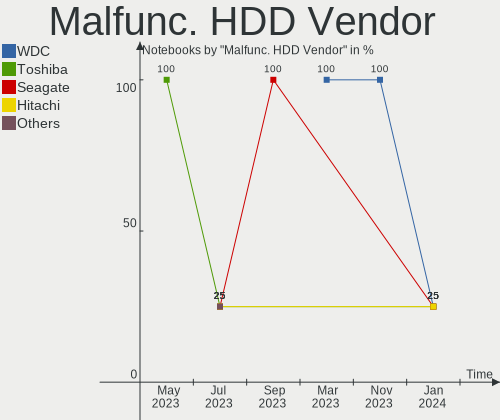

| Vendor  | Notebooks | Drives | Percent |
|---------|-----------|--------|---------|
| Seagate | 3         | 3      | 100%    |

Malfunc. Drive Kind
-------------------

Kinds of faulty drives

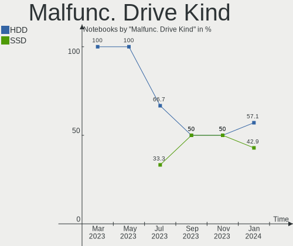

| Kind | Notebooks | Drives | Percent |
|------|-----------|--------|---------|
| SSD  | 3         | 4      | 50%     |
| HDD  | 3         | 3      | 50%     |

Failed Drives
-------------

Failed drive models

Zero info for selected period =(

Failed Drive Vendor
-------------------

Failed drive vendors

Zero info for selected period =(

Drive Status
------------

Number of failed and malfunc. drives

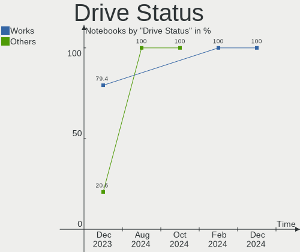

| Status   | Notebooks | Drives | Percent |
|----------|-----------|--------|---------|
| Works    | 29        | 35     | 78.38%  |
| Malfunc  | 6         | 7      | 16.22%  |
| Detected | 2         | 2      | 5.41%   |

Storage controller
------------------

Storage Vendor
--------------

Storage controller vendors

| Vendor                      | Notebooks | Percent |
|-----------------------------|-----------|---------|
| Intel                       | 24        | 57.14%  |
| Samsung Electronics         | 10        | 23.81%  |
| AMD                         | 4         | 9.52%   |
| SanDisk                     | 2         | 4.76%   |
| KIOXIA                      | 1         | 2.38%   |
| Kingston Technology Company | 1         | 2.38%   |

Storage Model
-------------

Storage controller models

| Model                                                                          | Notebooks | Percent |
|--------------------------------------------------------------------------------|-----------|---------|
| Samsung NVMe SSD Controller 980                                                | 5         | 11.36%  |
| Intel Sunrise Point-LP SATA Controller [AHCI mode]                             | 5         | 11.36%  |
| AMD FCH SATA Controller [AHCI mode]                                            | 4         | 9.09%   |
| Samsung NVMe SSD Controller SM981/PM981/PM983                                  | 2         | 4.55%   |
| Intel Wildcat Point-LP SATA Controller [AHCI Mode]                             | 2         | 4.55%   |
| Intel Volume Management Device NVMe RAID Controller                            | 2         | 4.55%   |
| Intel HM170/QM170 Chipset SATA Controller [AHCI Mode]                          | 2         | 4.55%   |
| Intel 8 Series SATA Controller 1 [AHCI mode]                                   | 2         | 4.55%   |
| Intel 6 Series/C200 Series Chipset Family 6 port Mobile SATA AHCI Controller   | 2         | 4.55%   |
| SanDisk WD Black SN750 / PC SN730 NVMe SSD                                     | 1         | 2.27%   |
| SanDisk IX SN530 NVMe SSD (DRAM-less)                                          | 1         | 2.27%   |
| Samsung S4LN058A01[SSUBX] AHCI SSD Controller (Apple slot)                     | 1         | 2.27%   |
| Samsung S4LN053X01 AHCI SSD Controller(Apple slot)                             | 1         | 2.27%   |
| Samsung NVMe SSD Controller PM9A1/PM9A3/980PRO                                 | 1         | 2.27%   |
| KIOXIA NVMe SSD Controller BG4 (DRAM-less)                                     | 1         | 2.27%   |
| Kingston Company Company Non-Volatile memory controller                        | 1         | 2.27%   |
| Intel Tiger Lake-LP SATA Controller                                            | 1         | 2.27%   |
| Intel Optane NVME SSD H10 with Solid State Storage [Teton Glacier]             | 1         | 2.27%   |
| Intel Celeron/Pentium Silver Processor SATA Controller                         | 1         | 2.27%   |
| Intel Cannon Point-LP SATA Controller [AHCI Mode]                              | 1         | 2.27%   |
| Intel Cannon Lake Mobile PCH SATA AHCI Controller                              | 1         | 2.27%   |
| Intel Alder Lake-P SATA AHCI Controller                                        | 1         | 2.27%   |
| Intel 82801IBM/IEM (ICH9M/ICH9M-E) 4 port SATA Controller [AHCI mode]          | 1         | 2.27%   |
| Intel 82801 Mobile SATA Controller [RAID mode]                                 | 1         | 2.27%   |
| Intel 8 Series/C220 Series Chipset Family 6-port SATA Controller 1 [AHCI mode] | 1         | 2.27%   |
| Intel 7 Series Chipset Family 6-port SATA Controller [AHCI mode]               | 1         | 2.27%   |
| Intel 5 Series/3400 Series Chipset 4 port SATA AHCI Controller                 | 1         | 2.27%   |

Storage Kind
------------

Kind of storage controller (IDE, SATA, NVMe, SAS, ...)

| Kind | Notebooks | Percent |
|------|-----------|---------|
| SATA | 28        | 63.64%  |
| NVMe | 13        | 29.55%  |
| RAID | 3         | 6.82%   |

Processor
---------

CPU Vendor
----------

Processor vendors

| Vendor | Notebooks | Percent |
|--------|-----------|---------|
| Intel  | 29        | 80.56%  |
| AMD    | 7         | 19.44%  |

CPU Model
---------

Processor models

| Model                                           | Notebooks | Percent |
|-------------------------------------------------|-----------|---------|
| Intel Core i7-7700HQ CPU @ 2.80GHz              | 2         | 5.56%   |
| Intel Core i3-1005G1 CPU @ 1.20GHz              | 2         | 5.56%   |
| Intel Pentium Silver N6000 @ 1.10GHz            | 1         | 2.78%   |
| Intel Pentium CPU 5405U @ 2.30GHz               | 1         | 2.78%   |
| Intel Core M-5Y10c CPU @ 0.80GHz                | 1         | 2.78%   |
| Intel Core i7-9750H CPU @ 2.60GHz               | 1         | 2.78%   |
| Intel Core i7-8550U CPU @ 1.80GHz               | 1         | 2.78%   |
| Intel Core i7-7500U CPU @ 2.70GHz               | 1         | 2.78%   |
| Intel Core i7-4750HQ CPU @ 2.00GHz              | 1         | 2.78%   |
| Intel Core i7-4700HQ CPU @ 2.40GHz              | 1         | 2.78%   |
| Intel Core i7-4600U CPU @ 2.10GHz               | 1         | 2.78%   |
| Intel Core i7-3720QM CPU @ 2.60GHz              | 1         | 2.78%   |
| Intel Core i5-8250U CPU @ 1.60GHz               | 1         | 2.78%   |
| Intel Core i5-5250U CPU @ 1.60GHz               | 1         | 2.78%   |
| Intel Core i5-5200U CPU @ 2.20GHz               | 1         | 2.78%   |
| Intel Core i5-4210U CPU @ 1.70GHz               | 1         | 2.78%   |
| Intel Core i5-2435M CPU @ 2.40GHz               | 1         | 2.78%   |
| Intel Core i3-7020U CPU @ 2.30GHz               | 1         | 2.78%   |
| Intel Core i3-6006U CPU @ 2.00GHz               | 1         | 2.78%   |
| Intel Core i3-2350M CPU @ 2.30GHz               | 1         | 2.78%   |
| Intel Core i3 CPU M 370 @ 2.40GHz               | 1         | 2.78%   |
| Intel Core 2 Duo CPU P8400 @ 2.26GHz            | 1         | 2.78%   |
| Intel Celeron N4020 CPU @ 1.10GHz               | 1         | 2.78%   |
| Intel 12th Gen Core i5-12500H                   | 1         | 2.78%   |
| Intel 11th Gen Core i7-1165G7 @ 2.80GHz         | 1         | 2.78%   |
| Intel 11th Gen Core i5-1135G7 @ 2.40GHz         | 1         | 2.78%   |
| Intel 11th Gen Core i3-1115G4 @ 3.00GHz         | 1         | 2.78%   |
| AMD Ryzen 5 5625U with Radeon Graphics          | 1         | 2.78%   |
| AMD Ryzen 5 5500U with Radeon Graphics          | 1         | 2.78%   |
| AMD Ryzen 5 4500U with Radeon Graphics          | 1         | 2.78%   |
| AMD Ryzen 5 3500U with Radeon Vega Mobile Gfx   | 1         | 2.78%   |
| AMD E1-1200 APU with Radeon HD Graphics         | 1         | 2.78%   |
| AMD A9-9420 RADEON R5, 5 COMPUTE CORES 2C+3G    | 1         | 2.78%   |
| AMD A12-9720P RADEON R7, 12 COMPUTE CORES 4C+8G | 1         | 2.78%   |

CPU Model Family
----------------

Processor model prefix

| Model                | Notebooks | Percent |
|----------------------|-----------|---------|
| Intel Core i7        | 9         | 25%     |
| Intel Core i3        | 6         | 16.67%  |
| Other                | 5         | 13.89%  |
| Intel Core i5        | 5         | 13.89%  |
| AMD Ryzen 5          | 4         | 11.11%  |
| Intel Pentium Silver | 1         | 2.78%   |
| Intel Pentium        | 1         | 2.78%   |
| Intel Core M         | 1         | 2.78%   |
| Intel Core 2 Duo     | 1         | 2.78%   |
| Intel Celeron        | 1         | 2.78%   |
| AMD E1               | 1         | 2.78%   |
| AMD A12              | 1         | 2.78%   |

CPU Cores
---------

Number of processor cores

| Number | Notebooks | Percent |
|--------|-----------|---------|
| 2      | 20        | 55.56%  |
| 4      | 11        | 30.56%  |
| 6      | 4         | 11.11%  |
| 12     | 1         | 2.78%   |

CPU Sockets
-----------

Number of sockets

| Number | Notebooks | Percent |
|--------|-----------|---------|
| 1      | 36        | 100%    |

CPU Threads
-----------

Threads per core (Hyper-Threading)

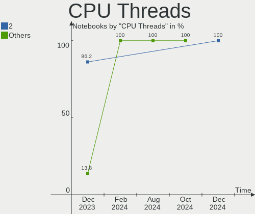

| Number | Notebooks | Percent |
|--------|-----------|---------|
| 2      | 30        | 83.33%  |
| 1      | 6         | 16.67%  |

CPU Op-Modes
------------

CPU Operation Modes (32-bit, 64-bit)

| Op mode        | Notebooks | Percent |
|----------------|-----------|---------|
| 32-bit, 64-bit | 36        | 100%    |

CPU Microcode
-------------

Microcode number

| Number     | Notebooks | Percent |
|------------|-----------|---------|
| Unknown    | 29        | 80.56%  |
| 0x0a50000d | 1         | 2.78%   |
| 0x08608103 | 1         | 2.78%   |
| 0x08600106 | 1         | 2.78%   |
| 0x08108109 | 1         | 2.78%   |
| 0x06006705 | 1         | 2.78%   |
| 0x0600611a | 1         | 2.78%   |
| 0x0500010d | 1         | 2.78%   |

CPU Microarch
-------------

Microarchitecture

| Name             | Notebooks | Percent |
|------------------|-----------|---------|
| KabyLake         | 8         | 22.22%  |
| Haswell          | 4         | 11.11%  |
| TigerLake        | 3         | 8.33%   |
| Broadwell        | 3         | 8.33%   |
| SandyBridge      | 2         | 5.56%   |
| IceLake          | 2         | 5.56%   |
| Excavator        | 2         | 5.56%   |
| Zen+             | 1         | 2.78%   |
| Zen 3            | 1         | 2.78%   |
| Zen 2            | 1         | 2.78%   |
| Westmere         | 1         | 2.78%   |
| Tremont          | 1         | 2.78%   |
| Skylake          | 1         | 2.78%   |
| Penryn           | 1         | 2.78%   |
| IvyBridge        | 1         | 2.78%   |
| Goldmont plus    | 1         | 2.78%   |
| Bobcat           | 1         | 2.78%   |
| Alderlake Hybrid | 1         | 2.78%   |
| Unknown          | 1         | 2.78%   |

Graphics
--------

GPU Vendor
----------

Vendors of graphics cards

| Vendor | Notebooks | Percent |
|--------|-----------|---------|
| Intel  | 26        | 60.47%  |
| Nvidia | 9         | 20.93%  |
| AMD    | 8         | 18.6%   |

GPU Model
---------

Graphics card models

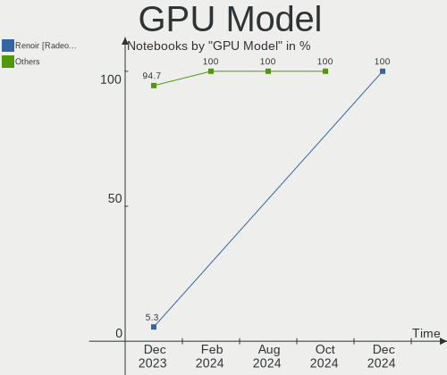

| Model                                                                     | Notebooks | Percent |
|---------------------------------------------------------------------------|-----------|---------|
| Intel UHD Graphics 620                                                    | 2         | 4.65%   |
| Intel TigerLake-LP GT2 [Iris Xe Graphics]                                 | 2         | 4.65%   |
| Intel Iris Plus Graphics G1 (Ice Lake)                                    | 2         | 4.65%   |
| Intel HD Graphics 620                                                     | 2         | 4.65%   |
| Intel Haswell-ULT Integrated Graphics Controller                          | 2         | 4.65%   |
| Intel 2nd Generation Core Processor Family Integrated Graphics Controller | 2         | 4.65%   |
| Nvidia TU116M [GeForce GTX 1660 Ti Mobile]                                | 1         | 2.33%   |
| Nvidia GP108M [GeForce MX150]                                             | 1         | 2.33%   |
| Nvidia GP107M [GeForce GTX 1050 Mobile]                                   | 1         | 2.33%   |
| Nvidia GP106BM [GeForce GTX 1060 Mobile 6GB]                              | 1         | 2.33%   |
| Nvidia GM108M [GeForce 940MX]                                             | 1         | 2.33%   |
| Nvidia GM108M [GeForce 840M]                                              | 1         | 2.33%   |
| Nvidia GK107M [GeForce GT 650M Mac Edition]                               | 1         | 2.33%   |
| Nvidia GK106M [GeForce GTX 770M]                                          | 1         | 2.33%   |
| Nvidia GA107M [GeForce RTX 3050 Mobile]                                   | 1         | 2.33%   |
| Intel Whiskey Lake-U GT1 [UHD Graphics 610]                               | 1         | 2.33%   |
| Intel Tiger Lake-LP GT2 [UHD Graphics G4]                                 | 1         | 2.33%   |
| Intel Skylake GT2 [HD Graphics 520]                                       | 1         | 2.33%   |
| Intel Mobile 4 Series Chipset Integrated Graphics Controller              | 1         | 2.33%   |
| Intel JasperLake [UHD Graphics]                                           | 1         | 2.33%   |
| Intel HD Graphics 630                                                     | 1         | 2.33%   |
| Intel HD Graphics 6000                                                    | 1         | 2.33%   |
| Intel HD Graphics 5500                                                    | 1         | 2.33%   |
| Intel HD Graphics 5300                                                    | 1         | 2.33%   |
| Intel GeminiLake [UHD Graphics 600]                                       | 1         | 2.33%   |
| Intel Crystal Well Integrated Graphics Controller                         | 1         | 2.33%   |
| Intel Core Processor Integrated Graphics Controller                       | 1         | 2.33%   |
| Intel Alder Lake-P Integrated Graphics Controller                         | 1         | 2.33%   |
| Intel 3rd Gen Core processor Graphics Controller                          | 1         | 2.33%   |
| AMD Wrestler [Radeon HD 7310]                                             | 1         | 2.33%   |
| AMD Wani [Radeon R5/R6/R7 Graphics]                                       | 1         | 2.33%   |
| AMD Venus XTX [Radeon HD 8890M / R9 M275X/M375X]                          | 1         | 2.33%   |
| AMD Stoney [Radeon R2/R3/R4/R5 Graphics]                                  | 1         | 2.33%   |
| AMD Renoir                                                                | 1         | 2.33%   |
| AMD Picasso/Raven 2 [Radeon Vega Series / Radeon Vega Mobile Series]      | 1         | 2.33%   |
| AMD Lucienne                                                              | 1         | 2.33%   |
| AMD Barcelo                                                               | 1         | 2.33%   |

GPU Combo
---------

Combinations of graphics cards

| Name           | Notebooks | Percent |
|----------------|-----------|---------|
| 1 x Intel      | 18        | 50%     |
| 1 x AMD        | 7         | 19.44%  |
| Intel + Nvidia | 6         | 16.67%  |
| 1 x Nvidia     | 3         | 8.33%   |
| 2 x Intel      | 1         | 2.78%   |
| Intel + AMD    | 1         | 2.78%   |

GPU Driver
----------

Free vs proprietary

| Driver      | Notebooks | Percent |
|-------------|-----------|---------|
| Free        | 34        | 94.44%  |
| Proprietary | 2         | 5.56%   |

GPU Memory
----------

Total video memory

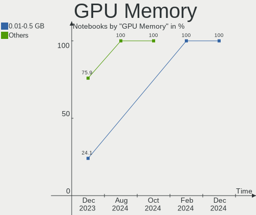

| Size in GB | Notebooks | Percent |
|------------|-----------|---------|
| Unknown    | 21        | 58.33%  |
| 0.01-0.5   | 5         | 13.89%  |
| 1.01-2.0   | 3         | 8.33%   |
| 3.01-4.0   | 2         | 5.56%   |
| 2.01-3.0   | 2         | 5.56%   |
| 0.51-1.0   | 2         | 5.56%   |
| 5.01-6.0   | 1         | 2.78%   |

Monitor
-------

Monitor Vendor
--------------

Monitor vendors

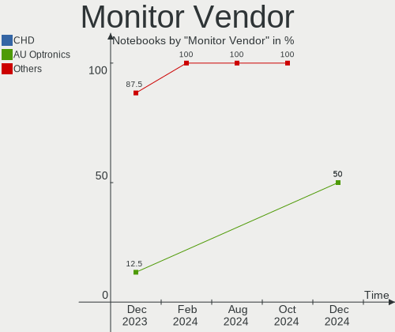

| Vendor                  | Notebooks | Percent |
|-------------------------|-----------|---------|
| Chimei Innolux          | 11        | 26.19%  |
| BOE                     | 8         | 19.05%  |
| AU Optronics            | 7         | 16.67%  |
| Apple                   | 4         | 9.52%   |
| Chi Mei Optoelectronics | 3         | 7.14%   |
| Samsung Electronics     | 2         | 4.76%   |
| Sony                    | 1         | 2.38%   |
| Philips                 | 1         | 2.38%   |
| LG Display              | 1         | 2.38%   |
| Lenovo                  | 1         | 2.38%   |
| KDB                     | 1         | 2.38%   |
| Goldstar                | 1         | 2.38%   |
| BenQ                    | 1         | 2.38%   |

Monitor Model
-------------

Monitor models

| Model                                                                    | Notebooks | Percent |
|--------------------------------------------------------------------------|-----------|---------|
| Chimei Innolux LCD Monitor CMN15DB 1366x768 344x193mm 15.5-inch          | 2         | 4.76%   |
| BOE LCD Monitor BOE0704 1366x768 344x194mm 15.5-inch                     | 2         | 4.76%   |
| Sony TV SNYF500 1360x768                                                 | 1         | 2.38%   |
| Samsung Electronics LF24T35 SAM707D 1920x1080 528x297mm 23.9-inch        | 1         | 2.38%   |
| Samsung Electronics LCD Monitor SAM094E 1920x1080 700x390mm 31.5-inch    | 1         | 2.38%   |
| Philips FTV PHL4200 1920x1080 927x521mm 41.9-inch                        | 1         | 2.38%   |
| LG Display LCD Monitor LGD068D 1920x1080 309x174mm 14.0-inch             | 1         | 2.38%   |
| Lenovo LCD Monitor LEN4010 1280x800 261x163mm 12.1-inch                  | 1         | 2.38%   |
| KDB LCD Monitor KDB1130 1366x768 256x144mm 11.6-inch                     | 1         | 2.38%   |
| Goldstar ULTRAWIDE GSM59F1 2560x1080 673x284mm 28.8-inch                 | 1         | 2.38%   |
| Chimei Innolux P130ZDZ-EF1 CMN8201 2160x1440 275x183mm 13.0-inch         | 1         | 2.38%   |
| Chimei Innolux LCD Monitor CMN15DC 1366x768 344x193mm 15.5-inch          | 1         | 2.38%   |
| Chimei Innolux LCD Monitor CMN15D5 1920x1080 344x193mm 15.5-inch         | 1         | 2.38%   |
| Chimei Innolux LCD Monitor CMN15C4 1920x1080 344x193mm 15.5-inch         | 1         | 2.38%   |
| Chimei Innolux LCD Monitor CMN1533 1366x768 344x193mm 15.5-inch          | 1         | 2.38%   |
| Chimei Innolux LCD Monitor CMN14E5 1920x1080 309x173mm 13.9-inch         | 1         | 2.38%   |
| Chimei Innolux LCD Monitor CMN14C8 1920x1080 309x173mm 13.9-inch         | 1         | 2.38%   |
| Chimei Innolux LCD Monitor CMN1482 1600x900 309x174mm 14.0-inch          | 1         | 2.38%   |
| Chimei Innolux LCD Monitor CMN140A 1920x1080 309x173mm 13.9-inch         | 1         | 2.38%   |
| Chi Mei Optoelectronics LCD Monitor CMO15A7 1366x768 344x193mm 15.5-inch | 1         | 2.38%   |
| Chi Mei Optoelectronics LCD Monitor CMO1599 1366x768 344x193mm 15.5-inch | 1         | 2.38%   |
| Chi Mei Optoelectronics LCD Monitor CMO1592 1366x768 344x193mm 15.5-inch | 1         | 2.38%   |
| BOE LCD Monitor BOE0B02 1920x1080 344x194mm 15.5-inch                    | 1         | 2.38%   |
| BOE LCD Monitor BOE0959 1366x768 344x194mm 15.5-inch                     | 1         | 2.38%   |
| BOE LCD Monitor BOE0838 1920x1080 382x215mm 17.3-inch                    | 1         | 2.38%   |
| BOE LCD Monitor BOE0816 1366x768 344x193mm 15.5-inch                     | 1         | 2.38%   |
| BOE LCD Monitor BOE07AA 1366x768 344x194mm 15.5-inch                     | 1         | 2.38%   |
| BOE LCD Monitor BOE061E 1366x768 309x173mm 13.9-inch                     | 1         | 2.38%   |
| BenQ E2200HD BNQ790B 1920x1080 476x268mm 21.5-inch                       | 1         | 2.38%   |
| AU Optronics LCD Monitor AUO5699 1920x1080 344x194mm 15.5-inch           | 1         | 2.38%   |
| AU Optronics LCD Monitor AUO46EC 1366x768 344x193mm 15.5-inch            | 1         | 2.38%   |
| AU Optronics LCD Monitor AUO42ED 1920x1080 344x193mm 15.5-inch           | 1         | 2.38%   |
| AU Optronics LCD Monitor AUO408D 1920x1080 309x174mm 14.0-inch           | 1         | 2.38%   |
| AU Optronics LCD Monitor AUO219D 1920x1080 381x214mm 17.2-inch           | 1         | 2.38%   |
| AU Optronics LCD Monitor AUO212D 1920x1080 293x165mm 13.2-inch           | 1         | 2.38%   |
| AU Optronics LCD Monitor AUO068B 1920x1080 309x174mm 14.0-inch           | 1         | 2.38%   |
| Apple Color LCD APPA022 2880x1800 331x207mm 15.4-inch                    | 1         | 2.38%   |
| Apple Color LCD APP9CF0 1440x900 290x180mm 13.4-inch                     | 1         | 2.38%   |
| Apple Color LCD APP9CC7 1280x800 286x179mm 13.3-inch                     | 1         | 2.38%   |
| Apple Color LCD APP9CB7 1680x1050 331x207mm 15.4-inch                    | 1         | 2.38%   |

Monitor Resolution
------------------

Monitor screen resolution

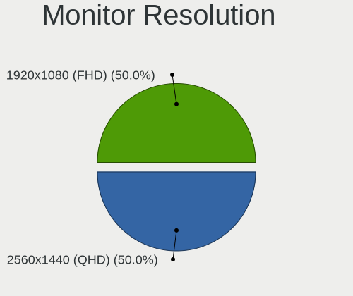

| Resolution         | Notebooks | Percent |
|--------------------|-----------|---------|
| 1920x1080 (FHD)    | 15        | 38.46%  |
| 1366x768 (WXGA)    | 15        | 38.46%  |
| 1280x800 (WXGA)    | 2         | 5.13%   |
| 2880x1800          | 1         | 2.56%   |
| 2560x1080          | 1         | 2.56%   |
| 2160x1440          | 1         | 2.56%   |
| 1680x1050 (WSXGA+) | 1         | 2.56%   |
| 1600x900 (HD+)     | 1         | 2.56%   |
| 1440x900 (WXGA+)   | 1         | 2.56%   |
| 1360x768           | 1         | 2.56%   |

Monitor Diagonal
----------------

Diagonal size in inches

| Inches | Notebooks | Percent |
|--------|-----------|---------|
| 15     | 20        | 47.62%  |
| 13     | 8         | 19.05%  |
| 14     | 4         | 9.52%   |
| 17     | 2         | 4.76%   |
| 72     | 1         | 2.38%   |
| 54     | 1         | 2.38%   |
| 41     | 1         | 2.38%   |
| 34     | 1         | 2.38%   |
| 24     | 1         | 2.38%   |
| 21     | 1         | 2.38%   |
| 12     | 1         | 2.38%   |
| 11     | 1         | 2.38%   |

Monitor Width
-------------

Physical width

| Width in mm | Notebooks | Percent |
|-------------|-----------|---------|
| 301-350     | 28        | 66.67%  |
| 201-300     | 6         | 14.29%  |
| 351-400     | 2         | 4.76%   |
| 701-800     | 1         | 2.38%   |
| 501-600     | 1         | 2.38%   |
| 401-500     | 1         | 2.38%   |
| 1501-2000   | 1         | 2.38%   |
| 1001-1500   | 1         | 2.38%   |
| 901-1000    | 1         | 2.38%   |

Aspect Ratio
------------

Proportional relationship between the width and the height

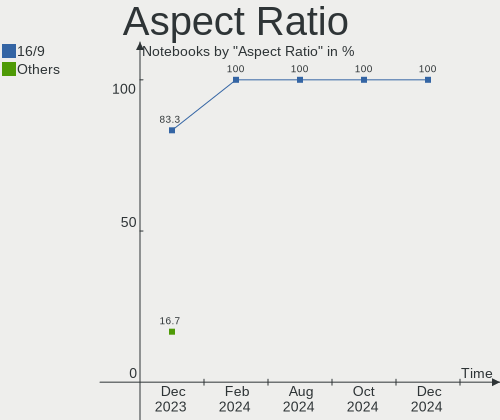

| Ratio | Notebooks | Percent |
|-------|-----------|---------|
| 16/9  | 30        | 81.08%  |
| 16/10 | 5         | 13.51%  |
| 3/2   | 1         | 2.7%    |
| 21/9  | 1         | 2.7%    |

Monitor Area
------------

Area in inch²

| Area in inch² | Notebooks | Percent |
|----------------|-----------|---------|
| 101-110        | 20        | 47.62%  |
| 81-90          | 10        | 23.81%  |
| More than 1000 | 2         | 4.76%   |
| 71-80          | 2         | 4.76%   |
| 121-130        | 2         | 4.76%   |
| 61-70          | 1         | 2.38%   |
| 51-60          | 1         | 2.38%   |
| 351-500        | 1         | 2.38%   |
| 201-250        | 1         | 2.38%   |
| 151-200        | 1         | 2.38%   |
| 501-1000       | 1         | 2.38%   |

Pixel Density
-------------

Pixels per inch

| Density | Notebooks | Percent |
|---------|-----------|---------|
| 121-160 | 18        | 42.86%  |
| 101-120 | 14        | 33.33%  |
| 51-100  | 5         | 11.9%   |
| 161-240 | 3         | 7.14%   |
| 1-50    | 2         | 4.76%   |

Multiple Monitors
-----------------

Total monitors connected

| Total | Notebooks | Percent |
|-------|-----------|---------|
| 1     | 30        | 83.33%  |
| 2     | 6         | 16.67%  |

Network
-------

Net Controller Vendor
---------------------

Controller vendors

| Vendor                | Notebooks | Percent |
|-----------------------|-----------|---------|
| Realtek Semiconductor | 21        | 37.5%   |
| Intel                 | 17        | 30.36%  |
| Qualcomm Atheros      | 10        | 17.86%  |
| Broadcom              | 5         | 8.93%   |
| Broadcom Limited      | 2         | 3.57%   |
| OPPO Electronics      | 1         | 1.79%   |

Net Controller Model
--------------------

Controller models

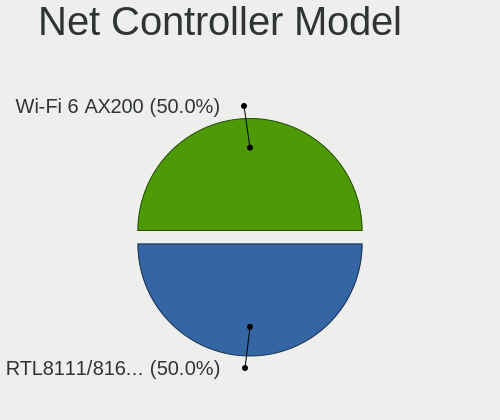

| Model                                                             | Notebooks | Percent |
|-------------------------------------------------------------------|-----------|---------|
| Realtek RTL8111/8168/8411 PCI Express Gigabit Ethernet Controller | 11        | 17.19%  |
| Realtek RTL8153 Gigabit Ethernet Adapter                          | 3         | 4.69%   |
| Qualcomm Atheros QCA9377 802.11ac Wireless Network Adapter        | 3         | 4.69%   |
| Intel Wi-Fi 6 AX201                                               | 3         | 4.69%   |
| Realtek RTL8822CE 802.11ac PCIe Wireless Network Adapter          | 2         | 3.13%   |
| Realtek RTL8821CE 802.11ac PCIe Wireless Network Adapter          | 2         | 3.13%   |
| Realtek RTL810xE PCI Express Fast Ethernet controller             | 2         | 3.13%   |
| Qualcomm Atheros AR9285 Wireless Network Adapter (PCI-Express)    | 2         | 3.13%   |
| Intel Wireless 7265                                               | 2         | 3.13%   |
| Intel Dual Band Wireless-AC 3168NGW [Stone Peak]                  | 2         | 3.13%   |
| Broadcom NetXtreme BCM57765 Gigabit Ethernet PCIe                 | 2         | 3.13%   |
| Broadcom BCM4331 802.11a/b/g/n                                    | 2         | 3.13%   |
| Realtek RTL8852BE PCIe 802.11ax Wireless Network Controller       | 1         | 1.56%   |
| Realtek Killer E2600 Gigabit Ethernet Controller                  | 1         | 1.56%   |
| Realtek 802.11ac NIC                                              | 1         | 1.56%   |
| Qualcomm Atheros QCA9565 / AR9565 Wireless Network Adapter        | 1         | 1.56%   |
| Qualcomm Atheros QCA8171 Gigabit Ethernet                         | 1         | 1.56%   |
| Qualcomm Atheros QCA6174 802.11ac Wireless Network Adapter        | 1         | 1.56%   |
| Qualcomm Atheros Killer E2500 Gigabit Ethernet Controller         | 1         | 1.56%   |
| Qualcomm Atheros AR9287 Wireless Network Adapter (PCI-Express)    | 1         | 1.56%   |
| Qualcomm Atheros AR8152 v2.0 Fast Ethernet                        | 1         | 1.56%   |
| OPPO 8                                                            | 1         | 1.56%   |
| Intel Wireless 8265 / 8275                                        | 1         | 1.56%   |
| Intel Wireless 7260                                               | 1         | 1.56%   |
| Intel Wireless 3160                                               | 1         | 1.56%   |
| Intel Wi-Fi 6 AX201 160MHz                                        | 1         | 1.56%   |
| Intel PRO/Wireless 5100 AGN [Shiloh] Network Connection           | 1         | 1.56%   |
| Intel Ice Lake-LP PCH CNVi WiFi                                   | 1         | 1.56%   |
| Intel Gemini Lake PCH CNVi WiFi                                   | 1         | 1.56%   |
| Intel Ethernet Connection I218-LM                                 | 1         | 1.56%   |
| Intel Ethernet Connection (13) I219-V                             | 1         | 1.56%   |
| Intel Dual Band Wireless-AC 3165 Plus Bluetooth                   | 1         | 1.56%   |
| Intel Cannon Lake PCH CNVi WiFi                                   | 1         | 1.56%   |
| Intel Alder Lake-P PCH CNVi WiFi                                  | 1         | 1.56%   |
| Intel 82567LM Gigabit Network Connection                          | 1         | 1.56%   |
| Broadcom NetLink BCM57780 Gigabit Ethernet PCIe                   | 1         | 1.56%   |
| Broadcom Limited BCM4360 802.11ac Wireless Network Adapter        | 1         | 1.56%   |
| Broadcom Limited BCM43142 802.11b/g/n                             | 1         | 1.56%   |
| Broadcom BCM4360 802.11ac Wireless Network Adapter                | 1         | 1.56%   |
| Broadcom BCM4352 802.11ac Wireless Network Adapter                | 1         | 1.56%   |

Wireless Vendor
---------------

Wireless vendors

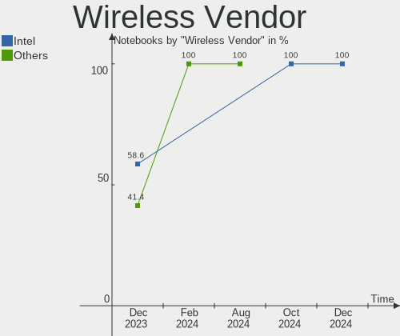

| Vendor                | Notebooks | Percent |
|-----------------------|-----------|---------|
| Intel                 | 17        | 45.95%  |
| Qualcomm Atheros      | 8         | 21.62%  |
| Realtek Semiconductor | 6         | 16.22%  |
| Broadcom              | 4         | 10.81%  |
| Broadcom Limited      | 2         | 5.41%   |

Wireless Model
--------------

Wireless models

| Model                                                          | Notebooks | Percent |
|----------------------------------------------------------------|-----------|---------|
| Qualcomm Atheros QCA9377 802.11ac Wireless Network Adapter     | 3         | 8.11%   |
| Intel Wi-Fi 6 AX201                                            | 3         | 8.11%   |
| Realtek RTL8822CE 802.11ac PCIe Wireless Network Adapter       | 2         | 5.41%   |
| Realtek RTL8821CE 802.11ac PCIe Wireless Network Adapter       | 2         | 5.41%   |
| Qualcomm Atheros AR9285 Wireless Network Adapter (PCI-Express) | 2         | 5.41%   |
| Intel Wireless 7265                                            | 2         | 5.41%   |
| Intel Dual Band Wireless-AC 3168NGW [Stone Peak]               | 2         | 5.41%   |
| Broadcom BCM4331 802.11a/b/g/n                                 | 2         | 5.41%   |
| Realtek RTL8852BE PCIe 802.11ax Wireless Network Controller    | 1         | 2.7%    |
| Realtek 802.11ac NIC                                           | 1         | 2.7%    |
| Qualcomm Atheros QCA9565 / AR9565 Wireless Network Adapter     | 1         | 2.7%    |
| Qualcomm Atheros QCA6174 802.11ac Wireless Network Adapter     | 1         | 2.7%    |
| Qualcomm Atheros AR9287 Wireless Network Adapter (PCI-Express) | 1         | 2.7%    |
| Intel Wireless 8265 / 8275                                     | 1         | 2.7%    |
| Intel Wireless 7260                                            | 1         | 2.7%    |
| Intel Wireless 3160                                            | 1         | 2.7%    |
| Intel Wi-Fi 6 AX201 160MHz                                     | 1         | 2.7%    |
| Intel PRO/Wireless 5100 AGN [Shiloh] Network Connection        | 1         | 2.7%    |
| Intel Ice Lake-LP PCH CNVi WiFi                                | 1         | 2.7%    |
| Intel Gemini Lake PCH CNVi WiFi                                | 1         | 2.7%    |
| Intel Dual Band Wireless-AC 3165 Plus Bluetooth                | 1         | 2.7%    |
| Intel Cannon Lake PCH CNVi WiFi                                | 1         | 2.7%    |
| Intel Alder Lake-P PCH CNVi WiFi                               | 1         | 2.7%    |
| Broadcom Limited BCM4360 802.11ac Wireless Network Adapter     | 1         | 2.7%    |
| Broadcom Limited BCM43142 802.11b/g/n                          | 1         | 2.7%    |
| Broadcom BCM4360 802.11ac Wireless Network Adapter             | 1         | 2.7%    |
| Broadcom BCM4352 802.11ac Wireless Network Adapter             | 1         | 2.7%    |

Ethernet Vendor
---------------

Ethernet vendors

| Vendor                | Notebooks | Percent |
|-----------------------|-----------|---------|
| Realtek Semiconductor | 17        | 62.96%  |
| Qualcomm Atheros      | 3         | 11.11%  |
| Intel                 | 3         | 11.11%  |
| Broadcom              | 3         | 11.11%  |
| OPPO Electronics      | 1         | 3.7%    |

Ethernet Model
--------------

Ethernet models

| Model                                                             | Notebooks | Percent |
|-------------------------------------------------------------------|-----------|---------|
| Realtek RTL8111/8168/8411 PCI Express Gigabit Ethernet Controller | 11        | 40.74%  |
| Realtek RTL8153 Gigabit Ethernet Adapter                          | 3         | 11.11%  |
| Realtek RTL810xE PCI Express Fast Ethernet controller             | 2         | 7.41%   |
| Broadcom NetXtreme BCM57765 Gigabit Ethernet PCIe                 | 2         | 7.41%   |
| Realtek Killer E2600 Gigabit Ethernet Controller                  | 1         | 3.7%    |
| Qualcomm Atheros QCA8171 Gigabit Ethernet                         | 1         | 3.7%    |
| Qualcomm Atheros Killer E2500 Gigabit Ethernet Controller         | 1         | 3.7%    |
| Qualcomm Atheros AR8152 v2.0 Fast Ethernet                        | 1         | 3.7%    |
| OPPO 8                                                            | 1         | 3.7%    |
| Intel Ethernet Connection I218-LM                                 | 1         | 3.7%    |
| Intel Ethernet Connection (13) I219-V                             | 1         | 3.7%    |
| Intel 82567LM Gigabit Network Connection                          | 1         | 3.7%    |
| Broadcom NetLink BCM57780 Gigabit Ethernet PCIe                   | 1         | 3.7%    |

Net Controller Kind
-------------------

Ethernet, WiFi or modem

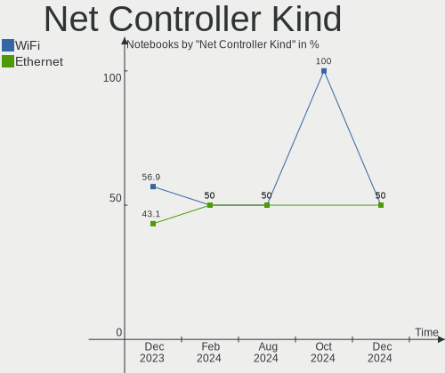

| Kind     | Notebooks | Percent |
|----------|-----------|---------|
| WiFi     | 36        | 57.14%  |
| Ethernet | 27        | 42.86%  |

Used Controller
---------------

Currently used network controller

| Kind     | Notebooks | Percent |
|----------|-----------|---------|
| WiFi     | 24        | 68.57%  |
| Ethernet | 11        | 31.43%  |

NICs
----

Total network controllers on board

| Total | Notebooks | Percent |
|-------|-----------|---------|
| 2     | 23        | 63.89%  |
| 1     | 13        | 36.11%  |

IPv6
----

IPv6 vs IPv4

| Used | Notebooks | Percent |
|------|-----------|---------|
| No   | 23        | 63.89%  |
| Yes  | 13        | 36.11%  |

Bluetooth
---------

Bluetooth Vendor
----------------

Controller vendors

| Vendor                          | Notebooks | Percent |
|---------------------------------|-----------|---------|
| Intel                           | 16        | 48.48%  |
| Apple                           | 4         | 12.12%  |
| Realtek Semiconductor           | 3         | 9.09%   |
| Qualcomm Atheros Communications | 3         | 9.09%   |
| IMC Networks                    | 3         | 9.09%   |
| Lite-On Technology              | 2         | 6.06%   |
| Realtek                         | 1         | 3.03%   |
| Broadcom                        | 1         | 3.03%   |

Bluetooth Model
---------------

Controller models

| Model                                              | Notebooks | Percent |
|----------------------------------------------------|-----------|---------|
| Intel Bluetooth wireless interface                 | 6         | 18.18%  |
| Intel AX201 Bluetooth                              | 5         | 15.15%  |
| Qualcomm Atheros  Bluetooth Device                 | 3         | 9.09%   |
| Intel Bluetooth 9460/9560 Jefferson Peak (JfP)     | 3         | 9.09%   |
| Realtek Bluetooth Radio                            | 2         | 6.06%   |
| Intel Wireless-AC 3168 Bluetooth                   | 2         | 6.06%   |
| Apple Bluetooth USB Host Controller                | 2         | 6.06%   |
| Apple Bluetooth Host Controller                    | 2         | 6.06%   |
| Realtek  Bluetooth 4.2 Adapter                     | 1         | 3.03%   |
| Realtek Bluetooth Radio                            | 1         | 3.03%   |
| Lite-On Broadcom BCM43142A0 Bluetooth Device       | 1         | 3.03%   |
| Lite-On Bluetooth Device                           | 1         | 3.03%   |
| IMC Networks Bluetooth Radio                       | 1         | 3.03%   |
| IMC Networks Bluetooth Device                      | 1         | 3.03%   |
| IMC Networks BCM20702A0                            | 1         | 3.03%   |
| Broadcom BCM2045B (BDC-2.1) [Bluetooth Controller] | 1         | 3.03%   |

Sound
-----

Sound Vendor
------------

Sound card vendors

| Vendor              | Notebooks | Percent |
|---------------------|-----------|---------|
| Intel               | 29        | 69.05%  |
| AMD                 | 7         | 16.67%  |
| Nvidia              | 4         | 9.52%   |
| Digidesign          | 1         | 2.38%   |
| C-Media Electronics | 1         | 2.38%   |

Sound Model
-----------

Sound card models

| Model                                                                      | Notebooks | Percent |
|----------------------------------------------------------------------------|-----------|---------|
| Intel Sunrise Point-LP HD Audio                                            | 5         | 9.09%   |
| AMD Family 17h/19h HD Audio Controller                                     | 4         | 7.27%   |
| Intel Wildcat Point-LP High Definition Audio Controller                    | 3         | 5.45%   |
| Intel Tiger Lake-LP Smart Sound Technology Audio Controller                | 3         | 5.45%   |
| Intel Broadwell-U Audio Controller                                         | 3         | 5.45%   |
| AMD Renoir Radeon High Definition Audio Controller                         | 3         | 5.45%   |
| Intel Ice Lake-LP Smart Sound Technology Audio Controller                  | 2         | 3.64%   |
| Intel Haswell-ULT HD Audio Controller                                      | 2         | 3.64%   |
| Intel CM238 HD Audio Controller                                            | 2         | 3.64%   |
| Intel 8 Series/C220 Series Chipset High Definition Audio Controller        | 2         | 3.64%   |
| Intel 8 Series HD Audio Controller                                         | 2         | 3.64%   |
| Intel 6 Series/C200 Series Chipset Family High Definition Audio Controller | 2         | 3.64%   |
| AMD Family 15h (Models 60h-6fh) Audio Controller                           | 2         | 3.64%   |
| Nvidia TU116 High Definition Audio Controller                              | 1         | 1.82%   |
| Nvidia GP106 High Definition Audio Controller                              | 1         | 1.82%   |
| Nvidia GK107 HDMI Audio Controller                                         | 1         | 1.82%   |
| Nvidia GK106 HDMI Audio Controller                                         | 1         | 1.82%   |
| Intel Jasper Lake HD Audio                                                 | 1         | 1.82%   |
| Intel Crystal Well HD Audio Controller                                     | 1         | 1.82%   |
| Intel Celeron/Pentium Silver Processor High Definition Audio               | 1         | 1.82%   |
| Intel Cannon Point-LP High Definition Audio Controller                     | 1         | 1.82%   |
| Intel Cannon Lake PCH cAVS                                                 | 1         | 1.82%   |
| Intel Alder Lake PCH-P High Definition Audio Controller                    | 1         | 1.82%   |
| Intel 82801I (ICH9 Family) HD Audio Controller                             | 1         | 1.82%   |
| Intel 7 Series/C216 Chipset Family High Definition Audio Controller        | 1         | 1.82%   |
| Intel 5 Series/3400 Series Chipset High Definition Audio                   | 1         | 1.82%   |
| Digidesign Mbox 2                                                          | 1         | 1.82%   |
| C-Media Electronics USB Advanced Audio Device                              | 1         | 1.82%   |
| AMD Wrestler HDMI Audio                                                    | 1         | 1.82%   |
| AMD Raven/Raven2/Fenghuang HDMI/DP Audio Controller                        | 1         | 1.82%   |
| AMD Kabini HDMI/DP Audio                                                   | 1         | 1.82%   |
| AMD High Definition Audio Controller                                       | 1         | 1.82%   |
| AMD FCH Azalia Controller                                                  | 1         | 1.82%   |

Memory
------

Memory Vendor
-------------

Memory module vendors

| Vendor              | Notebooks | Percent |
|---------------------|-----------|---------|
| SK hynix            | 14        | 31.11%  |
| Samsung Electronics | 13        | 28.89%  |
| Elpida              | 5         | 11.11%  |
| Micron Technology   | 4         | 8.89%   |
| Kingston            | 3         | 6.67%   |
| Ramaxel Technology  | 1         | 2.22%   |
| Kimtigo             | 1         | 2.22%   |
| GOODRAM             | 1         | 2.22%   |
| Crucial             | 1         | 2.22%   |
| Corsair             | 1         | 2.22%   |
| A-DATA Technology   | 1         | 2.22%   |

Memory Model
------------

Memory module models

| Model                                                       | Notebooks | Percent |
|-------------------------------------------------------------|-----------|---------|
| SK hynix RAM HMAA1GS6CJR6N-XN 8GB SODIMM DDR4 3200MT/s      | 2         | 4.26%   |
| SK hynix RAM HMA81GS6AFR8N-UH 8GB SODIMM DDR4 2667MT/s      | 2         | 4.26%   |
| Samsung RAM M471A5244CB0-CWE 4GB SODIMM DDR4 3200MT/s       | 2         | 4.26%   |
| Samsung RAM M471A5244CB0-CRC 4GB SODIMM DDR4 2667MT/s       | 2         | 4.26%   |
| Micron RAM 4ATF51264HZ-3G2J1 4GB Row Of Chips DDR4 3200MT/s | 2         | 4.26%   |
| Elpida RAM Module 4GB SODIMM DDR3 1600MT/s                  | 2         | 4.26%   |
| SK hynix RAM Module 8GB SODIMM DDR4 3200MT/s                | 1         | 2.13%   |
| SK hynix RAM Module 4GB SODIMM LPDDR3 1600MT/s              | 1         | 2.13%   |
| SK hynix RAM HMT451S6MFR8A-PB 4GB SODIMM DDR3 1600MT/s      | 1         | 2.13%   |
| SK hynix RAM HMT451S6BFR8A-PB 4GB SODIMM DDR3 1600MT/s      | 1         | 2.13%   |
| SK hynix RAM HMT325S6CFR8C-PB 2GB SODIMM DDR3 1600MT/s      | 1         | 2.13%   |
| SK hynix RAM HMAA1GS6CMR6N-VK 8GB SODIMM DDR4 2667MT/s      | 1         | 2.13%   |
| SK hynix RAM HMA851S6DJR6N-XN 4GB SODIMM DDR4 3200MT/s      | 1         | 2.13%   |
| SK hynix RAM HMA851S6DJR6N-VK 4GB SODIMM DDR4 2667MT/s      | 1         | 2.13%   |
| SK hynix RAM HMA81GS6JJR8N-VK 8GB SODIMM DDR4 2667MT/s      | 1         | 2.13%   |
| SK hynix RAM HMA81GS6AFR8N-UH 8GB SODIMM DDR4 2400MT/s      | 1         | 2.13%   |
| Samsung RAM Module 4GB SODIMM DDR3 1333MT/s                 | 1         | 2.13%   |
| Samsung RAM Module 4GB Row Of Chips LPDDR4 2933MT/s         | 1         | 2.13%   |
| Samsung RAM Module 16GB SODIMM DDR4 3200MT/s                | 1         | 2.13%   |
| Samsung RAM M471B5773CHS-CH9 2GB SODIMM DDR3 4199MT/s       | 1         | 2.13%   |
| Samsung RAM M471B1G73EB0-YK0 8GB SODIMM DDR3 1600MT/s       | 1         | 2.13%   |
| Samsung RAM M471B1G73DB0-YK0 8GB SODIMM DDR3 1600MT/s       | 1         | 2.13%   |
| Samsung RAM M471A5244CB0-CWE 4GB Row Of Chips DDR4 3200MT/s | 1         | 2.13%   |
| Samsung RAM M471A5244CB0-CTD 4GB SODIMM DDR4 3266MT/s       | 1         | 2.13%   |
| Samsung RAM M471A5143SB1-CRC 4GB SODIMM DDR4 2400MT/s       | 1         | 2.13%   |
| Samsung RAM M471A1K43DB1-CTD 8GB SODIMM DDR4 2667MT/s       | 1         | 2.13%   |
| Samsung RAM M471A1K43CB1-CRC 8GB SODIMM DDR4 2667MT/s       | 1         | 2.13%   |
| Ramaxel RAM RMT3020EF48E8W1333 2GB SODIMM DDR3 1334MT/s     | 1         | 2.13%   |
| Micron RAM MT41K512M8RH-125:E 4GB SODIMM DDR3 1600MT/s      | 1         | 2.13%   |
| Micron RAM 4ATF51264HZ-3G2J1 4GB SODIMM DDR4 3200MT/s       | 1         | 2.13%   |
| Kingston RAM 9905711-038.A00G 8GB SODIMM DDR4 2667MT/s      | 1         | 2.13%   |
| Kingston RAM 9905700-122.A00G 16GB SODIMM DDR4 3200MT/s     | 1         | 2.13%   |
| Kingston RAM 9905428-073.A00LF 4GB SODIMM DDR3 1334MT/s     | 1         | 2.13%   |
| Kimtigo RAM KT4GS4NE8 4GB SODIMM DDR4 2400MT/s              | 1         | 2.13%   |
| GOODRAM RAM GR2666S464L19S/8G 8GB SODIMM DDR4 2667MT/s      | 1         | 2.13%   |
| Elpida RAM EDJ8416E6MB-GN-F 4GB Chip DDR3 1600MT/s          | 1         | 2.13%   |
| Elpida RAM EBJ81UG8BBU0-GN-F 8GB SODIMM DDR3 1600MT/s       | 1         | 2.13%   |
| Elpida RAM EBJ21UE8BDS0-AE-F 2GB SODIMM DDR3 1067MT/s       | 1         | 2.13%   |
| Crucial RAM CT16G4SFRA32A.C16FR 16GB SODIMM DDR4 3200MT/s   | 1         | 2.13%   |
| Corsair RAM Module 8GB SODIMM DDR3 1600MT/s                 | 1         | 2.13%   |

Memory Kind
-----------

Memory module kinds

| Kind   | Notebooks | Percent |
|--------|-----------|---------|
| DDR4   | 21        | 58.33%  |
| DDR3   | 12        | 33.33%  |
| SDRAM  | 1         | 2.78%   |
| LPDDR4 | 1         | 2.78%   |
| LPDDR3 | 1         | 2.78%   |

Memory Form Factor
------------------

Physical design of the memory module

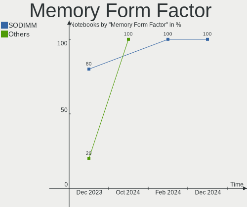

| Name         | Notebooks | Percent |
|--------------|-----------|---------|
| SODIMM       | 33        | 86.84%  |
| Row Of Chips | 4         | 10.53%  |
| Chip         | 1         | 2.63%   |

Memory Size
-----------

Memory module size

| Size  | Notebooks | Percent |
|-------|-----------|---------|
| 4096  | 18        | 42.86%  |
| 8192  | 16        | 38.1%   |
| 16384 | 5         | 11.9%   |
| 2048  | 3         | 7.14%   |

Memory Speed
------------

Memory module speed

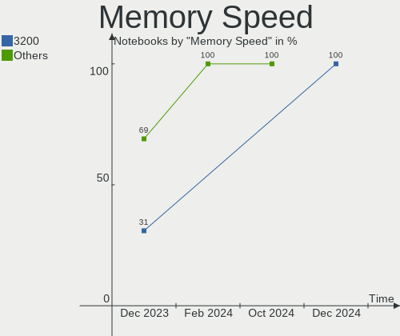

| Speed | Notebooks | Percent |
|-------|-----------|---------|
| 3200  | 10        | 25.64%  |
| 2667  | 10        | 25.64%  |
| 1600  | 9         | 23.08%  |
| 2400  | 3         | 7.69%   |
| 1334  | 2         | 5.13%   |
| 4199  | 1         | 2.56%   |
| 3266  | 1         | 2.56%   |
| 2933  | 1         | 2.56%   |
| 1333  | 1         | 2.56%   |
| 1067  | 1         | 2.56%   |

Printers & scanners
-------------------

Printer Vendor
--------------

Printer device vendors

| Vendor          | Notebooks | Percent |
|-----------------|-----------|---------|
| Hewlett-Packard | 1         | 100%    |

Printer Model
-------------

Printer device models

| Model                  | Notebooks | Percent |
|------------------------|-----------|---------|
| HP DeskJet 2700 series | 1         | 100%    |

Scanner Vendor
--------------

Scanner device vendors

Zero info for selected period =(

Scanner Model
-------------

Scanner device models

Zero info for selected period =(

Camera
------

Camera Vendor
-------------

Camera device vendors

| Vendor                        | Notebooks | Percent |
|-------------------------------|-----------|---------|
| IMC Networks                  | 9         | 26.47%  |
| Bison Electronics             | 5         | 14.71%  |
| Chicony Electronics           | 4         | 11.76%  |
| Apple                         | 3         | 8.82%   |
| Realtek Semiconductor         | 2         | 5.88%   |
| Quanta                        | 2         | 5.88%   |
| Microdia                      | 2         | 5.88%   |
| SunplusIT                     | 1         | 2.94%   |
| Sunplus Innovation Technology | 1         | 2.94%   |
| OPPO Electronics              | 1         | 2.94%   |
| Luxvisions Innotech Limited   | 1         | 2.94%   |
| Lite-On Technology            | 1         | 2.94%   |
| Intel                         | 1         | 2.94%   |
| ALi                           | 1         | 2.94%   |

Camera Model
------------

Camera device models

| Model                                    | Notebooks | Percent |
|------------------------------------------|-----------|---------|
| IMC Networks USB2.0 VGA UVC WebCam       | 4         | 11.76%  |
| Microdia Integrated_Webcam_HD            | 2         | 5.88%   |
| IMC Networks USB2.0 HD UVC WebCam        | 2         | 5.88%   |
| Chicony Integrated Camera                | 2         | 5.88%   |
| Bison Lenovo Integrated Webcam           | 2         | 5.88%   |
| Apple FaceTime HD Camera                 | 2         | 5.88%   |
| SunplusIT USB 2M Camera                  | 1         | 2.94%   |
| Sunplus Integrated_Webcam_HD             | 1         | 2.94%   |
| Realtek USB2.0 HD UVC WebCam             | 1         | 2.94%   |
| Realtek USB Camera                       | 1         | 2.94%   |
| Quanta HP TrueVision HD Camera           | 1         | 2.94%   |
| Quanta ACER HD User Facing               | 1         | 2.94%   |
| OPPO CPH1725                             | 1         | 2.94%   |
| Luxvisions Innotech Limited HP HD Camera | 1         | 2.94%   |
| Lite-On Integrated Camera                | 1         | 2.94%   |
| Intel RealSense 3D Camera (Front F200)   | 1         | 2.94%   |
| IMC Networks VGA UVC WebCam              | 1         | 2.94%   |
| IMC Networks Integrated Camera           | 1         | 2.94%   |
| IMC Networks HD Camera                   | 1         | 2.94%   |
| Chicony USB2.0 HD UVC WebCam             | 1         | 2.94%   |
| Chicony HP HD Camera                     | 1         | 2.94%   |
| Bison SunplusIT Integrated Camera        | 1         | 2.94%   |
| Bison SunplusIT INC. Integrated Camera   | 1         | 2.94%   |
| Bison EasyCamera                         | 1         | 2.94%   |
| Apple iPhone 5/5C/5S/6/SE/7/8/X/XR       | 1         | 2.94%   |
| ALi Gateway Webcam                       | 1         | 2.94%   |

Security
--------

Fingerprint Vendor
------------------

Fingerprint sensor vendors

| Vendor                     | Notebooks | Percent |
|----------------------------|-----------|---------|
| Synaptics                  | 2         | 40%     |
| Validity Sensors           | 1         | 20%     |
| Shenzhen Goodix Technology | 1         | 20%     |
| AuthenTec                  | 1         | 20%     |

Fingerprint Model
-----------------

Fingerprint sensor models

| Model                                                    | Notebooks | Percent |
|----------------------------------------------------------|-----------|---------|
| Validity Sensors VFS 5011 fingerprint sensor             | 1         | 20%     |
| Synaptics  WBDI                                          | 1         | 20%     |
| Synaptics FS7604 Touch Fingerprint Sensor with PurePrint | 1         | 20%     |
| Shenzhen Goodix Fingerprint Reader                       | 1         | 20%     |
| AuthenTec AES2810                                        | 1         | 20%     |

Chipcard Vendor
---------------

Chipcard module vendors

Zero info for selected period =(

Chipcard Model
--------------

Chipcard module models

Zero info for selected period =(

Unsupported
-----------

Unsupported Devices
-------------------

Total unsupported devices on board

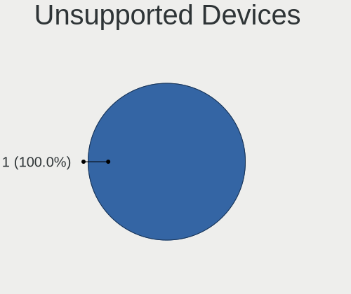

| Total | Notebooks | Percent |
|-------|-----------|---------|
| 0     | 25        | 69.44%  |
| 1     | 10        | 27.78%  |
| 2     | 1         | 2.78%   |

Unsupported Device Types
------------------------

Types of unsupported devices

| Type                  | Notebooks | Percent |
|-----------------------|-----------|---------|
| Fingerprint reader    | 5         | 41.67%  |
| Camera                | 3         | 25%     |
| Multimedia controller | 2         | 16.67%  |
| Net/wireless          | 1         | 8.33%   |
| Graphics card         | 1         | 8.33%   |

