Xero - Hardware Trends
----------------------

A project to identify most popular hardware characteristics and track their change
over time based on data collected by Linux users at https://Linux-Hardware.org.

Anyone can contribute to this report by the [hw-probe](https://github.com/linuxhw/hw-probe) tool:

    sudo -E hw-probe -all -upload

This is a report for all computer types. See also reports for [desktops](/Dist/Xero/Desktop/README.md) and [notebooks](/Dist/Xero/Notebook/README.md).

This report is for one last month. Overall report since the beginning of time: [TestDays](https://github.com/linuxhw/TestDays)

Period: Dec, 2023.

Contents
--------

* [ System ](#system)
  - [ OS                       ](#os)
  - [ OS Family                ](#os-family)
  - [ Kernel                   ](#kernel)
  - [ Kernel Family            ](#kernel-family)
  - [ Kernel Major Ver.        ](#kernel-major-ver)
  - [ Arch                     ](#arch)
  - [ DE                       ](#de)
  - [ Display Server           ](#display-server)
  - [ Display Manager          ](#display-manager)
  - [ OS Lang                  ](#os-lang)
  - [ Boot Mode                ](#boot-mode)
  - [ Filesystem               ](#filesystem)
  - [ Part. scheme             ](#part-scheme)
  - [ Dual Boot with Linux/BSD ](#dual-boot-with-linuxbsd)
  - [ Dual Boot (Win)          ](#dual-boot-win)

* [ Board ](#board)
  - [ Vendor                   ](#vendor)
  - [ Model                    ](#model)
  - [ Model Family             ](#model-family)
  - [ MFG Year                 ](#mfg-year)
  - [ Form Factor              ](#form-factor)
  - [ Secure Boot              ](#secure-boot)
  - [ Coreboot                 ](#coreboot)
  - [ RAM Size                 ](#ram-size)
  - [ RAM Used                 ](#ram-used)
  - [ Total Drives             ](#total-drives)
  - [ Has CD-ROM               ](#has-cd-rom)
  - [ Has Ethernet             ](#has-ethernet)
  - [ Has WiFi                 ](#has-wifi)
  - [ Has Bluetooth            ](#has-bluetooth)

* [ Location ](#location)
  - [ Country                  ](#country)
  - [ City                     ](#city)

* [ Drives ](#drives)
  - [ Drive Vendor             ](#drive-vendor)
  - [ Drive Model              ](#drive-model)
  - [ HDD Vendor               ](#hdd-vendor)
  - [ SSD Vendor               ](#ssd-vendor)
  - [ Drive Kind               ](#drive-kind)
  - [ Drive Connector          ](#drive-connector)
  - [ Drive Size               ](#drive-size)
  - [ Space Total              ](#space-total)
  - [ Space Used               ](#space-used)
  - [ Malfunc. Drives          ](#malfunc-drives)
  - [ Malfunc. Drive Vendor    ](#malfunc-drive-vendor)
  - [ Malfunc. HDD Vendor      ](#malfunc-hdd-vendor)
  - [ Malfunc. Drive Kind      ](#malfunc-drive-kind)
  - [ Failed Drives            ](#failed-drives)
  - [ Failed Drive Vendor      ](#failed-drive-vendor)
  - [ Drive Status             ](#drive-status)

* [ Storage controller ](#storage-controller)
  - [ Storage Vendor           ](#storage-vendor)
  - [ Storage Model            ](#storage-model)
  - [ Storage Kind             ](#storage-kind)

* [ Processor ](#processor)
  - [ CPU Vendor               ](#cpu-vendor)
  - [ CPU Model                ](#cpu-model)
  - [ CPU Model Family         ](#cpu-model-family)
  - [ CPU Cores                ](#cpu-cores)
  - [ CPU Sockets              ](#cpu-sockets)
  - [ CPU Threads              ](#cpu-threads)
  - [ CPU Op-Modes             ](#cpu-op-modes)
  - [ CPU Microcode            ](#cpu-microcode)
  - [ CPU Microarch            ](#cpu-microarch)

* [ Graphics ](#graphics)
  - [ GPU Vendor               ](#gpu-vendor)
  - [ GPU Model                ](#gpu-model)
  - [ GPU Combo                ](#gpu-combo)
  - [ GPU Driver               ](#gpu-driver)
  - [ GPU Memory               ](#gpu-memory)

* [ Monitor ](#monitor)
  - [ Monitor Vendor           ](#monitor-vendor)
  - [ Monitor Model            ](#monitor-model)
  - [ Monitor Resolution       ](#monitor-resolution)
  - [ Monitor Diagonal         ](#monitor-diagonal)
  - [ Monitor Width            ](#monitor-width)
  - [ Aspect Ratio             ](#aspect-ratio)
  - [ Monitor Area             ](#monitor-area)
  - [ Pixel Density            ](#pixel-density)
  - [ Multiple Monitors        ](#multiple-monitors)

* [ Network ](#network)
  - [ Net Controller Vendor    ](#net-controller-vendor)
  - [ Net Controller Model     ](#net-controller-model)
  - [ Wireless Vendor          ](#wireless-vendor)
  - [ Wireless Model           ](#wireless-model)
  - [ Ethernet Vendor          ](#ethernet-vendor)
  - [ Ethernet Model           ](#ethernet-model)
  - [ Net Controller Kind      ](#net-controller-kind)
  - [ Used Controller          ](#used-controller)
  - [ NICs                     ](#nics)
  - [ IPv6                     ](#ipv6)

* [ Bluetooth ](#bluetooth)
  - [ Bluetooth Vendor         ](#bluetooth-vendor)
  - [ Bluetooth Model          ](#bluetooth-model)

* [ Sound ](#sound)
  - [ Sound Vendor             ](#sound-vendor)
  - [ Sound Model              ](#sound-model)

* [ Memory ](#memory)
  - [ Memory Vendor            ](#memory-vendor)
  - [ Memory Model             ](#memory-model)
  - [ Memory Kind              ](#memory-kind)
  - [ Memory Form Factor       ](#memory-form-factor)
  - [ Memory Size              ](#memory-size)
  - [ Memory Speed             ](#memory-speed)

* [ Printers & scanners ](#printers--scanners)
  - [ Printer Vendor           ](#printer-vendor)
  - [ Printer Model            ](#printer-model)
  - [ Scanner Vendor           ](#scanner-vendor)
  - [ Scanner Model            ](#scanner-model)

* [ Camera ](#camera)
  - [ Camera Vendor            ](#camera-vendor)
  - [ Camera Model             ](#camera-model)

* [ Security ](#security)
  - [ Fingerprint Vendor       ](#fingerprint-vendor)
  - [ Fingerprint Model        ](#fingerprint-model)
  - [ Chipcard Vendor          ](#chipcard-vendor)
  - [ Chipcard Model           ](#chipcard-model)

* [ Unsupported ](#unsupported)
  - [ Unsupported Devices      ](#unsupported-devices)
  - [ Unsupported Device Types ](#unsupported-device-types)

System
------

OS
--

Installed operating systems

| Name         | Computers | Percent |
|--------------|-----------|---------|
| Xero Rolling | 44        | 100%    |

OS Family
---------

OS without a version

| Name | Computers | Percent |
|------|-----------|---------|
| Xero | 44        | 100%    |

Kernel
------

Version of the Linux kernel

| Version            | Computers | Percent |
|--------------------|-----------|---------|
| 6.6.4-arch1-1      | 14        | 31.82%  |
| 6.6.7-arch1-1      | 8         | 18.18%  |
| 6.6.3-arch1-1      | 6         | 13.64%  |
| 6.6.8-arch1-1      | 4         | 9.09%   |
| 6.5.9-arch2-1      | 4         | 9.09%   |
| 6.6.5-arch1-1      | 2         | 4.55%   |
| 6.6.8-zen1-1-zen   | 1         | 2.27%   |
| 6.6.6-zen1-1-zen   | 1         | 2.27%   |
| 6.6.6-arch1-1      | 1         | 2.27%   |
| 6.6.4-273-tkg-bore | 1         | 2.27%   |
| 6.6.2-arch1-1      | 1         | 2.27%   |
| 6.4.12-arch1-1     | 1         | 2.27%   |

Kernel Family
-------------

Linux kernel without a distro release

| Version | Computers | Percent |
|---------|-----------|---------|
| 6.6.4   | 15        | 34.09%  |
| 6.6.7   | 8         | 18.18%  |
| 6.6.3   | 6         | 13.64%  |
| 6.6.8   | 5         | 11.36%  |
| 6.5.9   | 4         | 9.09%   |
| 6.6.6   | 2         | 4.55%   |
| 6.6.5   | 2         | 4.55%   |
| 6.6.2   | 1         | 2.27%   |
| 6.4.12  | 1         | 2.27%   |

Kernel Major Ver.
-----------------

Linux kernel major version

| Version | Computers | Percent |
|---------|-----------|---------|
| 6.6     | 39        | 88.64%  |
| 6.5     | 4         | 9.09%   |
| 6.4     | 1         | 2.27%   |

Arch
----

OS architecture (x86_64, i586, etc.)

| Name   | Computers | Percent |
|--------|-----------|---------|
| x86_64 | 44        | 100%    |

DE
--

Desktop Environment

| Name  | Computers | Percent |
|-------|-----------|---------|
| KDE5  | 43        | 97.73%  |
| GNOME | 1         | 2.27%   |

Display Server
--------------

X11 or Wayland

| Name    | Computers | Percent |
|---------|-----------|---------|
| Wayland | 24        | 54.55%  |
| X11     | 20        | 45.45%  |

Display Manager
---------------

SDDM, LightDM, etc.

| Name    | Computers | Percent |
|---------|-----------|---------|
| SDDM    | 42        | 95.45%  |
| GDM     | 1         | 2.27%   |
| Unknown | 1         | 2.27%   |

OS Lang
-------

Language

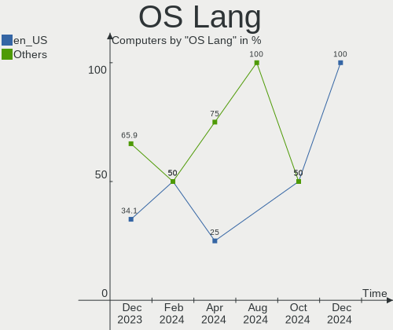

| Lang       | Computers | Percent |
|------------|-----------|---------|
| en_US      | 15        | 34.09%  |
| zh_CN      | 3         | 6.82%   |
| es_ES      | 3         | 6.82%   |
| en_IN      | 3         | 6.82%   |
| de_DE      | 3         | 6.82%   |
| ru_RU      | 2         | 4.55%   |
| pl_PL      | 2         | 4.55%   |
| hu_HU      | 2         | 4.55%   |
| fr_FR      | 2         | 4.55%   |
| en_GB      | 2         | 4.55%   |
| pt_BR      | 1         | 2.27%   |
| it_IT      | 1         | 2.27%   |
| es_PE      | 1         | 2.27%   |
| es_BO      | 1         | 2.27%   |
| en_ZA      | 1         | 2.27%   |
| el_GR@euro | 1         | 2.27%   |
| de_AT      | 1         | 2.27%   |

Boot Mode
---------

EFI or BIOS

| Mode | Computers | Percent |
|------|-----------|---------|
| EFI  | 33        | 75%     |
| BIOS | 11        | 25%     |

Filesystem
----------

Type of filesystem

| Type  | Computers | Percent |
|-------|-----------|---------|
| Ext4  | 35        | 79.55%  |
| Btrfs | 8         | 18.18%  |
| Xfs   | 1         | 2.27%   |

Part. scheme
------------

Scheme of partitioning

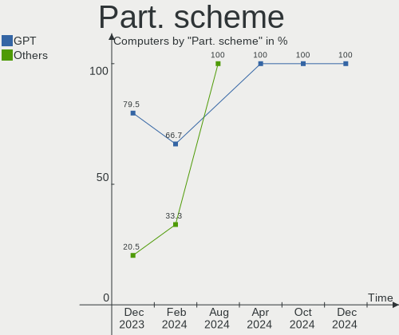

| Type    | Computers | Percent |
|---------|-----------|---------|
| GPT     | 35        | 79.55%  |
| MBR     | 8         | 18.18%  |
| Unknown | 1         | 2.27%   |

Dual Boot with Linux/BSD
------------------------

Hosting more than one Linux/BSD

| Dual boot | Computers | Percent |
|-----------|-----------|---------|
| No        | 33        | 75%     |
| Yes       | 11        | 25%     |

Dual Boot (Win)
---------------

Hosting Linux and Windows

| Dual boot | Computers | Percent |
|-----------|-----------|---------|
| No        | 23        | 52.27%  |
| Yes       | 21        | 47.73%  |

Board
-----

Vendor
------

Motherboard manufacturer

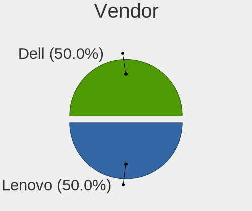

| Name                | Computers | Percent |
|---------------------|-----------|---------|
| Hewlett-Packard     | 8         | 18.18%  |
| Dell                | 8         | 18.18%  |
| Lenovo              | 6         | 13.64%  |
| MSI                 | 3         | 6.82%   |
| HUAWEI              | 3         | 6.82%   |
| ASUSTek Computer    | 3         | 6.82%   |
| MECHREVO            | 2         | 4.55%   |
| Gigabyte Technology | 2         | 4.55%   |
| ASRock              | 2         | 4.55%   |
| Timi                | 1         | 2.27%   |
| Panasonic           | 1         | 2.27%   |
| Huanan              | 1         | 2.27%   |
| Google              | 1         | 2.27%   |
| Dynabook            | 1         | 2.27%   |
| Alienware           | 1         | 2.27%   |
| Acer                | 1         | 2.27%   |

Model
-----

Motherboard model

| Name                                     | Computers | Percent |
|------------------------------------------|-----------|---------|
| Dell OptiPlex 9020                       | 2         | 4.55%   |
| Timi RedmiBook 14-APCS                   | 1         | 2.27%   |
| Panasonic CF-52SL3DD1M                   | 1         | 2.27%   |
| MSI MS-7C37                              | 1         | 2.27%   |
| MSI MS-7823                              | 1         | 2.27%   |
| MSI Bravo 15 B5DD                        | 1         | 2.27%   |
| MECHREVO S2 Air Series PF4NU1F           | 1         | 2.27%   |
| MECHREVO Kuangshi16Pro Series GM6PX0X    | 1         | 2.27%   |
| Lenovo V145-15AST 81MT                   | 1         | 2.27%   |
| Lenovo V14 G2 ALC 82KC                   | 1         | 2.27%   |
| Lenovo ThinkPad X1 Yoga 3rd 20LD001KUS   | 1         | 2.27%   |
| Lenovo ThinkPad E15 Gen 2 20TES0RG00     | 1         | 2.27%   |
| Lenovo IdeaPad Slim 3 15IAH8 83ER        | 1         | 2.27%   |
| Lenovo IdeaPad Gaming 3 15ACH6 82K2      | 1         | 2.27%   |
| HUAWEI NBLK-WAX9X                        | 1         | 2.27%   |
| HUAWEI KLVL-WXX9                         | 1         | 2.27%   |
| HUAWEI BOD-WXX9                          | 1         | 2.27%   |
| Huanan X99-F8                            | 1         | 2.27%   |
| HP ProBook 450 G1                        | 1         | 2.27%   |
| HP Pavilion Laptop 15-eg0xxx             | 1         | 2.27%   |
| HP Pavilion Gaming Laptop 15-dk2xxx      | 1         | 2.27%   |
| HP Pavilion Gaming Laptop 15-dk0xxx      | 1         | 2.27%   |
| HP Pavilion dv7                          | 1         | 2.27%   |
| HP Pavilion All-in-One Desktop 27-ca1xxx | 1         | 2.27%   |
| HP Notebook                              | 1         | 2.27%   |
| HP Laptop 15-ef2xxx                      | 1         | 2.27%   |
| Google Nami                              | 1         | 2.27%   |
| Gigabyte B550 AORUS ELITE AX V2          | 1         | 2.27%   |
| Gigabyte B450M S2H                       | 1         | 2.27%   |
| Dynabook Satellite Pro L50-G-193         | 1         | 2.27%   |
| Dell Latitude E5540                      | 1         | 2.27%   |
| Dell Latitude D630                       | 1         | 2.27%   |
| Dell Latitude 5440                       | 1         | 2.27%   |
| Dell Latitude 5400                       | 1         | 2.27%   |
| Dell Inspiron One 2320                   | 1         | 2.27%   |
| Dell Inspiron 5570                       | 1         | 2.27%   |
| ASUS ROG STRIX X470-F GAMING             | 1         | 2.27%   |
| ASUS P8Z77-V PRO                         | 1         | 2.27%   |
| ASUS ASUS TUF Dash F15 FX516PM_FX516PM   | 1         | 2.27%   |
| ASRock Q1900M                            | 1         | 2.27%   |

Model Family
------------

Motherboard model prefix

| Name                   | Computers | Percent |
|------------------------|-----------|---------|
| HP Pavilion            | 5         | 11.36%  |
| Dell Latitude          | 4         | 9.09%   |
| Lenovo ThinkPad        | 2         | 4.55%   |
| Lenovo IdeaPad         | 2         | 4.55%   |
| Dell OptiPlex          | 2         | 4.55%   |
| Dell Inspiron          | 2         | 4.55%   |
| Timi RedmiBook         | 1         | 2.27%   |
| Panasonic CF-52SL3DD1M | 1         | 2.27%   |
| MSI MS-7C37            | 1         | 2.27%   |
| MSI MS-7823            | 1         | 2.27%   |
| MSI Bravo              | 1         | 2.27%   |
| MECHREVO S2            | 1         | 2.27%   |
| MECHREVO Kuangshi16Pro | 1         | 2.27%   |
| Lenovo V145-15AST      | 1         | 2.27%   |
| Lenovo V14             | 1         | 2.27%   |
| HUAWEI NBLK-WAX9X      | 1         | 2.27%   |
| HUAWEI KLVL-WXX9       | 1         | 2.27%   |
| HUAWEI BOD-WXX9        | 1         | 2.27%   |
| Huanan X99-F8          | 1         | 2.27%   |
| HP ProBook             | 1         | 2.27%   |
| HP Notebook            | 1         | 2.27%   |
| HP Laptop              | 1         | 2.27%   |
| Google Nami            | 1         | 2.27%   |
| Gigabyte B550          | 1         | 2.27%   |
| Gigabyte B450M         | 1         | 2.27%   |
| Dynabook Satellite     | 1         | 2.27%   |
| ASUS ROG               | 1         | 2.27%   |
| ASUS P8Z77-V           | 1         | 2.27%   |
| ASUS ASUS              | 1         | 2.27%   |
| ASRock Q1900M          | 1         | 2.27%   |
| ASRock A620M           | 1         | 2.27%   |
| Alienware M17xR3       | 1         | 2.27%   |
| Acer Aspire            | 1         | 2.27%   |

MFG Year
--------

Motherboard manufacture year

| Year | Computers | Percent |
|------|-----------|---------|
| 2019 | 9         | 20.45%  |
| 2021 | 7         | 15.91%  |
| 2020 | 5         | 11.36%  |
| 2014 | 5         | 11.36%  |
| 2023 | 4         | 9.09%   |
| 2018 | 4         | 9.09%   |
| 2022 | 2         | 4.55%   |
| 2012 | 2         | 4.55%   |
| 2011 | 2         | 4.55%   |
| 2017 | 1         | 2.27%   |
| 2013 | 1         | 2.27%   |
| 2008 | 1         | 2.27%   |
| 2007 | 1         | 2.27%   |

Form Factor
-----------

Physical design of the computer

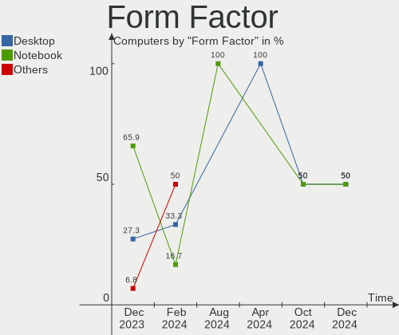

| Name        | Computers | Percent |
|-------------|-----------|---------|
| Notebook    | 29        | 65.91%  |
| Desktop     | 12        | 27.27%  |
| All in one  | 2         | 4.55%   |
| Convertible | 1         | 2.27%   |

Secure Boot
-----------

Enabled or disabled

| State    | Computers | Percent |
|----------|-----------|---------|
| Disabled | 44        | 100%    |

Coreboot
--------

Have coreboot on board

| Used | Computers | Percent |
|------|-----------|---------|
| No   | 43        | 97.73%  |
| Yes  | 1         | 2.27%   |

RAM Size
--------

Total RAM memory

| Size in GB | Computers | Percent |
|------------|-----------|---------|
| 4.01-8.0   | 12        | 27.27%  |
| 16.01-24.0 | 10        | 22.73%  |
| 8.01-16.0  | 10        | 22.73%  |
| 32.01-64.0 | 6         | 13.64%  |
| 3.01-4.0   | 6         | 13.64%  |

RAM Used
--------

Used RAM memory

| Used GB  | Computers | Percent |
|----------|-----------|---------|
| 1.01-2.0 | 21        | 47.73%  |
| 2.01-3.0 | 12        | 27.27%  |
| 3.01-4.0 | 8         | 18.18%  |
| 4.01-8.0 | 3         | 6.82%   |

Total Drives
------------

Number of drives on board

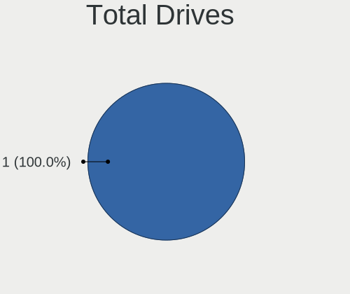

| Drives | Computers | Percent |
|--------|-----------|---------|
| 1      | 26        | 59.09%  |
| 2      | 13        | 29.55%  |
| 3      | 4         | 9.09%   |
| 4      | 1         | 2.27%   |

Has CD-ROM
----------

Has CD-ROM on board

| Presented | Computers | Percent |
|-----------|-----------|---------|
| No        | 30        | 68.18%  |
| Yes       | 14        | 31.82%  |

Has Ethernet
------------

Has Ethernet on board

| Presented | Computers | Percent |
|-----------|-----------|---------|
| Yes       | 37        | 84.09%  |
| No        | 7         | 15.91%  |

Has WiFi
--------

Has WiFi module

| Presented | Computers | Percent |
|-----------|-----------|---------|
| Yes       | 39        | 88.64%  |
| No        | 5         | 11.36%  |

Has Bluetooth
-------------

Has Bluetooth module

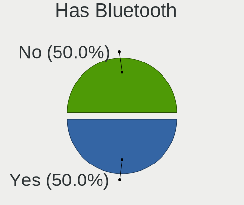

| Presented | Computers | Percent |
|-----------|-----------|---------|
| Yes       | 38        | 86.36%  |
| No        | 6         | 13.64%  |

Location
--------

Country
-------

Geographic location (country)

| Country      | Computers | Percent |
|--------------|-----------|---------|
| USA          | 8         | 18.18%  |
| China        | 4         | 9.09%   |
| Poland       | 3         | 6.82%   |
| India        | 3         | 6.82%   |
| UK           | 2         | 4.55%   |
| Syria        | 2         | 4.55%   |
| Spain        | 2         | 4.55%   |
| Russia       | 2         | 4.55%   |
| Hungary      | 2         | 4.55%   |
| Greece       | 2         | 4.55%   |
| Germany      | 2         | 4.55%   |
| France       | 2         | 4.55%   |
| Thailand     | 1         | 2.27%   |
| South Africa | 1         | 2.27%   |
| Peru         | 1         | 2.27%   |
| Pakistan     | 1         | 2.27%   |
| Malaysia     | 1         | 2.27%   |
| Italy        | 1         | 2.27%   |
| Brazil       | 1         | 2.27%   |
| Bolivia      | 1         | 2.27%   |
| Belgium      | 1         | 2.27%   |
| Austria      | 1         | 2.27%   |

City
----

Geographic location (city)

| City                   | Computers | Percent |
|------------------------|-----------|---------|
| Mariahalom             | 2         | 4.55%   |
| Damascus               | 2         | 4.55%   |
| Xi'an                  | 1         | 2.27%   |
| Wodzisław Śląski    | 1         | 2.27%   |
| Wesel                  | 1         | 2.27%   |
| Warsaw                 | 1         | 2.27%   |
| Voronezh               | 1         | 2.27%   |
| Vigo                   | 1         | 2.27%   |
| Sochi                  | 1         | 2.27%   |
| Seattle                | 1         | 2.27%   |
| Sankt Florian am Inn   | 1         | 2.27%   |
| Rennes                 | 1         | 2.27%   |
| Pretoria               | 1         | 2.27%   |
| Pionki                 | 1         | 2.27%   |
| Patna                  | 1         | 2.27%   |
| Orem                   | 1         | 2.27%   |
| Newton                 | 1         | 2.27%   |
| Milano                 | 1         | 2.27%   |
| Las Vegas              | 1         | 2.27%   |
| La Paz                 | 1         | 2.27%   |
| Karachi                | 1         | 2.27%   |
| Jinrongjie             | 1         | 2.27%   |
| Jianshelu              | 1         | 2.27%   |
| Jeumont                | 1         | 2.27%   |
| Ipoh                   | 1         | 2.27%   |
| Indore                 | 1         | 2.27%   |
| Ilioupoli              | 1         | 2.27%   |
| Houston                | 1         | 2.27%   |
| Handan                 | 1         | 2.27%   |
| Gerakas                | 1         | 2.27%   |
| Frankfurt am Main      | 1         | 2.27%   |
| Foz do Iguaçu         | 1         | 2.27%   |
| Ekeren                 | 1         | 2.27%   |
| Dallas                 | 1         | 2.27%   |
| Cusco                  | 1         | 2.27%   |
| Cornellà de Llobregat | 1         | 2.27%   |
| Colorado Springs       | 1         | 2.27%   |
| Chon Buri              | 1         | 2.27%   |
| Bristol                | 1         | 2.27%   |
| Bridgend               | 1         | 2.27%   |

Drives
------

Drive Vendor
------------

Hard drive vendors

| Vendor                       | Computers | Drives | Percent |
|------------------------------|-----------|--------|---------|
| Samsung Electronics          | 12        | 14     | 18.18%  |
| Sandisk                      | 7         | 7      | 10.61%  |
| WDC                          | 6         | 7      | 9.09%   |
| Toshiba                      | 5         | 5      | 7.58%   |
| SK hynix                     | 3         | 3      | 4.55%   |
| Seagate                      | 3         | 4      | 4.55%   |
| Kingston                     | 3         | 3      | 4.55%   |
| Intel                        | 3         | 4      | 4.55%   |
| Crucial                      | 3         | 3      | 4.55%   |
| Micron/Crucial Technology    | 2         | 2      | 3.03%   |
| JMicron Technology           | 2         | 2      | 3.03%   |
| Zebronics                    | 1         | 1      | 1.52%   |
| Yangtze Memory Technologies  | 1         | 1      | 1.52%   |
| XrayDisk                     | 1         | 1      | 1.52%   |
| Unknown                      | 1         | 1      | 1.52%   |
| Silicon Motion               | 1         | 1      | 1.52%   |
| Shenzhen Longsys Electronics | 1         | 1      | 1.52%   |
| Phison Electronics           | 1         | 1      | 1.52%   |
| Netac                        | 1         | 1      | 1.52%   |
| Micron Technology            | 1         | 1      | 1.52%   |
| MAXIO Technology (Hangzhou)  | 1         | 1      | 1.52%   |
| LITEON                       | 1         | 1      | 1.52%   |
| KingSpec                     | 1         | 1      | 1.52%   |
| Kingchuxing                  | 1         | 1      | 1.52%   |
| KESU                         | 1         | 1      | 1.52%   |
| Hitachi                      | 1         | 1      | 1.52%   |
| Corsair                      | 1         | 1      | 1.52%   |
| Biwin Storage Technology     | 1         | 1      | 1.52%   |

Drive Model
-----------

Hard drive models

| Model                                                 | Computers | Percent |
|-------------------------------------------------------|-----------|---------|
| Sandisk WD Black SN750 / PC SN730 NVMe SSD 2TB        | 2         | 2.86%   |
| Samsung SSD 870 EVO 500GB                             | 2         | 2.86%   |
| Samsung SSD 860 EVO 500GB                             | 2         | 2.86%   |
| Samsung NVMe SSD Controller SM981/PM981/PM983 512GB   | 2         | 2.86%   |
| Samsung NVMe SSD Controller PM9A1/PM9A3/980PRO 2TB    | 2         | 2.86%   |
| Micron/Crucial P2 NVMe PCIe SSD 4TB                   | 2         | 2.86%   |
| Zebronics 2.5SSD128GB                                 | 1         | 1.43%   |
| Yangtze Memory YMTC PC300-1TB-B                       | 1         | 1.43%   |
| XrayDisk 256GB SSD                                    | 1         | 1.43%   |
| WDC WDS240G2G0B-00EPW0 240GB SSD                      | 1         | 1.43%   |
| WDC WD7500BPKT-75PK4T0 752GB                          | 1         | 1.43%   |
| WDC WD20EZBX-00AYRA0 2TB                              | 1         | 1.43%   |
| WDC WD10JPVX-22JC3T0 1TB                              | 1         | 1.43%   |
| WDC WD10EZEX-21WN4A0 1TB                              | 1         | 1.43%   |
| WDC WD10EZEX-08WN4A0 1TB                              | 1         | 1.43%   |
| WDC WD10 EZEX-08WN4A0 1TB                             | 1         | 1.43%   |
| Unknown MMC Card  128GB                               | 1         | 1.43%   |
| Toshiba XG6 NVMe SSD Controller 512GB                 | 1         | 1.43%   |
| Toshiba THNSNJ512GMCY 512GB SSD                       | 1         | 1.43%   |
| Toshiba MQ01ACF050 500GB                              | 1         | 1.43%   |
| Toshiba MQ01ABD100 1TB                                | 1         | 1.43%   |
| Toshiba DT01ACA300 3TB                                | 1         | 1.43%   |
| SK hynix SC311 SATA 128GB SSD                         | 1         | 1.43%   |
| SK hynix SC308 SATA 256GB SSD                         | 1         | 1.43%   |
| SK hynix HFM512GD3JX013N 512GB                        | 1         | 1.43%   |
| Silicon Motion SM2263EN/SM2263XT SSD Controller 500GB | 1         | 1.43%   |
| Shenzhen Longsys Lexar SSD NM790 1TB                  | 1         | 1.43%   |
| Seagate ST6000DM003-2CY186 6TB                        | 1         | 1.43%   |
| Seagate ST3500413AS 500GB                             | 1         | 1.43%   |
| Seagate ST2000DX002-2DV164 2TB                        | 1         | 1.43%   |
| Seagate Expansion HDD 2TB                             | 1         | 1.43%   |
| Sandisk WD Blue SN550 NVMe SSD 1TB                    | 1         | 1.43%   |
| SanDisk SDSSDHII120G 120GB                            | 1         | 1.43%   |
| SanDisk SDSSDA120G 120GB                              | 1         | 1.43%   |
| SanDisk SD9TN8W-256G-1006 256GB SSD                   | 1         | 1.43%   |
| Sandisk PC SN740 NVMe WD 256GB                        | 1         | 1.43%   |
| Samsung SSD 860 EVO 250GB                             | 1         | 1.43%   |
| Samsung MZALQ512HBLU-00BL2 512GB                      | 1         | 1.43%   |
| Samsung MZALQ256HBJD-00BL1 256GB                      | 1         | 1.43%   |
| Samsung MZ7TD256HAFV-000L7 256GB SSD                  | 1         | 1.43%   |

HDD Vendor
----------

Hard disk drive vendors

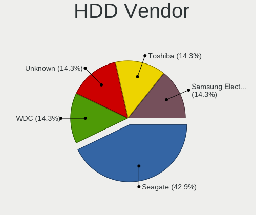

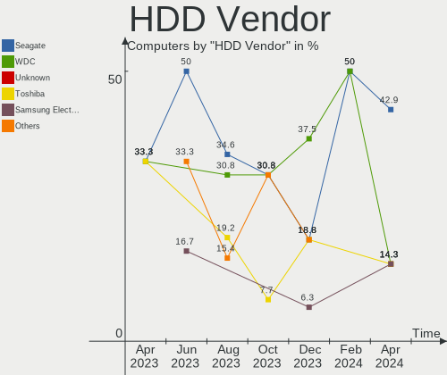

| Vendor              | Computers | Drives | Percent |
|---------------------|-----------|--------|---------|
| WDC                 | 6         | 6      | 40%     |
| Toshiba             | 3         | 3      | 20%     |
| Seagate             | 3         | 4      | 20%     |
| Samsung Electronics | 1         | 1      | 6.67%   |
| KESU                | 1         | 1      | 6.67%   |
| Hitachi             | 1         | 1      | 6.67%   |

SSD Vendor
----------

Solid state drive vendors

| Vendor              | Computers | Drives | Percent |
|---------------------|-----------|--------|---------|
| Samsung Electronics | 6         | 6      | 23.08%  |
| SanDisk             | 3         | 3      | 11.54%  |
| Crucial             | 3         | 3      | 11.54%  |
| SK hynix            | 2         | 2      | 7.69%   |
| Kingston            | 2         | 2      | 7.69%   |
| Zebronics           | 1         | 1      | 3.85%   |
| XrayDisk            | 1         | 1      | 3.85%   |
| WDC                 | 1         | 1      | 3.85%   |
| Toshiba             | 1         | 1      | 3.85%   |
| Netac               | 1         | 1      | 3.85%   |
| LITEON              | 1         | 1      | 3.85%   |
| KingSpec            | 1         | 1      | 3.85%   |
| Kingchuxing         | 1         | 1      | 3.85%   |
| JMicron Technology  | 1         | 1      | 3.85%   |
| Corsair             | 1         | 1      | 3.85%   |

Drive Kind
----------

HDD or SSD

| Kind    | Computers | Drives | Percent |
|---------|-----------|--------|---------|
| NVMe    | 23        | 27     | 38.33%  |
| SSD     | 21        | 26     | 35%     |
| HDD     | 14        | 16     | 23.33%  |
| MMC     | 1         | 1      | 1.67%   |
| Unknown | 1         | 1      | 1.67%   |

Drive Connector
---------------

SATA, SAS, NVMe, etc.

| Type | Computers | Drives | Percent |
|------|-----------|--------|---------|
| SATA | 24        | 36     | 44.44%  |
| NVMe | 23        | 27     | 42.59%  |
| SAS  | 6         | 7      | 11.11%  |
| MMC  | 1         | 1      | 1.85%   |

Drive Size
----------

Size of hard drive

| Size in TB | Computers | Drives | Percent |
|------------|-----------|--------|---------|
| 0.01-0.5   | 18        | 23     | 51.43%  |
| 0.51-1.0   | 10        | 12     | 28.57%  |
| 1.01-2.0   | 5         | 5      | 14.29%  |
| 2.01-3.0   | 1         | 1      | 2.86%   |
| 4.01-10.0  | 1         | 1      | 2.86%   |

Space Total
-----------

Amount of disk space available on the file system

| Size in GB     | Computers | Percent |
|----------------|-----------|---------|
| 501-1000       | 13        | 29.55%  |
| 101-250        | 12        | 27.27%  |
| 251-500        | 8         | 18.18%  |
| 51-100         | 4         | 9.09%   |
| 1001-2000      | 2         | 4.55%   |
| Unknown        | 2         | 4.55%   |
| More than 3000 | 1         | 2.27%   |
| 21-50          | 1         | 2.27%   |
| 2001-3000      | 1         | 2.27%   |

Space Used
----------

Amount of used disk space

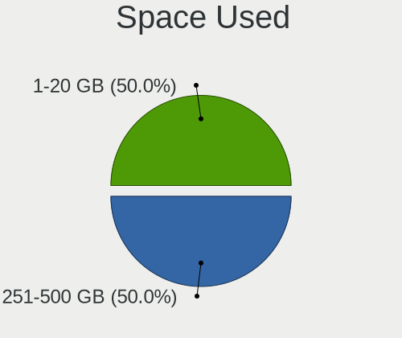

| Used GB   | Computers | Percent |
|-----------|-----------|---------|
| 1-20      | 19        | 43.18%  |
| 21-50     | 10        | 22.73%  |
| 51-100    | 5         | 11.36%  |
| 251-500   | 4         | 9.09%   |
| 101-250   | 2         | 4.55%   |
| 1001-2000 | 2         | 4.55%   |
| Unknown   | 2         | 4.55%   |

Malfunc. Drives
---------------

Drive models with a malfunction

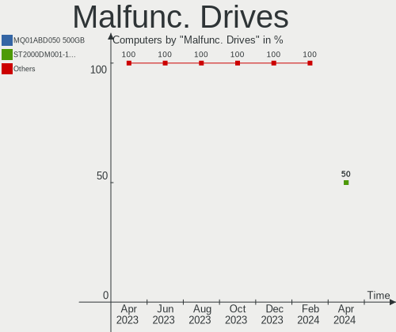

| Model                               | Computers | Drives | Percent |
|-------------------------------------|-----------|--------|---------|
| WDC WD10 EZEX-08WN4A0 1TB           | 1         | 1      | 25%     |
| Seagate ST3500413AS 500GB           | 1         | 1      | 25%     |
| SanDisk SD9TN8W-256G-1006 256GB SSD | 1         | 1      | 25%     |
| Corsair Force GT 240GB SSD          | 1         | 1      | 25%     |

Malfunc. Drive Vendor
---------------------

Vendors of faulty drives

| Vendor  | Computers | Drives | Percent |
|---------|-----------|--------|---------|
| WDC     | 1         | 1      | 25%     |
| Seagate | 1         | 1      | 25%     |
| SanDisk | 1         | 1      | 25%     |
| Corsair | 1         | 1      | 25%     |

Malfunc. HDD Vendor
-------------------

Vendors of faulty HDD drives

| Vendor  | Computers | Drives | Percent |
|---------|-----------|--------|---------|
| WDC     | 1         | 1      | 50%     |
| Seagate | 1         | 1      | 50%     |

Malfunc. Drive Kind
-------------------

Kinds of faulty drives

| Kind | Computers | Drives | Percent |
|------|-----------|--------|---------|
| SSD  | 2         | 2      | 50%     |
| HDD  | 2         | 2      | 50%     |

Failed Drives
-------------

Failed drive models

Zero info for selected period =(

Failed Drive Vendor
-------------------

Failed drive vendors

Zero info for selected period =(

Drive Status
------------

Number of failed and malfunc. drives

| Status   | Computers | Drives | Percent |
|----------|-----------|--------|---------|
| Works    | 38        | 57     | 76%     |
| Detected | 8         | 10     | 16%     |
| Malfunc  | 4         | 4      | 8%      |

Storage controller
------------------

Storage Vendor
--------------

Storage controller vendors

| Vendor                       | Computers | Percent |
|------------------------------|-----------|---------|
| Intel                        | 22        | 40%     |
| AMD                          | 10        | 18.18%  |
| Samsung Electronics          | 5         | 9.09%   |
| Sandisk                      | 4         | 7.27%   |
| Micron/Crucial Technology    | 2         | 3.64%   |
| ASMedia Technology           | 2         | 3.64%   |
| Yangtze Memory Technologies  | 1         | 1.82%   |
| Toshiba America Info Systems | 1         | 1.82%   |
| SK hynix                     | 1         | 1.82%   |
| Silicon Motion               | 1         | 1.82%   |
| Shenzhen Longsys Electronics | 1         | 1.82%   |
| Phison Electronics           | 1         | 1.82%   |
| Micron Technology            | 1         | 1.82%   |
| MAXIO Technology (Hangzhou)  | 1         | 1.82%   |
| Kingston Technology Company  | 1         | 1.82%   |
| Biwin Storage Technology     | 1         | 1.82%   |

Storage Model
-------------

Storage controller models

| Model                                                                          | Computers | Percent |
|--------------------------------------------------------------------------------|-----------|---------|
| AMD FCH SATA Controller [AHCI mode]                                            | 7         | 11.11%  |
| Intel Volume Management Device NVMe RAID Controller                            | 4         | 6.35%   |
| Intel 82801 Mobile SATA Controller [RAID mode]                                 | 3         | 4.76%   |
| SanDisk Extreme Pro / WD Black SN750 / PC SN730 / Red SN700 NVMe SSD           | 2         | 3.17%   |
| Samsung NVMe SSD Controller SM981/PM981/PM983                                  | 2         | 3.17%   |
| Samsung NVMe SSD Controller PM9A1/PM9A3/980PRO                                 | 2         | 3.17%   |
| Samsung NVMe SSD Controller 980 (DRAM-less)                                    | 2         | 3.17%   |
| Micron/Crucial P2 [Nick P2] / P3 / P3 Plus NVMe PCIe SSD (DRAM-less)           | 2         | 3.17%   |
| Intel Sunrise Point-LP SATA Controller [AHCI mode]                             | 2         | 3.17%   |
| Intel SSD 670p Series [Keystone Harbor]                                        | 2         | 3.17%   |
| Intel SATA Controller [RAID mode]                                              | 2         | 3.17%   |
| Intel 8 Series/C220 Series Chipset Family 6-port SATA Controller 1 [AHCI mode] | 2         | 3.17%   |
| Intel 6 Series/C200 Series Chipset Family 6 port Mobile SATA AHCI Controller   | 2         | 3.17%   |
| ASMedia ASM1062 Serial ATA Controller                                          | 2         | 3.17%   |
| AMD 400 Series Chipset SATA Controller                                         | 2         | 3.17%   |
| Yangtze Memory PC300 NVMe SSD (DRAM-less)                                      | 1         | 1.59%   |
| Toshiba America Info Systems XG6 NVMe SSD Controller                           | 1         | 1.59%   |
| SK hynix Gold P31/BC711/PC711 NVMe Solid State Drive                           | 1         | 1.59%   |
| Silicon Motion SM2263EN/SM2263XT (DRAM-less) NVMe SSD Controllers              | 1         | 1.59%   |
| Shenzhen Longsys Non-Volatile memory controller                                | 1         | 1.59%   |
| SanDisk Ultra 3D / WD Blue SN550 NVMe SSD                                      | 1         | 1.59%   |
| Sandisk PC SN740 NVMe SSD (DRAM-less)                                          | 1         | 1.59%   |
| Phison E12 NVMe Controller                                                     | 1         | 1.59%   |
| Micron 2400 NVMe SSD (DRAM-less)                                               | 1         | 1.59%   |
| MAXIO (Hangzhou) NVMe SSD Controller MAP1202                                   | 1         | 1.59%   |
| Kingston Company OM8PCP Design-In PCIe 3 NVMe SSD (DRAM-less)                  | 1         | 1.59%   |
| Intel Tiger Lake-LP SATA Controller                                            | 1         | 1.59%   |
| Intel Optane NVME SSD H10 with Solid State Storage [Teton Glacier]             | 1         | 1.59%   |
| Intel Cannon Point-LP SATA Controller [AHCI Mode]                              | 1         | 1.59%   |
| Intel C610/X99 series chipset 6-Port SATA Controller [AHCI mode]               | 1         | 1.59%   |
| Intel Atom Processor E3800 Series SATA AHCI Controller                         | 1         | 1.59%   |
| Intel Alder Lake-S PCH SATA Controller [AHCI Mode]                             | 1         | 1.59%   |
| Intel 82801HM/HEM (ICH8M/ICH8M-E) SATA Controller [IDE mode]                   | 1         | 1.59%   |
| Intel 82801HM/HEM (ICH8M/ICH8M-E) IDE Controller                               | 1         | 1.59%   |
| Intel 8 Series/C220 Series Chipset Family 4-port SATA Controller 1 [IDE mode]  | 1         | 1.59%   |
| Intel 7 Series/C210 Series Chipset Family 6-port SATA Controller [AHCI mode]   | 1         | 1.59%   |
| Intel 6 Series/C200 Series Chipset Family 6 port Desktop SATA AHCI Controller  | 1         | 1.59%   |
| Biwin Storage Non-Volatile memory controller                                   | 1         | 1.59%   |
| AMD SB7x0/SB8x0/SB9x0 SATA Controller [AHCI mode]                              | 1         | 1.59%   |
| AMD 500 Series Chipset SATA Controller                                         | 1         | 1.59%   |

Storage Kind
------------

Kind of storage controller (IDE, SATA, NVMe, SAS, ...)

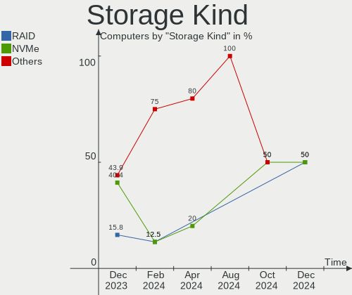

| Kind | Computers | Percent |
|------|-----------|---------|
| NVMe | 23        | 40.35%  |
| SATA | 23        | 40.35%  |
| RAID | 9         | 15.79%  |
| IDE  | 2         | 3.51%   |

Processor
---------

CPU Vendor
----------

Processor vendors

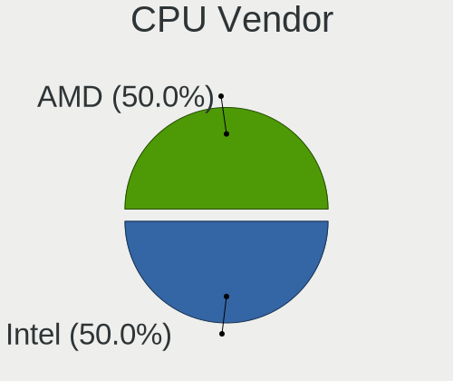

| Vendor | Computers | Percent |
|--------|-----------|---------|
| Intel  | 28        | 63.64%  |
| AMD    | 16        | 36.36%  |

CPU Model
---------

Processor models

| Model                                         | Computers | Percent |
|-----------------------------------------------|-----------|---------|
| Intel Core i7-8550U CPU @ 1.80GHz             | 2         | 4.55%   |
| Intel 11th Gen Core i5-1135G7 @ 2.40GHz       | 2         | 4.55%   |
| AMD Ryzen 7 4800H with Radeon Graphics        | 2         | 4.55%   |
| AMD Ryzen 5 5600H with Radeon Graphics        | 2         | 4.55%   |
| Intel Xeon CPU E5-2678 v3 @ 2.50GHz           | 1         | 2.27%   |
| Intel Pentium CPU G630 @ 2.70GHz              | 1         | 2.27%   |
| Intel Pentium CPU 4417U @ 2.30GHz             | 1         | 2.27%   |
| Intel Core i7-4790 CPU @ 3.60GHz              | 1         | 2.27%   |
| Intel Core i7-3770K CPU @ 3.50GHz             | 1         | 2.27%   |
| Intel Core i7-2670QM CPU @ 2.20GHz            | 1         | 2.27%   |
| Intel Core i7-10510U CPU @ 1.80GHz            | 1         | 2.27%   |
| Intel Core i5-9400 CPU @ 2.90GHz              | 1         | 2.27%   |
| Intel Core i5-9300H CPU @ 2.40GHz             | 1         | 2.27%   |
| Intel Core i5-8265U CPU @ 1.60GHz             | 1         | 2.27%   |
| Intel Core i5-4590 CPU @ 3.30GHz              | 1         | 2.27%   |
| Intel Core i5-4460 CPU @ 3.20GHz              | 1         | 2.27%   |
| Intel Core i5-2540M CPU @ 2.60GHz             | 1         | 2.27%   |
| Intel Core i3-4030U CPU @ 1.90GHz             | 1         | 2.27%   |
| Intel Core i3-4000M CPU @ 2.40GHz             | 1         | 2.27%   |
| Intel Core 2 Duo CPU T7250 @ 2.00GHz          | 1         | 2.27%   |
| Intel Celeron CPU J1900 @ 1.99GHz             | 1         | 2.27%   |
| Intel 13th Gen Core i5-1350P                  | 1         | 2.27%   |
| Intel 12th Gen Core i9-12900HX                | 1         | 2.27%   |
| Intel 12th Gen Core i7-12700T                 | 1         | 2.27%   |
| Intel 12th Gen Core i5-12450H                 | 1         | 2.27%   |
| Intel 11th Gen Core i7-11370H @ 3.30GHz       | 1         | 2.27%   |
| Intel 11th Gen Core i5-11300H @ 3.10GHz       | 1         | 2.27%   |
| Intel 11th Gen Core i3-1115G4 @ 3.00GHz       | 1         | 2.27%   |
| AMD Ryzen 7 5800X3D 8-Core Processor          | 1         | 2.27%   |
| AMD Ryzen 7 3700X 8-Core Processor            | 1         | 2.27%   |
| AMD Ryzen 7 3700U with Radeon Vega Mobile Gfx | 1         | 2.27%   |
| AMD Ryzen 7 2700 Eight-Core Processor         | 1         | 2.27%   |
| AMD Ryzen 5 7600 6-Core Processor             | 1         | 2.27%   |
| AMD Ryzen 5 5600G with Radeon Graphics        | 1         | 2.27%   |
| AMD Ryzen 5 5500U with Radeon Graphics        | 1         | 2.27%   |
| AMD Ryzen 5 3500U with Radeon Vega Mobile Gfx | 1         | 2.27%   |
| AMD Ryzen 3 5300U with Radeon Graphics        | 1         | 2.27%   |
| AMD Phenom II P960 Quad-Core Processor        | 1         | 2.27%   |
| AMD A6-9225 RADEON R4, 5 COMPUTE CORES 2C+3G  | 1         | 2.27%   |
| AMD A6-5200 APU with Radeon HD Graphics       | 1         | 2.27%   |

CPU Model Family
----------------

Processor model prefix

| Model            | Computers | Percent |
|------------------|-----------|---------|
| Other            | 9         | 20.45%  |
| Intel Core i7    | 6         | 13.64%  |
| Intel Core i5    | 6         | 13.64%  |
| AMD Ryzen 7      | 6         | 13.64%  |
| AMD Ryzen 5      | 6         | 13.64%  |
| Intel Pentium    | 2         | 4.55%   |
| Intel Core i3    | 2         | 4.55%   |
| AMD A6           | 2         | 4.55%   |
| Intel Xeon       | 1         | 2.27%   |
| Intel Core 2 Duo | 1         | 2.27%   |
| Intel Celeron    | 1         | 2.27%   |
| AMD Ryzen 3      | 1         | 2.27%   |
| AMD Phenom II    | 1         | 2.27%   |

CPU Cores
---------

Number of processor cores

| Number | Computers | Percent |
|--------|-----------|---------|
| 4      | 20        | 45.45%  |
| 2      | 8         | 18.18%  |
| 8      | 6         | 13.64%  |
| 6      | 6         | 13.64%  |
| 12     | 3         | 6.82%   |
| 16     | 1         | 2.27%   |

CPU Sockets
-----------

Number of sockets

| Number | Computers | Percent |
|--------|-----------|---------|
| 1      | 44        | 100%    |

CPU Threads
-----------

Threads per core (Hyper-Threading)

| Number | Computers | Percent |
|--------|-----------|---------|
| 2      | 35        | 79.55%  |
| 1      | 9         | 20.45%  |

CPU Op-Modes
------------

CPU Operation Modes (32-bit, 64-bit)

| Op mode        | Computers | Percent |
|----------------|-----------|---------|
| 32-bit, 64-bit | 44        | 100%    |

CPU Microcode
-------------

Microcode number

| Number     | Computers | Percent |
|------------|-----------|---------|
| Unknown    | 28        | 63.64%  |
| 0x0a50000c | 2         | 4.55%   |
| 0x08108109 | 2         | 4.55%   |
| 0x0a601206 | 1         | 2.27%   |
| 0x0a50000f | 1         | 2.27%   |
| 0x0a201204 | 1         | 2.27%   |
| 0x08701030 | 1         | 2.27%   |
| 0x08608104 | 1         | 2.27%   |
| 0x08608102 | 1         | 2.27%   |
| 0x08600106 | 1         | 2.27%   |
| 0x08600103 | 1         | 2.27%   |
| 0x0800820d | 1         | 2.27%   |
| 0x07000110 | 1         | 2.27%   |
| 0x06006705 | 1         | 2.27%   |
| 0x010000c8 | 1         | 2.27%   |

CPU Microarch
-------------

Microarchitecture

| Name             | Computers | Percent |
|------------------|-----------|---------|
| KabyLake         | 7         | 15.91%  |
| Haswell          | 6         | 13.64%  |
| TigerLake        | 5         | 11.36%  |
| Zen 3            | 4         | 9.09%   |
| Alderlake Hybrid | 4         | 9.09%   |
| Zen+             | 3         | 6.82%   |
| Zen 2            | 3         | 6.82%   |
| SandyBridge      | 3         | 6.82%   |
| Unknown          | 3         | 6.82%   |
| Silvermont       | 1         | 2.27%   |
| K10              | 1         | 2.27%   |
| Jaguar           | 1         | 2.27%   |
| IvyBridge        | 1         | 2.27%   |
| Excavator        | 1         | 2.27%   |
| Core             | 1         | 2.27%   |

Graphics
--------

GPU Vendor
----------

Vendors of graphics cards

| Vendor | Computers | Percent |
|--------|-----------|---------|
| Intel  | 21        | 42%     |
| AMD    | 19        | 38%     |
| Nvidia | 10        | 20%     |

GPU Model
---------

Graphics card models

| Model                                                                                 | Computers | Percent |
|---------------------------------------------------------------------------------------|-----------|---------|
| Intel TigerLake-LP GT2 [Iris Xe Graphics]                                             | 4         | 7.55%   |
| AMD Cezanne [Radeon Vega Series / Radeon Vega Mobile Series]                          | 3         | 5.66%   |
| Nvidia TU117M [GeForce GTX 1650 Mobile / Max-Q]                                       | 2         | 3.77%   |
| Nvidia GP108 [GeForce GT 1030]                                                        | 2         | 3.77%   |
| Intel UHD Graphics 620                                                                | 2         | 3.77%   |
| Intel 2nd Generation Core Processor Family Integrated Graphics Controller             | 2         | 3.77%   |
| AMD Whistler [Radeon HD 6630M/6650M/6750M/7670M/7690M]                                | 2         | 3.77%   |
| AMD Renoir [Radeon RX Vega 6 (Ryzen 4000/5000 Mobile Series)]                         | 2         | 3.77%   |
| AMD Picasso/Raven 2 [Radeon Vega Series / Radeon Vega Mobile Series]                  | 2         | 3.77%   |
| AMD Lucienne                                                                          | 2         | 3.77%   |
| Nvidia GK104 [GeForce GTX 680]                                                        | 1         | 1.89%   |
| Nvidia GA107M [GeForce RTX 3050 Mobile]                                               | 1         | 1.89%   |
| Nvidia GA106M [GeForce RTX 3060 Mobile / Max-Q]                                       | 1         | 1.89%   |
| Nvidia GA104 [GeForce RTX 3070]                                                       | 1         | 1.89%   |
| Nvidia AD107M [GeForce RTX 4060 Max-Q / Mobile]                                       | 1         | 1.89%   |
| Nvidia AD103 [GeForce RTX 4080]                                                       | 1         | 1.89%   |
| Intel Xeon E3-1200 v3/4th Gen Core Processor Integrated Graphics Controller           | 1         | 1.89%   |
| Intel WhiskeyLake-U GT2 [UHD Graphics 620]                                            | 1         | 1.89%   |
| Intel Tiger Lake-LP GT2 [UHD Graphics G4]                                             | 1         | 1.89%   |
| Intel Raptor Lake-P [UHD Graphics]                                                    | 1         | 1.89%   |
| Intel Mobile GM965/GL960 Integrated Graphics Controller (secondary)                   | 1         | 1.89%   |
| Intel Mobile GM965/GL960 Integrated Graphics Controller (primary)                     | 1         | 1.89%   |
| Intel HD Graphics 610                                                                 | 1         | 1.89%   |
| Intel Haswell-ULT Integrated Graphics Controller                                      | 1         | 1.89%   |
| Intel DG2 [Arc A750]                                                                  | 1         | 1.89%   |
| Intel CometLake-U GT2 [UHD Graphics]                                                  | 1         | 1.89%   |
| Intel CoffeeLake-H GT2 [UHD Graphics 630]                                             | 1         | 1.89%   |
| Intel AlderLake-S GT1                                                                 | 1         | 1.89%   |
| Intel Alder Lake-P GT1 [UHD Graphics]                                                 | 1         | 1.89%   |
| Intel 4th Gen Core Processor Integrated Graphics Controller                           | 1         | 1.89%   |
| AMD Topaz XT [Radeon R7 M260/M265 / M340/M360 / M440/M445 / 530/535 / 620/625 Mobile] | 1         | 1.89%   |
| AMD Stoney [Radeon R2/R3/R4/R5 Graphics]                                              | 1         | 1.89%   |
| AMD RS880M [Mobility Radeon HD 4225/4250]                                             | 1         | 1.89%   |
| AMD Raphael                                                                           | 1         | 1.89%   |
| AMD Polaris 20 XL [Radeon RX 580 2048SP]                                              | 1         | 1.89%   |
| AMD Navi 14 [Radeon RX 5500/5500M / Pro 5500M]                                        | 1         | 1.89%   |
| AMD Lexa PRO [Radeon 540/540X/550/550X / RX 540X/550/550X]                            | 1         | 1.89%   |
| AMD Kabini [Radeon HD 8400 / R3 Series]                                               | 1         | 1.89%   |
| AMD Granville [Radeon HD 6850M/6870M]                                                 | 1         | 1.89%   |
| AMD Curacao PRO [Radeon R7 370 / R9 270/370 OEM]                                      | 1         | 1.89%   |

GPU Combo
---------

Combinations of graphics cards

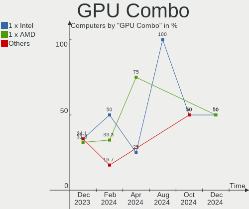

| Name           | Computers | Percent |
|----------------|-----------|---------|
| 1 x Intel      | 15        | 34.09%  |
| 1 x AMD        | 14        | 31.82%  |
| 1 x Nvidia     | 5         | 11.36%  |
| Intel + Nvidia | 3         | 6.82%   |
| 2 x AMD        | 2         | 4.55%   |
| Intel + AMD    | 2         | 4.55%   |
| 2 x Nvidia     | 1         | 2.27%   |
| 2 x Intel      | 1         | 2.27%   |
| AMD + Nvidia   | 1         | 2.27%   |

GPU Driver
----------

Free vs proprietary

| Driver      | Computers | Percent |
|-------------|-----------|---------|
| Free        | 37        | 84.09%  |
| Proprietary | 7         | 15.91%  |

GPU Memory
----------

Total video memory

| Size in GB | Computers | Percent |
|------------|-----------|---------|
| Unknown    | 19        | 43.18%  |
| 0.01-0.5   | 9         | 20.45%  |
| 3.01-4.0   | 6         | 13.64%  |
| 1.01-2.0   | 5         | 11.36%  |
| 7.01-8.0   | 2         | 4.55%   |
| 0.51-1.0   | 2         | 4.55%   |
| 8.01-16.0  | 1         | 2.27%   |

Monitor
-------

Monitor Vendor
--------------

Monitor vendors

| Vendor               | Computers | Percent |
|----------------------|-----------|---------|
| BOE                  | 10        | 19.61%  |
| Chimei Innolux       | 9         | 17.65%  |
| Hewlett-Packard      | 5         | 9.8%    |
| AU Optronics         | 4         | 7.84%   |
| LG Display           | 3         | 5.88%   |
| Dell                 | 3         | 5.88%   |
| Ancor Communications | 3         | 5.88%   |
| Unknown              | 2         | 3.92%   |
| Samsung Electronics  | 2         | 3.92%   |
| Vizio                | 1         | 1.96%   |
| ViewSonic            | 1         | 1.96%   |
| Sony                 | 1         | 1.96%   |
| Philips              | 1         | 1.96%   |
| PANDA                | 1         | 1.96%   |
| Lenovo               | 1         | 1.96%   |
| Goldstar             | 1         | 1.96%   |
| Fujitsu Siemens      | 1         | 1.96%   |
| CHR                  | 1         | 1.96%   |
| BenQ                 | 1         | 1.96%   |

Monitor Model
-------------

Monitor models

| Model                                                                | Computers | Percent |
|----------------------------------------------------------------------|-----------|---------|
| Unknown LCD Monitor FFFF 2288x1287 2550x2550mm 142.0-inch            | 2         | 3.92%   |
| Hewlett-Packard 2310 HWP288E 1920x1080 510x287mm 23.0-inch           | 2         | 3.92%   |
| Chimei Innolux LCD Monitor CMN1521 1920x1080 344x193mm 15.5-inch     | 2         | 3.92%   |
| Vizio V505-H1 VIZ1039 3840x2160 941x529mm 42.5-inch                  | 1         | 1.96%   |
| ViewSonic VX3211 SERIES VSCF534 1920x1080 698x392mm 31.5-inch        | 1         | 1.96%   |
| Sony LCD Monitor MS_9005 1920x1200 331x207mm 15.4-inch               | 1         | 1.96%   |
| Samsung Electronics U28E590 SAM0C4D 3840x2160 610x350mm 27.7-inch    | 1         | 1.96%   |
| Samsung Electronics LCD Monitor SEC3157 1280x800 303x190mm 14.1-inch | 1         | 1.96%   |
| Philips PHL 273V7 PHLC156 1920x1080 598x336mm 27.0-inch              | 1         | 1.96%   |
| PANDA LCD Monitor NCP004A 1920x1080 309x174mm 14.0-inch              | 1         | 1.96%   |
| LG Display LCD Monitor LGD05FE 1920x1080 344x194mm 15.5-inch         | 1         | 1.96%   |
| LG Display LCD Monitor LGD0563 1920x1080 344x194mm 15.5-inch         | 1         | 1.96%   |
| LG Display LCD Monitor LGD02DA 1920x1080 380x220mm 17.3-inch         | 1         | 1.96%   |
| Lenovo LEN LI2364 LEN65C7 1920x1080 509x286mm 23.0-inch              | 1         | 1.96%   |
| Hewlett-Packard Z24nq HWP3239 2560x1440 530x300mm 24.0-inch          | 1         | 1.96%   |
| Hewlett-Packard E240 HWP3265 1920x1080 527x296mm 23.8-inch           | 1         | 1.96%   |
| Hewlett-Packard Contino HPN404C 1920x1080 597x366mm 27.6-inch        | 1         | 1.96%   |
| Goldstar 2D FHD TV GSM59C6 1920x1080 509x286mm 23.0-inch             | 1         | 1.96%   |
| Fujitsu Siemens A19-3 DVI FUS078B 1280x1024 376x301mm 19.0-inch      | 1         | 1.96%   |
| Dell SE2417HG DELD08D 1920x1080 521x293mm 23.5-inch                  | 1         | 1.96%   |
| Dell LNKG H2VA001 LNKA001 1920x1080 880x500mm 39.8-inch              | 1         | 1.96%   |
| Dell E2213H DELA090 1920x1080 477x268mm 21.5-inch                    | 1         | 1.96%   |
| CHR 23" AIO CHR0608 1920x1080 509x286mm 23.0-inch                    | 1         | 1.96%   |
| Chimei Innolux LCD Monitor CMN15CA 1366x768 344x193mm 15.5-inch      | 1         | 1.96%   |
| Chimei Innolux LCD Monitor CMN15BC 1366x768 344x194mm 15.5-inch      | 1         | 1.96%   |
| Chimei Innolux LCD Monitor CMN1550 1920x1080 344x193mm 15.5-inch     | 1         | 1.96%   |
| Chimei Innolux LCD Monitor CMN1515 1920x1080 344x193mm 15.5-inch     | 1         | 1.96%   |
| Chimei Innolux LCD Monitor CMN14E7 1920x1080 309x173mm 13.9-inch     | 1         | 1.96%   |
| Chimei Innolux LCD Monitor CMN14E1 1920x1080 309x173mm 13.9-inch     | 1         | 1.96%   |
| Chimei Innolux LCD Monitor CMN14D5 1920x1080 309x173mm 13.9-inch     | 1         | 1.96%   |
| BOE LCD Monitor BOE0A3B 2560x1600 344x215mm 16.0-inch                | 1         | 1.96%   |
| BOE LCD Monitor BOE09AE 1920x1080 309x174mm 14.0-inch                | 1         | 1.96%   |
| BOE LCD Monitor BOE0893 2160x1440 296x197mm 14.0-inch                | 1         | 1.96%   |
| BOE LCD Monitor BOE0877 1920x1080 309x173mm 13.9-inch                | 1         | 1.96%   |
| BOE LCD Monitor BOE0872 1920x1080 344x194mm 15.5-inch                | 1         | 1.96%   |
| BOE LCD Monitor BOE085E 1920x1080 344x194mm 15.5-inch                | 1         | 1.96%   |
| BOE LCD Monitor BOE080D 1920x1080 344x194mm 15.5-inch                | 1         | 1.96%   |
| BOE LCD Monitor BOE07BB 1920x1080 309x173mm 13.9-inch                | 1         | 1.96%   |
| BOE LCD Monitor BOE06A9 1920x1080 344x193mm 15.5-inch                | 1         | 1.96%   |
| BOE LCD Monitor BOE0675 1366x768 340x190mm 15.3-inch                 | 1         | 1.96%   |

Monitor Resolution
------------------

Monitor screen resolution

| Resolution         | Computers | Percent |
|--------------------|-----------|---------|
| 1920x1080 (FHD)    | 31        | 64.58%  |
| 1366x768 (WXGA)    | 4         | 8.33%   |
| 3840x2160 (4K)     | 2         | 4.17%   |
| 2288x1287          | 2         | 4.17%   |
| 3440x1440          | 1         | 2.08%   |
| 2560x1600          | 1         | 2.08%   |
| 2560x1440 (QHD)    | 1         | 2.08%   |
| 2160x1440          | 1         | 2.08%   |
| 1920x1200 (WUXGA)  | 1         | 2.08%   |
| 1680x1050 (WSXGA+) | 1         | 2.08%   |
| 1600x900 (HD+)     | 1         | 2.08%   |
| 1440x900 (WXGA+)   | 1         | 2.08%   |
| 1280x1024 (SXGA)   | 1         | 2.08%   |

Monitor Diagonal
----------------

Diagonal size in inches

| Inches | Computers | Percent |
|--------|-----------|---------|
| 15     | 17        | 33.33%  |
| 23     | 6         | 11.76%  |
| 13     | 5         | 9.8%    |
| 14     | 4         | 7.84%   |
| 27     | 3         | 5.88%   |
| 24     | 3         | 5.88%   |
| 142    | 2         | 3.92%   |
| 21     | 2         | 3.92%   |
| 17     | 2         | 3.92%   |
| 69     | 1         | 1.96%   |
| 39     | 1         | 1.96%   |
| 34     | 1         | 1.96%   |
| 31     | 1         | 1.96%   |
| 22     | 1         | 1.96%   |
| 19     | 1         | 1.96%   |
| 16     | 1         | 1.96%   |

Monitor Width
-------------

Physical width

| Width in mm    | Computers | Percent |
|----------------|-----------|---------|
| 301-350        | 26        | 50.98%  |
| 501-600        | 11        | 21.57%  |
| 401-500        | 3         | 5.88%   |
| 351-400        | 3         | 5.88%   |
| More than 2000 | 2         | 3.92%   |
| 601-700        | 2         | 3.92%   |
| 801-900        | 1         | 1.96%   |
| 701-800        | 1         | 1.96%   |
| 201-300        | 1         | 1.96%   |
| 1501-2000      | 1         | 1.96%   |

Aspect Ratio
------------

Proportional relationship between the width and the height

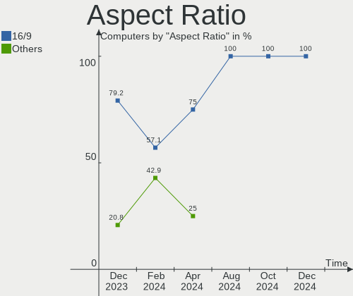

| Ratio | Computers | Percent |
|-------|-----------|---------|
| 16/9  | 38        | 79.17%  |
| 16/10 | 5         | 10.42%  |
| 1.00  | 2         | 4.17%   |
| 5/4   | 1         | 2.08%   |
| 3/2   | 1         | 2.08%   |
| 21/9  | 1         | 2.08%   |

Monitor Area
------------

Area in inch²

| Area in inch² | Computers | Percent |
|----------------|-----------|---------|
| 101-110        | 16        | 32.65%  |
| 201-250        | 10        | 20.41%  |
| 81-90          | 9         | 18.37%  |
| More than 1000 | 3         | 6.12%   |
| 301-350        | 3         | 6.12%   |
| 351-500        | 2         | 4.08%   |
| 121-130        | 2         | 4.08%   |
| 151-200        | 1         | 2.04%   |
| 111-120        | 1         | 2.04%   |
| 501-1000       | 1         | 2.04%   |
| 91-100         | 1         | 2.04%   |

Pixel Density
-------------

Pixels per inch

| Density | Computers | Percent |
|---------|-----------|---------|
| 121-160 | 23        | 46.94%  |
| 51-100  | 14        | 28.57%  |
| 101-120 | 8         | 16.33%  |
| 1-50    | 2         | 4.08%   |
| 161-240 | 2         | 4.08%   |

Multiple Monitors
-----------------

Total monitors connected

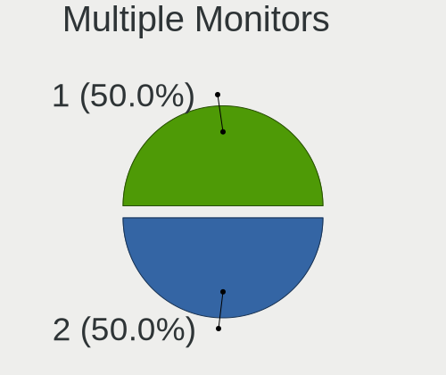

| Total | Computers | Percent |
|-------|-----------|---------|
| 1     | 37        | 84.09%  |
| 2     | 7         | 15.91%  |

Network
-------

Net Controller Vendor
---------------------

Controller vendors

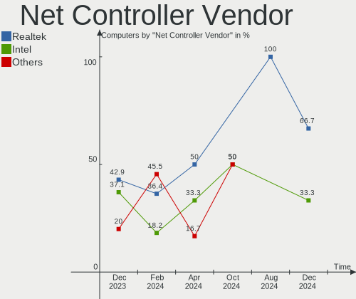

| Vendor                | Computers | Percent |
|-----------------------|-----------|---------|
| Realtek Semiconductor | 30        | 42.86%  |
| Intel                 | 26        | 37.14%  |
| Qualcomm Atheros      | 7         | 10%     |
| Broadcom              | 3         | 4.29%   |
| OPPO Electronics      | 1         | 1.43%   |
| MediaTek              | 1         | 1.43%   |
| Google                | 1         | 1.43%   |
| Aquantia              | 1         | 1.43%   |

Net Controller Model
--------------------

Controller models

| Model                                                             | Computers | Percent |
|-------------------------------------------------------------------|-----------|---------|
| Realtek RTL8111/8168/8411 PCI Express Gigabit Ethernet Controller | 22        | 27.5%   |
| Intel Wi-Fi 6 AX200                                               | 5         | 6.25%   |
| Realtek RTL8822CE 802.11ac PCIe Wireless Network Adapter          | 4         | 5%      |
| Intel Wi-Fi 6 AX201                                               | 3         | 3.75%   |
| Realtek RTL8821CE 802.11ac PCIe Wireless Network Adapter          | 2         | 2.5%    |
| Realtek RTL8125 2.5GbE Controller                                 | 2         | 2.5%    |
| Realtek RTL810xE PCI Express Fast Ethernet controller             | 2         | 2.5%    |
| Qualcomm Atheros QCA9565 / AR9565 Wireless Network Adapter        | 2         | 2.5%    |
| Intel Ethernet Connection I217-LM                                 | 2         | 2.5%    |
| Intel Cannon Lake PCH CNVi WiFi                                   | 2         | 2.5%    |
| Broadcom BCM4313 802.11bgn Wireless Network Adapter               | 2         | 2.5%    |
| Realtek RTL8852AE WiFi 6 802.11ax PCIe Adapter                    | 1         | 1.25%   |
| Realtek RTL8852AE 802.11ax PCIe Wireless Network Adapter          | 1         | 1.25%   |
| Qualcomm Atheros QCA6174 802.11ac Wireless Network Adapter        | 1         | 1.25%   |
| Qualcomm Atheros AR9485 Wireless Network Adapter                  | 1         | 1.25%   |
| Qualcomm Atheros AR9462 Wireless Network Adapter                  | 1         | 1.25%   |
| Qualcomm Atheros AR93xx Wireless Network Adapter                  | 1         | 1.25%   |
| Qualcomm Atheros AR9285 Wireless Network Adapter (PCI-Express)    | 1         | 1.25%   |
| Qualcomm Atheros AR8151 v2.0 Gigabit Ethernet                     | 1         | 1.25%   |
| OPPO RMX3710                                                      | 1         | 1.25%   |
| MediaTek MT7922 802.11ax PCI Express Wireless Network Adapter     | 1         | 1.25%   |
| Intel Wireless-AC 9260                                            | 1         | 1.25%   |
| Intel Wireless 8265 / 8275                                        | 1         | 1.25%   |
| Intel Wireless 7265                                               | 1         | 1.25%   |
| Intel Wireless 7260                                               | 1         | 1.25%   |
| Intel Wi-Fi 6 AX210/AX211/AX411 160MHz                            | 1         | 1.25%   |
| Intel Raptor Lake PCH CNVi WiFi                                   | 1         | 1.25%   |
| Intel PRO/Wireless 3945ABG [Golan] Network Connection             | 1         | 1.25%   |
| Intel I211 Gigabit Network Connection                             | 1         | 1.25%   |
| Intel Ethernet Connection I218-LM                                 | 1         | 1.25%   |
| Intel Ethernet Connection (6) I219-V                              | 1         | 1.25%   |
| Intel Ethernet Connection (4) I219-V                              | 1         | 1.25%   |
| Intel Ethernet Connection (23) I219-LM                            | 1         | 1.25%   |
| Intel Dual Band Wireless-AC 3168NGW [Stone Peak]                  | 1         | 1.25%   |
| Intel Centrino Advanced-N 6205 [Taylor Peak]                      | 1         | 1.25%   |
| Intel Cannon Point-LP CNVi [Wireless-AC]                          | 1         | 1.25%   |
| Intel Alder Lake-S PCH CNVi WiFi                                  | 1         | 1.25%   |
| Intel Alder Lake-P PCH CNVi WiFi                                  | 1         | 1.25%   |
| Intel 82579V Gigabit Network Connection                           | 1         | 1.25%   |
| Intel 82579LM Gigabit Network Connection (Lewisville)             | 1         | 1.25%   |

Wireless Vendor
---------------

Wireless vendors

| Vendor                | Computers | Percent |
|-----------------------|-----------|---------|
| Intel                 | 22        | 56.41%  |
| Realtek Semiconductor | 8         | 20.51%  |
| Qualcomm Atheros      | 6         | 15.38%  |
| Broadcom              | 2         | 5.13%   |
| MediaTek              | 1         | 2.56%   |

Wireless Model
--------------

Wireless models

| Model                                                          | Computers | Percent |
|----------------------------------------------------------------|-----------|---------|
| Intel Wi-Fi 6 AX200                                            | 5         | 12.5%   |
| Realtek RTL8822CE 802.11ac PCIe Wireless Network Adapter       | 4         | 10%     |
| Intel Wi-Fi 6 AX201                                            | 3         | 7.5%    |
| Realtek RTL8821CE 802.11ac PCIe Wireless Network Adapter       | 2         | 5%      |
| Qualcomm Atheros QCA9565 / AR9565 Wireless Network Adapter     | 2         | 5%      |
| Intel Cannon Lake PCH CNVi WiFi                                | 2         | 5%      |
| Broadcom BCM4313 802.11bgn Wireless Network Adapter            | 2         | 5%      |
| Realtek RTL8852AE WiFi 6 802.11ax PCIe Adapter                 | 1         | 2.5%    |
| Realtek RTL8852AE 802.11ax PCIe Wireless Network Adapter       | 1         | 2.5%    |
| Qualcomm Atheros QCA6174 802.11ac Wireless Network Adapter     | 1         | 2.5%    |
| Qualcomm Atheros AR9485 Wireless Network Adapter               | 1         | 2.5%    |
| Qualcomm Atheros AR9462 Wireless Network Adapter               | 1         | 2.5%    |
| Qualcomm Atheros AR93xx Wireless Network Adapter               | 1         | 2.5%    |
| Qualcomm Atheros AR9285 Wireless Network Adapter (PCI-Express) | 1         | 2.5%    |
| MediaTek MT7922 802.11ax PCI Express Wireless Network Adapter  | 1         | 2.5%    |
| Intel Wireless-AC 9260                                         | 1         | 2.5%    |
| Intel Wireless 8265 / 8275                                     | 1         | 2.5%    |
| Intel Wireless 7265                                            | 1         | 2.5%    |
| Intel Wireless 7260                                            | 1         | 2.5%    |
| Intel Wi-Fi 6 AX210/AX211/AX411 160MHz                         | 1         | 2.5%    |
| Intel Raptor Lake PCH CNVi WiFi                                | 1         | 2.5%    |
| Intel PRO/Wireless 3945ABG [Golan] Network Connection          | 1         | 2.5%    |
| Intel Dual Band Wireless-AC 3168NGW [Stone Peak]               | 1         | 2.5%    |
| Intel Centrino Advanced-N 6205 [Taylor Peak]                   | 1         | 2.5%    |
| Intel Cannon Point-LP CNVi [Wireless-AC]                       | 1         | 2.5%    |
| Intel Alder Lake-S PCH CNVi WiFi                               | 1         | 2.5%    |
| Intel Alder Lake-P PCH CNVi WiFi                               | 1         | 2.5%    |

Ethernet Vendor
---------------

Ethernet vendors

| Vendor                | Computers | Percent |
|-----------------------|-----------|---------|
| Realtek Semiconductor | 26        | 65%     |
| Intel                 | 9         | 22.5%   |
| Qualcomm Atheros      | 1         | 2.5%    |
| OPPO Electronics      | 1         | 2.5%    |
| Google                | 1         | 2.5%    |
| Broadcom              | 1         | 2.5%    |
| Aquantia              | 1         | 2.5%    |

Ethernet Model
--------------

Ethernet models

| Model                                                               | Computers | Percent |
|---------------------------------------------------------------------|-----------|---------|
| Realtek RTL8111/8168/8411 PCI Express Gigabit Ethernet Controller   | 22        | 55%     |
| Realtek RTL8125 2.5GbE Controller                                   | 2         | 5%      |
| Realtek RTL810xE PCI Express Fast Ethernet controller               | 2         | 5%      |
| Intel Ethernet Connection I217-LM                                   | 2         | 5%      |
| Qualcomm Atheros AR8151 v2.0 Gigabit Ethernet                       | 1         | 2.5%    |
| OPPO RMX3710                                                        | 1         | 2.5%    |
| Intel I211 Gigabit Network Connection                               | 1         | 2.5%    |
| Intel Ethernet Connection I218-LM                                   | 1         | 2.5%    |
| Intel Ethernet Connection (6) I219-V                                | 1         | 2.5%    |
| Intel Ethernet Connection (4) I219-V                                | 1         | 2.5%    |
| Intel Ethernet Connection (23) I219-LM                              | 1         | 2.5%    |
| Intel 82579V Gigabit Network Connection                             | 1         | 2.5%    |
| Intel 82579LM Gigabit Network Connection (Lewisville)               | 1         | 2.5%    |
| Google Nexus/Pixel Device (tether+ debug)                           | 1         | 2.5%    |
| Broadcom NetXtreme BCM5755M Gigabit Ethernet PCI Express            | 1         | 2.5%    |
| Aquantia AQC113CS NBase-T/IEEE 802.3bz Ethernet Controller [AQtion] | 1         | 2.5%    |

Net Controller Kind
-------------------

Ethernet, WiFi or modem

| Kind     | Computers | Percent |
|----------|-----------|---------|
| WiFi     | 39        | 51.32%  |
| Ethernet | 37        | 48.68%  |

Used Controller
---------------

Currently used network controller

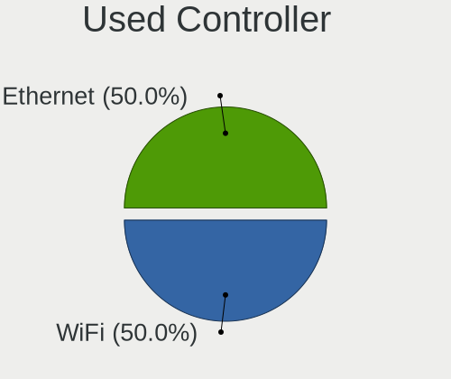

| Kind     | Computers | Percent |
|----------|-----------|---------|
| WiFi     | 30        | 68.18%  |
| Ethernet | 14        | 31.82%  |

NICs
----

Total network controllers on board

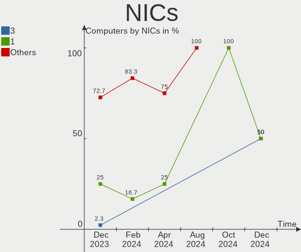

| Total | Computers | Percent |
|-------|-----------|---------|
| 2     | 32        | 72.73%  |
| 1     | 11        | 25%     |
| 3     | 1         | 2.27%   |

IPv6
----

IPv6 vs IPv4

| Used | Computers | Percent |
|------|-----------|---------|
| No   | 29        | 65.91%  |
| Yes  | 15        | 34.09%  |

Bluetooth
---------

Bluetooth Vendor
----------------

Controller vendors

| Vendor                          | Computers | Percent |
|---------------------------------|-----------|---------|
| Intel                           | 18        | 48.65%  |
| Realtek Semiconductor           | 6         | 16.22%  |
| Qualcomm Atheros Communications | 4         | 10.81%  |
| Realtek                         | 2         | 5.41%   |
| Dell                            | 2         | 5.41%   |
| ASUSTek Computer                | 2         | 5.41%   |
| Foxconn / Hon Hai               | 1         | 2.7%    |
| Broadcom                        | 1         | 2.7%    |
| Alps Electric                   | 1         | 2.7%    |

Bluetooth Model
---------------

Controller models

| Model                                          | Computers | Percent |
|------------------------------------------------|-----------|---------|
| Realtek Bluetooth Radio                        | 6         | 16.22%  |
| Intel Bluetooth Device                         | 5         | 13.51%  |
| Intel AX200 Bluetooth                          | 5         | 13.51%  |
| Intel Bluetooth wireless interface             | 3         | 8.11%   |
| Intel Bluetooth 9460/9560 Jefferson Peak (JfP) | 3         | 8.11%   |
| Realtek Bluetooth Radio                        | 2         | 5.41%   |
| Qualcomm Atheros  Bluetooth Device             | 1         | 2.7%    |
| Qualcomm Atheros QCA61x4 Bluetooth 4.0         | 1         | 2.7%    |
| Qualcomm Atheros AR3012 Bluetooth              | 1         | 2.7%    |
| Qualcomm Atheros AR3011 Bluetooth              | 1         | 2.7%    |
| Intel Wireless-AC 3168 Bluetooth               | 1         | 2.7%    |
| Intel AX210 Bluetooth                          | 1         | 2.7%    |
| Foxconn / Hon Hai Bluetooth Device             | 1         | 2.7%    |
| Dell Wireless 360 Bluetooth                    | 1         | 2.7%    |
| Dell DW375 Bluetooth Module                    | 1         | 2.7%    |
| Broadcom BCM2070 Bluetooth 2.1 + EDR           | 1         | 2.7%    |
| ASUS Broadcom BCM20702A0 Bluetooth             | 1         | 2.7%    |
| ASUS Bluetooth Device                          | 1         | 2.7%    |
| Alps Electric UGTZ4 Bluetooth                  | 1         | 2.7%    |

Sound
-----

Sound Vendor
------------

Sound card vendors

| Vendor                     | Computers | Percent |
|----------------------------|-----------|---------|
| Intel                      | 29        | 45.31%  |
| AMD                        | 21        | 32.81%  |
| Nvidia                     | 8         | 12.5%   |
| C-Media Electronics        | 2         | 3.13%   |
| Shenzhen Riitek Technology | 1         | 1.56%   |
| Razer USA                  | 1         | 1.56%   |
| Generalplus Technology     | 1         | 1.56%   |
| Barco Display Systems      | 1         | 1.56%   |

Sound Model
-----------

Sound card models

| Model                                                                      | Computers | Percent |
|----------------------------------------------------------------------------|-----------|---------|
| AMD Family 17h/19h HD Audio Controller                                     | 10        | 12.2%   |
| AMD Renoir Radeon High Definition Audio Controller                         | 7         | 8.54%   |
| Intel Tiger Lake-LP Smart Sound Technology Audio Controller                | 5         | 6.1%    |
| Intel 8 Series/C220 Series Chipset High Definition Audio Controller        | 4         | 4.88%   |
| Intel Sunrise Point-LP HD Audio                                            | 3         | 3.66%   |
| Intel 6 Series/C200 Series Chipset Family High Definition Audio Controller | 3         | 3.66%   |
| Nvidia GP108 High Definition Audio Controller                              | 2         | 2.44%   |
| Nvidia Audio device                                                        | 2         | 2.44%   |
| Intel Xeon E3-1200 v3/4th Gen Core Processor HD Audio Controller           | 2         | 2.44%   |
| Intel Cannon Lake PCH cAVS                                                 | 2         | 2.44%   |
| Intel Alder Lake-S HD Audio Controller                                     | 2         | 2.44%   |
| AMD Starship/Matisse HD Audio Controller                                   | 2         | 2.44%   |
| AMD Raven/Raven2/Fenghuang HDMI/DP Audio Controller                        | 2         | 2.44%   |
| Shenzhen Riitek Technology Multimedia Air Mouse Keyboard                   | 1         | 1.22%   |
| Razer USA Razer Leviathan V2 Pro                                           | 1         | 1.22%   |
| Razer USA Razer BlackShark V2 Pro                                          | 1         | 1.22%   |
| Nvidia TU107 GeForce GTX 1650 High Definition Audio Controller             | 1         | 1.22%   |
| Nvidia GK104 HDMI Audio Controller                                         | 1         | 1.22%   |
| Nvidia GA106 High Definition Audio Controller                              | 1         | 1.22%   |
| Nvidia GA104 High Definition Audio Controller                              | 1         | 1.22%   |
| Intel Raptor Lake-P/U/H cAVS                                               | 1         | 1.22%   |
| Intel Haswell-ULT HD Audio Controller                                      | 1         | 1.22%   |
| Intel DG2 Audio Controller                                                 | 1         | 1.22%   |
| Intel Comet Lake PCH-LP cAVS                                               | 1         | 1.22%   |
| Intel Cannon Point-LP High Definition Audio Controller                     | 1         | 1.22%   |
| Intel C610/X99 series chipset HD Audio Controller                          | 1         | 1.22%   |
| Intel Atom Processor Z36xxx/Z37xxx Series High Definition Audio Controller | 1         | 1.22%   |
| Intel Alder Lake PCH-P High Definition Audio Controller                    | 1         | 1.22%   |
| Intel 82801H (ICH8 Family) HD Audio Controller                             | 1         | 1.22%   |
| Intel 8 Series HD Audio Controller                                         | 1         | 1.22%   |
| Intel 7 Series/C216 Chipset Family High Definition Audio Controller        | 1         | 1.22%   |
| Generalplus Technology USB Audio Device                                    | 1         | 1.22%   |
| C-Media Electronics USB Audio Device                                       | 1         | 1.22%   |
| C-Media Electronics Audio Adapter (Unitek Y-247A)                          | 1         | 1.22%   |
| Barco Display Systems USBFC1-A                                             | 1         | 1.22%   |
| AMD Turks HDMI Audio [Radeon HD 6500/6600 / 6700M Series]                  | 1         | 1.22%   |
| AMD SBx00 Azalia (Intel HDA)                                               | 1         | 1.22%   |
| AMD RS880 HDMI Audio [Radeon HD 4200 Series]                               | 1         | 1.22%   |
| AMD Rembrandt Radeon High Definition Audio Controller                      | 1         | 1.22%   |
| AMD Oland/Hainan/Cape Verde/Pitcairn HDMI Audio [Radeon HD 7000 Series]    | 1         | 1.22%   |

Memory
------

Memory Vendor
-------------

Memory module vendors

| Vendor              | Computers | Percent |
|---------------------|-----------|---------|
| SK hynix            | 9         | 18.37%  |
| Samsung Electronics | 9         | 18.37%  |
| Micron Technology   | 9         | 18.37%  |
| Crucial             | 6         | 12.24%  |
| G.Skill             | 3         | 6.12%   |
| Nanya Technology    | 2         | 4.08%   |
| Kingston            | 2         | 4.08%   |
| Corsair             | 2         | 4.08%   |
| A-DATA Technology   | 2         | 4.08%   |
| Unknown             | 1         | 2.04%   |
| Ramaxel Technology  | 1         | 2.04%   |
| Elpida              | 1         | 2.04%   |
| ChangXin Memory     | 1         | 2.04%   |
| Unknown             | 1         | 2.04%   |

Memory Model
------------

Memory module models

| Model                                                         | Computers | Percent |
|---------------------------------------------------------------|-----------|---------|
| Samsung RAM M471A1K43DB1-CTD 8GB SODIMM DDR4 2667MT/s         | 2         | 3.85%   |
| Unknown RAM Module 4GB SODIMM DDR3 1333MT/s                   | 1         | 1.92%   |
| SK hynix RAM Module 16GB SODIMM DDR4 3200MT/s                 | 1         | 1.92%   |
| SK hynix RAM HYMP125S64CP8-Y5 2GB SODIMM DDR2 667MT/s         | 1         | 1.92%   |
| SK hynix RAM HMT451S6BFR8A-PB 4GB SODIMM DDR3 1600MT/s        | 1         | 1.92%   |
| SK hynix RAM HMT351U6CFR8C-H9 4GB DIMM DDR3 1600MT/s          | 1         | 1.92%   |
| SK hynix RAM HMT351S6AFR8C-PB 8GB SODIMM DDR3 1600MT/s        | 1         | 1.92%   |
| SK hynix RAM HMAA2GS6CJR8N-XN 16GB SODIMM DDR4 3200MT/s       | 1         | 1.92%   |
| SK hynix RAM HMAA1GS6CMR6N-VK 8GB Row Of Chips DDR4 2667MT/s  | 1         | 1.92%   |
| SK hynix RAM HMA81GS6DJR8N-VK 8GB SODIMM DDR4 2667MT/s        | 1         | 1.92%   |
| SK hynix RAM HMA81GS6AFR8N-UH 8GB SODIMM DDR4 2400MT/s        | 1         | 1.92%   |
| Samsung RAM M471A5244CB0-CWE 4GB SODIMM DDR4 3200MT/s         | 1         | 1.92%   |
| Samsung RAM M471A5244CB0-CWE 4GB Row Of Chips DDR4 3200MT/s   | 1         | 1.92%   |
| Samsung RAM M471A5244CB0-CTD 4GB SODIMM DDR4 3266MT/s         | 1         | 1.92%   |
| Samsung RAM M471A2K43DB1-CWE 16GB SODIMM DDR4 3200MT/s        | 1         | 1.92%   |
| Samsung RAM M471A1K43EB1-CWE 8GB SODIMM DDR4 3200MT/s         | 1         | 1.92%   |
| Samsung RAM M471A1G44AB0-CTD 8GB SODIMM DDR4 2667MT/s         | 1         | 1.92%   |
| Samsung RAM M378B5173DB0-CK0 4GB DIMM DDR3 1600MT/s           | 1         | 1.92%   |
| Samsung RAM K4E6E304EB-EGCG 4GB Row Of Chips LPDDR3 2133MT/s  | 1         | 1.92%   |
| Ramaxel RAM RMSA3310MB96HAF-3200 8GB SODIMM DDR4 3200MT/s     | 1         | 1.92%   |
| Nanya RAM NT4GC64B8HG0NF-DI 4GB DIMM DDR3 1600MT/s            | 1         | 1.92%   |
| Nanya RAM Module 4GB DIMM DDR3 1066MT/s                       | 1         | 1.92%   |
| Micron RAM MTC8C1084S1SC48BA1 16GB SODIMM DDR5 4800MT/s       | 1         | 1.92%   |
| Micron RAM MT62F1G32D4DR-031 2GB Row Of Chips LPDDR5 6400MT/s | 1         | 1.92%   |
| Micron RAM 8ATF1G64HZ-2G3H1R 8GB SODIMM DDR4 2400MT/s         | 1         | 1.92%   |
| Micron RAM 8ATF1G64HZ-2G3E1 8GB SODIMM DDR4 2400MT/s          | 1         | 1.92%   |
| Micron RAM 4ATF51264HZ-3G2R1 4GB SODIMM DDR4 3200MT/s         | 1         | 1.92%   |
| Micron RAM 4ATF25664AZ-2G3B1 2GB DDR4 2400MT/s                | 1         | 1.92%   |
| Micron RAM 4ATF1G64HZ-3G2E2 8GB SODIMM DDR4 3200MT/s          | 1         | 1.92%   |
| Micron RAM 4ATF1G64HZ-3G2E1 8GB SODIMM DDR4 3200MT/s          | 1         | 1.92%   |
| Micron RAM 4ATF1G64HZ-3G2E1 8GB Row Of Chips DDR4 3200MT/s    | 1         | 1.92%   |
| Micron RAM 16KTF1G64HZ-1G6N1 8GB SODIMM DDR3 1600MT/s         | 1         | 1.92%   |
| Kingston RAM Module 8GB DIMM DDR4 2666MT/s                    | 1         | 1.92%   |
| Kingston RAM KVR16N11/8 8GB DIMM DDR3 1600MT/s                | 1         | 1.92%   |
| G.Skill RAM F4-3600C18-8GTZRX 8GB DIMM DDR4 3600MT/s          | 1         | 1.92%   |
| G.Skill RAM F4-3200C16-8GIS 8GB DIMM DDR4 3200MT/s            | 1         | 1.92%   |
| G.Skill RAM F4-2400C16-8GRS 8GB SODIMM DDR4 2400MT/s          | 1         | 1.92%   |
| Elpida RAM EBJ41UF8BCS0-DJ-F 4GB SODIMM DDR3 1334MT/s         | 1         | 1.92%   |
| Crucial RAM CT8G4SFS8266.M8FE 8GB SODIMM DDR4 2667MT/s        | 1         | 1.92%   |
| Crucial RAM CT8G4SFS8266.C8FN 8GB SODIMM DDR4 2667MT/s        | 1         | 1.92%   |

Memory Kind
-----------

Memory module kinds

| Kind   | Computers | Percent |
|--------|-----------|---------|
| DDR4   | 24        | 55.81%  |
| DDR3   | 12        | 27.91%  |
| DDR5   | 3         | 6.98%   |
| LPDDR5 | 1         | 2.33%   |
| LPDDR4 | 1         | 2.33%   |
| LPDDR3 | 1         | 2.33%   |
| DDR2   | 1         | 2.33%   |

Memory Form Factor
------------------

Physical design of the memory module

| Name         | Computers | Percent |
|--------------|-----------|---------|
| SODIMM       | 25        | 56.82%  |
| DIMM         | 12        | 27.27%  |
| Row Of Chips | 6         | 13.64%  |
| Unknown      | 1         | 2.27%   |

Memory Size
-----------

Memory module size

| Size  | Computers | Percent |
|-------|-----------|---------|
| 8192  | 23        | 52.27%  |
| 4096  | 13        | 29.55%  |
| 16384 | 5         | 11.36%  |
| 2048  | 2         | 4.55%   |
| 1024  | 1         | 2.27%   |

Memory Speed
------------

Memory module speed

| Speed | Computers | Percent |
|-------|-----------|---------|
| 3200  | 11        | 25.58%  |
| 1600  | 8         | 18.6%   |
| 2667  | 4         | 9.3%    |
| 2400  | 4         | 9.3%    |
| 4800  | 3         | 6.98%   |
| 2666  | 2         | 4.65%   |
| 6400  | 1         | 2.33%   |
| 3733  | 1         | 2.33%   |
| 3600  | 1         | 2.33%   |
| 3400  | 1         | 2.33%   |
| 3266  | 1         | 2.33%   |
| 2133  | 1         | 2.33%   |
| 1800  | 1         | 2.33%   |
| 1334  | 1         | 2.33%   |
| 1333  | 1         | 2.33%   |
| 1066  | 1         | 2.33%   |
| 667   | 1         | 2.33%   |

Printers & scanners
-------------------

Printer Vendor
--------------

Printer device vendors

| Vendor          | Computers | Percent |
|-----------------|-----------|---------|
| Hewlett-Packard | 2         | 100%    |

Printer Model
-------------

Printer device models

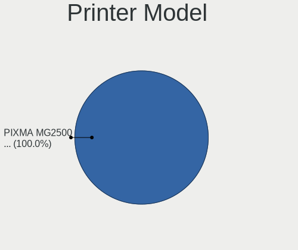

| Model                  | Computers | Percent |
|------------------------|-----------|---------|
| HP LaserJet CP1525nw/x | 1         | 50%     |
| HP Deskjet 2050 J510   | 1         | 50%     |

Scanner Vendor
--------------

Scanner device vendors

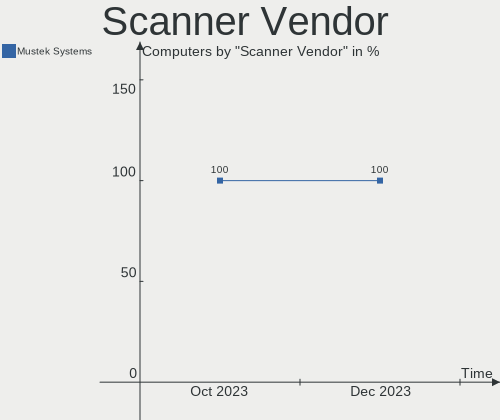

| Vendor         | Computers | Percent |
|----------------|-----------|---------|
| Mustek Systems | 1         | 100%    |

Scanner Model
-------------

Scanner device models

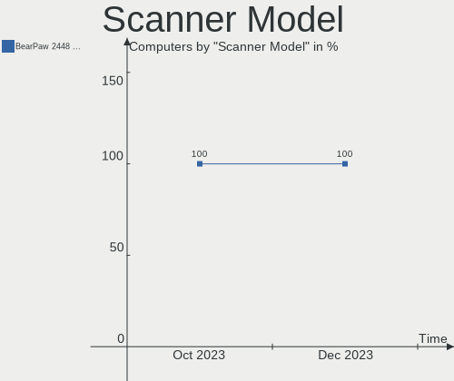

| Model                               | Computers | Percent |
|-------------------------------------|-----------|---------|
| Mustek Systems BearPaw 2448 TA Plus | 1         | 100%    |

Camera
------

Camera Vendor
-------------

Camera device vendors

| Vendor                                 | Computers | Percent |
|----------------------------------------|-----------|---------|
| Chicony Electronics                    | 8         | 26.67%  |
| Quanta                                 | 4         | 13.33%  |
| IMC Networks                           | 3         | 10%     |
| Sunplus Innovation Technology          | 2         | 6.67%   |
| Microdia                               | 2         | 6.67%   |
| Bison Electronics                      | 2         | 6.67%   |
| Z-Star Microelectronics                | 1         | 3.33%   |
| Suyin                                  | 1         | 3.33%   |
| Samsung Electronics                    | 1         | 3.33%   |
| Realtek Semiconductor                  | 1         | 3.33%   |
| Luxvisions Innotech Limited            | 1         | 3.33%   |
| Lite-On Technology                     | 1         | 3.33%   |
| Generalplus Technology                 | 1         | 3.33%   |
| Creative Technology                    | 1         | 3.33%   |
| Cheng Uei Precision Industry (Foxlink) | 1         | 3.33%   |

Camera Model
------------

Camera device models

| Model                                                   | Computers | Percent |
|---------------------------------------------------------|-----------|---------|
| Chicony Integrated Camera                               | 3         | 10%     |
| Chicony HD Webcam                                       | 2         | 6.67%   |
| Z-Star A4 TECH USB2.0 PC Camera E                       | 1         | 3.33%   |
| Suyin Laptop_Integrated_Webcam_3M                       | 1         | 3.33%   |
| Sunplus Integrated_Webcam_FHD                           | 1         | 3.33%   |
| Sunplus Full HD webcam                                  | 1         | 3.33%   |
| Samsung Galaxy series, misc. (MTP mode)                 | 1         | 3.33%   |
| Realtek EasyCamera                                      | 1         | 3.33%   |
| Quanta ov9734_techfront_camera                          | 1         | 3.33%   |
| Quanta HP Wide Vision HD Camera                         | 1         | 3.33%   |
| Quanta HP 5MP Camera                                    | 1         | 3.33%   |
| Quanta HD User Facing                                   | 1         | 3.33%   |
| Microdia Laptop_Integrated_Webcam_HD                    | 1         | 3.33%   |
| Microdia Integrated_Webcam_HD                           | 1         | 3.33%   |
| Luxvisions Innotech Limited HP Wide Vision HD Camera    | 1         | 3.33%   |
| Lite-On HP Wide Vision HD Camera                        | 1         | 3.33%   |
| IMC Networks ov9734_azurewave_camera                    | 1         | 3.33%   |
| IMC Networks Integrated Camera                          | 1         | 3.33%   |
| IMC Networks HD Camera                                  | 1         | 3.33%   |
| Generalplus GENERAL WEBCAM                              | 1         | 3.33%   |
| Creative Live! Cam Sync 1080p V2                        | 1         | 3.33%   |
| Chicony Web Camera - FHD                                | 1         | 3.33%   |
| Chicony Laptop_Integrated_Webcam_HD                     | 1         | 3.33%   |
| Chicony HP HD Webcam                                    | 1         | 3.33%   |
| Cheng Uei Precision Industry (Foxlink) HP Truevision HD | 1         | 3.33%   |
| Bison Integrated Camera                                 | 1         | 3.33%   |
| Bison HD Webcam                                         | 1         | 3.33%   |

Security
--------

Fingerprint Vendor
------------------

Fingerprint sensor vendors

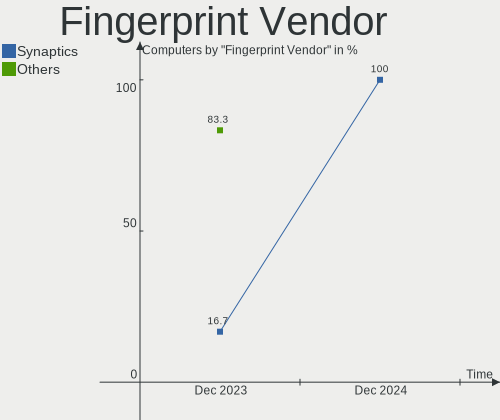

| Vendor                     | Computers | Percent |
|----------------------------|-----------|---------|
| Shenzhen Goodix Technology | 3         | 50%     |
| Validity Sensors           | 1         | 16.67%  |
| Synaptics                  | 1         | 16.67%  |
| Elan Microelectronics      | 1         | 16.67%  |

Fingerprint Model
-----------------

Fingerprint sensor models

| Model                                            | Computers | Percent |
|--------------------------------------------------|-----------|---------|
| Shenzhen Goodix  Fingerprint Device              | 3         | 50%     |
| Validity Sensors Fingerprint scanner             | 1         | 16.67%  |
| Synaptics Metallica MIS Touch Fingerprint Reader | 1         | 16.67%  |
| Elan ELAN:ARM-M4                                 | 1         | 16.67%  |

Chipcard Vendor
---------------

Chipcard module vendors

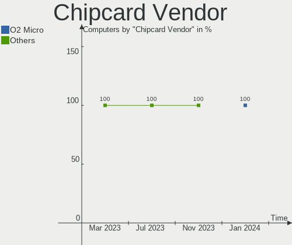

| Vendor                            | Computers | Percent |
|-----------------------------------|-----------|---------|
| VASCO Data Security International | 1         | 20%     |
| O2 Micro                          | 1         | 20%     |
| Gemalto (was Gemplus)             | 1         | 20%     |
| Broadcom                          | 1         | 20%     |
| Alcor Micro                       | 1         | 20%     |

Chipcard Model
--------------

Chipcard module models

| Model                                                           | Computers | Percent |
|-----------------------------------------------------------------|-----------|---------|
| VASCO Data Security International Digipass 905 SmartCard Reader | 1         | 20%     |
| O2 Micro OZ776 CCID Smartcard Reader                            | 1         | 20%     |
| Gemalto (was Gemplus) GemPC Twin SmartCard Reader               | 1         | 20%     |
| Broadcom 58200                                                  | 1         | 20%     |
| Alcor Micro AU9540 Smartcard Reader                             | 1         | 20%     |

Unsupported
-----------

Unsupported Devices
-------------------

Total unsupported devices on board

| Total | Computers | Percent |
|-------|-----------|---------|
| 0     | 31        | 70.45%  |
| 1     | 12        | 27.27%  |
| 2     | 1         | 2.27%   |

Unsupported Device Types
------------------------

Types of unsupported devices

| Type                  | Computers | Percent |
|-----------------------|-----------|---------|
| Fingerprint reader    | 6         | 42.86%  |
| Chipcard              | 4         | 28.57%  |
| Unassigned class      | 1         | 7.14%   |
| Multimedia controller | 1         | 7.14%   |
| Graphics card         | 1         | 7.14%   |
| Camera                | 1         | 7.14%   |

