Xero - Hardware Trends
----------------------

A project to identify most popular hardware characteristics and track their change
over time based on data collected by Linux users at https://Linux-Hardware.org.

Anyone can contribute to this report by the [hw-probe](https://github.com/linuxhw/hw-probe) tool:

    sudo -E hw-probe -all -upload

This is a report for all computer types. See also reports for [desktops](/Dist/Xero/Desktop/README.md) and [notebooks](/Dist/Xero/Notebook/README.md).

This report is for one last month. Overall report since the beginning of time: [TestDays](https://github.com/linuxhw/TestDays)

Period: Nov, 2023.

Contents
--------

* [ System ](#system)
  - [ OS                       ](#os)
  - [ OS Family                ](#os-family)
  - [ Kernel                   ](#kernel)
  - [ Kernel Family            ](#kernel-family)
  - [ Kernel Major Ver.        ](#kernel-major-ver)
  - [ Arch                     ](#arch)
  - [ DE                       ](#de)
  - [ Display Server           ](#display-server)
  - [ Display Manager          ](#display-manager)
  - [ OS Lang                  ](#os-lang)
  - [ Boot Mode                ](#boot-mode)
  - [ Filesystem               ](#filesystem)
  - [ Part. scheme             ](#part-scheme)
  - [ Dual Boot with Linux/BSD ](#dual-boot-with-linuxbsd)
  - [ Dual Boot (Win)          ](#dual-boot-win)

* [ Board ](#board)
  - [ Vendor                   ](#vendor)
  - [ Model                    ](#model)
  - [ Model Family             ](#model-family)
  - [ MFG Year                 ](#mfg-year)
  - [ Form Factor              ](#form-factor)
  - [ Secure Boot              ](#secure-boot)
  - [ Coreboot                 ](#coreboot)
  - [ RAM Size                 ](#ram-size)
  - [ RAM Used                 ](#ram-used)
  - [ Total Drives             ](#total-drives)
  - [ Has CD-ROM               ](#has-cd-rom)
  - [ Has Ethernet             ](#has-ethernet)
  - [ Has WiFi                 ](#has-wifi)
  - [ Has Bluetooth            ](#has-bluetooth)

* [ Location ](#location)
  - [ Country                  ](#country)
  - [ City                     ](#city)

* [ Drives ](#drives)
  - [ Drive Vendor             ](#drive-vendor)
  - [ Drive Model              ](#drive-model)
  - [ HDD Vendor               ](#hdd-vendor)
  - [ SSD Vendor               ](#ssd-vendor)
  - [ Drive Kind               ](#drive-kind)
  - [ Drive Connector          ](#drive-connector)
  - [ Drive Size               ](#drive-size)
  - [ Space Total              ](#space-total)
  - [ Space Used               ](#space-used)
  - [ Malfunc. Drives          ](#malfunc-drives)
  - [ Malfunc. Drive Vendor    ](#malfunc-drive-vendor)
  - [ Malfunc. HDD Vendor      ](#malfunc-hdd-vendor)
  - [ Malfunc. Drive Kind      ](#malfunc-drive-kind)
  - [ Failed Drives            ](#failed-drives)
  - [ Failed Drive Vendor      ](#failed-drive-vendor)
  - [ Drive Status             ](#drive-status)

* [ Storage controller ](#storage-controller)
  - [ Storage Vendor           ](#storage-vendor)
  - [ Storage Model            ](#storage-model)
  - [ Storage Kind             ](#storage-kind)

* [ Processor ](#processor)
  - [ CPU Vendor               ](#cpu-vendor)
  - [ CPU Model                ](#cpu-model)
  - [ CPU Model Family         ](#cpu-model-family)
  - [ CPU Cores                ](#cpu-cores)
  - [ CPU Sockets              ](#cpu-sockets)
  - [ CPU Threads              ](#cpu-threads)
  - [ CPU Op-Modes             ](#cpu-op-modes)
  - [ CPU Microcode            ](#cpu-microcode)
  - [ CPU Microarch            ](#cpu-microarch)

* [ Graphics ](#graphics)
  - [ GPU Vendor               ](#gpu-vendor)
  - [ GPU Model                ](#gpu-model)
  - [ GPU Combo                ](#gpu-combo)
  - [ GPU Driver               ](#gpu-driver)
  - [ GPU Memory               ](#gpu-memory)

* [ Monitor ](#monitor)
  - [ Monitor Vendor           ](#monitor-vendor)
  - [ Monitor Model            ](#monitor-model)
  - [ Monitor Resolution       ](#monitor-resolution)
  - [ Monitor Diagonal         ](#monitor-diagonal)
  - [ Monitor Width            ](#monitor-width)
  - [ Aspect Ratio             ](#aspect-ratio)
  - [ Monitor Area             ](#monitor-area)
  - [ Pixel Density            ](#pixel-density)
  - [ Multiple Monitors        ](#multiple-monitors)

* [ Network ](#network)
  - [ Net Controller Vendor    ](#net-controller-vendor)
  - [ Net Controller Model     ](#net-controller-model)
  - [ Wireless Vendor          ](#wireless-vendor)
  - [ Wireless Model           ](#wireless-model)
  - [ Ethernet Vendor          ](#ethernet-vendor)
  - [ Ethernet Model           ](#ethernet-model)
  - [ Net Controller Kind      ](#net-controller-kind)
  - [ Used Controller          ](#used-controller)
  - [ NICs                     ](#nics)
  - [ IPv6                     ](#ipv6)

* [ Bluetooth ](#bluetooth)
  - [ Bluetooth Vendor         ](#bluetooth-vendor)
  - [ Bluetooth Model          ](#bluetooth-model)

* [ Sound ](#sound)
  - [ Sound Vendor             ](#sound-vendor)
  - [ Sound Model              ](#sound-model)

* [ Memory ](#memory)
  - [ Memory Vendor            ](#memory-vendor)
  - [ Memory Model             ](#memory-model)
  - [ Memory Kind              ](#memory-kind)
  - [ Memory Form Factor       ](#memory-form-factor)
  - [ Memory Size              ](#memory-size)
  - [ Memory Speed             ](#memory-speed)

* [ Printers & scanners ](#printers--scanners)
  - [ Printer Vendor           ](#printer-vendor)
  - [ Printer Model            ](#printer-model)
  - [ Scanner Vendor           ](#scanner-vendor)
  - [ Scanner Model            ](#scanner-model)

* [ Camera ](#camera)
  - [ Camera Vendor            ](#camera-vendor)
  - [ Camera Model             ](#camera-model)

* [ Security ](#security)
  - [ Fingerprint Vendor       ](#fingerprint-vendor)
  - [ Fingerprint Model        ](#fingerprint-model)
  - [ Chipcard Vendor          ](#chipcard-vendor)
  - [ Chipcard Model           ](#chipcard-model)

* [ Unsupported ](#unsupported)
  - [ Unsupported Devices      ](#unsupported-devices)
  - [ Unsupported Device Types ](#unsupported-device-types)

System
------

OS
--

Installed operating systems

| Name         | Computers | Percent |
|--------------|-----------|---------|
| Xero Rolling | 41        | 100%    |

OS Family
---------

OS without a version

| Name | Computers | Percent |
|------|-----------|---------|
| Xero | 41        | 100%    |

Kernel
------

Version of the Linux kernel

| Version           | Computers | Percent |
|-------------------|-----------|---------|
| 6.5.9-arch2-1     | 24        | 58.54%  |
| 6.6.1-arch1-1     | 7         | 17.07%  |
| 6.6.2-arch1-1     | 4         | 9.76%   |
| 6.6.3-arch1-1     | 2         | 4.88%   |
| 6.4.12-arch1-1    | 2         | 4.88%   |
| 6.5.5-arch1-1     | 1         | 2.44%   |
| 6.4.12-zen1-1-zen | 1         | 2.44%   |

Kernel Family
-------------

Linux kernel without a distro release

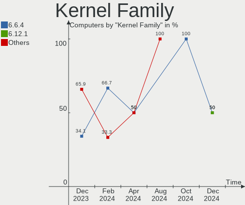

| Version | Computers | Percent |
|---------|-----------|---------|
| 6.5.9   | 24        | 58.54%  |
| 6.6.1   | 7         | 17.07%  |
| 6.6.2   | 4         | 9.76%   |
| 6.4.12  | 3         | 7.32%   |
| 6.6.3   | 2         | 4.88%   |
| 6.5.5   | 1         | 2.44%   |

Kernel Major Ver.
-----------------

Linux kernel major version

| Version | Computers | Percent |
|---------|-----------|---------|
| 6.5     | 25        | 60.98%  |
| 6.6     | 13        | 31.71%  |
| 6.4     | 3         | 7.32%   |

Arch
----

OS architecture (x86_64, i586, etc.)

| Name   | Computers | Percent |
|--------|-----------|---------|
| x86_64 | 41        | 100%    |

DE
--

Desktop Environment

| Name | Computers | Percent |
|------|-----------|---------|
| KDE5 | 41        | 100%    |

Display Server
--------------

X11 or Wayland

| Name    | Computers | Percent |
|---------|-----------|---------|
| Wayland | 23        | 56.1%   |
| X11     | 18        | 43.9%   |

Display Manager
---------------

SDDM, LightDM, etc.

| Name    | Computers | Percent |
|---------|-----------|---------|
| SDDM    | 38        | 92.68%  |
| LightDM | 2         | 4.88%   |
| Unknown | 1         | 2.44%   |

OS Lang
-------

Language

| Lang  | Computers | Percent |
|-------|-----------|---------|
| en_US | 15        | 36.59%  |
| it_IT | 4         | 9.76%   |
| fr_FR | 3         | 7.32%   |
| en_IN | 3         | 7.32%   |
| pt_BR | 2         | 4.88%   |
| pl_PL | 2         | 4.88%   |
| es_MX | 2         | 4.88%   |
| zh_CN | 1         | 2.44%   |
| tr_TR | 1         | 2.44%   |
| ru_RU | 1         | 2.44%   |
| es_ES | 1         | 2.44%   |
| en_GB | 1         | 2.44%   |
| de_DE | 1         | 2.44%   |
| de_AT | 1         | 2.44%   |
| da_DK | 1         | 2.44%   |
| bg_BG | 1         | 2.44%   |
| ar_KW | 1         | 2.44%   |

Boot Mode
---------

EFI or BIOS

| Mode | Computers | Percent |
|------|-----------|---------|
| EFI  | 35        | 85.37%  |
| BIOS | 6         | 14.63%  |

Filesystem
----------

Type of filesystem

| Type  | Computers | Percent |
|-------|-----------|---------|
| Ext4  | 22        | 53.66%  |
| Btrfs | 19        | 46.34%  |

Part. scheme
------------

Scheme of partitioning

| Type    | Computers | Percent |
|---------|-----------|---------|
| GPT     | 35        | 85.37%  |
| MBR     | 5         | 12.2%   |
| Unknown | 1         | 2.44%   |

Dual Boot with Linux/BSD
------------------------

Hosting more than one Linux/BSD

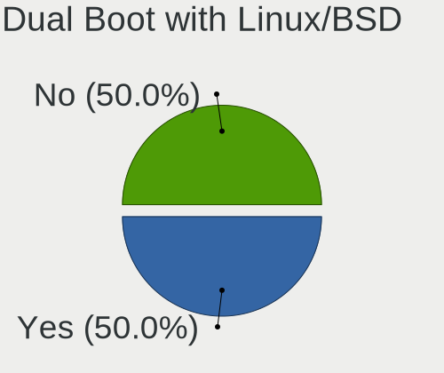

| Dual boot | Computers | Percent |
|-----------|-----------|---------|
| No        | 28        | 68.29%  |
| Yes       | 13        | 31.71%  |

Dual Boot (Win)
---------------

Hosting Linux and Windows

| Dual boot | Computers | Percent |
|-----------|-----------|---------|
| No        | 22        | 53.66%  |
| Yes       | 19        | 46.34%  |

Board
-----

Vendor
------

Motherboard manufacturer

| Name                | Computers | Percent |
|---------------------|-----------|---------|
| Lenovo              | 11        | 26.83%  |
| ASUSTek Computer    | 9         | 21.95%  |
| Toshiba             | 3         | 7.32%   |
| MSI                 | 3         | 7.32%   |
| Hewlett-Packard     | 3         | 7.32%   |
| Gigabyte Technology | 3         | 7.32%   |
| Acer                | 3         | 7.32%   |
| Intel               | 1         | 2.44%   |
| HUAWEI              | 1         | 2.44%   |
| ECS                 | 1         | 2.44%   |
| Dell                | 1         | 2.44%   |
| AZW                 | 1         | 2.44%   |
| ASRock              | 1         | 2.44%   |

Model
-----

Motherboard model

| Name                                     | Computers | Percent |
|------------------------------------------|-----------|---------|
| Toshiba Satellite Pro L300               | 1         | 2.44%   |
| Toshiba Satellite P50-B-11V              | 1         | 2.44%   |
| Toshiba Satellite C55-C                  | 1         | 2.44%   |
| MSI MS-7C37                              | 1         | 2.44%   |
| MSI MS-7845                              | 1         | 2.44%   |
| MSI Bravo 15 B5DD                        | 1         | 2.44%   |
| Lenovo Yoga 2 13 20344                   | 1         | 2.44%   |
| Lenovo XiaoXinPro 14 IRH8 83AL           | 1         | 2.44%   |
| Lenovo ThinkPad X395 20NLS0J400          | 1         | 2.44%   |
| Lenovo ThinkPad X1 Yoga 3rd 20LD001KUS   | 1         | 2.44%   |
| Lenovo ThinkPad X1 Carbon 6th 20KGS5YN00 | 1         | 2.44%   |
| Lenovo ThinkPad T14s Gen 3 21CQ000FUS    | 1         | 2.44%   |
| Lenovo ThinkPad P43s 20RH0021MX          | 1         | 2.44%   |
| Lenovo IdeaPadFlex 5 14IAU7 82R7         | 1         | 2.44%   |
| Lenovo IdeaPad Slim 3 14IAN8 82XA        | 1         | 2.44%   |
| Lenovo IdeaPad 5 Pro 16IHU6 82L9         | 1         | 2.44%   |
| Lenovo IdeaPad 320-15ABR 80XS            | 1         | 2.44%   |
| Intel X99                                | 1         | 2.44%   |
| HUAWEI RLEF-XX                           | 1         | 2.44%   |
| HP Pavilion dv7                          | 1         | 2.44%   |
| HP Pavilion dv6                          | 1         | 2.44%   |
| HP Laptop 15s-fr2xxx                     | 1         | 2.44%   |
| Gigabyte X570 AORUS ULTRA                | 1         | 2.44%   |
| Gigabyte GA-78LMT-USB3 6.0               | 1         | 2.44%   |
| Gigabyte B450M DS3H                      | 1         | 2.44%   |
| ECS H81H3-M3                             | 1         | 2.44%   |
| Dell OptiPlex 790                        | 1         | 2.44%   |
| AZW SER                                  | 1         | 2.44%   |
| ASUS X540LJ                              | 1         | 2.44%   |
| ASUS VivoBook_ASUSLaptop X712EA_K712EA   | 1         | 2.44%   |
| ASUS UX310UQK                            | 1         | 2.44%   |
| ASUS TUF Gaming FX505DT_FX95DT           | 1         | 2.44%   |
| ASUS TUF Gaming B550-PLUS WIFI II        | 1         | 2.44%   |
| ASUS ROG Maximus XI HERO                 | 1         | 2.44%   |
| ASUS ROG Flow X13 GV301RC_GV301RC        | 1         | 2.44%   |
| ASUS PRIME H510M-D                       | 1         | 2.44%   |
| ASUS Captain                             | 1         | 2.44%   |
| ASRock B250M-HDV                         | 1         | 2.44%   |
| Acer Nitro AN515-57                      | 1         | 2.44%   |
| Acer Nitro AN515-54                      | 1         | 2.44%   |

Model Family
------------

Motherboard model prefix

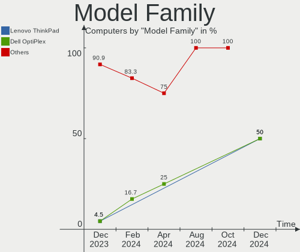

| Name                   | Computers | Percent |
|------------------------|-----------|---------|
| Lenovo ThinkPad        | 5         | 12.2%   |
| Toshiba Satellite      | 3         | 7.32%   |
| Lenovo IdeaPad         | 3         | 7.32%   |
| HP Pavilion            | 2         | 4.88%   |
| ASUS TUF               | 2         | 4.88%   |
| ASUS ROG               | 2         | 4.88%   |
| Acer Nitro             | 2         | 4.88%   |
| MSI MS-7C37            | 1         | 2.44%   |
| MSI MS-7845            | 1         | 2.44%   |
| MSI Bravo              | 1         | 2.44%   |
| Lenovo Yoga            | 1         | 2.44%   |
| Lenovo XiaoXinPro      | 1         | 2.44%   |
| Lenovo IdeaPadFlex     | 1         | 2.44%   |
| Intel X99              | 1         | 2.44%   |
| HUAWEI RLEF-XX         | 1         | 2.44%   |
| HP Laptop              | 1         | 2.44%   |
| Gigabyte X570          | 1         | 2.44%   |
| Gigabyte GA-78LMT-USB3 | 1         | 2.44%   |
| Gigabyte B450M         | 1         | 2.44%   |
| ECS H81H3-M3           | 1         | 2.44%   |
| Dell OptiPlex          | 1         | 2.44%   |
| AZW SER                | 1         | 2.44%   |
| ASUS X540LJ            | 1         | 2.44%   |
| ASUS VivoBook          | 1         | 2.44%   |
| ASUS UX310UQK          | 1         | 2.44%   |
| ASUS PRIME             | 1         | 2.44%   |
| ASUS Captain           | 1         | 2.44%   |
| ASRock B250M-HDV       | 1         | 2.44%   |
| Acer Aspire            | 1         | 2.44%   |

MFG Year
--------

Motherboard manufacture year

| Year | Computers | Percent |
|------|-----------|---------|
| 2021 | 9         | 21.95%  |
| 2019 | 8         | 19.51%  |
| 2022 | 4         | 9.76%   |
| 2014 | 4         | 9.76%   |
| 2023 | 3         | 7.32%   |
| 2008 | 3         | 7.32%   |
| 2018 | 2         | 4.88%   |
| 2017 | 2         | 4.88%   |
| 2015 | 2         | 4.88%   |
| 2020 | 1         | 2.44%   |
| 2016 | 1         | 2.44%   |
| 2013 | 1         | 2.44%   |
| 2011 | 1         | 2.44%   |

Form Factor
-----------

Physical design of the computer

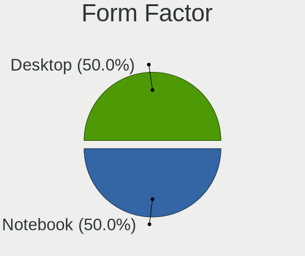

| Name        | Computers | Percent |
|-------------|-----------|---------|
| Notebook    | 24        | 58.54%  |
| Desktop     | 13        | 31.71%  |
| Convertible | 3         | 7.32%   |
| Mini pc     | 1         | 2.44%   |

Secure Boot
-----------

Enabled or disabled

| State    | Computers | Percent |
|----------|-----------|---------|
| Disabled | 41        | 100%    |

Coreboot
--------

Have coreboot on board

| Used | Computers | Percent |
|------|-----------|---------|
| No   | 41        | 100%    |

RAM Size
--------

Total RAM memory

| Size in GB  | Computers | Percent |
|-------------|-----------|---------|
| 4.01-8.0    | 12        | 29.27%  |
| 16.01-24.0  | 10        | 24.39%  |
| 8.01-16.0   | 7         | 17.07%  |
| 32.01-64.0  | 3         | 7.32%   |
| 3.01-4.0    | 3         | 7.32%   |
| 24.01-32.0  | 3         | 7.32%   |
| 64.01-256.0 | 2         | 4.88%   |
| 2.01-3.0    | 1         | 2.44%   |

RAM Used
--------

Used RAM memory

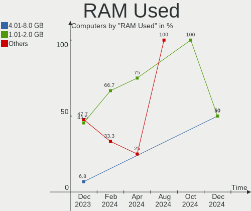

| Used GB   | Computers | Percent |
|-----------|-----------|---------|
| 2.01-3.0  | 20        | 48.78%  |
| 1.01-2.0  | 11        | 26.83%  |
| 3.01-4.0  | 7         | 17.07%  |
| 4.01-8.0  | 2         | 4.88%   |
| 8.01-16.0 | 1         | 2.44%   |

Total Drives
------------

Number of drives on board

| Drives | Computers | Percent |
|--------|-----------|---------|
| 1      | 25        | 60.98%  |
| 2      | 10        | 24.39%  |
| 3      | 3         | 7.32%   |
| 5      | 2         | 4.88%   |
| 4      | 1         | 2.44%   |

Has CD-ROM
----------

Has CD-ROM on board

| Presented | Computers | Percent |
|-----------|-----------|---------|
| No        | 29        | 70.73%  |
| Yes       | 12        | 29.27%  |

Has Ethernet
------------

Has Ethernet on board

| Presented | Computers | Percent |
|-----------|-----------|---------|
| Yes       | 32        | 78.05%  |
| No        | 9         | 21.95%  |

Has WiFi
--------

Has WiFi module

| Presented | Computers | Percent |
|-----------|-----------|---------|
| Yes       | 35        | 85.37%  |
| No        | 6         | 14.63%  |

Has Bluetooth
-------------

Has Bluetooth module

| Presented | Computers | Percent |
|-----------|-----------|---------|
| Yes       | 26        | 63.41%  |
| No        | 15        | 36.59%  |

Location
--------

Country
-------

Geographic location (country)

| Country   | Computers | Percent |
|-----------|-----------|---------|
| USA       | 9         | 21.95%  |
| France    | 4         | 9.76%   |
| Poland    | 3         | 7.32%   |
| India     | 3         | 7.32%   |
| Germany   | 3         | 7.32%   |
| Brazil    | 3         | 7.32%   |
| Italy     | 2         | 4.88%   |
| China     | 2         | 4.88%   |
| Turkey    | 1         | 2.44%   |
| Spain     | 1         | 2.44%   |
| Russia    | 1         | 2.44%   |
| Portugal  | 1         | 2.44%   |
| Morocco   | 1         | 2.44%   |
| Kuwait    | 1         | 2.44%   |
| Indonesia | 1         | 2.44%   |
| Ecuador   | 1         | 2.44%   |
| Denmark   | 1         | 2.44%   |
| Bulgaria  | 1         | 2.44%   |
| Austria   | 1         | 2.44%   |
| Argentina | 1         | 2.44%   |

City
----

Geographic location (city)

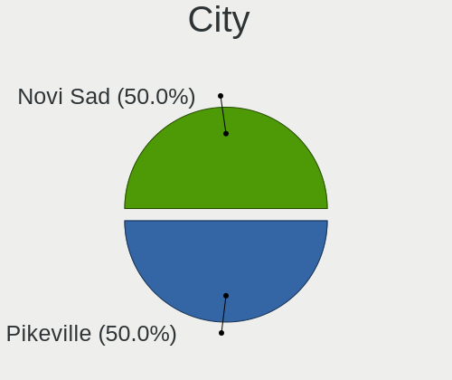

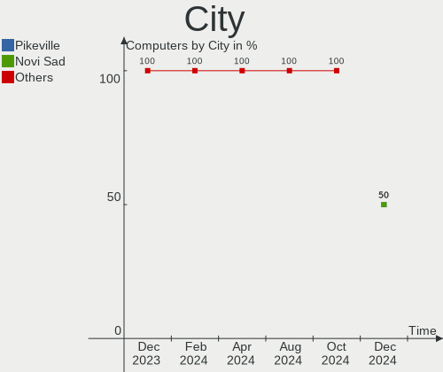

| City                | Computers | Percent |
|---------------------|-----------|---------|
| Wuhan               | 1         | 2.44%   |
| Warsaw              | 1         | 2.44%   |
| Virginia Beach      | 1         | 2.44%   |
| Valparaiso de Goias | 1         | 2.44%   |
| Teresina            | 1         | 2.44%   |
| Sao Paulo           | 1         | 2.44%   |
| Sanford             | 1         | 2.44%   |
| Rosenheim           | 1         | 2.44%   |
| Reno                | 1         | 2.44%   |
| Pune                | 1         | 2.44%   |
| Potsdam             | 1         | 2.44%   |
| Portland            | 1         | 2.44%   |
| Pleven              | 1         | 2.44%   |
| Olympia             | 1         | 2.44%   |
| North Tonawanda     | 1         | 2.44%   |
| Nanchong            | 1         | 2.44%   |
| Mersin              | 1         | 2.44%   |
| Mauthausen          | 1         | 2.44%   |
| Loja                | 1         | 2.44%   |
| Lisbon              | 1         | 2.44%   |
| Lensk               | 1         | 2.44%   |
| Lect                | 1         | 2.44%   |
| Las Vegas           | 1         | 2.44%   |
| La Plata            | 1         | 2.44%   |
| La Ciotat           | 1         | 2.44%   |
| Kuwait City         | 1         | 2.44%   |
| Jeumont             | 1         | 2.44%   |
| Jember              | 1         | 2.44%   |
| Gliwice             | 1         | 2.44%   |
| Frankfurt am Main   | 1         | 2.44%   |
| Fairfax             | 1         | 2.44%   |
| Edwardsville        | 1         | 2.44%   |
| Delhi               | 1         | 2.44%   |
| Christiansfeld      | 1         | 2.44%   |
| Chennai             | 1         | 2.44%   |
| Cesena              | 1         | 2.44%   |
| Casablanca          | 1         | 2.44%   |
| Bologna             | 1         | 2.44%   |
| Będzin             | 1         | 2.44%   |
| Barcelona           | 1         | 2.44%   |

Drives
------

Drive Vendor
------------

Hard drive vendors

| Vendor                      | Computers | Drives | Percent |
|-----------------------------|-----------|--------|---------|
| Seagate                     | 10        | 11     | 15.87%  |
| Samsung Electronics         | 9         | 9      | 14.29%  |
| WDC                         | 7         | 7      | 11.11%  |
| Sandisk                     | 4         | 6      | 6.35%   |
| SK hynix                    | 3         | 3      | 4.76%   |
| Micron/Crucial Technology   | 3         | 4      | 4.76%   |
| Kingston                    | 3         | 4      | 4.76%   |
| Toshiba                     | 2         | 2      | 3.17%   |
| Silicon Motion              | 2         | 2      | 3.17%   |
| Phison Electronics          | 2         | 2      | 3.17%   |
| Micron Technology           | 2         | 2      | 3.17%   |
| Intel                       | 2         | 2      | 3.17%   |
| ADATA Technology            | 2         | 2      | 3.17%   |
| Yangtze Memory Technologies | 1         | 1      | 1.59%   |
| Unknown                     | 1         | 1      | 1.59%   |
| Union Memory (Shenzhen)     | 1         | 1      | 1.59%   |
| Team                        | 1         | 1      | 1.59%   |
| Lenovo                      | 1         | 1      | 1.59%   |
| Kingston Technology Company | 1         | 1      | 1.59%   |
| Hitachi                     | 1         | 1      | 1.59%   |
| HGST                        | 1         | 1      | 1.59%   |
| Fanxiang                    | 1         | 1      | 1.59%   |
| Crucial                     | 1         | 1      | 1.59%   |
| ASMT                        | 1         | 1      | 1.59%   |
| ASMedia                     | 1         | 1      | 1.59%   |

Drive Model
-----------

Hard drive models

| Model                                                 | Computers | Percent |
|-------------------------------------------------------|-----------|---------|
| Sandisk WD Blue SN570 500GB                           | 2         | 3.13%   |
| Samsung NVMe SSD Controller PM9A1/PM9A3/980PRO 2TB    | 2         | 3.13%   |
| Phison PS5013 E13 NVMe Controller 512GB               | 2         | 3.13%   |
| Yangtze Memory ZHITAI TiPlus5000 1TB                  | 1         | 1.56%   |
| WDC WDS100T2B0A-00SM50 1TB SSD                        | 1         | 1.56%   |
| WDC WD40EZRZ-00GXCB0 4TB                              | 1         | 1.56%   |
| WDC WD3200BEVT-26ZCT0 320GB                           | 1         | 1.56%   |
| WDC WD2500BEVS-22UST0 250GB                           | 1         | 1.56%   |
| WDC WD20EARX-00PASB0 2TB                              | 1         | 1.56%   |
| WDC WD10SPZX-22Z10T1 1TB                              | 1         | 1.56%   |
| WDC WD10EZEX-00BN5A0 1TB                              | 1         | 1.56%   |
| Unknown MMC Card  32GB                                | 1         | 1.56%   |
| Union Memory (Shenzhen) UMIS RPEYJ1T24MKN2QWY 1TB     | 1         | 1.56%   |
| Toshiba MQ01ABD100 1TB                                | 1         | 1.56%   |
| Toshiba HDWD220 2TB                                   | 1         | 1.56%   |
| Team T253512GB SSD                                    | 1         | 1.56%   |
| SK hynix SKHynix_HFS512GDE9X084N 512GB                | 1         | 1.56%   |
| SK hynix SKHynix_HFS512GD9TNI-L2B0B 512GB             | 1         | 1.56%   |
| SK hynix HFS512G39TND-N210A 512GB SSD                 | 1         | 1.56%   |
| Silicon Motion SM2263EN/SM2263XT SSD Controller 256GB | 1         | 1.56%   |
| Silicon Motion PCIe-8 SSD 512GB                       | 1         | 1.56%   |
| Seagate ST9500420AS 500GB                             | 1         | 1.56%   |
| Seagate ST500LX012-SSHD-8GB                           | 1         | 1.56%   |
| Seagate ST500DM002-1BD142 500GB                       | 1         | 1.56%   |
| Seagate ST3320418AS 320GB                             | 1         | 1.56%   |
| Seagate ST3250318AS 250GB                             | 1         | 1.56%   |
| Seagate ST1000LM035-1RK172 1TB                        | 1         | 1.56%   |
| Seagate ST1000LM024 HN-M101MBB 1TB                    | 1         | 1.56%   |
| Seagate ST1000DM010-2EP102 1TB                        | 1         | 1.56%   |
| Seagate Expansion HDD 2TB                             | 1         | 1.56%   |
| Seagate BUP Slim BK 1TB                               | 1         | 1.56%   |
| Sandisk WD Blue SN550 NVMe SSD 512GB                  | 1         | 1.56%   |
| SanDisk SD9TN8W-256G-1006 256GB SSD                   | 1         | 1.56%   |
| Samsung SSD 870 QVO 2TB                               | 1         | 1.56%   |
| Samsung SSD 860 EVO 1TB                               | 1         | 1.56%   |
| Samsung SSD 840 EVO 250GB                             | 1         | 1.56%   |
| Samsung NVMe SSD Controller SM981/PM981/PM983 250GB   | 1         | 1.56%   |
| Samsung MZVLQ512HBLU-00B00 512GB                      | 1         | 1.56%   |
| Samsung MZAL4256HBJD-00BL2 256GB                      | 1         | 1.56%   |
| Samsung HD103SJ 1TB                                   | 1         | 1.56%   |

HDD Vendor
----------

Hard disk drive vendors

| Vendor              | Computers | Drives | Percent |
|---------------------|-----------|--------|---------|
| Seagate             | 10        | 11     | 45.45%  |
| WDC                 | 6         | 6      | 27.27%  |
| Toshiba             | 2         | 2      | 9.09%   |
| Samsung Electronics | 1         | 1      | 4.55%   |
| Hitachi             | 1         | 1      | 4.55%   |
| HGST                | 1         | 1      | 4.55%   |
| ASMedia             | 1         | 1      | 4.55%   |

SSD Vendor
----------

Solid state drive vendors

| Vendor              | Computers | Drives | Percent |
|---------------------|-----------|--------|---------|
| Samsung Electronics | 3         | 3      | 27.27%  |
| WDC                 | 1         | 1      | 9.09%   |
| Team                | 1         | 1      | 9.09%   |
| SK hynix            | 1         | 1      | 9.09%   |
| SanDisk             | 1         | 1      | 9.09%   |
| Kingston            | 1         | 2      | 9.09%   |
| Fanxiang            | 1         | 1      | 9.09%   |
| Crucial             | 1         | 1      | 9.09%   |
| ASMT                | 1         | 1      | 9.09%   |

Drive Kind
----------

HDD or SSD

| Kind | Computers | Drives | Percent |
|------|-----------|--------|---------|
| NVMe | 25        | 32     | 44.64%  |
| HDD  | 19        | 23     | 33.93%  |
| SSD  | 11        | 12     | 19.64%  |
| MMC  | 1         | 1      | 1.79%   |

Drive Connector
---------------

SATA, SAS, NVMe, etc.

| Type | Computers | Drives | Percent |
|------|-----------|--------|---------|
| NVMe | 25        | 31     | 46.3%   |
| SATA | 24        | 30     | 44.44%  |
| SAS  | 4         | 6      | 7.41%   |
| MMC  | 1         | 1      | 1.85%   |

Drive Size
----------

Size of hard drive

| Size in TB | Computers | Drives | Percent |
|------------|-----------|--------|---------|
| 0.51-1.0   | 13        | 14     | 41.94%  |
| 0.01-0.5   | 11        | 12     | 35.48%  |
| 1.01-2.0   | 3         | 5      | 9.68%   |
| 3.01-4.0   | 2         | 2      | 6.45%   |
| 2.01-3.0   | 1         | 1      | 3.23%   |
| 4.01-10.0  | 1         | 1      | 3.23%   |

Space Total
-----------

Amount of disk space available on the file system

| Size in GB     | Computers | Percent |
|----------------|-----------|---------|
| 101-250        | 9         | 21.95%  |
| More than 3000 | 8         | 19.51%  |
| 251-500        | 8         | 19.51%  |
| 1001-2000      | 6         | 14.63%  |
| 501-1000       | 5         | 12.2%   |
| 2001-3000      | 2         | 4.88%   |
| 51-100         | 2         | 4.88%   |
| 21-50          | 1         | 2.44%   |

Space Used
----------

Amount of used disk space

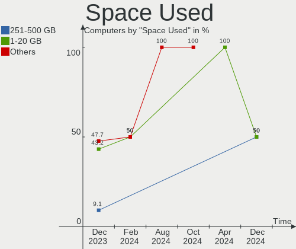

| Used GB        | Computers | Percent |
|----------------|-----------|---------|
| 1-20           | 16        | 39.02%  |
| 21-50          | 11        | 26.83%  |
| 51-100         | 5         | 12.2%   |
| 251-500        | 4         | 9.76%   |
| 101-250        | 4         | 9.76%   |
| More than 3000 | 1         | 2.44%   |

Malfunc. Drives
---------------

Drive models with a malfunction

| Model                                 | Computers | Drives | Percent |
|---------------------------------------|-----------|--------|---------|
| WDC WD2500BEVS-22UST0 250GB           | 1         | 1      | 9.09%   |
| WDC WD20EARX-00PASB0 2TB              | 1         | 1      | 9.09%   |
| SK hynix HFS512G39TND-N210A 512GB SSD | 1         | 1      | 9.09%   |
| Seagate ST500DM002-1BD142 500GB       | 1         | 1      | 9.09%   |
| Seagate ST3320418AS 320GB             | 1         | 1      | 9.09%   |
| Seagate ST1000DM010-2EP102 1TB        | 1         | 1      | 9.09%   |
| SanDisk SD9TN8W-256G-1006 256GB SSD   | 1         | 1      | 9.09%   |
| Samsung Electronics HD103SJ 1TB       | 1         | 1      | 9.09%   |
| Kingston SA400S37480G 480GB SSD       | 1         | 1      | 9.09%   |
| HGST HDS724040ALE640 4TB              | 1         | 1      | 9.09%   |
| ASMedia AS2115 8TB                    | 1         | 1      | 9.09%   |

Malfunc. Drive Vendor
---------------------

Vendors of faulty drives

| Vendor              | Computers | Drives | Percent |
|---------------------|-----------|--------|---------|
| Seagate             | 3         | 3      | 27.27%  |
| WDC                 | 2         | 2      | 18.18%  |
| SK hynix            | 1         | 1      | 9.09%   |
| SanDisk             | 1         | 1      | 9.09%   |
| Samsung Electronics | 1         | 1      | 9.09%   |
| Kingston            | 1         | 1      | 9.09%   |
| HGST                | 1         | 1      | 9.09%   |
| ASMedia             | 1         | 1      | 9.09%   |

Malfunc. HDD Vendor
-------------------

Vendors of faulty HDD drives

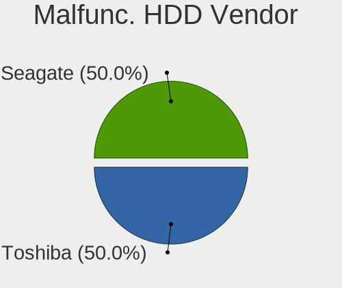

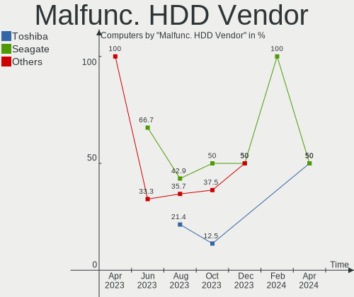

| Vendor              | Computers | Drives | Percent |
|---------------------|-----------|--------|---------|
| Seagate             | 3         | 3      | 37.5%   |
| WDC                 | 2         | 2      | 25%     |
| Samsung Electronics | 1         | 1      | 12.5%   |
| HGST                | 1         | 1      | 12.5%   |
| ASMedia             | 1         | 1      | 12.5%   |

Malfunc. Drive Kind
-------------------

Kinds of faulty drives

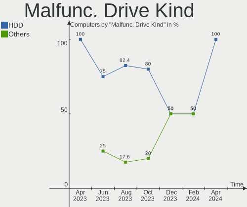

| Kind | Computers | Drives | Percent |
|------|-----------|--------|---------|
| HDD  | 8         | 8      | 72.73%  |
| SSD  | 3         | 3      | 27.27%  |

Failed Drives
-------------

Failed drive models

Zero info for selected period =(

Failed Drive Vendor
-------------------

Failed drive vendors

Zero info for selected period =(

Drive Status
------------

Number of failed and malfunc. drives

| Status   | Computers | Drives | Percent |
|----------|-----------|--------|---------|
| Works    | 35        | 50     | 68.63%  |
| Malfunc  | 11        | 11     | 21.57%  |
| Detected | 5         | 7      | 9.8%    |

Storage controller
------------------

Storage Vendor
--------------

Storage controller vendors

| Vendor                                  | Computers | Percent |
|-----------------------------------------|-----------|---------|
| Intel                                   | 20        | 33.9%   |
| AMD                                     | 10        | 16.95%  |
| Samsung Electronics                     | 6         | 10.17%  |
| SanDisk                                 | 3         | 5.08%   |
| Micron/Crucial Technology               | 3         | 5.08%   |
| Kingston Technology Company             | 3         | 5.08%   |
| SK hynix                                | 2         | 3.39%   |
| Silicon Motion                          | 2         | 3.39%   |
| Phison Electronics                      | 2         | 3.39%   |
| Micron Technology                       | 2         | 3.39%   |
| ASMedia Technology                      | 2         | 3.39%   |
| ADATA Technology                        | 2         | 3.39%   |
| Yangtze Memory Technologies             | 1         | 1.69%   |
| Shenzhen Unionmemory Information System | 1         | 1.69%   |

Storage Model
-------------

Storage controller models

| Model                                                                                         | Computers | Percent |
|-----------------------------------------------------------------------------------------------|-----------|---------|
| AMD FCH SATA Controller [AHCI mode]                                                           | 6         | 9.09%   |
| Intel Volume Management Device NVMe RAID Controller                                           | 4         | 6.06%   |
| SanDisk Ultra 3D / WD Blue SN570 NVMe SSD (DRAM-less)                                         | 2         | 3.03%   |
| Samsung NVMe SSD Controller SM981/PM981/PM983                                                 | 2         | 3.03%   |
| Samsung NVMe SSD Controller PM9A1/PM9A3/980PRO                                                | 2         | 3.03%   |
| Phison PS5013-E13 PCIe3 NVMe Controller (DRAM-less)                                           | 2         | 3.03%   |
| Intel Wildcat Point-LP SATA Controller [AHCI Mode]                                            | 2         | 3.03%   |
| Intel Tiger Lake-LP SATA Controller                                                           | 2         | 3.03%   |
| Intel Sunrise Point-LP SATA Controller [AHCI mode]                                            | 2         | 3.03%   |
| Intel 8 Series/C220 Series Chipset Family 6-port SATA Controller 1 [AHCI mode]                | 2         | 3.03%   |
| ASMedia ASM1062 Serial ATA Controller                                                         | 2         | 3.03%   |
| AMD 500 Series Chipset SATA Controller                                                        | 2         | 3.03%   |
| Yangtze Memory ZHITAI TiPro5000 NVMe SSD                                                      | 1         | 1.52%   |
| SK hynix PC611 NVMe Solid State Drive                                                         | 1         | 1.52%   |
| SK hynix Gold P31/BC711/PC711 NVMe Solid State Drive                                          | 1         | 1.52%   |
| Silicon Motion SM2263EN/SM2263XT (DRAM-less) NVMe SSD Controllers                             | 1         | 1.52%   |
| Silicon Motion Non-Volatile memory controller                                                 | 1         | 1.52%   |
| Shenzhen Unionmemory Information System RPEYJ1T24MKN2QWY PCIe 4.0 NVMe SSD 1024GB (DRAM-less) | 1         | 1.52%   |
| SanDisk Ultra 3D / WD Blue SN550 NVMe SSD                                                     | 1         | 1.52%   |
| Samsung NVMe SSD Controller PM9B1 (DRAM-less)                                                 | 1         | 1.52%   |
| Samsung NVMe SSD Controller 980 (DRAM-less)                                                   | 1         | 1.52%   |
| Micron/Crucial P2 [Nick P2] / P3 / P3 Plus NVMe PCIe SSD (DRAM-less)                          | 1         | 1.52%   |
| Micron/Crucial P1 NVMe PCIe SSD[Frampton]                                                     | 1         | 1.52%   |
| Micron/Crucial P1 NVMe PCIe SSD[Frampton2]                                                    | 1         | 1.52%   |
| Micron 2450 NVMe SSD [HendrixV] (DRAM-less)                                                   | 1         | 1.52%   |
| Micron 2200S NVMe SSD [Cassandra]                                                             | 1         | 1.52%   |
| Kingston Company OM8PCP Design-In PCIe 3 NVMe SSD (DRAM-less)                                 | 1         | 1.52%   |
| Kingston Company Design-In PCIe 4 NVMe SSD (TLC)                                              | 1         | 1.52%   |
| Kingston Company Design-In PCIe 4 NVMe SSD (QLC)                                              | 1         | 1.52%   |
| Intel Tiger Lake SATA AHCI Controller                                                         | 1         | 1.52%   |
| Intel SSD 670p Series [Keystone Harbor]                                                       | 1         | 1.52%   |
| Intel SSD 660P Series                                                                         | 1         | 1.52%   |
| Intel Cannon Lake PCH SATA AHCI Controller                                                    | 1         | 1.52%   |
| Intel Cannon Lake Mobile PCH SATA AHCI Controller                                             | 1         | 1.52%   |
| Intel 9 Series Chipset Family SATA Controller [AHCI Mode]                                     | 1         | 1.52%   |
| Intel 82801IBM/IEM (ICH9M/ICH9M-E) 4 port SATA Controller [AHCI mode]                         | 1         | 1.52%   |
| Intel 82801HM/HEM (ICH8M/ICH8M-E) SATA Controller [AHCI mode]                                 | 1         | 1.52%   |
| Intel 82801HM/HEM (ICH8M/ICH8M-E) IDE Controller                                              | 1         | 1.52%   |
| Intel 8 Series SATA Controller 1 [AHCI mode]                                                  | 1         | 1.52%   |
| Intel 6 Series/C200 Series Chipset Family 6 port Desktop SATA AHCI Controller                 | 1         | 1.52%   |

Storage Kind
------------

Kind of storage controller (IDE, SATA, NVMe, SAS, ...)

| Kind | Computers | Percent |
|------|-----------|---------|
| SATA | 28        | 47.46%  |
| NVMe | 25        | 42.37%  |
| RAID | 4         | 6.78%   |
| IDE  | 2         | 3.39%   |

Processor
---------

CPU Vendor
----------

Processor vendors

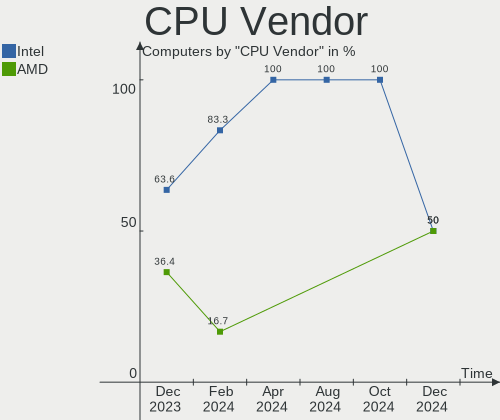

| Vendor | Computers | Percent |
|--------|-----------|---------|
| Intel  | 27        | 65.85%  |
| AMD    | 14        | 34.15%  |

CPU Model
---------

Processor models

| Model                                           | Computers | Percent |
|-------------------------------------------------|-----------|---------|
| Intel 11th Gen Core i3-1115G4 @ 3.00GHz         | 2         | 4.88%   |
| AMD Ryzen 5 5600H with Radeon Graphics          | 2         | 4.88%   |
| Intel Xeon CPU E5-2695 v3 @ 2.30GHz             | 1         | 2.44%   |
| Intel Core i9-9900K CPU @ 3.60GHz               | 1         | 2.44%   |
| Intel Core i7-8650U CPU @ 1.90GHz               | 1         | 2.44%   |
| Intel Core i7-8565U CPU @ 1.80GHz               | 1         | 2.44%   |
| Intel Core i7-8550U CPU @ 1.80GHz               | 1         | 2.44%   |
| Intel Core i7-7500U CPU @ 2.70GHz               | 1         | 2.44%   |
| Intel Core i7-4770K CPU @ 3.50GHz               | 1         | 2.44%   |
| Intel Core i7-4720HQ CPU @ 2.60GHz              | 1         | 2.44%   |
| Intel Core i7-2600 CPU @ 3.40GHz                | 1         | 2.44%   |
| Intel Core i5-9300H CPU @ 2.40GHz               | 1         | 2.44%   |
| Intel Core i5-7500 CPU @ 3.40GHz                | 1         | 2.44%   |
| Intel Core i5-5200U CPU @ 2.20GHz               | 1         | 2.44%   |
| Intel Core i3-N305                              | 1         | 2.44%   |
| Intel Core i3-5005U CPU @ 2.00GHz               | 1         | 2.44%   |
| Intel Core i3-4170 CPU @ 3.70GHz                | 1         | 2.44%   |
| Intel Core i3-4030U CPU @ 1.90GHz               | 1         | 2.44%   |
| Intel Core i3-10105F CPU @ 3.70GHz              | 1         | 2.44%   |
| Intel Core 2 Duo CPU T6500 @ 2.10GHz            | 1         | 2.44%   |
| Intel Core 2 Duo CPU T5750 @ 2.00GHz            | 1         | 2.44%   |
| Intel 13th Gen Core i5-13500H                   | 1         | 2.44%   |
| Intel 12th Gen Core i5-12450H                   | 1         | 2.44%   |
| Intel 12th Gen Core i5-1235U                    | 1         | 2.44%   |
| Intel 11th Gen Core i9-11900H @ 2.50GHz         | 1         | 2.44%   |
| Intel 11th Gen Core i5-1135G7 @ 2.40GHz         | 1         | 2.44%   |
| Intel 11th Gen Core i5-11300H @ 3.10GHz         | 1         | 2.44%   |
| AMD Turion II Dual-Core Mobile M500             | 1         | 2.44%   |
| AMD Ryzen 7 PRO 6850U with Radeon Graphics      | 1         | 2.44%   |
| AMD Ryzen 7 PRO 3700U w/ Radeon Vega Mobile Gfx | 1         | 2.44%   |
| AMD Ryzen 7 6800HS with Radeon Graphics         | 1         | 2.44%   |
| AMD Ryzen 7 3700X 8-Core Processor              | 1         | 2.44%   |
| AMD Ryzen 5 5600X 6-Core Processor              | 1         | 2.44%   |
| AMD Ryzen 5 5500                                | 1         | 2.44%   |
| AMD Ryzen 5 3600 6-Core Processor               | 1         | 2.44%   |
| AMD Ryzen 5 3550H with Radeon Vega Mobile Gfx   | 1         | 2.44%   |
| AMD Ryzen 5 2600X Six-Core Processor            | 1         | 2.44%   |
| AMD FX-6300 Six-Core Processor                  | 1         | 2.44%   |
| AMD A12-9720P RADEON R7, 12 COMPUTE CORES 4C+8G | 1         | 2.44%   |

CPU Model Family
----------------

Processor model prefix

| Model                   | Computers | Percent |
|-------------------------|-----------|---------|
| Other                   | 8         | 19.51%  |
| Intel Core i7           | 7         | 17.07%  |
| AMD Ryzen 5             | 7         | 17.07%  |
| Intel Core i3           | 5         | 12.2%   |
| Intel Core i5           | 3         | 7.32%   |
| Intel Core 2 Duo        | 2         | 4.88%   |
| AMD Ryzen 7 PRO         | 2         | 4.88%   |
| AMD Ryzen 7             | 2         | 4.88%   |
| Intel Xeon              | 1         | 2.44%   |
| Intel Core i9           | 1         | 2.44%   |
| AMD Turion II Dual-Core | 1         | 2.44%   |
| AMD FX                  | 1         | 2.44%   |
| AMD A12                 | 1         | 2.44%   |

CPU Cores
---------

Number of processor cores

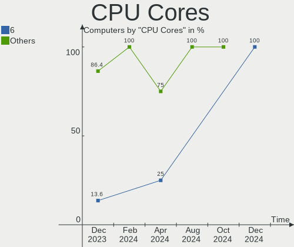

| Number | Computers | Percent |
|--------|-----------|---------|
| 4      | 13        | 31.71%  |
| 2      | 11        | 26.83%  |
| 8      | 7         | 17.07%  |
| 6      | 6         | 14.63%  |
| 28     | 1         | 2.44%   |
| 12     | 1         | 2.44%   |
| 10     | 1         | 2.44%   |
| 3      | 1         | 2.44%   |

CPU Sockets
-----------

Number of sockets

| Number | Computers | Percent |
|--------|-----------|---------|
| 1      | 40        | 97.56%  |
| 2      | 1         | 2.44%   |

CPU Threads
-----------

Threads per core (Hyper-Threading)

| Number | Computers | Percent |
|--------|-----------|---------|
| 2      | 35        | 85.37%  |
| 1      | 6         | 14.63%  |

CPU Op-Modes
------------

CPU Operation Modes (32-bit, 64-bit)

| Op mode        | Computers | Percent |
|----------------|-----------|---------|
| 32-bit, 64-bit | 41        | 100%    |

CPU Microcode
-------------

Microcode number

| Number     | Computers | Percent |
|------------|-----------|---------|
| Unknown    | 28        | 68.29%  |
| 0x0a50000c | 2         | 4.88%   |
| 0x0a404102 | 2         | 4.88%   |
| 0x08701021 | 2         | 4.88%   |
| 0x0a50000d | 1         | 2.44%   |
| 0x0a201025 | 1         | 2.44%   |
| 0x08108109 | 1         | 2.44%   |
| 0x08108102 | 1         | 2.44%   |
| 0x0800820d | 1         | 2.44%   |
| 0x0600611a | 1         | 2.44%   |
| 0x06000852 | 1         | 2.44%   |

CPU Microarch
-------------

Microarchitecture

| Name             | Computers | Percent |
|------------------|-----------|---------|
| KabyLake         | 7         | 17.07%  |
| Haswell          | 5         | 12.2%   |
| Zen 3            | 4         | 9.76%   |
| TigerLake        | 4         | 9.76%   |
| Zen+             | 3         | 7.32%   |
| Alderlake Hybrid | 3         | 7.32%   |
| Zen 2            | 2         | 4.88%   |
| Broadwell        | 2         | 4.88%   |
| Unknown          | 2         | 4.88%   |
| SandyBridge      | 1         | 2.44%   |
| Piledriver       | 1         | 2.44%   |
| Penryn           | 1         | 2.44%   |
| K10              | 1         | 2.44%   |
| Icelake          | 1         | 2.44%   |
| Gracemont        | 1         | 2.44%   |
| Excavator        | 1         | 2.44%   |
| Core             | 1         | 2.44%   |
| CometLake        | 1         | 2.44%   |

Graphics
--------

GPU Vendor
----------

Vendors of graphics cards

| Vendor | Computers | Percent |
|--------|-----------|---------|
| Intel  | 20        | 40%     |
| AMD    | 16        | 32%     |
| Nvidia | 14        | 28%     |

GPU Model
---------

Graphics card models

| Model                                                                     | Computers | Percent |
|---------------------------------------------------------------------------|-----------|---------|
| Nvidia TU117M [GeForce GTX 1650 Mobile / Max-Q]                           | 2         | 3.85%   |
| Intel UHD Graphics 620                                                    | 2         | 3.85%   |
| Intel TigerLake-LP GT2 [Iris Xe Graphics]                                 | 2         | 3.85%   |
| Intel Tiger Lake-LP GT2 [UHD Graphics G4]                                 | 2         | 3.85%   |
| Intel HD Graphics 5500                                                    | 2         | 3.85%   |
| AMD Rembrandt [Radeon 680M]                                               | 2         | 3.85%   |
| AMD Picasso/Raven 2 [Radeon Vega Series / Radeon Vega Mobile Series]      | 2         | 3.85%   |
| AMD Ellesmere [Radeon RX 470/480/570/570X/580/580X/590]                   | 2         | 3.85%   |
| AMD Cezanne [Radeon Vega Series / Radeon Vega Mobile Series]              | 2         | 3.85%   |
| Nvidia TU117M [GeForce MX450]                                             | 1         | 1.92%   |
| Nvidia TU116 [GeForce GTX 1660 SUPER]                                     | 1         | 1.92%   |
| Nvidia GP108GLM [Quadro P520]                                             | 1         | 1.92%   |
| Nvidia GM108M [GeForce 940MX]                                             | 1         | 1.92%   |
| Nvidia GM107 [GeForce GTX 745]                                            | 1         | 1.92%   |
| Nvidia GK208BM [GeForce 920M]                                             | 1         | 1.92%   |
| Nvidia GF119 [GeForce GT 610]                                             | 1         | 1.92%   |
| Nvidia GF108 [GeForce GT 730]                                             | 1         | 1.92%   |
| Nvidia GA107M [GeForce RTX 3050 Mobile]                                   | 1         | 1.92%   |
| Nvidia GA106M [GeForce RTX 3060 Mobile / Max-Q]                           | 1         | 1.92%   |
| Nvidia GA106 [GeForce RTX 3060 Lite Hash Rate]                            | 1         | 1.92%   |
| Nvidia GA102 [GeForce RTX 3080 Ti]                                        | 1         | 1.92%   |
| Intel WhiskeyLake-U GT2 [UHD Graphics 620]                                | 1         | 1.92%   |
| Intel TigerLake-H GT1 [UHD Graphics]                                      | 1         | 1.92%   |
| Intel Raptor Lake-P [Iris Xe Graphics]                                    | 1         | 1.92%   |
| Intel Mobile GM965/GL960 Integrated Graphics Controller (secondary)       | 1         | 1.92%   |
| Intel Mobile GM965/GL960 Integrated Graphics Controller (primary)         | 1         | 1.92%   |
| Intel HD Graphics 620                                                     | 1         | 1.92%   |
| Intel Haswell-ULT Integrated Graphics Controller                          | 1         | 1.92%   |
| Intel CoffeeLake-H GT2 [UHD Graphics 630]                                 | 1         | 1.92%   |
| Intel Alder Lake-UP3 GT2 [Iris Xe Graphics]                               | 1         | 1.92%   |
| Intel Alder Lake-P GT1 [UHD Graphics]                                     | 1         | 1.92%   |
| Intel Alder Lake-N [UHD Graphics]                                         | 1         | 1.92%   |
| Intel 4th Generation Core Processor Family Integrated Graphics Controller | 1         | 1.92%   |
| Intel 4th Gen Core Processor Integrated Graphics Controller               | 1         | 1.92%   |
| AMD Wani [Radeon R5/R6/R7 Graphics]                                       | 1         | 1.92%   |
| AMD Venus PRO [Radeon HD 8850M / R9 M265X]                                | 1         | 1.92%   |
| AMD Tobago PRO [Radeon R7 360 / R9 360 OEM]                               | 1         | 1.92%   |
| AMD RV730/M96 [Mobility Radeon HD 4650/5165]                              | 1         | 1.92%   |
| AMD RV710/M92 [Mobility Radeon HD 4530/4570/5145/530v/540v/545v]          | 1         | 1.92%   |
| AMD Polaris 20 XL [Radeon RX 580 2048SP]                                  | 1         | 1.92%   |

GPU Combo
---------

Combinations of graphics cards

| Name           | Computers | Percent |
|----------------|-----------|---------|
| 1 x Intel      | 12        | 29.27%  |
| 1 x AMD        | 12        | 29.27%  |
| 1 x Nvidia     | 6         | 14.63%  |
| Intel + Nvidia | 6         | 14.63%  |
| AMD + Nvidia   | 2         | 4.88%   |
| 2 x Intel      | 1         | 2.44%   |
| 2 x AMD        | 1         | 2.44%   |
| Intel + AMD    | 1         | 2.44%   |

GPU Driver
----------

Free vs proprietary

| Driver      | Computers | Percent |
|-------------|-----------|---------|
| Free        | 37        | 90.24%  |
| Proprietary | 4         | 9.76%   |

GPU Memory
----------

Total video memory

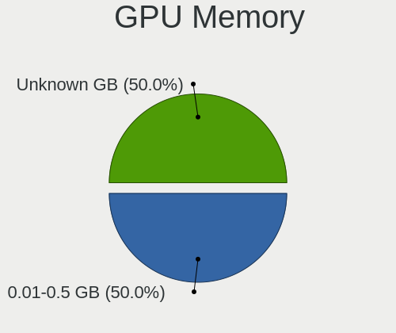

| Size in GB | Computers | Percent |
|------------|-----------|---------|
| Unknown    | 15        | 36.59%  |
| 1.01-2.0   | 8         | 19.51%  |
| 7.01-8.0   | 5         | 12.2%   |
| 3.01-4.0   | 4         | 9.76%   |
| 0.51-1.0   | 3         | 7.32%   |
| 8.01-16.0  | 2         | 4.88%   |
| 0.01-0.5   | 2         | 4.88%   |
| 5.01-6.0   | 1         | 2.44%   |
| 2.01-3.0   | 1         | 2.44%   |

Monitor
-------

Monitor Vendor
--------------

Monitor vendors

| Vendor              | Computers | Percent |
|---------------------|-----------|---------|
| Chimei Innolux      | 7         | 15.56%  |
| AU Optronics        | 6         | 13.33%  |
| Samsung Electronics | 4         | 8.89%   |
| BOE                 | 4         | 8.89%   |
| Goldstar            | 3         | 6.67%   |
| Unknown             | 2         | 4.44%   |
| Sharp               | 2         | 4.44%   |
| MSI                 | 2         | 4.44%   |
| CSO                 | 2         | 4.44%   |
| ASUSTek Computer    | 2         | 4.44%   |
| AOC                 | 2         | 4.44%   |
| Wacom               | 1         | 2.22%   |
| RTK                 | 1         | 2.22%   |
| Philips             | 1         | 2.22%   |
| LG Display          | 1         | 2.22%   |
| HKC                 | 1         | 2.22%   |
| Hitachi             | 1         | 2.22%   |
| Fujitsu Siemens     | 1         | 2.22%   |
| CTO                 | 1         | 2.22%   |
| Acer                | 1         | 2.22%   |

Monitor Model
-------------

Monitor models

| Model                                                                 | Computers | Percent |
|-----------------------------------------------------------------------|-----------|---------|
| Unknown LCD Monitor FFFF 2288x1287 2550x2550mm 142.0-inch             | 2         | 4.35%   |
| Wacom Cintiq 16 WAC1071 1920x1080 344x193mm 15.5-inch                 | 1         | 2.17%   |
| Sharp LQ156M1JW01 SHP14C3 1920x1080 344x194mm 15.5-inch               | 1         | 2.17%   |
| Sharp LQ134N1JW55 SHP1558 1920x1200 288x180mm 13.4-inch               | 1         | 2.17%   |
| Samsung Electronics U28E590 SAM0C4D 3840x2160 610x350mm 27.7-inch     | 1         | 2.17%   |
| Samsung Electronics LF24T35 SAM707D 1920x1080 528x297mm 23.9-inch     | 1         | 2.17%   |
| Samsung Electronics LCD Monitor SEC3741 1280x800 331x207mm 15.4-inch  | 1         | 2.17%   |
| Samsung Electronics LCD Monitor SDC4141 1366x768 344x194mm 15.5-inch  | 1         | 2.17%   |
| Samsung Electronics LCD Monitor SAM0B30 1920x1080 480x270mm 21.7-inch | 1         | 2.17%   |
| RTK HDMI RTK1560 1920x1080 345x194mm 15.6-inch                        | 1         | 2.17%   |
| Philips PHL 273V7 PHLC156 1920x1080 598x336mm 27.0-inch               | 1         | 2.17%   |
| MSI Optix MAG24C MSI1462 1920x1080 520x290mm 23.4-inch                | 1         | 2.17%   |
| MSI MAG301CR2 MSI3CB4 2560x1080 690x291mm 29.5-inch                   | 1         | 2.17%   |
| LG Display LCD Monitor LGD0470 1920x1080 345x194mm 15.6-inch          | 1         | 2.17%   |
| HKC LCD Monitor HKC3D00 1920x1080 344x194mm 15.5-inch                 | 1         | 2.17%   |
| Hitachi HDMI HEC0030 1920x1080 580x330mm 26.3-inch                    | 1         | 2.17%   |
| Goldstar W1752 GSM4491 1440x900 370x232mm 17.2-inch                   | 1         | 2.17%   |
| Goldstar ULTRAWIDE GSM76FA 2560x1080 798x334mm 34.1-inch              | 1         | 2.17%   |
| Goldstar 27GK750F GSM770D 1920x1080 531x298mm 24.0-inch               | 1         | 2.17%   |
| Fujitsu Siemens SL23T-1 LED FUS07FA 1920x1080 509x286mm 23.0-inch     | 1         | 2.17%   |
| CTO LCD Monitor CTO1416 1920x1200 301x188mm 14.0-inch                 | 1         | 2.17%   |
| CSO LCD Monitor CSO1602 2560x1600 344x215mm 16.0-inch                 | 1         | 2.17%   |
| CSO LCD Monitor CSO1416 2880x1800 301x188mm 14.0-inch                 | 1         | 2.17%   |
| Chimei Innolux LCD Monitor CMN15DB 1366x768 344x193mm 15.5-inch       | 1         | 2.17%   |
| Chimei Innolux LCD Monitor CMN1540 2560x1440 344x193mm 15.5-inch      | 1         | 2.17%   |
| Chimei Innolux LCD Monitor CMN1521 1920x1080 344x193mm 15.5-inch      | 1         | 2.17%   |
| Chimei Innolux LCD Monitor CMN1515 1920x1080 344x193mm 15.5-inch      | 1         | 2.17%   |
| Chimei Innolux LCD Monitor CMN14F2 1920x1080 309x173mm 13.9-inch      | 1         | 2.17%   |
| Chimei Innolux LCD Monitor CMN14E1 1920x1080 309x173mm 13.9-inch      | 1         | 2.17%   |
| Chimei Innolux LCD Monitor CMN143F 1920x1200 301x188mm 14.0-inch      | 1         | 2.17%   |
| BOE LCD Monitor BOE0A74 1920x1200 345x215mm 16.0-inch                 | 1         | 2.17%   |
| BOE LCD Monitor BOE09AE 1920x1080 309x174mm 14.0-inch                 | 1         | 2.17%   |
| BOE LCD Monitor BOE084E 1920x1080 382x215mm 17.3-inch                 | 1         | 2.17%   |
| BOE LCD Monitor BOE066E 1366x768 344x194mm 15.5-inch                  | 1         | 2.17%   |
| AU Optronics LCD Monitor AUOD0ED 1920x1080 344x193mm 15.5-inch        | 1         | 2.17%   |
| AU Optronics LCD Monitor AUO2336 2560x1440 309x174mm 14.0-inch        | 1         | 2.17%   |
| AU Optronics LCD Monitor AUO222D 1920x1080 293x165mm 13.2-inch        | 1         | 2.17%   |
| AU Optronics LCD Monitor AUO202D 1920x1080 293x165mm 13.2-inch        | 1         | 2.17%   |
| AU Optronics LCD Monitor AUO142D 1920x1080 293x165mm 13.2-inch        | 1         | 2.17%   |
| AU Optronics LCD Monitor AUO119E 1600x900 382x214mm 17.2-inch         | 1         | 2.17%   |

Monitor Resolution
------------------

Monitor screen resolution

| Resolution        | Computers | Percent |
|-------------------|-----------|---------|
| 1920x1080 (FHD)   | 19        | 43.18%  |
| 2560x1440 (QHD)   | 5         | 11.36%  |
| 1920x1200 (WUXGA) | 4         | 9.09%   |
| 3840x2160 (4K)    | 3         | 6.82%   |
| 2560x1080         | 3         | 6.82%   |
| 1366x768 (WXGA)   | 3         | 6.82%   |
| 2288x1287         | 2         | 4.55%   |
| 3440x1440         | 1         | 2.27%   |
| 2880x1800         | 1         | 2.27%   |
| 2560x1600         | 1         | 2.27%   |
| 1600x900 (HD+)    | 1         | 2.27%   |
| 1440x900 (WXGA+)  | 1         | 2.27%   |

Monitor Diagonal
----------------

Diagonal size in inches

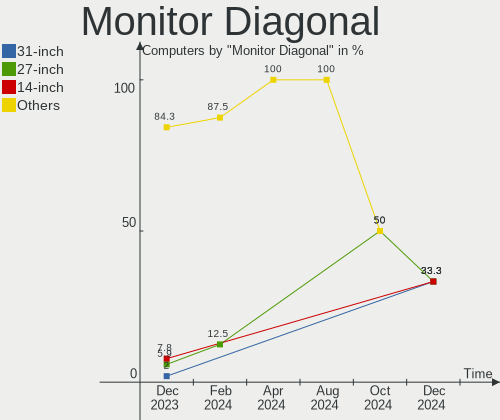

| Inches | Computers | Percent |
|--------|-----------|---------|
| 15     | 12        | 26.09%  |
| 13     | 6         | 13.04%  |
| 14     | 5         | 10.87%  |
| 24     | 4         | 8.7%    |
| 27     | 3         | 6.52%   |
| 17     | 3         | 6.52%   |
| 16     | 3         | 6.52%   |
| 142    | 2         | 4.35%   |
| 34     | 2         | 4.35%   |
| 84     | 1         | 2.17%   |
| 54     | 1         | 2.17%   |
| 31     | 1         | 2.17%   |
| 29     | 1         | 2.17%   |
| 28     | 1         | 2.17%   |
| 23     | 1         | 2.17%   |

Monitor Width
-------------

Physical width

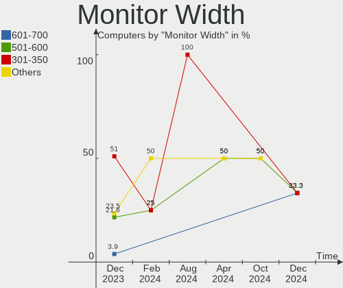

| Width in mm    | Computers | Percent |
|----------------|-----------|---------|
| 301-350        | 20        | 44.44%  |
| 501-600        | 7         | 15.56%  |
| 601-700        | 4         | 8.89%   |
| 351-400        | 4         | 8.89%   |
| 201-300        | 4         | 8.89%   |
| More than 2000 | 2         | 4.44%   |
| 701-800        | 2         | 4.44%   |
| 1501-2000      | 1         | 2.22%   |
| 1001-1500      | 1         | 2.22%   |

Aspect Ratio
------------

Proportional relationship between the width and the height

| Ratio | Computers | Percent |
|-------|-----------|---------|
| 16/9  | 28        | 66.67%  |
| 16/10 | 8         | 19.05%  |
| 21/9  | 4         | 9.52%   |
| 1.00  | 2         | 4.76%   |

Monitor Area
------------

Area in inch²

| Area in inch² | Computers | Percent |
|----------------|-----------|---------|
| 101-110        | 12        | 26.67%  |
| 81-90          | 7         | 15.56%  |
| More than 1000 | 4         | 8.89%   |
| 71-80          | 4         | 8.89%   |
| 301-350        | 4         | 8.89%   |
| 201-250        | 4         | 8.89%   |
| 351-500        | 3         | 6.67%   |
| 251-300        | 2         | 4.44%   |
| 121-130        | 2         | 4.44%   |
| 111-120        | 2         | 4.44%   |
| 131-140        | 1         | 2.22%   |

Pixel Density
-------------

Pixels per inch

| Density       | Computers | Percent |
|---------------|-----------|---------|
| 121-160       | 13        | 29.55%  |
| 51-100        | 12        | 27.27%  |
| 161-240       | 9         | 20.45%  |
| 101-120       | 5         | 11.36%  |
| 1-50          | 3         | 6.82%   |
| More than 240 | 2         | 4.55%   |

Multiple Monitors
-----------------

Total monitors connected

| Total | Computers | Percent |
|-------|-----------|---------|
| 1     | 33        | 80.49%  |
| 2     | 8         | 19.51%  |

Network
-------

Net Controller Vendor
---------------------

Controller vendors

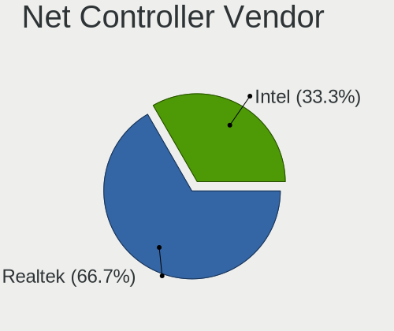

| Vendor                          | Computers | Percent |
|---------------------------------|-----------|---------|
| Realtek Semiconductor           | 28        | 44.44%  |
| Intel                           | 20        | 31.75%  |
| Qualcomm Atheros                | 3         | 4.76%   |
| Broadcom                        | 3         | 4.76%   |
| ASIX Electronics                | 3         | 4.76%   |
| TP-Link                         | 2         | 3.17%   |
| Qualcomm Atheros Communications | 1         | 1.59%   |
| Qualcomm                        | 1         | 1.59%   |
| OPPO Electronics                | 1         | 1.59%   |
| MediaTek                        | 1         | 1.59%   |

Net Controller Model
--------------------

Controller models

| Model                                                             | Computers | Percent |
|-------------------------------------------------------------------|-----------|---------|
| Realtek RTL8111/8168/8411 PCI Express Gigabit Ethernet Controller | 16        | 22.86%  |
| Realtek RTL810xE PCI Express Fast Ethernet controller             | 3         | 4.29%   |
| Intel Wi-Fi 6 AX201                                               | 3         | 4.29%   |
| Intel Wi-Fi 6 AX200                                               | 3         | 4.29%   |
| ASIX AX88179 Gigabit Ethernet                                     | 3         | 4.29%   |
| Realtek RTL8822CE 802.11ac PCIe Wireless Network Adapter          | 2         | 2.86%   |
| Intel Wireless-AC 9260                                            | 2         | 2.86%   |
| Intel Wireless 8265 / 8275                                        | 2         | 2.86%   |
| TP-Link Archer T2U PLUS [RTL8821AU]                               | 1         | 1.43%   |
| TP-Link AC600 wireless Realtek RTL8811AU [Archer T2U Nano]        | 1         | 1.43%   |
| Realtek RTL88x2bu [AC1200 Techkey]                                | 1         | 1.43%   |
| Realtek RTL8852BE PCIe 802.11ax Wireless Network Controller       | 1         | 1.43%   |
| Realtek RTL8821CE PCIe 802.11ac Wireless Network Controller       | 1         | 1.43%   |
| Realtek RTL8821CE 802.11ac PCIe Wireless Network Adapter          | 1         | 1.43%   |
| Realtek RTL8812AU 802.11a/b/g/n/ac 2T2R DB WLAN Adapter           | 1         | 1.43%   |
| Realtek RTL8723BE PCIe Wireless Network Adapter                   | 1         | 1.43%   |
| Realtek RTL8187B Wireless Adapter                                 | 1         | 1.43%   |
| Realtek RTL8153 Gigabit Ethernet Adapter                          | 1         | 1.43%   |
| Realtek RTL8125 2.5GbE Controller                                 | 1         | 1.43%   |
| Realtek Killer E2600 Gigabit Ethernet Controller                  | 1         | 1.43%   |
| Qualcomm QCNFA765 Wireless Network Adapter                        | 1         | 1.43%   |
| Qualcomm Atheros QCA9565 / AR9565 Wireless Network Adapter        | 1         | 1.43%   |
| Qualcomm Atheros QCA9377 802.11ac Wireless Network Adapter        | 1         | 1.43%   |
| Qualcomm Atheros AR9271 802.11n                                   | 1         | 1.43%   |
| Qualcomm Atheros AR9285 Wireless Network Adapter (PCI-Express)    | 1         | 1.43%   |
| OPPO RMX3623                                                      | 1         | 1.43%   |
| MediaTek MT7922 802.11ax PCI Express Wireless Network Adapter     | 1         | 1.43%   |
| Intel Wireless 8260                                               | 1         | 1.43%   |
| Intel Wireless 3160                                               | 1         | 1.43%   |
| Intel Tiger Lake PCH CNVi WiFi                                    | 1         | 1.43%   |
| Intel Raptor Lake PCH CNVi WiFi                                   | 1         | 1.43%   |
| Intel I211 Gigabit Network Connection                             | 1         | 1.43%   |
| Intel Ethernet Connection (7) I219-V                              | 1         | 1.43%   |
| Intel Ethernet Connection (6) I219-V                              | 1         | 1.43%   |
| Intel Ethernet Connection (4) I219-V                              | 1         | 1.43%   |
| Intel Ethernet Connection (4) I219-LM                             | 1         | 1.43%   |
| Intel Ethernet Connection (2) I219-V                              | 1         | 1.43%   |
| Intel Ethernet Connection (14) I219-V                             | 1         | 1.43%   |
| Intel Cannon Point-LP CNVi [Wireless-AC]                          | 1         | 1.43%   |
| Intel Alder Lake-P PCH CNVi WiFi                                  | 1         | 1.43%   |

Wireless Vendor
---------------

Wireless vendors

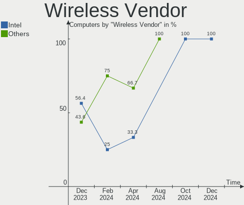

| Vendor                          | Computers | Percent |
|---------------------------------|-----------|---------|
| Intel                           | 16        | 44.44%  |
| Realtek Semiconductor           | 9         | 25%     |
| Qualcomm Atheros                | 3         | 8.33%   |
| Broadcom                        | 3         | 8.33%   |
| TP-Link                         | 2         | 5.56%   |
| Qualcomm Atheros Communications | 1         | 2.78%   |
| Qualcomm                        | 1         | 2.78%   |
| MediaTek                        | 1         | 2.78%   |

Wireless Model
--------------

Wireless models

| Model                                                          | Computers | Percent |
|----------------------------------------------------------------|-----------|---------|
| Intel Wi-Fi 6 AX201                                            | 3         | 8.33%   |
| Intel Wi-Fi 6 AX200                                            | 3         | 8.33%   |
| Realtek RTL8822CE 802.11ac PCIe Wireless Network Adapter       | 2         | 5.56%   |
| Intel Wireless-AC 9260                                         | 2         | 5.56%   |
| Intel Wireless 8265 / 8275                                     | 2         | 5.56%   |
| TP-Link Archer T2U PLUS [RTL8821AU]                            | 1         | 2.78%   |
| TP-Link AC600 wireless Realtek RTL8811AU [Archer T2U Nano]     | 1         | 2.78%   |
| Realtek RTL88x2bu [AC1200 Techkey]                             | 1         | 2.78%   |
| Realtek RTL8852BE PCIe 802.11ax Wireless Network Controller    | 1         | 2.78%   |
| Realtek RTL8821CE PCIe 802.11ac Wireless Network Controller    | 1         | 2.78%   |
| Realtek RTL8821CE 802.11ac PCIe Wireless Network Adapter       | 1         | 2.78%   |
| Realtek RTL8812AU 802.11a/b/g/n/ac 2T2R DB WLAN Adapter        | 1         | 2.78%   |
| Realtek RTL8723BE PCIe Wireless Network Adapter                | 1         | 2.78%   |
| Realtek RTL8187B Wireless Adapter                              | 1         | 2.78%   |
| Qualcomm QCNFA765 Wireless Network Adapter                     | 1         | 2.78%   |
| Qualcomm Atheros QCA9565 / AR9565 Wireless Network Adapter     | 1         | 2.78%   |
| Qualcomm Atheros QCA9377 802.11ac Wireless Network Adapter     | 1         | 2.78%   |
| Qualcomm Atheros AR9271 802.11n                                | 1         | 2.78%   |
| Qualcomm Atheros AR9285 Wireless Network Adapter (PCI-Express) | 1         | 2.78%   |
| MediaTek MT7922 802.11ax PCI Express Wireless Network Adapter  | 1         | 2.78%   |
| Intel Wireless 8260                                            | 1         | 2.78%   |
| Intel Wireless 3160                                            | 1         | 2.78%   |
| Intel Tiger Lake PCH CNVi WiFi                                 | 1         | 2.78%   |
| Intel Raptor Lake PCH CNVi WiFi                                | 1         | 2.78%   |
| Intel Cannon Point-LP CNVi [Wireless-AC]                       | 1         | 2.78%   |
| Intel Alder Lake-P PCH CNVi WiFi                               | 1         | 2.78%   |
| Broadcom BCM4360 802.11ac Dual Band Wireless Network Adapter   | 1         | 2.78%   |
| Broadcom BCM43142 802.11b/g/n                                  | 1         | 2.78%   |
| Broadcom BCM4312 802.11b/g LP-PHY                              | 1         | 2.78%   |

Ethernet Vendor
---------------

Ethernet vendors

| Vendor                | Computers | Percent |
|-----------------------|-----------|---------|
| Realtek Semiconductor | 22        | 64.71%  |
| Intel                 | 8         | 23.53%  |
| ASIX Electronics      | 3         | 8.82%   |
| OPPO Electronics      | 1         | 2.94%   |

Ethernet Model
--------------

Ethernet models

| Model                                                             | Computers | Percent |
|-------------------------------------------------------------------|-----------|---------|
| Realtek RTL8111/8168/8411 PCI Express Gigabit Ethernet Controller | 16        | 47.06%  |
| Realtek RTL810xE PCI Express Fast Ethernet controller             | 3         | 8.82%   |
| ASIX AX88179 Gigabit Ethernet                                     | 3         | 8.82%   |
| Realtek RTL8153 Gigabit Ethernet Adapter                          | 1         | 2.94%   |
| Realtek RTL8125 2.5GbE Controller                                 | 1         | 2.94%   |
| Realtek Killer E2600 Gigabit Ethernet Controller                  | 1         | 2.94%   |
| OPPO RMX3623                                                      | 1         | 2.94%   |
| Intel I211 Gigabit Network Connection                             | 1         | 2.94%   |
| Intel Ethernet Connection (7) I219-V                              | 1         | 2.94%   |
| Intel Ethernet Connection (6) I219-V                              | 1         | 2.94%   |
| Intel Ethernet Connection (4) I219-V                              | 1         | 2.94%   |
| Intel Ethernet Connection (4) I219-LM                             | 1         | 2.94%   |
| Intel Ethernet Connection (2) I219-V                              | 1         | 2.94%   |
| Intel Ethernet Connection (14) I219-V                             | 1         | 2.94%   |
| Intel 82579LM Gigabit Network Connection (Lewisville)             | 1         | 2.94%   |

Net Controller Kind
-------------------

Ethernet, WiFi or modem

| Kind     | Computers | Percent |
|----------|-----------|---------|
| WiFi     | 35        | 52.24%  |
| Ethernet | 32        | 47.76%  |

Used Controller
---------------

Currently used network controller

| Kind     | Computers | Percent |
|----------|-----------|---------|
| WiFi     | 26        | 60.47%  |
| Ethernet | 17        | 39.53%  |

NICs
----

Total network controllers on board

| Total | Computers | Percent |
|-------|-----------|---------|
| 1     | 21        | 51.22%  |
| 2     | 19        | 46.34%  |
| 0     | 1         | 2.44%   |

IPv6
----

IPv6 vs IPv4

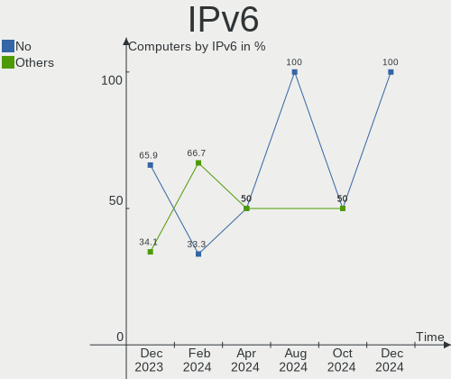

| Used | Computers | Percent |
|------|-----------|---------|
| No   | 30        | 73.17%  |
| Yes  | 11        | 26.83%  |

Bluetooth
---------

Bluetooth Vendor
----------------

Controller vendors

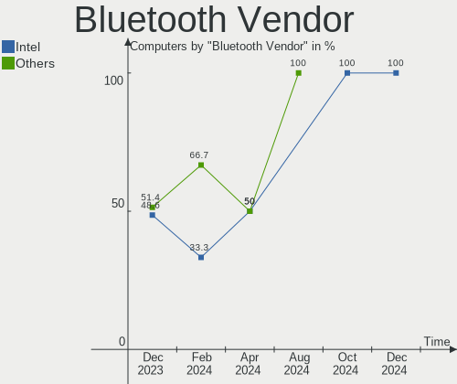

| Vendor                          | Computers | Percent |
|---------------------------------|-----------|---------|
| Intel                           | 16        | 61.54%  |
| Realtek Semiconductor           | 4         | 15.38%  |
| IMC Networks                    | 2         | 7.69%   |
| USI                             | 1         | 3.85%   |
| Toshiba                         | 1         | 3.85%   |
| Qualcomm Atheros Communications | 1         | 3.85%   |
| Apple                           | 1         | 3.85%   |

Bluetooth Model
---------------

Controller models

| Model                                          | Computers | Percent |
|------------------------------------------------|-----------|---------|
| Intel Bluetooth wireless interface             | 4         | 15.38%  |
| Intel AX201 Bluetooth                          | 4         | 15.38%  |
| Intel AX200 Bluetooth                          | 3         | 11.54%  |
| Realtek Bluetooth Radio                        | 2         | 7.69%   |
| Intel Wireless-AC 9260 Bluetooth Adapter       | 2         | 7.69%   |
| Intel Bluetooth 9460/9560 Jefferson Peak (JfP) | 2         | 7.69%   |
| USI Bluetooth Device                           | 1         | 3.85%   |
| Toshiba BCM43142A0                             | 1         | 3.85%   |
| Realtek RTL8723B Bluetooth                     | 1         | 3.85%   |
| Realtek 802.11ac WLAN Adapter                  | 1         | 3.85%   |
| Qualcomm Atheros  Bluetooth Device             | 1         | 3.85%   |
| Intel Bluetooth Device                         | 1         | 3.85%   |
| IMC Networks Bluetooth Radio                   | 1         | 3.85%   |
| IMC Networks Bluetooth Device                  | 1         | 3.85%   |
| Apple Bluetooth Host Controller                | 1         | 3.85%   |

Sound
-----

Sound Vendor
------------

Sound card vendors

| Vendor                 | Computers | Percent |
|------------------------|-----------|---------|
| Intel                  | 27        | 45%     |
| AMD                    | 18        | 30%     |
| Nvidia                 | 10        | 16.67%  |
| C-Media Electronics    | 2         | 3.33%   |
| Mark of the Unicorn    | 1         | 1.67%   |
| Generalplus Technology | 1         | 1.67%   |
| BR25                   | 1         | 1.67%   |

Sound Model
-----------

Sound card models

| Model                                                                      | Computers | Percent |
|----------------------------------------------------------------------------|-----------|---------|
| AMD Family 17h/19h HD Audio Controller                                     | 7         | 9.09%   |
| Intel Tiger Lake-LP Smart Sound Technology Audio Controller                | 4         | 5.19%   |
| Intel Sunrise Point-LP HD Audio                                            | 3         | 3.9%    |
| AMD Starship/Matisse HD Audio Controller                                   | 3         | 3.9%    |
| AMD Renoir Radeon High Definition Audio Controller                         | 3         | 3.9%    |
| AMD Ellesmere HDMI Audio [Radeon RX 470/480 / 570/580/590]                 | 3         | 3.9%    |
| Nvidia TU107 GeForce GTX 1650 High Definition Audio Controller             | 2         | 2.6%    |
| Nvidia GA106 High Definition Audio Controller                              | 2         | 2.6%    |
| Intel Xeon E3-1200 v3/4th Gen Core Processor HD Audio Controller           | 2         | 2.6%    |
| Intel Wildcat Point-LP High Definition Audio Controller                    | 2         | 2.6%    |
| Intel Cannon Lake PCH cAVS                                                 | 2         | 2.6%    |
| Intel Broadwell-U Audio Controller                                         | 2         | 2.6%    |
| Intel Alder Lake PCH-P High Definition Audio Controller                    | 2         | 2.6%    |
| Intel 8 Series/C220 Series Chipset High Definition Audio Controller        | 2         | 2.6%    |
| AMD SBx00 Azalia (Intel HDA)                                               | 2         | 2.6%    |
| AMD RV710/730 HDMI Audio [Radeon HD 4000 series]                           | 2         | 2.6%    |
| AMD Rembrandt Radeon High Definition Audio Controller                      | 2         | 2.6%    |
| AMD Navi 10 HDMI Audio                                                     | 2         | 2.6%    |
| Nvidia TU116 High Definition Audio Controller                              | 1         | 1.3%    |
| Nvidia GM107 High Definition Audio Controller [GeForce 940MX]              | 1         | 1.3%    |
| Nvidia GK208 HDMI/DP Audio Controller                                      | 1         | 1.3%    |
| Nvidia GF119 HDMI Audio Controller                                         | 1         | 1.3%    |
| Nvidia GF108 High Definition Audio Controller                              | 1         | 1.3%    |
| Nvidia GA102 High Definition Audio Controller                              | 1         | 1.3%    |
| Mark of the Unicorn M Series                                               | 1         | 1.3%    |
| Intel Tiger Lake-H HD Audio Controller                                     | 1         | 1.3%    |
| Intel Smart Sound Technology (SST) Audio Controller                        | 1         | 1.3%    |
| Intel Raptor Lake-P/U/H cAVS                                               | 1         | 1.3%    |
| Intel Haswell-ULT HD Audio Controller                                      | 1         | 1.3%    |
| Intel Cannon Point-LP High Definition Audio Controller                     | 1         | 1.3%    |
| Intel C610/X99 series chipset HD Audio Controller                          | 1         | 1.3%    |
| Intel Alder Lake-N HD Graphics SGPC                                        | 1         | 1.3%    |
| Intel 9 Series Chipset Family HD Audio Controller                          | 1         | 1.3%    |
| Intel 82801I (ICH9 Family) HD Audio Controller                             | 1         | 1.3%    |
| Intel 82801H (ICH8 Family) HD Audio Controller                             | 1         | 1.3%    |
| Intel 8 Series HD Audio Controller                                         | 1         | 1.3%    |
| Intel 6 Series/C200 Series Chipset Family High Definition Audio Controller | 1         | 1.3%    |
| Intel 200 Series PCH HD Audio                                              | 1         | 1.3%    |
| Generalplus Technology USB Audio Device                                    | 1         | 1.3%    |
| C-Media Electronics USB Advanced Audio Device                              | 1         | 1.3%    |

Memory
------

Memory Vendor
-------------

Memory module vendors

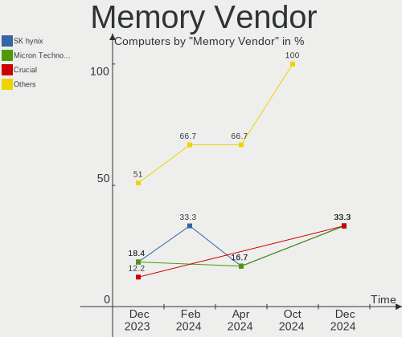

| Vendor              | Computers | Percent |
|---------------------|-----------|---------|
| Micron Technology   | 11        | 22%     |
| Samsung Electronics | 10        | 20%     |
| SK hynix            | 7         | 14%     |
| Team                | 3         | 6%      |
| Corsair             | 3         | 6%      |
| Unknown             | 2         | 4%      |
| G.Skill             | 2         | 4%      |
| Crucial             | 2         | 4%      |
| Ramos Technology    | 1         | 2%      |
| Ramaxel Technology  | 1         | 2%      |
| Qimonda             | 1         | 2%      |
| Patriot             | 1         | 2%      |
| Kingston            | 1         | 2%      |
| GOODRAM             | 1         | 2%      |
| Golden Empire       | 1         | 2%      |
| GeIL                | 1         | 2%      |
| Elpida              | 1         | 2%      |
| Unknown             | 1         | 2%      |

Memory Model
------------

Memory module models

| Model                                                            | Computers | Percent |
|------------------------------------------------------------------|-----------|---------|
| Micron RAM 4ATS1G64HZ-2G6E1 8GB SODIMM DDR4 2667MT/s             | 2         | 3.77%   |
| Unknown RAM Module 4GB DIMM 1333MT/s                             | 1         | 1.89%   |
| Unknown RAM Module 2GB Row Of Chips LPDDR4 4267MT/s              | 1         | 1.89%   |
| Team RAM TEAMGROUP-UD4-3200 8GB DIMM DDR4 3733MT/s               | 1         | 1.89%   |
| Team RAM TEAMGROUP-SD4-3200 32GB SODIMM DDR4 3200MT/s            | 1         | 1.89%   |
| Team RAM Elite-1600 4GB DIMM DDR3 1600MT/s                       | 1         | 1.89%   |
| SK hynix RAM Module 2GB SODIMM DDR2 667MT/s                      | 1         | 1.89%   |
| SK hynix RAM HMT41GU6BFR8A-PB 8GB DIMM DDR3 2000MT/s             | 1         | 1.89%   |
| SK hynix RAM HMT351U6CFR8C-H9 4GB DIMM DDR3 1600MT/s             | 1         | 1.89%   |
| SK hynix RAM HMAA2GS6CJR8N-XN 16GB SODIMM DDR4 3200MT/s          | 1         | 1.89%   |
| SK hynix RAM HMA851S6DJR6N-XN 4GB SODIMM DDR4 3200MT/s           | 1         | 1.89%   |
| SK hynix RAM HMA81GS6MFR8N-TF 8GB SODIMM DDR4 2133MT/s           | 1         | 1.89%   |
| SK hynix RAM H9CCNNNCLGALAR-NVD 8GB Row Of Chips LPDDR3 2133MT/s | 1         | 1.89%   |
| SK hynix RAM H54G56CYRBX247N 2GB Row Of Chips LPDDR4 4267MT/s    | 1         | 1.89%   |
| Samsung RAM Module 4GB SODIMM DDR3 1600MT/s                      | 1         | 1.89%   |
| Samsung RAM M471B1G73QH0-YK0 8GB SODIMM DDR3 1867MT/s            | 1         | 1.89%   |
| Samsung RAM M471A5244CB0-CWE 4GB Row Of Chips DDR4 3200MT/s      | 1         | 1.89%   |
| Samsung RAM M471A5244CB0-CRC 4096MB SODIMM DDR4 2667MT/s         | 1         | 1.89%   |
| Samsung RAM M471A5143SB1-CRC 4GB SODIMM DDR4 2400MT/s            | 1         | 1.89%   |
| Samsung RAM M471A1K43EB1-CWE 8GB SODIMM DDR4 3200MT/s            | 1         | 1.89%   |
| Samsung RAM M471A1G44AB0-CWE 8GB SODIMM DDR4 3200MT/s            | 1         | 1.89%   |
| Samsung RAM M386A4G40DM0-CPB 32GB DIMM DDR4 2400MT/s             | 1         | 1.89%   |
| Samsung RAM M378B5173QH0-CK0 4GB DIMM DDR3 1600MT/s              | 1         | 1.89%   |
| Samsung RAM K4E6E304EB-EGCG 4GB Row Of Chips LPDDR3 2133MT/s     | 1         | 1.89%   |
| Samsung RAM K3LKBKB0BM-MGCP 4GB SODIMM LPDDR5 6400MT/s           | 1         | 1.89%   |
| Ramos RAM RMB4GB584CA5-13HC 4GB DIMM DDR3 1333MT/s               | 1         | 1.89%   |
| Ramaxel RAM RMSA3260ME78HAF-2666 8GB SODIMM DDR4 2667MT/s        | 1         | 1.89%   |
| Qimonda RAM Module 1GB SODIMM DDR2 667MT/s                       | 1         | 1.89%   |
| Patriot RAM 3200 C16 Series 16GB DIMM DDR4 3600MT/s              | 1         | 1.89%   |
| Micron RAM MT62F2G32D8DR-031 WT 8GB SODIMM LPDDR5 6400MT/s       | 1         | 1.89%   |
| Micron RAM MT62F2G32D8DR-031 4GB Row Of Chips LPDDR5 6400MT/s    | 1         | 1.89%   |
| Micron RAM MT62F1G32D4DR-031 2GB Row Of Chips LPDDR5 6400MT/s    | 1         | 1.89%   |
| Micron RAM 8KTF51264HZ-1G9P2 4GB SODIMM DDR3 1867MT/s            | 1         | 1.89%   |
| Micron RAM 8ATF1G64HZ-3G2R1 8GB SODIMM DDR4 3200MT/s             | 1         | 1.89%   |
| Micron RAM 8ATF1G64HZ-3G2J1 8GB SODIMM DDR4 3200MT/s             | 1         | 1.89%   |
| Micron RAM 4ATF51264HZ-3G2R1 4GB SODIMM DDR4 3200MT/s            | 1         | 1.89%   |
| Micron RAM 4ATF1G64HZ-3G2E2 8GB SODIMM DDR4 3200MT/s             | 1         | 1.89%   |
| Micron RAM 16HTF25664HZ-800H1 2GB SODIMM DDR2 800MT/s            | 1         | 1.89%   |
| Kingston RAM TSB16D3LS1MNG/4G 4GB SODIMM DDR3 1600MT/s           | 1         | 1.89%   |
| GOODRAM RAM IRX3200D464L16S/8G 8GB DIMM DDR4 3200MT/s            | 1         | 1.89%   |

Memory Kind
-----------

Memory module kinds

| Kind    | Computers | Percent |
|---------|-----------|---------|
| DDR4    | 21        | 51.22%  |
| DDR3    | 8         | 19.51%  |
| LPDDR5  | 4         | 9.76%   |
| DDR2    | 3         | 7.32%   |
| LPDDR4  | 2         | 4.88%   |
| LPDDR3  | 2         | 4.88%   |
| Unknown | 1         | 2.44%   |

Memory Form Factor
------------------

Physical design of the memory module

| Name         | Computers | Percent |
|--------------|-----------|---------|
| SODIMM       | 20        | 48.78%  |
| DIMM         | 14        | 34.15%  |
| Row Of Chips | 7         | 17.07%  |

Memory Size
-----------

Memory module size

| Size  | Computers | Percent |
|-------|-----------|---------|
| 8192  | 19        | 41.3%   |
| 4096  | 13        | 28.26%  |
| 16384 | 5         | 10.87%  |
| 32768 | 4         | 8.7%    |
| 2048  | 4         | 8.7%    |
| 1024  | 1         | 2.17%   |

Memory Speed
------------

Memory module speed

| Speed | Computers | Percent |
|-------|-----------|---------|
| 3200  | 9         | 19.15%  |
| 2667  | 5         | 10.64%  |
| 6400  | 4         | 8.51%   |
| 1600  | 4         | 8.51%   |
| 2133  | 3         | 6.38%   |
| 4267  | 2         | 4.26%   |
| 3600  | 2         | 4.26%   |
| 3000  | 2         | 4.26%   |
| 2400  | 2         | 4.26%   |
| 1867  | 2         | 4.26%   |
| 1333  | 2         | 4.26%   |
| 4400  | 1         | 2.13%   |
| 3733  | 1         | 2.13%   |
| 3666  | 1         | 2.13%   |
| 2933  | 1         | 2.13%   |
| 2000  | 1         | 2.13%   |
| 1866  | 1         | 2.13%   |
| 1800  | 1         | 2.13%   |
| 975   | 1         | 2.13%   |
| 800   | 1         | 2.13%   |
| 667   | 1         | 2.13%   |

Printers & scanners
-------------------

Printer Vendor
--------------

Printer device vendors

Zero info for selected period =(

Printer Model
-------------

Printer device models

Zero info for selected period =(

Scanner Vendor
--------------

Scanner device vendors

| Vendor | Computers | Percent |
|--------|-----------|---------|
| Canon  | 1         | 100%    |

Scanner Model
-------------

Scanner device models

| Model                   | Computers | Percent |
|-------------------------|-----------|---------|
| Canon CanoScan LiDE 110 | 1         | 100%    |

Camera
------

Camera Vendor
-------------

Camera device vendors

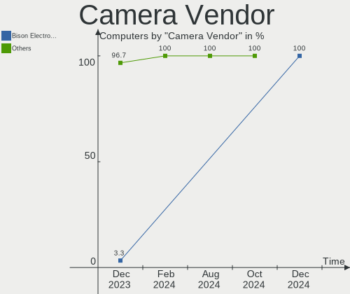

| Vendor                | Computers | Percent |
|-----------------------|-----------|---------|
| Quanta                | 6         | 20.69%  |
| IMC Networks          | 6         | 20.69%  |
| Chicony Electronics   | 6         | 20.69%  |
| Bison Electronics     | 4         | 13.79%  |
| Acer                  | 2         | 6.9%    |
| Syntek                | 1         | 3.45%   |
| Samsung Electronics   | 1         | 3.45%   |
| Realtek Semiconductor | 1         | 3.45%   |
| Logitech              | 1         | 3.45%   |
| Lite-On Technology    | 1         | 3.45%   |

Camera Model
------------

Camera device models

| Model                                   | Computers | Percent |
|-----------------------------------------|-----------|---------|
| Quanta HD User Facing                   | 3         | 10.34%  |
| IMC Networks USB2.0 HD UVC WebCam       | 3         | 10.34%  |
| Chicony Integrated Camera               | 3         | 10.34%  |
| IMC Networks Integrated Camera          | 2         | 6.9%    |
| Syntek Integrated Camera                | 1         | 3.45%   |
| Samsung Galaxy series, misc. (MTP mode) | 1         | 3.45%   |
| Realtek USB2.0 HD UVC WebCam            | 1         | 3.45%   |
| Quanta HP Webcam                        | 1         | 3.45%   |
| Quanta HP TrueVision HD Camera          | 1         | 3.45%   |
| Quanta FHD Camera                       | 1         | 3.45%   |
| Logitech Webcam C930e                   | 1         | 3.45%   |
| Lite-On Integrated Camera               | 1         | 3.45%   |
| IMC Networks TOSHIBA Web Camera - HD    | 1         | 3.45%   |
| Chicony USB2.0 VGA UVC WebCam           | 1         | 3.45%   |
| Chicony USB 2.0 Camera                  | 1         | 3.45%   |
| Chicony TOSHIBA Web Camera - HD         | 1         | 3.45%   |
| Bison Integrated RGB Camera             | 1         | 3.45%   |
| Bison HP Webcam                         | 1         | 3.45%   |
| Bison HD Webcam                         | 1         | 3.45%   |
| Bison EasyCamera                        | 1         | 3.45%   |
| Acer Lenovo EasyCamera                  | 1         | 3.45%   |
| Acer Integrated RGB Camera              | 1         | 3.45%   |

Security
--------

Fingerprint Vendor
------------------

Fingerprint sensor vendors

| Vendor           | Computers | Percent |
|------------------|-----------|---------|
| Synaptics        | 4         | 80%     |
| Validity Sensors | 1         | 20%     |

Fingerprint Model
-----------------

Fingerprint sensor models

| Model                                             | Computers | Percent |
|---------------------------------------------------|-----------|---------|
| Synaptics Prometheus MIS Touch Fingerprint Reader | 2         | 40%     |
| Synaptics Metallica MIS Touch Fingerprint Reader  | 2         | 40%     |
| Validity Sensors VFS301 Fingerprint Reader        | 1         | 20%     |

Chipcard Vendor
---------------

Chipcard module vendors

| Vendor                            | Computers | Percent |
|-----------------------------------|-----------|---------|
| VASCO Data Security International | 1         | 50%     |
| Alcor Micro                       | 1         | 50%     |

Chipcard Model
--------------

Chipcard module models

| Model                                                           | Computers | Percent |
|-----------------------------------------------------------------|-----------|---------|
| VASCO Data Security International Digipass 905 SmartCard Reader | 1         | 50%     |
| Alcor Micro AU9540 Smartcard Reader                             | 1         | 50%     |

Unsupported
-----------

Unsupported Devices
-------------------

Total unsupported devices on board

| Total | Computers | Percent |
|-------|-----------|---------|
| 0     | 29        | 70.73%  |
| 1     | 11        | 26.83%  |
| 2     | 1         | 2.44%   |

Unsupported Device Types
------------------------

Types of unsupported devices

| Type               | Computers | Percent |
|--------------------|-----------|---------|
| Fingerprint reader | 5         | 38.46%  |
| Net/wireless       | 4         | 30.77%  |
| Chipcard           | 2         | 15.38%  |
| Unassigned class   | 1         | 7.69%   |
| Graphics card      | 1         | 7.69%   |

