Xero - Hardware Trends
----------------------

A project to identify most popular hardware characteristics and track their change
over time based on data collected by Linux users at https://Linux-Hardware.org.

Anyone can contribute to this report by the [hw-probe](https://github.com/linuxhw/hw-probe) tool:

    sudo -E hw-probe -all -upload

This is a report for all computer types. See also reports for [desktops](/Dist/Xero/Desktop/README.md) and [notebooks](/Dist/Xero/Notebook/README.md).

This report is for one last month. Overall report since the beginning of time: [TestDays](https://github.com/linuxhw/TestDays)

Period: Oct, 2023.

Contents
--------

* [ System ](#system)
  - [ OS                       ](#os)
  - [ OS Family                ](#os-family)
  - [ Kernel                   ](#kernel)
  - [ Kernel Family            ](#kernel-family)
  - [ Kernel Major Ver.        ](#kernel-major-ver)
  - [ Arch                     ](#arch)
  - [ DE                       ](#de)
  - [ Display Server           ](#display-server)
  - [ Display Manager          ](#display-manager)
  - [ OS Lang                  ](#os-lang)
  - [ Boot Mode                ](#boot-mode)
  - [ Filesystem               ](#filesystem)
  - [ Part. scheme             ](#part-scheme)
  - [ Dual Boot with Linux/BSD ](#dual-boot-with-linuxbsd)
  - [ Dual Boot (Win)          ](#dual-boot-win)

* [ Board ](#board)
  - [ Vendor                   ](#vendor)
  - [ Model                    ](#model)
  - [ Model Family             ](#model-family)
  - [ MFG Year                 ](#mfg-year)
  - [ Form Factor              ](#form-factor)
  - [ Secure Boot              ](#secure-boot)
  - [ Coreboot                 ](#coreboot)
  - [ RAM Size                 ](#ram-size)
  - [ RAM Used                 ](#ram-used)
  - [ Total Drives             ](#total-drives)
  - [ Has CD-ROM               ](#has-cd-rom)
  - [ Has Ethernet             ](#has-ethernet)
  - [ Has WiFi                 ](#has-wifi)
  - [ Has Bluetooth            ](#has-bluetooth)

* [ Location ](#location)
  - [ Country                  ](#country)
  - [ City                     ](#city)

* [ Drives ](#drives)
  - [ Drive Vendor             ](#drive-vendor)
  - [ Drive Model              ](#drive-model)
  - [ HDD Vendor               ](#hdd-vendor)
  - [ SSD Vendor               ](#ssd-vendor)
  - [ Drive Kind               ](#drive-kind)
  - [ Drive Connector          ](#drive-connector)
  - [ Drive Size               ](#drive-size)
  - [ Space Total              ](#space-total)
  - [ Space Used               ](#space-used)
  - [ Malfunc. Drives          ](#malfunc-drives)
  - [ Malfunc. Drive Vendor    ](#malfunc-drive-vendor)
  - [ Malfunc. HDD Vendor      ](#malfunc-hdd-vendor)
  - [ Malfunc. Drive Kind      ](#malfunc-drive-kind)
  - [ Failed Drives            ](#failed-drives)
  - [ Failed Drive Vendor      ](#failed-drive-vendor)
  - [ Drive Status             ](#drive-status)

* [ Storage controller ](#storage-controller)
  - [ Storage Vendor           ](#storage-vendor)
  - [ Storage Model            ](#storage-model)
  - [ Storage Kind             ](#storage-kind)

* [ Processor ](#processor)
  - [ CPU Vendor               ](#cpu-vendor)
  - [ CPU Model                ](#cpu-model)
  - [ CPU Model Family         ](#cpu-model-family)
  - [ CPU Cores                ](#cpu-cores)
  - [ CPU Sockets              ](#cpu-sockets)
  - [ CPU Threads              ](#cpu-threads)
  - [ CPU Op-Modes             ](#cpu-op-modes)
  - [ CPU Microcode            ](#cpu-microcode)
  - [ CPU Microarch            ](#cpu-microarch)

* [ Graphics ](#graphics)
  - [ GPU Vendor               ](#gpu-vendor)
  - [ GPU Model                ](#gpu-model)
  - [ GPU Combo                ](#gpu-combo)
  - [ GPU Driver               ](#gpu-driver)
  - [ GPU Memory               ](#gpu-memory)

* [ Monitor ](#monitor)
  - [ Monitor Vendor           ](#monitor-vendor)
  - [ Monitor Model            ](#monitor-model)
  - [ Monitor Resolution       ](#monitor-resolution)
  - [ Monitor Diagonal         ](#monitor-diagonal)
  - [ Monitor Width            ](#monitor-width)
  - [ Aspect Ratio             ](#aspect-ratio)
  - [ Monitor Area             ](#monitor-area)
  - [ Pixel Density            ](#pixel-density)
  - [ Multiple Monitors        ](#multiple-monitors)

* [ Network ](#network)
  - [ Net Controller Vendor    ](#net-controller-vendor)
  - [ Net Controller Model     ](#net-controller-model)
  - [ Wireless Vendor          ](#wireless-vendor)
  - [ Wireless Model           ](#wireless-model)
  - [ Ethernet Vendor          ](#ethernet-vendor)
  - [ Ethernet Model           ](#ethernet-model)
  - [ Net Controller Kind      ](#net-controller-kind)
  - [ Used Controller          ](#used-controller)
  - [ NICs                     ](#nics)
  - [ IPv6                     ](#ipv6)

* [ Bluetooth ](#bluetooth)
  - [ Bluetooth Vendor         ](#bluetooth-vendor)
  - [ Bluetooth Model          ](#bluetooth-model)

* [ Sound ](#sound)
  - [ Sound Vendor             ](#sound-vendor)
  - [ Sound Model              ](#sound-model)

* [ Memory ](#memory)
  - [ Memory Vendor            ](#memory-vendor)
  - [ Memory Model             ](#memory-model)
  - [ Memory Kind              ](#memory-kind)
  - [ Memory Form Factor       ](#memory-form-factor)
  - [ Memory Size              ](#memory-size)
  - [ Memory Speed             ](#memory-speed)

* [ Printers & scanners ](#printers--scanners)
  - [ Printer Vendor           ](#printer-vendor)
  - [ Printer Model            ](#printer-model)
  - [ Scanner Vendor           ](#scanner-vendor)
  - [ Scanner Model            ](#scanner-model)

* [ Camera ](#camera)
  - [ Camera Vendor            ](#camera-vendor)
  - [ Camera Model             ](#camera-model)

* [ Security ](#security)
  - [ Fingerprint Vendor       ](#fingerprint-vendor)
  - [ Fingerprint Model        ](#fingerprint-model)
  - [ Chipcard Vendor          ](#chipcard-vendor)
  - [ Chipcard Model           ](#chipcard-model)

* [ Unsupported ](#unsupported)
  - [ Unsupported Devices      ](#unsupported-devices)
  - [ Unsupported Device Types ](#unsupported-device-types)

System
------

OS
--

Installed operating systems

| Name         | Computers | Percent |
|--------------|-----------|---------|
| Xero Rolling | 46        | 100%    |

OS Family
---------

OS without a version

| Name | Computers | Percent |
|------|-----------|---------|
| Xero | 46        | 100%    |

Kernel
------

Version of the Linux kernel

| Version          | Computers | Percent |
|------------------|-----------|---------|
| 6.5.5-arch1-1    | 30        | 65.22%  |
| 6.4.12-arch1-1   | 5         | 10.87%  |
| 6.5.9-arch2-1    | 3         | 6.52%   |
| 6.4.9-arch1-1    | 3         | 6.52%   |
| 6.5.7-arch1-1    | 2         | 4.35%   |
| 6.5.9-zen2-1-zen | 1         | 2.17%   |
| 6.5.8-arch1-1    | 1         | 2.17%   |
| 6.4.11-arch2-1   | 1         | 2.17%   |

Kernel Family
-------------

Linux kernel without a distro release

| Version | Computers | Percent |
|---------|-----------|---------|
| 6.5.5   | 30        | 65.22%  |
| 6.4.12  | 5         | 10.87%  |
| 6.5.9   | 4         | 8.7%    |
| 6.4.9   | 3         | 6.52%   |
| 6.5.7   | 2         | 4.35%   |
| 6.5.8   | 1         | 2.17%   |
| 6.4.11  | 1         | 2.17%   |

Kernel Major Ver.
-----------------

Linux kernel major version

| Version | Computers | Percent |
|---------|-----------|---------|
| 6.5     | 37        | 80.43%  |
| 6.4     | 9         | 19.57%  |

Arch
----

OS architecture (x86_64, i586, etc.)

| Name   | Computers | Percent |
|--------|-----------|---------|
| x86_64 | 46        | 100%    |

DE
--

Desktop Environment

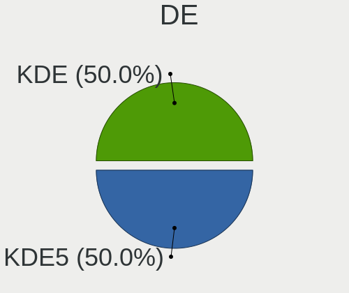

| Name | Computers | Percent |
|------|-----------|---------|
| KDE5 | 46        | 100%    |

Display Server
--------------

X11 or Wayland

| Name    | Computers | Percent |
|---------|-----------|---------|
| X11     | 29        | 63.04%  |
| Wayland | 17        | 36.96%  |

Display Manager
---------------

SDDM, LightDM, etc.

| Name    | Computers | Percent |
|---------|-----------|---------|
| SDDM    | 45        | 97.83%  |
| LightDM | 1         | 2.17%   |

OS Lang
-------

Language

| Lang  | Computers | Percent |
|-------|-----------|---------|
| en_US | 16        | 34.78%  |
| de_DE | 5         | 10.87%  |
| ru_RU | 3         | 6.52%   |
| es_MX | 3         | 6.52%   |
| pl_PL | 2         | 4.35%   |
| hu_HU | 2         | 4.35%   |
| es_ES | 2         | 4.35%   |
| en_IN | 2         | 4.35%   |
| en_GB | 2         | 4.35%   |
| en_CA | 2         | 4.35%   |
| pt_BR | 1         | 2.17%   |
| it_IT | 1         | 2.17%   |
| es_AR | 1         | 2.17%   |
| en_AU | 1         | 2.17%   |
| de_LI | 1         | 2.17%   |
| C     | 1         | 2.17%   |
| ar_EG | 1         | 2.17%   |

Boot Mode
---------

EFI or BIOS

| Mode | Computers | Percent |
|------|-----------|---------|
| EFI  | 31        | 67.39%  |
| BIOS | 15        | 32.61%  |

Filesystem
----------

Type of filesystem

| Type    | Computers | Percent |
|---------|-----------|---------|
| Ext4    | 28        | 60.87%  |
| Btrfs   | 15        | 32.61%  |
| Xfs     | 2         | 4.35%   |
| Overlay | 1         | 2.17%   |

Part. scheme
------------

Scheme of partitioning

| Type | Computers | Percent |
|------|-----------|---------|
| GPT  | 36        | 78.26%  |
| MBR  | 10        | 21.74%  |

Dual Boot with Linux/BSD
------------------------

Hosting more than one Linux/BSD

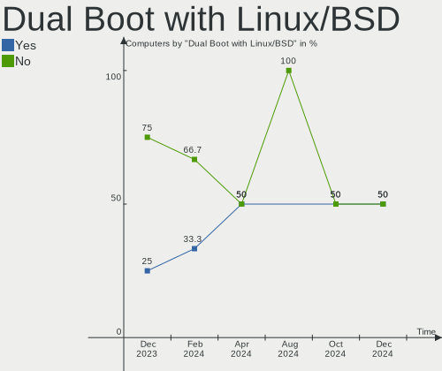

| Dual boot | Computers | Percent |
|-----------|-----------|---------|
| No        | 39        | 84.78%  |
| Yes       | 7         | 15.22%  |

Dual Boot (Win)
---------------

Hosting Linux and Windows

| Dual boot | Computers | Percent |
|-----------|-----------|---------|
| No        | 36        | 78.26%  |
| Yes       | 10        | 21.74%  |

Board
-----

Vendor
------

Motherboard manufacturer

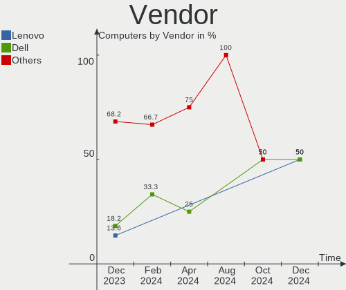

| Name                | Computers | Percent |
|---------------------|-----------|---------|
| Dell                | 9         | 19.57%  |
| Lenovo              | 7         | 15.22%  |
| Hewlett-Packard     | 5         | 10.87%  |
| ASUSTek Computer    | 5         | 10.87%  |
| MSI                 | 4         | 8.7%    |
| Apple               | 4         | 8.7%    |
| ZOTAC               | 1         | 2.17%   |
| Sony                | 1         | 2.17%   |
| Medion              | 1         | 2.17%   |
| LG Electronics      | 1         | 2.17%   |
| HUAWEI              | 1         | 2.17%   |
| Huanan              | 1         | 2.17%   |
| Google              | 1         | 2.17%   |
| Gigabyte Technology | 1         | 2.17%   |
| Fujitsu             | 1         | 2.17%   |
| Compal              | 1         | 2.17%   |
| AZW                 | 1         | 2.17%   |
| Acidanthera         | 1         | 2.17%   |

Model
-----

Motherboard model

| Name                              | Computers | Percent |
|-----------------------------------|-----------|---------|
| ZOTAC ZBOX-ID88/ID89/ID90         | 1         | 2.17%   |
| Sony VGC-LV180ME                  | 1         | 2.17%   |
| MSI Thin GF63 12VE                | 1         | 2.17%   |
| MSI MS-7817                       | 1         | 2.17%   |
| MSI GE72 6QF                      | 1         | 2.17%   |
| MSI Bravo 15 B5DD                 | 1         | 2.17%   |
| Medion E15408                     | 1         | 2.17%   |
| LG R310-K.AP31B                   | 1         | 2.17%   |
| Lenovo ThinkPad T480s 20L7CTO1WW  | 1         | 2.17%   |
| Lenovo ThinkPad T460 20FN002JUS   | 1         | 2.17%   |
| Lenovo ThinkPad T430s 23539MU     | 1         | 2.17%   |
| Lenovo ThinkPad T420 4180DT9      | 1         | 2.17%   |
| Lenovo ThinkPad P50 20EQS0T52R    | 1         | 2.17%   |
| Lenovo IdeaPadFlex 5 14ITL05 82HS | 1         | 2.17%   |
| Lenovo 3302F3U                    | 1         | 2.17%   |
| HUAWEI BOM-WXX9                   | 1         | 2.17%   |
| Huanan X99-F8                     | 1         | 2.17%   |
| HP ZBook Studio x360 G5           | 1         | 2.17%   |
| HP Presario CQ57                  | 1         | 2.17%   |
| HP Pavilion dv6                   | 1         | 2.17%   |
| HP Laptop 15s-fr2xxx              | 1         | 2.17%   |
| HP ElitePad 1000 G2               | 1         | 2.17%   |
| Google Pirika                     | 1         | 2.17%   |
| Gigabyte B760 AORUS ELITE AX DDR4 | 1         | 2.17%   |
| Fujitsu LIFEBOOK A3510            | 1         | 2.17%   |
| Dell Vostro 2520                  | 1         | 2.17%   |
| Dell Studio XPS 8100              | 1         | 2.17%   |
| Dell Studio XPS 435MT             | 1         | 2.17%   |
| Dell OptiPlex 7010                | 1         | 2.17%   |
| Dell Latitude E6440               | 1         | 2.17%   |
| Dell Latitude E6430               | 1         | 2.17%   |
| Dell Latitude 3590                | 1         | 2.17%   |
| Dell Inspiron 3421                | 1         | 2.17%   |
| Dell Inspiron 13-5378             | 1         | 2.17%   |
| Compal PCW20                      | 1         | 2.17%   |
| AZW GTR                           | 1         | 2.17%   |
| ASUS P5QD TURBO                   | 1         | 2.17%   |
| ASUS H61M-K                       | 1         | 2.17%   |
| ASUS H170M-PLUS                   | 1         | 2.17%   |
| ASUS G551JM                       | 1         | 2.17%   |

Model Family
------------

Motherboard model prefix

| Name               | Computers | Percent |
|--------------------|-----------|---------|
| Lenovo ThinkPad    | 5         | 10.87%  |
| Dell Latitude      | 3         | 6.52%   |
| Dell Studio        | 2         | 4.35%   |
| Dell Inspiron      | 2         | 4.35%   |
| ZOTAC ZBOX-ID88    | 1         | 2.17%   |
| Sony VGC-LV180ME   | 1         | 2.17%   |
| MSI Thin           | 1         | 2.17%   |
| MSI MS-7817        | 1         | 2.17%   |
| MSI GE72           | 1         | 2.17%   |
| MSI Bravo          | 1         | 2.17%   |
| Medion E15408      | 1         | 2.17%   |
| LG R310-K.AP31B    | 1         | 2.17%   |
| Lenovo IdeaPadFlex | 1         | 2.17%   |
| Lenovo 3302F3U     | 1         | 2.17%   |
| HUAWEI BOM-WXX9    | 1         | 2.17%   |
| Huanan X99-F8      | 1         | 2.17%   |
| HP ZBook           | 1         | 2.17%   |
| HP Presario        | 1         | 2.17%   |
| HP Pavilion        | 1         | 2.17%   |
| HP Laptop          | 1         | 2.17%   |
| HP ElitePad        | 1         | 2.17%   |
| Google Pirika      | 1         | 2.17%   |
| Gigabyte B760      | 1         | 2.17%   |
| Fujitsu LIFEBOOK   | 1         | 2.17%   |
| Dell Vostro        | 1         | 2.17%   |
| Dell OptiPlex      | 1         | 2.17%   |
| Compal PCW20       | 1         | 2.17%   |
| AZW GTR            | 1         | 2.17%   |
| ASUS P5QD          | 1         | 2.17%   |
| ASUS H61M-K        | 1         | 2.17%   |
| ASUS H170M-PLUS    | 1         | 2.17%   |
| ASUS G551JM        | 1         | 2.17%   |
| ASUS ASUS          | 1         | 2.17%   |
| Apple Macmini8     | 1         | 2.17%   |
| Apple Macmini6     | 1         | 2.17%   |
| Apple MacBookPro9  | 1         | 2.17%   |
| Apple MacBookAir5  | 1         | 2.17%   |
| Acidanthera iMac19 | 1         | 2.17%   |

MFG Year
--------

Motherboard manufacture year

| Year | Computers | Percent |
|------|-----------|---------|
| 2020 | 7         | 15.22%  |
| 2012 | 7         | 15.22%  |
| 2015 | 5         | 10.87%  |
| 2013 | 5         | 10.87%  |
| 2009 | 4         | 8.7%    |
| 2023 | 3         | 6.52%   |
| 2021 | 3         | 6.52%   |
| 2011 | 3         | 6.52%   |
| 2018 | 2         | 4.35%   |
| 2016 | 2         | 4.35%   |
| 2014 | 2         | 4.35%   |
| 2008 | 2         | 4.35%   |
| 2019 | 1         | 2.17%   |

Form Factor
-----------

Physical design of the computer

| Name        | Computers | Percent |
|-------------|-----------|---------|
| Notebook    | 28        | 60.87%  |
| Desktop     | 10        | 21.74%  |
| Mini pc     | 4         | 8.7%    |
| Convertible | 2         | 4.35%   |
| All in one  | 2         | 4.35%   |

Secure Boot
-----------

Enabled or disabled

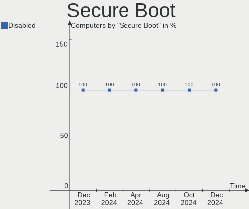

| State    | Computers | Percent |
|----------|-----------|---------|
| Disabled | 46        | 100%    |

Coreboot
--------

Have coreboot on board

| Used | Computers | Percent |
|------|-----------|---------|
| No   | 45        | 97.83%  |
| Yes  | 1         | 2.17%   |

RAM Size
--------

Total RAM memory

| Size in GB  | Computers | Percent |
|-------------|-----------|---------|
| 4.01-8.0    | 16        | 34.78%  |
| 3.01-4.0    | 10        | 21.74%  |
| 16.01-24.0  | 10        | 21.74%  |
| 8.01-16.0   | 4         | 8.7%    |
| 32.01-64.0  | 3         | 6.52%   |
| 24.01-32.0  | 2         | 4.35%   |
| 64.01-256.0 | 1         | 2.17%   |

RAM Used
--------

Used RAM memory

| Used GB   | Computers | Percent |
|-----------|-----------|---------|
| 2.01-3.0  | 21        | 45.65%  |
| 1.01-2.0  | 12        | 26.09%  |
| 3.01-4.0  | 6         | 13.04%  |
| 4.01-8.0  | 5         | 10.87%  |
| 8.01-16.0 | 2         | 4.35%   |

Total Drives
------------

Number of drives on board

| Drives | Computers | Percent |
|--------|-----------|---------|
| 1      | 26        | 56.52%  |
| 2      | 12        | 26.09%  |
| 3      | 6         | 13.04%  |
| 6      | 1         | 2.17%   |
| 4      | 1         | 2.17%   |

Has CD-ROM
----------

Has CD-ROM on board

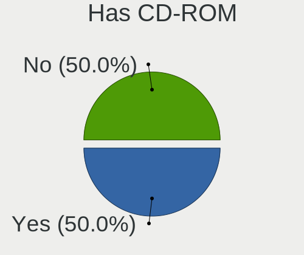

| Presented | Computers | Percent |
|-----------|-----------|---------|
| No        | 28        | 60.87%  |
| Yes       | 18        | 39.13%  |

Has Ethernet
------------

Has Ethernet on board

| Presented | Computers | Percent |
|-----------|-----------|---------|
| Yes       | 38        | 82.61%  |
| No        | 8         | 17.39%  |

Has WiFi
--------

Has WiFi module

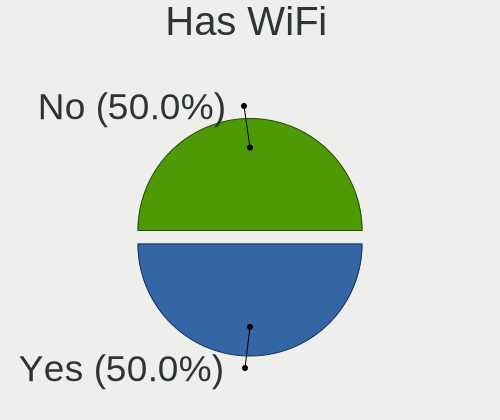

| Presented | Computers | Percent |
|-----------|-----------|---------|
| Yes       | 40        | 86.96%  |
| No        | 6         | 13.04%  |

Has Bluetooth
-------------

Has Bluetooth module

| Presented | Computers | Percent |
|-----------|-----------|---------|
| Yes       | 30        | 65.22%  |
| No        | 16        | 34.78%  |

Location
--------

Country
-------

Geographic location (country)

| Country    | Computers | Percent |
|------------|-----------|---------|
| Germany    | 9         | 19.57%  |
| USA        | 6         | 13.04%  |
| Russia     | 3         | 6.52%   |
| Canada     | 3         | 6.52%   |
| Argentina  | 3         | 6.52%   |
| Poland     | 2         | 4.35%   |
| Malaysia   | 2         | 4.35%   |
| India      | 2         | 4.35%   |
| Hungary    | 2         | 4.35%   |
| Uzbekistan | 1         | 2.17%   |
| UK         | 1         | 2.17%   |
| Thailand   | 1         | 2.17%   |
| Spain      | 1         | 2.17%   |
| Pakistan   | 1         | 2.17%   |
| Morocco    | 1         | 2.17%   |
| Mexico     | 1         | 2.17%   |
| Italy      | 1         | 2.17%   |
| Ireland    | 1         | 2.17%   |
| Iraq       | 1         | 2.17%   |
| Croatia    | 1         | 2.17%   |
| Chile      | 1         | 2.17%   |
| Brazil     | 1         | 2.17%   |
| Australia  | 1         | 2.17%   |

City
----

Geographic location (city)

| City                | Computers | Percent |
|---------------------|-----------|---------|
| Munich              | 2         | 4.35%   |
| Zalaegerszeg        | 1         | 2.17%   |
| Voronezh            | 1         | 2.17%   |
| Vancouver           | 1         | 2.17%   |
| Vallenar            | 1         | 2.17%   |
| Ufa                 | 1         | 2.17%   |
| Toluca              | 1         | 2.17%   |
| Seattle             | 1         | 2.17%   |
| Rome                | 1         | 2.17%   |
| Richmond            | 1         | 2.17%   |
| Recreo              | 1         | 2.17%   |
| Recklinghausen      | 1         | 2.17%   |
| Puerto Eldorado     | 1         | 2.17%   |
| Pecos               | 1         | 2.17%   |
| Orford Lake         | 1         | 2.17%   |
| Newcastle upon Tyne | 1         | 2.17%   |
| Navoiy              | 1         | 2.17%   |
| Marrakesh           | 1         | 2.17%   |
| Lincoln             | 1         | 2.17%   |
| Kuala Lumpur        | 1         | 2.17%   |
| Krynica-Zdroj       | 1         | 2.17%   |
| Krasnodar           | 1         | 2.17%   |
| Koprivnica          | 1         | 2.17%   |
| Klang               | 1         | 2.17%   |
| Huntington Beach    | 1         | 2.17%   |
| Hohen Neuendorf     | 1         | 2.17%   |
| Hamburg             | 1         | 2.17%   |
| Hafizabad           | 1         | 2.17%   |
| Gdansk              | 1         | 2.17%   |
| Fürstenfeldbruck   | 1         | 2.17%   |
| Fredericton         | 1         | 2.17%   |
| Estrema             | 1         | 2.17%   |
| Eger                | 1         | 2.17%   |
| Dublin              | 1         | 2.17%   |
| Delhi               | 1         | 2.17%   |
| Buenos Aires        | 1         | 2.17%   |
| Bettendorf          | 1         | 2.17%   |
| Berlin              | 1         | 2.17%   |
| Bengaluru           | 1         | 2.17%   |
| Barssel             | 1         | 2.17%   |

Drives
------

Drive Vendor
------------

Hard drive vendors

| Vendor              | Computers | Drives | Percent |
|---------------------|-----------|--------|---------|
| Samsung Electronics | 11        | 11     | 15.71%  |
| WDC                 | 10        | 10     | 14.29%  |
| Seagate             | 8         | 8      | 11.43%  |
| Toshiba             | 4         | 5      | 5.71%   |
| Kingston            | 4         | 4      | 5.71%   |
| Unknown             | 3         | 5      | 4.29%   |
| SanDisk             | 3         | 4      | 4.29%   |
| HGST                | 3         | 3      | 4.29%   |
| Crucial             | 3         | 5      | 4.29%   |
| Micron Technology   | 2         | 2      | 2.86%   |
| Apple               | 2         | 2      | 2.86%   |
| A-DATA Technology   | 2         | 2      | 2.86%   |
| XrayDisk            | 1         | 1      | 1.43%   |
| Union Memory        | 1         | 1      | 1.43%   |
| TO Exter            | 1         | 1      | 1.43%   |
| Team                | 1         | 1      | 1.43%   |
| SPCC                | 1         | 1      | 1.43%   |
| Silicon Motion      | 1         | 1      | 1.43%   |
| Phison Electronics  | 1         | 1      | 1.43%   |
| Phison              | 1         | 1      | 1.43%   |
| OWC                 | 1         | 1      | 1.43%   |
| LITEONIT            | 1         | 1      | 1.43%   |
| JMicron Technology  | 1         | 1      | 1.43%   |
| Intenso             | 1         | 1      | 1.43%   |
| Intel               | 1         | 1      | 1.43%   |
| Hitachi             | 1         | 1      | 1.43%   |
| Corsair             | 1         | 1      | 1.43%   |

Drive Model
-----------

Hard drive models

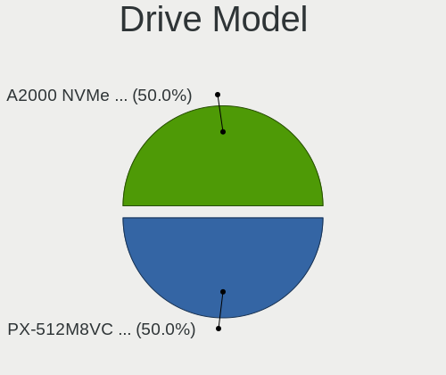

| Model                                                 | Computers | Percent |
|-------------------------------------------------------|-----------|---------|
| Crucial CT500MX500SSD1 500GB                          | 3         | 4.11%   |
| Unknown MMC Card  64GB                                | 2         | 2.74%   |
| Unknown MMC Card  128GB                               | 2         | 2.74%   |
| Seagate ST1000DM003-1ER162 1TB                        | 2         | 2.74%   |
| HGST HTS721010A9E630 1TB                              | 2         | 2.74%   |
| XrayDisk SSD 256GB                                    | 1         | 1.37%   |
| WDC WDS250G2B0A-00SM50 250GB SSD                      | 1         | 1.37%   |
| WDC WDBNCE0020PNC 2TB SSD                             | 1         | 1.37%   |
| WDC WD5000LPCX-22VHAT0 500GB                          | 1         | 1.37%   |
| WDC WD3200BEVT-26ZCT0 320GB                           | 1         | 1.37%   |
| WDC WD20EARX-00PASB0 2TB                              | 1         | 1.37%   |
| WDC WD1600AAJS-00L7A0 160GB                           | 1         | 1.37%   |
| WDC WD1600AABS-00PRA0 160GB                           | 1         | 1.37%   |
| WDC WD10SPZX-75Z10T1 1TB                              | 1         | 1.37%   |
| WDC WD10SPCX-75KHST0 1TB                              | 1         | 1.37%   |
| WDC WD My Book 1TB                                    | 1         | 1.37%   |
| Union Memory UMIS RPJTJ256MEE1OWX 256GB               | 1         | 1.37%   |
| Toshiba XG4 NVMe SSD Controller 256GB                 | 1         | 1.37%   |
| Toshiba THNSNF128GCSS 128GB SSD                       | 1         | 1.37%   |
| Toshiba MK2555GSX 250GB                               | 1         | 1.37%   |
| Toshiba HDWD130 3TB                                   | 1         | 1.37%   |
| TO Exter nal USB 3.0 2TB                              | 1         | 1.37%   |
| Team T2532TB SSD                                      | 1         | 1.37%   |
| SPCC Solid State Disk 512GB                           | 1         | 1.37%   |
| Silicon Motion SM2263EN/SM2263XT SSD Controller 256GB | 1         | 1.37%   |
| Seagate ST500LM012 HN-M500MBB 500GB                   | 1         | 1.37%   |
| Seagate ST3500820AS 500GB                             | 1         | 1.37%   |
| Seagate ST2000DM008-2UB102 2TB                        | 1         | 1.37%   |
| Seagate ST2000DM006-2DM164 2TB                        | 1         | 1.37%   |
| Seagate ST1000DM003-1SB10C 1TB                        | 1         | 1.37%   |
| Seagate Expansion 1TB                                 | 1         | 1.37%   |
| Sandisk WD_BLACK SN770 1TB                            | 1         | 1.37%   |
| Sandisk WD Black SN750 / PC SN730 NVMe SSD 1024GB     | 1         | 1.37%   |
| SanDisk SSD PLUS 120 GB                               | 1         | 1.37%   |
| SanDisk SD8TB8U256G1001 256GB SSD                     | 1         | 1.37%   |
| Samsung SSD PM830 2.5 7mm 128GB                       | 1         | 1.37%   |
| Samsung SSD 870 EVO 1TB                               | 1         | 1.37%   |
| Samsung SSD 860 PRO 256GB                             | 1         | 1.37%   |
| Samsung SSD 860 EVO 500GB                             | 1         | 1.37%   |
| Samsung PSSD T7 1TB                                   | 1         | 1.37%   |

HDD Vendor
----------

Hard disk drive vendors

| Vendor  | Computers | Drives | Percent |
|---------|-----------|--------|---------|
| WDC     | 8         | 8      | 33.33%  |
| Seagate | 8         | 8      | 33.33%  |
| HGST    | 3         | 3      | 12.5%   |
| Toshiba | 2         | 3      | 8.33%   |
| Intenso | 1         | 1      | 4.17%   |
| Hitachi | 1         | 1      | 4.17%   |
| Apple   | 1         | 1      | 4.17%   |

SSD Vendor
----------

Solid state drive vendors

| Vendor              | Computers | Drives | Percent |
|---------------------|-----------|--------|---------|
| Samsung Electronics | 6         | 6      | 22.22%  |
| Crucial             | 3         | 5      | 11.11%  |
| WDC                 | 2         | 2      | 7.41%   |
| SanDisk             | 2         | 2      | 7.41%   |
| Kingston            | 2         | 2      | 7.41%   |
| A-DATA Technology   | 2         | 2      | 7.41%   |
| XrayDisk            | 1         | 1      | 3.7%    |
| Toshiba             | 1         | 1      | 3.7%    |
| TO Exter            | 1         | 1      | 3.7%    |
| Team                | 1         | 1      | 3.7%    |
| SPCC                | 1         | 1      | 3.7%    |
| Phison              | 1         | 1      | 3.7%    |
| OWC                 | 1         | 1      | 3.7%    |
| Micron Technology   | 1         | 1      | 3.7%    |
| LITEONIT            | 1         | 1      | 3.7%    |
| Corsair             | 1         | 1      | 3.7%    |

Drive Kind
----------

HDD or SSD

| Kind | Computers | Drives | Percent |
|------|-----------|--------|---------|
| SSD  | 24        | 29     | 38.1%   |
| HDD  | 21        | 25     | 33.33%  |
| NVMe | 15        | 17     | 23.81%  |
| MMC  | 3         | 5      | 4.76%   |

Drive Connector
---------------

SATA, SAS, NVMe, etc.

| Type | Computers | Drives | Percent |
|------|-----------|--------|---------|
| SATA | 35        | 49     | 61.4%   |
| NVMe | 14        | 16     | 24.56%  |
| SAS  | 5         | 6      | 8.77%   |
| MMC  | 3         | 5      | 5.26%   |

Drive Size
----------

Size of hard drive

| Size in TB | Computers | Drives | Percent |
|------------|-----------|--------|---------|
| 0.01-0.5   | 29        | 31     | 60.42%  |
| 0.51-1.0   | 12        | 14     | 25%     |
| 1.01-2.0   | 5         | 6      | 10.42%  |
| 2.01-3.0   | 1         | 2      | 2.08%   |
| 4.01-10.0  | 1         | 1      | 2.08%   |

Space Total
-----------

Amount of disk space available on the file system

| Size in GB     | Computers | Percent |
|----------------|-----------|---------|
| 101-250        | 16        | 34.78%  |
| 251-500        | 9         | 19.57%  |
| 1001-2000      | 7         | 15.22%  |
| 501-1000       | 7         | 15.22%  |
| More than 3000 | 3         | 6.52%   |
| 2001-3000      | 2         | 4.35%   |
| 21-50          | 1         | 2.17%   |
| Unknown        | 1         | 2.17%   |

Space Used
----------

Amount of used disk space

| Used GB        | Computers | Percent |
|----------------|-----------|---------|
| 1-20           | 19        | 41.3%   |
| 21-50          | 12        | 26.09%  |
| 51-100         | 6         | 13.04%  |
| 101-250        | 4         | 8.7%    |
| 501-1000       | 2         | 4.35%   |
| More than 3000 | 1         | 2.17%   |
| 251-500        | 1         | 2.17%   |
| Unknown        | 1         | 2.17%   |

Malfunc. Drives
---------------

Drive models with a malfunction

| Model                                 | Computers | Drives | Percent |
|---------------------------------------|-----------|--------|---------|
| Seagate ST1000DM003-1ER162 1TB        | 2         | 2      | 20%     |
| WDC WD5000LPCX-22VHAT0 500GB          | 1         | 1      | 10%     |
| WDC WD20EARX-00PASB0 2TB              | 1         | 1      | 10%     |
| WDC WD1600AAJS-00L7A0 160GB           | 1         | 1      | 10%     |
| Toshiba MK2555GSX 250GB               | 1         | 1      | 10%     |
| Seagate ST3500820AS 500GB             | 1         | 1      | 10%     |
| Seagate ST1000DM003-1SB10C 1TB        | 1         | 1      | 10%     |
| OWC Aura 2012 240GB SSD               | 1         | 1      | 10%     |
| A-DATA Technology SP900NS38 256GB SSD | 1         | 1      | 10%     |

Malfunc. Drive Vendor
---------------------

Vendors of faulty drives

| Vendor            | Computers | Drives | Percent |
|-------------------|-----------|--------|---------|
| Seagate           | 4         | 4      | 40%     |
| WDC               | 3         | 3      | 30%     |
| Toshiba           | 1         | 1      | 10%     |
| OWC               | 1         | 1      | 10%     |
| A-DATA Technology | 1         | 1      | 10%     |

Malfunc. HDD Vendor
-------------------

Vendors of faulty HDD drives

| Vendor  | Computers | Drives | Percent |
|---------|-----------|--------|---------|
| Seagate | 4         | 4      | 50%     |
| WDC     | 3         | 3      | 37.5%   |
| Toshiba | 1         | 1      | 12.5%   |

Malfunc. Drive Kind
-------------------

Kinds of faulty drives

| Kind | Computers | Drives | Percent |
|------|-----------|--------|---------|
| HDD  | 8         | 8      | 80%     |
| SSD  | 2         | 2      | 20%     |

Failed Drives
-------------

Failed drive models

Zero info for selected period =(

Failed Drive Vendor
-------------------

Failed drive vendors

Zero info for selected period =(

Drive Status
------------

Number of failed and malfunc. drives

| Status   | Computers | Drives | Percent |
|----------|-----------|--------|---------|
| Works    | 40        | 57     | 71.43%  |
| Malfunc  | 10        | 10     | 17.86%  |
| Detected | 5         | 8      | 8.93%   |
| Fixed    | 1         | 1      | 1.79%   |

Storage controller
------------------

Storage Vendor
--------------

Storage controller vendors

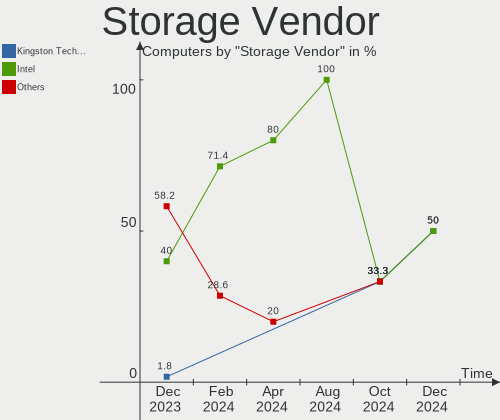

| Vendor                       | Computers | Percent |
|------------------------------|-----------|---------|
| Intel                        | 36        | 66.67%  |
| Samsung Electronics          | 5         | 9.26%   |
| AMD                          | 3         | 5.56%   |
| Kingston Technology Company  | 2         | 3.7%    |
| Union Memory (Shenzhen)      | 1         | 1.85%   |
| Toshiba America Info Systems | 1         | 1.85%   |
| Silicon Motion               | 1         | 1.85%   |
| SanDisk                      | 1         | 1.85%   |
| Phison Electronics           | 1         | 1.85%   |
| Micron Technology            | 1         | 1.85%   |
| JMicron Technology           | 1         | 1.85%   |
| Apple                        | 1         | 1.85%   |

Storage Model
-------------

Storage controller models

| Model                                                                          | Computers | Percent |
|--------------------------------------------------------------------------------|-----------|---------|
| Intel 7 Series Chipset Family 6-port SATA Controller [AHCI mode]               | 6         | 10.17%  |
| Intel 82801 Mobile SATA Controller [RAID mode]                                 | 4         | 6.78%   |
| Intel 82801JI (ICH10 Family) 4 port SATA IDE Controller #1                     | 3         | 5.08%   |
| Intel Sunrise Point-LP SATA Controller [AHCI mode]                             | 2         | 3.39%   |
| Intel Q170/Q150/B150/H170/H110/Z170/CM236 Chipset SATA Controller [AHCI Mode]  | 2         | 3.39%   |
| Intel 82801JI (ICH10 Family) 2 port SATA IDE Controller #2                     | 2         | 3.39%   |
| Intel 82801IBM/IEM (ICH9M/ICH9M-E) 4 port SATA Controller [AHCI mode]          | 2         | 3.39%   |
| Intel 8 Series/C220 Series Chipset Family 6-port SATA Controller 1 [AHCI mode] | 2         | 3.39%   |
| Intel 7 Series/C210 Series Chipset Family 6-port SATA Controller [AHCI mode]   | 2         | 3.39%   |
| Intel 6 Series/C200 Series Chipset Family 6 port Desktop SATA AHCI Controller  | 2         | 3.39%   |
| AMD SB7x0/SB8x0/SB9x0 SATA Controller [AHCI mode]                              | 2         | 3.39%   |
| Union Memory (Shenzhen) AM620 PCIe 3.0 NVMe SSD 256GB                          | 1         | 1.69%   |
| Toshiba America Info Systems XG4 NVMe SSD Controller                           | 1         | 1.69%   |
| Silicon Motion SM2263EN/SM2263XT (DRAM-less) NVMe SSD Controllers              | 1         | 1.69%   |
| SanDisk WD Black SN770 / PC SN740 256GB / PC SN560 (DRAM-less) NVMe SSD        | 1         | 1.69%   |
| SanDisk Extreme Pro / WD Black SN750 / PC SN730 / Red SN700 NVMe SSD           | 1         | 1.69%   |
| Samsung NVMe SSD Controller SM981/PM981/PM983                                  | 1         | 1.69%   |
| Samsung NVMe SSD Controller SM961/PM961/SM963                                  | 1         | 1.69%   |
| Samsung NVMe SSD Controller PM9B1 (DRAM-less)                                  | 1         | 1.69%   |
| Samsung NVMe SSD Controller PM9A1/PM9A3/980PRO                                 | 1         | 1.69%   |
| Samsung NVMe SSD Controller 980 (DRAM-less)                                    | 1         | 1.69%   |
| Phison E12 NVMe Controller                                                     | 1         | 1.69%   |
| Micron 2210 NVMe SSD [Cobain]                                                  | 1         | 1.69%   |
| Kingston Company OM8PCP Design-In PCIe 3 NVMe SSD (DRAM-less)                  | 1         | 1.69%   |
| Kingston Company KC3000/FURY Renegade NVMe SSD E18                             | 1         | 1.69%   |
| JMicron JMB361 AHCI/IDE                                                        | 1         | 1.69%   |
| Intel Volume Management Device NVMe RAID Controller                            | 1         | 1.69%   |
| Intel SSD 660P Series                                                          | 1         | 1.69%   |
| Intel Ice Lake-LP SATA Controller [AHCI mode]                                  | 1         | 1.69%   |
| Intel HM170/QM170 Chipset SATA Controller [AHCI Mode]                          | 1         | 1.69%   |
| Intel Cannon Lake PCH SATA AHCI Controller                                     | 1         | 1.69%   |
| Intel Cannon Lake Mobile PCH SATA AHCI Controller                              | 1         | 1.69%   |
| Intel C610/X99 series chipset 6-Port SATA Controller [AHCI mode]               | 1         | 1.69%   |
| Intel Alder Lake-P SATA AHCI Controller                                        | 1         | 1.69%   |
| Intel 700 Series Chipset Family SATA AHCI Controller                           | 1         | 1.69%   |
| Intel 6 Series/C200 Series Chipset Family 6 port Mobile SATA AHCI Controller   | 1         | 1.69%   |
| Intel 5 Series/3400 Series Chipset 4 port SATA IDE Controller                  | 1         | 1.69%   |
| Intel 5 Series/3400 Series Chipset 2 port SATA IDE Controller                  | 1         | 1.69%   |
| Intel 400 Series Chipset Family SATA AHCI Controller                           | 1         | 1.69%   |
| Apple ANS2 NVMe Controller                                                     | 1         | 1.69%   |

Storage Kind
------------

Kind of storage controller (IDE, SATA, NVMe, SAS, ...)

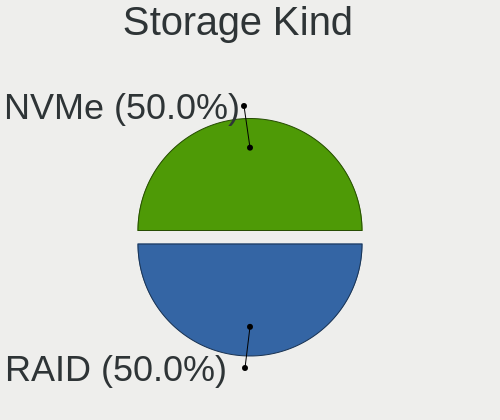

| Kind | Computers | Percent |
|------|-----------|---------|
| SATA | 30        | 56.6%   |
| NVMe | 14        | 26.42%  |
| RAID | 5         | 9.43%   |
| IDE  | 4         | 7.55%   |

Processor
---------

CPU Vendor
----------

Processor vendors

| Vendor | Computers | Percent |
|--------|-----------|---------|
| Intel  | 41        | 89.13%  |
| AMD    | 5         | 10.87%  |

CPU Model
---------

Processor models

| Model                                   | Computers | Percent |
|-----------------------------------------|-----------|---------|
| Intel Core i5-7200U CPU @ 2.50GHz       | 2         | 4.35%   |
| Intel Core i5-3320M CPU @ 2.60GHz       | 2         | 4.35%   |
| Intel 11th Gen Core i3-1115G4 @ 3.00GHz | 2         | 4.35%   |
| Intel Xeon CPU E5450 @ 3.00GHz          | 1         | 2.17%   |
| Intel Xeon CPU E5-2678 v3 @ 2.50GHz     | 1         | 2.17%   |
| Intel Pentium Silver N6000 @ 1.10GHz    | 1         | 2.17%   |
| Intel Core i9-9900K CPU @ 3.60GHz       | 1         | 2.17%   |
| Intel Core i9-8950HK CPU @ 2.90GHz      | 1         | 2.17%   |
| Intel Core i7-8550U CPU @ 1.80GHz       | 1         | 2.17%   |
| Intel Core i7-6820HQ CPU @ 2.70GHz      | 1         | 2.17%   |
| Intel Core i7-6700HQ CPU @ 2.60GHz      | 1         | 2.17%   |
| Intel Core i7-4790 CPU @ 3.60GHz        | 1         | 2.17%   |
| Intel Core i7-4710HQ CPU @ 2.50GHz      | 1         | 2.17%   |
| Intel Core i7-3770T CPU @ 2.50GHz       | 1         | 2.17%   |
| Intel Core i7-3615QM CPU @ 2.30GHz      | 1         | 2.17%   |
| Intel Core i7 CPU 920 @ 2.67GHz         | 1         | 2.17%   |
| Intel Core i7 CPU 860 @ 2.80GHz         | 1         | 2.17%   |
| Intel Core i5-6300U CPU @ 2.40GHz       | 1         | 2.17%   |
| Intel Core i5-4300M CPU @ 2.60GHz       | 1         | 2.17%   |
| Intel Core i5-3570S CPU @ 3.10GHz       | 1         | 2.17%   |
| Intel Core i5-3470 CPU @ 3.20GHz        | 1         | 2.17%   |
| Intel Core i5-3427U CPU @ 1.80GHz       | 1         | 2.17%   |
| Intel Core i5-3337U CPU @ 1.80GHz       | 1         | 2.17%   |
| Intel Core i5-3210M CPU @ 2.50GHz       | 1         | 2.17%   |
| Intel Core i5-2520M CPU @ 2.50GHz       | 1         | 2.17%   |
| Intel Core i5-1035G4 CPU @ 1.10GHz      | 1         | 2.17%   |
| Intel Core i5-1035G1 CPU @ 1.00GHz      | 1         | 2.17%   |
| Intel Core i5-10300H CPU @ 2.50GHz      | 1         | 2.17%   |
| Intel Core i3-8100B CPU @ 3.60GHz       | 1         | 2.17%   |
| Intel Core i3-6100 CPU @ 3.70GHz        | 1         | 2.17%   |
| Intel Core i3-3240 CPU @ 3.40GHz        | 1         | 2.17%   |
| Intel Core i3-2328M CPU @ 2.20GHz       | 1         | 2.17%   |
| Intel Core 2 Duo CPU T6500 @ 2.10GHz    | 1         | 2.17%   |
| Intel Core 2 Duo CPU P7350 @ 2.00GHz    | 1         | 2.17%   |
| Intel Core 2 Duo CPU E7200 @ 2.53GHz    | 1         | 2.17%   |
| Intel Atom CPU Z3795 @ 1.60GHz          | 1         | 2.17%   |
| Intel 12th Gen Core i5-12450H           | 1         | 2.17%   |
| Intel 12th Gen Core i5-12400F           | 1         | 2.17%   |
| AMD Ryzen 9 5900HX with Radeon Graphics | 1         | 2.17%   |
| AMD Ryzen 5 5600H with Radeon Graphics  | 1         | 2.17%   |

CPU Model Family
----------------

Processor model prefix

| Model                | Computers | Percent |
|----------------------|-----------|---------|
| Intel Core i5        | 15        | 32.61%  |
| Intel Core i7        | 9         | 19.57%  |
| Other                | 4         | 8.7%    |
| Intel Core i3        | 4         | 8.7%    |
| Intel Core 2 Duo     | 3         | 6.52%   |
| Intel Xeon           | 2         | 4.35%   |
| Intel Core i9        | 2         | 4.35%   |
| AMD Ryzen 5          | 2         | 4.35%   |
| Intel Pentium Silver | 1         | 2.17%   |
| Intel Atom           | 1         | 2.17%   |
| AMD Ryzen 9          | 1         | 2.17%   |
| AMD E                | 1         | 2.17%   |
| AMD C-60             | 1         | 2.17%   |

CPU Cores
---------

Number of processor cores

| Number | Computers | Percent |
|--------|-----------|---------|
| 2      | 20        | 43.48%  |
| 4      | 18        | 39.13%  |
| 6      | 4         | 8.7%    |
| 8      | 3         | 6.52%   |
| 12     | 1         | 2.17%   |

CPU Sockets
-----------

Number of sockets

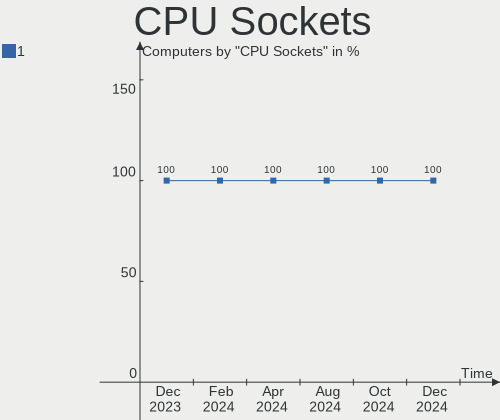

| Number | Computers | Percent |
|--------|-----------|---------|
| 1      | 46        | 100%    |

CPU Threads
-----------

Threads per core (Hyper-Threading)

| Number | Computers | Percent |
|--------|-----------|---------|
| 2      | 35        | 76.09%  |
| 1      | 11        | 23.91%  |

CPU Op-Modes
------------

CPU Operation Modes (32-bit, 64-bit)

| Op mode        | Computers | Percent |
|----------------|-----------|---------|
| 32-bit, 64-bit | 46        | 100%    |

CPU Microcode
-------------

Microcode number

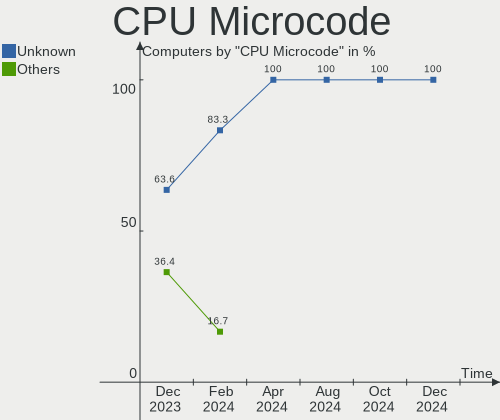

| Number     | Computers | Percent |
|------------|-----------|---------|
| Unknown    | 41        | 89.13%  |
| 0x0a50000c | 2         | 4.35%   |
| 0x05000101 | 2         | 4.35%   |
| 0x08608103 | 1         | 2.17%   |

CPU Microarch
-------------

Microarchitecture

| Name             | Computers | Percent |
|------------------|-----------|---------|
| IvyBridge        | 10        | 21.74%  |
| KabyLake         | 6         | 13.04%  |
| Skylake          | 4         | 8.7%    |
| Penryn           | 4         | 8.7%    |
| Haswell          | 4         | 8.7%    |
| Zen 3            | 2         | 4.35%   |
| TigerLake        | 2         | 4.35%   |
| SandyBridge      | 2         | 4.35%   |
| Nehalem          | 2         | 4.35%   |
| IceLake          | 2         | 4.35%   |
| Bobcat           | 2         | 4.35%   |
| Alderlake Hybrid | 2         | 4.35%   |
| Tremont          | 1         | 2.17%   |
| Silvermont       | 1         | 2.17%   |
| CometLake        | 1         | 2.17%   |
| Unknown          | 1         | 2.17%   |

Graphics
--------

GPU Vendor
----------

Vendors of graphics cards

| Vendor | Computers | Percent |
|--------|-----------|---------|
| Intel  | 29        | 54.72%  |
| Nvidia | 13        | 24.53%  |
| AMD    | 11        | 20.75%  |

GPU Model
---------

Graphics card models

| Model                                                                     | Computers | Percent |
|---------------------------------------------------------------------------|-----------|---------|
| Intel 3rd Gen Core processor Graphics Controller                          | 6         | 11.11%  |
| Intel Xeon E3-1200 v2/3rd Gen Core processor Graphics Controller          | 2         | 3.7%    |
| Intel Tiger Lake-LP GT2 [UHD Graphics G4]                                 | 2         | 3.7%    |
| Intel HD Graphics 620                                                     | 2         | 3.7%    |
| Intel HD Graphics 530                                                     | 2         | 3.7%    |
| Intel CoffeeLake-H GT2 [UHD Graphics 630]                                 | 2         | 3.7%    |
| Intel 4th Gen Core Processor Integrated Graphics Controller               | 2         | 3.7%    |
| Intel 2nd Generation Core Processor Family Integrated Graphics Controller | 2         | 3.7%    |
| AMD Cezanne [Radeon Vega Series / Radeon Vega Mobile Series]              | 2         | 3.7%    |
| Nvidia TU117M [GeForce GTX 1650 Mobile / Max-Q]                           | 1         | 1.85%   |
| Nvidia GP108 [GeForce GT 1030]                                            | 1         | 1.85%   |
| Nvidia GP107GLM [Quadro P2000 Mobile]                                     | 1         | 1.85%   |
| Nvidia GP107 [GeForce GTX 1050]                                           | 1         | 1.85%   |
| Nvidia GM204M [GeForce GTX 960 OEM / 970M]                                | 1         | 1.85%   |
| Nvidia GM204 [GeForce GTX 970]                                            | 1         | 1.85%   |
| Nvidia GM107M [GeForce GTX 860M]                                          | 1         | 1.85%   |
| Nvidia GM107GLM [Quadro M1000M]                                           | 1         | 1.85%   |
| Nvidia GM107 [GeForce GTX 750 Ti]                                         | 1         | 1.85%   |
| Nvidia GF117M [GeForce 610M/710M/810M/820M / GT 620M/625M/630M/720M]      | 1         | 1.85%   |
| Nvidia G98M [GeForce 9300M GS]                                            | 1         | 1.85%   |
| Nvidia AD107M [GeForce RTX 4050 Max-Q / Mobile]                           | 1         | 1.85%   |
| Nvidia AD106 [GeForce RTX 4060 Ti]                                        | 1         | 1.85%   |
| Intel UHD Graphics 620                                                    | 1         | 1.85%   |
| Intel Skylake GT2 [HD Graphics 520]                                       | 1         | 1.85%   |
| Intel JasperLake [UHD Graphics]                                           | 1         | 1.85%   |
| Intel IvyBridge GT2 [HD Graphics 4000]                                    | 1         | 1.85%   |
| Intel Iris Plus Graphics G4 (Ice Lake)                                    | 1         | 1.85%   |
| Intel Iris Plus Graphics G1 (Ice Lake)                                    | 1         | 1.85%   |
| Intel CometLake-H GT2 [UHD Graphics]                                      | 1         | 1.85%   |
| Intel Atom Processor Z36xxx/Z37xxx Series Graphics & Display              | 1         | 1.85%   |
| Intel Alder Lake-P GT1 [UHD Graphics]                                     | 1         | 1.85%   |
| AMD Wrestler [Radeon HD 6310]                                             | 1         | 1.85%   |
| AMD Wrestler [Radeon HD 6290]                                             | 1         | 1.85%   |
| AMD RV710/M92 [Mobility Radeon HD 4530/4570/5145/530v/540v/545v]          | 1         | 1.85%   |
| AMD RV620/M82 [Mobility Radeon HD 3450/3470]                              | 1         | 1.85%   |
| AMD Polaris 20 XL [Radeon RX 580 2048SP]                                  | 1         | 1.85%   |
| AMD Oland PRO [Radeon R7 240/340 / Radeon 520]                            | 1         | 1.85%   |
| AMD Navi 14 [Radeon RX 5500/5500M / Pro 5500M]                            | 1         | 1.85%   |
| AMD Navi 10 [Radeon RX 5600 OEM/5600 XT / 5700/5700 XT]                   | 1         | 1.85%   |
| AMD Lucienne                                                              | 1         | 1.85%   |

GPU Combo
---------

Combinations of graphics cards

| Name           | Computers | Percent |
|----------------|-----------|---------|
| 1 x Intel      | 22        | 47.83%  |
| 1 x AMD        | 10        | 21.74%  |
| Intel + Nvidia | 7         | 15.22%  |
| 1 x Nvidia     | 6         | 13.04%  |
| 2 x AMD        | 1         | 2.17%   |

GPU Driver
----------

Free vs proprietary

| Driver      | Computers | Percent |
|-------------|-----------|---------|
| Free        | 43        | 93.48%  |
| Proprietary | 3         | 6.52%   |

GPU Memory
----------

Total video memory

| Size in GB | Computers | Percent |
|------------|-----------|---------|
| Unknown    | 25        | 54.35%  |
| 1.01-2.0   | 7         | 15.22%  |
| 0.01-0.5   | 7         | 15.22%  |
| 7.01-8.0   | 3         | 6.52%   |
| 3.01-4.0   | 3         | 6.52%   |
| 0.51-1.0   | 1         | 2.17%   |

Monitor
-------

Monitor Vendor
--------------

Monitor vendors

| Vendor               | Computers | Percent |
|----------------------|-----------|---------|
| LG Display           | 9         | 17.31%  |
| BOE                  | 7         | 13.46%  |
| Samsung Electronics  | 4         | 7.69%   |
| AU Optronics         | 4         | 7.69%   |
| Goldstar             | 3         | 5.77%   |
| Chimei Innolux       | 3         | 5.77%   |
| Apple                | 3         | 5.77%   |
| Westinghouse         | 2         | 3.85%   |
| PANDA                | 2         | 3.85%   |
| Hewlett-Packard      | 2         | 3.85%   |
| Eizo                 | 2         | 3.85%   |
| Dell                 | 2         | 3.85%   |
| Vizio                | 1         | 1.92%   |
| Unknown              | 1         | 1.92%   |
| RTK                  | 1         | 1.92%   |
| Philips              | 1         | 1.92%   |
| LG Philips           | 1         | 1.92%   |
| Fujitsu Siemens      | 1         | 1.92%   |
| BenQ                 | 1         | 1.92%   |
| Ancor Communications | 1         | 1.92%   |
| Acer                 | 1         | 1.92%   |

Monitor Model
-------------

Monitor models

| Model                                                                 | Computers | Percent |
|-----------------------------------------------------------------------|-----------|---------|
| Westinghouse WD40FW2610 WET02EE 1920x1080 890x500mm 40.2-inch         | 1         | 1.92%   |
| Westinghouse SK-32H640G WDE6040 1366x768 709x399mm 32.0-inch          | 1         | 1.92%   |
| Vizio M437-G0 VIZ1033 3840x2160 1210x680mm 54.6-inch                  | 1         | 1.92%   |
| Unknown LCD Monitor FFFF 2288x1287 2550x2550mm 142.0-inch             | 1         | 1.92%   |
| Samsung Electronics SyncMaster SAM0564 1360x768 410x230mm 18.5-inch   | 1         | 1.92%   |
| Samsung Electronics S24D330 SAM0D92 1920x1080 530x300mm 24.0-inch     | 1         | 1.92%   |
| Samsung Electronics LCD Monitor SDC544B 1600x900 309x174mm 14.0-inch  | 1         | 1.92%   |
| Samsung Electronics LCD Monitor SAM0B7C 1920x1080 480x270mm 21.7-inch | 1         | 1.92%   |
| RTK '' RTK1920 1920x1080 344x195mm 15.6-inch                          | 1         | 1.92%   |
| Philips PHI32PFL5404 PHLD075 1680x1050 698x392mm 31.5-inch            | 1         | 1.92%   |
| PANDA LCD Monitor NCP004D 1920x1080 344x194mm 15.5-inch               | 1         | 1.92%   |
| PANDA LCD Monitor NCP0046 1920x1080 344x194mm 15.5-inch               | 1         | 1.92%   |
| LG Philips LCD Monitor LPL2601 1280x800 286x179mm 13.3-inch           | 1         | 1.92%   |
| LG Display LCD Monitor LGD40A0 1366x768 310x174mm 14.0-inch           | 1         | 1.92%   |
| LG Display LCD Monitor LGD058B 2560x1440 309x174mm 14.0-inch          | 1         | 1.92%   |
| LG Display LCD Monitor LGD04A7 1920x1080 344x194mm 15.5-inch          | 1         | 1.92%   |
| LG Display LCD Monitor LGD0469 1920x1080 382x215mm 17.3-inch          | 1         | 1.92%   |
| LG Display LCD Monitor LGD03B7 1366x768 309x174mm 14.0-inch           | 1         | 1.92%   |
| LG Display LCD Monitor LGD0362 1600x900 309x174mm 14.0-inch           | 1         | 1.92%   |
| LG Display LCD Monitor LGD033B 1366x768 344x194mm 15.5-inch           | 1         | 1.92%   |
| LG Display LCD Monitor LGD02F2 1366x768 344x194mm 15.5-inch           | 1         | 1.92%   |
| LG Display LCD Monitor LGD02DF 1600x900 310x174mm 14.0-inch           | 1         | 1.92%   |
| Hewlett-Packard LE2002x HWP2964 1600x900 443x249mm 20.0-inch          | 1         | 1.92%   |
| Hewlett-Packard 27fw HPN3607 1920x1080 598x336mm 27.0-inch            | 1         | 1.92%   |
| Goldstar W2242 GSM5677 1680x1050 474x296mm 22.0-inch                  | 1         | 1.92%   |
| Goldstar QHD GSM7729 2560x1440 697x392mm 31.5-inch                    | 1         | 1.92%   |
| Goldstar HDR 4K GSM7750 3840x2160 697x392mm 31.5-inch                 | 1         | 1.92%   |
| Fujitsu Siemens A19-3 DVI FUS078B 1280x1024 380x300mm 19.1-inch       | 1         | 1.92%   |
| Eizo S2202W ENC1975 1680x1050 474x297mm 22.0-inch                     | 1         | 1.92%   |
| Eizo FS2331 ENC2213 1920x1080 510x287mm 23.0-inch                     | 1         | 1.92%   |
| Dell P2417H DELA0DC 1920x1080 527x296mm 23.8-inch                     | 1         | 1.92%   |
| Dell LNKG H2VA001 LNKA001 1920x1080 880x500mm 39.8-inch               | 1         | 1.92%   |
| Chimei Innolux LCD Monitor CMN1521 1920x1080 344x193mm 15.5-inch      | 1         | 1.92%   |
| Chimei Innolux LCD Monitor CMN1515 1920x1080 344x193mm 15.5-inch      | 1         | 1.92%   |
| Chimei Innolux LCD Monitor CMN1406 1920x1080 309x173mm 13.9-inch      | 1         | 1.92%   |
| BOE LCD Monitor BOE0957 1920x1080 344x194mm 15.5-inch                 | 1         | 1.92%   |
| BOE LCD Monitor BOE0872 1920x1080 344x194mm 15.5-inch                 | 1         | 1.92%   |
| BOE LCD Monitor BOE07C2 1920x1080 344x193mm 15.5-inch                 | 1         | 1.92%   |
| BOE LCD Monitor BOE07AA 1366x768 344x194mm 15.5-inch                  | 1         | 1.92%   |
| BOE LCD Monitor BOE0700 1920x1080 344x194mm 15.5-inch                 | 1         | 1.92%   |

Monitor Resolution
------------------

Monitor screen resolution

| Resolution         | Computers | Percent |
|--------------------|-----------|---------|
| 1920x1080 (FHD)    | 23        | 46%     |
| 1366x768 (WXGA)    | 7         | 14%     |
| 2560x1440 (QHD)    | 4         | 8%      |
| 1600x900 (HD+)     | 4         | 8%      |
| 3840x2160 (4K)     | 2         | 4%      |
| 1680x1050 (WSXGA+) | 2         | 4%      |
| 1360x768           | 2         | 4%      |
| 1280x800 (WXGA)    | 2         | 4%      |
| 2288x1287          | 1         | 2%      |
| 1920x1200 (WUXGA)  | 1         | 2%      |
| 1440x900 (WXGA+)   | 1         | 2%      |
| 1280x1024 (SXGA)   | 1         | 2%      |

Monitor Diagonal
----------------

Diagonal size in inches

| Inches | Computers | Percent |
|--------|-----------|---------|
| 15     | 14        | 26.92%  |
| 14     | 7         | 13.46%  |
| 13     | 6         | 11.54%  |
| 31     | 4         | 7.69%   |
| 27     | 4         | 7.69%   |
| 24     | 3         | 5.77%   |
| 23     | 2         | 3.85%   |
| 142    | 1         | 1.92%   |
| 69     | 1         | 1.92%   |
| 58     | 1         | 1.92%   |
| 40     | 1         | 1.92%   |
| 39     | 1         | 1.92%   |
| 32     | 1         | 1.92%   |
| 22     | 1         | 1.92%   |
| 20     | 1         | 1.92%   |
| 19     | 1         | 1.92%   |
| 18     | 1         | 1.92%   |
| 17     | 1         | 1.92%   |
| 10     | 1         | 1.92%   |

Monitor Width
-------------

Physical width

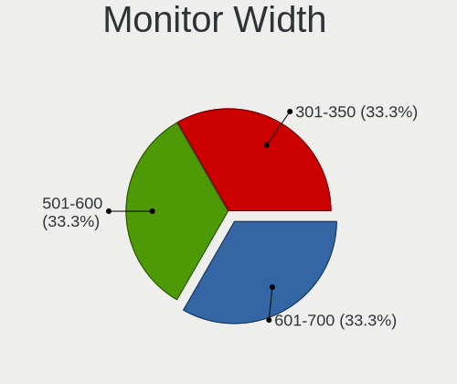

| Width in mm    | Computers | Percent |
|----------------|-----------|---------|
| 301-350        | 23        | 45.1%   |
| 501-600        | 7         | 13.73%  |
| 201-300        | 5         | 9.8%    |
| 601-700        | 4         | 7.84%   |
| 401-500        | 4         | 7.84%   |
| 801-900        | 2         | 3.92%   |
| 351-400        | 2         | 3.92%   |
| More than 2000 | 1         | 1.96%   |
| 701-800        | 1         | 1.96%   |
| 1501-2000      | 1         | 1.96%   |
| 1001-1500      | 1         | 1.96%   |

Aspect Ratio
------------

Proportional relationship between the width and the height

| Ratio | Computers | Percent |
|-------|-----------|---------|
| 16/9  | 38        | 82.61%  |
| 16/10 | 5         | 10.87%  |
| 5/4   | 1         | 2.17%   |
| 3/2   | 1         | 2.17%   |
| 1.00  | 1         | 2.17%   |

Monitor Area
------------

Area in inch²

| Area in inch² | Computers | Percent |
|----------------|-----------|---------|
| 101-110        | 14        | 26.92%  |
| 81-90          | 10        | 19.23%  |
| 201-250        | 6         | 11.54%  |
| 351-500        | 5         | 9.62%   |
| 301-350        | 4         | 7.69%   |
| More than 1000 | 3         | 5.77%   |
| 71-80          | 3         | 5.77%   |
| 151-200        | 2         | 3.85%   |
| 501-1000       | 2         | 3.85%   |
| 41-50          | 1         | 1.92%   |
| 141-150        | 1         | 1.92%   |
| 121-130        | 1         | 1.92%   |

Pixel Density
-------------

Pixels per inch

| Density | Computers | Percent |
|---------|-----------|---------|
| 121-160 | 19        | 39.58%  |
| 51-100  | 12        | 25%     |
| 101-120 | 10        | 20.83%  |
| 1-50    | 4         | 8.33%   |
| 161-240 | 3         | 6.25%   |

Multiple Monitors
-----------------

Total monitors connected

| Total | Computers | Percent |
|-------|-----------|---------|
| 1     | 38        | 82.61%  |
| 2     | 5         | 10.87%  |
| 3     | 2         | 4.35%   |
| 0     | 1         | 2.17%   |

Network
-------

Net Controller Vendor
---------------------

Controller vendors

| Vendor                | Computers | Percent |
|-----------------------|-----------|---------|
| Intel                 | 28        | 38.89%  |
| Realtek Semiconductor | 23        | 31.94%  |
| Broadcom              | 9         | 12.5%   |
| Qualcomm Atheros      | 5         | 6.94%   |
| TP-Link               | 1         | 1.39%   |
| Ralink Technology     | 1         | 1.39%   |
| Qualcomm              | 1         | 1.39%   |
| Microsoft             | 1         | 1.39%   |
| Microchip Technology  | 1         | 1.39%   |
| MediaTek              | 1         | 1.39%   |
| ASUSTek Computer      | 1         | 1.39%   |

Net Controller Model
--------------------

Controller models

| Model                                                             | Computers | Percent |
|-------------------------------------------------------------------|-----------|---------|
| Realtek RTL8111/8168/8411 PCI Express Gigabit Ethernet Controller | 14        | 16.47%  |
| Intel 82579LM Gigabit Network Connection (Lewisville)             | 5         | 5.88%   |
| Intel Centrino Advanced-N 6205 [Taylor Peak]                      | 3         | 3.53%   |
| Realtek RTL88x2bu [AC1200 Techkey]                                | 2         | 2.35%   |
| Realtek RTL8822CE 802.11ac PCIe Wireless Network Adapter          | 2         | 2.35%   |
| Realtek RTL8125 2.5GbE Controller                                 | 2         | 2.35%   |
| Realtek RTL810xE PCI Express Fast Ethernet controller             | 2         | 2.35%   |
| Intel Wireless 8260                                               | 2         | 2.35%   |
| Intel Wireless 3165                                               | 2         | 2.35%   |
| Intel Ice Lake-LP PCH CNVi WiFi                                   | 2         | 2.35%   |
| Broadcom NetXtreme BCM57766 Gigabit Ethernet PCIe                 | 2         | 2.35%   |
| Broadcom BCM4331 802.11a/b/g/n                                    | 2         | 2.35%   |
| TP-Link 802.11ac NIC                                              | 1         | 1.18%   |
| Realtek RTL8191SEvA Wireless LAN Controller                       | 1         | 1.18%   |
| Realtek RTL8188CUS 802.11n WLAN Adapter                           | 1         | 1.18%   |
| Realtek RTL8153 Gigabit Ethernet Adapter                          | 1         | 1.18%   |
| Ralink RT5370 Wireless Adapter                                    | 1         | 1.18%   |
| Qualcomm Redmi Note 8                                             | 1         | 1.18%   |
| Qualcomm Atheros QCA6174 802.11ac Wireless Network Adapter        | 1         | 1.18%   |
| Qualcomm Atheros Killer E2400 Gigabit Ethernet Controller         | 1         | 1.18%   |
| Qualcomm Atheros AR9485 Wireless Network Adapter                  | 1         | 1.18%   |
| Qualcomm Atheros AR928X Wireless Network Adapter (PCI-Express)    | 1         | 1.18%   |
| Qualcomm Atheros AR8121/AR8113/AR8114 Gigabit or Fast Ethernet    | 1         | 1.18%   |
| Microsoft Xbox Wireless Adapter for Windows                       | 1         | 1.18%   |
| Microchip SMSC9512/9514 Fast Ethernet Adapter                     | 1         | 1.18%   |
| MediaTek MT7921K (RZ608) Wi-Fi 6E 80MHz                           | 1         | 1.18%   |
| Intel Wireless-AC 9260                                            | 1         | 1.18%   |
| Intel Wireless 8265 / 8275                                        | 1         | 1.18%   |
| Intel Wireless 7260                                               | 1         | 1.18%   |
| Intel WiFi Link 5100                                              | 1         | 1.18%   |
| Intel Wi-Fi 6 AX201 160MHz                                        | 1         | 1.18%   |
| Intel Wi-Fi 6 AX201                                               | 1         | 1.18%   |
| Intel Wi-Fi 6 AX200                                               | 1         | 1.18%   |
| Intel Ethernet Connection I219-LM                                 | 1         | 1.18%   |
| Intel Ethernet Connection I217-LM                                 | 1         | 1.18%   |
| Intel Ethernet Connection (7) I219-V                              | 1         | 1.18%   |
| Intel Ethernet Connection (4) I219-V                              | 1         | 1.18%   |
| Intel Ethernet Connection (2) I219-V                              | 1         | 1.18%   |
| Intel Ethernet Connection (2) I219-LM                             | 1         | 1.18%   |
| Intel Comet Lake PCH CNVi WiFi                                    | 1         | 1.18%   |

Wireless Vendor
---------------

Wireless vendors

| Vendor                | Computers | Percent |
|-----------------------|-----------|---------|
| Intel                 | 22        | 50%     |
| Broadcom              | 8         | 18.18%  |
| Realtek Semiconductor | 6         | 13.64%  |
| Qualcomm Atheros      | 3         | 6.82%   |
| TP-Link               | 1         | 2.27%   |
| Ralink Technology     | 1         | 2.27%   |
| Microsoft             | 1         | 2.27%   |
| MediaTek              | 1         | 2.27%   |
| ASUSTek Computer      | 1         | 2.27%   |

Wireless Model
--------------

Wireless models

| Model                                                              | Computers | Percent |
|--------------------------------------------------------------------|-----------|---------|
| Intel Centrino Advanced-N 6205 [Taylor Peak]                       | 3         | 6.82%   |
| Realtek RTL88x2bu [AC1200 Techkey]                                 | 2         | 4.55%   |
| Realtek RTL8822CE 802.11ac PCIe Wireless Network Adapter           | 2         | 4.55%   |
| Intel Wireless 8260                                                | 2         | 4.55%   |
| Intel Wireless 3165                                                | 2         | 4.55%   |
| Intel Ice Lake-LP PCH CNVi WiFi                                    | 2         | 4.55%   |
| Broadcom BCM4331 802.11a/b/g/n                                     | 2         | 4.55%   |
| TP-Link 802.11ac NIC                                               | 1         | 2.27%   |
| Realtek RTL8191SEvA Wireless LAN Controller                        | 1         | 2.27%   |
| Realtek RTL8188CUS 802.11n WLAN Adapter                            | 1         | 2.27%   |
| Ralink RT5370 Wireless Adapter                                     | 1         | 2.27%   |
| Qualcomm Atheros QCA6174 802.11ac Wireless Network Adapter         | 1         | 2.27%   |
| Qualcomm Atheros AR9485 Wireless Network Adapter                   | 1         | 2.27%   |
| Qualcomm Atheros AR928X Wireless Network Adapter (PCI-Express)     | 1         | 2.27%   |
| Microsoft Xbox Wireless Adapter for Windows                        | 1         | 2.27%   |
| MediaTek MT7921K (RZ608) Wi-Fi 6E 80MHz                            | 1         | 2.27%   |
| Intel Wireless-AC 9260                                             | 1         | 2.27%   |
| Intel Wireless 8265 / 8275                                         | 1         | 2.27%   |
| Intel Wireless 7260                                                | 1         | 2.27%   |
| Intel WiFi Link 5100                                               | 1         | 2.27%   |
| Intel Wi-Fi 6 AX201 160MHz                                         | 1         | 2.27%   |
| Intel Wi-Fi 6 AX201                                                | 1         | 2.27%   |
| Intel Wi-Fi 6 AX200                                                | 1         | 2.27%   |
| Intel Comet Lake PCH CNVi WiFi                                     | 1         | 2.27%   |
| Intel Centrino Wireless-N 135                                      | 1         | 2.27%   |
| Intel Centrino Advanced-N 6235                                     | 1         | 2.27%   |
| Intel Cannon Lake PCH CNVi WiFi                                    | 1         | 2.27%   |
| Intel Alder Lake-P PCH CNVi WiFi                                   | 1         | 2.27%   |
| Intel 700 Series Chipset Family Wi-Fi                              | 1         | 2.27%   |
| Broadcom BCM4364 802.11ac Wireless Network Adapter                 | 1         | 2.27%   |
| Broadcom BCM4360 802.11ac Dual Band Wireless Network Adapter       | 1         | 2.27%   |
| Broadcom BCM43224 802.11a/b/g/n                                    | 1         | 2.27%   |
| Broadcom BCM43142 802.11b/g/n                                      | 1         | 2.27%   |
| Broadcom BCM4313 802.11bgn Wireless Network Adapter                | 1         | 2.27%   |
| Broadcom BCM4312 802.11b/g LP-PHY                                  | 1         | 2.27%   |
| ASUS USB-N13 802.11n Network Adapter (rev. B1) [Realtek RTL8192CU] | 1         | 2.27%   |

Ethernet Vendor
---------------

Ethernet vendors

| Vendor                | Computers | Percent |
|-----------------------|-----------|---------|
| Realtek Semiconductor | 19        | 47.5%   |
| Intel                 | 13        | 32.5%   |
| Broadcom              | 4         | 10%     |
| Qualcomm Atheros      | 2         | 5%      |
| Qualcomm              | 1         | 2.5%    |
| Microchip Technology  | 1         | 2.5%    |

Ethernet Model
--------------

Ethernet models

| Model                                                             | Computers | Percent |
|-------------------------------------------------------------------|-----------|---------|
| Realtek RTL8111/8168/8411 PCI Express Gigabit Ethernet Controller | 14        | 34.15%  |
| Intel 82579LM Gigabit Network Connection (Lewisville)             | 5         | 12.2%   |
| Realtek RTL8125 2.5GbE Controller                                 | 2         | 4.88%   |
| Realtek RTL810xE PCI Express Fast Ethernet controller             | 2         | 4.88%   |
| Broadcom NetXtreme BCM57766 Gigabit Ethernet PCIe                 | 2         | 4.88%   |
| Realtek RTL8153 Gigabit Ethernet Adapter                          | 1         | 2.44%   |
| Qualcomm Redmi Note 8                                             | 1         | 2.44%   |
| Qualcomm Atheros Killer E2400 Gigabit Ethernet Controller         | 1         | 2.44%   |
| Qualcomm Atheros AR8121/AR8113/AR8114 Gigabit or Fast Ethernet    | 1         | 2.44%   |
| Microchip SMSC9512/9514 Fast Ethernet Adapter                     | 1         | 2.44%   |
| Intel Ethernet Connection I219-LM                                 | 1         | 2.44%   |
| Intel Ethernet Connection I217-LM                                 | 1         | 2.44%   |
| Intel Ethernet Connection (7) I219-V                              | 1         | 2.44%   |
| Intel Ethernet Connection (4) I219-V                              | 1         | 2.44%   |
| Intel Ethernet Connection (2) I219-V                              | 1         | 2.44%   |
| Intel Ethernet Connection (2) I219-LM                             | 1         | 2.44%   |
| Intel 82567V-2 Gigabit Network Connection                         | 1         | 2.44%   |
| Intel 82567LF-2 Gigabit Network Connection                        | 1         | 2.44%   |
| Broadcom NetXtreme BCM57765 Gigabit Ethernet PCIe                 | 1         | 2.44%   |
| Broadcom NetXtreme BCM57761 Gigabit Ethernet PCIe                 | 1         | 2.44%   |
| Broadcom NetLink BCM57780 Gigabit Ethernet PCIe                   | 1         | 2.44%   |

Net Controller Kind
-------------------

Ethernet, WiFi or modem

| Kind     | Computers | Percent |
|----------|-----------|---------|
| WiFi     | 40        | 51.28%  |
| Ethernet | 38        | 48.72%  |

Used Controller
---------------

Currently used network controller

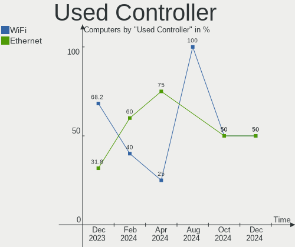

| Kind     | Computers | Percent |
|----------|-----------|---------|
| WiFi     | 30        | 65.22%  |
| Ethernet | 16        | 34.78%  |

NICs
----

Total network controllers on board

| Total | Computers | Percent |
|-------|-----------|---------|
| 2     | 26        | 56.52%  |
| 1     | 16        | 34.78%  |
| 3     | 3         | 6.52%   |
| 0     | 1         | 2.17%   |

IPv6
----

IPv6 vs IPv4

| Used | Computers | Percent |
|------|-----------|---------|
| No   | 32        | 69.57%  |
| Yes  | 14        | 30.43%  |

Bluetooth
---------

Bluetooth Vendor
----------------

Controller vendors

| Vendor                          | Computers | Percent |
|---------------------------------|-----------|---------|
| Intel                           | 17        | 56.67%  |
| Apple                           | 4         | 13.33%  |
| Broadcom                        | 3         | 10%     |
| Realtek Semiconductor           | 2         | 6.67%   |
| Realtek                         | 1         | 3.33%   |
| Qualcomm Atheros Communications | 1         | 3.33%   |
| MediaTek                        | 1         | 3.33%   |
| Alps Electric                   | 1         | 3.33%   |

Bluetooth Model
---------------

Controller models

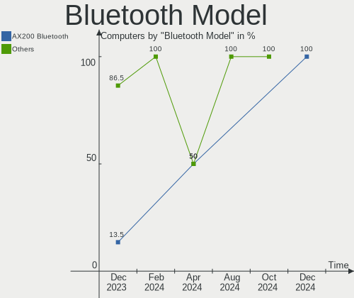

| Model                                          | Computers | Percent |
|------------------------------------------------|-----------|---------|
| Intel Bluetooth wireless interface             | 6         | 20%     |
| Intel AX201 Bluetooth                          | 4         | 13.33%  |
| Intel Bluetooth 9460/9560 Jefferson Peak (JfP) | 3         | 10%     |
| Realtek Bluetooth Radio                        | 2         | 6.67%   |
| Intel Centrino Bluetooth Wireless Transceiver  | 2         | 6.67%   |
| Apple Bluetooth USB Host Controller            | 2         | 6.67%   |
| Realtek Bluetooth Radio                        | 1         | 3.33%   |
| Qualcomm Atheros  Bluetooth Device             | 1         | 3.33%   |
| MediaTek Wireless_Device                       | 1         | 3.33%   |
| Intel Bluetooth Device                         | 1         | 3.33%   |
| Intel AX200 Bluetooth                          | 1         | 3.33%   |
| Broadcom HP Portable Valentine                 | 1         | 3.33%   |
| Broadcom BCM43142 Bluetooth 4.0                | 1         | 3.33%   |
| Broadcom BCM20702 Bluetooth 4.0 [ThinkPad]     | 1         | 3.33%   |
| Apple Built-in Bluetooth 2.0+EDR HCI           | 1         | 3.33%   |
| Apple Bluetooth Host Controller                | 1         | 3.33%   |
| Alps Electric BCM2046 Bluetooth Device         | 1         | 3.33%   |

Sound
-----

Sound Vendor
------------

Sound card vendors

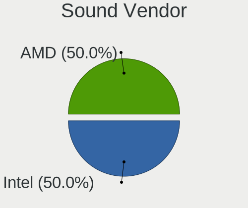

| Vendor                     | Computers | Percent |
|----------------------------|-----------|---------|
| Intel                      | 40        | 61.54%  |
| AMD                        | 11        | 16.92%  |
| Nvidia                     | 9         | 13.85%  |
| Apple                      | 2         | 3.08%   |
| Shenzhen Riitek Technology | 1         | 1.54%   |
| Focusrite-Novation         | 1         | 1.54%   |
| C-Media Electronics        | 1         | 1.54%   |

Sound Model
-----------

Sound card models

| Model                                                                      | Computers | Percent |
|----------------------------------------------------------------------------|-----------|---------|
| Intel 7 Series/C216 Chipset Family High Definition Audio Controller        | 9         | 12.68%  |
| Intel Sunrise Point-LP HD Audio                                            | 4         | 5.63%   |
| Intel Cannon Lake PCH cAVS                                                 | 3         | 4.23%   |
| Intel 82801JI (ICH10 Family) HD Audio Controller                           | 3         | 4.23%   |
| Intel 8 Series/C220 Series Chipset High Definition Audio Controller        | 3         | 4.23%   |
| Intel 6 Series/C200 Series Chipset Family High Definition Audio Controller | 3         | 4.23%   |
| Intel 100 Series/C230 Series Chipset Family HD Audio Controller            | 3         | 4.23%   |
| AMD Renoir Radeon High Definition Audio Controller                         | 3         | 4.23%   |
| Nvidia GP107GL High Definition Audio Controller                            | 2         | 2.82%   |
| Nvidia GM107 High Definition Audio Controller [GeForce 940MX]              | 2         | 2.82%   |
| Nvidia Audio device                                                        | 2         | 2.82%   |
| Intel Xeon E3-1200 v3/4th Gen Core Processor HD Audio Controller           | 2         | 2.82%   |
| Intel Tiger Lake-LP Smart Sound Technology Audio Controller                | 2         | 2.82%   |
| Intel Ice Lake-LP Smart Sound Technology Audio Controller                  | 2         | 2.82%   |
| Intel 82801I (ICH9 Family) HD Audio Controller                             | 2         | 2.82%   |
| AMD SBx00 Azalia (Intel HDA)                                               | 2         | 2.82%   |
| AMD Oland/Hainan/Cape Verde/Pitcairn HDMI Audio [Radeon HD 7000 Series]    | 2         | 2.82%   |
| AMD Navi 10 HDMI Audio                                                     | 2         | 2.82%   |
| AMD Family 17h/19h HD Audio Controller                                     | 2         | 2.82%   |
| Shenzhen Riitek Technology Multimedia Air Mouse Keyboard                   | 1         | 1.41%   |
| Nvidia TU107 GeForce GTX 1650 High Definition Audio Controller             | 1         | 1.41%   |
| Nvidia GP108 High Definition Audio Controller                              | 1         | 1.41%   |
| Nvidia GM204 High Definition Audio Controller                              | 1         | 1.41%   |
| Intel Jasper Lake HD Audio                                                 | 1         | 1.41%   |
| Intel Comet Lake PCH cAVS                                                  | 1         | 1.41%   |
| Intel C610/X99 series chipset HD Audio Controller                          | 1         | 1.41%   |
| Intel Alder Lake PCH-P High Definition Audio Controller                    | 1         | 1.41%   |
| Intel 700 Series Chipset Family Precise Touch and Stylus Port #1           | 1         | 1.41%   |
| Intel 5 Series/3400 Series Chipset High Definition Audio                   | 1         | 1.41%   |
| Focusrite-Novation Scarlett 8i6 USB                                        | 1         | 1.41%   |
| C-Media Electronics Blue Snowball                                          | 1         | 1.41%   |
| Apple Thunderbolt Display Audio                                            | 1         | 1.41%   |
| Apple Audio Device                                                         | 1         | 1.41%   |
| AMD Wrestler HDMI Audio                                                    | 1         | 1.41%   |
| AMD RV710/730 HDMI Audio [Radeon HD 4000 series]                           | 1         | 1.41%   |
| AMD RV620 HDMI Audio [Radeon HD 3450/3470/3550/3570]                       | 1         | 1.41%   |
| AMD Ellesmere HDMI Audio [Radeon RX 470/480 / 570/580/590]                 | 1         | 1.41%   |

Memory
------

Memory Vendor
-------------

Memory module vendors

| Vendor              | Computers | Percent |
|---------------------|-----------|---------|
| Samsung Electronics | 14        | 25.45%  |
| SK hynix            | 13        | 23.64%  |
| Micron Technology   | 9         | 16.36%  |
| Unknown             | 5         | 9.09%   |
| Kingston            | 3         | 5.45%   |
| G.Skill             | 2         | 3.64%   |
| Crucial             | 2         | 3.64%   |
| Corsair             | 2         | 3.64%   |
| Unknown             | 2         | 3.64%   |
| Smart               | 1         | 1.82%   |
| Magnum Tech         | 1         | 1.82%   |
| Elpida              | 1         | 1.82%   |

Memory Model
------------

Memory module models

| Model                                                       | Computers | Percent |
|-------------------------------------------------------------|-----------|---------|
| Unknown RAM Module 8GB SODIMM DDR3 1600MT/s                 | 2         | 3.45%   |
| Unknown RAM Module 2GB SODIMM DDR2                          | 2         | 3.45%   |
| Samsung RAM M471A1K43EB1-CWE 8GB SODIMM DDR4 3200MT/s       | 2         | 3.45%   |
| Micron RAM 4ATF1G64HZ-3G2E1 8GB SODIMM DDR4 3200MT/s        | 2         | 3.45%   |
| Unknown                                                     | 2         | 3.45%   |
| Unknown RAM Module 2GB DIMM DDR2 800MT/s                    | 1         | 1.72%   |
| Unknown RAM Module 1GB DIMM DDR2 800MT/s                    | 1         | 1.72%   |
| Smart RAM SH5641G8FJ8NWRNSQG 8GB SODIMM DDR3 1600MT/s       | 1         | 1.72%   |
| SK hynix RAM Module 4GB SODIMM DDR3 1600MT/s                | 1         | 1.72%   |
| SK hynix RAM Module 32GB SODIMM DDR4 2667MT/s               | 1         | 1.72%   |
| SK hynix RAM Module 2GB SODIMM DDR3 1333MT/s                | 1         | 1.72%   |
| SK hynix RAM Module 2GB SODIMM DDR3 1066MT/s                | 1         | 1.72%   |
| SK hynix RAM HMT451S6AFR8C-PB 4096MB SODIMM DDR3 1600MT/s   | 1         | 1.72%   |
| SK hynix RAM HMT351S6CFR8C-H9 4GB SODIMM DDR3 1333MT/s      | 1         | 1.72%   |
| SK hynix RAM HMT325S6CFR8C-PB 2048MB SODIMM DDR3 1600MT/s   | 1         | 1.72%   |
| SK hynix RAM HMT325S6CFR8C-H9 2GB SODIMM DDR3 1334MT/s      | 1         | 1.72%   |
| SK hynix RAM HMT125U6BFR8C-G7 2GB DIMM 1066MT/s             | 1         | 1.72%   |
| SK hynix RAM HMT125S6BFR8C-H9 2GB SODIMM DDR3 1066MT/s      | 1         | 1.72%   |
| SK hynix RAM HMAA51S6AMR6N-UH 8GB SODIMM DDR4 2400MT/s      | 1         | 1.72%   |
| SK hynix RAM HMA81GS6AFR8N-UH 8GB SODIMM DDR4 2667MT/s      | 1         | 1.72%   |
| SK hynix RAM HMA41GS6AFR8N-TF 8GB SODIMM DDR4 2667MT/s      | 1         | 1.72%   |
| Samsung RAM Module 4GB SODIMM DDR3 1333MT/s                 | 1         | 1.72%   |
| Samsung RAM Module 4GB Row Of Chips LPDDR4 2933MT/s         | 1         | 1.72%   |
| Samsung RAM M471B1G73EB0-YK0 8GB SODIMM DDR3 1600MT/s       | 1         | 1.72%   |
| Samsung RAM M471B1G73DB0-YK0 8GB SODIMM DDR3 1600MT/s       | 1         | 1.72%   |
| Samsung RAM M471A5244CB0-CWE 4GB SODIMM DDR4 3200MT/s       | 1         | 1.72%   |
| Samsung RAM M471A5244CB0-CWE 4GB Row Of Chips DDR4 3200MT/s | 1         | 1.72%   |
| Samsung RAM M471A1K43CB1-CRC 8GB SODIMM DDR4 2667MT/s       | 1         | 1.72%   |
| Samsung RAM M471A1K43BB1-CRC 8GB SODIMM DDR4 2667MT/s       | 1         | 1.72%   |
| Samsung RAM M471A1K43BB0-CPB 8GB SODIMM DDR4 2133MT/s       | 1         | 1.72%   |
| Samsung RAM M378B5673FH0-CH9 2GB DIMM 1600MT/s              | 1         | 1.72%   |
| Samsung RAM M378B5273DH0-CH9 4096MB DIMM DDR3 2133MT/s      | 1         | 1.72%   |
| Samsung RAM M378B5173DB0-CK0 4GB DIMM DDR3 1600MT/s         | 1         | 1.72%   |
| Samsung RAM K4A8G165WB-BCRC 4GB SODIMM DDR4 2400MT/s        | 1         | 1.72%   |
| Micron RAM Module 8GB SODIMM DDR3 1333MT/s                  | 1         | 1.72%   |
| Micron RAM 8KTF51264HZ-1G6E1 4096MB SODIMM DDR3 1600MT/s    | 1         | 1.72%   |
| Micron RAM 8ATF1G64HZ-3G2R1 8GB SODIMM DDR4 3200MT/s        | 1         | 1.72%   |
| Micron RAM 4ATF51264HZ-2G6E3 4096MB SODIMM DDR4 2667MT/s    | 1         | 1.72%   |
| Micron RAM 4ATF1G64HZ-3G2E2 8GB SODIMM DDR4 3200MT/s        | 1         | 1.72%   |
| Micron RAM 16JTF25664AZ-1G4G1 2GB DIMM 1400MT/s             | 1         | 1.72%   |

Memory Kind
-----------

Memory module kinds

| Kind   | Computers | Percent |
|--------|-----------|---------|
| DDR3   | 21        | 43.75%  |
| DDR4   | 20        | 41.67%  |
| DDR2   | 4         | 8.33%   |
| SDRAM  | 2         | 4.17%   |
| LPDDR4 | 1         | 2.08%   |

Memory Form Factor
------------------

Physical design of the memory module

| Name         | Computers | Percent |
|--------------|-----------|---------|
| SODIMM       | 33        | 71.74%  |
| DIMM         | 11        | 23.91%  |
| Row Of Chips | 2         | 4.35%   |

Memory Size
-----------

Memory module size

| Size  | Computers | Percent |
|-------|-----------|---------|
| 8192  | 20        | 39.22%  |
| 4096  | 11        | 21.57%  |
| 2048  | 11        | 21.57%  |
| 16384 | 7         | 13.73%  |
| 32768 | 1         | 1.96%   |
| 1024  | 1         | 1.96%   |

Memory Speed
------------

Memory module speed

| Speed   | Computers | Percent |
|---------|-----------|---------|
| 1600    | 13        | 25%     |
| 3200    | 8         | 15.38%  |
| 2667    | 7         | 13.46%  |
| 2133    | 4         | 7.69%   |
| 1333    | 3         | 5.77%   |
| 1066    | 3         | 5.77%   |
| 2400    | 2         | 3.85%   |
| 1867    | 2         | 3.85%   |
| Unknown | 2         | 3.85%   |
| 3600    | 1         | 1.92%   |
| 2933    | 1         | 1.92%   |
| 2666    | 1         | 1.92%   |
| 2134    | 1         | 1.92%   |
| 1400    | 1         | 1.92%   |
| 1334    | 1         | 1.92%   |
| 975     | 1         | 1.92%   |
| 800     | 1         | 1.92%   |

Printers & scanners
-------------------

Printer Vendor
--------------

Printer device vendors

| Vendor      | Computers | Percent |
|-------------|-----------|---------|
| Seiko Epson | 1         | 100%    |

Printer Model
-------------

Printer device models

| Model                      | Computers | Percent |
|----------------------------|-----------|---------|
| Seiko Epson WF-2870 Series | 1         | 100%    |

Scanner Vendor
--------------

Scanner device vendors

| Vendor         | Computers | Percent |
|----------------|-----------|---------|
| Mustek Systems | 1         | 100%    |

Scanner Model
-------------

Scanner device models

| Model                               | Computers | Percent |
|-------------------------------------|-----------|---------|
| Mustek Systems BearPaw 2448 TA Plus | 1         | 100%    |

Camera
------

Camera Vendor
-------------

Camera device vendors

| Vendor                  | Computers | Percent |
|-------------------------|-----------|---------|
| Chicony Electronics     | 6         | 17.14%  |
| Microdia                | 5         | 14.29%  |
| Bison Electronics       | 4         | 11.43%  |
| IMC Networks            | 3         | 8.57%   |
| Apple                   | 3         | 8.57%   |
| Realtek Semiconductor   | 2         | 5.71%   |
| Quanta                  | 2         | 5.71%   |
| Logitech                | 2         | 5.71%   |
| Z-Star Microelectronics | 1         | 2.86%   |
| Y Media                 | 1         | 2.86%   |
| Suyin                   | 1         | 2.86%   |
| Silicon Motion          | 1         | 2.86%   |
| Ricoh                   | 1         | 2.86%   |
| Lite-On Technology      | 1         | 2.86%   |
| LG Innotek              | 1         | 2.86%   |
| Jieli Technology        | 1         | 2.86%   |

Camera Model
------------

Camera device models

| Model                                     | Computers | Percent |
|-------------------------------------------|-----------|---------|
| Microdia Integrated Webcam                | 2         | 5.56%   |
| IMC Networks USB2.0 HD UVC WebCam         | 2         | 5.56%   |
| Chicony Integrated Camera                 | 2         | 5.56%   |
| Bison HD Webcam                           | 2         | 5.56%   |
| Z-Star A4 TECH USB2.0 PC Camera E         | 1         | 2.78%   |
| Y Media USB Camera                        | 1         | 2.78%   |
| Suyin USB 2.0 Camera                      | 1         | 2.78%   |
| Silicon Motion 300k Pixel Camera          | 1         | 2.78%   |
| Ricoh Sony Visual Communication Camera    | 1         | 2.78%   |
| Realtek Integrated_Webcam_HD              | 1         | 2.78%   |
| Realtek Integrated Webcam HD              | 1         | 2.78%   |
| Quanta ov9734_techfront_camera            | 1         | 2.78%   |
| Quanta HP TrueVision HD Camera            | 1         | 2.78%   |
| Microdia Laptop_Integrated_Webcam_HD      | 1         | 2.78%   |
| Microdia Dell Laptop Integrated Webcam HD | 1         | 2.78%   |
| Microdia ACR010 USB Webcam                | 1         | 2.78%   |
| Logitech Portable Webcam C905             | 1         | 2.78%   |
| Logitech HD Webcam C615                   | 1         | 2.78%   |
| Lite-On Integrated Camera                 | 1         | 2.78%   |
| LG Innotek LG Webcam                      | 1         | 2.78%   |
| Jieli USB PHY 2.0                         | 1         | 2.78%   |
| IMC Networks USB2.0 UVC HD Webcam         | 1         | 2.78%   |
| Chicony Thinkpad T430 camera              | 1         | 2.78%   |
| Chicony Integrated IR Camera              | 1         | 2.78%   |
| Chicony HP Integrated Webcam              | 1         | 2.78%   |
| Chicony HP HD Camera                      | 1         | 2.78%   |
| Chicony FJ Camera                         | 1         | 2.78%   |
| Bison Integrated Camera                   | 1         | 2.78%   |
| Bison HP Webcam                           | 1         | 2.78%   |
| Apple FaceTime HD Camera (Display)        | 1         | 2.78%   |
| Apple FaceTime HD Camera (Built-in)       | 1         | 2.78%   |
| Apple FaceTime HD Camera                  | 1         | 2.78%   |

Security
--------

Fingerprint Vendor
------------------

Fingerprint sensor vendors

| Vendor                     | Computers | Percent |
|----------------------------|-----------|---------|
| Validity Sensors           | 3         | 42.86%  |
| Synaptics                  | 2         | 28.57%  |
| Shenzhen Goodix Technology | 1         | 14.29%  |
| LighTuning Technology      | 1         | 14.29%  |

Fingerprint Model
-----------------

Fingerprint sensor models

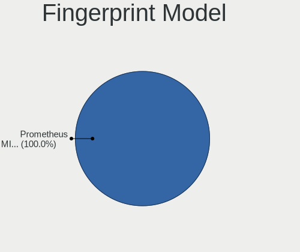

| Model                                                                      | Computers | Percent |
|----------------------------------------------------------------------------|-----------|---------|
| Validity Sensors VFS7500 Touch Fingerprint Sensor                          | 1         | 14.29%  |
| Validity Sensors VFS 5011 fingerprint sensor                               | 1         | 14.29%  |
| Validity Sensors Synaptics VFS7552 Touch Fingerprint Sensor with PurePrint | 1         | 14.29%  |
| Synaptics WBDI                                                             | 1         | 14.29%  |
| Synaptics Metallica MIS Touch Fingerprint Reader                           | 1         | 14.29%  |
| Shenzhen Goodix  Fingerprint Device                                        | 1         | 14.29%  |
| LighTuning Fingerprint Sensor                                              | 1         | 14.29%  |

Chipcard Vendor
---------------

Chipcard module vendors

| Vendor | Computers | Percent |
|--------|-----------|---------|
| Upek   | 1         | 100%    |

Chipcard Model
--------------

Chipcard module models

| Model                                                      | Computers | Percent |
|------------------------------------------------------------|-----------|---------|
| Upek TouchChip Fingerprint Coprocessor (WBF advanced mode) | 1         | 100%    |

Unsupported
-----------

Unsupported Devices
-------------------

Total unsupported devices on board

| Total | Computers | Percent |
|-------|-----------|---------|
| 0     | 33        | 71.74%  |
| 1     | 12        | 26.09%  |
| 2     | 1         | 2.17%   |

Unsupported Device Types
------------------------

Types of unsupported devices

| Type               | Computers | Percent |
|--------------------|-----------|---------|
| Fingerprint reader | 7         | 50%     |
| Graphics card      | 3         | 21.43%  |
| Unassigned class   | 1         | 7.14%   |
| Sound              | 1         | 7.14%   |
| Net/ethernet       | 1         | 7.14%   |
| Chipcard           | 1         | 7.14%   |

