Xero - Hardware Trends
----------------------

A project to identify most popular hardware characteristics and track their change
over time based on data collected by Linux users at https://Linux-Hardware.org.

Anyone can contribute to this report by the [hw-probe](https://github.com/linuxhw/hw-probe) tool:

    sudo -E hw-probe -all -upload

This is a report for all computer types. See also reports for [desktops](/Dist/Xero/Desktop/README.md) and [notebooks](/Dist/Xero/Notebook/README.md).

This report is for one last month. Overall report since the beginning of time: [TestDays](https://github.com/linuxhw/TestDays)

Period: Sep, 2023.

Contents
--------

* [ System ](#system)
  - [ OS                       ](#os)
  - [ OS Family                ](#os-family)
  - [ Kernel                   ](#kernel)
  - [ Kernel Family            ](#kernel-family)
  - [ Kernel Major Ver.        ](#kernel-major-ver)
  - [ Arch                     ](#arch)
  - [ DE                       ](#de)
  - [ Display Server           ](#display-server)
  - [ Display Manager          ](#display-manager)
  - [ OS Lang                  ](#os-lang)
  - [ Boot Mode                ](#boot-mode)
  - [ Filesystem               ](#filesystem)
  - [ Part. scheme             ](#part-scheme)
  - [ Dual Boot with Linux/BSD ](#dual-boot-with-linuxbsd)
  - [ Dual Boot (Win)          ](#dual-boot-win)

* [ Board ](#board)
  - [ Vendor                   ](#vendor)
  - [ Model                    ](#model)
  - [ Model Family             ](#model-family)
  - [ MFG Year                 ](#mfg-year)
  - [ Form Factor              ](#form-factor)
  - [ Secure Boot              ](#secure-boot)
  - [ Coreboot                 ](#coreboot)
  - [ RAM Size                 ](#ram-size)
  - [ RAM Used                 ](#ram-used)
  - [ Total Drives             ](#total-drives)
  - [ Has CD-ROM               ](#has-cd-rom)
  - [ Has Ethernet             ](#has-ethernet)
  - [ Has WiFi                 ](#has-wifi)
  - [ Has Bluetooth            ](#has-bluetooth)

* [ Location ](#location)
  - [ Country                  ](#country)
  - [ City                     ](#city)

* [ Drives ](#drives)
  - [ Drive Vendor             ](#drive-vendor)
  - [ Drive Model              ](#drive-model)
  - [ HDD Vendor               ](#hdd-vendor)
  - [ SSD Vendor               ](#ssd-vendor)
  - [ Drive Kind               ](#drive-kind)
  - [ Drive Connector          ](#drive-connector)
  - [ Drive Size               ](#drive-size)
  - [ Space Total              ](#space-total)
  - [ Space Used               ](#space-used)
  - [ Malfunc. Drives          ](#malfunc-drives)
  - [ Malfunc. Drive Vendor    ](#malfunc-drive-vendor)
  - [ Malfunc. HDD Vendor      ](#malfunc-hdd-vendor)
  - [ Malfunc. Drive Kind      ](#malfunc-drive-kind)
  - [ Failed Drives            ](#failed-drives)
  - [ Failed Drive Vendor      ](#failed-drive-vendor)
  - [ Drive Status             ](#drive-status)

* [ Storage controller ](#storage-controller)
  - [ Storage Vendor           ](#storage-vendor)
  - [ Storage Model            ](#storage-model)
  - [ Storage Kind             ](#storage-kind)

* [ Processor ](#processor)
  - [ CPU Vendor               ](#cpu-vendor)
  - [ CPU Model                ](#cpu-model)
  - [ CPU Model Family         ](#cpu-model-family)
  - [ CPU Cores                ](#cpu-cores)
  - [ CPU Sockets              ](#cpu-sockets)
  - [ CPU Threads              ](#cpu-threads)
  - [ CPU Op-Modes             ](#cpu-op-modes)
  - [ CPU Microcode            ](#cpu-microcode)
  - [ CPU Microarch            ](#cpu-microarch)

* [ Graphics ](#graphics)
  - [ GPU Vendor               ](#gpu-vendor)
  - [ GPU Model                ](#gpu-model)
  - [ GPU Combo                ](#gpu-combo)
  - [ GPU Driver               ](#gpu-driver)
  - [ GPU Memory               ](#gpu-memory)

* [ Monitor ](#monitor)
  - [ Monitor Vendor           ](#monitor-vendor)
  - [ Monitor Model            ](#monitor-model)
  - [ Monitor Resolution       ](#monitor-resolution)
  - [ Monitor Diagonal         ](#monitor-diagonal)
  - [ Monitor Width            ](#monitor-width)
  - [ Aspect Ratio             ](#aspect-ratio)
  - [ Monitor Area             ](#monitor-area)
  - [ Pixel Density            ](#pixel-density)
  - [ Multiple Monitors        ](#multiple-monitors)

* [ Network ](#network)
  - [ Net Controller Vendor    ](#net-controller-vendor)
  - [ Net Controller Model     ](#net-controller-model)
  - [ Wireless Vendor          ](#wireless-vendor)
  - [ Wireless Model           ](#wireless-model)
  - [ Ethernet Vendor          ](#ethernet-vendor)
  - [ Ethernet Model           ](#ethernet-model)
  - [ Net Controller Kind      ](#net-controller-kind)
  - [ Used Controller          ](#used-controller)
  - [ NICs                     ](#nics)
  - [ IPv6                     ](#ipv6)

* [ Bluetooth ](#bluetooth)
  - [ Bluetooth Vendor         ](#bluetooth-vendor)
  - [ Bluetooth Model          ](#bluetooth-model)

* [ Sound ](#sound)
  - [ Sound Vendor             ](#sound-vendor)
  - [ Sound Model              ](#sound-model)

* [ Memory ](#memory)
  - [ Memory Vendor            ](#memory-vendor)
  - [ Memory Model             ](#memory-model)
  - [ Memory Kind              ](#memory-kind)
  - [ Memory Form Factor       ](#memory-form-factor)
  - [ Memory Size              ](#memory-size)
  - [ Memory Speed             ](#memory-speed)

* [ Printers & scanners ](#printers--scanners)
  - [ Printer Vendor           ](#printer-vendor)
  - [ Printer Model            ](#printer-model)
  - [ Scanner Vendor           ](#scanner-vendor)
  - [ Scanner Model            ](#scanner-model)

* [ Camera ](#camera)
  - [ Camera Vendor            ](#camera-vendor)
  - [ Camera Model             ](#camera-model)

* [ Security ](#security)
  - [ Fingerprint Vendor       ](#fingerprint-vendor)
  - [ Fingerprint Model        ](#fingerprint-model)
  - [ Chipcard Vendor          ](#chipcard-vendor)
  - [ Chipcard Model           ](#chipcard-model)

* [ Unsupported ](#unsupported)
  - [ Unsupported Devices      ](#unsupported-devices)
  - [ Unsupported Device Types ](#unsupported-device-types)

System
------

OS
--

Installed operating systems

| Name         | Computers | Percent |
|--------------|-----------|---------|
| Xero Rolling | 62        | 100%    |

OS Family
---------

OS without a version

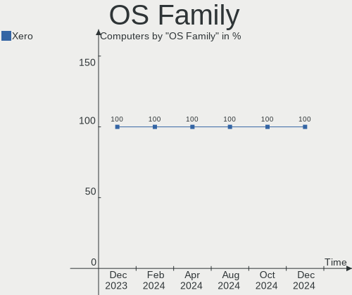

| Name | Computers | Percent |
|------|-----------|---------|
| Xero | 62        | 100%    |

Kernel
------

Version of the Linux kernel

| Version                  | Computers | Percent |
|--------------------------|-----------|---------|
| 6.4.12-arch1-1           | 38        | 61.29%  |
| 6.5.3-arch1-1            | 5         | 8.06%   |
| 6.4.9-arch1-1            | 5         | 8.06%   |
| 6.5.2-arch1-1            | 3         | 4.84%   |
| 6.5.4-arch2-1            | 2         | 3.23%   |
| 6.5.5-arch1-1            | 1         | 1.61%   |
| 6.5.4-zen2-1-zen         | 1         | 1.61%   |
| 6.5.2-zen1-1-zen         | 1         | 1.61%   |
| 6.5.2-273-tkg-bore-eevdf | 1         | 1.61%   |
| 6.5.1-arch1-1            | 1         | 1.61%   |
| 6.4.8-arch1-1            | 1         | 1.61%   |
| 6.4.3-arch1-2            | 1         | 1.61%   |
| 6.4.12-zen1-1-zen        | 1         | 1.61%   |
| 6.1.53-1-lts             | 1         | 1.61%   |

Kernel Family
-------------

Linux kernel without a distro release

| Version | Computers | Percent |
|---------|-----------|---------|
| 6.4.12  | 39        | 62.9%   |
| 6.5.3   | 5         | 8.06%   |
| 6.5.2   | 5         | 8.06%   |
| 6.4.9   | 5         | 8.06%   |
| 6.5.4   | 3         | 4.84%   |
| 6.5.5   | 1         | 1.61%   |
| 6.5.1   | 1         | 1.61%   |
| 6.4.8   | 1         | 1.61%   |
| 6.4.3   | 1         | 1.61%   |
| 6.1.53  | 1         | 1.61%   |

Kernel Major Ver.
-----------------

Linux kernel major version

| Version | Computers | Percent |
|---------|-----------|---------|
| 6.4     | 46        | 74.19%  |
| 6.5     | 15        | 24.19%  |
| 6.1     | 1         | 1.61%   |

Arch
----

OS architecture (x86_64, i586, etc.)

| Name   | Computers | Percent |
|--------|-----------|---------|
| x86_64 | 62        | 100%    |

DE
--

Desktop Environment

| Name | Computers | Percent |
|------|-----------|---------|
| KDE5 | 62        | 100%    |

Display Server
--------------

X11 or Wayland

| Name | Computers | Percent |
|------|-----------|---------|
| X11  | 61        | 98.39%  |
| Tty  | 1         | 1.61%   |

Display Manager
---------------

SDDM, LightDM, etc.

| Name    | Computers | Percent |
|---------|-----------|---------|
| SDDM    | 57        | 91.94%  |
| LightDM | 4         | 6.45%   |
| Unknown | 1         | 1.61%   |

OS Lang
-------

Language

| Lang  | Computers | Percent |
|-------|-----------|---------|
| en_US | 25        | 40.32%  |
| de_DE | 6         | 9.68%   |
| es_MX | 5         | 8.06%   |
| pt_BR | 3         | 4.84%   |
| fr_FR | 3         | 4.84%   |
| en_CA | 3         | 4.84%   |
| pl_PL | 2         | 3.23%   |
| es_AR | 2         | 3.23%   |
| en_GB | 2         | 3.23%   |
| ru_RU | 1         | 1.61%   |
| nl_NL | 1         | 1.61%   |
| nb_NO | 1         | 1.61%   |
| ko_KR | 1         | 1.61%   |
| it_IT | 1         | 1.61%   |
| hu_HU | 1         | 1.61%   |
| es_ES | 1         | 1.61%   |
| en_AU | 1         | 1.61%   |
| el_GR | 1         | 1.61%   |
| de_CH | 1         | 1.61%   |
| cs_CZ | 1         | 1.61%   |

Boot Mode
---------

EFI or BIOS

| Mode | Computers | Percent |
|------|-----------|---------|
| EFI  | 52        | 83.87%  |
| BIOS | 10        | 16.13%  |

Filesystem
----------

Type of filesystem

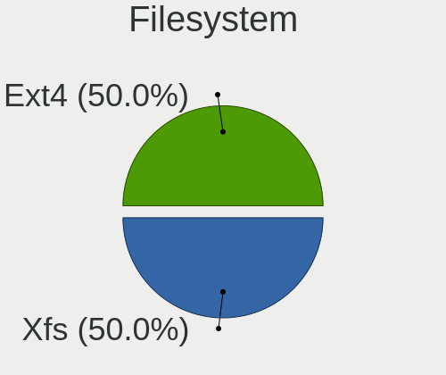

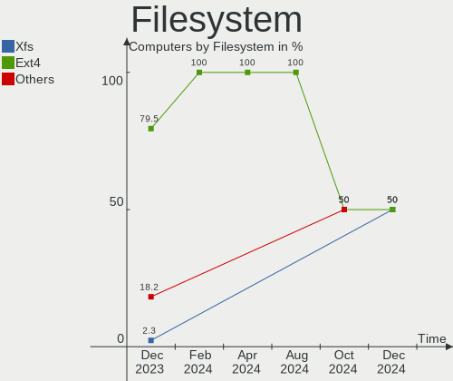

| Type   | Computers | Percent |
|--------|-----------|---------|
| Ext4   | 44        | 70.97%  |
| Btrfs  | 11        | 17.74%  |
| Xfs    | 6         | 9.68%   |
| Nilfs2 | 1         | 1.61%   |

Part. scheme
------------

Scheme of partitioning

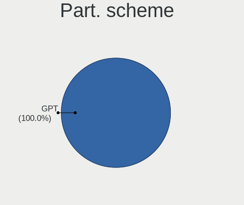

| Type    | Computers | Percent |
|---------|-----------|---------|
| GPT     | 54        | 87.1%   |
| MBR     | 7         | 11.29%  |
| Unknown | 1         | 1.61%   |

Dual Boot with Linux/BSD
------------------------

Hosting more than one Linux/BSD

| Dual boot | Computers | Percent |
|-----------|-----------|---------|
| No        | 49        | 79.03%  |
| Yes       | 13        | 20.97%  |

Dual Boot (Win)
---------------

Hosting Linux and Windows

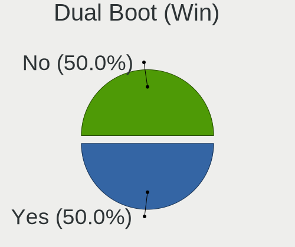

| Dual boot | Computers | Percent |
|-----------|-----------|---------|
| No        | 38        | 61.29%  |
| Yes       | 24        | 38.71%  |

Board
-----

Vendor
------

Motherboard manufacturer

| Name                | Computers | Percent |
|---------------------|-----------|---------|
| ASUSTek Computer    | 18        | 29.03%  |
| Lenovo              | 12        | 19.35%  |
| Hewlett-Packard     | 8         | 12.9%   |
| Dell                | 5         | 8.06%   |
| Apple               | 5         | 8.06%   |
| MSI                 | 2         | 3.23%   |
| Gigabyte Technology | 2         | 3.23%   |
| Acer                | 2         | 3.23%   |
| Pegatron            | 1         | 1.61%   |
| Juana Manso         | 1         | 1.61%   |
| Intel               | 1         | 1.61%   |
| HUAWEI              | 1         | 1.61%   |
| Huanan              | 1         | 1.61%   |
| Google              | 1         | 1.61%   |
| ECS                 | 1         | 1.61%   |
| ASRock              | 1         | 1.61%   |

Model
-----

Motherboard model

| Name                                    | Computers | Percent |
|-----------------------------------------|-----------|---------|
| Pegatron p7-1010a                       | 1         | 1.61%   |
| MSI GE62 7RD                            | 1         | 1.61%   |
| MSI Gaming                              | 1         | 1.61%   |
| Lenovo Z51-70 80K6                      | 1         | 1.61%   |
| Lenovo V330-15IKB 81AX                  | 1         | 1.61%   |
| Lenovo ThinkPad X200 745536T            | 1         | 1.61%   |
| Lenovo ThinkPad T440 20B6006DUS         | 1         | 1.61%   |
| Lenovo Legion Y540-17IRH 81Q4           | 1         | 1.61%   |
| Lenovo IdeaPad N585 20179               | 1         | 1.61%   |
| Lenovo IdeaPad C340-14IML 81TK          | 1         | 1.61%   |
| Lenovo IdeaPad 5 14IIL05 81YH           | 1         | 1.61%   |
| Lenovo IdeaPad 320-15ABR 80XS           | 1         | 1.61%   |
| Lenovo IdeaPad 3 15ITL05 81X8           | 1         | 1.61%   |
| Lenovo IdeaPad 3 14ALC6 82KT            | 1         | 1.61%   |
| Lenovo G570 20079                       | 1         | 1.61%   |
| Juana Manso SF20GM7                     | 1         | 1.61%   |
| Intel NUC13RNGi9                        | 1         | 1.61%   |
| HUAWEI HN-WX9X                          | 1         | 1.61%   |
| Huanan X99-TF                           | 1         | 1.61%   |
| HP ProDesk 400 G1 SFF                   | 1         | 1.61%   |
| HP ProBook 455 15.6 inch G9 Notebook PC | 1         | 1.61%   |
| HP Pavilion x360 Convertible 14-ba0xx   | 1         | 1.61%   |
| HP Laptop 15s-eq1xxx                    | 1         | 1.61%   |
| HP EliteBook 840 G8 Notebook PC         | 1         | 1.61%   |
| HP 750-009nf                            | 1         | 1.61%   |
| HP 22-3100nz                            | 1         | 1.61%   |
| HP 110-210                              | 1         | 1.61%   |
| Google Pirika                           | 1         | 1.61%   |
| Gigabyte Z790 UD                        | 1         | 1.61%   |
| Gigabyte B550 AORUS ELITE AX V2         | 1         | 1.61%   |
| ECS H61H2-M2                            | 1         | 1.61%   |
| Dell Studio XPS 8100                    | 1         | 1.61%   |
| Dell OptiPlex 7010                      | 1         | 1.61%   |
| Dell Latitude 5420                      | 1         | 1.61%   |
| Dell Inspiron 7460                      | 1         | 1.61%   |
| Dell Inspiron 3583                      | 1         | 1.61%   |
| ASUS X555LN                             | 1         | 1.61%   |
| ASUS X542UN                             | 1         | 1.61%   |
| ASUS X541UAK                            | 1         | 1.61%   |
| ASUS X510UAR                            | 1         | 1.61%   |

Model Family
------------

Motherboard model prefix

| Name                | Computers | Percent |
|---------------------|-----------|---------|
| Lenovo IdeaPad      | 6         | 9.68%   |
| ASUS PRIME          | 3         | 4.84%   |
| Lenovo ThinkPad     | 2         | 3.23%   |
| Dell Inspiron       | 2         | 3.23%   |
| ASUS TUF            | 2         | 3.23%   |
| ASUS ROG            | 2         | 3.23%   |
| ASUS M5A99X         | 2         | 3.23%   |
| Pegatron p7-1010a   | 1         | 1.61%   |
| MSI GE62            | 1         | 1.61%   |
| MSI Gaming          | 1         | 1.61%   |
| Lenovo Z51-70       | 1         | 1.61%   |
| Lenovo V330-15IKB   | 1         | 1.61%   |
| Lenovo Legion       | 1         | 1.61%   |
| Lenovo G570         | 1         | 1.61%   |
| Juana Manso SF20GM7 | 1         | 1.61%   |
| Intel NUC13RNGi9    | 1         | 1.61%   |
| HUAWEI HN-WX9X      | 1         | 1.61%   |
| Huanan X99-TF       | 1         | 1.61%   |
| HP ProDesk          | 1         | 1.61%   |
| HP ProBook          | 1         | 1.61%   |
| HP Pavilion         | 1         | 1.61%   |
| HP Laptop           | 1         | 1.61%   |
| HP EliteBook        | 1         | 1.61%   |
| HP 750-009nf        | 1         | 1.61%   |
| HP 22-3100nz        | 1         | 1.61%   |
| HP 110-210          | 1         | 1.61%   |
| Google Pirika       | 1         | 1.61%   |
| Gigabyte Z790       | 1         | 1.61%   |
| Gigabyte B550       | 1         | 1.61%   |
| ECS H61H2-M2        | 1         | 1.61%   |
| Dell Studio         | 1         | 1.61%   |
| Dell OptiPlex       | 1         | 1.61%   |
| Dell Latitude       | 1         | 1.61%   |
| ASUS X555LN         | 1         | 1.61%   |
| ASUS X542UN         | 1         | 1.61%   |
| ASUS X541UAK        | 1         | 1.61%   |
| ASUS X510UAR        | 1         | 1.61%   |
| ASUS X505BA         | 1         | 1.61%   |
| ASUS VivoBook       | 1         | 1.61%   |
| ASUS UX305FA        | 1         | 1.61%   |

MFG Year
--------

Motherboard manufacture year

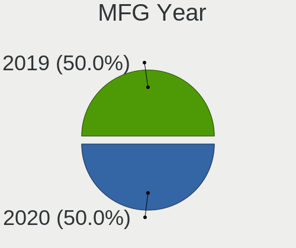

| Year | Computers | Percent |
|------|-----------|---------|
| 2017 | 9         | 14.52%  |
| 2021 | 8         | 12.9%   |
| 2020 | 8         | 12.9%   |
| 2011 | 6         | 9.68%   |
| 2019 | 4         | 6.45%   |
| 2014 | 4         | 6.45%   |
| 2013 | 4         | 6.45%   |
| 2023 | 3         | 4.84%   |
| 2022 | 3         | 4.84%   |
| 2018 | 3         | 4.84%   |
| 2012 | 3         | 4.84%   |
| 2016 | 2         | 3.23%   |
| 2015 | 2         | 3.23%   |
| 2010 | 1         | 1.61%   |
| 2009 | 1         | 1.61%   |
| 2008 | 1         | 1.61%   |

Form Factor
-----------

Physical design of the computer

| Name        | Computers | Percent |
|-------------|-----------|---------|
| Notebook    | 36        | 58.06%  |
| Desktop     | 22        | 35.48%  |
| Convertible | 2         | 3.23%   |
| Mini pc     | 1         | 1.61%   |
| All in one  | 1         | 1.61%   |

Secure Boot
-----------

Enabled or disabled

| State    | Computers | Percent |
|----------|-----------|---------|
| Disabled | 60        | 96.77%  |
| Enabled  | 2         | 3.23%   |

Coreboot
--------

Have coreboot on board

| Used | Computers | Percent |
|------|-----------|---------|
| No   | 61        | 98.39%  |
| Yes  | 1         | 1.61%   |

RAM Size
--------

Total RAM memory

| Size in GB  | Computers | Percent |
|-------------|-----------|---------|
| 16.01-24.0  | 17        | 27.42%  |
| 8.01-16.0   | 17        | 27.42%  |
| 4.01-8.0    | 12        | 19.35%  |
| 3.01-4.0    | 10        | 16.13%  |
| 32.01-64.0  | 5         | 8.06%   |
| 64.01-256.0 | 1         | 1.61%   |

RAM Used
--------

Used RAM memory

| Used GB  | Computers | Percent |
|----------|-----------|---------|
| 1.01-2.0 | 25        | 40.32%  |
| 2.01-3.0 | 22        | 35.48%  |
| 4.01-8.0 | 11        | 17.74%  |
| 3.01-4.0 | 4         | 6.45%   |

Total Drives
------------

Number of drives on board

| Drives | Computers | Percent |
|--------|-----------|---------|
| 1      | 38        | 61.29%  |
| 2      | 16        | 25.81%  |
| 3      | 6         | 9.68%   |
| 8      | 1         | 1.61%   |
| 5      | 1         | 1.61%   |

Has CD-ROM
----------

Has CD-ROM on board

| Presented | Computers | Percent |
|-----------|-----------|---------|
| No        | 44        | 70.97%  |
| Yes       | 18        | 29.03%  |

Has Ethernet
------------

Has Ethernet on board

| Presented | Computers | Percent |
|-----------|-----------|---------|
| Yes       | 51        | 82.26%  |
| No        | 11        | 17.74%  |

Has WiFi
--------

Has WiFi module

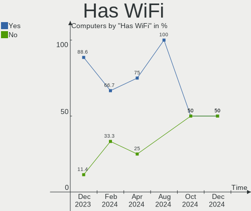

| Presented | Computers | Percent |
|-----------|-----------|---------|
| Yes       | 48        | 77.42%  |
| No        | 14        | 22.58%  |

Has Bluetooth
-------------

Has Bluetooth module

| Presented | Computers | Percent |
|-----------|-----------|---------|
| Yes       | 46        | 74.19%  |
| No        | 16        | 25.81%  |

Location
--------

Country
-------

Geographic location (country)

| Country     | Computers | Percent |
|-------------|-----------|---------|
| USA         | 8         | 12.9%   |
| Germany     | 5         | 8.06%   |
| Canada      | 4         | 6.45%   |
| Argentina   | 4         | 6.45%   |
| Vietnam     | 3         | 4.84%   |
| Poland      | 3         | 4.84%   |
| Netherlands | 3         | 4.84%   |
| Brazil      | 3         | 4.84%   |
| Turkey      | 2         | 3.23%   |
| Switzerland | 2         | 3.23%   |
| Russia      | 2         | 3.23%   |
| Mexico      | 2         | 3.23%   |
| India       | 2         | 3.23%   |
| France      | 2         | 3.23%   |
| Thailand    | 1         | 1.61%   |
| Spain       | 1         | 1.61%   |
| South Korea | 1         | 1.61%   |
| Romania     | 1         | 1.61%   |
| Panama      | 1         | 1.61%   |
| Norway      | 1         | 1.61%   |
| Morocco     | 1         | 1.61%   |
| Madagascar  | 1         | 1.61%   |
| Italy       | 1         | 1.61%   |
| Iran        | 1         | 1.61%   |
| Hungary     | 1         | 1.61%   |
| Greece      | 1         | 1.61%   |
| Czechia     | 1         | 1.61%   |
| Colombia    | 1         | 1.61%   |
| Bulgaria    | 1         | 1.61%   |
| Australia   | 1         | 1.61%   |
| Algeria     | 1         | 1.61%   |

City
----

Geographic location (city)

| City                | Computers | Percent |
|---------------------|-----------|---------|
| Warsaw              | 2         | 3.23%   |
| Santa Rosa          | 2         | 3.23%   |
| Red Lake            | 2         | 3.23%   |
| Hanoi               | 2         | 3.23%   |
| Zeeland             | 1         | 1.61%   |
| Wasilla             | 1         | 1.61%   |
| Wangen              | 1         | 1.61%   |
| Trondheim           | 1         | 1.61%   |
| Toluca              | 1         | 1.61%   |
| Thornhill           | 1         | 1.61%   |
| Termas de Rio Hondo | 1         | 1.61%   |
| Tehran              | 1         | 1.61%   |
| Tablada             | 1         | 1.61%   |
| Sofia               | 1         | 1.61%   |
| Settat              | 1         | 1.61%   |
| Sarcelles           | 1         | 1.61%   |
| Salt Lake City      | 1         | 1.61%   |
| Piea                | 1         | 1.61%   |
| Pegnitz             | 1         | 1.61%   |
| Patna               | 1         | 1.61%   |
| Paragominas         | 1         | 1.61%   |
| Panama City         | 1         | 1.61%   |
| Paiania             | 1         | 1.61%   |
| Ouargla             | 1         | 1.61%   |
| Orange              | 1         | 1.61%   |
| Noida               | 1         | 1.61%   |
| Nizhniy Novgorod    | 1         | 1.61%   |
| Niterói            | 1         | 1.61%   |
| Neuss               | 1         | 1.61%   |
| Naaldwijk           | 1         | 1.61%   |
| Mosonmagyaróvár   | 1         | 1.61%   |
| Moscow              | 1         | 1.61%   |
| Montreal            | 1         | 1.61%   |
| Middletown          | 1         | 1.61%   |
| Mexico City         | 1         | 1.61%   |
| Medellín           | 1         | 1.61%   |
| Mar del Plata       | 1         | 1.61%   |
| Madrid              | 1         | 1.61%   |
| Kosekoy             | 1         | 1.61%   |
| Istanbul            | 1         | 1.61%   |

Drives
------

Drive Vendor
------------

Hard drive vendors

| Vendor                      | Computers | Drives | Percent |
|-----------------------------|-----------|--------|---------|
| Samsung Electronics         | 20        | 26     | 22.99%  |
| Seagate                     | 12        | 13     | 13.79%  |
| WDC                         | 9         | 12     | 10.34%  |
| Kingston                    | 8         | 8      | 9.2%    |
| SanDisk                     | 6         | 6      | 6.9%    |
| Unknown                     | 3         | 3      | 3.45%   |
| SK hynix                    | 2         | 2      | 2.3%    |
| JMicron Technology          | 2         | 2      | 2.3%    |
| Crucial                     | 2         | 2      | 2.3%    |
| Apple                       | 2         | 2      | 2.3%    |
| tecmiyo                     | 1         | 1      | 1.15%   |
| TARGET                      | 1         | 1      | 1.15%   |
| SSK                         | 1         | 1      | 1.15%   |
| Phison Electronics          | 1         | 1      | 1.15%   |
| NT-1TB                      | 1         | 1      | 1.15%   |
| Micron/Crucial Technology   | 1         | 1      | 1.15%   |
| Maxtor                      | 1         | 1      | 1.15%   |
| Maxone                      | 1         | 1      | 1.15%   |
| MAXIO Technology (Hangzhou) | 1         | 1      | 1.15%   |
| LITEONIT                    | 1         | 1      | 1.15%   |
| KIOXIA                      | 1         | 1      | 1.15%   |
| Kingston Technology Company | 1         | 2      | 1.15%   |
| Kingmax                     | 1         | 1      | 1.15%   |
| Intenso                     | 1         | 1      | 1.15%   |
| Intel                       | 1         | 2      | 1.15%   |
| Imation                     | 1         | 1      | 1.15%   |
| HGST                        | 1         | 1      | 1.15%   |
| Hewlett-Packard             | 1         | 1      | 1.15%   |
| GLOWAY                      | 1         | 1      | 1.15%   |
| China                       | 1         | 1      | 1.15%   |
| Azerty                      | 1         | 1      | 1.15%   |

Drive Model
-----------

Hard drive models

| Model                                               | Computers | Percent |
|-----------------------------------------------------|-----------|---------|
| Samsung NVMe SSD Controller SM981/PM981/PM983 256GB | 4         | 4.3%    |
| Samsung NVMe SSD Controller PM9A1/PM9A3/980PRO 1TB  | 3         | 3.23%   |
| WDC WD20EZBX-00AYRA0 2TB                            | 2         | 2.15%   |
| Seagate ST320LT012-9WS14C 320GB                     | 2         | 2.15%   |
| Seagate ST1000LM024 HN-M101MBB 1TB                  | 2         | 2.15%   |
| Seagate ST1000DM003-1SB102 1TB                      | 2         | 2.15%   |
| Samsung SSD 860 EVO 500GB                           | 2         | 2.15%   |
| Samsung MZALQ256HBJD-00BL2 256GB                    | 2         | 2.15%   |
| Kingston SA400S37480G 480GB SSD                     | 2         | 2.15%   |
| JMicron Generic 240GB                               | 2         | 2.15%   |
| WDC WDS120G2G0B-00EPW0 120GB SSD                    | 1         | 1.08%   |
| WDC WD6401AALS-00E3A0 640GB                         | 1         | 1.08%   |
| WDC WD5000BPVT-22HXZT3 500GB                        | 1         | 1.08%   |
| WDC WD5000AAKX-75U6AA0 500GB                        | 1         | 1.08%   |
| WDC WD3200AAKS-00L9A0 320GB                         | 1         | 1.08%   |
| WDC WD10EZEX-60M2NA0 1TB                            | 1         | 1.08%   |
| WDC WD1003FZEX-00K3CA0 1TB                          | 1         | 1.08%   |
| WDC WD Blue SA510 2.5 500GB                         | 1         | 1.08%   |
| Unknown SD/MMC/MS PRO 128GB                         | 1         | 1.08%   |
| Unknown MMC Card  16GB                              | 1         | 1.08%   |
| Unknown MMC Card  128GB                             | 1         | 1.08%   |
| tecmiyo SATA SSD 512GB                              | 1         | 1.08%   |
| TARGET SSD 128G                                     | 1         | 1.08%   |
| SSK Disk 256GB                                      | 1         | 1.08%   |
| SK hynix SKHynix_HFM256GD3HX015N 256GB              | 1         | 1.08%   |
| SK hynix SHPP41-2000GM 2TB                          | 1         | 1.08%   |
| Seagate ST9320423AS 320GB                           | 1         | 1.08%   |
| Seagate ST3500418AS 500GB                           | 1         | 1.08%   |
| Seagate ST2000DM008-2FR102 2TB                      | 1         | 1.08%   |
| Seagate ST1000LM035-1RK172 1TB                      | 1         | 1.08%   |
| Seagate ST1000LM014-SSHD-8GB                        | 1         | 1.08%   |
| Seagate ST1000DM003-1ER162 1TB                      | 1         | 1.08%   |
| Seagate ST1000DM003-1CH162 1TB                      | 1         | 1.08%   |
| Sandisk WDC WDS100T2B0C-00PXH0 1TB                  | 1         | 1.08%   |
| Sandisk WD Black SN750 / PC SN730 NVMe SSD 512GB    | 1         | 1.08%   |
| SanDisk SSD PLUS 480GB                              | 1         | 1.08%   |
| SanDisk SDSSDA240G 240GB                            | 1         | 1.08%   |
| SanDisk SD7SN3Q128G1002 128GB SSD                   | 1         | 1.08%   |
| Sandisk PC SN530 NVMe WDC 256GB                     | 1         | 1.08%   |
| Samsung SSD 990 PRO 1TB                             | 1         | 1.08%   |

HDD Vendor
----------

Hard disk drive vendors

| Vendor  | Computers | Drives | Percent |
|---------|-----------|--------|---------|
| Seagate | 12        | 13     | 48%     |
| WDC     | 7         | 9      | 28%     |
| Unknown | 1         | 1      | 4%      |
| SSK     | 1         | 1      | 4%      |
| Maxtor  | 1         | 1      | 4%      |
| Maxone  | 1         | 1      | 4%      |
| Intenso | 1         | 1      | 4%      |
| HGST    | 1         | 1      | 4%      |

SSD Vendor
----------

Solid state drive vendors

| Vendor              | Computers | Drives | Percent |
|---------------------|-----------|--------|---------|
| Samsung Electronics | 7         | 8      | 20.59%  |
| Kingston            | 6         | 6      | 17.65%  |
| SanDisk             | 3         | 3      | 8.82%   |
| WDC                 | 2         | 3      | 5.88%   |
| JMicron Technology  | 2         | 2      | 5.88%   |
| Crucial             | 2         | 2      | 5.88%   |
| Apple               | 2         | 2      | 5.88%   |
| tecmiyo             | 1         | 1      | 2.94%   |
| TARGET              | 1         | 1      | 2.94%   |
| NT-1TB              | 1         | 1      | 2.94%   |
| LITEONIT            | 1         | 1      | 2.94%   |
| Kingmax             | 1         | 1      | 2.94%   |
| Imation             | 1         | 1      | 2.94%   |
| Hewlett-Packard     | 1         | 1      | 2.94%   |
| GLOWAY              | 1         | 1      | 2.94%   |
| China               | 1         | 1      | 2.94%   |
| Azerty              | 1         | 1      | 2.94%   |

Drive Kind
----------

HDD or SSD

| Kind | Computers | Drives | Percent |
|------|-----------|--------|---------|
| SSD  | 27        | 36     | 37.5%   |
| NVMe | 24        | 33     | 33.33%  |
| HDD  | 19        | 28     | 26.39%  |
| MMC  | 2         | 2      | 2.78%   |

Drive Connector
---------------

SATA, SAS, NVMe, etc.

| Type | Computers | Drives | Percent |
|------|-----------|--------|---------|
| SATA | 41        | 58     | 56.16%  |
| NVMe | 24        | 33     | 32.88%  |
| SAS  | 6         | 6      | 8.22%   |
| MMC  | 2         | 2      | 2.74%   |

Drive Size
----------

Size of hard drive

| Size in TB | Computers | Drives | Percent |
|------------|-----------|--------|---------|
| 0.01-0.5   | 34        | 39     | 64.15%  |
| 0.51-1.0   | 16        | 21     | 30.19%  |
| 1.01-2.0   | 3         | 4      | 5.66%   |

Space Total
-----------

Amount of disk space available on the file system

| Size in GB     | Computers | Percent |
|----------------|-----------|---------|
| 101-250        | 22        | 35.48%  |
| 251-500        | 17        | 27.42%  |
| 501-1000       | 8         | 12.9%   |
| 2001-3000      | 4         | 6.45%   |
| More than 3000 | 3         | 4.84%   |
| 21-50          | 3         | 4.84%   |
| 1001-2000      | 2         | 3.23%   |
| 51-100         | 2         | 3.23%   |
| 1-20           | 1         | 1.61%   |

Space Used
----------

Amount of used disk space

| Used GB   | Computers | Percent |
|-----------|-----------|---------|
| 1-20      | 36        | 58.06%  |
| 21-50     | 11        | 17.74%  |
| 101-250   | 5         | 8.06%   |
| 51-100    | 5         | 8.06%   |
| 1001-2000 | 3         | 4.84%   |
| 251-500   | 2         | 3.23%   |

Malfunc. Drives
---------------

Drive models with a malfunction

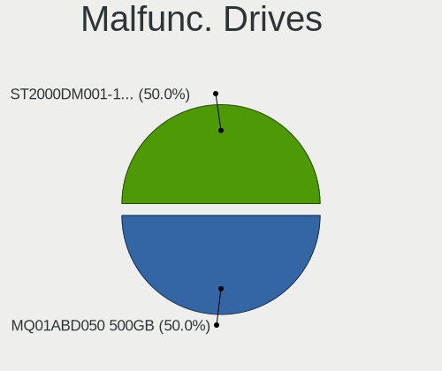

| Model                           | Computers | Drives | Percent |
|---------------------------------|-----------|--------|---------|
| Seagate ST320LT012-9WS14C 320GB | 2         | 2      | 20%     |
| WDC WD10EZEX-60M2NA0 1TB        | 1         | 1      | 10%     |
| WDC WD Blue SA510 2.5 500GB     | 1         | 2      | 10%     |
| TARGET SSD 128G                 | 1         | 1      | 10%     |
| Seagate ST9320423AS 320GB       | 1         | 1      | 10%     |
| Seagate ST1000LM014-SSHD-8GB    | 1         | 1      | 10%     |
| Seagate ST1000DM003-1ER162 1TB  | 1         | 1      | 10%     |
| Maxtor STM3160215AS 160GB       | 1         | 1      | 10%     |
| Apple SSD SM0256F 256GB         | 1         | 1      | 10%     |

Malfunc. Drive Vendor
---------------------

Vendors of faulty drives

| Vendor  | Computers | Drives | Percent |
|---------|-----------|--------|---------|
| Seagate | 5         | 5      | 50%     |
| WDC     | 2         | 3      | 20%     |
| TARGET  | 1         | 1      | 10%     |
| Maxtor  | 1         | 1      | 10%     |
| Apple   | 1         | 1      | 10%     |

Malfunc. HDD Vendor
-------------------

Vendors of faulty HDD drives

| Vendor  | Computers | Drives | Percent |
|---------|-----------|--------|---------|
| Seagate | 5         | 5      | 71.43%  |
| WDC     | 1         | 1      | 14.29%  |
| Maxtor  | 1         | 1      | 14.29%  |

Malfunc. Drive Kind
-------------------

Kinds of faulty drives

| Kind | Computers | Drives | Percent |
|------|-----------|--------|---------|
| HDD  | 7         | 7      | 70%     |
| SSD  | 3         | 4      | 30%     |

Failed Drives
-------------

Failed drive models

Zero info for selected period =(

Failed Drive Vendor
-------------------

Failed drive vendors

Zero info for selected period =(

Drive Status
------------

Number of failed and malfunc. drives

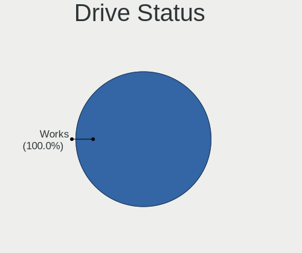

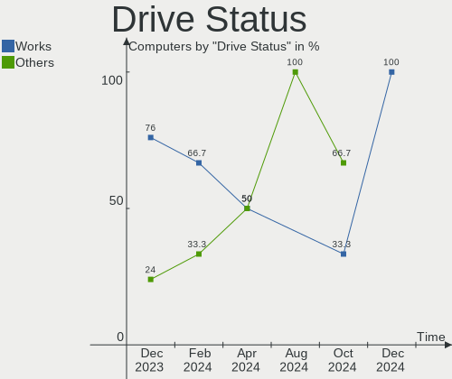

| Status   | Computers | Drives | Percent |
|----------|-----------|--------|---------|
| Works    | 51        | 80     | 75%     |
| Malfunc  | 10        | 11     | 14.71%  |
| Detected | 7         | 8      | 10.29%  |

Storage controller
------------------

Storage Vendor
--------------

Storage controller vendors

| Vendor                      | Computers | Percent |
|-----------------------------|-----------|---------|
| Intel                       | 39        | 46.99%  |
| Samsung Electronics         | 15        | 18.07%  |
| AMD                         | 14        | 16.87%  |
| SanDisk                     | 3         | 3.61%   |
| Kingston Technology Company | 3         | 3.61%   |
| SK hynix                    | 2         | 2.41%   |
| ASMedia Technology          | 2         | 2.41%   |
| Phison Electronics          | 1         | 1.2%    |
| Micron/Crucial Technology   | 1         | 1.2%    |
| MAXIO Technology (Hangzhou) | 1         | 1.2%    |
| KIOXIA                      | 1         | 1.2%    |
| JMicron Technology          | 1         | 1.2%    |

Storage Model
-------------

Storage controller models

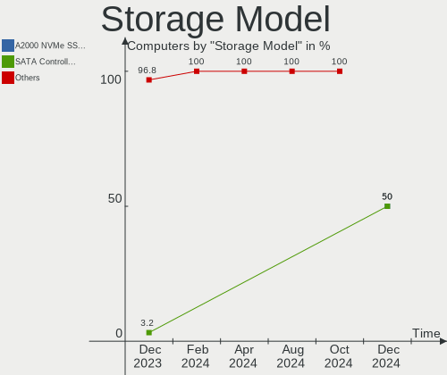

| Model                                                                          | Computers | Percent |
|--------------------------------------------------------------------------------|-----------|---------|
| AMD FCH SATA Controller [AHCI mode]                                            | 9         | 9.78%   |
| Samsung NVMe SSD Controller 980                                                | 6         | 6.52%   |
| Intel Sunrise Point-LP SATA Controller [AHCI mode]                             | 6         | 6.52%   |
| Samsung NVMe SSD Controller SM981/PM981/PM983                                  | 4         | 4.35%   |
| Intel 8 Series/C220 Series Chipset Family 6-port SATA Controller 1 [AHCI mode] | 4         | 4.35%   |
| Samsung NVMe SSD Controller PM9A1/PM9A3/980PRO                                 | 3         | 3.26%   |
| Intel Volume Management Device NVMe RAID Controller                            | 3         | 3.26%   |
| Intel Alder Lake-S PCH SATA Controller [AHCI Mode]                             | 3         | 3.26%   |
| Intel Wildcat Point-LP SATA Controller [AHCI Mode]                             | 2         | 2.17%   |
| Intel HM170/QM170 Chipset SATA Controller [AHCI Mode]                          | 2         | 2.17%   |
| Intel 8 Series SATA Controller 1 [AHCI mode]                                   | 2         | 2.17%   |
| Intel 6 Series/C200 Series Chipset Family 6 port Mobile SATA AHCI Controller   | 2         | 2.17%   |
| Intel 6 Series/C200 Series Chipset Family 6 port Desktop SATA AHCI Controller  | 2         | 2.17%   |
| ASMedia ASM1062 Serial ATA Controller                                          | 2         | 2.17%   |
| AMD SB7x0/SB8x0/SB9x0 SATA Controller [AHCI mode]                              | 2         | 2.17%   |
| AMD FCH SATA Controller D                                                      | 2         | 2.17%   |
| AMD 500 Series Chipset SATA Controller                                         | 2         | 2.17%   |
| AMD 400 Series Chipset SATA Controller                                         | 2         | 2.17%   |
| SK hynix Platinum P41/PC801 NVMe Solid State Drive                             | 1         | 1.09%   |
| SK hynix Gold P31/BC711/PC711 NVMe Solid State Drive                           | 1         | 1.09%   |
| SanDisk WD Green SN350 NVMe SSD 240GB (DRAM-less)                              | 1         | 1.09%   |
| SanDisk WD Black SN750 / PC SN730 NVMe SSD                                     | 1         | 1.09%   |
| SanDisk IX SN530 NVMe SSD (DRAM-less)                                          | 1         | 1.09%   |
| Samsung S4LN058A01[SSUBX] AHCI SSD Controller (Apple slot)                     | 1         | 1.09%   |
| Samsung S4LN053X01 AHCI SSD Controller(Apple slot)                             | 1         | 1.09%   |
| Samsung NVMe SSD Controller S4LV008[Pascal]                                    | 1         | 1.09%   |
| Phison E12 NVMe Controller                                                     | 1         | 1.09%   |
| Micron/Crucial P5 Plus NVMe PCIe SSD                                           | 1         | 1.09%   |
| MAXIO (Hangzhou) NVMe SSD Controller MAP1202                                   | 1         | 1.09%   |
| KIOXIA NVMe SSD Controller BG4 (DRAM-less)                                     | 1         | 1.09%   |
| Kingston Company Company Non-Volatile memory controller                        | 1         | 1.09%   |
| Kingston Company NVMe Controller                                               | 1         | 1.09%   |
| Kingston Company A2000 NVMe SSD                                                | 1         | 1.09%   |
| JMicron JMB362 SATA Controller                                                 | 1         | 1.09%   |
| Intel Tiger Lake-LP SATA Controller                                            | 1         | 1.09%   |
| Intel SATA Controller [RAID mode]                                              | 1         | 1.09%   |
| Intel Optane NVME SSD H10 with Solid State Storage [Teton Glacier]             | 1         | 1.09%   |
| Intel Comet Lake SATA AHCI Controller                                          | 1         | 1.09%   |
| Intel Celeron/Pentium Silver Processor SATA Controller                         | 1         | 1.09%   |
| Intel Cannon Point-LP SATA Controller [AHCI Mode]                              | 1         | 1.09%   |

Storage Kind
------------

Kind of storage controller (IDE, SATA, NVMe, SAS, ...)

| Kind | Computers | Percent |
|------|-----------|---------|
| SATA | 50        | 61.73%  |
| NVMe | 24        | 29.63%  |
| RAID | 5         | 6.17%   |
| IDE  | 2         | 2.47%   |

Processor
---------

CPU Vendor
----------

Processor vendors

| Vendor | Computers | Percent |
|--------|-----------|---------|
| Intel  | 45        | 72.58%  |
| AMD    | 17        | 27.42%  |

CPU Model
---------

Processor models

| Model                                   | Computers | Percent |
|-----------------------------------------|-----------|---------|
| Intel Core i7-7700HQ CPU @ 2.80GHz      | 2         | 3.23%   |
| Intel Core i3-1005G1 CPU @ 1.20GHz      | 2         | 3.23%   |
| Intel 12th Gen Core i9-12900K           | 2         | 3.23%   |
| Intel Xeon CPU E5-2678 v3 @ 2.50GHz     | 1         | 1.61%   |
| Intel Pentium Silver N6000 @ 1.10GHz    | 1         | 1.61%   |
| Intel Pentium CPU G620 @ 2.60GHz        | 1         | 1.61%   |
| Intel Pentium CPU G3260T @ 2.90GHz      | 1         | 1.61%   |
| Intel Pentium CPU 5405U @ 2.30GHz       | 1         | 1.61%   |
| Intel Pentium CPU 4415U @ 2.30GHz       | 1         | 1.61%   |
| Intel Core M-5Y10c CPU @ 0.80GHz        | 1         | 1.61%   |
| Intel Core i9-10900X CPU @ 3.70GHz      | 1         | 1.61%   |
| Intel Core i7-9750H CPU @ 2.60GHz       | 1         | 1.61%   |
| Intel Core i7-8550U CPU @ 1.80GHz       | 1         | 1.61%   |
| Intel Core i7-7500U CPU @ 2.70GHz       | 1         | 1.61%   |
| Intel Core i7-4750HQ CPU @ 2.00GHz      | 1         | 1.61%   |
| Intel Core i7-4700HQ CPU @ 2.40GHz      | 1         | 1.61%   |
| Intel Core i7-4600U CPU @ 2.10GHz       | 1         | 1.61%   |
| Intel Core i7-3720QM CPU @ 2.60GHz      | 1         | 1.61%   |
| Intel Core i7-2600 CPU @ 3.40GHz        | 1         | 1.61%   |
| Intel Core i7-10510U CPU @ 1.80GHz      | 1         | 1.61%   |
| Intel Core i7 CPU 860 @ 2.80GHz         | 1         | 1.61%   |
| Intel Core i5-8250U CPU @ 1.60GHz       | 1         | 1.61%   |
| Intel Core i5-5250U CPU @ 1.60GHz       | 1         | 1.61%   |
| Intel Core i5-5200U CPU @ 2.20GHz       | 1         | 1.61%   |
| Intel Core i5-4590 CPU @ 3.30GHz        | 1         | 1.61%   |
| Intel Core i5-4460 CPU @ 3.20GHz        | 1         | 1.61%   |
| Intel Core i5-4210U CPU @ 1.70GHz       | 1         | 1.61%   |
| Intel Core i5-3470 CPU @ 3.20GHz        | 1         | 1.61%   |
| Intel Core i5-2435M CPU @ 2.40GHz       | 1         | 1.61%   |
| Intel Core i5-2400S CPU @ 2.50GHz       | 1         | 1.61%   |
| Intel Core i3-7020U CPU @ 2.30GHz       | 1         | 1.61%   |
| Intel Core i3-6006U CPU @ 2.00GHz       | 1         | 1.61%   |
| Intel Core i3-2350M CPU @ 2.30GHz       | 1         | 1.61%   |
| Intel Core i3 CPU M 370 @ 2.40GHz       | 1         | 1.61%   |
| Intel Core 2 Duo CPU P8400 @ 2.26GHz    | 1         | 1.61%   |
| Intel Celeron N4020 CPU @ 1.10GHz       | 1         | 1.61%   |
| Intel 13th Gen Core i9-13900K           | 1         | 1.61%   |
| Intel 12th Gen Core i5-12500H           | 1         | 1.61%   |
| Intel 12th Gen Core i3-12100F           | 1         | 1.61%   |
| Intel 11th Gen Core i7-1165G7 @ 2.80GHz | 1         | 1.61%   |

CPU Model Family
----------------

Processor model prefix

| Model                | Computers | Percent |
|----------------------|-----------|---------|
| Intel Core i7        | 12        | 19.35%  |
| Other                | 9         | 14.52%  |
| Intel Core i5        | 9         | 14.52%  |
| AMD Ryzen 5          | 8         | 12.9%   |
| Intel Core i3        | 6         | 9.68%   |
| Intel Pentium        | 4         | 6.45%   |
| AMD Ryzen 3          | 2         | 3.23%   |
| AMD FX               | 2         | 3.23%   |
| Intel Xeon           | 1         | 1.61%   |
| Intel Pentium Silver | 1         | 1.61%   |
| Intel Core M         | 1         | 1.61%   |
| Intel Core i9        | 1         | 1.61%   |
| Intel Core 2 Duo     | 1         | 1.61%   |
| Intel Celeron        | 1         | 1.61%   |
| AMD Ryzen 7          | 1         | 1.61%   |
| AMD E1               | 1         | 1.61%   |
| AMD A4               | 1         | 1.61%   |
| AMD A12              | 1         | 1.61%   |

CPU Cores
---------

Number of processor cores

| Number | Computers | Percent |
|--------|-----------|---------|
| 4      | 24        | 38.71%  |
| 2      | 23        | 37.1%   |
| 6      | 7         | 11.29%  |
| 16     | 2         | 3.23%   |
| 12     | 2         | 3.23%   |
| 24     | 1         | 1.61%   |
| 10     | 1         | 1.61%   |
| 8      | 1         | 1.61%   |
| 3      | 1         | 1.61%   |

CPU Sockets
-----------

Number of sockets

| Number | Computers | Percent |
|--------|-----------|---------|
| 1      | 62        | 100%    |

CPU Threads
-----------

Threads per core (Hyper-Threading)

| Number | Computers | Percent |
|--------|-----------|---------|
| 2      | 47        | 75.81%  |
| 1      | 15        | 24.19%  |

CPU Op-Modes
------------

CPU Operation Modes (32-bit, 64-bit)

| Op mode        | Computers | Percent |
|----------------|-----------|---------|
| 32-bit, 64-bit | 62        | 100%    |

CPU Microcode
-------------

Microcode number

| Number     | Computers | Percent |
|------------|-----------|---------|
| Unknown    | 44        | 70.97%  |
| 0x0a50000d | 2         | 3.23%   |
| 0x08108109 | 2         | 3.23%   |
| 0xb0671    | 1         | 1.61%   |
| 0x0a201204 | 1         | 1.61%   |
| 0x08701030 | 1         | 1.61%   |
| 0x08701021 | 1         | 1.61%   |
| 0x08608103 | 1         | 1.61%   |
| 0x08600106 | 1         | 1.61%   |
| 0x08101013 | 1         | 1.61%   |
| 0x0810100b | 1         | 1.61%   |
| 0x0700010f | 1         | 1.61%   |
| 0x06006705 | 1         | 1.61%   |
| 0x0600611a | 1         | 1.61%   |
| 0x06000822 | 1         | 1.61%   |
| 0x0600081c | 1         | 1.61%   |
| 0x0500010d | 1         | 1.61%   |

CPU Microarch
-------------

Microarchitecture

| Name             | Computers | Percent |
|------------------|-----------|---------|
| KabyLake         | 10        | 16.13%  |
| Haswell          | 8         | 12.9%   |
| SandyBridge      | 5         | 8.06%   |
| Alderlake Hybrid | 5         | 8.06%   |
| Zen 3            | 3         | 4.84%   |
| Zen 2            | 3         | 4.84%   |
| TigerLake        | 3         | 4.84%   |
| Broadwell        | 3         | 4.84%   |
| Zen+             | 2         | 3.23%   |
| Zen              | 2         | 3.23%   |
| Skylake          | 2         | 3.23%   |
| Piledriver       | 2         | 3.23%   |
| IvyBridge        | 2         | 3.23%   |
| IceLake          | 2         | 3.23%   |
| Excavator        | 2         | 3.23%   |
| Westmere         | 1         | 1.61%   |
| Tremont          | 1         | 1.61%   |
| Penryn           | 1         | 1.61%   |
| Nehalem          | 1         | 1.61%   |
| Jaguar           | 1         | 1.61%   |
| Goldmont plus    | 1         | 1.61%   |
| Bobcat           | 1         | 1.61%   |
| Unknown          | 1         | 1.61%   |

Graphics
--------

GPU Vendor
----------

Vendors of graphics cards

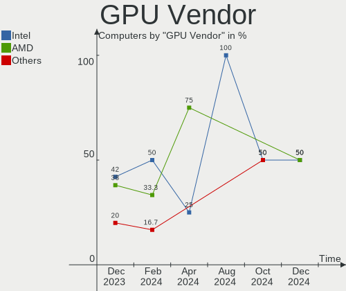

| Vendor | Computers | Percent |
|--------|-----------|---------|
| Intel  | 35        | 48.61%  |
| Nvidia | 21        | 29.17%  |
| AMD    | 16        | 22.22%  |

GPU Model
---------

Graphics card models

| Model                                                                       | Computers | Percent |
|-----------------------------------------------------------------------------|-----------|---------|
| Intel 2nd Generation Core Processor Family Integrated Graphics Controller   | 4         | 5.56%   |
| Nvidia GP107 [GeForce GTX 1050 Ti]                                          | 2         | 2.78%   |
| Intel Xeon E3-1200 v3/4th Gen Core Processor Integrated Graphics Controller | 2         | 2.78%   |
| Intel UHD Graphics 620                                                      | 2         | 2.78%   |
| Intel TigerLake-LP GT2 [Iris Xe Graphics]                                   | 2         | 2.78%   |
| Intel Iris Plus Graphics G1 (Ice Lake)                                      | 2         | 2.78%   |
| Intel HD Graphics 620                                                       | 2         | 2.78%   |
| Intel Haswell-ULT Integrated Graphics Controller                            | 2         | 2.78%   |
| AMD Picasso/Raven 2 [Radeon Vega Series / Radeon Vega Mobile Series]        | 2         | 2.78%   |
| Nvidia TU117 [GeForce GTX 1650]                                             | 1         | 1.39%   |
| Nvidia TU116M [GeForce GTX 1660 Ti Mobile]                                  | 1         | 1.39%   |
| Nvidia TU106 [GeForce RTX 2060 SUPER]                                       | 1         | 1.39%   |
| Nvidia TU104 [GeForce RTX 2080 Rev. A]                                      | 1         | 1.39%   |
| Nvidia TU104 [GeForce RTX 2070 SUPER]                                       | 1         | 1.39%   |
| Nvidia GV100 [TITAN V]                                                      | 1         | 1.39%   |
| Nvidia GP108M [GeForce MX150]                                               | 1         | 1.39%   |
| Nvidia GP107M [GeForce GTX 1050 Mobile]                                     | 1         | 1.39%   |
| Nvidia GP106BM [GeForce GTX 1060 Mobile 6GB]                                | 1         | 1.39%   |
| Nvidia GP106 [GeForce GTX 1060 6GB]                                         | 1         | 1.39%   |
| Nvidia GP104 [GeForce GTX 1070]                                             | 1         | 1.39%   |
| Nvidia GM206 [GeForce GTX 960]                                              | 1         | 1.39%   |
| Nvidia GM108M [GeForce 940MX]                                               | 1         | 1.39%   |
| Nvidia GM108M [GeForce 840M]                                                | 1         | 1.39%   |
| Nvidia GK107M [GeForce GT 650M Mac Edition]                                 | 1         | 1.39%   |
| Nvidia GK106M [GeForce GTX 770M]                                            | 1         | 1.39%   |
| Nvidia GF116 [GeForce GT 545]                                               | 1         | 1.39%   |
| Nvidia GA107M [GeForce RTX 3050 Mobile]                                     | 1         | 1.39%   |
| Nvidia AD102 [GeForce RTX 4090]                                             | 1         | 1.39%   |
| Intel Xeon E3-1200 v2/3rd Gen Core processor Graphics Controller            | 1         | 1.39%   |
| Intel Whiskey Lake-U GT1 [UHD Graphics 610]                                 | 1         | 1.39%   |
| Intel Tiger Lake-LP GT2 [UHD Graphics G4]                                   | 1         | 1.39%   |
| Intel Skylake GT2 [HD Graphics 520]                                         | 1         | 1.39%   |
| Intel Raptor Lake-S GT1 [UHD Graphics 770]                                  | 1         | 1.39%   |
| Intel Mobile 4 Series Chipset Integrated Graphics Controller                | 1         | 1.39%   |
| Intel JasperLake [UHD Graphics]                                             | 1         | 1.39%   |
| Intel HD Graphics 630                                                       | 1         | 1.39%   |
| Intel HD Graphics 610                                                       | 1         | 1.39%   |
| Intel HD Graphics 6000                                                      | 1         | 1.39%   |
| Intel HD Graphics 5500                                                      | 1         | 1.39%   |
| Intel HD Graphics 5300                                                      | 1         | 1.39%   |

GPU Combo
---------

Combinations of graphics cards

| Name           | Computers | Percent |
|----------------|-----------|---------|
| 1 x Intel      | 24        | 38.71%  |
| 1 x AMD        | 14        | 22.58%  |
| 1 x Nvidia     | 13        | 20.97%  |
| Intel + Nvidia | 8         | 12.9%   |
| Intel + AMD    | 2         | 3.23%   |
| 2 x Intel      | 1         | 1.61%   |

GPU Driver
----------

Free vs proprietary

| Driver      | Computers | Percent |
|-------------|-----------|---------|
| Free        | 55        | 88.71%  |
| Proprietary | 7         | 11.29%  |

GPU Memory
----------

Total video memory

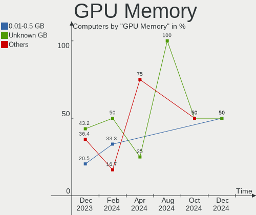

| Size in GB | Computers | Percent |
|------------|-----------|---------|
| Unknown    | 28        | 45.16%  |
| 0.01-0.5   | 8         | 12.9%   |
| 1.01-2.0   | 7         | 11.29%  |
| 7.01-8.0   | 5         | 8.06%   |
| 3.01-4.0   | 5         | 8.06%   |
| 2.01-3.0   | 3         | 4.84%   |
| 5.01-6.0   | 2         | 3.23%   |
| 0.51-1.0   | 2         | 3.23%   |
| 16.01-24.0 | 1         | 1.61%   |
| 8.01-16.0  | 1         | 1.61%   |

Monitor
-------

Monitor Vendor
--------------

Monitor vendors

| Vendor                  | Computers | Percent |
|-------------------------|-----------|---------|
| Chimei Innolux          | 11        | 15.28%  |
| BOE                     | 9         | 12.5%   |
| AU Optronics            | 8         | 11.11%  |
| Samsung Electronics     | 6         | 8.33%   |
| Hewlett-Packard         | 5         | 6.94%   |
| Apple                   | 5         | 6.94%   |
| Goldstar                | 3         | 4.17%   |
| Chi Mei Optoelectronics | 3         | 4.17%   |
| ASUSTek Computer        | 3         | 4.17%   |
| Philips                 | 2         | 2.78%   |
| Lenovo                  | 2         | 2.78%   |
| Dell                    | 2         | 2.78%   |
| BenQ                    | 2         | 2.78%   |
| Vizio                   | 1         | 1.39%   |
| UTV                     | 1         | 1.39%   |
| Sony                    | 1         | 1.39%   |
| LG Display              | 1         | 1.39%   |
| KDB                     | 1         | 1.39%   |
| Iiyama                  | 1         | 1.39%   |
| HKC                     | 1         | 1.39%   |
| Eizo                    | 1         | 1.39%   |
| AOC                     | 1         | 1.39%   |
| Ancor Communications    | 1         | 1.39%   |
| Acer                    | 1         | 1.39%   |

Monitor Model
-------------

Monitor models

| Model                                                                    | Computers | Percent |
|--------------------------------------------------------------------------|-----------|---------|
| Chimei Innolux LCD Monitor CMN15DB 1366x768 344x193mm 15.5-inch          | 2         | 2.74%   |
| BOE LCD Monitor BOE0704 1366x768 344x194mm 15.5-inch                     | 2         | 2.74%   |
| Vizio E320-A0 VIZ0095 1366x768 697x392mm 31.5-inch                       | 1         | 1.37%   |
| UTV Monitor UTV002F 3840x2160 1872x1053mm 84.6-inch                      | 1         | 1.37%   |
| Sony TV SNYF500 1360x768                                                 | 1         | 1.37%   |
| Samsung Electronics SyncMaster SAM0484 1920x1080 520x320mm 24.0-inch     | 1         | 1.37%   |
| Samsung Electronics SMB1930N SAM0632 1366x768 410x230mm 18.5-inch        | 1         | 1.37%   |
| Samsung Electronics S24F350 SAM0D20 1920x1080 521x293mm 23.5-inch        | 1         | 1.37%   |
| Samsung Electronics LF24T35 SAM707D 1920x1080 528x297mm 23.9-inch        | 1         | 1.37%   |
| Samsung Electronics LCD Monitor SAM094E 1920x1080 700x390mm 31.5-inch    | 1         | 1.37%   |
| Samsung Electronics C32F391 SAM0D35 1920x1080 698x393mm 31.5-inch        | 1         | 1.37%   |
| Philips FTV PHL4200 1920x1080 927x521mm 41.9-inch                        | 1         | 1.37%   |
| Philips 246EL2SBH PHLC074 1920x1080 521x293mm 23.5-inch                  | 1         | 1.37%   |
| LG Display LCD Monitor LGD068D 1920x1080 309x174mm 14.0-inch             | 1         | 1.37%   |
| Lenovo LEN P24q-20 LEN61F5 2560x1440 527x296mm 23.8-inch                 | 1         | 1.37%   |
| Lenovo LCD Monitor LEN4010 1280x800 261x163mm 12.1-inch                  | 1         | 1.37%   |
| KDB LCD Monitor KDB1130 1366x768 256x144mm 11.6-inch                     | 1         | 1.37%   |
| Iiyama PL3461WQ IVM7615 3440x1440 800x330mm 34.1-inch                    | 1         | 1.37%   |
| HKC 24N5C HKC2451 1920x1080 523x293mm 23.6-inch                          | 1         | 1.37%   |
| Hewlett-Packard vs19b HWP264C 1280x1024 376x301mm 19.0-inch              | 1         | 1.37%   |
| Hewlett-Packard All-in-One HWP424E 1920x1080 477x268mm 21.5-inch         | 1         | 1.37%   |
| Hewlett-Packard 27fw HPN3607 1920x1080 598x336mm 27.0-inch               | 1         | 1.37%   |
| Hewlett-Packard 24f HPN3545 1920x1080 527x296mm 23.8-inch                | 1         | 1.37%   |
| Hewlett-Packard 2310e HWP288E 1920x1080 510x287mm 23.0-inch              | 1         | 1.37%   |
| Goldstar ULTRAWIDE GSM59F1 2560x1080 673x284mm 28.8-inch                 | 1         | 1.37%   |
| Goldstar HDR 4K GSM7706 3840x2160 600x340mm 27.2-inch                    | 1         | 1.37%   |
| Goldstar FULL HD GSM5BDE 1920x1080 480x270mm 21.7-inch                   | 1         | 1.37%   |
| Eizo S2202W ENC1975 1680x1050 480x300mm 22.3-inch                        | 1         | 1.37%   |
| Dell SE2419HR DELF113 1920x1080 527x296mm 23.8-inch                      | 1         | 1.37%   |
| Dell S3221QS DELD106 3840x2160 697x392mm 31.5-inch                       | 1         | 1.37%   |
| Chimei Innolux P130ZDZ-EF1 CMN8201 2160x1440 275x183mm 13.0-inch         | 1         | 1.37%   |
| Chimei Innolux LCD Monitor CMN15DC 1366x768 344x193mm 15.5-inch          | 1         | 1.37%   |
| Chimei Innolux LCD Monitor CMN15D5 1920x1080 344x193mm 15.5-inch         | 1         | 1.37%   |
| Chimei Innolux LCD Monitor CMN15C4 1920x1080 344x193mm 15.5-inch         | 1         | 1.37%   |
| Chimei Innolux LCD Monitor CMN1533 1366x768 344x193mm 15.5-inch          | 1         | 1.37%   |
| Chimei Innolux LCD Monitor CMN14E5 1920x1080 309x173mm 13.9-inch         | 1         | 1.37%   |
| Chimei Innolux LCD Monitor CMN14C8 1920x1080 309x173mm 13.9-inch         | 1         | 1.37%   |
| Chimei Innolux LCD Monitor CMN1482 1600x900 309x174mm 14.0-inch          | 1         | 1.37%   |
| Chimei Innolux LCD Monitor CMN140A 1920x1080 309x173mm 13.9-inch         | 1         | 1.37%   |
| Chi Mei Optoelectronics LCD Monitor CMO15A7 1366x768 344x193mm 15.5-inch | 1         | 1.37%   |

Monitor Resolution
------------------

Monitor screen resolution

| Resolution         | Computers | Percent |
|--------------------|-----------|---------|
| 1920x1080 (FHD)    | 30        | 44.78%  |
| 1366x768 (WXGA)    | 18        | 26.87%  |
| 3840x2160 (4K)     | 5         | 7.46%   |
| 2560x1440 (QHD)    | 2         | 2.99%   |
| 1680x1050 (WSXGA+) | 2         | 2.99%   |
| 1280x800 (WXGA)    | 2         | 2.99%   |
| 3440x1440          | 1         | 1.49%   |
| 2880x1800          | 1         | 1.49%   |
| 2560x1080          | 1         | 1.49%   |
| 2160x1440          | 1         | 1.49%   |
| 1600x900 (HD+)     | 1         | 1.49%   |
| 1440x900 (WXGA+)   | 1         | 1.49%   |
| 1360x768           | 1         | 1.49%   |
| 1280x1024 (SXGA)   | 1         | 1.49%   |

Monitor Diagonal
----------------

Diagonal size in inches

| Inches | Computers | Percent |
|--------|-----------|---------|
| 15     | 20        | 27.4%   |
| 13     | 9         | 12.33%  |
| 24     | 7         | 9.59%   |
| 27     | 6         | 8.22%   |
| 23     | 5         | 6.85%   |
| 14     | 5         | 6.85%   |
| 21     | 4         | 5.48%   |
| 31     | 3         | 4.11%   |
| 34     | 2         | 2.74%   |
| 17     | 2         | 2.74%   |
| 84     | 1         | 1.37%   |
| 72     | 1         | 1.37%   |
| 54     | 1         | 1.37%   |
| 41     | 1         | 1.37%   |
| 32     | 1         | 1.37%   |
| 22     | 1         | 1.37%   |
| 19     | 1         | 1.37%   |
| 18     | 1         | 1.37%   |
| 12     | 1         | 1.37%   |
| 11     | 1         | 1.37%   |

Monitor Width
-------------

Physical width

| Width in mm | Computers | Percent |
|-------------|-----------|---------|
| 301-350     | 30        | 42.25%  |
| 501-600     | 16        | 22.54%  |
| 401-500     | 6         | 8.45%   |
| 201-300     | 6         | 8.45%   |
| 701-800     | 3         | 4.23%   |
| 601-700     | 3         | 4.23%   |
| 351-400     | 3         | 4.23%   |
| 1501-2000   | 2         | 2.82%   |
| 1001-1500   | 1         | 1.41%   |
| 901-1000    | 1         | 1.41%   |

Aspect Ratio
------------

Proportional relationship between the width and the height

| Ratio | Computers | Percent |
|-------|-----------|---------|
| 16/9  | 53        | 81.54%  |
| 16/10 | 8         | 12.31%  |
| 21/9  | 2         | 3.08%   |
| 5/4   | 1         | 1.54%   |
| 3/2   | 1         | 1.54%   |

Monitor Area
------------

Area in inch²

| Area in inch² | Computers | Percent |
|----------------|-----------|---------|
| 101-110        | 20        | 27.4%   |
| 201-250        | 13        | 17.81%  |
| 81-90          | 12        | 16.44%  |
| 351-500        | 6         | 8.22%   |
| 301-350        | 6         | 8.22%   |
| More than 1000 | 3         | 4.11%   |
| 151-200        | 3         | 4.11%   |
| 71-80          | 2         | 2.74%   |
| 251-300        | 2         | 2.74%   |
| 121-130        | 2         | 2.74%   |
| 61-70          | 1         | 1.37%   |
| 51-60          | 1         | 1.37%   |
| 141-150        | 1         | 1.37%   |
| 501-1000       | 1         | 1.37%   |

Pixel Density
-------------

Pixels per inch

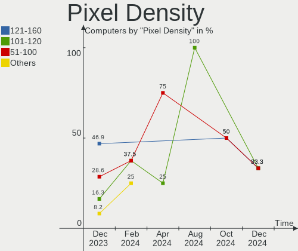

| Density | Computers | Percent |
|---------|-----------|---------|
| 121-160 | 22        | 30.99%  |
| 51-100  | 21        | 29.58%  |
| 101-120 | 20        | 28.17%  |
| 161-240 | 5         | 7.04%   |
| 1-50    | 3         | 4.23%   |

Multiple Monitors
-----------------

Total monitors connected

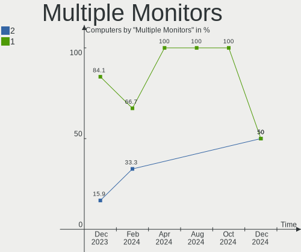

| Total | Computers | Percent |
|-------|-----------|---------|
| 1     | 52        | 83.87%  |
| 2     | 9         | 14.52%  |
| 3     | 1         | 1.61%   |

Network
-------

Net Controller Vendor
---------------------

Controller vendors

| Vendor                | Computers | Percent |
|-----------------------|-----------|---------|
| Realtek Semiconductor | 38        | 41.76%  |
| Intel                 | 26        | 28.57%  |
| Qualcomm Atheros      | 13        | 14.29%  |
| Broadcom              | 7         | 7.69%   |
| Broadcom Limited      | 2         | 2.2%    |
| Ralink                | 1         | 1.1%    |
| QinHeng Electronics   | 1         | 1.1%    |
| OPPO Electronics      | 1         | 1.1%    |
| MediaTek              | 1         | 1.1%    |
| Aquantia              | 1         | 1.1%    |

Net Controller Model
--------------------

Controller models

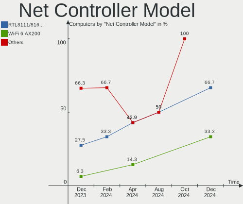

| Model                                                             | Computers | Percent |
|-------------------------------------------------------------------|-----------|---------|
| Realtek RTL8111/8168/8411 PCI Express Gigabit Ethernet Controller | 22        | 21.15%  |
| Realtek RTL8153 Gigabit Ethernet Adapter                          | 4         | 3.85%   |
| Qualcomm Atheros QCA9377 802.11ac Wireless Network Adapter        | 4         | 3.85%   |
| Realtek RTL8125 2.5GbE Controller                                 | 3         | 2.88%   |
| Realtek RTL810xE PCI Express Fast Ethernet controller             | 3         | 2.88%   |
| Intel Wi-Fi 6 AX210/AX211/AX411 160MHz                            | 3         | 2.88%   |
| Intel Wi-Fi 6 AX201                                               | 3         | 2.88%   |
| Intel Dual Band Wireless-AC 3168NGW [Stone Peak]                  | 3         | 2.88%   |
| Broadcom NetXtreme BCM57765 Gigabit Ethernet PCIe                 | 3         | 2.88%   |
| Realtek RTL8822CE 802.11ac PCIe Wireless Network Adapter          | 2         | 1.92%   |
| Realtek RTL8821CE 802.11ac PCIe Wireless Network Adapter          | 2         | 1.92%   |
| Qualcomm Atheros AR9285 Wireless Network Adapter (PCI-Express)    | 2         | 1.92%   |
| Intel Wireless 7265                                               | 2         | 1.92%   |
| Intel Wireless 7260                                               | 2         | 1.92%   |
| Broadcom NetLink BCM57780 Gigabit Ethernet PCIe                   | 2         | 1.92%   |
| Broadcom BCM4331 802.11a/b/g/n                                    | 2         | 1.92%   |
| Realtek RTL8852BE PCIe 802.11ax Wireless Network Controller       | 1         | 0.96%   |
| Realtek RTL8822BE 802.11a/b/g/n/ac WiFi adapter                   | 1         | 0.96%   |
| Realtek RTL8188EUS 802.11n Wireless Network Adapter               | 1         | 0.96%   |
| Realtek RTL8188EE Wireless Network Adapter                        | 1         | 0.96%   |
| Realtek Killer E2600 Gigabit Ethernet Controller                  | 1         | 0.96%   |
| Realtek 802.11ac NIC                                              | 1         | 0.96%   |
| Ralink RT5392 PCIe Wireless Network Adapter                       | 1         | 0.96%   |
| Qualcomm Atheros QCA9565 / AR9565 Wireless Network Adapter        | 1         | 0.96%   |
| Qualcomm Atheros QCA8171 Gigabit Ethernet                         | 1         | 0.96%   |
| Qualcomm Atheros QCA6174 802.11ac Wireless Network Adapter        | 1         | 0.96%   |
| Qualcomm Atheros Killer E2500 Gigabit Ethernet Controller         | 1         | 0.96%   |
| Qualcomm Atheros AR93xx Wireless Network Adapter                  | 1         | 0.96%   |
| Qualcomm Atheros AR9287 Wireless Network Adapter (PCI-Express)    | 1         | 0.96%   |
| Qualcomm Atheros AR8152 v2.0 Fast Ethernet                        | 1         | 0.96%   |
| Qualcomm Atheros AR8151 v2.0 Gigabit Ethernet                     | 1         | 0.96%   |
| QinHeng UsbMonitor                                                | 1         | 0.96%   |
| OPPO 8                                                            | 1         | 0.96%   |
| MediaTek MT7921 802.11ax PCI Express Wireless Network Adapter     | 1         | 0.96%   |
| Intel Wireless 8265 / 8275                                        | 1         | 0.96%   |
| Intel Wireless 3160                                               | 1         | 0.96%   |
| Intel Wi-Fi 6 AX201 160MHz                                        | 1         | 0.96%   |
| Intel PRO/Wireless 5100 AGN [Shiloh] Network Connection           | 1         | 0.96%   |
| Intel Ice Lake-LP PCH CNVi WiFi                                   | 1         | 0.96%   |
| Intel I211 Gigabit Network Connection                             | 1         | 0.96%   |

Wireless Vendor
---------------

Wireless vendors

| Vendor                | Computers | Percent |
|-----------------------|-----------|---------|
| Intel                 | 23        | 46%     |
| Qualcomm Atheros      | 10        | 20%     |
| Realtek Semiconductor | 9         | 18%     |
| Broadcom              | 4         | 8%      |
| Broadcom Limited      | 2         | 4%      |
| Ralink                | 1         | 2%      |
| MediaTek              | 1         | 2%      |

Wireless Model
--------------

Wireless models

| Model                                                          | Computers | Percent |
|----------------------------------------------------------------|-----------|---------|
| Qualcomm Atheros QCA9377 802.11ac Wireless Network Adapter     | 4         | 8%      |
| Intel Wi-Fi 6 AX210/AX211/AX411 160MHz                         | 3         | 6%      |
| Intel Wi-Fi 6 AX201                                            | 3         | 6%      |
| Intel Dual Band Wireless-AC 3168NGW [Stone Peak]               | 3         | 6%      |
| Realtek RTL8822CE 802.11ac PCIe Wireless Network Adapter       | 2         | 4%      |
| Realtek RTL8821CE 802.11ac PCIe Wireless Network Adapter       | 2         | 4%      |
| Qualcomm Atheros AR9285 Wireless Network Adapter (PCI-Express) | 2         | 4%      |
| Intel Wireless 7265                                            | 2         | 4%      |
| Intel Wireless 7260                                            | 2         | 4%      |
| Broadcom BCM4331 802.11a/b/g/n                                 | 2         | 4%      |
| Realtek RTL8852BE PCIe 802.11ax Wireless Network Controller    | 1         | 2%      |
| Realtek RTL8822BE 802.11a/b/g/n/ac WiFi adapter                | 1         | 2%      |
| Realtek RTL8188EUS 802.11n Wireless Network Adapter            | 1         | 2%      |
| Realtek RTL8188EE Wireless Network Adapter                     | 1         | 2%      |
| Realtek 802.11ac NIC                                           | 1         | 2%      |
| Ralink RT5392 PCIe Wireless Network Adapter                    | 1         | 2%      |
| Qualcomm Atheros QCA9565 / AR9565 Wireless Network Adapter     | 1         | 2%      |
| Qualcomm Atheros QCA6174 802.11ac Wireless Network Adapter     | 1         | 2%      |
| Qualcomm Atheros AR93xx Wireless Network Adapter               | 1         | 2%      |
| Qualcomm Atheros AR9287 Wireless Network Adapter (PCI-Express) | 1         | 2%      |
| MediaTek MT7921 802.11ax PCI Express Wireless Network Adapter  | 1         | 2%      |
| Intel Wireless 8265 / 8275                                     | 1         | 2%      |
| Intel Wireless 3160                                            | 1         | 2%      |
| Intel Wi-Fi 6 AX201 160MHz                                     | 1         | 2%      |
| Intel PRO/Wireless 5100 AGN [Shiloh] Network Connection        | 1         | 2%      |
| Intel Ice Lake-LP PCH CNVi WiFi                                | 1         | 2%      |
| Intel Gemini Lake PCH CNVi WiFi                                | 1         | 2%      |
| Intel Dual Band Wireless-AC 3165 Plus Bluetooth                | 1         | 2%      |
| Intel Cannon Lake PCH CNVi WiFi                                | 1         | 2%      |
| Intel Alder Lake-S PCH CNVi WiFi                               | 1         | 2%      |
| Intel Alder Lake-P PCH CNVi WiFi                               | 1         | 2%      |
| Broadcom Limited BCM4360 802.11ac Wireless Network Adapter     | 1         | 2%      |
| Broadcom Limited BCM43142 802.11b/g/n                          | 1         | 2%      |
| Broadcom BCM4360 802.11ac Wireless Network Adapter             | 1         | 2%      |
| Broadcom BCM4352 802.11ac Wireless Network Adapter             | 1         | 2%      |

Ethernet Vendor
---------------

Ethernet vendors

| Vendor                | Computers | Percent |
|-----------------------|-----------|---------|
| Realtek Semiconductor | 33        | 62.26%  |
| Intel                 | 9         | 16.98%  |
| Broadcom              | 5         | 9.43%   |
| Qualcomm Atheros      | 4         | 7.55%   |
| OPPO Electronics      | 1         | 1.89%   |
| Aquantia              | 1         | 1.89%   |

Ethernet Model
--------------

Ethernet models

| Model                                                              | Computers | Percent |
|--------------------------------------------------------------------|-----------|---------|
| Realtek RTL8111/8168/8411 PCI Express Gigabit Ethernet Controller  | 22        | 41.51%  |
| Realtek RTL8153 Gigabit Ethernet Adapter                           | 4         | 7.55%   |
| Realtek RTL8125 2.5GbE Controller                                  | 3         | 5.66%   |
| Realtek RTL810xE PCI Express Fast Ethernet controller              | 3         | 5.66%   |
| Broadcom NetXtreme BCM57765 Gigabit Ethernet PCIe                  | 3         | 5.66%   |
| Broadcom NetLink BCM57780 Gigabit Ethernet PCIe                    | 2         | 3.77%   |
| Realtek Killer E2600 Gigabit Ethernet Controller                   | 1         | 1.89%   |
| Qualcomm Atheros QCA8171 Gigabit Ethernet                          | 1         | 1.89%   |
| Qualcomm Atheros Killer E2500 Gigabit Ethernet Controller          | 1         | 1.89%   |
| Qualcomm Atheros AR8152 v2.0 Fast Ethernet                         | 1         | 1.89%   |
| Qualcomm Atheros AR8151 v2.0 Gigabit Ethernet                      | 1         | 1.89%   |
| OPPO 8                                                             | 1         | 1.89%   |
| Intel I211 Gigabit Network Connection                              | 1         | 1.89%   |
| Intel Ethernet Controller I226-V                                   | 1         | 1.89%   |
| Intel Ethernet Controller I225-V                                   | 1         | 1.89%   |
| Intel Ethernet Connection I218-LM                                  | 1         | 1.89%   |
| Intel Ethernet Connection (2) I219-V                               | 1         | 1.89%   |
| Intel Ethernet Connection (17) I219-V                              | 1         | 1.89%   |
| Intel Ethernet Connection (13) I219-V                              | 1         | 1.89%   |
| Intel 82579LM Gigabit Network Connection (Lewisville)              | 1         | 1.89%   |
| Intel 82567LM Gigabit Network Connection                           | 1         | 1.89%   |
| Aquantia AQC113C NBase-T/IEEE 802.3bz Ethernet Controller [AQtion] | 1         | 1.89%   |

Net Controller Kind
-------------------

Ethernet, WiFi or modem

| Kind     | Computers | Percent |
|----------|-----------|---------|
| Ethernet | 51        | 51%     |
| WiFi     | 48        | 48%     |
| Modem    | 1         | 1%      |

Used Controller
---------------

Currently used network controller

| Kind     | Computers | Percent |
|----------|-----------|---------|
| Ethernet | 33        | 54.1%   |
| WiFi     | 28        | 45.9%   |

NICs
----

Total network controllers on board

| Total | Computers | Percent |
|-------|-----------|---------|
| 2     | 30        | 48.39%  |
| 1     | 30        | 48.39%  |
| 3     | 2         | 3.23%   |

IPv6
----

IPv6 vs IPv4

| Used | Computers | Percent |
|------|-----------|---------|
| No   | 40        | 64.52%  |
| Yes  | 22        | 35.48%  |

Bluetooth
---------

Bluetooth Vendor
----------------

Controller vendors

| Vendor                          | Computers | Percent |
|---------------------------------|-----------|---------|
| Intel                           | 22        | 46.81%  |
| Apple                           | 5         | 10.64%  |
| Qualcomm Atheros Communications | 4         | 8.51%   |
| IMC Networks                    | 4         | 8.51%   |
| Realtek Semiconductor           | 3         | 6.38%   |
| Cambridge Silicon Radio         | 3         | 6.38%   |
| Lite-On Technology              | 2         | 4.26%   |
| TP-Link                         | 1         | 2.13%   |
| Realtek                         | 1         | 2.13%   |
| Broadcom                        | 1         | 2.13%   |
| ASUSTek Computer                | 1         | 2.13%   |

Bluetooth Model
---------------

Controller models

| Model                                               | Computers | Percent |
|-----------------------------------------------------|-----------|---------|
| Intel Bluetooth wireless interface                  | 7         | 14.89%  |
| Intel AX201 Bluetooth                               | 5         | 10.64%  |
| Qualcomm Atheros  Bluetooth Device                  | 4         | 8.51%   |
| Intel Wireless-AC 3168 Bluetooth                    | 3         | 6.38%   |
| Intel Bluetooth 9460/9560 Jefferson Peak (JfP)      | 3         | 6.38%   |
| Intel AX210 Bluetooth                               | 3         | 6.38%   |
| Cambridge Silicon Radio Bluetooth Dongle (HCI mode) | 3         | 6.38%   |
| Realtek Bluetooth Radio                             | 2         | 4.26%   |
| Apple Bluetooth USB Host Controller                 | 2         | 4.26%   |
| Apple Bluetooth Host Controller                     | 2         | 4.26%   |
| TP-Link UB5A Adapter                                | 1         | 2.13%   |
| Realtek  Bluetooth 4.2 Adapter                      | 1         | 2.13%   |
| Realtek Bluetooth Radio                             | 1         | 2.13%   |
| Lite-On Broadcom BCM43142A0 Bluetooth Device        | 1         | 2.13%   |
| Lite-On Bluetooth Device                            | 1         | 2.13%   |
| Intel Bluetooth Device                              | 1         | 2.13%   |
| IMC Networks Wireless_Device                        | 1         | 2.13%   |
| IMC Networks Bluetooth Radio                        | 1         | 2.13%   |
| IMC Networks Bluetooth Device                       | 1         | 2.13%   |
| IMC Networks BCM20702A0                             | 1         | 2.13%   |
| Broadcom BCM2045B (BDC-2.1) [Bluetooth Controller]  | 1         | 2.13%   |
| ASUS Bluetooth Radio                                | 1         | 2.13%   |
| Apple Built-in Bluetooth 2.0+EDR HCI                | 1         | 2.13%   |

Sound
-----

Sound Vendor
------------

Sound card vendors

| Vendor                | Computers | Percent |
|-----------------------|-----------|---------|
| Intel                 | 45        | 50%     |
| AMD                   | 19        | 21.11%  |
| Nvidia                | 16        | 17.78%  |
| C-Media Electronics   | 2         | 2.22%   |
| TC Electronic         | 1         | 1.11%   |
| Realtek Semiconductor | 1         | 1.11%   |
| Logitech              | 1         | 1.11%   |
| Kingston Technology   | 1         | 1.11%   |
| Digidesign            | 1         | 1.11%   |
| Corsair               | 1         | 1.11%   |
| Barco Display Systems | 1         | 1.11%   |
| ASUSTek Computer      | 1         | 1.11%   |

Sound Model
-----------

Sound card models

| Model                                                                      | Computers | Percent |
|----------------------------------------------------------------------------|-----------|---------|
| AMD Family 17h/19h HD Audio Controller                                     | 8         | 7.27%   |
| Intel Sunrise Point-LP HD Audio                                            | 6         | 5.45%   |
| Intel 8 Series/C220 Series Chipset High Definition Audio Controller        | 5         | 4.55%   |
| Intel 6 Series/C200 Series Chipset Family High Definition Audio Controller | 5         | 4.55%   |
| AMD Renoir Radeon High Definition Audio Controller                         | 4         | 3.64%   |
| Intel Wildcat Point-LP High Definition Audio Controller                    | 3         | 2.73%   |
| Intel Tiger Lake-LP Smart Sound Technology Audio Controller                | 3         | 2.73%   |
| Intel Broadwell-U Audio Controller                                         | 3         | 2.73%   |
| Intel Alder Lake-S HD Audio Controller                                     | 3         | 2.73%   |
| AMD Starship/Matisse HD Audio Controller                                   | 3         | 2.73%   |
| AMD Raven/Raven2/Fenghuang HDMI/DP Audio Controller                        | 3         | 2.73%   |
| Nvidia TU104 HD Audio Controller                                           | 2         | 1.82%   |
| Nvidia GP107GL High Definition Audio Controller                            | 2         | 1.82%   |
| Nvidia GP106 High Definition Audio Controller                              | 2         | 1.82%   |
| Intel Ice Lake-LP Smart Sound Technology Audio Controller                  | 2         | 1.82%   |
| Intel Haswell-ULT HD Audio Controller                                      | 2         | 1.82%   |
| Intel CM238 HD Audio Controller                                            | 2         | 1.82%   |
| Intel 8 Series HD Audio Controller                                         | 2         | 1.82%   |
| Intel 7 Series/C216 Chipset Family High Definition Audio Controller        | 2         | 1.82%   |
| Intel 5 Series/3400 Series Chipset High Definition Audio                   | 2         | 1.82%   |
| AMD SBx00 Azalia (Intel HDA)                                               | 2         | 1.82%   |
| AMD Kabini HDMI/DP Audio                                                   | 2         | 1.82%   |
| AMD FCH Azalia Controller                                                  | 2         | 1.82%   |
| AMD Family 15h (Models 60h-6fh) Audio Controller                           | 2         | 1.82%   |
| TC Electronic GoXLR                                                        | 1         | 0.91%   |
| Realtek Semiconductor USB Audio                                            | 1         | 0.91%   |
| Nvidia TU116 High Definition Audio Controller                              | 1         | 0.91%   |
| Nvidia TU107 GeForce GTX 1650 High Definition Audio Controller             | 1         | 0.91%   |
| Nvidia TU106 High Definition Audio Controller                              | 1         | 0.91%   |
| Nvidia GV100 TITAN V High Definition Audio Controller                      | 1         | 0.91%   |
| Nvidia GP104 High Definition Audio Controller                              | 1         | 0.91%   |
| Nvidia GM206 High Definition Audio Controller                              | 1         | 0.91%   |
| Nvidia GK107 HDMI Audio Controller                                         | 1         | 0.91%   |
| Nvidia GK106 HDMI Audio Controller                                         | 1         | 0.91%   |
| Nvidia GF116 High Definition Audio Controller                              | 1         | 0.91%   |
| Nvidia AD102 High Definition Audio Controller                              | 1         | 0.91%   |
| Logitech PRO X Wireless Gaming Headset                                     | 1         | 0.91%   |
| Kingston Technology HyperX Cloud Stinger Core (Wireless) – PS         | 1         | 0.91%   |
| Intel Xeon E3-1200 v3/4th Gen Core Processor HD Audio Controller           | 1         | 0.91%   |
| Intel Jasper Lake HD Audio                                                 | 1         | 0.91%   |

Memory
------

Memory Vendor
-------------

Memory module vendors

| Vendor                       | Computers | Percent |
|------------------------------|-----------|---------|
| SK hynix                     | 19        | 26.03%  |
| Samsung Electronics          | 17        | 23.29%  |
| Micron Technology            | 7         | 9.59%   |
| G.Skill                      | 6         | 8.22%   |
| Elpida                       | 5         | 6.85%   |
| Crucial                      | 4         | 5.48%   |
| Kingston                     | 3         | 4.11%   |
| Corsair                      | 3         | 4.11%   |
| A-DATA Technology            | 2         | 2.74%   |
| Unknown                      | 1         | 1.37%   |
| Ramaxel Technology           | 1         | 1.37%   |
| Patriot Memory (PDP Systems) | 1         | 1.37%   |
| KingFast                     | 1         | 1.37%   |
| Kimtigo                      | 1         | 1.37%   |
| GOODRAM                      | 1         | 1.37%   |
| Goldkey                      | 1         | 1.37%   |

Memory Model
------------

Memory module models

| Model                                                                    | Computers | Percent |
|--------------------------------------------------------------------------|-----------|---------|
| SK hynix RAM HMAA1GS6CJR6N-XN 8GB SODIMM DDR4 3200MT/s                   | 2         | 2.63%   |
| SK hynix RAM HMA81GS6AFR8N-UH 8GB SODIMM DDR4 2667MT/s                   | 2         | 2.63%   |
| Samsung RAM M471A5244CB0-CWE 4GB SODIMM DDR4 3200MT/s                    | 2         | 2.63%   |
| Samsung RAM M471A5244CB0-CRC 4GB SODIMM DDR4 2667MT/s                    | 2         | 2.63%   |
| Samsung RAM M378B5173QH0-CK0 4GB DIMM DDR3 1600MT/s                      | 2         | 2.63%   |
| Micron RAM 8JTF51264AZ-1G6E1 4GB DIMM DDR3 1600MT/s                      | 2         | 2.63%   |
| Micron RAM 4ATF51264HZ-3G2J1 4GB Row Of Chips DDR4 3200MT/s              | 2         | 2.63%   |
| Elpida RAM Module 4GB SODIMM DDR3 1600MT/s                               | 2         | 2.63%   |
| Unknown RAM Module 4GB DIMM DDR3 1333MT/s                                | 1         | 1.32%   |
| Unknown RAM Module 4GB DIMM DDR3 1066MT/s                                | 1         | 1.32%   |
| SK hynix RAM Module 8GB SODIMM DDR4 3200MT/s                             | 1         | 1.32%   |
| SK hynix RAM Module 4GB SODIMM LPDDR3 1600MT/s                           | 1         | 1.32%   |
| SK hynix RAM Module 4GB SODIMM DDR3 1333MT/s                             | 1         | 1.32%   |
| SK hynix RAM HMT451U6BFR8A-PB 4GB DIMM DDR3 1600MT/s                     | 1         | 1.32%   |
| SK hynix RAM HMT451S6MFR8A-PB 4GB SODIMM DDR3 1600MT/s                   | 1         | 1.32%   |
| SK hynix RAM HMT451S6BFR8A-PB 4GB SODIMM DDR3 1600MT/s                   | 1         | 1.32%   |
| SK hynix RAM HMT41GS6BFR8A-PB 8GB SODIMM DDR3 1600MT/s                   | 1         | 1.32%   |
| SK hynix RAM HMT325S6CFR8C-PB 2GB SODIMM DDR3 1600MT/s                   | 1         | 1.32%   |
| SK hynix RAM HMT125U6BFR8C-G7 2GB DIMM 1066MT/s                          | 1         | 1.32%   |
| SK hynix RAM HMAA1GS6CMR6N-VK 8GB SODIMM DDR4 2667MT/s                   | 1         | 1.32%   |
| SK hynix RAM HMA851S6DJR6N-XN 4GB SODIMM DDR4 3200MT/s                   | 1         | 1.32%   |
| SK hynix RAM HMA851S6DJR6N-VK 4GB SODIMM DDR4 2667MT/s                   | 1         | 1.32%   |
| SK hynix RAM HMA851S6AFR6N-UH 4GB SODIMM DDR4 2667MT/s                   | 1         | 1.32%   |
| SK hynix RAM HMA81GS6JJR8N-VK 8GB SODIMM DDR4 2667MT/s                   | 1         | 1.32%   |
| SK hynix RAM HMA81GS6AFR8N-UH 8GB SODIMM DDR4 2400MT/s                   | 1         | 1.32%   |
| Samsung RAM Module 4GB SODIMM DDR3 1333MT/s                              | 1         | 1.32%   |
| Samsung RAM Module 4GB Row Of Chips LPDDR4 2933MT/s                      | 1         | 1.32%   |
| Samsung RAM Module 16GB SODIMM DDR4 3200MT/s                             | 1         | 1.32%   |
| Samsung RAM M471B5773CHS-CH9 2GB SODIMM DDR3 4199MT/s                    | 1         | 1.32%   |
| Samsung RAM M471B1G73EB0-YK0 8GB SODIMM DDR3 1600MT/s                    | 1         | 1.32%   |
| Samsung RAM M471B1G73DB0-YK0 8GB SODIMM DDR3 1600MT/s                    | 1         | 1.32%   |
| Samsung RAM M471A5244CB0-CWE 4GB Row Of Chips DDR4 3200MT/s              | 1         | 1.32%   |
| Samsung RAM M471A5244CB0-CTD 4GB SODIMM DDR4 3266MT/s                    | 1         | 1.32%   |
| Samsung RAM M471A5143SB1-CRC 4GB SODIMM DDR4 2400MT/s                    | 1         | 1.32%   |
| Samsung RAM M471A1K43DB1-CTD 8GB SODIMM DDR4 2667MT/s                    | 1         | 1.32%   |
| Samsung RAM M471A1K43CB1-CRC 8GB SODIMM DDR4 2667MT/s                    | 1         | 1.32%   |
| Samsung RAM M378B5273DH0-CH9 4GB DIMM DDR3 2133MT/s                      | 1         | 1.32%   |
| Samsung RAM M378B5173DB0-CK0 4GB DIMM DDR3 1600MT/s                      | 1         | 1.32%   |
| Ramaxel RAM RMT3020EF48E8W1333 2GB SODIMM DDR3 1334MT/s                  | 1         | 1.32%   |
| Patriot Memory (PDP Systems) RAM 7600 C36 Series 16GB DIMM DDR5 5600MT/s | 1         | 1.32%   |

Memory Kind
-----------

Memory module kinds

| Kind   | Computers | Percent |
|--------|-----------|---------|
| DDR4   | 31        | 50.82%  |
| DDR3   | 23        | 37.7%   |
| DDR5   | 3         | 4.92%   |
| LPDDR4 | 2         | 3.28%   |
| SDRAM  | 1         | 1.64%   |
| LPDDR3 | 1         | 1.64%   |

Memory Form Factor
------------------

Physical design of the memory module

| Name         | Computers | Percent |
|--------------|-----------|---------|
| SODIMM       | 38        | 60.32%  |
| DIMM         | 20        | 31.75%  |
| Row Of Chips | 4         | 6.35%   |
| Chip         | 1         | 1.59%   |

Memory Size
-----------

Memory module size

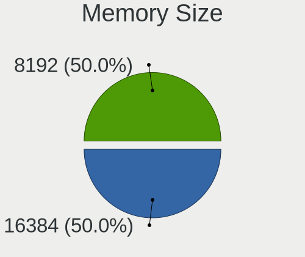

| Size  | Computers | Percent |
|-------|-----------|---------|
| 8192  | 27        | 39.71%  |
| 4096  | 26        | 38.24%  |
| 16384 | 9         | 13.24%  |
| 2048  | 5         | 7.35%   |
| 32768 | 1         | 1.47%   |

Memory Speed
------------

Memory module speed

| Speed | Computers | Percent |
|-------|-----------|---------|
| 2667  | 12        | 18.18%  |
| 1600  | 12        | 18.18%  |
| 3200  | 11        | 16.67%  |
| 2400  | 6         | 9.09%   |
| 3600  | 4         | 6.06%   |
| 1333  | 4         | 6.06%   |
| 2933  | 2         | 3.03%   |
| 1866  | 2         | 3.03%   |
| 1334  | 2         | 3.03%   |
| 1066  | 2         | 3.03%   |
| 6400  | 1         | 1.52%   |
| 5600  | 1         | 1.52%   |
| 4800  | 1         | 1.52%   |
| 4199  | 1         | 1.52%   |
| 3266  | 1         | 1.52%   |
| 2133  | 1         | 1.52%   |
| 1648  | 1         | 1.52%   |
| 1400  | 1         | 1.52%   |
| 1067  | 1         | 1.52%   |

Printers & scanners
-------------------

Printer Vendor
--------------

Printer device vendors

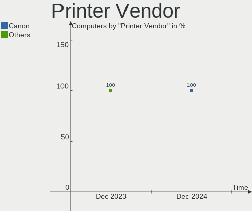

| Vendor              | Computers | Percent |
|---------------------|-----------|---------|
| Hewlett-Packard     | 2         | 50%     |
| Samsung Electronics | 1         | 25%     |
| Brother Industries  | 1         | 25%     |

Printer Model
-------------

Printer device models

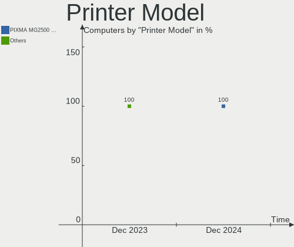

| Model                                | Computers | Percent |
|--------------------------------------|-----------|---------|
| Samsung ML-1640 Series Laser Printer | 1         | 25%     |
| HP DeskJet 2700 series               | 1         | 25%     |
| HP Deskjet 2050 J510                 | 1         | 25%     |
| Brother HL-5250DN Printer            | 1         | 25%     |

Scanner Vendor
--------------

Scanner device vendors

Zero info for selected period =(

Scanner Model
-------------

Scanner device models

Zero info for selected period =(

Camera
------

Camera Vendor
-------------

Camera device vendors

| Vendor                        | Computers | Percent |
|-------------------------------|-----------|---------|
| IMC Networks                  | 10        | 23.26%  |
| Microdia                      | 5         | 11.63%  |
| Chicony Electronics           | 5         | 11.63%  |
| Bison Electronics             | 5         | 11.63%  |
| Apple                         | 4         | 9.3%    |
| Realtek Semiconductor         | 3         | 6.98%   |
| Quanta                        | 2         | 4.65%   |
| SunplusIT                     | 1         | 2.33%   |
| Sunplus Innovation Technology | 1         | 2.33%   |
| OPPO Electronics              | 1         | 2.33%   |
| Luxvisions Innotech Limited   | 1         | 2.33%   |
| Logitech                      | 1         | 2.33%   |
| Lite-On Technology            | 1         | 2.33%   |
| Intel                         | 1         | 2.33%   |
| Creative Technology           | 1         | 2.33%   |
| ALi                           | 1         | 2.33%   |

Camera Model
------------

Camera device models

| Model                                    | Computers | Percent |
|------------------------------------------|-----------|---------|
| IMC Networks USB2.0 VGA UVC WebCam       | 4         | 9.3%    |
| Microdia Integrated_Webcam_HD            | 2         | 4.65%   |
| IMC Networks USB2.0 HD UVC WebCam        | 2         | 4.65%   |
| IMC Networks Integrated Camera           | 2         | 4.65%   |
| Chicony Integrated Camera                | 2         | 4.65%   |
| Bison Lenovo Integrated Webcam           | 2         | 4.65%   |
| Apple FaceTime HD Camera                 | 2         | 4.65%   |
| SunplusIT USB 2M Camera                  | 1         | 2.33%   |
| Sunplus Integrated_Webcam_HD             | 1         | 2.33%   |
| Realtek USB2.0 HD UVC WebCam             | 1         | 2.33%   |
| Realtek USB Camera                       | 1         | 2.33%   |
| Realtek HP Wide Vision HD Camera         | 1         | 2.33%   |
| Quanta HP TrueVision HD Camera           | 1         | 2.33%   |
| Quanta ACER HD User Facing               | 1         | 2.33%   |
| OPPO CPH1725                             | 1         | 2.33%   |
| Microdia Webcam Vitade AF                | 1         | 2.33%   |
| Microdia Rapoo camera                    | 1         | 2.33%   |
| Microdia ACR010 USB Webcam               | 1         | 2.33%   |
| Luxvisions Innotech Limited HP HD Camera | 1         | 2.33%   |
| Logitech Webcam Pro 9000                 | 1         | 2.33%   |
| Lite-On Integrated Camera                | 1         | 2.33%   |
| Intel RealSense 3D Camera (Front F200)   | 1         | 2.33%   |
| IMC Networks VGA UVC WebCam              | 1         | 2.33%   |
| IMC Networks HD Camera                   | 1         | 2.33%   |
| Creative Live! Cam Sync 1080p V2         | 1         | 2.33%   |
| Chicony USB2.0 HD UVC WebCam             | 1         | 2.33%   |
| Chicony HP Integrated Webcam             | 1         | 2.33%   |
| Chicony HP HD Camera                     | 1         | 2.33%   |
| Bison SunplusIT Integrated Camera        | 1         | 2.33%   |
| Bison SunplusIT INC. Integrated Camera   | 1         | 2.33%   |
| Bison EasyCamera                         | 1         | 2.33%   |
| Apple iPhone 5/5C/5S/6/SE/7/8/X/XR       | 1         | 2.33%   |
| Apple FaceTime HD Camera (Built-in)      | 1         | 2.33%   |
| ALi Gateway Webcam                       | 1         | 2.33%   |

Security
--------

Fingerprint Vendor
------------------

Fingerprint sensor vendors

| Vendor                     | Computers | Percent |
|----------------------------|-----------|---------|
| Synaptics                  | 2         | 40%     |
| Validity Sensors           | 1         | 20%     |
| Shenzhen Goodix Technology | 1         | 20%     |
| AuthenTec                  | 1         | 20%     |

Fingerprint Model
-----------------

Fingerprint sensor models

| Model                                                    | Computers | Percent |
|----------------------------------------------------------|-----------|---------|
| Validity Sensors VFS 5011 fingerprint sensor             | 1         | 20%     |
| Synaptics  WBDI                                          | 1         | 20%     |
| Synaptics FS7604 Touch Fingerprint Sensor with PurePrint | 1         | 20%     |
| Shenzhen Goodix Fingerprint Reader                       | 1         | 20%     |
| AuthenTec AES2810                                        | 1         | 20%     |

Chipcard Vendor
---------------

Chipcard module vendors

Zero info for selected period =(

Chipcard Model
--------------

Chipcard module models

Zero info for selected period =(

Unsupported
-----------

Unsupported Devices
-------------------

Total unsupported devices on board

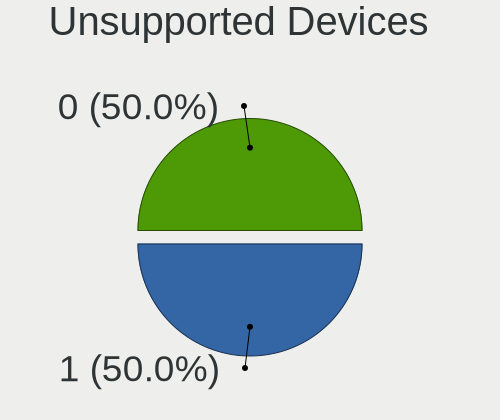

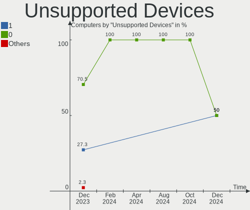

| Total | Computers | Percent |
|-------|-----------|---------|
| 0     | 50        | 80.65%  |
| 1     | 11        | 17.74%  |
| 2     | 1         | 1.61%   |

Unsupported Device Types
------------------------

Types of unsupported devices

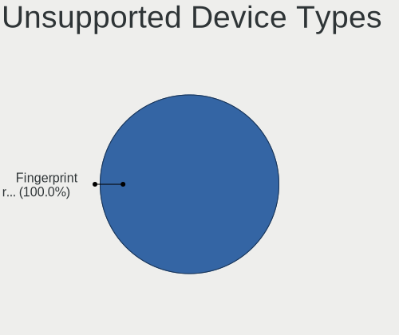

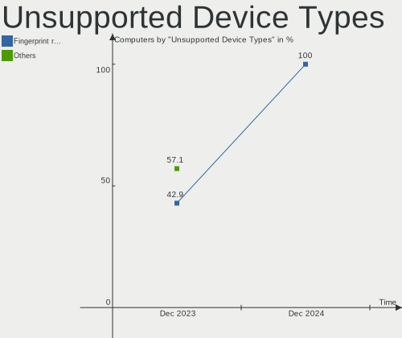

| Type                  | Computers | Percent |
|-----------------------|-----------|---------|
| Fingerprint reader    | 5         | 38.46%  |
| Camera                | 3         | 23.08%  |
| Multimedia controller | 2         | 15.38%  |
| Unassigned class      | 1         | 7.69%   |
| Net/wireless          | 1         | 7.69%   |
| Graphics card         | 1         | 7.69%   |

