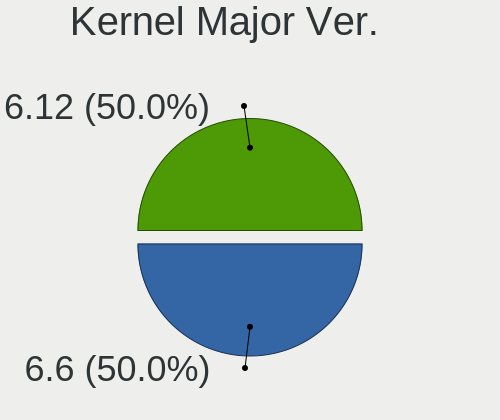
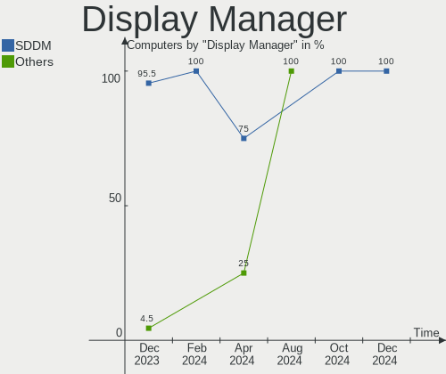
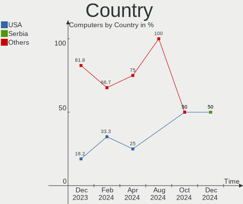
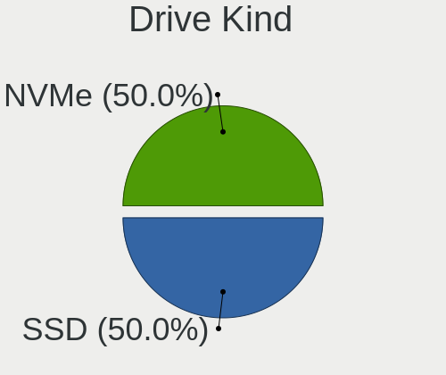
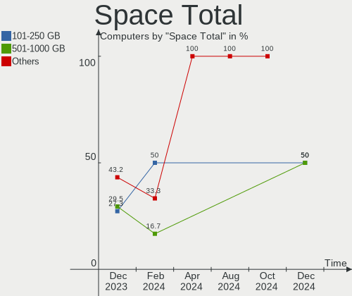
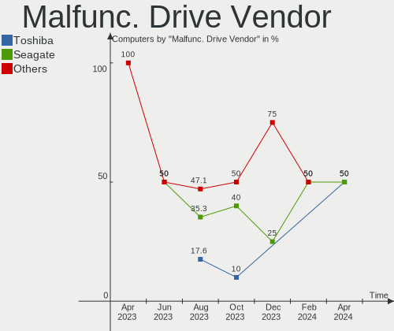
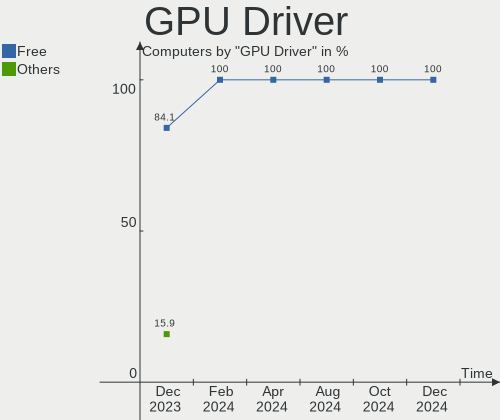
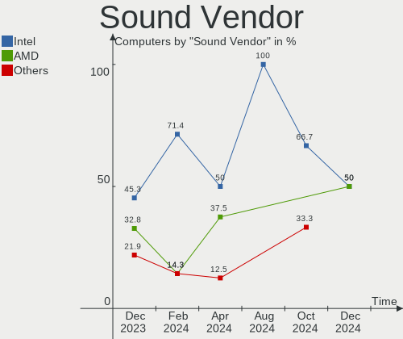
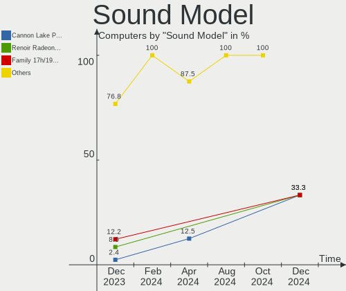
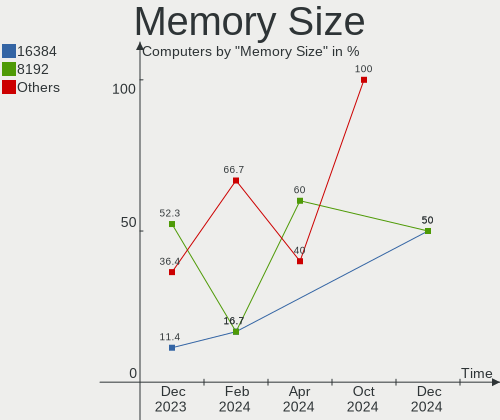

Xero - Hardware Trends
----------------------

A project to identify most popular hardware characteristics and track their change
over time based on data collected by Linux users at https://Linux-Hardware.org.

Anyone can contribute to this report by the [hw-probe](https://github.com/linuxhw/hw-probe) tool:

    sudo -E hw-probe -all -upload

This is a report for all computer types. See also reports for [desktops](/Dist/Xero/Desktop/README.md) and [notebooks](/Dist/Xero/Notebook/README.md).

This report is for one last month. Overall report since the beginning of time: [TestDays](https://github.com/linuxhw/TestDays)

Period: Apr, 2024.

Contents
--------

* [ System ](#system)
  - [ OS                       ](#os)
  - [ OS Family                ](#os-family)
  - [ Kernel                   ](#kernel)
  - [ Kernel Family            ](#kernel-family)
  - [ Kernel Major Ver.        ](#kernel-major-ver)
  - [ Arch                     ](#arch)
  - [ DE                       ](#de)
  - [ Display Server           ](#display-server)
  - [ Display Manager          ](#display-manager)
  - [ OS Lang                  ](#os-lang)
  - [ Boot Mode                ](#boot-mode)
  - [ Filesystem               ](#filesystem)
  - [ Part. scheme             ](#part-scheme)
  - [ Dual Boot with Linux/BSD ](#dual-boot-with-linuxbsd)
  - [ Dual Boot (Win)          ](#dual-boot-win)

* [ Board ](#board)
  - [ Vendor                   ](#vendor)
  - [ Model                    ](#model)
  - [ Model Family             ](#model-family)
  - [ MFG Year                 ](#mfg-year)
  - [ Form Factor              ](#form-factor)
  - [ Secure Boot              ](#secure-boot)
  - [ Coreboot                 ](#coreboot)
  - [ RAM Size                 ](#ram-size)
  - [ RAM Used                 ](#ram-used)
  - [ Total Drives             ](#total-drives)
  - [ Has CD-ROM               ](#has-cd-rom)
  - [ Has Ethernet             ](#has-ethernet)
  - [ Has WiFi                 ](#has-wifi)
  - [ Has Bluetooth            ](#has-bluetooth)

* [ Location ](#location)
  - [ Country                  ](#country)
  - [ City                     ](#city)

* [ Drives ](#drives)
  - [ Drive Vendor             ](#drive-vendor)
  - [ Drive Model              ](#drive-model)
  - [ HDD Vendor               ](#hdd-vendor)
  - [ SSD Vendor               ](#ssd-vendor)
  - [ Drive Kind               ](#drive-kind)
  - [ Drive Connector          ](#drive-connector)
  - [ Drive Size               ](#drive-size)
  - [ Space Total              ](#space-total)
  - [ Space Used               ](#space-used)
  - [ Malfunc. Drives          ](#malfunc-drives)
  - [ Malfunc. Drive Vendor    ](#malfunc-drive-vendor)
  - [ Malfunc. HDD Vendor      ](#malfunc-hdd-vendor)
  - [ Malfunc. Drive Kind      ](#malfunc-drive-kind)
  - [ Failed Drives            ](#failed-drives)
  - [ Failed Drive Vendor      ](#failed-drive-vendor)
  - [ Drive Status             ](#drive-status)

* [ Storage controller ](#storage-controller)
  - [ Storage Vendor           ](#storage-vendor)
  - [ Storage Model            ](#storage-model)
  - [ Storage Kind             ](#storage-kind)

* [ Processor ](#processor)
  - [ CPU Vendor               ](#cpu-vendor)
  - [ CPU Model                ](#cpu-model)
  - [ CPU Model Family         ](#cpu-model-family)
  - [ CPU Cores                ](#cpu-cores)
  - [ CPU Sockets              ](#cpu-sockets)
  - [ CPU Threads              ](#cpu-threads)
  - [ CPU Op-Modes             ](#cpu-op-modes)
  - [ CPU Microcode            ](#cpu-microcode)
  - [ CPU Microarch            ](#cpu-microarch)

* [ Graphics ](#graphics)
  - [ GPU Vendor               ](#gpu-vendor)
  - [ GPU Model                ](#gpu-model)
  - [ GPU Combo                ](#gpu-combo)
  - [ GPU Driver               ](#gpu-driver)
  - [ GPU Memory               ](#gpu-memory)

* [ Monitor ](#monitor)
  - [ Monitor Vendor           ](#monitor-vendor)
  - [ Monitor Model            ](#monitor-model)
  - [ Monitor Resolution       ](#monitor-resolution)
  - [ Monitor Diagonal         ](#monitor-diagonal)
  - [ Monitor Width            ](#monitor-width)
  - [ Aspect Ratio             ](#aspect-ratio)
  - [ Monitor Area             ](#monitor-area)
  - [ Pixel Density            ](#pixel-density)
  - [ Multiple Monitors        ](#multiple-monitors)

* [ Network ](#network)
  - [ Net Controller Vendor    ](#net-controller-vendor)
  - [ Net Controller Model     ](#net-controller-model)
  - [ Wireless Vendor          ](#wireless-vendor)
  - [ Wireless Model           ](#wireless-model)
  - [ Ethernet Vendor          ](#ethernet-vendor)
  - [ Ethernet Model           ](#ethernet-model)
  - [ Net Controller Kind      ](#net-controller-kind)
  - [ Used Controller          ](#used-controller)
  - [ NICs                     ](#nics)
  - [ IPv6                     ](#ipv6)

* [ Bluetooth ](#bluetooth)
  - [ Bluetooth Vendor         ](#bluetooth-vendor)
  - [ Bluetooth Model          ](#bluetooth-model)

* [ Sound ](#sound)
  - [ Sound Vendor             ](#sound-vendor)
  - [ Sound Model              ](#sound-model)

* [ Memory ](#memory)
  - [ Memory Vendor            ](#memory-vendor)
  - [ Memory Model             ](#memory-model)
  - [ Memory Kind              ](#memory-kind)
  - [ Memory Form Factor       ](#memory-form-factor)
  - [ Memory Size              ](#memory-size)
  - [ Memory Speed             ](#memory-speed)

* [ Printers & scanners ](#printers--scanners)
  - [ Printer Vendor           ](#printer-vendor)
  - [ Printer Model            ](#printer-model)
  - [ Scanner Vendor           ](#scanner-vendor)
  - [ Scanner Model            ](#scanner-model)

* [ Camera ](#camera)
  - [ Camera Vendor            ](#camera-vendor)
  - [ Camera Model             ](#camera-model)

* [ Security ](#security)
  - [ Fingerprint Vendor       ](#fingerprint-vendor)
  - [ Fingerprint Model        ](#fingerprint-model)
  - [ Chipcard Vendor          ](#chipcard-vendor)
  - [ Chipcard Model           ](#chipcard-model)

* [ Unsupported ](#unsupported)
  - [ Unsupported Devices      ](#unsupported-devices)
  - [ Unsupported Device Types ](#unsupported-device-types)

System
------

OS
--

Installed operating systems

| Name         | Computers | Percent |
|--------------|-----------|---------|
| Xero Rolling | 4         | 100%    |

OS Family
---------

OS without a version

| Name | Computers | Percent |
|------|-----------|---------|
| Xero | 4         | 100%    |

Kernel
------

Version of the Linux kernel

| Version       | Computers | Percent |
|---------------|-----------|---------|
| 6.6.4-arch1-1 | 2         | 50%     |
| 6.6.9-arch1-1 | 1         | 25%     |
| 6.5.9-arch2-1 | 1         | 25%     |

Kernel Family
-------------

Linux kernel without a distro release

| Version | Computers | Percent |
|---------|-----------|---------|
| 6.6.4   | 2         | 50%     |
| 6.6.9   | 1         | 25%     |
| 6.5.9   | 1         | 25%     |

Kernel Major Ver.
-----------------

Linux kernel major version

| Version | Computers | Percent |
|---------|-----------|---------|
| 6.6     | 3         | 75%     |
| 6.5     | 1         | 25%     |

Arch
----

OS architecture (x86_64, i586, etc.)

| Name   | Computers | Percent |
|--------|-----------|---------|
| x86_64 | 4         | 100%    |

DE
--

Desktop Environment

| Name | Computers | Percent |
|------|-----------|---------|
| KDE5 | 3         | 75%     |
| XFCE | 1         | 25%     |

Display Server
--------------

X11 or Wayland

| Name    | Computers | Percent |
|---------|-----------|---------|
| X11     | 2         | 50%     |
| Wayland | 2         | 50%     |

Display Manager
---------------

SDDM, LightDM, etc.

| Name    | Computers | Percent |
|---------|-----------|---------|
| SDDM    | 3         | 75%     |
| LightDM | 1         | 25%     |

OS Lang
-------

Language

| Lang  | Computers | Percent |
|-------|-----------|---------|
| hu_HU | 1         | 25%     |
| fr_FR | 1         | 25%     |
| en_US | 1         | 25%     |
| de_DE | 1         | 25%     |

Boot Mode
---------

EFI or BIOS

| Mode | Computers | Percent |
|------|-----------|---------|
| EFI  | 4         | 100%    |

Filesystem
----------

Type of filesystem

| Type | Computers | Percent |
|------|-----------|---------|
| Ext4 | 4         | 100%    |

Part. scheme
------------

Scheme of partitioning

| Type | Computers | Percent |
|------|-----------|---------|
| GPT  | 4         | 100%    |

Dual Boot with Linux/BSD
------------------------

Hosting more than one Linux/BSD

| Dual boot | Computers | Percent |
|-----------|-----------|---------|
| Yes       | 2         | 50%     |
| No        | 2         | 50%     |

Dual Boot (Win)
---------------

Hosting Linux and Windows

| Dual boot | Computers | Percent |
|-----------|-----------|---------|
| Yes       | 3         | 75%     |
| No        | 1         | 25%     |

Board
-----

Vendor
------

Motherboard manufacturer

| Name            | Computers | Percent |
|-----------------|-----------|---------|
| Hewlett-Packard | 2         | 50%     |
| Medion          | 1         | 25%     |
| Dell            | 1         | 25%     |

Model
-----

Motherboard model

| Name               | Computers | Percent |
|--------------------|-----------|---------|
| Medion E63007      | 1         | 25%     |
| HP 550-150         | 1         | 25%     |
| HP 500-111ef       | 1         | 25%     |
| Dell OptiPlex 7010 | 1         | 25%     |

Model Family
------------

Motherboard model prefix

| Name          | Computers | Percent |
|---------------|-----------|---------|
| Medion E63007 | 1         | 25%     |
| HP 550-150    | 1         | 25%     |
| HP 500-111ef  | 1         | 25%     |
| Dell OptiPlex | 1         | 25%     |

MFG Year
--------

Motherboard manufacture year

| Year | Computers | Percent |
|------|-----------|---------|
| 2013 | 2         | 50%     |
| 2020 | 1         | 25%     |
| 2015 | 1         | 25%     |

Form Factor
-----------

Physical design of the computer

| Name    | Computers | Percent |
|---------|-----------|---------|
| Desktop | 4         | 100%    |

Secure Boot
-----------

Enabled or disabled

| State    | Computers | Percent |
|----------|-----------|---------|
| Disabled | 4         | 100%    |

Coreboot
--------

Have coreboot on board

| Used | Computers | Percent |
|------|-----------|---------|
| No   | 4         | 100%    |

RAM Size
--------

Total RAM memory

| Size in GB | Computers | Percent |
|------------|-----------|---------|
| 16.01-24.0 | 2         | 50%     |
| 4.01-8.0   | 1         | 25%     |
| 8.01-16.0  | 1         | 25%     |

RAM Used
--------

Used RAM memory

| Used GB  | Computers | Percent |
|----------|-----------|---------|
| 1.01-2.0 | 3         | 75%     |
| 0.51-1.0 | 1         | 25%     |

Total Drives
------------

Number of drives on board

| Drives | Computers | Percent |
|--------|-----------|---------|
| 2      | 3         | 75%     |
| 3      | 1         | 25%     |

Has CD-ROM
----------

Has CD-ROM on board

| Presented | Computers | Percent |
|-----------|-----------|---------|
| No        | 3         | 75%     |
| Yes       | 1         | 25%     |

Has Ethernet
------------

Has Ethernet on board

| Presented | Computers | Percent |
|-----------|-----------|---------|
| Yes       | 4         | 100%    |

Has WiFi
--------

Has WiFi module

| Presented | Computers | Percent |
|-----------|-----------|---------|
| Yes       | 3         | 75%     |
| No        | 1         | 25%     |

Has Bluetooth
-------------

Has Bluetooth module

| Presented | Computers | Percent |
|-----------|-----------|---------|
| Yes       | 2         | 50%     |
| No        | 2         | 50%     |

Location
--------

Country
-------

Geographic location (country)

| Country | Computers | Percent |
|---------|-----------|---------|
| USA     | 1         | 25%     |
| Hungary | 1         | 25%     |
| Germany | 1         | 25%     |
| France  | 1         | 25%     |

City
----

Geographic location (city)

| City           | Computers | Percent |
|----------------|-----------|---------|
| Kecskemét     | 1         | 25%     |
| Jenkins        | 1         | 25%     |
| Cagnes-sur-Mer | 1         | 25%     |
| Braunschweig   | 1         | 25%     |

Drives
------

Drive Vendor
------------

Hard drive vendors

| Vendor              | Computers | Drives | Percent |
|---------------------|-----------|--------|---------|
| Seagate             | 3         | 3      | 37.5%   |
| WDC                 | 1         | 1      | 12.5%   |
| Unknown             | 1         | 1      | 12.5%   |
| Toshiba             | 1         | 1      | 12.5%   |
| Samsung Electronics | 1         | 1      | 12.5%   |
| Phison Electronics  | 1         | 1      | 12.5%   |

Drive Model
-----------

Hard drive models

| Model                           | Computers | Percent |
|---------------------------------|-----------|---------|
| WDC WD10EZEX-60M2NA0 1TB        | 1         | 12.5%   |
| Unknown SD/MMC/MS PRO 128GB     | 1         | 12.5%   |
| Toshiba MQ01ABD050 500GB        | 1         | 12.5%   |
| Seagate ST500LX025-1U717D 500GB | 1         | 12.5%   |
| Seagate ST3250312AS 250GB       | 1         | 12.5%   |
| Seagate ST2000DM001-1CH164 2TB  | 1         | 12.5%   |
| Samsung HD403LJ 400GB           | 1         | 12.5%   |
| Phison E12 NVMe Controller 2TB  | 1         | 12.5%   |

HDD Vendor
----------

Hard disk drive vendors

| Vendor              | Computers | Drives | Percent |
|---------------------|-----------|--------|---------|
| Seagate             | 3         | 3      | 42.86%  |
| WDC                 | 1         | 1      | 14.29%  |
| Unknown             | 1         | 1      | 14.29%  |
| Toshiba             | 1         | 1      | 14.29%  |
| Samsung Electronics | 1         | 1      | 14.29%  |

SSD Vendor
----------

Solid state drive vendors

Zero info for selected period =(

Drive Kind
----------

HDD or SSD

| Kind | Computers | Drives | Percent |
|------|-----------|--------|---------|
| HDD  | 4         | 7      | 80%     |
| NVMe | 1         | 1      | 20%     |

Drive Connector
---------------

SATA, SAS, NVMe, etc.

| Type | Computers | Drives | Percent |
|------|-----------|--------|---------|
| SATA | 4         | 6      | 66.67%  |
| SAS  | 1         | 1      | 16.67%  |
| NVMe | 1         | 1      | 16.67%  |

Drive Size
----------

Size of hard drive

| Size in TB | Computers | Drives | Percent |
|------------|-----------|--------|---------|
| 0.01-0.5   | 3         | 5      | 60%     |
| 1.01-2.0   | 1         | 1      | 20%     |
| 0.51-1.0   | 1         | 1      | 20%     |

Space Total
-----------

Amount of disk space available on the file system

| Size in GB | Computers | Percent |
|------------|-----------|---------|
| 251-500    | 2         | 50%     |
| 21-50      | 1         | 25%     |
| 1001-2000  | 1         | 25%     |

Space Used
----------

Amount of used disk space

| Used GB | Computers | Percent |
|---------|-----------|---------|
| 1-20    | 4         | 100%    |

Malfunc. Drives
---------------

Drive models with a malfunction

| Model                          | Computers | Drives | Percent |
|--------------------------------|-----------|--------|---------|
| Toshiba MQ01ABD050 500GB       | 1         | 1      | 50%     |
| Seagate ST2000DM001-1CH164 2TB | 1         | 1      | 50%     |

Malfunc. Drive Vendor
---------------------

Vendors of faulty drives

| Vendor  | Computers | Drives | Percent |
|---------|-----------|--------|---------|
| Toshiba | 1         | 1      | 50%     |
| Seagate | 1         | 1      | 50%     |

Malfunc. HDD Vendor
-------------------

Vendors of faulty HDD drives

| Vendor  | Computers | Drives | Percent |
|---------|-----------|--------|---------|
| Toshiba | 1         | 1      | 50%     |
| Seagate | 1         | 1      | 50%     |

Malfunc. Drive Kind
-------------------

Kinds of faulty drives

| Kind | Computers | Drives | Percent |
|------|-----------|--------|---------|
| HDD  | 2         | 2      | 100%    |

Failed Drives
-------------

Failed drive models

Zero info for selected period =(

Failed Drive Vendor
-------------------

Failed drive vendors

Zero info for selected period =(

Drive Status
------------

Number of failed and malfunc. drives

| Status   | Computers | Drives | Percent |
|----------|-----------|--------|---------|
| Works    | 3         | 5      | 50%     |
| Malfunc  | 2         | 2      | 33.33%  |
| Detected | 1         | 1      | 16.67%  |

Storage controller
------------------

Storage Vendor
--------------

Storage controller vendors

| Vendor             | Computers | Percent |
|--------------------|-----------|---------|
| Intel              | 4         | 80%     |
| Phison Electronics | 1         | 20%     |

Storage Model
-------------

Storage controller models

| Model                                                                          | Computers | Percent |
|--------------------------------------------------------------------------------|-----------|---------|
| Phison E12 NVMe Controller                                                     | 1         | 20%     |
| Intel Q170/Q150/B150/H170/H110/Z170/CM236 Chipset SATA Controller [AHCI Mode]  | 1         | 20%     |
| Intel Cannon Lake PCH SATA AHCI Controller                                     | 1         | 20%     |
| Intel 8 Series/C220 Series Chipset Family 6-port SATA Controller 1 [AHCI mode] | 1         | 20%     |
| Intel 7 Series/C210 Series Chipset Family 6-port SATA Controller [AHCI mode]   | 1         | 20%     |

Storage Kind
------------

Kind of storage controller (IDE, SATA, NVMe, SAS, ...)

| Kind | Computers | Percent |
|------|-----------|---------|
| SATA | 4         | 80%     |
| NVMe | 1         | 20%     |

Processor
---------

CPU Vendor
----------

Processor vendors

| Vendor | Computers | Percent |
|--------|-----------|---------|
| Intel  | 4         | 100%    |

CPU Model
---------

Processor models

| Model                            | Computers | Percent |
|----------------------------------|-----------|---------|
| Intel Core i7-2600 CPU @ 3.40GHz | 1         | 25%     |
| Intel Core i5-9400 CPU @ 2.90GHz | 1         | 25%     |
| Intel Core i5-6400 CPU @ 2.70GHz | 1         | 25%     |
| Intel Core i3-4130 CPU @ 3.40GHz | 1         | 25%     |

CPU Model Family
----------------

Processor model prefix

| Model         | Computers | Percent |
|---------------|-----------|---------|
| Intel Core i5 | 2         | 50%     |
| Intel Core i7 | 1         | 25%     |
| Intel Core i3 | 1         | 25%     |

CPU Cores
---------

Number of processor cores

| Number | Computers | Percent |
|--------|-----------|---------|
| 4      | 2         | 50%     |
| 6      | 1         | 25%     |
| 2      | 1         | 25%     |

CPU Sockets
-----------

Number of sockets

| Number | Computers | Percent |
|--------|-----------|---------|
| 1      | 4         | 100%    |

CPU Threads
-----------

Threads per core (Hyper-Threading)

| Number | Computers | Percent |
|--------|-----------|---------|
| 2      | 2         | 50%     |
| 1      | 2         | 50%     |

CPU Op-Modes
------------

CPU Operation Modes (32-bit, 64-bit)

| Op mode        | Computers | Percent |
|----------------|-----------|---------|
| 32-bit, 64-bit | 4         | 100%    |

CPU Microcode
-------------

Microcode number

| Number  | Computers | Percent |
|---------|-----------|---------|
| Unknown | 4         | 100%    |

CPU Microarch
-------------

Microarchitecture

| Name        | Computers | Percent |
|-------------|-----------|---------|
| Skylake     | 1         | 25%     |
| SandyBridge | 1         | 25%     |
| KabyLake    | 1         | 25%     |
| Haswell     | 1         | 25%     |

Graphics
--------

GPU Vendor
----------

Vendors of graphics cards

| Vendor | Computers | Percent |
|--------|-----------|---------|
| AMD    | 3         | 75%     |
| Intel  | 1         | 25%     |

GPU Model
---------

Graphics card models

| Model                                                | Computers | Percent |
|------------------------------------------------------|-----------|---------|
| Intel CoffeeLake-S GT2 [UHD Graphics 630]            | 1         | 25%     |
| AMD Park [Mobility Radeon HD 5430]                   | 1         | 25%     |
| AMD Caicos [Radeon HD 6450/7450/8450 / R5 230 OEM]   | 1         | 25%     |
| AMD Caicos XT [Radeon HD 7470/8470 / R5 235/310 OEM] | 1         | 25%     |

GPU Combo
---------

Combinations of graphics cards

| Name      | Computers | Percent |
|-----------|-----------|---------|
| 1 x AMD   | 3         | 75%     |
| 1 x Intel | 1         | 25%     |

GPU Driver
----------

Free vs proprietary

| Driver | Computers | Percent |
|--------|-----------|---------|
| Free   | 4         | 100%    |

GPU Memory
----------

Total video memory

| Size in GB | Computers | Percent |
|------------|-----------|---------|
| 0.51-1.0   | 3         | 75%     |
| Unknown    | 1         | 25%     |

Monitor
-------

Monitor Vendor
--------------

Monitor vendors

| Vendor               | Computers | Percent |
|----------------------|-----------|---------|
| Sceptre Tech         | 1         | 25%     |
| Goldstar             | 1         | 25%     |
| Ancor Communications | 1         | 25%     |
| Acer                 | 1         | 25%     |

Monitor Model
-------------

Monitor models

| Model                                                                 | Computers | Percent |
|-----------------------------------------------------------------------|-----------|---------|
| Sceptre Tech Sceptre M24 SPT09A1 1920x1080 526x296mm 23.8-inch        | 1         | 25%     |
| Goldstar L225W GSM5662 1680x1050 474x296mm 22.0-inch                  | 1         | 25%     |
| Ancor Communications ASUS VP228 ACI22C3 1920x1080 476x268mm 21.5-inch | 1         | 25%     |
| Acer VG252Q ACR08FC 1920x1080 543x302mm 24.5-inch                     | 1         | 25%     |

Monitor Resolution
------------------

Monitor screen resolution

| Resolution         | Computers | Percent |
|--------------------|-----------|---------|
| 1920x1080 (FHD)    | 3         | 75%     |
| 1680x1050 (WSXGA+) | 1         | 25%     |

Monitor Diagonal
----------------

Diagonal size in inches

| Inches | Computers | Percent |
|--------|-----------|---------|
| 24     | 1         | 25%     |
| 23     | 1         | 25%     |
| 22     | 1         | 25%     |
| 21     | 1         | 25%     |

Monitor Width
-------------

Physical width

| Width in mm | Computers | Percent |
|-------------|-----------|---------|
| 501-600     | 2         | 50%     |
| 401-500     | 2         | 50%     |

Aspect Ratio
------------

Proportional relationship between the width and the height

| Ratio | Computers | Percent |
|-------|-----------|---------|
| 16/9  | 3         | 75%     |
| 16/10 | 1         | 25%     |

Monitor Area
------------

Area in inch²

| Area in inch² | Computers | Percent |
|----------------|-----------|---------|
| 201-250        | 3         | 75%     |
| 251-300        | 1         | 25%     |

Pixel Density
-------------

Pixels per inch

| Density | Computers | Percent |
|---------|-----------|---------|
| 51-100  | 3         | 75%     |
| 101-120 | 1         | 25%     |

Multiple Monitors
-----------------

Total monitors connected

| Total | Computers | Percent |
|-------|-----------|---------|
| 1     | 4         | 100%    |

Network
-------

Net Controller Vendor
---------------------

Controller vendors

| Vendor                | Computers | Percent |
|-----------------------|-----------|---------|
| Realtek Semiconductor | 3         | 50%     |
| Intel                 | 2         | 33.33%  |
| Qualcomm Atheros      | 1         | 16.67%  |

Net Controller Model
--------------------

Controller models

| Model                                                                  | Computers | Percent |
|------------------------------------------------------------------------|-----------|---------|
| Realtek RTL8111/8168/8211/8411 PCI Express Gigabit Ethernet Controller | 3         | 42.86%  |
| Realtek RTL8723BE PCIe Wireless Network Adapter                        | 1         | 14.29%  |
| Qualcomm Atheros AR9485 Wireless Network Adapter                       | 1         | 14.29%  |
| Intel Wi-Fi 6 AX200                                                    | 1         | 14.29%  |
| Intel 82579LM Gigabit Network Connection (Lewisville)                  | 1         | 14.29%  |

Wireless Vendor
---------------

Wireless vendors

| Vendor                | Computers | Percent |
|-----------------------|-----------|---------|
| Realtek Semiconductor | 1         | 33.33%  |
| Qualcomm Atheros      | 1         | 33.33%  |
| Intel                 | 1         | 33.33%  |

Wireless Model
--------------

Wireless models

| Model                                            | Computers | Percent |
|--------------------------------------------------|-----------|---------|
| Realtek RTL8723BE PCIe Wireless Network Adapter  | 1         | 33.33%  |
| Qualcomm Atheros AR9485 Wireless Network Adapter | 1         | 33.33%  |
| Intel Wi-Fi 6 AX200                              | 1         | 33.33%  |

Ethernet Vendor
---------------

Ethernet vendors

| Vendor                | Computers | Percent |
|-----------------------|-----------|---------|
| Realtek Semiconductor | 3         | 75%     |
| Intel                 | 1         | 25%     |

Ethernet Model
--------------

Ethernet models

| Model                                                                  | Computers | Percent |
|------------------------------------------------------------------------|-----------|---------|
| Realtek RTL8111/8168/8211/8411 PCI Express Gigabit Ethernet Controller | 3         | 75%     |
| Intel 82579LM Gigabit Network Connection (Lewisville)                  | 1         | 25%     |

Net Controller Kind
-------------------

Ethernet, WiFi or modem

| Kind     | Computers | Percent |
|----------|-----------|---------|
| Ethernet | 4         | 57.14%  |
| WiFi     | 3         | 42.86%  |

Used Controller
---------------

Currently used network controller

| Kind     | Computers | Percent |
|----------|-----------|---------|
| Ethernet | 3         | 75%     |
| WiFi     | 1         | 25%     |

NICs
----

Total network controllers on board

| Total | Computers | Percent |
|-------|-----------|---------|
| 2     | 3         | 75%     |
| 1     | 1         | 25%     |

IPv6
----

IPv6 vs IPv4

| Used | Computers | Percent |
|------|-----------|---------|
| Yes  | 2         | 50%     |
| No   | 2         | 50%     |

Bluetooth
---------

Bluetooth Vendor
----------------

Controller vendors

| Vendor                | Computers | Percent |
|-----------------------|-----------|---------|
| Realtek Semiconductor | 1         | 50%     |
| Intel                 | 1         | 50%     |

Bluetooth Model
---------------

Controller models

| Model                   | Computers | Percent |
|-------------------------|-----------|---------|
| Realtek Bluetooth Radio | 1         | 50%     |
| Intel AX200 Bluetooth   | 1         | 50%     |

Sound
-----

Sound Vendor
------------

Sound card vendors

| Vendor          | Computers | Percent |
|-----------------|-----------|---------|
| Intel           | 4         | 50%     |
| AMD             | 3         | 37.5%   |
| Hewlett-Packard | 1         | 12.5%   |

Sound Model
-----------

Sound card models

| Model                                                                             | Computers | Percent |
|-----------------------------------------------------------------------------------|-----------|---------|
| AMD Caicos HDMI Audio [Radeon HD 6450 / 7450/8450/8490 OEM / R5 230/235/235X OEM] | 2         | 25%     |
| Intel Cannon Lake PCH cAVS                                                        | 1         | 12.5%   |
| Intel 8 Series/C220 Series Chipset High Definition Audio Controller               | 1         | 12.5%   |
| Intel 7 Series/C216 Chipset Family High Definition Audio Controller               | 1         | 12.5%   |
| Intel 100 Series/C230 Series Chipset Family HD Audio Controller                   | 1         | 12.5%   |
| Hewlett-Packard HP S101 Speaker Bar                                               | 1         | 12.5%   |
| AMD Cedar HDMI Audio [Radeon HD 5400/6300/7300 Series]                            | 1         | 12.5%   |

Memory
------

Memory Vendor
-------------

Memory module vendors

| Vendor              | Computers | Percent |
|---------------------|-----------|---------|
| Samsung Electronics | 4         | 66.67%  |
| SK hynix            | 1         | 16.67%  |
| Micron Technology   | 1         | 16.67%  |

Memory Model
------------

Memory module models

| Model                                                  | Computers | Percent |
|--------------------------------------------------------|-----------|---------|
| SK hynix RAM HMT351U6CFR8C-H9 4GB DIMM DDR3 1333MT/s   | 1         | 14.29%  |
| Samsung RAM M378B5273DH0-CH9 4096MB DIMM DDR3 2133MT/s | 1         | 14.29%  |
| Samsung RAM M378B5273CH0-CK0 4GB DIMM DDR3 2000MT/s    | 1         | 14.29%  |
| Samsung RAM M378B5173QH0-CK0 4GB DIMM DDR3 1600MT/s    | 1         | 14.29%  |
| Samsung RAM M378B1G73EB0-YK0 8GB DIMM DDR3 1600MT/s    | 1         | 14.29%  |
| Samsung RAM M378A1K43CB2-CTD 8GB DIMM DDR4 3266MT/s    | 1         | 14.29%  |
| Micron RAM 8JTF25664AZ-1G6M1 2GB DIMM DDR3 1600MT/s    | 1         | 14.29%  |

Memory Kind
-----------

Memory module kinds

| Kind | Computers | Percent |
|------|-----------|---------|
| DDR3 | 3         | 75%     |
| DDR4 | 1         | 25%     |

Memory Form Factor
------------------

Physical design of the memory module

| Name | Computers | Percent |
|------|-----------|---------|
| DIMM | 4         | 100%    |

Memory Size
-----------

Memory module size

| Size | Computers | Percent |
|------|-----------|---------|
| 8192 | 3         | 60%     |
| 4096 | 2         | 40%     |

Memory Speed
------------

Memory module speed

| Speed | Computers | Percent |
|-------|-----------|---------|
| 1600  | 3         | 42.86%  |
| 3266  | 1         | 14.29%  |
| 2133  | 1         | 14.29%  |
| 2000  | 1         | 14.29%  |
| 1866  | 1         | 14.29%  |

Printers & scanners
-------------------

Printer Vendor
--------------

Printer device vendors

Zero info for selected period =(

Printer Model
-------------

Printer device models

Zero info for selected period =(

Scanner Vendor
--------------

Scanner device vendors

Zero info for selected period =(

Scanner Model
-------------

Scanner device models

Zero info for selected period =(

Camera
------

Camera Vendor
-------------

Camera device vendors

Zero info for selected period =(

Camera Model
------------

Camera device models

Zero info for selected period =(

Security
--------

Fingerprint Vendor
------------------

Fingerprint sensor vendors

Zero info for selected period =(

Fingerprint Model
-----------------

Fingerprint sensor models

Zero info for selected period =(

Chipcard Vendor
---------------

Chipcard module vendors

Zero info for selected period =(

Chipcard Model
--------------

Chipcard module models

Zero info for selected period =(

Unsupported
-----------

Unsupported Devices
-------------------

Total unsupported devices on board

| Total | Computers | Percent |
|-------|-----------|---------|
| 0     | 4         | 100%    |

Unsupported Device Types
------------------------

Types of unsupported devices

Zero info for selected period =(

