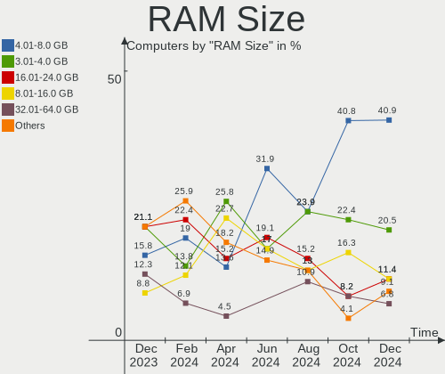
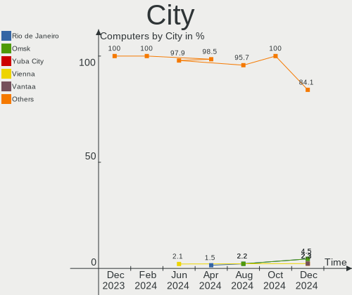

Xubuntu - Hardware Trends
-------------------------

A project to identify most popular hardware characteristics and track their change
over time based on data collected by Linux users at https://Linux-Hardware.org.

Anyone can contribute to this report by the [hw-probe](https://github.com/linuxhw/hw-probe) tool:

    sudo -E hw-probe -all -upload

This is a report for all computer types. See also reports for [desktops](/Dist/Xubuntu/Desktop/README.md) and [notebooks](/Dist/Xubuntu/Notebook/README.md).

This report is for one last month. Overall report since the beginning of time: [TestCoverage](https://github.com/linuxhw/TestCoverage)

Period: Oct, 2022.

Contents
--------

* [ System ](#system)
  - [ OS                       ](#os)
  - [ OS Family                ](#os-family)
  - [ Kernel                   ](#kernel)
  - [ Kernel Family            ](#kernel-family)
  - [ Kernel Major Ver.        ](#kernel-major-ver)
  - [ Arch                     ](#arch)
  - [ DE                       ](#de)
  - [ Display Server           ](#display-server)
  - [ Display Manager          ](#display-manager)
  - [ OS Lang                  ](#os-lang)
  - [ Boot Mode                ](#boot-mode)
  - [ Filesystem               ](#filesystem)
  - [ Part. scheme             ](#part-scheme)
  - [ Dual Boot with Linux/BSD ](#dual-boot-with-linuxbsd)
  - [ Dual Boot (Win)          ](#dual-boot-win)

* [ Board ](#board)
  - [ Vendor                   ](#vendor)
  - [ Model                    ](#model)
  - [ Model Family             ](#model-family)
  - [ MFG Year                 ](#mfg-year)
  - [ Form Factor              ](#form-factor)
  - [ Secure Boot              ](#secure-boot)
  - [ Coreboot                 ](#coreboot)
  - [ RAM Size                 ](#ram-size)
  - [ RAM Used                 ](#ram-used)
  - [ Total Drives             ](#total-drives)
  - [ Has CD-ROM               ](#has-cd-rom)
  - [ Has Ethernet             ](#has-ethernet)
  - [ Has WiFi                 ](#has-wifi)
  - [ Has Bluetooth            ](#has-bluetooth)

* [ Location ](#location)
  - [ Country                  ](#country)
  - [ City                     ](#city)

* [ Drives ](#drives)
  - [ Drive Vendor             ](#drive-vendor)
  - [ Drive Model              ](#drive-model)
  - [ HDD Vendor               ](#hdd-vendor)
  - [ SSD Vendor               ](#ssd-vendor)
  - [ Drive Kind               ](#drive-kind)
  - [ Drive Connector          ](#drive-connector)
  - [ Drive Size               ](#drive-size)
  - [ Space Total              ](#space-total)
  - [ Space Used               ](#space-used)
  - [ Malfunc. Drives          ](#malfunc-drives)
  - [ Malfunc. Drive Vendor    ](#malfunc-drive-vendor)
  - [ Malfunc. HDD Vendor      ](#malfunc-hdd-vendor)
  - [ Malfunc. Drive Kind      ](#malfunc-drive-kind)
  - [ Failed Drives            ](#failed-drives)
  - [ Failed Drive Vendor      ](#failed-drive-vendor)
  - [ Drive Status             ](#drive-status)

* [ Storage controller ](#storage-controller)
  - [ Storage Vendor           ](#storage-vendor)
  - [ Storage Model            ](#storage-model)
  - [ Storage Kind             ](#storage-kind)

* [ Processor ](#processor)
  - [ CPU Vendor               ](#cpu-vendor)
  - [ CPU Model                ](#cpu-model)
  - [ CPU Model Family         ](#cpu-model-family)
  - [ CPU Cores                ](#cpu-cores)
  - [ CPU Sockets              ](#cpu-sockets)
  - [ CPU Threads              ](#cpu-threads)
  - [ CPU Op-Modes             ](#cpu-op-modes)
  - [ CPU Microcode            ](#cpu-microcode)
  - [ CPU Microarch            ](#cpu-microarch)

* [ Graphics ](#graphics)
  - [ GPU Vendor               ](#gpu-vendor)
  - [ GPU Model                ](#gpu-model)
  - [ GPU Combo                ](#gpu-combo)
  - [ GPU Driver               ](#gpu-driver)
  - [ GPU Memory               ](#gpu-memory)

* [ Monitor ](#monitor)
  - [ Monitor Vendor           ](#monitor-vendor)
  - [ Monitor Model            ](#monitor-model)
  - [ Monitor Resolution       ](#monitor-resolution)
  - [ Monitor Diagonal         ](#monitor-diagonal)
  - [ Monitor Width            ](#monitor-width)
  - [ Aspect Ratio             ](#aspect-ratio)
  - [ Monitor Area             ](#monitor-area)
  - [ Pixel Density            ](#pixel-density)
  - [ Multiple Monitors        ](#multiple-monitors)

* [ Network ](#network)
  - [ Net Controller Vendor    ](#net-controller-vendor)
  - [ Net Controller Model     ](#net-controller-model)
  - [ Wireless Vendor          ](#wireless-vendor)
  - [ Wireless Model           ](#wireless-model)
  - [ Ethernet Vendor          ](#ethernet-vendor)
  - [ Ethernet Model           ](#ethernet-model)
  - [ Net Controller Kind      ](#net-controller-kind)
  - [ Used Controller          ](#used-controller)
  - [ NICs                     ](#nics)
  - [ IPv6                     ](#ipv6)

* [ Bluetooth ](#bluetooth)
  - [ Bluetooth Vendor         ](#bluetooth-vendor)
  - [ Bluetooth Model          ](#bluetooth-model)

* [ Sound ](#sound)
  - [ Sound Vendor             ](#sound-vendor)
  - [ Sound Model              ](#sound-model)

* [ Memory ](#memory)
  - [ Memory Vendor            ](#memory-vendor)
  - [ Memory Model             ](#memory-model)
  - [ Memory Kind              ](#memory-kind)
  - [ Memory Form Factor       ](#memory-form-factor)
  - [ Memory Size              ](#memory-size)
  - [ Memory Speed             ](#memory-speed)

* [ Printers & scanners ](#printers--scanners)
  - [ Printer Vendor           ](#printer-vendor)
  - [ Printer Model            ](#printer-model)
  - [ Scanner Vendor           ](#scanner-vendor)
  - [ Scanner Model            ](#scanner-model)

* [ Camera ](#camera)
  - [ Camera Vendor            ](#camera-vendor)
  - [ Camera Model             ](#camera-model)

* [ Security ](#security)
  - [ Fingerprint Vendor       ](#fingerprint-vendor)
  - [ Fingerprint Model        ](#fingerprint-model)
  - [ Chipcard Vendor          ](#chipcard-vendor)
  - [ Chipcard Model           ](#chipcard-model)

* [ Unsupported ](#unsupported)
  - [ Unsupported Devices      ](#unsupported-devices)
  - [ Unsupported Device Types ](#unsupported-device-types)

System
------

OS
--

Installed operating systems

| Name          | Computers | Percent |
|---------------|-----------|---------|
| Xubuntu 22.04 | 47        | 52.22%  |
| Xubuntu 20.04 | 29        | 32.22%  |
| Xubuntu 18.04 | 5         | 5.56%   |
| Xubuntu 22.10 | 4         | 4.44%   |
| Xubuntu 16.04 | 4         | 4.44%   |
| Xubuntu 20.10 | 1         | 1.11%   |

OS Family
---------

OS without a version

| Name    | Computers | Percent |
|---------|-----------|---------|
| Xubuntu | 90        | 100%    |

Kernel
------

Version of the Linux kernel

| Version                    | Computers | Percent |
|----------------------------|-----------|---------|
| 5.15.0-48-generic          | 16        | 17.78%  |
| 5.15.0-52-generic          | 12        | 13.33%  |
| 5.15.0-50-generic          | 12        | 13.33%  |
| 5.15.0-47-generic          | 5         | 5.56%   |
| 5.4.0-131-generic          | 4         | 4.44%   |
| 4.4.0-210-generic          | 4         | 4.44%   |
| 5.19.0-23-generic          | 3         | 3.33%   |
| 5.4.0-126-lowlatency       | 2         | 2.22%   |
| 5.15.0-48-lowlatency       | 2         | 2.22%   |
| 5.15.0-46-generic          | 2         | 2.22%   |
| 5.15.0-25-generic          | 2         | 2.22%   |
| 6.0.0                      | 1         | 1.11%   |
| 5.8.0-63-generic           | 1         | 1.11%   |
| 5.4.0-65-generic           | 1         | 1.11%   |
| 5.4.0-132-generic          | 1         | 1.11%   |
| 5.4.0-131-lowlatency       | 1         | 1.11%   |
| 5.4.0-128-generic          | 1         | 1.11%   |
| 5.4.0-126-generic          | 1         | 1.11%   |
| 5.4.0-113-generic          | 1         | 1.11%   |
| 5.4.0-1070-raspi           | 1         | 1.11%   |
| 5.19.0-7.1-liquorix-amd64  | 1         | 1.11%   |
| 5.19.0-15.2-liquorix-amd64 | 1         | 1.11%   |
| 5.19.0-1009-lowlatency     | 1         | 1.11%   |
| 5.16.9-051609-generic      | 1         | 1.11%   |
| 5.16.0-9.1-liquorix-amd64  | 1         | 1.11%   |
| 5.15.0-52-lowlatency       | 1         | 1.11%   |
| 5.15.0-50-lowlatency       | 1         | 1.11%   |
| 5.15.0-42-lowlatency       | 1         | 1.11%   |
| 5.15.0-39-generic          | 1         | 1.11%   |
| 5.13.0-52-generic          | 1         | 1.11%   |
| 5.13.0-39-generic          | 1         | 1.11%   |
| 5.13.0-30-generic          | 1         | 1.11%   |
| 5.13.0-27-generic          | 1         | 1.11%   |
| 5.11.0-43-lowlatency       | 1         | 1.11%   |
| 5.11.0-43-generic          | 1         | 1.11%   |
| 4.15.0-193-generic         | 1         | 1.11%   |
| 4.15.0-192-generic         | 1         | 1.11%   |

Kernel Family
-------------

Linux kernel without a distro release

| Version | Computers | Percent |
|---------|-----------|---------|
| 5.15.0  | 55        | 61.11%  |
| 5.4.0   | 13        | 14.44%  |
| 5.19.0  | 6         | 6.67%   |
| 5.13.0  | 4         | 4.44%   |
| 4.4.0   | 4         | 4.44%   |
| 5.11.0  | 2         | 2.22%   |
| 4.15.0  | 2         | 2.22%   |
| 6.0.0   | 1         | 1.11%   |
| 5.8.0   | 1         | 1.11%   |
| 5.16.9  | 1         | 1.11%   |
| 5.16.0  | 1         | 1.11%   |

Kernel Major Ver.
-----------------

Linux kernel major version

| Version | Computers | Percent |
|---------|-----------|---------|
| 5.15    | 55        | 61.11%  |
| 5.4     | 13        | 14.44%  |
| 5.19    | 6         | 6.67%   |
| 5.13    | 4         | 4.44%   |
| 4.4     | 4         | 4.44%   |
| 5.16    | 2         | 2.22%   |
| 5.11    | 2         | 2.22%   |
| 4.15    | 2         | 2.22%   |
| 6.0     | 1         | 1.11%   |
| 5.8     | 1         | 1.11%   |

Arch
----

OS architecture (x86_64, i586, etc.)

| Name    | Computers | Percent |
|---------|-----------|---------|
| x86_64  | 85        | 94.44%  |
| i686    | 4         | 4.44%   |
| aarch64 | 1         | 1.11%   |

DE
--

Desktop Environment

| Name     | Computers | Percent |
|----------|-----------|---------|
| XFCE     | 87        | 96.67%  |
| xmonad   | 1         | 1.11%   |
| i3       | 1         | 1.11%   |
| Cinnamon | 1         | 1.11%   |

Display Server
--------------

X11 or Wayland

| Name    | Computers | Percent |
|---------|-----------|---------|
| X11     | 86        | 95.56%  |
| Tty     | 3         | 3.33%   |
| Wayland | 1         | 1.11%   |

Display Manager
---------------

SDDM, LightDM, etc.

| Name    | Computers | Percent |
|---------|-----------|---------|
| LightDM | 78        | 86.67%  |
| Unknown | 6         | 6.67%   |
| GDM3    | 5         | 5.56%   |
| GDM     | 1         | 1.11%   |

OS Lang
-------

Language

| Lang  | Computers | Percent |
|-------|-----------|---------|
| en_US | 34        | 37.78%  |
| it_IT | 16        | 17.78%  |
| de_DE | 8         | 8.89%   |
| fr_FR | 6         | 6.67%   |
| en_GB | 6         | 6.67%   |
| pt_BR | 4         | 4.44%   |
| es_ES | 2         | 2.22%   |
| en_CA | 2         | 2.22%   |
| en_AU | 2         | 2.22%   |
| ru_RU | 1         | 1.11%   |
| nl_NL | 1         | 1.11%   |
| ko_KR | 1         | 1.11%   |
| hu_HU | 1         | 1.11%   |
| fr_BE | 1         | 1.11%   |
| es_MX | 1         | 1.11%   |
| en_ZA | 1         | 1.11%   |
| en_IL | 1         | 1.11%   |
| C     | 1         | 1.11%   |
| bs_BA | 1         | 1.11%   |

Boot Mode
---------

EFI or BIOS

| Mode | Computers | Percent |
|------|-----------|---------|
| BIOS | 51        | 56.67%  |
| EFI  | 39        | 43.33%  |

Filesystem
----------

Type of filesystem

| Type    | Computers | Percent |
|---------|-----------|---------|
| Ext4    | 84        | 93.33%  |
| Overlay | 3         | 3.33%   |
| Btrfs   | 2         | 2.22%   |
| Zfs     | 1         | 1.11%   |

Part. scheme
------------

Scheme of partitioning

| Type    | Computers | Percent |
|---------|-----------|---------|
| GPT     | 58        | 64.44%  |
| MBR     | 23        | 25.56%  |
| Unknown | 9         | 10%     |

Dual Boot with Linux/BSD
------------------------

Hosting more than one Linux/BSD

| Dual boot | Computers | Percent |
|-----------|-----------|---------|
| No        | 79        | 87.78%  |
| Yes       | 11        | 12.22%  |

Dual Boot (Win)
---------------

Hosting Linux and Windows

| Dual boot | Computers | Percent |
|-----------|-----------|---------|
| No        | 63        | 70%     |
| Yes       | 27        | 30%     |

Board
-----

Vendor
------

Motherboard manufacturer

| Name                    | Computers | Percent |
|-------------------------|-----------|---------|
| Lenovo                  | 19        | 21.11%  |
| ASUSTek Computer        | 17        | 18.89%  |
| Dell                    | 16        | 17.78%  |
| Hewlett-Packard         | 9         | 10%     |
| Acer                    | 6         | 6.67%   |
| MSI                     | 3         | 3.33%   |
| GPU Company             | 2         | 2.22%   |
| Gigabyte Technology     | 2         | 2.22%   |
| Apple                   | 2         | 2.22%   |
| ZOTAC                   | 1         | 1.11%   |
| Toshiba                 | 1         | 1.11%   |
| Samsung Electronics     | 1         | 1.11%   |
| Raspberry Pi Foundation | 1         | 1.11%   |
| Itautec                 | 1         | 1.11%   |
| Inventec                | 1         | 1.11%   |
| Intel                   | 1         | 1.11%   |
| Hardkernel              | 1         | 1.11%   |
| Fujitsu                 | 1         | 1.11%   |
| Foxconn                 | 1         | 1.11%   |
| eMachines               | 1         | 1.11%   |
| ECS                     | 1         | 1.11%   |
| ASRock                  | 1         | 1.11%   |
| Unknown                 | 1         | 1.11%   |

Model
-----

Motherboard model

| Name                                           | Computers | Percent |
|------------------------------------------------|-----------|---------|
| HP Pavilion Notebook                           | 2         | 2.22%   |
| GPU Company GWTN116-3                          | 2         | 2.22%   |
| Dell OptiPlex 7010                             | 2         | 2.22%   |
| ZOTAC ZBOX-EN72080V/EN72070V/EN52060V/EN51660T | 1         | 1.11%   |
| Toshiba Satellite C75D-B                       | 1         | 1.11%   |
| Samsung NC10                                   | 1         | 1.11%   |
| RPi Raspberry Pi 4 Model B Rev 1.4             | 1         | 1.11%   |
| MSI MS-7C52                                    | 1         | 1.11%   |
| MSI MS-7309                                    | 1         | 1.11%   |
| MSI GS40 6QE Phantom                           | 1         | 1.11%   |
| Lenovo ThinkPad W530 2438CTO                   | 1         | 1.11%   |
| Lenovo ThinkPad T490 20N20046US                | 1         | 1.11%   |
| Lenovo ThinkPad T460s 20FAS30L01               | 1         | 1.11%   |
| Lenovo ThinkPad T460 20FMS08H00                | 1         | 1.11%   |
| Lenovo ThinkPad T440 20B7A0S200                | 1         | 1.11%   |
| Lenovo ThinkPad T410 2537AF8                   | 1         | 1.11%   |
| Lenovo ThinkPad T14s Gen 2a 20XF004RUS         | 1         | 1.11%   |
| Lenovo ThinkPad P17 Gen 2i 20YU002LUS          | 1         | 1.11%   |
| Lenovo ThinkPad L520 5017AL3                   | 1         | 1.11%   |
| Lenovo ThinkPad E14 Gen 2 20TA00JLAU           | 1         | 1.11%   |
| Lenovo ThinkCentre M58p 6234CZ6                | 1         | 1.11%   |
| Lenovo ThinkCentre M58 7373A5G                 | 1         | 1.11%   |
| Lenovo MIIX 320-10ICR 80XF                     | 1         | 1.11%   |
| Lenovo IdeaPad S510p 20298                     | 1         | 1.11%   |
| Lenovo IdeaPad N585 20179                      | 1         | 1.11%   |
| Lenovo IdeaPad 330S-15ARR 81FB                 | 1         | 1.11%   |
| Lenovo IdeaPad 3 14IML05 81WA                  | 1         | 1.11%   |
| Lenovo C540 10110                              | 1         | 1.11%   |
| Lenovo B70-80 80MR                             | 1         | 1.11%   |
| Itautec Infoway ST-4273                        | 1         | 1.11%   |
| Inventec Dell Thin Client Desktop 5060         | 1         | 1.11%   |
| Intel DH61AG AAG23736-507                      | 1         | 1.11%   |
| HP Z420 Workstation                            | 1         | 1.11%   |
| HP Stream Notebook PC 13                       | 1         | 1.11%   |
| HP ProDesk 400 G2 MT (TPM DP)                  | 1         | 1.11%   |
| HP Notebook                                    | 1         | 1.11%   |
| HP EliteBook 840 G3                            | 1         | 1.11%   |
| HP 255 G1                                      | 1         | 1.11%   |
| HP 15                                          | 1         | 1.11%   |
| Hardkernel ODROID-H2                           | 1         | 1.11%   |

Model Family
------------

Motherboard model prefix

| Name                  | Computers | Percent |
|-----------------------|-----------|---------|
| Lenovo ThinkPad       | 10        | 11.11%  |
| Dell Inspiron         | 5         | 5.56%   |
| Lenovo IdeaPad        | 4         | 4.44%   |
| Dell OptiPlex         | 4         | 4.44%   |
| Dell Latitude         | 4         | 4.44%   |
| ASUS VivoBook         | 4         | 4.44%   |
| Acer Aspire           | 3         | 3.33%   |
| Lenovo ThinkCentre    | 2         | 2.22%   |
| HP Pavilion           | 2         | 2.22%   |
| GPU Company GWTN116-3 | 2         | 2.22%   |
| ZOTAC ZBOX-EN72080V   | 1         | 1.11%   |
| Toshiba Satellite     | 1         | 1.11%   |
| Samsung NC10          | 1         | 1.11%   |
| RPi Raspberry         | 1         | 1.11%   |
| MSI MS-7C52           | 1         | 1.11%   |
| MSI MS-7309           | 1         | 1.11%   |
| MSI GS40              | 1         | 1.11%   |
| Lenovo MIIX           | 1         | 1.11%   |
| Lenovo C540           | 1         | 1.11%   |
| Lenovo B70-80         | 1         | 1.11%   |
| Itautec Infoway       | 1         | 1.11%   |
| Inventec Dell         | 1         | 1.11%   |
| Intel DH61AG          | 1         | 1.11%   |
| HP Z420               | 1         | 1.11%   |
| HP Stream             | 1         | 1.11%   |
| HP ProDesk            | 1         | 1.11%   |
| HP Notebook           | 1         | 1.11%   |
| HP EliteBook          | 1         | 1.11%   |
| HP 255                | 1         | 1.11%   |
| HP 15                 | 1         | 1.11%   |
| Hardkernel ODROID-H2  | 1         | 1.11%   |
| Gigabyte H370HD3      | 1         | 1.11%   |
| Gigabyte G33M-DS2R    | 1         | 1.11%   |
| Fujitsu ESPRIMO       | 1         | 1.11%   |
| Foxconn Pro           | 1         | 1.11%   |
| eMachines eME528      | 1         | 1.11%   |
| ECS H81H3-M4          | 1         | 1.11%   |
| Dell Precision        | 1         | 1.11%   |
| Dell PowerEdge        | 1         | 1.11%   |
| Dell 500              | 1         | 1.11%   |

MFG Year
--------

Motherboard manufacture year

| Year    | Computers | Percent |
|---------|-----------|---------|
| 2012    | 11        | 12.22%  |
| 2018    | 8         | 8.89%   |
| 2016    | 8         | 8.89%   |
| 2013    | 8         | 8.89%   |
| 2020    | 7         | 7.78%   |
| 2014    | 7         | 7.78%   |
| 2008    | 7         | 7.78%   |
| 2021    | 6         | 6.67%   |
| 2019    | 5         | 5.56%   |
| 2015    | 5         | 5.56%   |
| 2010    | 5         | 5.56%   |
| 2011    | 3         | 3.33%   |
| 2009    | 3         | 3.33%   |
| 2017    | 2         | 2.22%   |
| 2007    | 2         | 2.22%   |
| 2006    | 2         | 2.22%   |
| Unknown | 1         | 1.11%   |

Form Factor
-----------

Physical design of the computer

| Name           | Computers | Percent |
|----------------|-----------|---------|
| Notebook       | 53        | 58.89%  |
| Desktop        | 30        | 33.33%  |
| Mini pc        | 2         | 2.22%   |
| All in one     | 2         | 2.22%   |
| System on chip | 1         | 1.11%   |
| Tablet         | 1         | 1.11%   |
| Server         | 1         | 1.11%   |

Secure Boot
-----------

Enabled or disabled

| State    | Computers | Percent |
|----------|-----------|---------|
| Disabled | 85        | 94.44%  |
| Enabled  | 5         | 5.56%   |

Coreboot
--------

Have coreboot on board

| Used | Computers | Percent |
|------|-----------|---------|
| No   | 90        | 100%    |

RAM Size
--------

Total RAM memory

| Size in GB  | Computers | Percent |
|-------------|-----------|---------|
| 3.01-4.0    | 25        | 27.78%  |
| 4.01-8.0    | 24        | 26.67%  |
| 8.01-16.0   | 16        | 17.78%  |
| 16.01-24.0  | 10        | 11.11%  |
| 32.01-64.0  | 5         | 5.56%   |
| 64.01-256.0 | 4         | 4.44%   |
| 1.01-2.0    | 4         | 4.44%   |
| 2.01-3.0    | 1         | 1.11%   |
| 0.51-1.0    | 1         | 1.11%   |

RAM Used
--------

Used RAM memory

| Used GB    | Computers | Percent |
|------------|-----------|---------|
| 1.01-2.0   | 35        | 38.89%  |
| 2.01-3.0   | 18        | 20%     |
| 4.01-8.0   | 11        | 12.22%  |
| 0.51-1.0   | 10        | 11.11%  |
| 3.01-4.0   | 9         | 10%     |
| 8.01-16.0  | 4         | 4.44%   |
| 0.01-0.5   | 2         | 2.22%   |
| 16.01-24.0 | 1         | 1.11%   |

Total Drives
------------

Number of drives on board

| Drives | Computers | Percent |
|--------|-----------|---------|
| 1      | 59        | 65.56%  |
| 2      | 19        | 21.11%  |
| 3      | 7         | 7.78%   |
| 4      | 4         | 4.44%   |
| 0      | 1         | 1.11%   |

Has CD-ROM
----------

Has CD-ROM on board

| Presented | Computers | Percent |
|-----------|-----------|---------|
| No        | 47        | 52.22%  |
| Yes       | 43        | 47.78%  |

Has Ethernet
------------

Has Ethernet on board

| Presented | Computers | Percent |
|-----------|-----------|---------|
| Yes       | 82        | 91.11%  |
| No        | 8         | 8.89%   |

Has WiFi
--------

Has WiFi module

| Presented | Computers | Percent |
|-----------|-----------|---------|
| Yes       | 68        | 75.56%  |
| No        | 22        | 24.44%  |

Has Bluetooth
-------------

Has Bluetooth module

| Presented | Computers | Percent |
|-----------|-----------|---------|
| Yes       | 48        | 53.33%  |
| No        | 42        | 46.67%  |

Location
--------

Country
-------

Geographic location (country)

| Country      | Computers | Percent |
|--------------|-----------|---------|
| USA          | 16        | 17.78%  |
| Italy        | 16        | 17.78%  |
| Germany      | 13        | 14.44%  |
| UK           | 5         | 5.56%   |
| France       | 5         | 5.56%   |
| Brazil       | 4         | 4.44%   |
| Russia       | 3         | 3.33%   |
| Spain        | 2         | 2.22%   |
| Netherlands  | 2         | 2.22%   |
| Malaysia     | 2         | 2.22%   |
| Hungary      | 2         | 2.22%   |
| Canada       | 2         | 2.22%   |
| Australia    | 2         | 2.22%   |
| Argentina    | 2         | 2.22%   |
| Turkey       | 1         | 1.11%   |
| Taiwan       | 1         | 1.11%   |
| Sweden       | 1         | 1.11%   |
| South Korea  | 1         | 1.11%   |
| South Africa | 1         | 1.11%   |
| Sint Maarten | 1         | 1.11%   |
| Norway       | 1         | 1.11%   |
| Morocco      | 1         | 1.11%   |
| Mexico       | 1         | 1.11%   |
| Israel       | 1         | 1.11%   |
| Ireland      | 1         | 1.11%   |
| Iran         | 1         | 1.11%   |
| Colombia     | 1         | 1.11%   |
| Belgium      | 1         | 1.11%   |

City
----

Geographic location (city)

| City                   | Computers | Percent |
|------------------------|-----------|---------|
| Biella                 | 5         | 5.56%   |
| Milan                  | 3         | 3.33%   |
| Paris                  | 2         | 2.22%   |
| Nettetal               | 2         | 2.22%   |
| Munich                 | 2         | 2.22%   |
| London                 | 2         | 2.22%   |
| Kuala Lumpur           | 2         | 2.22%   |
| Brest                  | 2         | 2.22%   |
| Wuppertal              | 1         | 1.11%   |
| Woodworth              | 1         | 1.11%   |
| Washington             | 1         | 1.11%   |
| Vaterstetten           | 1         | 1.11%   |
| Västerås             | 1         | 1.11%   |
| Vancouver              | 1         | 1.11%   |
| Tulsa                  | 1         | 1.11%   |
| Torrance               | 1         | 1.11%   |
| The Hague              | 1         | 1.11%   |
| Tehran                 | 1         | 1.11%   |
| Taichung               | 1         | 1.11%   |
| Szeged                 | 1         | 1.11%   |
| Suyeong-gu             | 1         | 1.11%   |
| Stuttgart              | 1         | 1.11%   |
| St Petersburg          | 1         | 1.11%   |
| Spring Valley          | 1         | 1.11%   |
| Smiths Falls           | 1         | 1.11%   |
| Seattle                | 1         | 1.11%   |
| Schwarzenberg          | 1         | 1.11%   |
| Schmitten              | 1         | 1.11%   |
| Sassari                | 1         | 1.11%   |
| Saratov                | 1         | 1.11%   |
| Sao Paulo              | 1         | 1.11%   |
| San Miguel de Tucumán | 1         | 1.11%   |
| San Luis Potosí City  | 1         | 1.11%   |
| San Diego              | 1         | 1.11%   |
| Rio de Janeiro         | 1         | 1.11%   |
| Rho                    | 1         | 1.11%   |
| Rabat                  | 1         | 1.11%   |
| Philipsburg            | 1         | 1.11%   |
| Pescara                | 1         | 1.11%   |
| Pesaro                 | 1         | 1.11%   |

Drives
------

Drive Vendor
------------

Hard drive vendors

| Vendor                    | Computers | Drives | Percent |
|---------------------------|-----------|--------|---------|
| Seagate                   | 20        | 22     | 16.53%  |
| WDC                       | 19        | 21     | 15.7%   |
| Samsung Electronics       | 15        | 16     | 12.4%   |
| Unknown                   | 12        | 13     | 9.92%   |
| Sandisk                   | 6         | 7      | 4.96%   |
| Kingston                  | 6         | 7      | 4.96%   |
| Toshiba                   | 5         | 6      | 4.13%   |
| SK hynix                  | 5         | 5      | 4.13%   |
| Intel                     | 5         | 5      | 4.13%   |
| HGST                      | 5         | 5      | 4.13%   |
| Hitachi                   | 3         | 3      | 2.48%   |
| Transcend                 | 2         | 3      | 1.65%   |
| TO Exter                  | 2         | 2      | 1.65%   |
| Crucial                   | 2         | 2      | 1.65%   |
| China                     | 2         | 2      | 1.65%   |
| Apacer                    | 2         | 2      | 1.65%   |
| A-DATA Technology         | 2         | 2      | 1.65%   |
| SSD0240S                  | 1         | 1      | 0.83%   |
| SABRENT                   | 1         | 1      | 0.83%   |
| Phison                    | 1         | 2      | 0.83%   |
| Micron/Crucial Technology | 1         | 1      | 0.83%   |
| Micron Technology         | 1         | 1      | 0.83%   |
| Maxtor                    | 1         | 1      | 0.83%   |
| KingFast                  | 1         | 1      | 0.83%   |
| Emtec                     | 1         | 1      | 0.83%   |

Drive Model
-----------

Hard drive models

| Model                                          | Computers | Percent |
|------------------------------------------------|-----------|---------|
| Seagate ST500LM000-1EJ162 500GB                | 3         | 2.31%   |
| WDC WD3200BEVT-22ZCT0 320GB                    | 2         | 1.54%   |
| WDC WD10SPZX-80Z10T2 1TB                       | 2         | 1.54%   |
| Unknown SD/MMC/MS PRO 1TB                      | 2         | 1.54%   |
| Unknown SA08G  8GB                             | 2         | 1.54%   |
| Unknown MMC64G  64GB                           | 2         | 1.54%   |
| TO Exter nal USB 3.0 1TB                       | 2         | 1.54%   |
| Seagate ST500DM002-1BD142 500GB                | 2         | 1.54%   |
| Seagate ST4000DM004-2CV104 4TB                 | 2         | 1.54%   |
| Sandisk WD Black SN750 / PC SN730 NVMe SSD 1TB | 2         | 1.54%   |
| Samsung SSD 850 EVO 500GB                      | 2         | 1.54%   |
| Kingston SA400S37480G 480GB SSD                | 2         | 1.54%   |
| Kingston SA400S37240G 240GB SSD                | 2         | 1.54%   |
| HGST HTS541010A9E680 1TB                       | 2         | 1.54%   |
| China SATA SSD 120GB                           | 2         | 1.54%   |
| WDC WDS500G2B0A-00SM50 500GB SSD               | 1         | 0.77%   |
| WDC WDS480G2G0A-00JH30 480GB SSD               | 1         | 0.77%   |
| WDC WDS100T2B0A 1TB SSD                        | 1         | 0.77%   |
| WDC WD6400AAKS-22A7B0 640GB                    | 1         | 0.77%   |
| WDC WD5000LPCX-00VHAT0 500GB                   | 1         | 0.77%   |
| WDC WD5000AAKX-75U6AA0 500GB                   | 1         | 0.77%   |
| WDC WD40PURX-78AKYY0 4TB                       | 1         | 0.77%   |
| WDC WD3200BEVT-75A23T0 320GB                   | 1         | 0.77%   |
| WDC WD3200AAJS-08L7A0 320GB                    | 1         | 0.77%   |
| WDC WD20EARX-00PASB0 2TB                       | 1         | 0.77%   |
| WDC WD1600BEKT-00A25T0 160GB                   | 1         | 0.77%   |
| WDC WD1600AAJS-00PSA0 160GB                    | 1         | 0.77%   |
| WDC WD10SPZX-24Z10T0 1TB                       | 1         | 0.77%   |
| WDC WD10SPZX-00Z10T0 1TB                       | 1         | 0.77%   |
| WDC WD10JPCX-24UE4T0 1TB                       | 1         | 0.77%   |
| WDC WD10EARS-00MVWB0 1TB                       | 1         | 0.77%   |
| Unknown SDU1  64GB                             | 1         | 0.77%   |
| Unknown SD64G  64GB                            | 1         | 0.77%   |
| Unknown SC256  256GB                           | 1         | 0.77%   |
| Unknown MMC Card  8GB                          | 1         | 0.77%   |
| Unknown MMC Card  32GB                         | 1         | 0.77%   |
| Unknown CJTD4R  64GB                           | 1         | 0.77%   |
| Unknown BGND3R  32GB                           | 1         | 0.77%   |
| Transcend TS512GMTE220S 512GB                  | 1         | 0.77%   |
| Transcend TS256GSSD370S 256GB                  | 1         | 0.77%   |

HDD Vendor
----------

Hard disk drive vendors

| Vendor              | Computers | Drives | Percent |
|---------------------|-----------|--------|---------|
| Seagate             | 20        | 22     | 37.04%  |
| WDC                 | 16        | 18     | 29.63%  |
| HGST                | 5         | 5      | 9.26%   |
| Toshiba             | 4         | 5      | 7.41%   |
| Hitachi             | 3         | 3      | 5.56%   |
| Unknown             | 2         | 2      | 3.7%    |
| Samsung Electronics | 2         | 2      | 3.7%    |
| SABRENT             | 1         | 1      | 1.85%   |
| Maxtor              | 1         | 1      | 1.85%   |

SSD Vendor
----------

Solid state drive vendors

| Vendor              | Computers | Drives | Percent |
|---------------------|-----------|--------|---------|
| Samsung Electronics | 11        | 11     | 27.5%   |
| Kingston            | 5         | 5      | 12.5%   |
| WDC                 | 3         | 3      | 7.5%    |
| Intel               | 3         | 3      | 7.5%    |
| Transcend           | 2         | 2      | 5%      |
| TO Exter            | 2         | 2      | 5%      |
| SanDisk             | 2         | 3      | 5%      |
| Crucial             | 2         | 2      | 5%      |
| China               | 2         | 2      | 5%      |
| Apacer              | 2         | 2      | 5%      |
| A-DATA Technology   | 2         | 2      | 5%      |
| Toshiba             | 1         | 1      | 2.5%    |
| SK hynix            | 1         | 1      | 2.5%    |
| KingFast            | 1         | 1      | 2.5%    |
| Emtec               | 1         | 1      | 2.5%    |

Drive Kind
----------

HDD or SSD

| Kind    | Computers | Drives | Percent |
|---------|-----------|--------|---------|
| HDD     | 48        | 59     | 42.48%  |
| SSD     | 36        | 41     | 31.86%  |
| NVMe    | 17        | 19     | 15.04%  |
| MMC     | 11        | 12     | 9.73%   |
| Unknown | 1         | 1      | 0.88%   |

Drive Connector
---------------

SATA, SAS, NVMe, etc.

| Type | Computers | Drives | Percent |
|------|-----------|--------|---------|
| SATA | 71        | 93     | 66.36%  |
| NVMe | 17        | 19     | 15.89%  |
| MMC  | 11        | 12     | 10.28%  |
| SAS  | 8         | 8      | 7.48%   |

Drive Size
----------

Size of hard drive

| Size in TB | Computers | Drives | Percent |
|------------|-----------|--------|---------|
| 0.01-0.5   | 52        | 60     | 58.43%  |
| 0.51-1.0   | 28        | 30     | 31.46%  |
| 3.01-4.0   | 3         | 4      | 3.37%   |
| 1.01-2.0   | 3         | 3      | 3.37%   |
| 2.01-3.0   | 2         | 2      | 2.25%   |
| 4.01-10.0  | 1         | 1      | 1.12%   |

Space Total
-----------

Amount of disk space available on the file system

| Size in GB     | Computers | Percent |
|----------------|-----------|---------|
| 251-500        | 27        | 30%     |
| 101-250        | 21        | 23.33%  |
| 501-1000       | 19        | 21.11%  |
| 1001-2000      | 5         | 5.56%   |
| 51-100         | 5         | 5.56%   |
| 1-20           | 4         | 4.44%   |
| More than 3000 | 3         | 3.33%   |
| 2001-3000      | 3         | 3.33%   |
| 21-50          | 2         | 2.22%   |
| Unknown        | 1         | 1.11%   |

Space Used
----------

Amount of used disk space

| Used GB        | Computers | Percent |
|----------------|-----------|---------|
| 1-20           | 30        | 33.33%  |
| 21-50          | 18        | 20%     |
| 251-500        | 11        | 12.22%  |
| 101-250        | 11        | 12.22%  |
| 51-100         | 8         | 8.89%   |
| 501-1000       | 5         | 5.56%   |
| 1001-2000      | 3         | 3.33%   |
| 2001-3000      | 2         | 2.22%   |
| More than 3000 | 1         | 1.11%   |
| Unknown        | 1         | 1.11%   |

Malfunc. Drives
---------------

Drive models with a malfunction

| Model                             | Computers | Drives | Percent |
|-----------------------------------|-----------|--------|---------|
| WDC WDS480G2G0A-00JH30 480GB SSD  | 1         | 1      | 11.11%  |
| Seagate ST500LT012-1DG142 500GB   | 1         | 1      | 11.11%  |
| Seagate ST500DM002-1BD142 500GB   | 1         | 1      | 11.11%  |
| Samsung Electronics HM321HI 320GB | 1         | 1      | 11.11%  |
| Maxtor 6Y160M0 164GB              | 1         | 1      | 11.11%  |
| Intel SSDSCKKF240H6L 240GB        | 1         | 1      | 11.11%  |
| Hitachi HTS543216L9A300 160GB     | 1         | 1      | 11.11%  |
| HGST HTS725050A7E630 500GB        | 1         | 1      | 11.11%  |
| HGST HTS541010A9E680 1TB          | 1         | 1      | 11.11%  |

Malfunc. Drive Vendor
---------------------

Vendors of faulty drives

| Vendor              | Computers | Drives | Percent |
|---------------------|-----------|--------|---------|
| Seagate             | 2         | 2      | 22.22%  |
| HGST                | 2         | 2      | 22.22%  |
| WDC                 | 1         | 1      | 11.11%  |
| Samsung Electronics | 1         | 1      | 11.11%  |
| Maxtor              | 1         | 1      | 11.11%  |
| Intel               | 1         | 1      | 11.11%  |
| Hitachi             | 1         | 1      | 11.11%  |

Malfunc. HDD Vendor
-------------------

Vendors of faulty HDD drives

| Vendor              | Computers | Drives | Percent |
|---------------------|-----------|--------|---------|
| Seagate             | 2         | 2      | 28.57%  |
| HGST                | 2         | 2      | 28.57%  |
| Samsung Electronics | 1         | 1      | 14.29%  |
| Maxtor              | 1         | 1      | 14.29%  |
| Hitachi             | 1         | 1      | 14.29%  |

Malfunc. Drive Kind
-------------------

Kinds of faulty drives

| Kind | Computers | Drives | Percent |
|------|-----------|--------|---------|
| HDD  | 7         | 7      | 77.78%  |
| SSD  | 2         | 2      | 22.22%  |

Failed Drives
-------------

Failed drive models

Zero info for selected period =(

Failed Drive Vendor
-------------------

Failed drive vendors

Zero info for selected period =(

Drive Status
------------

Number of failed and malfunc. drives

| Status   | Computers | Drives | Percent |
|----------|-----------|--------|---------|
| Detected | 50        | 67     | 51.55%  |
| Works    | 38        | 56     | 39.18%  |
| Malfunc  | 9         | 9      | 9.28%   |

Storage controller
------------------

Storage Vendor
--------------

Storage controller vendors

| Vendor                      | Computers | Percent |
|-----------------------------|-----------|---------|
| Intel                       | 63        | 60.58%  |
| AMD                         | 17        | 16.35%  |
| SK hynix                    | 4         | 3.85%   |
| SanDisk                     | 3         | 2.88%   |
| Samsung Electronics         | 3         | 2.88%   |
| Nvidia                      | 2         | 1.92%   |
| ASMedia Technology          | 2         | 1.92%   |
| VIA Technologies            | 1         | 0.96%   |
| Silicon Motion              | 1         | 0.96%   |
| Promise Technology          | 1         | 0.96%   |
| Phison Electronics          | 1         | 0.96%   |
| Micron/Crucial Technology   | 1         | 0.96%   |
| Micron Technology           | 1         | 0.96%   |
| LSI Logic / Symbios Logic   | 1         | 0.96%   |
| Kingston Technology Company | 1         | 0.96%   |
| JMicron Technology          | 1         | 0.96%   |
| Adaptec                     | 1         | 0.96%   |

Storage Model
-------------

Storage controller models

| Model                                                                                   | Computers | Percent |
|-----------------------------------------------------------------------------------------|-----------|---------|
| AMD FCH SATA Controller [AHCI mode]                                                     | 14        | 11.2%   |
| Intel Sunrise Point-LP SATA Controller [AHCI mode]                                      | 5         | 4%      |
| Intel 82801 Mobile SATA Controller [RAID mode]                                          | 5         | 4%      |
| Intel 7 Series/C210 Series Chipset Family 6-port SATA Controller [AHCI mode]            | 4         | 3.2%    |
| Intel 7 Series Chipset Family 6-port SATA Controller [AHCI mode]                        | 4         | 3.2%    |
| Intel Celeron/Pentium Silver Processor SATA Controller                                  | 3         | 2.4%    |
| Intel 82801IBM/IEM (ICH9M/ICH9M-E) 4 port SATA Controller [AHCI mode]                   | 3         | 2.4%    |
| Intel 8 Series/C220 Series Chipset Family 6-port SATA Controller 1 [AHCI mode]          | 3         | 2.4%    |
| Intel 6 Series/C200 Series Chipset Family 6 port Desktop SATA AHCI Controller           | 3         | 2.4%    |
| SK hynix Gold P31 SSD                                                                   | 2         | 1.6%    |
| SanDisk WD Black SN750 / PC SN730 NVMe SSD                                              | 2         | 1.6%    |
| Samsung NVMe SSD Controller SM981/PM981/PM983                                           | 2         | 1.6%    |
| Intel SSD 660P Series                                                                   | 2         | 1.6%    |
| Intel Comet Lake SATA AHCI Controller                                                   | 2         | 1.6%    |
| Intel 82801JD/DO (ICH10 Family) SATA AHCI Controller                                    | 2         | 1.6%    |
| Intel 82801HM/HEM (ICH8M/ICH8M-E) IDE Controller                                        | 2         | 1.6%    |
| Intel 8 Series SATA Controller 1 [AHCI mode]                                            | 2         | 1.6%    |
| Intel 6 Series/C200 Series Chipset Family Desktop SATA Controller (IDE mode, ports 4-5) | 2         | 1.6%    |
| Intel 6 Series/C200 Series Chipset Family Desktop SATA Controller (IDE mode, ports 0-3) | 2         | 1.6%    |
| Intel 4 Series Chipset PT IDER Controller                                               | 2         | 1.6%    |
| Intel 200 Series PCH SATA controller [AHCI mode]                                        | 2         | 1.6%    |
| ASMedia ASM1062 Serial ATA Controller                                                   | 2         | 1.6%    |
| AMD 400 Series Chipset SATA Controller                                                  | 2         | 1.6%    |
| VIA VT6415 PATA IDE Host Controller                                                     | 1         | 0.8%    |
| SK hynix Non-Volatile memory controller                                                 | 1         | 0.8%    |
| SK hynix BC511                                                                          | 1         | 0.8%    |
| Silicon Motion SM2262/SM2262EN SSD Controller                                           | 1         | 0.8%    |
| SanDisk WD Blue SN500 / PC SN520 NVMe SSD                                               | 1         | 0.8%    |
| Samsung NVMe SSD Controller 980                                                         | 1         | 0.8%    |
| Promise PDC20378 (FastTrak 378/SATA 378)                                                | 1         | 0.8%    |
| Phison E18 PCIe4 NVMe Controller                                                        | 1         | 0.8%    |
| Nvidia MCP79 AHCI Controller                                                            | 1         | 0.8%    |
| Nvidia MCP61 SATA Controller                                                            | 1         | 0.8%    |
| Nvidia MCP61 IDE                                                                        | 1         | 0.8%    |
| Micron/Crucial NVMe Controller                                                          | 1         | 0.8%    |
| Micron Non-Volatile memory controller                                                   | 1         | 0.8%    |
| LSI Logic / Symbios Logic MegaRAID SAS 2108 [Liberator]                                 | 1         | 0.8%    |
| Kingston Company A2000 NVMe SSD                                                         | 1         | 0.8%    |
| JMicron JMB368 IDE controller                                                           | 1         | 0.8%    |
| Intel Wildcat Point-LP SATA Controller [AHCI Mode]                                      | 1         | 0.8%    |

Storage Kind
------------

Kind of storage controller (IDE, SATA, NVMe, SAS, ...)

| Kind | Computers | Percent |
|------|-----------|---------|
| SATA | 67        | 60.91%  |
| NVMe | 17        | 15.45%  |
| IDE  | 15        | 13.64%  |
| RAID | 9         | 8.18%   |
| SAS  | 1         | 0.91%   |
| SCSI | 1         | 0.91%   |

Processor
---------

CPU Vendor
----------

Processor vendors

| Vendor | Computers | Percent |
|--------|-----------|---------|
| Intel  | 70        | 77.78%  |
| AMD    | 19        | 21.11%  |
| ARM    | 1         | 1.11%   |

CPU Model
---------

Processor models

| Model                                       | Computers | Percent |
|---------------------------------------------|-----------|---------|
| Intel Core i7-6600U CPU @ 2.60GHz           | 2         | 2.22%   |
| Intel Core i5-6300U CPU @ 2.40GHz           | 2         | 2.22%   |
| Intel Core i5-2400S CPU @ 2.50GHz           | 2         | 2.22%   |
| Intel Core i5-10210U CPU @ 1.60GHz          | 2         | 2.22%   |
| Intel Core i3-3240 CPU @ 3.40GHz            | 2         | 2.22%   |
| Intel Core i3-3217U CPU @ 1.80GHz           | 2         | 2.22%   |
| Intel Celeron N4020 CPU @ 1.10GHz           | 2         | 2.22%   |
| Intel Celeron CPU N3050 @ 1.60GHz           | 2         | 2.22%   |
| AMD A8-6410 APU with AMD Radeon R5 Graphics | 2         | 2.22%   |
| AMD A6-7310 APU with AMD Radeon R4 Graphics | 2         | 2.22%   |
| Intel Xeon CPU E5-1650 0 @ 3.20GHz          | 1         | 1.11%   |
| Intel Pentium Dual-Core CPU T4500 @ 2.30GHz | 1         | 1.11%   |
| Intel Pentium Dual-Core CPU E5200 @ 2.50GHz | 1         | 1.11%   |
| Intel Pentium D CPU 3.40GHz                 | 1         | 1.11%   |
| Intel Pentium CPU G3220 @ 3.00GHz           | 1         | 1.11%   |
| Intel Pentium CPU G2030 @ 3.00GHz           | 1         | 1.11%   |
| Intel Genuine CPU 575 @ 2.00GHz             | 1         | 1.11%   |
| Intel Core i9-9900 CPU @ 3.10GHz            | 1         | 1.11%   |
| Intel Core i7-8665U CPU @ 1.90GHz           | 1         | 1.11%   |
| Intel Core i7-8565U CPU @ 1.80GHz           | 1         | 1.11%   |
| Intel Core i7-6820HQ CPU @ 2.70GHz          | 1         | 1.11%   |
| Intel Core i7-6700HQ CPU @ 2.60GHz          | 1         | 1.11%   |
| Intel Core i7-4930K CPU @ 3.40GHz           | 1         | 1.11%   |
| Intel Core i7-4770 CPU @ 3.40GHz            | 1         | 1.11%   |
| Intel Core i7-4500U CPU @ 1.80GHz           | 1         | 1.11%   |
| Intel Core i7-3632QM CPU @ 2.20GHz          | 1         | 1.11%   |
| Intel Core i7-3610QM CPU @ 2.30GHz          | 1         | 1.11%   |
| Intel Core i7-2600K CPU @ 3.40GHz           | 1         | 1.11%   |
| Intel Core i7-10850H CPU @ 2.70GHz          | 1         | 1.11%   |
| Intel Core i7-10750H CPU @ 2.60GHz          | 1         | 1.11%   |
| Intel Core i7 CPU M 620 @ 2.67GHz           | 1         | 1.11%   |
| Intel Core i5-9300H CPU @ 2.40GHz           | 1         | 1.11%   |
| Intel Core i5-7500 CPU @ 3.40GHz            | 1         | 1.11%   |
| Intel Core i5-6200U CPU @ 2.30GHz           | 1         | 1.11%   |
| Intel Core i5-5200U CPU @ 2.20GHz           | 1         | 1.11%   |
| Intel Core i5-4690K CPU @ 3.50GHz           | 1         | 1.11%   |
| Intel Core i5-4590S CPU @ 3.00GHz           | 1         | 1.11%   |
| Intel Core i5-4300U CPU @ 1.90GHz           | 1         | 1.11%   |
| Intel Core i5-3570 CPU @ 3.40GHz            | 1         | 1.11%   |
| Intel Core i5-3470 CPU @ 3.20GHz            | 1         | 1.11%   |

CPU Model Family
----------------

Processor model prefix

| Model                   | Computers | Percent |
|-------------------------|-----------|---------|
| Intel Core i5           | 17        | 18.89%  |
| Intel Core i7           | 15        | 16.67%  |
| Intel Core i3           | 9         | 10%     |
| Intel Celeron           | 8         | 8.89%   |
| Other                   | 5         | 5.56%   |
| Intel Core 2 Duo        | 4         | 4.44%   |
| Intel Core 2 Quad       | 3         | 3.33%   |
| AMD Ryzen 5             | 3         | 3.33%   |
| Intel Pentium Dual-Core | 2         | 2.22%   |
| Intel Pentium           | 2         | 2.22%   |
| Intel Atom              | 2         | 2.22%   |
| AMD E1                  | 2         | 2.22%   |
| AMD A8                  | 2         | 2.22%   |
| AMD A6                  | 2         | 2.22%   |
| Intel Xeon              | 1         | 1.11%   |
| Intel Pentium D         | 1         | 1.11%   |
| Intel Genuine           | 1         | 1.11%   |
| Intel Core i9           | 1         | 1.11%   |
| AMD Ryzen 9             | 1         | 1.11%   |
| AMD Ryzen 7             | 1         | 1.11%   |
| AMD Ryzen 5 PRO         | 1         | 1.11%   |
| AMD Opteron             | 1         | 1.11%   |
| AMD GX                  | 1         | 1.11%   |
| AMD FX                  | 1         | 1.11%   |
| AMD Athlon II X2        | 1         | 1.11%   |
| AMD Athlon 64 X2        | 1         | 1.11%   |
| AMD Athlon              | 1         | 1.11%   |
| AMD A10                 | 1         | 1.11%   |

CPU Cores
---------

Number of processor cores

| Number | Computers | Percent |
|--------|-----------|---------|
| 2      | 40        | 44.44%  |
| 4      | 33        | 36.67%  |
| 6      | 7         | 7.78%   |
| 8      | 5         | 5.56%   |
| 1      | 4         | 4.44%   |
| 16     | 1         | 1.11%   |

CPU Sockets
-----------

Number of sockets

| Number | Computers | Percent |
|--------|-----------|---------|
| 1      | 89        | 98.89%  |
| 2      | 1         | 1.11%   |

CPU Threads
-----------

Threads per core (Hyper-Threading)

| Number | Computers | Percent |
|--------|-----------|---------|
| 2      | 50        | 55.56%  |
| 1      | 40        | 44.44%  |

CPU Op-Modes
------------

CPU Operation Modes (32-bit, 64-bit)

| Op mode        | Computers | Percent |
|----------------|-----------|---------|
| 32-bit, 64-bit | 89        | 98.89%  |
| 32-bit         | 1         | 1.11%   |

CPU Microcode
-------------

Microcode number

| Number     | Computers | Percent |
|------------|-----------|---------|
| Unknown    | 22        | 24.44%  |
| 0x306a9    | 5         | 5.56%   |
| 0x1067a    | 5         | 5.56%   |
| 0x206a7    | 4         | 4.44%   |
| 0x406e3    | 3         | 3.33%   |
| 0x306c3    | 3         | 3.33%   |
| 0x07030105 | 3         | 3.33%   |
| 0xa0652    | 2         | 2.22%   |
| 0x906ea    | 2         | 2.22%   |
| 0x806ec    | 2         | 2.22%   |
| 0x806d1    | 2         | 2.22%   |
| 0x806c1    | 2         | 2.22%   |
| 0x706a8    | 2         | 2.22%   |
| 0x6fd      | 2         | 2.22%   |
| 0x40651    | 2         | 2.22%   |
| 0x20655    | 2         | 2.22%   |
| 0x10676    | 2         | 2.22%   |
| 0xf65      | 1         | 1.11%   |
| 0x906ed    | 1         | 1.11%   |
| 0x906e9    | 1         | 1.11%   |
| 0x806eb    | 1         | 1.11%   |
| 0x706a1    | 1         | 1.11%   |
| 0x6fb      | 1         | 1.11%   |
| 0x506e3    | 1         | 1.11%   |
| 0x406c4    | 1         | 1.11%   |
| 0x406c3    | 1         | 1.11%   |
| 0x306e4    | 1         | 1.11%   |
| 0x306d4    | 1         | 1.11%   |
| 0x206d7    | 1         | 1.11%   |
| 0x106c2    | 1         | 1.11%   |
| 0x10661    | 1         | 1.11%   |
| 0x0a50000c | 1         | 1.11%   |
| 0x0a201016 | 1         | 1.11%   |
| 0x08701021 | 1         | 1.11%   |
| 0x08101016 | 1         | 1.11%   |
| 0x0810100b | 1         | 1.11%   |
| 0x0800820d | 1         | 1.11%   |
| 0x08008206 | 1         | 1.11%   |
| 0x06006110 | 1         | 1.11%   |
| 0x06003106 | 1         | 1.11%   |

CPU Microarch
-------------

Microarchitecture

| Name          | Computers | Percent |
|---------------|-----------|---------|
| KabyLake      | 10        | 11.11%  |
| IvyBridge     | 10        | 11.11%  |
| Penryn        | 8         | 8.89%   |
| Skylake       | 7         | 7.78%   |
| SandyBridge   | 7         | 7.78%   |
| Haswell       | 6         | 6.67%   |
| Puma          | 5         | 5.56%   |
| Core          | 4         | 4.44%   |
| Westmere      | 3         | 3.33%   |
| Silvermont    | 3         | 3.33%   |
| Goldmont plus | 3         | 3.33%   |
| Zen+          | 2         | 2.22%   |
| Zen 3         | 2         | 2.22%   |
| Zen           | 2         | 2.22%   |
| TigerLake     | 2         | 2.22%   |
| Icelake       | 2         | 2.22%   |
| CometLake     | 2         | 2.22%   |
| Bobcat        | 2         | 2.22%   |
| Zen 2         | 1         | 1.11%   |
| Steamroller   | 1         | 1.11%   |
| Piledriver    | 1         | 1.11%   |
| NetBurst      | 1         | 1.11%   |
| K8 Hammer     | 1         | 1.11%   |
| K10           | 1         | 1.11%   |
| Excavator     | 1         | 1.11%   |
| Broadwell     | 1         | 1.11%   |
| Bonnell       | 1         | 1.11%   |
| Unknown       | 1         | 1.11%   |

Graphics
--------

GPU Vendor
----------

Vendors of graphics cards

| Vendor                     | Computers | Percent |
|----------------------------|-----------|---------|
| Intel                      | 56        | 54.9%   |
| Nvidia                     | 24        | 23.53%  |
| AMD                        | 21        | 20.59%  |
| Matrox Electronics Systems | 1         | 0.98%   |

GPU Model
---------

Graphics card models

| Model                                                                                    | Computers | Percent |
|------------------------------------------------------------------------------------------|-----------|---------|
| Intel Xeon E3-1200 v2/3rd Gen Core processor Graphics Controller                         | 5         | 4.63%   |
| Intel Skylake GT2 [HD Graphics 520]                                                      | 5         | 4.63%   |
| AMD Mullins [Radeon R4/R5 Graphics]                                                      | 5         | 4.63%   |
| Intel 2nd Generation Core Processor Family Integrated Graphics Controller                | 4         | 3.7%    |
| Intel WhiskeyLake-U GT2 [UHD Graphics 620]                                               | 3         | 2.78%   |
| Intel Mobile 4 Series Chipset Integrated Graphics Controller                             | 3         | 2.78%   |
| Intel GeminiLake [UHD Graphics 600]                                                      | 3         | 2.78%   |
| Intel Core Processor Integrated Graphics Controller                                      | 3         | 2.78%   |
| Intel Atom/Celeron/Pentium Processor x5-E8000/J3xxx/N3xxx Integrated Graphics Controller | 3         | 2.78%   |
| Intel 3rd Gen Core processor Graphics Controller                                         | 3         | 2.78%   |
| Nvidia TU106 [GeForce RTX 2060 SUPER]                                                    | 2         | 1.85%   |
| Nvidia GP108M [GeForce MX230]                                                            | 2         | 1.85%   |
| Intel Xeon E3-1200 v3/4th Gen Core Processor Integrated Graphics Controller              | 2         | 1.85%   |
| Intel TigerLake-LP GT2 [Iris Xe Graphics]                                                | 2         | 1.85%   |
| Intel TigerLake-H GT1 [UHD Graphics]                                                     | 2         | 1.85%   |
| Intel Mobile GM965/GL960 Integrated Graphics Controller (secondary)                      | 2         | 1.85%   |
| Intel Mobile GM965/GL960 Integrated Graphics Controller (primary)                        | 2         | 1.85%   |
| Intel HD Graphics 530                                                                    | 2         | 1.85%   |
| Intel Haswell-ULT Integrated Graphics Controller                                         | 2         | 1.85%   |
| Intel CometLake-U GT2 [UHD Graphics]                                                     | 2         | 1.85%   |
| Intel CometLake-H GT2 [UHD Graphics]                                                     | 2         | 1.85%   |
| Intel 4 Series Chipset Integrated Graphics Controller                                    | 2         | 1.85%   |
| AMD Wrestler [Radeon HD 7310]                                                            | 2         | 1.85%   |
| AMD Raven Ridge [Radeon Vega Series / Radeon Vega Mobile Series]                         | 2         | 1.85%   |
| Nvidia TU117M                                                                            | 1         | 0.93%   |
| Nvidia TU117GLM [T1200 Laptop GPU]                                                       | 1         | 0.93%   |
| Nvidia TU117 [GeForce GTX 1650]                                                          | 1         | 0.93%   |
| Nvidia TU106M [GeForce RTX 2060 Mobile]                                                  | 1         | 0.93%   |
| Nvidia NV43 [Quadro NVS 440]                                                             | 1         | 0.93%   |
| Nvidia GT216M [GeForce GT 330M]                                                          | 1         | 0.93%   |
| Nvidia GT216M [GeForce GT 320M]                                                          | 1         | 0.93%   |
| Nvidia GT216M [GeForce GT 240M]                                                          | 1         | 0.93%   |
| Nvidia GP108M [GeForce MX250]                                                            | 1         | 0.93%   |
| Nvidia GP108 [GeForce GT 1030]                                                           | 1         | 0.93%   |
| Nvidia GP107 [GeForce GTX 1050 Ti]                                                       | 1         | 0.93%   |
| Nvidia GM204M [GeForce GTX 970M]                                                         | 1         | 0.93%   |
| Nvidia GM204 [GeForce GTX 980]                                                           | 1         | 0.93%   |
| Nvidia GK208BM [GeForce 920M]                                                            | 1         | 0.93%   |
| Nvidia GK110 [GeForce GTX TITAN]                                                         | 1         | 0.93%   |
| Nvidia GK107GLM [Quadro K2000M]                                                          | 1         | 0.93%   |

GPU Combo
---------

Combinations of graphics cards

| Name            | Computers | Percent |
|-----------------|-----------|---------|
| 1 x Intel       | 43        | 47.78%  |
| 1 x AMD         | 17        | 18.89%  |
| 1 x Nvidia      | 13        | 14.44%  |
| Intel + Nvidia  | 10        | 11.11%  |
| 2 x AMD         | 3         | 3.33%   |
| Other           | 1         | 1.11%   |
| 2 x Intel       | 1         | 1.11%   |
| Nvidia + Matrox | 1         | 1.11%   |
| Intel + AMD     | 1         | 1.11%   |

GPU Driver
----------

Free vs proprietary

| Driver      | Computers | Percent |
|-------------|-----------|---------|
| Free        | 70        | 77.78%  |
| Proprietary | 18        | 20%     |
| Unknown     | 2         | 2.22%   |

GPU Memory
----------

Total video memory

| Size in GB | Computers | Percent |
|------------|-----------|---------|
| Unknown    | 53        | 58.89%  |
| 0.01-0.5   | 11        | 12.22%  |
| 1.01-2.0   | 9         | 10%     |
| 0.51-1.0   | 8         | 8.89%   |
| 3.01-4.0   | 4         | 4.44%   |
| 7.01-8.0   | 2         | 2.22%   |
| 5.01-6.0   | 2         | 2.22%   |
| 8.01-16.0  | 1         | 1.11%   |

Monitor
-------

Monitor Vendor
--------------

Monitor vendors

| Vendor                  | Computers | Percent |
|-------------------------|-----------|---------|
| LG Display              | 12        | 11.88%  |
| AU Optronics            | 11        | 10.89%  |
| BOE                     | 9         | 8.91%   |
| Samsung Electronics     | 8         | 7.92%   |
| Hewlett-Packard         | 7         | 6.93%   |
| Chimei Innolux          | 7         | 6.93%   |
| Goldstar                | 6         | 5.94%   |
| Lenovo                  | 5         | 4.95%   |
| Dell                    | 5         | 4.95%   |
| Acer                    | 4         | 3.96%   |
| Philips                 | 2         | 1.98%   |
| Chi Mei Optoelectronics | 2         | 1.98%   |
| BenQ                    | 2         | 1.98%   |
| Apple                   | 2         | 1.98%   |
| AOC                     | 2         | 1.98%   |
| Ancor Communications    | 2         | 1.98%   |
| ___                     | 1         | 0.99%   |
| ViewSonic               | 1         | 0.99%   |
| Vestel Elektronik       | 1         | 0.99%   |
| Unknown                 | 1         | 0.99%   |
| Sony                    | 1         | 0.99%   |
| Medion                  | 1         | 0.99%   |
| LG Electronics          | 1         | 0.99%   |
| KDC                     | 1         | 0.99%   |
| InfoVision              | 1         | 0.99%   |
| IBM                     | 1         | 0.99%   |
| FL_                     | 1         | 0.99%   |
| Denver                  | 1         | 0.99%   |
| CPT                     | 1         | 0.99%   |
| ASUSTek Computer        | 1         | 0.99%   |
| Unknown                 | 1         | 0.99%   |

Monitor Model
-------------

Monitor models

| Model                                                                  | Computers | Percent |
|------------------------------------------------------------------------|-----------|---------|
| Samsung Electronics LCD Monitor SEC5441 1366x768 344x194mm 15.5-inch   | 2         | 1.98%   |
| Hewlett-Packard L1706 HWP265C 1280x1024 337x270mm 17.0-inch            | 2         | 1.98%   |
| Dell E198WFP DELF005 1440x900 408x255mm 18.9-inch                      | 2         | 1.98%   |
| AU Optronics LCD Monitor AUO70EC 1366x768 344x193mm 15.5-inch          | 2         | 1.98%   |
| ___ LCD Monitor ___1BBC 1920x540 140x90mm 6.6-inch                     | 1         | 0.99%   |
| ViewSonic VA2419 Series VSC7B32 1920x1080 527x296mm 23.8-inch          | 1         | 0.99%   |
| Vestel Elektronik 50UHD_LCD_TV VES3700 3840x2160 1872x1053mm 84.6-inch | 1         | 0.99%   |
| Unknown LCD Monitor SAMSUNG 3840x1080                                  | 1         | 0.99%   |
| Sony SDM-HX93 SNY1590 1280x1024 376x301mm 19.0-inch                    | 1         | 0.99%   |
| Samsung Electronics SyncMaster SAM01AE 1600x1200 408x306mm 20.1-inch   | 1         | 0.99%   |
| Samsung Electronics LCD Monitor SEC5448 1920x1080 344x194mm 15.5-inch  | 1         | 0.99%   |
| Samsung Electronics LCD Monitor SDC5441 1366x768 309x174mm 14.0-inch   | 1         | 0.99%   |
| Samsung Electronics LCD Monitor SDC3654 1600x900 382x215mm 17.3-inch   | 1         | 0.99%   |
| Samsung Electronics LCD Monitor SDC314D 1366x768 309x174mm 14.0-inch   | 1         | 0.99%   |
| Samsung Electronics LCD Monitor SAM0C3C 1360x768 609x347mm 27.6-inch   | 1         | 0.99%   |
| Philips LCD Monitor PHL 242E2F                                         | 1         | 0.99%   |
| Philips 227EL PHLC079 1920x1080 480x268mm 21.6-inch                    | 1         | 0.99%   |
| Medion MD20429 MED36E4 1920x1080 521x293mm 23.5-inch                   | 1         | 0.99%   |
| LG Electronics LCD Monitor IPS224 6400x1440                            | 1         | 0.99%   |
| LG Display LP156WH2-TLE1 LGDCF01 1366x768 344x194mm 15.5-inch          | 1         | 0.99%   |
| LG Display LCD Monitor LGD05BE 1920x1080 380x210mm 17.1-inch           | 1         | 0.99%   |
| LG Display LCD Monitor LGD0563 1920x1080 344x194mm 15.5-inch           | 1         | 0.99%   |
| LG Display LCD Monitor LGD0514 1920x1080 309x174mm 14.0-inch           | 1         | 0.99%   |
| LG Display LCD Monitor LGD0503 1366x768 344x194mm 15.5-inch            | 1         | 0.99%   |
| LG Display LCD Monitor LGD0490 1920x1080 309x174mm 14.0-inch           | 1         | 0.99%   |
| LG Display LCD Monitor LGD046D 1920x1080 309x174mm 14.0-inch           | 1         | 0.99%   |
| LG Display LCD Monitor LGD03AB 1366x768 344x194mm 15.5-inch            | 1         | 0.99%   |
| LG Display LCD Monitor LGD0396 1600x900 382x215mm 17.3-inch            | 1         | 0.99%   |
| LG Display LCD Monitor LGD0395 1366x768 344x194mm 15.5-inch            | 1         | 0.99%   |
| LG Display LCD Monitor LGD033A 1366x768 344x194mm 15.5-inch            | 1         | 0.99%   |
| LG Display LCD Monitor LGD01E8 1366x768 344x194mm 15.5-inch            | 1         | 0.99%   |
| Lenovo LCD Monitor LEN40B2 1920x1080 340x190mm 15.3-inch               | 1         | 0.99%   |
| Lenovo LCD Monitor LEN40B1 1600x900 345x194mm 15.6-inch                | 1         | 0.99%   |
| Lenovo LCD Monitor LEN4036 1440x900 303x190mm 14.1-inch                | 1         | 0.99%   |
| Lenovo L2251p Wide LEN0A0C 1680x1050 474x296mm 22.0-inch               | 1         | 0.99%   |
| Lenovo AIO PC LEN2000 1920x1080 510x290mm 23.1-inch                    | 1         | 0.99%   |
| KDC LCD Monitor KDC0830 1920x1080 344x193mm 15.5-inch                  | 1         | 0.99%   |
| InfoVision LCD Monitor IVO057D 1920x1080 309x174mm 14.0-inch           | 1         | 0.99%   |
| IBM L191p IBM24CB 1280x1024 376x301mm 19.0-inch                        | 1         | 0.99%   |
| Hewlett-Packard ZR24w HWP286A 1920x1200 540x350mm 25.3-inch            | 1         | 0.99%   |

Monitor Resolution
------------------

Monitor screen resolution

| Resolution         | Computers | Percent |
|--------------------|-----------|---------|
| 1920x1080 (FHD)    | 33        | 34.74%  |
| 1366x768 (WXGA)    | 28        | 29.47%  |
| 1600x900 (HD+)     | 5         | 5.26%   |
| 1440x900 (WXGA+)   | 5         | 5.26%   |
| 1280x1024 (SXGA)   | 4         | 4.21%   |
| 3840x2160 (4K)     | 3         | 3.16%   |
| 1280x800 (WXGA)    | 3         | 3.16%   |
| 1680x1050 (WSXGA+) | 2         | 2.11%   |
| Unknown            | 2         | 2.11%   |
| 6400x1440          | 1         | 1.05%   |
| 3840x1600          | 1         | 1.05%   |
| 3840x1080          | 1         | 1.05%   |
| 3440x1440          | 1         | 1.05%   |
| 2560x1600          | 1         | 1.05%   |
| 2560x1080          | 1         | 1.05%   |
| 1920x540           | 1         | 1.05%   |
| 1920x1200 (WUXGA)  | 1         | 1.05%   |
| 1600x1200          | 1         | 1.05%   |
| 1024x600           | 1         | 1.05%   |

Monitor Diagonal
----------------

Diagonal size in inches

| Inches  | Computers | Percent |
|---------|-----------|---------|
| 15      | 28        | 29.17%  |
| 14      | 11        | 11.46%  |
| 21      | 7         | 7.29%   |
| 17      | 7         | 7.29%   |
| 27      | 5         | 5.21%   |
| 19      | 5         | 5.21%   |
| 13      | 5         | 5.21%   |
| 24      | 4         | 4.17%   |
| 18      | 4         | 4.17%   |
| 20      | 3         | 3.13%   |
| Unknown | 3         | 3.13%   |
| 26      | 2         | 2.08%   |
| 23      | 2         | 2.08%   |
| 11      | 2         | 2.08%   |
| 84      | 1         | 1.04%   |
| 37      | 1         | 1.04%   |
| 31      | 1         | 1.04%   |
| 25      | 1         | 1.04%   |
| 22      | 1         | 1.04%   |
| 12      | 1         | 1.04%   |
| 10      | 1         | 1.04%   |
| 6       | 1         | 1.04%   |

Monitor Width
-------------

Physical width

| Width in mm | Computers | Percent |
|-------------|-----------|---------|
| 301-350     | 42        | 44.68%  |
| 401-500     | 17        | 18.09%  |
| 501-600     | 12        | 12.77%  |
| 351-400     | 9         | 9.57%   |
| 201-300     | 6         | 6.38%   |
| Unknown     | 3         | 3.19%   |
| 601-700     | 2         | 2.13%   |
| 801-900     | 1         | 1.06%   |
| 1501-2000   | 1         | 1.06%   |
| 101-200     | 1         | 1.06%   |

Aspect Ratio
------------

Proportional relationship between the width and the height

| Ratio   | Computers | Percent |
|---------|-----------|---------|
| 16/9    | 68        | 76.4%   |
| 16/10   | 11        | 12.36%  |
| 5/4     | 4         | 4.49%   |
| Unknown | 3         | 3.37%   |
| 4/3     | 2         | 2.25%   |
| 21/9    | 1         | 1.12%   |

Monitor Area
------------

Area in inch²

| Area in inch² | Computers | Percent |
|----------------|-----------|---------|
| 101-110        | 28        | 29.17%  |
| 81-90          | 14        | 14.58%  |
| 201-250        | 14        | 14.58%  |
| 151-200        | 8         | 8.33%   |
| 301-350        | 7         | 7.29%   |
| 141-150        | 6         | 6.25%   |
| 121-130        | 5         | 5.21%   |
| Unknown        | 3         | 3.13%   |
| 71-80          | 2         | 2.08%   |
| 51-60          | 2         | 2.08%   |
| 351-500        | 2         | 2.08%   |
| More than 1000 | 1         | 1.04%   |
| 61-70          | 1         | 1.04%   |
| 41-50          | 1         | 1.04%   |
| 1-40           | 1         | 1.04%   |
| 251-300        | 1         | 1.04%   |

Pixel Density
-------------

Pixels per inch

| Density       | Computers | Percent |
|---------------|-----------|---------|
| 101-120       | 35        | 37.23%  |
| 51-100        | 32        | 34.04%  |
| 121-160       | 21        | 22.34%  |
| Unknown       | 3         | 3.19%   |
| More than 240 | 1         | 1.06%   |
| 1-50          | 1         | 1.06%   |
| 161-240       | 1         | 1.06%   |

Multiple Monitors
-----------------

Total monitors connected

| Total | Computers | Percent |
|-------|-----------|---------|
| 1     | 73        | 81.11%  |
| 2     | 13        | 14.44%  |
| 3     | 2         | 2.22%   |
| 0     | 2         | 2.22%   |

Network
-------

Net Controller Vendor
---------------------

Controller vendors

| Vendor                            | Computers | Percent |
|-----------------------------------|-----------|---------|
| Realtek Semiconductor             | 42        | 30.43%  |
| Intel                             | 42        | 30.43%  |
| Qualcomm Atheros                  | 21        | 15.22%  |
| Broadcom                          | 11        | 7.97%   |
| TP-Link                           | 2         | 1.45%   |
| Samsung Electronics               | 2         | 1.45%   |
| Ralink Technology                 | 2         | 1.45%   |
| Marvell Technology Group          | 2         | 1.45%   |
| Huawei Technologies               | 2         | 1.45%   |
| Ericsson Business Mobile Networks | 2         | 1.45%   |
| Ralink                            | 1         | 0.72%   |
| Qualcomm                          | 1         | 0.72%   |
| Nvidia                            | 1         | 0.72%   |
| NetGear                           | 1         | 0.72%   |
| Microsoft                         | 1         | 0.72%   |
| LG Electronics                    | 1         | 0.72%   |
| Dell                              | 1         | 0.72%   |
| D-Link System                     | 1         | 0.72%   |
| Aquantia                          | 1         | 0.72%   |
| Apple                             | 1         | 0.72%   |

Net Controller Model
--------------------

Controller models

| Model                                                             | Computers | Percent |
|-------------------------------------------------------------------|-----------|---------|
| Realtek RTL8111/8168/8411 PCI Express Gigabit Ethernet Controller | 28        | 16.77%  |
| Realtek RTL810xE PCI Express Fast Ethernet controller             | 7         | 4.19%   |
| Intel Wireless 8260                                               | 5         | 2.99%   |
| Intel 82579LM Gigabit Network Connection (Lewisville)             | 5         | 2.99%   |
| Qualcomm Atheros QCA9565 / AR9565 Wireless Network Adapter        | 4         | 2.4%    |
| Intel Wi-Fi 6 AX210/AX211/AX411 160MHz                            | 4         | 2.4%    |
| Intel Ethernet Connection I219-LM                                 | 4         | 2.4%    |
| Realtek RTL8723BE PCIe Wireless Network Adapter                   | 3         | 1.8%    |
| Realtek RTL8125 2.5GbE Controller                                 | 3         | 1.8%    |
| Qualcomm Atheros QCA9377 802.11ac Wireless Network Adapter        | 3         | 1.8%    |
| Intel Wi-Fi 6 AX200                                               | 3         | 1.8%    |
| Intel 82579V Gigabit Network Connection                           | 3         | 1.8%    |
| Broadcom BCM43142 802.11b/g/n                                     | 3         | 1.8%    |
| Realtek RTL88x2bu [AC1200 Techkey]                                | 2         | 1.2%    |
| Realtek RTL8188CE 802.11b/g/n WiFi Adapter                        | 2         | 1.2%    |
| Realtek 802.11n WLAN Adapter                                      | 2         | 1.2%    |
| Qualcomm Atheros AR9485 Wireless Network Adapter                  | 2         | 1.2%    |
| Qualcomm Atheros AR8131 Gigabit Ethernet                          | 2         | 1.2%    |
| Marvell Group 88E8040 PCI-E Fast Ethernet Controller              | 2         | 1.2%    |
| Intel Wi-Fi 6 AX201                                               | 2         | 1.2%    |
| Intel Comet Lake PCH-LP CNVi WiFi                                 | 2         | 1.2%    |
| Intel Comet Lake PCH CNVi WiFi                                    | 2         | 1.2%    |
| Intel Centrino Ultimate-N 6300                                    | 2         | 1.2%    |
| Intel 82577LM Gigabit Network Connection                          | 2         | 1.2%    |
| Intel 82567LM-3 Gigabit Network Connection                        | 2         | 1.2%    |
| Huawei LYA-L09                                                    | 2         | 1.2%    |
| Broadcom NetXtreme BCM5764M Gigabit Ethernet PCIe                 | 2         | 1.2%    |
| Broadcom BCM43224 802.11a/b/g/n                                   | 2         | 1.2%    |
| TP-Link TL-WN823N v2/v3 [Realtek RTL8192EU]                       | 1         | 0.6%    |
| TP-Link TL-WN821N v5/v6 [RTL8192EU]                               | 1         | 0.6%    |
| Samsung HSPA Modem                                                | 1         | 0.6%    |
| Samsung Galaxy series, misc. (tethering mode)                     | 1         | 0.6%    |
| Realtek RTL8821CE 802.11ac PCIe Wireless Network Adapter          | 1         | 0.6%    |
| Realtek RTL8192CE PCIe Wireless Network Adapter                   | 1         | 0.6%    |
| Realtek RTL8188SU 802.11n WLAN Adapter                            | 1         | 0.6%    |
| Realtek RTL8188EE Wireless Network Adapter                        | 1         | 0.6%    |
| Realtek Killer E3000 2.5GbE Controller                            | 1         | 0.6%    |
| Realtek 802.11ac NIC                                              | 1         | 0.6%    |
| Ralink RT2501/RT2573 Wireless Adapter                             | 1         | 0.6%    |
| Ralink MT7601U Wireless Adapter                                   | 1         | 0.6%    |

Wireless Vendor
---------------

Wireless vendors

| Vendor                | Computers | Percent |
|-----------------------|-----------|---------|
| Intel                 | 28        | 38.89%  |
| Qualcomm Atheros      | 17        | 23.61%  |
| Realtek Semiconductor | 12        | 16.67%  |
| Broadcom              | 6         | 8.33%   |
| TP-Link               | 2         | 2.78%   |
| Ralink Technology     | 2         | 2.78%   |
| Ralink                | 1         | 1.39%   |
| Qualcomm              | 1         | 1.39%   |
| NetGear               | 1         | 1.39%   |
| Microsoft             | 1         | 1.39%   |
| Dell                  | 1         | 1.39%   |

Wireless Model
--------------

Wireless models

| Model                                                                          | Computers | Percent |
|--------------------------------------------------------------------------------|-----------|---------|
| Intel Wireless 8260                                                            | 5         | 6.76%   |
| Qualcomm Atheros QCA9565 / AR9565 Wireless Network Adapter                     | 4         | 5.41%   |
| Intel Wi-Fi 6 AX210/AX211/AX411 160MHz                                         | 4         | 5.41%   |
| Realtek RTL8723BE PCIe Wireless Network Adapter                                | 3         | 4.05%   |
| Qualcomm Atheros QCA9377 802.11ac Wireless Network Adapter                     | 3         | 4.05%   |
| Intel Wi-Fi 6 AX200                                                            | 3         | 4.05%   |
| Broadcom BCM43142 802.11b/g/n                                                  | 3         | 4.05%   |
| Realtek RTL88x2bu [AC1200 Techkey]                                             | 2         | 2.7%    |
| Realtek RTL8188CE 802.11b/g/n WiFi Adapter                                     | 2         | 2.7%    |
| Realtek 802.11n WLAN Adapter                                                   | 2         | 2.7%    |
| Qualcomm Atheros AR9485 Wireless Network Adapter                               | 2         | 2.7%    |
| Intel Wi-Fi 6 AX201                                                            | 2         | 2.7%    |
| Intel Comet Lake PCH-LP CNVi WiFi                                              | 2         | 2.7%    |
| Intel Comet Lake PCH CNVi WiFi                                                 | 2         | 2.7%    |
| Intel Centrino Ultimate-N 6300                                                 | 2         | 2.7%    |
| Broadcom BCM43224 802.11a/b/g/n                                                | 2         | 2.7%    |
| TP-Link TL-WN823N v2/v3 [Realtek RTL8192EU]                                    | 1         | 1.35%   |
| TP-Link TL-WN821N v5/v6 [RTL8192EU]                                            | 1         | 1.35%   |
| Realtek RTL8821CE 802.11ac PCIe Wireless Network Adapter                       | 1         | 1.35%   |
| Realtek RTL8192CE PCIe Wireless Network Adapter                                | 1         | 1.35%   |
| Realtek RTL8188SU 802.11n WLAN Adapter                                         | 1         | 1.35%   |
| Realtek RTL8188EE Wireless Network Adapter                                     | 1         | 1.35%   |
| Realtek 802.11ac NIC                                                           | 1         | 1.35%   |
| Ralink RT2501/RT2573 Wireless Adapter                                          | 1         | 1.35%   |
| Ralink MT7601U Wireless Adapter                                                | 1         | 1.35%   |
| Ralink RT3290 Wireless 802.11n 1T/1R PCIe                                      | 1         | 1.35%   |
| Qualcomm QCNFA765 Wireless Network Adapter                                     | 1         | 1.35%   |
| Qualcomm Atheros QCA6174 802.11ac Wireless Network Adapter                     | 1         | 1.35%   |
| Qualcomm Atheros AR9462 Wireless Network Adapter                               | 1         | 1.35%   |
| Qualcomm Atheros AR93xx Wireless Network Adapter                               | 1         | 1.35%   |
| Qualcomm Atheros AR928X Wireless Network Adapter (PCI-Express)                 | 1         | 1.35%   |
| Qualcomm Atheros AR9287 Wireless Network Adapter (PCI-Express)                 | 1         | 1.35%   |
| Qualcomm Atheros AR9285 Wireless Network Adapter (PCI-Express)                 | 1         | 1.35%   |
| Qualcomm Atheros AR5413/AR5414 Wireless Network Adapter [AR5006X(S) 802.11abg] | 1         | 1.35%   |
| Qualcomm Atheros AR242x / AR542x Wireless Network Adapter (PCI-Express)        | 1         | 1.35%   |
| NetGear WG111v3 54 Mbps Wireless [realtek RTL8187B]                            | 1         | 1.35%   |
| Microsoft Xbox 360 Wireless Adapter                                            | 1         | 1.35%   |
| Intel Wireless 7260                                                            | 1         | 1.35%   |
| Intel Wireless 3165                                                            | 1         | 1.35%   |
| Intel Wireless 3160                                                            | 1         | 1.35%   |

Ethernet Vendor
---------------

Ethernet vendors

| Vendor                   | Computers | Percent |
|--------------------------|-----------|---------|
| Realtek Semiconductor    | 37        | 42.53%  |
| Intel                    | 27        | 31.03%  |
| Qualcomm Atheros         | 7         | 8.05%   |
| Broadcom                 | 6         | 6.9%    |
| Marvell Technology Group | 2         | 2.3%    |
| Huawei Technologies      | 2         | 2.3%    |
| Samsung Electronics      | 1         | 1.15%   |
| Nvidia                   | 1         | 1.15%   |
| LG Electronics           | 1         | 1.15%   |
| D-Link System            | 1         | 1.15%   |
| Aquantia                 | 1         | 1.15%   |
| Apple                    | 1         | 1.15%   |

Ethernet Model
--------------

Ethernet models

| Model                                                             | Computers | Percent |
|-------------------------------------------------------------------|-----------|---------|
| Realtek RTL8111/8168/8411 PCI Express Gigabit Ethernet Controller | 28        | 31.11%  |
| Realtek RTL810xE PCI Express Fast Ethernet controller             | 7         | 7.78%   |
| Intel 82579LM Gigabit Network Connection (Lewisville)             | 5         | 5.56%   |
| Intel Ethernet Connection I219-LM                                 | 4         | 4.44%   |
| Realtek RTL8125 2.5GbE Controller                                 | 3         | 3.33%   |
| Intel 82579V Gigabit Network Connection                           | 3         | 3.33%   |
| Qualcomm Atheros AR8131 Gigabit Ethernet                          | 2         | 2.22%   |
| Marvell Group 88E8040 PCI-E Fast Ethernet Controller              | 2         | 2.22%   |
| Intel 82577LM Gigabit Network Connection                          | 2         | 2.22%   |
| Intel 82567LM-3 Gigabit Network Connection                        | 2         | 2.22%   |
| Huawei LYA-L09                                                    | 2         | 2.22%   |
| Broadcom NetXtreme BCM5764M Gigabit Ethernet PCIe                 | 2         | 2.22%   |
| Samsung Galaxy series, misc. (tethering mode)                     | 1         | 1.11%   |
| Realtek Killer E3000 2.5GbE Controller                            | 1         | 1.11%   |
| Qualcomm Atheros Killer E2500 Gigabit Ethernet Controller         | 1         | 1.11%   |
| Qualcomm Atheros Killer E2400 Gigabit Ethernet Controller         | 1         | 1.11%   |
| Qualcomm Atheros AR8162 Fast Ethernet                             | 1         | 1.11%   |
| Qualcomm Atheros AR8152 v2.0 Fast Ethernet                        | 1         | 1.11%   |
| Qualcomm Atheros AR8121/AR8113/AR8114 Gigabit or Fast Ethernet    | 1         | 1.11%   |
| Nvidia MCP61 Ethernet                                             | 1         | 1.11%   |
| LG LM-X420xxx/G2 Android Phone (USB tethering mode)               | 1         | 1.11%   |
| Intel I350 Gigabit Network Connection                             | 1         | 1.11%   |
| Intel I211 Gigabit Network Connection                             | 1         | 1.11%   |
| Intel Ethernet Controller I225-V                                  | 1         | 1.11%   |
| Intel Ethernet Connection I218-LM                                 | 1         | 1.11%   |
| Intel Ethernet Connection I217-V                                  | 1         | 1.11%   |
| Intel Ethernet Connection (7) I219-V                              | 1         | 1.11%   |
| Intel Ethernet Connection (6) I219-LM                             | 1         | 1.11%   |
| Intel Ethernet Connection (5) I219-LM                             | 1         | 1.11%   |
| Intel Ethernet Connection (2) I219-LM                             | 1         | 1.11%   |
| Intel Ethernet Connection (14) I219-LM                            | 1         | 1.11%   |
| Intel Ethernet Connection (11) I219-LM                            | 1         | 1.11%   |
| Intel 82566DM-2 Gigabit Network Connection                        | 1         | 1.11%   |
| D-Link System DGE-528T Gigabit Ethernet Adapter                   | 1         | 1.11%   |
| Broadcom NetXtreme II BCM5709 Gigabit Ethernet                    | 1         | 1.11%   |
| Broadcom NetXtreme BCM57765 Gigabit Ethernet PCIe                 | 1         | 1.11%   |
| Broadcom NetXtreme BCM5754 Gigabit Ethernet PCI Express           | 1         | 1.11%   |
| Broadcom NetLink BCM5906M Fast Ethernet PCI Express               | 1         | 1.11%   |
| Aquantia AQC107 NBase-T/IEEE 802.3bz Ethernet Controller [AQtion] | 1         | 1.11%   |
| Apple Ethernet Adapter [A1277]                                    | 1         | 1.11%   |

Net Controller Kind
-------------------

Ethernet, WiFi or modem

| Kind     | Computers | Percent |
|----------|-----------|---------|
| Ethernet | 82        | 53.59%  |
| WiFi     | 68        | 44.44%  |
| Modem    | 3         | 1.96%   |

Used Controller
---------------

Currently used network controller

| Kind     | Computers | Percent |
|----------|-----------|---------|
| WiFi     | 55        | 58.51%  |
| Ethernet | 39        | 41.49%  |

NICs
----

Total network controllers on board

| Total | Computers | Percent |
|-------|-----------|---------|
| 2     | 53        | 58.89%  |
| 1     | 29        | 32.22%  |
| 3     | 3         | 3.33%   |
| 0     | 3         | 3.33%   |
| 5     | 1         | 1.11%   |
| 4     | 1         | 1.11%   |

IPv6
----

IPv6 vs IPv4

| Used | Computers | Percent |
|------|-----------|---------|
| No   | 64        | 71.11%  |
| Yes  | 26        | 28.89%  |

Bluetooth
---------

Bluetooth Vendor
----------------

Controller vendors

| Vendor                          | Computers | Percent |
|---------------------------------|-----------|---------|
| Intel                           | 21        | 43.75%  |
| Qualcomm Atheros Communications | 6         | 12.5%   |
| Broadcom                        | 5         | 10.42%  |
| Realtek Semiconductor           | 3         | 6.25%   |
| Lite-On Technology              | 2         | 4.17%   |
| Foxconn / Hon Hai               | 2         | 4.17%   |
| Dell                            | 2         | 4.17%   |
| Apple                           | 2         | 4.17%   |
| Toshiba                         | 1         | 2.08%   |
| Ralink                          | 1         | 2.08%   |
| IMC Networks                    | 1         | 2.08%   |
| Fujitsu                         | 1         | 2.08%   |
| Cambridge Silicon Radio         | 1         | 2.08%   |

Bluetooth Model
---------------

Controller models

| Model                                               | Computers | Percent |
|-----------------------------------------------------|-----------|---------|
| Intel Bluetooth wireless interface                  | 7         | 14.58%  |
| Intel Bluetooth 9460/9560 Jefferson Peak (JfP)      | 4         | 8.33%   |
| Intel AX210 Bluetooth                               | 4         | 8.33%   |
| Realtek Bluetooth Radio                             | 3         | 6.25%   |
| Intel AX201 Bluetooth                               | 3         | 6.25%   |
| Intel AX200 Bluetooth                               | 3         | 6.25%   |
| Qualcomm Atheros AR9462 Bluetooth                   | 2         | 4.17%   |
| Foxconn / Hon Hai Bluetooth Device                  | 2         | 4.17%   |
| Broadcom BCM43142A0 Bluetooth 4.0                   | 2         | 4.17%   |
| Broadcom BCM2045B (BDC-2.1)                         | 2         | 4.17%   |
| Toshiba BCM43142A0                                  | 1         | 2.08%   |
| Ralink RT3290 Bluetooth                             | 1         | 2.08%   |
| Qualcomm Atheros  Bluetooth Device                  | 1         | 2.08%   |
| Qualcomm Atheros QCA61x4 Bluetooth 4.0              | 1         | 2.08%   |
| Qualcomm Atheros Bluetooth USB Host Controller      | 1         | 2.08%   |
| Qualcomm Atheros AR3012 Bluetooth 4.0               | 1         | 2.08%   |
| Lite-On Qualcomm Atheros QCA9377 Bluetooth          | 1         | 2.08%   |
| Lite-On Bluetooth Device                            | 1         | 2.08%   |
| IMC Networks Bluetooth Radio                        | 1         | 2.08%   |
| Fujitsu Bluetooth Device                            | 1         | 2.08%   |
| Dell Wireless 355 Bluetooth                         | 1         | 2.08%   |
| Dell DW375 Bluetooth Module                         | 1         | 2.08%   |
| Cambridge Silicon Radio Bluetooth Dongle (HCI mode) | 1         | 2.08%   |
| Broadcom Bluetooth                                  | 1         | 2.08%   |
| Apple Built-in Bluetooth 2.0+EDR HCI                | 1         | 2.08%   |
| Apple Bluetooth Host Controller                     | 1         | 2.08%   |

Sound
-----

Sound Vendor
------------

Sound card vendors

| Vendor                | Computers | Percent |
|-----------------------|-----------|---------|
| Intel                 | 68        | 58.62%  |
| AMD                   | 21        | 18.1%   |
| Nvidia                | 17        | 14.66%  |
| Samson Technologies   | 2         | 1.72%   |
| C-Media Electronics   | 2         | 1.72%   |
| Textech International | 1         | 0.86%   |
| Medeli Electronics    | 1         | 0.86%   |
| MAG Technology        | 1         | 0.86%   |
| Kingston Technology   | 1         | 0.86%   |
| Drop                  | 1         | 0.86%   |
| Blue Microphones      | 1         | 0.86%   |

Sound Model
-----------

Sound card models

| Model                                                                                             | Computers | Percent |
|---------------------------------------------------------------------------------------------------|-----------|---------|
| Intel 7 Series/C216 Chipset Family High Definition Audio Controller                               | 9         | 6.62%   |
| AMD FCH Azalia Controller                                                                         | 8         | 5.88%   |
| Intel Sunrise Point-LP HD Audio                                                                   | 6         | 4.41%   |
| Intel 82801I (ICH9 Family) HD Audio Controller                                                    | 6         | 4.41%   |
| Intel 6 Series/C200 Series Chipset Family High Definition Audio Controller                        | 6         | 4.41%   |
| AMD Kabini HDMI/DP Audio                                                                          | 6         | 4.41%   |
| Nvidia TU106 High Definition Audio Controller                                                     | 3         | 2.21%   |
| Nvidia GT216 HDMI Audio Controller                                                                | 3         | 2.21%   |
| Intel Celeron/Pentium Silver Processor High Definition Audio                                      | 3         | 2.21%   |
| Intel Cannon Point-LP High Definition Audio Controller                                            | 3         | 2.21%   |
| Intel 82801H (ICH8 Family) HD Audio Controller                                                    | 3         | 2.21%   |
| Intel 8 Series/C220 Series Chipset High Definition Audio Controller                               | 3         | 2.21%   |
| Intel 5 Series/3400 Series Chipset High Definition Audio                                          | 3         | 2.21%   |
| Nvidia TU107 GeForce GTX 1650 High Definition Audio Controller                                    | 2         | 1.47%   |
| Intel Xeon E3-1200 v3/4th Gen Core Processor HD Audio Controller                                  | 2         | 1.47%   |
| Intel Tiger Lake-LP Smart Sound Technology Audio Controller                                       | 2         | 1.47%   |
| Intel Tiger Lake-H HD Audio Controller                                                            | 2         | 1.47%   |
| Intel NM10/ICH7 Family High Definition Audio Controller                                           | 2         | 1.47%   |
| Intel Haswell-ULT HD Audio Controller                                                             | 2         | 1.47%   |
| Intel Comet Lake PCH-LP cAVS                                                                      | 2         | 1.47%   |
| Intel Comet Lake PCH cAVS                                                                         | 2         | 1.47%   |
| Intel Cannon Lake PCH cAVS                                                                        | 2         | 1.47%   |
| Intel C600/X79 series chipset High Definition Audio Controller                                    | 2         | 1.47%   |
| Intel Atom/Celeron/Pentium Processor x5-E8000/J3xxx/N3xxx Series High Definition Audio Controller | 2         | 1.47%   |
| Intel 82801JD/DO (ICH10 Family) HD Audio Controller                                               | 2         | 1.47%   |
| Intel 8 Series HD Audio Controller                                                                | 2         | 1.47%   |
| Intel 200 Series PCH HD Audio                                                                     | 2         | 1.47%   |
| Intel 100 Series/C230 Series Chipset Family HD Audio Controller                                   | 2         | 1.47%   |
| C-Media Electronics Audio Adapter (Unitek Y-247A)                                                 | 2         | 1.47%   |
| AMD Wrestler HDMI Audio                                                                           | 2         | 1.47%   |
| AMD Turks HDMI Audio [Radeon HD 6500/6600 / 6700M Series]                                         | 2         | 1.47%   |
| AMD Starship/Matisse HD Audio Controller                                                          | 2         | 1.47%   |
| AMD Raven/Raven2/Fenghuang HDMI/DP Audio Controller                                               | 2         | 1.47%   |
| AMD Oland/Hainan/Cape Verde/Pitcairn HDMI Audio [Radeon HD 7000 Series]                           | 2         | 1.47%   |
| AMD Family 17h/19h HD Audio Controller                                                            | 2         | 1.47%   |
| AMD Family 17h (Models 00h-0fh) HD Audio Controller                                               | 2         | 1.47%   |
| Textech International MIDI Interface cable                                                        | 1         | 0.74%   |
| Samson Technologies Q1U dynamic microphone                                                        | 1         | 0.74%   |
| Samson Technologies Meteor condenser microphone                                                   | 1         | 0.74%   |
| Nvidia MCP79 High Definition Audio                                                                | 1         | 0.74%   |

Memory
------

Memory Vendor
-------------

Memory module vendors

| Vendor              | Computers | Percent |
|---------------------|-----------|---------|
| Samsung Electronics | 16        | 24.24%  |
| SK hynix            | 11        | 16.67%  |
| Unknown             | 10        | 15.15%  |
| Kingston            | 7         | 10.61%  |
| Micron Technology   | 5         | 7.58%   |
| Unknown (ABCD)      | 3         | 4.55%   |
| Crucial             | 3         | 4.55%   |
| Unknown             | 3         | 4.55%   |
| G.Skill             | 2         | 3.03%   |
| Corsair             | 2         | 3.03%   |
| Nanya Technology    | 1         | 1.52%   |
| Elpida              | 1         | 1.52%   |
| ASint Technology    | 1         | 1.52%   |
| 9?02                | 1         | 1.52%   |

Memory Model
------------

Memory module models

| Model                                                            | Computers | Percent |
|------------------------------------------------------------------|-----------|---------|
| Unknown                                                          | 3         | 4.23%   |
| Unknown RAM Module 2GB DIMM DDR2 800MT/s                         | 2         | 2.82%   |
| Unknown RAM Module 2GB DIMM DDR2 1067MT/s                        | 2         | 2.82%   |
| Unknown (ABCD) RAM 123456789012345678 2GB SODIMM LPDDR4 2400MT/s | 2         | 2.82%   |
| Samsung RAM M471B5773DH0-CH9 2GB SODIMM DDR3 1600MT/s            | 2         | 2.82%   |
| Samsung RAM M471A5244CB0-CWE 4GB SODIMM DDR4 3200MT/s            | 2         | 2.82%   |
| Samsung RAM M471A1G43DB0-CPB 8GB SODIMM DDR4 2400MT/s            | 2         | 2.82%   |
| Unknown RAM Module 8GB SODIMM DDR4 2667MT/s                      | 1         | 1.41%   |
| Unknown RAM Module 4GB SODIMM DDR3 1600MT/s                      | 1         | 1.41%   |
| Unknown RAM Module 4GB Chip DDR4 2133MT/s                        | 1         | 1.41%   |
| Unknown RAM Module 2048MB SODIMM DDR2 667MT/s                    | 1         | 1.41%   |
| Unknown RAM Module 2048MB SODIMM 800MT/s                         | 1         | 1.41%   |
| Unknown RAM Module 1GB SODIMM DDR2 667MT/s                       | 1         | 1.41%   |
| Unknown RAM Module 1024MB SODIMM DDR2 667MT/s                    | 1         | 1.41%   |
| Unknown (ABCD) RAM 123456789012345678 8GB DIMM DDR4 2400MT/s     | 1         | 1.41%   |
| SK hynix RAM Module 2GB Row Of Chips DDR3 1600MT/s               | 1         | 1.41%   |
| SK hynix RAM HMT451S6AFR8A-PB 4GB SODIMM DDR3 1600MT/s           | 1         | 1.41%   |
| SK hynix RAM HMT41GS6BFR8A-PB 8GB SODIMM DDR3 1600MT/s           | 1         | 1.41%   |
| SK hynix RAM HMT351U7EFR8C-PB 4GB DIMM DDR3 1600MT/s             | 1         | 1.41%   |
| SK hynix RAM HMT351S6CFR8C-H9 4GB DIMM DDR3 1333MT/s             | 1         | 1.41%   |
| SK hynix RAM HMAA1GS6CJR6N-XN 8GB SODIMM DDR4 3200MT/s           | 1         | 1.41%   |
| SK hynix RAM HMA851S6CJR6N-VK 4GB SODIMM DDR4 2667MT/s           | 1         | 1.41%   |
| SK hynix RAM HMA82GS6MFR8N-TF 16GB SODIMM DDR4 2133MT/s          | 1         | 1.41%   |
| SK hynix RAM HMA81GS6DJR8N-XN 8GB SODIMM DDR4 3200MT/s           | 1         | 1.41%   |
| SK hynix RAM HMA81GS6AFR8N-UH 8GB SODIMM DDR4 2667MT/s           | 1         | 1.41%   |
| SK hynix RAM HMA81GS6AFR8N-UH 8GB SODIMM DDR4 2400MT/s           | 1         | 1.41%   |
| Samsung RAM M471B5773CHS-CH9 2GB SODIMM DDR3 4199MT/s            | 1         | 1.41%   |
| Samsung RAM M471B5674QH0-YK0 2GB SODIMM DDR3 1600MT/s            | 1         | 1.41%   |
| Samsung RAM M471B5673FH0-CH9 2GB SODIMM DDR3 1334MT/s            | 1         | 1.41%   |
| Samsung RAM M471B5173QH0-YK0 4GB SODIMM DDR3 1600MT/s            | 1         | 1.41%   |
| Samsung RAM M471B1G73EB0-YK0 8GB SODIMM DDR3 1600MT/s            | 1         | 1.41%   |
| Samsung RAM M471B1G73DB0-YK0 8GB SODIMM DDR3 1600MT/s            | 1         | 1.41%   |
| Samsung RAM M471B1G73BH0-YK0 8GB SODIMM DDR3 1600MT/s            | 1         | 1.41%   |
| Samsung RAM M471A5244CB0-CWE 4GB Row Of Chips DDR4 3200MT/s      | 1         | 1.41%   |
| Samsung RAM M471A2G44AM0-CTD 16GB SODIMM DDR4 2667MT/s           | 1         | 1.41%   |
| Samsung RAM M471A1K43EB1-CWE 8GB SODIMM DDR4 3200MT/s            | 1         | 1.41%   |
| Samsung RAM M471A1K43DB1-CTD 8GB SODIMM DDR4 2667MT/s            | 1         | 1.41%   |
| Samsung RAM M471A1K43BB0-CPB 8GB SODIMM DDR4 2133MT/s            | 1         | 1.41%   |
| Samsung RAM M391B5773DH0-CK0 2GB DIMM DDR3 1600MT/s              | 1         | 1.41%   |
| Samsung RAM M378B1G73EB0-YK0 8GB DIMM DDR3 1600MT/s              | 1         | 1.41%   |

Memory Kind
-----------

Memory module kinds

| Kind    | Computers | Percent |
|---------|-----------|---------|
| DDR3    | 23        | 40.35%  |
| DDR4    | 20        | 35.09%  |
| DDR2    | 6         | 10.53%  |
| LPDDR4  | 4         | 7.02%   |
| SDRAM   | 2         | 3.51%   |
| Unknown | 2         | 3.51%   |

Memory Form Factor
------------------

Physical design of the memory module

| Name         | Computers | Percent |
|--------------|-----------|---------|
| SODIMM       | 38        | 65.52%  |
| DIMM         | 17        | 29.31%  |
| Row Of Chips | 2         | 3.45%   |
| Chip         | 1         | 1.72%   |

Memory Size
-----------

Memory module size

| Size  | Computers | Percent |
|-------|-----------|---------|
| 8192  | 22        | 32.35%  |
| 4096  | 20        | 29.41%  |
| 2048  | 14        | 20.59%  |
| 16384 | 6         | 8.82%   |
| 1024  | 4         | 5.88%   |
| 32768 | 2         | 2.94%   |

Memory Speed
------------

Memory module speed

| Speed | Computers | Percent |
|-------|-----------|---------|
| 1600  | 18        | 30%     |
| 2400  | 8         | 13.33%  |
| 3200  | 6         | 10%     |
| 2667  | 6         | 10%     |
| 1333  | 3         | 5%      |
| 1067  | 3         | 5%      |
| 800   | 3         | 5%      |
| 4199  | 2         | 3.33%   |
| 2134  | 2         | 3.33%   |
| 2133  | 2         | 3.33%   |
| 667   | 2         | 3.33%   |
| 4266  | 1         | 1.67%   |
| 3600  | 1         | 1.67%   |
| 3400  | 1         | 1.67%   |
| 1334  | 1         | 1.67%   |
| 1066  | 1         | 1.67%   |

Printers & scanners
-------------------

Printer Vendor
--------------

Printer device vendors

Zero info for selected period =(

Printer Model
-------------

Printer device models

Zero info for selected period =(

Scanner Vendor
--------------

Scanner device vendors

Zero info for selected period =(

Scanner Model
-------------

Scanner device models

Zero info for selected period =(

Camera
------

Camera Vendor
-------------

Camera device vendors

| Vendor                                 | Computers | Percent |
|----------------------------------------|-----------|---------|
| Chicony Electronics                    | 13        | 22.81%  |
| IMC Networks                           | 6         | 10.53%  |
| Realtek Semiconductor                  | 5         | 8.77%   |
| Suyin                                  | 3         | 5.26%   |
| Quanta                                 | 3         | 5.26%   |
| Microdia                               | 3         | 5.26%   |
| Logitech                               | 3         | 5.26%   |
| Apple                                  | 3         | 5.26%   |
| Acer                                   | 3         | 5.26%   |
| Z-Star Microelectronics                | 2         | 3.51%   |
| Sunplus Innovation Technology          | 2         | 3.51%   |
| icSpring                               | 2         | 3.51%   |
| Cheng Uei Precision Industry (Foxlink) | 2         | 3.51%   |
| Xiaomi                                 | 1         | 1.75%   |
| Syntek                                 | 1         | 1.75%   |
| Ricoh                                  | 1         | 1.75%   |
| Microsoft                              | 1         | 1.75%   |
| Luxvisions Innotech Limited            | 1         | 1.75%   |
| Lenovo                                 | 1         | 1.75%   |
| KYE Systems (Mouse Systems)            | 1         | 1.75%   |

Camera Model
------------

Camera device models

| Model                                                                      | Computers | Percent |
|----------------------------------------------------------------------------|-----------|---------|
| Chicony Integrated Camera                                                  | 6         | 10.53%  |
| Logitech C922 Pro Stream Webcam                                            | 2         | 3.51%   |
| IMC Networks USB2.0 VGA UVC WebCam                                         | 2         | 3.51%   |
| IMC Networks USB2.0 UVC HD Webcam                                          | 2         | 3.51%   |
| icSpring camera                                                            | 2         | 3.51%   |
| Chicony HP Truevision HD                                                   | 2         | 3.51%   |
| Z-Star Namuga 1.3M Webcam                                                  | 1         | 1.75%   |
| Z-Star Lenovo USB2.0 UVC Camera                                            | 1         | 1.75%   |
| Xiaomi Mi/Redmi series (PTP)                                               | 1         | 1.75%   |
| Syntek Lenovo EasyCamera                                                   | 1         | 1.75%   |
| Suyin HP TrueVision HD Integrated Webcam                                   | 1         | 1.75%   |
| Suyin HD Video WebCam                                                      | 1         | 1.75%   |
| Suyin Acer/HP Integrated Webcam [CN0314]                                   | 1         | 1.75%   |
| Sunplus Integrated_Webcam_HD                                               | 1         | 1.75%   |
| Sunplus Integrated Webcam                                                  | 1         | 1.75%   |
| Ricoh Laptop_Integrated_Webcam_3M                                          | 1         | 1.75%   |
| Realtek Lenovo EasyCamera                                                  | 1         | 1.75%   |
| Realtek Integrated_Webcam_HD                                               | 1         | 1.75%   |
| Realtek Integrated Webcam HD                                               | 1         | 1.75%   |
| Realtek HP Truevision HD                                                   | 1         | 1.75%   |
| Realtek Acer 640 x 480 laptop camera                                       | 1         | 1.75%   |
| Quanta VGA WebCam                                                          | 1         | 1.75%   |
| Quanta USB2.0 HD UVC WebCam                                                | 1         | 1.75%   |
| Quanta HD Webcam                                                           | 1         | 1.75%   |
| Microsoft Microsoft LifeCam Studio                                       | 1         | 1.75%   |
| Microdia Laptop_Integrated_Webcam_0.3M                                     | 1         | 1.75%   |
| Microdia Integrated_Webcam_HD                                              | 1         | 1.75%   |
| Microdia Dell Laptop Integrated Webcam HD                                  | 1         | 1.75%   |
| Luxvisions Innotech Limited Integrated Camera                              | 1         | 1.75%   |
| Logitech BRIO Ultra HD Webcam                                              | 1         | 1.75%   |
| Lenovo Integrated Webcam [R5U877]                                          | 1         | 1.75%   |
| KYE Systems (Mouse Systems) Genius FaceCam 320                             | 1         | 1.75%   |
| IMC Networks USB2.0 HD UVC WebCam                                          | 1         | 1.75%   |
| IMC Networks Integrated Camera                                             | 1         | 1.75%   |
| Chicony USB2.0 VGA UVC WebCam                                              | 1         | 1.75%   |
| Chicony ThinkPad T490 Webcam                                               | 1         | 1.75%   |
| Chicony Integrated Camera [ThinkPad]                                       | 1         | 1.75%   |
| Chicony HP Truevision HD camera                                            | 1         | 1.75%   |
| Chicony 2.0M UVC Webcam / CNF7129                                          | 1         | 1.75%   |
| Cheng Uei Precision Industry (Foxlink) HP Wide Vision HD integrated webcam | 1         | 1.75%   |

Security
--------

Fingerprint Vendor
------------------

Fingerprint sensor vendors

| Vendor           | Computers | Percent |
|------------------|-----------|---------|
| Validity Sensors | 4         | 57.14%  |
| Synaptics        | 2         | 28.57%  |
| Upek             | 1         | 14.29%  |

Fingerprint Model
-----------------

Fingerprint sensor models

| Model                                                  | Computers | Percent |
|--------------------------------------------------------|-----------|---------|
| Validity Sensors VFS 5011 fingerprint sensor           | 2         | 28.57%  |
| Synaptics Prometheus MIS Touch Fingerprint Reader      | 2         | 28.57%  |
| Validity Sensors VFS7500 Touch Fingerprint Sensor      | 1         | 14.29%  |
| Validity Sensors VFS495 Fingerprint Reader             | 1         | 14.29%  |
| Upek Biometric Touchchip/Touchstrip Fingerprint Sensor | 1         | 14.29%  |

Chipcard Vendor
---------------

Chipcard module vendors

| Vendor                | Computers | Percent |
|-----------------------|-----------|---------|
| Broadcom              | 4         | 57.14%  |
| Lenovo                | 1         | 14.29%  |
| Gemalto (was Gemplus) | 1         | 14.29%  |
| Alcor Micro           | 1         | 14.29%  |

Chipcard Model
--------------

Chipcard module models

| Model                                            | Computers | Percent |
|--------------------------------------------------|-----------|---------|
| Broadcom 5880                                    | 2         | 28.57%  |
| Lenovo Integrated Smart Card Reader              | 1         | 14.29%  |
| Gemalto (was Gemplus) GemPC Key SmartCard Reader | 1         | 14.29%  |
| Broadcom BCM5880 Secure Applications Processor   | 1         | 14.29%  |
| Broadcom 58200                                   | 1         | 14.29%  |
| Alcor Micro AU9540 Smartcard Reader              | 1         | 14.29%  |

Unsupported
-----------

Unsupported Devices
-------------------

Total unsupported devices on board

| Total | Computers | Percent |
|-------|-----------|---------|
| 0     | 62        | 68.89%  |
| 1     | 25        | 27.78%  |
| 2     | 2         | 2.22%   |
| 4     | 1         | 1.11%   |

Unsupported Device Types
------------------------

Types of unsupported devices

| Type               | Computers | Percent |
|--------------------|-----------|---------|
| Fingerprint reader | 7         | 21.21%  |
| Chipcard           | 7         | 21.21%  |
| Net/wireless       | 4         | 12.12%  |
| Graphics card      | 4         | 12.12%  |
| Camera             | 4         | 12.12%  |
| Network            | 2         | 6.06%   |
| Bluetooth          | 2         | 6.06%   |
| Storage            | 1         | 3.03%   |
| Sound              | 1         | 3.03%   |
| Card reader        | 1         | 3.03%   |

