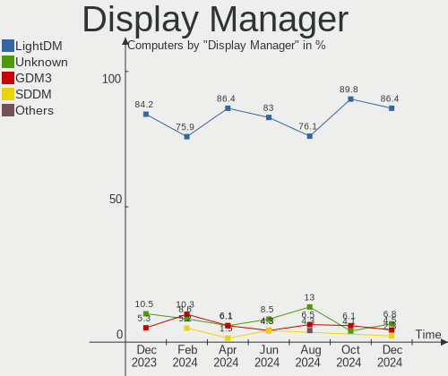
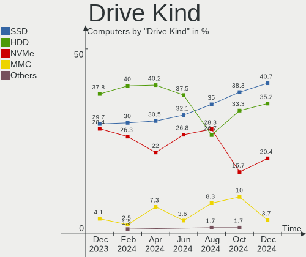
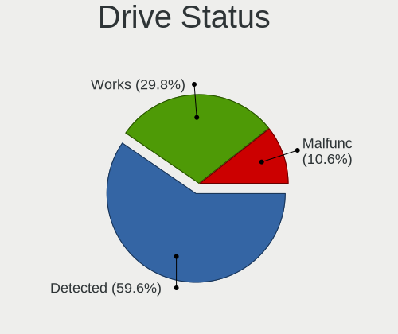
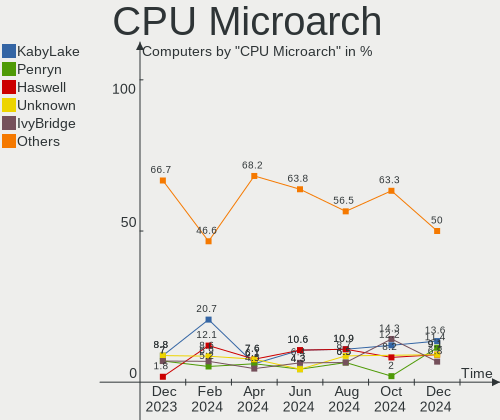
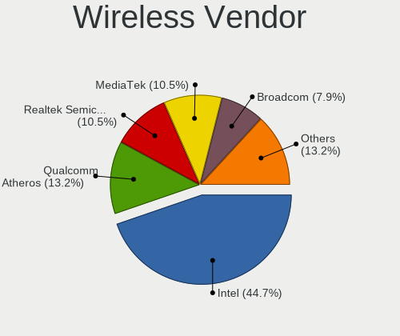

Xubuntu Hardware Trends
-----------------------

A project to identify most popular hardware characteristics and track their change
over time based on data collected by Xubuntu users at https://Linux-Hardware.org.

Anyone can contribute to this report by the [hw-probe](https://github.com/linuxhw/hw-probe) tool:

    sudo -E hw-probe -all -upload

This is a report for all computer types. See also reports for [desktops](/Dist/Xubuntu/Desktop/README.md) and [notebooks](/Dist/Xubuntu/Notebook/README.md).

Full-feature report is available here: https://linux-hardware.org/?view=trends

Period: Mar, 2022.

Contents
--------

* [ System ](#system)
  - [ OS                       ](#os)
  - [ OS Family                ](#os-family)
  - [ Kernel                   ](#kernel)
  - [ Kernel Family            ](#kernel-family)
  - [ Kernel Major Ver.        ](#kernel-major-ver)
  - [ Arch                     ](#arch)
  - [ DE                       ](#de)
  - [ Display Server           ](#display-server)
  - [ Display Manager          ](#display-manager)
  - [ OS Lang                  ](#os-lang)
  - [ Boot Mode                ](#boot-mode)
  - [ Filesystem               ](#filesystem)
  - [ Part. scheme             ](#part-scheme)
  - [ Dual Boot with Linux/BSD ](#dual-boot-with-linuxbsd)
  - [ Dual Boot (Win)          ](#dual-boot-win)

* [ Board ](#board)
  - [ Vendor                   ](#vendor)
  - [ Model                    ](#model)
  - [ Model Family             ](#model-family)
  - [ MFG Year                 ](#mfg-year)
  - [ Form Factor              ](#form-factor)
  - [ Secure Boot              ](#secure-boot)
  - [ Coreboot                 ](#coreboot)
  - [ RAM Size                 ](#ram-size)
  - [ RAM Used                 ](#ram-used)
  - [ Total Drives             ](#total-drives)
  - [ Has CD-ROM               ](#has-cd-rom)
  - [ Has Ethernet             ](#has-ethernet)
  - [ Has WiFi                 ](#has-wifi)
  - [ Has Bluetooth            ](#has-bluetooth)

* [ Location ](#location)
  - [ Country                  ](#country)
  - [ City                     ](#city)

* [ Drives ](#drives)
  - [ Drive Vendor             ](#drive-vendor)
  - [ Drive Model              ](#drive-model)
  - [ HDD Vendor               ](#hdd-vendor)
  - [ SSD Vendor               ](#ssd-vendor)
  - [ Drive Kind               ](#drive-kind)
  - [ Drive Connector          ](#drive-connector)
  - [ Drive Size               ](#drive-size)
  - [ Space Total              ](#space-total)
  - [ Space Used               ](#space-used)
  - [ Malfunc. Drives          ](#malfunc-drives)
  - [ Malfunc. Drive Vendor    ](#malfunc-drive-vendor)
  - [ Malfunc. HDD Vendor      ](#malfunc-hdd-vendor)
  - [ Malfunc. Drive Kind      ](#malfunc-drive-kind)
  - [ Failed Drives            ](#failed-drives)
  - [ Failed Drive Vendor      ](#failed-drive-vendor)
  - [ Drive Status             ](#drive-status)

* [ Storage controller ](#storage-controller)
  - [ Storage Vendor           ](#storage-vendor)
  - [ Storage Model            ](#storage-model)
  - [ Storage Kind             ](#storage-kind)

* [ Processor ](#processor)
  - [ CPU Vendor               ](#cpu-vendor)
  - [ CPU Model                ](#cpu-model)
  - [ CPU Model Family         ](#cpu-model-family)
  - [ CPU Cores                ](#cpu-cores)
  - [ CPU Sockets              ](#cpu-sockets)
  - [ CPU Threads              ](#cpu-threads)
  - [ CPU Op-Modes             ](#cpu-op-modes)
  - [ CPU Microcode            ](#cpu-microcode)
  - [ CPU Microarch            ](#cpu-microarch)

* [ Graphics ](#graphics)
  - [ GPU Vendor               ](#gpu-vendor)
  - [ GPU Model                ](#gpu-model)
  - [ GPU Combo                ](#gpu-combo)
  - [ GPU Driver               ](#gpu-driver)
  - [ GPU Memory               ](#gpu-memory)

* [ Monitor ](#monitor)
  - [ Monitor Vendor           ](#monitor-vendor)
  - [ Monitor Model            ](#monitor-model)
  - [ Monitor Resolution       ](#monitor-resolution)
  - [ Monitor Diagonal         ](#monitor-diagonal)
  - [ Monitor Width            ](#monitor-width)
  - [ Aspect Ratio             ](#aspect-ratio)
  - [ Monitor Area             ](#monitor-area)
  - [ Pixel Density            ](#pixel-density)
  - [ Multiple Monitors        ](#multiple-monitors)

* [ Network ](#network)
  - [ Net Controller Vendor    ](#net-controller-vendor)
  - [ Net Controller Model     ](#net-controller-model)
  - [ Wireless Vendor          ](#wireless-vendor)
  - [ Wireless Model           ](#wireless-model)
  - [ Ethernet Vendor          ](#ethernet-vendor)
  - [ Ethernet Model           ](#ethernet-model)
  - [ Net Controller Kind      ](#net-controller-kind)
  - [ Used Controller          ](#used-controller)
  - [ NICs                     ](#nics)
  - [ IPv6                     ](#ipv6)

* [ Bluetooth ](#bluetooth)
  - [ Bluetooth Vendor         ](#bluetooth-vendor)
  - [ Bluetooth Model          ](#bluetooth-model)

* [ Sound ](#sound)
  - [ Sound Vendor             ](#sound-vendor)
  - [ Sound Model              ](#sound-model)

* [ Memory ](#memory)
  - [ Memory Vendor            ](#memory-vendor)
  - [ Memory Model             ](#memory-model)
  - [ Memory Kind              ](#memory-kind)
  - [ Memory Form Factor       ](#memory-form-factor)
  - [ Memory Size              ](#memory-size)
  - [ Memory Speed             ](#memory-speed)

* [ Printers & scanners ](#printers--scanners)
  - [ Printer Vendor           ](#printer-vendor)
  - [ Printer Model            ](#printer-model)
  - [ Scanner Vendor           ](#scanner-vendor)
  - [ Scanner Model            ](#scanner-model)

* [ Camera ](#camera)
  - [ Camera Vendor            ](#camera-vendor)
  - [ Camera Model             ](#camera-model)

* [ Security ](#security)
  - [ Fingerprint Vendor       ](#fingerprint-vendor)
  - [ Fingerprint Model        ](#fingerprint-model)
  - [ Chipcard Vendor          ](#chipcard-vendor)
  - [ Chipcard Model           ](#chipcard-model)

* [ Unsupported ](#unsupported)
  - [ Unsupported Devices      ](#unsupported-devices)
  - [ Unsupported Device Types ](#unsupported-device-types)

System
------

OS
--

Installed operating systems

| Name          | Computers | Percent |
|---------------|-----------|---------|
| Xubuntu 20.04 | 48        | 66.67%  |
| Xubuntu 21.10 | 11        | 15.28%  |
| Xubuntu 18.04 | 10        | 13.89%  |
| Xubuntu 22.04 | 1         | 1.39%   |
| Xubuntu 21.04 | 1         | 1.39%   |
| Xubuntu 16.04 | 1         | 1.39%   |

OS Family
---------

OS without a version

| Name    | Computers | Percent |
|---------|-----------|---------|
| Xubuntu | 72        | 100%    |

Kernel
------

Version of the Linux kernel

| Version                    | Computers | Percent |
|----------------------------|-----------|---------|
| 5.13.0-35-generic          | 14        | 19.44%  |
| 5.13.0-37-generic          | 8         | 11.11%  |
| 5.13.0-30-generic          | 8         | 11.11%  |
| 5.4.0-104-generic          | 7         | 9.72%   |
| 5.4.0-100-generic          | 6         | 8.33%   |
| 5.4.0-105-generic          | 4         | 5.56%   |
| 5.4.0-100-lowlatency       | 2         | 2.78%   |
| 5.4.0-99-generic           | 1         | 1.39%   |
| 5.4.0-94-generic           | 1         | 1.39%   |
| 5.4.0-81-generic           | 1         | 1.39%   |
| 5.4.0-802109090909-generic | 1         | 1.39%   |
| 5.4.0-67-lowlatency        | 1         | 1.39%   |
| 5.4.0-52-generic           | 1         | 1.39%   |
| 5.4.0-1056-raspi           | 1         | 1.39%   |
| 5.4.0-104-lowlatency       | 1         | 1.39%   |
| 5.16.9-051609-generic      | 1         | 1.39%   |
| 5.16.0-amdgpu-znver2c+     | 1         | 1.39%   |
| 5.15.23-rockchip64         | 1         | 1.39%   |
| 5.13.0-39-generic          | 1         | 1.39%   |
| 5.13.0-35-lowlatency       | 1         | 1.39%   |
| 5.13.0-32-generic          | 1         | 1.39%   |
| 5.13.0-30-lowlatency       | 1         | 1.39%   |
| 5.13.0-19-generic          | 1         | 1.39%   |
| 5.13.0-1009-intel          | 1         | 1.39%   |
| 5.11.0-49-generic          | 1         | 1.39%   |
| 5.11.0-44-generic          | 1         | 1.39%   |
| 5.0.0-37-generic           | 1         | 1.39%   |
| 4.16.18-galliumos          | 1         | 1.39%   |
| 4.15.0-171-generic         | 1         | 1.39%   |
| 4.15.0-142-generic         | 1         | 1.39%   |

Kernel Family
-------------

Linux kernel without a distro release

| Version | Computers | Percent |
|---------|-----------|---------|
| 5.13.0  | 36        | 50%     |
| 5.4.0   | 27        | 37.5%   |
| 5.11.0  | 2         | 2.78%   |
| 4.15.0  | 2         | 2.78%   |
| 5.16.9  | 1         | 1.39%   |
| 5.16.0  | 1         | 1.39%   |
| 5.15.23 | 1         | 1.39%   |
| 5.0.0   | 1         | 1.39%   |
| 4.16.18 | 1         | 1.39%   |

Kernel Major Ver.
-----------------

Linux kernel major version

| Version | Computers | Percent |
|---------|-----------|---------|
| 5.13    | 36        | 50%     |
| 5.4     | 27        | 37.5%   |
| 5.16    | 2         | 2.78%   |
| 5.11    | 2         | 2.78%   |
| 4.15    | 2         | 2.78%   |
| 5.15    | 1         | 1.39%   |
| 5.0     | 1         | 1.39%   |
| 4.16    | 1         | 1.39%   |

Arch
----

OS architecture (x86_64, i586, etc.)

| Name    | Computers | Percent |
|---------|-----------|---------|
| x86_64  | 65        | 90.28%  |
| i686    | 5         | 6.94%   |
| aarch64 | 2         | 2.78%   |

DE
--

Desktop Environment

| Name  | Computers | Percent |
|-------|-----------|---------|
| XFCE  | 71        | 98.61%  |
| GNOME | 1         | 1.39%   |

Display Server
--------------

X11 or Wayland

| Name | Computers | Percent |
|------|-----------|---------|
| X11  | 71        | 98.61%  |
| Tty  | 1         | 1.39%   |

Display Manager
---------------

SDDM, LightDM, etc.

| Name    | Computers | Percent |
|---------|-----------|---------|
| LightDM | 58        | 80.56%  |
| Unknown | 7         | 9.72%   |
| GDM3    | 4         | 5.56%   |
| GDM     | 2         | 2.78%   |
| LXDM    | 1         | 1.39%   |

OS Lang
-------

Language

| Lang  | Computers | Percent |
|-------|-----------|---------|
| en_US | 30        | 41.67%  |
| fr_FR | 8         | 11.11%  |
| it_IT | 6         | 8.33%   |
| en_GB | 4         | 5.56%   |
| es_ES | 3         | 4.17%   |
| ru_RU | 2         | 2.78%   |
| en_CA | 2         | 2.78%   |
| en_AU | 2         | 2.78%   |
| de_DE | 2         | 2.78%   |
| cs_CZ | 2         | 2.78%   |
| sv_SE | 1         | 1.39%   |
| pt_BR | 1         | 1.39%   |
| ja_JP | 1         | 1.39%   |
| hu_HU | 1         | 1.39%   |
| fr_CH | 1         | 1.39%   |
| fr_CA | 1         | 1.39%   |
| es_MX | 1         | 1.39%   |
| en_ZA | 1         | 1.39%   |
| en_IN | 1         | 1.39%   |
| de_AT | 1         | 1.39%   |
| C     | 1         | 1.39%   |

Boot Mode
---------

EFI or BIOS

| Mode | Computers | Percent |
|------|-----------|---------|
| BIOS | 39        | 54.17%  |
| EFI  | 33        | 45.83%  |

Filesystem
----------

Type of filesystem

| Type    | Computers | Percent |
|---------|-----------|---------|
| Ext4    | 71        | 98.61%  |
| Overlay | 1         | 1.39%   |

Part. scheme
------------

Scheme of partitioning

| Type    | Computers | Percent |
|---------|-----------|---------|
| Unknown | 46        | 63.89%  |
| GPT     | 20        | 27.78%  |
| MBR     | 6         | 8.33%   |

Dual Boot with Linux/BSD
------------------------

Hosting more than one Linux/BSD

| Dual boot | Computers | Percent |
|-----------|-----------|---------|
| No        | 59        | 81.94%  |
| Yes       | 13        | 18.06%  |

Dual Boot (Win)
---------------

Hosting Linux and Windows

| Dual boot | Computers | Percent |
|-----------|-----------|---------|
| No        | 51        | 70.83%  |
| Yes       | 21        | 29.17%  |

Board
-----

Vendor
------

Motherboard manufacturer

| Name                    | Computers | Percent |
|-------------------------|-----------|---------|
| ASUSTek Computer        | 14        | 19.44%  |
| Dell                    | 11        | 15.28%  |
| Acer                    | 8         | 11.11%  |
| Hewlett-Packard         | 7         | 9.72%   |
| Lenovo                  | 6         | 8.33%   |
| Gigabyte Technology     | 4         | 5.56%   |
| Toshiba                 | 2         | 2.78%   |
| Samsung Electronics     | 2         | 2.78%   |
| Packard Bell            | 2         | 2.78%   |
| ASRock                  | 2         | 2.78%   |
| Teclast                 | 1         | 1.39%   |
| Rockchip                | 1         | 1.39%   |
| Raspberry Pi Foundation | 1         | 1.39%   |
| Pegatron                | 1         | 1.39%   |
| Notebook                | 1         | 1.39%   |
| MSI                     | 1         | 1.39%   |
| Medion                  | 1         | 1.39%   |
| HUAWEI                  | 1         | 1.39%   |
| GPU Company             | 1         | 1.39%   |
| Google                  | 1         | 1.39%   |
| Fujitsu Siemens         | 1         | 1.39%   |
| Fujitsu                 | 1         | 1.39%   |
| ECS                     | 1         | 1.39%   |
| Unknown                 | 1         | 1.39%   |

Model
-----

Motherboard model

| Name                                    | Computers | Percent |
|-----------------------------------------|-----------|---------|
| Packard Bell EasyNote TM85              | 2         | 2.78%   |
| Toshiba NB505                           | 1         | 1.39%   |
| Toshiba NB205                           | 1         | 1.39%   |
| Teclast F15 Plus                        | 1         | 1.39%   |
| Samsung R530/R730/R540                  | 1         | 1.39%   |
| Samsung R510/P510                       | 1         | 1.39%   |
| Rockchip RK3318 BOX                     | 1         | 1.39%   |
| RPi Raspberry Pi                        | 1         | 1.39%   |
| Pegatron KJ307AA-A2L a6452f             | 1         | 1.39%   |
| Notebook PC5x_7xHP_HR_HS                | 1         | 1.39%   |
| MSI MS-7A34                             | 1         | 1.39%   |
| Medion Crawler E25                      | 1         | 1.39%   |
| Lenovo ThinkPad X270 20HNS0LW00         | 1         | 1.39%   |
| Lenovo ThinkPad T450 20BUS06B00         | 1         | 1.39%   |
| Lenovo ThinkPad T14s Gen 1 20T1S8E400   | 1         | 1.39%   |
| Lenovo Legion 7 16ACHg6 82N6            | 1         | 1.39%   |
| Lenovo IdeaCentre A340-24IGM F0E7001SFR | 1         | 1.39%   |
| Lenovo B590 20208                       | 1         | 1.39%   |
| HUAWEI KPL-W0X                          | 1         | 1.39%   |
| HP ZBook 15                             | 1         | 1.39%   |
| HP t620 Quad Core TC                    | 1         | 1.39%   |
| HP Stream 11 Pro G2 Notebook PC         | 1         | 1.39%   |
| HP Notebook PC                          | 1         | 1.39%   |
| HP Laptop 15-ef2xxx                     | 1         | 1.39%   |
| HP EliteDesk 800 G1 USDT                | 1         | 1.39%   |
| HP EliteBook 2540p                      | 1         | 1.39%   |
| GPU Company GWTC116-2                   | 1         | 1.39%   |
| Google Banon                            | 1         | 1.39%   |
| Gigabyte H310M H 2.0                    | 1         | 1.39%   |
| Gigabyte GA-MA78GM-S2H                  | 1         | 1.39%   |
| Gigabyte E350N WIN8                     | 1         | 1.39%   |
| Gigabyte 8IPE775/-G                     | 1         | 1.39%   |
| Fujitsu Siemens AMILO Xi 3650           | 1         | 1.39%   |
| Fujitsu LIFEBOOK T939                   | 1         | 1.39%   |
| ECS H87H3-M                             | 1         | 1.39%   |
| Dell Vostro 3458                        | 1         | 1.39%   |
| Dell Studio 1450                        | 1         | 1.39%   |
| Dell Precision WorkStation T7400        | 1         | 1.39%   |
| Dell OptiPlex 9020                      | 1         | 1.39%   |
| Dell OptiPlex 760                       | 1         | 1.39%   |
| Dell Latitude E6430                     | 1         | 1.39%   |
| Dell Latitude E6400                     | 1         | 1.39%   |
| Dell Latitude 7490                      | 1         | 1.39%   |
| Dell Latitude 5510                      | 1         | 1.39%   |
| Dell Inspiron 7520                      | 1         | 1.39%   |
| Dell Inspiron 7437                      | 1         | 1.39%   |
| ASUS Z170I PRO GAMING                   | 1         | 1.39%   |
| ASUS X555LAB                            | 1         | 1.39%   |
| ASUS X501A                              | 1         | 1.39%   |
| ASUS X450CC                             | 1         | 1.39%   |
| ASUS VivoBook_ASUSLaptop E210MAB_R214MA | 1         | 1.39%   |
| ASUS U31SD                              | 1         | 1.39%   |
| ASUS TUF GAMING X570-PRO                | 1         | 1.39%   |
| ASUS ROG STRIX B450-F GAMING II         | 1         | 1.39%   |
| ASUS PRIME X370-PRO                     | 1         | 1.39%   |
| ASUS PRIME H270M-PLUS                   | 1         | 1.39%   |
| ASUS P8H61/USB3 R2.0                    | 1         | 1.39%   |
| ASUS K55VD                              | 1         | 1.39%   |
| ASUS K53SC                              | 1         | 1.39%   |
| ASUS A68HM-K                            | 1         | 1.39%   |

Model Family
------------

Motherboard model prefix

| Name                   | Computers | Percent |
|------------------------|-----------|---------|
| Acer Aspire            | 5         | 6.94%   |
| Dell Latitude          | 4         | 5.56%   |
| Lenovo ThinkPad        | 3         | 4.17%   |
| Packard Bell EasyNote  | 2         | 2.78%   |
| Dell OptiPlex          | 2         | 2.78%   |
| Dell Inspiron          | 2         | 2.78%   |
| ASUS PRIME             | 2         | 2.78%   |
| Toshiba NB505          | 1         | 1.39%   |
| Toshiba NB205          | 1         | 1.39%   |
| Teclast F15            | 1         | 1.39%   |
| Samsung R530           | 1         | 1.39%   |
| Samsung R510           | 1         | 1.39%   |
| Rockchip RK3318        | 1         | 1.39%   |
| RPi Raspberry          | 1         | 1.39%   |
| Pegatron KJ307AA-A2L   | 1         | 1.39%   |
| Notebook PC5x          | 1         | 1.39%   |
| MSI MS-7A34            | 1         | 1.39%   |
| Medion Crawler         | 1         | 1.39%   |
| Lenovo Legion          | 1         | 1.39%   |
| Lenovo IdeaCentre      | 1         | 1.39%   |
| Lenovo B590            | 1         | 1.39%   |
| HUAWEI KPL-W0X         | 1         | 1.39%   |
| HP ZBook               | 1         | 1.39%   |
| HP t620                | 1         | 1.39%   |
| HP Stream              | 1         | 1.39%   |
| HP Notebook            | 1         | 1.39%   |
| HP Laptop              | 1         | 1.39%   |
| HP EliteDesk           | 1         | 1.39%   |
| HP EliteBook           | 1         | 1.39%   |
| GPU Company GWTC116-2  | 1         | 1.39%   |
| Google Banon           | 1         | 1.39%   |
| Gigabyte H310M         | 1         | 1.39%   |
| Gigabyte GA-MA78GM-S2H | 1         | 1.39%   |
| Gigabyte E350N         | 1         | 1.39%   |
| Gigabyte 8IPE775       | 1         | 1.39%   |
| Fujitsu Siemens AMILO  | 1         | 1.39%   |
| Fujitsu LIFEBOOK       | 1         | 1.39%   |
| ECS H87H3-M            | 1         | 1.39%   |
| Dell Vostro            | 1         | 1.39%   |
| Dell Studio            | 1         | 1.39%   |
| Dell Precision         | 1         | 1.39%   |
| ASUS Z170I             | 1         | 1.39%   |
| ASUS X555LAB           | 1         | 1.39%   |
| ASUS X501A             | 1         | 1.39%   |
| ASUS X450CC            | 1         | 1.39%   |
| ASUS VivoBook          | 1         | 1.39%   |
| ASUS U31SD             | 1         | 1.39%   |
| ASUS TUF               | 1         | 1.39%   |
| ASUS ROG               | 1         | 1.39%   |
| ASUS P8H61             | 1         | 1.39%   |
| ASUS K55VD             | 1         | 1.39%   |
| ASUS K53SC             | 1         | 1.39%   |
| ASUS A68HM-K           | 1         | 1.39%   |
| ASRock B550            | 1         | 1.39%   |
| ASRock B450            | 1         | 1.39%   |
| Acer Veriton           | 1         | 1.39%   |
| Acer TP-SW5-012-16UW   | 1         | 1.39%   |
| Acer Nitro             | 1         | 1.39%   |
| Unknown                | 1         | 1.39%   |

MFG Year
--------

Motherboard manufacture year

| Year    | Computers | Percent |
|---------|-----------|---------|
| 2021    | 9         | 12.5%   |
| 2013    | 7         | 9.72%   |
| 2020    | 6         | 8.33%   |
| 2012    | 6         | 8.33%   |
| 2011    | 6         | 8.33%   |
| 2008    | 6         | 8.33%   |
| 2018    | 5         | 6.94%   |
| 2017    | 4         | 5.56%   |
| 2016    | 4         | 5.56%   |
| 2014    | 4         | 5.56%   |
| 2010    | 4         | 5.56%   |
| 2009    | 4         | 5.56%   |
| 2019    | 2         | 2.78%   |
| 2015    | 2         | 2.78%   |
| Unknown | 2         | 2.78%   |
| 2005    | 1         | 1.39%   |

Form Factor
-----------

Physical design of the computer

| Name           | Computers | Percent |
|----------------|-----------|---------|
| Notebook       | 43        | 59.72%  |
| Desktop        | 25        | 34.72%  |
| System on chip | 2         | 2.78%   |
| Convertible    | 1         | 1.39%   |
| All in one     | 1         | 1.39%   |

Secure Boot
-----------

Enabled or disabled

| State    | Computers | Percent |
|----------|-----------|---------|
| Disabled | 63        | 87.5%   |
| Enabled  | 9         | 12.5%   |

Coreboot
--------

Have coreboot on board

| Used | Computers | Percent |
|------|-----------|---------|
| No   | 71        | 98.61%  |
| Yes  | 1         | 1.39%   |

RAM Size
--------

Total RAM memory

| Size in GB  | Computers | Percent |
|-------------|-----------|---------|
| 4.01-8.0    | 20        | 27.78%  |
| 3.01-4.0    | 18        | 25%     |
| 8.01-16.0   | 11        | 15.28%  |
| 32.01-64.0  | 8         | 11.11%  |
| 16.01-24.0  | 7         | 9.72%   |
| 0.51-1.0    | 3         | 4.17%   |
| 64.01-256.0 | 2         | 2.78%   |
| 1.01-2.0    | 2         | 2.78%   |
| 24.01-32.0  | 1         | 1.39%   |

RAM Used
--------

Used RAM memory

| Used GB   | Computers | Percent |
|-----------|-----------|---------|
| 1.01-2.0  | 34        | 47.22%  |
| 4.01-8.0  | 11        | 15.28%  |
| 2.01-3.0  | 8         | 11.11%  |
| 0.51-1.0  | 8         | 11.11%  |
| 3.01-4.0  | 6         | 8.33%   |
| 8.01-16.0 | 3         | 4.17%   |
| 0.01-0.5  | 2         | 2.78%   |

Total Drives
------------

Number of drives on board

| Drives | Computers | Percent |
|--------|-----------|---------|
| 1      | 48        | 66.67%  |
| 2      | 17        | 23.61%  |
| 3      | 5         | 6.94%   |
| 9      | 1         | 1.39%   |
| 6      | 1         | 1.39%   |

Has CD-ROM
----------

Has CD-ROM on board

| Presented | Computers | Percent |
|-----------|-----------|---------|
| No        | 38        | 52.78%  |
| Yes       | 34        | 47.22%  |

Has Ethernet
------------

Has Ethernet on board

| Presented | Computers | Percent |
|-----------|-----------|---------|
| Yes       | 61        | 84.72%  |
| No        | 11        | 15.28%  |

Has WiFi
--------

Has WiFi module

| Presented | Computers | Percent |
|-----------|-----------|---------|
| Yes       | 55        | 76.39%  |
| No        | 17        | 23.61%  |

Has Bluetooth
-------------

Has Bluetooth module

| Presented | Computers | Percent |
|-----------|-----------|---------|
| Yes       | 37        | 51.39%  |
| No        | 35        | 48.61%  |

Location
--------

Country
-------

Geographic location (country)

| Country      | Computers | Percent |
|--------------|-----------|---------|
| USA          | 18        | 25%     |
| France       | 8         | 11.11%  |
| Italy        | 6         | 8.33%   |
| Germany      | 5         | 6.94%   |
| UK           | 4         | 5.56%   |
| Russia       | 4         | 5.56%   |
| Spain        | 3         | 4.17%   |
| Mexico       | 3         | 4.17%   |
| Canada       | 3         | 4.17%   |
| Czechia      | 2         | 2.78%   |
| Australia    | 2         | 2.78%   |
| Venezuela    | 1         | 1.39%   |
| Thailand     | 1         | 1.39%   |
| Switzerland  | 1         | 1.39%   |
| Sweden       | 1         | 1.39%   |
| South Africa | 1         | 1.39%   |
| Slovenia     | 1         | 1.39%   |
| Netherlands  | 1         | 1.39%   |
| Japan        | 1         | 1.39%   |
| India        | 1         | 1.39%   |
| Hungary      | 1         | 1.39%   |
| Colombia     | 1         | 1.39%   |
| Brazil       | 1         | 1.39%   |
| Belgium      | 1         | 1.39%   |
| Austria      | 1         | 1.39%   |

City
----

Geographic location (city)

| City                      | Computers | Percent |
|---------------------------|-----------|---------|
| Walsall                   | 2         | 2.78%   |
| Neumarkt in der Oberpfalz | 2         | 2.78%   |
| Moscow                    | 2         | 2.78%   |
| Milan                     | 2         | 2.78%   |
| Zlín                     | 1         | 1.39%   |
| Yabu                      | 1         | 1.39%   |
| Winnipeg                  | 1         | 1.39%   |
| Wickford                  | 1         | 1.39%   |
| Washington                | 1         | 1.39%   |
| Vilafranca del Penedès   | 1         | 1.39%   |
| Vienna                    | 1         | 1.39%   |
| Ulyanovsk                 | 1         | 1.39%   |
| Tuineje                   | 1         | 1.39%   |
| Toronto                   | 1         | 1.39%   |
| Tijuana                   | 1         | 1.39%   |
| Talence                   | 1         | 1.39%   |
| Sept-Iles                 | 1         | 1.39%   |
| Savenay                   | 1         | 1.39%   |
| Santiago de Cali          | 1         | 1.39%   |
| San Giovanni Lupatoto     | 1         | 1.39%   |
| Saginaw                   | 1         | 1.39%   |
| Roseville                 | 1         | 1.39%   |
| Roseburg                  | 1         | 1.39%   |
| Queens                    | 1         | 1.39%   |
| Pretoria                  | 1         | 1.39%   |
| Portland                  | 1         | 1.39%   |
| Pittsfield                | 1         | 1.39%   |
| Peine                     | 1         | 1.39%   |
| Payson                    | 1         | 1.39%   |
| Pardubice                 | 1         | 1.39%   |
| Nashville                 | 1         | 1.39%   |
| Morsang-sur-Orge          | 1         | 1.39%   |
| Morganton                 | 1         | 1.39%   |
| Mesa                      | 1         | 1.39%   |
| Melbourne                 | 1         | 1.39%   |
| Madrid                    | 1         | 1.39%   |
| Lorient                   | 1         | 1.39%   |
| Ljubljana                 | 1         | 1.39%   |
| León                     | 1         | 1.39%   |
| Lentfohrden               | 1         | 1.39%   |
| La Tour-de-Peilz          | 1         | 1.39%   |
| Knoxville                 | 1         | 1.39%   |
| King George               | 1         | 1.39%   |
| Juazeiro do Norte         | 1         | 1.39%   |
| Jefferson                 | 1         | 1.39%   |
| Jamestown                 | 1         | 1.39%   |
| Huntingdon                | 1         | 1.39%   |
| Houston                   | 1         | 1.39%   |
| Hochfelden                | 1         | 1.39%   |
| Gothenburg                | 1         | 1.39%   |
| Genoa                     | 1         | 1.39%   |
| Geelong                   | 1         | 1.39%   |
| Florence                  | 1         | 1.39%   |
| Dunaharaszti              | 1         | 1.39%   |
| Donetsk                   | 1         | 1.39%   |
| Diss                      | 1         | 1.39%   |
| Chula Vista               | 1         | 1.39%   |
| Chennai                   | 1         | 1.39%   |
| Brussels                  | 1         | 1.39%   |
| Brest                     | 1         | 1.39%   |

Drives
------

Drive Vendor
------------

Hard drive vendors

| Vendor              | Computers | Drives | Percent |
|---------------------|-----------|--------|---------|
| Seagate             | 19        | 27     | 19.39%  |
| WDC                 | 15        | 17     | 15.31%  |
| Samsung Electronics | 15        | 15     | 15.31%  |
| Unknown             | 6         | 6      | 6.12%   |
| Toshiba             | 5         | 5      | 5.1%    |
| A-DATA Technology   | 4         | 4      | 4.08%   |
| SanDisk             | 3         | 3      | 3.06%   |
| Hitachi             | 3         | 4      | 3.06%   |
| Transcend           | 2         | 2      | 2.04%   |
| SK Hynix            | 2         | 2      | 2.04%   |
| MAXTOR              | 2         | 2      | 2.04%   |
| Kingston            | 2         | 2      | 2.04%   |
| Intel               | 2         | 2      | 2.04%   |
| HGST                | 2         | 2      | 2.04%   |
| Unknown             | 2         | 2      | 2.04%   |
| Verbatim            | 1         | 1      | 1.02%   |
| Teclast             | 1         | 1      | 1.02%   |
| Super Talent        | 1         | 1      | 1.02%   |
| Pioneer             | 1         | 1      | 1.02%   |
| Phison              | 1         | 1      | 1.02%   |
| Patriot             | 1         | 1      | 1.02%   |
| Micron Technology   | 1         | 1      | 1.02%   |
| LaCie               | 1         | 1      | 1.02%   |
| KIOXIA              | 1         | 1      | 1.02%   |
| Fujitsu             | 1         | 1      | 1.02%   |
| Crucial             | 1         | 1      | 1.02%   |
| CHN25SATAS1         | 1         | 1      | 1.02%   |
| ASMedia             | 1         | 1      | 1.02%   |
| Apacer              | 1         | 1      | 1.02%   |

Drive Model
-----------

Hard drive models

| Model                                       | Computers | Percent |
|---------------------------------------------|-----------|---------|
| Seagate ST500LT012-9WS142 500GB             | 2         | 1.87%   |
| Seagate ST500LT012-1DG142 500GB             | 2         | 1.87%   |
| Seagate ST1000LM024 HN-M101MBB 1TB          | 2         | 1.87%   |
| Samsung SSD 860 EVO 250GB                   | 2         | 1.87%   |
| Unknown                                     | 2         | 1.87%   |
| WDC WDS240G2G0B-00EPW0 240GB SSD            | 1         | 0.93%   |
| WDC WDS240G2G0A-00JH30 240GB SSD            | 1         | 0.93%   |
| WDC WDS200T2B0B-00YS70 2TB SSD              | 1         | 0.93%   |
| WDC WDS120G2G0A-00JH30 120GB SSD            | 1         | 0.93%   |
| WDC WDS100T2G0A-00JH30 1TB SSD              | 1         | 0.93%   |
| WDC WDBNCE0010PNC 1TB SSD                   | 1         | 0.93%   |
| WDC WD800JD-00LSA0 80GB                     | 1         | 0.93%   |
| WDC WD5000BEVT-22ZAT0 500GB                 | 1         | 0.93%   |
| WDC WD5000AAKS-00YGA0 500GB                 | 1         | 0.93%   |
| WDC WD40EZRZ-00GXCB0 4TB                    | 1         | 0.93%   |
| WDC WD3200AAKS-75SBA0 320GB                 | 1         | 0.93%   |
| WDC WD10JPVX-22JC3T0 1TB                    | 1         | 0.93%   |
| WDC WD10EVDS-63N5B1 1TB                     | 1         | 0.93%   |
| WDC WD10EADX-22TDHB0 1TB                    | 1         | 0.93%   |
| WDC WD10EADS-11P8B1 1TB                     | 1         | 0.93%   |
| WDC WD1002FAEX-00Z3A0 1TB                   | 1         | 0.93%   |
| Verbatim Vi550 S3 128GB SSD                 | 1         | 0.93%   |
| Unknown MMC Card  64GB                      | 1         | 0.93%   |
| Unknown MMC Card  32GB                      | 1         | 0.93%   |
| Unknown MMC Card  16GB                      | 1         | 0.93%   |
| Unknown MMC Card  128GB                     | 1         | 0.93%   |
| Unknown M0S002  64GB                        | 1         | 0.93%   |
| Unknown 128G32  128GB                       | 1         | 0.93%   |
| Transcend TS240GSSD220S 240GB               | 1         | 0.93%   |
| Transcend TS120GMTS420S 120GB SSD           | 1         | 0.93%   |
| Toshiba MQ04ABF100 1TB                      | 1         | 0.93%   |
| Toshiba MQ01ABD100V 1TB                     | 1         | 0.93%   |
| Toshiba MQ01ABD100 1TB                      | 1         | 0.93%   |
| Toshiba MK1655GSX 160GB                     | 1         | 0.93%   |
| Toshiba HDWJ105 500GB                       | 1         | 0.93%   |
| Teclast BD256GB SHCB-2280 SSD               | 1         | 0.93%   |
| Super Talent FTM51N325H 512GB SSD           | 1         | 0.93%   |
| SK Hynix HFM128GDHTNG-8310B 128GB           | 1         | 0.93%   |
| SK Hynix HCG8e  64GB                        | 1         | 0.93%   |
| Seagate ST980411ASG 80GB                    | 1         | 0.93%   |
| Seagate ST9500420ASG 500GB                  | 1         | 0.93%   |
| Seagate ST500VT000-1DK142 500GB             | 1         | 0.93%   |
| Seagate ST500LT032-1E9142 500GB             | 1         | 0.93%   |
| Seagate ST500LM030-2E717D 500GB             | 1         | 0.93%   |
| Seagate ST500LM021-1KJ152 500GB             | 1         | 0.93%   |
| Seagate ST500LM012 HN-M500MBB 500GB         | 1         | 0.93%   |
| Seagate ST500LM000-1EJ162 500GB             | 1         | 0.93%   |
| Seagate ST5000NM0084 00FN169 00FN172IBM 5TB | 1         | 0.93%   |
| Seagate ST4000LM024-2AN17V 4TB              | 1         | 0.93%   |
| Seagate ST4000DM000-1F2168 4TB              | 1         | 0.93%   |
| Seagate ST3500418AS 500GB                   | 1         | 0.93%   |
| Seagate ST2000VX008-2E3164 2TB              | 1         | 0.93%   |
| Seagate ST2000LM007-1R8174 2TB              | 1         | 0.93%   |
| Seagate ST2000DM006-2DM164 2TB              | 1         | 0.93%   |
| Seagate ST2000DL003-9VT166 2TB              | 1         | 0.93%   |
| Seagate ST1000LM035-1RK172 1TB              | 1         | 0.93%   |
| Seagate ST1000DM003-1ER162 1TB              | 1         | 0.93%   |
| Seagate ST1000DM003-1CH162 1TB              | 1         | 0.93%   |
| Seagate BUP Ultra Touch 2TB                 | 1         | 0.93%   |
| SanDisk Ultra II 250GB SSD                  | 1         | 0.93%   |

HDD Vendor
----------

Hard disk drive vendors

| Vendor              | Computers | Drives | Percent |
|---------------------|-----------|--------|---------|
| Seagate             | 19        | 27     | 44.19%  |
| WDC                 | 9         | 10     | 20.93%  |
| Toshiba             | 5         | 5      | 11.63%  |
| Hitachi             | 3         | 4      | 6.98%   |
| MAXTOR              | 2         | 2      | 4.65%   |
| HGST                | 2         | 2      | 4.65%   |
| Samsung Electronics | 1         | 1      | 2.33%   |
| Fujitsu             | 1         | 1      | 2.33%   |
| ASMedia             | 1         | 1      | 2.33%   |

SSD Vendor
----------

Solid state drive vendors

| Vendor              | Computers | Drives | Percent |
|---------------------|-----------|--------|---------|
| Samsung Electronics | 9         | 9      | 28.13%  |
| WDC                 | 6         | 7      | 18.75%  |
| SanDisk             | 3         | 3      | 9.38%   |
| Transcend           | 2         | 2      | 6.25%   |
| Kingston            | 2         | 2      | 6.25%   |
| Intel               | 2         | 2      | 6.25%   |
| Verbatim            | 1         | 1      | 3.13%   |
| Teclast             | 1         | 1      | 3.13%   |
| Super Talent        | 1         | 1      | 3.13%   |
| Pioneer             | 1         | 1      | 3.13%   |
| Patriot             | 1         | 1      | 3.13%   |
| Micron Technology   | 1         | 1      | 3.13%   |
| Crucial             | 1         | 1      | 3.13%   |
| A-DATA Technology   | 1         | 1      | 3.13%   |

Drive Kind
----------

HDD or SSD

| Kind    | Computers | Drives | Percent |
|---------|-----------|--------|---------|
| HDD     | 36        | 53     | 40.91%  |
| SSD     | 30        | 33     | 34.09%  |
| NVMe    | 11        | 12     | 12.5%   |
| MMC     | 9         | 9      | 10.23%  |
| Unknown | 2         | 2      | 2.27%   |

Drive Connector
---------------

SATA, SAS, NVMe, etc.

| Type | Computers | Drives | Percent |
|------|-----------|--------|---------|
| SATA | 55        | 83     | 68.75%  |
| NVMe | 11        | 12     | 13.75%  |
| MMC  | 9         | 9      | 11.25%  |
| SAS  | 5         | 5      | 6.25%   |

Drive Size
----------

Size of hard drive

| Size in TB | Computers | Drives | Percent |
|------------|-----------|--------|---------|
| 0.01-0.5   | 44        | 54     | 62.86%  |
| 0.51-1.0   | 17        | 21     | 24.29%  |
| 1.01-2.0   | 5         | 7      | 7.14%   |
| 3.01-4.0   | 3         | 3      | 4.29%   |
| 4.01-10.0  | 1         | 1      | 1.43%   |

Space Total
-----------

Amount of disk space available on the file system

| Size in GB     | Computers | Percent |
|----------------|-----------|---------|
| 101-250        | 23        | 31.94%  |
| 251-500        | 16        | 22.22%  |
| 51-100         | 8         | 11.11%  |
| 501-1000       | 7         | 9.72%   |
| More than 3000 | 6         | 8.33%   |
| 1001-2000      | 5         | 6.94%   |
| 2001-3000      | 3         | 4.17%   |
| 21-50          | 2         | 2.78%   |
| 1-20           | 2         | 2.78%   |

Space Used
----------

Amount of used disk space

| Used GB        | Computers | Percent |
|----------------|-----------|---------|
| 1-20           | 26        | 36.11%  |
| 21-50          | 13        | 18.06%  |
| 101-250        | 10        | 13.89%  |
| 51-100         | 7         | 9.72%   |
| 251-500        | 5         | 6.94%   |
| 501-1000       | 5         | 6.94%   |
| 1001-2000      | 3         | 4.17%   |
| More than 3000 | 2         | 2.78%   |
| 2001-3000      | 1         | 1.39%   |

Malfunc. Drives
---------------

Drive models with a malfunction

| Model                              | Computers | Drives | Percent |
|------------------------------------|-----------|--------|---------|
| Seagate ST1000LM024 HN-M101MBB 1TB | 2         | 2      | 40%     |
| Seagate ST9500420ASG 500GB         | 1         | 1      | 20%     |
| Seagate ST500LT012-9WS142 500GB    | 1         | 1      | 20%     |
| Seagate ST500LM021-1KJ152 500GB    | 1         | 1      | 20%     |

Malfunc. Drive Vendor
---------------------

Vendors of faulty drives

| Vendor  | Computers | Drives | Percent |
|---------|-----------|--------|---------|
| Seagate | 5         | 5      | 100%    |

Malfunc. HDD Vendor
-------------------

Vendors of faulty HDD drives

| Vendor  | Computers | Drives | Percent |
|---------|-----------|--------|---------|
| Seagate | 5         | 5      | 100%    |

Malfunc. Drive Kind
-------------------

Kinds of faulty drives

| Kind | Computers | Drives | Percent |
|------|-----------|--------|---------|
| HDD  | 5         | 5      | 100%    |

Failed Drives
-------------

Failed drive models

Zero info for selected period =(

Failed Drive Vendor
-------------------

Failed drive vendors

Zero info for selected period =(

Drive Status
------------

Number of failed and malfunc. drives

| Status   | Computers | Drives | Percent |
|----------|-----------|--------|---------|
| Detected | 52        | 72     | 67.53%  |
| Works    | 20        | 32     | 25.97%  |
| Malfunc  | 5         | 5      | 6.49%   |

Storage controller
------------------

Storage Vendor
--------------

Storage controller vendors

| Vendor                    | Computers | Percent |
|---------------------------|-----------|---------|
| Intel                     | 45        | 60.81%  |
| AMD                       | 14        | 18.92%  |
| Samsung Electronics       | 5         | 6.76%   |
| Phison Electronics        | 2         | 2.7%    |
| ASMedia Technology        | 2         | 2.7%    |
| ADATA Technology          | 2         | 2.7%    |
| SK Hynix                  | 1         | 1.35%   |
| Realtek Semiconductor     | 1         | 1.35%   |
| LSI Logic / Symbios Logic | 1         | 1.35%   |
| KIOXIA                    | 1         | 1.35%   |

Storage Model
-------------

Storage controller models

| Model                                                                                   | Computers | Percent |
|-----------------------------------------------------------------------------------------|-----------|---------|
| AMD FCH SATA Controller [AHCI mode]                                                     | 10        | 11.63%  |
| Intel 82801 Mobile SATA Controller [RAID mode]                                          | 4         | 4.65%   |
| Intel 8 Series/C220 Series Chipset Family 6-port SATA Controller 1 [AHCI mode]          | 4         | 4.65%   |
| Intel 7 Series Chipset Family 6-port SATA Controller [AHCI mode]                        | 4         | 4.65%   |
| Samsung NVMe SSD Controller SM981/PM981/PM983                                           | 3         | 3.49%   |
| Intel Wildcat Point-LP SATA Controller [AHCI Mode]                                      | 3         | 3.49%   |
| Intel Celeron/Pentium Silver Processor SATA Controller                                  | 3         | 3.49%   |
| Intel Sunrise Point-LP SATA Controller [AHCI mode]                                      | 2         | 2.33%   |
| Intel NM10/ICH7 Family SATA Controller [AHCI mode]                                      | 2         | 2.33%   |
| Intel 82801IBM/IEM (ICH9M/ICH9M-E) 4 port SATA Controller [AHCI mode]                   | 2         | 2.33%   |
| Intel 82801G (ICH7 Family) IDE Controller                                               | 2         | 2.33%   |
| Intel 6 Series/C200 Series Chipset Family 6 port Mobile SATA AHCI Controller            | 2         | 2.33%   |
| Intel 5 Series/3400 Series Chipset 4 port SATA IDE Controller                           | 2         | 2.33%   |
| Intel 5 Series/3400 Series Chipset 4 port SATA AHCI Controller                          | 2         | 2.33%   |
| Intel 5 Series/3400 Series Chipset 2 port SATA IDE Controller                           | 2         | 2.33%   |
| Intel 200 Series PCH SATA controller [AHCI mode]                                        | 2         | 2.33%   |
| ADATA XPG SX8200 Pro PCIe Gen3x4 M.2 2280 Solid State Drive                             | 2         | 2.33%   |
| SK Hynix BC501 NVMe Solid State Drive                                                   | 1         | 1.16%   |
| Samsung NVMe SSD Controller SM961/PM961/SM963                                           | 1         | 1.16%   |
| Samsung NVMe SSD Controller PM9A1/PM9A3/980PRO                                          | 1         | 1.16%   |
| Realtek Realtek Non-Volatile memory controller                                          | 1         | 1.16%   |
| Phison PS5013 E13 NVMe Controller                                                       | 1         | 1.16%   |
| Phison E12 NVMe Controller                                                              | 1         | 1.16%   |
| LSI Logic / Symbios Logic SAS1068E PCI-Express Fusion-MPT SAS                           | 1         | 1.16%   |
| KIOXIA Non-Volatile memory controller                                                   | 1         | 1.16%   |
| Intel SATA Controller [RAID mode]                                                       | 1         | 1.16%   |
| Intel Q170/Q150/B150/H170/H110/Z170/CM236 Chipset SATA Controller [AHCI Mode]           | 1         | 1.16%   |
| Intel NM10/ICH7 Family SATA Controller [IDE mode]                                       | 1         | 1.16%   |
| Intel Mobile 4 Series Chipset PT IDER Controller                                        | 1         | 1.16%   |
| Intel Comet Lake SATA AHCI Controller                                                   | 1         | 1.16%   |
| Intel 82801JD/DO (ICH10 Family) SATA AHCI Controller                                    | 1         | 1.16%   |
| Intel 82801IBM/IEM (ICH9M/ICH9M-E) 2 port SATA Controller [IDE mode]                    | 1         | 1.16%   |
| Intel 82801GBM/GHM (ICH7-M Family) SATA Controller [IDE mode]                           | 1         | 1.16%   |
| Intel 82801GBM/GHM (ICH7-M Family) SATA Controller [AHCI mode]                          | 1         | 1.16%   |
| Intel 82801EB (ICH5) SATA Controller                                                    | 1         | 1.16%   |
| Intel 8 Series SATA Controller 1 [AHCI mode]                                            | 1         | 1.16%   |
| Intel 631xESB/632xESB SATA AHCI Controller                                              | 1         | 1.16%   |
| Intel 631xESB/632xESB IDE Controller                                                    | 1         | 1.16%   |
| Intel 6 Series/C200 Series Chipset Family IDE-r Controller                              | 1         | 1.16%   |
| Intel 6 Series/C200 Series Chipset Family Desktop SATA Controller (IDE mode, ports 4-5) | 1         | 1.16%   |
| Intel 6 Series/C200 Series Chipset Family Desktop SATA Controller (IDE mode, ports 0-3) | 1         | 1.16%   |
| Intel 6 Series/C200 Series Chipset Family 6 port Desktop SATA AHCI Controller           | 1         | 1.16%   |
| Intel 4 Series Chipset PT IDER Controller                                               | 1         | 1.16%   |
| ASMedia SATA controller                                                                 | 1         | 1.16%   |
| ASMedia ASM1062 Serial ATA Controller                                                   | 1         | 1.16%   |
| AMD X370 Series Chipset SATA Controller                                                 | 1         | 1.16%   |
| AMD SB7x0/SB8x0/SB9x0 SATA Controller [IDE mode]                                        | 1         | 1.16%   |
| AMD SB7x0/SB8x0/SB9x0 SATA Controller [AHCI mode]                                       | 1         | 1.16%   |
| AMD SB7x0/SB8x0/SB9x0 IDE Controller                                                    | 1         | 1.16%   |
| AMD 500 Series Chipset SATA Controller                                                  | 1         | 1.16%   |
| AMD 400 Series Chipset SATA Controller                                                  | 1         | 1.16%   |
| AMD 300 Series Chipset SATA Controller                                                  | 1         | 1.16%   |

Storage Kind
------------

Kind of storage controller (IDE, SATA, NVMe, SAS, ...)

| Kind | Computers | Percent |
|------|-----------|---------|
| SATA | 47        | 61.84%  |
| IDE  | 12        | 15.79%  |
| NVMe | 11        | 14.47%  |
| RAID | 5         | 6.58%   |
| SCSI | 1         | 1.32%   |

Processor
---------

CPU Vendor
----------

Processor vendors

| Vendor | Computers | Percent |
|--------|-----------|---------|
| Intel  | 54        | 75%     |
| AMD    | 16        | 22.22%  |
| ARM    | 2         | 2.78%   |

CPU Model
---------

Processor models

| Model                                         | Computers | Percent |
|-----------------------------------------------|-----------|---------|
| Intel Core i5-10310U CPU @ 1.70GHz            | 2         | 2.78%   |
| Intel Core i5 CPU M 460 @ 2.53GHz             | 2         | 2.78%   |
| Intel Core i3-2330M CPU @ 2.20GHz             | 2         | 2.78%   |
| Intel Core 2 Duo CPU P8400 @ 2.26GHz          | 2         | 2.78%   |
| Intel Celeron N4020 CPU @ 1.10GHz             | 2         | 2.78%   |
| ARM Processor                                 | 2         | 2.78%   |
| AMD Ryzen 7 1700 Eight-Core Processor         | 2         | 2.78%   |
| AMD Ryzen 5 2500U with Radeon Vega Mobile Gfx | 2         | 2.78%   |
| Intel Xeon CPU E5420 @ 2.50GHz                | 1         | 1.39%   |
| Intel Pentium Silver J5005 CPU @ 1.50GHz      | 1         | 1.39%   |
| Intel Pentium Dual-Core CPU E6700 @ 3.20GHz   | 1         | 1.39%   |
| Intel Pentium 4 CPU 3.00GHz                   | 1         | 1.39%   |
| Intel Core i7-6700K CPU @ 4.00GHz             | 1         | 1.39%   |
| Intel Core i7-4700MQ CPU @ 2.40GHz            | 1         | 1.39%   |
| Intel Core i7-3770 CPU @ 3.40GHz              | 1         | 1.39%   |
| Intel Core i7-3630QM CPU @ 2.40GHz            | 1         | 1.39%   |
| Intel Core i7-2670QM CPU @ 2.20GHz            | 1         | 1.39%   |
| Intel Core i7 CPU L 640 @ 2.13GHz             | 1         | 1.39%   |
| Intel Core i5-9500 CPU @ 3.00GHz              | 1         | 1.39%   |
| Intel Core i5-8350U CPU @ 1.70GHz             | 1         | 1.39%   |
| Intel Core i5-8265U CPU @ 1.60GHz             | 1         | 1.39%   |
| Intel Core i5-7500 CPU @ 3.40GHz              | 1         | 1.39%   |
| Intel Core i5-7300U CPU @ 2.60GHz             | 1         | 1.39%   |
| Intel Core i5-6200U CPU @ 2.30GHz             | 1         | 1.39%   |
| Intel Core i5-5300U CPU @ 2.30GHz             | 1         | 1.39%   |
| Intel Core i5-5200U CPU @ 2.20GHz             | 1         | 1.39%   |
| Intel Core i5-4590 CPU @ 3.30GHz              | 1         | 1.39%   |
| Intel Core i5-4570S CPU @ 2.90GHz             | 1         | 1.39%   |
| Intel Core i5-4440 CPU @ 3.10GHz              | 1         | 1.39%   |
| Intel Core i5-4210U CPU @ 1.70GHz             | 1         | 1.39%   |
| Intel Core i5-3340M CPU @ 2.70GHz             | 1         | 1.39%   |
| Intel Core i5-3230M CPU @ 2.60GHz             | 1         | 1.39%   |
| Intel Core i5-2500 CPU @ 3.30GHz              | 1         | 1.39%   |
| Intel Core i3-3217U CPU @ 1.80GHz             | 1         | 1.39%   |
| Intel Core i3-3110M CPU @ 2.40GHz             | 1         | 1.39%   |
| Intel Core i3 CPU M 380 @ 2.53GHz             | 1         | 1.39%   |
| Intel Core 2 Quad CPU Q6600 @ 2.40GHz         | 1         | 1.39%   |
| Intel Core 2 Duo CPU T6400 @ 2.00GHz          | 1         | 1.39%   |
| Intel Core 2 Duo CPU T5750 @ 2.00GHz          | 1         | 1.39%   |
| Intel Core 2 Duo CPU P8800 @ 2.66GHz          | 1         | 1.39%   |
| Intel Core 2 Duo CPU E8400 @ 3.00GHz          | 1         | 1.39%   |
| Intel Celeron N4120 CPU @ 1.10GHz             | 1         | 1.39%   |
| Intel Celeron CPU N3160 @ 1.60GHz             | 1         | 1.39%   |
| Intel Celeron CPU N3050 @ 1.60GHz             | 1         | 1.39%   |
| Intel Celeron 3205U @ 1.50GHz                 | 1         | 1.39%   |
| Intel Atom x5-Z8350 CPU @ 1.44GHz             | 1         | 1.39%   |
| Intel Atom CPU Z3735F @ 1.33GHz               | 1         | 1.39%   |
| Intel Atom CPU N455 @ 1.66GHz                 | 1         | 1.39%   |
| Intel Atom CPU N280 @ 1.66GHz                 | 1         | 1.39%   |
| Intel Atom CPU N270 @ 1.60GHz                 | 1         | 1.39%   |
| Intel Atom CPU D525 @ 1.80GHz                 | 1         | 1.39%   |
| Intel 11th Gen Core i7-11800H @ 2.30GHz       | 1         | 1.39%   |
| AMD Ryzen 9 5900HX with Radeon Graphics       | 1         | 1.39%   |
| AMD Ryzen 9 3900X 12-Core Processor           | 1         | 1.39%   |
| AMD Ryzen 7 5800X 8-Core Processor            | 1         | 1.39%   |
| AMD Ryzen 7 5700G with Radeon Graphics        | 1         | 1.39%   |
| AMD Ryzen 5 5600H with Radeon Graphics        | 1         | 1.39%   |
| AMD Ryzen 5 5500U with Radeon Graphics        | 1         | 1.39%   |
| AMD Ryzen 5 3500 6-Core Processor             | 1         | 1.39%   |
| AMD Phenom 9950 Quad-Core Processor           | 1         | 1.39%   |

CPU Model Family
----------------

Processor model prefix

| Model                   | Computers | Percent |
|-------------------------|-----------|---------|
| Intel Core i5           | 19        | 26.39%  |
| Intel Core i7           | 6         | 8.33%   |
| Intel Core 2 Duo        | 6         | 8.33%   |
| Intel Celeron           | 6         | 8.33%   |
| Intel Atom              | 6         | 8.33%   |
| Intel Core i3           | 5         | 6.94%   |
| AMD Ryzen 5             | 5         | 6.94%   |
| AMD Ryzen 7             | 4         | 5.56%   |
| Other                   | 3         | 4.17%   |
| AMD Ryzen 9             | 2         | 2.78%   |
| AMD A10                 | 2         | 2.78%   |
| Intel Xeon              | 1         | 1.39%   |
| Intel Pentium Silver    | 1         | 1.39%   |
| Intel Pentium Dual-Core | 1         | 1.39%   |
| Intel Pentium 4         | 1         | 1.39%   |
| Intel Core 2 Quad       | 1         | 1.39%   |
| AMD Phenom              | 1         | 1.39%   |
| AMD GX                  | 1         | 1.39%   |
| AMD E                   | 1         | 1.39%   |

CPU Cores
---------

Number of processor cores

| Number  | Computers | Percent |
|---------|-----------|---------|
| 2       | 30        | 41.67%  |
| 4       | 25        | 34.72%  |
| 8       | 7         | 9.72%   |
| 6       | 4         | 5.56%   |
| 1       | 4         | 5.56%   |
| 12      | 1         | 1.39%   |
| Unknown | 1         | 1.39%   |

CPU Sockets
-----------

Number of sockets

| Number  | Computers | Percent |
|---------|-----------|---------|
| 1       | 70        | 97.22%  |
| 2       | 1         | 1.39%   |
| Unknown | 1         | 1.39%   |

CPU Threads
-----------

Threads per core (Hyper-Threading)

| Number  | Computers | Percent |
|---------|-----------|---------|
| 2       | 42        | 58.33%  |
| 1       | 29        | 40.28%  |
| Unknown | 1         | 1.39%   |

CPU Op-Modes
------------

CPU Operation Modes (32-bit, 64-bit)

| Op mode        | Computers | Percent |
|----------------|-----------|---------|
| 32-bit, 64-bit | 69        | 95.83%  |
| 32-bit         | 2         | 2.78%   |
| Unknown        | 1         | 1.39%   |

CPU Microcode
-------------

Microcode number

| Number     | Computers | Percent |
|------------|-----------|---------|
| Unknown    | 14        | 19.44%  |
| 0x306a9    | 5         | 6.94%   |
| 0x306c3    | 4         | 5.56%   |
| 0x706a8    | 3         | 4.17%   |
| 0x206a7    | 3         | 4.17%   |
| 0x1067a    | 3         | 4.17%   |
| 0x10676    | 3         | 4.17%   |
| 0x806ec    | 2         | 2.78%   |
| 0x406c4    | 2         | 2.78%   |
| 0x306d4    | 2         | 2.78%   |
| 0x20655    | 2         | 2.78%   |
| 0x106ca    | 2         | 2.78%   |
| 0x106c2    | 2         | 2.78%   |
| 0x0a50000c | 2         | 2.78%   |
| 0x906ea    | 1         | 1.39%   |
| 0x906e9    | 1         | 1.39%   |
| 0x806ea    | 1         | 1.39%   |
| 0x806d1    | 1         | 1.39%   |
| 0x706a1    | 1         | 1.39%   |
| 0x6fd      | 1         | 1.39%   |
| 0x6fb      | 1         | 1.39%   |
| 0x506e3    | 1         | 1.39%   |
| 0x406c3    | 1         | 1.39%   |
| 0x40651    | 1         | 1.39%   |
| 0x30678    | 1         | 1.39%   |
| 0x0a50000b | 1         | 1.39%   |
| 0x0a201016 | 1         | 1.39%   |
| 0x08701021 | 1         | 1.39%   |
| 0x08608103 | 1         | 1.39%   |
| 0x0810100b | 1         | 1.39%   |
| 0x08101007 | 1         | 1.39%   |
| 0x08001137 | 1         | 1.39%   |
| 0x0700010f | 1         | 1.39%   |
| 0x06006118 | 1         | 1.39%   |
| 0x06001119 | 1         | 1.39%   |
| 0x05000119 | 1         | 1.39%   |
| 0x01000095 | 1         | 1.39%   |

CPU Microarch
-------------

Microarchitecture

| Name          | Computers | Percent |
|---------------|-----------|---------|
| Penryn        | 7         | 9.72%   |
| KabyLake      | 7         | 9.72%   |
| IvyBridge     | 6         | 8.33%   |
| Haswell       | 5         | 6.94%   |
| Zen 3         | 4         | 5.56%   |
| Zen           | 4         | 5.56%   |
| Westmere      | 4         | 5.56%   |
| Silvermont    | 4         | 5.56%   |
| SandyBridge   | 4         | 5.56%   |
| Goldmont plus | 4         | 5.56%   |
| Bonnell       | 4         | 5.56%   |
| Broadwell     | 3         | 4.17%   |
| Unknown       | 3         | 4.17%   |
| Zen 2         | 2         | 2.78%   |
| Skylake       | 2         | 2.78%   |
| Core          | 2         | 2.78%   |
| Piledriver    | 1         | 1.39%   |
| NetBurst      | 1         | 1.39%   |
| K10           | 1         | 1.39%   |
| Jaguar        | 1         | 1.39%   |
| Icelake       | 1         | 1.39%   |
| Excavator     | 1         | 1.39%   |
| Bobcat        | 1         | 1.39%   |

Graphics
--------

GPU Vendor
----------

Vendors of graphics cards

| Vendor | Computers | Percent |
|--------|-----------|---------|
| Intel  | 43        | 54.43%  |
| Nvidia | 19        | 24.05%  |
| AMD    | 17        | 21.52%  |

GPU Model
---------

Graphics card models

| Model                                                                                    | Computers | Percent |
|------------------------------------------------------------------------------------------|-----------|---------|
| Intel 3rd Gen Core processor Graphics Controller                                         | 5         | 5.95%   |
| Intel Mobile 4 Series Chipset Integrated Graphics Controller                             | 4         | 4.76%   |
| Intel 2nd Generation Core Processor Family Integrated Graphics Controller                | 4         | 4.76%   |
| Intel Xeon E3-1200 v3/4th Gen Core Processor Integrated Graphics Controller              | 3         | 3.57%   |
| Intel GeminiLake [UHD Graphics 600]                                                      | 3         | 3.57%   |
| Intel Atom/Celeron/Pentium Processor x5-E8000/J3xxx/N3xxx Integrated Graphics Controller | 3         | 3.57%   |
| Nvidia GF117M [GeForce 610M/710M/810M/820M / GT 620M/625M/630M/720M]                     | 2         | 2.38%   |
| Intel Mobile 945GSE Express Integrated Graphics Controller                               | 2         | 2.38%   |
| Intel Mobile 945GM/GMS/GME, 943/940GML Express Integrated Graphics Controller            | 2         | 2.38%   |
| Intel HD Graphics 5500                                                                   | 2         | 2.38%   |
| Intel Core Processor Integrated Graphics Controller                                      | 2         | 2.38%   |
| Intel CometLake-U GT2 [UHD Graphics]                                                     | 2         | 2.38%   |
| Intel 4 Series Chipset Integrated Graphics Controller                                    | 2         | 2.38%   |
| AMD Raven Ridge [Radeon Vega Series / Radeon Vega Mobile Series]                         | 2         | 2.38%   |
| AMD Park [Mobility Radeon HD 5430/5450/5470]                                             | 2         | 2.38%   |
| AMD Cezanne                                                                              | 2         | 2.38%   |
| Nvidia GT218 [ION]                                                                       | 1         | 1.19%   |
| Nvidia GT216 [GeForce GT 220]                                                            | 1         | 1.19%   |
| Nvidia GP107 [GeForce GTX 1050 Ti]                                                       | 1         | 1.19%   |
| Nvidia GP106 [GeForce GTX 1060 6GB]                                                      | 1         | 1.19%   |
| Nvidia GP104 [GeForce GTX 1070]                                                          | 1         | 1.19%   |
| Nvidia GK208GLM [Quadro K610M]                                                           | 1         | 1.19%   |
| Nvidia GF119M [GeForce GT 520M]                                                          | 1         | 1.19%   |
| Nvidia GF119M [GeForce GT 520MX]                                                         | 1         | 1.19%   |
| Nvidia GF119M [GeForce 610M]                                                             | 1         | 1.19%   |
| Nvidia GF119 [GeForce GT 520]                                                            | 1         | 1.19%   |
| Nvidia GF108GLM [NVS 5200M]                                                              | 1         | 1.19%   |
| Nvidia GA107M [GeForce RTX 3050 Mobile]                                                  | 1         | 1.19%   |
| Nvidia GA104M [GeForce RTX 3080 Mobile / Max-Q 8GB/16GB]                                 | 1         | 1.19%   |
| Nvidia GA104M [GeForce RTX 3070 Mobile / Max-Q]                                          | 1         | 1.19%   |
| Nvidia G98M [Quadro NVS 160M]                                                            | 1         | 1.19%   |
| Nvidia G96CM [GeForce GT 130M]                                                           | 1         | 1.19%   |
| Nvidia G86 [GeForce 8500 GT]                                                             | 1         | 1.19%   |
| Intel WhiskeyLake-U GT2 [UHD Graphics 620]                                               | 1         | 1.19%   |
| Intel UHD Graphics 620                                                                   | 1         | 1.19%   |
| Intel TigerLake-H GT1 [UHD Graphics]                                                     | 1         | 1.19%   |
| Intel Skylake GT2 [HD Graphics 520]                                                      | 1         | 1.19%   |
| Intel HD Graphics 620                                                                    | 1         | 1.19%   |
| Intel HD Graphics                                                                        | 1         | 1.19%   |
| Intel Haswell-ULT Integrated Graphics Controller                                         | 1         | 1.19%   |
| Intel GeminiLake [UHD Graphics 605]                                                      | 1         | 1.19%   |
| Intel CoffeeLake-S GT2 [UHD Graphics 630]                                                | 1         | 1.19%   |
| Intel Atom Processor Z36xxx/Z37xxx Series Graphics & Display                             | 1         | 1.19%   |
| Intel Atom Processor D4xx/D5xx/N4xx/N5xx Integrated Graphics Controller                  | 1         | 1.19%   |
| AMD Wrestler [Radeon HD 6310]                                                            | 1         | 1.19%   |
| AMD Wani [Radeon R5/R6/R7 Graphics]                                                      | 1         | 1.19%   |
| AMD Vega 10 XL/XT [Radeon RX Vega 56/64]                                                 | 1         | 1.19%   |
| AMD Trinity [Radeon HD 7660D]                                                            | 1         | 1.19%   |
| AMD Topaz XT [Radeon R7 M260/M265 / M340/M360 / M440/M445 / 530/535 / 620/625 Mobile]    | 1         | 1.19%   |
| AMD RV280 [Radeon 9200 PRO] (Secondary)                                                  | 1         | 1.19%   |
| AMD RV280 [Radeon 9200 PRO / 9250]                                                       | 1         | 1.19%   |
| AMD RS780 [Radeon HD 3200]                                                               | 1         | 1.19%   |
| AMD Lucienne                                                                             | 1         | 1.19%   |
| AMD Kabini [Radeon HD 8330E]                                                             | 1         | 1.19%   |
| AMD Juniper XT [Radeon HD 6770]                                                          | 1         | 1.19%   |
| AMD Ellesmere [Radeon RX 470/480/570/570X/580/580X/590]                                  | 1         | 1.19%   |
| AMD Chelsea LP [Radeon HD 7730M]                                                         | 1         | 1.19%   |
| AMD Baffin [Radeon RX 460/560D / Pro 450/455/460/555/555X/560/560X]                      | 1         | 1.19%   |

GPU Combo
---------

Combinations of graphics cards

| Name           | Computers | Percent |
|----------------|-----------|---------|
| 1 x Intel      | 34        | 47.22%  |
| 1 x AMD        | 13        | 18.06%  |
| 1 x Nvidia     | 10        | 13.89%  |
| Intel + Nvidia | 8         | 11.11%  |
| 2 x AMD        | 3         | 4.17%   |
| Other          | 2         | 2.78%   |
| Intel + AMD    | 1         | 1.39%   |
| AMD + Nvidia   | 1         | 1.39%   |

GPU Driver
----------

Free vs proprietary

| Driver      | Computers | Percent |
|-------------|-----------|---------|
| Free        | 59        | 81.94%  |
| Proprietary | 10        | 13.89%  |
| Unknown     | 3         | 4.17%   |

GPU Memory
----------

Total video memory

| Size in GB | Computers | Percent |
|------------|-----------|---------|
| Unknown    | 43        | 59.72%  |
| 0.01-0.5   | 10        | 13.89%  |
| 0.51-1.0   | 8         | 11.11%  |
| 1.01-2.0   | 4         | 5.56%   |
| 3.01-4.0   | 3         | 4.17%   |
| 7.01-8.0   | 2         | 2.78%   |
| 5.01-6.0   | 1         | 1.39%   |
| 8.01-16.0  | 1         | 1.39%   |

Monitor
-------

Monitor Vendor
--------------

Monitor vendors

| Vendor                  | Computers | Percent |
|-------------------------|-----------|---------|
| LG Display              | 10        | 12.99%  |
| Samsung Electronics     | 9         | 11.69%  |
| AU Optronics            | 9         | 11.69%  |
| BOE                     | 7         | 9.09%   |
| Chimei Innolux          | 5         | 6.49%   |
| Hewlett-Packard         | 4         | 5.19%   |
| Dell                    | 4         | 5.19%   |
| Goldstar                | 3         | 3.9%    |
| Chi Mei Optoelectronics | 3         | 3.9%    |
| Lenovo                  | 2         | 2.6%    |
| BenQ                    | 2         | 2.6%    |
| Ancor Communications    | 2         | 2.6%    |
| Acer                    | 2         | 2.6%    |
| Vizio                   | 1         | 1.3%    |
| ViewSonic               | 1         | 1.3%    |
| Seiko/Epson             | 1         | 1.3%    |
| Philips                 | 1         | 1.3%    |
| Panasonic               | 1         | 1.3%    |
| Nixeus                  | 1         | 1.3%    |
| IOD                     | 1         | 1.3%    |
| InnoLux Display         | 1         | 1.3%    |
| Impression              | 1         | 1.3%    |
| Iiyama                  | 1         | 1.3%    |
| HannStar                | 1         | 1.3%    |
| Fujitsu Siemens         | 1         | 1.3%    |
| Fujitsu                 | 1         | 1.3%    |
| CSO                     | 1         | 1.3%    |
| AOC                     | 1         | 1.3%    |

Monitor Model
-------------

Monitor models

| Model                                                                     | Computers | Percent |
|---------------------------------------------------------------------------|-----------|---------|
| Samsung Electronics LCD Monitor SEC3245 1366x768 344x194mm 15.5-inch      | 2         | 2.47%   |
| Chimei Innolux LCD Monitor CMN1490 1366x768 309x173mm 13.9-inch           | 2         | 2.47%   |
| AU Optronics LCD Monitor AUO30D2 1024x600 223x125mm 10.1-inch             | 2         | 2.47%   |
| Vizio M322i-B1 VIZ1005 1920x1080 698x392mm 31.5-inch                      | 1         | 1.23%   |
| ViewSonic VX2757 VSCF931 1920x1080 598x336mm 27.0-inch                    | 1         | 1.23%   |
| Seiko/Epson LCD Monitor 3120x1050                                         | 1         | 1.23%   |
| Samsung Electronics S22D390 SAM0B63 1920x1080 477x268mm 21.5-inch         | 1         | 1.23%   |
| Samsung Electronics LS32R75 SAM0F92 3840x2160 697x392mm 31.5-inch         | 1         | 1.23%   |
| Samsung Electronics LCD Monitor SEC5448 1920x1080 344x194mm 15.5-inch     | 1         | 1.23%   |
| Samsung Electronics LCD Monitor SDC5344 1920x1080 340x190mm 15.3-inch     | 1         | 1.23%   |
| Samsung Electronics LCD Monitor SAM0B30 1920x1080 1210x680mm 54.6-inch    | 1         | 1.23%   |
| Samsung Electronics LCD Monitor SAM07BB 1360x768 410x256mm 19.0-inch      | 1         | 1.23%   |
| Samsung Electronics LC49G95T SAM7053 3840x1080 1193x336mm 48.8-inch       | 1         | 1.23%   |
| Philips 19PFL3403DEU PHLD056 1600x1200 410x260mm 19.1-inch                | 1         | 1.23%   |
| Panasonic TV MEIA296 3840x2160 698x392mm 31.5-inch                        | 1         | 1.23%   |
| Nixeus NX-VUE24 NIX2415 1920x1080 477x268mm 21.5-inch                     | 1         | 1.23%   |
| LG Display LP156WH2-TLE1 LGDCF01 1366x768 344x194mm 15.5-inch             | 1         | 1.23%   |
| LG Display LCD Monitor LGD065B 1920x1080 382x215mm 17.3-inch              | 1         | 1.23%   |
| LG Display LCD Monitor LGD062C 1920x1080 309x174mm 14.0-inch              | 1         | 1.23%   |
| LG Display LCD Monitor LGD05D8 1920x1080 344x194mm 15.5-inch              | 1         | 1.23%   |
| LG Display LCD Monitor LGD05A2 1920x1080 309x174mm 14.0-inch              | 1         | 1.23%   |
| LG Display LCD Monitor LGD03E3 1366x768 309x174mm 14.0-inch               | 1         | 1.23%   |
| LG Display LCD Monitor LGD03B3 1366x768 310x174mm 14.0-inch               | 1         | 1.23%   |
| LG Display LCD Monitor LGD033E 1366x768 309x174mm 14.0-inch               | 1         | 1.23%   |
| LG Display LCD Monitor LGD02DC 1366x768 344x194mm 15.5-inch               | 1         | 1.23%   |
| LG Display LCD Monitor LGD024F 1280x800 260x160mm 12.0-inch               | 1         | 1.23%   |
| Lenovo LT1952p Wide LEN0990 1440x900 408x255mm 18.9-inch                  | 1         | 1.23%   |
| Lenovo LEN S22e-19 LEN61C9 1920x1080 476x268mm 21.5-inch                  | 1         | 1.23%   |
| IOD LCD-MF235XD IOD17C8 1920x1080 510x287mm 23.0-inch                     | 1         | 1.23%   |
| InnoLux Display LCD Monitor INL0003 1024x600 222x125mm 10.0-inch          | 1         | 1.23%   |
| Impression R19W11 IMP1911 1440x900 410x260mm 19.1-inch                    | 1         | 1.23%   |
| Iiyama X2483/2481 IVM6128 1920x1080 527x296mm 23.8-inch                   | 1         | 1.23%   |
| Hewlett-Packard W2082a HWP325E 1600x900 443x249mm 20.0-inch               | 1         | 1.23%   |
| Hewlett-Packard LCD Monitor v220                                          | 1         | 1.23%   |
| Hewlett-Packard LA2405 HWP284C 1920x1200 520x320mm 24.0-inch              | 1         | 1.23%   |
| Hewlett-Packard LA2306 HWP294A 1920x1080 509x286mm 23.0-inch              | 1         | 1.23%   |
| HannStar HF225 HSP18BB 1920x1080 477x268mm 21.5-inch                      | 1         | 1.23%   |
| Goldstar W1952 GSM4B78 1440x900 408x255mm 18.9-inch                       | 1         | 1.23%   |
| Goldstar LG 32 FHD GSM7700 1920x1080 700x390mm 31.5-inch                  | 1         | 1.23%   |
| Goldstar 19M35 GSM4C24 1366x768 410x230mm 18.5-inch                       | 1         | 1.23%   |
| Fujitsu VL-221SSWL FUJ4211 1680x1050 474x296mm 22.0-inch                  | 1         | 1.23%   |
| Fujitsu Siemens A19W-3 FUS077D 1440x900 410x256mm 19.0-inch               | 1         | 1.23%   |
| Dell SE198WFP DELF004 1440x900 408x255mm 18.9-inch                        | 1         | 1.23%   |
| Dell S2418H/HX DEL4120 1920x1080 527x296mm 23.8-inch                      | 1         | 1.23%   |
| Dell S199WFP DELF00A 1440x900 408x255mm 18.9-inch                         | 1         | 1.23%   |
| Dell P2219H DELA115 1920x1080 476x267mm 21.5-inch                         | 1         | 1.23%   |
| Dell E198WFP DELF006 1440x900 410x260mm 19.1-inch                         | 1         | 1.23%   |
| Dell E198WFP DELF005 1440x900 410x260mm 19.1-inch                         | 1         | 1.23%   |
| Dell 2407WFP DELA016 1920x1200 519x324mm 24.1-inch                        | 1         | 1.23%   |
| Dell 1909W DELA03D 1440x900 408x255mm 18.9-inch                           | 1         | 1.23%   |
| CSO LCD Monitor CSO1609 2560x1600 345x215mm 16.0-inch                     | 1         | 1.23%   |
| Chimei Innolux LCD Monitor CMN15C5 1366x768 344x193mm 15.5-inch           | 1         | 1.23%   |
| Chimei Innolux LCD Monitor CMN15AB 1366x768 344x193mm 15.5-inch           | 1         | 1.23%   |
| Chimei Innolux LCD Monitor CMN1131 1366x768 256x144mm 11.6-inch           | 1         | 1.23%   |
| Chi Mei Optoelectronics LCD Monitor CMO1803 1920x1080 408x230mm 18.4-inch | 1         | 1.23%   |
| Chi Mei Optoelectronics LCD Monitor CMO15A7 1366x768 344x193mm 15.5-inch  | 1         | 1.23%   |
| Chi Mei Optoelectronics LCD Monitor CMO1590 1366x768 344x194mm 15.5-inch  | 1         | 1.23%   |
| BOE LCD Monitor BOE08C2 1920x1080 344x194mm 15.5-inch                     | 1         | 1.23%   |
| BOE LCD Monitor BOE0869 1920x1080 344x194mm 15.5-inch                     | 1         | 1.23%   |
| BOE LCD Monitor BOE084D 1920x1080 344x193mm 15.5-inch                     | 1         | 1.23%   |

Monitor Resolution
------------------

Monitor screen resolution

| Resolution         | Computers | Percent |
|--------------------|-----------|---------|
| 1920x1080 (FHD)    | 27        | 36.49%  |
| 1366x768 (WXGA)    | 18        | 24.32%  |
| 1440x900 (WXGA+)   | 6         | 8.11%   |
| 1600x900 (HD+)     | 5         | 6.76%   |
| 3840x2160 (4K)     | 3         | 4.05%   |
| 1024x600           | 3         | 4.05%   |
| 1920x1200 (WUXGA)  | 2         | 2.7%    |
| Unknown            | 2         | 2.7%    |
| 3840x1080          | 1         | 1.35%   |
| 3120x1050          | 1         | 1.35%   |
| 2960x1050          | 1         | 1.35%   |
| 2560x1600          | 1         | 1.35%   |
| 1680x1050 (WSXGA+) | 1         | 1.35%   |
| 1600x1200          | 1         | 1.35%   |
| 1360x768           | 1         | 1.35%   |
| 1280x800 (WXGA)    | 1         | 1.35%   |

Monitor Diagonal
----------------

Diagonal size in inches

| Inches  | Computers | Percent |
|---------|-----------|---------|
| 15      | 16        | 20.78%  |
| 19      | 8         | 10.39%  |
| 14      | 8         | 10.39%  |
| 21      | 6         | 7.79%   |
| 18      | 5         | 6.49%   |
| 24      | 4         | 5.19%   |
| 31      | 3         | 3.9%    |
| 23      | 3         | 3.9%    |
| 13      | 3         | 3.9%    |
| 11      | 3         | 3.9%    |
| 10      | 3         | 3.9%    |
| 27      | 2         | 2.6%    |
| 17      | 2         | 2.6%    |
| 12      | 2         | 2.6%    |
| Unknown | 2         | 2.6%    |
| 84      | 1         | 1.3%    |
| 54      | 1         | 1.3%    |
| 48      | 1         | 1.3%    |
| 32      | 1         | 1.3%    |
| 22      | 1         | 1.3%    |
| 20      | 1         | 1.3%    |
| 16      | 1         | 1.3%    |

Monitor Width
-------------

Physical width

| Width in mm | Computers | Percent |
|-------------|-----------|---------|
| 301-350     | 26        | 35.62%  |
| 401-500     | 17        | 23.29%  |
| 201-300     | 10        | 13.7%   |
| 501-600     | 9         | 12.33%  |
| 601-700     | 3         | 4.11%   |
| 351-400     | 2         | 2.74%   |
| 1001-1500   | 2         | 2.74%   |
| Unknown     | 2         | 2.74%   |
| 701-800     | 1         | 1.37%   |
| 1501-2000   | 1         | 1.37%   |

Aspect Ratio
------------

Proportional relationship between the width and the height

| Ratio   | Computers | Percent |
|---------|-----------|---------|
| 16/9    | 55        | 77.46%  |
| 16/10   | 13        | 18.31%  |
| Unknown | 2         | 2.82%   |
| 32/9    | 1         | 1.41%   |

Monitor Area
------------

Area in inch²

| Area in inch² | Computers | Percent |
|----------------|-----------|---------|
| 101-110        | 16        | 21.62%  |
| 201-250        | 10        | 13.51%  |
| 151-200        | 10        | 13.51%  |
| 81-90          | 9         | 12.16%  |
| 141-150        | 4         | 5.41%   |
| 51-60          | 3         | 4.05%   |
| 351-500        | 3         | 4.05%   |
| 41-50          | 3         | 4.05%   |
| More than 1000 | 2         | 2.7%    |
| 71-80          | 2         | 2.7%    |
| 61-70          | 2         | 2.7%    |
| 301-350        | 2         | 2.7%    |
| 251-300        | 2         | 2.7%    |
| 121-130        | 2         | 2.7%    |
| Unknown        | 2         | 2.7%    |
| 111-120        | 1         | 1.35%   |
| 501-1000       | 1         | 1.35%   |

Pixel Density
-------------

Pixels per inch

| Density | Computers | Percent |
|---------|-----------|---------|
| 101-120 | 24        | 33.8%   |
| 51-100  | 24        | 33.8%   |
| 121-160 | 17        | 23.94%  |
| 161-240 | 3         | 4.23%   |
| Unknown | 2         | 2.82%   |
| 1-50    | 1         | 1.41%   |

Multiple Monitors
-----------------

Total monitors connected

| Total | Computers | Percent |
|-------|-----------|---------|
| 1     | 60        | 83.33%  |
| 2     | 9         | 12.5%   |
| 4     | 1         | 1.39%   |
| 3     | 1         | 1.39%   |
| 0     | 1         | 1.39%   |

Network
-------

Net Controller Vendor
---------------------

Controller vendors

| Vendor                   | Computers | Percent |
|--------------------------|-----------|---------|
| Realtek Semiconductor    | 40        | 37.38%  |
| Intel                    | 31        | 28.97%  |
| Qualcomm Atheros         | 11        | 10.28%  |
| Broadcom                 | 8         | 7.48%   |
| Ralink                   | 3         | 2.8%    |
| Marvell Technology Group | 3         | 2.8%    |
| TP-Link                  | 2         | 1.87%   |
| MEDIATEK                 | 2         | 1.87%   |
| DisplayLink              | 2         | 1.87%   |
| ZyDAS                    | 1         | 0.93%   |
| Sierra Wireless          | 1         | 0.93%   |
| Manta                    | 1         | 0.93%   |
| D-Link                   | 1         | 0.93%   |
| Broadcom Limited         | 1         | 0.93%   |

Net Controller Model
--------------------

Controller models

| Model                                                                                         | Computers | Percent |
|-----------------------------------------------------------------------------------------------|-----------|---------|
| Realtek RTL8111/8168/8411 PCI Express Gigabit Ethernet Controller                             | 26        | 20.8%   |
| Realtek RTL8821CE 802.11ac PCIe Wireless Network Adapter                                      | 4         | 3.2%    |
| Realtek RTL810xE PCI Express Fast Ethernet controller                                         | 3         | 2.4%    |
| Qualcomm Atheros AR9485 Wireless Network Adapter                                              | 3         | 2.4%    |
| Qualcomm Atheros AR9285 Wireless Network Adapter (PCI-Express)                                | 3         | 2.4%    |
| Intel Wireless 8265 / 8275                                                                    | 3         | 2.4%    |
| Intel Wireless 7265                                                                           | 3         | 2.4%    |
| Intel WiFi Link 5100                                                                          | 3         | 2.4%    |
| Intel Ethernet Connection I217-LM                                                             | 3         | 2.4%    |
| Realtek RTL8723BE PCIe Wireless Network Adapter                                               | 2         | 1.6%    |
| Ralink RT3090 Wireless 802.11n 1T/1R PCIe                                                     | 2         | 1.6%    |
| Qualcomm Atheros QCA6174 802.11ac Wireless Network Adapter                                    | 2         | 1.6%    |
| Intel Wi-Fi 6 AX200                                                                           | 2         | 1.6%    |
| Intel Ethernet Connection (4) I219-LM                                                         | 2         | 1.6%    |
| Intel Ethernet Connection (2) I219-V                                                          | 2         | 1.6%    |
| Intel Ethernet Connection (10) I219-LM                                                        | 2         | 1.6%    |
| Intel Comet Lake PCH-LP CNVi WiFi                                                             | 2         | 1.6%    |
| Intel Centrino Wireless-N 100                                                                 | 2         | 1.6%    |
| Intel 82579LM Gigabit Network Connection (Lewisville)                                         | 2         | 1.6%    |
| Broadcom NetLink BCM57780 Gigabit Ethernet PCIe                                               | 2         | 1.6%    |
| ZyDAS ZD1211 802.11g                                                                          | 1         | 0.8%    |
| TP-Link Archer T2U PLUS [RTL8821AU]                                                           | 1         | 0.8%    |
| TP-Link AC600 wireless Realtek RTL8811AU [Archer T2U Nano]                                    | 1         | 0.8%    |
| Sierra Wireless EM7455                                                                        | 1         | 0.8%    |
| Realtek RTL88x2bu [AC1200 Techkey]                                                            | 1         | 0.8%    |
| Realtek RTL8192SE Wireless LAN Controller                                                     | 1         | 0.8%    |
| Realtek RTL8188CUS 802.11n WLAN Adapter                                                       | 1         | 0.8%    |
| Realtek RTL8169 PCI Gigabit Ethernet Controller                                               | 1         | 0.8%    |
| Realtek RTL8153 Gigabit Ethernet Adapter                                                      | 1         | 0.8%    |
| Realtek RTL8152 Fast Ethernet Adapter                                                         | 1         | 0.8%    |
| Realtek RTL8125 2.5GbE Controller                                                             | 1         | 0.8%    |
| Realtek Realtek 8812AU/8821AU 802.11ac WLAN Adapter [USB Wireless Dual-Band Adapter 2.4/5Ghz] | 1         | 0.8%    |
| Realtek 802.11n WLAN Adapter                                                                  | 1         | 0.8%    |
| Realtek 802.11ac NIC                                                                          | 1         | 0.8%    |
| Ralink RT3290 Wireless 802.11n 1T/1R PCIe                                                     | 1         | 0.8%    |
| Qualcomm Atheros AR922X Wireless Network Adapter                                              | 1         | 0.8%    |
| Qualcomm Atheros AR8151 v2.0 Gigabit Ethernet                                                 | 1         | 0.8%    |
| Qualcomm Atheros AR8132 Fast Ethernet                                                         | 1         | 0.8%    |
| Qualcomm Atheros AR242x / AR542x Wireless Network Adapter (PCI-Express)                       | 1         | 0.8%    |
| MEDIATEK MT7921 802.11ax PCI Express Wireless Network Adapter                                 | 1         | 0.8%    |
| MEDIATEK MT7630e 802.11bgn Wireless Network Adapter                                           | 1         | 0.8%    |
| Marvell Group 88E8055 PCI-E Gigabit Ethernet Controller                                       | 1         | 0.8%    |
| Marvell Group 88E8040 PCI-E Fast Ethernet Controller                                          | 1         | 0.8%    |
| Marvell Group 88E8001 Gigabit Ethernet Controller                                             | 1         | 0.8%    |
| Manta MM812                                                                                   | 1         | 0.8%    |
| Intel Wireless 7260                                                                           | 1         | 0.8%    |
| Intel Wi-Fi 6 AX210/AX211/AX411 160MHz                                                        | 1         | 0.8%    |
| Intel Ultimate N WiFi Link 5300                                                               | 1         | 0.8%    |
| Intel Tiger Lake PCH CNVi WiFi                                                                | 1         | 0.8%    |
| Intel I211 Gigabit Network Connection                                                         | 1         | 0.8%    |
| Intel Ethernet Controller I225-V                                                              | 1         | 0.8%    |
| Intel Ethernet Connection (6) I219-LM                                                         | 1         | 0.8%    |
| Intel Ethernet Connection (3) I218-LM                                                         | 1         | 0.8%    |
| Intel Centrino Wireless-N 2230                                                                | 1         | 0.8%    |
| Intel Centrino Ultimate-N 6300                                                                | 1         | 0.8%    |
| Intel Centrino Advanced-N 6235                                                                | 1         | 0.8%    |
| Intel Centrino Advanced-N 6200                                                                | 1         | 0.8%    |
| Intel Cannon Point-LP CNVi [Wireless-AC]                                                      | 1         | 0.8%    |
| Intel 82577LM Gigabit Network Connection                                                      | 1         | 0.8%    |
| Intel 82567LM-3 Gigabit Network Connection                                                    | 1         | 0.8%    |

Wireless Vendor
---------------

Wireless vendors

| Vendor                | Computers | Percent |
|-----------------------|-----------|---------|
| Intel                 | 24        | 40.68%  |
| Realtek Semiconductor | 11        | 18.64%  |
| Qualcomm Atheros      | 10        | 16.95%  |
| Ralink                | 3         | 5.08%   |
| Broadcom              | 3         | 5.08%   |
| TP-Link               | 2         | 3.39%   |
| MEDIATEK              | 2         | 3.39%   |
| ZyDAS                 | 1         | 1.69%   |
| Sierra Wireless       | 1         | 1.69%   |
| D-Link                | 1         | 1.69%   |
| Broadcom Limited      | 1         | 1.69%   |

Wireless Model
--------------

Wireless models

| Model                                                                                         | Computers | Percent |
|-----------------------------------------------------------------------------------------------|-----------|---------|
| Realtek RTL8821CE 802.11ac PCIe Wireless Network Adapter                                      | 4         | 6.67%   |
| Qualcomm Atheros AR9485 Wireless Network Adapter                                              | 3         | 5%      |
| Qualcomm Atheros AR9285 Wireless Network Adapter (PCI-Express)                                | 3         | 5%      |
| Intel Wireless 8265 / 8275                                                                    | 3         | 5%      |
| Intel Wireless 7265                                                                           | 3         | 5%      |
| Intel WiFi Link 5100                                                                          | 3         | 5%      |
| Realtek RTL8723BE PCIe Wireless Network Adapter                                               | 2         | 3.33%   |
| Ralink RT3090 Wireless 802.11n 1T/1R PCIe                                                     | 2         | 3.33%   |
| Qualcomm Atheros QCA6174 802.11ac Wireless Network Adapter                                    | 2         | 3.33%   |
| Intel Wi-Fi 6 AX200                                                                           | 2         | 3.33%   |
| Intel Comet Lake PCH-LP CNVi WiFi                                                             | 2         | 3.33%   |
| Intel Centrino Wireless-N 100                                                                 | 2         | 3.33%   |
| ZyDAS ZD1211 802.11g                                                                          | 1         | 1.67%   |
| TP-Link Archer T2U PLUS [RTL8821AU]                                                           | 1         | 1.67%   |
| TP-Link AC600 wireless Realtek RTL8811AU [Archer T2U Nano]                                    | 1         | 1.67%   |
| Sierra Wireless EM7455                                                                        | 1         | 1.67%   |
| Realtek RTL88x2bu [AC1200 Techkey]                                                            | 1         | 1.67%   |
| Realtek RTL8192SE Wireless LAN Controller                                                     | 1         | 1.67%   |
| Realtek RTL8188CUS 802.11n WLAN Adapter                                                       | 1         | 1.67%   |
| Realtek Realtek 8812AU/8821AU 802.11ac WLAN Adapter [USB Wireless Dual-Band Adapter 2.4/5Ghz] | 1         | 1.67%   |
| Realtek 802.11n WLAN Adapter                                                                  | 1         | 1.67%   |
| Realtek 802.11ac NIC                                                                          | 1         | 1.67%   |
| Ralink RT3290 Wireless 802.11n 1T/1R PCIe                                                     | 1         | 1.67%   |
| Qualcomm Atheros AR922X Wireless Network Adapter                                              | 1         | 1.67%   |
| Qualcomm Atheros AR242x / AR542x Wireless Network Adapter (PCI-Express)                       | 1         | 1.67%   |
| MEDIATEK MT7921 802.11ax PCI Express Wireless Network Adapter                                 | 1         | 1.67%   |
| MEDIATEK MT7630e 802.11bgn Wireless Network Adapter                                           | 1         | 1.67%   |
| Intel Wireless 7260                                                                           | 1         | 1.67%   |
| Intel Wi-Fi 6 AX210/AX211/AX411 160MHz                                                        | 1         | 1.67%   |
| Intel Ultimate N WiFi Link 5300                                                               | 1         | 1.67%   |
| Intel Tiger Lake PCH CNVi WiFi                                                                | 1         | 1.67%   |
| Intel Centrino Wireless-N 2230                                                                | 1         | 1.67%   |
| Intel Centrino Ultimate-N 6300                                                                | 1         | 1.67%   |
| Intel Centrino Advanced-N 6235                                                                | 1         | 1.67%   |
| Intel Centrino Advanced-N 6200                                                                | 1         | 1.67%   |
| Intel Cannon Point-LP CNVi [Wireless-AC]                                                      | 1         | 1.67%   |
| D-Link DWA-121 802.11n Wireless N 150 Pico Adapter [Realtek RTL8188CUS]                       | 1         | 1.67%   |
| Broadcom Limited BCM4352 802.11ac Wireless Network Adapter                                    | 1         | 1.67%   |
| Broadcom BCM4360 802.11ac Wireless Network Adapter                                            | 1         | 1.67%   |
| Broadcom BCM4352 802.11ac Wireless Network Adapter                                            | 1         | 1.67%   |
| Broadcom BCM43142 802.11b/g/n                                                                 | 1         | 1.67%   |

Ethernet Vendor
---------------

Ethernet vendors

| Vendor                   | Computers | Percent |
|--------------------------|-----------|---------|
| Realtek Semiconductor    | 33        | 51.56%  |
| Intel                    | 19        | 29.69%  |
| Broadcom                 | 5         | 7.81%   |
| Marvell Technology Group | 3         | 4.69%   |
| Qualcomm Atheros         | 2         | 3.13%   |
| DisplayLink              | 2         | 3.13%   |

Ethernet Model
--------------

Ethernet models

| Model                                                             | Computers | Percent |
|-------------------------------------------------------------------|-----------|---------|
| Realtek RTL8111/8168/8411 PCI Express Gigabit Ethernet Controller | 26        | 40.63%  |
| Realtek RTL810xE PCI Express Fast Ethernet controller             | 3         | 4.69%   |
| Intel Ethernet Connection I217-LM                                 | 3         | 4.69%   |
| Intel Ethernet Connection (4) I219-LM                             | 2         | 3.13%   |
| Intel Ethernet Connection (2) I219-V                              | 2         | 3.13%   |
| Intel Ethernet Connection (10) I219-LM                            | 2         | 3.13%   |
| Intel 82579LM Gigabit Network Connection (Lewisville)             | 2         | 3.13%   |
| Broadcom NetLink BCM57780 Gigabit Ethernet PCIe                   | 2         | 3.13%   |
| Realtek RTL8169 PCI Gigabit Ethernet Controller                   | 1         | 1.56%   |
| Realtek RTL8153 Gigabit Ethernet Adapter                          | 1         | 1.56%   |
| Realtek RTL8152 Fast Ethernet Adapter                             | 1         | 1.56%   |
| Realtek RTL8125 2.5GbE Controller                                 | 1         | 1.56%   |
| Qualcomm Atheros AR8151 v2.0 Gigabit Ethernet                     | 1         | 1.56%   |
| Qualcomm Atheros AR8132 Fast Ethernet                             | 1         | 1.56%   |
| Marvell Group 88E8055 PCI-E Gigabit Ethernet Controller           | 1         | 1.56%   |
| Marvell Group 88E8040 PCI-E Fast Ethernet Controller              | 1         | 1.56%   |
| Marvell Group 88E8001 Gigabit Ethernet Controller                 | 1         | 1.56%   |
| Intel I211 Gigabit Network Connection                             | 1         | 1.56%   |
| Intel Ethernet Controller I225-V                                  | 1         | 1.56%   |
| Intel Ethernet Connection (6) I219-LM                             | 1         | 1.56%   |
| Intel Ethernet Connection (3) I218-LM                             | 1         | 1.56%   |
| Intel 82577LM Gigabit Network Connection                          | 1         | 1.56%   |
| Intel 82567LM-3 Gigabit Network Connection                        | 1         | 1.56%   |
| Intel 82567LM Gigabit Network Connection                          | 1         | 1.56%   |
| Intel 82567LF Gigabit Network Connection                          | 1         | 1.56%   |
| DisplayLink Universal Dual 4K Video Dock                          | 1         | 1.56%   |
| DisplayLink Dell D3100 Docking Station                            | 1         | 1.56%   |
| Broadcom NetXtreme BCM5764M Gigabit Ethernet PCIe                 | 1         | 1.56%   |
| Broadcom NetXtreme BCM5754 Gigabit Ethernet PCI Express           | 1         | 1.56%   |
| Broadcom NetLink BCM5784M Gigabit Ethernet PCIe                   | 1         | 1.56%   |

Net Controller Kind
-------------------

Ethernet, WiFi or modem

| Kind     | Computers | Percent |
|----------|-----------|---------|
| Ethernet | 60        | 51.72%  |
| WiFi     | 55        | 47.41%  |
| Unknown  | 1         | 0.86%   |

Used Controller
---------------

Currently used network controller

| Kind     | Computers | Percent |
|----------|-----------|---------|
| WiFi     | 44        | 51.76%  |
| Ethernet | 41        | 48.24%  |

NICs
----

Total network controllers on board

| Total | Computers | Percent |
|-------|-----------|---------|
| 2     | 44        | 61.11%  |
| 1     | 23        | 31.94%  |
| 0     | 5         | 6.94%   |

IPv6
----

IPv6 vs IPv4

| Used | Computers | Percent |
|------|-----------|---------|
| No   | 55        | 76.39%  |
| Yes  | 17        | 23.61%  |

Bluetooth
---------

Bluetooth Vendor
----------------

Controller vendors

| Vendor                          | Computers | Percent |
|---------------------------------|-----------|---------|
| Intel                           | 16        | 42.11%  |
| Realtek Semiconductor           | 5         | 13.16%  |
| Cambridge Silicon Radio         | 4         | 10.53%  |
| Lite-On Technology              | 2         | 5.26%   |
| Broadcom                        | 2         | 5.26%   |
| Toshiba                         | 1         | 2.63%   |
| Ralink                          | 1         | 2.63%   |
| Qualcomm Atheros Communications | 1         | 2.63%   |
| MediaTek                        | 1         | 2.63%   |
| Integrated System Solution      | 1         | 2.63%   |
| IMC Networks                    | 1         | 2.63%   |
| Foxconn International           | 1         | 2.63%   |
| Foxconn / Hon Hai               | 1         | 2.63%   |
| Unknown                         | 1         | 2.63%   |

Bluetooth Model
---------------

Controller models

| Model                                                 | Computers | Percent |
|-------------------------------------------------------|-----------|---------|
| Intel Bluetooth wireless interface                    | 7         | 18.42%  |
| Realtek Bluetooth Radio                               | 5         | 13.16%  |
| Cambridge Silicon Radio Bluetooth Dongle (HCI mode)   | 4         | 10.53%  |
| Intel AX201 Bluetooth                                 | 3         | 7.89%   |
| Lite-On Bluetooth Device                              | 2         | 5.26%   |
| Intel Centrino Bluetooth Wireless Transceiver         | 2         | 5.26%   |
| Intel AX200 Bluetooth                                 | 2         | 5.26%   |
| Toshiba Integrated Bluetooth HCI                      | 1         | 2.63%   |
| Ralink RT3290 Bluetooth                               | 1         | 2.63%   |
| Qualcomm Atheros Bluetooth USB Host Controller        | 1         | 2.63%   |
| MediaTek Wireless_Device                              | 1         | 2.63%   |
| Intel Bluetooth 9460/9560 Jefferson Peak (JfP)        | 1         | 2.63%   |
| Intel AX210 Bluetooth                                 | 1         | 2.63%   |
| Integrated System Solution KY-BT100 Bluetooth Adapter | 1         | 2.63%   |
| IMC Networks Bluetooth Radio                          | 1         | 2.63%   |
| Foxconn International BCM43142A0 Bluetooth module     | 1         | 2.63%   |
| Foxconn / Hon Hai BT                                  | 1         | 2.63%   |
| Broadcom BCM20702A0                                   | 1         | 2.63%   |
| Broadcom BCM2045 Bluetooth                            | 1         | 2.63%   |
| Unknown                                               | 1         | 2.63%   |

Sound
-----

Sound Vendor
------------

Sound card vendors

| Vendor                                          | Computers | Percent |
|-------------------------------------------------|-----------|---------|
| Intel                                           | 51        | 56.67%  |
| AMD                                             | 18        | 20%     |
| Nvidia                                          | 12        | 13.33%  |
| GN Netcom                                       | 2         | 2.22%   |
| Creative Labs                                   | 2         | 2.22%   |
| Yamaha                                          | 1         | 1.11%   |
| Philips (or NXP)                                | 1         | 1.11%   |
| Logitech                                        | 1         | 1.11%   |
| Licensed by Sony Computer Entertainment America | 1         | 1.11%   |
| JMTek                                           | 1         | 1.11%   |

Sound Model
-----------

Sound card models

| Model                                                                                             | Computers | Percent |
|---------------------------------------------------------------------------------------------------|-----------|---------|
| Intel 82801I (ICH9 Family) HD Audio Controller                                                    | 6         | 5.5%    |
| Intel 7 Series/C216 Chipset Family High Definition Audio Controller                               | 6         | 5.5%    |
| AMD Family 17h/19h HD Audio Controller                                                            | 6         | 5.5%    |
| Intel NM10/ICH7 Family High Definition Audio Controller                                           | 5         | 4.59%   |
| Intel Celeron/Pentium Silver Processor High Definition Audio                                      | 4         | 3.67%   |
| Intel 8 Series/C220 Series Chipset High Definition Audio Controller                               | 4         | 3.67%   |
| Intel 6 Series/C200 Series Chipset Family High Definition Audio Controller                        | 4         | 3.67%   |
| Intel 5 Series/3400 Series Chipset High Definition Audio                                          | 4         | 3.67%   |
| Intel Xeon E3-1200 v3/4th Gen Core Processor HD Audio Controller                                  | 3         | 2.75%   |
| Intel Wildcat Point-LP High Definition Audio Controller                                           | 3         | 2.75%   |
| Intel Sunrise Point-LP HD Audio                                                                   | 3         | 2.75%   |
| Intel Broadwell-U Audio Controller                                                                | 3         | 2.75%   |
| AMD Renoir Radeon High Definition Audio Controller                                                | 3         | 2.75%   |
| Nvidia GF119 HDMI Audio Controller                                                                | 2         | 1.83%   |
| Nvidia GA104 High Definition Audio Controller                                                     | 2         | 1.83%   |
| Intel Comet Lake PCH-LP cAVS                                                                      | 2         | 1.83%   |
| Intel Atom/Celeron/Pentium Processor x5-E8000/J3xxx/N3xxx Series High Definition Audio Controller | 2         | 1.83%   |
| Intel 200 Series PCH HD Audio                                                                     | 2         | 1.83%   |
| AMD Starship/Matisse HD Audio Controller                                                          | 2         | 1.83%   |
| AMD SBx00 Azalia (Intel HDA)                                                                      | 2         | 1.83%   |
| AMD Raven/Raven2/Fenghuang HDMI/DP Audio Controller                                               | 2         | 1.83%   |
| AMD Kabini HDMI/DP Audio                                                                          | 2         | 1.83%   |
| AMD FCH Azalia Controller                                                                         | 2         | 1.83%   |
| AMD Cedar HDMI Audio [Radeon HD 5400/6300/7300 Series]                                            | 2         | 1.83%   |
| Yamaha MG-XU                                                                                      | 1         | 0.92%   |
| Philips (or NXP) DSS330 Digital Speaker System [uda1321]                                          | 1         | 0.92%   |
| Nvidia High Definition Audio Controller                                                           | 1         | 0.92%   |
| Nvidia GT216 HDMI Audio Controller                                                                | 1         | 0.92%   |
| Nvidia GP107GL High Definition Audio Controller                                                   | 1         | 0.92%   |
| Nvidia GP106 High Definition Audio Controller                                                     | 1         | 0.92%   |
| Nvidia GP104 High Definition Audio Controller                                                     | 1         | 0.92%   |
| Nvidia GK208 HDMI/DP Audio Controller                                                             | 1         | 0.92%   |
| Nvidia GF108 High Definition Audio Controller                                                     | 1         | 0.92%   |
| Nvidia Audio device                                                                               | 1         | 0.92%   |
| Logitech G935 Gaming Headset                                                                      | 1         | 0.92%   |
| Logitech G560 Gaming Speaker                                                                      | 1         | 0.92%   |
| Licensed by Sony Computer Entertainment America Wireless Stereo Headset                           | 1         | 0.92%   |
| JMTek USB PnP Audio Device                                                                        | 1         | 0.92%   |
| JMTek DRELANMIC                                                                                   | 1         | 0.92%   |
| Intel Tiger Lake-H HD Audio Controller                                                            | 1         | 0.92%   |
| Intel Haswell-ULT HD Audio Controller                                                             | 1         | 0.92%   |
| Intel Cannon Point-LP High Definition Audio Controller                                            | 1         | 0.92%   |
| Intel 82801JD/DO (ICH10 Family) HD Audio Controller                                               | 1         | 0.92%   |
| Intel 8 Series HD Audio Controller                                                                | 1         | 0.92%   |
| Intel 631xESB/632xESB High Definition Audio Controller                                            | 1         | 0.92%   |
| Intel 100 Series/C230 Series Chipset Family HD Audio Controller                                   | 1         | 0.92%   |
| GN Netcom Jabra Link 370                                                                          | 1         | 0.92%   |
| GN Netcom Jabra EVOLVE 20 MS                                                                      | 1         | 0.92%   |
| Creative Labs EMU10k2/CA0100/CA0102/CA10200 [Sound Blaster Audigy Series]                         | 1         | 0.92%   |
| Creative Labs EMU10k1 [Sound Blaster Live! Series]                                                | 1         | 0.92%   |
| AMD Wrestler HDMI Audio                                                                           | 1         | 0.92%   |
| AMD Vega 10 HDMI Audio [Radeon Vega 56/64]                                                        | 1         | 0.92%   |
| AMD RS780 HDMI Audio [Radeon 3000/3100 / HD 3200/3300]                                            | 1         | 0.92%   |
| AMD Juniper HDMI Audio [Radeon HD 5700 Series]                                                    | 1         | 0.92%   |
| AMD Family 17h (Models 00h-0fh) HD Audio Controller                                               | 1         | 0.92%   |
| AMD Family 15h (Models 60h-6fh) Audio Controller                                                  | 1         | 0.92%   |
| AMD Ellesmere HDMI Audio [Radeon RX 470/480 / 570/580/590]                                        | 1         | 0.92%   |

Memory
------

Memory Vendor
-------------

Memory module vendors

| Vendor              | Computers | Percent |
|---------------------|-----------|---------|
| Samsung Electronics | 9         | 21.95%  |
| SK Hynix            | 6         | 14.63%  |
| Elpida              | 5         | 12.2%   |
| Micron Technology   | 3         | 7.32%   |
| Unknown (ABCD)      | 2         | 4.88%   |
| Unknown             | 2         | 4.88%   |
| Kingston            | 2         | 4.88%   |
| Crucial             | 2         | 4.88%   |
| Corsair             | 2         | 4.88%   |
| Transcend           | 1         | 2.44%   |
| Team                | 1         | 2.44%   |
| Smart               | 1         | 2.44%   |
| Sesame              | 1         | 2.44%   |
| Ramaxel Technology  | 1         | 2.44%   |
| High Bridge         | 1         | 2.44%   |
| G.Skill             | 1         | 2.44%   |
| A-DATA Technology   | 1         | 2.44%   |

Memory Model
------------

Memory module models

| Model                                                               | Computers | Percent |
|---------------------------------------------------------------------|-----------|---------|
| Unknown (ABCD) RAM 123456789012345678 2048MB SODIMM LPDDR4 2400MT/s | 2         | 4.65%   |
| Samsung RAM M471B5273DH0-CH9 4096MB SODIMM DDR3 1334MT/s            | 2         | 4.65%   |
| Samsung RAM M471B5173DB0-YK0 4GB SODIMM DDR3 1600MT/s               | 2         | 4.65%   |
| Unknown RAM Module 4096MB SODIMM DDR4 2400MT/s                      | 1         | 2.33%   |
| Unknown RAM Module 2048MB SODIMM DDR3 1333MT/s                      | 1         | 2.33%   |
| Transcend RAM JM800QSU-2G 2GB SODIMM DDR 975MT/s                    | 1         | 2.33%   |
| Team RAM TEAMGROUP-SD4-2666 8GB SODIMM DDR4 2667MT/s                | 1         | 2.33%   |
| Smart RAM SH564128FH8NZQNSCG 4GB SODIMM DDR3 1600MT/s               | 1         | 2.33%   |
| SK Hynix RAM Module 8192MB DIMM DDR3 1066MT/s                       | 1         | 2.33%   |
| SK Hynix RAM Module 2GB DIMM DDR3 1333MT/s                          | 1         | 2.33%   |
| SK Hynix RAM HMT41GS6AFR8A-PB 8192MB SODIMM DDR3 1600MT/s           | 1         | 2.33%   |
| SK Hynix RAM HMA851S6DJR6N-XN 4GB SODIMM DDR4 3200MT/s              | 1         | 2.33%   |
| SK Hynix RAM HMA851S6AFR6N-UH 4096MB Row Of Chips DDR4 2400MT/s     | 1         | 2.33%   |
| SK Hynix RAM HMA82GS6CJR8N-VK 16GB SODIMM DDR4 2667MT/s             | 1         | 2.33%   |
| Sesame RAM S939A2UGS-ITR 8192MB DIMM DDR3 1600MT/s                  | 1         | 2.33%   |
| Samsung RAM M471B5773CHS-CF8 2048MB SODIMM DDR3 1067MT/s            | 1         | 2.33%   |
| Samsung RAM M471B5173CB0-YK0 4GB SODIMM DDR3 1600MT/s               | 1         | 2.33%   |
| Samsung RAM M471B5173BH0-CK0 4GB SODIMM DDR3 1600MT/s               | 1         | 2.33%   |
| Samsung RAM M471B1G73DB0-YK0 8GB SODIMM DDR3 1600MT/s               | 1         | 2.33%   |
| Samsung RAM M471A1K43DB1-CTD 8192MB SODIMM DDR4 2667MT/s            | 1         | 2.33%   |
| Samsung RAM M4 70T5663RZ3-CF7 2GB SODIMM DDR 975MT/s                | 1         | 2.33%   |
| Ramaxel RAM RMT3170ME68F9F1600 4GB SODIMM DDR3 1600MT/s             | 1         | 2.33%   |
| Micron RAM 8ATF2G64HZ-3G2E2 16GB SODIMM DDR4 3200MT/s               | 1         | 2.33%   |
| Micron RAM 4KTF25664HZ-1G6E1 2GB SODIMM DDR3 1600MT/s               | 1         | 2.33%   |
| Micron RAM 4ATF1G64HZ-3G2E1 8GB SODIMM DDR4 3200MT/s                | 1         | 2.33%   |
| Kingston RAM KN2M64-ETB 8GB SODIMM DDR3 1600MT/s                    | 1         | 2.33%   |
| Kingston RAM KCRXJ6-HYJ 16384MB SODIMM DDR4 2667MT/s                | 1         | 2.33%   |
| Kingston RAM 9905744-103.A00G 16384MB SODIMM DDR4 2667MT/s          | 1         | 2.33%   |
| High Bridge RAM HB3SU004GFM8MMC16 4GB SODIMM DDR3 1600MT/s          | 1         | 2.33%   |
| G.Skill RAM F4-3200C16-16GVK 16GB DIMM DDR4 3600MT/s                | 1         | 2.33%   |
| Elpida RAM Module 4096MB SODIMM DDR3 1600MT/s                       | 1         | 2.33%   |
| Elpida RAM Module 2048MB DIMM DDR3 1066MT/s                         | 1         | 2.33%   |
| Elpida RAM EBJ81UG8EFU0-GN-F 8192MB SODIMM DDR3 1600MT/s            | 1         | 2.33%   |
| Elpida RAM EBJ41UF8BCS0-DJ-F 4096MB SODIMM DDR3 1334MT/s            | 1         | 2.33%   |
| Elpida RAM EBJ21UE8BAU0-AE-E 2048MB SODIMM DDR3 1067MT/s            | 1         | 2.33%   |
| Crucial RAM CT4G4DFS6266.C4FJ 4096MB DIMM DDR4 2666MT/s             | 1         | 2.33%   |
| Crucial RAM CT16G4SFRA32A.M16FRS 16GB SODIMM DDR4 3200MT/s          | 1         | 2.33%   |
| Corsair RAM CMK32GX4M2A2400C16 16GB DIMM DDR4 2400MT/s              | 1         | 2.33%   |
| Corsair RAM CMK16GX4M2B3200C16 8192MB DIMM DDR4 3600MT/s            | 1         | 2.33%   |
| A-DATA RAM AO1P26KC8T1-BPXS 8GB SODIMM DDR4 2667MT/s                | 1         | 2.33%   |

Memory Kind
-----------

Memory module kinds

| Kind   | Computers | Percent |
|--------|-----------|---------|
| DDR3   | 15        | 45.45%  |
| DDR4   | 14        | 42.42%  |
| LPDDR4 | 2         | 6.06%   |
| SDRAM  | 1         | 3.03%   |
| DDR2   | 1         | 3.03%   |

Memory Form Factor
------------------

Physical design of the memory module

| Name         | Computers | Percent |
|--------------|-----------|---------|
| SODIMM       | 23        | 71.88%  |
| DIMM         | 8         | 25%     |
| Row Of Chips | 1         | 3.13%   |

Memory Size
-----------

Memory module size

| Size  | Computers | Percent |
|-------|-----------|---------|
| 4096  | 14        | 40%     |
| 8192  | 8         | 22.86%  |
| 16384 | 6         | 17.14%  |
| 2048  | 6         | 17.14%  |
| 32768 | 1         | 2.86%   |

Memory Speed
------------

Memory module speed

| Speed | Computers | Percent |
|-------|-----------|---------|
| 1600  | 9         | 26.47%  |
| 2400  | 5         | 14.71%  |
| 3200  | 4         | 11.76%  |
| 2667  | 4         | 11.76%  |
| 1334  | 3         | 8.82%   |
| 3600  | 2         | 5.88%   |
| 1333  | 2         | 5.88%   |
| 1066  | 2         | 5.88%   |
| 2666  | 1         | 2.94%   |
| 1067  | 1         | 2.94%   |
| 975   | 1         | 2.94%   |

Printers & scanners
-------------------

Printer Vendor
--------------

Printer device vendors

| Vendor             | Computers | Percent |
|--------------------|-----------|---------|
| Hewlett-Packard    | 2         | 40%     |
| Dymo-CoStar        | 1         | 20%     |
| Canon              | 1         | 20%     |
| Brother Industries | 1         | 20%     |

Printer Model
-------------

Printer device models

| Model                                  | Computers | Percent |
|----------------------------------------|-----------|---------|
| HP OfficeJet Pro 7730 series           | 1         | 20%     |
| HP LaserJet 1015                       | 1         | 20%     |
| Dymo-CoStar DYMO LabelWriter 450 Turbo | 1         | 20%     |
| Canon PIXMA MX320 series               | 1         | 20%     |
| Brother HL-5340 series                 | 1         | 20%     |

Scanner Vendor
--------------

Scanner device vendors

Zero info for selected period =(

Scanner Model
-------------

Scanner device models

Zero info for selected period =(

Camera
------

Camera Vendor
-------------

Camera device vendors

| Vendor                        | Computers | Percent |
|-------------------------------|-----------|---------|
| Chicony Electronics           | 11        | 22%     |
| Sunplus Innovation Technology | 5         | 10%     |
| Samsung Electronics           | 4         | 8%      |
| Microdia                      | 4         | 8%      |
| Realtek Semiconductor         | 3         | 6%      |
| Logitech                      | 3         | 6%      |
| USB Camera                    | 2         | 4%      |
| Quanta                        | 2         | 4%      |
| Lite-On Technology            | 2         | 4%      |
| IMC Networks                  | 2         | 4%      |
| Acer                          | 2         | 4%      |
| Z-Star Microelectronics       | 1         | 2%      |
| Unknown                       | 1         | 2%      |
| Syntek                        | 1         | 2%      |
| Suyin                         | 1         | 2%      |
| Razer USA                     | 1         | 2%      |
| Luxvisions Innotech Limited   | 1         | 2%      |
| Generalplus Technology        | 1         | 2%      |
| DigiTech                      | 1         | 2%      |
| Apple                         | 1         | 2%      |
| Alcor Micro                   | 1         | 2%      |

Camera Model
------------

Camera device models

| Model                                               | Computers | Percent |
|-----------------------------------------------------|-----------|---------|
| Samsung Galaxy series, misc. (MTP mode)             | 4         | 8%      |
| USB Camera USB Camera                               | 2         | 4%      |
| Chicony Integrated Camera                           | 2         | 4%      |
| Chicony 1.3M Webcam                                 | 2         | 4%      |
| Z-Star Vega USB 2.0 Camera                          | 1         | 2%      |
| Syntek Integrated Camera                            | 1         | 2%      |
| Suyin Acer HD Crystal Eye webcam                    | 1         | 2%      |
| Sunplus SPCA2281 Web Camera                         | 1         | 2%      |
| Sunplus Integrated_Webcam_HD                        | 1         | 2%      |
| Sunplus HD WebCam                                   | 1         | 2%      |
| Sunplus FULL HD webcam                              | 1         | 2%      |
| Sunplus Asus Webcam                                 | 1         | 2%      |
| Realtek USB2.0 HD UVC WebCam                        | 1         | 2%      |
| Realtek Integrated_Webcam_HD                        | 1         | 2%      |
| Realtek HP Truevision HD                            | 1         | 2%      |
| Razer USA Razer Kiyo Pro                            | 1         | 2%      |
| Quanta hm1091_techfront                             | 1         | 2%      |
| Quanta HD Webcam                                    | 1         | 2%      |
| Microdia Sonix USB 2.0 Camera                       | 1         | 2%      |
| Microdia Laptop_Integrated_Webcam_2M                | 1         | 2%      |
| Microdia Integrated_Webcam_HD                       | 1         | 2%      |
| Microdia Integrated HD Webcam                       | 1         | 2%      |
| Luxvisions Innotech Limited HP TrueVision HD Camera | 1         | 2%      |
| Logitech Webcam C270                                | 1         | 2%      |
| Logitech Webcam B500                                | 1         | 2%      |
| Logitech HD Pro Webcam C920                         | 1         | 2%      |
| Lite-On Integrated Camera                           | 1         | 2%      |
| Lite-On HP HD Webcam                                | 1         | 2%      |
| IMC Networks USB2.0 VGA UVC WebCam                  | 1         | 2%      |
| IMC Networks USB Camera                             | 1         | 2%      |
| Generalplus GENERAL WEBCAM                          | 1         | 2%      |
| DigiTech USB 2.0 PC Camera                          | 1         | 2%      |
| Chicony USB2.0 VGA UVC WebCam                       | 1         | 2%      |
| Chicony USB2.0 UVC WebCam                           | 1         | 2%      |
| Chicony USB2.0 Camera                               | 1         | 2%      |
| Chicony HP Webcam                                   | 1         | 2%      |
| Chicony HD WebCam                                   | 1         | 2%      |
| Chicony FJ Camera                                   | 1         | 2%      |
| Chicony CNF9055 Toshiba Webcam                      | 1         | 2%      |
| Apple iPhone 5/5C/5S/6/SE                           | 1         | 2%      |
| Alcor Micro Asus Integrated Webcam                  | 1         | 2%      |
| Acer Lenovo EasyCamera                              | 1         | 2%      |
| Acer BisonCam,NB Pro                                | 1         | 2%      |
| Unknown                                             | 1         | 2%      |

Security
--------

Fingerprint Vendor
------------------

Fingerprint sensor vendors

| Vendor           | Computers | Percent |
|------------------|-----------|---------|
| Validity Sensors | 3         | 60%     |
| Synaptics        | 2         | 40%     |

Fingerprint Model
-----------------

Fingerprint sensor models

| Model                                             | Computers | Percent |
|---------------------------------------------------|-----------|---------|
| Validity Sensors VFS495 Fingerprint Reader        | 1         | 20%     |
| Validity Sensors VFS451 Fingerprint Reader        | 1         | 20%     |
| Validity Sensors Synaptics WBDI                   | 1         | 20%     |
| Synaptics Prometheus MIS Touch Fingerprint Reader | 1         | 20%     |
| Unknown                                           | 1         | 20%     |

Chipcard Vendor
---------------

Chipcard module vendors

| Vendor                | Computers | Percent |
|-----------------------|-----------|---------|
| Broadcom              | 4         | 44.44%  |
| Alcor Micro           | 3         | 33.33%  |
| C3PO                  | 1         | 11.11%  |
| Advanced Card Systems | 1         | 11.11%  |

Chipcard Model
--------------

Chipcard module models

| Model                                                                        | Computers | Percent |
|------------------------------------------------------------------------------|-----------|---------|
| Alcor Micro AU9540 Smartcard Reader                                          | 3         | 33.33%  |
| C3PO USB SMART CARD READER                                                   | 1         | 11.11%  |
| Broadcom BCM5880 Secure Applications Processor with fingerprint swipe sensor | 1         | 11.11%  |
| Broadcom BCM5880 Secure Applications Processor                               | 1         | 11.11%  |
| Broadcom 5880                                                                | 1         | 11.11%  |
| Broadcom 58200                                                               | 1         | 11.11%  |
| Advanced Card Systems ACR38 SmartCard Reader                                 | 1         | 11.11%  |

Unsupported
-----------

Unsupported Devices
-------------------

Total unsupported devices on board

| Total | Computers | Percent |
|-------|-----------|---------|
| 0     | 53        | 73.61%  |
| 1     | 14        | 19.44%  |
| 2     | 3         | 4.17%   |
| 4     | 1         | 1.39%   |
| 3     | 1         | 1.39%   |

Unsupported Device Types
------------------------

Types of unsupported devices

| Type                  | Computers | Percent |
|-----------------------|-----------|---------|
| Chipcard              | 9         | 39.13%  |
| Fingerprint reader    | 5         | 21.74%  |
| Net/wireless          | 2         | 8.7%    |
| Graphics card         | 2         | 8.7%    |
| Bluetooth             | 2         | 8.7%    |
| Sound                 | 1         | 4.35%   |
| Net/ethernet          | 1         | 4.35%   |
| Multimedia controller | 1         | 4.35%   |

