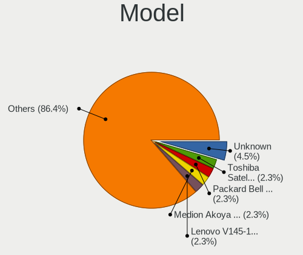
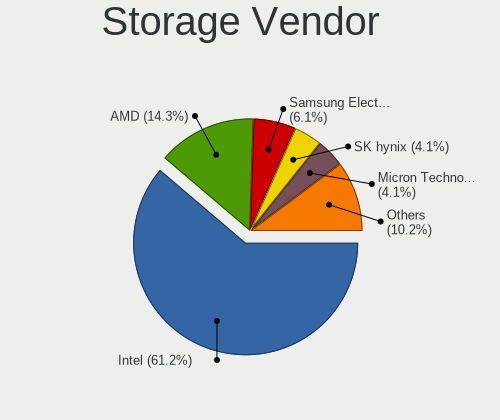
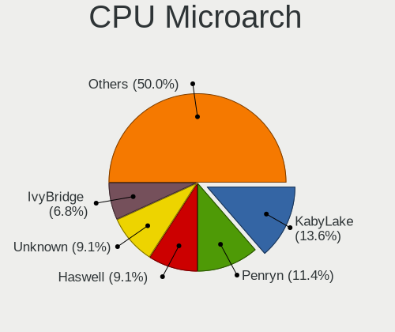
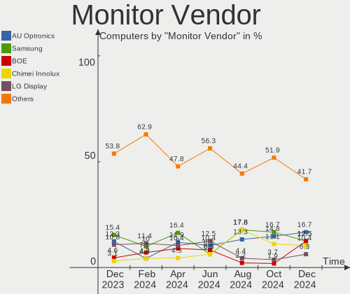
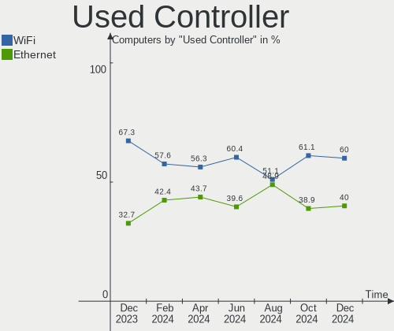
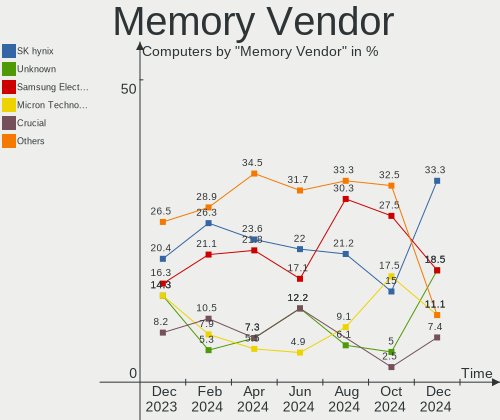
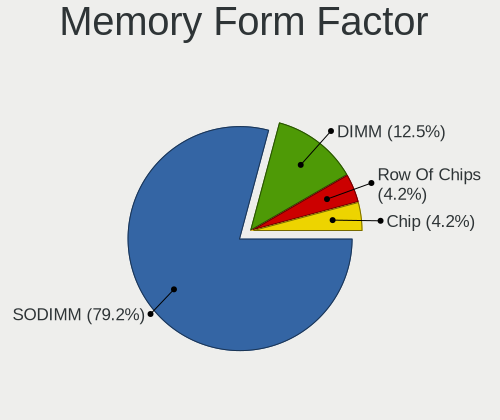

Xubuntu Hardware Trends
-----------------------

A project to identify most popular hardware characteristics and track their change
over time based on data collected by Xubuntu users at https://Linux-Hardware.org.

Anyone can contribute to the study by uploading probes of their computers by
the [hw-probe](https://github.com/linuxhw/hw-probe) tool:

    sudo -E hw-probe -all -upload

This is a report for all computer types. See also reports for [desktops](/Dist/Xubuntu/Desktop/README.md) and [notebooks](/Dist/Xubuntu/Notebook/README.md).

Full-feature report is available here: https://linux-hardware.org/?view=trends

Period: May, 2021.

Contents
--------

- [ OS                       ](#os)
- [ OS Family                ](#os-family)
- [ Kernel                   ](#kernel)
- [ Kernel Family            ](#kernel-family)
- [ Kernel Major Ver.        ](#kernel-major-ver)
- [ Arch                     ](#arch)
- [ DE                       ](#de)
- [ Display Server           ](#display-server)
- [ Display Manager          ](#display-manager)
- [ OS Lang                  ](#os-lang)
- [ Boot Mode                ](#boot-mode)
- [ Filesystem               ](#filesystem)
- [ Part. scheme             ](#part-scheme)
- [ Dual Boot with Linux/BSD ](#dual-boot-with-linux/bsd)
- [ Dual Boot (Win)          ](#dual-boot-win)
- [ Country                  ](#country)
- [ City                     ](#city)
- [ Vendor                   ](#vendor)
- [ Model                    ](#model)
- [ Model Family             ](#model-family)
- [ MFG Year                 ](#mfg-year)
- [ Form Factor              ](#form-factor)
- [ Secure Boot              ](#secure-boot)
- [ Coreboot                 ](#coreboot)
- [ RAM Size                 ](#ram-size)
- [ RAM Used                 ](#ram-used)
- [ Has CD-ROM               ](#has-cd-rom)
- [ Total Drives             ](#total-drives)
- [ Has Ethernet             ](#has-ethernet)
- [ Has WiFi                 ](#has-wifi)
- [ Has Bluetooth            ](#has-bluetooth)
- [ Drive Vendor             ](#drive-vendor)
- [ Drive Model              ](#drive-model)
- [ HDD Vendor               ](#hdd-vendor)
- [ SSD Vendor               ](#ssd-vendor)
- [ Drive Kind               ](#drive-kind)
- [ Drive Connector          ](#drive-connector)
- [ Drive Size               ](#drive-size)
- [ Space Total              ](#space-total)
- [ Space Used               ](#space-used)
- [ Malfunc. Drives          ](#malfunc-drives)
- [ Malfunc. Drive Vendor    ](#malfunc-drive-vendor)
- [ Malfunc. HDD Vendor      ](#malfunc-hdd-vendor)
- [ Malfunc. Drive Kind      ](#malfunc-drive-kind)
- [ Failed Drives            ](#failed-drives)
- [ Failed Drive Vendor      ](#failed-drive-vendor)
- [ Drive Status             ](#drive-status)
- [ Storage Vendor           ](#storage-vendor)
- [ Storage Model            ](#storage-model)
- [ Storage Kind             ](#storage-kind)
- [ CPU Vendor               ](#cpu-vendor)
- [ CPU Model                ](#cpu-model)
- [ CPU Model Family         ](#cpu-model-family)
- [ CPU Cores                ](#cpu-cores)
- [ CPU Sockets              ](#cpu-sockets)
- [ CPU Threads              ](#cpu-threads)
- [ CPU Op-Modes             ](#cpu-op-modes)
- [ CPU Microcode            ](#cpu-microcode)
- [ CPU Microarch            ](#cpu-microarch)
- [ GPU Vendor               ](#gpu-vendor)
- [ GPU Model                ](#gpu-model)
- [ GPU Combo                ](#gpu-combo)
- [ GPU Driver               ](#gpu-driver)
- [ GPU Memory               ](#gpu-memory)
- [ Monitor Vendor           ](#monitor-vendor)
- [ Monitor Model            ](#monitor-model)
- [ Monitor Resolution       ](#monitor-resolution)
- [ Monitor Diagonal         ](#monitor-diagonal)
- [ Monitor Width            ](#monitor-width)
- [ Aspect Ratio             ](#aspect-ratio)
- [ Monitor Area             ](#monitor-area)
- [ Pixel Density            ](#pixel-density)
- [ Multiple Monitors        ](#multiple-monitors)
- [ Net Controller Vendor    ](#net-controller-vendor)
- [ Net Controller Model     ](#net-controller-model)
- [ Wireless Vendor          ](#wireless-vendor)
- [ Wireless Model           ](#wireless-model)
- [ Ethernet Vendor          ](#ethernet-vendor)
- [ Ethernet Model           ](#ethernet-model)
- [ Net Controller Kind      ](#net-controller-kind)
- [ Used Controller          ](#used-controller)
- [ NICs                     ](#nics)
- [ IPv6                     ](#ipv6)
- [ Memory Vendor            ](#memory-vendor)
- [ Memory Model             ](#memory-model)
- [ Memory Kind              ](#memory-kind)
- [ Memory Form Factor       ](#memory-form-factor)
- [ Memory Size              ](#memory-size)
- [ Memory Speed             ](#memory-speed)
- [ Sound Vendor             ](#sound-vendor)
- [ Sound Model              ](#sound-model)
- [ Camera Vendor            ](#camera-vendor)
- [ Camera Model             ](#camera-model)
- [ Fingerprint Vendor       ](#fingerprint-vendor)
- [ Fingerprint Model        ](#fingerprint-model)
- [ Chipcard Vendor          ](#chipcard-vendor)
- [ Chipcard Model           ](#chipcard-model)
- [ Printer Vendor           ](#printer-vendor)
- [ Printer Model            ](#printer-model)
- [ Scanner Vendor           ](#scanner-vendor)
- [ Scanner Model            ](#scanner-model)
- [ Bluetooth Vendor         ](#bluetooth-vendor)
- [ Bluetooth Model          ](#bluetooth-model)
- [ Unsupported Devices      ](#unsupported-devices)
- [ Unsupported Device Types ](#unsupported-device-types)

OS
--

Installed operating systems

| Name          | Computers | Percent |
|---------------|-----------|---------|
| Xubuntu 20.04 | 70        | 63.06%  |
| Xubuntu 18.04 | 16        | 14.41%  |
| Xubuntu 21.04 | 11        | 9.91%   |
| Xubuntu 20.10 | 9         | 8.11%   |
| Xubuntu 16.04 | 2         | 1.8%    |
| Xubuntu 19.04 | 1         | 0.9%    |
| Xubuntu 18.10 | 1         | 0.9%    |
| Xubuntu       | 1         | 0.9%    |

OS Family
---------

OS without a version

| Name    | Computers | Percent |
|---------|-----------|---------|
| Xubuntu | 111       | 100%    |

Kernel
------

Version of the Linux kernel

| Version                 | Computers | Percent |
|-------------------------|-----------|---------|
| 5.4.0-73-generic        | 17        | 15.32%  |
| 5.8.0-53-generic        | 15        | 13.51%  |
| 5.8.0-50-generic        | 12        | 10.81%  |
| 5.4.0-72-generic        | 9         | 8.11%   |
| 5.11.0-17-generic       | 8         | 7.21%   |
| 5.4.0-72-lowlatency     | 6         | 5.41%   |
| 5.8.0-50-lowlatency     | 5         | 4.5%    |
| 5.4.0-73-lowlatency     | 4         | 3.6%    |
| 5.8.0-53-lowlatency     | 3         | 2.7%    |
| 5.8.0-43-generic        | 3         | 2.7%    |
| 5.9.16-050916-generic   | 1         | 0.9%    |
| 5.8.0-54-generic        | 1         | 0.9%    |
| 5.8.0-52-generic        | 1         | 0.9%    |
| 5.8.0-51-generic        | 1         | 0.9%    |
| 5.8.0-49-generic        | 1         | 0.9%    |
| 5.8.0-48-lowlatency     | 1         | 0.9%    |
| 5.6.19-050619-generic   | 1         | 0.9%    |
| 5.4.107-0504107-generic | 1         | 0.9%    |
| 5.4.0-71-generic        | 1         | 0.9%    |
| 5.4.0-70-generic        | 1         | 0.9%    |
| 5.4.0-66-generic        | 1         | 0.9%    |
| 5.4.0-65-lowlatency     | 1         | 0.9%    |
| 5.4.0-48-generic        | 1         | 0.9%    |
| 5.4.0-45-generic        | 1         | 0.9%    |
| 5.4.0-26-lowlatency     | 1         | 0.9%    |
| 5.12.7                  | 1         | 0.9%    |
| 5.12.2-xanmod1          | 1         | 0.9%    |
| 5.11.0-18-generic       | 1         | 0.9%    |
| 5.11.0-16-generic       | 1         | 0.9%    |
| 5.10.17-051017-generic  | 1         | 0.9%    |
| 5.0.0-13-lowlatency     | 1         | 0.9%    |
| 4.4.0-210-generic       | 1         | 0.9%    |
| 4.18.0-25-generic       | 1         | 0.9%    |
| 4.15.0-99-lowlatency    | 1         | 0.9%    |
| 4.15.0-36-generic       | 1         | 0.9%    |
| 4.15.0-144-lowlatency   | 1         | 0.9%    |
| 4.15.0-143-generic      | 1         | 0.9%    |
| 4.15.0-142-generic      | 1         | 0.9%    |
| 4.15.0-133-lowlatency   | 1         | 0.9%    |

Kernel Family
-------------

Linux kernel without a distro release

| Version | Computers | Percent |
|---------|-----------|---------|
| 5.8.0   | 43        | 38.74%  |
| 5.4.0   | 43        | 38.74%  |
| 5.11.0  | 10        | 9.01%   |
| 4.15.0  | 6         | 5.41%   |
| 5.9.16  | 1         | 0.9%    |
| 5.6.19  | 1         | 0.9%    |
| 5.4.107 | 1         | 0.9%    |
| 5.12.7  | 1         | 0.9%    |
| 5.12.2  | 1         | 0.9%    |
| 5.10.17 | 1         | 0.9%    |
| 5.0.0   | 1         | 0.9%    |
| 4.4.0   | 1         | 0.9%    |
| 4.18.0  | 1         | 0.9%    |

Kernel Major Ver.
-----------------

Linux kernel major version

| Version | Computers | Percent |
|---------|-----------|---------|
| 5.4     | 44        | 39.64%  |
| 5.8     | 43        | 38.74%  |
| 5.11    | 10        | 9.01%   |
| 4.15    | 6         | 5.41%   |
| 5.12    | 2         | 1.8%    |
| 5.9     | 1         | 0.9%    |
| 5.6     | 1         | 0.9%    |
| 5.10    | 1         | 0.9%    |
| 5.0     | 1         | 0.9%    |
| 4.4     | 1         | 0.9%    |
| 4.18    | 1         | 0.9%    |

Arch
----

OS architecture (x86_64, i586, etc.)

| Name   | Computers | Percent |
|--------|-----------|---------|
| x86_64 | 101       | 90.99%  |
| i686   | 10        | 9.01%   |

DE
--

Desktop Environment

| Name     | Computers | Percent |
|----------|-----------|---------|
| XFCE     | 108       | 97.3%   |
| GNOME    | 1         | 0.9%    |
| Cinnamon | 1         | 0.9%    |
| awesome  | 1         | 0.9%    |

Display Server
--------------

X11 or Wayland

| Name | Computers | Percent |
|------|-----------|---------|
| X11  | 108       | 97.3%   |
| Tty  | 3         | 2.7%    |

Display Manager
---------------

SDDM, LightDM, etc.

| Name    | Computers | Percent |
|---------|-----------|---------|
| Unknown | 70        | 63.06%  |
| TDM     | 40        | 36.04%  |
| GDM     | 1         | 0.9%    |

OS Lang
-------

Language

| Lang  | Computers | Percent |
|-------|-----------|---------|
| en_US | 39        | 35.14%  |
| en_GB | 10        | 9.01%   |
| de_DE | 10        | 9.01%   |
| fr_FR | 9         | 8.11%   |
| pt_BR | 5         | 4.5%    |
| en_CA | 5         | 4.5%    |
| it_IT | 4         | 3.6%    |
| id_ID | 2         | 1.8%    |
| hu_HU | 2         | 1.8%    |
| es_MX | 2         | 1.8%    |
| en_IN | 2         | 1.8%    |
| C     | 2         | 1.8%    |
| zh_TW | 1         | 0.9%    |
| ru_UA | 1         | 0.9%    |
| ru_RU | 1         | 0.9%    |
| pt_PT | 1         | 0.9%    |
| pl_PL | 1         | 0.9%    |
| nl_NL | 1         | 0.9%    |
| nl_BE | 1         | 0.9%    |
| ja_JP | 1         | 0.9%    |
| fr_CH | 1         | 0.9%    |
| fr_CA | 1         | 0.9%    |
| fr_BE | 1         | 0.9%    |
| es_ES | 1         | 0.9%    |
| es_AR | 1         | 0.9%    |
| en_ZA | 1         | 0.9%    |
| en_HK | 1         | 0.9%    |
| en_AU | 1         | 0.9%    |
| de_CH | 1         | 0.9%    |
| cs_CZ | 1         | 0.9%    |
| bs_BA | 1         | 0.9%    |

Boot Mode
---------

EFI or BIOS

| Mode | Computers | Percent |
|------|-----------|---------|
| BIOS | 71        | 63.96%  |
| EFI  | 40        | 36.04%  |

Filesystem
----------

Type of filesystem

| Type    | Computers | Percent |
|---------|-----------|---------|
| Ext4    | 104       | 93.69%  |
| Overlay | 4         | 3.6%    |
| Xfs     | 2         | 1.8%    |
| Btrfs   | 1         | 0.9%    |

Part. scheme
------------

Scheme of partitioning

| Type    | Computers | Percent |
|---------|-----------|---------|
| Unknown | 70        | 63.06%  |
| GPT     | 25        | 22.52%  |
| MBR     | 16        | 14.41%  |

Dual Boot with Linux/BSD
------------------------

Hosting more than one Linux/BSD

| Dual boot | Computers | Percent |
|-----------|-----------|---------|
| No        | 92        | 82.88%  |
| Yes       | 19        | 17.12%  |

Dual Boot (Win)
---------------

Hosting Linux and Windows

| Dual boot | Computers | Percent |
|-----------|-----------|---------|
| No        | 76        | 68.47%  |
| Yes       | 35        | 31.53%  |

Country
-------

Geographic location (country)

| Country      | Computers | Percent |
|--------------|-----------|---------|
| Germany      | 18        | 16.22%  |
| USA          | 16        | 14.41%  |
| UK           | 10        | 9.01%   |
| France       | 9         | 8.11%   |
| Canada       | 6         | 5.41%   |
| Italy        | 5         | 4.5%    |
| Indonesia    | 4         | 3.6%    |
| India        | 4         | 3.6%    |
| Brazil       | 4         | 3.6%    |
| Russia       | 3         | 2.7%    |
| Netherlands  | 3         | 2.7%    |
| Mexico       | 3         | 2.7%    |
| Belgium      | 3         | 2.7%    |
| Switzerland  | 2         | 1.8%    |
| Japan        | 2         | 1.8%    |
| Hungary      | 2         | 1.8%    |
| Bulgaria     | 2         | 1.8%    |
| Vietnam      | 1         | 0.9%    |
| Ukraine      | 1         | 0.9%    |
| Taiwan       | 1         | 0.9%    |
| Sweden       | 1         | 0.9%    |
| Spain        | 1         | 0.9%    |
| South Africa | 1         | 0.9%    |
| Portugal     | 1         | 0.9%    |
| Iraq         | 1         | 0.9%    |
| Iceland      | 1         | 0.9%    |
| Hong Kong    | 1         | 0.9%    |
| Finland      | 1         | 0.9%    |
| Czechia      | 1         | 0.9%    |
| Austria      | 1         | 0.9%    |
| Australia    | 1         | 0.9%    |
| Argentina    | 1         | 0.9%    |

City
----

Geographic location (city)

| City                         | Computers | Percent |
|------------------------------|-----------|---------|
| Berlin                       | 5         | 4.5%    |
| Paris                        | 3         | 2.7%    |
| Strasbourg                   | 2         | 1.8%    |
| Munich                       | 2         | 1.8%    |
| Milan                        | 2         | 1.8%    |
| London                       | 2         | 1.8%    |
| Amsterdam                    | 2         | 1.8%    |
| Wismar                       | 1         | 0.9%    |
| Wilrijk                      | 1         | 0.9%    |
| Wettingen                    | 1         | 0.9%    |
| Walthamstow                  | 1         | 0.9%    |
| Voskresensk                  | 1         | 0.9%    |
| Varna                        | 1         | 0.9%    |
| Toronto                      | 1         | 0.9%    |
| Tolleson                     | 1         | 0.9%    |
| Telford                      | 1         | 0.9%    |
| Taverny                      | 1         | 0.9%    |
| Tapachula                    | 1         | 0.9%    |
| Stablovice                   | 1         | 0.9%    |
| Spokane                      | 1         | 0.9%    |
| Southminster                 | 1         | 0.9%    |
| Sollentuna                   | 1         | 0.9%    |
| Slidell                      | 1         | 0.9%    |
| Shillong                     | 1         | 0.9%    |
| Seto                         | 1         | 0.9%    |
| Semarang                     | 1         | 0.9%    |
| Schwalbach am Taunus         | 1         | 0.9%    |
| Schkopau                     | 1         | 0.9%    |
| Sankt Georgen im Schwarzwald | 1         | 0.9%    |
| San Antonio                  | 1         | 0.9%    |
| Sai Kung                     | 1         | 0.9%    |
| Royal Tunbridge Wells        | 1         | 0.9%    |
| Rome                         | 1         | 0.9%    |
| Reykjavik                    | 1         | 0.9%    |
| Rehoboth                     | 1         | 0.9%    |
| Pottstown                    | 1         | 0.9%    |
| Potsdam                      | 1         | 0.9%    |
| Pernik                       | 1         | 0.9%    |
| Paarl                        | 1         | 0.9%    |
| North Vancouver              | 1         | 0.9%    |
| Nogent-sur-Oise              | 1         | 0.9%    |
| New York                     | 1         | 0.9%    |
| New Taipei                   | 1         | 0.9%    |
| New Glasgow                  | 1         | 0.9%    |
| Neath                        | 1         | 0.9%    |
| Nanaimo                      | 1         | 0.9%    |
| Moscow                       | 1         | 0.9%    |
| Mississauga                  | 1         | 0.9%    |
| Minneapolis                  | 1         | 0.9%    |
| Mexico City                  | 1         | 0.9%    |
| Melbourne                    | 1         | 0.9%    |
| Massa                        | 1         | 0.9%    |
| Mariupol                     | 1         | 0.9%    |
| Malang                       | 1         | 0.9%    |
| Madrid                       | 1         | 0.9%    |
| Lucknow                      | 1         | 0.9%    |
| León                        | 1         | 0.9%    |
| Kortrijk                     | 1         | 0.9%    |
| Kolkata                      | 1         | 0.9%    |
| Izhevsk                      | 1         | 0.9%    |

Vendor
------

Motherboard manufacturer

| Name                | Computers | Percent |
|---------------------|-----------|---------|
| Hewlett-Packard     | 19        | 17.12%  |
| Dell                | 15        | 13.51%  |
| ASUSTek Computer    | 11        | 9.91%   |
| Lenovo              | 10        | 9.01%   |
| Acer                | 10        | 9.01%   |
| Gigabyte Technology | 9         | 8.11%   |
| MSI                 | 7         | 6.31%   |
| Toshiba             | 4         | 3.6%    |
| Intel               | 4         | 3.6%    |
| Apple               | 3         | 2.7%    |
| Samsung Electronics | 2         | 1.8%    |
| Packard Bell        | 2         | 1.8%    |
| Medion              | 2         | 1.8%    |
| ASRock              | 2         | 1.8%    |
| Sony                | 1         | 0.9%    |
| Schenker            | 1         | 0.9%    |
| Pegatron            | 1         | 0.9%    |
| Notebook            | 1         | 0.9%    |
| NCR                 | 1         | 0.9%    |
| Huanan              | 1         | 0.9%    |
| Fujitsu             | 1         | 0.9%    |
| ECS                 | 1         | 0.9%    |
| Dixonsxp            | 1         | 0.9%    |
| AMI                 | 1         | 0.9%    |
| Unknown             | 1         | 0.9%    |

Model
-----

Motherboard model

| Name                                   | Computers | Percent |
|----------------------------------------|-----------|---------|
| Dell Inspiron 7501                     | 2         | 1.8%    |
| Toshiba Satellite S55-C                | 1         | 0.9%    |
| Toshiba Satellite P755                 | 1         | 0.9%    |
| Toshiba Satellite L500D                | 1         | 0.9%    |
| Toshiba Satellite L500                 | 1         | 0.9%    |
| Sony VPCF236FM                         | 1         | 0.9%    |
| Schenker XMG CORE 14 XCO14L20          | 1         | 0.9%    |
| Samsung 900X3C/900X4C/900X4D           | 1         | 0.9%    |
| Samsung 300E4Z/300E5Z/300E7Z           | 1         | 0.9%    |
| Pegatron FL368AA-UUZ SR5612CH          | 1         | 0.9%    |
| Packard Bell oneTwo S3280              | 1         | 0.9%    |
| Packard Bell EasyNote NX69HR           | 1         | 0.9%    |
| Notebook N85_87HP6                     | 1         | 0.9%    |
| NCR xxxx-xxxx-xxxx                     | 1         | 0.9%    |
| MSI MS-7C91                            | 1         | 0.9%    |
| MSI MS-7B89                            | 1         | 0.9%    |
| MSI MS-7B86                            | 1         | 0.9%    |
| MSI MS-7B84                            | 1         | 0.9%    |
| MSI MS-7A74                            | 1         | 0.9%    |
| MSI MS-7721                            | 1         | 0.9%    |
| MSI MEG Z490 Infinite X (MS-B916)      | 1         | 0.9%    |
| Medion Akoya P5320 E MD8875/2432       | 1         | 0.9%    |
| Medion Akoya P2120 D MD8836/2452       | 1         | 0.9%    |
| Lenovo ThinkStation D30 4223B35        | 1         | 0.9%    |
| Lenovo ThinkPad W510 431963G           | 1         | 0.9%    |
| Lenovo ThinkPad T495s 20QKS0SD00       | 1         | 0.9%    |
| Lenovo ThinkPad T490 20N2004AGE        | 1         | 0.9%    |
| Lenovo ThinkPad T470 20HES0FX00        | 1         | 0.9%    |
| Lenovo ThinkPad R61 8934F9U            | 1         | 0.9%    |
| Lenovo ThinkPad P17 Gen 1 20SQS0K700   | 1         | 0.9%    |
| Lenovo ThinkCentre M82 2756AT9         | 1         | 0.9%    |
| Lenovo C-Notebook XXXX 3000 G400       | 1         | 0.9%    |
| Lenovo B40-30 F0AW0002US               | 1         | 0.9%    |
| Intel DH61WW AAG23116-204              | 1         | 0.9%    |
| Intel D945GNT AAC96315-402             | 1         | 0.9%    |
| Intel D945GCPE AAD97209-201            | 1         | 0.9%    |
| Intel BTC-T37                          | 1         | 0.9%    |
| Huanan Thurley                         | 1         | 0.9%    |
| HP ZBook 15                            | 1         | 0.9%    |
| HP Z620 Workstation                    | 1         | 0.9%    |
| HP t510 Thin Client                    | 1         | 0.9%    |
| HP Stream Notebook PC 11               | 1         | 0.9%    |
| HP ProDesk 405 G6 Desktop Mini PC      | 1         | 0.9%    |
| HP ProDesk 400 G1 MT                   | 1         | 0.9%    |
| HP ProBook 6570b                       | 1         | 0.9%    |
| HP Pavilion dv7                        | 1         | 0.9%    |
| HP Pavilion dv2700                     | 1         | 0.9%    |
| HP Laptop 15-gw0xxx                    | 1         | 0.9%    |
| HP EliteBook Folio 9470m               | 1         | 0.9%    |
| HP EliteBook 820 G3                    | 1         | 0.9%    |
| HP Compaq Elite 8300 SFF               | 1         | 0.9%    |
| HP Compaq dc7900 Convertible Minitower | 1         | 0.9%    |
| HP Compaq dc7800 Small Form Factor     | 1         | 0.9%    |
| HP Compaq 6730s                        | 1         | 0.9%    |
| HP 500-a60                             | 1         | 0.9%    |
| HP 250 G7 Notebook PC                  | 1         | 0.9%    |
| HP 15                                  | 1         | 0.9%    |
| Gigabyte X570 AORUS MASTER             | 1         | 0.9%    |
| Gigabyte H81M-DS2                      | 1         | 0.9%    |
| Gigabyte H110N                         | 1         | 0.9%    |

Model Family
------------

Motherboard model prefix

| Name                  | Computers | Percent |
|-----------------------|-----------|---------|
| Acer Aspire           | 7         | 6.31%   |
| Lenovo ThinkPad       | 6         | 5.41%   |
| Dell Inspiron         | 6         | 5.41%   |
| Toshiba Satellite     | 4         | 3.6%    |
| HP Compaq             | 4         | 3.6%    |
| Dell OptiPlex         | 3         | 2.7%    |
| Dell Latitude         | 3         | 2.7%    |
| Medion Akoya          | 2         | 1.8%    |
| HP ProDesk            | 2         | 1.8%    |
| HP Pavilion           | 2         | 1.8%    |
| HP EliteBook          | 2         | 1.8%    |
| Sony VPCF236FM        | 1         | 0.9%    |
| Schenker XMG          | 1         | 0.9%    |
| Samsung 900X3C        | 1         | 0.9%    |
| Samsung 300E4Z        | 1         | 0.9%    |
| Pegatron FL368AA-UUZ  | 1         | 0.9%    |
| Packard Bell oneTwo   | 1         | 0.9%    |
| Packard Bell EasyNote | 1         | 0.9%    |
| Notebook N85          | 1         | 0.9%    |
| NCR xxxx-xxxx-xxxx    | 1         | 0.9%    |
| MSI MS-7C91           | 1         | 0.9%    |
| MSI MS-7B89           | 1         | 0.9%    |
| MSI MS-7B86           | 1         | 0.9%    |
| MSI MS-7B84           | 1         | 0.9%    |
| MSI MS-7A74           | 1         | 0.9%    |
| MSI MS-7721           | 1         | 0.9%    |
| MSI MEG               | 1         | 0.9%    |
| Lenovo ThinkStation   | 1         | 0.9%    |
| Lenovo ThinkCentre    | 1         | 0.9%    |
| Lenovo C-Notebook     | 1         | 0.9%    |
| Lenovo B40-30         | 1         | 0.9%    |
| Intel DH61WW          | 1         | 0.9%    |
| Intel D945GNT         | 1         | 0.9%    |
| Intel D945GCPE        | 1         | 0.9%    |
| Intel BTC-T37         | 1         | 0.9%    |
| Huanan Thurley        | 1         | 0.9%    |
| HP ZBook              | 1         | 0.9%    |
| HP Z620               | 1         | 0.9%    |
| HP t510               | 1         | 0.9%    |
| HP Stream             | 1         | 0.9%    |
| HP ProBook            | 1         | 0.9%    |
| HP Laptop             | 1         | 0.9%    |
| HP 500-a60            | 1         | 0.9%    |
| HP 250                | 1         | 0.9%    |
| HP 15                 | 1         | 0.9%    |
| Gigabyte X570         | 1         | 0.9%    |
| Gigabyte H81M-DS2     | 1         | 0.9%    |
| Gigabyte H110N        | 1         | 0.9%    |
| Gigabyte EP45-UD3R    | 1         | 0.9%    |
| Gigabyte C847N        | 1         | 0.9%    |
| Gigabyte B150M-D3H-CF | 1         | 0.9%    |
| Gigabyte AB350-Gaming | 1         | 0.9%    |
| Gigabyte A520I        | 1         | 0.9%    |
| Gigabyte A320M-S2H    | 1         | 0.9%    |
| Fujitsu ESPRIMO       | 1         | 0.9%    |
| ECS H61H2-M2          | 1         | 0.9%    |
| Dixonsxp F71IX1       | 1         | 0.9%    |
| Dell Vostro           | 1         | 0.9%    |
| Dell Studio           | 1         | 0.9%    |
| Dell Precision        | 1         | 0.9%    |

MFG Year
--------

Motherboard manufacture year

| Year | Computers | Percent |
|------|-----------|---------|
| 2011 | 14        | 12.61%  |
| 2020 | 10        | 9.01%   |
| 2017 | 9         | 8.11%   |
| 2021 | 8         | 7.21%   |
| 2019 | 8         | 7.21%   |
| 2014 | 8         | 7.21%   |
| 2013 | 8         | 7.21%   |
| 2009 | 8         | 7.21%   |
| 2008 | 8         | 7.21%   |
| 2018 | 6         | 5.41%   |
| 2012 | 6         | 5.41%   |
| 2016 | 5         | 4.5%    |
| 2015 | 4         | 3.6%    |
| 2010 | 4         | 3.6%    |
| 2007 | 4         | 3.6%    |
| 2006 | 1         | 0.9%    |

Form Factor
-----------

Physical design of the computer

| Name       | Computers | Percent |
|------------|-----------|---------|
| Notebook   | 52        | 46.85%  |
| Desktop    | 51        | 45.95%  |
| Mini pc    | 4         | 3.6%    |
| All in one | 4         | 3.6%    |

Secure Boot
-----------

Enabled or disabled

| State    | Computers | Percent |
|----------|-----------|---------|
| Disabled | 103       | 92.79%  |
| Enabled  | 8         | 7.21%   |

Coreboot
--------

Have coreboot on board

| Used | Computers | Percent |
|------|-----------|---------|
| No   | 111       | 100%    |

RAM Size
--------

Total RAM memory

| Size in GB  | Computers | Percent |
|-------------|-----------|---------|
| 4.01-8.0    | 25        | 22.52%  |
| 3.01-4.0    | 22        | 19.82%  |
| 8.01-16.0   | 20        | 18.02%  |
| 1.01-2.0    | 13        | 11.71%  |
| 16.01-24.0  | 10        | 9.01%   |
| 32.01-64.0  | 9         | 8.11%   |
| 2.01-3.0    | 5         | 4.5%    |
| 0.51-1.0    | 3         | 2.7%    |
| 64.01-256.0 | 2         | 1.8%    |
| 24.01-32.0  | 1         | 0.9%    |
| 0.01-0.5    | 1         | 0.9%    |

RAM Used
--------

Used RAM memory

| Used GB    | Computers | Percent |
|------------|-----------|---------|
| 1.01-2.0   | 42        | 37.84%  |
| 2.01-3.0   | 26        | 23.42%  |
| 0.51-1.0   | 18        | 16.22%  |
| 4.01-8.0   | 12        | 10.81%  |
| 3.01-4.0   | 10        | 9.01%   |
| 0.01-0.5   | 2         | 1.8%    |
| 32.01-64.0 | 1         | 0.9%    |

Has CD-ROM
----------

Has CD-ROM on board

| Presented | Computers | Percent |
|-----------|-----------|---------|
| Yes       | 60        | 54.05%  |
| No        | 51        | 45.95%  |

Total Drives
------------

Number of drives on board

| Drives | Computers | Percent |
|--------|-----------|---------|
| 1      | 71        | 63.96%  |
| 2      | 23        | 20.72%  |
| 3      | 8         | 7.21%   |
| 4      | 6         | 5.41%   |
| 0      | 2         | 1.8%    |
| 7      | 1         | 0.9%    |

Has Ethernet
------------

Has Ethernet on board

| Presented | Computers | Percent |
|-----------|-----------|---------|
| Yes       | 101       | 90.99%  |
| No        | 10        | 9.01%   |

Has WiFi
--------

Has WiFi module

| Presented | Computers | Percent |
|-----------|-----------|---------|
| Yes       | 78        | 70.27%  |
| No        | 33        | 29.73%  |

Has Bluetooth
-------------

Has Bluetooth module

| Presented | Computers | Percent |
|-----------|-----------|---------|
| No        | 59        | 53.15%  |
| Yes       | 52        | 46.85%  |

Drive Vendor
------------

Hard drive vendors

| Vendor              | Computers | Drives | Percent |
|---------------------|-----------|--------|---------|
| Seagate             | 30        | 32     | 19.48%  |
| WDC                 | 28        | 29     | 18.18%  |
| Samsung Electronics | 24        | 31     | 15.58%  |
| Toshiba             | 9         | 9      | 5.84%   |
| Hitachi             | 9         | 9      | 5.84%   |
| Kingston            | 7         | 8      | 4.55%   |
| Intel               | 6         | 6      | 3.9%    |
| Unknown             | 5         | 5      | 3.25%   |
| A-DATA Technology   | 5         | 5      | 3.25%   |
| SanDisk             | 3         | 3      | 1.95%   |
| Fujitsu             | 3         | 3      | 1.95%   |
| Crucial             | 3         | 3      | 1.95%   |
| Transcend           | 2         | 2      | 1.3%    |
| PNY                 | 2         | 2      | 1.3%    |
| Lexar               | 2         | 2      | 1.3%    |
| KIOXIA              | 2         | 2      | 1.3%    |
| HGST                | 2         | 2      | 1.3%    |
| XPG                 | 1         | 1      | 0.65%   |
| Team                | 1         | 1      | 0.65%   |
| SK Hynix            | 1         | 1      | 0.65%   |
| Patriot             | 1         | 1      | 0.65%   |
| OWC                 | 1         | 1      | 0.65%   |
| LITEON              | 1         | 1      | 0.65%   |
| KIOXIA-EXCERIA      | 1         | 1      | 0.65%   |
| Kingchuxing         | 1         | 1      | 0.65%   |
| Intenso             | 1         | 1      | 0.65%   |
| China               | 1         | 1      | 0.65%   |
| Apple               | 1         | 1      | 0.65%   |
| Apacer              | 1         | 1      | 0.65%   |

Drive Model
-----------

Hard drive models

| Model                             | Computers | Percent |
|-----------------------------------|-----------|---------|
| Toshiba MQ01ABD100 1TB            | 3         | 1.85%   |
| Seagate ST500DM002-1BD142 500GB   | 3         | 1.85%   |
| Samsung SSD 850 EVO 500GB         | 3         | 1.85%   |
| WDC WD10JPVX-22JC3T0 1TB          | 2         | 1.23%   |
| WDC WD10EZEX-00WN4A0 1TB          | 2         | 1.23%   |
| WDC WD10EZEX-00BN5A0 1TB          | 2         | 1.23%   |
| Seagate ST9500420AS 500GB         | 2         | 1.23%   |
| Seagate ST3160815AS 160GB         | 2         | 1.23%   |
| Seagate ST2000LX001-1RG174 2TB    | 2         | 1.23%   |
| Seagate ST2000DM008-2FR102 2TB    | 2         | 1.23%   |
| Seagate ST2000DM001-1ER164 2TB    | 2         | 1.23%   |
| Seagate ST1000DM003-1CH162 1TB    | 2         | 1.23%   |
| Samsung SSD 860 QVO 1TB           | 2         | 1.23%   |
| Samsung SSD 860 EVO 500GB         | 2         | 1.23%   |
| Samsung MZVLQ256HAJD-000H1 256GB  | 2         | 1.23%   |
| KIOXIA KBG40ZNS256G NVMe 256GB    | 2         | 1.23%   |
| XPG NVMe SSD Drive 1024GB         | 1         | 0.62%   |
| WDC WDS120G2G0B-00EPW0 120GB SSD  | 1         | 0.62%   |
| WDC WDS120G1G0A-00SS50 120GB SSD  | 1         | 0.62%   |
| WDC WD6402AAEX-00Z3A0 640GB       | 1         | 0.62%   |
| WDC WD5000AAKX-60U6AA0 500GB      | 1         | 0.62%   |
| WDC WD5000AAKX-00U6AA0 500GB      | 1         | 0.62%   |
| WDC WD5000AAKX-003CA0 500GB       | 1         | 0.62%   |
| WDC WD5000AAKS-75TMA0 500GB       | 1         | 0.62%   |
| WDC WD3200LPVX-22V0TT0 320GB      | 1         | 0.62%   |
| WDC WD3200BJKT-75F4T0 320GB       | 1         | 0.62%   |
| WDC WD3200BEVT-75ZCT2 320GB       | 1         | 0.62%   |
| WDC WD3200BEVT-26ZCT0 320GB       | 1         | 0.62%   |
| WDC WD30EFRX-68EUZN0 3TB          | 1         | 0.62%   |
| WDC WD2500JS-60MHB1 250GB         | 1         | 0.62%   |
| WDC WD2500BEVT-22A23T0 250GB      | 1         | 0.62%   |
| WDC WD2500BEVS-60UST0 250GB       | 1         | 0.62%   |
| WDC WD2002FAEX-007BA0 2TB         | 1         | 0.62%   |
| WDC WD1600BEVT-22ZCT0 160GB       | 1         | 0.62%   |
| WDC WD1600AAJS-00PSA0 160GB       | 1         | 0.62%   |
| WDC WD10JPVX-00JC3T0 1TB          | 1         | 0.62%   |
| WDC WD10JPVT-00A1YT0 1TB          | 1         | 0.62%   |
| WDC WD10EZEX-75WN4A0 1TB          | 1         | 0.62%   |
| WDC WD10EZEX-08WN4A0 1TB          | 1         | 0.62%   |
| WDC WD1001FALS-00J7B0 1TB         | 1         | 0.62%   |
| Unknown NVMe SSD Drive 250GB      | 1         | 0.62%   |
| Unknown MS  16GB                  | 1         | 0.62%   |
| Unknown MMC Card  7GB             | 1         | 0.62%   |
| Unknown MMC Card  32GB            | 1         | 0.62%   |
| Unknown HBG4a2  32GB              | 1         | 0.62%   |
| Transcend TS240GSSD220S 240GB     | 1         | 0.62%   |
| Transcend TS128GMSA230S 128GB SSD | 1         | 0.62%   |
| Toshiba MQ04ABF100 1TB            | 1         | 0.62%   |
| Toshiba MQ01ABF050 500GB          | 1         | 0.62%   |
| Toshiba MQ01ABD032 320GB          | 1         | 0.62%   |
| Toshiba MK7559GSXP 752GB          | 1         | 0.62%   |
| Toshiba MK3252GSX 320GB           | 1         | 0.62%   |
| Toshiba DT01ACA200 2TB            | 1         | 0.62%   |
| Team TIM3F49256GMBA04MA 256GB SSD | 1         | 0.62%   |
| SK Hynix NVMe SSD Drive 256GB     | 1         | 0.62%   |
| Seagate ST9250315AS 250GB         | 1         | 0.62%   |
| Seagate ST9160314AS 160GB         | 1         | 0.62%   |
| Seagate ST6000DM003-2CY186 6TB    | 1         | 0.62%   |
| Seagate ST500LT012-9WS142 500GB   | 1         | 0.62%   |
| Seagate ST500LM021-1KJ152 500GB   | 1         | 0.62%   |

HDD Vendor
----------

Hard disk drive vendors

| Vendor              | Computers | Drives | Percent |
|---------------------|-----------|--------|---------|
| Seagate             | 29        | 31     | 33.72%  |
| WDC                 | 26        | 27     | 30.23%  |
| Toshiba             | 9         | 9      | 10.47%  |
| Hitachi             | 9         | 9      | 10.47%  |
| Samsung Electronics | 7         | 8      | 8.14%   |
| Fujitsu             | 3         | 3      | 3.49%   |
| HGST                | 2         | 2      | 2.33%   |
| Intenso             | 1         | 1      | 1.16%   |

SSD Vendor
----------

Solid state drive vendors

| Vendor              | Computers | Drives | Percent |
|---------------------|-----------|--------|---------|
| Samsung Electronics | 14        | 18     | 29.79%  |
| A-DATA Technology   | 5         | 5      | 10.64%  |
| Kingston            | 3         | 3      | 6.38%   |
| Intel               | 3         | 3      | 6.38%   |
| Crucial             | 3         | 3      | 6.38%   |
| WDC                 | 2         | 2      | 4.26%   |
| Transcend           | 2         | 2      | 4.26%   |
| SanDisk             | 2         | 2      | 4.26%   |
| PNY                 | 2         | 2      | 4.26%   |
| Lexar               | 2         | 2      | 4.26%   |
| Team                | 1         | 1      | 2.13%   |
| Patriot             | 1         | 1      | 2.13%   |
| OWC                 | 1         | 1      | 2.13%   |
| LITEON              | 1         | 1      | 2.13%   |
| KIOXIA-EXCERIA      | 1         | 1      | 2.13%   |
| Kingchuxing         | 1         | 1      | 2.13%   |
| China               | 1         | 1      | 2.13%   |
| Apple               | 1         | 1      | 2.13%   |
| Apacer              | 1         | 1      | 2.13%   |

Drive Kind
----------

HDD or SSD

| Kind    | Computers | Drives | Percent |
|---------|-----------|--------|---------|
| HDD     | 72        | 90     | 52.55%  |
| SSD     | 43        | 51     | 31.39%  |
| NVMe    | 17        | 18     | 12.41%  |
| MMC     | 4         | 5      | 2.92%   |
| Unknown | 1         | 1      | 0.73%   |

Drive Connector
---------------

SATA, SAS, NVMe, etc.

| Type | Computers | Drives | Percent |
|------|-----------|--------|---------|
| SATA | 94        | 138    | 79.66%  |
| NVMe | 17        | 18     | 14.41%  |
| MMC  | 4         | 5      | 3.39%   |
| SAS  | 3         | 4      | 2.54%   |

Drive Size
----------

Size of hard drive

| Size in TB | Computers | Drives | Percent |
|------------|-----------|--------|---------|
| 0.01-0.5   | 72        | 87     | 58.54%  |
| 0.51-1.0   | 33        | 35     | 26.83%  |
| 1.01-2.0   | 12        | 12     | 9.76%   |
| 4.01-10.0  | 3         | 4      | 2.44%   |
| 3.01-4.0   | 2         | 2      | 1.63%   |
| 2.01-3.0   | 1         | 1      | 0.81%   |

Space Total
-----------

Amount of disk space available on the file system

| Size in GB     | Computers | Percent |
|----------------|-----------|---------|
| 101-250        | 34        | 30.63%  |
| 251-500        | 25        | 22.52%  |
| 501-1000       | 16        | 14.41%  |
| 21-50          | 8         | 7.21%   |
| 51-100         | 7         | 6.31%   |
| More than 3000 | 6         | 5.41%   |
| 1-20           | 6         | 5.41%   |
| 1001-2000      | 5         | 4.5%    |
| 2001-3000      | 4         | 3.6%    |

Space Used
----------

Amount of used disk space

| Used GB        | Computers | Percent |
|----------------|-----------|---------|
| 1-20           | 39        | 35.14%  |
| 21-50          | 20        | 18.02%  |
| 101-250        | 18        | 16.22%  |
| 51-100         | 11        | 9.91%   |
| 251-500        | 9         | 8.11%   |
| 1001-2000      | 5         | 4.5%    |
| 501-1000       | 5         | 4.5%    |
| More than 3000 | 3         | 2.7%    |
| 2001-3000      | 1         | 0.9%    |

Malfunc. Drives
---------------

Drive models with a malfunction

| Model                            | Computers | Drives | Percent |
|----------------------------------|-----------|--------|---------|
| Toshiba MQ01ABD100 1TB           | 1         | 1      | 16.67%  |
| Seagate ST500DM002-1BD142 500GB  | 1         | 1      | 16.67%  |
| Hitachi HTS725050A7E630 500GB    | 1         | 1      | 16.67%  |
| Hitachi HTS547575A9E384 752GB    | 1         | 1      | 16.67%  |
| Fujitsu MHZ2160BJ FFS G2 160GB   | 1         | 1      | 16.67%  |
| Apacer 16GB SATA Flash Drive SSD | 1         | 1      | 16.67%  |

Malfunc. Drive Vendor
---------------------

Vendors of faulty drives

| Vendor  | Computers | Drives | Percent |
|---------|-----------|--------|---------|
| Hitachi | 2         | 2      | 33.33%  |
| Toshiba | 1         | 1      | 16.67%  |
| Seagate | 1         | 1      | 16.67%  |
| Fujitsu | 1         | 1      | 16.67%  |
| Apacer  | 1         | 1      | 16.67%  |

Malfunc. HDD Vendor
-------------------

Vendors of faulty HDD drives

| Vendor  | Computers | Drives | Percent |
|---------|-----------|--------|---------|
| Hitachi | 2         | 2      | 40%     |
| Toshiba | 1         | 1      | 20%     |
| Seagate | 1         | 1      | 20%     |
| Fujitsu | 1         | 1      | 20%     |

Malfunc. Drive Kind
-------------------

Kinds of faulty drives

| Kind | Computers | Drives | Percent |
|------|-----------|--------|---------|
| HDD  | 5         | 5      | 83.33%  |
| SSD  | 1         | 1      | 16.67%  |

Failed Drives
-------------

Failed drive models

Zero info for selected period =(

Failed Drive Vendor
-------------------

Failed drive vendors

Zero info for selected period =(

Drive Status
------------

Number of failed and malfunc. drives

| Status   | Computers | Drives | Percent |
|----------|-----------|--------|---------|
| Detected | 71        | 110    | 64.55%  |
| Works    | 33        | 49     | 30%     |
| Malfunc  | 6         | 6      | 5.45%   |

Storage Vendor
--------------

Storage controller vendors

| Vendor                           | Computers | Percent |
|----------------------------------|-----------|---------|
| Intel                            | 77        | 61.6%   |
| AMD                              | 20        | 16%     |
| Nvidia                           | 7         | 5.6%    |
| Samsung Electronics              | 5         | 4%      |
| Kingston Technology Company      | 4         | 3.2%    |
| JMicron Technology               | 3         | 2.4%    |
| KIOXIA                           | 2         | 1.6%    |
| VIA Technologies                 | 1         | 0.8%    |
| SK Hynix                         | 1         | 0.8%    |
| Silicon Integrated Systems [SiS] | 1         | 0.8%    |
| Shenzhen Longsys Electronics     | 1         | 0.8%    |
| Promise Technology               | 1         | 0.8%    |
| Marvell Technology Group         | 1         | 0.8%    |
| ADATA Technology                 | 1         | 0.8%    |

Storage Model
-------------

Storage controller models

| Model                                                                                   | Computers | Percent |
|-----------------------------------------------------------------------------------------|-----------|---------|
| AMD FCH SATA Controller [AHCI mode]                                                     | 13        | 8.23%   |
| Intel Q170/Q150/B150/H170/H110/Z170/CM236 Chipset SATA Controller [AHCI Mode]           | 6         | 3.8%    |
| Intel 6 Series/C200 Series Chipset Family 6 port Mobile SATA AHCI Controller            | 5         | 3.16%   |
| Intel 82801 Mobile SATA Controller [RAID mode]                                          | 4         | 2.53%   |
| Intel 8 Series/C220 Series Chipset Family 6-port SATA Controller 1 [AHCI mode]          | 4         | 2.53%   |
| Kingston Company A2000 NVMe SSD                                                         | 3         | 1.9%    |
| Intel Wildcat Point-LP SATA Controller [AHCI Mode]                                      | 3         | 1.9%    |
| Intel NM10/ICH7 Family SATA Controller [IDE mode]                                       | 3         | 1.9%    |
| Intel NM10/ICH7 Family SATA Controller [AHCI mode]                                      | 3         | 1.9%    |
| Intel 82801IBM/IEM (ICH9M/ICH9M-E) 4 port SATA Controller [AHCI mode]                   | 3         | 1.9%    |
| Intel 82801G (ICH7 Family) IDE Controller                                               | 3         | 1.9%    |
| Intel 7 Series/C210 Series Chipset Family 6-port SATA Controller [AHCI mode]            | 3         | 1.9%    |
| Intel 7 Series Chipset Family 6-port SATA Controller [AHCI mode]                        | 3         | 1.9%    |
| AMD Starship/Matisse Chipset SATA Controller [AHCI mode]                                | 3         | 1.9%    |
| AMD 400 Series Chipset SATA Controller                                                  | 3         | 1.9%    |
| Samsung NVMe Controller                                                                 | 2         | 1.27%   |
| Nvidia MCP89 SATA Controller (AHCI mode)                                                | 2         | 1.27%   |
| Nvidia MCP61 SATA Controller                                                            | 2         | 1.27%   |
| Nvidia MCP61 IDE                                                                        | 2         | 1.27%   |
| KIOXIA Non-Volatile memory controller                                                   | 2         | 1.27%   |
| JMicron JMB363 SATA/IDE Controller                                                      | 2         | 1.27%   |
| Intel Sunrise Point-LP SATA Controller [AHCI mode]                                      | 2         | 1.27%   |
| Intel SSD Pro 7600p/760p/E 6100p Series                                                 | 2         | 1.27%   |
| Intel C602 chipset 4-Port SATA Storage Control Unit                                     | 2         | 1.27%   |
| Intel C600/X79 series chipset IDE-r Controller                                          | 2         | 1.27%   |
| Intel 82801JI (ICH10 Family) 4 port SATA IDE Controller #1                              | 2         | 1.27%   |
| Intel 82801JI (ICH10 Family) 2 port SATA IDE Controller #2                              | 2         | 1.27%   |
| Intel 82801JD/DO (ICH10 Family) SATA AHCI Controller                                    | 2         | 1.27%   |
| Intel 82801IR/IO/IH (ICH9R/DO/DH) 4 port SATA Controller [IDE mode]                     | 2         | 1.27%   |
| Intel 82801I (ICH9 Family) 2 port SATA Controller [IDE mode]                            | 2         | 1.27%   |
| Intel 82801HM/HEM (ICH8M/ICH8M-E) SATA Controller [IDE mode]                            | 2         | 1.27%   |
| Intel 82801HM/HEM (ICH8M/ICH8M-E) IDE Controller                                        | 2         | 1.27%   |
| Intel 82801GBM/GHM (ICH7-M Family) SATA Controller [IDE mode]                           | 2         | 1.27%   |
| Intel 8 Series SATA Controller 1 [AHCI mode]                                            | 2         | 1.27%   |
| Intel 6 Series/C200 Series Chipset Family Desktop SATA Controller (IDE mode, ports 4-5) | 2         | 1.27%   |
| Intel 6 Series/C200 Series Chipset Family Desktop SATA Controller (IDE mode, ports 0-3) | 2         | 1.27%   |
| Intel 6 Series/C200 Series Chipset Family 6 port Desktop SATA AHCI Controller           | 2         | 1.27%   |
| Intel 5 Series/3400 Series Chipset 6 port SATA AHCI Controller                          | 2         | 1.27%   |
| Intel 400 Series Chipset Family SATA AHCI Controller                                    | 2         | 1.27%   |
| Intel 4 Series Chipset PT IDER Controller                                               | 2         | 1.27%   |
| AMD SB7x0/SB8x0/SB9x0 SATA Controller [IDE mode]                                        | 2         | 1.27%   |
| AMD FCH IDE Controller                                                                  | 2         | 1.27%   |
| VIA VX900 Series Serial-ATA Controller                                                  | 1         | 0.63%   |
| SK Hynix Non-Volatile memory controller                                                 | 1         | 0.63%   |
| Silicon Integrated Systems [SiS] SATA Controller / IDE mode                             | 1         | 0.63%   |
| Silicon Integrated Systems [SiS] 5513 IDE Controller                                    | 1         | 0.63%   |
| Shenzhen Longsys SM2263EN/SM2263XT-based OEM SSD                                        | 1         | 0.63%   |
| Samsung NVMe SSD Controller SM981/PM981/PM983                                           | 1         | 0.63%   |
| Samsung NVMe SSD Controller SM961/PM961/SM963                                           | 1         | 0.63%   |
| Samsung NVMe SSD Controller PM9A1/PM9A3/980PRO                                          | 1         | 0.63%   |
| Promise PDC20378 (FastTrak 378/SATA 378)                                                | 1         | 0.63%   |
| Nvidia MCP73 SATA Controller (IDE mode)                                                 | 1         | 0.63%   |
| Nvidia MCP73 IDE Controller                                                             | 1         | 0.63%   |
| Nvidia MCP67 IDE Controller                                                             | 1         | 0.63%   |
| Nvidia MCP67 AHCI Controller                                                            | 1         | 0.63%   |
| Nvidia MCP51 IDE                                                                        | 1         | 0.63%   |
| Marvell Group 88SE9215 PCIe 2.0 x1 4-port SATA 6 Gb/s Controller                        | 1         | 0.63%   |
| Kingston Company U-SNS8154P3 NVMe SSD                                                   | 1         | 0.63%   |
| JMicron JMB368 IDE controller                                                           | 1         | 0.63%   |
| Intel SSD 600P Series                                                                   | 1         | 0.63%   |

Storage Kind
------------

Kind of storage controller (IDE, SATA, NVMe, SAS, ...)

| Kind | Computers | Percent |
|------|-----------|---------|
| SATA | 72        | 54.14%  |
| IDE  | 34        | 25.56%  |
| NVMe | 17        | 12.78%  |
| RAID | 8         | 6.02%   |
| SAS  | 2         | 1.5%    |

CPU Vendor
----------

Processor vendors

| Vendor       | Computers | Percent |
|--------------|-----------|---------|
| Intel        | 84        | 75.68%  |
| AMD          | 26        | 23.42%  |
| CentaurHauls | 1         | 0.9%    |

CPU Model
---------

Processor models

| Model                                       | Computers | Percent |
|---------------------------------------------|-----------|---------|
| Intel Core i3-4130 CPU @ 3.40GHz            | 3         | 2.7%    |
| Intel Pentium Dual-Core CPU T4200 @ 2.00GHz | 2         | 1.8%    |
| Intel Core i5-6400 CPU @ 2.70GHz            | 2         | 1.8%    |
| Intel Core i5-10300H CPU @ 2.50GHz          | 2         | 1.8%    |
| Intel Atom CPU D525 @ 1.80GHz               | 2         | 1.8%    |
| AMD Ryzen 7 3700X 8-Core Processor          | 2         | 1.8%    |
| AMD A6-5200 APU with Radeon HD Graphics     | 2         | 1.8%    |
| Intel Xeon CPU E5-2670 0 @ 2.60GHz          | 1         | 0.9%    |
| Intel Xeon CPU E5-1620 0 @ 3.60GHz          | 1         | 0.9%    |
| Intel Processor 5Y10 CPU @ 0.80GHz          | 1         | 0.9%    |
| Intel Pentium Silver N5030 CPU @ 1.10GHz    | 1         | 0.9%    |
| Intel Pentium Dual CPU T3400 @ 2.16GHz      | 1         | 0.9%    |
| Intel Pentium Dual CPU E2220 @ 2.40GHz      | 1         | 0.9%    |
| Intel Pentium D CPU 3.40GHz                 | 1         | 0.9%    |
| Intel Pentium CPU G870 @ 3.10GHz            | 1         | 0.9%    |
| Intel Pentium CPU G640 @ 2.80GHz            | 1         | 0.9%    |
| Intel Pentium CPU G620 @ 2.60GHz            | 1         | 0.9%    |
| Intel Pentium CPU G4620 @ 3.70GHz           | 1         | 0.9%    |
| Intel Pentium CPU G4560 @ 3.50GHz           | 1         | 0.9%    |
| Intel Pentium CPU G3240T @ 2.70GHz          | 1         | 0.9%    |
| Intel Pentium 4 CPU 3.40GHz                 | 1         | 0.9%    |
| Intel Pentium 4 CPU 2.80GHz                 | 1         | 0.9%    |
| Intel Pentium 3556U @ 1.70GHz               | 1         | 0.9%    |
| Intel Genuine CPU T2130 @ 1.86GHz           | 1         | 0.9%    |
| Intel Genuine CPU 575 @ 2.00GHz             | 1         | 0.9%    |
| Intel Core i9-10900KF CPU @ 3.70GHz         | 1         | 0.9%    |
| Intel Core i7-8565U CPU @ 1.80GHz           | 1         | 0.9%    |
| Intel Core i7-7700T CPU @ 2.90GHz           | 1         | 0.9%    |
| Intel Core i7-7700HQ CPU @ 2.80GHz          | 1         | 0.9%    |
| Intel Core i7-7500U CPU @ 2.70GHz           | 1         | 0.9%    |
| Intel Core i7-5500U CPU @ 2.40GHz           | 1         | 0.9%    |
| Intel Core i7-4700MQ CPU @ 2.40GHz          | 1         | 0.9%    |
| Intel Core i7-3770K CPU @ 3.50GHz           | 1         | 0.9%    |
| Intel Core i7-2670QM CPU @ 2.20GHz          | 1         | 0.9%    |
| Intel Core i7-2630QM CPU @ 2.00GHz          | 1         | 0.9%    |
| Intel Core i7-2620M CPU @ 2.70GHz           | 1         | 0.9%    |
| Intel Core i7 CPU Q 720 @ 1.60GHz           | 1         | 0.9%    |
| Intel Core i7 CPU M 620 @ 2.67GHz           | 1         | 0.9%    |
| Intel Core i7 CPU 975 @ 3.33GHz             | 1         | 0.9%    |
| Intel Core i7 CPU 860 @ 2.80GHz             | 1         | 0.9%    |
| Intel Core i5-6600K CPU @ 3.50GHz           | 1         | 0.9%    |
| Intel Core i5-6200U CPU @ 2.30GHz           | 1         | 0.9%    |
| Intel Core i5-3437U CPU @ 1.90GHz           | 1         | 0.9%    |
| Intel Core i5-3340M CPU @ 2.70GHz           | 1         | 0.9%    |
| Intel Core i5-3320M CPU @ 2.60GHz           | 1         | 0.9%    |
| Intel Core i5-3317U CPU @ 1.70GHz           | 1         | 0.9%    |
| Intel Core i5-2500K CPU @ 3.30GHz           | 1         | 0.9%    |
| Intel Core i5-2410M CPU @ 2.30GHz           | 1         | 0.9%    |
| Intel Core i5-2400 CPU @ 3.10GHz            | 1         | 0.9%    |
| Intel Core i5-10400H CPU @ 2.60GHz          | 1         | 0.9%    |
| Intel Core i3-7100U CPU @ 2.40GHz           | 1         | 0.9%    |
| Intel Core i3-6100 CPU @ 3.70GHz            | 1         | 0.9%    |
| Intel Core i3-5005U CPU @ 2.00GHz           | 1         | 0.9%    |
| Intel Core i3-4030U CPU @ 1.90GHz           | 1         | 0.9%    |
| Intel Core i3-2350M CPU @ 2.30GHz           | 1         | 0.9%    |
| Intel Core i3-2100 CPU @ 3.10GHz            | 1         | 0.9%    |
| Intel Core i3-1005G1 CPU @ 1.20GHz          | 1         | 0.9%    |
| Intel Core i3 CPU M 330 @ 2.13GHz           | 1         | 0.9%    |
| Intel Core i3 CPU 540 @ 3.07GHz             | 1         | 0.9%    |
| Intel Core 2 Quad CPU Q9650 @ 3.00GHz       | 1         | 0.9%    |

CPU Model Family
----------------

Processor model prefix

| Model                   | Computers | Percent |
|-------------------------|-----------|---------|
| Intel Core i7           | 14        | 12.61%  |
| Intel Core i5           | 14        | 12.61%  |
| Intel Core i3           | 12        | 10.81%  |
| Intel Core 2 Duo        | 9         | 8.11%   |
| Intel Pentium           | 7         | 6.31%   |
| Intel Celeron           | 5         | 4.5%    |
| Intel Atom              | 5         | 4.5%    |
| AMD Ryzen 7             | 3         | 2.7%    |
| AMD Ryzen 5             | 3         | 2.7%    |
| AMD A8                  | 3         | 2.7%    |
| AMD A6                  | 3         | 2.7%    |
| Other                   | 2         | 1.8%    |
| Intel Xeon              | 2         | 1.8%    |
| Intel Pentium Dual-Core | 2         | 1.8%    |
| Intel Pentium Dual      | 2         | 1.8%    |
| Intel Pentium 4         | 2         | 1.8%    |
| Intel Genuine           | 2         | 1.8%    |
| Intel Core 2 Quad       | 2         | 1.8%    |
| AMD Ryzen 3             | 2         | 1.8%    |
| Intel Pentium Silver    | 1         | 0.9%    |
| Intel Pentium D         | 1         | 0.9%    |
| Intel Core i9           | 1         | 0.9%    |
| Intel Core 2            | 1         | 0.9%    |
| CentaurHauls VIA Eden   | 1         | 0.9%    |
| AMD Turion 64 X2        | 1         | 0.9%    |
| AMD Ryzen 7 PRO         | 1         | 0.9%    |
| AMD Ryzen 5 PRO         | 1         | 0.9%    |
| AMD Phenom II X4        | 1         | 0.9%    |
| AMD Mobile Sempron      | 1         | 0.9%    |
| AMD E2                  | 1         | 0.9%    |
| AMD Athlon II X2        | 1         | 0.9%    |
| AMD Athlon II Dual-Core | 1         | 0.9%    |
| AMD Athlon Dual Core    | 1         | 0.9%    |
| AMD Athlon 64 X2        | 1         | 0.9%    |
| AMD Athlon              | 1         | 0.9%    |
| AMD A4                  | 1         | 0.9%    |

CPU Cores
---------

Number of processor cores

| Number | Computers | Percent |
|--------|-----------|---------|
| 2      | 62        | 55.86%  |
| 4      | 35        | 31.53%  |
| 1      | 7         | 6.31%   |
| 8      | 3         | 2.7%    |
| 6      | 2         | 1.8%    |
| 16     | 1         | 0.9%    |
| 10     | 1         | 0.9%    |

CPU Sockets
-----------

Number of sockets

| Number | Computers | Percent |
|--------|-----------|---------|
| 1      | 110       | 99.1%   |
| 2      | 1         | 0.9%    |

CPU Threads
-----------

Threads per core (Hyper-Threading)

| Number | Computers | Percent |
|--------|-----------|---------|
| 2      | 61        | 54.95%  |
| 1      | 50        | 45.05%  |

CPU Op-Modes
------------

CPU Operation Modes (32-bit, 64-bit)

| Op mode        | Computers | Percent |
|----------------|-----------|---------|
| 32-bit, 64-bit | 109       | 98.2%   |
| 32-bit         | 2         | 1.8%    |

CPU Microcode
-------------

Microcode number

| Number     | Computers | Percent |
|------------|-----------|---------|
| Unknown    | 25        | 22.52%  |
| 0x206a7    | 10        | 9.01%   |
| 0x1067a    | 6         | 5.41%   |
| 0x306a9    | 5         | 4.5%    |
| 0x906e9    | 4         | 3.6%    |
| 0x6fd      | 4         | 3.6%    |
| 0x306c3    | 4         | 3.6%    |
| 0xa0652    | 3         | 2.7%    |
| 0x506e3    | 3         | 2.7%    |
| 0x306d4    | 3         | 2.7%    |
| 0x806e9    | 2         | 1.8%    |
| 0x406c4    | 2         | 1.8%    |
| 0x40651    | 2         | 1.8%    |
| 0x206d7    | 2         | 1.8%    |
| 0x20655    | 2         | 1.8%    |
| 0x106e5    | 2         | 1.8%    |
| 0x106ca    | 2         | 1.8%    |
| 0x08701021 | 2         | 1.8%    |
| 0x08108109 | 2         | 1.8%    |
| 0xf65      | 1         | 0.9%    |
| 0xf49      | 1         | 0.9%    |
| 0xa0655    | 1         | 0.9%    |
| 0x806eb    | 1         | 0.9%    |
| 0x806c1    | 1         | 0.9%    |
| 0x706e5    | 1         | 0.9%    |
| 0x706a8    | 1         | 0.9%    |
| 0x6fb      | 1         | 0.9%    |
| 0x6fa      | 1         | 0.9%    |
| 0x6f2      | 1         | 0.9%    |
| 0x506c9    | 1         | 0.9%    |
| 0x30678    | 1         | 0.9%    |
| 0x20652    | 1         | 0.9%    |
| 0x106c2    | 1         | 0.9%    |
| 0x106a5    | 1         | 0.9%    |
| 0x10676    | 1         | 0.9%    |
| 0x0a201009 | 1         | 0.9%    |
| 0x08600106 | 1         | 0.9%    |
| 0x08108102 | 1         | 0.9%    |
| 0x08101016 | 1         | 0.9%    |
| 0x0800820d | 1         | 0.9%    |
| 0x07030105 | 1         | 0.9%    |
| 0x0700010f | 1         | 0.9%    |
| 0x0600611a | 1         | 0.9%    |
| 0x06003106 | 1         | 0.9%    |
| 0x010000c8 | 1         | 0.9%    |

CPU Microarch
-------------

Microarchitecture

| Name          | Computers | Percent |
|---------------|-----------|---------|
| SandyBridge   | 14        | 12.61%  |
| Penryn        | 9         | 8.11%   |
| Core          | 8         | 7.21%   |
| KabyLake      | 7         | 6.31%   |
| Haswell       | 7         | 6.31%   |
| IvyBridge     | 6         | 5.41%   |
| Skylake       | 5         | 4.5%    |
| Zen+          | 4         | 3.6%    |
| Zen 2         | 4         | 3.6%    |
| K8 Hammer     | 4         | 3.6%    |
| CometLake     | 4         | 3.6%    |
| Bonnell       | 4         | 3.6%    |
| Westmere      | 3         | 2.7%    |
| Silvermont    | 3         | 2.7%    |
| NetBurst      | 3         | 2.7%    |
| Nehalem       | 3         | 2.7%    |
| K10           | 3         | 2.7%    |
| Broadwell     | 3         | 2.7%    |
| Zen           | 2         | 1.8%    |
| K10 Llano     | 2         | 1.8%    |
| Jaguar        | 2         | 1.8%    |
| Zen 3         | 1         | 0.9%    |
| TigerLake     | 1         | 0.9%    |
| Steamroller   | 1         | 0.9%    |
| Puma          | 1         | 0.9%    |
| Piledriver    | 1         | 0.9%    |
| P6            | 1         | 0.9%    |
| IceLake       | 1         | 0.9%    |
| Goldmont plus | 1         | 0.9%    |
| Goldmont      | 1         | 0.9%    |
| Excavator     | 1         | 0.9%    |
| Unknown       | 1         | 0.9%    |

GPU Vendor
----------

Vendors of graphics cards

| Vendor           | Computers | Percent |
|------------------|-----------|---------|
| Intel            | 61        | 49.19%  |
| Nvidia           | 42        | 33.87%  |
| AMD              | 20        | 16.13%  |
| VIA Technologies | 1         | 0.81%   |

GPU Model
---------

Graphics card models

| Model                                                                                    | Computers | Percent |
|------------------------------------------------------------------------------------------|-----------|---------|
| Intel 2nd Generation Core Processor Family Integrated Graphics Controller                | 10        | 7.69%   |
| Intel 3rd Gen Core processor Graphics Controller                                         | 5         | 3.85%   |
| Nvidia GF108M [GeForce GT 540M]                                                          | 3         | 2.31%   |
| Intel Mobile 4 Series Chipset Integrated Graphics Controller                             | 3         | 2.31%   |
| Intel CometLake-H GT2 [UHD Graphics]                                                     | 3         | 2.31%   |
| Intel 82945G/GZ Integrated Graphics Controller                                           | 3         | 2.31%   |
| Intel 4th Generation Core Processor Family Integrated Graphics Controller                | 3         | 2.31%   |
| AMD Picasso                                                                              | 3         | 2.31%   |
| Nvidia MCP89 [GeForce 320M]                                                              | 2         | 1.54%   |
| Nvidia GP107 [GeForce GTX 1050 Ti]                                                       | 2         | 1.54%   |
| Nvidia GM204 [GeForce GTX 970]                                                           | 2         | 1.54%   |
| Nvidia C61 [GeForce 6150SE nForce 430]                                                   | 2         | 1.54%   |
| Intel Mobile GM965/GL960 Integrated Graphics Controller (secondary)                      | 2         | 1.54%   |
| Intel Mobile GM965/GL960 Integrated Graphics Controller (primary)                        | 2         | 1.54%   |
| Intel Mobile 945GM/GMS/GME, 943/940GML Express Integrated Graphics Controller            | 2         | 1.54%   |
| Intel HD Graphics 630                                                                    | 2         | 1.54%   |
| Intel HD Graphics 620                                                                    | 2         | 1.54%   |
| Intel HD Graphics 5500                                                                   | 2         | 1.54%   |
| Intel HD Graphics 530                                                                    | 2         | 1.54%   |
| Intel Haswell-ULT Integrated Graphics Controller                                         | 2         | 1.54%   |
| Intel Atom/Celeron/Pentium Processor x5-E8000/J3xxx/N3xxx Integrated Graphics Controller | 2         | 1.54%   |
| Intel Atom Processor D4xx/D5xx/N4xx/N5xx Integrated Graphics Controller                  | 2         | 1.54%   |
| AMD RV710/M92 [Mobility Radeon HD 4530/4570/545v]                                        | 2         | 1.54%   |
| AMD RV620/M82 [Mobility Radeon HD 3450/3470]                                             | 2         | 1.54%   |
| AMD Kabini [Radeon HD 8400 / R3 Series]                                                  | 2         | 1.54%   |
| AMD Ellesmere [Radeon RX 470/480/570/570X/580/580X/590]                                  | 2         | 1.54%   |
| VIA Technologies VX900 Graphics [Chrome9 HD]                                             | 1         | 0.77%   |
| Nvidia TU117M                                                                            | 1         | 0.77%   |
| Nvidia TU117GLM [Quadro T1000 Mobile]                                                    | 1         | 0.77%   |
| Nvidia TU116 [GeForce GTX 1660 SUPER]                                                    | 1         | 0.77%   |
| Nvidia TU106 [GeForce RTX 2060 SUPER]                                                    | 1         | 0.77%   |
| Nvidia GT218M [ION 2]                                                                    | 1         | 0.77%   |
| Nvidia GT218 [ION]                                                                       | 1         | 0.77%   |
| Nvidia GT218 [GeForce 210]                                                               | 1         | 0.77%   |
| Nvidia GT216GLM [Quadro FX 880M]                                                         | 1         | 0.77%   |
| Nvidia GP108 [GeForce GT 1030]                                                           | 1         | 0.77%   |
| Nvidia GP107GL [Quadro P400]                                                             | 1         | 0.77%   |
| Nvidia GP106M [GeForce GTX 1060 Mobile]                                                  | 1         | 0.77%   |
| Nvidia GP104 [GeForce GTX 1080]                                                          | 1         | 0.77%   |
| Nvidia GM206 [GeForce GTX 960]                                                           | 1         | 0.77%   |
| Nvidia GM206 [GeForce GTX 950]                                                           | 1         | 0.77%   |
| Nvidia GM107 [GeForce GTX 750 Ti]                                                        | 1         | 0.77%   |
| Nvidia GK208BM [GeForce 920M]                                                            | 1         | 0.77%   |
| Nvidia GK208B [GeForce GT 730]                                                           | 1         | 0.77%   |
| Nvidia GK208B [GeForce GT 710]                                                           | 1         | 0.77%   |
| Nvidia GK107GLM [Quadro K1100M]                                                          | 1         | 0.77%   |
| Nvidia GK106GL [Quadro K4000]                                                            | 1         | 0.77%   |
| Nvidia GK106 [GeForce GTX 650 Ti]                                                        | 1         | 0.77%   |
| Nvidia GF119M [GeForce GT 520MX]                                                         | 1         | 0.77%   |
| Nvidia GF119 [GeForce GT 520]                                                            | 1         | 0.77%   |
| Nvidia GF108 [GeForce GT 730]                                                            | 1         | 0.77%   |
| Nvidia GF108 [GeForce GT 630]                                                            | 1         | 0.77%   |
| Nvidia GF108 [GeForce GT 440]                                                            | 1         | 0.77%   |
| Nvidia GA102 [GeForce RTX 3080]                                                          | 1         | 0.77%   |
| Nvidia G92GLM [Quadro FX 2800M]                                                          | 1         | 0.77%   |
| Nvidia C73 [GeForce 7100 / nForce 630i]                                                  | 1         | 0.77%   |
| Nvidia C67 [GeForce 7150M / nForce 630M]                                                 | 1         | 0.77%   |
| Nvidia C51 [GeForce Go 6100]                                                             | 1         | 0.77%   |
| Intel Xeon E3-1200 v3/4th Gen Core Processor Integrated Graphics Controller              | 1         | 0.77%   |
| Intel WhiskeyLake-U GT2 [UHD Graphics 620]                                               | 1         | 0.77%   |

GPU Combo
---------

Combinations of graphics cards

| Name           | Computers | Percent |
|----------------|-----------|---------|
| 1 x Intel      | 49        | 44.14%  |
| 1 x Nvidia     | 30        | 27.03%  |
| 1 x AMD        | 18        | 16.22%  |
| Intel + Nvidia | 11        | 9.91%   |
| 2 x AMD        | 2         | 1.8%    |
| 1 x VIA        | 1         | 0.9%    |

GPU Driver
----------

Free vs proprietary

| Driver      | Computers | Percent |
|-------------|-----------|---------|
| Free        | 82        | 73.87%  |
| Proprietary | 23        | 20.72%  |
| Unknown     | 6         | 5.41%   |

GPU Memory
----------

Total video memory

| Size in GB | Computers | Percent |
|------------|-----------|---------|
| Unknown    | 59        | 53.15%  |
| 0.01-0.5   | 17        | 15.32%  |
| 1.01-2.0   | 12        | 10.81%  |
| 0.51-1.0   | 12        | 10.81%  |
| 3.01-4.0   | 6         | 5.41%   |
| 7.01-8.0   | 3         | 2.7%    |
| 5.01-6.0   | 1         | 0.9%    |
| 2.01-3.0   | 1         | 0.9%    |

Monitor Vendor
--------------

Monitor vendors

| Vendor                  | Computers | Percent |
|-------------------------|-----------|---------|
| AU Optronics            | 18        | 15.38%  |
| Samsung Electronics     | 16        | 13.68%  |
| LG Display              | 8         | 6.84%   |
| Goldstar                | 8         | 6.84%   |
| Acer                    | 7         | 5.98%   |
| Dell                    | 6         | 5.13%   |
| Chimei Innolux          | 5         | 4.27%   |
| Philips                 | 4         | 3.42%   |
| BenQ                    | 4         | 3.42%   |
| ViewSonic               | 3         | 2.56%   |
| LG Philips              | 3         | 2.56%   |
| Lenovo                  | 3         | 2.56%   |
| HannStar                | 3         | 2.56%   |
| Panasonic               | 2         | 1.71%   |
| Hewlett-Packard         | 2         | 1.71%   |
| Eizo                    | 2         | 1.71%   |
| Chi Mei Optoelectronics | 2         | 1.71%   |
| BOE                     | 2         | 1.71%   |
| Apple                   | 2         | 1.71%   |
| AOC                     | 2         | 1.71%   |
| Vizio                   | 1         | 0.85%   |
| Vestel                  | 1         | 0.85%   |
| Unknown                 | 1         | 0.85%   |
| Sony                    | 1         | 0.85%   |
| PANDA                   | 1         | 0.85%   |
| NECCI                   | 1         | 0.85%   |
| NEC Computers           | 1         | 0.85%   |
| Medion                  | 1         | 0.85%   |
| LGD                     | 1         | 0.85%   |
| LG Electronics          | 1         | 0.85%   |
| Lenovo Group Limited    | 1         | 0.85%   |
| InfoVision              | 1         | 0.85%   |
| Iiyama                  | 1         | 0.85%   |
| Haier                   | 1         | 0.85%   |
| CHE                     | 1         | 0.85%   |

Monitor Model
-------------

Monitor models

| Model                                                                  | Computers | Percent |
|------------------------------------------------------------------------|-----------|---------|
| AU Optronics LCD Monitor AUO8174 1280x800 331x207mm 15.4-inch          | 2         | 1.67%   |
| Vizio E241i-A1 VIZ1005 1920x1080 521x293mm 23.5-inch                   | 1         | 0.83%   |
| ViewSonic VX2263 Series VSC692F 1920x1080 476x268mm 21.5-inch          | 1         | 0.83%   |
| ViewSonic VP2000s VSC231A 1600x1200 408x306mm 20.1-inch                | 1         | 0.83%   |
| ViewSonic VA1931 Series VSC5826 1366x768 410x230mm 18.5-inch           | 1         | 0.83%   |
| Vestel LCD Monitor 43FHD_LCD_TV 1920x1080                              | 1         | 0.83%   |
| Unknown LCD Monitor Dell S2418H/HX 1920x1080                           | 1         | 0.83%   |
| Sony TV SNYE903 1920x1080 1600x900mm 72.3-inch                         | 1         | 0.83%   |
| Samsung Electronics SyncMaster SAM03C2 1680x1050 459x296mm 21.5-inch   | 1         | 0.83%   |
| Samsung Electronics S24R35x SAM100E 1920x1080 530x300mm 24.0-inch      | 1         | 0.83%   |
| Samsung Electronics S19B150 SAM08A2 1366x768 410x230mm 18.5-inch       | 1         | 0.83%   |
| Samsung Electronics LCD Monitor U28E510 4480x1441                      | 1         | 0.83%   |
| Samsung Electronics LCD Monitor SEC5441 1366x768 344x194mm 15.5-inch   | 1         | 0.83%   |
| Samsung Electronics LCD Monitor SEC4F45 1280x800 331x207mm 15.4-inch   | 1         | 0.83%   |
| Samsung Electronics LCD Monitor SEC3659 1600x900 344x194mm 15.5-inch   | 1         | 0.83%   |
| Samsung Electronics LCD Monitor SEC3649 1366x768 309x174mm 14.0-inch   | 1         | 0.83%   |
| Samsung Electronics LCD Monitor SEC3546 1600x900 293x165mm 13.2-inch   | 1         | 0.83%   |
| Samsung Electronics LCD Monitor SEC315A 1366x768 344x194mm 15.5-inch   | 1         | 0.83%   |
| Samsung Electronics LCD Monitor SDC374A 3200x1800 293x165mm 13.2-inch  | 1         | 0.83%   |
| Samsung Electronics LCD Monitor SAM0D4D 1366x768 609x347mm 27.6-inch   | 1         | 0.83%   |
| Samsung Electronics LCD Monitor SAM0A7D 1920x1080 1060x626mm 48.5-inch | 1         | 0.83%   |
| Samsung Electronics LCD Monitor SAM03D4 1920x1080                      | 1         | 0.83%   |
| Samsung Electronics LCD Monitor SA300/SA350 1920x1080                  | 1         | 0.83%   |
| Samsung Electronics C27R504 SAM0F9D 1920x1080 598x336mm 27.0-inch      | 1         | 0.83%   |
| Philips PHL 244E5 PHLC0C0 1920x1080 530x300mm 24.0-inch                | 1         | 0.83%   |
| Philips 220CW PHLC024 1680x1050 474x296mm 22.0-inch                    | 1         | 0.83%   |
| Philips 190SL1 PHL08C6 1440x900 408x255mm 18.9-inch                    | 1         | 0.83%   |
| Philips 190S PHL085A 1280x1024 376x301mm 19.0-inch                     | 1         | 0.83%   |
| PANDA LCD Monitor NCP0050 1920x1080 309x174mm 14.0-inch                | 1         | 0.83%   |
| Panasonic TV MEIA296 1920x1080 1280x720mm 57.8-inch                    | 1         | 0.83%   |
| Panasonic LCD Monitor TV 1280x720                                      | 1         | 0.83%   |
| NECCI MAE190W NCI5050 1440x900 410x256mm 19.0-inch                     | 1         | 0.83%   |
| NEC Computers LCD195VXM+ NEC66C1 1280x1024 376x301mm 19.0-inch         | 1         | 0.83%   |
| Medion MD20435 MED36D5 1920x1080 521x293mm 23.5-inch                   | 1         | 0.83%   |
| LGD LCD Monitor 1920x1200                                              | 1         | 0.83%   |
| LG Philips LCD Monitor LPL1201 1280x800 300x190mm 14.0-inch            | 1         | 0.83%   |
| LG Philips LCD Monitor LPL0A01 1440x900 367x230mm 17.1-inch            | 1         | 0.83%   |
| LG Philips LCD Monitor LPL0129 1280x800 304x190mm 14.1-inch            | 1         | 0.83%   |
| LG Electronics LCD Monitor LG 32 FHD 1920x1080                         | 1         | 0.83%   |
| LG Display LCD Monitor LGD6E01 1366x768 344x194mm 15.5-inch            | 1         | 0.83%   |
| LG Display LCD Monitor LGD0608 1920x1080 309x174mm 14.0-inch           | 1         | 0.83%   |
| LG Display LCD Monitor LGD05BE 1920x1080 382x215mm 17.3-inch           | 1         | 0.83%   |
| LG Display LCD Monitor LGD046F 1920x1080 344x194mm 15.5-inch           | 1         | 0.83%   |
| LG Display LCD Monitor LGD0456 1366x768 344x194mm 15.5-inch            | 1         | 0.83%   |
| LG Display LCD Monitor LGD033A 1366x768 340x190mm 15.3-inch            | 1         | 0.83%   |
| LG Display LCD Monitor LGD02F9 1366x768 310x174mm 14.0-inch            | 1         | 0.83%   |
| LG Display LCD Monitor LGD02DC 1366x768 344x194mm 15.5-inch            | 1         | 0.83%   |
| Lenovo LCD Monitor LEN4050 1280x800 331x207mm 15.4-inch                | 1         | 0.83%   |
| Lenovo LBG AIO PC LEN8000 1920x1080 521x293mm 23.5-inch                | 1         | 0.83%   |
| Lenovo Group Limited LCD Monitor 1600x900                              | 1         | 0.83%   |
| Lenovo D185wA LEN183F 1366x768 410x230mm 18.5-inch                     | 1         | 0.83%   |
| InfoVision LCD Monitor IVO061F 1920x1080 344x194mm 15.5-inch           | 1         | 0.83%   |
| Iiyama PL3270Q IVM7608 2560x1440 698x393mm 31.5-inch                   | 1         | 0.83%   |
| Hewlett-Packard LCD Monitor ZR2440w                                    | 1         | 0.83%   |
| Hewlett-Packard LCD Monitor LA2405 3840x1200                           | 1         | 0.83%   |
| Hewlett-Packard 19ka HWP3328 1366x768 410x230mm 18.5-inch              | 1         | 0.83%   |
| HannStar LCD Monitor HSD03E9 1024x600 220x129mm 10.0-inch              | 1         | 0.83%   |
| HannStar HSG1206 HSP1A38 1920x1080 521x293mm 23.5-inch                 | 1         | 0.83%   |
| HannStar HSD121PHW1 HSD04B6 1366x768 270x150mm 12.2-inch               | 1         | 0.83%   |
| Haier SG7 HAI0503 1024x768 360x290mm 18.2-inch                         | 1         | 0.83%   |

Monitor Resolution
------------------

Monitor screen resolution

| Resolution         | Computers | Percent |
|--------------------|-----------|---------|
| 1920x1080 (FHD)    | 41        | 36.94%  |
| 1366x768 (WXGA)    | 23        | 20.72%  |
| 1600x900 (HD+)     | 8         | 7.21%   |
| 1280x1024 (SXGA)   | 8         | 7.21%   |
| 1280x800 (WXGA)    | 7         | 6.31%   |
| 1440x900 (WXGA+)   | 5         | 4.5%    |
| 1680x1050 (WSXGA+) | 4         | 3.6%    |
| 3840x2160 (4K)     | 2         | 1.8%    |
| 1024x600           | 2         | 1.8%    |
| Unknown            | 2         | 1.8%    |
| 4480x1441          | 1         | 0.9%    |
| 3840x1200          | 1         | 0.9%    |
| 3200x1800 (QHD+)   | 1         | 0.9%    |
| 2560x1440 (QHD)    | 1         | 0.9%    |
| 1920x1200 (WUXGA)  | 1         | 0.9%    |
| 1600x1200          | 1         | 0.9%    |
| 1360x768           | 1         | 0.9%    |
| 1280x720 (HD)      | 1         | 0.9%    |
| 1024x768 (XGA)     | 1         | 0.9%    |

Monitor Diagonal
----------------

Diagonal size in inches

| Inches  | Computers | Percent |
|---------|-----------|---------|
| 15      | 23        | 19.83%  |
| Unknown | 13        | 11.21%  |
| 14      | 10        | 8.62%   |
| 23      | 9         | 7.76%   |
| 17      | 8         | 6.9%    |
| 21      | 7         | 6.03%   |
| 19      | 7         | 6.03%   |
| 18      | 7         | 6.03%   |
| 13      | 6         | 5.17%   |
| 31      | 5         | 4.31%   |
| 24      | 5         | 4.31%   |
| 22      | 3         | 2.59%   |
| 27      | 2         | 1.72%   |
| 12      | 2         | 1.72%   |
| 11      | 2         | 1.72%   |
| 84      | 1         | 0.86%   |
| 72      | 1         | 0.86%   |
| 48      | 1         | 0.86%   |
| 20      | 1         | 0.86%   |
| 16      | 1         | 0.86%   |
| 10      | 1         | 0.86%   |
| 8       | 1         | 0.86%   |

Monitor Width
-------------

Physical width

| Width in mm | Computers | Percent |
|-------------|-----------|---------|
| 301-350     | 37        | 31.9%   |
| 401-500     | 20        | 17.24%  |
| 501-600     | 16        | 13.79%  |
| Unknown     | 13        | 11.21%  |
| 351-400     | 12        | 10.34%  |
| 201-300     | 9         | 7.76%   |
| 601-700     | 5         | 4.31%   |
| 1501-2000   | 2         | 1.72%   |
| 101-200     | 1         | 0.86%   |
| 1001-1500   | 1         | 0.86%   |

Aspect Ratio
------------

Proportional relationship between the width and the height

| Ratio   | Computers | Percent |
|---------|-----------|---------|
| 16/9    | 72        | 65.45%  |
| 16/10   | 17        | 15.45%  |
| Unknown | 12        | 10.91%  |
| 5/4     | 7         | 6.36%   |
| 6/5     | 1         | 0.91%   |
| 4/3     | 1         | 0.91%   |

Monitor Area
------------

Area in inch²

| Area in inch² | Computers | Percent |
|----------------|-----------|---------|
| 101-110        | 23        | 20.18%  |
| 201-250        | 19        | 16.67%  |
| 81-90          | 13        | 11.4%   |
| Unknown        | 13        | 11.4%   |
| 151-200        | 12        | 10.53%  |
| 141-150        | 8         | 7.02%   |
| 351-500        | 5         | 4.39%   |
| 121-130        | 4         | 3.51%   |
| More than 1000 | 3         | 2.63%   |
| 71-80          | 3         | 2.63%   |
| 61-70          | 2         | 1.75%   |
| 51-60          | 2         | 1.75%   |
| 301-350        | 2         | 1.75%   |
| 41-50          | 1         | 0.88%   |
| 1-40           | 1         | 0.88%   |
| 251-300        | 1         | 0.88%   |
| 131-140        | 1         | 0.88%   |
| 111-120        | 1         | 0.88%   |

Pixel Density
-------------

Pixels per inch

| Density       | Computers | Percent |
|---------------|-----------|---------|
| 51-100        | 46        | 41.07%  |
| 101-120       | 26        | 23.21%  |
| 121-160       | 22        | 19.64%  |
| Unknown       | 13        | 11.61%  |
| 1-50          | 3         | 2.68%   |
| More than 240 | 1         | 0.89%   |
| 161-240       | 1         | 0.89%   |

Multiple Monitors
-----------------

Total monitors connected

| Total | Computers | Percent |
|-------|-----------|---------|
| 1     | 91        | 81.98%  |
| 2     | 15        | 13.51%  |
| 0     | 5         | 4.5%    |

Net Controller Vendor
---------------------

Controller vendors

| Vendor                           | Computers | Percent |
|----------------------------------|-----------|---------|
| Realtek Semiconductor            | 60        | 36.59%  |
| Intel                            | 46        | 28.05%  |
| Qualcomm Atheros                 | 18        | 10.98%  |
| Broadcom                         | 16        | 9.76%   |
| Nvidia                           | 3         | 1.83%   |
| Marvell Technology Group         | 3         | 1.83%   |
| Broadcom Limited                 | 3         | 1.83%   |
| TP-Link                          | 2         | 1.22%   |
| Microsoft                        | 2         | 1.22%   |
| Attansic Technology              | 2         | 1.22%   |
| Silicon Integrated Systems [SiS] | 1         | 0.61%   |
| Ralink Technology                | 1         | 0.61%   |
| Ralink                           | 1         | 0.61%   |
| Micro Star International         | 1         | 0.61%   |
| Huawei Technologies              | 1         | 0.61%   |
| HTC (High Tech Computer)         | 1         | 0.61%   |
| Fibocom                          | 1         | 0.61%   |
| D-Link                           | 1         | 0.61%   |
| Arduino SA                       | 1         | 0.61%   |

Net Controller Model
--------------------

Controller models

| Model                                                                         | Computers | Percent |
|-------------------------------------------------------------------------------|-----------|---------|
| Realtek RTL8111/8168/8411 PCI Express Gigabit Ethernet Controller             | 44        | 22.92%  |
| Intel 82579LM Gigabit Network Connection (Lewisville)                         | 8         | 4.17%   |
| Realtek RTL810xE PCI Express Fast Ethernet controller                         | 7         | 3.65%   |
| Qualcomm Atheros QCA9565 / AR9565 Wireless Network Adapter                    | 4         | 2.08%   |
| Intel Comet Lake PCH CNVi WiFi                                                | 4         | 2.08%   |
| Qualcomm Atheros QCA9377 802.11ac Wireless Network Adapter                    | 3         | 1.56%   |
| Qualcomm Atheros AR928X Wireless Network Adapter (PCI-Express)                | 3         | 1.56%   |
| Intel Wireless 7265                                                           | 3         | 1.56%   |
| Intel Wi-Fi 6 AX200                                                           | 3         | 1.56%   |
| Intel Centrino Advanced-N 6235                                                | 3         | 1.56%   |
| Broadcom NetLink BCM57780 Gigabit Ethernet PCIe                               | 3         | 1.56%   |
| Realtek RTL8192CU 802.11n WLAN Adapter                                        | 2         | 1.04%   |
| Realtek RTL8191SEvB Wireless LAN Controller                                   | 2         | 1.04%   |
| Realtek RTL8125 2.5GbE Controller                                             | 2         | 1.04%   |
| Intel Wireless 3165                                                           | 2         | 1.04%   |
| Intel I211 Gigabit Network Connection                                         | 2         | 1.04%   |
| Intel Ethernet Connection (2) I219-V                                          | 2         | 1.04%   |
| Intel Centrino Advanced-N 6205 [Taylor Peak]                                  | 2         | 1.04%   |
| Intel 82579V Gigabit Network Connection                                       | 2         | 1.04%   |
| Intel 82574L Gigabit Network Connection                                       | 2         | 1.04%   |
| Intel 82567LM-3 Gigabit Network Connection                                    | 2         | 1.04%   |
| Broadcom Limited BCM4312 802.11b/g LP-PHY                                     | 2         | 1.04%   |
| Broadcom BCM43224 802.11a/b/g/n                                               | 2         | 1.04%   |
| Broadcom BCM4312 802.11b/g LP-PHY                                             | 2         | 1.04%   |
| Attansic AR8152 v2.0 Fast Ethernet                                            | 2         | 1.04%   |
| TP-Link UE300 10/100/1000 LAN (ethernet mode) [Realtek RTL8153]               | 1         | 0.52%   |
| TP-Link TL-WN822N Version 4 RTL8192EU                                         | 1         | 0.52%   |
| Silicon Integrated Systems [SiS] 191 Gigabit Ethernet Adapter                 | 1         | 0.52%   |
| Realtek RTL88x2bu [AC1200 Techkey]                                            | 1         | 0.52%   |
| Realtek RTL8822CE 802.11ac PCIe Wireless Network Adapter                      | 1         | 0.52%   |
| Realtek RTL8821CE 802.11ac PCIe Wireless Network Adapter                      | 1         | 0.52%   |
| Realtek RTL8821AE 802.11ac PCIe Wireless Network Adapter                      | 1         | 0.52%   |
| Realtek RTL8811AU 802.11a/b/g/n/ac WLAN Adapter                               | 1         | 0.52%   |
| Realtek RTL8723BE PCIe Wireless Network Adapter                               | 1         | 0.52%   |
| Realtek RTL8192EE PCIe Wireless Network Adapter                               | 1         | 0.52%   |
| Realtek RTL8188EE Wireless Network Adapter                                    | 1         | 0.52%   |
| Realtek RTL8188CUS 802.11n WLAN Adapter                                       | 1         | 0.52%   |
| Realtek RTL8188CE 802.11b/g/n WiFi Adapter                                    | 1         | 0.52%   |
| Realtek RTL8187B Wireless 802.11g 54Mbps Network Adapter                      | 1         | 0.52%   |
| Realtek RTL8153 Gigabit Ethernet Adapter                                      | 1         | 0.52%   |
| Realtek RTL8152 Fast Ethernet Adapter                                         | 1         | 0.52%   |
| Realtek 802.11ac WLAN Adapter                                                 | 1         | 0.52%   |
| Ralink MT7601U Wireless Adapter                                               | 1         | 0.52%   |
| Ralink RT3090 Wireless 802.11n 1T/1R PCIe                                     | 1         | 0.52%   |
| Qualcomm Atheros QCA6174 802.11ac Wireless Network Adapter                    | 1         | 0.52%   |
| Qualcomm Atheros AR9485 Wireless Network Adapter                              | 1         | 0.52%   |
| Qualcomm Atheros AR9462 Wireless Network Adapter                              | 1         | 0.52%   |
| Qualcomm Atheros AR9287 Wireless Network Adapter (PCI-Express)                | 1         | 0.52%   |
| Qualcomm Atheros AR9285 Wireless Network Adapter (PCI-Express)                | 1         | 0.52%   |
| Qualcomm Atheros AR8152 v2.0 Fast Ethernet                                    | 1         | 0.52%   |
| Qualcomm Atheros AR242x / AR542x Wireless Network Adapter (PCI-Express)       | 1         | 0.52%   |
| Qualcomm Atheros AR2413/AR2414 Wireless Network Adapter [AR5005G(S) 802.11bg] | 1         | 0.52%   |
| Nvidia MCP73 Ethernet                                                         | 1         | 0.52%   |
| Nvidia MCP67 Ethernet                                                         | 1         | 0.52%   |
| Nvidia MCP61 Ethernet                                                         | 1         | 0.52%   |
| Microsoft XBOX ACC                                                            | 1         | 0.52%   |
| Microsoft Xbox 360 Wireless Adapter                                           | 1         | 0.52%   |
| Micro Star International RT2573                                               | 1         | 0.52%   |
| Marvell Group Marvell W8300 802.11 Adapter                                    | 1         | 0.52%   |
| Marvell Group 88E8042 PCI-E Fast Ethernet Controller                          | 1         | 0.52%   |

Wireless Vendor
---------------

Wireless vendors

| Vendor                   | Computers | Percent |
|--------------------------|-----------|---------|
| Intel                    | 32        | 39.02%  |
| Qualcomm Atheros         | 17        | 20.73%  |
| Realtek Semiconductor    | 16        | 19.51%  |
| Broadcom                 | 6         | 7.32%   |
| Microsoft                | 2         | 2.44%   |
| Broadcom Limited         | 2         | 2.44%   |
| TP-Link                  | 1         | 1.22%   |
| Ralink Technology        | 1         | 1.22%   |
| Ralink                   | 1         | 1.22%   |
| Micro Star International | 1         | 1.22%   |
| Marvell Technology Group | 1         | 1.22%   |
| Fibocom                  | 1         | 1.22%   |
| D-Link                   | 1         | 1.22%   |

Wireless Model
--------------

Wireless models

| Model                                                                         | Computers | Percent |
|-------------------------------------------------------------------------------|-----------|---------|
| Qualcomm Atheros QCA9565 / AR9565 Wireless Network Adapter                    | 4         | 4.82%   |
| Intel Comet Lake PCH CNVi WiFi                                                | 4         | 4.82%   |
| Qualcomm Atheros QCA9377 802.11ac Wireless Network Adapter                    | 3         | 3.61%   |
| Qualcomm Atheros AR928X Wireless Network Adapter (PCI-Express)                | 3         | 3.61%   |
| Intel Wireless 7265                                                           | 3         | 3.61%   |
| Intel Wi-Fi 6 AX200                                                           | 3         | 3.61%   |
| Intel Centrino Advanced-N 6235                                                | 3         | 3.61%   |
| Realtek RTL8192CU 802.11n WLAN Adapter                                        | 2         | 2.41%   |
| Realtek RTL8191SEvB Wireless LAN Controller                                   | 2         | 2.41%   |
| Intel Wireless 3165                                                           | 2         | 2.41%   |
| Intel Centrino Advanced-N 6205 [Taylor Peak]                                  | 2         | 2.41%   |
| Broadcom Limited BCM4312 802.11b/g LP-PHY                                     | 2         | 2.41%   |
| Broadcom BCM43224 802.11a/b/g/n                                               | 2         | 2.41%   |
| Broadcom BCM4312 802.11b/g LP-PHY                                             | 2         | 2.41%   |
| TP-Link TL-WN822N Version 4 RTL8192EU                                         | 1         | 1.2%    |
| Realtek RTL88x2bu [AC1200 Techkey]                                            | 1         | 1.2%    |
| Realtek RTL8822CE 802.11ac PCIe Wireless Network Adapter                      | 1         | 1.2%    |
| Realtek RTL8821CE 802.11ac PCIe Wireless Network Adapter                      | 1         | 1.2%    |
| Realtek RTL8821AE 802.11ac PCIe Wireless Network Adapter                      | 1         | 1.2%    |
| Realtek RTL8811AU 802.11a/b/g/n/ac WLAN Adapter                               | 1         | 1.2%    |
| Realtek RTL8723BE PCIe Wireless Network Adapter                               | 1         | 1.2%    |
| Realtek RTL8192EE PCIe Wireless Network Adapter                               | 1         | 1.2%    |
| Realtek RTL8188EE Wireless Network Adapter                                    | 1         | 1.2%    |
| Realtek RTL8188CUS 802.11n WLAN Adapter                                       | 1         | 1.2%    |
| Realtek RTL8188CE 802.11b/g/n WiFi Adapter                                    | 1         | 1.2%    |
| Realtek RTL8187B Wireless 802.11g 54Mbps Network Adapter                      | 1         | 1.2%    |
| Realtek 802.11ac WLAN Adapter                                                 | 1         | 1.2%    |
| Ralink MT7601U Wireless Adapter                                               | 1         | 1.2%    |
| Ralink RT3090 Wireless 802.11n 1T/1R PCIe                                     | 1         | 1.2%    |
| Qualcomm Atheros QCA6174 802.11ac Wireless Network Adapter                    | 1         | 1.2%    |
| Qualcomm Atheros AR9485 Wireless Network Adapter                              | 1         | 1.2%    |
| Qualcomm Atheros AR9462 Wireless Network Adapter                              | 1         | 1.2%    |
| Qualcomm Atheros AR9287 Wireless Network Adapter (PCI-Express)                | 1         | 1.2%    |
| Qualcomm Atheros AR9285 Wireless Network Adapter (PCI-Express)                | 1         | 1.2%    |
| Qualcomm Atheros AR242x / AR542x Wireless Network Adapter (PCI-Express)       | 1         | 1.2%    |
| Qualcomm Atheros AR2413/AR2414 Wireless Network Adapter [AR5005G(S) 802.11bg] | 1         | 1.2%    |
| Microsoft XBOX ACC                                                            | 1         | 1.2%    |
| Microsoft Xbox 360 Wireless Adapter                                           | 1         | 1.2%    |
| Micro Star International RT2573                                               | 1         | 1.2%    |
| Marvell Group Marvell W8300 802.11 Adapter                                    | 1         | 1.2%    |
| Intel Wireless-AC 9260                                                        | 1         | 1.2%    |
| Intel Wireless 8265 / 8275                                                    | 1         | 1.2%    |
| Intel Wireless 8260                                                           | 1         | 1.2%    |
| Intel Wireless 3160                                                           | 1         | 1.2%    |
| Intel Wi-Fi 6 AX201                                                           | 1         | 1.2%    |
| Intel Ultimate N WiFi Link 5300                                               | 1         | 1.2%    |
| Intel PRO/Wireless 4965 AG or AGN [Kedron] Network Connection                 | 1         | 1.2%    |
| Intel PRO/Wireless 3945ABG [Golan] Network Connection                         | 1         | 1.2%    |
| Intel Gemini Lake PCH CNVi WiFi                                               | 1         | 1.2%    |
| Intel Dual Band Wireless-AC 3168NGW [Stone Peak]                              | 1         | 1.2%    |
| Intel Centrino Wireless-N 6150                                                | 1         | 1.2%    |
| Intel Centrino Wireless-N 130                                                 | 1         | 1.2%    |
| Intel Centrino Wireless-N + WiMAX 6150                                        | 1         | 1.2%    |
| Intel Centrino Ultimate-N 6300                                                | 1         | 1.2%    |
| Intel Centrino Advanced-N 6200                                                | 1         | 1.2%    |
| Intel Cannon Point-LP CNVi [Wireless-AC]                                      | 1         | 1.2%    |
| Fibocom L830-EB-00 LTE WWAN Modem                                             | 1         | 1.2%    |
| D-Link DWA-121 802.11n Wireless N 150 Pico Adapter [Realtek RTL8188CUS]       | 1         | 1.2%    |
| Broadcom BCM4313 802.11bgn Wireless Network Adapter                           | 1         | 1.2%    |
| Broadcom BCM4311 802.11b/g WLAN                                               | 1         | 1.2%    |

Ethernet Vendor
---------------

Ethernet vendors

| Vendor                           | Computers | Percent |
|----------------------------------|-----------|---------|
| Realtek Semiconductor            | 53        | 51.46%  |
| Intel                            | 27        | 26.21%  |
| Broadcom                         | 11        | 10.68%  |
| Nvidia                           | 3         | 2.91%   |
| Marvell Technology Group         | 2         | 1.94%   |
| Attansic Technology              | 2         | 1.94%   |
| TP-Link                          | 1         | 0.97%   |
| Silicon Integrated Systems [SiS] | 1         | 0.97%   |
| Qualcomm Atheros                 | 1         | 0.97%   |
| HTC (High Tech Computer)         | 1         | 0.97%   |
| Broadcom Limited                 | 1         | 0.97%   |

Ethernet Model
--------------

Ethernet models

| Model                                                             | Computers | Percent |
|-------------------------------------------------------------------|-----------|---------|
| Realtek RTL8111/8168/8411 PCI Express Gigabit Ethernet Controller | 44        | 41.12%  |
| Intel 82579LM Gigabit Network Connection (Lewisville)             | 8         | 7.48%   |
| Realtek RTL810xE PCI Express Fast Ethernet controller             | 7         | 6.54%   |
| Broadcom NetLink BCM57780 Gigabit Ethernet PCIe                   | 3         | 2.8%    |
| Realtek RTL8125 2.5GbE Controller                                 | 2         | 1.87%   |
| Intel I211 Gigabit Network Connection                             | 2         | 1.87%   |
| Intel Ethernet Connection (2) I219-V                              | 2         | 1.87%   |
| Intel 82579V Gigabit Network Connection                           | 2         | 1.87%   |
| Intel 82574L Gigabit Network Connection                           | 2         | 1.87%   |
| Intel 82567LM-3 Gigabit Network Connection                        | 2         | 1.87%   |
| Attansic AR8152 v2.0 Fast Ethernet                                | 2         | 1.87%   |
| TP-Link UE300 10/100/1000 LAN (ethernet mode) [Realtek RTL8153]   | 1         | 0.93%   |
| Silicon Integrated Systems [SiS] 191 Gigabit Ethernet Adapter     | 1         | 0.93%   |
| Realtek RTL8153 Gigabit Ethernet Adapter                          | 1         | 0.93%   |
| Realtek RTL8152 Fast Ethernet Adapter                             | 1         | 0.93%   |
| Qualcomm Atheros AR8152 v2.0 Fast Ethernet                        | 1         | 0.93%   |
| Nvidia MCP73 Ethernet                                             | 1         | 0.93%   |
| Nvidia MCP67 Ethernet                                             | 1         | 0.93%   |
| Nvidia MCP61 Ethernet                                             | 1         | 0.93%   |
| Marvell Group 88E8042 PCI-E Fast Ethernet Controller              | 1         | 0.93%   |
| Marvell Group 88E8040 PCI-E Fast Ethernet Controller              | 1         | 0.93%   |
| Intel NM10/ICH7 Family LAN Controller                             | 1         | 0.93%   |
| Intel Ethernet Connection I219-V                                  | 1         | 0.93%   |
| Intel Ethernet Connection I217-LM                                 | 1         | 0.93%   |
| Intel Ethernet Connection (6) I219-V                              | 1         | 0.93%   |
| Intel Ethernet Connection (4) I219-V                              | 1         | 0.93%   |
| Intel Ethernet Connection (11) I219-V                             | 1         | 0.93%   |
| Intel Ethernet Connection (11) I219-LM                            | 1         | 0.93%   |
| Intel 82578DC Gigabit Network Connection                          | 1         | 0.93%   |
| Intel 82577LM Gigabit Network Connection                          | 1         | 0.93%   |
| Intel 82566DM-2 Gigabit Network Connection                        | 1         | 0.93%   |
| Intel 82562V-2 10/100 Network Connection                          | 1         | 0.93%   |
| HTC (High Tech Computer) Desire HD (modem mode)                   | 1         | 0.93%   |
| Broadcom NetXtreme BCM57765 Gigabit Ethernet PCIe                 | 1         | 0.93%   |
| Broadcom NetXtreme BCM5764M Gigabit Ethernet PCIe                 | 1         | 0.93%   |
| Broadcom NetXtreme BCM5761e Gigabit Ethernet PCIe                 | 1         | 0.93%   |
| Broadcom NetXtreme BCM5755M Gigabit Ethernet PCI Express          | 1         | 0.93%   |
| Broadcom NetXtreme BCM5754 Gigabit Ethernet PCI Express           | 1         | 0.93%   |
| Broadcom NetXtreme BCM5751 Gigabit Ethernet PCI Express           | 1         | 0.93%   |
| Broadcom NetLink BCM5787M Gigabit Ethernet PCI Express            | 1         | 0.93%   |
| Broadcom NetLink BCM5784M Gigabit Ethernet PCIe                   | 1         | 0.93%   |
| Broadcom Limited NetLink BCM5906M Fast Ethernet PCI Express       | 1         | 0.93%   |

Net Controller Kind
-------------------

Ethernet, WiFi or modem

| Kind     | Computers | Percent |
|----------|-----------|---------|
| Ethernet | 101       | 55.49%  |
| WiFi     | 79        | 43.41%  |
| Modem    | 2         | 1.1%    |

Used Controller
---------------

Currently used network controller

| Kind     | Computers | Percent |
|----------|-----------|---------|
| Ethernet | 69        | 51.49%  |
| WiFi     | 65        | 48.51%  |

NICs
----

Total network controllers on board

| Total | Computers | Percent |
|-------|-----------|---------|
| 2     | 61        | 54.95%  |
| 1     | 47        | 42.34%  |
| 0     | 2         | 1.8%    |
| 3     | 1         | 0.9%    |

IPv6
----

IPv6 vs IPv4

| Used | Computers | Percent |
|------|-----------|---------|
| No   | 75        | 67.57%  |
| Yes  | 36        | 32.43%  |

Memory Vendor
-------------

Memory module vendors

| Vendor              | Computers | Percent |
|---------------------|-----------|---------|
| Samsung Electronics | 11        | 19.64%  |
| Micron Technology   | 9         | 16.07%  |
| Unknown             | 8         | 14.29%  |
| SK Hynix            | 7         | 12.5%   |
| Kingston            | 6         | 10.71%  |
| Crucial             | 5         | 8.93%   |
| Ramaxel Technology  | 2         | 3.57%   |
| Corsair             | 2         | 3.57%   |
| Apacer              | 2         | 3.57%   |
| Transcend           | 1         | 1.79%   |
| Elpida              | 1         | 1.79%   |
| Avant               | 1         | 1.79%   |
| A-DATA Technology   | 1         | 1.79%   |

Memory Model
------------

Memory module models

| Model                                                        | Computers | Percent |
|--------------------------------------------------------------|-----------|---------|
| Micron RAM 4ATS1G64HZ-2G6E1 8GB SODIMM DDR4 2667MT/s         | 2         | 3.23%   |
| Unknown RAM Module 4096MB SODIMM LPDDR3 1600MT/s             | 1         | 1.61%   |
| Unknown RAM Module 4096MB SODIMM DDR4 2400MT/s               | 1         | 1.61%   |
| Unknown RAM Module 4096MB SODIMM DDR3 1600MT/s               | 1         | 1.61%   |
| Unknown RAM Module 4096MB SODIMM DDR3                        | 1         | 1.61%   |
| Unknown RAM Module 4096MB DIMM DDR2 800MT/s                  | 1         | 1.61%   |
| Unknown RAM Module 1GB SODIMM DDR3 800MT/s                   | 1         | 1.61%   |
| Unknown RAM Module 1536MB SODIMM DDR3 1600MT/s               | 1         | 1.61%   |
| Unknown RAM Module 1024kB Chip EEPROM 33MT/s                 | 1         | 1.61%   |
| Transcend RAM JM800QLU-2G 2GB DIMM DDR 2048MT/s              | 1         | 1.61%   |
| Transcend RAM JM4GDDR2-8K 2GB DIMM DDR 667MT/s               | 1         | 1.61%   |
| SK Hynix RAM Module 4096MB SODIMM DDR3 1600MT/s              | 1         | 1.61%   |
| SK Hynix RAM Module 2048MB SODIMM DDR3 1600MT/s              | 1         | 1.61%   |
| SK Hynix RAM HMT451S6BFR8A-PB 4GB SODIMM DDR3 1600MT/s       | 1         | 1.61%   |
| SK Hynix RAM HMT351U7CFR8C-PB 4096MB DIMM DDR3 1600MT/s      | 1         | 1.61%   |
| SK Hynix RAM HMT351U6EFR8C-PB 4096MB DIMM DDR3 1800MT/s      | 1         | 1.61%   |
| SK Hynix RAM HMT351S6EFR8A-PB 4GB SODIMM DDR3 1600MT/s       | 1         | 1.61%   |
| SK Hynix RAM HMT325U7CFR8C-PB 2GB DIMM DDR3 1600MT/s         | 1         | 1.61%   |
| SK Hynix RAM HMT325S6EFR8C-PB 2048MB SODIMM DDR3             | 1         | 1.61%   |
| SK Hynix RAM HMAA2GU6AJR8N-XN 16384MB DIMM DDR4 3200MT/s     | 1         | 1.61%   |
| Samsung RAM Module 8192MB SODIMM DDR4 3200MT/s               | 1         | 1.61%   |
| Samsung RAM Module 2048MB SODIMM DDR3 1333MT/s               | 1         | 1.61%   |
| Samsung RAM M471B5773CHS-CH9 2GB SODIMM DDR3 4199MT/s        | 1         | 1.61%   |
| Samsung RAM M471B5273DH0-CH9 4GB SODIMM DDR3 1334MT/s        | 1         | 1.61%   |
| Samsung RAM M471B5174BM0-CH9 2048MB SODIMM DDR3 1600MT/s     | 1         | 1.61%   |
| Samsung RAM M471B1G73QH0-YK0 8GB SODIMM DDR3 1600MT/s        | 1         | 1.61%   |
| Samsung RAM M471B1G73DB0-YK0 8192MB SODIMM DDR3 1600MT/s     | 1         | 1.61%   |
| Samsung RAM M471A1K43BB0-CPB 8GB SODIMM DDR4 2133MT/s        | 1         | 1.61%   |
| Samsung RAM M4 70T2953EZ3-CE6 1024MB SODIMM DDR 667MT/s      | 1         | 1.61%   |
| Samsung RAM M393B1K70CH0 8192MB DIMM DDR3 1866MT/s           | 1         | 1.61%   |
| Samsung RAM M378B5173EB0-CK0 4GB DIMM DDR3 1600MT/s          | 1         | 1.61%   |
| Samsung RAM M3 78T2953EZ3-CF7 1024MB DIMM DDR2 800MT/s       | 1         | 1.61%   |
| Ramaxel RAM RMSA3310NA86H9F-2666 4GB SODIMM DDR4 2667MT/s    | 1         | 1.61%   |
| Ramaxel RAM RMSA3260ME78HAF-2666 8192MB SODIMM DDR4 2667MT/s | 1         | 1.61%   |
| Micron RAM Module 2048MB SODIMM DDR3 1333MT/s                | 1         | 1.61%   |
| Micron RAM 8KTF25664HZ-1G6M1 2GB SODIMM DDR3 1600MT/s        | 1         | 1.61%   |
| Micron RAM 8ATF1G64HZ-2G6H1 8192MB SODIMM DDR4 2667MT/s      | 1         | 1.61%   |
| Micron RAM 4ATF51264HZ-2G3B1 4096MB SODIMM DDR4 2400MT/s     | 1         | 1.61%   |
| Micron RAM 36JSF1G72PZ-1 8192MB DIMM DDR3 1600MT/s           | 1         | 1.61%   |
| Micron RAM 18JSF51272AZ-1G9K 4096MB DIMM DDR3 1866MT/s       | 1         | 1.61%   |
| Micron RAM 18JSF1G72AZ-1G6E1 8192MB DIMM DDR3 1600MT/s       | 1         | 1.61%   |
| Micron RAM 16KTF1G64HZ-1G6E1 8192MB SODIMM DDR3 1600MT/s     | 1         | 1.61%   |
| Kingston RAM Module 2GB DIMM DDR 667MT/s                     | 1         | 1.61%   |
| Kingston RAM KHX3600C18D4/16GX 16GB DIMM DDR4 3600MT/s       | 1         | 1.61%   |
| Kingston RAM HP32D4S2S1ME-4 4096MB SODIMM DDR4 3200MT/s      | 1         | 1.61%   |
| Kingston RAM ACR16D3LS1KNG/4G 4096MB SODIMM DDR3 1600MT/s    | 1         | 1.61%   |
| Kingston RAM 99U5428-065.A00LF 8192MB SODIMM DDR3 1333MT/s   | 1         | 1.61%   |
| Kingston RAM 9965525-033.A00LF 4096MB DIMM DDR3 1333MT/s     | 1         | 1.61%   |
| Elpida RAM EBJ81RF4BCFD 8192MB DIMM DDR3 1333MT/s            | 1         | 1.61%   |
| Crucial RAM CT8G4DFS824A.C8FDD1 8192MB DIMM DDR4 3200MT/s    | 1         | 1.61%   |
| Crucial RAM CT8G4DFS8213.C8FDD1 8192MB DIMM DDR4 2133MT/s    | 1         | 1.61%   |
| Crucial RAM CT51272BD160B.M18 4096MB DIMM DDR3 1600MT/s      | 1         | 1.61%   |
| Crucial RAM CT4G4SFS824A.M8FB 4096MB SODIMM DDR4 2400MT/s    | 1         | 1.61%   |
| Crucial RAM CT16G4DFD832A.C16FP 16384MB DIMM DDR4 3200MT/s   | 1         | 1.61%   |
| Crucial RAM BLS8G4S240FSD.16FBD 8192MB SODIMM DDR4 2400MT/s  | 1         | 1.61%   |
| Corsair RAM CMK32GX4M2B3200C16 16GB DIMM DDR4 3400MT/s       | 1         | 1.61%   |
| Corsair RAM CMK16GX4M2A2400C14 8GB DIMM DDR4 2800MT/s        | 1         | 1.61%   |
| Avant RAM Module 8192MB SODIMM DDR3 1067MT/s                 | 1         | 1.61%   |
| Apacer RAM Module 4096MB DIMM DDR3 1333MT/s                  | 1         | 1.61%   |
| Apacer RAM 78.A1GAR.9K40C 2GB DIMM DDR 667MT/s               | 1         | 1.61%   |

Memory Kind
-----------

Memory module kinds

| Kind   | Computers | Percent |
|--------|-----------|---------|
| DDR3   | 21        | 46.67%  |
| DDR4   | 16        | 35.56%  |
| DDR2   | 4         | 8.89%   |
| SDRAM  | 1         | 2.22%   |
| LPDDR3 | 1         | 2.22%   |
| EEPROM | 1         | 2.22%   |
| DDR    | 1         | 2.22%   |

Memory Form Factor
------------------

Physical design of the memory module

| Name   | Computers | Percent |
|--------|-----------|---------|
| SODIMM | 28        | 65.12%  |
| DIMM   | 14        | 32.56%  |
| Chip   | 1         | 2.33%   |

Memory Size
-----------

Memory module size

| Size  | Computers | Percent |
|-------|-----------|---------|
| 4096  | 18        | 36%     |
| 8192  | 14        | 28%     |
| 2048  | 9         | 18%     |
| 16384 | 4         | 8%      |
| 1024  | 3         | 6%      |
| 1536  | 1         | 2%      |
| 1     | 1         | 2%      |

Memory Speed
------------

Memory module speed

| Speed   | Computers | Percent |
|---------|-----------|---------|
| 1600    | 12        | 24%     |
| 1333    | 6         | 12%     |
| 3200    | 5         | 10%     |
| 2667    | 4         | 8%      |
| 2400    | 3         | 6%      |
| 800     | 3         | 6%      |
| 2133    | 2         | 4%      |
| 1866    | 2         | 4%      |
| 667     | 2         | 4%      |
| Unknown | 2         | 4%      |
| 4199    | 1         | 2%      |
| 3600    | 1         | 2%      |
| 3400    | 1         | 2%      |
| 2800    | 1         | 2%      |
| 2048    | 1         | 2%      |
| 1800    | 1         | 2%      |
| 1334    | 1         | 2%      |
| 1067    | 1         | 2%      |
| 33      | 1         | 2%      |

Sound Vendor
------------

Sound card vendors

| Vendor                               | Computers | Percent |
|--------------------------------------|-----------|---------|
| Intel                                | 79        | 49.69%  |
| Nvidia                               | 39        | 24.53%  |
| AMD                                  | 25        | 15.72%  |
| C-Media Electronics                  | 3         | 1.89%   |
| Creative Labs                        | 2         | 1.26%   |
| XMOS                                 | 1         | 0.63%   |
| Thesycon Systemsoftware & Consulting | 1         | 0.63%   |
| Texas Instruments                    | 1         | 0.63%   |
| Silicon Integrated Systems [SiS]     | 1         | 0.63%   |
| Sennheiser Communications            | 1         | 0.63%   |
| QinHeng Electronics                  | 1         | 0.63%   |
| Plantronics                          | 1         | 0.63%   |
| Logitech                             | 1         | 0.63%   |
| Creative Technology                  | 1         | 0.63%   |
| AudioQuest                           | 1         | 0.63%   |
| Antlion Audio                        | 1         | 0.63%   |

Sound Model
-----------

Sound card models

| Model                                                                      | Computers | Percent |
|----------------------------------------------------------------------------|-----------|---------|
| Intel 6 Series/C200 Series Chipset Family High Definition Audio Controller | 10        | 5.46%   |
| Intel 7 Series/C216 Chipset Family High Definition Audio Controller        | 8         | 4.37%   |
| Intel NM10/ICH7 Family High Definition Audio Controller                    | 7         | 3.83%   |
| AMD FCH Azalia Controller                                                  | 7         | 3.83%   |
| Nvidia GF108 High Definition Audio Controller                              | 6         | 3.28%   |
| Intel 82801I (ICH9 Family) HD Audio Controller                             | 6         | 3.28%   |
| Intel 100 Series/C230 Series Chipset Family HD Audio Controller            | 6         | 3.28%   |
| AMD Family 17h (Models 10h-1fh) HD Audio Controller                        | 6         | 3.28%   |
| Intel 8 Series/C220 Series Chipset High Definition Audio Controller        | 5         | 2.73%   |
| Intel 5 Series/3400 Series Chipset High Definition Audio                   | 5         | 2.73%   |
| Intel Comet Lake PCH cAVS                                                  | 4         | 2.19%   |
| Intel 82801H (ICH8 Family) HD Audio Controller                             | 4         | 2.19%   |
| AMD Starship/Matisse HD Audio Controller                                   | 4         | 2.19%   |
| AMD Raven/Raven2/Fenghuang HDMI/DP Audio Controller                        | 4         | 2.19%   |
| Nvidia High Definition Audio Controller                                    | 3         | 1.64%   |
| Nvidia GK208 HDMI/DP Audio Controller                                      | 3         | 1.64%   |
| Intel Xeon E3-1200 v3/4th Gen Core Processor HD Audio Controller           | 3         | 1.64%   |
| Intel Wildcat Point-LP High Definition Audio Controller                    | 3         | 1.64%   |
| Intel Sunrise Point-LP HD Audio                                            | 3         | 1.64%   |
| Intel Broadwell-U Audio Controller                                         | 3         | 1.64%   |
| AMD SBx00 Azalia (Intel HDA)                                               | 3         | 1.64%   |
| AMD RV710/730 HDMI Audio [Radeon HD 4000 series]                           | 3         | 1.64%   |
| AMD Kabini HDMI/DP Audio                                                   | 3         | 1.64%   |
| Nvidia MCP89 High Definition Audio                                         | 2         | 1.09%   |
| Nvidia MCP61 High Definition Audio                                         | 2         | 1.09%   |
| Nvidia GP107GL High Definition Audio Controller                            | 2         | 1.09%   |
| Nvidia GM206 High Definition Audio Controller                              | 2         | 1.09%   |
| Nvidia GM204 High Definition Audio Controller                              | 2         | 1.09%   |
| Nvidia GK106 HDMI Audio Controller                                         | 2         | 1.09%   |
| Intel Haswell-ULT HD Audio Controller                                      | 2         | 1.09%   |
| Intel C600/X79 series chipset High Definition Audio Controller             | 2         | 1.09%   |
| Intel 82801JI (ICH10 Family) HD Audio Controller                           | 2         | 1.09%   |
| Intel 82801JD/DO (ICH10 Family) HD Audio Controller                        | 2         | 1.09%   |
| Intel 8 Series HD Audio Controller                                         | 2         | 1.09%   |
| AMD Ellesmere HDMI Audio [Radeon RX 470/480 / 570/580/590]                 | 2         | 1.09%   |
| AMD BeaverCreek HDMI Audio [Radeon HD 6500D and 6400G-6600G series]        | 2         | 1.09%   |
| XMOS Khadas Tone Control                                                   | 1         | 0.55%   |
| Thesycon Systemsoftware & Consulting E30                                   | 1         | 0.55%   |
| Texas Instruments PCM2902 Audio Codec                                      | 1         | 0.55%   |
| Silicon Integrated Systems [SiS] Azalia Audio Controller                   | 1         | 0.55%   |
| Sennheiser Communications SC5x5 MS                                         | 1         | 0.55%   |
| QinHeng Electronics CH345 MIDI adapter                                     | 1         | 0.55%   |
| Plantronics Savi 8200 Office Series                                        | 1         | 0.55%   |
| Nvidia TU116 High Definition Audio Controller                              | 1         | 0.55%   |
| Nvidia TU107 GeForce GTX 1650 High Definition Audio Controller             | 1         | 0.55%   |
| Nvidia TU106 High Definition Audio Controller                              | 1         | 0.55%   |
| Nvidia MCP73 High Definition Audio                                         | 1         | 0.55%   |
| Nvidia MCP67 High Definition Audio                                         | 1         | 0.55%   |
| Nvidia MCP51 High Definition Audio                                         | 1         | 0.55%   |
| Nvidia GT216 HDMI Audio Controller                                         | 1         | 0.55%   |
| Nvidia GP108 High Definition Audio Controller                              | 1         | 0.55%   |
| Nvidia GP106 High Definition Audio Controller                              | 1         | 0.55%   |
| Nvidia GP104 High Definition Audio Controller                              | 1         | 0.55%   |
| Nvidia GM107 High Definition Audio Controller [GeForce 940MX]              | 1         | 0.55%   |
| Nvidia GK107 HDMI Audio Controller                                         | 1         | 0.55%   |
| Nvidia GF119 HDMI Audio Controller                                         | 1         | 0.55%   |
| Nvidia GF116 High Definition Audio Controller                              | 1         | 0.55%   |
| Nvidia GA102 High Definition Audio Controller                              | 1         | 0.55%   |
| Logitech H600 [Wireless Headset]                                           | 1         | 0.55%   |
| Intel Tiger Lake-LP Smart Sound Technology Audio Controller                | 1         | 0.55%   |

Camera Vendor
-------------

Camera device vendors

| Vendor                                 | Computers | Percent |
|----------------------------------------|-----------|---------|
| Chicony Electronics                    | 14        | 21.21%  |
| Sunplus Innovation Technology          | 6         | 9.09%   |
| Microdia                               | 5         | 7.58%   |
| Suyin                                  | 4         | 6.06%   |
| Ricoh                                  | 4         | 6.06%   |
| Logitech                               | 4         | 6.06%   |
| Realtek Semiconductor                  | 3         | 4.55%   |
| IMC Networks                           | 3         | 4.55%   |
| Cheng Uei Precision Industry (Foxlink) | 3         | 4.55%   |
| Acer                                   | 3         | 4.55%   |
| Silicon Motion                         | 2         | 3.03%   |
| MACROSILICON                           | 2         | 3.03%   |
| Apple                                  | 2         | 3.03%   |
| Trust                                  | 1         | 1.52%   |
| Syntek                                 | 1         | 1.52%   |
| Sunplus Technology                     | 1         | 1.52%   |
| Quanta                                 | 1         | 1.52%   |
| Microsoft                              | 1         | 1.52%   |
| Linux Foundation                       | 1         | 1.52%   |
| Lenovo                                 | 1         | 1.52%   |
| Jieli Technology                       | 1         | 1.52%   |
| GEMBIRD                                | 1         | 1.52%   |
| Aveo Technology                        | 1         | 1.52%   |
| Alcor Micro                            | 1         | 1.52%   |

Camera Model
------------

Camera device models

| Model                                                          | Computers | Percent |
|----------------------------------------------------------------|-----------|---------|
| Sunplus HD WebCam                                              | 2         | 3.03%   |
| Ricoh Integrated Webcam                                        | 2         | 3.03%   |
| Realtek Integrated_Webcam_HD                                   | 2         | 3.03%   |
| Microdia Integrated_Webcam_HD                                  | 2         | 3.03%   |
| Logitech HD Pro Webcam C920                                    | 2         | 3.03%   |
| IMC Networks UVC VGA Webcam                                    | 2         | 3.03%   |
| Chicony USB 2.0 Camera                                         | 2         | 3.03%   |
| Acer Integrated Camera                                         | 2         | 3.03%   |
| Trust USB Camera                                               | 1         | 1.52%   |
| Syntek USB Video Device                                        | 1         | 1.52%   |
| Suyin USB2.0 UVC 1.3M WebCam                                   | 1         | 1.52%   |
| Suyin USB 2.0 Camera                                           | 1         | 1.52%   |
| Suyin HP TrueVision HD                                         | 1         | 1.52%   |
| Suyin Acer/HP Integrated Webcam [CN0314]                       | 1         | 1.52%   |
| Sunplus Siri A9 UVC chipset                                    | 1         | 1.52%   |
| Sunplus Laptop_Integrated_Webcam_HD                            | 1         | 1.52%   |
| Sunplus HP HD Webcam [Fixed]                                   | 1         | 1.52%   |
| Sunplus Full HD webcam                                         | 1         | 1.52%   |
| Sunplus 1.3M HD WebCam                                         | 1         | 1.52%   |
| Silicon Motion Webcam SC-13HDL11624N                           | 1         | 1.52%   |
| Silicon Motion WebCam SC-03FFL11939N                           | 1         | 1.52%   |
| Ricoh USB2.0 Camera                                            | 1         | 1.52%   |
| Ricoh Dell Laptop Integrated Webcam                            | 1         | 1.52%   |
| Realtek HP Truevision HD                                       | 1         | 1.52%   |
| Quanta HD WebCam                                               | 1         | 1.52%   |
| Microsoft LifeCam HD-3000                                      | 1         | 1.52%   |
| Microdia Sonix USB 2.0 Camera                                  | 1         | 1.52%   |
| Microdia Integrated Webcam                                     | 1         | 1.52%   |
| Microdia Integrated Camera                                     | 1         | 1.52%   |
| MACROSILICON USB Video                                         | 1         | 1.52%   |
| MacroSilicon MS210x Video Grabber [EasierCAP]                  | 1         | 1.52%   |
| Logitech Webcam Pro 9000                                       | 1         | 1.52%   |
| Logitech Webcam C270                                           | 1         | 1.52%   |
| Linux Foundation EEM Gadget                                    | 1         | 1.52%   |
| Lenovo Integrated Webcam [R5U877]                              | 1         | 1.52%   |
| Jieli USB PHY 2.0                                              | 1         | 1.52%   |
| IMC Networks Integrated Camera                                 | 1         | 1.52%   |
| GEMBIRD Generic UVC 1.00 camera [AppoTech AX2311]              | 1         | 1.52%   |
| Chicony VGA 30fps UVC Webcam                                   | 1         | 1.52%   |
| Chicony USB2.0 VGA UVC WebCam                                  | 1         | 1.52%   |
| Chicony USB2.0 UVC WebCam                                      | 1         | 1.52%   |
| Chicony USB2.0 Camera                                          | 1         | 1.52%   |
| Chicony TOSHIBA Web Camera - HD                                | 1         | 1.52%   |
| Chicony ThinkPad T490 Webcam                                   | 1         | 1.52%   |
| Chicony HP TrueVision HD Camera                                | 1         | 1.52%   |
| Chicony HP HD Webcam [Fixed]                                   | 1         | 1.52%   |
| Chicony HP HD Camera                                           | 1         | 1.52%   |
| Chicony HD WebCam                                              | 1         | 1.52%   |
| Chicony CNF8111                                                | 1         | 1.52%   |
| Chicony CKF7063 Webcam (HP)                                    | 1         | 1.52%   |
| Cheng Uei Precision Industry (Foxlink) Webcam                  | 1         | 1.52%   |
| Cheng Uei Precision Industry (Foxlink) HP TrueVision HD Camera | 1         | 1.52%   |
| Cheng Uei Precision Industry (Foxlink) HP HD Webcam            | 1         | 1.52%   |
| Aveo USB2.0 Camera                                             | 1         | 1.52%   |
| Apple FaceTime Camera                                          | 1         | 1.52%   |
| Apple Built-in iSight                                          | 1         | 1.52%   |
| Alcor Micro USB 2.0 WebCamera                                  | 1         | 1.52%   |
| Acer LENOVO LBG 1080P CAM                                      | 1         | 1.52%   |

Fingerprint Vendor
------------------

Fingerprint sensor vendors

| Vendor                | Computers | Percent |
|-----------------------|-----------|---------|
| Validity Sensors      | 3         | 33.33%  |
| Synaptics             | 3         | 33.33%  |
| Upek                  | 2         | 22.22%  |
| LighTuning Technology | 1         | 11.11%  |

Fingerprint Model
-----------------

Fingerprint sensor models

| Model                                                  | Computers | Percent |
|--------------------------------------------------------|-----------|---------|
| Synaptics Prometheus MIS Touch Fingerprint Reader      | 3         | 33.33%  |
| Upek Biometric Touchchip/Touchstrip Fingerprint Sensor | 2         | 22.22%  |
| Validity Sensors VFS495 Fingerprint Reader             | 1         | 11.11%  |
| Validity Sensors VFS491                                | 1         | 11.11%  |
| Validity Sensors Fingerprint scanner                   | 1         | 11.11%  |
| LighTuning EgisTec Touch Fingerprint Sensor            | 1         | 11.11%  |

Chipcard Vendor
---------------

Chipcard module vendors

| Vendor      | Computers | Percent |
|-------------|-----------|---------|
| Alcor Micro | 3         | 50%     |
| Broadcom    | 2         | 33.33%  |
| O2 Micro    | 1         | 16.67%  |

Chipcard Model
--------------

Chipcard module models

| Model                                                                        | Computers | Percent |
|------------------------------------------------------------------------------|-----------|---------|
| Alcor Micro AU9540 Smartcard Reader                                          | 3         | 50%     |
| O2 Micro OZ776 CCID Smartcard Reader                                         | 1         | 16.67%  |
| Broadcom BCM5880 Secure Applications Processor with fingerprint swipe sensor | 1         | 16.67%  |
| Broadcom BCM5880 Secure Applications Processor                               | 1         | 16.67%  |

Printer Vendor
--------------

Printer device vendors

| Vendor | Computers | Percent |
|--------|-----------|---------|
| Canon  | 2         | 100%    |

Printer Model
-------------

Printer device models

| Model                    | Computers | Percent |
|--------------------------|-----------|---------|
| Canon TS6400 series      | 1         | 50%     |
| Canon PIXMA MX530 Series | 1         | 50%     |

Scanner Vendor
--------------

Scanner device vendors

| Vendor | Computers | Percent |
|--------|-----------|---------|
| Canon  | 4         | 100%    |

Scanner Model
-------------

Scanner device models

| Model                                  | Computers | Percent |
|----------------------------------------|-----------|---------|
| Canon CanoScan LiDE 90                 | 1         | 25%     |
| Canon CanoScan LiDE 50/LiDE 35/LiDE 40 | 1         | 25%     |
| Canon CanoScan LiDE 220                | 1         | 25%     |
| Canon CanoScan LiDE 120                | 1         | 25%     |

Bluetooth Vendor
----------------

Controller vendors

| Vendor                          | Computers | Percent |
|---------------------------------|-----------|---------|
| Intel                           | 22        | 42.31%  |
| Realtek Semiconductor           | 5         | 9.62%   |
| Qualcomm Atheros Communications | 5         | 9.62%   |
| Broadcom                        | 5         | 9.62%   |
| Lite-On Technology              | 4         | 7.69%   |
| Dell                            | 3         | 5.77%   |
| Apple                           | 3         | 5.77%   |
| IMC Networks                    | 2         | 3.85%   |
| Hewlett-Packard                 | 1         | 1.92%   |
| Foxconn / Hon Hai               | 1         | 1.92%   |
| Cambridge Silicon Radio         | 1         | 1.92%   |

Bluetooth Model
---------------

Controller models

| Model                                               | Computers | Percent |
|-----------------------------------------------------|-----------|---------|
| Intel Bluetooth Device                              | 8         | 15.38%  |
| Realtek Bluetooth Radio                             | 4         | 7.69%   |
| Intel Centrino Bluetooth Wireless Transceiver       | 3         | 5.77%   |
| Intel Bluetooth wireless interface                  | 3         | 5.77%   |
| Intel Bluetooth 9460/9560 Jefferson Peak (JfP)      | 3         | 5.77%   |
| Intel AX200 Bluetooth                               | 3         | 5.77%   |
| Qualcomm Atheros  Bluetooth Device                  | 2         | 3.85%   |
| Qualcomm Atheros AR9462 Bluetooth                   | 2         | 3.85%   |
| Lite-On Qualcomm Atheros QCA9377 Bluetooth          | 2         | 3.85%   |
| Broadcom BCM20702A0 Bluetooth 4.0                   | 2         | 3.85%   |
| Realtek RTL8821A Bluetooth                          | 1         | 1.92%   |
| Qualcomm Atheros AR3011 Bluetooth                   | 1         | 1.92%   |
| Lite-On Bluetooth Device                            | 1         | 1.92%   |
| Lite-On Atheros AR3012 Bluetooth                    | 1         | 1.92%   |
| Intel Wireless-AC 9260 Bluetooth Adapter            | 1         | 1.92%   |
| Intel Wireless-AC 3168 Bluetooth                    | 1         | 1.92%   |
| IMC Networks Bluetooth module                       | 1         | 1.92%   |
| IMC Networks Bluetooth Device                       | 1         | 1.92%   |
| HP Bluetooth 2.0 Interface [Broadcom BCM2045]       | 1         | 1.92%   |
| Foxconn / Hon Hai Acer Bluetooth module             | 1         | 1.92%   |
| Dell Wireless 370 Bluetooth Mini-card               | 1         | 1.92%   |
| Dell Wireless 365 Bluetooth                         | 1         | 1.92%   |
| Dell DW375 Bluetooth Module                         | 1         | 1.92%   |
| Cambridge Silicon Radio Bluetooth Dongle (HCI mode) | 1         | 1.92%   |
| Broadcom HP Portable SoftSailing                    | 1         | 1.92%   |
| Broadcom BCM2045 Bluetooth                          | 1         | 1.92%   |
| Broadcom ANYCOM Blue USB-UHE 200/250                | 1         | 1.92%   |
| Apple Built-in Bluetooth 2.0+EDR HCI                | 1         | 1.92%   |
| Apple Bluetooth USB Host Controller                 | 1         | 1.92%   |
| Apple Bluetooth Host Controller                     | 1         | 1.92%   |

Unsupported Devices
-------------------

Total unsupported devices on board

| Total | Computers | Percent |
|-------|-----------|---------|
| 0     | 89        | 80.18%  |
| 1     | 19        | 17.12%  |
| 2     | 3         | 2.7%    |

Unsupported Device Types
------------------------

Types of unsupported devices

| Type               | Computers | Percent |
|--------------------|-----------|---------|
| Fingerprint reader | 9         | 34.62%  |
| Graphics card      | 6         | 23.08%  |
| Chipcard           | 6         | 23.08%  |
| Net/wireless       | 3         | 11.54%  |
| Unassigned class   | 1         | 3.85%   |
| Storage/raid       | 1         | 3.85%   |

