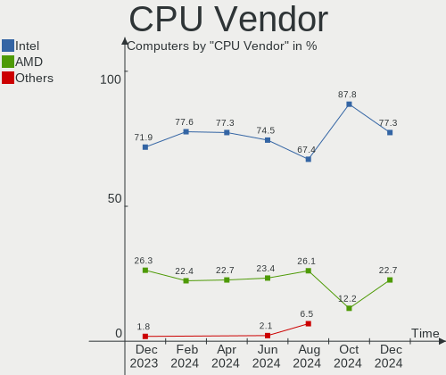
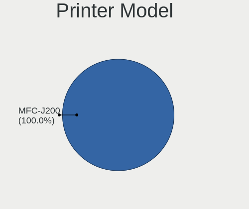
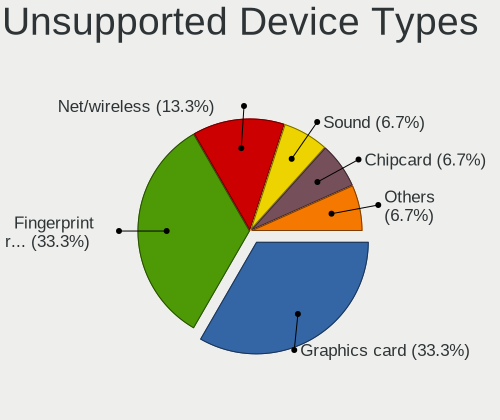

Xubuntu - Hardware Trends
-------------------------

A project to identify most popular hardware characteristics and track their change
over time based on data collected by Linux users at https://Linux-Hardware.org.

Anyone can contribute to this report by the [hw-probe](https://github.com/linuxhw/hw-probe) tool:

    sudo -E hw-probe -all -upload

This is a report for all computer types. See also reports for [desktops](/Dist/Xubuntu/Desktop/README.md) and [notebooks](/Dist/Xubuntu/Notebook/README.md).

This report is for one last month. Overall report since the beginning of time: [TestCoverage](https://github.com/linuxhw/TestCoverage)

Period: Aug, 2022.

Contents
--------

* [ System ](#system)
  - [ OS                       ](#os)
  - [ OS Family                ](#os-family)
  - [ Kernel                   ](#kernel)
  - [ Kernel Family            ](#kernel-family)
  - [ Kernel Major Ver.        ](#kernel-major-ver)
  - [ Arch                     ](#arch)
  - [ DE                       ](#de)
  - [ Display Server           ](#display-server)
  - [ Display Manager          ](#display-manager)
  - [ OS Lang                  ](#os-lang)
  - [ Boot Mode                ](#boot-mode)
  - [ Filesystem               ](#filesystem)
  - [ Part. scheme             ](#part-scheme)
  - [ Dual Boot with Linux/BSD ](#dual-boot-with-linuxbsd)
  - [ Dual Boot (Win)          ](#dual-boot-win)

* [ Board ](#board)
  - [ Vendor                   ](#vendor)
  - [ Model                    ](#model)
  - [ Model Family             ](#model-family)
  - [ MFG Year                 ](#mfg-year)
  - [ Form Factor              ](#form-factor)
  - [ Secure Boot              ](#secure-boot)
  - [ Coreboot                 ](#coreboot)
  - [ RAM Size                 ](#ram-size)
  - [ RAM Used                 ](#ram-used)
  - [ Total Drives             ](#total-drives)
  - [ Has CD-ROM               ](#has-cd-rom)
  - [ Has Ethernet             ](#has-ethernet)
  - [ Has WiFi                 ](#has-wifi)
  - [ Has Bluetooth            ](#has-bluetooth)

* [ Location ](#location)
  - [ Country                  ](#country)
  - [ City                     ](#city)

* [ Drives ](#drives)
  - [ Drive Vendor             ](#drive-vendor)
  - [ Drive Model              ](#drive-model)
  - [ HDD Vendor               ](#hdd-vendor)
  - [ SSD Vendor               ](#ssd-vendor)
  - [ Drive Kind               ](#drive-kind)
  - [ Drive Connector          ](#drive-connector)
  - [ Drive Size               ](#drive-size)
  - [ Space Total              ](#space-total)
  - [ Space Used               ](#space-used)
  - [ Malfunc. Drives          ](#malfunc-drives)
  - [ Malfunc. Drive Vendor    ](#malfunc-drive-vendor)
  - [ Malfunc. HDD Vendor      ](#malfunc-hdd-vendor)
  - [ Malfunc. Drive Kind      ](#malfunc-drive-kind)
  - [ Failed Drives            ](#failed-drives)
  - [ Failed Drive Vendor      ](#failed-drive-vendor)
  - [ Drive Status             ](#drive-status)

* [ Storage controller ](#storage-controller)
  - [ Storage Vendor           ](#storage-vendor)
  - [ Storage Model            ](#storage-model)
  - [ Storage Kind             ](#storage-kind)

* [ Processor ](#processor)
  - [ CPU Vendor               ](#cpu-vendor)
  - [ CPU Model                ](#cpu-model)
  - [ CPU Model Family         ](#cpu-model-family)
  - [ CPU Cores                ](#cpu-cores)
  - [ CPU Sockets              ](#cpu-sockets)
  - [ CPU Threads              ](#cpu-threads)
  - [ CPU Op-Modes             ](#cpu-op-modes)
  - [ CPU Microcode            ](#cpu-microcode)
  - [ CPU Microarch            ](#cpu-microarch)

* [ Graphics ](#graphics)
  - [ GPU Vendor               ](#gpu-vendor)
  - [ GPU Model                ](#gpu-model)
  - [ GPU Combo                ](#gpu-combo)
  - [ GPU Driver               ](#gpu-driver)
  - [ GPU Memory               ](#gpu-memory)

* [ Monitor ](#monitor)
  - [ Monitor Vendor           ](#monitor-vendor)
  - [ Monitor Model            ](#monitor-model)
  - [ Monitor Resolution       ](#monitor-resolution)
  - [ Monitor Diagonal         ](#monitor-diagonal)
  - [ Monitor Width            ](#monitor-width)
  - [ Aspect Ratio             ](#aspect-ratio)
  - [ Monitor Area             ](#monitor-area)
  - [ Pixel Density            ](#pixel-density)
  - [ Multiple Monitors        ](#multiple-monitors)

* [ Network ](#network)
  - [ Net Controller Vendor    ](#net-controller-vendor)
  - [ Net Controller Model     ](#net-controller-model)
  - [ Wireless Vendor          ](#wireless-vendor)
  - [ Wireless Model           ](#wireless-model)
  - [ Ethernet Vendor          ](#ethernet-vendor)
  - [ Ethernet Model           ](#ethernet-model)
  - [ Net Controller Kind      ](#net-controller-kind)
  - [ Used Controller          ](#used-controller)
  - [ NICs                     ](#nics)
  - [ IPv6                     ](#ipv6)

* [ Bluetooth ](#bluetooth)
  - [ Bluetooth Vendor         ](#bluetooth-vendor)
  - [ Bluetooth Model          ](#bluetooth-model)

* [ Sound ](#sound)
  - [ Sound Vendor             ](#sound-vendor)
  - [ Sound Model              ](#sound-model)

* [ Memory ](#memory)
  - [ Memory Vendor            ](#memory-vendor)
  - [ Memory Model             ](#memory-model)
  - [ Memory Kind              ](#memory-kind)
  - [ Memory Form Factor       ](#memory-form-factor)
  - [ Memory Size              ](#memory-size)
  - [ Memory Speed             ](#memory-speed)

* [ Printers & scanners ](#printers--scanners)
  - [ Printer Vendor           ](#printer-vendor)
  - [ Printer Model            ](#printer-model)
  - [ Scanner Vendor           ](#scanner-vendor)
  - [ Scanner Model            ](#scanner-model)

* [ Camera ](#camera)
  - [ Camera Vendor            ](#camera-vendor)
  - [ Camera Model             ](#camera-model)

* [ Security ](#security)
  - [ Fingerprint Vendor       ](#fingerprint-vendor)
  - [ Fingerprint Model        ](#fingerprint-model)
  - [ Chipcard Vendor          ](#chipcard-vendor)
  - [ Chipcard Model           ](#chipcard-model)

* [ Unsupported ](#unsupported)
  - [ Unsupported Devices      ](#unsupported-devices)
  - [ Unsupported Device Types ](#unsupported-device-types)

System
------

OS
--

Installed operating systems

| Name          | Computers | Percent |
|---------------|-----------|---------|
| Xubuntu 22.04 | 31        | 45.59%  |
| Xubuntu 20.04 | 28        | 41.18%  |
| Xubuntu 18.04 | 8         | 11.76%  |
| Xubuntu 21.10 | 1         | 1.47%   |

OS Family
---------

OS without a version

| Name    | Computers | Percent |
|---------|-----------|---------|
| Xubuntu | 68        | 100%    |

Kernel
------

Version of the Linux kernel

| Version                    | Computers | Percent |
|----------------------------|-----------|---------|
| 5.15.0-46-generic          | 22        | 32.35%  |
| 5.4.0-124-generic          | 7         | 10.29%  |
| 5.15.0-43-generic          | 7         | 10.29%  |
| 5.4.0-122-generic          | 5         | 7.35%   |
| 5.4.0-122-lowlatency       | 4         | 5.88%   |
| 5.15.0-46-lowlatency       | 3         | 4.41%   |
| 5.15.0-47-generic          | 2         | 2.94%   |
| 5.15.0-25-generic          | 2         | 2.94%   |
| 5.13.0-44-generic          | 2         | 2.94%   |
| 5.4.0-70-generic           | 1         | 1.47%   |
| 5.4.0-125-generic          | 1         | 1.47%   |
| 5.4.0-124-lowlatency       | 1         | 1.47%   |
| 5.4.0-110-generic          | 1         | 1.47%   |
| 5.19.1                     | 1         | 1.47%   |
| 5.18.0-14.2-liquorix-amd64 | 1         | 1.47%   |
| 5.17.0-1015-oem            | 1         | 1.47%   |
| 5.15.48-sunxi              | 1         | 1.47%   |
| 5.15.0-43-lowlatency       | 1         | 1.47%   |
| 5.15.0-42-lowlatency       | 1         | 1.47%   |
| 5.15.0-41-generic          | 1         | 1.47%   |
| 5.13.0-52-generic          | 1         | 1.47%   |
| 5.13.0-35-generic          | 1         | 1.47%   |
| 4.15.0-191-lowlatency      | 1         | 1.47%   |

Kernel Family
-------------

Linux kernel without a distro release

| Version | Computers | Percent |
|---------|-----------|---------|
| 5.15.0  | 39        | 57.35%  |
| 5.4.0   | 20        | 29.41%  |
| 5.13.0  | 4         | 5.88%   |
| 5.19.1  | 1         | 1.47%   |
| 5.18.0  | 1         | 1.47%   |
| 5.17.0  | 1         | 1.47%   |
| 5.15.48 | 1         | 1.47%   |
| 4.15.0  | 1         | 1.47%   |

Kernel Major Ver.
-----------------

Linux kernel major version

| Version | Computers | Percent |
|---------|-----------|---------|
| 5.15    | 40        | 58.82%  |
| 5.4     | 20        | 29.41%  |
| 5.13    | 4         | 5.88%   |
| 5.19    | 1         | 1.47%   |
| 5.18    | 1         | 1.47%   |
| 5.17    | 1         | 1.47%   |
| 4.15    | 1         | 1.47%   |

Arch
----

OS architecture (x86_64, i586, etc.)

| Name   | Computers | Percent |
|--------|-----------|---------|
| x86_64 | 64        | 94.12%  |
| i686   | 3         | 4.41%   |
| armv7l | 1         | 1.47%   |

DE
--

Desktop Environment

| Name  | Computers | Percent |
|-------|-----------|---------|
| XFCE  | 63        | 92.65%  |
| GNOME | 3         | 4.41%   |
| MATE  | 1         | 1.47%   |
| i3    | 1         | 1.47%   |

Display Server
--------------

X11 or Wayland

| Name    | Computers | Percent |
|---------|-----------|---------|
| X11     | 65        | 95.59%  |
| Tty     | 2         | 2.94%   |
| Wayland | 1         | 1.47%   |

Display Manager
---------------

SDDM, LightDM, etc.

| Name    | Computers | Percent |
|---------|-----------|---------|
| LightDM | 60        | 88.24%  |
| Unknown | 4         | 5.88%   |
| GDM     | 2         | 2.94%   |
| SLiM    | 1         | 1.47%   |
| GDM3    | 1         | 1.47%   |

OS Lang
-------

Language

| Lang  | Computers | Percent |
|-------|-----------|---------|
| en_US | 21        | 30.88%  |
| fr_FR | 12        | 17.65%  |
| de_DE | 10        | 14.71%  |
| pt_BR | 3         | 4.41%   |
| it_IT | 3         | 4.41%   |
| en_GB | 3         | 4.41%   |
| ru_RU | 2         | 2.94%   |
| en_AU | 2         | 2.94%   |
| C     | 2         | 2.94%   |
| nl_BE | 1         | 1.47%   |
| ja_JP | 1         | 1.47%   |
| hu_HU | 1         | 1.47%   |
| fr_CH | 1         | 1.47%   |
| es_PE | 1         | 1.47%   |
| es_ES | 1         | 1.47%   |
| es_CL | 1         | 1.47%   |
| en_IN | 1         | 1.47%   |
| cs_CZ | 1         | 1.47%   |
| bg_BG | 1         | 1.47%   |

Boot Mode
---------

EFI or BIOS

| Mode | Computers | Percent |
|------|-----------|---------|
| BIOS | 43        | 63.24%  |
| EFI  | 25        | 36.76%  |

Filesystem
----------

Type of filesystem

| Type    | Computers | Percent |
|---------|-----------|---------|
| Ext4    | 64        | 94.12%  |
| Btrfs   | 2         | 2.94%   |
| Overlay | 1         | 1.47%   |
| Ext3    | 1         | 1.47%   |

Part. scheme
------------

Scheme of partitioning

| Type    | Computers | Percent |
|---------|-----------|---------|
| Unknown | 35        | 51.47%  |
| GPT     | 25        | 36.76%  |
| MBR     | 8         | 11.76%  |

Dual Boot with Linux/BSD
------------------------

Hosting more than one Linux/BSD

| Dual boot | Computers | Percent |
|-----------|-----------|---------|
| No        | 53        | 77.94%  |
| Yes       | 15        | 22.06%  |

Dual Boot (Win)
---------------

Hosting Linux and Windows

| Dual boot | Computers | Percent |
|-----------|-----------|---------|
| No        | 42        | 61.76%  |
| Yes       | 26        | 38.24%  |

Board
-----

Vendor
------

Motherboard manufacturer

| Name                | Computers | Percent |
|---------------------|-----------|---------|
| ASUSTek Computer    | 15        | 22.06%  |
| Lenovo              | 11        | 16.18%  |
| Gigabyte Technology | 8         | 11.76%  |
| Dell                | 8         | 11.76%  |
| Hewlett-Packard     | 5         | 7.35%   |
| Acer                | 4         | 5.88%   |
| MSI                 | 2         | 2.94%   |
| eMachines           | 2         | 2.94%   |
| Toshiba             | 1         | 1.47%   |
| sunxi               | 1         | 1.47%   |
| Sony                | 1         | 1.47%   |
| Render              | 1         | 1.47%   |
| Panasonic           | 1         | 1.47%   |
| Packard Bell        | 1         | 1.47%   |
| OEM_MB              | 1         | 1.47%   |
| Mediacom            | 1         | 1.47%   |
| Intel               | 1         | 1.47%   |
| Foxconn             | 1         | 1.47%   |
| DNI                 | 1         | 1.47%   |
| ASRock              | 1         | 1.47%   |
| Unknown             | 1         | 1.47%   |

Model
-----

Motherboard model

| Name                                     | Computers | Percent |
|------------------------------------------|-----------|---------|
| Unknown                                  | 2         | 2.94%   |
| Toshiba PT10F                            | 1         | 1.47%   |
| sunxi Allwinner sun7i (A20) Family       | 1         | 1.47%   |
| Sony VPCSB1V9R                           | 1         | 1.47%   |
| Render NOTEBOOK                          | 1         | 1.47%   |
| Panasonic CF-31XEUAXMF                   | 1         | 1.47%   |
| Packard Bell EasyNote TJ66               | 1         | 1.47%   |
| OEM_MB KX733AA-ABU a6511.uk              | 1         | 1.47%   |
| MSI MS-7C08                              | 1         | 1.47%   |
| MSI MS-7A33                              | 1         | 1.47%   |
| Mediacom SmartBook 14 FullHD - SB14UC    | 1         | 1.47%   |
| Lenovo V340-17IWL 81RG                   | 1         | 1.47%   |
| Lenovo ThinkPad X220 4291V1C             | 1         | 1.47%   |
| Lenovo ThinkPad T480 20L5000BGE          | 1         | 1.47%   |
| Lenovo ThinkPad T460s 20FAS6JY00         | 1         | 1.47%   |
| Lenovo ThinkPad T460s 20FAS0Q900         | 1         | 1.47%   |
| Lenovo ThinkPad T430 23501K1             | 1         | 1.47%   |
| Lenovo ThinkPad P70 20ERCTO1WW           | 1         | 1.47%   |
| Lenovo ThinkPad E590 20NB002AMH          | 1         | 1.47%   |
| Lenovo IdeaPad 330S-15IKB 81F5           | 1         | 1.47%   |
| Lenovo IdeaPad 330-15IKB 81FE            | 1         | 1.47%   |
| Lenovo 14w 81MQ000JUS                    | 1         | 1.47%   |
| Intel H61                                | 1         | 1.47%   |
| HP Z1 Entry Tower G5                     | 1         | 1.47%   |
| HP Pavilion Laptop 14-dv0xxx             | 1         | 1.47%   |
| HP Pavilion Desktop 590-p0xxx            | 1         | 1.47%   |
| HP ENVY Desktop 795-06xx                 | 1         | 1.47%   |
| HP EliteBook 8540p                       | 1         | 1.47%   |
| Gigabyte Z97X-UD3H                       | 1         | 1.47%   |
| Gigabyte H97M-D3H                        | 1         | 1.47%   |
| Gigabyte H370HD3                         | 1         | 1.47%   |
| Gigabyte GA-MA790FXT-UD5P                | 1         | 1.47%   |
| Gigabyte GA-78LMT-USB3 6.0               | 1         | 1.47%   |
| Gigabyte F2A88XM-D3H                     | 1         | 1.47%   |
| Gigabyte F2A78M-HD2                      | 1         | 1.47%   |
| Gigabyte AB350-Gaming                    | 1         | 1.47%   |
| Foxconn p6-2466ef                        | 1         | 1.47%   |
| eMachines ET1352                         | 1         | 1.47%   |
| eMachines EL1358G                        | 1         | 1.47%   |
| DNI SteelHead CX-580                     | 1         | 1.47%   |
| Dell XPS 13 9380                         | 1         | 1.47%   |
| Dell System XPS L502X                    | 1         | 1.47%   |
| Dell PowerEdge T30                       | 1         | 1.47%   |
| Dell OptiPlex 7010                       | 1         | 1.47%   |
| Dell Latitude E5530 non-vPro             | 1         | 1.47%   |
| Dell Inspiron N5010                      | 1         | 1.47%   |
| Dell Inspiron 5748                       | 1         | 1.47%   |
| Dell Inspiron 530                        | 1         | 1.47%   |
| ASUS Z170 PRO GAMING                     | 1         | 1.47%   |
| ASUS Z10PE-D16 WS                        | 1         | 1.47%   |
| ASUS X101CH                              | 1         | 1.47%   |
| ASUS ROG STRIX B450-F GAMING II          | 1         | 1.47%   |
| ASUS ROG CROSSHAIR VIII DARK HERO        | 1         | 1.47%   |
| ASUS P8Z77-M PRO                         | 1         | 1.47%   |
| ASUS P8H67-M LE                          | 1         | 1.47%   |
| ASUS K84C                                | 1         | 1.47%   |
| ASUS K53TA                               | 1         | 1.47%   |
| ASUS K53SC                               | 1         | 1.47%   |
| ASUS K30AD_M31AD_M51AD                   | 1         | 1.47%   |
| ASUS ASUS TUF Gaming A15 FA507RE_FA507RE | 1         | 1.47%   |

Model Family
------------

Motherboard model prefix

| Name                      | Computers | Percent |
|---------------------------|-----------|---------|
| Lenovo ThinkPad           | 7         | 10.29%  |
| Dell Inspiron             | 3         | 4.41%   |
| Acer Aspire               | 3         | 4.41%   |
| Lenovo IdeaPad            | 2         | 2.94%   |
| HP Pavilion               | 2         | 2.94%   |
| ASUS ROG                  | 2         | 2.94%   |
| Unknown                   | 2         | 2.94%   |
| Toshiba PT10F             | 1         | 1.47%   |
| sunxi Allwinner           | 1         | 1.47%   |
| Sony VPCSB1V9R            | 1         | 1.47%   |
| Render NOTEBOOK           | 1         | 1.47%   |
| Panasonic CF-31XEUAXMF    | 1         | 1.47%   |
| Packard Bell EasyNote     | 1         | 1.47%   |
| OEM_MB KX733AA-ABU        | 1         | 1.47%   |
| MSI MS-7C08               | 1         | 1.47%   |
| MSI MS-7A33               | 1         | 1.47%   |
| Mediacom SmartBook        | 1         | 1.47%   |
| Lenovo V340-17IWL         | 1         | 1.47%   |
| Lenovo 14w                | 1         | 1.47%   |
| Intel H61                 | 1         | 1.47%   |
| HP Z1                     | 1         | 1.47%   |
| HP ENVY                   | 1         | 1.47%   |
| HP EliteBook              | 1         | 1.47%   |
| Gigabyte Z97X-UD3H        | 1         | 1.47%   |
| Gigabyte H97M-D3H         | 1         | 1.47%   |
| Gigabyte H370HD3          | 1         | 1.47%   |
| Gigabyte GA-MA790FXT-UD5P | 1         | 1.47%   |
| Gigabyte GA-78LMT-USB3    | 1         | 1.47%   |
| Gigabyte F2A88XM-D3H      | 1         | 1.47%   |
| Gigabyte F2A78M-HD2       | 1         | 1.47%   |
| Gigabyte AB350-Gaming     | 1         | 1.47%   |
| Foxconn p6-2466ef         | 1         | 1.47%   |
| eMachines ET1352          | 1         | 1.47%   |
| eMachines EL1358G         | 1         | 1.47%   |
| DNI SteelHead             | 1         | 1.47%   |
| Dell XPS                  | 1         | 1.47%   |
| Dell System               | 1         | 1.47%   |
| Dell PowerEdge            | 1         | 1.47%   |
| Dell OptiPlex             | 1         | 1.47%   |
| Dell Latitude             | 1         | 1.47%   |
| ASUS Z170                 | 1         | 1.47%   |
| ASUS Z10PE-D16            | 1         | 1.47%   |
| ASUS X101CH               | 1         | 1.47%   |
| ASUS P8Z77-M              | 1         | 1.47%   |
| ASUS P8H67-M              | 1         | 1.47%   |
| ASUS K84C                 | 1         | 1.47%   |
| ASUS K53TA                | 1         | 1.47%   |
| ASUS K53SC                | 1         | 1.47%   |
| ASUS K30AD                | 1         | 1.47%   |
| ASUS ASUS                 | 1         | 1.47%   |
| ASUS All                  | 1         | 1.47%   |
| ASUS A0000001             | 1         | 1.47%   |
| ASUS 1015CX               | 1         | 1.47%   |
| ASRock X58                | 1         | 1.47%   |

MFG Year
--------

Motherboard manufacture year

| Year    | Computers | Percent |
|---------|-----------|---------|
| 2011    | 10        | 14.71%  |
| 2014    | 9         | 13.24%  |
| 2018    | 8         | 11.76%  |
| 2012    | 6         | 8.82%   |
| 2019    | 5         | 7.35%   |
| 2017    | 5         | 7.35%   |
| 2010    | 5         | 7.35%   |
| 2013    | 4         | 5.88%   |
| 2016    | 3         | 4.41%   |
| 2009    | 3         | 4.41%   |
| 2022    | 2         | 2.94%   |
| 2021    | 2         | 2.94%   |
| 2015    | 2         | 2.94%   |
| 2020    | 1         | 1.47%   |
| 2008    | 1         | 1.47%   |
| 2007    | 1         | 1.47%   |
| Unknown | 1         | 1.47%   |

Form Factor
-----------

Physical design of the computer

| Name           | Computers | Percent |
|----------------|-----------|---------|
| Notebook       | 35        | 51.47%  |
| Desktop        | 32        | 47.06%  |
| System on chip | 1         | 1.47%   |

Secure Boot
-----------

Enabled or disabled

| State    | Computers | Percent |
|----------|-----------|---------|
| Disabled | 64        | 94.12%  |
| Enabled  | 4         | 5.88%   |

Coreboot
--------

Have coreboot on board

| Used | Computers | Percent |
|------|-----------|---------|
| No   | 68        | 100%    |

RAM Size
--------

Total RAM memory

| Size in GB  | Computers | Percent |
|-------------|-----------|---------|
| 4.01-8.0    | 20        | 29.41%  |
| 3.01-4.0    | 13        | 19.12%  |
| 16.01-24.0  | 13        | 19.12%  |
| 32.01-64.0  | 7         | 10.29%  |
| 8.01-16.0   | 5         | 7.35%   |
| 1.01-2.0    | 4         | 5.88%   |
| 64.01-256.0 | 2         | 2.94%   |
| 0.51-1.0    | 2         | 2.94%   |
| 24.01-32.0  | 1         | 1.47%   |
| 2.01-3.0    | 1         | 1.47%   |

RAM Used
--------

Used RAM memory

| Used GB   | Computers | Percent |
|-----------|-----------|---------|
| 1.01-2.0  | 29        | 42.65%  |
| 2.01-3.0  | 16        | 23.53%  |
| 4.01-8.0  | 7         | 10.29%  |
| 3.01-4.0  | 6         | 8.82%   |
| 0.51-1.0  | 6         | 8.82%   |
| 8.01-16.0 | 3         | 4.41%   |
| 0.01-0.5  | 1         | 1.47%   |

Total Drives
------------

Number of drives on board

| Drives | Computers | Percent |
|--------|-----------|---------|
| 1      | 36        | 52.94%  |
| 2      | 16        | 23.53%  |
| 3      | 8         | 11.76%  |
| 4      | 3         | 4.41%   |
| 7      | 2         | 2.94%   |
| 8      | 1         | 1.47%   |
| 6      | 1         | 1.47%   |
| 5      | 1         | 1.47%   |

Has CD-ROM
----------

Has CD-ROM on board

| Presented | Computers | Percent |
|-----------|-----------|---------|
| Yes       | 39        | 57.35%  |
| No        | 29        | 42.65%  |

Has Ethernet
------------

Has Ethernet on board

| Presented | Computers | Percent |
|-----------|-----------|---------|
| Yes       | 64        | 94.12%  |
| No        | 4         | 5.88%   |

Has WiFi
--------

Has WiFi module

| Presented | Computers | Percent |
|-----------|-----------|---------|
| Yes       | 42        | 61.76%  |
| No        | 26        | 38.24%  |

Has Bluetooth
-------------

Has Bluetooth module

| Presented | Computers | Percent |
|-----------|-----------|---------|
| No        | 41        | 60.29%  |
| Yes       | 27        | 39.71%  |

Location
--------

Country
-------

Geographic location (country)

| Country      | Computers | Percent |
|--------------|-----------|---------|
| Germany      | 10        | 14.71%  |
| France       | 10        | 14.71%  |
| USA          | 8         | 11.76%  |
| Italy        | 5         | 7.35%   |
| Brazil       | 5         | 7.35%   |
| Russia       | 4         | 5.88%   |
| UK           | 3         | 4.41%   |
| Iran         | 2         | 2.94%   |
| Belgium      | 2         | 2.94%   |
| Australia    | 2         | 2.94%   |
| Taiwan       | 1         | 1.47%   |
| Switzerland  | 1         | 1.47%   |
| Spain        | 1         | 1.47%   |
| South Africa | 1         | 1.47%   |
| Romania      | 1         | 1.47%   |
| Portugal     | 1         | 1.47%   |
| Peru         | 1         | 1.47%   |
| Netherlands  | 1         | 1.47%   |
| Japan        | 1         | 1.47%   |
| India        | 1         | 1.47%   |
| Hungary      | 1         | 1.47%   |
| Guadeloupe   | 1         | 1.47%   |
| Ecuador      | 1         | 1.47%   |
| Czechia      | 1         | 1.47%   |
| Chile        | 1         | 1.47%   |
| Bulgaria     | 1         | 1.47%   |
| Austria      | 1         | 1.47%   |

City
----

Geographic location (city)

| City                    | Computers | Percent |
|-------------------------|-----------|---------|
| Paris                   | 3         | 4.41%   |
| Sydney                  | 2         | 2.94%   |
| Moscow                  | 2         | 2.94%   |
| Yokohama                | 1         | 1.47%   |
| Vidin                   | 1         | 1.47%   |
| Treviso                 | 1         | 1.47%   |
| Toccoa                  | 1         | 1.47%   |
| Tehran                  | 1         | 1.47%   |
| St Petersburg           | 1         | 1.47%   |
| Schmalkalden            | 1         | 1.47%   |
| Sainte-Rose             | 1         | 1.47%   |
| Saint-Gilles            | 1         | 1.47%   |
| Saint Joseph            | 1         | 1.47%   |
| Renca                   | 1         | 1.47%   |
| Rehnān                 | 1         | 1.47%   |
| Porto Alegre            | 1         | 1.47%   |
| Pontault-Combault       | 1         | 1.47%   |
| Pilsen                  | 1         | 1.47%   |
| Pieris                  | 1         | 1.47%   |
| New Taipei              | 1         | 1.47%   |
| Munich                  | 1         | 1.47%   |
| Madrid                  | 1         | 1.47%   |
| Ludwigsburg             | 1         | 1.47%   |
| Lisbon                  | 1         | 1.47%   |
| Linz                    | 1         | 1.47%   |
| Lindlar                 | 1         | 1.47%   |
| Lima                    | 1         | 1.47%   |
| Leipzig                 | 1         | 1.47%   |
| Le Château-d’Oléron | 1         | 1.47%   |
| Lansdale                | 1         | 1.47%   |
| La Tour-de-Peilz        | 1         | 1.47%   |
| Kamensk-Shakhtinsky     | 1         | 1.47%   |
| Islington               | 1         | 1.47%   |
| Indianapolis            | 1         | 1.47%   |
| Indaiatuba              | 1         | 1.47%   |
| Hennebont               | 1         | 1.47%   |
| Hauzenberg              | 1         | 1.47%   |
| Haarlem                 | 1         | 1.47%   |
| Gunupur                 | 1         | 1.47%   |
| Ghent                   | 1         | 1.47%   |
| Genoa                   | 1         | 1.47%   |
| Farmington              | 1         | 1.47%   |
| Élancourt              | 1         | 1.47%   |
| Effiat                  | 1         | 1.47%   |
| Edinburgh               | 1         | 1.47%   |
| Durham                  | 1         | 1.47%   |
| Durbanville             | 1         | 1.47%   |
| Dresden                 | 1         | 1.47%   |
| Dothan                  | 1         | 1.47%   |
| Darmstadt               | 1         | 1.47%   |
| Cuenca                  | 1         | 1.47%   |
| Chapecó                | 1         | 1.47%   |
| Carapicuiba             | 1         | 1.47%   |
| Camden                  | 1         | 1.47%   |
| Budapest                | 1         | 1.47%   |
| Bruchsal                | 1         | 1.47%   |
| Bristol                 | 1         | 1.47%   |
| Bressuire               | 1         | 1.47%   |
| Brasov                  | 1         | 1.47%   |
| Brasília               | 1         | 1.47%   |

Drives
------

Drive Vendor
------------

Hard drive vendors

| Vendor              | Computers | Drives | Percent |
|---------------------|-----------|--------|---------|
| WDC                 | 19        | 27     | 17.76%  |
| Seagate             | 19        | 24     | 17.76%  |
| Samsung Electronics | 19        | 22     | 17.76%  |
| Toshiba             | 8         | 11     | 7.48%   |
| Crucial             | 7         | 9      | 6.54%   |
| Hitachi             | 6         | 12     | 5.61%   |
| Unknown             | 4         | 4      | 3.74%   |
| SK hynix            | 3         | 3      | 2.8%    |
| Phison              | 3         | 4      | 2.8%    |
| PNY                 | 2         | 2      | 1.87%   |
| Kingston            | 2         | 2      | 1.87%   |
| Intel               | 2         | 2      | 1.87%   |
| China               | 2         | 2      | 1.87%   |
| A-DATA Technology   | 2         | 2      | 1.87%   |
| Wintec              | 1         | 1      | 0.93%   |
| USB3.0              | 1         | 1      | 0.93%   |
| SPCC                | 1         | 1      | 0.93%   |
| Patriot             | 1         | 1      | 0.93%   |
| OCZ                 | 1         | 1      | 0.93%   |
| Micron Technology   | 1         | 1      | 0.93%   |
| KingSpec            | 1         | 1      | 0.93%   |
| Emtec               | 1         | 1      | 0.93%   |
| Apple               | 1         | 1      | 0.93%   |

Drive Model
-----------

Hard drive models

| Model                                   | Computers | Percent |
|-----------------------------------------|-----------|---------|
| Seagate ST1000DM003-1SB102 1TB          | 3         | 2.42%   |
| Seagate ST3500413AS 500GB               | 2         | 1.61%   |
| Seagate ST3320620AS 320GB               | 2         | 1.61%   |
| Hitachi HTS547550A9E384 500GB           | 2         | 1.61%   |
| Wintec S6 30G M.2 SSD                   | 1         | 0.81%   |
| WDC WD80EFAX-68KNBN0 8TB                | 1         | 0.81%   |
| WDC WD740ADFD-00NLR5 74GB               | 1         | 0.81%   |
| WDC WD5000BEKT-75KA9T0 500GB            | 1         | 0.81%   |
| WDC WD40EZAZ-00SF3B0 4TB                | 1         | 0.81%   |
| WDC WD4003FRYZ-01F0DB0 4TB              | 1         | 0.81%   |
| WDC WD3200BPVT-80JJ5T0 320GB            | 1         | 0.81%   |
| WDC WD3200AAJS-60Z0A0 320GB             | 1         | 0.81%   |
| WDC WD30EZRZ-00Z5HB0 3TB                | 1         | 0.81%   |
| WDC WD30 EZRX-00D8PB0 3TB               | 1         | 0.81%   |
| WDC WD20EZRX-00D8PB0 2TB                | 1         | 0.81%   |
| WDC WD20EARX-00PASB0 2TB                | 1         | 0.81%   |
| WDC WD2002FYPS-02W3B0 2TB               | 1         | 0.81%   |
| WDC WD1600JS-60MHB1 160GB               | 1         | 0.81%   |
| WDC WD10SPZX-24Z10T0 1TB                | 1         | 0.81%   |
| WDC WD10SPZX-24Z10 1TB                  | 1         | 0.81%   |
| WDC WD10PURX-64D85Y0 1TB                | 1         | 0.81%   |
| WDC WD10JUCT-63CYNY0 1TB                | 1         | 0.81%   |
| WDC WD10JPVX-22JC3T0 1TB                | 1         | 0.81%   |
| WDC WD10EZEX-60ZF5A0 1TB                | 1         | 0.81%   |
| WDC WD10EZEX-08WN4A0 1TB                | 1         | 0.81%   |
| WDC WD10EZEX-00BN5A0 1TB                | 1         | 0.81%   |
| WDC WD10EARS-00Y5B1 1TB                 | 1         | 0.81%   |
| WDC WD10EADX-22TDHB0 1TB                | 1         | 0.81%   |
| WDC WD102KFBX-68M95N0 10TB              | 1         | 0.81%   |
| WDC WD1003FZEX-00K3CA0 1TB              | 1         | 0.81%   |
| USB3.0 Super Speed 128GB                | 1         | 0.81%   |
| Unknown SE08G  8GB                      | 1         | 0.81%   |
| Unknown NCard  32GB                     | 1         | 0.81%   |
| Unknown GE8QT  256GB                    | 1         | 0.81%   |
| Unknown DA4064  64GB                    | 1         | 0.81%   |
| Toshiba Q300 120GB SSD                  | 1         | 0.81%   |
| Toshiba MQ01ABF050 500GB                | 1         | 0.81%   |
| Toshiba MK5065GSX 500GB                 | 1         | 0.81%   |
| Toshiba MK3265GSXF 320GB                | 1         | 0.81%   |
| Toshiba HDWE140 4TB                     | 1         | 0.81%   |
| Toshiba DT01ACA300 3TB                  | 1         | 0.81%   |
| Toshiba DT01ACA200 2TB                  | 1         | 0.81%   |
| Toshiba DT01ACA050 500GB                | 1         | 0.81%   |
| SPCC Solid State Disk 240GB             | 1         | 0.81%   |
| SK hynix PC601 HFS512GD9TNG-L2A0A 512GB | 1         | 0.81%   |
| SK hynix PC401 NVMe 256GB               | 1         | 0.81%   |
| SK hynix HFM512GDHTNG-8710B 512GB       | 1         | 0.81%   |
| Seagate ST9750420AS 752GB               | 1         | 0.81%   |
| Seagate ST9500420AS 500GB               | 1         | 0.81%   |
| Seagate ST9320325AS 320GB               | 1         | 0.81%   |
| Seagate ST8000DM004-2CX188 8TB          | 1         | 0.81%   |
| Seagate ST500LM012 HN-M500MBB 500GB     | 1         | 0.81%   |
| Seagate ST3750840AS 752GB               | 1         | 0.81%   |
| Seagate ST3250820AS 250GB               | 1         | 0.81%   |
| Seagate ST3250318AS 250GB               | 1         | 0.81%   |
| Seagate ST250DM000-1BD141 250GB         | 1         | 0.81%   |
| Seagate ST2000LM015-2E8174 2TB          | 1         | 0.81%   |
| Seagate ST2000DL003-9VT166 2TB          | 1         | 0.81%   |
| Seagate ST1000LV000-2G3172 1TB          | 1         | 0.81%   |
| Seagate ST1000LM035-1RK172 1TB          | 1         | 0.81%   |

HDD Vendor
----------

Hard disk drive vendors

| Vendor              | Computers | Drives | Percent |
|---------------------|-----------|--------|---------|
| WDC                 | 19        | 27     | 32.76%  |
| Seagate             | 19        | 24     | 32.76%  |
| Toshiba             | 7         | 10     | 12.07%  |
| Hitachi             | 6         | 12     | 10.34%  |
| Samsung Electronics | 5         | 5      | 8.62%   |
| USB3.0              | 1         | 1      | 1.72%   |
| Apple               | 1         | 1      | 1.72%   |

SSD Vendor
----------

Solid state drive vendors

| Vendor              | Computers | Drives | Percent |
|---------------------|-----------|--------|---------|
| Samsung Electronics | 8         | 9      | 27.59%  |
| Crucial             | 6         | 8      | 20.69%  |
| Kingston            | 2         | 2      | 6.9%    |
| China               | 2         | 2      | 6.9%    |
| A-DATA Technology   | 2         | 2      | 6.9%    |
| Wintec              | 1         | 1      | 3.45%   |
| Toshiba             | 1         | 1      | 3.45%   |
| SPCC                | 1         | 1      | 3.45%   |
| PNY                 | 1         | 1      | 3.45%   |
| Patriot             | 1         | 1      | 3.45%   |
| OCZ                 | 1         | 1      | 3.45%   |
| Micron Technology   | 1         | 1      | 3.45%   |
| KingSpec            | 1         | 1      | 3.45%   |
| Intel               | 1         | 1      | 3.45%   |

Drive Kind
----------

HDD or SSD

| Kind    | Computers | Drives | Percent |
|---------|-----------|--------|---------|
| HDD     | 43        | 80     | 48.86%  |
| SSD     | 24        | 32     | 27.27%  |
| NVMe    | 16        | 18     | 18.18%  |
| MMC     | 4         | 4      | 4.55%   |
| Unknown | 1         | 1      | 1.14%   |

Drive Connector
---------------

SATA, SAS, NVMe, etc.

| Type | Computers | Drives | Percent |
|------|-----------|--------|---------|
| SATA | 55        | 110    | 70.51%  |
| NVMe | 16        | 18     | 20.51%  |
| MMC  | 4         | 4      | 5.13%   |
| SAS  | 3         | 3      | 3.85%   |

Drive Size
----------

Size of hard drive

| Size in TB | Computers | Drives | Percent |
|------------|-----------|--------|---------|
| 0.01-0.5   | 40        | 58     | 51.28%  |
| 0.51-1.0   | 24        | 31     | 30.77%  |
| 1.01-2.0   | 7         | 9      | 8.97%   |
| 3.01-4.0   | 3         | 3      | 3.85%   |
| 2.01-3.0   | 2         | 7      | 2.56%   |
| 4.01-10.0  | 2         | 4      | 2.56%   |

Space Total
-----------

Amount of disk space available on the file system

| Size in GB     | Computers | Percent |
|----------------|-----------|---------|
| 101-250        | 19        | 27.94%  |
| 251-500        | 15        | 22.06%  |
| 501-1000       | 11        | 16.18%  |
| 1001-2000      | 7         | 10.29%  |
| More than 3000 | 4         | 5.88%   |
| 51-100         | 4         | 5.88%   |
| 21-50          | 3         | 4.41%   |
| 2001-3000      | 3         | 4.41%   |
| 1-20           | 2         | 2.94%   |

Space Used
----------

Amount of used disk space

| Used GB        | Computers | Percent |
|----------------|-----------|---------|
| 1-20           | 14        | 20.59%  |
| 21-50          | 13        | 19.12%  |
| 251-500        | 12        | 17.65%  |
| 101-250        | 10        | 14.71%  |
| 51-100         | 9         | 13.24%  |
| 1001-2000      | 4         | 5.88%   |
| 501-1000       | 4         | 5.88%   |
| More than 3000 | 2         | 2.94%   |

Malfunc. Drives
---------------

Drive models with a malfunction

| Model                             | Computers | Drives | Percent |
|-----------------------------------|-----------|--------|---------|
| WDC WD5000BEKT-75KA9T0 500GB      | 1         | 1      | 6.67%   |
| WDC WD3200AAJS-60Z0A0 320GB       | 1         | 1      | 6.67%   |
| WDC WD2002FYPS-02W3B0 2TB         | 1         | 1      | 6.67%   |
| WDC WD10EZEX-60ZF5A0 1TB          | 1         | 1      | 6.67%   |
| WDC WD10EARS-00Y5B1 1TB           | 1         | 1      | 6.67%   |
| Toshiba MK3265GSXF 320GB          | 1         | 1      | 6.67%   |
| Seagate ST3750840AS 752GB         | 1         | 1      | 6.67%   |
| Seagate ST3500413AS 500GB         | 1         | 1      | 6.67%   |
| Seagate ST3250318AS 250GB         | 1         | 1      | 6.67%   |
| Seagate ST10000NM0086-2AA101 10TB | 1         | 1      | 6.67%   |
| Samsung Electronics HM320JI 320GB | 1         | 1      | 6.67%   |
| Samsung Electronics HD081GJ 80GB  | 1         | 1      | 6.67%   |
| Hitachi HTS543212L9A300 120GB     | 1         | 1      | 6.67%   |
| Hitachi HDS721010CLA332 1TB       | 1         | 1      | 6.67%   |
| Hitachi HCP725032GLA380 320GB     | 1         | 2      | 6.67%   |

Malfunc. Drive Vendor
---------------------

Vendors of faulty drives

| Vendor              | Computers | Drives | Percent |
|---------------------|-----------|--------|---------|
| WDC                 | 5         | 5      | 33.33%  |
| Seagate             | 4         | 4      | 26.67%  |
| Hitachi             | 3         | 4      | 20%     |
| Samsung Electronics | 2         | 2      | 13.33%  |
| Toshiba             | 1         | 1      | 6.67%   |

Malfunc. HDD Vendor
-------------------

Vendors of faulty HDD drives

| Vendor              | Computers | Drives | Percent |
|---------------------|-----------|--------|---------|
| WDC                 | 5         | 5      | 33.33%  |
| Seagate             | 4         | 4      | 26.67%  |
| Hitachi             | 3         | 4      | 20%     |
| Samsung Electronics | 2         | 2      | 13.33%  |
| Toshiba             | 1         | 1      | 6.67%   |

Malfunc. Drive Kind
-------------------

Kinds of faulty drives

| Kind | Computers | Drives | Percent |
|------|-----------|--------|---------|
| HDD  | 13        | 16     | 100%    |

Failed Drives
-------------

Failed drive models

Zero info for selected period =(

Failed Drive Vendor
-------------------

Failed drive vendors

Zero info for selected period =(

Drive Status
------------

Number of failed and malfunc. drives

| Status   | Computers | Drives | Percent |
|----------|-----------|--------|---------|
| Detected | 40        | 75     | 50.63%  |
| Works    | 26        | 44     | 32.91%  |
| Malfunc  | 13        | 16     | 16.46%  |

Storage controller
------------------

Storage Vendor
--------------

Storage controller vendors

| Vendor                    | Computers | Percent |
|---------------------------|-----------|---------|
| Intel                     | 45        | 54.88%  |
| AMD                       | 13        | 15.85%  |
| Samsung Electronics       | 7         | 8.54%   |
| Phison Electronics        | 4         | 4.88%   |
| SK hynix                  | 3         | 3.66%   |
| Nvidia                    | 3         | 3.66%   |
| ASMedia Technology        | 3         | 3.66%   |
| Micron/Crucial Technology | 1         | 1.22%   |
| Marvell Technology Group  | 1         | 1.22%   |
| JMicron Technology        | 1         | 1.22%   |
| Adaptec                   | 1         | 1.22%   |

Storage Model
-------------

Storage controller models

| Model                                                                                   | Computers | Percent |
|-----------------------------------------------------------------------------------------|-----------|---------|
| AMD FCH SATA Controller [AHCI mode]                                                     | 8         | 8.33%   |
| Intel 6 Series/C200 Series Chipset Family 6 port Mobile SATA AHCI Controller            | 5         | 5.21%   |
| Samsung NVMe SSD Controller SM981/PM981/PM983                                           | 3         | 3.13%   |
| Phison E12 NVMe Controller                                                              | 3         | 3.13%   |
| Nvidia MCP61 SATA Controller                                                            | 3         | 3.13%   |
| Intel NM10/ICH7 Family SATA Controller [AHCI mode]                                      | 3         | 3.13%   |
| Intel Cannon Lake PCH SATA AHCI Controller                                              | 3         | 3.13%   |
| Intel 9 Series Chipset Family SATA Controller [AHCI Mode]                               | 3         | 3.13%   |
| Intel 7 Series Chipset Family 6-port SATA Controller [AHCI mode]                        | 3         | 3.13%   |
| ASMedia ASM1062 Serial ATA Controller                                                   | 3         | 3.13%   |
| Samsung NVMe SSD Controller 980                                                         | 2         | 2.08%   |
| Nvidia MCP61 IDE                                                                        | 2         | 2.08%   |
| Intel Sunrise Point-LP SATA Controller [AHCI mode]                                      | 2         | 2.08%   |
| Intel Q170/Q150/B150/H170/H110/Z170/CM236 Chipset SATA Controller [AHCI Mode]           | 2         | 2.08%   |
| Intel 82801IBM/IEM (ICH9M/ICH9M-E) 4 port SATA Controller [AHCI mode]                   | 2         | 2.08%   |
| Intel 8 Series/C220 Series Chipset Family 6-port SATA Controller 1 [AHCI mode]          | 2         | 2.08%   |
| Intel 8 Series SATA Controller 1 [AHCI mode]                                            | 2         | 2.08%   |
| Intel 7 Series/C210 Series Chipset Family 6-port SATA Controller [AHCI mode]            | 2         | 2.08%   |
| Intel 6 Series/C200 Series Chipset Family 6 port Desktop SATA AHCI Controller           | 2         | 2.08%   |
| Intel 5 Series/3400 Series Chipset 6 port SATA AHCI Controller                          | 2         | 2.08%   |
| Intel 5 Series/3400 Series Chipset 4 port SATA AHCI Controller                          | 2         | 2.08%   |
| AMD SB7x0/SB8x0/SB9x0 IDE Controller                                                    | 2         | 2.08%   |
| AMD 400 Series Chipset SATA Controller                                                  | 2         | 2.08%   |
| AMD 300 Series Chipset SATA Controller                                                  | 2         | 2.08%   |
| SK hynix PC401 NVMe Solid State Drive 256GB                                             | 1         | 1.04%   |
| SK hynix Non-Volatile memory controller                                                 | 1         | 1.04%   |
| SK hynix BC501 NVMe Solid State Drive                                                   | 1         | 1.04%   |
| Samsung NVMe SSD Controller SM961/PM961/SM963                                           | 1         | 1.04%   |
| Samsung NVMe SSD Controller SM951/PM951                                                 | 1         | 1.04%   |
| Phison E18 PCIe4 NVMe Controller                                                        | 1         | 1.04%   |
| Micron/Crucial NVMe Controller                                                          | 1         | 1.04%   |
| Marvell Group 88SE91A3 SATA-600 Controller                                              | 1         | 1.04%   |
| Marvell Group 88SE912x IDE Controller                                                   | 1         | 1.04%   |
| JMicron JMB363 SATA/IDE Controller                                                      | 1         | 1.04%   |
| Intel Volume Management Device NVMe RAID Controller                                     | 1         | 1.04%   |
| Intel SATA Controller [RAID mode]                                                       | 1         | 1.04%   |
| Intel Non-Volatile memory controller                                                    | 1         | 1.04%   |
| Intel Cannon Point-LP SATA Controller [AHCI Mode]                                       | 1         | 1.04%   |
| Intel C610/X99 series chipset sSATA Controller [AHCI mode]                              | 1         | 1.04%   |
| Intel C610/X99 series chipset 6-Port SATA Controller [AHCI mode]                        | 1         | 1.04%   |
| Intel 82801JI (ICH10 Family) 4 port SATA IDE Controller #1                              | 1         | 1.04%   |
| Intel 82801JI (ICH10 Family) 2 port SATA IDE Controller #2                              | 1         | 1.04%   |
| Intel 82801IR/IO/IH (ICH9R/DO/DH) 4 port SATA Controller [IDE mode]                     | 1         | 1.04%   |
| Intel 82801I (ICH9 Family) 2 port SATA Controller [IDE mode]                            | 1         | 1.04%   |
| Intel 7 Series Chipset Family 4-port SATA Controller [IDE mode]                         | 1         | 1.04%   |
| Intel 7 Series Chipset Family 2-port SATA Controller [IDE mode]                         | 1         | 1.04%   |
| Intel 6 Series/C200 Series Chipset Family Desktop SATA Controller (IDE mode, ports 4-5) | 1         | 1.04%   |
| Intel 6 Series/C200 Series Chipset Family Desktop SATA Controller (IDE mode, ports 0-3) | 1         | 1.04%   |
| Intel 200 Series PCH SATA controller [AHCI mode]                                        | 1         | 1.04%   |
| AMD X370 Series Chipset SATA Controller                                                 | 1         | 1.04%   |
| AMD SB7x0/SB8x0/SB9x0 SATA Controller [IDE mode]                                        | 1         | 1.04%   |
| AMD SB7x0/SB8x0/SB9x0 SATA Controller [AHCI mode]                                       | 1         | 1.04%   |
| AMD FCH SATA Controller [RAID mode]                                                     | 1         | 1.04%   |
| AMD FCH SATA Controller [IDE mode]                                                      | 1         | 1.04%   |
| Adaptec AHA-2930CU                                                                      | 1         | 1.04%   |

Storage Kind
------------

Kind of storage controller (IDE, SATA, NVMe, SAS, ...)

| Kind | Computers | Percent |
|------|-----------|---------|
| SATA | 51        | 63.75%  |
| NVMe | 16        | 20%     |
| IDE  | 9         | 11.25%  |
| RAID | 3         | 3.75%   |
| SCSI | 1         | 1.25%   |

Processor
---------

CPU Vendor
----------

Processor vendors

| Vendor | Computers | Percent |
|--------|-----------|---------|
| Intel  | 50        | 73.53%  |
| AMD    | 17        | 25%     |
| ARM    | 1         | 1.47%   |

CPU Model
---------

Processor models

| Model                                         | Computers | Percent |
|-----------------------------------------------|-----------|---------|
| Intel Core i7-8565U CPU @ 1.80GHz             | 2         | 2.94%   |
| Intel Core i7-2670QM CPU @ 2.20GHz            | 2         | 2.94%   |
| Intel Core i5-8250U CPU @ 1.60GHz             | 2         | 2.94%   |
| Intel Core i5-6300U CPU @ 2.40GHz             | 2         | 2.94%   |
| Intel Core i5-3470 CPU @ 3.20GHz              | 2         | 2.94%   |
| Intel Core i5-3320M CPU @ 2.60GHz             | 2         | 2.94%   |
| Intel Atom CPU N2600 @ 1.60GHz                | 2         | 2.94%   |
| Intel Xeon CPU E5-2603 v4 @ 1.70GHz           | 1         | 1.47%   |
| Intel Xeon CPU E3-1505M v5 @ 2.80GHz          | 1         | 1.47%   |
| Intel Xeon CPU E3-1225 v5 @ 3.30GHz           | 1         | 1.47%   |
| Intel Xeon CPU D-1513N @ 1.60GHz              | 1         | 1.47%   |
| Intel Pentium Dual-Core CPU T4300 @ 2.10GHz   | 1         | 1.47%   |
| Intel Pentium Dual CPU E2180 @ 2.00GHz        | 1         | 1.47%   |
| Intel Pentium CPU P6000 @ 1.87GHz             | 1         | 1.47%   |
| Intel Pentium CPU B950 @ 2.10GHz              | 1         | 1.47%   |
| Intel Pentium CPU 5405U @ 2.30GHz             | 1         | 1.47%   |
| Intel Core i9-9900 CPU @ 3.10GHz              | 1         | 1.47%   |
| Intel Core i7-9700 CPU @ 3.00GHz              | 1         | 1.47%   |
| Intel Core i7-8700 CPU @ 3.20GHz              | 1         | 1.47%   |
| Intel Core i7-8550U CPU @ 1.80GHz             | 1         | 1.47%   |
| Intel Core i7-6700K CPU @ 4.00GHz             | 1         | 1.47%   |
| Intel Core i7-4790K CPU @ 4.00GHz             | 1         | 1.47%   |
| Intel Core i7-4790 CPU @ 3.60GHz              | 1         | 1.47%   |
| Intel Core i7-4510U CPU @ 2.00GHz             | 1         | 1.47%   |
| Intel Core i7-3770K CPU @ 3.50GHz             | 1         | 1.47%   |
| Intel Core i7 CPU 950 @ 3.07GHz               | 1         | 1.47%   |
| Intel Core i5-4690K CPU @ 3.50GHz             | 1         | 1.47%   |
| Intel Core i5-4590 CPU @ 3.30GHz              | 1         | 1.47%   |
| Intel Core i5-4210U CPU @ 1.70GHz             | 1         | 1.47%   |
| Intel Core i5-3380M CPU @ 2.90GHz             | 1         | 1.47%   |
| Intel Core i5-3350P CPU @ 3.10GHz             | 1         | 1.47%   |
| Intel Core i5-2540M CPU @ 2.60GHz             | 1         | 1.47%   |
| Intel Core i5-2410M CPU @ 2.30GHz             | 1         | 1.47%   |
| Intel Core i5 CPU M 520 @ 2.40GHz             | 1         | 1.47%   |
| Intel Core i3-9100 CPU @ 3.60GHz              | 1         | 1.47%   |
| Intel Core i3-2100 CPU @ 3.10GHz              | 1         | 1.47%   |
| Intel Core i3 CPU M 380 @ 2.53GHz             | 1         | 1.47%   |
| Intel Core i3 CPU M 330 @ 2.13GHz             | 1         | 1.47%   |
| Intel Core 2 Duo CPU T7500 @ 2.20GHz          | 1         | 1.47%   |
| Intel Celeron CPU 1005M @ 1.90GHz             | 1         | 1.47%   |
| Intel Atom x5-Z8300 CPU @ 1.44GHz             | 1         | 1.47%   |
| Intel Atom CPU N570 @ 1.66GHz                 | 1         | 1.47%   |
| Intel 11th Gen Core i5-1135G7 @ 2.40GHz       | 1         | 1.47%   |
| ARM Allwinner sun7i (A20) Family Processor    | 1         | 1.47%   |
| AMD Ryzen 9 5950X 16-Core Processor           | 1         | 1.47%   |
| AMD Ryzen 7 6800H with Radeon Graphics        | 1         | 1.47%   |
| AMD Ryzen 7 5800X 8-Core Processor            | 1         | 1.47%   |
| AMD Ryzen 7 2700 Eight-Core Processor         | 1         | 1.47%   |
| AMD Ryzen 5 2600X Six-Core Processor          | 1         | 1.47%   |
| AMD Ryzen 5 1500X Quad-Core Processor         | 1         | 1.47%   |
| AMD Ryzen 3 2200G with Radeon Vega Graphics   | 1         | 1.47%   |
| AMD Processor model unknown                   | 1         | 1.47%   |
| AMD Phenom II X4 955 Processor                | 1         | 1.47%   |
| AMD FX-6300 Six-Core Processor                | 1         | 1.47%   |
| AMD Athlon X4 845 Quad Core Processor         | 1         | 1.47%   |
| AMD Athlon II X2 220 Processor                | 1         | 1.47%   |
| AMD Athlon II 160u Processor                  | 1         | 1.47%   |
| AMD A8-6600K APU with Radeon HD Graphics      | 1         | 1.47%   |
| AMD A6-9220C RADEON R5, 5 COMPUTE CORES 2C+3G | 1         | 1.47%   |
| AMD A6-4400M APU with Radeon HD Graphics      | 1         | 1.47%   |

CPU Model Family
----------------

Processor model prefix

| Model                   | Computers | Percent |
|-------------------------|-----------|---------|
| Intel Core i5           | 16        | 23.53%  |
| Intel Core i7           | 13        | 19.12%  |
| Intel Xeon              | 4         | 5.88%   |
| Intel Core i3           | 4         | 5.88%   |
| Intel Atom              | 4         | 5.88%   |
| Intel Pentium           | 3         | 4.41%   |
| AMD Ryzen 7             | 3         | 4.41%   |
| AMD A6                  | 3         | 4.41%   |
| Other                   | 2         | 2.94%   |
| AMD Ryzen 5             | 2         | 2.94%   |
| Intel Pentium Dual-Core | 1         | 1.47%   |
| Intel Pentium Dual      | 1         | 1.47%   |
| Intel Core i9           | 1         | 1.47%   |
| Intel Core 2 Duo        | 1         | 1.47%   |
| Intel Celeron           | 1         | 1.47%   |
| ARM Allwinner           | 1         | 1.47%   |
| AMD Ryzen 9             | 1         | 1.47%   |
| AMD Ryzen 3             | 1         | 1.47%   |
| AMD Phenom II X4        | 1         | 1.47%   |
| AMD FX                  | 1         | 1.47%   |
| AMD Athlon X4           | 1         | 1.47%   |
| AMD Athlon II X2        | 1         | 1.47%   |
| AMD Athlon II           | 1         | 1.47%   |
| AMD A8                  | 1         | 1.47%   |

CPU Cores
---------

Number of processor cores

| Number | Computers | Percent |
|--------|-----------|---------|
| 4      | 28        | 41.18%  |
| 2      | 28        | 41.18%  |
| 8      | 5         | 7.35%   |
| 6      | 2         | 2.94%   |
| 3      | 2         | 2.94%   |
| 1      | 2         | 2.94%   |
| 16     | 1         | 1.47%   |

CPU Sockets
-----------

Number of sockets

| Number | Computers | Percent |
|--------|-----------|---------|
| 1      | 68        | 100%    |

CPU Threads
-----------

Threads per core (Hyper-Threading)

| Number | Computers | Percent |
|--------|-----------|---------|
| 2      | 43        | 63.24%  |
| 1      | 25        | 36.76%  |

CPU Op-Modes
------------

CPU Operation Modes (32-bit, 64-bit)

| Op mode        | Computers | Percent |
|----------------|-----------|---------|
| 32-bit, 64-bit | 66        | 97.06%  |
| 32-bit         | 1         | 1.47%   |
| Unknown        | 1         | 1.47%   |

CPU Microcode
-------------

Microcode number

| Number     | Computers | Percent |
|------------|-----------|---------|
| Unknown    | 16        | 23.53%  |
| 0x306a9    | 7         | 10.29%  |
| 0x206a7    | 5         | 7.35%   |
| 0x010000c8 | 3         | 4.41%   |
| 0x906ed    | 2         | 2.94%   |
| 0x806ec    | 2         | 2.94%   |
| 0x506e3    | 2         | 2.94%   |
| 0x406e3    | 2         | 2.94%   |
| 0x306c3    | 2         | 2.94%   |
| 0x30661    | 2         | 2.94%   |
| 0x0a201016 | 2         | 2.94%   |
| 0x0800820d | 2         | 2.94%   |
| 0x906ea    | 1         | 1.47%   |
| 0x806eb    | 1         | 1.47%   |
| 0x806ea    | 1         | 1.47%   |
| 0x806c1    | 1         | 1.47%   |
| 0x6fd      | 1         | 1.47%   |
| 0x6fb      | 1         | 1.47%   |
| 0x50665    | 1         | 1.47%   |
| 0x406f1    | 1         | 1.47%   |
| 0x406c3    | 1         | 1.47%   |
| 0x40651    | 1         | 1.47%   |
| 0x20655    | 1         | 1.47%   |
| 0x20652    | 1         | 1.47%   |
| 0x106ca    | 1         | 1.47%   |
| 0x106a5    | 1         | 1.47%   |
| 0x1067a    | 1         | 1.47%   |
| 0x0a404101 | 1         | 1.47%   |
| 0x08001138 | 1         | 1.47%   |
| 0x06001119 | 1         | 1.47%   |
| 0x06000852 | 1         | 1.47%   |
| 0x03000027 | 1         | 1.47%   |
| 0x010000c7 | 1         | 1.47%   |

CPU Microarch
-------------

Microarchitecture

| Name        | Computers | Percent |
|-------------|-----------|---------|
| KabyLake    | 10        | 14.71%  |
| IvyBridge   | 8         | 11.76%  |
| SandyBridge | 6         | 8.82%   |
| Haswell     | 6         | 8.82%   |
| Skylake     | 5         | 7.35%   |
| Westmere    | 4         | 5.88%   |
| K10         | 4         | 5.88%   |
| Piledriver  | 3         | 4.41%   |
| Bonnell     | 3         | 4.41%   |
| Zen+        | 2         | 2.94%   |
| Zen 3       | 2         | 2.94%   |
| Zen         | 2         | 2.94%   |
| Excavator   | 2         | 2.94%   |
| Core        | 2         | 2.94%   |
| Broadwell   | 2         | 2.94%   |
| Unknown     | 2         | 2.94%   |
| TigerLake   | 1         | 1.47%   |
| Silvermont  | 1         | 1.47%   |
| Penryn      | 1         | 1.47%   |
| Nehalem     | 1         | 1.47%   |
| K10 Llano   | 1         | 1.47%   |

Graphics
--------

GPU Vendor
----------

Vendors of graphics cards

| Vendor | Computers | Percent |
|--------|-----------|---------|
| Intel  | 40        | 50.63%  |
| Nvidia | 22        | 27.85%  |
| AMD    | 17        | 21.52%  |

GPU Model
---------

Graphics card models

| Model                                                                                    | Computers | Percent |
|------------------------------------------------------------------------------------------|-----------|---------|
| Intel 2nd Generation Core Processor Family Integrated Graphics Controller                | 6         | 7.41%   |
| Intel 3rd Gen Core processor Graphics Controller                                         | 4         | 4.94%   |
| Intel UHD Graphics 620                                                                   | 3         | 3.7%    |
| Nvidia GM108M [GeForce 840M]                                                             | 2         | 2.47%   |
| Nvidia GK208B [GeForce GT 730]                                                           | 2         | 2.47%   |
| Nvidia GF119 [GeForce GT 610]                                                            | 2         | 2.47%   |
| Intel Xeon E3-1200 v3/4th Gen Core Processor Integrated Graphics Controller              | 2         | 2.47%   |
| Intel Xeon E3-1200 v2/3rd Gen Core processor Graphics Controller                         | 2         | 2.47%   |
| Intel WhiskeyLake-U GT2 [UHD Graphics 620]                                               | 2         | 2.47%   |
| Intel Skylake GT2 [HD Graphics 520]                                                      | 2         | 2.47%   |
| Intel Mobile 4 Series Chipset Integrated Graphics Controller                             | 2         | 2.47%   |
| Intel HD Graphics P530                                                                   | 2         | 2.47%   |
| Intel Haswell-ULT Integrated Graphics Controller                                         | 2         | 2.47%   |
| Intel Core Processor Integrated Graphics Controller                                      | 2         | 2.47%   |
| Intel CoffeeLake-S GT2 [UHD Graphics 630]                                                | 2         | 2.47%   |
| Intel Atom Processor D2xxx/N2xxx Integrated Graphics Controller                          | 2         | 2.47%   |
| Nvidia TU106 [GeForce RTX 2060 SUPER]                                                    | 1         | 1.23%   |
| Nvidia NV34 [GeForce FX 5200]                                                            | 1         | 1.23%   |
| Nvidia GT218 [GeForce 310]                                                               | 1         | 1.23%   |
| Nvidia GT216M [NVS 5100M]                                                                | 1         | 1.23%   |
| Nvidia GT200 [GeForce GTX 260]                                                           | 1         | 1.23%   |
| Nvidia GP108M [GeForce MX150]                                                            | 1         | 1.23%   |
| Nvidia GP107GL [Quadro P620]                                                             | 1         | 1.23%   |
| Nvidia GP107 [GeForce GTX 1050 Ti]                                                       | 1         | 1.23%   |
| Nvidia GP104 [GeForce GTX 1070]                                                          | 1         | 1.23%   |
| Nvidia GP102 [GeForce GTX 1080 Ti]                                                       | 1         | 1.23%   |
| Nvidia GM204GLM [Quadro M4000M]                                                          | 1         | 1.23%   |
| Nvidia GK208B [GeForce GT 710]                                                           | 1         | 1.23%   |
| Nvidia GF119M [GeForce GT 520MX]                                                         | 1         | 1.23%   |
| Nvidia GF108M [GeForce GT 525M]                                                          | 1         | 1.23%   |
| Nvidia GA107M [GeForce RTX 3050 Ti Mobile]                                               | 1         | 1.23%   |
| Nvidia C61 [GeForce 6150SE nForce 430]                                                   | 1         | 1.23%   |
| Intel TigerLake-LP GT2 [Iris Xe Graphics]                                                | 1         | 1.23%   |
| Intel IvyBridge GT2 [HD Graphics 4000]                                                   | 1         | 1.23%   |
| Intel HD Graphics 530                                                                    | 1         | 1.23%   |
| Intel Coffee Lake UHD 610 Graphics Controller                                            | 1         | 1.23%   |
| Intel Atom/Celeron/Pentium Processor x5-E8000/J3xxx/N3xxx Integrated Graphics Controller | 1         | 1.23%   |
| Intel Atom Processor D4xx/D5xx/N4xx/N5xx Integrated Graphics Controller                  | 1         | 1.23%   |
| Intel 82G33/G31 Express Integrated Graphics Controller                                   | 1         | 1.23%   |
| AMD Whistler [Radeon HD 6630M/6650M/6750M/7670M/7690M]                                   | 1         | 1.23%   |
| AMD Trinity 2 [Radeon HD 7520G]                                                          | 1         | 1.23%   |
| AMD Thames [Radeon HD 7500M/7600M Series]                                                | 1         | 1.23%   |
| AMD Sumo [Radeon HD 6520G]                                                               | 1         | 1.23%   |
| AMD Stoney [Radeon R2/R3/R4/R5 Graphics]                                                 | 1         | 1.23%   |
| AMD Seymour [Radeon HD 6400M/7400M Series]                                               | 1         | 1.23%   |
| AMD RS780L [Radeon 3000]                                                                 | 1         | 1.23%   |
| AMD Richland [Radeon HD 8570D]                                                           | 1         | 1.23%   |
| AMD Rembrandt [Radeon 680M]                                                              | 1         | 1.23%   |
| AMD Redwood XT [Radeon HD 5670/5690/5730]                                                | 1         | 1.23%   |
| AMD Raven Ridge [Radeon Vega Series / Radeon Vega Mobile Series]                         | 1         | 1.23%   |
| AMD Park [Mobility Radeon HD 5430/5450/5470]                                             | 1         | 1.23%   |
| AMD Navi 21 [Radeon RX 6800/6800 XT / 6900 XT]                                           | 1         | 1.23%   |
| AMD Navi 14 [Radeon RX 5500/5500M / Pro 5500M]                                           | 1         | 1.23%   |
| AMD Hawaii PRO [Radeon R9 290/390]                                                       | 1         | 1.23%   |
| AMD Ellesmere [Radeon RX 470/480/570/570X/580/580X/590]                                  | 1         | 1.23%   |
| AMD Chelsea LP [Radeon HD 7730M]                                                         | 1         | 1.23%   |
| AMD Caicos [Radeon HD 6450/7450/8450 / R5 230 OEM]                                       | 1         | 1.23%   |
| AMD Baffin [Radeon RX 460/560D / Pro 450/455/460/555/555X/560/560X]                      | 1         | 1.23%   |

GPU Combo
---------

Combinations of graphics cards

| Name           | Computers | Percent |
|----------------|-----------|---------|
| 1 x Intel      | 28        | 41.18%  |
| 1 x Nvidia     | 13        | 19.12%  |
| 1 x AMD        | 12        | 17.65%  |
| Intel + Nvidia | 8         | 11.76%  |
| Other          | 2         | 2.94%   |
| 2 x AMD        | 2         | 2.94%   |
| Intel + AMD    | 2         | 2.94%   |
| AMD + Nvidia   | 1         | 1.47%   |

GPU Driver
----------

Free vs proprietary

| Driver      | Computers | Percent |
|-------------|-----------|---------|
| Free        | 53        | 77.94%  |
| Proprietary | 9         | 13.24%  |
| Unknown     | 6         | 8.82%   |

GPU Memory
----------

Total video memory

| Size in GB | Computers | Percent |
|------------|-----------|---------|
| Unknown    | 42        | 61.76%  |
| 0.51-1.0   | 8         | 11.76%  |
| 0.01-0.5   | 6         | 8.82%   |
| 1.01-2.0   | 5         | 7.35%   |
| 7.01-8.0   | 4         | 5.88%   |
| 8.01-16.0  | 2         | 2.94%   |
| 3.01-4.0   | 1         | 1.47%   |

Monitor
-------

Monitor Vendor
--------------

Monitor vendors

| Vendor                  | Computers | Percent |
|-------------------------|-----------|---------|
| LG Display              | 7         | 11.29%  |
| Chimei Innolux          | 7         | 11.29%  |
| Samsung Electronics     | 6         | 9.68%   |
| Goldstar                | 5         | 8.06%   |
| AU Optronics            | 5         | 8.06%   |
| Dell                    | 4         | 6.45%   |
| BenQ                    | 4         | 6.45%   |
| AOC                     | 4         | 6.45%   |
| Iiyama                  | 3         | 4.84%   |
| Chi Mei Optoelectronics | 3         | 4.84%   |
| Hewlett-Packard         | 2         | 3.23%   |
| HannStar                | 2         | 3.23%   |
| BOE                     | 2         | 3.23%   |
| TEO                     | 1         | 1.61%   |
| TCL                     | 1         | 1.61%   |
| Panasonic               | 1         | 1.61%   |
| Nixeus                  | 1         | 1.61%   |
| MAG                     | 1         | 1.61%   |
| LG Electronics          | 1         | 1.61%   |
| InnoLux Display         | 1         | 1.61%   |
| Acer                    | 1         | 1.61%   |

Monitor Model
-------------

Monitor models

| Model                                                                    | Computers | Percent |
|--------------------------------------------------------------------------|-----------|---------|
| LG Display LCD Monitor LGD02DC 1366x768 344x194mm 15.5-inch              | 2         | 3.17%   |
| Chi Mei Optoelectronics LCD Monitor CMO15A7 1366x768 344x193mm 15.5-inch | 2         | 3.17%   |
| TEO TL765 TEO6700 1280x1024 338x270mm 17.0-inch                          | 1         | 1.59%   |
| TCL LCD TV TCL0030 1920x1080 708x398mm 32.0-inch                         | 1         | 1.59%   |
| Samsung Electronics SMB2030 SAM063C 1600x900 443x249mm 20.0-inch         | 1         | 1.59%   |
| Samsung Electronics S24D330 SAM0D92 1920x1080 531x299mm 24.0-inch        | 1         | 1.59%   |
| Samsung Electronics LCD Monitor SEC5441 1366x768 344x194mm 15.5-inch     | 1         | 1.59%   |
| Samsung Electronics LCD Monitor SEC3047 1366x768 277x156mm 12.5-inch     | 1         | 1.59%   |
| Samsung Electronics LCD Monitor SAM0530 1360x768                         | 1         | 1.59%   |
| Samsung Electronics LCD Monitor SA300/SA350 1600x900                     | 1         | 1.59%   |
| Panasonic LCD Monitor MEI96A2 3840x2160 382x215mm 17.3-inch              | 1         | 1.59%   |
| Nixeus NX-VUE24 NIX2415 1920x1080 520x320mm 24.0-inch                    | 1         | 1.59%   |
| MAG Monitor MAG1901 1280x1024 320x206mm 15.0-inch                        | 1         | 1.59%   |
| LG Electronics LCD Monitor E2442 1920x1080                               | 1         | 1.59%   |
| LG Display LCD Monitor LGD058B 2560x1440 309x174mm 14.0-inch             | 1         | 1.59%   |
| LG Display LCD Monitor LGD0551 1920x1080 309x174mm 14.0-inch             | 1         | 1.59%   |
| LG Display LCD Monitor LGD0514 1920x1080 309x174mm 14.0-inch             | 1         | 1.59%   |
| LG Display LCD Monitor LGD0362 1600x900 309x174mm 14.0-inch              | 1         | 1.59%   |
| LG Display LCD Monitor LGD0266 1366x768 344x194mm 15.5-inch              | 1         | 1.59%   |
| InnoLux Display LCD Monitor CMI001B 1366x768 309x174mm 14.0-inch         | 1         | 1.59%   |
| Iiyama PL2780H IVM6609 1920x1080 600x340mm 27.2-inch                     | 1         | 1.59%   |
| Iiyama PL2377 IVM561D 1920x1080 510x287mm 23.0-inch                      | 1         | 1.59%   |
| Iiyama PL1908W IVM483D 1680x1050 408x255mm 18.9-inch                     | 1         | 1.59%   |
| Hewlett-Packard 27o HPN342B 1920x1080 598x336mm 27.0-inch                | 1         | 1.59%   |
| Hewlett-Packard 24yh HPN3504 1920x1080 528x297mm 23.9-inch               | 1         | 1.59%   |
| HannStar HSD101PFW4A HSD03ED 1024x600 223x125mm 10.1-inch                | 1         | 1.59%   |
| HannStar HSD100IFW4A HSD03EE 1024x600 220x129mm 10.0-inch                | 1         | 1.59%   |
| Goldstar W2252 GSM567D 1680x1050 474x296mm 22.0-inch                     | 1         | 1.59%   |
| Goldstar FULL HD GSM5B54 1920x1080 480x270mm 21.7-inch                   | 1         | 1.59%   |
| Goldstar E2750 GSM57DB 1920x1080 510x290mm 23.1-inch                     | 1         | 1.59%   |
| Goldstar 32LB75 GSM75D7 1920x1080 700x390mm 31.5-inch                    | 1         | 1.59%   |
| Goldstar 22EN43 GSM59D9 1920x1080 477x268mm 21.5-inch                    | 1         | 1.59%   |
| Dell LCD Monitor U2717D 5120x1440                                        | 1         | 1.59%   |
| Dell LCD Monitor U2717D                                                  | 1         | 1.59%   |
| Dell LCD Monitor P3421W 5360x1440                                        | 1         | 1.59%   |
| Dell DELL3007WFPHC DEL4016 2560x1600 646x406mm 30.0-inch                 | 1         | 1.59%   |
| Dell 1703FP DEL3010 1280x1024 340x270mm 17.1-inch                        | 1         | 1.59%   |
| Chimei Innolux LCD Monitor CMN1735 1920x1080 382x215mm 17.3-inch         | 1         | 1.59%   |
| Chimei Innolux LCD Monitor CMN1734 1600x900 382x214mm 17.2-inch          | 1         | 1.59%   |
| Chimei Innolux LCD Monitor CMN15DB 1366x768 344x193mm 15.5-inch          | 1         | 1.59%   |
| Chimei Innolux LCD Monitor CMN15B4 1366x768 344x193mm 15.5-inch          | 1         | 1.59%   |
| Chimei Innolux LCD Monitor CMN153D 1920x1080 344x193mm 15.5-inch         | 1         | 1.59%   |
| Chimei Innolux LCD Monitor CMN153C 1920x1080 344x193mm 15.5-inch         | 1         | 1.59%   |
| Chimei Innolux LCD Monitor CMN14E5 1920x1080 309x173mm 13.9-inch         | 1         | 1.59%   |
| Chi Mei Optoelectronics LCD Monitor CMO1444 1366x768 309x174mm 14.0-inch | 1         | 1.59%   |
| BOE LCD Monitor BOE09D1 1920x1080 309x174mm 14.0-inch                    | 1         | 1.59%   |
| BOE LCD Monitor BOE0637 1920x1080 309x173mm 13.9-inch                    | 1         | 1.59%   |
| BenQ RL2755 BNQ7F41 1920x1080 598x336mm 27.0-inch                        | 1         | 1.59%   |
| BenQ GL2460 BNQ78CE 1920x1080 531x299mm 24.0-inch                        | 1         | 1.59%   |
| BenQ EX3210U BNQ7FA6 3840x2160 708x399mm 32.0-inch                       | 1         | 1.59%   |
| BenQ E2200HD BNQ790B 1920x1080 476x268mm 21.5-inch                       | 1         | 1.59%   |
| AU Optronics LCD Monitor AUO282B 3840x2160 293x165mm 13.2-inch           | 1         | 1.59%   |
| AU Optronics LCD Monitor AUO22EC 1366x768 344x193mm 15.5-inch            | 1         | 1.59%   |
| AU Optronics LCD Monitor AUO21ED 1920x1080 344x193mm 15.5-inch           | 1         | 1.59%   |
| AU Optronics LCD Monitor AUO219E 1600x900 382x214mm 17.2-inch            | 1         | 1.59%   |
| AU Optronics LCD Monitor AUO183C 1366x768 309x173mm 13.9-inch            | 1         | 1.59%   |
| AOC Q2770 AOC2770 2560x1440 597x336mm 27.0-inch                          | 1         | 1.59%   |
| AOC LM720/LM720A AOCA781 1280x1024 340x270mm 17.1-inch                   | 1         | 1.59%   |
| AOC 2470W AOC2470 1920x1080 521x293mm 23.5-inch                          | 1         | 1.59%   |
| AOC 1950W AOC1950 1366x768 410x230mm 18.5-inch                           | 1         | 1.59%   |

Monitor Resolution
------------------

Monitor screen resolution

| Resolution         | Computers | Percent |
|--------------------|-----------|---------|
| 1920x1080 (FHD)    | 23        | 38.33%  |
| 1366x768 (WXGA)    | 14        | 23.33%  |
| 1600x900 (HD+)     | 5         | 8.33%   |
| 3840x2160 (4K)     | 3         | 5%      |
| 2560x1440 (QHD)    | 3         | 5%      |
| 1280x1024 (SXGA)   | 3         | 5%      |
| 1680x1050 (WSXGA+) | 2         | 3.33%   |
| 1024x600           | 2         | 3.33%   |
| 5360x1440          | 1         | 1.67%   |
| 5120x1440          | 1         | 1.67%   |
| 2560x1600          | 1         | 1.67%   |
| 1360x768           | 1         | 1.67%   |
| Unknown            | 1         | 1.67%   |

Monitor Diagonal
----------------

Diagonal size in inches

| Inches  | Computers | Percent |
|---------|-----------|---------|
| 15      | 13        | 21.31%  |
| 14      | 7         | 11.48%  |
| 17      | 6         | 9.84%   |
| Unknown | 5         | 8.2%    |
| 27      | 4         | 6.56%   |
| 24      | 4         | 6.56%   |
| 23      | 4         | 6.56%   |
| 13      | 4         | 6.56%   |
| 21      | 3         | 4.92%   |
| 32      | 2         | 3.28%   |
| 31      | 2         | 3.28%   |
| 18      | 2         | 3.28%   |
| 10      | 2         | 3.28%   |
| 30      | 1         | 1.64%   |
| 20      | 1         | 1.64%   |
| 12      | 1         | 1.64%   |

Monitor Width
-------------

Physical width

| Width in mm | Computers | Percent |
|-------------|-----------|---------|
| 301-350     | 24        | 39.34%  |
| 501-600     | 11        | 18.03%  |
| 401-500     | 7         | 11.48%  |
| 351-400     | 5         | 8.2%    |
| Unknown     | 5         | 8.2%    |
| 201-300     | 4         | 6.56%   |
| 601-700     | 3         | 4.92%   |
| 701-800     | 2         | 3.28%   |

Aspect Ratio
------------

Proportional relationship between the width and the height

| Ratio   | Computers | Percent |
|---------|-----------|---------|
| 16/9    | 47        | 81.03%  |
| 16/10   | 4         | 6.9%    |
| Unknown | 4         | 6.9%    |
| 5/4     | 2         | 3.45%   |
| 3/2     | 1         | 1.72%   |

Monitor Area
------------

Area in inch²

| Area in inch² | Computers | Percent |
|----------------|-----------|---------|
| 101-110        | 13        | 21.67%  |
| 81-90          | 10        | 16.67%  |
| 201-250        | 7         | 11.67%  |
| 351-500        | 5         | 8.33%   |
| Unknown        | 5         | 8.33%   |
| 301-350        | 4         | 6.67%   |
| 151-200        | 4         | 6.67%   |
| 121-130        | 4         | 6.67%   |
| 141-150        | 3         | 5%      |
| 41-50          | 2         | 3.33%   |
| 71-80          | 1         | 1.67%   |
| 61-70          | 1         | 1.67%   |
| 251-300        | 1         | 1.67%   |

Pixel Density
-------------

Pixels per inch

| Density       | Computers | Percent |
|---------------|-----------|---------|
| 51-100        | 22        | 36.67%  |
| 101-120       | 18        | 30%     |
| 121-160       | 12        | 20%     |
| Unknown       | 5         | 8.33%   |
| More than 240 | 2         | 3.33%   |
| 161-240       | 1         | 1.67%   |

Multiple Monitors
-----------------

Total monitors connected

| Total | Computers | Percent |
|-------|-----------|---------|
| 1     | 60        | 88.24%  |
| 2     | 5         | 7.35%   |
| 0     | 3         | 4.41%   |

Network
-------

Net Controller Vendor
---------------------

Controller vendors

| Vendor                | Computers | Percent |
|-----------------------|-----------|---------|
| Realtek Semiconductor | 31        | 31.63%  |
| Intel                 | 29        | 29.59%  |
| Qualcomm Atheros      | 12        | 12.24%  |
| Broadcom              | 7         | 7.14%   |
| Nvidia                | 3         | 3.06%   |
| Attansic Technology   | 2         | 2.04%   |
| Xiaomi                | 1         | 1.02%   |
| TRENDnet              | 1         | 1.02%   |
| TP-Link               | 1         | 1.02%   |
| Sierra Wireless       | 1         | 1.02%   |
| Ralink Technology     | 1         | 1.02%   |
| Ralink                | 1         | 1.02%   |
| MediaTek              | 1         | 1.02%   |
| JMicron Technology    | 1         | 1.02%   |
| Huawei Technologies   | 1         | 1.02%   |
| Dell                  | 1         | 1.02%   |
| D-Link System         | 1         | 1.02%   |
| BUFFALO               | 1         | 1.02%   |
| Belkin Components     | 1         | 1.02%   |
| Aquantia              | 1         | 1.02%   |

Net Controller Model
--------------------

Controller models

| Model                                                                      | Computers | Percent |
|----------------------------------------------------------------------------|-----------|---------|
| Realtek RTL8111/8168/8411 PCI Express Gigabit Ethernet Controller          | 24        | 21.05%  |
| Intel 82579LM Gigabit Network Connection (Lewisville)                      | 4         | 3.51%   |
| Realtek RTL8821CE 802.11ac PCIe Wireless Network Adapter                   | 3         | 2.63%   |
| Realtek RTL810xE PCI Express Fast Ethernet controller                      | 3         | 2.63%   |
| Nvidia MCP61 Ethernet                                                      | 3         | 2.63%   |
| Intel Wireless 8260                                                        | 3         | 2.63%   |
| Intel Centrino Advanced-N 6205 [Taylor Peak]                               | 3         | 2.63%   |
| Broadcom BCM4313 802.11bgn Wireless Network Adapter                        | 3         | 2.63%   |
| Qualcomm Atheros QCA9565 / AR9565 Wireless Network Adapter                 | 2         | 1.75%   |
| Qualcomm Atheros QCA6174 802.11ac Wireless Network Adapter                 | 2         | 1.75%   |
| Qualcomm Atheros AR928X Wireless Network Adapter (PCI-Express)             | 2         | 1.75%   |
| Qualcomm Atheros AR9285 Wireless Network Adapter (PCI-Express)             | 2         | 1.75%   |
| Intel I211 Gigabit Network Connection                                      | 2         | 1.75%   |
| Intel Ethernet Connection I219-LM                                          | 2         | 1.75%   |
| Intel Ethernet Connection I217-V                                           | 2         | 1.75%   |
| Intel Ethernet Connection (2) I219-V                                       | 2         | 1.75%   |
| Intel Ethernet Connection (2) I219-LM                                      | 2         | 1.75%   |
| Intel Dual Band Wireless-AC 3165 Plus Bluetooth                            | 2         | 1.75%   |
| Broadcom NetLink BCM57780 Gigabit Ethernet PCIe                            | 2         | 1.75%   |
| Attansic AR8152 v2.0 Fast Ethernet                                         | 2         | 1.75%   |
| Xiaomi Mi/Redmi series (RNDIS + ADB)                                       | 1         | 0.88%   |
| TRENDnet TEW-805UB 300Mbps+867Mbps Wireless AC Adapter [Realtek RTL8812AU] | 1         | 0.88%   |
| TP-Link UE300 10/100/1000 LAN (ethernet mode) [Realtek RTL8153]            | 1         | 0.88%   |
| Sierra Wireless EM7455                                                     | 1         | 0.88%   |
| Realtek RTL8822CE 802.11ac PCIe Wireless Network Adapter                   | 1         | 0.88%   |
| Realtek RTL8821AE 802.11ac PCIe Wireless Network Adapter                   | 1         | 0.88%   |
| Realtek RTL8723BE PCIe Wireless Network Adapter                            | 1         | 0.88%   |
| Realtek RTL8188EUS 802.11n Wireless Network Adapter                        | 1         | 0.88%   |
| Realtek RTL8125 2.5GbE Controller                                          | 1         | 0.88%   |
| Ralink RT2770 Wireless Adapter                                             | 1         | 0.88%   |
| Ralink RT5390R 802.11bgn PCIe Wireless Network Adapter                     | 1         | 0.88%   |
| Qualcomm Atheros QCA8172 Fast Ethernet                                     | 1         | 0.88%   |
| Qualcomm Atheros AR9485 Wireless Network Adapter                           | 1         | 0.88%   |
| Qualcomm Atheros AR9462 Wireless Network Adapter                           | 1         | 0.88%   |
| Qualcomm Atheros AR9287 Wireless Network Adapter (PCI-Express)             | 1         | 0.88%   |
| Qualcomm Atheros AR9227 Wireless Network Adapter                           | 1         | 0.88%   |
| Qualcomm Atheros AR8151 v2.0 Gigabit Ethernet                              | 1         | 0.88%   |
| MediaTek MT7921 802.11ax PCI Express Wireless Network Adapter              | 1         | 0.88%   |
| JMicron JMC260 PCI Express Fast Ethernet Controller                        | 1         | 0.88%   |
| Intel Wireless-AC 9260                                                     | 1         | 0.88%   |
| Intel WiMAX Connection 2400m                                               | 1         | 0.88%   |
| Intel Wi-Fi 6 AX200                                                        | 1         | 0.88%   |
| Intel I350 Gigabit Network Connection                                      | 1         | 0.88%   |
| Intel I210 Gigabit Network Connection                                      | 1         | 0.88%   |
| Intel Ethernet Connection X552 10 GbE SFP+                                 | 1         | 0.88%   |
| Intel Ethernet Connection (7) I219-V                                       | 1         | 0.88%   |
| Intel Ethernet Connection (7) I219-LM                                      | 1         | 0.88%   |
| Intel Ethernet Connection (4) I219-V                                       | 1         | 0.88%   |
| Intel Ethernet Connection (2) I218-V                                       | 1         | 0.88%   |
| Intel Centrino Wireless-N 100                                              | 1         | 0.88%   |
| Intel Centrino Advanced-N 6235                                             | 1         | 0.88%   |
| Intel Centrino Advanced-N 6230 [Rainbow Peak]                              | 1         | 0.88%   |
| Intel Centrino Advanced-N 6200                                             | 1         | 0.88%   |
| Intel Centrino Advanced-N + WiMAX 6250 [Kilmer Peak]                       | 1         | 0.88%   |
| Intel 82577LM Gigabit Network Connection                                   | 1         | 0.88%   |
| Intel 82562V-2 10/100 Network Connection                                   | 1         | 0.88%   |
| Huawei JNY-LX1                                                             | 1         | 0.88%   |
| Dell Wireless 1450 Dual-band (802.11a/b/g) Adapter [Intersil ISL3887]      | 1         | 0.88%   |
| D-Link System AirPlus G DWL-G122 Wireless Adapter(rev.C1) [Ralink RT2571W] | 1         | 0.88%   |
| BUFFALO 802.11ac WLAN Adapter                                              | 1         | 0.88%   |

Wireless Vendor
---------------

Wireless vendors

| Vendor                | Computers | Percent |
|-----------------------|-----------|---------|
| Intel                 | 15        | 32.61%  |
| Qualcomm Atheros      | 12        | 26.09%  |
| Realtek Semiconductor | 7         | 15.22%  |
| Broadcom              | 3         | 6.52%   |
| TRENDnet              | 1         | 2.17%   |
| Sierra Wireless       | 1         | 2.17%   |
| Ralink Technology     | 1         | 2.17%   |
| Ralink                | 1         | 2.17%   |
| MediaTek              | 1         | 2.17%   |
| Dell                  | 1         | 2.17%   |
| D-Link System         | 1         | 2.17%   |
| BUFFALO               | 1         | 2.17%   |
| Belkin Components     | 1         | 2.17%   |

Wireless Model
--------------

Wireless models

| Model                                                                      | Computers | Percent |
|----------------------------------------------------------------------------|-----------|---------|
| Realtek RTL8821CE 802.11ac PCIe Wireless Network Adapter                   | 3         | 6.52%   |
| Intel Wireless 8260                                                        | 3         | 6.52%   |
| Intel Centrino Advanced-N 6205 [Taylor Peak]                               | 3         | 6.52%   |
| Broadcom BCM4313 802.11bgn Wireless Network Adapter                        | 3         | 6.52%   |
| Qualcomm Atheros QCA9565 / AR9565 Wireless Network Adapter                 | 2         | 4.35%   |
| Qualcomm Atheros QCA6174 802.11ac Wireless Network Adapter                 | 2         | 4.35%   |
| Qualcomm Atheros AR928X Wireless Network Adapter (PCI-Express)             | 2         | 4.35%   |
| Qualcomm Atheros AR9285 Wireless Network Adapter (PCI-Express)             | 2         | 4.35%   |
| Intel Dual Band Wireless-AC 3165 Plus Bluetooth                            | 2         | 4.35%   |
| TRENDnet TEW-805UB 300Mbps+867Mbps Wireless AC Adapter [Realtek RTL8812AU] | 1         | 2.17%   |
| Sierra Wireless EM7455                                                     | 1         | 2.17%   |
| Realtek RTL8822CE 802.11ac PCIe Wireless Network Adapter                   | 1         | 2.17%   |
| Realtek RTL8821AE 802.11ac PCIe Wireless Network Adapter                   | 1         | 2.17%   |
| Realtek RTL8723BE PCIe Wireless Network Adapter                            | 1         | 2.17%   |
| Realtek RTL8188EUS 802.11n Wireless Network Adapter                        | 1         | 2.17%   |
| Ralink RT2770 Wireless Adapter                                             | 1         | 2.17%   |
| Ralink RT5390R 802.11bgn PCIe Wireless Network Adapter                     | 1         | 2.17%   |
| Qualcomm Atheros AR9485 Wireless Network Adapter                           | 1         | 2.17%   |
| Qualcomm Atheros AR9462 Wireless Network Adapter                           | 1         | 2.17%   |
| Qualcomm Atheros AR9287 Wireless Network Adapter (PCI-Express)             | 1         | 2.17%   |
| Qualcomm Atheros AR9227 Wireless Network Adapter                           | 1         | 2.17%   |
| MediaTek MT7921 802.11ax PCI Express Wireless Network Adapter              | 1         | 2.17%   |
| Intel Wireless-AC 9260                                                     | 1         | 2.17%   |
| Intel Wi-Fi 6 AX200                                                        | 1         | 2.17%   |
| Intel Centrino Wireless-N 100                                              | 1         | 2.17%   |
| Intel Centrino Advanced-N 6235                                             | 1         | 2.17%   |
| Intel Centrino Advanced-N 6230 [Rainbow Peak]                              | 1         | 2.17%   |
| Intel Centrino Advanced-N 6200                                             | 1         | 2.17%   |
| Intel Centrino Advanced-N + WiMAX 6250 [Kilmer Peak]                       | 1         | 2.17%   |
| Dell Wireless 1450 Dual-band (802.11a/b/g) Adapter [Intersil ISL3887]      | 1         | 2.17%   |
| D-Link System AirPlus G DWL-G122 Wireless Adapter(rev.C1) [Ralink RT2571W] | 1         | 2.17%   |
| BUFFALO 802.11ac WLAN Adapter                                              | 1         | 2.17%   |
| Belkin Components F5D8053 N Wireless USB Adapter v3000 [Ralink RT2870]     | 1         | 2.17%   |

Ethernet Vendor
---------------

Ethernet vendors

| Vendor                | Computers | Percent |
|-----------------------|-----------|---------|
| Realtek Semiconductor | 28        | 41.79%  |
| Intel                 | 23        | 34.33%  |
| Broadcom              | 4         | 5.97%   |
| Nvidia                | 3         | 4.48%   |
| Qualcomm Atheros      | 2         | 2.99%   |
| Attansic Technology   | 2         | 2.99%   |
| Xiaomi                | 1         | 1.49%   |
| TP-Link               | 1         | 1.49%   |
| JMicron Technology    | 1         | 1.49%   |
| Huawei Technologies   | 1         | 1.49%   |
| Aquantia              | 1         | 1.49%   |

Ethernet Model
--------------

Ethernet models

| Model                                                             | Computers | Percent |
|-------------------------------------------------------------------|-----------|---------|
| Realtek RTL8111/8168/8411 PCI Express Gigabit Ethernet Controller | 24        | 35.29%  |
| Intel 82579LM Gigabit Network Connection (Lewisville)             | 4         | 5.88%   |
| Realtek RTL810xE PCI Express Fast Ethernet controller             | 3         | 4.41%   |
| Nvidia MCP61 Ethernet                                             | 3         | 4.41%   |
| Intel I211 Gigabit Network Connection                             | 2         | 2.94%   |
| Intel Ethernet Connection I219-LM                                 | 2         | 2.94%   |
| Intel Ethernet Connection I217-V                                  | 2         | 2.94%   |
| Intel Ethernet Connection (2) I219-V                              | 2         | 2.94%   |
| Intel Ethernet Connection (2) I219-LM                             | 2         | 2.94%   |
| Broadcom NetLink BCM57780 Gigabit Ethernet PCIe                   | 2         | 2.94%   |
| Attansic AR8152 v2.0 Fast Ethernet                                | 2         | 2.94%   |
| Xiaomi Mi/Redmi series (RNDIS + ADB)                              | 1         | 1.47%   |
| TP-Link UE300 10/100/1000 LAN (ethernet mode) [Realtek RTL8153]   | 1         | 1.47%   |
| Realtek RTL8125 2.5GbE Controller                                 | 1         | 1.47%   |
| Qualcomm Atheros QCA8172 Fast Ethernet                            | 1         | 1.47%   |
| Qualcomm Atheros AR8151 v2.0 Gigabit Ethernet                     | 1         | 1.47%   |
| JMicron JMC260 PCI Express Fast Ethernet Controller               | 1         | 1.47%   |
| Intel WiMAX Connection 2400m                                      | 1         | 1.47%   |
| Intel I350 Gigabit Network Connection                             | 1         | 1.47%   |
| Intel I210 Gigabit Network Connection                             | 1         | 1.47%   |
| Intel Ethernet Connection X552 10 GbE SFP+                        | 1         | 1.47%   |
| Intel Ethernet Connection (7) I219-V                              | 1         | 1.47%   |
| Intel Ethernet Connection (7) I219-LM                             | 1         | 1.47%   |
| Intel Ethernet Connection (4) I219-V                              | 1         | 1.47%   |
| Intel Ethernet Connection (2) I218-V                              | 1         | 1.47%   |
| Intel 82577LM Gigabit Network Connection                          | 1         | 1.47%   |
| Intel 82562V-2 10/100 Network Connection                          | 1         | 1.47%   |
| Huawei JNY-LX1                                                    | 1         | 1.47%   |
| Broadcom NetXtreme BCM5761 Gigabit Ethernet PCIe                  | 1         | 1.47%   |
| Broadcom NetLink BCM5784M Gigabit Ethernet PCIe                   | 1         | 1.47%   |
| Aquantia AQC107 NBase-T/IEEE 802.3bz Ethernet Controller [AQtion] | 1         | 1.47%   |

Net Controller Kind
-------------------

Ethernet, WiFi or modem

| Kind     | Computers | Percent |
|----------|-----------|---------|
| Ethernet | 64        | 60.38%  |
| WiFi     | 42        | 39.62%  |

Used Controller
---------------

Currently used network controller

| Kind     | Computers | Percent |
|----------|-----------|---------|
| Ethernet | 36        | 53.73%  |
| WiFi     | 31        | 46.27%  |

NICs
----

Total network controllers on board

| Total | Computers | Percent |
|-------|-----------|---------|
| 2     | 36        | 52.94%  |
| 1     | 27        | 39.71%  |
| 0     | 3         | 4.41%   |
| 10    | 1         | 1.47%   |
| 3     | 1         | 1.47%   |

IPv6
----

IPv6 vs IPv4

| Used | Computers | Percent |
|------|-----------|---------|
| No   | 44        | 64.71%  |
| Yes  | 24        | 35.29%  |

Bluetooth
---------

Bluetooth Vendor
----------------

Controller vendors

| Vendor                          | Computers | Percent |
|---------------------------------|-----------|---------|
| Intel                           | 7         | 25.93%  |
| Realtek Semiconductor           | 4         | 14.81%  |
| IMC Networks                    | 3         | 11.11%  |
| Foxconn / Hon Hai               | 3         | 11.11%  |
| Broadcom                        | 3         | 11.11%  |
| Qualcomm Atheros Communications | 2         | 7.41%   |
| Cambridge Silicon Radio         | 2         | 7.41%   |
| Toshiba                         | 1         | 3.7%    |
| Hewlett-Packard                 | 1         | 3.7%    |
| Dell                            | 1         | 3.7%    |

Bluetooth Model
---------------

Controller models

| Model                                                                               | Computers | Percent |
|-------------------------------------------------------------------------------------|-----------|---------|
| Intel Bluetooth wireless interface                                                  | 3         | 11.11%  |
| Realtek  Bluetooth 4.2 Adapter                                                      | 2         | 7.41%   |
| Realtek Bluetooth Radio                                                             | 2         | 7.41%   |
| Foxconn / Hon Hai Bluetooth Device                                                  | 2         | 7.41%   |
| Cambridge Silicon Radio Bluetooth Dongle (HCI mode)                                 | 2         | 7.41%   |
| Toshiba Bluetooth Device                                                            | 1         | 3.7%    |
| Qualcomm Atheros QCA61x4 Bluetooth 4.0                                              | 1         | 3.7%    |
| Qualcomm Atheros AR9462 Bluetooth                                                   | 1         | 3.7%    |
| Intel Wireless-AC 9260 Bluetooth Adapter                                            | 1         | 3.7%    |
| Intel Centrino Bluetooth Wireless Transceiver                                       | 1         | 3.7%    |
| Intel Centrino Advanced-N 6230 Bluetooth adapter                                    | 1         | 3.7%    |
| Intel AX200 Bluetooth                                                               | 1         | 3.7%    |
| IMC Networks Wireless_Device                                                        | 1         | 3.7%    |
| IMC Networks Bluetooth Radio                                                        | 1         | 3.7%    |
| IMC Networks Bluetooth module                                                       | 1         | 3.7%    |
| HP Broadcom 2070 Bluetooth Combo                                                    | 1         | 3.7%    |
| Foxconn / Hon Hai Foxconn T77H114 BCM2070 [Single-Chip Bluetooth 2.1 + EDR Adapter] | 1         | 3.7%    |
| Dell BCM20702A0 Bluetooth Module                                                    | 1         | 3.7%    |
| Broadcom BCM2210 Bluetooth                                                          | 1         | 3.7%    |
| Broadcom BCM20702 Bluetooth 4.0 [ThinkPad]                                          | 1         | 3.7%    |
| Broadcom BCM2045B (BDC-2.1)                                                         | 1         | 3.7%    |

Sound
-----

Sound Vendor
------------

Sound card vendors

| Vendor              | Computers | Percent |
|---------------------|-----------|---------|
| Intel               | 47        | 52.81%  |
| Nvidia              | 16        | 17.98%  |
| AMD                 | 16        | 17.98%  |
| Texas Instruments   | 1         | 1.12%   |
| Microsoft           | 1         | 1.12%   |
| MAG Technology      | 1         | 1.12%   |
| Logitech            | 1         | 1.12%   |
| JMTek               | 1         | 1.12%   |
| GN Netcom           | 1         | 1.12%   |
| Focusrite-Novation  | 1         | 1.12%   |
| Creative Labs       | 1         | 1.12%   |
| C-Media Electronics | 1         | 1.12%   |
| ASUSTek Computer    | 1         | 1.12%   |

Sound Model
-----------

Sound card models

| Model                                                                             | Computers | Percent |
|-----------------------------------------------------------------------------------|-----------|---------|
| Intel 6 Series/C200 Series Chipset Family High Definition Audio Controller        | 8         | 7.55%   |
| Intel 7 Series/C216 Chipset Family High Definition Audio Controller               | 6         | 5.66%   |
| Intel Sunrise Point-LP HD Audio                                                   | 5         | 4.72%   |
| Intel 5 Series/3400 Series Chipset High Definition Audio                          | 4         | 3.77%   |
| AMD FCH Azalia Controller                                                         | 4         | 3.77%   |
| Nvidia MCP61 High Definition Audio                                                | 3         | 2.83%   |
| Nvidia GK208 HDMI/DP Audio Controller                                             | 3         | 2.83%   |
| Intel NM10/ICH7 Family High Definition Audio Controller                           | 3         | 2.83%   |
| Intel Cannon Point-LP High Definition Audio Controller                            | 3         | 2.83%   |
| Intel Cannon Lake PCH cAVS                                                        | 3         | 2.83%   |
| Intel 9 Series Chipset Family HD Audio Controller                                 | 3         | 2.83%   |
| Intel 82801I (ICH9 Family) HD Audio Controller                                    | 3         | 2.83%   |
| Intel 100 Series/C230 Series Chipset Family HD Audio Controller                   | 3         | 2.83%   |
| AMD Family 17h (Models 00h-0fh) HD Audio Controller                               | 3         | 2.83%   |
| Nvidia GP107GL High Definition Audio Controller                                   | 2         | 1.89%   |
| Nvidia GF119 HDMI Audio Controller                                                | 2         | 1.89%   |
| Intel Xeon E3-1200 v3/4th Gen Core Processor HD Audio Controller                  | 2         | 1.89%   |
| Intel Haswell-ULT HD Audio Controller                                             | 2         | 1.89%   |
| Intel 8 Series HD Audio Controller                                                | 2         | 1.89%   |
| AMD Trinity HDMI Audio Controller                                                 | 2         | 1.89%   |
| AMD Starship/Matisse HD Audio Controller                                          | 2         | 1.89%   |
| AMD SBx00 Azalia (Intel HDA)                                                      | 2         | 1.89%   |
| Texas Instruments PCM2902 Audio Codec                                             | 1         | 0.94%   |
| Nvidia TU106 High Definition Audio Controller                                     | 1         | 0.94%   |
| Nvidia High Definition Audio Controller                                           | 1         | 0.94%   |
| Nvidia GT216 HDMI Audio Controller                                                | 1         | 0.94%   |
| Nvidia GP104 High Definition Audio Controller                                     | 1         | 0.94%   |
| Nvidia GP102 HDMI Audio Controller                                                | 1         | 0.94%   |
| Nvidia GM204 High Definition Audio Controller                                     | 1         | 0.94%   |
| Nvidia GF108 High Definition Audio Controller                                     | 1         | 0.94%   |
| Nvidia Audio device                                                               | 1         | 0.94%   |
| Microsoft LifeChat LX-3000 Headset                                                | 1         | 0.94%   |
| MAG Technology ARC AMP DAC                                                        | 1         | 0.94%   |
| Logitech QuickCam PTZ                                                             | 1         | 0.94%   |
| JMTek USB Audio Device                                                            | 1         | 0.94%   |
| Intel Tiger Lake-LP Smart Sound Technology Audio Controller                       | 1         | 0.94%   |
| Intel C610/X99 series chipset HD Audio Controller                                 | 1         | 0.94%   |
| Intel 8 Series/C220 Series Chipset High Definition Audio Controller               | 1         | 0.94%   |
| Intel 200 Series PCH HD Audio                                                     | 1         | 0.94%   |
| GN Netcom enc060:Buttons Volume up/down/mute + phone [Jabra]                      | 1         | 0.94%   |
| Focusrite-Novation Focusrite Scarlett 6i6                                         | 1         | 0.94%   |
| Creative Labs Sound Core3D [Sound Blaster Recon3D / Z-Series]                     | 1         | 0.94%   |
| C-Media Electronics CMI8788 [Oxygen HD Audio]                                     | 1         | 0.94%   |
| ASUSTek Computer C-Media Audio                                                    | 1         | 0.94%   |
| AMD RS780 HDMI Audio [Radeon 3000/3100 / HD 3200/3300]                            | 1         | 0.94%   |
| AMD Redwood HDMI Audio [Radeon HD 5000 Series]                                    | 1         | 0.94%   |
| AMD Raven/Raven2/Fenghuang HDMI/DP Audio Controller                               | 1         | 0.94%   |
| AMD Navi 21/23 HDMI/DP Audio Controller                                           | 1         | 0.94%   |
| AMD Navi 10 HDMI Audio                                                            | 1         | 0.94%   |
| AMD High Definition Audio Controller                                              | 1         | 0.94%   |
| AMD Hawaii HDMI Audio [Radeon R9 290/290X / 390/390X]                             | 1         | 0.94%   |
| AMD Family 17h/19h HD Audio Controller                                            | 1         | 0.94%   |
| AMD Family 15h (Models 60h-6fh) Audio Controller                                  | 1         | 0.94%   |
| AMD Ellesmere HDMI Audio [Radeon RX 470/480 / 570/580/590]                        | 1         | 0.94%   |
| AMD Cedar HDMI Audio [Radeon HD 5400/6300/7300 Series]                            | 1         | 0.94%   |
| AMD Caicos HDMI Audio [Radeon HD 6450 / 7450/8450/8490 OEM / R5 230/235/235X OEM] | 1         | 0.94%   |
| AMD BeaverCreek HDMI Audio [Radeon HD 6500D and 6400G-6600G series]               | 1         | 0.94%   |
| AMD Baffin HDMI/DP Audio [Radeon RX 550 640SP / RX 560/560X]                      | 1         | 0.94%   |

Memory
------

Memory Vendor
-------------

Memory module vendors

| Vendor              | Computers | Percent |
|---------------------|-----------|---------|
| Samsung Electronics | 14        | 29.79%  |
| Unknown             | 7         | 14.89%  |
| SK hynix            | 7         | 14.89%  |
| Micron Technology   | 4         | 8.51%   |
| Crucial             | 4         | 8.51%   |
| Corsair             | 4         | 8.51%   |
| Kingston            | 3         | 6.38%   |
| Nanya Technology    | 1         | 2.13%   |
| G.Skill             | 1         | 2.13%   |
| A-DATA Technology   | 1         | 2.13%   |
| 48spaces            | 1         | 2.13%   |

Memory Model
------------

Memory module models

| Model                                                                        | Computers | Percent |
|------------------------------------------------------------------------------|-----------|---------|
| Unknown RAM Module 4GB Chip DDR4 2133MT/s                                    | 2         | 4.17%   |
| Samsung RAM Module 2GB DIMM DDR3 1066MT/s                                    | 2         | 4.17%   |
| Samsung RAM M471B5273DH0-CH9 4096MB SODIMM DDR3 1334MT/s                     | 2         | 4.17%   |
| Unknown RAM Module 8GB DIMM 1600MT/s                                         | 1         | 2.08%   |
| Unknown RAM Module 2GB SODIMM DDR3 1066MT/s                                  | 1         | 2.08%   |
| Unknown RAM Module 2GB DIMM DDR3 1333MT/s                                    | 1         | 2.08%   |
| Unknown RAM Module 2GB DIMM 1333MT/s                                         | 1         | 2.08%   |
| Unknown RAM Module 2048MB DIMM DDR3                                          | 1         | 2.08%   |
| SK hynix RAM Module 16GB DIMM DDR4 2667MT/s                                  | 1         | 2.08%   |
| SK hynix RAM HMT451U6BFR8A-PB 4GB DIMM DDR3 1600MT/s                         | 1         | 2.08%   |
| SK hynix RAM HMT351U6CFR8C-PB 4GB DIMM DDR3 1800MT/s                         | 1         | 2.08%   |
| SK hynix RAM HMT351S6BFR8C-H9 4096MB SODIMM DDR3 1333MT/s                    | 1         | 2.08%   |
| SK hynix RAM HMA82GS7MFR8N-TF 16GB SODIMM DDR4 2133MT/s                      | 1         | 2.08%   |
| SK hynix RAM HMA81GU7AFR8N-UH 8192MB DIMM DDR4 2400MT/s                      | 1         | 2.08%   |
| SK hynix RAM HMA81GS6JJR8N-VK 8GB SODIMM DDR4 2667MT/s                       | 1         | 2.08%   |
| SK hynix RAM H9CCNNNBJTALAR-NVD 4GB Row Of Chips LPDDR3 2133MT/s             | 1         | 2.08%   |
| Samsung RAM WD4RE9008G26MSC-RVB 8192MB DIMM DDR4 2667MT/s                    | 1         | 2.08%   |
| Samsung RAM M471B5673FH0-CH9 2GB SODIMM DDR3 1334MT/s                        | 1         | 2.08%   |
| Samsung RAM M471B5173QH0-YK0 4GB SODIMM DDR3 1600MT/s                        | 1         | 2.08%   |
| Samsung RAM M471B5173BH0-CK0 4GB SODIMM DDR3 1600MT/s                        | 1         | 2.08%   |
| Samsung RAM M471A5143EB0-CPB 4GB SODIMM DDR4 2133MT/s                        | 1         | 2.08%   |
| Samsung RAM M393A2K43BB1-CTD 16GB DIMM DDR4 2667MT/s                         | 1         | 2.08%   |
| Samsung RAM M378B5273CH0-CK0 4096MB DIMM DDR3 2000MT/s                       | 1         | 2.08%   |
| Samsung RAM M378B5173BH0-CK0 4GB DIMM DDR3 1600MT/s                          | 1         | 2.08%   |
| Samsung RAM M378B5173BH0-CH9 4GB DIMM DDR3 1867MT/s                          | 1         | 2.08%   |
| Samsung RAM M3 78T2863QZS-CF7 1024MB DIMM DDR2 800MT/s                       | 1         | 2.08%   |
| Nanya RAM M2F4G64CB88B4N-DI 4GB DIMM DDR3 1600MT/s                           | 1         | 2.08%   |
| Micron RAM MTC4C10163S1SC48BA1 8GB SODIMM 4800MT/s                           | 1         | 2.08%   |
| Micron RAM 8ATF1G64HZ-3G2R1 8GB SODIMM DDR4 3200MT/s                         | 1         | 2.08%   |
| Micron RAM 16KTF51264HZ-1G6M1 4GB SODIMM DDR3 1600MT/s                       | 1         | 2.08%   |
| Micron RAM 16ATF2G64HZ-2G6E1 16GB SODIMM DDR4 2667MT/s                       | 1         | 2.08%   |
| Kingston RAM Module 4096MB DIMM DDR3                                         | 1         | 2.08%   |
| Kingston RAM Module 2048MB SODIMM DDR2 667MT/s                               | 1         | 2.08%   |
| Kingston RAM ACR256X64D3S1333C9 2GB SODIMM DDR3 1334MT/s                     | 1         | 2.08%   |
| G.Skill RAM F4-3600C16-32GTRS 32GB DIMM DDR4 3600MT/s                        | 1         | 2.08%   |
| Crucial RAM CT8G4DFS8266.M8FE 8GB DIMM DDR4 2667MT/s                         | 1         | 2.08%   |
| Crucial RAM CT25664AA800.M16FH 2048MB DIMM DDR2 800MT/s                      | 1         | 2.08%   |
| Crucial RAM CT16G4SFRA266.C8FB 16GB SODIMM DDR4 2667MT/s                     | 1         | 2.08%   |
| Crucial RAM BLS8G4D26BFSEK.8FBD 8GB DIMM DDR4 2133MT/s                       | 1         | 2.08%   |
| Corsair RAM CMV8GX4M1A2133C15 8192MB DIMM DDR4 2733MT/s                      | 1         | 2.08%   |
| Corsair RAM CMV4GX3M1A1600C11 4096MB DIMM DDR3 1600MT/s                      | 1         | 2.08%   |
| Corsair RAM CMK32GX4M2B3000C15 16GB DIMM DDR4 3000MT/s                       | 1         | 2.08%   |
| Corsair RAM CMK16GX4M1D3000C16 16GB DIMM DDR4 3000MT/s                       | 1         | 2.08%   |
| A-DATA RAM AM1L16BC4R1-B1GS 4GB SODIMM DDR3 1600MT/s                         | 1         | 2.08%   |
| 48spaces RAM 012345678901234567890123456789012345 2048MB SODIMM DDR2 667MT/s | 1         | 2.08%   |

Memory Kind
-----------

Memory module kinds

| Kind    | Computers | Percent |
|---------|-----------|---------|
| DDR3    | 16        | 42.11%  |
| DDR4    | 15        | 39.47%  |
| Unknown | 3         | 7.89%   |
| DDR2    | 2         | 5.26%   |
| SDRAM   | 1         | 2.63%   |
| LPDDR3  | 1         | 2.63%   |

Memory Form Factor
------------------

Physical design of the memory module

| Name         | Computers | Percent |
|--------------|-----------|---------|
| DIMM         | 19        | 48.72%  |
| SODIMM       | 17        | 43.59%  |
| Chip         | 2         | 5.13%   |
| Row Of Chips | 1         | 2.56%   |

Memory Size
-----------

Memory module size

| Size  | Computers | Percent |
|-------|-----------|---------|
| 4096  | 13        | 30.95%  |
| 2048  | 11        | 26.19%  |
| 8192  | 9         | 21.43%  |
| 16384 | 7         | 16.67%  |
| 32768 | 1         | 2.38%   |
| 1024  | 1         | 2.38%   |

Memory Speed
------------

Memory module speed

| Speed   | Computers | Percent |
|---------|-----------|---------|
| 2667    | 7         | 16.67%  |
| 1600    | 6         | 14.29%  |
| 2133    | 5         | 11.9%   |
| 1334    | 4         | 9.52%   |
| 1333    | 3         | 7.14%   |
| 1066    | 3         | 7.14%   |
| 3000    | 2         | 4.76%   |
| 667     | 2         | 4.76%   |
| 4800    | 1         | 2.38%   |
| 3600    | 1         | 2.38%   |
| 3200    | 1         | 2.38%   |
| 2733    | 1         | 2.38%   |
| 2400    | 1         | 2.38%   |
| 2000    | 1         | 2.38%   |
| 1867    | 1         | 2.38%   |
| 1800    | 1         | 2.38%   |
| 800     | 1         | 2.38%   |
| Unknown | 1         | 2.38%   |

Printers & scanners
-------------------

Printer Vendor
--------------

Printer device vendors

| Vendor          | Computers | Percent |
|-----------------|-----------|---------|
| Hewlett-Packard | 2         | 100%    |

Printer Model
-------------

Printer device models

| Model                        | Computers | Percent |
|------------------------------|-----------|---------|
| HP OfficeJet Pro 7730 series | 1         | 50%     |
| HP Deskjet 3070 B611 series  | 1         | 50%     |

Scanner Vendor
--------------

Scanner device vendors

Zero info for selected period =(

Scanner Model
-------------

Scanner device models

Zero info for selected period =(

Camera
------

Camera Vendor
-------------

Camera device vendors

| Vendor                        | Computers | Percent |
|-------------------------------|-----------|---------|
| Chicony Electronics           | 13        | 33.33%  |
| Microdia                      | 3         | 7.69%   |
| Alcor Micro                   | 3         | 7.69%   |
| Realtek Semiconductor         | 2         | 5.13%   |
| Logitech                      | 2         | 5.13%   |
| Generalplus Technology        | 2         | 5.13%   |
| Acer                          | 2         | 5.13%   |
| Syntek                        | 1         | 2.56%   |
| Suyin                         | 1         | 2.56%   |
| Sunplus Innovation Technology | 1         | 2.56%   |
| Sonix Technology              | 1         | 2.56%   |
| Samsung Electronics           | 1         | 2.56%   |
| Quanta                        | 1         | 2.56%   |
| Microsoft                     | 1         | 2.56%   |
| KYE Systems (Mouse Systems)   | 1         | 2.56%   |
| IMC Networks                  | 1         | 2.56%   |
| Guillemot                     | 1         | 2.56%   |
| Apple                         | 1         | 2.56%   |
| ALi                           | 1         | 2.56%   |

Camera Model
------------

Camera device models

| Model                                    | Computers | Percent |
|------------------------------------------|-----------|---------|
| Chicony Integrated Camera                | 4         | 10.26%  |
| Generalplus 808 Camera #9 (web-cam mode) | 2         | 5.13%   |
| Chicony Acer CrystalEye Webcam           | 2         | 5.13%   |
| Syntek Integrated Camera                 | 1         | 2.56%   |
| Suyin 1.3M HD WebCam                     | 1         | 2.56%   |
| Sunplus Integrated_Webcam_HD             | 1         | 2.56%   |
| Sonix USB2.0 HD UVC WebCam               | 1         | 2.56%   |
| Samsung Galaxy series, misc. (MTP mode)  | 1         | 2.56%   |
| Realtek USB Camera                       | 1         | 2.56%   |
| Realtek EasyCamera                       | 1         | 2.56%   |
| Quanta Laptop_Integrated_Webcam_2HDM     | 1         | 2.56%   |
| Microsoft Microsoft LifeCam Cinema     | 1         | 2.56%   |
| Microdia Laptop_Integrated_Webcam_E4HD   | 1         | 2.56%   |
| Microdia Integrated_Webcam_HD            | 1         | 2.56%   |
| Microdia 1.3 MPixel Integrated Webcam    | 1         | 2.56%   |
| Logitech C922 Pro Stream Webcam          | 1         | 2.56%   |
| Logitech BRIO Ultra HD Webcam            | 1         | 2.56%   |
| KYE Systems (Mouse Systems) iSlim 2020AF | 1         | 2.56%   |
| IMC Networks USB 2.0 UVC VGA WebCam      | 1         | 2.56%   |
| Guillemot Hercules Dualpix Exchange      | 1         | 2.56%   |
| Chicony USB2.0 0.3M UVC WebCam           | 1         | 2.56%   |
| Chicony TOSHIBA Web Camera - HD          | 1         | 2.56%   |
| Chicony thinkpad t430s camera            | 1         | 2.56%   |
| Chicony Lenovo Integrated Camera (0.3MP) | 1         | 2.56%   |
| Chicony HP Wide Vision HD Camera         | 1         | 2.56%   |
| Chicony HP Webcam [2 MP Macro]           | 1         | 2.56%   |
| Chicony HD WebCam                        | 1         | 2.56%   |
| Apple iPhone 5/5C/5S/6/SE                | 1         | 2.56%   |
| ALi Gateway Webcam                       | 1         | 2.56%   |
| Alcor Micro USB 2.0 Camera               | 1         | 2.56%   |
| Alcor Micro ASUS USB2.0 WebCam           | 1         | 2.56%   |
| Alcor Micro Asus Integrated Webcam       | 1         | 2.56%   |
| Acer ThinkPad P50 Integrated Camera      | 1         | 2.56%   |
| Acer SunplusIT Integrated Camera         | 1         | 2.56%   |

Security
--------

Fingerprint Vendor
------------------

Fingerprint sensor vendors

| Vendor                | Computers | Percent |
|-----------------------|-----------|---------|
| Validity Sensors      | 4         | 50%     |
| Upek                  | 1         | 12.5%   |
| Synaptics             | 1         | 12.5%   |
| Elan Microelectronics | 1         | 12.5%   |
| AuthenTec             | 1         | 12.5%   |

Fingerprint Model
-----------------

Fingerprint sensor models

| Model                                                  | Computers | Percent |
|--------------------------------------------------------|-----------|---------|
| Validity Sensors VFS7500 Touch Fingerprint Sensor      | 3         | 37.5%   |
| Validity Sensors VFS451 Fingerprint Reader             | 1         | 12.5%   |
| Upek Biometric Touchchip/Touchstrip Fingerprint Sensor | 1         | 12.5%   |
| Synaptics Metallica MOH Touch Fingerprint Reader       | 1         | 12.5%   |
| Elan ELAN:ARM-M4                                       | 1         | 12.5%   |
| AuthenTec AES1660 Fingerprint Sensor                   | 1         | 12.5%   |

Chipcard Vendor
---------------

Chipcard module vendors

| Vendor      | Computers | Percent |
|-------------|-----------|---------|
| Lenovo      | 1         | 50%     |
| Alcor Micro | 1         | 50%     |

Chipcard Model
--------------

Chipcard module models

| Model                               | Computers | Percent |
|-------------------------------------|-----------|---------|
| Lenovo Integrated Smart Card Reader | 1         | 50%     |
| Alcor Micro AU9540 Smartcard Reader | 1         | 50%     |

Unsupported
-----------

Unsupported Devices
-------------------

Total unsupported devices on board

| Total | Computers | Percent |
|-------|-----------|---------|
| 0     | 51        | 75%     |
| 1     | 12        | 17.65%  |
| 2     | 5         | 7.35%   |

Unsupported Device Types
------------------------

Types of unsupported devices

| Type                     | Computers | Percent |
|--------------------------|-----------|---------|
| Fingerprint reader       | 7         | 36.84%  |
| Graphics card            | 5         | 26.32%  |
| Net/wireless             | 2         | 10.53%  |
| Communication controller | 2         | 10.53%  |
| Chipcard                 | 2         | 10.53%  |
| Unassigned class         | 1         | 5.26%   |

