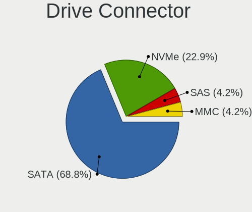
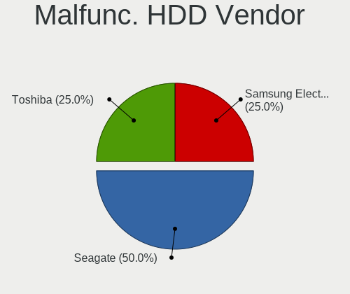
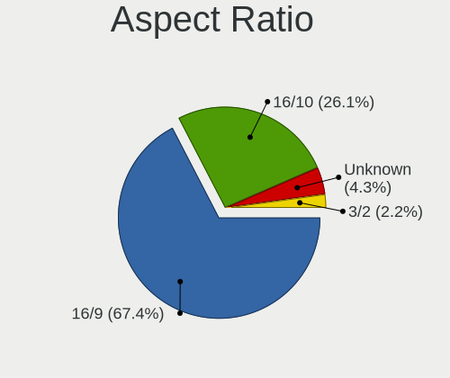
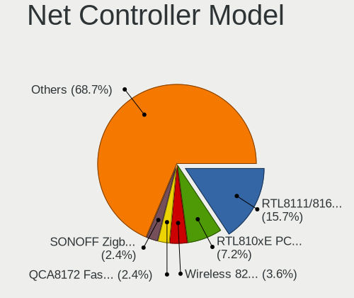
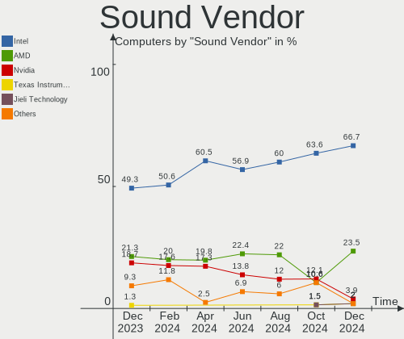
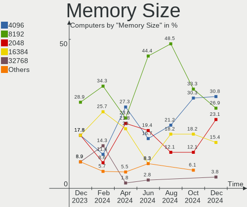

Xubuntu - Hardware Trends
-------------------------

A project to identify most popular hardware characteristics and track their change
over time based on data collected by Linux users at https://Linux-Hardware.org.

Anyone can contribute to this report by the [hw-probe](https://github.com/linuxhw/hw-probe) tool:

    sudo -E hw-probe -all -upload

This is a report for all computer types. See also reports for [desktops](/Dist/Xubuntu/Desktop/README.md) and [notebooks](/Dist/Xubuntu/Notebook/README.md).

This report is for one last month. Overall report since the beginning of time: [TestCoverage](https://github.com/linuxhw/TestCoverage)

Period: May, 2022.

Contents
--------

* [ System ](#system)
  - [ OS                       ](#os)
  - [ OS Family                ](#os-family)
  - [ Kernel                   ](#kernel)
  - [ Kernel Family            ](#kernel-family)
  - [ Kernel Major Ver.        ](#kernel-major-ver)
  - [ Arch                     ](#arch)
  - [ DE                       ](#de)
  - [ Display Server           ](#display-server)
  - [ Display Manager          ](#display-manager)
  - [ OS Lang                  ](#os-lang)
  - [ Boot Mode                ](#boot-mode)
  - [ Filesystem               ](#filesystem)
  - [ Part. scheme             ](#part-scheme)
  - [ Dual Boot with Linux/BSD ](#dual-boot-with-linuxbsd)
  - [ Dual Boot (Win)          ](#dual-boot-win)

* [ Board ](#board)
  - [ Vendor                   ](#vendor)
  - [ Model                    ](#model)
  - [ Model Family             ](#model-family)
  - [ MFG Year                 ](#mfg-year)
  - [ Form Factor              ](#form-factor)
  - [ Secure Boot              ](#secure-boot)
  - [ Coreboot                 ](#coreboot)
  - [ RAM Size                 ](#ram-size)
  - [ RAM Used                 ](#ram-used)
  - [ Total Drives             ](#total-drives)
  - [ Has CD-ROM               ](#has-cd-rom)
  - [ Has Ethernet             ](#has-ethernet)
  - [ Has WiFi                 ](#has-wifi)
  - [ Has Bluetooth            ](#has-bluetooth)

* [ Location ](#location)
  - [ Country                  ](#country)
  - [ City                     ](#city)

* [ Drives ](#drives)
  - [ Drive Vendor             ](#drive-vendor)
  - [ Drive Model              ](#drive-model)
  - [ HDD Vendor               ](#hdd-vendor)
  - [ SSD Vendor               ](#ssd-vendor)
  - [ Drive Kind               ](#drive-kind)
  - [ Drive Connector          ](#drive-connector)
  - [ Drive Size               ](#drive-size)
  - [ Space Total              ](#space-total)
  - [ Space Used               ](#space-used)
  - [ Malfunc. Drives          ](#malfunc-drives)
  - [ Malfunc. Drive Vendor    ](#malfunc-drive-vendor)
  - [ Malfunc. HDD Vendor      ](#malfunc-hdd-vendor)
  - [ Malfunc. Drive Kind      ](#malfunc-drive-kind)
  - [ Failed Drives            ](#failed-drives)
  - [ Failed Drive Vendor      ](#failed-drive-vendor)
  - [ Drive Status             ](#drive-status)

* [ Storage controller ](#storage-controller)
  - [ Storage Vendor           ](#storage-vendor)
  - [ Storage Model            ](#storage-model)
  - [ Storage Kind             ](#storage-kind)

* [ Processor ](#processor)
  - [ CPU Vendor               ](#cpu-vendor)
  - [ CPU Model                ](#cpu-model)
  - [ CPU Model Family         ](#cpu-model-family)
  - [ CPU Cores                ](#cpu-cores)
  - [ CPU Sockets              ](#cpu-sockets)
  - [ CPU Threads              ](#cpu-threads)
  - [ CPU Op-Modes             ](#cpu-op-modes)
  - [ CPU Microcode            ](#cpu-microcode)
  - [ CPU Microarch            ](#cpu-microarch)

* [ Graphics ](#graphics)
  - [ GPU Vendor               ](#gpu-vendor)
  - [ GPU Model                ](#gpu-model)
  - [ GPU Combo                ](#gpu-combo)
  - [ GPU Driver               ](#gpu-driver)
  - [ GPU Memory               ](#gpu-memory)

* [ Monitor ](#monitor)
  - [ Monitor Vendor           ](#monitor-vendor)
  - [ Monitor Model            ](#monitor-model)
  - [ Monitor Resolution       ](#monitor-resolution)
  - [ Monitor Diagonal         ](#monitor-diagonal)
  - [ Monitor Width            ](#monitor-width)
  - [ Aspect Ratio             ](#aspect-ratio)
  - [ Monitor Area             ](#monitor-area)
  - [ Pixel Density            ](#pixel-density)
  - [ Multiple Monitors        ](#multiple-monitors)

* [ Network ](#network)
  - [ Net Controller Vendor    ](#net-controller-vendor)
  - [ Net Controller Model     ](#net-controller-model)
  - [ Wireless Vendor          ](#wireless-vendor)
  - [ Wireless Model           ](#wireless-model)
  - [ Ethernet Vendor          ](#ethernet-vendor)
  - [ Ethernet Model           ](#ethernet-model)
  - [ Net Controller Kind      ](#net-controller-kind)
  - [ Used Controller          ](#used-controller)
  - [ NICs                     ](#nics)
  - [ IPv6                     ](#ipv6)

* [ Bluetooth ](#bluetooth)
  - [ Bluetooth Vendor         ](#bluetooth-vendor)
  - [ Bluetooth Model          ](#bluetooth-model)

* [ Sound ](#sound)
  - [ Sound Vendor             ](#sound-vendor)
  - [ Sound Model              ](#sound-model)

* [ Memory ](#memory)
  - [ Memory Vendor            ](#memory-vendor)
  - [ Memory Model             ](#memory-model)
  - [ Memory Kind              ](#memory-kind)
  - [ Memory Form Factor       ](#memory-form-factor)
  - [ Memory Size              ](#memory-size)
  - [ Memory Speed             ](#memory-speed)

* [ Printers & scanners ](#printers--scanners)
  - [ Printer Vendor           ](#printer-vendor)
  - [ Printer Model            ](#printer-model)
  - [ Scanner Vendor           ](#scanner-vendor)
  - [ Scanner Model            ](#scanner-model)

* [ Camera ](#camera)
  - [ Camera Vendor            ](#camera-vendor)
  - [ Camera Model             ](#camera-model)

* [ Security ](#security)
  - [ Fingerprint Vendor       ](#fingerprint-vendor)
  - [ Fingerprint Model        ](#fingerprint-model)
  - [ Chipcard Vendor          ](#chipcard-vendor)
  - [ Chipcard Model           ](#chipcard-model)

* [ Unsupported ](#unsupported)
  - [ Unsupported Devices      ](#unsupported-devices)
  - [ Unsupported Device Types ](#unsupported-device-types)

System
------

OS
--

Installed operating systems

| Name          | Computers | Percent |
|---------------|-----------|---------|
| Xubuntu 20.04 | 41        | 56.16%  |
| Xubuntu 22.04 | 22        | 30.14%  |
| Xubuntu 18.04 | 6         | 8.22%   |
| Xubuntu 21.04 | 2         | 2.74%   |
| Xubuntu 21.10 | 1         | 1.37%   |
| Xubuntu 16.04 | 1         | 1.37%   |

OS Family
---------

OS without a version

| Name    | Computers | Percent |
|---------|-----------|---------|
| Xubuntu | 73        | 100%    |

Kernel
------

Version of the Linux kernel

| Version                   | Computers | Percent |
|---------------------------|-----------|---------|
| 5.15.0-27-generic         | 10        | 13.7%   |
| 5.4.0-110-generic         | 9         | 12.33%  |
| 5.13.0-41-generic         | 9         | 12.33%  |
| 5.15.0-30-generic         | 4         | 5.48%   |
| 5.13.0-40-generic         | 4         | 5.48%   |
| 5.15.0-25-generic         | 3         | 4.11%   |
| 5.13.0-44-generic         | 3         | 4.11%   |
| 5.13.0-41-lowlatency      | 3         | 4.11%   |
| 5.4.0-113-generic         | 2         | 2.74%   |
| 5.15.0-33-generic         | 2         | 2.74%   |
| 5.13.0-40-lowlatency      | 2         | 2.74%   |
| 5.4.0-90-generic          | 1         | 1.37%   |
| 5.4.0-58-generic          | 1         | 1.37%   |
| 5.4.0-113-lowlatency      | 1         | 1.37%   |
| 5.4.0-110-lowlatency      | 1         | 1.37%   |
| 5.4.0-109-generic         | 1         | 1.37%   |
| 5.4.0-107-lowlatency      | 1         | 1.37%   |
| 5.4.0-107-generic         | 1         | 1.37%   |
| 5.18.0                    | 1         | 1.37%   |
| 5.17.0-5.1-liquorix-amd64 | 1         | 1.37%   |
| 5.15.36-xanmod1           | 1         | 1.37%   |
| 5.15.0-35-generic         | 1         | 1.37%   |
| 5.15.0-27-lowlatency      | 1         | 1.37%   |
| 5.14.0-1033-oem           | 1         | 1.37%   |
| 5.13.0-44-lowlatency      | 1         | 1.37%   |
| 5.13.0-39-lowlatency      | 1         | 1.37%   |
| 5.13.0-30-generic         | 1         | 1.37%   |
| 5.13.0-27-generic         | 1         | 1.37%   |
| 5.11.0-49-generic         | 1         | 1.37%   |
| 5.11.0-31-generic         | 1         | 1.37%   |
| 5.10.0-1038-oem           | 1         | 1.37%   |
| 4.4.0-224-generic         | 1         | 1.37%   |
| 4.15.0-176-lowlatency     | 1         | 1.37%   |

Kernel Family
-------------

Linux kernel without a distro release

| Version | Computers | Percent |
|---------|-----------|---------|
| 5.13.0  | 25        | 34.25%  |
| 5.15.0  | 21        | 28.77%  |
| 5.4.0   | 18        | 24.66%  |
| 5.11.0  | 2         | 2.74%   |
| 5.18.0  | 1         | 1.37%   |
| 5.17.0  | 1         | 1.37%   |
| 5.15.36 | 1         | 1.37%   |
| 5.14.0  | 1         | 1.37%   |
| 5.10.0  | 1         | 1.37%   |
| 4.4.0   | 1         | 1.37%   |
| 4.15.0  | 1         | 1.37%   |

Kernel Major Ver.
-----------------

Linux kernel major version

| Version | Computers | Percent |
|---------|-----------|---------|
| 5.13    | 25        | 34.25%  |
| 5.15    | 22        | 30.14%  |
| 5.4     | 18        | 24.66%  |
| 5.11    | 2         | 2.74%   |
| 5.18    | 1         | 1.37%   |
| 5.17    | 1         | 1.37%   |
| 5.14    | 1         | 1.37%   |
| 5.10    | 1         | 1.37%   |
| 4.4     | 1         | 1.37%   |
| 4.15    | 1         | 1.37%   |

Arch
----

OS architecture (x86_64, i586, etc.)

| Name   | Computers | Percent |
|--------|-----------|---------|
| x86_64 | 69        | 94.52%  |
| i686   | 4         | 5.48%   |

DE
--

Desktop Environment

| Name       | Computers | Percent |
|------------|-----------|---------|
| XFCE       | 69        | 94.52%  |
| X-Cinnamon | 1         | 1.37%   |
| KDE5       | 1         | 1.37%   |
| i3         | 1         | 1.37%   |
| GNOME      | 1         | 1.37%   |

Display Server
--------------

X11 or Wayland

| Name | Computers | Percent |
|------|-----------|---------|
| X11  | 73        | 100%    |

Display Manager
---------------

SDDM, LightDM, etc.

| Name    | Computers | Percent |
|---------|-----------|---------|
| LightDM | 67        | 91.78%  |
| GDM3    | 3         | 4.11%   |
| Unknown | 2         | 2.74%   |
| SDDM    | 1         | 1.37%   |

OS Lang
-------

Language

| Lang  | Computers | Percent |
|-------|-----------|---------|
| en_US | 22        | 30.14%  |
| fr_FR | 10        | 13.7%   |
| de_DE | 6         | 8.22%   |
| ja_JP | 5         | 6.85%   |
| it_IT | 5         | 6.85%   |
| en_GB | 4         | 5.48%   |
| ru_RU | 3         | 4.11%   |
| es_ES | 3         | 4.11%   |
| cs_CZ | 3         | 4.11%   |
| C     | 3         | 4.11%   |
| en_CA | 2         | 2.74%   |
| en_AU | 2         | 2.74%   |
| sv_SE | 1         | 1.37%   |
| pt_BR | 1         | 1.37%   |
| pl_PL | 1         | 1.37%   |
| nl_NL | 1         | 1.37%   |
| hu_HU | 1         | 1.37%   |

Boot Mode
---------

EFI or BIOS

| Mode | Computers | Percent |
|------|-----------|---------|
| BIOS | 39        | 53.42%  |
| EFI  | 34        | 46.58%  |

Filesystem
----------

Type of filesystem

| Type    | Computers | Percent |
|---------|-----------|---------|
| Ext4    | 64        | 87.67%  |
| Btrfs   | 4         | 5.48%   |
| Overlay | 3         | 4.11%   |
| Zfs     | 1         | 1.37%   |
| Ext3    | 1         | 1.37%   |

Part. scheme
------------

Scheme of partitioning

| Type    | Computers | Percent |
|---------|-----------|---------|
| Unknown | 38        | 52.05%  |
| GPT     | 26        | 35.62%  |
| MBR     | 9         | 12.33%  |

Dual Boot with Linux/BSD
------------------------

Hosting more than one Linux/BSD

| Dual boot | Computers | Percent |
|-----------|-----------|---------|
| No        | 57        | 78.08%  |
| Yes       | 16        | 21.92%  |

Dual Boot (Win)
---------------

Hosting Linux and Windows

| Dual boot | Computers | Percent |
|-----------|-----------|---------|
| No        | 49        | 67.12%  |
| Yes       | 24        | 32.88%  |

Board
-----

Vendor
------

Motherboard manufacturer

| Name                | Computers | Percent |
|---------------------|-----------|---------|
| ASUSTek Computer    | 14        | 19.18%  |
| Lenovo              | 11        | 15.07%  |
| Hewlett-Packard     | 11        | 15.07%  |
| Dell                | 9         | 12.33%  |
| Gigabyte Technology | 6         | 8.22%   |
| Acer                | 3         | 4.11%   |
| MSI                 | 2         | 2.74%   |
| Google              | 2         | 2.74%   |
| ASRock              | 2         | 2.74%   |
| TUXEDO              | 1         | 1.37%   |
| Toshiba             | 1         | 1.37%   |
| Sony                | 1         | 1.37%   |
| Razer               | 1         | 1.37%   |
| Pegatron            | 1         | 1.37%   |
| Medion              | 1         | 1.37%   |
| LG Electronics      | 1         | 1.37%   |
| IBM                 | 1         | 1.37%   |
| Fujitsu             | 1         | 1.37%   |
| ECS                 | 1         | 1.37%   |
| Apple               | 1         | 1.37%   |
| AMI                 | 1         | 1.37%   |
| Unknown             | 1         | 1.37%   |

Model
-----

Motherboard model

| Name                                       | Computers | Percent |
|--------------------------------------------|-----------|---------|
| TUXEDO N14xWU                              | 1         | 1.37%   |
| Toshiba Satellite C70D-B                   | 1         | 1.37%   |
| Sony VGN-NS21S_S                           | 1         | 1.37%   |
| Razer Blade Stealth 13 Late 2019           | 1         | 1.37%   |
| Pegatron NY802AV-ABA p6110t                | 1         | 1.37%   |
| MSI MS-7C91                                | 1         | 1.37%   |
| MSI MS-7865                                | 1         | 1.37%   |
| Medion E15407                              | 1         | 1.37%   |
| LG 22V280-L.BY31P1                         | 1         | 1.37%   |
| Lenovo Yoga 7 14ITL5 82BH                  | 1         | 1.37%   |
| Lenovo ThinkPad X240 20AMS6FF00            | 1         | 1.37%   |
| Lenovo ThinkPad X200s 74664SJ              | 1         | 1.37%   |
| Lenovo ThinkPad X1 Carbon Gen 9 20XWCTO1WW | 1         | 1.37%   |
| Lenovo ThinkPad W510 431963G               | 1         | 1.37%   |
| Lenovo ThinkPad T410 2516CTO               | 1         | 1.37%   |
| Lenovo ThinkPad L13 20R4S4WG00             | 1         | 1.37%   |
| Lenovo ThinkPad E580 20KS001JGE            | 1         | 1.37%   |
| Lenovo ThinkCentre M72e 32675L2            | 1         | 1.37%   |
| Lenovo Legion Y540-17IRH-PG0 81T3          | 1         | 1.37%   |
| Lenovo IdeaPad L340-17IRH Gaming 81LL      | 1         | 1.37%   |
| IBM ThinkPad T43 2668F5G                   | 1         | 1.37%   |
| HP Z620 Workstation                        | 1         | 1.37%   |
| HP ProDesk 600 G3 SFF                      | 1         | 1.37%   |
| HP Pavilion dv6000 (RR374EA#ABZ)           | 1         | 1.37%   |
| HP Mini 5103                               | 1         | 1.37%   |
| HP Mini 110-1100                           | 1         | 1.37%   |
| HP Laptop 15-bw0xx                         | 1         | 1.37%   |
| HP Compaq nc6320 (RH374EA#AKB)             | 1         | 1.37%   |
| HP Compaq Elite 8300 SFF                   | 1         | 1.37%   |
| HP Compaq 6820s                            | 1         | 1.37%   |
| HP Compaq 6200 Pro MT PC                   | 1         | 1.37%   |
| HP 550-a114                                | 1         | 1.37%   |
| Google Snappy                              | 1         | 1.37%   |
| Google Auron_Yuna                          | 1         | 1.37%   |
| Gigabyte Z97X-UD3H                         | 1         | 1.37%   |
| Gigabyte Z68A-D3-B3                        | 1         | 1.37%   |
| Gigabyte X570S AORUS MASTER                | 1         | 1.37%   |
| Gigabyte X48-DS5                           | 1         | 1.37%   |
| Gigabyte G33M-DS2R                         | 1         | 1.37%   |
| Gigabyte 970A-DS3P                         | 1         | 1.37%   |
| Fujitsu CELSIUS W380                       | 1         | 1.37%   |
| ECS EP175AA-ABE SR1797ES ES610             | 1         | 1.37%   |
| Dell XPS M1530                             | 1         | 1.37%   |
| Dell OptiPlex 7440 AIO                     | 1         | 1.37%   |
| Dell OptiPlex 360                          | 1         | 1.37%   |
| Dell Latitude D610                         | 1         | 1.37%   |
| Dell Latitude 7420                         | 1         | 1.37%   |
| Dell Latitude 7400                         | 1         | 1.37%   |
| Dell Latitude 5580                         | 1         | 1.37%   |
| Dell Latitude 5511                         | 1         | 1.37%   |
| Dell Inspiron 7501                         | 1         | 1.37%   |
| ASUS X510UA                                | 1         | 1.37%   |
| ASUS X101CH                                | 1         | 1.37%   |
| ASUS VM60                                  | 1         | 1.37%   |
| ASUS UL30A                                 | 1         | 1.37%   |
| ASUS TUF Gaming B550-PLUS                  | 1         | 1.37%   |
| ASUS TUF B450M-PRO GAMING                  | 1         | 1.37%   |
| ASUS ROG CROSSHAIR VIII DARK HERO          | 1         | 1.37%   |
| ASUS PRIME X470-PRO                        | 1         | 1.37%   |
| ASUS P5KC                                  | 1         | 1.37%   |

Model Family
------------

Motherboard model prefix

| Name                 | Computers | Percent |
|----------------------|-----------|---------|
| Lenovo ThinkPad      | 7         | 9.59%   |
| Dell Latitude        | 5         | 6.85%   |
| HP Compaq            | 4         | 5.48%   |
| HP Mini              | 2         | 2.74%   |
| Dell OptiPlex        | 2         | 2.74%   |
| ASUS TUF             | 2         | 2.74%   |
| Acer Aspire          | 2         | 2.74%   |
| TUXEDO N14xWU        | 1         | 1.37%   |
| Toshiba Satellite    | 1         | 1.37%   |
| Sony VGN-NS21S       | 1         | 1.37%   |
| Razer Blade          | 1         | 1.37%   |
| Pegatron NY802AV-ABA | 1         | 1.37%   |
| MSI MS-7C91          | 1         | 1.37%   |
| MSI MS-7865          | 1         | 1.37%   |
| Medion E15407        | 1         | 1.37%   |
| LG 22V280-L.BY31P1   | 1         | 1.37%   |
| Lenovo Yoga          | 1         | 1.37%   |
| Lenovo ThinkCentre   | 1         | 1.37%   |
| Lenovo Legion        | 1         | 1.37%   |
| Lenovo IdeaPad       | 1         | 1.37%   |
| IBM ThinkPad         | 1         | 1.37%   |
| HP Z620              | 1         | 1.37%   |
| HP ProDesk           | 1         | 1.37%   |
| HP Pavilion          | 1         | 1.37%   |
| HP Laptop            | 1         | 1.37%   |
| HP 550-a114          | 1         | 1.37%   |
| Google Snappy        | 1         | 1.37%   |
| Google Auron         | 1         | 1.37%   |
| Gigabyte Z97X-UD3H   | 1         | 1.37%   |
| Gigabyte Z68A-D3-B3  | 1         | 1.37%   |
| Gigabyte X570S       | 1         | 1.37%   |
| Gigabyte X48-DS5     | 1         | 1.37%   |
| Gigabyte G33M-DS2R   | 1         | 1.37%   |
| Gigabyte 970A-DS3P   | 1         | 1.37%   |
| Fujitsu CELSIUS      | 1         | 1.37%   |
| ECS EP175AA-ABE      | 1         | 1.37%   |
| Dell XPS             | 1         | 1.37%   |
| Dell Inspiron        | 1         | 1.37%   |
| ASUS X510UA          | 1         | 1.37%   |
| ASUS X101CH          | 1         | 1.37%   |
| ASUS VM60            | 1         | 1.37%   |
| ASUS UL30A           | 1         | 1.37%   |
| ASUS ROG             | 1         | 1.37%   |
| ASUS PRIME           | 1         | 1.37%   |
| ASUS P5KC            | 1         | 1.37%   |
| ASUS K53SC           | 1         | 1.37%   |
| ASUS B150-PLUS       | 1         | 1.37%   |
| ASUS ASUS            | 1         | 1.37%   |
| ASUS All             | 1         | 1.37%   |
| ASUS A7K             | 1         | 1.37%   |
| ASRock X570          | 1         | 1.37%   |
| ASRock P55           | 1         | 1.37%   |
| Apple iMac7          | 1         | 1.37%   |
| AMI Cherry           | 1         | 1.37%   |
| Acer Veriton         | 1         | 1.37%   |
| Unknown              | 1         | 1.37%   |

MFG Year
--------

Motherboard manufacture year

| Year | Computers | Percent |
|------|-----------|---------|
| 2020 | 9         | 12.33%  |
| 2009 | 8         | 10.96%  |
| 2019 | 7         | 9.59%   |
| 2007 | 7         | 9.59%   |
| 2021 | 5         | 6.85%   |
| 2008 | 5         | 6.85%   |
| 2017 | 4         | 5.48%   |
| 2013 | 4         | 5.48%   |
| 2012 | 4         | 5.48%   |
| 2010 | 4         | 5.48%   |
| 2018 | 3         | 4.11%   |
| 2015 | 3         | 4.11%   |
| 2014 | 3         | 4.11%   |
| 2016 | 2         | 2.74%   |
| 2011 | 2         | 2.74%   |
| 2005 | 2         | 2.74%   |
| 2022 | 1         | 1.37%   |

Form Factor
-----------

Physical design of the computer

| Name        | Computers | Percent |
|-------------|-----------|---------|
| Notebook    | 39        | 53.42%  |
| Desktop     | 30        | 41.1%   |
| All in one  | 3         | 4.11%   |
| Convertible | 1         | 1.37%   |

Secure Boot
-----------

Enabled or disabled

| State    | Computers | Percent |
|----------|-----------|---------|
| Disabled | 69        | 94.52%  |
| Enabled  | 4         | 5.48%   |

Coreboot
--------

Have coreboot on board

| Used | Computers | Percent |
|------|-----------|---------|
| No   | 71        | 97.26%  |
| Yes  | 2         | 2.74%   |

RAM Size
--------

Total RAM memory

| Size in GB  | Computers | Percent |
|-------------|-----------|---------|
| 16.01-24.0  | 17        | 23.29%  |
| 4.01-8.0    | 15        | 20.55%  |
| 3.01-4.0    | 13        | 17.81%  |
| 8.01-16.0   | 7         | 9.59%   |
| 32.01-64.0  | 5         | 6.85%   |
| 1.01-2.0    | 4         | 5.48%   |
| 24.01-32.0  | 3         | 4.11%   |
| 2.01-3.0    | 3         | 4.11%   |
| 64.01-256.0 | 3         | 4.11%   |
| 0.51-1.0    | 3         | 4.11%   |

RAM Used
--------

Used RAM memory

| Used GB    | Computers | Percent |
|------------|-----------|---------|
| 1.01-2.0   | 26        | 35.62%  |
| 2.01-3.0   | 18        | 24.66%  |
| 3.01-4.0   | 9         | 12.33%  |
| 4.01-8.0   | 8         | 10.96%  |
| 0.51-1.0   | 7         | 9.59%   |
| 8.01-16.0  | 2         | 2.74%   |
| 24.01-32.0 | 1         | 1.37%   |
| 16.01-24.0 | 1         | 1.37%   |
| 0.01-0.5   | 1         | 1.37%   |

Total Drives
------------

Number of drives on board

| Drives | Computers | Percent |
|--------|-----------|---------|
| 1      | 42        | 57.53%  |
| 3      | 13        | 17.81%  |
| 2      | 12        | 16.44%  |
| 5      | 3         | 4.11%   |
| 0      | 2         | 2.74%   |
| 4      | 1         | 1.37%   |

Has CD-ROM
----------

Has CD-ROM on board

| Presented | Computers | Percent |
|-----------|-----------|---------|
| No        | 39        | 53.42%  |
| Yes       | 34        | 46.58%  |

Has Ethernet
------------

Has Ethernet on board

| Presented | Computers | Percent |
|-----------|-----------|---------|
| Yes       | 62        | 84.93%  |
| No        | 11        | 15.07%  |

Has WiFi
--------

Has WiFi module

| Presented | Computers | Percent |
|-----------|-----------|---------|
| Yes       | 52        | 71.23%  |
| No        | 21        | 28.77%  |

Has Bluetooth
-------------

Has Bluetooth module

| Presented | Computers | Percent |
|-----------|-----------|---------|
| Yes       | 37        | 50.68%  |
| No        | 36        | 49.32%  |

Location
--------

Country
-------

Geographic location (country)

| Country     | Computers | Percent |
|-------------|-----------|---------|
| Germany     | 12        | 16.44%  |
| France      | 11        | 15.07%  |
| USA         | 8         | 10.96%  |
| Japan       | 5         | 6.85%   |
| Italy       | 5         | 6.85%   |
| UK          | 4         | 5.48%   |
| Spain       | 4         | 5.48%   |
| Czechia     | 4         | 5.48%   |
| Netherlands | 3         | 4.11%   |
| Sweden      | 2         | 2.74%   |
| Russia      | 2         | 2.74%   |
| Poland      | 2         | 2.74%   |
| Hungary     | 2         | 2.74%   |
| Canada      | 2         | 2.74%   |
| Australia   | 2         | 2.74%   |
| Zimbabwe    | 1         | 1.37%   |
| Romania     | 1         | 1.37%   |
| Kazakhstan  | 1         | 1.37%   |
| Greece      | 1         | 1.37%   |
| Brazil      | 1         | 1.37%   |

City
----

Geographic location (city)

| City                 | Computers | Percent |
|----------------------|-----------|---------|
| Prague               | 3         | 4.11%   |
| Paris                | 3         | 4.11%   |
| Casalecchio di Reno  | 3         | 4.11%   |
| Berlin               | 3         | 4.11%   |
| Shinjuku             | 2         | 2.74%   |
| Budapest             | 2         | 2.74%   |
| Wroclaw              | 1         | 1.37%   |
| Washington           | 1         | 1.37%   |
| Vohenstrauss         | 1         | 1.37%   |
| Vinaros              | 1         | 1.37%   |
| Villenave-d'Ornon    | 1         | 1.37%   |
| Uppsala              | 1         | 1.37%   |
| Sulzbach-Rosenberg   | 1         | 1.37%   |
| Subiaco              | 1         | 1.37%   |
| Stuttgart            | 1         | 1.37%   |
| Sesena               | 1         | 1.37%   |
| Santa Maria          | 1         | 1.37%   |
| Reading              | 1         | 1.37%   |
| Poznan               | 1         | 1.37%   |
| Porzuna              | 1         | 1.37%   |
| Pilsen               | 1         | 1.37%   |
| Overveen             | 1         | 1.37%   |
| Ottawa               | 1         | 1.37%   |
| Osaka                | 1         | 1.37%   |
| Oryol                | 1         | 1.37%   |
| Nuenen               | 1         | 1.37%   |
| Noyabrsk             | 1         | 1.37%   |
| Nederland            | 1         | 1.37%   |
| Münster             | 1         | 1.37%   |
| Munich               | 1         | 1.37%   |
| Mulhouse             | 1         | 1.37%   |
| Montreal             | 1         | 1.37%   |
| Mito                 | 1         | 1.37%   |
| Marignane            | 1         | 1.37%   |
| Malmo                | 1         | 1.37%   |
| Lorient              | 1         | 1.37%   |
| London               | 1         | 1.37%   |
| Leesville            | 1         | 1.37%   |
| Lancaster            | 1         | 1.37%   |
| La Bourboule         | 1         | 1.37%   |
| Jundiaí             | 1         | 1.37%   |
| Jerez de la Frontera | 1         | 1.37%   |
| Harare               | 1         | 1.37%   |
| Hamburg              | 1         | 1.37%   |
| Genoa                | 1         | 1.37%   |
| Geispolsheim         | 1         | 1.37%   |
| Fulham               | 1         | 1.37%   |
| Frankfurt am Main    | 1         | 1.37%   |
| Fourneaux-le-Val     | 1         | 1.37%   |
| Edinburgh            | 1         | 1.37%   |
| Dothan               | 1         | 1.37%   |
| Denver               | 1         | 1.37%   |
| Chiyoda              | 1         | 1.37%   |
| Buffalo              | 1         | 1.37%   |
| Bucharest            | 1         | 1.37%   |
| Bolzano              | 1         | 1.37%   |
| Bielefeld            | 1         | 1.37%   |
| Béthune             | 1         | 1.37%   |
| Bellevue             | 1         | 1.37%   |
| Augsburg             | 1         | 1.37%   |

Drives
------

Drive Vendor
------------

Hard drive vendors

| Vendor              | Computers | Drives | Percent |
|---------------------|-----------|--------|---------|
| Samsung Electronics | 18        | 20     | 16.82%  |
| Seagate             | 17        | 24     | 15.89%  |
| WDC                 | 16        | 21     | 14.95%  |
| Toshiba             | 7         | 8      | 6.54%   |
| Crucial             | 7         | 8      | 6.54%   |
| Hitachi             | 6         | 6      | 5.61%   |
| Unknown             | 5         | 5      | 4.67%   |
| Sandisk             | 4         | 4      | 3.74%   |
| Kingston            | 4         | 4      | 3.74%   |
| Intel               | 3         | 3      | 2.8%    |
| Patriot             | 2         | 2      | 1.87%   |
| Micron Technology   | 2         | 2      | 1.87%   |
| Gigabyte Technology | 2         | 2      | 1.87%   |
| Fujitsu             | 2         | 2      | 1.87%   |
| China               | 2         | 2      | 1.87%   |
| Transcend           | 1         | 1      | 0.93%   |
| SK Hynix            | 1         | 1      | 0.93%   |
| Silicon Motion      | 1         | 1      | 0.93%   |
| PNY                 | 1         | 1      | 0.93%   |
| Phison              | 1         | 2      | 0.93%   |
| OCZ                 | 1         | 1      | 0.93%   |
| Lenovo              | 1         | 1      | 0.93%   |
| BUFFALO             | 1         | 1      | 0.93%   |
| ASMT                | 1         | 1      | 0.93%   |
| A-DATA Technology   | 1         | 1      | 0.93%   |

Drive Model
-----------

Hard drive models

| Model                                | Computers | Percent |
|--------------------------------------|-----------|---------|
| Toshiba MQ01ABF050 500GB             | 2         | 1.69%   |
| Seagate ST3000DM008-2DM166 3TB       | 2         | 1.69%   |
| Samsung SSD 850 EVO 500GB            | 2         | 1.69%   |
| Samsung NVMe SSD Drive 512GB         | 2         | 1.69%   |
| Hitachi HDT721032SLA380 320GB        | 2         | 1.69%   |
| Crucial CT500MX500SSD1 500GB         | 2         | 1.69%   |
| Crucial CT1000MX500SSD1 1TB          | 2         | 1.69%   |
| WDC WDS500G2B0C-00PXH0 500GB         | 1         | 0.85%   |
| WDC WDS500G2B0C 500GB                | 1         | 0.85%   |
| WDC WD800JD-22MSA1 80GB              | 1         | 0.85%   |
| WDC WD6400BPVT-80HXZT1 640GB         | 1         | 0.85%   |
| WDC WD6400BEVT-80A0RT0 640GB         | 1         | 0.85%   |
| WDC WD6000HLHX-01JJPV0 600GB         | 1         | 0.85%   |
| WDC WD5000AZLX-60K2TA0 500GB         | 1         | 0.85%   |
| WDC WD5000AAVS-22G9B1 500GB          | 1         | 0.85%   |
| WDC WD5000AAKS-00UU3A0 500GB         | 1         | 0.85%   |
| WDC WD50 00LPVX-80V0TT0 500GB        | 1         | 0.85%   |
| WDC WD3200BEVT-60ZCT1 320GB          | 1         | 0.85%   |
| WDC WD20EZRZ-22Z5HB0 2TB             | 1         | 0.85%   |
| WDC WD2002FAEX-007BA0 2TB            | 1         | 0.85%   |
| WDC WD10EZRZ-00HTKB0 1TB             | 1         | 0.85%   |
| WDC WD10EZRX-00D8PB0 1TB             | 1         | 0.85%   |
| WDC WD10EZEX-08WN4A0 1TB             | 1         | 0.85%   |
| WDC WD10EZEX-00ZF5A0 1TB             | 1         | 0.85%   |
| WDC WD10EZEX-00BN5A0 1TB             | 1         | 0.85%   |
| WDC WD10EAVS-00D7B1 1TB              | 1         | 0.85%   |
| WDC WD10EARS-22Y5B1 1TB              | 1         | 0.85%   |
| WDC PC SN730 SDBPNTY-1T00-1101 1TB   | 1         | 0.85%   |
| Unknown SD08G  8GB                   | 1         | 0.85%   |
| Unknown SD/MMC/MS PRO 999GB          | 1         | 0.85%   |
| Unknown MMC64G  64GB                 | 1         | 0.85%   |
| Unknown Biwin  64GB                  | 1         | 0.85%   |
| Unknown 00000  32GB                  | 1         | 0.85%   |
| Transcend TS256GSSD370 256GB         | 1         | 0.85%   |
| Toshiba THNSNK128GVN8 128GB SSD      | 1         | 0.85%   |
| Toshiba MK8032GSX 80GB               | 1         | 0.85%   |
| Toshiba KXG6AZNV256G 256GB           | 1         | 0.85%   |
| Toshiba HDWD120 2TB                  | 1         | 0.85%   |
| Toshiba HDWD110 1TB                  | 1         | 0.85%   |
| Toshiba DT01ACA200 2TB               | 1         | 0.85%   |
| SK Hynix BC711 NVMe 512GB            | 1         | 0.85%   |
| Silicon Motion NVMe SSD Drive 1TB    | 1         | 0.85%   |
| Seagate ST960822A 64GB               | 1         | 0.85%   |
| Seagate ST9320325AS 320GB            | 1         | 0.85%   |
| Seagate ST750LM022 HN-M750MBB 752GB  | 1         | 0.85%   |
| Seagate ST6000VN001-2BB186 6TB       | 1         | 0.85%   |
| Seagate ST500LT012-1DG142 500GB      | 1         | 0.85%   |
| Seagate ST500LM000-1EJ162-SSHD 500GB | 1         | 0.85%   |
| Seagate ST500DM002-1BD142 500GB      | 1         | 0.85%   |
| Seagate ST3500413AS 500GB            | 1         | 0.85%   |
| Seagate ST3320418AS 320GB            | 1         | 0.85%   |
| Seagate ST320LT007-9ZV142 320GB      | 1         | 0.85%   |
| Seagate ST3160318AS 160GB            | 1         | 0.85%   |
| Seagate ST31000340AS 1TB             | 1         | 0.85%   |
| Seagate ST2000DM008-2FR102 2TB       | 1         | 0.85%   |
| Seagate ST2000DM001-9YN164 2TB       | 1         | 0.85%   |
| Seagate ST2000DM001-1CH164 2TB       | 1         | 0.85%   |
| Seagate ST2000DL003-9VT166 2TB       | 1         | 0.85%   |
| Seagate ST1000LX015-1U7172 1TB       | 1         | 0.85%   |
| Seagate ST1000DM003-1SB10C 1TB       | 1         | 0.85%   |

HDD Vendor
----------

Hard disk drive vendors

| Vendor              | Computers | Drives | Percent |
|---------------------|-----------|--------|---------|
| Seagate             | 17        | 24     | 34.69%  |
| WDC                 | 13        | 18     | 26.53%  |
| Toshiba             | 6         | 6      | 12.24%  |
| Hitachi             | 6         | 6      | 12.24%  |
| Samsung Electronics | 3         | 4      | 6.12%   |
| Fujitsu             | 2         | 2      | 4.08%   |
| Unknown             | 1         | 1      | 2.04%   |
| ASMT                | 1         | 1      | 2.04%   |

SSD Vendor
----------

Solid state drive vendors

| Vendor              | Computers | Drives | Percent |
|---------------------|-----------|--------|---------|
| Samsung Electronics | 8         | 8      | 25%     |
| Crucial             | 7         | 8      | 21.88%  |
| Kingston            | 4         | 4      | 12.5%   |
| SanDisk             | 2         | 2      | 6.25%   |
| Patriot             | 2         | 2      | 6.25%   |
| Transcend           | 1         | 1      | 3.13%   |
| Toshiba             | 1         | 1      | 3.13%   |
| PNY                 | 1         | 1      | 3.13%   |
| OCZ                 | 1         | 1      | 3.13%   |
| Intel               | 1         | 1      | 3.13%   |
| Gigabyte Technology | 1         | 1      | 3.13%   |
| China               | 1         | 1      | 3.13%   |
| BUFFALO             | 1         | 1      | 3.13%   |
| A-DATA Technology   | 1         | 1      | 3.13%   |

Drive Kind
----------

HDD or SSD

| Kind    | Computers | Drives | Percent |
|---------|-----------|--------|---------|
| HDD     | 37        | 62     | 40.22%  |
| SSD     | 28        | 33     | 30.43%  |
| NVMe    | 21        | 23     | 22.83%  |
| MMC     | 5         | 5      | 5.43%   |
| Unknown | 1         | 1      | 1.09%   |

Drive Connector
---------------

SATA, SAS, NVMe, etc.

| Type | Computers | Drives | Percent |
|------|-----------|--------|---------|
| SATA | 55        | 91     | 64.71%  |
| NVMe | 21        | 23     | 24.71%  |
| MMC  | 5         | 5      | 5.88%   |
| SAS  | 4         | 5      | 4.71%   |

Drive Size
----------

Size of hard drive

| Size in TB | Computers | Drives | Percent |
|------------|-----------|--------|---------|
| 0.01-0.5   | 45        | 59     | 61.64%  |
| 0.51-1.0   | 15        | 20     | 20.55%  |
| 1.01-2.0   | 8         | 10     | 10.96%  |
| 2.01-3.0   | 3         | 3      | 4.11%   |
| 4.01-10.0  | 2         | 3      | 2.74%   |

Space Total
-----------

Amount of disk space available on the file system

| Size in GB     | Computers | Percent |
|----------------|-----------|---------|
| 101-250        | 18        | 24.66%  |
| 251-500        | 15        | 20.55%  |
| 51-100         | 9         | 12.33%  |
| 501-1000       | 8         | 10.96%  |
| 1001-2000      | 7         | 9.59%   |
| More than 3000 | 6         | 8.22%   |
| 1-20           | 4         | 5.48%   |
| 21-50          | 3         | 4.11%   |
| 2001-3000      | 3         | 4.11%   |

Space Used
----------

Amount of used disk space

| Used GB        | Computers | Percent |
|----------------|-----------|---------|
| 1-20           | 20        | 27.4%   |
| 21-50          | 13        | 17.81%  |
| 101-250        | 11        | 15.07%  |
| 501-1000       | 9         | 12.33%  |
| 51-100         | 7         | 9.59%   |
| 251-500        | 6         | 8.22%   |
| 2001-3000      | 3         | 4.11%   |
| More than 3000 | 2         | 2.74%   |
| 1001-2000      | 2         | 2.74%   |

Malfunc. Drives
---------------

Drive models with a malfunction

| Model                           | Computers | Drives | Percent |
|---------------------------------|-----------|--------|---------|
| WDC WD10EAVS-00D7B1 1TB         | 1         | 1      | 25%     |
| Seagate ST2000DM001-1CH164 2TB  | 1         | 2      | 25%     |
| Seagate ST2000DL003-9VT166 2TB  | 1         | 1      | 25%     |
| Kingston SNS4151S332GD 32GB SSD | 1         | 1      | 25%     |

Malfunc. Drive Vendor
---------------------

Vendors of faulty drives

| Vendor   | Computers | Drives | Percent |
|----------|-----------|--------|---------|
| Seagate  | 2         | 3      | 50%     |
| WDC      | 1         | 1      | 25%     |
| Kingston | 1         | 1      | 25%     |

Malfunc. HDD Vendor
-------------------

Vendors of faulty HDD drives

| Vendor  | Computers | Drives | Percent |
|---------|-----------|--------|---------|
| Seagate | 2         | 3      | 66.67%  |
| WDC     | 1         | 1      | 33.33%  |

Malfunc. Drive Kind
-------------------

Kinds of faulty drives

| Kind | Computers | Drives | Percent |
|------|-----------|--------|---------|
| HDD  | 3         | 4      | 75%     |
| SSD  | 1         | 1      | 25%     |

Failed Drives
-------------

Failed drive models

Zero info for selected period =(

Failed Drive Vendor
-------------------

Failed drive vendors

Zero info for selected period =(

Drive Status
------------

Number of failed and malfunc. drives

| Status   | Computers | Drives | Percent |
|----------|-----------|--------|---------|
| Detected | 38        | 66     | 51.35%  |
| Works    | 32        | 53     | 43.24%  |
| Malfunc  | 4         | 5      | 5.41%   |

Storage controller
------------------

Storage Vendor
--------------

Storage controller vendors

| Vendor                       | Computers | Percent |
|------------------------------|-----------|---------|
| Intel                        | 53        | 55.79%  |
| AMD                          | 14        | 14.74%  |
| Samsung Electronics          | 8         | 8.42%   |
| JMicron Technology           | 6         | 6.32%   |
| Sandisk                      | 4         | 4.21%   |
| Phison Electronics           | 2         | 2.11%   |
| Micron Technology            | 2         | 2.11%   |
| Toshiba America Info Systems | 1         | 1.05%   |
| SK Hynix                     | 1         | 1.05%   |
| Silicon Motion               | 1         | 1.05%   |
| Silicon Image                | 1         | 1.05%   |
| Lenovo                       | 1         | 1.05%   |
| Broadcom / LSI               | 1         | 1.05%   |

Storage Model
-------------

Storage controller models

| Model                                                                         | Computers | Percent |
|-------------------------------------------------------------------------------|-----------|---------|
| AMD FCH SATA Controller [AHCI mode]                                           | 9         | 7.56%   |
| JMicron JMB363 SATA/IDE Controller                                            | 4         | 3.36%   |
| Samsung NVMe SSD Controller SM981/PM981/PM983                                 | 3         | 2.52%   |
| Intel Volume Management Device NVMe RAID Controller                           | 3         | 2.52%   |
| Intel Sunrise Point-LP SATA Controller [AHCI mode]                            | 3         | 2.52%   |
| Intel SATA Controller [RAID mode]                                             | 3         | 2.52%   |
| Intel 82801I (ICH9 Family) 2 port SATA Controller [IDE mode]                  | 3         | 2.52%   |
| Intel 82801HM/HEM (ICH8M/ICH8M-E) SATA Controller [AHCI mode]                 | 3         | 2.52%   |
| Intel 82801HM/HEM (ICH8M/ICH8M-E) IDE Controller                              | 3         | 2.52%   |
| Intel 82801GBM/GHM (ICH7-M Family) SATA Controller [AHCI mode]                | 3         | 2.52%   |
| Intel 82801G (ICH7 Family) IDE Controller                                     | 3         | 2.52%   |
| Intel 5 Series/3400 Series Chipset 6 port SATA AHCI Controller                | 3         | 2.52%   |
| Sandisk Non-Volatile memory controller                                        | 2         | 1.68%   |
| Samsung NVMe SSD Controller SM961/PM961/SM963                                 | 2         | 1.68%   |
| Micron Non-Volatile memory controller                                         | 2         | 1.68%   |
| Intel Q170/Q150/B150/H170/H110/Z170/CM236 Chipset SATA Controller [AHCI Mode] | 2         | 1.68%   |
| Intel NM10/ICH7 Family SATA Controller [IDE mode]                             | 2         | 1.68%   |
| Intel Cannon Lake Mobile PCH SATA AHCI Controller                             | 2         | 1.68%   |
| Intel 82801IR/IO/IH (ICH9R/DO/DH) 4 port SATA Controller [IDE mode]           | 2         | 1.68%   |
| Intel 82801IBM/IEM (ICH9M/ICH9M-E) 4 port SATA Controller [AHCI mode]         | 2         | 1.68%   |
| Intel 82801FBM (ICH6M) SATA Controller                                        | 2         | 1.68%   |
| Intel 6 Series/C200 Series Chipset Family 6 port Desktop SATA AHCI Controller | 2         | 1.68%   |
| Intel 5 Series/3400 Series Chipset PT IDER Controller                         | 2         | 1.68%   |
| Intel 5 Series/3400 Series Chipset 4 port SATA IDE Controller                 | 2         | 1.68%   |
| Intel 5 Series/3400 Series Chipset 2 port SATA IDE Controller                 | 2         | 1.68%   |
| Intel 400 Series Chipset Family SATA AHCI Controller                          | 2         | 1.68%   |
| AMD 500 Series Chipset SATA Controller                                        | 2         | 1.68%   |
| AMD 400 Series Chipset SATA Controller                                        | 2         | 1.68%   |
| Toshiba America Info Systems XG6 NVMe SSD Controller                          | 1         | 0.84%   |
| SK Hynix Gold P31 SSD                                                         | 1         | 0.84%   |
| Silicon Motion SM2263EN/SM2263XT SSD Controller                               | 1         | 0.84%   |
| Silicon Image SiI 3114 [SATALink/SATARaid] Serial ATA Controller              | 1         | 0.84%   |
| Sandisk WD Blue SN550 NVMe SSD                                                | 1         | 0.84%   |
| Sandisk WD Black SN750 / PC SN730 NVMe SSD                                    | 1         | 0.84%   |
| Samsung NVMe SSD Controller SM951/PM951                                       | 1         | 0.84%   |
| Samsung NVMe SSD Controller PM9A1/PM9A3/980PRO                                | 1         | 0.84%   |
| Samsung NVMe SSD Controller 980                                               | 1         | 0.84%   |
| Phison E18 PCIe4 NVMe Controller                                              | 1         | 0.84%   |
| Phison E16 PCIe4 NVMe Controller                                              | 1         | 0.84%   |
| Lenovo Non-Volatile memory controller                                         | 1         | 0.84%   |
| JMicron JMB368 IDE controller                                                 | 1         | 0.84%   |
| JMicron JMB360 AHCI Controller                                                | 1         | 0.84%   |
| Intel Wildcat Point-LP SATA Controller [AHCI Mode]                            | 1         | 0.84%   |
| Intel SSD 660P Series                                                         | 1         | 0.84%   |
| Intel SSD 600P Series                                                         | 1         | 0.84%   |
| Intel NM10/ICH7 Family SATA Controller [AHCI mode]                            | 1         | 0.84%   |
| Intel Celeron/Pentium Silver Processor SATA Controller                        | 1         | 0.84%   |
| Intel Celeron N3350/Pentium N4200/Atom E3900 Series SATA AHCI Controller      | 1         | 0.84%   |
| Intel C610/X99 series chipset sSATA Controller [AHCI mode]                    | 1         | 0.84%   |
| Intel C602 chipset 4-Port SATA Storage Control Unit                           | 1         | 0.84%   |
| Intel C600/X79 series chipset SATA RAID Controller                            | 1         | 0.84%   |
| Intel C600/X79 series chipset IDE-r Controller                                | 1         | 0.84%   |
| Intel 9 Series Chipset Family SATA Controller [AHCI Mode]                     | 1         | 0.84%   |
| Intel 82801JI (ICH10 Family) SATA AHCI Controller                             | 1         | 0.84%   |
| Intel 82801IBM/IEM (ICH9M/ICH9M-E) 2 port SATA Controller [IDE mode]          | 1         | 0.84%   |
| Intel 82801IB (ICH9) 2 port SATA Controller [IDE mode]                        | 1         | 0.84%   |
| Intel 82801 Mobile SATA Controller [RAID mode]                                | 1         | 0.84%   |
| Intel 8 Series SATA Controller 1 [AHCI mode]                                  | 1         | 0.84%   |
| Intel 7 Series/C210 Series Chipset Family 4-port SATA Controller [IDE mode]   | 1         | 0.84%   |
| Intel 7 Series/C210 Series Chipset Family 2-port SATA Controller [IDE mode]   | 1         | 0.84%   |

Storage Kind
------------

Kind of storage controller (IDE, SATA, NVMe, SAS, ...)

| Kind | Computers | Percent |
|------|-----------|---------|
| SATA | 47        | 47%     |
| IDE  | 22        | 22%     |
| NVMe | 21        | 21%     |
| RAID | 9         | 9%      |
| SAS  | 1         | 1%      |

Processor
---------

CPU Vendor
----------

Processor vendors

| Vendor | Computers | Percent |
|--------|-----------|---------|
| Intel  | 60        | 82.19%  |
| AMD    | 13        | 17.81%  |

CPU Model
---------

Processor models

| Model                                       | Computers | Percent |
|---------------------------------------------|-----------|---------|
| Intel Core 2 Duo CPU T6400 @ 2.00GHz        | 2         | 2.74%   |
| Intel Celeron CPU N3450 @ 1.10GHz           | 2         | 2.74%   |
| AMD Ryzen 9 5950X 16-Core Processor         | 2         | 2.74%   |
| Intel Xeon CPU E5450 @ 3.00GHz              | 1         | 1.37%   |
| Intel Xeon CPU E5-4650 v2 @ 2.40GHz         | 1         | 1.37%   |
| Intel Pentium M processor 2.00GHz           | 1         | 1.37%   |
| Intel Pentium M processor 1.86GHz           | 1         | 1.37%   |
| Intel Pentium Dual-Core CPU E5200 @ 2.50GHz | 1         | 1.37%   |
| Intel Pentium Dual CPU E2180 @ 2.00GHz      | 1         | 1.37%   |
| Intel Pentium D CPU 3.40GHz                 | 1         | 1.37%   |
| Intel Genuine CPU U7300 @ 1.30GHz           | 1         | 1.37%   |
| Intel Core i7-9750H CPU @ 2.60GHz           | 1         | 1.37%   |
| Intel Core i7-8665U CPU @ 1.90GHz           | 1         | 1.37%   |
| Intel Core i7-8550U CPU @ 1.80GHz           | 1         | 1.37%   |
| Intel Core i7-7700 CPU @ 3.60GHz            | 1         | 1.37%   |
| Intel Core i7-7600U CPU @ 2.80GHz           | 1         | 1.37%   |
| Intel Core i7-6800K CPU @ 3.40GHz           | 1         | 1.37%   |
| Intel Core i7-3770 CPU @ 3.40GHz            | 1         | 1.37%   |
| Intel Core i7-2670QM CPU @ 2.20GHz          | 1         | 1.37%   |
| Intel Core i7-2600 CPU @ 3.40GHz            | 1         | 1.37%   |
| Intel Core i7-10850H CPU @ 2.70GHz          | 1         | 1.37%   |
| Intel Core i7-1065G7 CPU @ 1.30GHz          | 1         | 1.37%   |
| Intel Core i7 CPU M 620 @ 2.67GHz           | 1         | 1.37%   |
| Intel Core i7 CPU 920 @ 2.67GHz             | 1         | 1.37%   |
| Intel Core i7 CPU 870 @ 2.93GHz             | 1         | 1.37%   |
| Intel Core i5-9300HF CPU @ 2.40GHz          | 1         | 1.37%   |
| Intel Core i5-8250U CPU @ 1.60GHz           | 1         | 1.37%   |
| Intel Core i5-6600 CPU @ 3.30GHz            | 1         | 1.37%   |
| Intel Core i5-6500 CPU @ 3.20GHz            | 1         | 1.37%   |
| Intel Core i5-4690K CPU @ 3.50GHz           | 1         | 1.37%   |
| Intel Core i5-4200U CPU @ 1.60GHz           | 1         | 1.37%   |
| Intel Core i5-3470T CPU @ 2.90GHz           | 1         | 1.37%   |
| Intel Core i5-3337U CPU @ 1.80GHz           | 1         | 1.37%   |
| Intel Core i5-1035G1 CPU @ 1.00GHz          | 1         | 1.37%   |
| Intel Core i5-10300H CPU @ 2.50GHz          | 1         | 1.37%   |
| Intel Core i5-10210U CPU @ 1.60GHz          | 1         | 1.37%   |
| Intel Core i5 CPU M 540 @ 2.53GHz           | 1         | 1.37%   |
| Intel Core i5 CPU 760 @ 2.80GHz             | 1         | 1.37%   |
| Intel Core i5 CPU 660 @ 3.33GHz             | 1         | 1.37%   |
| Intel Core i3-7100U CPU @ 2.40GHz           | 1         | 1.37%   |
| Intel Core i3-2100 CPU @ 3.10GHz            | 1         | 1.37%   |
| Intel Core i3 CPU M 330 @ 2.13GHz           | 1         | 1.37%   |
| Intel Core 2 Quad CPU Q8200 @ 2.33GHz       | 1         | 1.37%   |
| Intel Core 2 Quad CPU Q6600 @ 2.40GHz       | 1         | 1.37%   |
| Intel Core 2 Duo CPU T7300 @ 2.00GHz        | 1         | 1.37%   |
| Intel Core 2 Duo CPU T7250 @ 2.00GHz        | 1         | 1.37%   |
| Intel Core 2 Duo CPU L9400 @ 1.86GHz        | 1         | 1.37%   |
| Intel Core 2 CPU T5600 @ 1.83GHz            | 1         | 1.37%   |
| Intel Core 2 CPU T5500 @ 1.66GHz            | 1         | 1.37%   |
| Intel Celeron N4100 CPU @ 1.10GHz           | 1         | 1.37%   |
| Intel Celeron 3205U @ 1.50GHz               | 1         | 1.37%   |
| Intel Atom x5-Z8350 CPU @ 1.44GHz           | 1         | 1.37%   |
| Intel Atom CPU N455 @ 1.66GHz               | 1         | 1.37%   |
| Intel Atom CPU N270 @ 1.60GHz               | 1         | 1.37%   |
| Intel Atom CPU N2600 @ 1.60GHz              | 1         | 1.37%   |
| Intel 11th Gen Core i7-1185G7 @ 3.00GHz     | 1         | 1.37%   |
| Intel 11th Gen Core i7-1165G7 @ 2.80GHz     | 1         | 1.37%   |
| Intel 11th Gen Core i7-11370H @ 3.30GHz     | 1         | 1.37%   |
| Intel 11th Gen Core i5-1145G7 @ 2.60GHz     | 1         | 1.37%   |
| AMD Turion 64 X2 Mobile Technology TL-56    | 1         | 1.37%   |

CPU Model Family
----------------

Processor model prefix

| Model                   | Computers | Percent |
|-------------------------|-----------|---------|
| Intel Core i7           | 14        | 19.18%  |
| Intel Core i5           | 14        | 19.18%  |
| Other                   | 5         | 6.85%   |
| Intel Core 2 Duo        | 5         | 6.85%   |
| Intel Celeron           | 4         | 5.48%   |
| Intel Atom              | 4         | 5.48%   |
| AMD Ryzen 9             | 4         | 5.48%   |
| Intel Core i3           | 3         | 4.11%   |
| AMD Ryzen 5             | 3         | 4.11%   |
| Intel Xeon              | 2         | 2.74%   |
| Intel Pentium M         | 2         | 2.74%   |
| Intel Core 2 Quad       | 2         | 2.74%   |
| Intel Core 2            | 2         | 2.74%   |
| Intel Pentium Dual-Core | 1         | 1.37%   |
| Intel Pentium Dual      | 1         | 1.37%   |
| Intel Pentium D         | 1         | 1.37%   |
| Intel Genuine           | 1         | 1.37%   |
| AMD Turion 64 X2 Mobile | 1         | 1.37%   |
| AMD FX                  | 1         | 1.37%   |
| AMD Athlon              | 1         | 1.37%   |
| AMD A8                  | 1         | 1.37%   |
| AMD A4                  | 1         | 1.37%   |

CPU Cores
---------

Number of processor cores

| Number | Computers | Percent |
|--------|-----------|---------|
| 4      | 34        | 46.58%  |
| 2      | 25        | 34.25%  |
| 6      | 5         | 6.85%   |
| 1      | 4         | 5.48%   |
| 16     | 2         | 2.74%   |
| 12     | 2         | 2.74%   |
| 20     | 1         | 1.37%   |

CPU Sockets
-----------

Number of sockets

| Number | Computers | Percent |
|--------|-----------|---------|
| 1      | 72        | 98.63%  |
| 2      | 1         | 1.37%   |

CPU Threads
-----------

Threads per core (Hyper-Threading)

| Number | Computers | Percent |
|--------|-----------|---------|
| 2      | 43        | 58.9%   |
| 1      | 30        | 41.1%   |

CPU Op-Modes
------------

CPU Operation Modes (32-bit, 64-bit)

| Op mode        | Computers | Percent |
|----------------|-----------|---------|
| 32-bit, 64-bit | 70        | 95.89%  |
| 32-bit         | 3         | 4.11%   |

CPU Microcode
-------------

Microcode number

| Number     | Computers | Percent |
|------------|-----------|---------|
| Unknown    | 13        | 17.81%  |
| 0x306a9    | 3         | 4.11%   |
| 0x1067a    | 3         | 4.11%   |
| 0xa0652    | 2         | 2.74%   |
| 0x806ec    | 2         | 2.74%   |
| 0x806e9    | 2         | 2.74%   |
| 0x806c1    | 2         | 2.74%   |
| 0x6fd      | 2         | 2.74%   |
| 0x6f6      | 2         | 2.74%   |
| 0x6d8      | 2         | 2.74%   |
| 0x506e3    | 2         | 2.74%   |
| 0x506c9    | 2         | 2.74%   |
| 0x206a7    | 2         | 2.74%   |
| 0x20652    | 2         | 2.74%   |
| 0x106e5    | 2         | 2.74%   |
| 0xf64      | 1         | 1.37%   |
| 0x906ed    | 1         | 1.37%   |
| 0x906ea    | 1         | 1.37%   |
| 0x906e9    | 1         | 1.37%   |
| 0x806ea    | 1         | 1.37%   |
| 0x706e5    | 1         | 1.37%   |
| 0x706a1    | 1         | 1.37%   |
| 0x6fb      | 1         | 1.37%   |
| 0x6fa      | 1         | 1.37%   |
| 0x406c4    | 1         | 1.37%   |
| 0x40651    | 1         | 1.37%   |
| 0x306e4    | 1         | 1.37%   |
| 0x306d4    | 1         | 1.37%   |
| 0x306c3    | 1         | 1.37%   |
| 0x30661    | 1         | 1.37%   |
| 0x20655    | 1         | 1.37%   |
| 0x106c2    | 1         | 1.37%   |
| 0x106a5    | 1         | 1.37%   |
| 0x10677    | 1         | 1.37%   |
| 0x10676    | 1         | 1.37%   |
| 0x0a201016 | 1         | 1.37%   |
| 0x08701021 | 1         | 1.37%   |
| 0x08701013 | 1         | 1.37%   |
| 0x08108109 | 1         | 1.37%   |
| 0x0800820d | 1         | 1.37%   |
| 0x07030105 | 1         | 1.37%   |
| 0x0700010f | 1         | 1.37%   |
| 0x06006704 | 1         | 1.37%   |
| 0x06000852 | 1         | 1.37%   |
| 0x00000000 | 1         | 1.37%   |

CPU Microarch
-------------

Microarchitecture

| Name          | Computers | Percent |
|---------------|-----------|---------|
| KabyLake      | 9         | 12.33%  |
| Penryn        | 7         | 9.59%   |
| Core          | 6         | 8.22%   |
| Westmere      | 4         | 5.48%   |
| TigerLake     | 4         | 5.48%   |
| IvyBridge     | 4         | 5.48%   |
| Zen 3         | 3         | 4.11%   |
| SandyBridge   | 3         | 4.11%   |
| Nehalem       | 3         | 4.11%   |
| Bonnell       | 3         | 4.11%   |
| Zen+          | 2         | 2.74%   |
| Zen 2         | 2         | 2.74%   |
| Skylake       | 2         | 2.74%   |
| Puma          | 2         | 2.74%   |
| P6            | 2         | 2.74%   |
| IceLake       | 2         | 2.74%   |
| Haswell       | 2         | 2.74%   |
| Goldmont      | 2         | 2.74%   |
| CometLake     | 2         | 2.74%   |
| Broadwell     | 2         | 2.74%   |
| Silvermont    | 1         | 1.37%   |
| Piledriver    | 1         | 1.37%   |
| NetBurst      | 1         | 1.37%   |
| K8 Hammer     | 1         | 1.37%   |
| Jaguar        | 1         | 1.37%   |
| Goldmont plus | 1         | 1.37%   |
| Excavator     | 1         | 1.37%   |

Graphics
--------

GPU Vendor
----------

Vendors of graphics cards

| Vendor | Computers | Percent |
|--------|-----------|---------|
| Intel  | 38        | 46.91%  |
| Nvidia | 27        | 33.33%  |
| AMD    | 16        | 19.75%  |

GPU Model
---------

Graphics card models

| Model                                                                                    | Computers | Percent |
|------------------------------------------------------------------------------------------|-----------|---------|
| Intel TigerLake-LP GT2 [Iris Xe Graphics]                                                | 4         | 4.82%   |
| Nvidia TU117M [GeForce GTX 1650 Mobile / Max-Q]                                          | 3         | 3.61%   |
| Nvidia GM206 [GeForce GTX 960]                                                           | 2         | 2.41%   |
| Intel UHD Graphics 620                                                                   | 2         | 2.41%   |
| Intel Mobile 945GM/GMS/GME, 943/940GML Express Integrated Graphics Controller            | 2         | 2.41%   |
| Intel Mobile 4 Series Chipset Integrated Graphics Controller                             | 2         | 2.41%   |
| Intel HD Graphics 620                                                                    | 2         | 2.41%   |
| Intel HD Graphics 500                                                                    | 2         | 2.41%   |
| Intel Core Processor Integrated Graphics Controller                                      | 2         | 2.41%   |
| Intel CometLake-H GT2 [UHD Graphics]                                                     | 2         | 2.41%   |
| AMD Ellesmere [Radeon RX 470/480/570/570X/580/580X/590]                                  | 2         | 2.41%   |
| AMD Caicos [Radeon HD 6450/7450/8450 / R5 230 OEM]                                       | 2         | 2.41%   |
| Nvidia TU104 [GeForce RTX 2080]                                                          | 1         | 1.2%    |
| Nvidia TU104 [GeForce RTX 2060]                                                          | 1         | 1.2%    |
| Nvidia GT218 [GeForce 8400 GS Rev. 3]                                                    | 1         | 1.2%    |
| Nvidia GT216GLM [Quadro FX 880M]                                                         | 1         | 1.2%    |
| Nvidia GP108 [GeForce GT 1030]                                                           | 1         | 1.2%    |
| Nvidia GP107M [GeForce MX150]                                                            | 1         | 1.2%    |
| Nvidia GM206 [GeForce GTX 950]                                                           | 1         | 1.2%    |
| Nvidia GM108M [GeForce 930MX]                                                            | 1         | 1.2%    |
| Nvidia GK208B [GeForce GT 710]                                                           | 1         | 1.2%    |
| Nvidia GK107 [GeForce GTX 650]                                                           | 1         | 1.2%    |
| Nvidia GK104GL [Quadro K5000]                                                            | 1         | 1.2%    |
| Nvidia GF119M [GeForce GT 520MX]                                                         | 1         | 1.2%    |
| Nvidia GF108 [GeForce GT 420]                                                            | 1         | 1.2%    |
| Nvidia GA106M [GeForce RTX 3060 Mobile / Max-Q]                                          | 1         | 1.2%    |
| Nvidia GA106 [GeForce RTX 3060 Lite Hash Rate]                                           | 1         | 1.2%    |
| Nvidia GA104 [GeForce RTX 3070 Ti]                                                       | 1         | 1.2%    |
| Nvidia G96C [GeForce 9500 GT]                                                            | 1         | 1.2%    |
| Nvidia G92 [GeForce GTS 250]                                                             | 1         | 1.2%    |
| Nvidia G92 [GeForce 9800 GT]                                                             | 1         | 1.2%    |
| Nvidia G84M [GeForce 8600M GT]                                                           | 1         | 1.2%    |
| Nvidia G84 [GeForce 8600 GT]                                                             | 1         | 1.2%    |
| Nvidia G72M [GeForce Go 7400]                                                            | 1         | 1.2%    |
| Intel Xeon E3-1200 v3/4th Gen Core Processor Integrated Graphics Controller              | 1         | 1.2%    |
| Intel Xeon E3-1200 v2/3rd Gen Core processor Graphics Controller                         | 1         | 1.2%    |
| Intel WhiskeyLake-U GT2 [UHD Graphics 620]                                               | 1         | 1.2%    |
| Intel Mobile 945GSE Express Integrated Graphics Controller                               | 1         | 1.2%    |
| Intel Mobile 945GM/GMS, 943/940GML Express Integrated Graphics Controller                | 1         | 1.2%    |
| Intel Mobile 915GM/GMS/910GML Express Graphics Controller                                | 1         | 1.2%    |
| Intel IvyBridge GT2 [HD Graphics 4000]                                                   | 1         | 1.2%    |
| Intel Iris Plus Graphics G7                                                              | 1         | 1.2%    |
| Intel Iris Plus Graphics G1 (Ice Lake)                                                   | 1         | 1.2%    |
| Intel HD Graphics 630                                                                    | 1         | 1.2%    |
| Intel HD Graphics 530                                                                    | 1         | 1.2%    |
| Intel HD Graphics                                                                        | 1         | 1.2%    |
| Intel Haswell-ULT Integrated Graphics Controller                                         | 1         | 1.2%    |
| Intel GeminiLake [UHD Graphics 600]                                                      | 1         | 1.2%    |
| Intel CometLake-U GT2 [UHD Graphics]                                                     | 1         | 1.2%    |
| Intel CoffeeLake-H GT2 [UHD Graphics 630]                                                | 1         | 1.2%    |
| Intel Atom/Celeron/Pentium Processor x5-E8000/J3xxx/N3xxx Integrated Graphics Controller | 1         | 1.2%    |
| Intel Atom Processor D4xx/D5xx/N4xx/N5xx Integrated Graphics Controller                  | 1         | 1.2%    |
| Intel Atom Processor D2xxx/N2xxx Integrated Graphics Controller                          | 1         | 1.2%    |
| Intel 82G33/G31 Express Integrated Graphics Controller                                   | 1         | 1.2%    |
| Intel 3rd Gen Core processor Graphics Controller                                         | 1         | 1.2%    |
| Intel 2nd Generation Core Processor Family Integrated Graphics Controller                | 1         | 1.2%    |
| AMD Tobago PRO [Radeon R7 360 / R9 360 OEM]                                              | 1         | 1.2%    |
| AMD Stoney [Radeon R2/R3/R4/R5 Graphics]                                                 | 1         | 1.2%    |
| AMD RV630/M76 [Mobility Radeon HD 2600]                                                  | 1         | 1.2%    |
| AMD RV620/M82 [Mobility Radeon HD 3410/3430]                                             | 1         | 1.2%    |

GPU Combo
---------

Combinations of graphics cards

| Name           | Computers | Percent |
|----------------|-----------|---------|
| 1 x Intel      | 31        | 42.47%  |
| 1 x Nvidia     | 19        | 26.03%  |
| 1 x AMD        | 14        | 19.18%  |
| Intel + Nvidia | 6         | 8.22%   |
| AMD + Nvidia   | 2         | 2.74%   |
| Other          | 1         | 1.37%   |

GPU Driver
----------

Free vs proprietary

| Driver      | Computers | Percent |
|-------------|-----------|---------|
| Free        | 53        | 72.6%   |
| Proprietary | 19        | 26.03%  |
| Unknown     | 1         | 1.37%   |

GPU Memory
----------

Total video memory

| Size in GB | Computers | Percent |
|------------|-----------|---------|
| Unknown    | 38        | 52.05%  |
| 0.01-0.5   | 12        | 16.44%  |
| 1.01-2.0   | 7         | 9.59%   |
| 0.51-1.0   | 6         | 8.22%   |
| 3.01-4.0   | 5         | 6.85%   |
| 7.01-8.0   | 2         | 2.74%   |
| 8.01-16.0  | 2         | 2.74%   |
| 5.01-6.0   | 1         | 1.37%   |

Monitor
-------

Monitor Vendor
--------------

Monitor vendors

| Vendor                  | Computers | Percent |
|-------------------------|-----------|---------|
| AU Optronics            | 10        | 12.5%   |
| LG Display              | 9         | 11.25%  |
| Samsung Electronics     | 8         | 10%     |
| Hewlett-Packard         | 6         | 7.5%    |
| Dell                    | 6         | 7.5%    |
| ViewSonic               | 3         | 3.75%   |
| Lenovo                  | 3         | 3.75%   |
| BOE                     | 3         | 3.75%   |
| Philips                 | 2         | 2.5%    |
| InfoVision              | 2         | 2.5%    |
| HannStar                | 2         | 2.5%    |
| Goldstar                | 2         | 2.5%    |
| Eizo                    | 2         | 2.5%    |
| BenQ                    | 2         | 2.5%    |
| AOC                     | 2         | 2.5%    |
| Acer                    | 2         | 2.5%    |
| Vestel Elektronik       | 1         | 1.25%   |
| Unknown                 | 1         | 1.25%   |
| Sharp                   | 1         | 1.25%   |
| RTK                     | 1         | 1.25%   |
| PANDA                   | 1         | 1.25%   |
| Packard Bell            | 1         | 1.25%   |
| LG Philips              | 1         | 1.25%   |
| Lenovo Group Limited    | 1         | 1.25%   |
| KDC                     | 1         | 1.25%   |
| Idek Iiyama             | 1         | 1.25%   |
| Fujitsu Siemens         | 1         | 1.25%   |
| Denver                  | 1         | 1.25%   |
| CSO                     | 1         | 1.25%   |
| Chimei Innolux          | 1         | 1.25%   |
| Chi Mei Optoelectronics | 1         | 1.25%   |
| Apple                   | 1         | 1.25%   |

Monitor Model
-------------

Monitor models

| Model                                                                | Computers | Percent |
|----------------------------------------------------------------------|-----------|---------|
| AU Optronics LCD Monitor AUO21ED 1920x1080 344x194mm 15.5-inch       | 2         | 2.44%   |
| ViewSonic XG2703-GS VSCBA32 2560x1440 598x336mm 27.0-inch            | 1         | 1.22%   |
| ViewSonic XG2401 SERIES VSCBB31 1920x1080 531x299mm 24.0-inch        | 1         | 1.22%   |
| ViewSonic VG2448 VSC3B35 1920x1080 530x300mm 24.0-inch               | 1         | 1.22%   |
| Vestel Elektronik 22W_LCD_TV VES3700 1920x540                        | 1         | 1.22%   |
| Unknown LCD Monitor SAMSUNG 1920x1080                                | 1         | 1.22%   |
| Sharp LCD Monitor SHP14B8 1920x1080 294x165mm 13.3-inch              | 1         | 1.22%   |
| Samsung Electronics SyncMaster SAM0653 1920x1080                     | 1         | 1.22%   |
| Samsung Electronics SyncMaster SAM027C 1680x1050 433x271mm 20.1-inch | 1         | 1.22%   |
| Samsung Electronics SyncMaster SAM01D0 1600x1200 432x324mm 21.3-inch | 1         | 1.22%   |
| Samsung Electronics SyncMaster SAM00E5 1280x1024 338x270mm 17.0-inch | 1         | 1.22%   |
| Samsung Electronics S24R35x SAM100E 1920x1080 530x300mm 24.0-inch    | 1         | 1.22%   |
| Samsung Electronics LCD Monitor SEC4258 1024x768 286x214mm 14.1-inch | 1         | 1.22%   |
| Samsung Electronics LCD Monitor SEC3747 1440x900 367x230mm 17.1-inch | 1         | 1.22%   |
| Samsung Electronics LCD Monitor SEC3345 1280x800 331x207mm 15.4-inch | 1         | 1.22%   |
| RTK LG AIO FHD RTK2136 1920x1080 477x268mm 21.5-inch                 | 1         | 1.22%   |
| Philips PHL 328P6V PHL090B 3840x2160 700x400mm 31.7-inch             | 1         | 1.22%   |
| Philips PHL 276E8V PHLC18F 3840x2160 597x336mm 27.0-inch             | 1         | 1.22%   |
| PANDA LCD Monitor NCP004D 1920x1080 344x194mm 15.5-inch              | 1         | 1.22%   |
| Packard Bell Viseo 230Ws PKB00C1 1920x1080 509x286mm 23.0-inch       | 1         | 1.22%   |
| LG Philips LCD Monitor LPLBB00 1024x768 304x228mm 15.0-inch          | 1         | 1.22%   |
| LG Display LCD Monitor LGD06D6 1920x1080 309x174mm 14.0-inch         | 1         | 1.22%   |
| LG Display LCD Monitor LGD05E6 1920x1080 344x194mm 15.5-inch         | 1         | 1.22%   |
| LG Display LCD Monitor LGD05DA 1920x1080 309x174mm 14.0-inch         | 1         | 1.22%   |
| LG Display LCD Monitor LGD05B9 1920x1080 380x210mm 17.1-inch         | 1         | 1.22%   |
| LG Display LCD Monitor LGD0545 3200x1800 293x165mm 13.2-inch         | 1         | 1.22%   |
| LG Display LCD Monitor LGD044F 1920x1080 345x194mm 15.6-inch         | 1         | 1.22%   |
| LG Display LCD Monitor LGD0437 1920x1080 276x156mm 12.5-inch         | 1         | 1.22%   |
| LG Display LCD Monitor LGD0396 1600x900 380x210mm 17.1-inch          | 1         | 1.22%   |
| LG Display LCD Monitor LGD02DC 1366x768 344x194mm 15.5-inch          | 1         | 1.22%   |
| Lenovo LEN LT2452pwC LEN1144 1920x1200 518x324mm 24.1-inch           | 1         | 1.22%   |
| Lenovo LCD Monitor LEN4035 1280x800 303x190mm 14.1-inch              | 1         | 1.22%   |
| Lenovo LCD Monitor LEN4011 1280x800 261x163mm 12.1-inch              | 1         | 1.22%   |
| Lenovo Group Limited LCD Monitor 1600x900                            | 1         | 1.22%   |
| KDC LCD Monitor KDC05F1 1366x768 344x193mm 15.5-inch                 | 1         | 1.22%   |
| InfoVision LCD Monitor IVO061F 1920x1080 344x194mm 15.5-inch         | 1         | 1.22%   |
| InfoVision LCD Monitor IVO03F4 1024x600 223x125mm 10.1-inch          | 1         | 1.22%   |
| Idek Iiyama LCD Monitor PLE2607WS                                    | 1         | 1.22%   |
| Hewlett-Packard w1858 HWP2835 1366x768 413x234mm 18.7-inch           | 1         | 1.22%   |
| Hewlett-Packard vs17 HWP2647 1280x1024 337x270mm 17.0-inch           | 1         | 1.22%   |
| Hewlett-Packard N270 HPN340C 1920x1080 598x336mm 27.0-inch           | 1         | 1.22%   |
| Hewlett-Packard LCD Monitor ZR2440w 5760x1200                        | 1         | 1.22%   |
| Hewlett-Packard LCD Monitor ZR2440w                                  | 1         | 1.22%   |
| Hewlett-Packard LCD Monitor 2159 1920x1080                           | 1         | 1.22%   |
| Hewlett-Packard 2009 HWP2827 1600x900 443x250mm 20.0-inch            | 1         | 1.22%   |
| HannStar HSD101PFW4A HSD03ED 1024x600 223x125mm 10.1-inch            | 1         | 1.22%   |
| HannStar Hanns.G HX191 HSD0013 1280x1024 376x301mm 19.0-inch         | 1         | 1.22%   |
| Goldstar IPS235 GSM587E 1920x1080 510x290mm 23.1-inch                | 1         | 1.22%   |
| Goldstar 27GL650F GSM5B71 1920x1080 597x336mm 27.0-inch              | 1         | 1.22%   |
| Fujitsu Siemens W19-1 FUS0594 1440x900 410x256mm 19.0-inch           | 1         | 1.22%   |
| Eizo FS2434 ENC2635 1920x1080 528x297mm 23.9-inch                    | 1         | 1.22%   |
| Eizo CS2410 ENC3115 1920x1200 519x324mm 24.1-inch                    | 1         | 1.22%   |
| Denver Essentiel+ LHC2150 1920x1080 476x268mm 21.5-inch              | 1         | 1.22%   |
| Dell U3818DW DELA0F0 3840x1600 880x367mm 37.5-inch                   | 1         | 1.22%   |
| Dell U2415 DELA0B9 1920x1200 518x324mm 24.1-inch                     | 1         | 1.22%   |
| Dell P2210 DEL404E 1680x1050 474x296mm 22.0-inch                     | 1         | 1.22%   |
| Dell OptiPlex 7440 DEL93EC 1920x1080 510x287mm 23.0-inch             | 1         | 1.22%   |
| Dell DELL3007WFPHC DEL4016 2560x1600 646x406mm 30.0-inch             | 1         | 1.22%   |
| Dell 1707FP DEL4013 1280x1024 338x270mm 17.0-inch                    | 1         | 1.22%   |
| Dell 1707FP DEL4012 1280x1024 338x270mm 17.0-inch                    | 1         | 1.22%   |

Monitor Resolution
------------------

Monitor screen resolution

| Resolution         | Computers | Percent |
|--------------------|-----------|---------|
| 1920x1080 (FHD)    | 36        | 46.75%  |
| 1366x768 (WXGA)    | 7         | 9.09%   |
| 1440x900 (WXGA+)   | 4         | 5.19%   |
| 1280x800 (WXGA)    | 4         | 5.19%   |
| 3840x2160 (4K)     | 3         | 3.9%    |
| 1680x1050 (WSXGA+) | 3         | 3.9%    |
| 1600x900 (HD+)     | 3         | 3.9%    |
| 1280x1024 (SXGA)   | 3         | 3.9%    |
| 1024x768 (XGA)     | 2         | 2.6%    |
| 1024x600           | 2         | 2.6%    |
| Unknown            | 2         | 2.6%    |
| 5760x1200          | 1         | 1.3%    |
| 3840x2400          | 1         | 1.3%    |
| 3840x1600          | 1         | 1.3%    |
| 3200x1800 (QHD+)   | 1         | 1.3%    |
| 2560x1600          | 1         | 1.3%    |
| 2560x1440 (QHD)    | 1         | 1.3%    |
| 1920x1200 (WUXGA)  | 1         | 1.3%    |
| 1600x1200          | 1         | 1.3%    |

Monitor Diagonal
----------------

Diagonal size in inches

| Inches  | Computers | Percent |
|---------|-----------|---------|
| 15      | 17        | 21.25%  |
| 24      | 9         | 11.25%  |
| 17      | 8         | 10%     |
| Unknown | 7         | 8.75%   |
| 27      | 5         | 6.25%   |
| 23      | 5         | 6.25%   |
| 14      | 5         | 6.25%   |
| 13      | 5         | 6.25%   |
| 21      | 3         | 3.75%   |
| 20      | 3         | 3.75%   |
| 19      | 2         | 2.5%    |
| 12      | 2         | 2.5%    |
| 10      | 2         | 2.5%    |
| 84      | 1         | 1.25%   |
| 37      | 1         | 1.25%   |
| 31      | 1         | 1.25%   |
| 30      | 1         | 1.25%   |
| 22      | 1         | 1.25%   |
| 18      | 1         | 1.25%   |
| 11      | 1         | 1.25%   |

Monitor Width
-------------

Physical width

| Width in mm | Computers | Percent |
|-------------|-----------|---------|
| 301-350     | 25        | 31.65%  |
| 501-600     | 18        | 22.78%  |
| 201-300     | 10        | 12.66%  |
| 401-500     | 9         | 11.39%  |
| Unknown     | 7         | 8.86%   |
| 351-400     | 6         | 7.59%   |
| 601-700     | 2         | 2.53%   |
| 801-900     | 1         | 1.27%   |
| 1501-2000   | 1         | 1.27%   |

Aspect Ratio
------------

Proportional relationship between the width and the height

| Ratio   | Computers | Percent |
|---------|-----------|---------|
| 16/9    | 45        | 60.81%  |
| 16/10   | 14        | 18.92%  |
| Unknown | 6         | 8.11%   |
| 5/4     | 4         | 5.41%   |
| 4/3     | 3         | 4.05%   |
| 3/2     | 1         | 1.35%   |
| 21/9    | 1         | 1.35%   |

Monitor Area
------------

Area in inch²

| Area in inch² | Computers | Percent |
|----------------|-----------|---------|
| 101-110        | 17        | 21.25%  |
| 201-250        | 12        | 15%     |
| 151-200        | 7         | 8.75%   |
| Unknown        | 7         | 8.75%   |
| 81-90          | 5         | 6.25%   |
| 301-350        | 5         | 6.25%   |
| 71-80          | 4         | 5%      |
| 251-300        | 4         | 5%      |
| 141-150        | 4         | 5%      |
| 121-130        | 3         | 3.75%   |
| 61-70          | 2         | 2.5%    |
| 351-500        | 2         | 2.5%    |
| 41-50          | 2         | 2.5%    |
| 131-140        | 2         | 2.5%    |
| More than 1000 | 1         | 1.25%   |
| 51-60          | 1         | 1.25%   |
| 501-1000       | 1         | 1.25%   |
| 91-100         | 1         | 1.25%   |

Pixel Density
-------------

Pixels per inch

| Density       | Computers | Percent |
|---------------|-----------|---------|
| 51-100        | 34        | 43.04%  |
| 121-160       | 17        | 21.52%  |
| 101-120       | 15        | 18.99%  |
| Unknown       | 7         | 8.86%   |
| 161-240       | 4         | 5.06%   |
| More than 240 | 2         | 2.53%   |

Multiple Monitors
-----------------

Total monitors connected

| Total | Computers | Percent |
|-------|-----------|---------|
| 1     | 61        | 83.56%  |
| 2     | 10        | 13.7%   |
| 3     | 1         | 1.37%   |
| 0     | 1         | 1.37%   |

Network
-------

Net Controller Vendor
---------------------

Controller vendors

| Vendor                   | Computers | Percent |
|--------------------------|-----------|---------|
| Intel                    | 46        | 41.44%  |
| Realtek Semiconductor    | 33        | 29.73%  |
| Broadcom                 | 9         | 8.11%   |
| Qualcomm Atheros         | 8         | 7.21%   |
| Marvell Technology Group | 4         | 3.6%    |
| Broadcom Limited         | 2         | 1.8%    |
| ASUSTek Computer         | 2         | 1.8%    |
| TP-Link                  | 1         | 0.9%    |
| Qualcomm                 | 1         | 0.9%    |
| NetGear                  | 1         | 0.9%    |
| D-Link System            | 1         | 0.9%    |
| BUFFALO                  | 1         | 0.9%    |
| Attansic Technology      | 1         | 0.9%    |
| ASIX Electronics         | 1         | 0.9%    |

Net Controller Model
--------------------

Controller models

| Model                                                                          | Computers | Percent |
|--------------------------------------------------------------------------------|-----------|---------|
| Realtek RTL8111/8168/8411 PCI Express Gigabit Ethernet Controller              | 19        | 15.08%  |
| Intel Wi-Fi 6 AX201                                                            | 4         | 3.17%   |
| Realtek RTL8125 2.5GbE Controller                                              | 3         | 2.38%   |
| Intel Wireless 8265 / 8275                                                     | 3         | 2.38%   |
| Intel I211 Gigabit Network Connection                                          | 3         | 2.38%   |
| Intel 82579LM Gigabit Network Connection (Lewisville)                          | 3         | 2.38%   |
| Realtek RTL810xE PCI Express Fast Ethernet controller                          | 2         | 1.59%   |
| Realtek 802.11ac NIC                                                           | 2         | 1.59%   |
| Qualcomm Atheros AR8132 Fast Ethernet                                          | 2         | 1.59%   |
| Intel Wireless 7265                                                            | 2         | 1.59%   |
| Intel Wireless 7260                                                            | 2         | 1.59%   |
| Intel Wi-Fi 6 AX200                                                            | 2         | 1.59%   |
| Intel PRO/Wireless 3945ABG [Golan] Network Connection                          | 2         | 1.59%   |
| Intel Ice Lake-LP PCH CNVi WiFi                                                | 2         | 1.59%   |
| Intel Dual Band Wireless-AC 3168NGW [Stone Peak]                               | 2         | 1.59%   |
| Intel Comet Lake PCH CNVi WiFi                                                 | 2         | 1.59%   |
| Intel 82801FB/FBM/FR/FW/FRW (ICH6 Family) AC'97 Modem Controller               | 2         | 1.59%   |
| Intel 82577LM Gigabit Network Connection                                       | 2         | 1.59%   |
| Broadcom BCM4312 802.11b/g LP-PHY                                              | 2         | 1.59%   |
| TP-Link TL-WN722N v2/v3 [Realtek RTL8188EUS]                                   | 1         | 0.79%   |
| Realtek RTL88x2bu [AC1200 Techkey]                                             | 1         | 0.79%   |
| Realtek RTL8191SEvB Wireless LAN Controller                                    | 1         | 0.79%   |
| Realtek RTL8169 PCI Gigabit Ethernet Controller                                | 1         | 0.79%   |
| Realtek RTL8153 Gigabit Ethernet Adapter                                       | 1         | 0.79%   |
| Realtek RTL8152 Fast Ethernet Adapter                                          | 1         | 0.79%   |
| Realtek RTL-8110SC/8169SC Gigabit Ethernet                                     | 1         | 0.79%   |
| Realtek RTL-8100/8101L/8139 PCI Fast Ethernet Adapter                          | 1         | 0.79%   |
| Realtek Realtek Ethernet controller                                            | 1         | 0.79%   |
| Realtek 802.11n WLAN Adapter                                                   | 1         | 0.79%   |
| Qualcomm Redmi Note 9S                                                         | 1         | 0.79%   |
| Qualcomm Atheros QCA9377 802.11ac Wireless Network Adapter                     | 1         | 0.79%   |
| Qualcomm Atheros Attansic L1 Gigabit Ethernet                                  | 1         | 0.79%   |
| Qualcomm Atheros AR9485 Wireless Network Adapter                               | 1         | 0.79%   |
| Qualcomm Atheros AR93xx Wireless Network Adapter                               | 1         | 0.79%   |
| Qualcomm Atheros AR928X Wireless Network Adapter (PCI-Express)                 | 1         | 0.79%   |
| Qualcomm Atheros AR242x / AR542x Wireless Network Adapter (PCI-Express)        | 1         | 0.79%   |
| NetGear A6150                                                                  | 1         | 0.79%   |
| Marvell Group Yukon Optima 88E8059 [PCIe Gigabit Ethernet Controller with AVB] | 1         | 0.79%   |
| Marvell Group 88E8058 PCI-E Gigabit Ethernet Controller                        | 1         | 0.79%   |
| Marvell Group 88E8055 PCI-E Gigabit Ethernet Controller                        | 1         | 0.79%   |
| Marvell Group 88E8040 PCI-E Fast Ethernet Controller                           | 1         | 0.79%   |
| Intel Wireless 3160                                                            | 1         | 0.79%   |
| Intel WiFi Link 5100                                                           | 1         | 0.79%   |
| Intel Wi-Fi 6 AX210/AX211/AX411 160MHz                                         | 1         | 0.79%   |
| Intel PRO/Wireless 5100 AGN [Shiloh] Network Connection                        | 1         | 0.79%   |
| Intel PRO/Wireless 2915ABG [Calexico2] Network Connection                      | 1         | 0.79%   |
| Intel PRO/Wireless 2200BG [Calexico2] Network Connection                       | 1         | 0.79%   |
| Intel Ethernet Controller I225-V                                               | 1         | 0.79%   |
| Intel Ethernet Connection I218-LM                                              | 1         | 0.79%   |
| Intel Ethernet Connection I217-V                                               | 1         | 0.79%   |
| Intel Ethernet Connection (5) I219-LM                                          | 1         | 0.79%   |
| Intel Ethernet Connection (4) I219-LM                                          | 1         | 0.79%   |
| Intel Ethernet Connection (2) I219-LM                                          | 1         | 0.79%   |
| Intel Ethernet Connection (2) I218-V                                           | 1         | 0.79%   |
| Intel Ethernet Connection (11) I219-LM                                         | 1         | 0.79%   |
| Intel Ethernet Connection (10) I219-V                                          | 1         | 0.79%   |
| Intel Dual Band Wireless-AC 3165 Plus Bluetooth                                | 1         | 0.79%   |
| Intel Comet Lake PCH-LP CNVi WiFi                                              | 1         | 0.79%   |
| Intel Centrino Wireless-N 1000 [Condor Peak]                                   | 1         | 0.79%   |
| Intel Centrino Wireless-N 100                                                  | 1         | 0.79%   |

Wireless Vendor
---------------

Wireless vendors

| Vendor                | Computers | Percent |
|-----------------------|-----------|---------|
| Intel                 | 34        | 61.82%  |
| Broadcom              | 6         | 10.91%  |
| Qualcomm Atheros      | 5         | 9.09%   |
| Realtek Semiconductor | 4         | 7.27%   |
| ASUSTek Computer      | 2         | 3.64%   |
| TP-Link               | 1         | 1.82%   |
| NetGear               | 1         | 1.82%   |
| D-Link System         | 1         | 1.82%   |
| BUFFALO               | 1         | 1.82%   |

Wireless Model
--------------

Wireless models

| Model                                                                             | Computers | Percent |
|-----------------------------------------------------------------------------------|-----------|---------|
| Intel Wi-Fi 6 AX201                                                               | 4         | 7.14%   |
| Intel Wireless 8265 / 8275                                                        | 3         | 5.36%   |
| Realtek 802.11ac NIC                                                              | 2         | 3.57%   |
| Intel Wireless 7265                                                               | 2         | 3.57%   |
| Intel Wireless 7260                                                               | 2         | 3.57%   |
| Intel Wi-Fi 6 AX200                                                               | 2         | 3.57%   |
| Intel PRO/Wireless 3945ABG [Golan] Network Connection                             | 2         | 3.57%   |
| Intel Ice Lake-LP PCH CNVi WiFi                                                   | 2         | 3.57%   |
| Intel Dual Band Wireless-AC 3168NGW [Stone Peak]                                  | 2         | 3.57%   |
| Intel Comet Lake PCH CNVi WiFi                                                    | 2         | 3.57%   |
| Broadcom BCM4312 802.11b/g LP-PHY                                                 | 2         | 3.57%   |
| TP-Link TL-WN722N v2/v3 [Realtek RTL8188EUS]                                      | 1         | 1.79%   |
| Realtek RTL88x2bu [AC1200 Techkey]                                                | 1         | 1.79%   |
| Realtek RTL8191SEvB Wireless LAN Controller                                       | 1         | 1.79%   |
| Realtek 802.11n WLAN Adapter                                                      | 1         | 1.79%   |
| Qualcomm Atheros QCA9377 802.11ac Wireless Network Adapter                        | 1         | 1.79%   |
| Qualcomm Atheros AR9485 Wireless Network Adapter                                  | 1         | 1.79%   |
| Qualcomm Atheros AR93xx Wireless Network Adapter                                  | 1         | 1.79%   |
| Qualcomm Atheros AR928X Wireless Network Adapter (PCI-Express)                    | 1         | 1.79%   |
| Qualcomm Atheros AR242x / AR542x Wireless Network Adapter (PCI-Express)           | 1         | 1.79%   |
| NetGear A6150                                                                     | 1         | 1.79%   |
| Intel Wireless 3160                                                               | 1         | 1.79%   |
| Intel WiFi Link 5100                                                              | 1         | 1.79%   |
| Intel Wi-Fi 6 AX210/AX211/AX411 160MHz                                            | 1         | 1.79%   |
| Intel PRO/Wireless 5100 AGN [Shiloh] Network Connection                           | 1         | 1.79%   |
| Intel PRO/Wireless 2915ABG [Calexico2] Network Connection                         | 1         | 1.79%   |
| Intel PRO/Wireless 2200BG [Calexico2] Network Connection                          | 1         | 1.79%   |
| Intel Dual Band Wireless-AC 3165 Plus Bluetooth                                   | 1         | 1.79%   |
| Intel Comet Lake PCH-LP CNVi WiFi                                                 | 1         | 1.79%   |
| Intel Centrino Wireless-N 1000 [Condor Peak]                                      | 1         | 1.79%   |
| Intel Centrino Wireless-N 100                                                     | 1         | 1.79%   |
| Intel Centrino Advanced-N 6200                                                    | 1         | 1.79%   |
| Intel Cannon Point-LP CNVi [Wireless-AC]                                          | 1         | 1.79%   |
| Intel Cannon Lake PCH CNVi WiFi                                                   | 1         | 1.79%   |
| D-Link System DWA-131 802.11n Wireless N Nano Adapter(rev.A1) [Realtek RTL8192SU] | 1         | 1.79%   |
| BUFFALO 802.11ac WLAN Adapter                                                     | 1         | 1.79%   |
| Broadcom BCM4321 802.11a/b/g/n                                                    | 1         | 1.79%   |
| Broadcom BCM43142 802.11b/g/n                                                     | 1         | 1.79%   |
| Broadcom BCM4313 802.11bgn Wireless Network Adapter                               | 1         | 1.79%   |
| Broadcom BCM4311 802.11b/g WLAN                                                   | 1         | 1.79%   |
| ASUS USB-N13 802.11n Network Adapter (rev. B1) [Realtek RTL8192CU]                | 1         | 1.79%   |
| ASUS AC51 802.11a/b/g/n/ac Wireless Adapter [Mediatek MT7610U]                    | 1         | 1.79%   |

Ethernet Vendor
---------------

Ethernet vendors

| Vendor                   | Computers | Percent |
|--------------------------|-----------|---------|
| Realtek Semiconductor    | 29        | 43.94%  |
| Intel                    | 22        | 33.33%  |
| Marvell Technology Group | 4         | 6.06%   |
| Qualcomm Atheros         | 3         | 4.55%   |
| Broadcom                 | 3         | 4.55%   |
| Broadcom Limited         | 2         | 3.03%   |
| Qualcomm                 | 1         | 1.52%   |
| Attansic Technology      | 1         | 1.52%   |
| ASIX Electronics         | 1         | 1.52%   |

Ethernet Model
--------------

Ethernet models

| Model                                                                          | Computers | Percent |
|--------------------------------------------------------------------------------|-----------|---------|
| Realtek RTL8111/8168/8411 PCI Express Gigabit Ethernet Controller              | 19        | 27.94%  |
| Realtek RTL8125 2.5GbE Controller                                              | 3         | 4.41%   |
| Intel I211 Gigabit Network Connection                                          | 3         | 4.41%   |
| Intel 82579LM Gigabit Network Connection (Lewisville)                          | 3         | 4.41%   |
| Realtek RTL810xE PCI Express Fast Ethernet controller                          | 2         | 2.94%   |
| Qualcomm Atheros AR8132 Fast Ethernet                                          | 2         | 2.94%   |
| Intel 82577LM Gigabit Network Connection                                       | 2         | 2.94%   |
| Realtek RTL8169 PCI Gigabit Ethernet Controller                                | 1         | 1.47%   |
| Realtek RTL8153 Gigabit Ethernet Adapter                                       | 1         | 1.47%   |
| Realtek RTL8152 Fast Ethernet Adapter                                          | 1         | 1.47%   |
| Realtek RTL-8110SC/8169SC Gigabit Ethernet                                     | 1         | 1.47%   |
| Realtek RTL-8100/8101L/8139 PCI Fast Ethernet Adapter                          | 1         | 1.47%   |
| Realtek Realtek Ethernet controller                                            | 1         | 1.47%   |
| Qualcomm Redmi Note 9S                                                         | 1         | 1.47%   |
| Qualcomm Atheros Attansic L1 Gigabit Ethernet                                  | 1         | 1.47%   |
| Marvell Group Yukon Optima 88E8059 [PCIe Gigabit Ethernet Controller with AVB] | 1         | 1.47%   |
| Marvell Group 88E8058 PCI-E Gigabit Ethernet Controller                        | 1         | 1.47%   |
| Marvell Group 88E8055 PCI-E Gigabit Ethernet Controller                        | 1         | 1.47%   |
| Marvell Group 88E8040 PCI-E Fast Ethernet Controller                           | 1         | 1.47%   |
| Intel Ethernet Controller I225-V                                               | 1         | 1.47%   |
| Intel Ethernet Connection I218-LM                                              | 1         | 1.47%   |
| Intel Ethernet Connection I217-V                                               | 1         | 1.47%   |
| Intel Ethernet Connection (5) I219-LM                                          | 1         | 1.47%   |
| Intel Ethernet Connection (4) I219-LM                                          | 1         | 1.47%   |
| Intel Ethernet Connection (2) I219-LM                                          | 1         | 1.47%   |
| Intel Ethernet Connection (2) I218-V                                           | 1         | 1.47%   |
| Intel Ethernet Connection (11) I219-LM                                         | 1         | 1.47%   |
| Intel Ethernet Connection (10) I219-V                                          | 1         | 1.47%   |
| Intel 82578DM Gigabit Network Connection                                       | 1         | 1.47%   |
| Intel 82578DC Gigabit Network Connection                                       | 1         | 1.47%   |
| Intel 82574L Gigabit Network Connection                                        | 1         | 1.47%   |
| Intel 82573L Gigabit Ethernet Controller                                       | 1         | 1.47%   |
| Intel 82567LM Gigabit Network Connection                                       | 1         | 1.47%   |
| Intel 82562GT 10/100 Network Connection                                        | 1         | 1.47%   |
| Broadcom NetXtreme BCM5751M Gigabit Ethernet PCI Express                       | 1         | 1.47%   |
| Broadcom NetLink BCM5784M Gigabit Ethernet PCIe                                | 1         | 1.47%   |
| Broadcom NetLink BCM57780 Gigabit Ethernet PCIe                                | 1         | 1.47%   |
| Broadcom Limited NetXtreme BCM5788 Gigabit Ethernet                            | 1         | 1.47%   |
| Broadcom Limited NetXtreme BCM5751 Gigabit Ethernet PCI Express                | 1         | 1.47%   |
| Attansic AR8152 v2.0 Fast Ethernet                                             | 1         | 1.47%   |
| ASIX AX88179 Gigabit Ethernet                                                  | 1         | 1.47%   |

Net Controller Kind
-------------------

Ethernet, WiFi or modem

| Kind     | Computers | Percent |
|----------|-----------|---------|
| Ethernet | 62        | 53.45%  |
| WiFi     | 52        | 44.83%  |
| Modem    | 2         | 1.72%   |

Used Controller
---------------

Currently used network controller

| Kind     | Computers | Percent |
|----------|-----------|---------|
| WiFi     | 38        | 52.05%  |
| Ethernet | 35        | 47.95%  |

NICs
----

Total network controllers on board

| Total | Computers | Percent |
|-------|-----------|---------|
| 2     | 39        | 53.42%  |
| 1     | 30        | 41.1%   |
| 0     | 3         | 4.11%   |
| 3     | 1         | 1.37%   |

IPv6
----

IPv6 vs IPv4

| Used | Computers | Percent |
|------|-----------|---------|
| No   | 40        | 54.79%  |
| Yes  | 33        | 45.21%  |

Bluetooth
---------

Bluetooth Vendor
----------------

Controller vendors

| Vendor                          | Computers | Percent |
|---------------------------------|-----------|---------|
| Intel                           | 24        | 64.86%  |
| Broadcom                        | 5         | 13.51%  |
| Cambridge Silicon Radio         | 3         | 8.11%   |
| Hewlett-Packard                 | 2         | 5.41%   |
| TP-Link                         | 1         | 2.7%    |
| Qualcomm Atheros Communications | 1         | 2.7%    |
| Apple                           | 1         | 2.7%    |

Bluetooth Model
---------------

Controller models

| Model                                               | Computers | Percent |
|-----------------------------------------------------|-----------|---------|
| Intel Bluetooth wireless interface                  | 8         | 21.62%  |
| Intel AX201 Bluetooth                               | 7         | 18.92%  |
| Intel Bluetooth 9460/9560 Jefferson Peak (JfP)      | 4         | 10.81%  |
| Cambridge Silicon Radio Bluetooth Dongle (HCI mode) | 3         | 8.11%   |
| Intel Wireless-AC 3168 Bluetooth                    | 2         | 5.41%   |
| Intel AX200 Bluetooth                               | 2         | 5.41%   |
| HP Bluetooth 2.0 Interface [Broadcom BCM2045]       | 2         | 5.41%   |
| TP-Link UB500 Adapter                               | 1         | 2.7%    |
| Qualcomm Atheros  Bluetooth Device                  | 1         | 2.7%    |
| Intel AX210 Bluetooth                               | 1         | 2.7%    |
| Broadcom IBM Integrated Bluetooth IV                | 1         | 2.7%    |
| Broadcom BCM43142A0 Bluetooth Device                | 1         | 2.7%    |
| Broadcom BCM20702A0 Bluetooth 4.0                   | 1         | 2.7%    |
| Broadcom BCM2045B (BDC-2.1) [Bluetooth Controller]  | 1         | 2.7%    |
| Broadcom BCM2045B (BDC-2.1)                         | 1         | 2.7%    |
| Apple Bluetooth HCI                                 | 1         | 2.7%    |

Sound
-----

Sound Vendor
------------

Sound card vendors

| Vendor                      | Computers | Percent |
|-----------------------------|-----------|---------|
| Intel                       | 57        | 52.78%  |
| AMD                         | 18        | 16.67%  |
| Nvidia                      | 17        | 15.74%  |
| Texas Instruments           | 2         | 1.85%   |
| SAVITECH                    | 2         | 1.85%   |
| Creative Labs               | 2         | 1.85%   |
| Yamaha                      | 1         | 0.93%   |
| VIA Technologies            | 1         | 0.93%   |
| Sennheiser Communications   | 1         | 0.93%   |
| RODE Microphones            | 1         | 0.93%   |
| MAG Technology              | 1         | 0.93%   |
| FiiO Electronics Technology | 1         | 0.93%   |
| Earth Computer Technologies | 1         | 0.93%   |
| Digidesign                  | 1         | 0.93%   |
| Corsair                     | 1         | 0.93%   |
| BEHRINGER International     | 1         | 0.93%   |

Sound Model
-----------

Sound card models

| Model                                                                             | Computers | Percent |
|-----------------------------------------------------------------------------------|-----------|---------|
| Intel NM10/ICH7 Family High Definition Audio Controller                           | 6         | 5.08%   |
| Intel 82801I (ICH9 Family) HD Audio Controller                                    | 6         | 5.08%   |
| Intel 5 Series/3400 Series Chipset High Definition Audio                          | 6         | 5.08%   |
| AMD Starship/Matisse HD Audio Controller                                          | 5         | 4.24%   |
| Intel Tiger Lake-LP Smart Sound Technology Audio Controller                       | 4         | 3.39%   |
| Intel Sunrise Point-LP HD Audio                                                   | 4         | 3.39%   |
| Intel 6 Series/C200 Series Chipset Family High Definition Audio Controller        | 4         | 3.39%   |
| Nvidia GM206 High Definition Audio Controller                                     | 3         | 2.54%   |
| Intel 82801H (ICH8 Family) HD Audio Controller                                    | 3         | 2.54%   |
| AMD Kabini HDMI/DP Audio                                                          | 3         | 2.54%   |
| AMD FCH Azalia Controller                                                         | 3         | 2.54%   |
| Nvidia TU107 GeForce GTX 1650 High Definition Audio Controller                    | 2         | 1.69%   |
| Nvidia TU104 HD Audio Controller                                                  | 2         | 1.69%   |
| Nvidia Audio device                                                               | 2         | 1.69%   |
| Intel Ice Lake-LP Smart Sound Technology Audio Controller                         | 2         | 1.69%   |
| Intel Comet Lake PCH cAVS                                                         | 2         | 1.69%   |
| Intel Celeron N3350/Pentium N4200/Atom E3900 Series Audio Cluster                 | 2         | 1.69%   |
| Intel Cannon Lake PCH cAVS                                                        | 2         | 1.69%   |
| Intel 82801FB/FBM/FR/FW/FRW (ICH6 Family) AC'97 Audio Controller                  | 2         | 1.69%   |
| Intel 7 Series/C216 Chipset Family High Definition Audio Controller               | 2         | 1.69%   |
| Intel 100 Series/C230 Series Chipset Family HD Audio Controller                   | 2         | 1.69%   |
| AMD SBx00 Azalia (Intel HDA)                                                      | 2         | 1.69%   |
| AMD Ellesmere HDMI Audio [Radeon RX 470/480 / 570/580/590]                        | 2         | 1.69%   |
| AMD Caicos HDMI Audio [Radeon HD 6450 / 7450/8450/8490 OEM / R5 230/235/235X OEM] | 2         | 1.69%   |
| Yamaha Steinberg UR22mkII                                                         | 1         | 0.85%   |
| VIA Technologies VT1720/24 [Envy24PT/HT] PCI Multi-Channel Audio Controller       | 1         | 0.85%   |
| Texas Instruments PCM2902 Audio Codec                                             | 1         | 0.85%   |
| Texas Instruments PCM2900C Audio CODEC                                            | 1         | 0.85%   |
| Sennheiser Communications Sennheiser SC660 Control                                | 1         | 0.85%   |
| SAVITECH SA9023 audio controller                                                  | 1         | 0.85%   |
| SAVITECH PHIREE D1                                                                | 1         | 0.85%   |
| RODE Microphones RODE NT-USB                                                      | 1         | 0.85%   |
| Nvidia High Definition Audio Controller                                           | 1         | 0.85%   |
| Nvidia GT216 HDMI Audio Controller                                                | 1         | 0.85%   |
| Nvidia GP108 High Definition Audio Controller                                     | 1         | 0.85%   |
| Nvidia GK208 HDMI/DP Audio Controller                                             | 1         | 0.85%   |
| Nvidia GK107 HDMI Audio Controller                                                | 1         | 0.85%   |
| Nvidia GK104 HDMI Audio Controller                                                | 1         | 0.85%   |
| Nvidia GF108 High Definition Audio Controller                                     | 1         | 0.85%   |
| Nvidia GA104 High Definition Audio Controller                                     | 1         | 0.85%   |
| MAG Technology ARC AMP DAC                                                        | 1         | 0.85%   |
| Intel Xeon E3-1200 v3/4th Gen Core Processor HD Audio Controller                  | 1         | 0.85%   |
| Intel Wildcat Point-LP High Definition Audio Controller                           | 1         | 0.85%   |
| Intel Haswell-ULT HD Audio Controller                                             | 1         | 0.85%   |
| Intel Comet Lake PCH-LP cAVS                                                      | 1         | 0.85%   |
| Intel Celeron/Pentium Silver Processor High Definition Audio                      | 1         | 0.85%   |
| Intel Cannon Point-LP High Definition Audio Controller                            | 1         | 0.85%   |
| Intel C610/X99 series chipset HD Audio Controller                                 | 1         | 0.85%   |
| Intel C600/X79 series chipset High Definition Audio Controller                    | 1         | 0.85%   |
| Intel Broadwell-U Audio Controller                                                | 1         | 0.85%   |
| Intel 9 Series Chipset Family HD Audio Controller                                 | 1         | 0.85%   |
| Intel 82801JI (ICH10 Family) HD Audio Controller                                  | 1         | 0.85%   |
| Intel 8 Series HD Audio Controller                                                | 1         | 0.85%   |
| Intel 200 Series PCH HD Audio                                                     | 1         | 0.85%   |
| FiiO Electronics Technology FiiO K3                                               | 1         | 0.85%   |
| Earth Computer Technologies USB Microphone                                        | 1         | 0.85%   |
| Digidesign Mbox 2                                                                 | 1         | 0.85%   |
| Creative Labs Sound Core3D [Sound Blaster Recon3D / Z-Series]                     | 1         | 0.85%   |
| Creative Labs EMU20k1 [Sound Blaster X-Fi Series]                                 | 1         | 0.85%   |
| Corsair HS70 Pro Wireless Gaming Headset                                          | 1         | 0.85%   |

Memory
------

Memory Vendor
-------------

Memory module vendors

| Vendor              | Computers | Percent |
|---------------------|-----------|---------|
| Samsung Electronics | 11        | 22%     |
| SK Hynix            | 10        | 20%     |
| Unknown             | 5         | 10%     |
| Kingston            | 4         | 8%      |
| Corsair             | 4         | 8%      |
| Micron Technology   | 3         | 6%      |
| G.Skill             | 3         | 6%      |
| Crucial             | 3         | 6%      |
| Unknown (ABCD)      | 1         | 2%      |
| Transcend           | 1         | 2%      |
| Smart               | 1         | 2%      |
| Ramaxel Technology  | 1         | 2%      |
| Patriot             | 1         | 2%      |
| fef5                | 1         | 2%      |
| ASint Technology    | 1         | 2%      |

Memory Model
------------

Memory module models

| Model                                                          | Computers | Percent |
|----------------------------------------------------------------|-----------|---------|
| SK Hynix RAM HMA81GS6AFR8N-UH 8GB SODIMM DDR4 2667MT/s         | 2         | 3.77%   |
| Unknown RAM Module 4GB DIMM SDRAM                              | 1         | 1.89%   |
| Unknown RAM Module 2GB SODIMM DDR2                             | 1         | 1.89%   |
| Unknown RAM Module 2GB DIMM DDR2 800MT/s                       | 1         | 1.89%   |
| Unknown RAM Module 1GB SODIMM DDR2 667MT/s                     | 1         | 1.89%   |
| Unknown RAM 2400 C16 Series 8192MB DIMM DDR4 1200MT/s          | 1         | 1.89%   |
| Unknown (ABCD) RAM 123456789012345678 2GB SODIMM DDR4 2400MT/s | 1         | 1.89%   |
| Transcend RAM JM1600KSN-4G 4096MB SODIMM DDR3 1600MT/s         | 1         | 1.89%   |
| Smart RAM SMS4TDC3C0K0446SCG 4GB SODIMM DDR4 2667MT/s          | 1         | 1.89%   |
| SK Hynix RAM Module 8192MB DIMM DDR4 2400MT/s                  | 1         | 1.89%   |
| SK Hynix RAM Module 4GB DIMM DDR3 1066MT/s                     | 1         | 1.89%   |
| SK Hynix RAM Module 1GB SODIMM DDR2 667MT/s                    | 1         | 1.89%   |
| SK Hynix RAM HYMP112S64CP6-S6 1GB SODIMM DDR2 2048MT/s         | 1         | 1.89%   |
| SK Hynix RAM HMT425S6AFR6A-PB 2GB DDR3 1600MT/s                | 1         | 1.89%   |
| SK Hynix RAM HMT325U6CFR8C-H9 2GB DIMM DDR3 1600MT/s           | 1         | 1.89%   |
| SK Hynix RAM HMA82GS6DJR8N-VK 16384MB SODIMM DDR4 2667MT/s     | 1         | 1.89%   |
| SK Hynix RAM HMA81GS6CJR8N-VK 8GB SODIMM DDR4 2667MT/s         | 1         | 1.89%   |
| Samsung RAM UBE3D4AA-MGCR 2GB Row Of Chips LPDDR4 4267MT/s     | 1         | 1.89%   |
| Samsung RAM M471B5273DH0-CK0 4096MB SODIMM DDR3 1600MT/s       | 1         | 1.89%   |
| Samsung RAM M471B5173DB0-YK0 4GB SODIMM DDR3 1600MT/s          | 1         | 1.89%   |
| Samsung RAM M471B1G73BH0-CK0 8GB SODIMM DDR3 1600MT/s          | 1         | 1.89%   |
| Samsung RAM M471A5244CB0-CTD 4GB SODIMM DDR4 3266MT/s          | 1         | 1.89%   |
| Samsung RAM M471A2K43DB1-CWE 16GB SODIMM DDR4 3200MT/s         | 1         | 1.89%   |
| Samsung RAM M471A2K43DB1-CTD 16GB SODIMM DDR4 2667MT/s         | 1         | 1.89%   |
| Samsung RAM M471A1G44AB0-CWE 8GB Row Of Chips DDR4 3200MT/s    | 1         | 1.89%   |
| Samsung RAM M378B5773DH0-CH9 2GB DIMM DDR3 1333MT/s            | 1         | 1.89%   |
| Samsung RAM K4UBE3D4AA-MGCL 8GB Row Of Chips LPDDR4 4267MT/s   | 1         | 1.89%   |
| Samsung RAM K4F8E304HB-MGCJ 1GB 2400MT/s                       | 1         | 1.89%   |
| Ramaxel RAM RMSA3260ME78HAF-2666 8GB SODIMM DDR4 2667MT/s      | 1         | 1.89%   |
| Patriot RAM 3000 C18 Series 16384MB SODIMM DDR4 2667MT/s       | 1         | 1.89%   |
| Micron RAM Module 2GB SODIMM DDR2 667MT/s                      | 1         | 1.89%   |
| Micron RAM 53E2G32D4NQ-046 4096MB Row Of Chips LPDDR4 4267MT/s | 1         | 1.89%   |
| Micron RAM 16KTF1G64HZ-1G6E1 8192MB SODIMM DDR3 1600MT/s       | 1         | 1.89%   |
| Kingston RAM KHX1866C10D3/ 4096MB DIMM DDR3 1866MT/s           | 1         | 1.89%   |
| Kingston RAM 99U5471-049.A00LF 8GB DIMM DDR3 800MT/s           | 1         | 1.89%   |
| Kingston RAM 99U5471-002.A01LF 2GB DIMM DDR3 1334MT/s          | 1         | 1.89%   |
| Kingston RAM 99U5471-002.A00LF 2GB DIMM DDR3 1334MT/s          | 1         | 1.89%   |
| Kingston RAM 99U5471-001.A00LF 2GB DIMM DDR3 1334MT/s          | 1         | 1.89%   |
| Kingston RAM 99U5295-012.A00LF 1GB SODIMM DDR2 667MT/s         | 1         | 1.89%   |
| Kingston RAM 9905471-001.A01LF 2GB DIMM DDR3 1600MT/s          | 1         | 1.89%   |
| G.Skill RAM F4-3600C16-32GTRS 32GB DIMM DDR4 3600MT/s          | 1         | 1.89%   |
| G.Skill RAM F4-3200C16-8GFX 8GB DIMM DDR4 3200MT/s             | 1         | 1.89%   |
| G.Skill RAM F3-10666CL9-4GBXL 4GB DIMM DDR3 1333MT/s           | 1         | 1.89%   |
| fef5 RAM K4F8E304HB-MGCJ 1GB 2400MT/s                          | 1         | 1.89%   |
| Crucial RAM CT8G4SFRA32A.M8FRS 8GB SODIMM DDR4 3200MT/s        | 1         | 1.89%   |
| Crucial RAM CT16G4SFD8266.M16FJ 16GB SODIMM DDR4 2667MT/s      | 1         | 1.89%   |
| Crucial RAM CT102464BA1339.M16 8GB DIMM DDR3 1333MT/s          | 1         | 1.89%   |
| Corsair RAM CMW16GX4M2C3200C16 8GB DIMM DDR4 3266MT/s          | 1         | 1.89%   |
| Corsair RAM CMT64GX4M4Z3600C16 16GB DIMM DDR4 3600MT/s         | 1         | 1.89%   |
| Corsair RAM CMK8GX4M1A2666C16 8GB DIMM DDR4 3000MT/s           | 1         | 1.89%   |
| Corsair RAM CMK16GX4M2B3200C16 8GB DIMM DDR4 3600MT/s          | 1         | 1.89%   |
| ASint RAM SSA302G08-GDJEC 4096MB SODIMM DDR3 1334MT/s          | 1         | 1.89%   |

Memory Kind
-----------

Memory module kinds

| Kind    | Computers | Percent |
|---------|-----------|---------|
| DDR4    | 19        | 42.22%  |
| DDR3    | 12        | 26.67%  |
| LPDDR4  | 5         | 11.11%  |
| DDR2    | 5         | 11.11%  |
| SDRAM   | 3         | 6.67%   |
| Unknown | 1         | 2.22%   |

Memory Form Factor
------------------

Physical design of the memory module

| Name         | Computers | Percent |
|--------------|-----------|---------|
| SODIMM       | 20        | 47.62%  |
| DIMM         | 16        | 38.1%   |
| Row Of Chips | 4         | 9.52%   |
| Unknown      | 2         | 4.76%   |

Memory Size
-----------

Memory module size

| Size  | Computers | Percent |
|-------|-----------|---------|
| 8192  | 18        | 39.13%  |
| 4096  | 10        | 21.74%  |
| 16384 | 6         | 13.04%  |
| 2048  | 6         | 13.04%  |
| 1024  | 4         | 8.7%    |
| 32768 | 2         | 4.35%   |

Memory Speed
------------

Memory module speed

| Speed   | Computers | Percent |
|---------|-----------|---------|
| 2667    | 7         | 15.56%  |
| 1600    | 7         | 15.56%  |
| 3200    | 4         | 8.89%   |
| 2400    | 4         | 8.89%   |
| 4267    | 3         | 6.67%   |
| 3600    | 3         | 6.67%   |
| 667     | 3         | 6.67%   |
| 3266    | 2         | 4.44%   |
| 1334    | 2         | 4.44%   |
| 1333    | 2         | 4.44%   |
| 800     | 2         | 4.44%   |
| Unknown | 2         | 4.44%   |
| 3000    | 1         | 2.22%   |
| 2048    | 1         | 2.22%   |
| 1866    | 1         | 2.22%   |
| 1066    | 1         | 2.22%   |

Printers & scanners
-------------------

Printer Vendor
--------------

Printer device vendors

| Vendor              | Computers | Percent |
|---------------------|-----------|---------|
| Seiko Epson         | 1         | 33.33%  |
| Samsung Electronics | 1         | 33.33%  |
| Hewlett-Packard     | 1         | 33.33%  |

Printer Model
-------------

Printer device models

| Model                      | Computers | Percent |
|----------------------------|-----------|---------|
| Seiko Epson ET-2720 Series | 1         | 33.33%  |
| Samsung SF-760 Series      | 1         | 33.33%  |
| HP DeskJet D1360           | 1         | 33.33%  |

Scanner Vendor
--------------

Scanner device vendors

Zero info for selected period =(

Scanner Model
-------------

Scanner device models

Zero info for selected period =(

Camera
------

Camera Vendor
-------------

Camera device vendors

| Vendor                        | Computers | Percent |
|-------------------------------|-----------|---------|
| Chicony Electronics           | 7         | 17.95%  |
| Sunplus Innovation Technology | 4         | 10.26%  |
| Logitech                      | 4         | 10.26%  |
| IMC Networks                  | 4         | 10.26%  |
| Realtek Semiconductor         | 3         | 7.69%   |
| Syntek                        | 2         | 5.13%   |
| Ricoh                         | 2         | 5.13%   |
| Microdia                      | 2         | 5.13%   |
| Alcor Micro                   | 2         | 5.13%   |
| Acer                          | 2         | 5.13%   |
| Suyin                         | 1         | 2.56%   |
| Silicon Motion                | 1         | 2.56%   |
| Primax Electronics            | 1         | 2.56%   |
| OmniVision Technologies       | 1         | 2.56%   |
| Lenovo                        | 1         | 2.56%   |
| Creative Technology           | 1         | 2.56%   |
| ARC International             | 1         | 2.56%   |

Camera Model
------------

Camera device models

| Model                                 | Computers | Percent |
|---------------------------------------|-----------|---------|
| Logitech HD Pro Webcam C920           | 3         | 7.5%    |
| IMC Networks Integrated Camera        | 3         | 7.5%    |
| Sunplus Integrated_Webcam_FHD         | 2         | 5%      |
| Realtek Integrated_Webcam_HD          | 2         | 5%      |
| Chicony Integrated Camera             | 2         | 5%      |
| Syntek Integrated Camera              | 1         | 2.5%    |
| Syntek HP Webcam                      | 1         | 2.5%    |
| Suyin Asus Integrated Webcam [CN031B] | 1         | 2.5%    |
| Sunplus Integrated_Webcam_HD          | 1         | 2.5%    |
| Sunplus HP TrueVision HD Camera       | 1         | 2.5%    |
| Silicon Motion 300k Pixel Camera      | 1         | 2.5%    |
| Ricoh Webcam 1000                     | 1         | 2.5%    |
| Ricoh Sony Vaio Integrated Webcam     | 1         | 2.5%    |
| Realtek HP Truevision HD              | 1         | 2.5%    |
| Primax Villem                         | 1         | 2.5%    |
| OmniVision OV2640 Webcam              | 1         | 2.5%    |
| Microdia Webcam Vitade AF             | 1         | 2.5%    |
| Microdia Integrated_Webcam_HD         | 1         | 2.5%    |
| Logitech HD Webcam C615               | 1         | 2.5%    |
| Logitech BRIO Ultra HD Webcam         | 1         | 2.5%    |
| Lenovo Integrated Webcam [R5U877]     | 1         | 2.5%    |
| IMC Networks VGA UVC WebCam           | 1         | 2.5%    |
| Creative Live! Cam Sync 1080p         | 1         | 2.5%    |
| Chicony USB2.0 0.3M UVC WebCam        | 1         | 2.5%    |
| Chicony TOSHIBA Web Camera - HD       | 1         | 2.5%    |
| Chicony LG HD WebCam                  | 1         | 2.5%    |
| Chicony HD WebCam                     | 1         | 2.5%    |
| Chicony Acer CrystalEye Webcam        | 1         | 2.5%    |
| ARC International Camera              | 1         | 2.5%    |
| Alcor Micro SHUNCCM2MP                | 1         | 2.5%    |
| Alcor Micro Asus Integrated Webcam    | 1         | 2.5%    |
| Acer SunplusIT Integrated Camera      | 1         | 2.5%    |
| Acer Integrated Camera                | 1         | 2.5%    |

Security
--------

Fingerprint Vendor
------------------

Fingerprint sensor vendors

| Vendor                     | Computers | Percent |
|----------------------------|-----------|---------|
| STMicroelectronics         | 2         | 28.57%  |
| AuthenTec                  | 2         | 28.57%  |
| Upek                       | 1         | 14.29%  |
| Synaptics                  | 1         | 14.29%  |
| Shenzhen Goodix Technology | 1         | 14.29%  |

Fingerprint Model
-----------------

Fingerprint sensor models

| Model                                                  | Computers | Percent |
|--------------------------------------------------------|-----------|---------|
| STMicroelectronics Fingerprint Reader                  | 2         | 28.57%  |
| Upek Biometric Touchchip/Touchstrip Fingerprint Sensor | 1         | 14.29%  |
| Synaptics Metallica MOH Touch Fingerprint Reader       | 1         | 14.29%  |
| Shenzhen Goodix Fingerprint Reader                     | 1         | 14.29%  |
| AuthenTec AES2810                                      | 1         | 14.29%  |
| AuthenTec AES2501 Fingerprint Sensor                   | 1         | 14.29%  |

Chipcard Vendor
---------------

Chipcard module vendors

| Vendor                   | Computers | Percent |
|--------------------------|-----------|---------|
| Broadcom                 | 3         | 75%     |
| Reiner SCT Kartensysteme | 1         | 25%     |

Chipcard Model
--------------

Chipcard module models

| Model                                  | Computers | Percent |
|----------------------------------------|-----------|---------|
| Broadcom 58200                         | 2         | 50%     |
| Reiner SCT Kartensysteme cyberJack one | 1         | 25%     |
| Broadcom 5880                          | 1         | 25%     |

Unsupported
-----------

Unsupported Devices
-------------------

Total unsupported devices on board

| Total | Computers | Percent |
|-------|-----------|---------|
| 0     | 53        | 72.6%   |
| 1     | 15        | 20.55%  |
| 2     | 4         | 5.48%   |
| 5     | 1         | 1.37%   |

Unsupported Device Types
------------------------

Types of unsupported devices

| Type                     | Computers | Percent |
|--------------------------|-----------|---------|
| Fingerprint reader       | 7         | 25.93%  |
| Chipcard                 | 4         | 14.81%  |
| Graphics card            | 3         | 11.11%  |
| Communication controller | 3         | 11.11%  |
| Net/wireless             | 2         | 7.41%   |
| Modem                    | 2         | 7.41%   |
| Camera                   | 2         | 7.41%   |
| Unassigned class         | 1         | 3.7%    |
| Sound                    | 1         | 3.7%    |
| Network                  | 1         | 3.7%    |
| Dvb card                 | 1         | 3.7%    |

